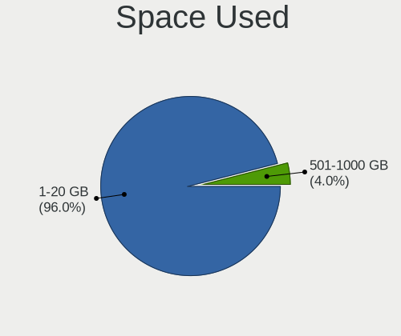
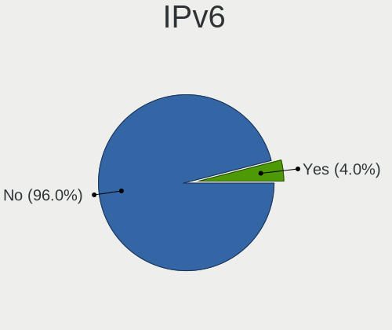

OpenBSD 7.6 - Tested Hardware & Statistics (Notebooks)
------------------------------------------------------

A project to collect tested hardware configurations for OpenBSD 7.6.

Anyone can contribute to this report by the [hw-probe](https://github.com/linuxhw/hw-probe/blob/master/INSTALL.BSD.md) tool:

    hw-probe -all -upload

Please contribute! Especially if your hardware is rare.

Contents
--------

* [ Test Cases ](#test-cases)

* [ System ](#system)
  - [ Arch                     ](#arch)
  - [ DE                       ](#de)
  - [ Display Server           ](#display-server)
  - [ Display Manager          ](#display-manager)
  - [ OS Lang                  ](#os-lang)
  - [ Boot Mode                ](#boot-mode)
  - [ Filesystem               ](#filesystem)
  - [ Part. scheme             ](#part-scheme)

* [ Board ](#board)
  - [ Vendor                   ](#vendor)
  - [ Model                    ](#model)
  - [ Model Family             ](#model-family)
  - [ MFG Year                 ](#mfg-year)
  - [ Form Factor              ](#form-factor)
  - [ Coreboot                 ](#coreboot)
  - [ RAM Size                 ](#ram-size)
  - [ RAM Used                 ](#ram-used)
  - [ Total Drives             ](#total-drives)
  - [ Has CD-ROM               ](#has-cd-rom)
  - [ Has Ethernet             ](#has-ethernet)
  - [ Has WiFi                 ](#has-wifi)
  - [ Has Bluetooth            ](#has-bluetooth)

* [ Location ](#location)
  - [ Country                  ](#country)
  - [ City                     ](#city)

* [ Drives ](#drives)
  - [ Drive Vendor             ](#drive-vendor)
  - [ Drive Model              ](#drive-model)
  - [ HDD Vendor               ](#hdd-vendor)
  - [ SSD Vendor               ](#ssd-vendor)
  - [ Drive Kind               ](#drive-kind)
  - [ Drive Connector          ](#drive-connector)
  - [ Drive Size               ](#drive-size)
  - [ Space Total              ](#space-total)
  - [ Space Used               ](#space-used)
  - [ Malfunc. Drives          ](#malfunc-drives)
  - [ Malfunc. Drive Vendor    ](#malfunc-drive-vendor)
  - [ Malfunc. HDD Vendor      ](#malfunc-hdd-vendor)
  - [ Malfunc. Drive Kind      ](#malfunc-drive-kind)
  - [ Failed Drives            ](#failed-drives)
  - [ Failed Drive Vendor      ](#failed-drive-vendor)
  - [ Drive Status             ](#drive-status)

* [ Storage controller ](#storage-controller)
  - [ Storage Vendor           ](#storage-vendor)
  - [ Storage Model            ](#storage-model)
  - [ Storage Kind             ](#storage-kind)

* [ Processor ](#processor)
  - [ CPU Vendor               ](#cpu-vendor)
  - [ CPU Model                ](#cpu-model)
  - [ CPU Model Family         ](#cpu-model-family)
  - [ CPU Cores                ](#cpu-cores)
  - [ CPU Sockets              ](#cpu-sockets)
  - [ CPU Threads              ](#cpu-threads)
  - [ CPU Microarch            ](#cpu-microarch)

* [ Graphics ](#graphics)
  - [ GPU Vendor               ](#gpu-vendor)
  - [ GPU Model                ](#gpu-model)
  - [ GPU Combo                ](#gpu-combo)
  - [ GPU Driver               ](#gpu-driver)
  - [ GPU Memory               ](#gpu-memory)

* [ Monitor ](#monitor)
  - [ Monitor Vendor           ](#monitor-vendor)
  - [ Monitor Model            ](#monitor-model)
  - [ Monitor Resolution       ](#monitor-resolution)
  - [ Monitor Diagonal         ](#monitor-diagonal)
  - [ Monitor Width            ](#monitor-width)
  - [ Aspect Ratio             ](#aspect-ratio)
  - [ Monitor Area             ](#monitor-area)
  - [ Pixel Density            ](#pixel-density)
  - [ Multiple Monitors        ](#multiple-monitors)

* [ Network ](#network)
  - [ Net Controller Vendor    ](#net-controller-vendor)
  - [ Net Controller Model     ](#net-controller-model)
  - [ Wireless Vendor          ](#wireless-vendor)
  - [ Wireless Model           ](#wireless-model)
  - [ Ethernet Vendor          ](#ethernet-vendor)
  - [ Ethernet Model           ](#ethernet-model)
  - [ Net Controller Kind      ](#net-controller-kind)
  - [ Used Controller          ](#used-controller)
  - [ NICs                     ](#nics)
  - [ IPv6                     ](#ipv6)

* [ Bluetooth ](#bluetooth)
  - [ Bluetooth Vendor         ](#bluetooth-vendor)
  - [ Bluetooth Model          ](#bluetooth-model)

* [ Sound ](#sound)
  - [ Sound Vendor             ](#sound-vendor)
  - [ Sound Model              ](#sound-model)

* [ Memory ](#memory)
  - [ Memory Vendor            ](#memory-vendor)
  - [ Memory Model             ](#memory-model)
  - [ Memory Kind              ](#memory-kind)
  - [ Memory Form Factor       ](#memory-form-factor)
  - [ Memory Size              ](#memory-size)
  - [ Memory Speed             ](#memory-speed)

* [ Printers & scanners ](#printers--scanners)
  - [ Printer Vendor           ](#printer-vendor)
  - [ Printer Model            ](#printer-model)
  - [ Scanner Vendor           ](#scanner-vendor)
  - [ Scanner Model            ](#scanner-model)

* [ Camera ](#camera)
  - [ Camera Vendor            ](#camera-vendor)
  - [ Camera Model             ](#camera-model)

* [ Security ](#security)
  - [ Fingerprint Vendor       ](#fingerprint-vendor)
  - [ Fingerprint Model        ](#fingerprint-model)
  - [ Chipcard Vendor          ](#chipcard-vendor)
  - [ Chipcard Model           ](#chipcard-model)

* [ Unsupported ](#unsupported)
  - [ Unsupported Devices      ](#unsupported-devices)
  - [ Unsupported Device Types ](#unsupported-device-types)

Test Cases
----------

Total: 28

| Vendor        | Model                       | Probe                                                     | Date         |
|---------------|-----------------------------|-----------------------------------------------------------|--------------|
| Lenovo        | ThinkPad T490 20N20028US    | [609bd09ed4](https://bsd-hardware.info/?probe=609bd09ed4) | Dec 28, 2024 |
| Lenovo        | ThinkPad X270 20HN0015MX    | [66b1686a32](https://bsd-hardware.info/?probe=66b1686a32) | Dec 25, 2024 |
| Dell          | Latitude D620               | [df7fa9c810](https://bsd-hardware.info/?probe=df7fa9c810) | Dec 25, 2024 |
| Acer          | Aspire A315-510P            | [757979fc58](https://bsd-hardware.info/?probe=757979fc58) | Dec 22, 2024 |
| ASUSTek       | 900                         | [a4c9546642](https://bsd-hardware.info/?probe=a4c9546642) | Dec 15, 2024 |
| IBM           | ThinkPad T43 1871F1G        | [1fc4bc2661](https://bsd-hardware.info/?probe=1fc4bc2661) | Dec 12, 2024 |
| Lenovo        | ThinkPad X60s 1704R8G       | [cad87ee9a5](https://bsd-hardware.info/?probe=cad87ee9a5) | Dec 12, 2024 |
| Framework     | Laptop 13 (Intel Core Ul... | [2bd04e188a](https://bsd-hardware.info/?probe=2bd04e188a) | Nov 29, 2024 |
| Samsung       | 535U3C                      | [615b4a9430](https://bsd-hardware.info/?probe=615b4a9430) | Nov 18, 2024 |
| Panasonic     | CFSX4-1                     | [2bfe5665da](https://bsd-hardware.info/?probe=2bfe5665da) | Nov 14, 2024 |
| Panasonic     | CFSX4-1                     | [3b6c29e294](https://bsd-hardware.info/?probe=3b6c29e294) | Nov 13, 2024 |
| Lenovo        | ThinkPad T490 20N3SFCE00    | [f5e420121b](https://bsd-hardware.info/?probe=f5e420121b) | Nov 10, 2024 |
| Google        | Morphius                    | [d7948b7b2a](https://bsd-hardware.info/?probe=d7948b7b2a) | Oct 31, 2024 |
| Lenovo        | Yoga 900S-12ISK 80ML        | [c16eee5fcc](https://bsd-hardware.info/?probe=c16eee5fcc) | Oct 27, 2024 |
| Panasonic     | CF-52PFPBSFQ                | [96e9c16dc5](https://bsd-hardware.info/?probe=96e9c16dc5) | Oct 26, 2024 |
| Panasonic     | CFSZ6-2                     | [db3492b574](https://bsd-hardware.info/?probe=db3492b574) | Oct 25, 2024 |
| Dell          | Latitude 7490               | [46b2b68262](https://bsd-hardware.info/?probe=46b2b68262) | Oct 24, 2024 |
| ASUSTek       | 1000HE                      | [1a04fd3a79](https://bsd-hardware.info/?probe=1a04fd3a79) | Oct 22, 2024 |
| Matsushita... | CF-51RCVDNLM                | [d911fcdc27](https://bsd-hardware.info/?probe=d911fcdc27) | Oct 21, 2024 |
| Panasonic     | CF-54-1                     | [2c0a3bc2e3](https://bsd-hardware.info/?probe=2c0a3bc2e3) | Oct 18, 2024 |
| Lenovo        | ThinkPad T410 2537N24       | [e7b0a90d19](https://bsd-hardware.info/?probe=e7b0a90d19) | Oct 13, 2024 |
| Lenovo        | ThinkPad X260 20F5S2GM00    | [dbdce5230f](https://bsd-hardware.info/?probe=dbdce5230f) | Oct 11, 2024 |
| Panasonic     | CF-53AAGHYDM                | [bbda83e57b](https://bsd-hardware.info/?probe=bbda83e57b) | Oct 10, 2024 |
| Fujitsu       | LIFEBOOK E752               | [01fa981bc4](https://bsd-hardware.info/?probe=01fa981bc4) | Oct 10, 2024 |
| Lenovo        | ThinkPad X270 W10DG 20K5... | [37252abbb6](https://bsd-hardware.info/?probe=37252abbb6) | Oct 09, 2024 |
| Lenovo        | ThinkPad T430 2347GZU       | [075e5d2557](https://bsd-hardware.info/?probe=075e5d2557) | Oct 08, 2024 |
| Panasonic     | CFSX4-1                     | [545a918b07](https://bsd-hardware.info/?probe=545a918b07) | Sep 07, 2024 |
| Panasonic     | CFSX4-1                     | [afe54c104a](https://bsd-hardware.info/?probe=afe54c104a) | Aug 24, 2024 |

System
------

Arch
----

OS architecture (x86_64, i586, etc.)

| Name  | Notebooks | Percent |
|-------|-----------|---------|
| amd64 | 19        | 76%     |
| i386  | 6         | 24%     |

DE
--

Desktop Environment

| Name         | Notebooks | Percent |
|--------------|-----------|---------|
| helloDesktop | 22        | 88%     |
| LXQT         | 1         | 4%      |
| GNOME        | 1         | 4%      |
| fvwm         | 1         | 4%      |

Display Server
--------------

X11 or Wayland

| Name    | Notebooks | Percent |
|---------|-----------|---------|
| X11     | 24        | 96%     |
| Console | 1         | 4%      |

Display Manager
---------------

SDDM, LightDM, etc.

| Name    | Notebooks | Percent |
|---------|-----------|---------|
| Console | 25        | 100%    |

OS Lang
-------

Language

| Lang    | Notebooks | Percent |
|---------|-----------|---------|
| Unknown | 20        | 80%     |
| en_US   | 5         | 20%     |

Boot Mode
---------

EFI or BIOS

| Mode | Notebooks | Percent |
|------|-----------|---------|
| EFI  | 14        | 56%     |
| BIOS | 11        | 44%     |

Filesystem
----------

Type of filesystem

| Type | Notebooks | Percent |
|------|-----------|---------|
| Ffs  | 25        | 100%    |

Part. scheme
------------

Scheme of partitioning

| Type | Notebooks | Percent |
|------|-----------|---------|
| GPT  | 14        | 56%     |
| MBR  | 11        | 44%     |

Board
-----

Vendor
------

Motherboard manufacturer

| Name                           | Notebooks | Percent |
|--------------------------------|-----------|---------|
| Lenovo                         | 9         | 36%     |
| Panasonic                      | 5         | 20%     |
| Dell                           | 2         | 8%      |
| ASUSTek Computer               | 2         | 8%      |
| Samsung Electronics            | 1         | 4%      |
| Matsushita Electric Industrial | 1         | 4%      |
| IBM                            | 1         | 4%      |
| Google                         | 1         | 4%      |
| Fujitsu                        | 1         | 4%      |
| Framework                      | 1         | 4%      |
| Acer                           | 1         | 4%      |

Model
-----

Motherboard model

| Name                                            | Notebooks | Percent |
|-------------------------------------------------|-----------|---------|
| Samsung 535U3C                                  | 1         | 4%      |
| Panasonic CFSZ6-2                               | 1         | 4%      |
| Panasonic CFSX4-1                               | 1         | 4%      |
| Panasonic CF-54-1                               | 1         | 4%      |
| Panasonic CF-53AAGHYDM                          | 1         | 4%      |
| Panasonic CF-52PFPBSFQ                          | 1         | 4%      |
| Matsushita Electric Industrial CF-51RCVDNLM     | 1         | 4%      |
| Lenovo Yoga 900S-12ISK 80ML                     | 1         | 4%      |
| Lenovo ThinkPad X60s 1704R8G                    | 1         | 4%      |
| Lenovo ThinkPad X270 W10DG 20K5S0TT1N           | 1         | 4%      |
| Lenovo ThinkPad X270 20HN0015MX                 | 1         | 4%      |
| Lenovo ThinkPad X260 20F5S2GM00                 | 1         | 4%      |
| Lenovo ThinkPad T490 20N3SFCE00                 | 1         | 4%      |
| Lenovo ThinkPad T490 20N20028US                 | 1         | 4%      |
| Lenovo ThinkPad T430 2347GZU                    | 1         | 4%      |
| Lenovo ThinkPad T410 2537N24                    | 1         | 4%      |
| IBM ThinkPad T43 1871F1G                        | 1         | 4%      |
| Google Morphius                                 | 1         | 4%      |
| Fujitsu LIFEBOOK E752                           | 1         | 4%      |
| Framework Laptop 13 (Intel Core Ultra Series 1) | 1         | 4%      |
| Dell Latitude D620                              | 1         | 4%      |
| Dell Latitude 7490                              | 1         | 4%      |
| ASUS 900                                        | 1         | 4%      |
| ASUS 1000HE                                     | 1         | 4%      |
| Acer Aspire A315-510P                           | 1         | 4%      |

Model Family
------------

Motherboard model prefix

| Name                                        | Notebooks | Percent |
|---------------------------------------------|-----------|---------|
| Lenovo ThinkPad                             | 8         | 32%     |
| Dell Latitude                               | 2         | 8%      |
| Samsung 535U3C                              | 1         | 4%      |
| Panasonic CFSZ6-2                           | 1         | 4%      |
| Panasonic CFSX4-1                           | 1         | 4%      |
| Panasonic CF-54-1                           | 1         | 4%      |
| Panasonic CF-53AAGHYDM                      | 1         | 4%      |
| Panasonic CF-52PFPBSFQ                      | 1         | 4%      |
| Matsushita Electric Industrial CF-51RCVDNLM | 1         | 4%      |
| Lenovo Yoga                                 | 1         | 4%      |
| IBM ThinkPad                                | 1         | 4%      |
| Google Morphius                             | 1         | 4%      |
| Fujitsu LIFEBOOK                            | 1         | 4%      |
| Framework Laptop                            | 1         | 4%      |
| ASUS 900                                    | 1         | 4%      |
| ASUS 1000HE                                 | 1         | 4%      |
| Acer Aspire                                 | 1         | 4%      |

MFG Year
--------

Motherboard manufacture year

| Year | Notebooks | Percent |
|------|-----------|---------|
| 2019 | 3         | 12%     |
| 2017 | 3         | 12%     |
| 2024 | 2         | 8%      |
| 2016 | 2         | 8%      |
| 2012 | 2         | 8%      |
| 2010 | 2         | 8%      |
| 2009 | 2         | 8%      |
| 2006 | 2         | 8%      |
| 2022 | 1         | 4%      |
| 2020 | 1         | 4%      |
| 2015 | 1         | 4%      |
| 2013 | 1         | 4%      |
| 2011 | 1         | 4%      |
| 2008 | 1         | 4%      |
| 2007 | 1         | 4%      |

Form Factor
-----------

Physical design of the computer

| Name     | Notebooks | Percent |
|----------|-----------|---------|
| Notebook | 25        | 100%    |

Coreboot
--------

Have coreboot on board

| Used | Notebooks | Percent |
|------|-----------|---------|
| No   | 24        | 96%     |
| Yes  | 1         | 4%      |

RAM Size
--------

Total RAM memory

| Size in GB | Notebooks | Percent |
|------------|-----------|---------|
| 8.01-16.0  | 7         | 28%     |
| 2.01-3.0   | 6         | 24%     |
| 4.01-8.0   | 3         | 12%     |
| 3.01-4.0   | 3         | 12%     |
| 16.01-24.0 | 3         | 12%     |
| 32.01-64.0 | 2         | 8%      |
| 24.01-32.0 | 1         | 4%      |

RAM Used
--------

Used RAM memory

| Used GB  | Notebooks | Percent |
|----------|-----------|---------|
| 0.01-0.5 | 21        | 84%     |
| 0.51-1.0 | 3         | 12%     |
| 0        | 1         | 4%      |

Total Drives
------------

Number of drives on board

| Drives | Notebooks | Percent |
|--------|-----------|---------|
| 1      | 16        | 64%     |
| 2      | 8         | 32%     |
| 0      | 1         | 4%      |

Has CD-ROM
----------

Has CD-ROM on board

| Presented | Notebooks | Percent |
|-----------|-----------|---------|
| No        | 25        | 100%    |

Has Ethernet
------------

Has Ethernet on board

| Presented | Notebooks | Percent |
|-----------|-----------|---------|
| Yes       | 22        | 88%     |
| No        | 3         | 12%     |

Has WiFi
--------

Has WiFi module

| Presented | Notebooks | Percent |
|-----------|-----------|---------|
| Yes       | 24        | 96%     |
| No        | 1         | 4%      |

Has Bluetooth
-------------

Has Bluetooth module

| Presented | Notebooks | Percent |
|-----------|-----------|---------|
| Yes       | 14        | 56%     |
| No        | 11        | 44%     |

Location
--------

Country
-------

Geographic location (country)

| Country     | Notebooks | Percent |
|-------------|-----------|---------|
| Canada      | 11        | 44%     |
| USA         | 3         | 12%     |
| Russia      | 3         | 12%     |
| Turkey      | 1         | 4%      |
| Netherlands | 1         | 4%      |
| Malaysia    | 1         | 4%      |
| Italy       | 1         | 4%      |
| Germany     | 1         | 4%      |
| Czechia     | 1         | 4%      |
| Croatia     | 1         | 4%      |
| China       | 1         | 4%      |

City
----

Geographic location (city)

| City            | Notebooks | Percent |
|-----------------|-----------|---------|
| Montreal        | 11        | 42.31%  |
| St Petersburg   | 3         | 11.54%  |
| Wenzhou         | 1         | 3.85%   |
| Waterbury       | 1         | 3.85%   |
| Villalfonsina   | 1         | 3.85%   |
| Prague          | 1         | 3.85%   |
| Ochsenfurt      | 1         | 3.85%   |
| Madison         | 1         | 3.85%   |
| Kuala Lumpur    | 1         | 3.85%   |
| Hoffman Estates | 1         | 3.85%   |
| Dubrovnik       | 1         | 3.85%   |
| Bursa           | 1         | 3.85%   |
| Bothell         | 1         | 3.85%   |
| Assendelft      | 1         | 3.85%   |

Drives
------

Drive Vendor
------------

Hard drive vendors

| Vendor              | Notebooks | Drives | Percent |
|---------------------|-----------|--------|---------|
| WDC                 | 8         | 8      | 38.1%   |
| Samsung Electronics | 3         | 3      | 14.29%  |
| SanDisk             | 2         | 2      | 9.52%   |
| Toshiba             | 1         | 1      | 4.76%   |
| PNY                 | 1         | 3      | 4.76%   |
| LITEON              | 1         | 1      | 4.76%   |
| Kingston            | 1         | 1      | 4.76%   |
| Getrich             | 1         | 1      | 4.76%   |
| Fujitsu             | 1         | 1      | 4.76%   |
| ASUSTek Computer    | 1         | 2      | 4.76%   |
| A-DATA Technology   | 1         | 1      | 4.76%   |

Drive Model
-----------

Hard drive models

| Model                                | Notebooks | Percent |
|--------------------------------------|-----------|---------|
| WDC WD7500BPKX-00HPJT0 752GB         | 1         | 4.55%   |
| WDC WD7500BPKT-75PK4T0 752GB         | 1         | 4.55%   |
| WDC WD7500BPKT-00PK4T0 752GB         | 1         | 4.55%   |
| WDC WD5000LPLX-00ZNTT0 500GB         | 1         | 4.55%   |
| WDC WD3200BEVE-00A0HT0 320GB         | 1         | 4.55%   |
| WDC WD2500BEVT-08A23T1 250GB         | 1         | 4.55%   |
| WDC WD10JPLX-00MBPT0 1TB             | 1         | 4.55%   |
| WDC PC SN730 SDBQNTY-512G-1001 512GB | 1         | 4.55%   |
| Toshiba KBG40ZMT128G MEMORY 128GB    | 1         | 4.55%   |
| SanDisk SDSSDHII240G 240GB           | 1         | 4.55%   |
| SanDisk SD8SN8U-256G-1006 256GB      | 1         | 4.55%   |
| Samsung SSD 860 EVO 1TB              | 1         | 4.55%   |
| Samsung MZVLW256HEHP-000L7 256GB     | 1         | 4.55%   |
| Samsung MZVLB256HBHQ-000L7 256GB     | 1         | 4.55%   |
| PNY CS900 1TB SSD                    | 1         | 4.55%   |
| LITEON L8H-128V2G-11 M.2 2280 128GB  | 1         | 4.55%   |
| Kingston SA400S37240G 240GB          | 1         | 4.55%   |
| Getrich 120G SATA SSD                | 1         | 4.55%   |
| Fujitsu MHV2040AH 40GB               | 1         | 4.55%   |
| ASUS PHISON SSD 16GB                 | 1         | 4.55%   |
| ASUS PHISON OB SSD 4GB               | 1         | 4.55%   |
| A-DATA SP550 480GB                   | 1         | 4.55%   |

HDD Vendor
----------

Hard disk drive vendors

| Vendor  | Notebooks | Drives | Percent |
|---------|-----------|--------|---------|
| WDC     | 7         | 7      | 87.5%   |
| Fujitsu | 1         | 1      | 12.5%   |

SSD Vendor
----------

Solid state drive vendors

| Vendor              | Notebooks | Drives | Percent |
|---------------------|-----------|--------|---------|
| SanDisk             | 2         | 2      | 22.22%  |
| Samsung Electronics | 1         | 1      | 11.11%  |
| PNY                 | 1         | 3      | 11.11%  |
| LITEON              | 1         | 1      | 11.11%  |
| Kingston            | 1         | 1      | 11.11%  |
| Getrich             | 1         | 1      | 11.11%  |
| ASUSTek Computer    | 1         | 2      | 11.11%  |
| A-DATA Technology   | 1         | 1      | 11.11%  |

Drive Kind
----------

HDD or SSD

| Kind | Notebooks | Drives | Percent |
|------|-----------|--------|---------|
| SSD  | 9         | 12     | 42.86%  |
| HDD  | 8         | 8      | 38.1%   |
| NVMe | 4         | 4      | 19.05%  |

Drive Connector
---------------

SATA, SAS, NVMe, etc.

| Type | Notebooks | Drives | Percent |
|------|-----------|--------|---------|
| SATA | 17        | 20     | 80.95%  |
| NVMe | 4         | 4      | 19.05%  |

Drive Size
----------

Size of hard drive

| Size in TB | Notebooks | Drives | Percent |
|------------|-----------|--------|---------|
| 0.01-0.5   | 11        | 12     | 64.71%  |
| 0.51-1.0   | 6         | 8      | 35.29%  |

Space Total
-----------

Amount of disk space available on the file system

| Size in GB | Notebooks | Percent |
|------------|-----------|---------|
| 21-50      | 9         | 36%     |
| 101-250    | 8         | 32%     |
| 251-500    | 3         | 12%     |
| 51-100     | 3         | 12%     |
| 1-20       | 1         | 4%      |
| 501-1000   | 1         | 4%      |

Space Used
----------

Amount of used disk space

| Used GB  | Notebooks | Percent |
|----------|-----------|---------|
| 1-20     | 24        | 96%     |
| 501-1000 | 1         | 4%      |

Malfunc. Drives
---------------

Drive models with a malfunction

| Model                         | Notebooks | Drives | Percent |
|-------------------------------|-----------|--------|---------|
| A-DATA Technology SP550 480GB | 1         | 1      | 100%    |

Malfunc. Drive Vendor
---------------------

Vendors of faulty drives

| Vendor            | Notebooks | Drives | Percent |
|-------------------|-----------|--------|---------|
| A-DATA Technology | 1         | 1      | 100%    |

Malfunc. HDD Vendor
-------------------

Vendors of faulty HDD drives

Zero info for selected period =(

Malfunc. Drive Kind
-------------------

Kinds of faulty drives

| Kind | Notebooks | Drives | Percent |
|------|-----------|--------|---------|
| SSD  | 1         | 1      | 100%    |

Failed Drives
-------------

Failed drive models

Zero info for selected period =(

Failed Drive Vendor
-------------------

Failed drive vendors

Zero info for selected period =(

Drive Status
------------

Number of failed and malfunc. drives

| Status   | Notebooks | Drives | Percent |
|----------|-----------|--------|---------|
| Works    | 19        | 21     | 90.48%  |
| Detected | 1         | 2      | 4.76%   |
| Malfunc  | 1         | 1      | 4.76%   |

Storage controller
------------------

Storage Vendor
--------------

Storage controller vendors

| Vendor                      | Notebooks | Percent |
|-----------------------------|-----------|---------|
| Intel                       | 16        | 64%     |
| Samsung Electronics         | 4         | 16%     |
| Sandisk                     | 2         | 8%      |
| KIOXIA                      | 1         | 4%      |
| Kingston Technology Company | 1         | 4%      |
| AMD                         | 1         | 4%      |

Storage Model
-------------

Storage controller models

| Model                                                                        | Notebooks | Percent |
|------------------------------------------------------------------------------|-----------|---------|
| Intel Sunrise Point-LP SATA Controller [AHCI mode]                           | 3         | 11.54%  |
| Intel 82801GBM/GHM (ICH7-M Family) SATA Controller [IDE mode]                | 3         | 11.54%  |
| Samsung NVMe SSD Controller SM961/PM961/SM963                                | 2         | 7.69%   |
| Intel Wildcat Point-LP SATA Controller [AHCI Mode]                           | 2         | 7.69%   |
| Intel 82801FBM (ICH6M) SATA Controller                                       | 2         | 7.69%   |
| Intel 7 Series Chipset Family 6-port SATA Controller [AHCI mode]             | 2         | 7.69%   |
| Intel 5 Series/3400 Series Chipset 6 port SATA AHCI Controller               | 2         | 7.69%   |
| Sandisk WD Black SN770 / PC SN740 256GB / PC SN560 (DRAM-less) NVMe SSD      | 1         | 3.85%   |
| SanDisk Extreme Pro / WD Black SN750 / PC SN730 / Red SN700 NVMe SSD         | 1         | 3.85%   |
| Samsung NVMe SSD Controller SM981/PM981/PM983                                | 1         | 3.85%   |
| Samsung NVMe SSD Controller SM951/PM951                                      | 1         | 3.85%   |
| KIOXIA NVMe SSD Controller BG4 (DRAM-less)                                   | 1         | 3.85%   |
| Kingston Company OM8SEP4 Design-In PCIe 4 NVMe SSD (TLC) (DRAM-less)         | 1         | 3.85%   |
| Intel 82801GBM/GHM (ICH7-M Family) SATA Controller [AHCI mode]               | 1         | 3.85%   |
| Intel 82801G (ICH7 Family) IDE Controller                                    | 1         | 3.85%   |
| Intel 6 Series/C200 Series Chipset Family 6 port Mobile SATA AHCI Controller | 1         | 3.85%   |
| AMD FCH SATA Controller [AHCI mode]                                          | 1         | 3.85%   |

Storage Kind
------------

Kind of storage controller (IDE, SATA, NVMe, SAS, ...)

| Kind | Notebooks | Percent |
|------|-----------|---------|
| SATA | 12        | 46.15%  |
| NVMe | 8         | 30.77%  |
| IDE  | 6         | 23.08%  |

Processor
---------

CPU Vendor
----------

Processor vendors

| Vendor | Notebooks | Percent |
|--------|-----------|---------|
| Intel  | 23        | 92%     |
| AMD    | 2         | 8%      |

CPU Model
---------

Processor models

| Model                                                       | Notebooks | Percent |
|-------------------------------------------------------------|-----------|---------|
| Intel Core i7-8565U CPU @ 1.80GHz                           | 2         | 8%      |
| Intel Core i5-6300U CPU @ 2.40GHz                           | 2         | 8%      |
| Intel Core i5-5300U CPU @ 2.30GHz                           | 2         | 8%      |
| Intel Core i5 CPU M 520 @ 2.40GHz                           | 2         | 8%      |
| Intel Pentium M processor                                   | 1         | 4%      |
| Intel Genuine CPU T2300 @ 1.66GHz                           | 1         | 4%      |
| Intel Core Ultra 5 125H                                     | 1         | 4%      |
| Intel Core m7-6Y75 CPU @ 1.20GHz                            | 1         | 4%      |
| Intel Core i7-3520M CPU @ 2.90GHz                           | 1         | 4%      |
| Intel Core i5-8350U CPU @ 1.70GHz                           | 1         | 4%      |
| Intel Core i5-7300U CPU @ 2.60GHz                           | 1         | 4%      |
| Intel Core i5-7200U CPU @ 2.50GHz                           | 1         | 4%      |
| Intel Core i5-3320M CPU @ 2.60GHz                           | 1         | 4%      |
| Intel Core i5-2520M CPU @ 2.50GHz                           | 1         | 4%      |
| Intel Core i3-N305                                          | 1         | 4%      |
| Intel Core Duo CPU                                          | 1         | 4%      |
| Intel Core 2 CPU T7200 @ 2.00GHz ("GenuineIntel" 686-class) | 1         | 4%      |
| Intel Celeron M processor                                   | 1         | 4%      |
| Intel Atom CPU N280 @ 1.66GHz                               | 1         | 4%      |
| AMD Ryzen 5 3500C with Radeon Vega Mobile Gfx               | 1         | 4%      |
| AMD A6-4455M APU with Radeon HD Graphics                    | 1         | 4%      |

CPU Model Family
----------------

Processor model prefix

| Model           | Notebooks | Percent |
|-----------------|-----------|---------|
| Intel Core i5   | 11        | 44%     |
| Intel Core i7   | 3         | 12%     |
| Intel Pentium M | 1         | 4%      |
| Intel Genuine   | 1         | 4%      |
| Intel Core m7   | 1         | 4%      |
| Intel Core i3   | 1         | 4%      |
| Intel Core Duo  | 1         | 4%      |
| Intel Core 2    | 1         | 4%      |
| Intel Core      | 1         | 4%      |
| Intel Celeron M | 1         | 4%      |
| Intel Atom      | 1         | 4%      |
| AMD Ryzen 5     | 1         | 4%      |
| AMD A6          | 1         | 4%      |

CPU Cores
---------

Number of processor cores

| Number  | Notebooks | Percent |
|---------|-----------|---------|
| 2       | 12        | 48%     |
| Unknown | 5         | 20%     |
| 4       | 3         | 12%     |
| 8       | 2         | 8%      |
| 1       | 2         | 8%      |
| 9       | 1         | 4%      |

CPU Sockets
-----------

Number of sockets

| Number  | Notebooks | Percent |
|---------|-----------|---------|
| 1       | 23        | 92%     |
| Unknown | 2         | 8%      |

CPU Threads
-----------

Threads per core (Hyper-Threading)

| Number  | Notebooks | Percent |
|---------|-----------|---------|
| 2       | 15        | 60%     |
| Unknown | 7         | 28%     |
| 1       | 3         | 12%     |

CPU Microarch
-------------

Microarchitecture

| Name        | Notebooks | Percent |
|-------------|-----------|---------|
| P6          | 4         | 16%     |
| KabyLake    | 4         | 16%     |
| Skylake     | 3         | 12%     |
| Unknown     | 3         | 12%     |
| Westmere    | 2         | 8%      |
| IvyBridge   | 2         | 8%      |
| Broadwell   | 2         | 8%      |
| Zen+        | 1         | 4%      |
| SandyBridge | 1         | 4%      |
| Piledriver  | 1         | 4%      |
| Core        | 1         | 4%      |
| Bonnell     | 1         | 4%      |

Graphics
--------

GPU Vendor
----------

Vendors of graphics cards

| Vendor | Notebooks | Percent |
|--------|-----------|---------|
| Intel  | 22        | 88%     |
| AMD    | 2         | 8%      |
| Nvidia | 1         | 4%      |

GPU Model
---------

Graphics card models

| Model                                                                         | Notebooks | Percent |
|-------------------------------------------------------------------------------|-----------|---------|
| Intel Mobile 945GM/GMS/GME, 943/940GML Express Integrated Graphics Controller | 3         | 10.71%  |
| Intel WhiskeyLake-U GT2 [UHD Graphics 620]                                    | 2         | 7.14%   |
| Intel Skylake GT2 [HD Graphics 520]                                           | 2         | 7.14%   |
| Intel Mobile 945GM/GMS, 943/940GML Express Integrated Graphics Controller     | 2         | 7.14%   |
| Intel Mobile 915GM/GMS/910GML Express Graphics Controller                     | 2         | 7.14%   |
| Intel HD Graphics 620                                                         | 2         | 7.14%   |
| Intel HD Graphics 5500                                                        | 2         | 7.14%   |
| Intel Core Processor Integrated Graphics Controller                           | 2         | 7.14%   |
| Intel 3rd Gen Core processor Graphics Controller                              | 2         | 7.14%   |
| Nvidia G72M [Quadro NVS 110M/GeForce Go 7300]                                 | 1         | 3.57%   |
| Intel UHD Graphics 620                                                        | 1         | 3.57%   |
| Intel Mobile 945GSE Express Integrated Graphics Controller                    | 1         | 3.57%   |
| Intel Meteor Lake-P [Intel Graphics]                                          | 1         | 3.57%   |
| Intel HD Graphics 515                                                         | 1         | 3.57%   |
| Intel Alder Lake-N [UHD Graphics]                                             | 1         | 3.57%   |
| Intel 2nd Generation Core Processor Family Integrated Graphics Controller     | 1         | 3.57%   |
| AMD Trinity [Radeon HD 7500G]                                                 | 1         | 3.57%   |
| AMD Picasso/Raven 2 [Radeon Vega Series / Radeon Vega Mobile Series]          | 1         | 3.57%   |

GPU Combo
---------

Combinations of graphics cards

| Name       | Notebooks | Percent |
|------------|-----------|---------|
| 1 x Intel  | 17        | 68%     |
| 2 x Intel  | 5         | 20%     |
| 1 x AMD    | 2         | 8%      |
| 1 x Nvidia | 1         | 4%      |

GPU Driver
----------

Free vs proprietary

| Driver  | Notebooks | Percent |
|---------|-----------|---------|
| Free    | 24        | 96%     |
| Unknown | 1         | 4%      |

GPU Memory
----------

Total video memory

| Size in GB | Notebooks | Percent |
|------------|-----------|---------|
| Unknown    | 25        | 100%    |

Monitor
-------

Monitor Vendor
--------------

Monitor vendors

| Vendor              | Notebooks | Percent |
|---------------------|-----------|---------|
| LG Display          | 4         | 28.57%  |
| Chimei Innolux      | 3         | 21.43%  |
| Samsung Electronics | 2         | 14.29%  |
| BOE                 | 2         | 14.29%  |
| AU Optronics        | 2         | 14.29%  |
| Sharp               | 1         | 7.14%   |

Monitor Model
-------------

Monitor models

| Model                                                                | Notebooks | Percent |
|----------------------------------------------------------------------|-----------|---------|
| Chimei Innolux LCD Monitor CMN1239 1920x1080 280x160mm 12.7-inch     | 2         | 14.29%  |
| Sharp LCD Monitor SHP1457 2560x1440 280x160mm 12.7-inch              | 1         | 7.14%   |
| Samsung Electronics LCD Monitor SEC3246 1366x768 290x160mm 13.0-inch | 1         | 7.14%   |
| Samsung Electronics LCD Monitor SEC304C 1366x768 310x170mm 13.9-inch | 1         | 7.14%   |
| LG Display LCD Monitor LGD05A2 1920x1080 310x170mm 13.9-inch         | 1         | 7.14%   |
| LG Display LCD Monitor LGD045E 1366x768 310x170mm 13.9-inch          | 1         | 7.14%   |
| LG Display LCD Monitor LGD03CD 1366x768 280x160mm 12.7-inch          | 1         | 7.14%   |
| LG Display LCD Monitor LGD0215 1920x1080 350x190mm 15.7-inch         | 1         | 7.14%   |
| Chimei Innolux LCD Monitor CMN14D4 1920x1080 310x170mm 13.9-inch     | 1         | 7.14%   |
| BOE LCD Monitor BOE0BCA 2256x1504 280x190mm 13.3-inch                | 1         | 7.14%   |
| BOE LCD Monitor BOE07CB 1920x1080 340x190mm 15.3-inch                | 1         | 7.14%   |
| AU Optronics LCD Monitor AUO1A87 1920x1080 290x170mm 13.2-inch       | 1         | 7.14%   |
| AU Optronics LCD Monitor AUO1068 1920x1200 260x170mm 12.2-inch       | 1         | 7.14%   |

Monitor Resolution
------------------

Monitor screen resolution

| Resolution        | Notebooks | Percent |
|-------------------|-----------|---------|
| 1920x1080 (FHD)   | 7         | 50%     |
| 1366x768 (WXGA)   | 4         | 28.57%  |
| 2560x1440 (QHD)   | 1         | 7.14%   |
| 2256x1504         | 1         | 7.14%   |
| 1920x1200 (WUXGA) | 1         | 7.14%   |

Monitor Diagonal
----------------

Diagonal size in inches

| Inches | Notebooks | Percent |
|--------|-----------|---------|
| 13     | 6         | 42.86%  |
| 12     | 5         | 35.71%  |
| 15     | 3         | 21.43%  |

Monitor Width
-------------

Physical width

| Width in mm | Notebooks | Percent |
|-------------|-----------|---------|
| 201-300     | 8         | 57.14%  |
| 301-350     | 6         | 42.86%  |

Aspect Ratio
------------

Proportional relationship between the width and the height

| Ratio | Notebooks | Percent |
|-------|-----------|---------|
| 16/9  | 12        | 85.71%  |
| 3/2   | 2         | 14.29%  |

Monitor Area
------------

Area in inch²

| Area in inch² | Notebooks | Percent |
|----------------|-----------|---------|
| 61-70          | 5         | 35.71%  |
| 81-90          | 4         | 28.57%  |
| 71-80          | 2         | 14.29%  |
| 101-110        | 2         | 14.29%  |
| 91-100         | 1         | 7.14%   |

Pixel Density
-------------

Pixels per inch

| Density | Notebooks | Percent |
|---------|-----------|---------|
| 161-240 | 6         | 42.86%  |
| 121-160 | 6         | 42.86%  |
| 101-120 | 1         | 7.14%   |
| 51-100  | 1         | 7.14%   |

Multiple Monitors
-----------------

Total monitors connected

| Total | Notebooks | Percent |
|-------|-----------|---------|
| 1     | 23        | 88.46%  |
| 0     | 2         | 7.69%   |
| 2     | 1         | 3.85%   |

Network
-------

Net Controller Vendor
---------------------

Controller vendors

| Vendor                   | Notebooks | Percent |
|--------------------------|-----------|---------|
| Intel                    | 20        | 66.67%  |
| Qualcomm Atheros         | 3         | 10%     |
| Broadcom                 | 3         | 10%     |
| Realtek Semiconductor    | 2         | 6.67%   |
| Sierra Wireless          | 1         | 3.33%   |
| Marvell Technology Group | 1         | 3.33%   |

Net Controller Model
--------------------

Controller models

| Model                                                                  | Notebooks | Percent |
|------------------------------------------------------------------------|-----------|---------|
| Intel Wireless 8265 / 8275                                             | 4         | 8.33%   |
| Intel Centrino Advanced-N 6205 [Taylor Peak]                           | 3         | 6.25%   |
| Intel 82579LM Gigabit Network Connection (Lewisville)                  | 3         | 6.25%   |
| Intel Wireless 8260                                                    | 2         | 4.17%   |
| Intel PRO/Wireless 3945ABG [Golan] Network Connection                  | 2         | 4.17%   |
| Intel Ethernet Connection I219-LM                                      | 2         | 4.17%   |
| Intel Ethernet Connection (6) I219-V                                   | 2         | 4.17%   |
| Intel Ethernet Connection (4) I219-LM                                  | 2         | 4.17%   |
| Intel Ethernet Connection (3) I218-LM                                  | 2         | 4.17%   |
| Intel Centrino Advanced-N 6200                                         | 2         | 4.17%   |
| Intel Cannon Point-LP CNVi [Wireless-AC]                               | 2         | 4.17%   |
| Intel 82577LM Gigabit Network Connection                               | 2         | 4.17%   |
| Sierra Wireless EM7305 Modem                                           | 1         | 2.08%   |
| Realtek USB 2.5GbE Controller                                          | 1         | 2.08%   |
| Realtek RTL8111/8168/8211/8411 PCI Express Gigabit Ethernet Controller | 1         | 2.08%   |
| Qualcomm Atheros Attansic L2 Fast Ethernet                             | 1         | 2.08%   |
| Qualcomm Atheros AR9462 Wireless Network Adapter                       | 1         | 2.08%   |
| Qualcomm Atheros AR928X Wireless Network Adapter (PCI-Express)         | 1         | 2.08%   |
| Qualcomm Atheros AR8121/AR8113/AR8114 Gigabit or Fast Ethernet         | 1         | 2.08%   |
| Marvell Group 88E8053 PCI-E Gigabit Ethernet Controller                | 1         | 2.08%   |
| Intel Wireless 7265                                                    | 1         | 2.08%   |
| Intel Wi-Fi 6E(802.11ax) AX210/AX1675* 2x2 [Typhoon Peak]              | 1         | 2.08%   |
| Intel Wi-Fi 6 AX200                                                    | 1         | 2.08%   |
| Intel PRO/Wireless 2915ABG [Calexico2] Network Connection              | 1         | 2.08%   |
| Intel Ethernet Connection (4) I219-V                                   | 1         | 2.08%   |
| Intel CNVi: Wi-Fi                                                      | 1         | 2.08%   |
| Intel 82801FB/FBM/FR/FW/FRW (ICH6 Family) AC'97 Modem Controller       | 1         | 2.08%   |
| Intel 82573L Gigabit Ethernet Controller                               | 1         | 2.08%   |
| Broadcom NetXtreme BCM5752 Gigabit Ethernet PCI Express                | 1         | 2.08%   |
| Broadcom NetXtreme BCM5751M Gigabit Ethernet PCI Express               | 1         | 2.08%   |
| Broadcom BCM4350 802.11ac Wireless Network Adapter                     | 1         | 2.08%   |
| Broadcom BCM4311 802.11b/g WLAN                                        | 1         | 2.08%   |

Wireless Vendor
---------------

Wireless vendors

| Vendor           | Notebooks | Percent |
|------------------|-----------|---------|
| Intel            | 20        | 83.33%  |
| Qualcomm Atheros | 2         | 8.33%   |
| Broadcom         | 2         | 8.33%   |

Wireless Model
--------------

Wireless models

| Model                                                          | Notebooks | Percent |
|----------------------------------------------------------------|-----------|---------|
| Intel Wireless 8265 / 8275                                     | 4         | 16.67%  |
| Intel Centrino Advanced-N 6205 [Taylor Peak]                   | 3         | 12.5%   |
| Intel Wireless 8260                                            | 2         | 8.33%   |
| Intel PRO/Wireless 3945ABG [Golan] Network Connection          | 2         | 8.33%   |
| Intel Centrino Advanced-N 6200                                 | 2         | 8.33%   |
| Intel Cannon Point-LP CNVi [Wireless-AC]                       | 2         | 8.33%   |
| Qualcomm Atheros AR9462 Wireless Network Adapter               | 1         | 4.17%   |
| Qualcomm Atheros AR928X Wireless Network Adapter (PCI-Express) | 1         | 4.17%   |
| Intel Wireless 7265                                            | 1         | 4.17%   |
| Intel Wi-Fi 6E(802.11ax) AX210/AX1675* 2x2 [Typhoon Peak]      | 1         | 4.17%   |
| Intel Wi-Fi 6 AX200                                            | 1         | 4.17%   |
| Intel PRO/Wireless 2915ABG [Calexico2] Network Connection      | 1         | 4.17%   |
| Intel CNVi: Wi-Fi                                              | 1         | 4.17%   |
| Broadcom BCM4350 802.11ac Wireless Network Adapter             | 1         | 4.17%   |
| Broadcom BCM4311 802.11b/g WLAN                                | 1         | 4.17%   |

Ethernet Vendor
---------------

Ethernet vendors

| Vendor                   | Notebooks | Percent |
|--------------------------|-----------|---------|
| Intel                    | 15        | 68.18%  |
| Realtek Semiconductor    | 2         | 9.09%   |
| Qualcomm Atheros         | 2         | 9.09%   |
| Broadcom                 | 2         | 9.09%   |
| Marvell Technology Group | 1         | 4.55%   |

Ethernet Model
--------------

Ethernet models

| Model                                                                  | Notebooks | Percent |
|------------------------------------------------------------------------|-----------|---------|
| Intel 82579LM Gigabit Network Connection (Lewisville)                  | 3         | 13.64%  |
| Intel Ethernet Connection I219-LM                                      | 2         | 9.09%   |
| Intel Ethernet Connection (6) I219-V                                   | 2         | 9.09%   |
| Intel Ethernet Connection (4) I219-LM                                  | 2         | 9.09%   |
| Intel Ethernet Connection (3) I218-LM                                  | 2         | 9.09%   |
| Intel 82577LM Gigabit Network Connection                               | 2         | 9.09%   |
| Realtek USB 2.5GbE Controller                                          | 1         | 4.55%   |
| Realtek RTL8111/8168/8211/8411 PCI Express Gigabit Ethernet Controller | 1         | 4.55%   |
| Qualcomm Atheros Attansic L2 Fast Ethernet                             | 1         | 4.55%   |
| Qualcomm Atheros AR8121/AR8113/AR8114 Gigabit or Fast Ethernet         | 1         | 4.55%   |
| Marvell Group 88E8053 PCI-E Gigabit Ethernet Controller                | 1         | 4.55%   |
| Intel Ethernet Connection (4) I219-V                                   | 1         | 4.55%   |
| Intel 82573L Gigabit Ethernet Controller                               | 1         | 4.55%   |
| Broadcom NetXtreme BCM5752 Gigabit Ethernet PCI Express                | 1         | 4.55%   |
| Broadcom NetXtreme BCM5751M Gigabit Ethernet PCI Express               | 1         | 4.55%   |

Net Controller Kind
-------------------

Ethernet, WiFi or modem

| Kind     | Notebooks | Percent |
|----------|-----------|---------|
| WiFi     | 24        | 50%     |
| Ethernet | 22        | 45.83%  |
| Modem    | 1         | 2.08%   |
| Unknown  | 1         | 2.08%   |

Used Controller
---------------

Currently used network controller

| Kind     | Notebooks | Percent |
|----------|-----------|---------|
| WiFi     | 18        | 58.06%  |
| Ethernet | 13        | 41.94%  |

NICs
----

Total network controllers on board

| Total | Notebooks | Percent |
|-------|-----------|---------|
| 2     | 20        | 80%     |
| 1     | 5         | 20%     |

IPv6
----

IPv6 vs IPv4

| Used | Notebooks | Percent |
|------|-----------|---------|
| No   | 24        | 96%     |
| Yes  | 1         | 4%      |

Bluetooth
---------

Bluetooth Vendor
----------------

Controller vendors

| Vendor                          | Notebooks | Percent |
|---------------------------------|-----------|---------|
| Intel                           | 8         | 57.14%  |
| Alps Electric                   | 2         | 14.29%  |
| Qualcomm Atheros Communications | 1         | 7.14%   |
| Foxconn / Hon Hai               | 1         | 7.14%   |
| Broadcom                        | 1         | 7.14%   |
| ASUSTek Computer                | 1         | 7.14%   |

Bluetooth Model
---------------

Controller models

| Model                                                    | Notebooks | Percent |
|----------------------------------------------------------|-----------|---------|
| Intel Bluetooth wireless interface                       | 6         | 42.86%  |
| Alps Electric UGTZ4 Bluetooth                            | 2         | 14.29%  |
| Qualcomm Atheros AR3012 Bluetooth 4.0                    | 1         | 7.14%   |
| Intel AX210 Bluetooth                                    | 1         | 7.14%   |
| Intel AX201 Bluetooth                                    | 1         | 7.14%   |
| Foxconn / Hon Hai Broadcom BCM20702 Bluetooth USB Device | 1         | 7.14%   |
| Broadcom Bluetooth 4.1 USB                               | 1         | 7.14%   |
| ASUS Broadcom Bluetooth 2.1                              | 1         | 7.14%   |

Sound
-----

Sound Vendor
------------

Sound card vendors

| Vendor | Notebooks | Percent |
|--------|-----------|---------|
| Intel  | 23        | 92%     |
| AMD    | 2         | 8%      |

Sound Model
-----------

Sound card models

| Model                                                                      | Notebooks | Percent |
|----------------------------------------------------------------------------|-----------|---------|
| Intel Sunrise Point-LP HD Audio                                            | 6         | 21.43%  |
| Intel NM10/ICH7 Family High Definition Audio Controller                    | 4         | 14.29%  |
| Intel Wildcat Point-LP High Definition Audio Controller                    | 2         | 7.14%   |
| Intel Cannon Point-LP High Definition Audio Controller                     | 2         | 7.14%   |
| Intel Broadwell-U Audio Controller                                         | 2         | 7.14%   |
| Intel 7 Series/C216 Chipset Family High Definition Audio Controller        | 2         | 7.14%   |
| Intel 5 Series/3400 Series Chipset High Definition Audio                   | 2         | 7.14%   |
| Intel Meteor Lake-P HD Audio Controller                                    | 1         | 3.57%   |
| Intel Alder Lake-N PCH High Definition Audio Controller                    | 1         | 3.57%   |
| Intel 82801FB/FBM/FR/FW/FRW (ICH6 Family) High Definition Audio Controller | 1         | 3.57%   |
| Intel 82801FB/FBM/FR/FW/FRW (ICH6 Family) AC'97 Audio Controller           | 1         | 3.57%   |
| Intel 6 Series/C200 Series Chipset Family High Definition Audio Controller | 1         | 3.57%   |
| AMD Trinity HDMI Audio Controller                                          | 1         | 3.57%   |
| AMD Raven/Raven2/Fenghuang HDMI/DP Audio Controller                        | 1         | 3.57%   |
| AMD FCH Azalia Controller                                                  | 1         | 3.57%   |

Memory
------

Memory Vendor
-------------

Memory module vendors

| Vendor              | Notebooks | Percent |
|---------------------|-----------|---------|
| Unknown             | 5         | 35.71%  |
| Samsung Electronics | 5         | 35.71%  |
| SK hynix            | 2         | 14.29%  |
| Unknown             | 2         | 14.29%  |

Memory Model
------------

Memory module models

| Model                                                  | Notebooks | Percent |
|--------------------------------------------------------|-----------|---------|
| Unknown RAM Module 1GB SODIMM DDR2                     | 2         | 13.33%  |
| Samsung RAM M471A1K43BB0-CPB 8GB SODIMM DDR4 2133MT/s  | 2         | 13.33%  |
| Unknown                                                | 2         | 13.33%  |
| Unknown RAM Module 4GB SODIMM DDR3 1333MT/s            | 1         | 6.67%   |
| Unknown RAM Module 2GB SODIMM DDR3 1067MT/s            | 1         | 6.67%   |
| Unknown RAM Module 1GB SODIMM DDR                      | 1         | 6.67%   |
| SK hynix RAM HMT351S6EFR8A-PB 4GB SODIMM DDR3 1600MT/s | 1         | 6.67%   |
| SK hynix RAM HMT325S6BFR8C-H9 2GB SODIMM DDR3 1333MT/s | 1         | 6.67%   |
| Samsung RAM M471B5673FH0-CF8 2GB SODIMM DDR3 1067MT/s  | 1         | 6.67%   |
| Samsung RAM M471B5673EH1-CF8 2GB SODIMM DDR3 1067MT/s  | 1         | 6.67%   |
| Samsung RAM M471B5173BH0-CK0 4GB SODIMM DDR3 1600MT/s  | 1         | 6.67%   |
| Samsung RAM M471A1K43CB1-CRC 8GB SODIMM DDR4 2667MT/s  | 1         | 6.67%   |

Memory Kind
-----------

Memory module kinds

| Kind  | Notebooks | Percent |
|-------|-----------|---------|
| DDR3  | 5         | 38.46%  |
| DDR4  | 3         | 23.08%  |
| DDR2  | 3         | 23.08%  |
| SDRAM | 1         | 7.69%   |
| DDR   | 1         | 7.69%   |

Memory Form Factor
------------------

Physical design of the memory module

| Name   | Notebooks | Percent |
|--------|-----------|---------|
| SODIMM | 13        | 100%    |

Memory Size
-----------

Memory module size

| Size | Notebooks | Percent |
|------|-----------|---------|
| 2048 | 5         | 35.71%  |
| 8192 | 4         | 28.57%  |
| 1024 | 3         | 21.43%  |
| 4096 | 2         | 14.29%  |

Memory Speed
------------

Memory module speed

| Speed   | Notebooks | Percent |
|---------|-----------|---------|
| Unknown | 4         | 30.77%  |
| 2133    | 2         | 15.38%  |
| 1333    | 2         | 15.38%  |
| 1067    | 2         | 15.38%  |
| 2667    | 1         | 7.69%   |
| 1600    | 1         | 7.69%   |
| 400     | 1         | 7.69%   |

Printers & scanners
-------------------

Printer Vendor
--------------

Printer device vendors

Zero info for selected period =(

Printer Model
-------------

Printer device models

Zero info for selected period =(

Scanner Vendor
--------------

Scanner device vendors

Zero info for selected period =(

Scanner Model
-------------

Scanner device models

Zero info for selected period =(

Camera
------

Camera Vendor
-------------

Camera device vendors

| Vendor                        | Notebooks | Percent |
|-------------------------------|-----------|---------|
| Bison Electronics             | 7         | 43.75%  |
| Chicony Electronics           | 3         | 18.75%  |
| Sunplus Innovation Technology | 1         | 6.25%   |
| Silicon Motion                | 1         | 6.25%   |
| Realtek Semiconductor         | 1         | 6.25%   |
| Lite-On Technology            | 1         | 6.25%   |
| IMC Networks                  | 1         | 6.25%   |
| Framework                     | 1         | 6.25%   |

Camera Model
------------

Camera device models

| Model                                    | Notebooks | Percent |
|------------------------------------------|-----------|---------|
| Bison Integrated Camera                  | 3         | 18.75%  |
| Bison USB HD Webcam                      | 2         | 12.5%   |
| Sunplus LTD, NexiGo N930AF FHD Webcam    | 1         | 6.25%   |
| Silicon Motion Realtek USB 2.0 PC Camera | 1         | 6.25%   |
| Realtek Integrated Webcam HD             | 1         | 6.25%   |
| Lite-On Integrated Camera                | 1         | 6.25%   |
| IMC Networks Integrated Camera           | 1         | 6.25%   |
| Framework Laptop Webcam Module (2nd Gen) | 1         | 6.25%   |
| Chicony Integrated Camera                | 1         | 6.25%   |
| Chicony FJ Camera                        | 1         | 6.25%   |
| Chicony 2.0M UVC Webcam / CNF7129        | 1         | 6.25%   |
| Bison SunplusIT Integrated Camera        | 1         | 6.25%   |
| Bison Lenovo EasyCamera                  | 1         | 6.25%   |

Security
--------

Fingerprint Vendor
------------------

Fingerprint sensor vendors

| Vendor             | Notebooks | Percent |
|--------------------|-----------|---------|
| Validity Sensors   | 2         | 33.33%  |
| STMicroelectronics | 2         | 33.33%  |
| Synaptics          | 1         | 16.67%  |
| AuthenTec          | 1         | 16.67%  |

Fingerprint Model
-----------------

Fingerprint sensor models

| Model                                             | Notebooks | Percent |
|---------------------------------------------------|-----------|---------|
| STMicroelectronics Fingerprint Reader             | 2         | 33.33%  |
| Validity Sensors VFS 5011 fingerprint sensor      | 1         | 16.67%  |
| Validity Sensors Synaptics WBDI                   | 1         | 16.67%  |
| Synaptics Prometheus MIS Touch Fingerprint Reader | 1         | 16.67%  |
| AuthenTec AES2660                                 | 1         | 16.67%  |

Chipcard Vendor
---------------

Chipcard module vendors

Zero info for selected period =(

Chipcard Model
--------------

Chipcard module models

Zero info for selected period =(

Unsupported
-----------

Unsupported Devices
-------------------

Total unsupported devices on board

| Total | Notebooks | Percent |
|-------|-----------|---------|
| 1     | 19        | 76%     |
| 2     | 4         | 16%     |
| 5     | 1         | 4%      |
| 0     | 1         | 4%      |

Unsupported Device Types
------------------------

Types of unsupported devices

| Type                     | Notebooks | Percent |
|--------------------------|-----------|---------|
| Communication controller | 16        | 53.33%  |
| Graphics card            | 5         | 16.67%  |
| Firewire controller      | 4         | 13.33%  |
| Storage/ata              | 1         | 3.33%   |
| Sound                    | 1         | 3.33%   |
| Network                  | 1         | 3.33%   |
| Net/wireless             | 1         | 3.33%   |
| Modem                    | 1         | 3.33%   |

