OpenBSD 7.6 - Tested Hardware & Statistics
------------------------------------------

A project to collect tested hardware configurations for OpenBSD 7.6.

Anyone can contribute to this report by the [hw-probe](https://github.com/linuxhw/hw-probe/blob/master/INSTALL.BSD.md) tool:

    hw-probe -all -upload

Please contribute! Especially if your hardware is rare.

This is a report for all computer types. See also reports for [desktops](/Dist/OpenBSD_7.6/Desktop/README.md) and [notebooks](/Dist/OpenBSD_7.6/Notebook/README.md).

Contents
--------

* [ Test Cases ](#test-cases)

* [ System ](#system)
  - [ Arch                     ](#arch)
  - [ DE                       ](#de)
  - [ Display Server           ](#display-server)
  - [ Display Manager          ](#display-manager)
  - [ OS Lang                  ](#os-lang)
  - [ Boot Mode                ](#boot-mode)
  - [ Filesystem               ](#filesystem)
  - [ Part. scheme             ](#part-scheme)

* [ Board ](#board)
  - [ Vendor                   ](#vendor)
  - [ Model                    ](#model)
  - [ Model Family             ](#model-family)
  - [ MFG Year                 ](#mfg-year)
  - [ Form Factor              ](#form-factor)
  - [ Coreboot                 ](#coreboot)
  - [ RAM Size                 ](#ram-size)
  - [ RAM Used                 ](#ram-used)
  - [ Total Drives             ](#total-drives)
  - [ Has CD-ROM               ](#has-cd-rom)
  - [ Has Ethernet             ](#has-ethernet)
  - [ Has WiFi                 ](#has-wifi)
  - [ Has Bluetooth            ](#has-bluetooth)

* [ Location ](#location)
  - [ Country                  ](#country)
  - [ City                     ](#city)

* [ Drives ](#drives)
  - [ Drive Vendor             ](#drive-vendor)
  - [ Drive Model              ](#drive-model)
  - [ HDD Vendor               ](#hdd-vendor)
  - [ SSD Vendor               ](#ssd-vendor)
  - [ Drive Kind               ](#drive-kind)
  - [ Drive Connector          ](#drive-connector)
  - [ Drive Size               ](#drive-size)
  - [ Space Total              ](#space-total)
  - [ Space Used               ](#space-used)
  - [ Malfunc. Drives          ](#malfunc-drives)
  - [ Malfunc. Drive Vendor    ](#malfunc-drive-vendor)
  - [ Malfunc. HDD Vendor      ](#malfunc-hdd-vendor)
  - [ Malfunc. Drive Kind      ](#malfunc-drive-kind)
  - [ Failed Drives            ](#failed-drives)
  - [ Failed Drive Vendor      ](#failed-drive-vendor)
  - [ Drive Status             ](#drive-status)

* [ Storage controller ](#storage-controller)
  - [ Storage Vendor           ](#storage-vendor)
  - [ Storage Model            ](#storage-model)
  - [ Storage Kind             ](#storage-kind)

* [ Processor ](#processor)
  - [ CPU Vendor               ](#cpu-vendor)
  - [ CPU Model                ](#cpu-model)
  - [ CPU Model Family         ](#cpu-model-family)
  - [ CPU Cores                ](#cpu-cores)
  - [ CPU Sockets              ](#cpu-sockets)
  - [ CPU Threads              ](#cpu-threads)
  - [ CPU Microarch            ](#cpu-microarch)

* [ Graphics ](#graphics)
  - [ GPU Vendor               ](#gpu-vendor)
  - [ GPU Model                ](#gpu-model)
  - [ GPU Combo                ](#gpu-combo)
  - [ GPU Driver               ](#gpu-driver)
  - [ GPU Memory               ](#gpu-memory)

* [ Monitor ](#monitor)
  - [ Monitor Vendor           ](#monitor-vendor)
  - [ Monitor Model            ](#monitor-model)
  - [ Monitor Resolution       ](#monitor-resolution)
  - [ Monitor Diagonal         ](#monitor-diagonal)
  - [ Monitor Width            ](#monitor-width)
  - [ Aspect Ratio             ](#aspect-ratio)
  - [ Monitor Area             ](#monitor-area)
  - [ Pixel Density            ](#pixel-density)
  - [ Multiple Monitors        ](#multiple-monitors)

* [ Network ](#network)
  - [ Net Controller Vendor    ](#net-controller-vendor)
  - [ Net Controller Model     ](#net-controller-model)
  - [ Wireless Vendor          ](#wireless-vendor)
  - [ Wireless Model           ](#wireless-model)
  - [ Ethernet Vendor          ](#ethernet-vendor)
  - [ Ethernet Model           ](#ethernet-model)
  - [ Net Controller Kind      ](#net-controller-kind)
  - [ Used Controller          ](#used-controller)
  - [ NICs                     ](#nics)
  - [ IPv6                     ](#ipv6)

* [ Bluetooth ](#bluetooth)
  - [ Bluetooth Vendor         ](#bluetooth-vendor)
  - [ Bluetooth Model          ](#bluetooth-model)

* [ Sound ](#sound)
  - [ Sound Vendor             ](#sound-vendor)
  - [ Sound Model              ](#sound-model)

* [ Memory ](#memory)
  - [ Memory Vendor            ](#memory-vendor)
  - [ Memory Model             ](#memory-model)
  - [ Memory Kind              ](#memory-kind)
  - [ Memory Form Factor       ](#memory-form-factor)
  - [ Memory Size              ](#memory-size)
  - [ Memory Speed             ](#memory-speed)

* [ Printers & scanners ](#printers--scanners)
  - [ Printer Vendor           ](#printer-vendor)
  - [ Printer Model            ](#printer-model)
  - [ Scanner Vendor           ](#scanner-vendor)
  - [ Scanner Model            ](#scanner-model)

* [ Camera ](#camera)
  - [ Camera Vendor            ](#camera-vendor)
  - [ Camera Model             ](#camera-model)

* [ Security ](#security)
  - [ Fingerprint Vendor       ](#fingerprint-vendor)
  - [ Fingerprint Model        ](#fingerprint-model)
  - [ Chipcard Vendor          ](#chipcard-vendor)
  - [ Chipcard Model           ](#chipcard-model)

* [ Unsupported ](#unsupported)
  - [ Unsupported Devices      ](#unsupported-devices)
  - [ Unsupported Device Types ](#unsupported-device-types)

Test Cases
----------

Total: 111

| Vendor        | Model                       | Form-Factor | Probe                                                     | Date         |
|---------------|-----------------------------|-------------|-----------------------------------------------------------|--------------|
| xunlong       | Orange Pi 3B v1.1           | Desktop     | [bb61dc152d](https://bsd-hardware.info/?probe=bb61dc152d) | Apr 28, 2025 |
| Gigabyte      | X58A-UD5                    | Desktop     | [66cd09e8ec](https://bsd-hardware.info/?probe=66cd09e8ec) | Apr 24, 2025 |
| Lenovo        | ThinkPad X270 W10DG 20K5... | Notebook    | [ef103d1a10](https://bsd-hardware.info/?probe=ef103d1a10) | Apr 24, 2025 |
| HP            | EliteDesk 800 G3 SFF        | Desktop     | [59793c040f](https://bsd-hardware.info/?probe=59793c040f) | Apr 24, 2025 |
| Unknown       | Apple MacBook Air (13-in... | Notebook    | [e037db52af](https://bsd-hardware.info/?probe=e037db52af) | Apr 20, 2025 |
| Unknown       | Unknown                     | Desktop     | [46cc0b8a8f](https://bsd-hardware.info/?probe=46cc0b8a8f) | Apr 20, 2025 |
| Apple         | MacBookAir4,2               | Notebook    | [a615ef12f0](https://bsd-hardware.info/?probe=a615ef12f0) | Apr 19, 2025 |
| Apple         | MacBookAir4,2               | Notebook    | [f61735bf09](https://bsd-hardware.info/?probe=f61735bf09) | Apr 19, 2025 |
| HP            | EliteDesk 800 G2 DM 65W     | Desktop     | [f575ed65e4](https://bsd-hardware.info/?probe=f575ed65e4) | Apr 14, 2025 |
| Gigabyte      | X58A-UD5                    | Desktop     | [25a9779b08](https://bsd-hardware.info/?probe=25a9779b08) | Apr 11, 2025 |
| Intel(R) C... | NUC7i5BNK                   | Mini pc     | [4ebc19b4f9](https://bsd-hardware.info/?probe=4ebc19b4f9) | Apr 09, 2025 |
| Intel(R) C... | NUC7i5BNK                   | Mini pc     | [9cb81e9d79](https://bsd-hardware.info/?probe=9cb81e9d79) | Apr 09, 2025 |
| Lenovo        | ThinkPad E14 Gen 5 21JK0... | Notebook    | [86a1faf018](https://bsd-hardware.info/?probe=86a1faf018) | Apr 07, 2025 |
| Lenovo        | ThinkPad P14s Gen 1 20Y1... | Notebook    | [8e3bae7f65](https://bsd-hardware.info/?probe=8e3bae7f65) | Apr 07, 2025 |
| Lenovo        | ThinkPad E14 Gen 5 21JK0... | Notebook    | [ca5bbce17c](https://bsd-hardware.info/?probe=ca5bbce17c) | Apr 03, 2025 |
| ASUSTek       | P13R-M Series               | Desktop     | [85d1427084](https://bsd-hardware.info/?probe=85d1427084) | Apr 03, 2025 |
| Lenovo        | ThinkPad X270 20HN001HUS    | Notebook    | [e5d3892b46](https://bsd-hardware.info/?probe=e5d3892b46) | Mar 31, 2025 |
| Intel         | NUC7i5BNK                   | Mini pc     | [26d0cb3ae3](https://bsd-hardware.info/?probe=26d0cb3ae3) | Mar 29, 2025 |
| ASUSTek       | PRIME A620M-A               | Desktop     | [cfaef0f33c](https://bsd-hardware.info/?probe=cfaef0f33c) | Mar 28, 2025 |
| ASUSTek       | ZenBook UX325EA_UX325EA     | Notebook    | [9ba8fcca76](https://bsd-hardware.info/?probe=9ba8fcca76) | Mar 27, 2025 |
| Samsung       | 550XDA                      | Notebook    | [6dcf2809ad](https://bsd-hardware.info/?probe=6dcf2809ad) | Mar 24, 2025 |
| Gigabyte      | X58A-UD5                    | Desktop     | [9adeca088e](https://bsd-hardware.info/?probe=9adeca088e) | Mar 23, 2025 |
| Lenovo        | ThinkCentre M900 10FLS19... | Desktop     | [bde213c63d](https://bsd-hardware.info/?probe=bde213c63d) | Mar 22, 2025 |
| Lenovo        | ThinkPad W510 4318CTO       | Notebook    | [dfb5bb914a](https://bsd-hardware.info/?probe=dfb5bb914a) | Mar 18, 2025 |
| Lenovo        | ThinkPad T14 Gen 1 20S00... | Notebook    | [213eaa1350](https://bsd-hardware.info/?probe=213eaa1350) | Mar 13, 2025 |
| HP            | EliteDesk 800 G5 Desktop... | Desktop     | [fd79588978](https://bsd-hardware.info/?probe=fd79588978) | Mar 11, 2025 |
| Lenovo        | ThinkPad X260 20F5S0R20X    | Notebook    | [9ad7e4b282](https://bsd-hardware.info/?probe=9ad7e4b282) | Mar 09, 2025 |
| Gigabyte      | X58A-UD5                    | Desktop     | [8de5673523](https://bsd-hardware.info/?probe=8de5673523) | Mar 08, 2025 |
| Sony          | SVF15A17CLB                 | Notebook    | [79c7d2f9ca](https://bsd-hardware.info/?probe=79c7d2f9ca) | Mar 07, 2025 |
| ASUSTek       | ROG STRIX B650E-I GAMING... | Desktop     | [20674abcce](https://bsd-hardware.info/?probe=20674abcce) | Mar 04, 2025 |
| Lenovo        | ThinkCentre M900 10FLS19... | Desktop     | [b905d638d9](https://bsd-hardware.info/?probe=b905d638d9) | Feb 28, 2025 |
| HP            | EliteDesk 800 G3 DM 65W     | Desktop     | [16bd6a365a](https://bsd-hardware.info/?probe=16bd6a365a) | Feb 27, 2025 |
| AZW           | EQ                          | Desktop     | [987f788d96](https://bsd-hardware.info/?probe=987f788d96) | Feb 27, 2025 |
| ASUSTek       | ROG STRIX B650E-I GAMING... | Desktop     | [b8b958e1a0](https://bsd-hardware.info/?probe=b8b958e1a0) | Feb 26, 2025 |
| ASUSTek       | SABERTOOTH X58              | Desktop     | [ad2a43e06b](https://bsd-hardware.info/?probe=ad2a43e06b) | Feb 23, 2025 |
| Legend QDI    | PLATINIX-8                  | Desktop     | [68a34cafa8](https://bsd-hardware.info/?probe=68a34cafa8) | Feb 18, 2025 |
| ASUSTek       | SABERTOOTH X58              | Desktop     | [3a0bd5fc51](https://bsd-hardware.info/?probe=3a0bd5fc51) | Feb 18, 2025 |
| MSI           | MS-7623                     | Desktop     | [eebc601f92](https://bsd-hardware.info/?probe=eebc601f92) | Feb 16, 2025 |
| Fujitsu       | ESPRIMO Q920                | Desktop     | [1ba76bf7e5](https://bsd-hardware.info/?probe=1ba76bf7e5) | Feb 15, 2025 |
| Lenovo        | ThinkPad X1 Carbon 7th 2... | Notebook    | [9ffac6967e](https://bsd-hardware.info/?probe=9ffac6967e) | Feb 10, 2025 |
| Framework     | Laptop 13 (Intel Core Ul... | Notebook    | [d14d19f912](https://bsd-hardware.info/?probe=d14d19f912) | Feb 08, 2025 |
| Lenovo        | ThinkPad X230 Tablet 343... | Notebook    | [4c711cf418](https://bsd-hardware.info/?probe=4c711cf418) | Feb 06, 2025 |
| Dell          | XPS 15 9500                 | Notebook    | [d10ad4bd32](https://bsd-hardware.info/?probe=d10ad4bd32) | Feb 03, 2025 |
| Gigabyte      | H310M DS2 2.0               | Desktop     | [72585b13b5](https://bsd-hardware.info/?probe=72585b13b5) | Feb 02, 2025 |
| Panasonic     | CFSX4-1                     | Notebook    | [e60cf57567](https://bsd-hardware.info/?probe=e60cf57567) | Jan 31, 2025 |
| xunlong       | Orange Pi 3B v1.1           | Desktop     | [99d7cd5d62](https://bsd-hardware.info/?probe=99d7cd5d62) | Jan 31, 2025 |
| Lenovo        | ThinkPad X270 W10DG 20K5... | Notebook    | [b78bbd7374](https://bsd-hardware.info/?probe=b78bbd7374) | Jan 31, 2025 |
| Dell          | Precision T1650             | Desktop     | [3b9943f0fa](https://bsd-hardware.info/?probe=3b9943f0fa) | Jan 27, 2025 |
| Lenovo        | ThinkPad X1 Carbon 20KH0... | Notebook    | [96338bb360](https://bsd-hardware.info/?probe=96338bb360) | Jan 27, 2025 |
| Lenovo        | ThinkPad W510 4318CTO       | Notebook    | [0f4f92ae2a](https://bsd-hardware.info/?probe=0f4f92ae2a) | Jan 22, 2025 |
| HONOR         | MRO-XXX                     | Desktop     | [0c86aeddec](https://bsd-hardware.info/?probe=0c86aeddec) | Jan 21, 2025 |
| HONOR         | MRO-XXX                     | Desktop     | [6c50a8bda8](https://bsd-hardware.info/?probe=6c50a8bda8) | Jan 21, 2025 |
| HUAWEI        | EUL-WX9                     | Notebook    | [7f7d2f3ca5](https://bsd-hardware.info/?probe=7f7d2f3ca5) | Jan 21, 2025 |
| Lenovo        | ThinkPad P14s Gen 5 21G2... | Notebook    | [a87754674c](https://bsd-hardware.info/?probe=a87754674c) | Jan 15, 2025 |
| Unknown       | DH61BR G32662-203           | Desktop     | [0189aa0eb9](https://bsd-hardware.info/?probe=0189aa0eb9) | Jan 14, 2025 |
| Gigabyte      | H310M DS2 2.0               | Desktop     | [0ace2c80f5](https://bsd-hardware.info/?probe=0ace2c80f5) | Jan 06, 2025 |
| Gigabyte      | H310M DS2 2.0               | Desktop     | [bfa6a720f4](https://bsd-hardware.info/?probe=bfa6a720f4) | Jan 06, 2025 |
| Lenovo        | ThinkStation P320 Tiny 3... | Desktop     | [c8a55cde50](https://bsd-hardware.info/?probe=c8a55cde50) | Jan 04, 2025 |
| ASUSTek       | SABERTOOTH X58              | Desktop     | [92e2cb380a](https://bsd-hardware.info/?probe=92e2cb380a) | Jan 03, 2025 |
| Lenovo        | 3106 SDK0J40697 WIN 3305... | Desktop     | [9f03b43d72](https://bsd-hardware.info/?probe=9f03b43d72) | Jan 03, 2025 |
| Lenovo        | ThinkPad T490 20N20028US    | Notebook    | [609bd09ed4](https://bsd-hardware.info/?probe=609bd09ed4) | Dec 28, 2024 |
| Intel         | D2500HN                     | Desktop     | [a316391d86](https://bsd-hardware.info/?probe=a316391d86) | Dec 27, 2024 |
| Lenovo        | ThinkPad X270 20HN0015MX    | Notebook    | [66b1686a32](https://bsd-hardware.info/?probe=66b1686a32) | Dec 25, 2024 |
| Dell          | Latitude D620               | Notebook    | [df7fa9c810](https://bsd-hardware.info/?probe=df7fa9c810) | Dec 25, 2024 |
| Acer          | Aspire A315-510P            | Notebook    | [757979fc58](https://bsd-hardware.info/?probe=757979fc58) | Dec 22, 2024 |
| ASUSTek       | 900                         | Notebook    | [a4c9546642](https://bsd-hardware.info/?probe=a4c9546642) | Dec 15, 2024 |
| IBM           | ThinkPad T43 1871F1G        | Notebook    | [1fc4bc2661](https://bsd-hardware.info/?probe=1fc4bc2661) | Dec 12, 2024 |
| Lenovo        | ThinkPad X60s 1704R8G       | Notebook    | [cad87ee9a5](https://bsd-hardware.info/?probe=cad87ee9a5) | Dec 12, 2024 |
| ASUSTek       | SABERTOOTH X58              | Desktop     | [f34dc483d5](https://bsd-hardware.info/?probe=f34dc483d5) | Dec 11, 2024 |
| Lenovo        | ThinkPad L13 Yoga 20R6S3... | Convertible | [aa358442b4](https://bsd-hardware.info/?probe=aa358442b4) | Dec 08, 2024 |
| Lenovo        | ThinkPad L13 Yoga 20R6S3... | Convertible | [3aaaa724f1](https://bsd-hardware.info/?probe=3aaaa724f1) | Dec 08, 2024 |
| Unknown       | Unknown                     | Desktop     | [23b03d29a7](https://bsd-hardware.info/?probe=23b03d29a7) | Dec 06, 2024 |
| HP            | 829A                        | Mini pc     | [25abfdcee7](https://bsd-hardware.info/?probe=25abfdcee7) | Dec 06, 2024 |
| Biostar       | B450MH                      | Desktop     | [9596d106ab](https://bsd-hardware.info/?probe=9596d106ab) | Dec 01, 2024 |
| Lenovo        | ThinkCentre M715q 10M2S0... | Desktop     | [9082d8b443](https://bsd-hardware.info/?probe=9082d8b443) | Dec 01, 2024 |
| Framework     | Laptop 13 (Intel Core Ul... | Notebook    | [2bd04e188a](https://bsd-hardware.info/?probe=2bd04e188a) | Nov 29, 2024 |
| Samsung       | 535U3C                      | Notebook    | [615b4a9430](https://bsd-hardware.info/?probe=615b4a9430) | Nov 18, 2024 |
| Panasonic     | CFSX4-1                     | Notebook    | [2bfe5665da](https://bsd-hardware.info/?probe=2bfe5665da) | Nov 14, 2024 |
| Panasonic     | CFSX4-1                     | Notebook    | [3b6c29e294](https://bsd-hardware.info/?probe=3b6c29e294) | Nov 13, 2024 |
| Lenovo        | ThinkCentre M715q 10M2S0... | Desktop     | [bb5dc8520d](https://bsd-hardware.info/?probe=bb5dc8520d) | Nov 13, 2024 |
| Lenovo        | ThinkPad T490 20N3SFCE00    | Notebook    | [f5e420121b](https://bsd-hardware.info/?probe=f5e420121b) | Nov 10, 2024 |
| Biostar       | B450MH                      | Desktop     | [51f3b1e55e](https://bsd-hardware.info/?probe=51f3b1e55e) | Nov 09, 2024 |
| MSI           | MS-7C02                     | Desktop     | [6f6f894d63](https://bsd-hardware.info/?probe=6f6f894d63) | Nov 05, 2024 |
| Google        | Morphius                    | Notebook    | [d7948b7b2a](https://bsd-hardware.info/?probe=d7948b7b2a) | Oct 31, 2024 |
| Lenovo        | Yoga 900S-12ISK 80ML        | Notebook    | [c16eee5fcc](https://bsd-hardware.info/?probe=c16eee5fcc) | Oct 27, 2024 |
| Panasonic     | CF-52PFPBSFQ                | Notebook    | [96e9c16dc5](https://bsd-hardware.info/?probe=96e9c16dc5) | Oct 26, 2024 |
| Panasonic     | CFSZ6-2                     | Notebook    | [db3492b574](https://bsd-hardware.info/?probe=db3492b574) | Oct 25, 2024 |
| Dell          | Latitude 7490               | Notebook    | [46b2b68262](https://bsd-hardware.info/?probe=46b2b68262) | Oct 24, 2024 |
| ASUSTek       | 1000HE                      | Notebook    | [1a04fd3a79](https://bsd-hardware.info/?probe=1a04fd3a79) | Oct 22, 2024 |
| Gigabyte      | A620M H                     | Desktop     | [c1e5a0fe6f](https://bsd-hardware.info/?probe=c1e5a0fe6f) | Oct 22, 2024 |
| Matsushita... | CF-51RCVDNLM                | Notebook    | [d911fcdc27](https://bsd-hardware.info/?probe=d911fcdc27) | Oct 21, 2024 |
| Panasonic     | CF-54-1                     | Notebook    | [2c0a3bc2e3](https://bsd-hardware.info/?probe=2c0a3bc2e3) | Oct 18, 2024 |
| Fujitsu       | ESPRIMO_P556                | Desktop     | [acfba13c5e](https://bsd-hardware.info/?probe=acfba13c5e) | Oct 18, 2024 |
| Lenovo        | ThinkPad T410 2537N24       | Notebook    | [e7b0a90d19](https://bsd-hardware.info/?probe=e7b0a90d19) | Oct 13, 2024 |
| HP            | Compaq Presario CQ50        | Desktop     | [462666f013](https://bsd-hardware.info/?probe=462666f013) | Oct 13, 2024 |
| ASUSTek       | PRIME B650-PLUS             | Desktop     | [6d6ba6974b](https://bsd-hardware.info/?probe=6d6ba6974b) | Oct 12, 2024 |
| Raspberry ... | Raspberry Pi 4 Model B      | Desktop     | [e556651aa4](https://bsd-hardware.info/?probe=e556651aa4) | Oct 11, 2024 |
| Lenovo        | ThinkPad X260 20F5S2GM00    | Notebook    | [dbdce5230f](https://bsd-hardware.info/?probe=dbdce5230f) | Oct 11, 2024 |
| Shuttle       | DS77U                       | Desktop     | [9386a947f0](https://bsd-hardware.info/?probe=9386a947f0) | Oct 10, 2024 |
| Gigabyte      | X99-UD4P-CF                 | Desktop     | [19fac4e1e4](https://bsd-hardware.info/?probe=19fac4e1e4) | Oct 10, 2024 |
| Panasonic     | CF-53AAGHYDM                | Notebook    | [bbda83e57b](https://bsd-hardware.info/?probe=bbda83e57b) | Oct 10, 2024 |
| Fujitsu       | LIFEBOOK E752               | Notebook    | [01fa981bc4](https://bsd-hardware.info/?probe=01fa981bc4) | Oct 10, 2024 |
| Gigabyte      | X99-UD4P-CF                 | Desktop     | [ac773e52cd](https://bsd-hardware.info/?probe=ac773e52cd) | Oct 10, 2024 |
| Dell          | OptiPlex 9020               | Desktop     | [e7027118cd](https://bsd-hardware.info/?probe=e7027118cd) | Oct 10, 2024 |
| Lenovo        | ThinkPad X270 W10DG 20K5... | Notebook    | [37252abbb6](https://bsd-hardware.info/?probe=37252abbb6) | Oct 09, 2024 |
| Lenovo        | ThinkPad T430 2347GZU       | Notebook    | [075e5d2557](https://bsd-hardware.info/?probe=075e5d2557) | Oct 08, 2024 |
| ASUSTek       | SABERTOOTH X58              | Desktop     | [47138b3361](https://bsd-hardware.info/?probe=47138b3361) | Sep 24, 2024 |
| ASUSTek       | SABERTOOTH X58              | Desktop     | [90220b30ee](https://bsd-hardware.info/?probe=90220b30ee) | Sep 09, 2024 |
| Panasonic     | CFSX4-1                     | Notebook    | [545a918b07](https://bsd-hardware.info/?probe=545a918b07) | Sep 07, 2024 |
| Panasonic     | CFSX4-1                     | Notebook    | [afe54c104a](https://bsd-hardware.info/?probe=afe54c104a) | Aug 24, 2024 |
| Lenovo        | 334A NOK                    | Mini pc     | [a173938fb3](https://bsd-hardware.info/?probe=a173938fb3) | Aug 10, 2024 |

System
------

Arch
----

OS architecture (x86_64, i586, etc.)

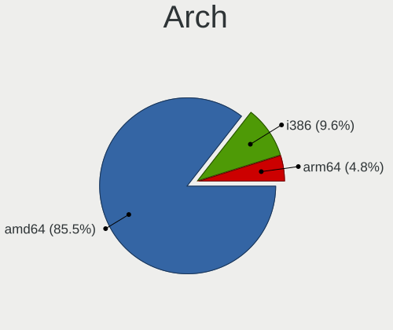

| Name  | Computers | Percent |
|-------|-----------|---------|
| amd64 | 71        | 85.54%  |
| i386  | 8         | 9.64%   |
| arm64 | 4         | 4.82%   |

DE
--

Desktop Environment

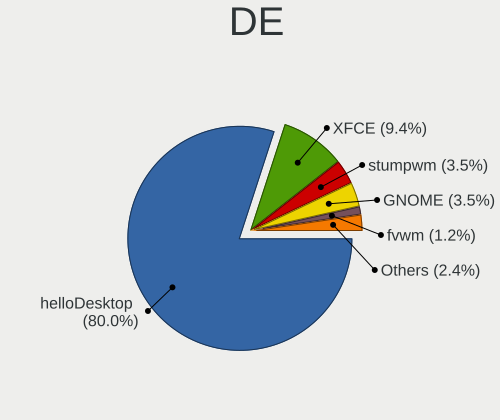

| Name         | Computers | Percent |
|--------------|-----------|---------|
| helloDesktop | 68        | 80%     |
| XFCE         | 8         | 9.41%   |
| stumpwm      | 3         | 3.53%   |
| GNOME        | 3         | 3.53%   |
| LXQT         | 1         | 1.18%   |
| KDE6         | 1         | 1.18%   |
| fvwm         | 1         | 1.18%   |

Display Server
--------------

X11 or Wayland

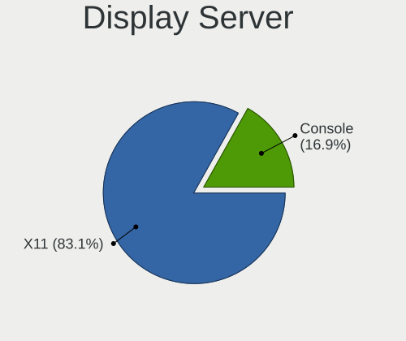

| Name    | Computers | Percent |
|---------|-----------|---------|
| X11     | 69        | 83.13%  |
| Console | 14        | 16.87%  |

Display Manager
---------------

SDDM, LightDM, etc.

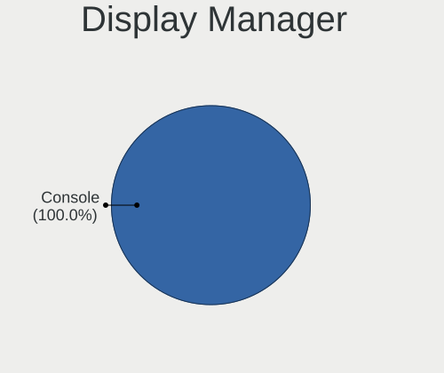

| Name    | Computers | Percent |
|---------|-----------|---------|
| Console | 83        | 100%    |

OS Lang
-------

Language

| Lang    | Computers | Percent |
|---------|-----------|---------|
| Unknown | 66        | 77.65%  |
| en_US   | 13        | 15.29%  |
| de_DE   | 2         | 2.35%   |
| sv_SE   | 1         | 1.18%   |
| ru_RU   | 1         | 1.18%   |
| es_PY   | 1         | 1.18%   |
| en_AU   | 1         | 1.18%   |

Boot Mode
---------

EFI or BIOS

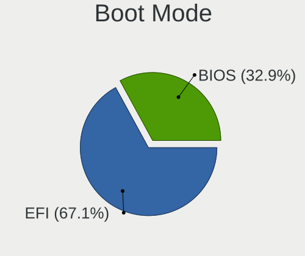

| Mode | Computers | Percent |
|------|-----------|---------|
| EFI  | 57        | 67.06%  |
| BIOS | 28        | 32.94%  |

Filesystem
----------

Type of filesystem

| Type | Computers | Percent |
|------|-----------|---------|
| Ffs  | 83        | 100%    |

Part. scheme
------------

Scheme of partitioning

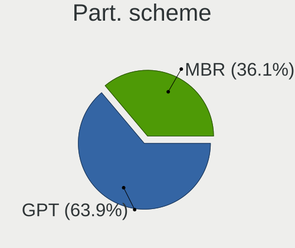

| Type | Computers | Percent |
|------|-----------|---------|
| GPT  | 53        | 63.86%  |
| MBR  | 30        | 36.14%  |

Board
-----

Vendor
------

Motherboard manufacturer

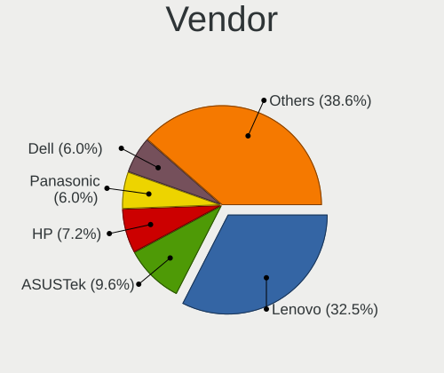

| Name                           | Computers | Percent |
|--------------------------------|-----------|---------|
| Lenovo                         | 27        | 32.53%  |
| ASUSTek Computer               | 8         | 9.64%   |
| Hewlett-Packard                | 6         | 7.23%   |
| Panasonic                      | 5         | 6.02%   |
| Dell                           | 5         | 6.02%   |
| Gigabyte Technology            | 3         | 3.61%   |
| Fujitsu                        | 3         | 3.61%   |
| Unknown                        | 3         | 3.61%   |
| Samsung Electronics            | 2         | 2.41%   |
| MSI                            | 2         | 2.41%   |
| Intel                          | 2         | 2.41%   |
| Framework                      | 2         | 2.41%   |
| xunlong                        | 1         | 1.2%    |
| Sony                           | 1         | 1.2%    |
| Shuttle                        | 1         | 1.2%    |
| Raspberry Pi Foundation        | 1         | 1.2%    |
| Matsushita Electric Industrial | 1         | 1.2%    |
| Legend QDI                     | 1         | 1.2%    |
| Intel(R) Client Systems        | 1         | 1.2%    |
| IBM                            | 1         | 1.2%    |
| HUAWEI                         | 1         | 1.2%    |
| HONOR                          | 1         | 1.2%    |
| Google                         | 1         | 1.2%    |
| Biostar                        | 1         | 1.2%    |
| AZW                            | 1         | 1.2%    |
| Apple                          | 1         | 1.2%    |
| Acer                           | 1         | 1.2%    |

Model
-----

Motherboard model

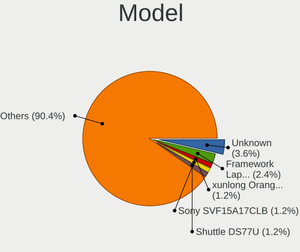

| Name                                            | Computers | Percent |
|-------------------------------------------------|-----------|---------|
| Unknown                                         | 3         | 3.61%   |
| Framework Laptop 13 (Intel Core Ultra Series 1) | 2         | 2.41%   |
| xunlong Orange Pi 3B v1.1                       | 1         | 1.2%    |
| Sony SVF15A17CLB                                | 1         | 1.2%    |
| Shuttle DS77U                                   | 1         | 1.2%    |
| Samsung 550XDA                                  | 1         | 1.2%    |
| Samsung 535U3C                                  | 1         | 1.2%    |
| RPi Raspberry Pi 4 Model B                      | 1         | 1.2%    |
| Panasonic CFSZ6-2                               | 1         | 1.2%    |
| Panasonic CFSX4-1                               | 1         | 1.2%    |
| Panasonic CF-54-1                               | 1         | 1.2%    |
| Panasonic CF-53AAGHYDM                          | 1         | 1.2%    |
| Panasonic CF-52PFPBSFQ                          | 1         | 1.2%    |
| MSI MS-7C02                                     | 1         | 1.2%    |
| MSI MS-7623                                     | 1         | 1.2%    |
| Matsushita Electric Industrial CF-51RCVDNLM     | 1         | 1.2%    |
| Lenovo Yoga 900S-12ISK 80ML                     | 1         | 1.2%    |
| Lenovo ThinkStation P320 Tiny 30C1S0QS00        | 1         | 1.2%    |
| Lenovo ThinkPad X60s 1704R8G                    | 1         | 1.2%    |
| Lenovo ThinkPad X270 W10DG 20K5S5MD0F           | 1         | 1.2%    |
| Lenovo ThinkPad X270 W10DG 20K5S25T00           | 1         | 1.2%    |
| Lenovo ThinkPad X270 W10DG 20K5S0TT1N           | 1         | 1.2%    |
| Lenovo ThinkPad X270 20HN001HUS                 | 1         | 1.2%    |
| Lenovo ThinkPad X270 20HN0015MX                 | 1         | 1.2%    |
| Lenovo ThinkPad X260 20F5S2GM00                 | 1         | 1.2%    |
| Lenovo ThinkPad X260 20F5S0R20X                 | 1         | 1.2%    |
| Lenovo ThinkPad X230 Tablet 34382BG             | 1         | 1.2%    |
| Lenovo ThinkPad X1 Carbon 7th 20QD00KTMH        | 1         | 1.2%    |
| Lenovo ThinkPad X1 Carbon 20KH002WUS            | 1         | 1.2%    |
| Lenovo ThinkPad W510 4318CTO                    | 1         | 1.2%    |
| Lenovo ThinkPad T490 20N3SFCE00                 | 1         | 1.2%    |
| Lenovo ThinkPad T490 20N20028US                 | 1         | 1.2%    |
| Lenovo ThinkPad T430 2347GZU                    | 1         | 1.2%    |
| Lenovo ThinkPad T410 2537N24                    | 1         | 1.2%    |
| Lenovo ThinkPad T14 Gen 1 20S0000NBM            | 1         | 1.2%    |
| Lenovo ThinkPad P14s Gen 5 21G2CTO1WW           | 1         | 1.2%    |
| Lenovo ThinkPad P14s Gen 1 20Y1000SUK           | 1         | 1.2%    |
| Lenovo ThinkPad L13 Yoga 20R6S36000             | 1         | 1.2%    |
| Lenovo ThinkPad E14 Gen 5 21JK0006TX            | 1         | 1.2%    |
| Lenovo ThinkCentre M910s 10MK000TUS             | 1         | 1.2%    |

Model Family
------------

Motherboard model prefix

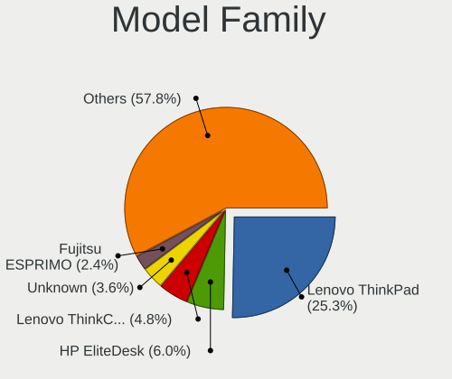

| Name                                        | Computers | Percent |
|---------------------------------------------|-----------|---------|
| Lenovo ThinkPad                             | 21        | 25.3%   |
| HP EliteDesk                                | 5         | 6.02%   |
| Lenovo ThinkCentre                          | 4         | 4.82%   |
| Unknown                                     | 3         | 3.61%   |
| Fujitsu ESPRIMO                             | 2         | 2.41%   |
| Framework Laptop                            | 2         | 2.41%   |
| Dell Latitude                               | 2         | 2.41%   |
| ASUS PRIME                                  | 2         | 2.41%   |
| xunlong Orange                              | 1         | 1.2%    |
| Sony SVF15A17CLB                            | 1         | 1.2%    |
| Shuttle DS77U                               | 1         | 1.2%    |
| Samsung 550XDA                              | 1         | 1.2%    |
| Samsung 535U3C                              | 1         | 1.2%    |
| RPi Raspberry                               | 1         | 1.2%    |
| Panasonic CFSZ6-2                           | 1         | 1.2%    |
| Panasonic CFSX4-1                           | 1         | 1.2%    |
| Panasonic CF-54-1                           | 1         | 1.2%    |
| Panasonic CF-53AAGHYDM                      | 1         | 1.2%    |
| Panasonic CF-52PFPBSFQ                      | 1         | 1.2%    |
| MSI MS-7C02                                 | 1         | 1.2%    |
| MSI MS-7623                                 | 1         | 1.2%    |
| Matsushita Electric Industrial CF-51RCVDNLM | 1         | 1.2%    |
| Lenovo Yoga                                 | 1         | 1.2%    |
| Lenovo ThinkStation                         | 1         | 1.2%    |
| Legend QDI PLATINIX-8                       | 1         | 1.2%    |
| Intel(R) Client Systems NUC7i5BNK           | 1         | 1.2%    |
| Intel NUC7i5BNK                             | 1         | 1.2%    |
| Intel D2500HN                               | 1         | 1.2%    |
| IBM ThinkPad                                | 1         | 1.2%    |
| HUAWEI EUL-WX9                              | 1         | 1.2%    |
| HONOR MRO-XXX                               | 1         | 1.2%    |
| HP Compaq                                   | 1         | 1.2%    |
| Google Morphius                             | 1         | 1.2%    |
| Gigabyte X58A-UD5                           | 1         | 1.2%    |
| Gigabyte H310M                              | 1         | 1.2%    |
| Gigabyte A620M                              | 1         | 1.2%    |
| Fujitsu LIFEBOOK                            | 1         | 1.2%    |
| Dell XPS                                    | 1         | 1.2%    |
| Dell Precision                              | 1         | 1.2%    |
| Dell OptiPlex                               | 1         | 1.2%    |

MFG Year
--------

Motherboard manufacture year

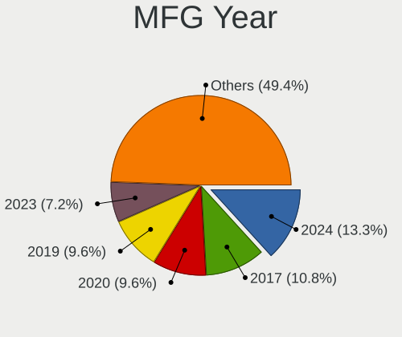

| Year    | Computers | Percent |
|---------|-----------|---------|
| 2024    | 11        | 13.25%  |
| 2017    | 9         | 10.84%  |
| 2020    | 8         | 9.64%   |
| 2019    | 8         | 9.64%   |
| 2023    | 6         | 7.23%   |
| 2010    | 6         | 7.23%   |
| 2025    | 5         | 6.02%   |
| 2016    | 5         | 6.02%   |
| 2012    | 5         | 6.02%   |
| 2022    | 3         | 3.61%   |
| 2018    | 2         | 2.41%   |
| 2013    | 2         | 2.41%   |
| 2011    | 2         | 2.41%   |
| 2009    | 2         | 2.41%   |
| 2006    | 2         | 2.41%   |
| Unknown | 2         | 2.41%   |
| 2021    | 1         | 1.2%    |
| 2015    | 1         | 1.2%    |
| 2008    | 1         | 1.2%    |
| 2007    | 1         | 1.2%    |
| 2002    | 1         | 1.2%    |

Form Factor
-----------

Physical design of the computer

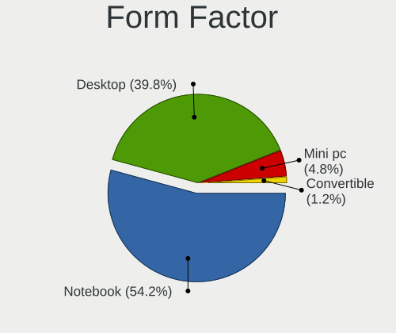

| Name        | Computers | Percent |
|-------------|-----------|---------|
| Notebook    | 45        | 54.22%  |
| Desktop     | 33        | 39.76%  |
| Mini pc     | 4         | 4.82%   |
| Convertible | 1         | 1.2%    |

Coreboot
--------

Have coreboot on board

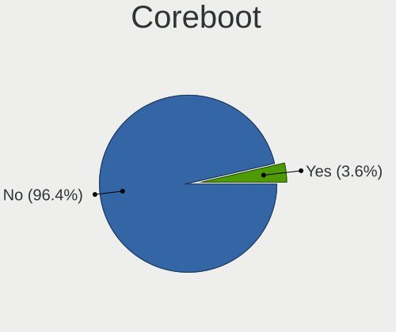

| Used | Computers | Percent |
|------|-----------|---------|
| No   | 80        | 96.39%  |
| Yes  | 3         | 3.61%   |

RAM Size
--------

Total RAM memory

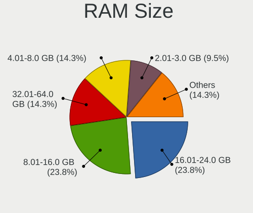

| Size in GB  | Computers | Percent |
|-------------|-----------|---------|
| 16.01-24.0  | 20        | 23.81%  |
| 8.01-16.0   | 20        | 23.81%  |
| 4.01-8.0    | 12        | 14.29%  |
| 32.01-64.0  | 12        | 14.29%  |
| 2.01-3.0    | 8         | 9.52%   |
| 3.01-4.0    | 5         | 5.95%   |
| 24.01-32.0  | 3         | 3.57%   |
| 64.01-256.0 | 3         | 3.57%   |
| 0.01-0.5    | 1         | 1.19%   |

RAM Used
--------

Used RAM memory

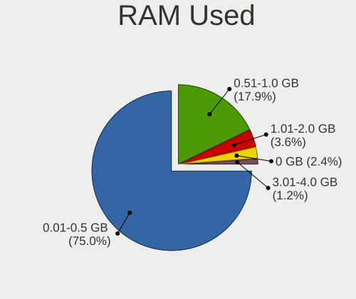

| Used GB  | Computers | Percent |
|----------|-----------|---------|
| 0.01-0.5 | 63        | 75%     |
| 0.51-1.0 | 15        | 17.86%  |
| 1.01-2.0 | 3         | 3.57%   |
| 0        | 2         | 2.38%   |
| 3.01-4.0 | 1         | 1.19%   |

Total Drives
------------

Number of drives on board

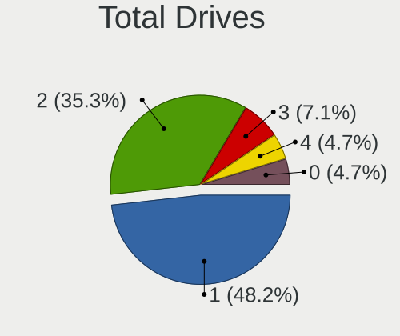

| Drives | Computers | Percent |
|--------|-----------|---------|
| 1      | 41        | 48.24%  |
| 2      | 30        | 35.29%  |
| 3      | 6         | 7.06%   |
| 4      | 4         | 4.71%   |
| 0      | 4         | 4.71%   |

Has CD-ROM
----------

Has CD-ROM on board

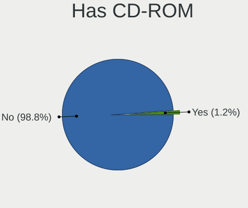

| Presented | Computers | Percent |
|-----------|-----------|---------|
| No        | 83        | 98.81%  |
| Yes       | 1         | 1.19%   |

Has Ethernet
------------

Has Ethernet on board

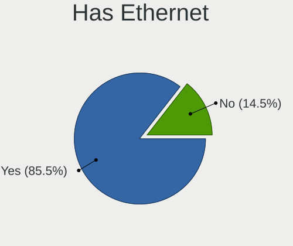

| Presented | Computers | Percent |
|-----------|-----------|---------|
| Yes       | 71        | 85.54%  |
| No        | 12        | 14.46%  |

Has WiFi
--------

Has WiFi module

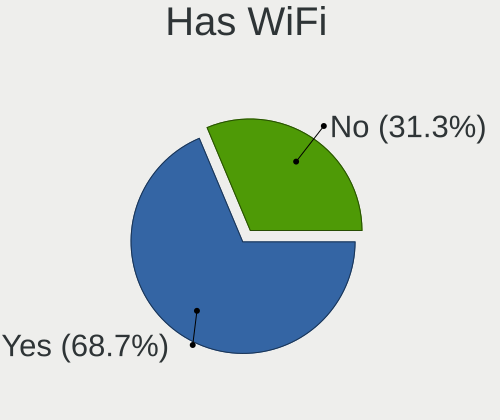

| Presented | Computers | Percent |
|-----------|-----------|---------|
| Yes       | 57        | 68.67%  |
| No        | 26        | 31.33%  |

Has Bluetooth
-------------

Has Bluetooth module

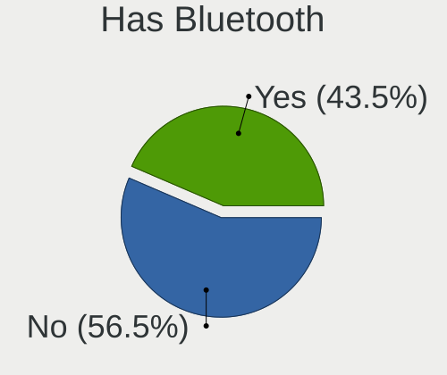

| Presented | Computers | Percent |
|-----------|-----------|---------|
| No        | 48        | 56.47%  |
| Yes       | 37        | 43.53%  |

Location
--------

Country
-------

Geographic location (country)

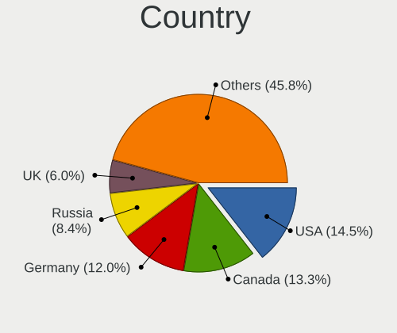

| Country     | Computers | Percent |
|-------------|-----------|---------|
| USA         | 12        | 14.46%  |
| Canada      | 11        | 13.25%  |
| Germany     | 10        | 12.05%  |
| Russia      | 7         | 8.43%   |
| UK          | 5         | 6.02%   |
| Italy       | 5         | 6.02%   |
| Spain       | 4         | 4.82%   |
| Latvia      | 3         | 3.61%   |
| Bulgaria    | 3         | 3.61%   |
| Turkey      | 2         | 2.41%   |
| Finland     | 2         | 2.41%   |
| Czechia     | 2         | 2.41%   |
| Brazil      | 2         | 2.41%   |
| Vietnam     | 1         | 1.2%    |
| Sweden      | 1         | 1.2%    |
| South Korea | 1         | 1.2%    |
| Slovakia    | 1         | 1.2%    |
| Poland      | 1         | 1.2%    |
| Paraguay    | 1         | 1.2%    |
| Norway      | 1         | 1.2%    |
| Netherlands | 1         | 1.2%    |
| Malaysia    | 1         | 1.2%    |
| Guatemala   | 1         | 1.2%    |
| France      | 1         | 1.2%    |
| Croatia     | 1         | 1.2%    |
| Colombia    | 1         | 1.2%    |
| China       | 1         | 1.2%    |
| Australia   | 1         | 1.2%    |

City
----

Geographic location (city)

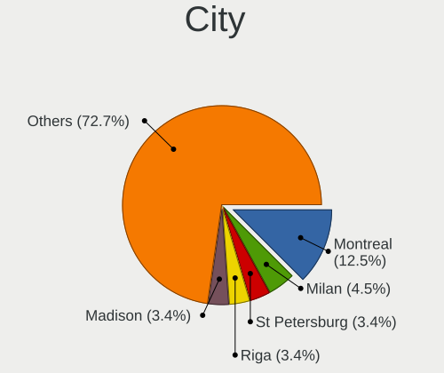

| City            | Computers | Percent |
|-----------------|-----------|---------|
| Montreal        | 11        | 12.5%   |
| Milan           | 4         | 4.55%   |
| St Petersburg   | 3         | 3.41%   |
| Riga            | 3         | 3.41%   |
| Madison         | 3         | 3.41%   |
| Kostinbrod      | 3         | 3.41%   |
| Berlin          | 3         | 3.41%   |
| Prague          | 2         | 2.27%   |
| Manchester      | 2         | 2.27%   |
| Madrid          | 2         | 2.27%   |
| Hoffman Estates | 2         | 2.27%   |
| Dietzenbach     | 2         | 2.27%   |
| Danville        | 2         | 2.27%   |
| Cherepovets     | 2         | 2.27%   |
| Zulice          | 1         | 1.14%   |
| Zaragoza        | 1         | 1.14%   |
| Wenzhou         | 1         | 1.14%   |
| Waterbury       | 1         | 1.14%   |
| Villalfonsina   | 1         | 1.14%   |
| Valladolid      | 1         | 1.14%   |
| Vaernamo        | 1         | 1.14%   |
| Vaasa           | 1         | 1.14%   |
| Tampere         | 1         | 1.14%   |
| Sydney          | 1         | 1.14%   |
| Slough          | 1         | 1.14%   |
| Scottsville     | 1         | 1.14%   |
| Pouzay          | 1         | 1.14%   |
| Pinner          | 1         | 1.14%   |
| Phoenix         | 1         | 1.14%   |
| Oslo            | 1         | 1.14%   |
| Ochsenfurt      | 1         | 1.14%   |
| New York        | 1         | 1.14%   |
| Medellín       | 1         | 1.14%   |
| Manaus          | 1         | 1.14%   |
| Macaiba         | 1         | 1.14%   |
| Lublin          | 1         | 1.14%   |
| Louisville      | 1         | 1.14%   |
| London          | 1         | 1.14%   |
| Kursk           | 1         | 1.14%   |
| Kuala Lumpur    | 1         | 1.14%   |

Drives
------

Drive Vendor
------------

Hard drive vendors

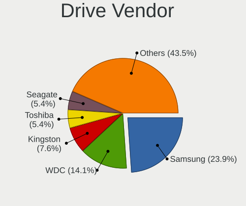

| Vendor                                 | Computers | Drives | Percent |
|----------------------------------------|-----------|--------|---------|
| Samsung Electronics                    | 22        | 24     | 23.91%  |
| WDC                                    | 13        | 14     | 14.13%  |
| Kingston                               | 7         | 8      | 7.61%   |
| Toshiba                                | 5         | 6      | 5.43%   |
| Seagate                                | 5         | 7      | 5.43%   |
| SanDisk                                | 4         | 4      | 4.35%   |
| PNY                                    | 4         | 11     | 4.35%   |
| Crucial                                | 4         | 5      | 4.35%   |
| Micron Technology                      | 2         | 2      | 2.17%   |
| Lexar                                  | 2         | 5      | 2.17%   |
| A-DATA Technology                      | 2         | 3      | 2.17%   |
| USB3.0                                 | 1         | 2      | 1.09%   |
| SPCC                                   | 1         | 1      | 1.09%   |
| SK hynix                               | 1         | 1      | 1.09%   |
| Product:              USB DISK 3.0 Pro | 1         | 1      | 1.09%   |
| LITEONIT                               | 1         | 2      | 1.09%   |
| LITEON                                 | 1         | 1      | 1.09%   |
| Lenovo                                 | 1         | 1      | 1.09%   |
| KIOXIA                                 | 1         | 1      | 1.09%   |
| KingSpec                               | 1         | 1      | 1.09%   |
| Kimtigo                                | 1         | 1      | 1.09%   |
| HGST                                   | 1         | 1      | 1.09%   |
| Getrich                                | 1         | 1      | 1.09%   |
| Geonix                                 | 1         | 2      | 1.09%   |
| Fujitsu                                | 1         | 1      | 1.09%   |
| Fanxiang                               | 1         | 2      | 1.09%   |
| External                               | 1         | 1      | 1.09%   |
| DEXP                                   | 1         | 1      | 1.09%   |
| CT2000P3                               | 1         | 1      | 1.09%   |
| ASUSTek Computer                       | 1         | 2      | 1.09%   |
| ARDOR GAMING                           | 1         | 1      | 1.09%   |
| Apple                                  | 1         | 1      | 1.09%   |
| AGI                                    | 1         | 1      | 1.09%   |

Drive Model
-----------

Hard drive models

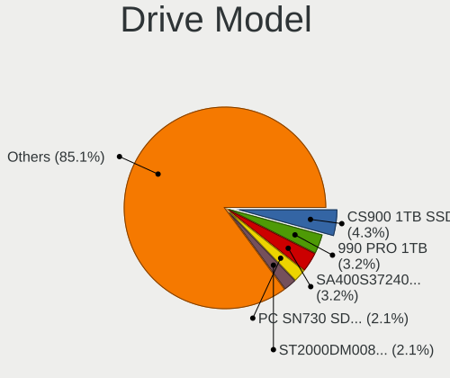

| Model                                  | Computers | Percent |
|----------------------------------------|-----------|---------|
| PNY CS900 1TB SSD                      | 4         | 4.26%   |
| Samsung SSD 990 PRO 1TB                | 3         | 3.19%   |
| Kingston SA400S37240G 240GB            | 3         | 3.19%   |
| WDC PC SN730 SDBQNTY-512G-1001 512GB   | 2         | 2.13%   |
| Seagate ST2000DM008-2FR102 2TB         | 2         | 2.13%   |
| Samsung SSD 860 EVO M.2 250GB          | 2         | 2.13%   |
| Samsung MZVLW256HEHP-000L7 256GB       | 2         | 2.13%   |
| Lexar 128GB SSD                        | 2         | 2.13%   |
| Crucial CT2000P3PSSD8 2TB              | 2         | 2.13%   |
| WDC WDS250G2B0A-00SM50 250GB           | 1         | 1.06%   |
| WDC WD7500BPKX-00HPJT0 752GB           | 1         | 1.06%   |
| WDC WD7500BPKT-75PK4T0 752GB           | 1         | 1.06%   |
| WDC WD7500BPKT-00PK4T0 752GB           | 1         | 1.06%   |
| WDC WD5000LPLX-00ZNTT0 500GB           | 1         | 1.06%   |
| WDC WD3200BEVE-00A0HT0 320GB           | 1         | 1.06%   |
| WDC WD3200AAKX-001CA0 320GB            | 1         | 1.06%   |
| WDC WD2500BEVT-08A23T1 250GB           | 1         | 1.06%   |
| WDC WD1200JB-00GVA0 120GB              | 1         | 1.06%   |
| WDC WD10SPZX-24Z10 1TB                 | 1         | 1.06%   |
| WDC WD10JPLX-00MBPT0 1TB               | 1         | 1.06%   |
| USB3.0 storage 1TB                     | 1         | 1.06%   |
| Toshiba KXG60ZNV512G 512GB             | 1         | 1.06%   |
| Toshiba KXG50ZNV1T02 NVMe 1024GB       | 1         | 1.06%   |
| Toshiba KBG40ZMT128G MEMORY 128GB      | 1         | 1.06%   |
| Toshiba DT01ACA100 1TB                 | 1         | 1.06%   |
| Toshiba DT01ACA050 500GB               | 1         | 1.06%   |
| SPCC M.2 PCIe SSD 2TB                  | 1         | 1.06%   |
| SK hynix SKHynix_HFS256GDE9X081N 256GB | 1         | 1.06%   |
| Seagate ST500LT012-9WS142 500GB        | 1         | 1.06%   |
| Seagate ST1000VM002-1SD102 1TB         | 1         | 1.06%   |
| Seagate ST1000LM035-1RK172 1TB         | 1         | 1.06%   |
| SanDisk SDSSDHII240G 240GB             | 1         | 1.06%   |
| SanDisk SD8SN8U-256G-1006 256GB        | 1         | 1.06%   |
| SanDisk SD6SB1M-128G-1006 128GB        | 1         | 1.06%   |
| SanDisk Cruzer Fit 8GB                 | 1         | 1.06%   |
| Samsung SSD 990 PRO 2TB                | 1         | 1.06%   |
| Samsung SSD 980 1TB                    | 1         | 1.06%   |
| Samsung SSD 860 EVO M.2 2TB            | 1         | 1.06%   |
| Samsung SSD 860 EVO 500GB              | 1         | 1.06%   |
| Samsung SSD 860 EVO 2TB                | 1         | 1.06%   |

HDD Vendor
----------

Hard disk drive vendors

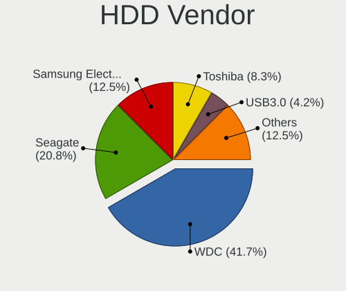

| Vendor                                 | Computers | Drives | Percent |
|----------------------------------------|-----------|--------|---------|
| WDC                                    | 10        | 10     | 41.67%  |
| Seagate                                | 5         | 7      | 20.83%  |
| Samsung Electronics                    | 3         | 3      | 12.5%   |
| Toshiba                                | 2         | 3      | 8.33%   |
| USB3.0                                 | 1         | 2      | 4.17%   |
| Product:              USB DISK 3.0 Pro | 1         | 1      | 4.17%   |
| HGST                                   | 1         | 1      | 4.17%   |
| Fujitsu                                | 1         | 1      | 4.17%   |

SSD Vendor
----------

Solid state drive vendors

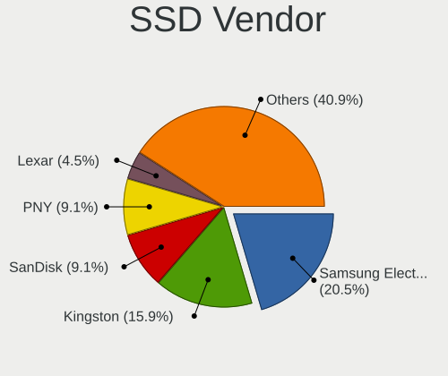

| Vendor              | Computers | Drives | Percent |
|---------------------|-----------|--------|---------|
| Samsung Electronics | 9         | 11     | 20.45%  |
| Kingston            | 7         | 8      | 15.91%  |
| SanDisk             | 4         | 4      | 9.09%   |
| PNY                 | 4         | 11     | 9.09%   |
| Lexar               | 2         | 5      | 4.55%   |
| A-DATA Technology   | 2         | 3      | 4.55%   |
| WDC                 | 1         | 2      | 2.27%   |
| Micron Technology   | 1         | 1      | 2.27%   |
| LITEONIT            | 1         | 2      | 2.27%   |
| LITEON              | 1         | 1      | 2.27%   |
| KingSpec            | 1         | 1      | 2.27%   |
| Kimtigo             | 1         | 1      | 2.27%   |
| Getrich             | 1         | 1      | 2.27%   |
| Geonix              | 1         | 2      | 2.27%   |
| Fanxiang            | 1         | 2      | 2.27%   |
| External            | 1         | 1      | 2.27%   |
| DEXP                | 1         | 1      | 2.27%   |
| CT2000P3            | 1         | 1      | 2.27%   |
| Crucial             | 1         | 1      | 2.27%   |
| ASUSTek Computer    | 1         | 2      | 2.27%   |
| Apple               | 1         | 1      | 2.27%   |
| AGI                 | 1         | 1      | 2.27%   |

Drive Kind
----------

HDD or SSD

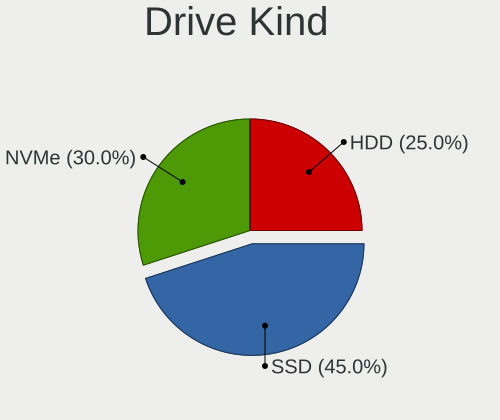

| Kind | Computers | Drives | Percent |
|------|-----------|--------|---------|
| SSD  | 36        | 63     | 45%     |
| NVMe | 24        | 25     | 30%     |
| HDD  | 20        | 28     | 25%     |

Drive Connector
---------------

SATA, SAS, NVMe, etc.

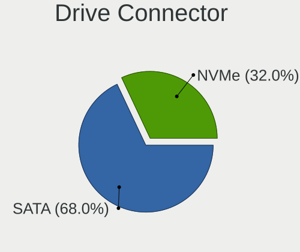

| Type | Computers | Drives | Percent |
|------|-----------|--------|---------|
| SATA | 51        | 91     | 68%     |
| NVMe | 24        | 25     | 32%     |

Drive Size
----------

Size of hard drive

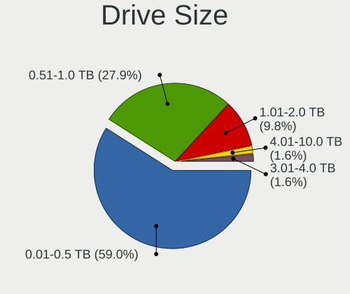

| Size in TB | Computers | Drives | Percent |
|------------|-----------|--------|---------|
| 0.01-0.5   | 36        | 52     | 59.02%  |
| 0.51-1.0   | 17        | 27     | 27.87%  |
| 1.01-2.0   | 6         | 9      | 9.84%   |
| 3.01-4.0   | 1         | 1      | 1.64%   |
| 4.01-10.0  | 1         | 2      | 1.64%   |

Space Total
-----------

Amount of disk space available on the file system

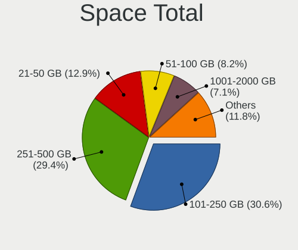

| Size in GB     | Computers | Percent |
|----------------|-----------|---------|
| 101-250        | 26        | 30.59%  |
| 251-500        | 25        | 29.41%  |
| 21-50          | 11        | 12.94%  |
| 51-100         | 7         | 8.24%   |
| 1001-2000      | 6         | 7.06%   |
| 501-1000       | 4         | 4.71%   |
| 1-20           | 3         | 3.53%   |
| More than 3000 | 2         | 2.35%   |
| 2001-3000      | 1         | 1.18%   |

Space Used
----------

Amount of used disk space

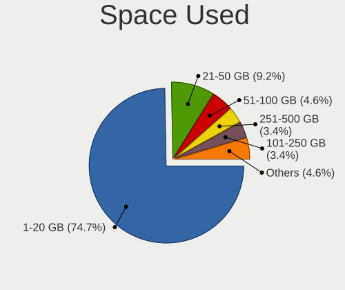

| Used GB   | Computers | Percent |
|-----------|-----------|---------|
| 1-20      | 65        | 74.71%  |
| 21-50     | 8         | 9.2%    |
| 51-100    | 4         | 4.6%    |
| 251-500   | 3         | 3.45%   |
| 101-250   | 3         | 3.45%   |
| 501-1000  | 2         | 2.3%    |
| 2001-3000 | 1         | 1.15%   |
| 1001-2000 | 1         | 1.15%   |

Malfunc. Drives
---------------

Drive models with a malfunction

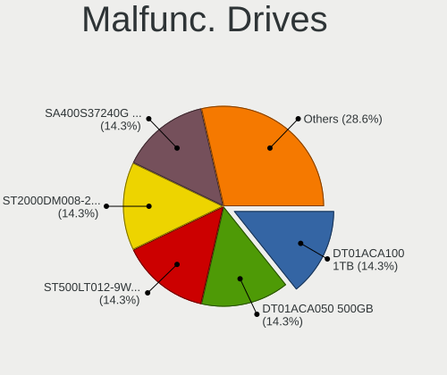

| Model                           | Computers | Drives | Percent |
|---------------------------------|-----------|--------|---------|
| Toshiba DT01ACA100 1TB          | 1         | 1      | 14.29%  |
| Toshiba DT01ACA050 500GB        | 1         | 2      | 14.29%  |
| Seagate ST500LT012-9WS142 500GB | 1         | 1      | 14.29%  |
| Seagate ST2000DM008-2FR102 2TB  | 1         | 3      | 14.29%  |
| Kingston SA400S37240G 240GB     | 1         | 1      | 14.29%  |
| HGST HTS541010A9E680 1TB        | 1         | 1      | 14.29%  |
| A-DATA Technology SP550 480GB   | 1         | 1      | 14.29%  |

Malfunc. Drive Vendor
---------------------

Vendors of faulty drives

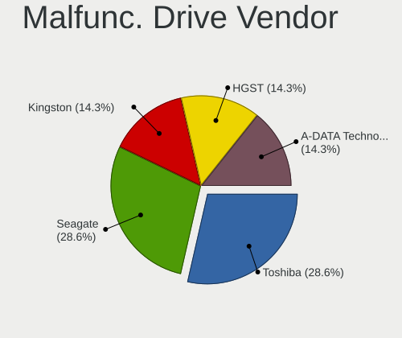

| Vendor            | Computers | Drives | Percent |
|-------------------|-----------|--------|---------|
| Toshiba           | 2         | 3      | 28.57%  |
| Seagate           | 2         | 4      | 28.57%  |
| Kingston          | 1         | 1      | 14.29%  |
| HGST              | 1         | 1      | 14.29%  |
| A-DATA Technology | 1         | 1      | 14.29%  |

Malfunc. HDD Vendor
-------------------

Vendors of faulty HDD drives

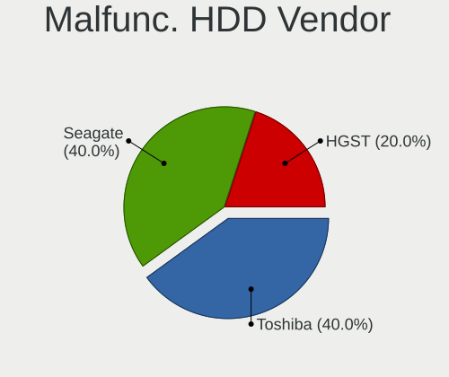

| Vendor  | Computers | Drives | Percent |
|---------|-----------|--------|---------|
| Toshiba | 2         | 3      | 40%     |
| Seagate | 2         | 4      | 40%     |
| HGST    | 1         | 1      | 20%     |

Malfunc. Drive Kind
-------------------

Kinds of faulty drives

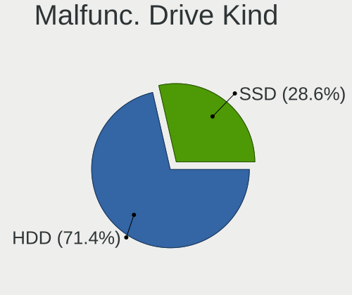

| Kind | Computers | Drives | Percent |
|------|-----------|--------|---------|
| HDD  | 5         | 8      | 71.43%  |
| SSD  | 2         | 2      | 28.57%  |

Failed Drives
-------------

Failed drive models

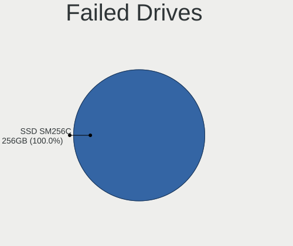

| Model                  | Computers | Drives | Percent |
|------------------------|-----------|--------|---------|
| Apple SSD SM256C 256GB | 1         | 1      | 100%    |

Failed Drive Vendor
-------------------

Failed drive vendors

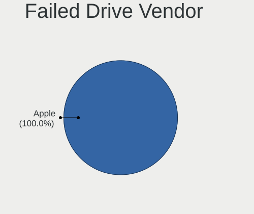

| Vendor | Computers | Drives | Percent |
|--------|-----------|--------|---------|
| Apple  | 1         | 1      | 100%    |

Drive Status
------------

Number of failed and malfunc. drives

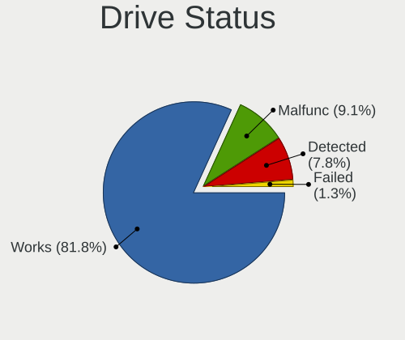

| Status   | Computers | Drives | Percent |
|----------|-----------|--------|---------|
| Works    | 63        | 95     | 81.82%  |
| Malfunc  | 7         | 10     | 9.09%   |
| Detected | 6         | 10     | 7.79%   |
| Failed   | 1         | 1      | 1.3%    |

Storage controller
------------------

Storage Vendor
--------------

Storage controller vendors

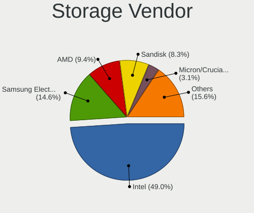

| Vendor                      | Computers | Percent |
|-----------------------------|-----------|---------|
| Intel                       | 47        | 48.96%  |
| Samsung Electronics         | 14        | 14.58%  |
| AMD                         | 9         | 9.38%   |
| Sandisk                     | 8         | 8.33%   |
| Micron/Crucial Technology   | 3         | 3.13%   |
| KIOXIA                      | 3         | 3.13%   |
| Toshiba                     | 2         | 2.08%   |
| SK hynix                    | 2         | 2.08%   |
| Marvell Technology Group    | 2         | 2.08%   |
| JMicron Technology          | 2         | 2.08%   |
| Micron Technology           | 1         | 1.04%   |
| MAXIO Technology (Hangzhou) | 1         | 1.04%   |
| Lenovo                      | 1         | 1.04%   |
| Kingston Technology Company | 1         | 1.04%   |

Storage Model
-------------

Storage controller models

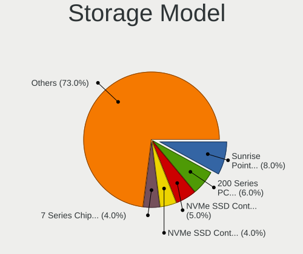

| Model                                                                          | Computers | Percent |
|--------------------------------------------------------------------------------|-----------|---------|
| Intel Sunrise Point-LP SATA Controller [AHCI mode]                             | 8         | 8%      |
| Intel 200 Series PCH SATA controller [AHCI mode]                               | 6         | 6%      |
| Samsung NVMe SSD Controller S4LV008[Pascal]                                    | 5         | 5%      |
| Samsung NVMe SSD Controller SM961/PM961/SM963                                  | 4         | 4%      |
| Intel 7 Series Chipset Family 6-port SATA Controller [AHCI mode]               | 4         | 4%      |
| AMD 600 Series Chipset SATA Controller                                         | 4         | 4%      |
| Intel Q170/Q150/B150/H170/H110/Z170/CM236 Chipset SATA Controller [AHCI Mode]  | 3         | 3%      |
| Intel 82801GBM/GHM (ICH7-M Family) SATA Controller [IDE mode]                  | 3         | 3%      |
| Intel 5 Series/3400 Series Chipset 6 port SATA AHCI Controller                 | 3         | 3%      |
| AMD FCH SATA Controller [AHCI mode]                                            | 3         | 3%      |
| Toshiba XG6 NVMe SSD Controller                                                | 2         | 2%      |
| Sandisk WD SN560/SN740/SN770/SN5000 NVMe SSD                                   | 2         | 2%      |
| SanDisk Ultra 3D / WD Blue SN570 NVMe SSD (DRAM-less)                          | 2         | 2%      |
| SanDisk Extreme Pro / WD Black SN750 / PC SN730 / Red SN700 NVMe SSD           | 2         | 2%      |
| Samsung NVMe SSD Controller SM981/PM981/PM983                                  | 2         | 2%      |
| Samsung NVMe SSD Controller 980 (DRAM-less)                                    | 2         | 2%      |
| Micron/Crucial P2 [Nick P2] / P3 / P3 Plus NVMe PCIe SSD (DRAM-less)           | 2         | 2%      |
| KIOXIA NVMe SSD Controller BG4 (DRAM-less)                                     | 2         | 2%      |
| Intel Wildcat Point-LP SATA Controller [AHCI Mode]                             | 2         | 2%      |
| Intel 82801JI (ICH10 Family) SATA AHCI Controller                              | 2         | 2%      |
| Intel 82801FBM (ICH6M) SATA Controller                                         | 2         | 2%      |
| Intel 8 Series/C220 Series Chipset Family 6-port SATA Controller 1 [AHCI mode] | 2         | 2%      |
| AMD 400 Series Chipset SATA Controller                                         | 2         | 2%      |
| Toshiba XG5 NVMe SSD Controller                                                | 1         | 1%      |
| SK hynix PC611 NVMe Solid State Drive                                          | 1         | 1%      |
| SK hynix Gold P31/BC711/PC711 NVMe Solid State Drive                           | 1         | 1%      |
| Sandisk WD PC SN740 NVMe SSD 512GB (DRAM-less)                                 | 1         | 1%      |
| Sandisk WD Black SN850X NVMe SSD                                               | 1         | 1%      |
| Samsung NVMe SSD Controller SM951/PM951                                        | 1         | 1%      |
| Micron/Crucial P3 Plus NVMe PCIe SSD (DRAM-less)                               | 1         | 1%      |
| Micron 2400 NVMe SSD (DRAM-less)                                               | 1         | 1%      |
| MAXIO (Hangzhou) NVMe SSD Controller MAP1202 (DRAM-less)                       | 1         | 1%      |
| Marvell Group 88SE9128 PCIe SATA 6 Gb/s RAID controller                        | 1         | 1%      |
| Marvell Group 88SE9123 PCIe SATA 6.0 Gb/s controller                           | 1         | 1%      |
| Lenovo LENSE20256GMSP34MEAT2TA                                                 | 1         | 1%      |
| KIOXIA NVMe SSD Controller XG8                                                 | 1         | 1%      |
| Kingston Company OM8SEP4 Design-In PCIe 4 NVMe SSD (TLC) (DRAM-less)           | 1         | 1%      |
| JMicron JMB363 SATA/IDE Controller                                             | 1         | 1%      |
| JMicron JMB362 SATA Controller                                                 | 1         | 1%      |
| Intel Tiger Lake-LP SATA Controller                                            | 1         | 1%      |

Storage Kind
------------

Kind of storage controller (IDE, SATA, NVMe, SAS, ...)

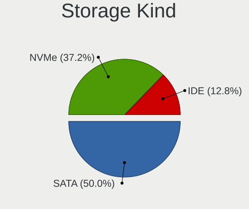

| Kind | Computers | Percent |
|------|-----------|---------|
| SATA | 47        | 50%     |
| NVMe | 35        | 37.23%  |
| IDE  | 12        | 12.77%  |

Processor
---------

CPU Vendor
----------

Processor vendors

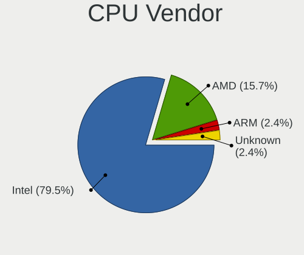

| Vendor  | Computers | Percent |
|---------|-----------|---------|
| Intel   | 66        | 79.52%  |
| AMD     | 13        | 15.66%  |
| ARM     | 2         | 2.41%   |
| Unknown | 2         | 2.41%   |

CPU Model
---------

Processor models

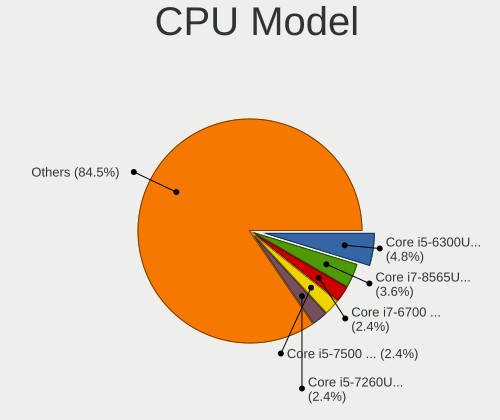

| Model                                                        | Computers | Percent |
|--------------------------------------------------------------|-----------|---------|
| Intel Core i5-6300U CPU @ 2.40GHz                            | 4         | 4.76%   |
| Intel Core i7-8565U CPU @ 1.80GHz                            | 3         | 3.57%   |
| Intel Core i7-6700 CPU @ 3.40GHz                             | 2         | 2.38%   |
| Intel Core i5-7500 CPU @ 3.40GHz                             | 2         | 2.38%   |
| Intel Core i5-7260U CPU @ 2.20GHz                            | 2         | 2.38%   |
| Intel Core i5-5300U CPU @ 2.30GHz                            | 2         | 2.38%   |
| Intel Core i5-3320M CPU @ 2.60GHz                            | 2         | 2.38%   |
| Intel Core i5-10210U CPU @ 1.60GHz                           | 2         | 2.38%   |
| Intel Core i5 CPU M 520 @ 2.40GHz                            | 2         | 2.38%   |
| AMD Ryzen 5 8500G w/ Radeon 740M Graphics                    | 2         | 2.38%   |
|                                                              | 2         | 2.38%   |
| Intel Xeon E E-2436                                          | 1         | 1.19%   |
| Intel Xeon CPU E3-1225 V2 @ 3.20GHz                          | 1         | 1.19%   |
| Intel Pentium M processor                                    | 1         | 1.19%   |
| Intel Pentium III ("GenuineIntel" 686-class, 512KB L2 cache) | 1         | 1.19%   |
| Intel Pentium CPU G860 @ 3.00GHz                             | 1         | 1.19%   |
| Intel Pentium CPU G4400 @ 3.30GHz                            | 1         | 1.19%   |
| Intel Pentium 4 CPU 2.40GHz ("GenuineIntel" 686-class)       | 1         | 1.19%   |
| Intel Genuine CPU T2300 @ 1.66GHz                            | 1         | 1.19%   |
| Intel Core Ultra 9 185H                                      | 1         | 1.19%   |
| Intel Core Ultra 7 155H                                      | 1         | 1.19%   |
| Intel Core Ultra 5 125H                                      | 1         | 1.19%   |
| Intel Core m7-6Y75 CPU @ 1.20GHz                             | 1         | 1.19%   |
| Intel Core i7-8650U CPU @ 1.90GHz                            | 1         | 1.19%   |
| Intel Core i7-7500U CPU @ 2.70GHz                            | 1         | 1.19%   |
| Intel Core i7-3537U CPU @ 2.00GHz                            | 1         | 1.19%   |
| Intel Core i7-3520M CPU @ 2.90GHz                            | 1         | 1.19%   |
| Intel Core i7-10750H CPU @ 2.60GHz                           | 1         | 1.19%   |
| Intel Core i7-10510U CPU @ 1.80GHz                           | 1         | 1.19%   |
| Intel Core i7 CPU M 640 @ 2.80GHz                            | 1         | 1.19%   |
| Intel Core i7 CPU 960 @ 3.20GHz                              | 1         | 1.19%   |
| Intel Core i7 CPU 930 @ 2.80GHz                              | 1         | 1.19%   |
| Intel Core i5-9500 CPU @ 3.00GHz                             | 1         | 1.19%   |
| Intel Core i5-8350U CPU @ 1.70GHz                            | 1         | 1.19%   |
| Intel Core i5-7300U CPU @ 2.60GHz                            | 1         | 1.19%   |
| Intel Core i5-7200U CPU @ 2.50GHz                            | 1         | 1.19%   |
| Intel Core i5-6500T CPU @ 2.50GHz                            | 1         | 1.19%   |
| Intel Core i5-6500 CPU @ 3.20GHz                             | 1         | 1.19%   |
| Intel Core i5-6200U CPU @ 2.30GHz                            | 1         | 1.19%   |
| Intel Core i5-4590T CPU @ 2.00GHz                            | 1         | 1.19%   |

CPU Model Family
----------------

Processor model prefix

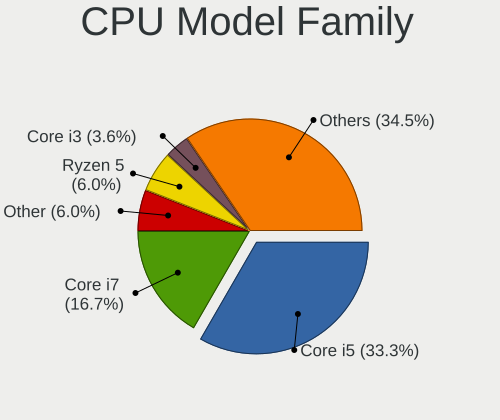

| Model             | Computers | Percent |
|-------------------|-----------|---------|
| Intel Core i5     | 28        | 33.33%  |
| Intel Core i7     | 14        | 16.67%  |
| Other             | 5         | 5.95%   |
| AMD Ryzen 5       | 5         | 5.95%   |
| Intel Core i3     | 3         | 3.57%   |
| Intel Core        | 3         | 3.57%   |
| Intel Xeon        | 2         | 2.38%   |
| Intel Pentium     | 2         | 2.38%   |
| Intel Celeron     | 2         | 2.38%   |
| Intel Atom        | 2         | 2.38%   |
| ARM Cortex        | 2         | 2.38%   |
| AMD Ryzen 7 PRO   | 2         | 2.38%   |
| Intel Pentium M   | 1         | 1.19%   |
| Intel Pentium III | 1         | 1.19%   |
| Intel Pentium 4   | 1         | 1.19%   |
| Intel Genuine     | 1         | 1.19%   |
| Intel Core m7     | 1         | 1.19%   |
| Intel Core Duo    | 1         | 1.19%   |
| Intel Core 2 Duo  | 1         | 1.19%   |
| Intel Core 2      | 1         | 1.19%   |
| Intel Celeron M   | 1         | 1.19%   |
| AMD Ryzen 9       | 1         | 1.19%   |
| AMD Ryzen 7       | 1         | 1.19%   |
| AMD Ryzen 5 PRO   | 1         | 1.19%   |
| AMD Athlon II X2  | 1         | 1.19%   |
| AMD A6            | 1         | 1.19%   |

CPU Cores
---------

Number of processor cores

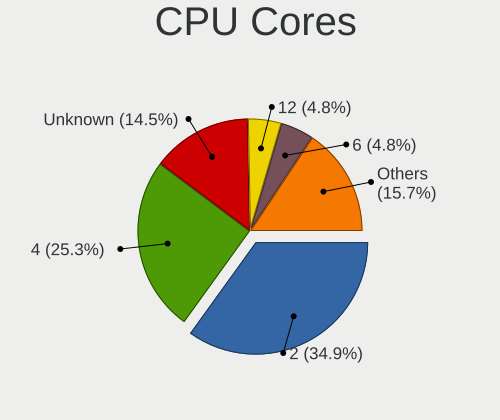

| Number  | Computers | Percent |
|---------|-----------|---------|
| 2       | 29        | 34.94%  |
| 4       | 21        | 25.3%   |
| Unknown | 12        | 14.46%  |
| 12      | 4         | 4.82%   |
| 6       | 4         | 4.82%   |
| 1       | 4         | 4.82%   |
| 16      | 3         | 3.61%   |
| 11      | 2         | 2.41%   |
| 8       | 2         | 2.41%   |
| 32      | 1         | 1.2%    |
| 9       | 1         | 1.2%    |

CPU Sockets
-----------

Number of sockets

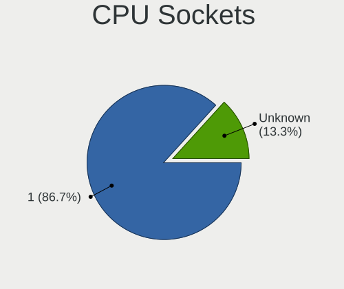

| Number  | Computers | Percent |
|---------|-----------|---------|
| 1       | 72        | 86.75%  |
| Unknown | 11        | 13.25%  |

CPU Threads
-----------

Threads per core (Hyper-Threading)

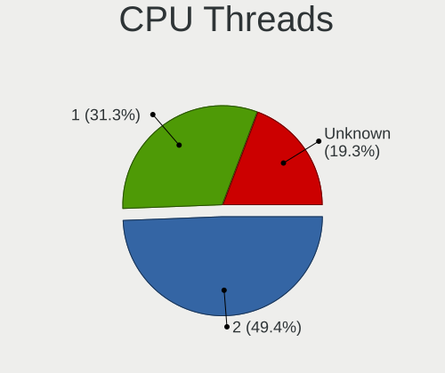

| Number  | Computers | Percent |
|---------|-----------|---------|
| 2       | 41        | 49.4%   |
| 1       | 26        | 31.33%  |
| Unknown | 16        | 19.28%  |

CPU Microarch
-------------

Microarchitecture

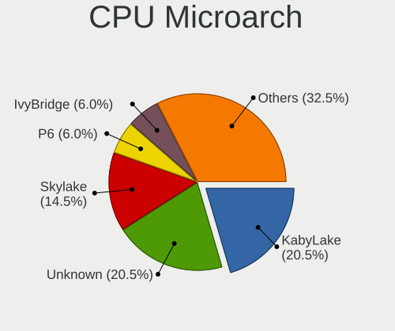

| Name        | Computers | Percent |
|-------------|-----------|---------|
| KabyLake    | 17        | 20.48%  |
| Unknown     | 17        | 20.48%  |
| Skylake     | 12        | 14.46%  |
| P6          | 5         | 6.02%   |
| IvyBridge   | 5         | 6.02%   |
| Westmere    | 3         | 3.61%   |
| SandyBridge | 3         | 3.61%   |
| Zen 2       | 2         | 2.41%   |
| TigerLake   | 2         | 2.41%   |
| Nehalem     | 2         | 2.41%   |
| Haswell     | 2         | 2.41%   |
| Broadwell   | 2         | 2.41%   |
| Bonnell     | 2         | 2.41%   |
| Zen+        | 1         | 1.2%    |
| Zen 3       | 1         | 1.2%    |
| Piledriver  | 1         | 1.2%    |
| Penryn      | 1         | 1.2%    |
| NetBurst    | 1         | 1.2%    |
| K10         | 1         | 1.2%    |
| Excavator   | 1         | 1.2%    |
| Core        | 1         | 1.2%    |
| CometLake   | 1         | 1.2%    |

Graphics
--------

GPU Vendor
----------

Vendors of graphics cards

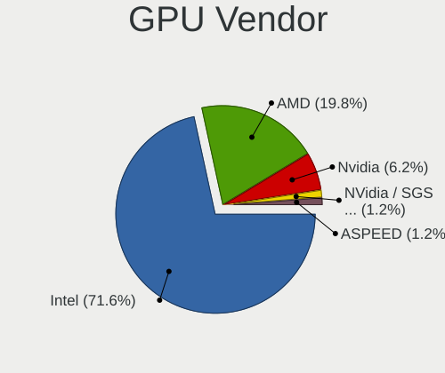

| Vendor                               | Computers | Percent |
|--------------------------------------|-----------|---------|
| Intel                                | 58        | 71.6%   |
| AMD                                  | 16        | 19.75%  |
| Nvidia                               | 5         | 6.17%   |
| NVidia / SGS Thomson (Joint Venture) | 1         | 1.23%   |
| ASPEED Technology                    | 1         | 1.23%   |

GPU Model
---------

Graphics card models

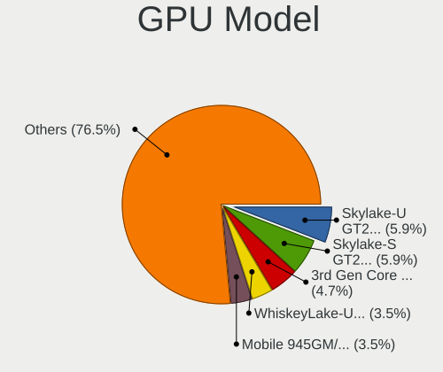

| Model                                                                         | Computers | Percent |
|-------------------------------------------------------------------------------|-----------|---------|
| Intel Skylake-U GT2 [HD Graphics 520]                                         | 5         | 5.88%   |
| Intel Skylake-S GT2 [HD Graphics 530]                                         | 5         | 5.88%   |
| Intel 3rd Gen Core processor Graphics Controller                              | 4         | 4.71%   |
| Intel WhiskeyLake-U GT2 [UHD Graphics 620]                                    | 3         | 3.53%   |
| Intel Mobile 945GM/GMS/GME, 943/940GML Express Integrated Graphics Controller | 3         | 3.53%   |
| Intel Kaby Lake-U GT2 [HD Graphics 620]                                       | 3         | 3.53%   |
| Intel CometLake-U GT2 [UHD Graphics]                                          | 3         | 3.53%   |
| Intel 2nd Generation Core Processor Family Integrated Graphics Controller     | 3         | 3.53%   |
| Intel Xeon E3-1200 v3/4th Gen Core Processor Integrated Graphics Controller   | 2         | 2.35%   |
| Intel Mobile 945GM/GMS, 943/940GML Express Integrated Graphics Controller     | 2         | 2.35%   |
| Intel Mobile 915GM/GMS/910GML Express Graphics Controller                     | 2         | 2.35%   |
| Intel Meteor Lake-P [Intel Arc Graphics]                                      | 2         | 2.35%   |
| Intel Kaby Lake-U GT3 [Iris Plus Graphics 640]                                | 2         | 2.35%   |
| Intel Kaby Lake-S GT2 [HD Graphics 630]                                       | 2         | 2.35%   |
| Intel Kaby Lake-R GT2 [UHD Graphics 620]                                      | 2         | 2.35%   |
| Intel Core Processor Integrated Graphics Controller                           | 2         | 2.35%   |
| Intel Broadwell-U GT2 [HD Graphics 5500]                                      | 2         | 2.35%   |
| AMD Renoir [Radeon Vega Series / Radeon Vega Mobile Series]                   | 2         | 2.35%   |
| AMD Phoenix2                                                                  | 2         | 2.35%   |
| AMD Phoenix1                                                                  | 2         | 2.35%   |
| AMD Oland GL [FirePro W2100]                                                  | 2         | 2.35%   |
| Nvidia TU117M [GeForce GTX 1650 Ti Mobile]                                    | 1         | 1.18%   |
| Nvidia NV44A [GeForce 6200]                                                   | 1         | 1.18%   |
| Nvidia GT216GLM [Quadro FX 880M]                                              | 1         | 1.18%   |
| Nvidia GK208M [GeForce GT 735M]                                               | 1         | 1.18%   |
| Nvidia G72M [Quadro NVS 110M/GeForce Go 7300]                                 | 1         | 1.18%   |
| NVidia / SGS Thomson (Joint Venture) Riva128                                  | 1         | 1.18%   |
| Intel Xeon E3-1200 v2/3rd Gen Core processor Graphics Controller              | 1         | 1.18%   |
| Intel TigerLake-LP GT2 [Iris Xe Graphics]                                     | 1         | 1.18%   |
| Intel Tiger Lake-LP GT2 [UHD Graphics G4]                                     | 1         | 1.18%   |
| Intel Skylake-Y GT2 [HD Graphics 515]                                         | 1         | 1.18%   |
| Intel Skylake-S GT1 [HD Graphics 510]                                         | 1         | 1.18%   |
| Intel Raptor Lake-P [Iris Xe Graphics]                                        | 1         | 1.18%   |
| Intel Mobile 945GSE Express Integrated Graphics Controller                    | 1         | 1.18%   |
| Intel Mobile 4 Series Chipset Integrated Graphics Controller                  | 1         | 1.18%   |
| Intel Meteor Lake-P [Intel Graphics]                                          | 1         | 1.18%   |
| Intel Kaby Lake-U GT1 [HD Graphics 610]                                       | 1         | 1.18%   |
| Intel CometLake-H GT2 [UHD Graphics]                                          | 1         | 1.18%   |
| Intel CoffeeLake-S GT2 [UHD Graphics 630]                                     | 1         | 1.18%   |
| Intel Atom Processor D2xxx/N2xxx Integrated Graphics Controller               | 1         | 1.18%   |

GPU Combo
---------

Combinations of graphics cards

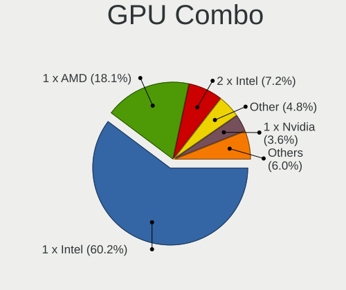

| Name                                     | Computers | Percent |
|------------------------------------------|-----------|---------|
| 1 x Intel                                | 50        | 60.24%  |
| 1 x AMD                                  | 15        | 18.07%  |
| 2 x Intel                                | 6         | 7.23%   |
| Other                                    | 4         | 4.82%   |
| 1 x Nvidia                               | 3         | 3.61%   |
| Intel + Nvidia                           | 2         | 2.41%   |
| 2 x AMD                                  | 1         | 1.2%    |
| 1 x NVidia / SGS Thomson (Joint Venture) | 1         | 1.2%    |
| 1 x ASPEED                               | 1         | 1.2%    |

GPU Driver
----------

Free vs proprietary

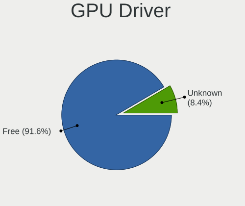

| Driver  | Computers | Percent |
|---------|-----------|---------|
| Free    | 76        | 91.57%  |
| Unknown | 7         | 8.43%   |

GPU Memory
----------

Total video memory

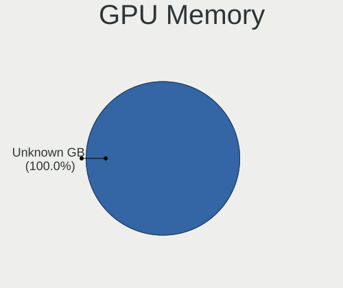

| Size in GB | Computers | Percent |
|------------|-----------|---------|
| Unknown    | 83        | 100%    |

Monitor
-------

Monitor Vendor
--------------

Monitor vendors

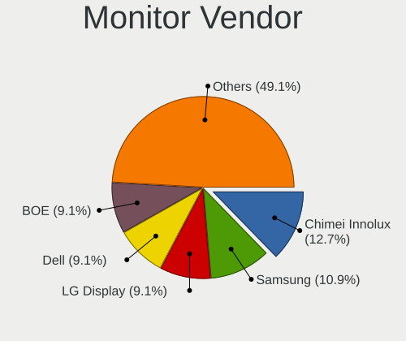

| Vendor               | Computers | Percent |
|----------------------|-----------|---------|
| Chimei Innolux       | 7         | 12.73%  |
| Samsung Electronics  | 6         | 10.91%  |
| LG Display           | 5         | 9.09%   |
| Dell                 | 5         | 9.09%   |
| BOE                  | 5         | 9.09%   |
| Philips              | 4         | 7.27%   |
| AU Optronics         | 4         | 7.27%   |
| Lenovo               | 3         | 5.45%   |
| Goldstar             | 2         | 3.64%   |
| Gigabyte Technology  | 2         | 3.64%   |
| Acer                 | 2         | 3.64%   |
| Sharp                | 1         | 1.82%   |
| LG Philips           | 1         | 1.82%   |
| JDI                  | 1         | 1.82%   |
| InfoVision           | 1         | 1.82%   |
| Iiyama               | 1         | 1.82%   |
| HKC                  | 1         | 1.82%   |
| Hewlett-Packard      | 1         | 1.82%   |
| ASUSTek Computer     | 1         | 1.82%   |
| Apple                | 1         | 1.82%   |
| Ancor Communications | 1         | 1.82%   |

Monitor Model
-------------

Monitor models

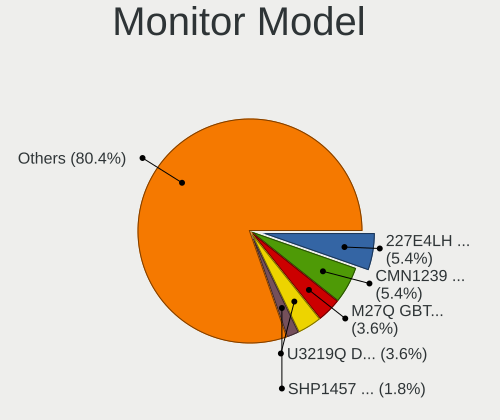

| Model                                                                 | Computers | Percent |
|-----------------------------------------------------------------------|-----------|---------|
| Philips 227E4LH PHLC0AC 1920x1080 480x270mm 21.7-inch                 | 3         | 5.36%   |
| Chimei Innolux LCD Monitor CMN1239 1920x1080 280x160mm 12.7-inch      | 3         | 5.36%   |
| Gigabyte Technology M27Q GBT270D 2560x1440 700x390mm 31.5-inch        | 2         | 3.57%   |
| Dell U3219Q DELA125 3840x2160 700x390mm 31.5-inch                     | 2         | 3.57%   |
| Sharp LCD Monitor SHP1457 2560x1440 280x160mm 12.7-inch               | 1         | 1.79%   |
| Samsung Electronics U28E590 SAM0C4D 3840x2160 610x350mm 27.7-inch     | 1         | 1.79%   |
| Samsung Electronics SyncMaster SAM022B 1280x1024 340x270mm 17.1-inch  | 1         | 1.79%   |
| Samsung Electronics S22A33x SAM7122 1920x1080 480x260mm 21.5-inch     | 1         | 1.79%   |
| Samsung Electronics LCD Monitor SEC3246 1366x768 290x160mm 13.0-inch  | 1         | 1.79%   |
| Samsung Electronics LCD Monitor SEC304C 1366x768 310x170mm 13.9-inch  | 1         | 1.79%   |
| Samsung Electronics LCD Monitor SDC4158 1920x1080 290x170mm 13.2-inch | 1         | 1.79%   |
| Philips 221B PHL08A1 1920x1080 480x270mm 21.7-inch                    | 1         | 1.79%   |
| LG Philips LP154WX4-TLCB LPL3101 1280x800 330x210mm 15.4-inch         | 1         | 1.79%   |
| LG Display LCD Monitor LGD05FA 1920x1080 310x170mm 13.9-inch          | 1         | 1.79%   |
| LG Display LCD Monitor LGD05A2 1920x1080 310x170mm 13.9-inch          | 1         | 1.79%   |
| LG Display LCD Monitor LGD045E 1366x768 310x170mm 13.9-inch           | 1         | 1.79%   |
| LG Display LCD Monitor LGD03CD 1366x768 280x160mm 12.7-inch           | 1         | 1.79%   |
| LG Display LCD Monitor LGD0215 1920x1080 350x190mm 15.7-inch          | 1         | 1.79%   |
| Lenovo LEN L174 LEN240B 1280x1024 340x270mm 17.1-inch                 | 1         | 1.79%   |
| Lenovo LCD Monitor LEN8AB1 3072x1920 310x200mm 14.5-inch              | 1         | 1.79%   |
| Lenovo LCD Monitor LEN40B0 1366x768 350x190mm 15.7-inch               | 1         | 1.79%   |
| JDI LCD Monitor JDI364C 3000x2000 270x180mm 12.8-inch                 | 1         | 1.79%   |
| InfoVision LCD Monitor IVO04E5 1366x768 280x160mm 12.7-inch           | 1         | 1.79%   |
| Iiyama PL2793H IVM66A4 1920x1080 600x340mm 27.2-inch                  | 1         | 1.79%   |
| HKC F2145M HKC2251 1920x1080 480x260mm 21.5-inch                      | 1         | 1.79%   |
| Hewlett-Packard LP2465 HWP2676 1920x1200 520x330mm 24.2-inch          | 1         | 1.79%   |
| Goldstar LG ULTRAGEAR GSM776E 2560x1440 700x390mm 31.5-inch           | 1         | 1.79%   |
| Goldstar BL450 GSM5B86 1920x1080 480x270mm 21.7-inch                  | 1         | 1.79%   |
| Dell U3219Q DELA124 3840x2160 700x390mm 31.5-inch                     | 1         | 1.79%   |
| Dell U2720Q DEL41B5 3840x2160 600x340mm 27.2-inch                     | 1         | 1.79%   |
| Dell S2722DC DELA1D2 2560x1440 590x330mm 26.6-inch                    | 1         | 1.79%   |
| Dell P2412H DELA07C 1920x1080 530x300mm 24.0-inch                     | 1         | 1.79%   |
| Chimei Innolux LCD Monitor CMN15BB 1920x1080 340x190mm 15.3-inch      | 1         | 1.79%   |
| Chimei Innolux LCD Monitor CMN14D4 1920x1080 310x170mm 13.9-inch      | 1         | 1.79%   |
| Chimei Innolux LCD Monitor CMN143F 1920x1200 300x190mm 14.0-inch      | 1         | 1.79%   |
| Chimei Innolux LCD Monitor CMN1387 1920x1080 290x170mm 13.2-inch      | 1         | 1.79%   |
| BOE NE135A1M-NY1 BOE0CB4 2880x1920 290x190mm 13.6-inch                | 1         | 1.79%   |
| BOE LCD Monitor BOE0BCA 2256x1504 280x190mm 13.3-inch                 | 1         | 1.79%   |
| BOE LCD Monitor BOE0812 1920x1080 340x190mm 15.3-inch                 | 1         | 1.79%   |
| BOE LCD Monitor BOE07CB 1920x1080 340x190mm 15.3-inch                 | 1         | 1.79%   |

Monitor Resolution
------------------

Monitor screen resolution

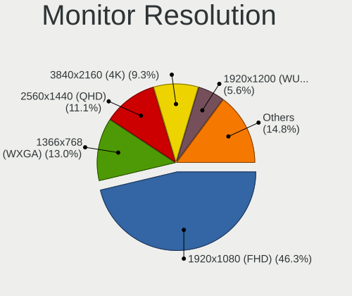

| Resolution        | Computers | Percent |
|-------------------|-----------|---------|
| 1920x1080 (FHD)   | 25        | 46.3%   |
| 1366x768 (WXGA)   | 7         | 12.96%  |
| 2560x1440 (QHD)   | 6         | 11.11%  |
| 3840x2160 (4K)    | 5         | 9.26%   |
| 1920x1200 (WUXGA) | 3         | 5.56%   |
| 1280x1024 (SXGA)  | 2         | 3.7%    |
| 3072x1920         | 1         | 1.85%   |
| 3000x2000         | 1         | 1.85%   |
| 2880x1920         | 1         | 1.85%   |
| 2256x1504         | 1         | 1.85%   |
| 1440x900 (WXGA+)  | 1         | 1.85%   |
| 1280x800 (WXGA)   | 1         | 1.85%   |

Monitor Diagonal
----------------

Diagonal size in inches

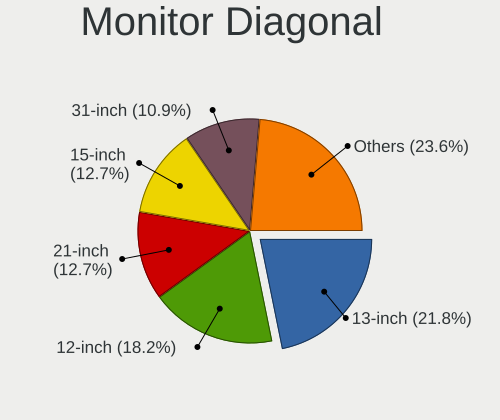

| Inches | Computers | Percent |
|--------|-----------|---------|
| 13     | 12        | 21.82%  |
| 12     | 10        | 18.18%  |
| 21     | 7         | 12.73%  |
| 15     | 7         | 12.73%  |
| 31     | 6         | 10.91%  |
| 27     | 5         | 9.09%   |
| 24     | 3         | 5.45%   |
| 17     | 2         | 3.64%   |
| 14     | 2         | 3.64%   |
| 26     | 1         | 1.82%   |

Monitor Width
-------------

Physical width

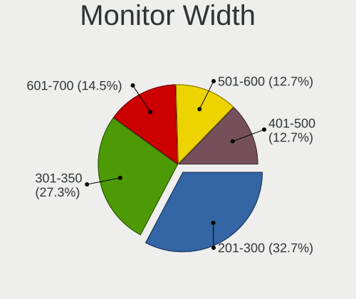

| Width in mm | Computers | Percent |
|-------------|-----------|---------|
| 201-300     | 18        | 32.73%  |
| 301-350     | 15        | 27.27%  |
| 601-700     | 8         | 14.55%  |
| 501-600     | 7         | 12.73%  |
| 401-500     | 7         | 12.73%  |

Aspect Ratio
------------

Proportional relationship between the width and the height

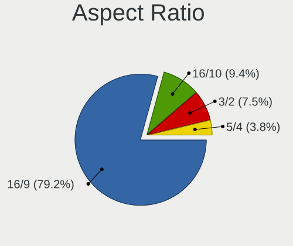

| Ratio | Computers | Percent |
|-------|-----------|---------|
| 16/9  | 42        | 79.25%  |
| 16/10 | 5         | 9.43%   |
| 3/2   | 4         | 7.55%   |
| 5/4   | 2         | 3.77%   |

Monitor Area
------------

Area in inch²

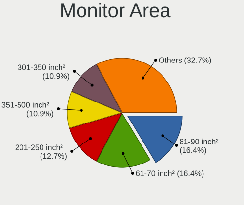

| Area in inch² | Computers | Percent |
|----------------|-----------|---------|
| 81-90          | 9         | 16.36%  |
| 61-70          | 9         | 16.36%  |
| 201-250        | 7         | 12.73%  |
| 351-500        | 6         | 10.91%  |
| 301-350        | 6         | 10.91%  |
| 71-80          | 5         | 9.09%   |
| 101-110        | 4         | 7.27%   |
| 91-100         | 4         | 7.27%   |
| 151-200        | 2         | 3.64%   |
| 141-150        | 2         | 3.64%   |
| 251-300        | 1         | 1.82%   |

Pixel Density
-------------

Pixels per inch

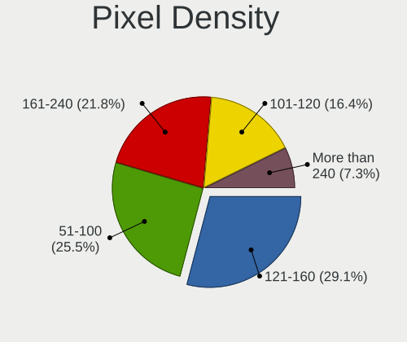

| Density       | Computers | Percent |
|---------------|-----------|---------|
| 121-160       | 16        | 29.09%  |
| 51-100        | 14        | 25.45%  |
| 161-240       | 12        | 21.82%  |
| 101-120       | 9         | 16.36%  |
| More than 240 | 4         | 7.27%   |

Multiple Monitors
-----------------

Total monitors connected

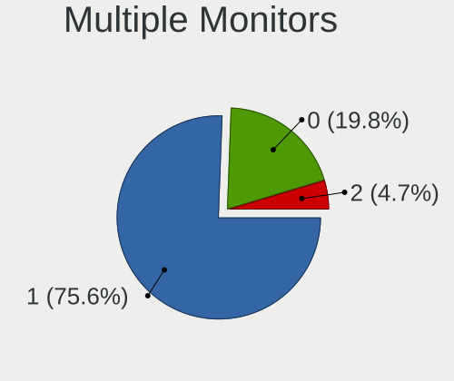

| Total | Computers | Percent |
|-------|-----------|---------|
| 1     | 65        | 75.58%  |
| 0     | 17        | 19.77%  |
| 2     | 4         | 4.65%   |

Network
-------

Net Controller Vendor
---------------------

Controller vendors

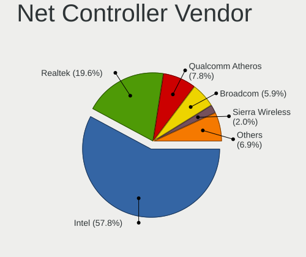

| Vendor                   | Computers | Percent |
|--------------------------|-----------|---------|
| Intel                    | 59        | 57.84%  |
| Realtek Semiconductor    | 20        | 19.61%  |
| Qualcomm Atheros         | 8         | 7.84%   |
| Broadcom                 | 6         | 5.88%   |
| Sierra Wireless          | 2         | 1.96%   |
| MediaTek                 | 2         | 1.96%   |
| Qualcomm Technologies    | 1         | 0.98%   |
| Marvell Technology Group | 1         | 0.98%   |
| D-Link                   | 1         | 0.98%   |
| Apple                    | 1         | 0.98%   |
| American Megatrends      | 1         | 0.98%   |

Net Controller Model
--------------------

Controller models

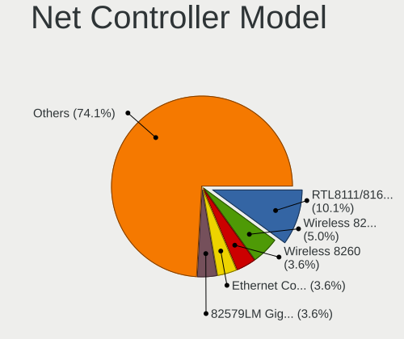

| Model                                                                  | Computers | Percent |
|------------------------------------------------------------------------|-----------|---------|
| Realtek RTL8111/8168/8211/8411 PCI Express Gigabit Ethernet Controller | 14        | 10.07%  |
| Intel Wireless 8265 / 8275                                             | 7         | 5.04%   |
| Intel Wireless 8260                                                    | 5         | 3.6%    |
| Intel Ethernet Connection I219-LM                                      | 5         | 3.6%    |
| Intel 82579LM Gigabit Network Connection (Lewisville)                  | 5         | 3.6%    |
| Intel Wi-Fi 6 AX200                                                    | 4         | 2.88%   |
| Intel Ethernet Connection (4) I219-V                                   | 4         | 2.88%   |
| Intel Ethernet Connection (2) I219-LM                                  | 4         | 2.88%   |
| Intel Wireless 7265                                                    | 3         | 2.16%   |
| Intel Wi-Fi 6E(802.11ax) AX210/AX1675* 2x2 [Typhoon Peak]              | 3         | 2.16%   |
| Intel Ethernet Connection (6) I219-V                                   | 3         | 2.16%   |
| Intel Ethernet Connection (5) I219-LM                                  | 3         | 2.16%   |
| Intel Ethernet Connection (4) I219-LM                                  | 3         | 2.16%   |
| Intel Comet Lake PCH-LP CNVi WiFi                                      | 3         | 2.16%   |
| Intel Centrino Advanced-N 6205 [Taylor Peak]                           | 3         | 2.16%   |
| Intel Cannon Point-LP CNVi [Wireless-AC]                               | 3         | 2.16%   |
| Intel 82577LM Gigabit Network Connection                               | 3         | 2.16%   |
| Qualcomm Atheros AR9462 Wireless Network Adapter                       | 2         | 1.44%   |
| Intel Wi-Fi 6 AX201                                                    | 2         | 1.44%   |
| Intel PRO/Wireless 3945ABG [Golan] Network Connection                  | 2         | 1.44%   |
| Intel Ethernet Connection I217-LM                                      | 2         | 1.44%   |
| Intel Ethernet Connection (3) I218-LM                                  | 2         | 1.44%   |
| Intel Ethernet Connection (10) I219-V                                  | 2         | 1.44%   |
| Intel Centrino Advanced-N 6200                                         | 2         | 1.44%   |
| Sierra Wireless EM7455                                                 | 1         | 0.72%   |
| Sierra Wireless EM7305 Modem                                           | 1         | 0.72%   |
| Realtek USB 2.5GbE Controller                                          | 1         | 0.72%   |
| Realtek RTL8852BE PCIe 802.11ax Wireless Network Controller            | 1         | 0.72%   |
| Realtek RTL8188EUS 802.11n Wireless Network Adapter                    | 1         | 0.72%   |
| Realtek RTL8188EE Wireless Network Adapter                             | 1         | 0.72%   |
| Realtek RTL8125 2.5GbE Controller                                      | 1         | 0.72%   |
| Realtek RTL810xE PCI Express Fast Ethernet controller                  | 1         | 0.72%   |
| Realtek RTL-8110SC/8169SC Gigabit Ethernet                             | 1         | 0.72%   |
| Realtek RTL-8100/8101L/8139 PCI Fast Ethernet Adapter                  | 1         | 0.72%   |
| Qualcomm WCN785x Wi-Fi 7(802.11be) 320MHz 2x2 [FastConnect 7800]       | 1         | 0.72%   |
| Qualcomm Atheros QCA9565 / AR9565 Wireless Network Adapter             | 1         | 0.72%   |
| Qualcomm Atheros Attansic L2 Fast Ethernet                             | 1         | 0.72%   |
| Qualcomm Atheros AR928X Wireless Network Adapter (PCI-Express)         | 1         | 0.72%   |
| Qualcomm Atheros AR9227 Wireless Network Adapter                       | 1         | 0.72%   |
| Qualcomm Atheros AR8131 Gigabit Ethernet                               | 1         | 0.72%   |

Wireless Vendor
---------------

Wireless vendors

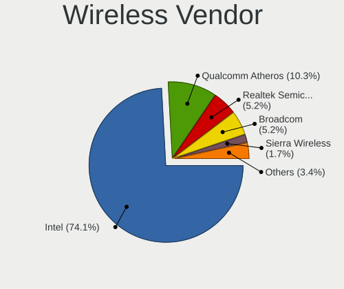

| Vendor                | Computers | Percent |
|-----------------------|-----------|---------|
| Intel                 | 43        | 74.14%  |
| Qualcomm Atheros      | 6         | 10.34%  |
| Realtek Semiconductor | 3         | 5.17%   |
| Broadcom              | 3         | 5.17%   |
| Sierra Wireless       | 1         | 1.72%   |
| MediaTek              | 1         | 1.72%   |
| D-Link                | 1         | 1.72%   |

Wireless Model
--------------

Wireless models

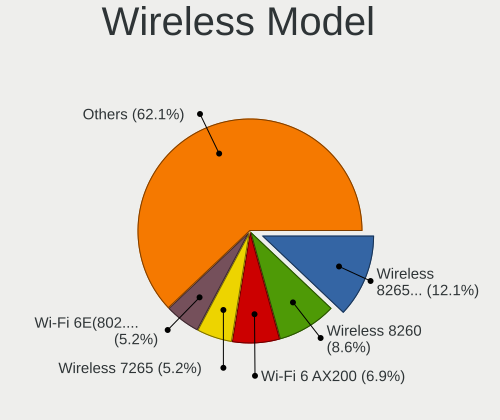

| Model                                                                   | Computers | Percent |
|-------------------------------------------------------------------------|-----------|---------|
| Intel Wireless 8265 / 8275                                              | 7         | 12.07%  |
| Intel Wireless 8260                                                     | 5         | 8.62%   |
| Intel Wi-Fi 6 AX200                                                     | 4         | 6.9%    |
| Intel Wireless 7265                                                     | 3         | 5.17%   |
| Intel Wi-Fi 6E(802.11ax) AX210/AX1675* 2x2 [Typhoon Peak]               | 3         | 5.17%   |
| Intel Comet Lake PCH-LP CNVi WiFi                                       | 3         | 5.17%   |
| Intel Centrino Advanced-N 6205 [Taylor Peak]                            | 3         | 5.17%   |
| Intel Cannon Point-LP CNVi [Wireless-AC]                                | 3         | 5.17%   |
| Qualcomm Atheros AR9462 Wireless Network Adapter                        | 2         | 3.45%   |
| Intel Wi-Fi 6 AX201                                                     | 2         | 3.45%   |
| Intel PRO/Wireless 3945ABG [Golan] Network Connection                   | 2         | 3.45%   |
| Intel Centrino Advanced-N 6200                                          | 2         | 3.45%   |
| Sierra Wireless EM7455                                                  | 1         | 1.72%   |
| Realtek RTL8852BE PCIe 802.11ax Wireless Network Controller             | 1         | 1.72%   |
| Realtek RTL8188EUS 802.11n Wireless Network Adapter                     | 1         | 1.72%   |
| Realtek RTL8188EE Wireless Network Adapter                              | 1         | 1.72%   |
| Qualcomm Atheros QCA9565 / AR9565 Wireless Network Adapter              | 1         | 1.72%   |
| Qualcomm Atheros AR928X Wireless Network Adapter (PCI-Express)          | 1         | 1.72%   |
| Qualcomm Atheros AR9227 Wireless Network Adapter                        | 1         | 1.72%   |
| Qualcomm Atheros AR242x / AR542x Wireless Network Adapter (PCI-Express) | 1         | 1.72%   |
| MediaTek MT7922 802.11ax PCI Express Wireless Network Adapter           | 1         | 1.72%   |
| Intel Raptor Lake PCH CNVi WiFi                                         | 1         | 1.72%   |
| Intel PRO/Wireless 2915ABG [Calexico2] Network Connection               | 1         | 1.72%   |
| Intel Meteor Lake PCH CNVi WiFi                                         | 1         | 1.72%   |
| Intel Comet Lake PCH CNVi WiFi                                          | 1         | 1.72%   |
| Intel Centrino Advanced-N + WiMAX 6250 [Kilmer Peak]                    | 1         | 1.72%   |
| Intel Alder Lake-N PCH CNVi WiFi                                        | 1         | 1.72%   |
| D-Link DWA-125 Wireless N 150 Adapter(rev.A3) [Ralink RT5370]           | 1         | 1.72%   |
| Broadcom BCM4350 802.11ac Wireless Network Adapter                      | 1         | 1.72%   |
| Broadcom BCM43224 802.11a/b/g/n                                         | 1         | 1.72%   |
| Broadcom BCM4311 802.11b/g WLAN                                         | 1         | 1.72%   |

Ethernet Vendor
---------------

Ethernet vendors

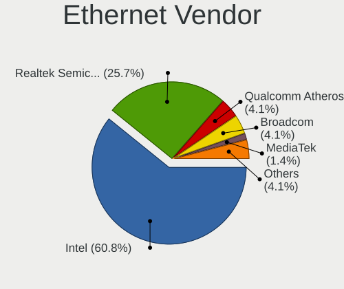

| Vendor                   | Computers | Percent |
|--------------------------|-----------|---------|
| Intel                    | 45        | 60.81%  |
| Realtek Semiconductor    | 19        | 25.68%  |
| Qualcomm Atheros         | 3         | 4.05%   |
| Broadcom                 | 3         | 4.05%   |
| MediaTek                 | 1         | 1.35%   |
| Marvell Technology Group | 1         | 1.35%   |
| Apple                    | 1         | 1.35%   |
| American Megatrends      | 1         | 1.35%   |

Ethernet Model
--------------

Ethernet models

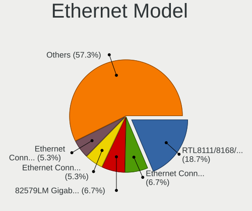

| Model                                                                  | Computers | Percent |
|------------------------------------------------------------------------|-----------|---------|
| Realtek RTL8111/8168/8211/8411 PCI Express Gigabit Ethernet Controller | 14        | 18.67%  |
| Intel Ethernet Connection I219-LM                                      | 5         | 6.67%   |
| Intel 82579LM Gigabit Network Connection (Lewisville)                  | 5         | 6.67%   |
| Intel Ethernet Connection (4) I219-V                                   | 4         | 5.33%   |
| Intel Ethernet Connection (2) I219-LM                                  | 4         | 5.33%   |
| Intel Ethernet Connection (6) I219-V                                   | 3         | 4%      |
| Intel Ethernet Connection (5) I219-LM                                  | 3         | 4%      |
| Intel Ethernet Connection (4) I219-LM                                  | 3         | 4%      |
| Intel 82577LM Gigabit Network Connection                               | 3         | 4%      |
| Intel Ethernet Connection I217-LM                                      | 2         | 2.67%   |
| Intel Ethernet Connection (3) I218-LM                                  | 2         | 2.67%   |
| Intel Ethernet Connection (10) I219-V                                  | 2         | 2.67%   |
| Realtek USB 2.5GbE Controller                                          | 1         | 1.33%   |
| Realtek RTL8125 2.5GbE Controller                                      | 1         | 1.33%   |
| Realtek RTL810xE PCI Express Fast Ethernet controller                  | 1         | 1.33%   |
| Realtek RTL-8110SC/8169SC Gigabit Ethernet                             | 1         | 1.33%   |
| Realtek RTL-8100/8101L/8139 PCI Fast Ethernet Adapter                  | 1         | 1.33%   |
| Qualcomm Atheros Attansic L2 Fast Ethernet                             | 1         | 1.33%   |
| Qualcomm Atheros AR8131 Gigabit Ethernet                               | 1         | 1.33%   |
| Qualcomm Atheros AR8121/AR8113/AR8114 Gigabit or Fast Ethernet         | 1         | 1.33%   |
| MediaTek USB Ethernet-RNDIS                                            | 1         | 1.33%   |
| Marvell Group 88E8053 PCI-E Gigabit Ethernet Controller                | 1         | 1.33%   |
| Intel I211 Gigabit Network Connection                                  | 1         | 1.33%   |
| Intel I210 Gigabit Network Connection                                  | 1         | 1.33%   |
| Intel Ethernet Controller I225-V                                       | 1         | 1.33%   |
| Intel Ethernet Connection I219-V                                       | 1         | 1.33%   |
| Intel Ethernet Connection (7) I219-LM                                  | 1         | 1.33%   |
| Intel Ethernet Connection (23) I219-V                                  | 1         | 1.33%   |
| Intel Ethernet Connection (18) I219-LM                                 | 1         | 1.33%   |
| Intel 82579V Gigabit Network Connection                                | 1         | 1.33%   |
| Intel 82574L Gigabit Network Connection                                | 1         | 1.33%   |
| Intel 82573L Gigabit Ethernet Controller                               | 1         | 1.33%   |
| Broadcom NetXtreme BCM5752 Gigabit Ethernet PCI Express                | 1         | 1.33%   |
| Broadcom NetXtreme BCM5751M Gigabit Ethernet PCI Express               | 1         | 1.33%   |
| Broadcom NetXtreme BCM5720 Gigabit Ethernet PCIe                       | 1         | 1.33%   |
| Apple Ethernet Adapter [A1277]                                         | 1         | 1.33%   |
| American Megatrends Virtual Ethernet                                   | 1         | 1.33%   |

Net Controller Kind
-------------------

Ethernet, WiFi or modem

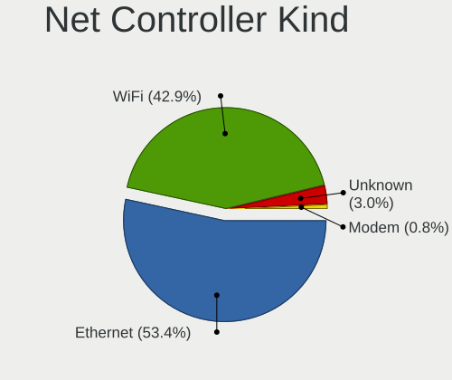

| Kind     | Computers | Percent |
|----------|-----------|---------|
| Ethernet | 71        | 53.38%  |
| WiFi     | 57        | 42.86%  |
| Unknown  | 4         | 3.01%   |
| Modem    | 1         | 0.75%   |

Used Controller
---------------

Currently used network controller

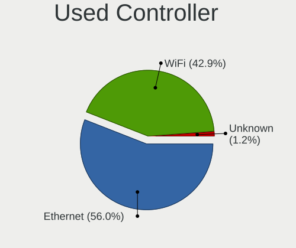

| Kind     | Computers | Percent |
|----------|-----------|---------|
| Ethernet | 47        | 55.95%  |
| WiFi     | 36        | 42.86%  |
| Unknown  | 1         | 1.19%   |

NICs
----

Total network controllers on board

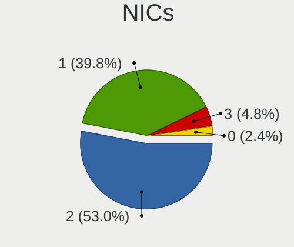

| Total | Computers | Percent |
|-------|-----------|---------|
| 2     | 44        | 53.01%  |
| 1     | 33        | 39.76%  |
| 3     | 4         | 4.82%   |
| 0     | 2         | 2.41%   |

IPv6
----

IPv6 vs IPv4

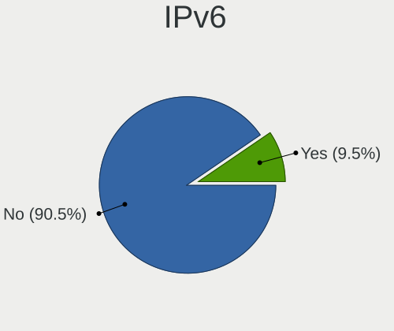

| Used | Computers | Percent |
|------|-----------|---------|
| No   | 76        | 90.48%  |
| Yes  | 8         | 9.52%   |

Bluetooth
---------

Bluetooth Vendor
----------------

Controller vendors

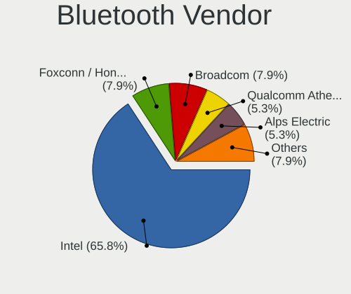

| Vendor                          | Computers | Percent |
|---------------------------------|-----------|---------|
| Intel                           | 25        | 65.79%  |
| Foxconn / Hon Hai               | 3         | 7.89%   |
| Broadcom                        | 3         | 7.89%   |
| Qualcomm Atheros Communications | 2         | 5.26%   |
| Alps Electric                   | 2         | 5.26%   |
| Realtek Semiconductor           | 1         | 2.63%   |
| ASUSTek Computer                | 1         | 2.63%   |
| Apple                           | 1         | 2.63%   |

Bluetooth Model
---------------

Controller models

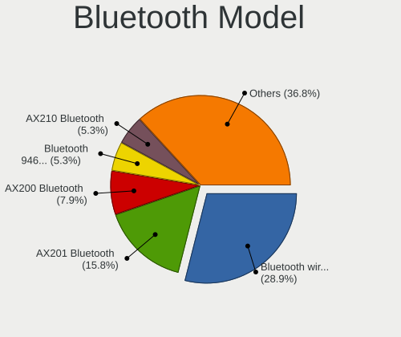

| Model                                                    | Computers | Percent |
|----------------------------------------------------------|-----------|---------|
| Intel Bluetooth wireless interface                       | 11        | 28.95%  |
| Intel AX201 Bluetooth                                    | 6         | 15.79%  |
| Intel AX200 Bluetooth                                    | 3         | 7.89%   |
| Intel Bluetooth 9460/9560 Jefferson Peak (JfP)           | 2         | 5.26%   |
| Intel AX210 Bluetooth                                    | 2         | 5.26%   |
| Alps Electric UGTZ4 Bluetooth                            | 2         | 5.26%   |
| Realtek Bluetooth Adapter                                | 1         | 2.63%   |
| Qualcomm Atheros AR9462 Bluetooth                        | 1         | 2.63%   |
| Qualcomm Atheros AR3012 Bluetooth 4.0                    | 1         | 2.63%   |
| Intel AX211 Bluetooth                                    | 1         | 2.63%   |
| Foxconn / Hon Hai RZ616 Bluetooth Adapter                | 1         | 2.63%   |
| Foxconn / Hon Hai Broadcom BCM20702 Bluetooth USB Device | 1         | 2.63%   |
| Foxconn / Hon Hai Bluetooth USB Module                   | 1         | 2.63%   |
| Broadcom Bluetooth 4.1 USB                               | 1         | 2.63%   |
| Broadcom BCM20702 Bluetooth 4.0 [ThinkPad]               | 1         | 2.63%   |
| Broadcom BCM2045B (BDC-2.1)                              | 1         | 2.63%   |
| ASUS Broadcom Bluetooth 2.1                              | 1         | 2.63%   |
| Apple Built-in Bluetooth 2.0+EDR HCI                     | 1         | 2.63%   |

Sound
-----

Sound Vendor
------------

Sound card vendors

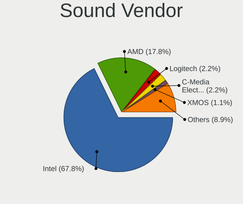

| Vendor              | Computers | Percent |
|---------------------|-----------|---------|
| Intel               | 61        | 67.78%  |
| AMD                 | 16        | 17.78%  |
| Logitech            | 2         | 2.22%   |
| C-Media Electronics | 2         | 2.22%   |
| XMOS                | 1         | 1.11%   |
| Texas Instruments   | 1         | 1.11%   |
| Nvidia              | 1         | 1.11%   |
| GN Netcom           | 1         | 1.11%   |
| Focusrite-Novation  | 1         | 1.11%   |
| ESS Technology      | 1         | 1.11%   |
| Creative Technology | 1         | 1.11%   |
| Creative Labs       | 1         | 1.11%   |
| ASUSTek Computer    | 1         | 1.11%   |

Sound Model
-----------

Sound card models

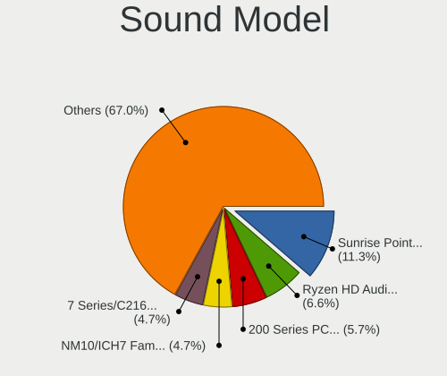

| Model                                                                                           | Computers | Percent |
|-------------------------------------------------------------------------------------------------|-----------|---------|
| Intel Sunrise Point-LP HD Audio                                                                 | 12        | 11.32%  |
| AMD Ryzen HD Audio Controller                                                                   | 7         | 6.6%    |
| Intel 200 Series PCH HD Audio                                                                   | 6         | 5.66%   |
| Intel NM10/ICH7 Family High Definition Audio Controller                                         | 5         | 4.72%   |
| Intel 7 Series/C216 Chipset Family High Definition Audio Controller                             | 5         | 4.72%   |
| AMD Radeon High Definition Audio Controller                                                     | 5         | 4.72%   |
| Intel Meteor Lake-P HD Audio Controller                                                         | 3         | 2.83%   |
| Intel Comet Lake PCH-LP cAVS                                                                    | 3         | 2.83%   |
| Intel Cannon Point-LP High Definition Audio Controller                                          | 3         | 2.83%   |
| Intel 6 Series/C200 Series Chipset Family High Definition Audio Controller                      | 3         | 2.83%   |
| Intel 5 Series/3400 Series Chipset High Definition Audio                                        | 3         | 2.83%   |
| Intel 100 Series/C230 Series Chipset Family HD Audio Controller                                 | 3         | 2.83%   |
| AMD Renoir/Cezanne HDMI/DP Audio Controller                                                     | 3         | 2.83%   |
| Intel Xeon E3-1200 v3/4th Gen Core Processor HD Audio Controller                                | 2         | 1.89%   |
| Intel Wildcat Point-LP High Definition Audio Controller                                         | 2         | 1.89%   |
| Intel Tiger Lake-LP Smart Sound Technology Audio Controller                                     | 2         | 1.89%   |
| Intel Broadwell-U Audio Controller                                                              | 2         | 1.89%   |
| Intel 8 Series/C220 Series Chipset High Definition Audio Controller                             | 2         | 1.89%   |
| AMD Oland/Hainan/Cape Verde/Pitcairn HDMI Audio [Radeon HD 7000 Series]                         | 2         | 1.89%   |
| XMOS iFi (by AMR) HD USB Audio                                                                  | 1         | 0.94%   |
| Texas Instruments PCM2902 Audio Codec                                                           | 1         | 0.94%   |
| Nvidia GT216 HDMI Audio Controller                                                              | 1         | 0.94%   |
| Logitech HD Webcam C910                                                                         | 1         | 0.94%   |
| Logitech G560 Gaming Speaker                                                                    | 1         | 0.94%   |
| Intel Raptor Lake-P/U/H cAVS                                                                    | 1         | 0.94%   |
| Intel Comet Lake PCH cAVS                                                                       | 1         | 0.94%   |
| Intel Cannon Lake PCH cAVS                                                                      | 1         | 0.94%   |
| Intel Alder Lake-N PCH High Definition Audio Controller                                         | 1         | 0.94%   |
| Intel 82801JI (ICH10 Family) HD Audio Controller                                                | 1         | 0.94%   |
| Intel 82801I (ICH9 Family) HD Audio Controller                                                  | 1         | 0.94%   |
| Intel 82801FB/FBM/FR/FW/FRW (ICH6 Family) High Definition Audio Controller                      | 1         | 0.94%   |
| Intel 82801FB/FBM/FR/FW/FRW (ICH6 Family) AC'97 Audio Controller                                | 1         | 0.94%   |
| Intel 82801DB/DBL/DBM (ICH4/ICH4-L/ICH4-M) AC'97 Audio Controller                               | 1         | 0.94%   |
| GN Netcom Jabra EVOLVE 20                                                                       | 1         | 0.94%   |
| Focusrite-Novation Scarlett 2i2 3rd Gen                                                         | 1         | 0.94%   |
| ESS Technology ES1978 Maestro 2E                                                                | 1         | 0.94%   |
| Creative Technology Sound Blaster Play! 3                                                       | 1         | 0.94%   |
| Creative Labs CA0132 Sound Core3D [Sound Blaster Recon3D / Z-Series / Sound BlasterX AE-5 Plus] | 1         | 0.94%   |
| C-Media Electronics CMI8738/CMI8768 PCI Audio                                                   | 1         | 0.94%   |
| C-Media Electronics C-Media USB Audio Device                                                    | 1         | 0.94%   |

Memory
------

Memory Vendor
-------------

Memory module vendors

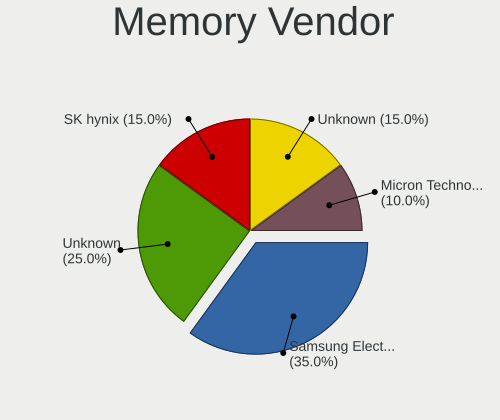

| Vendor              | Computers | Percent |
|---------------------|-----------|---------|
| Samsung Electronics | 7         | 35%     |
| Unknown             | 5         | 25%     |
| SK hynix            | 3         | 15%     |
| Unknown             | 3         | 15%     |
| Micron Technology   | 2         | 10%     |

Memory Model
------------

Memory module models

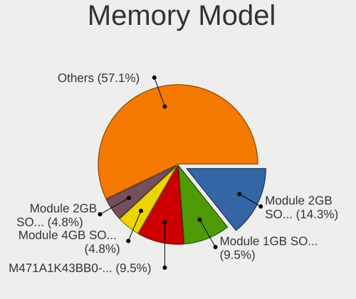

| Model                                                    | Computers | Percent |
|----------------------------------------------------------|-----------|---------|
| Unknown                                                  | 3         | 14.29%  |
| Unknown RAM Module 1GB SODIMM DDR2                       | 2         | 9.52%   |
| Samsung RAM M471A1K43BB0-CPB 8GB SODIMM DDR4 2133MT/s    | 2         | 9.52%   |
| Unknown RAM Module 4GB SODIMM DDR3 1333MT/s              | 1         | 4.76%   |
| Unknown RAM Module 2GB SODIMM DDR3 1067MT/s              | 1         | 4.76%   |
| Unknown RAM Module 1GB SODIMM DDR                        | 1         | 4.76%   |
| SK hynix RAM HMT351S6EFR8A-PB 4GB SODIMM DDR3 1600MT/s   | 1         | 4.76%   |
| SK hynix RAM HMT325S6BFR8C-H9 2GB SODIMM DDR3 1333MT/s   | 1         | 4.76%   |
| SK hynix RAM HMA81GU6AFR8N-UH 8GB DIMM DDR4 2400MT/s     | 1         | 4.76%   |
| Samsung RAM M471B5673FH0-CF8 2GB SODIMM DDR3 1067MT/s    | 1         | 4.76%   |
| Samsung RAM M471B5673EH1-CF8 2GB SODIMM DDR3 1067MT/s    | 1         | 4.76%   |
| Samsung RAM M471B5173BH0-CK0 4GB SODIMM DDR3 1600MT/s    | 1         | 4.76%   |
| Samsung RAM M471A2K43BB1-CRC 16GB SODIMM DDR4 2400MT/s   | 1         | 4.76%   |
| Samsung RAM M471A1K43CB1-CRC 8GB SODIMM DDR4 2667MT/s    | 1         | 4.76%   |
| Samsung RAM M425R2GA3PB0-CWMOD 16GB SODIMM DDR5 5600MT/s | 1         | 4.76%   |
| Micron RAM Module 8GB SODIMM DDR4 2133MT/s               | 1         | 4.76%   |
| Micron RAM 4ATS1G64HZ-2G6E1 8GB SODIMM DDR4 2667MT/s     | 1         | 4.76%   |

Memory Kind
-----------

Memory module kinds

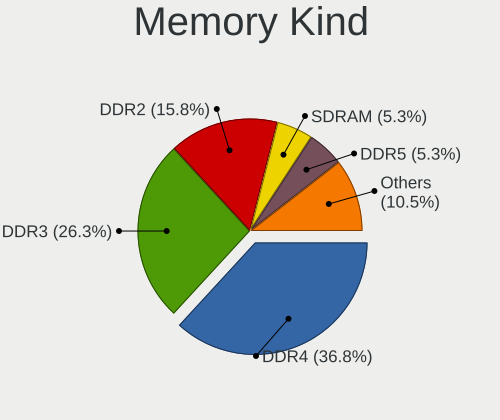

| Kind    | Computers | Percent |
|---------|-----------|---------|
| DDR4    | 7         | 36.84%  |
| DDR3    | 5         | 26.32%  |
| DDR2    | 3         | 15.79%  |
| SDRAM   | 1         | 5.26%   |
| DDR5    | 1         | 5.26%   |
| DDR     | 1         | 5.26%   |
| Unknown | 1         | 5.26%   |

Memory Form Factor
------------------

Physical design of the memory module

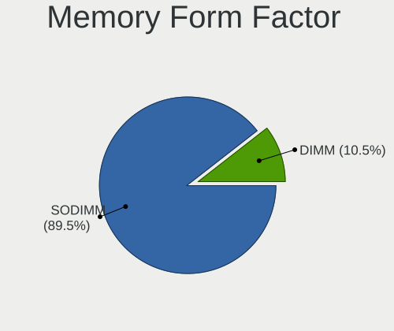

| Name   | Computers | Percent |
|--------|-----------|---------|
| SODIMM | 17        | 89.47%  |
| DIMM   | 2         | 10.53%  |

Memory Size
-----------

Memory module size

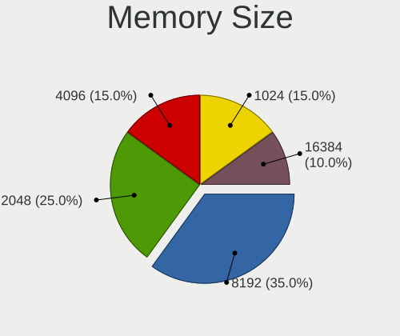

| Size  | Computers | Percent |
|-------|-----------|---------|
| 8192  | 7         | 35%     |
| 2048  | 5         | 25%     |
| 4096  | 3         | 15%     |
| 1024  | 3         | 15%     |
| 16384 | 2         | 10%     |

Memory Speed
------------

Memory module speed

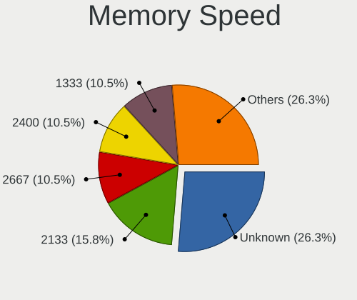

| Speed   | Computers | Percent |
|---------|-----------|---------|
| Unknown | 5         | 26.32%  |
| 2133    | 3         | 15.79%  |
| 2667    | 2         | 10.53%  |
| 2400    | 2         | 10.53%  |
| 1333    | 2         | 10.53%  |
| 1067    | 2         | 10.53%  |
| 5600    | 1         | 5.26%   |
| 1600    | 1         | 5.26%   |
| 400     | 1         | 5.26%   |

Printers & scanners
-------------------

Printer Vendor
--------------

Printer device vendors

Zero info for selected period =(

Printer Model
-------------

Printer device models

Zero info for selected period =(

Scanner Vendor
--------------

Scanner device vendors

Zero info for selected period =(

Scanner Model
-------------

Scanner device models

Zero info for selected period =(

Camera
------

Camera Vendor
-------------

Camera device vendors

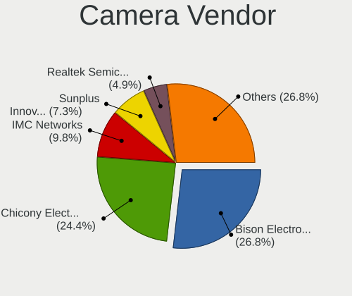

| Vendor                                 | Computers | Percent |
|----------------------------------------|-----------|---------|
| Bison Electronics                      | 11        | 26.83%  |
| Chicony Electronics                    | 10        | 24.39%  |
| IMC Networks                           | 4         | 9.76%   |
| Sunplus Innovation Technology          | 3         | 7.32%   |
| Realtek Semiconductor                  | 2         | 4.88%   |
| Framework                              | 2         | 4.88%   |
| Silicon Motion                         | 1         | 2.44%   |
| Quanta                                 | 1         | 2.44%   |
| Luxvisions Innotech Limited            | 1         | 2.44%   |
| Logitech                               | 1         | 2.44%   |
| Lite-On Technology                     | 1         | 2.44%   |
| Jiangxi Shinetech Optical              | 1         | 2.44%   |
| Hewlett-Packard                        | 1         | 2.44%   |
| Cheng Uei Precision Industry (Foxlink) | 1         | 2.44%   |
| Apple                                  | 1         | 2.44%   |

Camera Model
------------

Camera device models

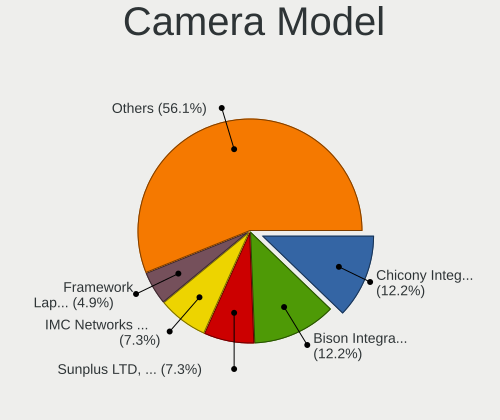

| Model                                                   | Computers | Percent |
|---------------------------------------------------------|-----------|---------|
| Chicony Integrated Camera                               | 5         | 12.2%   |
| Bison Integrated Camera                                 | 5         | 12.2%   |
| Sunplus LTD, NexiGo N930AF FHD Webcam                   | 3         | 7.32%   |
| IMC Networks Integrated Camera                          | 3         | 7.32%   |
| Framework Laptop Webcam Module (2nd Gen)                | 2         | 4.88%   |
| Bison USB HD Webcam                                     | 2         | 4.88%   |
| Silicon Motion Realtek USB 2.0 PC Camera                | 1         | 2.44%   |
| Realtek PC Camera                                       | 1         | 2.44%   |
| Realtek Integrated Webcam HD                            | 1         | 2.44%   |
| Quanta Realtek PC Camera                                | 1         | 2.44%   |
| Luxvisions Innotech Limited Integrated Camera           | 1         | 2.44%   |
| Logitech HD Pro Webcam C920                             | 1         | 2.44%   |
| Lite-On Integrated Camera                               | 1         | 2.44%   |
| Jiangxi Shinetech Optical FHD Camera                    | 1         | 2.44%   |
| IMC Networks USB camera                                 | 1         | 2.44%   |
| HP HP FHD Webcam 620/625                                | 1         | 2.44%   |
| Chicony Webcam                                          | 1         | 2.44%   |
| Chicony Integrated Camera [ThinkPad]                    | 1         | 2.44%   |
| Chicony Integrated Camera (1920x1080)                   | 1         | 2.44%   |
| Chicony FJ Camera                                       | 1         | 2.44%   |
| Chicony 2.0M UVC Webcam / CNF7129                       | 1         | 2.44%   |
| Cheng Uei Precision Industry (Foxlink) Realtek DMFT RGB | 1         | 2.44%   |
| Bison ThinkPad P50 Integrated Camera                    | 1         | 2.44%   |
| Bison SunplusIT Integrated Camera                       | 1         | 2.44%   |
| Bison Lenovo EasyCamera                                 | 1         | 2.44%   |
| Bison Front Camera                                      | 1         | 2.44%   |
| Apple FaceTime Camera                                   | 1         | 2.44%   |

Security
--------

Fingerprint Vendor
------------------

Fingerprint sensor vendors

| Vendor                     | Computers | Percent |
|----------------------------|-----------|---------|
| Synaptics                  | 4         | 30.77%  |
| Validity Sensors           | 3         | 23.08%  |
| Shenzhen Goodix Technology | 3         | 23.08%  |
| STMicroelectronics         | 2         | 15.38%  |
| AuthenTec                  | 1         | 7.69%   |

Fingerprint Model
-----------------

Fingerprint sensor models

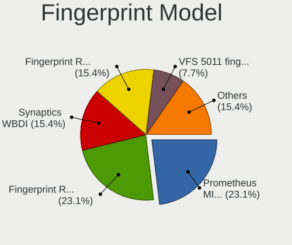

| Model                                             | Computers | Percent |
|---------------------------------------------------|-----------|---------|
| Synaptics Prometheus MIS Touch Fingerprint Reader | 3         | 23.08%  |
| Shenzhen Goodix Fingerprint Reader                | 3         | 23.08%  |
| Validity Sensors Synaptics WBDI                   | 2         | 15.38%  |
| STMicroelectronics Fingerprint Reader             | 2         | 15.38%  |
| Validity Sensors VFS 5011 fingerprint sensor      | 1         | 7.69%   |
| Synaptics UWP WBDI Device                         | 1         | 7.69%   |
| AuthenTec AES2660                                 | 1         | 7.69%   |

Chipcard Vendor
---------------

Chipcard module vendors

Zero info for selected period =(

Chipcard Model
--------------

Chipcard module models

Zero info for selected period =(

Unsupported
-----------

Unsupported Devices
-------------------

Total unsupported devices on board

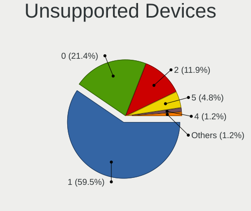

| Total | Computers | Percent |
|-------|-----------|---------|
| 1     | 50        | 59.52%  |
| 0     | 18        | 21.43%  |
| 2     | 10        | 11.9%   |
| 5     | 4         | 4.76%   |
| 4     | 1         | 1.19%   |
| 3     | 1         | 1.19%   |

Unsupported Device Types
------------------------

Types of unsupported devices

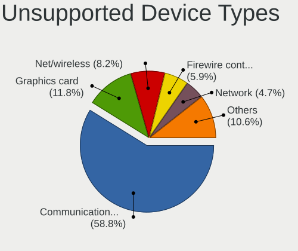

| Type                     | Computers | Percent |
|--------------------------|-----------|---------|
| Communication controller | 50        | 58.82%  |
| Graphics card            | 10        | 11.76%  |
| Net/wireless             | 7         | 8.24%   |
| Firewire controller      | 5         | 5.88%   |
| Network                  | 4         | 4.71%   |
| Storage/ata              | 3         | 3.53%   |
| Sound                    | 3         | 3.53%   |
| Net/ethernet             | 1         | 1.18%   |
| Modem                    | 1         | 1.18%   |
| Card reader              | 1         | 1.18%   |

