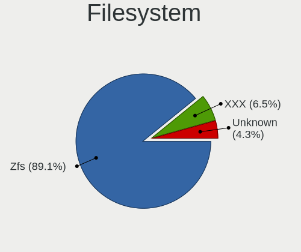
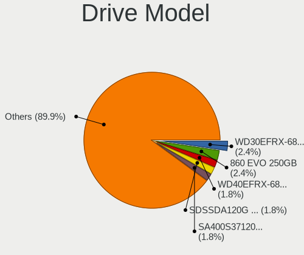
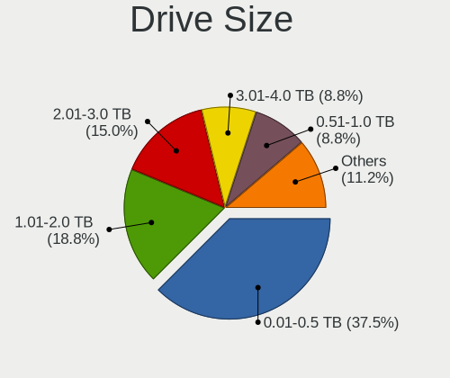
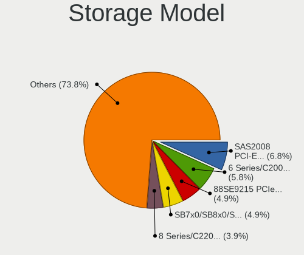
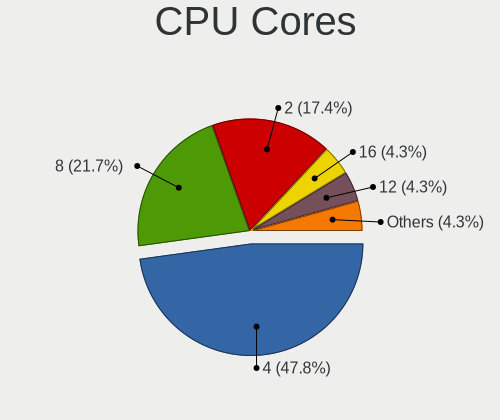
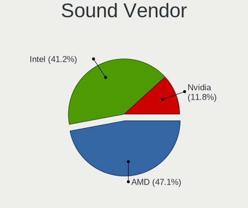
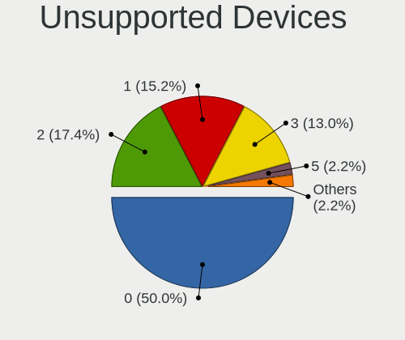

TrueNAS - Tested Hardware & Statistics (Desktops)
-------------------------------------------------

A project to collect tested hardware configurations for TrueNAS.

Anyone can contribute to this report by the [hw-probe](https://github.com/linuxhw/hw-probe/blob/master/INSTALL.BSD.md) tool:

    hw-probe -all -upload

Please contribute! Especially if your hardware is rare.

Contents
--------

* [ Test Cases ](#test-cases)

* [ System ](#system)
  - [ OS                       ](#os)
  - [ OS Family                ](#os-family)
  - [ Arch                     ](#arch)
  - [ DE                       ](#de)
  - [ Display Server           ](#display-server)
  - [ Display Manager          ](#display-manager)
  - [ OS Lang                  ](#os-lang)
  - [ Boot Mode                ](#boot-mode)
  - [ Filesystem               ](#filesystem)
  - [ Part. scheme             ](#part-scheme)

* [ Board ](#board)
  - [ Vendor                   ](#vendor)
  - [ Model                    ](#model)
  - [ Model Family             ](#model-family)
  - [ MFG Year                 ](#mfg-year)
  - [ Form Factor              ](#form-factor)
  - [ Coreboot                 ](#coreboot)
  - [ RAM Size                 ](#ram-size)
  - [ RAM Used                 ](#ram-used)
  - [ Total Drives             ](#total-drives)
  - [ Has CD-ROM               ](#has-cd-rom)
  - [ Has Ethernet             ](#has-ethernet)
  - [ Has WiFi                 ](#has-wifi)
  - [ Has Bluetooth            ](#has-bluetooth)

* [ Location ](#location)
  - [ Country                  ](#country)
  - [ City                     ](#city)

* [ Drives ](#drives)
  - [ Drive Vendor             ](#drive-vendor)
  - [ Drive Model              ](#drive-model)
  - [ HDD Vendor               ](#hdd-vendor)
  - [ SSD Vendor               ](#ssd-vendor)
  - [ Drive Kind               ](#drive-kind)
  - [ Drive Connector          ](#drive-connector)
  - [ Drive Size               ](#drive-size)
  - [ Space Total              ](#space-total)
  - [ Space Used               ](#space-used)
  - [ Malfunc. Drives          ](#malfunc-drives)
  - [ Malfunc. Drive Vendor    ](#malfunc-drive-vendor)
  - [ Malfunc. HDD Vendor      ](#malfunc-hdd-vendor)
  - [ Malfunc. Drive Kind      ](#malfunc-drive-kind)
  - [ Failed Drives            ](#failed-drives)
  - [ Failed Drive Vendor      ](#failed-drive-vendor)
  - [ Drive Status             ](#drive-status)

* [ Storage controller ](#storage-controller)
  - [ Storage Vendor           ](#storage-vendor)
  - [ Storage Model            ](#storage-model)
  - [ Storage Kind             ](#storage-kind)

* [ Processor ](#processor)
  - [ CPU Vendor               ](#cpu-vendor)
  - [ CPU Model                ](#cpu-model)
  - [ CPU Model Family         ](#cpu-model-family)
  - [ CPU Cores                ](#cpu-cores)
  - [ CPU Sockets              ](#cpu-sockets)
  - [ CPU Threads              ](#cpu-threads)
  - [ CPU Microarch            ](#cpu-microarch)

* [ Graphics ](#graphics)
  - [ GPU Vendor               ](#gpu-vendor)
  - [ GPU Model                ](#gpu-model)
  - [ GPU Combo                ](#gpu-combo)
  - [ GPU Driver               ](#gpu-driver)
  - [ GPU Memory               ](#gpu-memory)

* [ Monitor ](#monitor)
  - [ Monitor Vendor           ](#monitor-vendor)
  - [ Monitor Model            ](#monitor-model)
  - [ Monitor Resolution       ](#monitor-resolution)
  - [ Monitor Diagonal         ](#monitor-diagonal)
  - [ Monitor Width            ](#monitor-width)
  - [ Aspect Ratio             ](#aspect-ratio)
  - [ Monitor Area             ](#monitor-area)
  - [ Pixel Density            ](#pixel-density)
  - [ Multiple Monitors        ](#multiple-monitors)

* [ Network ](#network)
  - [ Net Controller Vendor    ](#net-controller-vendor)
  - [ Net Controller Model     ](#net-controller-model)
  - [ Wireless Vendor          ](#wireless-vendor)
  - [ Wireless Model           ](#wireless-model)
  - [ Ethernet Vendor          ](#ethernet-vendor)
  - [ Ethernet Model           ](#ethernet-model)
  - [ Net Controller Kind      ](#net-controller-kind)
  - [ Used Controller          ](#used-controller)
  - [ NICs                     ](#nics)
  - [ IPv6                     ](#ipv6)

* [ Bluetooth ](#bluetooth)
  - [ Bluetooth Vendor         ](#bluetooth-vendor)
  - [ Bluetooth Model          ](#bluetooth-model)

* [ Sound ](#sound)
  - [ Sound Vendor             ](#sound-vendor)
  - [ Sound Model              ](#sound-model)

* [ Memory ](#memory)
  - [ Memory Vendor            ](#memory-vendor)
  - [ Memory Model             ](#memory-model)
  - [ Memory Kind              ](#memory-kind)
  - [ Memory Form Factor       ](#memory-form-factor)
  - [ Memory Size              ](#memory-size)
  - [ Memory Speed             ](#memory-speed)

* [ Printers & scanners ](#printers--scanners)
  - [ Printer Vendor           ](#printer-vendor)
  - [ Printer Model            ](#printer-model)
  - [ Scanner Vendor           ](#scanner-vendor)
  - [ Scanner Model            ](#scanner-model)

* [ Camera ](#camera)
  - [ Camera Vendor            ](#camera-vendor)
  - [ Camera Model             ](#camera-model)

* [ Security ](#security)
  - [ Fingerprint Vendor       ](#fingerprint-vendor)
  - [ Fingerprint Model        ](#fingerprint-model)
  - [ Chipcard Vendor          ](#chipcard-vendor)
  - [ Chipcard Model           ](#chipcard-model)

* [ Unsupported ](#unsupported)
  - [ Unsupported Devices      ](#unsupported-devices)
  - [ Unsupported Device Types ](#unsupported-device-types)

Test Cases
----------

Total: 38

| Vendor        | Model                       | Probe                                                     | Date         |
|---------------|-----------------------------|-----------------------------------------------------------|--------------|
| Gigabyte      | 990FXA-UD3                  | [378021707a](https://bsd-hardware.info/?probe=378021707a) | Apr 17, 2022 |
| ASRock        | X570M Pro4                  | [e245cecbe8](https://bsd-hardware.info/?probe=e245cecbe8) | Apr 06, 2022 |
| ASUSTek       | P10S-I Series               | [190fe4d13f](https://bsd-hardware.info/?probe=190fe4d13f) | Mar 24, 2022 |
| Supermicro    | X9DRD-7LN4F                 | [ea62f49750](https://bsd-hardware.info/?probe=ea62f49750) | Feb 15, 2022 |
| Supermicro    | X8STi                       | [970e2c91ec](https://bsd-hardware.info/?probe=970e2c91ec) | Feb 15, 2022 |
| Supermicro    | X9DRD-7LN4F                 | [74dffd5c4f](https://bsd-hardware.info/?probe=74dffd5c4f) | Feb 15, 2022 |
| Unknown       | Unknown                     | [bd78c2db3d](https://bsd-hardware.info/?probe=bd78c2db3d) | Jan 16, 2022 |
| Gigabyte      | B550I AORUS PRO AX          | [8c3181ee8d](https://bsd-hardware.info/?probe=8c3181ee8d) | Dec 29, 2021 |
| HP            | ProLiant ML150 G6           | [06b8fc5c06](https://bsd-hardware.info/?probe=06b8fc5c06) | Oct 18, 2021 |
| Supermicro    | X8SIE 0001                  | [fbd2abda35](https://bsd-hardware.info/?probe=fbd2abda35) | Oct 17, 2021 |
| ASRock        | B560M Pro4/ac               | [1b057f3b7d](https://bsd-hardware.info/?probe=1b057f3b7d) | Sep 23, 2021 |
| ASRock        | B560M Pro4/ac               | [fcf75fc410](https://bsd-hardware.info/?probe=fcf75fc410) | Sep 23, 2021 |
| ASUSTek       | M5A78L-M PLUS/USB3          | [b00f275d35](https://bsd-hardware.info/?probe=b00f275d35) | Sep 23, 2021 |
| Gigabyte      | B450M DS3H-CF               | [1038e3314d](https://bsd-hardware.info/?probe=1038e3314d) | Sep 21, 2021 |
| Supermicro    | X8SIE 0001                  | [f679c0bf61](https://bsd-hardware.info/?probe=f679c0bf61) | Jul 22, 2021 |
| Supermicro    | X8SIE 0001                  | [d739af226b](https://bsd-hardware.info/?probe=d739af226b) | Jul 20, 2021 |
| ASUSTek       | TUF Z270 MARK 2             | [fd0f333074](https://bsd-hardware.info/?probe=fd0f333074) | Jul 15, 2021 |
| Unknown       | Unknown                     | [df39a39ec7](https://bsd-hardware.info/?probe=df39a39ec7) | Jul 15, 2021 |
| Unknown       | Unknown                     | [968859e99d](https://bsd-hardware.info/?probe=968859e99d) | Jun 03, 2021 |
| ASRock        | C2750D4I                    | [e08a5e6f7c](https://bsd-hardware.info/?probe=e08a5e6f7c) | May 31, 2021 |
| ASRock        | C2750D4I                    | [9bd610c0ea](https://bsd-hardware.info/?probe=9bd610c0ea) | May 31, 2021 |
| Supermicro    | X9SCL/X9SCMA                | [e308becda4](https://bsd-hardware.info/?probe=e308becda4) | May 29, 2021 |
| Lenovo        | ThinkServer TS440           | [6390c16543](https://bsd-hardware.info/?probe=6390c16543) | May 28, 2021 |
| ASUSTek       | M5A99X EVO R2.0             | [cec3cb521d](https://bsd-hardware.info/?probe=cec3cb521d) | May 20, 2021 |
| Unknown       | Unknown                     | [6b724a36cd](https://bsd-hardware.info/?probe=6b724a36cd) | Feb 19, 2021 |
| Unknown       | Unknown                     | [760e148164](https://bsd-hardware.info/?probe=760e148164) | Feb 19, 2021 |
| Unknown       | Unknown                     | [baf854930a](https://bsd-hardware.info/?probe=baf854930a) | Feb 19, 2021 |
| TYAN Compu... | S5512                       | [6a6164af73](https://bsd-hardware.info/?probe=6a6164af73) | Jan 27, 2021 |
| Unknown       | Unknown                     | [96ca836be9](https://bsd-hardware.info/?probe=96ca836be9) | Jan 19, 2021 |
| HP            | ProLiant MicroServer Gen... | [415023d5a1](https://bsd-hardware.info/?probe=415023d5a1) | Jan 10, 2021 |
| Gigabyte      | GA-A75-UD4H                 | [98fdc2713d](https://bsd-hardware.info/?probe=98fdc2713d) | Dec 18, 2020 |
| Gigabyte      | GA-A75-UD4H                 | [fb58243913](https://bsd-hardware.info/?probe=fb58243913) | Dec 18, 2020 |
| HP            | 3397                        | [3d51aa7204](https://bsd-hardware.info/?probe=3d51aa7204) | Dec 18, 2020 |
| Unknown       | Unknown                     | [aa113d54a8](https://bsd-hardware.info/?probe=aa113d54a8) | Dec 16, 2020 |
| Supermicro    | X9SPV-F/LN4F                | [24031a56b9](https://bsd-hardware.info/?probe=24031a56b9) | Dec 16, 2020 |
| Gigabyte      | H97-D3H-CF                  | [4d6f6bb683](https://bsd-hardware.info/?probe=4d6f6bb683) | Dec 16, 2020 |
| ASRock        | C2750D4I                    | [8328ebb73d](https://bsd-hardware.info/?probe=8328ebb73d) | Dec 16, 2020 |
| ASUSTek       | M5A78L-M/USB3               | [714b6539cf](https://bsd-hardware.info/?probe=714b6539cf) | Nov 07, 2020 |

System
------

OS
--

Installed operating systems

| Name             | Desktops | Percent |
|------------------|----------|---------|
| TrueNAS 12.2-p2  | 8        | 25.81%  |
| TrueNAS 12.2-p6  | 6        | 19.35%  |
| TrueNAS 12.2-p9  | 4        | 12.9%   |
| TrueNAS 12.2-p12 | 4        | 12.9%   |
| TrueNAS 12.2-RC3 | 3        | 9.68%   |
| TrueNAS 12.2-p10 | 2        | 6.45%   |
| TrueNAS 12.3-p1  | 1        | 3.23%   |
| TrueNAS 12.2-p3  | 1        | 3.23%   |
| TrueNAS 12.2-p11 | 1        | 3.23%   |
| TrueNAS 12.2     | 1        | 3.23%   |

OS Family
---------

OS without a version

| Name    | Desktops | Percent |
|---------|----------|---------|
| TrueNAS | 30       | 100%    |

Arch
----

OS architecture (x86_64, i586, etc.)

| Name  | Desktops | Percent |
|-------|----------|---------|
| amd64 | 30       | 100%    |

DE
--

Desktop Environment

| Name         | Desktops | Percent |
|--------------|----------|---------|
| Console      | 27       | 90%     |
| helloDesktop | 2        | 6.67%   |
| TWM          | 1        | 3.33%   |

Display Server
--------------

X11 or Wayland

| Name    | Desktops | Percent |
|---------|----------|---------|
| Console | 29       | 96.67%  |
| X11     | 1        | 3.33%   |

Display Manager
---------------

SDDM, LightDM, etc.

| Name    | Desktops | Percent |
|---------|----------|---------|
| Console | 30       | 100%    |

OS Lang
-------

Language

| Lang  | Desktops | Percent |
|-------|----------|---------|
| en_US | 30       | 100%    |

Boot Mode
---------

EFI or BIOS

| Mode | Desktops | Percent |
|------|----------|---------|
| BIOS | 18       | 60%     |
| EFI  | 12       | 40%     |

Filesystem
----------

Type of filesystem

| Type    | Desktops | Percent |
|---------|----------|---------|
| Zfs     | 27       | 90%     |
| XXX     | 2        | 6.67%   |
| Unknown | 1        | 3.33%   |

Part. scheme
------------

Scheme of partitioning

| Type | Desktops | Percent |
|------|----------|---------|
| GPT  | 30       | 100%    |

Board
-----

Vendor
------

Motherboard manufacturer

| Name                | Desktops | Percent |
|---------------------|----------|---------|
| Unknown             | 6        | 20%     |
| Supermicro          | 5        | 16.67%  |
| Gigabyte Technology | 5        | 16.67%  |
| ASUSTek Computer    | 5        | 16.67%  |
| ASRock              | 4        | 13.33%  |
| Hewlett-Packard     | 3        | 10%     |
| TYAN Computer       | 1        | 3.33%   |
| Lenovo              | 1        | 3.33%   |

Model
-----

Motherboard model

| Name                                | Desktops | Percent |
|-------------------------------------|----------|---------|
| Unknown                             | 6        | 20%     |
| TYAN S5512                          | 1        | 3.33%   |
| Supermicro X9SPV-F/LN4F             | 1        | 3.33%   |
| Supermicro X9SCL/X9SCM              | 1        | 3.33%   |
| Supermicro X9DRD-7LN4F              | 1        | 3.33%   |
| Supermicro X8STi                    | 1        | 3.33%   |
| Supermicro ReadyDATA 5200           | 1        | 3.33%   |
| Lenovo 70AQ0009UX ThinkServer TS440 | 1        | 3.33%   |
| HP ProLiant ML150 G6                | 1        | 3.33%   |
| HP ProLiant MicroServer Gen8        | 1        | 3.33%   |
| HP Compaq Elite 8300 SFF            | 1        | 3.33%   |
| Gigabyte H97-D3H                    | 1        | 3.33%   |
| Gigabyte GA-A75-UD4H                | 1        | 3.33%   |
| Gigabyte B550I AORUS PRO AX         | 1        | 3.33%   |
| Gigabyte B450M DS3H                 | 1        | 3.33%   |
| Gigabyte 990FXA-UD3                 | 1        | 3.33%   |
| ASUS TUF Z270 MARK 2                | 1        | 3.33%   |
| ASUS P10S-I Series                  | 1        | 3.33%   |
| ASUS M5A99X EVO R2.0                | 1        | 3.33%   |
| ASUS M5A78L-M/USB3                  | 1        | 3.33%   |
| ASUS M5A78L-M PLUS/USB3             | 1        | 3.33%   |
| ASRock X570M Pro4                   | 1        | 3.33%   |
| ASRock FREENAS-MINI-XL-24TB-IXN     | 1        | 3.33%   |
| ASRock C2750D4I                     | 1        | 3.33%   |
| ASRock B560M Pro4/ac                | 1        | 3.33%   |

Model Family
------------

Motherboard model prefix

| Name                            | Desktops | Percent |
|---------------------------------|----------|---------|
| Unknown                         | 6        | 20%     |
| HP ProLiant                     | 2        | 6.67%   |
| ASUS M5A78L-M                   | 2        | 6.67%   |
| TYAN S5512                      | 1        | 3.33%   |
| Supermicro X9SPV-F              | 1        | 3.33%   |
| Supermicro X9SCL                | 1        | 3.33%   |
| Supermicro X9DRD-7LN4F          | 1        | 3.33%   |
| Supermicro X8STi                | 1        | 3.33%   |
| Supermicro ReadyDATA            | 1        | 3.33%   |
| Lenovo 70AQ0009UX               | 1        | 3.33%   |
| HP Compaq                       | 1        | 3.33%   |
| Gigabyte H97-D3H                | 1        | 3.33%   |
| Gigabyte GA-A75-UD4H            | 1        | 3.33%   |
| Gigabyte B550I                  | 1        | 3.33%   |
| Gigabyte B450M                  | 1        | 3.33%   |
| Gigabyte 990FXA-UD3             | 1        | 3.33%   |
| ASUS TUF                        | 1        | 3.33%   |
| ASUS P10S-I                     | 1        | 3.33%   |
| ASUS M5A99X                     | 1        | 3.33%   |
| ASRock X570M                    | 1        | 3.33%   |
| ASRock FREENAS-MINI-XL-24TB-IXN | 1        | 3.33%   |
| ASRock C2750D4I                 | 1        | 3.33%   |
| ASRock B560M                    | 1        | 3.33%   |

MFG Year
--------

Motherboard manufacture year

| Year    | Desktops | Percent |
|---------|----------|---------|
| Unknown | 6        | 20%     |
| 2014    | 4        | 13.33%  |
| 2018    | 3        | 10%     |
| 2016    | 3        | 10%     |
| 2013    | 3        | 10%     |
| 2012    | 3        | 10%     |
| 2019    | 2        | 6.67%   |
| 2011    | 2        | 6.67%   |
| 2021    | 1        | 3.33%   |
| 2020    | 1        | 3.33%   |
| 2010    | 1        | 3.33%   |
| 2009    | 1        | 3.33%   |

Form Factor
-----------

Physical design of the computer

| Name    | Desktops | Percent |
|---------|----------|---------|
| Desktop | 30       | 100%    |

Coreboot
--------

Have coreboot on board

| Used | Desktops | Percent |
|------|----------|---------|
| No   | 30       | 100%    |

RAM Size
--------

Total RAM memory

| Size in GB  | Desktops | Percent |
|-------------|----------|---------|
| 32.01-64.0  | 10       | 33.33%  |
| 16.01-24.0  | 9        | 30%     |
| 64.01-256.0 | 4        | 13.33%  |
| 24.01-32.0  | 3        | 10%     |
| 8.01-16.0   | 3        | 10%     |
| 4.01-8.0    | 1        | 3.33%   |

RAM Used
--------

Used RAM memory

| Used GB    | Desktops | Percent |
|------------|----------|---------|
| 0.51-1.0   | 11       | 36.67%  |
| 1.01-2.0   | 9        | 30%     |
| 2.01-3.0   | 3        | 10%     |
| 16.01-24.0 | 2        | 6.67%   |
| 4.01-8.0   | 1        | 3.33%   |
| 32.01-64.0 | 1        | 3.33%   |
| 3.01-4.0   | 1        | 3.33%   |
| 8.01-16.0  | 1        | 3.33%   |
| 0.01-0.5   | 1        | 3.33%   |

Total Drives
------------

Number of drives on board

| Drives | Desktops | Percent |
|--------|----------|---------|
| 0      | 6        | 19.35%  |
| 3      | 5        | 16.13%  |
| 17     | 2        | 6.45%   |
| 9      | 2        | 6.45%   |
| 6      | 2        | 6.45%   |
| 5      | 2        | 6.45%   |
| 4      | 2        | 6.45%   |
| 27     | 1        | 3.23%   |
| 21     | 1        | 3.23%   |
| 19     | 1        | 3.23%   |
| 16     | 1        | 3.23%   |
| 12     | 1        | 3.23%   |
| 11     | 1        | 3.23%   |
| 10     | 1        | 3.23%   |
| 8      | 1        | 3.23%   |
| 7      | 1        | 3.23%   |
| 2      | 1        | 3.23%   |

Has CD-ROM
----------

Has CD-ROM on board

| Presented | Desktops | Percent |
|-----------|----------|---------|
| No        | 29       | 93.55%  |
| Yes       | 2        | 6.45%   |

Has Ethernet
------------

Has Ethernet on board

| Presented | Desktops | Percent |
|-----------|----------|---------|
| Yes       | 30       | 100%    |

Has WiFi
--------

Has WiFi module

| Presented | Desktops | Percent |
|-----------|----------|---------|
| No        | 28       | 93.33%  |
| Yes       | 2        | 6.67%   |

Has Bluetooth
-------------

Has Bluetooth module

| Presented | Desktops | Percent |
|-----------|----------|---------|
| No        | 28       | 93.33%  |
| Yes       | 2        | 6.67%   |

Location
--------

Country
-------

Geographic location (country)

| Country     | Desktops | Percent |
|-------------|----------|---------|
| USA         | 9        | 30%     |
| Australia   | 3        | 10%     |
| Thailand    | 2        | 6.67%   |
| Switzerland | 2        | 6.67%   |
| Germany     | 2        | 6.67%   |
| Czechia     | 2        | 6.67%   |
| Spain       | 1        | 3.33%   |
| Romania     | 1        | 3.33%   |
| Norway      | 1        | 3.33%   |
| Nicaragua   | 1        | 3.33%   |
| Greece      | 1        | 3.33%   |
| France      | 1        | 3.33%   |
| Estonia     | 1        | 3.33%   |
| Canada      | 1        | 3.33%   |
| Brazil      | 1        | 3.33%   |
| Belgium     | 1        | 3.33%   |

City
----

Geographic location (city)

| City              | Desktops | Percent |
|-------------------|----------|---------|
| Springfield       | 2        | 6.67%   |
| Melbourne         | 2        | 6.67%   |
| Brno              | 2        | 6.67%   |
| Bangkok           | 2        | 6.67%   |
| Yverdon-les-Bains | 1        | 3.33%   |
| Willisau          | 1        | 3.33%   |
| Tartu             | 1        | 3.33%   |
| Sydney            | 1        | 3.33%   |
| Skiptvet          | 1        | 3.33%   |
| Raleigh           | 1        | 3.33%   |
| Perry Hall        | 1        | 3.33%   |
| Ougree            | 1        | 3.33%   |
| Northville        | 1        | 3.33%   |
| Managua           | 1        | 3.33%   |
| Lüneburg         | 1        | 3.33%   |
| Lubbock           | 1        | 3.33%   |
| Jaraguá do Sul | 1        | 3.33%   |
| Fontaine-le-Comte | 1        | 3.33%   |
| Fayetteville      | 1        | 3.33%   |
| East Granby       | 1        | 3.33%   |
| Dresden           | 1        | 3.33%   |
| Clare             | 1        | 3.33%   |
| Calgary           | 1        | 3.33%   |
| Bucharest         | 1        | 3.33%   |
| Athens            | 1        | 3.33%   |
| Algete            | 1        | 3.33%   |

Drives
------

Drive Vendor
------------

Hard drive vendors

| Vendor              | Desktops | Drives | Percent |
|---------------------|----------|--------|---------|
| WDC                 | 14       | 68     | 21.88%  |
| Seagate             | 10       | 47     | 15.63%  |
| Samsung Electronics | 6        | 9      | 9.38%   |
| Toshiba             | 5        | 10     | 7.81%   |
| Hitachi             | 5        | 16     | 7.81%   |
| Kingston            | 4        | 9      | 6.25%   |
| Crucial             | 4        | 5      | 6.25%   |
| SanDisk             | 3        | 3      | 4.69%   |
| HPT                 | 2        | 31     | 3.13%   |
| Hewlett-Packard     | 2        | 8      | 3.13%   |
| WD MediaMax         | 1        | 3      | 1.56%   |
| SPCC                | 1        | 1      | 1.56%   |
| PNY                 | 1        | 1      | 1.56%   |
| Mushkin             | 1        | 1      | 1.56%   |
| Intel               | 1        | 2      | 1.56%   |
| HGST                | 1        | 10     | 1.56%   |
| China               | 1        | 1      | 1.56%   |
| Apacer              | 1        | 1      | 1.56%   |
| AMD                 | 1        | 2      | 1.56%   |

Drive Model
-----------

Hard drive models

| Model                               | Desktops | Percent |
|-------------------------------------|----------|---------|
| WDC WD30EFRX-68EUZN0 3TB            | 4        | 2.84%   |
| Samsung SSD 860 EVO 250GB           | 4        | 2.84%   |
| WDC WD40EFRX-68N32N0 4TB            | 3        | 2.13%   |
| WDC WD60EFRX-68MYMN1 6TB            | 2        | 1.42%   |
| WDC WD40EFRX-68WT0N0 4TB            | 2        | 1.42%   |
| WDC WD30EFRX-68AX9N0 3TB            | 2        | 1.42%   |
| WDC WD20EFRX-68EUZN0 2TB            | 2        | 1.42%   |
| WDC WD20EFRX-68AX9N0 2TB            | 2        | 1.42%   |
| Seagate ST500DM002-1BD142 500GB     | 2        | 1.42%   |
| Kingston SA400S37120G 120GB         | 2        | 1.42%   |
| HPT DISK 0_9 3TB                    | 2        | 1.42%   |
| HPT DISK 0_8 3TB                    | 2        | 1.42%   |
| HPT DISK 0_7 3TB                    | 2        | 1.42%   |
| HPT DISK 0_6 3TB                    | 2        | 1.42%   |
| HPT DISK 0_5 18TB                   | 2        | 1.42%   |
| HPT DISK 0_4 18TB                   | 2        | 1.42%   |
| HPT DISK 0_3 3TB                    | 2        | 1.42%   |
| HPT DISK 0_2 3TB                    | 2        | 1.42%   |
| HPT DISK 0_14 3TB                   | 2        | 1.42%   |
| HPT DISK 0_13 2TB                   | 2        | 1.42%   |
| HPT DISK 0_12 1TB                   | 2        | 1.42%   |
| HPT DISK 0_11 1TB                   | 2        | 1.42%   |
| HPT DISK 0_10 1TB                   | 2        | 1.42%   |
| HPT DISK 0_1 6TB                    | 2        | 1.42%   |
| HPT DISK 0_0 4TB                    | 2        | 1.42%   |
| WDC WD80EFAX-68LHPN0 8TB            | 1        | 0.71%   |
| WDC WD8004FRYZ-01VAEB0 8TB          | 1        | 0.71%   |
| WDC WD5000LPLX-08ZNTT0 500GB        | 1        | 0.71%   |
| WDC WD5000LPLX-00ZNTT0 500GB        | 1        | 0.71%   |
| WDC WD5000AAKX-00U6AA0 500GB        | 1        | 0.71%   |
| WDC WD30PURX-64P6ZY0 3TB            | 1        | 0.71%   |
| WDC WD30EZRX-00MMMB0 3TB            | 1        | 0.71%   |
| WDC WD30EFRX-68N32N0 3TB            | 1        | 0.71%   |
| WDC WD3003FZEX-00Z4SA0 3TB          | 1        | 0.71%   |
| WDC WD3001FFSX-68JNUN0 3TB          | 1        | 0.71%   |
| WDC WD3000F9YZ-09N20L1 3TB          | 1        | 0.71%   |
| WDC WD3000F9YZ-09N20L0 3TB          | 1        | 0.71%   |
| WDC WD20EZRX-00D8PB0 2TB            | 1        | 0.71%   |
| WDC WD2002FFSX-68PF8N0 2TB          | 1        | 0.71%   |
| WDC WD10PURX-64E5EY0 1TB            | 1        | 0.71%   |
| WDC WD10JPVX-80JC3T0 1TB            | 1        | 0.71%   |
| WDC WD10EZEX-00RKKA0 1TB            | 1        | 0.71%   |
| WDC WD10EURX-61C57Y0 1TB            | 1        | 0.71%   |
| WDC WD100EMAZ-00WJTA0 10TB          | 1        | 0.71%   |
| WD MediaMax WL2000GSA6454 2TB       | 1        | 0.71%   |
| Toshiba THNSNX032GTNT M.2 2242 32GB | 1        | 0.71%   |
| Toshiba THNSNX032GTNT 32GB          | 1        | 0.71%   |
| Toshiba HDWN180 8TB                 | 1        | 0.71%   |
| Toshiba HDWF180 8TB                 | 1        | 0.71%   |
| Toshiba HDWD130 3TB                 | 1        | 0.71%   |
| Toshiba DT01ACA300 3TB              | 1        | 0.71%   |
| Toshiba DT01ACA200 2TB              | 1        | 0.71%   |
| Toshiba DT01ACA100 1TB              | 1        | 0.71%   |
| SPCC SPCCSolidStateDisk 256GB       | 1        | 0.71%   |
| Seagate ST980310AS 80GB             | 1        | 0.71%   |
| Seagate ST9320421AS 320GB           | 1        | 0.71%   |
| Seagate ST9320325AS 320GB           | 1        | 0.71%   |
| Seagate ST8000VN0022-2EL112 8TB     | 1        | 0.71%   |
| Seagate ST500DL001 HD503HI 500GB    | 1        | 0.71%   |
| Seagate ST4000DM005-2DP166 4TB      | 1        | 0.71%   |

HDD Vendor
----------

Hard disk drive vendors

| Vendor              | Desktops | Drives | Percent |
|---------------------|----------|--------|---------|
| WDC                 | 14       | 68     | 34.15%  |
| Seagate             | 10       | 47     | 24.39%  |
| Toshiba             | 5        | 8      | 12.2%   |
| Hitachi             | 5        | 16     | 12.2%   |
| HPT                 | 2        | 31     | 4.88%   |
| Hewlett-Packard     | 2        | 8      | 4.88%   |
| WD MediaMax         | 1        | 3      | 2.44%   |
| Samsung Electronics | 1        | 3      | 2.44%   |
| HGST                | 1        | 10     | 2.44%   |

SSD Vendor
----------

Solid state drive vendors

| Vendor              | Desktops | Drives | Percent |
|---------------------|----------|--------|---------|
| Samsung Electronics | 5        | 6      | 22.73%  |
| Kingston            | 4        | 7      | 18.18%  |
| SanDisk             | 3        | 3      | 13.64%  |
| Crucial             | 2        | 3      | 9.09%   |
| Toshiba             | 1        | 2      | 4.55%   |
| SPCC                | 1        | 1      | 4.55%   |
| PNY                 | 1        | 1      | 4.55%   |
| Mushkin             | 1        | 1      | 4.55%   |
| Intel               | 1        | 2      | 4.55%   |
| China               | 1        | 1      | 4.55%   |
| Apacer              | 1        | 1      | 4.55%   |
| AMD                 | 1        | 2      | 4.55%   |

Drive Kind
----------

HDD or SSD

| Kind | Desktops | Drives | Percent |
|------|----------|--------|---------|
| HDD  | 24       | 194    | 53.33%  |
| SSD  | 18       | 30     | 40%     |
| NVMe | 3        | 4      | 6.67%   |

Drive Connector
---------------

SATA, SAS, NVMe, etc.

| Type | Desktops | Drives | Percent |
|------|----------|--------|---------|
| SATA | 24       | 224    | 88.89%  |
| NVMe | 3        | 4      | 11.11%  |

Drive Size
----------

Size of hard drive

| Size in TB | Desktops | Drives | Percent |
|------------|----------|--------|---------|
| 0.01-0.5   | 21       | 55     | 32.31%  |
| 1.01-2.0   | 12       | 38     | 18.46%  |
| 2.01-3.0   | 11       | 65     | 16.92%  |
| 3.01-4.0   | 7        | 24     | 10.77%  |
| 4.01-10.0  | 7        | 15     | 10.77%  |
| 0.51-1.0   | 5        | 23     | 7.69%   |
| 10.01-20.0 | 2        | 4      | 3.08%   |

Space Total
-----------

Amount of disk space available on the file system

| Size in GB     | Desktops | Percent |
|----------------|----------|---------|
| 101-250        | 8        | 26.67%  |
| 1-20           | 8        | 26.67%  |
| 251-500        | 6        | 20%     |
| 21-50          | 2        | 6.67%   |
| 51-100         | 2        | 6.67%   |
| Unknown        | 2        | 6.67%   |
| More than 3000 | 1        | 3.33%   |
| 501-1000       | 1        | 3.33%   |

Space Used
----------

Amount of used disk space

| Used GB | Desktops | Percent |
|---------|----------|---------|
| 1-20    | 28       | 93.33%  |
| Unknown | 2        | 6.67%   |

Malfunc. Drives
---------------

Drive models with a malfunction

| Model                          | Desktops | Drives | Percent |
|--------------------------------|----------|--------|---------|
| WDC WD30EFRX-68AX9N0 3TB       | 2        | 5      | 8.7%    |
| WDC WD60EFRX-68MYMN1 6TB       | 1        | 1      | 4.35%   |
| WDC WD5000AAKX-00U6AA0 500GB   | 1        | 1      | 4.35%   |
| WDC WD30PURX-64P6ZY0 3TB       | 1        | 1      | 4.35%   |
| WDC WD30EZRX-00MMMB0 3TB       | 1        | 2      | 4.35%   |
| WDC WD20EFRX-68AX9N0 2TB       | 1        | 1      | 4.35%   |
| WDC WD10PURX-64E5EY0 1TB       | 1        | 1      | 4.35%   |
| WDC WD10EZEX-00RKKA0 1TB       | 1        | 1      | 4.35%   |
| WD MediaMax WL2000GSA6454 2TB  | 1        | 3      | 4.35%   |
| Toshiba HDWD130 3TB            | 1        | 2      | 4.35%   |
| Seagate ST980310AS 80GB        | 1        | 1      | 4.35%   |
| Seagate ST9320325AS 320GB      | 1        | 1      | 4.35%   |
| Seagate ST4000DM000-1F2168 4TB | 1        | 1      | 4.35%   |
| Seagate ST3320311CS 320GB      | 1        | 2      | 4.35%   |
| Seagate ST31500341AS 1.5TB     | 1        | 1      | 4.35%   |
| Seagate ST3000VN007-2E4166 3TB | 1        | 1      | 4.35%   |
| Seagate ST2000DL003-9VT166 2TB | 1        | 1      | 4.35%   |
| Seagate ST2000DL001-9VT156 2TB | 1        | 1      | 4.35%   |
| Seagate ST1000VM002-1SD102 1TB | 1        | 2      | 4.35%   |
| Hitachi HTS725032A9A364 320GB  | 1        | 1      | 4.35%   |
| Hitachi HTS723232A7A364 320GB  | 1        | 1      | 4.35%   |
| Hitachi HDS723020BLA642 2TB    | 1        | 1      | 4.35%   |

Malfunc. Drive Vendor
---------------------

Vendors of faulty drives

| Vendor      | Desktops | Drives | Percent |
|-------------|----------|--------|---------|
| Seagate     | 5        | 11     | 38.46%  |
| WDC         | 4        | 13     | 30.77%  |
| Hitachi     | 2        | 3      | 15.38%  |
| WD MediaMax | 1        | 3      | 7.69%   |
| Toshiba     | 1        | 2      | 7.69%   |

Malfunc. HDD Vendor
-------------------

Vendors of faulty HDD drives

| Vendor      | Desktops | Drives | Percent |
|-------------|----------|--------|---------|
| Seagate     | 5        | 11     | 38.46%  |
| WDC         | 4        | 13     | 30.77%  |
| Hitachi     | 2        | 3      | 15.38%  |
| WD MediaMax | 1        | 3      | 7.69%   |
| Toshiba     | 1        | 2      | 7.69%   |

Malfunc. Drive Kind
-------------------

Kinds of faulty drives

| Kind | Desktops | Drives | Percent |
|------|----------|--------|---------|
| HDD  | 9        | 32     | 100%    |

Failed Drives
-------------

Failed drive models

Zero info for selected period =(

Failed Drive Vendor
-------------------

Failed drive vendors

Zero info for selected period =(

Drive Status
------------

Number of failed and malfunc. drives

| Status   | Desktops | Drives | Percent |
|----------|----------|--------|---------|
| Works    | 24       | 160    | 66.67%  |
| Malfunc  | 9        | 32     | 25%     |
| Detected | 3        | 36     | 8.33%   |

Storage controller
------------------

Storage Vendor
--------------

Storage controller vendors

| Vendor                      | Desktops | Percent |
|-----------------------------|----------|---------|
| Intel                       | 21       | 34.43%  |
| AMD                         | 9        | 14.75%  |
| Marvell Technology Group    | 7        | 11.48%  |
| Broadcom / LSI              | 7        | 11.48%  |
| Silicon Image               | 2        | 3.28%   |
| Micron/Crucial Technology   | 2        | 3.28%   |
| Kingston Technology Company | 2        | 3.28%   |
| JMicron Technology          | 2        | 3.28%   |
| HighPoint Technologies      | 2        | 3.28%   |
| Hewlett-Packard             | 2        | 3.28%   |
| ASMedia Technology          | 2        | 3.28%   |
| Silicon Motion              | 1        | 1.64%   |
| QLogic                      | 1        | 1.64%   |
| Areca Technology            | 1        | 1.64%   |

Storage Model
-------------

Storage controller models

| Model                                                                          | Desktops | Percent |
|--------------------------------------------------------------------------------|----------|---------|
| Broadcom / LSI SAS2008 PCI-Express Fusion-MPT SAS-2 [Falcon]                   | 6        | 8.45%   |
| Marvell Group 88SE9215 PCIe 2.0 x1 4-port SATA 6 Gb/s Controller               | 4        | 5.63%   |
| Marvell Group 88SE9172 SATA 6Gb/s Controller                                   | 3        | 4.23%   |
| AMD SB7x0/SB8x0/SB9x0 SATA Controller [AHCI mode]                              | 3        | 4.23%   |
| AMD SB7x0/SB8x0/SB9x0 IDE Controller                                           | 3        | 4.23%   |
| AMD FCH SATA Controller [AHCI mode]                                            | 3        | 4.23%   |
| Marvell Group 88SE9230 PCIe 2.0 x2 4-port SATA 6 Gb/s RAID Controller          | 2        | 2.82%   |
| Kingston Company A2000 NVMe SSD                                                | 2        | 2.82%   |
| JMicron JMB58x AHCI SATA controller                                            | 2        | 2.82%   |
| Intel Atom processor C2000 AHCI SATA3 Controller                               | 2        | 2.82%   |
| Intel Atom processor C2000 AHCI SATA2 Controller                               | 2        | 2.82%   |
| Intel 82801JI (ICH10 Family) SATA AHCI Controller                              | 2        | 2.82%   |
| Intel 82801JI (ICH10 Family) 2 port SATA IDE Controller #2                     | 2        | 2.82%   |
| Intel 8 Series/C220 Series Chipset Family 6-port SATA Controller 1 [AHCI mode] | 2        | 2.82%   |
| Intel 6 Series/C200 Series Chipset Family 6 port Desktop SATA AHCI Controller  | 2        | 2.82%   |
| Intel 200 Series PCH SATA controller [AHCI mode]                               | 2        | 2.82%   |
| HighPoint RocketRAID 2760 SAS Controller                                       | 2        | 2.82%   |
| ASMedia ASM1062 Serial ATA Controller                                          | 2        | 2.82%   |
| Silicon Motion SM2263EN/SM2263XT SSD Controller                                | 1        | 1.41%   |
| Silicon Image SiI 3132 Serial ATA Raid II Controller                           | 1        | 1.41%   |
| Silicon Image SiI 3114 [SATALink/SATARaid] Serial ATA Controller               | 1        | 1.41%   |
| QLogic QLA2100 64-bit Fibre Channel Adapter                                    | 1        | 1.41%   |
| Micron/Crucial P2 NVMe PCIe SSD                                                | 1        | 1.41%   |
| Intel Q170/Q150/B150/H170/H110/Z170/CM236 Chipset SATA Controller [AHCI Mode]  | 1        | 1.41%   |
| Intel Cannon Lake PCH SATA AHCI Controller                                     | 1        | 1.41%   |
| Intel C600/X79 series chipset SATA RAID Controller                             | 1        | 1.41%   |
| Intel C600/X79 series chipset 6-Port SATA AHCI Controller                      | 1        | 1.41%   |
| Intel 9 Series Chipset Family SATA Controller [AHCI Mode]                      | 1        | 1.41%   |
| Intel 82801JI (ICH10 Family) 4 port SATA IDE Controller #1                     | 1        | 1.41%   |
| Intel 7 Series/C210 Series Chipset Family 6-port SATA Controller [AHCI mode]   | 1        | 1.41%   |
| Intel 7 Series Chipset Family 6-port SATA Controller [AHCI mode]               | 1        | 1.41%   |
| Intel 6 Series/C200 Series Desktop SATA RAID Controller                        | 1        | 1.41%   |
| Intel 500 Series Chipset Family SATA AHCI Controller                           | 1        | 1.41%   |
| Intel 5 Series/3400 Series Chipset 6 port SATA AHCI Controller                 | 1        | 1.41%   |
| HP Smart Array G6 controllers                                                  | 1        | 1.41%   |
| HP Smart Array Controller                                                      | 1        | 1.41%   |
| Broadcom / LSI SAS2308 PCI-Express Fusion-MPT SAS-2                            | 1        | 1.41%   |
| Areca ARC-188x series PCIe 2.0/3.0 to SAS/SATA 6/12Gb RAID Controller          | 1        | 1.41%   |
| AMD SB7x0/SB8x0/SB9x0 SATA Controller [IDE mode]                               | 1        | 1.41%   |
| AMD FCH IDE Controller                                                         | 1        | 1.41%   |
| AMD 500 Series Chipset SATA Controller                                         | 1        | 1.41%   |
| AMD 400 Series Chipset SATA Controller                                         | 1        | 1.41%   |
| Unknown                                                                        | 1        | 1.41%   |

Storage Kind
------------

Kind of storage controller (IDE, SATA, NVMe, SAS, ...)

| Kind | Desktops | Percent |
|------|----------|---------|
| SATA | 27       | 49.09%  |
| RAID | 10       | 18.18%  |
| SAS  | 6        | 10.91%  |
| IDE  | 6        | 10.91%  |
| NVMe | 5        | 9.09%   |
| SCSI | 1        | 1.82%   |

Processor
---------

CPU Vendor
----------

Processor vendors

| Vendor | Desktops | Percent |
|--------|----------|---------|
| Intel  | 21       | 70%     |
| AMD    | 9        | 30%     |

CPU Model
---------

Processor models

| Model                                    | Desktops | Percent |
|------------------------------------------|----------|---------|
| Intel Xeon CPU E5504 @ 2.00GHz           | 2        | 6.67%   |
| Intel Core i5-7500 CPU @ 3.40GHz         | 2        | 6.67%   |
| Intel Atom CPU C2750 @ 2.40GHz           | 2        | 6.67%   |
| AMD Ryzen 5 3600 6-Core Processor        | 2        | 6.67%   |
| Intel Xeon E-2224 CPU @ 3.40GHz          | 1        | 3.33%   |
| Intel Xeon CPU X3450 @ 2.67GHz           | 1        | 3.33%   |
| Intel Xeon CPU E5506 @ 2.13GHz           | 1        | 3.33%   |
| Intel Xeon CPU E5-2609 0 @ 2.40GHz       | 1        | 3.33%   |
| Intel Xeon CPU E3-1230 V2 @ 3.30GHz      | 1        | 3.33%   |
| Intel Xeon CPU E3-1225 v6 @ 3.30GHz      | 1        | 3.33%   |
| Intel Xeon CPU E3-1225 v3 @ 3.20GHz      | 1        | 3.33%   |
| Intel Xeon CPU E3-1220 V2 @ 3.10GHz      | 1        | 3.33%   |
| Intel Xeon CPU D-1518 @ 2.20GHz          | 1        | 3.33%   |
| Intel Core i7-3555LE CPU @ 2.50GHz       | 1        | 3.33%   |
| Intel Core i5-4590 CPU @ 3.30GHz         | 1        | 3.33%   |
| Intel Core i5-3470 CPU @ 3.20GHz         | 1        | 3.33%   |
| Intel Core i3-4330 CPU @ 3.50GHz         | 1        | 3.33%   |
| Intel Core i3-10100 CPU @ 3.60GHz        | 1        | 3.33%   |
| Intel Celeron CPU G1610T @ 2.30GHz       | 1        | 3.33%   |
| AMD Ryzen 7 1800X Eight-Core Processor   | 1        | 3.33%   |
| AMD FX-8350 Eight-Core Processor         | 1        | 3.33%   |
| AMD FX-8320E Eight-Core Processor        | 1        | 3.33%   |
| AMD FX-8300 Eight-Core Processor         | 1        | 3.33%   |
| AMD FX-6300 Six-Core Processor           | 1        | 3.33%   |
| AMD E1-2500 APU with Radeon HD Graphics  | 1        | 3.33%   |
| AMD A8-3870 APU with Radeon HD Graphics  | 1        | 3.33%   |

CPU Model Family
----------------

Processor model prefix

| Model         | Desktops | Percent |
|---------------|----------|---------|
| Intel Xeon    | 11       | 36.67%  |
| Intel Core i5 | 4        | 13.33%  |
| AMD FX        | 4        | 13.33%  |
| Intel Core i3 | 2        | 6.67%   |
| Intel Atom    | 2        | 6.67%   |
| AMD Ryzen 5   | 2        | 6.67%   |
| Intel Core i7 | 1        | 3.33%   |
| Intel Celeron | 1        | 3.33%   |
| AMD Ryzen 7   | 1        | 3.33%   |
| AMD E1        | 1        | 3.33%   |
| AMD A8        | 1        | 3.33%   |

CPU Cores
---------

Number of processor cores

| Number  | Desktops | Percent |
|---------|----------|---------|
| 4       | 13       | 43.33%  |
| 8       | 8        | 26.67%  |
| 2       | 4        | 13.33%  |
| 12      | 2        | 6.67%   |
| 16      | 1        | 3.33%   |
| 6       | 1        | 3.33%   |
| Unknown | 1        | 3.33%   |

CPU Sockets
-----------

Number of sockets

| Number | Desktops | Percent |
|--------|----------|---------|
| 1      | 27       | 90%     |
| 2      | 3        | 10%     |

CPU Threads
-----------

Threads per core (Hyper-Threading)

| Number  | Desktops | Percent |
|---------|----------|---------|
| 1       | 23       | 76.67%  |
| 2       | 6        | 20%     |
| Unknown | 1        | 3.33%   |

CPU Microarch
-------------

Microarchitecture

| Name        | Desktops | Percent |
|-------------|----------|---------|
| IvyBridge   | 5        | 16.67%  |
| Piledriver  | 4        | 13.33%  |
| Nehalem     | 4        | 13.33%  |
| KabyLake    | 4        | 13.33%  |
| Haswell     | 3        | 10%     |
| Zen 2       | 2        | 6.67%   |
| Silvermont  | 2        | 6.67%   |
| Zen         | 1        | 3.33%   |
| SandyBridge | 1        | 3.33%   |
| K10 Llano   | 1        | 3.33%   |
| Jaguar      | 1        | 3.33%   |
| CometLake   | 1        | 3.33%   |
| Broadwell   | 1        | 3.33%   |

Graphics
--------

GPU Vendor
----------

Vendors of graphics cards

| Vendor                     | Desktops | Percent |
|----------------------------|----------|---------|
| Matrox Electronics Systems | 9        | 31.03%  |
| AMD                        | 7        | 24.14%  |
| Intel                      | 6        | 20.69%  |
| ASPEED Technology          | 5        | 17.24%  |
| Nvidia                     | 2        | 6.9%    |

GPU Model
---------

Graphics card models

| Model                                                                       | Desktops | Percent |
|-----------------------------------------------------------------------------|----------|---------|
| Matrox Electronics Systems MGA G200eW WPCM450                               | 5        | 17.24%  |
| ASPEED Technology ASPEED Graphics Family                                    | 5        | 17.24%  |
| Nvidia GK208B [GeForce GT 710]                                              | 2        | 6.9%    |
| Matrox Electronics Systems MGA G200e [Pilot] ServerEngines (SEP1)           | 2        | 6.9%    |
| Intel Xeon E3-1200 v3/4th Gen Core Processor Integrated Graphics Controller | 2        | 6.9%    |
| Intel HD Graphics 630                                                       | 2        | 6.9%    |
| AMD RS780L [Radeon 3000]                                                    | 2        | 6.9%    |
| AMD Caicos XT [Radeon HD 7470/8470 / R5 235/310 OEM]                        | 2        | 6.9%    |
| Matrox Electronics Systems MGA G200eH3                                      | 1        | 3.45%   |
| Matrox Electronics Systems MGA G200EH                                       | 1        | 3.45%   |
| Intel Xeon E3-1200 v3 Processor Integrated Graphics Controller              | 1        | 3.45%   |
| Intel Xeon E3-1200 v2/3rd Gen Core processor Graphics Controller            | 1        | 3.45%   |
| AMD Sumo [Radeon HD 6550D]                                                  | 1        | 3.45%   |
| AMD Kabini [Radeon HD 8240 / R3 Series]                                     | 1        | 3.45%   |
| AMD Caicos [Radeon HD 6450/7450/8450 / R5 230 OEM]                          | 1        | 3.45%   |

GPU Combo
---------

Combinations of graphics cards

| Name       | Desktops | Percent |
|------------|----------|---------|
| 1 x Matrox | 9        | 30%     |
| 1 x AMD    | 7        | 23.33%  |
| 1 x Intel  | 6        | 20%     |
| 1 x ASPEED | 5        | 16.67%  |
| 1 x Nvidia | 2        | 6.67%   |
| Other      | 1        | 3.33%   |

GPU Driver
----------

Free vs proprietary

| Driver  | Desktops | Percent |
|---------|----------|---------|
| Free    | 29       | 96.67%  |
| Unknown | 1        | 3.33%   |

GPU Memory
----------

Total video memory

| Size in GB | Desktops | Percent |
|------------|----------|---------|
| Unknown    | 30       | 100%    |

Monitor
-------

Monitor Vendor
--------------

Monitor vendors

Zero info for selected period =(

Monitor Model
-------------

Monitor models

Zero info for selected period =(

Monitor Resolution
------------------

Monitor screen resolution

Zero info for selected period =(

Monitor Diagonal
----------------

Diagonal size in inches

Zero info for selected period =(

Monitor Width
-------------

Physical width

Zero info for selected period =(

Aspect Ratio
------------

Proportional relationship between the width and the height

Zero info for selected period =(

Monitor Area
------------

Area in inch²

Zero info for selected period =(

Pixel Density
-------------

Pixels per inch

Zero info for selected period =(

Multiple Monitors
-----------------

Total monitors connected

| Total | Desktops | Percent |
|-------|----------|---------|
| 0     | 30       | 100%    |

Network
-------

Net Controller Vendor
---------------------

Controller vendors

| Vendor                | Desktops | Percent |
|-----------------------|----------|---------|
| Intel                 | 23       | 65.71%  |
| Realtek Semiconductor | 8        | 22.86%  |
| Broadcom              | 3        | 8.57%   |
| QLogic                | 1        | 2.86%   |

Net Controller Model
--------------------

Controller models

| Model                                                                         | Desktops | Percent |
|-------------------------------------------------------------------------------|----------|---------|
| Realtek RTL8111/8168/8411 PCI Express Gigabit Ethernet Controller             | 6        | 14.29%  |
| Intel 82574L Gigabit Network Connection                                       | 4        | 9.52%   |
| Intel I350 Gigabit Network Connection                                         | 3        | 7.14%   |
| Intel I210 Gigabit Network Connection                                         | 3        | 7.14%   |
| Intel Ethernet Connection I217-LM                                             | 2        | 4.76%   |
| Intel Ethernet Connection (2) I219-V                                          | 2        | 4.76%   |
| Intel 82599ES 10-Gigabit SFI/SFP+ Network Connection                          | 2        | 4.76%   |
| Intel 82579LM Gigabit Network Connection (Lewisville)                         | 2        | 4.76%   |
| Intel 82576 Gigabit Network Connection                                        | 2        | 4.76%   |
| Broadcom NetXtreme BCM5723 Gigabit Ethernet PCIe                              | 2        | 4.76%   |
| Realtek RTL8169 PCI Gigabit Ethernet Controller                               | 1        | 2.38%   |
| Realtek RTL8125 2.5GbE Controller                                             | 1        | 2.38%   |
| QLogic cLOM8214 1/10GbE Controller                                            | 1        | 2.38%   |
| Intel Wi-Fi 6 AX200                                                           | 1        | 2.38%   |
| Intel Tiger Lake PCH CNVi WiFi                                                | 1        | 2.38%   |
| Intel I211 Gigabit Network Connection                                         | 1        | 2.38%   |
| Intel Ethernet Connection X552/X557-AT 10GBASE-T                              | 1        | 2.38%   |
| Intel Ethernet Connection I217-V                                              | 1        | 2.38%   |
| Intel Ethernet Connection (11) I219-V                                         | 1        | 2.38%   |
| Intel 82580 Gigabit Network Connection                                        | 1        | 2.38%   |
| Intel 82571EB/82571GB Gigabit Ethernet Controller D0/D1 (copper applications) | 1        | 2.38%   |
| Intel 82571EB Gigabit Ethernet Controller                                     | 1        | 2.38%   |
| Intel 82541PI Gigabit Ethernet Controller                                     | 1        | 2.38%   |
| Broadcom NetXtreme BCM5720 Gigabit Ethernet PCIe                              | 1        | 2.38%   |

Wireless Vendor
---------------

Wireless vendors

| Vendor | Desktops | Percent |
|--------|----------|---------|
| Intel  | 2        | 100%    |

Wireless Model
--------------

Wireless models

| Model                          | Desktops | Percent |
|--------------------------------|----------|---------|
| Intel Wi-Fi 6 AX200            | 1        | 50%     |
| Intel Tiger Lake PCH CNVi WiFi | 1        | 50%     |

Ethernet Vendor
---------------

Ethernet vendors

| Vendor                | Desktops | Percent |
|-----------------------|----------|---------|
| Intel                 | 22       | 64.71%  |
| Realtek Semiconductor | 8        | 23.53%  |
| Broadcom              | 3        | 8.82%   |
| QLogic                | 1        | 2.94%   |

Ethernet Model
--------------

Ethernet models

| Model                                                                         | Desktops | Percent |
|-------------------------------------------------------------------------------|----------|---------|
| Realtek RTL8111/8168/8411 PCI Express Gigabit Ethernet Controller             | 6        | 15%     |
| Intel 82574L Gigabit Network Connection                                       | 4        | 10%     |
| Intel I350 Gigabit Network Connection                                         | 3        | 7.5%    |
| Intel I210 Gigabit Network Connection                                         | 3        | 7.5%    |
| Intel Ethernet Connection I217-LM                                             | 2        | 5%      |
| Intel Ethernet Connection (2) I219-V                                          | 2        | 5%      |
| Intel 82599ES 10-Gigabit SFI/SFP+ Network Connection                          | 2        | 5%      |
| Intel 82579LM Gigabit Network Connection (Lewisville)                         | 2        | 5%      |
| Intel 82576 Gigabit Network Connection                                        | 2        | 5%      |
| Broadcom NetXtreme BCM5723 Gigabit Ethernet PCIe                              | 2        | 5%      |
| Realtek RTL8169 PCI Gigabit Ethernet Controller                               | 1        | 2.5%    |
| Realtek RTL8125 2.5GbE Controller                                             | 1        | 2.5%    |
| QLogic cLOM8214 1/10GbE Controller                                            | 1        | 2.5%    |
| Intel I211 Gigabit Network Connection                                         | 1        | 2.5%    |
| Intel Ethernet Connection X552/X557-AT 10GBASE-T                              | 1        | 2.5%    |
| Intel Ethernet Connection I217-V                                              | 1        | 2.5%    |
| Intel Ethernet Connection (11) I219-V                                         | 1        | 2.5%    |
| Intel 82580 Gigabit Network Connection                                        | 1        | 2.5%    |
| Intel 82571EB/82571GB Gigabit Ethernet Controller D0/D1 (copper applications) | 1        | 2.5%    |
| Intel 82571EB Gigabit Ethernet Controller                                     | 1        | 2.5%    |
| Intel 82541PI Gigabit Ethernet Controller                                     | 1        | 2.5%    |
| Broadcom NetXtreme BCM5720 Gigabit Ethernet PCIe                              | 1        | 2.5%    |

Net Controller Kind
-------------------

Ethernet, WiFi or modem

| Kind     | Desktops | Percent |
|----------|----------|---------|
| Ethernet | 30       | 93.75%  |
| WiFi     | 2        | 6.25%   |

Used Controller
---------------

Currently used network controller

| Kind     | Desktops | Percent |
|----------|----------|---------|
| Ethernet | 30       | 100%    |

NICs
----

Total network controllers on board

| Total | Desktops | Percent |
|-------|----------|---------|
| 2     | 10       | 33.33%  |
| 1     | 10       | 33.33%  |
| 5     | 4        | 13.33%  |
| 4     | 3        | 10%     |
| 6     | 2        | 6.67%   |
| 3     | 1        | 3.33%   |

IPv6
----

IPv6 vs IPv4

| Used | Desktops | Percent |
|------|----------|---------|
| No   | 30       | 100%    |

Bluetooth
---------

Bluetooth Vendor
----------------

Controller vendors

| Vendor | Desktops | Percent |
|--------|----------|---------|
| Intel  | 2        | 100%    |

Bluetooth Model
---------------

Controller models

| Model                                          | Desktops | Percent |
|------------------------------------------------|----------|---------|
| Intel Bluetooth 9460/9560 Jefferson Peak (JfP) | 1        | 50%     |
| Intel AX200 Bluetooth                          | 1        | 50%     |

Sound
-----

Sound Vendor
------------

Sound card vendors

| Vendor | Desktops | Percent |
|--------|----------|---------|
| AMD    | 7        | 58.33%  |
| Intel  | 3        | 25%     |
| Nvidia | 2        | 16.67%  |

Sound Model
-----------

Sound card models

| Model                                                                             | Desktops | Percent |
|-----------------------------------------------------------------------------------|----------|---------|
| AMD Caicos HDMI Audio [Radeon HD 6450 / 7450/8450/8490 OEM / R5 230/235/235X OEM] | 3        | 17.65%  |
| Nvidia GK208 HDMI/DP Audio Controller                                             | 2        | 11.76%  |
| AMD Starship/Matisse HD Audio Controller                                          | 2        | 11.76%  |
| AMD SBx00 Azalia (Intel HDA)                                                      | 2        | 11.76%  |
| Intel Xeon E3-1200 v3/4th Gen Core Processor HD Audio Controller                  | 1        | 5.88%   |
| Intel 9 Series Chipset Family HD Audio Controller                                 | 1        | 5.88%   |
| Intel 7 Series/C216 Chipset Family High Definition Audio Controller               | 1        | 5.88%   |
| AMD RS780 HDMI Audio [Radeon 3000/3100 / HD 3200/3300]                            | 1        | 5.88%   |
| AMD FCH Azalia Controller                                                         | 1        | 5.88%   |
| AMD Family 17h (Models 00h-0fh) HD Audio Controller                               | 1        | 5.88%   |
| AMD BeaverCreek HDMI Audio [Radeon HD 6500D and 6400G-6600G series]               | 1        | 5.88%   |
| Unknown                                                                           | 1        | 5.88%   |

Memory
------

Memory Vendor
-------------

Memory module vendors

| Vendor              | Desktops | Percent |
|---------------------|----------|---------|
| Kingston            | 6        | 20%     |
| Unknown             | 5        | 16.67%  |
| Samsung Electronics | 5        | 16.67%  |
| Micron Technology   | 5        | 16.67%  |
| Crucial             | 2        | 6.67%   |
| Toshiba             | 1        | 3.33%   |
| Team                | 1        | 3.33%   |
| SK Hynix            | 1        | 3.33%   |
| PNY                 | 1        | 3.33%   |
| Patriot             | 1        | 3.33%   |
| Hewlett-Packard     | 1        | 3.33%   |
| Corsair             | 1        | 3.33%   |

Memory Model
------------

Memory module models

| Model                                                    | Desktops | Percent |
|----------------------------------------------------------|----------|---------|
| Unknown RAM Module 8192MB DIMM DDR3 1333MT/s             | 1        | 3.13%   |
| Unknown RAM Module 8192MB DIMM 667MT/s                   | 1        | 3.13%   |
| Unknown RAM Module 8192MB DIMM 1600MT/s                  | 1        | 3.13%   |
| Unknown RAM Module 4096MB DIMM DDR3 1600MT/s             | 1        | 3.13%   |
| Unknown RAM Module 4096MB DIMM 1333MT/s                  | 1        | 3.13%   |
| Unknown RAM Module 2048MB DIMM DDR3 1333MT/s             | 1        | 3.13%   |
| Toshiba RAM 9965525-138.A00LF 8192MB DIMM DDR3 1600MT/s  | 1        | 3.13%   |
| Team RAM Vulcan-2400 8192MB DIMM DDR3 1333MT/s           | 1        | 3.13%   |
| SK Hynix RAM HMT351R7CFR8A-H9 4096MB DIMM DDR3 800MT/s   | 1        | 3.13%   |
| Samsung RAM Module 8192MB DIMM DDR3 1600MT/s             | 1        | 3.13%   |
| Samsung RAM M393B2G70BH0-CH9 16384MB DIMM DDR3 1066MT/s  | 1        | 3.13%   |
| Samsung RAM M393B1K70DH0-CH9 8192MB DIMM DDR3 800MT/s    | 1        | 3.13%   |
| Samsung RAM M391B5173QH0-YK0 4GB DIMM DDR3 1600MT/s      | 1        | 3.13%   |
| Samsung RAM M391B1G73BH0-YH9 8192MB DIMM DDR3 1333MT/s   | 1        | 3.13%   |
| PNY RAM 8GBF1X08QFHH38-135-K 8192MB DIMM DDR4 2133MT/s   | 1        | 3.13%   |
| Patriot RAM PSD416G26662 16384MB DIMM DDR4 2667MT/s      | 1        | 3.13%   |
| Micron RAM F7251U64F9333G 4096MB DIMM DDR3 1333MT/s      | 1        | 3.13%   |
| Micron RAM 18KSF1G72AZ-1G6P1 8GB DIMM DDR3 1600MT/s      | 1        | 3.13%   |
| Micron RAM 18KSF1G72AZ-1G4E1 8192MB DIMM DDR3 1333MT/s   | 1        | 3.13%   |
| Micron RAM 18JSF25672PDZ1G4F1 2GB DIMM DDR3 1333MT/s     | 1        | 3.13%   |
| Micron RAM 18JDF25672PZ-1G4F1 2048MB DIMM DDR3 800MT/s   | 1        | 3.13%   |
| Kingston RAM KHX1866C9D3/8GX 8GB DIMM DDR3 1600MT/s      | 1        | 3.13%   |
| Kingston RAM 9965745-002.A00G 16GB DIMM DDR4 3000MT/s    | 1        | 3.13%   |
| Kingston RAM 9965684-012.A00G 8192MB DIMM DDR4 2400MT/s  | 1        | 3.13%   |
| Kingston RAM 9965527-026.A00LF 8192MB DIMM DDR3 1333MT/s | 1        | 3.13%   |
| Kingston RAM 9965525-140.A00LF 8GB DIMM DDR3 1333MT/s    | 1        | 3.13%   |
| Kingston RAM 9965525-037.A00LF 8GB DIMM DDR3 1333MT/s    | 1        | 3.13%   |
| Kingston RAM 9965516-057.A00LF 8192MB DIMM DDR3 1066MT/s | 1        | 3.13%   |
| HP RAM Module 4096MB DIMM DDR3 1600MT/s                  | 1        | 3.13%   |
| Crucial RAM BLS8G3D1609DS 8192MB DIMM DDR3 800MT/s       | 1        | 3.13%   |
| Crucial RAM BL16G32C16U4B.16FE 16GB DIMM DDR4 3200MT/s   | 1        | 3.13%   |
| Corsair RAM CMD16GX4M2B3000C15 8192MB DIMM DDR4 2133MT/s | 1        | 3.13%   |

Memory Kind
-----------

Memory module kinds

| Kind    | Desktops | Percent |
|---------|----------|---------|
| DDR3    | 15       | 62.5%   |
| DDR4    | 6        | 25%     |
| Unknown | 3        | 12.5%   |

Memory Form Factor
------------------

Physical design of the memory module

| Name | Desktops | Percent |
|------|----------|---------|
| DIMM | 24       | 100%    |

Memory Size
-----------

Memory module size

| Size  | Desktops | Percent |
|-------|----------|---------|
| 8192  | 18       | 60%     |
| 4096  | 5        | 16.67%  |
| 16384 | 4        | 13.33%  |
| 2048  | 3        | 10%     |

Memory Speed
------------

Memory module speed

| Speed | Desktops | Percent |
|-------|----------|---------|
| 1333  | 8        | 32%     |
| 1600  | 6        | 24%     |
| 800   | 3        | 12%     |
| 2133  | 2        | 8%      |
| 3200  | 1        | 4%      |
| 3000  | 1        | 4%      |
| 2667  | 1        | 4%      |
| 2400  | 1        | 4%      |
| 1066  | 1        | 4%      |
| 667   | 1        | 4%      |

Printers & scanners
-------------------

Printer Vendor
--------------

Printer device vendors

Zero info for selected period =(

Printer Model
-------------

Printer device models

Zero info for selected period =(

Scanner Vendor
--------------

Scanner device vendors

Zero info for selected period =(

Scanner Model
-------------

Scanner device models

Zero info for selected period =(

Camera
------

Camera Vendor
-------------

Camera device vendors

Zero info for selected period =(

Camera Model
------------

Camera device models

Zero info for selected period =(

Security
--------

Fingerprint Vendor
------------------

Fingerprint sensor vendors

Zero info for selected period =(

Fingerprint Model
-----------------

Fingerprint sensor models

Zero info for selected period =(

Chipcard Vendor
---------------

Chipcard module vendors

Zero info for selected period =(

Chipcard Model
--------------

Chipcard module models

Zero info for selected period =(

Unsupported
-----------

Unsupported Devices
-------------------

Total unsupported devices on board

| Total | Desktops | Percent |
|-------|----------|---------|
| 0     | 15       | 50%     |
| 2     | 5        | 16.67%  |
| 1     | 5        | 16.67%  |
| 3     | 4        | 13.33%  |
| 5     | 1        | 3.33%   |

Unsupported Device Types
------------------------

Types of unsupported devices

| Type                     | Desktops | Percent |
|--------------------------|----------|---------|
| Sound                    | 10       | 41.67%  |
| Communication controller | 8        | 33.33%  |
| Net/wireless             | 2        | 8.33%   |
| Firewire controller      | 2        | 8.33%   |
| Bluetooth                | 2        | 8.33%   |

