TrueNAS - Tested Hardware & Statistics
--------------------------------------

A project to collect tested hardware configurations for TrueNAS.

Anyone can contribute to this report by the [hw-probe](https://github.com/linuxhw/hw-probe/blob/master/INSTALL.BSD.md) tool:

    hw-probe -all -upload

Please contribute! Especially if your hardware is rare.

This is a report for all computer types. See also reports for [desktops](/Dist/TrueNAS/Desktop/README.md) and [notebooks](/Dist/TrueNAS/Notebook/README.md).

Contents
--------

* [ Test Cases ](#test-cases)

* [ System ](#system)
  - [ OS                       ](#os)
  - [ OS Family                ](#os-family)
  - [ Arch                     ](#arch)
  - [ DE                       ](#de)
  - [ Display Server           ](#display-server)
  - [ Display Manager          ](#display-manager)
  - [ OS Lang                  ](#os-lang)
  - [ Boot Mode                ](#boot-mode)
  - [ Filesystem               ](#filesystem)
  - [ Part. scheme             ](#part-scheme)

* [ Board ](#board)
  - [ Vendor                   ](#vendor)
  - [ Model                    ](#model)
  - [ Model Family             ](#model-family)
  - [ MFG Year                 ](#mfg-year)
  - [ Form Factor              ](#form-factor)
  - [ Coreboot                 ](#coreboot)
  - [ RAM Size                 ](#ram-size)
  - [ RAM Used                 ](#ram-used)
  - [ Total Drives             ](#total-drives)
  - [ Has CD-ROM               ](#has-cd-rom)
  - [ Has Ethernet             ](#has-ethernet)
  - [ Has WiFi                 ](#has-wifi)
  - [ Has Bluetooth            ](#has-bluetooth)

* [ Location ](#location)
  - [ Country                  ](#country)
  - [ City                     ](#city)

* [ Drives ](#drives)
  - [ Drive Vendor             ](#drive-vendor)
  - [ Drive Model              ](#drive-model)
  - [ HDD Vendor               ](#hdd-vendor)
  - [ SSD Vendor               ](#ssd-vendor)
  - [ Drive Kind               ](#drive-kind)
  - [ Drive Connector          ](#drive-connector)
  - [ Drive Size               ](#drive-size)
  - [ Space Total              ](#space-total)
  - [ Space Used               ](#space-used)
  - [ Malfunc. Drives          ](#malfunc-drives)
  - [ Malfunc. Drive Vendor    ](#malfunc-drive-vendor)
  - [ Malfunc. HDD Vendor      ](#malfunc-hdd-vendor)
  - [ Malfunc. Drive Kind      ](#malfunc-drive-kind)
  - [ Failed Drives            ](#failed-drives)
  - [ Failed Drive Vendor      ](#failed-drive-vendor)
  - [ Drive Status             ](#drive-status)

* [ Storage controller ](#storage-controller)
  - [ Storage Vendor           ](#storage-vendor)
  - [ Storage Model            ](#storage-model)
  - [ Storage Kind             ](#storage-kind)

* [ Processor ](#processor)
  - [ CPU Vendor               ](#cpu-vendor)
  - [ CPU Model                ](#cpu-model)
  - [ CPU Model Family         ](#cpu-model-family)
  - [ CPU Cores                ](#cpu-cores)
  - [ CPU Sockets              ](#cpu-sockets)
  - [ CPU Threads              ](#cpu-threads)
  - [ CPU Microarch            ](#cpu-microarch)

* [ Graphics ](#graphics)
  - [ GPU Vendor               ](#gpu-vendor)
  - [ GPU Model                ](#gpu-model)
  - [ GPU Combo                ](#gpu-combo)
  - [ GPU Driver               ](#gpu-driver)
  - [ GPU Memory               ](#gpu-memory)

* [ Monitor ](#monitor)
  - [ Monitor Vendor           ](#monitor-vendor)
  - [ Monitor Model            ](#monitor-model)
  - [ Monitor Resolution       ](#monitor-resolution)
  - [ Monitor Diagonal         ](#monitor-diagonal)
  - [ Monitor Width            ](#monitor-width)
  - [ Aspect Ratio             ](#aspect-ratio)
  - [ Monitor Area             ](#monitor-area)
  - [ Pixel Density            ](#pixel-density)
  - [ Multiple Monitors        ](#multiple-monitors)

* [ Network ](#network)
  - [ Net Controller Vendor    ](#net-controller-vendor)
  - [ Net Controller Model     ](#net-controller-model)
  - [ Wireless Vendor          ](#wireless-vendor)
  - [ Wireless Model           ](#wireless-model)
  - [ Ethernet Vendor          ](#ethernet-vendor)
  - [ Ethernet Model           ](#ethernet-model)
  - [ Net Controller Kind      ](#net-controller-kind)
  - [ Used Controller          ](#used-controller)
  - [ NICs                     ](#nics)
  - [ IPv6                     ](#ipv6)

* [ Bluetooth ](#bluetooth)
  - [ Bluetooth Vendor         ](#bluetooth-vendor)
  - [ Bluetooth Model          ](#bluetooth-model)

* [ Sound ](#sound)
  - [ Sound Vendor             ](#sound-vendor)
  - [ Sound Model              ](#sound-model)

* [ Memory ](#memory)
  - [ Memory Vendor            ](#memory-vendor)
  - [ Memory Model             ](#memory-model)
  - [ Memory Kind              ](#memory-kind)
  - [ Memory Form Factor       ](#memory-form-factor)
  - [ Memory Size              ](#memory-size)
  - [ Memory Speed             ](#memory-speed)

* [ Printers & scanners ](#printers--scanners)
  - [ Printer Vendor           ](#printer-vendor)
  - [ Printer Model            ](#printer-model)
  - [ Scanner Vendor           ](#scanner-vendor)
  - [ Scanner Model            ](#scanner-model)

* [ Camera ](#camera)
  - [ Camera Vendor            ](#camera-vendor)
  - [ Camera Model             ](#camera-model)

* [ Security ](#security)
  - [ Fingerprint Vendor       ](#fingerprint-vendor)
  - [ Fingerprint Model        ](#fingerprint-model)
  - [ Chipcard Vendor          ](#chipcard-vendor)
  - [ Chipcard Model           ](#chipcard-model)

* [ Unsupported ](#unsupported)
  - [ Unsupported Devices      ](#unsupported-devices)
  - [ Unsupported Device Types ](#unsupported-device-types)

Test Cases
----------

Total: 64

| Vendor        | Model                       | Form-Factor | Probe                                                     | Date         |
|---------------|-----------------------------|-------------|-----------------------------------------------------------|--------------|
| Unknown       | Unknown                     | Desktop     | [05925afd0a](https://bsd-hardware.info/?probe=05925afd0a) | Jun 19, 2023 |
| Unknown       | Unknown                     | Desktop     | [74d372e7a4](https://bsd-hardware.info/?probe=74d372e7a4) | Jun 19, 2023 |
| Dell          | 0HY9JP A02                  | Desktop     | [ca71c8ab2b](https://bsd-hardware.info/?probe=ca71c8ab2b) | Jan 25, 2023 |
| Unknown       | Unknown                     | Desktop     | [41b04a4c81](https://bsd-hardware.info/?probe=41b04a4c81) | Jan 11, 2023 |
| Supermicro    | X11DPi-N                    | Server      | [1f1f11fc1a](https://bsd-hardware.info/?probe=1f1f11fc1a) | Jan 11, 2023 |
| Lenovo        | SHARKBAY 0B98401 WIN        | Desktop     | [9945b6b3e7](https://bsd-hardware.info/?probe=9945b6b3e7) | Nov 09, 2022 |
| Unknown       | Unknown                     | Desktop     | [4adc5f7629](https://bsd-hardware.info/?probe=4adc5f7629) | Nov 09, 2022 |
| Supermicro    | X9SCI/X9SCA                 | Desktop     | [6e7e782b00](https://bsd-hardware.info/?probe=6e7e782b00) | Aug 13, 2022 |
| ASRock        | N3150M                      | Desktop     | [6f8942c3cd](https://bsd-hardware.info/?probe=6f8942c3cd) | Jul 15, 2022 |
| HP            | ProLiant ML10 v2            | Desktop     | [72254b033d](https://bsd-hardware.info/?probe=72254b033d) | Jun 06, 2022 |
| Gigabyte      | 990FXA-UD3                  | Desktop     | [378021707a](https://bsd-hardware.info/?probe=378021707a) | Apr 17, 2022 |
| ASRock        | X570M Pro4                  | Desktop     | [e245cecbe8](https://bsd-hardware.info/?probe=e245cecbe8) | Apr 06, 2022 |
| ASUSTek       | P10S-I Series               | Desktop     | [190fe4d13f](https://bsd-hardware.info/?probe=190fe4d13f) | Mar 24, 2022 |
| Supermicro    | X10SLM-F                    | Server      | [4ade9fbcf8](https://bsd-hardware.info/?probe=4ade9fbcf8) | Mar 24, 2022 |
| Dell          | 0PV3YR A05                  | Server      | [8460816b1f](https://bsd-hardware.info/?probe=8460816b1f) | Mar 13, 2022 |
| Supermicro    | X10SLH-F/X10SLM+-F          | Server      | [5c8df4dcad](https://bsd-hardware.info/?probe=5c8df4dcad) | Mar 10, 2022 |
| Supermicro    | X9DRD-7LN4F                 | Desktop     | [ea62f49750](https://bsd-hardware.info/?probe=ea62f49750) | Feb 15, 2022 |
| Supermicro    | X8STi                       | Desktop     | [970e2c91ec](https://bsd-hardware.info/?probe=970e2c91ec) | Feb 15, 2022 |
| Supermicro    | X9DRD-7LN4F                 | Desktop     | [74dffd5c4f](https://bsd-hardware.info/?probe=74dffd5c4f) | Feb 15, 2022 |
| Dell          | 0PV3YR A05                  | Server      | [5606f6d091](https://bsd-hardware.info/?probe=5606f6d091) | Feb 05, 2022 |
| Dell          | 0PV3YR A05                  | Server      | [a07a15f667](https://bsd-hardware.info/?probe=a07a15f667) | Feb 02, 2022 |
| Unknown       | Unknown                     | Desktop     | [bd78c2db3d](https://bsd-hardware.info/?probe=bd78c2db3d) | Jan 16, 2022 |
| Dell          | 0DT021 A02                  | Server      | [d1fdef3d4d](https://bsd-hardware.info/?probe=d1fdef3d4d) | Jan 09, 2022 |
| Gigabyte      | B550I AORUS PRO AX          | Desktop     | [8c3181ee8d](https://bsd-hardware.info/?probe=8c3181ee8d) | Dec 29, 2021 |
| Dell          | 0PV3YR A05                  | Server      | [ad308cc715](https://bsd-hardware.info/?probe=ad308cc715) | Dec 08, 2021 |
| Dell          | 0PV3YR A05                  | Server      | [df981410a9](https://bsd-hardware.info/?probe=df981410a9) | Dec 04, 2021 |
| HP            | ProLiant ML150 G6           | Desktop     | [06b8fc5c06](https://bsd-hardware.info/?probe=06b8fc5c06) | Oct 18, 2021 |
| Supermicro    | X8SIE 0001                  | Desktop     | [fbd2abda35](https://bsd-hardware.info/?probe=fbd2abda35) | Oct 17, 2021 |
| Dell          | 0PV3YR A05                  | Server      | [20f9d1c3f0](https://bsd-hardware.info/?probe=20f9d1c3f0) | Oct 06, 2021 |
| Dell          | 0PV3YR A05                  | Server      | [88d44cfe0c](https://bsd-hardware.info/?probe=88d44cfe0c) | Oct 05, 2021 |
| Dell          | 0020HJ A02                  | Server      | [fbcc442d47](https://bsd-hardware.info/?probe=fbcc442d47) | Oct 02, 2021 |
| ASRock        | B560M Pro4/ac               | Desktop     | [1b057f3b7d](https://bsd-hardware.info/?probe=1b057f3b7d) | Sep 23, 2021 |
| ASRock        | B560M Pro4/ac               | Desktop     | [fcf75fc410](https://bsd-hardware.info/?probe=fcf75fc410) | Sep 23, 2021 |
| ASUSTek       | M5A78L-M PLUS/USB3          | Desktop     | [b00f275d35](https://bsd-hardware.info/?probe=b00f275d35) | Sep 23, 2021 |
| Gigabyte      | B450M DS3H-CF               | Desktop     | [1038e3314d](https://bsd-hardware.info/?probe=1038e3314d) | Sep 21, 2021 |
| Dell          | 0PV3YR A05                  | Server      | [a40a382f62](https://bsd-hardware.info/?probe=a40a382f62) | Aug 06, 2021 |
| Dell          | 0PV3YR A05                  | Server      | [f43771bc21](https://bsd-hardware.info/?probe=f43771bc21) | Aug 05, 2021 |
| Supermicro    | X8SIE 0001                  | Desktop     | [f679c0bf61](https://bsd-hardware.info/?probe=f679c0bf61) | Jul 22, 2021 |
| Supermicro    | X8SIE 0001                  | Desktop     | [d739af226b](https://bsd-hardware.info/?probe=d739af226b) | Jul 20, 2021 |
| ASUSTek       | TUF Z270 MARK 2             | Desktop     | [fd0f333074](https://bsd-hardware.info/?probe=fd0f333074) | Jul 15, 2021 |
| Unknown       | Unknown                     | Desktop     | [df39a39ec7](https://bsd-hardware.info/?probe=df39a39ec7) | Jul 15, 2021 |
| Dell          | 0PV3YR A05                  | Server      | [f6d72c011d](https://bsd-hardware.info/?probe=f6d72c011d) | Jul 01, 2021 |
| Unknown       | Unknown                     | Desktop     | [968859e99d](https://bsd-hardware.info/?probe=968859e99d) | Jun 03, 2021 |
| Dell          | 0C4Y3R A02                  | Server      | [7cec65d8f8](https://bsd-hardware.info/?probe=7cec65d8f8) | Jun 02, 2021 |
| ASRock        | C2750D4I                    | Desktop     | [e08a5e6f7c](https://bsd-hardware.info/?probe=e08a5e6f7c) | May 31, 2021 |
| ASRock        | C2750D4I                    | Desktop     | [9bd610c0ea](https://bsd-hardware.info/?probe=9bd610c0ea) | May 31, 2021 |
| Supermicro    | X9SCL/X9SCMA                | Desktop     | [e308becda4](https://bsd-hardware.info/?probe=e308becda4) | May 29, 2021 |
| Lenovo        | ThinkServer TS440           | Desktop     | [6390c16543](https://bsd-hardware.info/?probe=6390c16543) | May 28, 2021 |
| ASUSTek       | M5A99X EVO R2.0             | Desktop     | [cec3cb521d](https://bsd-hardware.info/?probe=cec3cb521d) | May 20, 2021 |
| Unknown       | Unknown                     | Desktop     | [6b724a36cd](https://bsd-hardware.info/?probe=6b724a36cd) | Feb 19, 2021 |
| Unknown       | Unknown                     | Desktop     | [baf854930a](https://bsd-hardware.info/?probe=baf854930a) | Feb 19, 2021 |
| TYAN Compu... | S5512                       | Desktop     | [6a6164af73](https://bsd-hardware.info/?probe=6a6164af73) | Jan 27, 2021 |
| Unknown       | Unknown                     | Desktop     | [96ca836be9](https://bsd-hardware.info/?probe=96ca836be9) | Jan 19, 2021 |
| HP            | ProLiant MicroServer Gen... | Desktop     | [415023d5a1](https://bsd-hardware.info/?probe=415023d5a1) | Jan 10, 2021 |
| Gigabyte      | GA-A75-UD4H                 | Desktop     | [98fdc2713d](https://bsd-hardware.info/?probe=98fdc2713d) | Dec 18, 2020 |
| Gigabyte      | GA-A75-UD4H                 | Desktop     | [fb58243913](https://bsd-hardware.info/?probe=fb58243913) | Dec 18, 2020 |
| HP            | 3397                        | Desktop     | [3d51aa7204](https://bsd-hardware.info/?probe=3d51aa7204) | Dec 18, 2020 |
| Unknown       | Unknown                     | Desktop     | [aa113d54a8](https://bsd-hardware.info/?probe=aa113d54a8) | Dec 16, 2020 |
| Supermicro    | X9SPV-F/LN4F                | Desktop     | [24031a56b9](https://bsd-hardware.info/?probe=24031a56b9) | Dec 16, 2020 |
| Gigabyte      | H97-D3H-CF                  | Desktop     | [4d6f6bb683](https://bsd-hardware.info/?probe=4d6f6bb683) | Dec 16, 2020 |
| Supermicro    | X10SAE                      | Server      | [2758b438c6](https://bsd-hardware.info/?probe=2758b438c6) | Dec 16, 2020 |
| Dell          | 0PM2CW A05                  | Server      | [21cd577877](https://bsd-hardware.info/?probe=21cd577877) | Dec 16, 2020 |
| ASRock        | C2750D4I                    | Desktop     | [8328ebb73d](https://bsd-hardware.info/?probe=8328ebb73d) | Dec 16, 2020 |
| ASUSTek       | M5A78L-M/USB3               | Desktop     | [714b6539cf](https://bsd-hardware.info/?probe=714b6539cf) | Nov 07, 2020 |

System
------

OS
--

Installed operating systems

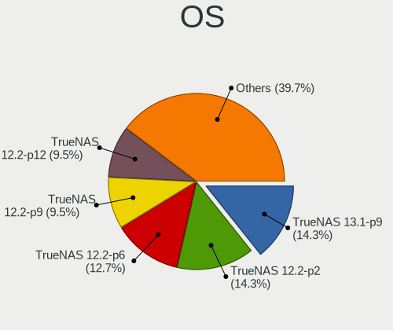

| Name             | Computers | Percent |
|------------------|-----------|---------|
| TrueNAS 12.2-p2  | 9         | 17.31%  |
| TrueNAS 12.2-p6  | 8         | 15.38%  |
| TrueNAS 12.2-p9  | 6         | 11.54%  |
| TrueNAS 12.2-p12 | 6         | 11.54%  |
| TrueNAS 12.2-RC3 | 4         | 7.69%   |
| TrueNAS 12.2-p11 | 4         | 7.69%   |
| TrueNAS 12.2-p10 | 4         | 7.69%   |
| TrueNAS 13.1-p2  | 2         | 3.85%   |
| TrueNAS 13.1     | 2         | 3.85%   |
| TrueNAS 13.1-p7  | 1         | 1.92%   |
| TrueNAS 12.3-p7  | 1         | 1.92%   |
| TrueNAS 12.3-p2  | 1         | 1.92%   |
| TrueNAS 12.3-p1  | 1         | 1.92%   |
| TrueNAS 12.2-p3  | 1         | 1.92%   |
| TrueNAS 12.2-p14 | 1         | 1.92%   |
| TrueNAS 12.2     | 1         | 1.92%   |

OS Family
---------

OS without a version

| Name    | Computers | Percent |
|---------|-----------|---------|
| TrueNAS | 47        | 100%    |

Arch
----

OS architecture (x86_64, i586, etc.)

| Name  | Computers | Percent |
|-------|-----------|---------|
| amd64 | 47        | 100%    |

DE
--

Desktop Environment

| Name         | Computers | Percent |
|--------------|-----------|---------|
| Console      | 43        | 91.49%  |
| helloDesktop | 3         | 6.38%   |
| TWM          | 1         | 2.13%   |

Display Server
--------------

X11 or Wayland

| Name    | Computers | Percent |
|---------|-----------|---------|
| Console | 46        | 97.87%  |
| X11     | 1         | 2.13%   |

Display Manager
---------------

SDDM, LightDM, etc.

| Name    | Computers | Percent |
|---------|-----------|---------|
| Console | 47        | 100%    |

OS Lang
-------

Language

| Lang  | Computers | Percent |
|-------|-----------|---------|
| en_US | 46        | 97.87%  |
| C     | 1         | 2.13%   |

Boot Mode
---------

EFI or BIOS

| Mode | Computers | Percent |
|------|-----------|---------|
| BIOS | 27        | 57.45%  |
| EFI  | 20        | 42.55%  |

Filesystem
----------

Type of filesystem

| Type    | Computers | Percent |
|---------|-----------|---------|
| Zfs     | 42        | 89.36%  |
| XXX     | 3         | 6.38%   |
| Unknown | 2         | 4.26%   |

Part. scheme
------------

Scheme of partitioning

| Type | Computers | Percent |
|------|-----------|---------|
| GPT  | 47        | 100%    |

Board
-----

Vendor
------

Motherboard manufacturer

| Name                | Computers | Percent |
|---------------------|-----------|---------|
| Supermicro          | 10        | 21.28%  |
| Unknown             | 9         | 19.15%  |
| Dell                | 6         | 12.77%  |
| Gigabyte Technology | 5         | 10.64%  |
| ASUSTek Computer    | 5         | 10.64%  |
| ASRock              | 5         | 10.64%  |
| Hewlett-Packard     | 4         | 8.51%   |
| Lenovo              | 2         | 4.26%   |
| TYAN Computer       | 1         | 2.13%   |

Model
-----

Motherboard model

| Name                                | Computers | Percent |
|-------------------------------------|-----------|---------|
| Unknown                             | 9         | 19.15%  |
| Dell PowerEdge R720xd               | 2         | 4.26%   |
| TYAN S5512                          | 1         | 2.13%   |
| Supermicro X9SPV-F/LN4F             | 1         | 2.13%   |
| Supermicro X9SCL/X9SCM              | 1         | 2.13%   |
| Supermicro X9SCI/X9SCA              | 1         | 2.13%   |
| Supermicro X9DRD-7LN4F              | 1         | 2.13%   |
| Supermicro X8STi                    | 1         | 2.13%   |
| Supermicro X11DPi-N(T)              | 1         | 2.13%   |
| Supermicro X10SLM-F                 | 1         | 2.13%   |
| Supermicro X10SLH-F/X10SLM+-F       | 1         | 2.13%   |
| Supermicro X10SAE                   | 1         | 2.13%   |
| Supermicro ReadyDATA 5200           | 1         | 2.13%   |
| Lenovo ThinkCentre M73 10AXS01800   | 1         | 2.13%   |
| Lenovo 70AQ0009UX ThinkServer TS440 | 1         | 2.13%   |
| HP ProLiant ML150 G6                | 1         | 2.13%   |
| HP ProLiant ML10 v2                 | 1         | 2.13%   |
| HP ProLiant MicroServer Gen8        | 1         | 2.13%   |
| HP Compaq Elite 8300 SFF            | 1         | 2.13%   |
| Gigabyte H97-D3H                    | 1         | 2.13%   |
| Gigabyte GA-A75-UD4H                | 1         | 2.13%   |
| Gigabyte B550I AORUS PRO AX         | 1         | 2.13%   |
| Gigabyte B450M DS3H                 | 1         | 2.13%   |
| Gigabyte 990FXA-UD3                 | 1         | 2.13%   |
| Dell PowerEdge T310                 | 1         | 2.13%   |
| Dell PowerEdge T110 II              | 1         | 2.13%   |
| Dell PowerEdge 2950                 | 1         | 2.13%   |
| Dell OptiPlex 790                   | 1         | 2.13%   |
| ASUS TUF Z270 MARK 2                | 1         | 2.13%   |
| ASUS P10S-I Series                  | 1         | 2.13%   |
| ASUS M5A99X EVO R2.0                | 1         | 2.13%   |
| ASUS M5A78L-M/USB3                  | 1         | 2.13%   |
| ASUS M5A78L-M PLUS/USB3             | 1         | 2.13%   |
| ASRock X570M Pro4                   | 1         | 2.13%   |
| ASRock N3150M                       | 1         | 2.13%   |
| ASRock FREENAS-MINI-XL-24TB-IXN     | 1         | 2.13%   |
| ASRock C2750D4I                     | 1         | 2.13%   |
| ASRock B560M Pro4/ac                | 1         | 2.13%   |

Model Family
------------

Motherboard model prefix

| Name                            | Computers | Percent |
|---------------------------------|-----------|---------|
| Unknown                         | 9         | 19.15%  |
| Dell PowerEdge                  | 5         | 10.64%  |
| HP ProLiant                     | 3         | 6.38%   |
| ASUS M5A78L-M                   | 2         | 4.26%   |
| TYAN S5512                      | 1         | 2.13%   |
| Supermicro X9SPV-F              | 1         | 2.13%   |
| Supermicro X9SCL                | 1         | 2.13%   |
| Supermicro X9SCI                | 1         | 2.13%   |
| Supermicro X9DRD-7LN4F          | 1         | 2.13%   |
| Supermicro X8STi                | 1         | 2.13%   |
| Supermicro X11DPi-N(T)          | 1         | 2.13%   |
| Supermicro X10SLM-F             | 1         | 2.13%   |
| Supermicro X10SLH-F             | 1         | 2.13%   |
| Supermicro X10SAE               | 1         | 2.13%   |
| Supermicro ReadyDATA            | 1         | 2.13%   |
| Lenovo ThinkCentre              | 1         | 2.13%   |
| Lenovo 70AQ0009UX               | 1         | 2.13%   |
| HP Compaq                       | 1         | 2.13%   |
| Gigabyte H97-D3H                | 1         | 2.13%   |
| Gigabyte GA-A75-UD4H            | 1         | 2.13%   |
| Gigabyte B550I                  | 1         | 2.13%   |
| Gigabyte B450M                  | 1         | 2.13%   |
| Gigabyte 990FXA-UD3             | 1         | 2.13%   |
| Dell OptiPlex                   | 1         | 2.13%   |
| ASUS TUF                        | 1         | 2.13%   |
| ASUS P10S-I                     | 1         | 2.13%   |
| ASUS M5A99X                     | 1         | 2.13%   |
| ASRock X570M                    | 1         | 2.13%   |
| ASRock N3150M                   | 1         | 2.13%   |
| ASRock FREENAS-MINI-XL-24TB-IXN | 1         | 2.13%   |
| ASRock C2750D4I                 | 1         | 2.13%   |
| ASRock B560M                    | 1         | 2.13%   |

MFG Year
--------

Motherboard manufacture year

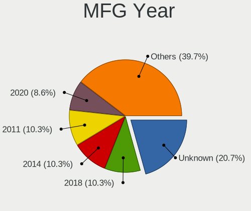

| Year    | Computers | Percent |
|---------|-----------|---------|
| Unknown | 9         | 19.15%  |
| 2018    | 6         | 12.77%  |
| 2014    | 6         | 12.77%  |
| 2019    | 5         | 10.64%  |
| 2016    | 4         | 8.51%   |
| 2012    | 4         | 8.51%   |
| 2013    | 3         | 6.38%   |
| 2011    | 3         | 6.38%   |
| 2020    | 2         | 4.26%   |
| 2010    | 2         | 4.26%   |
| 2021    | 1         | 2.13%   |
| 2017    | 1         | 2.13%   |
| 2009    | 1         | 2.13%   |

Form Factor
-----------

Physical design of the computer

| Name    | Computers | Percent |
|---------|-----------|---------|
| Desktop | 38        | 80.85%  |
| Server  | 9         | 19.15%  |

Coreboot
--------

Have coreboot on board

| Used | Computers | Percent |
|------|-----------|---------|
| No   | 47        | 100%    |

RAM Size
--------

Total RAM memory

| Size in GB  | Computers | Percent |
|-------------|-----------|---------|
| 32.01-64.0  | 15        | 31.91%  |
| 16.01-24.0  | 12        | 25.53%  |
| 8.01-16.0   | 8         | 17.02%  |
| 64.01-256.0 | 6         | 12.77%  |
| 24.01-32.0  | 5         | 10.64%  |
| 4.01-8.0    | 1         | 2.13%   |

RAM Used
--------

Used RAM memory

| Used GB    | Computers | Percent |
|------------|-----------|---------|
| 0.51-1.0   | 15        | 31.91%  |
| 1.01-2.0   | 12        | 25.53%  |
| 2.01-3.0   | 5         | 10.64%  |
| 0.01-0.5   | 4         | 8.51%   |
| 24.01-32.0 | 3         | 6.38%   |
| 4.01-8.0   | 2         | 4.26%   |
| 16.01-24.0 | 2         | 4.26%   |
| 8.01-16.0  | 2         | 4.26%   |
| 32.01-64.0 | 1         | 2.13%   |
| 3.01-4.0   | 1         | 2.13%   |

Total Drives
------------

Number of drives on board

| Drives | Computers | Percent |
|--------|-----------|---------|
| 0      | 9         | 18.75%  |
| 3      | 6         | 12.5%   |
| 9      | 4         | 8.33%   |
| 4      | 4         | 8.33%   |
| 14     | 3         | 6.25%   |
| 17     | 2         | 4.17%   |
| 11     | 2         | 4.17%   |
| 7      | 2         | 4.17%   |
| 6      | 2         | 4.17%   |
| 5      | 2         | 4.17%   |
| 2      | 2         | 4.17%   |
| 1      | 2         | 4.17%   |
| 27     | 1         | 2.08%   |
| 21     | 1         | 2.08%   |
| 19     | 1         | 2.08%   |
| 16     | 1         | 2.08%   |
| 15     | 1         | 2.08%   |
| 12     | 1         | 2.08%   |
| 10     | 1         | 2.08%   |
| 8      | 1         | 2.08%   |

Has CD-ROM
----------

Has CD-ROM on board

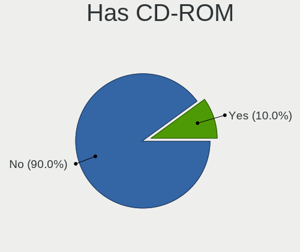

| Presented | Computers | Percent |
|-----------|-----------|---------|
| No        | 43        | 89.58%  |
| Yes       | 5         | 10.42%  |

Has Ethernet
------------

Has Ethernet on board

| Presented | Computers | Percent |
|-----------|-----------|---------|
| Yes       | 47        | 100%    |

Has WiFi
--------

Has WiFi module

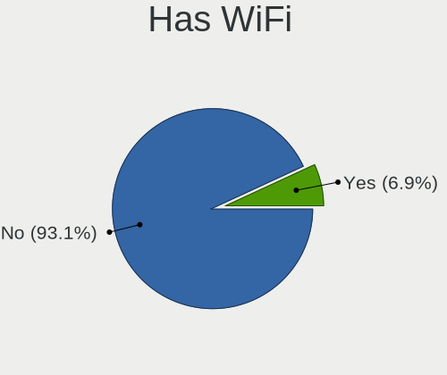

| Presented | Computers | Percent |
|-----------|-----------|---------|
| No        | 45        | 95.74%  |
| Yes       | 2         | 4.26%   |

Has Bluetooth
-------------

Has Bluetooth module

| Presented | Computers | Percent |
|-----------|-----------|---------|
| No        | 45        | 95.74%  |
| Yes       | 2         | 4.26%   |

Location
--------

Country
-------

Geographic location (country)

| Country     | Computers | Percent |
|-------------|-----------|---------|
| USA         | 11        | 23.4%   |
| Germany     | 5         | 10.64%  |
| Australia   | 5         | 10.64%  |
| Thailand    | 3         | 6.38%   |
| Romania     | 3         | 6.38%   |
| Greece      | 3         | 6.38%   |
| France      | 3         | 6.38%   |
| Switzerland | 2         | 4.26%   |
| Czechia     | 2         | 4.26%   |
| Canada      | 2         | 4.26%   |
| Brazil      | 2         | 4.26%   |
| Spain       | 1         | 2.13%   |
| Russia      | 1         | 2.13%   |
| Norway      | 1         | 2.13%   |
| Nicaragua   | 1         | 2.13%   |
| Estonia     | 1         | 2.13%   |
| Belgium     | 1         | 2.13%   |

City
----

Geographic location (city)

| City                 | Computers | Percent |
|----------------------|-----------|---------|
| Melbourne            | 3         | 5.88%   |
| Springfield          | 2         | 3.92%   |
| Lüneburg            | 2         | 3.92%   |
| Brno                 | 2         | 3.92%   |
| Bangkok              | 2         | 3.92%   |
| Athens               | 2         | 3.92%   |
| Apahida              | 2         | 3.92%   |
| Yverdon-les-Bains    | 1         | 1.96%   |
| Willisau             | 1         | 1.96%   |
| Tartu                | 1         | 1.96%   |
| Tamm                 | 1         | 1.96%   |
| Sydney               | 1         | 1.96%   |
| St Petersburg        | 1         | 1.96%   |
| Skiptvet             | 1         | 1.96%   |
| São Paulo         | 1         | 1.96%   |
| Raleigh              | 1         | 1.96%   |
| Perth                | 1         | 1.96%   |
| Perry Hall           | 1         | 1.96%   |
| Paris                | 1         | 1.96%   |
| Ougree               | 1         | 1.96%   |
| Northville           | 1         | 1.96%   |
| Managua              | 1         | 1.96%   |
| Ludwigsburg          | 1         | 1.96%   |
| Lubbock              | 1         | 1.96%   |
| Khlong Luang         | 1         | 1.96%   |
| Kennedale            | 1         | 1.96%   |
| JundiaГ­           | 1         | 1.96%   |
| Jundiaí             | 1         | 1.96%   |
| Jundiaí           | 1         | 1.96%   |
| Jaraguá do Sul    | 1         | 1.96%   |
| Hendersonville       | 1         | 1.96%   |
| Genas                | 1         | 1.96%   |
| Gatineau             | 1         | 1.96%   |
| Galatista            | 1         | 1.96%   |
| Fontaine-le-Comte    | 1         | 1.96%   |
| Fayetteville         | 1         | 1.96%   |
| East Granby          | 1         | 1.96%   |
| Dresden              | 1         | 1.96%   |
| Clare                | 1         | 1.96%   |
| Campo Limpo Paulista | 1         | 1.96%   |

Drives
------

Drive Vendor
------------

Hard drive vendors

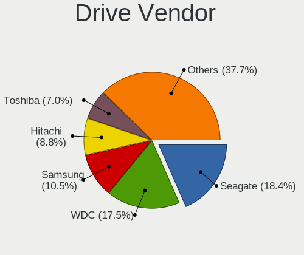

| Vendor              | Computers | Drives | Percent |
|---------------------|-----------|--------|---------|
| WDC                 | 19        | 89     | 19.79%  |
| Seagate             | 19        | 111    | 19.79%  |
| Samsung Electronics | 10        | 14     | 10.42%  |
| Hitachi             | 8         | 32     | 8.33%   |
| Intel               | 7         | 15     | 7.29%   |
| Toshiba             | 6         | 11     | 6.25%   |
| Kingston            | 5         | 11     | 5.21%   |
| Crucial             | 5         | 7      | 5.21%   |
| SanDisk             | 3         | 3      | 3.13%   |
| HPT                 | 2         | 31     | 2.08%   |
| HGST                | 2         | 13     | 2.08%   |
| Hewlett-Packard     | 2         | 8      | 2.08%   |
| WD MediaMax         | 1         | 3      | 1.04%   |
| Transcend           | 1         | 1      | 1.04%   |
| SPCC                | 1         | 1      | 1.04%   |
| PNY                 | 1         | 1      | 1.04%   |
| Mushkin             | 1         | 1      | 1.04%   |
| China               | 1         | 1      | 1.04%   |
| Apacer              | 1         | 1      | 1.04%   |
| AMD                 | 1         | 2      | 1.04%   |

Drive Model
-----------

Hard drive models

| Model                           | Computers | Percent |
|---------------------------------|-----------|---------|
| WDC WD40EFRX-68N32N0 4TB        | 5         | 2.65%   |
| WDC WD30EFRX-68EUZN0 3TB        | 4         | 2.12%   |
| Samsung SSD 860 EVO 250GB       | 4         | 2.12%   |
| WDC WD40EFRX-68WT0N0 4TB        | 3         | 1.59%   |
| WDC WD20EFRX-68EUZN0 2TB        | 3         | 1.59%   |
| WDC WD60EFRX-68MYMN1 6TB        | 2         | 1.06%   |
| WDC WD30EFRX-68AX9N0 3TB        | 2         | 1.06%   |
| WDC WD20EZRX-00D8PB0 2TB        | 2         | 1.06%   |
| WDC WD20EFRX-68AX9N0 2TB        | 2         | 1.06%   |
| Seagate ST500DM002-1BD142 496GB | 2         | 1.06%   |
| Seagate ST4000DM000-1F2168 4TB  | 2         | 1.06%   |
| Seagate ST2000DM001-1ER164 2TB  | 2         | 1.06%   |
| Kingston SA400S37120G 120GB     | 2         | 1.06%   |
| Intel SSDSC2BB120G4 120GB       | 2         | 1.06%   |
| HPT DISK 0_9 3TB                | 2         | 1.06%   |
| HPT DISK 0_8 3TB                | 2         | 1.06%   |
| HPT DISK 0_7 1TB                | 2         | 1.06%   |
| HPT DISK 0_6 1TB                | 2         | 1.06%   |
| HPT DISK 0_5 1TB                | 2         | 1.06%   |
| HPT DISK 0_4 1TB                | 2         | 1.06%   |
| HPT DISK 0_3 1TB                | 2         | 1.06%   |
| HPT DISK 0_2 1TB                | 2         | 1.06%   |
| HPT DISK 0_14 3TB               | 2         | 1.06%   |
| HPT DISK 0_13 2TB               | 2         | 1.06%   |
| HPT DISK 0_12 1TB               | 2         | 1.06%   |
| HPT DISK 0_11 1TB               | 2         | 1.06%   |
| HPT DISK 0_10 1TB               | 2         | 1.06%   |
| HPT DISK 0_1 1TB                | 2         | 1.06%   |
| HPT DISK 0_0 4TB                | 2         | 1.06%   |
| Hitachi HUA722020ALA331 2TB     | 2         | 1.06%   |
| Hitachi HDS723020BLA642 2TB     | 2         | 1.06%   |
| Hitachi HDS722020ALA330 2TB     | 2         | 1.06%   |
| Crucial M4-CT064M4SSD2 64GB     | 2         | 1.06%   |
| WDC WD80EFAX-68LHPN0 8TB        | 1         | 0.53%   |
| WDC WD8004FRYZ-01VAEB0 8TB      | 1         | 0.53%   |
| WDC WD5000LPLX-08ZNTT0 500GB    | 1         | 0.53%   |
| WDC WD5000LPLX-00ZNTT0 500GB    | 1         | 0.53%   |
| WDC WD5000AAKX-00U6AA0 500GB    | 1         | 0.53%   |
| WDC WD4003FFBX-68MU3N0 4TB      | 1         | 0.53%   |
| WDC WD30PURX-64P6ZY0 3TB        | 1         | 0.53%   |

HDD Vendor
----------

Hard disk drive vendors

| Vendor              | Computers | Drives | Percent |
|---------------------|-----------|--------|---------|
| WDC                 | 19        | 88     | 31.67%  |
| Seagate             | 19        | 111    | 31.67%  |
| Hitachi             | 8         | 32     | 13.33%  |
| Toshiba             | 6         | 9      | 10%     |
| HPT                 | 2         | 31     | 3.33%   |
| HGST                | 2         | 13     | 3.33%   |
| Hewlett-Packard     | 2         | 8      | 3.33%   |
| WD MediaMax         | 1         | 3      | 1.67%   |
| Samsung Electronics | 1         | 3      | 1.67%   |

SSD Vendor
----------

Solid state drive vendors

| Vendor              | Computers | Drives | Percent |
|---------------------|-----------|--------|---------|
| Samsung Electronics | 8         | 10     | 24.24%  |
| Kingston            | 5         | 9      | 15.15%  |
| Intel               | 5         | 13     | 15.15%  |
| SanDisk             | 3         | 3      | 9.09%   |
| Crucial             | 3         | 5      | 9.09%   |
| WDC                 | 1         | 1      | 3.03%   |
| Transcend           | 1         | 1      | 3.03%   |
| Toshiba             | 1         | 2      | 3.03%   |
| SPCC                | 1         | 1      | 3.03%   |
| PNY                 | 1         | 1      | 3.03%   |
| Mushkin             | 1         | 1      | 3.03%   |
| China               | 1         | 1      | 3.03%   |
| Apacer              | 1         | 1      | 3.03%   |
| AMD                 | 1         | 2      | 3.03%   |

Drive Kind
----------

HDD or SSD

| Kind | Computers | Drives | Percent |
|------|-----------|--------|---------|
| HDD  | 36        | 298    | 52.17%  |
| SSD  | 27        | 51     | 39.13%  |
| NVMe | 6         | 7      | 8.7%    |

Drive Connector
---------------

SATA, SAS, NVMe, etc.

| Type | Computers | Drives | Percent |
|------|-----------|--------|---------|
| SATA | 37        | 349    | 86.05%  |
| NVMe | 6         | 7      | 13.95%  |

Drive Size
----------

Size of hard drive

| Size in TB | Computers | Drives | Percent |
|------------|-----------|--------|---------|
| 0.01-0.5   | 29        | 76     | 34.12%  |
| 1.01-2.0   | 15        | 57     | 17.65%  |
| 2.01-3.0   | 13        | 72     | 15.29%  |
| 3.01-4.0   | 11        | 61     | 12.94%  |
| 0.51-1.0   | 9         | 55     | 10.59%  |
| 4.01-10.0  | 6         | 25     | 7.06%   |
| 10.01-20.0 | 2         | 3      | 2.35%   |

Space Total
-----------

Amount of disk space available on the file system

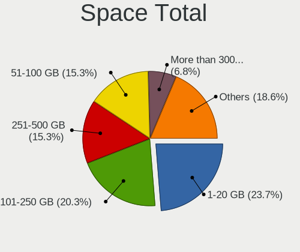

| Size in GB     | Computers | Percent |
|----------------|-----------|---------|
| 1-20           | 12        | 25%     |
| 101-250        | 11        | 22.92%  |
| 251-500        | 9         | 18.75%  |
| 21-50          | 4         | 8.33%   |
| 51-100         | 4         | 8.33%   |
| More than 3000 | 3         | 6.25%   |
| Unknown        | 3         | 6.25%   |
| 501-1000       | 2         | 4.17%   |

Space Used
----------

Amount of used disk space

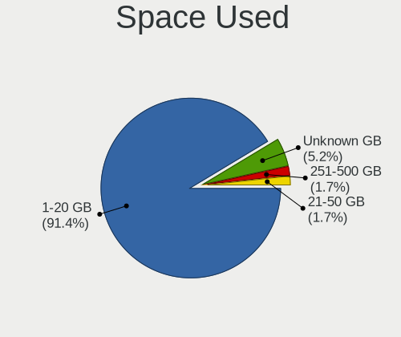

| Used GB | Computers | Percent |
|---------|-----------|---------|
| 1-20    | 43        | 91.49%  |
| Unknown | 3         | 6.38%   |
| 21-50   | 1         | 2.13%   |

Malfunc. Drives
---------------

Drive models with a malfunction

| Model                           | Computers | Drives | Percent |
|---------------------------------|-----------|--------|---------|
| WDC WD30EFRX-68AX9N0 3TB        | 2         | 5      | 7.14%   |
| Hitachi HDS723020BLA642 2TB     | 2         | 2      | 7.14%   |
| WDC WD60EFRX-68MYMN1 6TB        | 1         | 1      | 3.57%   |
| WDC WD5000AAKX-00U6AA0 500GB    | 1         | 1      | 3.57%   |
| WDC WD30PURX-64P6ZY0 3TB        | 1         | 1      | 3.57%   |
| WDC WD30EZRX-00MMMB0 3TB        | 1         | 2      | 3.57%   |
| WDC WD20EFRX-68AX9N0 2TB        | 1         | 1      | 3.57%   |
| WDC WD2000FYYZ 2TB              | 1         | 2      | 3.57%   |
| WDC WD10PURX-64E5EY0 1TB        | 1         | 1      | 3.57%   |
| WDC WD10EZEX-00RKKA0 1TB        | 1         | 1      | 3.57%   |
| WD MediaMax WL2000GSA6454 2TB   | 1         | 3      | 3.57%   |
| Toshiba HDWD130 3TB             | 1         | 2      | 3.57%   |
| Seagate ST980310AS 80GB         | 1         | 1      | 3.57%   |
| Seagate ST9320325AS 320GB       | 1         | 1      | 3.57%   |
| Seagate ST4000DM000-1F2168 4TB  | 1         | 1      | 3.57%   |
| Seagate ST3320311CS 320GB       | 1         | 2      | 3.57%   |
| Seagate ST31500341AS 1.5TB      | 1         | 1      | 3.57%   |
| Seagate ST3000VN007-2E4166 3TB  | 1         | 1      | 3.57%   |
| Seagate ST3000NM0033-9ZM178 3TB | 1         | 7      | 3.57%   |
| Seagate ST2000NM0033-9ZM175 2TB | 1         | 1      | 3.57%   |
| Seagate ST2000DL003-9VT166 2TB  | 1         | 1      | 3.57%   |
| Seagate ST2000DL001-9VT156 2TB  | 1         | 1      | 3.57%   |
| Seagate ST1000VM002-1SD102 1TB  | 1         | 2      | 3.57%   |
| Intel SSDSC2BA200G3T 200GB      | 1         | 1      | 3.57%   |
| Hitachi HTS725032A9A364 320GB   | 1         | 1      | 3.57%   |
| Hitachi HTS723232A7A364 320GB   | 1         | 1      | 3.57%   |

Malfunc. Drive Vendor
---------------------

Vendors of faulty drives

| Vendor      | Computers | Drives | Percent |
|-------------|-----------|--------|---------|
| Seagate     | 6         | 19     | 35.29%  |
| WDC         | 5         | 15     | 29.41%  |
| Hitachi     | 3         | 4      | 17.65%  |
| WD MediaMax | 1         | 3      | 5.88%   |
| Toshiba     | 1         | 2      | 5.88%   |
| Intel       | 1         | 1      | 5.88%   |

Malfunc. HDD Vendor
-------------------

Vendors of faulty HDD drives

| Vendor      | Computers | Drives | Percent |
|-------------|-----------|--------|---------|
| Seagate     | 6         | 19     | 37.5%   |
| WDC         | 5         | 15     | 31.25%  |
| Hitachi     | 3         | 4      | 18.75%  |
| WD MediaMax | 1         | 3      | 6.25%   |
| Toshiba     | 1         | 2      | 6.25%   |

Malfunc. Drive Kind
-------------------

Kinds of faulty drives

| Kind | Computers | Drives | Percent |
|------|-----------|--------|---------|
| HDD  | 11        | 43     | 91.67%  |
| SSD  | 1         | 1      | 8.33%   |

Failed Drives
-------------

Failed drive models

Zero info for selected period =(

Failed Drive Vendor
-------------------

Failed drive vendors

Zero info for selected period =(

Drive Status
------------

Number of failed and malfunc. drives

| Status   | Computers | Drives | Percent |
|----------|-----------|--------|---------|
| Works    | 38        | 276    | 73.08%  |
| Malfunc  | 11        | 44     | 21.15%  |
| Detected | 3         | 36     | 5.77%   |

Storage controller
------------------

Storage Vendor
--------------

Storage controller vendors

| Vendor                      | Computers | Percent |
|-----------------------------|-----------|---------|
| Intel                       | 36        | 39.56%  |
| Broadcom / LSI              | 15        | 16.48%  |
| AMD                         | 10        | 10.99%  |
| Marvell Technology Group    | 8         | 8.79%   |
| ASMedia Technology          | 4         | 4.4%    |
| Silicon Image               | 2         | 2.2%    |
| Samsung Electronics         | 2         | 2.2%    |
| Micron/Crucial Technology   | 2         | 2.2%    |
| Kingston Technology Company | 2         | 2.2%    |
| JMicron Technology          | 2         | 2.2%    |
| HighPoint Technologies      | 2         | 2.2%    |
| Hewlett-Packard             | 2         | 2.2%    |
| Silicon Motion              | 1         | 1.1%    |
| QLogic                      | 1         | 1.1%    |
| Dell                        | 1         | 1.1%    |
| Areca Technology            | 1         | 1.1%    |

Storage Model
-------------

Storage controller models

| Model                                                                            | Computers | Percent |
|----------------------------------------------------------------------------------|-----------|---------|
| Broadcom / LSI SAS2008 PCI-Express Fusion-MPT SAS-2 [Falcon]                     | 12        | 11.11%  |
| Intel 8 Series/C220 Series Chipset Family 6-port SATA Controller 1 [AHCI mode]   | 7         | 6.48%   |
| Intel 6 Series/C200 Series Chipset Family 6 port Desktop SATA AHCI Controller    | 5         | 4.63%   |
| Marvell Group 88SE9215 PCIe 2.0 x1 4-port SATA 6 Gb/s Controller                 | 4         | 3.7%    |
| AMD FCH SATA Controller [AHCI mode]                                              | 4         | 3.7%    |
| Marvell Group 88SE9172 SATA 6Gb/s Controller                                     | 3         | 2.78%   |
| Broadcom / LSI SAS2308 PCI-Express Fusion-MPT SAS-2                              | 3         | 2.78%   |
| ASMedia ASM1062 Serial ATA Controller                                            | 3         | 2.78%   |
| AMD SB7x0/SB8x0/SB9x0 SATA Controller [AHCI mode]                                | 3         | 2.78%   |
| AMD SB7x0/SB8x0/SB9x0 IDE Controller                                             | 3         | 2.78%   |
| Samsung NVMe SSD Controller SM981/PM981/PM983                                    | 2         | 1.85%   |
| Marvell Group 88SE9230 PCIe 2.0 x2 4-port SATA 6 Gb/s RAID Controller            | 2         | 1.85%   |
| Kingston Company A2000 NVMe SSD                                                  | 2         | 1.85%   |
| JMicron JMB58x AHCI SATA controller                                              | 2         | 1.85%   |
| Intel Volume Management Device NVMe RAID Controller                              | 2         | 1.85%   |
| Intel C620 Series Chipset Family SSATA Controller [AHCI mode]                    | 2         | 1.85%   |
| Intel C620 Series Chipset Family SATA Controller [AHCI mode]                     | 2         | 1.85%   |
| Intel Atom processor C2000 AHCI SATA3 Controller                                 | 2         | 1.85%   |
| Intel Atom processor C2000 AHCI SATA2 Controller                                 | 2         | 1.85%   |
| Intel 82801JI (ICH10 Family) SATA AHCI Controller                                | 2         | 1.85%   |
| Intel 82801JI (ICH10 Family) 2 port SATA IDE Controller #2                       | 2         | 1.85%   |
| Intel 200 Series PCH SATA controller [AHCI mode]                                 | 2         | 1.85%   |
| HighPoint RocketRAID 2760 SAS Controller                                         | 2         | 1.85%   |
| Silicon Motion SM2263EN/SM2263XT (DRAM-less) NVMe SSD Controllers                | 1         | 0.93%   |
| Silicon Image SiI 3132 Serial ATA Raid II Controller                             | 1         | 0.93%   |
| Silicon Image SiI 3114 [SATALink/SATARaid] Serial ATA Controller                 | 1         | 0.93%   |
| QLogic QLA2100 64-bit Fibre Channel Adapter                                      | 1         | 0.93%   |
| Micron/Crucial P5 Plus NVMe PCIe SSD                                             | 1         | 0.93%   |
| Micron/Crucial P2 [Nick P2] / P3 / P3 Plus NVMe PCIe SSD (DRAM-less)             | 1         | 0.93%   |
| Marvell Group MV64460/64461/64462 System Controller, Revision B                  | 1         | 0.93%   |
| Intel Q170/Q150/B150/H170/H110/Z170/CM236 Chipset SATA Controller [AHCI Mode]    | 1         | 0.93%   |
| Intel PCIe Data Center SSD                                                       | 1         | 0.93%   |
| Intel NVMe Optane Memory Series                                                  | 1         | 0.93%   |
| Intel Cannon Lake PCH SATA AHCI Controller                                       | 1         | 0.93%   |
| Intel C600/X79 series chipset SATA RAID Controller                               | 1         | 0.93%   |
| Intel C600/X79 series chipset 6-Port SATA AHCI Controller                        | 1         | 0.93%   |
| Intel Atom/Celeron/Pentium Processor x5-E8000/J3xxx/N3xxx Series SATA Controller | 1         | 0.93%   |
| Intel 9 Series Chipset Family SATA Controller [AHCI Mode]                        | 1         | 0.93%   |
| Intel 82801JI (ICH10 Family) 4 port SATA IDE Controller #1                       | 1         | 0.93%   |
| Intel 7 Series/C210 Series Chipset Family 6-port SATA Controller [AHCI mode]     | 1         | 0.93%   |

Storage Kind
------------

Kind of storage controller (IDE, SATA, NVMe, SAS, ...)

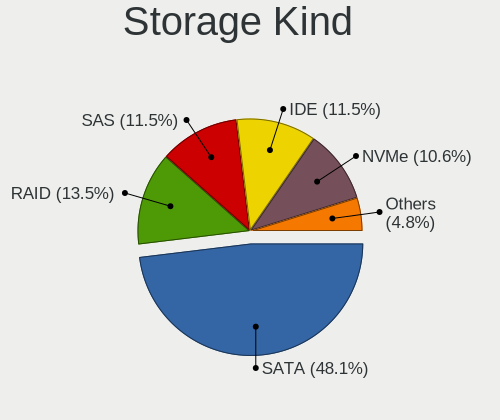

| Kind | Computers | Percent |
|------|-----------|---------|
| SATA | 39        | 44.83%  |
| RAID | 15        | 17.24%  |
| SAS  | 11        | 12.64%  |
| IDE  | 10        | 11.49%  |
| NVMe | 9         | 10.34%  |
| SCSI | 3         | 3.45%   |

Processor
---------

CPU Vendor
----------

Processor vendors

| Vendor | Computers | Percent |
|--------|-----------|---------|
| Intel  | 37        | 78.72%  |
| AMD    | 10        | 21.28%  |

CPU Model
---------

Processor models

| Model                                    | Computers | Percent |
|------------------------------------------|-----------|---------|
| Intel Xeon Silver 4108 CPU @ 1.80GHz     | 2         | 4.26%   |
| Intel Xeon CPU E5504 @ 2.00GHz           | 2         | 4.26%   |
| Intel Xeon CPU E3-1220 v3 @ 3.10GHz      | 2         | 4.26%   |
| Intel Xeon CPU E3-1220 V2 @ 3.10GHz      | 2         | 4.26%   |
| Intel Core i5-7500 CPU @ 3.40GHz         | 2         | 4.26%   |
| Intel Atom CPU C2750 @ 2.40GHz           | 2         | 4.26%   |
| AMD Ryzen 5 3600 6-Core Processor        | 2         | 4.26%   |
| Intel Xeon E-2224 CPU @ 3.40GHz          | 1         | 2.13%   |
| Intel Xeon CPU X3450 @ 2.67GHz           | 1         | 2.13%   |
| Intel Xeon CPU X3430 @ 2.40GHz           | 1         | 2.13%   |
| Intel Xeon CPU E5506 @ 2.13GHz           | 1         | 2.13%   |
| Intel Xeon CPU E5-2690 0 @ 2.90GHz       | 1         | 2.13%   |
| Intel Xeon CPU E5-2670 0 @ 2.60GHz       | 1         | 2.13%   |
| Intel Xeon CPU E5-2609 0 @ 2.40GHz       | 1         | 2.13%   |
| Intel Xeon CPU E3-1245 v3 @ 3.40GHz      | 1         | 2.13%   |
| Intel Xeon CPU E3-1241 v3 @ 3.50GHz      | 1         | 2.13%   |
| Intel Xeon CPU E3-1230 V2 @ 3.30GHz      | 1         | 2.13%   |
| Intel Xeon CPU E3-1225 v6 @ 3.30GHz      | 1         | 2.13%   |
| Intel Xeon CPU E3-1225 v3 @ 3.20GHz      | 1         | 2.13%   |
| Intel Xeon CPU E3-1225 V2 @ 3.20GHz      | 1         | 2.13%   |
| Intel Xeon CPU D-1518 @ 2.20GHz          | 1         | 2.13%   |
| Intel Xeon CPU 5160 @ 3.00GHz            | 1         | 2.13%   |
| Intel Pentium CPU G860 @ 3.00GHz         | 1         | 2.13%   |
| Intel Core i7-3555LE CPU @ 2.50GHz       | 1         | 2.13%   |
| Intel Core i5-4590 CPU @ 3.30GHz         | 1         | 2.13%   |
| Intel Core i5-4570T CPU @ 2.90GHz        | 1         | 2.13%   |
| Intel Core i5-3470 CPU @ 3.20GHz         | 1         | 2.13%   |
| Intel Core i5-2500S CPU @ 2.70GH         | 1         | 2.13%   |
| Intel Core i3-4330 CPU @ 3.50GHz         | 1         | 2.13%   |
| Intel Core i3-10100 CPU @ 3.60GHz        | 1         | 2.13%   |
| Intel Celeron CPU N3150 @ 1.60GHz        | 1         | 2.13%   |
| Intel Celeron CPU G1610T @ 2.30GHz       | 1         | 2.13%   |
| AMD Ryzen 7 1800X Eight-Core Processor   | 1         | 2.13%   |
| AMD FX-8350 Eight-Core Processor         | 1         | 2.13%   |
| AMD FX-8320E Eight-Core Processor        | 1         | 2.13%   |
| AMD FX-8300 Eight-Core Processor         | 1         | 2.13%   |
| AMD FX-6300 Six-Core Processor           | 1         | 2.13%   |
| AMD E1-2500 APU with Radeon HD Graphics  | 1         | 2.13%   |
| AMD A8-5500 APU with Radeon HD Graphics  | 1         | 2.13%   |
| AMD A8-3870 APU with Radeon HD Graphics  | 1         | 2.13%   |

CPU Model Family
----------------

Processor model prefix

| Model             | Computers | Percent |
|-------------------|-----------|---------|
| Intel Xeon        | 21        | 44.68%  |
| Intel Core i5     | 6         | 12.77%  |
| AMD FX            | 4         | 8.51%   |
| Intel Xeon Silver | 2         | 4.26%   |
| Intel Core i3     | 2         | 4.26%   |
| Intel Celeron     | 2         | 4.26%   |
| Intel Atom        | 2         | 4.26%   |
| AMD Ryzen 5       | 2         | 4.26%   |
| AMD A8            | 2         | 4.26%   |
| Intel Pentium     | 1         | 2.13%   |
| Intel Core i7     | 1         | 2.13%   |
| AMD Ryzen 7       | 1         | 2.13%   |
| AMD E1            | 1         | 2.13%   |

CPU Cores
---------

Number of processor cores

| Number  | Computers | Percent |
|---------|-----------|---------|
| 4       | 24        | 51.06%  |
| 8       | 8         | 17.02%  |
| 2       | 6         | 12.77%  |
| 16      | 5         | 10.64%  |
| 12      | 2         | 4.26%   |
| 6       | 1         | 2.13%   |
| Unknown | 1         | 2.13%   |

CPU Sockets
-----------

Number of sockets

| Number | Computers | Percent |
|--------|-----------|---------|
| 1      | 39        | 82.98%  |
| 2      | 8         | 17.02%  |

CPU Threads
-----------

Threads per core (Hyper-Threading)

| Number  | Computers | Percent |
|---------|-----------|---------|
| 1       | 33        | 70.21%  |
| 2       | 13        | 27.66%  |
| Unknown | 1         | 2.13%   |

CPU Microarch
-------------

Microarchitecture

| Name        | Computers | Percent |
|-------------|-----------|---------|
| Haswell     | 8         | 17.02%  |
| IvyBridge   | 7         | 14.89%  |
| SandyBridge | 5         | 10.64%  |
| Piledriver  | 5         | 10.64%  |
| Nehalem     | 5         | 10.64%  |
| KabyLake    | 4         | 8.51%   |
| Silvermont  | 3         | 6.38%   |
| Zen 2       | 2         | 4.26%   |
| Skylake     | 2         | 4.26%   |
| Zen         | 1         | 2.13%   |
| K10 Llano   | 1         | 2.13%   |
| Jaguar      | 1         | 2.13%   |
| Core        | 1         | 2.13%   |
| CometLake   | 1         | 2.13%   |
| Broadwell   | 1         | 2.13%   |

Graphics
--------

GPU Vendor
----------

Vendors of graphics cards

| Vendor                     | Computers | Percent |
|----------------------------|-----------|---------|
| Matrox Electronics Systems | 15        | 31.91%  |
| Intel                      | 11        | 23.4%   |
| ASPEED Technology          | 9         | 19.15%  |
| AMD                        | 9         | 19.15%  |
| Nvidia                     | 3         | 6.38%   |

GPU Model
---------

Graphics card models

| Model                                                                                    | Computers | Percent |
|------------------------------------------------------------------------------------------|-----------|---------|
| ASPEED Technology ASPEED Graphics Family                                                 | 9         | 19.15%  |
| Matrox Electronics Systems MGA G200eW WPCM450                                            | 8         | 17.02%  |
| Intel Xeon E3-1200 v3/4th Gen Core Processor Integrated Graphics Controller              | 3         | 6.38%   |
| Nvidia GK208B [GeForce GT 710]                                                           | 2         | 4.26%   |
| Matrox Electronics Systems MGA G200EH                                                    | 2         | 4.26%   |
| Matrox Electronics Systems MGA G200e [Pilot] ServerEngines (SEP1)                        | 2         | 4.26%   |
| Matrox Electronics Systems G200eR2                                                       | 2         | 4.26%   |
| Intel Xeon E3-1200 v3 Processor Integrated Graphics Controller                           | 2         | 4.26%   |
| Intel HD Graphics 630                                                                    | 2         | 4.26%   |
| Intel 2nd Generation Core Processor Family Integrated Graphics Controller                | 2         | 4.26%   |
| AMD RS780L [Radeon 3000]                                                                 | 2         | 4.26%   |
| AMD Caicos XT [Radeon HD 7470/8470 / R5 235/310 OEM]                                     | 2         | 4.26%   |
| Nvidia G84 [GeForce 8600 GT]                                                             | 1         | 2.13%   |
| Matrox Electronics Systems MGA G200eH3                                                   | 1         | 2.13%   |
| Intel Xeon E3-1200 v2/3rd Gen Core processor Graphics Controller                         | 1         | 2.13%   |
| Intel Atom/Celeron/Pentium Processor x5-E8000/J3xxx/N3xxx Integrated Graphics Controller | 1         | 2.13%   |
| AMD Sumo [Radeon HD 6550D]                                                               | 1         | 2.13%   |
| AMD Oland GL [FirePro W2100]                                                             | 1         | 2.13%   |
| AMD Kabini [Radeon HD 8240 / R3 Series]                                                  | 1         | 2.13%   |
| AMD ES1000                                                                               | 1         | 2.13%   |
| AMD Caicos [Radeon HD 6450/7450/8450 / R5 230 OEM]                                       | 1         | 2.13%   |

GPU Combo
---------

Combinations of graphics cards

| Name           | Computers | Percent |
|----------------|-----------|---------|
| 1 x Matrox     | 15        | 31.91%  |
| 1 x Intel      | 10        | 21.28%  |
| 1 x ASPEED     | 9         | 19.15%  |
| 1 x AMD        | 9         | 19.15%  |
| 1 x Nvidia     | 2         | 4.26%   |
| Other          | 1         | 2.13%   |
| Intel + Nvidia | 1         | 2.13%   |

GPU Driver
----------

Free vs proprietary

| Driver  | Computers | Percent |
|---------|-----------|---------|
| Free    | 46        | 97.87%  |
| Unknown | 1         | 2.13%   |

GPU Memory
----------

Total video memory

| Size in GB | Computers | Percent |
|------------|-----------|---------|
| Unknown    | 47        | 100%    |

Monitor
-------

Monitor Vendor
--------------

Monitor vendors

Zero info for selected period =(

Monitor Model
-------------

Monitor models

Zero info for selected period =(

Monitor Resolution
------------------

Monitor screen resolution

Zero info for selected period =(

Monitor Diagonal
----------------

Diagonal size in inches

Zero info for selected period =(

Monitor Width
-------------

Physical width

Zero info for selected period =(

Aspect Ratio
------------

Proportional relationship between the width and the height

Zero info for selected period =(

Monitor Area
------------

Area in inch²

Zero info for selected period =(

Pixel Density
-------------

Pixels per inch

Zero info for selected period =(

Multiple Monitors
-----------------

Total monitors connected

| Total | Computers | Percent |
|-------|-----------|---------|
| 0     | 47        | 100%    |

Network
-------

Net Controller Vendor
---------------------

Controller vendors

| Vendor                | Computers | Percent |
|-----------------------|-----------|---------|
| Intel                 | 32        | 60.38%  |
| Realtek Semiconductor | 11        | 20.75%  |
| Broadcom              | 8         | 15.09%  |
| QLogic                | 1         | 1.89%   |
| Aquantia              | 1         | 1.89%   |

Net Controller Model
--------------------

Controller models

| Model                                                                         | Computers | Percent |
|-------------------------------------------------------------------------------|-----------|---------|
| Realtek RTL8111/8168/8411 PCI Express Gigabit Ethernet Controller             | 9         | 12.86%  |
| Intel I350 Gigabit Network Connection                                         | 7         | 10%     |
| Intel I210 Gigabit Network Connection                                         | 6         | 8.57%   |
| Intel 82574L Gigabit Network Connection                                       | 5         | 7.14%   |
| Intel Ethernet Connection I217-LM                                             | 4         | 5.71%   |
| Intel 82599ES 10-Gigabit SFI/SFP+ Network Connection                          | 3         | 4.29%   |
| Intel 82579LM Gigabit Network Connection (Lewisville)                         | 3         | 4.29%   |
| Broadcom NetXtreme BCM5720 Gigabit Ethernet PCIe                              | 3         | 4.29%   |
| Intel Ethernet Connection X722 for 1GbE                                       | 2         | 2.86%   |
| Intel Ethernet Connection I217-V                                              | 2         | 2.86%   |
| Intel Ethernet Connection (2) I219-V                                          | 2         | 2.86%   |
| Intel 82576 Gigabit Network Connection                                        | 2         | 2.86%   |
| Broadcom NetXtreme BCM5723 Gigabit Ethernet PCIe                              | 2         | 2.86%   |
| Realtek RTL8169 PCI Gigabit Ethernet Controller                               | 1         | 1.43%   |
| Realtek RTL8125 2.5GbE Controller                                             | 1         | 1.43%   |
| Realtek RTL-8100/8101L/8139 PCI Fast Ethernet Adapter                         | 1         | 1.43%   |
| QLogic cLOM8214 1/10GbE Controller                                            | 1         | 1.43%   |
| Intel Wi-Fi 6 AX200                                                           | 1         | 1.43%   |
| Intel Tiger Lake PCH CNVi WiFi                                                | 1         | 1.43%   |
| Intel I211 Gigabit Network Connection                                         | 1         | 1.43%   |
| Intel Ethernet Controller 10-Gigabit X540-AT2                                 | 1         | 1.43%   |
| Intel Ethernet Connection X552/X557-AT 10GBASE-T                              | 1         | 1.43%   |
| Intel Ethernet Connection (11) I219-V                                         | 1         | 1.43%   |
| Intel 82580 Gigabit Network Connection                                        | 1         | 1.43%   |
| Intel 82571EB/82571GB Gigabit Ethernet Controller D0/D1 (copper applications) | 1         | 1.43%   |
| Intel 82571EB Gigabit Ethernet Controller                                     | 1         | 1.43%   |
| Intel 82541PI Gigabit Ethernet Controller                                     | 1         | 1.43%   |
| Broadcom NetXtreme II BCM57810 10 Gigabit Ethernet                            | 1         | 1.43%   |
| Broadcom NetXtreme II BCM5716 Gigabit Ethernet                                | 1         | 1.43%   |
| Broadcom NetXtreme II BCM5709 Gigabit Ethernet                                | 1         | 1.43%   |
| Broadcom NetXtreme II BCM5708 Gigabit Ethernet                                | 1         | 1.43%   |
| Broadcom NetXtreme BCM5722 Gigabit Ethernet PCI Express                       | 1         | 1.43%   |
| Aquantia AQC107 NBase-T/IEEE 802.3bz Ethernet Controller [AQtion]             | 1         | 1.43%   |

Wireless Vendor
---------------

Wireless vendors

| Vendor | Computers | Percent |
|--------|-----------|---------|
| Intel  | 2         | 100%    |

Wireless Model
--------------

Wireless models

| Model                          | Computers | Percent |
|--------------------------------|-----------|---------|
| Intel Wi-Fi 6 AX200            | 1         | 50%     |
| Intel Tiger Lake PCH CNVi WiFi | 1         | 50%     |

Ethernet Vendor
---------------

Ethernet vendors

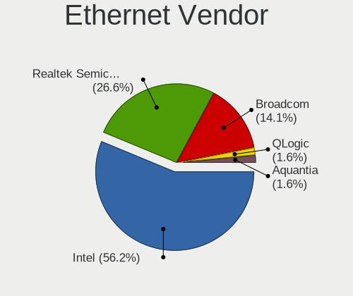

| Vendor                | Computers | Percent |
|-----------------------|-----------|---------|
| Intel                 | 31        | 59.62%  |
| Realtek Semiconductor | 11        | 21.15%  |
| Broadcom              | 8         | 15.38%  |
| QLogic                | 1         | 1.92%   |
| Aquantia              | 1         | 1.92%   |

Ethernet Model
--------------

Ethernet models

| Model                                                                         | Computers | Percent |
|-------------------------------------------------------------------------------|-----------|---------|
| Realtek RTL8111/8168/8411 PCI Express Gigabit Ethernet Controller             | 9         | 13.24%  |
| Intel I350 Gigabit Network Connection                                         | 7         | 10.29%  |
| Intel I210 Gigabit Network Connection                                         | 6         | 8.82%   |
| Intel 82574L Gigabit Network Connection                                       | 5         | 7.35%   |
| Intel Ethernet Connection I217-LM                                             | 4         | 5.88%   |
| Intel 82599ES 10-Gigabit SFI/SFP+ Network Connection                          | 3         | 4.41%   |
| Intel 82579LM Gigabit Network Connection (Lewisville)                         | 3         | 4.41%   |
| Broadcom NetXtreme BCM5720 Gigabit Ethernet PCIe                              | 3         | 4.41%   |
| Intel Ethernet Connection X722 for 1GbE                                       | 2         | 2.94%   |
| Intel Ethernet Connection I217-V                                              | 2         | 2.94%   |
| Intel Ethernet Connection (2) I219-V                                          | 2         | 2.94%   |
| Intel 82576 Gigabit Network Connection                                        | 2         | 2.94%   |
| Broadcom NetXtreme BCM5723 Gigabit Ethernet PCIe                              | 2         | 2.94%   |
| Realtek RTL8169 PCI Gigabit Ethernet Controller                               | 1         | 1.47%   |
| Realtek RTL8125 2.5GbE Controller                                             | 1         | 1.47%   |
| Realtek RTL-8100/8101L/8139 PCI Fast Ethernet Adapter                         | 1         | 1.47%   |
| QLogic cLOM8214 1/10GbE Controller                                            | 1         | 1.47%   |
| Intel I211 Gigabit Network Connection                                         | 1         | 1.47%   |
| Intel Ethernet Controller 10-Gigabit X540-AT2                                 | 1         | 1.47%   |
| Intel Ethernet Connection X552/X557-AT 10GBASE-T                              | 1         | 1.47%   |
| Intel Ethernet Connection (11) I219-V                                         | 1         | 1.47%   |
| Intel 82580 Gigabit Network Connection                                        | 1         | 1.47%   |
| Intel 82571EB/82571GB Gigabit Ethernet Controller D0/D1 (copper applications) | 1         | 1.47%   |
| Intel 82571EB Gigabit Ethernet Controller                                     | 1         | 1.47%   |
| Intel 82541PI Gigabit Ethernet Controller                                     | 1         | 1.47%   |
| Broadcom NetXtreme II BCM57810 10 Gigabit Ethernet                            | 1         | 1.47%   |
| Broadcom NetXtreme II BCM5716 Gigabit Ethernet                                | 1         | 1.47%   |
| Broadcom NetXtreme II BCM5709 Gigabit Ethernet                                | 1         | 1.47%   |
| Broadcom NetXtreme II BCM5708 Gigabit Ethernet                                | 1         | 1.47%   |
| Broadcom NetXtreme BCM5722 Gigabit Ethernet PCI Express                       | 1         | 1.47%   |
| Aquantia AQC107 NBase-T/IEEE 802.3bz Ethernet Controller [AQtion]             | 1         | 1.47%   |

Net Controller Kind
-------------------

Ethernet, WiFi or modem

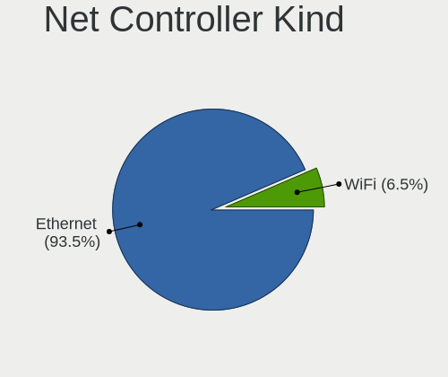

| Kind     | Computers | Percent |
|----------|-----------|---------|
| Ethernet | 47        | 95.92%  |
| WiFi     | 2         | 4.08%   |

Used Controller
---------------

Currently used network controller

| Kind     | Computers | Percent |
|----------|-----------|---------|
| Ethernet | 44        | 100%    |

NICs
----

Total network controllers on board

| Total | Computers | Percent |
|-------|-----------|---------|
| 1     | 14        | 29.79%  |
| 2     | 13        | 27.66%  |
| 4     | 9         | 19.15%  |
| 6     | 4         | 8.51%   |
| 5     | 4         | 8.51%   |
| 3     | 3         | 6.38%   |

IPv6
----

IPv6 vs IPv4

| Used | Computers | Percent |
|------|-----------|---------|
| No   | 47        | 100%    |

Bluetooth
---------

Bluetooth Vendor
----------------

Controller vendors

| Vendor | Computers | Percent |
|--------|-----------|---------|
| Intel  | 2         | 100%    |

Bluetooth Model
---------------

Controller models

| Model                                          | Computers | Percent |
|------------------------------------------------|-----------|---------|
| Intel Bluetooth 9460/9560 Jefferson Peak (JfP) | 1         | 50%     |
| Intel AX200 Bluetooth                          | 1         | 50%     |

Sound
-----

Sound Vendor
------------

Sound card vendors

| Vendor | Computers | Percent |
|--------|-----------|---------|
| AMD    | 7         | 50%     |
| Intel  | 5         | 35.71%  |
| Nvidia | 2         | 14.29%  |

Sound Model
-----------

Sound card models

| Model                                                                             | Computers | Percent |
|-----------------------------------------------------------------------------------|-----------|---------|
| Intel Xeon E3-1200 v3/4th Gen Core Processor HD Audio Controller                  | 3         | 14.29%  |
| AMD Caicos HDMI Audio [Radeon HD 6450 / 7450/8450/8490 OEM / R5 230/235/235X OEM] | 3         | 14.29%  |
| Nvidia GK208 HDMI/DP Audio Controller                                             | 2         | 9.52%   |
| Intel 8 Series/C220 Series Chipset High Definition Audio Controller               | 2         | 9.52%   |
| AMD Starship/Matisse HD Audio Controller                                          | 2         | 9.52%   |
| AMD SBx00 Azalia (Intel HDA)                                                      | 2         | 9.52%   |
| Intel Smart Sound Technology (SST) Audio Controller                               | 1         | 4.76%   |
| Intel 9 Series Chipset Family HD Audio Controller                                 | 1         | 4.76%   |
| Intel 7 Series/C216 Chipset Family High Definition Audio Controller               | 1         | 4.76%   |
| AMD RS780 HDMI Audio [Radeon 3000/3100 / HD 3200/3300]                            | 1         | 4.76%   |
| AMD FCH Azalia Controller                                                         | 1         | 4.76%   |
| AMD Family 17h (Models 00h-0fh) HD Audio Controller                               | 1         | 4.76%   |
| AMD BeaverCreek HDMI Audio [Radeon HD 6500D and 6400G-6600G series]               | 1         | 4.76%   |

Memory
------

Memory Vendor
-------------

Memory module vendors

| Vendor              | Computers | Percent |
|---------------------|-----------|---------|
| Samsung Electronics | 11        | 23.4%   |
| Kingston            | 9         | 19.15%  |
| Unknown             | 6         | 12.77%  |
| SK hynix            | 5         | 10.64%  |
| Micron Technology   | 5         | 10.64%  |
| Crucial             | 3         | 6.38%   |
| Corsair             | 2         | 4.26%   |
| Transcend           | 1         | 2.13%   |
| Toshiba             | 1         | 2.13%   |
| Team                | 1         | 2.13%   |
| PNY                 | 1         | 2.13%   |
| Patriot             | 1         | 2.13%   |
| Hewlett-Packard     | 1         | 2.13%   |

Memory Model
------------

Memory module models

| Model                                                       | Computers | Percent |
|-------------------------------------------------------------|-----------|---------|
| Unknown RAM Module 8192MB DIMM DDR3 1600MT/s                | 1         | 1.92%   |
| Unknown RAM Module 8192MB DIMM DDR3 1333MT/s                | 1         | 1.92%   |
| Unknown RAM Module 8192MB DIMM 667MT/s                      | 1         | 1.92%   |
| Unknown RAM Module 8192MB DIMM 1600MT/s                     | 1         | 1.92%   |
| Unknown RAM Module 4096MB DIMM DDR3 1600MT/s                | 1         | 1.92%   |
| Unknown RAM Module 4096MB DIMM 1333MT/s                     | 1         | 1.92%   |
| Unknown RAM Module 2048MB DIMM DDR3 1333MT/s                | 1         | 1.92%   |
| Transcend RAM TS1GLK72V6H 8GB DIMM DDR3 1600MT/s            | 1         | 1.92%   |
| Toshiba RAM 9965525-138.A00LF 8192MB DIMM DDR3 1600MT/s     | 1         | 1.92%   |
| Team RAM Vulcan-2400 8192MB DIMM DDR3 1333MT/s              | 1         | 1.92%   |
| SK hynix RAM HYMP151F72CP4N3-Y5 4096MB FB-DIMM DDR2 667MT/s | 1         | 1.92%   |
| SK hynix RAM HMT41GU7BFR8A-PB 8GB DIMM DDR3 1600MT/s        | 1         | 1.92%   |
| SK hynix RAM HMT351R7CFR8A-H9 4GB DIMM DDR3 1333MT/s        | 1         | 1.92%   |
| SK hynix RAM HMT31GR7BFR4C-H9 8GB DIMM DDR3 1333MT/s        | 1         | 1.92%   |
| SK hynix RAM HMA81GR7AFR8N-VK 8GB DIMM DDR4 2666MT/s        | 1         | 1.92%   |
| Samsung RAM Module 8192MB DIMM DDR3 1600MT/s                | 1         | 1.92%   |
| Samsung RAM M395T5750EZ4-CE66 2048MB FB-DIMM DDR2 667MT/s   | 1         | 1.92%   |
| Samsung RAM M395T5750CZ4-CE61 2048MB FB-DIMM DDR2 667MT/s   | 1         | 1.92%   |
| Samsung RAM M393B2K70CM0-CF8 16384MB DIMM DDR3 1066MT/s     | 1         | 1.92%   |
| Samsung RAM M393B2G70BH0-CH9 16384MB DIMM DDR3 1066MT/s     | 1         | 1.92%   |
| Samsung RAM M393B1K73CHD-CF8 8192MB DIMM DDR3 1066MT/s      | 1         | 1.92%   |
| Samsung RAM M393B1K70DH0-YH9 8GB DIMM DDR3 1333MT/s         | 1         | 1.92%   |
| Samsung RAM M393B1K70DH0-CH9 8GB DIMM DDR3 1333MT/s         | 1         | 1.92%   |
| Samsung RAM M393B1G70QH0-YK0 8192MB DIMM DDR3 1600MT/s      | 1         | 1.92%   |
| Samsung RAM M391B5273CH0-CH9 4GB DIMM DDR3 1600MT/s         | 1         | 1.92%   |
| Samsung RAM M391B5173QH0-YK0 4GB DIMM DDR3 1600MT/s         | 1         | 1.92%   |
| Samsung RAM M391B1G73QH0-YK0 8GB DIMM DDR3 1600MT/s         | 1         | 1.92%   |
| Samsung RAM M391B1G73BH0-YH9 8192MB DIMM DDR3 1333MT/s      | 1         | 1.92%   |
| PNY RAM 8GBF1X08QFHH38-135-K 8GB DIMM DDR4 2133MT/s         | 1         | 1.92%   |
| Patriot RAM PSD416G26662 16384MB DIMM DDR4 2667MT/s         | 1         | 1.92%   |
| Micron RAM F7251U64F9333G 4096MB DIMM DDR3 1333MT/s         | 1         | 1.92%   |
| Micron RAM 18KSF1G72AZ-1G6P1 8GB DIMM DDR3 1600MT/s         | 1         | 1.92%   |
| Micron RAM 18KSF1G72AZ-1G4E1 8192MB DIMM DDR3 1333MT/s      | 1         | 1.92%   |
| Micron RAM 18JSF25672PDZ1G4F1 2GB DIMM DDR3 1333MT/s        | 1         | 1.92%   |
| Micron RAM 18JDF25672PZ-1G4F1 2048MB DIMM DDR3 800MT/s      | 1         | 1.92%   |
| Kingston RAM KHX1866C9D3/8GX 8GB DIMM DDR3 1600MT/s         | 1         | 1.92%   |
| Kingston RAM HX318C10F/8 8GB DIMM DDR3 1400MT/s             | 1         | 1.92%   |
| Kingston RAM 99U5403-195.A00LF 8GB DIMM DDR3 1333MT/s       | 1         | 1.92%   |
| Kingston RAM 99U5403-083.A00LF 8GB DIMM DDR3 1333MT/s       | 1         | 1.92%   |
| Kingston RAM 9965745-002.A00G 16GB DIMM DDR4 3000MT/s       | 1         | 1.92%   |

Memory Kind
-----------

Memory module kinds

| Kind    | Computers | Percent |
|---------|-----------|---------|
| DDR3    | 27        | 71.05%  |
| DDR4    | 7         | 18.42%  |
| Unknown | 3         | 7.89%   |
| DDR2    | 1         | 2.63%   |

Memory Form Factor
------------------

Physical design of the memory module

| Name    | Computers | Percent |
|---------|-----------|---------|
| DIMM    | 36        | 94.74%  |
| SODIMM  | 1         | 2.63%   |
| FB-DIMM | 1         | 2.63%   |

Memory Size
-----------

Memory module size

| Size  | Computers | Percent |
|-------|-----------|---------|
| 8192  | 29        | 63.04%  |
| 4096  | 8         | 17.39%  |
| 16384 | 5         | 10.87%  |
| 2048  | 4         | 8.7%    |

Memory Speed
------------

Memory module speed

| Speed | Computers | Percent |
|-------|-----------|---------|
| 1600  | 14        | 35%     |
| 1333  | 11        | 27.5%   |
| 1066  | 3         | 7.5%    |
| 2133  | 2         | 5%      |
| 800   | 2         | 5%      |
| 667   | 2         | 5%      |
| 3200  | 1         | 2.5%    |
| 3000  | 1         | 2.5%    |
| 2667  | 1         | 2.5%    |
| 2666  | 1         | 2.5%    |
| 2400  | 1         | 2.5%    |
| 1400  | 1         | 2.5%    |

Printers & scanners
-------------------

Printer Vendor
--------------

Printer device vendors

Zero info for selected period =(

Printer Model
-------------

Printer device models

Zero info for selected period =(

Scanner Vendor
--------------

Scanner device vendors

Zero info for selected period =(

Scanner Model
-------------

Scanner device models

Zero info for selected period =(

Camera
------

Camera Vendor
-------------

Camera device vendors

Zero info for selected period =(

Camera Model
------------

Camera device models

Zero info for selected period =(

Security
--------

Fingerprint Vendor
------------------

Fingerprint sensor vendors

Zero info for selected period =(

Fingerprint Model
-----------------

Fingerprint sensor models

Zero info for selected period =(

Chipcard Vendor
---------------

Chipcard module vendors

Zero info for selected period =(

Chipcard Model
--------------

Chipcard module models

Zero info for selected period =(

Unsupported
-----------

Unsupported Devices
-------------------

Total unsupported devices on board

| Total | Computers | Percent |
|-------|-----------|---------|
| 0     | 24        | 51.06%  |
| 2     | 10        | 21.28%  |
| 1     | 6         | 12.77%  |
| 3     | 4         | 8.51%   |
| 4     | 2         | 4.26%   |
| 5     | 1         | 2.13%   |

Unsupported Device Types
------------------------

Types of unsupported devices

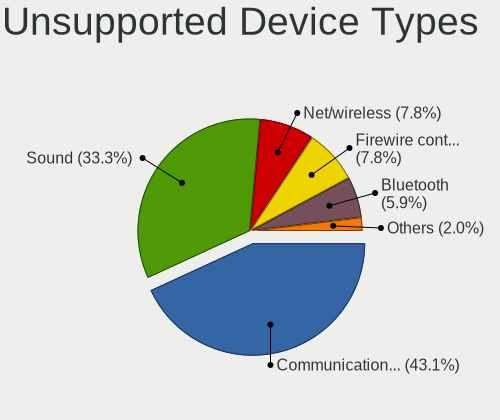

| Type                     | Computers | Percent |
|--------------------------|-----------|---------|
| Communication controller | 16        | 44.44%  |
| Sound                    | 12        | 33.33%  |
| Firewire controller      | 3         | 8.33%   |
| Net/wireless             | 2         | 5.56%   |
| Bluetooth                | 2         | 5.56%   |
| Storage/raid             | 1         | 2.78%   |

