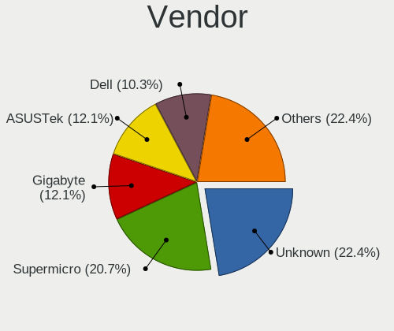
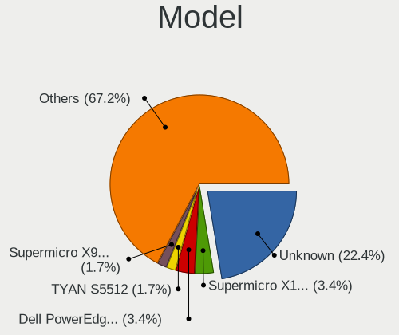
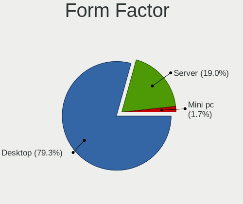
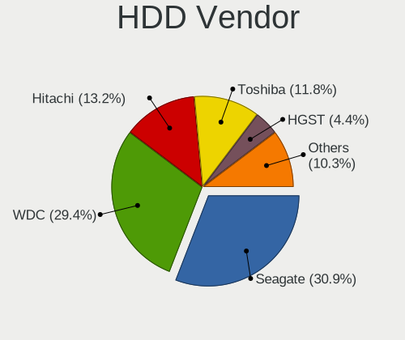
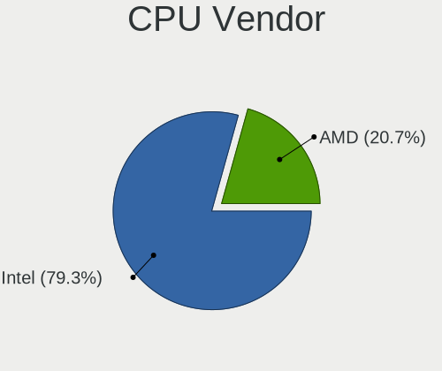
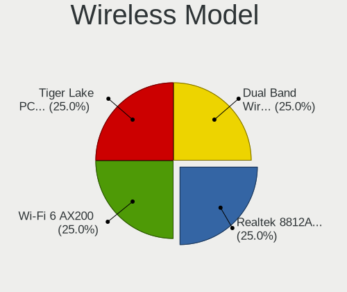
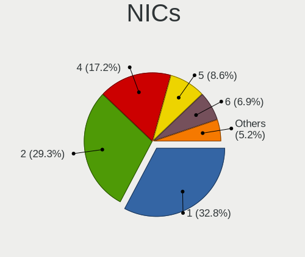
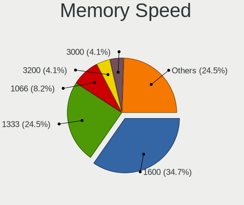

TrueNAS - Tested Hardware & Statistics
--------------------------------------

A project to collect tested hardware configurations for TrueNAS.

Anyone can contribute to this report by the [hw-probe](https://github.com/linuxhw/hw-probe/blob/master/INSTALL.BSD.md) tool:

    hw-probe -all -upload

Please submit a probe of your configuration if it's not presented on the page or is rare.

This is a report for all computer types. See also reports for [desktops](/Dist/TrueNAS/Desktop/README.md) and [notebooks](/Dist/TrueNAS/Notebook/README.md).

Full-feature report is available here: https://bsd-hardware.info/?view=trends

Contents
--------

* [ Test Cases ](#test-cases)

* [ System ](#system)
  - [ Arch                     ](#arch)
  - [ DE                       ](#de)
  - [ Display Server           ](#display-server)
  - [ Display Manager          ](#display-manager)
  - [ OS Lang                  ](#os-lang)
  - [ Boot Mode                ](#boot-mode)
  - [ Filesystem               ](#filesystem)
  - [ Part. scheme             ](#part-scheme)

* [ Board ](#board)
  - [ Vendor                   ](#vendor)
  - [ Model                    ](#model)
  - [ Model Family             ](#model-family)
  - [ MFG Year                 ](#mfg-year)
  - [ Form Factor              ](#form-factor)
  - [ Coreboot                 ](#coreboot)
  - [ RAM Size                 ](#ram-size)
  - [ RAM Used                 ](#ram-used)
  - [ Total Drives             ](#total-drives)
  - [ Has CD-ROM               ](#has-cd-rom)
  - [ Has Ethernet             ](#has-ethernet)
  - [ Has WiFi                 ](#has-wifi)
  - [ Has Bluetooth            ](#has-bluetooth)

* [ Location ](#location)
  - [ Country                  ](#country)
  - [ City                     ](#city)

* [ Drives ](#drives)
  - [ Drive Vendor             ](#drive-vendor)
  - [ Drive Model              ](#drive-model)
  - [ HDD Vendor               ](#hdd-vendor)
  - [ SSD Vendor               ](#ssd-vendor)
  - [ Drive Kind               ](#drive-kind)
  - [ Drive Connector          ](#drive-connector)
  - [ Drive Size               ](#drive-size)
  - [ Space Total              ](#space-total)
  - [ Space Used               ](#space-used)
  - [ Malfunc. Drives          ](#malfunc-drives)
  - [ Malfunc. Drive Vendor    ](#malfunc-drive-vendor)
  - [ Malfunc. HDD Vendor      ](#malfunc-hdd-vendor)
  - [ Malfunc. Drive Kind      ](#malfunc-drive-kind)
  - [ Failed Drives            ](#failed-drives)
  - [ Failed Drive Vendor      ](#failed-drive-vendor)
  - [ Drive Status             ](#drive-status)

* [ Storage controller ](#storage-controller)
  - [ Storage Vendor           ](#storage-vendor)
  - [ Storage Model            ](#storage-model)
  - [ Storage Kind             ](#storage-kind)

* [ Processor ](#processor)
  - [ CPU Vendor               ](#cpu-vendor)
  - [ CPU Model                ](#cpu-model)
  - [ CPU Model Family         ](#cpu-model-family)
  - [ CPU Cores                ](#cpu-cores)
  - [ CPU Sockets              ](#cpu-sockets)
  - [ CPU Threads              ](#cpu-threads)
  - [ CPU Microarch            ](#cpu-microarch)

* [ Graphics ](#graphics)
  - [ GPU Vendor               ](#gpu-vendor)
  - [ GPU Model                ](#gpu-model)
  - [ GPU Combo                ](#gpu-combo)
  - [ GPU Driver               ](#gpu-driver)
  - [ GPU Memory               ](#gpu-memory)

* [ Monitor ](#monitor)
  - [ Monitor Vendor           ](#monitor-vendor)
  - [ Monitor Model            ](#monitor-model)
  - [ Monitor Resolution       ](#monitor-resolution)
  - [ Monitor Diagonal         ](#monitor-diagonal)
  - [ Monitor Width            ](#monitor-width)
  - [ Aspect Ratio             ](#aspect-ratio)
  - [ Monitor Area             ](#monitor-area)
  - [ Pixel Density            ](#pixel-density)
  - [ Multiple Monitors        ](#multiple-monitors)

* [ Network ](#network)
  - [ Net Controller Vendor    ](#net-controller-vendor)
  - [ Net Controller Model     ](#net-controller-model)
  - [ Wireless Vendor          ](#wireless-vendor)
  - [ Wireless Model           ](#wireless-model)
  - [ Ethernet Vendor          ](#ethernet-vendor)
  - [ Ethernet Model           ](#ethernet-model)
  - [ Net Controller Kind      ](#net-controller-kind)
  - [ Used Controller          ](#used-controller)
  - [ NICs                     ](#nics)
  - [ IPv6                     ](#ipv6)

* [ Bluetooth ](#bluetooth)
  - [ Bluetooth Vendor         ](#bluetooth-vendor)
  - [ Bluetooth Model          ](#bluetooth-model)

* [ Sound ](#sound)
  - [ Sound Vendor             ](#sound-vendor)
  - [ Sound Model              ](#sound-model)

* [ Memory ](#memory)
  - [ Memory Vendor            ](#memory-vendor)
  - [ Memory Model             ](#memory-model)
  - [ Memory Kind              ](#memory-kind)
  - [ Memory Form Factor       ](#memory-form-factor)
  - [ Memory Size              ](#memory-size)
  - [ Memory Speed             ](#memory-speed)

* [ Printers & scanners ](#printers--scanners)
  - [ Printer Vendor           ](#printer-vendor)
  - [ Printer Model            ](#printer-model)
  - [ Scanner Vendor           ](#scanner-vendor)
  - [ Scanner Model            ](#scanner-model)

* [ Camera ](#camera)
  - [ Camera Vendor            ](#camera-vendor)
  - [ Camera Model             ](#camera-model)

* [ Security ](#security)
  - [ Fingerprint Vendor       ](#fingerprint-vendor)
  - [ Fingerprint Model        ](#fingerprint-model)
  - [ Chipcard Vendor          ](#chipcard-vendor)
  - [ Chipcard Model           ](#chipcard-model)

* [ Unsupported ](#unsupported)
  - [ Unsupported Devices      ](#unsupported-devices)
  - [ Unsupported Device Types ](#unsupported-device-types)

Test Cases
----------

| Vendor        | Model                       | Form-Factor | Probe                                                     | Date         |
|---------------|-----------------------------|-------------|-----------------------------------------------------------|--------------|
| Dell          | 0PV3YR A05                  | Server      | [f89c9bd576](https://bsd-hardware.info/?probe=f89c9bd576) | Mar 01, 2022 |
| Dell          | 0PV3YR A05                  | Server      | [7996446e06](https://bsd-hardware.info/?probe=7996446e06) | Feb 28, 2022 |
| Dell          | 0PV3YR A05                  | Server      | [8f927f8944](https://bsd-hardware.info/?probe=8f927f8944) | Feb 27, 2022 |
| Dell          | 0PV3YR A05                  | Server      | [2ee3f1d594](https://bsd-hardware.info/?probe=2ee3f1d594) | Feb 25, 2022 |
| Dell          | 0PV3YR A05                  | Server      | [da77ab8834](https://bsd-hardware.info/?probe=da77ab8834) | Feb 24, 2022 |
| Dell          | 0PV3YR A05                  | Server      | [fb76c7570d](https://bsd-hardware.info/?probe=fb76c7570d) | Feb 18, 2022 |
| Dell          | 0PV3YR A05                  | Server      | [661af95ee4](https://bsd-hardware.info/?probe=661af95ee4) | Feb 17, 2022 |
| Supermicro    | X9DRD-7LN4F                 | Desktop     | [ea62f49750](https://bsd-hardware.info/?probe=ea62f49750) | Feb 15, 2022 |
| Supermicro    | X8STi                       | Desktop     | [970e2c91ec](https://bsd-hardware.info/?probe=970e2c91ec) | Feb 15, 2022 |
| Supermicro    | X9DRD-7LN4F                 | Desktop     | [74dffd5c4f](https://bsd-hardware.info/?probe=74dffd5c4f) | Feb 15, 2022 |
| Dell          | 0PV3YR A05                  | Server      | [0aca581115](https://bsd-hardware.info/?probe=0aca581115) | Feb 12, 2022 |
| Dell          | 0PV3YR A05                  | Server      | [2abceefed7](https://bsd-hardware.info/?probe=2abceefed7) | Feb 11, 2022 |
| Dell          | 0PV3YR A05                  | Server      | [b3dc4cd362](https://bsd-hardware.info/?probe=b3dc4cd362) | Feb 06, 2022 |
| Dell          | 0PV3YR A05                  | Server      | [5606f6d091](https://bsd-hardware.info/?probe=5606f6d091) | Feb 05, 2022 |
| Dell          | 0PV3YR A05                  | Server      | [a07a15f667](https://bsd-hardware.info/?probe=a07a15f667) | Feb 02, 2022 |
| Dell          | 0PV3YR A05                  | Server      | [3b6d2302de](https://bsd-hardware.info/?probe=3b6d2302de) | Feb 01, 2022 |
| Dell          | 0PV3YR A05                  | Server      | [2972a0e9a5](https://bsd-hardware.info/?probe=2972a0e9a5) | Jan 31, 2022 |
| Dell          | 0PV3YR A05                  | Server      | [dfaaf4e9f3](https://bsd-hardware.info/?probe=dfaaf4e9f3) | Jan 27, 2022 |
| Dell          | 0PV3YR A05                  | Server      | [bc0dbc7d97](https://bsd-hardware.info/?probe=bc0dbc7d97) | Jan 26, 2022 |
| Dell          | 0PV3YR A05                  | Server      | [340dbfac63](https://bsd-hardware.info/?probe=340dbfac63) | Jan 23, 2022 |
| Dell          | 0PV3YR A05                  | Server      | [54cc480e61](https://bsd-hardware.info/?probe=54cc480e61) | Jan 22, 2022 |
| Dell          | 0PV3YR A05                  | Server      | [27a14d696c](https://bsd-hardware.info/?probe=27a14d696c) | Jan 18, 2022 |
| Dell          | 0PV3YR A05                  | Server      | [06228adf33](https://bsd-hardware.info/?probe=06228adf33) | Jan 17, 2022 |
| Unknown       | Unknown                     | Desktop     | [bd78c2db3d](https://bsd-hardware.info/?probe=bd78c2db3d) | Jan 16, 2022 |
| Dell          | 0PV3YR A05                  | Server      | [5ad6dc5b90](https://bsd-hardware.info/?probe=5ad6dc5b90) | Jan 13, 2022 |
| Dell          | 0PV3YR A05                  | Server      | [e5dff6e19e](https://bsd-hardware.info/?probe=e5dff6e19e) | Jan 11, 2022 |
| Dell          | 0DT021 A02                  | Server      | [d1fdef3d4d](https://bsd-hardware.info/?probe=d1fdef3d4d) | Jan 09, 2022 |
| Dell          | 0PV3YR A05                  | Server      | [2d0c011fd8](https://bsd-hardware.info/?probe=2d0c011fd8) | Jan 05, 2022 |
| Dell          | 0PV3YR A05                  | Server      | [e6793363a0](https://bsd-hardware.info/?probe=e6793363a0) | Jan 04, 2022 |
| Dell          | 0PV3YR A05                  | Server      | [3cbcf10b77](https://bsd-hardware.info/?probe=3cbcf10b77) | Jan 03, 2022 |
| Dell          | 0PV3YR A05                  | Server      | [a9b9a2ed16](https://bsd-hardware.info/?probe=a9b9a2ed16) | Jan 02, 2022 |
| Dell          | 0PV3YR A05                  | Server      | [dc9cbe1ce0](https://bsd-hardware.info/?probe=dc9cbe1ce0) | Jan 01, 2022 |
| Dell          | 0PV3YR A05                  | Server      | [487a7beeec](https://bsd-hardware.info/?probe=487a7beeec) | Dec 31, 2021 |
| Dell          | 0PV3YR A05                  | Server      | [27bd2f9c84](https://bsd-hardware.info/?probe=27bd2f9c84) | Dec 30, 2021 |
| Gigabyte      | B550I AORUS PRO AX          | Desktop     | [8c3181ee8d](https://bsd-hardware.info/?probe=8c3181ee8d) | Dec 29, 2021 |
| Dell          | 0PV3YR A05                  | Server      | [9ba23c3558](https://bsd-hardware.info/?probe=9ba23c3558) | Dec 22, 2021 |
| Dell          | 0PV3YR A05                  | Server      | [195ad0fdd4](https://bsd-hardware.info/?probe=195ad0fdd4) | Dec 21, 2021 |
| Dell          | 0PV3YR A05                  | Server      | [7c15055139](https://bsd-hardware.info/?probe=7c15055139) | Dec 18, 2021 |
| Dell          | 0PV3YR A05                  | Server      | [a60e62ef73](https://bsd-hardware.info/?probe=a60e62ef73) | Dec 17, 2021 |
| Dell          | 0PV3YR A05                  | Server      | [3bdf2e4e8a](https://bsd-hardware.info/?probe=3bdf2e4e8a) | Dec 14, 2021 |
| Dell          | 0PV3YR A05                  | Server      | [bc69ea1b29](https://bsd-hardware.info/?probe=bc69ea1b29) | Dec 13, 2021 |
| Dell          | 0PV3YR A05                  | Server      | [9a28ab4c82](https://bsd-hardware.info/?probe=9a28ab4c82) | Dec 10, 2021 |
| Dell          | 0PV3YR A05                  | Server      | [ce3437a7ee](https://bsd-hardware.info/?probe=ce3437a7ee) | Dec 09, 2021 |
| Dell          | 0PV3YR A05                  | Server      | [ad308cc715](https://bsd-hardware.info/?probe=ad308cc715) | Dec 08, 2021 |
| Dell          | 0PV3YR A05                  | Server      | [df981410a9](https://bsd-hardware.info/?probe=df981410a9) | Dec 04, 2021 |
| Dell          | 0PV3YR A05                  | Server      | [84e8211c1d](https://bsd-hardware.info/?probe=84e8211c1d) | Dec 03, 2021 |
| Dell          | 0PV3YR A05                  | Server      | [2c8f421b92](https://bsd-hardware.info/?probe=2c8f421b92) | Nov 29, 2021 |
| Dell          | 0PV3YR A05                  | Server      | [2f0d55b28d](https://bsd-hardware.info/?probe=2f0d55b28d) | Nov 28, 2021 |
| Dell          | 0PV3YR A05                  | Server      | [b53e4a886f](https://bsd-hardware.info/?probe=b53e4a886f) | Nov 21, 2021 |
| Dell          | 0PV3YR A05                  | Server      | [29b605b7b4](https://bsd-hardware.info/?probe=29b605b7b4) | Nov 20, 2021 |
| Dell          | 0PV3YR A05                  | Server      | [ecb15a09e6](https://bsd-hardware.info/?probe=ecb15a09e6) | Nov 17, 2021 |
| Dell          | 0PV3YR A05                  | Server      | [ba82b9ac41](https://bsd-hardware.info/?probe=ba82b9ac41) | Nov 16, 2021 |
| Dell          | 0PV3YR A05                  | Server      | [1e60095ea5](https://bsd-hardware.info/?probe=1e60095ea5) | Nov 10, 2021 |
| Dell          | 0PV3YR A05                  | Server      | [1a3c4787ae](https://bsd-hardware.info/?probe=1a3c4787ae) | Nov 09, 2021 |
| Dell          | 0PV3YR A05                  | Server      | [23cbfca759](https://bsd-hardware.info/?probe=23cbfca759) | Nov 05, 2021 |
| Dell          | 0PV3YR A05                  | Server      | [9b8fd959f0](https://bsd-hardware.info/?probe=9b8fd959f0) | Nov 04, 2021 |
| Dell          | 0PV3YR A05                  | Server      | [59f7d0e0a2](https://bsd-hardware.info/?probe=59f7d0e0a2) | Nov 01, 2021 |
| Dell          | 0PV3YR A05                  | Server      | [eafbe4b971](https://bsd-hardware.info/?probe=eafbe4b971) | Oct 31, 2021 |
| Dell          | 0PV3YR A05                  | Server      | [80b44a15c9](https://bsd-hardware.info/?probe=80b44a15c9) | Oct 26, 2021 |
| Dell          | 0PV3YR A05                  | Server      | [8db8214cee](https://bsd-hardware.info/?probe=8db8214cee) | Oct 25, 2021 |
| Dell          | 0PV3YR A05                  | Server      | [f95928e00b](https://bsd-hardware.info/?probe=f95928e00b) | Oct 24, 2021 |
| Dell          | 0PV3YR A05                  | Server      | [4e0fcaa2b3](https://bsd-hardware.info/?probe=4e0fcaa2b3) | Oct 23, 2021 |
| Dell          | 0PV3YR A05                  | Server      | [a71a87edb6](https://bsd-hardware.info/?probe=a71a87edb6) | Oct 20, 2021 |
| Dell          | 0PV3YR A05                  | Server      | [18a4393611](https://bsd-hardware.info/?probe=18a4393611) | Oct 19, 2021 |
| HP            | ProLiant ML150 G6           | Desktop     | [06b8fc5c06](https://bsd-hardware.info/?probe=06b8fc5c06) | Oct 18, 2021 |
| Supermicro    | X8SIE 0001                  | Desktop     | [fbd2abda35](https://bsd-hardware.info/?probe=fbd2abda35) | Oct 17, 2021 |
| Dell          | 0PV3YR A05                  | Server      | [e7df3c36ab](https://bsd-hardware.info/?probe=e7df3c36ab) | Oct 16, 2021 |
| Dell          | 0PV3YR A05                  | Server      | [e105013220](https://bsd-hardware.info/?probe=e105013220) | Oct 15, 2021 |
| Dell          | 0PV3YR A05                  | Server      | [e6cda229c7](https://bsd-hardware.info/?probe=e6cda229c7) | Oct 14, 2021 |
| Dell          | 0PV3YR A05                  | Server      | [7a4a1a1c1c](https://bsd-hardware.info/?probe=7a4a1a1c1c) | Oct 12, 2021 |
| Dell          | 0PV3YR A05                  | Server      | [2008819fda](https://bsd-hardware.info/?probe=2008819fda) | Oct 11, 2021 |
| Dell          | 0PV3YR A05                  | Server      | [d9eac45d7d](https://bsd-hardware.info/?probe=d9eac45d7d) | Oct 09, 2021 |
| Dell          | 0PV3YR A05                  | Server      | [d7676d8ead](https://bsd-hardware.info/?probe=d7676d8ead) | Oct 08, 2021 |
| Dell          | 0PV3YR A05                  | Server      | [312123f4e6](https://bsd-hardware.info/?probe=312123f4e6) | Oct 07, 2021 |
| Dell          | 0PV3YR A05                  | Server      | [20f9d1c3f0](https://bsd-hardware.info/?probe=20f9d1c3f0) | Oct 06, 2021 |
| Dell          | 0PV3YR A05                  | Server      | [88d44cfe0c](https://bsd-hardware.info/?probe=88d44cfe0c) | Oct 05, 2021 |
| Dell          | 0PV3YR A05                  | Server      | [5388eb8f24](https://bsd-hardware.info/?probe=5388eb8f24) | Oct 04, 2021 |
| Dell          | 0PV3YR A05                  | Server      | [03f8d1e33f](https://bsd-hardware.info/?probe=03f8d1e33f) | Oct 03, 2021 |
| Dell          | 0020HJ A02                  | Server      | [fbcc442d47](https://bsd-hardware.info/?probe=fbcc442d47) | Oct 02, 2021 |
| Dell          | 0PV3YR A05                  | Server      | [ec760f54d0](https://bsd-hardware.info/?probe=ec760f54d0) | Oct 02, 2021 |
| Dell          | 0PV3YR A05                  | Server      | [e2b86c4d4b](https://bsd-hardware.info/?probe=e2b86c4d4b) | Oct 01, 2021 |
| Dell          | 0PV3YR A05                  | Server      | [2c06ab71d4](https://bsd-hardware.info/?probe=2c06ab71d4) | Sep 30, 2021 |
| Dell          | 0PV3YR A05                  | Server      | [39a3917c0b](https://bsd-hardware.info/?probe=39a3917c0b) | Sep 29, 2021 |
| Dell          | 0PV3YR A05                  | Server      | [fa32ba1301](https://bsd-hardware.info/?probe=fa32ba1301) | Sep 28, 2021 |
| Dell          | 0PV3YR A05                  | Server      | [e260593f31](https://bsd-hardware.info/?probe=e260593f31) | Sep 27, 2021 |
| Dell          | 0PV3YR A05                  | Server      | [5030a5f33e](https://bsd-hardware.info/?probe=5030a5f33e) | Sep 24, 2021 |
| ASRock        | B560M Pro4/ac               | Desktop     | [1b057f3b7d](https://bsd-hardware.info/?probe=1b057f3b7d) | Sep 23, 2021 |
| ASRock        | B560M Pro4/ac               | Desktop     | [fcf75fc410](https://bsd-hardware.info/?probe=fcf75fc410) | Sep 23, 2021 |
| Dell          | 0PV3YR A05                  | Server      | [a1873cc790](https://bsd-hardware.info/?probe=a1873cc790) | Sep 23, 2021 |
| ASUSTek       | M5A78L-M PLUS/USB3          | Desktop     | [b00f275d35](https://bsd-hardware.info/?probe=b00f275d35) | Sep 23, 2021 |
| Dell          | 0PV3YR A05                  | Server      | [fdcc4903d8](https://bsd-hardware.info/?probe=fdcc4903d8) | Sep 22, 2021 |
| Gigabyte      | B450M DS3H-CF               | Desktop     | [1038e3314d](https://bsd-hardware.info/?probe=1038e3314d) | Sep 21, 2021 |
| Dell          | 0PV3YR A05                  | Server      | [869c99fe07](https://bsd-hardware.info/?probe=869c99fe07) | Sep 21, 2021 |
| Dell          | 0PV3YR A05                  | Server      | [7917b17c91](https://bsd-hardware.info/?probe=7917b17c91) | Sep 20, 2021 |
| Dell          | 0PV3YR A05                  | Server      | [869645365c](https://bsd-hardware.info/?probe=869645365c) | Sep 19, 2021 |
| Dell          | 0PV3YR A05                  | Server      | [870b596c39](https://bsd-hardware.info/?probe=870b596c39) | Sep 18, 2021 |
| Dell          | 0PV3YR A05                  | Server      | [fad2a50bda](https://bsd-hardware.info/?probe=fad2a50bda) | Sep 17, 2021 |
| Dell          | 0PV3YR A05                  | Server      | [7960a37431](https://bsd-hardware.info/?probe=7960a37431) | Sep 16, 2021 |
| Dell          | 0PV3YR A05                  | Server      | [e396a32b46](https://bsd-hardware.info/?probe=e396a32b46) | Sep 15, 2021 |
| Dell          | 0PV3YR A05                  | Server      | [62c73ffe9d](https://bsd-hardware.info/?probe=62c73ffe9d) | Sep 14, 2021 |
| Dell          | 0PV3YR A05                  | Server      | [6ebfe59695](https://bsd-hardware.info/?probe=6ebfe59695) | Sep 13, 2021 |
| Dell          | 0PV3YR A05                  | Server      | [f28af7b221](https://bsd-hardware.info/?probe=f28af7b221) | Sep 12, 2021 |
| Dell          | 0PV3YR A05                  | Server      | [a4476e09a7](https://bsd-hardware.info/?probe=a4476e09a7) | Sep 11, 2021 |
| Dell          | 0PV3YR A05                  | Server      | [92cb0e449e](https://bsd-hardware.info/?probe=92cb0e449e) | Sep 10, 2021 |
| Dell          | 0PV3YR A05                  | Server      | [dae0b18767](https://bsd-hardware.info/?probe=dae0b18767) | Sep 09, 2021 |
| Dell          | 0PV3YR A05                  | Server      | [c3dba5e192](https://bsd-hardware.info/?probe=c3dba5e192) | Sep 08, 2021 |
| Dell          | 0PV3YR A05                  | Server      | [ebad0e21ce](https://bsd-hardware.info/?probe=ebad0e21ce) | Sep 07, 2021 |
| Dell          | 0PV3YR A05                  | Server      | [f17427e1f1](https://bsd-hardware.info/?probe=f17427e1f1) | Sep 06, 2021 |
| Dell          | 0PV3YR A05                  | Server      | [4c24827222](https://bsd-hardware.info/?probe=4c24827222) | Sep 03, 2021 |
| Dell          | 0PV3YR A05                  | Server      | [165f8beac0](https://bsd-hardware.info/?probe=165f8beac0) | Sep 02, 2021 |
| Dell          | 0PV3YR A05                  | Server      | [aeacc8e062](https://bsd-hardware.info/?probe=aeacc8e062) | Sep 01, 2021 |
| Dell          | 0PV3YR A05                  | Server      | [0b75557226](https://bsd-hardware.info/?probe=0b75557226) | Aug 31, 2021 |
| Dell          | 0PV3YR A05                  | Server      | [aafc449613](https://bsd-hardware.info/?probe=aafc449613) | Aug 30, 2021 |
| Dell          | 0PV3YR A05                  | Server      | [cff5c2eecc](https://bsd-hardware.info/?probe=cff5c2eecc) | Aug 29, 2021 |
| Dell          | 0PV3YR A05                  | Server      | [706ecb95e2](https://bsd-hardware.info/?probe=706ecb95e2) | Aug 27, 2021 |
| Dell          | 0PV3YR A05                  | Server      | [647b9da407](https://bsd-hardware.info/?probe=647b9da407) | Aug 26, 2021 |
| Dell          | 0PV3YR A05                  | Server      | [db2ae65aab](https://bsd-hardware.info/?probe=db2ae65aab) | Aug 25, 2021 |
| Dell          | 0PV3YR A05                  | Server      | [245260f8c1](https://bsd-hardware.info/?probe=245260f8c1) | Aug 24, 2021 |
| Dell          | 0PV3YR A05                  | Server      | [3da90c96eb](https://bsd-hardware.info/?probe=3da90c96eb) | Aug 23, 2021 |
| Dell          | 0PV3YR A05                  | Server      | [569fefe671](https://bsd-hardware.info/?probe=569fefe671) | Aug 22, 2021 |
| Dell          | 0PV3YR A05                  | Server      | [28934917ec](https://bsd-hardware.info/?probe=28934917ec) | Aug 20, 2021 |
| Dell          | 0PV3YR A05                  | Server      | [0e66a6950b](https://bsd-hardware.info/?probe=0e66a6950b) | Aug 19, 2021 |
| Dell          | 0PV3YR A05                  | Server      | [27379b2b20](https://bsd-hardware.info/?probe=27379b2b20) | Aug 18, 2021 |
| Dell          | 0PV3YR A05                  | Server      | [fce9fd64ee](https://bsd-hardware.info/?probe=fce9fd64ee) | Aug 17, 2021 |
| Dell          | 0PV3YR A05                  | Server      | [3267a1b8c6](https://bsd-hardware.info/?probe=3267a1b8c6) | Aug 15, 2021 |
| Dell          | 0PV3YR A05                  | Server      | [ad9533714e](https://bsd-hardware.info/?probe=ad9533714e) | Aug 14, 2021 |
| Dell          | 0PV3YR A05                  | Server      | [02e9e3d7e8](https://bsd-hardware.info/?probe=02e9e3d7e8) | Aug 13, 2021 |
| Dell          | 0PV3YR A05                  | Server      | [a639b1c6e5](https://bsd-hardware.info/?probe=a639b1c6e5) | Aug 12, 2021 |
| Dell          | 0PV3YR A05                  | Server      | [a50abb4051](https://bsd-hardware.info/?probe=a50abb4051) | Aug 11, 2021 |
| Dell          | 0PV3YR A05                  | Server      | [827359a656](https://bsd-hardware.info/?probe=827359a656) | Aug 10, 2021 |
| Dell          | 0PV3YR A05                  | Server      | [c6d1c30c73](https://bsd-hardware.info/?probe=c6d1c30c73) | Aug 09, 2021 |
| Dell          | 0PV3YR A05                  | Server      | [a40a382f62](https://bsd-hardware.info/?probe=a40a382f62) | Aug 06, 2021 |
| Dell          | 0PV3YR A05                  | Server      | [f43771bc21](https://bsd-hardware.info/?probe=f43771bc21) | Aug 05, 2021 |
| Dell          | 0PV3YR A05                  | Server      | [20ab2818d7](https://bsd-hardware.info/?probe=20ab2818d7) | Aug 03, 2021 |
| Dell          | 0PV3YR A05                  | Server      | [3e93954c25](https://bsd-hardware.info/?probe=3e93954c25) | Aug 02, 2021 |
| Dell          | 0PV3YR A05                  | Server      | [1fd506688f](https://bsd-hardware.info/?probe=1fd506688f) | Jul 28, 2021 |
| Dell          | 0PV3YR A05                  | Server      | [e8c6f494e5](https://bsd-hardware.info/?probe=e8c6f494e5) | Jul 27, 2021 |
| Dell          | 0PV3YR A05                  | Server      | [0eb4324495](https://bsd-hardware.info/?probe=0eb4324495) | Jul 26, 2021 |
| Dell          | 0PV3YR A05                  | Server      | [6cbb7abe0c](https://bsd-hardware.info/?probe=6cbb7abe0c) | Jul 24, 2021 |
| Dell          | 0PV3YR A05                  | Server      | [1491c77b5d](https://bsd-hardware.info/?probe=1491c77b5d) | Jul 23, 2021 |
| Dell          | 0PV3YR A05                  | Server      | [bb700e5c1e](https://bsd-hardware.info/?probe=bb700e5c1e) | Jul 22, 2021 |
| Supermicro    | X8SIE 0001                  | Desktop     | [f679c0bf61](https://bsd-hardware.info/?probe=f679c0bf61) | Jul 22, 2021 |
| Dell          | 0PV3YR A05                  | Server      | [15d633544c](https://bsd-hardware.info/?probe=15d633544c) | Jul 21, 2021 |
| Supermicro    | X8SIE 0001                  | Desktop     | [d739af226b](https://bsd-hardware.info/?probe=d739af226b) | Jul 20, 2021 |
| Dell          | 0PV3YR A05                  | Server      | [6b21370ad0](https://bsd-hardware.info/?probe=6b21370ad0) | Jul 19, 2021 |
| Dell          | 0PV3YR A05                  | Server      | [cc36443cf7](https://bsd-hardware.info/?probe=cc36443cf7) | Jul 18, 2021 |
| Dell          | 0PV3YR A05                  | Server      | [f2bb6155ac](https://bsd-hardware.info/?probe=f2bb6155ac) | Jul 17, 2021 |
| Dell          | 0PV3YR A05                  | Server      | [1351302738](https://bsd-hardware.info/?probe=1351302738) | Jul 16, 2021 |
| ASUSTek       | TUF Z270 MARK 2             | Desktop     | [fd0f333074](https://bsd-hardware.info/?probe=fd0f333074) | Jul 15, 2021 |
| Unknown       | Unknown                     | Desktop     | [df39a39ec7](https://bsd-hardware.info/?probe=df39a39ec7) | Jul 15, 2021 |
| Dell          | 0PV3YR A05                  | Server      | [1c984bb0bc](https://bsd-hardware.info/?probe=1c984bb0bc) | Jul 15, 2021 |
| Dell          | 0PV3YR A05                  | Server      | [5be1151a1f](https://bsd-hardware.info/?probe=5be1151a1f) | Jul 12, 2021 |
| Dell          | 0PV3YR A05                  | Server      | [26a48512a5](https://bsd-hardware.info/?probe=26a48512a5) | Jul 11, 2021 |
| Dell          | 0PV3YR A05                  | Server      | [9fb1d6bc89](https://bsd-hardware.info/?probe=9fb1d6bc89) | Jul 10, 2021 |
| Dell          | 0PV3YR A05                  | Server      | [b75dc6a914](https://bsd-hardware.info/?probe=b75dc6a914) | Jul 09, 2021 |
| Dell          | 0PV3YR A05                  | Server      | [c53f807497](https://bsd-hardware.info/?probe=c53f807497) | Jul 08, 2021 |
| Dell          | 0PV3YR A05                  | Server      | [315652bed7](https://bsd-hardware.info/?probe=315652bed7) | Jul 07, 2021 |
| Dell          | 0PV3YR A05                  | Server      | [ffc05e6dd7](https://bsd-hardware.info/?probe=ffc05e6dd7) | Jul 06, 2021 |
| Dell          | 0PV3YR A05                  | Server      | [2b33f1c501](https://bsd-hardware.info/?probe=2b33f1c501) | Jul 05, 2021 |
| Dell          | 0PV3YR A05                  | Server      | [bf9a6bf868](https://bsd-hardware.info/?probe=bf9a6bf868) | Jul 04, 2021 |
| Dell          | 0PV3YR A05                  | Server      | [10a75b40e6](https://bsd-hardware.info/?probe=10a75b40e6) | Jul 03, 2021 |
| Dell          | 0PV3YR A05                  | Server      | [df04635fd1](https://bsd-hardware.info/?probe=df04635fd1) | Jul 02, 2021 |
| Dell          | 0PV3YR A05                  | Server      | [341bc1ba23](https://bsd-hardware.info/?probe=341bc1ba23) | Jul 01, 2021 |
| Dell          | 0PV3YR A05                  | Server      | [f6d72c011d](https://bsd-hardware.info/?probe=f6d72c011d) | Jul 01, 2021 |
| Unknown       | Unknown                     | Desktop     | [968859e99d](https://bsd-hardware.info/?probe=968859e99d) | Jun 03, 2021 |
| Dell          | 0C4Y3R A02                  | Server      | [7cec65d8f8](https://bsd-hardware.info/?probe=7cec65d8f8) | Jun 02, 2021 |
| ASRock        | C2750D4I                    | Desktop     | [e08a5e6f7c](https://bsd-hardware.info/?probe=e08a5e6f7c) | May 31, 2021 |
| ASRock        | C2750D4I                    | Desktop     | [9bd610c0ea](https://bsd-hardware.info/?probe=9bd610c0ea) | May 31, 2021 |
| Supermicro    | X9SCL/X9SCMA                | Desktop     | [e308becda4](https://bsd-hardware.info/?probe=e308becda4) | May 29, 2021 |
| Lenovo        | ThinkServer TS440           | Desktop     | [6390c16543](https://bsd-hardware.info/?probe=6390c16543) | May 28, 2021 |
| ASUSTek       | M5A99X EVO R2.0             | Desktop     | [cec3cb521d](https://bsd-hardware.info/?probe=cec3cb521d) | May 20, 2021 |
| Unknown       | Unknown                     | Desktop     | [6b724a36cd](https://bsd-hardware.info/?probe=6b724a36cd) | Feb 19, 2021 |
| Unknown       | Unknown                     | Desktop     | [760e148164](https://bsd-hardware.info/?probe=760e148164) | Feb 19, 2021 |
| Unknown       | Unknown                     | Desktop     | [baf854930a](https://bsd-hardware.info/?probe=baf854930a) | Feb 19, 2021 |
| TYAN Compu... | S5512                       | Desktop     | [6a6164af73](https://bsd-hardware.info/?probe=6a6164af73) | Jan 27, 2021 |
| Unknown       | Unknown                     | Desktop     | [96ca836be9](https://bsd-hardware.info/?probe=96ca836be9) | Jan 19, 2021 |
| HP            | ProLiant MicroServer Gen... | Desktop     | [415023d5a1](https://bsd-hardware.info/?probe=415023d5a1) | Jan 10, 2021 |
| Gigabyte      | GA-A75-UD4H                 | Desktop     | [98fdc2713d](https://bsd-hardware.info/?probe=98fdc2713d) | Dec 18, 2020 |
| Gigabyte      | GA-A75-UD4H                 | Desktop     | [fb58243913](https://bsd-hardware.info/?probe=fb58243913) | Dec 18, 2020 |
| HP            | 3397                        | Desktop     | [3d51aa7204](https://bsd-hardware.info/?probe=3d51aa7204) | Dec 18, 2020 |
| Unknown       | Unknown                     | Desktop     | [aa113d54a8](https://bsd-hardware.info/?probe=aa113d54a8) | Dec 16, 2020 |
| Supermicro    | X9SPV-F/LN4F                | Desktop     | [24031a56b9](https://bsd-hardware.info/?probe=24031a56b9) | Dec 16, 2020 |
| Gigabyte      | H97-D3H-CF                  | Desktop     | [4d6f6bb683](https://bsd-hardware.info/?probe=4d6f6bb683) | Dec 16, 2020 |
| Supermicro    | X10SAE                      | Server      | [2758b438c6](https://bsd-hardware.info/?probe=2758b438c6) | Dec 16, 2020 |
| Dell          | 0PM2CW A05                  | Server      | [21cd577877](https://bsd-hardware.info/?probe=21cd577877) | Dec 16, 2020 |
| ASRock        | C2750D4I                    | Desktop     | [8328ebb73d](https://bsd-hardware.info/?probe=8328ebb73d) | Dec 16, 2020 |
| ASUSTek       | M5A78L-M/USB3               | Desktop     | [714b6539cf](https://bsd-hardware.info/?probe=714b6539cf) | Nov 07, 2020 |

System
------

Arch
----

OS architecture (x86_64, i586, etc.)

| Name  | Computers | Percent |
|-------|-----------|---------|
| amd64 | 33        | 100%    |

DE
--

Desktop Environment

| Name         | Computers | Percent |
|--------------|-----------|---------|
| Console      | 30        | 90.91%  |
| helloDesktop | 2         | 6.06%   |
| TWM          | 1         | 3.03%   |

Display Server
--------------

X11 or Wayland

| Name    | Computers | Percent |
|---------|-----------|---------|
| Console | 32        | 96.97%  |
| X11     | 1         | 3.03%   |

Display Manager
---------------

SDDM, LightDM, etc.

| Name    | Computers | Percent |
|---------|-----------|---------|
| Console | 33        | 100%    |

OS Lang
-------

Language

| Lang  | Computers | Percent |
|-------|-----------|---------|
| en_US | 33        | 100%    |

Boot Mode
---------

EFI or BIOS

| Mode | Computers | Percent |
|------|-----------|---------|
| BIOS | 21        | 63.64%  |
| EFI  | 12        | 36.36%  |

Filesystem
----------

Type of filesystem

| Type    | Computers | Percent |
|---------|-----------|---------|
| Zfs     | 30        | 90.91%  |
| XXX     | 2         | 6.06%   |
| Unknown | 1         | 3.03%   |

Part. scheme
------------

Scheme of partitioning

| Type | Computers | Percent |
|------|-----------|---------|
| GPT  | 33        | 100%    |

Board
-----

Vendor
------

Motherboard manufacturer

| Name                | Computers | Percent |
|---------------------|-----------|---------|
| Supermicro          | 6         | 18.18%  |
| Unknown             | 6         | 18.18%  |
| Dell                | 5         | 15.15%  |
| Gigabyte Technology | 4         | 12.12%  |
| ASUSTek Computer    | 4         | 12.12%  |
| Hewlett-Packard     | 3         | 9.09%   |
| ASRock              | 3         | 9.09%   |
| TYAN Computer       | 1         | 3.03%   |
| Lenovo              | 1         | 3.03%   |

Model
-----

Motherboard model

| Name                                | Computers | Percent |
|-------------------------------------|-----------|---------|
| Unknown                             | 6         | 18.18%  |
| Dell PowerEdge R720xd               | 2         | 6.06%   |
| TYAN S5512                          | 1         | 3.03%   |
| Supermicro X9SPV-F/LN4F             | 1         | 3.03%   |
| Supermicro X9SCL/X9SCM              | 1         | 3.03%   |
| Supermicro X9DRD-7LN4F              | 1         | 3.03%   |
| Supermicro X8STi                    | 1         | 3.03%   |
| Supermicro X10SAE                   | 1         | 3.03%   |
| Supermicro ReadyDATA 5200           | 1         | 3.03%   |
| Lenovo 70AQ0009UX ThinkServer TS440 | 1         | 3.03%   |
| HP ProLiant ML150 G6                | 1         | 3.03%   |
| HP ProLiant MicroServer Gen8        | 1         | 3.03%   |
| HP Compaq Elite 8300 SFF            | 1         | 3.03%   |
| Gigabyte H97-D3H                    | 1         | 3.03%   |
| Gigabyte GA-A75-UD4H                | 1         | 3.03%   |
| Gigabyte B550I AORUS PRO AX         | 1         | 3.03%   |
| Gigabyte B450M DS3H                 | 1         | 3.03%   |
| Dell PowerEdge T310                 | 1         | 3.03%   |
| Dell PowerEdge T110 II              | 1         | 3.03%   |
| Dell PowerEdge 2950                 | 1         | 3.03%   |
| ASUS TUF Z270 MARK 2                | 1         | 3.03%   |
| ASUS M5A99X EVO R2.0                | 1         | 3.03%   |
| ASUS M5A78L-M/USB3                  | 1         | 3.03%   |
| ASUS M5A78L-M PLUS/USB3             | 1         | 3.03%   |
| ASRock FREENAS-MINI-XL-24TB-IXN     | 1         | 3.03%   |
| ASRock C2750D4I                     | 1         | 3.03%   |
| ASRock B560M Pro4/ac                | 1         | 3.03%   |

Model Family
------------

Motherboard model prefix

| Name                            | Computers | Percent |
|---------------------------------|-----------|---------|
| Unknown                         | 6         | 18.18%  |
| Dell PowerEdge                  | 5         | 15.15%  |
| HP ProLiant                     | 2         | 6.06%   |
| ASUS M5A78L-M                   | 2         | 6.06%   |
| TYAN S5512                      | 1         | 3.03%   |
| Supermicro X9SPV-F              | 1         | 3.03%   |
| Supermicro X9SCL                | 1         | 3.03%   |
| Supermicro X9DRD-7LN4F          | 1         | 3.03%   |
| Supermicro X8STi                | 1         | 3.03%   |
| Supermicro X10SAE               | 1         | 3.03%   |
| Supermicro ReadyDATA            | 1         | 3.03%   |
| Lenovo 70AQ0009UX               | 1         | 3.03%   |
| HP Compaq                       | 1         | 3.03%   |
| Gigabyte H97-D3H                | 1         | 3.03%   |
| Gigabyte GA-A75-UD4H            | 1         | 3.03%   |
| Gigabyte B550I                  | 1         | 3.03%   |
| Gigabyte B450M                  | 1         | 3.03%   |
| ASUS TUF                        | 1         | 3.03%   |
| ASUS M5A99X                     | 1         | 3.03%   |
| ASRock FREENAS-MINI-XL-24TB-IXN | 1         | 3.03%   |
| ASRock C2750D4I                 | 1         | 3.03%   |
| ASRock B560M                    | 1         | 3.03%   |

MFG Year
--------

Motherboard manufacture year

| Year    | Computers | Percent |
|---------|-----------|---------|
| Unknown | 6         | 18.18%  |
| 2014    | 5         | 15.15%  |
| 2018    | 4         | 12.12%  |
| 2016    | 3         | 9.09%   |
| 2012    | 3         | 9.09%   |
| 2019    | 2         | 6.06%   |
| 2013    | 2         | 6.06%   |
| 2011    | 2         | 6.06%   |
| 2010    | 2         | 6.06%   |
| 2021    | 1         | 3.03%   |
| 2020    | 1         | 3.03%   |
| 2017    | 1         | 3.03%   |
| 2009    | 1         | 3.03%   |

Form Factor
-----------

Physical design of the computer

| Name    | Computers | Percent |
|---------|-----------|---------|
| Desktop | 27        | 81.82%  |
| Server  | 6         | 18.18%  |

Coreboot
--------

Have coreboot on board

| Used | Computers | Percent |
|------|-----------|---------|
| No   | 33        | 100%    |

RAM Size
--------

Total RAM memory

| Size in GB  | Computers | Percent |
|-------------|-----------|---------|
| 32.01-64.0  | 11        | 33.33%  |
| 16.01-24.0  | 8         | 24.24%  |
| 64.01-256.0 | 5         | 15.15%  |
| 24.01-32.0  | 4         | 12.12%  |
| 8.01-16.0   | 4         | 12.12%  |
| 4.01-8.0    | 1         | 3.03%   |

RAM Used
--------

Used RAM memory

| Used GB    | Computers | Percent |
|------------|-----------|---------|
| 1.01-2.0   | 10        | 30.3%   |
| 0.51-1.0   | 10        | 30.3%   |
| 2.01-3.0   | 4         | 12.12%  |
| 16.01-24.0 | 2         | 6.06%   |
| 0.01-0.5   | 2         | 6.06%   |
| 4.01-8.0   | 1         | 3.03%   |
| 32.01-64.0 | 1         | 3.03%   |
| 3.01-4.0   | 1         | 3.03%   |
| 24.01-32.0 | 1         | 3.03%   |
| 8.01-16.0  | 1         | 3.03%   |

Total Drives
------------

Number of drives on board

| Drives | Computers | Percent |
|--------|-----------|---------|
| 0      | 6         | 17.65%  |
| 3      | 4         | 11.76%  |
| 4      | 3         | 8.82%   |
| 17     | 2         | 5.88%   |
| 14     | 2         | 5.88%   |
| 9      | 2         | 5.88%   |
| 6      | 2         | 5.88%   |
| 5      | 2         | 5.88%   |
| 2      | 2         | 5.88%   |
| 27     | 1         | 2.94%   |
| 21     | 1         | 2.94%   |
| 19     | 1         | 2.94%   |
| 15     | 1         | 2.94%   |
| 12     | 1         | 2.94%   |
| 11     | 1         | 2.94%   |
| 10     | 1         | 2.94%   |
| 8      | 1         | 2.94%   |
| 7      | 1         | 2.94%   |

Has CD-ROM
----------

Has CD-ROM on board

| Presented | Computers | Percent |
|-----------|-----------|---------|
| No        | 30        | 88.24%  |
| Yes       | 4         | 11.76%  |

Has Ethernet
------------

Has Ethernet on board

| Presented | Computers | Percent |
|-----------|-----------|---------|
| Yes       | 33        | 100%    |

Has WiFi
--------

Has WiFi module

| Presented | Computers | Percent |
|-----------|-----------|---------|
| No        | 31        | 93.94%  |
| Yes       | 2         | 6.06%   |

Has Bluetooth
-------------

Has Bluetooth module

| Presented | Computers | Percent |
|-----------|-----------|---------|
| No        | 31        | 93.94%  |
| Yes       | 2         | 6.06%   |

Location
--------

Country
-------

Geographic location (country)

| Country     | Computers | Percent |
|-------------|-----------|---------|
| USA         | 11        | 33.33%  |
| Greece      | 3         | 9.09%   |
| Australia   | 3         | 9.09%   |
| Thailand    | 2         | 6.06%   |
| Czechia     | 2         | 6.06%   |
| Canada      | 2         | 6.06%   |
| Brazil      | 2         | 6.06%   |
| Switzerland | 1         | 3.03%   |
| Spain       | 1         | 3.03%   |
| Norway      | 1         | 3.03%   |
| Nicaragua   | 1         | 3.03%   |
| Germany     | 1         | 3.03%   |
| France      | 1         | 3.03%   |
| Estonia     | 1         | 3.03%   |
| Belgium     | 1         | 3.03%   |

City
----

Geographic location (city)

| City                 | Computers | Percent |
|----------------------|-----------|---------|
| Springfield          | 2         | 5.41%   |
| Melbourne            | 2         | 5.41%   |
| Brno                 | 2         | 5.41%   |
| Bangkok              | 2         | 5.41%   |
| Athens               | 2         | 5.41%   |
| Yverdon-les-Bains    | 1         | 2.7%    |
| Tartu                | 1         | 2.7%    |
| Sydney               | 1         | 2.7%    |
| Skiptvet             | 1         | 2.7%    |
| São Paulo         | 1         | 2.7%    |
| São Paulo           | 1         | 2.7%    |
| Raleigh              | 1         | 2.7%    |
| Perry Hall           | 1         | 2.7%    |
| Ougree               | 1         | 2.7%    |
| Northville           | 1         | 2.7%    |
| Managua              | 1         | 2.7%    |
| Lubbock              | 1         | 2.7%    |
| Kennedale            | 1         | 2.7%    |
| JundiaГ­           | 1         | 2.7%    |
| Jundiaí           | 1         | 2.7%    |
| Jaraguá do Sul    | 1         | 2.7%    |
| Hendersonville       | 1         | 2.7%    |
| Gatineau             | 1         | 2.7%    |
| Galatista            | 1         | 2.7%    |
| Fontaine-le-Comte    | 1         | 2.7%    |
| Fayetteville         | 1         | 2.7%    |
| East Granby          | 1         | 2.7%    |
| Dresden              | 1         | 2.7%    |
| Clare                | 1         | 2.7%    |
| Campo Limpo Paulista | 1         | 2.7%    |
| Calgary              | 1         | 2.7%    |
| Algete               | 1         | 2.7%    |

Drives
------

Drive Vendor
------------

Hard drive vendors

| Vendor              | Computers | Drives | Percent |
|---------------------|-----------|--------|---------|
| Seagate             | 16        | 111    | 22.22%  |
| WDC                 | 15        | 74     | 20.83%  |
| Hitachi             | 6         | 22     | 8.33%   |
| Toshiba             | 5         | 8      | 6.94%   |
| Samsung Electronics | 5         | 9      | 6.94%   |
| Kingston            | 4         | 9      | 5.56%   |
| Intel               | 4         | 6      | 5.56%   |
| Crucial             | 4         | 5      | 5.56%   |
| SanDisk             | 3         | 3      | 4.17%   |
| Hewlett-Packard     | 2         | 8      | 2.78%   |
| WD MediaMax         | 1         | 3      | 1.39%   |
| SPCC                | 1         | 1      | 1.39%   |
| PNY                 | 1         | 1      | 1.39%   |
| Mushkin             | 1         | 1      | 1.39%   |
| HPT                 | 1         | 16     | 1.39%   |
| HGST                | 1         | 10     | 1.39%   |
| Apacer              | 1         | 1      | 1.39%   |
| AMD                 | 1         | 2      | 1.39%   |

Drive Model
-----------

Hard drive models

| Model                               | Computers | Percent |
|-------------------------------------|-----------|---------|
| WDC WD40EFRX-68N32N0 4TB            | 4         | 2.82%   |
| WDC WD30EFRX-68EUZN0 3TB            | 4         | 2.82%   |
| WDC WD40EFRX-68WT0N0 4TB            | 3         | 2.11%   |
| WDC WD60EFRX-68MYMN1 6TB            | 2         | 1.41%   |
| WDC WD30EFRX-68AX9N0 3TB            | 2         | 1.41%   |
| WDC WD20EZRX-00D8PB0 2TB            | 2         | 1.41%   |
| WDC WD20EFRX-68AX9N0 2TB            | 2         | 1.41%   |
| Seagate ST500DM002-1BD142 500GB     | 2         | 1.41%   |
| Seagate ST4000DM000-1F2168 4TB      | 2         | 1.41%   |
| Seagate ST2000DM001-1ER164 2TB      | 2         | 1.41%   |
| Samsung SSD 860 EVO 250GB           | 2         | 1.41%   |
| Kingston SA400S37120G 120GB         | 2         | 1.41%   |
| Hitachi HUA722020ALA331 2TB         | 2         | 1.41%   |
| WDC WD8004FRYZ-01VAEB0 8TB          | 1         | 0.7%    |
| WDC WD5000LPLX-08ZNTT0 500GB        | 1         | 0.7%    |
| WDC WD5000LPLX-00ZNTT0 500GB        | 1         | 0.7%    |
| WDC WD5000AAKX-00U6AA0 500GB        | 1         | 0.7%    |
| WDC WD4003FFBX-68MU3N0 4TB          | 1         | 0.7%    |
| WDC WD30PURX-64P6ZY0 3TB            | 1         | 0.7%    |
| WDC WD30EZRX-00MMMB0 3TB            | 1         | 0.7%    |
| WDC WD30EFRX-68N32N0 3TB            | 1         | 0.7%    |
| WDC WD3003FZEX-00Z4SA0 3TB          | 1         | 0.7%    |
| WDC WD3001FFSX-68JNUN0 3TB          | 1         | 0.7%    |
| WDC WD3000F9YZ-09N20L1 3TB          | 1         | 0.7%    |
| WDC WD3000F9YZ-09N20L0 3TB          | 1         | 0.7%    |
| WDC WD20EFRX-68EUZN0 2TB            | 1         | 0.7%    |
| WDC WD2002FFSX-68PF8N0 2TB          | 1         | 0.7%    |
| WDC WD2000FYYZ 2TB                  | 1         | 0.7%    |
| WDC WD120EDAZ-11F3RA0 12TB          | 1         | 0.7%    |
| WDC WD10PURX-64E5EY0 1TB            | 1         | 0.7%    |
| WDC WD10JPVX-80JC3T0 1TB            | 1         | 0.7%    |
| WDC WD10EZEX-00RKKA0 1TB            | 1         | 0.7%    |
| WDC WD10EURX-61C57Y0 1TB            | 1         | 0.7%    |
| WDC WD100EMAZ-00WJTA0 10TB          | 1         | 0.7%    |
| WD MediaMax WL2000GSA6454 2TB       | 1         | 0.7%    |
| Toshiba THNSNX032GTNT M.2 2242 32GB | 1         | 0.7%    |
| Toshiba THNSNX032GTNT 32GB          | 1         | 0.7%    |
| Toshiba MG03ACA200 2TB              | 1         | 0.7%    |
| Toshiba HDWN180 8TB                 | 1         | 0.7%    |
| Toshiba HDWD130 3TB                 | 1         | 0.7%    |
| Toshiba DT01ACA300 3TB              | 1         | 0.7%    |
| Toshiba DT01ACA100 1TB              | 1         | 0.7%    |
| SPCC SPCCSolidStateDisk 256GB       | 1         | 0.7%    |
| Seagate ST980310AS 80GB             | 1         | 0.7%    |
| Seagate ST9320421AS 320GB           | 1         | 0.7%    |
| Seagate ST9320325AS 320GB           | 1         | 0.7%    |
| Seagate ST8000VN0022-2EL112 8TB     | 1         | 0.7%    |
| Seagate ST6000NM0104 6TB            | 1         | 0.7%    |
| Seagate ST6000NM0074 6TB            | 1         | 0.7%    |
| Seagate ST500DL001 HD503HI 500GB    | 1         | 0.7%    |
| Seagate ST4000VN008-2DR166 4TB      | 1         | 0.7%    |
| Seagate ST4000DM005-2DP166 4TB      | 1         | 0.7%    |
| Seagate ST4000DM004-2CV104 4TB      | 1         | 0.7%    |
| Seagate ST3320311CS 320GB           | 1         | 0.7%    |
| Seagate ST32000542AS 2TB            | 1         | 0.7%    |
| Seagate ST31500341AS 1.5TB          | 1         | 0.7%    |
| Seagate ST3000VN007-2E4166 3TB      | 1         | 0.7%    |
| Seagate ST3000VN000-1HJ166 3TB      | 1         | 0.7%    |
| Seagate ST3000NM0033-9ZM178 3TB     | 1         | 0.7%    |
| Seagate ST3000DM008-2DM166 3TB      | 1         | 0.7%    |

HDD Vendor
----------

Hard disk drive vendors

| Vendor              | Computers | Drives | Percent |
|---------------------|-----------|--------|---------|
| Seagate             | 16        | 111    | 33.33%  |
| WDC                 | 15        | 74     | 31.25%  |
| Hitachi             | 6         | 22     | 12.5%   |
| Toshiba             | 5         | 6      | 10.42%  |
| Hewlett-Packard     | 2         | 8      | 4.17%   |
| WD MediaMax         | 1         | 3      | 2.08%   |
| Samsung Electronics | 1         | 3      | 2.08%   |
| HPT                 | 1         | 16     | 2.08%   |
| HGST                | 1         | 10     | 2.08%   |

SSD Vendor
----------

Solid state drive vendors

| Vendor              | Computers | Drives | Percent |
|---------------------|-----------|--------|---------|
| Samsung Electronics | 4         | 6      | 19.05%  |
| Kingston            | 4         | 7      | 19.05%  |
| SanDisk             | 3         | 3      | 14.29%  |
| Intel               | 2         | 4      | 9.52%   |
| Crucial             | 2         | 3      | 9.52%   |
| Toshiba             | 1         | 2      | 4.76%   |
| SPCC                | 1         | 1      | 4.76%   |
| PNY                 | 1         | 1      | 4.76%   |
| Mushkin             | 1         | 1      | 4.76%   |
| Apacer              | 1         | 1      | 4.76%   |
| AMD                 | 1         | 2      | 4.76%   |

Drive Kind
----------

HDD or SSD

| Kind | Computers | Drives | Percent |
|------|-----------|--------|---------|
| HDD  | 27        | 253    | 55.1%   |
| SSD  | 17        | 31     | 34.69%  |
| NVMe | 5         | 6      | 10.2%   |

Drive Connector
---------------

SATA, SAS, NVMe, etc.

| Type | Computers | Drives | Percent |
|------|-----------|--------|---------|
| SATA | 27        | 284    | 84.38%  |
| NVMe | 5         | 6      | 15.63%  |

Drive Size
----------

Size of hard drive

| Size in TB | Computers | Drives | Percent |
|------------|-----------|--------|---------|
| 0.01-0.5   | 20        | 55     | 31.25%  |
| 2.01-3.0   | 11        | 64     | 17.19%  |
| 1.01-2.0   | 11        | 48     | 17.19%  |
| 3.01-4.0   | 9         | 66     | 14.06%  |
| 4.01-10.0  | 6         | 24     | 9.38%   |
| 0.51-1.0   | 5         | 23     | 7.81%   |
| 10.01-20.0 | 2         | 4      | 3.13%   |

Space Total
-----------

Amount of disk space available on the file system

| Size in GB     | Computers | Percent |
|----------------|-----------|---------|
| 1-20           | 12        | 35.29%  |
| 101-250        | 7         | 20.59%  |
| 251-500        | 6         | 17.65%  |
| 21-50          | 3         | 8.82%   |
| 51-100         | 2         | 5.88%   |
| Unknown        | 2         | 5.88%   |
| More than 3000 | 1         | 2.94%   |
| 501-1000       | 1         | 2.94%   |

Space Used
----------

Amount of used disk space

| Used GB | Computers | Percent |
|---------|-----------|---------|
| 1-20    | 31        | 93.94%  |
| Unknown | 2         | 6.06%   |

Malfunc. Drives
---------------

Drive models with a malfunction

| Model                           | Computers | Drives | Percent |
|---------------------------------|-----------|--------|---------|
| WDC WD30EFRX-68AX9N0 3TB        | 2         | 5      | 7.41%   |
| WDC WD60EFRX-68MYMN1 6TB        | 1         | 1      | 3.7%    |
| WDC WD5000AAKX-00U6AA0 500GB    | 1         | 1      | 3.7%    |
| WDC WD30PURX-64P6ZY0 3TB        | 1         | 1      | 3.7%    |
| WDC WD30EZRX-00MMMB0 3TB        | 1         | 2      | 3.7%    |
| WDC WD20EFRX-68AX9N0 2TB        | 1         | 1      | 3.7%    |
| WDC WD2000FYYZ 2TB              | 1         | 2      | 3.7%    |
| WDC WD10PURX-64E5EY0 1TB        | 1         | 1      | 3.7%    |
| WDC WD10EZEX-00RKKA0 1TB        | 1         | 1      | 3.7%    |
| WD MediaMax WL2000GSA6454 2TB   | 1         | 3      | 3.7%    |
| Toshiba HDWD130 3TB             | 1         | 2      | 3.7%    |
| Seagate ST980310AS 80GB         | 1         | 1      | 3.7%    |
| Seagate ST9320325AS 320GB       | 1         | 1      | 3.7%    |
| Seagate ST4000DM000-1F2168 4TB  | 1         | 1      | 3.7%    |
| Seagate ST3320311CS 320GB       | 1         | 2      | 3.7%    |
| Seagate ST31500341AS 1.5TB      | 1         | 1      | 3.7%    |
| Seagate ST3000VN007-2E4166 3TB  | 1         | 1      | 3.7%    |
| Seagate ST3000NM0033-9ZM178 3TB | 1         | 7      | 3.7%    |
| Seagate ST2000NM0033-9ZM175 2TB | 1         | 1      | 3.7%    |
| Seagate ST2000DL003-9VT166 2TB  | 1         | 1      | 3.7%    |
| Seagate ST2000DL001-9VT156 2TB  | 1         | 1      | 3.7%    |
| Seagate ST1000VM002-1SD102 1TB  | 1         | 2      | 3.7%    |
| Intel SSDSC2BA200G3T 200GB      | 1         | 1      | 3.7%    |
| Hitachi HTS725032A9A364 320GB   | 1         | 1      | 3.7%    |
| Hitachi HTS723232A7A364 320GB   | 1         | 1      | 3.7%    |
| Hitachi HDS723020BLA642 2TB     | 1         | 1      | 3.7%    |

Malfunc. Drive Vendor
---------------------

Vendors of faulty drives

| Vendor      | Computers | Drives | Percent |
|-------------|-----------|--------|---------|
| Seagate     | 6         | 19     | 37.5%   |
| WDC         | 5         | 15     | 31.25%  |
| Hitachi     | 2         | 3      | 12.5%   |
| WD MediaMax | 1         | 3      | 6.25%   |
| Toshiba     | 1         | 2      | 6.25%   |
| Intel       | 1         | 1      | 6.25%   |

Malfunc. HDD Vendor
-------------------

Vendors of faulty HDD drives

| Vendor      | Computers | Drives | Percent |
|-------------|-----------|--------|---------|
| Seagate     | 6         | 19     | 40%     |
| WDC         | 5         | 15     | 33.33%  |
| Hitachi     | 2         | 3      | 13.33%  |
| WD MediaMax | 1         | 3      | 6.67%   |
| Toshiba     | 1         | 2      | 6.67%   |

Malfunc. Drive Kind
-------------------

Kinds of faulty drives

| Kind | Computers | Drives | Percent |
|------|-----------|--------|---------|
| HDD  | 10        | 42     | 90.91%  |
| SSD  | 1         | 1      | 9.09%   |

Failed Drives
-------------

Failed drive models

Zero info for selected period =(

Failed Drive Vendor
-------------------

Failed drive vendors

Zero info for selected period =(

Drive Status
------------

Number of failed and malfunc. drives

| Status   | Computers | Drives | Percent |
|----------|-----------|--------|---------|
| Works    | 27        | 226    | 69.23%  |
| Malfunc  | 10        | 43     | 25.64%  |
| Detected | 2         | 21     | 5.13%   |

Storage controller
------------------

Storage Vendor
--------------

Storage controller vendors

| Vendor                      | Computers | Percent |
|-----------------------------|-----------|---------|
| Intel                       | 25        | 37.31%  |
| Broadcom / LSI              | 11        | 16.42%  |
| AMD                         | 7         | 10.45%  |
| Marvell Technology Group    | 6         | 8.96%   |
| ASMedia Technology          | 3         | 4.48%   |
| Silicon Image               | 2         | 2.99%   |
| Micron/Crucial Technology   | 2         | 2.99%   |
| Kingston Technology Company | 2         | 2.99%   |
| JMicron Technology          | 2         | 2.99%   |
| Hewlett-Packard             | 2         | 2.99%   |
| Silicon Motion              | 1         | 1.49%   |
| QLogic                      | 1         | 1.49%   |
| HighPoint Technologies      | 1         | 1.49%   |
| Dell                        | 1         | 1.49%   |
| Areca Technology            | 1         | 1.49%   |

Storage Model
-------------

Storage controller models

| Model                                                                          | Computers | Percent |
|--------------------------------------------------------------------------------|-----------|---------|
| Broadcom / LSI SAS2008 PCI-Express Fusion-MPT SAS-2 [Falcon]                   | 9         | 11.54%  |
| Marvell Group 88SE9215 PCIe 2.0 x1 4-port SATA 6 Gb/s Controller               | 4         | 5.13%   |
| Intel 8 Series/C220 Series Chipset Family 6-port SATA Controller 1 [AHCI mode] | 3         | 3.85%   |
| Intel 6 Series/C200 Series Chipset Family 6 port Desktop SATA AHCI Controller  | 3         | 3.85%   |
| ASMedia ASM1062 Serial ATA Controller                                          | 3         | 3.85%   |
| Marvell Group 88SE9230 PCIe 2.0 x2 4-port SATA 6 Gb/s RAID Controller          | 2         | 2.56%   |
| Marvell Group 88SE9172 SATA 6Gb/s Controller                                   | 2         | 2.56%   |
| Kingston Company A2000 NVMe SSD                                                | 2         | 2.56%   |
| JMicron JMB58x AHCI SATA controller                                            | 2         | 2.56%   |
| Intel Atom processor C2000 AHCI SATA3 Controller                               | 2         | 2.56%   |
| Intel Atom processor C2000 AHCI SATA2 Controller                               | 2         | 2.56%   |
| Intel 82801JI (ICH10 Family) SATA AHCI Controller                              | 2         | 2.56%   |
| Intel 82801JI (ICH10 Family) 2 port SATA IDE Controller #2                     | 2         | 2.56%   |
| Intel 200 Series PCH SATA controller [AHCI mode]                               | 2         | 2.56%   |
| Broadcom / LSI SAS2308 PCI-Express Fusion-MPT SAS-2                            | 2         | 2.56%   |
| AMD SB7x0/SB8x0/SB9x0 SATA Controller [AHCI mode]                              | 2         | 2.56%   |
| AMD SB7x0/SB8x0/SB9x0 IDE Controller                                           | 2         | 2.56%   |
| AMD FCH SATA Controller [AHCI mode]                                            | 2         | 2.56%   |
| Silicon Motion SM2263EN/SM2263XT SSD Controller                                | 1         | 1.28%   |
| Silicon Image SiI 3132 Serial ATA Raid II Controller                           | 1         | 1.28%   |
| Silicon Image SiI 3114 [SATALink/SATARaid] Serial ATA Controller               | 1         | 1.28%   |
| QLogic QLA2100 64-bit Fibre Channel Adapter                                    | 1         | 1.28%   |
| Micron/Crucial P2 NVMe PCIe SSD                                                | 1         | 1.28%   |
| Intel PCIe Data Center SSD                                                     | 1         | 1.28%   |
| Intel NVMe Optane Memory Series                                                | 1         | 1.28%   |
| Intel Cannon Lake PCH SATA AHCI Controller                                     | 1         | 1.28%   |
| Intel C600/X79 series chipset SATA RAID Controller                             | 1         | 1.28%   |
| Intel C600/X79 series chipset 6-Port SATA AHCI Controller                      | 1         | 1.28%   |
| Intel 9 Series Chipset Family SATA Controller [AHCI Mode]                      | 1         | 1.28%   |
| Intel 82801JI (ICH10 Family) 4 port SATA IDE Controller #1                     | 1         | 1.28%   |
| Intel 7 Series/C210 Series Chipset Family 6-port SATA Controller [AHCI mode]   | 1         | 1.28%   |
| Intel 7 Series Chipset Family 6-port SATA Controller [AHCI mode]               | 1         | 1.28%   |
| Intel 631xESB/632xESB IDE Controller                                           | 1         | 1.28%   |
| Intel 6 Series/C200 Series Desktop SATA RAID Controller                        | 1         | 1.28%   |
| Intel 500 Series Chipset Family SATA AHCI Controller                           | 1         | 1.28%   |
| Intel 5 Series/3400 Series Chipset 6 port SATA AHCI Controller                 | 1         | 1.28%   |
| Intel 5 Series/3400 Series Chipset 4 port SATA IDE Controller                  | 1         | 1.28%   |
| Intel 5 Series/3400 Series Chipset 2 port SATA IDE Controller                  | 1         | 1.28%   |
| HighPoint RocketRAID 2760 SAS Controller                                       | 1         | 1.28%   |
| HP Smart Array G6 controllers                                                  | 1         | 1.28%   |
| HP Smart Array Controller                                                      | 1         | 1.28%   |
| Dell PowerEdge Expandable RAID controller 5                                    | 1         | 1.28%   |
| Areca ARC-188x series PCIe 2.0/3.0 to SAS/SATA 6/12Gb RAID Controller          | 1         | 1.28%   |
| AMD Starship/Matisse Chipset SATA Controller [AHCI mode]                       | 1         | 1.28%   |
| AMD SB7x0/SB8x0/SB9x0 SATA Controller [IDE mode]                               | 1         | 1.28%   |
| AMD FCH IDE Controller                                                         | 1         | 1.28%   |
| AMD 400 Series Chipset SATA Controller                                         | 1         | 1.28%   |
| Unknown                                                                        | 1         | 1.28%   |

Storage Kind
------------

Kind of storage controller (IDE, SATA, NVMe, SAS, ...)

| Kind | Computers | Percent |
|------|-----------|---------|
| SATA | 26        | 42.62%  |
| RAID | 11        | 18.03%  |
| SAS  | 9         | 14.75%  |
| NVMe | 7         | 11.48%  |
| IDE  | 7         | 11.48%  |
| SCSI | 1         | 1.64%   |

Processor
---------

CPU Vendor
----------

Processor vendors

| Vendor | Computers | Percent |
|--------|-----------|---------|
| Intel  | 26        | 78.79%  |
| AMD    | 7         | 21.21%  |

CPU Model
---------

Processor models

| Model                                    | Computers | Percent |
|------------------------------------------|-----------|---------|
| Intel Xeon CPU E5504 @ 2.00GHz           | 2         | 6.06%   |
| Intel Xeon CPU E3-1220 V2 @ 3.10GHz      | 2         | 6.06%   |
| Intel Core i5-7500 CPU @ 3.40GHz         | 2         | 6.06%   |
| Intel Atom CPU C2750 @ 2.40GHz           | 2         | 6.06%   |
| Intel Xeon E-2224 CPU @ 3.40GHz          | 1         | 3.03%   |
| Intel Xeon CPU X3450 @ 2.67GHz           | 1         | 3.03%   |
| Intel Xeon CPU X3430 @ 2.40GHz           | 1         | 3.03%   |
| Intel Xeon CPU E5506 @ 2.13GHz           | 1         | 3.03%   |
| Intel Xeon CPU E5-2690 0 @ 2.90GHz       | 1         | 3.03%   |
| Intel Xeon CPU E5-2670 0 @ 2.60GHz       | 1         | 3.03%   |
| Intel Xeon CPU E5-2609 0 @ 2.40GHz       | 1         | 3.03%   |
| Intel Xeon CPU E3-1245 v3 @ 3.40GHz      | 1         | 3.03%   |
| Intel Xeon CPU E3-1230 V2 @ 3.30GHz      | 1         | 3.03%   |
| Intel Xeon CPU E3-1225 v3 @ 3.20GHz      | 1         | 3.03%   |
| Intel Xeon CPU D-1518 @ 2.20GHz          | 1         | 3.03%   |
| Intel Xeon CPU 5160 @ 3.00GHz            | 1         | 3.03%   |
| Intel Core i7-3555LE CPU @ 2.50GHz       | 1         | 3.03%   |
| Intel Core i5-4590 CPU @ 3.30GHz         | 1         | 3.03%   |
| Intel Core i5-3470 CPU @ 3.20GHz         | 1         | 3.03%   |
| Intel Core i3-4330 CPU @ 3.50GHz         | 1         | 3.03%   |
| Intel Core i3-10100 CPU @ 3.60GHz        | 1         | 3.03%   |
| Intel Celeron CPU G1610T @ 2.30GHz       | 1         | 3.03%   |
| AMD Ryzen 7 1800X Eight-Core Processor   | 1         | 3.03%   |
| AMD Ryzen 5 3600 6-Core Processor        | 1         | 3.03%   |
| AMD FX-8320E Eight-Core Processor        | 1         | 3.03%   |
| AMD FX-8300 Eight-Core Processor         | 1         | 3.03%   |
| AMD FX-6300 Six-Core Processor           | 1         | 3.03%   |
| AMD E1-2500 APU with Radeon HD Graphics  | 1         | 3.03%   |
| AMD A8-3870 APU with Radeon HD Graphics  | 1         | 3.03%   |

CPU Model Family
----------------

Processor model prefix

| Model         | Computers | Percent |
|---------------|-----------|---------|
| Intel Xeon    | 16        | 48.48%  |
| Intel Core i5 | 4         | 12.12%  |
| AMD FX        | 3         | 9.09%   |
| Intel Core i3 | 2         | 6.06%   |
| Intel Atom    | 2         | 6.06%   |
| Intel Core i7 | 1         | 3.03%   |
| Intel Celeron | 1         | 3.03%   |
| AMD Ryzen 7   | 1         | 3.03%   |
| AMD Ryzen 5   | 1         | 3.03%   |
| AMD E1        | 1         | 3.03%   |
| AMD A8        | 1         | 3.03%   |

CPU Cores
---------

Number of processor cores

| Number  | Computers | Percent |
|---------|-----------|---------|
| 4       | 16        | 48.48%  |
| 8       | 7         | 21.21%  |
| 2       | 4         | 12.12%  |
| 16      | 3         | 9.09%   |
| 12      | 1         | 3.03%   |
| 6       | 1         | 3.03%   |
| Unknown | 1         | 3.03%   |

CPU Sockets
-----------

Number of sockets

| Number | Computers | Percent |
|--------|-----------|---------|
| 1      | 27        | 81.82%  |
| 2      | 6         | 18.18%  |

CPU Threads
-----------

Threads per core (Hyper-Threading)

| Number  | Computers | Percent |
|---------|-----------|---------|
| 1       | 23        | 69.7%   |
| 2       | 9         | 27.27%  |
| Unknown | 1         | 3.03%   |

CPU Microarch
-------------

Microarchitecture

| Name        | Computers | Percent |
|-------------|-----------|---------|
| IvyBridge   | 6         | 18.18%  |
| Nehalem     | 5         | 15.15%  |
| Haswell     | 4         | 12.12%  |
| SandyBridge | 3         | 9.09%   |
| Piledriver  | 3         | 9.09%   |
| KabyLake    | 3         | 9.09%   |
| Silvermont  | 2         | 6.06%   |
| Zen 2       | 1         | 3.03%   |
| Zen         | 1         | 3.03%   |
| K10 Llano   | 1         | 3.03%   |
| Jaguar      | 1         | 3.03%   |
| Core        | 1         | 3.03%   |
| CometLake   | 1         | 3.03%   |
| Broadwell   | 1         | 3.03%   |

Graphics
--------

GPU Vendor
----------

Vendors of graphics cards

| Vendor                     | Computers | Percent |
|----------------------------|-----------|---------|
| Matrox Electronics Systems | 13        | 40.63%  |
| Intel                      | 7         | 21.88%  |
| AMD                        | 7         | 21.88%  |
| ASPEED Technology          | 4         | 12.5%   |
| Nvidia                     | 1         | 3.13%   |

GPU Model
---------

Graphics card models

| Model                                                                       | Computers | Percent |
|-----------------------------------------------------------------------------|-----------|---------|
| Matrox Electronics Systems MGA G200eW WPCM450                               | 7         | 21.88%  |
| ASPEED Technology ASPEED Graphics Family                                    | 4         | 12.5%   |
| Matrox Electronics Systems MGA G200e [Pilot] ServerEngines (SEP1)           | 2         | 6.25%   |
| Matrox Electronics Systems G200eR2                                          | 2         | 6.25%   |
| Intel Xeon E3-1200 v3/4th Gen Core Processor Integrated Graphics Controller | 2         | 6.25%   |
| Intel Xeon E3-1200 v3 Processor Integrated Graphics Controller              | 2         | 6.25%   |
| Intel HD Graphics 630                                                       | 2         | 6.25%   |
| AMD RS780L [Radeon 3000]                                                    | 2         | 6.25%   |
| Nvidia GK208B [GeForce GT 710]                                              | 1         | 3.13%   |
| Matrox Electronics Systems MGA G200eH3                                      | 1         | 3.13%   |
| Matrox Electronics Systems MGA G200EH                                       | 1         | 3.13%   |
| Intel Xeon E3-1200 v2/3rd Gen Core processor Graphics Controller            | 1         | 3.13%   |
| AMD Sumo [Radeon HD 6550D]                                                  | 1         | 3.13%   |
| AMD Kabini [Radeon HD 8240 / R3 Series]                                     | 1         | 3.13%   |
| AMD ES1000                                                                  | 1         | 3.13%   |
| AMD Caicos [Radeon HD 6450/7450/8450 / R5 230 OEM]                          | 1         | 3.13%   |
| AMD Caicos XT [Radeon HD 7470/8470 / R5 235/310 OEM]                        | 1         | 3.13%   |

GPU Combo
---------

Combinations of graphics cards

| Name       | Computers | Percent |
|------------|-----------|---------|
| 1 x Matrox | 13        | 39.39%  |
| 1 x Intel  | 7         | 21.21%  |
| 1 x AMD    | 7         | 21.21%  |
| 1 x ASPEED | 4         | 12.12%  |
| Other      | 1         | 3.03%   |
| 1 x Nvidia | 1         | 3.03%   |

GPU Driver
----------

Free vs proprietary

| Driver  | Computers | Percent |
|---------|-----------|---------|
| Free    | 32        | 96.97%  |
| Unknown | 1         | 3.03%   |

GPU Memory
----------

Total video memory

| Size in GB | Computers | Percent |
|------------|-----------|---------|
| Unknown    | 33        | 100%    |

Monitor
-------

Monitor Vendor
--------------

Monitor vendors

Zero info for selected period =(

Monitor Model
-------------

Monitor models

Zero info for selected period =(

Monitor Resolution
------------------

Monitor screen resolution

Zero info for selected period =(

Monitor Diagonal
----------------

Diagonal size in inches

Zero info for selected period =(

Monitor Width
-------------

Physical width

Zero info for selected period =(

Aspect Ratio
------------

Proportional relationship between the width and the height

Zero info for selected period =(

Monitor Area
------------

Area in inch²

Zero info for selected period =(

Pixel Density
-------------

Pixels per inch

Zero info for selected period =(

Multiple Monitors
-----------------

Total monitors connected

| Total | Computers | Percent |
|-------|-----------|---------|
| 0     | 33        | 100%    |

Network
-------

Net Controller Vendor
---------------------

Controller vendors

| Vendor                | Computers | Percent |
|-----------------------|-----------|---------|
| Intel                 | 23        | 60.53%  |
| Realtek Semiconductor | 7         | 18.42%  |
| Broadcom              | 7         | 18.42%  |
| QLogic                | 1         | 2.63%   |

Net Controller Model
--------------------

Controller models

| Model                                                                         | Computers | Percent |
|-------------------------------------------------------------------------------|-----------|---------|
| Realtek RTL8111/8168/8411 PCI Express Gigabit Ethernet Controller             | 5         | 10.42%  |
| Intel I350 Gigabit Network Connection                                         | 4         | 8.33%   |
| Intel 82574L Gigabit Network Connection                                       | 4         | 8.33%   |
| Intel I210 Gigabit Network Connection                                         | 3         | 6.25%   |
| Intel Ethernet Connection I217-LM                                             | 3         | 6.25%   |
| Intel Ethernet Connection (2) I219-V                                          | 2         | 4.17%   |
| Intel 82599ES 10-Gigabit SFI/SFP+ Network Connection                          | 2         | 4.17%   |
| Intel 82579LM Gigabit Network Connection (Lewisville)                         | 2         | 4.17%   |
| Intel 82576 Gigabit Network Connection                                        | 2         | 4.17%   |
| Broadcom NetXtreme BCM5723 Gigabit Ethernet PCIe                              | 2         | 4.17%   |
| Broadcom NetXtreme BCM5720 Gigabit Ethernet PCIe                              | 2         | 4.17%   |
| Realtek RTL8169 PCI Gigabit Ethernet Controller                               | 1         | 2.08%   |
| Realtek RTL8125 2.5GbE Controller                                             | 1         | 2.08%   |
| QLogic cLOM8214 1/10GbE Controller                                            | 1         | 2.08%   |
| Intel Wi-Fi 6 AX200                                                           | 1         | 2.08%   |
| Intel Tiger Lake PCH CNVi WiFi                                                | 1         | 2.08%   |
| Intel Ethernet Connection X552/X557-AT 10GBASE-T                              | 1         | 2.08%   |
| Intel Ethernet Connection I217-V                                              | 1         | 2.08%   |
| Intel Ethernet Connection (11) I219-V                                         | 1         | 2.08%   |
| Intel 82580 Gigabit Network Connection                                        | 1         | 2.08%   |
| Intel 82571EB/82571GB Gigabit Ethernet Controller D0/D1 (copper applications) | 1         | 2.08%   |
| Intel 82571EB Gigabit Ethernet Controller                                     | 1         | 2.08%   |
| Intel 82541PI Gigabit Ethernet Controller                                     | 1         | 2.08%   |
| Broadcom NetXtreme II BCM57810 10 Gigabit Ethernet                            | 1         | 2.08%   |
| Broadcom NetXtreme II BCM5716 Gigabit Ethernet                                | 1         | 2.08%   |
| Broadcom NetXtreme II BCM5709 Gigabit Ethernet                                | 1         | 2.08%   |
| Broadcom NetXtreme II BCM5708 Gigabit Ethernet                                | 1         | 2.08%   |
| Broadcom NetXtreme BCM5722 Gigabit Ethernet PCI Express                       | 1         | 2.08%   |

Wireless Vendor
---------------

Wireless vendors

| Vendor | Computers | Percent |
|--------|-----------|---------|
| Intel  | 2         | 100%    |

Wireless Model
--------------

Wireless models

| Model                          | Computers | Percent |
|--------------------------------|-----------|---------|
| Intel Wi-Fi 6 AX200            | 1         | 50%     |
| Intel Tiger Lake PCH CNVi WiFi | 1         | 50%     |

Ethernet Vendor
---------------

Ethernet vendors

| Vendor                | Computers | Percent |
|-----------------------|-----------|---------|
| Intel                 | 22        | 59.46%  |
| Realtek Semiconductor | 7         | 18.92%  |
| Broadcom              | 7         | 18.92%  |
| QLogic                | 1         | 2.7%    |

Ethernet Model
--------------

Ethernet models

| Model                                                                         | Computers | Percent |
|-------------------------------------------------------------------------------|-----------|---------|
| Realtek RTL8111/8168/8411 PCI Express Gigabit Ethernet Controller             | 5         | 10.87%  |
| Intel I350 Gigabit Network Connection                                         | 4         | 8.7%    |
| Intel 82574L Gigabit Network Connection                                       | 4         | 8.7%    |
| Intel I210 Gigabit Network Connection                                         | 3         | 6.52%   |
| Intel Ethernet Connection I217-LM                                             | 3         | 6.52%   |
| Intel Ethernet Connection (2) I219-V                                          | 2         | 4.35%   |
| Intel 82599ES 10-Gigabit SFI/SFP+ Network Connection                          | 2         | 4.35%   |
| Intel 82579LM Gigabit Network Connection (Lewisville)                         | 2         | 4.35%   |
| Intel 82576 Gigabit Network Connection                                        | 2         | 4.35%   |
| Broadcom NetXtreme BCM5723 Gigabit Ethernet PCIe                              | 2         | 4.35%   |
| Broadcom NetXtreme BCM5720 Gigabit Ethernet PCIe                              | 2         | 4.35%   |
| Realtek RTL8169 PCI Gigabit Ethernet Controller                               | 1         | 2.17%   |
| Realtek RTL8125 2.5GbE Controller                                             | 1         | 2.17%   |
| QLogic cLOM8214 1/10GbE Controller                                            | 1         | 2.17%   |
| Intel Ethernet Connection X552/X557-AT 10GBASE-T                              | 1         | 2.17%   |
| Intel Ethernet Connection I217-V                                              | 1         | 2.17%   |
| Intel Ethernet Connection (11) I219-V                                         | 1         | 2.17%   |
| Intel 82580 Gigabit Network Connection                                        | 1         | 2.17%   |
| Intel 82571EB/82571GB Gigabit Ethernet Controller D0/D1 (copper applications) | 1         | 2.17%   |
| Intel 82571EB Gigabit Ethernet Controller                                     | 1         | 2.17%   |
| Intel 82541PI Gigabit Ethernet Controller                                     | 1         | 2.17%   |
| Broadcom NetXtreme II BCM57810 10 Gigabit Ethernet                            | 1         | 2.17%   |
| Broadcom NetXtreme II BCM5716 Gigabit Ethernet                                | 1         | 2.17%   |
| Broadcom NetXtreme II BCM5709 Gigabit Ethernet                                | 1         | 2.17%   |
| Broadcom NetXtreme II BCM5708 Gigabit Ethernet                                | 1         | 2.17%   |
| Broadcom NetXtreme BCM5722 Gigabit Ethernet PCI Express                       | 1         | 2.17%   |

Net Controller Kind
-------------------

Ethernet, WiFi or modem

| Kind     | Computers | Percent |
|----------|-----------|---------|
| Ethernet | 33        | 94.29%  |
| WiFi     | 2         | 5.71%   |

Used Controller
---------------

Currently used network controller

| Kind     | Computers | Percent |
|----------|-----------|---------|
| Ethernet | 33        | 100%    |

NICs
----

Total network controllers on board

| Total | Computers | Percent |
|-------|-----------|---------|
| 2     | 11        | 33.33%  |
| 1     | 9         | 27.27%  |
| 4     | 5         | 15.15%  |
| 5     | 4         | 12.12%  |
| 6     | 3         | 9.09%   |
| 3     | 1         | 3.03%   |

IPv6
----

IPv6 vs IPv4

| Used | Computers | Percent |
|------|-----------|---------|
| No   | 33        | 100%    |

Bluetooth
---------

Bluetooth Vendor
----------------

Controller vendors

| Vendor | Computers | Percent |
|--------|-----------|---------|
| Intel  | 2         | 100%    |

Bluetooth Model
---------------

Controller models

| Model                                          | Computers | Percent |
|------------------------------------------------|-----------|---------|
| Intel Bluetooth 9460/9560 Jefferson Peak (JfP) | 1         | 50%     |
| Intel AX200 Bluetooth                          | 1         | 50%     |

Sound
-----

Sound Vendor
------------

Sound card vendors

| Vendor | Computers | Percent |
|--------|-----------|---------|
| AMD    | 5         | 50%     |
| Intel  | 4         | 40%     |
| Nvidia | 1         | 10%     |

Sound Model
-----------

Sound card models

| Model                                                                             | Computers | Percent |
|-----------------------------------------------------------------------------------|-----------|---------|
| Intel Xeon E3-1200 v3/4th Gen Core Processor HD Audio Controller                  | 2         | 13.33%  |
| AMD Caicos HDMI Audio [Radeon HD 6450 / 7450/8450/8490 OEM / R5 230/235/235X OEM] | 2         | 13.33%  |
| Nvidia GK208 HDMI/DP Audio Controller                                             | 1         | 6.67%   |
| Intel 9 Series Chipset Family HD Audio Controller                                 | 1         | 6.67%   |
| Intel 8 Series/C220 Series Chipset High Definition Audio Controller               | 1         | 6.67%   |
| Intel 7 Series/C216 Chipset Family High Definition Audio Controller               | 1         | 6.67%   |
| AMD Starship/Matisse HD Audio Controller                                          | 1         | 6.67%   |
| AMD SBx00 Azalia (Intel HDA)                                                      | 1         | 6.67%   |
| AMD RS780 HDMI Audio [Radeon 3000/3100 / HD 3200/3300]                            | 1         | 6.67%   |
| AMD FCH Azalia Controller                                                         | 1         | 6.67%   |
| AMD Family 17h (Models 00h-0fh) HD Audio Controller                               | 1         | 6.67%   |
| AMD BeaverCreek HDMI Audio [Radeon HD 6500D and 6400G-6600G series]               | 1         | 6.67%   |
| Unknown                                                                           | 1         | 6.67%   |

Memory
------

Memory Vendor
-------------

Memory module vendors

| Vendor              | Computers | Percent |
|---------------------|-----------|---------|
| Samsung Electronics | 9         | 25.71%  |
| Unknown             | 5         | 14.29%  |
| Micron Technology   | 5         | 14.29%  |
| SK Hynix            | 4         | 11.43%  |
| Kingston            | 4         | 11.43%  |
| Corsair             | 2         | 5.71%   |
| Toshiba             | 1         | 2.86%   |
| Team                | 1         | 2.86%   |
| PNY                 | 1         | 2.86%   |
| Patriot             | 1         | 2.86%   |
| Hewlett-Packard     | 1         | 2.86%   |
| Crucial             | 1         | 2.86%   |

Memory Model
------------

Memory module models

| Model                                                       | Computers | Percent |
|-------------------------------------------------------------|-----------|---------|
| Unknown RAM Module 8192MB DIMM DDR3 1333MT/s                | 1         | 2.56%   |
| Unknown RAM Module 8192MB DIMM 667MT/s                      | 1         | 2.56%   |
| Unknown RAM Module 8192MB DIMM 1600MT/s                     | 1         | 2.56%   |
| Unknown RAM Module 4096MB DIMM DDR3 1600MT/s                | 1         | 2.56%   |
| Unknown RAM Module 4096MB DIMM 1333MT/s                     | 1         | 2.56%   |
| Unknown RAM Module 2048MB DIMM DDR3 1333MT/s                | 1         | 2.56%   |
| Toshiba RAM 9965525-138.A00LF 8192MB DIMM DDR3 1600MT/s     | 1         | 2.56%   |
| Team RAM Vulcan-2400 8192MB DIMM DDR3 1333MT/s              | 1         | 2.56%   |
| SK Hynix RAM HYMP151F72CP4N3-Y5 4096MB FB-DIMM DDR2 667MT/s | 1         | 2.56%   |
| SK Hynix RAM HMT41GU7BFR8A-PB 8192MB DIMM DDR3 1600MT/s     | 1         | 2.56%   |
| SK Hynix RAM HMT351R7CFR8A-H9 4096MB DIMM DDR3 800MT/s      | 1         | 2.56%   |
| SK Hynix RAM HMT31GR7BFR4C-H9 8GB DIMM DDR3 1333MT/s        | 1         | 2.56%   |
| Samsung RAM Module 8192MB DIMM DDR3 1600MT/s                | 1         | 2.56%   |
| Samsung RAM M395T5750EZ4-CE66 2048MB FB-DIMM DDR2 667MT/s   | 1         | 2.56%   |
| Samsung RAM M395T5750CZ4-CE61 2048MB FB-DIMM DDR2 667MT/s   | 1         | 2.56%   |
| Samsung RAM M393B2K70CM0-CF8 16384MB DIMM DDR3 1066MT/s     | 1         | 2.56%   |
| Samsung RAM M393B2G70BH0-CH9 16384MB DIMM DDR3 1066MT/s     | 1         | 2.56%   |
| Samsung RAM M393B1K73CHD-CF8 8192MB DIMM DDR3 1066MT/s      | 1         | 2.56%   |
| Samsung RAM M393B1K70DH0-YH9 8GB DIMM DDR3 1333MT/s         | 1         | 2.56%   |
| Samsung RAM M393B1K70DH0-CH9 8192MB DIMM DDR3 800MT/s       | 1         | 2.56%   |
| Samsung RAM M393B1G70QH0-YK0 8GB DIMM DDR3 1600MT/s         | 1         | 2.56%   |
| Samsung RAM M391B5173QH0-YK0 4GB DIMM DDR3 1600MT/s         | 1         | 2.56%   |
| Samsung RAM M391B1G73BH0-YH9 8192MB DIMM DDR3 1333MT/s      | 1         | 2.56%   |
| PNY RAM 8GBF1X08QFHH38-135-K 8192MB DIMM DDR4 2133MT/s      | 1         | 2.56%   |
| Patriot RAM PSD416G26662 16384MB DIMM DDR4 2667MT/s         | 1         | 2.56%   |
| Micron RAM F7251U64F9333G 4096MB DIMM DDR3 1333MT/s         | 1         | 2.56%   |
| Micron RAM 18KSF1G72AZ-1G6P1 8GB DIMM DDR3 1600MT/s         | 1         | 2.56%   |
| Micron RAM 18KSF1G72AZ-1G4E1 8192MB DIMM DDR3 1333MT/s      | 1         | 2.56%   |
| Micron RAM 18JSF25672PDZ1G4F1 2048MB DIMM DDR3 1333MT/s     | 1         | 2.56%   |
| Micron RAM 18JDF25672PZ-1G4F1 2048MB DIMM DDR3 800MT/s      | 1         | 2.56%   |
| Kingston RAM KHX1866C9D3/8GX 8GB DIMM DDR3 1600MT/s         | 1         | 2.56%   |
| Kingston RAM 9965527-026.A00LF 8192MB DIMM DDR3 1333MT/s    | 1         | 2.56%   |
| Kingston RAM 9965525-140.A00LF 8GB DIMM DDR3 1333MT/s       | 1         | 2.56%   |
| Kingston RAM 9965525-037.A00LF 8GB DIMM DDR3 1333MT/s       | 1         | 2.56%   |
| Kingston RAM 9965516-057.A00LF 8192MB DIMM DDR3 1066MT/s    | 1         | 2.56%   |
| HP RAM Module 4096MB DIMM DDR3 1600MT/s                     | 1         | 2.56%   |
| Crucial RAM BL16G32C16U4B.16FE 16GB DIMM DDR4 3200MT/s      | 1         | 2.56%   |
| Corsair RAM CMZ8GX3M1A1600C10 8GB DIMM DDR3 1600MT/s        | 1         | 2.56%   |
| Corsair RAM CMD16GX4M2B3000C15 8192MB DIMM DDR4 2133MT/s    | 1         | 2.56%   |

Memory Kind
-----------

Memory module kinds

| Kind    | Computers | Percent |
|---------|-----------|---------|
| DDR3    | 19        | 70.37%  |
| DDR4    | 4         | 14.81%  |
| Unknown | 3         | 11.11%  |
| DDR2    | 1         | 3.7%    |

Memory Form Factor
------------------

Physical design of the memory module

| Name    | Computers | Percent |
|---------|-----------|---------|
| DIMM    | 26        | 96.3%   |
| FB-DIMM | 1         | 3.7%    |

Memory Size
-----------

Memory module size

| Size  | Computers | Percent |
|-------|-----------|---------|
| 8192  | 20        | 58.82%  |
| 4096  | 6         | 17.65%  |
| 16384 | 4         | 11.76%  |
| 2048  | 4         | 11.76%  |

Memory Speed
------------

Memory module speed

| Speed | Computers | Percent |
|-------|-----------|---------|
| 1600  | 9         | 31.03%  |
| 1333  | 9         | 31.03%  |
| 1066  | 3         | 10.34%  |
| 2133  | 2         | 6.9%    |
| 800   | 2         | 6.9%    |
| 667   | 2         | 6.9%    |
| 3200  | 1         | 3.45%   |
| 2667  | 1         | 3.45%   |

Printers & scanners
-------------------

Printer Vendor
--------------

Printer device vendors

Zero info for selected period =(

Printer Model
-------------

Printer device models

Zero info for selected period =(

Scanner Vendor
--------------

Scanner device vendors

Zero info for selected period =(

Scanner Model
-------------

Scanner device models

Zero info for selected period =(

Camera
------

Camera Vendor
-------------

Camera device vendors

Zero info for selected period =(

Camera Model
------------

Camera device models

Zero info for selected period =(

Security
--------

Fingerprint Vendor
------------------

Fingerprint sensor vendors

Zero info for selected period =(

Fingerprint Model
-----------------

Fingerprint sensor models

Zero info for selected period =(

Chipcard Vendor
---------------

Chipcard module vendors

Zero info for selected period =(

Chipcard Model
--------------

Chipcard module models

Zero info for selected period =(

Unsupported
-----------

Unsupported Devices
-------------------

Total unsupported devices on board

| Total | Computers | Percent |
|-------|-----------|---------|
| 0     | 18        | 54.55%  |
| 2     | 6         | 18.18%  |
| 1     | 4         | 12.12%  |
| 3     | 3         | 9.09%   |
| 5     | 1         | 3.03%   |
| 4     | 1         | 3.03%   |

Unsupported Device Types
------------------------

Types of unsupported devices

| Type                     | Computers | Percent |
|--------------------------|-----------|---------|
| Communication controller | 10        | 40%     |
| Sound                    | 9         | 36%     |
| Net/wireless             | 2         | 8%      |
| Firewire controller      | 2         | 8%      |
| Bluetooth                | 2         | 8%      |

