helloSystem - Tested Hardware & Statistics
------------------------------------------

A project to collect tested hardware configurations for helloSystem.

Anyone can contribute to this report by the [hw-probe](https://github.com/linuxhw/hw-probe/blob/master/INSTALL.BSD.md) tool:

    hw-probe -all -upload

Please contribute! Especially if your hardware is rare.

This is a report for all computer types. See also reports for [desktops](/Dist/helloSystem/Desktop/README.md) and [notebooks](/Dist/helloSystem/Notebook/README.md).

Contents
--------

* [ Test Cases ](#test-cases)

* [ System ](#system)
  - [ OS                       ](#os)
  - [ OS Family                ](#os-family)
  - [ Arch                     ](#arch)
  - [ DE                       ](#de)
  - [ Display Server           ](#display-server)
  - [ Display Manager          ](#display-manager)
  - [ OS Lang                  ](#os-lang)
  - [ Boot Mode                ](#boot-mode)
  - [ Filesystem               ](#filesystem)
  - [ Part. scheme             ](#part-scheme)

* [ Board ](#board)
  - [ Vendor                   ](#vendor)
  - [ Model                    ](#model)
  - [ Model Family             ](#model-family)
  - [ MFG Year                 ](#mfg-year)
  - [ Form Factor              ](#form-factor)
  - [ Coreboot                 ](#coreboot)
  - [ RAM Size                 ](#ram-size)
  - [ RAM Used                 ](#ram-used)
  - [ Total Drives             ](#total-drives)
  - [ Has CD-ROM               ](#has-cd-rom)
  - [ Has Ethernet             ](#has-ethernet)
  - [ Has WiFi                 ](#has-wifi)
  - [ Has Bluetooth            ](#has-bluetooth)

* [ Location ](#location)
  - [ Country                  ](#country)
  - [ City                     ](#city)

* [ Drives ](#drives)
  - [ Drive Vendor             ](#drive-vendor)
  - [ Drive Model              ](#drive-model)
  - [ HDD Vendor               ](#hdd-vendor)
  - [ SSD Vendor               ](#ssd-vendor)
  - [ Drive Kind               ](#drive-kind)
  - [ Drive Connector          ](#drive-connector)
  - [ Drive Size               ](#drive-size)
  - [ Space Total              ](#space-total)
  - [ Space Used               ](#space-used)
  - [ Malfunc. Drives          ](#malfunc-drives)
  - [ Malfunc. Drive Vendor    ](#malfunc-drive-vendor)
  - [ Malfunc. HDD Vendor      ](#malfunc-hdd-vendor)
  - [ Malfunc. Drive Kind      ](#malfunc-drive-kind)
  - [ Failed Drives            ](#failed-drives)
  - [ Failed Drive Vendor      ](#failed-drive-vendor)
  - [ Drive Status             ](#drive-status)

* [ Storage controller ](#storage-controller)
  - [ Storage Vendor           ](#storage-vendor)
  - [ Storage Model            ](#storage-model)
  - [ Storage Kind             ](#storage-kind)

* [ Processor ](#processor)
  - [ CPU Vendor               ](#cpu-vendor)
  - [ CPU Model                ](#cpu-model)
  - [ CPU Model Family         ](#cpu-model-family)
  - [ CPU Cores                ](#cpu-cores)
  - [ CPU Sockets              ](#cpu-sockets)
  - [ CPU Threads              ](#cpu-threads)
  - [ CPU Microarch            ](#cpu-microarch)

* [ Graphics ](#graphics)
  - [ GPU Vendor               ](#gpu-vendor)
  - [ GPU Model                ](#gpu-model)
  - [ GPU Combo                ](#gpu-combo)
  - [ GPU Driver               ](#gpu-driver)
  - [ GPU Memory               ](#gpu-memory)

* [ Monitor ](#monitor)
  - [ Monitor Vendor           ](#monitor-vendor)
  - [ Monitor Model            ](#monitor-model)
  - [ Monitor Resolution       ](#monitor-resolution)
  - [ Monitor Diagonal         ](#monitor-diagonal)
  - [ Monitor Width            ](#monitor-width)
  - [ Aspect Ratio             ](#aspect-ratio)
  - [ Monitor Area             ](#monitor-area)
  - [ Pixel Density            ](#pixel-density)
  - [ Multiple Monitors        ](#multiple-monitors)

* [ Network ](#network)
  - [ Net Controller Vendor    ](#net-controller-vendor)
  - [ Net Controller Model     ](#net-controller-model)
  - [ Wireless Vendor          ](#wireless-vendor)
  - [ Wireless Model           ](#wireless-model)
  - [ Ethernet Vendor          ](#ethernet-vendor)
  - [ Ethernet Model           ](#ethernet-model)
  - [ Net Controller Kind      ](#net-controller-kind)
  - [ Used Controller          ](#used-controller)
  - [ NICs                     ](#nics)
  - [ IPv6                     ](#ipv6)

* [ Bluetooth ](#bluetooth)
  - [ Bluetooth Vendor         ](#bluetooth-vendor)
  - [ Bluetooth Model          ](#bluetooth-model)

* [ Sound ](#sound)
  - [ Sound Vendor             ](#sound-vendor)
  - [ Sound Model              ](#sound-model)

* [ Memory ](#memory)
  - [ Memory Vendor            ](#memory-vendor)
  - [ Memory Model             ](#memory-model)
  - [ Memory Kind              ](#memory-kind)
  - [ Memory Form Factor       ](#memory-form-factor)
  - [ Memory Size              ](#memory-size)
  - [ Memory Speed             ](#memory-speed)

* [ Printers & scanners ](#printers--scanners)
  - [ Printer Vendor           ](#printer-vendor)
  - [ Printer Model            ](#printer-model)
  - [ Scanner Vendor           ](#scanner-vendor)
  - [ Scanner Model            ](#scanner-model)

* [ Camera ](#camera)
  - [ Camera Vendor            ](#camera-vendor)
  - [ Camera Model             ](#camera-model)

* [ Security ](#security)
  - [ Fingerprint Vendor       ](#fingerprint-vendor)
  - [ Fingerprint Model        ](#fingerprint-model)
  - [ Chipcard Vendor          ](#chipcard-vendor)
  - [ Chipcard Model           ](#chipcard-model)

* [ Unsupported ](#unsupported)
  - [ Unsupported Devices      ](#unsupported-devices)
  - [ Unsupported Device Types ](#unsupported-device-types)

Test Cases
----------

Total: 1335

| Vendor        | Model                       | Form-Factor | Probe                                                     | Date         |
|---------------|-----------------------------|-------------|-----------------------------------------------------------|--------------|
| Dell          | Inspiron 3442               | Notebook    | [529cbab9aa](https://bsd-hardware.info/?probe=529cbab9aa) | Dec 01, 2022 |
| Acidanther... | MacBookPro15,1              | Notebook    | [57c3a4005a](https://bsd-hardware.info/?probe=57c3a4005a) | Dec 01, 2022 |
| GPD           | P3 MAX                      | Notebook    | [4a467c9616](https://bsd-hardware.info/?probe=4a467c9616) | Nov 30, 2022 |
| QIYIDA        | X99-H9 V2.0                 | Desktop     | [43163b0170](https://bsd-hardware.info/?probe=43163b0170) | Nov 28, 2022 |
| QIYIDA        | X99-H9 V2.0                 | Desktop     | [d00aa0021e](https://bsd-hardware.info/?probe=d00aa0021e) | Nov 28, 2022 |
| Lenovo        | ThinkPad T460 20FMS0XL23    | Notebook    | [bc7585ec56](https://bsd-hardware.info/?probe=bc7585ec56) | Nov 28, 2022 |
| Toshiba       | TECRA Z40-C-12Z             | Notebook    | [149e5c3de3](https://bsd-hardware.info/?probe=149e5c3de3) | Nov 28, 2022 |
| ASUSTek       | PRIME Z390M-PLUS            | Desktop     | [7329e04c22](https://bsd-hardware.info/?probe=7329e04c22) | Nov 27, 2022 |
| Apple         | MacBook5,1                  | Notebook    | [3541df7dd2](https://bsd-hardware.info/?probe=3541df7dd2) | Nov 27, 2022 |
| Dell          | 09M8Y8 A02                  | Desktop     | [2299b7c270](https://bsd-hardware.info/?probe=2299b7c270) | Nov 27, 2022 |
| ASRock        | N68-S                       | Desktop     | [3813c8856e](https://bsd-hardware.info/?probe=3813c8856e) | Nov 27, 2022 |
| Dell          | Inspiron 5558               | Notebook    | [10bece0518](https://bsd-hardware.info/?probe=10bece0518) | Nov 27, 2022 |
| Acer          | Aspire 5738                 | Notebook    | [067e8e4d58](https://bsd-hardware.info/?probe=067e8e4d58) | Nov 26, 2022 |
| Dell          | 0M017G A00                  | Desktop     | [3acaad9a7d](https://bsd-hardware.info/?probe=3acaad9a7d) | Nov 26, 2022 |
| HP            | 3048h                       | Desktop     | [3f43816a5d](https://bsd-hardware.info/?probe=3f43816a5d) | Nov 25, 2022 |
| Lenovo        | ThinkStation S30 0569A93    | Desktop     | [dd545fb588](https://bsd-hardware.info/?probe=dd545fb588) | Nov 25, 2022 |
| Pegatron      | IPM41-D3                    | Desktop     | [898f645e32](https://bsd-hardware.info/?probe=898f645e32) | Nov 25, 2022 |
| MSI           | Z170A GAMING M5             | Desktop     | [5740972ddc](https://bsd-hardware.info/?probe=5740972ddc) | Nov 25, 2022 |
| Dell          | 009Y81 A01                  | All in one  | [75132e6886](https://bsd-hardware.info/?probe=75132e6886) | Nov 25, 2022 |
| ASUSTek       | K55VD                       | Notebook    | [6fa29c4e4d](https://bsd-hardware.info/?probe=6fa29c4e4d) | Nov 24, 2022 |
| HP            | Pavilion Gaming Laptop 1... | Notebook    | [3c11fc31b2](https://bsd-hardware.info/?probe=3c11fc31b2) | Nov 24, 2022 |
| MSI           | A320M-A PRO                 | Desktop     | [fc71b97d90](https://bsd-hardware.info/?probe=fc71b97d90) | Nov 24, 2022 |
| Samsung       | 300E4C/300E5C/300E7C        | Notebook    | [e32a104392](https://bsd-hardware.info/?probe=e32a104392) | Nov 24, 2022 |
| Gigabyte      | E2500N                      | Desktop     | [64b937b551](https://bsd-hardware.info/?probe=64b937b551) | Nov 23, 2022 |
| Gigabyte      | G31M-S2L                    | Desktop     | [d376385d80](https://bsd-hardware.info/?probe=d376385d80) | Nov 23, 2022 |
| Samsung       | 300E4C/300E5C/300E7C        | Notebook    | [a4d92a3b73](https://bsd-hardware.info/?probe=a4d92a3b73) | Nov 23, 2022 |
| ASUSTek       | A55BM-K                     | Desktop     | [dc487b5779](https://bsd-hardware.info/?probe=dc487b5779) | Nov 23, 2022 |
| ASUSTek       | PRIME A320M-K               | Desktop     | [9701222998](https://bsd-hardware.info/?probe=9701222998) | Nov 23, 2022 |
| Intel         | H61                         | Desktop     | [689ebf0e57](https://bsd-hardware.info/?probe=689ebf0e57) | Nov 22, 2022 |
| Gigabyte      | P61-USB3-B3                 | Desktop     | [1ec1683acd](https://bsd-hardware.info/?probe=1ec1683acd) | Nov 21, 2022 |
| Gigabyte      | P61-USB3-B3                 | Desktop     | [5f442f0c65](https://bsd-hardware.info/?probe=5f442f0c65) | Nov 21, 2022 |
| Gigabyte      | H61M-S1                     | Desktop     | [2b851dbbc1](https://bsd-hardware.info/?probe=2b851dbbc1) | Nov 21, 2022 |
| Gigabyte      | 970A-D3P                    | Desktop     | [cced487ec5](https://bsd-hardware.info/?probe=cced487ec5) | Nov 21, 2022 |
| Gigabyte      | 970A-D3P                    | Desktop     | [c28a22ecb5](https://bsd-hardware.info/?probe=c28a22ecb5) | Nov 21, 2022 |
| ASUSTek       | P5KPL-VM-TWPC               | Desktop     | [6a5ff282a7](https://bsd-hardware.info/?probe=6a5ff282a7) | Nov 21, 2022 |
| ASUSTek       | ROG STRIX B450-F GAMING ... | Desktop     | [92eab8d065](https://bsd-hardware.info/?probe=92eab8d065) | Nov 19, 2022 |
| Dell          | Latitude D630               | Notebook    | [1c600cc283](https://bsd-hardware.info/?probe=1c600cc283) | Nov 18, 2022 |
| Acer          | Aspire 5251                 | Notebook    | [046bc722cb](https://bsd-hardware.info/?probe=046bc722cb) | Nov 16, 2022 |
| HP            | 1998                        | Desktop     | [9239fe7437](https://bsd-hardware.info/?probe=9239fe7437) | Nov 15, 2022 |
| ASUSTek       | ZenBook UX431DA_UM431DA     | Notebook    | [7650f7619d](https://bsd-hardware.info/?probe=7650f7619d) | Nov 14, 2022 |
| Lenovo        | ThinkPad X1 Carbon 3448A... | Notebook    | [1d2be7d46a](https://bsd-hardware.info/?probe=1d2be7d46a) | Nov 13, 2022 |
| ASUSTek       | P5E-VM SE                   | Desktop     | [910dc6412e](https://bsd-hardware.info/?probe=910dc6412e) | Nov 10, 2022 |
| Dell          | Inspiron 3421               | Notebook    | [5c37012f33](https://bsd-hardware.info/?probe=5c37012f33) | Nov 10, 2022 |
| MSI           | Z370I GAMING PRO CARBON ... | Desktop     | [dd9f7679b5](https://bsd-hardware.info/?probe=dd9f7679b5) | Nov 09, 2022 |
| ASUSTek       | TUF Gaming FX504GD_FX80G... | Notebook    | [2294352c5a](https://bsd-hardware.info/?probe=2294352c5a) | Nov 08, 2022 |
| Dell          | 0F428D A00                  | Desktop     | [0a9ca655d3](https://bsd-hardware.info/?probe=0a9ca655d3) | Nov 08, 2022 |
| ASUSTek       | Z97-A                       | Desktop     | [6a2b1c8105](https://bsd-hardware.info/?probe=6a2b1c8105) | Nov 05, 2022 |
| Gigabyte      | H270M-DS3H-CF               | Desktop     | [5784d8bed6](https://bsd-hardware.info/?probe=5784d8bed6) | Nov 04, 2022 |
| HP            | 8053                        | Desktop     | [92583639f6](https://bsd-hardware.info/?probe=92583639f6) | Nov 02, 2022 |
| HP            | Pavilion g6                 | Notebook    | [c4e84b8104](https://bsd-hardware.info/?probe=c4e84b8104) | Oct 30, 2022 |
| Lenovo        | 3106 SDK0J40705 WIN 3425... | Desktop     | [d20bfb6d64](https://bsd-hardware.info/?probe=d20bfb6d64) | Oct 30, 2022 |
| Lenovo        | ThinkPad W530 24491A0       | Notebook    | [4a700f43f8](https://bsd-hardware.info/?probe=4a700f43f8) | Oct 30, 2022 |
| HP            | 843B                        | Desktop     | [d7d572f9ad](https://bsd-hardware.info/?probe=d7d572f9ad) | Oct 29, 2022 |
| Samsung       | Q430/Q530                   | Notebook    | [fb98c8c797](https://bsd-hardware.info/?probe=fb98c8c797) | Oct 29, 2022 |
| Intel         | NUC8BEB J72688-306          | Mini pc     | [17f444775b](https://bsd-hardware.info/?probe=17f444775b) | Oct 28, 2022 |
| Apple         | MacBook4,1                  | Notebook    | [015f0a0a6d](https://bsd-hardware.info/?probe=015f0a0a6d) | Oct 27, 2022 |
| Samsung       | Q430/Q530                   | Notebook    | [4965215a13](https://bsd-hardware.info/?probe=4965215a13) | Oct 25, 2022 |
| HP            | 843B                        | Desktop     | [9ea2590610](https://bsd-hardware.info/?probe=9ea2590610) | Oct 23, 2022 |
| Google        | Edgar                       | Notebook    | [318a750368](https://bsd-hardware.info/?probe=318a750368) | Oct 22, 2022 |
| Lenovo        | G500 20236                  | Notebook    | [8a4e3767e9](https://bsd-hardware.info/?probe=8a4e3767e9) | Oct 22, 2022 |
| MSI           | B450M PRO-VDH PLUS          | Desktop     | [54e4202bc7](https://bsd-hardware.info/?probe=54e4202bc7) | Oct 21, 2022 |
| MSI           | B450M PRO-VDH PLUS          | Desktop     | [c6ee09790d](https://bsd-hardware.info/?probe=c6ee09790d) | Oct 20, 2022 |
| MSI           | PS63 Modern 8M              | Notebook    | [949e472db5](https://bsd-hardware.info/?probe=949e472db5) | Oct 19, 2022 |
| ASUSTek       | N3050I-C                    | Desktop     | [4a83b0953e](https://bsd-hardware.info/?probe=4a83b0953e) | Oct 18, 2022 |
| Lenovo        | ThinkPad T61 765912G        | Notebook    | [50c3c93790](https://bsd-hardware.info/?probe=50c3c93790) | Oct 17, 2022 |
| HP            | SpectreXT Pro 13-b000 PC    | Notebook    | [f45ea42873](https://bsd-hardware.info/?probe=f45ea42873) | Oct 16, 2022 |
| HP            | 8169                        | Desktop     | [86b1fbf917](https://bsd-hardware.info/?probe=86b1fbf917) | Oct 15, 2022 |
| HP            | Laptop 15q-bu0xx            | Notebook    | [99c01654a2](https://bsd-hardware.info/?probe=99c01654a2) | Oct 15, 2022 |
| Lenovo        | ThinkCentre M57p 6078AJ6    | Desktop     | [a808a7360d](https://bsd-hardware.info/?probe=a808a7360d) | Oct 14, 2022 |
| ASUSTek       | H110M-PLUS                  | Desktop     | [ba30f2772b](https://bsd-hardware.info/?probe=ba30f2772b) | Oct 12, 2022 |
| Lenovo        | IdeaPad 3 15ADA05 81W1      | Notebook    | [dec7108b53](https://bsd-hardware.info/?probe=dec7108b53) | Oct 11, 2022 |
| Acer          | Aspire 5336                 | Notebook    | [127ddc93fb](https://bsd-hardware.info/?probe=127ddc93fb) | Oct 10, 2022 |
| Acer          | Aspire E5-722G              | Notebook    | [7a4eb565fe](https://bsd-hardware.info/?probe=7a4eb565fe) | Oct 10, 2022 |
| Dell          | Latitude E6420              | Notebook    | [48c26d2a17](https://bsd-hardware.info/?probe=48c26d2a17) | Oct 10, 2022 |
| Fujitsu       | LIFEBOOK U904               | Notebook    | [3a86733538](https://bsd-hardware.info/?probe=3a86733538) | Oct 09, 2022 |
| HP            | 86FC MVB                    | Desktop     | [56453b00c8](https://bsd-hardware.info/?probe=56453b00c8) | Oct 08, 2022 |
| HP            | 86FC MVB                    | Desktop     | [c542b16d75](https://bsd-hardware.info/?probe=c542b16d75) | Oct 08, 2022 |
| Apple         | Mac-7BA5B2794B2CDB12 Mac... | Mini pc     | [b164bfcf33](https://bsd-hardware.info/?probe=b164bfcf33) | Oct 06, 2022 |
| Acer          | Aspire F5-573               | Notebook    | [9c092c9cd7](https://bsd-hardware.info/?probe=9c092c9cd7) | Oct 05, 2022 |
| TUXEDO        | Aura 15 Gen1                | Notebook    | [a49ac2701d](https://bsd-hardware.info/?probe=a49ac2701d) | Oct 02, 2022 |
| HP            | ProBook 4540s               | Notebook    | [df94757940](https://bsd-hardware.info/?probe=df94757940) | Oct 02, 2022 |
| Lenovo        | ThinkPad E15 2ORES4XJ00     | Notebook    | [323a95e6a9](https://bsd-hardware.info/?probe=323a95e6a9) | Oct 01, 2022 |
| Dell          | 0T10XW A01                  | Desktop     | [c2ff0bc0b9](https://bsd-hardware.info/?probe=c2ff0bc0b9) | Sep 30, 2022 |
| Kraftway      | KW10T                       | Notebook    | [db27da2e88](https://bsd-hardware.info/?probe=db27da2e88) | Sep 29, 2022 |
| Lenovo        | Legion Y540-17IRH 81Q4      | Notebook    | [62b9a56103](https://bsd-hardware.info/?probe=62b9a56103) | Sep 29, 2022 |
| ASRock        | A320M-HD                    | Desktop     | [6418fd0b23](https://bsd-hardware.info/?probe=6418fd0b23) | Sep 28, 2022 |
| Lenovo        | ThinkPad X61 Tablet 7763... | Notebook    | [1f37ebf2bb](https://bsd-hardware.info/?probe=1f37ebf2bb) | Sep 28, 2022 |
| Lenovo        | ThinkPad X250 20CLS1WP01    | Notebook    | [1b75ee6295](https://bsd-hardware.info/?probe=1b75ee6295) | Sep 19, 2022 |
| Dell          | Precision 7710              | Notebook    | [4c4937d824](https://bsd-hardware.info/?probe=4c4937d824) | Sep 18, 2022 |
| Lenovo        | G50-30 80G0                 | Notebook    | [da4bd87fee](https://bsd-hardware.info/?probe=da4bd87fee) | Sep 17, 2022 |
| Lenovo        | ThinkPad X270 20HMS2LL00    | Notebook    | [12f6a8866f](https://bsd-hardware.info/?probe=12f6a8866f) | Sep 14, 2022 |
| Apple         | Mac-7BA5B2D9E42DDD94        | Desktop     | [d2e169b8ad](https://bsd-hardware.info/?probe=d2e169b8ad) | Sep 13, 2022 |
| Apple         | MacBook5,2                  | Notebook    | [79503c0635](https://bsd-hardware.info/?probe=79503c0635) | Sep 10, 2022 |
| ASUSTek       | TUF B450M-PRO GAMING        | Desktop     | [7c9c1db9d7](https://bsd-hardware.info/?probe=7c9c1db9d7) | Sep 10, 2022 |
| Apple         | MacBook5,2                  | Notebook    | [9c7a64970c](https://bsd-hardware.info/?probe=9c7a64970c) | Sep 10, 2022 |
| Lenovo        | ThinkPad T440 20B7S2LT00    | Notebook    | [5104875f94](https://bsd-hardware.info/?probe=5104875f94) | Sep 06, 2022 |
| Pegatron      | IPM41-D3                    | Desktop     | [2d3a5a5260](https://bsd-hardware.info/?probe=2d3a5a5260) | Sep 06, 2022 |
| Dell          | 0Y7WYT A00                  | Desktop     | [2870b9e4c7](https://bsd-hardware.info/?probe=2870b9e4c7) | Sep 05, 2022 |
| HP            | 8719                        | Desktop     | [f3132fc160](https://bsd-hardware.info/?probe=f3132fc160) | Sep 05, 2022 |
| Apple         | MacBookPro5,1               | Notebook    | [f4d84edb3b](https://bsd-hardware.info/?probe=f4d84edb3b) | Sep 04, 2022 |
| ASUSTek       | H81M-A                      | Desktop     | [11ac5a7932](https://bsd-hardware.info/?probe=11ac5a7932) | Sep 02, 2022 |
| Dell          | Latitude E5550              | Notebook    | [867e56fb52](https://bsd-hardware.info/?probe=867e56fb52) | Sep 01, 2022 |
| Dell          | Precision 7710              | Notebook    | [339099bbf0](https://bsd-hardware.info/?probe=339099bbf0) | Sep 01, 2022 |
| ASRock        | ConRoeXFire-eSATA2          | Desktop     | [caf005ed95](https://bsd-hardware.info/?probe=caf005ed95) | Sep 01, 2022 |
| Dell          | Precision 5540              | Notebook    | [0c5089634d](https://bsd-hardware.info/?probe=0c5089634d) | Aug 30, 2022 |
| Dell          | Precision 5540              | Notebook    | [afb80a84fb](https://bsd-hardware.info/?probe=afb80a84fb) | Aug 30, 2022 |
| Lenovo        | ThinkPad T420 4178A72       | Notebook    | [18a105546b](https://bsd-hardware.info/?probe=18a105546b) | Aug 29, 2022 |
| Lenovo        | ThinkPad T420 4178A72       | Notebook    | [1433351032](https://bsd-hardware.info/?probe=1433351032) | Aug 29, 2022 |
| ASUSTek       | ROG STRIX B550-I GAMING     | Desktop     | [079adb24f8](https://bsd-hardware.info/?probe=079adb24f8) | Aug 28, 2022 |
| Toshiba       | Satellite S55t-B            | Notebook    | [df9971d3aa](https://bsd-hardware.info/?probe=df9971d3aa) | Aug 27, 2022 |
| ASUSTek       | VivoBook 15_ASUS Laptop ... | Notebook    | [2c7586b0ed](https://bsd-hardware.info/?probe=2c7586b0ed) | Aug 25, 2022 |
| ASRock        | X570 Phantom Gaming 4       | Desktop     | [17f4ac1979](https://bsd-hardware.info/?probe=17f4ac1979) | Aug 23, 2022 |
| Fujitsu       | D3041-A1 S26361-D3041-A1    | Desktop     | [5ea9441653](https://bsd-hardware.info/?probe=5ea9441653) | Aug 19, 2022 |
| Dell          | Studio 1537                 | Notebook    | [a185649600](https://bsd-hardware.info/?probe=a185649600) | Aug 17, 2022 |
| ASUSTek       | TUF Gaming FX505DT_FX505... | Notebook    | [f8c10bf25a](https://bsd-hardware.info/?probe=f8c10bf25a) | Aug 15, 2022 |
| Intel         | NUC8BEB J72688-304          | Mini pc     | [3de3724488](https://bsd-hardware.info/?probe=3de3724488) | Aug 12, 2022 |
| Lenovo        | SDK0E50510 WIN              | Desktop     | [a45977c76b](https://bsd-hardware.info/?probe=a45977c76b) | Aug 10, 2022 |
| ASRock        | Z370 Pro4                   | Desktop     | [038c5f8763](https://bsd-hardware.info/?probe=038c5f8763) | Aug 10, 2022 |
| TUXEDO        | Pulse 14 Gen1               | Notebook    | [5edf8a1bef](https://bsd-hardware.info/?probe=5edf8a1bef) | Aug 09, 2022 |
| ASUSTek       | F6A                         | Notebook    | [6626d18284](https://bsd-hardware.info/?probe=6626d18284) | Aug 08, 2022 |
| HP            | ProBook 4540s               | Notebook    | [0a7891d53f](https://bsd-hardware.info/?probe=0a7891d53f) | Aug 06, 2022 |
| eMachines     | eME728                      | Notebook    | [96d745589c](https://bsd-hardware.info/?probe=96d745589c) | Aug 06, 2022 |
| ASUSTek       | P5QL-ASUS-SE                | Desktop     | [50a0d392e7](https://bsd-hardware.info/?probe=50a0d392e7) | Aug 06, 2022 |
| Gigabyte      | A320M-S2H V2-CF             | Desktop     | [af241a5384](https://bsd-hardware.info/?probe=af241a5384) | Aug 06, 2022 |
| ASUSTek       | K30AM-J                     | Desktop     | [470ced8f30](https://bsd-hardware.info/?probe=470ced8f30) | Aug 05, 2022 |
| ASUSTek       | P5GC-MX/CKD/SI              | Desktop     | [d61693dffb](https://bsd-hardware.info/?probe=d61693dffb) | Aug 05, 2022 |
| ASUSTek       | K30AM-J                     | Desktop     | [e032724bc2](https://bsd-hardware.info/?probe=e032724bc2) | Aug 05, 2022 |
| Gigabyte      | X570 AORUS ELITE WIFI       | Desktop     | [850198c512](https://bsd-hardware.info/?probe=850198c512) | Aug 05, 2022 |
| Gigabyte      | X570 AORUS ELITE WIFI       | Desktop     | [cddf42b097](https://bsd-hardware.info/?probe=cddf42b097) | Aug 05, 2022 |
| HP            | 1497                        | Desktop     | [c6f6ddf728](https://bsd-hardware.info/?probe=c6f6ddf728) | Aug 04, 2022 |
| Acer          | Aspire 5930                 | Notebook    | [4bd9ec4253](https://bsd-hardware.info/?probe=4bd9ec4253) | Aug 02, 2022 |
| Gigabyte      | X570 AORUS PRO              | Desktop     | [ad56307789](https://bsd-hardware.info/?probe=ad56307789) | Aug 01, 2022 |
| Lenovo        | ThinkPad T61 7661GY9        | Notebook    | [7ab5339eee](https://bsd-hardware.info/?probe=7ab5339eee) | Jul 30, 2022 |
| HP            | ProBook 430 G4              | Notebook    | [2a9d4e9b0b](https://bsd-hardware.info/?probe=2a9d4e9b0b) | Jul 30, 2022 |
| Apple         | MacBook6,1                  | Notebook    | [55ab4bc8d6](https://bsd-hardware.info/?probe=55ab4bc8d6) | Jul 29, 2022 |
| Gigabyte      | A320M-S2H V2-CF             | Desktop     | [6d5bfb02a0](https://bsd-hardware.info/?probe=6d5bfb02a0) | Jul 28, 2022 |
| Dell          | Latitude E7440              | Notebook    | [03497b7b2a](https://bsd-hardware.info/?probe=03497b7b2a) | Jul 27, 2022 |
| Gigabyte      | AB350N-Gaming WIFI-CF       | Desktop     | [f50526a6d6](https://bsd-hardware.info/?probe=f50526a6d6) | Jul 27, 2022 |
| HP            | 250 G6 Notebook PC          | Notebook    | [511d057c70](https://bsd-hardware.info/?probe=511d057c70) | Jul 27, 2022 |
| MAXSUN        | MS-H110D4L FS M.2           | Desktop     | [39d06b12fd](https://bsd-hardware.info/?probe=39d06b12fd) | Jul 25, 2022 |
| Lenovo        | IdeaPad S145-15API 81V7     | Notebook    | [e2a5a65135](https://bsd-hardware.info/?probe=e2a5a65135) | Jul 23, 2022 |
| HP            | ProBook 4730s               | Notebook    | [e70725dd32](https://bsd-hardware.info/?probe=e70725dd32) | Jul 23, 2022 |
| Lenovo        | ThinkPad L450 20DSS1S402    | Notebook    | [b779706b7a](https://bsd-hardware.info/?probe=b779706b7a) | Jul 21, 2022 |
| Gigabyte      | F2A88XM-D3H                 | Desktop     | [a96e41f99e](https://bsd-hardware.info/?probe=a96e41f99e) | Jul 20, 2022 |
| Lenovo        | ThinkPad L412 0585AD9       | Notebook    | [cba0fc2340](https://bsd-hardware.info/?probe=cba0fc2340) | Jul 20, 2022 |
| ASUSTek       | P8B WS                      | Desktop     | [dd7f8123d2](https://bsd-hardware.info/?probe=dd7f8123d2) | Jul 19, 2022 |
| Lenovo        | ThinkPad X61s 76693KG       | Notebook    | [445446cc28](https://bsd-hardware.info/?probe=445446cc28) | Jul 18, 2022 |
| HP            | OMEN by Laptop              | Notebook    | [25e43be096](https://bsd-hardware.info/?probe=25e43be096) | Jul 17, 2022 |
| MSI           | MPG X570 GAMING PLUS        | Desktop     | [a80b1c4f3c](https://bsd-hardware.info/?probe=a80b1c4f3c) | Jul 17, 2022 |
| HP            | 8055                        | Desktop     | [269b4f3210](https://bsd-hardware.info/?probe=269b4f3210) | Jul 17, 2022 |
| Apple         | Mac-F2218EA9                | All in one  | [64b17b1b35](https://bsd-hardware.info/?probe=64b17b1b35) | Jul 17, 2022 |
| Apple         | Mac-F2218EA9                | All in one  | [3c7cfd537b](https://bsd-hardware.info/?probe=3c7cfd537b) | Jul 17, 2022 |
| Shuttle       | FH170                       | Desktop     | [a156048964](https://bsd-hardware.info/?probe=a156048964) | Jul 16, 2022 |
| Shuttle       | FH170                       | Desktop     | [81b62c2839](https://bsd-hardware.info/?probe=81b62c2839) | Jul 16, 2022 |
| Dell          | Inspiron MP061              | Notebook    | [56a7002cc5](https://bsd-hardware.info/?probe=56a7002cc5) | Jul 16, 2022 |
| HP            | 1998                        | Desktop     | [e4fda48283](https://bsd-hardware.info/?probe=e4fda48283) | Jul 15, 2022 |
| Apple         | MacBook4,1                  | Notebook    | [db03ba8975](https://bsd-hardware.info/?probe=db03ba8975) | Jul 14, 2022 |
| Dell          | Latitude E5450              | Notebook    | [5f1183ab0b](https://bsd-hardware.info/?probe=5f1183ab0b) | Jul 14, 2022 |
| Dell          | Latitude E5450              | Notebook    | [1080ed5654](https://bsd-hardware.info/?probe=1080ed5654) | Jul 14, 2022 |
| ASUSTek       | Maximus IX HERO             | Desktop     | [ea2f21a15f](https://bsd-hardware.info/?probe=ea2f21a15f) | Jul 12, 2022 |
| MSI           | GF63 Thin 10SC              | Notebook    | [139855ab73](https://bsd-hardware.info/?probe=139855ab73) | Jul 12, 2022 |
| Acer          | Aspire E1-522               | Notebook    | [d680e0d05d](https://bsd-hardware.info/?probe=d680e0d05d) | Jul 10, 2022 |
| Acer          | Aspire E5-571G              | Notebook    | [56fae2295e](https://bsd-hardware.info/?probe=56fae2295e) | Jul 08, 2022 |
| ASUSTek       | Maximus IX HERO             | Desktop     | [81668557c6](https://bsd-hardware.info/?probe=81668557c6) | Jul 08, 2022 |
| Fujitsu       | LIFEBOOK A555               | Notebook    | [1062220932](https://bsd-hardware.info/?probe=1062220932) | Jul 07, 2022 |
| HP            | 250 G6 Notebook PC          | Notebook    | [bbe1d21883](https://bsd-hardware.info/?probe=bbe1d21883) | Jul 07, 2022 |
| Pegatron      | IPM41-D3                    | Desktop     | [8b2af1b843](https://bsd-hardware.info/?probe=8b2af1b843) | Jul 06, 2022 |
| Lenovo        | NO DPK                      | Desktop     | [2c79a92fc4](https://bsd-hardware.info/?probe=2c79a92fc4) | Jul 06, 2022 |
| Dell          | 0F9NPY A02                  | Server      | [f1bb207022](https://bsd-hardware.info/?probe=f1bb207022) | Jul 06, 2022 |
| Dell          | 0F9NPY A02                  | Server      | [919d608fda](https://bsd-hardware.info/?probe=919d608fda) | Jul 05, 2022 |
| Pegatron      | IPM41-D3                    | Desktop     | [1cd93cd5d3](https://bsd-hardware.info/?probe=1cd93cd5d3) | Jul 04, 2022 |
| Intel         | NUC8i5BESB K75953-303       | Mini pc     | [b0a9749159](https://bsd-hardware.info/?probe=b0a9749159) | Jul 01, 2022 |
| Biostar       | G41D3C                      | Desktop     | [118bd083bf](https://bsd-hardware.info/?probe=118bd083bf) | Jul 01, 2022 |
| Dell          | Inspiron 15-3552            | Notebook    | [8cdc3bd7ab](https://bsd-hardware.info/?probe=8cdc3bd7ab) | Jul 01, 2022 |
| Lenovo        | ThinkPad T430s 2356CV6      | Notebook    | [20df9d5df2](https://bsd-hardware.info/?probe=20df9d5df2) | Jun 29, 2022 |
| Toshiba       | PORTEGE R700                | Notebook    | [d9c359c2ab](https://bsd-hardware.info/?probe=d9c359c2ab) | Jun 28, 2022 |
| Lenovo        | ThinkPad T460 20FN004CUK    | Notebook    | [18b5875c95](https://bsd-hardware.info/?probe=18b5875c95) | Jun 26, 2022 |
| Lenovo        | ThinkPad T410 2522CS7       | Notebook    | [a1561dacb2](https://bsd-hardware.info/?probe=a1561dacb2) | Jun 26, 2022 |
| ASUSTek       | ROG STRIX Z390-F GAMING     | Desktop     | [4d4993a732](https://bsd-hardware.info/?probe=4d4993a732) | Jun 24, 2022 |
| ALLEGIANCE... | X79 V3.3F                   | Desktop     | [190560a4f4](https://bsd-hardware.info/?probe=190560a4f4) | Jun 23, 2022 |
| ASUSTek       | P8B75-M LX PLUS             | Desktop     | [346bc6f0ae](https://bsd-hardware.info/?probe=346bc6f0ae) | Jun 20, 2022 |
| Apple         | MacBook6,1                  | Notebook    | [a6d3cf9a30](https://bsd-hardware.info/?probe=a6d3cf9a30) | Jun 20, 2022 |
| Lenovo        | 300e 81FY                   | Convertible | [eb136e5d7e](https://bsd-hardware.info/?probe=eb136e5d7e) | Jun 20, 2022 |
| Acer          | Aspire A315-34              | Notebook    | [90927fa85a](https://bsd-hardware.info/?probe=90927fa85a) | Jun 20, 2022 |
| Gigabyte      | GA-970A-UD3                 | Desktop     | [a094c1c53b](https://bsd-hardware.info/?probe=a094c1c53b) | Jun 20, 2022 |
| HP            | Unknown                     | Notebook    | [11ef8f9a92](https://bsd-hardware.info/?probe=11ef8f9a92) | Jun 19, 2022 |
| HP            | Compaq tc4400 (EN357UT#A... | Notebook    | [f4e4e3826b](https://bsd-hardware.info/?probe=f4e4e3826b) | Jun 19, 2022 |
| HP            | 304Bh                       | Desktop     | [8a3151b3cd](https://bsd-hardware.info/?probe=8a3151b3cd) | Jun 16, 2022 |
| HP            | Pavilion Gaming Laptop 1... | Notebook    | [aaf7ed146a](https://bsd-hardware.info/?probe=aaf7ed146a) | Jun 16, 2022 |
| HP            | Pavilion Notebook           | Notebook    | [6116216a6d](https://bsd-hardware.info/?probe=6116216a6d) | Jun 15, 2022 |
| Alienware     | M18xR2                      | Notebook    | [6d55881f6a](https://bsd-hardware.info/?probe=6d55881f6a) | Jun 15, 2022 |
| Apple         | MacBook5,1                  | Notebook    | [8ba77d7208](https://bsd-hardware.info/?probe=8ba77d7208) | Jun 13, 2022 |
| Lenovo        | G40-30 80FY                 | Notebook    | [f478f5edc1](https://bsd-hardware.info/?probe=f478f5edc1) | Jun 13, 2022 |
| Lenovo        | ThinkPad X260 20F5S45W00    | Notebook    | [acfa5c94d5](https://bsd-hardware.info/?probe=acfa5c94d5) | Jun 12, 2022 |
| HP            | ProBook 4230s               | Notebook    | [8c853f8ca9](https://bsd-hardware.info/?probe=8c853f8ca9) | Jun 11, 2022 |
| Acer          | Aspire E5-571               | Notebook    | [4be2393c8d](https://bsd-hardware.info/?probe=4be2393c8d) | Jun 11, 2022 |
| Lenovo        | ThinkCentre XXXX Y          | Desktop     | [162bbe4eac](https://bsd-hardware.info/?probe=162bbe4eac) | Jun 10, 2022 |
| Apple         | Mac-F2218EA9                | All in one  | [d1a197ec53](https://bsd-hardware.info/?probe=d1a197ec53) | Jun 09, 2022 |
| ASUSTek       | TUF B360M-E GAMING          | Desktop     | [26375bae48](https://bsd-hardware.info/?probe=26375bae48) | Jun 08, 2022 |
| Acer          | EM61SM/EM61PM               | Desktop     | [3b8d6cb36e](https://bsd-hardware.info/?probe=3b8d6cb36e) | Jun 07, 2022 |
| Lenovo        | ThinkPad T420 4236MY0       | Notebook    | [94095d4c11](https://bsd-hardware.info/?probe=94095d4c11) | Jun 06, 2022 |
| Lenovo        | ThinkPad T440p 20AWS0DU0... | Notebook    | [8029eb2018](https://bsd-hardware.info/?probe=8029eb2018) | Jun 04, 2022 |
| HP            | Pavilion g4                 | Notebook    | [79d8ca2681](https://bsd-hardware.info/?probe=79d8ca2681) | Jun 04, 2022 |
| Lenovo        | ThinkPad X250 20CLS23500    | Notebook    | [6a8b44bc47](https://bsd-hardware.info/?probe=6a8b44bc47) | Jun 03, 2022 |
| Positivo      | POS-PIQ77CL POSITIVO        | Desktop     | [848361c724](https://bsd-hardware.info/?probe=848361c724) | May 31, 2022 |
| Gigabyte      | F2A88XM-HD3                 | Desktop     | [c734325ede](https://bsd-hardware.info/?probe=c734325ede) | May 31, 2022 |
| Lenovo        | IdeaPad 3 15IGL05 82BU      | Notebook    | [6a6450f264](https://bsd-hardware.info/?probe=6a6450f264) | May 30, 2022 |
| Apple         | Mac-F2218FC8                | All in one  | [7152e4b816](https://bsd-hardware.info/?probe=7152e4b816) | May 29, 2022 |
| Dell          | 048DY8 A00                  | Desktop     | [7d1c59b392](https://bsd-hardware.info/?probe=7d1c59b392) | May 29, 2022 |
| Unknown       | Unknown                     | All in one  | [732a9df612](https://bsd-hardware.info/?probe=732a9df612) | May 27, 2022 |
| ASUSTek       | P5LD2                       | Desktop     | [64208afa2c](https://bsd-hardware.info/?probe=64208afa2c) | May 25, 2022 |
| T-bao         | MINI PC V1.0                | Desktop     | [a89b2081bb](https://bsd-hardware.info/?probe=a89b2081bb) | May 25, 2022 |
| Gigabyte      | B75M-D3H                    | Desktop     | [d0565222dc](https://bsd-hardware.info/?probe=d0565222dc) | May 24, 2022 |
| Intel         | NUC7i7BNB J31145-306        | Mini pc     | [934edfe03d](https://bsd-hardware.info/?probe=934edfe03d) | May 24, 2022 |
| Lenovo        | IdeaPad Y700-17ISK 80Q0     | Notebook    | [9e2661b9e0](https://bsd-hardware.info/?probe=9e2661b9e0) | May 24, 2022 |
| ASUSTek       | TUF X470-PLUS GAMING        | Desktop     | [ee8ba76de5](https://bsd-hardware.info/?probe=ee8ba76de5) | May 22, 2022 |
| ASUSTek       | F50SL                       | Notebook    | [e26b522868](https://bsd-hardware.info/?probe=e26b522868) | May 22, 2022 |
| Timi          | TM1701                      | Notebook    | [a28220d11f](https://bsd-hardware.info/?probe=a28220d11f) | May 22, 2022 |
| Dell          | Studio 1747                 | Notebook    | [7ae292b282](https://bsd-hardware.info/?probe=7ae292b282) | May 21, 2022 |
| ASUSTek       | P8Z77-V LX                  | Desktop     | [e7055d83e2](https://bsd-hardware.info/?probe=e7055d83e2) | May 20, 2022 |
| HP            | Pavilion dv6                | Notebook    | [73e328ad87](https://bsd-hardware.info/?probe=73e328ad87) | May 20, 2022 |
| Acer          | Aspire E1-522               | Notebook    | [23396b461f](https://bsd-hardware.info/?probe=23396b461f) | May 18, 2022 |
| Intel         | NUC10i7FNB K61360-304       | Mini pc     | [b74299204a](https://bsd-hardware.info/?probe=b74299204a) | May 18, 2022 |
| TUXEDO        | Aura 15 Gen1                | Notebook    | [20814a930a](https://bsd-hardware.info/?probe=20814a930a) | May 18, 2022 |
| Acer          | Aspire E1-522               | Notebook    | [55cda59c51](https://bsd-hardware.info/?probe=55cda59c51) | May 17, 2022 |
| ASUSTek       | K30AM-J                     | Desktop     | [f4352f7897](https://bsd-hardware.info/?probe=f4352f7897) | May 16, 2022 |
| Lenovo        | 312D SDK0J40697 WIN 3305... | Mini pc     | [5688deb0a7](https://bsd-hardware.info/?probe=5688deb0a7) | May 16, 2022 |
| ASUSTek       | K52F                        | Notebook    | [6e86ce2a12](https://bsd-hardware.info/?probe=6e86ce2a12) | May 15, 2022 |
| ASUSTek       | K52F                        | Notebook    | [4c12c55177](https://bsd-hardware.info/?probe=4c12c55177) | May 15, 2022 |
| Dell          | 0G261D A00                  | Desktop     | [c0fafdb905](https://bsd-hardware.info/?probe=c0fafdb905) | May 14, 2022 |
| Gigabyte      | AB350N-Gaming WIFI-CF       | Desktop     | [d9c28e14df](https://bsd-hardware.info/?probe=d9c28e14df) | May 13, 2022 |
| Dell          | Inspiron 15-3552            | Notebook    | [5e781a451d](https://bsd-hardware.info/?probe=5e781a451d) | May 12, 2022 |
| Razer         | Blade 15 Base Model (Ear... | Notebook    | [34ac291019](https://bsd-hardware.info/?probe=34ac291019) | May 11, 2022 |
| ASUSTek       | PRIME X570-P                | Desktop     | [aad86a8b8e](https://bsd-hardware.info/?probe=aad86a8b8e) | May 10, 2022 |
| Lenovo        | IdeaPad 310-15ISK 80SM      | Notebook    | [3ff916acf7](https://bsd-hardware.info/?probe=3ff916acf7) | May 09, 2022 |
| HP            | ProBook 4340s               | Notebook    | [6cc978f98f](https://bsd-hardware.info/?probe=6cc978f98f) | May 09, 2022 |
| Lenovo        | IdeaPad 310-15ISK 80SM      | Notebook    | [33367fe342](https://bsd-hardware.info/?probe=33367fe342) | May 09, 2022 |
| Packard Be... | EasyNote_MX52-B-071         | Notebook    | [277c9e0a0a](https://bsd-hardware.info/?probe=277c9e0a0a) | May 08, 2022 |
| Dell          | Inspiron 5559               | Notebook    | [a7111b84cb](https://bsd-hardware.info/?probe=a7111b84cb) | May 08, 2022 |
| Lenovo        | MAHOBAY                     | Desktop     | [b54df77b59](https://bsd-hardware.info/?probe=b54df77b59) | May 07, 2022 |
| Unknown       | W1415A                      | Notebook    | [1b2c63a845](https://bsd-hardware.info/?probe=1b2c63a845) | May 07, 2022 |
| Gigabyte      | F2A68HM-H                   | Desktop     | [daed3f9401](https://bsd-hardware.info/?probe=daed3f9401) | May 06, 2022 |
| ASUSTek       | P8Z77-V LX                  | Desktop     | [bf3d4941a2](https://bsd-hardware.info/?probe=bf3d4941a2) | May 06, 2022 |
| Dell          | 0Y7WYT A00                  | Desktop     | [76674e4d62](https://bsd-hardware.info/?probe=76674e4d62) | May 06, 2022 |
| Sony          | VGN-NW25GF_S                | Notebook    | [84b50ca3f1](https://bsd-hardware.info/?probe=84b50ca3f1) | May 06, 2022 |
| Toshiba       | Satellite P300              | Notebook    | [fca7b38039](https://bsd-hardware.info/?probe=fca7b38039) | May 04, 2022 |
| Lenovo        | B470 HuronRiver Platform    | Notebook    | [e0ef68c720](https://bsd-hardware.info/?probe=e0ef68c720) | May 04, 2022 |
| HP            | Pavilion m6                 | Notebook    | [c720817018](https://bsd-hardware.info/?probe=c720817018) | May 03, 2022 |
| OEM           | B85 JHS359                  | Desktop     | [c5d29cc6b3](https://bsd-hardware.info/?probe=c5d29cc6b3) | May 03, 2022 |
| HP            | Pavilion g6                 | Notebook    | [4b8ee6729a](https://bsd-hardware.info/?probe=4b8ee6729a) | May 02, 2022 |
| Gigabyte      | A320M-H-CF                  | Desktop     | [24d308754b](https://bsd-hardware.info/?probe=24d308754b) | May 02, 2022 |
| Acer          | Aspire A315-41              | Notebook    | [c59d8482e8](https://bsd-hardware.info/?probe=c59d8482e8) | May 01, 2022 |
| HP            | 0AA8h                       | Desktop     | [f9b906ea47](https://bsd-hardware.info/?probe=f9b906ea47) | Apr 30, 2022 |
| Lenovo        | ThinkPad X270 W10DG 20K5... | Notebook    | [f02e4345ff](https://bsd-hardware.info/?probe=f02e4345ff) | Apr 30, 2022 |
| Apple         | MacBookPro5,5               | Notebook    | [807676e010](https://bsd-hardware.info/?probe=807676e010) | Apr 30, 2022 |
| Apple         | MacBookPro5,5               | Notebook    | [4b5603b38b](https://bsd-hardware.info/?probe=4b5603b38b) | Apr 29, 2022 |
| Apple         | MacBookPro3,1               | Notebook    | [912d02aec2](https://bsd-hardware.info/?probe=912d02aec2) | Apr 28, 2022 |
| Lenovo        | ThinkPad T420 4236BD5       | Notebook    | [867ed989e2](https://bsd-hardware.info/?probe=867ed989e2) | Apr 27, 2022 |
| Supermicro    | X9DAL                       | Desktop     | [ef1f3da3ce](https://bsd-hardware.info/?probe=ef1f3da3ce) | Apr 26, 2022 |
| MSI           | GF65 Thin 10SER             | Notebook    | [cedf98c955](https://bsd-hardware.info/?probe=cedf98c955) | Apr 26, 2022 |
| Raspberry ... | Raspberry Pi                | Soc         | [2a8ebfdb92](https://bsd-hardware.info/?probe=2a8ebfdb92) | Apr 25, 2022 |
| Dell          | Inspiron 5437               | Notebook    | [830ea686ab](https://bsd-hardware.info/?probe=830ea686ab) | Apr 24, 2022 |
| ASUSTek       | PRIME B350-PLUS             | Desktop     | [271f1aa4d1](https://bsd-hardware.info/?probe=271f1aa4d1) | Apr 24, 2022 |
| HP            | 2000                        | Notebook    | [e9599a9bc3](https://bsd-hardware.info/?probe=e9599a9bc3) | Apr 22, 2022 |
| Gigabyte      | B450 AORUS M                | Desktop     | [427cf12b45](https://bsd-hardware.info/?probe=427cf12b45) | Apr 22, 2022 |
| ASUSTek       | TUF B450-PRO GAMING         | Desktop     | [f7a3f1dfd3](https://bsd-hardware.info/?probe=f7a3f1dfd3) | Apr 21, 2022 |
| ASRock        | X570 Phantom Gaming 4       | Desktop     | [2fd6d176ce](https://bsd-hardware.info/?probe=2fd6d176ce) | Apr 21, 2022 |
| Lenovo        | 312D SDK0J40697 WIN 3305... | Mini pc     | [bae3bbc2be](https://bsd-hardware.info/?probe=bae3bbc2be) | Apr 21, 2022 |
| Intel         | H55                         | Desktop     | [1478e4af73](https://bsd-hardware.info/?probe=1478e4af73) | Apr 20, 2022 |
| ASUSTek       | X556UJ                      | Notebook    | [ca63749774](https://bsd-hardware.info/?probe=ca63749774) | Apr 19, 2022 |
| ASUSTek       | CROSSHAIR V FORMULA-Z       | Desktop     | [ab8aea2f5c](https://bsd-hardware.info/?probe=ab8aea2f5c) | Apr 17, 2022 |
| Lenovo        | G51-35 80M8                 | Notebook    | [285328cb61](https://bsd-hardware.info/?probe=285328cb61) | Apr 16, 2022 |
| ASUSTek       | PRIME Z390M-PLUS            | Desktop     | [680303f943](https://bsd-hardware.info/?probe=680303f943) | Apr 16, 2022 |
| Dell          | 0Y7WYT A00                  | Desktop     | [399a4fb92e](https://bsd-hardware.info/?probe=399a4fb92e) | Apr 15, 2022 |
| Sony          | SVZ1311C5E                  | Notebook    | [c1c429a7e6](https://bsd-hardware.info/?probe=c1c429a7e6) | Apr 15, 2022 |
| ASUSTek       | PRIME Z390M-PLUS            | Desktop     | [47d17d48a7](https://bsd-hardware.info/?probe=47d17d48a7) | Apr 15, 2022 |
| Gigabyte      | B85M-D3H                    | Desktop     | [5502c7fd2f](https://bsd-hardware.info/?probe=5502c7fd2f) | Apr 15, 2022 |
| Dell          | Latitude E6540              | Notebook    | [a3da09ae5e](https://bsd-hardware.info/?probe=a3da09ae5e) | Apr 15, 2022 |
| Intel         | NUC7JYB J67967-402          | Mini pc     | [e94a3a5a08](https://bsd-hardware.info/?probe=e94a3a5a08) | Apr 14, 2022 |
| ASUSTek       | PRIME X399-A                | Desktop     | [3d26c05fda](https://bsd-hardware.info/?probe=3d26c05fda) | Apr 14, 2022 |
| System76      | Lemur Pro                   | Notebook    | [276ee4e96e](https://bsd-hardware.info/?probe=276ee4e96e) | Apr 13, 2022 |
| ASUSTek       | M5A97 LE R2.0               | Desktop     | [11ec99d4b7](https://bsd-hardware.info/?probe=11ec99d4b7) | Apr 11, 2022 |
| Lenovo        | ThinkPad X61 7675K2U        | Notebook    | [24f93b9532](https://bsd-hardware.info/?probe=24f93b9532) | Apr 10, 2022 |
| HP            | 1998                        | Desktop     | [06f0a28858](https://bsd-hardware.info/?probe=06f0a28858) | Apr 10, 2022 |
| BESSTAR Te... | UM250 V1.0                  | Desktop     | [844323ad2d](https://bsd-hardware.info/?probe=844323ad2d) | Apr 09, 2022 |
| ASUSTek       | P5G41T-M LX3                | Desktop     | [ded0d1a114](https://bsd-hardware.info/?probe=ded0d1a114) | Apr 09, 2022 |
| ASUSTek       | P5G41T-M LX3                | Desktop     | [14a6449380](https://bsd-hardware.info/?probe=14a6449380) | Apr 09, 2022 |
| ASUSTek       | M4A88T-M                    | Desktop     | [9d1a8b4886](https://bsd-hardware.info/?probe=9d1a8b4886) | Apr 09, 2022 |
| ASRock        | X570 Steel Legend WiFi a... | Desktop     | [703e042cfe](https://bsd-hardware.info/?probe=703e042cfe) | Apr 09, 2022 |
| Dell          | 0D6H9T A00                  | Desktop     | [e58bc4937d](https://bsd-hardware.info/?probe=e58bc4937d) | Apr 09, 2022 |
| ASUSTek       | 1001PX                      | Notebook    | [b47a498f2e](https://bsd-hardware.info/?probe=b47a498f2e) | Apr 08, 2022 |
| Panasonic     | CF-B11JWCYS                 | Notebook    | [6699d408ad](https://bsd-hardware.info/?probe=6699d408ad) | Apr 08, 2022 |
| Gigabyte      | E3000N                      | Desktop     | [7169c296cc](https://bsd-hardware.info/?probe=7169c296cc) | Apr 08, 2022 |
| MSI           | MS-7369                     | Desktop     | [25f2161cac](https://bsd-hardware.info/?probe=25f2161cac) | Apr 08, 2022 |
| HP            | Pavilion 11                 | Notebook    | [a13373b255](https://bsd-hardware.info/?probe=a13373b255) | Apr 07, 2022 |
| DNS           | W9x0LU                      | Notebook    | [8ac57e3b59](https://bsd-hardware.info/?probe=8ac57e3b59) | Apr 06, 2022 |
| Dell          | Latitude E5470              | Notebook    | [a7d087a428](https://bsd-hardware.info/?probe=a7d087a428) | Apr 05, 2022 |
| TUXEDO        | Aura 15 Gen1                | Notebook    | [e72b47b6de](https://bsd-hardware.info/?probe=e72b47b6de) | Apr 04, 2022 |
| Sony          | VGN-AW21S_B                 | Notebook    | [11edcb4e82](https://bsd-hardware.info/?probe=11edcb4e82) | Apr 03, 2022 |
| Lenovo        | 30D9 SDK0J40705 WIN 3425... | Desktop     | [964ceb3616](https://bsd-hardware.info/?probe=964ceb3616) | Apr 03, 2022 |
| Lenovo        | 30D9 SDK0J40705 WIN 3425... | Desktop     | [5038186437](https://bsd-hardware.info/?probe=5038186437) | Apr 02, 2022 |
| LG Electro... | E300-A.CP20T                | Notebook    | [304701f666](https://bsd-hardware.info/?probe=304701f666) | Apr 02, 2022 |
| TUXEDO        | Aura 15 Gen1                | Notebook    | [1be95af210](https://bsd-hardware.info/?probe=1be95af210) | Apr 01, 2022 |
| Apple         | Mac-F2218EA9                | All in one  | [e0c61311da](https://bsd-hardware.info/?probe=e0c61311da) | Apr 01, 2022 |
| Acidanther... | Mac-F60DEB81FF30ACF6 Mac... | Desktop     | [9b6f9eac6f](https://bsd-hardware.info/?probe=9b6f9eac6f) | Apr 01, 2022 |
| Dell          | 0D6H9T A00                  | Desktop     | [7daab72741](https://bsd-hardware.info/?probe=7daab72741) | Apr 01, 2022 |
| HP            | Compaq 6510b (GF910AW#AB... | Notebook    | [a7bccf74e4](https://bsd-hardware.info/?probe=a7bccf74e4) | Mar 31, 2022 |
| ASUSTek       | P6-P8H61E                   | Desktop     | [11664cd9d7](https://bsd-hardware.info/?probe=11664cd9d7) | Mar 30, 2022 |
| ASUSTek       | M4A88T-M                    | Desktop     | [6a615f6be5](https://bsd-hardware.info/?probe=6a615f6be5) | Mar 30, 2022 |
| ASUSTek       | P6-P8H61E                   | Desktop     | [540f66f678](https://bsd-hardware.info/?probe=540f66f678) | Mar 29, 2022 |
| ASUSTek       | M5A78L-M LX3                | Desktop     | [0906d116eb](https://bsd-hardware.info/?probe=0906d116eb) | Mar 29, 2022 |
| PCSTICK       | Unknown                     | Notebook    | [6f9f24b262](https://bsd-hardware.info/?probe=6f9f24b262) | Mar 29, 2022 |
| Gigabyte      | H110N-CF                    | Desktop     | [89593af061](https://bsd-hardware.info/?probe=89593af061) | Mar 29, 2022 |
| Gigabyte      | H61M-S2PV                   | Desktop     | [553f2beb91](https://bsd-hardware.info/?probe=553f2beb91) | Mar 27, 2022 |
| Lenovo        | 312D NOK                    | Mini pc     | [47ef9ef91a](https://bsd-hardware.info/?probe=47ef9ef91a) | Mar 27, 2022 |
| ASRock        | A320M-HDV R4.0              | Desktop     | [8c89faeb24](https://bsd-hardware.info/?probe=8c89faeb24) | Mar 26, 2022 |
| ASRock        | A320M-HDV R4.0              | Desktop     | [ae1fa6cbce](https://bsd-hardware.info/?probe=ae1fa6cbce) | Mar 26, 2022 |
| Dell          | Latitude E6540              | Notebook    | [41e5f63a69](https://bsd-hardware.info/?probe=41e5f63a69) | Mar 26, 2022 |
| Dell          | Latitude E6540              | Notebook    | [0ac0f8f1d8](https://bsd-hardware.info/?probe=0ac0f8f1d8) | Mar 26, 2022 |
| ASUSTek       | ET2411_W8                   | All in one  | [fb186da68e](https://bsd-hardware.info/?probe=fb186da68e) | Mar 26, 2022 |
| Lenovo        | ThinkBook 14 G2 ARE 20VF    | Notebook    | [00213ecee9](https://bsd-hardware.info/?probe=00213ecee9) | Mar 25, 2022 |
| MSI           | B85-G43                     | Desktop     | [f0a919c35f](https://bsd-hardware.info/?probe=f0a919c35f) | Mar 25, 2022 |
| MSI           | B85-G43                     | Desktop     | [7bd545fda8](https://bsd-hardware.info/?probe=7bd545fda8) | Mar 25, 2022 |
| ASUSTek       | P8Z77-V LX                  | Desktop     | [8696405d09](https://bsd-hardware.info/?probe=8696405d09) | Mar 24, 2022 |
| Lenovo        | 312D NOK                    | Mini pc     | [9b3dac520a](https://bsd-hardware.info/?probe=9b3dac520a) | Mar 24, 2022 |
| Dell          | Vostro 3490                 | Notebook    | [34956934f5](https://bsd-hardware.info/?probe=34956934f5) | Mar 22, 2022 |
| ASUSTek       | UX31E                       | Notebook    | [93655cdd83](https://bsd-hardware.info/?probe=93655cdd83) | Mar 21, 2022 |
| ECS           | G41T-M9                     | Desktop     | [9ef50c47da](https://bsd-hardware.info/?probe=9ef50c47da) | Mar 21, 2022 |
| HP            | EliteBook 850 G3            | Notebook    | [1ae8321767](https://bsd-hardware.info/?probe=1ae8321767) | Mar 20, 2022 |
| Gateway       | NE56R                       | Notebook    | [87d177b9da](https://bsd-hardware.info/?probe=87d177b9da) | Mar 20, 2022 |
| HP            | Pavilion dv6                | Notebook    | [dee0853f4b](https://bsd-hardware.info/?probe=dee0853f4b) | Mar 17, 2022 |
| Packard Be... | EasyNote TE69HW             | Notebook    | [851eea349f](https://bsd-hardware.info/?probe=851eea349f) | Mar 17, 2022 |
| ASUSTek       | ET2411_W8                   | All in one  | [b95da98f21](https://bsd-hardware.info/?probe=b95da98f21) | Mar 17, 2022 |
| Lenovo        | ThinkPad X220 4293B43       | Notebook    | [148a268a0f](https://bsd-hardware.info/?probe=148a268a0f) | Mar 16, 2022 |
| Gigabyte      | H270-Gaming 3               | Desktop     | [2727a8e439](https://bsd-hardware.info/?probe=2727a8e439) | Mar 15, 2022 |
| HASEE Comp... | CW35S                       | Notebook    | [737c8bb48a](https://bsd-hardware.info/?probe=737c8bb48a) | Mar 14, 2022 |
| Lenovo        | ThinkPad L440 20ASS0FP00    | Notebook    | [0fbc782835](https://bsd-hardware.info/?probe=0fbc782835) | Mar 14, 2022 |
| Dell          | Latitude E6540              | Notebook    | [e0576dd008](https://bsd-hardware.info/?probe=e0576dd008) | Mar 13, 2022 |
| Gigabyte      | G31M-S2C                    | Desktop     | [5a22bb6991](https://bsd-hardware.info/?probe=5a22bb6991) | Mar 12, 2022 |
| Lenovo        | IdeaCentre B545 10100       | Desktop     | [2f13d4a946](https://bsd-hardware.info/?probe=2f13d4a946) | Mar 12, 2022 |
| MSI           | B350M BAZOOKA               | Desktop     | [bac8d0bdb7](https://bsd-hardware.info/?probe=bac8d0bdb7) | Mar 11, 2022 |
| Acer          | Aspire E1-421               | Notebook    | [cc83218496](https://bsd-hardware.info/?probe=cc83218496) | Mar 10, 2022 |
| ASUSTek       | P5Q DELUXE                  | Desktop     | [b4234170e8](https://bsd-hardware.info/?probe=b4234170e8) | Mar 10, 2022 |
| Lenovo        | Z50-70 20354                | Notebook    | [a1f85aff27](https://bsd-hardware.info/?probe=a1f85aff27) | Mar 10, 2022 |
| Lenovo        | IdeaPad N585                | Notebook    | [e22da97709](https://bsd-hardware.info/?probe=e22da97709) | Mar 10, 2022 |
| Lenovo        | Z50-70 20354                | Notebook    | [ab71ed7239](https://bsd-hardware.info/?probe=ab71ed7239) | Mar 10, 2022 |
| Pegatron      | IPM41-D3                    | Desktop     | [a58b9a4f8f](https://bsd-hardware.info/?probe=a58b9a4f8f) | Mar 09, 2022 |
| Itautec       | Infoway w7535               | Notebook    | [b55f9d1bfb](https://bsd-hardware.info/?probe=b55f9d1bfb) | Mar 09, 2022 |
| Koloe         | X58                         | Desktop     | [58e098eca2](https://bsd-hardware.info/?probe=58e098eca2) | Mar 09, 2022 |
| HP            | 8054                        | Desktop     | [86b6b8373c](https://bsd-hardware.info/?probe=86b6b8373c) | Mar 08, 2022 |
| HP            | 8054                        | Desktop     | [00078554d2](https://bsd-hardware.info/?probe=00078554d2) | Mar 08, 2022 |
| Koloe         | X58                         | Desktop     | [c501dfa5c8](https://bsd-hardware.info/?probe=c501dfa5c8) | Mar 07, 2022 |
| Lenovo        | ThinkPad X220 Tablet 429... | Notebook    | [dbd5c6e5e3](https://bsd-hardware.info/?probe=dbd5c6e5e3) | Mar 07, 2022 |
| HUAWEI        | BOD-WXX9                    | Notebook    | [65454bcc92](https://bsd-hardware.info/?probe=65454bcc92) | Mar 06, 2022 |
| Apple         | Mac-F2218EA9                | All in one  | [8b51036856](https://bsd-hardware.info/?probe=8b51036856) | Mar 06, 2022 |
| Dell          | 0GXM1W A00                  | Desktop     | [c4d10a26fd](https://bsd-hardware.info/?probe=c4d10a26fd) | Mar 04, 2022 |
| ASRock        | G41C-VS                     | Desktop     | [a9a1b1a493](https://bsd-hardware.info/?probe=a9a1b1a493) | Mar 03, 2022 |
| Intel         | DN2800MT AAG23738-600       | Desktop     | [8ecf2d023f](https://bsd-hardware.info/?probe=8ecf2d023f) | Mar 02, 2022 |
| HP            | 1905                        | Desktop     | [e271589365](https://bsd-hardware.info/?probe=e271589365) | Mar 01, 2022 |
| Gigabyte      | B450M S2H                   | Desktop     | [78f79fab6f](https://bsd-hardware.info/?probe=78f79fab6f) | Feb 28, 2022 |
| HP            | EliteBook Folio 9470m       | Notebook    | [e2cc942e3e](https://bsd-hardware.info/?probe=e2cc942e3e) | Feb 28, 2022 |
| Dell          | 0KV62T A00                  | Desktop     | [0541a207c7](https://bsd-hardware.info/?probe=0541a207c7) | Feb 28, 2022 |
| HP            | 1905                        | Desktop     | [aa010e00f2](https://bsd-hardware.info/?probe=aa010e00f2) | Feb 28, 2022 |
| Acer          | V5-131                      | Notebook    | [d175137636](https://bsd-hardware.info/?probe=d175137636) | Feb 27, 2022 |
| ASRock        | TRX40 Taichi                | Desktop     | [a2df68e1d1](https://bsd-hardware.info/?probe=a2df68e1d1) | Feb 26, 2022 |
| Acer          | V5-131                      | Notebook    | [076ca78b3f](https://bsd-hardware.info/?probe=076ca78b3f) | Feb 25, 2022 |
| Intel         | H81                         | Desktop     | [dd19abd47d](https://bsd-hardware.info/?probe=dd19abd47d) | Feb 25, 2022 |
| Intel         | H81                         | Desktop     | [04d2739bdc](https://bsd-hardware.info/?probe=04d2739bdc) | Feb 25, 2022 |
| Intel         | DCP847SKE G80890-107        | Desktop     | [f9d33f1ab1](https://bsd-hardware.info/?probe=f9d33f1ab1) | Feb 23, 2022 |
| Dell          | Latitude 7480               | Notebook    | [8a0388b49d](https://bsd-hardware.info/?probe=8a0388b49d) | Feb 23, 2022 |
| Medion        | H61H2-LM3                   | Desktop     | [beb12f2884](https://bsd-hardware.info/?probe=beb12f2884) | Feb 23, 2022 |
| ASRock        | H81M-DG4                    | Desktop     | [e20db6ad83](https://bsd-hardware.info/?probe=e20db6ad83) | Feb 23, 2022 |
| HP            | 1998                        | Desktop     | [485d417a2e](https://bsd-hardware.info/?probe=485d417a2e) | Feb 23, 2022 |
| Apple         | Mac-F2218EA9                | All in one  | [feb7882341](https://bsd-hardware.info/?probe=feb7882341) | Feb 22, 2022 |
| Dell          | 0VD5HY A07                  | Desktop     | [bb86fb3e67](https://bsd-hardware.info/?probe=bb86fb3e67) | Feb 22, 2022 |
| Dell          | Latitude E4310              | Notebook    | [ba69f80b7f](https://bsd-hardware.info/?probe=ba69f80b7f) | Feb 22, 2022 |
| Apple         | MacBook4,1                  | Notebook    | [e0cf5200de](https://bsd-hardware.info/?probe=e0cf5200de) | Feb 22, 2022 |
| Lenovo        | ThinkPad T61 766301U        | Notebook    | [f5f25efdcc](https://bsd-hardware.info/?probe=f5f25efdcc) | Feb 22, 2022 |
| Apple         | MacBook6,1                  | Notebook    | [d680290d84](https://bsd-hardware.info/?probe=d680290d84) | Feb 22, 2022 |
| ASUSTek       | CROSSHAIR VI HERO           | Desktop     | [1e6ff84e5d](https://bsd-hardware.info/?probe=1e6ff84e5d) | Feb 21, 2022 |
| Apple         | MacBook6,1                  | Notebook    | [304508ed18](https://bsd-hardware.info/?probe=304508ed18) | Feb 21, 2022 |
| Dell          | Latitude E5470              | Notebook    | [9e479e9c50](https://bsd-hardware.info/?probe=9e479e9c50) | Feb 21, 2022 |
| PCSTICK       | Unknown                     | Notebook    | [b76b5c9670](https://bsd-hardware.info/?probe=b76b5c9670) | Feb 21, 2022 |
| Dell          | Inspiron 3537               | Notebook    | [932550132e](https://bsd-hardware.info/?probe=932550132e) | Feb 20, 2022 |
| Lenovo        | ThinkPad T61 766301U        | Notebook    | [6eec3232e2](https://bsd-hardware.info/?probe=6eec3232e2) | Feb 19, 2022 |
| Intel         | NUC5CPYB H61145-404         | Mini pc     | [5f4e1c30b8](https://bsd-hardware.info/?probe=5f4e1c30b8) | Feb 19, 2022 |
| Gigabyte      | P41T-D3                     | Desktop     | [e5417931a7](https://bsd-hardware.info/?probe=e5417931a7) | Feb 18, 2022 |
| Lenovo        | IdeaPad 110S-11IBR 80WG     | Notebook    | [2f90d5c2bd](https://bsd-hardware.info/?probe=2f90d5c2bd) | Feb 18, 2022 |
| ASRock        | B460M Pro4                  | Desktop     | [7a2781344f](https://bsd-hardware.info/?probe=7a2781344f) | Feb 17, 2022 |
| TUXEDO        | InfinityBook13V3            | Notebook    | [5a75db9142](https://bsd-hardware.info/?probe=5a75db9142) | Feb 17, 2022 |
| TUXEDO        | InfinityBook13V3            | Notebook    | [edc2c4ec36](https://bsd-hardware.info/?probe=edc2c4ec36) | Feb 17, 2022 |
| ASUSTek       | 1001PX                      | Notebook    | [d171d1ec99](https://bsd-hardware.info/?probe=d171d1ec99) | Feb 17, 2022 |
| Lenovo        | ThinkPad T450 20BUS0VH08    | Notebook    | [fa2cd8964e](https://bsd-hardware.info/?probe=fa2cd8964e) | Feb 17, 2022 |
| Samsung       | N100                        | Notebook    | [3125d76ba4](https://bsd-hardware.info/?probe=3125d76ba4) | Feb 16, 2022 |
| Lenovo        | Legion 5 15ARH05 82B5       | Notebook    | [1a13b7bfd1](https://bsd-hardware.info/?probe=1a13b7bfd1) | Feb 16, 2022 |
| Lenovo        | E31-80 80MX                 | Notebook    | [098afac660](https://bsd-hardware.info/?probe=098afac660) | Feb 16, 2022 |
| Lenovo        | ThinkPad T430 2349AK1       | Notebook    | [86fd351c81](https://bsd-hardware.info/?probe=86fd351c81) | Feb 16, 2022 |
| ASUSTek       | PRIME Z390-P                | Desktop     | [3a72227408](https://bsd-hardware.info/?probe=3a72227408) | Feb 16, 2022 |
| ASUSTek       | TUF GAMING X570-PLUS        | Desktop     | [64999a24c1](https://bsd-hardware.info/?probe=64999a24c1) | Feb 16, 2022 |
| Gigabyte      | C246M-WU4-CF                | Desktop     | [4b6c6d8bde](https://bsd-hardware.info/?probe=4b6c6d8bde) | Feb 15, 2022 |
| MSI           | B450 GAMING PLUS MAX        | Desktop     | [df6278638e](https://bsd-hardware.info/?probe=df6278638e) | Feb 15, 2022 |
| Acer          | Aspire 5750G                | Notebook    | [bd22fc8a49](https://bsd-hardware.info/?probe=bd22fc8a49) | Feb 15, 2022 |
| AMD           | X64                         | Desktop     | [e5a9ff1138](https://bsd-hardware.info/?probe=e5a9ff1138) | Feb 15, 2022 |
| Acer          | V5-131                      | Notebook    | [2d5bfae3b4](https://bsd-hardware.info/?probe=2d5bfae3b4) | Feb 15, 2022 |
| Timi          | RedmiBook Pro 15            | Notebook    | [7716f59380](https://bsd-hardware.info/?probe=7716f59380) | Feb 14, 2022 |
| Timi          | RedmiBook Pro 15            | Notebook    | [fdd0ab95ed](https://bsd-hardware.info/?probe=fdd0ab95ed) | Feb 14, 2022 |
| Lenovo        | SHARKBAY SDK0E50510 WIN     | Desktop     | [eddeb5c246](https://bsd-hardware.info/?probe=eddeb5c246) | Feb 13, 2022 |
| Firefly       | ROC-RK3566-PC               | Soc         | [b5c6aa26de](https://bsd-hardware.info/?probe=b5c6aa26de) | Feb 13, 2022 |
| Apple         | MacBook5,2                  | Notebook    | [29756c2371](https://bsd-hardware.info/?probe=29756c2371) | Feb 13, 2022 |
| ASRock        | H61M/U3S3                   | Desktop     | [257e13f206](https://bsd-hardware.info/?probe=257e13f206) | Feb 12, 2022 |
| ASRock        | H61M/U3S3                   | Desktop     | [34dac4c0cd](https://bsd-hardware.info/?probe=34dac4c0cd) | Feb 11, 2022 |
| MSI           | B450 GAMING PLUS MAX        | Desktop     | [6997de25f9](https://bsd-hardware.info/?probe=6997de25f9) | Feb 11, 2022 |
| MACHINIST     | X99-k9 V2.0                 | Desktop     | [0a36d71db1](https://bsd-hardware.info/?probe=0a36d71db1) | Feb 10, 2022 |
| ASUSTek       | X555LA                      | Notebook    | [28b3002182](https://bsd-hardware.info/?probe=28b3002182) | Feb 10, 2022 |
| ASUSTek       | X555LA                      | Notebook    | [9aa18b2e33](https://bsd-hardware.info/?probe=9aa18b2e33) | Feb 09, 2022 |
| Intel         | X58                         | Desktop     | [f7075908f6](https://bsd-hardware.info/?probe=f7075908f6) | Feb 09, 2022 |
| ASUSTek       | PRIME Z390-P                | Desktop     | [b1931633be](https://bsd-hardware.info/?probe=b1931633be) | Feb 09, 2022 |
| ASUSTek       | PRIME Z390-P                | Desktop     | [f9c1e787a9](https://bsd-hardware.info/?probe=f9c1e787a9) | Feb 09, 2022 |
| Apple         | MacBookPro4,1               | Notebook    | [d852363467](https://bsd-hardware.info/?probe=d852363467) | Feb 08, 2022 |
| Apple         | MacBookPro4,1               | Notebook    | [f05ce66a9a](https://bsd-hardware.info/?probe=f05ce66a9a) | Feb 08, 2022 |
| MSI           | B75A-G43                    | Desktop     | [8e445eb2d4](https://bsd-hardware.info/?probe=8e445eb2d4) | Feb 08, 2022 |
| Lenovo        | G580 20150                  | Notebook    | [478714c7c9](https://bsd-hardware.info/?probe=478714c7c9) | Feb 07, 2022 |
| Acer          | Aspire E5-511G              | Notebook    | [b14c4c1ac5](https://bsd-hardware.info/?probe=b14c4c1ac5) | Feb 07, 2022 |
| TWINHEAD      | U12CT                       | Notebook    | [32247012ca](https://bsd-hardware.info/?probe=32247012ca) | Feb 06, 2022 |
| ASUSTek       | P6-P8H61E                   | Desktop     | [e838981914](https://bsd-hardware.info/?probe=e838981914) | Feb 06, 2022 |
| Dell          | Latitude D630               | Notebook    | [b34db656b5](https://bsd-hardware.info/?probe=b34db656b5) | Feb 05, 2022 |
| Lenovo        | ThinkPad T440p 20AWS3RH0... | Notebook    | [a6c02e440b](https://bsd-hardware.info/?probe=a6c02e440b) | Feb 05, 2022 |
| Sony          | VPCEB1J1E                   | Notebook    | [04c5ee02da](https://bsd-hardware.info/?probe=04c5ee02da) | Feb 05, 2022 |
| Dell          | Venue 11 Pro 7140           | Notebook    | [328f9e8d94](https://bsd-hardware.info/?probe=328f9e8d94) | Feb 04, 2022 |
| ASRock        | H81M-VG4 R2.0               | Desktop     | [8af8b5270e](https://bsd-hardware.info/?probe=8af8b5270e) | Feb 04, 2022 |
| HP            | EliteBook 6930p             | Notebook    | [d8fb34de12](https://bsd-hardware.info/?probe=d8fb34de12) | Feb 04, 2022 |
| Apple         | Mac-F221BEC8                | Desktop     | [e5043f0af4](https://bsd-hardware.info/?probe=e5043f0af4) | Feb 04, 2022 |
| Intel         | NUC7i3BNB J22859-313        | Mini pc     | [bf63607cd6](https://bsd-hardware.info/?probe=bf63607cd6) | Feb 03, 2022 |
| Intel         | NUC5i3RYB K23918-501        | Mini pc     | [342915fccd](https://bsd-hardware.info/?probe=342915fccd) | Feb 03, 2022 |
| Lenovo        | ThinkPad X220 4291H77       | Notebook    | [dd4d3a9dcc](https://bsd-hardware.info/?probe=dd4d3a9dcc) | Feb 02, 2022 |
| Pegatron      | NARRA5                      | Desktop     | [64d4fb9b97](https://bsd-hardware.info/?probe=64d4fb9b97) | Feb 02, 2022 |
| HP            | Mini 210-1000               | Notebook    | [8a8bfdaee1](https://bsd-hardware.info/?probe=8a8bfdaee1) | Feb 02, 2022 |
| HP            | G62                         | Notebook    | [476193bfd0](https://bsd-hardware.info/?probe=476193bfd0) | Feb 01, 2022 |
| Gigabyte      | Z390 GAMING X-CF            | Desktop     | [ee05643521](https://bsd-hardware.info/?probe=ee05643521) | Feb 01, 2022 |
| ASUSTek       | P5P43TD PRO                 | Desktop     | [5999e0ebfb](https://bsd-hardware.info/?probe=5999e0ebfb) | Jan 31, 2022 |
| Lenovo        | ThinkPad T510 4384AJ6       | Notebook    | [70a56029e7](https://bsd-hardware.info/?probe=70a56029e7) | Jan 31, 2022 |
| Intel         | H81                         | Desktop     | [c2f3025900](https://bsd-hardware.info/?probe=c2f3025900) | Jan 31, 2022 |
| HP            | Laptop 15-rb0xx             | Notebook    | [8e9a6cff62](https://bsd-hardware.info/?probe=8e9a6cff62) | Jan 31, 2022 |
| Sony          | VPCEB1J1E                   | Notebook    | [9151a22f13](https://bsd-hardware.info/?probe=9151a22f13) | Jan 30, 2022 |
| Pegatron      | 2A99h                       | Desktop     | [e34b6118a2](https://bsd-hardware.info/?probe=e34b6118a2) | Jan 30, 2022 |
| Fujitsu       | D3161-A1 S26361-D3161-A1    | Desktop     | [58ea01e4e6](https://bsd-hardware.info/?probe=58ea01e4e6) | Jan 29, 2022 |
| Apple         | MacBook4,1                  | Notebook    | [e89404ebed](https://bsd-hardware.info/?probe=e89404ebed) | Jan 29, 2022 |
| Samsung       | N150P/N210P/N220P           | Notebook    | [901a483718](https://bsd-hardware.info/?probe=901a483718) | Jan 29, 2022 |
| Intel         | DH77EB AAG39073-400         | Desktop     | [bfe6ef301b](https://bsd-hardware.info/?probe=bfe6ef301b) | Jan 29, 2022 |
| Apple         | MacBook5,2                  | Notebook    | [ee6e794728](https://bsd-hardware.info/?probe=ee6e794728) | Jan 29, 2022 |
| Acer          | Aspire 5930                 | Notebook    | [754db09c98](https://bsd-hardware.info/?probe=754db09c98) | Jan 28, 2022 |
| Dell          | 014GRG A03                  | Desktop     | [8e0a22c065](https://bsd-hardware.info/?probe=8e0a22c065) | Jan 28, 2022 |
| Pegatron      | IPPPV-D3G                   | Desktop     | [d5e44ccf6b](https://bsd-hardware.info/?probe=d5e44ccf6b) | Jan 28, 2022 |
| Dell          | 014GRG A03                  | Desktop     | [5996ba19b1](https://bsd-hardware.info/?probe=5996ba19b1) | Jan 27, 2022 |
| ASUSTek       | ASUS TUF Gaming A15 FA50... | Notebook    | [11bbfce5d4](https://bsd-hardware.info/?probe=11bbfce5d4) | Jan 27, 2022 |
| ASUSTek       | P5GC-MX                     | Desktop     | [372749f9d7](https://bsd-hardware.info/?probe=372749f9d7) | Jan 27, 2022 |
| Unknown       | Unknown                     | Desktop     | [a9d799ca71](https://bsd-hardware.info/?probe=a9d799ca71) | Jan 27, 2022 |
| Dell          | Latitude 7280               | Notebook    | [089b61bb38](https://bsd-hardware.info/?probe=089b61bb38) | Jan 27, 2022 |
| ASUSTek       | P5B SE                      | Desktop     | [f97fba19c1](https://bsd-hardware.info/?probe=f97fba19c1) | Jan 26, 2022 |
| Dell          | 014GRG A03                  | Desktop     | [223d955a90](https://bsd-hardware.info/?probe=223d955a90) | Jan 26, 2022 |
| Apple         | Mac-DB15BD556843C820 iMa... | All in one  | [2506316700](https://bsd-hardware.info/?probe=2506316700) | Jan 26, 2022 |
| Lenovo        | IdeaPad L340-17IRH Gamin... | Notebook    | [b1d702812e](https://bsd-hardware.info/?probe=b1d702812e) | Jan 26, 2022 |
| Fujitsu       | D3161-A1 S26361-D3161-A1    | Desktop     | [9f0a000ceb](https://bsd-hardware.info/?probe=9f0a000ceb) | Jan 25, 2022 |
| MSI           | GE75 Raider 10SFS           | Notebook    | [306f312c47](https://bsd-hardware.info/?probe=306f312c47) | Jan 25, 2022 |
| ASUSTek       | P5B SE                      | Desktop     | [e3332e7b94](https://bsd-hardware.info/?probe=e3332e7b94) | Jan 25, 2022 |
| ASRock        | B460M Pro4                  | Desktop     | [107a1e59f5](https://bsd-hardware.info/?probe=107a1e59f5) | Jan 25, 2022 |
| ASRock        | A300M-STX                   | Desktop     | [8edf072b67](https://bsd-hardware.info/?probe=8edf072b67) | Jan 25, 2022 |
| Intel         | MAHOBAY                     | Desktop     | [2036093b68](https://bsd-hardware.info/?probe=2036093b68) | Jan 25, 2022 |
| ASUSTek       | BM6835_BM6635_BP6335        | Desktop     | [73562aa169](https://bsd-hardware.info/?probe=73562aa169) | Jan 25, 2022 |
| ASUSTek       | P8H61-M LX3 PLUS R2.0       | Desktop     | [df08e2e8f0](https://bsd-hardware.info/?probe=df08e2e8f0) | Jan 24, 2022 |
| HP            | Laptop 15-bw0xx             | Notebook    | [1c8f50f7eb](https://bsd-hardware.info/?probe=1c8f50f7eb) | Jan 24, 2022 |
| Dell          | 05DN3X A00                  | Desktop     | [e0e63e69ef](https://bsd-hardware.info/?probe=e0e63e69ef) | Jan 23, 2022 |
| ASUSTek       | P7H55-M                     | Desktop     | [fb73c2f7dc](https://bsd-hardware.info/?probe=fb73c2f7dc) | Jan 23, 2022 |
| HP            | 8648                        | Desktop     | [b0adf55067](https://bsd-hardware.info/?probe=b0adf55067) | Jan 23, 2022 |
| HP            | 1998                        | Desktop     | [b59dbcdc9c](https://bsd-hardware.info/?probe=b59dbcdc9c) | Jan 23, 2022 |
| Lenovo        | IdeaPad L340-15IWL 81LG     | Notebook    | [bb6cc55d53](https://bsd-hardware.info/?probe=bb6cc55d53) | Jan 23, 2022 |
| Dell          | 05DN3X A00                  | Desktop     | [460ea5c41d](https://bsd-hardware.info/?probe=460ea5c41d) | Jan 23, 2022 |
| Dell          | 0593VH A00                  | Desktop     | [484d14dbef](https://bsd-hardware.info/?probe=484d14dbef) | Jan 22, 2022 |
| HP            | Pavilion Gaming Laptop 1... | Notebook    | [7859f220b9](https://bsd-hardware.info/?probe=7859f220b9) | Jan 22, 2022 |
| Acer          | Aspire ES1-311              | Notebook    | [83addddaa5](https://bsd-hardware.info/?probe=83addddaa5) | Jan 22, 2022 |
| Dell          | Latitude E6540              | Notebook    | [529768f8c8](https://bsd-hardware.info/?probe=529768f8c8) | Jan 21, 2022 |
| Toshiba       | Satellite L50-A             | Notebook    | [94b87158aa](https://bsd-hardware.info/?probe=94b87158aa) | Jan 21, 2022 |
| ASUSTek       | ROG STRIX B450-F GAMING     | Desktop     | [670e41ed41](https://bsd-hardware.info/?probe=670e41ed41) | Jan 21, 2022 |
| MSI           | PRO Z690-A WIFI DDR4        | Desktop     | [04abd226f3](https://bsd-hardware.info/?probe=04abd226f3) | Jan 21, 2022 |
| HP            | EliteBook 2560p             | Notebook    | [4d04ececbb](https://bsd-hardware.info/?probe=4d04ececbb) | Jan 19, 2022 |
| ASUSTek       | Maximus VIII HERO           | Desktop     | [a780a7bab2](https://bsd-hardware.info/?probe=a780a7bab2) | Jan 18, 2022 |
| Lenovo        | Legion Y540-15IRH 81SX      | Notebook    | [384d2f888b](https://bsd-hardware.info/?probe=384d2f888b) | Jan 18, 2022 |
| ASRock        | B365M Pro4                  | Desktop     | [8449bd20c1](https://bsd-hardware.info/?probe=8449bd20c1) | Jan 18, 2022 |
| Dell          | 0YF8P5 A00                  | Desktop     | [913b2a7483](https://bsd-hardware.info/?probe=913b2a7483) | Jan 18, 2022 |
| Gateway       | NE56R                       | Notebook    | [a5aa8aa49a](https://bsd-hardware.info/?probe=a5aa8aa49a) | Jan 18, 2022 |
| ASUSTek       | TUF GAMING X570-PLUS        | Desktop     | [9cd2758a5f](https://bsd-hardware.info/?probe=9cd2758a5f) | Jan 18, 2022 |
| Lenovo        | ThinkPad T410 2522E38       | Notebook    | [2dbb2679f1](https://bsd-hardware.info/?probe=2dbb2679f1) | Jan 17, 2022 |
| Dell          | Latitude E5430 non-vPro     | Notebook    | [e795c7ec91](https://bsd-hardware.info/?probe=e795c7ec91) | Jan 17, 2022 |
| Fujitsu Si... | ESPRIMO Mobile V5535        | Notebook    | [f4c9b911fe](https://bsd-hardware.info/?probe=f4c9b911fe) | Jan 16, 2022 |
| Lenovo        | ThinkPad T440 20B7000PHV    | Notebook    | [9584ae69fa](https://bsd-hardware.info/?probe=9584ae69fa) | Jan 16, 2022 |
| Apple         | MacBookPro5,5               | Notebook    | [53b106bbb6](https://bsd-hardware.info/?probe=53b106bbb6) | Jan 16, 2022 |
| Lenovo        | ThinkPad R61 8935WCS        | Notebook    | [9cc0f26f6f](https://bsd-hardware.info/?probe=9cc0f26f6f) | Jan 16, 2022 |
| ASUSTek       | PRIME X570-P                | Desktop     | [3dead218e1](https://bsd-hardware.info/?probe=3dead218e1) | Jan 16, 2022 |
| Gigabyte      | B365 HD3                    | Desktop     | [62fc48bd99](https://bsd-hardware.info/?probe=62fc48bd99) | Jan 15, 2022 |
| Dell          | 0XCR8D A03                  | Desktop     | [48e9447b37](https://bsd-hardware.info/?probe=48e9447b37) | Jan 15, 2022 |
| ASUSTek       | ROG STRIX Z390-E GAMING     | Desktop     | [d377e06101](https://bsd-hardware.info/?probe=d377e06101) | Jan 15, 2022 |
| Lenovo        | ThinkPad X220 Tablet 429... | Notebook    | [5a585443b2](https://bsd-hardware.info/?probe=5a585443b2) | Jan 15, 2022 |
| Acer          | V5-131                      | Notebook    | [e4d0f66ff8](https://bsd-hardware.info/?probe=e4d0f66ff8) | Jan 13, 2022 |
| Gigabyte      | Z77N-WIFI                   | Desktop     | [459bb6486d](https://bsd-hardware.info/?probe=459bb6486d) | Jan 13, 2022 |
| Acer          | Aspire ES1-533              | Notebook    | [a9d2458de5](https://bsd-hardware.info/?probe=a9d2458de5) | Jan 13, 2022 |
| Dell          | 0X4N41 A01                  | Desktop     | [87000234dc](https://bsd-hardware.info/?probe=87000234dc) | Jan 11, 2022 |
| Lenovo        | ThinkPad T440 20B7A0B7MS    | Notebook    | [be30041f4e](https://bsd-hardware.info/?probe=be30041f4e) | Jan 10, 2022 |
| Acer          | Aspire E5-476G              | Notebook    | [2a8624ee35](https://bsd-hardware.info/?probe=2a8624ee35) | Jan 10, 2022 |
| ASUSTek       | P8Z68-M PRO                 | Desktop     | [a0885f4f44](https://bsd-hardware.info/?probe=a0885f4f44) | Jan 10, 2022 |
| HP            | 8169                        | Desktop     | [85e0cf058c](https://bsd-hardware.info/?probe=85e0cf058c) | Jan 10, 2022 |
| Apple         | Mac-F2218EA9                | All in one  | [5de4d8c93e](https://bsd-hardware.info/?probe=5de4d8c93e) | Jan 09, 2022 |
| Sony          | VPCYB45JB                   | Notebook    | [cd18905620](https://bsd-hardware.info/?probe=cd18905620) | Jan 09, 2022 |
| Lenovo        | ThinkPad L450 20DSS1S402    | Notebook    | [3c27c8bf31](https://bsd-hardware.info/?probe=3c27c8bf31) | Jan 09, 2022 |
| Lenovo        | G480 20149                  | Notebook    | [adc6b44cc8](https://bsd-hardware.info/?probe=adc6b44cc8) | Jan 09, 2022 |
| Dell          | Latitude E6530              | Notebook    | [0fa21bcf23](https://bsd-hardware.info/?probe=0fa21bcf23) | Jan 09, 2022 |
| Dell          | Inspiron 3505               | Notebook    | [8d4b342fda](https://bsd-hardware.info/?probe=8d4b342fda) | Jan 08, 2022 |
| Dell          | Inspiron 3505               | Notebook    | [8cbe3d4581](https://bsd-hardware.info/?probe=8cbe3d4581) | Jan 08, 2022 |
| Lenovo        | ThinkPad X1 Carbon 5th 2... | Notebook    | [7aea2ccaa7](https://bsd-hardware.info/?probe=7aea2ccaa7) | Jan 08, 2022 |
| Apple         | Mac-F2218EA9                | All in one  | [7c49bc84a7](https://bsd-hardware.info/?probe=7c49bc84a7) | Jan 08, 2022 |
| Lenovo        | G550 2958                   | Notebook    | [21407195e3](https://bsd-hardware.info/?probe=21407195e3) | Jan 07, 2022 |
| Lenovo        | ThinkPad E15 20RD0011MX     | Notebook    | [0fa4700d17](https://bsd-hardware.info/?probe=0fa4700d17) | Jan 07, 2022 |
| HP            | Laptop 14-dk0xxx            | Notebook    | [e7b40f6e3b](https://bsd-hardware.info/?probe=e7b40f6e3b) | Jan 06, 2022 |
| ASUSTek       | GA35DX                      | Desktop     | [eccb947ae4](https://bsd-hardware.info/?probe=eccb947ae4) | Jan 05, 2022 |
| Notebook      | N15_17RD                    | Notebook    | [47c30b962d](https://bsd-hardware.info/?probe=47c30b962d) | Jan 05, 2022 |
| Lenovo        | ThinkPad L450 20DSS1S402    | Notebook    | [bf95cdeb53](https://bsd-hardware.info/?probe=bf95cdeb53) | Jan 04, 2022 |
| HP            | EliteBook 820 G1            | Notebook    | [362940acbb](https://bsd-hardware.info/?probe=362940acbb) | Jan 03, 2022 |
| Unknown       | G31T-M7                     | Desktop     | [ed7d80e01a](https://bsd-hardware.info/?probe=ed7d80e01a) | Jan 03, 2022 |
| Dell          | Latitude 7380               | Notebook    | [590b374836](https://bsd-hardware.info/?probe=590b374836) | Jan 02, 2022 |
| Dell          | Latitude E6540              | Notebook    | [f5a43a9f8b](https://bsd-hardware.info/?probe=f5a43a9f8b) | Jan 02, 2022 |
| Apple         | Mac-F2208EC8                | Mini pc     | [4979175779](https://bsd-hardware.info/?probe=4979175779) | Jan 01, 2022 |
| Lenovo        | ThinkPad X220 4293AF4       | Notebook    | [8c7992e557](https://bsd-hardware.info/?probe=8c7992e557) | Jan 01, 2022 |
| ASUSTek       | TUF GAMING X570-PLUS        | Desktop     | [a671e3eb04](https://bsd-hardware.info/?probe=a671e3eb04) | Dec 31, 2021 |
| Dell          | Latitude E6540              | Notebook    | [97d152656e](https://bsd-hardware.info/?probe=97d152656e) | Dec 31, 2021 |
| ASUSTek       | M5A78L/USB3                 | Desktop     | [f1fe3fe225](https://bsd-hardware.info/?probe=f1fe3fe225) | Dec 30, 2021 |
| HP            | ProBook 655 G1              | Notebook    | [da312d7c14](https://bsd-hardware.info/?probe=da312d7c14) | Dec 30, 2021 |
| Acer          | Aspire 5742G                | Notebook    | [b77a4ee97c](https://bsd-hardware.info/?probe=b77a4ee97c) | Dec 30, 2021 |
| ASUSTek       | S550CA                      | Notebook    | [1263a5fb37](https://bsd-hardware.info/?probe=1263a5fb37) | Dec 29, 2021 |
| Lenovo        | ThinkPad E580 20KS005BRI    | Notebook    | [b533989df5](https://bsd-hardware.info/?probe=b533989df5) | Dec 29, 2021 |
| ASRock        | X570 Phantom Gaming 4       | Desktop     | [15211db056](https://bsd-hardware.info/?probe=15211db056) | Dec 28, 2021 |
| Dell          | Inspiron 3521               | Notebook    | [b246d110af](https://bsd-hardware.info/?probe=b246d110af) | Dec 28, 2021 |
| Dell          | 0200DY A01                  | Desktop     | [fb37dcbb93](https://bsd-hardware.info/?probe=fb37dcbb93) | Dec 28, 2021 |
| Intel         | NUC8BEB J72693-306          | Mini pc     | [07221fc111](https://bsd-hardware.info/?probe=07221fc111) | Dec 28, 2021 |
| Pegatron      | IPM41-D3                    | Desktop     | [6829928dad](https://bsd-hardware.info/?probe=6829928dad) | Dec 28, 2021 |
| Dell          | 0H9KW5 A00                  | Desktop     | [e962ca25b3](https://bsd-hardware.info/?probe=e962ca25b3) | Dec 28, 2021 |
| Lenovo        | ThinkPad T460 20FMS75800    | Notebook    | [5f17e74f2f](https://bsd-hardware.info/?probe=5f17e74f2f) | Dec 27, 2021 |
| Gigabyte      | 970A-DS3P                   | Desktop     | [0918f0a5b9](https://bsd-hardware.info/?probe=0918f0a5b9) | Dec 25, 2021 |
| ASUSTek       | PRIME B350M-A               | Desktop     | [b0aa3885bb](https://bsd-hardware.info/?probe=b0aa3885bb) | Dec 25, 2021 |
| ASUSTek       | Z170-P                      | Desktop     | [bde74629f9](https://bsd-hardware.info/?probe=bde74629f9) | Dec 25, 2021 |
| Acer          | Aspire 5742G                | Notebook    | [b650885b00](https://bsd-hardware.info/?probe=b650885b00) | Dec 24, 2021 |
| Apple         | Mac-F2218EA9                | All in one  | [ea002bb42a](https://bsd-hardware.info/?probe=ea002bb42a) | Dec 24, 2021 |
| Acer          | TravelMate 5760G            | Notebook    | [46204b90d0](https://bsd-hardware.info/?probe=46204b90d0) | Dec 24, 2021 |
| Lenovo        | ThinkPad SL510 2847R96      | Notebook    | [b0a9802877](https://bsd-hardware.info/?probe=b0a9802877) | Dec 22, 2021 |
| Lenovo        | ThinkPad T410 2537EA8       | Notebook    | [8b457cd635](https://bsd-hardware.info/?probe=8b457cd635) | Dec 22, 2021 |
| Gigabyte      | E3000N                      | Desktop     | [eb0ba1b296](https://bsd-hardware.info/?probe=eb0ba1b296) | Dec 22, 2021 |
| Lenovo        | ThinkPad X250 20CLS1WP01    | Notebook    | [87bc0b8924](https://bsd-hardware.info/?probe=87bc0b8924) | Dec 22, 2021 |
| Toshiba       | Satellite C50-B             | Notebook    | [6b03a2c4c2](https://bsd-hardware.info/?probe=6b03a2c4c2) | Dec 22, 2021 |
| ASUSTek       | ROG STRIX Z370-E GAMING     | Desktop     | [936afa4de3](https://bsd-hardware.info/?probe=936afa4de3) | Dec 21, 2021 |
| Samsung       | 305E4A/305E5A/305E7A        | Notebook    | [5188a12b26](https://bsd-hardware.info/?probe=5188a12b26) | Dec 21, 2021 |
| Intel         | NUC10i7FNB K61360-304       | Mini pc     | [839eed529d](https://bsd-hardware.info/?probe=839eed529d) | Dec 21, 2021 |
| ASUSTek       | PRIME A320M-K               | Desktop     | [42599b554e](https://bsd-hardware.info/?probe=42599b554e) | Dec 21, 2021 |
| Lenovo        | ThinkPad X270 W10DG 20K5... | Notebook    | [2e1c585715](https://bsd-hardware.info/?probe=2e1c585715) | Dec 21, 2021 |
| Acidanther... | Mac-AA95B1DDAB278B95 iMa... | All in one  | [73076dd5de](https://bsd-hardware.info/?probe=73076dd5de) | Dec 21, 2021 |
| Gigabyte      | X58A-UD5                    | Desktop     | [62b94dd372](https://bsd-hardware.info/?probe=62b94dd372) | Dec 21, 2021 |
| Acer          | Aspire E1-421               | Notebook    | [b2aea3de1b](https://bsd-hardware.info/?probe=b2aea3de1b) | Dec 21, 2021 |
| ASUSTek       | ROG STRIX X570-E GAMING     | Desktop     | [5cc62c68f9](https://bsd-hardware.info/?probe=5cc62c68f9) | Dec 21, 2021 |
| Gigabyte      | H170-D3HP-CF                | Desktop     | [a490614a39](https://bsd-hardware.info/?probe=a490614a39) | Dec 21, 2021 |
| ASRock        | H110M-DGS                   | Desktop     | [40c4553adb](https://bsd-hardware.info/?probe=40c4553adb) | Dec 21, 2021 |
| HP            | Pavilion Gaming Laptop 1... | Notebook    | [4c22212c20](https://bsd-hardware.info/?probe=4c22212c20) | Dec 20, 2021 |
| HP            | Pavilion Gaming Laptop 1... | Notebook    | [1a193c7bf9](https://bsd-hardware.info/?probe=1a193c7bf9) | Dec 20, 2021 |
| Toshiba       | Satellite L550              | Notebook    | [977298a601](https://bsd-hardware.info/?probe=977298a601) | Dec 20, 2021 |
| ASUSTek       | N56VB                       | Notebook    | [f53b3fba5c](https://bsd-hardware.info/?probe=f53b3fba5c) | Dec 20, 2021 |
| HP            | 15 Notebook PC              | Notebook    | [1e888f2278](https://bsd-hardware.info/?probe=1e888f2278) | Dec 20, 2021 |
| ASUSTek       | P5VD2-VM                    | Desktop     | [7e8f3cf783](https://bsd-hardware.info/?probe=7e8f3cf783) | Dec 20, 2021 |
| ASUSTek       | Q170M-C                     | Desktop     | [7f9e35a31c](https://bsd-hardware.info/?probe=7f9e35a31c) | Dec 20, 2021 |
| Dell          | 0TDG4V A00                  | Desktop     | [3ce808c135](https://bsd-hardware.info/?probe=3ce808c135) | Dec 20, 2021 |
| Dell          | 0TDG4V A00                  | Desktop     | [5292ad64ef](https://bsd-hardware.info/?probe=5292ad64ef) | Dec 20, 2021 |
| Lenovo        | IdeaPad 510-15IKB 80SV      | Notebook    | [6321f4bd3a](https://bsd-hardware.info/?probe=6321f4bd3a) | Dec 20, 2021 |
| ASUSTek       | P8Z77-V LX                  | Desktop     | [3c71a8ba4e](https://bsd-hardware.info/?probe=3c71a8ba4e) | Dec 20, 2021 |
| Dell          | Latitude E5470              | Notebook    | [18470afd9d](https://bsd-hardware.info/?probe=18470afd9d) | Dec 19, 2021 |
| Apple         | Mac-F2218EA9                | All in one  | [510b7cb091](https://bsd-hardware.info/?probe=510b7cb091) | Dec 19, 2021 |
| MSI           | X370 SLI PLUS               | Desktop     | [73853f1fc2](https://bsd-hardware.info/?probe=73853f1fc2) | Dec 19, 2021 |
| Lenovo        | G500 20236                  | Notebook    | [350def9eca](https://bsd-hardware.info/?probe=350def9eca) | Dec 19, 2021 |
| Quanta        | 2AC7 011                    | Desktop     | [1a831a1d34](https://bsd-hardware.info/?probe=1a831a1d34) | Dec 18, 2021 |
| Apple         | Mac-F22C86C8                | Mini pc     | [7daf32eb4f](https://bsd-hardware.info/?probe=7daf32eb4f) | Dec 17, 2021 |
| Lenovo        | ThinkPad T440p 20AW007QM... | Notebook    | [9efeb9ee24](https://bsd-hardware.info/?probe=9efeb9ee24) | Dec 16, 2021 |
| Gigabyte      | Z77X-UD3H                   | Desktop     | [759ce775c9](https://bsd-hardware.info/?probe=759ce775c9) | Dec 15, 2021 |
| Dell          | Inspiron 3521               | Notebook    | [d8bcea438a](https://bsd-hardware.info/?probe=d8bcea438a) | Dec 15, 2021 |
| ASUSTek       | TUF GAMING X570-PLUS        | Desktop     | [32d20b9b8e](https://bsd-hardware.info/?probe=32d20b9b8e) | Dec 14, 2021 |
| Apple         | Mac-F2218EA9                | All in one  | [34ba809dc2](https://bsd-hardware.info/?probe=34ba809dc2) | Dec 14, 2021 |
| HP            | ZBook Studio G4             | Notebook    | [cdc6f54d97](https://bsd-hardware.info/?probe=cdc6f54d97) | Dec 14, 2021 |
| ASUSTek       | X502CA                      | Notebook    | [45f61ab19e](https://bsd-hardware.info/?probe=45f61ab19e) | Dec 14, 2021 |
| Apple         | Mac-F2218EA9                | All in one  | [e77489ad74](https://bsd-hardware.info/?probe=e77489ad74) | Dec 14, 2021 |
| HP            | 843B                        | Desktop     | [f0d279747f](https://bsd-hardware.info/?probe=f0d279747f) | Dec 13, 2021 |
| HP            | 843B                        | Desktop     | [56400d3999](https://bsd-hardware.info/?probe=56400d3999) | Dec 13, 2021 |
| ASUSTek       | PRIME B450M-A               | Desktop     | [aea4a33dee](https://bsd-hardware.info/?probe=aea4a33dee) | Dec 13, 2021 |
| Packard Be... | EasyNote_MX61-B-038         | Notebook    | [235d60060d](https://bsd-hardware.info/?probe=235d60060d) | Dec 12, 2021 |
| ASUSTek       | H110M-K                     | Desktop     | [2921401f70](https://bsd-hardware.info/?probe=2921401f70) | Dec 12, 2021 |
| Gigabyte      | H270M-DS3H-CF               | Desktop     | [50fba6deda](https://bsd-hardware.info/?probe=50fba6deda) | Dec 11, 2021 |
| Dell          | Inspiron 3195               | Convertible | [8bbd2c16f7](https://bsd-hardware.info/?probe=8bbd2c16f7) | Dec 11, 2021 |
| Gigabyte      | B450 I AORUS PRO WIFI-CF    | Desktop     | [6a1100cfdb](https://bsd-hardware.info/?probe=6a1100cfdb) | Dec 11, 2021 |
| Acer          | RevoOne RL85                | Desktop     | [a1e32de7da](https://bsd-hardware.info/?probe=a1e32de7da) | Dec 10, 2021 |
| HP            | 8054                        | Desktop     | [de953100f6](https://bsd-hardware.info/?probe=de953100f6) | Dec 10, 2021 |
| HP            | EliteBook 2560p             | Notebook    | [a064edad4b](https://bsd-hardware.info/?probe=a064edad4b) | Dec 10, 2021 |
| MSI           | MPG B550 GAMING EDGE WIF... | Desktop     | [a9423b3232](https://bsd-hardware.info/?probe=a9423b3232) | Dec 09, 2021 |
| Acer          | Aspire 5749Z                | Notebook    | [60a25af38c](https://bsd-hardware.info/?probe=60a25af38c) | Dec 09, 2021 |
| Dell          | 0YF8P5 A00                  | Desktop     | [0f03a66475](https://bsd-hardware.info/?probe=0f03a66475) | Dec 09, 2021 |
| Dell          | 0YF8P5 A00                  | Desktop     | [83b36f7c3d](https://bsd-hardware.info/?probe=83b36f7c3d) | Dec 09, 2021 |
| Gigabyte      | H270M-DS3H-CF               | Desktop     | [a084ff48c2](https://bsd-hardware.info/?probe=a084ff48c2) | Dec 09, 2021 |
| Gigabyte      | H270M-DS3H-CF               | Desktop     | [17b557d792](https://bsd-hardware.info/?probe=17b557d792) | Dec 08, 2021 |
| Apple         | MacBookAir1,1               | Notebook    | [61c7028e83](https://bsd-hardware.info/?probe=61c7028e83) | Dec 07, 2021 |
| Philco        | 10B                         | Notebook    | [a27148f35d](https://bsd-hardware.info/?probe=a27148f35d) | Dec 06, 2021 |
| Positivo      | C14CR01                     | Notebook    | [a33c158f9f](https://bsd-hardware.info/?probe=a33c158f9f) | Dec 05, 2021 |
| ASUSTek       | Pro WS X570-ACE             | Desktop     | [35b01f0f56](https://bsd-hardware.info/?probe=35b01f0f56) | Dec 05, 2021 |
| ASUSTek       | UX31A                       | Notebook    | [9febab6c01](https://bsd-hardware.info/?probe=9febab6c01) | Dec 05, 2021 |
| HP            | Laptop 15-dw0xxx            | Notebook    | [4903f23b62](https://bsd-hardware.info/?probe=4903f23b62) | Dec 05, 2021 |
| MSI           | B450 TOMAHAWK MAX           | Desktop     | [14f1956220](https://bsd-hardware.info/?probe=14f1956220) | Dec 04, 2021 |
| ASUSTek       | X540LA                      | Notebook    | [fa809be73f](https://bsd-hardware.info/?probe=fa809be73f) | Dec 04, 2021 |
| ASUSTek       | X540LA                      | Notebook    | [cf5fd87781](https://bsd-hardware.info/?probe=cf5fd87781) | Dec 04, 2021 |
| Acer          | Swift SF314-52              | Notebook    | [e3ece211a0](https://bsd-hardware.info/?probe=e3ece211a0) | Dec 03, 2021 |
| Lenovo        | ThinkPad 13 20GJCTO1WW      | Notebook    | [e4b923d500](https://bsd-hardware.info/?probe=e4b923d500) | Dec 02, 2021 |
| ASUSTek       | X540LA                      | Notebook    | [0680188ca4](https://bsd-hardware.info/?probe=0680188ca4) | Dec 01, 2021 |
| Gigabyte      | X570 AORUS ELITE            | Desktop     | [8cfe11fe93](https://bsd-hardware.info/?probe=8cfe11fe93) | Nov 30, 2021 |
| Intel         | DG41TY AAE47335-300         | Desktop     | [dd357bcaa5](https://bsd-hardware.info/?probe=dd357bcaa5) | Nov 30, 2021 |
| HP            | 843B                        | Desktop     | [404224439d](https://bsd-hardware.info/?probe=404224439d) | Nov 29, 2021 |
| HP            | Laptop 15-db0xxx            | Notebook    | [812c7f3e36](https://bsd-hardware.info/?probe=812c7f3e36) | Nov 29, 2021 |
| Fujitsu       | D3220-A1 S26361-D3220-A1    | Desktop     | [bc3b65334e](https://bsd-hardware.info/?probe=bc3b65334e) | Nov 29, 2021 |
| Toshiba       | Satellite S55t-B            | Notebook    | [f6983391aa](https://bsd-hardware.info/?probe=f6983391aa) | Nov 28, 2021 |
| HP            | 1825                        | Desktop     | [32f07d2ba3](https://bsd-hardware.info/?probe=32f07d2ba3) | Nov 28, 2021 |
| Lenovo        | ThinkPad X240 20AMS2QDOC    | Notebook    | [66cfdd2419](https://bsd-hardware.info/?probe=66cfdd2419) | Nov 27, 2021 |
| Dell          | 0DR845                      | Desktop     | [4d07453a93](https://bsd-hardware.info/?probe=4d07453a93) | Nov 27, 2021 |
| Gigabyte      | B450 I AORUS PRO WIFI-CF    | Desktop     | [4cd5e5166a](https://bsd-hardware.info/?probe=4cd5e5166a) | Nov 27, 2021 |
| Apple         | Mac-F2218FA9                | All in one  | [7154bea350](https://bsd-hardware.info/?probe=7154bea350) | Nov 27, 2021 |
| ASRock        | 775i945GZ                   | Desktop     | [16fc4ee10d](https://bsd-hardware.info/?probe=16fc4ee10d) | Nov 26, 2021 |
| Dell          | Inspiron 3195               | Convertible | [5680c947ae](https://bsd-hardware.info/?probe=5680c947ae) | Nov 26, 2021 |
| ASRock        | AB350 Pro4                  | Desktop     | [ef35dd084e](https://bsd-hardware.info/?probe=ef35dd084e) | Nov 26, 2021 |
| Dell          | Inspiron 3195               | Convertible | [909ab22d27](https://bsd-hardware.info/?probe=909ab22d27) | Nov 25, 2021 |
| Lenovo        | V310-14IKB 80T2             | Notebook    | [f5421b8fe0](https://bsd-hardware.info/?probe=f5421b8fe0) | Nov 23, 2021 |
| HP            | 0A80h                       | Desktop     | [1e1153ee69](https://bsd-hardware.info/?probe=1e1153ee69) | Nov 22, 2021 |
| HP            | EliteBook 2560p             | Notebook    | [8fe8caf37d](https://bsd-hardware.info/?probe=8fe8caf37d) | Nov 21, 2021 |
| Apple         | Mac-F2218FA9                | All in one  | [1802f6c891](https://bsd-hardware.info/?probe=1802f6c891) | Nov 21, 2021 |
| ASUSTek       | ROG STRIX X470-F GAMING     | Desktop     | [afd0cf45c6](https://bsd-hardware.info/?probe=afd0cf45c6) | Nov 21, 2021 |
| Toshiba       | Satellite C640              | Notebook    | [2d60f00479](https://bsd-hardware.info/?probe=2d60f00479) | Nov 17, 2021 |
| Toshiba       | Satellite C640              | Notebook    | [89a9551487](https://bsd-hardware.info/?probe=89a9551487) | Nov 17, 2021 |
| Dell          | Inspiron 5566               | Notebook    | [7c6b2f2013](https://bsd-hardware.info/?probe=7c6b2f2013) | Nov 14, 2021 |
| Toshiba       | STI NA 1401                 | Notebook    | [bbbf661ee8](https://bsd-hardware.info/?probe=bbbf661ee8) | Nov 14, 2021 |
| ASUSTek       | TUF GAMING X570-PLUS        | Desktop     | [12a360ddd1](https://bsd-hardware.info/?probe=12a360ddd1) | Nov 14, 2021 |
| Lenovo        | ThinkPad T60 1951FEG        | Notebook    | [e2d5391a1a](https://bsd-hardware.info/?probe=e2d5391a1a) | Nov 14, 2021 |
| Toshiba       | PORTEGE M780                | Notebook    | [2ac9bea1e6](https://bsd-hardware.info/?probe=2ac9bea1e6) | Nov 13, 2021 |
| T-bao         | MINI PC V1.0                | Desktop     | [4ee7de3597](https://bsd-hardware.info/?probe=4ee7de3597) | Nov 12, 2021 |
| Apple         | MacBookPro9,2               | Notebook    | [04cc56305c](https://bsd-hardware.info/?probe=04cc56305c) | Nov 11, 2021 |
| Biostar       | B365MHC                     | Desktop     | [0c059bab3f](https://bsd-hardware.info/?probe=0c059bab3f) | Nov 11, 2021 |
| HP            | EliteBook 840 G5            | Notebook    | [a1ece36be8](https://bsd-hardware.info/?probe=a1ece36be8) | Nov 11, 2021 |
| Dell          | Studio 1747                 | Notebook    | [b0a51ac0af](https://bsd-hardware.info/?probe=b0a51ac0af) | Nov 11, 2021 |
| Dell          | Studio 1747                 | Notebook    | [7ab6b58d69](https://bsd-hardware.info/?probe=7ab6b58d69) | Nov 11, 2021 |
| Acer          | Aspire 5742G                | Notebook    | [0513869be8](https://bsd-hardware.info/?probe=0513869be8) | Nov 09, 2021 |
| ASUSTek       | K52Jc                       | Notebook    | [92b975763f](https://bsd-hardware.info/?probe=92b975763f) | Nov 08, 2021 |
| Lenovo        | ThinkPad T450s 20BX001PU... | Notebook    | [748312bfbf](https://bsd-hardware.info/?probe=748312bfbf) | Nov 07, 2021 |
| Itautec       | ST 4344 ST-4344 Padrao 0... | Desktop     | [ec13cb0829](https://bsd-hardware.info/?probe=ec13cb0829) | Nov 07, 2021 |
| Shuttle       | FH61R                       | Desktop     | [a231590743](https://bsd-hardware.info/?probe=a231590743) | Nov 07, 2021 |
| ASUSTek       | K52Jc                       | Notebook    | [fc919c73e3](https://bsd-hardware.info/?probe=fc919c73e3) | Nov 07, 2021 |
| ASUSTek       | M5A78L-M/USB3               | Desktop     | [7e27b1bc46](https://bsd-hardware.info/?probe=7e27b1bc46) | Nov 07, 2021 |
| Intel         | H81                         | Desktop     | [7f07aecffc](https://bsd-hardware.info/?probe=7f07aecffc) | Nov 07, 2021 |
| HP            | 14                          | Notebook    | [e0c8e95e52](https://bsd-hardware.info/?probe=e0c8e95e52) | Nov 07, 2021 |
| Lenovo        | ThinkPad W520 4276CTO       | Notebook    | [9082353a69](https://bsd-hardware.info/?probe=9082353a69) | Nov 06, 2021 |
| HP            | 844C                        | Desktop     | [fb7d8eaf5d](https://bsd-hardware.info/?probe=fb7d8eaf5d) | Nov 06, 2021 |
| Lenovo        | ThinkPad T420 4180EE8       | Notebook    | [5303c12fe5](https://bsd-hardware.info/?probe=5303c12fe5) | Nov 05, 2021 |
| Unknown       | X79                         | Desktop     | [ef88cbc606](https://bsd-hardware.info/?probe=ef88cbc606) | Nov 05, 2021 |
| ASRock        | X370 Gaming X               | Desktop     | [2a874a33dd](https://bsd-hardware.info/?probe=2a874a33dd) | Nov 05, 2021 |
| Lenovo        | SHARKBAY No DPK             | Desktop     | [b9ad64f354](https://bsd-hardware.info/?probe=b9ad64f354) | Nov 04, 2021 |
| Apple         | MacBookAir5,1               | Notebook    | [10d629e1a0](https://bsd-hardware.info/?probe=10d629e1a0) | Nov 04, 2021 |
| HP            | EliteBook 840 G3            | Notebook    | [03be88ded4](https://bsd-hardware.info/?probe=03be88ded4) | Nov 02, 2021 |
| Gigabyte      | F2A78M-DS2                  | Desktop     | [45576fddfa](https://bsd-hardware.info/?probe=45576fddfa) | Nov 02, 2021 |
| Lenovo        | IdeaPad Z360                | Notebook    | [796bd6482f](https://bsd-hardware.info/?probe=796bd6482f) | Nov 02, 2021 |
| Dell          | 0M5DCD A02                  | Desktop     | [4ff4198768](https://bsd-hardware.info/?probe=4ff4198768) | Nov 02, 2021 |
| Lenovo        | ThinkPad T430u 3352AA5      | Notebook    | [8619bcca35](https://bsd-hardware.info/?probe=8619bcca35) | Nov 01, 2021 |
| Gateway       | DX4840                      | Desktop     | [1d2e9e175c](https://bsd-hardware.info/?probe=1d2e9e175c) | Nov 01, 2021 |
| Apple         | MacBookAir5,1               | Notebook    | [b354b2bd4e](https://bsd-hardware.info/?probe=b354b2bd4e) | Oct 31, 2021 |
| HP            | Presario CQ43               | Notebook    | [b97d9ff563](https://bsd-hardware.info/?probe=b97d9ff563) | Oct 30, 2021 |
| ASRock        | X300M-STX                   | Desktop     | [e25f042400](https://bsd-hardware.info/?probe=e25f042400) | Oct 30, 2021 |
| Unknown       | Intel X79                   | Desktop     | [044908e7c3](https://bsd-hardware.info/?probe=044908e7c3) | Oct 30, 2021 |
| Chuwi         | MiniBook                    | Notebook    | [4ce05f93a8](https://bsd-hardware.info/?probe=4ce05f93a8) | Oct 28, 2021 |
| Dell          | Precision M4600             | Notebook    | [2f848fd2c0](https://bsd-hardware.info/?probe=2f848fd2c0) | Oct 27, 2021 |
| HP            | 843B                        | Desktop     | [9761f29b5e](https://bsd-hardware.info/?probe=9761f29b5e) | Oct 25, 2021 |
| ASUSTek       | TUF GAMING X570-PLUS        | Desktop     | [9f8010bdbe](https://bsd-hardware.info/?probe=9f8010bdbe) | Oct 25, 2021 |
| Sony          | SVS1511AJB                  | Notebook    | [a366b5fab3](https://bsd-hardware.info/?probe=a366b5fab3) | Oct 24, 2021 |
| Sony          | SVS1511AJB                  | Notebook    | [2333f62192](https://bsd-hardware.info/?probe=2333f62192) | Oct 24, 2021 |
| ASUSTek       | TUF B450M-PRO GAMING        | Desktop     | [9959c0900a](https://bsd-hardware.info/?probe=9959c0900a) | Oct 23, 2021 |
| Lenovo        | ThinkPad X1 Carbon 2nd 2... | Notebook    | [9996e06a3d](https://bsd-hardware.info/?probe=9996e06a3d) | Oct 22, 2021 |
| Gigabyte      | H410M S2 V2                 | Desktop     | [b106820e47](https://bsd-hardware.info/?probe=b106820e47) | Oct 21, 2021 |
| Acer          | RS880M05                    | Desktop     | [4718f0cb0c](https://bsd-hardware.info/?probe=4718f0cb0c) | Oct 21, 2021 |
| Apple         | MacBookPro4,1               | Notebook    | [10861818b2](https://bsd-hardware.info/?probe=10861818b2) | Oct 20, 2021 |
| Apple         | Mac-F221BEC8                | Desktop     | [cb2cc35e6c](https://bsd-hardware.info/?probe=cb2cc35e6c) | Oct 19, 2021 |
| Gigabyte      | 990FXA-UD3                  | Desktop     | [3cf20ca77c](https://bsd-hardware.info/?probe=3cf20ca77c) | Oct 19, 2021 |
| Dell          | 0VRWRC A00                  | Desktop     | [9b4defb194](https://bsd-hardware.info/?probe=9b4defb194) | Oct 19, 2021 |
| HP            | Unknown                     | Notebook    | [ad95186d17](https://bsd-hardware.info/?probe=ad95186d17) | Oct 19, 2021 |
| Dell          | Studio 1747                 | Notebook    | [ca939fbe2f](https://bsd-hardware.info/?probe=ca939fbe2f) | Oct 19, 2021 |
| HP            | 3398                        | Desktop     | [892f19c9bd](https://bsd-hardware.info/?probe=892f19c9bd) | Oct 18, 2021 |
| ASUSTek       | CROSSHAIR V FORMULA-Z       | Desktop     | [0cdd3497f6](https://bsd-hardware.info/?probe=0cdd3497f6) | Oct 18, 2021 |
| HP            | 15                          | Notebook    | [e3f26d7245](https://bsd-hardware.info/?probe=e3f26d7245) | Oct 18, 2021 |
| Gigabyte      | G41MT-S2                    | Desktop     | [2847d63db0](https://bsd-hardware.info/?probe=2847d63db0) | Oct 18, 2021 |
| ASUSTek       | P5P43TD PRO                 | Desktop     | [2870e26de1](https://bsd-hardware.info/?probe=2870e26de1) | Oct 17, 2021 |
| Acidanther... | Mac-42FD25EABCABB274 iMa... | All in one  | [951eb91342](https://bsd-hardware.info/?probe=951eb91342) | Oct 17, 2021 |
| HP            | ProBook 470 G4              | Notebook    | [5f026ff3a2](https://bsd-hardware.info/?probe=5f026ff3a2) | Oct 17, 2021 |
| Lenovo        | G500s 20245                 | Notebook    | [e6141c9ab3](https://bsd-hardware.info/?probe=e6141c9ab3) | Oct 16, 2021 |
| Lenovo        | ThinkPad X230 23254G7       | Notebook    | [06c6a282ca](https://bsd-hardware.info/?probe=06c6a282ca) | Oct 16, 2021 |
| Lenovo        | Yoga 3 Pro-1370 80HE        | Notebook    | [48169f1d3c](https://bsd-hardware.info/?probe=48169f1d3c) | Oct 16, 2021 |
| Intel         | NUC8BEB J72688-308          | Mini pc     | [f2f7fc6463](https://bsd-hardware.info/?probe=f2f7fc6463) | Oct 15, 2021 |
| HP            | Pavilion dv3                | Notebook    | [7f0b7f520f](https://bsd-hardware.info/?probe=7f0b7f520f) | Oct 14, 2021 |
| ASUSTek       | F2A85-M                     | Desktop     | [b4e3f33e5c](https://bsd-hardware.info/?probe=b4e3f33e5c) | Oct 14, 2021 |
| Lenovo        | SHARKBAY No DPK             | Desktop     | [14dcd924b5](https://bsd-hardware.info/?probe=14dcd924b5) | Oct 13, 2021 |
| HP            | Pavilion Gaming Laptop 1... | Notebook    | [3c64328fbe](https://bsd-hardware.info/?probe=3c64328fbe) | Oct 13, 2021 |
| ASUSTek       | PRIME Z390M-PLUS            | Desktop     | [b3b31d25b0](https://bsd-hardware.info/?probe=b3b31d25b0) | Oct 13, 2021 |
| Lenovo        | ThinkPad L440 20ASS0FP00    | Notebook    | [d92e6e3c21](https://bsd-hardware.info/?probe=d92e6e3c21) | Oct 11, 2021 |
| Lenovo        | ThinkPad X1 Carbon Gen 9... | Notebook    | [abf8bb08a6](https://bsd-hardware.info/?probe=abf8bb08a6) | Oct 11, 2021 |
| ASUSTek       | PRIME Z390M-PLUS            | Desktop     | [5a7c1871b1](https://bsd-hardware.info/?probe=5a7c1871b1) | Oct 11, 2021 |
| Acer          | Aspire TC-780               | Desktop     | [77101a00b3](https://bsd-hardware.info/?probe=77101a00b3) | Oct 11, 2021 |
| Acer          | Aspire TC-780               | Desktop     | [3ce8481842](https://bsd-hardware.info/?probe=3ce8481842) | Oct 10, 2021 |
| ASUSTek       | D940MX                      | Desktop     | [4e798f3ef0](https://bsd-hardware.info/?probe=4e798f3ef0) | Oct 10, 2021 |
| ASUSTek       | U33Jc                       | Notebook    | [07f11b6604](https://bsd-hardware.info/?probe=07f11b6604) | Oct 10, 2021 |
| HP            | ProBook 470 G4              | Notebook    | [a9c135bf27](https://bsd-hardware.info/?probe=a9c135bf27) | Oct 10, 2021 |
| Medion        | H61H2-LM3                   | Desktop     | [67ed0f639c](https://bsd-hardware.info/?probe=67ed0f639c) | Oct 10, 2021 |
| MSI           | MS-16F1                     | Notebook    | [72b9db306a](https://bsd-hardware.info/?probe=72b9db306a) | Oct 09, 2021 |
| Lenovo        | ThinkPad T14s Gen 1 20T1... | Notebook    | [fc1eda0998](https://bsd-hardware.info/?probe=fc1eda0998) | Oct 08, 2021 |
| ASUSTek       | H81M-K                      | Desktop     | [e24f67a603](https://bsd-hardware.info/?probe=e24f67a603) | Oct 08, 2021 |
| Lenovo        | S20-30 Touch 20434          | Notebook    | [141a393d54](https://bsd-hardware.info/?probe=141a393d54) | Oct 08, 2021 |
| MSI           | G41M-P25                    | Desktop     | [21eec496b4](https://bsd-hardware.info/?probe=21eec496b4) | Oct 08, 2021 |
| Lenovo        | ThinkPad X250 20CLS2A11K    | Notebook    | [e47f4113bf](https://bsd-hardware.info/?probe=e47f4113bf) | Oct 08, 2021 |
| ASRock        | A320M-DGS                   | Desktop     | [11cf5c923a](https://bsd-hardware.info/?probe=11cf5c923a) | Oct 08, 2021 |
| Gigabyte      | B450 AORUS M                | Desktop     | [d09f63f257](https://bsd-hardware.info/?probe=d09f63f257) | Oct 07, 2021 |
| Acer          | Aspire 5741                 | Notebook    | [fd4e40a8d9](https://bsd-hardware.info/?probe=fd4e40a8d9) | Oct 07, 2021 |
| Intel         | H61                         | Desktop     | [6ce71c1b9e](https://bsd-hardware.info/?probe=6ce71c1b9e) | Oct 06, 2021 |
| Lenovo        | ThinkPad R500 2718W92       | Notebook    | [384f10861a](https://bsd-hardware.info/?probe=384f10861a) | Oct 05, 2021 |
| Toshiba       | dynabook Satellite B453/... | Notebook    | [e621531452](https://bsd-hardware.info/?probe=e621531452) | Oct 05, 2021 |
| ASUSTek       | UX21A                       | Notebook    | [fe08d28d4c](https://bsd-hardware.info/?probe=fe08d28d4c) | Oct 05, 2021 |
| Itautec       | Infoway w7530               | Notebook    | [a376201681](https://bsd-hardware.info/?probe=a376201681) | Oct 05, 2021 |
| HP            | 3397                        | Desktop     | [4c71aae5bf](https://bsd-hardware.info/?probe=4c71aae5bf) | Oct 05, 2021 |
| HP            | 81BA                        | All in one  | [c2204a3dd2](https://bsd-hardware.info/?probe=c2204a3dd2) | Oct 04, 2021 |
| ASUSTek       | X441BA                      | Notebook    | [2fcb818b78](https://bsd-hardware.info/?probe=2fcb818b78) | Oct 04, 2021 |
| ASRock        | B365M-ITX/ac                | Desktop     | [1c8820a6d0](https://bsd-hardware.info/?probe=1c8820a6d0) | Oct 04, 2021 |
| HP            | Pavilion Gaming Laptop 1... | Notebook    | [f02ef8c047](https://bsd-hardware.info/?probe=f02ef8c047) | Oct 04, 2021 |
| MSI           | B450I GAMING PLUS AC        | Desktop     | [43388a27a4](https://bsd-hardware.info/?probe=43388a27a4) | Oct 04, 2021 |
| Dell          | Latitude E4300              | Notebook    | [fdb3de3036](https://bsd-hardware.info/?probe=fdb3de3036) | Oct 03, 2021 |
| MSI           | MPG X570 GAMING PRO CARB... | Desktop     | [bd312d1c88](https://bsd-hardware.info/?probe=bd312d1c88) | Oct 03, 2021 |
| HP            | ProLiant ML350 G5           | Desktop     | [4d525cba3e](https://bsd-hardware.info/?probe=4d525cba3e) | Oct 03, 2021 |
| Dell          | Inspiron 3521               | Notebook    | [748b6d14f4](https://bsd-hardware.info/?probe=748b6d14f4) | Oct 02, 2021 |
| Dell          | 0D90HM A00                  | All in one  | [d21f14c779](https://bsd-hardware.info/?probe=d21f14c779) | Oct 02, 2021 |
| Lenovo        | ThinkPad T490s 20NYS3TU0... | Notebook    | [d377309110](https://bsd-hardware.info/?probe=d377309110) | Oct 02, 2021 |
| Lenovo        | ThinkPad X230 Tablet 343... | Notebook    | [efdfee9023](https://bsd-hardware.info/?probe=efdfee9023) | Oct 01, 2021 |
| Toshiba       | dynabook RX3 SM240E/3HD     | Notebook    | [2fe863dff4](https://bsd-hardware.info/?probe=2fe863dff4) | Oct 01, 2021 |
| Toshiba       | Satellite S55t-B            | Notebook    | [445fe665b8](https://bsd-hardware.info/?probe=445fe665b8) | Oct 01, 2021 |
| HP            | Pavilion dm4                | Notebook    | [bb5a564a50](https://bsd-hardware.info/?probe=bb5a564a50) | Sep 30, 2021 |
| Lenovo        | ThinkPad X230 2325O76       | Notebook    | [b8729e39e1](https://bsd-hardware.info/?probe=b8729e39e1) | Sep 29, 2021 |
| Toshiba       | Satellite P300              | Notebook    | [13e4aa7026](https://bsd-hardware.info/?probe=13e4aa7026) | Sep 29, 2021 |
| Lenovo        | ThinkPad L520 78594KM       | Notebook    | [7905093412](https://bsd-hardware.info/?probe=7905093412) | Sep 26, 2021 |
| HP            | 87D6 SMVB                   | Desktop     | [90d91bc113](https://bsd-hardware.info/?probe=90d91bc113) | Sep 26, 2021 |
| Gigabyte      | H61M-D2P-B3                 | Desktop     | [c6da80d54b](https://bsd-hardware.info/?probe=c6da80d54b) | Sep 25, 2021 |
| ASUSTek       | M5A78L-M LX3                | Desktop     | [f336d13e01](https://bsd-hardware.info/?probe=f336d13e01) | Sep 24, 2021 |
| Gigabyte      | H61M-D2P-B3                 | Desktop     | [6ed62a3798](https://bsd-hardware.info/?probe=6ed62a3798) | Sep 23, 2021 |
| ASRock        | X570 Phantom Gaming 4       | Desktop     | [9b14548c15](https://bsd-hardware.info/?probe=9b14548c15) | Sep 21, 2021 |
| Lenovo        | ThinkPad T410 2537E82       | Notebook    | [4ccdde7b89](https://bsd-hardware.info/?probe=4ccdde7b89) | Sep 20, 2021 |
| Sapphire      | EDGE-FT1M1 E450 1AOVU044    | Desktop     | [ea8fefdf4e](https://bsd-hardware.info/?probe=ea8fefdf4e) | Sep 20, 2021 |
| Dell          | 0MGK50 A02                  | Desktop     | [9d2959b4f1](https://bsd-hardware.info/?probe=9d2959b4f1) | Sep 20, 2021 |
| HP            | 81B4 01                     | Desktop     | [179504116d](https://bsd-hardware.info/?probe=179504116d) | Sep 20, 2021 |
| HP            | 81B4 01                     | Desktop     | [5b28c9bb75](https://bsd-hardware.info/?probe=5b28c9bb75) | Sep 20, 2021 |
| ASRock        | B450 Gaming-ITX/ac          | Desktop     | [790d020ebe](https://bsd-hardware.info/?probe=790d020ebe) | Sep 19, 2021 |
| Foxconn       | A88GMX FAB                  | Desktop     | [b46845b69f](https://bsd-hardware.info/?probe=b46845b69f) | Sep 19, 2021 |
| Lenovo        | G500s 20245                 | Notebook    | [88cd1ca7bd](https://bsd-hardware.info/?probe=88cd1ca7bd) | Sep 18, 2021 |
| Gigabyte      | H270M-DS3H-CF               | Desktop     | [9b046b157e](https://bsd-hardware.info/?probe=9b046b157e) | Sep 17, 2021 |
| Lenovo        | ThinkPad T61 64607EU        | Notebook    | [34e48b691d](https://bsd-hardware.info/?probe=34e48b691d) | Sep 17, 2021 |
| HP            | G42                         | Notebook    | [738ccd1adf](https://bsd-hardware.info/?probe=738ccd1adf) | Sep 15, 2021 |
| Lenovo        | Yoga Slim 7 Pro 14ACH5 8... | Notebook    | [7979c87340](https://bsd-hardware.info/?probe=7979c87340) | Sep 14, 2021 |
| Gigabyte      | H270M-DS3H-CF               | Desktop     | [bc2a287495](https://bsd-hardware.info/?probe=bc2a287495) | Sep 13, 2021 |
| HP            | 87D6 SMVB                   | Desktop     | [61fc69edfe](https://bsd-hardware.info/?probe=61fc69edfe) | Sep 13, 2021 |
| ASUSTek       | P8H77-I                     | Desktop     | [1feb22dc52](https://bsd-hardware.info/?probe=1feb22dc52) | Sep 12, 2021 |
| Sapphire      | EDGE-FT1M1 E450 1AOVU044    | Desktop     | [85ed325446](https://bsd-hardware.info/?probe=85ed325446) | Sep 11, 2021 |
| ASUSTek       | PRIME B360M-C               | Desktop     | [0f6e7e26fc](https://bsd-hardware.info/?probe=0f6e7e26fc) | Sep 11, 2021 |
| ASRock        | B460M Pro4                  | Desktop     | [cfc7818691](https://bsd-hardware.info/?probe=cfc7818691) | Sep 10, 2021 |
| ASUSTek       | H110M-PLUS                  | Desktop     | [08b4825275](https://bsd-hardware.info/?probe=08b4825275) | Sep 09, 2021 |
| ASRock        | B550M Pro4                  | Desktop     | [dc582ea4d3](https://bsd-hardware.info/?probe=dc582ea4d3) | Sep 09, 2021 |
| Lenovo        | 312A SDK0J40697 WIN 3305... | Desktop     | [c729f82f4c](https://bsd-hardware.info/?probe=c729f82f4c) | Sep 08, 2021 |
| Packard Be... | imedia S2110A               | Desktop     | [d62a38660c](https://bsd-hardware.info/?probe=d62a38660c) | Sep 08, 2021 |
| Lenovo        | Board                       | Desktop     | [685abcc739](https://bsd-hardware.info/?probe=685abcc739) | Sep 07, 2021 |
| HP            | 3397                        | Desktop     | [5d95b75768](https://bsd-hardware.info/?probe=5d95b75768) | Sep 06, 2021 |
| Kraftway      | KW10T                       | Notebook    | [4810842d82](https://bsd-hardware.info/?probe=4810842d82) | Sep 06, 2021 |
| Lenovo        | IdeaPad 110S-11IBR 80WG     | Notebook    | [62f9376847](https://bsd-hardware.info/?probe=62f9376847) | Sep 04, 2021 |
| Medion        | H61H2-LM3                   | Desktop     | [7a42009a08](https://bsd-hardware.info/?probe=7a42009a08) | Sep 02, 2021 |
| Medion        | H61H2-LM3                   | Desktop     | [eb81abe401](https://bsd-hardware.info/?probe=eb81abe401) | Sep 02, 2021 |
| ASUSTek       | TUF GAMING X570-PLUS        | Desktop     | [9e13729a12](https://bsd-hardware.info/?probe=9e13729a12) | Sep 02, 2021 |
| ASRock        | Z390 Pro4                   | Desktop     | [ecbf097bc5](https://bsd-hardware.info/?probe=ecbf097bc5) | Sep 02, 2021 |
| Dell          | Latitude 3540               | Notebook    | [2583b22e8d](https://bsd-hardware.info/?probe=2583b22e8d) | Aug 29, 2021 |
| Dell          | Latitude 3540               | Notebook    | [de97e0b2fc](https://bsd-hardware.info/?probe=de97e0b2fc) | Aug 29, 2021 |
| ASUSTek       | TUF B360M-PLUS GAMING S     | Desktop     | [33ba0b7c38](https://bsd-hardware.info/?probe=33ba0b7c38) | Aug 29, 2021 |
| Itautec       | Infoway w7530               | Notebook    | [d91ec24ce0](https://bsd-hardware.info/?probe=d91ec24ce0) | Aug 29, 2021 |
| Apple         | MacBookAir7,2               | Notebook    | [6eada6e49e](https://bsd-hardware.info/?probe=6eada6e49e) | Aug 28, 2021 |
| Itautec       | Infoway w7530               | Notebook    | [fe69db32c8](https://bsd-hardware.info/?probe=fe69db32c8) | Aug 27, 2021 |
| HP            | 0A60h                       | Desktop     | [0f28538e3d](https://bsd-hardware.info/?probe=0f28538e3d) | Aug 25, 2021 |
| HP            | 1589                        | Desktop     | [4d51cc9c4b](https://bsd-hardware.info/?probe=4d51cc9c4b) | Aug 24, 2021 |
| Toshiba       | Satellite S55t-B            | Notebook    | [5aaacec4ad](https://bsd-hardware.info/?probe=5aaacec4ad) | Aug 23, 2021 |
| Toshiba       | Satellite S55t-B            | Notebook    | [d74035a8e7](https://bsd-hardware.info/?probe=d74035a8e7) | Aug 23, 2021 |
| Acer          | Aspire TC-895 V:1.0         | Desktop     | [da3e8986a3](https://bsd-hardware.info/?probe=da3e8986a3) | Aug 22, 2021 |
| HP            | Pavilion dv6                | Notebook    | [8054d6310f](https://bsd-hardware.info/?probe=8054d6310f) | Aug 19, 2021 |
| EVGA          | X299 MICRO                  | Desktop     | [d04b55d1f6](https://bsd-hardware.info/?probe=d04b55d1f6) | Aug 19, 2021 |
| MSI           | GF65 Thin 10SDR             | Notebook    | [7e5ebc9c82](https://bsd-hardware.info/?probe=7e5ebc9c82) | Aug 18, 2021 |
| ASRock        | Z390 Pro4                   | Desktop     | [aca402061b](https://bsd-hardware.info/?probe=aca402061b) | Aug 18, 2021 |
| Toshiba       | Satellite L855              | Notebook    | [116ce6af18](https://bsd-hardware.info/?probe=116ce6af18) | Aug 18, 2021 |
| Intel         | NUC5i3RYB K23918-501        | Mini pc     | [75f3efc215](https://bsd-hardware.info/?probe=75f3efc215) | Aug 18, 2021 |
| Foxconn       | 2ADA                        | Desktop     | [e96976b2cc](https://bsd-hardware.info/?probe=e96976b2cc) | Aug 18, 2021 |
| Dell          | 0MGK50 A02                  | Desktop     | [2468e9d0ba](https://bsd-hardware.info/?probe=2468e9d0ba) | Aug 17, 2021 |
| HC            | HCAR357-MI V1.0             | Desktop     | [3293b7bad9](https://bsd-hardware.info/?probe=3293b7bad9) | Aug 17, 2021 |
| Dell          | Latitude E5530 non-vPro     | Notebook    | [bd4b0f0700](https://bsd-hardware.info/?probe=bd4b0f0700) | Aug 17, 2021 |
| ASUSTek       | P7H55-M LX                  | Desktop     | [5fe1a9e521](https://bsd-hardware.info/?probe=5fe1a9e521) | Aug 16, 2021 |
| Gigabyte      | HA65M-D2H-B3                | Desktop     | [fc9b50bb85](https://bsd-hardware.info/?probe=fc9b50bb85) | Aug 16, 2021 |
| ASUSTek       | X55CR                       | Notebook    | [c7c812c2c9](https://bsd-hardware.info/?probe=c7c812c2c9) | Aug 15, 2021 |
| Lenovo        | SKYBAY SDK0J40700 WIN 32... | All in one  | [37e51c01a1](https://bsd-hardware.info/?probe=37e51c01a1) | Aug 15, 2021 |
| ASUSTek       | Q505UAR                     | Convertible | [b745dee7d6](https://bsd-hardware.info/?probe=b745dee7d6) | Aug 14, 2021 |
| Apple         | Mac-77F17D7DA9285301 iMa... | All in one  | [7b20265c8e](https://bsd-hardware.info/?probe=7b20265c8e) | Aug 14, 2021 |
| HP            | 250 G4                      | Notebook    | [24e8c3de59](https://bsd-hardware.info/?probe=24e8c3de59) | Aug 13, 2021 |
| HP            | 625                         | Notebook    | [606d75e6a1](https://bsd-hardware.info/?probe=606d75e6a1) | Aug 11, 2021 |
| HP            | 250 G4                      | Notebook    | [43a7b112ba](https://bsd-hardware.info/?probe=43a7b112ba) | Aug 11, 2021 |
| Lenovo        | ThinkPad X230 2330A48       | Notebook    | [791c826f7d](https://bsd-hardware.info/?probe=791c826f7d) | Aug 11, 2021 |
| Gigabyte      | B360M D3H-CF                | Desktop     | [1c88ce5779](https://bsd-hardware.info/?probe=1c88ce5779) | Aug 10, 2021 |
| HP            | Pavilion 11                 | Notebook    | [5300a49632](https://bsd-hardware.info/?probe=5300a49632) | Aug 10, 2021 |
| Pegatron      | IPPCR-SS                    | Desktop     | [8a7fc2689b](https://bsd-hardware.info/?probe=8a7fc2689b) | Aug 09, 2021 |
| Gigabyte      | A75M-DS2                    | Desktop     | [2010fe5fab](https://bsd-hardware.info/?probe=2010fe5fab) | Aug 09, 2021 |
| Dell          | G3 3579                     | Notebook    | [91c803fdf2](https://bsd-hardware.info/?probe=91c803fdf2) | Aug 09, 2021 |
| ASUSTek       | P7H55-M LX                  | Desktop     | [df393cc673](https://bsd-hardware.info/?probe=df393cc673) | Aug 08, 2021 |
| Intel         | D54250WYK H13922-304        | Desktop     | [45c86d174e](https://bsd-hardware.info/?probe=45c86d174e) | Aug 08, 2021 |
| NEC Comput... | PC-VK17HBBCD                | Notebook    | [1e23da04c0](https://bsd-hardware.info/?probe=1e23da04c0) | Aug 08, 2021 |
| ASUSTek       | M5A78L LE                   | Desktop     | [7a1d31be72](https://bsd-hardware.info/?probe=7a1d31be72) | Aug 07, 2021 |
| ASUSTek       | H81M-A                      | Desktop     | [bb65c30be3](https://bsd-hardware.info/?probe=bb65c30be3) | Aug 07, 2021 |
| ASUSTek       | H81M-A                      | Desktop     | [9e0c8e8024](https://bsd-hardware.info/?probe=9e0c8e8024) | Aug 07, 2021 |
| Dell          | Inspiron 15-3567            | Notebook    | [9073f1975d](https://bsd-hardware.info/?probe=9073f1975d) | Aug 07, 2021 |
| ASUSTek       | K55VD                       | Notebook    | [6896c37580](https://bsd-hardware.info/?probe=6896c37580) | Aug 06, 2021 |
| Lenovo        | ThinkPad X230 23062S2       | Notebook    | [bceadf5c66](https://bsd-hardware.info/?probe=bceadf5c66) | Aug 05, 2021 |
| ASUSTek       | Crosshair V Formula         | Desktop     | [90c27497d9](https://bsd-hardware.info/?probe=90c27497d9) | Aug 05, 2021 |
| Apple         | MacBookPro3,1               | Notebook    | [3566222830](https://bsd-hardware.info/?probe=3566222830) | Aug 04, 2021 |
| PCPartner     | MILANO-P Rev.00             | Desktop     | [526390c559](https://bsd-hardware.info/?probe=526390c559) | Aug 04, 2021 |
| Acidanther... | Mac-7BA5B2D9E42DDD94 iMa... | All in one  | [4055806819](https://bsd-hardware.info/?probe=4055806819) | Aug 04, 2021 |
| Biostar       | A770E3                      | Desktop     | [4d0ac19b8e](https://bsd-hardware.info/?probe=4d0ac19b8e) | Aug 03, 2021 |
| Lenovo        | ThinkPad X250 20CLS4JH00    | Notebook    | [89a74889ae](https://bsd-hardware.info/?probe=89a74889ae) | Aug 02, 2021 |
| Dell          | 0RY007                      | Desktop     | [c67ccf8bc6](https://bsd-hardware.info/?probe=c67ccf8bc6) | Aug 01, 2021 |
| PCPartner     | MILANO-P Rev.00             | Desktop     | [ef8217ac30](https://bsd-hardware.info/?probe=ef8217ac30) | Aug 01, 2021 |
| Sony          | VPCEJ1E1E                   | Notebook    | [c471fb3f82](https://bsd-hardware.info/?probe=c471fb3f82) | Aug 01, 2021 |
| Gigabyte      | H110-D3A-CF                 | Desktop     | [7923f57fbe](https://bsd-hardware.info/?probe=7923f57fbe) | Aug 01, 2021 |
| ASUSTek       | A58M-A/USB3                 | Desktop     | [9ffd4220e8](https://bsd-hardware.info/?probe=9ffd4220e8) | Aug 01, 2021 |
| Lenovo        | G550 2958                   | Notebook    | [86880c29cf](https://bsd-hardware.info/?probe=86880c29cf) | Jul 31, 2021 |
| Lenovo        | G550 2958                   | Notebook    | [4fe522eaf3](https://bsd-hardware.info/?probe=4fe522eaf3) | Jul 31, 2021 |
| HP            | 15                          | Notebook    | [c2da1dd654](https://bsd-hardware.info/?probe=c2da1dd654) | Jul 30, 2021 |
| Microsoft     | Surface Go                  | Tablet      | [1dfbc72509](https://bsd-hardware.info/?probe=1dfbc72509) | Jul 30, 2021 |
| Intel         | NUC5i3RYB K23918-501        | Mini pc     | [1c3ec31075](https://bsd-hardware.info/?probe=1c3ec31075) | Jul 28, 2021 |
| Lenovo        | ThinkPad SL 2746M3C         | Notebook    | [aa10433581](https://bsd-hardware.info/?probe=aa10433581) | Jul 28, 2021 |
| Biostar       | N68S3+                      | Desktop     | [528c9d6eab](https://bsd-hardware.info/?probe=528c9d6eab) | Jul 26, 2021 |
| Apple         | MacBookPro6,2               | Notebook    | [7f25ab7c67](https://bsd-hardware.info/?probe=7f25ab7c67) | Jul 26, 2021 |
| Gigabyte      | PH67A-D3-B3                 | Desktop     | [73dff53f04](https://bsd-hardware.info/?probe=73dff53f04) | Jul 23, 2021 |
| ASUSTek       | H110M-PLUS                  | Desktop     | [d0f2da9c41](https://bsd-hardware.info/?probe=d0f2da9c41) | Jul 21, 2021 |
| Lenovo        | G500 20236                  | Notebook    | [d15eff8bcc](https://bsd-hardware.info/?probe=d15eff8bcc) | Jul 21, 2021 |
| HP            | Stream 11 Pro G4 EE         | Notebook    | [bd2bf6b0a0](https://bsd-hardware.info/?probe=bd2bf6b0a0) | Jul 20, 2021 |
| Gigabyte      | H110-D3A-CF                 | Desktop     | [58e49f458e](https://bsd-hardware.info/?probe=58e49f458e) | Jul 19, 2021 |
| PCPartner     | MILANO-P Rev.00             | Desktop     | [f20ac8df75](https://bsd-hardware.info/?probe=f20ac8df75) | Jul 19, 2021 |
| MSI           | IONA                        | Desktop     | [bb2c6b383b](https://bsd-hardware.info/?probe=bb2c6b383b) | Jul 17, 2021 |
| ASRock        | N68C-GS FX                  | Desktop     | [012356047f](https://bsd-hardware.info/?probe=012356047f) | Jul 17, 2021 |
| ASRock        | N68C-GS FX                  | Desktop     | [e1f439def9](https://bsd-hardware.info/?probe=e1f439def9) | Jul 17, 2021 |
| ASUSTek       | M5A78L-M/USB3               | Desktop     | [20fc88018b](https://bsd-hardware.info/?probe=20fc88018b) | Jul 16, 2021 |
| Apple         | MacBookPro9,2               | Notebook    | [6cca4dee6f](https://bsd-hardware.info/?probe=6cca4dee6f) | Jul 15, 2021 |
| Lenovo        | ThinkPad X230 2325IG2       | Notebook    | [158ecc5e0b](https://bsd-hardware.info/?probe=158ecc5e0b) | Jul 14, 2021 |
| HP            | ProLiant DL380 G5           | Server      | [7dfaec9b01](https://bsd-hardware.info/?probe=7dfaec9b01) | Jul 13, 2021 |
| HP            | 0AE8h C                     | Desktop     | [23df6b2e94](https://bsd-hardware.info/?probe=23df6b2e94) | Jul 12, 2021 |
| Intel         | NUC5i3RYB K23918-501        | Mini pc     | [4bd9c0bbb8](https://bsd-hardware.info/?probe=4bd9c0bbb8) | Jul 11, 2021 |
| Alienware     | 17                          | Notebook    | [aff2be63cd](https://bsd-hardware.info/?probe=aff2be63cd) | Jul 10, 2021 |
| Gigabyte      | H110-D3A-CF                 | Desktop     | [2c390b4301](https://bsd-hardware.info/?probe=2c390b4301) | Jul 09, 2021 |
| Gigabyte      | H110-D3A-CF                 | Desktop     | [aea3a11daf](https://bsd-hardware.info/?probe=aea3a11daf) | Jul 08, 2021 |
| HP            | Pavilion x360 Convertibl... | Convertible | [40624b04c0](https://bsd-hardware.info/?probe=40624b04c0) | Jul 08, 2021 |
| Dell          | 0GXM1W A02                  | Desktop     | [269edf2dcf](https://bsd-hardware.info/?probe=269edf2dcf) | Jul 06, 2021 |
| MouseCompu... | W331AU                      | Notebook    | [f9a4733911](https://bsd-hardware.info/?probe=f9a4733911) | Jul 06, 2021 |
| Intel         | NUC7i7BNB J31145-306        | Mini pc     | [631f69c3f6](https://bsd-hardware.info/?probe=631f69c3f6) | Jul 06, 2021 |
| MouseCompu... | W331AU                      | Notebook    | [4adfeaa072](https://bsd-hardware.info/?probe=4adfeaa072) | Jul 06, 2021 |
| Samsung       | 3570R/370R/470R/450R/510... | Notebook    | [31d42f4469](https://bsd-hardware.info/?probe=31d42f4469) | Jul 05, 2021 |
| ASRock        | B450M-HDV                   | Desktop     | [dca41aa10a](https://bsd-hardware.info/?probe=dca41aa10a) | Jul 05, 2021 |
| eMachines     | eM350                       | Notebook    | [94579b896e](https://bsd-hardware.info/?probe=94579b896e) | Jul 04, 2021 |
| ASRock        | X99 Taichi                  | Desktop     | [149d7abd05](https://bsd-hardware.info/?probe=149d7abd05) | Jul 04, 2021 |
| ASUSTek       | PRIME Z390-P                | Desktop     | [4060cdec72](https://bsd-hardware.info/?probe=4060cdec72) | Jul 04, 2021 |
| ASRock        | Z390 Pro4                   | Desktop     | [dc4eb674ea](https://bsd-hardware.info/?probe=dc4eb674ea) | Jul 03, 2021 |
| Lenovo        | B590 62743PG                | Notebook    | [2400297995](https://bsd-hardware.info/?probe=2400297995) | Jul 03, 2021 |
| Shuttle       | NC10U                       | Desktop     | [5d2d20dd04](https://bsd-hardware.info/?probe=5d2d20dd04) | Jul 02, 2021 |
| HP            | ProBook 4440s               | Notebook    | [4aac49bc1e](https://bsd-hardware.info/?probe=4aac49bc1e) | Jul 01, 2021 |
| Lenovo        | SHARKBAY SDK0E50510 WIN     | Desktop     | [6cf3337855](https://bsd-hardware.info/?probe=6cf3337855) | Jul 01, 2021 |
| Fujitsu       | D2863 S26361-D2863-A10 W... | Server      | [8cebf32782](https://bsd-hardware.info/?probe=8cebf32782) | Jun 30, 2021 |
| Lenovo        | ThinkPad X200 7458VP4       | Notebook    | [42100d8ea1](https://bsd-hardware.info/?probe=42100d8ea1) | Jun 30, 2021 |
| Protectli     | FW2B Ver                    | Desktop     | [7b6f704247](https://bsd-hardware.info/?probe=7b6f704247) | Jun 30, 2021 |
| HP            | Pavilion 17                 | Notebook    | [9929e0c39b](https://bsd-hardware.info/?probe=9929e0c39b) | Jun 30, 2021 |
| HP            | 0B4Ch D                     | Desktop     | [b56bd19073](https://bsd-hardware.info/?probe=b56bd19073) | Jun 30, 2021 |
| Biostar       | B450MH                      | Desktop     | [167f09a25c](https://bsd-hardware.info/?probe=167f09a25c) | Jun 29, 2021 |
| Dell          | Latitude E6410              | Notebook    | [8c904d84e0](https://bsd-hardware.info/?probe=8c904d84e0) | Jun 28, 2021 |
| ASUSTek       | M5A97 R2.0                  | Desktop     | [e7a0dfcecf](https://bsd-hardware.info/?probe=e7a0dfcecf) | Jun 28, 2021 |
| Huanan        | X99-8M-F V1.2               | Desktop     | [6477b9ef24](https://bsd-hardware.info/?probe=6477b9ef24) | Jun 28, 2021 |
| MSI           | B450 GAMING PLUS MAX        | Desktop     | [f0e80b0788](https://bsd-hardware.info/?probe=f0e80b0788) | Jun 28, 2021 |
| ASUSTek       | H110M-E/M.2                 | Desktop     | [f3b0bb0930](https://bsd-hardware.info/?probe=f3b0bb0930) | Jun 28, 2021 |
| Lenovo        | IdeaPad S145-15IWL 81MV     | Notebook    | [ceb18e38a3](https://bsd-hardware.info/?probe=ceb18e38a3) | Jun 28, 2021 |
| Lenovo        | G500 20236                  | Notebook    | [7ae63d4c6c](https://bsd-hardware.info/?probe=7ae63d4c6c) | Jun 27, 2021 |
| Lenovo        | ThinkPad L450 20DTCTO1WW    | Notebook    | [aba7b76575](https://bsd-hardware.info/?probe=aba7b76575) | Jun 27, 2021 |
| ASUSTek       | H81M-K                      | Desktop     | [1a35d2f6ab](https://bsd-hardware.info/?probe=1a35d2f6ab) | Jun 26, 2021 |
| ASUSTek       | PRIME H410M-D               | Desktop     | [8ea103b783](https://bsd-hardware.info/?probe=8ea103b783) | Jun 26, 2021 |
| MSI           | G41M-P25                    | Desktop     | [5cc75b4df0](https://bsd-hardware.info/?probe=5cc75b4df0) | Jun 25, 2021 |
| ASUSTek       | Strix 17 GL703GE            | Notebook    | [1697ebb0a5](https://bsd-hardware.info/?probe=1697ebb0a5) | Jun 25, 2021 |
| Dell          | 0P03DX A03                  | Desktop     | [b2f0c90d79](https://bsd-hardware.info/?probe=b2f0c90d79) | Jun 24, 2021 |
| Acer          | Aspire 5750                 | Notebook    | [d59f20f88a](https://bsd-hardware.info/?probe=d59f20f88a) | Jun 22, 2021 |
| ASUSTek       | P7H55                       | Desktop     | [c33ec074f8](https://bsd-hardware.info/?probe=c33ec074f8) | Jun 22, 2021 |
| ASUSTek       | P8H67-M PRO                 | Desktop     | [616c7043bd](https://bsd-hardware.info/?probe=616c7043bd) | Jun 22, 2021 |
| eMachines     | eM350                       | Notebook    | [52198cfd80](https://bsd-hardware.info/?probe=52198cfd80) | Jun 22, 2021 |
| eMachines     | eM350                       | Notebook    | [60b4338ace](https://bsd-hardware.info/?probe=60b4338ace) | Jun 22, 2021 |
| Dell          | Precision 7710              | Notebook    | [33653d0c28](https://bsd-hardware.info/?probe=33653d0c28) | Jun 22, 2021 |
| Lenovo        | ThinkPad X230 2325WWB       | Notebook    | [786669cc9c](https://bsd-hardware.info/?probe=786669cc9c) | Jun 21, 2021 |
| ASUSTek       | CP5141                      | Desktop     | [73c62835c1](https://bsd-hardware.info/?probe=73c62835c1) | Jun 21, 2021 |
| Lenovo        | ThinkPad T440s 20ARS1B70... | Notebook    | [46dca136f6](https://bsd-hardware.info/?probe=46dca136f6) | Jun 21, 2021 |
| Dell          | Inspiron 3542               | Notebook    | [bb13e61de1](https://bsd-hardware.info/?probe=bb13e61de1) | Jun 21, 2021 |
| Lenovo        | ThinkPad T470p 20J6A012C... | Notebook    | [d5e4c49986](https://bsd-hardware.info/?probe=d5e4c49986) | Jun 21, 2021 |
| Acer          | Aspire 5750                 | Notebook    | [cc6dc71d37](https://bsd-hardware.info/?probe=cc6dc71d37) | Jun 21, 2021 |
| Foxconn       | 2ABF                        | Desktop     | [d30b2629eb](https://bsd-hardware.info/?probe=d30b2629eb) | Jun 21, 2021 |
| Intel         | DH67CL AAG10212-206         | Desktop     | [f2367a4249](https://bsd-hardware.info/?probe=f2367a4249) | Jun 21, 2021 |
| Gigabyte      | H97-D3H-CF                  | Desktop     | [a326fd4061](https://bsd-hardware.info/?probe=a326fd4061) | Jun 20, 2021 |
| Dell          | 0PGKWF A01                  | Desktop     | [9f09d62462](https://bsd-hardware.info/?probe=9f09d62462) | Jun 20, 2021 |
| MSI           | H110M PRO-VH PLUS           | Desktop     | [45b842180e](https://bsd-hardware.info/?probe=45b842180e) | Jun 20, 2021 |
| Toshiba       | PORTEGE Z10t-A              | Notebook    | [cb7cbd17d0](https://bsd-hardware.info/?probe=cb7cbd17d0) | Jun 20, 2021 |
| Gateway       | NE56R                       | Notebook    | [cc65e24aea](https://bsd-hardware.info/?probe=cc65e24aea) | Jun 20, 2021 |
| ASUSTek       | ROG STRIX H370-I GAMING     | Desktop     | [d2dd261a2a](https://bsd-hardware.info/?probe=d2dd261a2a) | Jun 20, 2021 |
| ASUSTek       | VivoBook_ASUSLaptop X712... | Notebook    | [0fe1337b93](https://bsd-hardware.info/?probe=0fe1337b93) | Jun 19, 2021 |
| MSI           | B450M PRO-M2 MAX            | Desktop     | [edcbaf755f](https://bsd-hardware.info/?probe=edcbaf755f) | Jun 19, 2021 |
| ASUSTek       | VivoBook_ASUSLaptop X403... | Notebook    | [902b4298d4](https://bsd-hardware.info/?probe=902b4298d4) | Jun 19, 2021 |
| WYSE          | Z CLASS                     | Notebook    | [571fdbf390](https://bsd-hardware.info/?probe=571fdbf390) | Jun 19, 2021 |
| Dell          | 0XPDFK A01                  | Desktop     | [631dbb841b](https://bsd-hardware.info/?probe=631dbb841b) | Jun 19, 2021 |
| Dell          | Latitude E5420              | Notebook    | [1ed3ff35f6](https://bsd-hardware.info/?probe=1ed3ff35f6) | Jun 19, 2021 |
| Lenovo        | ThinkPad Yoga 11e 20DAS0... | Notebook    | [0e448af5f5](https://bsd-hardware.info/?probe=0e448af5f5) | Jun 18, 2021 |
| Lenovo        | ThinkServer RS140           | Desktop     | [0f5d669e9f](https://bsd-hardware.info/?probe=0f5d669e9f) | Jun 18, 2021 |
| Lenovo        | ThinkServer RS140           | Desktop     | [63ba615299](https://bsd-hardware.info/?probe=63ba615299) | Jun 18, 2021 |
| Gigabyte      | AX370-Gaming-CF             | Desktop     | [d77be09267](https://bsd-hardware.info/?probe=d77be09267) | Jun 18, 2021 |
| Dell          | Latitude 7280               | Notebook    | [8fd335f46f](https://bsd-hardware.info/?probe=8fd335f46f) | Jun 18, 2021 |
| Dell          | 0XPDFK A01                  | Desktop     | [7a1c26edeb](https://bsd-hardware.info/?probe=7a1c26edeb) | Jun 18, 2021 |
| Dell          | Vostro 3560                 | Notebook    | [ce9d5f9a46](https://bsd-hardware.info/?probe=ce9d5f9a46) | Jun 18, 2021 |
| Lenovo        | ThinkPad Edge E530 62724... | Notebook    | [78abd376db](https://bsd-hardware.info/?probe=78abd376db) | Jun 18, 2021 |
| ASUSTek       | H110I-PLUS                  | Desktop     | [0cb30b464d](https://bsd-hardware.info/?probe=0cb30b464d) | Jun 17, 2021 |
| Lenovo        | ThinkPad T420 4236FJ1       | Notebook    | [808f58228e](https://bsd-hardware.info/?probe=808f58228e) | Jun 17, 2021 |
| ASUSTek       | H110M-E/M.2                 | Desktop     | [b0b67667d3](https://bsd-hardware.info/?probe=b0b67667d3) | Jun 16, 2021 |
| HP            | 3397                        | Desktop     | [3dd97c60ca](https://bsd-hardware.info/?probe=3dd97c60ca) | Jun 16, 2021 |
| Lenovo        | Board                       | Desktop     | [c981ffdff7](https://bsd-hardware.info/?probe=c981ffdff7) | Jun 15, 2021 |
| Toshiba       | PORTEGE R930                | Notebook    | [db520e9382](https://bsd-hardware.info/?probe=db520e9382) | Jun 15, 2021 |
| Toshiba       | Satellite C640              | Notebook    | [ec0d93d08c](https://bsd-hardware.info/?probe=ec0d93d08c) | Jun 15, 2021 |
| Lenovo        | ThinkPad T440s 20ARS1B70... | Notebook    | [9ae8146589](https://bsd-hardware.info/?probe=9ae8146589) | Jun 15, 2021 |
| Dell          | Latitude 5400               | Notebook    | [1bb6c1f63f](https://bsd-hardware.info/?probe=1bb6c1f63f) | Jun 15, 2021 |
| ASUSTek       | M5A78L-M LX/BR              | Desktop     | [5f9b56c8ae](https://bsd-hardware.info/?probe=5f9b56c8ae) | Jun 15, 2021 |
| ASUSTek       | M4A78LT-M                   | Desktop     | [0c8d6cd661](https://bsd-hardware.info/?probe=0c8d6cd661) | Jun 14, 2021 |
| ASUSTek       | PRIME A320M-K               | Desktop     | [fea57181b5](https://bsd-hardware.info/?probe=fea57181b5) | Jun 14, 2021 |
| Dell          | Inspiron 15-3567            | Notebook    | [53049dff12](https://bsd-hardware.info/?probe=53049dff12) | Jun 14, 2021 |
| ASRock        | G31M-VS2                    | Desktop     | [f2f5b95f4b](https://bsd-hardware.info/?probe=f2f5b95f4b) | Jun 14, 2021 |
| Intel         | X79 V2.72A                  | Desktop     | [88173bcf06](https://bsd-hardware.info/?probe=88173bcf06) | Jun 14, 2021 |
| HP            | OMEN by Laptop              | Notebook    | [abc94e9198](https://bsd-hardware.info/?probe=abc94e9198) | Jun 13, 2021 |
| ASUSTek       | TUF GAMING X570-PLUS        | Desktop     | [eeb4489d2f](https://bsd-hardware.info/?probe=eeb4489d2f) | Jun 13, 2021 |
| Gigabyte      | H470M DS3H                  | Desktop     | [7c37a0319b](https://bsd-hardware.info/?probe=7c37a0319b) | Jun 13, 2021 |
| ASRock        | FM2A68M-HD+                 | Desktop     | [8bb0d23eb4](https://bsd-hardware.info/?probe=8bb0d23eb4) | Jun 13, 2021 |
| HP            | 255 G2                      | Notebook    | [31177d9e0f](https://bsd-hardware.info/?probe=31177d9e0f) | Jun 13, 2021 |
| Lenovo        | ThinkPad T430 2349GCU       | Notebook    | [ca15c7d742](https://bsd-hardware.info/?probe=ca15c7d742) | Jun 13, 2021 |
| Gateway       | NE56R                       | Notebook    | [932f5d03f3](https://bsd-hardware.info/?probe=932f5d03f3) | Jun 13, 2021 |
| Dell          | Latitude E4300              | Notebook    | [7855973957](https://bsd-hardware.info/?probe=7855973957) | Jun 12, 2021 |
| Dell          | Inspiron 15-3567            | Notebook    | [d239ee4916](https://bsd-hardware.info/?probe=d239ee4916) | Jun 12, 2021 |
| Lenovo        | ThinkPad X240 20AMS39F0K    | Notebook    | [65564434a9](https://bsd-hardware.info/?probe=65564434a9) | Jun 12, 2021 |
| ASUSTek       | UX330UAK                    | Notebook    | [430c90b88d](https://bsd-hardware.info/?probe=430c90b88d) | Jun 12, 2021 |
| ASUSTek       | Z97-A-USB31                 | Desktop     | [7fe10badbb](https://bsd-hardware.info/?probe=7fe10badbb) | Jun 11, 2021 |
| Pegatron      | T12Ah                       | Notebook    | [50d37406df](https://bsd-hardware.info/?probe=50d37406df) | Jun 06, 2021 |
| HP            | Pavilion dv4                | Notebook    | [27f912e4e4](https://bsd-hardware.info/?probe=27f912e4e4) | May 28, 2021 |
| Lenovo        | Board                       | Desktop     | [1d6f23a5de](https://bsd-hardware.info/?probe=1d6f23a5de) | May 24, 2021 |
| Dell          | Inspiron 3442               | Notebook    | [0d1d75a914](https://bsd-hardware.info/?probe=0d1d75a914) | May 23, 2021 |
| Dell          | Latitude E6410              | Notebook    | [211fe874fd](https://bsd-hardware.info/?probe=211fe874fd) | May 22, 2021 |
| Apple         | Mac-F221BEC8                | Desktop     | [869f003493](https://bsd-hardware.info/?probe=869f003493) | May 17, 2021 |
| Dell          | Inspiron 3442               | Notebook    | [076dc91b26](https://bsd-hardware.info/?probe=076dc91b26) | May 13, 2021 |
| HP            | 240 G5 Notebook PC          | Notebook    | [f9c67b360f](https://bsd-hardware.info/?probe=f9c67b360f) | May 08, 2021 |
| Dell          | Latitude E5570              | Notebook    | [c8477da717](https://bsd-hardware.info/?probe=c8477da717) | May 07, 2021 |
| MSI           | B450M-A PRO MAX             | Desktop     | [6317bd7dbd](https://bsd-hardware.info/?probe=6317bd7dbd) | May 05, 2021 |
| Apple         | MacBookPro11,3              | Notebook    | [1c9feef8e7](https://bsd-hardware.info/?probe=1c9feef8e7) | May 03, 2021 |
| Dell          | Inspiron 7373               | Convertible | [dc37c53e48](https://bsd-hardware.info/?probe=dc37c53e48) | May 02, 2021 |
| MSI           | B450-A PRO                  | Desktop     | [ed656e816f](https://bsd-hardware.info/?probe=ed656e816f) | May 01, 2021 |
| Notebook      | W65KJ1_KK1                  | Notebook    | [d4d0b819bc](https://bsd-hardware.info/?probe=d4d0b819bc) | Apr 24, 2021 |
| ASUSTek       | ROG STRIX B360-F GAMING     | Desktop     | [6e874538cb](https://bsd-hardware.info/?probe=6e874538cb) | Apr 20, 2021 |
| HP            | 18E7                        | Desktop     | [e6354de524](https://bsd-hardware.info/?probe=e6354de524) | Apr 20, 2021 |
| Gateway       | NE56R                       | Notebook    | [bbbc827581](https://bsd-hardware.info/?probe=bbbc827581) | Apr 16, 2021 |
| Dell          | Latitude E7240              | Notebook    | [1dbd9a5cee](https://bsd-hardware.info/?probe=1dbd9a5cee) | Apr 13, 2021 |
| Lenovo        | ThinkPad T400 7417TPU       | Notebook    | [981517a51a](https://bsd-hardware.info/?probe=981517a51a) | Apr 13, 2021 |
| Apple         | MacBookPro8,1               | Notebook    | [5d3d014284](https://bsd-hardware.info/?probe=5d3d014284) | Apr 12, 2021 |
| Apple         | MacBookPro8,1               | Notebook    | [ffcc46ea0b](https://bsd-hardware.info/?probe=ffcc46ea0b) | Apr 12, 2021 |
| ASUSTek       | P5G41T-M LX3                | Desktop     | [1759329ae3](https://bsd-hardware.info/?probe=1759329ae3) | Apr 12, 2021 |
| Gateway       | NE56R                       | Notebook    | [af262c2350](https://bsd-hardware.info/?probe=af262c2350) | Apr 11, 2021 |
| ASUSTek       | TP500LNG                    | Notebook    | [6501322932](https://bsd-hardware.info/?probe=6501322932) | Apr 06, 2021 |
| Panasonic     | CF-NX1GDHYS                 | Notebook    | [6bbadba65d](https://bsd-hardware.info/?probe=6bbadba65d) | Apr 04, 2021 |
| Dell          | 0RW199                      | Desktop     | [e78392bc4c](https://bsd-hardware.info/?probe=e78392bc4c) | Apr 02, 2021 |
| Lenovo        | SHARKBAY SDK0E50510 WIN     | Desktop     | [62376c16a4](https://bsd-hardware.info/?probe=62376c16a4) | Mar 31, 2021 |
| Lenovo        | ThinkPad T440s 20ARS1B70... | Notebook    | [b644ed3914](https://bsd-hardware.info/?probe=b644ed3914) | Mar 31, 2021 |
| Medion        | H61H2-LM3                   | Desktop     | [6483c8390f](https://bsd-hardware.info/?probe=6483c8390f) | Mar 31, 2021 |
| Pegatron      | IPM41-D3                    | Desktop     | [687047b3d2](https://bsd-hardware.info/?probe=687047b3d2) | Mar 30, 2021 |
| Apple         | Mac-F65AE981FFA204ED Mac... | Mini pc     | [ac585b4e0d](https://bsd-hardware.info/?probe=ac585b4e0d) | Mar 30, 2021 |
| Dell          | Vostro 14-3468              | Notebook    | [219133fc53](https://bsd-hardware.info/?probe=219133fc53) | Mar 30, 2021 |
| Dell          | Vostro 14-3468              | Notebook    | [2c61fcee12](https://bsd-hardware.info/?probe=2c61fcee12) | Mar 30, 2021 |
| Gigabyte      | Z77X-UD5H                   | Desktop     | [d3742d3898](https://bsd-hardware.info/?probe=d3742d3898) | Mar 29, 2021 |
| ASUSTek       | X540UP                      | Notebook    | [a9c4506364](https://bsd-hardware.info/?probe=a9c4506364) | Mar 28, 2021 |

...

See full list of test cases in the file [Test_Cases.md](</Dist/helloSystem/All/Test_Cases.md>).

System
------

OS
--

Installed operating systems

| Name                    | Computers | Percent |
|-------------------------|-----------|---------|
| helloSystem 0.7.0       | 398       | 36.48%  |
| helloSystem 0.5.0       | 245       | 22.46%  |
| helloSystem 0.4.0       | 190       | 17.42%  |
| helloSystem 0.6.0       | 137       | 12.56%  |
| helloSystem 0.8.0       | 90        | 8.25%   |
| helloSystem 0.3.0       | 25        | 2.29%   |
| helloSystem 13.1-p2     | 2         | 0.18%   |
| helloSystem 13.1        | 1         | 0.09%   |
| helloSystem 13.0-STABLE | 1         | 0.09%   |
| helloSystem 13.0-p11    | 1         | 0.09%   |
| helloSystem             | 1         | 0.09%   |

OS Family
---------

OS without a version

| Name        | Computers | Percent |
|-------------|-----------|---------|
| helloSystem | 1022      | 100%    |

Arch
----

OS architecture (x86_64, i586, etc.)

| Name  | Computers | Percent |
|-------|-----------|---------|
| amd64 | 1020      | 99.8%   |
| arm64 | 2         | 0.2%    |

DE
--

Desktop Environment

| Name         | Computers | Percent |
|--------------|-----------|---------|
| helloDesktop | 1011      | 98.54%  |
| GNOME        | 7         | 0.68%   |
| KDE5         | 3         | 0.29%   |
| XFCE         | 2         | 0.19%   |
| Cinnamon     | 2         | 0.19%   |
| Window Maker | 1         | 0.1%    |

Display Server
--------------

X11 or Wayland

| Name | Computers | Percent |
|------|-----------|---------|
| X11  | 1022      | 100%    |

Display Manager
---------------

SDDM, LightDM, etc.

| Name    | Computers | Percent |
|---------|-----------|---------|
| SLiM    | 1018      | 99.32%  |
| Console | 3         | 0.29%   |
| SDDM    | 2         | 0.2%    |
| GDM     | 2         | 0.2%    |

OS Lang
-------

Language

| Lang    | Computers | Percent |
|---------|-----------|---------|
| en_US   | 984       | 95.91%  |
| es_ES   | 11        | 1.07%   |
| de_DE   | 9         | 0.88%   |
| C       | 9         | 0.88%   |
| fr_FR   | 6         | 0.58%   |
| it_IT   | 3         | 0.29%   |
| uk_UA   | 1         | 0.1%    |
| ru_RU   | 1         | 0.1%    |
| es_AR   | 1         | 0.1%    |
| Unknown | 1         | 0.1%    |

Boot Mode
---------

EFI or BIOS

| Mode | Computers | Percent |
|------|-----------|---------|
| EFI  | 924       | 89.71%  |
| BIOS | 106       | 10.29%  |

Filesystem
----------

Type of filesystem

| Type   | Computers | Percent |
|--------|-----------|---------|
| Zfs    | 767       | 73.05%  |
| Cd9660 | 281       | 26.76%  |
| Ufs    | 2         | 0.19%   |

Part. scheme
------------

Scheme of partitioning

| Type | Computers | Percent |
|------|-----------|---------|
| GPT  | 1016      | 99.41%  |
| MBR  | 6         | 0.59%   |

Board
-----

Vendor
------

Motherboard manufacturer

| Name                | Computers | Percent |
|---------------------|-----------|---------|
| Lenovo              | 181       | 17.71%  |
| ASUSTek Computer    | 174       | 17.03%  |
| Dell                | 126       | 12.33%  |
| Hewlett-Packard     | 118       | 11.55%  |
| Gigabyte Technology | 64        | 6.26%   |
| Apple               | 56        | 5.48%   |
| ASRock              | 45        | 4.4%    |
| Acer                | 38        | 3.72%   |
| MSI                 | 33        | 3.23%   |
| Intel               | 30        | 2.94%   |
| Toshiba             | 18        | 1.76%   |
| Samsung Electronics | 12        | 1.17%   |
| Fujitsu             | 10        | 0.98%   |
| Sony                | 7         | 0.68%   |
| Pegatron            | 7         | 0.68%   |
| Packard Bell        | 6         | 0.59%   |
| Biostar             | 6         | 0.59%   |
| Acidanthera         | 6         | 0.59%   |
| Unknown             | 6         | 0.59%   |
| TUXEDO              | 4         | 0.39%   |
| Foxconn             | 4         | 0.39%   |
| Shuttle             | 3         | 0.29%   |
| Medion              | 3         | 0.29%   |
| Itautec             | 3         | 0.29%   |
| Google              | 3         | 0.29%   |
| Gateway             | 3         | 0.29%   |
| eMachines           | 3         | 0.29%   |
| Timi                | 2         | 0.2%    |
| Supermicro          | 2         | 0.2%    |
| Positivo            | 2         | 0.2%    |
| Panasonic           | 2         | 0.2%    |
| Notebook            | 2         | 0.2%    |
| LG Electronics      | 2         | 0.2%    |
| Alienware           | 2         | 0.2%    |
| WYSE                | 1         | 0.1%    |
| VeryPC              | 1         | 0.1%    |
| TWINHEAD            | 1         | 0.1%    |
| T-bao               | 1         | 0.1%    |
| Semp Toshiba        | 1         | 0.1%    |
| Sapphire            | 1         | 0.1%    |

Model
-----

Motherboard model

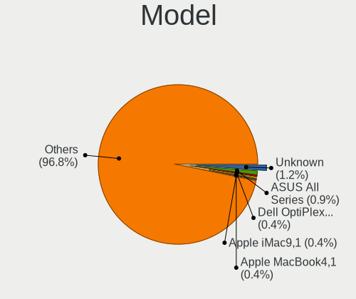

| Name                                | Computers | Percent |
|-------------------------------------|-----------|---------|
| Unknown                             | 9         | 0.88%   |
| ASUS All Series                     | 7         | 0.68%   |
| Apple iMac9,1                       | 7         | 0.68%   |
| Apple MacBook4,1                    | 5         | 0.49%   |
| Apple MacPro5,1                     | 4         | 0.39%   |
| Intel H61                           | 3         | 0.29%   |
| HP Pavilion dv6                     | 3         | 0.29%   |
| Dell Precision 7710                 | 3         | 0.29%   |
| Dell OptiPlex 9020                  | 3         | 0.29%   |
| Dell Latitude 7280                  | 3         | 0.29%   |
| Dell Inspiron 3442                  | 3         | 0.29%   |
| Dell Inspiron 15-3567               | 3         | 0.29%   |
| ASUS PRIME A320M-K                  | 3         | 0.29%   |
| ASUS P8Z77-V LX                     | 3         | 0.29%   |
| ASUS M5A78L-M/USB3                  | 3         | 0.29%   |
| Apple MacBookPro9,2                 | 3         | 0.29%   |
| Apple MacBookPro5,5                 | 3         | 0.29%   |
| Apple MacBook6,1                    | 3         | 0.29%   |
| TUXEDO Aura 15 Gen1                 | 2         | 0.2%    |
| Pegatron IPM41-D3                   | 2         | 0.2%    |
| MSI MS-7C37                         | 2         | 0.2%    |
| MSI MS-7B86                         | 2         | 0.2%    |
| MSI MS-7A38                         | 2         | 0.2%    |
| MSI MS-7592                         | 2         | 0.2%    |
| Lenovo Z50-70 20354                 | 2         | 0.2%    |
| Lenovo ThinkPad X250 20CLS1WP01     | 2         | 0.2%    |
| Lenovo IdeaPad 110S-11IBR 80WG      | 2         | 0.2%    |
| Lenovo G550 2958                    | 2         | 0.2%    |
| Lenovo G500 20236                   | 2         | 0.2%    |
| Intel NUC8i7BEH                     | 2         | 0.2%    |
| Intel NUC8i3BEH                     | 2         | 0.2%    |
| HP ProDesk 600 G2 DM                | 2         | 0.2%    |
| HP ProDesk 600 G1 SFF               | 2         | 0.2%    |
| HP ProBook 4540s                    | 2         | 0.2%    |
| HP Pavilion x360 Convertible        | 2         | 0.2%    |
| HP Pavilion Notebook                | 2         | 0.2%    |
| HP Pavilion Gaming Laptop 15-ec1xxx | 2         | 0.2%    |
| HP Pavilion g6                      | 2         | 0.2%    |
| HP EliteDesk 800 G2 SFF             | 2         | 0.2%    |
| HP EliteDesk 800 G2 DM 35W          | 2         | 0.2%    |

Model Family
------------

Motherboard model prefix

| Name                  | Computers | Percent |
|-----------------------|-----------|---------|
| Lenovo ThinkPad       | 111       | 10.86%  |
| Dell Latitude         | 38        | 3.72%   |
| Dell Inspiron         | 31        | 3.03%   |
| Acer Aspire           | 31        | 3.03%   |
| Dell OptiPlex         | 27        | 2.64%   |
| HP Pavilion           | 24        | 2.35%   |
| Lenovo ThinkCentre    | 18        | 1.76%   |
| ASUS PRIME            | 18        | 1.76%   |
| Lenovo IdeaPad        | 15        | 1.47%   |
| ASUS ROG              | 14        | 1.37%   |
| HP Compaq             | 13        | 1.27%   |
| Dell Precision        | 13        | 1.27%   |
| HP EliteBook          | 11        | 1.08%   |
| Toshiba Satellite     | 10        | 0.98%   |
| HP ProBook            | 10        | 0.98%   |
| HP EliteDesk          | 10        | 0.98%   |
| ASUS TUF              | 9         | 0.88%   |
| Unknown               | 9         | 0.88%   |
| ASUS All              | 7         | 0.68%   |
| Apple iMac9           | 7         | 0.68%   |
| HP ProDesk            | 6         | 0.59%   |
| HP Laptop             | 6         | 0.59%   |
| ASUS P8Z77-V          | 6         | 0.59%   |
| ASUS M5A78L-M         | 6         | 0.59%   |
| Packard Bell EasyNote | 5         | 0.49%   |
| Fujitsu LIFEBOOK      | 5         | 0.49%   |
| ASUS VivoBook         | 5         | 0.49%   |
| Apple MacBookPro5     | 5         | 0.49%   |
| Apple MacBook4        | 5         | 0.49%   |
| Toshiba PORTEGE       | 4         | 0.39%   |
| Lenovo Legion         | 4         | 0.39%   |
| Gigabyte X570         | 4         | 0.39%   |
| Gigabyte B450         | 4         | 0.39%   |
| Dell Vostro           | 4         | 0.39%   |
| Dell Studio           | 4         | 0.39%   |
| ASUS CROSSHAIR        | 4         | 0.39%   |
| Apple MacPro5         | 4         | 0.39%   |
| Apple MacBook5        | 4         | 0.39%   |
| Itautec Infoway       | 3         | 0.29%   |
| Intel H61             | 3         | 0.29%   |

MFG Year
--------

Motherboard manufacture year

| Year    | Computers | Percent |
|---------|-----------|---------|
| 2018    | 96        | 9.39%   |
| 2019    | 95        | 9.3%    |
| 2020    | 93        | 9.1%    |
| 2013    | 93        | 9.1%    |
| 2012    | 90        | 8.81%   |
| 2021    | 69        | 6.75%   |
| 2014    | 67        | 6.56%   |
| 2015    | 63        | 6.16%   |
| 2010    | 63        | 6.16%   |
| 2016    | 61        | 5.97%   |
| 2011    | 59        | 5.77%   |
| 2009    | 59        | 5.77%   |
| 2017    | 44        | 4.31%   |
| 2008    | 34        | 3.33%   |
| 2007    | 20        | 1.96%   |
| 2022    | 12        | 1.17%   |
| 2006    | 3         | 0.29%   |
| Unknown | 1         | 0.1%    |

Form Factor
-----------

Physical design of the computer

| Name           | Computers | Percent |
|----------------|-----------|---------|
| Notebook       | 509       | 49.8%   |
| Desktop        | 456       | 44.62%  |
| Mini pc        | 21        | 2.05%   |
| All in one     | 21        | 2.05%   |
| Convertible    | 6         | 0.59%   |
| Server         | 5         | 0.49%   |
| System on chip | 2         | 0.2%    |
| Tablet         | 2         | 0.2%    |

Coreboot
--------

Have coreboot on board

| Used | Computers | Percent |
|------|-----------|---------|
| No   | 1018      | 99.61%  |
| Yes  | 4         | 0.39%   |

RAM Size
--------

Total RAM memory

| Size in GB  | Computers | Percent |
|-------------|-----------|---------|
| 8.01-16.0   | 344       | 33.59%  |
| 4.01-8.0    | 309       | 30.18%  |
| 16.01-24.0  | 233       | 22.75%  |
| 32.01-64.0  | 72        | 7.03%   |
| 2.01-3.0    | 27        | 2.64%   |
| 64.01-256.0 | 15        | 1.46%   |
| 24.01-32.0  | 12        | 1.17%   |
| 3.01-4.0    | 10        | 0.98%   |
| 1.01-2.0    | 1         | 0.1%    |
| 0.51-1.0    | 1         | 0.1%    |

RAM Used
--------

Used RAM memory

| Used GB   | Computers | Percent |
|-----------|-----------|---------|
| 0.01-0.5  | 572       | 55.59%  |
| 0.51-1.0  | 319       | 31%     |
| 1.01-2.0  | 104       | 10.11%  |
| 2.01-3.0  | 25        | 2.43%   |
| 3.01-4.0  | 5         | 0.49%   |
| 4.01-8.0  | 2         | 0.19%   |
| 8.01-16.0 | 2         | 0.19%   |

Total Drives
------------

Number of drives on board

| Drives | Computers | Percent |
|--------|-----------|---------|
| 1      | 644       | 61.39%  |
| 2      | 218       | 20.78%  |
| 3      | 70        | 6.67%   |
| 0      | 51        | 4.86%   |
| 4      | 40        | 3.81%   |
| 5      | 11        | 1.05%   |
| 6      | 10        | 0.95%   |
| 7      | 2         | 0.19%   |
| 10     | 1         | 0.1%    |
| 9      | 1         | 0.1%    |
| 8      | 1         | 0.1%    |

Has CD-ROM
----------

Has CD-ROM on board

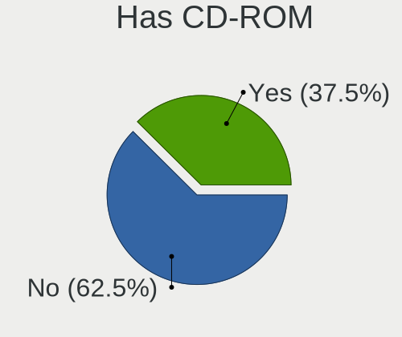

| Presented | Computers | Percent |
|-----------|-----------|---------|
| No        | 605       | 59.02%  |
| Yes       | 420       | 40.98%  |

Has Ethernet
------------

Has Ethernet on board

| Presented | Computers | Percent |
|-----------|-----------|---------|
| Yes       | 951       | 93.05%  |
| No        | 71        | 6.95%   |

Has WiFi
--------

Has WiFi module

| Presented | Computers | Percent |
|-----------|-----------|---------|
| Yes       | 689       | 67.29%  |
| No        | 335       | 32.71%  |

Has Bluetooth
-------------

Has Bluetooth module

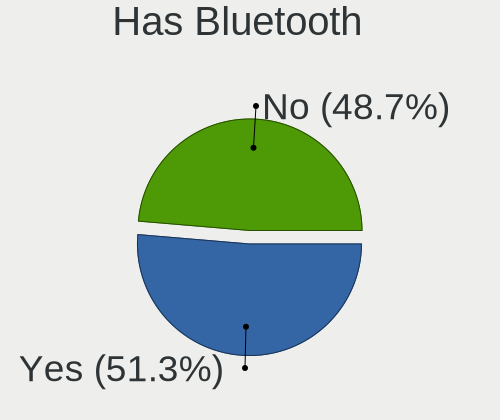

| Presented | Computers | Percent |
|-----------|-----------|---------|
| No        | 533       | 51.85%  |
| Yes       | 495       | 48.15%  |

Location
--------

Country
-------

Geographic location (country)

| Country      | Computers | Percent |
|--------------|-----------|---------|
| USA          | 150       | 14.65%  |
| Germany      | 97        | 9.47%   |
| Russia       | 77        | 7.52%   |
| Brazil       | 70        | 6.84%   |
| Spain        | 45        | 4.39%   |
| UK           | 44        | 4.3%    |
| Italy        | 42        | 4.1%    |
| China        | 41        | 4%      |
| Canada       | 32        | 3.13%   |
| France       | 29        | 2.83%   |
| Ukraine      | 27        | 2.64%   |
| Poland       | 25        | 2.44%   |
| Netherlands  | 23        | 2.25%   |
| Australia    | 22        | 2.15%   |
| Mexico       | 21        | 2.05%   |
| India        | 19        | 1.86%   |
| Hungary      | 19        | 1.86%   |
| Taiwan       | 13        | 1.27%   |
| Sweden       | 11        | 1.07%   |
| Romania      | 10        | 0.98%   |
| Indonesia    | 10        | 0.98%   |
| South Korea  | 9         | 0.88%   |
| Greece       | 9         | 0.88%   |
| Portugal     | 8         | 0.78%   |
| Norway       | 8         | 0.78%   |
| Chile        | 8         | 0.78%   |
| Turkey       | 7         | 0.68%   |
| Switzerland  | 7         | 0.68%   |
| Peru         | 7         | 0.68%   |
| Finland      | 7         | 0.68%   |
| Venezuela    | 6         | 0.59%   |
| New Zealand  | 6         | 0.59%   |
| Japan        | 6         | 0.59%   |
| Argentina    | 6         | 0.59%   |
| South Africa | 5         | 0.49%   |
| Lithuania    | 5         | 0.49%   |
| Colombia     | 5         | 0.49%   |
| Bulgaria     | 5         | 0.49%   |
| Vietnam      | 4         | 0.39%   |
| Slovakia     | 4         | 0.39%   |

City
----

Geographic location (city)

| City              | Computers | Percent |
|-------------------|-----------|---------|
| Moscow            | 13        | 1.21%   |
| St Petersburg     | 8         | 0.74%   |
| Guangzhou         | 8         | 0.74%   |
| Kyiv              | 7         | 0.65%   |
| Curitiba          | 7         | 0.65%   |
| Lima              | 6         | 0.56%   |
| Utrecht           | 5         | 0.47%   |
| So Paulo      | 5         | 0.47%   |
| Perth             | 5         | 0.47%   |
| Paris             | 5         | 0.47%   |
| New York          | 5         | 0.47%   |
| Munich            | 5         | 0.47%   |
| Madrid            | 5         | 0.47%   |
| Berlin            | 5         | 0.47%   |
| Athens            | 5         | 0.47%   |
| Wroclaw           | 4         | 0.37%   |
| Ufa               | 4         | 0.37%   |
| Sao Paulo         | 4         | 0.37%   |
| Santiago          | 4         | 0.37%   |
| Rio de Janeiro    | 4         | 0.37%   |
| Krasnodar         | 4         | 0.37%   |
| Jakarta           | 4         | 0.37%   |
| Hanoi             | 4         | 0.37%   |
| Frankfurt am Main | 4         | 0.37%   |
| Calgary           | 4         | 0.37%   |
| Budapest          | 4         | 0.37%   |
| Brisbane          | 4         | 0.37%   |
| Beijing           | 4         | 0.37%   |
| Aquan             | 4         | 0.37%   |
| Amsterdam         | 4         | 0.37%   |
| Zhengzhou         | 3         | 0.28%   |
| Warsaw            | 3         | 0.28%   |
| Vilnius           | 3         | 0.28%   |
| Vancouver         | 3         | 0.28%   |
| Tula de Allende   | 3         | 0.28%   |
| Temple            | 3         | 0.28%   |
| Surabaya          | 3         | 0.28%   |
| Stuttgart         | 3         | 0.28%   |
| Sevastopol        | 3         | 0.28%   |
| So Paulo      | 3         | 0.28%   |

Drives
------

Drive Vendor
------------

Hard drive vendors

| Vendor              | Computers | Drives | Percent |
|---------------------|-----------|--------|---------|
| WDC                 | 245       | 322    | 17.34%  |
| Seagate             | 224       | 308    | 15.85%  |
| Samsung Electronics | 216       | 301    | 15.29%  |
| Toshiba             | 97        | 118    | 6.86%   |
| Kingston            | 90        | 107    | 6.37%   |
| Crucial             | 78        | 100    | 5.52%   |
| SanDisk             | 59        | 64     | 4.18%   |
| Hitachi             | 59        | 71     | 4.18%   |
| Intel               | 41        | 43     | 2.9%    |
| A-DATA Technology   | 30        | 39     | 2.12%   |
| HGST                | 22        | 23     | 1.56%   |
| SPCC                | 17        | 19     | 1.2%    |
| Apple               | 14        | 14     | 0.99%   |
| Micron Technology   | 13        | 13     | 0.92%   |
| SK hynix            | 12        | 15     | 0.85%   |
| OCZ                 | 12        | 13     | 0.85%   |
| Fujitsu             | 11        | 13     | 0.78%   |
| PNY                 | 9         | 20     | 0.64%   |
| Patriot             | 9         | 12     | 0.64%   |
| KingSpec            | 9         | 11     | 0.64%   |
| Goodram             | 9         | 10     | 0.64%   |
| Corsair             | 9         | 9      | 0.64%   |
| Phison              | 8         | 11     | 0.57%   |
| Intenso             | 8         | 9      | 0.57%   |
| Transcend           | 7         | 8      | 0.5%    |
| LITEON              | 7         | 8      | 0.5%    |
| Hewlett-Packard     | 7         | 8      | 0.5%    |
| Gigabyte Technology | 7         | 9      | 0.5%    |
| Apacer              | 6         | 6      | 0.42%   |
| Silicon Motion      | 5         | 6      | 0.35%   |
| China               | 5         | 5      | 0.35%   |
| XPG                 | 4         | 4      | 0.28%   |
| Plextor             | 4         | 4      | 0.28%   |
| LITEONIT            | 4         | 4      | 0.28%   |
| Lexar               | 4         | 5      | 0.28%   |
| KIOXIA              | 4         | 4      | 0.28%   |
| Team                | 3         | 3      | 0.21%   |
| SSSTC               | 3         | 3      | 0.21%   |
| Smartbuy            | 3         | 3      | 0.21%   |
| Leven               | 3         | 4      | 0.21%   |

Drive Model
-----------

Hard drive models

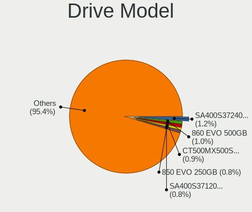

| Model                               | Computers | Percent |
|-------------------------------------|-----------|---------|
| Samsung SSD 860 EVO 500GB           | 16        | 1.03%   |
| Crucial CT500MX500SSD1 500GB        | 16        | 1.03%   |
| Kingston SA400S37120G 120GB         | 15        | 0.97%   |
| Samsung SSD 850 EVO 250GB           | 14        | 0.9%    |
| Kingston SA400S37240G 240GB         | 14        | 0.9%    |
| Toshiba MQ01ABD100 1TB              | 12        | 0.77%   |
| Seagate ST1000LM035-1RK172 1TB      | 12        | 0.77%   |
| Samsung SSD 860 EVO 250GB           | 12        | 0.77%   |
| Seagate ST1000DM003-1ER162 1TB      | 11        | 0.71%   |
| Seagate ST1000LM024 HN-M101MBB 1TB  | 10        | 0.64%   |
| Samsung SSD 860 EVO 1TB             | 10        | 0.64%   |
| Crucial CT240BX500SSD1 240GB        | 10        | 0.64%   |
| WDC WDS240G2G0A-00JH30 240GB        | 9         | 0.58%   |
| Toshiba DT01ACA100 1TB              | 9         | 0.58%   |
| Seagate ST500DM002-1BD142 500GB     | 9         | 0.58%   |
| Kingston SV300S37A120G 120GB        | 9         | 0.58%   |
| Toshiba MQ01ABF050 500GB            | 8         | 0.52%   |
| Seagate ST9500325AS 500GB           | 8         | 0.52%   |
| Seagate ST1000DM010-2EP102 1TB      | 8         | 0.52%   |
| Samsung SSD 970 EVO Plus 500GB      | 8         | 0.52%   |
| Seagate ST500LM012 HN-M500MBB 500GB | 7         | 0.45%   |
| Samsung SSD 850 EVO 500GB           | 7         | 0.45%   |
| Samsung HD322HJ 320GB               | 7         | 0.45%   |
| WDC WDS120G2G0A-00JH30 120GB        | 6         | 0.39%   |
| Seagate ST2000DM008-2FR102 2TB      | 6         | 0.39%   |
| Samsung SSD 840 EVO 250GB           | 6         | 0.39%   |
| Samsung MZVLW256HEHP-000L7 256GB    | 6         | 0.39%   |
| Kingston SA400S37480G 480GB         | 6         | 0.39%   |
| HGST HTS545050A7E680 500GB          | 6         | 0.39%   |
| Crucial CT250MX500SSD1 250GB        | 6         | 0.39%   |
| A-DATA SU650 120GB                  | 6         | 0.39%   |
| WDC WDS500G2B0A-00SM50 500GB        | 5         | 0.32%   |
| WDC WDS100T2B0A-00SM50 1TB          | 5         | 0.32%   |
| WDC WD5000AAKX-00ERMA0 500GB        | 5         | 0.32%   |
| SPCC Solid State Disk 512GB         | 5         | 0.32%   |
| Seagate ST9320325AS 320GB           | 5         | 0.32%   |
| Seagate ST500LT012-1DG142 500GB     | 5         | 0.32%   |
| Seagate ST31000528AS 1TB            | 5         | 0.32%   |
| Seagate ST1000LM049-2GH172 1TB      | 5         | 0.32%   |
| SanDisk SDSSDA240G 240GB            | 5         | 0.32%   |

HDD Vendor
----------

Hard disk drive vendors

| Vendor              | Computers | Drives | Percent |
|---------------------|-----------|--------|---------|
| Seagate             | 223       | 304    | 35.01%  |
| WDC                 | 195       | 247    | 30.61%  |
| Toshiba             | 77        | 94     | 12.09%  |
| Hitachi             | 59        | 71     | 9.26%   |
| Samsung Electronics | 41        | 53     | 6.44%   |
| HGST                | 22        | 23     | 3.45%   |
| Fujitsu             | 10        | 11     | 1.57%   |
| Apple               | 4         | 4      | 0.63%   |
| Hewlett-Packard     | 3         | 3      | 0.47%   |
| Maxtor              | 1         | 1      | 0.16%   |
| LSI                 | 1         | 1      | 0.16%   |
| CLOVER              | 1         | 1      | 0.16%   |

SSD Vendor
----------

Solid state drive vendors

| Vendor              | Computers | Drives | Percent |
|---------------------|-----------|--------|---------|
| Samsung Electronics | 133       | 164    | 21.56%  |
| Kingston            | 76        | 90     | 12.32%  |
| Crucial             | 71        | 92     | 11.51%  |
| SanDisk             | 59        | 64     | 9.56%   |
| WDC                 | 39        | 45     | 6.32%   |
| Intel               | 28        | 29     | 4.54%   |
| A-DATA Technology   | 23        | 25     | 3.73%   |
| SPCC                | 15        | 17     | 2.43%   |
| Toshiba             | 12        | 16     | 1.94%   |
| OCZ                 | 12        | 13     | 1.94%   |
| PNY                 | 9         | 18     | 1.46%   |
| Patriot             | 9         | 12     | 1.46%   |
| Micron Technology   | 9         | 9      | 1.46%   |
| KingSpec            | 9         | 11     | 1.46%   |
| GOODRAM             | 9         | 10     | 1.46%   |
| Apple               | 9         | 9      | 1.46%   |
| Intenso             | 8         | 9      | 1.3%    |
| Transcend           | 7         | 8      | 1.13%   |
| LITEON              | 7         | 8      | 1.13%   |
| Apacer              | 6         | 6      | 0.97%   |
| Corsair             | 5         | 5      | 0.81%   |
| China               | 5         | 5      | 0.81%   |
| SK hynix            | 4         | 4      | 0.65%   |
| Plextor             | 4         | 4      | 0.65%   |
| LITEONIT            | 4         | 4      | 0.65%   |
| Lexar               | 4         | 4      | 0.65%   |
| Gigabyte Technology | 4         | 5      | 0.65%   |
| Smartbuy            | 3         | 3      | 0.49%   |
| Leven               | 3         | 4      | 0.49%   |
| Team                | 2         | 2      | 0.32%   |
| Hewlett-Packard     | 2         | 3      | 0.32%   |
| Emtec               | 2         | 4      | 0.32%   |
| Zheino              | 1         | 1      | 0.16%   |
| XrayDisk            | 1         | 1      | 0.16%   |
| Verbatim            | 1         | 1      | 0.16%   |
| tigo                | 1         | 1      | 0.16%   |
| SSSTC               | 1         | 1      | 0.16%   |
| Smart               | 1         | 1      | 0.16%   |
| Pioneer             | 1         | 1      | 0.16%   |
| OWC                 | 1         | 1      | 0.16%   |

Drive Kind
----------

HDD or SSD

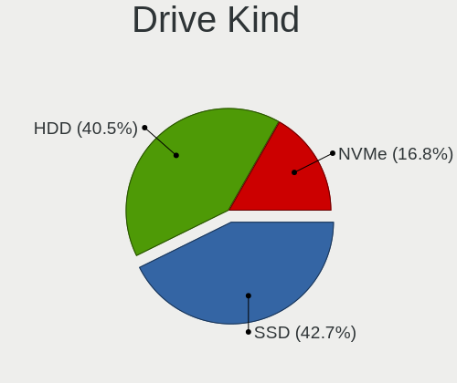

| Kind | Computers | Drives | Percent |
|------|-----------|--------|---------|
| HDD  | 536       | 813    | 43.02%  |
| SSD  | 523       | 730    | 41.97%  |
| NVMe | 187       | 246    | 15.01%  |

Drive Connector
---------------

SATA, SAS, NVMe, etc.

| Type | Computers | Drives | Percent |
|------|-----------|--------|---------|
| SATA | 905       | 1543   | 82.88%  |
| NVMe | 187       | 246    | 17.12%  |

Drive Size
----------

Size of hard drive

| Size in TB | Computers | Drives | Percent |
|------------|-----------|--------|---------|
| 0.01-0.5   | 751       | 1094   | 69.15%  |
| 0.51-1.0   | 236       | 309    | 21.73%  |
| 1.01-2.0   | 56        | 71     | 5.16%   |
| 3.01-4.0   | 18        | 29     | 1.66%   |
| 2.01-3.0   | 12        | 23     | 1.1%    |
| 4.01-10.0  | 12        | 16     | 1.1%    |
| 10.01-20.0 | 1         | 1      | 0.09%   |

Space Total
-----------

Amount of disk space available on the file system

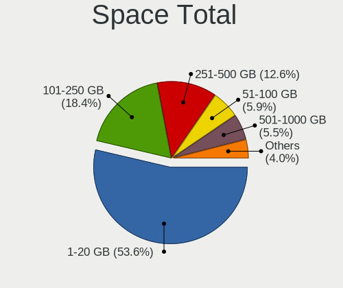

| Size in GB     | Computers | Percent |
|----------------|-----------|---------|
| 1-20           | 642       | 60.74%  |
| 101-250        | 194       | 18.35%  |
| 251-500        | 121       | 11.45%  |
| 501-1000       | 57        | 5.39%   |
| 51-100         | 21        | 1.99%   |
| 21-50          | 15        | 1.42%   |
| 1001-2000      | 4         | 0.38%   |
| Unknown        | 2         | 0.19%   |
| More than 3000 | 1         | 0.09%   |

Space Used
----------

Amount of used disk space

| Used GB        | Computers | Percent |
|----------------|-----------|---------|
| 1-20           | 1010      | 98.83%  |
| 21-50          | 4         | 0.39%   |
| 101-250        | 3         | 0.29%   |
| Unknown        | 2         | 0.2%    |
| More than 3000 | 1         | 0.1%    |
| 501-1000       | 1         | 0.1%    |
| 51-100         | 1         | 0.1%    |

Malfunc. Drives
---------------

Drive models with a malfunction

| Model                               | Computers | Drives | Percent |
|-------------------------------------|-----------|--------|---------|
| Toshiba MQ01ABD100 1TB              | 4         | 4      | 1.42%   |
| Seagate ST9320325AS 320GB           | 4         | 4      | 1.42%   |
| Seagate ST500DM002-1BD142 500GB     | 4         | 5      | 1.42%   |
| Seagate ST1000LM024 HN-M101MBB 1TB  | 4         | 5      | 1.42%   |
| WDC WD5000AAKX-00ERMA0 500GB        | 3         | 3      | 1.06%   |
| Seagate ST9500420AS 500GB           | 3         | 3      | 1.06%   |
| Seagate ST9500325AS 500GB           | 3         | 4      | 1.06%   |
| Seagate ST500LT012-9WS142 500GB     | 3         | 3      | 1.06%   |
| Seagate ST3250410AS 250GB           | 3         | 3      | 1.06%   |
| Seagate ST31000528AS 1TB            | 3         | 4      | 1.06%   |
| Samsung Electronics HD322HJ 320GB   | 3         | 3      | 1.06%   |
| Hitachi HTS545050A7E380 500GB       | 3         | 3      | 1.06%   |
| HGST HTS545032A7E380 320GB          | 3         | 3      | 1.06%   |
| WDC WD3200BEVT-22ZCT0 320GB         | 2         | 2      | 0.71%   |
| WDC WD10JMVW-11AJGS0 1TB            | 2         | 2      | 0.71%   |
| Toshiba MQ01ABF050 500GB            | 2         | 4      | 0.71%   |
| Toshiba MQ01ABD075 752GB            | 2         | 2      | 0.71%   |
| Toshiba MK3261GSYN 320GB            | 2         | 4      | 0.71%   |
| Toshiba DT01ACA100 1TB              | 2         | 5      | 0.71%   |
| Seagate ST9320423AS 320GB           | 2         | 2      | 0.71%   |
| Seagate ST9160821AS 160GB           | 2         | 2      | 0.71%   |
| Seagate ST9160412AS 160GB           | 2         | 2      | 0.71%   |
| Seagate ST750LM022 HN-M750MBB 752GB | 2         | 2      | 0.71%   |
| Seagate ST500LM012 HN-M500MBB 500GB | 2         | 2      | 0.71%   |
| Seagate ST380815AS 80GB             | 2         | 2      | 0.71%   |
| Seagate ST3500413AS 500GB           | 2         | 5      | 0.71%   |
| Seagate ST3320418AS 320GB           | 2         | 2      | 0.71%   |
| Seagate ST1000LM035-1RK172 1TB      | 2         | 2      | 0.71%   |
| Samsung Electronics HD161HJ 160GB   | 2         | 2      | 0.71%   |
| Hitachi HTS727550A9E364 500GB       | 2         | 2      | 0.71%   |
| Hitachi HTS545032B9A300 320GB       | 2         | 2      | 0.71%   |
| Hitachi HTS545025B9SA02 250GB       | 2         | 4      | 0.71%   |
| Hitachi HTS541612J9SA00 120GB       | 2         | 2      | 0.71%   |
| HGST HTS725050A7E630 500GB          | 2         | 3      | 0.71%   |
| HGST HTS541010A9E680 1TB            | 2         | 2      | 0.71%   |
| Crucial CT525MX300SSD1 528GB        | 2         | 5      | 0.71%   |
| Apple HDD HTS545050A7E362 500GB     | 2         | 2      | 0.71%   |
| XrayDisk SSD 240GB                  | 1         | 1      | 0.35%   |
| WDC WDS240G2G0A-00JH30 240GB        | 1         | 1      | 0.35%   |
| WDC WDS200T2B0A 2TB                 | 1         | 1      | 0.35%   |

Malfunc. Drive Vendor
---------------------

Vendors of faulty drives

| Vendor              | Computers | Drives | Percent |
|---------------------|-----------|--------|---------|
| Seagate             | 76        | 91     | 27.84%  |
| WDC                 | 62        | 64     | 22.71%  |
| Toshiba             | 30        | 41     | 10.99%  |
| Hitachi             | 30        | 35     | 10.99%  |
| Samsung Electronics | 23        | 28     | 8.42%   |
| HGST                | 10        | 11     | 3.66%   |
| Kingston            | 6         | 6      | 2.2%    |
| Intel               | 6         | 6      | 2.2%    |
| SanDisk             | 5         | 5      | 1.83%   |
| Fujitsu             | 4         | 4      | 1.47%   |
| Crucial             | 4         | 7      | 1.47%   |
| Apple               | 3         | 3      | 1.1%    |
| Micron Technology   | 2         | 2      | 0.73%   |
| LITEON              | 2         | 2      | 0.73%   |
| Corsair             | 2         | 2      | 0.73%   |
| XrayDisk            | 1         | 1      | 0.37%   |
| SSSTC               | 1         | 1      | 0.37%   |
| OCZ                 | 1         | 1      | 0.37%   |
| KingSpec            | 1         | 1      | 0.37%   |
| Hewlett-Packard     | 1         | 1      | 0.37%   |
| China               | 1         | 1      | 0.37%   |
| AGI                 | 1         | 1      | 0.37%   |
| A-DATA Technology   | 1         | 1      | 0.37%   |

Malfunc. HDD Vendor
-------------------

Vendors of faulty HDD drives

| Vendor              | Computers | Drives | Percent |
|---------------------|-----------|--------|---------|
| Seagate             | 76        | 91     | 33.33%  |
| WDC                 | 60        | 62     | 26.32%  |
| Hitachi             | 30        | 35     | 13.16%  |
| Toshiba             | 28        | 39     | 12.28%  |
| Samsung Electronics | 17        | 20     | 7.46%   |
| HGST                | 10        | 11     | 4.39%   |
| Fujitsu             | 4         | 4      | 1.75%   |
| Apple               | 3         | 3      | 1.32%   |

Malfunc. Drive Kind
-------------------

Kinds of faulty drives

| Kind | Computers | Drives | Percent |
|------|-----------|--------|---------|
| HDD  | 209       | 265    | 81.96%  |
| SSD  | 41        | 45     | 16.08%  |
| NVMe | 5         | 5      | 1.96%   |

Failed Drives
-------------

Failed drive models

| Model                         | Computers | Drives | Percent |
|-------------------------------|-----------|--------|---------|
| WDC WD3200AAJS-00YZCA0 320GB  | 1         | 1      | 25%     |
| HPE MK000480GWUGF 480GB       | 1         | 1      | 25%     |
| Hitachi HTS545025B9A300 250GB | 1         | 1      | 25%     |
| HGST HTS725050A7E630 500GB    | 1         | 1      | 25%     |

Failed Drive Vendor
-------------------

Failed drive vendors

| Vendor  | Computers | Drives | Percent |
|---------|-----------|--------|---------|
| WDC     | 1         | 1      | 25%     |
| HPE     | 1         | 1      | 25%     |
| Hitachi | 1         | 1      | 25%     |
| HGST    | 1         | 1      | 25%     |

Drive Status
------------

Number of failed and malfunc. drives

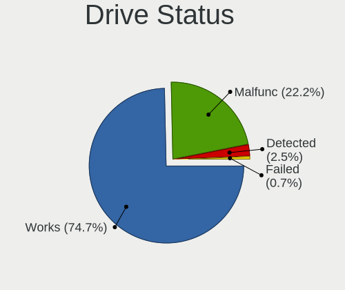

| Status   | Computers | Drives | Percent |
|----------|-----------|--------|---------|
| Works    | 819       | 1442   | 75.14%  |
| Malfunc  | 249       | 315    | 22.84%  |
| Detected | 18        | 28     | 1.65%   |
| Failed   | 4         | 4      | 0.37%   |

Storage controller
------------------

Storage Vendor
--------------

Storage controller vendors

| Vendor                           | Computers | Percent |
|----------------------------------|-----------|---------|
| Intel                            | 782       | 63.12%  |
| AMD                              | 175       | 14.12%  |
| Samsung Electronics              | 69        | 5.57%   |
| Nvidia                           | 30        | 2.42%   |
| SanDisk                          | 24        | 1.94%   |
| ASMedia Technology               | 18        | 1.45%   |
| Phison Electronics               | 17        | 1.37%   |
| Kingston Technology Company      | 14        | 1.13%   |
| Silicon Motion                   | 13        | 1.05%   |
| JMicron Technology               | 12        | 0.97%   |
| Broadcom / LSI                   | 10        | 0.81%   |
| SK hynix                         | 8         | 0.65%   |
| Micron/Crucial Technology        | 8         | 0.65%   |
| Marvell Technology Group         | 8         | 0.65%   |
| ADATA Technology                 | 8         | 0.65%   |
| Toshiba                          | 7         | 0.56%   |
| KIOXIA                           | 5         | 0.4%    |
| VIA Technologies                 | 4         | 0.32%   |
| Realtek Semiconductor            | 4         | 0.32%   |
| Micron Technology                | 4         | 0.32%   |
| Shenzhen Longsys Electronics     | 3         | 0.24%   |
| Solid State Storage Technology   | 2         | 0.16%   |
| Silicon Integrated Systems [SiS] | 2         | 0.16%   |
| Seagate Technology               | 2         | 0.16%   |
| Hewlett-Packard                  | 2         | 0.16%   |
| Adaptec                          | 2         | 0.16%   |
| Silicon Image                    | 1         | 0.08%   |
| Lite-On IT Corp. / Plextor       | 1         | 0.08%   |
| Enmotus                          | 1         | 0.08%   |
| Broadcom                         | 1         | 0.08%   |
| Biwin Storage Technology         | 1         | 0.08%   |
| Apple                            | 1         | 0.08%   |

Storage Model
-------------

Storage controller models

| Model                                                                            | Computers | Percent |
|----------------------------------------------------------------------------------|-----------|---------|
| AMD FCH SATA Controller [AHCI mode]                                              | 116       | 8.05%   |
| Intel 7 Series Chipset Family 6-port SATA Controller [AHCI mode]                 | 82        | 5.69%   |
| Intel Sunrise Point-LP SATA Controller [AHCI mode]                               | 68        | 4.72%   |
| Intel 8 Series/C220 Series Chipset Family 6-port SATA Controller 1 [AHCI mode]   | 48        | 3.33%   |
| Intel Q170/Q150/B150/H170/H110/Z170/CM236 Chipset SATA Controller [AHCI Mode]    | 43        | 2.98%   |
| Intel 6 Series/C200 Series Chipset Family 6 port Mobile SATA AHCI Controller     | 40        | 2.78%   |
| Intel 8 Series SATA Controller 1 [AHCI mode]                                     | 38        | 2.64%   |
| Intel 6 Series/C200 Series Chipset Family 6 port Desktop SATA AHCI Controller    | 34        | 2.36%   |
| Samsung NVMe SSD Controller SM981/PM981/PM983                                    | 32        | 2.22%   |
| Intel 82801IBM/IEM (ICH9M/ICH9M-E) 4 port SATA Controller [AHCI mode]            | 31        | 2.15%   |
| Intel 7 Series/C210 Series Chipset Family 6-port SATA Controller [AHCI mode]     | 29        | 2.01%   |
| AMD 400 Series Chipset SATA Controller                                           | 27        | 1.87%   |
| Intel NM10/ICH7 Family SATA Controller [IDE mode]                                | 25        | 1.73%   |
| Intel 82801HM/HEM (ICH8M/ICH8M-E) IDE Controller                                 | 24        | 1.67%   |
| AMD SB7x0/SB8x0/SB9x0 SATA Controller [AHCI mode]                                | 24        | 1.67%   |
| Intel Wildcat Point-LP SATA Controller [AHCI Mode]                               | 23        | 1.6%    |
| Intel 82801 Mobile SATA Controller [RAID mode]                                   | 23        | 1.6%    |
| Intel Cannon Lake PCH SATA AHCI Controller                                       | 22        | 1.53%   |
| Intel 82801HM/HEM (ICH8M/ICH8M-E) SATA Controller [AHCI mode]                    | 22        | 1.53%   |
| AMD SB7x0/SB8x0/SB9x0 IDE Controller                                             | 22        | 1.53%   |
| Intel 5 Series/3400 Series Chipset 6 port SATA AHCI Controller                   | 21        | 1.46%   |
| Intel 5 Series/3400 Series Chipset 4 port SATA AHCI Controller                   | 21        | 1.46%   |
| Samsung NVMe SSD Controller SM961/PM961/SM963                                    | 20        | 1.39%   |
| Nvidia MCP79 AHCI Controller                                                     | 20        | 1.39%   |
| Intel 82801G (ICH7 Family) IDE Controller                                        | 20        | 1.39%   |
| Unknown                                                                          | 20        | 1.39%   |
| Intel SATA Controller [RAID mode]                                                | 19        | 1.32%   |
| Intel 200 Series PCH SATA controller [AHCI mode]                                 | 17        | 1.18%   |
| ASMedia ASM1062 Serial ATA Controller                                            | 17        | 1.18%   |
| AMD SB7x0/SB8x0/SB9x0 SATA Controller [IDE mode]                                 | 15        | 1.04%   |
| Intel Cannon Point-LP SATA Controller [AHCI Mode]                                | 12        | 0.83%   |
| Intel 82801JI (ICH10 Family) SATA AHCI Controller                                | 12        | 0.83%   |
| SanDisk WD Blue SN550 NVMe SSD                                                   | 11        | 0.76%   |
| Silicon Motion SM2263EN/SM2263XT SSD Controller                                  | 10        | 0.69%   |
| Intel NM10/ICH7 Family SATA Controller [AHCI mode]                               | 10        | 0.69%   |
| Intel Atom/Celeron/Pentium Processor x5-E8000/J3xxx/N3xxx Series SATA Controller | 10        | 0.69%   |
| Intel Atom Processor E3800 Series SATA AHCI Controller                           | 10        | 0.69%   |
| Phison E12 NVMe Controller                                                       | 9         | 0.62%   |
| Kingston Company A2000 NVMe SSD                                                  | 9         | 0.62%   |
| Intel Cannon Lake Mobile PCH SATA AHCI Controller                                | 9         | 0.62%   |

Storage Kind
------------

Kind of storage controller (IDE, SATA, NVMe, SAS, ...)

| Kind | Computers | Percent |
|------|-----------|---------|
| SATA | 844       | 66.77%  |
| NVMe | 187       | 14.79%  |
| IDE  | 163       | 12.9%   |
| RAID | 57        | 4.51%   |
| SAS  | 8         | 0.63%   |
| SCSI | 5         | 0.4%    |

Processor
---------

CPU Vendor
----------

Processor vendors

| Vendor   | Computers | Percent |
|----------|-----------|---------|
| Intel    | 829       | 81.12%  |
| AMD      | 191       | 18.69%  |
| Rockchip | 1         | 0.1%    |
| ARM      | 1         | 0.1%    |

CPU Model
---------

Processor models

| Model                                       | Computers | Percent |
|---------------------------------------------|-----------|---------|
| Intel CPU Version                           | 15        | 1.47%   |
| Intel Core i5-7200U CPU @ 2.50GHz           | 13        | 1.27%   |
| Intel Core i5-3320M CPU @ 2.60GHz           | 13        | 1.27%   |
| Intel Core i5-2520M CPU @ 2.50GHz           | 12        | 1.17%   |
| Intel Core 2 Duo                            | 12        | 1.17%   |
| Intel Core i5-4210U CPU @ 1.70GHz           | 10        | 0.98%   |
| Intel Core i5-6300U CPU @ 2.40GHz           | 9         | 0.88%   |
| Intel Core i5-5200U CPU @ 2.20GHz           | 9         | 0.88%   |
| Intel Core i5-3210M CPU @ 2.50GHz           | 9         | 0.88%   |
| Intel Core i5-6200U CPU @ 2.30GHz           | 8         | 0.78%   |
| Intel Core i5-3317U CPU @ 1.70GHz           | 8         | 0.78%   |
| Intel Core i5-8250U CPU @ 1.60GHz           | 7         | 0.68%   |
| Intel Core i5-6500 CPU @ 3.20GHz            | 7         | 0.68%   |
| Intel Core i5-3470 CPU @ 3.20GHz            | 7         | 0.68%   |
| Intel Core i5 CPU M 520 @ 2.40GHz           | 7         | 0.68%   |
| Intel Core i3-6006U CPU @ 2.00GHz           | 7         | 0.68%   |
| AMD Ryzen 5 3600 6-Core Processor           | 7         | 0.68%   |
| Intel Xeon                                  | 6         | 0.59%   |
| Intel Core i7-8700 CPU @ 3.20GHz            | 6         | 0.59%   |
| Intel Core i7-6600U CPU @ 2.60GHz           | 6         | 0.59%   |
| Intel Core i5-4300U CPU @ 1.90GHz           | 6         | 0.59%   |
| Intel Core i5-3230M CPU @ 2.60GHz           | 6         | 0.59%   |
| Intel Core i3-3110M CPU @ 2.40GHz           | 6         | 0.59%   |
| Intel Core 2 Duo CPU T8300 @ 2.40GHz        | 6         | 0.59%   |
| Intel Core 2 Duo CPU P8600 @ 2.40GHz        | 6         | 0.59%   |
| AMD Ryzen 7 3700X 8-Core Processor          | 6         | 0.59%   |
| AMD Ryzen 5 3400G with Radeon Vega Graphics | 6         | 0.59%   |
| AMD Ryzen 5 1600 Six-Core Processor         | 6         | 0.59%   |
| Intel Genuine CPU                           | 5         | 0.49%   |
| Intel Core i7-7500U CPU @ 2.70GHz           | 5         | 0.49%   |
| Intel Core i7-3770 CPU @ 3.40GHz            | 5         | 0.49%   |
| Intel Core i5-4590 CPU @ 3.30GHz            | 5         | 0.49%   |
| Intel Core i3-6100 CPU @ 3.70GHz            | 5         | 0.49%   |
| Intel Core i3-5005U CPU @ 2.00GHz           | 5         | 0.49%   |
| Intel Core i3-3220 CPU @ 3.30GHz            | 5         | 0.49%   |
| Intel Core 2 Duo CPU T7300 @ 2.00GHz        | 5         | 0.49%   |
| Intel Core 2 Duo CPU P7550 @ 2.26GHz        | 5         | 0.49%   |
| Intel Core i7-8700K CPU @ 3.70GHz           | 4         | 0.39%   |
| Intel Core i7-7700 CPU @ 3.60GHz            | 4         | 0.39%   |
| Intel Core i7-7600U CPU @ 2.80GHz           | 4         | 0.39%   |

CPU Model Family
----------------

Processor model prefix

| Model                   | Computers | Percent |
|-------------------------|-----------|---------|
| Intel Core i5           | 272       | 26.59%  |
| Intel Core i7           | 148       | 14.47%  |
| Intel Core i3           | 107       | 10.46%  |
| Intel Core 2 Duo        | 87        | 8.5%    |
| Intel Xeon              | 48        | 4.69%   |
| AMD Ryzen 5             | 48        | 4.69%   |
| Intel Celeron           | 47        | 4.59%   |
| Intel Pentium           | 32        | 3.13%   |
| Other                   | 26        | 2.54%   |
| AMD Ryzen 7             | 26        | 2.54%   |
| AMD FX                  | 18        | 1.76%   |
| Intel Pentium Dual-Core | 15        | 1.47%   |
| AMD Ryzen 3             | 14        | 1.37%   |
| Intel Core 2 Quad       | 13        | 1.27%   |
| Intel Atom              | 11        | 1.08%   |
| AMD Phenom II X4        | 11        | 1.08%   |
| AMD A6                  | 9         | 0.88%   |
| Intel Genuine           | 7         | 0.68%   |
| AMD Ryzen 9             | 6         | 0.59%   |
| AMD E1                  | 6         | 0.59%   |
| AMD A8                  | 6         | 0.59%   |
| AMD A10                 | 6         | 0.59%   |
| Intel Pentium Silver    | 5         | 0.49%   |
| AMD Ryzen Threadripper  | 5         | 0.49%   |
| Intel Core 2            | 4         | 0.39%   |
| AMD E                   | 4         | 0.39%   |
| AMD Ryzen 5 PRO         | 3         | 0.29%   |
| AMD E2                  | 3         | 0.29%   |
| AMD Athlon II X4        | 3         | 0.29%   |
| AMD Athlon 64 X2        | 3         | 0.29%   |
| Intel Core M            | 2         | 0.2%    |
| Intel Core i9           | 2         | 0.2%    |
| AMD Phenom II X6        | 2         | 0.2%    |
| AMD Athlon II X2        | 2         | 0.2%    |
| AMD Athlon              | 2         | 0.2%    |
| AMD A4                  | 2         | 0.2%    |
| Intel Pentium M         | 1         | 0.1%    |
| Intel Pentium Gold      | 1         | 0.1%    |
| Intel Pentium Dual      | 1         | 0.1%    |
| Intel Pentium D         | 1         | 0.1%    |

CPU Cores
---------

Number of processor cores

| Number  | Computers | Percent |
|---------|-----------|---------|
| 2       | 458       | 44.77%  |
| 4       | 296       | 28.93%  |
| Unknown | 86        | 8.41%   |
| 6       | 56        | 5.47%   |
| 8       | 50        | 4.89%   |
| 12      | 33        | 3.23%   |
| 16      | 22        | 2.15%   |
| 1       | 8         | 0.78%   |
| 24      | 6         | 0.59%   |
| 64      | 2         | 0.2%    |
| 48      | 2         | 0.2%    |
| 32      | 1         | 0.1%    |
| 14      | 1         | 0.1%    |
| 10      | 1         | 0.1%    |
| 3       | 1         | 0.1%    |

CPU Sockets
-----------

Number of sockets

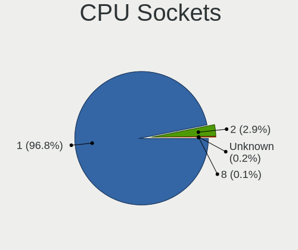

| Number  | Computers | Percent |
|---------|-----------|---------|
| 1       | 978       | 95.69%  |
| 2       | 40        | 3.91%   |
| Unknown | 3         | 0.29%   |
| 8       | 1         | 0.1%    |

CPU Threads
-----------

Threads per core (Hyper-Threading)

| Number  | Computers | Percent |
|---------|-----------|---------|
| 2       | 499       | 48.83%  |
| 1       | 436       | 42.66%  |
| Unknown | 87        | 8.51%   |

CPU Microarch
-------------

Microarchitecture

| Name          | Computers | Percent |
|---------------|-----------|---------|
| KabyLake      | 131       | 12.82%  |
| IvyBridge     | 123       | 12.04%  |
| Penryn        | 106       | 10.37%  |
| Haswell       | 105       | 10.27%  |
| SandyBridge   | 88        | 8.61%   |
| Skylake       | 79        | 7.73%   |
| Westmere      | 47        | 4.6%    |
| Zen 2         | 37        | 3.62%   |
| Core          | 37        | 3.62%   |
| Zen+          | 34        | 3.33%   |
| Broadwell     | 29        | 2.84%   |
| Piledriver    | 28        | 2.74%   |
| Zen           | 23        | 2.25%   |
| Silvermont    | 23        | 2.25%   |
| K10           | 21        | 2.05%   |
| CometLake     | 17        | 1.66%   |
| Nehalem       | 13        | 1.27%   |
| Zen 3         | 11        | 1.08%   |
| Bobcat        | 10        | 0.98%   |
| Bonnell       | 9         | 0.88%   |
| Goldmont plus | 8         | 0.78%   |
| K8 Hammer     | 6         | 0.59%   |
| Jaguar        | 6         | 0.59%   |
| Goldmont      | 6         | 0.59%   |
| Excavator     | 6         | 0.59%   |
| Unknown       | 6         | 0.59%   |
| Bulldozer     | 4         | 0.39%   |
| TigerLake     | 3         | 0.29%   |
| Puma          | 2         | 0.2%    |
| NetBurst      | 2         | 0.2%    |
| K10 Llano     | 2         | 0.2%    |

Graphics
--------

GPU Vendor
----------

Vendors of graphics cards

| Vendor                           | Computers | Percent |
|----------------------------------|-----------|---------|
| Intel                            | 599       | 52.5%   |
| Nvidia                           | 326       | 28.57%  |
| AMD                              | 213       | 18.67%  |
| Matrox Electronics Systems       | 2         | 0.18%   |
| Silicon Integrated Systems [SiS] | 1         | 0.09%   |

GPU Model
---------

Graphics card models

| Model                                                                                    | Computers | Percent |
|------------------------------------------------------------------------------------------|-----------|---------|
| Intel 3rd Gen Core processor Graphics Controller                                         | 75        | 6.45%   |
| Intel 2nd Generation Core Processor Family Integrated Graphics Controller                | 67        | 5.76%   |
| Intel Haswell-ULT Integrated Graphics Controller                                         | 39        | 3.35%   |
| Intel Skylake GT2 [HD Graphics 520]                                                      | 34        | 2.92%   |
| Intel Core Processor Integrated Graphics Controller                                      | 30        | 2.58%   |
| Intel HD Graphics 620                                                                    | 29        | 2.49%   |
| Intel HD Graphics 530                                                                    | 28        | 2.41%   |
| Intel Xeon E3-1200 v3/4th Gen Core Processor Integrated Graphics Controller              | 26        | 2.24%   |
| Intel Mobile 4 Series Chipset Integrated Graphics Controller                             | 24        | 2.06%   |
| AMD Ellesmere [Radeon RX 470/480/570/570X/580/580X/590]                                  | 24        | 2.06%   |
| Intel HD Graphics 5500                                                                   | 21        | 1.81%   |
| AMD Picasso/Raven 2 [Radeon Vega Series / Radeon Vega Mobile Series]                     | 20        | 1.72%   |
| Nvidia GK208B [GeForce GT 710]                                                           | 16        | 1.38%   |
| Intel Xeon E3-1200 v2/3rd Gen Core processor Graphics Controller                         | 15        | 1.29%   |
| Intel Mobile GM965/GL960 Integrated Graphics Controller (secondary)                      | 14        | 1.2%    |
| Intel Mobile GM965/GL960 Integrated Graphics Controller (primary)                        | 14        | 1.2%    |
| Intel CoffeeLake-S GT2 [UHD Graphics 630]                                                | 13        | 1.12%   |
| Intel 4th Gen Core Processor Integrated Graphics Controller                              | 13        | 1.12%   |
| Intel UHD Graphics 620                                                                   | 12        | 1.03%   |
| Intel Atom/Celeron/Pentium Processor x5-E8000/J3xxx/N3xxx Integrated Graphics Controller | 12        | 1.03%   |
| Nvidia GP108 [GeForce GT 1030]                                                           | 11        | 0.95%   |
| Nvidia GP107 [GeForce GTX 1050 Ti]                                                       | 11        | 0.95%   |
| Intel Atom Processor Z36xxx/Z37xxx Series Graphics & Display                             | 11        | 0.95%   |
| Intel 4 Series Chipset Integrated Graphics Controller                                    | 11        | 0.95%   |
| AMD Renoir                                                                               | 11        | 0.95%   |
| Nvidia GT218 [GeForce 210]                                                               | 10        | 0.86%   |
| Nvidia GF117M [GeForce 610M/710M/810M/820M / GT 620M/625M/630M/720M]                     | 10        | 0.86%   |
| Nvidia C79 [GeForce 9400M]                                                               | 10        | 0.86%   |
| Intel HD Graphics 630                                                                    | 10        | 0.86%   |
| Nvidia GP106 [GeForce GTX 1060 6GB]                                                      | 9         | 0.77%   |
| Nvidia GF119 [GeForce GT 610]                                                            | 9         | 0.77%   |
| AMD Navi 10 [Radeon RX 5600 OEM/5600 XT / 5700/5700 XT]                                  | 9         | 0.77%   |
| Intel WhiskeyLake-U GT2 [UHD Graphics 620]                                               | 8         | 0.69%   |
| Intel IvyBridge GT2 [HD Graphics 4000]                                                   | 8         | 0.69%   |
| Intel CometLake-S GT2 [UHD Graphics 630]                                                 | 8         | 0.69%   |
| Intel Atom Processor D4xx/D5xx/N4xx/N5xx Integrated Graphics Controller                  | 8         | 0.69%   |
| Nvidia GM204 [GeForce GTX 970]                                                           | 7         | 0.6%    |
| Nvidia C79 [GeForce 9400]                                                                | 7         | 0.6%    |
| Intel CometLake-U GT2 [UHD Graphics]                                                     | 7         | 0.6%    |
| Intel CoffeeLake-H GT2 [UHD Graphics 630]                                                | 7         | 0.6%    |

GPU Combo
---------

Combinations of graphics cards

| Name           | Computers | Percent |
|----------------|-----------|---------|
| 1 x Intel      | 437       | 42.34%  |
| 1 x Nvidia     | 239       | 23.16%  |
| 1 x AMD        | 176       | 17.05%  |
| Intel + Nvidia | 76        | 7.36%   |
| 2 x Intel      | 57        | 5.52%   |
| Intel + AMD    | 28        | 2.71%   |
| AMD + Nvidia   | 9         | 0.87%   |
| 2 x Nvidia     | 3         | 0.29%   |
| Other          | 2         | 0.19%   |
| 2 x AMD        | 2         | 0.19%   |
| 1 x Matrox     | 2         | 0.19%   |
| 1 x SiS        | 1         | 0.1%    |

GPU Driver
----------

Free vs proprietary

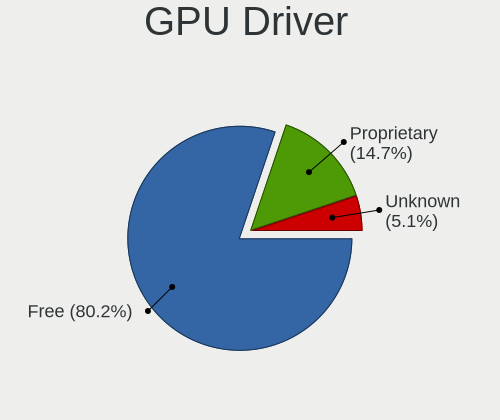

| Driver      | Computers | Percent |
|-------------|-----------|---------|
| Free        | 788       | 76.36%  |
| Proprietary | 180       | 17.44%  |
| Unknown     | 64        | 6.2%    |

GPU Memory
----------

Total video memory

| Size in GB | Computers | Percent |
|------------|-----------|---------|
| Unknown    | 714       | 68.79%  |
| 1.01-2.0   | 82        | 7.9%    |
| 0.01-0.5   | 77        | 7.42%   |
| 0.51-1.0   | 57        | 5.49%   |
| 3.01-4.0   | 50        | 4.82%   |
| 7.01-8.0   | 28        | 2.7%    |
| 5.01-6.0   | 21        | 2.02%   |
| 2.01-3.0   | 7         | 0.67%   |
| 8.01-16.0  | 2         | 0.19%   |

Monitor
-------

Monitor Vendor
--------------

Monitor vendors

| Vendor                  | Computers | Percent |
|-------------------------|-----------|---------|
| Samsung Electronics     | 103       | 11.73%  |
| LG Display              | 99        | 11.28%  |
| AU Optronics            | 85        | 9.68%   |
| Chimei Innolux          | 68        | 7.74%   |
| Goldstar                | 56        | 6.38%   |
| Dell                    | 52        | 5.92%   |
| BOE                     | 45        | 5.13%   |
| Lenovo                  | 43        | 4.9%    |
| Hewlett-Packard         | 34        | 3.87%   |
| Apple                   | 33        | 3.76%   |
| Acer                    | 28        | 3.19%   |
| BenQ                    | 27        | 3.08%   |
| AOC                     | 27        | 3.08%   |
| Philips                 | 20        | 2.28%   |
| Ancor Communications    | 20        | 2.28%   |
| Chi Mei Optoelectronics | 13        | 1.48%   |
| ViewSonic               | 10        | 1.14%   |
| Iiyama                  | 9         | 1.03%   |
| Sony                    | 8         | 0.91%   |
| InfoVision              | 8         | 0.91%   |
| Fujitsu Siemens         | 8         | 0.91%   |
| ASUSTek Computer        | 8         | 0.91%   |
| MSI                     | 5         | 0.57%   |
| LG Philips              | 5         | 0.57%   |
| Toshiba                 | 4         | 0.46%   |
| Sharp                   | 4         | 0.46%   |
| PANDA                   | 4         | 0.46%   |
| Eizo                    | 4         | 0.46%   |
| Vizio                   | 3         | 0.34%   |
| Vestel Elektronik       | 3         | 0.34%   |
| Packard Bell            | 3         | 0.34%   |
| NEC Computers           | 3         | 0.34%   |
| HannStar                | 3         | 0.34%   |
| Medion                  | 2         | 0.23%   |
| LED                     | 2         | 0.23%   |
| Insignia                | 2         | 0.23%   |
| ZL_                     | 1         | 0.11%   |
| Westinghouse            | 1         | 0.11%   |
| VIE                     | 1         | 0.11%   |
| Videoseven              | 1         | 0.11%   |

Monitor Model
-------------

Monitor models

| Model                                                                 | Computers | Percent |
|-----------------------------------------------------------------------|-----------|---------|
| LG Display LCD Monitor LGD02D8 1366x768 280x160mm 12.7-inch           | 6         | 0.67%   |
| Lenovo LCD Monitor LEN4031 1280x800 300x190mm 14.0-inch               | 6         | 0.67%   |
| Lenovo LCD Monitor LEN4035 1280x800 300x190mm 14.0-inch               | 5         | 0.56%   |
| AU Optronics LCD Monitor AUO26EC 1366x768 340x190mm 15.3-inch         | 5         | 0.56%   |
| Samsung Electronics LCD Monitor SDC4C48 1920x1080 340x190mm 15.3-inch | 4         | 0.45%   |
| Goldstar LG FULL HD GSM5B55 1920x1080 480x270mm 21.7-inch             | 4         | 0.45%   |
| Chimei Innolux LCD Monitor CMN15AB 1366x768 340x190mm 15.3-inch       | 4         | 0.45%   |
| Chimei Innolux LCD Monitor CMN14C9 1920x1080 310x170mm 13.9-inch      | 4         | 0.45%   |
| AU Optronics LCD Monitor AUO106C 1366x768 280x160mm 12.7-inch         | 4         | 0.45%   |
| Vestel Elektronik 32W_LCD_TV VES3700 1920x1080 710x400mm 32.1-inch    | 3         | 0.34%   |
| Samsung Electronics LCD Monitor SEC5441 1366x768 300x170mm 13.6-inch  | 3         | 0.34%   |
| Samsung Electronics LCD Monitor SEC3047 1366x768 280x160mm 12.7-inch  | 3         | 0.34%   |
| Philips PHL 193V5 PHLC0CD 1366x768 410x230mm 18.5-inch                | 3         | 0.34%   |
| MSI G32C4 MSI3DA6 1920x1080 700x390mm 31.5-inch                       | 3         | 0.34%   |
| LG Display LCD Monitor LGD0459 1920x1080 380x210mm 17.1-inch          | 3         | 0.34%   |
| LG Display LCD Monitor LGD0385 1366x768 310x170mm 13.9-inch           | 3         | 0.34%   |
| LG Display LCD Monitor LGD02DC 1366x768 340x190mm 15.3-inch           | 3         | 0.34%   |
| Lenovo LCD Monitor LEN40B0 1366x768 340x190mm 15.3-inch               | 3         | 0.34%   |
| Lenovo LCD Monitor LEN4000 1024x768 250x180mm 12.1-inch               | 3         | 0.34%   |
| InfoVision LCD Monitor IVO04E3 1366x768 280x160mm 12.7-inch           | 3         | 0.34%   |
| Dell U2412M DELA07A 1920x1200 520x320mm 24.0-inch                     | 3         | 0.34%   |
| Chimei Innolux LCD Monitor CMN15BF 1366x768 340x190mm 15.3-inch       | 3         | 0.34%   |
| Chimei Innolux LCD Monitor CMN1490 1366x768 310x170mm 13.9-inch       | 3         | 0.34%   |
| BenQ GW2780 BNQ78E6 1920x1080 600x340mm 27.2-inch                     | 3         | 0.34%   |
| BenQ GW2765 BNQ78D6 2560x1440 600x340mm 27.2-inch                     | 3         | 0.34%   |
| AU Optronics LCD Monitor AUO40EC 1366x768 340x190mm 15.3-inch         | 3         | 0.34%   |
| AU Optronics LCD Monitor AUO38ED 1920x1080 340x190mm 15.3-inch        | 3         | 0.34%   |
| AU Optronics LCD Monitor AUO313C 1366x768 310x170mm 13.9-inch         | 3         | 0.34%   |
| AU Optronics LCD Monitor AUO22EC 1366x768 340x190mm 15.3-inch         | 3         | 0.34%   |
| AU Optronics LCD Monitor AUO213E 1600x900 310x170mm 13.9-inch         | 3         | 0.34%   |
| Apple Color LCD APP9C93 1680x1050 430x270mm 20.0-inch                 | 3         | 0.34%   |
| Acer G227HQL ACR03DE 1920x1080 480x270mm 21.7-inch                    | 3         | 0.34%   |
| ViewSonic VX1940w VSC6A20 1680x1050 410x260mm 19.1-inch               | 2         | 0.22%   |
| Toshiba TV TSB0108 1360x768 700x390mm 31.5-inch                       | 2         | 0.22%   |
| Sony TV SNY9C01 1360x768                                              | 2         | 0.22%   |
| Samsung Electronics U28E590 SAM0C4E 3840x2160 610x350mm 27.7-inch     | 2         | 0.22%   |
| Samsung Electronics SyncMaster SAM0601 1600x900                       | 2         | 0.22%   |
| Samsung Electronics SyncMaster SAM05C5 1920x1080                      | 2         | 0.22%   |
| Samsung Electronics LCD Monitor SEC334A 1366x768 340x190mm 15.3-inch  | 2         | 0.22%   |
| Samsung Electronics LCD Monitor SEC324C 1600x900 310x170mm 13.9-inch  | 2         | 0.22%   |

Monitor Resolution
------------------

Monitor screen resolution

| Resolution         | Computers | Percent |
|--------------------|-----------|---------|
| 1920x1080 (FHD)    | 309       | 35.68%  |
| 1366x768 (WXGA)    | 232       | 26.79%  |
| 1600x900 (HD+)     | 48        | 5.54%   |
| 1280x800 (WXGA)    | 46        | 5.31%   |
| 1280x1024 (SXGA)   | 37        | 4.27%   |
| 2560x1440 (QHD)    | 34        | 3.93%   |
| 1680x1050 (WSXGA+) | 31        | 3.58%   |
| 3840x2160 (4K)     | 30        | 3.46%   |
| 1440x900 (WXGA+)   | 30        | 3.46%   |
| 1920x1200 (WUXGA)  | 18        | 2.08%   |
| 2560x1080          | 9         | 1.04%   |
| 1024x768 (XGA)     | 8         | 0.92%   |
| 3440x1440          | 7         | 0.81%   |
| 1920x540           | 6         | 0.69%   |
| 1360x768           | 5         | 0.58%   |
| 1024x600           | 5         | 0.58%   |
| 3200x1800 (QHD+)   | 3         | 0.35%   |
| 2560x1600          | 2         | 0.23%   |
| 2048x1152          | 2         | 0.23%   |
| 1600x1200          | 2         | 0.23%   |
| 3200x2000          | 1         | 0.12%   |
| 1800x1200          | 1         | 0.12%   |

Monitor Diagonal
----------------

Diagonal size in inches

| Inches  | Computers | Percent |
|---------|-----------|---------|
| 15      | 178       | 20.16%  |
| 13      | 149       | 16.87%  |
| 24      | 73        | 8.27%   |
| 21      | 64        | 7.25%   |
| 19      | 59        | 6.68%   |
| 27      | 58        | 6.57%   |
| 23      | 53        | 6%      |
| 12      | 42        | 4.76%   |
| 17      | 36        | 4.08%   |
| 18      | 24        | 2.72%   |
| 14      | 22        | 2.49%   |
| 31      | 19        | 2.15%   |
| 11      | 16        | 1.81%   |
| 20      | 15        | 1.7%    |
| 22      | 14        | 1.59%   |
| Unknown | 12        | 1.36%   |
| 34      | 11        | 1.25%   |
| 10      | 7         | 0.79%   |
| 42      | 4         | 0.45%   |
| 50      | 3         | 0.34%   |
| 29      | 3         | 0.34%   |
| 16      | 3         | 0.34%   |
| 64      | 2         | 0.23%   |
| 54      | 2         | 0.23%   |
| 40      | 2         | 0.23%   |
| 33      | 2         | 0.23%   |
| 28      | 2         | 0.23%   |
| 52      | 1         | 0.11%   |
| 41      | 1         | 0.11%   |
| 39      | 1         | 0.11%   |
| 36      | 1         | 0.11%   |
| 32      | 1         | 0.11%   |
| 30      | 1         | 0.11%   |
| 25      | 1         | 0.11%   |
| 9       | 1         | 0.11%   |

Monitor Width
-------------

Physical width

| Width in mm | Computers | Percent |
|-------------|-----------|---------|
| 301-350     | 295       | 33.83%  |
| 501-600     | 171       | 19.61%  |
| 401-500     | 150       | 17.2%   |
| 201-300     | 134       | 15.37%  |
| 351-400     | 48        | 5.5%    |
| 601-700     | 31        | 3.56%   |
| 701-800     | 15        | 1.72%   |
| Unknown     | 12        | 1.38%   |
| 1001-1500   | 8         | 0.92%   |
| 901-1000    | 5         | 0.57%   |
| 801-900     | 3         | 0.34%   |

Aspect Ratio
------------

Proportional relationship between the width and the height

| Ratio   | Computers | Percent |
|---------|-----------|---------|
| 16/9    | 649       | 76.8%   |
| 16/10   | 125       | 14.79%  |
| 5/4     | 35        | 4.14%   |
| 21/9    | 16        | 1.89%   |
| 4/3     | 10        | 1.18%   |
| 3/2     | 9         | 1.07%   |
| Unknown | 1         | 0.12%   |

Monitor Area
------------

Area in inch

| Area in inch | Computers | Percent |
|----------------|-----------|---------|
| 201-250        | 176       | 20.09%  |
| 81-90          | 143       | 16.32%  |
| 91-100         | 139       | 15.87%  |
| 151-200        | 79        | 9.02%   |
| 301-350        | 60        | 6.85%   |
| 101-110        | 43        | 4.91%   |
| 61-70          | 42        | 4.79%   |
| 351-500        | 35        | 4%      |
| 141-150        | 34        | 3.88%   |
| 71-80          | 24        | 2.74%   |
| 251-300        | 23        | 2.63%   |
| 121-130        | 20        | 2.28%   |
| 51-60          | 15        | 1.71%   |
| Unknown        | 12        | 1.37%   |
| 501-1000       | 9         | 1.03%   |
| More than 1000 | 8         | 0.91%   |
| 41-50          | 8         | 0.91%   |
| 131-140        | 3         | 0.34%   |
| 111-120        | 3         | 0.34%   |

Pixel Density
-------------

Pixels per inch

| Density       | Computers | Percent |
|---------------|-----------|---------|
| 51-100        | 328       | 37.83%  |
| 101-120       | 297       | 34.26%  |
| 121-160       | 190       | 21.91%  |
| 161-240       | 33        | 3.81%   |
| Unknown       | 12        | 1.38%   |
| 1-50          | 4         | 0.46%   |
| More than 240 | 3         | 0.35%   |

Multiple Monitors
-----------------

Total monitors connected

| Total | Computers | Percent |
|-------|-----------|---------|
| 1     | 799       | 77.12%  |
| 0     | 174       | 16.8%   |
| 2     | 61        | 5.89%   |
| 3     | 2         | 0.19%   |

Network
-------

Net Controller Vendor
---------------------

Controller vendors

| Vendor                            | Computers | Percent |
|-----------------------------------|-----------|---------|
| Intel                             | 510       | 35.15%  |
| Realtek Semiconductor             | 487       | 33.56%  |
| Qualcomm Atheros                  | 165       | 11.37%  |
| Broadcom                          | 126       | 8.68%   |
| Marvell Technology Group          | 25        | 1.72%   |
| Nvidia                            | 21        | 1.45%   |
| Ralink                            | 18        | 1.24%   |
| Ralink Technology                 | 16        | 1.1%    |
| JMicron Technology                | 7         | 0.48%   |
| Sierra Wireless                   | 6         | 0.41%   |
| Ericsson Business Mobile Networks | 6         | 0.41%   |
| D-Link System                     | 6         | 0.41%   |
| Xiaomi                            | 5         | 0.34%   |
| Edimax Technology                 | 5         | 0.34%   |
| TP-Link                           | 4         | 0.28%   |
| Samsung Electronics               | 4         | 0.28%   |
| Huawei Technologies               | 4         | 0.28%   |
| NetGear                           | 3         | 0.21%   |
| Hewlett-Packard                   | 3         | 0.21%   |
| Google                            | 3         | 0.21%   |
| Silicon Integrated Systems [SiS]  | 2         | 0.14%   |
| Mellanox Technologies             | 2         | 0.14%   |
| MediaTek                          | 2         | 0.14%   |
| IMC Networks                      | 2         | 0.14%   |
| Dell                              | 2         | 0.14%   |
| D-Link                            | 2         | 0.14%   |
| ASUSTek Computer                  | 2         | 0.14%   |
| VIA Technologies                  | 1         | 0.07%   |
| Toshiba                           | 1         | 0.07%   |
| Qualcomm Atheros Communications   | 1         | 0.07%   |
| OPPO Electronics                  | 1         | 0.07%   |
| OnePlus Technology (Shenzhen)     | 1         | 0.07%   |
| Napatech A/S                      | 1         | 0.07%   |
| Microchip Technology              | 1         | 0.07%   |
| Mercucys                          | 1         | 0.07%   |
| Bluegiga Technologies             | 1         | 0.07%   |
| Belkin Components                 | 1         | 0.07%   |
| Aquantia                          | 1         | 0.07%   |
| AboCom Systems                    | 1         | 0.07%   |
| 3Com                              | 1         | 0.07%   |

Net Controller Model
--------------------

Controller models

| Model                                                             | Computers | Percent |
|-------------------------------------------------------------------|-----------|---------|
| Realtek RTL8111/8168/8411 PCI Express Gigabit Ethernet Controller | 373       | 21.17%  |
| Realtek RTL810xE PCI Express Fast Ethernet controller             | 65        | 3.69%   |
| Intel 82579LM Gigabit Network Connection (Lewisville)             | 65        | 3.69%   |
| Qualcomm Atheros AR9485 Wireless Network Adapter                  | 38        | 2.16%   |
| Intel Wireless 8265 / 8275                                        | 34        | 1.93%   |
| Intel Centrino Advanced-N 6205 [Taylor Peak]                      | 34        | 1.93%   |
| Intel Wireless 7260                                               | 33        | 1.87%   |
| Qualcomm Atheros QCA9565 / AR9565 Wireless Network Adapter        | 31        | 1.76%   |
| Intel Wireless 7265                                               | 31        | 1.76%   |
| Intel Ethernet Connection I217-LM                                 | 31        | 1.76%   |
| Intel I211 Gigabit Network Connection                             | 29        | 1.65%   |
| Intel Wireless 8260                                               | 25        | 1.42%   |
| Intel Wi-Fi 6 AX200                                               | 24        | 1.36%   |
| Broadcom BCM4322 802.11a/b/g/n Wireless LAN Controller            | 21        | 1.19%   |
| Nvidia MCP79 Ethernet                                             | 20        | 1.14%   |
| Qualcomm Atheros AR9285 Wireless Network Adapter (PCI-Express)    | 19        | 1.08%   |
| Intel Ethernet Connection (2) I219-LM                             | 18        | 1.02%   |
| Realtek RTL8188EUS 802.11n Wireless Network Adapter               | 17        | 0.96%   |
| Intel Ethernet Connection (7) I219-V                              | 16        | 0.91%   |
| Intel Ethernet Connection I219-LM                                 | 15        | 0.85%   |
| Intel Centrino Advanced-N 6200                                    | 15        | 0.85%   |
| Qualcomm Atheros QCA9377 802.11ac Wireless Network Adapter        | 14        | 0.79%   |
| Intel 82577LM Gigabit Network Connection                          | 14        | 0.79%   |
| Realtek RTL8821CE 802.11ac PCIe Wireless Network Adapter          | 13        | 0.74%   |
| Intel WiFi Link 5100                                              | 13        | 0.74%   |
| Intel Ethernet Connection I218-LM                                 | 13        | 0.74%   |
| Intel Ethernet Connection (2) I219-V                              | 13        | 0.74%   |
| Intel Dual Band Wireless-AC 3168NGW [Stone Peak]                  | 13        | 0.74%   |
| Realtek RTL8723BE PCIe Wireless Network Adapter                   | 11        | 0.62%   |
| Intel Ethernet Connection (4) I219-LM                             | 11        | 0.62%   |
| Intel Dual Band Wireless-AC 3165 Plus Bluetooth                   | 11        | 0.62%   |
| Intel Cannon Point-LP CNVi [Wireless-AC]                          | 11        | 0.62%   |
| Realtek RTL8188CE 802.11b/g/n WiFi Adapter                        | 10        | 0.57%   |
| Intel 82574L Gigabit Network Connection                           | 10        | 0.57%   |
| Broadcom BCM43224 802.11a/b/g/n                                   | 10        | 0.57%   |
| Broadcom BCM4321 802.11a/b/g/n                                    | 10        | 0.57%   |
| Realtek RTL8188EE Wireless Network Adapter                        | 9         | 0.51%   |
| Realtek RTL8188CUS 802.11n WLAN Adapter                           | 9         | 0.51%   |
| Qualcomm Atheros AR8161 Gigabit Ethernet                          | 9         | 0.51%   |
| Qualcomm Atheros AR8151 v2.0 Gigabit Ethernet                     | 9         | 0.51%   |

Wireless Vendor
---------------

Wireless vendors

| Vendor                          | Computers | Percent |
|---------------------------------|-----------|---------|
| Intel                           | 352       | 47.5%   |
| Qualcomm Atheros                | 135       | 18.22%  |
| Realtek Semiconductor           | 103       | 13.9%   |
| Broadcom                        | 85        | 11.47%  |
| Ralink                          | 18        | 2.43%   |
| Ralink Technology               | 16        | 2.16%   |
| Sierra Wireless                 | 5         | 0.67%   |
| Edimax Technology               | 5         | 0.67%   |
| TP-Link                         | 4         | 0.54%   |
| NetGear                         | 3         | 0.4%    |
| D-Link System                   | 3         | 0.4%    |
| IMC Networks                    | 2         | 0.27%   |
| D-Link                          | 2         | 0.27%   |
| ASUSTek Computer                | 2         | 0.27%   |
| Qualcomm Atheros Communications | 1         | 0.13%   |
| Mercucys                        | 1         | 0.13%   |
| MediaTek                        | 1         | 0.13%   |
| Dell                            | 1         | 0.13%   |
| Belkin Components               | 1         | 0.13%   |
| AboCom Systems                  | 1         | 0.13%   |

Wireless Model
--------------

Wireless models

| Model                                                                   | Computers | Percent |
|-------------------------------------------------------------------------|-----------|---------|
| Qualcomm Atheros AR9485 Wireless Network Adapter                        | 38        | 5.05%   |
| Intel Wireless 8265 / 8275                                              | 34        | 4.52%   |
| Intel Centrino Advanced-N 6205 [Taylor Peak]                            | 34        | 4.52%   |
| Intel Wireless 7260                                                     | 33        | 4.39%   |
| Qualcomm Atheros QCA9565 / AR9565 Wireless Network Adapter              | 31        | 4.12%   |
| Intel Wireless 7265                                                     | 31        | 4.12%   |
| Intel Wireless 8260                                                     | 25        | 3.32%   |
| Intel Wi-Fi 6 AX200                                                     | 24        | 3.19%   |
| Broadcom BCM4322 802.11a/b/g/n Wireless LAN Controller                  | 21        | 2.79%   |
| Qualcomm Atheros AR9285 Wireless Network Adapter (PCI-Express)          | 19        | 2.53%   |
| Realtek RTL8188EUS 802.11n Wireless Network Adapter                     | 17        | 2.26%   |
| Intel Centrino Advanced-N 6200                                          | 15        | 1.99%   |
| Qualcomm Atheros QCA9377 802.11ac Wireless Network Adapter              | 14        | 1.86%   |
| Realtek RTL8821CE 802.11ac PCIe Wireless Network Adapter                | 13        | 1.73%   |
| Intel WiFi Link 5100                                                    | 13        | 1.73%   |
| Intel Dual Band Wireless-AC 3168NGW [Stone Peak]                        | 13        | 1.73%   |
| Realtek RTL8723BE PCIe Wireless Network Adapter                         | 11        | 1.46%   |
| Intel Dual Band Wireless-AC 3165 Plus Bluetooth                         | 11        | 1.46%   |
| Intel Cannon Point-LP CNVi [Wireless-AC]                                | 11        | 1.46%   |
| Realtek RTL8188CE 802.11b/g/n WiFi Adapter                              | 10        | 1.33%   |
| Broadcom BCM43224 802.11a/b/g/n                                         | 10        | 1.33%   |
| Broadcom BCM4321 802.11a/b/g/n                                          | 10        | 1.33%   |
| Realtek RTL8188EE Wireless Network Adapter                              | 9         | 1.2%    |
| Realtek RTL8188CUS 802.11n WLAN Adapter                                 | 9         | 1.2%    |
| Intel PRO/Wireless 4965 AG or AGN [Kedron] Network Connection           | 9         | 1.2%    |
| Intel Centrino Advanced-N 6235                                          | 9         | 1.2%    |
| Broadcom BCM4331 802.11a/b/g/n                                          | 9         | 1.2%    |
| Qualcomm Atheros AR928X Wireless Network Adapter (PCI-Express)          | 8         | 1.06%   |
| Intel Wireless 3165                                                     | 8         | 1.06%   |
| Intel Centrino Wireless-N 1000 [Condor Peak]                            | 8         | 1.06%   |
| Intel Cannon Lake PCH CNVi WiFi                                         | 8         | 1.06%   |
| Broadcom BCM4313 802.11bgn Wireless Network Adapter                     | 8         | 1.06%   |
| Ralink RT5370 Wireless Adapter                                          | 7         | 0.93%   |
| Intel PRO/Wireless 3945ABG [Golan] Network Connection                   | 7         | 0.93%   |
| Ralink RT3290 Wireless 802.11n 1T/1R PCIe                               | 6         | 0.8%    |
| Qualcomm Atheros AR9287 Wireless Network Adapter (PCI-Express)          | 6         | 0.8%    |
| Qualcomm Atheros AR242x / AR542x Wireless Network Adapter (PCI-Express) | 6         | 0.8%    |
| Intel Wireless-AC 9260                                                  | 6         | 0.8%    |
| Intel Comet Lake PCH-LP CNVi WiFi                                       | 6         | 0.8%    |
| Intel Centrino Wireless-N 2230                                          | 6         | 0.8%    |

Ethernet Vendor
---------------

Ethernet vendors

| Vendor                           | Computers | Percent |
|----------------------------------|-----------|---------|
| Realtek Semiconductor            | 448       | 45.81%  |
| Intel                            | 343       | 35.07%  |
| Broadcom                         | 59        | 6.03%   |
| Qualcomm Atheros                 | 52        | 5.32%   |
| Marvell Technology Group         | 25        | 2.56%   |
| Nvidia                           | 21        | 2.15%   |
| JMicron Technology               | 7         | 0.72%   |
| Xiaomi                           | 5         | 0.51%   |
| Samsung Electronics              | 4         | 0.41%   |
| Google                           | 3         | 0.31%   |
| Silicon Integrated Systems [SiS] | 2         | 0.2%    |
| Huawei Technologies              | 2         | 0.2%    |
| D-Link System                    | 2         | 0.2%    |
| VIA Technologies                 | 1         | 0.1%    |
| OPPO Electronics                 | 1         | 0.1%    |
| OnePlus Technology (Shenzhen)    | 1         | 0.1%    |
| MediaTek                         | 1         | 0.1%    |
| Aquantia                         | 1         | 0.1%    |

Ethernet Model
--------------

Ethernet models

| Model                                                             | Computers | Percent |
|-------------------------------------------------------------------|-----------|---------|
| Realtek RTL8111/8168/8411 PCI Express Gigabit Ethernet Controller | 373       | 37.79%  |
| Realtek RTL810xE PCI Express Fast Ethernet controller             | 65        | 6.59%   |
| Intel 82579LM Gigabit Network Connection (Lewisville)             | 65        | 6.59%   |
| Intel Ethernet Connection I217-LM                                 | 31        | 3.14%   |
| Intel I211 Gigabit Network Connection                             | 29        | 2.94%   |
| Nvidia MCP79 Ethernet                                             | 20        | 2.03%   |
| Intel Ethernet Connection (2) I219-LM                             | 18        | 1.82%   |
| Intel Ethernet Connection (7) I219-V                              | 16        | 1.62%   |
| Intel Ethernet Connection I219-LM                                 | 15        | 1.52%   |
| Intel 82577LM Gigabit Network Connection                          | 14        | 1.42%   |
| Intel Ethernet Connection I218-LM                                 | 13        | 1.32%   |
| Intel Ethernet Connection (2) I219-V                              | 13        | 1.32%   |
| Intel Ethernet Connection (4) I219-LM                             | 11        | 1.11%   |
| Intel 82574L Gigabit Network Connection                           | 10        | 1.01%   |
| Qualcomm Atheros AR8161 Gigabit Ethernet                          | 9         | 0.91%   |
| Qualcomm Atheros AR8151 v2.0 Gigabit Ethernet                     | 9         | 0.91%   |
| Marvell Group 88E8058 PCI-E Gigabit Ethernet Controller           | 9         | 0.91%   |
| Intel 82579V Gigabit Network Connection                           | 9         | 0.91%   |
| Intel 82566MM Gigabit Network Connection                          | 8         | 0.81%   |
| Broadcom NetXtreme BCM57765 Gigabit Ethernet PCIe                 | 8         | 0.81%   |
| Intel Ethernet Connection I217-V                                  | 7         | 0.71%   |
| Intel Ethernet Connection (6) I219-V                              | 7         | 0.71%   |
| Intel 82567LM-3 Gigabit Network Connection                        | 7         | 0.71%   |
| Realtek RTL-8100/8101L/8139 PCI Fast Ethernet Adapter             | 6         | 0.61%   |
| Intel Ethernet Connection (4) I219-V                              | 6         | 0.61%   |
| Intel Ethernet Connection (3) I218-LM                             | 6         | 0.61%   |
| Intel 82567LM Gigabit Network Connection                          | 6         | 0.61%   |
| Broadcom NetXtreme BCM5764M Gigabit Ethernet PCIe                 | 6         | 0.61%   |
| Broadcom NetLink BCM57785 Gigabit Ethernet PCIe                   | 6         | 0.61%   |
| Broadcom NetLink BCM57780 Gigabit Ethernet PCIe                   | 6         | 0.61%   |
| Qualcomm Atheros Attansic L1 Gigabit Ethernet                     | 5         | 0.51%   |
| JMicron JMC250 PCI Express Gigabit Ethernet Controller            | 5         | 0.51%   |
| Broadcom NetXtreme BCM5761 Gigabit Ethernet PCIe                  | 5         | 0.51%   |
| Xiaomi Mi/Redmi series (RNDIS)                                    | 4         | 0.41%   |
| Samsung GT-I9070 (network tethering, USB debugging enabled)       | 4         | 0.41%   |
| Qualcomm Atheros AR8131 Gigabit Ethernet                          | 4         | 0.41%   |
| Qualcomm Atheros AR8121/AR8113/AR8114 Gigabit or Fast Ethernet    | 4         | 0.41%   |
| Marvell Group 88E8056 PCI-E Gigabit Ethernet Controller           | 4         | 0.41%   |
| Intel I210 Gigabit Network Connection                             | 4         | 0.41%   |
| Intel Ethernet Connection I219-V                                  | 4         | 0.41%   |

Net Controller Kind
-------------------

Ethernet, WiFi or modem

| Kind     | Computers | Percent |
|----------|-----------|---------|
| Ethernet | 952       | 57.21%  |
| WiFi     | 689       | 41.41%  |
| Unknown  | 12        | 0.72%   |
| Modem    | 11        | 0.66%   |

Used Controller
---------------

Currently used network controller

| Kind     | Computers | Percent |
|----------|-----------|---------|
| Ethernet | 860       | 63%     |
| WiFi     | 493       | 36.12%  |
| Unknown  | 7         | 0.51%   |
| Modem    | 5         | 0.37%   |

NICs
----

Total network controllers on board

| Total | Computers | Percent |
|-------|-----------|---------|
| 2     | 593       | 57.97%  |
| 1     | 398       | 38.91%  |
| 3     | 20        | 1.96%   |
| 0     | 8         | 0.78%   |
| 4     | 4         | 0.39%   |

IPv6
----

IPv6 vs IPv4

| Used | Computers | Percent |
|------|-----------|---------|
| No   | 990       | 95.93%  |
| Yes  | 42        | 4.07%   |

Bluetooth
---------

Bluetooth Vendor
----------------

Controller vendors

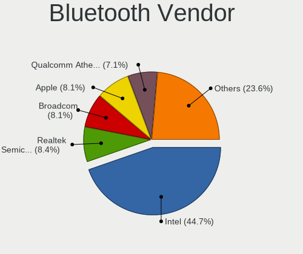

| Vendor                          | Computers | Percent |
|---------------------------------|-----------|---------|
| Intel                           | 220       | 43.74%  |
| Apple                           | 52        | 10.34%  |
| Broadcom                        | 46        | 9.15%   |
| Cambridge Silicon Radio         | 38        | 7.55%   |
| Realtek Semiconductor           | 36        | 7.16%   |
| Qualcomm Atheros Communications | 34        | 6.76%   |
| IMC Networks                    | 15        | 2.98%   |
| Lite-On Technology              | 13        | 2.58%   |
| ASUSTek Computer                | 11        | 2.19%   |
| Foxconn / Hon Hai               | 9         | 1.79%   |
| Hewlett-Packard                 | 7         | 1.39%   |
| Dell                            | 7         | 1.39%   |
| Ralink                          | 6         | 1.19%   |
| Integrated System Solution      | 3         | 0.6%    |
| Alps Electric                   | 2         | 0.4%    |
| TP-Link                         | 1         | 0.2%    |
| HTC (High Tech Computer)        | 1         | 0.2%    |
| Edimax Technology               | 1         | 0.2%    |
| Bluetooth Device                | 1         | 0.2%    |

Bluetooth Model
---------------

Controller models

| Model                                                       | Computers | Percent |
|-------------------------------------------------------------|-----------|---------|
| Intel Bluetooth wireless interface                          | 124       | 24.51%  |
| Cambridge Silicon Radio Bluetooth Dongle (HCI mode)         | 38        | 7.51%   |
| Intel AX200 Bluetooth                                       | 23        | 4.55%   |
| Intel Bluetooth 9460/9560 Jefferson Peak (JfP)              | 20        | 3.95%   |
| Intel AX201 Bluetooth                                       | 17        | 3.36%   |
| Apple Bluetooth Host Controller                             | 17        | 3.36%   |
| Intel Centrino Bluetooth Wireless Transceiver               | 15        | 2.96%   |
| Apple Built-in Bluetooth 2.0+EDR HCI                        | 15        | 2.96%   |
| Intel Wireless-AC 3168 Bluetooth                            | 13        | 2.57%   |
| Broadcom BCM20702 Bluetooth 4.0 [ThinkPad]                  | 12        | 2.37%   |
| Broadcom BCM2045B (BDC-2.1)                                 | 12        | 2.37%   |
| Realtek  Bluetooth 4.2 Adapter                              | 11        | 2.17%   |
| Apple Apple Broadcom Built-in Bluetooth                     | 11        | 2.17%   |
| Qualcomm Atheros  QCA9377 Bluetooth 4.1                     | 8         | 1.58%   |
| Realtek  Bluetooth Adapter                                  | 6         | 1.19%   |
| Realtek  Bluetooth 4.0 Adapter                              | 6         | 1.19%   |
| Ralink RT3290 Bluetooth                                     | 6         | 1.19%   |
| Intel Wireless-AC 9260 Bluetooth Adapter                    | 6         | 1.19%   |
| Qualcomm Atheros Dell Wireless 1707 Bluetooth 4.0 LE Device | 5         | 0.99%   |
| Qualcomm Atheros AR9462 Bluetooth                           | 5         | 0.99%   |
| Lite-On Atheros AR3012 Bluetooth                            | 5         | 0.99%   |
| Broadcom BCM2045B (BDC-2) [Bluetooth Controller]            | 5         | 0.99%   |
| Apple Built-in iSight (no firmware loaded)                  | 5         | 0.99%   |
| Realtek RTL8723B Bluetooth                                  | 4         | 0.79%   |
| Realtek Bluetooth Radio                                     | 4         | 0.79%   |
| Qualcomm Atheros Dell Wireless 1703 Bluetooth               | 4         | 0.79%   |
| Qualcomm Atheros AR3012 Bluetooth 4.0                       | 4         | 0.79%   |
| IMC Networks Atheros AR3012 Bluetooth 4.0 Adapter           | 4         | 0.79%   |
| HP Broadcom 2070 Bluetooth Combo                            | 4         | 0.79%   |
| Qualcomm Atheros QCA61x4 Bluetooth 4.0                      | 3         | 0.59%   |
| Lite-On Qualcomm Atheros Bluetooth 4.0 + HS                 | 3         | 0.59%   |
| IMC Networks Realtek Bluetooth Adapter                      | 3         | 0.59%   |
| Dell DW375 Bluetooth Module                                 | 3         | 0.59%   |
| Broadcom BCM20702A0 Bluetooth 4.0                           | 3         | 0.59%   |
| ASUS ASUS USB-BT500                                         | 3         | 0.59%   |
| Apple Bluetooth USB Host Controller                         | 3         | 0.59%   |
| Realtek RTL8821A Bluetooth                                  | 2         | 0.4%    |
| Realtek  Bluetooth 4.0 + High Speed Chip                    | 2         | 0.4%    |
| Lite-On Qualcomm Atheros QCA9377 Bluetooth                  | 2         | 0.4%    |
| Intel Centrino Advanced-N 6230 Bluetooth adapter            | 2         | 0.4%    |

Sound
-----

Sound Vendor
------------

Sound card vendors

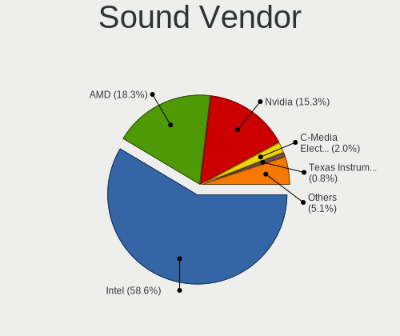

| Vendor                           | Computers | Percent |
|----------------------------------|-----------|---------|
| Intel                            | 791       | 57.86%  |
| AMD                              | 240       | 17.56%  |
| Nvidia                           | 236       | 17.26%  |
| C-Media Electronics              | 26        | 1.9%    |
| Texas Instruments                | 11        | 0.8%    |
| GN Netcom                        | 8         | 0.59%   |
| Creative Labs                    | 6         | 0.44%   |
| SteelSeries ApS                  | 4         | 0.29%   |
| Logitech                         | 4         | 0.29%   |
| Creative Technology              | 4         | 0.29%   |
| Yamaha                           | 2         | 0.15%   |
| XMOS                             | 2         | 0.15%   |
| Silicon Integrated Systems [SiS] | 2         | 0.15%   |
| Kingston Technology              | 2         | 0.15%   |
| JMTek                            | 2         | 0.15%   |
| Google                           | 2         | 0.15%   |
| Focusrite-Novation               | 2         | 0.15%   |
| BEHRINGER International          | 2         | 0.15%   |
| ZOOM                             | 1         | 0.07%   |
| VIA Technologies                 | 1         | 0.07%   |
| Steinberg Soft-und Hardware      | 1         | 0.07%   |
| Realtek Semiconductor            | 1         | 0.07%   |
| Plantronics                      | 1         | 0.07%   |
| Nektar                           | 1         | 0.07%   |
| Lenovo                           | 1         | 0.07%   |
| KORG                             | 1         | 0.07%   |
| Hewlett-Packard                  | 1         | 0.07%   |
| Griffin Technology               | 1         | 0.07%   |
| Giga-Byte Technology             | 1         | 0.07%   |
| Generalplus Technology           | 1         | 0.07%   |
| FiiO Electronics Technology      | 1         | 0.07%   |
| Ensoniq                          | 1         | 0.07%   |
| Elgato Systems                   | 1         | 0.07%   |
| DSEA A/S                         | 1         | 0.07%   |
| Corsair                          | 1         | 0.07%   |
| Cambridge Silicon Radio          | 1         | 0.07%   |
| Bose                             | 1         | 0.07%   |
| ASUSTek Computer                 | 1         | 0.07%   |
| Astro Gaming                     | 1         | 0.07%   |

Sound Model
-----------

Sound card models

| Model                                                                                             | Computers | Percent |
|---------------------------------------------------------------------------------------------------|-----------|---------|
| Intel 7 Series/C216 Chipset Family High Definition Audio Controller                               | 118       | 7.38%   |
| Intel Sunrise Point-LP HD Audio                                                                   | 80        | 5.01%   |
| Intel 6 Series/C200 Series Chipset Family High Definition Audio Controller                        | 80        | 5.01%   |
| Intel 8 Series/C220 Series Chipset High Definition Audio Controller                               | 58        | 3.63%   |
| Intel 100 Series/C230 Series Chipset Family HD Audio Controller                                   | 50        | 3.13%   |
| Intel 5 Series/3400 Series Chipset High Definition Audio                                          | 47        | 2.94%   |
| AMD Family 17h/19h HD Audio Controller                                                            | 47        | 2.94%   |
| Intel 82801I (ICH9 Family) HD Audio Controller                                                    | 43        | 2.69%   |
| AMD SBx00 Azalia (Intel HDA)                                                                      | 42        | 2.63%   |
| Intel Xeon E3-1200 v3/4th Gen Core Processor HD Audio Controller                                  | 41        | 2.57%   |
| Intel 8 Series HD Audio Controller                                                                | 40        | 2.5%    |
| Intel NM10/ICH7 Family High Definition Audio Controller                                           | 39        | 2.44%   |
| Intel Haswell-ULT HD Audio Controller                                                             | 39        | 2.44%   |
| Intel Cannon Lake PCH cAVS                                                                        | 33        | 2.07%   |
| AMD Starship/Matisse HD Audio Controller                                                          | 31        | 1.94%   |
| Intel 82801H (ICH8 Family) HD Audio Controller                                                    | 29        | 1.81%   |
| AMD FCH Azalia Controller                                                                         | 29        | 1.81%   |
| Nvidia GK208 HDMI/DP Audio Controller                                                             | 26        | 1.63%   |
| Intel Broadwell-U Audio Controller                                                                | 26        | 1.63%   |
| AMD Family 17h (Models 00h-0fh) HD Audio Controller                                               | 25        | 1.56%   |
| Intel Wildcat Point-LP High Definition Audio Controller                                           | 24        | 1.5%    |
| AMD Raven/Raven2/Fenghuang HDMI/DP Audio Controller                                               | 24        | 1.5%    |
| AMD Ellesmere HDMI Audio [Radeon RX 470/480 / 570/580/590]                                        | 24        | 1.5%    |
| Nvidia MCP79 High Definition Audio                                                                | 20        | 1.25%   |
| Intel 200 Series PCH HD Audio                                                                     | 20        | 1.25%   |
| Nvidia TU116 High Definition Audio Controller                                                     | 17        | 1.06%   |
| Intel 82801JI (ICH10 Family) HD Audio Controller                                                  | 17        | 1.06%   |
| Nvidia GP107GL High Definition Audio Controller                                                   | 16        | 1%      |
| Intel Cannon Point-LP High Definition Audio Controller                                            | 16        | 1%      |
| Nvidia High Definition Audio Controller                                                           | 13        | 0.81%   |
| Nvidia GF119 HDMI Audio Controller                                                                | 13        | 0.81%   |
| AMD Baffin HDMI/DP Audio [Radeon RX 550 640SP / RX 560/560X]                                      | 13        | 0.81%   |
| Nvidia GP106 High Definition Audio Controller                                                     | 12        | 0.75%   |
| Nvidia GK107 HDMI Audio Controller                                                                | 12        | 0.75%   |
| Nvidia GF108 High Definition Audio Controller                                                     | 12        | 0.75%   |
| Intel Atom/Celeron/Pentium Processor x5-E8000/J3xxx/N3xxx Series High Definition Audio Controller | 12        | 0.75%   |
| AMD Oland/Hainan/Cape Verde/Pitcairn HDMI Audio [Radeon HD 7000 Series]                           | 12        | 0.75%   |
| Nvidia GP108 High Definition Audio Controller                                                     | 11        | 0.69%   |
| AMD RV710/730 HDMI Audio [Radeon HD 4000 series]                                                  | 11        | 0.69%   |
| AMD Renoir Radeon High Definition Audio Controller                                                | 11        | 0.69%   |

Memory
------

Memory Vendor
-------------

Memory module vendors

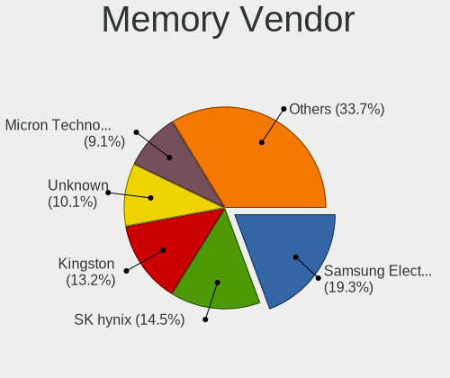

| Vendor                       | Computers | Percent |
|------------------------------|-----------|---------|
| Samsung Electronics          | 222       | 18.38%  |
| SK hynix                     | 175       | 14.49%  |
| Kingston                     | 174       | 14.4%   |
| Unknown                      | 130       | 10.76%  |
| Micron Technology            | 103       | 8.53%   |
| Crucial                      | 75        | 6.21%   |
| Corsair                      | 46        | 3.81%   |
| G.Skill                      | 36        | 2.98%   |
| Elpida                       | 32        | 2.65%   |
| Unknown                      | 26        | 2.15%   |
| Nanya Technology             | 24        | 1.99%   |
| Ramaxel Technology           | 23        | 1.9%    |
| A-DATA Technology            | 20        | 1.66%   |
| Smart                        | 15        | 1.24%   |
| Team                         | 14        | 1.16%   |
| Transcend                    | 12        | 0.99%   |
| Patriot                      | 7         | 0.58%   |
| Avant                        | 7         | 0.58%   |
| Teikon                       | 6         | 0.5%    |
| Apacer                       | 6         | 0.5%    |
| Smart Brazil                 | 4         | 0.33%   |
| PNY                          | 4         | 0.33%   |
| AMD                          | 4         | 0.33%   |
| Unknown (ABCD)               | 3         | 0.25%   |
| Silicon Power                | 3         | 0.25%   |
| High Bridge                  | 3         | 0.25%   |
| ASint Technology             | 3         | 0.25%   |
| GOODRAM                      | 2         | 0.17%   |
| Goldkey                      | 2         | 0.17%   |
| 48spaces                     | 2         | 0.17%   |
| V-GeN                        | 1         | 0.08%   |
| Unknown (D386)               | 1         | 0.08%   |
| Unknown (7F7F7F94FFFFFFFF)   | 1         | 0.08%   |
| Unknown (0x7F7F7F94FFFFFFFF) | 1         | 0.08%   |
| Unknown (0x0809)             | 1         | 0.08%   |
| Unknown (09A4)               | 1         | 0.08%   |
| Unknown (08B5)               | 1         | 0.08%   |
| Unifosa                      | 1         | 0.08%   |
| Toshiba                      | 1         | 0.08%   |
| TakeMS                       | 1         | 0.08%   |

Memory Model
------------

Memory module models

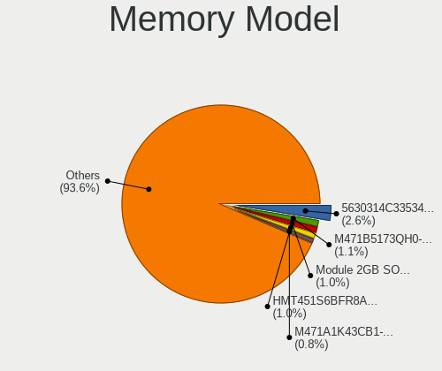

| Model                                                  | Computers | Percent |
|--------------------------------------------------------|-----------|---------|
| Unknown                                                | 26        | 1.99%   |
| Unknown RAM Module 2GB SODIMM DDR2 667MT/s             | 12        | 0.92%   |
| SK hynix RAM HMT451S6BFR8A-PB 4GB SODIMM DDR3 1600MT/s | 12        | 0.92%   |
| Samsung RAM M471B5273CH0-CH9 4GB SODIMM DDR3 1334MT/s  | 11        | 0.84%   |
| Samsung RAM M471B5173QH0-YK0 4GB SODIMM DDR3 1600MT/s  | 11        | 0.84%   |
| SK hynix RAM HMT351S6CFR8C-PB 4GB SODIMM DDR3 1600MT/s | 10        | 0.77%   |
| Samsung RAM M471B5173DB0-YK0 4GB SODIMM DDR3 1600MT/s  | 10        | 0.77%   |
| Samsung RAM M471A5244CB0-CTD 4GB SODIMM DDR4 2667MT/s  | 10        | 0.77%   |
| SK hynix RAM HMT41GS6BFR8A-PB 8GB SODIMM DDR3 1600MT/s | 9         | 0.69%   |
| Unknown RAM Module 2GB DIMM 1333MT/s                   | 7         | 0.54%   |
| Samsung RAM M471B5773DH0-CH9 2GB SODIMM DDR3 1334MT/s  | 7         | 0.54%   |
| Samsung RAM M471B5273DH0-CH9 4GB SODIMM DDR3 1334MT/s  | 7         | 0.54%   |
| Unknown RAM Module 4GB DIMM 1333MT/s                   | 6         | 0.46%   |
| Samsung RAM M471B5773CHS-CH9 2GB SODIMM DDR3 1333MT/s  | 6         | 0.46%   |
| Samsung RAM M471B5173EB0-YK0 4GB SODIMM DDR3 1600MT/s  | 6         | 0.46%   |
| Samsung RAM M471B1G73QH0-YK0 8GB SODIMM DDR3 1867MT/s  | 6         | 0.46%   |
| Kingston RAM KHX3200C16D4/8GX 8GB DIMM DDR4 3200MT/s   | 6         | 0.46%   |
| Unknown RAM Module 4GB SODIMM DDR3 1333MT/s            | 5         | 0.38%   |
| Unknown RAM Module 2048MB SODIMM DDR2 667MT/s          | 5         | 0.38%   |
| Team RAM TEAMGROUP-UD4-3200 16GB DIMM DDR4 3200MT/s    | 5         | 0.38%   |
| SK hynix RAM HMT351S6EFR8A-PB 4GB SODIMM DDR3 1600MT/s | 5         | 0.38%   |
| SK hynix RAM HMA851S6AFR6N-UH 4GB SODIMM DDR4 2400MT/s | 5         | 0.38%   |
| SK hynix RAM HMA81GS6CJR8N-VK 8GB SODIMM DDR4 2667MT/s | 5         | 0.38%   |
| Unknown RAM Module 4GB DIMM DDR3 1333MT/s              | 4         | 0.31%   |
| Unknown RAM Module 2GB DIMM DDR2 800MT/s               | 4         | 0.31%   |
| Unknown RAM Module 2048MB DIMM DDR2 800MT/s            | 4         | 0.31%   |
| Unknown RAM Module 1GB SODIMM DDR2 667MT/s             | 4         | 0.31%   |
| Unknown RAM Module 1GB DIMM SDRAM                      | 4         | 0.31%   |
| Smart RAM SH564568FH8NZPHSCR 2GB SODIMM DDR3 1334MT/s  | 4         | 0.31%   |
| SK hynix RAM Module 2GB SODIMM DDR3 1600MT/s           | 4         | 0.31%   |
| SK hynix RAM HYMP125S64CP8-S6 2GB SODIMM DDR2 975MT/s  | 4         | 0.31%   |
| SK hynix RAM HMT451S6AFR8A-PB 4GB SODIMM DDR3 1600MT/s | 4         | 0.31%   |
| Samsung RAM Module 2GB SODIMM DDR3 1067MT/s            | 4         | 0.31%   |
| Samsung RAM M471B5673FH0-CH9 2GB SODIMM DDR3 1334MT/s  | 4         | 0.31%   |
| Samsung RAM M471B5273DH0-CK0 4GB SODIMM DDR3 1600MT/s  | 4         | 0.31%   |
| Samsung RAM M471B5173BH0-CK0 4GB SODIMM DDR3 1600MT/s  | 4         | 0.31%   |
| Samsung RAM M471B1G73EB0-YK0 8GB SODIMM DDR3 1600MT/s  | 4         | 0.31%   |
| Samsung RAM M471B1G73DB0-YK0 8GB SODIMM DDR3 1600MT/s  | 4         | 0.31%   |
| Samsung RAM M471A1K43CB1-CRC 8GB SODIMM DDR4 2400MT/s  | 4         | 0.31%   |
| Samsung RAM M378B5173QH0-CK0 4GB DIMM DDR3 1600MT/s    | 4         | 0.31%   |

Memory Kind
-----------

Memory module kinds

| Kind    | Computers | Percent |
|---------|-----------|---------|
| DDR3    | 512       | 50.79%  |
| DDR4    | 325       | 32.24%  |
| DDR2    | 93        | 9.23%   |
| Unknown | 39        | 3.87%   |
| SDRAM   | 14        | 1.39%   |
| LPDDR3  | 12        | 1.19%   |
| LPDDR4  | 7         | 0.69%   |
| DDR     | 4         | 0.4%    |
| DRAM    | 2         | 0.2%    |

Memory Form Factor
------------------

Physical design of the memory module

| Name         | Computers | Percent |
|--------------|-----------|---------|
| SODIMM       | 555       | 55.06%  |
| DIMM         | 419       | 41.57%  |
| Row Of Chips | 17        | 1.69%   |
| Chip         | 10        | 0.99%   |
| FB-DIMM      | 4         | 0.4%    |
| Unknown      | 3         | 0.3%    |

Memory Size
-----------

Memory module size

| Size  | Computers | Percent |
|-------|-----------|---------|
| 4096  | 426       | 37.57%  |
| 8192  | 309       | 27.25%  |
| 2048  | 256       | 22.57%  |
| 16384 | 100       | 8.82%   |
| 1024  | 34        | 3%      |
| 32768 | 8         | 0.71%   |
| 512   | 1         | 0.09%   |

Memory Speed
------------

Memory module speed

| Speed   | Computers | Percent |
|---------|-----------|---------|
| 1600    | 295       | 26.72%  |
| 1333    | 167       | 15.13%  |
| 2400    | 105       | 9.51%   |
| 2667    | 84        | 7.61%   |
| 2133    | 76        | 6.88%   |
| 3200    | 67        | 6.07%   |
| 667     | 55        | 4.98%   |
| 1067    | 47        | 4.26%   |
| 800     | 47        | 4.26%   |
| 1334    | 39        | 3.53%   |
| Unknown | 26        | 2.36%   |
| 1867    | 21        | 1.9%    |
| 2666    | 16        | 1.45%   |
| 1066    | 13        | 1.18%   |
| 1866    | 8         | 0.72%   |
| 533     | 7         | 0.63%   |
| 3600    | 5         | 0.45%   |
| 2933    | 5         | 0.45%   |
| 400     | 5         | 0.45%   |
| 975     | 4         | 0.36%   |
| 333     | 4         | 0.36%   |
| 4267    | 2         | 0.18%   |
| 3000    | 2         | 0.18%   |
| 3733    | 1         | 0.09%   |
| 3400    | 1         | 0.09%   |
| 1800    | 1         | 0.09%   |
| 1200    | 1         | 0.09%   |

Printers & scanners
-------------------

Printer Vendor
--------------

Printer device vendors

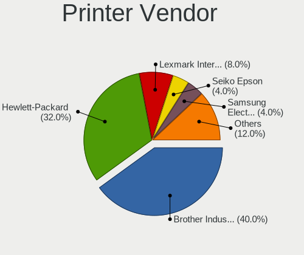

| Vendor                | Computers | Percent |
|-----------------------|-----------|---------|
| Hewlett-Packard       | 6         | 33.33%  |
| Brother Industries    | 6         | 33.33%  |
| Lexmark International | 2         | 11.11%  |
| Seiko Epson           | 1         | 5.56%   |
| Ricoh                 | 1         | 5.56%   |
| Prolific Technology   | 1         | 5.56%   |
| Kyocera               | 1         | 5.56%   |

Printer Model
-------------

Printer device models

| Model                                                                                                             | Computers | Percent |
|-------------------------------------------------------------------------------------------------------------------|-----------|---------|
| Seiko Epson USB2.0 Printer (Hi-speed)                                                                             | 1         | 5.26%   |
| Ricoh SP 112                                                                                                      | 1         | 5.26%   |
| Prolific PL2305 Parallel Port                                                                                     | 1         | 5.26%   |
| Lexmark International SINDOH A603_A608 Print                                                                      | 1         | 5.26%   |
| Lexmark International Lexmark MS710 Print                                                                         | 1         | 5.26%   |
| Kyocera FS-1025MFP                                                                                                | 1         | 5.26%   |
| HP LaserJet P3005                                                                                                 | 1         | 5.26%   |
| HP LaserJet 2200                                                                                                  | 1         | 5.26%   |
| HP LaserJet 1200                                                                                                  | 1         | 5.26%   |
| HP HP LaserJet P2035 HP Print                                                                                     | 1         | 5.26%   |
| HP HP LaserJet MFP E52645 LaserJet 0 LaserJet 0 LaserJet 1 LaserJet 1 LaserJet 2 LaserJet 2 LaserJet 3 LaserJet 3 | 1         | 5.26%   |
| HP DeskJet 5850c                                                                                                  | 1         | 5.26%   |
| HP Color LaserJet CP1215                                                                                          | 1         | 5.26%   |
| Brother MFC-L2685DW                                                                                               | 1         | 5.26%   |
| Brother MFC-J200                                                                                                  | 1         | 5.26%   |
| Brother MFC-7360N                                                                                                 | 1         | 5.26%   |
| Brother HL-L2310D series                                                                                          | 1         | 5.26%   |
| Brother HL-1430 Laser Printer                                                                                     | 1         | 5.26%   |
| Brother DCP-J100                                                                                                  | 1         | 5.26%   |

Scanner Vendor
--------------

Scanner device vendors

| Vendor      | Computers | Percent |
|-------------|-----------|---------|
| Canon       | 2         | 66.67%  |
| Seiko Epson | 1         | 33.33%  |

Scanner Model
-------------

Scanner device models

| Model                                                                               | Computers | Percent |
|-------------------------------------------------------------------------------------|-----------|---------|
| Canon CanoScan LiDE 110                                                             | 2         | 66.67%  |
| Seiko Epson WF-2860 Series EPSON Scanner USB2.0 Printer EPSON Utility USB2.0 Faxout | 1         | 33.33%  |

Camera
------

Camera Vendor
-------------

Camera device vendors

| Vendor                                 | Computers | Percent |
|----------------------------------------|-----------|---------|
| Chicony Electronics                    | 105       | 23.86%  |
| Realtek Semiconductor                  | 40        | 9.09%   |
| Microdia                               | 37        | 8.41%   |
| Acer                                   | 37        | 8.41%   |
| IMC Networks                           | 33        | 7.5%    |
| Sunplus Innovation Technology          | 26        | 5.91%   |
| Suyin                                  | 18        | 4.09%   |
| Logitech                               | 17        | 3.86%   |
| Lite-On Technology                     | 14        | 3.18%   |
| Syntek                                 | 13        | 2.95%   |
| Apple                                  | 11        | 2.5%    |
| Quanta                                 | 10        | 2.27%   |
| Z-Star Microelectronics                | 9         | 2.05%   |
| Cheng Uei Precision Industry (Foxlink) | 9         | 2.05%   |
| Alcor Micro                            | 8         | 1.82%   |
| Silicon Motion                         | 7         | 1.59%   |
| Lenovo                                 | 6         | 1.36%   |
| Luxvisions Innotech Limited            | 4         | 0.91%   |
| ALi                                    | 4         | 0.91%   |
| Ricoh                                  | 3         | 0.68%   |
| Importek                               | 3         | 0.68%   |
| Arkmicro Technologies                  | 3         | 0.68%   |
| ARC International                      | 3         | 0.68%   |
| Hewlett-Packard                        | 2         | 0.45%   |
| Generalplus Technology                 | 2         | 0.45%   |
| Creative Technology                    | 2         | 0.45%   |
| Tripath Technology                     | 1         | 0.23%   |
| Primax Electronics                     | 1         | 0.23%   |
| Linux Foundation                       | 1         | 0.23%   |
| KYE Systems (Mouse Systems)            | 1         | 0.23%   |
| Intel                                  | 1         | 0.23%   |
| icSpring                               | 1         | 0.23%   |
| Holitech                               | 1         | 0.23%   |
| HD WEBCAM                              | 1         | 0.23%   |
| Genesys Logic                          | 1         | 0.23%   |
| GEMBIRD                                | 1         | 0.23%   |
| Foxconn / Hon Hai                      | 1         | 0.23%   |
| DigiTech                               | 1         | 0.23%   |
| Aveo Technology                        | 1         | 0.23%   |
| A4Tech                                 | 1         | 0.23%   |

Camera Model
------------

Camera device models

| Model                                     | Computers | Percent |
|-------------------------------------------|-----------|---------|
| Chicony Integrated Camera                 | 24        | 5.41%   |
| Realtek Integrated_Webcam_HD              | 13        | 2.93%   |
| Realtek Realtek USB2.0 PC Camera          | 12        | 2.7%    |
| Acer Integrated Camera                    | 12        | 2.7%    |
| Lite-On Integrated Camera                 | 9         | 2.03%   |
| IMC Networks USB2.0 HD UVC WebCam         | 9         | 2.03%   |
| Sunplus Integrated_Webcam_HD              | 8         | 1.8%    |
| Chicony HD WebCam                         | 8         | 1.8%    |
| Microdia Integrated_Webcam_HD             | 7         | 1.58%   |
| Acer Lenovo EasyCamera                    | 7         | 1.58%   |
| Syntek Lenovo EasyCamera                  | 6         | 1.35%   |
| Microdia Integrated Webcam                | 6         | 1.35%   |
| Chicony Lenovo Integrated Camera (0.3MP)  | 6         | 1.35%   |
| Apple FaceTime HD Camera                  | 6         | 1.35%   |
| Realtek USB Camera                        | 5         | 1.13%   |
| Microdia Dell Laptop Integrated Webcam HD | 5         | 1.13%   |
| IMC Networks Integrated Camera            | 5         | 1.13%   |
| Chicony HP HD Webcam [Fixed]              | 5         | 1.13%   |
| Syntek EasyCamera                         | 4         | 0.9%    |
| Suyin Integrated_Webcam_HD                | 4         | 0.9%    |
| Microdia Laptop_Integrated_Webcam_HD      | 4         | 0.9%    |
| Logitech Webcam C270                      | 4         | 0.9%    |
| Lenovo Integrated Webcam [R5U877]         | 4         | 0.9%    |
| Chicony USB2.0 VGA UVC WebCam             | 4         | 0.9%    |
| Chicony Lenovo EasyCamera                 | 4         | 0.9%    |
| Apple FaceTime HD Camera (Built-in)       | 4         | 0.9%    |
| Acer ThinkPad Integrated Camera           | 4         | 0.9%    |
| Sunplus Laptop_Integrated_Webcam_FHD      | 3         | 0.68%   |
| Sunplus Integrated Camera                 | 3         | 0.68%   |
| Quanta HP Webcam                          | 3         | 0.68%   |
| Quanta HP TrueVision HD Camera            | 3         | 0.68%   |
| Logitech HD Pro Webcam C920               | 3         | 0.68%   |
| IMC Networks EasyCamera                   | 3         | 0.68%   |
| Chicony UVC 1.00 device HD UVC WebCam     | 3         | 0.68%   |
| Chicony USB2.0 HD UVC WebCam              | 3         | 0.68%   |
| Chicony Integrated Camera [ThinkPad]      | 3         | 0.68%   |
| Chicony HD WebCam (Acer)                  | 3         | 0.68%   |
| Chicony FJ Camera                         | 3         | 0.68%   |
| Chicony EasyCamera                        | 3         | 0.68%   |
| Chicony Chicony USB 2.0 Camera            | 3         | 0.68%   |

Security
--------

Fingerprint Vendor
------------------

Fingerprint sensor vendors

| Vendor                     | Computers | Percent |
|----------------------------|-----------|---------|
| Validity Sensors           | 41        | 44.57%  |
| AuthenTec                  | 16        | 17.39%  |
| Upek                       | 15        | 16.3%   |
| STMicroelectronics         | 7         | 7.61%   |
| Synaptics                  | 4         | 4.35%   |
| Broadcom                   | 3         | 3.26%   |
| Shenzhen Goodix Technology | 2         | 2.17%   |
| LighTuning Technology      | 2         | 2.17%   |
| Elan Microelectronics      | 2         | 2.17%   |

Fingerprint Model
-----------------

Fingerprint sensor models

| Model                                                                        | Computers | Percent |
|------------------------------------------------------------------------------|-----------|---------|
| Upek Biometric Touchchip/Touchstrip Fingerprint Sensor                       | 13        | 14.13%  |
| Validity Sensors VFS 5011 fingerprint sensor                                 | 9         | 9.78%   |
| Validity Sensors VFS495 Fingerprint Reader                                   | 7         | 7.61%   |
| STMicroelectronics Fingerprint Reader                                        | 7         | 7.61%   |
| Validity Sensors VFS5011 Fingerprint Reader                                  | 5         | 5.43%   |
| Validity Sensors Synaptics WBDI                                              | 5         | 5.43%   |
| AuthenTec AES2810                                                            | 4         | 4.35%   |
| AuthenTec AES1600                                                            | 4         | 4.35%   |
| Validity Sensors VFS491                                                      | 3         | 3.26%   |
| Broadcom BCM5880 Secure Applications Processor with fingerprint swipe sensor | 3         | 3.26%   |
| AuthenTec AuthenTec Inc. AES1660                                             | 3         | 3.26%   |
| AuthenTec AES2501 Fingerprint Sensor                                         | 3         | 3.26%   |
| Validity Sensors VFS7500 Touch Fingerprint Sensor                            | 2         | 2.17%   |
| Validity Sensors VFS471 Fingerprint Reader                                   | 2         | 2.17%   |
| Validity Sensors VFS451 Fingerprint Reader                                   | 2         | 2.17%   |
| Validity Sensors Fingerprint scanner                                         | 2         | 2.17%   |
| Upek TCS5B Fingerprint sensor                                                | 2         | 2.17%   |
| Synaptics Metallica MOH Touch Fingerprint Reader                             | 2         | 2.17%   |
| Shenzhen Goodix Fingerprint Reader                                           | 2         | 2.17%   |
| Elan ELAN WBF Fingerprint Sensor                                             | 2         | 2.17%   |
| Validity Sensors VFS301 Fingerprint Reader                                   | 1         | 1.09%   |
| Validity Sensors VFS Fingerprint sensor                                      | 1         | 1.09%   |
| Validity Sensors Synaptics VFS7552 Touch Fingerprint Sensor with PurePrint   | 1         | 1.09%   |
| Validity Sensors Swipe Fingerprint Sensor                                    | 1         | 1.09%   |
| Synaptics Prometheus MIS Touch Fingerprint Reader                            | 1         | 1.09%   |
| LighTuning ES603 Swipe Fingerprint Sensor                                    | 1         | 1.09%   |
| LighTuning EgisTec Touch Fingerprint Sensor                                  | 1         | 1.09%   |
| AuthenTec AuthenTec Inc. AES2660                                             | 1         | 1.09%   |
| AuthenTec AES1660 Fingerprint Sensor                                         | 1         | 1.09%   |
| Unknown                                                                      | 1         | 1.09%   |

Chipcard Vendor
---------------

Chipcard module vendors

Zero info for selected period =(

Chipcard Model
--------------

Chipcard module models

Zero info for selected period =(

Unsupported
-----------

Unsupported Devices
-------------------

Total unsupported devices on board

| Total | Computers | Percent |
|-------|-----------|---------|
| 1     | 391       | 37.45%  |
| 0     | 272       | 26.05%  |
| 2     | 246       | 23.56%  |
| 3     | 94        | 9%      |
| 4     | 34        | 3.26%   |
| 5     | 5         | 0.48%   |
| 6     | 2         | 0.19%   |

Unsupported Device Types
------------------------

Types of unsupported devices

| Type                     | Computers | Percent |
|--------------------------|-----------|---------|
| Communication controller | 631       | 50.48%  |
| Net/wireless             | 163       | 13.04%  |
| Card reader              | 163       | 13.04%  |
| Bluetooth                | 116       | 9.28%   |
| Fingerprint reader       | 90        | 7.2%    |
| Firewire controller      | 29        | 2.32%   |
| Sound                    | 26        | 2.08%   |
| Network                  | 11        | 0.88%   |
| Storage                  | 8         | 0.64%   |
| Net/ethernet             | 6         | 0.48%   |
| Storage/raid             | 3         | 0.24%   |
| Dvb card                 | 3         | 0.24%   |
| Storage/nvme             | 1         | 0.08%   |

