helloSystem - Tested Hardware & Statistics (Desktops)
-----------------------------------------------------

A project to collect tested hardware configurations for helloSystem.

Anyone can contribute to this report by the [hw-probe](https://github.com/linuxhw/hw-probe/blob/master/INSTALL.BSD.md) tool:

    hw-probe -all -upload

Please contribute! Especially if your hardware is rare.

Contents
--------

* [ Test Cases ](#test-cases)

* [ System ](#system)
  - [ OS                       ](#os)
  - [ OS Family                ](#os-family)
  - [ Arch                     ](#arch)
  - [ DE                       ](#de)
  - [ Display Server           ](#display-server)
  - [ Display Manager          ](#display-manager)
  - [ OS Lang                  ](#os-lang)
  - [ Boot Mode                ](#boot-mode)
  - [ Filesystem               ](#filesystem)
  - [ Part. scheme             ](#part-scheme)

* [ Board ](#board)
  - [ Vendor                   ](#vendor)
  - [ Model                    ](#model)
  - [ Model Family             ](#model-family)
  - [ MFG Year                 ](#mfg-year)
  - [ Form Factor              ](#form-factor)
  - [ Coreboot                 ](#coreboot)
  - [ RAM Size                 ](#ram-size)
  - [ RAM Used                 ](#ram-used)
  - [ Total Drives             ](#total-drives)
  - [ Has CD-ROM               ](#has-cd-rom)
  - [ Has Ethernet             ](#has-ethernet)
  - [ Has WiFi                 ](#has-wifi)
  - [ Has Bluetooth            ](#has-bluetooth)

* [ Location ](#location)
  - [ Country                  ](#country)
  - [ City                     ](#city)

* [ Drives ](#drives)
  - [ Drive Vendor             ](#drive-vendor)
  - [ Drive Model              ](#drive-model)
  - [ HDD Vendor               ](#hdd-vendor)
  - [ SSD Vendor               ](#ssd-vendor)
  - [ Drive Kind               ](#drive-kind)
  - [ Drive Connector          ](#drive-connector)
  - [ Drive Size               ](#drive-size)
  - [ Space Total              ](#space-total)
  - [ Space Used               ](#space-used)
  - [ Malfunc. Drives          ](#malfunc-drives)
  - [ Malfunc. Drive Vendor    ](#malfunc-drive-vendor)
  - [ Malfunc. HDD Vendor      ](#malfunc-hdd-vendor)
  - [ Malfunc. Drive Kind      ](#malfunc-drive-kind)
  - [ Failed Drives            ](#failed-drives)
  - [ Failed Drive Vendor      ](#failed-drive-vendor)
  - [ Drive Status             ](#drive-status)

* [ Storage controller ](#storage-controller)
  - [ Storage Vendor           ](#storage-vendor)
  - [ Storage Model            ](#storage-model)
  - [ Storage Kind             ](#storage-kind)

* [ Processor ](#processor)
  - [ CPU Vendor               ](#cpu-vendor)
  - [ CPU Model                ](#cpu-model)
  - [ CPU Model Family         ](#cpu-model-family)
  - [ CPU Cores                ](#cpu-cores)
  - [ CPU Sockets              ](#cpu-sockets)
  - [ CPU Threads              ](#cpu-threads)
  - [ CPU Microarch            ](#cpu-microarch)

* [ Graphics ](#graphics)
  - [ GPU Vendor               ](#gpu-vendor)
  - [ GPU Model                ](#gpu-model)
  - [ GPU Combo                ](#gpu-combo)
  - [ GPU Driver               ](#gpu-driver)
  - [ GPU Memory               ](#gpu-memory)

* [ Monitor ](#monitor)
  - [ Monitor Vendor           ](#monitor-vendor)
  - [ Monitor Model            ](#monitor-model)
  - [ Monitor Resolution       ](#monitor-resolution)
  - [ Monitor Diagonal         ](#monitor-diagonal)
  - [ Monitor Width            ](#monitor-width)
  - [ Aspect Ratio             ](#aspect-ratio)
  - [ Monitor Area             ](#monitor-area)
  - [ Pixel Density            ](#pixel-density)
  - [ Multiple Monitors        ](#multiple-monitors)

* [ Network ](#network)
  - [ Net Controller Vendor    ](#net-controller-vendor)
  - [ Net Controller Model     ](#net-controller-model)
  - [ Wireless Vendor          ](#wireless-vendor)
  - [ Wireless Model           ](#wireless-model)
  - [ Ethernet Vendor          ](#ethernet-vendor)
  - [ Ethernet Model           ](#ethernet-model)
  - [ Net Controller Kind      ](#net-controller-kind)
  - [ Used Controller          ](#used-controller)
  - [ NICs                     ](#nics)
  - [ IPv6                     ](#ipv6)

* [ Bluetooth ](#bluetooth)
  - [ Bluetooth Vendor         ](#bluetooth-vendor)
  - [ Bluetooth Model          ](#bluetooth-model)

* [ Sound ](#sound)
  - [ Sound Vendor             ](#sound-vendor)
  - [ Sound Model              ](#sound-model)

* [ Memory ](#memory)
  - [ Memory Vendor            ](#memory-vendor)
  - [ Memory Model             ](#memory-model)
  - [ Memory Kind              ](#memory-kind)
  - [ Memory Form Factor       ](#memory-form-factor)
  - [ Memory Size              ](#memory-size)
  - [ Memory Speed             ](#memory-speed)

* [ Printers & scanners ](#printers--scanners)
  - [ Printer Vendor           ](#printer-vendor)
  - [ Printer Model            ](#printer-model)
  - [ Scanner Vendor           ](#scanner-vendor)
  - [ Scanner Model            ](#scanner-model)

* [ Camera ](#camera)
  - [ Camera Vendor            ](#camera-vendor)
  - [ Camera Model             ](#camera-model)

* [ Security ](#security)
  - [ Fingerprint Vendor       ](#fingerprint-vendor)
  - [ Fingerprint Model        ](#fingerprint-model)
  - [ Chipcard Vendor          ](#chipcard-vendor)
  - [ Chipcard Model           ](#chipcard-model)

* [ Unsupported ](#unsupported)
  - [ Unsupported Devices      ](#unsupported-devices)
  - [ Unsupported Device Types ](#unsupported-device-types)

Test Cases
----------

Total: 1191

| Vendor        | Model                       | Probe                                                     | Date         |
|---------------|-----------------------------|-----------------------------------------------------------|--------------|
| Acer          | Veriton M4640G              | [68d5608ce0](https://bsd-hardware.info/?probe=68d5608ce0) | Dec 28, 2025 |
| Dell          | 0C2XKD A01                  | [c6b89f8ff2](https://bsd-hardware.info/?probe=c6b89f8ff2) | Dec 26, 2025 |
| Dell          | 0C2XKD A01                  | [d80978dff4](https://bsd-hardware.info/?probe=d80978dff4) | Dec 26, 2025 |
| Intel         | D2700DC AAG32420-602        | [bfe77052ce](https://bsd-hardware.info/?probe=bfe77052ce) | Dec 24, 2025 |
| Intel         | D2700DC AAG32420-602        | [4eddac7476](https://bsd-hardware.info/?probe=4eddac7476) | Dec 24, 2025 |
| Wincor Nix... | M2.0-H110-uATX Motherboa... | [fac59b87e0](https://bsd-hardware.info/?probe=fac59b87e0) | Dec 20, 2025 |
| MSI           | MPG Z690 EDGE WIFI DDR4     | [9b828c62b9](https://bsd-hardware.info/?probe=9b828c62b9) | Dec 09, 2025 |
| MSI           | MAG B550 TOMAHAWK           | [daba7c50d1](https://bsd-hardware.info/?probe=daba7c50d1) | Nov 30, 2025 |
| OEM           | A55                         | [4ed41d1482](https://bsd-hardware.info/?probe=4ed41d1482) | Nov 08, 2025 |
| OEM           | A55                         | [7fffd8a70b](https://bsd-hardware.info/?probe=7fffd8a70b) | Nov 08, 2025 |
| Unknown       | Unknown                     | [261d22971f](https://bsd-hardware.info/?probe=261d22971f) | Oct 30, 2025 |
| Unknown       | Unknown                     | [e71c6aea6d](https://bsd-hardware.info/?probe=e71c6aea6d) | Oct 25, 2025 |
| Gigabyte      | Z87-HD3                     | [2bf937d238](https://bsd-hardware.info/?probe=2bf937d238) | Oct 06, 2025 |
| Gigabyte      | Z87-HD3                     | [72832870f1](https://bsd-hardware.info/?probe=72832870f1) | Oct 05, 2025 |
| Dell          | 0VHWTR A02                  | [5fdcd943d0](https://bsd-hardware.info/?probe=5fdcd943d0) | Sep 27, 2025 |
| ASUSTek       | PRIME B760-PLUS D4          | [ad3a399271](https://bsd-hardware.info/?probe=ad3a399271) | Sep 23, 2025 |
| MSI           | H61M-P20                    | [9b958d5198](https://bsd-hardware.info/?probe=9b958d5198) | Sep 03, 2025 |
| MSI           | H110M PRO-D                 | [adbd16553c](https://bsd-hardware.info/?probe=adbd16553c) | Aug 25, 2025 |
| Gigabyte      | B550M AORUS ELITE           | [c96eeef217](https://bsd-hardware.info/?probe=c96eeef217) | Aug 10, 2025 |
| Intel         | X79 (INTEL Xeon E5/Corei... | [85de119457](https://bsd-hardware.info/?probe=85de119457) | Aug 08, 2025 |
| Dell          | 00V62H A01                  | [8f0e07d408](https://bsd-hardware.info/?probe=8f0e07d408) | Aug 06, 2025 |
| Dell          | 00V62H A01                  | [7241760f68](https://bsd-hardware.info/?probe=7241760f68) | Aug 06, 2025 |
| ASRock        | G31M-S                      | [12fcbed6de](https://bsd-hardware.info/?probe=12fcbed6de) | Jul 28, 2025 |
| Dell          | 0JR269                      | [3321bb9549](https://bsd-hardware.info/?probe=3321bb9549) | Jul 27, 2025 |
| ECS           | H61H2-M2                    | [6719fff345](https://bsd-hardware.info/?probe=6719fff345) | Jul 21, 2025 |
| HP            | 339A                        | [5070cc1462](https://bsd-hardware.info/?probe=5070cc1462) | Jul 05, 2025 |
| ASUSTek       | TUF Gaming B450-PLUS II     | [d294b6b6e8](https://bsd-hardware.info/?probe=d294b6b6e8) | Jun 22, 2025 |
| MSI           | B360-A PRO                  | [254e1d0afb](https://bsd-hardware.info/?probe=254e1d0afb) | Jun 18, 2025 |
| Fujitsu       | D3233-A1 S26361-D3233-A1    | [898be8e5a3](https://bsd-hardware.info/?probe=898be8e5a3) | Jun 16, 2025 |
| ASUSTek       | P8H61-M LE/CSM R2.0         | [d02b672bdf](https://bsd-hardware.info/?probe=d02b672bdf) | Jun 12, 2025 |
| Lenovo        | ThinkCentre M90P 5852W3Z    | [1d5a2636c1](https://bsd-hardware.info/?probe=1d5a2636c1) | Jun 10, 2025 |
| Apple         | Mac-F221BEC8                | [fcc4268d97](https://bsd-hardware.info/?probe=fcc4268d97) | Jun 07, 2025 |
| Dell          | 042P49 A00                  | [18b9bdcdc4](https://bsd-hardware.info/?probe=18b9bdcdc4) | Jun 06, 2025 |
| Lenovo        | 3111 NOK                    | [db76e8ef46](https://bsd-hardware.info/?probe=db76e8ef46) | Jun 02, 2025 |
| ASRock        | X570 Taichi                 | [e0ed6199c8](https://bsd-hardware.info/?probe=e0ed6199c8) | May 14, 2025 |
| Biostar       | G41D3+                      | [ac29c6c800](https://bsd-hardware.info/?probe=ac29c6c800) | May 11, 2025 |
| HP            | 83E1                        | [6593b9ba45](https://bsd-hardware.info/?probe=6593b9ba45) | May 07, 2025 |
| MSI           | H81M-P33                    | [f7da68ace2](https://bsd-hardware.info/?probe=f7da68ace2) | May 02, 2025 |
| HP            | 8054                        | [c673cd93c9](https://bsd-hardware.info/?probe=c673cd93c9) | Apr 26, 2025 |
| Lenovo        | 3140 NOK                    | [f18a7b323a](https://bsd-hardware.info/?probe=f18a7b323a) | Apr 19, 2025 |
| HP            | 3048h                       | [50ea8ce3bf](https://bsd-hardware.info/?probe=50ea8ce3bf) | Apr 19, 2025 |
| ASUSTek       | H110S1                      | [346a714c34](https://bsd-hardware.info/?probe=346a714c34) | Apr 15, 2025 |
| HP            | 8054                        | [94ecf4c8f2](https://bsd-hardware.info/?probe=94ecf4c8f2) | Apr 13, 2025 |
| Apple         | Mac-F221BEC8                | [b6f2a7e854](https://bsd-hardware.info/?probe=b6f2a7e854) | Apr 10, 2025 |
| Lenovo        | SHARKBAY SDK0E50512 STD     | [6240dd9da0](https://bsd-hardware.info/?probe=6240dd9da0) | Apr 02, 2025 |
| Gigabyte      | Z390 AORUS PRO WIFI-CF      | [52444b9d5c](https://bsd-hardware.info/?probe=52444b9d5c) | Mar 31, 2025 |
| Intel         | X99H                        | [e88d5ce2d4](https://bsd-hardware.info/?probe=e88d5ce2d4) | Mar 30, 2025 |
| HP            | 821D                        | [82728a8821](https://bsd-hardware.info/?probe=82728a8821) | Mar 27, 2025 |
| Inspur        | Computer All in one PC V... | [f5a5e2e41d](https://bsd-hardware.info/?probe=f5a5e2e41d) | Mar 25, 2025 |
| HP            | 8054                        | [cf2a967451](https://bsd-hardware.info/?probe=cf2a967451) | Mar 21, 2025 |
| Lenovo        | 1059 NOK                    | [46bfc09fb9](https://bsd-hardware.info/?probe=46bfc09fb9) | Mar 14, 2025 |
| MSI           | H110M PRO-D                 | [e227ad771a](https://bsd-hardware.info/?probe=e227ad771a) | Mar 12, 2025 |
| Unknown       | Unknown                     | [15fbd064b1](https://bsd-hardware.info/?probe=15fbd064b1) | Mar 11, 2025 |
| ASRock        | FM2A58M-DG3+                | [f6a7a38e3e](https://bsd-hardware.info/?probe=f6a7a38e3e) | Mar 11, 2025 |
| HP            | 1998                        | [7a5a4bfcd9](https://bsd-hardware.info/?probe=7a5a4bfcd9) | Mar 10, 2025 |
| Gigabyte      | H510M H                     | [0eadce332a](https://bsd-hardware.info/?probe=0eadce332a) | Mar 08, 2025 |
| ASUSTek       | B85M-G                      | [d374326c41](https://bsd-hardware.info/?probe=d374326c41) | Mar 04, 2025 |
| ASRock        | X570 Phantom Gaming 4S      | [b65c14dee7](https://bsd-hardware.info/?probe=b65c14dee7) | Feb 28, 2025 |
| MSI           | H81M-P33                    | [2061990247](https://bsd-hardware.info/?probe=2061990247) | Feb 26, 2025 |
| Apple         | Mac-F221BEC8                | [93bbedb57b](https://bsd-hardware.info/?probe=93bbedb57b) | Feb 24, 2025 |
| Dell          | 0200DY A02                  | [03b22828e3](https://bsd-hardware.info/?probe=03b22828e3) | Feb 23, 2025 |
| Lenovo        | 1059 NOK                    | [e88b2e7e02](https://bsd-hardware.info/?probe=e88b2e7e02) | Feb 22, 2025 |
| Intel         | DP55WB AAE64798-204         | [96b24e9a7b](https://bsd-hardware.info/?probe=96b24e9a7b) | Feb 21, 2025 |
| MSI           | Z790 GAMING PLUS WIFI       | [0069134b6a](https://bsd-hardware.info/?probe=0069134b6a) | Feb 19, 2025 |
| Gigabyte      | GA-78LMT-USB3 SEx           | [b774062e9a](https://bsd-hardware.info/?probe=b774062e9a) | Feb 18, 2025 |
| Lenovo        | Bantry CRB NOK              | [efde8f3eb0](https://bsd-hardware.info/?probe=efde8f3eb0) | Feb 12, 2025 |
| RDW           | MB-B450M V.1                | [4c21fc3ee1](https://bsd-hardware.info/?probe=4c21fc3ee1) | Feb 10, 2025 |
| ZOTAC         | H67ITX-C-E                  | [03f7293660](https://bsd-hardware.info/?probe=03f7293660) | Feb 09, 2025 |
| ASRock        | H61M-VS3                    | [093dd39a95](https://bsd-hardware.info/?probe=093dd39a95) | Feb 04, 2025 |
| Lenovo        | Bantry CRB NOK              | [7d16893e16](https://bsd-hardware.info/?probe=7d16893e16) | Jan 26, 2025 |
| Fujitsu       | D3167-A1 S26361-D3167-A1    | [7639c665eb](https://bsd-hardware.info/?probe=7639c665eb) | Jan 23, 2025 |
| Gigabyte      | H81M-D2V                    | [0d1dd7ceae](https://bsd-hardware.info/?probe=0d1dd7ceae) | Jan 15, 2025 |
| Dell          | 0WVYMC A00                  | [18626d6a8b](https://bsd-hardware.info/?probe=18626d6a8b) | Jan 10, 2025 |
| Foxconn       | G41MXE-V                    | [81b7ee3ac7](https://bsd-hardware.info/?probe=81b7ee3ac7) | Jan 09, 2025 |
| ASRock        | Z370M Pro4                  | [6e9e562a11](https://bsd-hardware.info/?probe=6e9e562a11) | Jan 07, 2025 |
| Dell          | 0MGK50 A02                  | [fe0b9484f5](https://bsd-hardware.info/?probe=fe0b9484f5) | Jan 05, 2025 |
| ASUSTek       | Q87M-E                      | [845a04a779](https://bsd-hardware.info/?probe=845a04a779) | Jan 03, 2025 |
| HP            | 18E7                        | [fdac2d0362](https://bsd-hardware.info/?probe=fdac2d0362) | Jan 03, 2025 |
| ASUSTek       | ROG STRIX B650-A GAMING ... | [20976f758a](https://bsd-hardware.info/?probe=20976f758a) | Jan 02, 2025 |
| Dell          | 0D6H9T A00                  | [53d4b51f32](https://bsd-hardware.info/?probe=53d4b51f32) | Dec 18, 2024 |
| MSI           | ZH77A-G43                   | [f000f3f0cc](https://bsd-hardware.info/?probe=f000f3f0cc) | Dec 16, 2024 |
| Dell          | 0KYJ8C A00                  | [06b326f6d3](https://bsd-hardware.info/?probe=06b326f6d3) | Dec 15, 2024 |
| ASUSTek       | PRIME B550M-K               | [52f3e1cf1a](https://bsd-hardware.info/?probe=52f3e1cf1a) | Dec 09, 2024 |
| ASUSTek       | PRIME H510M-R               | [772e88509f](https://bsd-hardware.info/?probe=772e88509f) | Dec 04, 2024 |
| MSI           | Z97 GAMING 3                | [9cd14a585d](https://bsd-hardware.info/?probe=9cd14a585d) | Dec 04, 2024 |
| HP            | 339A                        | [3c450d9163](https://bsd-hardware.info/?probe=3c450d9163) | Dec 04, 2024 |
| ASUSTek       | PRIME B450M-A II            | [1a6e076d9f](https://bsd-hardware.info/?probe=1a6e076d9f) | Dec 02, 2024 |
| Gigabyte      | H110MSTX-HD3 Reborn by d... | [c1473102cc](https://bsd-hardware.info/?probe=c1473102cc) | Nov 29, 2024 |
| HP            | 3048h                       | [36a9b2f835](https://bsd-hardware.info/?probe=36a9b2f835) | Nov 29, 2024 |
| Gigabyte      | H110MSTX-HD3 Reborn by d... | [d99e7bd515](https://bsd-hardware.info/?probe=d99e7bd515) | Nov 28, 2024 |
| Inventec      | D CLASS A02                 | [dd77e68b2d](https://bsd-hardware.info/?probe=dd77e68b2d) | Nov 24, 2024 |
| ASRock        | G41C-GS                     | [6330b64304](https://bsd-hardware.info/?probe=6330b64304) | Nov 23, 2024 |
| Lenovo        | 30C9 SDK0J40705 WIN 3425... | [80514ce1ec](https://bsd-hardware.info/?probe=80514ce1ec) | Nov 22, 2024 |
| MSI           | PRO H610M-B DDR4            | [ed161aa339](https://bsd-hardware.info/?probe=ed161aa339) | Nov 21, 2024 |
| Biostar       | A68N-5200                   | [c0e81ef062](https://bsd-hardware.info/?probe=c0e81ef062) | Nov 13, 2024 |
| ASUSTek       | X99-A/USB                   | [92261cfa8a](https://bsd-hardware.info/?probe=92261cfa8a) | Oct 24, 2024 |
| Lenovo        | SHARKBAY 0B98401 WIN        | [fa31be6f2f](https://bsd-hardware.info/?probe=fa31be6f2f) | Oct 17, 2024 |
| ASUSTek       | PRIME Z590-A                | [f9dd56fa54](https://bsd-hardware.info/?probe=f9dd56fa54) | Oct 12, 2024 |
| MSI           | H81M-P33                    | [2d8b4d829c](https://bsd-hardware.info/?probe=2d8b4d829c) | Oct 12, 2024 |
| HP            | 3048h                       | [ac96e7804d](https://bsd-hardware.info/?probe=ac96e7804d) | Oct 09, 2024 |
| Dell          | 00V62H A00                  | [87e3fa093a](https://bsd-hardware.info/?probe=87e3fa093a) | Oct 09, 2024 |
| Dell          | 03NVJ6 A01                  | [ebf63c5ffd](https://bsd-hardware.info/?probe=ebf63c5ffd) | Sep 22, 2024 |
| Dell          | 03NVJ6 A01                  | [f13225748a](https://bsd-hardware.info/?probe=f13225748a) | Sep 18, 2024 |
| Supermicro    | X10DAi                      | [11f1473c17](https://bsd-hardware.info/?probe=11f1473c17) | Sep 17, 2024 |
| MSI           | Z170I GAMING PRO AC         | [373dba44f0](https://bsd-hardware.info/?probe=373dba44f0) | Sep 13, 2024 |
| MSI           | H81M-P33                    | [677cd5d559](https://bsd-hardware.info/?probe=677cd5d559) | Sep 10, 2024 |
| Gigabyte      | Z97X-Gaming 3               | [0e601e6efb](https://bsd-hardware.info/?probe=0e601e6efb) | Sep 09, 2024 |
| Intel         | ChiefRiver                  | [fbd6c1a3b4](https://bsd-hardware.info/?probe=fbd6c1a3b4) | Aug 25, 2024 |
| ASRock        | 970 Pro3 R2.0               | [2d6cb49646](https://bsd-hardware.info/?probe=2d6cb49646) | Aug 23, 2024 |
| ASRock        | A320M-ITX                   | [73f83a9526](https://bsd-hardware.info/?probe=73f83a9526) | Aug 22, 2024 |
| Intel         | X99H                        | [aa96aabb57](https://bsd-hardware.info/?probe=aa96aabb57) | Aug 18, 2024 |
| Gigabyte      | GA-78LMT-USB3 x.x           | [e7df8e47f0](https://bsd-hardware.info/?probe=e7df8e47f0) | Aug 17, 2024 |
| Fujitsu       | D3601-A1 S26361-D3601-A1    | [38f29aa721](https://bsd-hardware.info/?probe=38f29aa721) | Aug 14, 2024 |
| Lenovo        | 3098 SDK0E50510 PRO or W... | [49322a0f1b](https://bsd-hardware.info/?probe=49322a0f1b) | Aug 10, 2024 |
| Intel         | X79 (INTEL Xeon E5/Corei... | [242b9ea518](https://bsd-hardware.info/?probe=242b9ea518) | Aug 04, 2024 |
| Intel         | X79 (INTEL Xeon E5/Corei... | [7ed3471df1](https://bsd-hardware.info/?probe=7ed3471df1) | Aug 04, 2024 |
| ASUSTek       | P8P67 LE                    | [38d26ac7ef](https://bsd-hardware.info/?probe=38d26ac7ef) | Jul 30, 2024 |
| ASRock        | B450M-HDV R4.0              | [cd3e80c5af](https://bsd-hardware.info/?probe=cd3e80c5af) | Jul 28, 2024 |
| ASRock        | H67DE                       | [cd6ed79756](https://bsd-hardware.info/?probe=cd6ed79756) | Jul 26, 2024 |
| ASUSTek       | M5A78L-M/USB3               | [153f0e6cfb](https://bsd-hardware.info/?probe=153f0e6cfb) | Jul 25, 2024 |
| ASUSTek       | PRIME B450M-K II            | [7f2ef42cea](https://bsd-hardware.info/?probe=7f2ef42cea) | Jul 24, 2024 |
| Gigabyte      | 945GCM-S2L                  | [64726b8282](https://bsd-hardware.info/?probe=64726b8282) | Jul 21, 2024 |
| ASUSTek       | ROG STRIX B550-F GAMING     | [f8e29bf3c5](https://bsd-hardware.info/?probe=f8e29bf3c5) | Jul 16, 2024 |
| HP            | 18E7                        | [23520b25c4](https://bsd-hardware.info/?probe=23520b25c4) | Jul 12, 2024 |
| Unknown       | NF-MCP61                    | [74d9784221](https://bsd-hardware.info/?probe=74d9784221) | Jul 06, 2024 |
| Unknown       | NF-MCP61                    | [b2f074d817](https://bsd-hardware.info/?probe=b2f074d817) | Jul 06, 2024 |
| ASUSTek       | ROG STRIX B650E-E GAMING... | [d28277fb98](https://bsd-hardware.info/?probe=d28277fb98) | Jun 30, 2024 |
| MSI           | Z77A-G43                    | [9dbddeec9f](https://bsd-hardware.info/?probe=9dbddeec9f) | Jun 26, 2024 |
| MSI           | Z77A-G43                    | [794812339d](https://bsd-hardware.info/?probe=794812339d) | Jun 26, 2024 |
| Gigabyte      | Z590 VISION G               | [39bb67c433](https://bsd-hardware.info/?probe=39bb67c433) | Jun 25, 2024 |
| Gigabyte      | B550 GAMING X V2            | [65d6791029](https://bsd-hardware.info/?probe=65d6791029) | Jun 19, 2024 |
| Gigabyte      | H410M S2H V3                | [38e99138bb](https://bsd-hardware.info/?probe=38e99138bb) | Jun 12, 2024 |
| Intel         | H61                         | [cd7988a906](https://bsd-hardware.info/?probe=cd7988a906) | Jun 12, 2024 |
| Dell          | 0PU052                      | [ed6212c9ae](https://bsd-hardware.info/?probe=ed6212c9ae) | Jun 07, 2024 |
| Gigabyte      | 945GCM-S2L                  | [7e175ff9bd](https://bsd-hardware.info/?probe=7e175ff9bd) | Jun 06, 2024 |
| Gigabyte      | 970A-DS3P                   | [05a19cce97](https://bsd-hardware.info/?probe=05a19cce97) | Jun 05, 2024 |
| Dell          | 03F1TC A00                  | [dbfad2d18f](https://bsd-hardware.info/?probe=dbfad2d18f) | Jun 02, 2024 |
| ASUSTek       | CROSSHAIR VI HERO           | [51df4f57c5](https://bsd-hardware.info/?probe=51df4f57c5) | Jun 02, 2024 |
| HP            | 21D0                        | [907ca67edb](https://bsd-hardware.info/?probe=907ca67edb) | May 27, 2024 |
| ASUSTek       | PRIME B250M-K               | [91bfac051b](https://bsd-hardware.info/?probe=91bfac051b) | May 20, 2024 |
| ASUSTek       | Lancaster8                  | [6b2abc4d47](https://bsd-hardware.info/?probe=6b2abc4d47) | May 20, 2024 |
| ASRock        | G41M-S3                     | [aeef672c4b](https://bsd-hardware.info/?probe=aeef672c4b) | May 17, 2024 |
| HP            | 83E1                        | [2227565c4c](https://bsd-hardware.info/?probe=2227565c4c) | May 15, 2024 |
| ASUSTek       | H110M-R                     | [26808aa91f](https://bsd-hardware.info/?probe=26808aa91f) | May 15, 2024 |
| ASUSTek       | H110M-R                     | [2a3fed3377](https://bsd-hardware.info/?probe=2a3fed3377) | May 15, 2024 |
| Acer          | Aspire XC-603               | [0d17afb0ea](https://bsd-hardware.info/?probe=0d17afb0ea) | May 13, 2024 |
| Pegatron      | 2A6C                        | [c133f11fe6](https://bsd-hardware.info/?probe=c133f11fe6) | May 11, 2024 |
| Dell          | 0DFRFW A01                  | [4532391ffd](https://bsd-hardware.info/?probe=4532391ffd) | May 06, 2024 |
| Unknown       | DH61BR G32662-203           | [f9ebf93574](https://bsd-hardware.info/?probe=f9ebf93574) | May 06, 2024 |
| ASUSTek       | P5N32-E SLI                 | [52ac87d342](https://bsd-hardware.info/?probe=52ac87d342) | Apr 27, 2024 |
| Dell          | 0NW6H5 A00                  | [256e25b666](https://bsd-hardware.info/?probe=256e25b666) | Apr 16, 2024 |
| Wistron       | ProLiant ML110 G6           | [6ad215125a](https://bsd-hardware.info/?probe=6ad215125a) | Apr 14, 2024 |
| MAXSUN        | MS-Challenger B450M         | [e3d38c06bf](https://bsd-hardware.info/?probe=e3d38c06bf) | Apr 13, 2024 |
| MSI           | B360M BAZOOKA               | [af945cd1ad](https://bsd-hardware.info/?probe=af945cd1ad) | Apr 09, 2024 |
| Gigabyte      | X570 AORUS ELITE            | [426677818b](https://bsd-hardware.info/?probe=426677818b) | Apr 07, 2024 |
| Gigabyte      | B85M-D3H                    | [3f85beaa54](https://bsd-hardware.info/?probe=3f85beaa54) | Apr 05, 2024 |
| HP            | 8056                        | [a9e956a80b](https://bsd-hardware.info/?probe=a9e956a80b) | Apr 05, 2024 |
| Dell          | 06HR05 A00                  | [9505b5cf4f](https://bsd-hardware.info/?probe=9505b5cf4f) | Apr 02, 2024 |
| Gigabyte      | H55M-USB3                   | [748ef69c9f](https://bsd-hardware.info/?probe=748ef69c9f) | Mar 25, 2024 |
| HP            | 2B34                        | [850e6bf958](https://bsd-hardware.info/?probe=850e6bf958) | Mar 20, 2024 |
| HP            | 2B5E                        | [35b1572267](https://bsd-hardware.info/?probe=35b1572267) | Mar 17, 2024 |
| HP            | 21D0                        | [7ca5d182a1](https://bsd-hardware.info/?probe=7ca5d182a1) | Mar 16, 2024 |
| HC Technol... | HCAR5000-MI                 | [2e83945861](https://bsd-hardware.info/?probe=2e83945861) | Mar 16, 2024 |
| HP            | dx2480 MT(FN868PA)          | [d700a91a81](https://bsd-hardware.info/?probe=d700a91a81) | Mar 14, 2024 |
| HP            | 21D0                        | [69b7737f88](https://bsd-hardware.info/?probe=69b7737f88) | Mar 12, 2024 |
| Gigabyte      | B550 GAMING X V2            | [6741cefeb7](https://bsd-hardware.info/?probe=6741cefeb7) | Mar 12, 2024 |
| ASUSTek       | PRIME J3355I-C              | [0b1cea4778](https://bsd-hardware.info/?probe=0b1cea4778) | Mar 12, 2024 |
| Dell          | 07F37C A00                  | [53928dbf53](https://bsd-hardware.info/?probe=53928dbf53) | Mar 03, 2024 |
| Gigabyte      | H81M-D3H                    | [798bfe44fe](https://bsd-hardware.info/?probe=798bfe44fe) | Feb 29, 2024 |
| Gigabyte      | P35-DS3                     | [d877d925e1](https://bsd-hardware.info/?probe=d877d925e1) | Feb 28, 2024 |
| Gigabyte      | P35-DS3                     | [dd8beb7c03](https://bsd-hardware.info/?probe=dd8beb7c03) | Feb 27, 2024 |
| Roqos         | Core RC10                   | [5aeeba64ff](https://bsd-hardware.info/?probe=5aeeba64ff) | Feb 26, 2024 |
| HP            | 213D A01                    | [eef6db0d05](https://bsd-hardware.info/?probe=eef6db0d05) | Feb 26, 2024 |
| Dell          | 0G261D A00                  | [34a8d8ab2f](https://bsd-hardware.info/?probe=34a8d8ab2f) | Feb 25, 2024 |
| Gigabyte      | B85-HD3                     | [49b226f804](https://bsd-hardware.info/?probe=49b226f804) | Feb 23, 2024 |
| HP            | 802E                        | [6ef690a057](https://bsd-hardware.info/?probe=6ef690a057) | Feb 17, 2024 |
| ASUSTek       | B85M-G                      | [0fc891ba64](https://bsd-hardware.info/?probe=0fc891ba64) | Feb 17, 2024 |
| ASRock        | B360M Xtreme                | [e84af03816](https://bsd-hardware.info/?probe=e84af03816) | Feb 16, 2024 |
| ASRock        | A320M-HDV R4.0              | [afe2427e9d](https://bsd-hardware.info/?probe=afe2427e9d) | Feb 15, 2024 |
| ASUSTek       | A68HM-PLUS                  | [191c41587b](https://bsd-hardware.info/?probe=191c41587b) | Feb 12, 2024 |
| Gigabyte      | H170-D3HP-CF                | [32822eef4c](https://bsd-hardware.info/?probe=32822eef4c) | Feb 11, 2024 |
| Gigabyte      | X299 AORUS Gaming-CF        | [47e91ddd92](https://bsd-hardware.info/?probe=47e91ddd92) | Feb 08, 2024 |
| Lenovo        | 30FD SDK0J40705 WIN 3425... | [87313cc66c](https://bsd-hardware.info/?probe=87313cc66c) | Feb 07, 2024 |
| Intel         | STK1AW32SC H91596-303       | [14fcea4fb9](https://bsd-hardware.info/?probe=14fcea4fb9) | Feb 06, 2024 |
| Gigabyte      | Z68X-UD3H-B3                | [a2c1b1addb](https://bsd-hardware.info/?probe=a2c1b1addb) | Feb 06, 2024 |
| ASUSTek       | Z97M-PLUS/BR                | [cb6b8e5aef](https://bsd-hardware.info/?probe=cb6b8e5aef) | Feb 02, 2024 |
| ASUSTek       | P5E3 PRO                    | [354299e930](https://bsd-hardware.info/?probe=354299e930) | Feb 01, 2024 |
| ASUSTek       | A68HM-K                     | [f321ac1114](https://bsd-hardware.info/?probe=f321ac1114) | Jan 31, 2024 |
| Dell          | 0YNVJG A02                  | [7c9f213d88](https://bsd-hardware.info/?probe=7c9f213d88) | Jan 20, 2024 |
| MSI           | PRO Z790-A WIFI DDR4        | [e52e1e182e](https://bsd-hardware.info/?probe=e52e1e182e) | Jan 20, 2024 |
| ASUSTek       | TUF Gaming B560-PLUS WIF... | [5642aa5018](https://bsd-hardware.info/?probe=5642aa5018) | Jan 16, 2024 |
| ASUSTek       | TUF Gaming H470-PRO         | [e0d9f347e9](https://bsd-hardware.info/?probe=e0d9f347e9) | Jan 13, 2024 |
| ASRock        | AB350 Pro4                  | [b2f960c437](https://bsd-hardware.info/?probe=b2f960c437) | Jan 11, 2024 |
| Unknown       | Unknown                     | [514b270501](https://bsd-hardware.info/?probe=514b270501) | Jan 10, 2024 |
| Roqos         | Core RC10                   | [7561797db6](https://bsd-hardware.info/?probe=7561797db6) | Jan 06, 2024 |
| HP            | 1905                        | [9e67ddf10b](https://bsd-hardware.info/?probe=9e67ddf10b) | Jan 05, 2024 |
| Unknown       | Unknown                     | [9fed9e1dd9](https://bsd-hardware.info/?probe=9fed9e1dd9) | Jan 04, 2024 |
| Lenovo        | SHARKBAY 0B98401 WIN        | [4b0c5d65b0](https://bsd-hardware.info/?probe=4b0c5d65b0) | Jan 02, 2024 |
| MSI           | Z270-A PRO                  | [2f2f406aa3](https://bsd-hardware.info/?probe=2f2f406aa3) | Dec 31, 2023 |
| MSI           | MPG Z690 CARBON WIFI        | [0e31087126](https://bsd-hardware.info/?probe=0e31087126) | Dec 30, 2023 |
| Apple         | Mac-F221BEC8                | [d08712b71d](https://bsd-hardware.info/?probe=d08712b71d) | Dec 26, 2023 |
| Unknown       | Unknown                     | [84a9704b97](https://bsd-hardware.info/?probe=84a9704b97) | Dec 21, 2023 |
| Gigabyte      | B550 GAMING X V2            | [2ba0ee6609](https://bsd-hardware.info/?probe=2ba0ee6609) | Dec 21, 2023 |
| Gigabyte      | F2A85X-UP4                  | [bd9dd3d647](https://bsd-hardware.info/?probe=bd9dd3d647) | Dec 19, 2023 |
| HP            | 212B                        | [d110ce488b](https://bsd-hardware.info/?probe=d110ce488b) | Dec 18, 2023 |
| ASUSTek       | P8Z77-V PRO                 | [ba2cad0d55](https://bsd-hardware.info/?probe=ba2cad0d55) | Dec 18, 2023 |
| HP            | 212B                        | [1737c1241b](https://bsd-hardware.info/?probe=1737c1241b) | Dec 16, 2023 |
| Pegatron      | 2AF0                        | [61aea25165](https://bsd-hardware.info/?probe=61aea25165) | Dec 10, 2023 |
| ASRock        | B450M Steel Legend          | [2b600594af](https://bsd-hardware.info/?probe=2b600594af) | Dec 07, 2023 |
| ASUSTek       | H81M-C                      | [177ffa702e](https://bsd-hardware.info/?probe=177ffa702e) | Dec 03, 2023 |
| Lenovo        | ThinkCentre M70e 0828W17    | [02c7f33254](https://bsd-hardware.info/?probe=02c7f33254) | Dec 03, 2023 |
| Intel         | DH67CL AAG10212-206         | [818a6b3f2c](https://bsd-hardware.info/?probe=818a6b3f2c) | Nov 29, 2023 |
| MSI           | B350 PC MATE                | [87351f500b](https://bsd-hardware.info/?probe=87351f500b) | Nov 26, 2023 |
| Gigabyte      | F2A85X-UP4                  | [bf23ac0d57](https://bsd-hardware.info/?probe=bf23ac0d57) | Nov 26, 2023 |
| ASRock        | X399 Professional Gaming    | [9c9645e87a](https://bsd-hardware.info/?probe=9c9645e87a) | Nov 23, 2023 |
| Gigabyte      | X399 DESIGNARE EX-CF        | [81faa8cbd2](https://bsd-hardware.info/?probe=81faa8cbd2) | Nov 22, 2023 |
| Fujitsu       | D3313-A1 S26361-D3313-A1    | [9f6d0c8539](https://bsd-hardware.info/?probe=9f6d0c8539) | Nov 22, 2023 |
| Gigabyte      | Z68X-UD5-B3                 | [f8fcca51ca](https://bsd-hardware.info/?probe=f8fcca51ca) | Nov 19, 2023 |
| ASUSTek       | ROG Maximus XII APEX        | [204ee8891b](https://bsd-hardware.info/?probe=204ee8891b) | Nov 16, 2023 |
| ASUSTek       | P8Z77-V PRO                 | [e28d22b5ed](https://bsd-hardware.info/?probe=e28d22b5ed) | Nov 16, 2023 |
| ASRock        | A300M-STX                   | [e5f0053202](https://bsd-hardware.info/?probe=e5f0053202) | Nov 15, 2023 |
| Lenovo        | NOK                         | [6d55a75c4d](https://bsd-hardware.info/?probe=6d55a75c4d) | Nov 15, 2023 |
| Lenovo        | NOK                         | [52593923f0](https://bsd-hardware.info/?probe=52593923f0) | Nov 13, 2023 |
| HP            | 3031h                       | [a38d555974](https://bsd-hardware.info/?probe=a38d555974) | Nov 06, 2023 |
| Gigabyte      | B450M AORUS ELITE           | [e49d3f40b6](https://bsd-hardware.info/?probe=e49d3f40b6) | Nov 05, 2023 |
| Lenovo        | 30D2 SDK0J40697 WIN 3305... | [a217880b63](https://bsd-hardware.info/?probe=a217880b63) | Nov 05, 2023 |
| Dell          | 0XCR8D A03                  | [cc58b2f58f](https://bsd-hardware.info/?probe=cc58b2f58f) | Nov 05, 2023 |
| Gigabyte      | B450M H                     | [69b57fab79](https://bsd-hardware.info/?probe=69b57fab79) | Nov 02, 2023 |
| HP            | 18E7                        | [a5bf30aeac](https://bsd-hardware.info/?probe=a5bf30aeac) | Nov 02, 2023 |
| Shuttle       | NC10U                       | [8a3fd4b3ee](https://bsd-hardware.info/?probe=8a3fd4b3ee) | Nov 01, 2023 |
| ASUSTek       | PRIME B250M-A               | [0caf100d71](https://bsd-hardware.info/?probe=0caf100d71) | Oct 30, 2023 |
| ASUSTek       | PRIME B250M-A               | [534dc363f2](https://bsd-hardware.info/?probe=534dc363f2) | Oct 30, 2023 |
| Intel         | DB75EN AAG39650-302         | [5d64d42233](https://bsd-hardware.info/?probe=5d64d42233) | Oct 27, 2023 |
| Gigabyte      | Z170-D3H-CF                 | [3d6569cef5](https://bsd-hardware.info/?probe=3d6569cef5) | Oct 26, 2023 |
| Gigabyte      | Z170-D3H-CF                 | [193c3e5732](https://bsd-hardware.info/?probe=193c3e5732) | Oct 22, 2023 |
| Gigabyte      | Z370 AORUS Gaming 7         | [8b0d009cc4](https://bsd-hardware.info/?probe=8b0d009cc4) | Oct 13, 2023 |
| ASRock        | X300M-STX                   | [fbc9fe11b1](https://bsd-hardware.info/?probe=fbc9fe11b1) | Oct 13, 2023 |
| Gigabyte      | Z370 AORUS Gaming 7         | [bb82c13e39](https://bsd-hardware.info/?probe=bb82c13e39) | Oct 12, 2023 |
| HP            | 1497                        | [9ffee4ae55](https://bsd-hardware.info/?probe=9ffee4ae55) | Oct 09, 2023 |
| Gigabyte      | B250M-D3H-CF                | [02d64d7433](https://bsd-hardware.info/?probe=02d64d7433) | Oct 08, 2023 |
| Gigabyte      | B550M DS3H                  | [66a1e081e6](https://bsd-hardware.info/?probe=66a1e081e6) | Oct 07, 2023 |
| ASUSTek       | M5A78L-M/USB3               | [c25c930afa](https://bsd-hardware.info/?probe=c25c930afa) | Oct 05, 2023 |
| ASUSTek       | PRIME B560-PLUS AC-HES      | [471133280c](https://bsd-hardware.info/?probe=471133280c) | Oct 03, 2023 |
| Gigabyte      | H55M-S2H                    | [5c6c241347](https://bsd-hardware.info/?probe=5c6c241347) | Oct 02, 2023 |
| Gigabyte      | H61M-S1                     | [05dc7174b1](https://bsd-hardware.info/?probe=05dc7174b1) | Oct 01, 2023 |
| Gigabyte      | H55M-S2H                    | [14ead4227b](https://bsd-hardware.info/?probe=14ead4227b) | Oct 01, 2023 |
| Lenovo        | ThinkCentre M81 5049D7G     | [60de9490a9](https://bsd-hardware.info/?probe=60de9490a9) | Sep 29, 2023 |
| Gigabyte      | H61M-S1                     | [e587bca33a](https://bsd-hardware.info/?probe=e587bca33a) | Sep 29, 2023 |
| HP            | 8055                        | [b86f4f02a5](https://bsd-hardware.info/?probe=b86f4f02a5) | Sep 26, 2023 |
| ASUSTek       | Z170-A                      | [3802fe676c](https://bsd-hardware.info/?probe=3802fe676c) | Sep 23, 2023 |
| HP            | 18E8                        | [7a96c7f43a](https://bsd-hardware.info/?probe=7a96c7f43a) | Sep 21, 2023 |
| HP            | 18E8                        | [cb4a5de309](https://bsd-hardware.info/?probe=cb4a5de309) | Sep 21, 2023 |
| HP            | 83F3                        | [4d1df66f57](https://bsd-hardware.info/?probe=4d1df66f57) | Sep 20, 2023 |
| Dell          | 0VRWRC A01                  | [6c85a42e64](https://bsd-hardware.info/?probe=6c85a42e64) | Sep 19, 2023 |
| ASRock        | B450 Pro4                   | [211b0f3e9c](https://bsd-hardware.info/?probe=211b0f3e9c) | Sep 19, 2023 |
| AZW           | U59                         | [ae0d8568d1](https://bsd-hardware.info/?probe=ae0d8568d1) | Sep 15, 2023 |
| AZW           | U59                         | [7e094459f9](https://bsd-hardware.info/?probe=7e094459f9) | Sep 14, 2023 |
| Dell          | 04YP6J A02                  | [0933e1164a](https://bsd-hardware.info/?probe=0933e1164a) | Sep 13, 2023 |
| Gigabyte      | H55M-S2H                    | [1b0fcd812e](https://bsd-hardware.info/?probe=1b0fcd812e) | Sep 13, 2023 |
| Gigabyte      | H55M-S2H                    | [92ce33c604](https://bsd-hardware.info/?probe=92ce33c604) | Sep 13, 2023 |
| Lenovo        | 3140 NOK                    | [945ad170d7](https://bsd-hardware.info/?probe=945ad170d7) | Sep 10, 2023 |
| Lenovo        | 3140 NOK                    | [3f9dcefb8e](https://bsd-hardware.info/?probe=3f9dcefb8e) | Sep 10, 2023 |
| ASUSTek       | P8H61-M LX PLUS             | [6811f92db7](https://bsd-hardware.info/?probe=6811f92db7) | Sep 08, 2023 |
| MSI           | X570-A PRO                  | [e3d8f34f08](https://bsd-hardware.info/?probe=e3d8f34f08) | Sep 08, 2023 |
| ASUSTek       | P8H61-M LX PLUS             | [231ef39d3b](https://bsd-hardware.info/?probe=231ef39d3b) | Sep 08, 2023 |
| Intel         | HM570                       | [3112f263f5](https://bsd-hardware.info/?probe=3112f263f5) | Sep 07, 2023 |
| Intel         | HM570                       | [0e4bfa9794](https://bsd-hardware.info/?probe=0e4bfa9794) | Sep 07, 2023 |
| Gigabyte      | H61M-S1                     | [bd2df105c0](https://bsd-hardware.info/?probe=bd2df105c0) | Sep 06, 2023 |
| ASUSTek       | P8Z77-V LX                  | [ed1fade3db](https://bsd-hardware.info/?probe=ed1fade3db) | Sep 04, 2023 |
| Gigabyte      | H61M-S1                     | [5d1dbf86d9](https://bsd-hardware.info/?probe=5d1dbf86d9) | Sep 04, 2023 |
| MSI           | Z390-A PRO                  | [57925dc8bb](https://bsd-hardware.info/?probe=57925dc8bb) | Sep 02, 2023 |
| Dell          | 0YXT71 A02                  | [b887caabe7](https://bsd-hardware.info/?probe=b887caabe7) | Aug 31, 2023 |
| ASUSTek       | ROG STRIX B450-I GAMING     | [3dab6f4044](https://bsd-hardware.info/?probe=3dab6f4044) | Aug 28, 2023 |
| MSI           | H110M PRO-VD                | [dcbd4ebf8f](https://bsd-hardware.info/?probe=dcbd4ebf8f) | Aug 27, 2023 |
| Gigabyte      | F2A88XM-D3H                 | [5f23f0620f](https://bsd-hardware.info/?probe=5f23f0620f) | Aug 27, 2023 |
| AZW           | U59                         | [e08540ab36](https://bsd-hardware.info/?probe=e08540ab36) | Aug 25, 2023 |
| MSI           | MAG B460M BAZOOKA           | [7cf9279c14](https://bsd-hardware.info/?probe=7cf9279c14) | Aug 22, 2023 |
| Gigabyte      | GA-880GA-UD3H               | [35eb7df9a7](https://bsd-hardware.info/?probe=35eb7df9a7) | Aug 20, 2023 |
| ASRock        | H110M-STX                   | [5c819b9ff1](https://bsd-hardware.info/?probe=5c819b9ff1) | Aug 20, 2023 |
| Gigabyte      | B550 AORUS ELITE V2         | [7e1d475356](https://bsd-hardware.info/?probe=7e1d475356) | Aug 18, 2023 |
| MSI           | MPG Z390 GAMING PRO CARB... | [df095be4ba](https://bsd-hardware.info/?probe=df095be4ba) | Aug 18, 2023 |
| Daten Tecn... | DH110MXV                    | [bdd9c72e7c](https://bsd-hardware.info/?probe=bdd9c72e7c) | Aug 18, 2023 |
| ASRock        | B450 Pro4                   | [c12a76c083](https://bsd-hardware.info/?probe=c12a76c083) | Aug 16, 2023 |
| Gigabyte      | G41M-ES2L                   | [30c58f7403](https://bsd-hardware.info/?probe=30c58f7403) | Aug 15, 2023 |
| MSI           | B360M BAZOOKA               | [472c17f992](https://bsd-hardware.info/?probe=472c17f992) | Aug 15, 2023 |
| ASUSTek       | P5G41T-M LX2/BR             | [f25db83457](https://bsd-hardware.info/?probe=f25db83457) | Aug 15, 2023 |
| Intel         | JSL MRD                     | [ca7024f423](https://bsd-hardware.info/?probe=ca7024f423) | Aug 10, 2023 |
| MSI           | B360M BAZOOKA               | [4b0b4b88a7](https://bsd-hardware.info/?probe=4b0b4b88a7) | Aug 10, 2023 |
| ASUSTek       | M5A78L-M LE/USB3            | [4fc1fbaba1](https://bsd-hardware.info/?probe=4fc1fbaba1) | Aug 09, 2023 |
| Acer          | Veriton N2620G              | [2acf1e4557](https://bsd-hardware.info/?probe=2acf1e4557) | Aug 08, 2023 |
| Intel         | H81                         | [80f40918ce](https://bsd-hardware.info/?probe=80f40918ce) | Aug 07, 2023 |
| HP            | 0AACh                       | [5997b1de3e](https://bsd-hardware.info/?probe=5997b1de3e) | Aug 06, 2023 |
| ASUSTek       | PRIME B450-PLUS             | [d3fac2e3fe](https://bsd-hardware.info/?probe=d3fac2e3fe) | Aug 06, 2023 |
| ASUSTek       | M4A88TD-M/USB3              | [ce95634a53](https://bsd-hardware.info/?probe=ce95634a53) | Aug 06, 2023 |
| ASUSTek       | P5QL PRO                    | [dccefef8eb](https://bsd-hardware.info/?probe=dccefef8eb) | Aug 04, 2023 |
| Gigabyte      | Z170-HD3 DDR3-CF            | [f66f032ffe](https://bsd-hardware.info/?probe=f66f032ffe) | Aug 01, 2023 |
| ASUSTek       | P5B SE                      | [6361457008](https://bsd-hardware.info/?probe=6361457008) | Jul 27, 2023 |
| HP            | 83E1                        | [b211795736](https://bsd-hardware.info/?probe=b211795736) | Jul 27, 2023 |
| ASUSTek       | A8N-E                       | [274a1e508f](https://bsd-hardware.info/?probe=274a1e508f) | Jul 26, 2023 |
| HP            | 339A                        | [b770568bae](https://bsd-hardware.info/?probe=b770568bae) | Jul 25, 2023 |
| ASRock        | H61M-VG3                    | [5cebf2275e](https://bsd-hardware.info/?probe=5cebf2275e) | Jul 24, 2023 |
| ASUSTek       | P5QL PRO                    | [b51bcdf3a5](https://bsd-hardware.info/?probe=b51bcdf3a5) | Jul 20, 2023 |
| HP            | 81C5 MVB                    | [1a4fbc384d](https://bsd-hardware.info/?probe=1a4fbc384d) | Jul 19, 2023 |
| Apple         | Mac-F221BEC8                | [3a5b0b3193](https://bsd-hardware.info/?probe=3a5b0b3193) | Jul 17, 2023 |
| Dell          | 04YP6J A01                  | [f474b9f986](https://bsd-hardware.info/?probe=f474b9f986) | Jul 16, 2023 |
| ASUSTek       | H97M-E                      | [82bc9b32bd](https://bsd-hardware.info/?probe=82bc9b32bd) | Jul 16, 2023 |
| ECS           | H61H2-M17                   | [aa4679bee7](https://bsd-hardware.info/?probe=aa4679bee7) | Jul 14, 2023 |
| ASRock        | P67 Pro3 SE                 | [a7284068da](https://bsd-hardware.info/?probe=a7284068da) | Jul 12, 2023 |
| ASRock        | H61M-GS                     | [502952e73f](https://bsd-hardware.info/?probe=502952e73f) | Jul 11, 2023 |
| ASRock        | A300M-STX                   | [5d896a607e](https://bsd-hardware.info/?probe=5d896a607e) | Jul 06, 2023 |
| Fujitsu       | D3161-A1 S26361-D3161-A1    | [2053dbb697](https://bsd-hardware.info/?probe=2053dbb697) | Jul 03, 2023 |
| HP            | 8055                        | [94df572de4](https://bsd-hardware.info/?probe=94df572de4) | Jun 29, 2023 |
| ASUSTek       | M2A-VM                      | [2d5a9bba42](https://bsd-hardware.info/?probe=2d5a9bba42) | Jun 28, 2023 |
| Lenovo        | Kabini CRB 31900058 STD     | [127f92759b](https://bsd-hardware.info/?probe=127f92759b) | Jun 26, 2023 |
| Intel         | DG41TY AAE47335-300         | [111b9572ba](https://bsd-hardware.info/?probe=111b9572ba) | Jun 25, 2023 |
| ASUSTek       | ROG Maximus X HERO          | [2dfabb3a28](https://bsd-hardware.info/?probe=2dfabb3a28) | Jun 23, 2023 |
| ASUSTek       | ROG Maximus X HERO          | [b63efe1bc2](https://bsd-hardware.info/?probe=b63efe1bc2) | Jun 23, 2023 |
| LG Electro... | R590-K.AAA9BT               | [5c3ab65e8e](https://bsd-hardware.info/?probe=5c3ab65e8e) | Jun 23, 2023 |
| Lenovo        | SHARKBAY SDK0E50510 WIN     | [485ba68539](https://bsd-hardware.info/?probe=485ba68539) | Jun 22, 2023 |
| ASUSTek       | PRIME B350M-A               | [29545a1054](https://bsd-hardware.info/?probe=29545a1054) | Jun 21, 2023 |
| ASUSTek       | P7P55D LE                   | [ea97ade85d](https://bsd-hardware.info/?probe=ea97ade85d) | Jun 17, 2023 |
| Fujitsu Si... | D2804-A1 S26361-D2804-A1    | [70b0e8172d](https://bsd-hardware.info/?probe=70b0e8172d) | Jun 14, 2023 |
| Gigabyte      | B450M S2H                   | [2008116e96](https://bsd-hardware.info/?probe=2008116e96) | Jun 10, 2023 |
| Dell          | 0X9X1W A00                  | [64825f4f71](https://bsd-hardware.info/?probe=64825f4f71) | Jun 08, 2023 |
| Dell          | 0X9X1W A00                  | [c9d8d9a491](https://bsd-hardware.info/?probe=c9d8d9a491) | Jun 08, 2023 |
| HP            | 3398                        | [980c0fc5a8](https://bsd-hardware.info/?probe=980c0fc5a8) | Jun 04, 2023 |
| Dell          | 0WR7PY A03                  | [c8496622be](https://bsd-hardware.info/?probe=c8496622be) | Jun 03, 2023 |
| Dell          | 0WR7PY A03                  | [b9f7e3e209](https://bsd-hardware.info/?probe=b9f7e3e209) | Jun 03, 2023 |
| ASUSTek       | PRIME X399-A                | [16dd6af1a9](https://bsd-hardware.info/?probe=16dd6af1a9) | Jun 03, 2023 |
| Intel         | H81                         | [e0e15704fc](https://bsd-hardware.info/?probe=e0e15704fc) | May 29, 2023 |
| ASRock        | H410M/ac                    | [d3e3d20cc4](https://bsd-hardware.info/?probe=d3e3d20cc4) | May 29, 2023 |
| HP            | 21D0                        | [4a10865d28](https://bsd-hardware.info/?probe=4a10865d28) | May 28, 2023 |
| HP            | 21D0                        | [e3d20826b3](https://bsd-hardware.info/?probe=e3d20826b3) | May 28, 2023 |
| Gigabyte      | X58A-UD3R                   | [1d43f61471](https://bsd-hardware.info/?probe=1d43f61471) | May 27, 2023 |
| Unknown       | 1.0                         | [12d6c7934e](https://bsd-hardware.info/?probe=12d6c7934e) | May 27, 2023 |
| ASUSTek       | PRIME H510M-K               | [53a2d5356d](https://bsd-hardware.info/?probe=53a2d5356d) | May 26, 2023 |
| Gigabyte      | B360M D2V                   | [5960982eb3](https://bsd-hardware.info/?probe=5960982eb3) | May 25, 2023 |
| ASUSTek       | ROG STRIX B550-F GAMING     | [a0bff43f5c](https://bsd-hardware.info/?probe=a0bff43f5c) | May 23, 2023 |
| AZW           | GK55                        | [ef90c15915](https://bsd-hardware.info/?probe=ef90c15915) | May 23, 2023 |
| ASRock        | Z68 Pro3 Gen3               | [0a03cd86a0](https://bsd-hardware.info/?probe=0a03cd86a0) | May 21, 2023 |
| ASUSTek       | Z87M-PLUS                   | [58da7daed7](https://bsd-hardware.info/?probe=58da7daed7) | May 20, 2023 |
| ASUSTek       | PRIME A320M-K               | [8f3c5de741](https://bsd-hardware.info/?probe=8f3c5de741) | May 19, 2023 |
| Intel         | 945GCT-M                    | [047b049834](https://bsd-hardware.info/?probe=047b049834) | May 18, 2023 |
| Gigabyte      | Z490 VISION G               | [976e31bfbc](https://bsd-hardware.info/?probe=976e31bfbc) | May 16, 2023 |
| Gigabyte      | Z490 VISION G               | [8eeec83a4e](https://bsd-hardware.info/?probe=8eeec83a4e) | May 16, 2023 |
| Gigabyte      | A520M S2H                   | [582dc6ab9f](https://bsd-hardware.info/?probe=582dc6ab9f) | May 15, 2023 |
| ASUSTek       | PRIME A520M-K               | [bda308bc8c](https://bsd-hardware.info/?probe=bda308bc8c) | May 14, 2023 |
| Dell          | 0PC5F7 A02                  | [b22c9a0cdf](https://bsd-hardware.info/?probe=b22c9a0cdf) | May 13, 2023 |
| Gigabyte      | GA-78LMT-USB3               | [a7fe22ce82](https://bsd-hardware.info/?probe=a7fe22ce82) | May 13, 2023 |
| Dell          | 0WN7Y6 A01                  | [a232411c74](https://bsd-hardware.info/?probe=a232411c74) | May 12, 2023 |
| ASUSTek       | PRIME B450M-K II            | [fe053db6c7](https://bsd-hardware.info/?probe=fe053db6c7) | May 10, 2023 |
| ASUSTek       | PRIME B450M-K II            | [16ca4a2aa0](https://bsd-hardware.info/?probe=16ca4a2aa0) | May 10, 2023 |
| ASRock        | Q1900M                      | [c779034e79](https://bsd-hardware.info/?probe=c779034e79) | May 09, 2023 |
| Dell          | 07F37C A00                  | [a23a95f97a](https://bsd-hardware.info/?probe=a23a95f97a) | May 07, 2023 |
| ASRock        | J4125-ITX                   | [6e34c8b22a](https://bsd-hardware.info/?probe=6e34c8b22a) | May 05, 2023 |
| Intel         | DH87RL AAG74240-400         | [7833b60865](https://bsd-hardware.info/?probe=7833b60865) | May 05, 2023 |
| Dell          | 0252PH A04                  | [0cc9ef6521](https://bsd-hardware.info/?probe=0cc9ef6521) | May 03, 2023 |
| Dell          | 0252PH A04                  | [acaf59c3d5](https://bsd-hardware.info/?probe=acaf59c3d5) | May 03, 2023 |
| HP            | 82B4                        | [244817e203](https://bsd-hardware.info/?probe=244817e203) | May 02, 2023 |
| Dell          | 0T7D40 A00                  | [83ccb5ff07](https://bsd-hardware.info/?probe=83ccb5ff07) | May 02, 2023 |
| Gigabyte      | GA-MA790X-UD4               | [71e5f4aa1f](https://bsd-hardware.info/?probe=71e5f4aa1f) | May 01, 2023 |
| ASUSTek       | ROG STRIX B550-F GAMING     | [3f089673e0](https://bsd-hardware.info/?probe=3f089673e0) | May 01, 2023 |
| ASUSTek       | ROG STRIX B550-F GAMING     | [396d7f268c](https://bsd-hardware.info/?probe=396d7f268c) | May 01, 2023 |
| ASUSTek       | ROG STRIX B550-F GAMING     | [779f5f8827](https://bsd-hardware.info/?probe=779f5f8827) | Apr 30, 2023 |
| ASUSTek       | PRIME B250M-A               | [270284972d](https://bsd-hardware.info/?probe=270284972d) | Apr 29, 2023 |
| NCR           | Richmond BIOS.6.0           | [e41e1e5c70](https://bsd-hardware.info/?probe=e41e1e5c70) | Apr 28, 2023 |
| ASUSTek       | H61M-K                      | [e735610d5c](https://bsd-hardware.info/?probe=e735610d5c) | Apr 27, 2023 |
| ASUSTek       | H61M-K                      | [db767ed552](https://bsd-hardware.info/?probe=db767ed552) | Apr 27, 2023 |
| Dell          | 0252PH A04                  | [f497e66dec](https://bsd-hardware.info/?probe=f497e66dec) | Apr 27, 2023 |
| HP            | 8056                        | [44fb168511](https://bsd-hardware.info/?probe=44fb168511) | Apr 26, 2023 |
| ASUSTek       | ROG CROSSHAIR VIII HERO     | [cf0771c3a2](https://bsd-hardware.info/?probe=cf0771c3a2) | Apr 25, 2023 |
| ASRock        | X370 Pro4                   | [9678198b3b](https://bsd-hardware.info/?probe=9678198b3b) | Apr 24, 2023 |
| Dell          | 0VTC0D A02                  | [a807892254](https://bsd-hardware.info/?probe=a807892254) | Apr 19, 2023 |
| Acer          | Acadia V1.44                | [97bda17afa](https://bsd-hardware.info/?probe=97bda17afa) | Apr 19, 2023 |
| Gigabyte      | H61M-S2PH                   | [024173445b](https://bsd-hardware.info/?probe=024173445b) | Apr 18, 2023 |
| Gigabyte      | A520M DS3H AC               | [16021ac5b5](https://bsd-hardware.info/?probe=16021ac5b5) | Apr 17, 2023 |
| Pegatron      | 2A72h                       | [142340aed4](https://bsd-hardware.info/?probe=142340aed4) | Apr 15, 2023 |
| ASUSTek       | PRIME B550M-A WIFI II       | [8e77aee0e0](https://bsd-hardware.info/?probe=8e77aee0e0) | Apr 14, 2023 |
| HP            | 3397                        | [cf2d152bee](https://bsd-hardware.info/?probe=cf2d152bee) | Apr 13, 2023 |
| ASUSTek       | PRIME B550M-A WIFI II       | [e6c9c37b02](https://bsd-hardware.info/?probe=e6c9c37b02) | Apr 13, 2023 |
| Gigabyte      | H81M-S2PH                   | [b7ec959c9f](https://bsd-hardware.info/?probe=b7ec959c9f) | Apr 13, 2023 |
| ASUSTek       | PRIME B250M-A               | [0747d0a699](https://bsd-hardware.info/?probe=0747d0a699) | Apr 11, 2023 |
| Gigabyte      | M52L-S3P                    | [3a6baf7f2d](https://bsd-hardware.info/?probe=3a6baf7f2d) | Apr 09, 2023 |
| Gigabyte      | B250M-Gaming 3-CF           | [592e08cdd2](https://bsd-hardware.info/?probe=592e08cdd2) | Apr 09, 2023 |
| Acer          | Veriton M6620G              | [13f7e5c23b](https://bsd-hardware.info/?probe=13f7e5c23b) | Apr 07, 2023 |
| Lenovo        | Tilapia CRB                 | [977f089665](https://bsd-hardware.info/?probe=977f089665) | Apr 05, 2023 |
| Gigabyte      | B360M D2V                   | [6429eebbaa](https://bsd-hardware.info/?probe=6429eebbaa) | Apr 05, 2023 |
| ASUSTek       | ROG STRIX Z590-F GAMING ... | [92d0571176](https://bsd-hardware.info/?probe=92d0571176) | Apr 03, 2023 |
| Gigabyte      | B450M DS3H V2               | [096620cfac](https://bsd-hardware.info/?probe=096620cfac) | Apr 03, 2023 |
| ASUSTek       | ROG STRIX Z590-F GAMING ... | [760a744b91](https://bsd-hardware.info/?probe=760a744b91) | Apr 02, 2023 |
| HP            | 8055                        | [acef283e7c](https://bsd-hardware.info/?probe=acef283e7c) | Apr 02, 2023 |
| ASRock        | AB350M Pro4-F               | [424f3a2021](https://bsd-hardware.info/?probe=424f3a2021) | Apr 02, 2023 |
| Gigabyte      | F2A85X-UP4                  | [068773e0e8](https://bsd-hardware.info/?probe=068773e0e8) | Apr 01, 2023 |
| ASUSTek       | ROG STRIX B450-F GAMING     | [bcaaed4d6d](https://bsd-hardware.info/?probe=bcaaed4d6d) | Mar 31, 2023 |
| Gigabyte      | GA-880GM-USB3               | [a9bc1579c1](https://bsd-hardware.info/?probe=a9bc1579c1) | Mar 31, 2023 |
| Lenovo        | 30D0 SDK0J40697 WIN 3305... | [bde9fd671b](https://bsd-hardware.info/?probe=bde9fd671b) | Mar 30, 2023 |
| Fujitsu       | D3061-A1 S26361-D3061-A1    | [ca6badc637](https://bsd-hardware.info/?probe=ca6badc637) | Mar 30, 2023 |
| Gigabyte      | H81M-DS2V                   | [a69c208286](https://bsd-hardware.info/?probe=a69c208286) | Mar 30, 2023 |
| Dell          | 0T1D10 A01                  | [2f5592023f](https://bsd-hardware.info/?probe=2f5592023f) | Mar 29, 2023 |
| Dell          | 0T1D10 A01                  | [6316b108be](https://bsd-hardware.info/?probe=6316b108be) | Mar 29, 2023 |
| BESSTAR Te... | UM700                       | [78ee14c1a5](https://bsd-hardware.info/?probe=78ee14c1a5) | Mar 28, 2023 |
| ASRock        | H61M-HVS                    | [98777ba333](https://bsd-hardware.info/?probe=98777ba333) | Mar 27, 2023 |
| MSI           | 870-G45                     | [19cbb6e0f3](https://bsd-hardware.info/?probe=19cbb6e0f3) | Mar 26, 2023 |
| Gigabyte      | F2A85X-UP4                  | [97d37b6e2f](https://bsd-hardware.info/?probe=97d37b6e2f) | Mar 25, 2023 |
| MSI           | 870-G45                     | [14e990c885](https://bsd-hardware.info/?probe=14e990c885) | Mar 25, 2023 |
| Gigabyte      | F2A85X-UP4                  | [c0b8eb494e](https://bsd-hardware.info/?probe=c0b8eb494e) | Mar 25, 2023 |
| ASUSTek       | P5K SE                      | [646eff3292](https://bsd-hardware.info/?probe=646eff3292) | Mar 25, 2023 |
| HP            | 8055                        | [03930fa6c3](https://bsd-hardware.info/?probe=03930fa6c3) | Mar 24, 2023 |
| HP            | 8350                        | [46dedb22a0](https://bsd-hardware.info/?probe=46dedb22a0) | Mar 24, 2023 |
| Unknown       | Unknown                     | [a66dffcb5c](https://bsd-hardware.info/?probe=a66dffcb5c) | Mar 23, 2023 |
| Intel         | DB85FL AAG89861-203         | [ff97717798](https://bsd-hardware.info/?probe=ff97717798) | Mar 23, 2023 |
| Gigabyte      | H81M-H                      | [e7cadcdae1](https://bsd-hardware.info/?probe=e7cadcdae1) | Mar 23, 2023 |
| Acer          | Revo 70                     | [50d93bea69](https://bsd-hardware.info/?probe=50d93bea69) | Mar 23, 2023 |
| Unknown       | T360D11                     | [d4d69405c5](https://bsd-hardware.info/?probe=d4d69405c5) | Mar 23, 2023 |
| T-bao         | MINI PC V1.0                | [eb2bc1cd51](https://bsd-hardware.info/?probe=eb2bc1cd51) | Mar 23, 2023 |
| Dell          | 0WWJRX A00                  | [b016b1fb3c](https://bsd-hardware.info/?probe=b016b1fb3c) | Mar 22, 2023 |
| Gigabyte      | F2A55-DS3                   | [ce8775fbe5](https://bsd-hardware.info/?probe=ce8775fbe5) | Mar 22, 2023 |
| Biostar       | H61MGC                      | [94e565457c](https://bsd-hardware.info/?probe=94e565457c) | Mar 22, 2023 |
| ASUSTek       | M4A88TD-V EVO/USB3          | [c486bbb209](https://bsd-hardware.info/?probe=c486bbb209) | Mar 22, 2023 |
| ASUSTek       | M5A97 R2.0                  | [840a902d2b](https://bsd-hardware.info/?probe=840a902d2b) | Mar 22, 2023 |
| Foxconn       | M61PMV FAB                  | [197d75cbaa](https://bsd-hardware.info/?probe=197d75cbaa) | Mar 21, 2023 |
| Fujitsu Si... | D2824-A1 S26361-D2824-A1    | [bcada44b09](https://bsd-hardware.info/?probe=bcada44b09) | Mar 21, 2023 |
| Intel         | X99                         | [a74c2b96ff](https://bsd-hardware.info/?probe=a74c2b96ff) | Mar 21, 2023 |
| Dell          | 0GM819                      | [9d5996dd7a](https://bsd-hardware.info/?probe=9d5996dd7a) | Mar 21, 2023 |
| HP            | 8054                        | [6e5a18f346](https://bsd-hardware.info/?probe=6e5a18f346) | Mar 20, 2023 |
| Lenovo        | 30BC SDK0J40705 WIN 3425... | [33b600b436](https://bsd-hardware.info/?probe=33b600b436) | Mar 20, 2023 |
| ASUSTek       | PRIME B350-PLUS             | [8d0e6be5da](https://bsd-hardware.info/?probe=8d0e6be5da) | Mar 20, 2023 |
| Dell          | 0GM819                      | [da7c02c542](https://bsd-hardware.info/?probe=da7c02c542) | Mar 20, 2023 |
| ASUSTek       | TUF Gaming B550M-PLUS       | [c07b0a75e5](https://bsd-hardware.info/?probe=c07b0a75e5) | Mar 20, 2023 |
| ASUSTek       | TUF Gaming B550M-PLUS       | [71d2b7317c](https://bsd-hardware.info/?probe=71d2b7317c) | Mar 19, 2023 |
| ASRock        | H61M-DGS                    | [36348fa16f](https://bsd-hardware.info/?probe=36348fa16f) | Mar 19, 2023 |
| ASUSTek       | PRIME B350-PLUS             | [acc1970543](https://bsd-hardware.info/?probe=acc1970543) | Mar 18, 2023 |
| ASUSTek       | P6X58D-E                    | [ec05209185](https://bsd-hardware.info/?probe=ec05209185) | Mar 18, 2023 |
| Dell          | 0Y5DDC A00                  | [f26bbd9dde](https://bsd-hardware.info/?probe=f26bbd9dde) | Mar 18, 2023 |
| Gigabyte      | H110M-H-CF                  | [29b3a70374](https://bsd-hardware.info/?probe=29b3a70374) | Mar 18, 2023 |
| Unknown       | Unknown                     | [dd8a64237a](https://bsd-hardware.info/?probe=dd8a64237a) | Mar 18, 2023 |
| ASUSTek       | TUF Gaming X570-PLUS        | [2ceda5b586](https://bsd-hardware.info/?probe=2ceda5b586) | Mar 17, 2023 |
| ASUSTek       | ROG STRIX B450-F GAMING ... | [74cf75116d](https://bsd-hardware.info/?probe=74cf75116d) | Mar 17, 2023 |
| ASUSTek       | TUF B360M-PLUS GAMING       | [ebbd75883c](https://bsd-hardware.info/?probe=ebbd75883c) | Mar 17, 2023 |
| Unknown       | SKYBAY                      | [7399558d80](https://bsd-hardware.info/?probe=7399558d80) | Mar 17, 2023 |
| Unknown       | SKYBAY                      | [3fb2d0d992](https://bsd-hardware.info/?probe=3fb2d0d992) | Mar 17, 2023 |
| HP            | 1632                        | [8f3bb99bb4](https://bsd-hardware.info/?probe=8f3bb99bb4) | Mar 17, 2023 |
| Gigabyte      | F2A68HM-HD2                 | [da2b96de55](https://bsd-hardware.info/?probe=da2b96de55) | Mar 16, 2023 |
| Gigabyte      | Z87X-UD4H-CF                | [0bae1528b9](https://bsd-hardware.info/?probe=0bae1528b9) | Mar 16, 2023 |
| ASUSTek       | PRIME B660M-A D4            | [eb6b70b310](https://bsd-hardware.info/?probe=eb6b70b310) | Mar 16, 2023 |
| Lenovo        | SHARKBAY NOK                | [f14a448799](https://bsd-hardware.info/?probe=f14a448799) | Mar 16, 2023 |
| ASUSTek       | PRIME B660M-A WIFI D4       | [44c7f21a07](https://bsd-hardware.info/?probe=44c7f21a07) | Mar 16, 2023 |
| Gigabyte      | B450M S2H                   | [dfa4f43317](https://bsd-hardware.info/?probe=dfa4f43317) | Mar 15, 2023 |
| Gigabyte      | H61M-S2P-B3                 | [864a4017cb](https://bsd-hardware.info/?probe=864a4017cb) | Mar 15, 2023 |
| HP            | 3398                        | [b14de43688](https://bsd-hardware.info/?probe=b14de43688) | Mar 15, 2023 |
| ASUSTek       | ROG STRIX B560-F GAMING ... | [c4798050c6](https://bsd-hardware.info/?probe=c4798050c6) | Mar 15, 2023 |
| ASUSTek       | Pro B550M-C                 | [a0e38ad11b](https://bsd-hardware.info/?probe=a0e38ad11b) | Mar 14, 2023 |
| Dell          | 00V62H A00                  | [ecb9b5d004](https://bsd-hardware.info/?probe=ecb9b5d004) | Mar 14, 2023 |
| Foxconn       | H61M/H61M-S                 | [865fbff42a](https://bsd-hardware.info/?probe=865fbff42a) | Mar 14, 2023 |
| MSI           | MAG B550 TOMAHAWK           | [cb6b586564](https://bsd-hardware.info/?probe=cb6b586564) | Mar 14, 2023 |
| Fujitsu Si... | D2804-A1 S26361-D2804-A1    | [34c4bab715](https://bsd-hardware.info/?probe=34c4bab715) | Mar 14, 2023 |
| MSI           | 0A48                        | [815f019a8c](https://bsd-hardware.info/?probe=815f019a8c) | Mar 14, 2023 |
| Lenovo        | NO DPK                      | [8a38ed8d33](https://bsd-hardware.info/?probe=8a38ed8d33) | Mar 14, 2023 |
| ASUSTek       | B85M-G                      | [6401dd52d2](https://bsd-hardware.info/?probe=6401dd52d2) | Mar 14, 2023 |
| AZW           | U59                         | [5a6ef3fb8d](https://bsd-hardware.info/?probe=5a6ef3fb8d) | Mar 14, 2023 |
| Lenovo        | ThinkCentre M58p 6138DK1    | [293de8b0fd](https://bsd-hardware.info/?probe=293de8b0fd) | Mar 14, 2023 |
| Google        | Panther                     | [3577da7e53](https://bsd-hardware.info/?probe=3577da7e53) | Mar 13, 2023 |
| Dell          | 01TN68 A02                  | [cb6c76df00](https://bsd-hardware.info/?probe=cb6c76df00) | Mar 13, 2023 |
| Lenovo        | 3102 SDK0J40697 WIN 3305... | [b337baf50e](https://bsd-hardware.info/?probe=b337baf50e) | Mar 13, 2023 |
| Gigabyte      | B365M H                     | [7acb7cb65f](https://bsd-hardware.info/?probe=7acb7cb65f) | Mar 13, 2023 |
| ASUSTek       | PRIME H310M-A R2.0          | [e96ecce822](https://bsd-hardware.info/?probe=e96ecce822) | Mar 13, 2023 |
| HP            | 8056                        | [164b3e5c3f](https://bsd-hardware.info/?probe=164b3e5c3f) | Mar 13, 2023 |
| T-bao         | MINI PC                     | [d4440566b0](https://bsd-hardware.info/?probe=d4440566b0) | Mar 13, 2023 |
| Gigabyte      | G31M-S2L                    | [d210b12607](https://bsd-hardware.info/?probe=d210b12607) | Mar 13, 2023 |
| Gigabyte      | H110M-S2-CF                 | [6afb777789](https://bsd-hardware.info/?probe=6afb777789) | Mar 13, 2023 |
| Dell          | 0W0CHX A00                  | [85a9fddd44](https://bsd-hardware.info/?probe=85a9fddd44) | Mar 12, 2023 |
| MSI           | H310M PRO-VDH PLUS          | [0eeb0661dd](https://bsd-hardware.info/?probe=0eeb0661dd) | Mar 12, 2023 |
| Dell          | 0WMJ54 A00                  | [8a41ff57c2](https://bsd-hardware.info/?probe=8a41ff57c2) | Mar 12, 2023 |
| Dell          | 0WMJ54 A01                  | [7949f20162](https://bsd-hardware.info/?probe=7949f20162) | Mar 12, 2023 |
| MSI           | B450-A PRO                  | [b2d29a5bbc](https://bsd-hardware.info/?probe=b2d29a5bbc) | Mar 12, 2023 |
| Gigabyte      | H61M-DS2 x.x                | [a39b128f44](https://bsd-hardware.info/?probe=a39b128f44) | Mar 12, 2023 |
| Gigabyte      | B250M-DS3H-CF               | [34afe9e044](https://bsd-hardware.info/?probe=34afe9e044) | Mar 12, 2023 |
| Axiomtek      | IMB211                      | [aebf680e82](https://bsd-hardware.info/?probe=aebf680e82) | Mar 12, 2023 |
| Axiomtek      | IMB211                      | [6c50fda85b](https://bsd-hardware.info/?probe=6c50fda85b) | Mar 12, 2023 |
| ASUSTek       | A8N-E                       | [5fc3d86bac](https://bsd-hardware.info/?probe=5fc3d86bac) | Mar 12, 2023 |
| MSI           | H61M-E22                    | [227c78f3c1](https://bsd-hardware.info/?probe=227c78f3c1) | Mar 12, 2023 |
| ASRock        | Q1900M                      | [5d0f6c2276](https://bsd-hardware.info/?probe=5d0f6c2276) | Mar 12, 2023 |
| HP            | 8768 A                      | [5ab1dadbab](https://bsd-hardware.info/?probe=5ab1dadbab) | Mar 12, 2023 |
| Lenovo        | SHARKBAY NOK                | [ad604088a2](https://bsd-hardware.info/?probe=ad604088a2) | Mar 12, 2023 |
| Acer          | Veriton N2620G              | [fa57448331](https://bsd-hardware.info/?probe=fa57448331) | Mar 12, 2023 |
| MSI           | A320M-A PRO                 | [593f6ff02d](https://bsd-hardware.info/?probe=593f6ff02d) | Mar 12, 2023 |
| MSI           | B550M PRO-VDH WIFI          | [ededc04017](https://bsd-hardware.info/?probe=ededc04017) | Mar 12, 2023 |
| ASUSTek       | ROG STRIX B550-F GAMING     | [37ee7b4f47](https://bsd-hardware.info/?probe=37ee7b4f47) | Mar 12, 2023 |
| Fujitsu       | JIM86YD                     | [7a69b91093](https://bsd-hardware.info/?probe=7a69b91093) | Mar 12, 2023 |
| MSI           | H61M-P31/W8                 | [5ae8ebe3cd](https://bsd-hardware.info/?probe=5ae8ebe3cd) | Mar 11, 2023 |
| HP            | 843B                        | [c1886bcd29](https://bsd-hardware.info/?probe=c1886bcd29) | Mar 11, 2023 |
| HP            | 3398                        | [20bcb682d8](https://bsd-hardware.info/?probe=20bcb682d8) | Mar 11, 2023 |
| ASUSTek       | P8Z68-V                     | [3d8ef63e18](https://bsd-hardware.info/?probe=3d8ef63e18) | Mar 11, 2023 |
| Lenovo        | SHARKBAY SDK0E50510 WIN     | [d05a143723](https://bsd-hardware.info/?probe=d05a143723) | Mar 08, 2023 |
| Gigabyte      | X570 UD                     | [13e4d3ce10](https://bsd-hardware.info/?probe=13e4d3ce10) | Mar 05, 2023 |
| ASUSTek       | PRIME A320M-E               | [ca70bceb83](https://bsd-hardware.info/?probe=ca70bceb83) | Mar 05, 2023 |
| ASUSTek       | P7H55                       | [3c78171104](https://bsd-hardware.info/?probe=3c78171104) | Mar 04, 2023 |
| ASUSTek       | P7H55                       | [5ce8dbf5f3](https://bsd-hardware.info/?probe=5ce8dbf5f3) | Mar 04, 2023 |
| Gigabyte      | GA-78LMT-S2P                | [29290b1b9c](https://bsd-hardware.info/?probe=29290b1b9c) | Mar 01, 2023 |
| Gigabyte      | GA-78LMT-S2P                | [5eb87a21db](https://bsd-hardware.info/?probe=5eb87a21db) | Mar 01, 2023 |
| Fujitsu       | D3009-A1 S26361-D3009-A1    | [66739867ed](https://bsd-hardware.info/?probe=66739867ed) | Feb 26, 2023 |
| ASUSTek       | ROG STRIX Z390-E GAMING     | [be81f2675f](https://bsd-hardware.info/?probe=be81f2675f) | Feb 25, 2023 |
| ASRock        | X470 Gaming K4              | [fbff29a62a](https://bsd-hardware.info/?probe=fbff29a62a) | Feb 25, 2023 |
| Lenovo        | SHARKBAY SDK0E50510 WIN     | [31122bd298](https://bsd-hardware.info/?probe=31122bd298) | Feb 24, 2023 |
| Dell          | 0C27VV A02                  | [5899533edd](https://bsd-hardware.info/?probe=5899533edd) | Feb 23, 2023 |
| Intel         | DG41TY AAE47335-300         | [7c1727d55a](https://bsd-hardware.info/?probe=7c1727d55a) | Feb 22, 2023 |
| Dell          | 0C27VV A02                  | [a10df954b7](https://bsd-hardware.info/?probe=a10df954b7) | Feb 22, 2023 |
| Huanan        | X99-TF GAMING V3.0          | [59db63fd9d](https://bsd-hardware.info/?probe=59db63fd9d) | Feb 22, 2023 |
| Gigabyte      | A320M-H-CF                  | [02970305db](https://bsd-hardware.info/?probe=02970305db) | Feb 21, 2023 |
| Huanan        | X99-TF GAMING V3.0          | [50dce9bf96](https://bsd-hardware.info/?probe=50dce9bf96) | Feb 19, 2023 |
| Gigabyte      | B450M AORUS ELITE           | [6af537ff20](https://bsd-hardware.info/?probe=6af537ff20) | Feb 18, 2023 |
| ASUSTek       | PRIME H310M-C R2.0          | [9761fb446b](https://bsd-hardware.info/?probe=9761fb446b) | Feb 18, 2023 |
| ASRock        | A320M-DGS                   | [032d7f0c91](https://bsd-hardware.info/?probe=032d7f0c91) | Feb 17, 2023 |
| ASUSTek       | P8Z68-V LX                  | [99ede66a89](https://bsd-hardware.info/?probe=99ede66a89) | Feb 16, 2023 |
| HP            | 3398                        | [186e63e8fe](https://bsd-hardware.info/?probe=186e63e8fe) | Feb 15, 2023 |
| Gigabyte      | H81M-H                      | [8820014583](https://bsd-hardware.info/?probe=8820014583) | Feb 15, 2023 |
| Gigabyte      | H81M-H                      | [592ca6bab5](https://bsd-hardware.info/?probe=592ca6bab5) | Feb 15, 2023 |
| ASUSTek       | PRIME A320M-K               | [35aa7d7f04](https://bsd-hardware.info/?probe=35aa7d7f04) | Feb 15, 2023 |
| Dell          | 0D28YY A03                  | [b8dc69069d](https://bsd-hardware.info/?probe=b8dc69069d) | Feb 12, 2023 |
| Dell          | 0PU052                      | [03bcc500c0](https://bsd-hardware.info/?probe=03bcc500c0) | Feb 12, 2023 |
| Dell          | 0PU052                      | [035408150f](https://bsd-hardware.info/?probe=035408150f) | Feb 11, 2023 |
| ASUSTek       | P8Z68-V                     | [74ebc950e2](https://bsd-hardware.info/?probe=74ebc950e2) | Feb 11, 2023 |
| ASRock        | H61M/U3S3                   | [48c80bbb1f](https://bsd-hardware.info/?probe=48c80bbb1f) | Feb 11, 2023 |
| HP            | 83EE                        | [cf914f58eb](https://bsd-hardware.info/?probe=cf914f58eb) | Feb 10, 2023 |
| ASRock        | A770DE+                     | [cf1c018ede](https://bsd-hardware.info/?probe=cf1c018ede) | Feb 10, 2023 |
| Lenovo        | MAHOBAY NOK                 | [d6be869761](https://bsd-hardware.info/?probe=d6be869761) | Feb 09, 2023 |
| Biostar       | TA970                       | [8c1a7aedf1](https://bsd-hardware.info/?probe=8c1a7aedf1) | Feb 09, 2023 |
| ASUSTek       | M5A78L-M LX3                | [9af803f850](https://bsd-hardware.info/?probe=9af803f850) | Feb 08, 2023 |
| MSI           | Z97 GAMING 3                | [bbe7b327fd](https://bsd-hardware.info/?probe=bbe7b327fd) | Feb 06, 2023 |
| AOpen         | D1007 0BBA                  | [0873652381](https://bsd-hardware.info/?probe=0873652381) | Feb 06, 2023 |
| ASUSTek       | P8Z77-M                     | [627bdfafb7](https://bsd-hardware.info/?probe=627bdfafb7) | Feb 06, 2023 |
| Biostar       | H61MLV3                     | [dee9a22461](https://bsd-hardware.info/?probe=dee9a22461) | Feb 06, 2023 |
| MSI           | MPG X570 GAMING PLUS        | [c04d9caf55](https://bsd-hardware.info/?probe=c04d9caf55) | Feb 06, 2023 |
| Gigabyte      | H510M S2H V2                | [85628154a2](https://bsd-hardware.info/?probe=85628154a2) | Feb 05, 2023 |
| Dell          | 0PC5F7 A02                  | [5512097fd0](https://bsd-hardware.info/?probe=5512097fd0) | Feb 05, 2023 |
| ASUSTek       | PRIME B450M-A               | [7c56590eaa](https://bsd-hardware.info/?probe=7c56590eaa) | Feb 03, 2023 |
| Gigabyte      | F2A88XM-D3H                 | [fa88a5ce31](https://bsd-hardware.info/?probe=fa88a5ce31) | Feb 02, 2023 |
| Gigabyte      | Z390 AORUS ELITE-CF         | [161dad9f5d](https://bsd-hardware.info/?probe=161dad9f5d) | Jan 31, 2023 |
| HP            | 1496                        | [fae90baa23](https://bsd-hardware.info/?probe=fae90baa23) | Jan 31, 2023 |
| MACHINIST     | X99-K9 V2.0                 | [eb8a6cb004](https://bsd-hardware.info/?probe=eb8a6cb004) | Jan 30, 2023 |
| Dell          | 0F373D A00                  | [cd4202e58b](https://bsd-hardware.info/?probe=cd4202e58b) | Jan 30, 2023 |
| ASUSTek       | M4A89TD PRO USB3            | [1328d01296](https://bsd-hardware.info/?probe=1328d01296) | Jan 28, 2023 |
| Gigabyte      | GA-MA770T-UD3               | [6b63a16799](https://bsd-hardware.info/?probe=6b63a16799) | Jan 26, 2023 |
| Gigabyte      | B360M D2V                   | [6685066b6e](https://bsd-hardware.info/?probe=6685066b6e) | Jan 26, 2023 |
| ASUSTek       | H81M-D R2.0                 | [07982549ac](https://bsd-hardware.info/?probe=07982549ac) | Jan 26, 2023 |
| Gigabyte      | H61M-S2PV                   | [9a307961ed](https://bsd-hardware.info/?probe=9a307961ed) | Jan 26, 2023 |
| ASUSTek       | PRIME H310M-K               | [1c97950ce9](https://bsd-hardware.info/?probe=1c97950ce9) | Jan 25, 2023 |
| ASRock        | X299E-ITX/ac                | [0b7dacf902](https://bsd-hardware.info/?probe=0b7dacf902) | Jan 25, 2023 |
| ASUSTek       | P7P55D LE                   | [5da1e71837](https://bsd-hardware.info/?probe=5da1e71837) | Jan 25, 2023 |
| Dell          | 0D02VH A01                  | [ad7dd00eeb](https://bsd-hardware.info/?probe=ad7dd00eeb) | Jan 25, 2023 |
| HP            | 802E                        | [1f3bf517af](https://bsd-hardware.info/?probe=1f3bf517af) | Jan 25, 2023 |
| Google        | Panther                     | [73d3147166](https://bsd-hardware.info/?probe=73d3147166) | Jan 24, 2023 |
| Biostar       | TB250-BTC+                  | [0a39ffa716](https://bsd-hardware.info/?probe=0a39ffa716) | Jan 24, 2023 |
| Dell          | 0DFRFW A01                  | [23415b954f](https://bsd-hardware.info/?probe=23415b954f) | Jan 24, 2023 |
| HP            | 1495                        | [69faf0563a](https://bsd-hardware.info/?probe=69faf0563a) | Jan 24, 2023 |
| Apple         | Mac-F221BEC8                | [556e872ffe](https://bsd-hardware.info/?probe=556e872ffe) | Jan 24, 2023 |
| Gigabyte      | GA-990X-Gaming SLI-CF       | [9cd4d2810a](https://bsd-hardware.info/?probe=9cd4d2810a) | Jan 23, 2023 |
| ASRock        | Z390 Pro4                   | [b9d64a7496](https://bsd-hardware.info/?probe=b9d64a7496) | Jan 23, 2023 |
| Gigabyte      | X570 AORUS PRO              | [6cf4f6761e](https://bsd-hardware.info/?probe=6cf4f6761e) | Jan 23, 2023 |
| Gigabyte      | A520M S2H                   | [803a152afc](https://bsd-hardware.info/?probe=803a152afc) | Jan 23, 2023 |
| ASUSTek       | PRIME A320M-K               | [cdad2f0001](https://bsd-hardware.info/?probe=cdad2f0001) | Jan 23, 2023 |
| ASUSTek       | J1800I-C                    | [27ea626000](https://bsd-hardware.info/?probe=27ea626000) | Jan 23, 2023 |
| ASUSTek       | J1800I-C                    | [abc17c6fc6](https://bsd-hardware.info/?probe=abc17c6fc6) | Jan 23, 2023 |
| Gigabyte      | B450 AORUS PRO WIFI-CF      | [d03f9c19f8](https://bsd-hardware.info/?probe=d03f9c19f8) | Jan 23, 2023 |
| MSI           | B450M MORTAR MAX            | [840145eb80](https://bsd-hardware.info/?probe=840145eb80) | Jan 23, 2023 |
| Dell          | 0HHV7N A00                  | [771f2c4d96](https://bsd-hardware.info/?probe=771f2c4d96) | Jan 23, 2023 |
| ASUSTek       | X99-A/USB                   | [006553f965](https://bsd-hardware.info/?probe=006553f965) | Jan 23, 2023 |
| Gigabyte      | H81M-H                      | [4b3a05fc2a](https://bsd-hardware.info/?probe=4b3a05fc2a) | Jan 22, 2023 |
| ASUSTek       | P5KPL-AM SE                 | [6dc0fddda1](https://bsd-hardware.info/?probe=6dc0fddda1) | Jan 22, 2023 |
| Dell          | 03KWTV A02                  | [28088f7e94](https://bsd-hardware.info/?probe=28088f7e94) | Jan 22, 2023 |
| Intel         | H61                         | [7faeca8300](https://bsd-hardware.info/?probe=7faeca8300) | Jan 22, 2023 |
| Dell          | 0K240Y A01                  | [d9f16ef94b](https://bsd-hardware.info/?probe=d9f16ef94b) | Jan 18, 2023 |
| Gigabyte      | H270M-DS3H-CF               | [d0e2e85346](https://bsd-hardware.info/?probe=d0e2e85346) | Jan 17, 2023 |
| Gigabyte      | G1.Sniper A88X-CF           | [2372c973c8](https://bsd-hardware.info/?probe=2372c973c8) | Jan 11, 2023 |
| Dell          | 0K240Y A02                  | [379b59f079](https://bsd-hardware.info/?probe=379b59f079) | Jan 05, 2023 |
| Gigabyte      | X399 AORUS Gaming 7         | [1769da5143](https://bsd-hardware.info/?probe=1769da5143) | Dec 25, 2022 |
| Dell          | 0UW457 A03                  | [47b66a0d86](https://bsd-hardware.info/?probe=47b66a0d86) | Dec 21, 2022 |
| Gigabyte      | H81M-DS2                    | [29ad5ee336](https://bsd-hardware.info/?probe=29ad5ee336) | Dec 19, 2022 |
| Apple         | Mac-F221BEC8                | [bc15367e9f](https://bsd-hardware.info/?probe=bc15367e9f) | Dec 14, 2022 |
| HP            | 3397                        | [bc9e5c3ab7](https://bsd-hardware.info/?probe=bc9e5c3ab7) | Dec 09, 2022 |
| Pegatron      | 2A72h                       | [87e76fd095](https://bsd-hardware.info/?probe=87e76fd095) | Dec 09, 2022 |
| ASUSTek       | CM1530                      | [902c77b5dc](https://bsd-hardware.info/?probe=902c77b5dc) | Dec 06, 2022 |
| Dell          | 0WMJ54 A01                  | [5441995e7b](https://bsd-hardware.info/?probe=5441995e7b) | Dec 05, 2022 |
| Gigabyte      | M68MT-S2P                   | [2fe00838c3](https://bsd-hardware.info/?probe=2fe00838c3) | Dec 05, 2022 |
| Gigabyte      | M68MT-S2P                   | [71f95dafb4](https://bsd-hardware.info/?probe=71f95dafb4) | Dec 05, 2022 |
| Intel         | X99                         | [c21a466fc1](https://bsd-hardware.info/?probe=c21a466fc1) | Dec 01, 2022 |
| QIYIDA        | X99-H9 V2.0                 | [43163b0170](https://bsd-hardware.info/?probe=43163b0170) | Nov 28, 2022 |
| QIYIDA        | X99-H9 V2.0                 | [d00aa0021e](https://bsd-hardware.info/?probe=d00aa0021e) | Nov 28, 2022 |
| ASUSTek       | PRIME Z390M-PLUS            | [7329e04c22](https://bsd-hardware.info/?probe=7329e04c22) | Nov 27, 2022 |
| Dell          | 09M8Y8 A02                  | [2299b7c270](https://bsd-hardware.info/?probe=2299b7c270) | Nov 27, 2022 |
| ASRock        | N68-S                       | [3813c8856e](https://bsd-hardware.info/?probe=3813c8856e) | Nov 27, 2022 |
| Dell          | 0M017G A00                  | [3acaad9a7d](https://bsd-hardware.info/?probe=3acaad9a7d) | Nov 26, 2022 |
| HP            | 3048h                       | [3f43816a5d](https://bsd-hardware.info/?probe=3f43816a5d) | Nov 25, 2022 |
| Lenovo        | ThinkStation S30 0569A93    | [dd545fb588](https://bsd-hardware.info/?probe=dd545fb588) | Nov 25, 2022 |
| Pegatron      | IPM41-D3                    | [898f645e32](https://bsd-hardware.info/?probe=898f645e32) | Nov 25, 2022 |
| MSI           | Z170A GAMING M5             | [5740972ddc](https://bsd-hardware.info/?probe=5740972ddc) | Nov 25, 2022 |
| MSI           | A320M-A PRO                 | [fc71b97d90](https://bsd-hardware.info/?probe=fc71b97d90) | Nov 24, 2022 |
| Gigabyte      | E2500N                      | [64b937b551](https://bsd-hardware.info/?probe=64b937b551) | Nov 23, 2022 |
| Gigabyte      | G31M-S2L                    | [d376385d80](https://bsd-hardware.info/?probe=d376385d80) | Nov 23, 2022 |
| ASUSTek       | A55BM-K                     | [dc487b5779](https://bsd-hardware.info/?probe=dc487b5779) | Nov 23, 2022 |
| ASUSTek       | PRIME A320M-K               | [9701222998](https://bsd-hardware.info/?probe=9701222998) | Nov 23, 2022 |
| Intel         | H61                         | [689ebf0e57](https://bsd-hardware.info/?probe=689ebf0e57) | Nov 22, 2022 |
| Gigabyte      | P61-USB3-B3                 | [1ec1683acd](https://bsd-hardware.info/?probe=1ec1683acd) | Nov 21, 2022 |
| Gigabyte      | P61-USB3-B3                 | [5f442f0c65](https://bsd-hardware.info/?probe=5f442f0c65) | Nov 21, 2022 |
| Gigabyte      | H61M-S1                     | [2b851dbbc1](https://bsd-hardware.info/?probe=2b851dbbc1) | Nov 21, 2022 |
| Gigabyte      | 970A-D3P                    | [cced487ec5](https://bsd-hardware.info/?probe=cced487ec5) | Nov 21, 2022 |
| Gigabyte      | 970A-D3P                    | [c28a22ecb5](https://bsd-hardware.info/?probe=c28a22ecb5) | Nov 21, 2022 |
| ASUSTek       | P5KPL-VM-TWPC               | [6a5ff282a7](https://bsd-hardware.info/?probe=6a5ff282a7) | Nov 21, 2022 |
| ASUSTek       | ROG STRIX B450-F GAMING ... | [92eab8d065](https://bsd-hardware.info/?probe=92eab8d065) | Nov 19, 2022 |
| HP            | 1998                        | [9239fe7437](https://bsd-hardware.info/?probe=9239fe7437) | Nov 15, 2022 |
| ASUSTek       | P5E-VM SE                   | [910dc6412e](https://bsd-hardware.info/?probe=910dc6412e) | Nov 10, 2022 |
| MSI           | Z370I GAMING PRO CARBON ... | [dd9f7679b5](https://bsd-hardware.info/?probe=dd9f7679b5) | Nov 09, 2022 |
| Dell          | 0F428D A00                  | [0a9ca655d3](https://bsd-hardware.info/?probe=0a9ca655d3) | Nov 08, 2022 |
| ASUSTek       | Z97-A                       | [6a2b1c8105](https://bsd-hardware.info/?probe=6a2b1c8105) | Nov 05, 2022 |
| Gigabyte      | H270M-DS3H-CF               | [5784d8bed6](https://bsd-hardware.info/?probe=5784d8bed6) | Nov 04, 2022 |
| HP            | 8053                        | [92583639f6](https://bsd-hardware.info/?probe=92583639f6) | Nov 02, 2022 |
| Lenovo        | 3106 SDK0J40705 WIN 3425... | [d20bfb6d64](https://bsd-hardware.info/?probe=d20bfb6d64) | Oct 30, 2022 |
| HP            | 843B                        | [d7d572f9ad](https://bsd-hardware.info/?probe=d7d572f9ad) | Oct 29, 2022 |
| HP            | 843B                        | [9ea2590610](https://bsd-hardware.info/?probe=9ea2590610) | Oct 23, 2022 |
| MSI           | B450M PRO-VDH PLUS          | [54e4202bc7](https://bsd-hardware.info/?probe=54e4202bc7) | Oct 21, 2022 |
| MSI           | B450M PRO-VDH PLUS          | [c6ee09790d](https://bsd-hardware.info/?probe=c6ee09790d) | Oct 20, 2022 |
| ASUSTek       | N3050I-C                    | [4a83b0953e](https://bsd-hardware.info/?probe=4a83b0953e) | Oct 18, 2022 |
| HP            | 8169                        | [86b1fbf917](https://bsd-hardware.info/?probe=86b1fbf917) | Oct 15, 2022 |
| Lenovo        | ThinkCentre M57p 6078AJ6    | [a808a7360d](https://bsd-hardware.info/?probe=a808a7360d) | Oct 14, 2022 |
| ASUSTek       | H110M-PLUS                  | [ba30f2772b](https://bsd-hardware.info/?probe=ba30f2772b) | Oct 12, 2022 |
| HP            | 86FC MVB                    | [56453b00c8](https://bsd-hardware.info/?probe=56453b00c8) | Oct 08, 2022 |
| HP            | 86FC MVB                    | [c542b16d75](https://bsd-hardware.info/?probe=c542b16d75) | Oct 08, 2022 |
| Dell          | 0T10XW A01                  | [c2ff0bc0b9](https://bsd-hardware.info/?probe=c2ff0bc0b9) | Sep 30, 2022 |
| ASRock        | A320M-HD                    | [6418fd0b23](https://bsd-hardware.info/?probe=6418fd0b23) | Sep 28, 2022 |
| Apple         | Mac-7BA5B2D9E42DDD94        | [d2e169b8ad](https://bsd-hardware.info/?probe=d2e169b8ad) | Sep 13, 2022 |
| ASUSTek       | TUF B450M-PRO GAMING        | [7c9c1db9d7](https://bsd-hardware.info/?probe=7c9c1db9d7) | Sep 10, 2022 |
| Pegatron      | IPM41-D3                    | [2d3a5a5260](https://bsd-hardware.info/?probe=2d3a5a5260) | Sep 06, 2022 |
| Dell          | 0Y7WYT A00                  | [2870b9e4c7](https://bsd-hardware.info/?probe=2870b9e4c7) | Sep 05, 2022 |
| HP            | 8719                        | [f3132fc160](https://bsd-hardware.info/?probe=f3132fc160) | Sep 05, 2022 |
| ASUSTek       | H81M-A                      | [11ac5a7932](https://bsd-hardware.info/?probe=11ac5a7932) | Sep 02, 2022 |
| ASRock        | ConRoeXFire-eSATA2          | [caf005ed95](https://bsd-hardware.info/?probe=caf005ed95) | Sep 01, 2022 |
| ASUSTek       | ROG STRIX B550-I GAMING     | [079adb24f8](https://bsd-hardware.info/?probe=079adb24f8) | Aug 28, 2022 |
| ASRock        | X570 Phantom Gaming 4       | [17f4ac1979](https://bsd-hardware.info/?probe=17f4ac1979) | Aug 23, 2022 |
| Fujitsu       | D3041-A1 S26361-D3041-A1    | [5ea9441653](https://bsd-hardware.info/?probe=5ea9441653) | Aug 19, 2022 |
| Lenovo        | SDK0E50510 WIN              | [a45977c76b](https://bsd-hardware.info/?probe=a45977c76b) | Aug 10, 2022 |
| ASRock        | Z370 Pro4                   | [038c5f8763](https://bsd-hardware.info/?probe=038c5f8763) | Aug 10, 2022 |
| ASUSTek       | P5QL-ASUS-SE                | [50a0d392e7](https://bsd-hardware.info/?probe=50a0d392e7) | Aug 06, 2022 |
| Gigabyte      | A320M-S2H V2-CF             | [af241a5384](https://bsd-hardware.info/?probe=af241a5384) | Aug 06, 2022 |
| ASUSTek       | K30AM-J                     | [470ced8f30](https://bsd-hardware.info/?probe=470ced8f30) | Aug 05, 2022 |
| ASUSTek       | P5GC-MX/CKD/SI              | [d61693dffb](https://bsd-hardware.info/?probe=d61693dffb) | Aug 05, 2022 |
| ASUSTek       | K30AM-J                     | [e032724bc2](https://bsd-hardware.info/?probe=e032724bc2) | Aug 05, 2022 |
| Gigabyte      | X570 AORUS ELITE WIFI       | [850198c512](https://bsd-hardware.info/?probe=850198c512) | Aug 05, 2022 |
| Gigabyte      | X570 AORUS ELITE WIFI       | [cddf42b097](https://bsd-hardware.info/?probe=cddf42b097) | Aug 05, 2022 |
| HP            | 1497                        | [c6f6ddf728](https://bsd-hardware.info/?probe=c6f6ddf728) | Aug 04, 2022 |
| Gigabyte      | X570 AORUS PRO              | [ad56307789](https://bsd-hardware.info/?probe=ad56307789) | Aug 01, 2022 |
| Gigabyte      | A320M-S2H V2-CF             | [6d5bfb02a0](https://bsd-hardware.info/?probe=6d5bfb02a0) | Jul 28, 2022 |
| Gigabyte      | AB350N-Gaming WIFI-CF       | [f50526a6d6](https://bsd-hardware.info/?probe=f50526a6d6) | Jul 27, 2022 |
| MAXSUN        | MS-H110D4L FS M.2           | [39d06b12fd](https://bsd-hardware.info/?probe=39d06b12fd) | Jul 25, 2022 |
| Gigabyte      | F2A88XM-D3H                 | [a96e41f99e](https://bsd-hardware.info/?probe=a96e41f99e) | Jul 20, 2022 |
| ASUSTek       | P8B WS                      | [dd7f8123d2](https://bsd-hardware.info/?probe=dd7f8123d2) | Jul 19, 2022 |
| MSI           | MPG X570 GAMING PLUS        | [a80b1c4f3c](https://bsd-hardware.info/?probe=a80b1c4f3c) | Jul 17, 2022 |
| HP            | 8055                        | [269b4f3210](https://bsd-hardware.info/?probe=269b4f3210) | Jul 17, 2022 |
| Shuttle       | FH170                       | [a156048964](https://bsd-hardware.info/?probe=a156048964) | Jul 16, 2022 |
| Shuttle       | FH170                       | [81b62c2839](https://bsd-hardware.info/?probe=81b62c2839) | Jul 16, 2022 |
| HP            | 1998                        | [e4fda48283](https://bsd-hardware.info/?probe=e4fda48283) | Jul 15, 2022 |
| ASUSTek       | Maximus IX HERO             | [ea2f21a15f](https://bsd-hardware.info/?probe=ea2f21a15f) | Jul 12, 2022 |
| ASUSTek       | Maximus IX HERO             | [81668557c6](https://bsd-hardware.info/?probe=81668557c6) | Jul 08, 2022 |
| Pegatron      | IPM41-D3                    | [8b2af1b843](https://bsd-hardware.info/?probe=8b2af1b843) | Jul 06, 2022 |
| Lenovo        | NO DPK                      | [2c79a92fc4](https://bsd-hardware.info/?probe=2c79a92fc4) | Jul 06, 2022 |
| Pegatron      | IPM41-D3                    | [1cd93cd5d3](https://bsd-hardware.info/?probe=1cd93cd5d3) | Jul 04, 2022 |
| Biostar       | G41D3C                      | [118bd083bf](https://bsd-hardware.info/?probe=118bd083bf) | Jul 01, 2022 |
| ASUSTek       | ROG STRIX Z390-F GAMING     | [4d4993a732](https://bsd-hardware.info/?probe=4d4993a732) | Jun 24, 2022 |
| ALLEGIANCE... | X79 V3.3F                   | [190560a4f4](https://bsd-hardware.info/?probe=190560a4f4) | Jun 23, 2022 |
| ASUSTek       | P8B75-M LX PLUS             | [346bc6f0ae](https://bsd-hardware.info/?probe=346bc6f0ae) | Jun 20, 2022 |
| Gigabyte      | GA-970A-UD3                 | [a094c1c53b](https://bsd-hardware.info/?probe=a094c1c53b) | Jun 20, 2022 |
| HP            | 304Bh                       | [8a3151b3cd](https://bsd-hardware.info/?probe=8a3151b3cd) | Jun 16, 2022 |
| Lenovo        | ThinkCentre XXXX Y          | [162bbe4eac](https://bsd-hardware.info/?probe=162bbe4eac) | Jun 10, 2022 |
| ASUSTek       | TUF B360M-E GAMING          | [26375bae48](https://bsd-hardware.info/?probe=26375bae48) | Jun 08, 2022 |
| Acer          | EM61SM/EM61PM               | [3b8d6cb36e](https://bsd-hardware.info/?probe=3b8d6cb36e) | Jun 07, 2022 |
| Positivo      | POS-PIQ77CL POSITIVO        | [848361c724](https://bsd-hardware.info/?probe=848361c724) | May 31, 2022 |
| Gigabyte      | F2A88XM-HD3                 | [c734325ede](https://bsd-hardware.info/?probe=c734325ede) | May 31, 2022 |
| Dell          | 048DY8 A00                  | [7d1c59b392](https://bsd-hardware.info/?probe=7d1c59b392) | May 29, 2022 |
| ASUSTek       | P5LD2                       | [64208afa2c](https://bsd-hardware.info/?probe=64208afa2c) | May 25, 2022 |
| T-bao         | MINI PC V1.0                | [a89b2081bb](https://bsd-hardware.info/?probe=a89b2081bb) | May 25, 2022 |
| Gigabyte      | B75M-D3H                    | [d0565222dc](https://bsd-hardware.info/?probe=d0565222dc) | May 24, 2022 |
| ASUSTek       | TUF X470-PLUS GAMING        | [ee8ba76de5](https://bsd-hardware.info/?probe=ee8ba76de5) | May 22, 2022 |
| ASUSTek       | P8Z77-V LX                  | [e7055d83e2](https://bsd-hardware.info/?probe=e7055d83e2) | May 20, 2022 |
| ASUSTek       | K30AM-J                     | [f4352f7897](https://bsd-hardware.info/?probe=f4352f7897) | May 16, 2022 |
| Dell          | 0G261D A00                  | [c0fafdb905](https://bsd-hardware.info/?probe=c0fafdb905) | May 14, 2022 |
| Gigabyte      | AB350N-Gaming WIFI-CF       | [d9c28e14df](https://bsd-hardware.info/?probe=d9c28e14df) | May 13, 2022 |
| ASUSTek       | PRIME X570-P                | [aad86a8b8e](https://bsd-hardware.info/?probe=aad86a8b8e) | May 10, 2022 |
| Lenovo        | MAHOBAY                     | [b54df77b59](https://bsd-hardware.info/?probe=b54df77b59) | May 07, 2022 |
| Gigabyte      | F2A68HM-H                   | [daed3f9401](https://bsd-hardware.info/?probe=daed3f9401) | May 06, 2022 |
| ASUSTek       | P8Z77-V LX                  | [bf3d4941a2](https://bsd-hardware.info/?probe=bf3d4941a2) | May 06, 2022 |
| Dell          | 0Y7WYT A00                  | [76674e4d62](https://bsd-hardware.info/?probe=76674e4d62) | May 06, 2022 |
| OEM           | B85 JHS359                  | [c5d29cc6b3](https://bsd-hardware.info/?probe=c5d29cc6b3) | May 03, 2022 |
| Gigabyte      | A320M-H-CF                  | [24d308754b](https://bsd-hardware.info/?probe=24d308754b) | May 02, 2022 |
| HP            | 0AA8h                       | [f9b906ea47](https://bsd-hardware.info/?probe=f9b906ea47) | Apr 30, 2022 |
| Supermicro    | X9DAL                       | [ef1f3da3ce](https://bsd-hardware.info/?probe=ef1f3da3ce) | Apr 26, 2022 |
| ASUSTek       | PRIME B350-PLUS             | [271f1aa4d1](https://bsd-hardware.info/?probe=271f1aa4d1) | Apr 24, 2022 |
| Gigabyte      | B450 AORUS M                | [427cf12b45](https://bsd-hardware.info/?probe=427cf12b45) | Apr 22, 2022 |
| ASUSTek       | TUF B450-PRO GAMING         | [f7a3f1dfd3](https://bsd-hardware.info/?probe=f7a3f1dfd3) | Apr 21, 2022 |
| ASRock        | X570 Phantom Gaming 4       | [2fd6d176ce](https://bsd-hardware.info/?probe=2fd6d176ce) | Apr 21, 2022 |
| Intel         | H55                         | [1478e4af73](https://bsd-hardware.info/?probe=1478e4af73) | Apr 20, 2022 |
| ASUSTek       | CROSSHAIR V FORMULA-Z       | [ab8aea2f5c](https://bsd-hardware.info/?probe=ab8aea2f5c) | Apr 17, 2022 |
| ASUSTek       | PRIME Z390M-PLUS            | [680303f943](https://bsd-hardware.info/?probe=680303f943) | Apr 16, 2022 |
| Dell          | 0Y7WYT A00                  | [399a4fb92e](https://bsd-hardware.info/?probe=399a4fb92e) | Apr 15, 2022 |
| ASUSTek       | PRIME Z390M-PLUS            | [47d17d48a7](https://bsd-hardware.info/?probe=47d17d48a7) | Apr 15, 2022 |
| Gigabyte      | B85M-D3H                    | [5502c7fd2f](https://bsd-hardware.info/?probe=5502c7fd2f) | Apr 15, 2022 |
| ASUSTek       | PRIME X399-A                | [3d26c05fda](https://bsd-hardware.info/?probe=3d26c05fda) | Apr 14, 2022 |
| ASUSTek       | M5A97 LE R2.0               | [11ec99d4b7](https://bsd-hardware.info/?probe=11ec99d4b7) | Apr 11, 2022 |
| HP            | 1998                        | [06f0a28858](https://bsd-hardware.info/?probe=06f0a28858) | Apr 10, 2022 |
| BESSTAR Te... | UM250 V1.0                  | [844323ad2d](https://bsd-hardware.info/?probe=844323ad2d) | Apr 09, 2022 |
| ASUSTek       | P5G41T-M LX3                | [ded0d1a114](https://bsd-hardware.info/?probe=ded0d1a114) | Apr 09, 2022 |
| ASUSTek       | P5G41T-M LX3                | [14a6449380](https://bsd-hardware.info/?probe=14a6449380) | Apr 09, 2022 |
| ASUSTek       | M4A88T-M                    | [9d1a8b4886](https://bsd-hardware.info/?probe=9d1a8b4886) | Apr 09, 2022 |
| ASRock        | X570 Steel Legend WiFi a... | [703e042cfe](https://bsd-hardware.info/?probe=703e042cfe) | Apr 09, 2022 |
| Dell          | 0D6H9T A00                  | [e58bc4937d](https://bsd-hardware.info/?probe=e58bc4937d) | Apr 09, 2022 |
| Gigabyte      | E3000N                      | [7169c296cc](https://bsd-hardware.info/?probe=7169c296cc) | Apr 08, 2022 |
| MSI           | MS-7369                     | [25f2161cac](https://bsd-hardware.info/?probe=25f2161cac) | Apr 08, 2022 |
| Lenovo        | 30D9 SDK0J40705 WIN 3425... | [964ceb3616](https://bsd-hardware.info/?probe=964ceb3616) | Apr 03, 2022 |
| Lenovo        | 30D9 SDK0J40705 WIN 3425... | [5038186437](https://bsd-hardware.info/?probe=5038186437) | Apr 02, 2022 |
| Acidanther... | Mac-F60DEB81FF30ACF6 Mac... | [9b6f9eac6f](https://bsd-hardware.info/?probe=9b6f9eac6f) | Apr 01, 2022 |
| Dell          | 0D6H9T A00                  | [7daab72741](https://bsd-hardware.info/?probe=7daab72741) | Apr 01, 2022 |
| ASUSTek       | P6-P8H61E                   | [11664cd9d7](https://bsd-hardware.info/?probe=11664cd9d7) | Mar 30, 2022 |
| ASUSTek       | M4A88T-M                    | [6a615f6be5](https://bsd-hardware.info/?probe=6a615f6be5) | Mar 30, 2022 |
| ASUSTek       | P6-P8H61E                   | [540f66f678](https://bsd-hardware.info/?probe=540f66f678) | Mar 29, 2022 |
| ASUSTek       | M5A78L-M LX3                | [0906d116eb](https://bsd-hardware.info/?probe=0906d116eb) | Mar 29, 2022 |
| Gigabyte      | H110N-CF                    | [89593af061](https://bsd-hardware.info/?probe=89593af061) | Mar 29, 2022 |
| Gigabyte      | H61M-S2PV                   | [553f2beb91](https://bsd-hardware.info/?probe=553f2beb91) | Mar 27, 2022 |
| ASRock        | A320M-HDV R4.0              | [8c89faeb24](https://bsd-hardware.info/?probe=8c89faeb24) | Mar 26, 2022 |
| ASRock        | A320M-HDV R4.0              | [ae1fa6cbce](https://bsd-hardware.info/?probe=ae1fa6cbce) | Mar 26, 2022 |
| MSI           | B85-G43                     | [f0a919c35f](https://bsd-hardware.info/?probe=f0a919c35f) | Mar 25, 2022 |
| MSI           | B85-G43                     | [7bd545fda8](https://bsd-hardware.info/?probe=7bd545fda8) | Mar 25, 2022 |
| ASUSTek       | P8Z77-V LX                  | [8696405d09](https://bsd-hardware.info/?probe=8696405d09) | Mar 24, 2022 |
| ECS           | G41T-M9                     | [9ef50c47da](https://bsd-hardware.info/?probe=9ef50c47da) | Mar 21, 2022 |
| Gigabyte      | H270-Gaming 3               | [2727a8e439](https://bsd-hardware.info/?probe=2727a8e439) | Mar 15, 2022 |
| Gigabyte      | G31M-S2C                    | [5a22bb6991](https://bsd-hardware.info/?probe=5a22bb6991) | Mar 12, 2022 |
| Lenovo        | IdeaCentre B545 10100       | [2f13d4a946](https://bsd-hardware.info/?probe=2f13d4a946) | Mar 12, 2022 |
| MSI           | B350M BAZOOKA               | [bac8d0bdb7](https://bsd-hardware.info/?probe=bac8d0bdb7) | Mar 11, 2022 |
| ASUSTek       | P5Q DELUXE                  | [b4234170e8](https://bsd-hardware.info/?probe=b4234170e8) | Mar 10, 2022 |
| Pegatron      | IPM41-D3                    | [a58b9a4f8f](https://bsd-hardware.info/?probe=a58b9a4f8f) | Mar 09, 2022 |
| Koloe         | X58                         | [58e098eca2](https://bsd-hardware.info/?probe=58e098eca2) | Mar 09, 2022 |
| HP            | 8054                        | [86b6b8373c](https://bsd-hardware.info/?probe=86b6b8373c) | Mar 08, 2022 |
| HP            | 8054                        | [00078554d2](https://bsd-hardware.info/?probe=00078554d2) | Mar 08, 2022 |
| Koloe         | X58                         | [c501dfa5c8](https://bsd-hardware.info/?probe=c501dfa5c8) | Mar 07, 2022 |
| Dell          | 0GXM1W A00                  | [c4d10a26fd](https://bsd-hardware.info/?probe=c4d10a26fd) | Mar 04, 2022 |
| ASRock        | G41C-VS                     | [a9a1b1a493](https://bsd-hardware.info/?probe=a9a1b1a493) | Mar 03, 2022 |
| Intel         | DN2800MT AAG23738-600       | [8ecf2d023f](https://bsd-hardware.info/?probe=8ecf2d023f) | Mar 02, 2022 |
| HP            | 1905                        | [e271589365](https://bsd-hardware.info/?probe=e271589365) | Mar 01, 2022 |
| Gigabyte      | B450M S2H                   | [78f79fab6f](https://bsd-hardware.info/?probe=78f79fab6f) | Feb 28, 2022 |
| Dell          | 0KV62T A00                  | [0541a207c7](https://bsd-hardware.info/?probe=0541a207c7) | Feb 28, 2022 |
| HP            | 1905                        | [aa010e00f2](https://bsd-hardware.info/?probe=aa010e00f2) | Feb 28, 2022 |
| ASRock        | TRX40 Taichi                | [a2df68e1d1](https://bsd-hardware.info/?probe=a2df68e1d1) | Feb 26, 2022 |
| Intel         | H81                         | [dd19abd47d](https://bsd-hardware.info/?probe=dd19abd47d) | Feb 25, 2022 |
| Intel         | H81                         | [04d2739bdc](https://bsd-hardware.info/?probe=04d2739bdc) | Feb 25, 2022 |
| Intel         | DCP847SKE G80890-107        | [f9d33f1ab1](https://bsd-hardware.info/?probe=f9d33f1ab1) | Feb 23, 2022 |
| Medion        | H61H2-LM3                   | [beb12f2884](https://bsd-hardware.info/?probe=beb12f2884) | Feb 23, 2022 |
| ASRock        | H81M-DG4                    | [e20db6ad83](https://bsd-hardware.info/?probe=e20db6ad83) | Feb 23, 2022 |
| HP            | 1998                        | [485d417a2e](https://bsd-hardware.info/?probe=485d417a2e) | Feb 23, 2022 |
| Dell          | 0VD5HY A07                  | [bb86fb3e67](https://bsd-hardware.info/?probe=bb86fb3e67) | Feb 22, 2022 |
| ASUSTek       | CROSSHAIR VI HERO           | [1e6ff84e5d](https://bsd-hardware.info/?probe=1e6ff84e5d) | Feb 21, 2022 |
| Gigabyte      | P41T-D3                     | [e5417931a7](https://bsd-hardware.info/?probe=e5417931a7) | Feb 18, 2022 |
| ASRock        | B460M Pro4                  | [7a2781344f](https://bsd-hardware.info/?probe=7a2781344f) | Feb 17, 2022 |
| ASUSTek       | PRIME Z390-P                | [3a72227408](https://bsd-hardware.info/?probe=3a72227408) | Feb 16, 2022 |
| ASUSTek       | TUF GAMING X570-PLUS        | [64999a24c1](https://bsd-hardware.info/?probe=64999a24c1) | Feb 16, 2022 |
| Gigabyte      | C246M-WU4-CF                | [4b6c6d8bde](https://bsd-hardware.info/?probe=4b6c6d8bde) | Feb 15, 2022 |
| MSI           | B450 GAMING PLUS MAX        | [df6278638e](https://bsd-hardware.info/?probe=df6278638e) | Feb 15, 2022 |
| AMD           | X64                         | [e5a9ff1138](https://bsd-hardware.info/?probe=e5a9ff1138) | Feb 15, 2022 |
| Lenovo        | SHARKBAY SDK0E50510 WIN     | [eddeb5c246](https://bsd-hardware.info/?probe=eddeb5c246) | Feb 13, 2022 |
| ASRock        | H61M/U3S3                   | [257e13f206](https://bsd-hardware.info/?probe=257e13f206) | Feb 12, 2022 |
| ASRock        | H61M/U3S3                   | [34dac4c0cd](https://bsd-hardware.info/?probe=34dac4c0cd) | Feb 11, 2022 |
| MSI           | B450 GAMING PLUS MAX        | [6997de25f9](https://bsd-hardware.info/?probe=6997de25f9) | Feb 11, 2022 |
| MACHINIST     | X99-k9 V2.0                 | [0a36d71db1](https://bsd-hardware.info/?probe=0a36d71db1) | Feb 10, 2022 |
| Intel         | X58                         | [f7075908f6](https://bsd-hardware.info/?probe=f7075908f6) | Feb 09, 2022 |
| ASUSTek       | PRIME Z390-P                | [b1931633be](https://bsd-hardware.info/?probe=b1931633be) | Feb 09, 2022 |
| ASUSTek       | PRIME Z390-P                | [f9c1e787a9](https://bsd-hardware.info/?probe=f9c1e787a9) | Feb 09, 2022 |
| MSI           | B75A-G43                    | [8e445eb2d4](https://bsd-hardware.info/?probe=8e445eb2d4) | Feb 08, 2022 |
| ASUSTek       | P6-P8H61E                   | [e838981914](https://bsd-hardware.info/?probe=e838981914) | Feb 06, 2022 |
| ASRock        | H81M-VG4 R2.0               | [8af8b5270e](https://bsd-hardware.info/?probe=8af8b5270e) | Feb 04, 2022 |
| Apple         | Mac-F221BEC8                | [e5043f0af4](https://bsd-hardware.info/?probe=e5043f0af4) | Feb 04, 2022 |
| Pegatron      | NARRA5                      | [64d4fb9b97](https://bsd-hardware.info/?probe=64d4fb9b97) | Feb 02, 2022 |
| Gigabyte      | Z390 GAMING X-CF            | [ee05643521](https://bsd-hardware.info/?probe=ee05643521) | Feb 01, 2022 |
| ASUSTek       | P5P43TD PRO                 | [5999e0ebfb](https://bsd-hardware.info/?probe=5999e0ebfb) | Jan 31, 2022 |
| Intel         | H81                         | [c2f3025900](https://bsd-hardware.info/?probe=c2f3025900) | Jan 31, 2022 |
| Pegatron      | 2A99h                       | [e34b6118a2](https://bsd-hardware.info/?probe=e34b6118a2) | Jan 30, 2022 |
| Fujitsu       | D3161-A1 S26361-D3161-A1    | [58ea01e4e6](https://bsd-hardware.info/?probe=58ea01e4e6) | Jan 29, 2022 |
| Intel         | DH77EB AAG39073-400         | [bfe6ef301b](https://bsd-hardware.info/?probe=bfe6ef301b) | Jan 29, 2022 |
| Dell          | 014GRG A03                  | [8e0a22c065](https://bsd-hardware.info/?probe=8e0a22c065) | Jan 28, 2022 |
| Pegatron      | IPPPV-D3G                   | [d5e44ccf6b](https://bsd-hardware.info/?probe=d5e44ccf6b) | Jan 28, 2022 |
| Dell          | 014GRG A03                  | [5996ba19b1](https://bsd-hardware.info/?probe=5996ba19b1) | Jan 27, 2022 |
| ASUSTek       | P5GC-MX                     | [372749f9d7](https://bsd-hardware.info/?probe=372749f9d7) | Jan 27, 2022 |
| Unknown       | Unknown                     | [a9d799ca71](https://bsd-hardware.info/?probe=a9d799ca71) | Jan 27, 2022 |
| ASUSTek       | P5B SE                      | [f97fba19c1](https://bsd-hardware.info/?probe=f97fba19c1) | Jan 26, 2022 |
| Dell          | 014GRG A03                  | [223d955a90](https://bsd-hardware.info/?probe=223d955a90) | Jan 26, 2022 |
| Fujitsu       | D3161-A1 S26361-D3161-A1    | [9f0a000ceb](https://bsd-hardware.info/?probe=9f0a000ceb) | Jan 25, 2022 |
| ASUSTek       | P5B SE                      | [e3332e7b94](https://bsd-hardware.info/?probe=e3332e7b94) | Jan 25, 2022 |
| ASRock        | B460M Pro4                  | [107a1e59f5](https://bsd-hardware.info/?probe=107a1e59f5) | Jan 25, 2022 |
| ASRock        | A300M-STX                   | [8edf072b67](https://bsd-hardware.info/?probe=8edf072b67) | Jan 25, 2022 |
| Intel         | MAHOBAY                     | [2036093b68](https://bsd-hardware.info/?probe=2036093b68) | Jan 25, 2022 |
| ASUSTek       | BM6835_BM6635_BP6335        | [73562aa169](https://bsd-hardware.info/?probe=73562aa169) | Jan 25, 2022 |
| ASUSTek       | P8H61-M LX3 PLUS R2.0       | [df08e2e8f0](https://bsd-hardware.info/?probe=df08e2e8f0) | Jan 24, 2022 |
| Dell          | 05DN3X A00                  | [e0e63e69ef](https://bsd-hardware.info/?probe=e0e63e69ef) | Jan 23, 2022 |
| ASUSTek       | P7H55-M                     | [fb73c2f7dc](https://bsd-hardware.info/?probe=fb73c2f7dc) | Jan 23, 2022 |
| HP            | 8648                        | [b0adf55067](https://bsd-hardware.info/?probe=b0adf55067) | Jan 23, 2022 |
| HP            | 1998                        | [b59dbcdc9c](https://bsd-hardware.info/?probe=b59dbcdc9c) | Jan 23, 2022 |
| Dell          | 05DN3X A00                  | [460ea5c41d](https://bsd-hardware.info/?probe=460ea5c41d) | Jan 23, 2022 |
| Dell          | 0593VH A00                  | [484d14dbef](https://bsd-hardware.info/?probe=484d14dbef) | Jan 22, 2022 |
| ASUSTek       | ROG STRIX B450-F GAMING     | [670e41ed41](https://bsd-hardware.info/?probe=670e41ed41) | Jan 21, 2022 |
| MSI           | PRO Z690-A WIFI DDR4        | [04abd226f3](https://bsd-hardware.info/?probe=04abd226f3) | Jan 21, 2022 |
| ASUSTek       | Maximus VIII HERO           | [a780a7bab2](https://bsd-hardware.info/?probe=a780a7bab2) | Jan 18, 2022 |
| ASRock        | B365M Pro4                  | [8449bd20c1](https://bsd-hardware.info/?probe=8449bd20c1) | Jan 18, 2022 |
| Dell          | 0YF8P5 A00                  | [913b2a7483](https://bsd-hardware.info/?probe=913b2a7483) | Jan 18, 2022 |
| ASUSTek       | TUF GAMING X570-PLUS        | [9cd2758a5f](https://bsd-hardware.info/?probe=9cd2758a5f) | Jan 18, 2022 |
| ASUSTek       | PRIME X570-P                | [3dead218e1](https://bsd-hardware.info/?probe=3dead218e1) | Jan 16, 2022 |
| Gigabyte      | B365 HD3                    | [62fc48bd99](https://bsd-hardware.info/?probe=62fc48bd99) | Jan 15, 2022 |
| Dell          | 0XCR8D A03                  | [48e9447b37](https://bsd-hardware.info/?probe=48e9447b37) | Jan 15, 2022 |
| ASUSTek       | ROG STRIX Z390-E GAMING     | [d377e06101](https://bsd-hardware.info/?probe=d377e06101) | Jan 15, 2022 |
| Gigabyte      | Z77N-WIFI                   | [459bb6486d](https://bsd-hardware.info/?probe=459bb6486d) | Jan 13, 2022 |
| Dell          | 0X4N41 A01                  | [87000234dc](https://bsd-hardware.info/?probe=87000234dc) | Jan 11, 2022 |
| ASUSTek       | P8Z68-M PRO                 | [a0885f4f44](https://bsd-hardware.info/?probe=a0885f4f44) | Jan 10, 2022 |
| HP            | 8169                        | [85e0cf058c](https://bsd-hardware.info/?probe=85e0cf058c) | Jan 10, 2022 |
| ASUSTek       | GA35DX                      | [eccb947ae4](https://bsd-hardware.info/?probe=eccb947ae4) | Jan 05, 2022 |
| Unknown       | G31T-M7                     | [ed7d80e01a](https://bsd-hardware.info/?probe=ed7d80e01a) | Jan 03, 2022 |
| ASUSTek       | TUF GAMING X570-PLUS        | [a671e3eb04](https://bsd-hardware.info/?probe=a671e3eb04) | Dec 31, 2021 |
| ASUSTek       | M5A78L/USB3                 | [f1fe3fe225](https://bsd-hardware.info/?probe=f1fe3fe225) | Dec 30, 2021 |
| ASRock        | X570 Phantom Gaming 4       | [15211db056](https://bsd-hardware.info/?probe=15211db056) | Dec 28, 2021 |
| Dell          | 0200DY A01                  | [fb37dcbb93](https://bsd-hardware.info/?probe=fb37dcbb93) | Dec 28, 2021 |
| Pegatron      | IPM41-D3                    | [6829928dad](https://bsd-hardware.info/?probe=6829928dad) | Dec 28, 2021 |
| Dell          | 0H9KW5 A00                  | [e962ca25b3](https://bsd-hardware.info/?probe=e962ca25b3) | Dec 28, 2021 |
| Gigabyte      | 970A-DS3P                   | [0918f0a5b9](https://bsd-hardware.info/?probe=0918f0a5b9) | Dec 25, 2021 |
| ASUSTek       | PRIME B350M-A               | [b0aa3885bb](https://bsd-hardware.info/?probe=b0aa3885bb) | Dec 25, 2021 |
| ASUSTek       | Z170-P                      | [bde74629f9](https://bsd-hardware.info/?probe=bde74629f9) | Dec 25, 2021 |
| Gigabyte      | E3000N                      | [eb0ba1b296](https://bsd-hardware.info/?probe=eb0ba1b296) | Dec 22, 2021 |
| ASUSTek       | ROG STRIX Z370-E GAMING     | [936afa4de3](https://bsd-hardware.info/?probe=936afa4de3) | Dec 21, 2021 |
| ASUSTek       | PRIME A320M-K               | [42599b554e](https://bsd-hardware.info/?probe=42599b554e) | Dec 21, 2021 |
| Gigabyte      | X58A-UD5                    | [62b94dd372](https://bsd-hardware.info/?probe=62b94dd372) | Dec 21, 2021 |
| ASUSTek       | ROG STRIX X570-E GAMING     | [5cc62c68f9](https://bsd-hardware.info/?probe=5cc62c68f9) | Dec 21, 2021 |
| Gigabyte      | H170-D3HP-CF                | [a490614a39](https://bsd-hardware.info/?probe=a490614a39) | Dec 21, 2021 |
| ASRock        | H110M-DGS                   | [40c4553adb](https://bsd-hardware.info/?probe=40c4553adb) | Dec 21, 2021 |
| ASUSTek       | P5VD2-VM                    | [7e8f3cf783](https://bsd-hardware.info/?probe=7e8f3cf783) | Dec 20, 2021 |
| ASUSTek       | Q170M-C                     | [7f9e35a31c](https://bsd-hardware.info/?probe=7f9e35a31c) | Dec 20, 2021 |
| Dell          | 0TDG4V A00                  | [3ce808c135](https://bsd-hardware.info/?probe=3ce808c135) | Dec 20, 2021 |
| Dell          | 0TDG4V A00                  | [5292ad64ef](https://bsd-hardware.info/?probe=5292ad64ef) | Dec 20, 2021 |
| ASUSTek       | P8Z77-V LX                  | [3c71a8ba4e](https://bsd-hardware.info/?probe=3c71a8ba4e) | Dec 20, 2021 |
| MSI           | X370 SLI PLUS               | [73853f1fc2](https://bsd-hardware.info/?probe=73853f1fc2) | Dec 19, 2021 |
| Quanta        | 2AC7 011                    | [1a831a1d34](https://bsd-hardware.info/?probe=1a831a1d34) | Dec 18, 2021 |
| Gigabyte      | Z77X-UD3H                   | [759ce775c9](https://bsd-hardware.info/?probe=759ce775c9) | Dec 15, 2021 |
| ASUSTek       | TUF GAMING X570-PLUS        | [32d20b9b8e](https://bsd-hardware.info/?probe=32d20b9b8e) | Dec 14, 2021 |
| HP            | 843B                        | [f0d279747f](https://bsd-hardware.info/?probe=f0d279747f) | Dec 13, 2021 |
| HP            | 843B                        | [56400d3999](https://bsd-hardware.info/?probe=56400d3999) | Dec 13, 2021 |
| ASUSTek       | PRIME B450M-A               | [aea4a33dee](https://bsd-hardware.info/?probe=aea4a33dee) | Dec 13, 2021 |
| ASUSTek       | H110M-K                     | [2921401f70](https://bsd-hardware.info/?probe=2921401f70) | Dec 12, 2021 |
| Gigabyte      | H270M-DS3H-CF               | [50fba6deda](https://bsd-hardware.info/?probe=50fba6deda) | Dec 11, 2021 |
| Gigabyte      | B450 I AORUS PRO WIFI-CF    | [6a1100cfdb](https://bsd-hardware.info/?probe=6a1100cfdb) | Dec 11, 2021 |
| Acer          | RevoOne RL85                | [a1e32de7da](https://bsd-hardware.info/?probe=a1e32de7da) | Dec 10, 2021 |
| HP            | 8054                        | [de953100f6](https://bsd-hardware.info/?probe=de953100f6) | Dec 10, 2021 |
| MSI           | MPG B550 GAMING EDGE WIF... | [a9423b3232](https://bsd-hardware.info/?probe=a9423b3232) | Dec 09, 2021 |
| Dell          | 0YF8P5 A00                  | [0f03a66475](https://bsd-hardware.info/?probe=0f03a66475) | Dec 09, 2021 |
| Dell          | 0YF8P5 A00                  | [83b36f7c3d](https://bsd-hardware.info/?probe=83b36f7c3d) | Dec 09, 2021 |
| Gigabyte      | H270M-DS3H-CF               | [a084ff48c2](https://bsd-hardware.info/?probe=a084ff48c2) | Dec 09, 2021 |
| Gigabyte      | H270M-DS3H-CF               | [17b557d792](https://bsd-hardware.info/?probe=17b557d792) | Dec 08, 2021 |
| ASUSTek       | Pro WS X570-ACE             | [35b01f0f56](https://bsd-hardware.info/?probe=35b01f0f56) | Dec 05, 2021 |
| MSI           | B450 TOMAHAWK MAX           | [14f1956220](https://bsd-hardware.info/?probe=14f1956220) | Dec 04, 2021 |
| Gigabyte      | X570 AORUS ELITE            | [8cfe11fe93](https://bsd-hardware.info/?probe=8cfe11fe93) | Nov 30, 2021 |
| Intel         | DG41TY AAE47335-300         | [dd357bcaa5](https://bsd-hardware.info/?probe=dd357bcaa5) | Nov 30, 2021 |
| HP            | 843B                        | [404224439d](https://bsd-hardware.info/?probe=404224439d) | Nov 29, 2021 |
| Fujitsu       | D3220-A1 S26361-D3220-A1    | [bc3b65334e](https://bsd-hardware.info/?probe=bc3b65334e) | Nov 29, 2021 |
| HP            | 1825                        | [32f07d2ba3](https://bsd-hardware.info/?probe=32f07d2ba3) | Nov 28, 2021 |
| Dell          | 0DR845                      | [4d07453a93](https://bsd-hardware.info/?probe=4d07453a93) | Nov 27, 2021 |
| Gigabyte      | B450 I AORUS PRO WIFI-CF    | [4cd5e5166a](https://bsd-hardware.info/?probe=4cd5e5166a) | Nov 27, 2021 |
| ASRock        | 775i945GZ                   | [16fc4ee10d](https://bsd-hardware.info/?probe=16fc4ee10d) | Nov 26, 2021 |
| ASRock        | AB350 Pro4                  | [ef35dd084e](https://bsd-hardware.info/?probe=ef35dd084e) | Nov 26, 2021 |
| HP            | 0A80h                       | [1e1153ee69](https://bsd-hardware.info/?probe=1e1153ee69) | Nov 22, 2021 |
| ASUSTek       | ROG STRIX X470-F GAMING     | [afd0cf45c6](https://bsd-hardware.info/?probe=afd0cf45c6) | Nov 21, 2021 |
| ASUSTek       | TUF GAMING X570-PLUS        | [12a360ddd1](https://bsd-hardware.info/?probe=12a360ddd1) | Nov 14, 2021 |
| T-bao         | MINI PC V1.0                | [4ee7de3597](https://bsd-hardware.info/?probe=4ee7de3597) | Nov 12, 2021 |
| Biostar       | B365MHC                     | [0c059bab3f](https://bsd-hardware.info/?probe=0c059bab3f) | Nov 11, 2021 |
| Itautec       | ST 4344 ST-4344 Padrao 0... | [ec13cb0829](https://bsd-hardware.info/?probe=ec13cb0829) | Nov 07, 2021 |
| Shuttle       | FH61R                       | [a231590743](https://bsd-hardware.info/?probe=a231590743) | Nov 07, 2021 |
| ASUSTek       | M5A78L-M/USB3               | [7e27b1bc46](https://bsd-hardware.info/?probe=7e27b1bc46) | Nov 07, 2021 |
| Intel         | H81                         | [7f07aecffc](https://bsd-hardware.info/?probe=7f07aecffc) | Nov 07, 2021 |
| HP            | 844C                        | [fb7d8eaf5d](https://bsd-hardware.info/?probe=fb7d8eaf5d) | Nov 06, 2021 |
| Unknown       | X79                         | [ef88cbc606](https://bsd-hardware.info/?probe=ef88cbc606) | Nov 05, 2021 |
| ASRock        | X370 Gaming X               | [2a874a33dd](https://bsd-hardware.info/?probe=2a874a33dd) | Nov 05, 2021 |
| Lenovo        | SHARKBAY No DPK             | [b9ad64f354](https://bsd-hardware.info/?probe=b9ad64f354) | Nov 04, 2021 |
| Gigabyte      | F2A78M-DS2                  | [45576fddfa](https://bsd-hardware.info/?probe=45576fddfa) | Nov 02, 2021 |
| Dell          | 0M5DCD A02                  | [4ff4198768](https://bsd-hardware.info/?probe=4ff4198768) | Nov 02, 2021 |
| Gateway       | DX4840                      | [1d2e9e175c](https://bsd-hardware.info/?probe=1d2e9e175c) | Nov 01, 2021 |
| ASRock        | X300M-STX                   | [e25f042400](https://bsd-hardware.info/?probe=e25f042400) | Oct 30, 2021 |
| Unknown       | Intel X79                   | [044908e7c3](https://bsd-hardware.info/?probe=044908e7c3) | Oct 30, 2021 |
| HP            | 843B                        | [9761f29b5e](https://bsd-hardware.info/?probe=9761f29b5e) | Oct 25, 2021 |
| ASUSTek       | TUF GAMING X570-PLUS        | [9f8010bdbe](https://bsd-hardware.info/?probe=9f8010bdbe) | Oct 25, 2021 |
| ASUSTek       | TUF B450M-PRO GAMING        | [9959c0900a](https://bsd-hardware.info/?probe=9959c0900a) | Oct 23, 2021 |
| Gigabyte      | H410M S2 V2                 | [b106820e47](https://bsd-hardware.info/?probe=b106820e47) | Oct 21, 2021 |
| Acer          | RS880M05                    | [4718f0cb0c](https://bsd-hardware.info/?probe=4718f0cb0c) | Oct 21, 2021 |
| Apple         | Mac-F221BEC8                | [cb2cc35e6c](https://bsd-hardware.info/?probe=cb2cc35e6c) | Oct 19, 2021 |
| Gigabyte      | 990FXA-UD3                  | [3cf20ca77c](https://bsd-hardware.info/?probe=3cf20ca77c) | Oct 19, 2021 |
| Dell          | 0VRWRC A00                  | [9b4defb194](https://bsd-hardware.info/?probe=9b4defb194) | Oct 19, 2021 |
| HP            | 3398                        | [892f19c9bd](https://bsd-hardware.info/?probe=892f19c9bd) | Oct 18, 2021 |
| ASUSTek       | CROSSHAIR V FORMULA-Z       | [0cdd3497f6](https://bsd-hardware.info/?probe=0cdd3497f6) | Oct 18, 2021 |
| Gigabyte      | G41MT-S2                    | [2847d63db0](https://bsd-hardware.info/?probe=2847d63db0) | Oct 18, 2021 |
| ASUSTek       | P5P43TD PRO                 | [2870e26de1](https://bsd-hardware.info/?probe=2870e26de1) | Oct 17, 2021 |
| ASUSTek       | F2A85-M                     | [b4e3f33e5c](https://bsd-hardware.info/?probe=b4e3f33e5c) | Oct 14, 2021 |
| Lenovo        | SHARKBAY No DPK             | [14dcd924b5](https://bsd-hardware.info/?probe=14dcd924b5) | Oct 13, 2021 |
| ASUSTek       | PRIME Z390M-PLUS            | [b3b31d25b0](https://bsd-hardware.info/?probe=b3b31d25b0) | Oct 13, 2021 |
| ASUSTek       | PRIME Z390M-PLUS            | [5a7c1871b1](https://bsd-hardware.info/?probe=5a7c1871b1) | Oct 11, 2021 |
| Acer          | Aspire TC-780               | [77101a00b3](https://bsd-hardware.info/?probe=77101a00b3) | Oct 11, 2021 |
| Acer          | Aspire TC-780               | [3ce8481842](https://bsd-hardware.info/?probe=3ce8481842) | Oct 10, 2021 |
| ASUSTek       | D940MX                      | [4e798f3ef0](https://bsd-hardware.info/?probe=4e798f3ef0) | Oct 10, 2021 |
| Medion        | H61H2-LM3                   | [67ed0f639c](https://bsd-hardware.info/?probe=67ed0f639c) | Oct 10, 2021 |
| ASUSTek       | H81M-K                      | [e24f67a603](https://bsd-hardware.info/?probe=e24f67a603) | Oct 08, 2021 |
| MSI           | G41M-P25                    | [21eec496b4](https://bsd-hardware.info/?probe=21eec496b4) | Oct 08, 2021 |
| ASRock        | A320M-DGS                   | [11cf5c923a](https://bsd-hardware.info/?probe=11cf5c923a) | Oct 08, 2021 |
| Gigabyte      | B450 AORUS M                | [d09f63f257](https://bsd-hardware.info/?probe=d09f63f257) | Oct 07, 2021 |
| Intel         | H61                         | [6ce71c1b9e](https://bsd-hardware.info/?probe=6ce71c1b9e) | Oct 06, 2021 |
| HP            | 3397                        | [4c71aae5bf](https://bsd-hardware.info/?probe=4c71aae5bf) | Oct 05, 2021 |
| ASRock        | B365M-ITX/ac                | [1c8820a6d0](https://bsd-hardware.info/?probe=1c8820a6d0) | Oct 04, 2021 |
| MSI           | B450I GAMING PLUS AC        | [43388a27a4](https://bsd-hardware.info/?probe=43388a27a4) | Oct 04, 2021 |
| MSI           | MPG X570 GAMING PRO CARB... | [bd312d1c88](https://bsd-hardware.info/?probe=bd312d1c88) | Oct 03, 2021 |
| HP            | ProLiant ML350 G5           | [4d525cba3e](https://bsd-hardware.info/?probe=4d525cba3e) | Oct 03, 2021 |
| HP            | 87D6 SMVB                   | [90d91bc113](https://bsd-hardware.info/?probe=90d91bc113) | Sep 26, 2021 |
| Gigabyte      | H61M-D2P-B3                 | [c6da80d54b](https://bsd-hardware.info/?probe=c6da80d54b) | Sep 25, 2021 |
| ASUSTek       | M5A78L-M LX3                | [f336d13e01](https://bsd-hardware.info/?probe=f336d13e01) | Sep 24, 2021 |
| Gigabyte      | H61M-D2P-B3                 | [6ed62a3798](https://bsd-hardware.info/?probe=6ed62a3798) | Sep 23, 2021 |
| ASRock        | X570 Phantom Gaming 4       | [9b14548c15](https://bsd-hardware.info/?probe=9b14548c15) | Sep 21, 2021 |
| Sapphire      | EDGE-FT1M1 E450 1AOVU044    | [ea8fefdf4e](https://bsd-hardware.info/?probe=ea8fefdf4e) | Sep 20, 2021 |
| Dell          | 0MGK50 A02                  | [9d2959b4f1](https://bsd-hardware.info/?probe=9d2959b4f1) | Sep 20, 2021 |
| HP            | 81B4 01                     | [179504116d](https://bsd-hardware.info/?probe=179504116d) | Sep 20, 2021 |
| HP            | 81B4 01                     | [5b28c9bb75](https://bsd-hardware.info/?probe=5b28c9bb75) | Sep 20, 2021 |
| ASRock        | B450 Gaming-ITX/ac          | [790d020ebe](https://bsd-hardware.info/?probe=790d020ebe) | Sep 19, 2021 |
| Foxconn       | A88GMX FAB                  | [b46845b69f](https://bsd-hardware.info/?probe=b46845b69f) | Sep 19, 2021 |
| Gigabyte      | H270M-DS3H-CF               | [9b046b157e](https://bsd-hardware.info/?probe=9b046b157e) | Sep 17, 2021 |
| Gigabyte      | H270M-DS3H-CF               | [bc2a287495](https://bsd-hardware.info/?probe=bc2a287495) | Sep 13, 2021 |
| HP            | 87D6 SMVB                   | [61fc69edfe](https://bsd-hardware.info/?probe=61fc69edfe) | Sep 13, 2021 |
| ASUSTek       | P8H77-I                     | [1feb22dc52](https://bsd-hardware.info/?probe=1feb22dc52) | Sep 12, 2021 |
| Sapphire      | EDGE-FT1M1 E450 1AOVU044    | [85ed325446](https://bsd-hardware.info/?probe=85ed325446) | Sep 11, 2021 |
| ASUSTek       | PRIME B360M-C               | [0f6e7e26fc](https://bsd-hardware.info/?probe=0f6e7e26fc) | Sep 11, 2021 |
| ASRock        | B460M Pro4                  | [cfc7818691](https://bsd-hardware.info/?probe=cfc7818691) | Sep 10, 2021 |
| ASUSTek       | H110M-PLUS                  | [08b4825275](https://bsd-hardware.info/?probe=08b4825275) | Sep 09, 2021 |
| ASRock        | B550M Pro4                  | [dc582ea4d3](https://bsd-hardware.info/?probe=dc582ea4d3) | Sep 09, 2021 |
| Lenovo        | 312A SDK0J40697 WIN 3305... | [c729f82f4c](https://bsd-hardware.info/?probe=c729f82f4c) | Sep 08, 2021 |
| Packard Be... | imedia S2110A               | [d62a38660c](https://bsd-hardware.info/?probe=d62a38660c) | Sep 08, 2021 |
| Lenovo        | Board                       | [685abcc739](https://bsd-hardware.info/?probe=685abcc739) | Sep 07, 2021 |
| HP            | 3397                        | [5d95b75768](https://bsd-hardware.info/?probe=5d95b75768) | Sep 06, 2021 |
| Medion        | H61H2-LM3                   | [7a42009a08](https://bsd-hardware.info/?probe=7a42009a08) | Sep 02, 2021 |
| Medion        | H61H2-LM3                   | [eb81abe401](https://bsd-hardware.info/?probe=eb81abe401) | Sep 02, 2021 |
| ASUSTek       | TUF GAMING X570-PLUS        | [9e13729a12](https://bsd-hardware.info/?probe=9e13729a12) | Sep 02, 2021 |
| ASRock        | Z390 Pro4                   | [ecbf097bc5](https://bsd-hardware.info/?probe=ecbf097bc5) | Sep 02, 2021 |
| ASUSTek       | TUF B360M-PLUS GAMING S     | [33ba0b7c38](https://bsd-hardware.info/?probe=33ba0b7c38) | Aug 29, 2021 |
| HP            | 0A60h                       | [0f28538e3d](https://bsd-hardware.info/?probe=0f28538e3d) | Aug 25, 2021 |
| HP            | 1589                        | [4d51cc9c4b](https://bsd-hardware.info/?probe=4d51cc9c4b) | Aug 24, 2021 |
| Acer          | Aspire TC-895 V:1.0         | [da3e8986a3](https://bsd-hardware.info/?probe=da3e8986a3) | Aug 22, 2021 |
| EVGA          | X299 MICRO                  | [d04b55d1f6](https://bsd-hardware.info/?probe=d04b55d1f6) | Aug 19, 2021 |
| ASRock        | Z390 Pro4                   | [aca402061b](https://bsd-hardware.info/?probe=aca402061b) | Aug 18, 2021 |
| Foxconn       | 2ADA                        | [e96976b2cc](https://bsd-hardware.info/?probe=e96976b2cc) | Aug 18, 2021 |
| Dell          | 0MGK50 A02                  | [2468e9d0ba](https://bsd-hardware.info/?probe=2468e9d0ba) | Aug 17, 2021 |
| HC            | HCAR357-MI V1.0             | [3293b7bad9](https://bsd-hardware.info/?probe=3293b7bad9) | Aug 17, 2021 |
| ASUSTek       | P7H55-M LX                  | [5fe1a9e521](https://bsd-hardware.info/?probe=5fe1a9e521) | Aug 16, 2021 |
| Gigabyte      | HA65M-D2H-B3                | [fc9b50bb85](https://bsd-hardware.info/?probe=fc9b50bb85) | Aug 16, 2021 |
| Gigabyte      | B360M D3H-CF                | [1c88ce5779](https://bsd-hardware.info/?probe=1c88ce5779) | Aug 10, 2021 |
| Pegatron      | IPPCR-SS                    | [8a7fc2689b](https://bsd-hardware.info/?probe=8a7fc2689b) | Aug 09, 2021 |
| Gigabyte      | A75M-DS2                    | [2010fe5fab](https://bsd-hardware.info/?probe=2010fe5fab) | Aug 09, 2021 |
| ASUSTek       | P7H55-M LX                  | [df393cc673](https://bsd-hardware.info/?probe=df393cc673) | Aug 08, 2021 |
| Intel         | D54250WYK H13922-304        | [45c86d174e](https://bsd-hardware.info/?probe=45c86d174e) | Aug 08, 2021 |
| ASUSTek       | M5A78L LE                   | [7a1d31be72](https://bsd-hardware.info/?probe=7a1d31be72) | Aug 07, 2021 |
| ASUSTek       | H81M-A                      | [bb65c30be3](https://bsd-hardware.info/?probe=bb65c30be3) | Aug 07, 2021 |
| ASUSTek       | H81M-A                      | [9e0c8e8024](https://bsd-hardware.info/?probe=9e0c8e8024) | Aug 07, 2021 |
| ASUSTek       | Crosshair V Formula         | [90c27497d9](https://bsd-hardware.info/?probe=90c27497d9) | Aug 05, 2021 |
| PCPartner     | MILANO-P Rev.00             | [526390c559](https://bsd-hardware.info/?probe=526390c559) | Aug 04, 2021 |
| Biostar       | A770E3                      | [4d0ac19b8e](https://bsd-hardware.info/?probe=4d0ac19b8e) | Aug 03, 2021 |
| Dell          | 0RY007                      | [c67ccf8bc6](https://bsd-hardware.info/?probe=c67ccf8bc6) | Aug 01, 2021 |
| PCPartner     | MILANO-P Rev.00             | [ef8217ac30](https://bsd-hardware.info/?probe=ef8217ac30) | Aug 01, 2021 |
| Gigabyte      | H110-D3A-CF                 | [7923f57fbe](https://bsd-hardware.info/?probe=7923f57fbe) | Aug 01, 2021 |
| ASUSTek       | A58M-A/USB3                 | [9ffd4220e8](https://bsd-hardware.info/?probe=9ffd4220e8) | Aug 01, 2021 |
| Biostar       | N68S3+                      | [528c9d6eab](https://bsd-hardware.info/?probe=528c9d6eab) | Jul 26, 2021 |
| Gigabyte      | PH67A-D3-B3                 | [73dff53f04](https://bsd-hardware.info/?probe=73dff53f04) | Jul 23, 2021 |
| ASUSTek       | H110M-PLUS                  | [d0f2da9c41](https://bsd-hardware.info/?probe=d0f2da9c41) | Jul 21, 2021 |
| Gigabyte      | H110-D3A-CF                 | [58e49f458e](https://bsd-hardware.info/?probe=58e49f458e) | Jul 19, 2021 |
| PCPartner     | MILANO-P Rev.00             | [f20ac8df75](https://bsd-hardware.info/?probe=f20ac8df75) | Jul 19, 2021 |
| MSI           | IONA                        | [bb2c6b383b](https://bsd-hardware.info/?probe=bb2c6b383b) | Jul 17, 2021 |
| ASRock        | N68C-GS FX                  | [012356047f](https://bsd-hardware.info/?probe=012356047f) | Jul 17, 2021 |
| ASRock        | N68C-GS FX                  | [e1f439def9](https://bsd-hardware.info/?probe=e1f439def9) | Jul 17, 2021 |
| ASUSTek       | M5A78L-M/USB3               | [20fc88018b](https://bsd-hardware.info/?probe=20fc88018b) | Jul 16, 2021 |
| HP            | 0AE8h C                     | [23df6b2e94](https://bsd-hardware.info/?probe=23df6b2e94) | Jul 12, 2021 |
| Gigabyte      | H110-D3A-CF                 | [2c390b4301](https://bsd-hardware.info/?probe=2c390b4301) | Jul 09, 2021 |
| Gigabyte      | H110-D3A-CF                 | [aea3a11daf](https://bsd-hardware.info/?probe=aea3a11daf) | Jul 08, 2021 |
| Dell          | 0GXM1W A02                  | [269edf2dcf](https://bsd-hardware.info/?probe=269edf2dcf) | Jul 06, 2021 |
| ASRock        | B450M-HDV                   | [dca41aa10a](https://bsd-hardware.info/?probe=dca41aa10a) | Jul 05, 2021 |
| ASRock        | X99 Taichi                  | [149d7abd05](https://bsd-hardware.info/?probe=149d7abd05) | Jul 04, 2021 |
| ASUSTek       | PRIME Z390-P                | [4060cdec72](https://bsd-hardware.info/?probe=4060cdec72) | Jul 04, 2021 |
| ASRock        | Z390 Pro4                   | [dc4eb674ea](https://bsd-hardware.info/?probe=dc4eb674ea) | Jul 03, 2021 |
| Shuttle       | NC10U                       | [5d2d20dd04](https://bsd-hardware.info/?probe=5d2d20dd04) | Jul 02, 2021 |
| Lenovo        | SHARKBAY SDK0E50510 WIN     | [6cf3337855](https://bsd-hardware.info/?probe=6cf3337855) | Jul 01, 2021 |
| Protectli     | FW2B Ver                    | [7b6f704247](https://bsd-hardware.info/?probe=7b6f704247) | Jun 30, 2021 |
| HP            | 0B4Ch D                     | [b56bd19073](https://bsd-hardware.info/?probe=b56bd19073) | Jun 30, 2021 |
| Biostar       | B450MH                      | [167f09a25c](https://bsd-hardware.info/?probe=167f09a25c) | Jun 29, 2021 |
| ASUSTek       | M5A97 R2.0                  | [e7a0dfcecf](https://bsd-hardware.info/?probe=e7a0dfcecf) | Jun 28, 2021 |
| Huanan        | X99-8M-F V1.2               | [6477b9ef24](https://bsd-hardware.info/?probe=6477b9ef24) | Jun 28, 2021 |
| MSI           | B450 GAMING PLUS MAX        | [f0e80b0788](https://bsd-hardware.info/?probe=f0e80b0788) | Jun 28, 2021 |
| ASUSTek       | H110M-E/M.2                 | [f3b0bb0930](https://bsd-hardware.info/?probe=f3b0bb0930) | Jun 28, 2021 |
| ASUSTek       | H81M-K                      | [1a35d2f6ab](https://bsd-hardware.info/?probe=1a35d2f6ab) | Jun 26, 2021 |
| ASUSTek       | PRIME H410M-D               | [8ea103b783](https://bsd-hardware.info/?probe=8ea103b783) | Jun 26, 2021 |
| MSI           | G41M-P25                    | [5cc75b4df0](https://bsd-hardware.info/?probe=5cc75b4df0) | Jun 25, 2021 |
| Dell          | 0P03DX A03                  | [b2f0c90d79](https://bsd-hardware.info/?probe=b2f0c90d79) | Jun 24, 2021 |
| ASUSTek       | P7H55                       | [c33ec074f8](https://bsd-hardware.info/?probe=c33ec074f8) | Jun 22, 2021 |

...

See full list of test cases in the file [Test_Cases.md](</Dist/helloSystem/Desktop/Test_Cases.md>).

System
------

OS
--

Installed operating systems

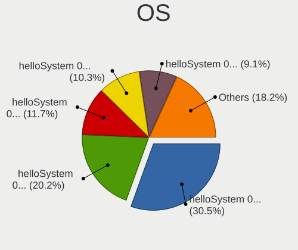

| Name                | Desktops | Percent |
|---------------------|----------|---------|
| helloSystem 0.8.1   | 300      | 30.49%  |
| helloSystem 0.7.0   | 199      | 20.22%  |
| helloSystem 0.5.0   | 115      | 11.69%  |
| helloSystem 0.8.0   | 101      | 10.26%  |
| helloSystem 0.4.0   | 90       | 9.15%   |
| helloSystem 0.9.0   | 78       | 7.93%   |
| helloSystem 0.6.0   | 61       | 6.2%    |
| helloSystem 0.8.2   | 28       | 2.85%   |
| helloSystem 0.3.0   | 9        | 0.91%   |
| helloSystem 13.1-p2 | 2        | 0.2%    |
| helloSystem 13.1    | 1        | 0.1%    |

OS Family
---------

OS without a version

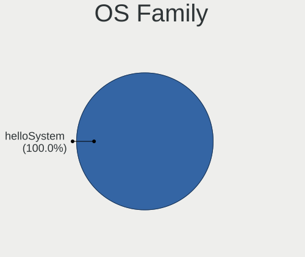

| Name        | Desktops | Percent |
|-------------|----------|---------|
| helloSystem | 915      | 100%    |

Arch
----

OS architecture (x86_64, i586, etc.)

| Name  | Desktops | Percent |
|-------|----------|---------|
| amd64 | 915      | 100%    |

DE
--

Desktop Environment

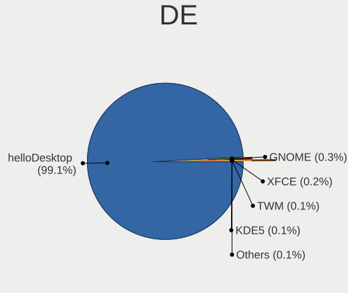

| Name         | Desktops | Percent |
|--------------|----------|---------|
| helloDesktop | 911      | 99.13%  |
| GNOME        | 3        | 0.33%   |
| XFCE         | 2        | 0.22%   |
| TWM          | 1        | 0.11%   |
| KDE5         | 1        | 0.11%   |
| Cinnamon     | 1        | 0.11%   |

Display Server
--------------

X11 or Wayland

| Name | Desktops | Percent |
|------|----------|---------|
| X11  | 915      | 100%    |

Display Manager
---------------

SDDM, LightDM, etc.

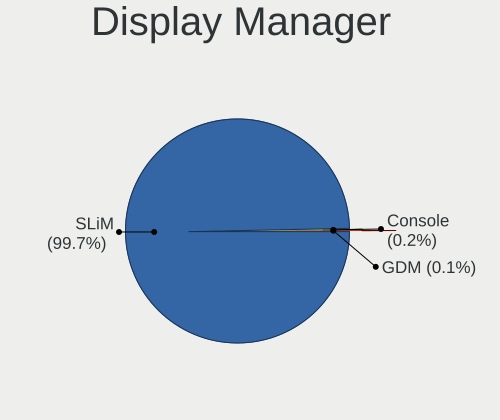

| Name    | Desktops | Percent |
|---------|----------|---------|
| SLiM    | 913      | 99.67%  |
| Console | 2        | 0.22%   |
| GDM     | 1        | 0.11%   |

OS Lang
-------

Language

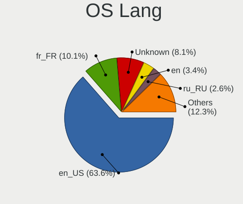

| Lang    | Desktops | Percent |
|---------|----------|---------|
| en_US   | 605      | 63.55%  |
| fr_FR   | 96       | 10.08%  |
| Unknown | 77       | 8.09%   |
| en      | 32       | 3.36%   |
| ru_RU   | 25       | 2.63%   |
| es_ES   | 23       | 2.42%   |
| de_DE   | 20       | 2.1%    |
| fr      | 13       | 1.37%   |
| it_IT   | 10       | 1.05%   |
| pt_BR   | 8        | 0.84%   |
| zh_CN   | 6        | 0.63%   |
| ru      | 6        | 0.63%   |
| C       | 5        | 0.53%   |
| es      | 4        | 0.42%   |
| en_GB   | 4        | 0.42%   |
| pt      | 3        | 0.32%   |
| pl_PL   | 2        | 0.21%   |
| jp_JP   | 2        | 0.21%   |
| fi_FI   | 2        | 0.21%   |
| zh_TW   | 1        | 0.11%   |
| tr_TR   | 1        | 0.11%   |
| pt_PT   | 1        | 0.11%   |
| pl      | 1        | 0.11%   |
| nl      | 1        | 0.11%   |
| ko      | 1        | 0.11%   |
| it      | 1        | 0.11%   |
| es_AR   | 1        | 0.11%   |
| de      | 1        | 0.11%   |

Boot Mode
---------

EFI or BIOS

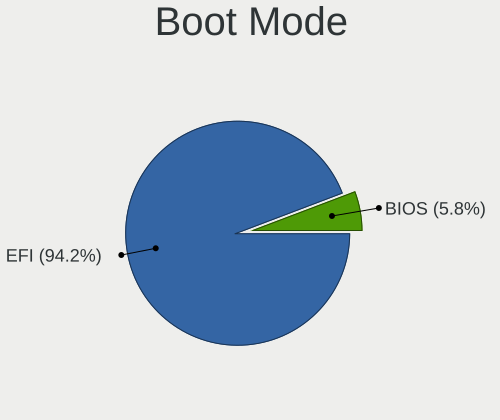

| Mode | Desktops | Percent |
|------|----------|---------|
| EFI  | 866      | 94.23%  |
| BIOS | 53       | 5.77%   |

Filesystem
----------

Type of filesystem

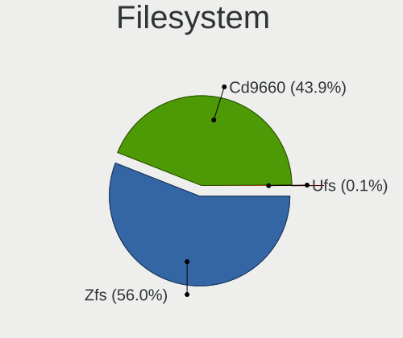

| Type   | Desktops | Percent |
|--------|----------|---------|
| Zfs    | 534      | 55.97%  |
| Cd9660 | 419      | 43.92%  |
| Ufs    | 1        | 0.1%    |

Part. scheme
------------

Scheme of partitioning

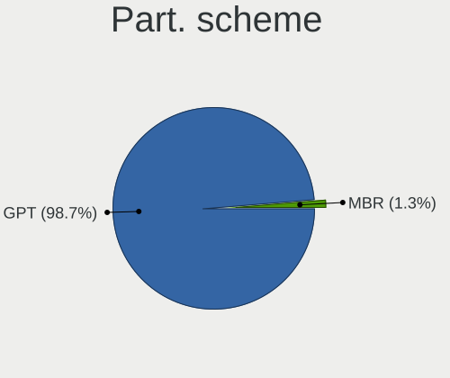

| Type | Desktops | Percent |
|------|----------|---------|
| GPT  | 903      | 98.69%  |
| MBR  | 12       | 1.31%   |

Board
-----

Vendor
------

Motherboard manufacturer

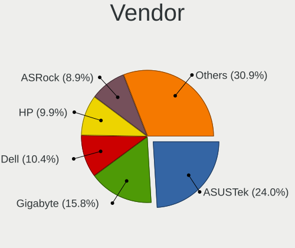

| Name                | Desktops | Percent |
|---------------------|----------|---------|
| ASUSTek Computer    | 220      | 24.04%  |
| Gigabyte Technology | 145      | 15.85%  |
| Dell                | 95       | 10.38%  |
| Hewlett-Packard     | 91       | 9.95%   |
| ASRock              | 81       | 8.85%   |
| MSI                 | 64       | 6.99%   |
| Lenovo              | 50       | 5.46%   |
| Intel               | 34       | 3.72%   |
| Unknown             | 15       | 1.64%   |
| Acer                | 13       | 1.42%   |
| Fujitsu             | 12       | 1.31%   |
| Biostar             | 12       | 1.31%   |
| Pegatron            | 9        | 0.98%   |
| Apple               | 8        | 0.87%   |
| Foxconn             | 7        | 0.77%   |
| Shuttle             | 3        | 0.33%   |
| Google              | 3        | 0.33%   |
| Fujitsu Siemens     | 3        | 0.33%   |
| ECS                 | 3        | 0.33%   |
| T-bao               | 2        | 0.22%   |
| Supermicro          | 2        | 0.22%   |
| OEM                 | 2        | 0.22%   |
| Medion              | 2        | 0.22%   |
| MAXSUN              | 2        | 0.22%   |
| MACHINIST           | 2        | 0.22%   |
| Huanan              | 2        | 0.22%   |
| BESSTAR Tech        | 2        | 0.22%   |
| AZW                 | 2        | 0.22%   |
| ZOTAC               | 1        | 0.11%   |
| Wistron             | 1        | 0.11%   |
| Wincor Nixdorf      | 1        | 0.11%   |
| VeryPC              | 1        | 0.11%   |
| Sapphire            | 1        | 0.11%   |
| RDW                 | 1        | 0.11%   |
| Quanta              | 1        | 0.11%   |
| QIYIDA              | 1        | 0.11%   |
| Protectli           | 1        | 0.11%   |
| Positivo            | 1        | 0.11%   |
| PCPartner           | 1        | 0.11%   |
| Packard Bell        | 1        | 0.11%   |

Model
-----

Motherboard model

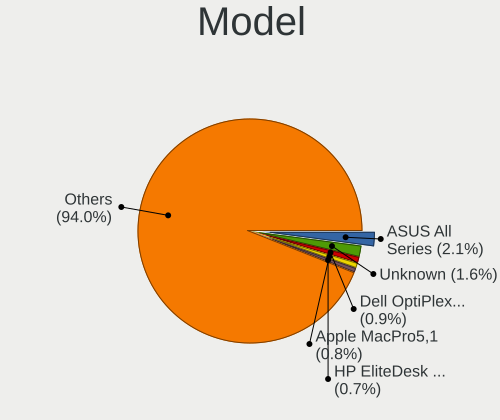

| Name                         | Desktops | Percent |
|------------------------------|----------|---------|
| ASUS All Series              | 19       | 2.08%   |
| Unknown                      | 15       | 1.64%   |
| Dell OptiPlex 9020           | 8        | 0.87%   |
| Apple MacPro5,1              | 7        | 0.77%   |
| HP EliteDesk 800 G2 DM 35W   | 6        | 0.66%   |
| Dell OptiPlex 780            | 6        | 0.66%   |
| Dell OptiPlex 755            | 6        | 0.66%   |
| Dell OptiPlex 3020           | 6        | 0.66%   |
| Intel H61                    | 5        | 0.55%   |
| ASUS M5A78L-M/USB3           | 5        | 0.55%   |
| MSI MS-7C37                  | 4        | 0.44%   |
| HP ProDesk 600 G1 SFF        | 4        | 0.44%   |
| HP EliteDesk 800 G2 SFF      | 4        | 0.44%   |
| HP Compaq Elite 8300 USDT    | 4        | 0.44%   |
| Dell OptiPlex 7010           | 4        | 0.44%   |
| ASUS ROG STRIX B550-F GAMING | 4        | 0.44%   |
| MSI MS-7C91                  | 3        | 0.33%   |
| MSI MS-7B86                  | 3        | 0.33%   |
| MSI MS-7996                  | 3        | 0.33%   |
| MSI MS-7788                  | 3        | 0.33%   |
| MSI MS-7758                  | 3        | 0.33%   |
| Intel X99                    | 3        | 0.33%   |
| Intel H81                    | 3        | 0.33%   |
| HP ProDesk 600 G1 DM         | 3        | 0.33%   |
| HP EliteDesk 700 G1 SFF      | 3        | 0.33%   |
| HP Compaq Elite 8300 SFF     | 3        | 0.33%   |
| HP Compaq 6000 Pro SFF PC    | 3        | 0.33%   |
| Gigabyte X570 AORUS ELITE    | 3        | 0.33%   |
| Gigabyte F2A88XM-D3H         | 3        | 0.33%   |
| Gigabyte F2A85X-UP4          | 3        | 0.33%   |
| Gigabyte B550 GAMING X V2    | 3        | 0.33%   |
| Gigabyte 970A-DS3P           | 3        | 0.33%   |
| Dell Precision Tower 5810    | 3        | 0.33%   |
| Dell OptiPlex 960            | 3        | 0.33%   |
| Dell OptiPlex 760            | 3        | 0.33%   |
| Dell OptiPlex 7040           | 3        | 0.33%   |
| ASUS TUF GAMING X570-PLUS    | 3        | 0.33%   |
| ASUS ROG STRIX B450-F GAMING | 3        | 0.33%   |
| ASUS PRIME B450M-A           | 3        | 0.33%   |
| ASUS PRIME B250M-A           | 3        | 0.33%   |

Model Family
------------

Motherboard model prefix

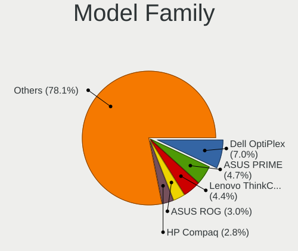

| Name                   | Desktops | Percent |
|------------------------|----------|---------|
| Dell OptiPlex          | 64       | 6.99%   |
| ASUS PRIME             | 43       | 4.7%    |
| Lenovo ThinkCentre     | 40       | 4.37%   |
| ASUS ROG               | 27       | 2.95%   |
| HP Compaq              | 26       | 2.84%   |
| HP EliteDesk           | 20       | 2.19%   |
| ASUS All               | 19       | 2.08%   |
| HP ProDesk             | 15       | 1.64%   |
| Unknown                | 15       | 1.64%   |
| Dell Precision         | 14       | 1.53%   |
| ASUS TUF               | 12       | 1.31%   |
| Dell Inspiron          | 9        | 0.98%   |
| ASUS M5A78L-M          | 9        | 0.98%   |
| Gigabyte X570          | 7        | 0.77%   |
| ASUS P8Z77-V           | 7        | 0.77%   |
| Apple MacPro5          | 7        | 0.77%   |
| Gigabyte B450M         | 6        | 0.66%   |
| Fujitsu ESPRIMO        | 6        | 0.66%   |
| Acer Aspire            | 6        | 0.66%   |
| Intel H61              | 5        | 0.55%   |
| Gigabyte B450          | 5        | 0.55%   |
| ASUS Crosshair         | 5        | 0.55%   |
| MSI MS-7C37            | 4        | 0.44%   |
| Gigabyte B550          | 4        | 0.44%   |
| ASUS P8H61-M           | 4        | 0.44%   |
| ASRock X570            | 4        | 0.44%   |
| Acer Veriton           | 4        | 0.44%   |
| MSI MS-7C91            | 3        | 0.33%   |
| MSI MS-7B86            | 3        | 0.33%   |
| MSI MS-7996            | 3        | 0.33%   |
| MSI MS-7788            | 3        | 0.33%   |
| MSI MS-7758            | 3        | 0.33%   |
| Lenovo ThinkStation    | 3        | 0.33%   |
| Intel X99              | 3        | 0.33%   |
| Intel H81              | 3        | 0.33%   |
| HP Slim                | 3        | 0.33%   |
| HP Pavilion            | 3        | 0.33%   |
| Gigabyte Z390          | 3        | 0.33%   |
| Gigabyte GA-78LMT-USB3 | 3        | 0.33%   |
| Gigabyte F2A88XM-D3H   | 3        | 0.33%   |

MFG Year
--------

Motherboard manufacture year

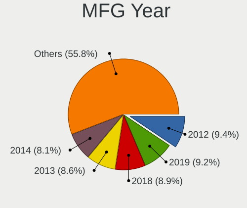

| Year    | Desktops | Percent |
|---------|----------|---------|
| 2012    | 86       | 9.4%    |
| 2019    | 84       | 9.18%   |
| 2018    | 81       | 8.85%   |
| 2013    | 79       | 8.63%   |
| 2014    | 74       | 8.09%   |
| 2021    | 72       | 7.87%   |
| 2020    | 68       | 7.43%   |
| 2010    | 59       | 6.45%   |
| 2011    | 49       | 5.36%   |
| 2015    | 47       | 5.14%   |
| 2022    | 41       | 4.48%   |
| 2017    | 39       | 4.26%   |
| 2016    | 35       | 3.83%   |
| 2009    | 33       | 3.61%   |
| 2008    | 31       | 3.39%   |
| 2023    | 14       | 1.53%   |
| 2007    | 14       | 1.53%   |
| 2024    | 6        | 0.66%   |
| 2006    | 2        | 0.22%   |
| Unknown | 1        | 0.11%   |

Form Factor
-----------

Physical design of the computer

| Name    | Desktops | Percent |
|---------|----------|---------|
| Desktop | 915      | 100%    |

Coreboot
--------

Have coreboot on board

| Used | Desktops | Percent |
|------|----------|---------|
| No   | 912      | 99.67%  |
| Yes  | 3        | 0.33%   |

RAM Size
--------

Total RAM memory

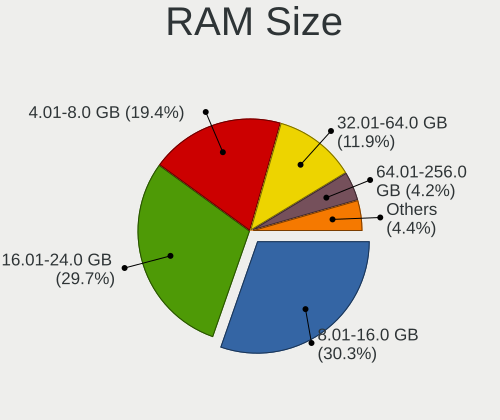

| Size in GB  | Desktops | Percent |
|-------------|----------|---------|
| 8.01-16.0   | 280      | 30.34%  |
| 16.01-24.0  | 274      | 29.69%  |
| 4.01-8.0    | 179      | 19.39%  |
| 32.01-64.0  | 110      | 11.92%  |
| 64.01-256.0 | 39       | 4.23%   |
| 24.01-32.0  | 17       | 1.84%   |
| 2.01-3.0    | 16       | 1.73%   |
| 3.01-4.0    | 3        | 0.33%   |
| 0.51-1.0    | 3        | 0.33%   |
| 1.01-2.0    | 2        | 0.22%   |

RAM Used
--------

Used RAM memory

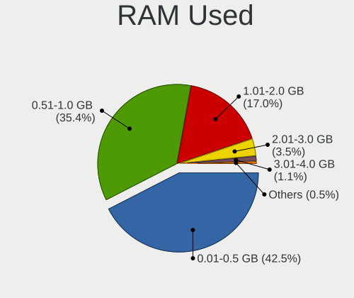

| Used GB   | Desktops | Percent |
|-----------|----------|---------|
| 0.01-0.5  | 395      | 42.47%  |
| 0.51-1.0  | 329      | 35.38%  |
| 1.01-2.0  | 158      | 16.99%  |
| 2.01-3.0  | 33       | 3.55%   |
| 3.01-4.0  | 10       | 1.08%   |
| 4.01-8.0  | 3        | 0.32%   |
| 8.01-16.0 | 2        | 0.22%   |

Total Drives
------------

Number of drives on board

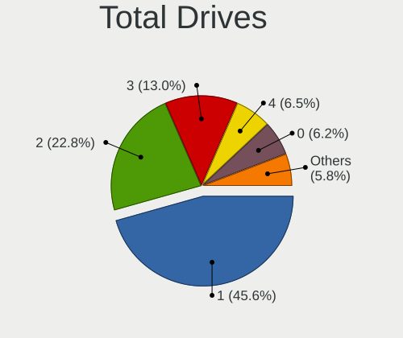

| Drives | Desktops | Percent |
|--------|----------|---------|
| 1      | 434      | 45.64%  |
| 2      | 217      | 22.82%  |
| 3      | 124      | 13.04%  |
| 4      | 62       | 6.52%   |
| 0      | 59       | 6.2%    |
| 5      | 29       | 3.05%   |
| 6      | 14       | 1.47%   |
| 10     | 3        | 0.32%   |
| 9      | 3        | 0.32%   |
| 7      | 3        | 0.32%   |
| 8      | 2        | 0.21%   |
| 13     | 1        | 0.11%   |

Has CD-ROM
----------

Has CD-ROM on board

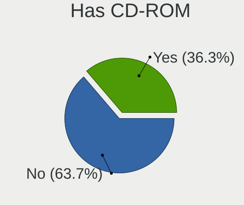

| Presented | Desktops | Percent |
|-----------|----------|---------|
| No        | 585      | 63.73%  |
| Yes       | 333      | 36.27%  |

Has Ethernet
------------

Has Ethernet on board

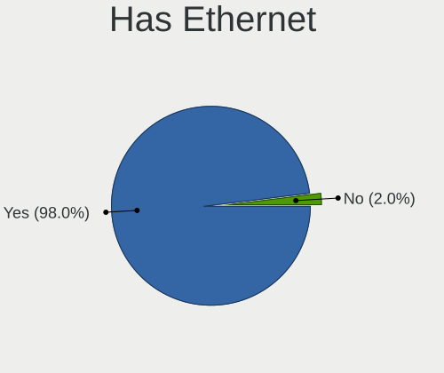

| Presented | Desktops | Percent |
|-----------|----------|---------|
| Yes       | 897      | 98.03%  |
| No        | 18       | 1.97%   |

Has WiFi
--------

Has WiFi module

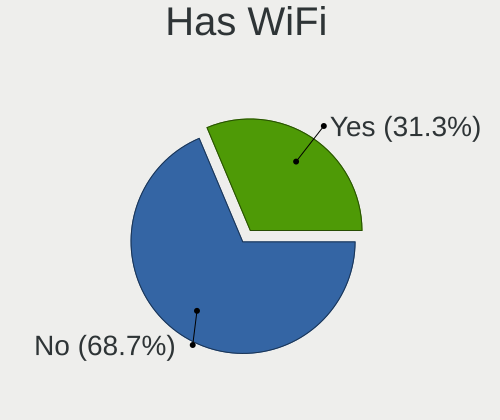

| Presented | Desktops | Percent |
|-----------|----------|---------|
| No        | 631      | 68.66%  |
| Yes       | 288      | 31.34%  |

Has Bluetooth
-------------

Has Bluetooth module

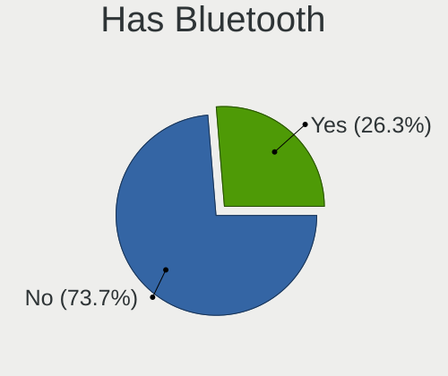

| Presented | Desktops | Percent |
|-----------|----------|---------|
| No        | 681      | 73.7%   |
| Yes       | 243      | 26.3%   |

Location
--------

Country
-------

Geographic location (country)

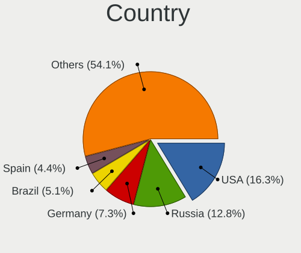

| Country      | Desktops | Percent |
|--------------|----------|---------|
| USA          | 149      | 16.28%  |
| Russia       | 117      | 12.79%  |
| Germany      | 67       | 7.32%   |
| Brazil       | 47       | 5.14%   |
| Spain        | 40       | 4.37%   |
| Italy        | 35       | 3.83%   |
| UK           | 34       | 3.72%   |
| Canada       | 31       | 3.39%   |
| Poland       | 30       | 3.28%   |
| China        | 30       | 3.28%   |
| France       | 23       | 2.51%   |
| Australia    | 21       | 2.3%    |
| Ukraine      | 18       | 1.97%   |
| India        | 18       | 1.97%   |
| Hungary      | 18       | 1.97%   |
| Mexico       | 15       | 1.64%   |
| Taiwan       | 14       | 1.53%   |
| Argentina    | 12       | 1.31%   |
| Netherlands  | 10       | 1.09%   |
| Belgium      | 10       | 1.09%   |
| Venezuela    | 9        | 0.98%   |
| Turkey       | 9        | 0.98%   |
| Romania      | 9        | 0.98%   |
| South Korea  | 8        | 0.87%   |
| Serbia       | 8        | 0.87%   |
| Peru         | 8        | 0.87%   |
| Indonesia    | 8        | 0.87%   |
| Portugal     | 6        | 0.66%   |
| Japan        | 6        | 0.66%   |
| Finland      | 6        | 0.66%   |
| Bulgaria     | 6        | 0.66%   |
| Switzerland  | 5        | 0.55%   |
| Norway       | 5        | 0.55%   |
| Chile        | 5        | 0.55%   |
| Thailand     | 4        | 0.44%   |
| Sweden       | 4        | 0.44%   |
| Greece       | 4        | 0.44%   |
| Denmark      | 4        | 0.44%   |
| Vietnam      | 3        | 0.33%   |
| South Africa | 3        | 0.33%   |

City
----

Geographic location (city)

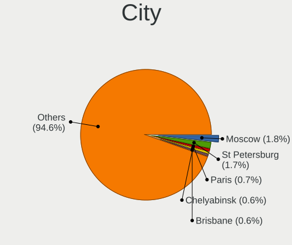

| City              | Desktops | Percent |
|-------------------|----------|---------|
| Moscow            | 17       | 1.77%   |
| St Petersburg     | 16       | 1.66%   |
| Paris             | 7        | 0.73%   |
| Chelyabinsk       | 6        | 0.62%   |
| Brisbane          | 6        | 0.62%   |
| Yekaterinburg     | 5        | 0.52%   |
| Winnipeg          | 5        | 0.52%   |
| Taichung          | 5        | 0.52%   |
| Sydney            | 5        | 0.52%   |
| Sao Paulo         | 5        | 0.52%   |
| Melbourne         | 5        | 0.52%   |
| Madrid            | 5        | 0.52%   |
| Lima              | 5        | 0.52%   |
| Kyiv              | 5        | 0.52%   |
| Curitiba          | 5        | 0.52%   |
| Voronezh          | 4        | 0.42%   |
| Temple            | 4        | 0.42%   |
| Penza             | 4        | 0.42%   |
| Munich            | 4        | 0.42%   |
| Krakow            | 4        | 0.42%   |
| Istanbul          | 4        | 0.42%   |
| Guangzhou         | 4        | 0.42%   |
| Caracas           | 4        | 0.42%   |
| Buenos Aires      | 4        | 0.42%   |
| Berlin            | 4        | 0.42%   |
| Belgrade          | 4        | 0.42%   |
| Aquan             | 4        | 0.42%   |
| Zhengzhou         | 3        | 0.31%   |
| Warsaw            | 3        | 0.31%   |
| Valencia          | 3        | 0.31%   |
| SГЈo Paulo      | 3        | 0.31%   |
| Stuttgart         | 3        | 0.31%   |
| St. Jean Baptiste | 3        | 0.31%   |
| Sofia             | 3        | 0.31%   |
| Saratov           | 3        | 0.31%   |
| Santiago          | 3        | 0.31%   |
| Río Cuarto       | 3        | 0.31%   |
| Novosibirsk       | 3        | 0.31%   |
| Newburgh          | 3        | 0.31%   |
| New York          | 3        | 0.31%   |

Drives
------

Drive Vendor
------------

Hard drive vendors

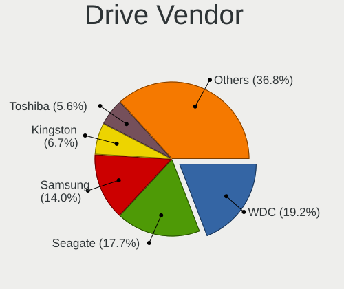

| Vendor              | Desktops | Drives | Percent |
|---------------------|----------|--------|---------|
| WDC                 | 285      | 427    | 19.15%  |
| Seagate             | 264      | 391    | 17.74%  |
| Samsung Electronics | 209      | 316    | 14.05%  |
| Kingston            | 99       | 119    | 6.65%   |
| Toshiba             | 84       | 105    | 5.65%   |
| Crucial             | 71       | 101    | 4.77%   |
| Hitachi             | 58       | 80     | 3.9%    |
| SanDisk             | 48       | 55     | 3.23%   |
| A-DATA Technology   | 37       | 49     | 2.49%   |
| Intel               | 22       | 22     | 1.48%   |
| SPCC                | 20       | 28     | 1.34%   |
| PNY                 | 15       | 29     | 1.01%   |
| HGST                | 15       | 15     | 1.01%   |
| Patriot             | 14       | 14     | 0.94%   |
| Micron Technology   | 12       | 13     | 0.81%   |
| Maxtor              | 12       | 14     | 0.81%   |
| China               | 12       | 13     | 0.81%   |
| Phison              | 11       | 15     | 0.74%   |
| GOODRAM             | 11       | 12     | 0.74%   |
| Transcend           | 10       | 11     | 0.67%   |
| Gigabyte Technology | 10       | 13     | 0.67%   |
| SK hynix            | 9        | 12     | 0.6%    |
| KingSpec            | 9        | 12     | 0.6%    |
| Corsair             | 9        | 9      | 0.6%    |
| Apacer              | 7        | 7      | 0.47%   |
| Silicon Motion      | 6        | 7      | 0.4%    |
| OCZ                 | 6        | 7      | 0.4%    |
| Hewlett-Packard     | 6        | 6      | 0.4%    |
| XPG                 | 5        | 6      | 0.34%   |
| Team                | 5        | 5      | 0.34%   |
| Lexar               | 5        | 6      | 0.34%   |
| Intenso             | 5        | 7      | 0.34%   |
| Apple               | 5        | 8      | 0.34%   |
| Plextor             | 4        | 4      | 0.27%   |
| KIOXIA-EXCERIA      | 4        | 4      | 0.27%   |
| KIOXIA              | 4        | 4      | 0.27%   |
| XrayDisk            | 3        | 3      | 0.2%    |
| Pioneer             | 3        | 3      | 0.2%    |
| LITEONIT            | 3        | 3      | 0.2%    |
| AMD                 | 3        | 3      | 0.2%    |

Drive Model
-----------

Hard drive models

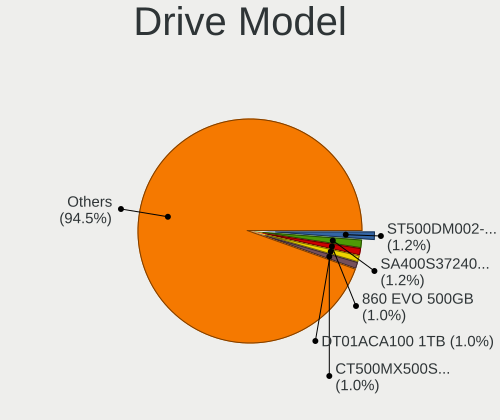

| Model                              | Desktops | Percent |
|------------------------------------|----------|---------|
| Seagate ST500DM002-1BD142 500GB    | 21       | 1.22%   |
| Kingston SA400S37240G 240GB        | 21       | 1.22%   |
| Samsung SSD 860 EVO 500GB          | 18       | 1.05%   |
| Toshiba DT01ACA100 1TB             | 17       | 0.99%   |
| Crucial CT500MX500SSD1 500GB       | 17       | 0.99%   |
| Seagate ST1000DM010-2EP102 1TB     | 15       | 0.87%   |
| Samsung SSD 850 EVO 250GB          | 15       | 0.87%   |
| Toshiba HDWD110 1TB                | 12       | 0.7%    |
| Seagate ST1000DM003-1ER162 1TB     | 12       | 0.7%    |
| Seagate ST3500418AS 500GB          | 11       | 0.64%   |
| Seagate ST2000DM008-2FR102 2TB     | 11       | 0.64%   |
| Kingston SA400S37120G 120GB        | 11       | 0.64%   |
| Samsung SSD 970 EVO Plus 500GB     | 10       | 0.58%   |
| Samsung SSD 860 EVO 250GB          | 10       | 0.58%   |
| Samsung SSD 860 EVO 1TB            | 10       | 0.58%   |
| Crucial CT240BX500SSD1 240GB       | 10       | 0.58%   |
| Seagate ST1000LM024 HN-M101MBB 1TB | 9        | 0.52%   |
| Kingston SA400S37480G 480GB        | 9        | 0.52%   |
| Seagate ST2000DM006-2DM164 2TB     | 8        | 0.46%   |
| Seagate ST1000DM003-1CH162 1TB     | 8        | 0.46%   |
| Samsung SSD 970 EVO Plus 1TB       | 8        | 0.46%   |
| Samsung HD322HJ 320GB              | 8        | 0.46%   |
| WDC WDS500G2B0A-00SM50 500GB       | 7        | 0.41%   |
| Toshiba DT01ACA050 500GB           | 7        | 0.41%   |
| Samsung SSD 870 EVO 500GB          | 7        | 0.41%   |
| Kingston SV300S37A120G 120GB       | 7        | 0.41%   |
| A-DATA SU650 120GB                 | 7        | 0.41%   |
| WDC WDS240G2G0A-00JH30 240GB       | 6        | 0.35%   |
| WDC WD5000AAKX-00ERMA0 500GB       | 6        | 0.35%   |
| WDC WD10EZEX-08WN4A0 1TB           | 6        | 0.35%   |
| SPCC Solid State Disk 512GB        | 6        | 0.35%   |
| Seagate ST380815AS 80GB            | 6        | 0.35%   |
| Seagate ST3500312CS 500GB          | 6        | 0.35%   |
| Seagate ST3250310AS 250GB          | 6        | 0.35%   |
| Samsung SSD 980 PRO 1TB            | 6        | 0.35%   |
| Samsung SSD 980 1TB                | 6        | 0.35%   |
| WDC WDS120G2G0A-00JH30 120GB       | 5        | 0.29%   |
| WDC WDS100T2B0C-00PXH0 1TB         | 5        | 0.29%   |
| WDC WDS100T2B0A-00SM50 1TB         | 5        | 0.29%   |
| WDC WD5000AAKX-08U6AA0 500GB       | 5        | 0.29%   |

HDD Vendor
----------

Hard disk drive vendors

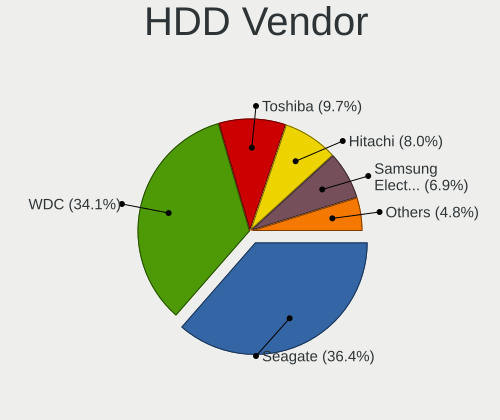

| Vendor              | Desktops | Drives | Percent |
|---------------------|----------|--------|---------|
| Seagate             | 263      | 387    | 36.43%  |
| WDC                 | 246      | 349    | 34.07%  |
| Toshiba             | 70       | 85     | 9.7%    |
| Hitachi             | 58       | 80     | 8.03%   |
| Samsung Electronics | 50       | 69     | 6.93%   |
| HGST                | 15       | 15     | 2.08%   |
| Maxtor              | 12       | 14     | 1.66%   |
| Hewlett-Packard     | 2        | 2      | 0.28%   |
| Fujitsu             | 2        | 3      | 0.28%   |
| QUANTUM             | 1        | 1      | 0.14%   |
| LSI                 | 1        | 1      | 0.14%   |
| CLOVER              | 1        | 2      | 0.14%   |
| Apple               | 1        | 1      | 0.14%   |

SSD Vendor
----------

Solid state drive vendors

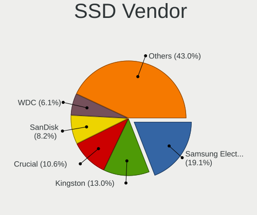

| Vendor              | Desktops | Drives | Percent |
|---------------------|----------|--------|---------|
| Samsung Electronics | 112      | 151    | 19.11%  |
| Kingston            | 76       | 94     | 12.97%  |
| Crucial             | 62       | 87     | 10.58%  |
| SanDisk             | 48       | 55     | 8.19%   |
| WDC                 | 36       | 45     | 6.14%   |
| A-DATA Technology   | 28       | 32     | 4.78%   |
| SPCC                | 17       | 25     | 2.9%    |
| Intel               | 15       | 15     | 2.56%   |
| PNY                 | 14       | 25     | 2.39%   |
| Toshiba             | 12       | 18     | 2.05%   |
| Patriot             | 12       | 12     | 2.05%   |
| China               | 12       | 13     | 2.05%   |
| GOODRAM             | 11       | 12     | 1.88%   |
| Transcend           | 9        | 10     | 1.54%   |
| Micron Technology   | 9        | 9      | 1.54%   |
| KingSpec            | 9        | 12     | 1.54%   |
| Apacer              | 7        | 7      | 1.19%   |
| OCZ                 | 6        | 7      | 1.02%   |
| Intenso             | 5        | 7      | 0.85%   |
| Gigabyte Technology | 5        | 7      | 0.85%   |
| Plextor             | 4        | 4      | 0.68%   |
| Apple               | 4        | 7      | 0.68%   |
| XrayDisk            | 3        | 3      | 0.51%   |
| Pioneer             | 3        | 3      | 0.51%   |
| LITEONIT            | 3        | 3      | 0.51%   |
| KIOXIA-EXCERIA      | 3        | 3      | 0.51%   |
| WALRAM              | 2        | 2      | 0.34%   |
| Verbatim            | 2        | 2      | 0.34%   |
| Team                | 2        | 2      | 0.34%   |
| T-FORCE             | 2        | 2      | 0.34%   |
| Smartbuy            | 2        | 2      | 0.34%   |
| MidasForce          | 2        | 2      | 0.34%   |
| LITEON              | 2        | 3      | 0.34%   |
| Lexar               | 2        | 2      | 0.34%   |
| Hikvision           | 2        | 2      | 0.34%   |
| Hewlett-Packard     | 2        | 2      | 0.34%   |
| Fanxiang            | 2        | 2      | 0.34%   |
| Emtec               | 2        | 4      | 0.34%   |
| Corsair             | 2        | 2      | 0.34%   |
| AMD                 | 2        | 2      | 0.34%   |

Drive Kind
----------

HDD or SSD

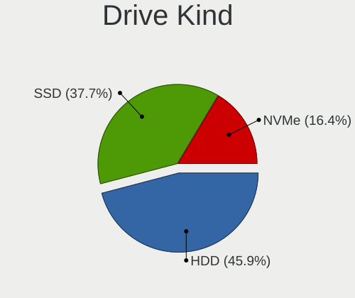

| Kind | Desktops | Drives | Percent |
|------|----------|--------|---------|
| HDD  | 567      | 1009   | 45.91%  |
| SSD  | 465      | 737    | 37.65%  |
| NVMe | 203      | 293    | 16.44%  |

Drive Connector
---------------

SATA, SAS, NVMe, etc.

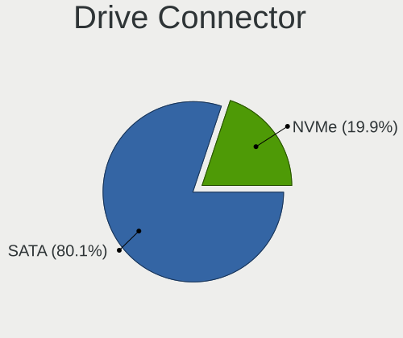

| Type | Desktops | Drives | Percent |
|------|----------|--------|---------|
| SATA | 817      | 1746   | 80.1%   |
| NVMe | 203      | 293    | 19.9%   |

Drive Size
----------

Size of hard drive

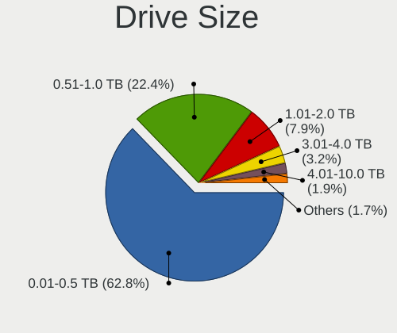

| Size in TB | Desktops | Drives | Percent |
|------------|----------|--------|---------|
| 0.01-0.5   | 688      | 1126   | 62.77%  |
| 0.51-1.0   | 246      | 349    | 22.45%  |
| 1.01-2.0   | 87       | 142    | 7.94%   |
| 3.01-4.0   | 35       | 57     | 3.19%   |
| 4.01-10.0  | 21       | 37     | 1.92%   |
| 2.01-3.0   | 17       | 31     | 1.55%   |
| 10.01-20.0 | 2        | 4      | 0.18%   |

Space Total
-----------

Amount of disk space available on the file system

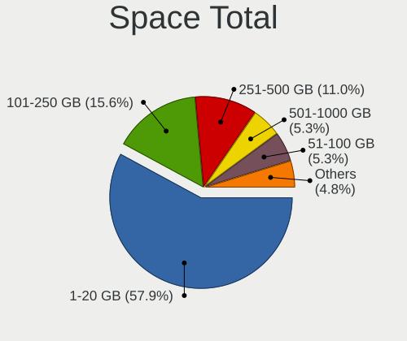

| Size in GB     | Desktops | Percent |
|----------------|----------|---------|
| 1-20           | 556      | 57.92%  |
| 101-250        | 150      | 15.63%  |
| 251-500        | 106      | 11.04%  |
| 501-1000       | 51       | 5.31%   |
| 51-100         | 51       | 5.31%   |
| 21-50          | 18       | 1.88%   |
| 1001-2000      | 15       | 1.56%   |
| More than 3000 | 7        | 0.73%   |
| Unknown        | 4        | 0.42%   |
| 2001-3000      | 2        | 0.21%   |

Space Used
----------

Amount of used disk space

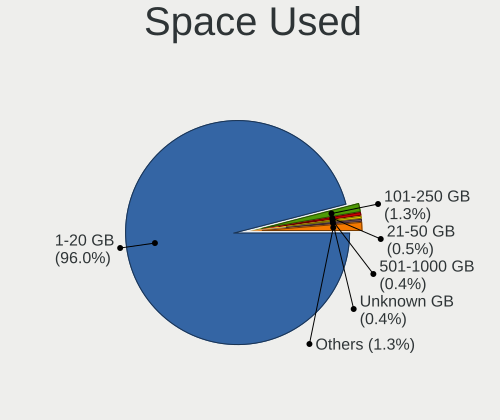

| Used GB        | Desktops | Percent |
|----------------|----------|---------|
| 1-20           | 884      | 95.98%  |
| 101-250        | 12       | 1.3%    |
| 21-50          | 5        | 0.54%   |
| 501-1000       | 4        | 0.43%   |
| Unknown        | 4        | 0.43%   |
| More than 3000 | 3        | 0.33%   |
| 251-500        | 3        | 0.33%   |
| 1001-2000      | 3        | 0.33%   |
| 51-100         | 2        | 0.22%   |
| 2001-3000      | 1        | 0.11%   |

Malfunc. Drives
---------------

Drive models with a malfunction

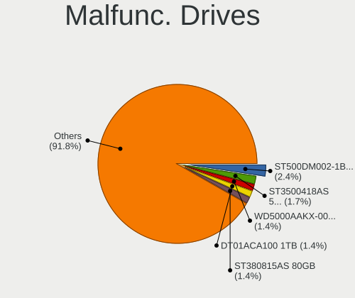

| Model                              | Desktops | Drives | Percent |
|------------------------------------|----------|--------|---------|
| Seagate ST500DM002-1BD142 500GB    | 7        | 9      | 2.41%   |
| Seagate ST3500418AS 500GB          | 5        | 5      | 1.72%   |
| WDC WD5000AAKX-00ERMA0 500GB       | 4        | 4      | 1.37%   |
| Toshiba DT01ACA100 1TB             | 4        | 7      | 1.37%   |
| Seagate ST380815AS 80GB            | 4        | 4      | 1.37%   |
| Samsung Electronics HD322HJ 320GB  | 4        | 5      | 1.37%   |
| Seagate ST9320325AS 320GB          | 3        | 4      | 1.03%   |
| Seagate ST3320418AS 320GB          | 3        | 3      | 1.03%   |
| Seagate ST3250410AS 250GB          | 3        | 3      | 1.03%   |
| Seagate ST1000LM024 HN-M101MBB 1TB | 3        | 3      | 1.03%   |
| Seagate ST1000DM010-2EP102 1TB     | 3        | 3      | 1.03%   |
| Samsung Electronics HD161HJ 160GB  | 3        | 3      | 1.03%   |
| HGST HTS545032A7E380 320GB         | 3        | 3      | 1.03%   |
| WDC WD5000AAKX-60U6AA0 500GB       | 2        | 2      | 0.69%   |
| WDC WD5000AAKX-001CA0 500GB        | 2        | 2      | 0.69%   |
| WDC WD5000AAKS-08V0A0 500GB        | 2        | 2      | 0.69%   |
| WDC WD30EFRX-68EUZN0 3TB           | 2        | 2      | 0.69%   |
| WDC WD20EARS-00MVWB0 2TB           | 2        | 2      | 0.69%   |
| WDC WD10JPVX-22JC3T0 1TB           | 2        | 2      | 0.69%   |
| WDC WD10EZEX-08M2NA0 1TB           | 2        | 3      | 0.69%   |
| WDC WD10EARS-003BB1 1TB            | 2        | 2      | 0.69%   |
| Toshiba MK3259GSXP 320GB           | 2        | 2      | 0.69%   |
| Toshiba MK1255GSX H 120GB          | 2        | 2      | 0.69%   |
| Seagate ST9500325AS 500GB          | 2        | 2      | 0.69%   |
| Seagate ST3500413AS 500GB          | 2        | 5      | 0.69%   |
| Seagate ST3320620AS 320GB          | 2        | 2      | 0.69%   |
| Seagate ST31000528AS 1TB           | 2        | 3      | 0.69%   |
| Seagate ST2000DM008-2FR102 2TB     | 2        | 2      | 0.69%   |
| Samsung Electronics HM320JI 320GB  | 2        | 2      | 0.69%   |
| Samsung Electronics HD501LJ 500GB  | 2        | 4      | 0.69%   |
| Samsung Electronics HD161GJ 160GB  | 2        | 2      | 0.69%   |
| Hitachi HTS725050A9A364 500GB      | 2        | 2      | 0.69%   |
| Hitachi HTS541680J9SA00 80GB       | 2        | 5      | 0.69%   |
| Hitachi HDT721010SLA360 1TB        | 2        | 2      | 0.69%   |
| Hitachi HDS721616PLA380 160GB      | 2        | 2      | 0.69%   |
| Hitachi HDS721050CLA362 500GB      | 2        | 2      | 0.69%   |
| HGST HTS725050A7E630 500GB         | 2        | 2      | 0.69%   |
| Crucial CT1050MX300SSD1 1TB        | 2        | 3      | 0.69%   |
| XrayDisk SSD 240GB                 | 1        | 1      | 0.34%   |
| WDC WDS480G2G0A-00JH30 480GB       | 1        | 1      | 0.34%   |

Malfunc. Drive Vendor
---------------------

Vendors of faulty drives

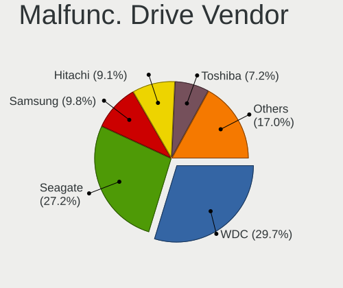

| Vendor              | Desktops | Drives | Percent |
|---------------------|----------|--------|---------|
| WDC                 | 82       | 89     | 29.71%  |
| Seagate             | 75       | 91     | 27.17%  |
| Samsung Electronics | 27       | 34     | 9.78%   |
| Hitachi             | 25       | 30     | 9.06%   |
| Toshiba             | 20       | 25     | 7.25%   |
| Maxtor              | 8        | 10     | 2.9%    |
| HGST                | 8        | 8      | 2.9%    |
| Crucial             | 5        | 7      | 1.81%   |
| Kingston            | 4        | 4      | 1.45%   |
| SanDisk             | 3        | 3      | 1.09%   |
| Intel               | 3        | 3      | 1.09%   |
| A-DATA Technology   | 3        | 3      | 1.09%   |
| XrayDisk            | 1        | 1      | 0.36%   |
| Transcend           | 1        | 1      | 0.36%   |
| Silicon Motion      | 1        | 1      | 0.36%   |
| ShineDisk           | 1        | 1      | 0.36%   |
| Pioneer             | 1        | 1      | 0.36%   |
| OCZ                 | 1        | 1      | 0.36%   |
| MidasForce          | 1        | 1      | 0.36%   |
| Micron Technology   | 1        | 1      | 0.36%   |
| KingSpec            | 1        | 1      | 0.36%   |
| Fujitsu             | 1        | 1      | 0.36%   |
| faspeed             | 1        | 3      | 0.36%   |
| Corsair             | 1        | 1      | 0.36%   |
| China               | 1        | 1      | 0.36%   |

Malfunc. HDD Vendor
-------------------

Vendors of faulty HDD drives

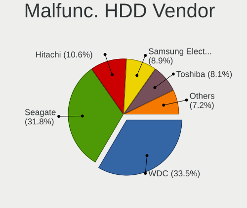

| Vendor              | Desktops | Drives | Percent |
|---------------------|----------|--------|---------|
| WDC                 | 79       | 86     | 33.47%  |
| Seagate             | 75       | 91     | 31.78%  |
| Hitachi             | 25       | 30     | 10.59%  |
| Samsung Electronics | 21       | 28     | 8.9%    |
| Toshiba             | 19       | 24     | 8.05%   |
| Maxtor              | 8        | 10     | 3.39%   |
| HGST                | 8        | 8      | 3.39%   |
| Fujitsu             | 1        | 1      | 0.42%   |

Malfunc. Drive Kind
-------------------

Kinds of faulty drives

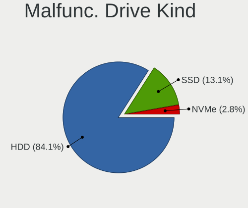

| Kind | Desktops | Drives | Percent |
|------|----------|--------|---------|
| HDD  | 211      | 278    | 84.06%  |
| SSD  | 33       | 37     | 13.15%  |
| NVMe | 7        | 7      | 2.79%   |

Failed Drives
-------------

Failed drive models

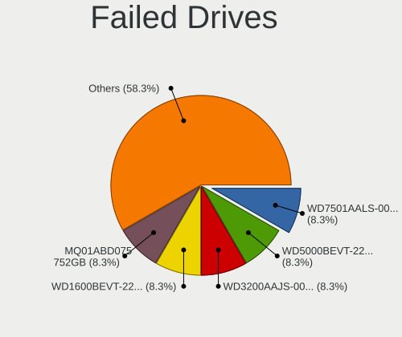

| Model                             | Desktops | Drives | Percent |
|-----------------------------------|----------|--------|---------|
| WDC WD7501AALS-00J7B0 752GB       | 1        | 1      | 8.33%   |
| WDC WD5000BEVT-22A0RT0 500GB      | 1        | 1      | 8.33%   |
| WDC WD3200AAJS-00YZCA0 320GB      | 1        | 1      | 8.33%   |
| WDC WD1600BEVT-22ZCT0 160GB       | 1        | 1      | 8.33%   |
| Toshiba MQ01ABD075 752GB          | 1        | 1      | 8.33%   |
| Seagate ST3250310AS 250GB         | 1        | 1      | 8.33%   |
| SanDisk pSSD 32GB                 | 1        | 1      | 8.33%   |
| Samsung Electronics HM250JI 250GB | 1        | 1      | 8.33%   |
| Samsung Electronics HD103SJ 1TB   | 1        | 2      | 8.33%   |
| Hitachi HDS721032CLA362 320GB     | 1        | 1      | 8.33%   |
| Hitachi HDS721010DLE630 1TB       | 1        | 1      | 8.33%   |
| HGST HTS725050A7E630 500GB        | 1        | 1      | 8.33%   |

Failed Drive Vendor
-------------------

Failed drive vendors

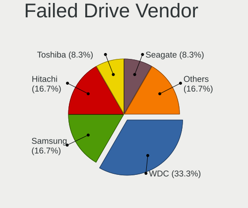

| Vendor              | Desktops | Drives | Percent |
|---------------------|----------|--------|---------|
| WDC                 | 4        | 4      | 33.33%  |
| Samsung Electronics | 2        | 3      | 16.67%  |
| Hitachi             | 2        | 2      | 16.67%  |
| Toshiba             | 1        | 1      | 8.33%   |
| Seagate             | 1        | 1      | 8.33%   |
| SanDisk             | 1        | 1      | 8.33%   |
| HGST                | 1        | 1      | 8.33%   |

Drive Status
------------

Number of failed and malfunc. drives

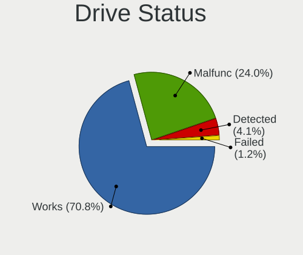

| Status   | Desktops | Drives | Percent |
|----------|----------|--------|---------|
| Works    | 715      | 1642   | 70.79%  |
| Malfunc  | 242      | 322    | 23.96%  |
| Detected | 41       | 62     | 4.06%   |
| Failed   | 12       | 13     | 1.19%   |

Storage controller
------------------

Storage Vendor
--------------

Storage controller vendors

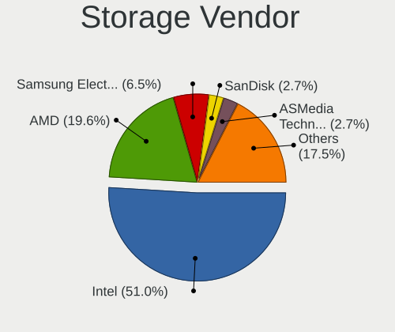

| Vendor                       | Desktops | Percent |
|------------------------------|----------|---------|
| Intel                        | 638      | 50.96%  |
| AMD                          | 246      | 19.65%  |
| Samsung Electronics          | 81       | 6.47%   |
| SanDisk                      | 34       | 2.72%   |
| ASMedia Technology           | 34       | 2.72%   |
| Phison Electronics           | 31       | 2.48%   |
| Kingston Technology Company  | 27       | 2.16%   |
| Silicon Motion               | 20       | 1.6%    |
| Nvidia                       | 19       | 1.52%   |
| JMicron Technology           | 19       | 1.52%   |
| Marvell Technology Group     | 15       | 1.2%    |
| ADATA Technology             | 12       | 0.96%   |
| Micron/Crucial Technology    | 11       | 0.88%   |
| SK hynix                     | 10       | 0.8%    |
| Broadcom / LSI               | 9        | 0.72%   |
| VIA Technologies             | 7        | 0.56%   |
| Shenzhen Longsys Electronics | 6        | 0.48%   |
| Realtek Semiconductor        | 6        | 0.48%   |
| MAXIO Technology (Hangzhou)  | 5        | 0.4%    |
| KIOXIA                       | 4        | 0.32%   |
| Toshiba                      | 3        | 0.24%   |
| Micron Technology            | 3        | 0.24%   |
| Seagate Technology           | 2        | 0.16%   |
| Lite-On IT Corp. / Plextor   | 2        | 0.16%   |
| Adaptec                      | 2        | 0.16%   |
| Silicon Image                | 1        | 0.08%   |
| OCZ Technology Group         | 1        | 0.08%   |
| Hewlett-Packard              | 1        | 0.08%   |
| Enmotus                      | 1        | 0.08%   |
| Chelsio Communications       | 1        | 0.08%   |
| Areca Technology             | 1        | 0.08%   |

Storage Model
-------------

Storage controller models

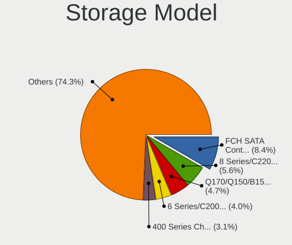

| Model                                                                                   | Desktops | Percent |
|-----------------------------------------------------------------------------------------|----------|---------|
| AMD FCH SATA Controller [AHCI mode]                                                     | 129      | 8.35%   |
| Intel 8 Series/C220 Series Chipset Family 6-port SATA Controller 1 [AHCI mode]          | 87       | 5.63%   |
| Intel Q170/Q150/B150/H170/H110/Z170/CM236 Chipset SATA Controller [AHCI Mode]           | 72       | 4.66%   |
| Intel 6 Series/C200 Series Chipset Family 6 port Desktop SATA AHCI Controller           | 61       | 3.95%   |
| AMD 400 Series Chipset SATA Controller                                                  | 48       | 3.11%   |
| Intel 7 Series/C210 Series Chipset Family 6-port SATA Controller [AHCI mode]            | 46       | 2.98%   |
| Samsung NVMe SSD Controller SM981/PM981/PM983                                           | 44       | 2.85%   |
| Intel Cannon Lake PCH SATA AHCI Controller                                              | 44       | 2.85%   |
| AMD SB7x0/SB8x0/SB9x0 IDE Controller                                                    | 41       | 2.66%   |
| Intel NM10/ICH7 Family SATA Controller [IDE mode]                                       | 39       | 2.53%   |
| Intel 200 Series PCH SATA controller [AHCI mode]                                        | 38       | 2.46%   |
| Intel SATA Controller [RAID Mode]                                                       | 37       | 2.4%    |
| AMD SB7x0/SB8x0/SB9x0 SATA Controller [IDE mode]                                        | 31       | 2.01%   |
| Intel 82801G (ICH7 Family) IDE Controller                                               | 30       | 1.94%   |
| ASMedia ASM1061/ASM1062 Serial ATA Controller                                           | 28       | 1.81%   |
| AMD SB7x0/SB8x0/SB9x0 SATA Controller [AHCI mode]                                       | 27       | 1.75%   |
| AMD 500 Series Chipset SATA Controller                                                  | 25       | 1.62%   |
| Intel 6 Series/C200 Series Chipset Family Desktop SATA Controller (IDE mode, ports 4-5) | 21       | 1.36%   |
| Intel 6 Series/C200 Series Chipset Family Desktop SATA Controller (IDE mode, ports 0-3) | 21       | 1.36%   |
| Intel 4 Series Chipset PT IDER Controller                                               | 21       | 1.36%   |
| Phison E12 NVMe Controller                                                              | 17       | 1.1%    |
| Silicon Motion SM2263EN/SM2263XT (DRAM-less) NVMe SSD Controllers                       | 16       | 1.04%   |
| Samsung NVMe SSD Controller SM961/PM961/SM963                                           | 15       | 0.97%   |
| Intel 82801JI (ICH10 Family) SATA AHCI Controller                                       | 15       | 0.97%   |
| Samsung NVMe SSD Controller 980 (DRAM-less)                                             | 14       | 0.91%   |
| AMD A320 Chipset SATA Controller [AHCI mode]                                            | 14       | 0.91%   |
| Nvidia MCP61 SATA Controller                                                            | 13       | 0.84%   |
| Intel 5 Series/3400 Series Chipset 6 port SATA AHCI Controller                          | 13       | 0.84%   |
| AMD 300 Series Chipset SATA Controller                                                  | 13       | 0.84%   |
| Samsung NVMe SSD Controller PM9A1/PM9A3/980PRO                                          | 12       | 0.78%   |
| Kingston Company A2000 NVMe SSD [SM2263EN]                                              | 11       | 0.71%   |
| Intel 82801JD/DO (ICH10 Family) SATA AHCI Controller                                    | 11       | 0.71%   |
| Intel 500 Series Chipset Family SATA AHCI Controller                                    | 11       | 0.71%   |
| Intel C610/X99 series chipset 6-Port SATA Controller [AHCI mode]                        | 10       | 0.65%   |
| Intel 82801JD/DO (ICH10 Family) 4-port SATA IDE Controller                              | 10       | 0.65%   |
| Intel 82801JD/DO (ICH10 Family) 2-port SATA IDE Controller                              | 10       | 0.65%   |
| JMicron JMB363 SATA/IDE Controller                                                      | 9        | 0.58%   |
| Intel 9 Series Chipset Family SATA Controller [AHCI Mode]                               | 9        | 0.58%   |
| Intel 82Q35 Express PT IDER Controller                                                  | 9        | 0.58%   |
| SanDisk Ultra 3D / WD PC SN530, IX SN530, Blue SN550 NVMe SSD (DRAM-less)               | 8        | 0.52%   |

Storage Kind
------------

Kind of storage controller (IDE, SATA, NVMe, SAS, ...)

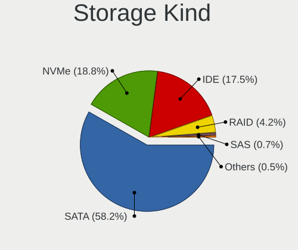

| Kind | Desktops | Percent |
|------|----------|---------|
| SATA | 711      | 58.23%  |
| NVMe | 230      | 18.84%  |
| IDE  | 214      | 17.53%  |
| RAID | 51       | 4.18%   |
| SAS  | 9        | 0.74%   |
| SCSI | 6        | 0.49%   |

Processor
---------

CPU Vendor
----------

Processor vendors

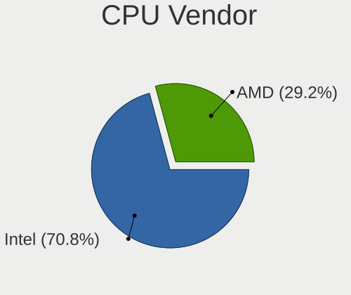

| Vendor | Desktops | Percent |
|--------|----------|---------|
| Intel  | 648      | 70.82%  |
| AMD    | 267      | 29.18%  |

CPU Model
---------

Processor models

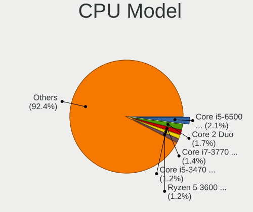

| Model                                       | Desktops | Percent |
|---------------------------------------------|----------|---------|
| Intel Core i5-6500 CPU @ 3.20GHz            | 19       | 2.07%   |
| Intel Core 2 Duo                            | 16       | 1.74%   |
| Intel Core i7-3770 CPU @ 3.40GHz            | 13       | 1.42%   |
| Intel Core i5-3470 CPU @ 3.20GHz            | 11       | 1.2%    |
| AMD Ryzen 5 3600 6-Core Processor           | 11       | 1.2%    |
| Intel Core i7-8700 CPU @ 3.20GHz            | 10       | 1.09%   |
| Intel Core i7-4770 CPU @ 3.40GHz            | 9        | 0.98%   |
| Intel Core i3-6100 CPU @ 3.70GHz            | 9        | 0.98%   |
| AMD Ryzen 5 5600X 6-Core Processor          | 9        | 0.98%   |
| AMD Ryzen 5 3400G with Radeon Vega Graphics | 9        | 0.98%   |
| AMD Ryzen 5 2600 Six-Core Processor         | 9        | 0.98%   |
| Intel Core i5-4590 CPU @ 3.30GHz            | 8        | 0.87%   |
| AMD Ryzen 7 3700X 8-Core Processor          | 8        | 0.87%   |
| Intel Core i7-8700K CPU @ 3.70GHz           | 7        | 0.76%   |
| Intel Core i7-4790 CPU @ 3.60GHz            | 7        | 0.76%   |
| Intel Core i5-7400 CPU @ 3.00GHz            | 7        | 0.76%   |
| Intel Core i3-3220 CPU @ 3.30GHz            | 7        | 0.76%   |
| Intel Core i3-2100 CPU @ 3.10GHz            | 7        | 0.76%   |
| AMD Ryzen 7 5700G with Radeon Graphics      | 7        | 0.76%   |
| AMD Ryzen 5 1600 Six-Core Processor         | 7        | 0.76%   |
| AMD Ryzen 3 2200G with Radeon Vega Graphics | 7        | 0.76%   |
| AMD FX-6300 Six-Core Processor              | 7        | 0.76%   |
| Intel Xeon                                  | 6        | 0.65%   |
| Intel Core i7-7700 CPU @ 3.60GHz            | 6        | 0.65%   |
| Intel Core i7-6700 CPU @ 3.40GHz            | 6        | 0.65%   |
| Intel Core i5-9400F CPU @ 2.90GHz           | 6        | 0.65%   |
| Intel Core i5-6500T CPU @ 2.50GHz           | 6        | 0.65%   |
| Intel Core i5-4590T CPU @ 2.00GHz           | 6        | 0.65%   |
| Intel Core i5-4570 CPU @ 3.20GHz            | 6        | 0.65%   |
| Intel Core i5-4460 CPU @ 3.20GHz            | 6        | 0.65%   |
| Intel Core i5-2400 CPU @ 3.10GHz            | 6        | 0.65%   |
| Intel Core i3-8100 CPU @ 3.60GHz            | 6        | 0.65%   |
| Intel Core i3-7100 CPU @ 3.90GHz            | 6        | 0.65%   |
| Intel Core 2 Duo CPU E8400 @ 3.00GHz        | 6        | 0.65%   |
| Intel Core i5-8400 CPU @ 2.80GHz            | 5        | 0.55%   |
| Intel Core i3-4130 CPU @ 3.40GHz            | 5        | 0.55%   |
| Intel Core i3-3240 CPU @ 3.40GHz            | 5        | 0.55%   |
| Intel Core i3-10100 CPU @ 3.60GHz           | 5        | 0.55%   |
| AMD Ryzen 9 5900X 12-Core Processor         | 5        | 0.55%   |
| AMD Ryzen 7 5800X 8-Core Processor          | 5        | 0.55%   |

CPU Model Family
----------------

Processor model prefix

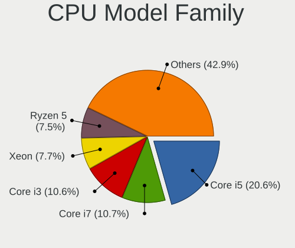

| Model                   | Desktops | Percent |
|-------------------------|----------|---------|
| Intel Core i5           | 189      | 20.61%  |
| Intel Core i7           | 98       | 10.69%  |
| Intel Core i3           | 97       | 10.58%  |
| Intel Xeon              | 71       | 7.74%   |
| AMD Ryzen 5             | 69       | 7.52%   |
| Intel Core 2 Duo        | 43       | 4.69%   |
| AMD Ryzen 7             | 39       | 4.25%   |
| Intel Celeron           | 35       | 3.82%   |
| Intel Pentium           | 31       | 3.38%   |
| AMD FX                  | 27       | 2.94%   |
| AMD Ryzen 3             | 20       | 2.18%   |
| Other                   | 19       | 2.07%   |
| Intel Pentium Dual-Core | 19       | 2.07%   |
| AMD Phenom II X4        | 18       | 1.96%   |
| Intel Core 2 Quad       | 17       | 1.85%   |
| AMD Ryzen 9             | 11       | 1.2%    |
| AMD Athlon II X2        | 9        | 0.98%   |
| AMD A10                 | 9        | 0.98%   |
| Intel Core i9           | 8        | 0.87%   |
| AMD Ryzen Threadripper  | 8        | 0.87%   |
| AMD Athlon II X4        | 6        | 0.65%   |
| Intel Atom              | 5        | 0.55%   |
| AMD A8                  | 5        | 0.55%   |
| AMD A6                  | 5        | 0.55%   |
| AMD A4                  | 5        | 0.55%   |
| Intel Genuine           | 4        | 0.44%   |
| Intel Core 2            | 4        | 0.44%   |
| AMD Ryzen 5 PRO         | 4        | 0.44%   |
| AMD Phenom II X6        | 4        | 0.44%   |
| AMD E1                  | 4        | 0.44%   |
| AMD Athlon 64 X2        | 4        | 0.44%   |
| AMD Athlon              | 4        | 0.44%   |
| Intel Pentium Gold      | 3        | 0.33%   |
| AMD E                   | 3        | 0.33%   |
| Intel Pentium Dual      | 2        | 0.22%   |
| Intel Pentium 4         | 2        | 0.22%   |
| AMD Sempron             | 2        | 0.22%   |
| AMD GX                  | 2        | 0.22%   |
| AMD Athlon Dual Core    | 2        | 0.22%   |
| Intel Pentium Silver    | 1        | 0.11%   |

CPU Cores
---------

Number of processor cores

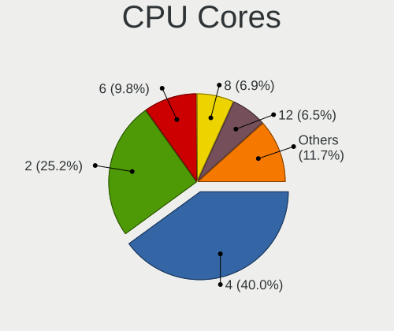

| Number  | Desktops | Percent |
|---------|----------|---------|
| 4       | 367      | 39.98%  |
| 2       | 231      | 25.16%  |
| 6       | 90       | 9.8%    |
| 8       | 63       | 6.86%   |
| 12      | 60       | 6.54%   |
| 16      | 38       | 4.14%   |
| Unknown | 32       | 3.49%   |
| 24      | 12       | 1.31%   |
| 10      | 7        | 0.76%   |
| 1       | 5        | 0.54%   |
| 32      | 3        | 0.33%   |
| 64      | 2        | 0.22%   |
| 48      | 2        | 0.22%   |
| 20      | 2        | 0.22%   |
| 14      | 2        | 0.22%   |
| 18      | 1        | 0.11%   |
| 3       | 1        | 0.11%   |

CPU Sockets
-----------

Number of sockets

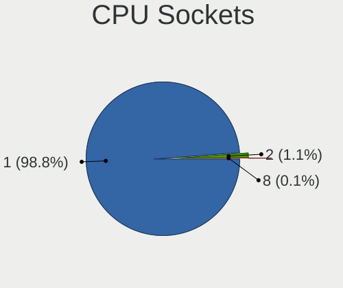

| Number | Desktops | Percent |
|--------|----------|---------|
| 1      | 904      | 98.8%   |
| 2      | 10       | 1.09%   |
| 8      | 1        | 0.11%   |

CPU Threads
-----------

Threads per core (Hyper-Threading)

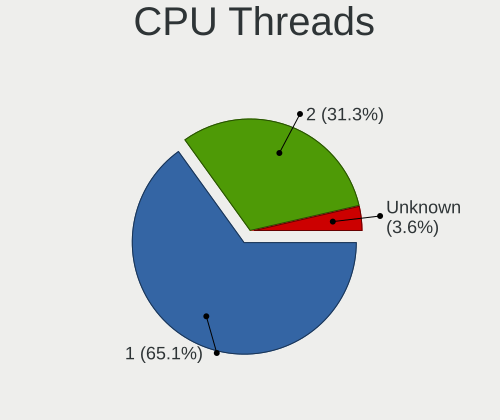

| Number  | Desktops | Percent |
|---------|----------|---------|
| 1       | 596      | 65.07%  |
| 2       | 287      | 31.33%  |
| Unknown | 33       | 3.6%    |

CPU Microarch
-------------

Microarchitecture

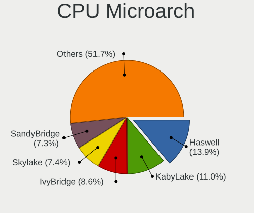

| Name          | Desktops | Percent |
|---------------|----------|---------|
| Haswell       | 127      | 13.86%  |
| KabyLake      | 101      | 11.03%  |
| IvyBridge     | 79       | 8.62%   |
| Skylake       | 68       | 7.42%   |
| SandyBridge   | 67       | 7.31%   |
| Penryn        | 67       | 7.31%   |
| Piledriver    | 42       | 4.59%   |
| Zen+          | 41       | 4.48%   |
| Zen 3         | 40       | 4.37%   |
| Zen 2         | 40       | 4.37%   |
| K10           | 38       | 4.15%   |
| Zen           | 32       | 3.49%   |
| Core          | 29       | 3.17%   |
| Unknown       | 25       | 2.73%   |
| CometLake     | 22       | 2.4%    |
| Westmere      | 18       | 1.97%   |
| Nehalem       | 17       | 1.86%   |
| Silvermont    | 12       | 1.31%   |
| K8 Hammer     | 8        | 0.87%   |
| Jaguar        | 6        | 0.66%   |
| Broadwell     | 6        | 0.66%   |
| Bobcat        | 6        | 0.66%   |
| Goldmont plus | 5        | 0.55%   |
| Bulldozer     | 5        | 0.55%   |
| Bonnell       | 4        | 0.44%   |
| NetBurst      | 3        | 0.33%   |
| Steamroller   | 2        | 0.22%   |
| K10 Llano     | 2        | 0.22%   |
| Goldmont      | 2        | 0.22%   |
| Excavator     | 2        | 0.22%   |

Graphics
--------

GPU Vendor
----------

Vendors of graphics cards

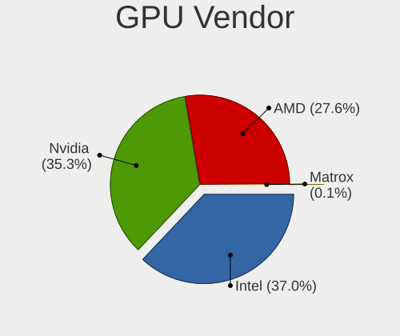

| Vendor                     | Desktops | Percent |
|----------------------------|----------|---------|
| Intel                      | 360      | 37.04%  |
| Nvidia                     | 343      | 35.29%  |
| AMD                        | 268      | 27.57%  |
| Matrox Electronics Systems | 1        | 0.1%    |

GPU Model
---------

Graphics card models

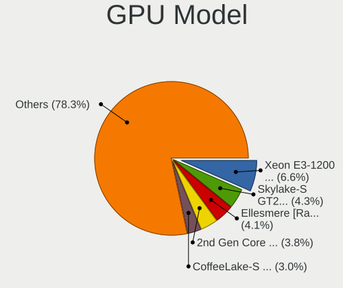

| Model                                                                                    | Desktops | Percent |
|------------------------------------------------------------------------------------------|----------|---------|
| Intel Xeon E3-1200 v3/4th Gen Core Processor Integrated Graphics Controller              | 65       | 6.61%   |
| Intel Skylake-S GT2 [HD Graphics 530]                                                    | 42       | 4.27%   |
| AMD Ellesmere [Radeon RX 470/480/570/570X/580/580X/590]                                  | 40       | 4.07%   |
| Intel 2nd Generation Core Processor Family Integrated Graphics Controller                | 37       | 3.76%   |
| Intel CoffeeLake-S GT2 [UHD Graphics 630]                                                | 29       | 2.95%   |
| Intel Xeon E3-1200 v2/3rd Gen Core processor Graphics Controller                         | 28       | 2.85%   |
| Nvidia GK208B [GeForce GT 710]                                                           | 24       | 2.44%   |
| Intel 4 Series Chipset Integrated Graphics Controller                                    | 23       | 2.34%   |
| Nvidia GP107 [GeForce GTX 1050 Ti]                                                       | 20       | 2.03%   |
| Intel Kaby Lake-S GT2 [HD Graphics 630]                                                  | 19       | 1.93%   |
| AMD Picasso/Raven 2 [Radeon Vega Series / Radeon Vega Mobile Series]                     | 18       | 1.83%   |
| Nvidia GP108 [GeForce GT 1030]                                                           | 16       | 1.63%   |
| Nvidia GT218 [GeForce 210]                                                               | 15       | 1.53%   |
| Intel 4th Generation Core Processor Family Integrated Graphics Controller                | 15       | 1.53%   |
| AMD Lexa PRO [Radeon 540/540X/550/550X / RX 540X/550/550X]                               | 14       | 1.42%   |
| Nvidia GP106 [GeForce GTX 1060 6GB]                                                      | 13       | 1.32%   |
| Nvidia GF119 [GeForce GT 610]                                                            | 13       | 1.32%   |
| Intel IvyBridge GT2 [HD Graphics 4000]                                                   | 13       | 1.32%   |
| Nvidia GK208B [GeForce GT 730]                                                           | 11       | 1.12%   |
| Nvidia TU116 [GeForce GTX 1660 SUPER]                                                    | 10       | 1.02%   |
| AMD Raven Ridge [Radeon Vega Series / Radeon Vega Mobile Series]                         | 10       | 1.02%   |
| AMD Navi 10 [Radeon RX 5600 OEM/5600 XT / 5700/5700 XT]                                  | 10       | 1.02%   |
| AMD Cezanne [Radeon Vega Series / Radeon Vega Mobile Series]                             | 10       | 1.02%   |
| AMD Cedar [Radeon HD 5000/6000/7350/8350 Series]                                         | 9        | 0.92%   |
| Nvidia GM206 [GeForce GTX 960]                                                           | 8        | 0.81%   |
| Nvidia GM204 [GeForce GTX 970]                                                           | 8        | 0.81%   |
| Intel CometLake-S GT2 [UHD Graphics 630]                                                 | 8        | 0.81%   |
| Nvidia TU117 [GeForce GTX 1650]                                                          | 7        | 0.71%   |
| Nvidia GM107 [GeForce GTX 750 Ti]                                                        | 7        | 0.71%   |
| Nvidia TU116 [GeForce GTX 1660]                                                          | 6        | 0.61%   |
| Nvidia GP106 [GeForce GTX 1060 3GB]                                                      | 6        | 0.61%   |
| Intel Atom/Celeron/Pentium Processor x5-E8000/J3xxx/N3xxx Integrated Graphics Controller | 6        | 0.61%   |
| Intel 82G33/G31 Express Integrated Graphics Controller                                   | 6        | 0.61%   |
| AMD RS780L [Radeon 3000]                                                                 | 6        | 0.61%   |
| AMD Oland PRO [Radeon R7 240/340 / Radeon 520]                                           | 6        | 0.61%   |
| AMD Navi 23 [Radeon RX 6600/6600 XT/6600M]                                               | 6        | 0.61%   |
| AMD Juniper XT [Radeon HD 5770]                                                          | 6        | 0.61%   |
| AMD Caicos [Radeon HD 6450/7450/8450 / R5 230 OEM]                                       | 6        | 0.61%   |
| AMD Baffin [Radeon RX 460/560D / Pro 450/455/460/555/555X/560/560X]                      | 6        | 0.61%   |
| Nvidia GP102 [GeForce GTX 1080 Ti]                                                       | 5        | 0.51%   |

GPU Combo
---------

Combinations of graphics cards

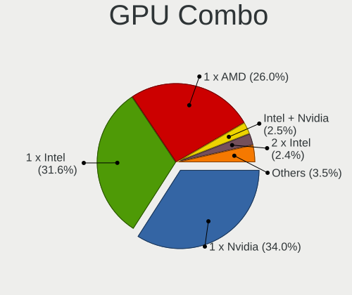

| Name                     | Desktops | Percent |
|--------------------------|----------|---------|
| 1 x Nvidia               | 317      | 34.05%  |
| 1 x Intel                | 294      | 31.58%  |
| 1 x AMD                  | 242      | 25.99%  |
| Intel + Nvidia           | 23       | 2.47%   |
| 2 x Intel                | 22       | 2.36%   |
| Intel + AMD              | 21       | 2.26%   |
| 2 x AMD                  | 5        | 0.54%   |
| AMD + Nvidia             | 3        | 0.32%   |
| Other                    | 1        | 0.11%   |
| 2 x Nvidia               | 1        | 0.11%   |
| 1 x Matrox               | 1        | 0.11%   |
| Intel + AMD + 1 x Nvidia | 1        | 0.11%   |

GPU Driver
----------

Free vs proprietary

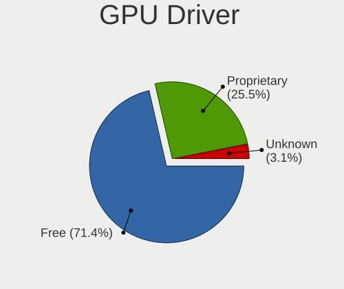

| Driver      | Desktops | Percent |
|-------------|----------|---------|
| Free        | 664      | 71.4%   |
| Proprietary | 237      | 25.48%  |
| Unknown     | 29       | 3.12%   |

GPU Memory
----------

Total video memory

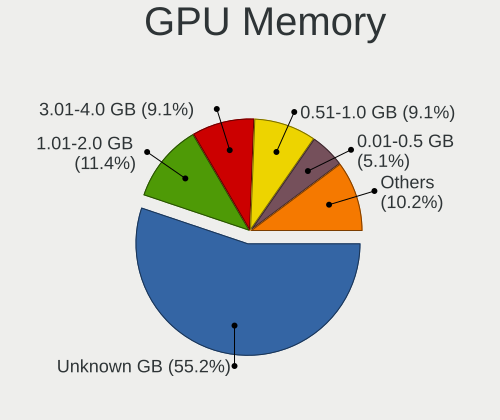

| Size in GB | Desktops | Percent |
|------------|----------|---------|
| Unknown    | 518      | 55.17%  |
| 1.01-2.0   | 107      | 11.4%   |
| 3.01-4.0   | 85       | 9.05%   |
| 0.51-1.0   | 85       | 9.05%   |
| 0.01-0.5   | 48       | 5.11%   |
| 7.01-8.0   | 47       | 5.01%   |
| 5.01-6.0   | 31       | 3.3%    |
| 2.01-3.0   | 9        | 0.96%   |
| 8.01-16.0  | 8        | 0.85%   |
| 4.01-5.0   | 1        | 0.11%   |

Monitor
-------

Monitor Vendor
--------------

Monitor vendors

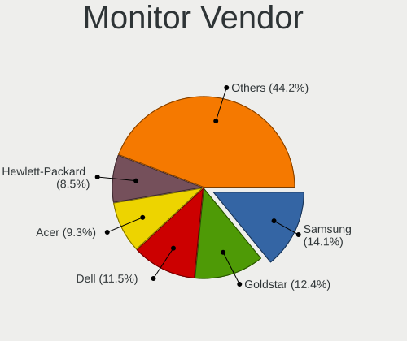

| Vendor               | Desktops | Percent |
|----------------------|----------|---------|
| Samsung Electronics  | 93       | 14.11%  |
| Goldstar             | 82       | 12.44%  |
| Dell                 | 76       | 11.53%  |
| Acer                 | 61       | 9.26%   |
| Hewlett-Packard      | 56       | 8.5%    |
| BenQ                 | 37       | 5.61%   |
| Philips              | 33       | 5.01%   |
| AOC                  | 29       | 4.4%    |
| Ancor Communications | 24       | 3.64%   |
| ViewSonic            | 17       | 2.58%   |
| Lenovo               | 14       | 2.12%   |
| ASUSTek Computer     | 13       | 1.97%   |
| Iiyama               | 11       | 1.67%   |
| Fujitsu Siemens      | 9        | 1.37%   |
| Sony                 | 7        | 1.06%   |
| MSI                  | 7        | 1.06%   |
| NEC Computers        | 5        | 0.76%   |
| Vizio                | 4        | 0.61%   |
| Toshiba              | 4        | 0.61%   |
| LG Electronics       | 4        | 0.61%   |
| Eizo                 | 4        | 0.61%   |
| Vestel Elektronik    | 3        | 0.46%   |
| Packard Bell         | 3        | 0.46%   |
| Mi                   | 3        | 0.46%   |
| Unknown              | 3        | 0.46%   |
| VIE                  | 2        | 0.3%    |
| RS                   | 2        | 0.3%    |
| ONN                  | 2        | 0.3%    |
| Medion               | 2        | 0.3%    |
| Insignia             | 2        | 0.3%    |
| Idek Iiyama          | 2        | 0.3%    |
| HannStar             | 2        | 0.3%    |
| CVT                  | 2        | 0.3%    |
| Apple                | 2        | 0.3%    |
| ZL_                  | 1        | 0.15%   |
| Westinghouse         | 1        | 0.15%   |
| VIZTA                | 1        | 0.15%   |
| Vita                 | 1        | 0.15%   |
| Videoseven           | 1        | 0.15%   |
| UGD                  | 1        | 0.15%   |

Monitor Model
-------------

Monitor models

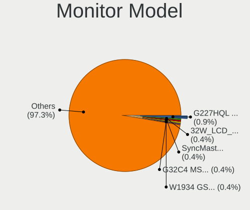

| Model                                                                  | Desktops | Percent |
|------------------------------------------------------------------------|----------|---------|
| Acer G227HQL ACR03DE 1920x1080 480x270mm 21.7-inch                     | 6        | 0.89%   |
| Vestel Elektronik 32W_LCD_TV VES3700 1920x1080 710x400mm 32.1-inch     | 3        | 0.45%   |
| Samsung Electronics SyncMaster SAM05C5 1920x1080                       | 3        | 0.45%   |
| MSI G32C4 MSI3DA6 1920x1080 700x390mm 31.5-inch                        | 3        | 0.45%   |
| Goldstar W1934 GSM4B7A 1440x900 410x260mm 19.1-inch                    | 3        | 0.45%   |
| Goldstar LG ULTRAWIDE GSM59F1 2560x1080 670x280mm 28.6-inch            | 3        | 0.45%   |
| Goldstar E1942 GSM4C09 1366x768 410x230mm 18.5-inch                    | 3        | 0.45%   |
| Dell U2412M DELA07B 1920x1200 520x320mm 24.0-inch                      | 3        | 0.45%   |
| Dell U2412M DELA07A 1920x1200 520x320mm 24.0-inch                      | 3        | 0.45%   |
| BenQ GL2460 BNQ78CE 1920x1080 530x300mm 24.0-inch                      | 3        | 0.45%   |
| BenQ GL2450 BNQ78A4 1920x1080 530x300mm 24.0-inch                      | 3        | 0.45%   |
| Ancor Communications ASUS VS228 ACI22FD 1920x1080 480x270mm 21.7-inch  | 3        | 0.45%   |
| Acer G276HL ACR0300 1920x1080 600x340mm 27.2-inch                      | 3        | 0.45%   |
| Unknown                                                                | 3        | 0.45%   |
| ViewSonic VX1940w VSC6A20 1680x1050 410x260mm 19.1-inch                | 2        | 0.3%    |
| ViewSonic VA2418-FHD VSCD739 1920x1080 530x300mm 24.0-inch             | 2        | 0.3%    |
| Sony TV SNY9C01 1360x768                                               | 2        | 0.3%    |
| Samsung Electronics SyncMaster SAM0601 1600x900                        | 2        | 0.3%    |
| Samsung Electronics SyncMaster SAM022F 1280x1024 310x230mm 15.2-inch   | 2        | 0.3%    |
| Samsung Electronics SyncMaster SAM0116 1024x768 280x210mm 13.8-inch    | 2        | 0.3%    |
| Samsung Electronics SMT22A300 SAM087B 1920x1080 480x270mm 21.7-inch    | 2        | 0.3%    |
| Samsung Electronics S24C350 SAM0A3A 1920x1080 530x300mm 24.0-inch      | 2        | 0.3%    |
| Samsung Electronics LCD Monitor SAM0B54 1366x768 520x290mm 23.4-inch   | 2        | 0.3%    |
| Samsung Electronics LCD Monitor SAM0AC6 1920x1080 1110x620mm 50.1-inch | 2        | 0.3%    |
| Philips PHL 193V5 PHLC0CD 1366x768 410x230mm 18.5-inch                 | 2        | 0.3%    |
| Philips LCD Monitor PHLC0B1 1920x1080 480x270mm 21.7-inch              | 2        | 0.3%    |
| ONN 100002487 ONN0101 1920x1080 520x320mm 24.0-inch                    | 2        | 0.3%    |
| MSI MAG342CQR MSI3DB6 3440x1440 790x330mm 33.7-inch                    | 2        | 0.3%    |
| Iiyama PLE2407HDS IVM560D 1920x1080 520x300mm 23.6-inch                | 2        | 0.3%    |
| Hewlett-Packard Compaq WF1907 HWP26A4 1440x900 410x260mm 19.1-inch     | 2        | 0.3%    |
| Hewlett-Packard All-in-One HWP4218 1600x900 440x250mm 19.9-inch        | 2        | 0.3%    |
| Hewlett-Packard 32 Display HPN351A 1920x1080 700x390mm 31.5-inch       | 2        | 0.3%    |
| Hewlett-Packard 27w HPN3494 1920x1080 600x340mm 27.2-inch              | 2        | 0.3%    |
| Hewlett-Packard 27f HPN354A 1920x1080 600x340mm 27.2-inch              | 2        | 0.3%    |
| Hewlett-Packard 27er HWP3325 1920x1080 600x340mm 27.2-inch             | 2        | 0.3%    |
| Hewlett-Packard 24f HPN3545 1920x1080 530x300mm 24.0-inch              | 2        | 0.3%    |
| Goldstar W2242 GSM4B6F 1680x1050 490x320mm 23.0-inch                   | 2        | 0.3%    |
| Goldstar LG ULTRAWIDE GSM5AFB 2560x1080 800x340mm 34.2-inch            | 2        | 0.3%    |
| Goldstar LG IPS FULLHD GSM5AB8 1920x1080 480x270mm 21.7-inch           | 2        | 0.3%    |
| Goldstar LG IPS FULLHD GSM5AB6 1920x1080 480x270mm 21.7-inch           | 2        | 0.3%    |

Monitor Resolution
------------------

Monitor screen resolution

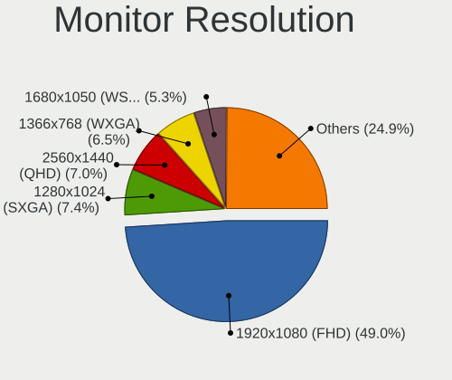

| Resolution         | Desktops | Percent |
|--------------------|----------|---------|
| 1920x1080 (FHD)    | 317      | 49%     |
| 1280x1024 (SXGA)   | 48       | 7.42%   |
| 2560x1440 (QHD)    | 45       | 6.96%   |
| 1366x768 (WXGA)    | 42       | 6.49%   |
| 1680x1050 (WSXGA+) | 34       | 5.26%   |
| 3840x2160 (4K)     | 33       | 5.1%    |
| 1440x900 (WXGA+)   | 33       | 5.1%    |
| 1600x900 (HD+)     | 21       | 3.25%   |
| 1920x1200 (WUXGA)  | 17       | 2.63%   |
| 2560x1080          | 16       | 2.47%   |
| 3440x1440          | 8        | 1.24%   |
| 1024x768 (XGA)     | 8        | 1.24%   |
| 1360x768           | 7        | 1.08%   |
| 1920x540           | 5        | 0.77%   |
| 1600x1200          | 3        | 0.46%   |
| Unknown            | 3        | 0.46%   |
| 3840x1080          | 2        | 0.31%   |
| 2048x1152          | 2        | 0.31%   |
| 5760x2160          | 1        | 0.15%   |
| 3520x1080          | 1        | 0.15%   |
| 2560x1600          | 1        | 0.15%   |

Monitor Diagonal
----------------

Diagonal size in inches

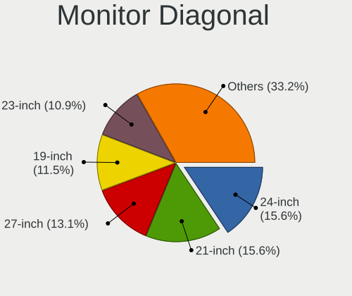

| Inches  | Desktops | Percent |
|---------|----------|---------|
| 24      | 103      | 15.63%  |
| 21      | 103      | 15.63%  |
| 27      | 86       | 13.05%  |
| 19      | 76       | 11.53%  |
| 23      | 72       | 10.93%  |
| Unknown | 39       | 5.92%   |
| 18      | 38       | 5.77%   |
| 31      | 27       | 4.1%    |
| 17      | 18       | 2.73%   |
| 22      | 17       | 2.58%   |
| 34      | 15       | 2.28%   |
| 20      | 14       | 2.12%   |
| 28      | 6        | 0.91%   |
| 14      | 6        | 0.91%   |
| 15      | 5        | 0.76%   |
| 42      | 4        | 0.61%   |
| 52      | 3        | 0.46%   |
| 50      | 3        | 0.46%   |
| 33      | 3        | 0.46%   |
| 13      | 3        | 0.46%   |
| 40      | 2        | 0.3%    |
| 32      | 2        | 0.3%    |
| 29      | 2        | 0.3%    |
| 25      | 2        | 0.3%    |
| 16      | 2        | 0.3%    |
| 65      | 1        | 0.15%   |
| 64      | 1        | 0.15%   |
| 54      | 1        | 0.15%   |
| 43      | 1        | 0.15%   |
| 41      | 1        | 0.15%   |
| 39      | 1        | 0.15%   |
| 36      | 1        | 0.15%   |
| 30      | 1        | 0.15%   |

Monitor Width
-------------

Physical width

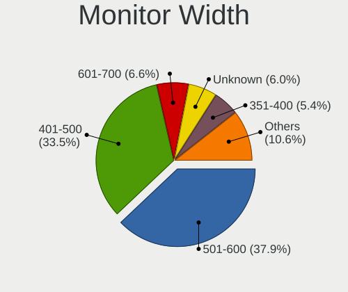

| Width in mm | Desktops | Percent |
|-------------|----------|---------|
| 501-600     | 247      | 37.94%  |
| 401-500     | 218      | 33.49%  |
| 601-700     | 43       | 6.61%   |
| Unknown     | 39       | 5.99%   |
| 351-400     | 35       | 5.38%   |
| 701-800     | 21       | 3.23%   |
| 301-350     | 21       | 3.23%   |
| 201-300     | 9        | 1.38%   |
| 1001-1500   | 9        | 1.38%   |
| 901-1000    | 6        | 0.92%   |
| 801-900     | 3        | 0.46%   |

Aspect Ratio
------------

Proportional relationship between the width and the height

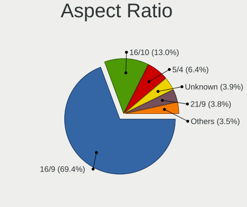

| Ratio   | Desktops | Percent |
|---------|----------|---------|
| 16/9    | 442      | 69.39%  |
| 16/10   | 83       | 13.03%  |
| 5/4     | 41       | 6.44%   |
| Unknown | 25       | 3.92%   |
| 21/9    | 24       | 3.77%   |
| 4/3     | 14       | 2.2%    |
| 3/2     | 6        | 0.94%   |
| 6/5     | 2        | 0.31%   |

Monitor Area
------------

Area in inch²

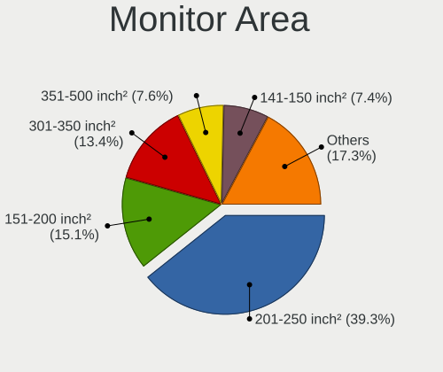

| Area in inch² | Desktops | Percent |
|----------------|----------|---------|
| 201-250        | 255      | 39.29%  |
| 151-200        | 98       | 15.1%   |
| 301-350        | 87       | 13.41%  |
| 351-500        | 49       | 7.55%   |
| 141-150        | 48       | 7.4%    |
| Unknown        | 39       | 6.01%   |
| 251-300        | 35       | 5.39%   |
| 501-1000       | 10       | 1.54%   |
| More than 1000 | 9        | 1.39%   |
| 101-110        | 6        | 0.92%   |
| 91-100         | 5        | 0.77%   |
| 111-120        | 3        | 0.46%   |
| 131-140        | 2        | 0.31%   |
| 121-130        | 2        | 0.31%   |
| 71-80          | 1        | 0.15%   |

Pixel Density
-------------

Pixels per inch

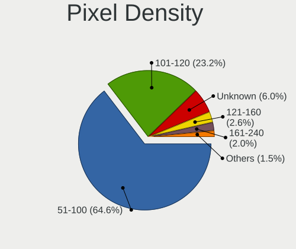

| Density | Desktops | Percent |
|---------|----------|---------|
| 51-100  | 418      | 64.61%  |
| 101-120 | 150      | 23.18%  |
| Unknown | 39       | 6.03%   |
| 121-160 | 17       | 2.63%   |
| 161-240 | 13       | 2.01%   |
| 1-50    | 10       | 1.55%   |

Multiple Monitors
-----------------

Total monitors connected

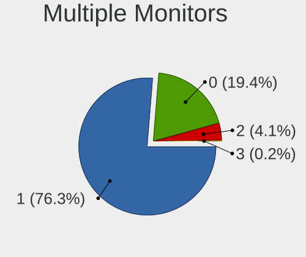

| Total | Desktops | Percent |
|-------|----------|---------|
| 1     | 711      | 76.29%  |
| 0     | 181      | 19.42%  |
| 2     | 38       | 4.08%   |
| 3     | 2        | 0.21%   |

Network
-------

Net Controller Vendor
---------------------

Controller vendors

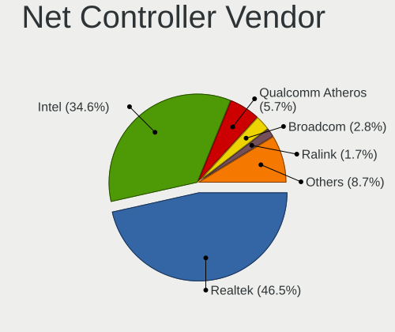

| Vendor                                 | Desktops | Percent |
|----------------------------------------|----------|---------|
| Realtek Semiconductor                  | 533      | 46.51%  |
| Intel                                  | 397      | 34.64%  |
| Qualcomm Atheros                       | 65       | 5.67%   |
| Broadcom                               | 32       | 2.79%   |
| Ralink Technology                      | 19       | 1.66%   |
| Ralink                                 | 15       | 1.31%   |
| Samsung Electronics                    | 12       | 1.05%   |
| Marvell Technology Group               | 11       | 0.96%   |
| TP-Link                                | 9        | 0.79%   |
| Edimax Technology                      | 6        | 0.52%   |
| MediaTek                               | 4        | 0.35%   |
| D-Link System                          | 4        | 0.35%   |
| OPPO Electronics                       | 3        | 0.26%   |
| D-Link                                 | 3        | 0.26%   |
| Aquantia                               | 3        | 0.26%   |
| Mellanox Technologies                  | 2        | 0.17%   |
| IMC Networks                           | 2        | 0.17%   |
| Huawei Technologies                    | 2        | 0.17%   |
| Belkin Components                      | 2        | 0.17%   |
| ASUSTek Computer                       | 2        | 0.17%   |
| Xiaomi                                 | 1        | 0.09%   |
| VIA Technologies                       | 1        | 0.09%   |
| T & A Mobile Phones                    | 1        | 0.09%   |
| Sundance Technology Inc / IC Plus      | 1        | 0.09%   |
| Raspberry Pi                           | 1        | 0.09%   |
| Qualcomm Atheros Communications        | 1        | 0.09%   |
| Qualcomm                               | 1        | 0.09%   |
| Nvidia                                 | 1        | 0.09%   |
| NetGear                                | 1        | 0.09%   |
| National Semiconductor                 | 1        | 0.09%   |
| Microchip Technology                   | 1        | 0.09%   |
| Google                                 | 1        | 0.09%   |
| Fujitsu Connected Technologies Limited | 1        | 0.09%   |
| Chelsio Communications                 | 1        | 0.09%   |
| Bluegiga Technologies                  | 1        | 0.09%   |
| AVM                                    | 1        | 0.09%   |
| Atheros                                | 1        | 0.09%   |
| Arduino SA                             | 1        | 0.09%   |
| Accton Technology                      | 1        | 0.09%   |
| 3Com                                   | 1        | 0.09%   |

Net Controller Model
--------------------

Controller models

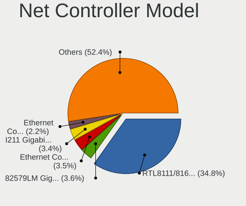

| Model                                                                  | Desktops | Percent |
|------------------------------------------------------------------------|----------|---------|
| Realtek RTL8111/8168/8211/8411 PCI Express Gigabit Ethernet Controller | 449      | 34.81%  |
| Intel 82579LM Gigabit Network Connection (Lewisville)                  | 47       | 3.64%   |
| Intel Ethernet Connection I217-LM                                      | 45       | 3.49%   |
| Intel I211 Gigabit Network Connection                                  | 44       | 3.41%   |
| Intel Ethernet Connection (2) I219-V                                   | 29       | 2.25%   |
| Realtek RTL810xE PCI Express Fast Ethernet controller                  | 28       | 2.17%   |
| Intel Ethernet Connection (2) I219-LM                                  | 27       | 2.09%   |
| Intel Ethernet Connection (7) I219-V                                   | 25       | 1.94%   |
| Intel Wi-Fi 6 AX200                                                    | 20       | 1.55%   |
| Intel 82567LM-3 Gigabit Network Connection                             | 19       | 1.47%   |
| Realtek RTL8188EUS 802.11n Wireless Network Adapter                    | 18       | 1.4%    |
| Intel Ethernet Controller I225-V                                       | 18       | 1.4%    |
| Intel 82574L Gigabit Network Connection                                | 18       | 1.4%    |
| Intel 82579V Gigabit Network Connection                                | 15       | 1.16%   |
| Realtek RTL8125 2.5GbE Controller                                      | 13       | 1.01%   |
| Intel Dual Band Wireless-AC 3168NGW [Stone Peak]                       | 13       | 1.01%   |
| Realtek RTL8821CE 802.11ac PCIe Wireless Network Adapter               | 12       | 0.93%   |
| Intel Wireless 7260                                                    | 12       | 0.93%   |
| Intel Ethernet Connection I217-V                                       | 12       | 0.93%   |
| Samsung Galaxy series, misc. (tethering mode)                          | 10       | 0.78%   |
| Realtek RTL-8100/8101L/8139 PCI Fast Ethernet Adapter                  | 10       | 0.78%   |
| Realtek RTL8188CUS 802.11n WLAN Adapter                                | 9        | 0.7%    |
| Intel 82566DM-2 Gigabit Network Connection                             | 9        | 0.7%    |
| Intel Wireless 8265 / 8275                                             | 8        | 0.62%   |
| Ralink RT5370 Wireless Adapter                                         | 7        | 0.54%   |
| Ralink MT7601U Wireless Adapter                                        | 7        | 0.54%   |
| Intel Wireless 7265                                                    | 7        | 0.54%   |
| Intel Wireless 3165                                                    | 7        | 0.54%   |
| Intel I210 Gigabit Network Connection                                  | 7        | 0.54%   |
| Intel Ethernet Connection (2) I218-V                                   | 7        | 0.54%   |
| Intel Cannon Lake PCH CNVi WiFi                                        | 7        | 0.54%   |
| Realtek RTL8188EE Wireless Network Adapter                             | 6        | 0.47%   |
| Qualcomm Atheros QCA9565 / AR9565 Wireless Network Adapter             | 6        | 0.47%   |
| Qualcomm Atheros Attansic L1 Gigabit Ethernet                          | 6        | 0.47%   |
| Qualcomm Atheros AR9485 Wireless Network Adapter                       | 6        | 0.47%   |
| Qualcomm Atheros AR8151 v2.0 Gigabit Ethernet                          | 6        | 0.47%   |
| Marvell Group 88E8056 PCI-E Gigabit Ethernet Controller                | 6        | 0.47%   |
| Broadcom BCM4360 802.11ac Dual Band Wireless Network Adapter           | 6        | 0.47%   |
| Broadcom BCM4322 802.11a/b/g/n Wireless LAN Controller                 | 6        | 0.47%   |
| Realtek RTL8723BE PCIe Wireless Network Adapter                        | 5        | 0.39%   |

Wireless Vendor
---------------

Wireless vendors

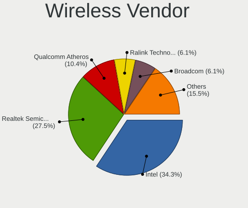

| Vendor                          | Desktops | Percent |
|---------------------------------|----------|---------|
| Intel                           | 106      | 34.3%   |
| Realtek Semiconductor           | 85       | 27.51%  |
| Qualcomm Atheros                | 32       | 10.36%  |
| Ralink Technology               | 19       | 6.15%   |
| Broadcom                        | 19       | 6.15%   |
| Ralink                          | 15       | 4.85%   |
| TP-Link                         | 9        | 2.91%   |
| Edimax Technology               | 6        | 1.94%   |
| MediaTek                        | 3        | 0.97%   |
| D-Link                          | 3        | 0.97%   |
| IMC Networks                    | 2        | 0.65%   |
| D-Link System                   | 2        | 0.65%   |
| Belkin Components               | 2        | 0.65%   |
| ASUSTek Computer                | 2        | 0.65%   |
| Qualcomm Atheros Communications | 1        | 0.32%   |
| NetGear                         | 1        | 0.32%   |
| Atheros                         | 1        | 0.32%   |
| Accton Technology               | 1        | 0.32%   |

Wireless Model
--------------

Wireless models

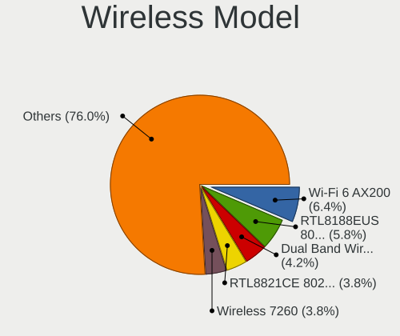

| Model                                                          | Desktops | Percent |
|----------------------------------------------------------------|----------|---------|
| Intel Wi-Fi 6 AX200                                            | 20       | 6.41%   |
| Realtek RTL8188EUS 802.11n Wireless Network Adapter            | 18       | 5.77%   |
| Intel Dual Band Wireless-AC 3168NGW [Stone Peak]               | 13       | 4.17%   |
| Realtek RTL8821CE 802.11ac PCIe Wireless Network Adapter       | 12       | 3.85%   |
| Intel Wireless 7260                                            | 12       | 3.85%   |
| Realtek RTL8188CUS 802.11n WLAN Adapter                        | 9        | 2.88%   |
| Intel Wireless 8265 / 8275                                     | 8        | 2.56%   |
| Ralink RT5370 Wireless Adapter                                 | 7        | 2.24%   |
| Ralink MT7601U Wireless Adapter                                | 7        | 2.24%   |
| Intel Wireless 7265                                            | 7        | 2.24%   |
| Intel Wireless 3165                                            | 7        | 2.24%   |
| Intel Cannon Lake PCH CNVi WiFi                                | 7        | 2.24%   |
| Realtek RTL8188EE Wireless Network Adapter                     | 6        | 1.92%   |
| Qualcomm Atheros QCA9565 / AR9565 Wireless Network Adapter     | 6        | 1.92%   |
| Qualcomm Atheros AR9485 Wireless Network Adapter               | 6        | 1.92%   |
| Broadcom BCM4360 802.11ac Dual Band Wireless Network Adapter   | 6        | 1.92%   |
| Broadcom BCM4322 802.11a/b/g/n Wireless LAN Controller         | 6        | 1.92%   |
| Realtek RTL8723BE PCIe Wireless Network Adapter                | 5        | 1.6%    |
| Realtek RTL8192CU 802.11n WLAN Adapter                         | 5        | 1.6%    |
| Intel Alder Lake-S PCH CNVi WiFi                               | 5        | 1.6%    |
| Realtek RTL8822BE 802.11a/b/g/n/ac WiFi adapter                | 4        | 1.28%   |
| Realtek RTL8812AE 802.11ac PCIe Wireless Network Adapter       | 4        | 1.28%   |
| Realtek RTL8192EE PCIe Wireless Network Adapter                | 4        | 1.28%   |
| Qualcomm Atheros AR9462 Wireless Network Adapter               | 4        | 1.28%   |
| Qualcomm Atheros AR93xx Wireless Network Adapter               | 4        | 1.28%   |
| Qualcomm Atheros AR9287 Wireless Network Adapter (PCI-Express) | 4        | 1.28%   |
| Intel Wireless 8260                                            | 4        | 1.28%   |
| Intel Wi-Fi 6E(802.11ax) AX210/AX1675* 2x2 [Typhoon Peak]      | 4        | 1.28%   |
| Intel Wi-Fi 5(802.11ac) Wireless-AC 9x6x [Thunder Peak]        | 4        | 1.28%   |
| TP-Link TL-WN722N v2/v3 [Realtek RTL8188EUS]                   | 3        | 0.96%   |
| TP-Link Archer T2U PLUS [RTL8821AU]                            | 3        | 0.96%   |
| Realtek RTL8821AE 802.11ac PCIe Wireless Network Adapter       | 3        | 0.96%   |
| Realtek RTL8188CE 802.11b/g/n WiFi Adapter                     | 3        | 0.96%   |
| Ralink RT2870/RT3070 Wireless Adapter                          | 3        | 0.96%   |
| Ralink RT5390R 802.11bgn PCIe Wireless Network Adapter         | 3        | 0.96%   |
| Qualcomm Atheros AR928X Wireless Network Adapter (PCI-Express) | 3        | 0.96%   |
| Intel Dual Band Wireless-AC 3165 Plus Bluetooth                | 3        | 0.96%   |
| Edimax EW-7811Un 802.11n Wireless Adapter [Realtek RTL8188CUS] | 3        | 0.96%   |
| TP-Link AC600 wireless Realtek RTL8811AU [Archer T2U Nano]     | 2        | 0.64%   |
| Realtek RTL8822CE 802.11ac PCIe Wireless Network Adapter       | 2        | 0.64%   |

Ethernet Vendor
---------------

Ethernet vendors

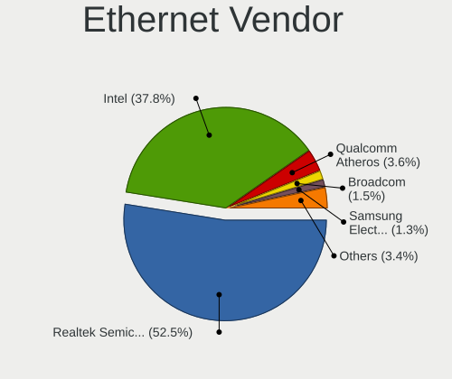

| Vendor                                 | Desktops | Percent |
|----------------------------------------|----------|---------|
| Realtek Semiconductor                  | 499      | 52.53%  |
| Intel                                  | 359      | 37.79%  |
| Qualcomm Atheros                       | 34       | 3.58%   |
| Broadcom                               | 14       | 1.47%   |
| Samsung Electronics                    | 12       | 1.26%   |
| Marvell Technology Group               | 11       | 1.16%   |
| OPPO Electronics                       | 3        | 0.32%   |
| Aquantia                               | 3        | 0.32%   |
| Huawei Technologies                    | 2        | 0.21%   |
| D-Link System                          | 2        | 0.21%   |
| Xiaomi                                 | 1        | 0.11%   |
| VIA Technologies                       | 1        | 0.11%   |
| T & A Mobile Phones                    | 1        | 0.11%   |
| Sundance Technology Inc / IC Plus      | 1        | 0.11%   |
| Qualcomm                               | 1        | 0.11%   |
| Nvidia                                 | 1        | 0.11%   |
| National Semiconductor                 | 1        | 0.11%   |
| MediaTek                               | 1        | 0.11%   |
| Google                                 | 1        | 0.11%   |
| Fujitsu Connected Technologies Limited | 1        | 0.11%   |
| Chelsio Communications                 | 1        | 0.11%   |

Ethernet Model
--------------

Ethernet models

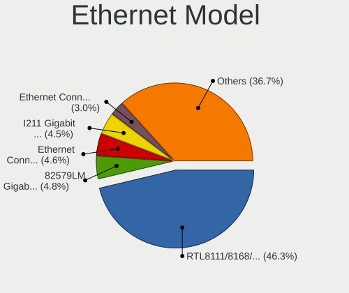

| Model                                                                          | Desktops | Percent |
|--------------------------------------------------------------------------------|----------|---------|
| Realtek RTL8111/8168/8211/8411 PCI Express Gigabit Ethernet Controller         | 449      | 46.29%  |
| Intel 82579LM Gigabit Network Connection (Lewisville)                          | 47       | 4.85%   |
| Intel Ethernet Connection I217-LM                                              | 45       | 4.64%   |
| Intel I211 Gigabit Network Connection                                          | 44       | 4.54%   |
| Intel Ethernet Connection (2) I219-V                                           | 29       | 2.99%   |
| Realtek RTL810xE PCI Express Fast Ethernet controller                          | 28       | 2.89%   |
| Intel Ethernet Connection (2) I219-LM                                          | 27       | 2.78%   |
| Intel Ethernet Connection (7) I219-V                                           | 25       | 2.58%   |
| Intel 82567LM-3 Gigabit Network Connection                                     | 19       | 1.96%   |
| Intel Ethernet Controller I225-V                                               | 18       | 1.86%   |
| Intel 82574L Gigabit Network Connection                                        | 18       | 1.86%   |
| Intel 82579V Gigabit Network Connection                                        | 15       | 1.55%   |
| Realtek RTL8125 2.5GbE Controller                                              | 13       | 1.34%   |
| Intel Ethernet Connection I217-V                                               | 12       | 1.24%   |
| Samsung Galaxy series, misc. (tethering mode)                                  | 10       | 1.03%   |
| Realtek RTL-8100/8101L/8139 PCI Fast Ethernet Adapter                          | 10       | 1.03%   |
| Intel 82566DM-2 Gigabit Network Connection                                     | 9        | 0.93%   |
| Intel I210 Gigabit Network Connection                                          | 7        | 0.72%   |
| Intel Ethernet Connection (2) I218-V                                           | 7        | 0.72%   |
| Qualcomm Atheros Attansic L1 Gigabit Ethernet                                  | 6        | 0.62%   |
| Qualcomm Atheros AR8151 v2.0 Gigabit Ethernet                                  | 6        | 0.62%   |
| Marvell Group 88E8056 PCI-E Gigabit Ethernet Controller                        | 6        | 0.62%   |
| Intel Ethernet Connection (7) I219-LM                                          | 5        | 0.52%   |
| Qualcomm Atheros AR8121/AR8113/AR8114 Gigabit or Fast Ethernet                 | 4        | 0.41%   |
| Intel 82578DM Gigabit Network Connection                                       | 4        | 0.41%   |
| Intel 82571EB/82571GB Gigabit Ethernet Controller D0/D1 (copper applications)  | 4        | 0.41%   |
| Qualcomm Atheros Killer E2500 Gigabit Ethernet Controller                      | 3        | 0.31%   |
| Qualcomm Atheros Killer E220x Gigabit Ethernet Controller                      | 3        | 0.31%   |
| Qualcomm Atheros AR8161 Gigabit Ethernet                                       | 3        | 0.31%   |
| OPPO OPPO Find X3 Neo 5G RNDIS Control RNDIS Ethernet Data                     | 3        | 0.31%   |
| Intel Ethernet Connection (5) I219-LM                                          | 3        | 0.31%   |
| Intel Ethernet Connection (17) I219-V                                          | 3        | 0.31%   |
| Intel Ethernet Connection (14) I219-V                                          | 3        | 0.31%   |
| Intel Ethernet Connection (12) I219-V                                          | 3        | 0.31%   |
| Intel 82583V Gigabit Network Connection                                        | 3        | 0.31%   |
| Intel 82567LF-3 Gigabit Network Connection                                     | 3        | 0.31%   |
| Broadcom NetXtreme BCM5761 Gigabit Ethernet PCIe                               | 3        | 0.31%   |
| Aquantia AQtion AQC107 NBase-T/IEEE 802.3an Ethernet Controller [Atlantic 10G] | 3        | 0.31%   |
| Samsung GT-I9070 (network tethering, USB debugging enabled)                    | 2        | 0.21%   |
| Realtek RTL8111/8168/8411 PCI Express Gigabit Ethernet Controller              | 2        | 0.21%   |

Net Controller Kind
-------------------

Ethernet, WiFi or modem

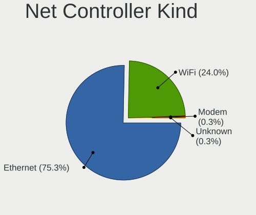

| Kind     | Desktops | Percent |
|----------|----------|---------|
| Ethernet | 897      | 75.31%  |
| WiFi     | 286      | 24.01%  |
| Modem    | 4        | 0.34%   |
| Unknown  | 4        | 0.34%   |

Used Controller
---------------

Currently used network controller

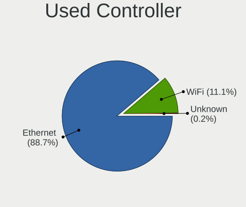

| Kind     | Desktops | Percent |
|----------|----------|---------|
| Ethernet | 827      | 88.73%  |
| WiFi     | 103      | 11.05%  |
| Unknown  | 2        | 0.21%   |

NICs
----

Total network controllers on board

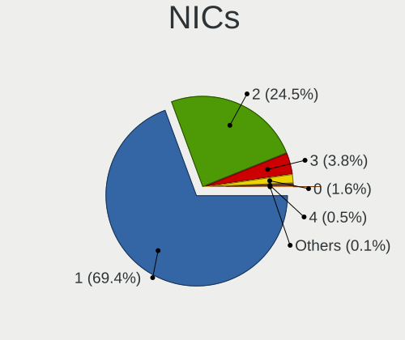

| Total | Desktops | Percent |
|-------|----------|---------|
| 1     | 637      | 69.39%  |
| 2     | 225      | 24.51%  |
| 3     | 35       | 3.81%   |
| 0     | 15       | 1.63%   |
| 4     | 5        | 0.54%   |
| 9     | 1        | 0.11%   |

IPv6
----

IPv6 vs IPv4

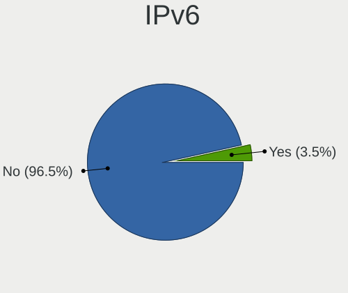

| Used | Desktops | Percent |
|------|----------|---------|
| No   | 895      | 96.55%  |
| Yes  | 32       | 3.45%   |

Bluetooth
---------

Bluetooth Vendor
----------------

Controller vendors

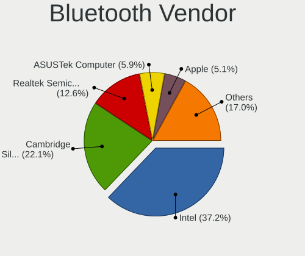

| Vendor                          | Desktops | Percent |
|---------------------------------|----------|---------|
| Intel                           | 94       | 37.15%  |
| Cambridge Silicon Radio         | 56       | 22.13%  |
| Realtek Semiconductor           | 32       | 12.65%  |
| ASUSTek Computer                | 15       | 5.93%   |
| Apple                           | 13       | 5.14%   |
| Broadcom                        | 9        | 3.56%   |
| TP-Link                         | 7        | 2.77%   |
| Qualcomm Atheros Communications | 7        | 2.77%   |
| IMC Networks                    | 5        | 1.98%   |
| Integrated System Solution      | 3        | 1.19%   |
| Lite-On Technology              | 2        | 0.79%   |
| Foxconn / Hon Hai               | 2        | 0.79%   |
| Silicon Wave                    | 1        | 0.4%    |
| Ralink                          | 1        | 0.4%    |
| Primax Electronics              | 1        | 0.4%    |
| HTC (High Tech Computer)        | 1        | 0.4%    |
| Fujitsu                         | 1        | 0.4%    |
| Edimax Technology               | 1        | 0.4%    |
| Dynex                           | 1        | 0.4%    |
| Belkin Components               | 1        | 0.4%    |

Bluetooth Model
---------------

Controller models

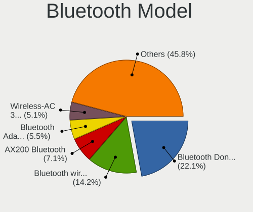

| Model                                                                | Desktops | Percent |
|----------------------------------------------------------------------|----------|---------|
| Cambridge Silicon Radio Bluetooth Dongle (HCI mode)                  | 56       | 22.13%  |
| Intel Bluetooth wireless interface                                   | 36       | 14.23%  |
| Intel AX200 Bluetooth                                                | 18       | 7.11%   |
| Realtek Bluetooth Adapter                                            | 14       | 5.53%   |
| Intel Wireless-AC 3168 Bluetooth                                     | 13       | 5.14%   |
| Realtek  Bluetooth 4.2 Adapter                                       | 8        | 3.16%   |
| Intel Bluetooth 9460/9560 Jefferson Peak (JfP)                       | 8        | 3.16%   |
| Intel AX201 Bluetooth                                                | 8        | 3.16%   |
| TP-Link Bluetooth 5.0 USB Adapter                                    | 7        | 2.77%   |
| ASUS USB-BT500                                                       | 7        | 2.77%   |
| Apple Built-in Bluetooth 2.0+EDR HCI                                 | 7        | 2.77%   |
| Apple Bluetooth Host Controller                                      | 6        | 2.37%   |
| Qualcomm Atheros Dell Wireless 1707 Bluetooth 4.0 LE Device          | 5        | 1.98%   |
| Broadcom BCM20702A0 Bluetooth 4.0                                    | 5        | 1.98%   |
| Realtek Bluetooth 4.0 Adapter                                        | 4        | 1.58%   |
| Intel Wireless-AC 9260 Bluetooth Adapter                             | 4        | 1.58%   |
| Intel AX210 Bluetooth                                                | 4        | 1.58%   |
| ASUS Broadcom BCM20702A0 Bluetooth                                   | 4        | 1.58%   |
| Realtek Bluetooth 5.1 Adapter                                        | 3        | 1.19%   |
| Realtek Dell Wireless 1801 Bluetooth 4.0 LE                          | 2        | 0.79%   |
| Intel Centrino Bluetooth Wireless Transceiver                        | 2        | 0.79%   |
| Integrated System Solution Bluetooth Device                          | 2        | 0.79%   |
| IMC Networks Qualcomm Atheros AR9462 Bluetooth 4.0 + HS              | 2        | 0.79%   |
| ASUS Realtek Bluetooth 4.0 + High Speed Chip                         | 2        | 0.79%   |
| ASUS Bluetooth Controller                                            | 2        | 0.79%   |
| Silicon Wave Bluetooth Wireless Adapter                              | 1        | 0.4%    |
| Realtek Bluetooth 4.2 Adapter                                        | 1        | 0.4%    |
| Ralink RT3290 Bluetooth                                              | 1        | 0.4%    |
| Qualcomm Atheros AR3012 Bluetooth 4.0                                | 1        | 0.4%    |
| Qualcomm Atheros AR3011 Bluetooth (no firmware)                      | 1        | 0.4%    |
| Primax Rocketfish RF-FLBTAD Bluetooth Adapter                        | 1        | 0.4%    |
| Lite-On Bluetooth USB Module                                         | 1        | 0.4%    |
| Lite-On Atheros AR3012 Bluetooth                                     | 1        | 0.4%    |
| Intel AX211 Bluetooth                                                | 1        | 0.4%    |
| Integrated System Solution KY-BT100 Bluetooth Adapter                | 1        | 0.4%    |
| IMC Networks Realtek Bluetooth Adapter                               | 1        | 0.4%    |
| IMC Networks Realtek Bluetooth 4.0 Adapter                           | 1        | 0.4%    |
| IMC Networks MediaTek Bluetooth Adapter                              | 1        | 0.4%    |
| HTC (High Tech Computer) Vive Hub Bluetooth 4.1 (Broadcom BCM920703) | 1        | 0.4%    |
| Fujitsu Qualcomm Atheros AR9462 Bluetooth 4.0 + HS Adapter           | 1        | 0.4%    |

Sound
-----

Sound Vendor
------------

Sound card vendors

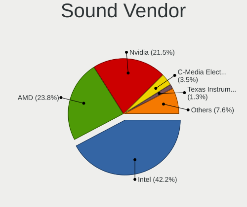

| Vendor                                       | Desktops | Percent |
|----------------------------------------------|----------|---------|
| Intel                                        | 621      | 42.24%  |
| AMD                                          | 350      | 23.81%  |
| Nvidia                                       | 316      | 21.5%   |
| C-Media Electronics                          | 52       | 3.54%   |
| Texas Instruments                            | 19       | 1.29%   |
| Creative Labs                                | 11       | 0.75%   |
| JMTek                                        | 8        | 0.54%   |
| SteelSeries ApS                              | 5        | 0.34%   |
| Logitech                                     | 5        | 0.34%   |
| Generalplus Technology                       | 5        | 0.34%   |
| Realtek Semiconductor                        | 4        | 0.27%   |
| Hewlett-Packard                              | 4        | 0.27%   |
| GN Netcom                                    | 4        | 0.27%   |
| Creative Technology                          | 4        | 0.27%   |
| Yamaha                                       | 3        | 0.2%    |
| Micro Star International                     | 3        | 0.2%    |
| Focusrite-Novation                           | 3        | 0.2%    |
| Corsair                                      | 3        | 0.2%    |
| VIA Technologies                             | 2        | 0.14%   |
| Sony                                         | 2        | 0.14%   |
| Razer USA                                    | 2        | 0.14%   |
| Nektar                                       | 2        | 0.14%   |
| Kingston Technology                          | 2        | 0.14%   |
| Google                                       | 2        | 0.14%   |
| GEMBIRD                                      | 2        | 0.14%   |
| Ensoniq                                      | 2        | 0.14%   |
| Cambridge Silicon Radio                      | 2        | 0.14%   |
| BEHRINGER International                      | 2        | 0.14%   |
| ASUSTek Computer                             | 2        | 0.14%   |
| Unknown                                      | 2        | 0.14%   |
| Zoran Co. Personal Media Division (Nogatech) | 1        | 0.07%   |
| ZOOM                                         | 1        | 0.07%   |
| XMOS                                         | 1        | 0.07%   |
| Superlux digit                               | 1        | 0.07%   |
| Steinberg Soft-und Hardware                  | 1        | 0.07%   |
| RODE Microphones                             | 1        | 0.07%   |
| RME                                          | 1        | 0.07%   |
| Plantronics                                  | 1        | 0.07%   |
| OPPO Electronics                             | 1        | 0.07%   |
| Microsoft                                    | 1        | 0.07%   |

Sound Model
-----------

Sound card models

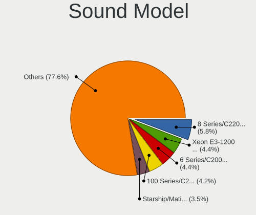

| Model                                                                      | Desktops | Percent |
|----------------------------------------------------------------------------|----------|---------|
| Intel 8 Series/C220 Series Chipset High Definition Audio Controller        | 100      | 5.83%   |
| Intel Xeon E3-1200 v3/4th Gen Core Processor HD Audio Controller           | 76       | 4.43%   |
| Intel 6 Series/C200 Series Chipset Family High Definition Audio Controller | 76       | 4.43%   |
| Intel 100 Series/C230 Series Chipset Family HD Audio Controller            | 72       | 4.2%    |
| AMD Starship/Matisse HD Audio Controller                                   | 60       | 3.5%    |
| AMD SBx00 Azalia (Intel HDA)                                               | 56       | 3.27%   |
| AMD Ryzen HD Audio Controller                                              | 53       | 3.09%   |
| Intel 7 Series/C216 Chipset Family High Definition Audio Controller        | 51       | 2.97%   |
| Intel NM10/ICH7 Family High Definition Audio Controller                    | 45       | 2.62%   |
| Intel 200 Series PCH HD Audio                                              | 45       | 2.62%   |
| Intel Cannon Lake PCH cAVS                                                 | 44       | 2.57%   |
| AMD Ellesmere HDMI Audio [Radeon RX 470/480 / 570/580/590]                 | 42       | 2.45%   |
| Nvidia GK208 HDMI/DP Audio Controller                                      | 40       | 2.33%   |
| AMD Family 17h (Models 00h-0fh) HD Audio Controller                        | 37       | 2.16%   |
| AMD FCH Azalia Controller                                                  | 31       | 1.81%   |
| AMD Raven/Raven2/Fenghuang HDMI/DP Audio Controller                        | 28       | 1.63%   |
| AMD Baffin HDMI/DP Audio [Radeon RX 550 640SP / RX 560/560X]               | 25       | 1.46%   |
| Nvidia GP107GL High Definition Audio Controller                            | 24       | 1.4%    |
| AMD Oland/Hainan/Cape Verde/Pitcairn HDMI Audio [Radeon HD 7000 Series]    | 24       | 1.4%    |
| Nvidia TU116 High Definition Audio Controller                              | 23       | 1.34%   |
| Intel 82801JI (ICH10 Family) HD Audio Controller                           | 23       | 1.34%   |
| Intel 82801JD/DO (ICH10 Family) HD Audio Controller                        | 21       | 1.22%   |
| Nvidia GP106 High Definition Audio Controller                              | 20       | 1.17%   |
| Nvidia High Definition Audio Controller                                    | 18       | 1.05%   |
| AMD Renoir/Cezanne HDMI/DP Audio Controller                                | 18       | 1.05%   |
| Nvidia GF119 HDMI Audio Controller                                         | 17       | 0.99%   |
| Intel 5 Series/3400 Series Chipset High Definition Audio                   | 17       | 0.99%   |
| C-Media Electronics Audio Adapter (Unitek Y-247A)                          | 17       | 0.99%   |
| Nvidia GP108 High Definition Audio Controller                              | 16       | 0.93%   |
| Nvidia GK107 HDMI Audio Controller                                         | 16       | 0.93%   |
| Intel 82801I (ICH9 Family) HD Audio Controller                             | 16       | 0.93%   |
| AMD Navi 21/23 HDMI/DP Audio Controller                                    | 15       | 0.87%   |
| Nvidia GF108 High Definition Audio Controller                              | 14       | 0.82%   |
| Nvidia MCP61 High Definition Audio                                         | 13       | 0.76%   |
| Nvidia GM206 High Definition Audio Controller                              | 13       | 0.76%   |
| Intel C610/X99 series chipset HD Audio Controller                          | 13       | 0.76%   |
| AMD Navi 10 HDMI Audio                                                     | 13       | 0.76%   |
| Nvidia GM107 High Definition Audio Controller [GeForce 940MX]              | 11       | 0.64%   |
| Intel 9 Series Chipset Family HD Audio Controller                          | 11       | 0.64%   |
| AMD Trinity HDMI Audio Controller                                          | 11       | 0.64%   |

Memory
------

Memory Vendor
-------------

Memory module vendors

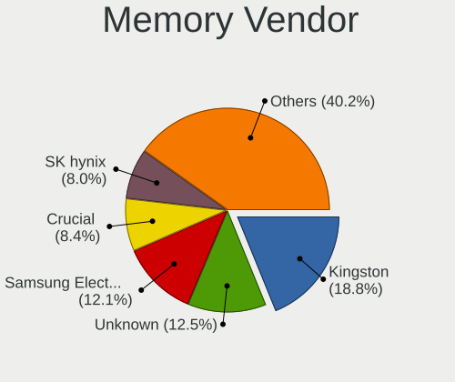

| Vendor                       | Desktops | Percent |
|------------------------------|----------|---------|
| Kingston                     | 205      | 18.84%  |
| Unknown                      | 136      | 12.5%   |
| Samsung Electronics          | 132      | 12.13%  |
| Crucial                      | 91       | 8.36%   |
| SK hynix                     | 87       | 8%      |
| Corsair                      | 76       | 6.99%   |
| Micron Technology            | 74       | 6.8%    |
| G.Skill                      | 60       | 5.51%   |
| Unknown                      | 36       | 3.31%   |
| Team                         | 19       | 1.75%   |
| Nanya Technology             | 19       | 1.75%   |
| A-DATA Technology            | 19       | 1.75%   |
| Patriot                      | 17       | 1.56%   |
| Ramaxel Technology           | 16       | 1.47%   |
| Transcend                    | 11       | 1.01%   |
| GOODRAM                      | 9        | 0.83%   |
| AMD                          | 7        | 0.64%   |
| Elpida                       | 6        | 0.55%   |
| Avant                        | 6        | 0.55%   |
| Atermiter                    | 5        | 0.46%   |
| Apacer                       | 5        | 0.46%   |
| PNY                          | 4        | 0.37%   |
| Unknown (ABCD)               | 3        | 0.28%   |
| Smart                        | 3        | 0.28%   |
| Patriot Memory (PDP Systems) | 3        | 0.28%   |
| Kingmax                      | 3        | 0.28%   |
| GeIL                         | 3        | 0.28%   |
| Silicon Power                | 2        | 0.18%   |
| Lexar                        | 2        | 0.18%   |
| Goldkey                      | 2        | 0.18%   |
| Walton Chaintech             | 1        | 0.09%   |
| Unknown (D386)               | 1        | 0.09%   |
| Unknown (8A02)               | 1        | 0.09%   |
| Unknown (7F7F7F94FFFFFFFF)   | 1        | 0.09%   |
| Unknown (0x7FFF)             | 1        | 0.09%   |
| Unknown (09A4)               | 1        | 0.09%   |
| Unifosa                      | 1        | 0.09%   |
| Teikon                       | 1        | 0.09%   |
| TakeMS                       | 1        | 0.09%   |
| Super Talent                 | 1        | 0.09%   |

Memory Model
------------

Memory module models

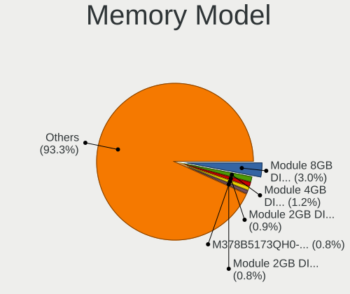

| Model                                                 | Desktops | Percent |
|-------------------------------------------------------|----------|---------|
| Unknown                                               | 36       | 3.03%   |
| Unknown RAM Module 4GB DIMM 1333MT/s                  | 14       | 1.18%   |
| Unknown RAM Module 2GB DIMM 1333MT/s                  | 11       | 0.93%   |
| Samsung RAM M378B5173QH0-CK0 4GB DIMM DDR3 1600MT/s   | 10       | 0.84%   |
| Unknown RAM Module 2GB DIMM DDR2 800MT/s              | 9        | 0.76%   |
| Team RAM TEAMGROUP-UD4-3200 8GB DIMM DDR4 3200MT/s    | 9        | 0.76%   |
| Kingston RAM KHX3200C16D4/8GX 8GB DIMM DDR4 3200MT/s  | 8        | 0.67%   |
| Corsair RAM CMK16GX4M2B3200C16 8GB DIMM DDR4 3200MT/s | 8        | 0.67%   |
| Samsung RAM M378B5773DH0-CH9 2GB DIMM DDR3 1333MT/s   | 7        | 0.59%   |
| Micron RAM 8JTF51264AZ-1G6E1 4GB DIMM DDR3 1600MT/s   | 7        | 0.59%   |
| Kingston RAM KHX1600C9D3/4GX 4GB DIMM DDR3 1600MT/s   | 7        | 0.59%   |
| Kingston RAM KHX1600C10D3/8G 8GB DIMM DDR3 1600MT/s   | 7        | 0.59%   |
| Unknown RAM Module 4GB DIMM DDR3 1333MT/s             | 6        | 0.5%    |
| Unknown RAM Module 2GB DIMM 800MT/s                   | 6        | 0.5%    |
| Kingston RAM KF3200C16D4/8GX 8GB DIMM DDR4 3200MT/s   | 6        | 0.5%    |
| Unknown RAM Module 4GB DIMM 1600MT/s                  | 5        | 0.42%   |
| Unknown RAM Module 2GB DIMM SDRAM                     | 5        | 0.42%   |
| Unknown RAM Module 1GB DIMM SDRAM                     | 5        | 0.42%   |
| SK hynix RAM HMT451U6BFR8C-PB 4GB DIMM DDR3 1600MT/s  | 5        | 0.42%   |
| Samsung RAM M471B5173QH0-YK0 4GB SODIMM DDR3 1600MT/s | 5        | 0.42%   |
| Kingston RAM KHX2666C16/8G 8GB DIMM DDR4 2933MT/s     | 5        | 0.42%   |
| Kingston RAM 99U5471-054.A00LF 8GB DIMM DDR3 1600MT/s | 5        | 0.42%   |
| Kingston RAM 99U5471-012.A00LF 4GB DIMM DDR3 1333MT/s | 5        | 0.42%   |
| A-DATA RAM DDR4 3200 16GB DIMM DDR4 3200MT/s          | 5        | 0.42%   |
| Unknown RAM Module 4GB DIMM SDRAM                     | 4        | 0.34%   |
| Unknown RAM Module 2GB DIMM DDR2 667MT/s              | 4        | 0.34%   |
| Unknown RAM Module 2048MB DIMM DDR2 800MT/s           | 4        | 0.34%   |
| SK hynix RAM HMT451U6BFR8A-PB 4GB DIMM DDR3 1600MT/s  | 4        | 0.34%   |
| SK hynix RAM HMT351U6CFR8C-PB 4GB DIMM DDR3 1600MT/s  | 4        | 0.34%   |
| Samsung RAM Module 8GB SODIMM DDR4 2133MT/s           | 4        | 0.34%   |
| Samsung RAM Module 8GB DIMM DDR4 2133MT/s             | 4        | 0.34%   |
| Samsung RAM M393A1G40DB0-CPB 8GB DIMM DDR4 2133MT/s   | 4        | 0.34%   |
| Samsung RAM M378B5773CH0-CH9 2GB DIMM DDR3 1333MT/s   | 4        | 0.34%   |
| Samsung RAM M378B5673FH0-CH9 2GB DIMM DDR3 1333MT/s   | 4        | 0.34%   |
| Kingston RAM KHX1600C10D3/ 4GB DIMM DDR3 1866MT/s     | 4        | 0.34%   |
| Kingston RAM KF3200C16D4/16GX 16GB DIMM DDR4 3200MT/s | 4        | 0.34%   |
| Kingston RAM K531R8-HYA 4GB DIMM DDR3 1600MT/s        | 4        | 0.34%   |
| Crucial RAM CT8G4DFS8266.M8FD 8GB DIMM DDR4 3066MT/s  | 4        | 0.34%   |
| Crucial RAM BLS8G3D1609DS1S00. 8GB DIMM DDR3 1866MT/s | 4        | 0.34%   |
| Corsair RAM CMZ8GX3M2A1600C9 4GB DIMM DDR3 1600MT/s   | 4        | 0.34%   |

Memory Kind
-----------

Memory module kinds

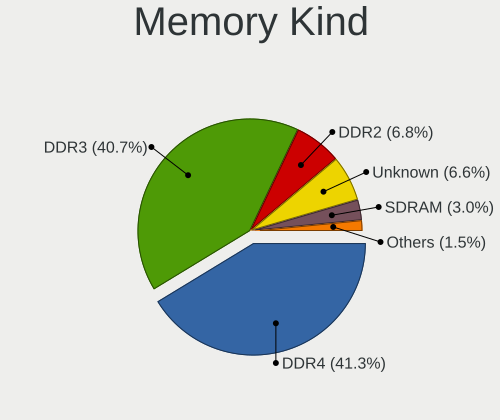

| Kind    | Desktops | Percent |
|---------|----------|---------|
| DDR4    | 375      | 41.3%   |
| DDR3    | 370      | 40.75%  |
| DDR2    | 62       | 6.83%   |
| Unknown | 60       | 6.61%   |
| SDRAM   | 27       | 2.97%   |
| DDR     | 6        | 0.66%   |
| DDR5    | 5        | 0.55%   |
| LPDDR4  | 3        | 0.33%   |

Memory Form Factor
------------------

Physical design of the memory module

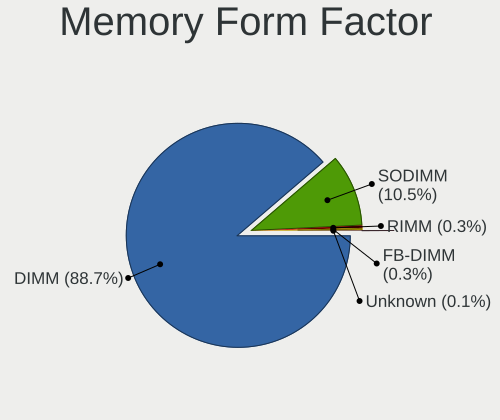

| Name    | Desktops | Percent |
|---------|----------|---------|
| DIMM    | 802      | 88.72%  |
| SODIMM  | 95       | 10.51%  |
| RIMM    | 3        | 0.33%   |
| FB-DIMM | 3        | 0.33%   |
| Unknown | 1        | 0.11%   |

Memory Size
-----------

Memory module size

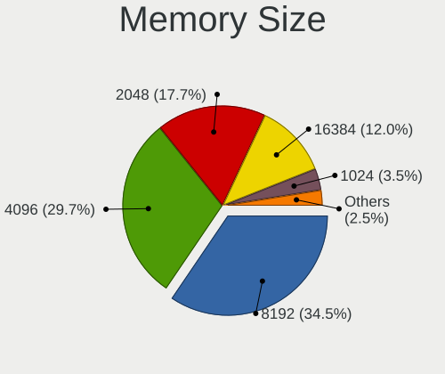

| Size  | Desktops | Percent |
|-------|----------|---------|
| 8192  | 356      | 34.5%   |
| 4096  | 307      | 29.75%  |
| 2048  | 183      | 17.73%  |
| 16384 | 124      | 12.02%  |
| 1024  | 36       | 3.49%   |
| 32768 | 24       | 2.33%   |
| 512   | 2        | 0.19%   |

Memory Speed
------------

Memory module speed

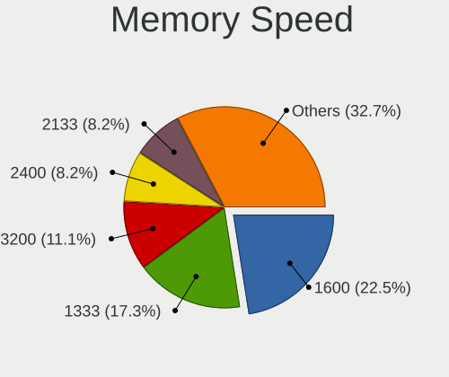

| Speed   | Desktops | Percent |
|---------|----------|---------|
| 1600    | 221      | 22.53%  |
| 1333    | 170      | 17.33%  |
| 3200    | 109      | 11.11%  |
| 2400    | 80       | 8.15%   |
| 2133    | 80       | 8.15%   |
| 2667    | 60       | 6.12%   |
| 800     | 50       | 5.1%    |
| 667     | 30       | 3.06%   |
| 2666    | 24       | 2.45%   |
| Unknown | 23       | 2.34%   |
| 1066    | 21       | 2.14%   |
| 3600    | 18       | 1.83%   |
| 1866    | 13       | 1.33%   |
| 3000    | 12       | 1.22%   |
| 1067    | 11       | 1.12%   |
| 1867    | 10       | 1.02%   |
| 2933    | 9        | 0.92%   |
| 400     | 8        | 0.82%   |
| 533     | 6        | 0.61%   |
| 3733    | 4        | 0.41%   |
| 3066    | 4        | 0.41%   |
| 4800    | 3        | 0.31%   |
| 6400    | 2        | 0.2%    |
| 4000    | 2        | 0.2%    |
| 333     | 2        | 0.2%    |
| 4400    | 1        | 0.1%    |
| 3400    | 1        | 0.1%    |
| 3333    | 1        | 0.1%    |
| 2866    | 1        | 0.1%    |
| 2048    | 1        | 0.1%    |
| 1639    | 1        | 0.1%    |
| 1334    | 1        | 0.1%    |
| 1332    | 1        | 0.1%    |
| 1200    | 1        | 0.1%    |

Printers & scanners
-------------------

Printer Vendor
--------------

Printer device vendors

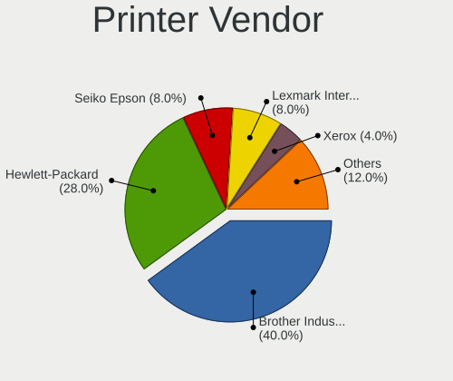

| Vendor                | Desktops | Percent |
|-----------------------|----------|---------|
| Brother Industries    | 10       | 40%     |
| Hewlett-Packard       | 7        | 28%     |
| Seiko Epson           | 2        | 8%      |
| Lexmark International | 2        | 8%      |
| Xerox                 | 1        | 4%      |
| Samsung Electronics   | 1        | 4%      |
| Ricoh                 | 1        | 4%      |
| Kyocera               | 1        | 4%      |

Printer Model
-------------

Printer device models

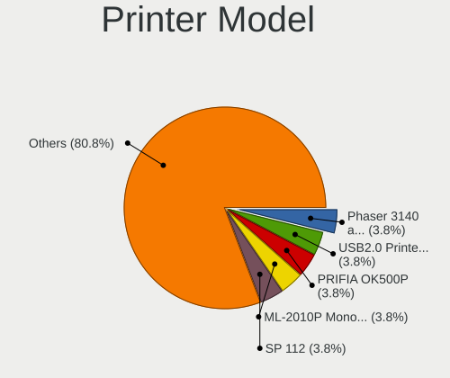

| Model                                                                                                             | Desktops | Percent |
|-------------------------------------------------------------------------------------------------------------------|----------|---------|
| Xerox Phaser 3140 and 3155                                                                                        | 1        | 3.85%   |
| Seiko Epson USB2.0 Printer (Hi-speed)                                                                             | 1        | 3.85%   |
| Seiko Epson PRIFIA OK500P                                                                                         | 1        | 3.85%   |
| Samsung ML-2010P Mono Laser Printer                                                                               | 1        | 3.85%   |
| Ricoh SP 112                                                                                                      | 1        | 3.85%   |
| Lexmark International SINDOH A603_A608 Print                                                                      | 1        | 3.85%   |
| Lexmark International Lexmark MS710 Print                                                                         | 1        | 3.85%   |
| Kyocera FS-1025MFP                                                                                                | 1        | 3.85%   |
| HP LaserJet P3005                                                                                                 | 1        | 3.85%   |
| HP LaserJet 3390                                                                                                  | 1        | 3.85%   |
| HP LaserJet 2200                                                                                                  | 1        | 3.85%   |
| HP LaserJet 1200                                                                                                  | 1        | 3.85%   |
| HP HP LaserJet P2035 HP Print                                                                                     | 1        | 3.85%   |
| HP HP LaserJet MFP E52645 LaserJet 0 LaserJet 0 LaserJet 1 LaserJet 1 LaserJet 2 LaserJet 2 LaserJet 3 LaserJet 3 | 1        | 3.85%   |
| HP DeskJet 5850c                                                                                                  | 1        | 3.85%   |
| HP Color LaserJet CP1215                                                                                          | 1        | 3.85%   |
| Brother MFC-L2685DW                                                                                               | 1        | 3.85%   |
| Brother MFC-J200                                                                                                  | 1        | 3.85%   |
| Brother MFC-7360N                                                                                                 | 1        | 3.85%   |
| Brother HL-L3270CDW series                                                                                        | 1        | 3.85%   |
| Brother HL-L2310D series                                                                                          | 1        | 3.85%   |
| Brother HL-L2300D series                                                                                          | 1        | 3.85%   |
| Brother HL-1430 Laser Printer                                                                                     | 1        | 3.85%   |
| Brother DCP-J152W                                                                                                 | 1        | 3.85%   |
| Brother DCP-J100                                                                                                  | 1        | 3.85%   |
| Brother DCP-9015CDW                                                                                               | 1        | 3.85%   |

Scanner Vendor
--------------

Scanner device vendors

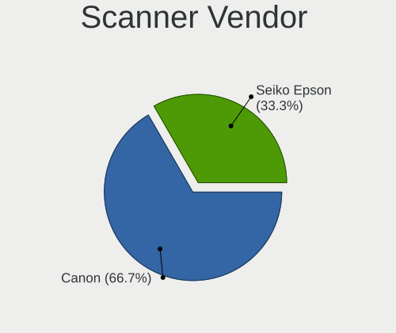

| Vendor      | Desktops | Percent |
|-------------|----------|---------|
| Canon       | 8        | 80%     |
| Seiko Epson | 2        | 20%     |

Scanner Model
-------------

Scanner device models

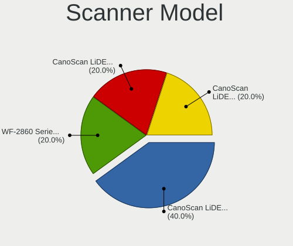

| Model                                                                               | Desktops | Percent |
|-------------------------------------------------------------------------------------|----------|---------|
| Canon CanoScan LiDE 110                                                             | 2        | 20%     |
| Seiko Epson WF-2860 Series EPSON Scanner USB2.0 Printer EPSON Utility USB2.0 Faxout | 1        | 10%     |
| Seiko Epson PX-501A [Stylus NX400]                                                  | 1        | 10%     |
| Canon CanoScan N650U/N656U                                                          | 1        | 10%     |
| Canon CanoScan N1240U/LiDE 30                                                       | 1        | 10%     |
| Canon CanoScan LiDE 700F                                                            | 1        | 10%     |
| Canon CanoScan LiDE 220                                                             | 1        | 10%     |
| Canon CanoScan LiDE 120                                                             | 1        | 10%     |
| Canon CanoScan LiDE 100                                                             | 1        | 10%     |

Camera
------

Camera Vendor
-------------

Camera device vendors

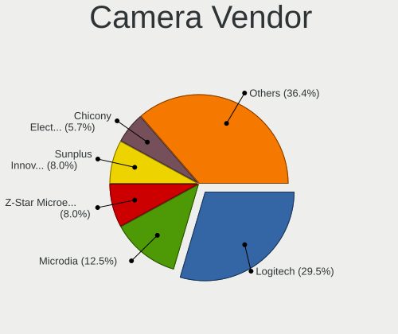

| Vendor                        | Desktops | Percent |
|-------------------------------|----------|---------|
| Logitech                      | 26       | 29.55%  |
| Microdia                      | 11       | 12.5%   |
| Z-Star Microelectronics       | 7        | 7.95%   |
| Sunplus Innovation Technology | 7        | 7.95%   |
| Chicony Electronics           | 5        | 5.68%   |
| GEMBIRD                       | 4        | 4.55%   |
| IMC Networks                  | 3        | 3.41%   |
| Arkmicro Technologies         | 3        | 3.41%   |
| Hewlett-Packard               | 2        | 2.27%   |
| Genesys Logic                 | 2        | 2.27%   |
| Generalplus Technology        | 2        | 2.27%   |
| ARC International             | 2        | 2.27%   |
| ValueHD                       | 1        | 1.14%   |
| Trust                         | 1        | 1.14%   |
| SHENZHEN AONI ELECTRONIC      | 1        | 1.14%   |
| Lenovo                        | 1        | 1.14%   |
| KYE Systems (Mouse Systems)   | 1        | 1.14%   |
| Importek                      | 1        | 1.14%   |
| HD WEBCAM                     | 1        | 1.14%   |
| Creative Technology           | 1        | 1.14%   |
| BSD                           | 1        | 1.14%   |
| Aveo Technology               | 1        | 1.14%   |
| Asuscom Network               | 1        | 1.14%   |
| Alcorlink                     | 1        | 1.14%   |
| Alcor Micro                   | 1        | 1.14%   |
| A4Tech                        | 1        | 1.14%   |

Camera Model
------------

Camera device models

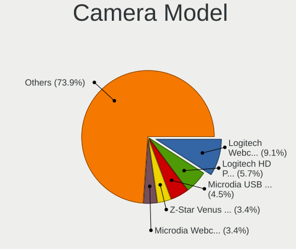

| Model                                             | Desktops | Percent |
|---------------------------------------------------|----------|---------|
| Logitech Webcam C270                              | 8        | 9.09%   |
| Logitech HD Pro Webcam C920                       | 5        | 5.68%   |
| Microdia USB  Live camera                         | 4        | 4.55%   |
| Z-Star Venus USB2.0 Camera                        | 3        | 3.41%   |
| Microdia Webcam Vitade AF                         | 3        | 3.41%   |
| Logitech Webcam C310                              | 3        | 3.41%   |
| Logitech BRIO Ultra HD Webcam                     | 3        | 3.41%   |
| IMC Networks XHC Camera                           | 3        | 3.41%   |
| Sunplus USB 2.0 Camera                            | 2        | 2.27%   |
| Sunplus Integrated_Webcam_HD                      | 2        | 2.27%   |
| Microdia ASUS USB 2.0 Webcam                      | 2        | 2.27%   |
| Logitech Webcam C170                              | 2        | 2.27%   |
| Logitech C922 Pro Stream Webcam                   | 2        | 2.27%   |
| Genesys Logic Digital Microscope                  | 2        | 2.27%   |
| Generalplus HD Webcam                             | 2        | 2.27%   |
| GEMBIRD USB2.0 PC CAMERA                          | 2        | 2.27%   |
| GEMBIRD Generic UVC 1.00 camera [AppoTech AX2311] | 2        | 2.27%   |
| Arkmicro USB 2.0 PC CAMERA                        | 2        | 2.27%   |
| ARC International Camera                          | 2        | 2.27%   |
| Z-Star Vega USB 2.0 Camera                        | 1        | 1.14%   |
| Z-Star Lenovo USB 2.0 UVC Camera                  | 1        | 1.14%   |
| Z-Star Integrated Camera                          | 1        | 1.14%   |
| Z-Star A4 TECH USB2.0 PC Camera J                 | 1        | 1.14%   |
| ValueHD HD Camera                                 | 1        | 1.14%   |
| Trust Trust Full HD Webcam                        | 1        | 1.14%   |
| Sunplus SPCA2281 Web Camera                       | 1        | 1.14%   |
| Sunplus HD Webcam                                 | 1        | 1.14%   |
| Sunplus Aukey-PC-LM1E Camera                      | 1        | 1.14%   |
| SHENZHEN AONI ELECTRONIC NexiGo N990 4K Camera    | 1        | 1.14%   |
| Microdia USB Camera                               | 1        | 1.14%   |
| Microdia Camera                                   | 1        | 1.14%   |
| Logitech Webcam C930e                             | 1        | 1.14%   |
| Logitech HD Webcam C615                           | 1        | 1.14%   |
| Logitech C670i FHD Webcam                         | 1        | 1.14%   |
| Lenovo Integrated Camera                          | 1        | 1.14%   |
| KYE Systems (Mouse Systems) AUKEY PC-LM1E Camera  | 1        | 1.14%   |
| Importek FJ Camera                                | 1        | 1.14%   |
| HP Realtek PC Camera                              | 1        | 1.14%   |
| HP Premium Starter Webcam                         | 1        | 1.14%   |
| HD WEBCAM HD WEBCAM                               | 1        | 1.14%   |

Security
--------

Fingerprint Vendor
------------------

Fingerprint sensor vendors

Zero info for selected period =(

Fingerprint Model
-----------------

Fingerprint sensor models

Zero info for selected period =(

Chipcard Vendor
---------------

Chipcard module vendors

Zero info for selected period =(

Chipcard Model
--------------

Chipcard module models

Zero info for selected period =(

Unsupported
-----------

Unsupported Devices
-------------------

Total unsupported devices on board

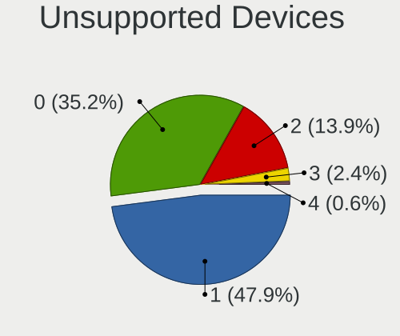

| Total | Desktops | Percent |
|-------|----------|---------|
| 1     | 443      | 47.94%  |
| 0     | 325      | 35.17%  |
| 2     | 128      | 13.85%  |
| 3     | 22       | 2.38%   |
| 4     | 6        | 0.65%   |

Unsupported Device Types
------------------------

Types of unsupported devices

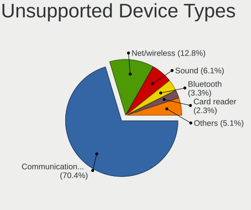

| Type                     | Desktops | Percent |
|--------------------------|----------|---------|
| Communication controller | 511      | 70.39%  |
| Net/wireless             | 93       | 12.81%  |
| Sound                    | 44       | 6.06%   |
| Bluetooth                | 24       | 3.31%   |
| Card reader              | 17       | 2.34%   |
| Net/ethernet             | 13       | 1.79%   |
| Network                  | 10       | 1.38%   |
| Firewire controller      | 9        | 1.24%   |
| Storage/raid             | 3        | 0.41%   |
| Dvb card                 | 2        | 0.28%   |

