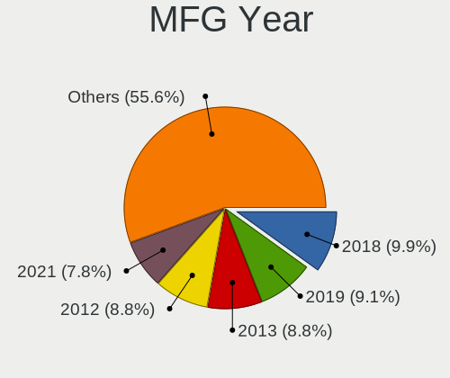
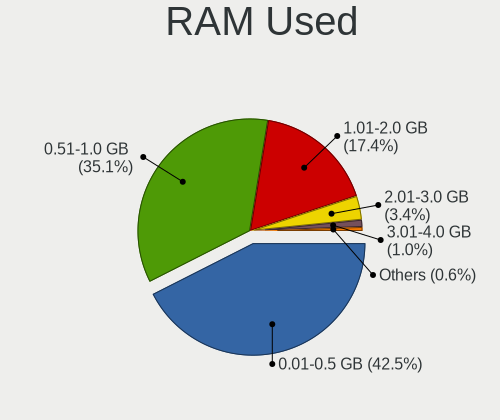
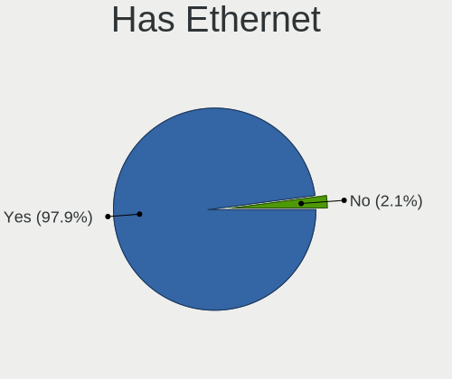
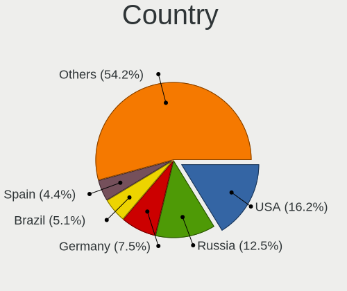
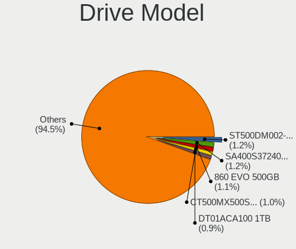
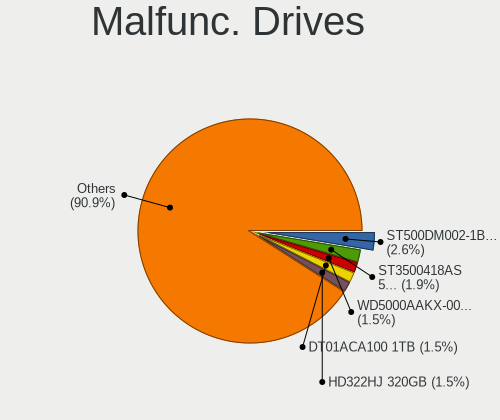
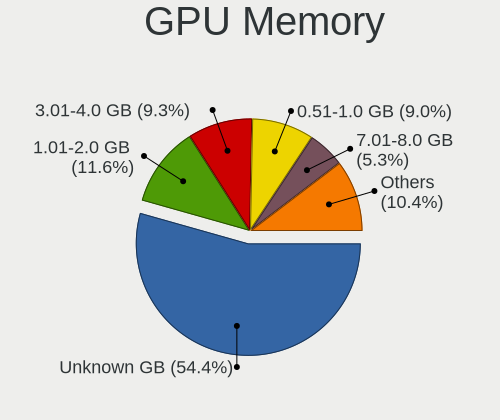
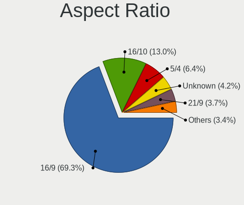
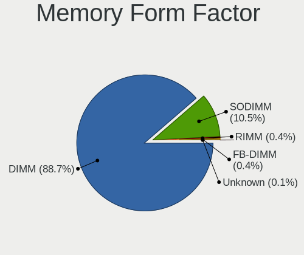
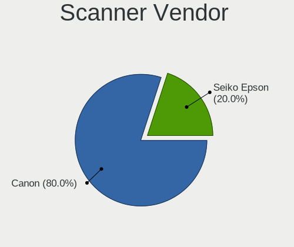

helloSystem - Tested Hardware & Statistics (Desktops)
-----------------------------------------------------

A project to collect tested hardware configurations for helloSystem.

Anyone can contribute to this report by the [hw-probe](https://github.com/linuxhw/hw-probe/blob/master/INSTALL.BSD.md) tool:

    hw-probe -all -upload

Please contribute! Especially if your hardware is rare.

Contents
--------

* [ Test Cases ](#test-cases)

* [ System ](#system)
  - [ OS                       ](#os)
  - [ OS Family                ](#os-family)
  - [ Arch                     ](#arch)
  - [ DE                       ](#de)
  - [ Display Server           ](#display-server)
  - [ Display Manager          ](#display-manager)
  - [ OS Lang                  ](#os-lang)
  - [ Boot Mode                ](#boot-mode)
  - [ Filesystem               ](#filesystem)
  - [ Part. scheme             ](#part-scheme)

* [ Board ](#board)
  - [ Vendor                   ](#vendor)
  - [ Model                    ](#model)
  - [ Model Family             ](#model-family)
  - [ MFG Year                 ](#mfg-year)
  - [ Form Factor              ](#form-factor)
  - [ Coreboot                 ](#coreboot)
  - [ RAM Size                 ](#ram-size)
  - [ RAM Used                 ](#ram-used)
  - [ Total Drives             ](#total-drives)
  - [ Has CD-ROM               ](#has-cd-rom)
  - [ Has Ethernet             ](#has-ethernet)
  - [ Has WiFi                 ](#has-wifi)
  - [ Has Bluetooth            ](#has-bluetooth)

* [ Location ](#location)
  - [ Country                  ](#country)
  - [ City                     ](#city)

* [ Drives ](#drives)
  - [ Drive Vendor             ](#drive-vendor)
  - [ Drive Model              ](#drive-model)
  - [ HDD Vendor               ](#hdd-vendor)
  - [ SSD Vendor               ](#ssd-vendor)
  - [ Drive Kind               ](#drive-kind)
  - [ Drive Connector          ](#drive-connector)
  - [ Drive Size               ](#drive-size)
  - [ Space Total              ](#space-total)
  - [ Space Used               ](#space-used)
  - [ Malfunc. Drives          ](#malfunc-drives)
  - [ Malfunc. Drive Vendor    ](#malfunc-drive-vendor)
  - [ Malfunc. HDD Vendor      ](#malfunc-hdd-vendor)
  - [ Malfunc. Drive Kind      ](#malfunc-drive-kind)
  - [ Failed Drives            ](#failed-drives)
  - [ Failed Drive Vendor      ](#failed-drive-vendor)
  - [ Drive Status             ](#drive-status)

* [ Storage controller ](#storage-controller)
  - [ Storage Vendor           ](#storage-vendor)
  - [ Storage Model            ](#storage-model)
  - [ Storage Kind             ](#storage-kind)

* [ Processor ](#processor)
  - [ CPU Vendor               ](#cpu-vendor)
  - [ CPU Model                ](#cpu-model)
  - [ CPU Model Family         ](#cpu-model-family)
  - [ CPU Cores                ](#cpu-cores)
  - [ CPU Sockets              ](#cpu-sockets)
  - [ CPU Threads              ](#cpu-threads)
  - [ CPU Microarch            ](#cpu-microarch)

* [ Graphics ](#graphics)
  - [ GPU Vendor               ](#gpu-vendor)
  - [ GPU Model                ](#gpu-model)
  - [ GPU Combo                ](#gpu-combo)
  - [ GPU Driver               ](#gpu-driver)
  - [ GPU Memory               ](#gpu-memory)

* [ Monitor ](#monitor)
  - [ Monitor Vendor           ](#monitor-vendor)
  - [ Monitor Model            ](#monitor-model)
  - [ Monitor Resolution       ](#monitor-resolution)
  - [ Monitor Diagonal         ](#monitor-diagonal)
  - [ Monitor Width            ](#monitor-width)
  - [ Aspect Ratio             ](#aspect-ratio)
  - [ Monitor Area             ](#monitor-area)
  - [ Pixel Density            ](#pixel-density)
  - [ Multiple Monitors        ](#multiple-monitors)

* [ Network ](#network)
  - [ Net Controller Vendor    ](#net-controller-vendor)
  - [ Net Controller Model     ](#net-controller-model)
  - [ Wireless Vendor          ](#wireless-vendor)
  - [ Wireless Model           ](#wireless-model)
  - [ Ethernet Vendor          ](#ethernet-vendor)
  - [ Ethernet Model           ](#ethernet-model)
  - [ Net Controller Kind      ](#net-controller-kind)
  - [ Used Controller          ](#used-controller)
  - [ NICs                     ](#nics)
  - [ IPv6                     ](#ipv6)

* [ Bluetooth ](#bluetooth)
  - [ Bluetooth Vendor         ](#bluetooth-vendor)
  - [ Bluetooth Model          ](#bluetooth-model)

* [ Sound ](#sound)
  - [ Sound Vendor             ](#sound-vendor)
  - [ Sound Model              ](#sound-model)

* [ Memory ](#memory)
  - [ Memory Vendor            ](#memory-vendor)
  - [ Memory Model             ](#memory-model)
  - [ Memory Kind              ](#memory-kind)
  - [ Memory Form Factor       ](#memory-form-factor)
  - [ Memory Size              ](#memory-size)
  - [ Memory Speed             ](#memory-speed)

* [ Printers & scanners ](#printers--scanners)
  - [ Printer Vendor           ](#printer-vendor)
  - [ Printer Model            ](#printer-model)
  - [ Scanner Vendor           ](#scanner-vendor)
  - [ Scanner Model            ](#scanner-model)

* [ Camera ](#camera)
  - [ Camera Vendor            ](#camera-vendor)
  - [ Camera Model             ](#camera-model)

* [ Security ](#security)
  - [ Fingerprint Vendor       ](#fingerprint-vendor)
  - [ Fingerprint Model        ](#fingerprint-model)
  - [ Chipcard Vendor          ](#chipcard-vendor)
  - [ Chipcard Model           ](#chipcard-model)

* [ Unsupported ](#unsupported)
  - [ Unsupported Devices      ](#unsupported-devices)
  - [ Unsupported Device Types ](#unsupported-device-types)

Test Cases
----------

Total: 799

| Vendor        | Model                       | Probe                                                     | Date         |
|---------------|-----------------------------|-----------------------------------------------------------|--------------|
| Gigabyte      | F2A85X-UP4                  | [068773e0e8](https://bsd-hardware.info/?probe=068773e0e8) | Apr 01, 2023 |
| ASUSTek       | ROG STRIX B450-F GAMING     | [bcaaed4d6d](https://bsd-hardware.info/?probe=bcaaed4d6d) | Mar 31, 2023 |
| Gigabyte      | GA-880GM-USB3               | [a9bc1579c1](https://bsd-hardware.info/?probe=a9bc1579c1) | Mar 31, 2023 |
| Lenovo        | 30D0 SDK0J40697 WIN 3305... | [bde9fd671b](https://bsd-hardware.info/?probe=bde9fd671b) | Mar 30, 2023 |
| Fujitsu       | D3061-A1 S26361-D3061-A1    | [ca6badc637](https://bsd-hardware.info/?probe=ca6badc637) | Mar 30, 2023 |
| Gigabyte      | H81M-DS2V                   | [a69c208286](https://bsd-hardware.info/?probe=a69c208286) | Mar 30, 2023 |
| Dell          | 0T1D10 A01                  | [2f5592023f](https://bsd-hardware.info/?probe=2f5592023f) | Mar 29, 2023 |
| Dell          | 0T1D10 A01                  | [6316b108be](https://bsd-hardware.info/?probe=6316b108be) | Mar 29, 2023 |
| BESSTAR Te... | UM700                       | [78ee14c1a5](https://bsd-hardware.info/?probe=78ee14c1a5) | Mar 28, 2023 |
| ASRock        | H61M-HVS                    | [98777ba333](https://bsd-hardware.info/?probe=98777ba333) | Mar 27, 2023 |
| MSI           | 870-G45                     | [19cbb6e0f3](https://bsd-hardware.info/?probe=19cbb6e0f3) | Mar 26, 2023 |
| Gigabyte      | F2A85X-UP4                  | [97d37b6e2f](https://bsd-hardware.info/?probe=97d37b6e2f) | Mar 25, 2023 |
| MSI           | 870-G45                     | [14e990c885](https://bsd-hardware.info/?probe=14e990c885) | Mar 25, 2023 |
| Gigabyte      | F2A85X-UP4                  | [c0b8eb494e](https://bsd-hardware.info/?probe=c0b8eb494e) | Mar 25, 2023 |
| ASUSTek       | P5K SE                      | [646eff3292](https://bsd-hardware.info/?probe=646eff3292) | Mar 25, 2023 |
| HP            | 8055                        | [03930fa6c3](https://bsd-hardware.info/?probe=03930fa6c3) | Mar 24, 2023 |
| HP            | 8350                        | [46dedb22a0](https://bsd-hardware.info/?probe=46dedb22a0) | Mar 24, 2023 |
| Unknown       | Unknown                     | [a66dffcb5c](https://bsd-hardware.info/?probe=a66dffcb5c) | Mar 23, 2023 |
| Intel         | DB85FL AAG89861-203         | [ff97717798](https://bsd-hardware.info/?probe=ff97717798) | Mar 23, 2023 |
| Gigabyte      | H81M-H                      | [e7cadcdae1](https://bsd-hardware.info/?probe=e7cadcdae1) | Mar 23, 2023 |
| Acer          | Revo 70                     | [50d93bea69](https://bsd-hardware.info/?probe=50d93bea69) | Mar 23, 2023 |
| Unknown       | T360D11                     | [d4d69405c5](https://bsd-hardware.info/?probe=d4d69405c5) | Mar 23, 2023 |
| T-bao         | MINI PC V1.0                | [eb2bc1cd51](https://bsd-hardware.info/?probe=eb2bc1cd51) | Mar 23, 2023 |
| Dell          | 0WWJRX A00                  | [b016b1fb3c](https://bsd-hardware.info/?probe=b016b1fb3c) | Mar 22, 2023 |
| Gigabyte      | F2A55-DS3                   | [ce8775fbe5](https://bsd-hardware.info/?probe=ce8775fbe5) | Mar 22, 2023 |
| Biostar       | H61MGC                      | [94e565457c](https://bsd-hardware.info/?probe=94e565457c) | Mar 22, 2023 |
| ASUSTek       | M4A88TD-V EVO/USB3          | [c486bbb209](https://bsd-hardware.info/?probe=c486bbb209) | Mar 22, 2023 |
| ASUSTek       | M5A97 R2.0                  | [840a902d2b](https://bsd-hardware.info/?probe=840a902d2b) | Mar 22, 2023 |
| Foxconn       | M61PMV FAB                  | [197d75cbaa](https://bsd-hardware.info/?probe=197d75cbaa) | Mar 21, 2023 |
| Fujitsu Si... | D2824-A1 S26361-D2824-A1    | [bcada44b09](https://bsd-hardware.info/?probe=bcada44b09) | Mar 21, 2023 |
| Intel         | X99                         | [a74c2b96ff](https://bsd-hardware.info/?probe=a74c2b96ff) | Mar 21, 2023 |
| Dell          | 0GM819                      | [9d5996dd7a](https://bsd-hardware.info/?probe=9d5996dd7a) | Mar 21, 2023 |
| HP            | 8054                        | [6e5a18f346](https://bsd-hardware.info/?probe=6e5a18f346) | Mar 20, 2023 |
| Lenovo        | 30BC SDK0J40705 WIN 3425... | [33b600b436](https://bsd-hardware.info/?probe=33b600b436) | Mar 20, 2023 |
| ASUSTek       | PRIME B350-PLUS             | [8d0e6be5da](https://bsd-hardware.info/?probe=8d0e6be5da) | Mar 20, 2023 |
| Dell          | 0GM819                      | [da7c02c542](https://bsd-hardware.info/?probe=da7c02c542) | Mar 20, 2023 |
| ASUSTek       | TUF Gaming B550M-PLUS       | [c07b0a75e5](https://bsd-hardware.info/?probe=c07b0a75e5) | Mar 20, 2023 |
| ASUSTek       | TUF Gaming B550M-PLUS       | [71d2b7317c](https://bsd-hardware.info/?probe=71d2b7317c) | Mar 19, 2023 |
| ASRock        | H61M-DGS                    | [36348fa16f](https://bsd-hardware.info/?probe=36348fa16f) | Mar 19, 2023 |
| ASUSTek       | PRIME B350-PLUS             | [acc1970543](https://bsd-hardware.info/?probe=acc1970543) | Mar 18, 2023 |
| ASUSTek       | P6X58D-E                    | [ec05209185](https://bsd-hardware.info/?probe=ec05209185) | Mar 18, 2023 |
| Dell          | 0Y5DDC A00                  | [f26bbd9dde](https://bsd-hardware.info/?probe=f26bbd9dde) | Mar 18, 2023 |
| Gigabyte      | H110M-H-CF                  | [29b3a70374](https://bsd-hardware.info/?probe=29b3a70374) | Mar 18, 2023 |
| Unknown       | Unknown                     | [dd8a64237a](https://bsd-hardware.info/?probe=dd8a64237a) | Mar 18, 2023 |
| ASUSTek       | TUF Gaming X570-PLUS        | [2ceda5b586](https://bsd-hardware.info/?probe=2ceda5b586) | Mar 17, 2023 |
| ASUSTek       | ROG STRIX B450-F GAMING ... | [74cf75116d](https://bsd-hardware.info/?probe=74cf75116d) | Mar 17, 2023 |
| ASUSTek       | TUF B360M-PLUS GAMING       | [ebbd75883c](https://bsd-hardware.info/?probe=ebbd75883c) | Mar 17, 2023 |
| Unknown       | SKYBAY                      | [7399558d80](https://bsd-hardware.info/?probe=7399558d80) | Mar 17, 2023 |
| Unknown       | SKYBAY                      | [3fb2d0d992](https://bsd-hardware.info/?probe=3fb2d0d992) | Mar 17, 2023 |
| HP            | 1632                        | [8f3bb99bb4](https://bsd-hardware.info/?probe=8f3bb99bb4) | Mar 17, 2023 |
| Gigabyte      | F2A68HM-HD2                 | [da2b96de55](https://bsd-hardware.info/?probe=da2b96de55) | Mar 16, 2023 |
| Gigabyte      | Z87X-UD4H-CF                | [0bae1528b9](https://bsd-hardware.info/?probe=0bae1528b9) | Mar 16, 2023 |
| ASUSTek       | PRIME B660M-A D4            | [eb6b70b310](https://bsd-hardware.info/?probe=eb6b70b310) | Mar 16, 2023 |
| Lenovo        | SHARKBAY NOK                | [f14a448799](https://bsd-hardware.info/?probe=f14a448799) | Mar 16, 2023 |
| ASUSTek       | PRIME B660M-A WIFI D4       | [44c7f21a07](https://bsd-hardware.info/?probe=44c7f21a07) | Mar 16, 2023 |
| Gigabyte      | B450M S2H                   | [dfa4f43317](https://bsd-hardware.info/?probe=dfa4f43317) | Mar 15, 2023 |
| Gigabyte      | H61M-S2P-B3                 | [864a4017cb](https://bsd-hardware.info/?probe=864a4017cb) | Mar 15, 2023 |
| HP            | 3398                        | [b14de43688](https://bsd-hardware.info/?probe=b14de43688) | Mar 15, 2023 |
| ASUSTek       | ROG STRIX B560-F GAMING ... | [c4798050c6](https://bsd-hardware.info/?probe=c4798050c6) | Mar 15, 2023 |
| ASUSTek       | Pro B550M-C                 | [a0e38ad11b](https://bsd-hardware.info/?probe=a0e38ad11b) | Mar 14, 2023 |
| Dell          | 00V62H A00                  | [ecb9b5d004](https://bsd-hardware.info/?probe=ecb9b5d004) | Mar 14, 2023 |
| Foxconn       | H61M/H61M-S                 | [865fbff42a](https://bsd-hardware.info/?probe=865fbff42a) | Mar 14, 2023 |
| MSI           | MAG B550 TOMAHAWK           | [cb6b586564](https://bsd-hardware.info/?probe=cb6b586564) | Mar 14, 2023 |
| Fujitsu Si... | D2804-A1 S26361-D2804-A1    | [34c4bab715](https://bsd-hardware.info/?probe=34c4bab715) | Mar 14, 2023 |
| MSI           | 0A48                        | [815f019a8c](https://bsd-hardware.info/?probe=815f019a8c) | Mar 14, 2023 |
| Lenovo        | NO DPK                      | [8a38ed8d33](https://bsd-hardware.info/?probe=8a38ed8d33) | Mar 14, 2023 |
| ASUSTek       | B85M-G                      | [6401dd52d2](https://bsd-hardware.info/?probe=6401dd52d2) | Mar 14, 2023 |
| AZW           | U59                         | [5a6ef3fb8d](https://bsd-hardware.info/?probe=5a6ef3fb8d) | Mar 14, 2023 |
| Lenovo        | ThinkCentre M58p 6138DK1    | [293de8b0fd](https://bsd-hardware.info/?probe=293de8b0fd) | Mar 14, 2023 |
| Google        | Panther                     | [3577da7e53](https://bsd-hardware.info/?probe=3577da7e53) | Mar 13, 2023 |
| Dell          | 01TN68 A02                  | [cb6c76df00](https://bsd-hardware.info/?probe=cb6c76df00) | Mar 13, 2023 |
| Lenovo        | 3102 SDK0J40697 WIN 3305... | [b337baf50e](https://bsd-hardware.info/?probe=b337baf50e) | Mar 13, 2023 |
| Gigabyte      | B365M H                     | [7acb7cb65f](https://bsd-hardware.info/?probe=7acb7cb65f) | Mar 13, 2023 |
| ASUSTek       | PRIME H310M-A R2.0          | [e96ecce822](https://bsd-hardware.info/?probe=e96ecce822) | Mar 13, 2023 |
| HP            | 8056                        | [164b3e5c3f](https://bsd-hardware.info/?probe=164b3e5c3f) | Mar 13, 2023 |
| T-bao         | MINI PC                     | [d4440566b0](https://bsd-hardware.info/?probe=d4440566b0) | Mar 13, 2023 |
| Gigabyte      | G31M-S2L                    | [d210b12607](https://bsd-hardware.info/?probe=d210b12607) | Mar 13, 2023 |
| Gigabyte      | H110M-S2-CF                 | [6afb777789](https://bsd-hardware.info/?probe=6afb777789) | Mar 13, 2023 |
| Dell          | 0W0CHX A00                  | [85a9fddd44](https://bsd-hardware.info/?probe=85a9fddd44) | Mar 12, 2023 |
| MSI           | H310M PRO-VDH PLUS          | [0eeb0661dd](https://bsd-hardware.info/?probe=0eeb0661dd) | Mar 12, 2023 |
| Dell          | 0WMJ54 A00                  | [8a41ff57c2](https://bsd-hardware.info/?probe=8a41ff57c2) | Mar 12, 2023 |
| Dell          | 0WMJ54 A01                  | [7949f20162](https://bsd-hardware.info/?probe=7949f20162) | Mar 12, 2023 |
| MSI           | B450-A PRO                  | [b2d29a5bbc](https://bsd-hardware.info/?probe=b2d29a5bbc) | Mar 12, 2023 |
| Gigabyte      | H61M-DS2 x.x                | [a39b128f44](https://bsd-hardware.info/?probe=a39b128f44) | Mar 12, 2023 |
| Gigabyte      | B250M-DS3H-CF               | [34afe9e044](https://bsd-hardware.info/?probe=34afe9e044) | Mar 12, 2023 |
| Axiomtek      | IMB211                      | [aebf680e82](https://bsd-hardware.info/?probe=aebf680e82) | Mar 12, 2023 |
| Axiomtek      | IMB211                      | [6c50fda85b](https://bsd-hardware.info/?probe=6c50fda85b) | Mar 12, 2023 |
| ASUSTek       | A8N-E                       | [5fc3d86bac](https://bsd-hardware.info/?probe=5fc3d86bac) | Mar 12, 2023 |
| MSI           | H61M-E22                    | [227c78f3c1](https://bsd-hardware.info/?probe=227c78f3c1) | Mar 12, 2023 |
| ASRock        | Q1900M                      | [5d0f6c2276](https://bsd-hardware.info/?probe=5d0f6c2276) | Mar 12, 2023 |
| HP            | 8768 A                      | [5ab1dadbab](https://bsd-hardware.info/?probe=5ab1dadbab) | Mar 12, 2023 |
| Lenovo        | SHARKBAY NOK                | [ad604088a2](https://bsd-hardware.info/?probe=ad604088a2) | Mar 12, 2023 |
| Acer          | Veriton N2620G              | [fa57448331](https://bsd-hardware.info/?probe=fa57448331) | Mar 12, 2023 |
| MSI           | A320M-A PRO                 | [593f6ff02d](https://bsd-hardware.info/?probe=593f6ff02d) | Mar 12, 2023 |
| MSI           | B550M PRO-VDH WIFI          | [ededc04017](https://bsd-hardware.info/?probe=ededc04017) | Mar 12, 2023 |
| ASUSTek       | ROG STRIX B550-F GAMING     | [37ee7b4f47](https://bsd-hardware.info/?probe=37ee7b4f47) | Mar 12, 2023 |
| Fujitsu       | JIM86YD                     | [7a69b91093](https://bsd-hardware.info/?probe=7a69b91093) | Mar 12, 2023 |
| MSI           | H61M-P31/W8                 | [5ae8ebe3cd](https://bsd-hardware.info/?probe=5ae8ebe3cd) | Mar 11, 2023 |
| HP            | 843B                        | [c1886bcd29](https://bsd-hardware.info/?probe=c1886bcd29) | Mar 11, 2023 |
| HP            | 3398                        | [20bcb682d8](https://bsd-hardware.info/?probe=20bcb682d8) | Mar 11, 2023 |
| ASUSTek       | P8Z68-V                     | [3d8ef63e18](https://bsd-hardware.info/?probe=3d8ef63e18) | Mar 11, 2023 |
| Lenovo        | SHARKBAY SDK0E50510 WIN     | [d05a143723](https://bsd-hardware.info/?probe=d05a143723) | Mar 08, 2023 |
| Gigabyte      | X570 UD                     | [13e4d3ce10](https://bsd-hardware.info/?probe=13e4d3ce10) | Mar 05, 2023 |
| ASUSTek       | PRIME A320M-E               | [ca70bceb83](https://bsd-hardware.info/?probe=ca70bceb83) | Mar 05, 2023 |
| ASUSTek       | P7H55                       | [3c78171104](https://bsd-hardware.info/?probe=3c78171104) | Mar 04, 2023 |
| ASUSTek       | P7H55                       | [5ce8dbf5f3](https://bsd-hardware.info/?probe=5ce8dbf5f3) | Mar 04, 2023 |
| Gigabyte      | GA-78LMT-S2P                | [29290b1b9c](https://bsd-hardware.info/?probe=29290b1b9c) | Mar 01, 2023 |
| Gigabyte      | GA-78LMT-S2P                | [5eb87a21db](https://bsd-hardware.info/?probe=5eb87a21db) | Mar 01, 2023 |
| Fujitsu       | D3009-A1 S26361-D3009-A1    | [66739867ed](https://bsd-hardware.info/?probe=66739867ed) | Feb 26, 2023 |
| ASUSTek       | ROG STRIX Z390-E GAMING     | [be81f2675f](https://bsd-hardware.info/?probe=be81f2675f) | Feb 25, 2023 |
| ASRock        | X470 Gaming K4              | [fbff29a62a](https://bsd-hardware.info/?probe=fbff29a62a) | Feb 25, 2023 |
| Lenovo        | SHARKBAY SDK0E50510 WIN     | [31122bd298](https://bsd-hardware.info/?probe=31122bd298) | Feb 24, 2023 |
| Dell          | 0C27VV A02                  | [5899533edd](https://bsd-hardware.info/?probe=5899533edd) | Feb 23, 2023 |
| Intel         | DG41TY AAE47335-300         | [7c1727d55a](https://bsd-hardware.info/?probe=7c1727d55a) | Feb 22, 2023 |
| Dell          | 0C27VV A02                  | [a10df954b7](https://bsd-hardware.info/?probe=a10df954b7) | Feb 22, 2023 |
| Huanan        | X99-TF GAMING V3.0          | [59db63fd9d](https://bsd-hardware.info/?probe=59db63fd9d) | Feb 22, 2023 |
| Gigabyte      | A320M-H-CF                  | [02970305db](https://bsd-hardware.info/?probe=02970305db) | Feb 21, 2023 |
| Huanan        | X99-TF GAMING V3.0          | [50dce9bf96](https://bsd-hardware.info/?probe=50dce9bf96) | Feb 19, 2023 |
| Gigabyte      | B450M AORUS ELITE           | [6af537ff20](https://bsd-hardware.info/?probe=6af537ff20) | Feb 18, 2023 |
| ASUSTek       | PRIME H310M-C R2.0          | [9761fb446b](https://bsd-hardware.info/?probe=9761fb446b) | Feb 18, 2023 |
| ASRock        | A320M-DGS                   | [032d7f0c91](https://bsd-hardware.info/?probe=032d7f0c91) | Feb 17, 2023 |
| ASUSTek       | P8Z68-V LX                  | [99ede66a89](https://bsd-hardware.info/?probe=99ede66a89) | Feb 16, 2023 |
| HP            | 3398                        | [186e63e8fe](https://bsd-hardware.info/?probe=186e63e8fe) | Feb 15, 2023 |
| Gigabyte      | H81M-H                      | [8820014583](https://bsd-hardware.info/?probe=8820014583) | Feb 15, 2023 |
| Gigabyte      | H81M-H                      | [592ca6bab5](https://bsd-hardware.info/?probe=592ca6bab5) | Feb 15, 2023 |
| ASUSTek       | PRIME A320M-K               | [35aa7d7f04](https://bsd-hardware.info/?probe=35aa7d7f04) | Feb 15, 2023 |
| Dell          | 0D28YY A03                  | [b8dc69069d](https://bsd-hardware.info/?probe=b8dc69069d) | Feb 12, 2023 |
| Dell          | 0PU052                      | [03bcc500c0](https://bsd-hardware.info/?probe=03bcc500c0) | Feb 12, 2023 |
| Dell          | 0PU052                      | [035408150f](https://bsd-hardware.info/?probe=035408150f) | Feb 11, 2023 |
| ASUSTek       | P8Z68-V                     | [74ebc950e2](https://bsd-hardware.info/?probe=74ebc950e2) | Feb 11, 2023 |
| ASRock        | H61M/U3S3                   | [48c80bbb1f](https://bsd-hardware.info/?probe=48c80bbb1f) | Feb 11, 2023 |
| HP            | 83EE                        | [cf914f58eb](https://bsd-hardware.info/?probe=cf914f58eb) | Feb 10, 2023 |
| ASRock        | A770DE+                     | [cf1c018ede](https://bsd-hardware.info/?probe=cf1c018ede) | Feb 10, 2023 |
| Lenovo        | MAHOBAY NOK                 | [d6be869761](https://bsd-hardware.info/?probe=d6be869761) | Feb 09, 2023 |
| Biostar       | TA970                       | [8c1a7aedf1](https://bsd-hardware.info/?probe=8c1a7aedf1) | Feb 09, 2023 |
| ASUSTek       | M5A78L-M LX3                | [9af803f850](https://bsd-hardware.info/?probe=9af803f850) | Feb 08, 2023 |
| MSI           | Z97 GAMING 3                | [bbe7b327fd](https://bsd-hardware.info/?probe=bbe7b327fd) | Feb 06, 2023 |
| AOpen         | D1007 0BBA                  | [0873652381](https://bsd-hardware.info/?probe=0873652381) | Feb 06, 2023 |
| ASUSTek       | P8Z77-M                     | [627bdfafb7](https://bsd-hardware.info/?probe=627bdfafb7) | Feb 06, 2023 |
| Biostar       | H61MLV3                     | [dee9a22461](https://bsd-hardware.info/?probe=dee9a22461) | Feb 06, 2023 |
| MSI           | MPG X570 GAMING PLUS        | [c04d9caf55](https://bsd-hardware.info/?probe=c04d9caf55) | Feb 06, 2023 |
| Gigabyte      | H510M S2H V2                | [85628154a2](https://bsd-hardware.info/?probe=85628154a2) | Feb 05, 2023 |
| Dell          | 0PC5F7 A02                  | [5512097fd0](https://bsd-hardware.info/?probe=5512097fd0) | Feb 05, 2023 |
| ASUSTek       | PRIME B450M-A               | [7c56590eaa](https://bsd-hardware.info/?probe=7c56590eaa) | Feb 03, 2023 |
| Gigabyte      | F2A88XM-D3H                 | [fa88a5ce31](https://bsd-hardware.info/?probe=fa88a5ce31) | Feb 02, 2023 |
| Gigabyte      | Z390 AORUS ELITE-CF         | [161dad9f5d](https://bsd-hardware.info/?probe=161dad9f5d) | Jan 31, 2023 |
| HP            | 1496                        | [fae90baa23](https://bsd-hardware.info/?probe=fae90baa23) | Jan 31, 2023 |
| MACHINIST     | X99-K9 V2.0                 | [eb8a6cb004](https://bsd-hardware.info/?probe=eb8a6cb004) | Jan 30, 2023 |
| Dell          | 0F373D A00                  | [cd4202e58b](https://bsd-hardware.info/?probe=cd4202e58b) | Jan 30, 2023 |
| ASUSTek       | M4A89TD PRO USB3            | [1328d01296](https://bsd-hardware.info/?probe=1328d01296) | Jan 28, 2023 |
| Gigabyte      | GA-MA770T-UD3               | [6b63a16799](https://bsd-hardware.info/?probe=6b63a16799) | Jan 26, 2023 |
| Gigabyte      | B360M D2V                   | [6685066b6e](https://bsd-hardware.info/?probe=6685066b6e) | Jan 26, 2023 |
| ASUSTek       | H81M-D R2.0                 | [07982549ac](https://bsd-hardware.info/?probe=07982549ac) | Jan 26, 2023 |
| Gigabyte      | H61M-S2PV                   | [9a307961ed](https://bsd-hardware.info/?probe=9a307961ed) | Jan 26, 2023 |
| ASUSTek       | PRIME H310M-K               | [1c97950ce9](https://bsd-hardware.info/?probe=1c97950ce9) | Jan 25, 2023 |
| ASRock        | X299E-ITX/ac                | [0b7dacf902](https://bsd-hardware.info/?probe=0b7dacf902) | Jan 25, 2023 |
| ASUSTek       | P7P55D LE                   | [5da1e71837](https://bsd-hardware.info/?probe=5da1e71837) | Jan 25, 2023 |
| Dell          | 0D02VH A01                  | [ad7dd00eeb](https://bsd-hardware.info/?probe=ad7dd00eeb) | Jan 25, 2023 |
| HP            | 802E                        | [1f3bf517af](https://bsd-hardware.info/?probe=1f3bf517af) | Jan 25, 2023 |
| Google        | Panther                     | [73d3147166](https://bsd-hardware.info/?probe=73d3147166) | Jan 24, 2023 |
| Biostar       | TB250-BTC+                  | [0a39ffa716](https://bsd-hardware.info/?probe=0a39ffa716) | Jan 24, 2023 |
| Dell          | 0DFRFW A01                  | [23415b954f](https://bsd-hardware.info/?probe=23415b954f) | Jan 24, 2023 |
| HP            | 1495                        | [69faf0563a](https://bsd-hardware.info/?probe=69faf0563a) | Jan 24, 2023 |
| Apple         | Mac-F221BEC8                | [556e872ffe](https://bsd-hardware.info/?probe=556e872ffe) | Jan 24, 2023 |
| Gigabyte      | GA-990X-Gaming SLI-CF       | [9cd4d2810a](https://bsd-hardware.info/?probe=9cd4d2810a) | Jan 23, 2023 |
| ASRock        | Z390 Pro4                   | [b9d64a7496](https://bsd-hardware.info/?probe=b9d64a7496) | Jan 23, 2023 |
| Gigabyte      | X570 AORUS PRO              | [6cf4f6761e](https://bsd-hardware.info/?probe=6cf4f6761e) | Jan 23, 2023 |
| Gigabyte      | A520M S2H                   | [803a152afc](https://bsd-hardware.info/?probe=803a152afc) | Jan 23, 2023 |
| ASUSTek       | PRIME A320M-K               | [cdad2f0001](https://bsd-hardware.info/?probe=cdad2f0001) | Jan 23, 2023 |
| ASUSTek       | J1800I-C                    | [27ea626000](https://bsd-hardware.info/?probe=27ea626000) | Jan 23, 2023 |
| ASUSTek       | J1800I-C                    | [abc17c6fc6](https://bsd-hardware.info/?probe=abc17c6fc6) | Jan 23, 2023 |
| Gigabyte      | B450 AORUS PRO WIFI-CF      | [d03f9c19f8](https://bsd-hardware.info/?probe=d03f9c19f8) | Jan 23, 2023 |
| MSI           | B450M MORTAR MAX            | [840145eb80](https://bsd-hardware.info/?probe=840145eb80) | Jan 23, 2023 |
| Dell          | 0HHV7N A00                  | [771f2c4d96](https://bsd-hardware.info/?probe=771f2c4d96) | Jan 23, 2023 |
| ASUSTek       | X99-A/USB                   | [006553f965](https://bsd-hardware.info/?probe=006553f965) | Jan 23, 2023 |
| Gigabyte      | H81M-H                      | [4b3a05fc2a](https://bsd-hardware.info/?probe=4b3a05fc2a) | Jan 22, 2023 |
| ASUSTek       | P5KPL-AM SE                 | [6dc0fddda1](https://bsd-hardware.info/?probe=6dc0fddda1) | Jan 22, 2023 |
| Dell          | 03KWTV A02                  | [28088f7e94](https://bsd-hardware.info/?probe=28088f7e94) | Jan 22, 2023 |
| Intel         | H61                         | [7faeca8300](https://bsd-hardware.info/?probe=7faeca8300) | Jan 22, 2023 |
| Dell          | 0K240Y A01                  | [d9f16ef94b](https://bsd-hardware.info/?probe=d9f16ef94b) | Jan 18, 2023 |
| Gigabyte      | H270M-DS3H-CF               | [d0e2e85346](https://bsd-hardware.info/?probe=d0e2e85346) | Jan 17, 2023 |
| Gigabyte      | G1.Sniper A88X-CF           | [2372c973c8](https://bsd-hardware.info/?probe=2372c973c8) | Jan 11, 2023 |
| Dell          | 0K240Y A02                  | [379b59f079](https://bsd-hardware.info/?probe=379b59f079) | Jan 05, 2023 |
| Gigabyte      | X399 AORUS Gaming 7         | [1769da5143](https://bsd-hardware.info/?probe=1769da5143) | Dec 25, 2022 |
| Dell          | 0UW457 A03                  | [47b66a0d86](https://bsd-hardware.info/?probe=47b66a0d86) | Dec 21, 2022 |
| Gigabyte      | H81M-DS2                    | [29ad5ee336](https://bsd-hardware.info/?probe=29ad5ee336) | Dec 19, 2022 |
| Apple         | Mac-F221BEC8                | [bc15367e9f](https://bsd-hardware.info/?probe=bc15367e9f) | Dec 14, 2022 |
| HP            | 3397                        | [bc9e5c3ab7](https://bsd-hardware.info/?probe=bc9e5c3ab7) | Dec 09, 2022 |
| Pegatron      | 2A72h                       | [87e76fd095](https://bsd-hardware.info/?probe=87e76fd095) | Dec 09, 2022 |
| ASUSTek       | CM1530                      | [902c77b5dc](https://bsd-hardware.info/?probe=902c77b5dc) | Dec 06, 2022 |
| Dell          | 0WMJ54 A01                  | [5441995e7b](https://bsd-hardware.info/?probe=5441995e7b) | Dec 05, 2022 |
| Gigabyte      | M68MT-S2P                   | [2fe00838c3](https://bsd-hardware.info/?probe=2fe00838c3) | Dec 05, 2022 |
| Gigabyte      | M68MT-S2P                   | [71f95dafb4](https://bsd-hardware.info/?probe=71f95dafb4) | Dec 05, 2022 |
| Intel         | X99                         | [c21a466fc1](https://bsd-hardware.info/?probe=c21a466fc1) | Dec 01, 2022 |
| QIYIDA        | X99-H9 V2.0                 | [43163b0170](https://bsd-hardware.info/?probe=43163b0170) | Nov 28, 2022 |
| QIYIDA        | X99-H9 V2.0                 | [d00aa0021e](https://bsd-hardware.info/?probe=d00aa0021e) | Nov 28, 2022 |
| ASUSTek       | PRIME Z390M-PLUS            | [7329e04c22](https://bsd-hardware.info/?probe=7329e04c22) | Nov 27, 2022 |
| Dell          | 09M8Y8 A02                  | [2299b7c270](https://bsd-hardware.info/?probe=2299b7c270) | Nov 27, 2022 |
| ASRock        | N68-S                       | [3813c8856e](https://bsd-hardware.info/?probe=3813c8856e) | Nov 27, 2022 |
| Dell          | 0M017G A00                  | [3acaad9a7d](https://bsd-hardware.info/?probe=3acaad9a7d) | Nov 26, 2022 |
| HP            | 3048h                       | [3f43816a5d](https://bsd-hardware.info/?probe=3f43816a5d) | Nov 25, 2022 |
| Lenovo        | ThinkStation S30 0569A93    | [dd545fb588](https://bsd-hardware.info/?probe=dd545fb588) | Nov 25, 2022 |
| Pegatron      | IPM41-D3                    | [898f645e32](https://bsd-hardware.info/?probe=898f645e32) | Nov 25, 2022 |
| MSI           | Z170A GAMING M5             | [5740972ddc](https://bsd-hardware.info/?probe=5740972ddc) | Nov 25, 2022 |
| MSI           | A320M-A PRO                 | [fc71b97d90](https://bsd-hardware.info/?probe=fc71b97d90) | Nov 24, 2022 |
| Gigabyte      | E2500N                      | [64b937b551](https://bsd-hardware.info/?probe=64b937b551) | Nov 23, 2022 |
| Gigabyte      | G31M-S2L                    | [d376385d80](https://bsd-hardware.info/?probe=d376385d80) | Nov 23, 2022 |
| ASUSTek       | A55BM-K                     | [dc487b5779](https://bsd-hardware.info/?probe=dc487b5779) | Nov 23, 2022 |
| ASUSTek       | PRIME A320M-K               | [9701222998](https://bsd-hardware.info/?probe=9701222998) | Nov 23, 2022 |
| Intel         | H61                         | [689ebf0e57](https://bsd-hardware.info/?probe=689ebf0e57) | Nov 22, 2022 |
| Gigabyte      | P61-USB3-B3                 | [1ec1683acd](https://bsd-hardware.info/?probe=1ec1683acd) | Nov 21, 2022 |
| Gigabyte      | P61-USB3-B3                 | [5f442f0c65](https://bsd-hardware.info/?probe=5f442f0c65) | Nov 21, 2022 |
| Gigabyte      | H61M-S1                     | [2b851dbbc1](https://bsd-hardware.info/?probe=2b851dbbc1) | Nov 21, 2022 |
| Gigabyte      | 970A-D3P                    | [cced487ec5](https://bsd-hardware.info/?probe=cced487ec5) | Nov 21, 2022 |
| Gigabyte      | 970A-D3P                    | [c28a22ecb5](https://bsd-hardware.info/?probe=c28a22ecb5) | Nov 21, 2022 |
| ASUSTek       | P5KPL-VM-TWPC               | [6a5ff282a7](https://bsd-hardware.info/?probe=6a5ff282a7) | Nov 21, 2022 |
| ASUSTek       | ROG STRIX B450-F GAMING ... | [92eab8d065](https://bsd-hardware.info/?probe=92eab8d065) | Nov 19, 2022 |
| HP            | 1998                        | [9239fe7437](https://bsd-hardware.info/?probe=9239fe7437) | Nov 15, 2022 |
| ASUSTek       | P5E-VM SE                   | [910dc6412e](https://bsd-hardware.info/?probe=910dc6412e) | Nov 10, 2022 |
| MSI           | Z370I GAMING PRO CARBON ... | [dd9f7679b5](https://bsd-hardware.info/?probe=dd9f7679b5) | Nov 09, 2022 |
| Dell          | 0F428D A00                  | [0a9ca655d3](https://bsd-hardware.info/?probe=0a9ca655d3) | Nov 08, 2022 |
| ASUSTek       | Z97-A                       | [6a2b1c8105](https://bsd-hardware.info/?probe=6a2b1c8105) | Nov 05, 2022 |
| Gigabyte      | H270M-DS3H-CF               | [5784d8bed6](https://bsd-hardware.info/?probe=5784d8bed6) | Nov 04, 2022 |
| HP            | 8053                        | [92583639f6](https://bsd-hardware.info/?probe=92583639f6) | Nov 02, 2022 |
| Lenovo        | 3106 SDK0J40705 WIN 3425... | [d20bfb6d64](https://bsd-hardware.info/?probe=d20bfb6d64) | Oct 30, 2022 |
| HP            | 843B                        | [d7d572f9ad](https://bsd-hardware.info/?probe=d7d572f9ad) | Oct 29, 2022 |
| HP            | 843B                        | [9ea2590610](https://bsd-hardware.info/?probe=9ea2590610) | Oct 23, 2022 |
| MSI           | B450M PRO-VDH PLUS          | [54e4202bc7](https://bsd-hardware.info/?probe=54e4202bc7) | Oct 21, 2022 |
| MSI           | B450M PRO-VDH PLUS          | [c6ee09790d](https://bsd-hardware.info/?probe=c6ee09790d) | Oct 20, 2022 |
| ASUSTek       | N3050I-C                    | [4a83b0953e](https://bsd-hardware.info/?probe=4a83b0953e) | Oct 18, 2022 |
| HP            | 8169                        | [86b1fbf917](https://bsd-hardware.info/?probe=86b1fbf917) | Oct 15, 2022 |
| Lenovo        | ThinkCentre M57p 6078AJ6    | [a808a7360d](https://bsd-hardware.info/?probe=a808a7360d) | Oct 14, 2022 |
| ASUSTek       | H110M-PLUS                  | [ba30f2772b](https://bsd-hardware.info/?probe=ba30f2772b) | Oct 12, 2022 |
| HP            | 86FC MVB                    | [56453b00c8](https://bsd-hardware.info/?probe=56453b00c8) | Oct 08, 2022 |
| HP            | 86FC MVB                    | [c542b16d75](https://bsd-hardware.info/?probe=c542b16d75) | Oct 08, 2022 |
| Dell          | 0T10XW A01                  | [c2ff0bc0b9](https://bsd-hardware.info/?probe=c2ff0bc0b9) | Sep 30, 2022 |
| ASRock        | A320M-HD                    | [6418fd0b23](https://bsd-hardware.info/?probe=6418fd0b23) | Sep 28, 2022 |
| Apple         | Mac-7BA5B2D9E42DDD94        | [d2e169b8ad](https://bsd-hardware.info/?probe=d2e169b8ad) | Sep 13, 2022 |
| ASUSTek       | TUF B450M-PRO GAMING        | [7c9c1db9d7](https://bsd-hardware.info/?probe=7c9c1db9d7) | Sep 10, 2022 |
| Pegatron      | IPM41-D3                    | [2d3a5a5260](https://bsd-hardware.info/?probe=2d3a5a5260) | Sep 06, 2022 |
| Dell          | 0Y7WYT A00                  | [2870b9e4c7](https://bsd-hardware.info/?probe=2870b9e4c7) | Sep 05, 2022 |
| HP            | 8719                        | [f3132fc160](https://bsd-hardware.info/?probe=f3132fc160) | Sep 05, 2022 |
| ASUSTek       | H81M-A                      | [11ac5a7932](https://bsd-hardware.info/?probe=11ac5a7932) | Sep 02, 2022 |
| ASRock        | ConRoeXFire-eSATA2          | [caf005ed95](https://bsd-hardware.info/?probe=caf005ed95) | Sep 01, 2022 |
| ASUSTek       | ROG STRIX B550-I GAMING     | [079adb24f8](https://bsd-hardware.info/?probe=079adb24f8) | Aug 28, 2022 |
| ASRock        | X570 Phantom Gaming 4       | [17f4ac1979](https://bsd-hardware.info/?probe=17f4ac1979) | Aug 23, 2022 |
| Fujitsu       | D3041-A1 S26361-D3041-A1    | [5ea9441653](https://bsd-hardware.info/?probe=5ea9441653) | Aug 19, 2022 |
| Lenovo        | SDK0E50510 WIN              | [a45977c76b](https://bsd-hardware.info/?probe=a45977c76b) | Aug 10, 2022 |
| ASRock        | Z370 Pro4                   | [038c5f8763](https://bsd-hardware.info/?probe=038c5f8763) | Aug 10, 2022 |
| ASUSTek       | P5QL-ASUS-SE                | [50a0d392e7](https://bsd-hardware.info/?probe=50a0d392e7) | Aug 06, 2022 |
| Gigabyte      | A320M-S2H V2-CF             | [af241a5384](https://bsd-hardware.info/?probe=af241a5384) | Aug 06, 2022 |
| ASUSTek       | K30AM-J                     | [470ced8f30](https://bsd-hardware.info/?probe=470ced8f30) | Aug 05, 2022 |
| ASUSTek       | P5GC-MX/CKD/SI              | [d61693dffb](https://bsd-hardware.info/?probe=d61693dffb) | Aug 05, 2022 |
| ASUSTek       | K30AM-J                     | [e032724bc2](https://bsd-hardware.info/?probe=e032724bc2) | Aug 05, 2022 |
| Gigabyte      | X570 AORUS ELITE WIFI       | [850198c512](https://bsd-hardware.info/?probe=850198c512) | Aug 05, 2022 |
| Gigabyte      | X570 AORUS ELITE WIFI       | [cddf42b097](https://bsd-hardware.info/?probe=cddf42b097) | Aug 05, 2022 |
| HP            | 1497                        | [c6f6ddf728](https://bsd-hardware.info/?probe=c6f6ddf728) | Aug 04, 2022 |
| Gigabyte      | X570 AORUS PRO              | [ad56307789](https://bsd-hardware.info/?probe=ad56307789) | Aug 01, 2022 |
| Gigabyte      | A320M-S2H V2-CF             | [6d5bfb02a0](https://bsd-hardware.info/?probe=6d5bfb02a0) | Jul 28, 2022 |
| Gigabyte      | AB350N-Gaming WIFI-CF       | [f50526a6d6](https://bsd-hardware.info/?probe=f50526a6d6) | Jul 27, 2022 |
| MAXSUN        | MS-H110D4L FS M.2           | [39d06b12fd](https://bsd-hardware.info/?probe=39d06b12fd) | Jul 25, 2022 |
| Gigabyte      | F2A88XM-D3H                 | [a96e41f99e](https://bsd-hardware.info/?probe=a96e41f99e) | Jul 20, 2022 |
| ASUSTek       | P8B WS                      | [dd7f8123d2](https://bsd-hardware.info/?probe=dd7f8123d2) | Jul 19, 2022 |
| MSI           | MPG X570 GAMING PLUS        | [a80b1c4f3c](https://bsd-hardware.info/?probe=a80b1c4f3c) | Jul 17, 2022 |
| HP            | 8055                        | [269b4f3210](https://bsd-hardware.info/?probe=269b4f3210) | Jul 17, 2022 |
| Shuttle       | FH170                       | [a156048964](https://bsd-hardware.info/?probe=a156048964) | Jul 16, 2022 |
| Shuttle       | FH170                       | [81b62c2839](https://bsd-hardware.info/?probe=81b62c2839) | Jul 16, 2022 |
| HP            | 1998                        | [e4fda48283](https://bsd-hardware.info/?probe=e4fda48283) | Jul 15, 2022 |
| ASUSTek       | Maximus IX HERO             | [ea2f21a15f](https://bsd-hardware.info/?probe=ea2f21a15f) | Jul 12, 2022 |
| ASUSTek       | Maximus IX HERO             | [81668557c6](https://bsd-hardware.info/?probe=81668557c6) | Jul 08, 2022 |
| Pegatron      | IPM41-D3                    | [8b2af1b843](https://bsd-hardware.info/?probe=8b2af1b843) | Jul 06, 2022 |
| Lenovo        | NO DPK                      | [2c79a92fc4](https://bsd-hardware.info/?probe=2c79a92fc4) | Jul 06, 2022 |
| Pegatron      | IPM41-D3                    | [1cd93cd5d3](https://bsd-hardware.info/?probe=1cd93cd5d3) | Jul 04, 2022 |
| Biostar       | G41D3C                      | [118bd083bf](https://bsd-hardware.info/?probe=118bd083bf) | Jul 01, 2022 |
| ASUSTek       | ROG STRIX Z390-F GAMING     | [4d4993a732](https://bsd-hardware.info/?probe=4d4993a732) | Jun 24, 2022 |
| ALLEGIANCE... | X79 V3.3F                   | [190560a4f4](https://bsd-hardware.info/?probe=190560a4f4) | Jun 23, 2022 |
| ASUSTek       | P8B75-M LX PLUS             | [346bc6f0ae](https://bsd-hardware.info/?probe=346bc6f0ae) | Jun 20, 2022 |
| Gigabyte      | GA-970A-UD3                 | [a094c1c53b](https://bsd-hardware.info/?probe=a094c1c53b) | Jun 20, 2022 |
| HP            | 304Bh                       | [8a3151b3cd](https://bsd-hardware.info/?probe=8a3151b3cd) | Jun 16, 2022 |
| Lenovo        | ThinkCentre XXXX Y          | [162bbe4eac](https://bsd-hardware.info/?probe=162bbe4eac) | Jun 10, 2022 |
| ASUSTek       | TUF B360M-E GAMING          | [26375bae48](https://bsd-hardware.info/?probe=26375bae48) | Jun 08, 2022 |
| Acer          | EM61SM/EM61PM               | [3b8d6cb36e](https://bsd-hardware.info/?probe=3b8d6cb36e) | Jun 07, 2022 |
| Positivo      | POS-PIQ77CL POSITIVO        | [848361c724](https://bsd-hardware.info/?probe=848361c724) | May 31, 2022 |
| Gigabyte      | F2A88XM-HD3                 | [c734325ede](https://bsd-hardware.info/?probe=c734325ede) | May 31, 2022 |
| Dell          | 048DY8 A00                  | [7d1c59b392](https://bsd-hardware.info/?probe=7d1c59b392) | May 29, 2022 |
| ASUSTek       | P5LD2                       | [64208afa2c](https://bsd-hardware.info/?probe=64208afa2c) | May 25, 2022 |
| T-bao         | MINI PC V1.0                | [a89b2081bb](https://bsd-hardware.info/?probe=a89b2081bb) | May 25, 2022 |
| Gigabyte      | B75M-D3H                    | [d0565222dc](https://bsd-hardware.info/?probe=d0565222dc) | May 24, 2022 |
| ASUSTek       | TUF X470-PLUS GAMING        | [ee8ba76de5](https://bsd-hardware.info/?probe=ee8ba76de5) | May 22, 2022 |
| ASUSTek       | P8Z77-V LX                  | [e7055d83e2](https://bsd-hardware.info/?probe=e7055d83e2) | May 20, 2022 |
| ASUSTek       | K30AM-J                     | [f4352f7897](https://bsd-hardware.info/?probe=f4352f7897) | May 16, 2022 |
| Dell          | 0G261D A00                  | [c0fafdb905](https://bsd-hardware.info/?probe=c0fafdb905) | May 14, 2022 |
| Gigabyte      | AB350N-Gaming WIFI-CF       | [d9c28e14df](https://bsd-hardware.info/?probe=d9c28e14df) | May 13, 2022 |
| ASUSTek       | PRIME X570-P                | [aad86a8b8e](https://bsd-hardware.info/?probe=aad86a8b8e) | May 10, 2022 |
| Lenovo        | MAHOBAY                     | [b54df77b59](https://bsd-hardware.info/?probe=b54df77b59) | May 07, 2022 |
| Gigabyte      | F2A68HM-H                   | [daed3f9401](https://bsd-hardware.info/?probe=daed3f9401) | May 06, 2022 |
| ASUSTek       | P8Z77-V LX                  | [bf3d4941a2](https://bsd-hardware.info/?probe=bf3d4941a2) | May 06, 2022 |
| Dell          | 0Y7WYT A00                  | [76674e4d62](https://bsd-hardware.info/?probe=76674e4d62) | May 06, 2022 |
| OEM           | B85 JHS359                  | [c5d29cc6b3](https://bsd-hardware.info/?probe=c5d29cc6b3) | May 03, 2022 |
| Gigabyte      | A320M-H-CF                  | [24d308754b](https://bsd-hardware.info/?probe=24d308754b) | May 02, 2022 |
| HP            | 0AA8h                       | [f9b906ea47](https://bsd-hardware.info/?probe=f9b906ea47) | Apr 30, 2022 |
| Supermicro    | X9DAL                       | [ef1f3da3ce](https://bsd-hardware.info/?probe=ef1f3da3ce) | Apr 26, 2022 |
| ASUSTek       | PRIME B350-PLUS             | [271f1aa4d1](https://bsd-hardware.info/?probe=271f1aa4d1) | Apr 24, 2022 |
| Gigabyte      | B450 AORUS M                | [427cf12b45](https://bsd-hardware.info/?probe=427cf12b45) | Apr 22, 2022 |
| ASUSTek       | TUF B450-PRO GAMING         | [f7a3f1dfd3](https://bsd-hardware.info/?probe=f7a3f1dfd3) | Apr 21, 2022 |
| ASRock        | X570 Phantom Gaming 4       | [2fd6d176ce](https://bsd-hardware.info/?probe=2fd6d176ce) | Apr 21, 2022 |
| Intel         | H55                         | [1478e4af73](https://bsd-hardware.info/?probe=1478e4af73) | Apr 20, 2022 |
| ASUSTek       | CROSSHAIR V FORMULA-Z       | [ab8aea2f5c](https://bsd-hardware.info/?probe=ab8aea2f5c) | Apr 17, 2022 |
| ASUSTek       | PRIME Z390M-PLUS            | [680303f943](https://bsd-hardware.info/?probe=680303f943) | Apr 16, 2022 |
| Dell          | 0Y7WYT A00                  | [399a4fb92e](https://bsd-hardware.info/?probe=399a4fb92e) | Apr 15, 2022 |
| ASUSTek       | PRIME Z390M-PLUS            | [47d17d48a7](https://bsd-hardware.info/?probe=47d17d48a7) | Apr 15, 2022 |
| Gigabyte      | B85M-D3H                    | [5502c7fd2f](https://bsd-hardware.info/?probe=5502c7fd2f) | Apr 15, 2022 |
| ASUSTek       | PRIME X399-A                | [3d26c05fda](https://bsd-hardware.info/?probe=3d26c05fda) | Apr 14, 2022 |
| ASUSTek       | M5A97 LE R2.0               | [11ec99d4b7](https://bsd-hardware.info/?probe=11ec99d4b7) | Apr 11, 2022 |
| HP            | 1998                        | [06f0a28858](https://bsd-hardware.info/?probe=06f0a28858) | Apr 10, 2022 |
| BESSTAR Te... | UM250 V1.0                  | [844323ad2d](https://bsd-hardware.info/?probe=844323ad2d) | Apr 09, 2022 |
| ASUSTek       | P5G41T-M LX3                | [ded0d1a114](https://bsd-hardware.info/?probe=ded0d1a114) | Apr 09, 2022 |
| ASUSTek       | P5G41T-M LX3                | [14a6449380](https://bsd-hardware.info/?probe=14a6449380) | Apr 09, 2022 |
| ASUSTek       | M4A88T-M                    | [9d1a8b4886](https://bsd-hardware.info/?probe=9d1a8b4886) | Apr 09, 2022 |
| ASRock        | X570 Steel Legend WiFi a... | [703e042cfe](https://bsd-hardware.info/?probe=703e042cfe) | Apr 09, 2022 |
| Dell          | 0D6H9T A00                  | [e58bc4937d](https://bsd-hardware.info/?probe=e58bc4937d) | Apr 09, 2022 |
| Gigabyte      | E3000N                      | [7169c296cc](https://bsd-hardware.info/?probe=7169c296cc) | Apr 08, 2022 |
| MSI           | MS-7369                     | [25f2161cac](https://bsd-hardware.info/?probe=25f2161cac) | Apr 08, 2022 |
| Lenovo        | 30D9 SDK0J40705 WIN 3425... | [964ceb3616](https://bsd-hardware.info/?probe=964ceb3616) | Apr 03, 2022 |
| Lenovo        | 30D9 SDK0J40705 WIN 3425... | [5038186437](https://bsd-hardware.info/?probe=5038186437) | Apr 02, 2022 |
| Acidanther... | Mac-F60DEB81FF30ACF6 Mac... | [9b6f9eac6f](https://bsd-hardware.info/?probe=9b6f9eac6f) | Apr 01, 2022 |
| Dell          | 0D6H9T A00                  | [7daab72741](https://bsd-hardware.info/?probe=7daab72741) | Apr 01, 2022 |
| ASUSTek       | P6-P8H61E                   | [11664cd9d7](https://bsd-hardware.info/?probe=11664cd9d7) | Mar 30, 2022 |
| ASUSTek       | M4A88T-M                    | [6a615f6be5](https://bsd-hardware.info/?probe=6a615f6be5) | Mar 30, 2022 |
| ASUSTek       | P6-P8H61E                   | [540f66f678](https://bsd-hardware.info/?probe=540f66f678) | Mar 29, 2022 |
| ASUSTek       | M5A78L-M LX3                | [0906d116eb](https://bsd-hardware.info/?probe=0906d116eb) | Mar 29, 2022 |
| Gigabyte      | H110N-CF                    | [89593af061](https://bsd-hardware.info/?probe=89593af061) | Mar 29, 2022 |
| Gigabyte      | H61M-S2PV                   | [553f2beb91](https://bsd-hardware.info/?probe=553f2beb91) | Mar 27, 2022 |
| ASRock        | A320M-HDV R4.0              | [8c89faeb24](https://bsd-hardware.info/?probe=8c89faeb24) | Mar 26, 2022 |
| ASRock        | A320M-HDV R4.0              | [ae1fa6cbce](https://bsd-hardware.info/?probe=ae1fa6cbce) | Mar 26, 2022 |
| MSI           | B85-G43                     | [f0a919c35f](https://bsd-hardware.info/?probe=f0a919c35f) | Mar 25, 2022 |
| MSI           | B85-G43                     | [7bd545fda8](https://bsd-hardware.info/?probe=7bd545fda8) | Mar 25, 2022 |
| ASUSTek       | P8Z77-V LX                  | [8696405d09](https://bsd-hardware.info/?probe=8696405d09) | Mar 24, 2022 |
| ECS           | G41T-M9                     | [9ef50c47da](https://bsd-hardware.info/?probe=9ef50c47da) | Mar 21, 2022 |
| Gigabyte      | H270-Gaming 3               | [2727a8e439](https://bsd-hardware.info/?probe=2727a8e439) | Mar 15, 2022 |
| Gigabyte      | G31M-S2C                    | [5a22bb6991](https://bsd-hardware.info/?probe=5a22bb6991) | Mar 12, 2022 |
| Lenovo        | IdeaCentre B545 10100       | [2f13d4a946](https://bsd-hardware.info/?probe=2f13d4a946) | Mar 12, 2022 |
| MSI           | B350M BAZOOKA               | [bac8d0bdb7](https://bsd-hardware.info/?probe=bac8d0bdb7) | Mar 11, 2022 |
| ASUSTek       | P5Q DELUXE                  | [b4234170e8](https://bsd-hardware.info/?probe=b4234170e8) | Mar 10, 2022 |
| Pegatron      | IPM41-D3                    | [a58b9a4f8f](https://bsd-hardware.info/?probe=a58b9a4f8f) | Mar 09, 2022 |
| Koloe         | X58                         | [58e098eca2](https://bsd-hardware.info/?probe=58e098eca2) | Mar 09, 2022 |
| HP            | 8054                        | [86b6b8373c](https://bsd-hardware.info/?probe=86b6b8373c) | Mar 08, 2022 |
| HP            | 8054                        | [00078554d2](https://bsd-hardware.info/?probe=00078554d2) | Mar 08, 2022 |
| Koloe         | X58                         | [c501dfa5c8](https://bsd-hardware.info/?probe=c501dfa5c8) | Mar 07, 2022 |
| Dell          | 0GXM1W A00                  | [c4d10a26fd](https://bsd-hardware.info/?probe=c4d10a26fd) | Mar 04, 2022 |
| ASRock        | G41C-VS                     | [a9a1b1a493](https://bsd-hardware.info/?probe=a9a1b1a493) | Mar 03, 2022 |
| Intel         | DN2800MT AAG23738-600       | [8ecf2d023f](https://bsd-hardware.info/?probe=8ecf2d023f) | Mar 02, 2022 |
| HP            | 1905                        | [e271589365](https://bsd-hardware.info/?probe=e271589365) | Mar 01, 2022 |
| Gigabyte      | B450M S2H                   | [78f79fab6f](https://bsd-hardware.info/?probe=78f79fab6f) | Feb 28, 2022 |
| Dell          | 0KV62T A00                  | [0541a207c7](https://bsd-hardware.info/?probe=0541a207c7) | Feb 28, 2022 |
| HP            | 1905                        | [aa010e00f2](https://bsd-hardware.info/?probe=aa010e00f2) | Feb 28, 2022 |
| ASRock        | TRX40 Taichi                | [a2df68e1d1](https://bsd-hardware.info/?probe=a2df68e1d1) | Feb 26, 2022 |
| Intel         | H81                         | [dd19abd47d](https://bsd-hardware.info/?probe=dd19abd47d) | Feb 25, 2022 |
| Intel         | H81                         | [04d2739bdc](https://bsd-hardware.info/?probe=04d2739bdc) | Feb 25, 2022 |
| Intel         | DCP847SKE G80890-107        | [f9d33f1ab1](https://bsd-hardware.info/?probe=f9d33f1ab1) | Feb 23, 2022 |
| Medion        | H61H2-LM3                   | [beb12f2884](https://bsd-hardware.info/?probe=beb12f2884) | Feb 23, 2022 |
| ASRock        | H81M-DG4                    | [e20db6ad83](https://bsd-hardware.info/?probe=e20db6ad83) | Feb 23, 2022 |
| HP            | 1998                        | [485d417a2e](https://bsd-hardware.info/?probe=485d417a2e) | Feb 23, 2022 |
| Dell          | 0VD5HY A07                  | [bb86fb3e67](https://bsd-hardware.info/?probe=bb86fb3e67) | Feb 22, 2022 |
| ASUSTek       | CROSSHAIR VI HERO           | [1e6ff84e5d](https://bsd-hardware.info/?probe=1e6ff84e5d) | Feb 21, 2022 |
| Gigabyte      | P41T-D3                     | [e5417931a7](https://bsd-hardware.info/?probe=e5417931a7) | Feb 18, 2022 |
| ASRock        | B460M Pro4                  | [7a2781344f](https://bsd-hardware.info/?probe=7a2781344f) | Feb 17, 2022 |
| ASUSTek       | PRIME Z390-P                | [3a72227408](https://bsd-hardware.info/?probe=3a72227408) | Feb 16, 2022 |
| ASUSTek       | TUF GAMING X570-PLUS        | [64999a24c1](https://bsd-hardware.info/?probe=64999a24c1) | Feb 16, 2022 |
| Gigabyte      | C246M-WU4-CF                | [4b6c6d8bde](https://bsd-hardware.info/?probe=4b6c6d8bde) | Feb 15, 2022 |
| MSI           | B450 GAMING PLUS MAX        | [df6278638e](https://bsd-hardware.info/?probe=df6278638e) | Feb 15, 2022 |
| AMD           | X64                         | [e5a9ff1138](https://bsd-hardware.info/?probe=e5a9ff1138) | Feb 15, 2022 |
| Lenovo        | SHARKBAY SDK0E50510 WIN     | [eddeb5c246](https://bsd-hardware.info/?probe=eddeb5c246) | Feb 13, 2022 |
| ASRock        | H61M/U3S3                   | [257e13f206](https://bsd-hardware.info/?probe=257e13f206) | Feb 12, 2022 |
| ASRock        | H61M/U3S3                   | [34dac4c0cd](https://bsd-hardware.info/?probe=34dac4c0cd) | Feb 11, 2022 |
| MSI           | B450 GAMING PLUS MAX        | [6997de25f9](https://bsd-hardware.info/?probe=6997de25f9) | Feb 11, 2022 |
| MACHINIST     | X99-k9 V2.0                 | [0a36d71db1](https://bsd-hardware.info/?probe=0a36d71db1) | Feb 10, 2022 |
| Intel         | X58                         | [f7075908f6](https://bsd-hardware.info/?probe=f7075908f6) | Feb 09, 2022 |
| ASUSTek       | PRIME Z390-P                | [b1931633be](https://bsd-hardware.info/?probe=b1931633be) | Feb 09, 2022 |
| ASUSTek       | PRIME Z390-P                | [f9c1e787a9](https://bsd-hardware.info/?probe=f9c1e787a9) | Feb 09, 2022 |
| MSI           | B75A-G43                    | [8e445eb2d4](https://bsd-hardware.info/?probe=8e445eb2d4) | Feb 08, 2022 |
| ASUSTek       | P6-P8H61E                   | [e838981914](https://bsd-hardware.info/?probe=e838981914) | Feb 06, 2022 |
| ASRock        | H81M-VG4 R2.0               | [8af8b5270e](https://bsd-hardware.info/?probe=8af8b5270e) | Feb 04, 2022 |
| Apple         | Mac-F221BEC8                | [e5043f0af4](https://bsd-hardware.info/?probe=e5043f0af4) | Feb 04, 2022 |
| Pegatron      | NARRA5                      | [64d4fb9b97](https://bsd-hardware.info/?probe=64d4fb9b97) | Feb 02, 2022 |
| Gigabyte      | Z390 GAMING X-CF            | [ee05643521](https://bsd-hardware.info/?probe=ee05643521) | Feb 01, 2022 |
| ASUSTek       | P5P43TD PRO                 | [5999e0ebfb](https://bsd-hardware.info/?probe=5999e0ebfb) | Jan 31, 2022 |
| Intel         | H81                         | [c2f3025900](https://bsd-hardware.info/?probe=c2f3025900) | Jan 31, 2022 |
| Pegatron      | 2A99h                       | [e34b6118a2](https://bsd-hardware.info/?probe=e34b6118a2) | Jan 30, 2022 |
| Fujitsu       | D3161-A1 S26361-D3161-A1    | [58ea01e4e6](https://bsd-hardware.info/?probe=58ea01e4e6) | Jan 29, 2022 |
| Intel         | DH77EB AAG39073-400         | [bfe6ef301b](https://bsd-hardware.info/?probe=bfe6ef301b) | Jan 29, 2022 |
| Dell          | 014GRG A03                  | [8e0a22c065](https://bsd-hardware.info/?probe=8e0a22c065) | Jan 28, 2022 |
| Pegatron      | IPPPV-D3G                   | [d5e44ccf6b](https://bsd-hardware.info/?probe=d5e44ccf6b) | Jan 28, 2022 |
| Dell          | 014GRG A03                  | [5996ba19b1](https://bsd-hardware.info/?probe=5996ba19b1) | Jan 27, 2022 |
| ASUSTek       | P5GC-MX                     | [372749f9d7](https://bsd-hardware.info/?probe=372749f9d7) | Jan 27, 2022 |
| Unknown       | Unknown                     | [a9d799ca71](https://bsd-hardware.info/?probe=a9d799ca71) | Jan 27, 2022 |
| ASUSTek       | P5B SE                      | [f97fba19c1](https://bsd-hardware.info/?probe=f97fba19c1) | Jan 26, 2022 |
| Dell          | 014GRG A03                  | [223d955a90](https://bsd-hardware.info/?probe=223d955a90) | Jan 26, 2022 |
| Fujitsu       | D3161-A1 S26361-D3161-A1    | [9f0a000ceb](https://bsd-hardware.info/?probe=9f0a000ceb) | Jan 25, 2022 |
| ASUSTek       | P5B SE                      | [e3332e7b94](https://bsd-hardware.info/?probe=e3332e7b94) | Jan 25, 2022 |
| ASRock        | B460M Pro4                  | [107a1e59f5](https://bsd-hardware.info/?probe=107a1e59f5) | Jan 25, 2022 |
| ASRock        | A300M-STX                   | [8edf072b67](https://bsd-hardware.info/?probe=8edf072b67) | Jan 25, 2022 |
| Intel         | MAHOBAY                     | [2036093b68](https://bsd-hardware.info/?probe=2036093b68) | Jan 25, 2022 |
| ASUSTek       | BM6835_BM6635_BP6335        | [73562aa169](https://bsd-hardware.info/?probe=73562aa169) | Jan 25, 2022 |
| ASUSTek       | P8H61-M LX3 PLUS R2.0       | [df08e2e8f0](https://bsd-hardware.info/?probe=df08e2e8f0) | Jan 24, 2022 |
| Dell          | 05DN3X A00                  | [e0e63e69ef](https://bsd-hardware.info/?probe=e0e63e69ef) | Jan 23, 2022 |
| ASUSTek       | P7H55-M                     | [fb73c2f7dc](https://bsd-hardware.info/?probe=fb73c2f7dc) | Jan 23, 2022 |
| HP            | 8648                        | [b0adf55067](https://bsd-hardware.info/?probe=b0adf55067) | Jan 23, 2022 |
| HP            | 1998                        | [b59dbcdc9c](https://bsd-hardware.info/?probe=b59dbcdc9c) | Jan 23, 2022 |
| Dell          | 05DN3X A00                  | [460ea5c41d](https://bsd-hardware.info/?probe=460ea5c41d) | Jan 23, 2022 |
| Dell          | 0593VH A00                  | [484d14dbef](https://bsd-hardware.info/?probe=484d14dbef) | Jan 22, 2022 |
| ASUSTek       | ROG STRIX B450-F GAMING     | [670e41ed41](https://bsd-hardware.info/?probe=670e41ed41) | Jan 21, 2022 |
| MSI           | PRO Z690-A WIFI DDR4        | [04abd226f3](https://bsd-hardware.info/?probe=04abd226f3) | Jan 21, 2022 |
| ASUSTek       | Maximus VIII HERO           | [a780a7bab2](https://bsd-hardware.info/?probe=a780a7bab2) | Jan 18, 2022 |
| ASRock        | B365M Pro4                  | [8449bd20c1](https://bsd-hardware.info/?probe=8449bd20c1) | Jan 18, 2022 |
| Dell          | 0YF8P5 A00                  | [913b2a7483](https://bsd-hardware.info/?probe=913b2a7483) | Jan 18, 2022 |
| ASUSTek       | TUF GAMING X570-PLUS        | [9cd2758a5f](https://bsd-hardware.info/?probe=9cd2758a5f) | Jan 18, 2022 |
| ASUSTek       | PRIME X570-P                | [3dead218e1](https://bsd-hardware.info/?probe=3dead218e1) | Jan 16, 2022 |
| Gigabyte      | B365 HD3                    | [62fc48bd99](https://bsd-hardware.info/?probe=62fc48bd99) | Jan 15, 2022 |
| Dell          | 0XCR8D A03                  | [48e9447b37](https://bsd-hardware.info/?probe=48e9447b37) | Jan 15, 2022 |
| ASUSTek       | ROG STRIX Z390-E GAMING     | [d377e06101](https://bsd-hardware.info/?probe=d377e06101) | Jan 15, 2022 |
| Gigabyte      | Z77N-WIFI                   | [459bb6486d](https://bsd-hardware.info/?probe=459bb6486d) | Jan 13, 2022 |
| Dell          | 0X4N41 A01                  | [87000234dc](https://bsd-hardware.info/?probe=87000234dc) | Jan 11, 2022 |
| ASUSTek       | P8Z68-M PRO                 | [a0885f4f44](https://bsd-hardware.info/?probe=a0885f4f44) | Jan 10, 2022 |
| HP            | 8169                        | [85e0cf058c](https://bsd-hardware.info/?probe=85e0cf058c) | Jan 10, 2022 |
| ASUSTek       | GA35DX                      | [eccb947ae4](https://bsd-hardware.info/?probe=eccb947ae4) | Jan 05, 2022 |
| Unknown       | G31T-M7                     | [ed7d80e01a](https://bsd-hardware.info/?probe=ed7d80e01a) | Jan 03, 2022 |
| ASUSTek       | TUF GAMING X570-PLUS        | [a671e3eb04](https://bsd-hardware.info/?probe=a671e3eb04) | Dec 31, 2021 |
| ASUSTek       | M5A78L/USB3                 | [f1fe3fe225](https://bsd-hardware.info/?probe=f1fe3fe225) | Dec 30, 2021 |
| ASRock        | X570 Phantom Gaming 4       | [15211db056](https://bsd-hardware.info/?probe=15211db056) | Dec 28, 2021 |
| Dell          | 0200DY A01                  | [fb37dcbb93](https://bsd-hardware.info/?probe=fb37dcbb93) | Dec 28, 2021 |
| Pegatron      | IPM41-D3                    | [6829928dad](https://bsd-hardware.info/?probe=6829928dad) | Dec 28, 2021 |
| Dell          | 0H9KW5 A00                  | [e962ca25b3](https://bsd-hardware.info/?probe=e962ca25b3) | Dec 28, 2021 |
| Gigabyte      | 970A-DS3P                   | [0918f0a5b9](https://bsd-hardware.info/?probe=0918f0a5b9) | Dec 25, 2021 |
| ASUSTek       | PRIME B350M-A               | [b0aa3885bb](https://bsd-hardware.info/?probe=b0aa3885bb) | Dec 25, 2021 |
| ASUSTek       | Z170-P                      | [bde74629f9](https://bsd-hardware.info/?probe=bde74629f9) | Dec 25, 2021 |
| Gigabyte      | E3000N                      | [eb0ba1b296](https://bsd-hardware.info/?probe=eb0ba1b296) | Dec 22, 2021 |
| ASUSTek       | ROG STRIX Z370-E GAMING     | [936afa4de3](https://bsd-hardware.info/?probe=936afa4de3) | Dec 21, 2021 |
| ASUSTek       | PRIME A320M-K               | [42599b554e](https://bsd-hardware.info/?probe=42599b554e) | Dec 21, 2021 |
| Gigabyte      | X58A-UD5                    | [62b94dd372](https://bsd-hardware.info/?probe=62b94dd372) | Dec 21, 2021 |
| ASUSTek       | ROG STRIX X570-E GAMING     | [5cc62c68f9](https://bsd-hardware.info/?probe=5cc62c68f9) | Dec 21, 2021 |
| Gigabyte      | H170-D3HP-CF                | [a490614a39](https://bsd-hardware.info/?probe=a490614a39) | Dec 21, 2021 |
| ASRock        | H110M-DGS                   | [40c4553adb](https://bsd-hardware.info/?probe=40c4553adb) | Dec 21, 2021 |
| ASUSTek       | P5VD2-VM                    | [7e8f3cf783](https://bsd-hardware.info/?probe=7e8f3cf783) | Dec 20, 2021 |
| ASUSTek       | Q170M-C                     | [7f9e35a31c](https://bsd-hardware.info/?probe=7f9e35a31c) | Dec 20, 2021 |
| Dell          | 0TDG4V A00                  | [3ce808c135](https://bsd-hardware.info/?probe=3ce808c135) | Dec 20, 2021 |
| Dell          | 0TDG4V A00                  | [5292ad64ef](https://bsd-hardware.info/?probe=5292ad64ef) | Dec 20, 2021 |
| ASUSTek       | P8Z77-V LX                  | [3c71a8ba4e](https://bsd-hardware.info/?probe=3c71a8ba4e) | Dec 20, 2021 |
| MSI           | X370 SLI PLUS               | [73853f1fc2](https://bsd-hardware.info/?probe=73853f1fc2) | Dec 19, 2021 |
| Quanta        | 2AC7 011                    | [1a831a1d34](https://bsd-hardware.info/?probe=1a831a1d34) | Dec 18, 2021 |
| Gigabyte      | Z77X-UD3H                   | [759ce775c9](https://bsd-hardware.info/?probe=759ce775c9) | Dec 15, 2021 |
| ASUSTek       | TUF GAMING X570-PLUS        | [32d20b9b8e](https://bsd-hardware.info/?probe=32d20b9b8e) | Dec 14, 2021 |
| HP            | 843B                        | [f0d279747f](https://bsd-hardware.info/?probe=f0d279747f) | Dec 13, 2021 |
| HP            | 843B                        | [56400d3999](https://bsd-hardware.info/?probe=56400d3999) | Dec 13, 2021 |
| ASUSTek       | PRIME B450M-A               | [aea4a33dee](https://bsd-hardware.info/?probe=aea4a33dee) | Dec 13, 2021 |
| ASUSTek       | H110M-K                     | [2921401f70](https://bsd-hardware.info/?probe=2921401f70) | Dec 12, 2021 |
| Gigabyte      | H270M-DS3H-CF               | [50fba6deda](https://bsd-hardware.info/?probe=50fba6deda) | Dec 11, 2021 |
| Gigabyte      | B450 I AORUS PRO WIFI-CF    | [6a1100cfdb](https://bsd-hardware.info/?probe=6a1100cfdb) | Dec 11, 2021 |
| Acer          | RevoOne RL85                | [a1e32de7da](https://bsd-hardware.info/?probe=a1e32de7da) | Dec 10, 2021 |
| HP            | 8054                        | [de953100f6](https://bsd-hardware.info/?probe=de953100f6) | Dec 10, 2021 |
| MSI           | MPG B550 GAMING EDGE WIF... | [a9423b3232](https://bsd-hardware.info/?probe=a9423b3232) | Dec 09, 2021 |
| Dell          | 0YF8P5 A00                  | [0f03a66475](https://bsd-hardware.info/?probe=0f03a66475) | Dec 09, 2021 |
| Dell          | 0YF8P5 A00                  | [83b36f7c3d](https://bsd-hardware.info/?probe=83b36f7c3d) | Dec 09, 2021 |
| Gigabyte      | H270M-DS3H-CF               | [a084ff48c2](https://bsd-hardware.info/?probe=a084ff48c2) | Dec 09, 2021 |
| Gigabyte      | H270M-DS3H-CF               | [17b557d792](https://bsd-hardware.info/?probe=17b557d792) | Dec 08, 2021 |
| ASUSTek       | Pro WS X570-ACE             | [35b01f0f56](https://bsd-hardware.info/?probe=35b01f0f56) | Dec 05, 2021 |
| MSI           | B450 TOMAHAWK MAX           | [14f1956220](https://bsd-hardware.info/?probe=14f1956220) | Dec 04, 2021 |
| Gigabyte      | X570 AORUS ELITE            | [8cfe11fe93](https://bsd-hardware.info/?probe=8cfe11fe93) | Nov 30, 2021 |
| Intel         | DG41TY AAE47335-300         | [dd357bcaa5](https://bsd-hardware.info/?probe=dd357bcaa5) | Nov 30, 2021 |
| HP            | 843B                        | [404224439d](https://bsd-hardware.info/?probe=404224439d) | Nov 29, 2021 |
| Fujitsu       | D3220-A1 S26361-D3220-A1    | [bc3b65334e](https://bsd-hardware.info/?probe=bc3b65334e) | Nov 29, 2021 |
| HP            | 1825                        | [32f07d2ba3](https://bsd-hardware.info/?probe=32f07d2ba3) | Nov 28, 2021 |
| Dell          | 0DR845                      | [4d07453a93](https://bsd-hardware.info/?probe=4d07453a93) | Nov 27, 2021 |
| Gigabyte      | B450 I AORUS PRO WIFI-CF    | [4cd5e5166a](https://bsd-hardware.info/?probe=4cd5e5166a) | Nov 27, 2021 |
| ASRock        | 775i945GZ                   | [16fc4ee10d](https://bsd-hardware.info/?probe=16fc4ee10d) | Nov 26, 2021 |
| ASRock        | AB350 Pro4                  | [ef35dd084e](https://bsd-hardware.info/?probe=ef35dd084e) | Nov 26, 2021 |
| HP            | 0A80h                       | [1e1153ee69](https://bsd-hardware.info/?probe=1e1153ee69) | Nov 22, 2021 |
| ASUSTek       | ROG STRIX X470-F GAMING     | [afd0cf45c6](https://bsd-hardware.info/?probe=afd0cf45c6) | Nov 21, 2021 |
| ASUSTek       | TUF GAMING X570-PLUS        | [12a360ddd1](https://bsd-hardware.info/?probe=12a360ddd1) | Nov 14, 2021 |
| T-bao         | MINI PC V1.0                | [4ee7de3597](https://bsd-hardware.info/?probe=4ee7de3597) | Nov 12, 2021 |
| Biostar       | B365MHC                     | [0c059bab3f](https://bsd-hardware.info/?probe=0c059bab3f) | Nov 11, 2021 |
| Itautec       | ST 4344 ST-4344 Padrao 0... | [ec13cb0829](https://bsd-hardware.info/?probe=ec13cb0829) | Nov 07, 2021 |
| Shuttle       | FH61R                       | [a231590743](https://bsd-hardware.info/?probe=a231590743) | Nov 07, 2021 |
| ASUSTek       | M5A78L-M/USB3               | [7e27b1bc46](https://bsd-hardware.info/?probe=7e27b1bc46) | Nov 07, 2021 |
| Intel         | H81                         | [7f07aecffc](https://bsd-hardware.info/?probe=7f07aecffc) | Nov 07, 2021 |
| HP            | 844C                        | [fb7d8eaf5d](https://bsd-hardware.info/?probe=fb7d8eaf5d) | Nov 06, 2021 |
| Unknown       | X79                         | [ef88cbc606](https://bsd-hardware.info/?probe=ef88cbc606) | Nov 05, 2021 |
| ASRock        | X370 Gaming X               | [2a874a33dd](https://bsd-hardware.info/?probe=2a874a33dd) | Nov 05, 2021 |
| Lenovo        | SHARKBAY No DPK             | [b9ad64f354](https://bsd-hardware.info/?probe=b9ad64f354) | Nov 04, 2021 |
| Gigabyte      | F2A78M-DS2                  | [45576fddfa](https://bsd-hardware.info/?probe=45576fddfa) | Nov 02, 2021 |
| Dell          | 0M5DCD A02                  | [4ff4198768](https://bsd-hardware.info/?probe=4ff4198768) | Nov 02, 2021 |
| Gateway       | DX4840                      | [1d2e9e175c](https://bsd-hardware.info/?probe=1d2e9e175c) | Nov 01, 2021 |
| ASRock        | X300M-STX                   | [e25f042400](https://bsd-hardware.info/?probe=e25f042400) | Oct 30, 2021 |
| Unknown       | Intel X79                   | [044908e7c3](https://bsd-hardware.info/?probe=044908e7c3) | Oct 30, 2021 |
| HP            | 843B                        | [9761f29b5e](https://bsd-hardware.info/?probe=9761f29b5e) | Oct 25, 2021 |
| ASUSTek       | TUF GAMING X570-PLUS        | [9f8010bdbe](https://bsd-hardware.info/?probe=9f8010bdbe) | Oct 25, 2021 |
| ASUSTek       | TUF B450M-PRO GAMING        | [9959c0900a](https://bsd-hardware.info/?probe=9959c0900a) | Oct 23, 2021 |
| Gigabyte      | H410M S2 V2                 | [b106820e47](https://bsd-hardware.info/?probe=b106820e47) | Oct 21, 2021 |
| Acer          | RS880M05                    | [4718f0cb0c](https://bsd-hardware.info/?probe=4718f0cb0c) | Oct 21, 2021 |
| Apple         | Mac-F221BEC8                | [cb2cc35e6c](https://bsd-hardware.info/?probe=cb2cc35e6c) | Oct 19, 2021 |
| Gigabyte      | 990FXA-UD3                  | [3cf20ca77c](https://bsd-hardware.info/?probe=3cf20ca77c) | Oct 19, 2021 |
| Dell          | 0VRWRC A00                  | [9b4defb194](https://bsd-hardware.info/?probe=9b4defb194) | Oct 19, 2021 |
| HP            | 3398                        | [892f19c9bd](https://bsd-hardware.info/?probe=892f19c9bd) | Oct 18, 2021 |
| ASUSTek       | CROSSHAIR V FORMULA-Z       | [0cdd3497f6](https://bsd-hardware.info/?probe=0cdd3497f6) | Oct 18, 2021 |
| Gigabyte      | G41MT-S2                    | [2847d63db0](https://bsd-hardware.info/?probe=2847d63db0) | Oct 18, 2021 |
| ASUSTek       | P5P43TD PRO                 | [2870e26de1](https://bsd-hardware.info/?probe=2870e26de1) | Oct 17, 2021 |
| ASUSTek       | F2A85-M                     | [b4e3f33e5c](https://bsd-hardware.info/?probe=b4e3f33e5c) | Oct 14, 2021 |
| Lenovo        | SHARKBAY No DPK             | [14dcd924b5](https://bsd-hardware.info/?probe=14dcd924b5) | Oct 13, 2021 |
| ASUSTek       | PRIME Z390M-PLUS            | [b3b31d25b0](https://bsd-hardware.info/?probe=b3b31d25b0) | Oct 13, 2021 |
| ASUSTek       | PRIME Z390M-PLUS            | [5a7c1871b1](https://bsd-hardware.info/?probe=5a7c1871b1) | Oct 11, 2021 |
| Acer          | Aspire TC-780               | [77101a00b3](https://bsd-hardware.info/?probe=77101a00b3) | Oct 11, 2021 |
| Acer          | Aspire TC-780               | [3ce8481842](https://bsd-hardware.info/?probe=3ce8481842) | Oct 10, 2021 |
| ASUSTek       | D940MX                      | [4e798f3ef0](https://bsd-hardware.info/?probe=4e798f3ef0) | Oct 10, 2021 |
| Medion        | H61H2-LM3                   | [67ed0f639c](https://bsd-hardware.info/?probe=67ed0f639c) | Oct 10, 2021 |
| ASUSTek       | H81M-K                      | [e24f67a603](https://bsd-hardware.info/?probe=e24f67a603) | Oct 08, 2021 |
| MSI           | G41M-P25                    | [21eec496b4](https://bsd-hardware.info/?probe=21eec496b4) | Oct 08, 2021 |
| ASRock        | A320M-DGS                   | [11cf5c923a](https://bsd-hardware.info/?probe=11cf5c923a) | Oct 08, 2021 |
| Gigabyte      | B450 AORUS M                | [d09f63f257](https://bsd-hardware.info/?probe=d09f63f257) | Oct 07, 2021 |
| Intel         | H61                         | [6ce71c1b9e](https://bsd-hardware.info/?probe=6ce71c1b9e) | Oct 06, 2021 |
| HP            | 3397                        | [4c71aae5bf](https://bsd-hardware.info/?probe=4c71aae5bf) | Oct 05, 2021 |
| ASRock        | B365M-ITX/ac                | [1c8820a6d0](https://bsd-hardware.info/?probe=1c8820a6d0) | Oct 04, 2021 |
| MSI           | B450I GAMING PLUS AC        | [43388a27a4](https://bsd-hardware.info/?probe=43388a27a4) | Oct 04, 2021 |
| MSI           | MPG X570 GAMING PRO CARB... | [bd312d1c88](https://bsd-hardware.info/?probe=bd312d1c88) | Oct 03, 2021 |
| HP            | ProLiant ML350 G5           | [4d525cba3e](https://bsd-hardware.info/?probe=4d525cba3e) | Oct 03, 2021 |
| HP            | 87D6 SMVB                   | [90d91bc113](https://bsd-hardware.info/?probe=90d91bc113) | Sep 26, 2021 |
| Gigabyte      | H61M-D2P-B3                 | [c6da80d54b](https://bsd-hardware.info/?probe=c6da80d54b) | Sep 25, 2021 |
| ASUSTek       | M5A78L-M LX3                | [f336d13e01](https://bsd-hardware.info/?probe=f336d13e01) | Sep 24, 2021 |
| Gigabyte      | H61M-D2P-B3                 | [6ed62a3798](https://bsd-hardware.info/?probe=6ed62a3798) | Sep 23, 2021 |
| ASRock        | X570 Phantom Gaming 4       | [9b14548c15](https://bsd-hardware.info/?probe=9b14548c15) | Sep 21, 2021 |
| Sapphire      | EDGE-FT1M1 E450 1AOVU044    | [ea8fefdf4e](https://bsd-hardware.info/?probe=ea8fefdf4e) | Sep 20, 2021 |
| Dell          | 0MGK50 A02                  | [9d2959b4f1](https://bsd-hardware.info/?probe=9d2959b4f1) | Sep 20, 2021 |
| HP            | 81B4 01                     | [179504116d](https://bsd-hardware.info/?probe=179504116d) | Sep 20, 2021 |
| HP            | 81B4 01                     | [5b28c9bb75](https://bsd-hardware.info/?probe=5b28c9bb75) | Sep 20, 2021 |
| ASRock        | B450 Gaming-ITX/ac          | [790d020ebe](https://bsd-hardware.info/?probe=790d020ebe) | Sep 19, 2021 |
| Foxconn       | A88GMX FAB                  | [b46845b69f](https://bsd-hardware.info/?probe=b46845b69f) | Sep 19, 2021 |
| Gigabyte      | H270M-DS3H-CF               | [9b046b157e](https://bsd-hardware.info/?probe=9b046b157e) | Sep 17, 2021 |
| Gigabyte      | H270M-DS3H-CF               | [bc2a287495](https://bsd-hardware.info/?probe=bc2a287495) | Sep 13, 2021 |
| HP            | 87D6 SMVB                   | [61fc69edfe](https://bsd-hardware.info/?probe=61fc69edfe) | Sep 13, 2021 |
| ASUSTek       | P8H77-I                     | [1feb22dc52](https://bsd-hardware.info/?probe=1feb22dc52) | Sep 12, 2021 |
| Sapphire      | EDGE-FT1M1 E450 1AOVU044    | [85ed325446](https://bsd-hardware.info/?probe=85ed325446) | Sep 11, 2021 |
| ASUSTek       | PRIME B360M-C               | [0f6e7e26fc](https://bsd-hardware.info/?probe=0f6e7e26fc) | Sep 11, 2021 |
| ASRock        | B460M Pro4                  | [cfc7818691](https://bsd-hardware.info/?probe=cfc7818691) | Sep 10, 2021 |
| ASUSTek       | H110M-PLUS                  | [08b4825275](https://bsd-hardware.info/?probe=08b4825275) | Sep 09, 2021 |
| ASRock        | B550M Pro4                  | [dc582ea4d3](https://bsd-hardware.info/?probe=dc582ea4d3) | Sep 09, 2021 |
| Lenovo        | 312A SDK0J40697 WIN 3305... | [c729f82f4c](https://bsd-hardware.info/?probe=c729f82f4c) | Sep 08, 2021 |
| Packard Be... | imedia S2110A               | [d62a38660c](https://bsd-hardware.info/?probe=d62a38660c) | Sep 08, 2021 |
| Lenovo        | Board                       | [685abcc739](https://bsd-hardware.info/?probe=685abcc739) | Sep 07, 2021 |
| HP            | 3397                        | [5d95b75768](https://bsd-hardware.info/?probe=5d95b75768) | Sep 06, 2021 |
| Medion        | H61H2-LM3                   | [7a42009a08](https://bsd-hardware.info/?probe=7a42009a08) | Sep 02, 2021 |
| Medion        | H61H2-LM3                   | [eb81abe401](https://bsd-hardware.info/?probe=eb81abe401) | Sep 02, 2021 |
| ASUSTek       | TUF GAMING X570-PLUS        | [9e13729a12](https://bsd-hardware.info/?probe=9e13729a12) | Sep 02, 2021 |
| ASRock        | Z390 Pro4                   | [ecbf097bc5](https://bsd-hardware.info/?probe=ecbf097bc5) | Sep 02, 2021 |
| ASUSTek       | TUF B360M-PLUS GAMING S     | [33ba0b7c38](https://bsd-hardware.info/?probe=33ba0b7c38) | Aug 29, 2021 |
| HP            | 0A60h                       | [0f28538e3d](https://bsd-hardware.info/?probe=0f28538e3d) | Aug 25, 2021 |
| HP            | 1589                        | [4d51cc9c4b](https://bsd-hardware.info/?probe=4d51cc9c4b) | Aug 24, 2021 |
| Acer          | Aspire TC-895 V:1.0         | [da3e8986a3](https://bsd-hardware.info/?probe=da3e8986a3) | Aug 22, 2021 |
| EVGA          | X299 MICRO                  | [d04b55d1f6](https://bsd-hardware.info/?probe=d04b55d1f6) | Aug 19, 2021 |
| ASRock        | Z390 Pro4                   | [aca402061b](https://bsd-hardware.info/?probe=aca402061b) | Aug 18, 2021 |
| Foxconn       | 2ADA                        | [e96976b2cc](https://bsd-hardware.info/?probe=e96976b2cc) | Aug 18, 2021 |
| Dell          | 0MGK50 A02                  | [2468e9d0ba](https://bsd-hardware.info/?probe=2468e9d0ba) | Aug 17, 2021 |
| HC            | HCAR357-MI V1.0             | [3293b7bad9](https://bsd-hardware.info/?probe=3293b7bad9) | Aug 17, 2021 |
| ASUSTek       | P7H55-M LX                  | [5fe1a9e521](https://bsd-hardware.info/?probe=5fe1a9e521) | Aug 16, 2021 |
| Gigabyte      | HA65M-D2H-B3                | [fc9b50bb85](https://bsd-hardware.info/?probe=fc9b50bb85) | Aug 16, 2021 |
| Gigabyte      | B360M D3H-CF                | [1c88ce5779](https://bsd-hardware.info/?probe=1c88ce5779) | Aug 10, 2021 |
| Pegatron      | IPPCR-SS                    | [8a7fc2689b](https://bsd-hardware.info/?probe=8a7fc2689b) | Aug 09, 2021 |
| Gigabyte      | A75M-DS2                    | [2010fe5fab](https://bsd-hardware.info/?probe=2010fe5fab) | Aug 09, 2021 |
| ASUSTek       | P7H55-M LX                  | [df393cc673](https://bsd-hardware.info/?probe=df393cc673) | Aug 08, 2021 |
| Intel         | D54250WYK H13922-304        | [45c86d174e](https://bsd-hardware.info/?probe=45c86d174e) | Aug 08, 2021 |
| ASUSTek       | M5A78L LE                   | [7a1d31be72](https://bsd-hardware.info/?probe=7a1d31be72) | Aug 07, 2021 |
| ASUSTek       | H81M-A                      | [bb65c30be3](https://bsd-hardware.info/?probe=bb65c30be3) | Aug 07, 2021 |
| ASUSTek       | H81M-A                      | [9e0c8e8024](https://bsd-hardware.info/?probe=9e0c8e8024) | Aug 07, 2021 |
| ASUSTek       | Crosshair V Formula         | [90c27497d9](https://bsd-hardware.info/?probe=90c27497d9) | Aug 05, 2021 |
| PCPartner     | MILANO-P Rev.00             | [526390c559](https://bsd-hardware.info/?probe=526390c559) | Aug 04, 2021 |
| Biostar       | A770E3                      | [4d0ac19b8e](https://bsd-hardware.info/?probe=4d0ac19b8e) | Aug 03, 2021 |
| Dell          | 0RY007                      | [c67ccf8bc6](https://bsd-hardware.info/?probe=c67ccf8bc6) | Aug 01, 2021 |
| PCPartner     | MILANO-P Rev.00             | [ef8217ac30](https://bsd-hardware.info/?probe=ef8217ac30) | Aug 01, 2021 |
| Gigabyte      | H110-D3A-CF                 | [7923f57fbe](https://bsd-hardware.info/?probe=7923f57fbe) | Aug 01, 2021 |
| ASUSTek       | A58M-A/USB3                 | [9ffd4220e8](https://bsd-hardware.info/?probe=9ffd4220e8) | Aug 01, 2021 |
| Biostar       | N68S3+                      | [528c9d6eab](https://bsd-hardware.info/?probe=528c9d6eab) | Jul 26, 2021 |
| Gigabyte      | PH67A-D3-B3                 | [73dff53f04](https://bsd-hardware.info/?probe=73dff53f04) | Jul 23, 2021 |
| ASUSTek       | H110M-PLUS                  | [d0f2da9c41](https://bsd-hardware.info/?probe=d0f2da9c41) | Jul 21, 2021 |
| Gigabyte      | H110-D3A-CF                 | [58e49f458e](https://bsd-hardware.info/?probe=58e49f458e) | Jul 19, 2021 |
| PCPartner     | MILANO-P Rev.00             | [f20ac8df75](https://bsd-hardware.info/?probe=f20ac8df75) | Jul 19, 2021 |
| MSI           | IONA                        | [bb2c6b383b](https://bsd-hardware.info/?probe=bb2c6b383b) | Jul 17, 2021 |
| ASRock        | N68C-GS FX                  | [012356047f](https://bsd-hardware.info/?probe=012356047f) | Jul 17, 2021 |
| ASRock        | N68C-GS FX                  | [e1f439def9](https://bsd-hardware.info/?probe=e1f439def9) | Jul 17, 2021 |
| ASUSTek       | M5A78L-M/USB3               | [20fc88018b](https://bsd-hardware.info/?probe=20fc88018b) | Jul 16, 2021 |
| HP            | 0AE8h C                     | [23df6b2e94](https://bsd-hardware.info/?probe=23df6b2e94) | Jul 12, 2021 |
| Gigabyte      | H110-D3A-CF                 | [2c390b4301](https://bsd-hardware.info/?probe=2c390b4301) | Jul 09, 2021 |
| Gigabyte      | H110-D3A-CF                 | [aea3a11daf](https://bsd-hardware.info/?probe=aea3a11daf) | Jul 08, 2021 |
| Dell          | 0GXM1W A02                  | [269edf2dcf](https://bsd-hardware.info/?probe=269edf2dcf) | Jul 06, 2021 |
| ASRock        | B450M-HDV                   | [dca41aa10a](https://bsd-hardware.info/?probe=dca41aa10a) | Jul 05, 2021 |
| ASRock        | X99 Taichi                  | [149d7abd05](https://bsd-hardware.info/?probe=149d7abd05) | Jul 04, 2021 |
| ASUSTek       | PRIME Z390-P                | [4060cdec72](https://bsd-hardware.info/?probe=4060cdec72) | Jul 04, 2021 |
| ASRock        | Z390 Pro4                   | [dc4eb674ea](https://bsd-hardware.info/?probe=dc4eb674ea) | Jul 03, 2021 |
| Shuttle       | NC10U                       | [5d2d20dd04](https://bsd-hardware.info/?probe=5d2d20dd04) | Jul 02, 2021 |
| Lenovo        | SHARKBAY SDK0E50510 WIN     | [6cf3337855](https://bsd-hardware.info/?probe=6cf3337855) | Jul 01, 2021 |
| Protectli     | FW2B Ver                    | [7b6f704247](https://bsd-hardware.info/?probe=7b6f704247) | Jun 30, 2021 |
| HP            | 0B4Ch D                     | [b56bd19073](https://bsd-hardware.info/?probe=b56bd19073) | Jun 30, 2021 |
| Biostar       | B450MH                      | [167f09a25c](https://bsd-hardware.info/?probe=167f09a25c) | Jun 29, 2021 |
| ASUSTek       | M5A97 R2.0                  | [e7a0dfcecf](https://bsd-hardware.info/?probe=e7a0dfcecf) | Jun 28, 2021 |
| Huanan        | X99-8M-F V1.2               | [6477b9ef24](https://bsd-hardware.info/?probe=6477b9ef24) | Jun 28, 2021 |
| MSI           | B450 GAMING PLUS MAX        | [f0e80b0788](https://bsd-hardware.info/?probe=f0e80b0788) | Jun 28, 2021 |
| ASUSTek       | H110M-E/M.2                 | [f3b0bb0930](https://bsd-hardware.info/?probe=f3b0bb0930) | Jun 28, 2021 |
| ASUSTek       | H81M-K                      | [1a35d2f6ab](https://bsd-hardware.info/?probe=1a35d2f6ab) | Jun 26, 2021 |
| ASUSTek       | PRIME H410M-D               | [8ea103b783](https://bsd-hardware.info/?probe=8ea103b783) | Jun 26, 2021 |
| MSI           | G41M-P25                    | [5cc75b4df0](https://bsd-hardware.info/?probe=5cc75b4df0) | Jun 25, 2021 |
| Dell          | 0P03DX A03                  | [b2f0c90d79](https://bsd-hardware.info/?probe=b2f0c90d79) | Jun 24, 2021 |
| ASUSTek       | P7H55                       | [c33ec074f8](https://bsd-hardware.info/?probe=c33ec074f8) | Jun 22, 2021 |
| ASUSTek       | P8H67-M PRO                 | [616c7043bd](https://bsd-hardware.info/?probe=616c7043bd) | Jun 22, 2021 |
| ASUSTek       | CP5141                      | [73c62835c1](https://bsd-hardware.info/?probe=73c62835c1) | Jun 21, 2021 |
| Foxconn       | 2ABF                        | [d30b2629eb](https://bsd-hardware.info/?probe=d30b2629eb) | Jun 21, 2021 |
| Intel         | DH67CL AAG10212-206         | [f2367a4249](https://bsd-hardware.info/?probe=f2367a4249) | Jun 21, 2021 |
| Gigabyte      | H97-D3H-CF                  | [a326fd4061](https://bsd-hardware.info/?probe=a326fd4061) | Jun 20, 2021 |
| Dell          | 0PGKWF A01                  | [9f09d62462](https://bsd-hardware.info/?probe=9f09d62462) | Jun 20, 2021 |
| MSI           | H110M PRO-VH PLUS           | [45b842180e](https://bsd-hardware.info/?probe=45b842180e) | Jun 20, 2021 |
| ASUSTek       | ROG STRIX H370-I GAMING     | [d2dd261a2a](https://bsd-hardware.info/?probe=d2dd261a2a) | Jun 20, 2021 |
| MSI           | B450M PRO-M2 MAX            | [edcbaf755f](https://bsd-hardware.info/?probe=edcbaf755f) | Jun 19, 2021 |
| Dell          | 0XPDFK A01                  | [631dbb841b](https://bsd-hardware.info/?probe=631dbb841b) | Jun 19, 2021 |
| Lenovo        | ThinkServer RS140           | [0f5d669e9f](https://bsd-hardware.info/?probe=0f5d669e9f) | Jun 18, 2021 |
| Lenovo        | ThinkServer RS140           | [63ba615299](https://bsd-hardware.info/?probe=63ba615299) | Jun 18, 2021 |
| Gigabyte      | AX370-Gaming-CF             | [d77be09267](https://bsd-hardware.info/?probe=d77be09267) | Jun 18, 2021 |
| Dell          | 0XPDFK A01                  | [7a1c26edeb](https://bsd-hardware.info/?probe=7a1c26edeb) | Jun 18, 2021 |
| ASUSTek       | H110I-PLUS                  | [0cb30b464d](https://bsd-hardware.info/?probe=0cb30b464d) | Jun 17, 2021 |
| ASUSTek       | H110M-E/M.2                 | [b0b67667d3](https://bsd-hardware.info/?probe=b0b67667d3) | Jun 16, 2021 |
| HP            | 3397                        | [3dd97c60ca](https://bsd-hardware.info/?probe=3dd97c60ca) | Jun 16, 2021 |
| Lenovo        | Board                       | [c981ffdff7](https://bsd-hardware.info/?probe=c981ffdff7) | Jun 15, 2021 |
| ASUSTek       | M5A78L-M LX/BR              | [5f9b56c8ae](https://bsd-hardware.info/?probe=5f9b56c8ae) | Jun 15, 2021 |
| ASUSTek       | M4A78LT-M                   | [0c8d6cd661](https://bsd-hardware.info/?probe=0c8d6cd661) | Jun 14, 2021 |
| ASUSTek       | PRIME A320M-K               | [fea57181b5](https://bsd-hardware.info/?probe=fea57181b5) | Jun 14, 2021 |
| ASRock        | G31M-VS2                    | [f2f5b95f4b](https://bsd-hardware.info/?probe=f2f5b95f4b) | Jun 14, 2021 |
| Intel         | X79 V2.72A                  | [88173bcf06](https://bsd-hardware.info/?probe=88173bcf06) | Jun 14, 2021 |
| ASUSTek       | TUF GAMING X570-PLUS        | [eeb4489d2f](https://bsd-hardware.info/?probe=eeb4489d2f) | Jun 13, 2021 |
| Gigabyte      | H470M DS3H                  | [7c37a0319b](https://bsd-hardware.info/?probe=7c37a0319b) | Jun 13, 2021 |
| ASRock        | FM2A68M-HD+                 | [8bb0d23eb4](https://bsd-hardware.info/?probe=8bb0d23eb4) | Jun 13, 2021 |
| ASUSTek       | Z97-A-USB31                 | [7fe10badbb](https://bsd-hardware.info/?probe=7fe10badbb) | Jun 11, 2021 |
| Lenovo        | Board                       | [1d6f23a5de](https://bsd-hardware.info/?probe=1d6f23a5de) | May 24, 2021 |
| Apple         | Mac-F221BEC8                | [869f003493](https://bsd-hardware.info/?probe=869f003493) | May 17, 2021 |
| MSI           | B450M-A PRO MAX             | [6317bd7dbd](https://bsd-hardware.info/?probe=6317bd7dbd) | May 05, 2021 |
| MSI           | B450-A PRO                  | [ed656e816f](https://bsd-hardware.info/?probe=ed656e816f) | May 01, 2021 |
| ASUSTek       | ROG STRIX B360-F GAMING     | [6e874538cb](https://bsd-hardware.info/?probe=6e874538cb) | Apr 20, 2021 |
| HP            | 18E7                        | [e6354de524](https://bsd-hardware.info/?probe=e6354de524) | Apr 20, 2021 |
| ASUSTek       | P5G41T-M LX3                | [1759329ae3](https://bsd-hardware.info/?probe=1759329ae3) | Apr 12, 2021 |
| Dell          | 0RW199                      | [e78392bc4c](https://bsd-hardware.info/?probe=e78392bc4c) | Apr 02, 2021 |
| Lenovo        | SHARKBAY SDK0E50510 WIN     | [62376c16a4](https://bsd-hardware.info/?probe=62376c16a4) | Mar 31, 2021 |
| Medion        | H61H2-LM3                   | [6483c8390f](https://bsd-hardware.info/?probe=6483c8390f) | Mar 31, 2021 |
| Pegatron      | IPM41-D3                    | [687047b3d2](https://bsd-hardware.info/?probe=687047b3d2) | Mar 30, 2021 |
| Gigabyte      | Z77X-UD5H                   | [d3742d3898](https://bsd-hardware.info/?probe=d3742d3898) | Mar 29, 2021 |
| Dell          | 0NW6H5 A00                  | [1499695aae](https://bsd-hardware.info/?probe=1499695aae) | Mar 25, 2021 |
| HP            | 18E7                        | [0e835b61ff](https://bsd-hardware.info/?probe=0e835b61ff) | Mar 24, 2021 |
| ASRock        | H71M-DGS                    | [d05d6281d3](https://bsd-hardware.info/?probe=d05d6281d3) | Mar 21, 2021 |
| HP            | 1825                        | [15e822a4dc](https://bsd-hardware.info/?probe=15e822a4dc) | Mar 20, 2021 |
| Lenovo        | SHARKBAY SDK0E50510 WIN     | [f9c3fc3b84](https://bsd-hardware.info/?probe=f9c3fc3b84) | Mar 19, 2021 |
| Lenovo        | SHARKBAY SDK0E50510 WIN     | [5ae508dfa8](https://bsd-hardware.info/?probe=5ae508dfa8) | Mar 19, 2021 |
| Pegatron      | IPM41-D3                    | [fdfc8e2b9b](https://bsd-hardware.info/?probe=fdfc8e2b9b) | Mar 17, 2021 |
| Gigabyte      | B450 AORUS ELITE            | [9f780aff14](https://bsd-hardware.info/?probe=9f780aff14) | Mar 16, 2021 |
| Gigabyte      | B450 AORUS ELITE            | [83aacceb4c](https://bsd-hardware.info/?probe=83aacceb4c) | Mar 16, 2021 |
| Gigabyte      | X570 AORUS ELITE            | [adb0e59aa1](https://bsd-hardware.info/?probe=adb0e59aa1) | Mar 15, 2021 |
| ASUSTek       | PRIME H310M-E R2.0          | [8964a02114](https://bsd-hardware.info/?probe=8964a02114) | Mar 15, 2021 |
| ASUSTek       | PRIME Z390M-PLUS            | [0a3b290f9f](https://bsd-hardware.info/?probe=0a3b290f9f) | Mar 15, 2021 |
| ASUSTek       | M4A88TD-V EVO/USB3          | [1c30f7523f](https://bsd-hardware.info/?probe=1c30f7523f) | Mar 15, 2021 |
| ASUSTek       | PRIME B350M-A               | [416039a620](https://bsd-hardware.info/?probe=416039a620) | Mar 13, 2021 |
| ASUSTek       | BM6AD_BM1AD_BP1AD           | [60dedd3dcc](https://bsd-hardware.info/?probe=60dedd3dcc) | Mar 13, 2021 |
| Lenovo        | MAHOBAY NO DPK              | [436706f322](https://bsd-hardware.info/?probe=436706f322) | Mar 12, 2021 |
| Lenovo        | MAHOBAY NO DPK              | [002e54c256](https://bsd-hardware.info/?probe=002e54c256) | Mar 12, 2021 |
| Dell          | 0HN7XN A01                  | [3339a68c44](https://bsd-hardware.info/?probe=3339a68c44) | Mar 12, 2021 |
| ASUSTek       | H110M-PLUS                  | [80e7c230d7](https://bsd-hardware.info/?probe=80e7c230d7) | Mar 12, 2021 |
| Dell          | 0W2PJY A01                  | [f162510a27](https://bsd-hardware.info/?probe=f162510a27) | Mar 12, 2021 |
| MSI           | B150M PRO-VDH               | [bc75a3ab13](https://bsd-hardware.info/?probe=bc75a3ab13) | Mar 11, 2021 |
| ASUSTek       | H110M-PLUS                  | [cf00023cef](https://bsd-hardware.info/?probe=cf00023cef) | Mar 11, 2021 |
| ASRock        | B450M Pro4                  | [e9ca160a2d](https://bsd-hardware.info/?probe=e9ca160a2d) | Mar 11, 2021 |
| ASUSTek       | M4A78                       | [00dc46f0a1](https://bsd-hardware.info/?probe=00dc46f0a1) | Mar 10, 2021 |
| Gigabyte      | 970A-DS3P                   | [47d17e6983](https://bsd-hardware.info/?probe=47d17e6983) | Mar 10, 2021 |
| Dell          | 0JP3NX A01                  | [fc94b8c422](https://bsd-hardware.info/?probe=fc94b8c422) | Mar 09, 2021 |
| Lenovo        | SHARKBAY SDK0E50510 WIN     | [66a223add9](https://bsd-hardware.info/?probe=66a223add9) | Mar 08, 2021 |
| ASUSTek       | PRIME B350M-A               | [b79872a08e](https://bsd-hardware.info/?probe=b79872a08e) | Mar 07, 2021 |
| ASUSTek       | P8Z77-V                     | [88ee81b089](https://bsd-hardware.info/?probe=88ee81b089) | Mar 06, 2021 |
| ASUSTek       | M5A99X EVO R2.0             | [a03927cc2e](https://bsd-hardware.info/?probe=a03927cc2e) | Mar 06, 2021 |
| Medion        | H61H2-LM3                   | [01df19257a](https://bsd-hardware.info/?probe=01df19257a) | Mar 05, 2021 |
| Gigabyte      | Z77M-D3H                    | [2f1e8f315f](https://bsd-hardware.info/?probe=2f1e8f315f) | Mar 05, 2021 |
| VeryPC        | S400                        | [77b744169b](https://bsd-hardware.info/?probe=77b744169b) | Mar 04, 2021 |
| ASRock        | 970A-G                      | [3e474f93cf](https://bsd-hardware.info/?probe=3e474f93cf) | Mar 04, 2021 |
| Dell          | 0W2PJY A01                  | [d8c2f0b19f](https://bsd-hardware.info/?probe=d8c2f0b19f) | Mar 04, 2021 |
| Gigabyte      | Z87-D3HP-CF                 | [4c2d7f9b3b](https://bsd-hardware.info/?probe=4c2d7f9b3b) | Mar 03, 2021 |
| Foxconn       | 2ADA                        | [10d02d0982](https://bsd-hardware.info/?probe=10d02d0982) | Mar 03, 2021 |
| HP            | 339A                        | [6b1072ee33](https://bsd-hardware.info/?probe=6b1072ee33) | Mar 01, 2021 |
| HP            | 18E7                        | [091b80c404](https://bsd-hardware.info/?probe=091b80c404) | Mar 01, 2021 |
| ASRock        | AB350 Pro4                  | [8e0afc66b5](https://bsd-hardware.info/?probe=8e0afc66b5) | Feb 26, 2021 |
| ASRock        | H61M-VG3                    | [68d5d3c6cd](https://bsd-hardware.info/?probe=68d5d3c6cd) | Feb 26, 2021 |
| ASUSTek       | P8Z77-V LX2                 | [0aeea0fec9](https://bsd-hardware.info/?probe=0aeea0fec9) | Feb 23, 2021 |
| ASUSTek       | P5Q                         | [22fa0d8178](https://bsd-hardware.info/?probe=22fa0d8178) | Feb 23, 2021 |
| Intel         | H61                         | [a8ae96a0ab](https://bsd-hardware.info/?probe=a8ae96a0ab) | Feb 23, 2021 |
| ASUSTek       | P8Z77-V LX                  | [8390039d0b](https://bsd-hardware.info/?probe=8390039d0b) | Feb 22, 2021 |
| ASUSTek       | PRIME Z390M-PLUS            | [58c6bf426e](https://bsd-hardware.info/?probe=58c6bf426e) | Feb 22, 2021 |
| MSI           | A78M-E35                    | [0a1462e4a7](https://bsd-hardware.info/?probe=0a1462e4a7) | Feb 22, 2021 |
| Dell          | 0M863N A01                  | [8dd5cd14a9](https://bsd-hardware.info/?probe=8dd5cd14a9) | Feb 22, 2021 |
| Biostar       | B365MHC                     | [adb029c65f](https://bsd-hardware.info/?probe=adb029c65f) | Feb 22, 2021 |
| Gigabyte      | Z77M-D3H                    | [d0b9e29aed](https://bsd-hardware.info/?probe=d0b9e29aed) | Feb 21, 2021 |
| ASUSTek       | GRYPHON Z97 ARMOR EDITIO... | [405b36b911](https://bsd-hardware.info/?probe=405b36b911) | Feb 21, 2021 |
| Dell          | 0RW199                      | [e0ecb4caa7](https://bsd-hardware.info/?probe=e0ecb4caa7) | Feb 21, 2021 |
| ASUSTek       | P5B-Deluxe                  | [a471763f19](https://bsd-hardware.info/?probe=a471763f19) | Feb 20, 2021 |
| ASUSTek       | PRIME H310M-A               | [cda0bac40d](https://bsd-hardware.info/?probe=cda0bac40d) | Feb 20, 2021 |
| Gigabyte      | GA-870-UD3P                 | [e228db2983](https://bsd-hardware.info/?probe=e228db2983) | Feb 20, 2021 |
| Dell          | 0M863N A01                  | [94f2627d79](https://bsd-hardware.info/?probe=94f2627d79) | Feb 20, 2021 |
| Lenovo        | SHARKBAY 0B98401 WIN        | [d60f06a51d](https://bsd-hardware.info/?probe=d60f06a51d) | Feb 20, 2021 |
| ASRock        | 970 Extreme3                | [daa7afc688](https://bsd-hardware.info/?probe=daa7afc688) | Feb 19, 2021 |
| ASUSTek       | PRIME H270-PLUS             | [0b5194e68e](https://bsd-hardware.info/?probe=0b5194e68e) | Feb 19, 2021 |
| ASRock        | Z170 Pro4/D3                | [7df0653726](https://bsd-hardware.info/?probe=7df0653726) | Feb 19, 2021 |
| Unknown       | Unknown                     | [22af66ce96](https://bsd-hardware.info/?probe=22af66ce96) | Feb 18, 2021 |
| ASRock        | B365M Pro4                  | [1c438d977e](https://bsd-hardware.info/?probe=1c438d977e) | Feb 18, 2021 |
| HARDKERNEL    | ODROID-H2                   | [6fe9279f1f](https://bsd-hardware.info/?probe=6fe9279f1f) | Feb 18, 2021 |
| Fujitsu       | D3517-A1 S26361-D3517-A1    | [8891e427e1](https://bsd-hardware.info/?probe=8891e427e1) | Feb 17, 2021 |
| Dell          | 0GM819                      | [836d0f9057](https://bsd-hardware.info/?probe=836d0f9057) | Feb 17, 2021 |
| ASUSTek       | P8H61-MX R2.0               | [e601d28f5e](https://bsd-hardware.info/?probe=e601d28f5e) | Feb 17, 2021 |
| Lenovo        | NO DPK                      | [1ec71f814b](https://bsd-hardware.info/?probe=1ec71f814b) | Feb 17, 2021 |
| MSI           | MPG X570 GAMING PLUS        | [b087324f05](https://bsd-hardware.info/?probe=b087324f05) | Feb 17, 2021 |
| MSI           | MPG X570 GAMING PLUS        | [d03a5bbea5](https://bsd-hardware.info/?probe=d03a5bbea5) | Feb 17, 2021 |
| Lenovo        | ThinkServer TS140           | [29fb200d1a](https://bsd-hardware.info/?probe=29fb200d1a) | Feb 17, 2021 |
| Pegatron      | IPM41-D3                    | [ffc1292c18](https://bsd-hardware.info/?probe=ffc1292c18) | Feb 16, 2021 |
| Lenovo        | Board                       | [966a037b6d](https://bsd-hardware.info/?probe=966a037b6d) | Feb 16, 2021 |
| Gigabyte      | F2A88XM-D3H                 | [c112c8a9fe](https://bsd-hardware.info/?probe=c112c8a9fe) | Feb 16, 2021 |
| MSI           | G41M-P25                    | [3e037419d7](https://bsd-hardware.info/?probe=3e037419d7) | Feb 16, 2021 |
| Pegatron      | IPM41-D3                    | [6e5c330c9c](https://bsd-hardware.info/?probe=6e5c330c9c) | Feb 16, 2021 |
| ASUSTek       | VM62                        | [4d02a33fec](https://bsd-hardware.info/?probe=4d02a33fec) | Feb 16, 2021 |
| Gigabyte      | B360N WIFI-CF               | [0a48ee3b16](https://bsd-hardware.info/?probe=0a48ee3b16) | Feb 16, 2021 |
| Google        | Guado                       | [f6473eeb71](https://bsd-hardware.info/?probe=f6473eeb71) | Feb 16, 2021 |
| ASUSTek       | P5B SE                      | [425210021c](https://bsd-hardware.info/?probe=425210021c) | Feb 16, 2021 |
| HP            | 8768 A                      | [f2be4b7b65](https://bsd-hardware.info/?probe=f2be4b7b65) | Feb 16, 2021 |
| ASUSTek       | P5E-VM SE                   | [89fbf4a403](https://bsd-hardware.info/?probe=89fbf4a403) | Feb 16, 2021 |
| Dell          | 0HY9JP A00                  | [ddabefae47](https://bsd-hardware.info/?probe=ddabefae47) | Feb 15, 2021 |
| HP            | 304Bh                       | [ebd3736a78](https://bsd-hardware.info/?probe=ebd3736a78) | Feb 15, 2021 |
| Intel         | DN2820FYK H24582-201        | [be56203e79](https://bsd-hardware.info/?probe=be56203e79) | Feb 15, 2021 |
| Gigabyte      | B450M DS3H-CF               | [9181a2479b](https://bsd-hardware.info/?probe=9181a2479b) | Feb 15, 2021 |
| HP            | 2B3C                        | [6c628d33ab](https://bsd-hardware.info/?probe=6c628d33ab) | Feb 15, 2021 |
| ASUSTek       | EX-B85M-V                   | [54c319f2c0](https://bsd-hardware.info/?probe=54c319f2c0) | Feb 15, 2021 |
| ASRock        | B450M Pro4                  | [ef29c46355](https://bsd-hardware.info/?probe=ef29c46355) | Feb 15, 2021 |
| HP            | 81B4 01                     | [1bf2cb9506](https://bsd-hardware.info/?probe=1bf2cb9506) | Feb 15, 2021 |
| ASRock        | A300M-STX                   | [9d7266ffc2](https://bsd-hardware.info/?probe=9d7266ffc2) | Feb 15, 2021 |
| ASUSTek       | ROG STRIX TRX40-E GAMING    | [02f241b7d7](https://bsd-hardware.info/?probe=02f241b7d7) | Feb 14, 2021 |
| Gigabyte      | Z68X-UD3H-B3                | [290991af1f](https://bsd-hardware.info/?probe=290991af1f) | Feb 14, 2021 |
| ASRock        | B550M Pro4                  | [61a5641019](https://bsd-hardware.info/?probe=61a5641019) | Feb 14, 2021 |
| Gigabyte      | Z97M-D3H                    | [a335917871](https://bsd-hardware.info/?probe=a335917871) | Feb 14, 2021 |
| ASUSTek       | PRIME Z390M-PLUS            | [c996e74ebc](https://bsd-hardware.info/?probe=c996e74ebc) | Feb 14, 2021 |
| ASUSTek       | M5A99FX PRO R2.0            | [8082fefc2e](https://bsd-hardware.info/?probe=8082fefc2e) | Feb 14, 2021 |
| ASUSTek       | ROG STRIX B360-F GAMING     | [94167310ae](https://bsd-hardware.info/?probe=94167310ae) | Feb 14, 2021 |
| ASUSTek       | ROG STRIX Z370-G GAMING     | [565ceb36f0](https://bsd-hardware.info/?probe=565ceb36f0) | Feb 14, 2021 |
| ASUSTek       | GRYPHON Z97 ARMOR EDITIO... | [694204751b](https://bsd-hardware.info/?probe=694204751b) | Feb 13, 2021 |
| Dell          | 0PC5F7 A01                  | [f1e8c08e31](https://bsd-hardware.info/?probe=f1e8c08e31) | Feb 13, 2021 |
| ASUSTek       | Z170-K                      | [aa525de283](https://bsd-hardware.info/?probe=aa525de283) | Feb 13, 2021 |
| Gigabyte      | Z68X-UD3H-B3                | [a2040528cc](https://bsd-hardware.info/?probe=a2040528cc) | Feb 13, 2021 |
| Dell          | 06NWYK A00                  | [32acfb4467](https://bsd-hardware.info/?probe=32acfb4467) | Feb 13, 2021 |
| ASUSTek       | H61M-E                      | [98b498ddb0](https://bsd-hardware.info/?probe=98b498ddb0) | Feb 13, 2021 |
| ASUSTek       | P8H61-M LE                  | [b861820636](https://bsd-hardware.info/?probe=b861820636) | Feb 13, 2021 |
| Dell          | 0KWVT8 A03                  | [289b3114ec](https://bsd-hardware.info/?probe=289b3114ec) | Feb 13, 2021 |
| Dell          | 06NWYK A00                  | [2ff05af403](https://bsd-hardware.info/?probe=2ff05af403) | Feb 13, 2021 |
| ASUSTek       | P8H61-M LE                  | [3a3d7d0701](https://bsd-hardware.info/?probe=3a3d7d0701) | Feb 12, 2021 |
| Google        | Panther                     | [1d1512889f](https://bsd-hardware.info/?probe=1d1512889f) | Feb 12, 2021 |
| HP            | 339A                        | [18b86b645a](https://bsd-hardware.info/?probe=18b86b645a) | Feb 12, 2021 |
| Gigabyte      | Z87-D3HP-CF                 | [64551b8203](https://bsd-hardware.info/?probe=64551b8203) | Feb 12, 2021 |
| HP            | 2B17                        | [572bf634a8](https://bsd-hardware.info/?probe=572bf634a8) | Feb 12, 2021 |
| HP            | 8055                        | [8ecc5bbb55](https://bsd-hardware.info/?probe=8ecc5bbb55) | Feb 12, 2021 |
| ASUSTek       | PRIME B450M-A               | [ac6b550ff4](https://bsd-hardware.info/?probe=ac6b550ff4) | Feb 12, 2021 |
| Lenovo        | MAHOBAY                     | [bacae1ddbb](https://bsd-hardware.info/?probe=bacae1ddbb) | Feb 12, 2021 |
| ASUSTek       | P8H77-V                     | [aaaffba650](https://bsd-hardware.info/?probe=aaaffba650) | Feb 11, 2021 |
| ASUSTek       | PRIME H310I-PLUS R2.0       | [5965bc8a1d](https://bsd-hardware.info/?probe=5965bc8a1d) | Feb 11, 2021 |
| MSI           | PRESTIGE X570 CREATION      | [261aa9d7ab](https://bsd-hardware.info/?probe=261aa9d7ab) | Feb 11, 2021 |
| Intel         | DG41RQ AAE54511-203         | [e0f72bc85e](https://bsd-hardware.info/?probe=e0f72bc85e) | Feb 11, 2021 |
| Intel         | DG41RQ AAE54511-203         | [3030d78460](https://bsd-hardware.info/?probe=3030d78460) | Feb 11, 2021 |
| ASRock        | AB350 Gaming-ITX/ac         | [3a6a5a66f7](https://bsd-hardware.info/?probe=3a6a5a66f7) | Feb 11, 2021 |
| ASUSTek       | M5A78L-M/USB3               | [a49ff2b77a](https://bsd-hardware.info/?probe=a49ff2b77a) | Feb 11, 2021 |
| ASUSTek       | M5A78L-M LX PLUS            | [f19ced0784](https://bsd-hardware.info/?probe=f19ced0784) | Feb 11, 2021 |
| Medion        | H81H3-EM2 H81EM2W08.308     | [9958f514c9](https://bsd-hardware.info/?probe=9958f514c9) | Feb 10, 2021 |
| ASUSTek       | ROG STRIX B450-F GAMING     | [b507d43de5](https://bsd-hardware.info/?probe=b507d43de5) | Feb 10, 2021 |
| Gigabyte      | B150M-D3H-CF                | [cba616392a](https://bsd-hardware.info/?probe=cba616392a) | Feb 10, 2021 |
| ASRock        | H270M Pro4                  | [37af53e334](https://bsd-hardware.info/?probe=37af53e334) | Feb 10, 2021 |
| Acer          | Aspire X1700                | [06dc1753ef](https://bsd-hardware.info/?probe=06dc1753ef) | Feb 10, 2021 |
| Acer          | Aspire X1700                | [6886acf351](https://bsd-hardware.info/?probe=6886acf351) | Feb 10, 2021 |
| ASUSTek       | P8Z77-V PRO/THUNDERBOLT     | [6fdcef7c9e](https://bsd-hardware.info/?probe=6fdcef7c9e) | Feb 10, 2021 |
| MSI           | Z87-G41 PC Mate             | [23fc631dec](https://bsd-hardware.info/?probe=23fc631dec) | Feb 10, 2021 |
| Gigabyte      | Z97P-D3                     | [a3bd8f5772](https://bsd-hardware.info/?probe=a3bd8f5772) | Feb 10, 2021 |
| Apple         | Mac-F42C88C8 Proto1         | [9517fd0273](https://bsd-hardware.info/?probe=9517fd0273) | Feb 10, 2021 |
| Dell          | 0PC5F7 A01                  | [f045556287](https://bsd-hardware.info/?probe=f045556287) | Feb 09, 2021 |
| ASUSTek       | PRIME X470-PRO              | [a77e980850](https://bsd-hardware.info/?probe=a77e980850) | Feb 09, 2021 |
| ASRock        | A320M-DGS                   | [7c179e0033](https://bsd-hardware.info/?probe=7c179e0033) | Feb 06, 2021 |
| Dell          | 096JG8 A00                  | [e73a728a76](https://bsd-hardware.info/?probe=e73a728a76) | Feb 03, 2021 |
| Dell          | 096JG8 A00                  | [612272e598](https://bsd-hardware.info/?probe=612272e598) | Feb 03, 2021 |
| Acer          | EM61SM/EM61PM               | [b82613052e](https://bsd-hardware.info/?probe=b82613052e) | Jan 27, 2021 |
| ASRock        | X399 Taichi                 | [875e6714ca](https://bsd-hardware.info/?probe=875e6714ca) | Jan 27, 2021 |
| Acer          | RevoOne RL85                | [6cbf99ef86](https://bsd-hardware.info/?probe=6cbf99ef86) | Jan 26, 2021 |
| Acer          | RevoOne RL85                | [ce03b7b713](https://bsd-hardware.info/?probe=ce03b7b713) | Jan 23, 2021 |
| Dell          | 088DT1 A01                  | [fcc759e013](https://bsd-hardware.info/?probe=fcc759e013) | Jan 21, 2021 |
| ASUSTek       | VM40B                       | [58b6a3291e](https://bsd-hardware.info/?probe=58b6a3291e) | Jan 21, 2021 |
| Dell          | 0Y7WYT A00                  | [4af9b92154](https://bsd-hardware.info/?probe=4af9b92154) | Jan 19, 2021 |
| MSI           | Boston                      | [aa9d7bae21](https://bsd-hardware.info/?probe=aa9d7bae21) | Jan 17, 2021 |
| MSI           | Boston                      | [f21954fa35](https://bsd-hardware.info/?probe=f21954fa35) | Jan 17, 2021 |
| Gigabyte      | TRX40 DESIGNARE             | [f506b21449](https://bsd-hardware.info/?probe=f506b21449) | Jan 17, 2021 |
| Dell          | 0M863N A01                  | [4feae8b20d](https://bsd-hardware.info/?probe=4feae8b20d) | Jan 15, 2021 |
| ASUSTek       | Z170-A                      | [271f2c1186](https://bsd-hardware.info/?probe=271f2c1186) | Jan 12, 2021 |
| Acer          | RevoOne RL85                | [259c54d264](https://bsd-hardware.info/?probe=259c54d264) | Jan 02, 2021 |

...

See full list of test cases in the file [Test_Cases.md](</Dist/helloSystem/Desktop/Test_Cases.md>).

System
------

OS
--

Installed operating systems

| Name                | Desktops | Percent |
|---------------------|----------|---------|
| helloSystem 0.7.0   | 195      | 29.5%   |
| helloSystem 0.5.0   | 115      | 17.4%   |
| helloSystem 0.8.0   | 94       | 14.22%  |
| helloSystem 0.8.1   | 92       | 13.92%  |
| helloSystem 0.4.0   | 90       | 13.62%  |
| helloSystem 0.6.0   | 60       | 9.08%   |
| helloSystem 0.3.0   | 9        | 1.36%   |
| helloSystem 0.8.2   | 3        | 0.45%   |
| helloSystem 13.1-p2 | 2        | 0.3%    |
| helloSystem 13.1    | 1        | 0.15%   |

OS Family
---------

OS without a version

| Name        | Desktops | Percent |
|-------------|----------|---------|
| helloSystem | 620      | 100%    |

Arch
----

OS architecture (x86_64, i586, etc.)

| Name  | Desktops | Percent |
|-------|----------|---------|
| amd64 | 620      | 100%    |

DE
--

Desktop Environment

| Name         | Desktops | Percent |
|--------------|----------|---------|
| helloDesktop | 617      | 99.2%   |
| GNOME        | 2        | 0.32%   |
| XFCE         | 1        | 0.16%   |
| KDE5         | 1        | 0.16%   |
| Cinnamon     | 1        | 0.16%   |

Display Server
--------------

X11 or Wayland

| Name | Desktops | Percent |
|------|----------|---------|
| X11  | 620      | 100%    |

Display Manager
---------------

SDDM, LightDM, etc.

| Name    | Desktops | Percent |
|---------|----------|---------|
| SLiM    | 618      | 99.52%  |
| Console | 2        | 0.32%   |
| GDM     | 1        | 0.16%   |

OS Lang
-------

Language

| Lang    | Desktops | Percent |
|---------|----------|---------|
| en_US   | 494      | 78.04%  |
| fr_FR   | 40       | 6.32%   |
| en      | 27       | 4.27%   |
| es_ES   | 14       | 2.21%   |
| fr      | 11       | 1.74%   |
| de_DE   | 8        | 1.26%   |
| ru      | 6        | 0.95%   |
| ru_RU   | 5        | 0.79%   |
| es      | 4        | 0.63%   |
| C       | 4        | 0.63%   |
| pt      | 3        | 0.47%   |
| it_IT   | 3        | 0.47%   |
| pl_PL   | 2        | 0.32%   |
| jp_JP   | 2        | 0.32%   |
| en_GB   | 2        | 0.32%   |
| zh_TW   | 1        | 0.16%   |
| pt_BR   | 1        | 0.16%   |
| pl      | 1        | 0.16%   |
| nl      | 1        | 0.16%   |
| it      | 1        | 0.16%   |
| es_AR   | 1        | 0.16%   |
| de      | 1        | 0.16%   |
| Unknown | 1        | 0.16%   |

Boot Mode
---------

EFI or BIOS

| Mode | Desktops | Percent |
|------|----------|---------|
| EFI  | 575      | 92.3%   |
| BIOS | 48       | 7.7%    |

Filesystem
----------

Type of filesystem

| Type   | Desktops | Percent |
|--------|----------|---------|
| Zfs    | 398      | 61.9%   |
| Cd9660 | 244      | 37.95%  |
| Ufs    | 1        | 0.16%   |

Part. scheme
------------

Scheme of partitioning

| Type | Desktops | Percent |
|------|----------|---------|
| GPT  | 613      | 98.87%  |
| MBR  | 7        | 1.13%   |

Board
-----

Vendor
------

Motherboard manufacturer

| Name                | Desktops | Percent |
|---------------------|----------|---------|
| ASUSTek Computer    | 161      | 25.97%  |
| Gigabyte Technology | 97       | 15.65%  |
| Dell                | 65       | 10.48%  |
| Hewlett-Packard     | 58       | 9.35%   |
| ASRock              | 52       | 8.39%   |
| MSI                 | 40       | 6.45%   |
| Lenovo              | 32       | 5.16%   |
| Intel               | 20       | 3.23%   |
| Biostar             | 10       | 1.61%   |
| Acer                | 9        | 1.45%   |
| Unknown             | 8        | 1.29%   |
| Pegatron            | 7        | 1.13%   |
| Fujitsu             | 7        | 1.13%   |
| Foxconn             | 6        | 0.97%   |
| Apple               | 6        | 0.97%   |
| Shuttle             | 3        | 0.48%   |
| Google              | 3        | 0.48%   |
| T-bao               | 2        | 0.32%   |
| Medion              | 2        | 0.32%   |
| MACHINIST           | 2        | 0.32%   |
| Huanan              | 2        | 0.32%   |
| Fujitsu Siemens     | 2        | 0.32%   |
| BESSTAR Tech        | 2        | 0.32%   |
| VeryPC              | 1        | 0.16%   |
| Supermicro          | 1        | 0.16%   |
| Sapphire            | 1        | 0.16%   |
| Quanta              | 1        | 0.16%   |
| QIYIDA              | 1        | 0.16%   |
| Protectli           | 1        | 0.16%   |
| Positivo            | 1        | 0.16%   |
| PCPartner           | 1        | 0.16%   |
| Packard Bell        | 1        | 0.16%   |
| OEM                 | 1        | 0.16%   |
| MAXSUN              | 1        | 0.16%   |
| Koloe               | 1        | 0.16%   |
| Itautec             | 1        | 0.16%   |
| HC                  | 1        | 0.16%   |
| HARDKERNEL          | 1        | 0.16%   |
| Gateway             | 1        | 0.16%   |
| EVGA                | 1        | 0.16%   |

Model
-----

Motherboard model

| Name                          | Desktops | Percent |
|-------------------------------|----------|---------|
| ASUS All Series               | 11       | 1.77%   |
| Unknown                       | 8        | 1.29%   |
| Dell OptiPlex 9020            | 5        | 0.81%   |
| Apple MacPro5,1               | 5        | 0.81%   |
| Intel H61                     | 4        | 0.65%   |
| HP Compaq Elite 8300 USDT     | 4        | 0.65%   |
| Dell OptiPlex 755             | 4        | 0.65%   |
| MSI MS-7C37                   | 3        | 0.48%   |
| MSI MS-7B86                   | 3        | 0.48%   |
| HP EliteDesk 800 G2 SFF       | 3        | 0.48%   |
| HP EliteDesk 800 G2 DM 35W    | 3        | 0.48%   |
| HP Compaq Elite 8300 SFF      | 3        | 0.48%   |
| Gigabyte F2A88XM-D3H          | 3        | 0.48%   |
| Dell Precision Tower 5810     | 3        | 0.48%   |
| Dell OptiPlex 780             | 3        | 0.48%   |
| Dell OptiPlex 760             | 3        | 0.48%   |
| Dell OptiPlex 3020            | 3        | 0.48%   |
| ASUS TUF GAMING X570-PLUS     | 3        | 0.48%   |
| ASUS ROG STRIX B450-F GAMING  | 3        | 0.48%   |
| ASUS PRIME B450M-A            | 3        | 0.48%   |
| ASUS PRIME A320M-K            | 3        | 0.48%   |
| ASUS P8Z77-V LX               | 3        | 0.48%   |
| ASUS M5A78L-M/USB3            | 3        | 0.48%   |
| T-bao MINI PC                 | 2        | 0.32%   |
| Pegatron IPM41-D3             | 2        | 0.32%   |
| MSI MS-7C91                   | 2        | 0.32%   |
| MSI MS-7C51                   | 2        | 0.32%   |
| MSI MS-7A38                   | 2        | 0.32%   |
| MSI MS-7788                   | 2        | 0.32%   |
| MSI MS-7592                   | 2        | 0.32%   |
| MACHINIST X99-K9 V2.0         | 2        | 0.32%   |
| Intel X99                     | 2        | 0.32%   |
| HP Slim Desktop S01-pF1xxx    | 2        | 0.32%   |
| HP ProDesk 600 G2 DM          | 2        | 0.32%   |
| HP ProDesk 600 G1 SFF         | 2        | 0.32%   |
| HP Pavilion Desktop 590-p0xxx | 2        | 0.32%   |
| HP EliteDesk 800 G1 DM        | 2        | 0.32%   |
| HP EliteDesk 700 G1 SFF       | 2        | 0.32%   |
| HP Compaq 8100 Elite CMT PC   | 2        | 0.32%   |
| Google Panther                | 2        | 0.32%   |

Model Family
------------

Motherboard model prefix

| Name                 | Desktops | Percent |
|----------------------|----------|---------|
| Dell OptiPlex        | 41       | 6.61%   |
| Lenovo ThinkCentre   | 26       | 4.19%   |
| ASUS PRIME           | 26       | 4.19%   |
| ASUS ROG             | 18       | 2.9%    |
| HP Compaq            | 17       | 2.74%   |
| HP EliteDesk         | 13       | 2.1%    |
| Dell Precision       | 12       | 1.94%   |
| ASUS All             | 11       | 1.77%   |
| ASUS TUF             | 9        | 1.45%   |
| Unknown              | 8        | 1.29%   |
| HP ProDesk           | 7        | 1.13%   |
| Gigabyte X570        | 6        | 0.97%   |
| ASUS P8Z77-V         | 6        | 0.97%   |
| ASUS M5A78L-M        | 6        | 0.97%   |
| Gigabyte B450        | 5        | 0.81%   |
| Dell Inspiron        | 5        | 0.81%   |
| Apple MacPro5        | 5        | 0.81%   |
| Intel H61            | 4        | 0.65%   |
| Gigabyte B450M       | 4        | 0.65%   |
| ASUS Crosshair       | 4        | 0.65%   |
| Acer Aspire          | 4        | 0.65%   |
| MSI MS-7C37          | 3        | 0.48%   |
| MSI MS-7B86          | 3        | 0.48%   |
| HP Slim              | 3        | 0.48%   |
| HP Pavilion          | 3        | 0.48%   |
| Gigabyte F2A88XM-D3H | 3        | 0.48%   |
| Fujitsu ESPRIMO      | 3        | 0.48%   |
| ASUS M5A97           | 3        | 0.48%   |
| T-bao MINI           | 2        | 0.32%   |
| Pegatron IPM41-D3    | 2        | 0.32%   |
| Pegatron Compaq      | 2        | 0.32%   |
| MSI MS-7C91          | 2        | 0.32%   |
| MSI MS-7C51          | 2        | 0.32%   |
| MSI MS-7A38          | 2        | 0.32%   |
| MSI MS-7788          | 2        | 0.32%   |
| MSI MS-7592          | 2        | 0.32%   |
| MACHINIST X99-k9     | 2        | 0.32%   |
| Lenovo ThinkStation  | 2        | 0.32%   |
| Intel X99            | 2        | 0.32%   |
| HP Desktop           | 2        | 0.32%   |

MFG Year
--------

Motherboard manufacture year

| Year    | Desktops | Percent |
|---------|----------|---------|
| 2018    | 72       | 11.61%  |
| 2019    | 68       | 10.97%  |
| 2012    | 60       | 9.68%   |
| 2013    | 59       | 9.52%   |
| 2021    | 51       | 8.23%   |
| 2014    | 49       | 7.9%    |
| 2020    | 47       | 7.58%   |
| 2010    | 42       | 6.77%   |
| 2016    | 29       | 4.68%   |
| 2011    | 29       | 4.68%   |
| 2015    | 25       | 4.03%   |
| 2017    | 23       | 3.71%   |
| 2009    | 22       | 3.55%   |
| 2022    | 16       | 2.58%   |
| 2008    | 14       | 2.26%   |
| 2007    | 10       | 1.61%   |
| 2006    | 2        | 0.32%   |
| 2023    | 1        | 0.16%   |
| Unknown | 1        | 0.16%   |

Form Factor
-----------

Physical design of the computer

| Name    | Desktops | Percent |
|---------|----------|---------|
| Desktop | 620      | 100%    |

Coreboot
--------

Have coreboot on board

| Used | Desktops | Percent |
|------|----------|---------|
| No   | 617      | 99.52%  |
| Yes  | 3        | 0.48%   |

RAM Size
--------

Total RAM memory

| Size in GB  | Desktops | Percent |
|-------------|----------|---------|
| 8.01-16.0   | 192      | 30.87%  |
| 16.01-24.0  | 178      | 28.62%  |
| 4.01-8.0    | 129      | 20.74%  |
| 32.01-64.0  | 78       | 12.54%  |
| 64.01-256.0 | 20       | 3.22%   |
| 2.01-3.0    | 11       | 1.77%   |
| 24.01-32.0  | 8        | 1.29%   |
| 0.51-1.0    | 3        | 0.48%   |
| 3.01-4.0    | 2        | 0.32%   |
| 1.01-2.0    | 1        | 0.16%   |

RAM Used
--------

Used RAM memory

| Used GB   | Desktops | Percent |
|-----------|----------|---------|
| 0.01-0.5  | 279      | 44.5%   |
| 0.51-1.0  | 216      | 34.45%  |
| 1.01-2.0  | 105      | 16.75%  |
| 2.01-3.0  | 19       | 3.03%   |
| 3.01-4.0  | 4        | 0.64%   |
| 4.01-8.0  | 2        | 0.32%   |
| 8.01-16.0 | 2        | 0.32%   |

Total Drives
------------

Number of drives on board

| Drives | Desktops | Percent |
|--------|----------|---------|
| 1      | 288      | 45%     |
| 2      | 157      | 24.53%  |
| 3      | 84       | 13.13%  |
| 4      | 45       | 7.03%   |
| 0      | 29       | 4.53%   |
| 5      | 18       | 2.81%   |
| 6      | 12       | 1.88%   |
| 7      | 3        | 0.47%   |
| 9      | 2        | 0.31%   |
| 10     | 1        | 0.16%   |
| 8      | 1        | 0.16%   |

Has CD-ROM
----------

Has CD-ROM on board

| Presented | Desktops | Percent |
|-----------|----------|---------|
| No        | 385      | 62%     |
| Yes       | 236      | 38%     |

Has Ethernet
------------

Has Ethernet on board

| Presented | Desktops | Percent |
|-----------|----------|---------|
| Yes       | 610      | 98.39%  |
| No        | 10       | 1.61%   |

Has WiFi
--------

Has WiFi module

| Presented | Desktops | Percent |
|-----------|----------|---------|
| No        | 430      | 69.02%  |
| Yes       | 193      | 30.98%  |

Has Bluetooth
-------------

Has Bluetooth module

| Presented | Desktops | Percent |
|-----------|----------|---------|
| No        | 464      | 74.48%  |
| Yes       | 159      | 25.52%  |

Location
--------

Country
-------

Geographic location (country)

| Country      | Desktops | Percent |
|--------------|----------|---------|
| USA          | 90       | 14.52%  |
| Russia       | 74       | 11.94%  |
| Germany      | 52       | 8.39%   |
| Spain        | 34       | 5.48%   |
| Brazil       | 32       | 5.16%   |
| UK           | 25       | 4.03%   |
| Canada       | 24       | 3.87%   |
| Italy        | 22       | 3.55%   |
| Poland       | 19       | 3.06%   |
| France       | 18       | 2.9%    |
| China        | 18       | 2.9%    |
| Ukraine      | 15       | 2.42%   |
| Hungary      | 14       | 2.26%   |
| Australia    | 14       | 2.26%   |
| India        | 13       | 2.1%    |
| Mexico       | 12       | 1.94%   |
| Taiwan       | 11       | 1.77%   |
| Argentina    | 7        | 1.13%   |
| Turkey       | 6        | 0.97%   |
| South Korea  | 6        | 0.97%   |
| Serbia       | 6        | 0.97%   |
| Romania      | 6        | 0.97%   |
| Peru         | 6        | 0.97%   |
| Netherlands  | 6        | 0.97%   |
| Portugal     | 5        | 0.81%   |
| Indonesia    | 5        | 0.81%   |
| Bulgaria     | 5        | 0.81%   |
| Venezuela    | 4        | 0.65%   |
| Norway       | 4        | 0.65%   |
| Japan        | 4        | 0.65%   |
| Finland      | 4        | 0.65%   |
| Chile        | 4        | 0.65%   |
| Belgium      | 4        | 0.65%   |
| Switzerland  | 3        | 0.48%   |
| Sweden       | 3        | 0.48%   |
| South Africa | 3        | 0.48%   |
| Guatemala    | 3        | 0.48%   |
| Greece       | 3        | 0.48%   |
| Denmark      | 3        | 0.48%   |
| Thailand     | 2        | 0.32%   |

City
----

Geographic location (city)

| City              | Desktops | Percent |
|-------------------|----------|---------|
| Moscow            | 10       | 1.54%   |
| St Petersburg     | 7        | 1.08%   |
| Paris             | 6        | 0.92%   |
| Chelyabinsk       | 5        | 0.77%   |
| Yekaterinburg     | 4        | 0.62%   |
| Madrid            | 4        | 0.62%   |
| Lima              | 4        | 0.62%   |
| Kyiv              | 4        | 0.62%   |
| Brisbane          | 4        | 0.62%   |
| Berlin            | 4        | 0.62%   |
| Aquan             | 4        | 0.62%   |
| Voronezh          | 3        | 0.46%   |
| Temple            | 3        | 0.46%   |
| So Paulo      | 3        | 0.46%   |
| Sao Paulo         | 3        | 0.46%   |
| Santiago          | 3        | 0.46%   |
| Munich            | 3        | 0.46%   |
| Krasnodar         | 3        | 0.46%   |
| Guatemala City    | 3        | 0.46%   |
| Curitiba          | 3        | 0.46%   |
| Calgary           | 3        | 0.46%   |
| Buenos Aires      | 3        | 0.46%   |
| Belgrade          | 3        | 0.46%   |
| Barnaul           | 3        | 0.46%   |
| Zhengzhou         | 2        | 0.31%   |
| Winnipeg          | 2        | 0.31%   |
| Warsaw            | 2        | 0.31%   |
| Volgograd         | 2        | 0.31%   |
| Valencia          | 2        | 0.31%   |
| Ufa               | 2        | 0.31%   |
| Sydney            | 2        | 0.31%   |
| Surgut            | 2        | 0.31%   |
| Stuttgart         | 2        | 0.31%   |
| Stourbridge       | 2        | 0.31%   |
| Stavropol         | 2        | 0.31%   |
| St. Jean Baptiste | 2        | 0.31%   |
| Sopron            | 2        | 0.31%   |
| Sofia             | 2        | 0.31%   |
| Sheffield         | 2        | 0.31%   |
| Seville           | 2        | 0.31%   |

Drives
------

Drive Vendor
------------

Hard drive vendors

| Vendor              | Desktops | Drives | Percent |
|---------------------|----------|--------|---------|
| WDC                 | 205      | 306    | 20.1%   |
| Seagate             | 180      | 256    | 17.65%  |
| Samsung Electronics | 152      | 232    | 14.9%   |
| Kingston            | 70       | 86     | 6.86%   |
| Toshiba             | 58       | 71     | 5.69%   |
| Crucial             | 49       | 74     | 4.8%    |
| Hitachi             | 39       | 50     | 3.82%   |
| SanDisk             | 35       | 41     | 3.43%   |
| A-DATA Technology   | 26       | 36     | 2.55%   |
| Intel               | 15       | 15     | 1.47%   |
| SPCC                | 10       | 11     | 0.98%   |
| PNY                 | 10       | 21     | 0.98%   |
| Phison              | 9        | 13     | 0.88%   |
| Patriot             | 9        | 9      | 0.88%   |
| HGST                | 9        | 9      | 0.88%   |
| GOODRAM             | 9        | 10     | 0.88%   |
| KingSpec            | 8        | 10     | 0.78%   |
| SK hynix            | 7        | 10     | 0.69%   |
| Micron Technology   | 7        | 7      | 0.69%   |
| Gigabyte Technology | 7        | 10     | 0.69%   |
| Corsair             | 7        | 7      | 0.69%   |
| OCZ                 | 6        | 7      | 0.59%   |
| Hewlett-Packard     | 6        | 6      | 0.59%   |
| China               | 6        | 7      | 0.59%   |
| Transcend           | 5        | 5      | 0.49%   |
| Silicon Motion      | 5        | 6      | 0.49%   |
| Apple               | 5        | 8      | 0.49%   |
| Apacer              | 5        | 5      | 0.49%   |
| Plextor             | 4        | 4      | 0.39%   |
| Maxtor              | 4        | 4      | 0.39%   |
| Intenso             | 4        | 5      | 0.39%   |
| XPG                 | 3        | 3      | 0.29%   |
| Team                | 3        | 3      | 0.29%   |
| XrayDisk            | 2        | 2      | 0.2%    |
| Smartbuy            | 2        | 2      | 0.2%    |
| Pioneer             | 2        | 2      | 0.2%    |
| LITEONIT            | 2        | 2      | 0.2%    |
| LITEON              | 2        | 3      | 0.2%    |
| Lexar               | 2        | 3      | 0.2%    |
| Fujitsu             | 2        | 3      | 0.2%    |

Drive Model
-----------

Hard drive models

| Model                               | Desktops | Percent |
|-------------------------------------|----------|---------|
| Seagate ST500DM002-1BD142 500GB     | 16       | 1.35%   |
| Samsung SSD 850 EVO 250GB           | 14       | 1.19%   |
| Kingston SA400S37240G 240GB         | 14       | 1.19%   |
| Samsung SSD 860 EVO 500GB           | 13       | 1.1%    |
| Toshiba DT01ACA100 1TB              | 11       | 0.93%   |
| Seagate ST1000DM010-2EP102 1TB      | 11       | 0.93%   |
| Crucial CT500MX500SSD1 500GB        | 11       | 0.93%   |
| Seagate ST1000DM003-1ER162 1TB      | 10       | 0.85%   |
| Seagate ST2000DM008-2FR102 2TB      | 9        | 0.76%   |
| Kingston SA400S37120G 120GB         | 9        | 0.76%   |
| Seagate ST3500418AS 500GB           | 8        | 0.68%   |
| Samsung SSD 970 EVO Plus 500GB      | 7        | 0.59%   |
| Samsung SSD 860 EVO 250GB           | 7        | 0.59%   |
| Samsung SSD 860 EVO 1TB             | 7        | 0.59%   |
| Samsung HD322HJ 320GB               | 7        | 0.59%   |
| Kingston SV300S37A120G 120GB        | 7        | 0.59%   |
| Crucial CT240BX500SSD1 240GB        | 7        | 0.59%   |
| WDC WD10EZEX-08WN4A0 1TB            | 6        | 0.51%   |
| Toshiba HDWD110 1TB                 | 6        | 0.51%   |
| Toshiba DT01ACA050 500GB            | 6        | 0.51%   |
| Samsung SSD 970 EVO Plus 1TB        | 6        | 0.51%   |
| A-DATA SU650 120GB                  | 6        | 0.51%   |
| WDC WDS240G2G0A-00JH30 240GB        | 5        | 0.42%   |
| WDC WD5000AAKX-00ERMA0 500GB        | 5        | 0.42%   |
| Seagate ST1000DM003-1CH162 1TB      | 5        | 0.42%   |
| SanDisk SDSSDA240G 240GB            | 5        | 0.42%   |
| Samsung SSD 980 PRO 1TB             | 5        | 0.42%   |
| Samsung SSD 970 EVO 250GB           | 5        | 0.42%   |
| Samsung HD103SI 1TB                 | 5        | 0.42%   |
| Kingston SA2000M8250G 250GB         | 5        | 0.42%   |
| WDC WDS500G2B0A-00SM50 500GB        | 4        | 0.34%   |
| WDC WDS120G2G0A-00JH30 120GB        | 4        | 0.34%   |
| WDC WDS100T2B0A-00SM50 1TB          | 4        | 0.34%   |
| Seagate ST500LM012 HN-M500MBB 500GB | 4        | 0.34%   |
| Seagate ST4000DM004-2CV104 4TB      | 4        | 0.34%   |
| Seagate ST3500312CS 500GB           | 4        | 0.34%   |
| Seagate ST3250410AS 250GB           | 4        | 0.34%   |
| Seagate ST31000528AS 1TB            | 4        | 0.34%   |
| Seagate ST1000LM035-1RK172 1TB      | 4        | 0.34%   |
| Seagate ST1000LM024 HN-M101MBB 1TB  | 4        | 0.34%   |

HDD Vendor
----------

Hard disk drive vendors

| Vendor              | Desktops | Drives | Percent |
|---------------------|----------|--------|---------|
| Seagate             | 180      | 253    | 35.71%  |
| WDC                 | 178      | 254    | 35.32%  |
| Toshiba             | 47       | 56     | 9.33%   |
| Samsung Electronics | 39       | 53     | 7.74%   |
| Hitachi             | 39       | 50     | 7.74%   |
| HGST                | 9        | 9      | 1.79%   |
| Maxtor              | 4        | 4      | 0.79%   |
| Hewlett-Packard     | 2        | 2      | 0.4%    |
| Fujitsu             | 2        | 3      | 0.4%    |
| QUANTUM             | 1        | 1      | 0.2%    |
| LSI                 | 1        | 1      | 0.2%    |
| CLOVER              | 1        | 1      | 0.2%    |
| Apple               | 1        | 1      | 0.2%    |

SSD Vendor
----------

Solid state drive vendors

| Vendor              | Desktops | Drives | Percent |
|---------------------|----------|--------|---------|
| Samsung Electronics | 78       | 107    | 19.55%  |
| Kingston            | 55       | 69     | 13.78%  |
| Crucial             | 45       | 69     | 11.28%  |
| SanDisk             | 35       | 41     | 8.77%   |
| WDC                 | 25       | 33     | 6.27%   |
| A-DATA Technology   | 21       | 23     | 5.26%   |
| Toshiba             | 10       | 14     | 2.51%   |
| PNY                 | 10       | 19     | 2.51%   |
| Intel               | 10       | 10     | 2.51%   |
| Patriot             | 9        | 9      | 2.26%   |
| GOODRAM             | 9        | 10     | 2.26%   |
| SPCC                | 8        | 9      | 2.01%   |
| KingSpec            | 8        | 10     | 2.01%   |
| OCZ                 | 6        | 7      | 1.5%    |
| China               | 6        | 7      | 1.5%    |
| Transcend           | 5        | 5      | 1.25%   |
| Micron Technology   | 5        | 5      | 1.25%   |
| Apacer              | 5        | 5      | 1.25%   |
| Plextor             | 4        | 4      | 1%      |
| Intenso             | 4        | 5      | 1%      |
| Gigabyte Technology | 4        | 6      | 1%      |
| Apple               | 4        | 7      | 1%      |
| XrayDisk            | 2        | 2      | 0.5%    |
| Smartbuy            | 2        | 2      | 0.5%    |
| Pioneer             | 2        | 2      | 0.5%    |
| LITEONIT            | 2        | 2      | 0.5%    |
| LITEON              | 2        | 3      | 0.5%    |
| Hewlett-Packard     | 2        | 2      | 0.5%    |
| EMTEC               | 2        | 4      | 0.5%    |
| Corsair             | 2        | 2      | 0.5%    |
| Verbatim            | 1        | 1      | 0.25%   |
| tigo                | 1        | 1      | 0.25%   |
| Team                | 1        | 1      | 0.25%   |
| SK hynix            | 1        | 1      | 0.25%   |
| Palit               | 1        | 1      | 0.25%   |
| ORICO               | 1        | 2      | 0.25%   |
| MidasForce          | 1        | 1      | 0.25%   |
| Lite-On             | 1        | 1      | 0.25%   |
| Lexar               | 1        | 1      | 0.25%   |
| Leven               | 1        | 2      | 0.25%   |

Drive Kind
----------

HDD or SSD

| Kind | Desktops | Drives | Percent |
|------|----------|--------|---------|
| HDD  | 396      | 688    | 46.48%  |
| SSD  | 317      | 512    | 37.21%  |
| NVMe | 139      | 197    | 16.31%  |

Drive Connector
---------------

SATA, SAS, NVMe, etc.

| Type | Desktops | Drives | Percent |
|------|----------|--------|---------|
| SATA | 564      | 1200   | 80.23%  |
| NVMe | 139      | 197    | 19.77%  |

Drive Size
----------

Size of hard drive

| Size in TB | Desktops | Drives | Percent |
|------------|----------|--------|---------|
| 0.01-0.5   | 477      | 790    | 62.76%  |
| 0.51-1.0   | 168      | 235    | 22.11%  |
| 1.01-2.0   | 59       | 87     | 7.76%   |
| 3.01-4.0   | 26       | 40     | 3.42%   |
| 2.01-3.0   | 14       | 28     | 1.84%   |
| 4.01-10.0  | 14       | 18     | 1.84%   |
| 10.01-20.0 | 2        | 2      | 0.26%   |

Space Total
-----------

Amount of disk space available on the file system

| Size in GB     | Desktops | Percent |
|----------------|----------|---------|
| 1-20           | 418      | 64.91%  |
| 101-250        | 100      | 15.53%  |
| 251-500        | 60       | 9.32%   |
| 501-1000       | 29       | 4.5%    |
| 51-100         | 23       | 3.57%   |
| 21-50          | 7        | 1.09%   |
| 1001-2000      | 4        | 0.62%   |
| More than 3000 | 2        | 0.31%   |
| Unknown        | 1        | 0.16%   |

Space Used
----------

Amount of used disk space

| Used GB        | Desktops | Percent |
|----------------|----------|---------|
| 1-20           | 613      | 98.71%  |
| 101-250        | 3        | 0.48%   |
| 21-50          | 2        | 0.32%   |
| More than 3000 | 1        | 0.16%   |
| 501-1000       | 1        | 0.16%   |
| Unknown        | 1        | 0.16%   |

Malfunc. Drives
---------------

Drive models with a malfunction

| Model                             | Desktops | Drives | Percent |
|-----------------------------------|----------|--------|---------|
| Seagate ST500DM002-1BD142 500GB   | 6        | 7      | 3.17%   |
| Toshiba DT01ACA100 1TB            | 4        | 7      | 2.12%   |
| WDC WD5000AAKX-00ERMA0 500GB      | 3        | 3      | 1.59%   |
| Seagate ST3500418AS 500GB         | 3        | 3      | 1.59%   |
| Seagate ST3250410AS 250GB         | 3        | 3      | 1.59%   |
| Samsung Electronics HD322HJ 320GB | 3        | 4      | 1.59%   |
| HGST HTS545032A7E380 320GB        | 3        | 3      | 1.59%   |
| WDC WD30EFRX-68EUZN0 3TB          | 2        | 2      | 1.06%   |
| WDC WD10EARS-003BB1 1TB           | 2        | 2      | 1.06%   |
| Toshiba MK1255GSX H 120GB         | 2        | 2      | 1.06%   |
| Seagate ST9320325AS 320GB         | 2        | 2      | 1.06%   |
| Seagate ST380815AS 80GB           | 2        | 2      | 1.06%   |
| Seagate ST3500413AS 500GB         | 2        | 5      | 1.06%   |
| Seagate ST3320418AS 320GB         | 2        | 2      | 1.06%   |
| Seagate ST31000528AS 1TB          | 2        | 3      | 1.06%   |
| Seagate ST1000DM010-2EP102 1TB    | 2        | 2      | 1.06%   |
| Samsung Electronics HD161HJ 160GB | 2        | 2      | 1.06%   |
| Hitachi HTS541680J9SA00 80GB      | 2        | 5      | 1.06%   |
| Hitachi HDT721010SLA360 1TB       | 2        | 2      | 1.06%   |
| Crucial CT1050MX300SSD1 1TB       | 2        | 3      | 1.06%   |
| XrayDisk SSD 240GB                | 1        | 1      | 0.53%   |
| WDC WDS240G2G0A-00JH30 240GB      | 1        | 1      | 0.53%   |
| WDC WD800JD-75MSA3 80GB           | 1        | 1      | 0.53%   |
| WDC WD800JD-55MUA1 80GB           | 1        | 1      | 0.53%   |
| WDC WD6400BPVT-22HXZT3 640GB      | 1        | 1      | 0.53%   |
| WDC WD6400AAKS-22A7B0 640GB       | 1        | 1      | 0.53%   |
| WDC WD60EZRZ-00RWYB1 6TB          | 1        | 1      | 0.53%   |
| WDC WD5000LPCX-60VHAT0 500GB      | 1        | 1      | 0.53%   |
| WDC WD5000AZLX-00CL5A0 500GB      | 1        | 1      | 0.53%   |
| WDC WD5000AVVS-63H0B1 500GB       | 1        | 1      | 0.53%   |
| WDC WD5000AVCS-632DY1 500GB       | 1        | 1      | 0.53%   |
| WDC WD5000AAKX-60U6AA0 500GB      | 1        | 1      | 0.53%   |
| WDC WD5000AAKX-08U6AA0 500GB      | 1        | 1      | 0.53%   |
| WDC WD5000AAKX-08ERMA0 500GB      | 1        | 1      | 0.53%   |
| WDC WD5000AAKX-001CA0 500GB       | 1        | 1      | 0.53%   |
| WDC WD5000AAKS-22A7B0 500GB       | 1        | 1      | 0.53%   |
| WDC WD5000AAKS-08V0A0 500GB       | 1        | 1      | 0.53%   |
| WDC WD5000AAKS-00V1A0 500GB       | 1        | 1      | 0.53%   |
| WDC WD5000AAKS-00E4A0 500GB       | 1        | 1      | 0.53%   |
| WDC WD40EFRX-68WT0N0 4TB          | 1        | 1      | 0.53%   |

Malfunc. Drive Vendor
---------------------

Vendors of faulty drives

| Vendor              | Desktops | Drives | Percent |
|---------------------|----------|--------|---------|
| WDC                 | 55       | 57     | 30.73%  |
| Seagate             | 48       | 60     | 26.82%  |
| Samsung Electronics | 19       | 23     | 10.61%  |
| Hitachi             | 17       | 20     | 9.5%    |
| Toshiba             | 12       | 17     | 6.7%    |
| HGST                | 5        | 5      | 2.79%   |
| Crucial             | 4        | 6      | 2.23%   |
| Maxtor              | 3        | 3      | 1.68%   |
| Kingston            | 3        | 3      | 1.68%   |
| SanDisk             | 2        | 2      | 1.12%   |
| Intel               | 2        | 2      | 1.12%   |
| A-DATA Technology   | 2        | 2      | 1.12%   |
| XrayDisk            | 1        | 1      | 0.56%   |
| Pioneer             | 1        | 1      | 0.56%   |
| OCZ                 | 1        | 1      | 0.56%   |
| MidasForce          | 1        | 1      | 0.56%   |
| KingSpec            | 1        | 1      | 0.56%   |
| Fujitsu             | 1        | 1      | 0.56%   |
| Corsair             | 1        | 1      | 0.56%   |

Malfunc. HDD Vendor
-------------------

Vendors of faulty HDD drives

| Vendor              | Desktops | Drives | Percent |
|---------------------|----------|--------|---------|
| WDC                 | 54       | 56     | 35.06%  |
| Seagate             | 48       | 60     | 31.17%  |
| Hitachi             | 17       | 20     | 11.04%  |
| Samsung Electronics | 15       | 19     | 9.74%   |
| Toshiba             | 11       | 16     | 7.14%   |
| HGST                | 5        | 5      | 3.25%   |
| Maxtor              | 3        | 3      | 1.95%   |
| Fujitsu             | 1        | 1      | 0.65%   |

Malfunc. Drive Kind
-------------------

Kinds of faulty drives

| Kind | Desktops | Drives | Percent |
|------|----------|--------|---------|
| HDD  | 139      | 180    | 84.76%  |
| SSD  | 22       | 24     | 13.41%  |
| NVMe | 3        | 3      | 1.83%   |

Failed Drives
-------------

Failed drive models

| Model                           | Desktops | Drives | Percent |
|---------------------------------|----------|--------|---------|
| WDC WD7501AALS-00J7B0 752GB     | 1        | 1      | 16.67%  |
| WDC WD3200AAJS-00YZCA0 320GB    | 1        | 1      | 16.67%  |
| Seagate ST3250310AS 250GB       | 1        | 1      | 16.67%  |
| SanDisk pSSD 128GB              | 1        | 1      | 16.67%  |
| Samsung Electronics HD103SJ 1TB | 1        | 1      | 16.67%  |
| HGST HTS725050A7E630 500GB      | 1        | 1      | 16.67%  |

Failed Drive Vendor
-------------------

Failed drive vendors

| Vendor              | Desktops | Drives | Percent |
|---------------------|----------|--------|---------|
| WDC                 | 2        | 2      | 33.33%  |
| Seagate             | 1        | 1      | 16.67%  |
| SanDisk             | 1        | 1      | 16.67%  |
| Samsung Electronics | 1        | 1      | 16.67%  |
| HGST                | 1        | 1      | 16.67%  |

Drive Status
------------

Number of failed and malfunc. drives

| Status   | Desktops | Drives | Percent |
|----------|----------|--------|---------|
| Works    | 504      | 1146   | 72.94%  |
| Malfunc  | 159      | 207    | 23.01%  |
| Detected | 22       | 38     | 3.18%   |
| Failed   | 6        | 6      | 0.87%   |

Storage controller
------------------

Storage Vendor
--------------

Storage controller vendors

| Vendor                       | Desktops | Percent |
|------------------------------|----------|---------|
| Intel                        | 426      | 51.2%   |
| AMD                          | 174      | 20.91%  |
| Samsung Electronics          | 57       | 6.85%   |
| Phison Electronics           | 21       | 2.52%   |
| ASMedia Technology           | 21       | 2.52%   |
| Kingston Technology Company  | 16       | 1.92%   |
| Sandisk                      | 15       | 1.8%    |
| Nvidia                       | 14       | 1.68%   |
| JMicron Technology           | 13       | 1.56%   |
| Silicon Motion               | 11       | 1.32%   |
| Marvell Technology Group     | 10       | 1.2%    |
| Broadcom / LSI               | 9        | 1.08%   |
| ADATA Technology             | 7        | 0.84%   |
| VIA Technologies             | 6        | 0.72%   |
| SK hynix                     | 6        | 0.72%   |
| Micron/Crucial Technology    | 5        | 0.6%    |
| Shenzhen Longsys Electronics | 4        | 0.48%   |
| Realtek Semiconductor        | 4        | 0.48%   |
| Micron Technology            | 2        | 0.24%   |
| Lite-On IT Corp. / Plextor   | 2        | 0.24%   |
| KIOXIA                       | 2        | 0.24%   |
| Adaptec                      | 2        | 0.24%   |
| Toshiba                      | 1        | 0.12%   |
| Silicon Image                | 1        | 0.12%   |
| Seagate Technology           | 1        | 0.12%   |
| Hewlett-Packard              | 1        | 0.12%   |
| Enmotus                      | 1        | 0.12%   |

Storage Model
-------------

Storage controller models

| Model                                                                                   | Desktops | Percent |
|-----------------------------------------------------------------------------------------|----------|---------|
| AMD FCH SATA Controller [AHCI mode]                                                     | 99       | 9.59%   |
| Intel 8 Series/C220 Series Chipset Family 6-port SATA Controller 1 [AHCI mode]          | 50       | 4.84%   |
| Intel Q170/Q150/B150/H170/H110/Z170/CM236 Chipset SATA Controller [AHCI Mode]           | 44       | 4.26%   |
| Intel 6 Series/C200 Series Chipset Family 6 port Desktop SATA AHCI Controller           | 43       | 4.17%   |
| Intel 7 Series/C210 Series Chipset Family 6-port SATA Controller [AHCI mode]            | 35       | 3.39%   |
| AMD 400 Series Chipset SATA Controller                                                  | 35       | 3.39%   |
| Samsung NVMe SSD Controller SM981/PM981/PM983                                           | 31       | 3%      |
| Intel Cannon Lake PCH SATA AHCI Controller                                              | 31       | 3%      |
| AMD SB7x0/SB8x0/SB9x0 IDE Controller                                                    | 30       | 2.91%   |
| Intel NM10/ICH7 Family SATA Controller [IDE mode]                                       | 27       | 2.62%   |
| Intel 200 Series PCH SATA controller [AHCI mode]                                        | 27       | 2.62%   |
| AMD SB7x0/SB8x0/SB9x0 SATA Controller [AHCI mode]                                       | 23       | 2.23%   |
| Intel SATA Controller [RAID mode]                                                       | 22       | 2.13%   |
| AMD SB7x0/SB8x0/SB9x0 SATA Controller [IDE mode]                                        | 22       | 2.13%   |
| Intel 82801G (ICH7 Family) IDE Controller                                               | 19       | 1.84%   |
| ASMedia ASM1062 Serial ATA Controller                                                   | 19       | 1.84%   |
| Intel 6 Series/C200 Series Chipset Family Desktop SATA Controller (IDE mode, ports 4-5) | 16       | 1.55%   |
| Intel 6 Series/C200 Series Chipset Family Desktop SATA Controller (IDE mode, ports 0-3) | 16       | 1.55%   |
| Intel 82801JI (ICH10 Family) SATA AHCI Controller                                       | 13       | 1.26%   |
| Samsung NVMe SSD Controller SM961/PM961/SM963                                           | 12       | 1.16%   |
| Intel 4 Series Chipset PT IDER Controller                                               | 12       | 1.16%   |
| AMD FCH SATA Controller D                                                               | 12       | 1.16%   |
| Phison E12 NVMe Controller                                                              | 11       | 1.07%   |
| Silicon Motion SM2263EN/SM2263XT SSD Controller                                         | 10       | 0.97%   |
| Samsung NVMe SSD Controller PM9A1/PM9A3/980PRO                                          | 10       | 0.97%   |
| Nvidia MCP61 SATA Controller                                                            | 10       | 0.97%   |
| Kingston Company A2000 NVMe SSD                                                         | 10       | 0.97%   |
| AMD 500 Series Chipset SATA Controller                                                  | 10       | 0.97%   |
| AMD 300 Series Chipset SATA Controller                                                  | 10       | 0.97%   |
| Intel 5 Series/3400 Series Chipset 6 port SATA AHCI Controller                          | 9        | 0.87%   |
| Unknown                                                                                 | 9        | 0.87%   |
| Samsung NVMe SSD Controller 980                                                         | 8        | 0.78%   |
| Phison E16 PCIe4 NVMe Controller                                                        | 7        | 0.68%   |
| Intel C610/X99 series chipset 6-Port SATA Controller [AHCI mode]                        | 7        | 0.68%   |
| ADATA XPG SX8200 Pro PCIe Gen3x4 M.2 2280 Solid State Drive                             | 7        | 0.68%   |
| Nvidia MCP61 IDE                                                                        | 6        | 0.58%   |
| Intel C600/X79 series chipset SATA RAID Controller                                      | 6        | 0.58%   |
| Intel 9 Series Chipset Family SATA Controller [AHCI Mode]                               | 6        | 0.58%   |
| Intel 82Q35 Express PT IDER Controller                                                  | 6        | 0.58%   |
| Intel 82801JD/DO (ICH10 Family) SATA AHCI Controller                                    | 6        | 0.58%   |

Storage Kind
------------

Kind of storage controller (IDE, SATA, NVMe, SAS, ...)

| Kind | Desktops | Percent |
|------|----------|---------|
| SATA | 476      | 58.19%  |
| IDE  | 150      | 18.34%  |
| NVMe | 141      | 17.24%  |
| RAID | 38       | 4.65%   |
| SAS  | 9        | 1.1%    |
| SCSI | 4        | 0.49%   |

Processor
---------

CPU Vendor
----------

Processor vendors

| Vendor | Desktops | Percent |
|--------|----------|---------|
| Intel  | 431      | 69.52%  |
| AMD    | 189      | 30.48%  |

CPU Model
---------

Processor models

| Model                                       | Desktops | Percent |
|---------------------------------------------|----------|---------|
| Intel Core 2 Duo                            | 11       | 1.77%   |
| Intel Core i5-6500 CPU @ 3.20GHz            | 10       | 1.61%   |
| Intel Core i5-3470 CPU @ 3.20GHz            | 8        | 1.29%   |
| AMD Ryzen 5 3600 6-Core Processor           | 8        | 1.29%   |
| Intel Core i7-8700 CPU @ 3.20GHz            | 7        | 1.13%   |
| Intel Core i3-3220 CPU @ 3.30GHz            | 7        | 1.13%   |
| AMD Ryzen 7 3700X 8-Core Processor          | 7        | 1.13%   |
| AMD Ryzen 5 2600 Six-Core Processor         | 7        | 1.13%   |
| Intel Xeon                                  | 6        | 0.97%   |
| Intel Core i7-6700 CPU @ 3.40GHz            | 6        | 0.97%   |
| Intel Core i5-4590 CPU @ 3.30GHz            | 6        | 0.97%   |
| Intel Core i5-2400 CPU @ 3.10GHz            | 6        | 0.97%   |
| Intel Core i3-8100 CPU @ 3.60GHz            | 6        | 0.97%   |
| Intel Core i3-6100 CPU @ 3.70GHz            | 6        | 0.97%   |
| AMD Ryzen 5 3400G with Radeon Vega Graphics | 6        | 0.97%   |
| AMD Ryzen 5 1600 Six-Core Processor         | 6        | 0.97%   |
| AMD Ryzen 3 2200G with Radeon Vega Graphics | 6        | 0.97%   |
| Intel Core i7-3770 CPU @ 3.40GHz            | 5        | 0.81%   |
| Intel Core i5-9400F CPU @ 2.90GHz           | 5        | 0.81%   |
| Intel Core i3-3240 CPU @ 3.40GHz            | 5        | 0.81%   |
| AMD Ryzen 5 5600X 6-Core Processor          | 5        | 0.81%   |
| AMD Phenom II X4 965 Processor              | 5        | 0.81%   |
| Intel Core i7-8700K CPU @ 3.70GHz           | 4        | 0.64%   |
| Intel Core i7-7700 CPU @ 3.60GHz            | 4        | 0.64%   |
| Intel Core i7-4790 CPU @ 3.60GHz            | 4        | 0.64%   |
| Intel Core i7-4770 CPU @ 3.40GHz            | 4        | 0.64%   |
| Intel Core i5-6500T CPU @ 2.50GHz           | 4        | 0.64%   |
| Intel Core i5-4460 CPU @ 3.20GHz            | 4        | 0.64%   |
| Intel Core i5-3570 CPU @ 3.40GHz            | 4        | 0.64%   |
| Intel Core i3-7100 CPU @ 3.90GHz            | 4        | 0.64%   |
| Intel Core i3-10100 CPU @ 3.60GHz           | 4        | 0.64%   |
| Intel Core 2 Duo CPU E7500 @ 2.93GHz        | 4        | 0.64%   |
| AMD Ryzen 7 2700X Eight-Core Processor      | 4        | 0.64%   |
| AMD Ryzen 5 3600X 6-Core Processor          | 4        | 0.64%   |
| AMD Ryzen 3 1200 Quad-Core Processor        | 4        | 0.64%   |
| Intel Xeon CPU E5-1650 v3 @ 3.50GHz         | 3        | 0.48%   |
| Intel Pentium CPU G620 @ 2.60GHz            | 3        | 0.48%   |
| Intel Pentium CPU G2020 @ 2.90GHz           | 3        | 0.48%   |
| Intel Core i7-9700K CPU @ 3.60GHz           | 3        | 0.48%   |
| Intel Core i7-9700F CPU @ 3.00GHz           | 3        | 0.48%   |

CPU Model Family
----------------

Processor model prefix

| Model                   | Desktops | Percent |
|-------------------------|----------|---------|
| Intel Core i5           | 121      | 19.48%  |
| Intel Core i3           | 70       | 11.27%  |
| Intel Core i7           | 62       | 9.98%   |
| Intel Xeon              | 56       | 9.02%   |
| AMD Ryzen 5             | 47       | 7.57%   |
| Intel Core 2 Duo        | 28       | 4.51%   |
| AMD Ryzen 7             | 26       | 4.19%   |
| Intel Celeron           | 23       | 3.7%    |
| AMD FX                  | 21       | 3.38%   |
| Intel Pentium           | 20       | 3.22%   |
| AMD Ryzen 3             | 16       | 2.58%   |
| AMD Phenom II X4        | 16       | 2.58%   |
| Intel Core 2 Quad       | 15       | 2.42%   |
| Intel Pentium Dual-Core | 13       | 2.09%   |
| AMD Ryzen 9             | 7        | 1.13%   |
| Other                   | 6        | 0.97%   |
| AMD Ryzen Threadripper  | 6        | 0.97%   |
| AMD A10                 | 6        | 0.97%   |
| AMD Athlon II X4        | 5        | 0.81%   |
| AMD A8                  | 5        | 0.81%   |
| Intel Core i9           | 4        | 0.64%   |
| AMD Athlon II X2        | 4        | 0.64%   |
| AMD A4                  | 4        | 0.64%   |
| Intel Atom              | 3        | 0.48%   |
| AMD Ryzen 5 PRO         | 3        | 0.48%   |
| AMD E                   | 3        | 0.48%   |
| AMD Athlon 64 X2        | 3        | 0.48%   |
| AMD Athlon              | 3        | 0.48%   |
| Intel Pentium Gold      | 2        | 0.32%   |
| Intel Pentium 4         | 2        | 0.32%   |
| Intel Genuine           | 2        | 0.32%   |
| Intel Core 2            | 2        | 0.32%   |
| AMD Phenom II X6        | 2        | 0.32%   |
| AMD E1                  | 2        | 0.32%   |
| AMD Athlon Dual Core    | 2        | 0.32%   |
| AMD A6                  | 2        | 0.32%   |
| Intel Pentium Silver    | 1        | 0.16%   |
| Intel Pentium Dual      | 1        | 0.16%   |
| Intel Pentium D         | 1        | 0.16%   |
| AMD Sempron             | 1        | 0.16%   |

CPU Cores
---------

Number of processor cores

| Number  | Desktops | Percent |
|---------|----------|---------|
| 4       | 246      | 39.55%  |
| 2       | 161      | 25.88%  |
| 6       | 59       | 9.49%   |
| 8       | 48       | 7.72%   |
| 12      | 41       | 6.59%   |
| 16      | 24       | 3.86%   |
| Unknown | 24       | 3.86%   |
| 24      | 7        | 1.13%   |
| 1       | 3        | 0.48%   |
| 64      | 2        | 0.32%   |
| 48      | 2        | 0.32%   |
| 32      | 1        | 0.16%   |
| 18      | 1        | 0.16%   |
| 14      | 1        | 0.16%   |
| 10      | 1        | 0.16%   |
| 3       | 1        | 0.16%   |

CPU Sockets
-----------

Number of sockets

| Number | Desktops | Percent |
|--------|----------|---------|
| 1      | 611      | 98.55%  |
| 2      | 8        | 1.29%   |
| 8      | 1        | 0.16%   |

CPU Threads
-----------

Threads per core (Hyper-Threading)

| Number  | Desktops | Percent |
|---------|----------|---------|
| 1       | 406      | 65.48%  |
| 2       | 190      | 30.65%  |
| Unknown | 24       | 3.87%   |

CPU Microarch
-------------

Microarchitecture

| Name          | Desktops | Percent |
|---------------|----------|---------|
| Haswell       | 82       | 13.23%  |
| KabyLake      | 69       | 11.13%  |
| IvyBridge     | 59       | 9.52%   |
| SandyBridge   | 49       | 7.9%    |
| Penryn        | 47       | 7.58%   |
| Skylake       | 43       | 6.94%   |
| Zen+          | 34       | 5.48%   |
| Zen 2         | 31       | 5%      |
| Piledriver    | 31       | 5%      |
| K10           | 28       | 4.52%   |
| Zen           | 26       | 4.19%   |
| Core          | 19       | 3.06%   |
| Zen 3         | 18       | 2.9%    |
| Westmere      | 13       | 2.1%    |
| Nehalem       | 13       | 2.1%    |
| CometLake     | 11       | 1.77%   |
| Silvermont    | 7        | 1.13%   |
| Unknown       | 7        | 1.13%   |
| K8 Hammer     | 6        | 0.97%   |
| Bulldozer     | 5        | 0.81%   |
| Broadwell     | 4        | 0.65%   |
| Bobcat        | 4        | 0.65%   |
| NetBurst      | 3        | 0.48%   |
| Goldmont plus | 3        | 0.48%   |
| Bonnell       | 3        | 0.48%   |
| Jaguar        | 2        | 0.32%   |
| Steamroller   | 1        | 0.16%   |
| K10 Llano     | 1        | 0.16%   |
| Excavator     | 1        | 0.16%   |

Graphics
--------

GPU Vendor
----------

Vendors of graphics cards

| Vendor                     | Desktops | Percent |
|----------------------------|----------|---------|
| Nvidia                     | 257      | 39.24%  |
| Intel                      | 230      | 35.11%  |
| AMD                        | 167      | 25.5%   |
| Matrox Electronics Systems | 1        | 0.15%   |

GPU Model
---------

Graphics card models

| Model                                                                       | Desktops | Percent |
|-----------------------------------------------------------------------------|----------|---------|
| Intel Xeon E3-1200 v3/4th Gen Core Processor Integrated Graphics Controller | 37       | 5.62%   |
| Intel 2nd Generation Core Processor Family Integrated Graphics Controller   | 28       | 4.26%   |
| AMD Ellesmere [Radeon RX 470/480/570/570X/580/580X/590]                     | 28       | 4.26%   |
| Intel HD Graphics 530                                                       | 25       | 3.8%    |
| Intel Xeon E3-1200 v2/3rd Gen Core processor Graphics Controller            | 22       | 3.34%   |
| Nvidia GK208B [GeForce GT 710]                                              | 19       | 2.89%   |
| Intel CoffeeLake-S GT2 [UHD Graphics 630]                                   | 19       | 2.89%   |
| Nvidia GP107 [GeForce GTX 1050 Ti]                                          | 16       | 2.43%   |
| Intel 4 Series Chipset Integrated Graphics Controller                       | 15       | 2.28%   |
| Nvidia GT218 [GeForce 210]                                                  | 14       | 2.13%   |
| AMD Picasso/Raven 2 [Radeon Vega Series / Radeon Vega Mobile Series]        | 14       | 2.13%   |
| Nvidia GP108 [GeForce GT 1030]                                              | 12       | 1.82%   |
| Nvidia GP106 [GeForce GTX 1060 6GB]                                         | 10       | 1.52%   |
| Nvidia GF119 [GeForce GT 610]                                               | 10       | 1.52%   |
| Intel HD Graphics 630                                                       | 10       | 1.52%   |
| AMD Navi 10 [Radeon RX 5600 OEM/5600 XT / 5700/5700 XT]                     | 10       | 1.52%   |
| Intel IvyBridge GT2 [HD Graphics 4000]                                      | 9        | 1.37%   |
| Intel 4th Generation Core Processor Family Integrated Graphics Controller   | 9        | 1.37%   |
| Nvidia GM204 [GeForce GTX 970]                                              | 8        | 1.22%   |
| AMD Raven Ridge [Radeon Vega Series / Radeon Vega Mobile Series]            | 8        | 1.22%   |
| AMD Lexa PRO [Radeon 540/540X/550/550X / RX 540X/550/550X]                  | 8        | 1.22%   |
| Nvidia TU116 [GeForce GTX 1660 SUPER]                                       | 7        | 1.06%   |
| Nvidia GM206 [GeForce GTX 960]                                              | 7        | 1.06%   |
| Intel CometLake-S GT2 [UHD Graphics 630]                                    | 7        | 1.06%   |
| AMD Cedar [Radeon HD 5000/6000/7350/8350 Series]                            | 7        | 1.06%   |
| Nvidia TU117 [GeForce GTX 1650]                                             | 6        | 0.91%   |
| Nvidia GK208B [GeForce GT 730]                                              | 6        | 0.91%   |
| Nvidia TU116 [GeForce GTX 1660]                                             | 5        | 0.76%   |
| Nvidia GM107 [GeForce GTX 750 Ti]                                           | 5        | 0.76%   |
| AMD RS780L [Radeon 3000]                                                    | 5        | 0.76%   |
| AMD Oland PRO [Radeon R7 240/340 / Radeon 520]                              | 5        | 0.76%   |
| AMD Baffin [Radeon RX 460/560D / Pro 450/455/460/555/555X/560/560X]         | 5        | 0.76%   |
| Nvidia TU116 [GeForce GTX 1660 Ti]                                          | 4        | 0.61%   |
| Nvidia GP106 [GeForce GTX 1060 3GB]                                         | 4        | 0.61%   |
| Nvidia GM206 [GeForce GTX 950]                                              | 4        | 0.61%   |
| Nvidia GK107 [GeForce GT 740]                                               | 4        | 0.61%   |
| Nvidia GK106 [GeForce GTX 660]                                              | 4        | 0.61%   |
| Intel Haswell-ULT Integrated Graphics Controller                            | 4        | 0.61%   |
| Intel Atom Processor Z36xxx/Z37xxx Series Graphics & Display                | 4        | 0.61%   |
| Intel 82G33/G31 Express Integrated Graphics Controller                      | 4        | 0.61%   |

GPU Combo
---------

Combinations of graphics cards

| Name           | Desktops | Percent |
|----------------|----------|---------|
| 1 x Nvidia     | 241      | 38.19%  |
| 1 x Intel      | 188      | 29.79%  |
| 1 x AMD        | 155      | 24.56%  |
| 2 x Intel      | 15       | 2.38%   |
| Intel + Nvidia | 14       | 2.22%   |
| Intel + AMD    | 13       | 2.06%   |
| AMD + Nvidia   | 2        | 0.32%   |
| 2 x Nvidia     | 1        | 0.16%   |
| 2 x AMD        | 1        | 0.16%   |
| 1 x Matrox     | 1        | 0.16%   |

GPU Driver
----------

Free vs proprietary

| Driver      | Desktops | Percent |
|-------------|----------|---------|
| Free        | 418      | 66.99%  |
| Proprietary | 186      | 29.81%  |
| Unknown     | 20       | 3.21%   |

GPU Memory
----------

Total video memory

| Size in GB | Desktops | Percent |
|------------|----------|---------|
| Unknown    | 323      | 51.11%  |
| 1.01-2.0   | 86       | 13.61%  |
| 3.01-4.0   | 64       | 10.13%  |
| 0.51-1.0   | 59       | 9.34%   |
| 7.01-8.0   | 33       | 5.22%   |
| 0.01-0.5   | 31       | 4.91%   |
| 5.01-6.0   | 25       | 3.96%   |
| 2.01-3.0   | 7        | 1.11%   |
| 8.01-16.0  | 4        | 0.63%   |

Monitor
-------

Monitor Vendor
--------------

Monitor vendors

| Vendor               | Desktops | Percent |
|----------------------|----------|---------|
| Goldstar             | 58       | 13.68%  |
| Samsung Electronics  | 57       | 13.44%  |
| Dell                 | 50       | 11.79%  |
| Acer                 | 35       | 8.25%   |
| Hewlett-Packard      | 34       | 8.02%   |
| BenQ                 | 24       | 5.66%   |
| AOC                  | 24       | 5.66%   |
| Philips              | 19       | 4.48%   |
| Ancor Communications | 15       | 3.54%   |
| Lenovo               | 9        | 2.12%   |
| Iiyama               | 9        | 2.12%   |
| ASUSTek Computer     | 9        | 2.12%   |
| ViewSonic            | 8        | 1.89%   |
| Sony                 | 6        | 1.42%   |
| Fujitsu Siemens      | 6        | 1.42%   |
| MSI                  | 5        | 1.18%   |
| NEC Computers        | 4        | 0.94%   |
| Vizio                | 3        | 0.71%   |
| Toshiba              | 3        | 0.71%   |
| Packard Bell         | 3        | 0.71%   |
| LG Electronics       | 3        | 0.71%   |
| Eizo                 | 3        | 0.71%   |
| Vestel Elektronik    | 2        | 0.47%   |
| Insignia             | 2        | 0.47%   |
| Idek Iiyama          | 2        | 0.47%   |
| HannStar             | 2        | 0.47%   |
| Unknown              | 2        | 0.47%   |
| ZL_                  | 1        | 0.24%   |
| Westinghouse         | 1        | 0.24%   |
| VIE                  | 1        | 0.24%   |
| Videoseven           | 1        | 0.24%   |
| Sun                  | 1        | 0.24%   |
| SGT                  | 1        | 0.24%   |
| RS                   | 1        | 0.24%   |
| PRI                  | 1        | 0.24%   |
| PKB                  | 1        | 0.24%   |
| Microstep            | 1        | 0.24%   |
| Medion               | 1        | 0.24%   |
| LTV                  | 1        | 0.24%   |
| Lenovo Group Limited | 1        | 0.24%   |

Monitor Model
-------------

Monitor models

| Model                                                                  | Desktops | Percent |
|------------------------------------------------------------------------|----------|---------|
| MSI G32C4 MSI3DA6 1920x1080 700x390mm 31.5-inch                        | 3        | 0.69%   |
| Dell U2412M DELA07A 1920x1200 520x320mm 24.0-inch                      | 3        | 0.69%   |
| BenQ GL2450 BNQ78A4 1920x1080 530x300mm 24.0-inch                      | 3        | 0.69%   |
| Acer G227HQL ACR03DE 1920x1080 480x270mm 21.7-inch                     | 3        | 0.69%   |
| ViewSonic VX1940w VSC6A20 1680x1050 410x260mm 19.1-inch                | 2        | 0.46%   |
| Vestel Elektronik 32W_LCD_TV VES3700 1920x1080 710x400mm 32.1-inch     | 2        | 0.46%   |
| Sony TV SNY9C01 1360x768                                               | 2        | 0.46%   |
| Samsung Electronics SyncMaster SAM0601 1600x900                        | 2        | 0.46%   |
| Samsung Electronics SyncMaster SAM05C5 1920x1080                       | 2        | 0.46%   |
| Samsung Electronics SMT22A300 SAM087B 1920x1080 480x270mm 21.7-inch    | 2        | 0.46%   |
| Samsung Electronics LCD Monitor SAM0AC6 1920x1080 1110x620mm 50.1-inch | 2        | 0.46%   |
| Philips PHL 193V5 PHLC0CD 1366x768 410x230mm 18.5-inch                 | 2        | 0.46%   |
| Philips LCD Monitor PHLC0B1 1920x1080 480x270mm 21.7-inch              | 2        | 0.46%   |
| Iiyama PLE2407HDS IVM560D 1920x1080 520x300mm 23.6-inch                | 2        | 0.46%   |
| Hewlett-Packard 27f HPN354A 1920x1080 600x340mm 27.2-inch              | 2        | 0.46%   |
| Hewlett-Packard 27er HWP3325 1920x1080 600x340mm 27.2-inch             | 2        | 0.46%   |
| Goldstar W2242 GSM4B6F 1680x1050 490x320mm 23.0-inch                   | 2        | 0.46%   |
| Goldstar LG ULTRAWIDE GSM5AFB 2560x1080 800x340mm 34.2-inch            | 2        | 0.46%   |
| Goldstar LG HDR WFHD GSM7714 2560x1080 800x340mm 34.2-inch             | 2        | 0.46%   |
| Goldstar LG FULL HD GSM5ABB 1920x1080 480x270mm 21.7-inch              | 2        | 0.46%   |
| Goldstar LCD Monitor GSM5AB8 1920x1080 480x270mm 21.7-inch             | 2        | 0.46%   |
| Goldstar E2441 GSM581F 1920x1080 530x300mm 24.0-inch                   | 2        | 0.46%   |
| Goldstar E1942 GSM4C09 1366x768 410x230mm 18.5-inch                    | 2        | 0.46%   |
| Goldstar 2D FHD LG TV GSM59C6 1920x1080 510x290mm 23.1-inch            | 2        | 0.46%   |
| Dell U3415W DELA0A6 3440x1440 800x330mm 34.1-inch                      | 2        | 0.46%   |
| Dell U2412M DELA07B 1920x1200 520x320mm 24.0-inch                      | 2        | 0.46%   |
| Dell S2418HN/NX DEL4123 1920x1080 530x300mm 24.0-inch                  | 2        | 0.46%   |
| BenQ GW2780 BNQ78E6 1920x1080 600x340mm 27.2-inch                      | 2        | 0.46%   |
| BenQ GW2260 BNQ78C4 1920x1080 480x270mm 21.7-inch                      | 2        | 0.46%   |
| BenQ GL2460 BNQ78CE 1920x1080 530x300mm 24.0-inch                      | 2        | 0.46%   |
| ASUSTek Computer VP228 AUS22A1 1920x1080 480x270mm 21.7-inch           | 2        | 0.46%   |
| ASUSTek Computer ROG XG279Q AUS278D 2560x1440 600x340mm 27.2-inch      | 2        | 0.46%   |
| AOC 24G2W1G4 AOC2402 1920x1080 530x300mm 24.0-inch                     | 2        | 0.46%   |
| AOC 22V2WG5 AOC2202 1920x1080 480x270mm 21.7-inch                      | 2        | 0.46%   |
| Ancor Communications MX27AQ ACI27A5 2560x1440 600x340mm 27.2-inch      | 2        | 0.46%   |
| Acer S240HL ACR0289 1920x1080 530x300mm 24.0-inch                      | 2        | 0.46%   |
| Unknown                                                                | 2        | 0.46%   |
| ZL_ zhuoyue-HDMI ZL_2716 2560x1440 600x330mm 27.0-inch                 | 1        | 0.23%   |
| Westinghouse LCM-19w4 WDE1904 1440x900 410x260mm 19.1-inch             | 1        | 0.23%   |
| Vizio LCD Monitor VIZ0022 1920x540 480x270mm 21.7-inch                 | 1        | 0.23%   |

Monitor Resolution
------------------

Monitor screen resolution

| Resolution         | Desktops | Percent |
|--------------------|----------|---------|
| 1920x1080 (FHD)    | 192      | 46.04%  |
| 1280x1024 (SXGA)   | 34       | 8.15%   |
| 2560x1440 (QHD)    | 31       | 7.43%   |
| 1680x1050 (WSXGA+) | 28       | 6.71%   |
| 3840x2160 (4K)     | 23       | 5.52%   |
| 1440x900 (WXGA+)   | 21       | 5.04%   |
| 1366x768 (WXGA)    | 19       | 4.56%   |
| 1600x900 (HD+)     | 15       | 3.6%    |
| 2560x1080          | 11       | 2.64%   |
| 1920x1200 (WUXGA)  | 11       | 2.64%   |
| 3440x1440          | 6        | 1.44%   |
| 1360x768           | 5        | 1.2%    |
| 1024x768 (XGA)     | 5        | 1.2%    |
| 1920x540           | 4        | 0.96%   |
| Unknown            | 3        | 0.72%   |
| 3840x1080          | 2        | 0.48%   |
| 2048x1152          | 2        | 0.48%   |
| 1600x1200          | 2        | 0.48%   |
| 5760x2160          | 1        | 0.24%   |
| 3520x1080          | 1        | 0.24%   |
| 2560x1600          | 1        | 0.24%   |

Monitor Diagonal
----------------

Diagonal size in inches

| Inches  | Desktops | Percent |
|---------|----------|---------|
| 24      | 63       | 14.89%  |
| 21      | 60       | 14.18%  |
| 19      | 53       | 12.53%  |
| 27      | 48       | 11.35%  |
| 23      | 48       | 11.35%  |
| Unknown | 33       | 7.8%    |
| 18      | 21       | 4.96%   |
| 31      | 19       | 4.49%   |
| 17      | 14       | 3.31%   |
| 34      | 12       | 2.84%   |
| 22      | 11       | 2.6%    |
| 20      | 8        | 1.89%   |
| 14      | 4        | 0.95%   |
| 50      | 3        | 0.71%   |
| 42      | 3        | 0.71%   |
| 28      | 3        | 0.71%   |
| 15      | 3        | 0.71%   |
| 33      | 2        | 0.47%   |
| 29      | 2        | 0.47%   |
| 16      | 2        | 0.47%   |
| 64      | 1        | 0.24%   |
| 54      | 1        | 0.24%   |
| 52      | 1        | 0.24%   |
| 41      | 1        | 0.24%   |
| 40      | 1        | 0.24%   |
| 39      | 1        | 0.24%   |
| 36      | 1        | 0.24%   |
| 32      | 1        | 0.24%   |
| 30      | 1        | 0.24%   |
| 25      | 1        | 0.24%   |
| 13      | 1        | 0.24%   |

Monitor Width
-------------

Physical width

| Width in mm | Desktops | Percent |
|-------------|----------|---------|
| 501-600     | 148      | 35.66%  |
| 401-500     | 133      | 32.05%  |
| Unknown     | 33       | 7.95%   |
| 601-700     | 28       | 6.75%   |
| 351-400     | 24       | 5.78%   |
| 701-800     | 16       | 3.86%   |
| 301-350     | 16       | 3.86%   |
| 1001-1500   | 6        | 1.45%   |
| 201-300     | 5        | 1.2%    |
| 901-1000    | 4        | 0.96%   |
| 801-900     | 2        | 0.48%   |

Aspect Ratio
------------

Proportional relationship between the width and the height

| Ratio   | Desktops | Percent |
|---------|----------|---------|
| 16/9    | 271      | 66.26%  |
| 16/10   | 57       | 13.94%  |
| 5/4     | 30       | 7.33%   |
| Unknown | 22       | 5.38%   |
| 21/9    | 17       | 4.16%   |
| 4/3     | 8        | 1.96%   |
| 3/2     | 4        | 0.98%   |

Monitor Area
------------

Area in inch

| Area in inch | Desktops | Percent |
|----------------|----------|---------|
| 201-250        | 158      | 37.98%  |
| 151-200        | 66       | 15.87%  |
| 301-350        | 49       | 11.78%  |
| 351-500        | 36       | 8.65%   |
| Unknown        | 33       | 7.93%   |
| 141-150        | 29       | 6.97%   |
| 251-300        | 20       | 4.81%   |
| 501-1000       | 7        | 1.68%   |
| More than 1000 | 6        | 1.44%   |
| 101-110        | 4        | 0.96%   |
| 91-100         | 4        | 0.96%   |
| 121-130        | 2        | 0.48%   |
| 131-140        | 1        | 0.24%   |
| 111-120        | 1        | 0.24%   |

Pixel Density
-------------

Pixels per inch

| Density | Desktops | Percent |
|---------|----------|---------|
| 51-100  | 265      | 64.01%  |
| 101-120 | 95       | 22.95%  |
| Unknown | 33       | 7.97%   |
| 121-160 | 9        | 2.17%   |
| 161-240 | 8        | 1.93%   |
| 1-50    | 4        | 0.97%   |

Multiple Monitors
-----------------

Total monitors connected

| Total | Desktops | Percent |
|-------|----------|---------|
| 1     | 472      | 74.92%  |
| 0     | 124      | 19.68%  |
| 2     | 32       | 5.08%   |
| 3     | 2        | 0.32%   |

Network
-------

Net Controller Vendor
---------------------

Controller vendors

| Vendor                          | Desktops | Percent |
|---------------------------------|----------|---------|
| Realtek Semiconductor           | 363      | 47.14%  |
| Intel                           | 263      | 34.16%  |
| Qualcomm Atheros                | 48       | 6.23%   |
| Broadcom                        | 26       | 3.38%   |
| Ralink Technology               | 12       | 1.56%   |
| Ralink                          | 12       | 1.56%   |
| Marvell Technology Group        | 7        | 0.91%   |
| TP-Link                         | 6        | 0.78%   |
| Edimax Technology               | 3        | 0.39%   |
| D-Link System                   | 3        | 0.39%   |
| Samsung Electronics             | 2        | 0.26%   |
| Mellanox Technologies           | 2        | 0.26%   |
| MediaTek                        | 2        | 0.26%   |
| IMC Networks                    | 2        | 0.26%   |
| D-Link                          | 2        | 0.26%   |
| ASUSTek Computer                | 2        | 0.26%   |
| Xiaomi                          | 1        | 0.13%   |
| VIA Technologies                | 1        | 0.13%   |
| Qualcomm Atheros Communications | 1        | 0.13%   |
| OPPO Electronics                | 1        | 0.13%   |
| Nvidia                          | 1        | 0.13%   |
| NetGear                         | 1        | 0.13%   |
| Microchip Technology            | 1        | 0.13%   |
| Huawei Technologies             | 1        | 0.13%   |
| Google                          | 1        | 0.13%   |
| Bluegiga Technologies           | 1        | 0.13%   |
| Belkin Components               | 1        | 0.13%   |
| Atheros                         | 1        | 0.13%   |
| Aquantia                        | 1        | 0.13%   |
| Accton Technology               | 1        | 0.13%   |
| 3Com                            | 1        | 0.13%   |

Net Controller Model
--------------------

Controller models

| Model                                                             | Desktops | Percent |
|-------------------------------------------------------------------|----------|---------|
| Realtek RTL8111/8168/8411 PCI Express Gigabit Ethernet Controller | 310      | 36.05%  |
| Intel 82579LM Gigabit Network Connection (Lewisville)             | 36       | 4.19%   |
| Intel I211 Gigabit Network Connection                             | 35       | 4.07%   |
| Intel Ethernet Connection I217-LM                                 | 29       | 3.37%   |
| Intel Ethernet Connection (2) I219-LM                             | 19       | 2.21%   |
| Intel Wi-Fi 6 AX200                                               | 18       | 2.09%   |
| Intel Ethernet Connection (7) I219-V                              | 18       | 2.09%   |
| Realtek RTL810xE PCI Express Fast Ethernet controller             | 15       | 1.74%   |
| Intel Ethernet Connection (2) I219-V                              | 14       | 1.63%   |
| Intel 82574L Gigabit Network Connection                           | 14       | 1.63%   |
| Realtek RTL8188EUS 802.11n Wireless Network Adapter               | 12       | 1.4%    |
| Intel 82579V Gigabit Network Connection                           | 11       | 1.28%   |
| Intel 82567LM-3 Gigabit Network Connection                        | 11       | 1.28%   |
| Intel Ethernet Connection I217-V                                  | 10       | 1.16%   |
| Realtek RTL8821CE 802.11ac PCIe Wireless Network Adapter          | 9        | 1.05%   |
| Intel Wireless 7260                                               | 9        | 1.05%   |
| Intel Dual Band Wireless-AC 3168NGW [Stone Peak]                  | 9        | 1.05%   |
| Realtek RTL-8100/8101L/8139 PCI Fast Ethernet Adapter             | 7        | 0.81%   |
| Realtek RTL8188CUS 802.11n WLAN Adapter                           | 6        | 0.7%    |
| Realtek RTL8125 2.5GbE Controller                                 | 6        | 0.7%    |
| Ralink RT5370 Wireless Adapter                                    | 6        | 0.7%    |
| Qualcomm Atheros Attansic L1 Gigabit Ethernet                     | 6        | 0.7%    |
| Intel Wireless 7265                                               | 6        | 0.7%    |
| Intel 82566DM-2 Gigabit Network Connection                        | 6        | 0.7%    |
| Qualcomm Atheros AR9485 Wireless Network Adapter                  | 5        | 0.58%   |
| Marvell Group 88E8056 PCI-E Gigabit Ethernet Controller           | 5        | 0.58%   |
| Intel Ethernet Controller I225-V                                  | 5        | 0.58%   |
| Intel Ethernet Connection (2) I218-V                              | 5        | 0.58%   |
| Realtek RTL8812AE 802.11ac PCIe Wireless Network Adapter          | 4        | 0.47%   |
| Realtek RTL8192CU 802.11n WLAN Adapter                            | 4        | 0.47%   |
| Realtek RTL8188EE Wireless Network Adapter                        | 4        | 0.47%   |
| Qualcomm Atheros AR8151 v2.0 Gigabit Ethernet                     | 4        | 0.47%   |
| Intel Wireless 8265 / 8275                                        | 4        | 0.47%   |
| Intel Wireless 3165                                               | 4        | 0.47%   |
| Broadcom BCM4322 802.11a/b/g/n Wireless LAN Controller            | 4        | 0.47%   |
| TP-Link TL-WN722N v2/v3 [Realtek RTL8188EUS]                      | 3        | 0.35%   |
| TP-Link Archer T2U PLUS [RTL8821AU]                               | 3        | 0.35%   |
| Realtek RTL8822BE 802.11a/b/g/n/ac WiFi adapter                   | 3        | 0.35%   |
| Realtek RTL8821AE 802.11ac PCIe Wireless Network Adapter          | 3        | 0.35%   |
| Realtek RTL8192EE PCIe Wireless Network Adapter                   | 3        | 0.35%   |

Wireless Vendor
---------------

Wireless vendors

| Vendor                          | Desktops | Percent |
|---------------------------------|----------|---------|
| Intel                           | 65       | 31.55%  |
| Realtek Semiconductor           | 59       | 28.64%  |
| Qualcomm Atheros                | 23       | 11.17%  |
| Broadcom                        | 13       | 6.31%   |
| Ralink Technology               | 12       | 5.83%   |
| Ralink                          | 12       | 5.83%   |
| TP-Link                         | 6        | 2.91%   |
| Edimax Technology               | 3        | 1.46%   |
| IMC Networks                    | 2        | 0.97%   |
| D-Link                          | 2        | 0.97%   |
| ASUSTek Computer                | 2        | 0.97%   |
| Qualcomm Atheros Communications | 1        | 0.49%   |
| NetGear                         | 1        | 0.49%   |
| MediaTek                        | 1        | 0.49%   |
| D-Link System                   | 1        | 0.49%   |
| Belkin Components               | 1        | 0.49%   |
| Atheros                         | 1        | 0.49%   |
| Accton Technology               | 1        | 0.49%   |

Wireless Model
--------------

Wireless models

| Model                                                                       | Desktops | Percent |
|-----------------------------------------------------------------------------|----------|---------|
| Intel Wi-Fi 6 AX200                                                         | 18       | 8.65%   |
| Realtek RTL8188EUS 802.11n Wireless Network Adapter                         | 12       | 5.77%   |
| Realtek RTL8821CE 802.11ac PCIe Wireless Network Adapter                    | 9        | 4.33%   |
| Intel Wireless 7260                                                         | 9        | 4.33%   |
| Intel Dual Band Wireless-AC 3168NGW [Stone Peak]                            | 9        | 4.33%   |
| Realtek RTL8188CUS 802.11n WLAN Adapter                                     | 6        | 2.88%   |
| Ralink RT5370 Wireless Adapter                                              | 6        | 2.88%   |
| Intel Wireless 7265                                                         | 6        | 2.88%   |
| Qualcomm Atheros AR9485 Wireless Network Adapter                            | 5        | 2.4%    |
| Realtek RTL8812AE 802.11ac PCIe Wireless Network Adapter                    | 4        | 1.92%   |
| Realtek RTL8192CU 802.11n WLAN Adapter                                      | 4        | 1.92%   |
| Realtek RTL8188EE Wireless Network Adapter                                  | 4        | 1.92%   |
| Intel Wireless 8265 / 8275                                                  | 4        | 1.92%   |
| Intel Wireless 3165                                                         | 4        | 1.92%   |
| Broadcom BCM4322 802.11a/b/g/n Wireless LAN Controller                      | 4        | 1.92%   |
| TP-Link TL-WN722N v2/v3 [Realtek RTL8188EUS]                                | 3        | 1.44%   |
| TP-Link Archer T2U PLUS [RTL8821AU]                                         | 3        | 1.44%   |
| Realtek RTL8822BE 802.11a/b/g/n/ac WiFi adapter                             | 3        | 1.44%   |
| Realtek RTL8821AE 802.11ac PCIe Wireless Network Adapter                    | 3        | 1.44%   |
| Realtek RTL8192EE PCIe Wireless Network Adapter                             | 3        | 1.44%   |
| Realtek RTL8188CE 802.11b/g/n WiFi Adapter                                  | 3        | 1.44%   |
| Ralink MT7601U Wireless Adapter                                             | 3        | 1.44%   |
| Qualcomm Atheros QCA9565 / AR9565 Wireless Network Adapter                  | 3        | 1.44%   |
| Qualcomm Atheros AR9462 Wireless Network Adapter                            | 3        | 1.44%   |
| Qualcomm Atheros AR9287 Wireless Network Adapter (PCI-Express)              | 3        | 1.44%   |
| Intel Wireless-AC 9260                                                      | 3        | 1.44%   |
| Intel Cannon Lake PCH CNVi WiFi                                             | 3        | 1.44%   |
| Broadcom BCM4360 802.11ac Wireless Network Adapter                          | 3        | 1.44%   |
| Realtek RTL8723BE PCIe Wireless Network Adapter                             | 2        | 0.96%   |
| Realtek RTL8188SU 802.11n WLAN Adapter                                      | 2        | 0.96%   |
| Realtek RTL8188FTV 802.11b/g/n 1T1R 2.4G WLAN Adapter                       | 2        | 0.96%   |
| Ralink RT3072 Wireless Adapter                                              | 2        | 0.96%   |
| Ralink RT5392 PCIe Wireless Network Adapter                                 | 2        | 0.96%   |
| Ralink RT5390R 802.11bgn PCIe Wireless Network Adapter                      | 2        | 0.96%   |
| Qualcomm Atheros AR93xx Wireless Network Adapter                            | 2        | 0.96%   |
| Qualcomm Atheros AR928X Wireless Network Adapter (PCI-Express)              | 2        | 0.96%   |
| Intel Centrino Wireless-N 2230                                              | 2        | 0.96%   |
| Intel Alder Lake-S PCH CNVi WiFi                                            | 2        | 0.96%   |
| IMC Networks Realtek RTL8191SU Wireless LAN 802.11n USB 2.0 Network Adapter | 2        | 0.96%   |
| Edimax EW-7612UAn V2 802.11n Wireless Adapter [Realtek RTL8192CU]           | 2        | 0.96%   |

Ethernet Vendor
---------------

Ethernet vendors

| Vendor                   | Desktops | Percent |
|--------------------------|----------|---------|
| Realtek Semiconductor    | 337      | 53.32%  |
| Intel                    | 237      | 37.5%   |
| Qualcomm Atheros         | 26       | 4.11%   |
| Broadcom                 | 13       | 2.06%   |
| Marvell Technology Group | 7        | 1.11%   |
| Samsung Electronics      | 2        | 0.32%   |
| D-Link System            | 2        | 0.32%   |
| Xiaomi                   | 1        | 0.16%   |
| VIA Technologies         | 1        | 0.16%   |
| OPPO Electronics         | 1        | 0.16%   |
| Nvidia                   | 1        | 0.16%   |
| MediaTek                 | 1        | 0.16%   |
| Huawei Technologies      | 1        | 0.16%   |
| Google                   | 1        | 0.16%   |
| Aquantia                 | 1        | 0.16%   |

Ethernet Model
--------------

Ethernet models

| Model                                                                         | Desktops | Percent |
|-------------------------------------------------------------------------------|----------|---------|
| Realtek RTL8111/8168/8411 PCI Express Gigabit Ethernet Controller             | 310      | 48.06%  |
| Intel 82579LM Gigabit Network Connection (Lewisville)                         | 36       | 5.58%   |
| Intel I211 Gigabit Network Connection                                         | 35       | 5.43%   |
| Intel Ethernet Connection I217-LM                                             | 29       | 4.5%    |
| Intel Ethernet Connection (2) I219-LM                                         | 19       | 2.95%   |
| Intel Ethernet Connection (7) I219-V                                          | 18       | 2.79%   |
| Realtek RTL810xE PCI Express Fast Ethernet controller                         | 15       | 2.33%   |
| Intel Ethernet Connection (2) I219-V                                          | 14       | 2.17%   |
| Intel 82574L Gigabit Network Connection                                       | 14       | 2.17%   |
| Intel 82579V Gigabit Network Connection                                       | 11       | 1.71%   |
| Intel 82567LM-3 Gigabit Network Connection                                    | 11       | 1.71%   |
| Intel Ethernet Connection I217-V                                              | 10       | 1.55%   |
| Realtek RTL-8100/8101L/8139 PCI Fast Ethernet Adapter                         | 7        | 1.09%   |
| Qualcomm Atheros Attansic L1 Gigabit Ethernet                                 | 6        | 0.93%   |
| Intel 82566DM-2 Gigabit Network Connection                                    | 6        | 0.93%   |
| Marvell Group 88E8056 PCI-E Gigabit Ethernet Controller                       | 5        | 0.78%   |
| Intel Ethernet Controller I225-V                                              | 5        | 0.78%   |
| Intel Ethernet Connection (2) I218-V                                          | 5        | 0.78%   |
| Realtek RTL8125 2.5GbE Controller                                             | 4        | 0.62%   |
| Qualcomm Atheros AR8151 v2.0 Gigabit Ethernet                                 | 4        | 0.62%   |
| Qualcomm Atheros AR8161 Gigabit Ethernet                                      | 3        | 0.47%   |
| Qualcomm Atheros AR8121/AR8113/AR8114 Gigabit or Fast Ethernet                | 3        | 0.47%   |
| Intel I210 Gigabit Network Connection                                         | 3        | 0.47%   |
| Intel Ethernet Connection (7) I219-LM                                         | 3        | 0.47%   |
| Intel 82583V Gigabit Network Connection                                       | 3        | 0.47%   |
| Intel 82578DM Gigabit Network Connection                                      | 3        | 0.47%   |
| Intel 82571EB/82571GB Gigabit Ethernet Controller D0/D1 (copper applications) | 3        | 0.47%   |
| Broadcom NetXtreme BCM5761 Gigabit Ethernet PCIe                              | 3        | 0.47%   |
| Qualcomm Atheros Killer E2500 Gigabit Ethernet Controller                     | 2        | 0.31%   |
| Qualcomm Atheros Attansic L2 Fast Ethernet                                    | 2        | 0.31%   |
| Intel Ethernet Connection (17) I219-V                                         | 2        | 0.31%   |
| Intel Ethernet Connection (12) I219-V                                         | 2        | 0.31%   |
| Intel Ethernet Connection (11) I219-V                                         | 2        | 0.31%   |
| Intel Ethernet Connection (11) I219-LM                                        | 2        | 0.31%   |
| Intel 82567LF-3 Gigabit Network Connection                                    | 2        | 0.31%   |
| Intel 82557/8/9/0/1 Ethernet Pro 100                                          | 2        | 0.31%   |
| D-Link System DGE-528T Gigabit Ethernet Adapter                               | 2        | 0.31%   |
| Broadcom NetXtreme BCM5764M Gigabit Ethernet PCIe                             | 2        | 0.31%   |
| Broadcom NetXtreme BCM5755 Gigabit Ethernet PCI Express                       | 2        | 0.31%   |
| Xiaomi Mi/Redmi series (RNDIS)                                                | 1        | 0.16%   |

Net Controller Kind
-------------------

Ethernet, WiFi or modem

| Kind     | Desktops | Percent |
|----------|----------|---------|
| Ethernet | 610      | 75.4%   |
| WiFi     | 192      | 23.73%  |
| Unknown  | 5        | 0.62%   |
| Modem    | 2        | 0.25%   |

Used Controller
---------------

Currently used network controller

| Kind     | Desktops | Percent |
|----------|----------|---------|
| Ethernet | 582      | 87.13%  |
| WiFi     | 84       | 12.57%  |
| Unknown  | 2        | 0.3%    |

NICs
----

Total network controllers on board

| Total | Desktops | Percent |
|-------|----------|---------|
| 1     | 441      | 70.9%   |
| 2     | 149      | 23.95%  |
| 3     | 21       | 3.38%   |
| 0     | 7        | 1.13%   |
| 4     | 4        | 0.64%   |

IPv6
----

IPv6 vs IPv4

| Used | Desktops | Percent |
|------|----------|---------|
| No   | 608      | 96.97%  |
| Yes  | 19       | 3.03%   |

Bluetooth
---------

Bluetooth Vendor
----------------

Controller vendors

| Vendor                          | Desktops | Percent |
|---------------------------------|----------|---------|
| Intel                           | 58       | 35.58%  |
| Cambridge Silicon Radio         | 42       | 25.77%  |
| Realtek Semiconductor           | 19       | 11.66%  |
| ASUSTek Computer                | 10       | 6.13%   |
| Apple                           | 8        | 4.91%   |
| Broadcom                        | 7        | 4.29%   |
| IMC Networks                    | 4        | 2.45%   |
| TP-Link                         | 3        | 1.84%   |
| Qualcomm Atheros Communications | 3        | 1.84%   |
| Integrated System Solution      | 3        | 1.84%   |
| Silicon Wave                    | 1        | 0.61%   |
| Primax Electronics              | 1        | 0.61%   |
| HTC (High Tech Computer)        | 1        | 0.61%   |
| Fujitsu                         | 1        | 0.61%   |
| Foxconn / Hon Hai               | 1        | 0.61%   |
| Edimax Technology               | 1        | 0.61%   |

Bluetooth Model
---------------

Controller models

| Model                                                                | Desktops | Percent |
|----------------------------------------------------------------------|----------|---------|
| Cambridge Silicon Radio Bluetooth Dongle (HCI mode)                  | 42       | 25.77%  |
| Intel Bluetooth wireless interface                                   | 21       | 12.88%  |
| Intel AX200 Bluetooth                                                | 16       | 9.82%   |
| Intel Wireless-AC 3168 Bluetooth                                     | 9        | 5.52%   |
| Realtek  Bluetooth 4.2 Adapter                                       | 8        | 4.91%   |
| Realtek Bluetooth Adapter                                            | 7        | 4.29%   |
| Apple Built-in Bluetooth 2.0+EDR HCI                                 | 5        | 3.07%   |
| ASUS USB-BT500                                                       | 4        | 2.45%   |
| TP-Link Bluetooth 5.0 USB Adapter                                    | 3        | 1.84%   |
| Intel Wireless-AC 9260 Bluetooth Adapter                             | 3        | 1.84%   |
| Intel Bluetooth 9460/9560 Jefferson Peak (JfP)                       | 3        | 1.84%   |
| Intel AX201 Bluetooth                                                | 3        | 1.84%   |
| Broadcom BCM20702A0 Bluetooth 4.0                                    | 3        | 1.84%   |
| ASUS Broadcom BCM20702A0 Bluetooth                                   | 3        | 1.84%   |
| Apple Bluetooth Host Controller                                      | 3        | 1.84%   |
| Realtek Bluetooth 4.0 Adapter                                        | 2        | 1.23%   |
| Qualcomm Atheros Dell Wireless 1707 Bluetooth 4.0 LE Device          | 2        | 1.23%   |
| Intel Centrino Bluetooth Wireless Transceiver                        | 2        | 1.23%   |
| Integrated System Solution Bluetooth Device                          | 2        | 1.23%   |
| IMC Networks Qualcomm Atheros AR9462 Bluetooth 4.0 + HS              | 2        | 1.23%   |
| ASUS Realtek Bluetooth 4.0 + High Speed Chip                         | 2        | 1.23%   |
| Silicon Wave Bluetooth Wireless Adapter                              | 1        | 0.61%   |
| Realtek Dell Wireless 1801 Bluetooth 4.0 LE                          | 1        | 0.61%   |
| Realtek Bluetooth 5.1 Adapter                                        | 1        | 0.61%   |
| Qualcomm Atheros AR3012 Bluetooth 4.0                                | 1        | 0.61%   |
| Primax Rocketfish RF-FLBTAD Bluetooth Adapter                        | 1        | 0.61%   |
| Intel AX210 Bluetooth                                                | 1        | 0.61%   |
| Integrated System Solution KY-BT100 Bluetooth Adapter                | 1        | 0.61%   |
| IMC Networks Realtek Bluetooth Adapter                               | 1        | 0.61%   |
| IMC Networks Realtek Bluetooth 4.0 Adapter                           | 1        | 0.61%   |
| HTC (High Tech Computer) Vive Hub Bluetooth 4.1 (Broadcom BCM920703) | 1        | 0.61%   |
| Fujitsu Qualcomm Atheros AR9462 Bluetooth 4.0 + HS Adapter           | 1        | 0.61%   |
| Foxconn / Hon Hai Broadcom BCM20702A1 Bluetooth                      | 1        | 0.61%   |
| Edimax EW-7611ULB 802.11b/g/n and Bluetooth 4.0 Adapter              | 1        | 0.61%   |
| Broadcom Bluetooth Device                                            | 1        | 0.61%   |
| Broadcom Bluetooth 2.0+eDR dongle                                    | 1        | 0.61%   |
| Broadcom BCM92046DG-CL1ROM Bluetooth 2.1 Adapter                     | 1        | 0.61%   |
| Broadcom 4371 Bluetooth 4.1 Adapter                                  | 1        | 0.61%   |
| ASUS Bluetooth Controller                                            | 1        | 0.61%   |

Sound
-----

Sound Vendor
------------

Sound card vendors

| Vendor                      | Desktops | Percent |
|-----------------------------|----------|---------|
| Intel                       | 414      | 41.73%  |
| Nvidia                      | 237      | 23.89%  |
| AMD                         | 229      | 23.08%  |
| C-Media Electronics         | 31       | 3.13%   |
| Texas Instruments           | 12       | 1.21%   |
| Creative Labs               | 8        | 0.81%   |
| Logitech                    | 5        | 0.5%    |
| Generalplus Technology      | 4        | 0.4%    |
| Yamaha                      | 3        | 0.3%    |
| SteelSeries ApS             | 3        | 0.3%    |
| Realtek Semiconductor       | 3        | 0.3%    |
| JMTek                       | 3        | 0.3%    |
| Hewlett-Packard             | 3        | 0.3%    |
| GN Netcom                   | 3        | 0.3%    |
| VIA Technologies            | 2        | 0.2%    |
| Kingston Technology         | 2        | 0.2%    |
| Google                      | 2        | 0.2%    |
| Focusrite-Novation          | 2        | 0.2%    |
| Creative Technology         | 2        | 0.2%    |
| BEHRINGER International     | 2        | 0.2%    |
| ZOOM                        | 1        | 0.1%    |
| XMOS                        | 1        | 0.1%    |
| Steinberg Soft-und Hardware | 1        | 0.1%    |
| RME                         | 1        | 0.1%    |
| Razer USA                   | 1        | 0.1%    |
| Plantronics                 | 1        | 0.1%    |
| OPPO Electronics            | 1        | 0.1%    |
| Nektar                      | 1        | 0.1%    |
| KTMicro                     | 1        | 0.1%    |
| KORG                        | 1        | 0.1%    |
| Griffin Technology          | 1        | 0.1%    |
| Giga-Byte Technology        | 1        | 0.1%    |
| GEMBIRD                     | 1        | 0.1%    |
| FiiO Electronics Technology | 1        | 0.1%    |
| Ensoniq                     | 1        | 0.1%    |
| Elgato Systems              | 1        | 0.1%    |
| Edifier Technology          | 1        | 0.1%    |
| Corsair                     | 1        | 0.1%    |
| Cambridge Silicon Radio     | 1        | 0.1%    |
| Bose                        | 1        | 0.1%    |

Sound Model
-----------

Sound card models

| Model                                                                      | Desktops | Percent |
|----------------------------------------------------------------------------|----------|---------|
| Intel 8 Series/C220 Series Chipset High Definition Audio Controller        | 62       | 5.38%   |
| Intel 6 Series/C200 Series Chipset Family High Definition Audio Controller | 55       | 4.77%   |
| Intel 100 Series/C230 Series Chipset Family HD Audio Controller            | 44       | 3.82%   |
| Intel Xeon E3-1200 v3/4th Gen Core Processor HD Audio Controller           | 43       | 3.73%   |
| AMD SBx00 Azalia (Intel HDA)                                               | 43       | 3.73%   |
| AMD Starship/Matisse HD Audio Controller                                   | 40       | 3.47%   |
| Intel 7 Series/C216 Chipset Family High Definition Audio Controller        | 38       | 3.3%    |
| AMD Family 17h/19h HD Audio Controller                                     | 35       | 3.04%   |
| Intel NM10/ICH7 Family High Definition Audio Controller                    | 32       | 2.78%   |
| Intel Cannon Lake PCH cAVS                                                 | 32       | 2.78%   |
| Intel 200 Series PCH HD Audio                                              | 31       | 2.69%   |
| AMD Family 17h (Models 00h-0fh) HD Audio Controller                        | 31       | 2.69%   |
| Nvidia GK208 HDMI/DP Audio Controller                                      | 30       | 2.6%    |
| AMD Ellesmere HDMI Audio [Radeon RX 470/480 / 570/580/590]                 | 29       | 2.52%   |
| AMD Raven/Raven2/Fenghuang HDMI/DP Audio Controller                        | 22       | 1.91%   |
| AMD FCH Azalia Controller                                                  | 20       | 1.73%   |
| Intel 82801JI (ICH10 Family) HD Audio Controller                           | 19       | 1.65%   |
| Nvidia TU116 High Definition Audio Controller                              | 18       | 1.56%   |
| Nvidia GP107GL High Definition Audio Controller                            | 18       | 1.56%   |
| AMD Baffin HDMI/DP Audio [Radeon RX 550 640SP / RX 560/560X]               | 16       | 1.39%   |
| Nvidia High Definition Audio Controller                                    | 15       | 1.3%    |
| Nvidia GP106 High Definition Audio Controller                              | 14       | 1.21%   |
| Nvidia GF119 HDMI Audio Controller                                         | 13       | 1.13%   |
| AMD Oland/Hainan/Cape Verde/Pitcairn HDMI Audio [Radeon HD 7000 Series]    | 13       | 1.13%   |
| Nvidia GP108 High Definition Audio Controller                              | 12       | 1.04%   |
| Nvidia GM206 High Definition Audio Controller                              | 12       | 1.04%   |
| Nvidia GK107 HDMI Audio Controller                                         | 12       | 1.04%   |
| Nvidia GF108 High Definition Audio Controller                              | 12       | 1.04%   |
| Intel 82801JD/DO (ICH10 Family) HD Audio Controller                        | 12       | 1.04%   |
| Intel 5 Series/3400 Series Chipset High Definition Audio                   | 12       | 1.04%   |
| AMD Navi 10 HDMI Audio                                                     | 12       | 1.04%   |
| Intel C610/X99 series chipset HD Audio Controller                          | 10       | 0.87%   |
| Intel 82801I (ICH9 Family) HD Audio Controller                             | 10       | 0.87%   |
| Nvidia MCP61 High Definition Audio                                         | 9        | 0.78%   |
| Nvidia GM107 High Definition Audio Controller [GeForce 940MX]              | 9        | 0.78%   |
| C-Media Electronics Audio Adapter (Unitek Y-247A)                          | 9        | 0.78%   |
| Nvidia GP104 High Definition Audio Controller                              | 8        | 0.69%   |
| Nvidia GM204 High Definition Audio Controller                              | 8        | 0.69%   |
| Nvidia GK104 HDMI Audio Controller                                         | 8        | 0.69%   |
| Intel C600/X79 series chipset High Definition Audio Controller             | 8        | 0.69%   |

Memory
------

Memory Vendor
-------------

Memory module vendors

| Vendor                     | Desktops | Percent |
|----------------------------|----------|---------|
| Kingston                   | 147      | 19.97%  |
| Unknown                    | 100      | 13.59%  |
| Samsung Electronics        | 78       | 10.6%   |
| Crucial                    | 64       | 8.7%    |
| SK hynix                   | 60       | 8.15%   |
| Corsair                    | 50       | 6.79%   |
| Micron Technology          | 48       | 6.52%   |
| G.Skill                    | 40       | 5.43%   |
| Unknown                    | 28       | 3.8%    |
| Team                       | 15       | 2.04%   |
| Nanya Technology           | 13       | 1.77%   |
| Patriot                    | 12       | 1.63%   |
| Ramaxel Technology         | 10       | 1.36%   |
| A-DATA Technology          | 10       | 1.36%   |
| Transcend                  | 9        | 1.22%   |
| Elpida                     | 6        | 0.82%   |
| Avant                      | 5        | 0.68%   |
| AMD                        | 5        | 0.68%   |
| Goodram                    | 4        | 0.54%   |
| PNY                        | 3        | 0.41%   |
| Atermiter                  | 3        | 0.41%   |
| Goldkey                    | 2        | 0.27%   |
| Apacer                     | 2        | 0.27%   |
| Unknown (D386)             | 1        | 0.14%   |
| Unknown (ABCD)             | 1        | 0.14%   |
| Unknown (7F7F7F94FFFFFFFF) | 1        | 0.14%   |
| Unknown (09A4)             | 1        | 0.14%   |
| Unifosa                    | 1        | 0.14%   |
| TakeMS                     | 1        | 0.14%   |
| Super Talent               | 1        | 0.14%   |
| Strontium                  | 1        | 0.14%   |
| Smart                      | 1        | 0.14%   |
| Silicon Power              | 1        | 0.14%   |
| Ramos Technology           | 1        | 0.14%   |
| Qumo                       | 1        | 0.14%   |
| MemoWise                   | 1        | 0.14%   |
| KomputerBay                | 1        | 0.14%   |
| Kllisre                    | 1        | 0.14%   |
| Kingmax                    | 1        | 0.14%   |
| Juhor                      | 1        | 0.14%   |

Memory Model
------------

Memory module models

| Model                                                                   | Desktops | Percent |
|-------------------------------------------------------------------------|----------|---------|
| Unknown                                                                 | 28       | 3.48%   |
| Unknown RAM Module 4GB DIMM 1333MT/s                                    | 10       | 1.24%   |
| Unknown RAM Module 2GB DIMM 1333MT/s                                    | 10       | 1.24%   |
| Unknown RAM Module 2GB DIMM DDR2 800MT/s                                | 7        | 0.87%   |
| Kingston RAM KHX3200C16D4/8GX 8GB DIMM DDR4 3200MT/s                    | 7        | 0.87%   |
| Team RAM TEAMGROUP-UD4-3200 32GB DIMM DDR4 3200MT/s                     | 6        | 0.75%   |
| Unknown RAM Module 4GB DIMM DDR3 1333MT/s                               | 5        | 0.62%   |
| Samsung RAM M378B5173QH0-CK0 4GB DIMM DDR3 1600MT/s                     | 5        | 0.62%   |
| Kingston RAM KHX2666C16/8G 8GB DIMM DDR4 2667MT/s                       | 5        | 0.62%   |
| Kingston RAM KHX1600C9D3/4GX 4GB DIMM DDR3 1600MT/s                     | 5        | 0.62%   |
| Unknown RAM Module 2048MB DIMM DDR2 800MT/s                             | 4        | 0.5%    |
| Unknown RAM Module 1GB DIMM SDRAM                                       | 4        | 0.5%    |
| Kingston RAM KHX1600C10D3/8G 8GB DIMM DDR3 1600MT/s                     | 4        | 0.5%    |
| Kingston RAM KHX1600C10D3/ 8GB DIMM DDR3 1866MT/s                       | 4        | 0.5%    |
| Kingston RAM 99U5471-054.A00LF 8GB DIMM DDR3 1600MT/s                   | 4        | 0.5%    |
| Kingston RAM 99U5471-012.A00LF 4GB DIMM DDR3 1333MT/s                   | 4        | 0.5%    |
| Corsair RAM CMZ8GX3M2A1600C9 4GB DIMM DDR3 1600MT/s                     | 4        | 0.5%    |
| Corsair RAM CMX8GX3M2A1333C9 4GB DIMM DDR3 1333MT/s                     | 4        | 0.5%    |
| Corsair RAM CMK16GX4M2B3200C16 8GB DIMM DDR4 3200MT/s                   | 4        | 0.5%    |
| Unknown RAM Module 2GB DIMM DDR3 1333MT/s                               | 3        | 0.37%   |
| Unknown RAM Module 2GB DIMM DDR2                                        | 3        | 0.37%   |
| Unknown RAM Module 2GB DIMM DDR 1333MT/s                                | 3        | 0.37%   |
| Unknown RAM Module 2GB DIMM 800MT/s                                     | 3        | 0.37%   |
| SK hynix RAM HMT451U6BFR8C-PB 4GB DIMM DDR3 1600MT/s                    | 3        | 0.37%   |
| SK hynix RAM HMT451U6BFR8A-PB 4GB DIMM DDR3 1600MT/s                    | 3        | 0.37%   |
| Samsung RAM Module 8GB DIMM DDR4 2133MT/s                               | 3        | 0.37%   |
| Samsung RAM M378B5673FH0-CH9 2GB DIMM DDR3 1333MT/s                     | 3        | 0.37%   |
| Samsung RAM M378B5273DH0-CH9 4GB DIMM DDR3 1333MT/s                     | 3        | 0.37%   |
| Kingston RAM Module 2048MB DIMM DDR2 800MT/s                            | 3        | 0.37%   |
| Kingston RAM KHX1866C10D3/8G 8GB DIMM DDR3 1867MT/s                     | 3        | 0.37%   |
| Kingston RAM KF3200C16D4/8GX 8GB DIMM DDR4 3200MT/s                     | 3        | 0.37%   |
| Kingston RAM K531R8-HYA 4GB DIMM DDR3 1600MT/s                          | 3        | 0.37%   |
| Kingston RAM 99U5471-002.A01LF 2GB DIMM DDR3 1333MT/s                   | 3        | 0.37%   |
| Kingston RAM 202020202020202020202020202020202020 2GB DIMM DDR2 800MT/s | 3        | 0.37%   |
| Crucial RAM CT8G4DFS8266.M8FD 8GB DIMM DDR4 2667MT/s                    | 3        | 0.37%   |
| Crucial RAM CT8G4DFD8213.C16FAR1 8GB DIMM DDR4 2133MT/s                 | 3        | 0.37%   |
| Crucial RAM CT16G4DFRA266.C8FE 16GB DIMM DDR4 2667MT/s                  | 3        | 0.37%   |
| Corsair RAM CMK16GX4M2A2400C16 8GB DIMM DDR4 2400MT/s                   | 3        | 0.37%   |
| Unknown RAM Module 8GB DIMM 1333MT/s                                    | 2        | 0.25%   |
| Unknown RAM Module 4GB DIMM SDRAM                                       | 2        | 0.25%   |

Memory Kind
-----------

Memory module kinds

| Kind    | Desktops | Percent |
|---------|----------|---------|
| DDR3    | 253      | 41.34%  |
| DDR4    | 248      | 40.52%  |
| DDR2    | 50       | 8.17%   |
| Unknown | 42       | 6.86%   |
| SDRAM   | 13       | 2.12%   |
| DDR     | 5        | 0.82%   |
| LPDDR4  | 1        | 0.16%   |

Memory Form Factor
------------------

Physical design of the memory module

| Name    | Desktops | Percent |
|---------|----------|---------|
| DIMM    | 546      | 89.36%  |
| SODIMM  | 58       | 9.49%   |
| RIMM    | 3        | 0.49%   |
| FB-DIMM | 3        | 0.49%   |
| Unknown | 1        | 0.16%   |

Memory Size
-----------

Memory module size

| Size  | Desktops | Percent |
|-------|----------|---------|
| 8192  | 234      | 33.52%  |
| 4096  | 218      | 31.23%  |
| 2048  | 134      | 19.2%   |
| 16384 | 73       | 10.46%  |
| 1024  | 25       | 3.58%   |
| 32768 | 12       | 1.72%   |
| 512   | 2        | 0.29%   |

Memory Speed
------------

Memory module speed

| Speed   | Desktops | Percent |
|---------|----------|---------|
| 1600    | 142      | 21.48%  |
| 1333    | 124      | 18.76%  |
| 2400    | 61       | 9.23%   |
| 2133    | 58       | 8.77%   |
| 3200    | 57       | 8.62%   |
| 2667    | 48       | 7.26%   |
| 800     | 38       | 5.75%   |
| 2666    | 22       | 3.33%   |
| 667     | 19       | 2.87%   |
| 1066    | 15       | 2.27%   |
| Unknown | 15       | 2.27%   |
| 1866    | 9        | 1.36%   |
| 3600    | 8        | 1.21%   |
| 3000    | 8        | 1.21%   |
| 1867    | 7        | 1.06%   |
| 1067    | 7        | 1.06%   |
| 400     | 7        | 1.06%   |
| 533     | 5        | 0.76%   |
| 2933    | 3        | 0.45%   |
| 333     | 2        | 0.3%    |
| 3733    | 1        | 0.15%   |
| 3400    | 1        | 0.15%   |
| 3333    | 1        | 0.15%   |
| 1639    | 1        | 0.15%   |
| 1334    | 1        | 0.15%   |
| 1200    | 1        | 0.15%   |

Printers & scanners
-------------------

Printer Vendor
--------------

Printer device vendors

| Vendor                | Desktops | Percent |
|-----------------------|----------|---------|
| Hewlett-Packard       | 6        | 35.29%  |
| Brother Industries    | 6        | 35.29%  |
| Lexmark International | 2        | 11.76%  |
| Seiko Epson           | 1        | 5.88%   |
| Ricoh                 | 1        | 5.88%   |
| Kyocera               | 1        | 5.88%   |

Printer Model
-------------

Printer device models

| Model                                                                                                             | Desktops | Percent |
|-------------------------------------------------------------------------------------------------------------------|----------|---------|
| Seiko Epson USB2.0 Printer (Hi-speed)                                                                             | 1        | 5.56%   |
| Ricoh SP 112                                                                                                      | 1        | 5.56%   |
| Lexmark International SINDOH A603_A608 Print                                                                      | 1        | 5.56%   |
| Lexmark International Lexmark MS710 Print                                                                         | 1        | 5.56%   |
| Kyocera FS-1025MFP                                                                                                | 1        | 5.56%   |
| HP LaserJet P3005                                                                                                 | 1        | 5.56%   |
| HP LaserJet 2200                                                                                                  | 1        | 5.56%   |
| HP LaserJet 1200                                                                                                  | 1        | 5.56%   |
| HP HP LaserJet P2035 HP Print                                                                                     | 1        | 5.56%   |
| HP HP LaserJet MFP E52645 LaserJet 0 LaserJet 0 LaserJet 1 LaserJet 1 LaserJet 2 LaserJet 2 LaserJet 3 LaserJet 3 | 1        | 5.56%   |
| HP DeskJet 5850c                                                                                                  | 1        | 5.56%   |
| HP Color LaserJet CP1215                                                                                          | 1        | 5.56%   |
| Brother MFC-L2685DW                                                                                               | 1        | 5.56%   |
| Brother MFC-J200                                                                                                  | 1        | 5.56%   |
| Brother MFC-7360N                                                                                                 | 1        | 5.56%   |
| Brother HL-L2310D series                                                                                          | 1        | 5.56%   |
| Brother HL-1430 Laser Printer                                                                                     | 1        | 5.56%   |
| Brother DCP-J100                                                                                                  | 1        | 5.56%   |

Scanner Vendor
--------------

Scanner device vendors

| Vendor      | Desktops | Percent |
|-------------|----------|---------|
| Canon       | 5        | 83.33%  |
| Seiko Epson | 1        | 16.67%  |

Scanner Model
-------------

Scanner device models

| Model                                                                               | Desktops | Percent |
|-------------------------------------------------------------------------------------|----------|---------|
| Canon CanoScan LiDE 110                                                             | 2        | 33.33%  |
| Seiko Epson WF-2860 Series EPSON Scanner USB2.0 Printer EPSON Utility USB2.0 Faxout | 1        | 16.67%  |
| Canon CanoScan LiDE 220                                                             | 1        | 16.67%  |
| Canon CanoScan LiDE 120                                                             | 1        | 16.67%  |
| Canon CanoScan LiDE 100                                                             | 1        | 16.67%  |

Camera
------

Camera Vendor
-------------

Camera device vendors

| Vendor                        | Desktops | Percent |
|-------------------------------|----------|---------|
| Logitech                      | 17       | 28.81%  |
| Z-Star Microelectronics       | 6        | 10.17%  |
| Microdia                      | 6        | 10.17%  |
| IMC Networks                  | 3        | 5.08%   |
| Chicony Electronics           | 3        | 5.08%   |
| Arkmicro Technologies         | 3        | 5.08%   |
| Sunplus Innovation Technology | 2        | 3.39%   |
| Hewlett-Packard               | 2        | 3.39%   |
| Genesys Logic                 | 2        | 3.39%   |
| Generalplus Technology        | 2        | 3.39%   |
| GEMBIRD                       | 2        | 3.39%   |
| ARC International             | 2        | 3.39%   |
| ValueHD                       | 1        | 1.69%   |
| Trust                         | 1        | 1.69%   |
| KYE Systems (Mouse Systems)   | 1        | 1.69%   |
| Importek                      | 1        | 1.69%   |
| HD WEBCAM                     | 1        | 1.69%   |
| Creative Technology           | 1        | 1.69%   |
| Aveo Technology               | 1        | 1.69%   |
| Alcor Micro                   | 1        | 1.69%   |
| A4Tech                        | 1        | 1.69%   |

Camera Model
------------

Camera device models

| Model                                             | Desktops | Percent |
|---------------------------------------------------|----------|---------|
| Logitech Webcam C270                              | 5        | 8.47%   |
| Logitech HD Pro Webcam C920                       | 4        | 6.78%   |
| IMC Networks XHC Camera                           | 3        | 5.08%   |
| Z-Star Venus USB2.0 Camera                        | 2        | 3.39%   |
| Microdia REDRAGON  Live Camera                    | 2        | 3.39%   |
| Microdia ASUS USB 2.0 Webcam                      | 2        | 3.39%   |
| Logitech Webcam C310                              | 2        | 3.39%   |
| Logitech C922 Pro Stream Webcam                   | 2        | 3.39%   |
| Genesys Logic Digital Microscope                  | 2        | 3.39%   |
| Generalplus HD Webcam                             | 2        | 3.39%   |
| GEMBIRD Generic UVC 1.00 camera [AppoTech AX2311] | 2        | 3.39%   |
| Arkmicro USB 2.0 PC CAMERA                        | 2        | 3.39%   |
| ARC International Camera                          | 2        | 3.39%   |
| Z-Star Vega USB 2.0 Camera                        | 1        | 1.69%   |
| Z-Star Lenovo USB 2.0 UVC Camera                  | 1        | 1.69%   |
| Z-Star Integrated Camera                          | 1        | 1.69%   |
| Z-Star A4 TECH USB2.0 PC Camera J                 | 1        | 1.69%   |
| ValueHD HD Camera                                 | 1        | 1.69%   |
| Trust Trust Full HD Webcam                        | 1        | 1.69%   |
| Sunplus USB 2.0 Camera                            | 1        | 1.69%   |
| Sunplus Aukey-PC-LM1E Camera                      | 1        | 1.69%   |
| Microdia Webcam Vitade AF                         | 1        | 1.69%   |
| Microdia Camera                                   | 1        | 1.69%   |
| Logitech Webcam C930e                             | 1        | 1.69%   |
| Logitech Webcam C170                              | 1        | 1.69%   |
| Logitech C670i FHD Webcam                         | 1        | 1.69%   |
| Logitech BRIO Ultra HD Webcam                     | 1        | 1.69%   |
| KYE Systems (Mouse Systems) AUKEY PC-LM1E Camera  | 1        | 1.69%   |
| Importek FJ Camera                                | 1        | 1.69%   |
| HP Realtek PC Camera                              | 1        | 1.69%   |
| HP Premium Starter Webcam                         | 1        | 1.69%   |
| HD WEBCAM HD WEBCAM                               | 1        | 1.69%   |
| Creative Webcam Instant                           | 1        | 1.69%   |
| Chicony HP Integrated Webcam                      | 1        | 1.69%   |
| Chicony HP Display Camera                         | 1        | 1.69%   |
| Chicony HP 0.3MP Webcam                           | 1        | 1.69%   |
| Aveo Camera                                       | 1        | 1.69%   |
| Arkmicro Webcam Carrefour                         | 1        | 1.69%   |
| Alcor Micro PC Camera                             | 1        | 1.69%   |
| A4Tech A4tech FHD 1080P PC Camera                 | 1        | 1.69%   |

Security
--------

Fingerprint Vendor
------------------

Fingerprint sensor vendors

Zero info for selected period =(

Fingerprint Model
-----------------

Fingerprint sensor models

Zero info for selected period =(

Chipcard Vendor
---------------

Chipcard module vendors

Zero info for selected period =(

Chipcard Model
--------------

Chipcard module models

Zero info for selected period =(

Unsupported
-----------

Unsupported Devices
-------------------

Total unsupported devices on board

| Total | Desktops | Percent |
|-------|----------|---------|
| 1     | 293      | 46.96%  |
| 0     | 233      | 37.34%  |
| 2     | 84       | 13.46%  |
| 3     | 11       | 1.76%   |
| 4     | 3        | 0.48%   |

Unsupported Device Types
------------------------

Types of unsupported devices

| Type                     | Desktops | Percent |
|--------------------------|----------|---------|
| Communication controller | 332      | 70.34%  |
| Net/wireless             | 69       | 14.62%  |
| Sound                    | 27       | 5.72%   |
| Bluetooth                | 13       | 2.75%   |
| Firewire controller      | 9        | 1.91%   |
| Card reader              | 9        | 1.91%   |
| Network                  | 6        | 1.27%   |
| Net/ethernet             | 4        | 0.85%   |
| Storage/raid             | 2        | 0.42%   |
| Dvb card                 | 1        | 0.21%   |

