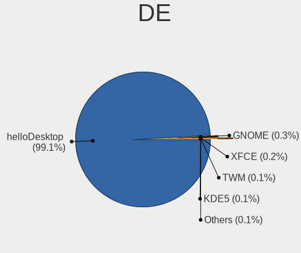
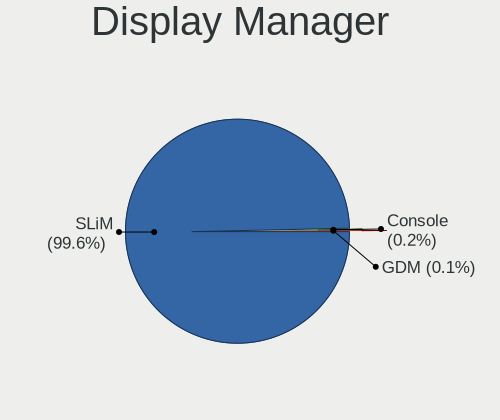
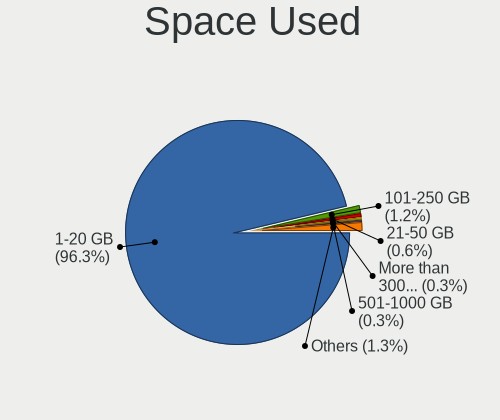
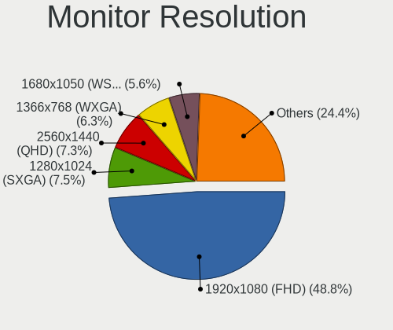
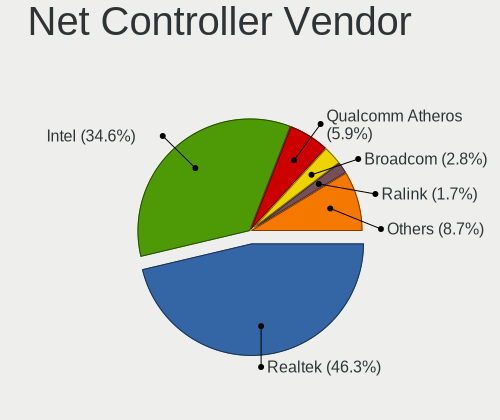
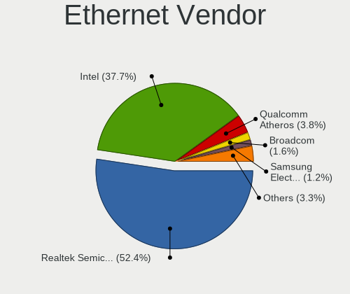
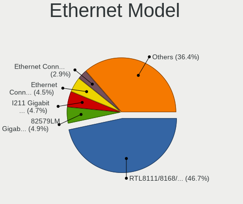
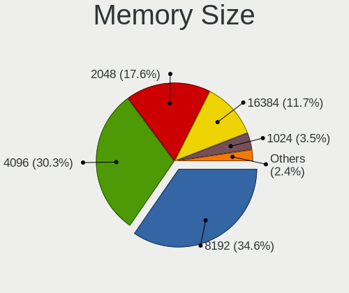

helloSystem - Tested Hardware & Statistics (Desktops)
-----------------------------------------------------

A project to collect tested hardware configurations for helloSystem.

Anyone can contribute to this report by the [hw-probe](https://github.com/linuxhw/hw-probe/blob/master/INSTALL.BSD.md) tool:

    hw-probe -all -upload

Please contribute! Especially if your hardware is rare.

Full-feature report is available here: https://bsd-hardware.info/?view=trends

Contents
--------

* [ Test Cases ](#test-cases)

* [ System ](#system)
  - [ OS                       ](#os)
  - [ OS Family                ](#os-family)
  - [ Arch                     ](#arch)
  - [ DE                       ](#de)
  - [ Display Server           ](#display-server)
  - [ Display Manager          ](#display-manager)
  - [ OS Lang                  ](#os-lang)
  - [ Boot Mode                ](#boot-mode)
  - [ Filesystem               ](#filesystem)
  - [ Part. scheme             ](#part-scheme)

* [ Board ](#board)
  - [ Vendor                   ](#vendor)
  - [ Model                    ](#model)
  - [ Model Family             ](#model-family)
  - [ MFG Year                 ](#mfg-year)
  - [ Form Factor              ](#form-factor)
  - [ Coreboot                 ](#coreboot)
  - [ RAM Size                 ](#ram-size)
  - [ RAM Used                 ](#ram-used)
  - [ Total Drives             ](#total-drives)
  - [ Has CD-ROM               ](#has-cd-rom)
  - [ Has Ethernet             ](#has-ethernet)
  - [ Has WiFi                 ](#has-wifi)
  - [ Has Bluetooth            ](#has-bluetooth)

* [ Location ](#location)
  - [ Country                  ](#country)
  - [ City                     ](#city)

* [ Drives ](#drives)
  - [ Drive Vendor             ](#drive-vendor)
  - [ Drive Model              ](#drive-model)
  - [ HDD Vendor               ](#hdd-vendor)
  - [ SSD Vendor               ](#ssd-vendor)
  - [ Drive Kind               ](#drive-kind)
  - [ Drive Connector          ](#drive-connector)
  - [ Drive Size               ](#drive-size)
  - [ Space Total              ](#space-total)
  - [ Space Used               ](#space-used)
  - [ Malfunc. Drives          ](#malfunc-drives)
  - [ Malfunc. Drive Vendor    ](#malfunc-drive-vendor)
  - [ Malfunc. HDD Vendor      ](#malfunc-hdd-vendor)
  - [ Malfunc. Drive Kind      ](#malfunc-drive-kind)
  - [ Failed Drives            ](#failed-drives)
  - [ Failed Drive Vendor      ](#failed-drive-vendor)
  - [ Drive Status             ](#drive-status)

* [ Storage controller ](#storage-controller)
  - [ Storage Vendor           ](#storage-vendor)
  - [ Storage Model            ](#storage-model)
  - [ Storage Kind             ](#storage-kind)

* [ Processor ](#processor)
  - [ CPU Vendor               ](#cpu-vendor)
  - [ CPU Model                ](#cpu-model)
  - [ CPU Model Family         ](#cpu-model-family)
  - [ CPU Cores                ](#cpu-cores)
  - [ CPU Sockets              ](#cpu-sockets)
  - [ CPU Threads              ](#cpu-threads)
  - [ CPU Microarch            ](#cpu-microarch)

* [ Graphics ](#graphics)
  - [ GPU Vendor               ](#gpu-vendor)
  - [ GPU Model                ](#gpu-model)
  - [ GPU Combo                ](#gpu-combo)
  - [ GPU Driver               ](#gpu-driver)
  - [ GPU Memory               ](#gpu-memory)

* [ Monitor ](#monitor)
  - [ Monitor Vendor           ](#monitor-vendor)
  - [ Monitor Model            ](#monitor-model)
  - [ Monitor Resolution       ](#monitor-resolution)
  - [ Monitor Diagonal         ](#monitor-diagonal)
  - [ Monitor Width            ](#monitor-width)
  - [ Aspect Ratio             ](#aspect-ratio)
  - [ Monitor Area             ](#monitor-area)
  - [ Pixel Density            ](#pixel-density)
  - [ Multiple Monitors        ](#multiple-monitors)

* [ Network ](#network)
  - [ Net Controller Vendor    ](#net-controller-vendor)
  - [ Net Controller Model     ](#net-controller-model)
  - [ Wireless Vendor          ](#wireless-vendor)
  - [ Wireless Model           ](#wireless-model)
  - [ Ethernet Vendor          ](#ethernet-vendor)
  - [ Ethernet Model           ](#ethernet-model)
  - [ Net Controller Kind      ](#net-controller-kind)
  - [ Used Controller          ](#used-controller)
  - [ NICs                     ](#nics)
  - [ IPv6                     ](#ipv6)

* [ Bluetooth ](#bluetooth)
  - [ Bluetooth Vendor         ](#bluetooth-vendor)
  - [ Bluetooth Model          ](#bluetooth-model)

* [ Sound ](#sound)
  - [ Sound Vendor             ](#sound-vendor)
  - [ Sound Model              ](#sound-model)

* [ Memory ](#memory)
  - [ Memory Vendor            ](#memory-vendor)
  - [ Memory Model             ](#memory-model)
  - [ Memory Kind              ](#memory-kind)
  - [ Memory Form Factor       ](#memory-form-factor)
  - [ Memory Size              ](#memory-size)
  - [ Memory Speed             ](#memory-speed)

* [ Printers & scanners ](#printers--scanners)
  - [ Printer Vendor           ](#printer-vendor)
  - [ Printer Model            ](#printer-model)
  - [ Scanner Vendor           ](#scanner-vendor)
  - [ Scanner Model            ](#scanner-model)

* [ Camera ](#camera)
  - [ Camera Vendor            ](#camera-vendor)
  - [ Camera Model             ](#camera-model)

* [ Security ](#security)
  - [ Fingerprint Vendor       ](#fingerprint-vendor)
  - [ Fingerprint Model        ](#fingerprint-model)
  - [ Chipcard Vendor          ](#chipcard-vendor)
  - [ Chipcard Model           ](#chipcard-model)

* [ Unsupported ](#unsupported)
  - [ Unsupported Devices      ](#unsupported-devices)
  - [ Unsupported Device Types ](#unsupported-device-types)

Test Cases
----------

Total: 492

| Vendor        | Model                       | Probe                                                     | Date         |
|---------------|-----------------------------|-----------------------------------------------------------|--------------|
| Lenovo        | 30D9 SDK0J40705 WIN 3425... | [964ceb3616](https://bsd-hardware.info/?probe=964ceb3616) | Apr 03, 2022 |
| Lenovo        | 30D9 SDK0J40705 WIN 3425... | [5038186437](https://bsd-hardware.info/?probe=5038186437) | Apr 02, 2022 |
| Acidanther... | Mac-F60DEB81FF30ACF6 Mac... | [9b6f9eac6f](https://bsd-hardware.info/?probe=9b6f9eac6f) | Apr 01, 2022 |
| ASUSTek       | P8Z77-V LX                  | [42419abab8](https://bsd-hardware.info/?probe=42419abab8) | Apr 01, 2022 |
| Dell          | 0D6H9T A00                  | [7daab72741](https://bsd-hardware.info/?probe=7daab72741) | Apr 01, 2022 |
| ASUSTek       | P8Z77-V LX                  | [49627775f3](https://bsd-hardware.info/?probe=49627775f3) | Mar 31, 2022 |
| ASUSTek       | P6-P8H61E                   | [11664cd9d7](https://bsd-hardware.info/?probe=11664cd9d7) | Mar 30, 2022 |
| ASUSTek       | M4A88T-M                    | [6a615f6be5](https://bsd-hardware.info/?probe=6a615f6be5) | Mar 30, 2022 |
| ASUSTek       | P6-P8H61E                   | [540f66f678](https://bsd-hardware.info/?probe=540f66f678) | Mar 29, 2022 |
| ASUSTek       | M5A78L-M LX3                | [0906d116eb](https://bsd-hardware.info/?probe=0906d116eb) | Mar 29, 2022 |
| Gigabyte      | H110N-CF                    | [89593af061](https://bsd-hardware.info/?probe=89593af061) | Mar 29, 2022 |
| Gigabyte      | H61M-S2PV                   | [553f2beb91](https://bsd-hardware.info/?probe=553f2beb91) | Mar 27, 2022 |
| ASRock        | A320M-HDV R4.0              | [8c89faeb24](https://bsd-hardware.info/?probe=8c89faeb24) | Mar 26, 2022 |
| ASRock        | A320M-HDV R4.0              | [ae1fa6cbce](https://bsd-hardware.info/?probe=ae1fa6cbce) | Mar 26, 2022 |
| ASUSTek       | P8Z77-V LX                  | [70d10ce47c](https://bsd-hardware.info/?probe=70d10ce47c) | Mar 25, 2022 |
| MSI           | B85-G43                     | [f0a919c35f](https://bsd-hardware.info/?probe=f0a919c35f) | Mar 25, 2022 |
| ASUSTek       | P8Z77-V LX                  | [99d079bd5a](https://bsd-hardware.info/?probe=99d079bd5a) | Mar 25, 2022 |
| MSI           | B85-G43                     | [7bd545fda8](https://bsd-hardware.info/?probe=7bd545fda8) | Mar 25, 2022 |
| ASUSTek       | P8Z77-V LX                  | [c76aa38baf](https://bsd-hardware.info/?probe=c76aa38baf) | Mar 24, 2022 |
| ASUSTek       | P8Z77-V LX                  | [8696405d09](https://bsd-hardware.info/?probe=8696405d09) | Mar 24, 2022 |
| ECS           | G41T-M9                     | [9ef50c47da](https://bsd-hardware.info/?probe=9ef50c47da) | Mar 21, 2022 |
| Gigabyte      | H270-Gaming 3               | [2727a8e439](https://bsd-hardware.info/?probe=2727a8e439) | Mar 15, 2022 |
| Gigabyte      | G31M-S2C                    | [5a22bb6991](https://bsd-hardware.info/?probe=5a22bb6991) | Mar 12, 2022 |
| Lenovo        | IdeaCentre B545 10100       | [2f13d4a946](https://bsd-hardware.info/?probe=2f13d4a946) | Mar 12, 2022 |
| MSI           | B350M BAZOOKA               | [bac8d0bdb7](https://bsd-hardware.info/?probe=bac8d0bdb7) | Mar 11, 2022 |
| ASUSTek       | P5Q DELUXE                  | [b4234170e8](https://bsd-hardware.info/?probe=b4234170e8) | Mar 10, 2022 |
| Pegatron      | IPM41-D3                    | [a58b9a4f8f](https://bsd-hardware.info/?probe=a58b9a4f8f) | Mar 09, 2022 |
| Koloe         | X58                         | [58e098eca2](https://bsd-hardware.info/?probe=58e098eca2) | Mar 09, 2022 |
| HP            | 8054                        | [86b6b8373c](https://bsd-hardware.info/?probe=86b6b8373c) | Mar 08, 2022 |
| HP            | 8054                        | [00078554d2](https://bsd-hardware.info/?probe=00078554d2) | Mar 08, 2022 |
| Koloe         | X58                         | [c501dfa5c8](https://bsd-hardware.info/?probe=c501dfa5c8) | Mar 07, 2022 |
| Dell          | 0GXM1W A00                  | [c4d10a26fd](https://bsd-hardware.info/?probe=c4d10a26fd) | Mar 04, 2022 |
| ASRock        | G41C-VS                     | [a9a1b1a493](https://bsd-hardware.info/?probe=a9a1b1a493) | Mar 03, 2022 |
| Intel         | DN2800MT AAG23738-600       | [8ecf2d023f](https://bsd-hardware.info/?probe=8ecf2d023f) | Mar 02, 2022 |
| HP            | 1905                        | [e271589365](https://bsd-hardware.info/?probe=e271589365) | Mar 01, 2022 |
| Gigabyte      | B450M S2H                   | [78f79fab6f](https://bsd-hardware.info/?probe=78f79fab6f) | Feb 28, 2022 |
| Dell          | 0KV62T A00                  | [0541a207c7](https://bsd-hardware.info/?probe=0541a207c7) | Feb 28, 2022 |
| HP            | 1905                        | [aa010e00f2](https://bsd-hardware.info/?probe=aa010e00f2) | Feb 28, 2022 |
| ASRock        | TRX40 Taichi                | [a2df68e1d1](https://bsd-hardware.info/?probe=a2df68e1d1) | Feb 26, 2022 |
| Intel         | H81                         | [dd19abd47d](https://bsd-hardware.info/?probe=dd19abd47d) | Feb 25, 2022 |
| Intel         | H81                         | [04d2739bdc](https://bsd-hardware.info/?probe=04d2739bdc) | Feb 25, 2022 |
| Intel         | DCP847SKE G80890-107        | [f9d33f1ab1](https://bsd-hardware.info/?probe=f9d33f1ab1) | Feb 23, 2022 |
| Medion        | H61H2-LM3                   | [beb12f2884](https://bsd-hardware.info/?probe=beb12f2884) | Feb 23, 2022 |
| ASRock        | H81M-DG4                    | [e20db6ad83](https://bsd-hardware.info/?probe=e20db6ad83) | Feb 23, 2022 |
| HP            | 1998                        | [485d417a2e](https://bsd-hardware.info/?probe=485d417a2e) | Feb 23, 2022 |
| Dell          | 0VD5HY A07                  | [bb86fb3e67](https://bsd-hardware.info/?probe=bb86fb3e67) | Feb 22, 2022 |
| ASUSTek       | CROSSHAIR VI HERO           | [1e6ff84e5d](https://bsd-hardware.info/?probe=1e6ff84e5d) | Feb 21, 2022 |
| Gigabyte      | P41T-D3                     | [e5417931a7](https://bsd-hardware.info/?probe=e5417931a7) | Feb 18, 2022 |
| ASRock        | B460M Pro4                  | [7a2781344f](https://bsd-hardware.info/?probe=7a2781344f) | Feb 17, 2022 |
| ASUSTek       | PRIME Z390-P                | [3a72227408](https://bsd-hardware.info/?probe=3a72227408) | Feb 16, 2022 |
| ASUSTek       | TUF GAMING X570-PLUS        | [64999a24c1](https://bsd-hardware.info/?probe=64999a24c1) | Feb 16, 2022 |
| Gigabyte      | C246M-WU4-CF                | [4b6c6d8bde](https://bsd-hardware.info/?probe=4b6c6d8bde) | Feb 15, 2022 |
| MSI           | B450 GAMING PLUS MAX        | [df6278638e](https://bsd-hardware.info/?probe=df6278638e) | Feb 15, 2022 |
| AMD           | X64                         | [e5a9ff1138](https://bsd-hardware.info/?probe=e5a9ff1138) | Feb 15, 2022 |
| Lenovo        | SHARKBAY SDK0E50510 WIN     | [eddeb5c246](https://bsd-hardware.info/?probe=eddeb5c246) | Feb 13, 2022 |
| ASRock        | H61M/U3S3                   | [257e13f206](https://bsd-hardware.info/?probe=257e13f206) | Feb 12, 2022 |
| ASUSTek       | PRIME Z390-P                | [abf34bbc7e](https://bsd-hardware.info/?probe=abf34bbc7e) | Feb 12, 2022 |
| ASRock        | H61M/U3S3                   | [34dac4c0cd](https://bsd-hardware.info/?probe=34dac4c0cd) | Feb 11, 2022 |
| MSI           | B450 GAMING PLUS MAX        | [6997de25f9](https://bsd-hardware.info/?probe=6997de25f9) | Feb 11, 2022 |
| MACHINIST     | X99-k9 V2.0                 | [0a36d71db1](https://bsd-hardware.info/?probe=0a36d71db1) | Feb 10, 2022 |
| Intel         | X58                         | [f7075908f6](https://bsd-hardware.info/?probe=f7075908f6) | Feb 09, 2022 |
| ASUSTek       | PRIME Z390-P                | [b1931633be](https://bsd-hardware.info/?probe=b1931633be) | Feb 09, 2022 |
| ASUSTek       | PRIME Z390-P                | [f9c1e787a9](https://bsd-hardware.info/?probe=f9c1e787a9) | Feb 09, 2022 |
| MSI           | B75A-G43                    | [8e445eb2d4](https://bsd-hardware.info/?probe=8e445eb2d4) | Feb 08, 2022 |
| ASUSTek       | P6-P8H61E                   | [e838981914](https://bsd-hardware.info/?probe=e838981914) | Feb 06, 2022 |
| ASRock        | H81M-VG4 R2.0               | [8af8b5270e](https://bsd-hardware.info/?probe=8af8b5270e) | Feb 04, 2022 |
| Apple         | Mac-F221BEC8                | [e5043f0af4](https://bsd-hardware.info/?probe=e5043f0af4) | Feb 04, 2022 |
| Pegatron      | NARRA5                      | [64d4fb9b97](https://bsd-hardware.info/?probe=64d4fb9b97) | Feb 02, 2022 |
| Gigabyte      | Z390 GAMING X-CF            | [ee05643521](https://bsd-hardware.info/?probe=ee05643521) | Feb 01, 2022 |
| ASUSTek       | P5P43TD PRO                 | [5999e0ebfb](https://bsd-hardware.info/?probe=5999e0ebfb) | Jan 31, 2022 |
| Intel         | H81                         | [c2f3025900](https://bsd-hardware.info/?probe=c2f3025900) | Jan 31, 2022 |
| Pegatron      | 2A99h                       | [e34b6118a2](https://bsd-hardware.info/?probe=e34b6118a2) | Jan 30, 2022 |
| Fujitsu       | D3161-A1 S26361-D3161-A1    | [58ea01e4e6](https://bsd-hardware.info/?probe=58ea01e4e6) | Jan 29, 2022 |
| Intel         | DH77EB AAG39073-400         | [bfe6ef301b](https://bsd-hardware.info/?probe=bfe6ef301b) | Jan 29, 2022 |
| Dell          | 014GRG A03                  | [8e0a22c065](https://bsd-hardware.info/?probe=8e0a22c065) | Jan 28, 2022 |
| Pegatron      | IPPPV-D3G                   | [d5e44ccf6b](https://bsd-hardware.info/?probe=d5e44ccf6b) | Jan 28, 2022 |
| Dell          | 014GRG A03                  | [5996ba19b1](https://bsd-hardware.info/?probe=5996ba19b1) | Jan 27, 2022 |
| ASUSTek       | P5GC-MX                     | [372749f9d7](https://bsd-hardware.info/?probe=372749f9d7) | Jan 27, 2022 |
| Unknown       | Unknown                     | [a9d799ca71](https://bsd-hardware.info/?probe=a9d799ca71) | Jan 27, 2022 |
| ASUSTek       | P5B SE                      | [f97fba19c1](https://bsd-hardware.info/?probe=f97fba19c1) | Jan 26, 2022 |
| Dell          | 014GRG A03                  | [223d955a90](https://bsd-hardware.info/?probe=223d955a90) | Jan 26, 2022 |
| Fujitsu       | D3161-A1 S26361-D3161-A1    | [9f0a000ceb](https://bsd-hardware.info/?probe=9f0a000ceb) | Jan 25, 2022 |
| ASUSTek       | P5B SE                      | [e3332e7b94](https://bsd-hardware.info/?probe=e3332e7b94) | Jan 25, 2022 |
| ASRock        | B460M Pro4                  | [107a1e59f5](https://bsd-hardware.info/?probe=107a1e59f5) | Jan 25, 2022 |
| ASRock        | A300M-STX                   | [8edf072b67](https://bsd-hardware.info/?probe=8edf072b67) | Jan 25, 2022 |
| Intel         | MAHOBAY                     | [2036093b68](https://bsd-hardware.info/?probe=2036093b68) | Jan 25, 2022 |
| ASUSTek       | BM6835_BM6635_BP6335        | [73562aa169](https://bsd-hardware.info/?probe=73562aa169) | Jan 25, 2022 |
| ASUSTek       | P8H61-M LX3 PLUS R2.0       | [df08e2e8f0](https://bsd-hardware.info/?probe=df08e2e8f0) | Jan 24, 2022 |
| Dell          | 05DN3X A00                  | [e0e63e69ef](https://bsd-hardware.info/?probe=e0e63e69ef) | Jan 23, 2022 |
| ASUSTek       | P7H55-M                     | [fb73c2f7dc](https://bsd-hardware.info/?probe=fb73c2f7dc) | Jan 23, 2022 |
| HP            | 8648                        | [b0adf55067](https://bsd-hardware.info/?probe=b0adf55067) | Jan 23, 2022 |
| HP            | 1998                        | [b59dbcdc9c](https://bsd-hardware.info/?probe=b59dbcdc9c) | Jan 23, 2022 |
| Dell          | 05DN3X A00                  | [460ea5c41d](https://bsd-hardware.info/?probe=460ea5c41d) | Jan 23, 2022 |
| Dell          | 0593VH A00                  | [484d14dbef](https://bsd-hardware.info/?probe=484d14dbef) | Jan 22, 2022 |
| ASUSTek       | ROG STRIX B450-F GAMING     | [670e41ed41](https://bsd-hardware.info/?probe=670e41ed41) | Jan 21, 2022 |
| MSI           | PRO Z690-A WIFI DDR4        | [04abd226f3](https://bsd-hardware.info/?probe=04abd226f3) | Jan 21, 2022 |
| ASUSTek       | Maximus VIII HERO           | [a780a7bab2](https://bsd-hardware.info/?probe=a780a7bab2) | Jan 18, 2022 |
| ASRock        | B365M Pro4                  | [8449bd20c1](https://bsd-hardware.info/?probe=8449bd20c1) | Jan 18, 2022 |
| Dell          | 0YF8P5 A00                  | [913b2a7483](https://bsd-hardware.info/?probe=913b2a7483) | Jan 18, 2022 |
| ASUSTek       | TUF GAMING X570-PLUS        | [9cd2758a5f](https://bsd-hardware.info/?probe=9cd2758a5f) | Jan 18, 2022 |
| ASUSTek       | PRIME X570-P                | [3dead218e1](https://bsd-hardware.info/?probe=3dead218e1) | Jan 16, 2022 |
| Gigabyte      | B365 HD3                    | [62fc48bd99](https://bsd-hardware.info/?probe=62fc48bd99) | Jan 15, 2022 |
| Dell          | 0XCR8D A03                  | [48e9447b37](https://bsd-hardware.info/?probe=48e9447b37) | Jan 15, 2022 |
| ASUSTek       | ROG STRIX Z390-E GAMING     | [d377e06101](https://bsd-hardware.info/?probe=d377e06101) | Jan 15, 2022 |
| Gigabyte      | Z77N-WIFI                   | [459bb6486d](https://bsd-hardware.info/?probe=459bb6486d) | Jan 13, 2022 |
| Dell          | 0X4N41 A01                  | [87000234dc](https://bsd-hardware.info/?probe=87000234dc) | Jan 11, 2022 |
| ASUSTek       | P8Z68-M PRO                 | [a0885f4f44](https://bsd-hardware.info/?probe=a0885f4f44) | Jan 10, 2022 |
| HP            | 8169                        | [85e0cf058c](https://bsd-hardware.info/?probe=85e0cf058c) | Jan 10, 2022 |
| ASUSTek       | GA35DX                      | [eccb947ae4](https://bsd-hardware.info/?probe=eccb947ae4) | Jan 05, 2022 |
| Unknown       | G31T-M7                     | [ed7d80e01a](https://bsd-hardware.info/?probe=ed7d80e01a) | Jan 03, 2022 |
| ASUSTek       | TUF GAMING X570-PLUS        | [a671e3eb04](https://bsd-hardware.info/?probe=a671e3eb04) | Dec 31, 2021 |
| ASUSTek       | M5A78L/USB3                 | [f1fe3fe225](https://bsd-hardware.info/?probe=f1fe3fe225) | Dec 30, 2021 |
| ASRock        | X570 Phantom Gaming 4       | [15211db056](https://bsd-hardware.info/?probe=15211db056) | Dec 28, 2021 |
| Dell          | 0200DY A01                  | [fb37dcbb93](https://bsd-hardware.info/?probe=fb37dcbb93) | Dec 28, 2021 |
| Pegatron      | IPM41-D3                    | [6829928dad](https://bsd-hardware.info/?probe=6829928dad) | Dec 28, 2021 |
| Dell          | 0H9KW5 A00                  | [e962ca25b3](https://bsd-hardware.info/?probe=e962ca25b3) | Dec 28, 2021 |
| Gigabyte      | 970A-DS3P                   | [0918f0a5b9](https://bsd-hardware.info/?probe=0918f0a5b9) | Dec 25, 2021 |
| ASUSTek       | PRIME B350M-A               | [b0aa3885bb](https://bsd-hardware.info/?probe=b0aa3885bb) | Dec 25, 2021 |
| ASUSTek       | Z170-P                      | [bde74629f9](https://bsd-hardware.info/?probe=bde74629f9) | Dec 25, 2021 |
| ASUSTek       | TUF GAMING X570-PLUS        | [8ac48ba9c3](https://bsd-hardware.info/?probe=8ac48ba9c3) | Dec 23, 2021 |
| Gigabyte      | E3000N                      | [eb0ba1b296](https://bsd-hardware.info/?probe=eb0ba1b296) | Dec 22, 2021 |
| ASUSTek       | ROG STRIX Z370-E GAMING     | [936afa4de3](https://bsd-hardware.info/?probe=936afa4de3) | Dec 21, 2021 |
| ASUSTek       | PRIME A320M-K               | [42599b554e](https://bsd-hardware.info/?probe=42599b554e) | Dec 21, 2021 |
| Gigabyte      | X58A-UD5                    | [62b94dd372](https://bsd-hardware.info/?probe=62b94dd372) | Dec 21, 2021 |
| ASUSTek       | ROG STRIX X570-E GAMING     | [5cc62c68f9](https://bsd-hardware.info/?probe=5cc62c68f9) | Dec 21, 2021 |
| Gigabyte      | H170-D3HP-CF                | [a490614a39](https://bsd-hardware.info/?probe=a490614a39) | Dec 21, 2021 |
| ASRock        | H110M-DGS                   | [40c4553adb](https://bsd-hardware.info/?probe=40c4553adb) | Dec 21, 2021 |
| ASUSTek       | P5VD2-VM                    | [7e8f3cf783](https://bsd-hardware.info/?probe=7e8f3cf783) | Dec 20, 2021 |
| ASUSTek       | Q170M-C                     | [7f9e35a31c](https://bsd-hardware.info/?probe=7f9e35a31c) | Dec 20, 2021 |
| Dell          | 0TDG4V A00                  | [3ce808c135](https://bsd-hardware.info/?probe=3ce808c135) | Dec 20, 2021 |
| Dell          | 0TDG4V A00                  | [5292ad64ef](https://bsd-hardware.info/?probe=5292ad64ef) | Dec 20, 2021 |
| ASUSTek       | P8Z77-V LX                  | [3c71a8ba4e](https://bsd-hardware.info/?probe=3c71a8ba4e) | Dec 20, 2021 |
| MSI           | X370 SLI PLUS               | [73853f1fc2](https://bsd-hardware.info/?probe=73853f1fc2) | Dec 19, 2021 |
| Quanta        | 2AC7 011                    | [1a831a1d34](https://bsd-hardware.info/?probe=1a831a1d34) | Dec 18, 2021 |
| Gigabyte      | Z77X-UD3H                   | [759ce775c9](https://bsd-hardware.info/?probe=759ce775c9) | Dec 15, 2021 |
| ASUSTek       | TUF GAMING X570-PLUS        | [32d20b9b8e](https://bsd-hardware.info/?probe=32d20b9b8e) | Dec 14, 2021 |
| HP            | 843B                        | [f0d279747f](https://bsd-hardware.info/?probe=f0d279747f) | Dec 13, 2021 |
| HP            | 843B                        | [56400d3999](https://bsd-hardware.info/?probe=56400d3999) | Dec 13, 2021 |
| ASUSTek       | PRIME B450M-A               | [aea4a33dee](https://bsd-hardware.info/?probe=aea4a33dee) | Dec 13, 2021 |
| ASUSTek       | H110M-K                     | [2921401f70](https://bsd-hardware.info/?probe=2921401f70) | Dec 12, 2021 |
| Gigabyte      | H270M-DS3H-CF               | [50fba6deda](https://bsd-hardware.info/?probe=50fba6deda) | Dec 11, 2021 |
| Gigabyte      | B450 I AORUS PRO WIFI-CF    | [6a1100cfdb](https://bsd-hardware.info/?probe=6a1100cfdb) | Dec 11, 2021 |
| Acer          | RevoOne RL85                | [a1e32de7da](https://bsd-hardware.info/?probe=a1e32de7da) | Dec 10, 2021 |
| Gigabyte      | B450 I AORUS PRO WIFI-CF    | [b900b364f6](https://bsd-hardware.info/?probe=b900b364f6) | Dec 10, 2021 |
| HP            | 8054                        | [de953100f6](https://bsd-hardware.info/?probe=de953100f6) | Dec 10, 2021 |
| MSI           | MPG B550 GAMING EDGE WIF... | [a9423b3232](https://bsd-hardware.info/?probe=a9423b3232) | Dec 09, 2021 |
| Dell          | 0YF8P5 A00                  | [0f03a66475](https://bsd-hardware.info/?probe=0f03a66475) | Dec 09, 2021 |
| Dell          | 0YF8P5 A00                  | [83b36f7c3d](https://bsd-hardware.info/?probe=83b36f7c3d) | Dec 09, 2021 |
| Gigabyte      | H270M-DS3H-CF               | [a084ff48c2](https://bsd-hardware.info/?probe=a084ff48c2) | Dec 09, 2021 |
| Gigabyte      | H270M-DS3H-CF               | [17b557d792](https://bsd-hardware.info/?probe=17b557d792) | Dec 08, 2021 |
| ASUSTek       | Pro WS X570-ACE             | [35b01f0f56](https://bsd-hardware.info/?probe=35b01f0f56) | Dec 05, 2021 |
| MSI           | B450 TOMAHAWK MAX           | [14f1956220](https://bsd-hardware.info/?probe=14f1956220) | Dec 04, 2021 |
| Gigabyte      | X570 AORUS ELITE            | [8cfe11fe93](https://bsd-hardware.info/?probe=8cfe11fe93) | Nov 30, 2021 |
| HP            | 843B                        | [376e006a40](https://bsd-hardware.info/?probe=376e006a40) | Nov 30, 2021 |
| Intel         | DG41TY AAE47335-300         | [dd357bcaa5](https://bsd-hardware.info/?probe=dd357bcaa5) | Nov 30, 2021 |
| HP            | 843B                        | [404224439d](https://bsd-hardware.info/?probe=404224439d) | Nov 29, 2021 |
| HP            | 843B                        | [a8ac0e9efb](https://bsd-hardware.info/?probe=a8ac0e9efb) | Nov 29, 2021 |
| Fujitsu       | D3220-A1 S26361-D3220-A1    | [bc3b65334e](https://bsd-hardware.info/?probe=bc3b65334e) | Nov 29, 2021 |
| HP            | 1825                        | [32f07d2ba3](https://bsd-hardware.info/?probe=32f07d2ba3) | Nov 28, 2021 |
| Dell          | 0DR845                      | [4d07453a93](https://bsd-hardware.info/?probe=4d07453a93) | Nov 27, 2021 |
| Gigabyte      | B450 I AORUS PRO WIFI-CF    | [4cd5e5166a](https://bsd-hardware.info/?probe=4cd5e5166a) | Nov 27, 2021 |
| ASRock        | 775i945GZ                   | [16fc4ee10d](https://bsd-hardware.info/?probe=16fc4ee10d) | Nov 26, 2021 |
| ASRock        | AB350 Pro4                  | [ef35dd084e](https://bsd-hardware.info/?probe=ef35dd084e) | Nov 26, 2021 |
| HP            | 0A80h                       | [1e1153ee69](https://bsd-hardware.info/?probe=1e1153ee69) | Nov 22, 2021 |
| ASUSTek       | ROG STRIX X470-F GAMING     | [afd0cf45c6](https://bsd-hardware.info/?probe=afd0cf45c6) | Nov 21, 2021 |
| ASUSTek       | TUF GAMING X570-PLUS        | [12a360ddd1](https://bsd-hardware.info/?probe=12a360ddd1) | Nov 14, 2021 |
| T-bao         | MINI PC V1.0                | [4ee7de3597](https://bsd-hardware.info/?probe=4ee7de3597) | Nov 12, 2021 |
| Biostar       | B365MHC                     | [0c059bab3f](https://bsd-hardware.info/?probe=0c059bab3f) | Nov 11, 2021 |
| Itautec       | ST 4344 ST-4344 Padrao 0... | [ec13cb0829](https://bsd-hardware.info/?probe=ec13cb0829) | Nov 07, 2021 |
| Shuttle       | FH61R                       | [a231590743](https://bsd-hardware.info/?probe=a231590743) | Nov 07, 2021 |
| ASUSTek       | M5A78L-M/USB3               | [7e27b1bc46](https://bsd-hardware.info/?probe=7e27b1bc46) | Nov 07, 2021 |
| Intel         | H81                         | [7f07aecffc](https://bsd-hardware.info/?probe=7f07aecffc) | Nov 07, 2021 |
| HP            | 844C                        | [fb7d8eaf5d](https://bsd-hardware.info/?probe=fb7d8eaf5d) | Nov 06, 2021 |
| Unknown       | X79                         | [ef88cbc606](https://bsd-hardware.info/?probe=ef88cbc606) | Nov 05, 2021 |
| ASRock        | X370 Gaming X               | [2a874a33dd](https://bsd-hardware.info/?probe=2a874a33dd) | Nov 05, 2021 |
| Lenovo        | SHARKBAY No DPK             | [b9ad64f354](https://bsd-hardware.info/?probe=b9ad64f354) | Nov 04, 2021 |
| Gigabyte      | F2A78M-DS2                  | [45576fddfa](https://bsd-hardware.info/?probe=45576fddfa) | Nov 02, 2021 |
| Dell          | 0M5DCD A02                  | [4ff4198768](https://bsd-hardware.info/?probe=4ff4198768) | Nov 02, 2021 |
| Gateway       | DX4840                      | [1d2e9e175c](https://bsd-hardware.info/?probe=1d2e9e175c) | Nov 01, 2021 |
| ASRock        | X300M-STX                   | [e25f042400](https://bsd-hardware.info/?probe=e25f042400) | Oct 30, 2021 |
| Unknown       | Intel X79                   | [044908e7c3](https://bsd-hardware.info/?probe=044908e7c3) | Oct 30, 2021 |
| HP            | 843B                        | [9761f29b5e](https://bsd-hardware.info/?probe=9761f29b5e) | Oct 25, 2021 |
| ASUSTek       | TUF GAMING X570-PLUS        | [9f8010bdbe](https://bsd-hardware.info/?probe=9f8010bdbe) | Oct 25, 2021 |
| ASUSTek       | TUF B450M-PRO GAMING        | [9959c0900a](https://bsd-hardware.info/?probe=9959c0900a) | Oct 23, 2021 |
| Gigabyte      | H410M S2 V2                 | [b106820e47](https://bsd-hardware.info/?probe=b106820e47) | Oct 21, 2021 |
| Acer          | RS880M05                    | [4718f0cb0c](https://bsd-hardware.info/?probe=4718f0cb0c) | Oct 21, 2021 |
| Apple         | Mac-F221BEC8                | [cb2cc35e6c](https://bsd-hardware.info/?probe=cb2cc35e6c) | Oct 19, 2021 |
| Gigabyte      | 990FXA-UD3                  | [3cf20ca77c](https://bsd-hardware.info/?probe=3cf20ca77c) | Oct 19, 2021 |
| Dell          | 0VRWRC A00                  | [9b4defb194](https://bsd-hardware.info/?probe=9b4defb194) | Oct 19, 2021 |
| HP            | 3398                        | [892f19c9bd](https://bsd-hardware.info/?probe=892f19c9bd) | Oct 18, 2021 |
| ASUSTek       | CROSSHAIR V FORMULA-Z       | [0cdd3497f6](https://bsd-hardware.info/?probe=0cdd3497f6) | Oct 18, 2021 |
| Gigabyte      | G41MT-S2                    | [2847d63db0](https://bsd-hardware.info/?probe=2847d63db0) | Oct 18, 2021 |
| ASUSTek       | P5P43TD PRO                 | [2870e26de1](https://bsd-hardware.info/?probe=2870e26de1) | Oct 17, 2021 |
| ASUSTek       | F2A85-M                     | [b4e3f33e5c](https://bsd-hardware.info/?probe=b4e3f33e5c) | Oct 14, 2021 |
| Lenovo        | SHARKBAY No DPK             | [14dcd924b5](https://bsd-hardware.info/?probe=14dcd924b5) | Oct 13, 2021 |
| ASUSTek       | PRIME Z390M-PLUS            | [b3b31d25b0](https://bsd-hardware.info/?probe=b3b31d25b0) | Oct 13, 2021 |
| ASUSTek       | PRIME Z390M-PLUS            | [5a7c1871b1](https://bsd-hardware.info/?probe=5a7c1871b1) | Oct 11, 2021 |
| Acer          | Aspire TC-780               | [77101a00b3](https://bsd-hardware.info/?probe=77101a00b3) | Oct 11, 2021 |
| Acer          | Aspire TC-780               | [3ce8481842](https://bsd-hardware.info/?probe=3ce8481842) | Oct 10, 2021 |
| ASUSTek       | D940MX                      | [4e798f3ef0](https://bsd-hardware.info/?probe=4e798f3ef0) | Oct 10, 2021 |
| Medion        | H61H2-LM3                   | [67ed0f639c](https://bsd-hardware.info/?probe=67ed0f639c) | Oct 10, 2021 |
| ASUSTek       | H81M-K                      | [e24f67a603](https://bsd-hardware.info/?probe=e24f67a603) | Oct 08, 2021 |
| MSI           | G41M-P25                    | [21eec496b4](https://bsd-hardware.info/?probe=21eec496b4) | Oct 08, 2021 |
| ASRock        | A320M-DGS                   | [11cf5c923a](https://bsd-hardware.info/?probe=11cf5c923a) | Oct 08, 2021 |
| Gigabyte      | B450 AORUS M                | [d09f63f257](https://bsd-hardware.info/?probe=d09f63f257) | Oct 07, 2021 |
| Intel         | H61                         | [6ce71c1b9e](https://bsd-hardware.info/?probe=6ce71c1b9e) | Oct 06, 2021 |
| HP            | 3397                        | [4c71aae5bf](https://bsd-hardware.info/?probe=4c71aae5bf) | Oct 05, 2021 |
| ASRock        | B365M-ITX/ac                | [1c8820a6d0](https://bsd-hardware.info/?probe=1c8820a6d0) | Oct 04, 2021 |
| MSI           | B450I GAMING PLUS AC        | [43388a27a4](https://bsd-hardware.info/?probe=43388a27a4) | Oct 04, 2021 |
| MSI           | MPG X570 GAMING PRO CARB... | [bd312d1c88](https://bsd-hardware.info/?probe=bd312d1c88) | Oct 03, 2021 |
| HP            | ProLiant ML350 G5           | [4d525cba3e](https://bsd-hardware.info/?probe=4d525cba3e) | Oct 03, 2021 |
| HP            | 87D6 SMVB                   | [90d91bc113](https://bsd-hardware.info/?probe=90d91bc113) | Sep 26, 2021 |
| Gigabyte      | H61M-D2P-B3                 | [c6da80d54b](https://bsd-hardware.info/?probe=c6da80d54b) | Sep 25, 2021 |
| ASUSTek       | M5A78L-M LX3                | [f336d13e01](https://bsd-hardware.info/?probe=f336d13e01) | Sep 24, 2021 |
| Gigabyte      | H61M-D2P-B3                 | [6ed62a3798](https://bsd-hardware.info/?probe=6ed62a3798) | Sep 23, 2021 |
| ASRock        | X570 Phantom Gaming 4       | [9b14548c15](https://bsd-hardware.info/?probe=9b14548c15) | Sep 21, 2021 |
| Sapphire      | EDGE-FT1M1 E450 1AOVU044    | [ea8fefdf4e](https://bsd-hardware.info/?probe=ea8fefdf4e) | Sep 20, 2021 |
| Dell          | 0MGK50 A02                  | [9d2959b4f1](https://bsd-hardware.info/?probe=9d2959b4f1) | Sep 20, 2021 |
| HP            | 81B4 01                     | [179504116d](https://bsd-hardware.info/?probe=179504116d) | Sep 20, 2021 |
| HP            | 81B4 01                     | [5b28c9bb75](https://bsd-hardware.info/?probe=5b28c9bb75) | Sep 20, 2021 |
| ASRock        | B450 Gaming-ITX/ac          | [790d020ebe](https://bsd-hardware.info/?probe=790d020ebe) | Sep 19, 2021 |
| Foxconn       | A88GMX FAB                  | [b46845b69f](https://bsd-hardware.info/?probe=b46845b69f) | Sep 19, 2021 |
| Gigabyte      | H270M-DS3H-CF               | [9b046b157e](https://bsd-hardware.info/?probe=9b046b157e) | Sep 17, 2021 |
| Gigabyte      | H270M-DS3H-CF               | [bc2a287495](https://bsd-hardware.info/?probe=bc2a287495) | Sep 13, 2021 |
| HP            | 87D6 SMVB                   | [61fc69edfe](https://bsd-hardware.info/?probe=61fc69edfe) | Sep 13, 2021 |
| ASUSTek       | P8H77-I                     | [1feb22dc52](https://bsd-hardware.info/?probe=1feb22dc52) | Sep 12, 2021 |
| Sapphire      | EDGE-FT1M1 E450 1AOVU044    | [85ed325446](https://bsd-hardware.info/?probe=85ed325446) | Sep 11, 2021 |
| ASUSTek       | PRIME B360M-C               | [0f6e7e26fc](https://bsd-hardware.info/?probe=0f6e7e26fc) | Sep 11, 2021 |
| ASRock        | B460M Pro4                  | [cfc7818691](https://bsd-hardware.info/?probe=cfc7818691) | Sep 10, 2021 |
| ASUSTek       | H110M-PLUS                  | [08b4825275](https://bsd-hardware.info/?probe=08b4825275) | Sep 09, 2021 |
| ASRock        | B550M Pro4                  | [dc582ea4d3](https://bsd-hardware.info/?probe=dc582ea4d3) | Sep 09, 2021 |
| Lenovo        | 312A SDK0J40697 WIN 3305... | [c729f82f4c](https://bsd-hardware.info/?probe=c729f82f4c) | Sep 08, 2021 |
| Packard Be... | imedia S2110A               | [d62a38660c](https://bsd-hardware.info/?probe=d62a38660c) | Sep 08, 2021 |
| Lenovo        | Board                       | [685abcc739](https://bsd-hardware.info/?probe=685abcc739) | Sep 07, 2021 |
| HP            | 3397                        | [5d95b75768](https://bsd-hardware.info/?probe=5d95b75768) | Sep 06, 2021 |
| Medion        | H61H2-LM3                   | [7a42009a08](https://bsd-hardware.info/?probe=7a42009a08) | Sep 02, 2021 |
| Medion        | H61H2-LM3                   | [eb81abe401](https://bsd-hardware.info/?probe=eb81abe401) | Sep 02, 2021 |
| ASUSTek       | TUF GAMING X570-PLUS        | [9e13729a12](https://bsd-hardware.info/?probe=9e13729a12) | Sep 02, 2021 |
| ASRock        | Z390 Pro4                   | [ecbf097bc5](https://bsd-hardware.info/?probe=ecbf097bc5) | Sep 02, 2021 |
| ASUSTek       | TUF B360M-PLUS GAMING S     | [33ba0b7c38](https://bsd-hardware.info/?probe=33ba0b7c38) | Aug 29, 2021 |
| HP            | 0A60h                       | [0f28538e3d](https://bsd-hardware.info/?probe=0f28538e3d) | Aug 25, 2021 |
| HP            | 1589                        | [4d51cc9c4b](https://bsd-hardware.info/?probe=4d51cc9c4b) | Aug 24, 2021 |
| Acer          | Aspire TC-895 V:1.0         | [da3e8986a3](https://bsd-hardware.info/?probe=da3e8986a3) | Aug 22, 2021 |
| EVGA          | X299 MICRO                  | [d04b55d1f6](https://bsd-hardware.info/?probe=d04b55d1f6) | Aug 19, 2021 |
| ASRock        | Z390 Pro4                   | [aca402061b](https://bsd-hardware.info/?probe=aca402061b) | Aug 18, 2021 |
| Foxconn       | 2ADA                        | [e96976b2cc](https://bsd-hardware.info/?probe=e96976b2cc) | Aug 18, 2021 |
| Dell          | 0MGK50 A02                  | [2468e9d0ba](https://bsd-hardware.info/?probe=2468e9d0ba) | Aug 17, 2021 |
| HC            | HCAR357-MI V1.0             | [3293b7bad9](https://bsd-hardware.info/?probe=3293b7bad9) | Aug 17, 2021 |
| ASUSTek       | P7H55-M LX                  | [5fe1a9e521](https://bsd-hardware.info/?probe=5fe1a9e521) | Aug 16, 2021 |
| Gigabyte      | HA65M-D2H-B3                | [fc9b50bb85](https://bsd-hardware.info/?probe=fc9b50bb85) | Aug 16, 2021 |
| Gigabyte      | B360M D3H-CF                | [1c88ce5779](https://bsd-hardware.info/?probe=1c88ce5779) | Aug 10, 2021 |
| Pegatron      | IPPCR-SS                    | [8a7fc2689b](https://bsd-hardware.info/?probe=8a7fc2689b) | Aug 09, 2021 |
| Gigabyte      | A75M-DS2                    | [2010fe5fab](https://bsd-hardware.info/?probe=2010fe5fab) | Aug 09, 2021 |
| ASUSTek       | P7H55-M LX                  | [df393cc673](https://bsd-hardware.info/?probe=df393cc673) | Aug 08, 2021 |
| Intel         | D54250WYK H13922-304        | [45c86d174e](https://bsd-hardware.info/?probe=45c86d174e) | Aug 08, 2021 |
| ASUSTek       | M5A78L LE                   | [7a1d31be72](https://bsd-hardware.info/?probe=7a1d31be72) | Aug 07, 2021 |
| ASUSTek       | H81M-A                      | [bb65c30be3](https://bsd-hardware.info/?probe=bb65c30be3) | Aug 07, 2021 |
| ASUSTek       | H81M-A                      | [9e0c8e8024](https://bsd-hardware.info/?probe=9e0c8e8024) | Aug 07, 2021 |
| ASUSTek       | Crosshair V Formula         | [90c27497d9](https://bsd-hardware.info/?probe=90c27497d9) | Aug 05, 2021 |
| PCPartner     | MILANO-P Rev.00             | [526390c559](https://bsd-hardware.info/?probe=526390c559) | Aug 04, 2021 |
| PCPartner     | MILANO-P Rev.00             | [071eac9b1b](https://bsd-hardware.info/?probe=071eac9b1b) | Aug 04, 2021 |
| Biostar       | A770E3                      | [4d0ac19b8e](https://bsd-hardware.info/?probe=4d0ac19b8e) | Aug 03, 2021 |
| Dell          | 0RY007                      | [c67ccf8bc6](https://bsd-hardware.info/?probe=c67ccf8bc6) | Aug 01, 2021 |
| PCPartner     | MILANO-P Rev.00             | [ef8217ac30](https://bsd-hardware.info/?probe=ef8217ac30) | Aug 01, 2021 |
| PCPartner     | MILANO-P Rev.00             | [ef40df391b](https://bsd-hardware.info/?probe=ef40df391b) | Aug 01, 2021 |
| Gigabyte      | H110-D3A-CF                 | [7923f57fbe](https://bsd-hardware.info/?probe=7923f57fbe) | Aug 01, 2021 |
| ASUSTek       | A58M-A/USB3                 | [9ffd4220e8](https://bsd-hardware.info/?probe=9ffd4220e8) | Aug 01, 2021 |
| Biostar       | N68S3+                      | [528c9d6eab](https://bsd-hardware.info/?probe=528c9d6eab) | Jul 26, 2021 |
| Gigabyte      | PH67A-D3-B3                 | [73dff53f04](https://bsd-hardware.info/?probe=73dff53f04) | Jul 23, 2021 |
| ASUSTek       | H110M-PLUS                  | [d0f2da9c41](https://bsd-hardware.info/?probe=d0f2da9c41) | Jul 21, 2021 |
| Gigabyte      | H110-D3A-CF                 | [58e49f458e](https://bsd-hardware.info/?probe=58e49f458e) | Jul 19, 2021 |
| PCPartner     | MILANO-P Rev.00             | [f20ac8df75](https://bsd-hardware.info/?probe=f20ac8df75) | Jul 19, 2021 |
| MSI           | IONA                        | [bb2c6b383b](https://bsd-hardware.info/?probe=bb2c6b383b) | Jul 17, 2021 |
| ASRock        | N68C-GS FX                  | [012356047f](https://bsd-hardware.info/?probe=012356047f) | Jul 17, 2021 |
| ASRock        | N68C-GS FX                  | [e1f439def9](https://bsd-hardware.info/?probe=e1f439def9) | Jul 17, 2021 |
| ASUSTek       | M5A78L-M/USB3               | [20fc88018b](https://bsd-hardware.info/?probe=20fc88018b) | Jul 16, 2021 |
| HP            | 0AE8h C                     | [23df6b2e94](https://bsd-hardware.info/?probe=23df6b2e94) | Jul 12, 2021 |
| Gigabyte      | H110-D3A-CF                 | [2c390b4301](https://bsd-hardware.info/?probe=2c390b4301) | Jul 09, 2021 |
| Gigabyte      | H110-D3A-CF                 | [aea3a11daf](https://bsd-hardware.info/?probe=aea3a11daf) | Jul 08, 2021 |
| Dell          | 0GXM1W A02                  | [269edf2dcf](https://bsd-hardware.info/?probe=269edf2dcf) | Jul 06, 2021 |
| ASRock        | B450M-HDV                   | [dca41aa10a](https://bsd-hardware.info/?probe=dca41aa10a) | Jul 05, 2021 |
| ASRock        | X99 Taichi                  | [149d7abd05](https://bsd-hardware.info/?probe=149d7abd05) | Jul 04, 2021 |
| ASUSTek       | PRIME Z390-P                | [4060cdec72](https://bsd-hardware.info/?probe=4060cdec72) | Jul 04, 2021 |
| ASRock        | Z390 Pro4                   | [dc4eb674ea](https://bsd-hardware.info/?probe=dc4eb674ea) | Jul 03, 2021 |
| Shuttle       | NC10U                       | [5d2d20dd04](https://bsd-hardware.info/?probe=5d2d20dd04) | Jul 02, 2021 |
| Lenovo        | SHARKBAY SDK0E50510 WIN     | [6cf3337855](https://bsd-hardware.info/?probe=6cf3337855) | Jul 01, 2021 |
| Protectli     | FW2B Ver                    | [7b6f704247](https://bsd-hardware.info/?probe=7b6f704247) | Jun 30, 2021 |
| HP            | 0B4Ch D                     | [b56bd19073](https://bsd-hardware.info/?probe=b56bd19073) | Jun 30, 2021 |
| Biostar       | B450MH                      | [167f09a25c](https://bsd-hardware.info/?probe=167f09a25c) | Jun 29, 2021 |
| ASUSTek       | M5A97 R2.0                  | [e7a0dfcecf](https://bsd-hardware.info/?probe=e7a0dfcecf) | Jun 28, 2021 |
| Huanan        | X99-8M-F V1.2               | [6477b9ef24](https://bsd-hardware.info/?probe=6477b9ef24) | Jun 28, 2021 |
| MSI           | B450 GAMING PLUS MAX        | [f0e80b0788](https://bsd-hardware.info/?probe=f0e80b0788) | Jun 28, 2021 |
| ASUSTek       | H110M-E/M.2                 | [f3b0bb0930](https://bsd-hardware.info/?probe=f3b0bb0930) | Jun 28, 2021 |
| ASUSTek       | H81M-K                      | [1a35d2f6ab](https://bsd-hardware.info/?probe=1a35d2f6ab) | Jun 26, 2021 |
| ASUSTek       | PRIME H410M-D               | [8ea103b783](https://bsd-hardware.info/?probe=8ea103b783) | Jun 26, 2021 |
| MSI           | G41M-P25                    | [5cc75b4df0](https://bsd-hardware.info/?probe=5cc75b4df0) | Jun 25, 2021 |
| Dell          | 0P03DX A03                  | [b2f0c90d79](https://bsd-hardware.info/?probe=b2f0c90d79) | Jun 24, 2021 |
| ASUSTek       | P7H55                       | [c33ec074f8](https://bsd-hardware.info/?probe=c33ec074f8) | Jun 22, 2021 |
| ASUSTek       | P8H67-M PRO                 | [616c7043bd](https://bsd-hardware.info/?probe=616c7043bd) | Jun 22, 2021 |
| ASUSTek       | CP5141                      | [73c62835c1](https://bsd-hardware.info/?probe=73c62835c1) | Jun 21, 2021 |
| Foxconn       | 2ABF                        | [d30b2629eb](https://bsd-hardware.info/?probe=d30b2629eb) | Jun 21, 2021 |
| Intel         | DH67CL AAG10212-206         | [f2367a4249](https://bsd-hardware.info/?probe=f2367a4249) | Jun 21, 2021 |
| Gigabyte      | H97-D3H-CF                  | [a326fd4061](https://bsd-hardware.info/?probe=a326fd4061) | Jun 20, 2021 |
| Dell          | 0PGKWF A01                  | [9f09d62462](https://bsd-hardware.info/?probe=9f09d62462) | Jun 20, 2021 |
| MSI           | H110M PRO-VH PLUS           | [45b842180e](https://bsd-hardware.info/?probe=45b842180e) | Jun 20, 2021 |
| ASUSTek       | ROG STRIX H370-I GAMING     | [d2dd261a2a](https://bsd-hardware.info/?probe=d2dd261a2a) | Jun 20, 2021 |
| MSI           | B450M PRO-M2 MAX            | [edcbaf755f](https://bsd-hardware.info/?probe=edcbaf755f) | Jun 19, 2021 |
| Dell          | 0XPDFK A01                  | [631dbb841b](https://bsd-hardware.info/?probe=631dbb841b) | Jun 19, 2021 |
| Lenovo        | ThinkServer RS140           | [0f5d669e9f](https://bsd-hardware.info/?probe=0f5d669e9f) | Jun 18, 2021 |
| Lenovo        | ThinkServer RS140           | [63ba615299](https://bsd-hardware.info/?probe=63ba615299) | Jun 18, 2021 |
| Gigabyte      | AX370-Gaming-CF             | [d77be09267](https://bsd-hardware.info/?probe=d77be09267) | Jun 18, 2021 |
| Dell          | 0XPDFK A01                  | [7a1c26edeb](https://bsd-hardware.info/?probe=7a1c26edeb) | Jun 18, 2021 |
| ASUSTek       | H110I-PLUS                  | [0cb30b464d](https://bsd-hardware.info/?probe=0cb30b464d) | Jun 17, 2021 |
| ASUSTek       | H110M-E/M.2                 | [b0b67667d3](https://bsd-hardware.info/?probe=b0b67667d3) | Jun 16, 2021 |
| HP            | 3397                        | [3dd97c60ca](https://bsd-hardware.info/?probe=3dd97c60ca) | Jun 16, 2021 |
| Lenovo        | Board                       | [c981ffdff7](https://bsd-hardware.info/?probe=c981ffdff7) | Jun 15, 2021 |
| ASUSTek       | M5A78L-M LX/BR              | [5f9b56c8ae](https://bsd-hardware.info/?probe=5f9b56c8ae) | Jun 15, 2021 |
| ASUSTek       | M4A78LT-M                   | [0c8d6cd661](https://bsd-hardware.info/?probe=0c8d6cd661) | Jun 14, 2021 |
| ASUSTek       | PRIME A320M-K               | [fea57181b5](https://bsd-hardware.info/?probe=fea57181b5) | Jun 14, 2021 |
| ASRock        | G31M-VS2                    | [f2f5b95f4b](https://bsd-hardware.info/?probe=f2f5b95f4b) | Jun 14, 2021 |
| Intel         | X79 V2.72A                  | [88173bcf06](https://bsd-hardware.info/?probe=88173bcf06) | Jun 14, 2021 |
| ASUSTek       | TUF GAMING X570-PLUS        | [eeb4489d2f](https://bsd-hardware.info/?probe=eeb4489d2f) | Jun 13, 2021 |
| Gigabyte      | H470M DS3H                  | [7c37a0319b](https://bsd-hardware.info/?probe=7c37a0319b) | Jun 13, 2021 |
| ASRock        | FM2A68M-HD+                 | [8bb0d23eb4](https://bsd-hardware.info/?probe=8bb0d23eb4) | Jun 13, 2021 |
| ASUSTek       | Z97-A-USB31                 | [7fe10badbb](https://bsd-hardware.info/?probe=7fe10badbb) | Jun 11, 2021 |
| Lenovo        | Board                       | [1d6f23a5de](https://bsd-hardware.info/?probe=1d6f23a5de) | May 24, 2021 |
| Apple         | Mac-F221BEC8                | [869f003493](https://bsd-hardware.info/?probe=869f003493) | May 17, 2021 |
| MSI           | B450M-A PRO MAX             | [6317bd7dbd](https://bsd-hardware.info/?probe=6317bd7dbd) | May 05, 2021 |
| MSI           | B450-A PRO                  | [ed656e816f](https://bsd-hardware.info/?probe=ed656e816f) | May 01, 2021 |
| ASUSTek       | ROG STRIX B360-F GAMING     | [6e874538cb](https://bsd-hardware.info/?probe=6e874538cb) | Apr 20, 2021 |
| HP            | 18E7                        | [e6354de524](https://bsd-hardware.info/?probe=e6354de524) | Apr 20, 2021 |
| ASUSTek       | P5G41T-M LX3                | [1759329ae3](https://bsd-hardware.info/?probe=1759329ae3) | Apr 12, 2021 |
| Dell          | 0RW199                      | [e78392bc4c](https://bsd-hardware.info/?probe=e78392bc4c) | Apr 02, 2021 |
| Lenovo        | SHARKBAY SDK0E50510 WIN     | [62376c16a4](https://bsd-hardware.info/?probe=62376c16a4) | Mar 31, 2021 |
| Medion        | H61H2-LM3                   | [6483c8390f](https://bsd-hardware.info/?probe=6483c8390f) | Mar 31, 2021 |
| Pegatron      | IPM41-D3                    | [687047b3d2](https://bsd-hardware.info/?probe=687047b3d2) | Mar 30, 2021 |
| Gigabyte      | Z77X-UD5H                   | [d3742d3898](https://bsd-hardware.info/?probe=d3742d3898) | Mar 29, 2021 |
| Dell          | 0NW6H5 A00                  | [1499695aae](https://bsd-hardware.info/?probe=1499695aae) | Mar 25, 2021 |
| HP            | 18E7                        | [0e835b61ff](https://bsd-hardware.info/?probe=0e835b61ff) | Mar 24, 2021 |
| Lenovo        | SHARKBAY SDK0E50510 WIN     | [78a7c7b8cb](https://bsd-hardware.info/?probe=78a7c7b8cb) | Mar 23, 2021 |
| ASRock        | H71M-DGS                    | [d05d6281d3](https://bsd-hardware.info/?probe=d05d6281d3) | Mar 21, 2021 |
| HP            | 1825                        | [15e822a4dc](https://bsd-hardware.info/?probe=15e822a4dc) | Mar 20, 2021 |
| Lenovo        | SHARKBAY SDK0E50510 WIN     | [f9c3fc3b84](https://bsd-hardware.info/?probe=f9c3fc3b84) | Mar 19, 2021 |
| Lenovo        | SHARKBAY SDK0E50510 WIN     | [5ae508dfa8](https://bsd-hardware.info/?probe=5ae508dfa8) | Mar 19, 2021 |
| Pegatron      | IPM41-D3                    | [fdfc8e2b9b](https://bsd-hardware.info/?probe=fdfc8e2b9b) | Mar 17, 2021 |
| Gigabyte      | B450 AORUS ELITE            | [9f780aff14](https://bsd-hardware.info/?probe=9f780aff14) | Mar 16, 2021 |
| Gigabyte      | B450 AORUS ELITE            | [83aacceb4c](https://bsd-hardware.info/?probe=83aacceb4c) | Mar 16, 2021 |
| Gigabyte      | X570 AORUS ELITE            | [adb0e59aa1](https://bsd-hardware.info/?probe=adb0e59aa1) | Mar 15, 2021 |
| ASUSTek       | PRIME H310M-E R2.0          | [8964a02114](https://bsd-hardware.info/?probe=8964a02114) | Mar 15, 2021 |
| ASUSTek       | PRIME Z390M-PLUS            | [0a3b290f9f](https://bsd-hardware.info/?probe=0a3b290f9f) | Mar 15, 2021 |
| ASUSTek       | M4A88TD-V EVO/USB3          | [1c30f7523f](https://bsd-hardware.info/?probe=1c30f7523f) | Mar 15, 2021 |
| ASUSTek       | PRIME B350M-A               | [416039a620](https://bsd-hardware.info/?probe=416039a620) | Mar 13, 2021 |
| ASUSTek       | BM6AD_BM1AD_BP1AD           | [60dedd3dcc](https://bsd-hardware.info/?probe=60dedd3dcc) | Mar 13, 2021 |
| Lenovo        | MAHOBAY NO DPK              | [436706f322](https://bsd-hardware.info/?probe=436706f322) | Mar 12, 2021 |
| Lenovo        | MAHOBAY NO DPK              | [002e54c256](https://bsd-hardware.info/?probe=002e54c256) | Mar 12, 2021 |
| Dell          | 0HN7XN A01                  | [3339a68c44](https://bsd-hardware.info/?probe=3339a68c44) | Mar 12, 2021 |
| ASUSTek       | H110M-PLUS                  | [80e7c230d7](https://bsd-hardware.info/?probe=80e7c230d7) | Mar 12, 2021 |
| Dell          | 0W2PJY A01                  | [f162510a27](https://bsd-hardware.info/?probe=f162510a27) | Mar 12, 2021 |
| MSI           | B150M PRO-VDH               | [bc75a3ab13](https://bsd-hardware.info/?probe=bc75a3ab13) | Mar 11, 2021 |
| ASUSTek       | H110M-PLUS                  | [cf00023cef](https://bsd-hardware.info/?probe=cf00023cef) | Mar 11, 2021 |
| ASRock        | B450M Pro4                  | [e9ca160a2d](https://bsd-hardware.info/?probe=e9ca160a2d) | Mar 11, 2021 |
| ASUSTek       | M4A78                       | [00dc46f0a1](https://bsd-hardware.info/?probe=00dc46f0a1) | Mar 10, 2021 |
| Gigabyte      | 970A-DS3P                   | [47d17e6983](https://bsd-hardware.info/?probe=47d17e6983) | Mar 10, 2021 |
| Dell          | 0JP3NX A01                  | [fc94b8c422](https://bsd-hardware.info/?probe=fc94b8c422) | Mar 09, 2021 |
| Lenovo        | SHARKBAY SDK0E50510 WIN     | [66a223add9](https://bsd-hardware.info/?probe=66a223add9) | Mar 08, 2021 |
| ASUSTek       | PRIME B350M-A               | [b79872a08e](https://bsd-hardware.info/?probe=b79872a08e) | Mar 07, 2021 |
| ASUSTek       | P8Z77-V                     | [88ee81b089](https://bsd-hardware.info/?probe=88ee81b089) | Mar 06, 2021 |
| ASUSTek       | M5A99X EVO R2.0             | [a03927cc2e](https://bsd-hardware.info/?probe=a03927cc2e) | Mar 06, 2021 |
| Medion        | H61H2-LM3                   | [01df19257a](https://bsd-hardware.info/?probe=01df19257a) | Mar 05, 2021 |
| Gigabyte      | Z77M-D3H                    | [2f1e8f315f](https://bsd-hardware.info/?probe=2f1e8f315f) | Mar 05, 2021 |
| VeryPC        | S400                        | [77b744169b](https://bsd-hardware.info/?probe=77b744169b) | Mar 04, 2021 |
| ASRock        | 970A-G                      | [3e474f93cf](https://bsd-hardware.info/?probe=3e474f93cf) | Mar 04, 2021 |
| Dell          | 0W2PJY A01                  | [d8c2f0b19f](https://bsd-hardware.info/?probe=d8c2f0b19f) | Mar 04, 2021 |
| Gigabyte      | Z87-D3HP-CF                 | [4c2d7f9b3b](https://bsd-hardware.info/?probe=4c2d7f9b3b) | Mar 03, 2021 |
| Foxconn       | 2ADA                        | [10d02d0982](https://bsd-hardware.info/?probe=10d02d0982) | Mar 03, 2021 |
| HP            | 339A                        | [6b1072ee33](https://bsd-hardware.info/?probe=6b1072ee33) | Mar 01, 2021 |
| HP            | 18E7                        | [091b80c404](https://bsd-hardware.info/?probe=091b80c404) | Mar 01, 2021 |
| Gigabyte      | Z87-D3HP-CF                 | [2af4fda964](https://bsd-hardware.info/?probe=2af4fda964) | Feb 27, 2021 |
| ASRock        | AB350 Pro4                  | [8e0afc66b5](https://bsd-hardware.info/?probe=8e0afc66b5) | Feb 26, 2021 |
| ASRock        | H61M-VG3                    | [68d5d3c6cd](https://bsd-hardware.info/?probe=68d5d3c6cd) | Feb 26, 2021 |
| ASUSTek       | P8Z77-V LX2                 | [0aeea0fec9](https://bsd-hardware.info/?probe=0aeea0fec9) | Feb 23, 2021 |
| ASUSTek       | P5Q                         | [22fa0d8178](https://bsd-hardware.info/?probe=22fa0d8178) | Feb 23, 2021 |
| Intel         | H61                         | [a8ae96a0ab](https://bsd-hardware.info/?probe=a8ae96a0ab) | Feb 23, 2021 |
| ASUSTek       | P8Z77-V LX                  | [8390039d0b](https://bsd-hardware.info/?probe=8390039d0b) | Feb 22, 2021 |
| ASUSTek       | PRIME Z390M-PLUS            | [58c6bf426e](https://bsd-hardware.info/?probe=58c6bf426e) | Feb 22, 2021 |
| MSI           | A78M-E35                    | [0a1462e4a7](https://bsd-hardware.info/?probe=0a1462e4a7) | Feb 22, 2021 |
| Dell          | 0M863N A01                  | [8dd5cd14a9](https://bsd-hardware.info/?probe=8dd5cd14a9) | Feb 22, 2021 |
| Biostar       | B365MHC                     | [adb029c65f](https://bsd-hardware.info/?probe=adb029c65f) | Feb 22, 2021 |
| Gigabyte      | Z77M-D3H                    | [d0b9e29aed](https://bsd-hardware.info/?probe=d0b9e29aed) | Feb 21, 2021 |
| ASUSTek       | GRYPHON Z97 ARMOR EDITIO... | [405b36b911](https://bsd-hardware.info/?probe=405b36b911) | Feb 21, 2021 |
| Dell          | 0RW199                      | [e0ecb4caa7](https://bsd-hardware.info/?probe=e0ecb4caa7) | Feb 21, 2021 |
| ASUSTek       | P5B-Deluxe                  | [a471763f19](https://bsd-hardware.info/?probe=a471763f19) | Feb 20, 2021 |
| ASUSTek       | PRIME H310M-A               | [cda0bac40d](https://bsd-hardware.info/?probe=cda0bac40d) | Feb 20, 2021 |
| Gigabyte      | GA-870-UD3P                 | [e228db2983](https://bsd-hardware.info/?probe=e228db2983) | Feb 20, 2021 |
| Dell          | 0M863N A01                  | [94f2627d79](https://bsd-hardware.info/?probe=94f2627d79) | Feb 20, 2021 |
| Lenovo        | SHARKBAY 0B98401 WIN        | [d60f06a51d](https://bsd-hardware.info/?probe=d60f06a51d) | Feb 20, 2021 |
| ASRock        | 970 Extreme3                | [daa7afc688](https://bsd-hardware.info/?probe=daa7afc688) | Feb 19, 2021 |
| ASUSTek       | PRIME H270-PLUS             | [0b5194e68e](https://bsd-hardware.info/?probe=0b5194e68e) | Feb 19, 2021 |
| ASRock        | Z170 Pro4/D3                | [7df0653726](https://bsd-hardware.info/?probe=7df0653726) | Feb 19, 2021 |
| Unknown       | Unknown                     | [22af66ce96](https://bsd-hardware.info/?probe=22af66ce96) | Feb 18, 2021 |
| ASRock        | B365M Pro4                  | [1c438d977e](https://bsd-hardware.info/?probe=1c438d977e) | Feb 18, 2021 |
| HARDKERNEL    | ODROID-H2                   | [6fe9279f1f](https://bsd-hardware.info/?probe=6fe9279f1f) | Feb 18, 2021 |
| Fujitsu       | D3517-A1 S26361-D3517-A1    | [8891e427e1](https://bsd-hardware.info/?probe=8891e427e1) | Feb 17, 2021 |
| Dell          | 0GM819                      | [836d0f9057](https://bsd-hardware.info/?probe=836d0f9057) | Feb 17, 2021 |
| ASUSTek       | P8H61-MX R2.0               | [e601d28f5e](https://bsd-hardware.info/?probe=e601d28f5e) | Feb 17, 2021 |
| Lenovo        | NO DPK                      | [1ec71f814b](https://bsd-hardware.info/?probe=1ec71f814b) | Feb 17, 2021 |
| MSI           | MPG X570 GAMING PLUS        | [b087324f05](https://bsd-hardware.info/?probe=b087324f05) | Feb 17, 2021 |
| MSI           | MPG X570 GAMING PLUS        | [d03a5bbea5](https://bsd-hardware.info/?probe=d03a5bbea5) | Feb 17, 2021 |
| Lenovo        | ThinkServer TS140           | [29fb200d1a](https://bsd-hardware.info/?probe=29fb200d1a) | Feb 17, 2021 |
| Pegatron      | IPM41-D3                    | [ffc1292c18](https://bsd-hardware.info/?probe=ffc1292c18) | Feb 16, 2021 |
| Lenovo        | Board                       | [966a037b6d](https://bsd-hardware.info/?probe=966a037b6d) | Feb 16, 2021 |
| Gigabyte      | F2A88XM-D3H                 | [c112c8a9fe](https://bsd-hardware.info/?probe=c112c8a9fe) | Feb 16, 2021 |
| MSI           | G41M-P25                    | [3e037419d7](https://bsd-hardware.info/?probe=3e037419d7) | Feb 16, 2021 |
| Pegatron      | IPM41-D3                    | [6e5c330c9c](https://bsd-hardware.info/?probe=6e5c330c9c) | Feb 16, 2021 |
| ASUSTek       | VM62                        | [4d02a33fec](https://bsd-hardware.info/?probe=4d02a33fec) | Feb 16, 2021 |
| Gigabyte      | B360N WIFI-CF               | [0a48ee3b16](https://bsd-hardware.info/?probe=0a48ee3b16) | Feb 16, 2021 |
| Google        | Guado                       | [f6473eeb71](https://bsd-hardware.info/?probe=f6473eeb71) | Feb 16, 2021 |
| ASUSTek       | P5B SE                      | [425210021c](https://bsd-hardware.info/?probe=425210021c) | Feb 16, 2021 |
| HP            | 8768 A                      | [f2be4b7b65](https://bsd-hardware.info/?probe=f2be4b7b65) | Feb 16, 2021 |
| ASUSTek       | P5E-VM SE                   | [89fbf4a403](https://bsd-hardware.info/?probe=89fbf4a403) | Feb 16, 2021 |
| Dell          | 0HY9JP A00                  | [ddabefae47](https://bsd-hardware.info/?probe=ddabefae47) | Feb 15, 2021 |
| HP            | 304Bh                       | [ebd3736a78](https://bsd-hardware.info/?probe=ebd3736a78) | Feb 15, 2021 |
| Intel         | DN2820FYK H24582-201        | [be56203e79](https://bsd-hardware.info/?probe=be56203e79) | Feb 15, 2021 |
| Gigabyte      | B450M DS3H-CF               | [9181a2479b](https://bsd-hardware.info/?probe=9181a2479b) | Feb 15, 2021 |
| HP            | 2B3C                        | [6c628d33ab](https://bsd-hardware.info/?probe=6c628d33ab) | Feb 15, 2021 |
| ASUSTek       | EX-B85M-V                   | [54c319f2c0](https://bsd-hardware.info/?probe=54c319f2c0) | Feb 15, 2021 |
| ASRock        | B450M Pro4                  | [ef29c46355](https://bsd-hardware.info/?probe=ef29c46355) | Feb 15, 2021 |
| HP            | 81B4 01                     | [1bf2cb9506](https://bsd-hardware.info/?probe=1bf2cb9506) | Feb 15, 2021 |
| ASRock        | A300M-STX                   | [9d7266ffc2](https://bsd-hardware.info/?probe=9d7266ffc2) | Feb 15, 2021 |
| ASUSTek       | ROG STRIX TRX40-E GAMING    | [02f241b7d7](https://bsd-hardware.info/?probe=02f241b7d7) | Feb 14, 2021 |
| Gigabyte      | Z68X-UD3H-B3                | [290991af1f](https://bsd-hardware.info/?probe=290991af1f) | Feb 14, 2021 |
| ASRock        | B550M Pro4                  | [61a5641019](https://bsd-hardware.info/?probe=61a5641019) | Feb 14, 2021 |
| Gigabyte      | Z97M-D3H                    | [a335917871](https://bsd-hardware.info/?probe=a335917871) | Feb 14, 2021 |
| ASUSTek       | PRIME Z390M-PLUS            | [c996e74ebc](https://bsd-hardware.info/?probe=c996e74ebc) | Feb 14, 2021 |
| ASUSTek       | M5A99FX PRO R2.0            | [8082fefc2e](https://bsd-hardware.info/?probe=8082fefc2e) | Feb 14, 2021 |
| ASUSTek       | ROG STRIX B360-F GAMING     | [94167310ae](https://bsd-hardware.info/?probe=94167310ae) | Feb 14, 2021 |
| ASUSTek       | ROG STRIX Z370-G GAMING     | [565ceb36f0](https://bsd-hardware.info/?probe=565ceb36f0) | Feb 14, 2021 |
| ASUSTek       | GRYPHON Z97 ARMOR EDITIO... | [694204751b](https://bsd-hardware.info/?probe=694204751b) | Feb 13, 2021 |
| Dell          | 0PC5F7 A01                  | [f1e8c08e31](https://bsd-hardware.info/?probe=f1e8c08e31) | Feb 13, 2021 |
| ASUSTek       | Z170-K                      | [aa525de283](https://bsd-hardware.info/?probe=aa525de283) | Feb 13, 2021 |
| Gigabyte      | Z68X-UD3H-B3                | [a2040528cc](https://bsd-hardware.info/?probe=a2040528cc) | Feb 13, 2021 |
| Dell          | 06NWYK A00                  | [32acfb4467](https://bsd-hardware.info/?probe=32acfb4467) | Feb 13, 2021 |
| ASUSTek       | H61M-E                      | [98b498ddb0](https://bsd-hardware.info/?probe=98b498ddb0) | Feb 13, 2021 |
| ASUSTek       | P8H61-M LE                  | [b861820636](https://bsd-hardware.info/?probe=b861820636) | Feb 13, 2021 |
| Dell          | 0KWVT8 A03                  | [289b3114ec](https://bsd-hardware.info/?probe=289b3114ec) | Feb 13, 2021 |
| Dell          | 06NWYK A00                  | [2ff05af403](https://bsd-hardware.info/?probe=2ff05af403) | Feb 13, 2021 |
| ASUSTek       | P8H61-M LE                  | [3a3d7d0701](https://bsd-hardware.info/?probe=3a3d7d0701) | Feb 12, 2021 |
| Google        | Panther                     | [1d1512889f](https://bsd-hardware.info/?probe=1d1512889f) | Feb 12, 2021 |
| HP            | 339A                        | [18b86b645a](https://bsd-hardware.info/?probe=18b86b645a) | Feb 12, 2021 |
| Gigabyte      | Z87-D3HP-CF                 | [64551b8203](https://bsd-hardware.info/?probe=64551b8203) | Feb 12, 2021 |
| HP            | 2B17                        | [572bf634a8](https://bsd-hardware.info/?probe=572bf634a8) | Feb 12, 2021 |
| HP            | 8055                        | [8ecc5bbb55](https://bsd-hardware.info/?probe=8ecc5bbb55) | Feb 12, 2021 |
| ASUSTek       | PRIME B450M-A               | [ac6b550ff4](https://bsd-hardware.info/?probe=ac6b550ff4) | Feb 12, 2021 |
| Lenovo        | MAHOBAY                     | [bacae1ddbb](https://bsd-hardware.info/?probe=bacae1ddbb) | Feb 12, 2021 |
| ASUSTek       | P8H77-V                     | [aaaffba650](https://bsd-hardware.info/?probe=aaaffba650) | Feb 11, 2021 |
| ASUSTek       | PRIME H310I-PLUS R2.0       | [5965bc8a1d](https://bsd-hardware.info/?probe=5965bc8a1d) | Feb 11, 2021 |
| MSI           | PRESTIGE X570 CREATION      | [261aa9d7ab](https://bsd-hardware.info/?probe=261aa9d7ab) | Feb 11, 2021 |
| Intel         | DG41RQ AAE54511-203         | [e0f72bc85e](https://bsd-hardware.info/?probe=e0f72bc85e) | Feb 11, 2021 |
| Intel         | DG41RQ AAE54511-203         | [3030d78460](https://bsd-hardware.info/?probe=3030d78460) | Feb 11, 2021 |
| ASRock        | AB350 Gaming-ITX/ac         | [3a6a5a66f7](https://bsd-hardware.info/?probe=3a6a5a66f7) | Feb 11, 2021 |
| ASUSTek       | M5A78L-M/USB3               | [a49ff2b77a](https://bsd-hardware.info/?probe=a49ff2b77a) | Feb 11, 2021 |
| ASUSTek       | M5A78L-M LX PLUS            | [f19ced0784](https://bsd-hardware.info/?probe=f19ced0784) | Feb 11, 2021 |
| Medion        | H81H3-EM2 H81EM2W08.308     | [9958f514c9](https://bsd-hardware.info/?probe=9958f514c9) | Feb 10, 2021 |
| ASUSTek       | ROG STRIX B450-F GAMING     | [b507d43de5](https://bsd-hardware.info/?probe=b507d43de5) | Feb 10, 2021 |
| Gigabyte      | B150M-D3H-CF                | [cba616392a](https://bsd-hardware.info/?probe=cba616392a) | Feb 10, 2021 |
| ASRock        | H270M Pro4                  | [37af53e334](https://bsd-hardware.info/?probe=37af53e334) | Feb 10, 2021 |
| Acer          | Aspire X1700                | [06dc1753ef](https://bsd-hardware.info/?probe=06dc1753ef) | Feb 10, 2021 |
| Acer          | Aspire X1700                | [6886acf351](https://bsd-hardware.info/?probe=6886acf351) | Feb 10, 2021 |
| ASUSTek       | P8Z77-V PRO/THUNDERBOLT     | [6fdcef7c9e](https://bsd-hardware.info/?probe=6fdcef7c9e) | Feb 10, 2021 |
| MSI           | Z87-G41 PC Mate             | [23fc631dec](https://bsd-hardware.info/?probe=23fc631dec) | Feb 10, 2021 |
| Gigabyte      | Z97P-D3                     | [a3bd8f5772](https://bsd-hardware.info/?probe=a3bd8f5772) | Feb 10, 2021 |
| Apple         | Mac-F42C88C8 Proto1         | [9517fd0273](https://bsd-hardware.info/?probe=9517fd0273) | Feb 10, 2021 |
| Dell          | 0PC5F7 A01                  | [f045556287](https://bsd-hardware.info/?probe=f045556287) | Feb 09, 2021 |
| ASUSTek       | PRIME X470-PRO              | [a77e980850](https://bsd-hardware.info/?probe=a77e980850) | Feb 09, 2021 |
| ASRock        | A320M-DGS                   | [7c179e0033](https://bsd-hardware.info/?probe=7c179e0033) | Feb 06, 2021 |
| Dell          | 096JG8 A00                  | [e73a728a76](https://bsd-hardware.info/?probe=e73a728a76) | Feb 03, 2021 |
| Dell          | 096JG8 A00                  | [612272e598](https://bsd-hardware.info/?probe=612272e598) | Feb 03, 2021 |
| Acer          | EM61SM/EM61PM               | [b82613052e](https://bsd-hardware.info/?probe=b82613052e) | Jan 27, 2021 |
| ASRock        | X399 Taichi                 | [875e6714ca](https://bsd-hardware.info/?probe=875e6714ca) | Jan 27, 2021 |
| Acer          | RevoOne RL85                | [6cbf99ef86](https://bsd-hardware.info/?probe=6cbf99ef86) | Jan 26, 2021 |
| Acer          | RevoOne RL85                | [c51b959fcc](https://bsd-hardware.info/?probe=c51b959fcc) | Jan 26, 2021 |
| Acer          | RevoOne RL85                | [ce03b7b713](https://bsd-hardware.info/?probe=ce03b7b713) | Jan 23, 2021 |
| Dell          | 088DT1 A01                  | [fcc759e013](https://bsd-hardware.info/?probe=fcc759e013) | Jan 21, 2021 |
| ASUSTek       | VM40B                       | [58b6a3291e](https://bsd-hardware.info/?probe=58b6a3291e) | Jan 21, 2021 |
| Dell          | 0Y7WYT A00                  | [4af9b92154](https://bsd-hardware.info/?probe=4af9b92154) | Jan 19, 2021 |
| MSI           | Boston                      | [aa9d7bae21](https://bsd-hardware.info/?probe=aa9d7bae21) | Jan 17, 2021 |
| MSI           | Boston                      | [f21954fa35](https://bsd-hardware.info/?probe=f21954fa35) | Jan 17, 2021 |
| Gigabyte      | TRX40 DESIGNARE             | [f506b21449](https://bsd-hardware.info/?probe=f506b21449) | Jan 17, 2021 |
| Dell          | 0M863N A01                  | [4feae8b20d](https://bsd-hardware.info/?probe=4feae8b20d) | Jan 15, 2021 |
| ASUSTek       | Z170-A                      | [271f2c1186](https://bsd-hardware.info/?probe=271f2c1186) | Jan 12, 2021 |
| Acer          | RevoOne RL85                | [e419e4c937](https://bsd-hardware.info/?probe=e419e4c937) | Jan 03, 2021 |
| Acer          | RevoOne RL85                | [259c54d264](https://bsd-hardware.info/?probe=259c54d264) | Jan 02, 2021 |

System
------

OS
--

Installed operating systems

| Name              | Desktops | Percent |
|-------------------|----------|---------|
| helloSystem 0.5.0 | 113      | 29.5%   |
| helloSystem 0.7.0 | 96       | 25.07%  |
| helloSystem 0.4.0 | 90       | 23.5%   |
| helloSystem 0.6.0 | 60       | 15.67%  |
| helloSystem 0.8.0 | 15       | 3.92%   |
| helloSystem 0.3.0 | 9        | 2.35%   |

OS Family
---------

OS without a version

| Name        | Desktops | Percent |
|-------------|----------|---------|
| helloSystem | 361      | 100%    |

Arch
----

OS architecture (x86_64, i586, etc.)

| Name  | Desktops | Percent |
|-------|----------|---------|
| amd64 | 361      | 100%    |

DE
--

Desktop Environment

| Name         | Desktops | Percent |
|--------------|----------|---------|
| helloDesktop | 360      | 99.45%  |
| GNOME        | 2        | 0.55%   |

Display Server
--------------

X11 or Wayland

| Name | Desktops | Percent |
|------|----------|---------|
| X11  | 361      | 100%    |

Display Manager
---------------

SDDM, LightDM, etc.

| Name | Desktops | Percent |
|------|----------|---------|
| SLiM | 361      | 100%    |

OS Lang
-------

Language

| Lang  | Desktops | Percent |
|-------|----------|---------|
| en_US | 355      | 98.07%  |
| es_ES | 2        | 0.55%   |
| it_IT | 1        | 0.28%   |
| fr_FR | 1        | 0.28%   |
| es_AR | 1        | 0.28%   |
| de_DE | 1        | 0.28%   |
| C     | 1        | 0.28%   |

Boot Mode
---------

EFI or BIOS

| Mode | Desktops | Percent |
|------|----------|---------|
| EFI  | 318      | 87.6%   |
| BIOS | 45       | 12.4%   |

Filesystem
----------

Type of filesystem

| Type   | Desktops | Percent |
|--------|----------|---------|
| Zfs    | 299      | 80.81%  |
| Cd9660 | 71       | 19.19%  |

Part. scheme
------------

Scheme of partitioning

| Type | Desktops | Percent |
|------|----------|---------|
| GPT  | 356      | 98.61%  |
| MBR  | 5        | 1.39%   |

Board
-----

Vendor
------

Motherboard manufacturer

| Name                | Desktops | Percent |
|---------------------|----------|---------|
| ASUSTek Computer    | 101      | 27.98%  |
| Gigabyte Technology | 47       | 13.02%  |
| ASRock              | 40       | 11.08%  |
| Dell                | 36       | 9.97%   |
| Hewlett-Packard     | 31       | 8.59%   |
| MSI                 | 22       | 6.09%   |
| Lenovo              | 15       | 4.16%   |
| Intel               | 14       | 3.88%   |
| Acer                | 6        | 1.66%   |
| Pegatron            | 5        | 1.39%   |
| Biostar             | 5        | 1.39%   |
| Foxconn             | 4        | 1.11%   |
| Apple               | 4        | 1.11%   |
| Unknown             | 4        | 1.11%   |
| Fujitsu             | 3        | 0.83%   |
| Shuttle             | 2        | 0.55%   |
| Medion              | 2        | 0.55%   |
| Google              | 2        | 0.55%   |
| VeryPC              | 1        | 0.28%   |
| T-bao               | 1        | 0.28%   |
| Sapphire            | 1        | 0.28%   |
| Quanta              | 1        | 0.28%   |
| Protectli           | 1        | 0.28%   |
| PCPartner           | 1        | 0.28%   |
| Packard Bell        | 1        | 0.28%   |
| MACHINIST           | 1        | 0.28%   |
| Koloe               | 1        | 0.28%   |
| Itautec             | 1        | 0.28%   |
| Huanan              | 1        | 0.28%   |
| HC                  | 1        | 0.28%   |
| HARDKERNEL          | 1        | 0.28%   |
| Gateway             | 1        | 0.28%   |
| EVGA                | 1        | 0.28%   |
| ECS                 | 1        | 0.28%   |
| AMD                 | 1        | 0.28%   |
| Acidanthera         | 1        | 0.28%   |

Model
-----

Motherboard model

| Name                               | Desktops | Percent |
|------------------------------------|----------|---------|
| ASUS All Series                    | 5        | 1.39%   |
| Unknown                            | 4        | 1.11%   |
| Dell OptiPlex 9020                 | 3        | 0.83%   |
| ASUS P8Z77-V LX                    | 3        | 0.83%   |
| ASUS M5A78L-M/USB3                 | 3        | 0.83%   |
| Apple MacPro5,1                    | 3        | 0.83%   |
| MSI MS-7B86                        | 2        | 0.55%   |
| MSI MS-7592                        | 2        | 0.55%   |
| Intel H61                          | 2        | 0.55%   |
| HP ProDesk 600 G1 SFF              | 2        | 0.55%   |
| HP EliteDesk 800 G2 SFF            | 2        | 0.55%   |
| HP EliteDesk 800 G1 DM             | 2        | 0.55%   |
| HP Compaq Elite 8300 SFF           | 2        | 0.55%   |
| Gigabyte X570 AORUS ELITE          | 2        | 0.55%   |
| Gigabyte 970A-DS3P                 | 2        | 0.55%   |
| Dell OptiPlex 990                  | 2        | 0.55%   |
| Dell OptiPlex 760                  | 2        | 0.55%   |
| Dell OptiPlex 755                  | 2        | 0.55%   |
| Dell OptiPlex 7010                 | 2        | 0.55%   |
| Biostar B365MHC                    | 2        | 0.55%   |
| ASUS TUF GAMING X570-PLUS          | 2        | 0.55%   |
| ASUS ROG STRIX B450-F GAMING       | 2        | 0.55%   |
| ASUS PRIME B450M-A                 | 2        | 0.55%   |
| ASUS PRIME B350M-A                 | 2        | 0.55%   |
| ASUS PRIME A320M-K                 | 2        | 0.55%   |
| ASUS P5P43TD PRO                   | 2        | 0.55%   |
| ASUS P5B SE                        | 2        | 0.55%   |
| ASRock X570 Phantom Gaming 4       | 2        | 0.55%   |
| ASRock B550M Pro4                  | 2        | 0.55%   |
| ASRock B460M Pro4                  | 2        | 0.55%   |
| ASRock B450M Pro4                  | 2        | 0.55%   |
| ASRock B365M Pro4                  | 2        | 0.55%   |
| ASRock A300M-STX                   | 2        | 0.55%   |
| VeryPC S400-K7-N-O                 | 1        | 0.28%   |
| T-bao MINI PC                      | 1        | 0.28%   |
| Shuttle SH61R                      | 1        | 0.28%   |
| Shuttle NC10U                      | 1        | 0.28%   |
| Sapphire EDGE-FT1M1 E450 1AOVU044  | 1        | 0.28%   |
| Quanta 120-1135                    | 1        | 0.28%   |
| Protectli FW2B                     | 1        | 0.28%   |
| Pegatron SAISHIAT2                 | 1        | 0.28%   |
| Pegatron IPPPV-D3G                 | 1        | 0.28%   |
| Pegatron IPM41-D3                  | 1        | 0.28%   |
| Pegatron Compaq 505B Microtower PC | 1        | 0.28%   |
| Pegatron AY627AA-ABA a4313w        | 1        | 0.28%   |
| PCPartner DREAMSYS                 | 1        | 0.28%   |
| Packard Bell imedia S2110          | 1        | 0.28%   |
| MSI WC791AA-UUW HPE-119sc          | 1        | 0.28%   |
| MSI NR074AA-ABZ CQ5125IT           | 1        | 0.28%   |
| MSI MS-7D25                        | 1        | 0.28%   |
| MSI MS-7C91                        | 1        | 0.28%   |
| MSI MS-7C52                        | 1        | 0.28%   |
| MSI MS-7C37                        | 1        | 0.28%   |
| MSI MS-7C02                        | 1        | 0.28%   |
| MSI MS-7B93                        | 1        | 0.28%   |
| MSI MS-7B84                        | 1        | 0.28%   |
| MSI MS-7A40                        | 1        | 0.28%   |
| MSI MS-7A38                        | 1        | 0.28%   |
| MSI MS-7A33                        | 1        | 0.28%   |
| MSI MS-7A15                        | 1        | 0.28%   |

Model Family
------------

Motherboard model prefix

| Name                 | Desktops | Percent |
|----------------------|----------|---------|
| Dell OptiPlex        | 22       | 6.09%   |
| ASUS PRIME           | 14       | 3.88%   |
| Lenovo ThinkCentre   | 11       | 3.05%   |
| ASUS ROG             | 11       | 3.05%   |
| HP Compaq            | 7        | 1.94%   |
| HP EliteDesk         | 6        | 1.66%   |
| Dell Precision       | 6        | 1.66%   |
| ASUS P8Z77-V         | 6        | 1.66%   |
| ASUS M5A78L-M        | 6        | 1.66%   |
| ASUS All             | 5        | 1.39%   |
| HP ProDesk           | 4        | 1.11%   |
| Dell Inspiron        | 4        | 1.11%   |
| ASUS TUF             | 4        | 1.11%   |
| Unknown              | 4        | 1.11%   |
| Gigabyte B450        | 3        | 0.83%   |
| ASUS Crosshair       | 3        | 0.83%   |
| Apple MacPro5        | 3        | 0.83%   |
| Acer Aspire          | 3        | 0.83%   |
| MSI MS-7B86          | 2        | 0.55%   |
| MSI MS-7592          | 2        | 0.55%   |
| Intel H61            | 2        | 0.55%   |
| HP Slim              | 2        | 0.55%   |
| Gigabyte X570        | 2        | 0.55%   |
| Gigabyte B450M       | 2        | 0.55%   |
| Gigabyte 970A-DS3P   | 2        | 0.55%   |
| Biostar B365MHC      | 2        | 0.55%   |
| ASUS P8H61-M         | 2        | 0.55%   |
| ASUS P7H55-M         | 2        | 0.55%   |
| ASUS P5Q             | 2        | 0.55%   |
| ASUS P5P43TD         | 2        | 0.55%   |
| ASUS P5B             | 2        | 0.55%   |
| ASUS M5A78L          | 2        | 0.55%   |
| ASRock X570          | 2        | 0.55%   |
| ASRock B550M         | 2        | 0.55%   |
| ASRock B460M         | 2        | 0.55%   |
| ASRock B450M         | 2        | 0.55%   |
| ASRock B365M         | 2        | 0.55%   |
| ASRock AB350         | 2        | 0.55%   |
| ASRock A300M-STX     | 2        | 0.55%   |
| VeryPC S400-K7-N-O   | 1        | 0.28%   |
| T-bao MINI           | 1        | 0.28%   |
| Shuttle SH61R        | 1        | 0.28%   |
| Shuttle NC10U        | 1        | 0.28%   |
| Sapphire EDGE-FT1M1  | 1        | 0.28%   |
| Quanta 120-1135      | 1        | 0.28%   |
| Protectli FW2B       | 1        | 0.28%   |
| Pegatron SAISHIAT2   | 1        | 0.28%   |
| Pegatron IPPPV-D3G   | 1        | 0.28%   |
| Pegatron IPM41-D3    | 1        | 0.28%   |
| Pegatron Compaq      | 1        | 0.28%   |
| Pegatron AY627AA-ABA | 1        | 0.28%   |
| PCPartner DREAMSYS   | 1        | 0.28%   |
| Packard Bell imedia  | 1        | 0.28%   |
| MSI WC791AA-UUW      | 1        | 0.28%   |
| MSI NR074AA-ABZ      | 1        | 0.28%   |
| MSI MS-7D25          | 1        | 0.28%   |
| MSI MS-7C91          | 1        | 0.28%   |
| MSI MS-7C52          | 1        | 0.28%   |
| MSI MS-7C37          | 1        | 0.28%   |
| MSI MS-7C02          | 1        | 0.28%   |

MFG Year
--------

Motherboard manufacture year

| Year | Desktops | Percent |
|------|----------|---------|
| 2019 | 45       | 12.47%  |
| 2018 | 38       | 10.53%  |
| 2020 | 35       | 9.7%    |
| 2013 | 35       | 9.7%    |
| 2012 | 34       | 9.42%   |
| 2021 | 28       | 7.76%   |
| 2014 | 28       | 7.76%   |
| 2010 | 22       | 6.09%   |
| 2016 | 19       | 5.26%   |
| 2011 | 19       | 5.26%   |
| 2017 | 17       | 4.71%   |
| 2015 | 14       | 3.88%   |
| 2009 | 13       | 3.6%    |
| 2008 | 8        | 2.22%   |
| 2007 | 6        | 1.66%   |

Form Factor
-----------

Physical design of the computer

| Name    | Desktops | Percent |
|---------|----------|---------|
| Desktop | 361      | 100%    |

Coreboot
--------

Have coreboot on board

| Used | Desktops | Percent |
|------|----------|---------|
| No   | 359      | 99.45%  |
| Yes  | 2        | 0.55%   |

RAM Size
--------

Total RAM memory

| Size in GB  | Desktops | Percent |
|-------------|----------|---------|
| 16.01-24.0  | 107      | 29.64%  |
| 8.01-16.0   | 104      | 28.81%  |
| 4.01-8.0    | 77       | 21.33%  |
| 32.01-64.0  | 49       | 13.57%  |
| 64.01-256.0 | 11       | 3.05%   |
| 2.01-3.0    | 6        | 1.66%   |
| 24.01-32.0  | 5        | 1.39%   |
| 1.01-2.0    | 1        | 0.28%   |
| 0.51-1.0    | 1        | 0.28%   |

RAM Used
--------

Used RAM memory

| Used GB   | Desktops | Percent |
|-----------|----------|---------|
| 0.01-0.5  | 161      | 44.23%  |
| 0.51-1.0  | 126      | 34.62%  |
| 1.01-2.0  | 63       | 17.31%  |
| 2.01-3.0  | 9        | 2.47%   |
| 3.01-4.0  | 3        | 0.82%   |
| 4.01-8.0  | 1        | 0.27%   |
| 8.01-16.0 | 1        | 0.27%   |

Total Drives
------------

Number of drives on board

| Drives | Desktops | Percent |
|--------|----------|---------|
| 1      | 162      | 43.55%  |
| 2      | 95       | 25.54%  |
| 3      | 46       | 12.37%  |
| 4      | 34       | 9.14%   |
| 0      | 14       | 3.76%   |
| 5      | 10       | 2.69%   |
| 6      | 7        | 1.88%   |
| 7      | 2        | 0.54%   |
| 10     | 1        | 0.27%   |
| 8      | 1        | 0.27%   |

Has CD-ROM
----------

Has CD-ROM on board

| Presented | Desktops | Percent |
|-----------|----------|---------|
| No        | 219      | 60.66%  |
| Yes       | 142      | 39.34%  |

Has Ethernet
------------

Has Ethernet on board

| Presented | Desktops | Percent |
|-----------|----------|---------|
| Yes       | 356      | 98.61%  |
| No        | 5        | 1.39%   |

Has WiFi
--------

Has WiFi module

| Presented | Desktops | Percent |
|-----------|----------|---------|
| No        | 249      | 68.78%  |
| Yes       | 113      | 31.22%  |

Has Bluetooth
-------------

Has Bluetooth module

| Presented | Desktops | Percent |
|-----------|----------|---------|
| No        | 263      | 72.45%  |
| Yes       | 100      | 27.55%  |

Location
--------

Country
-------

Geographic location (country)

| Country      | Desktops | Percent |
|--------------|----------|---------|
| USA          | 52       | 14.4%   |
| Russia       | 41       | 11.36%  |
| Germany      | 37       | 10.25%  |
| UK           | 18       | 4.99%   |
| Italy        | 16       | 4.43%   |
| Spain        | 15       | 4.16%   |
| Canada       | 15       | 4.16%   |
| Brazil       | 14       | 3.88%   |
| Ukraine      | 13       | 3.6%    |
| France       | 12       | 3.32%   |
| Poland       | 11       | 3.05%   |
| China        | 11       | 3.05%   |
| Hungary      | 10       | 2.77%   |
| Australia    | 9        | 2.49%   |
| India        | 8        | 2.22%   |
| Taiwan       | 6        | 1.66%   |
| Mexico       | 6        | 1.66%   |
| South Korea  | 5        | 1.39%   |
| Finland      | 4        | 1.11%   |
| Turkey       | 3        | 0.83%   |
| Peru         | 3        | 0.83%   |
| Guatemala    | 3        | 0.83%   |
| Greece       | 3        | 0.83%   |
| Chile        | 3        | 0.83%   |
| Thailand     | 2        | 0.55%   |
| Switzerland  | 2        | 0.55%   |
| South Africa | 2        | 0.55%   |
| Romania      | 2        | 0.55%   |
| Norway       | 2        | 0.55%   |
| Netherlands  | 2        | 0.55%   |
| Egypt        | 2        | 0.55%   |
| Denmark      | 2        | 0.55%   |
| Bulgaria     | 2        | 0.55%   |
| Argentina    | 2        | 0.55%   |
| Vietnam      | 1        | 0.28%   |
| Venezuela    | 1        | 0.28%   |
| Uruguay      | 1        | 0.28%   |
| Sweden       | 1        | 0.28%   |
| Slovenia     | 1        | 0.28%   |
| Slovakia     | 1        | 0.28%   |
| Portugal     | 1        | 0.28%   |
| Philippines  | 1        | 0.28%   |
| New Zealand  | 1        | 0.28%   |
| Macao        | 1        | 0.28%   |
| Lithuania    | 1        | 0.28%   |
| Kazakhstan   | 1        | 0.28%   |
| Japan        | 1        | 0.28%   |
| Ireland      | 1        | 0.28%   |
| Indonesia    | 1        | 0.28%   |
| Hong Kong    | 1        | 0.28%   |
| Eswatini     | 1        | 0.28%   |
| Estonia      | 1        | 0.28%   |
| Ecuador      | 1        | 0.28%   |
| Croatia      | 1        | 0.28%   |
| Colombia     | 1        | 0.28%   |
| Belgium      | 1        | 0.28%   |
| Belarus      | 1        | 0.28%   |

City
----

Geographic location (city)

| City              | Desktops | Percent |
|-------------------|----------|---------|
| St Petersburg     | 5        | 1.33%   |
| Moscow            | 5        | 1.33%   |
| Paris             | 4        | 1.06%   |
| So Paulo      | 3        | 0.8%    |
| Munich            | 3        | 0.8%    |
| Kyiv              | 3        | 0.8%    |
| Guatemala City    | 3        | 0.8%    |
| Chelyabinsk       | 3        | 0.8%    |
| Brisbane          | 3        | 0.8%    |
| Barnaul           | 3        | 0.8%    |
| Yekaterinburg     | 2        | 0.53%   |
| Voronezh          | 2        | 0.53%   |
| Ufa               | 2        | 0.53%   |
| Surgut            | 2        | 0.53%   |
| Stuttgart         | 2        | 0.53%   |
| Stourbridge       | 2        | 0.53%   |
| Sheffield         | 2        | 0.53%   |
| Sevastopol        | 2        | 0.53%   |
| Santiago          | 2        | 0.53%   |
| Rudersberg        | 2        | 0.53%   |
| Pflugerville      | 2        | 0.53%   |
| Myrtle Beach      | 2        | 0.53%   |
| Melbourne         | 2        | 0.53%   |
| Marlborough       | 2        | 0.53%   |
| Lima              | 2        | 0.53%   |
| Kitchener         | 2        | 0.53%   |
| Kharkiv           | 2        | 0.53%   |
| Hsinchu           | 2        | 0.53%   |
| Hobart            | 2        | 0.53%   |
| Helsinki          | 2        | 0.53%   |
| Greater Sudbury   | 2        | 0.53%   |
| Ernakulam         | 2        | 0.53%   |
| Dnipropetrovsk    | 2        | 0.53%   |
| Chennai           | 2        | 0.53%   |
| Calgary           | 2        | 0.53%   |
| iauliai       | 1        | 0.27%   |
| Zhongshan         | 1        | 0.27%   |
| Zaragoza          | 1        | 0.27%   |
| Zajaczki Pierwsze | 1        | 0.27%   |
| Yunlin            | 1        | 0.27%   |
| York              | 1        | 0.27%   |
| Yarang            | 1        | 0.27%   |
| Xiamen            | 1        | 0.27%   |
| Wolgast           | 1        | 0.27%   |
| Winnipeg          | 1        | 0.27%   |
| Wesley Chapel     | 1        | 0.27%   |
| Watford           | 1        | 0.27%   |
| Warsaw            | 1        | 0.27%   |
| Warrenton         | 1        | 0.27%   |
| Ware              | 1        | 0.27%   |
| Volgograd         | 1        | 0.27%   |
| Vladivostok       | 1        | 0.27%   |
| Villeurbanne      | 1        | 0.27%   |
| Vereeniging       | 1        | 0.27%   |
| Vawkavysk         | 1        | 0.27%   |
| Valencia          | 1        | 0.27%   |
| Tula de Allende   | 1        | 0.27%   |
| Trujillo          | 1        | 0.27%   |
| Treviso           | 1        | 0.27%   |
| Torre del Mar     | 1        | 0.27%   |

Drives
------

Drive Vendor
------------

Hard drive vendors

| Vendor              | Desktops | Drives | Percent |
|---------------------|----------|--------|---------|
| WDC                 | 121      | 176    | 19.93%  |
| Seagate             | 114      | 176    | 18.78%  |
| Samsung Electronics | 95       | 142    | 15.65%  |
| Kingston            | 39       | 48     | 6.43%   |
| Toshiba             | 34       | 41     | 5.6%    |
| Crucial             | 31       | 48     | 5.11%   |
| Hitachi             | 22       | 28     | 3.62%   |
| SanDisk             | 21       | 24     | 3.46%   |
| Intel               | 12       | 12     | 1.98%   |
| A-DATA Technology   | 11       | 18     | 1.81%   |
| SPCC                | 9        | 10     | 1.48%   |
| HGST                | 9        | 9      | 1.48%   |
| SK Hynix            | 7        | 10     | 1.15%   |
| GOODRAM             | 7        | 7      | 1.15%   |
| Phison              | 6        | 9      | 0.99%   |
| Gigabyte Technology | 6        | 8      | 0.99%   |
| PNY                 | 5        | 14     | 0.82%   |
| Patriot             | 4        | 4      | 0.66%   |
| Apacer              | 4        | 4      | 0.66%   |
| Silicon Motion      | 3        | 3      | 0.49%   |
| OCZ                 | 3        | 4      | 0.49%   |
| Micron Technology   | 3        | 3      | 0.49%   |
| KingSpec            | 3        | 5      | 0.49%   |
| Hewlett-Packard     | 3        | 3      | 0.49%   |
| Corsair             | 3        | 3      | 0.49%   |
| XPG                 | 2        | 2      | 0.33%   |
| Transcend           | 2        | 2      | 0.33%   |
| Smartbuy            | 2        | 2      | 0.33%   |
| PLEXTOR             | 2        | 2      | 0.33%   |
| Fujitsu             | 2        | 3      | 0.33%   |
| EMTEC               | 2        | 2      | 0.33%   |
| China               | 2        | 2      | 0.33%   |
| Apple               | 2        | 2      | 0.33%   |
| Verbatim            | 1        | 1      | 0.16%   |
| ORICO               | 1        | 2      | 0.16%   |
| Mushkin             | 1        | 1      | 0.16%   |
| MAXTOR              | 1        | 1      | 0.16%   |
| LSI                 | 1        | 1      | 0.16%   |
| LITEONIT            | 1        | 1      | 0.16%   |
| LITEON              | 1        | 1      | 0.16%   |
| Lite-On             | 1        | 1      | 0.16%   |
| Lexar               | 1        | 2      | 0.16%   |
| Leven               | 1        | 2      | 0.16%   |
| Lenovo              | 1        | 1      | 0.16%   |
| LDLC                | 1        | 1      | 0.16%   |
| Intenso             | 1        | 2      | 0.16%   |
| Hoodisk             | 1        | 1      | 0.16%   |
| Enmotus             | 1        | 1      | 0.16%   |
| CLOVER              | 1        | 1      | 0.16%   |

Drive Model
-----------

Hard drive models

| Model                                   | Desktops | Percent |
|-----------------------------------------|----------|---------|
| Samsung SSD 860 EVO 500GB               | 10       | 1.41%   |
| Samsung SSD 850 EVO 250GB               | 10       | 1.41%   |
| Toshiba DT01ACA100 1TB                  | 8        | 1.13%   |
| Seagate ST500DM002-1BD142 500GB         | 8        | 1.13%   |
| Seagate ST1000DM003-1ER162 1TB          | 8        | 1.13%   |
| Samsung SSD 860 EVO 250GB               | 7        | 0.99%   |
| Kingston SA400S37240G 240GB             | 7        | 0.99%   |
| Crucial CT500MX500SSD1 500GB            | 7        | 0.99%   |
| Seagate ST2000DM008-2FR102 2TB          | 6        | 0.85%   |
| Samsung HD322HJ 320GB                   | 6        | 0.85%   |
| Kingston SA400S37120G 120GB             | 6        | 0.85%   |
| Seagate ST1000DM010-2EP102 1TB          | 5        | 0.71%   |
| Samsung HD103SI 1TB                     | 5        | 0.71%   |
| WDC WDS100T2B0A-00SM50 1TB              | 4        | 0.57%   |
| Seagate ST4000DM004-2CV104 4TB          | 4        | 0.57%   |
| Seagate ST3500312CS 500GB               | 4        | 0.57%   |
| Seagate ST1000LM024 HN-M101MBB 1TB      | 4        | 0.57%   |
| SanDisk SDSSDA240G 240GB                | 4        | 0.57%   |
| Samsung SSD 970 EVO Plus 500GB          | 4        | 0.57%   |
| Samsung SSD 970 EVO 250GB               | 4        | 0.57%   |
| Samsung SSD 860 EVO 1TB                 | 4        | 0.57%   |
| Kingston SV300S37A120G 120GB            | 4        | 0.57%   |
| Kingston SA2000M8250G 250GB             | 4        | 0.57%   |
| WDC WDS500G2B0A-00SM50 500GB            | 3        | 0.42%   |
| WDC WDS240G2G0A-00JH30 240GB            | 3        | 0.42%   |
| WDC WD5000AAKX-00ERMA0 500GB            | 3        | 0.42%   |
| WDC WD10EZEX-08WN4A0 1TB                | 3        | 0.42%   |
| Toshiba HDWD110 1TB                     | 3        | 0.42%   |
| Toshiba DT01ACA050 500GB                | 3        | 0.42%   |
| SPCC Solid State Disk 512GB             | 3        | 0.42%   |
| SK Hynix BC501 HFM128GDJTNG-8310A 128GB | 3        | 0.42%   |
| Seagate ST500LM012 HN-M500MBB 500GB     | 3        | 0.42%   |
| Seagate ST3500413AS 500GB               | 3        | 0.42%   |
| Seagate ST3320418AS 320GB               | 3        | 0.42%   |
| Seagate ST3250410AS 250GB               | 3        | 0.42%   |
| Seagate ST31000528AS 1TB                | 3        | 0.42%   |
| Seagate ST2000DM006-2DM164 2TB          | 3        | 0.42%   |
| Seagate ST2000DM001-1CH164 2TB          | 3        | 0.42%   |
| Seagate ST1000LM035-1RK172 1TB          | 3        | 0.42%   |
| Seagate ST1000DM003-1CH162 1TB          | 3        | 0.42%   |
| Samsung SSD 960 EVO 500GB               | 3        | 0.42%   |
| Samsung SSD 840 EVO 250GB               | 3        | 0.42%   |
| Samsung HD502HJ 500GB                   | 3        | 0.42%   |
| Kingston SA2000M8500G 500GB             | 3        | 0.42%   |
| Hitachi HDS721050CLA362 500GB           | 3        | 0.42%   |
| HGST HTS725050A7E630 500GB              | 3        | 0.42%   |
| HGST HTS545032A7E380 320GB              | 3        | 0.42%   |
| Crucial CT256MX100SSD1 256GB            | 3        | 0.42%   |
| Crucial CT250MX500SSD1 250GB            | 3        | 0.42%   |
| Crucial CT240BX500SSD1 240GB            | 3        | 0.42%   |
| Crucial CT120BX500SSD1 120GB            | 3        | 0.42%   |
| A-DATA SU650 120GB                      | 3        | 0.42%   |
| XPG GAMMIX S11 Pro 256GB                | 2        | 0.28%   |
| WDC WDS250G1B0A-00H9H0 250GB            | 2        | 0.28%   |
| WDC WDS120G2G0A-00JH30 120GB            | 2        | 0.28%   |
| WDC WDS100T2B0C-00PXH0 1TB              | 2        | 0.28%   |
| WDC WD5000LPVX-22V0TT0 500GB            | 2        | 0.28%   |
| WDC WD40EFRX-68WT0N0 4TB                | 2        | 0.28%   |
| WDC WD40EFRX-68N32N0 4TB                | 2        | 0.28%   |
| WDC WD4004FZWX-00GBGB0 4TB              | 2        | 0.28%   |

HDD Vendor
----------

Hard disk drive vendors

| Vendor              | Desktops | Drives | Percent |
|---------------------|----------|--------|---------|
| Seagate             | 114      | 173    | 36.77%  |
| WDC                 | 105      | 146    | 33.87%  |
| Samsung Electronics | 28       | 39     | 9.03%   |
| Toshiba             | 27       | 32     | 8.71%   |
| Hitachi             | 22       | 28     | 7.1%    |
| HGST                | 9        | 9      | 2.9%    |
| Fujitsu             | 2        | 3      | 0.65%   |
| MAXTOR              | 1        | 1      | 0.32%   |
| Hewlett-Packard     | 1        | 1      | 0.32%   |
| CLOVER              | 1        | 1      | 0.32%   |

SSD Vendor
----------

Solid state drive vendors

| Vendor              | Desktops | Drives | Percent |
|---------------------|----------|--------|---------|
| Samsung Electronics | 49       | 68     | 21.21%  |
| Kingston            | 32       | 39     | 13.85%  |
| Crucial             | 29       | 45     | 12.55%  |
| SanDisk             | 21       | 24     | 9.09%   |
| WDC                 | 15       | 22     | 6.49%   |
| A-DATA Technology   | 9        | 10     | 3.9%    |
| SPCC                | 7        | 8      | 3.03%   |
| Intel               | 7        | 7      | 3.03%   |
| GOODRAM             | 7        | 7      | 3.03%   |
| Toshiba             | 6        | 8      | 2.6%    |
| PNY                 | 5        | 12     | 2.16%   |
| Patriot             | 4        | 4      | 1.73%   |
| Apacer              | 4        | 4      | 1.73%   |
| OCZ                 | 3        | 4      | 1.3%    |
| Micron Technology   | 3        | 3      | 1.3%    |
| KingSpec            | 3        | 5      | 1.3%    |
| Gigabyte Technology | 3        | 4      | 1.3%    |
| Transcend           | 2        | 2      | 0.87%   |
| Smartbuy            | 2        | 2      | 0.87%   |
| PLEXTOR             | 2        | 2      | 0.87%   |
| EMTEC               | 2        | 2      | 0.87%   |
| China               | 2        | 2      | 0.87%   |
| Apple               | 2        | 2      | 0.87%   |
| Verbatim            | 1        | 1      | 0.43%   |
| SK Hynix            | 1        | 1      | 0.43%   |
| ORICO               | 1        | 2      | 0.43%   |
| LSI                 | 1        | 1      | 0.43%   |
| LITEONIT            | 1        | 1      | 0.43%   |
| LITEON              | 1        | 1      | 0.43%   |
| Lite-On             | 1        | 1      | 0.43%   |
| Lexar               | 1        | 1      | 0.43%   |
| Leven               | 1        | 2      | 0.43%   |
| Lenovo              | 1        | 1      | 0.43%   |
| Intenso             | 1        | 2      | 0.43%   |
| Hoodisk             | 1        | 1      | 0.43%   |

Drive Kind
----------

HDD or SSD

| Kind | Desktops | Drives | Percent |
|------|----------|--------|---------|
| HDD  | 241      | 433    | 47.72%  |
| SSD  | 183      | 301    | 36.24%  |
| NVMe | 81       | 112    | 16.04%  |

Drive Connector
---------------

SATA, SAS, NVMe, etc.

| Type | Desktops | Drives | Percent |
|------|----------|--------|---------|
| SATA | 329      | 734    | 80.24%  |
| NVMe | 81       | 112    | 19.76%  |

Drive Size
----------

Size of hard drive

| Size in TB | Desktops | Drives | Percent |
|------------|----------|--------|---------|
| 0.01-0.5   | 275      | 470    | 60.44%  |
| 0.51-1.0   | 109      | 156    | 23.96%  |
| 1.01-2.0   | 38       | 51     | 8.35%   |
| 3.01-4.0   | 15       | 26     | 3.3%    |
| 2.01-3.0   | 10       | 21     | 2.2%    |
| 4.01-10.0  | 8        | 10     | 1.76%   |

Space Total
-----------

Amount of disk space available on the file system

| Size in GB | Desktops | Percent |
|------------|----------|---------|
| 1-20       | 254      | 68.46%  |
| 101-250    | 58       | 15.63%  |
| 251-500    | 29       | 7.82%   |
| 501-1000   | 16       | 4.31%   |
| 51-100     | 8        | 2.16%   |
| 21-50      | 5        | 1.35%   |
| 1001-2000  | 1        | 0.27%   |

Space Used
----------

Amount of used disk space

| Used GB | Desktops | Percent |
|---------|----------|---------|
| 1-20    | 360      | 99.72%  |
| 21-50   | 1        | 0.28%   |

Malfunc. Drives
---------------

Drive models with a malfunction

| Model                               | Desktops | Drives | Percent |
|-------------------------------------|----------|--------|---------|
| Seagate ST500DM002-1BD142 500GB     | 3        | 4      | 2.56%   |
| Seagate ST3250410AS 250GB           | 3        | 3      | 2.56%   |
| Samsung Electronics HD322HJ 320GB   | 3        | 3      | 2.56%   |
| HGST HTS545032A7E380 320GB          | 3        | 3      | 2.56%   |
| WDC WD5000AAKX-00ERMA0 500GB        | 2        | 2      | 1.71%   |
| Toshiba DT01ACA100 1TB              | 2        | 5      | 1.71%   |
| Seagate ST9320325AS 320GB           | 2        | 2      | 1.71%   |
| Seagate ST380815AS 80GB             | 2        | 2      | 1.71%   |
| Seagate ST3500413AS 500GB           | 2        | 4      | 1.71%   |
| Seagate ST3320418AS 320GB           | 2        | 2      | 1.71%   |
| Seagate ST31000528AS 1TB            | 2        | 3      | 1.71%   |
| Samsung Electronics HD161HJ 160GB   | 2        | 2      | 1.71%   |
| WDC WDS240G2G0A-00JH30 240GB        | 1        | 1      | 0.85%   |
| WDC WD800JD-55MUA1 80GB             | 1        | 1      | 0.85%   |
| WDC WD6400AAKS-22A7B0 640GB         | 1        | 1      | 0.85%   |
| WDC WD5000AZLX-00CL5A0 500GB        | 1        | 1      | 0.85%   |
| WDC WD5000AVCS-632DY1 500GB         | 1        | 1      | 0.85%   |
| WDC WD5000AAKX-60U6AA0 500GB        | 1        | 1      | 0.85%   |
| WDC WD5000AAKX-08ERMA0 500GB        | 1        | 1      | 0.85%   |
| WDC WD5000AAKS-22A7B0 500GB         | 1        | 1      | 0.85%   |
| WDC WD5000AAKS-08V0A0 500GB         | 1        | 1      | 0.85%   |
| WDC WD5000AAKS-00V1A0 500GB         | 1        | 1      | 0.85%   |
| WDC WD5000AAKS-00E4A0 500GB         | 1        | 1      | 0.85%   |
| WDC WD40EFRX-68WT0N0 4TB            | 1        | 1      | 0.85%   |
| WDC WD400JB-00ENA0 40GB             | 1        | 1      | 0.85%   |
| WDC WD3200BPVT-22JJ5T0 320GB        | 1        | 1      | 0.85%   |
| WDC WD3200BEVT-00A0RT0 233GB        | 1        | 1      | 0.85%   |
| WDC WD3200AAKS-00UU3A0 320GB        | 1        | 1      | 0.85%   |
| WDC WD3200AAJS-22B4A0 320GB         | 1        | 1      | 0.85%   |
| WDC WD3200AAJS-00L7A0 320GB         | 1        | 1      | 0.85%   |
| WDC WD30EZRX-22D8PB0 3TB            | 1        | 1      | 0.85%   |
| WDC WD2500AAKX-083CA1 250GB         | 1        | 2      | 0.85%   |
| WDC WD20EVDS-63T3B0 2TB             | 1        | 1      | 0.85%   |
| WDC WD20EARX-00PASB0 2TB            | 1        | 1      | 0.85%   |
| WDC WD20EARS-00MVWB0 2TB            | 1        | 1      | 0.85%   |
| WDC WD2002FYPS-01U1B1 2TB           | 1        | 1      | 0.85%   |
| WDC WD1600BEVT-22ZCT0 160GB         | 1        | 1      | 0.85%   |
| WDC WD1600AAJS-60WAA0 160GB         | 1        | 1      | 0.85%   |
| WDC WD1600AAJS-00WAA0 160GB         | 1        | 1      | 0.85%   |
| WDC WD10JMVW-11AJGS0 1TB            | 1        | 1      | 0.85%   |
| WDC WD10EZEX-08M2NA0 1TB            | 1        | 1      | 0.85%   |
| WDC WD10EZEX-00RKKA0 1TB            | 1        | 1      | 0.85%   |
| WDC WD10EAVS-00D7B0 1TB             | 1        | 1      | 0.85%   |
| WDC WD10EARS-00Y5B1 1TB             | 1        | 1      | 0.85%   |
| WDC WD10EARS-003BB1 1TB             | 1        | 1      | 0.85%   |
| Toshiba THNSNK128GCS8 SATA 128GB    | 1        | 1      | 0.85%   |
| Toshiba MQ01UBD100 1TB              | 1        | 1      | 0.85%   |
| Toshiba MK3276GSX 320GB             | 1        | 1      | 0.85%   |
| Toshiba MD04ACA400 4TB              | 1        | 1      | 0.85%   |
| Toshiba DT01ABA300 3TB              | 1        | 1      | 0.85%   |
| Seagate ST9500325AS 500GB           | 1        | 1      | 0.85%   |
| Seagate ST9160314AS 160GB           | 1        | 1      | 0.85%   |
| Seagate ST750LM022 HN-M750MBB 752GB | 1        | 1      | 0.85%   |
| Seagate ST500VT000-1DK142 500GB     | 1        | 1      | 0.85%   |
| Seagate ST380211AS 80GB             | 1        | 1      | 0.85%   |
| Seagate ST3750640AS 752GB           | 1        | 1      | 0.85%   |
| Seagate ST3500418AS 500GB           | 1        | 1      | 0.85%   |
| Seagate ST3250318AS 250GB           | 1        | 1      | 0.85%   |
| Seagate ST3250310AS 250GB           | 1        | 1      | 0.85%   |
| Seagate ST320LM001 HN-M320MBB 320GB | 1        | 1      | 0.85%   |

Malfunc. Drive Vendor
---------------------

Vendors of faulty drives

| Vendor              | Desktops | Drives | Percent |
|---------------------|----------|--------|---------|
| WDC                 | 35       | 36     | 31.82%  |
| Seagate             | 31       | 38     | 28.18%  |
| Samsung Electronics | 14       | 17     | 12.73%  |
| Hitachi             | 10       | 11     | 9.09%   |
| Toshiba             | 6        | 10     | 5.45%   |
| HGST                | 5        | 5      | 4.55%   |
| Crucial             | 3        | 4      | 2.73%   |
| SanDisk             | 2        | 2      | 1.82%   |
| Kingston            | 2        | 2      | 1.82%   |
| Intel               | 1        | 1      | 0.91%   |
| Fujitsu             | 1        | 1      | 0.91%   |

Malfunc. HDD Vendor
-------------------

Vendors of faulty HDD drives

| Vendor              | Desktops | Drives | Percent |
|---------------------|----------|--------|---------|
| WDC                 | 34       | 35     | 34.69%  |
| Seagate             | 31       | 38     | 31.63%  |
| Samsung Electronics | 12       | 15     | 12.24%  |
| Hitachi             | 10       | 11     | 10.2%   |
| Toshiba             | 5        | 9      | 5.1%    |
| HGST                | 5        | 5      | 5.1%    |
| Fujitsu             | 1        | 1      | 1.02%   |

Malfunc. Drive Kind
-------------------

Kinds of faulty drives

| Kind | Desktops | Drives | Percent |
|------|----------|--------|---------|
| HDD  | 86       | 114    | 87.76%  |
| SSD  | 12       | 13     | 12.24%  |

Failed Drives
-------------

Failed drive models

| Model                      | Desktops | Drives | Percent |
|----------------------------|----------|--------|---------|
| HGST HTS725050A7E630 500GB | 1        | 1      | 100%    |

Failed Drive Vendor
-------------------

Failed drive vendors

| Vendor | Desktops | Drives | Percent |
|--------|----------|--------|---------|
| HGST   | 1        | 1      | 100%    |

Drive Status
------------

Number of failed and malfunc. drives

| Status   | Desktops | Drives | Percent |
|----------|----------|--------|---------|
| Works    | 300      | 702    | 73.71%  |
| Malfunc  | 96       | 127    | 23.59%  |
| Detected | 10       | 16     | 2.46%   |
| Failed   | 1        | 1      | 0.25%   |

Storage controller
------------------

Storage Vendor
--------------

Storage controller vendors

| Vendor                       | Desktops | Percent |
|------------------------------|----------|---------|
| Intel                        | 253      | 52.06%  |
| AMD                          | 100      | 20.58%  |
| Samsung Electronics          | 31       | 6.38%   |
| ASMedia Technology           | 16       | 3.29%   |
| Phison Electronics           | 14       | 2.88%   |
| Kingston Technology Company  | 8        | 1.65%   |
| Silicon Motion               | 7        | 1.44%   |
| Sandisk                      | 7        | 1.44%   |
| JMicron Technology           | 7        | 1.44%   |
| SK Hynix                     | 6        | 1.23%   |
| Nvidia                       | 6        | 1.23%   |
| Marvell Technology Group     | 6        | 1.23%   |
| Broadcom / LSI               | 5        | 1.03%   |
| VIA Technologies             | 4        | 0.82%   |
| ADATA Technology             | 4        | 0.82%   |
| Micron/Crucial Technology    | 3        | 0.62%   |
| Adaptec                      | 2        | 0.41%   |
| Toshiba                      | 1        | 0.21%   |
| Silicon Image                | 1        | 0.21%   |
| Shenzhen Longsys Electronics | 1        | 0.21%   |
| Seagate Technology           | 1        | 0.21%   |
| Lite-On IT Corp. / Plextor   | 1        | 0.21%   |
| Hewlett-Packard              | 1        | 0.21%   |
| Enmotus                      | 1        | 0.21%   |

Storage Model
-------------

Storage controller models

| Model                                                                                   | Desktops | Percent |
|-----------------------------------------------------------------------------------------|----------|---------|
| AMD FCH SATA Controller [AHCI mode]                                                     | 60       | 10.08%  |
| Intel 8 Series/C220 Series Chipset Family 6-port SATA Controller 1 [AHCI mode]          | 30       | 5.04%   |
| Intel Q170/Q150/B150/H170/H110/Z170/CM236 Chipset SATA Controller [AHCI Mode]           | 27       | 4.54%   |
| Intel 6 Series/C200 Series Chipset Family 6 port Desktop SATA AHCI Controller           | 26       | 4.37%   |
| Intel 7 Series/C210 Series Chipset Family 6-port SATA Controller [AHCI mode]            | 25       | 4.2%    |
| AMD 400 Series Chipset SATA Controller                                                  | 22       | 3.7%    |
| AMD SB7x0/SB8x0/SB9x0 IDE Controller                                                    | 20       | 3.36%   |
| Intel NM10/ICH7 Family SATA Controller [IDE mode]                                       | 18       | 3.03%   |
| Samsung NVMe SSD Controller SM981/PM981/PM983                                           | 17       | 2.86%   |
| Intel Cannon Lake PCH SATA AHCI Controller                                              | 17       | 2.86%   |
| ASMedia ASM1062 Serial ATA Controller                                                   | 15       | 2.52%   |
| AMD SB7x0/SB8x0/SB9x0 SATA Controller [AHCI mode]                                       | 15       | 2.52%   |
| Intel 200 Series PCH SATA controller [AHCI mode]                                        | 14       | 2.35%   |
| AMD SB7x0/SB8x0/SB9x0 SATA Controller [IDE mode]                                        | 14       | 2.35%   |
| Intel SATA Controller [RAID mode]                                                       | 13       | 2.18%   |
| Intel 82801G (ICH7 Family) IDE Controller                                               | 12       | 2.02%   |
| Intel 82801JI (ICH10 Family) SATA AHCI Controller                                       | 10       | 1.68%   |
| Samsung NVMe SSD Controller SM961/PM961/SM963                                           | 9        | 1.51%   |
| Kingston Company A2000 NVMe SSD                                                         | 8        | 1.34%   |
| Phison E12 NVMe Controller                                                              | 7        | 1.18%   |
| Silicon Motion SM2263EN/SM2263XT SSD Controller                                         | 6        | 1.01%   |
| Intel 5 Series/3400 Series Chipset 6 port SATA AHCI Controller                          | 6        | 1.01%   |
| AMD 300 Series Chipset SATA Controller                                                  | 6        | 1.01%   |
| Phison E16 PCIe4 NVMe Controller                                                        | 5        | 0.84%   |
| Nvidia MCP61 SATA Controller                                                            | 5        | 0.84%   |
| Intel 6 Series/C200 Series Chipset Family Desktop SATA Controller (IDE mode, ports 4-5) | 5        | 0.84%   |
| Intel 6 Series/C200 Series Chipset Family Desktop SATA Controller (IDE mode, ports 0-3) | 5        | 0.84%   |
| Sandisk WD Blue SN550 NVMe SSD                                                          | 4        | 0.67%   |
| JMicron JMB363 SATA/IDE Controller                                                      | 4        | 0.67%   |
| Intel 9 Series Chipset Family SATA Controller [AHCI Mode]                               | 4        | 0.67%   |
| Intel 400 Series Chipset Family SATA AHCI Controller                                    | 4        | 0.67%   |
| AMD X370 Series Chipset SATA Controller                                                 | 4        | 0.67%   |
| AMD FCH SATA Controller D                                                               | 4        | 0.67%   |
| ADATA XPG SX8200 Pro PCIe Gen3x4 M.2 2280 Solid State Drive                             | 4        | 0.67%   |
| VIA VT6415 PATA IDE Host Controller                                                     | 3        | 0.5%    |
| SK Hynix BC501 NVMe Solid State Drive                                                   | 3        | 0.5%    |
| Phison PS5013 E13 NVMe Controller                                                       | 3        | 0.5%    |
| Nvidia MCP61 IDE                                                                        | 3        | 0.5%    |
| Intel SSD 660P Series                                                                   | 3        | 0.5%    |
| Intel Celeron/Pentium Silver Processor SATA Controller                                  | 3        | 0.5%    |
| Intel C602 chipset 4-Port SATA Storage Control Unit                                     | 3        | 0.5%    |
| Intel C600/X79 series chipset SATA RAID Controller                                      | 3        | 0.5%    |
| Intel C600/X79 series chipset IDE-r Controller                                          | 3        | 0.5%    |
| Intel 82801JI (ICH10 Family) 4 port SATA IDE Controller #1                              | 3        | 0.5%    |
| Intel 82801JI (ICH10 Family) 2 port SATA IDE Controller #2                              | 3        | 0.5%    |
| Intel 82801I (ICH9 Family) 2 port SATA Controller [IDE mode]                            | 3        | 0.5%    |
| Intel 82801H (ICH8 Family) 4 port SATA Controller [IDE mode]                            | 3        | 0.5%    |
| Intel 8 Series/C220 Series Chipset Family 4-port SATA Controller 1 [IDE mode]           | 3        | 0.5%    |
| Intel 8 Series SATA Controller 1 [AHCI mode]                                            | 3        | 0.5%    |
| Intel 7 Series Chipset Family 6-port SATA Controller [AHCI mode]                        | 3        | 0.5%    |
| Intel 631xESB/632xESB IDE Controller                                                    | 3        | 0.5%    |
| Intel 4 Series Chipset PT IDER Controller                                               | 3        | 0.5%    |
| Broadcom / LSI SAS2008 PCI-Express Fusion-MPT SAS-2 [Falcon]                            | 3        | 0.5%    |
| AMD 500 Series Chipset SATA Controller                                                  | 3        | 0.5%    |
| SK Hynix Gold P31 SSD                                                                   | 2        | 0.34%   |
| Sandisk WD Black 2018/SN750 / PC SN720 NVMe SSD                                         | 2        | 0.34%   |
| Samsung NVMe SSD Controller SM951/PM951                                                 | 2        | 0.34%   |
| Samsung NVMe SSD Controller PM9A1/PM9A3/980PRO                                          | 2        | 0.34%   |
| Samsung NVMe SSD Controller 980                                                         | 2        | 0.34%   |
| Micron/Crucial P2 NVMe PCIe SSD                                                         | 2        | 0.34%   |

Storage Kind
------------

Kind of storage controller (IDE, SATA, NVMe, SAS, ...)

| Kind | Desktops | Percent |
|------|----------|---------|
| SATA | 280      | 59.07%  |
| IDE  | 84       | 17.72%  |
| NVMe | 80       | 16.88%  |
| RAID | 21       | 4.43%   |
| SAS  | 5        | 1.05%   |
| SCSI | 4        | 0.84%   |

Processor
---------

CPU Vendor
----------

Processor vendors

| Vendor | Desktops | Percent |
|--------|----------|---------|
| Intel  | 253      | 70.08%  |
| AMD    | 108      | 29.92%  |

CPU Model
---------

Processor models

| Model                                       | Desktops | Percent |
|---------------------------------------------|----------|---------|
| Intel Core 2 Duo                            | 6        | 1.66%   |
| AMD Ryzen 5 1600 Six-Core Processor         | 6        | 1.66%   |
| Intel Xeon                                  | 5        | 1.38%   |
| Intel Core i7-8700 CPU @ 3.20GHz            | 5        | 1.38%   |
| AMD Ryzen 5 3400G with Radeon Vega Graphics | 5        | 1.38%   |
| Intel Core i7-7700 CPU @ 3.60GHz            | 4        | 1.1%    |
| Intel Core i7-3770 CPU @ 3.40GHz            | 4        | 1.1%    |
| Intel Core i5-6500 CPU @ 3.20GHz            | 4        | 1.1%    |
| Intel Core i5-4590 CPU @ 3.30GHz            | 4        | 1.1%    |
| Intel Core i5-3470 CPU @ 3.20GHz            | 4        | 1.1%    |
| Intel Core i3-6100 CPU @ 3.70GHz            | 4        | 1.1%    |
| AMD Ryzen 5 3600 6-Core Processor           | 4        | 1.1%    |
| AMD Ryzen 3 2200G with Radeon Vega Graphics | 4        | 1.1%    |
| Intel Core i7-9700F CPU @ 3.00GHz           | 3        | 0.83%   |
| Intel Core i7-8700K CPU @ 3.70GHz           | 3        | 0.83%   |
| Intel Core i7-6700 CPU @ 3.40GHz            | 3        | 0.83%   |
| Intel Core i7-4790 CPU @ 3.60GHz            | 3        | 0.83%   |
| Intel Core i7-3770K CPU @ 3.50GHz           | 3        | 0.83%   |
| Intel Core i5-9400F CPU @ 2.90GHz           | 3        | 0.83%   |
| Intel Core i5-3570K CPU @ 3.40GHz           | 3        | 0.83%   |
| Intel Core i5-3450 CPU @ 3.10GHz            | 3        | 0.83%   |
| Intel Core i5-2400 CPU @ 3.10GHz            | 3        | 0.83%   |
| Intel Core i3-6100T CPU @ 3.20GHz           | 3        | 0.83%   |
| Intel Core i3-3240 CPU @ 3.40GHz            | 3        | 0.83%   |
| Intel Core i3-10100 CPU @ 3.60GHz           | 3        | 0.83%   |
| Intel Core 2 Duo CPU E7500 @ 2.93GHz        | 3        | 0.83%   |
| AMD Ryzen 9 3900X 12-Core Processor         | 3        | 0.83%   |
| AMD Ryzen 7 3700X 8-Core Processor          | 3        | 0.83%   |
| AMD Ryzen 7 2700X Eight-Core Processor      | 3        | 0.83%   |
| AMD Ryzen 5 3600X 6-Core Processor          | 3        | 0.83%   |
| AMD Phenom II X4 965 Processor              | 3        | 0.83%   |
| AMD FX-8350 Eight-Core Processor            | 3        | 0.83%   |
| AMD FX-6300 Six-Core Processor              | 3        | 0.83%   |
| AMD FX-6100 Six-Core Processor              | 3        | 0.83%   |
| AMD A10-5700 APU with Radeon HD Graphics    | 3        | 0.83%   |
| Intel Xeon CPU W3680 @ 3.33GHz              | 2        | 0.55%   |
| Intel Xeon CPU E3-1241 v3 @ 3.50GHz         | 2        | 0.55%   |
| Intel Pentium Dual-Core CPU E5500 @ 2.80GHz | 2        | 0.55%   |
| Intel Pentium CPU G860 @ 3.00GHz            | 2        | 0.55%   |
| Intel Pentium CPU G4400 @ 3.30GHz           | 2        | 0.55%   |
| Intel Core i7-4770 CPU @ 3.40GHz            | 2        | 0.55%   |
| Intel Core i5-9600K CPU @ 3.70GHz           | 2        | 0.55%   |
| Intel Core i5-9400 CPU @ 2.90GHz            | 2        | 0.55%   |
| Intel Core i5-8400 CPU @ 2.80GHz            | 2        | 0.55%   |
| Intel Core i5-7500 CPU @ 3.40GHz            | 2        | 0.55%   |
| Intel Core i5-6400 CPU @ 2.70GHz            | 2        | 0.55%   |
| Intel Core i5-4570T CPU @ 2.90GHz           | 2        | 0.55%   |
| Intel Core i5-4570S CPU @ 2.90GHz           | 2        | 0.55%   |
| Intel Core i5-4460 CPU @ 3.20GHz            | 2        | 0.55%   |
| Intel Core i5-2500 CPU @ 3.30GHz            | 2        | 0.55%   |
| Intel Core i5-2400S CPU @ 2.50GH            | 2        | 0.55%   |
| Intel Core i5 CPU 650 @ 3.20GHz             | 2        | 0.55%   |
| Intel Core i3-6300 CPU @ 3.80GHz            | 2        | 0.55%   |
| Intel Core i3-5010U CPU @ 2.10GHz           | 2        | 0.55%   |
| Intel Core i3-4360 CPU @ 3.70GHz            | 2        | 0.55%   |
| Intel Core i3-3225 CPU @ 3.30GHz            | 2        | 0.55%   |
| Intel Core i3-3220 CPU @ 3.30GHz            | 2        | 0.55%   |
| Intel Core 2 Quad CPU Q9550 @ 2.83GHz       | 2        | 0.55%   |
| Intel Core 2 Duo CPU E7200 @ 2.53GHz        | 2        | 0.55%   |
| Intel Celeron CPU G3930 @ 2.90GHz           | 2        | 0.55%   |

CPU Model Family
----------------

Processor model prefix

| Model                   | Desktops | Percent |
|-------------------------|----------|---------|
| Intel Core i5           | 71       | 19.61%  |
| Intel Core i7           | 41       | 11.33%  |
| Intel Core i3           | 38       | 10.5%   |
| Intel Xeon              | 33       | 9.12%   |
| AMD Ryzen 5             | 27       | 7.46%   |
| AMD FX                  | 16       | 4.42%   |
| Intel Core 2 Duo        | 15       | 4.14%   |
| AMD Ryzen 7             | 15       | 4.14%   |
| Intel Celeron           | 13       | 3.59%   |
| Intel Pentium           | 12       | 3.31%   |
| Intel Pentium Dual-Core | 10       | 2.76%   |
| AMD Ryzen 3             | 9        | 2.49%   |
| AMD Phenom II X4        | 8        | 2.21%   |
| Intel Core 2 Quad       | 6        | 1.66%   |
| AMD Ryzen 9             | 5        | 1.38%   |
| AMD Ryzen Threadripper  | 4        | 1.1%    |
| Other                   | 3        | 0.83%   |
| Intel Atom              | 3        | 0.83%   |
| AMD Athlon II X4        | 3        | 0.83%   |
| AMD A8                  | 3        | 0.83%   |
| AMD A10                 | 3        | 0.83%   |
| Intel Genuine           | 2        | 0.55%   |
| Intel Core i9           | 2        | 0.55%   |
| AMD Phenom II X6        | 2        | 0.55%   |
| AMD E                   | 2        | 0.55%   |
| AMD Athlon II X2        | 2        | 0.55%   |
| Intel Pentium Silver    | 1        | 0.28%   |
| Intel Pentium Gold      | 1        | 0.28%   |
| Intel Pentium Dual      | 1        | 0.28%   |
| Intel Pentium 4         | 1        | 0.28%   |
| Intel Core 2            | 1        | 0.28%   |
| AMD Sempron             | 1        | 0.28%   |
| AMD Ryzen 5 PRO         | 1        | 0.28%   |
| AMD E2                  | 1        | 0.28%   |
| AMD E1                  | 1        | 0.28%   |
| AMD Athlon II X3        | 1        | 0.28%   |
| AMD Athlon 64 X2        | 1        | 0.28%   |
| AMD Athlon              | 1        | 0.28%   |
| AMD A6                  | 1        | 0.28%   |
| AMD A4                  | 1        | 0.28%   |

CPU Cores
---------

Number of processor cores

| Number  | Desktops | Percent |
|---------|----------|---------|
| 4       | 140      | 38.67%  |
| 2       | 93       | 25.69%  |
| 6       | 37       | 10.22%  |
| 8       | 30       | 8.29%   |
| 12      | 20       | 5.52%   |
| 16      | 14       | 3.87%   |
| Unknown | 14       | 3.87%   |
| 24      | 6        | 1.66%   |
| 64      | 2        | 0.55%   |
| 1       | 2        | 0.55%   |
| 48      | 1        | 0.28%   |
| 14      | 1        | 0.28%   |
| 10      | 1        | 0.28%   |
| 3       | 1        | 0.28%   |

CPU Sockets
-----------

Number of sockets

| Number | Desktops | Percent |
|--------|----------|---------|
| 1      | 355      | 98.34%  |
| 2      | 5        | 1.39%   |
| 8      | 1        | 0.28%   |

CPU Threads
-----------

Threads per core (Hyper-Threading)

| Number  | Desktops | Percent |
|---------|----------|---------|
| 1       | 229      | 63.43%  |
| 2       | 118      | 32.69%  |
| Unknown | 14       | 3.88%   |

CPU Microarch
-------------

Microarchitecture

| Name          | Desktops | Percent |
|---------------|----------|---------|
| Haswell       | 44       | 12.19%  |
| KabyLake      | 40       | 11.08%  |
| IvyBridge     | 34       | 9.42%   |
| SandyBridge   | 31       | 8.59%   |
| Penryn        | 30       | 8.31%   |
| Skylake       | 25       | 6.93%   |
| Zen 2         | 21       | 5.82%   |
| Piledriver    | 19       | 5.26%   |
| Zen           | 18       | 4.99%   |
| Zen+          | 17       | 4.71%   |
| K10           | 15       | 4.16%   |
| Westmere      | 10       | 2.77%   |
| Nehalem       | 8        | 2.22%   |
| Core          | 8        | 2.22%   |
| CometLake     | 8        | 2.22%   |
| Zen 3         | 6        | 1.66%   |
| Bulldozer     | 4        | 1.11%   |
| Broadwell     | 4        | 1.11%   |
| Goldmont plus | 3        | 0.83%   |
| Bonnell       | 3        | 0.83%   |
| Bobcat        | 3        | 0.83%   |
| Unknown       | 3        | 0.83%   |
| Silvermont    | 2        | 0.55%   |
| NetBurst      | 1        | 0.28%   |
| K8 Hammer     | 1        | 0.28%   |
| K10 Llano     | 1        | 0.28%   |
| Jaguar        | 1        | 0.28%   |
| Excavator     | 1        | 0.28%   |

Graphics
--------

GPU Vendor
----------

Vendors of graphics cards

| Vendor | Desktops | Percent |
|--------|----------|---------|
| Nvidia | 158      | 41.04%  |
| Intel  | 126      | 32.73%  |
| AMD    | 101      | 26.23%  |

GPU Model
---------

Graphics card models

| Model                                                                       | Desktops | Percent |
|-----------------------------------------------------------------------------|----------|---------|
| Intel Xeon E3-1200 v3/4th Gen Core Processor Integrated Graphics Controller | 19       | 4.91%   |
| AMD Ellesmere [Radeon RX 470/480/570/570X/580/580X/590]                     | 18       | 4.65%   |
| Intel 2nd Generation Core Processor Family Integrated Graphics Controller   | 16       | 4.13%   |
| Nvidia GK208B [GeForce GT 710]                                              | 13       | 3.36%   |
| Intel Xeon E3-1200 v2/3rd Gen Core processor Graphics Controller            | 10       | 2.58%   |
| Intel HD Graphics 530                                                       | 10       | 2.58%   |
| Intel CoffeeLake-S GT2 [UHD Graphics 630]                                   | 10       | 2.58%   |
| Nvidia GP108 [GeForce GT 1030]                                              | 9        | 2.33%   |
| Nvidia GP107 [GeForce GTX 1050 Ti]                                          | 9        | 2.33%   |
| Nvidia GF119 [GeForce GT 610]                                               | 9        | 2.33%   |
| Nvidia GT218 [GeForce 210]                                                  | 7        | 1.81%   |
| Intel IvyBridge GT2 [HD Graphics 4000]                                      | 7        | 1.81%   |
| Intel 4 Series Chipset Integrated Graphics Controller                       | 7        | 1.81%   |
| AMD Picasso/Raven 2 [Radeon Vega Series / Radeon Vega Mobile Series]        | 7        | 1.81%   |
| AMD Navi 10 [Radeon RX 5600 OEM/5600 XT / 5700/5700 XT]                     | 7        | 1.81%   |
| Nvidia GM204 [GeForce GTX 970]                                              | 6        | 1.55%   |
| Intel HD Graphics 630                                                       | 6        | 1.55%   |
| Nvidia GP106 [GeForce GTX 1060 6GB]                                         | 5        | 1.29%   |
| Nvidia GK208B [GeForce GT 730]                                              | 5        | 1.29%   |
| Intel CometLake-S GT2 [UHD Graphics 630]                                    | 5        | 1.29%   |
| AMD Lexa PRO [Radeon 540/540X/550/550X / RX 540X/550/550X]                  | 5        | 1.29%   |
| Nvidia TU116 [GeForce GTX 1660 SUPER]                                       | 4        | 1.03%   |
| Nvidia GM206 [GeForce GTX 960]                                              | 4        | 1.03%   |
| Nvidia GM107 [GeForce GTX 750 Ti]                                           | 4        | 1.03%   |
| Intel 4th Generation Core Processor Family Integrated Graphics Controller   | 4        | 1.03%   |
| AMD Baffin [Radeon RX 460/560D / Pro 450/455/460/555/555X/560/560X]         | 4        | 1.03%   |
| Nvidia TU116 [GeForce GTX 1660]                                             | 3        | 0.78%   |
| Nvidia GM206 [GeForce GTX 950]                                              | 3        | 0.78%   |
| Nvidia GK107 [GeForce GT 740]                                               | 3        | 0.78%   |
| Nvidia GK106 [GeForce GTX 660]                                              | 3        | 0.78%   |
| Intel Haswell-ULT Integrated Graphics Controller                            | 3        | 0.78%   |
| Intel 82G33/G31 Express Integrated Graphics Controller                      | 3        | 0.78%   |
| AMD RS780L [Radeon 3000]                                                    | 3        | 0.78%   |
| AMD Raven Ridge [Radeon Vega Series / Radeon Vega Mobile Series]            | 3        | 0.78%   |
| AMD Oland PRO [Radeon R7 240/340 / Radeon 520]                              | 3        | 0.78%   |
| AMD Cedar [Radeon HD 5000/6000/7350/8350 Series]                            | 3        | 0.78%   |
| AMD Caicos [Radeon HD 6450/7450/8450 / R5 230 OEM]                          | 3        | 0.78%   |
| AMD Baffin [Radeon RX 550 640SP / RX 560/560X]                              | 3        | 0.78%   |
| Nvidia TU116 [GeForce GTX 1660 Ti]                                          | 2        | 0.52%   |
| Nvidia GP106 [GeForce GTX 1060 3GB]                                         | 2        | 0.52%   |
| Nvidia GP104 [GeForce GTX 1080]                                             | 2        | 0.52%   |
| Nvidia GK208B [GeForce GT 720]                                              | 2        | 0.52%   |
| Nvidia GK107 [GeForce GTX 650]                                              | 2        | 0.52%   |
| Nvidia GK104 [GeForce GTX 770]                                              | 2        | 0.52%   |
| Nvidia GK104 [GeForce GTX 760]                                              | 2        | 0.52%   |
| Nvidia GF108 [GeForce GT 630]                                               | 2        | 0.52%   |
| Nvidia GF108 [GeForce GT 430]                                               | 2        | 0.52%   |
| Nvidia GF106 [GeForce GTS 450]                                              | 2        | 0.52%   |
| Nvidia GA104 [GeForce RTX 3070]                                             | 2        | 0.52%   |
| Nvidia GA102 [GeForce RTX 3080]                                             | 2        | 0.52%   |
| Nvidia G92 [GeForce GTS 250]                                                | 2        | 0.52%   |
| Nvidia G92 [GeForce 9800 GT]                                                | 2        | 0.52%   |
| Nvidia G72 [GeForce 7300 LE]                                                | 2        | 0.52%   |
| Nvidia C61 [GeForce 6150SE nForce 430]                                      | 2        | 0.52%   |
| Intel Xeon E3-1200 v3 Processor Integrated Graphics Controller              | 2        | 0.52%   |
| Intel HD Graphics 5500                                                      | 2        | 0.52%   |
| Intel GeminiLake [UHD Graphics 600]                                         | 2        | 0.52%   |
| Intel Atom Processor D4xx/D5xx/N4xx/N5xx Integrated Graphics Controller     | 2        | 0.52%   |
| Intel 82Q963/Q965 Integrated Graphics Controller                            | 2        | 0.52%   |
| Intel 3rd Gen Core processor Graphics Controller                            | 2        | 0.52%   |

GPU Combo
---------

Combinations of graphics cards

| Name           | Desktops | Percent |
|----------------|----------|---------|
| 1 x Nvidia     | 145      | 39.4%   |
| 1 x Intel      | 99       | 26.9%   |
| 1 x AMD        | 93       | 25.27%  |
| Intel + Nvidia | 11       | 2.99%   |
| 2 x Intel      | 9        | 2.45%   |
| Intel + AMD    | 7        | 1.9%    |
| AMD + Nvidia   | 2        | 0.54%   |
| 2 x Nvidia     | 1        | 0.27%   |
| 2 x AMD        | 1        | 0.27%   |

GPU Driver
----------

Free vs proprietary

| Driver      | Desktops | Percent |
|-------------|----------|---------|
| Free        | 236      | 64.84%  |
| Proprietary | 110      | 30.22%  |
| Unknown     | 18       | 4.95%   |

GPU Memory
----------

Total video memory

| Size in GB | Desktops | Percent |
|------------|----------|---------|
| Unknown    | 183      | 49.73%  |
| 1.01-2.0   | 61       | 16.58%  |
| 3.01-4.0   | 35       | 9.51%   |
| 0.51-1.0   | 32       | 8.7%    |
| 7.01-8.0   | 21       | 5.71%   |
| 0.01-0.5   | 19       | 5.16%   |
| 5.01-6.0   | 14       | 3.8%    |
| 2.01-3.0   | 3        | 0.82%   |

Monitor
-------

Monitor Vendor
--------------

Monitor vendors

| Vendor               | Desktops | Percent |
|----------------------|----------|---------|
| Samsung Electronics  | 43       | 15.09%  |
| Goldstar             | 39       | 13.68%  |
| Dell                 | 34       | 11.93%  |
| Hewlett-Packard      | 25       | 8.77%   |
| Acer                 | 19       | 6.67%   |
| BenQ                 | 18       | 6.32%   |
| AOC                  | 16       | 5.61%   |
| Ancor Communications | 13       | 4.56%   |
| Philips              | 10       | 3.51%   |
| Lenovo               | 7        | 2.46%   |
| Iiyama               | 7        | 2.46%   |
| ASUSTek Computer     | 6        | 2.11%   |
| ViewSonic            | 5        | 1.75%   |
| Sony                 | 5        | 1.75%   |
| Toshiba              | 3        | 1.05%   |
| Packard Bell         | 3        | 1.05%   |
| Fujitsu Siemens      | 3        | 1.05%   |
| Eizo                 | 3        | 1.05%   |
| Vizio                | 2        | 0.7%    |
| Vestel Elektronik    | 2        | 0.7%    |
| Insignia             | 2        | 0.7%    |
| Westinghouse         | 1        | 0.35%   |
| VIE                  | 1        | 0.35%   |
| Videoseven           | 1        | 0.35%   |
| Sun                  | 1        | 0.35%   |
| SGT                  | 1        | 0.35%   |
| RS                   | 1        | 0.35%   |
| PRI                  | 1        | 0.35%   |
| NEC Computers        | 1        | 0.35%   |
| Medion               | 1        | 0.35%   |
| LED                  | 1        | 0.35%   |
| KJT                  | 1        | 0.35%   |
| HannStar             | 1        | 0.35%   |
| Haier                | 1        | 0.35%   |
| Gateway              | 1        | 0.35%   |
| FND                  | 1        | 0.35%   |
| Denver               | 1        | 0.35%   |
| CVT                  | 1        | 0.35%   |
| CAN                  | 1        | 0.35%   |
| AVX                  | 1        | 0.35%   |
| ALP                  | 1        | 0.35%   |

Monitor Model
-------------

Monitor models

| Model                                                                  | Desktops | Percent |
|------------------------------------------------------------------------|----------|---------|
| Vestel Elektronik 24W_LCD_TV VES3700 1920x1080 530x300mm 24.0-inch     | 2        | 0.69%   |
| Sony TV SNY9C01 1360x768                                               | 2        | 0.69%   |
| Samsung Electronics SyncMaster SAM05C5 1920x1080                       | 2        | 0.69%   |
| Samsung Electronics LCD Monitor SAM0AC6 1920x1080 1110x620mm 50.1-inch | 2        | 0.69%   |
| Philips PHL 193V5 PHLC0CD 1366x768 410x230mm 18.5-inch                 | 2        | 0.69%   |
| Philips LCD Monitor PHLC0B1 1920x1080 480x270mm 21.7-inch              | 2        | 0.69%   |
| Iiyama PLE2407HDS IVM560D 1920x1080 520x300mm 23.6-inch                | 2        | 0.69%   |
| Hewlett-Packard 27f HPN354A 1920x1080 600x340mm 27.2-inch              | 2        | 0.69%   |
| Hewlett-Packard 27er HWP3325 1920x1080 600x340mm 27.2-inch             | 2        | 0.69%   |
| Goldstar W1942 GSM4B6F 1440x900 410x260mm 19.1-inch                    | 2        | 0.69%   |
| Goldstar LCD Monitor GSM5AB8 1920x1080 480x270mm 21.7-inch             | 2        | 0.69%   |
| Goldstar E2441 GSM581F 1920x1080 530x300mm 24.0-inch                   | 2        | 0.69%   |
| Dell U3415W DELA0A6 3440x1440 800x330mm 34.1-inch                      | 2        | 0.69%   |
| Dell U2412M DELA07B 1920x1200 520x320mm 24.0-inch                      | 2        | 0.69%   |
| BenQ GW2260 BNQ78C4 1920x1080 480x270mm 21.7-inch                      | 2        | 0.69%   |
| BenQ GL2460 BNQ78CE 1920x1080 530x300mm 24.0-inch                      | 2        | 0.69%   |
| BenQ GL2450 BNQ78A4 1920x1080 530x300mm 24.0-inch                      | 2        | 0.69%   |
| ASUSTek Computer VP228 AUS22A1 1920x1080 480x270mm 21.7-inch           | 2        | 0.69%   |
| AOC 22V2WG5 AOC2202 1920x1080 480x270mm 21.7-inch                      | 2        | 0.69%   |
| Ancor Communications MX27AQ ACI27A5 2560x1440 600x340mm 27.2-inch      | 2        | 0.69%   |
| Westinghouse LCM-19w4 WDE1904 1440x900 410x260mm 19.1-inch             | 1        | 0.34%   |
| Vizio LCD Monitor VIZ0022 1920x540 480x270mm 21.7-inch                 | 1        | 0.34%   |
| Vizio D32f-F1 VIZ1027 1920x1080 700x390mm 31.5-inch                    | 1        | 0.34%   |
| ViewSonic VX2458-mhd VSC0437 1920x1080 520x290mm 23.4-inch             | 1        | 0.34%   |
| ViewSonic VX2433wm VSC3822 1920x1080 520x290mm 23.4-inch               | 1        | 0.34%   |
| ViewSonic VX1940w VSC6A20 1680x1050 410x260mm 19.1-inch                | 1        | 0.34%   |
| ViewSonic LCD Monitor VSCD824 1920x1080 520x290mm 23.4-inch            | 1        | 0.34%   |
| ViewSonic LCD Monitor VSC8724 1440x900 410x260mm 19.1-inch             | 1        | 0.34%   |
| VIE A/G2356 VIE2300 1920x1080 500x300mm 23.0-inch                      | 1        | 0.34%   |
| Videoseven WL19A IGM1908 1280x1024 380x300mm 19.1-inch                 | 1        | 0.34%   |
| Toshiba TV TSB0218 3840x2160                                           | 1        | 0.34%   |
| Toshiba TV TSB0110 1920x1080 1110x620mm 50.1-inch                      | 1        | 0.34%   |
| Toshiba TV TSB0108 1360x768 700x390mm 31.5-inch                        | 1        | 0.34%   |
| Sun X7202A SUN0595 1280x1024 380x300mm 19.1-inch                       | 1        | 0.34%   |
| Sony TV SNYEE01 1920x1080                                              | 1        | 0.34%   |
| Sony TV SNYC901 1920x1080                                              | 1        | 0.34%   |
| Sony SDM-S75D/F/N SNY3800 1280x1024 340x270mm 17.1-inch                | 1        | 0.34%   |
| SGT YSD SGT1700 1280x1024 380x210mm 17.1-inch                          | 1        | 0.34%   |
| Samsung Electronics U32J59x SAM0F33 3840x2160 700x390mm 31.5-inch      | 1        | 0.34%   |
| Samsung Electronics U28E590 SAM0C4E 3840x2160 610x350mm 27.7-inch      | 1        | 0.34%   |
| Samsung Electronics U28E590 SAM0C4C 3840x2160 610x350mm 27.7-inch      | 1        | 0.34%   |
| Samsung Electronics T24E390 SAM0C20 1920x1080 520x290mm 23.4-inch      | 1        | 0.34%   |
| Samsung Electronics T24D390 SAM0B6E 1920x1080 520x290mm 23.4-inch      | 1        | 0.34%   |
| Samsung Electronics T22D390 SAM0B69 1920x1080 480x270mm 21.7-inch      | 1        | 0.34%   |
| Samsung Electronics SyncMaster SAM0600 1600x900 440x250mm 19.9-inch    | 1        | 0.34%   |
| Samsung Electronics SyncMaster SAM05FF 1600x900 440x250mm 19.9-inch    | 1        | 0.34%   |
| Samsung Electronics SyncMaster SAM05CD 1920x1080                       | 1        | 0.34%   |
| Samsung Electronics SyncMaster SAM03E0 1440x900 410x260mm 19.1-inch    | 1        | 0.34%   |
| Samsung Electronics SyncMaster SAM03D7 1680x1050 470x300mm 22.0-inch   | 1        | 0.34%   |
| Samsung Electronics SyncMaster SAM0373 1680x1050 440x300mm 21.0-inch   | 1        | 0.34%   |
| Samsung Electronics SyncMaster SAM036C 1920x1200 550x340mm 25.5-inch   | 1        | 0.34%   |
| Samsung Electronics SyncMaster SAM0364 1360x768 340x190mm 15.3-inch    | 1        | 0.34%   |
| Samsung Electronics SyncMaster SAM0320 1680x1050 470x300mm 22.0-inch   | 1        | 0.34%   |
| Samsung Electronics SyncMaster SAM0304 1680x1050 490x320mm 23.0-inch   | 1        | 0.34%   |
| Samsung Electronics SyncMaster SAM027D 1680x1050 430x270mm 20.0-inch   | 1        | 0.34%   |
| Samsung Electronics SyncMaster SAM021E 1680x1050 430x270mm 20.0-inch   | 1        | 0.34%   |
| Samsung Electronics SyncMaster SAM01AE 1600x1200 410x310mm 20.2-inch   | 1        | 0.34%   |
| Samsung Electronics SMS24A450 SAM083A 1920x1200 520x320mm 24.0-inch    | 1        | 0.34%   |
| Samsung Electronics SMS23A550H SAM07C9 1920x1080 510x290mm 23.1-inch   | 1        | 0.34%   |
| Samsung Electronics SMBX2250 SAM071B 1920x1080 480x270mm 21.7-inch     | 1        | 0.34%   |

Monitor Resolution
------------------

Monitor screen resolution

| Resolution         | Desktops | Percent |
|--------------------|----------|---------|
| 1920x1080 (FHD)    | 129      | 45.91%  |
| 1280x1024 (SXGA)   | 25       | 8.9%    |
| 2560x1440 (QHD)    | 19       | 6.76%   |
| 3840x2160 (4K)     | 18       | 6.41%   |
| 1680x1050 (WSXGA+) | 18       | 6.41%   |
| 1440x900 (WXGA+)   | 15       | 5.34%   |
| 1366x768 (WXGA)    | 15       | 5.34%   |
| 1920x1200 (WUXGA)  | 10       | 3.56%   |
| 1600x900 (HD+)     | 8        | 2.85%   |
| 2560x1080          | 6        | 2.14%   |
| 3440x1440          | 5        | 1.78%   |
| 1920x540           | 4        | 1.42%   |
| 1360x768           | 4        | 1.42%   |
| 2048x1152          | 2        | 0.71%   |
| 1024x768 (XGA)     | 2        | 0.71%   |
| 1600x1200          | 1        | 0.36%   |

Monitor Diagonal
----------------

Diagonal size in inches

| Inches  | Desktops | Percent |
|---------|----------|---------|
| 24      | 45       | 15.79%  |
| 21      | 43       | 15.09%  |
| 23      | 38       | 13.33%  |
| 19      | 37       | 12.98%  |
| 27      | 34       | 11.93%  |
| 18      | 18       | 6.32%   |
| 31      | 11       | 3.86%   |
| 17      | 11       | 3.86%   |
| Unknown | 8        | 2.81%   |
| 22      | 7        | 2.46%   |
| 34      | 6        | 2.11%   |
| 20      | 5        | 1.75%   |
| 50      | 3        | 1.05%   |
| 42      | 3        | 1.05%   |
| 28      | 2        | 0.7%    |
| 16      | 2        | 0.7%    |
| 14      | 2        | 0.7%    |
| 64      | 1        | 0.35%   |
| 54      | 1        | 0.35%   |
| 52      | 1        | 0.35%   |
| 40      | 1        | 0.35%   |
| 39      | 1        | 0.35%   |
| 33      | 1        | 0.35%   |
| 30      | 1        | 0.35%   |
| 29      | 1        | 0.35%   |
| 25      | 1        | 0.35%   |
| 15      | 1        | 0.35%   |

Monitor Width
-------------

Physical width

| Width in mm | Desktops | Percent |
|-------------|----------|---------|
| 501-600     | 108      | 38.85%  |
| 401-500     | 94       | 33.81%  |
| 601-700     | 18       | 6.47%   |
| 351-400     | 18       | 6.47%   |
| 301-350     | 12       | 4.32%   |
| Unknown     | 8        | 2.88%   |
| 701-800     | 7        | 2.52%   |
| 1001-1500   | 6        | 2.16%   |
| 901-1000    | 3        | 1.08%   |
| 801-900     | 2        | 0.72%   |
| 201-300     | 2        | 0.72%   |

Aspect Ratio
------------

Proportional relationship between the width and the height

| Ratio | Desktops | Percent |
|-------|----------|---------|
| 16/9  | 195      | 70.65%  |
| 16/10 | 41       | 14.86%  |
| 5/4   | 23       | 8.33%   |
| 21/9  | 11       | 3.99%   |
| 4/3   | 4        | 1.45%   |
| 3/2   | 2        | 0.72%   |

Monitor Area
------------

Area in inch

| Area in inch | Desktops | Percent |
|----------------|----------|---------|
| 201-250        | 113      | 40.5%   |
| 151-200        | 46       | 16.49%  |
| 301-350        | 35       | 12.54%  |
| 141-150        | 24       | 8.6%    |
| 351-500        | 18       | 6.45%   |
| 251-300        | 18       | 6.45%   |
| Unknown        | 8        | 2.87%   |
| More than 1000 | 6        | 2.15%   |
| 501-1000       | 5        | 1.79%   |
| 121-130        | 2        | 0.72%   |
| 101-110        | 2        | 0.72%   |
| 111-120        | 1        | 0.36%   |
| 91-100         | 1        | 0.36%   |

Pixel Density
-------------

Pixels per inch

| Density | Desktops | Percent |
|---------|----------|---------|
| 51-100  | 186      | 66.67%  |
| 101-120 | 70       | 25.09%  |
| Unknown | 8        | 2.87%   |
| 161-240 | 6        | 2.15%   |
| 121-160 | 6        | 2.15%   |
| 1-50    | 3        | 1.08%   |

Multiple Monitors
-----------------

Total monitors connected

| Total | Desktops | Percent |
|-------|----------|---------|
| 1     | 260      | 71.04%  |
| 0     | 86       | 23.5%   |
| 2     | 19       | 5.19%   |
| 3     | 1        | 0.27%   |

Network
-------

Net Controller Vendor
---------------------

Controller vendors

| Vendor                          | Desktops | Percent |
|---------------------------------|----------|---------|
| Realtek Semiconductor           | 214      | 47.03%  |
| Intel                           | 149      | 32.75%  |
| Qualcomm Atheros                | 27       | 5.93%   |
| Broadcom                        | 21       | 4.62%   |
| Ralink                          | 9        | 1.98%   |
| Ralink Technology               | 8        | 1.76%   |
| Marvell Technology Group        | 4        | 0.88%   |
| TP-Link                         | 2        | 0.44%   |
| MediaTek                        | 2        | 0.44%   |
| IMC Networks                    | 2        | 0.44%   |
| D-Link System                   | 2        | 0.44%   |
| VIA Technologies                | 1        | 0.22%   |
| Samsung Electronics             | 1        | 0.22%   |
| Qualcomm Atheros Communications | 1        | 0.22%   |
| Nvidia                          | 1        | 0.22%   |
| NetGear                         | 1        | 0.22%   |
| Microchip Technology            | 1        | 0.22%   |
| Mellanox Technologies           | 1        | 0.22%   |
| Google                          | 1        | 0.22%   |
| Edimax Technology               | 1        | 0.22%   |
| D-Link                          | 1        | 0.22%   |
| Bluegiga Technologies           | 1        | 0.22%   |
| Belkin Components               | 1        | 0.22%   |
| ASUSTek Computer                | 1        | 0.22%   |
| Aquantia                        | 1        | 0.22%   |
| 3Com                            | 1        | 0.22%   |

Net Controller Model
--------------------

Controller models

| Model                                                                         | Desktops | Percent |
|-------------------------------------------------------------------------------|----------|---------|
| Realtek RTL8111/8168/8411 PCI Express Gigabit Ethernet Controller             | 183      | 36.09%  |
| Intel I211 Gigabit Network Connection                                         | 24       | 4.73%   |
| Intel 82579LM Gigabit Network Connection (Lewisville)                         | 20       | 3.94%   |
| Intel Ethernet Connection I217-LM                                             | 16       | 3.16%   |
| Intel Wi-Fi 6 AX200                                                           | 12       | 2.37%   |
| Intel Ethernet Connection (7) I219-V                                          | 12       | 2.37%   |
| Intel Ethernet Connection (2) I219-V                                          | 10       | 1.97%   |
| Realtek RTL810xE PCI Express Fast Ethernet controller                         | 8        | 1.58%   |
| Intel 82579V Gigabit Network Connection                                       | 8        | 1.58%   |
| Realtek RTL8188EUS 802.11n Wireless Network Adapter                           | 7        | 1.38%   |
| Intel Ethernet Connection (2) I219-LM                                         | 7        | 1.38%   |
| Intel Ethernet Connection I217-V                                              | 6        | 1.18%   |
| Intel Dual Band Wireless-AC 3168NGW [Stone Peak]                              | 6        | 1.18%   |
| Realtek RTL8821CE 802.11ac PCIe Wireless Network Adapter                      | 5        | 0.99%   |
| Intel Wireless 7260                                                           | 5        | 0.99%   |
| Intel 82574L Gigabit Network Connection                                       | 5        | 0.99%   |
| Realtek RTL8125 2.5GbE Controller                                             | 4        | 0.79%   |
| Ralink RT5370 Wireless Adapter                                                | 4        | 0.79%   |
| Qualcomm Atheros AR9485 Wireless Network Adapter                              | 4        | 0.79%   |
| Realtek RTL8822BE 802.11a/b/g/n/ac WiFi adapter                               | 3        | 0.59%   |
| Realtek RTL8821AE 802.11ac PCIe Wireless Network Adapter                      | 3        | 0.59%   |
| Realtek RTL8188EE Wireless Network Adapter                                    | 3        | 0.59%   |
| Realtek RTL-8100/8101L/8139 PCI Fast Ethernet Adapter                         | 3        | 0.59%   |
| Ralink MT7601U Wireless Adapter                                               | 3        | 0.59%   |
| Qualcomm Atheros Attansic L1 Gigabit Ethernet                                 | 3        | 0.59%   |
| Qualcomm Atheros AR8121/AR8113/AR8114 Gigabit or Fast Ethernet                | 3        | 0.59%   |
| Marvell Group 88E8056 PCI-E Gigabit Ethernet Controller                       | 3        | 0.59%   |
| Intel Wireless-AC 9260                                                        | 3        | 0.59%   |
| Intel Wireless 7265                                                           | 3        | 0.59%   |
| Intel Ethernet Connection (2) I218-V                                          | 3        | 0.59%   |
| Intel 82567LM-3 Gigabit Network Connection                                    | 3        | 0.59%   |
| Broadcom NetXtreme BCM5761 Gigabit Ethernet PCIe                              | 3        | 0.59%   |
| Broadcom BCM4322 802.11a/b/g/n Wireless LAN Controller                        | 3        | 0.59%   |
| TP-Link Archer T2U PLUS [RTL8821AU]                                           | 2        | 0.39%   |
| Realtek RTL8723BE PCIe Wireless Network Adapter                               | 2        | 0.39%   |
| Realtek RTL8192CU 802.11n WLAN Adapter                                        | 2        | 0.39%   |
| Realtek RTL8188CUS 802.11n WLAN Adapter                                       | 2        | 0.39%   |
| Realtek RTL8188CE 802.11b/g/n WiFi Adapter                                    | 2        | 0.39%   |
| Ralink RT5390R 802.11bgn PCIe Wireless Network Adapter                        | 2        | 0.39%   |
| Qualcomm Atheros QCA9565 / AR9565 Wireless Network Adapter                    | 2        | 0.39%   |
| Qualcomm Atheros AR8161 Gigabit Ethernet                                      | 2        | 0.39%   |
| Qualcomm Atheros AR8151 v2.0 Gigabit Ethernet                                 | 2        | 0.39%   |
| Intel Wireless 3165                                                           | 2        | 0.39%   |
| Intel I210 Gigabit Network Connection                                         | 2        | 0.39%   |
| Intel Ethernet Connection (12) I219-V                                         | 2        | 0.39%   |
| Intel Ethernet Connection (11) I219-V                                         | 2        | 0.39%   |
| Intel Centrino Wireless-N 2230                                                | 2        | 0.39%   |
| Intel Cannon Lake PCH CNVi WiFi                                               | 2        | 0.39%   |
| Intel 82583V Gigabit Network Connection                                       | 2        | 0.39%   |
| Intel 82578DM Gigabit Network Connection                                      | 2        | 0.39%   |
| Intel 82571EB/82571GB Gigabit Ethernet Controller D0/D1 (copper applications) | 2        | 0.39%   |
| Intel 82566DM-2 Gigabit Network Connection                                    | 2        | 0.39%   |
| Intel 82557/8/9/0/1 Ethernet Pro 100                                          | 2        | 0.39%   |
| IMC Networks Realtek RTL8191SU Wireless LAN 802.11n USB 2.0 Network Adapter   | 2        | 0.39%   |
| Broadcom NetXtreme BCM5764M Gigabit Ethernet PCIe                             | 2        | 0.39%   |
| Broadcom NetXtreme BCM5755 Gigabit Ethernet PCI Express                       | 2        | 0.39%   |
| Broadcom BCM4360 802.11ac Wireless Network Adapter                            | 2        | 0.39%   |
| Broadcom BCM4352 802.11ac Wireless Network Adapter                            | 2        | 0.39%   |
| VIA VT6105/VT6106S [Rhine-III]                                                | 1        | 0.2%    |
| Samsung GT-I9070 (network tethering, USB debugging enabled)                   | 1        | 0.2%    |

Wireless Vendor
---------------

Wireless vendors

| Vendor                          | Desktops | Percent |
|---------------------------------|----------|---------|
| Intel                           | 41       | 33.33%  |
| Realtek Semiconductor           | 32       | 26.02%  |
| Qualcomm Atheros                | 12       | 9.76%   |
| Ralink                          | 9        | 7.32%   |
| Broadcom                        | 9        | 7.32%   |
| Ralink Technology               | 8        | 6.5%    |
| TP-Link                         | 2        | 1.63%   |
| IMC Networks                    | 2        | 1.63%   |
| Qualcomm Atheros Communications | 1        | 0.81%   |
| NetGear                         | 1        | 0.81%   |
| MediaTek                        | 1        | 0.81%   |
| Edimax Technology               | 1        | 0.81%   |
| D-Link System                   | 1        | 0.81%   |
| D-Link                          | 1        | 0.81%   |
| Belkin Components               | 1        | 0.81%   |
| ASUSTek Computer                | 1        | 0.81%   |

Wireless Model
--------------

Wireless models

| Model                                                                                 | Desktops | Percent |
|---------------------------------------------------------------------------------------|----------|---------|
| Intel Wi-Fi 6 AX200                                                                   | 12       | 9.6%    |
| Realtek RTL8188EUS 802.11n Wireless Network Adapter                                   | 7        | 5.6%    |
| Intel Dual Band Wireless-AC 3168NGW [Stone Peak]                                      | 6        | 4.8%    |
| Realtek RTL8821CE 802.11ac PCIe Wireless Network Adapter                              | 5        | 4%      |
| Intel Wireless 7260                                                                   | 5        | 4%      |
| Ralink RT5370 Wireless Adapter                                                        | 4        | 3.2%    |
| Qualcomm Atheros AR9485 Wireless Network Adapter                                      | 4        | 3.2%    |
| Realtek RTL8822BE 802.11a/b/g/n/ac WiFi adapter                                       | 3        | 2.4%    |
| Realtek RTL8821AE 802.11ac PCIe Wireless Network Adapter                              | 3        | 2.4%    |
| Realtek RTL8188EE Wireless Network Adapter                                            | 3        | 2.4%    |
| Ralink MT7601U Wireless Adapter                                                       | 3        | 2.4%    |
| Intel Wireless-AC 9260                                                                | 3        | 2.4%    |
| Intel Wireless 7265                                                                   | 3        | 2.4%    |
| Broadcom BCM4322 802.11a/b/g/n Wireless LAN Controller                                | 3        | 2.4%    |
| TP-Link Archer T2U PLUS [RTL8821AU]                                                   | 2        | 1.6%    |
| Realtek RTL8723BE PCIe Wireless Network Adapter                                       | 2        | 1.6%    |
| Realtek RTL8192CU 802.11n WLAN Adapter                                                | 2        | 1.6%    |
| Realtek RTL8188CUS 802.11n WLAN Adapter                                               | 2        | 1.6%    |
| Realtek RTL8188CE 802.11b/g/n WiFi Adapter                                            | 2        | 1.6%    |
| Ralink RT5390R 802.11bgn PCIe Wireless Network Adapter                                | 2        | 1.6%    |
| Qualcomm Atheros QCA9565 / AR9565 Wireless Network Adapter                            | 2        | 1.6%    |
| Intel Wireless 3165                                                                   | 2        | 1.6%    |
| Intel Centrino Wireless-N 2230                                                        | 2        | 1.6%    |
| Intel Cannon Lake PCH CNVi WiFi                                                       | 2        | 1.6%    |
| IMC Networks Realtek RTL8191SU Wireless LAN 802.11n USB 2.0 Network Adapter           | 2        | 1.6%    |
| Broadcom BCM4360 802.11ac Wireless Network Adapter                                    | 2        | 1.6%    |
| Broadcom BCM4352 802.11ac Wireless Network Adapter                                    | 2        | 1.6%    |
| Realtek RTL8822CE 802.11ac PCIe Wireless Network Adapter                              | 1        | 0.8%    |
| Realtek RTL8812AE 802.11ac PCIe Wireless Network Adapter                              | 1        | 0.8%    |
| Realtek RTL8192CE PCIe Wireless Network Adapter                                       | 1        | 0.8%    |
| Realtek RTL8188SU 802.11n WLAN Adapter                                                | 1        | 0.8%    |
| Realtek RTL8188FTV 802.11b/g/n 1T1R 2.4G WLAN Adapter                                 | 1        | 0.8%    |
| Ralink RT3072 Wireless Adapter                                                        | 1        | 0.8%    |
| Ralink RT5392 PCIe Wireless Network Adapter                                           | 1        | 0.8%    |
| Ralink RT5360 Wireless 802.11n 1T/1R                                                  | 1        | 0.8%    |
| Ralink RT3092 Wireless 802.11n 2T/2R PCIe                                             | 1        | 0.8%    |
| Ralink RT3060 Wireless 802.11n 1T/1R                                                  | 1        | 0.8%    |
| Ralink RT2790 Wireless 802.11n 1T/2R PCIe                                             | 1        | 0.8%    |
| Ralink RT2561/RT61 rev B 802.11g                                                      | 1        | 0.8%    |
| Ralink RT2500 Wireless 802.11bg                                                       | 1        | 0.8%    |
| Qualcomm Atheros AR9271 802.11n                                                       | 1        | 0.8%    |
| Qualcomm Atheros AR9462 Wireless Network Adapter                                      | 1        | 0.8%    |
| Qualcomm Atheros AR93xx Wireless Network Adapter                                      | 1        | 0.8%    |
| Qualcomm Atheros AR928X Wireless Network Adapter (PCI-Express)                        | 1        | 0.8%    |
| Qualcomm Atheros AR9287 Wireless Network Adapter (PCI-Express)                        | 1        | 0.8%    |
| Qualcomm Atheros AR5418 Wireless Network Adapter [AR5008E 802.11(a)bgn] (PCI-Express) | 1        | 0.8%    |
| Qualcomm Atheros AR5416 Wireless Network Adapter [AR5008 802.11(a)bgn]                | 1        | 0.8%    |
| NetGear WN111(v2) RangeMax Next Wireless [Atheros AR9170+AR9101]                      | 1        | 0.8%    |
| MediaTek 802.11ac Wireless LAN Card                                                   | 1        | 0.8%    |
| Intel Wireless 8265 / 8275                                                            | 1        | 0.8%    |
| Intel Wireless 3160                                                                   | 1        | 0.8%    |
| Intel Centrino Wireless-N 105                                                         | 1        | 0.8%    |
| Intel Centrino Advanced-N 6230 [Rainbow Peak]                                         | 1        | 0.8%    |
| Intel Centrino Advanced-N 6205 [Taylor Peak]                                          | 1        | 0.8%    |
| Intel Alder Lake-S PCH CNVi WiFi                                                      | 1        | 0.8%    |
| Edimax EW-7612UAn V2 802.11n Wireless Adapter [Realtek RTL8192CU]                     | 1        | 0.8%    |
| D-Link System AirPlus G DWL-G122 Wireless Adapter(rev.C1) [Ralink RT2571W]            | 1        | 0.8%    |
| D-Link DWA-125 Wireless N 150 Adapter(rev.B1) [Ralink RT5370]                         | 1        | 0.8%    |
| Broadcom BCM43224 802.11a/b/g/n                                                       | 1        | 0.8%    |
| Broadcom 802.11ac Network Adapter                                                     | 1        | 0.8%    |

Ethernet Vendor
---------------

Ethernet vendors

| Vendor                   | Desktops | Percent |
|--------------------------|----------|---------|
| Realtek Semiconductor    | 198      | 53.8%   |
| Intel                    | 132      | 35.87%  |
| Qualcomm Atheros         | 15       | 4.08%   |
| Broadcom                 | 12       | 3.26%   |
| Marvell Technology Group | 4        | 1.09%   |
| VIA Technologies         | 1        | 0.27%   |
| Samsung Electronics      | 1        | 0.27%   |
| Nvidia                   | 1        | 0.27%   |
| MediaTek                 | 1        | 0.27%   |
| Google                   | 1        | 0.27%   |
| D-Link System            | 1        | 0.27%   |
| Aquantia                 | 1        | 0.27%   |

Ethernet Model
--------------

Ethernet models

| Model                                                                          | Desktops | Percent |
|--------------------------------------------------------------------------------|----------|---------|
| Realtek RTL8111/8168/8411 PCI Express Gigabit Ethernet Controller              | 183      | 48.67%  |
| Intel I211 Gigabit Network Connection                                          | 24       | 6.38%   |
| Intel 82579LM Gigabit Network Connection (Lewisville)                          | 20       | 5.32%   |
| Intel Ethernet Connection I217-LM                                              | 16       | 4.26%   |
| Intel Ethernet Connection (7) I219-V                                           | 12       | 3.19%   |
| Intel Ethernet Connection (2) I219-V                                           | 10       | 2.66%   |
| Realtek RTL810xE PCI Express Fast Ethernet controller                          | 8        | 2.13%   |
| Intel 82579V Gigabit Network Connection                                        | 8        | 2.13%   |
| Intel Ethernet Connection (2) I219-LM                                          | 7        | 1.86%   |
| Intel Ethernet Connection I217-V                                               | 6        | 1.6%    |
| Intel 82574L Gigabit Network Connection                                        | 5        | 1.33%   |
| Realtek RTL-8100/8101L/8139 PCI Fast Ethernet Adapter                          | 3        | 0.8%    |
| Qualcomm Atheros Attansic L1 Gigabit Ethernet                                  | 3        | 0.8%    |
| Qualcomm Atheros AR8121/AR8113/AR8114 Gigabit or Fast Ethernet                 | 3        | 0.8%    |
| Marvell Group 88E8056 PCI-E Gigabit Ethernet Controller                        | 3        | 0.8%    |
| Intel Ethernet Connection (2) I218-V                                           | 3        | 0.8%    |
| Intel 82567LM-3 Gigabit Network Connection                                     | 3        | 0.8%    |
| Broadcom NetXtreme BCM5761 Gigabit Ethernet PCIe                               | 3        | 0.8%    |
| Realtek RTL8125 2.5GbE Controller                                              | 2        | 0.53%   |
| Qualcomm Atheros AR8161 Gigabit Ethernet                                       | 2        | 0.53%   |
| Qualcomm Atheros AR8151 v2.0 Gigabit Ethernet                                  | 2        | 0.53%   |
| Intel I210 Gigabit Network Connection                                          | 2        | 0.53%   |
| Intel Ethernet Connection (12) I219-V                                          | 2        | 0.53%   |
| Intel Ethernet Connection (11) I219-V                                          | 2        | 0.53%   |
| Intel 82583V Gigabit Network Connection                                        | 2        | 0.53%   |
| Intel 82578DM Gigabit Network Connection                                       | 2        | 0.53%   |
| Intel 82571EB/82571GB Gigabit Ethernet Controller D0/D1 (copper applications)  | 2        | 0.53%   |
| Intel 82566DM-2 Gigabit Network Connection                                     | 2        | 0.53%   |
| Intel 82557/8/9/0/1 Ethernet Pro 100                                           | 2        | 0.53%   |
| Broadcom NetXtreme BCM5764M Gigabit Ethernet PCIe                              | 2        | 0.53%   |
| Broadcom NetXtreme BCM5755 Gigabit Ethernet PCI Express                        | 2        | 0.53%   |
| VIA VT6105/VT6106S [Rhine-III]                                                 | 1        | 0.27%   |
| Samsung GT-I9070 (network tethering, USB debugging enabled)                    | 1        | 0.27%   |
| Realtek RTL8169 PCI Gigabit Ethernet Controller                                | 1        | 0.27%   |
| Realtek RTL-8110SC/8169SC Gigabit Ethernet                                     | 1        | 0.27%   |
| Qualcomm Atheros QCA8171 Gigabit Ethernet                                      | 1        | 0.27%   |
| Qualcomm Atheros Killer E2500 Gigabit Ethernet Controller                      | 1        | 0.27%   |
| Qualcomm Atheros Attansic L2 Fast Ethernet                                     | 1        | 0.27%   |
| Qualcomm Atheros AR8151 v1.0 Gigabit Ethernet                                  | 1        | 0.27%   |
| Qualcomm Atheros AR8132 Fast Ethernet                                          | 1        | 0.27%   |
| Nvidia MCP73 Ethernet                                                          | 1        | 0.27%   |
| MediaTek USB Ethernet-RNDIS                                                    | 1        | 0.27%   |
| Marvell Group Yukon Optima 88E8059 [PCIe Gigabit Ethernet Controller with AVB] | 1        | 0.27%   |
| Marvell Group 88E8001 Gigabit Ethernet Controller                              | 1        | 0.27%   |
| Intel Ethernet Controller I225-V                                               | 1        | 0.27%   |
| Intel Ethernet Connection I219-LM                                              | 1        | 0.27%   |
| Intel Ethernet Connection I218-V                                               | 1        | 0.27%   |
| Intel Ethernet Connection (7) I219-LM                                          | 1        | 0.27%   |
| Intel Ethernet Connection (5) I219-LM                                          | 1        | 0.27%   |
| Intel Ethernet Connection (11) I219-LM                                         | 1        | 0.27%   |
| Intel 82572EI Gigabit Ethernet Controller (Copper)                             | 1        | 0.27%   |
| Intel 82562V-2 10/100 Network Connection                                       | 1        | 0.27%   |
| Intel 80003ES2LAN Gigabit Ethernet Controller (Copper)                         | 1        | 0.27%   |
| Google Nexus/Pixel Device (charging + debug)                                   | 1        | 0.27%   |
| D-Link System DGE-528T Gigabit Ethernet Adapter                                | 1        | 0.27%   |
| Broadcom NetXtreme II BCM5708 Gigabit Ethernet                                 | 1        | 0.27%   |
| Broadcom NetXtreme BCM5762 Gigabit Ethernet PCIe                               | 1        | 0.27%   |
| Broadcom NetXtreme BCM5754 Gigabit Ethernet PCI Express                        | 1        | 0.27%   |
| Broadcom NetXtreme BCM5705_2 Gigabit Ethernet                                  | 1        | 0.27%   |
| Broadcom NetLink BCM57780 Gigabit Ethernet PCIe                                | 1        | 0.27%   |

Net Controller Kind
-------------------

Ethernet, WiFi or modem

| Kind     | Desktops | Percent |
|----------|----------|---------|
| Ethernet | 356      | 74.95%  |
| WiFi     | 113      | 23.79%  |
| Unknown  | 4        | 0.84%   |
| Modem    | 2        | 0.42%   |

Used Controller
---------------

Currently used network controller

| Kind     | Desktops | Percent |
|----------|----------|---------|
| Ethernet | 353      | 81.9%   |
| WiFi     | 76       | 17.63%  |
| Unknown  | 2        | 0.46%   |

NICs
----

Total network controllers on board

| Total | Desktops | Percent |
|-------|----------|---------|
| 1     | 252      | 69.61%  |
| 2     | 88       | 24.31%  |
| 3     | 16       | 4.42%   |
| 4     | 3        | 0.83%   |
| 0     | 3        | 0.83%   |

IPv6
----

IPv6 vs IPv4

| Used | Desktops | Percent |
|------|----------|---------|
| No   | 358      | 98.08%  |
| Yes  | 7        | 1.92%   |

Bluetooth
---------

Bluetooth Vendor
----------------

Controller vendors

| Vendor                          | Desktops | Percent |
|---------------------------------|----------|---------|
| Intel                           | 37       | 35.92%  |
| Cambridge Silicon Radio         | 24       | 23.3%   |
| Realtek Semiconductor           | 11       | 10.68%  |
| ASUSTek Computer                | 8        | 7.77%   |
| Broadcom                        | 7        | 6.8%    |
| Apple                           | 5        | 4.85%   |
| Integrated System Solution      | 3        | 2.91%   |
| IMC Networks                    | 3        | 2.91%   |
| Qualcomm Atheros Communications | 2        | 1.94%   |
| HTC (High Tech Computer)        | 1        | 0.97%   |
| Foxconn / Hon Hai               | 1        | 0.97%   |
| Edimax Technology               | 1        | 0.97%   |

Bluetooth Model
---------------

Controller models

| Model                                                                | Desktops | Percent |
|----------------------------------------------------------------------|----------|---------|
| Cambridge Silicon Radio Bluetooth Dongle (HCI mode)                  | 24       | 23.3%   |
| Intel AX200 Bluetooth                                                | 12       | 11.65%  |
| Intel Bluetooth wireless interface                                   | 10       | 9.71%   |
| Intel Wireless-AC 3168 Bluetooth                                     | 6        | 5.83%   |
| Realtek  Bluetooth 4.2 Adapter                                       | 5        | 4.85%   |
| Realtek  Bluetooth Adapter                                           | 3        | 2.91%   |
| Intel Wireless-AC 9260 Bluetooth Adapter                             | 3        | 2.91%   |
| Broadcom BCM20702A0 Bluetooth 4.0                                    | 3        | 2.91%   |
| ASUS ASUS USB-BT500                                                  | 3        | 2.91%   |
| Apple Built-in Bluetooth 2.0+EDR HCI                                 | 3        | 2.91%   |
| Intel Centrino Bluetooth Wireless Transceiver                        | 2        | 1.94%   |
| Intel Bluetooth 9460/9560 Jefferson Peak (JfP)                       | 2        | 1.94%   |
| Intel AX201 Bluetooth                                                | 2        | 1.94%   |
| Integrated System Solution Bluetooth Device                          | 2        | 1.94%   |
| ASUS Realtek Bluetooth 4.0 + High Speed Chip                         | 2        | 1.94%   |
| ASUS Broadcom BCM20702A0 Bluetooth                                   | 2        | 1.94%   |
| Apple Apple Broadcom Built-in Bluetooth                              | 2        | 1.94%   |
| Realtek  Bluetooth 4.0 Adapter                                       | 1        | 0.97%   |
| Realtek Dell Wireless 1801 Bluetooth 4.0 LE                          | 1        | 0.97%   |
| Realtek Bluetooth Radio                                              | 1        | 0.97%   |
| Qualcomm Atheros Dell Wireless 1707 Bluetooth 4.0 LE Device          | 1        | 0.97%   |
| Qualcomm Atheros AR3012 Bluetooth 4.0                                | 1        | 0.97%   |
| Integrated System Solution KY-BT100 Bluetooth Adapter                | 1        | 0.97%   |
| IMC Networks Realtek Bluetooth Adapter                               | 1        | 0.97%   |
| IMC Networks Realtek Bluetooth 4.0 Adapter                           | 1        | 0.97%   |
| IMC Networks Qualcomm Atheros AR9462 Bluetooth 4.0 + HS              | 1        | 0.97%   |
| HTC (High Tech Computer) Vive Hub Bluetooth 4.1 (Broadcom BCM920703) | 1        | 0.97%   |
| Foxconn / Hon Hai Broadcom Bluetooth 4.0 USB                         | 1        | 0.97%   |
| Edimax EW-7611ULB 802.11b/g/n and Bluetooth 4.0 Adapter              | 1        | 0.97%   |
| Broadcom Broadcom 4371 Bluetooth 4.1 Adapter                         | 1        | 0.97%   |
| Broadcom Bluetooth Device                                            | 1        | 0.97%   |
| Broadcom Bluetooth 2.0+eDR dongle                                    | 1        | 0.97%   |
| Broadcom BCM92046DG-CL1ROM Bluetooth 2.1 Adapter                     | 1        | 0.97%   |
| ASUS Bluetooth Controller                                            | 1        | 0.97%   |

Sound
-----

Sound Vendor
------------

Sound card vendors

| Vendor                      | Desktops | Percent |
|-----------------------------|----------|---------|
| Intel                       | 243      | 41.19%  |
| Nvidia                      | 144      | 24.41%  |
| AMD                         | 136      | 23.05%  |
| C-Media Electronics         | 20       | 3.39%   |
| Texas Instruments           | 7        | 1.19%   |
| Creative Labs               | 6        | 1.02%   |
| Logitech                    | 3        | 0.51%   |
| GN Netcom                   | 3        | 0.51%   |
| Yamaha                      | 2        | 0.34%   |
| SteelSeries ApS             | 2        | 0.34%   |
| Kingston Technology         | 2        | 0.34%   |
| Creative Technology         | 2        | 0.34%   |
| ZOOM                        | 1        | 0.17%   |
| XMOS                        | 1        | 0.17%   |
| VIA Technologies            | 1        | 0.17%   |
| Steinberg Soft-und Hardware | 1        | 0.17%   |
| Realtek Semiconductor       | 1        | 0.17%   |
| Plantronics                 | 1        | 0.17%   |
| Nektar                      | 1        | 0.17%   |
| KORG                        | 1        | 0.17%   |
| JMTek                       | 1        | 0.17%   |
| Hewlett-Packard             | 1        | 0.17%   |
| Griffin Technology          | 1        | 0.17%   |
| Giga-Byte Technology        | 1        | 0.17%   |
| Focusrite-Novation          | 1        | 0.17%   |
| Ensoniq                     | 1        | 0.17%   |
| Elgato Systems              | 1        | 0.17%   |
| Corsair                     | 1        | 0.17%   |
| Cambridge Silicon Radio     | 1        | 0.17%   |
| Bose                        | 1        | 0.17%   |
| BEHRINGER International     | 1        | 0.17%   |
| ASUSTek Computer            | 1        | 0.17%   |

Sound Model
-----------

Sound card models

| Model                                                                             | Desktops | Percent |
|-----------------------------------------------------------------------------------|----------|---------|
| Intel 8 Series/C220 Series Chipset High Definition Audio Controller               | 35       | 5.15%   |
| Intel 6 Series/C200 Series Chipset Family High Definition Audio Controller        | 30       | 4.41%   |
| AMD SBx00 Azalia (Intel HDA)                                                      | 29       | 4.26%   |
| Intel 100 Series/C230 Series Chipset Family HD Audio Controller                   | 28       | 4.12%   |
| Intel 7 Series/C216 Chipset Family High Definition Audio Controller               | 27       | 3.97%   |
| Nvidia GK208 HDMI/DP Audio Controller                                             | 22       | 3.24%   |
| AMD Starship/Matisse HD Audio Controller                                          | 22       | 3.24%   |
| Intel Xeon E3-1200 v3/4th Gen Core Processor HD Audio Controller                  | 21       | 3.09%   |
| Intel NM10/ICH7 Family High Definition Audio Controller                           | 21       | 3.09%   |
| AMD Family 17h/19h HD Audio Controller                                            | 19       | 2.79%   |
| AMD Family 17h (Models 00h-0fh) HD Audio Controller                               | 19       | 2.79%   |
| AMD Ellesmere HDMI Audio [Radeon RX 470/480 / 570/580/590]                        | 18       | 2.65%   |
| Intel Cannon Lake PCH cAVS                                                        | 17       | 2.5%    |
| Intel 200 Series PCH HD Audio                                                     | 17       | 2.5%    |
| Intel 82801JI (ICH10 Family) HD Audio Controller                                  | 14       | 2.06%   |
| AMD Baffin HDMI/DP Audio [Radeon RX 550 640SP / RX 560/560X]                      | 12       | 1.76%   |
| Nvidia TU116 High Definition Audio Controller                                     | 11       | 1.62%   |
| Nvidia GF119 HDMI Audio Controller                                                | 11       | 1.62%   |
| Nvidia GP107GL High Definition Audio Controller                                   | 10       | 1.47%   |
| AMD Raven/Raven2/Fenghuang HDMI/DP Audio Controller                               | 10       | 1.47%   |
| AMD FCH Azalia Controller                                                         | 10       | 1.47%   |
| Nvidia GP108 High Definition Audio Controller                                     | 9        | 1.32%   |
| Nvidia GK107 HDMI Audio Controller                                                | 8        | 1.18%   |
| AMD Oland/Hainan/Cape Verde/Pitcairn HDMI Audio [Radeon HD 7000 Series]           | 8        | 1.18%   |
| AMD Navi 10 HDMI Audio                                                            | 8        | 1.18%   |
| Nvidia High Definition Audio Controller                                           | 7        | 1.03%   |
| Nvidia GP106 High Definition Audio Controller                                     | 7        | 1.03%   |
| Nvidia GM206 High Definition Audio Controller                                     | 7        | 1.03%   |
| Intel 5 Series/3400 Series Chipset High Definition Audio                          | 7        | 1.03%   |
| Nvidia GP104 High Definition Audio Controller                                     | 6        | 0.88%   |
| Nvidia GM204 High Definition Audio Controller                                     | 6        | 0.88%   |
| Nvidia GF108 High Definition Audio Controller                                     | 6        | 0.88%   |
| Nvidia MCP61 High Definition Audio                                                | 5        | 0.74%   |
| Nvidia GM107 High Definition Audio Controller [GeForce 940MX]                     | 5        | 0.74%   |
| Nvidia GK104 HDMI Audio Controller                                                | 5        | 0.74%   |
| Intel Comet Lake PCH-V cAVS                                                       | 5        | 0.74%   |
| Intel 9 Series Chipset Family HD Audio Controller                                 | 5        | 0.74%   |
| Intel 82801H (ICH8 Family) HD Audio Controller                                    | 5        | 0.74%   |
| AMD Turks HDMI Audio [Radeon HD 6500/6600 / 6700M Series]                         | 5        | 0.74%   |
| Texas Instruments PCM2902 Audio Codec                                             | 4        | 0.59%   |
| Nvidia GK106 HDMI Audio Controller                                                | 4        | 0.59%   |
| Intel C600/X79 series chipset High Definition Audio Controller                    | 4        | 0.59%   |
| Intel 82801I (ICH9 Family) HD Audio Controller                                    | 4        | 0.59%   |
| C-Media Electronics Audio Adapter (Unitek Y-247A)                                 | 4        | 0.59%   |
| C-Media Electronics Audio Adapter                                                 | 4        | 0.59%   |
| AMD Trinity HDMI Audio Controller                                                 | 4        | 0.59%   |
| AMD Renoir Radeon High Definition Audio Controller                                | 4        | 0.59%   |
| AMD Cedar HDMI Audio [Radeon HD 5400/6300/7300 Series]                            | 4        | 0.59%   |
| AMD Caicos HDMI Audio [Radeon HD 6450 / 7450/8450/8490 OEM / R5 230/235/235X OEM] | 4        | 0.59%   |
| Nvidia GF106 High Definition Audio Controller                                     | 3        | 0.44%   |
| Nvidia GA104 High Definition Audio Controller                                     | 3        | 0.44%   |
| Intel Haswell-ULT HD Audio Controller                                             | 3        | 0.44%   |
| Intel Celeron/Pentium Silver Processor High Definition Audio                      | 3        | 0.44%   |
| Intel 82801JD/DO (ICH10 Family) HD Audio Controller                               | 3        | 0.44%   |
| Intel 8 Series HD Audio Controller                                                | 3        | 0.44%   |
| C-Media Electronics CMI8788 [Oxygen HD Audio]                                     | 3        | 0.44%   |
| C-Media Electronics CM108 Audio Controller                                        | 3        | 0.44%   |
| AMD RV710/730 HDMI Audio [Radeon HD 4000 series]                                  | 3        | 0.44%   |
| AMD Redwood HDMI Audio [Radeon HD 5000 Series]                                    | 3        | 0.44%   |
| Nvidia TU104 HD Audio Controller                                                  | 2        | 0.29%   |

Memory
------

Memory Vendor
-------------

Memory module vendors

| Vendor                     | Desktops | Percent |
|----------------------------|----------|---------|
| Kingston                   | 82       | 19.62%  |
| Unknown                    | 62       | 14.83%  |
| Crucial                    | 46       | 11%     |
| Samsung Electronics        | 41       | 9.81%   |
| SK Hynix                   | 33       | 7.89%   |
| Corsair                    | 31       | 7.42%   |
| Micron Technology          | 28       | 6.7%    |
| G.Skill                    | 27       | 6.46%   |
| Team                       | 9        | 2.15%   |
| Nanya Technology           | 9        | 2.15%   |
| Patriot                    | 6        | 1.44%   |
| Unknown                    | 6        | 1.44%   |
| A-DATA Technology          | 5        | 1.2%    |
| Transcend                  | 4        | 0.96%   |
| Avant                      | 4        | 0.96%   |
| AMD                        | 4        | 0.96%   |
| Ramaxel Technology         | 3        | 0.72%   |
| Elpida                     | 3        | 0.72%   |
| PNY                        | 2        | 0.48%   |
| Goldkey                    | 2        | 0.48%   |
| Unknown (ABCD)             | 1        | 0.24%   |
| Unknown (7F7F7F94FFFFFFFF) | 1        | 0.24%   |
| Unknown (09A4)             | 1        | 0.24%   |
| Unifosa                    | 1        | 0.24%   |
| Silicon Power              | 1        | 0.24%   |
| Ramos Technology           | 1        | 0.24%   |
| KomputerBay                | 1        | 0.24%   |
| Hikvision                  | 1        | 0.24%   |
| GOODRAM                    | 1        | 0.24%   |
| Atermiter                  | 1        | 0.24%   |
| Apacer                     | 1        | 0.24%   |

Memory Model
------------

Memory module models

| Model                                                    | Desktops | Percent |
|----------------------------------------------------------|----------|---------|
| Unknown                                                  | 6        | 1.31%   |
| Unknown RAM Module 2GB DIMM 1333MT/s                     | 5        | 1.09%   |
| Kingston RAM KHX3200C16D4/8GX 8GB DIMM DDR4 3200MT/s     | 5        | 1.09%   |
| Unknown RAM Module 4GB DIMM 1333MT/s                     | 4        | 0.87%   |
| Unknown RAM Module 2048MB DIMM DDR2 800MT/s              | 4        | 0.87%   |
| Team RAM TEAMGROUP-UD4-3200 16GB DIMM DDR4 3200MT/s      | 4        | 0.87%   |
| Kingston RAM KHX1600C9D3/4GX 4GB DIMM DDR3 1600MT/s      | 4        | 0.87%   |
| Unknown RAM Module 1GB DIMM SDRAM                        | 3        | 0.65%   |
| Kingston RAM Module 2048MB DIMM DDR2 800MT/s             | 3        | 0.65%   |
| Kingston RAM KHX2666C16/8G 8GB DIMM DDR4 2667MT/s        | 3        | 0.65%   |
| Crucial RAM CT8G4DFS8266.M8FD 8GB DIMM DDR4 2667MT/s     | 3        | 0.65%   |
| Crucial RAM CT8G4DFD8213.C16FAR1 8GB DIMM DDR4 2133MT/s  | 3        | 0.65%   |
| Corsair RAM CMX8GX3M2A1333C9 4GB DIMM 1333MT/s           | 3        | 0.65%   |
| Unknown RAM Module 4GB DIMM DDR3 1333MT/s                | 2        | 0.44%   |
| Unknown RAM Module 4GB DIMM DDR 1333MT/s                 | 2        | 0.44%   |
| Unknown RAM Module 4096MB DIMM 1600MT/s                  | 2        | 0.44%   |
| Unknown RAM Module 2GB DIMM DDR2 800MT/s                 | 2        | 0.44%   |
| Unknown RAM Module 2GB DIMM DDR 1333MT/s                 | 2        | 0.44%   |
| Unknown RAM Module 2GB DIMM 400MT/s                      | 2        | 0.44%   |
| SK Hynix RAM HMT451U7BFR8A-PB 4GB DIMM DDR3 1600MT/s     | 2        | 0.44%   |
| SK Hynix RAM HMT451U6BFR8C-PB 4GB DIMM DDR3 1600MT/s     | 2        | 0.44%   |
| SK Hynix RAM HMT451U6BFR8A-PB 4GB DIMM DDR3 1600MT/s     | 2        | 0.44%   |
| SK Hynix RAM HMT451S6BCFR8A-PB 4GB DIMM DDR3 1600MT/s    | 2        | 0.44%   |
| SK Hynix RAM HMT351U6EFR8C-PB 4GB DIMM DDR3 1600MT/s     | 2        | 0.44%   |
| SK Hynix RAM HMT351U6CFR8C-PB 4GB DIMM DDR3 1600MT/s     | 2        | 0.44%   |
| SK Hynix RAM HMT325U6CFR8C-PB 2GB DIMM DDR3 1600MT/s     | 2        | 0.44%   |
| SK Hynix RAM HMT325U6CFR8C-H9 2GB DIMM DDR3 1333MT/s     | 2        | 0.44%   |
| SK Hynix RAM HMA81GU6DJR8N-XN 8GB DIMM DDR4 3200MT/s     | 2        | 0.44%   |
| Samsung RAM M378B5673FH0-CH9 2GB DIMM DDR3 1333MT/s      | 2        | 0.44%   |
| Samsung RAM M378B5273DH0-CH9 4GB DIMM DDR3 1333MT/s      | 2        | 0.44%   |
| Samsung RAM M378B5173QH0-CK0 4GB DIMM DDR3 1600MT/s      | 2        | 0.44%   |
| Samsung RAM M378B5173DB0-CK0 4GB DIMM DDR3 1600MT/s      | 2        | 0.44%   |
| Samsung RAM M378A5244CB0-CRC 4GB DIMM DDR4 2666MT/s      | 2        | 0.44%   |
| Samsung RAM M3 78T5663EH3-CF7 2GB DIMM DDR2 800MT/s      | 2        | 0.44%   |
| Ramaxel RAM RMR5030MN68F9F1600 4GB DIMM DDR3 1600MT/s    | 2        | 0.44%   |
| Nanya RAM NT4GC64B8HG0NF-DI 4GB DIMM DDR3 1600MT/s       | 2        | 0.44%   |
| Micron RAM 8JTF25664AZ-1G6M1 2GB DIMM DDR3 1600MT/s      | 2        | 0.44%   |
| Micron RAM 16KTF1G64HZ-1G6N1 8GB SODIMM DDR3 1600MT/s    | 2        | 0.44%   |
| Kingston RAM KHX1866C10D3/4G 4GB DIMM DDR3 1867MT/s      | 2        | 0.44%   |
| Kingston RAM KHX1600C10D3/8G 8GB DIMM DDR3 1600MT/s      | 2        | 0.44%   |
| Kingston RAM 99U5584-010.A00LF 4096MB DIMM DDR3 1866MT/s | 2        | 0.44%   |
| Kingston RAM 99U5471-054.A00LF 8GB DIMM DDR3 1600MT/s    | 2        | 0.44%   |
| Kingston RAM 99U5471-025.A00LF 4GB DIMM DDR3 1333MT/s    | 2        | 0.44%   |
| Kingston RAM 99U5471-012.A00LF 4GB DIMM DDR3 1333MT/s    | 2        | 0.44%   |
| Kingston RAM 99U5471-002.A01LF 2GB DIMM DDR3 1333MT/s    | 2        | 0.44%   |
| Kingston RAM 99U5471-002.A00LF 2GB DIMM DDR3 1333MT/s    | 2        | 0.44%   |
| G.Skill RAM F4-3600C16-16GTZNC 16GB DIMM DDR4 3600MT/s   | 2        | 0.44%   |
| G.Skill RAM F4-3200C14-8GFX 8GB DIMM DDR4 2400MT/s       | 2        | 0.44%   |
| G.Skill RAM F4-2666C19-8GNT 8GB DIMM DDR4 2666MT/s       | 2        | 0.44%   |
| G.Skill RAM F4-2400C15-8GFT 8GB DIMM DDR4 2400MT/s       | 2        | 0.44%   |
| G.Skill RAM F3-1600C9-4GAO 4GB DIMM DDR3 1600MT/s        | 2        | 0.44%   |
| Crucial RAM CT51264BA160B.C16F 4GB DIMM DDR3 1600MT/s    | 2        | 0.44%   |
| Crucial RAM CT16G4DFRA266.C8FE 16GB DIMM DDR4 2667MT/s   | 2        | 0.44%   |
| Crucial RAM BLS8G3D1609DS1S00. 8GB DIMM DDR3 1600MT/s    | 2        | 0.44%   |
| Crucial RAM BL8G30C15U4B.M8FE 8GB DIMM DDR4 2666MT/s     | 2        | 0.44%   |
| Crucial RAM BL16G32C16U4B.16FE 16GB DIMM DDR4 3200MT/s   | 2        | 0.44%   |
| Corsair RAM CMZ8GX3M2A1600C9 4GB DIMM DDR3 1600MT/s      | 2        | 0.44%   |
| Corsair RAM CMV4GX3M1A133 4GB DIMM DDR3 1333MT/s         | 2        | 0.44%   |
| Corsair RAM CMK16GX4M2B3200C16 8GB DIMM DDR4 3200MT/s    | 2        | 0.44%   |
| Corsair RAM CMK16GX4M2A2400C16 8GB DIMM DDR4 2400MT/s    | 2        | 0.44%   |

Memory Kind
-----------

Memory module kinds

| Kind    | Desktops | Percent |
|---------|----------|---------|
| DDR3    | 155      | 43.54%  |
| DDR4    | 139      | 39.04%  |
| Unknown | 26       | 7.3%    |
| DDR2    | 23       | 6.46%   |
| SDRAM   | 9        | 2.53%   |
| DDR     | 3        | 0.84%   |
| LPDDR4  | 1        | 0.28%   |

Memory Form Factor
------------------

Physical design of the memory module

| Name    | Desktops | Percent |
|---------|----------|---------|
| DIMM    | 318      | 89.83%  |
| SODIMM  | 32       | 9.04%   |
| FB-DIMM | 3        | 0.85%   |
| Unknown | 1        | 0.28%   |

Memory Size
-----------

Memory module size

| Size  | Desktops | Percent |
|-------|----------|---------|
| 4096  | 133      | 33.08%  |
| 8192  | 127      | 31.59%  |
| 2048  | 79       | 19.65%  |
| 16384 | 45       | 11.19%  |
| 1024  | 13       | 3.23%   |
| 32768 | 5        | 1.24%   |

Memory Speed
------------

Memory module speed

| Speed   | Desktops | Percent |
|---------|----------|---------|
| 1600    | 90       | 23.5%   |
| 1333    | 73       | 19.06%  |
| 2400    | 39       | 10.18%  |
| 2133    | 32       | 8.36%   |
| 3200    | 28       | 7.31%   |
| 2667    | 28       | 7.31%   |
| 800     | 21       | 5.48%   |
| 2666    | 14       | 3.66%   |
| 667     | 11       | 2.87%   |
| 1066    | 8        | 2.09%   |
| Unknown | 6        | 1.57%   |
| 533     | 5        | 1.31%   |
| 1867    | 4        | 1.04%   |
| 1866    | 4        | 1.04%   |
| 400     | 4        | 1.04%   |
| 3600    | 3        | 0.78%   |
| 2933    | 3        | 0.78%   |
| 1067    | 2        | 0.52%   |
| 3733    | 1        | 0.26%   |
| 3000    | 1        | 0.26%   |
| 2800    | 1        | 0.26%   |
| 1800    | 1        | 0.26%   |
| 1400    | 1        | 0.26%   |
| 1334    | 1        | 0.26%   |
| 1200    | 1        | 0.26%   |
| 333     | 1        | 0.26%   |

Printers & scanners
-------------------

Printer Vendor
--------------

Printer device vendors

| Vendor                | Desktops | Percent |
|-----------------------|----------|---------|
| Hewlett-Packard       | 5        | 33.33%  |
| Brother Industries    | 5        | 33.33%  |
| Lexmark International | 2        | 13.33%  |
| Seiko Epson           | 1        | 6.67%   |
| Ricoh                 | 1        | 6.67%   |
| Kyocera               | 1        | 6.67%   |

Printer Model
-------------

Printer device models

| Model                                        | Desktops | Percent |
|----------------------------------------------|----------|---------|
| Seiko Epson USB2.0 Printer (Hi-speed)        | 1        | 6.25%   |
| Ricoh SP 112                                 | 1        | 6.25%   |
| Lexmark International SINDOH A603_A608 Print | 1        | 6.25%   |
| Lexmark International Lexmark MS710 Print    | 1        | 6.25%   |
| Kyocera FS-1025MFP                           | 1        | 6.25%   |
| HP LaserJet P3005                            | 1        | 6.25%   |
| HP LaserJet 2200                             | 1        | 6.25%   |
| HP LaserJet 1200                             | 1        | 6.25%   |
| HP HP LaserJet P2035 HP Print                | 1        | 6.25%   |
| HP DeskJet 5850c                             | 1        | 6.25%   |
| HP Color LaserJet CP1215                     | 1        | 6.25%   |
| Brother MFC-J200                             | 1        | 6.25%   |
| Brother MFC-7360N                            | 1        | 6.25%   |
| Brother HL-L2310D series                     | 1        | 6.25%   |
| Brother HL-1430 Laser Printer                | 1        | 6.25%   |
| Brother DCP-J100                             | 1        | 6.25%   |

Scanner Vendor
--------------

Scanner device vendors

| Vendor      | Desktops | Percent |
|-------------|----------|---------|
| Canon       | 2        | 66.67%  |
| Seiko Epson | 1        | 33.33%  |

Scanner Model
-------------

Scanner device models

| Model                                                                               | Desktops | Percent |
|-------------------------------------------------------------------------------------|----------|---------|
| Canon CanoScan LiDE 110                                                             | 2        | 66.67%  |
| Seiko Epson WF-2860 Series EPSON Scanner USB2.0 Printer EPSON Utility USB2.0 Faxout | 1        | 33.33%  |

Camera
------

Camera Vendor
-------------

Camera device vendors

| Vendor                        | Desktops | Percent |
|-------------------------------|----------|---------|
| Logitech                      | 10       | 27.78%  |
| Z-Star Microelectronics       | 5        | 13.89%  |
| Chicony Electronics           | 3        | 8.33%   |
| Microdia                      | 2        | 5.56%   |
| IMC Networks                  | 2        | 5.56%   |
| Hewlett-Packard               | 2        | 5.56%   |
| Generalplus Technology        | 2        | 5.56%   |
| ARC International             | 2        | 5.56%   |
| Sunplus Innovation Technology | 1        | 2.78%   |
| Linux Foundation              | 1        | 2.78%   |
| KYE Systems (Mouse Systems)   | 1        | 2.78%   |
| HD WEBCAM                     | 1        | 2.78%   |
| GEMBIRD                       | 1        | 2.78%   |
| Arkmicro Technologies         | 1        | 2.78%   |
| Alcor Micro                   | 1        | 2.78%   |
| A4Tech                        | 1        | 2.78%   |

Camera Model
------------

Camera device models

| Model                                             | Desktops | Percent |
|---------------------------------------------------|----------|---------|
| Logitech Webcam C270                              | 3        | 8.33%   |
| Logitech Webcam C310                              | 2        | 5.56%   |
| Logitech HD Pro Webcam C920                       | 2        | 5.56%   |
| IMC Networks XHC Camera                           | 2        | 5.56%   |
| Generalplus GENERAL WEBCAM                        | 2        | 5.56%   |
| ARC International Camera                          | 2        | 5.56%   |
| Z-Star Venus USB2.0 Camera                        | 1        | 2.78%   |
| Z-Star Vega USB 2.0 Camera                        | 1        | 2.78%   |
| Z-Star Lenovo USB2.0 UVC Camera                   | 1        | 2.78%   |
| Z-Star Integrated Camera                          | 1        | 2.78%   |
| Z-Star A4 TECH USB2.0 PC Camera J                 | 1        | 2.78%   |
| Sunplus Aukey-PC-LM1E Camera                      | 1        | 2.78%   |
| Microdia Webcam Vitade AF                         | 1        | 2.78%   |
| Microdia ASUS USB2.0 Webcam                       | 1        | 2.78%   |
| Logitech Webcam C930e                             | 1        | 2.78%   |
| Logitech C922 Pro Stream Webcam                   | 1        | 2.78%   |
| Logitech BRIO Ultra HD Webcam                     | 1        | 2.78%   |
| Linux Foundation HD Camera                        | 1        | 2.78%   |
| KYE Systems (Mouse Systems) AUKEY PC-LM1E Camera  | 1        | 2.78%   |
| HP Realtek PC Camera                              | 1        | 2.78%   |
| HP Premium Starter Webcam                         | 1        | 2.78%   |
| HD WEBCAM HD WEBCAM                               | 1        | 2.78%   |
| GEMBIRD Generic UVC 1.00 camera [AppoTech AX2311] | 1        | 2.78%   |
| Chicony HP Integrated Webcam                      | 1        | 2.78%   |
| Chicony HP Display Camera                         | 1        | 2.78%   |
| Chicony HP 0.3MP Webcam                           | 1        | 2.78%   |
| Arkmicro USB2.0 PC CAMERA                         | 1        | 2.78%   |
| Alcor Micro PC Camera                             | 1        | 2.78%   |
| A4Tech A4tech FHD 1080P PC Camera                 | 1        | 2.78%   |

Security
--------

Fingerprint Vendor
------------------

Fingerprint sensor vendors

Zero info for selected period =(

Fingerprint Model
-----------------

Fingerprint sensor models

Zero info for selected period =(

Chipcard Vendor
---------------

Chipcard module vendors

Zero info for selected period =(

Chipcard Model
--------------

Chipcard module models

Zero info for selected period =(

Unsupported
-----------

Unsupported Devices
-------------------

Total unsupported devices on board

| Total | Desktops | Percent |
|-------|----------|---------|
| 1     | 175      | 48.08%  |
| 0     | 130      | 35.71%  |
| 2     | 47       | 12.91%  |
| 3     | 9        | 2.47%   |
| 4     | 3        | 0.82%   |

Unsupported Device Types
------------------------

Types of unsupported devices

| Type                     | Desktops | Percent |
|--------------------------|----------|---------|
| Communication controller | 193      | 66.32%  |
| Net/wireless             | 47       | 16.15%  |
| Sound                    | 17       | 5.84%   |
| Firewire controller      | 9        | 3.09%   |
| Bluetooth                | 9        | 3.09%   |
| Card reader              | 7        | 2.41%   |
| Network                  | 4        | 1.37%   |
| Net/ethernet             | 4        | 1.37%   |
| Storage/raid             | 1        | 0.34%   |

