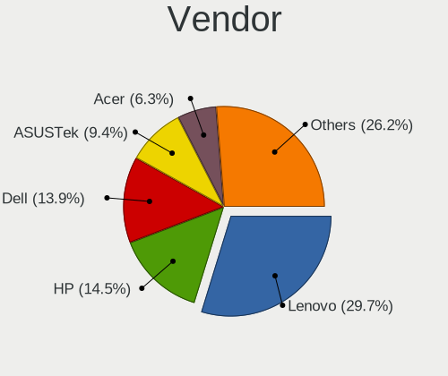
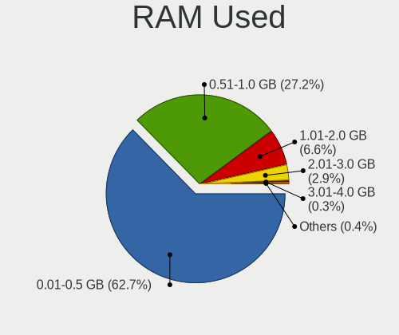
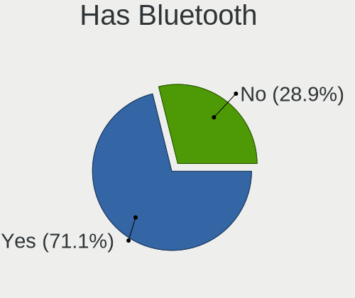
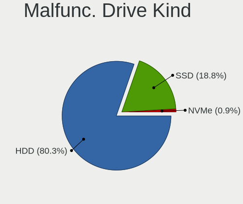
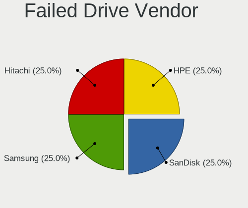
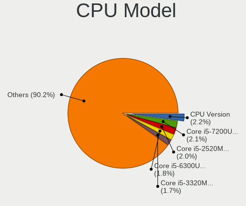
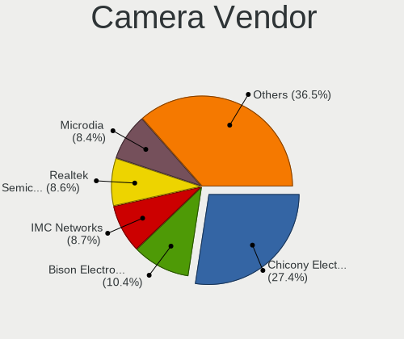
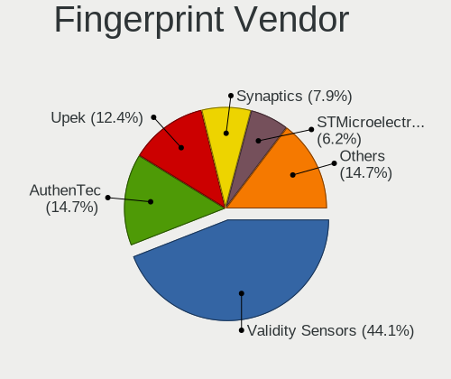
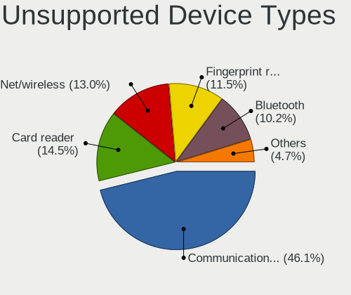

helloSystem - Tested Hardware & Statistics (Notebooks)
------------------------------------------------------

A project to collect tested hardware configurations for helloSystem.

Anyone can contribute to this report by the [hw-probe](https://github.com/linuxhw/hw-probe/blob/master/INSTALL.BSD.md) tool:

    hw-probe -all -upload

Please contribute! Especially if your hardware is rare.

Contents
--------

* [ Test Cases ](#test-cases)

* [ System ](#system)
  - [ OS                       ](#os)
  - [ OS Family                ](#os-family)
  - [ Arch                     ](#arch)
  - [ DE                       ](#de)
  - [ Display Server           ](#display-server)
  - [ Display Manager          ](#display-manager)
  - [ OS Lang                  ](#os-lang)
  - [ Boot Mode                ](#boot-mode)
  - [ Filesystem               ](#filesystem)
  - [ Part. scheme             ](#part-scheme)

* [ Board ](#board)
  - [ Vendor                   ](#vendor)
  - [ Model                    ](#model)
  - [ Model Family             ](#model-family)
  - [ MFG Year                 ](#mfg-year)
  - [ Form Factor              ](#form-factor)
  - [ Coreboot                 ](#coreboot)
  - [ RAM Size                 ](#ram-size)
  - [ RAM Used                 ](#ram-used)
  - [ Total Drives             ](#total-drives)
  - [ Has CD-ROM               ](#has-cd-rom)
  - [ Has Ethernet             ](#has-ethernet)
  - [ Has WiFi                 ](#has-wifi)
  - [ Has Bluetooth            ](#has-bluetooth)

* [ Location ](#location)
  - [ Country                  ](#country)
  - [ City                     ](#city)

* [ Drives ](#drives)
  - [ Drive Vendor             ](#drive-vendor)
  - [ Drive Model              ](#drive-model)
  - [ HDD Vendor               ](#hdd-vendor)
  - [ SSD Vendor               ](#ssd-vendor)
  - [ Drive Kind               ](#drive-kind)
  - [ Drive Connector          ](#drive-connector)
  - [ Drive Size               ](#drive-size)
  - [ Space Total              ](#space-total)
  - [ Space Used               ](#space-used)
  - [ Malfunc. Drives          ](#malfunc-drives)
  - [ Malfunc. Drive Vendor    ](#malfunc-drive-vendor)
  - [ Malfunc. HDD Vendor      ](#malfunc-hdd-vendor)
  - [ Malfunc. Drive Kind      ](#malfunc-drive-kind)
  - [ Failed Drives            ](#failed-drives)
  - [ Failed Drive Vendor      ](#failed-drive-vendor)
  - [ Drive Status             ](#drive-status)

* [ Storage controller ](#storage-controller)
  - [ Storage Vendor           ](#storage-vendor)
  - [ Storage Model            ](#storage-model)
  - [ Storage Kind             ](#storage-kind)

* [ Processor ](#processor)
  - [ CPU Vendor               ](#cpu-vendor)
  - [ CPU Model                ](#cpu-model)
  - [ CPU Model Family         ](#cpu-model-family)
  - [ CPU Cores                ](#cpu-cores)
  - [ CPU Sockets              ](#cpu-sockets)
  - [ CPU Threads              ](#cpu-threads)
  - [ CPU Microarch            ](#cpu-microarch)

* [ Graphics ](#graphics)
  - [ GPU Vendor               ](#gpu-vendor)
  - [ GPU Model                ](#gpu-model)
  - [ GPU Combo                ](#gpu-combo)
  - [ GPU Driver               ](#gpu-driver)
  - [ GPU Memory               ](#gpu-memory)

* [ Monitor ](#monitor)
  - [ Monitor Vendor           ](#monitor-vendor)
  - [ Monitor Model            ](#monitor-model)
  - [ Monitor Resolution       ](#monitor-resolution)
  - [ Monitor Diagonal         ](#monitor-diagonal)
  - [ Monitor Width            ](#monitor-width)
  - [ Aspect Ratio             ](#aspect-ratio)
  - [ Monitor Area             ](#monitor-area)
  - [ Pixel Density            ](#pixel-density)
  - [ Multiple Monitors        ](#multiple-monitors)

* [ Network ](#network)
  - [ Net Controller Vendor    ](#net-controller-vendor)
  - [ Net Controller Model     ](#net-controller-model)
  - [ Wireless Vendor          ](#wireless-vendor)
  - [ Wireless Model           ](#wireless-model)
  - [ Ethernet Vendor          ](#ethernet-vendor)
  - [ Ethernet Model           ](#ethernet-model)
  - [ Net Controller Kind      ](#net-controller-kind)
  - [ Used Controller          ](#used-controller)
  - [ NICs                     ](#nics)
  - [ IPv6                     ](#ipv6)

* [ Bluetooth ](#bluetooth)
  - [ Bluetooth Vendor         ](#bluetooth-vendor)
  - [ Bluetooth Model          ](#bluetooth-model)

* [ Sound ](#sound)
  - [ Sound Vendor             ](#sound-vendor)
  - [ Sound Model              ](#sound-model)

* [ Memory ](#memory)
  - [ Memory Vendor            ](#memory-vendor)
  - [ Memory Model             ](#memory-model)
  - [ Memory Kind              ](#memory-kind)
  - [ Memory Form Factor       ](#memory-form-factor)
  - [ Memory Size              ](#memory-size)
  - [ Memory Speed             ](#memory-speed)

* [ Printers & scanners ](#printers--scanners)
  - [ Printer Vendor           ](#printer-vendor)
  - [ Printer Model            ](#printer-model)
  - [ Scanner Vendor           ](#scanner-vendor)
  - [ Scanner Model            ](#scanner-model)

* [ Camera ](#camera)
  - [ Camera Vendor            ](#camera-vendor)
  - [ Camera Model             ](#camera-model)

* [ Security ](#security)
  - [ Fingerprint Vendor       ](#fingerprint-vendor)
  - [ Fingerprint Model        ](#fingerprint-model)
  - [ Chipcard Vendor          ](#chipcard-vendor)
  - [ Chipcard Model           ](#chipcard-model)

* [ Unsupported ](#unsupported)
  - [ Unsupported Devices      ](#unsupported-devices)
  - [ Unsupported Device Types ](#unsupported-device-types)

Test Cases
----------

Total: 1198

| Vendor        | Model                       | Probe                                                     | Date         |
|---------------|-----------------------------|-----------------------------------------------------------|--------------|
| Lenovo        | ThinkPad T530 2394EE9       | [9bc81955aa](https://bsd-hardware.info/?probe=9bc81955aa) | May 08, 2024 |
| Lenovo        | ThinkPad T530 2394EE9       | [651bd2de24](https://bsd-hardware.info/?probe=651bd2de24) | May 08, 2024 |
| Acer          | Aspire R3-131T              | [dec4102ec0](https://bsd-hardware.info/?probe=dec4102ec0) | May 07, 2024 |
| Lenovo        | ThinkPad L420 7827W27       | [5231c79a27](https://bsd-hardware.info/?probe=5231c79a27) | May 05, 2024 |
| Apple         | MacBook4,1                  | [5916d9274d](https://bsd-hardware.info/?probe=5916d9274d) | May 05, 2024 |
| Apple         | MacBookPro5,5               | [ffd31a143f](https://bsd-hardware.info/?probe=ffd31a143f) | May 04, 2024 |
| MSI           | GE75 Raider 10SFS           | [227924f274](https://bsd-hardware.info/?probe=227924f274) | May 03, 2024 |
| Lenovo        | Legion Y7000P 81HC          | [3dff76a9dd](https://bsd-hardware.info/?probe=3dff76a9dd) | Apr 27, 2024 |
| Apple         | MacBookAir4,1               | [a6e153110d](https://bsd-hardware.info/?probe=a6e153110d) | Apr 22, 2024 |
| Lenovo        | B51-30 80LK                 | [c1435ee19d](https://bsd-hardware.info/?probe=c1435ee19d) | Apr 21, 2024 |
| HP            | OMEN by Laptop              | [e2bce481c8](https://bsd-hardware.info/?probe=e2bce481c8) | Apr 21, 2024 |
| Apple         | MacBookPro8,1               | [6778d6844d](https://bsd-hardware.info/?probe=6778d6844d) | Apr 17, 2024 |
| LG Electro... | 17Z90Q-K.AAC7U1             | [8e3f536127](https://bsd-hardware.info/?probe=8e3f536127) | Apr 16, 2024 |
| Samsung       | 340XAA/350XAA/550XAA        | [0de254980a](https://bsd-hardware.info/?probe=0de254980a) | Apr 16, 2024 |
| ASUSTek       | VivoBook S14 X430UA         | [12764b3dba](https://bsd-hardware.info/?probe=12764b3dba) | Apr 14, 2024 |
| ASUSTek       | N76VZ                       | [c1af06bf99](https://bsd-hardware.info/?probe=c1af06bf99) | Apr 12, 2024 |
| Acer          | Aspire A314-35              | [6d4fa8616c](https://bsd-hardware.info/?probe=6d4fa8616c) | Apr 09, 2024 |
| Dell          | Latitude E5530 non-vPro     | [227f0ffb18](https://bsd-hardware.info/?probe=227f0ffb18) | Apr 09, 2024 |
| F-Plus Mob... | FLAPTOP r                   | [21768f1b7a](https://bsd-hardware.info/?probe=21768f1b7a) | Apr 04, 2024 |
| Acer          | Aspire V5-431               | [9abe9b5007](https://bsd-hardware.info/?probe=9abe9b5007) | Apr 03, 2024 |
| Lenovo        | ThinkPad W530 2447GH2       | [0cb3f41765](https://bsd-hardware.info/?probe=0cb3f41765) | Apr 01, 2024 |
| Apple         | MacBookAir3,1               | [b6dc892e24](https://bsd-hardware.info/?probe=b6dc892e24) | Mar 31, 2024 |
| Apple         | MacBookAir3,1               | [4a80e4b570](https://bsd-hardware.info/?probe=4a80e4b570) | Mar 31, 2024 |
| HUAWEI        | BOHB-WAX9                   | [b46f6ead5d](https://bsd-hardware.info/?probe=b46f6ead5d) | Mar 28, 2024 |
| Lenovo        | N22 80S6                    | [7f8b876a83](https://bsd-hardware.info/?probe=7f8b876a83) | Mar 26, 2024 |
| Lenovo        | G510 20238                  | [faf771068a](https://bsd-hardware.info/?probe=faf771068a) | Mar 25, 2024 |
| ASUSTek       | VivoBook_ASUSLaptop X509... | [0fbac8264b](https://bsd-hardware.info/?probe=0fbac8264b) | Mar 23, 2024 |
| ASUSTek       | ASUS TUF Gaming F15 FX50... | [25a92fc367](https://bsd-hardware.info/?probe=25a92fc367) | Mar 22, 2024 |
| ASUSTek       | X550CA                      | [ff92192d22](https://bsd-hardware.info/?probe=ff92192d22) | Mar 19, 2024 |
| HP            | EliteBook 8470p             | [51841c9dfd](https://bsd-hardware.info/?probe=51841c9dfd) | Mar 17, 2024 |
| Apple         | MacBookPro11,1              | [58369a2ff3](https://bsd-hardware.info/?probe=58369a2ff3) | Mar 16, 2024 |
| Lenovo        | G580 20150                  | [1a072e681a](https://bsd-hardware.info/?probe=1a072e681a) | Mar 15, 2024 |
| Lenovo        | ThinkPad X220 429147U       | [0644799933](https://bsd-hardware.info/?probe=0644799933) | Mar 15, 2024 |
| Samsung       | 300E5EV/300E4EV/270E5EV/... | [fd60868096](https://bsd-hardware.info/?probe=fd60868096) | Mar 10, 2024 |
| Dell          | Latitude E6220              | [5a42aa442f](https://bsd-hardware.info/?probe=5a42aa442f) | Mar 09, 2024 |
| Maibenben     | MaiBook X series            | [2a58491971](https://bsd-hardware.info/?probe=2a58491971) | Mar 03, 2024 |
| Lenovo        | IdeaPad Y700-17ISK 80Q0     | [3653895b8e](https://bsd-hardware.info/?probe=3653895b8e) | Mar 03, 2024 |
| Acer          | Aspire A715-75G             | [415aa43c5c](https://bsd-hardware.info/?probe=415aa43c5c) | Mar 02, 2024 |
| ASUSTek       | X550EA                      | [42b10a3b6a](https://bsd-hardware.info/?probe=42b10a3b6a) | Mar 01, 2024 |
| Itautec       | Infoway                     | [35399f6e75](https://bsd-hardware.info/?probe=35399f6e75) | Feb 28, 2024 |
| Lenovo        | ThinkPad X270 W10DG 20K5... | [9c88473675](https://bsd-hardware.info/?probe=9c88473675) | Feb 27, 2024 |
| ASUSTek       | X550EA                      | [a49aa7d3d8](https://bsd-hardware.info/?probe=a49aa7d3d8) | Feb 24, 2024 |
| Lenovo        | ThinkPad X220 4290KV8       | [9bc55d7f8a](https://bsd-hardware.info/?probe=9bc55d7f8a) | Feb 23, 2024 |
| Lenovo        | XiaoXinAir 14+ ACN 2021 ... | [5702ec8e8e](https://bsd-hardware.info/?probe=5702ec8e8e) | Feb 22, 2024 |
| Notebook      | N960Kx                      | [4e83c12f96](https://bsd-hardware.info/?probe=4e83c12f96) | Feb 12, 2024 |
| Lenovo        | Yoga 900S-12ISK 80ML        | [47f57b0893](https://bsd-hardware.info/?probe=47f57b0893) | Feb 11, 2024 |
| Lenovo        | Yoga 900S-12ISK 80ML        | [5315513827](https://bsd-hardware.info/?probe=5315513827) | Feb 11, 2024 |
| Lenovo        | ThinkPad T480 20L6SDA400    | [4934e88205](https://bsd-hardware.info/?probe=4934e88205) | Feb 07, 2024 |
| ASUSTek       | K52F                        | [bc31c4707c](https://bsd-hardware.info/?probe=bc31c4707c) | Feb 04, 2024 |
| Panasonic     | CF-52PGNBX2M                | [401aeae642](https://bsd-hardware.info/?probe=401aeae642) | Feb 03, 2024 |
| ASUSTek       | F8Vr                        | [2f3b6a6089](https://bsd-hardware.info/?probe=2f3b6a6089) | Feb 03, 2024 |
| ASUSTek       | K52F                        | [9022031518](https://bsd-hardware.info/?probe=9022031518) | Feb 03, 2024 |
| Dell          | XPS 15 9530                 | [f9481e59b6](https://bsd-hardware.info/?probe=f9481e59b6) | Feb 01, 2024 |
| Lenovo        | V14 G2 ITL 82NM             | [952fa413fe](https://bsd-hardware.info/?probe=952fa413fe) | Feb 01, 2024 |
| ASUSTek       | K50IJ                       | [b5cc2ab7ff](https://bsd-hardware.info/?probe=b5cc2ab7ff) | Jan 31, 2024 |
| ASUSTek       | K50IJ                       | [a952b43f14](https://bsd-hardware.info/?probe=a952b43f14) | Jan 31, 2024 |
| Lenovo        | V14 G2 ITL 82NM             | [b66edf2033](https://bsd-hardware.info/?probe=b66edf2033) | Jan 31, 2024 |
| Fujitsu       | LIFEBOOK LH772              | [afe4fb6608](https://bsd-hardware.info/?probe=afe4fb6608) | Jan 30, 2024 |
| Fujitsu       | LIFEBOOK LH772              | [491823db1e](https://bsd-hardware.info/?probe=491823db1e) | Jan 30, 2024 |
| HP            | OMEN by Laptop 17-ck0xxx    | [8cad8e084d](https://bsd-hardware.info/?probe=8cad8e084d) | Jan 28, 2024 |
| Lenovo        | ThinkPad T460 20FMS1VA1D    | [03d11c45e9](https://bsd-hardware.info/?probe=03d11c45e9) | Jan 28, 2024 |
| Acer          | Nitro AN515-54              | [94f04895fe](https://bsd-hardware.info/?probe=94f04895fe) | Jan 27, 2024 |
| Dell          | Precision M4700             | [05a9a26c16](https://bsd-hardware.info/?probe=05a9a26c16) | Jan 24, 2024 |
| Acer          | Nitro AN515-54              | [28539d7eb4](https://bsd-hardware.info/?probe=28539d7eb4) | Jan 24, 2024 |
| Acer          | TravelMate B115-M           | [d7a78aa2cf](https://bsd-hardware.info/?probe=d7a78aa2cf) | Jan 22, 2024 |
| Apple         | MacBookAir4,1               | [f51a396e5e](https://bsd-hardware.info/?probe=f51a396e5e) | Jan 21, 2024 |
| Samsung       | 340XAA/350XAA/550XAA        | [2065609a0c](https://bsd-hardware.info/?probe=2065609a0c) | Jan 19, 2024 |
| Samsung       | 340XAA/350XAA/550XAA        | [62abffe402](https://bsd-hardware.info/?probe=62abffe402) | Jan 19, 2024 |
| Dell          | Latitude 7480               | [d9b4d836e7](https://bsd-hardware.info/?probe=d9b4d836e7) | Jan 17, 2024 |
| HP            | Mini 210-1000               | [f25c646418](https://bsd-hardware.info/?probe=f25c646418) | Jan 16, 2024 |
| Star Labs     | StarBook                    | [1e903acb93](https://bsd-hardware.info/?probe=1e903acb93) | Jan 16, 2024 |
| HP            | Mini 210-1000               | [fb086c3baa](https://bsd-hardware.info/?probe=fb086c3baa) | Jan 15, 2024 |
| Lenovo        | IdeaPad 330-15IKB 81DE      | [20090cb5c6](https://bsd-hardware.info/?probe=20090cb5c6) | Jan 15, 2024 |
| Apple         | MacBookAir4,1               | [b9653bc7d3](https://bsd-hardware.info/?probe=b9653bc7d3) | Jan 14, 2024 |
| Dell          | Inspiron 14-3452            | [47ac3f7eaa](https://bsd-hardware.info/?probe=47ac3f7eaa) | Jan 09, 2024 |
| HP            | Compaq 6510b (GM108UC#AB... | [7ed7da2383](https://bsd-hardware.info/?probe=7ed7da2383) | Jan 08, 2024 |
| Lenovo        | ThinkPad L450 20DSS1S402    | [40b8a056f7](https://bsd-hardware.info/?probe=40b8a056f7) | Jan 07, 2024 |
| Dell          | XPS 15 9530                 | [13f09671ce](https://bsd-hardware.info/?probe=13f09671ce) | Jan 07, 2024 |
| ASUSTek       | X551MA                      | [91eda59c82](https://bsd-hardware.info/?probe=91eda59c82) | Jan 06, 2024 |
| Lenovo        | ThinkPad X250 20CMS01M00    | [1f52525bb9](https://bsd-hardware.info/?probe=1f52525bb9) | Jan 04, 2024 |
| ASUSTek       | X555LB                      | [45a80466a3](https://bsd-hardware.info/?probe=45a80466a3) | Jan 04, 2024 |
| Samsung       | R510/P510                   | [920e7e2d14](https://bsd-hardware.info/?probe=920e7e2d14) | Dec 31, 2023 |
| Dell          | Vostro V130                 | [44e78243c2](https://bsd-hardware.info/?probe=44e78243c2) | Dec 30, 2023 |
| Acer          | Aspire E5-574               | [8b71e16af3](https://bsd-hardware.info/?probe=8b71e16af3) | Dec 27, 2023 |
| Lenovo        | ThinkPad X131e 33672T9      | [93f964da45](https://bsd-hardware.info/?probe=93f964da45) | Dec 25, 2023 |
| AMI           | Intel                       | [df557e3915](https://bsd-hardware.info/?probe=df557e3915) | Dec 25, 2023 |
| Lenovo        | ThinkPad X250 20CLS8Q601    | [2c52684baa](https://bsd-hardware.info/?probe=2c52684baa) | Dec 25, 2023 |
| eMachines     | eM350                       | [00d1d0c359](https://bsd-hardware.info/?probe=00d1d0c359) | Dec 23, 2023 |
| Lenovo        | ThinkPad P14s Gen 2a 21A... | [7ca1ae0c93](https://bsd-hardware.info/?probe=7ca1ae0c93) | Dec 23, 2023 |
| Lenovo        | ThinkPad X220 4291H77       | [2fe3ff7e06](https://bsd-hardware.info/?probe=2fe3ff7e06) | Dec 18, 2023 |
| Acer          | V5-131                      | [76e88ee5df](https://bsd-hardware.info/?probe=76e88ee5df) | Dec 14, 2023 |
| ASUSTek       | ZenBook UX482EA_UX482EA     | [b5bbc08efe](https://bsd-hardware.info/?probe=b5bbc08efe) | Dec 07, 2023 |
| ASUSTek       | VivoBook_ASUSLaptop M650... | [7a1ab6fd47](https://bsd-hardware.info/?probe=7a1ab6fd47) | Dec 06, 2023 |
| Intel         | H81U                        | [b74cca91df](https://bsd-hardware.info/?probe=b74cca91df) | Dec 01, 2023 |
| Samsung       | N150P/N210P/N220P           | [b394563830](https://bsd-hardware.info/?probe=b394563830) | Nov 30, 2023 |
| Lenovo        | Yoga 2 Pro 20266            | [1096dc8160](https://bsd-hardware.info/?probe=1096dc8160) | Nov 27, 2023 |
| Lenovo        | Yoga 2 Pro 20266            | [1bfc57a019](https://bsd-hardware.info/?probe=1bfc57a019) | Nov 27, 2023 |
| Dell          | Latitude E5540              | [d12acc0425](https://bsd-hardware.info/?probe=d12acc0425) | Nov 25, 2023 |
| Lenovo        | IdeaPad S145-14AST 81ST     | [a44d6afa76](https://bsd-hardware.info/?probe=a44d6afa76) | Nov 24, 2023 |
| Lenovo        | IdeaPad S145-14AST 81ST     | [b67644f2b3](https://bsd-hardware.info/?probe=b67644f2b3) | Nov 24, 2023 |
| Acer          | Aspire E5-574               | [b11a972371](https://bsd-hardware.info/?probe=b11a972371) | Nov 24, 2023 |
| Acer          | Aspire E5-574               | [a4eded7a52](https://bsd-hardware.info/?probe=a4eded7a52) | Nov 22, 2023 |
| HP            | Laptop 14-fq0xxx            | [4c5aa5c3ea](https://bsd-hardware.info/?probe=4c5aa5c3ea) | Nov 22, 2023 |
| Toshiba       | Satellite C40-A             | [0c545b75e9](https://bsd-hardware.info/?probe=0c545b75e9) | Nov 21, 2023 |
| Toshiba       | Satellite C40-A             | [cecd389c82](https://bsd-hardware.info/?probe=cecd389c82) | Nov 21, 2023 |
| Dell          | XPS 13 9360                 | [9b3cb9cbd6](https://bsd-hardware.info/?probe=9b3cb9cbd6) | Nov 21, 2023 |
| Lenovo        | ThinkPad T60 8744HDG        | [fc54b10db3](https://bsd-hardware.info/?probe=fc54b10db3) | Nov 18, 2023 |
| Acer          | Aspire ES1-572              | [2aa8175a33](https://bsd-hardware.info/?probe=2aa8175a33) | Nov 17, 2023 |
| Dell          | Precision 7720              | [65a0287ad6](https://bsd-hardware.info/?probe=65a0287ad6) | Nov 16, 2023 |
| Dell          | Inspiron 1525               | [984f5f2f4b](https://bsd-hardware.info/?probe=984f5f2f4b) | Nov 16, 2023 |
| Lenovo        | ThinkPad X230 2320A5U       | [48f8b6a93a](https://bsd-hardware.info/?probe=48f8b6a93a) | Nov 16, 2023 |
| Dell          | Inspiron 3442               | [3f63ee5447](https://bsd-hardware.info/?probe=3f63ee5447) | Nov 13, 2023 |
| Dell          | Inspiron 15 7000 Gaming     | [b85df96058](https://bsd-hardware.info/?probe=b85df96058) | Nov 11, 2023 |
| Lenovo        | ThinkPad E14 20RA0016RT     | [83b87dac52](https://bsd-hardware.info/?probe=83b87dac52) | Nov 10, 2023 |
| Gateway       | NV79                        | [2a7dd49956](https://bsd-hardware.info/?probe=2a7dd49956) | Nov 09, 2023 |
| Dell          | Inspiron 5570               | [1f6c70fd78](https://bsd-hardware.info/?probe=1f6c70fd78) | Nov 07, 2023 |
| HP            | Pavilion g6                 | [6e2c3d13a4](https://bsd-hardware.info/?probe=6e2c3d13a4) | Nov 07, 2023 |
| Dell          | Precision 7720              | [45614f0ff9](https://bsd-hardware.info/?probe=45614f0ff9) | Nov 06, 2023 |
| Dell          | Inspiron N4050              | [9bc3c5e163](https://bsd-hardware.info/?probe=9bc3c5e163) | Nov 05, 2023 |
| Dell          | Precision 7720              | [ef59e0f80d](https://bsd-hardware.info/?probe=ef59e0f80d) | Nov 05, 2023 |
| Lenovo        | Z50-70 20354                | [641e875b3b](https://bsd-hardware.info/?probe=641e875b3b) | Nov 04, 2023 |
| Dell          | Precision 7720              | [cc321f8dea](https://bsd-hardware.info/?probe=cc321f8dea) | Nov 01, 2023 |
| TUXEDO        | Aura 15 Gen1                | [7a6b4537f3](https://bsd-hardware.info/?probe=7a6b4537f3) | Oct 29, 2023 |
| HP            | Pavilion g6                 | [6aee98fb1a](https://bsd-hardware.info/?probe=6aee98fb1a) | Oct 29, 2023 |
| HP            | ZBook 15 G3                 | [74c3cbd1a3](https://bsd-hardware.info/?probe=74c3cbd1a3) | Oct 29, 2023 |
| Lenovo        | Z50-70 20354                | [f3d9534b2d](https://bsd-hardware.info/?probe=f3d9534b2d) | Oct 28, 2023 |
| Lenovo        | ThinkPad T520 42405FG       | [e6aca7e0c8](https://bsd-hardware.info/?probe=e6aca7e0c8) | Oct 28, 2023 |
| Toshiba       | Unknown                     | [de44a16738](https://bsd-hardware.info/?probe=de44a16738) | Oct 24, 2023 |
| Acer          | Aspire 5336                 | [ebfed0efbc](https://bsd-hardware.info/?probe=ebfed0efbc) | Oct 18, 2023 |
| Dell          | Inspiron 5559               | [0ae4cee8b3](https://bsd-hardware.info/?probe=0ae4cee8b3) | Oct 17, 2023 |
| Apple         | MacBook5,2                  | [5f364ec930](https://bsd-hardware.info/?probe=5f364ec930) | Oct 17, 2023 |
| Dell          | Latitude 3440               | [3e6826570c](https://bsd-hardware.info/?probe=3e6826570c) | Oct 16, 2023 |
| Lenovo        | ThinkPad T480 20L5000UUS    | [20fe904881](https://bsd-hardware.info/?probe=20fe904881) | Oct 15, 2023 |
| Acer          | Aspire E5-575G              | [0aa91c2a5c](https://bsd-hardware.info/?probe=0aa91c2a5c) | Oct 15, 2023 |
| Acer          | Aspire ES1-571              | [f3036a27e5](https://bsd-hardware.info/?probe=f3036a27e5) | Oct 13, 2023 |
| Toshiba       | Satellite C55-A             | [f27ea283cf](https://bsd-hardware.info/?probe=f27ea283cf) | Oct 12, 2023 |
| Apple         | MacBook5,1                  | [518658e176](https://bsd-hardware.info/?probe=518658e176) | Oct 11, 2023 |
| Apple         | MacBookPro9,2               | [c88d8880ea](https://bsd-hardware.info/?probe=c88d8880ea) | Oct 11, 2023 |
| Dell          | Latitude D830               | [4cf27e5d29](https://bsd-hardware.info/?probe=4cf27e5d29) | Oct 09, 2023 |
| Lenovo        | IdeaPad 3 17ITL6 82H9       | [5be3eb1296](https://bsd-hardware.info/?probe=5be3eb1296) | Oct 08, 2023 |
| Lenovo        | ThinkPad E14 Gen 2 20TA0... | [c646a3b663](https://bsd-hardware.info/?probe=c646a3b663) | Oct 07, 2023 |
| ASUSTek       | K73E                        | [ce5fcbdc3e](https://bsd-hardware.info/?probe=ce5fcbdc3e) | Oct 04, 2023 |
| Apple         | MacBookPro9,1               | [9b9f826560](https://bsd-hardware.info/?probe=9b9f826560) | Oct 01, 2023 |
| ASUSTek       | K40IN                       | [f98d4be34d](https://bsd-hardware.info/?probe=f98d4be34d) | Sep 29, 2023 |
| Dell          | Latitude E6430              | [bec165c243](https://bsd-hardware.info/?probe=bec165c243) | Sep 27, 2023 |
| Lenovo        | ThinkPad E14 Gen 2 20T60... | [5cd50ed5b5](https://bsd-hardware.info/?probe=5cd50ed5b5) | Sep 24, 2023 |
| Lenovo        | IdeaPad 1 14IGL7 82V6       | [8a3d3b3d0d](https://bsd-hardware.info/?probe=8a3d3b3d0d) | Sep 21, 2023 |
| Lenovo        | ThinkPad P50 20EN0012US     | [a1945198c6](https://bsd-hardware.info/?probe=a1945198c6) | Sep 21, 2023 |
| Lenovo        | ThinkPad Edge E531 68852... | [cc3bef6a45](https://bsd-hardware.info/?probe=cc3bef6a45) | Sep 15, 2023 |
| OEGStone      | doceo 510                   | [9f3b47e30f](https://bsd-hardware.info/?probe=9f3b47e30f) | Sep 13, 2023 |
| Acer          | Monserrat                   | [9c79dbac8b](https://bsd-hardware.info/?probe=9c79dbac8b) | Sep 10, 2023 |
| Acer          | AOHAPPY2                    | [d615a8daba](https://bsd-hardware.info/?probe=d615a8daba) | Sep 10, 2023 |
| Acer          | AOHAPPY2                    | [6f5db06303](https://bsd-hardware.info/?probe=6f5db06303) | Sep 10, 2023 |
| HP            | OMEN by Laptop              | [f0fc4f47b8](https://bsd-hardware.info/?probe=f0fc4f47b8) | Sep 10, 2023 |
| Lenovo        | ThinkPad SL 2746N8G         | [07eda65608](https://bsd-hardware.info/?probe=07eda65608) | Sep 09, 2023 |
| Lenovo        | IdeaPad 100-14IBY 80MH      | [1d5aff2e2a](https://bsd-hardware.info/?probe=1d5aff2e2a) | Sep 08, 2023 |
| HP            | Pavilion g7                 | [4870da3b0e](https://bsd-hardware.info/?probe=4870da3b0e) | Sep 07, 2023 |
| LG Electro... | 16U70Q-K.AAS7U1             | [82e3b2e5f8](https://bsd-hardware.info/?probe=82e3b2e5f8) | Sep 06, 2023 |
| Lenovo        | ThinkPad X240 20AMA1Y3UK    | [8277297743](https://bsd-hardware.info/?probe=8277297743) | Sep 05, 2023 |
| HP            | G62                         | [b4777b6ba5](https://bsd-hardware.info/?probe=b4777b6ba5) | Sep 04, 2023 |
| Toshiba       | QOSMIO X775                 | [d92a05ab1d](https://bsd-hardware.info/?probe=d92a05ab1d) | Sep 04, 2023 |
| ASUSTek       | K40IN                       | [00a4f6e5a0](https://bsd-hardware.info/?probe=00a4f6e5a0) | Sep 04, 2023 |
| Samsung       | 270E5J/2570EJ               | [3feb685296](https://bsd-hardware.info/?probe=3feb685296) | Sep 03, 2023 |
| ASUSTek       | 1005PXD                     | [8dac93d19d](https://bsd-hardware.info/?probe=8dac93d19d) | Sep 03, 2023 |
| ASUSTek       | K40IN                       | [df0a3f55c2](https://bsd-hardware.info/?probe=df0a3f55c2) | Sep 03, 2023 |
| Lenovo        | ThinkPad P50 20EN0012US     | [9d1b9e7af6](https://bsd-hardware.info/?probe=9d1b9e7af6) | Sep 03, 2023 |
| Fujitsu       | LIFEBOOK S935               | [a6cfe011fe](https://bsd-hardware.info/?probe=a6cfe011fe) | Sep 02, 2023 |
| Apple         | MacBookPro7,1               | [d49b8413db](https://bsd-hardware.info/?probe=d49b8413db) | Sep 02, 2023 |
| Lenovo        | ThinkPad X1 Carbon 2nd 2... | [9b322dc202](https://bsd-hardware.info/?probe=9b322dc202) | Sep 02, 2023 |
| MSI           | CX62 6QD                    | [4356e5b30f](https://bsd-hardware.info/?probe=4356e5b30f) | Sep 02, 2023 |
| ASUSTek       | VivoBook_ASUSLaptop M150... | [044910f579](https://bsd-hardware.info/?probe=044910f579) | Sep 01, 2023 |
| HP            | 2000                        | [6d9c442ae6](https://bsd-hardware.info/?probe=6d9c442ae6) | Aug 31, 2023 |
| Acer          | Aspire A515-55              | [fcbd8a3f31](https://bsd-hardware.info/?probe=fcbd8a3f31) | Aug 31, 2023 |
| Lenovo        | IdeaPad Gaming 3 15IHU6 ... | [a308c3a87b](https://bsd-hardware.info/?probe=a308c3a87b) | Aug 31, 2023 |
| Toshiba       | Satellite S55t-B            | [c2ed5fa6bd](https://bsd-hardware.info/?probe=c2ed5fa6bd) | Aug 30, 2023 |
| Dell          | Latitude E4310              | [7645de3654](https://bsd-hardware.info/?probe=7645de3654) | Aug 30, 2023 |
| HP            | Pavilion dv3500             | [0c3f84b285](https://bsd-hardware.info/?probe=0c3f84b285) | Aug 29, 2023 |
| Lenovo        | IdeaPad 110S-11IBR 80WG     | [e74ef1d37c](https://bsd-hardware.info/?probe=e74ef1d37c) | Aug 29, 2023 |
| Fujitsu       | FMVA0803D                   | [36528b957c](https://bsd-hardware.info/?probe=36528b957c) | Aug 28, 2023 |
| Lenovo        | ThinkPad T490 20RYS06R00    | [978cd1d6bc](https://bsd-hardware.info/?probe=978cd1d6bc) | Aug 28, 2023 |
| Toshiba       | Satellite S55t-B            | [eb85f0b975](https://bsd-hardware.info/?probe=eb85f0b975) | Aug 27, 2023 |
| Fujitsu       | FMVA0803D                   | [8ce6118bf4](https://bsd-hardware.info/?probe=8ce6118bf4) | Aug 26, 2023 |
| HP            | ENVY Notebook 13-ab0XX      | [3d96f4d5b4](https://bsd-hardware.info/?probe=3d96f4d5b4) | Aug 26, 2023 |
| Dell          | Latitude E6420              | [a085ba3865](https://bsd-hardware.info/?probe=a085ba3865) | Aug 25, 2023 |
| NVN-ED01      | Unknown                     | [dba43e889a](https://bsd-hardware.info/?probe=dba43e889a) | Aug 25, 2023 |
| Lenovo        | ThinkPad P50 20EN0009MS     | [4b3fcfa17e](https://bsd-hardware.info/?probe=4b3fcfa17e) | Aug 25, 2023 |
| ASUSTek       | S500CA                      | [019366a664](https://bsd-hardware.info/?probe=019366a664) | Aug 25, 2023 |
| Lenovo        | ThinkPad T450 20BUS0370P    | [c32aad1b1f](https://bsd-hardware.info/?probe=c32aad1b1f) | Aug 20, 2023 |
| Lenovo        | ThinkPad T450 20BUS0370P    | [5fefc051e1](https://bsd-hardware.info/?probe=5fefc051e1) | Aug 20, 2023 |
| Star Labs     | Lite                        | [eabab74d7b](https://bsd-hardware.info/?probe=eabab74d7b) | Aug 18, 2023 |
| ASUSTek       | X553MA                      | [7334765d8a](https://bsd-hardware.info/?probe=7334765d8a) | Aug 16, 2023 |
| ASUSTek       | GL753VD                     | [8ccbffdd73](https://bsd-hardware.info/?probe=8ccbffdd73) | Aug 15, 2023 |
| Lenovo        | ThinkPad X200 7458WNZ       | [3ac1d60240](https://bsd-hardware.info/?probe=3ac1d60240) | Aug 12, 2023 |
| Lenovo        | ThinkPad T60 1951CZ1        | [46766bc381](https://bsd-hardware.info/?probe=46766bc381) | Aug 11, 2023 |
| Lenovo        | ThinkPad X220 4286CTO       | [2db86b4dff](https://bsd-hardware.info/?probe=2db86b4dff) | Aug 11, 2023 |
| Acer          | Aspire V3-371               | [21c262aadb](https://bsd-hardware.info/?probe=21c262aadb) | Aug 09, 2023 |
| Acer          | Aspire V3-371               | [68bceee682](https://bsd-hardware.info/?probe=68bceee682) | Aug 09, 2023 |
| Lenovo        | ThinkPad X1 Carbon 2nd 2... | [9693a5fc69](https://bsd-hardware.info/?probe=9693a5fc69) | Aug 08, 2023 |
| Lenovo        | ThinkPad X1 Carbon 2nd 2... | [9c01814bdc](https://bsd-hardware.info/?probe=9c01814bdc) | Aug 07, 2023 |
| Compaq        | Presario CQ-17              | [f97feb2db0](https://bsd-hardware.info/?probe=f97feb2db0) | Aug 04, 2023 |
| HP            | EliteBook 840 G5            | [6496fe0cfe](https://bsd-hardware.info/?probe=6496fe0cfe) | Aug 03, 2023 |
| Lenovo        | IdeaPad S210 Touch 20257    | [1e372622c1](https://bsd-hardware.info/?probe=1e372622c1) | Jul 31, 2023 |
| Lenovo        | ThinkPad X270 20HNA04GCD    | [6547f4a73b](https://bsd-hardware.info/?probe=6547f4a73b) | Jul 31, 2023 |
| Lenovo        | ThinkPad X230 23202DG       | [f8ade878ce](https://bsd-hardware.info/?probe=f8ade878ce) | Jul 30, 2023 |
| HP            | Notebook                    | [360790274a](https://bsd-hardware.info/?probe=360790274a) | Jul 29, 2023 |
| Apple         | MacBookPro9,2               | [53e133857b](https://bsd-hardware.info/?probe=53e133857b) | Jul 29, 2023 |
| HP            | Pavilion g6                 | [bdd2349f1c](https://bsd-hardware.info/?probe=bdd2349f1c) | Jul 28, 2023 |
| Dell          | Latitude 5480               | [e1521ed9d2](https://bsd-hardware.info/?probe=e1521ed9d2) | Jul 26, 2023 |
| Lenovo        | IdeaPad S145-14AST 81ST     | [1b3ba2b86a](https://bsd-hardware.info/?probe=1b3ba2b86a) | Jul 25, 2023 |
| ASUSTek       | 1015PX                      | [b0745153e4](https://bsd-hardware.info/?probe=b0745153e4) | Jul 24, 2023 |
| Lenovo        | IdeaPad 5 15ALC05 82LN      | [60dac781b2](https://bsd-hardware.info/?probe=60dac781b2) | Jul 24, 2023 |
| Panasonic     | CF-F9JYFNDR                 | [be7b261f26](https://bsd-hardware.info/?probe=be7b261f26) | Jul 21, 2023 |
| Acer          | Aspire 4736Z                | [bccf97f694](https://bsd-hardware.info/?probe=bccf97f694) | Jul 20, 2023 |
| ASUSTek       | 1015PX                      | [dc06c76cf9](https://bsd-hardware.info/?probe=dc06c76cf9) | Jul 19, 2023 |
| Lenovo        | Legion 5 15IMH05 82AU       | [5fcffa5bd6](https://bsd-hardware.info/?probe=5fcffa5bd6) | Jul 19, 2023 |
| ASUSTek       | K42Jr                       | [256168572a](https://bsd-hardware.info/?probe=256168572a) | Jul 18, 2023 |
| Samsung       | RC530/RC730                 | [b76e5e8a87](https://bsd-hardware.info/?probe=b76e5e8a87) | Jul 17, 2023 |
| Lenovo        | ThinkPad R14 Gen 4 21E5A... | [e0fc7135e5](https://bsd-hardware.info/?probe=e0fc7135e5) | Jul 15, 2023 |
| SLIMBOOK      | PROX-AMD5                   | [d4265533e2](https://bsd-hardware.info/?probe=d4265533e2) | Jul 15, 2023 |
| ASUSTek       | X541UVK                     | [17f58b70e4](https://bsd-hardware.info/?probe=17f58b70e4) | Jul 10, 2023 |
| Dell          | Latitude E6420              | [3151e6d3bb](https://bsd-hardware.info/?probe=3151e6d3bb) | Jul 05, 2023 |
| HP            | Compaq Presario CQ61        | [d070292855](https://bsd-hardware.info/?probe=d070292855) | Jul 03, 2023 |
| ASUSTek       | 1005PXD                     | [246032ee65](https://bsd-hardware.info/?probe=246032ee65) | Jul 02, 2023 |
| Lenovo        | ThinkPad T60 20076PU        | [cb47bfef12](https://bsd-hardware.info/?probe=cb47bfef12) | Jun 30, 2023 |
| HP            | EliteBook 840 G3            | [17834256ca](https://bsd-hardware.info/?probe=17834256ca) | Jun 28, 2023 |
| Dell          | Inspiron 5570               | [a6e959358f](https://bsd-hardware.info/?probe=a6e959358f) | Jun 25, 2023 |
| Dell          | Latitude E4310              | [9cdd4909fe](https://bsd-hardware.info/?probe=9cdd4909fe) | Jun 24, 2023 |
| HP            | Laptop 15-bs1xx             | [dc0d876d7b](https://bsd-hardware.info/?probe=dc0d876d7b) | Jun 24, 2023 |
| HP            | Laptop 15-ra0xx             | [8c31502b68](https://bsd-hardware.info/?probe=8c31502b68) | Jun 24, 2023 |
| HP            | EliteBook 750 G1            | [aba91c70d1](https://bsd-hardware.info/?probe=aba91c70d1) | Jun 24, 2023 |
| HP            | 250 G6 Notebook PC          | [f7df283c94](https://bsd-hardware.info/?probe=f7df283c94) | Jun 24, 2023 |
| Dell          | Latitude 5490               | [b638c1b2b1](https://bsd-hardware.info/?probe=b638c1b2b1) | Jun 23, 2023 |
| Acer          | Aspire 5749                 | [75ad2ddb6f](https://bsd-hardware.info/?probe=75ad2ddb6f) | Jun 22, 2023 |
| Acer          | Aspire 5749                 | [1e91633580](https://bsd-hardware.info/?probe=1e91633580) | Jun 20, 2023 |
| HP            | Pavilion 15                 | [9ba6acdb4b](https://bsd-hardware.info/?probe=9ba6acdb4b) | Jun 18, 2023 |
| HP            | Stream Laptop 14-ds0xxx     | [81bbc73e72](https://bsd-hardware.info/?probe=81bbc73e72) | Jun 18, 2023 |
| Apple         | MacBook7,1                  | [6412e6fb23](https://bsd-hardware.info/?probe=6412e6fb23) | Jun 16, 2023 |
| HUAWEI        | BOHB-WAX9                   | [d8079e6155](https://bsd-hardware.info/?probe=d8079e6155) | Jun 16, 2023 |
| ASUSTek       | 1015P                       | [c700224684](https://bsd-hardware.info/?probe=c700224684) | Jun 14, 2023 |
| MSI           | GE63 Raider RGB 8RE         | [ecdb80adc0](https://bsd-hardware.info/?probe=ecdb80adc0) | Jun 14, 2023 |
| HP            | Compaq 6830s                | [1a06917a0f](https://bsd-hardware.info/?probe=1a06917a0f) | Jun 14, 2023 |
| Lenovo        | IdeaPad 310-15IKB 80TV      | [76809610f9](https://bsd-hardware.info/?probe=76809610f9) | Jun 13, 2023 |
| Lenovo        | ThinkPad T440p 20AWS1CH0... | [b532f1ce9c](https://bsd-hardware.info/?probe=b532f1ce9c) | Jun 13, 2023 |
| ASUSTek       | ASUS TUF Gaming A17 FA70... | [dd937d0914](https://bsd-hardware.info/?probe=dd937d0914) | Jun 12, 2023 |
| Samsung       | R530/R730/R540              | [b007264caa](https://bsd-hardware.info/?probe=b007264caa) | Jun 11, 2023 |
| ASUSTek       | 1015BX                      | [ad05aaf9fe](https://bsd-hardware.info/?probe=ad05aaf9fe) | Jun 07, 2023 |
| Lenovo        | S10-3                       | [f874a66e78](https://bsd-hardware.info/?probe=f874a66e78) | Jun 05, 2023 |
| Lenovo        | S10-3                       | [b76483ab8b](https://bsd-hardware.info/?probe=b76483ab8b) | Jun 05, 2023 |
| HP            | Pavilion Laptop 15-eh1xx... | [e1a7d29d74](https://bsd-hardware.info/?probe=e1a7d29d74) | Jun 04, 2023 |
| HP            | Pavilion Laptop 15-eh1xx... | [d0d9de7cf3](https://bsd-hardware.info/?probe=d0d9de7cf3) | Jun 04, 2023 |
| Panasonic     | CF-NX1GDHYS                 | [fb1f293997](https://bsd-hardware.info/?probe=fb1f293997) | Jun 02, 2023 |
| HP            | Pavilion Notebook           | [1bb0436fe5](https://bsd-hardware.info/?probe=1bb0436fe5) | May 30, 2023 |
| Apple         | MacBookPro10,2              | [c274e2c9db](https://bsd-hardware.info/?probe=c274e2c9db) | May 29, 2023 |
| Fujitsu       | Unknown                     | [3b5c9ab914](https://bsd-hardware.info/?probe=3b5c9ab914) | May 27, 2023 |
| Lenovo        | Yoga 2 Pro 20266            | [a2726e621b](https://bsd-hardware.info/?probe=a2726e621b) | May 25, 2023 |
| Timi          | TM1701                      | [1dd768a721](https://bsd-hardware.info/?probe=1dd768a721) | May 25, 2023 |
| ASUSTek       | K42Jc                       | [3da2928a08](https://bsd-hardware.info/?probe=3da2928a08) | May 23, 2023 |
| Google        | Sentry                      | [107124dd66](https://bsd-hardware.info/?probe=107124dd66) | May 22, 2023 |
| Sony          | VPCEG15FB                   | [8777493861](https://bsd-hardware.info/?probe=8777493861) | May 21, 2023 |
| HP            | Pavilion Notebook           | [41ce3c5d11](https://bsd-hardware.info/?probe=41ce3c5d11) | May 21, 2023 |
| Apple         | MacBookPro10,1              | [643f7277de](https://bsd-hardware.info/?probe=643f7277de) | May 21, 2023 |
| HP            | ZBook 15 G3                 | [4965fc4251](https://bsd-hardware.info/?probe=4965fc4251) | May 21, 2023 |
| Packard Be... | EasyNote LJ65               | [36d3e7aaf7](https://bsd-hardware.info/?probe=36d3e7aaf7) | May 19, 2023 |
| Sony          | SVF14A15CBB                 | [4ada2dca25](https://bsd-hardware.info/?probe=4ada2dca25) | May 14, 2023 |
| Lenovo        | B570e HuronRiver Platfor... | [256915976d](https://bsd-hardware.info/?probe=256915976d) | May 12, 2023 |
| TUXEDO        | Aura 15 Gen1                | [3d889e8b9b](https://bsd-hardware.info/?probe=3d889e8b9b) | May 11, 2023 |
| Apple         | MacBook5,1                  | [da07885adb](https://bsd-hardware.info/?probe=da07885adb) | May 09, 2023 |
| HP            | Laptop 14-bs0xx             | [98ea66d6e8](https://bsd-hardware.info/?probe=98ea66d6e8) | May 07, 2023 |
| Acer          | V5-131                      | [9d3ba324bc](https://bsd-hardware.info/?probe=9d3ba324bc) | May 06, 2023 |
| Lenovo        | Flex 2-15 20405             | [3773da7851](https://bsd-hardware.info/?probe=3773da7851) | May 03, 2023 |
| HP            | Compaq Presario CQ50        | [f296048a29](https://bsd-hardware.info/?probe=f296048a29) | May 03, 2023 |
| Apple         | MacBook5,1                  | [a5a1ca2ee6](https://bsd-hardware.info/?probe=a5a1ca2ee6) | May 02, 2023 |
| Lenovo        | ThinkPad L450 20DSS1S402    | [f899593f61](https://bsd-hardware.info/?probe=f899593f61) | May 01, 2023 |
| Dell          | Latitude E5570              | [98e3f9821b](https://bsd-hardware.info/?probe=98e3f9821b) | Apr 29, 2023 |
| HP            | ProBook 640 G4              | [7b44e1591f](https://bsd-hardware.info/?probe=7b44e1591f) | Apr 29, 2023 |
| Apple         | MacBook5,1                  | [52174cc0ba](https://bsd-hardware.info/?probe=52174cc0ba) | Apr 27, 2023 |
| Apple         | MacBook5,1                  | [4c7f33d6a9](https://bsd-hardware.info/?probe=4c7f33d6a9) | Apr 25, 2023 |
| Samsung       | 340XAA/350XAA/550XAA        | [7caed06fdb](https://bsd-hardware.info/?probe=7caed06fdb) | Apr 24, 2023 |
| Google        | Peppy                       | [d162160498](https://bsd-hardware.info/?probe=d162160498) | Apr 24, 2023 |
| Lenovo        | ThinkPad X270 20HMS06Q1D    | [2df7c991f0](https://bsd-hardware.info/?probe=2df7c991f0) | Apr 23, 2023 |
| Lenovo        | G500 20236                  | [e7387bfd6e](https://bsd-hardware.info/?probe=e7387bfd6e) | Apr 23, 2023 |
| Dell          | Inspiron 3421               | [ef4870410f](https://bsd-hardware.info/?probe=ef4870410f) | Apr 23, 2023 |
| Lenovo        | Yoga Slim 7 14ITL05 82A3    | [93b498fb0c](https://bsd-hardware.info/?probe=93b498fb0c) | Apr 21, 2023 |
| Packard Be... | DOT SE                      | [f456e964db](https://bsd-hardware.info/?probe=f456e964db) | Apr 19, 2023 |
| Dell          | Latitude 7410               | [d5c047907d](https://bsd-hardware.info/?probe=d5c047907d) | Apr 19, 2023 |
| Acer          | V5-131                      | [4c2332c3b8](https://bsd-hardware.info/?probe=4c2332c3b8) | Apr 19, 2023 |
| Medion        | E15302                      | [f47f32e1cc](https://bsd-hardware.info/?probe=f47f32e1cc) | Apr 17, 2023 |
| Toshiba       | PORTEGE R700                | [8b196955ac](https://bsd-hardware.info/?probe=8b196955ac) | Apr 15, 2023 |
| Apple         | MacBook3,1                  | [74986a169a](https://bsd-hardware.info/?probe=74986a169a) | Apr 15, 2023 |
| Google        | Terra                       | [ef1619f65f](https://bsd-hardware.info/?probe=ef1619f65f) | Apr 13, 2023 |
| Google        | Terra                       | [bf598bc5bf](https://bsd-hardware.info/?probe=bf598bc5bf) | Apr 13, 2023 |
| Samsung       | 370E4K                      | [c363d008bf](https://bsd-hardware.info/?probe=c363d008bf) | Apr 13, 2023 |
| Lenovo        | ThinkPad L540 20AUA34DJP    | [c7e40ee8ea](https://bsd-hardware.info/?probe=c7e40ee8ea) | Apr 12, 2023 |
| Lenovo        | ThinkPad L15 Gen 2 20X3C... | [0249b4e73f](https://bsd-hardware.info/?probe=0249b4e73f) | Apr 11, 2023 |
| Lenovo        | ThinkPad L540 20AUA34DJP    | [52aac5fc6f](https://bsd-hardware.info/?probe=52aac5fc6f) | Apr 11, 2023 |
| Lenovo        | ThinkPad X1 Carbon 34487... | [cec90ddd1b](https://bsd-hardware.info/?probe=cec90ddd1b) | Apr 08, 2023 |
| Lenovo        | Legion 5 Pro 16ACH6H 82J... | [f3ac765863](https://bsd-hardware.info/?probe=f3ac765863) | Apr 08, 2023 |
| Dell          | XPS 13 9343                 | [8354aed46e](https://bsd-hardware.info/?probe=8354aed46e) | Apr 07, 2023 |
| Fujitsu       | CELSIUS H920                | [0551eecbcc](https://bsd-hardware.info/?probe=0551eecbcc) | Apr 06, 2023 |
| Acer          | Aspire 5250                 | [385751dbc3](https://bsd-hardware.info/?probe=385751dbc3) | Apr 06, 2023 |
| ASUSTek       | X200MA                      | [c30e92db89](https://bsd-hardware.info/?probe=c30e92db89) | Apr 06, 2023 |
| Google        | Wolf                        | [2546416afd](https://bsd-hardware.info/?probe=2546416afd) | Apr 05, 2023 |
| HP            | Laptop 15-bw0xx             | [93ea83eef5](https://bsd-hardware.info/?probe=93ea83eef5) | Apr 03, 2023 |
| Lenovo        | G570 20079                  | [76cc1653c3](https://bsd-hardware.info/?probe=76cc1653c3) | Apr 03, 2023 |
| Lenovo        | ThinkBook 14-IML 20RV       | [48b0a1024e](https://bsd-hardware.info/?probe=48b0a1024e) | Apr 02, 2023 |
| ASUSTek       | X58C                        | [dad28a9d36](https://bsd-hardware.info/?probe=dad28a9d36) | Apr 01, 2023 |
| Fujitsu       | CELSIUS H920                | [e6300dc691](https://bsd-hardware.info/?probe=e6300dc691) | Mar 31, 2023 |
| DNS           | W9x0LU                      | [6539659387](https://bsd-hardware.info/?probe=6539659387) | Mar 31, 2023 |
| Acer          | Aspire 5745DG               | [2b8bf9802e](https://bsd-hardware.info/?probe=2b8bf9802e) | Mar 31, 2023 |
| Lenovo        | ThinkPad X220 4290DK6       | [96c83a2846](https://bsd-hardware.info/?probe=96c83a2846) | Mar 31, 2023 |
| Intel         | Intel                       | [75e9733afd](https://bsd-hardware.info/?probe=75e9733afd) | Mar 30, 2023 |
| Toshiba       | Satellite L675D             | [0bf578daec](https://bsd-hardware.info/?probe=0bf578daec) | Mar 30, 2023 |
| ASUSTek       | VivoBook_ASUS Laptop X50... | [ff14982ad9](https://bsd-hardware.info/?probe=ff14982ad9) | Mar 29, 2023 |
| Dell          | Latitude 5590               | [7e87d436df](https://bsd-hardware.info/?probe=7e87d436df) | Mar 29, 2023 |
| Lenovo        | Yoga Slim 7 Pro 14ACH5 8... | [0af5cebe20](https://bsd-hardware.info/?probe=0af5cebe20) | Mar 29, 2023 |
| Lenovo        | ThinkPad T540p 20BFS10W0... | [30c5fc2625](https://bsd-hardware.info/?probe=30c5fc2625) | Mar 29, 2023 |
| Irbis         | NB78                        | [471efbc788](https://bsd-hardware.info/?probe=471efbc788) | Mar 29, 2023 |
| Lenovo        | Yoga Slim 7 Pro 14ACH5 8... | [f4e450fed1](https://bsd-hardware.info/?probe=f4e450fed1) | Mar 29, 2023 |
| Lenovo        | IdeaPad 320-15ISK 80XH      | [dddf27cde4](https://bsd-hardware.info/?probe=dddf27cde4) | Mar 28, 2023 |
| Lenovo        | IdeaPad 320-15ISK 80XH      | [c2ba6aca7d](https://bsd-hardware.info/?probe=c2ba6aca7d) | Mar 28, 2023 |
| Lenovo        | IdeaPad Gaming 3 15ACH6 ... | [fb4eec9c34](https://bsd-hardware.info/?probe=fb4eec9c34) | Mar 27, 2023 |
| HP            | Pavilion dv6                | [ce2cc6852d](https://bsd-hardware.info/?probe=ce2cc6852d) | Mar 27, 2023 |
| LG Electro... | COLUMBIA                    | [4872f6c377](https://bsd-hardware.info/?probe=4872f6c377) | Mar 27, 2023 |
| Dell          | Inspiron 7437               | [2c4de59558](https://bsd-hardware.info/?probe=2c4de59558) | Mar 27, 2023 |
| Lenovo        | IdeaPad S210 20256          | [2e22ee87c3](https://bsd-hardware.info/?probe=2e22ee87c3) | Mar 27, 2023 |
| Lenovo        | ThinkPad T430 2349G5P       | [9ea67d3893](https://bsd-hardware.info/?probe=9ea67d3893) | Mar 27, 2023 |
| Dell          | Latitude 5420               | [4e22bbc131](https://bsd-hardware.info/?probe=4e22bbc131) | Mar 26, 2023 |
| LG Electro... | E500-L.A2M4A2               | [8dab794233](https://bsd-hardware.info/?probe=8dab794233) | Mar 26, 2023 |
| HP            | EliteBook Folio 9470m       | [ea2865cbf5](https://bsd-hardware.info/?probe=ea2865cbf5) | Mar 26, 2023 |
| Samsung       | R468/R418                   | [f620a5c6ec](https://bsd-hardware.info/?probe=f620a5c6ec) | Mar 25, 2023 |
| Lenovo        | ThinkPad X220 4291AN9       | [1646bb53ab](https://bsd-hardware.info/?probe=1646bb53ab) | Mar 25, 2023 |
| Lenovo        | ThinkPad T470 W10DG 20JN... | [7df625b1df](https://bsd-hardware.info/?probe=7df625b1df) | Mar 25, 2023 |
| Lenovo        | ThinkPad X230 Tablet 343... | [8e798ca6ef](https://bsd-hardware.info/?probe=8e798ca6ef) | Mar 25, 2023 |
| Lenovo        | ThinkPad W541 20EF000NUS    | [34b156c20c](https://bsd-hardware.info/?probe=34b156c20c) | Mar 24, 2023 |
| Dell          | Latitude 5500               | [8db518ef3d](https://bsd-hardware.info/?probe=8db518ef3d) | Mar 24, 2023 |
| Acer          | Aspire F5-573G              | [a8f794f3fb](https://bsd-hardware.info/?probe=a8f794f3fb) | Mar 24, 2023 |
| Lenovo        | ThinkPad T61 7658CTO        | [f00e571f76](https://bsd-hardware.info/?probe=f00e571f76) | Mar 23, 2023 |
| Lenovo        | ThinkPad T430s 2356CV6      | [d9efc1e30b](https://bsd-hardware.info/?probe=d9efc1e30b) | Mar 22, 2023 |
| ASUSTek       | X71Vn                       | [6e96ea55ee](https://bsd-hardware.info/?probe=6e96ea55ee) | Mar 22, 2023 |
| Lenovo        | Yoga Slim 7 Pro 14ACH5 8... | [136a6641be](https://bsd-hardware.info/?probe=136a6641be) | Mar 21, 2023 |
| Lenovo        | ThinkPad X230 232578G       | [edf47cb2d4](https://bsd-hardware.info/?probe=edf47cb2d4) | Mar 21, 2023 |
| Lenovo        | ThinkPad T61 7659CA1        | [bba228ddc9](https://bsd-hardware.info/?probe=bba228ddc9) | Mar 20, 2023 |
| Lenovo        | G500 20236                  | [55dc82af1c](https://bsd-hardware.info/?probe=55dc82af1c) | Mar 20, 2023 |
| ASUSTek       | 1015PX                      | [d6c1199165](https://bsd-hardware.info/?probe=d6c1199165) | Mar 20, 2023 |
| Lenovo        | ThinkPad E595 20NF0002BM    | [83ee1d297d](https://bsd-hardware.info/?probe=83ee1d297d) | Mar 20, 2023 |
| ASUSTek       | K501UQ                      | [b7256fddbb](https://bsd-hardware.info/?probe=b7256fddbb) | Mar 19, 2023 |
| Apple         | MacBookPro5,1               | [9e300b5797](https://bsd-hardware.info/?probe=9e300b5797) | Mar 19, 2023 |
| MECHREVO S... | S1 Series                   | [58ae2c4605](https://bsd-hardware.info/?probe=58ae2c4605) | Mar 19, 2023 |
| Toshiba       | Satellite P300              | [81b7ca608e](https://bsd-hardware.info/?probe=81b7ca608e) | Mar 19, 2023 |
| Lenovo        | ThinkPad T520 4242PN3       | [3ea33f0cad](https://bsd-hardware.info/?probe=3ea33f0cad) | Mar 19, 2023 |
| Lenovo        | ThinkPad T470 W10DG 20JN... | [e35600705f](https://bsd-hardware.info/?probe=e35600705f) | Mar 19, 2023 |
| Samsung       | R520/R522/R620              | [096d52b83d](https://bsd-hardware.info/?probe=096d52b83d) | Mar 18, 2023 |
| Lenovo        | IdeaPad 330-15IKB 81DE      | [be9a45f529](https://bsd-hardware.info/?probe=be9a45f529) | Mar 18, 2023 |
| Lenovo        | IdeaPad 330-15IKB 81DE      | [a365a5b411](https://bsd-hardware.info/?probe=a365a5b411) | Mar 18, 2023 |
| Apple         | MacBook4,1                  | [6f2790802d](https://bsd-hardware.info/?probe=6f2790802d) | Mar 18, 2023 |
| Lenovo        | ThinkPad A275 20KCS07010    | [4d6daf66c1](https://bsd-hardware.info/?probe=4d6daf66c1) | Mar 18, 2023 |
| Fujitsu       | LIFEBOOK AH530              | [50a5ed6b41](https://bsd-hardware.info/?probe=50a5ed6b41) | Mar 18, 2023 |
| IGEL Techn... | M350C                       | [a04efafd2e](https://bsd-hardware.info/?probe=a04efafd2e) | Mar 18, 2023 |
| HP            | Pavilion dv5                | [113fe74799](https://bsd-hardware.info/?probe=113fe74799) | Mar 18, 2023 |
| HP            | EliteBook 850 G2            | [653dbe54a4](https://bsd-hardware.info/?probe=653dbe54a4) | Mar 18, 2023 |
| Lenovo        | ThinkPad T440p              | [575123c3ac](https://bsd-hardware.info/?probe=575123c3ac) | Mar 17, 2023 |
| Dell          | Inspiron 3442               | [cbb9f6bfbb](https://bsd-hardware.info/?probe=cbb9f6bfbb) | Mar 17, 2023 |
| Dell          | Latitude E5570              | [8b9aa95420](https://bsd-hardware.info/?probe=8b9aa95420) | Mar 17, 2023 |
| Toshiba       | Satellite L40               | [2297dcb7e7](https://bsd-hardware.info/?probe=2297dcb7e7) | Mar 17, 2023 |
| Dell          | Latitude E5570              | [937a7c9385](https://bsd-hardware.info/?probe=937a7c9385) | Mar 17, 2023 |
| Lenovo        | ThinkPad X201 36801T6       | [decaf0c347](https://bsd-hardware.info/?probe=decaf0c347) | Mar 17, 2023 |
| Lenovo        | ThinkPad X61s 7667WQS       | [f1351003d1](https://bsd-hardware.info/?probe=f1351003d1) | Mar 17, 2023 |
| Dell          | Inspiron 5557               | [ff199c6d21](https://bsd-hardware.info/?probe=ff199c6d21) | Mar 16, 2023 |
| HP            | Unknown                     | [0b79535c7f](https://bsd-hardware.info/?probe=0b79535c7f) | Mar 16, 2023 |
| Samsung       | 305E4A/305E5A/305E7A        | [564b1ccce1](https://bsd-hardware.info/?probe=564b1ccce1) | Mar 15, 2023 |
| Acer          | Aspire E5-571G              | [ca34dac813](https://bsd-hardware.info/?probe=ca34dac813) | Mar 15, 2023 |
| Samsung       | 275E4E/275E5E               | [dd4f7ef594](https://bsd-hardware.info/?probe=dd4f7ef594) | Mar 15, 2023 |
| HP            | Pavilion TS Sleekbook 14    | [d57e5b1b88](https://bsd-hardware.info/?probe=d57e5b1b88) | Mar 15, 2023 |
| Lenovo        | ThinkPad X270 W10DG 20K5... | [89a5ee25f9](https://bsd-hardware.info/?probe=89a5ee25f9) | Mar 14, 2023 |
| Acer          | TravelMate P249-G2-M        | [090f37a821](https://bsd-hardware.info/?probe=090f37a821) | Mar 14, 2023 |
| Dell          | Latitude D630               | [da1fa73418](https://bsd-hardware.info/?probe=da1fa73418) | Mar 14, 2023 |
| HP            | Laptop 14-bs0xx             | [cd76713b75](https://bsd-hardware.info/?probe=cd76713b75) | Mar 14, 2023 |
| Dynabook E... | Satellite Pro E10-G-101     | [c58a37ef03](https://bsd-hardware.info/?probe=c58a37ef03) | Mar 14, 2023 |
| Lenovo        | ThinkPad X1 Carbon 3448A... | [eaaf0fc8c7](https://bsd-hardware.info/?probe=eaaf0fc8c7) | Mar 14, 2023 |
| Toshiba       | Satellite L50-B             | [7052b38ba8](https://bsd-hardware.info/?probe=7052b38ba8) | Mar 14, 2023 |
| Lenovo        | ThinkPad L450 20DSS1S402    | [b4893ae18f](https://bsd-hardware.info/?probe=b4893ae18f) | Mar 14, 2023 |
| Toshiba       | Satellite A200              | [c49985d00b](https://bsd-hardware.info/?probe=c49985d00b) | Mar 13, 2023 |
| Lenovo        | ThinkPad P51 20HH001RMX     | [d9d7368322](https://bsd-hardware.info/?probe=d9d7368322) | Mar 13, 2023 |
| Samsung       | R468/R418                   | [af44a29d38](https://bsd-hardware.info/?probe=af44a29d38) | Mar 13, 2023 |
| Dell          | Inspiron 7520               | [8b259d99ec](https://bsd-hardware.info/?probe=8b259d99ec) | Mar 13, 2023 |
| Lenovo        | ThinkPad X220 4286CTO       | [5ce3dfe4a2](https://bsd-hardware.info/?probe=5ce3dfe4a2) | Mar 13, 2023 |
| Lenovo        | ThinkPad X200 74591P0       | [882cc7fc62](https://bsd-hardware.info/?probe=882cc7fc62) | Mar 13, 2023 |
| ASUSTek       | G74Sx                       | [6b7cf8fcac](https://bsd-hardware.info/?probe=6b7cf8fcac) | Mar 13, 2023 |
| Toshiba       | Satellite C845              | [0b680543b7](https://bsd-hardware.info/?probe=0b680543b7) | Mar 13, 2023 |
| Sony          | VGN-FZ19VN                  | [73809d943a](https://bsd-hardware.info/?probe=73809d943a) | Mar 13, 2023 |
| Fujitsu       | LIFEBOOK E736               | [1040a34321](https://bsd-hardware.info/?probe=1040a34321) | Mar 12, 2023 |
| ASUSTek       | ROG Zephyrus G14 GA402RK... | [9c1172aa29](https://bsd-hardware.info/?probe=9c1172aa29) | Mar 12, 2023 |
| HP            | Laptop 14-bs1xx             | [99446c8dd0](https://bsd-hardware.info/?probe=99446c8dd0) | Mar 12, 2023 |
| Lenovo        | ThinkPad X200 2024AY7       | [bb432faf36](https://bsd-hardware.info/?probe=bb432faf36) | Mar 12, 2023 |
| Lenovo        | ZIUS6                       | [d387825f01](https://bsd-hardware.info/?probe=d387825f01) | Mar 12, 2023 |
| Dell          | Latitude E6330              | [5c60cd3d04](https://bsd-hardware.info/?probe=5c60cd3d04) | Mar 12, 2023 |
| Lenovo        | ThinkPad T440p              | [6d372db804](https://bsd-hardware.info/?probe=6d372db804) | Mar 12, 2023 |
| Samsung       | 305E4A/305E5A/305E7A        | [5bcd236c4a](https://bsd-hardware.info/?probe=5bcd236c4a) | Mar 12, 2023 |
| Acer          | Nitro AN515-54              | [6e97a003ec](https://bsd-hardware.info/?probe=6e97a003ec) | Mar 12, 2023 |
| Acer          | Swift SF314-42              | [aa89c48cb7](https://bsd-hardware.info/?probe=aa89c48cb7) | Mar 12, 2023 |
| Apple         | MacBookAir1,1               | [2142f08b3f](https://bsd-hardware.info/?probe=2142f08b3f) | Mar 12, 2023 |
| HP            | Laptop 15-bs1xx             | [1df045ffd0](https://bsd-hardware.info/?probe=1df045ffd0) | Mar 11, 2023 |
| Lenovo        | ThinkPad T460s 20FAS2BR0... | [56fa0d4656](https://bsd-hardware.info/?probe=56fa0d4656) | Mar 11, 2023 |
| Dell          | Latitude E5450              | [4bb2040221](https://bsd-hardware.info/?probe=4bb2040221) | Mar 11, 2023 |
| Lenovo        | ThinkPad L590 20Q7U04602    | [64a11e18da](https://bsd-hardware.info/?probe=64a11e18da) | Mar 11, 2023 |
| Lenovo        | ThinkPad X230 23252G8       | [2ff46d6b7c](https://bsd-hardware.info/?probe=2ff46d6b7c) | Mar 10, 2023 |
| Clevo         | W240EL/W250ELQ/W270ELQ      | [aafc670aa7](https://bsd-hardware.info/?probe=aafc670aa7) | Mar 08, 2023 |
| Lenovo        | ThinkPad X1 Carbon 3444F... | [1a31b27b2a](https://bsd-hardware.info/?probe=1a31b27b2a) | Mar 08, 2023 |
| ASUSTek       | 1201N                       | [5dc595eb79](https://bsd-hardware.info/?probe=5dc595eb79) | Mar 05, 2023 |
| ASUSTek       | 1201N                       | [daa787f637](https://bsd-hardware.info/?probe=daa787f637) | Mar 05, 2023 |
| Lenovo        | G400s 20244                 | [215f16c5d9](https://bsd-hardware.info/?probe=215f16c5d9) | Mar 05, 2023 |
| Lenovo        | IdeaPad 310-14IKB 80TU      | [8037475831](https://bsd-hardware.info/?probe=8037475831) | Mar 05, 2023 |
| HP            | EliteBook 2730p             | [3c404c9d20](https://bsd-hardware.info/?probe=3c404c9d20) | Mar 05, 2023 |
| Acer          | TravelMate TX50-G2          | [81ab6d240f](https://bsd-hardware.info/?probe=81ab6d240f) | Mar 05, 2023 |
| HP            | G62                         | [18487b3ab2](https://bsd-hardware.info/?probe=18487b3ab2) | Mar 02, 2023 |
| Sony          | SVE1511C5E                  | [0e972db389](https://bsd-hardware.info/?probe=0e972db389) | Mar 02, 2023 |
| Sony          | SVE1511C5E                  | [6aa87871c2](https://bsd-hardware.info/?probe=6aa87871c2) | Mar 01, 2023 |
| Notebook      | N2x0WU                      | [9545f36dee](https://bsd-hardware.info/?probe=9545f36dee) | Feb 27, 2023 |
| ASUSTek       | VivoBook_ASUSLaptop X509... | [115bd3bc38](https://bsd-hardware.info/?probe=115bd3bc38) | Feb 26, 2023 |
| Dell          | Inspiron 15 3515            | [b480a98b22](https://bsd-hardware.info/?probe=b480a98b22) | Feb 26, 2023 |
| Lenovo        | ThinkPad P51 20HH001RMX     | [59e609fbb2](https://bsd-hardware.info/?probe=59e609fbb2) | Feb 26, 2023 |
| Samsung       | 270E5K/270E5Q/271E5K/257... | [45549e4faf](https://bsd-hardware.info/?probe=45549e4faf) | Feb 25, 2023 |
| Toshiba       | dynabook R63/P              | [c41c3adfa4](https://bsd-hardware.info/?probe=c41c3adfa4) | Feb 25, 2023 |
| Lenovo        | ThinkPad X1 Carbon 2nd 2... | [b3e56e9656](https://bsd-hardware.info/?probe=b3e56e9656) | Feb 25, 2023 |
| Dell          | Latitude 5591               | [fb33d7a0c4](https://bsd-hardware.info/?probe=fb33d7a0c4) | Feb 25, 2023 |
| HP            | EliteBook 840 G1            | [0480ce43f2](https://bsd-hardware.info/?probe=0480ce43f2) | Feb 24, 2023 |
| ASUSTek       | VivoBook_ASUSLaptop E410... | [95c66df5a4](https://bsd-hardware.info/?probe=95c66df5a4) | Feb 24, 2023 |
| Plaisio       | Turbo X                     | [e0a8a02bb9](https://bsd-hardware.info/?probe=e0a8a02bb9) | Feb 23, 2023 |
| HP            | EliteBook 840 G1            | [77c17e4a2f](https://bsd-hardware.info/?probe=77c17e4a2f) | Feb 22, 2023 |
| Lenovo        | IdeaPad 3 14IML05 81WA      | [d04d402809](https://bsd-hardware.info/?probe=d04d402809) | Feb 21, 2023 |
| Lenovo        | ThinkPad L450 20DSS1S402    | [06e5309c55](https://bsd-hardware.info/?probe=06e5309c55) | Feb 20, 2023 |
| Lenovo        | ThinkPad T410 2537B94       | [9f9cb3e201](https://bsd-hardware.info/?probe=9f9cb3e201) | Feb 19, 2023 |
| Acer          | Aspire E1-421               | [db00abb833](https://bsd-hardware.info/?probe=db00abb833) | Feb 19, 2023 |
| Fujitsu Si... | ESPRIMO Mobile V5535        | [92bca4d026](https://bsd-hardware.info/?probe=92bca4d026) | Feb 19, 2023 |
| Lenovo        | G400s 20244                 | [f2c258a0ae](https://bsd-hardware.info/?probe=f2c258a0ae) | Feb 19, 2023 |
| Lenovo        | ThinkPad T520 4243F39       | [d8ba5b3157](https://bsd-hardware.info/?probe=d8ba5b3157) | Feb 19, 2023 |
| Gigabyte      | GB-BSi3A-6100               | [e7ef795b9b](https://bsd-hardware.info/?probe=e7ef795b9b) | Feb 19, 2023 |
| Gigabyte      | GB-BSi3A-6100               | [cd2273037f](https://bsd-hardware.info/?probe=cd2273037f) | Feb 19, 2023 |
| Lenovo        | ThinkPad T520 4243F39       | [820596f359](https://bsd-hardware.info/?probe=820596f359) | Feb 18, 2023 |
| Dell          | Inspiron 5767               | [39b4581223](https://bsd-hardware.info/?probe=39b4581223) | Feb 18, 2023 |
| Lenovo        | ThinkPad T61p 6457UN2       | [67b2e8db2b](https://bsd-hardware.info/?probe=67b2e8db2b) | Feb 18, 2023 |
| Dell          | Inspiron 5767               | [fd58d235b3](https://bsd-hardware.info/?probe=fd58d235b3) | Feb 18, 2023 |
| Lenovo        | ThinkPad T61p 6457UN2       | [f7646f9d7f](https://bsd-hardware.info/?probe=f7646f9d7f) | Feb 18, 2023 |
| Lenovo        | ThinkPad T430u 33522D5      | [d5bbbb8cbe](https://bsd-hardware.info/?probe=d5bbbb8cbe) | Feb 17, 2023 |
| Google        | Lulu                        | [cf598483cf](https://bsd-hardware.info/?probe=cf598483cf) | Feb 17, 2023 |
| HP            | OMEN by Gaming Laptop 16... | [00142b4e4c](https://bsd-hardware.info/?probe=00142b4e4c) | Feb 14, 2023 |
| MECHREVO S... | S1 Series                   | [26c3b9bf4f](https://bsd-hardware.info/?probe=26c3b9bf4f) | Feb 14, 2023 |
| MECHREVO S... | S1 Series                   | [1d948a1a23](https://bsd-hardware.info/?probe=1d948a1a23) | Feb 14, 2023 |
| Lenovo        | ThinkPad T520 4243F39       | [9137c7933c](https://bsd-hardware.info/?probe=9137c7933c) | Feb 13, 2023 |
| MSI           | GF76 12UE                   | [371f734e07](https://bsd-hardware.info/?probe=371f734e07) | Feb 10, 2023 |
| Sony          | SVF1421E4E                  | [d0a9e97993](https://bsd-hardware.info/?probe=d0a9e97993) | Feb 09, 2023 |
| HP            | Laptop 14-df0xxx            | [1dc503f21d](https://bsd-hardware.info/?probe=1dc503f21d) | Feb 09, 2023 |
| Acer          | Aspire 4739Z                | [1e97a0b938](https://bsd-hardware.info/?probe=1e97a0b938) | Feb 09, 2023 |
| ASUSTek       | N76VZ                       | [3b7e2ee70b](https://bsd-hardware.info/?probe=3b7e2ee70b) | Feb 08, 2023 |
| ASUSTek       | K84L                        | [d58c178c51](https://bsd-hardware.info/?probe=d58c178c51) | Feb 08, 2023 |
| HP            | Notebook                    | [507e85c092](https://bsd-hardware.info/?probe=507e85c092) | Feb 08, 2023 |
| ASUSTek       | 1201N                       | [3f44d6ed3f](https://bsd-hardware.info/?probe=3f44d6ed3f) | Feb 08, 2023 |
| Lenovo        | IdeaPad 3 15IML05 82BS      | [3345f50844](https://bsd-hardware.info/?probe=3345f50844) | Feb 06, 2023 |
| HP            | Notebook                    | [8d8e5c294a](https://bsd-hardware.info/?probe=8d8e5c294a) | Feb 06, 2023 |
| SLIMBOOK      | PROX-AMD5                   | [8083410c50](https://bsd-hardware.info/?probe=8083410c50) | Feb 06, 2023 |
| Lenovo        | ThinkPad P15 Gen 2i 20YQ... | [78a978a8d4](https://bsd-hardware.info/?probe=78a978a8d4) | Feb 06, 2023 |
| Lenovo        | ThinkPad X1 Carbon 3448A... | [80f8e59cab](https://bsd-hardware.info/?probe=80f8e59cab) | Feb 05, 2023 |
| HP            | 2000                        | [7c997ce022](https://bsd-hardware.info/?probe=7c997ce022) | Feb 05, 2023 |
| Lenovo        | IdeaPad 3 15ITL6 82H8       | [c771b7daf4](https://bsd-hardware.info/?probe=c771b7daf4) | Feb 05, 2023 |
| Notebook      | NV4XMB,ME,MZ                | [8a2bba8635](https://bsd-hardware.info/?probe=8a2bba8635) | Feb 05, 2023 |
| Lenovo        | G70-70 80HW006AGE           | [a52e13cf4e](https://bsd-hardware.info/?probe=a52e13cf4e) | Feb 04, 2023 |
| Lenovo        | B50-80 80EW                 | [97da411601](https://bsd-hardware.info/?probe=97da411601) | Feb 04, 2023 |
| Lenovo        | B50-80 80EW                 | [a8ec146fc6](https://bsd-hardware.info/?probe=a8ec146fc6) | Feb 04, 2023 |
| Lenovo        | ThinkPad T520 4243F39       | [c0a6490fc8](https://bsd-hardware.info/?probe=c0a6490fc8) | Feb 03, 2023 |
| Monster       | ABRA A7 V11.2               | [3e58da5c30](https://bsd-hardware.info/?probe=3e58da5c30) | Feb 02, 2023 |
| Unknown       | Unknown                     | [a7d54d41c8](https://bsd-hardware.info/?probe=a7d54d41c8) | Feb 02, 2023 |
| Monster       | ABRA A7 V11.2               | [3309453ed5](https://bsd-hardware.info/?probe=3309453ed5) | Feb 02, 2023 |
| HP            | Mini 210-1000               | [eaabd2a89d](https://bsd-hardware.info/?probe=eaabd2a89d) | Feb 02, 2023 |
| HP            | ENVY TS m6 Sleekbook        | [402494618a](https://bsd-hardware.info/?probe=402494618a) | Feb 01, 2023 |
| HP            | ENVY TS m6 Sleekbook        | [63d90da096](https://bsd-hardware.info/?probe=63d90da096) | Feb 01, 2023 |
| Acer          | Aspire ES1-520              | [efac696b1a](https://bsd-hardware.info/?probe=efac696b1a) | Jan 31, 2023 |
| MSI           | Modern 15 A5M               | [afda1bcf60](https://bsd-hardware.info/?probe=afda1bcf60) | Jan 31, 2023 |
| HP            | EliteBook 8440p             | [d732f4d6c4](https://bsd-hardware.info/?probe=d732f4d6c4) | Jan 31, 2023 |
| MSI           | Modern 15 A5M               | [26d140b290](https://bsd-hardware.info/?probe=26d140b290) | Jan 31, 2023 |
| Dell          | Precision 5540              | [de7ac2f8d1](https://bsd-hardware.info/?probe=de7ac2f8d1) | Jan 30, 2023 |
| Apple         | MacBookAir5,1               | [eeed92ab62](https://bsd-hardware.info/?probe=eeed92ab62) | Jan 29, 2023 |
| Lenovo        | ThinkPad X1 Carbon 3448A... | [6da773c078](https://bsd-hardware.info/?probe=6da773c078) | Jan 29, 2023 |
| Razer         | Blade Stealth               | [c0b9641604](https://bsd-hardware.info/?probe=c0b9641604) | Jan 29, 2023 |
| Lenovo        | IdeaPad 110-14AST 80TQ      | [aed5292edc](https://bsd-hardware.info/?probe=aed5292edc) | Jan 28, 2023 |
| Packard Be... | DOT S                       | [09a2057767](https://bsd-hardware.info/?probe=09a2057767) | Jan 28, 2023 |
| Razer         | Blade Stealth               | [14760d0c64](https://bsd-hardware.info/?probe=14760d0c64) | Jan 28, 2023 |
| Lenovo        | ThinkPad T460 20FMS06V00    | [6914f6aab5](https://bsd-hardware.info/?probe=6914f6aab5) | Jan 28, 2023 |
| Lenovo        | ThinkPad E585 20KV0010US    | [9cfe2dd858](https://bsd-hardware.info/?probe=9cfe2dd858) | Jan 28, 2023 |
| Acer          | ES1-131-C2BM                | [400ef90a79](https://bsd-hardware.info/?probe=400ef90a79) | Jan 28, 2023 |
| Dell          | Latitude 5400               | [a266199ace](https://bsd-hardware.info/?probe=a266199ace) | Jan 27, 2023 |
| Acer          | Aspire E3-112               | [513c7ff4be](https://bsd-hardware.info/?probe=513c7ff4be) | Jan 27, 2023 |
| Google        | Cave                        | [76ac12f1e2](https://bsd-hardware.info/?probe=76ac12f1e2) | Jan 25, 2023 |
| HP            | EliteBook 2560p             | [80c808de34](https://bsd-hardware.info/?probe=80c808de34) | Jan 25, 2023 |
| Timi          | TM1607                      | [57113d2886](https://bsd-hardware.info/?probe=57113d2886) | Jan 25, 2023 |
| Lenovo        | G500 20236                  | [081d22fbe2](https://bsd-hardware.info/?probe=081d22fbe2) | Jan 24, 2023 |
| Lenovo        | G500 20236                  | [a35053ad38](https://bsd-hardware.info/?probe=a35053ad38) | Jan 24, 2023 |
| MSI           | PS63 Modern 8M              | [f740e313e5](https://bsd-hardware.info/?probe=f740e313e5) | Jan 24, 2023 |
| Timi          | TM1607                      | [27db14fdbd](https://bsd-hardware.info/?probe=27db14fdbd) | Jan 24, 2023 |
| Fujitsu       | LIFEBOOK S935               | [5c07c1a47e](https://bsd-hardware.info/?probe=5c07c1a47e) | Jan 24, 2023 |
| Dell          | Latitude 3540               | [a180a149f5](https://bsd-hardware.info/?probe=a180a149f5) | Jan 24, 2023 |
| Dell          | Latitude 5580               | [90cd22ad55](https://bsd-hardware.info/?probe=90cd22ad55) | Jan 24, 2023 |
| Toshiba       | PORTEGE Z930                | [476203ee86](https://bsd-hardware.info/?probe=476203ee86) | Jan 23, 2023 |
| Apple         | MacBookPro9,2               | [aaccb6df1a](https://bsd-hardware.info/?probe=aaccb6df1a) | Jan 23, 2023 |
| Toshiba       | PORTEGE Z930                | [4af2cc1909](https://bsd-hardware.info/?probe=4af2cc1909) | Jan 23, 2023 |
| ASUSTek       | K50IN                       | [6f7a8f3338](https://bsd-hardware.info/?probe=6f7a8f3338) | Jan 23, 2023 |
| Lenovo        | ThinkPad W541 20EF000NUS    | [200a92d510](https://bsd-hardware.info/?probe=200a92d510) | Jan 23, 2023 |
| Star Labs     | StarBook                    | [d222f381b0](https://bsd-hardware.info/?probe=d222f381b0) | Jan 23, 2023 |
| Star Labs     | StarBook                    | [045d4bb6e8](https://bsd-hardware.info/?probe=045d4bb6e8) | Jan 23, 2023 |
| Dell          | Inspiron 15-7568            | [44e36adfa4](https://bsd-hardware.info/?probe=44e36adfa4) | Jan 23, 2023 |
| Lenovo        | ThinkPad S1 Yoga 20CD003... | [17fd94a4c0](https://bsd-hardware.info/?probe=17fd94a4c0) | Jan 23, 2023 |
| Dell          | Inspiron 3442               | [8b137bca84](https://bsd-hardware.info/?probe=8b137bca84) | Jan 23, 2023 |
| Timi          | TM1607                      | [7636a0ef8f](https://bsd-hardware.info/?probe=7636a0ef8f) | Jan 23, 2023 |
| Timi          | TM1607                      | [1ca46404a1](https://bsd-hardware.info/?probe=1ca46404a1) | Jan 23, 2023 |
| Samsung       | 340XAA/350XAA/550XAA        | [881e97e41c](https://bsd-hardware.info/?probe=881e97e41c) | Jan 23, 2023 |
| Acer          | Aspire ES1-533              | [d2652b76cf](https://bsd-hardware.info/?probe=d2652b76cf) | Jan 22, 2023 |
| Lenovo        | ThinkPad P50 20EN0041MX     | [c27f1f53f2](https://bsd-hardware.info/?probe=c27f1f53f2) | Jan 22, 2023 |
| HP            | Laptop 15-bs0xx             | [7bd5f0c2e9](https://bsd-hardware.info/?probe=7bd5f0c2e9) | Jan 22, 2023 |
| Panasonic     | CF-C1BWFAZ1M                | [d129d929ac](https://bsd-hardware.info/?probe=d129d929ac) | Jan 22, 2023 |
| Lenovo        | ThinkPad P51 20HH001RMX     | [ab38c51298](https://bsd-hardware.info/?probe=ab38c51298) | Jan 22, 2023 |
| Lenovo        | IdeaPad 110-14AST 80TQ      | [8ae819f673](https://bsd-hardware.info/?probe=8ae819f673) | Jan 21, 2023 |
| Lenovo        | ThinkPad T61 64644YG        | [3497ee2fcc](https://bsd-hardware.info/?probe=3497ee2fcc) | Jan 21, 2023 |
| Lenovo        | B40-70 80F30005BR           | [17333d88cf](https://bsd-hardware.info/?probe=17333d88cf) | Jan 17, 2023 |
| HP            | Pavilion dv6                | [9d87e4009a](https://bsd-hardware.info/?probe=9d87e4009a) | Jan 16, 2023 |
| HP            | ZBook 15 G4                 | [e98d329586](https://bsd-hardware.info/?probe=e98d329586) | Jan 15, 2023 |
| HP            | ZBook 15 G4                 | [86875f01c2](https://bsd-hardware.info/?probe=86875f01c2) | Jan 15, 2023 |
| HP            | Pavilion dv6                | [e42082b1c1](https://bsd-hardware.info/?probe=e42082b1c1) | Jan 15, 2023 |
| Lenovo        | ThinkPad P15v Gen 2i 21A... | [035f9afc5d](https://bsd-hardware.info/?probe=035f9afc5d) | Jan 14, 2023 |
| Lenovo        | ThinkPad P15v Gen 2i 21A... | [9ded9cc6ec](https://bsd-hardware.info/?probe=9ded9cc6ec) | Jan 14, 2023 |
| HP            | Pavilion g6                 | [ceb79702f2](https://bsd-hardware.info/?probe=ceb79702f2) | Jan 13, 2023 |
| Razer         | Blade Stealth               | [2464314a65](https://bsd-hardware.info/?probe=2464314a65) | Jan 11, 2023 |
| HP            | 2000                        | [7f29899321](https://bsd-hardware.info/?probe=7f29899321) | Jan 09, 2023 |
| Lenovo        | ThinkPad T400 2764CTO       | [26f8459193](https://bsd-hardware.info/?probe=26f8459193) | Jan 06, 2023 |
| Lenovo        | ThinkPad T61 64644YG        | [0657433463](https://bsd-hardware.info/?probe=0657433463) | Jan 03, 2023 |
| Apple         | MacBookAir5,1               | [0d398d5c59](https://bsd-hardware.info/?probe=0d398d5c59) | Dec 27, 2022 |
| Sony          | VPCSB11FX                   | [966183e570](https://bsd-hardware.info/?probe=966183e570) | Dec 23, 2022 |
| Acer          | Aspire ES1-533              | [570b96d0f7](https://bsd-hardware.info/?probe=570b96d0f7) | Dec 23, 2022 |
| Dell          | Inspiron 15-3552            | [eea4262af2](https://bsd-hardware.info/?probe=eea4262af2) | Dec 22, 2022 |
| Dell          | Inspiron 15-3552            | [cae00eb4d6](https://bsd-hardware.info/?probe=cae00eb4d6) | Dec 22, 2022 |
| Lenovo        | ThinkPad X1 Extreme Gen ... | [d19db2828c](https://bsd-hardware.info/?probe=d19db2828c) | Dec 16, 2022 |
| Lenovo        | G510 20238                  | [e5c4d51eab](https://bsd-hardware.info/?probe=e5c4d51eab) | Dec 15, 2022 |
| HP            | Pavilion dv4                | [ee94a86a43](https://bsd-hardware.info/?probe=ee94a86a43) | Dec 12, 2022 |
| Apple         | MacBook3,1                  | [7aef0a996b](https://bsd-hardware.info/?probe=7aef0a996b) | Dec 10, 2022 |
| HP            | 2000                        | [5414b7c943](https://bsd-hardware.info/?probe=5414b7c943) | Dec 09, 2022 |
| HP            | 245 G6                      | [49ce6aa725](https://bsd-hardware.info/?probe=49ce6aa725) | Dec 07, 2022 |
| HASEE Comp... | N95XKP6                     | [0bc2996a6d](https://bsd-hardware.info/?probe=0bc2996a6d) | Dec 02, 2022 |
| Dell          | Latitude 5590               | [0a17f04eba](https://bsd-hardware.info/?probe=0a17f04eba) | Dec 02, 2022 |
| Dell          | Inspiron 3442               | [529cbab9aa](https://bsd-hardware.info/?probe=529cbab9aa) | Dec 01, 2022 |
| Lenovo        | Legion Y7000P 81HC          | [57c3a4005a](https://bsd-hardware.info/?probe=57c3a4005a) | Dec 01, 2022 |
| GPD           | P3 MAX                      | [4a467c9616](https://bsd-hardware.info/?probe=4a467c9616) | Nov 30, 2022 |
| Lenovo        | ThinkPad T460 20FMS0XL23    | [bc7585ec56](https://bsd-hardware.info/?probe=bc7585ec56) | Nov 28, 2022 |
| Toshiba       | TECRA Z40-C-12Z             | [149e5c3de3](https://bsd-hardware.info/?probe=149e5c3de3) | Nov 28, 2022 |
| Apple         | MacBook5,1                  | [3541df7dd2](https://bsd-hardware.info/?probe=3541df7dd2) | Nov 27, 2022 |
| Dell          | Inspiron 5558               | [10bece0518](https://bsd-hardware.info/?probe=10bece0518) | Nov 27, 2022 |
| Acer          | Aspire 5738                 | [067e8e4d58](https://bsd-hardware.info/?probe=067e8e4d58) | Nov 26, 2022 |
| ASUSTek       | K55VD                       | [6fa29c4e4d](https://bsd-hardware.info/?probe=6fa29c4e4d) | Nov 24, 2022 |
| HP            | Pavilion Gaming Laptop 1... | [3c11fc31b2](https://bsd-hardware.info/?probe=3c11fc31b2) | Nov 24, 2022 |
| Samsung       | 300E4C/300E5C/300E7C        | [e32a104392](https://bsd-hardware.info/?probe=e32a104392) | Nov 24, 2022 |
| Samsung       | 300E4C/300E5C/300E7C        | [a4d92a3b73](https://bsd-hardware.info/?probe=a4d92a3b73) | Nov 23, 2022 |
| Dell          | Latitude D630               | [1c600cc283](https://bsd-hardware.info/?probe=1c600cc283) | Nov 18, 2022 |
| Acer          | Aspire 5251                 | [046bc722cb](https://bsd-hardware.info/?probe=046bc722cb) | Nov 16, 2022 |
| ASUSTek       | ZenBook UX431DA_UM431DA     | [7650f7619d](https://bsd-hardware.info/?probe=7650f7619d) | Nov 14, 2022 |
| Lenovo        | ThinkPad X1 Carbon 3448A... | [1d2be7d46a](https://bsd-hardware.info/?probe=1d2be7d46a) | Nov 13, 2022 |
| Dell          | Inspiron 3421               | [5c37012f33](https://bsd-hardware.info/?probe=5c37012f33) | Nov 10, 2022 |
| ASUSTek       | TUF Gaming FX504GD_FX80G... | [2294352c5a](https://bsd-hardware.info/?probe=2294352c5a) | Nov 08, 2022 |
| HP            | Pavilion g6                 | [c4e84b8104](https://bsd-hardware.info/?probe=c4e84b8104) | Oct 30, 2022 |
| Lenovo        | ThinkPad W530 24491A0       | [4a700f43f8](https://bsd-hardware.info/?probe=4a700f43f8) | Oct 30, 2022 |
| Samsung       | Q430/Q530                   | [fb98c8c797](https://bsd-hardware.info/?probe=fb98c8c797) | Oct 29, 2022 |
| Apple         | MacBook4,1                  | [015f0a0a6d](https://bsd-hardware.info/?probe=015f0a0a6d) | Oct 27, 2022 |
| Samsung       | Q430/Q530                   | [4965215a13](https://bsd-hardware.info/?probe=4965215a13) | Oct 25, 2022 |
| Google        | Edgar                       | [318a750368](https://bsd-hardware.info/?probe=318a750368) | Oct 22, 2022 |
| Lenovo        | G500 20236                  | [8a4e3767e9](https://bsd-hardware.info/?probe=8a4e3767e9) | Oct 22, 2022 |
| MSI           | PS63 Modern 8M              | [949e472db5](https://bsd-hardware.info/?probe=949e472db5) | Oct 19, 2022 |
| Lenovo        | ThinkPad T61 765912G        | [50c3c93790](https://bsd-hardware.info/?probe=50c3c93790) | Oct 17, 2022 |
| HP            | SpectreXT Pro 13-b000 PC    | [f45ea42873](https://bsd-hardware.info/?probe=f45ea42873) | Oct 16, 2022 |
| HP            | Laptop 15q-bu0xx            | [99c01654a2](https://bsd-hardware.info/?probe=99c01654a2) | Oct 15, 2022 |
| Lenovo        | IdeaPad 3 15ADA05 81W1      | [dec7108b53](https://bsd-hardware.info/?probe=dec7108b53) | Oct 11, 2022 |
| Acer          | Aspire 5336                 | [127ddc93fb](https://bsd-hardware.info/?probe=127ddc93fb) | Oct 10, 2022 |
| Acer          | Aspire E5-722G              | [7a4eb565fe](https://bsd-hardware.info/?probe=7a4eb565fe) | Oct 10, 2022 |
| Dell          | Latitude E6420              | [48c26d2a17](https://bsd-hardware.info/?probe=48c26d2a17) | Oct 10, 2022 |
| Fujitsu       | LIFEBOOK U904               | [3a86733538](https://bsd-hardware.info/?probe=3a86733538) | Oct 09, 2022 |
| Acer          | Aspire F5-573               | [9c092c9cd7](https://bsd-hardware.info/?probe=9c092c9cd7) | Oct 05, 2022 |
| TUXEDO        | Aura 15 Gen1                | [a49ac2701d](https://bsd-hardware.info/?probe=a49ac2701d) | Oct 02, 2022 |
| HP            | ProBook 4540s               | [df94757940](https://bsd-hardware.info/?probe=df94757940) | Oct 02, 2022 |
| Lenovo        | ThinkPad E15 2ORES4XJ00     | [323a95e6a9](https://bsd-hardware.info/?probe=323a95e6a9) | Oct 01, 2022 |
| Kraftway      | KW10T                       | [db27da2e88](https://bsd-hardware.info/?probe=db27da2e88) | Sep 29, 2022 |
| Lenovo        | Legion Y540-17IRH 81Q4      | [62b9a56103](https://bsd-hardware.info/?probe=62b9a56103) | Sep 29, 2022 |
| Lenovo        | ThinkPad X61 Tablet 7763... | [1f37ebf2bb](https://bsd-hardware.info/?probe=1f37ebf2bb) | Sep 28, 2022 |
| Lenovo        | ThinkPad X250 20CLS1WP01    | [1b75ee6295](https://bsd-hardware.info/?probe=1b75ee6295) | Sep 19, 2022 |
| Dell          | Precision 7710              | [4c4937d824](https://bsd-hardware.info/?probe=4c4937d824) | Sep 18, 2022 |
| Lenovo        | G50-30 80G0                 | [da4bd87fee](https://bsd-hardware.info/?probe=da4bd87fee) | Sep 17, 2022 |
| Lenovo        | ThinkPad X270 20HMS2LL00    | [12f6a8866f](https://bsd-hardware.info/?probe=12f6a8866f) | Sep 14, 2022 |
| Apple         | MacBook5,2                  | [79503c0635](https://bsd-hardware.info/?probe=79503c0635) | Sep 10, 2022 |
| Apple         | MacBook5,2                  | [9c7a64970c](https://bsd-hardware.info/?probe=9c7a64970c) | Sep 10, 2022 |
| Lenovo        | ThinkPad T440 20B7S2LT00    | [5104875f94](https://bsd-hardware.info/?probe=5104875f94) | Sep 06, 2022 |
| Apple         | MacBookPro5,1               | [f4d84edb3b](https://bsd-hardware.info/?probe=f4d84edb3b) | Sep 04, 2022 |
| Dell          | Latitude E5550              | [867e56fb52](https://bsd-hardware.info/?probe=867e56fb52) | Sep 01, 2022 |
| Dell          | Precision 7710              | [339099bbf0](https://bsd-hardware.info/?probe=339099bbf0) | Sep 01, 2022 |
| Dell          | Precision 5540              | [0c5089634d](https://bsd-hardware.info/?probe=0c5089634d) | Aug 30, 2022 |
| Dell          | Precision 5540              | [afb80a84fb](https://bsd-hardware.info/?probe=afb80a84fb) | Aug 30, 2022 |
| Lenovo        | ThinkPad T420 4178A72       | [18a105546b](https://bsd-hardware.info/?probe=18a105546b) | Aug 29, 2022 |
| Lenovo        | ThinkPad T420 4178A72       | [1433351032](https://bsd-hardware.info/?probe=1433351032) | Aug 29, 2022 |
| Toshiba       | Satellite S55t-B            | [df9971d3aa](https://bsd-hardware.info/?probe=df9971d3aa) | Aug 27, 2022 |
| ASUSTek       | VivoBook 15_ASUS Laptop ... | [2c7586b0ed](https://bsd-hardware.info/?probe=2c7586b0ed) | Aug 25, 2022 |
| Dell          | Studio 1537                 | [a185649600](https://bsd-hardware.info/?probe=a185649600) | Aug 17, 2022 |
| ASUSTek       | TUF Gaming FX505DT_FX505... | [f8c10bf25a](https://bsd-hardware.info/?probe=f8c10bf25a) | Aug 15, 2022 |
| TUXEDO        | Pulse 14 Gen1               | [5edf8a1bef](https://bsd-hardware.info/?probe=5edf8a1bef) | Aug 09, 2022 |
| ASUSTek       | F6A                         | [6626d18284](https://bsd-hardware.info/?probe=6626d18284) | Aug 08, 2022 |
| HP            | ProBook 4540s               | [0a7891d53f](https://bsd-hardware.info/?probe=0a7891d53f) | Aug 06, 2022 |
| eMachines     | eME728                      | [96d745589c](https://bsd-hardware.info/?probe=96d745589c) | Aug 06, 2022 |
| Acer          | Aspire 5930                 | [4bd9ec4253](https://bsd-hardware.info/?probe=4bd9ec4253) | Aug 02, 2022 |
| Lenovo        | ThinkPad T61 7661GY9        | [7ab5339eee](https://bsd-hardware.info/?probe=7ab5339eee) | Jul 30, 2022 |
| HP            | ProBook 430 G4              | [2a9d4e9b0b](https://bsd-hardware.info/?probe=2a9d4e9b0b) | Jul 30, 2022 |
| Apple         | MacBook6,1                  | [55ab4bc8d6](https://bsd-hardware.info/?probe=55ab4bc8d6) | Jul 29, 2022 |
| Dell          | Latitude E7440              | [03497b7b2a](https://bsd-hardware.info/?probe=03497b7b2a) | Jul 27, 2022 |
| HP            | 250 G6 Notebook PC          | [511d057c70](https://bsd-hardware.info/?probe=511d057c70) | Jul 27, 2022 |
| Lenovo        | IdeaPad S145-15API 81V7     | [e2a5a65135](https://bsd-hardware.info/?probe=e2a5a65135) | Jul 23, 2022 |
| HP            | ProBook 4730s               | [e70725dd32](https://bsd-hardware.info/?probe=e70725dd32) | Jul 23, 2022 |
| Lenovo        | ThinkPad L450 20DSS1S402    | [b779706b7a](https://bsd-hardware.info/?probe=b779706b7a) | Jul 21, 2022 |
| Lenovo        | ThinkPad L412 0585AD9       | [cba0fc2340](https://bsd-hardware.info/?probe=cba0fc2340) | Jul 20, 2022 |
| Lenovo        | ThinkPad X61s 76693KG       | [445446cc28](https://bsd-hardware.info/?probe=445446cc28) | Jul 18, 2022 |
| HP            | OMEN by Laptop              | [25e43be096](https://bsd-hardware.info/?probe=25e43be096) | Jul 17, 2022 |
| Dell          | Inspiron MP061              | [56a7002cc5](https://bsd-hardware.info/?probe=56a7002cc5) | Jul 16, 2022 |
| Apple         | MacBook4,1                  | [db03ba8975](https://bsd-hardware.info/?probe=db03ba8975) | Jul 14, 2022 |
| Dell          | Latitude E5450              | [5f1183ab0b](https://bsd-hardware.info/?probe=5f1183ab0b) | Jul 14, 2022 |
| Dell          | Latitude E5450              | [1080ed5654](https://bsd-hardware.info/?probe=1080ed5654) | Jul 14, 2022 |
| MSI           | GF63 Thin 10SC              | [139855ab73](https://bsd-hardware.info/?probe=139855ab73) | Jul 12, 2022 |
| Acer          | Aspire E1-522               | [d680e0d05d](https://bsd-hardware.info/?probe=d680e0d05d) | Jul 10, 2022 |
| Acer          | Aspire E5-571G              | [56fae2295e](https://bsd-hardware.info/?probe=56fae2295e) | Jul 08, 2022 |
| Fujitsu       | LIFEBOOK A555               | [1062220932](https://bsd-hardware.info/?probe=1062220932) | Jul 07, 2022 |
| HP            | 250 G6 Notebook PC          | [bbe1d21883](https://bsd-hardware.info/?probe=bbe1d21883) | Jul 07, 2022 |
| Dell          | Inspiron 15-3552            | [8cdc3bd7ab](https://bsd-hardware.info/?probe=8cdc3bd7ab) | Jul 01, 2022 |
| Lenovo        | ThinkPad T430s 2356CV6      | [20df9d5df2](https://bsd-hardware.info/?probe=20df9d5df2) | Jun 29, 2022 |
| Toshiba       | PORTEGE R700                | [d9c359c2ab](https://bsd-hardware.info/?probe=d9c359c2ab) | Jun 28, 2022 |
| Lenovo        | ThinkPad T460 20FN004CUK    | [18b5875c95](https://bsd-hardware.info/?probe=18b5875c95) | Jun 26, 2022 |
| Lenovo        | ThinkPad T410 2522CS7       | [a1561dacb2](https://bsd-hardware.info/?probe=a1561dacb2) | Jun 26, 2022 |
| Apple         | MacBook6,1                  | [a6d3cf9a30](https://bsd-hardware.info/?probe=a6d3cf9a30) | Jun 20, 2022 |
| Acer          | Aspire A315-34              | [90927fa85a](https://bsd-hardware.info/?probe=90927fa85a) | Jun 20, 2022 |
| HP            | Unknown                     | [11ef8f9a92](https://bsd-hardware.info/?probe=11ef8f9a92) | Jun 19, 2022 |
| HP            | Compaq tc4400 (EN357UT#A... | [f4e4e3826b](https://bsd-hardware.info/?probe=f4e4e3826b) | Jun 19, 2022 |
| HP            | Pavilion Gaming Laptop 1... | [aaf7ed146a](https://bsd-hardware.info/?probe=aaf7ed146a) | Jun 16, 2022 |
| HP            | Pavilion Notebook           | [6116216a6d](https://bsd-hardware.info/?probe=6116216a6d) | Jun 15, 2022 |
| Alienware     | M18xR2                      | [6d55881f6a](https://bsd-hardware.info/?probe=6d55881f6a) | Jun 15, 2022 |
| Apple         | MacBook5,1                  | [8ba77d7208](https://bsd-hardware.info/?probe=8ba77d7208) | Jun 13, 2022 |
| Lenovo        | G40-30 80FY                 | [f478f5edc1](https://bsd-hardware.info/?probe=f478f5edc1) | Jun 13, 2022 |
| Lenovo        | ThinkPad X260 20F5S45W00    | [acfa5c94d5](https://bsd-hardware.info/?probe=acfa5c94d5) | Jun 12, 2022 |
| HP            | ProBook 4230s               | [8c853f8ca9](https://bsd-hardware.info/?probe=8c853f8ca9) | Jun 11, 2022 |
| Acer          | Aspire E5-571               | [4be2393c8d](https://bsd-hardware.info/?probe=4be2393c8d) | Jun 11, 2022 |
| Lenovo        | ThinkPad T420 4236MY0       | [94095d4c11](https://bsd-hardware.info/?probe=94095d4c11) | Jun 06, 2022 |
| Lenovo        | ThinkPad T440p 20AWS0DU0... | [8029eb2018](https://bsd-hardware.info/?probe=8029eb2018) | Jun 04, 2022 |
| HP            | Pavilion g4                 | [79d8ca2681](https://bsd-hardware.info/?probe=79d8ca2681) | Jun 04, 2022 |
| Lenovo        | ThinkPad X250 20CLS23500    | [6a8b44bc47](https://bsd-hardware.info/?probe=6a8b44bc47) | Jun 03, 2022 |
| Lenovo        | IdeaPad 3 15IGL05 82BU      | [6a6450f264](https://bsd-hardware.info/?probe=6a6450f264) | May 30, 2022 |
| Lenovo        | IdeaPad Y700-17ISK 80Q0     | [9e2661b9e0](https://bsd-hardware.info/?probe=9e2661b9e0) | May 24, 2022 |
| ASUSTek       | F50SL                       | [e26b522868](https://bsd-hardware.info/?probe=e26b522868) | May 22, 2022 |
| Timi          | TM1701                      | [a28220d11f](https://bsd-hardware.info/?probe=a28220d11f) | May 22, 2022 |
| Dell          | Studio 1747                 | [7ae292b282](https://bsd-hardware.info/?probe=7ae292b282) | May 21, 2022 |
| HP            | Pavilion dv6                | [73e328ad87](https://bsd-hardware.info/?probe=73e328ad87) | May 20, 2022 |
| Acer          | Aspire E1-522               | [23396b461f](https://bsd-hardware.info/?probe=23396b461f) | May 18, 2022 |
| TUXEDO        | Aura 15 Gen1                | [20814a930a](https://bsd-hardware.info/?probe=20814a930a) | May 18, 2022 |
| Acer          | Aspire E1-522               | [55cda59c51](https://bsd-hardware.info/?probe=55cda59c51) | May 17, 2022 |
| ASUSTek       | K52F                        | [6e86ce2a12](https://bsd-hardware.info/?probe=6e86ce2a12) | May 15, 2022 |
| ASUSTek       | K52F                        | [4c12c55177](https://bsd-hardware.info/?probe=4c12c55177) | May 15, 2022 |
| Dell          | Inspiron 15-3552            | [5e781a451d](https://bsd-hardware.info/?probe=5e781a451d) | May 12, 2022 |
| Razer         | Blade 15 Base Model (Ear... | [34ac291019](https://bsd-hardware.info/?probe=34ac291019) | May 11, 2022 |
| Lenovo        | IdeaPad 310-15ISK 80SM      | [3ff916acf7](https://bsd-hardware.info/?probe=3ff916acf7) | May 09, 2022 |
| HP            | ProBook 4340s               | [6cc978f98f](https://bsd-hardware.info/?probe=6cc978f98f) | May 09, 2022 |
| Lenovo        | IdeaPad 310-15ISK 80SM      | [33367fe342](https://bsd-hardware.info/?probe=33367fe342) | May 09, 2022 |
| Packard Be... | EasyNote_MX52-B-071         | [277c9e0a0a](https://bsd-hardware.info/?probe=277c9e0a0a) | May 08, 2022 |
| Dell          | Inspiron 5559               | [a7111b84cb](https://bsd-hardware.info/?probe=a7111b84cb) | May 08, 2022 |
| Unknown       | W1415A                      | [1b2c63a845](https://bsd-hardware.info/?probe=1b2c63a845) | May 07, 2022 |
| Sony          | VGN-NW25GF_S                | [84b50ca3f1](https://bsd-hardware.info/?probe=84b50ca3f1) | May 06, 2022 |
| Toshiba       | Satellite P300              | [fca7b38039](https://bsd-hardware.info/?probe=fca7b38039) | May 04, 2022 |
| Lenovo        | B470 HuronRiver Platform    | [e0ef68c720](https://bsd-hardware.info/?probe=e0ef68c720) | May 04, 2022 |
| HP            | Pavilion m6                 | [c720817018](https://bsd-hardware.info/?probe=c720817018) | May 03, 2022 |
| HP            | Pavilion g6                 | [4b8ee6729a](https://bsd-hardware.info/?probe=4b8ee6729a) | May 02, 2022 |
| Acer          | Aspire A315-41              | [c59d8482e8](https://bsd-hardware.info/?probe=c59d8482e8) | May 01, 2022 |
| Lenovo        | ThinkPad X270 W10DG 20K5... | [f02e4345ff](https://bsd-hardware.info/?probe=f02e4345ff) | Apr 30, 2022 |
| Apple         | MacBookPro5,5               | [807676e010](https://bsd-hardware.info/?probe=807676e010) | Apr 30, 2022 |
| Apple         | MacBookPro5,5               | [4b5603b38b](https://bsd-hardware.info/?probe=4b5603b38b) | Apr 29, 2022 |
| Apple         | MacBookPro3,1               | [912d02aec2](https://bsd-hardware.info/?probe=912d02aec2) | Apr 28, 2022 |
| Lenovo        | ThinkPad T420 4236BD5       | [867ed989e2](https://bsd-hardware.info/?probe=867ed989e2) | Apr 27, 2022 |
| MSI           | GF65 Thin 10SER             | [cedf98c955](https://bsd-hardware.info/?probe=cedf98c955) | Apr 26, 2022 |
| Dell          | Inspiron 5437               | [830ea686ab](https://bsd-hardware.info/?probe=830ea686ab) | Apr 24, 2022 |
| HP            | 2000                        | [e9599a9bc3](https://bsd-hardware.info/?probe=e9599a9bc3) | Apr 22, 2022 |
| ASUSTek       | X556UJ                      | [ca63749774](https://bsd-hardware.info/?probe=ca63749774) | Apr 19, 2022 |
| Lenovo        | G51-35 80M8                 | [285328cb61](https://bsd-hardware.info/?probe=285328cb61) | Apr 16, 2022 |
| Sony          | SVZ1311C5E                  | [c1c429a7e6](https://bsd-hardware.info/?probe=c1c429a7e6) | Apr 15, 2022 |
| Dell          | Latitude E6540              | [a3da09ae5e](https://bsd-hardware.info/?probe=a3da09ae5e) | Apr 15, 2022 |
| System76      | Lemur Pro                   | [276ee4e96e](https://bsd-hardware.info/?probe=276ee4e96e) | Apr 13, 2022 |
| Lenovo        | ThinkPad X61 7675K2U        | [24f93b9532](https://bsd-hardware.info/?probe=24f93b9532) | Apr 10, 2022 |
| ASUSTek       | 1001PX                      | [b47a498f2e](https://bsd-hardware.info/?probe=b47a498f2e) | Apr 08, 2022 |
| Panasonic     | CF-B11JWCYS                 | [6699d408ad](https://bsd-hardware.info/?probe=6699d408ad) | Apr 08, 2022 |
| HP            | Pavilion 11                 | [a13373b255](https://bsd-hardware.info/?probe=a13373b255) | Apr 07, 2022 |
| DNS           | W9x0LU                      | [8ac57e3b59](https://bsd-hardware.info/?probe=8ac57e3b59) | Apr 06, 2022 |
| Dell          | Latitude E5470              | [a7d087a428](https://bsd-hardware.info/?probe=a7d087a428) | Apr 05, 2022 |
| TUXEDO        | Aura 15 Gen1                | [e72b47b6de](https://bsd-hardware.info/?probe=e72b47b6de) | Apr 04, 2022 |
| Sony          | VGN-AW21S_B                 | [11edcb4e82](https://bsd-hardware.info/?probe=11edcb4e82) | Apr 03, 2022 |
| LG Electro... | E300-A.CP20T                | [304701f666](https://bsd-hardware.info/?probe=304701f666) | Apr 02, 2022 |
| TUXEDO        | Aura 15 Gen1                | [1be95af210](https://bsd-hardware.info/?probe=1be95af210) | Apr 01, 2022 |
| HP            | Compaq 6510b (GF910AW#AB... | [a7bccf74e4](https://bsd-hardware.info/?probe=a7bccf74e4) | Mar 31, 2022 |
| PCSTICK       | Unknown                     | [6f9f24b262](https://bsd-hardware.info/?probe=6f9f24b262) | Mar 29, 2022 |
| Dell          | Latitude E6540              | [41e5f63a69](https://bsd-hardware.info/?probe=41e5f63a69) | Mar 26, 2022 |
| Dell          | Latitude E6540              | [0ac0f8f1d8](https://bsd-hardware.info/?probe=0ac0f8f1d8) | Mar 26, 2022 |
| Lenovo        | ThinkBook 14 G2 ARE 20VF    | [00213ecee9](https://bsd-hardware.info/?probe=00213ecee9) | Mar 25, 2022 |
| Dell          | Vostro 3490                 | [34956934f5](https://bsd-hardware.info/?probe=34956934f5) | Mar 22, 2022 |
| ASUSTek       | UX31E                       | [93655cdd83](https://bsd-hardware.info/?probe=93655cdd83) | Mar 21, 2022 |
| HP            | EliteBook 850 G3            | [1ae8321767](https://bsd-hardware.info/?probe=1ae8321767) | Mar 20, 2022 |
| Gateway       | NE56R                       | [87d177b9da](https://bsd-hardware.info/?probe=87d177b9da) | Mar 20, 2022 |
| HP            | Pavilion dv6                | [dee0853f4b](https://bsd-hardware.info/?probe=dee0853f4b) | Mar 17, 2022 |
| Packard Be... | EasyNote TE69HW             | [851eea349f](https://bsd-hardware.info/?probe=851eea349f) | Mar 17, 2022 |
| Lenovo        | ThinkPad X220 4293B43       | [148a268a0f](https://bsd-hardware.info/?probe=148a268a0f) | Mar 16, 2022 |
| HASEE Comp... | CW35S                       | [737c8bb48a](https://bsd-hardware.info/?probe=737c8bb48a) | Mar 14, 2022 |
| Lenovo        | ThinkPad L440 20ASS0FP00    | [0fbc782835](https://bsd-hardware.info/?probe=0fbc782835) | Mar 14, 2022 |
| Dell          | Latitude E6540              | [e0576dd008](https://bsd-hardware.info/?probe=e0576dd008) | Mar 13, 2022 |
| Acer          | Aspire E1-421               | [cc83218496](https://bsd-hardware.info/?probe=cc83218496) | Mar 10, 2022 |
| Lenovo        | Z50-70 20354                | [a1f85aff27](https://bsd-hardware.info/?probe=a1f85aff27) | Mar 10, 2022 |
| Lenovo        | IdeaPad N585                | [e22da97709](https://bsd-hardware.info/?probe=e22da97709) | Mar 10, 2022 |
| Lenovo        | Z50-70 20354                | [ab71ed7239](https://bsd-hardware.info/?probe=ab71ed7239) | Mar 10, 2022 |
| Itautec       | Infoway w7535               | [b55f9d1bfb](https://bsd-hardware.info/?probe=b55f9d1bfb) | Mar 09, 2022 |
| Lenovo        | ThinkPad X220 Tablet 429... | [dbd5c6e5e3](https://bsd-hardware.info/?probe=dbd5c6e5e3) | Mar 07, 2022 |
| HUAWEI        | BOD-WXX9                    | [65454bcc92](https://bsd-hardware.info/?probe=65454bcc92) | Mar 06, 2022 |
| HP            | EliteBook Folio 9470m       | [e2cc942e3e](https://bsd-hardware.info/?probe=e2cc942e3e) | Feb 28, 2022 |
| Acer          | V5-131                      | [d175137636](https://bsd-hardware.info/?probe=d175137636) | Feb 27, 2022 |
| Acer          | V5-131                      | [076ca78b3f](https://bsd-hardware.info/?probe=076ca78b3f) | Feb 25, 2022 |
| Dell          | Latitude 7480               | [8a0388b49d](https://bsd-hardware.info/?probe=8a0388b49d) | Feb 23, 2022 |
| Dell          | Latitude E4310              | [ba69f80b7f](https://bsd-hardware.info/?probe=ba69f80b7f) | Feb 22, 2022 |
| Apple         | MacBook4,1                  | [e0cf5200de](https://bsd-hardware.info/?probe=e0cf5200de) | Feb 22, 2022 |
| Lenovo        | ThinkPad T61 766301U        | [f5f25efdcc](https://bsd-hardware.info/?probe=f5f25efdcc) | Feb 22, 2022 |
| Apple         | MacBook6,1                  | [d680290d84](https://bsd-hardware.info/?probe=d680290d84) | Feb 22, 2022 |
| Apple         | MacBook6,1                  | [304508ed18](https://bsd-hardware.info/?probe=304508ed18) | Feb 21, 2022 |
| Dell          | Latitude E5470              | [9e479e9c50](https://bsd-hardware.info/?probe=9e479e9c50) | Feb 21, 2022 |
| PCSTICK       | Unknown                     | [b76b5c9670](https://bsd-hardware.info/?probe=b76b5c9670) | Feb 21, 2022 |
| Dell          | Inspiron 3537               | [932550132e](https://bsd-hardware.info/?probe=932550132e) | Feb 20, 2022 |
| Lenovo        | ThinkPad T61 766301U        | [6eec3232e2](https://bsd-hardware.info/?probe=6eec3232e2) | Feb 19, 2022 |
| Lenovo        | IdeaPad 110S-11IBR 80WG     | [2f90d5c2bd](https://bsd-hardware.info/?probe=2f90d5c2bd) | Feb 18, 2022 |
| TUXEDO        | InfinityBook13V3            | [5a75db9142](https://bsd-hardware.info/?probe=5a75db9142) | Feb 17, 2022 |
| TUXEDO        | InfinityBook13V3            | [edc2c4ec36](https://bsd-hardware.info/?probe=edc2c4ec36) | Feb 17, 2022 |
| ASUSTek       | 1001PX                      | [d171d1ec99](https://bsd-hardware.info/?probe=d171d1ec99) | Feb 17, 2022 |
| Lenovo        | ThinkPad T450 20BUS0VH08    | [fa2cd8964e](https://bsd-hardware.info/?probe=fa2cd8964e) | Feb 17, 2022 |
| Samsung       | N100                        | [3125d76ba4](https://bsd-hardware.info/?probe=3125d76ba4) | Feb 16, 2022 |
| Lenovo        | Legion 5 15ARH05 82B5       | [1a13b7bfd1](https://bsd-hardware.info/?probe=1a13b7bfd1) | Feb 16, 2022 |
| Lenovo        | E31-80 80MX                 | [098afac660](https://bsd-hardware.info/?probe=098afac660) | Feb 16, 2022 |
| Lenovo        | ThinkPad T430 2349AK1       | [86fd351c81](https://bsd-hardware.info/?probe=86fd351c81) | Feb 16, 2022 |
| Acer          | Aspire 5750G                | [bd22fc8a49](https://bsd-hardware.info/?probe=bd22fc8a49) | Feb 15, 2022 |
| Acer          | V5-131                      | [2d5bfae3b4](https://bsd-hardware.info/?probe=2d5bfae3b4) | Feb 15, 2022 |
| Timi          | RedmiBook Pro 15            | [7716f59380](https://bsd-hardware.info/?probe=7716f59380) | Feb 14, 2022 |
| Timi          | RedmiBook Pro 15            | [fdd0ab95ed](https://bsd-hardware.info/?probe=fdd0ab95ed) | Feb 14, 2022 |
| Apple         | MacBook5,2                  | [29756c2371](https://bsd-hardware.info/?probe=29756c2371) | Feb 13, 2022 |
| ASUSTek       | X555LA                      | [28b3002182](https://bsd-hardware.info/?probe=28b3002182) | Feb 10, 2022 |
| ASUSTek       | X555LA                      | [9aa18b2e33](https://bsd-hardware.info/?probe=9aa18b2e33) | Feb 09, 2022 |
| Apple         | MacBookPro4,1               | [d852363467](https://bsd-hardware.info/?probe=d852363467) | Feb 08, 2022 |
| Apple         | MacBookPro4,1               | [f05ce66a9a](https://bsd-hardware.info/?probe=f05ce66a9a) | Feb 08, 2022 |
| Lenovo        | G580 20150                  | [478714c7c9](https://bsd-hardware.info/?probe=478714c7c9) | Feb 07, 2022 |
| Acer          | Aspire E5-511G              | [b14c4c1ac5](https://bsd-hardware.info/?probe=b14c4c1ac5) | Feb 07, 2022 |
| TWINHEAD      | U12CT                       | [32247012ca](https://bsd-hardware.info/?probe=32247012ca) | Feb 06, 2022 |
| Dell          | Latitude D630               | [b34db656b5](https://bsd-hardware.info/?probe=b34db656b5) | Feb 05, 2022 |
| Lenovo        | ThinkPad T440p 20AWS3RH0... | [a6c02e440b](https://bsd-hardware.info/?probe=a6c02e440b) | Feb 05, 2022 |
| Sony          | VPCEB1J1E                   | [04c5ee02da](https://bsd-hardware.info/?probe=04c5ee02da) | Feb 05, 2022 |
| Dell          | Venue 11 Pro 7140           | [328f9e8d94](https://bsd-hardware.info/?probe=328f9e8d94) | Feb 04, 2022 |
| HP            | EliteBook 6930p             | [d8fb34de12](https://bsd-hardware.info/?probe=d8fb34de12) | Feb 04, 2022 |
| Lenovo        | ThinkPad X220 4291H77       | [dd4d3a9dcc](https://bsd-hardware.info/?probe=dd4d3a9dcc) | Feb 02, 2022 |
| HP            | Mini 210-1000               | [8a8bfdaee1](https://bsd-hardware.info/?probe=8a8bfdaee1) | Feb 02, 2022 |
| HP            | G62                         | [476193bfd0](https://bsd-hardware.info/?probe=476193bfd0) | Feb 01, 2022 |
| Lenovo        | ThinkPad T510 4384AJ6       | [70a56029e7](https://bsd-hardware.info/?probe=70a56029e7) | Jan 31, 2022 |
| HP            | Laptop 15-rb0xx             | [8e9a6cff62](https://bsd-hardware.info/?probe=8e9a6cff62) | Jan 31, 2022 |
| Sony          | VPCEB1J1E                   | [9151a22f13](https://bsd-hardware.info/?probe=9151a22f13) | Jan 30, 2022 |
| Apple         | MacBook4,1                  | [e89404ebed](https://bsd-hardware.info/?probe=e89404ebed) | Jan 29, 2022 |
| Samsung       | N150P/N210P/N220P           | [901a483718](https://bsd-hardware.info/?probe=901a483718) | Jan 29, 2022 |
| Apple         | MacBook5,2                  | [ee6e794728](https://bsd-hardware.info/?probe=ee6e794728) | Jan 29, 2022 |
| Acer          | Aspire 5930                 | [754db09c98](https://bsd-hardware.info/?probe=754db09c98) | Jan 28, 2022 |
| ASUSTek       | ASUS TUF Gaming A15 FA50... | [11bbfce5d4](https://bsd-hardware.info/?probe=11bbfce5d4) | Jan 27, 2022 |
| Dell          | Latitude 7280               | [089b61bb38](https://bsd-hardware.info/?probe=089b61bb38) | Jan 27, 2022 |
| Lenovo        | IdeaPad L340-17IRH Gamin... | [b1d702812e](https://bsd-hardware.info/?probe=b1d702812e) | Jan 26, 2022 |
| MSI           | GE75 Raider 10SFS           | [306f312c47](https://bsd-hardware.info/?probe=306f312c47) | Jan 25, 2022 |
| HP            | Laptop 15-bw0xx             | [1c8f50f7eb](https://bsd-hardware.info/?probe=1c8f50f7eb) | Jan 24, 2022 |
| Lenovo        | IdeaPad L340-15IWL 81LG     | [bb6cc55d53](https://bsd-hardware.info/?probe=bb6cc55d53) | Jan 23, 2022 |
| HP            | Pavilion Gaming Laptop 1... | [7859f220b9](https://bsd-hardware.info/?probe=7859f220b9) | Jan 22, 2022 |
| Acer          | Aspire ES1-311              | [83addddaa5](https://bsd-hardware.info/?probe=83addddaa5) | Jan 22, 2022 |
| Dell          | Latitude E6540              | [529768f8c8](https://bsd-hardware.info/?probe=529768f8c8) | Jan 21, 2022 |
| Toshiba       | Satellite L50-A             | [94b87158aa](https://bsd-hardware.info/?probe=94b87158aa) | Jan 21, 2022 |
| HP            | EliteBook 2560p             | [4d04ececbb](https://bsd-hardware.info/?probe=4d04ececbb) | Jan 19, 2022 |
| Lenovo        | Legion Y540-15IRH 81SX      | [384d2f888b](https://bsd-hardware.info/?probe=384d2f888b) | Jan 18, 2022 |
| Gateway       | NE56R                       | [a5aa8aa49a](https://bsd-hardware.info/?probe=a5aa8aa49a) | Jan 18, 2022 |
| Lenovo        | ThinkPad T410 2522E38       | [2dbb2679f1](https://bsd-hardware.info/?probe=2dbb2679f1) | Jan 17, 2022 |
| Dell          | Latitude E5430 non-vPro     | [e795c7ec91](https://bsd-hardware.info/?probe=e795c7ec91) | Jan 17, 2022 |
| Fujitsu Si... | ESPRIMO Mobile V5535        | [f4c9b911fe](https://bsd-hardware.info/?probe=f4c9b911fe) | Jan 16, 2022 |
| Lenovo        | ThinkPad T440 20B7000PHV    | [9584ae69fa](https://bsd-hardware.info/?probe=9584ae69fa) | Jan 16, 2022 |
| Apple         | MacBookPro5,5               | [53b106bbb6](https://bsd-hardware.info/?probe=53b106bbb6) | Jan 16, 2022 |
| Lenovo        | ThinkPad R61 8935WCS        | [9cc0f26f6f](https://bsd-hardware.info/?probe=9cc0f26f6f) | Jan 16, 2022 |
| Lenovo        | ThinkPad X220 Tablet 429... | [5a585443b2](https://bsd-hardware.info/?probe=5a585443b2) | Jan 15, 2022 |
| Acer          | V5-131                      | [e4d0f66ff8](https://bsd-hardware.info/?probe=e4d0f66ff8) | Jan 13, 2022 |
| Acer          | Aspire ES1-533              | [a9d2458de5](https://bsd-hardware.info/?probe=a9d2458de5) | Jan 13, 2022 |
| Lenovo        | ThinkPad T440 20B7A0B7MS    | [be30041f4e](https://bsd-hardware.info/?probe=be30041f4e) | Jan 10, 2022 |
| Acer          | Aspire E5-476G              | [2a8624ee35](https://bsd-hardware.info/?probe=2a8624ee35) | Jan 10, 2022 |
| Sony          | VPCYB45JB                   | [cd18905620](https://bsd-hardware.info/?probe=cd18905620) | Jan 09, 2022 |
| Lenovo        | ThinkPad L450 20DSS1S402    | [3c27c8bf31](https://bsd-hardware.info/?probe=3c27c8bf31) | Jan 09, 2022 |
| Lenovo        | G480 20149                  | [adc6b44cc8](https://bsd-hardware.info/?probe=adc6b44cc8) | Jan 09, 2022 |
| Dell          | Latitude E6530              | [0fa21bcf23](https://bsd-hardware.info/?probe=0fa21bcf23) | Jan 09, 2022 |
| Dell          | Inspiron 3505               | [8d4b342fda](https://bsd-hardware.info/?probe=8d4b342fda) | Jan 08, 2022 |
| Dell          | Inspiron 3505               | [8cbe3d4581](https://bsd-hardware.info/?probe=8cbe3d4581) | Jan 08, 2022 |
| Lenovo        | ThinkPad X1 Carbon 5th 2... | [7aea2ccaa7](https://bsd-hardware.info/?probe=7aea2ccaa7) | Jan 08, 2022 |
| Lenovo        | G550 2958                   | [21407195e3](https://bsd-hardware.info/?probe=21407195e3) | Jan 07, 2022 |
| Lenovo        | ThinkPad E15 20RD0011MX     | [0fa4700d17](https://bsd-hardware.info/?probe=0fa4700d17) | Jan 07, 2022 |
| HP            | Laptop 14-dk0xxx            | [e7b40f6e3b](https://bsd-hardware.info/?probe=e7b40f6e3b) | Jan 06, 2022 |
| Notebook      | N15_17RD                    | [47c30b962d](https://bsd-hardware.info/?probe=47c30b962d) | Jan 05, 2022 |
| Lenovo        | ThinkPad L450 20DSS1S402    | [bf95cdeb53](https://bsd-hardware.info/?probe=bf95cdeb53) | Jan 04, 2022 |
| HP            | EliteBook 820 G1            | [362940acbb](https://bsd-hardware.info/?probe=362940acbb) | Jan 03, 2022 |
| Dell          | Latitude 7380               | [590b374836](https://bsd-hardware.info/?probe=590b374836) | Jan 02, 2022 |
| Dell          | Latitude E6540              | [f5a43a9f8b](https://bsd-hardware.info/?probe=f5a43a9f8b) | Jan 02, 2022 |
| Lenovo        | ThinkPad X220 4293AF4       | [8c7992e557](https://bsd-hardware.info/?probe=8c7992e557) | Jan 01, 2022 |
| Dell          | Latitude E6540              | [97d152656e](https://bsd-hardware.info/?probe=97d152656e) | Dec 31, 2021 |
| HP            | ProBook 655 G1              | [da312d7c14](https://bsd-hardware.info/?probe=da312d7c14) | Dec 30, 2021 |
| Acer          | Aspire 5742G                | [b77a4ee97c](https://bsd-hardware.info/?probe=b77a4ee97c) | Dec 30, 2021 |
| ASUSTek       | S550CA                      | [1263a5fb37](https://bsd-hardware.info/?probe=1263a5fb37) | Dec 29, 2021 |
| Lenovo        | ThinkPad E580 20KS005BRI    | [b533989df5](https://bsd-hardware.info/?probe=b533989df5) | Dec 29, 2021 |
| Dell          | Inspiron 3521               | [b246d110af](https://bsd-hardware.info/?probe=b246d110af) | Dec 28, 2021 |
| Lenovo        | ThinkPad T460 20FMS75800    | [5f17e74f2f](https://bsd-hardware.info/?probe=5f17e74f2f) | Dec 27, 2021 |
| Acer          | Aspire 5742G                | [b650885b00](https://bsd-hardware.info/?probe=b650885b00) | Dec 24, 2021 |
| Acer          | TravelMate 5760G            | [46204b90d0](https://bsd-hardware.info/?probe=46204b90d0) | Dec 24, 2021 |
| Lenovo        | ThinkPad SL510 2847R96      | [b0a9802877](https://bsd-hardware.info/?probe=b0a9802877) | Dec 22, 2021 |
| Lenovo        | ThinkPad T410 2537EA8       | [8b457cd635](https://bsd-hardware.info/?probe=8b457cd635) | Dec 22, 2021 |
| Lenovo        | ThinkPad X250 20CLS1WP01    | [87bc0b8924](https://bsd-hardware.info/?probe=87bc0b8924) | Dec 22, 2021 |
| Toshiba       | Satellite C50-B             | [6b03a2c4c2](https://bsd-hardware.info/?probe=6b03a2c4c2) | Dec 22, 2021 |
| Samsung       | 305E4A/305E5A/305E7A        | [5188a12b26](https://bsd-hardware.info/?probe=5188a12b26) | Dec 21, 2021 |
| Lenovo        | ThinkPad X270 W10DG 20K5... | [2e1c585715](https://bsd-hardware.info/?probe=2e1c585715) | Dec 21, 2021 |
| Acer          | Aspire E1-421               | [b2aea3de1b](https://bsd-hardware.info/?probe=b2aea3de1b) | Dec 21, 2021 |
| HP            | Pavilion Gaming Laptop 1... | [4c22212c20](https://bsd-hardware.info/?probe=4c22212c20) | Dec 20, 2021 |
| HP            | Pavilion Gaming Laptop 1... | [1a193c7bf9](https://bsd-hardware.info/?probe=1a193c7bf9) | Dec 20, 2021 |
| Toshiba       | Satellite L550              | [977298a601](https://bsd-hardware.info/?probe=977298a601) | Dec 20, 2021 |
| ASUSTek       | N56VB                       | [f53b3fba5c](https://bsd-hardware.info/?probe=f53b3fba5c) | Dec 20, 2021 |
| HP            | 15 Notebook PC              | [1e888f2278](https://bsd-hardware.info/?probe=1e888f2278) | Dec 20, 2021 |
| Lenovo        | IdeaPad 510-15IKB 80SV      | [6321f4bd3a](https://bsd-hardware.info/?probe=6321f4bd3a) | Dec 20, 2021 |
| Dell          | Latitude E5470              | [18470afd9d](https://bsd-hardware.info/?probe=18470afd9d) | Dec 19, 2021 |
| Lenovo        | G500 20236                  | [350def9eca](https://bsd-hardware.info/?probe=350def9eca) | Dec 19, 2021 |
| Lenovo        | ThinkPad T440p 20AW007QM... | [9efeb9ee24](https://bsd-hardware.info/?probe=9efeb9ee24) | Dec 16, 2021 |
| Dell          | Inspiron 3521               | [d8bcea438a](https://bsd-hardware.info/?probe=d8bcea438a) | Dec 15, 2021 |
| HP            | ZBook Studio G4             | [cdc6f54d97](https://bsd-hardware.info/?probe=cdc6f54d97) | Dec 14, 2021 |
| ASUSTek       | X502CA                      | [45f61ab19e](https://bsd-hardware.info/?probe=45f61ab19e) | Dec 14, 2021 |
| Packard Be... | EasyNote_MX61-B-038         | [235d60060d](https://bsd-hardware.info/?probe=235d60060d) | Dec 12, 2021 |
| HP            | EliteBook 2560p             | [a064edad4b](https://bsd-hardware.info/?probe=a064edad4b) | Dec 10, 2021 |
| Acer          | Aspire 5749Z                | [60a25af38c](https://bsd-hardware.info/?probe=60a25af38c) | Dec 09, 2021 |
| Apple         | MacBookAir1,1               | [61c7028e83](https://bsd-hardware.info/?probe=61c7028e83) | Dec 07, 2021 |
| Philco        | 10B                         | [a27148f35d](https://bsd-hardware.info/?probe=a27148f35d) | Dec 06, 2021 |
| Positivo      | C14CR01                     | [a33c158f9f](https://bsd-hardware.info/?probe=a33c158f9f) | Dec 05, 2021 |
| ASUSTek       | UX31A                       | [9febab6c01](https://bsd-hardware.info/?probe=9febab6c01) | Dec 05, 2021 |
| HP            | Laptop 15-dw0xxx            | [4903f23b62](https://bsd-hardware.info/?probe=4903f23b62) | Dec 05, 2021 |
| ASUSTek       | X540LA                      | [fa809be73f](https://bsd-hardware.info/?probe=fa809be73f) | Dec 04, 2021 |
| ASUSTek       | X540LA                      | [cf5fd87781](https://bsd-hardware.info/?probe=cf5fd87781) | Dec 04, 2021 |
| Acer          | Swift SF314-52              | [e3ece211a0](https://bsd-hardware.info/?probe=e3ece211a0) | Dec 03, 2021 |
| Lenovo        | ThinkPad 13 20GJCTO1WW      | [e4b923d500](https://bsd-hardware.info/?probe=e4b923d500) | Dec 02, 2021 |
| ASUSTek       | X540LA                      | [0680188ca4](https://bsd-hardware.info/?probe=0680188ca4) | Dec 01, 2021 |
| HP            | Laptop 15-db0xxx            | [812c7f3e36](https://bsd-hardware.info/?probe=812c7f3e36) | Nov 29, 2021 |
| Toshiba       | Satellite S55t-B            | [f6983391aa](https://bsd-hardware.info/?probe=f6983391aa) | Nov 28, 2021 |
| Lenovo        | ThinkPad X240 20AMS2QDOC    | [66cfdd2419](https://bsd-hardware.info/?probe=66cfdd2419) | Nov 27, 2021 |
| Lenovo        | V310-14IKB 80T2             | [f5421b8fe0](https://bsd-hardware.info/?probe=f5421b8fe0) | Nov 23, 2021 |
| HP            | EliteBook 2560p             | [8fe8caf37d](https://bsd-hardware.info/?probe=8fe8caf37d) | Nov 21, 2021 |
| Toshiba       | Satellite C640              | [2d60f00479](https://bsd-hardware.info/?probe=2d60f00479) | Nov 17, 2021 |
| Toshiba       | Satellite C640              | [89a9551487](https://bsd-hardware.info/?probe=89a9551487) | Nov 17, 2021 |
| Dell          | Inspiron 5566               | [7c6b2f2013](https://bsd-hardware.info/?probe=7c6b2f2013) | Nov 14, 2021 |
| Toshiba       | STI NA 1401                 | [bbbf661ee8](https://bsd-hardware.info/?probe=bbbf661ee8) | Nov 14, 2021 |
| Lenovo        | ThinkPad T60 1951FEG        | [e2d5391a1a](https://bsd-hardware.info/?probe=e2d5391a1a) | Nov 14, 2021 |
| Toshiba       | PORTEGE M780                | [2ac9bea1e6](https://bsd-hardware.info/?probe=2ac9bea1e6) | Nov 13, 2021 |
| Apple         | MacBookPro9,2               | [04cc56305c](https://bsd-hardware.info/?probe=04cc56305c) | Nov 11, 2021 |
| HP            | EliteBook 840 G5            | [a1ece36be8](https://bsd-hardware.info/?probe=a1ece36be8) | Nov 11, 2021 |
| Dell          | Studio 1747                 | [b0a51ac0af](https://bsd-hardware.info/?probe=b0a51ac0af) | Nov 11, 2021 |
| Dell          | Studio 1747                 | [7ab6b58d69](https://bsd-hardware.info/?probe=7ab6b58d69) | Nov 11, 2021 |
| Acer          | Aspire 5742G                | [0513869be8](https://bsd-hardware.info/?probe=0513869be8) | Nov 09, 2021 |
| ASUSTek       | K52Jc                       | [92b975763f](https://bsd-hardware.info/?probe=92b975763f) | Nov 08, 2021 |
| Lenovo        | ThinkPad T450s 20BX001PU... | [748312bfbf](https://bsd-hardware.info/?probe=748312bfbf) | Nov 07, 2021 |
| ASUSTek       | K52Jc                       | [fc919c73e3](https://bsd-hardware.info/?probe=fc919c73e3) | Nov 07, 2021 |
| HP            | 14                          | [e0c8e95e52](https://bsd-hardware.info/?probe=e0c8e95e52) | Nov 07, 2021 |
| Lenovo        | ThinkPad W520 4276CTO       | [9082353a69](https://bsd-hardware.info/?probe=9082353a69) | Nov 06, 2021 |
| Lenovo        | ThinkPad T420 4180EE8       | [5303c12fe5](https://bsd-hardware.info/?probe=5303c12fe5) | Nov 05, 2021 |
| Apple         | MacBookAir5,1               | [10d629e1a0](https://bsd-hardware.info/?probe=10d629e1a0) | Nov 04, 2021 |
| HP            | EliteBook 840 G3            | [03be88ded4](https://bsd-hardware.info/?probe=03be88ded4) | Nov 02, 2021 |
| Lenovo        | IdeaPad Z360                | [796bd6482f](https://bsd-hardware.info/?probe=796bd6482f) | Nov 02, 2021 |
| Lenovo        | ThinkPad T430u 3352AA5      | [8619bcca35](https://bsd-hardware.info/?probe=8619bcca35) | Nov 01, 2021 |
| Apple         | MacBookAir5,1               | [b354b2bd4e](https://bsd-hardware.info/?probe=b354b2bd4e) | Oct 31, 2021 |
| HP            | Presario CQ43               | [b97d9ff563](https://bsd-hardware.info/?probe=b97d9ff563) | Oct 30, 2021 |
| Chuwi         | MiniBook                    | [4ce05f93a8](https://bsd-hardware.info/?probe=4ce05f93a8) | Oct 28, 2021 |
| Dell          | Precision M4600             | [2f848fd2c0](https://bsd-hardware.info/?probe=2f848fd2c0) | Oct 27, 2021 |
| Sony          | SVS1511AJB                  | [a366b5fab3](https://bsd-hardware.info/?probe=a366b5fab3) | Oct 24, 2021 |
| Sony          | SVS1511AJB                  | [2333f62192](https://bsd-hardware.info/?probe=2333f62192) | Oct 24, 2021 |
| Lenovo        | ThinkPad X1 Carbon 2nd 2... | [9996e06a3d](https://bsd-hardware.info/?probe=9996e06a3d) | Oct 22, 2021 |
| Apple         | MacBookPro4,1               | [10861818b2](https://bsd-hardware.info/?probe=10861818b2) | Oct 20, 2021 |
| HP            | Unknown                     | [ad95186d17](https://bsd-hardware.info/?probe=ad95186d17) | Oct 19, 2021 |
| Dell          | Studio 1747                 | [ca939fbe2f](https://bsd-hardware.info/?probe=ca939fbe2f) | Oct 19, 2021 |
| HP            | 15                          | [e3f26d7245](https://bsd-hardware.info/?probe=e3f26d7245) | Oct 18, 2021 |
| HP            | ProBook 470 G4              | [5f026ff3a2](https://bsd-hardware.info/?probe=5f026ff3a2) | Oct 17, 2021 |
| Lenovo        | G500s 20245                 | [e6141c9ab3](https://bsd-hardware.info/?probe=e6141c9ab3) | Oct 16, 2021 |
| Lenovo        | ThinkPad X230 23254G7       | [06c6a282ca](https://bsd-hardware.info/?probe=06c6a282ca) | Oct 16, 2021 |
| Lenovo        | Yoga 3 Pro-1370 80HE        | [48169f1d3c](https://bsd-hardware.info/?probe=48169f1d3c) | Oct 16, 2021 |
| HP            | Pavilion dv3                | [7f0b7f520f](https://bsd-hardware.info/?probe=7f0b7f520f) | Oct 14, 2021 |
| HP            | Pavilion Gaming Laptop 1... | [3c64328fbe](https://bsd-hardware.info/?probe=3c64328fbe) | Oct 13, 2021 |
| Lenovo        | ThinkPad L440 20ASS0FP00    | [d92e6e3c21](https://bsd-hardware.info/?probe=d92e6e3c21) | Oct 11, 2021 |
| Lenovo        | ThinkPad X1 Carbon Gen 9... | [abf8bb08a6](https://bsd-hardware.info/?probe=abf8bb08a6) | Oct 11, 2021 |
| ASUSTek       | U33Jc                       | [07f11b6604](https://bsd-hardware.info/?probe=07f11b6604) | Oct 10, 2021 |
| HP            | ProBook 470 G4              | [a9c135bf27](https://bsd-hardware.info/?probe=a9c135bf27) | Oct 10, 2021 |
| MSI           | MS-16F1                     | [72b9db306a](https://bsd-hardware.info/?probe=72b9db306a) | Oct 09, 2021 |
| Lenovo        | ThinkPad T14s Gen 1 20T1... | [fc1eda0998](https://bsd-hardware.info/?probe=fc1eda0998) | Oct 08, 2021 |
| Lenovo        | S20-30 Touch 20434          | [141a393d54](https://bsd-hardware.info/?probe=141a393d54) | Oct 08, 2021 |
| Lenovo        | ThinkPad X250 20CLS2A11K    | [e47f4113bf](https://bsd-hardware.info/?probe=e47f4113bf) | Oct 08, 2021 |
| Acer          | Aspire 5741                 | [fd4e40a8d9](https://bsd-hardware.info/?probe=fd4e40a8d9) | Oct 07, 2021 |
| Lenovo        | ThinkPad R500 2718W92       | [384f10861a](https://bsd-hardware.info/?probe=384f10861a) | Oct 05, 2021 |
| Toshiba       | dynabook Satellite B453/... | [e621531452](https://bsd-hardware.info/?probe=e621531452) | Oct 05, 2021 |
| ASUSTek       | UX21A                       | [fe08d28d4c](https://bsd-hardware.info/?probe=fe08d28d4c) | Oct 05, 2021 |
| Itautec       | Infoway w7530               | [a376201681](https://bsd-hardware.info/?probe=a376201681) | Oct 05, 2021 |
| ASUSTek       | X441BA                      | [2fcb818b78](https://bsd-hardware.info/?probe=2fcb818b78) | Oct 04, 2021 |
| HP            | Pavilion Gaming Laptop 1... | [f02ef8c047](https://bsd-hardware.info/?probe=f02ef8c047) | Oct 04, 2021 |
| Dell          | Latitude E4300              | [fdb3de3036](https://bsd-hardware.info/?probe=fdb3de3036) | Oct 03, 2021 |
| Dell          | Inspiron 3521               | [748b6d14f4](https://bsd-hardware.info/?probe=748b6d14f4) | Oct 02, 2021 |
| Lenovo        | ThinkPad T490s 20NYS3TU0... | [d377309110](https://bsd-hardware.info/?probe=d377309110) | Oct 02, 2021 |
| Lenovo        | ThinkPad X230 Tablet 343... | [efdfee9023](https://bsd-hardware.info/?probe=efdfee9023) | Oct 01, 2021 |
| Toshiba       | dynabook RX3 SM240E/3HD     | [2fe863dff4](https://bsd-hardware.info/?probe=2fe863dff4) | Oct 01, 2021 |
| Toshiba       | Satellite S55t-B            | [445fe665b8](https://bsd-hardware.info/?probe=445fe665b8) | Oct 01, 2021 |
| HP            | Pavilion dm4                | [bb5a564a50](https://bsd-hardware.info/?probe=bb5a564a50) | Sep 30, 2021 |
| Lenovo        | ThinkPad X230 2325O76       | [b8729e39e1](https://bsd-hardware.info/?probe=b8729e39e1) | Sep 29, 2021 |
| Toshiba       | Satellite P300              | [13e4aa7026](https://bsd-hardware.info/?probe=13e4aa7026) | Sep 29, 2021 |
| Lenovo        | ThinkPad L520 78594KM       | [7905093412](https://bsd-hardware.info/?probe=7905093412) | Sep 26, 2021 |
| Lenovo        | ThinkPad T410 2537E82       | [4ccdde7b89](https://bsd-hardware.info/?probe=4ccdde7b89) | Sep 20, 2021 |
| Lenovo        | G500s 20245                 | [88cd1ca7bd](https://bsd-hardware.info/?probe=88cd1ca7bd) | Sep 18, 2021 |
| Lenovo        | ThinkPad T61 64607EU        | [34e48b691d](https://bsd-hardware.info/?probe=34e48b691d) | Sep 17, 2021 |
| HP            | G42                         | [738ccd1adf](https://bsd-hardware.info/?probe=738ccd1adf) | Sep 15, 2021 |
| Lenovo        | Yoga Slim 7 Pro 14ACH5 8... | [7979c87340](https://bsd-hardware.info/?probe=7979c87340) | Sep 14, 2021 |
| Kraftway      | KW10T                       | [4810842d82](https://bsd-hardware.info/?probe=4810842d82) | Sep 06, 2021 |
| Lenovo        | IdeaPad 110S-11IBR 80WG     | [62f9376847](https://bsd-hardware.info/?probe=62f9376847) | Sep 04, 2021 |
| Dell          | Latitude 3540               | [2583b22e8d](https://bsd-hardware.info/?probe=2583b22e8d) | Aug 29, 2021 |
| Dell          | Latitude 3540               | [de97e0b2fc](https://bsd-hardware.info/?probe=de97e0b2fc) | Aug 29, 2021 |
| Itautec       | Infoway w7530               | [d91ec24ce0](https://bsd-hardware.info/?probe=d91ec24ce0) | Aug 29, 2021 |
| Apple         | MacBookAir4,1               | [6eada6e49e](https://bsd-hardware.info/?probe=6eada6e49e) | Aug 28, 2021 |
| Itautec       | Infoway w7530               | [fe69db32c8](https://bsd-hardware.info/?probe=fe69db32c8) | Aug 27, 2021 |
| Toshiba       | Satellite S55t-B            | [5aaacec4ad](https://bsd-hardware.info/?probe=5aaacec4ad) | Aug 23, 2021 |
| Toshiba       | Satellite S55t-B            | [d74035a8e7](https://bsd-hardware.info/?probe=d74035a8e7) | Aug 23, 2021 |
| HP            | Pavilion dv6                | [8054d6310f](https://bsd-hardware.info/?probe=8054d6310f) | Aug 19, 2021 |
| MSI           | GF65 Thin 10SDR             | [7e5ebc9c82](https://bsd-hardware.info/?probe=7e5ebc9c82) | Aug 18, 2021 |
| Toshiba       | Satellite L855              | [116ce6af18](https://bsd-hardware.info/?probe=116ce6af18) | Aug 18, 2021 |
| Dell          | Latitude E5530 non-vPro     | [bd4b0f0700](https://bsd-hardware.info/?probe=bd4b0f0700) | Aug 17, 2021 |
| ASUSTek       | X55CR                       | [c7c812c2c9](https://bsd-hardware.info/?probe=c7c812c2c9) | Aug 15, 2021 |
| HP            | 250 G4                      | [24e8c3de59](https://bsd-hardware.info/?probe=24e8c3de59) | Aug 13, 2021 |
| HP            | 625                         | [606d75e6a1](https://bsd-hardware.info/?probe=606d75e6a1) | Aug 11, 2021 |
| HP            | 250 G4                      | [43a7b112ba](https://bsd-hardware.info/?probe=43a7b112ba) | Aug 11, 2021 |
| Lenovo        | ThinkPad X230 2330A48       | [791c826f7d](https://bsd-hardware.info/?probe=791c826f7d) | Aug 11, 2021 |
| HP            | Pavilion 11                 | [5300a49632](https://bsd-hardware.info/?probe=5300a49632) | Aug 10, 2021 |
| Dell          | G3 3579                     | [91c803fdf2](https://bsd-hardware.info/?probe=91c803fdf2) | Aug 09, 2021 |
| NEC Comput... | PC-VK17HBBCD                | [1e23da04c0](https://bsd-hardware.info/?probe=1e23da04c0) | Aug 08, 2021 |
| Dell          | Inspiron 15-3567            | [9073f1975d](https://bsd-hardware.info/?probe=9073f1975d) | Aug 07, 2021 |
| ASUSTek       | K55VD                       | [6896c37580](https://bsd-hardware.info/?probe=6896c37580) | Aug 06, 2021 |
| Lenovo        | ThinkPad X230 23062S2       | [bceadf5c66](https://bsd-hardware.info/?probe=bceadf5c66) | Aug 05, 2021 |
| Apple         | MacBookPro3,1               | [3566222830](https://bsd-hardware.info/?probe=3566222830) | Aug 04, 2021 |
| Lenovo        | ThinkPad X250 20CLS4JH00    | [89a74889ae](https://bsd-hardware.info/?probe=89a74889ae) | Aug 02, 2021 |
| Sony          | VPCEJ1E1E                   | [c471fb3f82](https://bsd-hardware.info/?probe=c471fb3f82) | Aug 01, 2021 |
| Lenovo        | G550 2958                   | [86880c29cf](https://bsd-hardware.info/?probe=86880c29cf) | Jul 31, 2021 |
| Lenovo        | G550 2958                   | [4fe522eaf3](https://bsd-hardware.info/?probe=4fe522eaf3) | Jul 31, 2021 |
| HP            | 15                          | [c2da1dd654](https://bsd-hardware.info/?probe=c2da1dd654) | Jul 30, 2021 |
| Lenovo        | ThinkPad SL 2746M3C         | [aa10433581](https://bsd-hardware.info/?probe=aa10433581) | Jul 28, 2021 |
| Apple         | MacBookPro6,2               | [7f25ab7c67](https://bsd-hardware.info/?probe=7f25ab7c67) | Jul 26, 2021 |
| Lenovo        | G500 20236                  | [d15eff8bcc](https://bsd-hardware.info/?probe=d15eff8bcc) | Jul 21, 2021 |
| HP            | Stream 11 Pro G4 EE         | [bd2bf6b0a0](https://bsd-hardware.info/?probe=bd2bf6b0a0) | Jul 20, 2021 |
| Apple         | MacBookPro9,2               | [6cca4dee6f](https://bsd-hardware.info/?probe=6cca4dee6f) | Jul 15, 2021 |
| Lenovo        | ThinkPad X230 2325IG2       | [158ecc5e0b](https://bsd-hardware.info/?probe=158ecc5e0b) | Jul 14, 2021 |
| Alienware     | 17                          | [aff2be63cd](https://bsd-hardware.info/?probe=aff2be63cd) | Jul 10, 2021 |
| MouseCompu... | W331AU                      | [f9a4733911](https://bsd-hardware.info/?probe=f9a4733911) | Jul 06, 2021 |
| MouseCompu... | W331AU                      | [4adfeaa072](https://bsd-hardware.info/?probe=4adfeaa072) | Jul 06, 2021 |
| Samsung       | 3570R/370R/470R/450R/510... | [31d42f4469](https://bsd-hardware.info/?probe=31d42f4469) | Jul 05, 2021 |
| eMachines     | eM350                       | [94579b896e](https://bsd-hardware.info/?probe=94579b896e) | Jul 04, 2021 |
| Lenovo        | B590 62743PG                | [2400297995](https://bsd-hardware.info/?probe=2400297995) | Jul 03, 2021 |
| HP            | ProBook 4440s               | [4aac49bc1e](https://bsd-hardware.info/?probe=4aac49bc1e) | Jul 01, 2021 |
| Lenovo        | ThinkPad X200 7458VP4       | [42100d8ea1](https://bsd-hardware.info/?probe=42100d8ea1) | Jun 30, 2021 |
| HP            | Pavilion 17                 | [9929e0c39b](https://bsd-hardware.info/?probe=9929e0c39b) | Jun 30, 2021 |
| Dell          | Latitude E6410              | [8c904d84e0](https://bsd-hardware.info/?probe=8c904d84e0) | Jun 28, 2021 |
| Lenovo        | IdeaPad S145-15IWL 81MV     | [ceb18e38a3](https://bsd-hardware.info/?probe=ceb18e38a3) | Jun 28, 2021 |
| Lenovo        | G500 20236                  | [7ae63d4c6c](https://bsd-hardware.info/?probe=7ae63d4c6c) | Jun 27, 2021 |
| Lenovo        | ThinkPad L450 20DTCTO1WW    | [aba7b76575](https://bsd-hardware.info/?probe=aba7b76575) | Jun 27, 2021 |
| ASUSTek       | Strix 17 GL703GE            | [1697ebb0a5](https://bsd-hardware.info/?probe=1697ebb0a5) | Jun 25, 2021 |
| Acer          | Aspire 5750                 | [d59f20f88a](https://bsd-hardware.info/?probe=d59f20f88a) | Jun 22, 2021 |
| eMachines     | eM350                       | [52198cfd80](https://bsd-hardware.info/?probe=52198cfd80) | Jun 22, 2021 |
| eMachines     | eM350                       | [60b4338ace](https://bsd-hardware.info/?probe=60b4338ace) | Jun 22, 2021 |
| Dell          | Precision 7710              | [33653d0c28](https://bsd-hardware.info/?probe=33653d0c28) | Jun 22, 2021 |
| Lenovo        | ThinkPad X230 2325WWB       | [786669cc9c](https://bsd-hardware.info/?probe=786669cc9c) | Jun 21, 2021 |
| Lenovo        | ThinkPad T440s 20ARS1B70... | [46dca136f6](https://bsd-hardware.info/?probe=46dca136f6) | Jun 21, 2021 |
| Dell          | Inspiron 3542               | [bb13e61de1](https://bsd-hardware.info/?probe=bb13e61de1) | Jun 21, 2021 |
| Lenovo        | ThinkPad T470p 20J6A012C... | [d5e4c49986](https://bsd-hardware.info/?probe=d5e4c49986) | Jun 21, 2021 |
| Acer          | Aspire 5750                 | [cc6dc71d37](https://bsd-hardware.info/?probe=cc6dc71d37) | Jun 21, 2021 |
| Toshiba       | PORTEGE Z10t-A              | [cb7cbd17d0](https://bsd-hardware.info/?probe=cb7cbd17d0) | Jun 20, 2021 |
| Gateway       | NE56R                       | [cc65e24aea](https://bsd-hardware.info/?probe=cc65e24aea) | Jun 20, 2021 |
| ASUSTek       | VivoBook_ASUSLaptop X712... | [0fe1337b93](https://bsd-hardware.info/?probe=0fe1337b93) | Jun 19, 2021 |
| ASUSTek       | VivoBook_ASUSLaptop X403... | [902b4298d4](https://bsd-hardware.info/?probe=902b4298d4) | Jun 19, 2021 |
| WYSE          | Z CLASS                     | [571fdbf390](https://bsd-hardware.info/?probe=571fdbf390) | Jun 19, 2021 |
| Dell          | Latitude E5420              | [1ed3ff35f6](https://bsd-hardware.info/?probe=1ed3ff35f6) | Jun 19, 2021 |
| Lenovo        | ThinkPad Yoga 11e 20DAS0... | [0e448af5f5](https://bsd-hardware.info/?probe=0e448af5f5) | Jun 18, 2021 |
| Dell          | Latitude 7280               | [8fd335f46f](https://bsd-hardware.info/?probe=8fd335f46f) | Jun 18, 2021 |
| Dell          | Vostro 3560                 | [ce9d5f9a46](https://bsd-hardware.info/?probe=ce9d5f9a46) | Jun 18, 2021 |
| Lenovo        | ThinkPad Edge E530 62724... | [78abd376db](https://bsd-hardware.info/?probe=78abd376db) | Jun 18, 2021 |
| Lenovo        | ThinkPad T420 4236FJ1       | [808f58228e](https://bsd-hardware.info/?probe=808f58228e) | Jun 17, 2021 |
| Toshiba       | PORTEGE R930                | [db520e9382](https://bsd-hardware.info/?probe=db520e9382) | Jun 15, 2021 |
| Toshiba       | Satellite C640              | [ec0d93d08c](https://bsd-hardware.info/?probe=ec0d93d08c) | Jun 15, 2021 |
| Lenovo        | ThinkPad T440s 20ARS1B70... | [9ae8146589](https://bsd-hardware.info/?probe=9ae8146589) | Jun 15, 2021 |
| Dell          | Latitude 5400               | [1bb6c1f63f](https://bsd-hardware.info/?probe=1bb6c1f63f) | Jun 15, 2021 |
| Dell          | Inspiron 15-3567            | [53049dff12](https://bsd-hardware.info/?probe=53049dff12) | Jun 14, 2021 |
| HP            | OMEN by Laptop              | [abc94e9198](https://bsd-hardware.info/?probe=abc94e9198) | Jun 13, 2021 |
| HP            | 255 G2                      | [31177d9e0f](https://bsd-hardware.info/?probe=31177d9e0f) | Jun 13, 2021 |

...

See full list of test cases in the file [Test_Cases.md](</Dist/helloSystem/Notebook/Test_Cases.md>).

System
------

OS
--

Installed operating systems

| Name              | Notebooks | Percent |
|-------------------|-----------|---------|
| helloSystem 0.8.1 | 243       | 24.5%   |
| helloSystem 0.7.0 | 226       | 22.78%  |
| helloSystem 0.8.0 | 134       | 13.51%  |
| helloSystem 0.5.0 | 116       | 11.69%  |
| helloSystem 0.4.0 | 92        | 9.27%   |
| helloSystem 0.6.0 | 72        | 7.26%   |
| helloSystem 0.9.0 | 60        | 6.05%   |
| helloSystem 0.8.2 | 34        | 3.43%   |
| helloSystem 0.3.0 | 14        | 1.41%   |
| helloSystem       | 1         | 0.1%    |

OS Family
---------

OS without a version

| Name        | Notebooks | Percent |
|-------------|-----------|---------|
| helloSystem | 916       | 100%    |

Arch
----

OS architecture (x86_64, i586, etc.)

| Name  | Notebooks | Percent |
|-------|-----------|---------|
| amd64 | 916       | 100%    |

DE
--

Desktop Environment

| Name         | Notebooks | Percent |
|--------------|-----------|---------|
| helloDesktop | 901       | 97.93%  |
| GNOME        | 6         | 0.65%   |
| KDE5         | 5         | 0.54%   |
| XFCE         | 2         | 0.22%   |
| Window Maker | 1         | 0.11%   |
| TWM          | 1         | 0.11%   |
| LXQt         | 1         | 0.11%   |
| JWM          | 1         | 0.11%   |
| IceWM        | 1         | 0.11%   |
| Cinnamon     | 1         | 0.11%   |

Display Server
--------------

X11 or Wayland

| Name | Notebooks | Percent |
|------|-----------|---------|
| X11  | 916       | 100%    |

Display Manager
---------------

SDDM, LightDM, etc.

| Name    | Notebooks | Percent |
|---------|-----------|---------|
| SLiM    | 913       | 99.35%  |
| SDDM    | 3         | 0.33%   |
| GDM     | 2         | 0.22%   |
| LightDM | 1         | 0.11%   |

OS Lang
-------

Language

| Lang    | Notebooks | Percent |
|---------|-----------|---------|
| en_US   | 647       | 67.96%  |
| Unknown | 59        | 6.2%    |
| en      | 51        | 5.36%   |
| fr_FR   | 39        | 4.1%    |
| ru_RU   | 28        | 2.94%   |
| de_DE   | 23        | 2.42%   |
| es_ES   | 17        | 1.79%   |
| it_IT   | 10        | 1.05%   |
| pt_BR   | 9         | 0.95%   |
| pl_PL   | 9         | 0.95%   |
| zh_CN   | 7         | 0.74%   |
| ru      | 6         | 0.63%   |
| pt      | 6         | 0.63%   |
| de      | 6         | 0.63%   |
| nl_NL   | 5         | 0.53%   |
| C       | 5         | 0.53%   |
| es      | 4         | 0.42%   |
| tr_TR   | 3         | 0.32%   |
| jp_JP   | 2         | 0.21%   |
| it      | 2         | 0.21%   |
| fr      | 2         | 0.21%   |
| fi_FI   | 2         | 0.21%   |
| zh_TW   | 1         | 0.11%   |
| uk_UA   | 1         | 0.11%   |
| sv      | 1         | 0.11%   |
| pt_PT   | 1         | 0.11%   |
| pl      | 1         | 0.11%   |
| nl      | 1         | 0.11%   |
| ko_KR   | 1         | 0.11%   |
| fi_DK   | 1         | 0.11%   |
| en_UK   | 1         | 0.11%   |
| en_GB   | 1         | 0.11%   |

Boot Mode
---------

EFI or BIOS

| Mode | Notebooks | Percent |
|------|-----------|---------|
| EFI  | 863       | 93.6%   |
| BIOS | 59        | 6.4%    |

Filesystem
----------

Type of filesystem

| Type   | Notebooks | Percent |
|--------|-----------|---------|
| Zfs    | 588       | 62.82%  |
| Cd9660 | 347       | 37.07%  |
| Ufs    | 1         | 0.11%   |

Part. scheme
------------

Scheme of partitioning

| Type | Notebooks | Percent |
|------|-----------|---------|
| GPT  | 913       | 99.67%  |
| MBR  | 3         | 0.33%   |

Board
-----

Vendor
------

Motherboard manufacturer

| Name                | Notebooks | Percent |
|---------------------|-----------|---------|
| Lenovo              | 278       | 30.35%  |
| Dell                | 128       | 13.97%  |
| Hewlett-Packard     | 123       | 13.43%  |
| ASUSTek Computer    | 82        | 8.95%   |
| Acer                | 60        | 6.55%   |
| Apple               | 57        | 6.22%   |
| Toshiba             | 29        | 3.17%   |
| Samsung Electronics | 24        | 2.62%   |
| Sony                | 13        | 1.42%   |
| Fujitsu             | 13        | 1.42%   |
| MSI                 | 10        | 1.09%   |
| Packard Bell        | 8         | 0.87%   |
| Google              | 7         | 0.76%   |
| Panasonic           | 6         | 0.66%   |
| LG Electronics      | 6         | 0.66%   |
| Notebook            | 5         | 0.55%   |
| TUXEDO              | 4         | 0.44%   |
| Timi                | 4         | 0.44%   |
| Star Labs           | 3         | 0.33%   |
| Itautec             | 3         | 0.33%   |
| HUAWEI              | 3         | 0.33%   |
| Gateway             | 3         | 0.33%   |
| eMachines           | 3         | 0.33%   |
| Razer               | 2         | 0.22%   |
| Medion              | 2         | 0.22%   |
| MECHREVO S1 Series  | 2         | 0.22%   |
| Intel               | 2         | 0.22%   |
| HASEE Computer      | 2         | 0.22%   |
| Fujitsu Siemens     | 2         | 0.22%   |
| Clevo               | 2         | 0.22%   |
| Alienware           | 2         | 0.22%   |
| Unknown             | 2         | 0.22%   |
| WYSE                | 1         | 0.11%   |
| TWINHEAD            | 1         | 0.11%   |
| SLIMBOOK            | 1         | 0.11%   |
| Semp Toshiba        | 1         | 0.11%   |
| Positivo            | 1         | 0.11%   |
| Plaisio             | 1         | 0.11%   |
| Philco              | 1         | 0.11%   |
| Pegatron            | 1         | 0.11%   |

Model
-----

Motherboard model

| Name                               | Notebooks | Percent |
|------------------------------------|-----------|---------|
| Unknown                            | 8         | 0.87%   |
| Apple MacBook4,1                   | 7         | 0.76%   |
| Dell Inspiron 3442                 | 6         | 0.66%   |
| Apple MacBookPro9,2                | 6         | 0.66%   |
| HP Pavilion dv6                    | 5         | 0.55%   |
| HP 2000                            | 4         | 0.44%   |
| Dell Latitude E6420                | 4         | 0.44%   |
| Dell Latitude E5570                | 4         | 0.44%   |
| Apple MacBookPro5,5                | 4         | 0.44%   |
| Apple MacBookAir5,1                | 4         | 0.44%   |
| Apple MacBook5,1                   | 4         | 0.44%   |
| Acer Aspire ES1-533                | 4         | 0.44%   |
| Lenovo Z50-70 20354                | 3         | 0.33%   |
| Lenovo IdeaPad 110S-11IBR 80WG     | 3         | 0.33%   |
| HP Pavilion Notebook               | 3         | 0.33%   |
| HP Pavilion g6                     | 3         | 0.33%   |
| HP Notebook                        | 3         | 0.33%   |
| HP EliteBook 840 G3                | 3         | 0.33%   |
| Dell Precision 7710                | 3         | 0.33%   |
| Dell Latitude E4310                | 3         | 0.33%   |
| Dell Latitude D630                 | 3         | 0.33%   |
| Dell Latitude 7280                 | 3         | 0.33%   |
| Dell Inspiron 7520                 | 3         | 0.33%   |
| Dell Inspiron 3421                 | 3         | 0.33%   |
| Dell Inspiron 15-3567              | 3         | 0.33%   |
| Apple MacBookPro8,1                | 3         | 0.33%   |
| Apple MacBook6,1                   | 3         | 0.33%   |
| Apple MacBook5,2                   | 3         | 0.33%   |
| TUXEDO Aura 15 Gen1                | 2         | 0.22%   |
| Timi TM1701                        | 2         | 0.22%   |
| Star Labs StarBook                 | 2         | 0.22%   |
| Samsung N150P/N210P/N220P          | 2         | 0.22%   |
| Samsung 305E4A/305E5A/305E7A       | 2         | 0.22%   |
| Panasonic CF-NX1GDHYS              | 2         | 0.22%   |
| MSI PS63 Modern 8M                 | 2         | 0.22%   |
| MECHREVO S1 Series S1 Series       | 2         | 0.22%   |
| Lenovo Yoga Slim 7 Pro 14ACH5 82MS | 2         | 0.22%   |
| Lenovo Yoga 2 Pro 20266            | 2         | 0.22%   |
| Lenovo ThinkPad X250 20CLS1WP01    | 2         | 0.22%   |
| Lenovo ThinkPad X220 4291H77       | 2         | 0.22%   |

Model Family
------------

Motherboard model prefix

| Name                  | Notebooks | Percent |
|-----------------------|-----------|---------|
| Lenovo ThinkPad       | 188       | 20.52%  |
| Dell Latitude         | 65        | 7.1%    |
| Acer Aspire           | 47        | 5.13%   |
| Dell Inspiron         | 40        | 4.37%   |
| Lenovo IdeaPad        | 37        | 4.04%   |
| HP Pavilion           | 31        | 3.38%   |
| HP EliteBook          | 20        | 2.18%   |
| Toshiba Satellite     | 17        | 1.86%   |
| HP Laptop             | 16        | 1.75%   |
| ASUS VivoBook         | 12        | 1.31%   |
| HP ProBook            | 11        | 1.2%    |
| Fujitsu LIFEBOOK      | 10        | 1.09%   |
| Dell Precision        | 8         | 0.87%   |
| Unknown               | 8         | 0.87%   |
| Lenovo Yoga           | 7         | 0.76%   |
| Lenovo Legion         | 7         | 0.76%   |
| Apple MacBookPro9     | 7         | 0.76%   |
| Apple MacBook5        | 7         | 0.76%   |
| Apple MacBook4        | 7         | 0.76%   |
| Packard Bell EasyNote | 6         | 0.66%   |
| HP Compaq             | 6         | 0.66%   |
| Dell XPS              | 6         | 0.66%   |
| Apple MacBookPro5     | 6         | 0.66%   |
| Toshiba PORTEGE       | 5         | 0.55%   |
| HP OMEN               | 5         | 0.55%   |
| Acer TravelMate       | 5         | 0.55%   |
| HP ZBook              | 4         | 0.44%   |
| HP 2000               | 4         | 0.44%   |
| Dell Vostro           | 4         | 0.44%   |
| Apple MacBookAir5     | 4         | 0.44%   |
| Toshiba dynabook      | 3         | 0.33%   |
| Lenovo Z50-70         | 3         | 0.33%   |
| Itautec Infoway       | 3         | 0.33%   |
| HP Notebook           | 3         | 0.33%   |
| HP 250                | 3         | 0.33%   |
| HP 15                 | 3         | 0.33%   |
| ASUS ASUS             | 3         | 0.33%   |
| Apple MacBookPro8     | 3         | 0.33%   |
| Apple MacBookPro10    | 3         | 0.33%   |
| Apple MacBookAir4     | 3         | 0.33%   |

MFG Year
--------

Motherboard manufacture year

| Year    | Notebooks | Percent |
|---------|-----------|---------|
| 2013    | 84        | 9.17%   |
| 2012    | 77        | 8.41%   |
| 2011    | 73        | 7.97%   |
| 2020    | 72        | 7.86%   |
| 2016    | 71        | 7.75%   |
| 2015    | 56        | 6.11%   |
| 2019    | 55        | 6%      |
| 2017    | 55        | 6%      |
| 2010    | 55        | 6%      |
| 2014    | 54        | 5.9%    |
| 2018    | 52        | 5.68%   |
| 2009    | 51        | 5.57%   |
| 2021    | 42        | 4.59%   |
| 2022    | 40        | 4.37%   |
| 2008    | 39        | 4.26%   |
| 2007    | 20        | 2.18%   |
| 2023    | 12        | 1.31%   |
| 2006    | 5         | 0.55%   |
| Unknown | 2         | 0.22%   |
| 2024    | 1         | 0.11%   |

Form Factor
-----------

Physical design of the computer

| Name     | Notebooks | Percent |
|----------|-----------|---------|
| Notebook | 916       | 100%    |

Coreboot
--------

Have coreboot on board

| Used | Notebooks | Percent |
|------|-----------|---------|
| No   | 904       | 98.69%  |
| Yes  | 12        | 1.31%   |

RAM Size
--------

Total RAM memory

| Size in GB  | Notebooks | Percent |
|-------------|-----------|---------|
| 8.01-16.0   | 343       | 37.28%  |
| 4.01-8.0    | 311       | 33.8%   |
| 16.01-24.0  | 163       | 17.72%  |
| 2.01-3.0    | 47        | 5.11%   |
| 32.01-64.0  | 28        | 3.04%   |
| 3.01-4.0    | 17        | 1.85%   |
| 24.01-32.0  | 6         | 0.65%   |
| 64.01-256.0 | 5         | 0.54%   |

RAM Used
--------

Used RAM memory

| Used GB   | Notebooks | Percent |
|-----------|-----------|---------|
| 0.01-0.5  | 585       | 63.59%  |
| 0.51-1.0  | 247       | 26.85%  |
| 1.01-2.0  | 59        | 6.41%   |
| 2.01-3.0  | 24        | 2.61%   |
| 4.01-8.0  | 2         | 0.22%   |
| 8.01-16.0 | 2         | 0.22%   |
| 3.01-4.0  | 1         | 0.11%   |

Total Drives
------------

Number of drives on board

| Drives | Notebooks | Percent |
|--------|-----------|---------|
| 1      | 699       | 74.6%   |
| 2      | 154       | 16.44%  |
| 0      | 69        | 7.36%   |
| 3      | 14        | 1.49%   |
| 4      | 1         | 0.11%   |

Has CD-ROM
----------

Has CD-ROM on board

| Presented | Notebooks | Percent |
|-----------|-----------|---------|
| No        | 550       | 59.91%  |
| Yes       | 368       | 40.09%  |

Has Ethernet
------------

Has Ethernet on board

| Presented | Notebooks | Percent |
|-----------|-----------|---------|
| Yes       | 791       | 86.35%  |
| No        | 125       | 13.65%  |

Has WiFi
--------

Has WiFi module

| Presented | Notebooks | Percent |
|-----------|-----------|---------|
| Yes       | 900       | 98.25%  |
| No        | 16        | 1.75%   |

Has Bluetooth
-------------

Has Bluetooth module

| Presented | Notebooks | Percent |
|-----------|-----------|---------|
| Yes       | 648       | 70.28%  |
| No        | 274       | 29.72%  |

Location
--------

Country
-------

Geographic location (country)

| Country     | Notebooks | Percent |
|-------------|-----------|---------|
| USA         | 144       | 15.69%  |
| Germany     | 77        | 8.39%   |
| Brazil      | 69        | 7.52%   |
| Russia      | 58        | 6.32%   |
| Italy       | 40        | 4.36%   |
| Spain       | 36        | 3.92%   |
| China       | 33        | 3.59%   |
| UK          | 32        | 3.49%   |
| Netherlands | 32        | 3.49%   |
| Poland      | 30        | 3.27%   |
| Indonesia   | 29        | 3.16%   |
| France      | 24        | 2.61%   |
| Canada      | 20        | 2.18%   |
| India       | 17        | 1.85%   |
| Hungary     | 17        | 1.85%   |
| Ukraine     | 15        | 1.63%   |
| Romania     | 14        | 1.53%   |
| Mexico      | 14        | 1.53%   |
| Sweden      | 13        | 1.42%   |
| Turkey      | 10        | 1.09%   |
| Australia   | 10        | 1.09%   |
| Czechia     | 9         | 0.98%   |
| Switzerland | 8         | 0.87%   |
| Portugal    | 8         | 0.87%   |
| Greece      | 7         | 0.76%   |
| Bulgaria    | 7         | 0.76%   |
| Taiwan      | 6         | 0.65%   |
| Lithuania   | 6         | 0.65%   |
| Japan       | 6         | 0.65%   |
| Finland     | 6         | 0.65%   |
| Colombia    | 6         | 0.65%   |
| Chile       | 6         | 0.65%   |
| Belgium     | 6         | 0.65%   |
| Vietnam     | 5         | 0.54%   |
| South Korea | 5         | 0.54%   |
| Norway      | 5         | 0.54%   |
| Argentina   | 5         | 0.54%   |
| Slovakia    | 4         | 0.44%   |
| New Zealand | 4         | 0.44%   |
| Ireland     | 4         | 0.44%   |

City
----

Geographic location (city)

| City              | Notebooks | Percent |
|-------------------|-----------|---------|
| Moscow            | 14        | 1.45%   |
| St Petersburg     | 10        | 1.03%   |
| Wroclaw           | 9         | 0.93%   |
| Budapest          | 9         | 0.93%   |
| Berlin            | 8         | 0.83%   |
| Sao Paulo         | 7         | 0.72%   |
| Jakarta           | 7         | 0.72%   |
| Guangzhou         | 6         | 0.62%   |
| Zurich            | 5         | 0.52%   |
| Vilnius           | 5         | 0.52%   |
| Utrecht           | 5         | 0.52%   |
| Surabaya          | 5         | 0.52%   |
| New York          | 5         | 0.52%   |
| Curitiba          | 5         | 0.52%   |
| Bucharest         | 5         | 0.52%   |
| Warsaw            | 4         | 0.41%   |
| Valencia          | 4         | 0.41%   |
| Toronto           | 4         | 0.41%   |
| Rome              | 4         | 0.41%   |
| Munich            | 4         | 0.41%   |
| Milan             | 4         | 0.41%   |
| Manchester        | 4         | 0.41%   |
| Madrid            | 4         | 0.41%   |
| Los Angeles       | 4         | 0.41%   |
| Krakow            | 4         | 0.41%   |
| Hanoi             | 4         | 0.41%   |
| Frankfurt am Main | 4         | 0.41%   |
| Chicago           | 4         | 0.41%   |
| Bengaluru         | 4         | 0.41%   |
| Athens            | 4         | 0.41%   |
| Ankara            | 4         | 0.41%   |
| Sydney            | 3         | 0.31%   |
| Santiago          | 3         | 0.31%   |
| San Jos         | 3         | 0.31%   |
| Rio de Janeiro    | 3         | 0.31%   |
| Redmond           | 3         | 0.31%   |
| Perm              | 3         | 0.31%   |
| Monterrey         | 3         | 0.31%   |
| Lisbon            | 3         | 0.31%   |
| Leipzig           | 3         | 0.31%   |

Drives
------

Drive Vendor
------------

Hard drive vendors

| Vendor              | Notebooks | Drives | Percent |
|---------------------|-----------|--------|---------|
| Samsung Electronics | 153       | 185    | 14.81%  |
| WDC                 | 130       | 144    | 12.58%  |
| Seagate             | 115       | 140    | 11.13%  |
| Toshiba             | 88        | 101    | 8.52%   |
| Kingston            | 73        | 80     | 7.07%   |
| SanDisk             | 58        | 60     | 5.61%   |
| Crucial             | 56        | 65     | 5.42%   |
| Hitachi             | 48        | 53     | 4.65%   |
| Intel               | 32        | 38     | 3.1%    |
| A-DATA Technology   | 24        | 25     | 2.32%   |
| HGST                | 23        | 30     | 2.23%   |
| Micron Technology   | 19        | 19     | 1.84%   |
| Apple               | 16        | 17     | 1.55%   |
| SK hynix            | 15        | 15     | 1.45%   |
| Fujitsu             | 12        | 13     | 1.16%   |
| Transcend           | 10        | 11     | 0.97%   |
| SPCC                | 10        | 11     | 0.97%   |
| PNY                 | 8         | 8      | 0.77%   |
| Patriot             | 8         | 11     | 0.77%   |
| OCZ                 | 8         | 9      | 0.77%   |
| Intenso             | 7         | 7      | 0.68%   |
| LITEON              | 6         | 6      | 0.58%   |
| KingSpec            | 6         | 7      | 0.58%   |
| GOODRAM             | 6         | 6      | 0.58%   |
| SSSTC               | 5         | 5      | 0.48%   |
| Gigabyte Technology | 5         | 6      | 0.48%   |
| Corsair             | 5         | 5      | 0.48%   |
| China               | 5         | 5      | 0.48%   |
| Lexar               | 4         | 4      | 0.39%   |
| FORESEE             | 4         | 5      | 0.39%   |
| Silicon Motion      | 3         | 3      | 0.29%   |
| Plextor             | 3         | 4      | 0.29%   |
| LITEONIT            | 3         | 3      | 0.29%   |
| KIOXIA              | 3         | 3      | 0.29%   |
| Hewlett-Packard     | 3         | 4      | 0.29%   |
| Apacer              | 3         | 3      | 0.29%   |
| Zheino              | 2         | 2      | 0.19%   |
| V-GeN               | 2         | 2      | 0.19%   |
| Team                | 2         | 3      | 0.19%   |
| Star Drive          | 2         | 2      | 0.19%   |

Drive Model
-----------

Hard drive models

| Model                               | Notebooks | Percent |
|-------------------------------------|-----------|---------|
| Toshiba MQ01ABF050 500GB            | 13        | 1.23%   |
| Toshiba MQ01ABD100 1TB              | 13        | 1.23%   |
| Seagate ST1000LM035-1RK172 1TB      | 12        | 1.13%   |
| Kingston SA400S37240G 240GB         | 12        | 1.13%   |
| Seagate ST1000LM024 HN-M101MBB 1TB  | 11        | 1.04%   |
| Seagate ST9500325AS 500GB           | 9         | 0.85%   |
| Kingston SA400S37120G 120GB         | 9         | 0.85%   |
| Samsung SSD 860 EVO 500GB           | 8         | 0.76%   |
| WDC WDS240G2G0A-00JH30 240GB        | 7         | 0.66%   |
| Samsung SSD 860 EVO 250GB           | 7         | 0.66%   |
| Crucial CT500MX500SSD1 500GB        | 7         | 0.66%   |
| Crucial CT480BX500SSD1 480GB        | 7         | 0.66%   |
| Samsung SSD 850 EVO 250GB           | 6         | 0.57%   |
| Samsung SSD 840 EVO 250GB           | 6         | 0.57%   |
| Micron 1100 SATA 256GB              | 6         | 0.57%   |
| Kingston SV300S37A120G 120GB        | 6         | 0.57%   |
| Hitachi HTS545032B9A300 320GB       | 6         | 0.57%   |
| HGST HTS545050A7E680 500GB          | 6         | 0.57%   |
| WDC WDS120G2G0A-00JH30 120GB        | 5         | 0.47%   |
| Toshiba MK3261GSYN 320GB            | 5         | 0.47%   |
| Seagate ST9500420AS 500GB           | 5         | 0.47%   |
| Seagate ST9320325AS 320GB           | 5         | 0.47%   |
| Seagate ST1000LM049-2GH172 1TB      | 5         | 0.47%   |
| Samsung SSD 860 EVO 1TB             | 5         | 0.47%   |
| Samsung MZVLW256HEHP-000L7 256GB    | 5         | 0.47%   |
| Hitachi HTS545050B9A300 500GB       | 5         | 0.47%   |
| Hitachi HTS541612J9SA00 120GB       | 5         | 0.47%   |
| Crucial CT240BX500SSD1 240GB        | 5         | 0.47%   |
| Crucial CT120BX500SSD1 120GB        | 5         | 0.47%   |
| Crucial CT1000MX500SSD1 1TB         | 5         | 0.47%   |
| WDC WD5000LPVX-22V0TT0 500GB        | 4         | 0.38%   |
| WDC WD10SPZX-24Z10 1TB              | 4         | 0.38%   |
| Seagate ST750LM022 HN-M750MBB 752GB | 4         | 0.38%   |
| Seagate ST500LT012-9WS142 500GB     | 4         | 0.38%   |
| Seagate ST500LT012-1DG142 500GB     | 4         | 0.38%   |
| Samsung SSD 850 EVO 500GB           | 4         | 0.38%   |
| Samsung HM160HI 160GB               | 4         | 0.38%   |
| PNY CS900 240GB SSD                 | 4         | 0.38%   |
| Patriot Burst 120GB                 | 4         | 0.38%   |
| Kingston SA400S37480G 480GB         | 4         | 0.38%   |

HDD Vendor
----------

Hard disk drive vendors

| Vendor              | Notebooks | Drives | Percent |
|---------------------|-----------|--------|---------|
| Seagate             | 115       | 140    | 30.59%  |
| WDC                 | 90        | 98     | 23.94%  |
| Toshiba             | 70        | 83     | 18.62%  |
| Hitachi             | 48        | 53     | 12.77%  |
| HGST                | 23        | 30     | 6.12%   |
| Samsung Electronics | 15        | 16     | 3.99%   |
| Fujitsu             | 11        | 11     | 2.93%   |
| Apple               | 3         | 3      | 0.8%    |
| Maxtor              | 1         | 1      | 0.27%   |

SSD Vendor
----------

Solid state drive vendors

| Vendor              | Notebooks | Drives | Percent |
|---------------------|-----------|--------|---------|
| Samsung Electronics | 97        | 111    | 18.8%   |
| Kingston            | 62        | 67     | 12.02%  |
| SanDisk             | 58        | 60     | 11.24%  |
| Crucial             | 51        | 58     | 9.88%   |
| WDC                 | 27        | 29     | 5.23%   |
| Intel               | 19        | 24     | 3.68%   |
| A-DATA Technology   | 17        | 18     | 3.29%   |
| Apple               | 13        | 14     | 2.52%   |
| Micron Technology   | 11        | 11     | 2.13%   |
| SPCC                | 10        | 11     | 1.94%   |
| Transcend           | 9         | 10     | 1.74%   |
| Toshiba             | 8         | 8      | 1.55%   |
| PNY                 | 8         | 8      | 1.55%   |
| Patriot             | 8         | 11     | 1.55%   |
| OCZ                 | 8         | 9      | 1.55%   |
| Intenso             | 7         | 7      | 1.36%   |
| LITEON              | 6         | 6      | 1.16%   |
| KingSpec            | 6         | 7      | 1.16%   |
| GOODRAM             | 6         | 6      | 1.16%   |
| SK hynix            | 5         | 5      | 0.97%   |
| Corsair             | 5         | 5      | 0.97%   |
| China               | 5         | 5      | 0.97%   |
| Lexar               | 4         | 4      | 0.78%   |
| Gigabyte Technology | 4         | 4      | 0.78%   |
| Plextor             | 3         | 4      | 0.58%   |
| LITEONIT            | 3         | 3      | 0.58%   |
| Hewlett-Packard     | 3         | 4      | 0.58%   |
| Apacer              | 3         | 3      | 0.58%   |
| Zheino              | 2         | 2      | 0.39%   |
| V-GeN               | 2         | 2      | 0.39%   |
| Team                | 2         | 3      | 0.39%   |
| SSSTC               | 2         | 2      | 0.39%   |
| Pioneer             | 2         | 2      | 0.39%   |
| OWC                 | 2         | 2      | 0.39%   |
| Netac               | 2         | 2      | 0.39%   |
| MyDigitalSSD        | 2         | 2      | 0.39%   |
| MidasForce          | 2         | 2      | 0.39%   |
| Leven               | 2         | 2      | 0.39%   |
| Dogfish             | 2         | 3      | 0.39%   |
| BHT                 | 2         | 2      | 0.39%   |

Drive Kind
----------

HDD or SSD

| Kind | Notebooks | Drives | Percent |
|------|-----------|--------|---------|
| SSD  | 465       | 568    | 48.19%  |
| HDD  | 355       | 435    | 36.79%  |
| NVMe | 145       | 168    | 15.03%  |

Drive Connector
---------------

SATA, SAS, NVMe, etc.

| Type | Notebooks | Drives | Percent |
|------|-----------|--------|---------|
| SATA | 758       | 1003   | 83.94%  |
| NVMe | 145       | 168    | 16.06%  |

Drive Size
----------

Size of hard drive

| Size in TB | Notebooks | Drives | Percent |
|------------|-----------|--------|---------|
| 0.01-0.5   | 638       | 809    | 79.55%  |
| 0.51-1.0   | 148       | 177    | 18.45%  |
| 1.01-2.0   | 14        | 15     | 1.75%   |
| 2.01-3.0   | 1         | 1      | 0.12%   |
| 4.01-10.0  | 1         | 1      | 0.12%   |

Space Total
-----------

Amount of disk space available on the file system

| Size in GB | Notebooks | Percent |
|------------|-----------|---------|
| 1-20       | 485       | 50.68%  |
| 101-250    | 200       | 20.9%   |
| 251-500    | 135       | 14.11%  |
| 501-1000   | 54        | 5.64%   |
| 51-100     | 52        | 5.43%   |
| 21-50      | 26        | 2.72%   |
| Unknown    | 3         | 0.31%   |
| 1001-2000  | 2         | 0.21%   |

Space Used
----------

Amount of used disk space

| Used GB | Notebooks | Percent |
|---------|-----------|---------|
| 1-20    | 895       | 97.39%  |
| 21-50   | 9         | 0.98%   |
| 101-250 | 6         | 0.65%   |
| 251-500 | 3         | 0.33%   |
| 51-100  | 3         | 0.33%   |
| Unknown | 3         | 0.33%   |

Malfunc. Drives
---------------

Drive models with a malfunction

| Model                               | Notebooks | Drives | Percent |
|-------------------------------------|-----------|--------|---------|
| Toshiba MQ01ABD100 1TB              | 6         | 6      | 2.94%   |
| Seagate ST9500325AS 500GB           | 6         | 8      | 2.94%   |
| Seagate ST1000LM024 HN-M101MBB 1TB  | 4         | 7      | 1.96%   |
| Hitachi HTS545050B9A300 500GB       | 4         | 4      | 1.96%   |
| Hitachi HTS545050A7E380 500GB       | 4         | 4      | 1.96%   |
| Toshiba MQ01ABF050 500GB            | 3         | 5      | 1.47%   |
| Toshiba MK3261GSYN 320GB            | 3         | 5      | 1.47%   |
| Seagate ST9500420AS 500GB           | 3         | 3      | 1.47%   |
| Seagate ST9320325AS 320GB           | 3         | 3      | 1.47%   |
| Seagate ST9160412AS 160GB           | 3         | 3      | 1.47%   |
| Seagate ST320LT020-9YG142 320GB     | 3         | 4      | 1.47%   |
| Hitachi HTS542525K9A300 250GB       | 3         | 3      | 1.47%   |
| Hitachi HTS541612J9SA00 120GB       | 3         | 3      | 1.47%   |
| HGST HTS725050A7E630 500GB          | 3         | 4      | 1.47%   |
| WDC WD3200BEVT-22ZCT0 320GB         | 2         | 2      | 0.98%   |
| Toshiba MQ01ABD075 752GB            | 2         | 2      | 0.98%   |
| Toshiba MQ01ABD050 500GB            | 2         | 2      | 0.98%   |
| Toshiba MQ01ABD032 320GB            | 2         | 2      | 0.98%   |
| Toshiba MK8034GSX 80GB              | 2         | 3      | 0.98%   |
| Toshiba MK1646GSX 160GB             | 2         | 2      | 0.98%   |
| SSSTC CVB-8D128-HP 128GB            | 2         | 2      | 0.98%   |
| Seagate ST9320423AS 320GB           | 2         | 2      | 0.98%   |
| Seagate ST9160821AS 160GB           | 2         | 2      | 0.98%   |
| Seagate ST9120821AS 120GB           | 2         | 2      | 0.98%   |
| Seagate ST750LM022 HN-M750MBB 752GB | 2         | 2      | 0.98%   |
| Seagate ST500LT012-9WS142 500GB     | 2         | 2      | 0.98%   |
| Seagate ST500LM000-1EJ162 500GB     | 2         | 2      | 0.98%   |
| Seagate ST1000LM035-1RK172 1TB      | 2         | 2      | 0.98%   |
| SanDisk SSD PLUS 240GB              | 2         | 2      | 0.98%   |
| Samsung Electronics HM321HI 320GB   | 2         | 2      | 0.98%   |
| Samsung Electronics HM160HI 160GB   | 2         | 2      | 0.98%   |
| Hitachi HTS545032B9A300 320GB       | 2         | 2      | 0.98%   |
| Hitachi HTS545025B9SA02 250GB       | 2         | 4      | 0.98%   |
| Hitachi HTS541616J9SA00 160GB       | 2         | 2      | 0.98%   |
| HGST HTS545050A7E380 500GB          | 2         | 2      | 0.98%   |
| HGST HTS541010A9E680 1TB            | 2         | 3      | 0.98%   |
| WDC WDS240G2G0A-00JH30 240GB        | 1         | 1      | 0.49%   |
| WDC WDS200T2B0A 2TB                 | 1         | 1      | 0.49%   |
| WDC WD5000LPVX-60V0TT0 500GB        | 1         | 1      | 0.49%   |
| WDC WD5000LPVX-22V0TT0 500GB        | 1         | 1      | 0.49%   |

Malfunc. Drive Vendor
---------------------

Vendors of faulty drives

| Vendor              | Notebooks | Drives | Percent |
|---------------------|-----------|--------|---------|
| Seagate             | 54        | 67     | 26.47%  |
| Toshiba             | 37        | 43     | 18.14%  |
| WDC                 | 30        | 32     | 14.71%  |
| Hitachi             | 29        | 32     | 14.22%  |
| HGST                | 11        | 14     | 5.39%   |
| Samsung Electronics | 9         | 11     | 4.41%   |
| Kingston            | 6         | 6      | 2.94%   |
| SanDisk             | 4         | 4      | 1.96%   |
| Crucial             | 4         | 7      | 1.96%   |
| Fujitsu             | 3         | 3      | 1.47%   |
| SSSTC               | 2         | 2      | 0.98%   |
| SK hynix            | 2         | 2      | 0.98%   |
| Micron Technology   | 2         | 2      | 0.98%   |
| LITEON              | 2         | 2      | 0.98%   |
| Corsair             | 2         | 2      | 0.98%   |
| Apple               | 2         | 2      | 0.98%   |
| OCZ                 | 1         | 1      | 0.49%   |
| Intel               | 1         | 1      | 0.49%   |
| Hewlett-Packard     | 1         | 1      | 0.49%   |
| China               | 1         | 1      | 0.49%   |
| AGI                 | 1         | 1      | 0.49%   |

Malfunc. HDD Vendor
-------------------

Vendors of faulty HDD drives

| Vendor              | Notebooks | Drives | Percent |
|---------------------|-----------|--------|---------|
| Seagate             | 54        | 67     | 32.14%  |
| Toshiba             | 36        | 42     | 21.43%  |
| Hitachi             | 29        | 32     | 17.26%  |
| WDC                 | 28        | 30     | 16.67%  |
| HGST                | 11        | 14     | 6.55%   |
| Samsung Electronics | 6         | 6      | 3.57%   |
| Fujitsu             | 3         | 3      | 1.79%   |
| Apple               | 1         | 1      | 0.6%    |

Malfunc. Drive Kind
-------------------

Kinds of faulty drives

| Kind | Notebooks | Drives | Percent |
|------|-----------|--------|---------|
| HDD  | 160       | 195    | 81.63%  |
| SSD  | 34        | 39     | 17.35%  |
| NVMe | 2         | 2      | 1.02%   |

Failed Drives
-------------

Failed drive models

| Model                             | Notebooks | Drives | Percent |
|-----------------------------------|-----------|--------|---------|
| SanDisk pSSD 16GB                 | 1         | 1      | 25%     |
| Samsung Electronics HM500JJ 500GB | 1         | 1      | 25%     |
| HPE MK000480GWUGF 480GB           | 1         | 1      | 25%     |
| Hitachi HTS545025B9A300 250GB     | 1         | 1      | 25%     |

Failed Drive Vendor
-------------------

Failed drive vendors

| Vendor              | Notebooks | Drives | Percent |
|---------------------|-----------|--------|---------|
| SanDisk             | 1         | 1      | 25%     |
| Samsung Electronics | 1         | 1      | 25%     |
| HPE                 | 1         | 1      | 25%     |
| Hitachi             | 1         | 1      | 25%     |

Drive Status
------------

Number of failed and malfunc. drives

| Status   | Notebooks | Drives | Percent |
|----------|-----------|--------|---------|
| Works    | 705       | 923    | 77.3%   |
| Malfunc  | 195       | 236    | 21.38%  |
| Detected | 8         | 8      | 0.88%   |
| Failed   | 4         | 4      | 0.44%   |

Storage controller
------------------

Storage Vendor
--------------

Storage controller vendors

| Vendor                                  | Notebooks | Percent |
|-----------------------------------------|-----------|---------|
| Intel                                   | 752       | 74.6%   |
| AMD                                     | 73        | 7.24%   |
| Samsung Electronics                     | 53        | 5.26%   |
| SanDisk                                 | 22        | 2.18%   |
| Nvidia                                  | 21        | 2.08%   |
| Kingston Technology Company             | 11        | 1.09%   |
| SK hynix                                | 10        | 0.99%   |
| Toshiba                                 | 8         | 0.79%   |
| Micron Technology                       | 8         | 0.79%   |
| KIOXIA                                  | 8         | 0.79%   |
| Silicon Motion                          | 7         | 0.69%   |
| Micron/Crucial Technology               | 5         | 0.5%    |
| Solid State Storage Technology          | 4         | 0.4%    |
| Silicon Integrated Systems [SiS]        | 4         | 0.4%    |
| Realtek Semiconductor                   | 4         | 0.4%    |
| Phison Electronics                      | 4         | 0.4%    |
| ADATA Technology                        | 3         | 0.3%    |
| MAXIO Technology (Hangzhou)             | 2         | 0.2%    |
| Marvell Technology Group                | 2         | 0.2%    |
| JMicron Technology                      | 2         | 0.2%    |
| Biwin Storage Technology                | 2         | 0.2%    |
| Shenzhen Unionmemory Information System | 1         | 0.1%    |
| Lenovo                                  | 1         | 0.1%    |
| INNOGRIT                                | 1         | 0.1%    |

Storage Model
-------------

Storage controller models

| Model                                                                            | Notebooks | Percent |
|----------------------------------------------------------------------------------|-----------|---------|
| Intel 7 Series Chipset Family 6-port SATA Controller [AHCI mode]                 | 125       | 11.34%  |
| Intel Sunrise Point-LP SATA Controller [AHCI mode]                               | 99        | 8.98%   |
| Intel 6 Series/C200 Series Chipset Family 6 port Mobile SATA AHCI Controller     | 71        | 6.44%   |
| AMD FCH SATA Controller [AHCI mode]                                              | 60        | 5.44%   |
| Intel 8 Series SATA Controller 1 [AHCI mode]                                     | 58        | 5.26%   |
| Intel 82801IBM/IEM (ICH9M/ICH9M-E) 4 port SATA Controller [AHCI mode]            | 51        | 4.63%   |
| Intel 82801HM/HEM (ICH8M/ICH8M-E) IDE Controller                                 | 39        | 3.54%   |
| Intel 82801 Mobile SATA Controller [RAID mode]                                   | 38        | 3.45%   |
| Intel 82801HM/HEM (ICH8M/ICH8M-E) SATA Controller [AHCI mode]                    | 37        | 3.36%   |
| Intel Wildcat Point-LP SATA Controller [AHCI Mode]                               | 36        | 3.27%   |
| Intel 5 Series/3400 Series Chipset 4 port SATA AHCI Controller                   | 31        | 2.81%   |
| Samsung NVMe SSD Controller SM981/PM981/PM983                                    | 22        | 2%      |
| Intel 8 Series/C220 Series Chipset Family 6-port SATA Controller 1 [AHCI mode]   | 19        | 1.72%   |
| Intel 5 Series/3400 Series Chipset 6 port SATA AHCI Controller                   | 19        | 1.72%   |
| Nvidia MCP79 AHCI Controller                                                     | 18        | 1.63%   |
| Intel NM10/ICH7 Family SATA Controller [AHCI mode]                               | 15        | 1.36%   |
| Intel Atom/Celeron/Pentium Processor x5-E8000/J3xxx/N3xxx Series SATA Controller | 15        | 1.36%   |
| Intel Atom Processor E3800 Series SATA AHCI Controller                           | 14        | 1.27%   |
| Intel Q170/Q150/B150/H170/H110/Z170/CM236 Chipset SATA Controller [AHCI Mode]    | 13        | 1.18%   |
| Intel Cannon Lake Mobile PCH SATA AHCI Controller                                | 13        | 1.18%   |
| Samsung NVMe SSD Controller SM961/PM961/SM963                                    | 10        | 0.91%   |
| Samsung NVMe SSD Controller 980 (DRAM-less)                                      | 10        | 0.91%   |
| Intel Comet Lake SATA AHCI Controller                                            | 10        | 0.91%   |
| Intel HM170/QM170 Chipset SATA Controller [AHCI Mode]                            | 9         | 0.82%   |
| Intel Celeron N3350/Pentium N4200/Atom E3900 Series SATA AHCI Controller         | 9         | 0.82%   |
| AMD SB7x0/SB8x0/SB9x0 SATA Controller [AHCI mode]                                | 9         | 0.82%   |
| Intel SSD 660P Series                                                            | 8         | 0.73%   |
| Intel Cannon Point-LP SATA Controller [AHCI Mode]                                | 8         | 0.73%   |
| Intel Celeron/Pentium Silver Processor SATA Controller                           | 7         | 0.64%   |
| SK hynix Gold P31/BC711/PC711 NVMe Solid State Drive                             | 6         | 0.54%   |
| SanDisk Ultra 3D / WD Blue SN550 NVMe SSD                                        | 6         | 0.54%   |
| Samsung NVMe SSD Controller PM9A1/PM9A3/980PRO                                   | 6         | 0.54%   |
| Intel Mobile 4 Series Chipset PT IDER Controller                                 | 6         | 0.54%   |
| Intel 82801HM/HEM (ICH8M/ICH8M-E) SATA Controller [IDE mode]                     | 6         | 0.54%   |
| Intel 5 Series/3400 Series Chipset 4 port SATA IDE Controller                    | 6         | 0.54%   |
| Intel 5 Series/3400 Series Chipset 2 port SATA IDE Controller                    | 6         | 0.54%   |
| Silicon Motion SM2263EN/SM2263XT (DRAM-less) NVMe SSD Controllers                | 5         | 0.45%   |
| Intel Volume Management Device NVMe RAID Controller                              | 5         | 0.45%   |
| Intel 82801GBM/GHM (ICH7-M Family) SATA Controller [AHCI mode]                   | 5         | 0.45%   |
| Intel 82801G (ICH7 Family) IDE Controller                                        | 5         | 0.45%   |

Storage Kind
------------

Kind of storage controller (IDE, SATA, NVMe, SAS, ...)

| Kind | Notebooks | Percent |
|------|-----------|---------|
| SATA | 769       | 72.41%  |
| NVMe | 158       | 14.88%  |
| IDE  | 87        | 8.19%   |
| RAID | 48        | 4.52%   |

Processor
---------

CPU Vendor
----------

Processor vendors

| Vendor | Notebooks | Percent |
|--------|-----------|---------|
| Intel  | 826       | 90.17%  |
| AMD    | 90        | 9.83%   |

CPU Model
---------

Processor models

| Model                                | Notebooks | Percent |
|--------------------------------------|-----------|---------|
| Intel CPU Version                    | 21        | 2.29%   |
| Intel Core i5-2520M CPU @ 2.50GHz    | 20        | 2.18%   |
| Intel Core i5-7200U CPU @ 2.50GHz    | 19        | 2.07%   |
| Intel Core i5-6300U CPU @ 2.40GHz    | 17        | 1.85%   |
| Intel Core i5-3320M CPU @ 2.60GHz    | 16        | 1.74%   |
| Intel Core i5-4210U CPU @ 1.70GHz    | 15        | 1.63%   |
| Intel Core i5-5200U CPU @ 2.20GHz    | 14        | 1.53%   |
| Intel Core i5-3210M CPU @ 2.50GHz    | 14        | 1.53%   |
| Intel Core i5-8250U CPU @ 1.60GHz    | 12        | 1.31%   |
| Intel Core i5-3317U CPU @ 1.70GHz    | 11        | 1.2%    |
| Intel Core i5-6200U CPU @ 2.30GHz    | 10        | 1.09%   |
| Intel Core i5 CPU M 520 @ 2.40GHz    | 10        | 1.09%   |
| Intel Core i7-8550U CPU @ 1.80GHz    | 9         | 0.98%   |
| Intel Core i3-6006U CPU @ 2.00GHz    | 9         | 0.98%   |
| Intel Core i3-4005U CPU @ 1.70GHz    | 9         | 0.98%   |
| Intel Core 2 Duo CPU P8600 @ 2.40GHz | 9         | 0.98%   |
| Intel Core i7-6600U CPU @ 2.60GHz    | 8         | 0.87%   |
| Intel Core i7-3520M CPU @ 2.90GHz    | 8         | 0.87%   |
| Intel Core i5-5300U CPU @ 2.30GHz    | 8         | 0.87%   |
| Intel Core i5-3230M CPU @ 2.60GHz    | 8         | 0.87%   |
| Intel Core 2 Duo CPU T8300 @ 2.40GHz | 8         | 0.87%   |
| Intel Core 2 Duo                     | 8         | 0.87%   |
| Intel Celeron CPU N3060 @ 1.60GHz    | 8         | 0.87%   |
| Intel Genuine CPU                    | 7         | 0.76%   |
| Intel Core i7-7500U CPU @ 2.70GHz    | 7         | 0.76%   |
| Intel Core i5-4300U CPU @ 1.90GHz    | 7         | 0.76%   |
| Intel Core i5-10210U CPU @ 1.60GHz   | 7         | 0.76%   |
| Intel Core i3-3110M CPU @ 2.40GHz    | 7         | 0.76%   |
| Intel Core i5-7300U CPU @ 2.60GHz    | 6         | 0.65%   |
| Intel Core i5-4200U CPU @ 1.60GHz    | 6         | 0.65%   |
| Intel Core i3-5005U CPU @ 2.00GHz    | 6         | 0.65%   |
| Intel Core i3-2350M CPU @ 2.30GHz    | 6         | 0.65%   |
| Intel Core i3-2330M CPU @ 2.20GHz    | 6         | 0.65%   |
| Intel Core 2 Duo CPU T8100 @ 2.10GHz | 6         | 0.65%   |
| Intel Core 2 Duo CPU T7300 @ 2.00GHz | 6         | 0.65%   |
| Intel Celeron CPU N3050 @ 1.60GHz    | 6         | 0.65%   |
| Intel Core i7-8750H CPU @ 2.20GHz    | 5         | 0.54%   |
| Intel Core i7-6700HQ CPU @ 2.60GHz   | 5         | 0.54%   |
| Intel Core i7-5500U CPU @ 2.40GHz    | 5         | 0.54%   |
| Intel Core i7-4700MQ CPU @ 2.40GHz   | 5         | 0.54%   |

CPU Model Family
----------------

Processor model prefix

| Model                   | Notebooks | Percent |
|-------------------------|-----------|---------|
| Intel Core i5           | 286       | 31.19%  |
| Intel Core i7           | 157       | 17.12%  |
| Intel Core i3           | 91        | 9.92%   |
| Intel Core 2 Duo        | 87        | 9.49%   |
| Intel Celeron           | 64        | 6.98%   |
| Other                   | 54        | 5.89%   |
| Intel Pentium           | 30        | 3.27%   |
| AMD Ryzen 7             | 19        | 2.07%   |
| Intel Atom              | 18        | 1.96%   |
| AMD Ryzen 5             | 16        | 1.74%   |
| Intel Pentium Dual-Core | 8         | 0.87%   |
| Intel Genuine           | 8         | 0.87%   |
| AMD E1                  | 8         | 0.87%   |
| AMD A6                  | 8         | 0.87%   |
| Intel Core 2            | 6         | 0.65%   |
| AMD Ryzen 3             | 5         | 0.55%   |
| Intel Xeon              | 4         | 0.44%   |
| Intel Pentium Silver    | 4         | 0.44%   |
| AMD A10                 | 4         | 0.44%   |
| Intel Pentium Dual      | 3         | 0.33%   |
| Intel Core m3           | 3         | 0.33%   |
| AMD E2                  | 3         | 0.33%   |
| AMD E                   | 3         | 0.33%   |
| AMD A8                  | 3         | 0.33%   |
| Intel Core M            | 2         | 0.22%   |
| AMD Phenom II           | 2         | 0.22%   |
| AMD C-60                | 2         | 0.22%   |
| AMD Athlon              | 2         | 0.22%   |
| AMD A4                  | 2         | 0.22%   |
| Intel Pentium M         | 1         | 0.11%   |
| Intel Pentium Gold      | 1         | 0.11%   |
| Intel Core m7           | 1         | 0.11%   |
| Intel Core i9           | 1         | 0.11%   |
| Intel Core 2 Solo       | 1         | 0.11%   |
| Intel Celeron Dual-Core | 1         | 0.11%   |
| Intel Celeron D         | 1         | 0.11%   |
| AMD V120                | 1         | 0.11%   |
| AMD Turion 64 X2 Mobile | 1         | 0.11%   |
| AMD Ryzen Embedded      | 1         | 0.11%   |
| AMD Ryzen 9             | 1         | 0.11%   |

CPU Cores
---------

Number of processor cores

| Number  | Notebooks | Percent |
|---------|-----------|---------|
| 2       | 565       | 61.68%  |
| 4       | 178       | 19.43%  |
| Unknown | 93        | 10.15%  |
| 6       | 19        | 2.07%   |
| 16      | 17        | 1.86%   |
| 8       | 17        | 1.86%   |
| 1       | 13        | 1.42%   |
| 12      | 10        | 1.09%   |
| 20      | 2         | 0.22%   |
| 10      | 2         | 0.22%   |

CPU Sockets
-----------

Number of sockets

| Number  | Notebooks | Percent |
|---------|-----------|---------|
| 1       | 880       | 96.07%  |
| 2       | 33        | 3.6%    |
| Unknown | 3         | 0.33%   |

CPU Threads
-----------

Threads per core (Hyper-Threading)

| Number  | Notebooks | Percent |
|---------|-----------|---------|
| 2       | 582       | 63.54%  |
| 1       | 236       | 25.76%  |
| Unknown | 98        | 10.7%   |

CPU Microarch
-------------

Microarchitecture

| Name          | Notebooks | Percent |
|---------------|-----------|---------|
| KabyLake      | 125       | 13.63%  |
| IvyBridge     | 115       | 12.54%  |
| SandyBridge   | 96        | 10.47%  |
| Penryn        | 85        | 9.27%   |
| Haswell       | 83        | 9.05%   |
| Skylake       | 73        | 7.96%   |
| Westmere      | 55        | 6%      |
| Core          | 45        | 4.91%   |
| Broadwell     | 40        | 4.36%   |
| Silvermont    | 33        | 3.6%    |
| Unknown       | 22        | 2.4%    |
| Bonnell       | 17        | 1.85%   |
| Zen+          | 14        | 1.53%   |
| TigerLake     | 13        | 1.42%   |
| Zen 2         | 12        | 1.31%   |
| Excavator     | 12        | 1.31%   |
| Bobcat        | 11        | 1.2%    |
| Zen 3         | 10        | 1.09%   |
| Goldmont      | 10        | 1.09%   |
| CometLake     | 9         | 0.98%   |
| Goldmont plus | 8         | 0.87%   |
| Jaguar        | 7         | 0.76%   |
| Zen           | 4         | 0.44%   |
| Piledriver    | 4         | 0.44%   |
| K10           | 4         | 0.44%   |
| Puma          | 2         | 0.22%   |
| Nehalem       | 2         | 0.22%   |
| K8 Hammer     | 2         | 0.22%   |
| K10 Llano     | 2         | 0.22%   |
| IceLake       | 2         | 0.22%   |

Graphics
--------

GPU Vendor
----------

Vendors of graphics cards

| Vendor                           | Notebooks | Percent |
|----------------------------------|-----------|---------|
| Intel                            | 740       | 67.89%  |
| Nvidia                           | 201       | 18.44%  |
| AMD                              | 146       | 13.39%  |
| Silicon Integrated Systems [SiS] | 3         | 0.28%   |

GPU Model
---------

Graphics card models

| Model                                                                                    | Notebooks | Percent |
|------------------------------------------------------------------------------------------|-----------|---------|
| Intel 3rd Gen Core processor Graphics Controller                                         | 110       | 9.74%   |
| Intel 2nd Generation Core Processor Family Integrated Graphics Controller                | 93        | 8.24%   |
| Intel Haswell-ULT Integrated Graphics Controller                                         | 61        | 5.4%    |
| Intel Skylake GT2 [HD Graphics 520]                                                      | 50        | 4.43%   |
| Intel Core Processor Integrated Graphics Controller                                      | 44        | 3.9%    |
| Intel HD Graphics 620                                                                    | 41        | 3.63%   |
| Intel Mobile 4 Series Chipset Integrated Graphics Controller                             | 38        | 3.37%   |
| Intel HD Graphics 5500                                                                   | 35        | 3.1%    |
| Intel Mobile GM965/GL960 Integrated Graphics Controller (secondary)                      | 29        | 2.57%   |
| Intel Mobile GM965/GL960 Integrated Graphics Controller (primary)                        | 29        | 2.57%   |
| Intel UHD Graphics 620                                                                   | 28        | 2.48%   |
| Intel 4th Gen Core Processor Integrated Graphics Controller                              | 20        | 1.77%   |
| Intel Atom/Celeron/Pentium Processor x5-E8000/J3xxx/N3xxx Integrated Graphics Controller | 18        | 1.59%   |
| AMD Picasso/Raven 2 [Radeon Vega Series / Radeon Vega Mobile Series]                     | 16        | 1.42%   |
| Intel CoffeeLake-H GT2 [UHD Graphics 630]                                                | 15        | 1.33%   |
| Intel Atom Processor Z36xxx/Z37xxx Series Graphics & Display                             | 15        | 1.33%   |
| Intel Atom Processor D4xx/D5xx/N4xx/N5xx Integrated Graphics Controller                  | 15        | 1.33%   |
| Nvidia GF117M [GeForce 610M/710M/810M/820M / GT 620M/625M/630M/720M]                     | 14        | 1.24%   |
| Intel HD Graphics 530                                                                    | 14        | 1.24%   |
| Nvidia TU117M [GeForce GTX 1650 Mobile / Max-Q]                                          | 13        | 1.15%   |
| Nvidia C79 [GeForce 9400M]                                                               | 13        | 1.15%   |
| Intel CometLake-U GT2 [UHD Graphics]                                                     | 13        | 1.15%   |
| Intel WhiskeyLake-U GT2 [UHD Graphics 620]                                               | 12        | 1.06%   |
| AMD Renoir [Radeon RX Vega 6 (Ryzen 4000/5000 Mobile Series)]                            | 12        | 1.06%   |
| AMD Stoney [Radeon R2/R3/R4/R5 Graphics]                                                 | 11        | 0.97%   |
| Intel TigerLake-LP GT2 [Iris Xe Graphics]                                                | 10        | 0.89%   |
| Intel HD Graphics 630                                                                    | 8         | 0.71%   |
| Intel CometLake-H GT2 [UHD Graphics]                                                     | 8         | 0.71%   |
| AMD Cezanne [Radeon Vega Series / Radeon Vega Mobile Series]                             | 8         | 0.71%   |
| Nvidia GP107M [GeForce GTX 1050 Mobile]                                                  | 7         | 0.62%   |
| Intel HD Graphics 500                                                                    | 7         | 0.62%   |
| AMD Sun XT [Radeon HD 8670A/8670M/8690M / R5 M330 / M430 / Radeon 520 Mobile]            | 7         | 0.62%   |
| Nvidia GP108M [GeForce MX150]                                                            | 6         | 0.53%   |
| Nvidia G96CM [GeForce 9600M GT]                                                          | 6         | 0.53%   |
| Intel Alder Lake-P GT2 [Iris Xe Graphics]                                                | 6         | 0.53%   |
| Nvidia GP107M [GeForce GTX 1050 Ti Mobile]                                               | 5         | 0.44%   |
| Nvidia G84M [GeForce 8600M GT]                                                           | 5         | 0.44%   |
| Intel TigerLake-H GT1 [UHD Graphics]                                                     | 5         | 0.44%   |
| Intel GeminiLake [UHD Graphics 600]                                                      | 5         | 0.44%   |
| AMD Topaz XT [Radeon R7 M260/M265 / M340/M360 / M440/M445 / 530/535 / 620/625 Mobile]    | 5         | 0.44%   |

GPU Combo
---------

Combinations of graphics cards

| Name           | Notebooks | Percent |
|----------------|-----------|---------|
| 1 x Intel      | 493       | 53.82%  |
| Intel + Nvidia | 126       | 13.76%  |
| 1 x AMD        | 96        | 10.48%  |
| 2 x Intel      | 85        | 9.28%   |
| 1 x Nvidia     | 62        | 6.77%   |
| Intel + AMD    | 35        | 3.82%   |
| AMD + Nvidia   | 11        | 1.2%    |
| 2 x AMD        | 3         | 0.33%   |
| 1 x SiS        | 3         | 0.33%   |
| 2 x Nvidia     | 2         | 0.22%   |

GPU Driver
----------

Free vs proprietary

| Driver      | Notebooks | Percent |
|-------------|-----------|---------|
| Free        | 819       | 88.54%  |
| Unknown     | 61        | 6.59%   |
| Proprietary | 45        | 4.86%   |

GPU Memory
----------

Total video memory

| Size in GB | Notebooks | Percent |
|------------|-----------|---------|
| Unknown    | 815       | 88.2%   |
| 0.01-0.5   | 70        | 7.58%   |
| 0.51-1.0   | 19        | 2.06%   |
| 1.01-2.0   | 12        | 1.3%    |
| 5.01-6.0   | 3         | 0.32%   |
| 3.01-4.0   | 3         | 0.32%   |
| 7.01-8.0   | 1         | 0.11%   |
| 2.01-3.0   | 1         | 0.11%   |

Monitor
-------

Monitor Vendor
--------------

Monitor vendors

| Vendor                  | Notebooks | Percent |
|-------------------------|-----------|---------|
| AU Optronics            | 134       | 19.06%  |
| LG Display              | 132       | 18.78%  |
| Chimei Innolux          | 96        | 13.66%  |
| BOE                     | 79        | 11.24%  |
| Samsung Electronics     | 74        | 10.53%  |
| Lenovo                  | 39        | 5.55%   |
| Apple                   | 36        | 5.12%   |
| Chi Mei Optoelectronics | 22        | 3.13%   |
| InfoVision              | 13        | 1.85%   |
| Sharp                   | 11        | 1.56%   |
| PANDA                   | 6         | 0.85%   |
| LG Philips              | 6         | 0.85%   |
| Goldstar                | 6         | 0.85%   |
| AOC                     | 5         | 0.71%   |
| HannStar                | 4         | 0.57%   |
| Ancor Communications    | 4         | 0.57%   |
| Philips                 | 3         | 0.43%   |
| Hewlett-Packard         | 3         | 0.43%   |
| Dell                    | 3         | 0.43%   |
| Acer                    | 3         | 0.43%   |
| Sony                    | 2         | 0.28%   |
| Fujitsu Siemens         | 2         | 0.28%   |
| CPT                     | 2         | 0.28%   |
| BenQ                    | 2         | 0.28%   |
| Vestel Elektronik       | 1         | 0.14%   |
| Toshiba                 | 1         | 0.14%   |
| TMX                     | 1         | 0.14%   |
| SLD                     | 1         | 0.14%   |
| Quanta Display          | 1         | 0.14%   |
| Nvidia                  | 1         | 0.14%   |
| NCS                     | 1         | 0.14%   |
| LPL                     | 1         | 0.14%   |
| Lenovo Group Limited    | 1         | 0.14%   |
| LED                     | 1         | 0.14%   |
| KTC                     | 1         | 0.14%   |
| IBM                     | 1         | 0.14%   |
| Eizo                    | 1         | 0.14%   |
| Daewoo                  | 1         | 0.14%   |
| cPATH                   | 1         | 0.14%   |
| Unknown                 | 1         | 0.14%   |

Monitor Model
-------------

Monitor models

| Model                                                                    | Notebooks | Percent |
|--------------------------------------------------------------------------|-----------|---------|
| LG Display LCD Monitor LGD02D8 1366x768 280x160mm 12.7-inch              | 7         | 0.99%   |
| Lenovo LCD Monitor LEN4031 1280x800 300x190mm 14.0-inch                  | 7         | 0.99%   |
| AU Optronics LCD Monitor AUO106C 1366x768 280x160mm 12.7-inch            | 7         | 0.99%   |
| Samsung Electronics LCD Monitor SEC5441 1366x768 340x190mm 15.3-inch     | 5         | 0.71%   |
| Samsung Electronics LCD Monitor SEC3047 1366x768 280x160mm 12.7-inch     | 5         | 0.71%   |
| Lenovo LCD Monitor LEN4035 1280x800 300x190mm 14.0-inch                  | 5         | 0.71%   |
| Chimei Innolux LCD Monitor CMN14C9 1920x1080 310x170mm 13.9-inch         | 5         | 0.71%   |
| AU Optronics LCD Monitor AUO26EC 1366x768 340x190mm 15.3-inch            | 5         | 0.71%   |
| Samsung Electronics LCD Monitor SEC3245 1280x800 330x210mm 15.4-inch     | 4         | 0.57%   |
| Samsung Electronics LCD Monitor SDC4C48 1920x1080 340x190mm 15.3-inch    | 4         | 0.57%   |
| LG Display LCD Monitor LGD033A 1366x768 340x190mm 15.3-inch              | 4         | 0.57%   |
| LG Display LCD Monitor LGD02DC 1366x768 340x190mm 15.3-inch              | 4         | 0.57%   |
| InfoVision LCD Monitor IVO04E3 1366x768 280x160mm 12.7-inch              | 4         | 0.57%   |
| HannStar LCD Monitor HSD03E9 1024x600 220x130mm 10.1-inch                | 4         | 0.57%   |
| Chimei Innolux LCD Monitor CMN15AB 1366x768 340x190mm 15.3-inch          | 4         | 0.57%   |
| Chimei Innolux LCD Monitor CMN14B1 1920x1080 310x170mm 13.9-inch         | 4         | 0.57%   |
| BOE LCD Monitor BOE06CE 1366x768 280x160mm 12.7-inch                     | 4         | 0.57%   |
| AU Optronics LCD Monitor AUO22EC 1366x768 340x190mm 15.3-inch            | 4         | 0.57%   |
| AU Optronics LCD Monitor AUO21ED 1920x1080 340x190mm 15.3-inch           | 4         | 0.57%   |
| AU Optronics LCD Monitor AUO183C 1366x768 310x170mm 13.9-inch            | 4         | 0.57%   |
| Apple Color LCD APP9CF3 1366x768 260x140mm 11.6-inch                     | 4         | 0.57%   |
| LG Display LCD Monitor LGD0459 1920x1080 380x210mm 17.1-inch             | 3         | 0.42%   |
| LG Display LCD Monitor LGD0385 1366x768 310x170mm 13.9-inch              | 3         | 0.42%   |
| LG Display LCD Monitor LGD032C 1920x1080 340x190mm 15.3-inch             | 3         | 0.42%   |
| LG Display LCD Monitor LGD024D 1366x768 290x170mm 13.2-inch              | 3         | 0.42%   |
| Lenovo LCD Monitor LEN40B0 1366x768 340x190mm 15.3-inch                  | 3         | 0.42%   |
| Lenovo LCD Monitor LEN4050 1280x800 330x210mm 15.4-inch                  | 3         | 0.42%   |
| InfoVision LCD Monitor IVO03F4 1024x600 220x130mm 10.1-inch              | 3         | 0.42%   |
| Chimei Innolux LCD Monitor CMN15E6 1366x768 340x190mm 15.3-inch          | 3         | 0.42%   |
| Chimei Innolux LCD Monitor CMN15BF 1366x768 340x190mm 15.3-inch          | 3         | 0.42%   |
| Chimei Innolux LCD Monitor CMN1490 1366x768 310x170mm 13.9-inch          | 3         | 0.42%   |
| Chi Mei Optoelectronics LCD Monitor CMO15A7 1366x768 350x190mm 15.7-inch | 3         | 0.42%   |
| Chi Mei Optoelectronics LCD Monitor CMO15A2 1366x768 340x190mm 15.3-inch | 3         | 0.42%   |
| BOE LCD Monitor BOE0698 1366x768 310x170mm 13.9-inch                     | 3         | 0.42%   |
| BOE LCD Monitor BOE05EF 1366x768 310x170mm 13.9-inch                     | 3         | 0.42%   |
| AU Optronics LCD Monitor AUO46EC 1366x768 340x190mm 15.3-inch            | 3         | 0.42%   |
| AU Optronics LCD Monitor AUO40EC 1366x768 340x190mm 15.3-inch            | 3         | 0.42%   |
| AU Optronics LCD Monitor AUO38ED 1920x1080 340x190mm 15.3-inch           | 3         | 0.42%   |
| AU Optronics LCD Monitor AUO313C 1366x768 310x170mm 13.9-inch            | 3         | 0.42%   |
| AU Optronics LCD Monitor AUO226D 1920x1080 280x160mm 12.7-inch           | 3         | 0.42%   |

Monitor Resolution
------------------

Monitor screen resolution

| Resolution         | Notebooks | Percent |
|--------------------|-----------|---------|
| 1366x768 (WXGA)    | 310       | 44.73%  |
| 1920x1080 (FHD)    | 205       | 29.58%  |
| 1280x800 (WXGA)    | 57        | 8.23%   |
| 1600x900 (HD+)     | 41        | 5.92%   |
| 1024x600           | 13        | 1.88%   |
| 1440x900 (WXGA+)   | 12        | 1.73%   |
| 3840x2160 (4K)     | 10        | 1.44%   |
| 2560x1440 (QHD)    | 7         | 1.01%   |
| 3200x1800 (QHD+)   | 6         | 0.87%   |
| 1280x1024 (SXGA)   | 6         | 0.87%   |
| 1920x1200 (WUXGA)  | 5         | 0.72%   |
| 2560x1600          | 4         | 0.58%   |
| 1680x1050 (WSXGA+) | 4         | 0.58%   |
| 1024x768 (XGA)     | 3         | 0.43%   |
| 1920x540           | 2         | 0.29%   |
| 1400x1050          | 2         | 0.29%   |
| 3840x2400          | 1         | 0.14%   |
| 3200x2000          | 1         | 0.14%   |
| 2880x1800          | 1         | 0.14%   |
| 2560x1080          | 1         | 0.14%   |
| 2240x1400          | 1         | 0.14%   |
| 1920x515           | 1         | 0.14%   |

Monitor Diagonal
----------------

Diagonal size in inches

| Inches  | Notebooks | Percent |
|---------|-----------|---------|
| 15      | 265       | 37.48%  |
| 13      | 215       | 30.41%  |
| 12      | 61        | 8.63%   |
| 17      | 37        | 5.23%   |
| 14      | 29        | 4.1%    |
| 11      | 25        | 3.54%   |
| 10      | 13        | 1.84%   |
| 21      | 9         | 1.27%   |
| 27      | 8         | 1.13%   |
| 24      | 8         | 1.13%   |
| 19      | 7         | 0.99%   |
| 23      | 6         | 0.85%   |
| Unknown | 4         | 0.57%   |
| 40      | 3         | 0.42%   |
| 31      | 2         | 0.28%   |
| 22      | 2         | 0.28%   |
| 20      | 2         | 0.28%   |
| 18      | 2         | 0.28%   |
| 16      | 2         | 0.28%   |
| 9       | 2         | 0.28%   |
| 64      | 1         | 0.14%   |
| 54      | 1         | 0.14%   |
| 42      | 1         | 0.14%   |
| 34      | 1         | 0.14%   |
| 26      | 1         | 0.14%   |

Monitor Width
-------------

Physical width

| Width in mm | Notebooks | Percent |
|-------------|-----------|---------|
| 301-350     | 420       | 59.66%  |
| 201-300     | 189       | 26.85%  |
| 351-400     | 40        | 5.68%   |
| 501-600     | 20        | 2.84%   |
| 401-500     | 20        | 2.84%   |
| 601-700     | 4         | 0.57%   |
| Unknown     | 4         | 0.57%   |
| 801-900     | 3         | 0.43%   |
| 1001-1500   | 2         | 0.28%   |
| 701-800     | 1         | 0.14%   |
| 901-1000    | 1         | 0.14%   |

Aspect Ratio
------------

Proportional relationship between the width and the height

| Ratio   | Notebooks | Percent |
|---------|-----------|---------|
| 16/9    | 564       | 83.31%  |
| 16/10   | 88        | 13%     |
| 3/2     | 8         | 1.18%   |
| 4/3     | 6         | 0.89%   |
| 5/4     | 5         | 0.74%   |
| Unknown | 4         | 0.59%   |
| 3.88    | 1         | 0.15%   |
| 21/9    | 1         | 0.15%   |

Monitor Area
------------

Area in inch

| Area in inch | Notebooks | Percent |
|----------------|-----------|---------|
| 81-90          | 204       | 28.85%  |
| 91-100         | 204       | 28.85%  |
| 101-110        | 64        | 9.05%   |
| 61-70          | 59        | 8.35%   |
| 71-80          | 36        | 5.09%   |
| 121-130        | 31        | 4.38%   |
| 51-60          | 24        | 3.39%   |
| 201-250        | 22        | 3.11%   |
| 41-50          | 15        | 2.12%   |
| 151-200        | 10        | 1.41%   |
| 301-350        | 9         | 1.27%   |
| 111-120        | 5         | 0.71%   |
| 141-150        | 4         | 0.57%   |
| 131-140        | 4         | 0.57%   |
| 501-1000       | 4         | 0.57%   |
| Unknown        | 4         | 0.57%   |
| 351-500        | 3         | 0.42%   |
| More than 1000 | 2         | 0.28%   |
| 251-300        | 2         | 0.28%   |
| 1-40           | 1         | 0.14%   |

Pixel Density
-------------

Pixels per inch

| Density       | Notebooks | Percent |
|---------------|-----------|---------|
| 101-120       | 282       | 40.4%   |
| 121-160       | 280       | 40.11%  |
| 51-100        | 87        | 12.46%  |
| 161-240       | 32        | 4.58%   |
| More than 240 | 12        | 1.72%   |
| Unknown       | 4         | 0.57%   |
| 1-50          | 1         | 0.14%   |

Multiple Monitors
-----------------

Total monitors connected

| Total | Notebooks | Percent |
|-------|-----------|---------|
| 1     | 772       | 83.55%  |
| 0     | 100       | 10.82%  |
| 2     | 52        | 5.63%   |

Network
-------

Net Controller Vendor
---------------------

Controller vendors

| Vendor                                 | Notebooks | Percent |
|----------------------------------------|-----------|---------|
| Intel                                  | 508       | 34.91%  |
| Realtek Semiconductor                  | 393       | 27.01%  |
| Qualcomm Atheros                       | 228       | 15.67%  |
| Broadcom                               | 135       | 9.28%   |
| Marvell Technology Group               | 30        | 2.06%   |
| Nvidia                                 | 18        | 1.24%   |
| Samsung Electronics                    | 14        | 0.96%   |
| Ralink                                 | 14        | 0.96%   |
| Sierra Wireless                        | 11        | 0.76%   |
| Xiaomi                                 | 10        | 0.69%   |
| JMicron Technology                     | 10        | 0.69%   |
| Ericsson Business Mobile Networks      | 9         | 0.62%   |
| TP-Link                                | 8         | 0.55%   |
| Ralink Technology                      | 8         | 0.55%   |
| Dell                                   | 8         | 0.55%   |
| MediaTek                               | 7         | 0.48%   |
| Google                                 | 7         | 0.48%   |
| Silicon Integrated Systems [SiS]       | 4         | 0.27%   |
| Huawei Technologies                    | 4         | 0.27%   |
| Edimax Technology                      | 4         | 0.27%   |
| OPPO Electronics                       | 3         | 0.21%   |
| NetGear                                | 3         | 0.21%   |
| Hewlett-Packard                        | 3         | 0.21%   |
| D-Link System                          | 3         | 0.21%   |
| Motorola PCS                           | 2         | 0.14%   |
| Toshiba                                | 1         | 0.07%   |
| T & A Mobile Phones                    | 1         | 0.07%   |
| Sony Ericsson Mobile Communications AB | 1         | 0.07%   |
| Qualcomm Technologies                  | 1         | 0.07%   |
| Qualcomm                               | 1         | 0.07%   |
| OnePlus Technology (Shenzhen)          | 1         | 0.07%   |
| Mercucys                               | 1         | 0.07%   |
| D-Link                                 | 1         | 0.07%   |
| BUFFALO                                | 1         | 0.07%   |
| ASUSTek Computer                       | 1         | 0.07%   |
| AboCom Systems                         | 1         | 0.07%   |

Net Controller Model
--------------------

Controller models

| Model                                                                   | Notebooks | Percent |
|-------------------------------------------------------------------------|-----------|---------|
| Realtek RTL8111/8168/8211/8411 PCI Express Gigabit Ethernet Controller  | 248       | 13.55%  |
| Realtek RTL810xE PCI Express Fast Ethernet controller                   | 95        | 5.19%   |
| Intel 82579LM Gigabit Network Connection (Lewisville)                   | 70        | 3.83%   |
| Qualcomm Atheros AR9485 Wireless Network Adapter                        | 53        | 2.9%    |
| Intel Centrino Advanced-N 6205 [Taylor Peak]                            | 51        | 2.79%   |
| Qualcomm Atheros QCA9565 / AR9565 Wireless Network Adapter              | 48        | 2.62%   |
| Qualcomm Atheros AR9285 Wireless Network Adapter (PCI-Express)          | 45        | 2.46%   |
| Intel Wireless 8265 / 8275                                              | 44        | 2.4%    |
| Intel Wireless 8260                                                     | 41        | 2.24%   |
| Intel Wireless 7260                                                     | 41        | 2.24%   |
| Intel Wireless 7265                                                     | 39        | 2.13%   |
| Intel Ethernet Connection I219-LM                                       | 24        | 1.31%   |
| Intel 82577LM Gigabit Network Connection                                | 21        | 1.15%   |
| Broadcom BCM4313 802.11bgn Wireless Network Adapter                     | 20        | 1.09%   |
| Qualcomm Atheros QCA9377 802.11ac Wireless Network Adapter              | 19        | 1.04%   |
| Intel Wi-Fi 6 AX200                                                     | 18        | 0.98%   |
| Intel Centrino Advanced-N 6200                                          | 18        | 0.98%   |
| Realtek RTL8188EUS 802.11n Wireless Network Adapter                     | 17        | 0.93%   |
| Nvidia MCP79 Ethernet                                                   | 17        | 0.93%   |
| Intel Ethernet Connection (4) I219-LM                                   | 17        | 0.93%   |
| Broadcom BCM4322 802.11a/b/g/n Wireless LAN Controller                  | 17        | 0.93%   |
| Intel Ethernet Connection I218-LM                                       | 16        | 0.87%   |
| Intel Wireless 3165                                                     | 15        | 0.82%   |
| Realtek RTL8821CE 802.11ac PCIe Wireless Network Adapter                | 14        | 0.77%   |
| Realtek RTL8723BE PCIe Wireless Network Adapter                         | 14        | 0.77%   |
| Intel PRO/Wireless 4965 AG or AGN [Kedron] Network Connection           | 14        | 0.77%   |
| Intel Ethernet Connection I217-LM                                       | 14        | 0.77%   |
| Broadcom BCM43224 802.11a/b/g/n                                         | 14        | 0.77%   |
| Qualcomm Atheros AR242x / AR542x Wireless Network Adapter (PCI-Express) | 13        | 0.71%   |
| Marvell Group 88E8058 PCI-E Gigabit Ethernet Controller                 | 13        | 0.71%   |
| Intel WiFi Link 5100                                                    | 13        | 0.71%   |
| Intel Ethernet Connection (3) I218-LM                                   | 13        | 0.71%   |
| Intel Dual Band Wireless-AC 3168NGW [Stone Peak]                        | 13        | 0.71%   |
| Intel Centrino Wireless-N 1000 [Condor Peak]                            | 13        | 0.71%   |
| Broadcom BCM4331 802.11a/b/g/n                                          | 13        | 0.71%   |
| Broadcom BCM4321 802.11a/b/g/n                                          | 13        | 0.71%   |
| Intel PRO/Wireless 3945ABG [Golan] Network Connection                   | 12        | 0.66%   |
| Intel Comet Lake PCH-LP CNVi WiFi                                       | 12        | 0.66%   |
| Intel 82566MM Gigabit Network Connection                                | 12        | 0.66%   |
| Realtek RTL8188CE 802.11b/g/n WiFi Adapter                              | 11        | 0.6%    |

Wireless Vendor
---------------

Wireless vendors

| Vendor                | Notebooks | Percent |
|-----------------------|-----------|---------|
| Intel                 | 482       | 49.69%  |
| Qualcomm Atheros      | 207       | 21.34%  |
| Realtek Semiconductor | 112       | 11.55%  |
| Broadcom              | 107       | 11.03%  |
| Ralink                | 14        | 1.44%   |
| TP-Link               | 8         | 0.82%   |
| Sierra Wireless       | 8         | 0.82%   |
| Ralink Technology     | 8         | 0.82%   |
| MediaTek              | 6         | 0.62%   |
| Edimax Technology     | 4         | 0.41%   |
| NetGear               | 3         | 0.31%   |
| Dell                  | 3         | 0.31%   |
| D-Link System         | 2         | 0.21%   |
| Qualcomm Technologies | 1         | 0.1%    |
| Mercucys              | 1         | 0.1%    |
| D-Link                | 1         | 0.1%    |
| BUFFALO               | 1         | 0.1%    |
| ASUSTek Computer      | 1         | 0.1%    |
| AboCom Systems        | 1         | 0.1%    |

Wireless Model
--------------

Wireless models

| Model                                                                   | Notebooks | Percent |
|-------------------------------------------------------------------------|-----------|---------|
| Qualcomm Atheros AR9485 Wireless Network Adapter                        | 53        | 5.38%   |
| Intel Centrino Advanced-N 6205 [Taylor Peak]                            | 51        | 5.18%   |
| Qualcomm Atheros QCA9565 / AR9565 Wireless Network Adapter              | 48        | 4.87%   |
| Qualcomm Atheros AR9285 Wireless Network Adapter (PCI-Express)          | 45        | 4.57%   |
| Intel Wireless 8265 / 8275                                              | 44        | 4.47%   |
| Intel Wireless 8260                                                     | 41        | 4.16%   |
| Intel Wireless 7260                                                     | 41        | 4.16%   |
| Intel Wireless 7265                                                     | 39        | 3.96%   |
| Broadcom BCM4313 802.11bgn Wireless Network Adapter                     | 20        | 2.03%   |
| Qualcomm Atheros QCA9377 802.11ac Wireless Network Adapter              | 19        | 1.93%   |
| Intel Wi-Fi 6 AX200                                                     | 18        | 1.83%   |
| Intel Centrino Advanced-N 6200                                          | 18        | 1.83%   |
| Realtek RTL8188EUS 802.11n Wireless Network Adapter                     | 17        | 1.73%   |
| Broadcom BCM4322 802.11a/b/g/n Wireless LAN Controller                  | 17        | 1.73%   |
| Intel Wireless 3165                                                     | 15        | 1.52%   |
| Realtek RTL8821CE 802.11ac PCIe Wireless Network Adapter                | 14        | 1.42%   |
| Realtek RTL8723BE PCIe Wireless Network Adapter                         | 14        | 1.42%   |
| Intel PRO/Wireless 4965 AG or AGN [Kedron] Network Connection           | 14        | 1.42%   |
| Broadcom BCM43224 802.11a/b/g/n                                         | 14        | 1.42%   |
| Qualcomm Atheros AR242x / AR542x Wireless Network Adapter (PCI-Express) | 13        | 1.32%   |
| Intel WiFi Link 5100                                                    | 13        | 1.32%   |
| Intel Dual Band Wireless-AC 3168NGW [Stone Peak]                        | 13        | 1.32%   |
| Intel Centrino Wireless-N 1000 [Condor Peak]                            | 13        | 1.32%   |
| Broadcom BCM4331 802.11a/b/g/n                                          | 13        | 1.32%   |
| Broadcom BCM4321 802.11a/b/g/n                                          | 13        | 1.32%   |
| Intel PRO/Wireless 3945ABG [Golan] Network Connection                   | 12        | 1.22%   |
| Intel Comet Lake PCH-LP CNVi WiFi                                       | 12        | 1.22%   |
| Realtek RTL8188CE 802.11b/g/n WiFi Adapter                              | 11        | 1.12%   |
| Intel Wi-Fi 6 AX201                                                     | 11        | 1.12%   |
| Intel PRO/Wireless 5100 AGN [Shiloh] Network Connection                 | 11        | 1.12%   |
| Intel Dual Band Wireless-AC 3165 Plus Bluetooth                         | 11        | 1.12%   |
| Intel Centrino Advanced-N 6235                                          | 11        | 1.12%   |
| Intel Cannon Lake PCH CNVi WiFi                                         | 10        | 1.02%   |
| Qualcomm Atheros AR9462 Wireless Network Adapter                        | 9         | 0.91%   |
| Qualcomm Atheros AR928X Wireless Network Adapter (PCI-Express)          | 9         | 0.91%   |
| Intel Centrino Ultimate-N 6300                                          | 9         | 0.91%   |
| Intel Cannon Point-LP CNVi [Wireless-AC]                                | 9         | 0.91%   |
| Broadcom BCM43142 802.11b/g/n                                           | 9         | 0.91%   |
| Realtek RTL8723DE Wireless Network Adapter                              | 8         | 0.81%   |
| Realtek RTL8188EE Wireless Network Adapter                              | 8         | 0.81%   |

Ethernet Vendor
---------------

Ethernet vendors

| Vendor                                 | Notebooks | Percent |
|----------------------------------------|-----------|---------|
| Realtek Semiconductor                  | 346       | 42.51%  |
| Intel                                  | 258       | 31.7%   |
| Qualcomm Atheros                       | 59        | 7.25%   |
| Broadcom                               | 49        | 6.02%   |
| Marvell Technology Group               | 30        | 3.69%   |
| Nvidia                                 | 18        | 2.21%   |
| Samsung Electronics                    | 14        | 1.72%   |
| Xiaomi                                 | 10        | 1.23%   |
| JMicron Technology                     | 10        | 1.23%   |
| Silicon Integrated Systems [SiS]       | 4         | 0.49%   |
| Google                                 | 4         | 0.49%   |
| OPPO Electronics                       | 3         | 0.37%   |
| Motorola PCS                           | 2         | 0.25%   |
| Huawei Technologies                    | 2         | 0.25%   |
| T & A Mobile Phones                    | 1         | 0.12%   |
| Sony Ericsson Mobile Communications AB | 1         | 0.12%   |
| Qualcomm                               | 1         | 0.12%   |
| OnePlus Technology (Shenzhen)          | 1         | 0.12%   |
| MediaTek                               | 1         | 0.12%   |

Ethernet Model
--------------

Ethernet models

| Model                                                                  | Notebooks | Percent |
|------------------------------------------------------------------------|-----------|---------|
| Realtek RTL8111/8168/8211/8411 PCI Express Gigabit Ethernet Controller | 248       | 30.47%  |
| Realtek RTL810xE PCI Express Fast Ethernet controller                  | 95        | 11.67%  |
| Intel 82579LM Gigabit Network Connection (Lewisville)                  | 70        | 8.6%    |
| Intel Ethernet Connection I219-LM                                      | 24        | 2.95%   |
| Intel 82577LM Gigabit Network Connection                               | 21        | 2.58%   |
| Nvidia MCP79 Ethernet                                                  | 17        | 2.09%   |
| Intel Ethernet Connection (4) I219-LM                                  | 17        | 2.09%   |
| Intel Ethernet Connection I218-LM                                      | 16        | 1.97%   |
| Intel Ethernet Connection I217-LM                                      | 14        | 1.72%   |
| Marvell Group 88E8058 PCI-E Gigabit Ethernet Controller                | 13        | 1.6%    |
| Intel Ethernet Connection (3) I218-LM                                  | 13        | 1.6%    |
| Intel 82566MM Gigabit Network Connection                               | 12        | 1.47%   |
| Qualcomm Atheros AR8152 v2.0 Fast Ethernet                             | 11        | 1.35%   |
| Intel 82567LM Gigabit Network Connection                               | 11        | 1.35%   |
| Broadcom NetXtreme BCM57765 Gigabit Ethernet PCIe                      | 10        | 1.23%   |
| Qualcomm Atheros AR8161 Gigabit Ethernet                               | 9         | 1.11%   |
| Intel Ethernet Connection (4) I219-V                                   | 9         | 1.11%   |
| Intel Ethernet Connection (2) I219-LM                                  | 9         | 1.11%   |
| Xiaomi Mi/Redmi series (RNDIS)                                         | 8         | 0.98%   |
| Samsung Galaxy series, misc. (tethering mode)                          | 8         | 0.98%   |
| Qualcomm Atheros AR8151 v2.0 Gigabit Ethernet                          | 8         | 0.98%   |
| JMicron JMC250 PCI Express Gigabit Ethernet Controller                 | 8         | 0.98%   |
| Samsung GT-I9070 (network tethering, USB debugging enabled)            | 6         | 0.74%   |
| Broadcom NetLink BCM57785 Gigabit Ethernet PCIe                        | 6         | 0.74%   |
| Broadcom NetLink BCM57780 Gigabit Ethernet PCIe                        | 6         | 0.74%   |
| Qualcomm Atheros QCA8172 Fast Ethernet                                 | 5         | 0.61%   |
| Qualcomm Atheros AR8162 Fast Ethernet                                  | 5         | 0.61%   |
| Marvell Group 88E8040 PCI-E Fast Ethernet Controller                   | 5         | 0.61%   |
| Silicon Integrated Systems [SiS] 191 Gigabit Ethernet Adapter          | 4         | 0.49%   |
| Qualcomm Atheros AR8132 Fast Ethernet                                  | 4         | 0.49%   |
| Qualcomm Atheros AR8131 Gigabit Ethernet                               | 4         | 0.49%   |
| Intel Ethernet Connection I219-V                                       | 4         | 0.49%   |
| Intel Ethernet Connection (6) I219-LM                                  | 4         | 0.49%   |
| Intel Ethernet Connection (3) I218-V                                   | 4         | 0.49%   |
| Intel 82573L Gigabit Ethernet Controller                               | 4         | 0.49%   |
| Google Nexus/Pixel Device (tether)                                     | 4         | 0.49%   |
| Broadcom NetXtreme BCM57786 Gigabit Ethernet PCIe                      | 4         | 0.49%   |
| Broadcom NetXtreme BCM5764M Gigabit Ethernet PCIe                      | 4         | 0.49%   |
| Broadcom NetLink BCM5787M Gigabit Ethernet PCI Express                 | 4         | 0.49%   |
| Realtek RTL-8100/8101L/8139 PCI Fast Ethernet Adapter                  | 3         | 0.37%   |

Net Controller Kind
-------------------

Ethernet, WiFi or modem

| Kind     | Notebooks | Percent |
|----------|-----------|---------|
| WiFi     | 901       | 52.23%  |
| Ethernet | 793       | 45.97%  |
| Unknown  | 21        | 1.22%   |
| Modem    | 10        | 0.58%   |

Used Controller
---------------

Currently used network controller

| Kind     | Notebooks | Percent |
|----------|-----------|---------|
| WiFi     | 594       | 52.52%  |
| Ethernet | 527       | 46.6%   |
| Modem    | 5         | 0.44%   |
| Unknown  | 5         | 0.44%   |

NICs
----

Total network controllers on board

| Total | Notebooks | Percent |
|-------|-----------|---------|
| 2     | 755       | 82.42%  |
| 1     | 154       | 16.81%  |
| 0     | 5         | 0.55%   |
| 3     | 2         | 0.22%   |

IPv6
----

IPv6 vs IPv4

| Used | Notebooks | Percent |
|------|-----------|---------|
| No   | 867       | 93.73%  |
| Yes  | 58        | 6.27%   |

Bluetooth
---------

Bluetooth Vendor
----------------

Controller vendors

| Vendor                          | Notebooks | Percent |
|---------------------------------|-----------|---------|
| Intel                           | 299       | 45.72%  |
| Broadcom                        | 69        | 10.55%  |
| Qualcomm Atheros Communications | 58        | 8.87%   |
| Apple                           | 54        | 8.26%   |
| Realtek Semiconductor           | 45        | 6.88%   |
| IMC Networks                    | 26        | 3.98%   |
| Foxconn / Hon Hai               | 25        | 3.82%   |
| Lite-On Technology              | 18        | 2.75%   |
| Dell                            | 14        | 2.14%   |
| Hewlett-Packard                 | 13        | 1.99%   |
| Cambridge Silicon Radio         | 12        | 1.83%   |
| Ralink                          | 7         | 1.07%   |
| ASUSTek Computer                | 7         | 1.07%   |
| Alps Electric                   | 4         | 0.61%   |
| MediaTek                        | 1         | 0.15%   |
| Fujitsu                         | 1         | 0.15%   |
| Askey Computer                  | 1         | 0.15%   |

Bluetooth Model
---------------

Controller models

| Model                                                       | Notebooks | Percent |
|-------------------------------------------------------------|-----------|---------|
| Intel Bluetooth wireless interface                          | 175       | 26.56%  |
| Intel AX201 Bluetooth                                       | 29        | 4.4%    |
| Intel Bluetooth 9460/9560 Jefferson Peak (JfP)              | 27        | 4.1%    |
| Apple Bluetooth Host Controller                             | 25        | 3.79%   |
| Broadcom BCM20702 Bluetooth 4.0 [ThinkPad]                  | 19        | 2.88%   |
| Intel Centrino Bluetooth Wireless Transceiver               | 18        | 2.73%   |
| Intel AX200 Bluetooth                                       | 17        | 2.58%   |
| Broadcom BCM2045B (BDC-2.1)                                 | 17        | 2.58%   |
| Qualcomm Atheros AR3012 Bluetooth 4.0                       | 15        | 2.28%   |
| Intel Wireless-AC 3168 Bluetooth                            | 13        | 1.97%   |
| Qualcomm Atheros QCA9377 Bluetooth 4.1                      | 12        | 1.82%   |
| Cambridge Silicon Radio Bluetooth Dongle (HCI mode)         | 12        | 1.82%   |
| Realtek Bluetooth Adapter                                   | 11        | 1.67%   |
| Broadcom BCM2045B (BDC-2) [Bluetooth Controller]            | 11        | 1.67%   |
| Apple Built-in iSight (no firmware loaded)                  | 10        | 1.52%   |
| Apple Built-in Bluetooth 2.0+EDR HCI                        | 10        | 1.52%   |
| Qualcomm Atheros AR9462 Bluetooth                           | 9         | 1.37%   |
| Intel AX210 Bluetooth                                       | 8         | 1.21%   |
| Apple Broadcom Built-in Bluetooth                           | 8         | 1.21%   |
| Realtek RTL8821A Bluetooth                                  | 7         | 1.06%   |
| Ralink RT3290 Bluetooth                                     | 7         | 1.06%   |
| Lite-On Atheros AR3012 Bluetooth                            | 7         | 1.06%   |
| HP Bluetooth 2.0 Interface [Broadcom BCM2045]               | 7         | 1.06%   |
| Realtek RTL8723B Bluetooth                                  | 6         | 0.91%   |
| Dell DW375 Bluetooth Module                                 | 6         | 0.91%   |
| Realtek  Bluetooth 4.2 Adapter                              | 5         | 0.76%   |
| Realtek Bluetooth 4.0 Adapter                               | 5         | 0.76%   |
| Qualcomm Atheros Dell Wireless 1703 Bluetooth               | 5         | 0.76%   |
| Qualcomm Atheros AR3011 Bluetooth                           | 5         | 0.76%   |
| Intel Wireless-AC 9260 Bluetooth Adapter                    | 5         | 0.76%   |
| IMC Networks Realtek Bluetooth Adapter                      | 5         | 0.76%   |
| IMC Networks Atheros AR3012 Bluetooth 4.0 Adapter           | 5         | 0.76%   |
| HP Broadcom 2070 Bluetooth Combo                            | 5         | 0.76%   |
| Foxconn / Hon Hai Bluetooth USB Module                      | 5         | 0.76%   |
| Dell Dell Wireless 380 Bluetooth 4.0 Module                 | 5         | 0.76%   |
| Broadcom BCM2045B (BDC-2.1) [Bluetooth Controller]          | 5         | 0.76%   |
| Realtek Bluetooth 4.2 Adapter                               | 4         | 0.61%   |
| Lite-On Qualcomm Atheros Bluetooth 4.0 + HS                 | 4         | 0.61%   |
| Intel AX211 Bluetooth                                       | 4         | 0.61%   |
| Qualcomm Atheros Dell Wireless 1707 Bluetooth 4.0 LE Device | 3         | 0.46%   |

Sound
-----

Sound Vendor
------------

Sound card vendors

| Vendor                                       | Notebooks | Percent |
|----------------------------------------------|-----------|---------|
| Intel                                        | 799       | 79.74%  |
| AMD                                          | 108       | 10.78%  |
| Nvidia                                       | 72        | 7.19%   |
| Silicon Integrated Systems [SiS]             | 4         | 0.4%    |
| Texas Instruments                            | 3         | 0.3%    |
| GN Netcom                                    | 3         | 0.3%    |
| Zoran Co. Personal Media Division (Nogatech) | 1         | 0.1%    |
| XMOS                                         | 1         | 0.1%    |
| SteelSeries ApS                              | 1         | 0.1%    |
| Realtek Semiconductor                        | 1         | 0.1%    |
| Phison Electronics                           | 1         | 0.1%    |
| Kingston Technology                          | 1         | 0.1%    |
| Generalplus Technology                       | 1         | 0.1%    |
| Elitegroup Computer Systems (ECS)            | 1         | 0.1%    |
| Creative Technology                          | 1         | 0.1%    |
| Conexant Systems                             | 1         | 0.1%    |
| C-Media Electronics                          | 1         | 0.1%    |
| ASUSTek Computer                             | 1         | 0.1%    |
| Apogee Electronics                           | 1         | 0.1%    |

Sound Model
-----------

Sound card models

| Model                                                                                             | Notebooks | Percent |
|---------------------------------------------------------------------------------------------------|-----------|---------|
| Intel 7 Series/C216 Chipset Family High Definition Audio Controller                               | 135       | 11.19%  |
| Intel Sunrise Point-LP HD Audio                                                                   | 127       | 10.53%  |
| Intel 6 Series/C200 Series Chipset Family High Definition Audio Controller                        | 75        | 6.22%   |
| Intel 8 Series HD Audio Controller                                                                | 62        | 5.14%   |
| Intel Haswell-ULT HD Audio Controller                                                             | 59        | 4.89%   |
| Intel 5 Series/3400 Series Chipset High Definition Audio                                          | 57        | 4.73%   |
| Intel 82801I (ICH9 Family) HD Audio Controller                                                    | 56        | 4.64%   |
| AMD Family 17h/19h HD Audio Controller                                                            | 46        | 3.81%   |
| Intel 82801H (ICH8 Family) HD Audio Controller                                                    | 43        | 3.57%   |
| Intel Broadwell-U Audio Controller                                                                | 40        | 3.32%   |
| Intel Wildcat Point-LP High Definition Audio Controller                                           | 37        | 3.07%   |
| Intel NM10/ICH7 Family High Definition Audio Controller                                           | 22        | 1.82%   |
| Intel 8 Series/C220 Series Chipset High Definition Audio Controller                               | 21        | 1.74%   |
| AMD FCH Azalia Controller                                                                         | 21        | 1.74%   |
| Intel Xeon E3-1200 v3/4th Gen Core Processor HD Audio Controller                                  | 20        | 1.66%   |
| AMD Renoir Radeon High Definition Audio Controller                                                | 20        | 1.66%   |
| Nvidia MCP79 High Definition Audio                                                                | 19        | 1.58%   |
| Intel Cannon Lake PCH cAVS                                                                        | 18        | 1.49%   |
| Intel Atom/Celeron/Pentium Processor x5-E8000/J3xxx/N3xxx Series High Definition Audio Controller | 18        | 1.49%   |
| AMD Raven/Raven2/Fenghuang HDMI/DP Audio Controller                                               | 18        | 1.49%   |
| Intel 100 Series/C230 Series Chipset Family HD Audio Controller                                   | 17        | 1.41%   |
| Intel Comet Lake PCH-LP cAVS                                                                      | 14        | 1.16%   |
| Intel Atom Processor Z36xxx/Z37xxx Series High Definition Audio Controller                        | 14        | 1.16%   |
| Intel Tiger Lake-LP Smart Sound Technology Audio Controller                                       | 13        | 1.08%   |
| Intel Cannon Point-LP High Definition Audio Controller                                            | 13        | 1.08%   |
| AMD SBx00 Azalia (Intel HDA)                                                                      | 12        | 1%      |
| AMD Family 15h (Models 60h-6fh) Audio Controller                                                  | 12        | 1%      |
| Nvidia TU107 GeForce GTX 1650 High Definition Audio Controller                                    | 11        | 0.91%   |
| AMD High Definition Audio Controller                                                              | 11        | 0.91%   |
| Intel Celeron N3350/Pentium N4200/Atom E3900 Series Audio Cluster                                 | 10        | 0.83%   |
| AMD Wrestler HDMI Audio                                                                           | 10        | 0.83%   |
| AMD Kabini HDMI/DP Audio                                                                          | 10        | 0.83%   |
| Intel CM238 HD Audio Controller                                                                   | 9         | 0.75%   |
| Intel Comet Lake PCH cAVS                                                                         | 8         | 0.66%   |
| Intel Celeron/Pentium Silver Processor High Definition Audio                                      | 8         | 0.66%   |
| AMD RV710/730 HDMI Audio [Radeon HD 4000 series]                                                  | 7         | 0.58%   |
| Intel Alder Lake PCH-P High Definition Audio Controller                                           | 6         | 0.5%    |
| Nvidia GT216 HDMI Audio Controller                                                                | 5         | 0.41%   |
| Intel Tiger Lake-H HD Audio Controller                                                            | 5         | 0.41%   |
| Silicon Integrated Systems [SiS] Azalia Audio Controller                                          | 4         | 0.33%   |

Memory
------

Memory Vendor
-------------

Memory module vendors

| Vendor                       | Notebooks | Percent |
|------------------------------|-----------|---------|
| Samsung Electronics          | 279       | 25.57%  |
| SK hynix                     | 210       | 19.25%  |
| Micron Technology            | 112       | 10.27%  |
| Kingston                     | 96        | 8.8%    |
| Unknown                      | 95        | 8.71%   |
| Elpida                       | 39        | 3.57%   |
| Crucial                      | 33        | 3.02%   |
| Unknown                      | 27        | 2.47%   |
| Ramaxel Technology           | 25        | 2.29%   |
| A-DATA Technology            | 25        | 2.29%   |
| Smart                        | 24        | 2.2%    |
| Nanya Technology             | 20        | 1.83%   |
| Corsair                      | 10        | 0.92%   |
| Transcend                    | 8         | 0.73%   |
| Teikon                       | 7         | 0.64%   |
| Apacer                       | 7         | 0.64%   |
| Unknown (ABCD)               | 6         | 0.55%   |
| High Bridge                  | 6         | 0.55%   |
| G.Skill                      | 6         | 0.55%   |
| Smart Brazil                 | 5         | 0.46%   |
| ASint Technology             | 5         | 0.46%   |
| Team                         | 4         | 0.37%   |
| SHARETRONIC                  | 3         | 0.27%   |
| PNY                          | 3         | 0.27%   |
| 48spaces                     | 3         | 0.27%   |
| Silicon Power                | 2         | 0.18%   |
| Sesame                       | 2         | 0.18%   |
| Multilaser                   | 2         | 0.18%   |
| Lenovo                       | 2         | 0.18%   |
| GSkill                       | 2         | 0.18%   |
| GOODRAM                      | 2         | 0.18%   |
| V-GeN                        | 1         | 0.09%   |
| Unknown (8AFD)               | 1         | 0.09%   |
| Unknown (0x7F7F7F94FFFFFFFF) | 1         | 0.09%   |
| Unknown (0x3D7F000000000000) | 1         | 0.09%   |
| Unknown (0x0809)             | 1         | 0.09%   |
| Unknown (0x0080)             | 1         | 0.09%   |
| Unknown (08B5)               | 1         | 0.09%   |
| Toshiba                      | 1         | 0.09%   |
| Timetec                      | 1         | 0.09%   |

Memory Model
------------

Memory module models

| Model                                                            | Notebooks | Percent |
|------------------------------------------------------------------|-----------|---------|
| Unknown                                                          | 27        | 2.34%   |
| Unknown RAM Module 2GB SODIMM DDR2 667MT/s                       | 24        | 2.08%   |
| Samsung RAM M471B5173QH0-YK0 4GB SODIMM DDR3 1600MT/s            | 20        | 1.73%   |
| SK hynix RAM HMT451S6BFR8A-PB 4GB SODIMM DDR3 1600MT/s           | 18        | 1.56%   |
| SK hynix RAM HMT351S6CFR8C-PB 4GB SODIMM DDR3 1600MT/s           | 14        | 1.21%   |
| Samsung RAM M471B5173DB0-YK0 4GB SODIMM DDR3 1600MT/s            | 14        | 1.21%   |
| Samsung RAM M471B5273CH0-CH9 4GB SODIMM DDR3 1334MT/s            | 13        | 1.12%   |
| Samsung RAM M471A1K43CB1-CRC 8GB SODIMM DDR4 2667MT/s            | 13        | 1.12%   |
| SK hynix RAM HMT41GS6BFR8A-PB 8GB SODIMM DDR3 1600MT/s           | 12        | 1.04%   |
| Samsung RAM M471B5273DH0-CH9 4GB SODIMM DDR3 1334MT/s            | 12        | 1.04%   |
| Unknown RAM Module 1GB SODIMM DDR2 667MT/s                       | 10        | 0.87%   |
| Samsung RAM M471A5244CB0-CTD 4GB SODIMM DDR4 2667MT/s            | 10        | 0.87%   |
| Micron RAM 8KTF51264HZ-1G6E1 4GB SODIMM DDR3 1600MT/s            | 10        | 0.87%   |
| SK hynix RAM HMA81GS6AFR8N-UH 8GB SODIMM DDR4 2400MT/s           | 9         | 0.78%   |
| Samsung RAM M471B5773CHS-CH9 2GB SODIMM DDR3 1333MT/s            | 9         | 0.78%   |
| SK hynix RAM Module 2GB SODIMM DDR3 1600MT/s                     | 8         | 0.69%   |
| Samsung RAM M471B1G73QH0-YK0 8GB SODIMM DDR3 1867MT/s            | 8         | 0.69%   |
| Samsung RAM M471A1K43BB1-CRC 8GB SODIMM DDR4 2400MT/s            | 8         | 0.69%   |
| Unknown RAM Module 4GB SODIMM DDR3                               | 7         | 0.61%   |
| Unknown RAM Module 2GB SODIMM DDR2                               | 7         | 0.61%   |
| SK hynix RAM HMT351S6EFR8A-PB 4GB SODIMM DDR3 1600MT/s           | 7         | 0.61%   |
| SK hynix RAM HMA851S6AFR6N-UH 4GB SODIMM DDR4 2400MT/s           | 7         | 0.61%   |
| SK hynix RAM HMA81GS6CJR8N-VK 8GB SODIMM DDR4 2667MT/s           | 7         | 0.61%   |
| Samsung RAM M471B5773DH0-CH9 2GB SODIMM DDR3 1334MT/s            | 7         | 0.61%   |
| Samsung RAM M471B5173EB0-YK0 4GB SODIMM DDR3 1600MT/s            | 7         | 0.61%   |
| Samsung RAM M471A5244CB0-CRC 4GB SODIMM DDR4 2400MT/s            | 7         | 0.61%   |
| Unknown RAM Module 8GB SODIMM DDR3 1600MT/s                      | 6         | 0.52%   |
| SK hynix RAM HMT451S6AFR8A-PB 4GB SODIMM DDR3 1600MT/s           | 6         | 0.52%   |
| Crucial RAM CT102464BF160B.M16 8GB SODIMM DDR3 1600MT/s          | 6         | 0.52%   |
| Unknown RAM Module 4GB SODIMM DDR3 1333MT/s                      | 5         | 0.43%   |
| Unknown RAM Module 2048MB SODIMM DDR2 667MT/s                    | 5         | 0.43%   |
| Unknown (ABCD) RAM 123456789012345678 2GB SODIMM LPDDR4 2400MT/s | 5         | 0.43%   |
| SK hynix RAM HMT425S6AFR6A-PB 2GB SODIMM DDR3 3200MT/s           | 5         | 0.43%   |
| SK hynix RAM HMT351S6EFR8C-PB 4GB SODIMM DDR3 1600MT/s           | 5         | 0.43%   |
| SK hynix RAM HMA81GS6JJR8N-VK 8GB SODIMM DDR4 2667MT/s           | 5         | 0.43%   |
| Samsung RAM M471B5673FH0-CH9 2GB SODIMM DDR3 1334MT/s            | 5         | 0.43%   |
| Samsung RAM M471B5673FH0-CF8 2GB SODIMM DDR3 1067MT/s            | 5         | 0.43%   |
| Samsung RAM M471B5273DH0-CK0 4GB SODIMM DDR3 1600MT/s            | 5         | 0.43%   |
| Samsung RAM M471B1G73DB0-YK0 8GB SODIMM DDR3 1600MT/s            | 5         | 0.43%   |
| Samsung RAM M471A1G44AB0-CWE 8GB Row Of Chips DDR4 3200MT/s      | 5         | 0.43%   |

Memory Kind
-----------

Memory module kinds

| Kind    | Notebooks | Percent |
|---------|-----------|---------|
| DDR3    | 490       | 54.2%   |
| DDR4    | 259       | 28.65%  |
| DDR2    | 91        | 10.07%  |
| LPDDR3  | 17        | 1.88%   |
| Unknown | 17        | 1.88%   |
| LPDDR4  | 11        | 1.22%   |
| SDRAM   | 7         | 0.77%   |
| DDR5    | 5         | 0.55%   |
| DRAM    | 3         | 0.33%   |
| DDR     | 3         | 0.33%   |
| LPDDR5  | 1         | 0.11%   |

Memory Form Factor
------------------

Physical design of the memory module

| Name         | Notebooks | Percent |
|--------------|-----------|---------|
| SODIMM       | 846       | 93.17%  |
| Row Of Chips | 30        | 3.3%    |
| Chip         | 15        | 1.65%   |
| DIMM         | 9         | 0.99%   |
| Unknown      | 8         | 0.88%   |

Memory Size
-----------

Memory module size

| Size  | Notebooks | Percent |
|-------|-----------|---------|
| 4096  | 388       | 38.23%  |
| 8192  | 269       | 26.5%   |
| 2048  | 237       | 23.35%  |
| 16384 | 75        | 7.39%   |
| 1024  | 37        | 3.65%   |
| 32768 | 9         | 0.89%   |

Memory Speed
------------

Memory module speed

| Speed   | Notebooks | Percent |
|---------|-----------|---------|
| 1600    | 300       | 30.15%  |
| 1333    | 106       | 10.65%  |
| 2400    | 91        | 9.15%   |
| 2667    | 89        | 8.94%   |
| 3200    | 69        | 6.93%   |
| 667     | 69        | 6.93%   |
| 1334    | 60        | 6.03%   |
| 2133    | 51        | 5.13%   |
| 1067    | 50        | 5.03%   |
| 800     | 28        | 2.81%   |
| Unknown | 26        | 2.61%   |
| 1867    | 22        | 2.21%   |
| 1066    | 6         | 0.6%    |
| 4800    | 5         | 0.5%    |
| 2048    | 4         | 0.4%    |
| 975     | 4         | 0.4%    |
| 4267    | 3         | 0.3%    |
| 533     | 3         | 0.3%    |
| 333     | 2         | 0.2%    |
| 6400    | 1         | 0.1%    |
| 4266    | 1         | 0.1%    |
| 3733    | 1         | 0.1%    |
| 2800    | 1         | 0.1%    |
| 2666    | 1         | 0.1%    |
| 1866    | 1         | 0.1%    |
| 1639    | 1         | 0.1%    |

Printers & scanners
-------------------

Printer Vendor
--------------

Printer device vendors

| Vendor          | Notebooks | Percent |
|-----------------|-----------|---------|
| Hewlett-Packard | 1         | 100%    |

Printer Model
-------------

Printer device models

| Model            | Notebooks | Percent |
|------------------|-----------|---------|
| HP LaserJet 1020 | 1         | 100%    |

Scanner Vendor
--------------

Scanner device vendors

Zero info for selected period =(

Scanner Model
-------------

Scanner device models

Zero info for selected period =(

Camera
------

Camera Vendor
-------------

Camera device vendors

| Vendor                                 | Notebooks | Percent |
|----------------------------------------|-----------|---------|
| Chicony Electronics                    | 186       | 27.23%  |
| Bison Electronics                      | 73        | 10.69%  |
| Microdia                               | 59        | 8.64%   |
| IMC Networks                           | 59        | 8.64%   |
| Realtek Semiconductor                  | 58        | 8.49%   |
| Sunplus Innovation Technology          | 35        | 5.12%   |
| Suyin                                  | 26        | 3.81%   |
| Syntek                                 | 21        | 3.07%   |
| Lite-On Technology                     | 21        | 3.07%   |
| Quanta                                 | 20        | 2.93%   |
| Apple                                  | 20        | 2.93%   |
| Cheng Uei Precision Industry (Foxlink) | 19        | 2.78%   |
| Silicon Motion                         | 13        | 1.9%    |
| Alcor Micro                            | 13        | 1.9%    |
| Lenovo                                 | 10        | 1.46%   |
| Luxvisions Innotech Limited            | 8         | 1.17%   |
| Z-Star Microelectronics                | 7         | 1.02%   |
| ALi                                    | 7         | 1.02%   |
| Importek                               | 5         | 0.73%   |
| Supreme Electronics                    | 3         | 0.44%   |
| Ricoh                                  | 3         | 0.44%   |
| Primax Electronics                     | 2         | 0.29%   |
| Logitech                               | 2         | 0.29%   |
| Jiangxi Shinetech Optical              | 2         | 0.29%   |
| DigiTech                               | 2         | 0.29%   |
| Y Media                                | 1         | 0.15%   |
| USB Camera                             | 1         | 0.15%   |
| Unknown                                | 1         | 0.15%   |
| Tripath Technology                     | 1         | 0.15%   |
| Nanchang BYD Electronics               | 1         | 0.15%   |
| Intel                                  | 1         | 0.15%   |
| Foxconn / Hon Hai                      | 1         | 0.15%   |
| Cubeternet                             | 1         | 0.15%   |
| Creative Technology                    | 1         | 0.15%   |

Camera Model
------------

Camera device models

| Model                                     | Notebooks | Percent |
|-------------------------------------------|-----------|---------|
| Chicony Integrated Camera                 | 45        | 6.55%   |
| Bison Integrated Camera                   | 23        | 3.35%   |
| Microdia Integrated_Webcam_HD             | 20        | 2.91%   |
| Lite-On Integrated Camera                 | 14        | 2.04%   |
| Chicony Lenovo Integrated Camera (0.3MP)  | 14        | 2.04%   |
| Chicony HD WebCam                         | 13        | 1.89%   |
| Bison Lenovo EasyCamera                   | 13        | 1.89%   |
| Sunplus Integrated_Webcam_HD              | 12        | 1.75%   |
| Realtek USB 2.0 PC Camera                 | 12        | 1.75%   |
| Realtek Integrated_Webcam_HD              | 12        | 1.75%   |
| IMC Networks Integrated Camera            | 12        | 1.75%   |
| Syntek Lenovo EasyCamera                  | 10        | 1.46%   |
| Apple FaceTime HD Camera                  | 10        | 1.46%   |
| Realtek USB Camera                        | 9         | 1.31%   |
| Microdia Integrated Webcam                | 9         | 1.31%   |
| IMC Networks Realtek PC Camera            | 8         | 1.16%   |
| Chicony FJ Camera                         | 8         | 1.16%   |
| Microdia Dell Laptop Integrated Webcam HD | 7         | 1.02%   |
| IMC Networks EasyCamera                   | 7         | 1.02%   |
| Chicony HP HD Webcam [Fixed]              | 7         | 1.02%   |
| Bison ThinkPad Integrated Camera          | 7         | 1.02%   |
| Syntek EasyCamera                         | 6         | 0.87%   |
| Chicony USB2.0 HD UVC WebCam              | 6         | 0.87%   |
| Chicony Realtek DMFT RGB                  | 6         | 0.87%   |
| Chicony Lenovo EasyCamera                 | 6         | 0.87%   |
| Bison HD Webcam                           | 6         | 0.87%   |
| Apple FaceTime HD Camera (Built-in)       | 6         | 0.87%   |
| Suyin Integrated_Webcam_HD                | 5         | 0.73%   |
| Suyin Acer/HP Integrated Webcam [CN0314]  | 5         | 0.73%   |
| Quanta HP TrueVision HD Camera            | 5         | 0.73%   |
| Microdia Laptop_Integrated_Webcam_HD      | 5         | 0.73%   |
| Lenovo Integrated Webcam [R5U877]         | 5         | 0.73%   |
| IMC Networks UVC VGA Webcam               | 5         | 0.73%   |
| Chicony USB2.0 VGA UVC WebCam             | 5         | 0.73%   |
| Chicony Integrated Camera [ThinkPad]      | 5         | 0.73%   |
| Chicony EasyCamera                        | 5         | 0.73%   |
| Chicony 2.0M UVC Webcam / CNF7129         | 5         | 0.73%   |
| Bison SunplusIT Integrated Camera         | 5         | 0.73%   |
| Bison Lenovo Integrated Webcam            | 5         | 0.73%   |
| Silicon Motion Realtek USB 2.0 PC Camera  | 4         | 0.58%   |

Security
--------

Fingerprint Vendor
------------------

Fingerprint sensor vendors

| Vendor                     | Notebooks | Percent |
|----------------------------|-----------|---------|
| Validity Sensors           | 70        | 44.87%  |
| AuthenTec                  | 22        | 14.1%   |
| Upek                       | 19        | 12.18%  |
| Synaptics                  | 11        | 7.05%   |
| STMicroelectronics         | 11        | 7.05%   |
| Elan Microelectronics      | 8         | 5.13%   |
| Broadcom                   | 6         | 3.85%   |
| Shenzhen Goodix Technology | 4         | 2.56%   |
| LighTuning Technology      | 3         | 1.92%   |
| FocalTech Systems          | 1         | 0.64%   |
| Fingerprint Cards          | 1         | 0.64%   |

Fingerprint Model
-----------------

Fingerprint sensor models

| Model                                                                             | Notebooks | Percent |
|-----------------------------------------------------------------------------------|-----------|---------|
| Upek Biometric Touchchip/Touchstrip Fingerprint Sensor                            | 17        | 10.9%   |
| Validity Sensors VFS 5011 fingerprint sensor                                      | 16        | 10.26%  |
| Validity Sensors VFS495 Fingerprint Reader                                        | 12        | 7.69%   |
| STMicroelectronics Fingerprint Reader                                             | 11        | 7.05%   |
| Validity Sensors VFS5011 Fingerprint Reader                                       | 9         | 5.77%   |
| Validity Sensors Synaptics WBDI                                                   | 9         | 5.77%   |
| Elan Fingerprint Sensor                                                           | 7         | 4.49%   |
| Broadcom BCM5880 Secure Applications Processor with fingerprint swipe sensor      | 6         | 3.85%   |
| AuthenTec AES1600                                                                 | 6         | 3.85%   |
| AuthenTec AES2810                                                                 | 5         | 3.21%   |
| Validity Sensors VFS7500 Touch Fingerprint Sensor                                 | 4         | 2.56%   |
| Validity Sensors VFS491                                                           | 4         | 2.56%   |
| Validity Sensors Fingerprint scanner                                              | 4         | 2.56%   |
| Synaptics WBDI Fingerprint Reader USB 086                                         | 4         | 2.56%   |
| Synaptics Prometheus MIS Touch Fingerprint Reader                                 | 4         | 2.56%   |
| AuthenTec AES2501 Fingerprint Sensor                                              | 4         | 2.56%   |
| AuthenTec AES1660                                                                 | 4         | 2.56%   |
| Validity Sensors VFS471 Fingerprint Reader                                        | 3         | 1.92%   |
| Shenzhen Goodix Fingerprint Reader                                                | 3         | 1.92%   |
| Validity Sensors VFS451 Fingerprint Reader                                        | 2         | 1.28%   |
| Validity Sensors VFS101 Fingerprint Reader                                        | 2         | 1.28%   |
| Validity Sensors Swipe Fingerprint Sensor                                         | 2         | 1.28%   |
| Upek TCS5B Fingerprint sensor                                                     | 2         | 1.28%   |
| Synaptics Metallica MOH Touch Fingerprint Reader                                  | 2         | 1.28%   |
| LighTuning EgisTec Touch Fingerprint Sensor                                       | 2         | 1.28%   |
| AuthenTec AES2660                                                                 | 2         | 1.28%   |
| Validity Sensors VFS301 Fingerprint Reader                                        | 1         | 0.64%   |
| Validity Sensors VFS Fingerprint sensor                                           | 1         | 0.64%   |
| Validity Sensors Synaptics VFS7552 Touch Fingerprint Sensor with PurePrint        | 1         | 0.64%   |
| Synaptics UWP WBDI Device                                                         | 1         | 0.64%   |
| Shenzhen Goodix Fingerprint Reader SGX                                            | 1         | 0.64%   |
| LighTuning ES603 Swipe Fingerprint Sensor                                         | 1         | 0.64%   |
| FocalTech Systems FocalTech Fingerprint Device Realtek USB2.0 Finger Print Bridge | 1         | 0.64%   |
| Fingerprint Cards FPC Fingerprint Reader                                          | 1         | 0.64%   |
| Elan WBF Fingerprint Sensor                                                       | 1         | 0.64%   |
| AuthenTec AES1660 Fingerprint Sensor                                              | 1         | 0.64%   |

Chipcard Vendor
---------------

Chipcard module vendors

Zero info for selected period =(

Chipcard Model
--------------

Chipcard module models

Zero info for selected period =(

Unsupported
-----------

Unsupported Devices
-------------------

Total unsupported devices on board

| Total | Notebooks | Percent |
|-------|-----------|---------|
| 1     | 329       | 35.07%  |
| 2     | 289       | 30.81%  |
| 0     | 144       | 15.35%  |
| 3     | 125       | 13.33%  |
| 4     | 40        | 4.26%   |
| 5     | 9         | 0.96%   |
| 6     | 2         | 0.21%   |

Unsupported Device Types
------------------------

Types of unsupported devices

| Type                     | Notebooks | Percent |
|--------------------------|-----------|---------|
| Communication controller | 643       | 46.13%  |
| Card reader              | 211       | 15.14%  |
| Net/wireless             | 176       | 12.63%  |
| Fingerprint reader       | 153       | 10.98%  |
| Bluetooth                | 146       | 10.47%  |
| Firewire controller      | 17        | 1.22%   |
| Storage                  | 16        | 1.15%   |
| Sound                    | 13        | 0.93%   |
| Network                  | 11        | 0.79%   |
| Net/ethernet             | 4         | 0.29%   |
| Storage/raid             | 2         | 0.14%   |
| Dvb card                 | 2         | 0.14%   |

