helloSystem - Tested Hardware & Statistics (Notebooks)
------------------------------------------------------

A project to collect tested hardware configurations for helloSystem.

Anyone can contribute to this report by the [hw-probe](https://github.com/linuxhw/hw-probe/blob/master/INSTALL.BSD.md) tool:

    hw-probe -all -upload

Please contribute! Especially if your hardware is rare.

Contents
--------

* [ Test Cases ](#test-cases)

* [ System ](#system)
  - [ OS                       ](#os)
  - [ OS Family                ](#os-family)
  - [ Arch                     ](#arch)
  - [ DE                       ](#de)
  - [ Display Server           ](#display-server)
  - [ Display Manager          ](#display-manager)
  - [ OS Lang                  ](#os-lang)
  - [ Boot Mode                ](#boot-mode)
  - [ Filesystem               ](#filesystem)
  - [ Part. scheme             ](#part-scheme)

* [ Board ](#board)
  - [ Vendor                   ](#vendor)
  - [ Model                    ](#model)
  - [ Model Family             ](#model-family)
  - [ MFG Year                 ](#mfg-year)
  - [ Form Factor              ](#form-factor)
  - [ Coreboot                 ](#coreboot)
  - [ RAM Size                 ](#ram-size)
  - [ RAM Used                 ](#ram-used)
  - [ Total Drives             ](#total-drives)
  - [ Has CD-ROM               ](#has-cd-rom)
  - [ Has Ethernet             ](#has-ethernet)
  - [ Has WiFi                 ](#has-wifi)
  - [ Has Bluetooth            ](#has-bluetooth)

* [ Location ](#location)
  - [ Country                  ](#country)
  - [ City                     ](#city)

* [ Drives ](#drives)
  - [ Drive Vendor             ](#drive-vendor)
  - [ Drive Model              ](#drive-model)
  - [ HDD Vendor               ](#hdd-vendor)
  - [ SSD Vendor               ](#ssd-vendor)
  - [ Drive Kind               ](#drive-kind)
  - [ Drive Connector          ](#drive-connector)
  - [ Drive Size               ](#drive-size)
  - [ Space Total              ](#space-total)
  - [ Space Used               ](#space-used)
  - [ Malfunc. Drives          ](#malfunc-drives)
  - [ Malfunc. Drive Vendor    ](#malfunc-drive-vendor)
  - [ Malfunc. HDD Vendor      ](#malfunc-hdd-vendor)
  - [ Malfunc. Drive Kind      ](#malfunc-drive-kind)
  - [ Failed Drives            ](#failed-drives)
  - [ Failed Drive Vendor      ](#failed-drive-vendor)
  - [ Drive Status             ](#drive-status)

* [ Storage controller ](#storage-controller)
  - [ Storage Vendor           ](#storage-vendor)
  - [ Storage Model            ](#storage-model)
  - [ Storage Kind             ](#storage-kind)

* [ Processor ](#processor)
  - [ CPU Vendor               ](#cpu-vendor)
  - [ CPU Model                ](#cpu-model)
  - [ CPU Model Family         ](#cpu-model-family)
  - [ CPU Cores                ](#cpu-cores)
  - [ CPU Sockets              ](#cpu-sockets)
  - [ CPU Threads              ](#cpu-threads)
  - [ CPU Microarch            ](#cpu-microarch)

* [ Graphics ](#graphics)
  - [ GPU Vendor               ](#gpu-vendor)
  - [ GPU Model                ](#gpu-model)
  - [ GPU Combo                ](#gpu-combo)
  - [ GPU Driver               ](#gpu-driver)
  - [ GPU Memory               ](#gpu-memory)

* [ Monitor ](#monitor)
  - [ Monitor Vendor           ](#monitor-vendor)
  - [ Monitor Model            ](#monitor-model)
  - [ Monitor Resolution       ](#monitor-resolution)
  - [ Monitor Diagonal         ](#monitor-diagonal)
  - [ Monitor Width            ](#monitor-width)
  - [ Aspect Ratio             ](#aspect-ratio)
  - [ Monitor Area             ](#monitor-area)
  - [ Pixel Density            ](#pixel-density)
  - [ Multiple Monitors        ](#multiple-monitors)

* [ Network ](#network)
  - [ Net Controller Vendor    ](#net-controller-vendor)
  - [ Net Controller Model     ](#net-controller-model)
  - [ Wireless Vendor          ](#wireless-vendor)
  - [ Wireless Model           ](#wireless-model)
  - [ Ethernet Vendor          ](#ethernet-vendor)
  - [ Ethernet Model           ](#ethernet-model)
  - [ Net Controller Kind      ](#net-controller-kind)
  - [ Used Controller          ](#used-controller)
  - [ NICs                     ](#nics)
  - [ IPv6                     ](#ipv6)

* [ Bluetooth ](#bluetooth)
  - [ Bluetooth Vendor         ](#bluetooth-vendor)
  - [ Bluetooth Model          ](#bluetooth-model)

* [ Sound ](#sound)
  - [ Sound Vendor             ](#sound-vendor)
  - [ Sound Model              ](#sound-model)

* [ Memory ](#memory)
  - [ Memory Vendor            ](#memory-vendor)
  - [ Memory Model             ](#memory-model)
  - [ Memory Kind              ](#memory-kind)
  - [ Memory Form Factor       ](#memory-form-factor)
  - [ Memory Size              ](#memory-size)
  - [ Memory Speed             ](#memory-speed)

* [ Printers & scanners ](#printers--scanners)
  - [ Printer Vendor           ](#printer-vendor)
  - [ Printer Model            ](#printer-model)
  - [ Scanner Vendor           ](#scanner-vendor)
  - [ Scanner Model            ](#scanner-model)

* [ Camera ](#camera)
  - [ Camera Vendor            ](#camera-vendor)
  - [ Camera Model             ](#camera-model)

* [ Security ](#security)
  - [ Fingerprint Vendor       ](#fingerprint-vendor)
  - [ Fingerprint Model        ](#fingerprint-model)
  - [ Chipcard Vendor          ](#chipcard-vendor)
  - [ Chipcard Model           ](#chipcard-model)

* [ Unsupported ](#unsupported)
  - [ Unsupported Devices      ](#unsupported-devices)
  - [ Unsupported Device Types ](#unsupported-device-types)

Test Cases
----------

Total: 665

| Vendor        | Model                       | Probe                                                     | Date         |
|---------------|-----------------------------|-----------------------------------------------------------|--------------|
| Apple         | MacBookAir5,1               | [0d398d5c59](https://bsd-hardware.info/?probe=0d398d5c59) | Dec 27, 2022 |
| Sony          | VPCSB11FX                   | [966183e570](https://bsd-hardware.info/?probe=966183e570) | Dec 23, 2022 |
| Acer          | Aspire ES1-533              | [570b96d0f7](https://bsd-hardware.info/?probe=570b96d0f7) | Dec 23, 2022 |
| Dell          | Inspiron 15-3552            | [eea4262af2](https://bsd-hardware.info/?probe=eea4262af2) | Dec 22, 2022 |
| Dell          | Inspiron 15-3552            | [cae00eb4d6](https://bsd-hardware.info/?probe=cae00eb4d6) | Dec 22, 2022 |
| Lenovo        | ThinkPad X1 Extreme Gen ... | [d19db2828c](https://bsd-hardware.info/?probe=d19db2828c) | Dec 16, 2022 |
| Lenovo        | G510 20238                  | [e5c4d51eab](https://bsd-hardware.info/?probe=e5c4d51eab) | Dec 15, 2022 |
| HP            | Pavilion dv4                | [ee94a86a43](https://bsd-hardware.info/?probe=ee94a86a43) | Dec 12, 2022 |
| Apple         | MacBook3,1                  | [7aef0a996b](https://bsd-hardware.info/?probe=7aef0a996b) | Dec 10, 2022 |
| HP            | 2000                        | [5414b7c943](https://bsd-hardware.info/?probe=5414b7c943) | Dec 09, 2022 |
| HP            | 245 G6                      | [49ce6aa725](https://bsd-hardware.info/?probe=49ce6aa725) | Dec 07, 2022 |
| HASEE Comp... | N95XKP6                     | [0bc2996a6d](https://bsd-hardware.info/?probe=0bc2996a6d) | Dec 02, 2022 |
| Dell          | Latitude 5590               | [0a17f04eba](https://bsd-hardware.info/?probe=0a17f04eba) | Dec 02, 2022 |
| Dell          | Inspiron 3442               | [529cbab9aa](https://bsd-hardware.info/?probe=529cbab9aa) | Dec 01, 2022 |
| Acidanther... | MacBookPro15,1              | [57c3a4005a](https://bsd-hardware.info/?probe=57c3a4005a) | Dec 01, 2022 |
| GPD           | P3 MAX                      | [4a467c9616](https://bsd-hardware.info/?probe=4a467c9616) | Nov 30, 2022 |
| Lenovo        | ThinkPad T460 20FMS0XL23    | [bc7585ec56](https://bsd-hardware.info/?probe=bc7585ec56) | Nov 28, 2022 |
| Toshiba       | TECRA Z40-C-12Z             | [149e5c3de3](https://bsd-hardware.info/?probe=149e5c3de3) | Nov 28, 2022 |
| Apple         | MacBook5,1                  | [3541df7dd2](https://bsd-hardware.info/?probe=3541df7dd2) | Nov 27, 2022 |
| Dell          | Inspiron 5558               | [10bece0518](https://bsd-hardware.info/?probe=10bece0518) | Nov 27, 2022 |
| Acer          | Aspire 5738                 | [067e8e4d58](https://bsd-hardware.info/?probe=067e8e4d58) | Nov 26, 2022 |
| ASUSTek       | K55VD                       | [6fa29c4e4d](https://bsd-hardware.info/?probe=6fa29c4e4d) | Nov 24, 2022 |
| HP            | Pavilion Gaming Laptop 1... | [3c11fc31b2](https://bsd-hardware.info/?probe=3c11fc31b2) | Nov 24, 2022 |
| Samsung       | 300E4C/300E5C/300E7C        | [e32a104392](https://bsd-hardware.info/?probe=e32a104392) | Nov 24, 2022 |
| Samsung       | 300E4C/300E5C/300E7C        | [a4d92a3b73](https://bsd-hardware.info/?probe=a4d92a3b73) | Nov 23, 2022 |
| Dell          | Latitude D630               | [1c600cc283](https://bsd-hardware.info/?probe=1c600cc283) | Nov 18, 2022 |
| Acer          | Aspire 5251                 | [046bc722cb](https://bsd-hardware.info/?probe=046bc722cb) | Nov 16, 2022 |
| ASUSTek       | ZenBook UX431DA_UM431DA     | [7650f7619d](https://bsd-hardware.info/?probe=7650f7619d) | Nov 14, 2022 |
| Lenovo        | ThinkPad X1 Carbon 3448A... | [1d2be7d46a](https://bsd-hardware.info/?probe=1d2be7d46a) | Nov 13, 2022 |
| Dell          | Inspiron 3421               | [5c37012f33](https://bsd-hardware.info/?probe=5c37012f33) | Nov 10, 2022 |
| ASUSTek       | TUF Gaming FX504GD_FX80G... | [2294352c5a](https://bsd-hardware.info/?probe=2294352c5a) | Nov 08, 2022 |
| HP            | Pavilion g6                 | [c4e84b8104](https://bsd-hardware.info/?probe=c4e84b8104) | Oct 30, 2022 |
| Lenovo        | ThinkPad W530 24491A0       | [4a700f43f8](https://bsd-hardware.info/?probe=4a700f43f8) | Oct 30, 2022 |
| Samsung       | Q430/Q530                   | [fb98c8c797](https://bsd-hardware.info/?probe=fb98c8c797) | Oct 29, 2022 |
| Apple         | MacBook4,1                  | [015f0a0a6d](https://bsd-hardware.info/?probe=015f0a0a6d) | Oct 27, 2022 |
| Samsung       | Q430/Q530                   | [4965215a13](https://bsd-hardware.info/?probe=4965215a13) | Oct 25, 2022 |
| Google        | Edgar                       | [318a750368](https://bsd-hardware.info/?probe=318a750368) | Oct 22, 2022 |
| Lenovo        | G500 20236                  | [8a4e3767e9](https://bsd-hardware.info/?probe=8a4e3767e9) | Oct 22, 2022 |
| MSI           | PS63 Modern 8M              | [949e472db5](https://bsd-hardware.info/?probe=949e472db5) | Oct 19, 2022 |
| Lenovo        | ThinkPad T61 765912G        | [50c3c93790](https://bsd-hardware.info/?probe=50c3c93790) | Oct 17, 2022 |
| HP            | SpectreXT Pro 13-b000 PC    | [f45ea42873](https://bsd-hardware.info/?probe=f45ea42873) | Oct 16, 2022 |
| HP            | Laptop 15q-bu0xx            | [99c01654a2](https://bsd-hardware.info/?probe=99c01654a2) | Oct 15, 2022 |
| Lenovo        | IdeaPad 3 15ADA05 81W1      | [dec7108b53](https://bsd-hardware.info/?probe=dec7108b53) | Oct 11, 2022 |
| Acer          | Aspire 5336                 | [127ddc93fb](https://bsd-hardware.info/?probe=127ddc93fb) | Oct 10, 2022 |
| Acer          | Aspire E5-722G              | [7a4eb565fe](https://bsd-hardware.info/?probe=7a4eb565fe) | Oct 10, 2022 |
| Dell          | Latitude E6420              | [48c26d2a17](https://bsd-hardware.info/?probe=48c26d2a17) | Oct 10, 2022 |
| Fujitsu       | LIFEBOOK U904               | [3a86733538](https://bsd-hardware.info/?probe=3a86733538) | Oct 09, 2022 |
| Acer          | Aspire F5-573               | [9c092c9cd7](https://bsd-hardware.info/?probe=9c092c9cd7) | Oct 05, 2022 |
| TUXEDO        | Aura 15 Gen1                | [a49ac2701d](https://bsd-hardware.info/?probe=a49ac2701d) | Oct 02, 2022 |
| HP            | ProBook 4540s               | [df94757940](https://bsd-hardware.info/?probe=df94757940) | Oct 02, 2022 |
| Lenovo        | ThinkPad E15 2ORES4XJ00     | [323a95e6a9](https://bsd-hardware.info/?probe=323a95e6a9) | Oct 01, 2022 |
| Kraftway      | KW10T                       | [db27da2e88](https://bsd-hardware.info/?probe=db27da2e88) | Sep 29, 2022 |
| Lenovo        | Legion Y540-17IRH 81Q4      | [62b9a56103](https://bsd-hardware.info/?probe=62b9a56103) | Sep 29, 2022 |
| Lenovo        | ThinkPad X61 Tablet 7763... | [1f37ebf2bb](https://bsd-hardware.info/?probe=1f37ebf2bb) | Sep 28, 2022 |
| Lenovo        | ThinkPad X250 20CLS1WP01    | [1b75ee6295](https://bsd-hardware.info/?probe=1b75ee6295) | Sep 19, 2022 |
| Dell          | Precision 7710              | [4c4937d824](https://bsd-hardware.info/?probe=4c4937d824) | Sep 18, 2022 |
| Lenovo        | G50-30 80G0                 | [da4bd87fee](https://bsd-hardware.info/?probe=da4bd87fee) | Sep 17, 2022 |
| Lenovo        | ThinkPad X270 20HMS2LL00    | [12f6a8866f](https://bsd-hardware.info/?probe=12f6a8866f) | Sep 14, 2022 |
| Apple         | MacBook5,2                  | [79503c0635](https://bsd-hardware.info/?probe=79503c0635) | Sep 10, 2022 |
| Apple         | MacBook5,2                  | [9c7a64970c](https://bsd-hardware.info/?probe=9c7a64970c) | Sep 10, 2022 |
| Lenovo        | ThinkPad T440 20B7S2LT00    | [5104875f94](https://bsd-hardware.info/?probe=5104875f94) | Sep 06, 2022 |
| Apple         | MacBookPro5,1               | [f4d84edb3b](https://bsd-hardware.info/?probe=f4d84edb3b) | Sep 04, 2022 |
| Dell          | Latitude E5550              | [867e56fb52](https://bsd-hardware.info/?probe=867e56fb52) | Sep 01, 2022 |
| Dell          | Precision 7710              | [339099bbf0](https://bsd-hardware.info/?probe=339099bbf0) | Sep 01, 2022 |
| Dell          | Precision 5540              | [0c5089634d](https://bsd-hardware.info/?probe=0c5089634d) | Aug 30, 2022 |
| Dell          | Precision 5540              | [afb80a84fb](https://bsd-hardware.info/?probe=afb80a84fb) | Aug 30, 2022 |
| Lenovo        | ThinkPad T420 4178A72       | [18a105546b](https://bsd-hardware.info/?probe=18a105546b) | Aug 29, 2022 |
| Lenovo        | ThinkPad T420 4178A72       | [1433351032](https://bsd-hardware.info/?probe=1433351032) | Aug 29, 2022 |
| Toshiba       | Satellite S55t-B            | [df9971d3aa](https://bsd-hardware.info/?probe=df9971d3aa) | Aug 27, 2022 |
| ASUSTek       | VivoBook 15_ASUS Laptop ... | [2c7586b0ed](https://bsd-hardware.info/?probe=2c7586b0ed) | Aug 25, 2022 |
| Dell          | Studio 1537                 | [a185649600](https://bsd-hardware.info/?probe=a185649600) | Aug 17, 2022 |
| ASUSTek       | TUF Gaming FX505DT_FX505... | [f8c10bf25a](https://bsd-hardware.info/?probe=f8c10bf25a) | Aug 15, 2022 |
| TUXEDO        | Pulse 14 Gen1               | [5edf8a1bef](https://bsd-hardware.info/?probe=5edf8a1bef) | Aug 09, 2022 |
| ASUSTek       | F6A                         | [6626d18284](https://bsd-hardware.info/?probe=6626d18284) | Aug 08, 2022 |
| HP            | ProBook 4540s               | [0a7891d53f](https://bsd-hardware.info/?probe=0a7891d53f) | Aug 06, 2022 |
| eMachines     | eME728                      | [96d745589c](https://bsd-hardware.info/?probe=96d745589c) | Aug 06, 2022 |
| Acer          | Aspire 5930                 | [4bd9ec4253](https://bsd-hardware.info/?probe=4bd9ec4253) | Aug 02, 2022 |
| Lenovo        | ThinkPad T61 7661GY9        | [7ab5339eee](https://bsd-hardware.info/?probe=7ab5339eee) | Jul 30, 2022 |
| HP            | ProBook 430 G4              | [2a9d4e9b0b](https://bsd-hardware.info/?probe=2a9d4e9b0b) | Jul 30, 2022 |
| Apple         | MacBook6,1                  | [55ab4bc8d6](https://bsd-hardware.info/?probe=55ab4bc8d6) | Jul 29, 2022 |
| Dell          | Latitude E7440              | [03497b7b2a](https://bsd-hardware.info/?probe=03497b7b2a) | Jul 27, 2022 |
| HP            | 250 G6 Notebook PC          | [511d057c70](https://bsd-hardware.info/?probe=511d057c70) | Jul 27, 2022 |
| Lenovo        | IdeaPad S145-15API 81V7     | [e2a5a65135](https://bsd-hardware.info/?probe=e2a5a65135) | Jul 23, 2022 |
| HP            | ProBook 4730s               | [e70725dd32](https://bsd-hardware.info/?probe=e70725dd32) | Jul 23, 2022 |
| Lenovo        | ThinkPad L450 20DSS1S402    | [b779706b7a](https://bsd-hardware.info/?probe=b779706b7a) | Jul 21, 2022 |
| Lenovo        | ThinkPad L412 0585AD9       | [cba0fc2340](https://bsd-hardware.info/?probe=cba0fc2340) | Jul 20, 2022 |
| Lenovo        | ThinkPad X61s 76693KG       | [445446cc28](https://bsd-hardware.info/?probe=445446cc28) | Jul 18, 2022 |
| HP            | OMEN by Laptop              | [25e43be096](https://bsd-hardware.info/?probe=25e43be096) | Jul 17, 2022 |
| Dell          | Inspiron MP061              | [56a7002cc5](https://bsd-hardware.info/?probe=56a7002cc5) | Jul 16, 2022 |
| Apple         | MacBook4,1                  | [db03ba8975](https://bsd-hardware.info/?probe=db03ba8975) | Jul 14, 2022 |
| Dell          | Latitude E5450              | [5f1183ab0b](https://bsd-hardware.info/?probe=5f1183ab0b) | Jul 14, 2022 |
| Dell          | Latitude E5450              | [1080ed5654](https://bsd-hardware.info/?probe=1080ed5654) | Jul 14, 2022 |
| MSI           | GF63 Thin 10SC              | [139855ab73](https://bsd-hardware.info/?probe=139855ab73) | Jul 12, 2022 |
| Acer          | Aspire E1-522               | [d680e0d05d](https://bsd-hardware.info/?probe=d680e0d05d) | Jul 10, 2022 |
| Acer          | Aspire E5-571G              | [56fae2295e](https://bsd-hardware.info/?probe=56fae2295e) | Jul 08, 2022 |
| Fujitsu       | LIFEBOOK A555               | [1062220932](https://bsd-hardware.info/?probe=1062220932) | Jul 07, 2022 |
| HP            | 250 G6 Notebook PC          | [bbe1d21883](https://bsd-hardware.info/?probe=bbe1d21883) | Jul 07, 2022 |
| Dell          | Inspiron 15-3552            | [8cdc3bd7ab](https://bsd-hardware.info/?probe=8cdc3bd7ab) | Jul 01, 2022 |
| Lenovo        | ThinkPad T430s 2356CV6      | [20df9d5df2](https://bsd-hardware.info/?probe=20df9d5df2) | Jun 29, 2022 |
| Toshiba       | PORTEGE R700                | [d9c359c2ab](https://bsd-hardware.info/?probe=d9c359c2ab) | Jun 28, 2022 |
| Lenovo        | ThinkPad T460 20FN004CUK    | [18b5875c95](https://bsd-hardware.info/?probe=18b5875c95) | Jun 26, 2022 |
| Lenovo        | ThinkPad T410 2522CS7       | [a1561dacb2](https://bsd-hardware.info/?probe=a1561dacb2) | Jun 26, 2022 |
| Apple         | MacBook6,1                  | [a6d3cf9a30](https://bsd-hardware.info/?probe=a6d3cf9a30) | Jun 20, 2022 |
| Acer          | Aspire A315-34              | [90927fa85a](https://bsd-hardware.info/?probe=90927fa85a) | Jun 20, 2022 |
| HP            | Unknown                     | [11ef8f9a92](https://bsd-hardware.info/?probe=11ef8f9a92) | Jun 19, 2022 |
| HP            | Compaq tc4400 (EN357UT#A... | [f4e4e3826b](https://bsd-hardware.info/?probe=f4e4e3826b) | Jun 19, 2022 |
| HP            | Pavilion Gaming Laptop 1... | [aaf7ed146a](https://bsd-hardware.info/?probe=aaf7ed146a) | Jun 16, 2022 |
| HP            | Pavilion Notebook           | [6116216a6d](https://bsd-hardware.info/?probe=6116216a6d) | Jun 15, 2022 |
| Alienware     | M18xR2                      | [6d55881f6a](https://bsd-hardware.info/?probe=6d55881f6a) | Jun 15, 2022 |
| Apple         | MacBook5,1                  | [8ba77d7208](https://bsd-hardware.info/?probe=8ba77d7208) | Jun 13, 2022 |
| Lenovo        | G40-30 80FY                 | [f478f5edc1](https://bsd-hardware.info/?probe=f478f5edc1) | Jun 13, 2022 |
| Lenovo        | ThinkPad X260 20F5S45W00    | [acfa5c94d5](https://bsd-hardware.info/?probe=acfa5c94d5) | Jun 12, 2022 |
| HP            | ProBook 4230s               | [8c853f8ca9](https://bsd-hardware.info/?probe=8c853f8ca9) | Jun 11, 2022 |
| Acer          | Aspire E5-571               | [4be2393c8d](https://bsd-hardware.info/?probe=4be2393c8d) | Jun 11, 2022 |
| Lenovo        | ThinkPad T420 4236MY0       | [94095d4c11](https://bsd-hardware.info/?probe=94095d4c11) | Jun 06, 2022 |
| Lenovo        | ThinkPad T440p 20AWS0DU0... | [8029eb2018](https://bsd-hardware.info/?probe=8029eb2018) | Jun 04, 2022 |
| HP            | Pavilion g4                 | [79d8ca2681](https://bsd-hardware.info/?probe=79d8ca2681) | Jun 04, 2022 |
| Lenovo        | ThinkPad X250 20CLS23500    | [6a8b44bc47](https://bsd-hardware.info/?probe=6a8b44bc47) | Jun 03, 2022 |
| Lenovo        | IdeaPad 3 15IGL05 82BU      | [6a6450f264](https://bsd-hardware.info/?probe=6a6450f264) | May 30, 2022 |
| Lenovo        | IdeaPad Y700-17ISK 80Q0     | [9e2661b9e0](https://bsd-hardware.info/?probe=9e2661b9e0) | May 24, 2022 |
| ASUSTek       | F50SL                       | [e26b522868](https://bsd-hardware.info/?probe=e26b522868) | May 22, 2022 |
| Timi          | TM1701                      | [a28220d11f](https://bsd-hardware.info/?probe=a28220d11f) | May 22, 2022 |
| Dell          | Studio 1747                 | [7ae292b282](https://bsd-hardware.info/?probe=7ae292b282) | May 21, 2022 |
| HP            | Pavilion dv6                | [73e328ad87](https://bsd-hardware.info/?probe=73e328ad87) | May 20, 2022 |
| Acer          | Aspire E1-522               | [23396b461f](https://bsd-hardware.info/?probe=23396b461f) | May 18, 2022 |
| TUXEDO        | Aura 15 Gen1                | [20814a930a](https://bsd-hardware.info/?probe=20814a930a) | May 18, 2022 |
| Acer          | Aspire E1-522               | [55cda59c51](https://bsd-hardware.info/?probe=55cda59c51) | May 17, 2022 |
| ASUSTek       | K52F                        | [6e86ce2a12](https://bsd-hardware.info/?probe=6e86ce2a12) | May 15, 2022 |
| ASUSTek       | K52F                        | [4c12c55177](https://bsd-hardware.info/?probe=4c12c55177) | May 15, 2022 |
| Dell          | Inspiron 15-3552            | [5e781a451d](https://bsd-hardware.info/?probe=5e781a451d) | May 12, 2022 |
| Razer         | Blade 15 Base Model (Ear... | [34ac291019](https://bsd-hardware.info/?probe=34ac291019) | May 11, 2022 |
| Lenovo        | IdeaPad 310-15ISK 80SM      | [3ff916acf7](https://bsd-hardware.info/?probe=3ff916acf7) | May 09, 2022 |
| HP            | ProBook 4340s               | [6cc978f98f](https://bsd-hardware.info/?probe=6cc978f98f) | May 09, 2022 |
| Lenovo        | IdeaPad 310-15ISK 80SM      | [33367fe342](https://bsd-hardware.info/?probe=33367fe342) | May 09, 2022 |
| Packard Be... | EasyNote_MX52-B-071         | [277c9e0a0a](https://bsd-hardware.info/?probe=277c9e0a0a) | May 08, 2022 |
| Dell          | Inspiron 5559               | [a7111b84cb](https://bsd-hardware.info/?probe=a7111b84cb) | May 08, 2022 |
| Unknown       | W1415A                      | [1b2c63a845](https://bsd-hardware.info/?probe=1b2c63a845) | May 07, 2022 |
| Sony          | VGN-NW25GF_S                | [84b50ca3f1](https://bsd-hardware.info/?probe=84b50ca3f1) | May 06, 2022 |
| Toshiba       | Satellite P300              | [fca7b38039](https://bsd-hardware.info/?probe=fca7b38039) | May 04, 2022 |
| Lenovo        | B470 HuronRiver Platform    | [e0ef68c720](https://bsd-hardware.info/?probe=e0ef68c720) | May 04, 2022 |
| HP            | Pavilion m6                 | [c720817018](https://bsd-hardware.info/?probe=c720817018) | May 03, 2022 |
| HP            | Pavilion g6                 | [4b8ee6729a](https://bsd-hardware.info/?probe=4b8ee6729a) | May 02, 2022 |
| Acer          | Aspire A315-41              | [c59d8482e8](https://bsd-hardware.info/?probe=c59d8482e8) | May 01, 2022 |
| Lenovo        | ThinkPad X270 W10DG 20K5... | [f02e4345ff](https://bsd-hardware.info/?probe=f02e4345ff) | Apr 30, 2022 |
| Apple         | MacBookPro5,5               | [807676e010](https://bsd-hardware.info/?probe=807676e010) | Apr 30, 2022 |
| Apple         | MacBookPro5,5               | [4b5603b38b](https://bsd-hardware.info/?probe=4b5603b38b) | Apr 29, 2022 |
| Apple         | MacBookPro3,1               | [912d02aec2](https://bsd-hardware.info/?probe=912d02aec2) | Apr 28, 2022 |
| Lenovo        | ThinkPad T420 4236BD5       | [867ed989e2](https://bsd-hardware.info/?probe=867ed989e2) | Apr 27, 2022 |
| MSI           | GF65 Thin 10SER             | [cedf98c955](https://bsd-hardware.info/?probe=cedf98c955) | Apr 26, 2022 |
| Dell          | Inspiron 5437               | [830ea686ab](https://bsd-hardware.info/?probe=830ea686ab) | Apr 24, 2022 |
| HP            | 2000                        | [e9599a9bc3](https://bsd-hardware.info/?probe=e9599a9bc3) | Apr 22, 2022 |
| ASUSTek       | X556UJ                      | [ca63749774](https://bsd-hardware.info/?probe=ca63749774) | Apr 19, 2022 |
| Lenovo        | G51-35 80M8                 | [285328cb61](https://bsd-hardware.info/?probe=285328cb61) | Apr 16, 2022 |
| Sony          | SVZ1311C5E                  | [c1c429a7e6](https://bsd-hardware.info/?probe=c1c429a7e6) | Apr 15, 2022 |
| Dell          | Latitude E6540              | [a3da09ae5e](https://bsd-hardware.info/?probe=a3da09ae5e) | Apr 15, 2022 |
| System76      | Lemur Pro                   | [276ee4e96e](https://bsd-hardware.info/?probe=276ee4e96e) | Apr 13, 2022 |
| Lenovo        | ThinkPad X61 7675K2U        | [24f93b9532](https://bsd-hardware.info/?probe=24f93b9532) | Apr 10, 2022 |
| ASUSTek       | 1001PX                      | [b47a498f2e](https://bsd-hardware.info/?probe=b47a498f2e) | Apr 08, 2022 |
| Panasonic     | CF-B11JWCYS                 | [6699d408ad](https://bsd-hardware.info/?probe=6699d408ad) | Apr 08, 2022 |
| HP            | Pavilion 11                 | [a13373b255](https://bsd-hardware.info/?probe=a13373b255) | Apr 07, 2022 |
| DNS           | W9x0LU                      | [8ac57e3b59](https://bsd-hardware.info/?probe=8ac57e3b59) | Apr 06, 2022 |
| Dell          | Latitude E5470              | [a7d087a428](https://bsd-hardware.info/?probe=a7d087a428) | Apr 05, 2022 |
| TUXEDO        | Aura 15 Gen1                | [e72b47b6de](https://bsd-hardware.info/?probe=e72b47b6de) | Apr 04, 2022 |
| Sony          | VGN-AW21S_B                 | [11edcb4e82](https://bsd-hardware.info/?probe=11edcb4e82) | Apr 03, 2022 |
| LG Electro... | E300-A.CP20T                | [304701f666](https://bsd-hardware.info/?probe=304701f666) | Apr 02, 2022 |
| TUXEDO        | Aura 15 Gen1                | [1be95af210](https://bsd-hardware.info/?probe=1be95af210) | Apr 01, 2022 |
| HP            | Compaq 6510b (GF910AW#AB... | [a7bccf74e4](https://bsd-hardware.info/?probe=a7bccf74e4) | Mar 31, 2022 |
| PCSTICK       | Unknown                     | [6f9f24b262](https://bsd-hardware.info/?probe=6f9f24b262) | Mar 29, 2022 |
| Dell          | Latitude E6540              | [41e5f63a69](https://bsd-hardware.info/?probe=41e5f63a69) | Mar 26, 2022 |
| Dell          | Latitude E6540              | [0ac0f8f1d8](https://bsd-hardware.info/?probe=0ac0f8f1d8) | Mar 26, 2022 |
| Lenovo        | ThinkBook 14 G2 ARE 20VF    | [00213ecee9](https://bsd-hardware.info/?probe=00213ecee9) | Mar 25, 2022 |
| Dell          | Vostro 3490                 | [34956934f5](https://bsd-hardware.info/?probe=34956934f5) | Mar 22, 2022 |
| ASUSTek       | UX31E                       | [93655cdd83](https://bsd-hardware.info/?probe=93655cdd83) | Mar 21, 2022 |
| HP            | EliteBook 850 G3            | [1ae8321767](https://bsd-hardware.info/?probe=1ae8321767) | Mar 20, 2022 |
| Gateway       | NE56R                       | [87d177b9da](https://bsd-hardware.info/?probe=87d177b9da) | Mar 20, 2022 |
| HP            | Pavilion dv6                | [dee0853f4b](https://bsd-hardware.info/?probe=dee0853f4b) | Mar 17, 2022 |
| Packard Be... | EasyNote TE69HW             | [851eea349f](https://bsd-hardware.info/?probe=851eea349f) | Mar 17, 2022 |
| Lenovo        | ThinkPad X220 4293B43       | [148a268a0f](https://bsd-hardware.info/?probe=148a268a0f) | Mar 16, 2022 |
| HASEE Comp... | CW35S                       | [737c8bb48a](https://bsd-hardware.info/?probe=737c8bb48a) | Mar 14, 2022 |
| Lenovo        | ThinkPad L440 20ASS0FP00    | [0fbc782835](https://bsd-hardware.info/?probe=0fbc782835) | Mar 14, 2022 |
| Dell          | Latitude E6540              | [e0576dd008](https://bsd-hardware.info/?probe=e0576dd008) | Mar 13, 2022 |
| Acer          | Aspire E1-421               | [cc83218496](https://bsd-hardware.info/?probe=cc83218496) | Mar 10, 2022 |
| Lenovo        | Z50-70 20354                | [a1f85aff27](https://bsd-hardware.info/?probe=a1f85aff27) | Mar 10, 2022 |
| Lenovo        | IdeaPad N585                | [e22da97709](https://bsd-hardware.info/?probe=e22da97709) | Mar 10, 2022 |
| Lenovo        | Z50-70 20354                | [ab71ed7239](https://bsd-hardware.info/?probe=ab71ed7239) | Mar 10, 2022 |
| Itautec       | Infoway w7535               | [b55f9d1bfb](https://bsd-hardware.info/?probe=b55f9d1bfb) | Mar 09, 2022 |
| Lenovo        | ThinkPad X220 Tablet 429... | [dbd5c6e5e3](https://bsd-hardware.info/?probe=dbd5c6e5e3) | Mar 07, 2022 |
| HUAWEI        | BOD-WXX9                    | [65454bcc92](https://bsd-hardware.info/?probe=65454bcc92) | Mar 06, 2022 |
| HP            | EliteBook Folio 9470m       | [e2cc942e3e](https://bsd-hardware.info/?probe=e2cc942e3e) | Feb 28, 2022 |
| Acer          | V5-131                      | [d175137636](https://bsd-hardware.info/?probe=d175137636) | Feb 27, 2022 |
| Acer          | V5-131                      | [076ca78b3f](https://bsd-hardware.info/?probe=076ca78b3f) | Feb 25, 2022 |
| Dell          | Latitude 7480               | [8a0388b49d](https://bsd-hardware.info/?probe=8a0388b49d) | Feb 23, 2022 |
| Dell          | Latitude E4310              | [ba69f80b7f](https://bsd-hardware.info/?probe=ba69f80b7f) | Feb 22, 2022 |
| Apple         | MacBook4,1                  | [e0cf5200de](https://bsd-hardware.info/?probe=e0cf5200de) | Feb 22, 2022 |
| Lenovo        | ThinkPad T61 766301U        | [f5f25efdcc](https://bsd-hardware.info/?probe=f5f25efdcc) | Feb 22, 2022 |
| Apple         | MacBook6,1                  | [d680290d84](https://bsd-hardware.info/?probe=d680290d84) | Feb 22, 2022 |
| Apple         | MacBook6,1                  | [304508ed18](https://bsd-hardware.info/?probe=304508ed18) | Feb 21, 2022 |
| Dell          | Latitude E5470              | [9e479e9c50](https://bsd-hardware.info/?probe=9e479e9c50) | Feb 21, 2022 |
| PCSTICK       | Unknown                     | [b76b5c9670](https://bsd-hardware.info/?probe=b76b5c9670) | Feb 21, 2022 |
| Dell          | Inspiron 3537               | [932550132e](https://bsd-hardware.info/?probe=932550132e) | Feb 20, 2022 |
| Lenovo        | ThinkPad T61 766301U        | [6eec3232e2](https://bsd-hardware.info/?probe=6eec3232e2) | Feb 19, 2022 |
| Lenovo        | IdeaPad 110S-11IBR 80WG     | [2f90d5c2bd](https://bsd-hardware.info/?probe=2f90d5c2bd) | Feb 18, 2022 |
| TUXEDO        | InfinityBook13V3            | [5a75db9142](https://bsd-hardware.info/?probe=5a75db9142) | Feb 17, 2022 |
| TUXEDO        | InfinityBook13V3            | [edc2c4ec36](https://bsd-hardware.info/?probe=edc2c4ec36) | Feb 17, 2022 |
| ASUSTek       | 1001PX                      | [d171d1ec99](https://bsd-hardware.info/?probe=d171d1ec99) | Feb 17, 2022 |
| Lenovo        | ThinkPad T450 20BUS0VH08    | [fa2cd8964e](https://bsd-hardware.info/?probe=fa2cd8964e) | Feb 17, 2022 |
| Samsung       | N100                        | [3125d76ba4](https://bsd-hardware.info/?probe=3125d76ba4) | Feb 16, 2022 |
| Lenovo        | Legion 5 15ARH05 82B5       | [1a13b7bfd1](https://bsd-hardware.info/?probe=1a13b7bfd1) | Feb 16, 2022 |
| Lenovo        | E31-80 80MX                 | [098afac660](https://bsd-hardware.info/?probe=098afac660) | Feb 16, 2022 |
| Lenovo        | ThinkPad T430 2349AK1       | [86fd351c81](https://bsd-hardware.info/?probe=86fd351c81) | Feb 16, 2022 |
| Acer          | Aspire 5750G                | [bd22fc8a49](https://bsd-hardware.info/?probe=bd22fc8a49) | Feb 15, 2022 |
| Acer          | V5-131                      | [2d5bfae3b4](https://bsd-hardware.info/?probe=2d5bfae3b4) | Feb 15, 2022 |
| Timi          | RedmiBook Pro 15            | [7716f59380](https://bsd-hardware.info/?probe=7716f59380) | Feb 14, 2022 |
| Timi          | RedmiBook Pro 15            | [fdd0ab95ed](https://bsd-hardware.info/?probe=fdd0ab95ed) | Feb 14, 2022 |
| Apple         | MacBook5,2                  | [29756c2371](https://bsd-hardware.info/?probe=29756c2371) | Feb 13, 2022 |
| ASUSTek       | X555LA                      | [28b3002182](https://bsd-hardware.info/?probe=28b3002182) | Feb 10, 2022 |
| ASUSTek       | X555LA                      | [9aa18b2e33](https://bsd-hardware.info/?probe=9aa18b2e33) | Feb 09, 2022 |
| Apple         | MacBookPro4,1               | [d852363467](https://bsd-hardware.info/?probe=d852363467) | Feb 08, 2022 |
| Apple         | MacBookPro4,1               | [f05ce66a9a](https://bsd-hardware.info/?probe=f05ce66a9a) | Feb 08, 2022 |
| Lenovo        | G580 20150                  | [478714c7c9](https://bsd-hardware.info/?probe=478714c7c9) | Feb 07, 2022 |
| Acer          | Aspire E5-511G              | [b14c4c1ac5](https://bsd-hardware.info/?probe=b14c4c1ac5) | Feb 07, 2022 |
| TWINHEAD      | U12CT                       | [32247012ca](https://bsd-hardware.info/?probe=32247012ca) | Feb 06, 2022 |
| Dell          | Latitude D630               | [b34db656b5](https://bsd-hardware.info/?probe=b34db656b5) | Feb 05, 2022 |
| Lenovo        | ThinkPad T440p 20AWS3RH0... | [a6c02e440b](https://bsd-hardware.info/?probe=a6c02e440b) | Feb 05, 2022 |
| Sony          | VPCEB1J1E                   | [04c5ee02da](https://bsd-hardware.info/?probe=04c5ee02da) | Feb 05, 2022 |
| Dell          | Venue 11 Pro 7140           | [328f9e8d94](https://bsd-hardware.info/?probe=328f9e8d94) | Feb 04, 2022 |
| HP            | EliteBook 6930p             | [d8fb34de12](https://bsd-hardware.info/?probe=d8fb34de12) | Feb 04, 2022 |
| Lenovo        | ThinkPad X220 4291H77       | [dd4d3a9dcc](https://bsd-hardware.info/?probe=dd4d3a9dcc) | Feb 02, 2022 |
| HP            | Mini 210-1000               | [8a8bfdaee1](https://bsd-hardware.info/?probe=8a8bfdaee1) | Feb 02, 2022 |
| HP            | G62                         | [476193bfd0](https://bsd-hardware.info/?probe=476193bfd0) | Feb 01, 2022 |
| Lenovo        | ThinkPad T510 4384AJ6       | [70a56029e7](https://bsd-hardware.info/?probe=70a56029e7) | Jan 31, 2022 |
| HP            | Laptop 15-rb0xx             | [8e9a6cff62](https://bsd-hardware.info/?probe=8e9a6cff62) | Jan 31, 2022 |
| Sony          | VPCEB1J1E                   | [9151a22f13](https://bsd-hardware.info/?probe=9151a22f13) | Jan 30, 2022 |
| Apple         | MacBook4,1                  | [e89404ebed](https://bsd-hardware.info/?probe=e89404ebed) | Jan 29, 2022 |
| Samsung       | N150P/N210P/N220P           | [901a483718](https://bsd-hardware.info/?probe=901a483718) | Jan 29, 2022 |
| Apple         | MacBook5,2                  | [ee6e794728](https://bsd-hardware.info/?probe=ee6e794728) | Jan 29, 2022 |
| Acer          | Aspire 5930                 | [754db09c98](https://bsd-hardware.info/?probe=754db09c98) | Jan 28, 2022 |
| ASUSTek       | ASUS TUF Gaming A15 FA50... | [11bbfce5d4](https://bsd-hardware.info/?probe=11bbfce5d4) | Jan 27, 2022 |
| Dell          | Latitude 7280               | [089b61bb38](https://bsd-hardware.info/?probe=089b61bb38) | Jan 27, 2022 |
| Lenovo        | IdeaPad L340-17IRH Gamin... | [b1d702812e](https://bsd-hardware.info/?probe=b1d702812e) | Jan 26, 2022 |
| MSI           | GE75 Raider 10SFS           | [306f312c47](https://bsd-hardware.info/?probe=306f312c47) | Jan 25, 2022 |
| HP            | Laptop 15-bw0xx             | [1c8f50f7eb](https://bsd-hardware.info/?probe=1c8f50f7eb) | Jan 24, 2022 |
| Lenovo        | IdeaPad L340-15IWL 81LG     | [bb6cc55d53](https://bsd-hardware.info/?probe=bb6cc55d53) | Jan 23, 2022 |
| HP            | Pavilion Gaming Laptop 1... | [7859f220b9](https://bsd-hardware.info/?probe=7859f220b9) | Jan 22, 2022 |
| Acer          | Aspire ES1-311              | [83addddaa5](https://bsd-hardware.info/?probe=83addddaa5) | Jan 22, 2022 |
| Dell          | Latitude E6540              | [529768f8c8](https://bsd-hardware.info/?probe=529768f8c8) | Jan 21, 2022 |
| Toshiba       | Satellite L50-A             | [94b87158aa](https://bsd-hardware.info/?probe=94b87158aa) | Jan 21, 2022 |
| HP            | EliteBook 2560p             | [4d04ececbb](https://bsd-hardware.info/?probe=4d04ececbb) | Jan 19, 2022 |
| Lenovo        | Legion Y540-15IRH 81SX      | [384d2f888b](https://bsd-hardware.info/?probe=384d2f888b) | Jan 18, 2022 |
| Gateway       | NE56R                       | [a5aa8aa49a](https://bsd-hardware.info/?probe=a5aa8aa49a) | Jan 18, 2022 |
| Lenovo        | ThinkPad T410 2522E38       | [2dbb2679f1](https://bsd-hardware.info/?probe=2dbb2679f1) | Jan 17, 2022 |
| Dell          | Latitude E5430 non-vPro     | [e795c7ec91](https://bsd-hardware.info/?probe=e795c7ec91) | Jan 17, 2022 |
| Fujitsu Si... | ESPRIMO Mobile V5535        | [f4c9b911fe](https://bsd-hardware.info/?probe=f4c9b911fe) | Jan 16, 2022 |
| Lenovo        | ThinkPad T440 20B7000PHV    | [9584ae69fa](https://bsd-hardware.info/?probe=9584ae69fa) | Jan 16, 2022 |
| Apple         | MacBookPro5,5               | [53b106bbb6](https://bsd-hardware.info/?probe=53b106bbb6) | Jan 16, 2022 |
| Lenovo        | ThinkPad R61 8935WCS        | [9cc0f26f6f](https://bsd-hardware.info/?probe=9cc0f26f6f) | Jan 16, 2022 |
| Lenovo        | ThinkPad X220 Tablet 429... | [5a585443b2](https://bsd-hardware.info/?probe=5a585443b2) | Jan 15, 2022 |
| Acer          | V5-131                      | [e4d0f66ff8](https://bsd-hardware.info/?probe=e4d0f66ff8) | Jan 13, 2022 |
| Acer          | Aspire ES1-533              | [a9d2458de5](https://bsd-hardware.info/?probe=a9d2458de5) | Jan 13, 2022 |
| Lenovo        | ThinkPad T440 20B7A0B7MS    | [be30041f4e](https://bsd-hardware.info/?probe=be30041f4e) | Jan 10, 2022 |
| Acer          | Aspire E5-476G              | [2a8624ee35](https://bsd-hardware.info/?probe=2a8624ee35) | Jan 10, 2022 |
| Sony          | VPCYB45JB                   | [cd18905620](https://bsd-hardware.info/?probe=cd18905620) | Jan 09, 2022 |
| Lenovo        | ThinkPad L450 20DSS1S402    | [3c27c8bf31](https://bsd-hardware.info/?probe=3c27c8bf31) | Jan 09, 2022 |
| Lenovo        | G480 20149                  | [adc6b44cc8](https://bsd-hardware.info/?probe=adc6b44cc8) | Jan 09, 2022 |
| Dell          | Latitude E6530              | [0fa21bcf23](https://bsd-hardware.info/?probe=0fa21bcf23) | Jan 09, 2022 |
| Dell          | Inspiron 3505               | [8d4b342fda](https://bsd-hardware.info/?probe=8d4b342fda) | Jan 08, 2022 |
| Dell          | Inspiron 3505               | [8cbe3d4581](https://bsd-hardware.info/?probe=8cbe3d4581) | Jan 08, 2022 |
| Lenovo        | ThinkPad X1 Carbon 5th 2... | [7aea2ccaa7](https://bsd-hardware.info/?probe=7aea2ccaa7) | Jan 08, 2022 |
| Lenovo        | G550 2958                   | [21407195e3](https://bsd-hardware.info/?probe=21407195e3) | Jan 07, 2022 |
| Lenovo        | ThinkPad E15 20RD0011MX     | [0fa4700d17](https://bsd-hardware.info/?probe=0fa4700d17) | Jan 07, 2022 |
| HP            | Laptop 14-dk0xxx            | [e7b40f6e3b](https://bsd-hardware.info/?probe=e7b40f6e3b) | Jan 06, 2022 |
| Notebook      | N15_17RD                    | [47c30b962d](https://bsd-hardware.info/?probe=47c30b962d) | Jan 05, 2022 |
| Lenovo        | ThinkPad L450 20DSS1S402    | [bf95cdeb53](https://bsd-hardware.info/?probe=bf95cdeb53) | Jan 04, 2022 |
| HP            | EliteBook 820 G1            | [362940acbb](https://bsd-hardware.info/?probe=362940acbb) | Jan 03, 2022 |
| Dell          | Latitude 7380               | [590b374836](https://bsd-hardware.info/?probe=590b374836) | Jan 02, 2022 |
| Dell          | Latitude E6540              | [f5a43a9f8b](https://bsd-hardware.info/?probe=f5a43a9f8b) | Jan 02, 2022 |
| Lenovo        | ThinkPad X220 4293AF4       | [8c7992e557](https://bsd-hardware.info/?probe=8c7992e557) | Jan 01, 2022 |
| Dell          | Latitude E6540              | [97d152656e](https://bsd-hardware.info/?probe=97d152656e) | Dec 31, 2021 |
| HP            | ProBook 655 G1              | [da312d7c14](https://bsd-hardware.info/?probe=da312d7c14) | Dec 30, 2021 |
| Acer          | Aspire 5742G                | [b77a4ee97c](https://bsd-hardware.info/?probe=b77a4ee97c) | Dec 30, 2021 |
| ASUSTek       | S550CA                      | [1263a5fb37](https://bsd-hardware.info/?probe=1263a5fb37) | Dec 29, 2021 |
| Lenovo        | ThinkPad E580 20KS005BRI    | [b533989df5](https://bsd-hardware.info/?probe=b533989df5) | Dec 29, 2021 |
| Dell          | Inspiron 3521               | [b246d110af](https://bsd-hardware.info/?probe=b246d110af) | Dec 28, 2021 |
| Lenovo        | ThinkPad T460 20FMS75800    | [5f17e74f2f](https://bsd-hardware.info/?probe=5f17e74f2f) | Dec 27, 2021 |
| Acer          | Aspire 5742G                | [b650885b00](https://bsd-hardware.info/?probe=b650885b00) | Dec 24, 2021 |
| Acer          | TravelMate 5760G            | [46204b90d0](https://bsd-hardware.info/?probe=46204b90d0) | Dec 24, 2021 |
| Lenovo        | ThinkPad SL510 2847R96      | [b0a9802877](https://bsd-hardware.info/?probe=b0a9802877) | Dec 22, 2021 |
| Lenovo        | ThinkPad T410 2537EA8       | [8b457cd635](https://bsd-hardware.info/?probe=8b457cd635) | Dec 22, 2021 |
| Lenovo        | ThinkPad X250 20CLS1WP01    | [87bc0b8924](https://bsd-hardware.info/?probe=87bc0b8924) | Dec 22, 2021 |
| Toshiba       | Satellite C50-B             | [6b03a2c4c2](https://bsd-hardware.info/?probe=6b03a2c4c2) | Dec 22, 2021 |
| Samsung       | 305E4A/305E5A/305E7A        | [5188a12b26](https://bsd-hardware.info/?probe=5188a12b26) | Dec 21, 2021 |
| Lenovo        | ThinkPad X270 W10DG 20K5... | [2e1c585715](https://bsd-hardware.info/?probe=2e1c585715) | Dec 21, 2021 |
| Acer          | Aspire E1-421               | [b2aea3de1b](https://bsd-hardware.info/?probe=b2aea3de1b) | Dec 21, 2021 |
| HP            | Pavilion Gaming Laptop 1... | [4c22212c20](https://bsd-hardware.info/?probe=4c22212c20) | Dec 20, 2021 |
| HP            | Pavilion Gaming Laptop 1... | [1a193c7bf9](https://bsd-hardware.info/?probe=1a193c7bf9) | Dec 20, 2021 |
| Toshiba       | Satellite L550              | [977298a601](https://bsd-hardware.info/?probe=977298a601) | Dec 20, 2021 |
| ASUSTek       | N56VB                       | [f53b3fba5c](https://bsd-hardware.info/?probe=f53b3fba5c) | Dec 20, 2021 |
| HP            | 15 Notebook PC              | [1e888f2278](https://bsd-hardware.info/?probe=1e888f2278) | Dec 20, 2021 |
| Lenovo        | IdeaPad 510-15IKB 80SV      | [6321f4bd3a](https://bsd-hardware.info/?probe=6321f4bd3a) | Dec 20, 2021 |
| Dell          | Latitude E5470              | [18470afd9d](https://bsd-hardware.info/?probe=18470afd9d) | Dec 19, 2021 |
| Lenovo        | G500 20236                  | [350def9eca](https://bsd-hardware.info/?probe=350def9eca) | Dec 19, 2021 |
| Lenovo        | ThinkPad T440p 20AW007QM... | [9efeb9ee24](https://bsd-hardware.info/?probe=9efeb9ee24) | Dec 16, 2021 |
| Dell          | Inspiron 3521               | [d8bcea438a](https://bsd-hardware.info/?probe=d8bcea438a) | Dec 15, 2021 |
| HP            | ZBook Studio G4             | [cdc6f54d97](https://bsd-hardware.info/?probe=cdc6f54d97) | Dec 14, 2021 |
| ASUSTek       | X502CA                      | [45f61ab19e](https://bsd-hardware.info/?probe=45f61ab19e) | Dec 14, 2021 |
| Packard Be... | EasyNote_MX61-B-038         | [235d60060d](https://bsd-hardware.info/?probe=235d60060d) | Dec 12, 2021 |
| HP            | EliteBook 2560p             | [a064edad4b](https://bsd-hardware.info/?probe=a064edad4b) | Dec 10, 2021 |
| Acer          | Aspire 5749Z                | [60a25af38c](https://bsd-hardware.info/?probe=60a25af38c) | Dec 09, 2021 |
| Apple         | MacBookAir1,1               | [61c7028e83](https://bsd-hardware.info/?probe=61c7028e83) | Dec 07, 2021 |
| Philco        | 10B                         | [a27148f35d](https://bsd-hardware.info/?probe=a27148f35d) | Dec 06, 2021 |
| Positivo      | C14CR01                     | [a33c158f9f](https://bsd-hardware.info/?probe=a33c158f9f) | Dec 05, 2021 |
| ASUSTek       | UX31A                       | [9febab6c01](https://bsd-hardware.info/?probe=9febab6c01) | Dec 05, 2021 |
| HP            | Laptop 15-dw0xxx            | [4903f23b62](https://bsd-hardware.info/?probe=4903f23b62) | Dec 05, 2021 |
| ASUSTek       | X540LA                      | [fa809be73f](https://bsd-hardware.info/?probe=fa809be73f) | Dec 04, 2021 |
| ASUSTek       | X540LA                      | [cf5fd87781](https://bsd-hardware.info/?probe=cf5fd87781) | Dec 04, 2021 |
| Acer          | Swift SF314-52              | [e3ece211a0](https://bsd-hardware.info/?probe=e3ece211a0) | Dec 03, 2021 |
| Lenovo        | ThinkPad 13 20GJCTO1WW      | [e4b923d500](https://bsd-hardware.info/?probe=e4b923d500) | Dec 02, 2021 |
| ASUSTek       | X540LA                      | [0680188ca4](https://bsd-hardware.info/?probe=0680188ca4) | Dec 01, 2021 |
| HP            | Laptop 15-db0xxx            | [812c7f3e36](https://bsd-hardware.info/?probe=812c7f3e36) | Nov 29, 2021 |
| Toshiba       | Satellite S55t-B            | [f6983391aa](https://bsd-hardware.info/?probe=f6983391aa) | Nov 28, 2021 |
| Lenovo        | ThinkPad X240 20AMS2QDOC    | [66cfdd2419](https://bsd-hardware.info/?probe=66cfdd2419) | Nov 27, 2021 |
| Lenovo        | V310-14IKB 80T2             | [f5421b8fe0](https://bsd-hardware.info/?probe=f5421b8fe0) | Nov 23, 2021 |
| HP            | EliteBook 2560p             | [8fe8caf37d](https://bsd-hardware.info/?probe=8fe8caf37d) | Nov 21, 2021 |
| Toshiba       | Satellite C640              | [2d60f00479](https://bsd-hardware.info/?probe=2d60f00479) | Nov 17, 2021 |
| Toshiba       | Satellite C640              | [89a9551487](https://bsd-hardware.info/?probe=89a9551487) | Nov 17, 2021 |
| Dell          | Inspiron 5566               | [7c6b2f2013](https://bsd-hardware.info/?probe=7c6b2f2013) | Nov 14, 2021 |
| Toshiba       | STI NA 1401                 | [bbbf661ee8](https://bsd-hardware.info/?probe=bbbf661ee8) | Nov 14, 2021 |
| Lenovo        | ThinkPad T60 1951FEG        | [e2d5391a1a](https://bsd-hardware.info/?probe=e2d5391a1a) | Nov 14, 2021 |
| Toshiba       | PORTEGE M780                | [2ac9bea1e6](https://bsd-hardware.info/?probe=2ac9bea1e6) | Nov 13, 2021 |
| Apple         | MacBookPro9,2               | [04cc56305c](https://bsd-hardware.info/?probe=04cc56305c) | Nov 11, 2021 |
| HP            | EliteBook 840 G5            | [a1ece36be8](https://bsd-hardware.info/?probe=a1ece36be8) | Nov 11, 2021 |
| Dell          | Studio 1747                 | [b0a51ac0af](https://bsd-hardware.info/?probe=b0a51ac0af) | Nov 11, 2021 |
| Dell          | Studio 1747                 | [7ab6b58d69](https://bsd-hardware.info/?probe=7ab6b58d69) | Nov 11, 2021 |
| Acer          | Aspire 5742G                | [0513869be8](https://bsd-hardware.info/?probe=0513869be8) | Nov 09, 2021 |
| ASUSTek       | K52Jc                       | [92b975763f](https://bsd-hardware.info/?probe=92b975763f) | Nov 08, 2021 |
| Lenovo        | ThinkPad T450s 20BX001PU... | [748312bfbf](https://bsd-hardware.info/?probe=748312bfbf) | Nov 07, 2021 |
| ASUSTek       | K52Jc                       | [fc919c73e3](https://bsd-hardware.info/?probe=fc919c73e3) | Nov 07, 2021 |
| HP            | 14                          | [e0c8e95e52](https://bsd-hardware.info/?probe=e0c8e95e52) | Nov 07, 2021 |
| Lenovo        | ThinkPad W520 4276CTO       | [9082353a69](https://bsd-hardware.info/?probe=9082353a69) | Nov 06, 2021 |
| Lenovo        | ThinkPad T420 4180EE8       | [5303c12fe5](https://bsd-hardware.info/?probe=5303c12fe5) | Nov 05, 2021 |
| Apple         | MacBookAir5,1               | [10d629e1a0](https://bsd-hardware.info/?probe=10d629e1a0) | Nov 04, 2021 |
| HP            | EliteBook 840 G3            | [03be88ded4](https://bsd-hardware.info/?probe=03be88ded4) | Nov 02, 2021 |
| Lenovo        | IdeaPad Z360                | [796bd6482f](https://bsd-hardware.info/?probe=796bd6482f) | Nov 02, 2021 |
| Lenovo        | ThinkPad T430u 3352AA5      | [8619bcca35](https://bsd-hardware.info/?probe=8619bcca35) | Nov 01, 2021 |
| Apple         | MacBookAir5,1               | [b354b2bd4e](https://bsd-hardware.info/?probe=b354b2bd4e) | Oct 31, 2021 |
| HP            | Presario CQ43               | [b97d9ff563](https://bsd-hardware.info/?probe=b97d9ff563) | Oct 30, 2021 |
| Chuwi         | MiniBook                    | [4ce05f93a8](https://bsd-hardware.info/?probe=4ce05f93a8) | Oct 28, 2021 |
| Dell          | Precision M4600             | [2f848fd2c0](https://bsd-hardware.info/?probe=2f848fd2c0) | Oct 27, 2021 |
| Sony          | SVS1511AJB                  | [a366b5fab3](https://bsd-hardware.info/?probe=a366b5fab3) | Oct 24, 2021 |
| Sony          | SVS1511AJB                  | [2333f62192](https://bsd-hardware.info/?probe=2333f62192) | Oct 24, 2021 |
| Lenovo        | ThinkPad X1 Carbon 2nd 2... | [9996e06a3d](https://bsd-hardware.info/?probe=9996e06a3d) | Oct 22, 2021 |
| Apple         | MacBookPro4,1               | [10861818b2](https://bsd-hardware.info/?probe=10861818b2) | Oct 20, 2021 |
| HP            | Unknown                     | [ad95186d17](https://bsd-hardware.info/?probe=ad95186d17) | Oct 19, 2021 |
| Dell          | Studio 1747                 | [ca939fbe2f](https://bsd-hardware.info/?probe=ca939fbe2f) | Oct 19, 2021 |
| HP            | 15                          | [e3f26d7245](https://bsd-hardware.info/?probe=e3f26d7245) | Oct 18, 2021 |
| HP            | ProBook 470 G4              | [5f026ff3a2](https://bsd-hardware.info/?probe=5f026ff3a2) | Oct 17, 2021 |
| Lenovo        | G500s 20245                 | [e6141c9ab3](https://bsd-hardware.info/?probe=e6141c9ab3) | Oct 16, 2021 |
| Lenovo        | ThinkPad X230 23254G7       | [06c6a282ca](https://bsd-hardware.info/?probe=06c6a282ca) | Oct 16, 2021 |
| Lenovo        | Yoga 3 Pro-1370 80HE        | [48169f1d3c](https://bsd-hardware.info/?probe=48169f1d3c) | Oct 16, 2021 |
| HP            | Pavilion dv3                | [7f0b7f520f](https://bsd-hardware.info/?probe=7f0b7f520f) | Oct 14, 2021 |
| HP            | Pavilion Gaming Laptop 1... | [3c64328fbe](https://bsd-hardware.info/?probe=3c64328fbe) | Oct 13, 2021 |
| Lenovo        | ThinkPad L440 20ASS0FP00    | [d92e6e3c21](https://bsd-hardware.info/?probe=d92e6e3c21) | Oct 11, 2021 |
| Lenovo        | ThinkPad X1 Carbon Gen 9... | [abf8bb08a6](https://bsd-hardware.info/?probe=abf8bb08a6) | Oct 11, 2021 |
| ASUSTek       | U33Jc                       | [07f11b6604](https://bsd-hardware.info/?probe=07f11b6604) | Oct 10, 2021 |
| HP            | ProBook 470 G4              | [a9c135bf27](https://bsd-hardware.info/?probe=a9c135bf27) | Oct 10, 2021 |
| MSI           | MS-16F1                     | [72b9db306a](https://bsd-hardware.info/?probe=72b9db306a) | Oct 09, 2021 |
| Lenovo        | ThinkPad T14s Gen 1 20T1... | [fc1eda0998](https://bsd-hardware.info/?probe=fc1eda0998) | Oct 08, 2021 |
| Lenovo        | S20-30 Touch 20434          | [141a393d54](https://bsd-hardware.info/?probe=141a393d54) | Oct 08, 2021 |
| Lenovo        | ThinkPad X250 20CLS2A11K    | [e47f4113bf](https://bsd-hardware.info/?probe=e47f4113bf) | Oct 08, 2021 |
| Acer          | Aspire 5741                 | [fd4e40a8d9](https://bsd-hardware.info/?probe=fd4e40a8d9) | Oct 07, 2021 |
| Lenovo        | ThinkPad R500 2718W92       | [384f10861a](https://bsd-hardware.info/?probe=384f10861a) | Oct 05, 2021 |
| Toshiba       | dynabook Satellite B453/... | [e621531452](https://bsd-hardware.info/?probe=e621531452) | Oct 05, 2021 |
| ASUSTek       | UX21A                       | [fe08d28d4c](https://bsd-hardware.info/?probe=fe08d28d4c) | Oct 05, 2021 |
| Itautec       | Infoway w7530               | [a376201681](https://bsd-hardware.info/?probe=a376201681) | Oct 05, 2021 |
| ASUSTek       | X441BA                      | [2fcb818b78](https://bsd-hardware.info/?probe=2fcb818b78) | Oct 04, 2021 |
| HP            | Pavilion Gaming Laptop 1... | [f02ef8c047](https://bsd-hardware.info/?probe=f02ef8c047) | Oct 04, 2021 |
| Dell          | Latitude E4300              | [fdb3de3036](https://bsd-hardware.info/?probe=fdb3de3036) | Oct 03, 2021 |
| Dell          | Inspiron 3521               | [748b6d14f4](https://bsd-hardware.info/?probe=748b6d14f4) | Oct 02, 2021 |
| Lenovo        | ThinkPad T490s 20NYS3TU0... | [d377309110](https://bsd-hardware.info/?probe=d377309110) | Oct 02, 2021 |
| Lenovo        | ThinkPad X230 Tablet 343... | [efdfee9023](https://bsd-hardware.info/?probe=efdfee9023) | Oct 01, 2021 |
| Toshiba       | dynabook RX3 SM240E/3HD     | [2fe863dff4](https://bsd-hardware.info/?probe=2fe863dff4) | Oct 01, 2021 |
| Toshiba       | Satellite S55t-B            | [445fe665b8](https://bsd-hardware.info/?probe=445fe665b8) | Oct 01, 2021 |
| HP            | Pavilion dm4                | [bb5a564a50](https://bsd-hardware.info/?probe=bb5a564a50) | Sep 30, 2021 |
| Lenovo        | ThinkPad X230 2325O76       | [b8729e39e1](https://bsd-hardware.info/?probe=b8729e39e1) | Sep 29, 2021 |
| Toshiba       | Satellite P300              | [13e4aa7026](https://bsd-hardware.info/?probe=13e4aa7026) | Sep 29, 2021 |
| Lenovo        | ThinkPad L520 78594KM       | [7905093412](https://bsd-hardware.info/?probe=7905093412) | Sep 26, 2021 |
| Lenovo        | ThinkPad T410 2537E82       | [4ccdde7b89](https://bsd-hardware.info/?probe=4ccdde7b89) | Sep 20, 2021 |
| Lenovo        | G500s 20245                 | [88cd1ca7bd](https://bsd-hardware.info/?probe=88cd1ca7bd) | Sep 18, 2021 |
| Lenovo        | ThinkPad T61 64607EU        | [34e48b691d](https://bsd-hardware.info/?probe=34e48b691d) | Sep 17, 2021 |
| HP            | G42                         | [738ccd1adf](https://bsd-hardware.info/?probe=738ccd1adf) | Sep 15, 2021 |
| Lenovo        | Yoga Slim 7 Pro 14ACH5 8... | [7979c87340](https://bsd-hardware.info/?probe=7979c87340) | Sep 14, 2021 |
| Kraftway      | KW10T                       | [4810842d82](https://bsd-hardware.info/?probe=4810842d82) | Sep 06, 2021 |
| Lenovo        | IdeaPad 110S-11IBR 80WG     | [62f9376847](https://bsd-hardware.info/?probe=62f9376847) | Sep 04, 2021 |
| Dell          | Latitude 3540               | [2583b22e8d](https://bsd-hardware.info/?probe=2583b22e8d) | Aug 29, 2021 |
| Dell          | Latitude 3540               | [de97e0b2fc](https://bsd-hardware.info/?probe=de97e0b2fc) | Aug 29, 2021 |
| Itautec       | Infoway w7530               | [d91ec24ce0](https://bsd-hardware.info/?probe=d91ec24ce0) | Aug 29, 2021 |
| Apple         | MacBookAir7,2               | [6eada6e49e](https://bsd-hardware.info/?probe=6eada6e49e) | Aug 28, 2021 |
| Itautec       | Infoway w7530               | [fe69db32c8](https://bsd-hardware.info/?probe=fe69db32c8) | Aug 27, 2021 |
| Toshiba       | Satellite S55t-B            | [5aaacec4ad](https://bsd-hardware.info/?probe=5aaacec4ad) | Aug 23, 2021 |
| Toshiba       | Satellite S55t-B            | [d74035a8e7](https://bsd-hardware.info/?probe=d74035a8e7) | Aug 23, 2021 |
| HP            | Pavilion dv6                | [8054d6310f](https://bsd-hardware.info/?probe=8054d6310f) | Aug 19, 2021 |
| MSI           | GF65 Thin 10SDR             | [7e5ebc9c82](https://bsd-hardware.info/?probe=7e5ebc9c82) | Aug 18, 2021 |
| Toshiba       | Satellite L855              | [116ce6af18](https://bsd-hardware.info/?probe=116ce6af18) | Aug 18, 2021 |
| Dell          | Latitude E5530 non-vPro     | [bd4b0f0700](https://bsd-hardware.info/?probe=bd4b0f0700) | Aug 17, 2021 |
| ASUSTek       | X55CR                       | [c7c812c2c9](https://bsd-hardware.info/?probe=c7c812c2c9) | Aug 15, 2021 |
| HP            | 250 G4                      | [24e8c3de59](https://bsd-hardware.info/?probe=24e8c3de59) | Aug 13, 2021 |
| HP            | 625                         | [606d75e6a1](https://bsd-hardware.info/?probe=606d75e6a1) | Aug 11, 2021 |
| HP            | 250 G4                      | [43a7b112ba](https://bsd-hardware.info/?probe=43a7b112ba) | Aug 11, 2021 |
| Lenovo        | ThinkPad X230 2330A48       | [791c826f7d](https://bsd-hardware.info/?probe=791c826f7d) | Aug 11, 2021 |
| HP            | Pavilion 11                 | [5300a49632](https://bsd-hardware.info/?probe=5300a49632) | Aug 10, 2021 |
| Dell          | G3 3579                     | [91c803fdf2](https://bsd-hardware.info/?probe=91c803fdf2) | Aug 09, 2021 |
| NEC Comput... | PC-VK17HBBCD                | [1e23da04c0](https://bsd-hardware.info/?probe=1e23da04c0) | Aug 08, 2021 |
| Dell          | Inspiron 15-3567            | [9073f1975d](https://bsd-hardware.info/?probe=9073f1975d) | Aug 07, 2021 |
| ASUSTek       | K55VD                       | [6896c37580](https://bsd-hardware.info/?probe=6896c37580) | Aug 06, 2021 |
| Lenovo        | ThinkPad X230 23062S2       | [bceadf5c66](https://bsd-hardware.info/?probe=bceadf5c66) | Aug 05, 2021 |
| Apple         | MacBookPro3,1               | [3566222830](https://bsd-hardware.info/?probe=3566222830) | Aug 04, 2021 |
| Lenovo        | ThinkPad X250 20CLS4JH00    | [89a74889ae](https://bsd-hardware.info/?probe=89a74889ae) | Aug 02, 2021 |
| Sony          | VPCEJ1E1E                   | [c471fb3f82](https://bsd-hardware.info/?probe=c471fb3f82) | Aug 01, 2021 |
| Lenovo        | G550 2958                   | [86880c29cf](https://bsd-hardware.info/?probe=86880c29cf) | Jul 31, 2021 |
| Lenovo        | G550 2958                   | [4fe522eaf3](https://bsd-hardware.info/?probe=4fe522eaf3) | Jul 31, 2021 |
| HP            | 15                          | [c2da1dd654](https://bsd-hardware.info/?probe=c2da1dd654) | Jul 30, 2021 |
| Lenovo        | ThinkPad SL 2746M3C         | [aa10433581](https://bsd-hardware.info/?probe=aa10433581) | Jul 28, 2021 |
| Apple         | MacBookPro6,2               | [7f25ab7c67](https://bsd-hardware.info/?probe=7f25ab7c67) | Jul 26, 2021 |
| Lenovo        | G500 20236                  | [d15eff8bcc](https://bsd-hardware.info/?probe=d15eff8bcc) | Jul 21, 2021 |
| HP            | Stream 11 Pro G4 EE         | [bd2bf6b0a0](https://bsd-hardware.info/?probe=bd2bf6b0a0) | Jul 20, 2021 |
| Apple         | MacBookPro9,2               | [6cca4dee6f](https://bsd-hardware.info/?probe=6cca4dee6f) | Jul 15, 2021 |
| Lenovo        | ThinkPad X230 2325IG2       | [158ecc5e0b](https://bsd-hardware.info/?probe=158ecc5e0b) | Jul 14, 2021 |
| Alienware     | 17                          | [aff2be63cd](https://bsd-hardware.info/?probe=aff2be63cd) | Jul 10, 2021 |
| MouseCompu... | W331AU                      | [f9a4733911](https://bsd-hardware.info/?probe=f9a4733911) | Jul 06, 2021 |
| MouseCompu... | W331AU                      | [4adfeaa072](https://bsd-hardware.info/?probe=4adfeaa072) | Jul 06, 2021 |
| Samsung       | 3570R/370R/470R/450R/510... | [31d42f4469](https://bsd-hardware.info/?probe=31d42f4469) | Jul 05, 2021 |
| eMachines     | eM350                       | [94579b896e](https://bsd-hardware.info/?probe=94579b896e) | Jul 04, 2021 |
| Lenovo        | B590 62743PG                | [2400297995](https://bsd-hardware.info/?probe=2400297995) | Jul 03, 2021 |
| HP            | ProBook 4440s               | [4aac49bc1e](https://bsd-hardware.info/?probe=4aac49bc1e) | Jul 01, 2021 |
| Lenovo        | ThinkPad X200 7458VP4       | [42100d8ea1](https://bsd-hardware.info/?probe=42100d8ea1) | Jun 30, 2021 |
| HP            | Pavilion 17                 | [9929e0c39b](https://bsd-hardware.info/?probe=9929e0c39b) | Jun 30, 2021 |
| Dell          | Latitude E6410              | [8c904d84e0](https://bsd-hardware.info/?probe=8c904d84e0) | Jun 28, 2021 |
| Lenovo        | IdeaPad S145-15IWL 81MV     | [ceb18e38a3](https://bsd-hardware.info/?probe=ceb18e38a3) | Jun 28, 2021 |
| Lenovo        | G500 20236                  | [7ae63d4c6c](https://bsd-hardware.info/?probe=7ae63d4c6c) | Jun 27, 2021 |
| Lenovo        | ThinkPad L450 20DTCTO1WW    | [aba7b76575](https://bsd-hardware.info/?probe=aba7b76575) | Jun 27, 2021 |
| ASUSTek       | Strix 17 GL703GE            | [1697ebb0a5](https://bsd-hardware.info/?probe=1697ebb0a5) | Jun 25, 2021 |
| Acer          | Aspire 5750                 | [d59f20f88a](https://bsd-hardware.info/?probe=d59f20f88a) | Jun 22, 2021 |
| eMachines     | eM350                       | [52198cfd80](https://bsd-hardware.info/?probe=52198cfd80) | Jun 22, 2021 |
| eMachines     | eM350                       | [60b4338ace](https://bsd-hardware.info/?probe=60b4338ace) | Jun 22, 2021 |
| Dell          | Precision 7710              | [33653d0c28](https://bsd-hardware.info/?probe=33653d0c28) | Jun 22, 2021 |
| Lenovo        | ThinkPad X230 2325WWB       | [786669cc9c](https://bsd-hardware.info/?probe=786669cc9c) | Jun 21, 2021 |
| Lenovo        | ThinkPad T440s 20ARS1B70... | [46dca136f6](https://bsd-hardware.info/?probe=46dca136f6) | Jun 21, 2021 |
| Dell          | Inspiron 3542               | [bb13e61de1](https://bsd-hardware.info/?probe=bb13e61de1) | Jun 21, 2021 |
| Lenovo        | ThinkPad T470p 20J6A012C... | [d5e4c49986](https://bsd-hardware.info/?probe=d5e4c49986) | Jun 21, 2021 |
| Acer          | Aspire 5750                 | [cc6dc71d37](https://bsd-hardware.info/?probe=cc6dc71d37) | Jun 21, 2021 |
| Toshiba       | PORTEGE Z10t-A              | [cb7cbd17d0](https://bsd-hardware.info/?probe=cb7cbd17d0) | Jun 20, 2021 |
| Gateway       | NE56R                       | [cc65e24aea](https://bsd-hardware.info/?probe=cc65e24aea) | Jun 20, 2021 |
| ASUSTek       | VivoBook_ASUSLaptop X712... | [0fe1337b93](https://bsd-hardware.info/?probe=0fe1337b93) | Jun 19, 2021 |
| ASUSTek       | VivoBook_ASUSLaptop X403... | [902b4298d4](https://bsd-hardware.info/?probe=902b4298d4) | Jun 19, 2021 |
| WYSE          | Z CLASS                     | [571fdbf390](https://bsd-hardware.info/?probe=571fdbf390) | Jun 19, 2021 |
| Dell          | Latitude E5420              | [1ed3ff35f6](https://bsd-hardware.info/?probe=1ed3ff35f6) | Jun 19, 2021 |
| Lenovo        | ThinkPad Yoga 11e 20DAS0... | [0e448af5f5](https://bsd-hardware.info/?probe=0e448af5f5) | Jun 18, 2021 |
| Dell          | Latitude 7280               | [8fd335f46f](https://bsd-hardware.info/?probe=8fd335f46f) | Jun 18, 2021 |
| Dell          | Vostro 3560                 | [ce9d5f9a46](https://bsd-hardware.info/?probe=ce9d5f9a46) | Jun 18, 2021 |
| Lenovo        | ThinkPad Edge E530 62724... | [78abd376db](https://bsd-hardware.info/?probe=78abd376db) | Jun 18, 2021 |
| Lenovo        | ThinkPad T420 4236FJ1       | [808f58228e](https://bsd-hardware.info/?probe=808f58228e) | Jun 17, 2021 |
| Toshiba       | PORTEGE R930                | [db520e9382](https://bsd-hardware.info/?probe=db520e9382) | Jun 15, 2021 |
| Toshiba       | Satellite C640              | [ec0d93d08c](https://bsd-hardware.info/?probe=ec0d93d08c) | Jun 15, 2021 |
| Lenovo        | ThinkPad T440s 20ARS1B70... | [9ae8146589](https://bsd-hardware.info/?probe=9ae8146589) | Jun 15, 2021 |
| Dell          | Latitude 5400               | [1bb6c1f63f](https://bsd-hardware.info/?probe=1bb6c1f63f) | Jun 15, 2021 |
| Dell          | Inspiron 15-3567            | [53049dff12](https://bsd-hardware.info/?probe=53049dff12) | Jun 14, 2021 |
| HP            | OMEN by Laptop              | [abc94e9198](https://bsd-hardware.info/?probe=abc94e9198) | Jun 13, 2021 |
| HP            | 255 G2                      | [31177d9e0f](https://bsd-hardware.info/?probe=31177d9e0f) | Jun 13, 2021 |
| Lenovo        | ThinkPad T430 2349GCU       | [ca15c7d742](https://bsd-hardware.info/?probe=ca15c7d742) | Jun 13, 2021 |
| Gateway       | NE56R                       | [932f5d03f3](https://bsd-hardware.info/?probe=932f5d03f3) | Jun 13, 2021 |
| Dell          | Latitude E4300              | [7855973957](https://bsd-hardware.info/?probe=7855973957) | Jun 12, 2021 |
| Dell          | Inspiron 15-3567            | [d239ee4916](https://bsd-hardware.info/?probe=d239ee4916) | Jun 12, 2021 |
| Lenovo        | ThinkPad X240 20AMS39F0K    | [65564434a9](https://bsd-hardware.info/?probe=65564434a9) | Jun 12, 2021 |
| ASUSTek       | UX330UAK                    | [430c90b88d](https://bsd-hardware.info/?probe=430c90b88d) | Jun 12, 2021 |
| Pegatron      | T12Ah                       | [50d37406df](https://bsd-hardware.info/?probe=50d37406df) | Jun 06, 2021 |
| HP            | Pavilion dv4                | [27f912e4e4](https://bsd-hardware.info/?probe=27f912e4e4) | May 28, 2021 |
| Dell          | Inspiron 3442               | [0d1d75a914](https://bsd-hardware.info/?probe=0d1d75a914) | May 23, 2021 |
| Dell          | Latitude E6410              | [211fe874fd](https://bsd-hardware.info/?probe=211fe874fd) | May 22, 2021 |
| Dell          | Inspiron 3442               | [076dc91b26](https://bsd-hardware.info/?probe=076dc91b26) | May 13, 2021 |
| HP            | 240 G5 Notebook PC          | [f9c67b360f](https://bsd-hardware.info/?probe=f9c67b360f) | May 08, 2021 |
| Dell          | Latitude E5570              | [c8477da717](https://bsd-hardware.info/?probe=c8477da717) | May 07, 2021 |
| Apple         | MacBookPro11,3              | [1c9feef8e7](https://bsd-hardware.info/?probe=1c9feef8e7) | May 03, 2021 |
| Notebook      | W65KJ1_KK1                  | [d4d0b819bc](https://bsd-hardware.info/?probe=d4d0b819bc) | Apr 24, 2021 |
| Gateway       | NE56R                       | [bbbc827581](https://bsd-hardware.info/?probe=bbbc827581) | Apr 16, 2021 |
| Dell          | Latitude E7240              | [1dbd9a5cee](https://bsd-hardware.info/?probe=1dbd9a5cee) | Apr 13, 2021 |
| Lenovo        | ThinkPad T400 7417TPU       | [981517a51a](https://bsd-hardware.info/?probe=981517a51a) | Apr 13, 2021 |
| Apple         | MacBookPro8,1               | [5d3d014284](https://bsd-hardware.info/?probe=5d3d014284) | Apr 12, 2021 |
| Apple         | MacBookPro8,1               | [ffcc46ea0b](https://bsd-hardware.info/?probe=ffcc46ea0b) | Apr 12, 2021 |
| Gateway       | NE56R                       | [af262c2350](https://bsd-hardware.info/?probe=af262c2350) | Apr 11, 2021 |
| ASUSTek       | TP500LNG                    | [6501322932](https://bsd-hardware.info/?probe=6501322932) | Apr 06, 2021 |
| Panasonic     | CF-NX1GDHYS                 | [6bbadba65d](https://bsd-hardware.info/?probe=6bbadba65d) | Apr 04, 2021 |
| Lenovo        | ThinkPad T440s 20ARS1B70... | [b644ed3914](https://bsd-hardware.info/?probe=b644ed3914) | Mar 31, 2021 |
| Dell          | Vostro 14-3468              | [219133fc53](https://bsd-hardware.info/?probe=219133fc53) | Mar 30, 2021 |
| Dell          | Vostro 14-3468              | [2c61fcee12](https://bsd-hardware.info/?probe=2c61fcee12) | Mar 30, 2021 |
| ASUSTek       | X540UP                      | [a9c4506364](https://bsd-hardware.info/?probe=a9c4506364) | Mar 28, 2021 |
| Lenovo        | ThinkPad X230 23255Y4       | [ab871769f0](https://bsd-hardware.info/?probe=ab871769f0) | Mar 27, 2021 |
| Toshiba       | Satellite L500              | [e07fd4edd9](https://bsd-hardware.info/?probe=e07fd4edd9) | Mar 25, 2021 |
| HP            | Pavilion Notebook           | [42ecf97502](https://bsd-hardware.info/?probe=42ecf97502) | Mar 25, 2021 |
| HP            | Pavilion Notebook           | [88e98e18a5](https://bsd-hardware.info/?probe=88e98e18a5) | Mar 25, 2021 |
| ASUSTek       | G75VW                       | [9b84d1e7e6](https://bsd-hardware.info/?probe=9b84d1e7e6) | Mar 24, 2021 |
| ASUSTek       | G75VW                       | [cf4b3e0c6f](https://bsd-hardware.info/?probe=cf4b3e0c6f) | Mar 23, 2021 |
| ASUSTek       | G75VW                       | [4a59793120](https://bsd-hardware.info/?probe=4a59793120) | Mar 23, 2021 |
| Lenovo        | ThinkPad T440s 20ARS1B70... | [d856b5bf95](https://bsd-hardware.info/?probe=d856b5bf95) | Mar 23, 2021 |
| Samsung       | 530U3C/530U4C/532U3C        | [10c79ea427](https://bsd-hardware.info/?probe=10c79ea427) | Mar 22, 2021 |
| Dell          | Inspiron 7370               | [7e2328dda3](https://bsd-hardware.info/?probe=7e2328dda3) | Mar 20, 2021 |
| Lenovo        | ThinkPad X260 20F5S82N00    | [aa3deadedd](https://bsd-hardware.info/?probe=aa3deadedd) | Mar 19, 2021 |
| Dell          | Inspiron 7520               | [599d3e84d7](https://bsd-hardware.info/?probe=599d3e84d7) | Mar 16, 2021 |
| TUXEDO        | Aura 15 Gen1                | [860b1cd65b](https://bsd-hardware.info/?probe=860b1cd65b) | Mar 15, 2021 |
| Dell          | Inspiron 3442               | [f156951052](https://bsd-hardware.info/?probe=f156951052) | Mar 14, 2021 |
| Packard Be... | EasyNote MH36               | [2a98cae4e8](https://bsd-hardware.info/?probe=2a98cae4e8) | Mar 13, 2021 |
| Lenovo        | ThinkPad T61 766416U        | [cf75f7c9cb](https://bsd-hardware.info/?probe=cf75f7c9cb) | Mar 13, 2021 |
| Lenovo        | ThinkPad T61 766416U        | [b90180457c](https://bsd-hardware.info/?probe=b90180457c) | Mar 13, 2021 |
| Fujitsu       | LIFEBOOK A555               | [bcb99d0f09](https://bsd-hardware.info/?probe=bcb99d0f09) | Mar 13, 2021 |
| Fujitsu       | LIFEBOOK A555               | [ee894449af](https://bsd-hardware.info/?probe=ee894449af) | Mar 13, 2021 |
| Dell          | Inspiron 7520               | [0054ef2511](https://bsd-hardware.info/?probe=0054ef2511) | Mar 13, 2021 |
| Dell          | Inspiron 3543               | [525eeec663](https://bsd-hardware.info/?probe=525eeec663) | Mar 12, 2021 |
| Acer          | Aspire 4810T                | [14af887195](https://bsd-hardware.info/?probe=14af887195) | Mar 11, 2021 |
| Lenovo        | B41-80 80LG                 | [d598cc6240](https://bsd-hardware.info/?probe=d598cc6240) | Mar 11, 2021 |
| TUXEDO        | Aura 15 Gen1                | [9a7f08f8c1](https://bsd-hardware.info/?probe=9a7f08f8c1) | Mar 11, 2021 |
| TUXEDO        | Aura 15 Gen1                | [d9661207d7](https://bsd-hardware.info/?probe=d9661207d7) | Mar 11, 2021 |
| Apple         | MacBookPro5,5               | [f46146b79e](https://bsd-hardware.info/?probe=f46146b79e) | Mar 11, 2021 |
| Apple         | MacBookPro5,5               | [c1ed4c02b8](https://bsd-hardware.info/?probe=c1ed4c02b8) | Mar 11, 2021 |
| Lenovo        | ThinkPad T530 2392ASU       | [39f3a4f234](https://bsd-hardware.info/?probe=39f3a4f234) | Mar 09, 2021 |
| Toshiba       | Satellite Pro U400          | [71fd81df30](https://bsd-hardware.info/?probe=71fd81df30) | Mar 07, 2021 |
| ASUSTek       | X556UA                      | [57018edd10](https://bsd-hardware.info/?probe=57018edd10) | Mar 07, 2021 |
| Dell          | Latitude E6500              | [d25dacc162](https://bsd-hardware.info/?probe=d25dacc162) | Mar 07, 2021 |
| HP            | Pavilion Gaming Laptop 1... | [5e5632d9b6](https://bsd-hardware.info/?probe=5e5632d9b6) | Mar 07, 2021 |
| Lenovo        | 3000 N200 0769AP2           | [6b81593de9](https://bsd-hardware.info/?probe=6b81593de9) | Mar 06, 2021 |
| Dell          | Latitude E5570              | [12eae7a62e](https://bsd-hardware.info/?probe=12eae7a62e) | Mar 05, 2021 |
| Lenovo        | IdeaPad 700-15ISK 80RU      | [b03cb1f957](https://bsd-hardware.info/?probe=b03cb1f957) | Mar 05, 2021 |
| HP            | EliteBook 820 G1            | [de98cd5952](https://bsd-hardware.info/?probe=de98cd5952) | Mar 04, 2021 |
| HP            | EliteBook 820 G1            | [03c5808adf](https://bsd-hardware.info/?probe=03c5808adf) | Mar 04, 2021 |
| Lenovo        | IdeaPad 700-15ISK 80RU      | [d129752b43](https://bsd-hardware.info/?probe=d129752b43) | Mar 04, 2021 |
| ASUSTek       | X55CR                       | [e887ee2ff5](https://bsd-hardware.info/?probe=e887ee2ff5) | Mar 03, 2021 |
| ASUSTek       | X55CR                       | [e1e4548d22](https://bsd-hardware.info/?probe=e1e4548d22) | Mar 03, 2021 |
| Acer          | Aspire 8730                 | [33e7d80b63](https://bsd-hardware.info/?probe=33e7d80b63) | Mar 01, 2021 |
| Lenovo        | ThinkPad X1 Carbon 5th 2... | [950cf51db1](https://bsd-hardware.info/?probe=950cf51db1) | Feb 28, 2021 |
| ASUSTek       | G1S                         | [593c12aa06](https://bsd-hardware.info/?probe=593c12aa06) | Feb 28, 2021 |
| Hampoo        | B3W6_NA123C Reserved        | [bc138c0580](https://bsd-hardware.info/?probe=bc138c0580) | Feb 27, 2021 |
| Lenovo        | IdeaPad S145-15IWL 81S9     | [5211d36066](https://bsd-hardware.info/?probe=5211d36066) | Feb 25, 2021 |
| ASUSTek       | X555LAB                     | [b0364fffaf](https://bsd-hardware.info/?probe=b0364fffaf) | Feb 25, 2021 |
| Lenovo        | ThinkPad T470p 20J6A012C... | [cbaa19611e](https://bsd-hardware.info/?probe=cbaa19611e) | Feb 24, 2021 |
| ASUSTek       | X555LAB                     | [45d57c2be0](https://bsd-hardware.info/?probe=45d57c2be0) | Feb 24, 2021 |
| Dell          | XPS 13 9333                 | [7c78b3d42a](https://bsd-hardware.info/?probe=7c78b3d42a) | Feb 24, 2021 |
| ASUSTek       | VivoBook_ASUSLaptop X712... | [7f35ef7fa9](https://bsd-hardware.info/?probe=7f35ef7fa9) | Feb 23, 2021 |
| Lenovo        | Z50-70 20354                | [d3d9dc620f](https://bsd-hardware.info/?probe=d3d9dc620f) | Feb 23, 2021 |
| Samsung       | RV411/RV511/E3511/S3511/... | [467a915fc7](https://bsd-hardware.info/?probe=467a915fc7) | Feb 23, 2021 |
| LG Electro... | 14Z980-G.BH51P1             | [d8ee6bc4e3](https://bsd-hardware.info/?probe=d8ee6bc4e3) | Feb 22, 2021 |
| Lenovo        | IdeaPad S145-15API 81UT     | [7def696a61](https://bsd-hardware.info/?probe=7def696a61) | Feb 22, 2021 |
| Dell          | Latitude E7240              | [e42e579971](https://bsd-hardware.info/?probe=e42e579971) | Feb 22, 2021 |
| Lenovo        | G470 20078                  | [b8e35aacdb](https://bsd-hardware.info/?probe=b8e35aacdb) | Feb 22, 2021 |
| Apple         | MacBookPro9,2               | [a7d9aeda81](https://bsd-hardware.info/?probe=a7d9aeda81) | Feb 22, 2021 |
| Lenovo        | ThinkPad X240 20AMS4V000    | [cbfa45fe44](https://bsd-hardware.info/?probe=cbfa45fe44) | Feb 22, 2021 |
| ASUSTek       | K46CA                       | [f286c1e784](https://bsd-hardware.info/?probe=f286c1e784) | Feb 21, 2021 |
| ASUSTek       | X751LN                      | [a88cfd7fdd](https://bsd-hardware.info/?probe=a88cfd7fdd) | Feb 21, 2021 |
| Lenovo        | ThinkPad T440p 20AWS0U50... | [5d86c90af1](https://bsd-hardware.info/?probe=5d86c90af1) | Feb 21, 2021 |
| HP            | EliteBook 8540p             | [78d9a31074](https://bsd-hardware.info/?probe=78d9a31074) | Feb 21, 2021 |
| Toshiba       | Satellite U500              | [feae098542](https://bsd-hardware.info/?probe=feae098542) | Feb 20, 2021 |
| Lenovo        | ThinkPad E420 1141A83       | [aa98e655f3](https://bsd-hardware.info/?probe=aa98e655f3) | Feb 20, 2021 |
| Packard Be... | EasyNote TS11HR             | [1adcd64182](https://bsd-hardware.info/?probe=1adcd64182) | Feb 20, 2021 |
| ASUSTek       | X556UA                      | [6bbf9d6e29](https://bsd-hardware.info/?probe=6bbf9d6e29) | Feb 20, 2021 |
| Lenovo        | ThinkPad E420 1141A83       | [a48872901d](https://bsd-hardware.info/?probe=a48872901d) | Feb 20, 2021 |
| Apple         | MacBook5,1                  | [1a374f79df](https://bsd-hardware.info/?probe=1a374f79df) | Feb 19, 2021 |
| HP            | ProBook 440 G2              | [63038d613f](https://bsd-hardware.info/?probe=63038d613f) | Feb 19, 2021 |
| Acer          | Aspire ES1-533              | [045cf81f15](https://bsd-hardware.info/?probe=045cf81f15) | Feb 18, 2021 |
| Lenovo        | ThinkPad X1 Carbon 4th 2... | [71cfece3a7](https://bsd-hardware.info/?probe=71cfece3a7) | Feb 18, 2021 |
| Lenovo        | ZIUS6                       | [1c239bac92](https://bsd-hardware.info/?probe=1c239bac92) | Feb 18, 2021 |
| Dell          | Inspiron 3521               | [10490aef33](https://bsd-hardware.info/?probe=10490aef33) | Feb 17, 2021 |
| Dell          | Latitude E6330              | [abe1869a95](https://bsd-hardware.info/?probe=abe1869a95) | Feb 17, 2021 |
| Fujitsu       | LIFEBOOK E744               | [fc2f449a8a](https://bsd-hardware.info/?probe=fc2f449a8a) | Feb 17, 2021 |
| Lenovo        | ThinkPad T490 20RYS06R00    | [12c985b708](https://bsd-hardware.info/?probe=12c985b708) | Feb 17, 2021 |
| HP            | Pavilion Laptop 14-ce2xx... | [c355a6280b](https://bsd-hardware.info/?probe=c355a6280b) | Feb 17, 2021 |
| Dell          | Latitude 7390               | [3fe6eff89a](https://bsd-hardware.info/?probe=3fe6eff89a) | Feb 17, 2021 |
| Dell          | Venue 11 Pro 7140           | [1a49b7921a](https://bsd-hardware.info/?probe=1a49b7921a) | Feb 17, 2021 |
| Lenovo        | ThinkPad T430 2349PMP       | [23de6449ad](https://bsd-hardware.info/?probe=23de6449ad) | Feb 17, 2021 |
| HP            | OMEN by Laptop              | [bb8beb97be](https://bsd-hardware.info/?probe=bb8beb97be) | Feb 17, 2021 |
| Dell          | Latitude E4300              | [d5051ef185](https://bsd-hardware.info/?probe=d5051ef185) | Feb 16, 2021 |
| Lenovo        | U310                        | [ccec69b736](https://bsd-hardware.info/?probe=ccec69b736) | Feb 16, 2021 |
| Lenovo        | U310                        | [83805a17c5](https://bsd-hardware.info/?probe=83805a17c5) | Feb 16, 2021 |
| Lenovo        | U310                        | [111385095d](https://bsd-hardware.info/?probe=111385095d) | Feb 16, 2021 |
| Apple         | MacBookAir4,2               | [7d8419c918](https://bsd-hardware.info/?probe=7d8419c918) | Feb 16, 2021 |
| HP            | OMEN Laptop 15-en0xxx       | [19f307ff6d](https://bsd-hardware.info/?probe=19f307ff6d) | Feb 16, 2021 |
| Lenovo        | ThinkPad T430 23427YU       | [79d1896352](https://bsd-hardware.info/?probe=79d1896352) | Feb 16, 2021 |
| eMachines     | eME732ZG                    | [d0c0433452](https://bsd-hardware.info/?probe=d0c0433452) | Feb 16, 2021 |
| ASUSTek       | X555LD                      | [74d43ccd10](https://bsd-hardware.info/?probe=74d43ccd10) | Feb 16, 2021 |
| HP            | EliteBook 8440p             | [7968c7d2dd](https://bsd-hardware.info/?probe=7968c7d2dd) | Feb 16, 2021 |
| Dell          | Inspiron 3421               | [c5f6880081](https://bsd-hardware.info/?probe=c5f6880081) | Feb 15, 2021 |
| HP            | EliteBook 840 G3            | [0d35b2f5d8](https://bsd-hardware.info/?probe=0d35b2f5d8) | Feb 15, 2021 |
| ASUSTek       | X75VC                       | [4a0982db2b](https://bsd-hardware.info/?probe=4a0982db2b) | Feb 15, 2021 |
| Lenovo        | ThinkPad E490 20N8CTO1WW    | [5a393bc680](https://bsd-hardware.info/?probe=5a393bc680) | Feb 15, 2021 |
| Medion        | P6812                       | [c2c592bca8](https://bsd-hardware.info/?probe=c2c592bca8) | Feb 15, 2021 |
| Medion        | P6812                       | [afa43a6aab](https://bsd-hardware.info/?probe=afa43a6aab) | Feb 15, 2021 |
| Apple         | MacBookPro6,2               | [4d83633f97](https://bsd-hardware.info/?probe=4d83633f97) | Feb 15, 2021 |
| Lenovo        | Legion Y530-15ICH 81FV      | [f8bdec0105](https://bsd-hardware.info/?probe=f8bdec0105) | Feb 14, 2021 |
| Dell          | Latitude E4300              | [981de7fd20](https://bsd-hardware.info/?probe=981de7fd20) | Feb 14, 2021 |
| Lenovo        | ThinkPad T400 2768WGC       | [f8ce633ed7](https://bsd-hardware.info/?probe=f8ce633ed7) | Feb 14, 2021 |
| HP            | ProBook 470 G4              | [f808e6bb4a](https://bsd-hardware.info/?probe=f808e6bb4a) | Feb 13, 2021 |
| Lenovo        | ThinkPad T580 20LAS2TG00    | [d5a1c088b3](https://bsd-hardware.info/?probe=d5a1c088b3) | Feb 13, 2021 |
| eMachines     | eME732ZG                    | [c51678397d](https://bsd-hardware.info/?probe=c51678397d) | Feb 13, 2021 |
| Lenovo        | ThinkPad X200 7459ZLW       | [9fbba84be0](https://bsd-hardware.info/?probe=9fbba84be0) | Feb 13, 2021 |
| Lenovo        | ThinkPad T430 2349GCG       | [6da4116499](https://bsd-hardware.info/?probe=6da4116499) | Feb 13, 2021 |
| Lenovo        | ThinkPad T430 2349GCG       | [d212f58dd2](https://bsd-hardware.info/?probe=d212f58dd2) | Feb 13, 2021 |
| Dell          | Inspiron 3442               | [411797b4dc](https://bsd-hardware.info/?probe=411797b4dc) | Feb 13, 2021 |
| Samsung       | 910S3K/9310SK/910S3P/911... | [bdf7452299](https://bsd-hardware.info/?probe=bdf7452299) | Feb 13, 2021 |
| Apple         | MacBookPro8,1               | [8f93b4146d](https://bsd-hardware.info/?probe=8f93b4146d) | Feb 12, 2021 |
| Apple         | MacBookPro8,1               | [e74d76ecb3](https://bsd-hardware.info/?probe=e74d76ecb3) | Feb 12, 2021 |
| Dell          | Latitude E6420              | [6bf1f5fe84](https://bsd-hardware.info/?probe=6bf1f5fe84) | Feb 12, 2021 |
| Dell          | Latitude 7280               | [defaee0e5c](https://bsd-hardware.info/?probe=defaee0e5c) | Feb 12, 2021 |
| Clevo         | C41X0                       | [81c48d156a](https://bsd-hardware.info/?probe=81c48d156a) | Feb 12, 2021 |
| ASUSTek       | VivoBook_ASUSLaptop X512... | [37e4e7c85c](https://bsd-hardware.info/?probe=37e4e7c85c) | Feb 12, 2021 |
| Lenovo        | ThinkPad T460s 20F90037L... | [8325c794b3](https://bsd-hardware.info/?probe=8325c794b3) | Feb 12, 2021 |
| Apple         | MacBook5,2                  | [f1bc2178a9](https://bsd-hardware.info/?probe=f1bc2178a9) | Feb 12, 2021 |
| Lenovo        | ThinkPad T440s 20ARS10P0... | [bfee99bebd](https://bsd-hardware.info/?probe=bfee99bebd) | Feb 12, 2021 |
| Lenovo        | Legion Y530-15ICH 81FV      | [2b0f35d7a9](https://bsd-hardware.info/?probe=2b0f35d7a9) | Feb 12, 2021 |
| Lenovo        | G500 20236                  | [9b149fcd68](https://bsd-hardware.info/?probe=9b149fcd68) | Feb 12, 2021 |
| Dell          | Inspiron 3521               | [3a73ecd855](https://bsd-hardware.info/?probe=3a73ecd855) | Feb 12, 2021 |
| Dell          | Inspiron 3521               | [afd71fdf87](https://bsd-hardware.info/?probe=afd71fdf87) | Feb 12, 2021 |
| Dell          | Latitude 7380               | [1aa2a3a541](https://bsd-hardware.info/?probe=1aa2a3a541) | Feb 12, 2021 |
| Dell          | Latitude 7380               | [4814701c0e](https://bsd-hardware.info/?probe=4814701c0e) | Feb 12, 2021 |
| Dell          | XPS 15 9560                 | [687008da4f](https://bsd-hardware.info/?probe=687008da4f) | Feb 11, 2021 |
| ASUSTek       | S551LN                      | [42792115e3](https://bsd-hardware.info/?probe=42792115e3) | Feb 11, 2021 |
| Dell          | Latitude 7280               | [d62b7120c8](https://bsd-hardware.info/?probe=d62b7120c8) | Feb 11, 2021 |
| Apple         | MacBook6,1                  | [3a9335691f](https://bsd-hardware.info/?probe=3a9335691f) | Feb 11, 2021 |
| ASUSTek       | K50IJ                       | [8cd0aedd3a](https://bsd-hardware.info/?probe=8cd0aedd3a) | Feb 11, 2021 |
| A-DATA Tec... | XENIA159GENI72060           | [b2bf9a977b](https://bsd-hardware.info/?probe=b2bf9a977b) | Feb 11, 2021 |
| Dell          | Latitude 3410               | [465dd01c0d](https://bsd-hardware.info/?probe=465dd01c0d) | Feb 11, 2021 |
| Samsung       | 300V3Z/300V4Z/300V5Z        | [270ca253a3](https://bsd-hardware.info/?probe=270ca253a3) | Feb 11, 2021 |
| Dell          | Inspiron 3521               | [b3569ebb39](https://bsd-hardware.info/?probe=b3569ebb39) | Feb 11, 2021 |
| Lenovo        | ThinkPad L470 20J5S09500    | [b17963cd30](https://bsd-hardware.info/?probe=b17963cd30) | Feb 10, 2021 |
| Lenovo        | ThinkPad T410 253722U       | [219e9cb1d7](https://bsd-hardware.info/?probe=219e9cb1d7) | Feb 10, 2021 |
| ASUSTek       | K50IJ                       | [52a30e2478](https://bsd-hardware.info/?probe=52a30e2478) | Feb 10, 2021 |
| Toshiba       | TECRA M11                   | [468d16d496](https://bsd-hardware.info/?probe=468d16d496) | Feb 10, 2021 |
| Lenovo        | ThinkPad L512 25975XU       | [b4d22f4179](https://bsd-hardware.info/?probe=b4d22f4179) | Feb 10, 2021 |
| Lenovo        | ThinkPad X260 20F5S1H800    | [ca369843a9](https://bsd-hardware.info/?probe=ca369843a9) | Feb 09, 2021 |
| ASUSTek       | X550LC                      | [b3cf6f9142](https://bsd-hardware.info/?probe=b3cf6f9142) | Feb 09, 2021 |
| Lenovo        | IdeaPad S145-15API 81UT     | [7e5ce355e7](https://bsd-hardware.info/?probe=7e5ce355e7) | Feb 08, 2021 |
| Dell          | Latitude 5280               | [73fca8b178](https://bsd-hardware.info/?probe=73fca8b178) | Feb 08, 2021 |
| ASUSTek       | X510UQ                      | [9da77349b9](https://bsd-hardware.info/?probe=9da77349b9) | Feb 07, 2021 |
| ASUSTek       | X502CA                      | [5e15d06a9b](https://bsd-hardware.info/?probe=5e15d06a9b) | Feb 06, 2021 |
| ASUSTek       | X502CA                      | [1a2df26f19](https://bsd-hardware.info/?probe=1a2df26f19) | Feb 06, 2021 |
| Samsung       | 300E5M/300E5L               | [a667296c17](https://bsd-hardware.info/?probe=a667296c17) | Feb 03, 2021 |
| Fujitsu       | LIFEBOOK E753               | [37245aca21](https://bsd-hardware.info/?probe=37245aca21) | Feb 03, 2021 |
| Lenovo        | ThinkPad T470s 20HGS1VD0... | [faa7becf82](https://bsd-hardware.info/?probe=faa7becf82) | Feb 01, 2021 |
| HP            | EliteBook 8570p             | [b3eb492602](https://bsd-hardware.info/?probe=b3eb492602) | Jan 31, 2021 |
| Lenovo        | ThinkPad E480 20KN005CRT    | [503378cac9](https://bsd-hardware.info/?probe=503378cac9) | Jan 31, 2021 |
| Clevo         | W55xEU                      | [e17285783e](https://bsd-hardware.info/?probe=e17285783e) | Jan 29, 2021 |
| Dell          | Latitude E6440              | [ed46852cfa](https://bsd-hardware.info/?probe=ed46852cfa) | Jan 26, 2021 |
| Dell          | Latitude E5570              | [bcf60e66d7](https://bsd-hardware.info/?probe=bcf60e66d7) | Jan 26, 2021 |
| Pegatron      | T12Ah                       | [e9c5982872](https://bsd-hardware.info/?probe=e9c5982872) | Jan 23, 2021 |
| Apple         | MacBook4,1                  | [9eca3b0463](https://bsd-hardware.info/?probe=9eca3b0463) | Jan 22, 2021 |
| HP            | ProBook 470 G4              | [bc4bca1e5e](https://bsd-hardware.info/?probe=bc4bca1e5e) | Jan 18, 2021 |
| Lenovo        | ThinkPad X1 Carbon 3444A... | [b659b95d1a](https://bsd-hardware.info/?probe=b659b95d1a) | Jan 18, 2021 |
| HP            | ProBook 470 G4              | [e39a46cadf](https://bsd-hardware.info/?probe=e39a46cadf) | Jan 17, 2021 |
| Lenovo        | ThinkPad T480s 20L8S6G21... | [a8508f91de](https://bsd-hardware.info/?probe=a8508f91de) | Jan 14, 2021 |
| HP            | ProBook 470 G4              | [c4eecdac67](https://bsd-hardware.info/?probe=c4eecdac67) | Jan 14, 2021 |
| Lenovo        | ThinkPad T410 2537N96       | [8b54f3995d](https://bsd-hardware.info/?probe=8b54f3995d) | Jan 12, 2021 |
| Apple         | MacBookPro5,2               | [e2768ec168](https://bsd-hardware.info/?probe=e2768ec168) | Jan 10, 2021 |
| Apple         | MacBookPro5,2               | [56414400c1](https://bsd-hardware.info/?probe=56414400c1) | Jan 10, 2021 |
| HP            | EliteBook 8570p             | [97a3ac7e36](https://bsd-hardware.info/?probe=97a3ac7e36) | Jan 08, 2021 |
| Lenovo        | ThinkPad X1 Carbon 34484... | [6133b45179](https://bsd-hardware.info/?probe=6133b45179) | Jan 05, 2021 |
| Fujitsu       | LIFEBOOK E744               | [9d50133c85](https://bsd-hardware.info/?probe=9d50133c85) | Jan 03, 2021 |
| Apple         | MacBookPro10,2              | [1b0cc7506e](https://bsd-hardware.info/?probe=1b0cc7506e) | Jan 03, 2021 |
| Lenovo        | ThinkPad T440p 20AWS3JY0... | [c51f274f90](https://bsd-hardware.info/?probe=c51f274f90) | Jan 02, 2021 |
| Apple         | MacBookPro10,2              | [e43a26be8d](https://bsd-hardware.info/?probe=e43a26be8d) | Jan 01, 2021 |
| HP            | EliteBook 8570p             | [60d9540d35](https://bsd-hardware.info/?probe=60d9540d35) | Dec 31, 2020 |

...

See full list of test cases in the file [Test_Cases.md](</Dist/helloSystem/Notebook/Test_Cases.md>).

System
------

OS
--

Installed operating systems

| Name              | Notebooks | Percent |
|-------------------|-----------|---------|
| helloSystem 0.7.0 | 207       | 37.36%  |
| helloSystem 0.5.0 | 116       | 20.94%  |
| helloSystem 0.4.0 | 92        | 16.61%  |
| helloSystem 0.6.0 | 71        | 12.82%  |
| helloSystem 0.8.0 | 53        | 9.57%   |
| helloSystem 0.3.0 | 14        | 2.53%   |
| helloSystem       | 1         | 0.18%   |

OS Family
---------

OS without a version

| Name        | Notebooks | Percent |
|-------------|-----------|---------|
| helloSystem | 520       | 100%    |

Arch
----

OS architecture (x86_64, i586, etc.)

| Name  | Notebooks | Percent |
|-------|-----------|---------|
| amd64 | 520       | 100%    |

DE
--

Desktop Environment

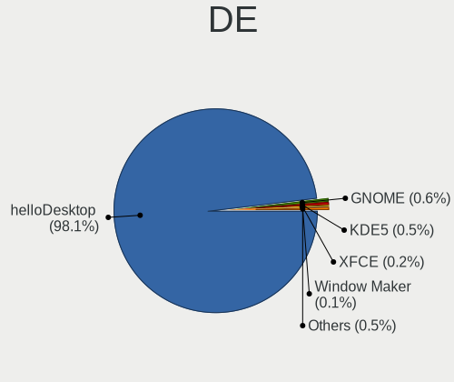

| Name         | Notebooks | Percent |
|--------------|-----------|---------|
| helloDesktop | 512       | 98.08%  |
| GNOME        | 4         | 0.77%   |
| KDE5         | 3         | 0.57%   |
| XFCE         | 1         | 0.19%   |
| Window Maker | 1         | 0.19%   |
| Cinnamon     | 1         | 0.19%   |

Display Server
--------------

X11 or Wayland

| Name | Notebooks | Percent |
|------|-----------|---------|
| X11  | 520       | 100%    |

Display Manager
---------------

SDDM, LightDM, etc.

| Name | Notebooks | Percent |
|------|-----------|---------|
| SLiM | 519       | 99.43%  |
| SDDM | 2         | 0.38%   |
| GDM  | 1         | 0.19%   |

OS Lang
-------

Language

| Lang    | Notebooks | Percent |
|---------|-----------|---------|
| en_US   | 496       | 95.2%   |
| es_ES   | 6         | 1.15%   |
| de_DE   | 5         | 0.96%   |
| fr_FR   | 4         | 0.77%   |
| C       | 3         | 0.58%   |
| it_IT   | 2         | 0.38%   |
| uk_UA   | 1         | 0.19%   |
| ru_RU   | 1         | 0.19%   |
| en      | 1         | 0.19%   |
| de      | 1         | 0.19%   |
| Unknown | 1         | 0.19%   |

Boot Mode
---------

EFI or BIOS

| Mode | Notebooks | Percent |
|------|-----------|---------|
| EFI  | 468       | 89.14%  |
| BIOS | 57        | 10.86%  |

Filesystem
----------

Type of filesystem

| Type   | Notebooks | Percent |
|--------|-----------|---------|
| Zfs    | 392       | 74.1%   |
| Cd9660 | 137       | 25.9%   |

Part. scheme
------------

Scheme of partitioning

| Type | Notebooks | Percent |
|------|-----------|---------|
| GPT  | 519       | 99.81%  |
| MBR  | 1         | 0.19%   |

Board
-----

Vendor
------

Motherboard manufacturer

| Name                | Notebooks | Percent |
|---------------------|-----------|---------|
| Lenovo              | 157       | 30.19%  |
| Dell                | 78        | 15%     |
| Hewlett-Packard     | 74        | 14.23%  |
| ASUSTek Computer    | 45        | 8.65%   |
| Apple               | 37        | 7.12%   |
| Acer                | 32        | 6.15%   |
| Toshiba             | 18        | 3.46%   |
| Samsung Electronics | 11        | 2.12%   |
| Sony                | 8         | 1.54%   |
| Packard Bell        | 5         | 0.96%   |
| MSI                 | 5         | 0.96%   |
| Fujitsu             | 5         | 0.96%   |
| TUXEDO              | 4         | 0.77%   |
| eMachines           | 3         | 0.58%   |
| Timi                | 2         | 0.38%   |
| Panasonic           | 2         | 0.38%   |
| Notebook            | 2         | 0.38%   |
| LG Electronics      | 2         | 0.38%   |
| Itautec             | 2         | 0.38%   |
| HASEE Computer      | 2         | 0.38%   |
| Gateway             | 2         | 0.38%   |
| Alienware           | 2         | 0.38%   |
| WYSE                | 1         | 0.19%   |
| TWINHEAD            | 1         | 0.19%   |
| Semp Toshiba        | 1         | 0.19%   |
| Razer               | 1         | 0.19%   |
| Positivo            | 1         | 0.19%   |
| Philco              | 1         | 0.19%   |
| Pegatron            | 1         | 0.19%   |
| PCSTICK             | 1         | 0.19%   |
| NEC Computers       | 1         | 0.19%   |
| MouseComputer       | 1         | 0.19%   |
| Medion              | 1         | 0.19%   |
| Kraftway            | 1         | 0.19%   |
| HUAWEI              | 1         | 0.19%   |
| Hampoo              | 1         | 0.19%   |
| GPD                 | 1         | 0.19%   |
| Google              | 1         | 0.19%   |
| Fujitsu Siemens     | 1         | 0.19%   |
| DNS                 | 1         | 0.19%   |

Model
-----

Motherboard model

| Name                                | Notebooks | Percent |
|-------------------------------------|-----------|---------|
| Apple MacBook4,1                    | 5         | 0.96%   |
| Unknown                             | 4         | 0.77%   |
| HP Pavilion dv6                     | 3         | 0.58%   |
| Dell Precision 7710                 | 3         | 0.58%   |
| Dell Latitude 7280                  | 3         | 0.58%   |
| Dell Inspiron 3442                  | 3         | 0.58%   |
| Dell Inspiron 15-3567               | 3         | 0.58%   |
| Apple MacBookPro9,2                 | 3         | 0.58%   |
| Apple MacBookPro5,5                 | 3         | 0.58%   |
| Apple MacBookAir5,1                 | 3         | 0.58%   |
| Apple MacBook6,1                    | 3         | 0.58%   |
| Acer Aspire ES1-533                 | 3         | 0.58%   |
| TUXEDO Aura 15 Gen1                 | 2         | 0.38%   |
| Lenovo Z50-70 20354                 | 2         | 0.38%   |
| Lenovo ThinkPad X250 20CLS1WP01     | 2         | 0.38%   |
| Lenovo IdeaPad 110S-11IBR 80WG      | 2         | 0.38%   |
| Lenovo G550 2958                    | 2         | 0.38%   |
| Lenovo G500 20236                   | 2         | 0.38%   |
| HP ProBook 4540s                    | 2         | 0.38%   |
| HP Pavilion Notebook                | 2         | 0.38%   |
| HP Pavilion Gaming Laptop 15-ec1xxx | 2         | 0.38%   |
| HP Pavilion g6                      | 2         | 0.38%   |
| HP Pavilion dv4                     | 2         | 0.38%   |
| HP EliteBook 840 G3                 | 2         | 0.38%   |
| HP 250 G6 Notebook PC               | 2         | 0.38%   |
| HP 2000                             | 2         | 0.38%   |
| HP 15                               | 2         | 0.38%   |
| Gateway NE56R                       | 2         | 0.38%   |
| Fujitsu LIFEBOOK A555               | 2         | 0.38%   |
| Dell Venue 11 Pro 7140              | 2         | 0.38%   |
| Dell Latitude E7240                 | 2         | 0.38%   |
| Dell Latitude E6540                 | 2         | 0.38%   |
| Dell Latitude E6420                 | 2         | 0.38%   |
| Dell Latitude E6410                 | 2         | 0.38%   |
| Dell Latitude E5570                 | 2         | 0.38%   |
| Dell Latitude E5470                 | 2         | 0.38%   |
| Dell Latitude E4300                 | 2         | 0.38%   |
| Dell Latitude D630                  | 2         | 0.38%   |
| Dell Latitude 7380                  | 2         | 0.38%   |
| Dell Inspiron 7520                  | 2         | 0.38%   |

Model Family
------------

Motherboard model prefix

| Name                  | Notebooks | Percent |
|-----------------------|-----------|---------|
| Lenovo ThinkPad       | 112       | 21.54%  |
| Dell Latitude         | 39        | 7.5%    |
| Acer Aspire           | 28        | 5.38%   |
| Dell Inspiron         | 24        | 4.62%   |
| HP Pavilion           | 21        | 4.04%   |
| Lenovo IdeaPad        | 15        | 2.88%   |
| HP EliteBook          | 11        | 2.12%   |
| Toshiba Satellite     | 10        | 1.92%   |
| HP ProBook            | 10        | 1.92%   |
| HP Laptop             | 6         | 1.15%   |
| Packard Bell EasyNote | 5         | 0.96%   |
| Fujitsu LIFEBOOK      | 5         | 0.96%   |
| Dell Precision        | 5         | 0.96%   |
| ASUS VivoBook         | 5         | 0.96%   |
| Apple MacBookPro5     | 5         | 0.96%   |
| Apple MacBook4        | 5         | 0.96%   |
| Toshiba PORTEGE       | 4         | 0.77%   |
| Lenovo Legion         | 4         | 0.77%   |
| Apple MacBook5        | 4         | 0.77%   |
| Unknown               | 4         | 0.77%   |
| HP 250                | 3         | 0.58%   |
| HP 15                 | 3         | 0.58%   |
| Dell Vostro           | 3         | 0.58%   |
| Apple MacBookPro9     | 3         | 0.58%   |
| Apple MacBookAir5     | 3         | 0.58%   |
| Apple MacBook6        | 3         | 0.58%   |
| TUXEDO Aura           | 2         | 0.38%   |
| Toshiba TECRA         | 2         | 0.38%   |
| Toshiba dynabook      | 2         | 0.38%   |
| MSI GF65              | 2         | 0.38%   |
| Lenovo Z50-70         | 2         | 0.38%   |
| Lenovo Yoga           | 2         | 0.38%   |
| Lenovo G550           | 2         | 0.38%   |
| Lenovo G500           | 2         | 0.38%   |
| Itautec Infoway       | 2         | 0.38%   |
| HP OMEN               | 2         | 0.38%   |
| HP Compaq             | 2         | 0.38%   |
| HP 2000               | 2         | 0.38%   |
| Gateway NE56R         | 2         | 0.38%   |
| Dell XPS              | 2         | 0.38%   |

MFG Year
--------

Motherboard manufacture year

| Year    | Notebooks | Percent |
|---------|-----------|---------|
| 2013    | 51        | 9.81%   |
| 2012    | 46        | 8.85%   |
| 2020    | 43        | 8.27%   |
| 2015    | 41        | 7.88%   |
| 2011    | 39        | 7.5%    |
| 2018    | 38        | 7.31%   |
| 2016    | 36        | 6.92%   |
| 2019    | 34        | 6.54%   |
| 2009    | 34        | 6.54%   |
| 2010    | 33        | 6.35%   |
| 2014    | 32        | 6.15%   |
| 2017    | 25        | 4.81%   |
| 2021    | 23        | 4.42%   |
| 2008    | 22        | 4.23%   |
| 2007    | 12        | 2.31%   |
| 2022    | 8         | 1.54%   |
| 2006    | 2         | 0.38%   |
| Unknown | 1         | 0.19%   |

Form Factor
-----------

Physical design of the computer

| Name     | Notebooks | Percent |
|----------|-----------|---------|
| Notebook | 520       | 100%    |

Coreboot
--------

Have coreboot on board

| Used | Notebooks | Percent |
|------|-----------|---------|
| No   | 518       | 99.62%  |
| Yes  | 2         | 0.38%   |

RAM Size
--------

Total RAM memory

| Size in GB  | Notebooks | Percent |
|-------------|-----------|---------|
| 4.01-8.0    | 201       | 38.65%  |
| 8.01-16.0   | 194       | 37.31%  |
| 16.01-24.0  | 84        | 16.15%  |
| 2.01-3.0    | 18        | 3.46%   |
| 32.01-64.0  | 11        | 2.12%   |
| 3.01-4.0    | 7         | 1.35%   |
| 24.01-32.0  | 4         | 0.77%   |
| 64.01-256.0 | 1         | 0.19%   |

RAM Used
--------

Used RAM memory

| Used GB   | Notebooks | Percent |
|-----------|-----------|---------|
| 0.01-0.5  | 346       | 66.28%  |
| 0.51-1.0  | 137       | 26.25%  |
| 1.01-2.0  | 24        | 4.6%    |
| 2.01-3.0  | 14        | 2.68%   |
| 8.01-16.0 | 1         | 0.19%   |

Total Drives
------------

Number of drives on board

| Drives | Notebooks | Percent |
|--------|-----------|---------|
| 1      | 406       | 77.04%  |
| 2      | 86        | 16.32%  |
| 0      | 28        | 5.31%   |
| 3      | 6         | 1.14%   |
| 4      | 1         | 0.19%   |

Has CD-ROM
----------

Has CD-ROM on board

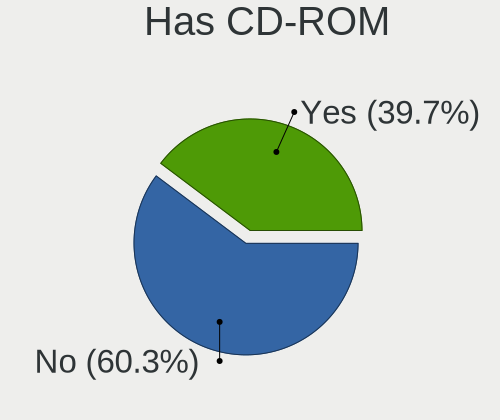

| Presented | Notebooks | Percent |
|-----------|-----------|---------|
| No        | 285       | 54.6%   |
| Yes       | 237       | 45.4%   |

Has Ethernet
------------

Has Ethernet on board

| Presented | Notebooks | Percent |
|-----------|-----------|---------|
| Yes       | 463       | 89.04%  |
| No        | 57        | 10.96%  |

Has WiFi
--------

Has WiFi module

| Presented | Notebooks | Percent |
|-----------|-----------|---------|
| Yes       | 512       | 98.46%  |
| No        | 8         | 1.54%   |

Has Bluetooth
-------------

Has Bluetooth module

| Presented | Notebooks | Percent |
|-----------|-----------|---------|
| Yes       | 344       | 65.77%  |
| No        | 179       | 34.23%  |

Location
--------

Country
-------

Geographic location (country)

| Country      | Notebooks | Percent |
|--------------|-----------|---------|
| USA          | 73        | 13.98%  |
| Germany      | 50        | 9.58%   |
| Brazil       | 42        | 8.05%   |
| Italy        | 26        | 4.98%   |
| Russia       | 24        | 4.6%    |
| Spain        | 22        | 4.21%   |
| China        | 22        | 4.21%   |
| UK           | 21        | 4.02%   |
| Netherlands  | 19        | 3.64%   |
| France       | 14        | 2.68%   |
| Ukraine      | 13        | 2.49%   |
| Mexico       | 12        | 2.3%    |
| Canada       | 10        | 1.92%   |
| Sweden       | 9         | 1.72%   |
| Poland       | 9         | 1.72%   |
| Indonesia    | 9         | 1.72%   |
| India        | 9         | 1.72%   |
| Hungary      | 9         | 1.72%   |
| Romania      | 7         | 1.34%   |
| Australia    | 6         | 1.15%   |
| Portugal     | 5         | 0.96%   |
| Japan        | 5         | 0.96%   |
| Greece       | 5         | 0.96%   |
| Chile        | 5         | 0.96%   |
| Vietnam      | 4         | 0.77%   |
| Switzerland  | 4         | 0.77%   |
| Norway       | 4         | 0.77%   |
| New Zealand  | 4         | 0.77%   |
| Lithuania    | 4         | 0.77%   |
| Colombia     | 4         | 0.77%   |
| UAE          | 3         | 0.57%   |
| South Korea  | 3         | 0.57%   |
| Slovakia     | 3         | 0.57%   |
| Finland      | 3         | 0.57%   |
| Czechia      | 3         | 0.57%   |
| Croatia      | 3         | 0.57%   |
| Bulgaria     | 3         | 0.57%   |
| Turkey       | 2         | 0.38%   |
| Taiwan       | 2         | 0.38%   |
| South Africa | 2         | 0.38%   |

City
----

Geographic location (city)

| City              | Notebooks | Percent |
|-------------------|-----------|---------|
| Moscow            | 6         | 1.1%    |
| Guangzhou         | 6         | 1.1%    |
| Curitiba          | 5         | 0.92%   |
| Wroclaw           | 4         | 0.73%   |
| Utrecht           | 4         | 0.73%   |
| Frankfurt am Main | 4         | 0.73%   |
| Berlin            | 4         | 0.73%   |
| Athens            | 4         | 0.73%   |
| Vilnius           | 3         | 0.55%   |
| Surabaya          | 3         | 0.55%   |
| New York          | 3         | 0.55%   |
| Leatherhead       | 3         | 0.55%   |
| Kyiv              | 3         | 0.55%   |
| Jakarta           | 3         | 0.55%   |
| Hanoi             | 3         | 0.55%   |
| Franconville      | 3         | 0.55%   |
| Budapest          | 3         | 0.55%   |
| Brighton          | 3         | 0.55%   |
| Bengaluru         | 3         | 0.55%   |
| Amsterdam         | 3         | 0.55%   |
| Zurich            | 2         | 0.37%   |
| Washington        | 2         | 0.37%   |
| Warsaw            | 2         | 0.37%   |
| Vsters    | 2         | 0.37%   |
| Vancouver         | 2         | 0.37%   |
| Ufa               | 2         | 0.37%   |
| Turin             | 2         | 0.37%   |
| Tula de Allende   | 2         | 0.37%   |
| So Paulo      | 2         | 0.37%   |
| St Petersburg     | 2         | 0.37%   |
| Singapore         | 2         | 0.37%   |
| So Paulo      | 2         | 0.37%   |
| Sao Paulo         | 2         | 0.37%   |
| Santiago          | 2         | 0.37%   |
| Rome              | 2         | 0.37%   |
| Rio de Janeiro    | 2         | 0.37%   |
| Riga              | 2         | 0.37%   |
| Rho               | 2         | 0.37%   |
| Pleidelsheim      | 2         | 0.37%   |
| Oklahoma City     | 2         | 0.37%   |

Drives
------

Drive Vendor
------------

Hard drive vendors

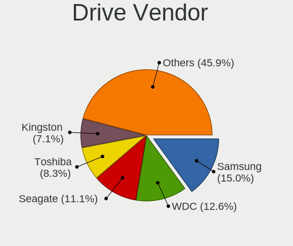

| Vendor              | Notebooks | Drives | Percent |
|---------------------|-----------|--------|---------|
| WDC                 | 92        | 99     | 15.49%  |
| Samsung Electronics | 85        | 100    | 14.31%  |
| Seagate             | 73        | 87     | 12.29%  |
| Toshiba             | 48        | 57     | 8.08%   |
| Kingston            | 38        | 42     | 6.4%    |
| Crucial             | 34        | 36     | 5.72%   |
| SanDisk             | 30        | 31     | 5.05%   |
| Hitachi             | 26        | 29     | 4.38%   |
| Intel               | 21        | 23     | 3.54%   |
| A-DATA Technology   | 13        | 14     | 2.19%   |
| HGST                | 12        | 13     | 2.02%   |
| Micron Technology   | 10        | 10     | 1.68%   |
| Fujitsu             | 9         | 10     | 1.52%   |
| Apple               | 8         | 8      | 1.35%   |
| SPCC                | 7         | 8      | 1.18%   |
| SK hynix            | 6         | 6      | 1.01%   |
| Transcend           | 5         | 6      | 0.84%   |
| OCZ                 | 5         | 5      | 0.84%   |
| LITEON              | 5         | 5      | 0.84%   |
| KingSpec            | 5         | 5      | 0.84%   |
| Intenso             | 5         | 5      | 0.84%   |
| PNY                 | 4         | 4      | 0.67%   |
| Patriot             | 4         | 7      | 0.67%   |
| Corsair             | 4         | 4      | 0.67%   |
| SSSTC               | 3         | 3      | 0.51%   |
| Lexar               | 3         | 3      | 0.51%   |
| Zheino              | 2         | 2      | 0.34%   |
| Plextor             | 2         | 2      | 0.34%   |
| LITEONIT            | 2         | 2      | 0.34%   |
| Leven               | 2         | 2      | 0.34%   |
| KIOXIA              | 2         | 2      | 0.34%   |
| Hikvision           | 2         | 2      | 0.34%   |
| Hewlett-Packard     | 2         | 3      | 0.34%   |
| China               | 2         | 2      | 0.34%   |
| Apacer              | 2         | 2      | 0.34%   |
| Team                | 1         | 1      | 0.17%   |
| Smartbuy            | 1         | 1      | 0.17%   |
| Smart               | 1         | 1      | 0.17%   |
| Silicon Motion      | 1         | 1      | 0.17%   |
| Pioneer             | 1         | 1      | 0.17%   |

Drive Model
-----------

Hard drive models

| Model                               | Notebooks | Percent |
|-------------------------------------|-----------|---------|
| Toshiba MQ01ABD100 1TB              | 10        | 1.64%   |
| Seagate ST1000LM035-1RK172 1TB      | 8         | 1.31%   |
| Toshiba MQ01ABF050 500GB            | 7         | 1.15%   |
| Seagate ST1000LM024 HN-M101MBB 1TB  | 7         | 1.15%   |
| WDC WDS240G2G0A-00JH30 240GB        | 6         | 0.98%   |
| Kingston SA400S37120G 120GB         | 6         | 0.98%   |
| Crucial CT500MX500SSD1 500GB        | 6         | 0.98%   |
| WDC WDS120G2G0A-00JH30 120GB        | 5         | 0.82%   |
| Seagate ST9500325AS 500GB           | 5         | 0.82%   |
| Samsung SSD 860 EVO 500GB           | 5         | 0.82%   |
| Samsung SSD 860 EVO 250GB           | 5         | 0.82%   |
| Kingston SA400S37240G 240GB         | 5         | 0.82%   |
| HGST HTS545050A7E680 500GB          | 5         | 0.82%   |
| Crucial CT240BX500SSD1 240GB        | 5         | 0.82%   |
| Seagate ST9500420AS 500GB           | 4         | 0.66%   |
| Samsung SSD 850 EVO 500GB           | 4         | 0.66%   |
| Samsung SSD 850 EVO 250GB           | 4         | 0.66%   |
| Samsung MZVLW256HEHP-000L7 256GB    | 4         | 0.66%   |
| Micron 1100 SATA 256GB              | 4         | 0.66%   |
| Toshiba MK3261GSYN 320GB            | 3         | 0.49%   |
| Seagate ST9320423AS 320GB           | 3         | 0.49%   |
| Seagate ST9320325AS 320GB           | 3         | 0.49%   |
| Seagate ST500LT012-9WS142 500GB     | 3         | 0.49%   |
| Seagate ST500LT012-1DG142 500GB     | 3         | 0.49%   |
| Seagate ST500LM012 HN-M500MBB 500GB | 3         | 0.49%   |
| Seagate ST1000LM049-2GH172 1TB      | 3         | 0.49%   |
| Samsung SSD 860 EVO 1TB             | 3         | 0.49%   |
| Samsung SSD 840 EVO 250GB           | 3         | 0.49%   |
| Kingston SV300S37A120G 120GB        | 3         | 0.49%   |
| Kingston SA400S37480G 480GB         | 3         | 0.49%   |
| Hitachi HTS545032B9A300 320GB       | 3         | 0.49%   |
| Crucial CT1000MX500SSD1 1TB         | 3         | 0.49%   |
| Apple SSD TS128E 121GB              | 3         | 0.49%   |
| A-DATA SU650 240GB                  | 3         | 0.49%   |
| WDC WDS120G1G0A-00SS50 120GB        | 2         | 0.33%   |
| WDC WDBNCE5000PNC 500GB             | 2         | 0.33%   |
| WDC WD5000LPVX-22V0TT0 500GB        | 2         | 0.33%   |
| WDC WD5000LPCX-60VHAT0 500GB        | 2         | 0.33%   |
| WDC WD5000BPKT-00PK4T0 500GB        | 2         | 0.33%   |
| WDC WD3200BEVT-60ZCT1 320GB         | 2         | 0.33%   |

HDD Vendor
----------

Hard disk drive vendors

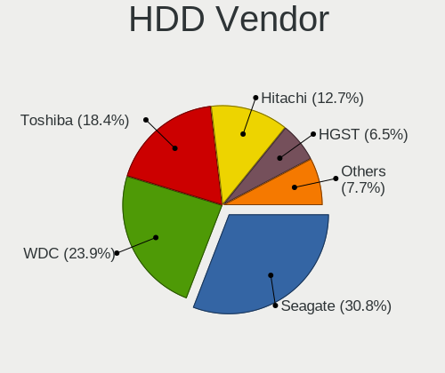

| Vendor              | Notebooks | Drives | Percent |
|---------------------|-----------|--------|---------|
| Seagate             | 73        | 87     | 32.02%  |
| WDC                 | 63        | 66     | 27.63%  |
| Toshiba             | 38        | 47     | 16.67%  |
| Hitachi             | 26        | 29     | 11.4%   |
| HGST                | 12        | 13     | 5.26%   |
| Fujitsu             | 8         | 8      | 3.51%   |
| Samsung Electronics | 7         | 7      | 3.07%   |
| Apple               | 1         | 1      | 0.44%   |

SSD Vendor
----------

Solid state drive vendors

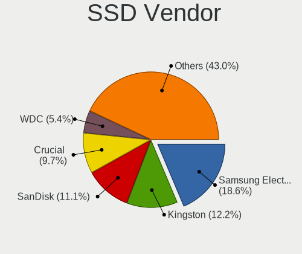

| Vendor              | Notebooks | Drives | Percent |
|---------------------|-----------|--------|---------|
| Samsung Electronics | 63        | 70     | 20.72%  |
| Kingston            | 33        | 36     | 10.86%  |
| Crucial             | 32        | 34     | 10.53%  |
| SanDisk             | 30        | 31     | 9.87%   |
| WDC                 | 21        | 21     | 6.91%   |
| Intel               | 15        | 16     | 4.93%   |
| A-DATA Technology   | 9         | 10     | 2.96%   |
| SPCC                | 7         | 8      | 2.3%    |
| Apple               | 7         | 7      | 2.3%    |
| Micron Technology   | 6         | 6      | 1.97%   |
| Transcend           | 5         | 6      | 1.64%   |
| OCZ                 | 5         | 5      | 1.64%   |
| LITEON              | 5         | 5      | 1.64%   |
| KingSpec            | 5         | 5      | 1.64%   |
| Intenso             | 5         | 5      | 1.64%   |
| Toshiba             | 4         | 4      | 1.32%   |
| PNY                 | 4         | 4      | 1.32%   |
| Patriot             | 4         | 7      | 1.32%   |
| Corsair             | 4         | 4      | 1.32%   |
| SK hynix            | 3         | 3      | 0.99%   |
| Lexar               | 3         | 3      | 0.99%   |
| Zheino              | 2         | 2      | 0.66%   |
| Plextor             | 2         | 2      | 0.66%   |
| LITEONIT            | 2         | 2      | 0.66%   |
| Leven               | 2         | 2      | 0.66%   |
| Hewlett-Packard     | 2         | 3      | 0.66%   |
| China               | 2         | 2      | 0.66%   |
| Apacer              | 2         | 2      | 0.66%   |
| Team                | 1         | 1      | 0.33%   |
| SSSTC               | 1         | 1      | 0.33%   |
| Smartbuy            | 1         | 1      | 0.33%   |
| Smart               | 1         | 1      | 0.33%   |
| Pioneer             | 1         | 1      | 0.33%   |
| Phison              | 1         | 1      | 0.33%   |
| Netac               | 1         | 1      | 0.33%   |
| MyDigitalSSD        | 1         | 1      | 0.33%   |
| Mushkin             | 1         | 1      | 0.33%   |
| KingDian            | 1         | 1      | 0.33%   |
| Integral            | 1         | 1      | 0.33%   |
| INDMEM              | 1         | 1      | 0.33%   |

Drive Kind
----------

HDD or SSD

| Kind | Notebooks | Drives | Percent |
|------|-----------|--------|---------|
| SSD  | 273       | 327    | 49.01%  |
| HDD  | 215       | 258    | 38.6%   |
| NVMe | 69        | 76     | 12.39%  |

Drive Connector
---------------

SATA, SAS, NVMe, etc.

| Type | Notebooks | Drives | Percent |
|------|-----------|--------|---------|
| SATA | 454       | 585    | 86.81%  |
| NVMe | 69        | 76     | 13.19%  |

Drive Size
----------

Size of hard drive

| Size in TB | Notebooks | Drives | Percent |
|------------|-----------|--------|---------|
| 0.01-0.5   | 374       | 469    | 78.08%  |
| 0.51-1.0   | 93        | 104    | 19.42%  |
| 1.01-2.0   | 11        | 11     | 2.3%    |
| 4.01-10.0  | 1         | 1      | 0.21%   |

Space Total
-----------

Amount of disk space available on the file system

| Size in GB | Notebooks | Percent |
|------------|-----------|---------|
| 1-20       | 303       | 56.32%  |
| 101-250    | 109       | 20.26%  |
| 251-500    | 70        | 13.01%  |
| 501-1000   | 33        | 6.13%   |
| 51-100     | 11        | 2.04%   |
| 21-50      | 9         | 1.67%   |
| Unknown    | 2         | 0.37%   |
| 1001-2000  | 1         | 0.19%   |

Space Used
----------

Amount of used disk space

| Used GB | Notebooks | Percent |
|---------|-----------|---------|
| 1-20    | 513       | 98.65%  |
| 21-50   | 2         | 0.38%   |
| 101-250 | 2         | 0.38%   |
| Unknown | 2         | 0.38%   |
| 51-100  | 1         | 0.19%   |

Malfunc. Drives
---------------

Drive models with a malfunction

| Model                              | Notebooks | Drives | Percent |
|------------------------------------|-----------|--------|---------|
| Toshiba MQ01ABD100 1TB             | 4         | 4      | 3.2%    |
| Seagate ST1000LM024 HN-M101MBB 1TB | 4         | 5      | 3.2%    |
| Seagate ST9500420AS 500GB          | 3         | 3      | 2.4%    |
| WDC WD3200BEVT-22ZCT0 320GB        | 2         | 2      | 1.6%    |
| Toshiba MQ01ABF050 500GB           | 2         | 4      | 1.6%    |
| Toshiba MQ01ABD075 752GB           | 2         | 2      | 1.6%    |
| Toshiba MK3261GSYN 320GB           | 2         | 4      | 1.6%    |
| Seagate ST9500325AS 500GB          | 2         | 3      | 1.6%    |
| Seagate ST9320423AS 320GB          | 2         | 2      | 1.6%    |
| Seagate ST9320325AS 320GB          | 2         | 2      | 1.6%    |
| Seagate ST9160821AS 160GB          | 2         | 2      | 1.6%    |
| Seagate ST9160412AS 160GB          | 2         | 2      | 1.6%    |
| Seagate ST500LT012-9WS142 500GB    | 2         | 2      | 1.6%    |
| Seagate ST1000LM035-1RK172 1TB     | 2         | 2      | 1.6%    |
| Hitachi HTS545050A7E380 500GB      | 2         | 2      | 1.6%    |
| Hitachi HTS545032B9A300 320GB      | 2         | 2      | 1.6%    |
| Hitachi HTS545025B9SA02 250GB      | 2         | 4      | 1.6%    |
| Hitachi HTS541612J9SA00 120GB      | 2         | 2      | 1.6%    |
| WDC WDS200T2B0A 2TB                | 1         | 1      | 0.8%    |
| WDC WD5000LPVX-60V0TT0 500GB       | 1         | 1      | 0.8%    |
| WDC WD5000LPLX-60ZNTT1 500GB       | 1         | 1      | 0.8%    |
| WDC WD5000LPCX-75VHAT0 500GB       | 1         | 1      | 0.8%    |
| WDC WD5000LPCX-60VHAT0 500GB       | 1         | 2      | 0.8%    |
| WDC WD5000BPVT-22HXZT3 500GB       | 1         | 1      | 0.8%    |
| WDC WD3200BPVT-80ZEST0 320GB       | 1         | 1      | 0.8%    |
| WDC WD3200BPVT-55ZEST0 320GB       | 1         | 1      | 0.8%    |
| WDC WD3200BEVT-80A0RT0 320GB       | 1         | 1      | 0.8%    |
| WDC WD3200BEVT-60ZCT1 320GB        | 1         | 1      | 0.8%    |
| WDC WD3200BEVT-60A23T0 320GB       | 1         | 1      | 0.8%    |
| WDC WD3200BEKT-60V5T1 320GB        | 1         | 1      | 0.8%    |
| WDC WD1600BEVT-80A23T0 160GB       | 1         | 1      | 0.8%    |
| WDC WD1600BEVS-60RST0 160GB        | 1         | 1      | 0.8%    |
| WDC WD1600BEKT-66F3T2 160GB        | 1         | 1      | 0.8%    |
| WDC WD10SPZX-24Z10T0 1TB           | 1         | 1      | 0.8%    |
| WDC WD10SPZX-21Z10T0 1TB           | 1         | 1      | 0.8%    |
| WDC WD10JPVX-75JC3T0 1TB           | 1         | 1      | 0.8%    |
| WDC WD10JPVX-22JC3T0 1TB           | 1         | 1      | 0.8%    |
| WDC WD10JMVW-11AJGS0 1TB           | 1         | 1      | 0.8%    |
| Toshiba THNSNX024GMNT 24GB         | 1         | 1      | 0.8%    |
| Toshiba MQ02ABF050H-SSHD-8GB       | 1         | 1      | 0.8%    |

Malfunc. Drive Vendor
---------------------

Vendors of faulty drives

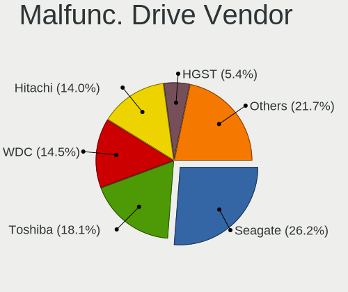

| Vendor              | Notebooks | Drives | Percent |
|---------------------|-----------|--------|---------|
| Seagate             | 35        | 40     | 28%     |
| WDC                 | 22        | 23     | 17.6%   |
| Toshiba             | 22        | 28     | 17.6%   |
| Hitachi             | 16        | 18     | 12.8%   |
| Samsung Electronics | 5         | 5      | 4%      |
| HGST                | 5         | 6      | 4%      |
| Kingston            | 3         | 3      | 2.4%    |
| Fujitsu             | 3         | 3      | 2.4%    |
| SanDisk             | 2         | 2      | 1.6%    |
| Micron Technology   | 2         | 2      | 1.6%    |
| LITEON              | 2         | 2      | 1.6%    |
| Corsair             | 2         | 2      | 1.6%    |
| SSSTC               | 1         | 1      | 0.8%    |
| Hewlett-Packard     | 1         | 1      | 0.8%    |
| Crucial             | 1         | 3      | 0.8%    |
| China               | 1         | 1      | 0.8%    |
| Apple               | 1         | 1      | 0.8%    |
| AGI                 | 1         | 1      | 0.8%    |

Malfunc. HDD Vendor
-------------------

Vendors of faulty HDD drives

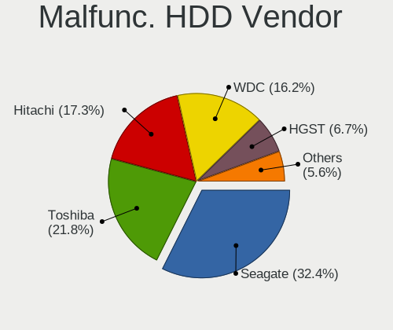

| Vendor              | Notebooks | Drives | Percent |
|---------------------|-----------|--------|---------|
| Seagate             | 35        | 40     | 33.33%  |
| WDC                 | 21        | 22     | 20%     |
| Toshiba             | 21        | 27     | 20%     |
| Hitachi             | 16        | 18     | 15.24%  |
| HGST                | 5         | 6      | 4.76%   |
| Samsung Electronics | 3         | 3      | 2.86%   |
| Fujitsu             | 3         | 3      | 2.86%   |
| Apple               | 1         | 1      | 0.95%   |

Malfunc. Drive Kind
-------------------

Kinds of faulty drives

| Kind | Notebooks | Drives | Percent |
|------|-----------|--------|---------|
| HDD  | 100       | 120    | 83.33%  |
| SSD  | 19        | 21     | 15.83%  |
| NVMe | 1         | 1      | 0.83%   |

Failed Drives
-------------

Failed drive models

| Model                         | Notebooks | Drives | Percent |
|-------------------------------|-----------|--------|---------|
| HPE MK000480GWUGF 480GB       | 1         | 1      | 50%     |
| Hitachi HTS545025B9A300 250GB | 1         | 1      | 50%     |

Failed Drive Vendor
-------------------

Failed drive vendors

| Vendor  | Notebooks | Drives | Percent |
|---------|-----------|--------|---------|
| HPE     | 1         | 1      | 50%     |
| Hitachi | 1         | 1      | 50%     |

Drive Status
------------

Number of failed and malfunc. drives

| Status   | Notebooks | Drives | Percent |
|----------|-----------|--------|---------|
| Works    | 406       | 515    | 76.75%  |
| Malfunc  | 119       | 142    | 22.5%   |
| Detected | 2         | 2      | 0.38%   |
| Failed   | 2         | 2      | 0.38%   |

Storage controller
------------------

Storage Vendor
--------------

Storage controller vendors

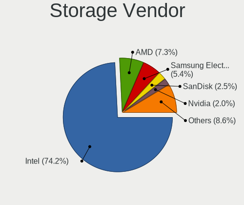

| Vendor                           | Notebooks | Percent |
|----------------------------------|-----------|---------|
| Intel                            | 437       | 77.76%  |
| AMD                              | 45        | 8.01%   |
| Samsung Electronics              | 20        | 3.56%   |
| SanDisk                          | 12        | 2.14%   |
| Nvidia                           | 12        | 2.14%   |
| Toshiba                          | 4         | 0.71%   |
| Silicon Motion                   | 4         | 0.71%   |
| Micron Technology                | 4         | 0.71%   |
| KIOXIA                           | 4         | 0.71%   |
| Kingston Technology Company      | 4         | 0.71%   |
| SK hynix                         | 3         | 0.53%   |
| Realtek Semiconductor            | 3         | 0.53%   |
| Solid State Storage Technology   | 2         | 0.36%   |
| Silicon Integrated Systems [SiS] | 2         | 0.36%   |
| Micron/Crucial Technology        | 2         | 0.36%   |
| JMicron Technology               | 2         | 0.36%   |
| Biwin Storage Technology         | 1         | 0.18%   |
| ADATA Technology                 | 1         | 0.18%   |

Storage Model
-------------

Storage controller models

| Model                                                                            | Notebooks | Percent |
|----------------------------------------------------------------------------------|-----------|---------|
| Intel 7 Series Chipset Family 6-port SATA Controller [AHCI mode]                 | 78        | 12.64%  |
| Intel Sunrise Point-LP SATA Controller [AHCI mode]                               | 59        | 9.56%   |
| Intel 6 Series/C200 Series Chipset Family 6 port Mobile SATA AHCI Controller     | 40        | 6.48%   |
| AMD FCH SATA Controller [AHCI mode]                                              | 36        | 5.83%   |
| Intel 8 Series SATA Controller 1 [AHCI mode]                                     | 35        | 5.67%   |
| Intel 82801IBM/IEM (ICH9M/ICH9M-E) 4 port SATA Controller [AHCI mode]            | 32        | 5.19%   |
| Intel 82801HM/HEM (ICH8M/ICH8M-E) IDE Controller                                 | 24        | 3.89%   |
| Intel 82801HM/HEM (ICH8M/ICH8M-E) SATA Controller [AHCI mode]                    | 23        | 3.73%   |
| Intel 82801 Mobile SATA Controller [RAID mode]                                   | 22        | 3.57%   |
| Intel Wildcat Point-LP SATA Controller [AHCI Mode]                               | 21        | 3.4%    |
| Intel 5 Series/3400 Series Chipset 4 port SATA AHCI Controller                   | 20        | 3.24%   |
| Unknown                                                                          | 15        | 2.43%   |
| Intel 8 Series/C220 Series Chipset Family 6-port SATA Controller 1 [AHCI mode]   | 13        | 2.11%   |
| Intel 5 Series/3400 Series Chipset 6 port SATA AHCI Controller                   | 13        | 2.11%   |
| Nvidia MCP79 AHCI Controller                                                     | 12        | 1.94%   |
| Intel Cannon Lake Mobile PCH SATA AHCI Controller                                | 9         | 1.46%   |
| Intel Atom Processor E3800 Series SATA AHCI Controller                           | 8         | 1.3%    |
| Samsung NVMe SSD Controller SM981/PM981/PM983                                    | 7         | 1.13%   |
| Intel HM170/QM170 Chipset SATA Controller [AHCI Mode]                            | 7         | 1.13%   |
| Intel Atom/Celeron/Pentium Processor x5-E8000/J3xxx/N3xxx Series SATA Controller | 7         | 1.13%   |
| SanDisk WD Blue SN550 NVMe SSD                                                   | 6         | 0.97%   |
| Intel NM10/ICH7 Family SATA Controller [AHCI mode]                               | 6         | 0.97%   |
| Intel Cannon Point-LP SATA Controller [AHCI Mode]                                | 6         | 0.97%   |
| AMD SB7x0/SB8x0/SB9x0 SATA Controller [AHCI mode]                                | 6         | 0.97%   |
| Samsung NVMe SSD Controller SM961/PM961/SM963                                    | 5         | 0.81%   |
| Intel Q170/Q150/B150/H170/H110/Z170/CM236 Chipset SATA Controller [AHCI Mode]    | 5         | 0.81%   |
| Intel Celeron N3350/Pentium N4200/Atom E3900 Series SATA AHCI Controller         | 5         | 0.81%   |
| KIOXIA NVMe SSD Controller BG4                                                   | 4         | 0.65%   |
| Intel Mobile 4 Series Chipset PT IDER Controller                                 | 4         | 0.65%   |
| Intel Comet Lake SATA AHCI Controller                                            | 4         | 0.65%   |
| Intel 5 Series/3400 Series Chipset 4 port SATA IDE Controller                    | 4         | 0.65%   |
| Intel 5 Series/3400 Series Chipset 2 port SATA IDE Controller                    | 4         | 0.65%   |
| Samsung NVMe SSD Controller PM9A1/PM9A3/980PRO                                   | 3         | 0.49%   |
| Samsung NVMe SSD Controller 980                                                  | 3         | 0.49%   |
| Intel SSD 660P Series                                                            | 3         | 0.49%   |
| Intel Celeron/Pentium Silver Processor SATA Controller                           | 3         | 0.49%   |
| Intel 82801IBM/IEM (ICH9M/ICH9M-E) 2 port SATA Controller [IDE mode]             | 3         | 0.49%   |
| Intel 7 Series Chipset Family 4-port SATA Controller [IDE mode]                  | 3         | 0.49%   |
| Intel 7 Series Chipset Family 2-port SATA Controller [IDE mode]                  | 3         | 0.49%   |
| AMD SB600 Non-Raid-5 SATA                                                        | 3         | 0.49%   |

Storage Kind
------------

Kind of storage controller (IDE, SATA, NVMe, SAS, ...)

| Kind | Notebooks | Percent |
|------|-----------|---------|
| SATA | 453       | 75.63%  |
| NVMe | 68        | 11.35%  |
| IDE  | 52        | 8.68%   |
| RAID | 26        | 4.34%   |

Processor
---------

CPU Vendor
----------

Processor vendors

| Vendor | Notebooks | Percent |
|--------|-----------|---------|
| Intel  | 471       | 90.58%  |
| AMD    | 49        | 9.42%   |

CPU Model
---------

Processor models

| Model                                | Notebooks | Percent |
|--------------------------------------|-----------|---------|
| Intel CPU Version                    | 15        | 2.88%   |
| Intel Core i5-3320M CPU @ 2.60GHz    | 13        | 2.5%    |
| Intel Core i5-2520M CPU @ 2.50GHz    | 12        | 2.31%   |
| Intel Core i5-7200U CPU @ 2.50GHz    | 11        | 2.12%   |
| Intel Core i5-6300U CPU @ 2.40GHz    | 9         | 1.73%   |
| Intel Core i5-5200U CPU @ 2.20GHz    | 9         | 1.73%   |
| Intel Core i5-4210U CPU @ 1.70GHz    | 9         | 1.73%   |
| Intel Core i5-3317U CPU @ 1.70GHz    | 9         | 1.73%   |
| Intel Core i5-3210M CPU @ 2.50GHz    | 9         | 1.73%   |
| Intel Core i5-6200U CPU @ 2.30GHz    | 8         | 1.54%   |
| Intel Core i5 CPU M 520 @ 2.40GHz    | 7         | 1.35%   |
| Intel Core i3-6006U CPU @ 2.00GHz    | 7         | 1.35%   |
| Intel Core i7-6600U CPU @ 2.60GHz    | 6         | 1.15%   |
| Intel Core i5-4300U CPU @ 1.90GHz    | 6         | 1.15%   |
| Intel Core i5-3230M CPU @ 2.60GHz    | 6         | 1.15%   |
| Intel Core i3-3110M CPU @ 2.40GHz    | 6         | 1.15%   |
| Intel Core 2 Duo CPU T8300 @ 2.40GHz | 6         | 1.15%   |
| Intel Core 2 Duo CPU T7300 @ 2.00GHz | 6         | 1.15%   |
| Intel Genuine CPU                    | 5         | 0.96%   |
| Intel Core i5-8250U CPU @ 1.60GHz    | 5         | 0.96%   |
| Intel Core 2 Duo CPU P8600 @ 2.40GHz | 5         | 0.96%   |
| Intel Core 2 Duo                     | 5         | 0.96%   |
| Intel Core i7-7600U CPU @ 2.80GHz    | 4         | 0.77%   |
| Intel Core i7-7500U CPU @ 2.70GHz    | 4         | 0.77%   |
| Intel Core i7-4700MQ CPU @ 2.40GHz   | 4         | 0.77%   |
| Intel Core i7-4600U CPU @ 2.10GHz    | 4         | 0.77%   |
| Intel Core i7-3520M CPU @ 2.90GHz    | 4         | 0.77%   |
| Intel Core i5-4300M CPU @ 2.60GHz    | 4         | 0.77%   |
| Intel Core i5-4200U CPU @ 1.60GHz    | 4         | 0.77%   |
| Intel Core i3-5005U CPU @ 2.00GHz    | 4         | 0.77%   |
| Intel Core i3-4005U CPU @ 1.70GHz    | 4         | 0.77%   |
| Intel Core i3 CPU M 330 @ 2.13GHz    | 4         | 0.77%   |
| Intel Core 2 Duo CPU P8700 @ 2.53GHz | 4         | 0.77%   |
| Intel Core 2 Duo CPU P7550 @ 2.26GHz | 4         | 0.77%   |
| Intel Atom CPU N450 @ 1.66GHz        | 4         | 0.77%   |
| Intel Core i7-8750H CPU @ 2.20GHz    | 3         | 0.58%   |
| Intel Core i7-6700HQ CPU @ 2.60GHz   | 3         | 0.58%   |
| Intel Core i7-4510U CPU @ 2.00GHz    | 3         | 0.58%   |
| Intel Core i7-3632QM CPU @ 2.20GHz   | 3         | 0.58%   |
| Intel Core i7-3630QM CPU @ 2.40GHz   | 3         | 0.58%   |

CPU Model Family
----------------

Processor model prefix

| Model                   | Notebooks | Percent |
|-------------------------|-----------|---------|
| Intel Core i5           | 175       | 33.65%  |
| Intel Core i7           | 90        | 17.31%  |
| Intel Core 2 Duo        | 57        | 10.96%  |
| Intel Core i3           | 55        | 10.58%  |
| Intel Celeron           | 29        | 5.58%   |
| Other                   | 22        | 4.23%   |
| Intel Pentium           | 16        | 3.08%   |
| AMD Ryzen 5             | 10        | 1.92%   |
| Intel Atom              | 8         | 1.54%   |
| AMD Ryzen 7             | 7         | 1.35%   |
| AMD A6                  | 7         | 1.35%   |
| Intel Genuine           | 5         | 0.96%   |
| AMD E1                  | 5         | 0.96%   |
| Intel Pentium Silver    | 3         | 0.58%   |
| Intel Pentium Dual-Core | 3         | 0.58%   |
| AMD Ryzen 3             | 3         | 0.58%   |
| Intel Core M            | 2         | 0.38%   |
| Intel Core 2            | 2         | 0.38%   |
| AMD E2                  | 2         | 0.38%   |
| AMD E                   | 2         | 0.38%   |
| AMD A8                  | 2         | 0.38%   |
| AMD A10                 | 2         | 0.38%   |
| Intel Xeon              | 1         | 0.19%   |
| Intel Pentium M         | 1         | 0.19%   |
| Intel Pentium Dual      | 1         | 0.19%   |
| Intel Core m3           | 1         | 0.19%   |
| Intel Core 2 Solo       | 1         | 0.19%   |
| Intel Celeron Dual-Core | 1         | 0.19%   |
| AMD V120                | 1         | 0.19%   |
| AMD Turion 64 X2 Mobile | 1         | 0.19%   |
| AMD Phenom II           | 1         | 0.19%   |
| AMD G                   | 1         | 0.19%   |
| AMD C-60                | 1         | 0.19%   |
| AMD Athlon II           | 1         | 0.19%   |
| AMD Athlon 64 X2        | 1         | 0.19%   |

CPU Cores
---------

Number of processor cores

| Number  | Notebooks | Percent |
|---------|-----------|---------|
| 2       | 332       | 63.85%  |
| 4       | 96        | 18.46%  |
| Unknown | 58        | 11.15%  |
| 6       | 11        | 2.12%   |
| 8       | 9         | 1.73%   |
| 1       | 6         | 1.15%   |
| 16      | 4         | 0.77%   |
| 12      | 4         | 0.77%   |

CPU Sockets
-----------

Number of sockets

| Number  | Notebooks | Percent |
|---------|-----------|---------|
| 1       | 495       | 95.19%  |
| 2       | 23        | 4.42%   |
| Unknown | 2         | 0.38%   |

CPU Threads
-----------

Threads per core (Hyper-Threading)

| Number  | Notebooks | Percent |
|---------|-----------|---------|
| 2       | 334       | 64.23%  |
| 1       | 127       | 24.42%  |
| Unknown | 59        | 11.35%  |

CPU Microarch
-------------

Microarchitecture

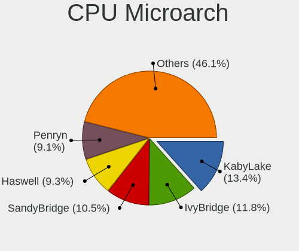

| Name          | Notebooks | Percent |
|---------------|-----------|---------|
| IvyBridge     | 76        | 14.62%  |
| KabyLake      | 67        | 12.88%  |
| Penryn        | 57        | 10.96%  |
| Haswell       | 52        | 10%     |
| SandyBridge   | 51        | 9.81%   |
| Skylake       | 43        | 8.27%   |
| Westmere      | 36        | 6.92%   |
| Core          | 23        | 4.42%   |
| Broadwell     | 23        | 4.42%   |
| Silvermont    | 17        | 3.27%   |
| Zen 2         | 9         | 1.73%   |
| Zen+          | 8         | 1.54%   |
| Bobcat        | 7         | 1.35%   |
| Goldmont      | 6         | 1.15%   |
| Bonnell       | 6         | 1.15%   |
| Jaguar        | 5         | 0.96%   |
| Excavator     | 5         | 0.96%   |
| CometLake     | 5         | 0.96%   |
| TigerLake     | 3         | 0.58%   |
| Piledriver    | 3         | 0.58%   |
| K10           | 3         | 0.58%   |
| Goldmont plus | 3         | 0.58%   |
| Zen 3         | 2         | 0.38%   |
| Zen           | 2         | 0.38%   |
| Puma          | 2         | 0.38%   |
| K8 Hammer     | 2         | 0.38%   |
| Unknown       | 2         | 0.38%   |
| Nehalem       | 1         | 0.19%   |
| K10 Llano     | 1         | 0.19%   |

Graphics
--------

GPU Vendor
----------

Vendors of graphics cards

| Vendor                           | Notebooks | Percent |
|----------------------------------|-----------|---------|
| Intel                            | 415       | 67.7%   |
| Nvidia                           | 113       | 18.43%  |
| AMD                              | 84        | 13.7%   |
| Silicon Integrated Systems [SiS] | 1         | 0.16%   |

GPU Model
---------

Graphics card models

| Model                                                                                    | Notebooks | Percent |
|------------------------------------------------------------------------------------------|-----------|---------|
| Intel 3rd Gen Core processor Graphics Controller                                         | 72        | 11.37%  |
| Intel 2nd Generation Core Processor Family Integrated Graphics Controller                | 49        | 7.74%   |
| Intel Haswell-ULT Integrated Graphics Controller                                         | 36        | 5.69%   |
| Intel Skylake GT2 [HD Graphics 520]                                                      | 32        | 5.06%   |
| Intel Core Processor Integrated Graphics Controller                                      | 28        | 4.42%   |
| Intel Mobile 4 Series Chipset Integrated Graphics Controller                             | 25        | 3.95%   |
| Intel HD Graphics 620                                                                    | 25        | 3.95%   |
| Intel HD Graphics 5500                                                                   | 18        | 2.84%   |
| Intel Mobile GM965/GL960 Integrated Graphics Controller (secondary)                      | 15        | 2.37%   |
| Intel Mobile GM965/GL960 Integrated Graphics Controller (primary)                        | 15        | 2.37%   |
| Intel 4th Gen Core Processor Integrated Graphics Controller                              | 14        | 2.21%   |
| Nvidia GF117M [GeForce 610M/710M/810M/820M / GT 620M/625M/630M/720M]                     | 10        | 1.58%   |
| Nvidia C79 [GeForce 9400M]                                                               | 10        | 1.58%   |
| Intel UHD Graphics 620                                                                   | 10        | 1.58%   |
| Intel HD Graphics 530                                                                    | 10        | 1.58%   |
| AMD Picasso/Raven 2 [Radeon Vega Series / Radeon Vega Mobile Series]                     | 10        | 1.58%   |
| Intel Atom Processor Z36xxx/Z37xxx Series Graphics & Display                             | 9         | 1.42%   |
| AMD Renoir                                                                               | 9         | 1.42%   |
| Intel WhiskeyLake-U GT2 [UHD Graphics 620]                                               | 8         | 1.26%   |
| Intel Atom/Celeron/Pentium Processor x5-E8000/J3xxx/N3xxx Integrated Graphics Controller | 8         | 1.26%   |
| Intel CometLake-U GT2 [UHD Graphics]                                                     | 7         | 1.11%   |
| Intel CoffeeLake-H GT2 [UHD Graphics 630]                                                | 7         | 1.11%   |
| Nvidia G96CM [GeForce 9600M GT]                                                          | 6         | 0.95%   |
| Intel Atom Processor D4xx/D5xx/N4xx/N5xx Integrated Graphics Controller                  | 6         | 0.95%   |
| Nvidia G84M [GeForce 8600M GT]                                                           | 5         | 0.79%   |
| Intel HD Graphics 500                                                                    | 5         | 0.79%   |
| Intel CometLake-H GT2 [UHD Graphics]                                                     | 5         | 0.79%   |
| AMD Stoney [Radeon R2/R3/R4/R5 Graphics]                                                 | 5         | 0.79%   |
| Nvidia TU117M                                                                            | 4         | 0.63%   |
| Nvidia TU116M [GeForce GTX 1660 Ti Mobile]                                               | 4         | 0.63%   |
| Nvidia GP107M [GeForce GTX 1050 Ti Mobile]                                               | 4         | 0.63%   |
| Nvidia GP107M [GeForce GTX 1050 Mobile]                                                  | 4         | 0.63%   |
| Intel HD Graphics 630                                                                    | 4         | 0.63%   |
| AMD RV710/M92 [Mobility Radeon HD 4530/4570/545v]                                        | 4         | 0.63%   |
| Nvidia TU117M [GeForce GTX 1650 Mobile / Max-Q]                                          | 3         | 0.47%   |
| Nvidia TU106M [GeForce RTX 2060 Mobile]                                                  | 3         | 0.47%   |
| Nvidia GM108M [GeForce 940MX]                                                            | 3         | 0.47%   |
| Nvidia GM107M [GeForce GTX 960M]                                                         | 3         | 0.47%   |
| Nvidia GF119M [GeForce 610M]                                                             | 3         | 0.47%   |
| Nvidia G86M [Quadro NVS 140M]                                                            | 3         | 0.47%   |

GPU Combo
---------

Combinations of graphics cards

| Name           | Notebooks | Percent |
|----------------|-----------|---------|
| 1 x Intel      | 282       | 54.23%  |
| Intel + Nvidia | 64        | 12.31%  |
| 1 x AMD        | 55        | 10.58%  |
| 2 x Intel      | 48        | 9.23%   |
| 1 x Nvidia     | 40        | 7.69%   |
| Intel + AMD    | 20        | 3.85%   |
| AMD + Nvidia   | 7         | 1.35%   |
| 2 x Nvidia     | 2         | 0.38%   |
| 2 x AMD        | 1         | 0.19%   |
| 1 x SiS        | 1         | 0.19%   |

GPU Driver
----------

Free vs proprietary

| Driver      | Notebooks | Percent |
|-------------|-----------|---------|
| Free        | 457       | 86.88%  |
| Unknown     | 43        | 8.17%   |
| Proprietary | 26        | 4.94%   |

GPU Memory
----------

Total video memory

| Size in GB | Notebooks | Percent |
|------------|-----------|---------|
| Unknown    | 454       | 86.64%  |
| 0.01-0.5   | 48        | 9.16%   |
| 0.51-1.0   | 11        | 2.1%    |
| 1.01-2.0   | 6         | 1.15%   |
| 5.01-6.0   | 2         | 0.38%   |
| 3.01-4.0   | 2         | 0.38%   |
| 2.01-3.0   | 1         | 0.19%   |

Monitor
-------

Monitor Vendor
--------------

Monitor vendors

| Vendor                  | Notebooks | Percent |
|-------------------------|-----------|---------|
| LG Display              | 100       | 21.05%  |
| AU Optronics            | 85        | 17.89%  |
| Chimei Innolux          | 67        | 14.11%  |
| Samsung Electronics     | 48        | 10.11%  |
| BOE                     | 46        | 9.68%   |
| Lenovo                  | 32        | 6.74%   |
| Apple                   | 26        | 5.47%   |
| Chi Mei Optoelectronics | 14        | 2.95%   |
| InfoVision              | 8         | 1.68%   |
| PANDA                   | 5         | 1.05%   |
| LG Philips              | 5         | 1.05%   |
| Goldstar                | 4         | 0.84%   |
| Sharp                   | 3         | 0.63%   |
| Philips                 | 3         | 0.63%   |
| Dell                    | 3         | 0.63%   |
| AOC                     | 3         | 0.63%   |
| Ancor Communications    | 3         | 0.63%   |
| Sony                    | 2         | 0.42%   |
| Hewlett-Packard         | 2         | 0.42%   |
| Fujitsu Siemens         | 2         | 0.42%   |
| BenQ                    | 2         | 0.42%   |
| Vestel Elektronik       | 1         | 0.21%   |
| Toshiba                 | 1         | 0.21%   |
| TMX                     | 1         | 0.21%   |
| SLD                     | 1         | 0.21%   |
| Nvidia                  | 1         | 0.21%   |
| Lenovo Group Limited    | 1         | 0.21%   |
| LED                     | 1         | 0.21%   |
| KTC                     | 1         | 0.21%   |
| HannStar                | 1         | 0.21%   |
| Eizo                    | 1         | 0.21%   |
| CPT                     | 1         | 0.21%   |
| Acer                    | 1         | 0.21%   |

Monitor Model
-------------

Monitor models

| Model                                                                 | Notebooks | Percent |
|-----------------------------------------------------------------------|-----------|---------|
| LG Display LCD Monitor LGD02D8 1366x768 280x160mm 12.7-inch           | 6         | 1.26%   |
| Lenovo LCD Monitor LEN4031 1280x800 300x190mm 14.0-inch               | 6         | 1.26%   |
| Lenovo LCD Monitor LEN4035 1280x800 300x190mm 14.0-inch               | 5         | 1.05%   |
| AU Optronics LCD Monitor AUO26EC 1366x768 340x190mm 15.3-inch         | 5         | 1.05%   |
| Samsung Electronics LCD Monitor SEC5441 1366x768 340x190mm 15.3-inch  | 4         | 0.84%   |
| Samsung Electronics LCD Monitor SDC4C48 1920x1080 340x190mm 15.3-inch | 4         | 0.84%   |
| Chimei Innolux LCD Monitor CMN15AB 1366x768 340x190mm 15.3-inch       | 4         | 0.84%   |
| Chimei Innolux LCD Monitor CMN14C9 1920x1080 310x170mm 13.9-inch      | 4         | 0.84%   |
| AU Optronics LCD Monitor AUO106C 1366x768 280x160mm 12.7-inch         | 4         | 0.84%   |
| Samsung Electronics LCD Monitor SEC3047 1366x768 280x160mm 12.7-inch  | 3         | 0.63%   |
| LG Display LCD Monitor LGD0459 1920x1080 380x210mm 17.1-inch          | 3         | 0.63%   |
| LG Display LCD Monitor LGD0385 1366x768 310x170mm 13.9-inch           | 3         | 0.63%   |
| LG Display LCD Monitor LGD02DC 1366x768 340x190mm 15.3-inch           | 3         | 0.63%   |
| Lenovo LCD Monitor LEN40B0 1366x768 340x190mm 15.3-inch               | 3         | 0.63%   |
| InfoVision LCD Monitor IVO04E3 1366x768 280x160mm 12.7-inch           | 3         | 0.63%   |
| Chimei Innolux LCD Monitor CMN15BF 1366x768 340x190mm 15.3-inch       | 3         | 0.63%   |
| Chimei Innolux LCD Monitor CMN1490 1366x768 310x170mm 13.9-inch       | 3         | 0.63%   |
| AU Optronics LCD Monitor AUO40EC 1366x768 340x190mm 15.3-inch         | 3         | 0.63%   |
| AU Optronics LCD Monitor AUO38ED 1920x1080 340x190mm 15.3-inch        | 3         | 0.63%   |
| AU Optronics LCD Monitor AUO313C 1366x768 310x170mm 13.9-inch         | 3         | 0.63%   |
| AU Optronics LCD Monitor AUO22EC 1366x768 340x190mm 15.3-inch         | 3         | 0.63%   |
| AU Optronics LCD Monitor AUO213E 1600x900 310x170mm 13.9-inch         | 3         | 0.63%   |
| Apple LCD Monitor APP9C5F 1280x800 290x180mm 13.4-inch                | 3         | 0.63%   |
| Apple Color LCD APP9CF3 1366x768 260x140mm 11.6-inch                  | 3         | 0.63%   |
| Samsung Electronics LCD Monitor SEC334A 1366x768 340x190mm 15.3-inch  | 2         | 0.42%   |
| Samsung Electronics LCD Monitor SEC324C 1600x900 310x170mm 13.9-inch  | 2         | 0.42%   |
| PANDA LM156LF1L03 NCP001C 1920x1080 340x190mm 15.3-inch               | 2         | 0.42%   |
| LG Philips LCD Monitor LPLE300 1280x800 330x210mm 15.4-inch           | 2         | 0.42%   |
| LG Philips LCD Monitor LPL3B01 1280x800 330x210mm 15.4-inch           | 2         | 0.42%   |
| LG Display LCD Monitor LGD11F9 1280x800 290x180mm 13.4-inch           | 2         | 0.42%   |
| LG Display LCD Monitor LGD059B 1920x1080 290x170mm 13.2-inch          | 2         | 0.42%   |
| LG Display LCD Monitor LGD0532 1920x1080 340x190mm 15.3-inch          | 2         | 0.42%   |
| LG Display LCD Monitor LGD0484 1366x768 340x190mm 15.3-inch           | 2         | 0.42%   |
| LG Display LCD Monitor LGD045C 1366x768 350x190mm 15.7-inch           | 2         | 0.42%   |
| LG Display LCD Monitor LGD03AB 1366x768 340x190mm 15.3-inch           | 2         | 0.42%   |
| LG Display LCD Monitor LGD0382 1600x900 310x170mm 13.9-inch           | 2         | 0.42%   |
| LG Display LCD Monitor LGD033A 1366x768 340x190mm 15.3-inch           | 2         | 0.42%   |
| LG Display LCD Monitor LGD02E9 1366x768 310x170mm 13.9-inch           | 2         | 0.42%   |
| LG Display LCD Monitor LGD0250 1366x768 350x190mm 15.7-inch           | 2         | 0.42%   |
| LG Display LCD Monitor LGD0230 1366x768 340x190mm 15.3-inch           | 2         | 0.42%   |

Monitor Resolution
------------------

Monitor screen resolution

| Resolution         | Notebooks | Percent |
|--------------------|-----------|---------|
| 1366x768 (WXGA)    | 216       | 46.15%  |
| 1920x1080 (FHD)    | 125       | 26.71%  |
| 1280x800 (WXGA)    | 48        | 10.26%  |
| 1600x900 (HD+)     | 34        | 7.26%   |
| 1440x900 (WXGA+)   | 8         | 1.71%   |
| 3840x2160 (4K)     | 5         | 1.07%   |
| 1280x1024 (SXGA)   | 5         | 1.07%   |
| 1024x600           | 5         | 1.07%   |
| 2560x1440 (QHD)    | 4         | 0.85%   |
| 1920x1200 (WUXGA)  | 4         | 0.85%   |
| 3200x1800 (QHD+)   | 3         | 0.64%   |
| 1024x768 (XGA)     | 3         | 0.64%   |
| 1920x540           | 2         | 0.43%   |
| 1680x1050 (WSXGA+) | 2         | 0.43%   |
| 3840x2400          | 1         | 0.21%   |
| 3200x2000          | 1         | 0.21%   |
| 2560x1600          | 1         | 0.21%   |
| 2560x1080          | 1         | 0.21%   |

Monitor Diagonal
----------------

Diagonal size in inches

| Inches  | Notebooks | Percent |
|---------|-----------|---------|
| 15      | 181       | 37.87%  |
| 13      | 148       | 30.96%  |
| 12      | 42        | 8.79%   |
| 17      | 22        | 4.6%    |
| 14      | 20        | 4.18%   |
| 11      | 15        | 3.14%   |
| 24      | 8         | 1.67%   |
| 10      | 7         | 1.46%   |
| 27      | 6         | 1.26%   |
| 19      | 6         | 1.26%   |
| 23      | 4         | 0.84%   |
| 21      | 4         | 0.84%   |
| 31      | 2         | 0.42%   |
| 22      | 2         | 0.42%   |
| 20      | 2         | 0.42%   |
| 18      | 2         | 0.42%   |
| 64      | 1         | 0.21%   |
| 54      | 1         | 0.21%   |
| 42      | 1         | 0.21%   |
| 40      | 1         | 0.21%   |
| 34      | 1         | 0.21%   |
| 16      | 1         | 0.21%   |
| Unknown | 1         | 0.21%   |

Monitor Width
-------------

Physical width

| Width in mm | Notebooks | Percent |
|-------------|-----------|---------|
| 301-350     | 286       | 59.96%  |
| 201-300     | 128       | 26.83%  |
| 351-400     | 24        | 5.03%   |
| 501-600     | 16        | 3.35%   |
| 401-500     | 13        | 2.73%   |
| 601-700     | 4         | 0.84%   |
| 1001-1500   | 2         | 0.42%   |
| 801-900     | 1         | 0.21%   |
| 701-800     | 1         | 0.21%   |
| 901-1000    | 1         | 0.21%   |
| Unknown     | 1         | 0.21%   |

Aspect Ratio
------------

Proportional relationship between the width and the height

| Ratio   | Notebooks | Percent |
|---------|-----------|---------|
| 16/9    | 374       | 82.2%   |
| 16/10   | 65        | 14.29%  |
| 3/2     | 6         | 1.32%   |
| 5/4     | 5         | 1.1%    |
| 4/3     | 3         | 0.66%   |
| 21/9    | 1         | 0.22%   |
| Unknown | 1         | 0.22%   |

Monitor Area
------------

Area in inch

| Area in inch | Notebooks | Percent |
|----------------|-----------|---------|
| 81-90          | 146       | 30.54%  |
| 91-100         | 139       | 29.08%  |
| 61-70          | 42        | 8.79%   |
| 101-110        | 41        | 8.58%   |
| 71-80          | 22        | 4.6%    |
| 121-130        | 18        | 3.77%   |
| 201-250        | 16        | 3.35%   |
| 51-60          | 14        | 2.93%   |
| 151-200        | 8         | 1.67%   |
| 41-50          | 7         | 1.46%   |
| 301-350        | 6         | 1.26%   |
| 141-150        | 4         | 0.84%   |
| 351-500        | 3         | 0.63%   |
| 111-120        | 3         | 0.63%   |
| More than 1000 | 2         | 0.42%   |
| 251-300        | 2         | 0.42%   |
| 131-140        | 2         | 0.42%   |
| 501-1000       | 2         | 0.42%   |
| Unknown        | 1         | 0.21%   |

Pixel Density
-------------

Pixels per inch

| Density       | Notebooks | Percent |
|---------------|-----------|---------|
| 101-120       | 202       | 42.98%  |
| 121-160       | 180       | 38.3%   |
| 51-100        | 63        | 13.4%   |
| 161-240       | 20        | 4.26%   |
| More than 240 | 4         | 0.85%   |
| Unknown       | 1         | 0.21%   |

Multiple Monitors
-----------------

Total monitors connected

| Total | Notebooks | Percent |
|-------|-----------|---------|
| 1     | 428       | 81.37%  |
| 0     | 63        | 11.98%  |
| 2     | 35        | 6.65%   |

Network
-------

Net Controller Vendor
---------------------

Controller vendors

| Vendor                            | Notebooks | Percent |
|-----------------------------------|-----------|---------|
| Intel                             | 292       | 35.48%  |
| Realtek Semiconductor             | 215       | 26.12%  |
| Qualcomm Atheros                  | 127       | 15.43%  |
| Broadcom                          | 86        | 10.45%  |
| Marvell Technology Group          | 20        | 2.43%   |
| Nvidia                            | 12        | 1.46%   |
| Ralink                            | 9         | 1.09%   |
| JMicron Technology                | 7         | 0.85%   |
| Sierra Wireless                   | 6         | 0.73%   |
| Ralink Technology                 | 6         | 0.73%   |
| Ericsson Business Mobile Networks | 6         | 0.73%   |
| Xiaomi                            | 4         | 0.49%   |
| Huawei Technologies               | 4         | 0.49%   |
| Samsung Electronics               | 3         | 0.36%   |
| Hewlett-Packard                   | 3         | 0.36%   |
| Google                            | 3         | 0.36%   |
| Edimax Technology                 | 3         | 0.36%   |
| D-Link System                     | 3         | 0.36%   |
| TP-Link                           | 2         | 0.24%   |
| Silicon Integrated Systems [SiS]  | 2         | 0.24%   |
| NetGear                           | 2         | 0.24%   |
| Dell                              | 2         | 0.24%   |
| Toshiba                           | 1         | 0.12%   |
| OPPO Electronics                  | 1         | 0.12%   |
| OnePlus Technology (Shenzhen)     | 1         | 0.12%   |
| Mercucys                          | 1         | 0.12%   |
| D-Link                            | 1         | 0.12%   |
| AboCom Systems                    | 1         | 0.12%   |

Net Controller Model
--------------------

Controller models

| Model                                                                   | Notebooks | Percent |
|-------------------------------------------------------------------------|-----------|---------|
| Realtek RTL8111/8168/8411 PCI Express Gigabit Ethernet Controller       | 140       | 13.33%  |
| Realtek RTL810xE PCI Express Fast Ethernet controller                   | 55        | 5.24%   |
| Intel 82579LM Gigabit Network Connection (Lewisville)                   | 40        | 3.81%   |
| Qualcomm Atheros AR9485 Wireless Network Adapter                        | 35        | 3.33%   |
| Intel Centrino Advanced-N 6205 [Taylor Peak]                            | 33        | 3.14%   |
| Qualcomm Atheros QCA9565 / AR9565 Wireless Network Adapter              | 29        | 2.76%   |
| Intel Wireless 8265 / 8275                                              | 27        | 2.57%   |
| Intel Wireless 7260                                                     | 27        | 2.57%   |
| Intel Wireless 8260                                                     | 25        | 2.38%   |
| Intel Wireless 7265                                                     | 23        | 2.19%   |
| Qualcomm Atheros AR9285 Wireless Network Adapter (PCI-Express)          | 18        | 1.71%   |
| Intel Centrino Advanced-N 6200                                          | 15        | 1.43%   |
| Qualcomm Atheros QCA9377 802.11ac Wireless Network Adapter              | 14        | 1.33%   |
| Intel 82577LM Gigabit Network Connection                                | 14        | 1.33%   |
| Intel WiFi Link 5100                                                    | 13        | 1.24%   |
| Intel Ethernet Connection I219-LM                                       | 13        | 1.24%   |
| Intel Ethernet Connection I218-LM                                       | 13        | 1.24%   |
| Nvidia MCP79 Ethernet                                                   | 12        | 1.14%   |
| Intel Ethernet Connection (4) I219-LM                                   | 12        | 1.14%   |
| Broadcom BCM4322 802.11a/b/g/n Wireless LAN Controller                  | 11        | 1.05%   |
| Realtek RTL8188EUS 802.11n Wireless Network Adapter                     | 10        | 0.95%   |
| Marvell Group 88E8058 PCI-E Gigabit Ethernet Controller                 | 10        | 0.95%   |
| Intel Ethernet Connection I217-LM                                       | 10        | 0.95%   |
| Intel PRO/Wireless 4965 AG or AGN [Kedron] Network Connection           | 9         | 0.86%   |
| Intel Dual Band Wireless-AC 3165 Plus Bluetooth                         | 9         | 0.86%   |
| Intel Centrino Advanced-N 6235                                          | 9         | 0.86%   |
| Broadcom BCM43224 802.11a/b/g/n                                         | 9         | 0.86%   |
| Broadcom BCM4321 802.11a/b/g/n                                          | 9         | 0.86%   |
| Broadcom BCM4313 802.11bgn Wireless Network Adapter                     | 9         | 0.86%   |
| Realtek RTL8723BE PCIe Wireless Network Adapter                         | 8         | 0.76%   |
| Realtek RTL8188CE 802.11b/g/n WiFi Adapter                              | 8         | 0.76%   |
| Intel Wi-Fi 6 AX200                                                     | 8         | 0.76%   |
| Intel Centrino Wireless-N 1000 [Condor Peak]                            | 8         | 0.76%   |
| Intel 82566MM Gigabit Network Connection                                | 8         | 0.76%   |
| Realtek RTL8821CE 802.11ac PCIe Wireless Network Adapter                | 7         | 0.67%   |
| Qualcomm Atheros AR8161 Gigabit Ethernet                                | 7         | 0.67%   |
| Qualcomm Atheros AR242x / AR542x Wireless Network Adapter (PCI-Express) | 7         | 0.67%   |
| Intel PRO/Wireless 3945ABG [Golan] Network Connection                   | 7         | 0.67%   |
| Intel Dual Band Wireless-AC 3168NGW [Stone Peak]                        | 7         | 0.67%   |
| Ralink RT3290 Wireless 802.11n 1T/1R PCIe                               | 6         | 0.57%   |

Wireless Vendor
---------------

Wireless vendors

| Vendor                | Notebooks | Percent |
|-----------------------|-----------|---------|
| Intel                 | 281       | 50.91%  |
| Qualcomm Atheros      | 117       | 21.2%   |
| Broadcom              | 62        | 11.23%  |
| Realtek Semiconductor | 59        | 10.69%  |
| Ralink                | 9         | 1.63%   |
| Ralink Technology     | 6         | 1.09%   |
| Sierra Wireless       | 5         | 0.91%   |
| Edimax Technology     | 3         | 0.54%   |
| TP-Link               | 2         | 0.36%   |
| NetGear               | 2         | 0.36%   |
| D-Link System         | 2         | 0.36%   |
| Mercucys              | 1         | 0.18%   |
| Dell                  | 1         | 0.18%   |
| D-Link                | 1         | 0.18%   |
| AboCom Systems        | 1         | 0.18%   |

Wireless Model
--------------

Wireless models

| Model                                                                   | Notebooks | Percent |
|-------------------------------------------------------------------------|-----------|---------|
| Qualcomm Atheros AR9485 Wireless Network Adapter                        | 35        | 6.23%   |
| Intel Centrino Advanced-N 6205 [Taylor Peak]                            | 33        | 5.87%   |
| Qualcomm Atheros QCA9565 / AR9565 Wireless Network Adapter              | 29        | 5.16%   |
| Intel Wireless 8265 / 8275                                              | 27        | 4.8%    |
| Intel Wireless 7260                                                     | 27        | 4.8%    |
| Intel Wireless 8260                                                     | 25        | 4.45%   |
| Intel Wireless 7265                                                     | 23        | 4.09%   |
| Qualcomm Atheros AR9285 Wireless Network Adapter (PCI-Express)          | 18        | 3.2%    |
| Intel Centrino Advanced-N 6200                                          | 15        | 2.67%   |
| Qualcomm Atheros QCA9377 802.11ac Wireless Network Adapter              | 14        | 2.49%   |
| Intel WiFi Link 5100                                                    | 13        | 2.31%   |
| Broadcom BCM4322 802.11a/b/g/n Wireless LAN Controller                  | 11        | 1.96%   |
| Realtek RTL8188EUS 802.11n Wireless Network Adapter                     | 10        | 1.78%   |
| Intel PRO/Wireless 4965 AG or AGN [Kedron] Network Connection           | 9         | 1.6%    |
| Intel Dual Band Wireless-AC 3165 Plus Bluetooth                         | 9         | 1.6%    |
| Intel Centrino Advanced-N 6235                                          | 9         | 1.6%    |
| Broadcom BCM43224 802.11a/b/g/n                                         | 9         | 1.6%    |
| Broadcom BCM4321 802.11a/b/g/n                                          | 9         | 1.6%    |
| Broadcom BCM4313 802.11bgn Wireless Network Adapter                     | 9         | 1.6%    |
| Realtek RTL8723BE PCIe Wireless Network Adapter                         | 8         | 1.42%   |
| Realtek RTL8188CE 802.11b/g/n WiFi Adapter                              | 8         | 1.42%   |
| Intel Wi-Fi 6 AX200                                                     | 8         | 1.42%   |
| Intel Centrino Wireless-N 1000 [Condor Peak]                            | 8         | 1.42%   |
| Realtek RTL8821CE 802.11ac PCIe Wireless Network Adapter                | 7         | 1.25%   |
| Qualcomm Atheros AR242x / AR542x Wireless Network Adapter (PCI-Express) | 7         | 1.25%   |
| Intel PRO/Wireless 3945ABG [Golan] Network Connection                   | 7         | 1.25%   |
| Intel Dual Band Wireless-AC 3168NGW [Stone Peak]                        | 7         | 1.25%   |
| Ralink RT3290 Wireless 802.11n 1T/1R PCIe                               | 6         | 1.07%   |
| Intel Cannon Point-LP CNVi [Wireless-AC]                                | 6         | 1.07%   |
| Intel Cannon Lake PCH CNVi WiFi                                         | 6         | 1.07%   |
| Broadcom BCM4331 802.11a/b/g/n                                          | 6         | 1.07%   |
| Realtek RTL8723DE Wireless Network Adapter                              | 5         | 0.89%   |
| Realtek RTL8188EE Wireless Network Adapter                              | 5         | 0.89%   |
| Realtek Realtek Bluetooth 4.2 Adapter                                   | 5         | 0.89%   |
| Qualcomm Atheros AR928X Wireless Network Adapter (PCI-Express)          | 5         | 0.89%   |
| Intel PRO/Wireless 5100 AGN [Shiloh] Network Connection                 | 5         | 0.89%   |
| Intel Comet Lake PCH-LP CNVi WiFi                                       | 5         | 0.89%   |
| Intel Centrino Ultimate-N 6300                                          | 5         | 0.89%   |
| Realtek RTL8188CUS 802.11n WLAN Adapter                                 | 4         | 0.71%   |
| Qualcomm Atheros AR9287 Wireless Network Adapter (PCI-Express)          | 4         | 0.71%   |

Ethernet Vendor
---------------

Ethernet vendors

| Vendor                           | Notebooks | Percent |
|----------------------------------|-----------|---------|
| Realtek Semiconductor            | 197       | 41.65%  |
| Intel                            | 152       | 32.14%  |
| Broadcom                         | 36        | 7.61%   |
| Qualcomm Atheros                 | 33        | 6.98%   |
| Marvell Technology Group         | 20        | 4.23%   |
| Nvidia                           | 12        | 2.54%   |
| JMicron Technology               | 7         | 1.48%   |
| Xiaomi                           | 4         | 0.85%   |
| Samsung Electronics              | 3         | 0.63%   |
| Google                           | 3         | 0.63%   |
| Silicon Integrated Systems [SiS] | 2         | 0.42%   |
| Huawei Technologies              | 2         | 0.42%   |
| OPPO Electronics                 | 1         | 0.21%   |
| OnePlus Technology (Shenzhen)    | 1         | 0.21%   |

Ethernet Model
--------------

Ethernet models

| Model                                                             | Notebooks | Percent |
|-------------------------------------------------------------------|-----------|---------|
| Realtek RTL8111/8168/8411 PCI Express Gigabit Ethernet Controller | 140       | 29.6%   |
| Realtek RTL810xE PCI Express Fast Ethernet controller             | 55        | 11.63%  |
| Intel 82579LM Gigabit Network Connection (Lewisville)             | 40        | 8.46%   |
| Intel 82577LM Gigabit Network Connection                          | 14        | 2.96%   |
| Intel Ethernet Connection I219-LM                                 | 13        | 2.75%   |
| Intel Ethernet Connection I218-LM                                 | 13        | 2.75%   |
| Nvidia MCP79 Ethernet                                             | 12        | 2.54%   |
| Intel Ethernet Connection (4) I219-LM                             | 12        | 2.54%   |
| Marvell Group 88E8058 PCI-E Gigabit Ethernet Controller           | 10        | 2.11%   |
| Intel Ethernet Connection I217-LM                                 | 10        | 2.11%   |
| Intel 82566MM Gigabit Network Connection                          | 8         | 1.69%   |
| Qualcomm Atheros AR8161 Gigabit Ethernet                          | 7         | 1.48%   |
| Qualcomm Atheros AR8151 v2.0 Gigabit Ethernet                     | 6         | 1.27%   |
| Intel Ethernet Connection (3) I218-LM                             | 6         | 1.27%   |
| Intel 82567LM Gigabit Network Connection                          | 6         | 1.27%   |
| Broadcom NetLink BCM57785 Gigabit Ethernet PCIe                   | 6         | 1.27%   |
| JMicron JMC250 PCI Express Gigabit Ethernet Controller            | 5         | 1.06%   |
| Intel Ethernet Connection (2) I219-LM                             | 5         | 1.06%   |
| Broadcom NetXtreme BCM57765 Gigabit Ethernet PCIe                 | 5         | 1.06%   |
| Broadcom NetLink BCM57780 Gigabit Ethernet PCIe                   | 5         | 1.06%   |
| Qualcomm Atheros QCA8172 Fast Ethernet                            | 4         | 0.85%   |
| Qualcomm Atheros AR8131 Gigabit Ethernet                          | 4         | 0.85%   |
| Intel Ethernet Connection I219-V                                  | 4         | 0.85%   |
| Intel Ethernet Connection (4) I219-V                              | 4         | 0.85%   |
| Xiaomi Mi/Redmi series (RNDIS)                                    | 3         | 0.63%   |
| Samsung GT-I9070 (network tethering, USB debugging enabled)       | 3         | 0.63%   |
| Intel Ethernet Connection (3) I218-V                              | 3         | 0.63%   |
| Google Nexus/Pixel Device (tether)                                | 3         | 0.63%   |
| Broadcom NetXtreme BCM5764M Gigabit Ethernet PCIe                 | 3         | 0.63%   |
| Broadcom NetLink BCM5906M Fast Ethernet PCI Express               | 3         | 0.63%   |
| Broadcom NetLink BCM5787M Gigabit Ethernet PCI Express            | 3         | 0.63%   |
| Silicon Integrated Systems [SiS] 191 Gigabit Ethernet Adapter     | 2         | 0.42%   |
| Realtek RTL-8100/8101L/8139 PCI Fast Ethernet Adapter             | 2         | 0.42%   |
| Qualcomm Atheros QCA8171 Gigabit Ethernet                         | 2         | 0.42%   |
| Qualcomm Atheros AR8162 Fast Ethernet                             | 2         | 0.42%   |
| Qualcomm Atheros AR8152 v2.0 Fast Ethernet                        | 2         | 0.42%   |
| Qualcomm Atheros AR8152 v1.1 Fast Ethernet                        | 2         | 0.42%   |
| Qualcomm Atheros AR8132 Fast Ethernet                             | 2         | 0.42%   |
| Marvell Group 88E8071 PCI-E Gigabit Ethernet Controller           | 2         | 0.42%   |
| Marvell Group 88E8040 PCI-E Fast Ethernet Controller              | 2         | 0.42%   |

Net Controller Kind
-------------------

Ethernet, WiFi or modem

| Kind     | Notebooks | Percent |
|----------|-----------|---------|
| WiFi     | 513       | 51.71%  |
| Ethernet | 464       | 46.77%  |
| Modem    | 9         | 0.91%   |
| Unknown  | 6         | 0.6%    |

Used Controller
---------------

Currently used network controller

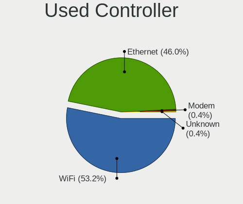

| Kind     | Notebooks | Percent |
|----------|-----------|---------|
| WiFi     | 390       | 49.94%  |
| Ethernet | 381       | 48.78%  |
| Modem    | 5         | 0.64%   |
| Unknown  | 5         | 0.64%   |

NICs
----

Total network controllers on board

| Total | Notebooks | Percent |
|-------|-----------|---------|
| 2     | 449       | 86.35%  |
| 1     | 69        | 13.27%  |
| 0     | 2         | 0.38%   |

IPv6
----

IPv6 vs IPv4

| Used | Notebooks | Percent |
|------|-----------|---------|
| No   | 498       | 95.04%  |
| Yes  | 26        | 4.96%   |

Bluetooth
---------

Bluetooth Vendor
----------------

Controller vendors

| Vendor                          | Notebooks | Percent |
|---------------------------------|-----------|---------|
| Intel                           | 158       | 45.4%   |
| Broadcom                        | 39        | 11.21%  |
| Apple                           | 34        | 9.77%   |
| Qualcomm Atheros Communications | 30        | 8.62%   |
| Realtek Semiconductor           | 21        | 6.03%   |
| Lite-On Technology              | 13        | 3.74%   |
| IMC Networks                    | 12        | 3.45%   |
| Hewlett-Packard                 | 8         | 2.3%    |
| Foxconn / Hon Hai               | 8         | 2.3%    |
| Dell                            | 7         | 2.01%   |
| Cambridge Silicon Radio         | 7         | 2.01%   |
| Ralink                          | 6         | 1.72%   |
| ASUSTek Computer                | 3         | 0.86%   |
| Alps Electric                   | 2         | 0.57%   |

Bluetooth Model
---------------

Controller models

| Model                                                       | Notebooks | Percent |
|-------------------------------------------------------------|-----------|---------|
| Intel Bluetooth wireless interface                          | 99        | 28.21%  |
| Apple Bluetooth Host Controller                             | 15        | 4.27%   |
| Intel Centrino Bluetooth Wireless Transceiver               | 13        | 3.7%    |
| Intel AX201 Bluetooth                                       | 13        | 3.7%    |
| Intel Bluetooth 9460/9560 Jefferson Peak (JfP)              | 12        | 3.42%   |
| Broadcom BCM20702 Bluetooth 4.0 [ThinkPad]                  | 12        | 3.42%   |
| Broadcom BCM2045B (BDC-2.1)                                 | 12        | 3.42%   |
| Qualcomm Atheros  QCA9377 Bluetooth 4.1                     | 8         | 2.28%   |
| Intel AX200 Bluetooth                                       | 8         | 2.28%   |
| Intel Wireless-AC 3168 Bluetooth                            | 7         | 1.99%   |
| Cambridge Silicon Radio Bluetooth Dongle (HCI mode)         | 7         | 1.99%   |
| Ralink RT3290 Bluetooth                                     | 6         | 1.71%   |
| Apple Built-in iSight (no firmware loaded)                  | 6         | 1.71%   |
| Apple Built-in Bluetooth 2.0+EDR HCI                        | 6         | 1.71%   |
| Realtek  Bluetooth 4.2 Adapter                              | 5         | 1.42%   |
| Qualcomm Atheros AR9462 Bluetooth                           | 5         | 1.42%   |
| Lite-On Atheros AR3012 Bluetooth                            | 5         | 1.42%   |
| Broadcom BCM2045B (BDC-2) [Bluetooth Controller]            | 5         | 1.42%   |
| Apple Apple Broadcom Built-in Bluetooth                     | 5         | 1.42%   |
| Realtek RTL8723B Bluetooth                                  | 4         | 1.14%   |
| Qualcomm Atheros Dell Wireless 1703 Bluetooth               | 4         | 1.14%   |
| Qualcomm Atheros AR3012 Bluetooth 4.0                       | 4         | 1.14%   |
| IMC Networks Atheros AR3012 Bluetooth 4.0 Adapter           | 4         | 1.14%   |
| HP Broadcom 2070 Bluetooth Combo                            | 4         | 1.14%   |
| Realtek  Bluetooth 4.0 Adapter                              | 3         | 0.85%   |
| Realtek Bluetooth Radio                                     | 3         | 0.85%   |
| Qualcomm Atheros Dell Wireless 1707 Bluetooth 4.0 LE Device | 3         | 0.85%   |
| Lite-On Qualcomm Atheros Bluetooth 4.0 + HS                 | 3         | 0.85%   |
| Intel Wireless-AC 9260 Bluetooth Adapter                    | 3         | 0.85%   |
| HP Bluetooth 2.0 Interface [Broadcom BCM2045]               | 3         | 0.85%   |
| Dell DW375 Bluetooth Module                                 | 3         | 0.85%   |
| Realtek RTL8821A Bluetooth                                  | 2         | 0.57%   |
| Realtek  Bluetooth Adapter                                  | 2         | 0.57%   |
| Realtek  Bluetooth 4.0 + High Speed Chip                    | 2         | 0.57%   |
| Qualcomm Atheros QCA61x4 Bluetooth 4.0                      | 2         | 0.57%   |
| Lite-On Qualcomm Atheros QCA9377 Bluetooth                  | 2         | 0.57%   |
| Intel Centrino Advanced-N 6230 Bluetooth adapter            | 2         | 0.57%   |
| IMC Networks Realtek Bluetooth Adapter                      | 2         | 0.57%   |
| Foxconn / Hon Hai Qualcomm Atheros Bluetooth 4.0            | 2         | 0.57%   |
| Foxconn / Hon Hai Bluetooth USB Module                      | 2         | 0.57%   |

Sound
-----

Sound Vendor
------------

Sound card vendors

| Vendor                           | Notebooks | Percent |
|----------------------------------|-----------|---------|
| Intel                            | 456       | 80%     |
| AMD                              | 63        | 11.05%  |
| Nvidia                           | 40        | 7.02%   |
| GN Netcom                        | 3         | 0.53%   |
| Texas Instruments                | 2         | 0.35%   |
| Silicon Integrated Systems [SiS] | 2         | 0.35%   |
| XMOS                             | 1         | 0.18%   |
| SteelSeries ApS                  | 1         | 0.18%   |
| Creative Technology              | 1         | 0.18%   |
| C-Media Electronics              | 1         | 0.18%   |

Sound Model
-----------

Sound card models

| Model                                                                                             | Notebooks | Percent |
|---------------------------------------------------------------------------------------------------|-----------|---------|
| Intel 7 Series/C216 Chipset Family High Definition Audio Controller                               | 86        | 12.54%  |
| Intel Sunrise Point-LP HD Audio                                                                   | 70        | 10.2%   |
| Intel 6 Series/C200 Series Chipset Family High Definition Audio Controller                        | 41        | 5.98%   |
| Intel 82801I (ICH9 Family) HD Audio Controller                                                    | 37        | 5.39%   |
| Intel 8 Series HD Audio Controller                                                                | 37        | 5.39%   |
| Intel 5 Series/3400 Series Chipset High Definition Audio                                          | 37        | 5.39%   |
| Intel Haswell-ULT HD Audio Controller                                                             | 36        | 5.25%   |
| Intel 82801H (ICH8 Family) HD Audio Controller                                                    | 25        | 3.64%   |
| Intel Broadwell-U Audio Controller                                                                | 23        | 3.35%   |
| AMD Family 17h/19h HD Audio Controller                                                            | 22        | 3.21%   |
| Intel Wildcat Point-LP High Definition Audio Controller                                           | 21        | 3.06%   |
| Intel 8 Series/C220 Series Chipset High Definition Audio Controller                               | 15        | 2.19%   |
| AMD FCH Azalia Controller                                                                         | 15        | 2.19%   |
| Intel Xeon E3-1200 v3/4th Gen Core Processor HD Audio Controller                                  | 14        | 2.04%   |
| Nvidia MCP79 High Definition Audio                                                                | 12        | 1.75%   |
| Intel 100 Series/C230 Series Chipset Family HD Audio Controller                                   | 11        | 1.6%    |
| Intel Cannon Lake PCH cAVS                                                                        | 10        | 1.46%   |
| AMD Raven/Raven2/Fenghuang HDMI/DP Audio Controller                                               | 10        | 1.46%   |
| Intel NM10/ICH7 Family High Definition Audio Controller                                           | 9         | 1.31%   |
| Intel Cannon Point-LP High Definition Audio Controller                                            | 9         | 1.31%   |
| AMD SBx00 Azalia (Intel HDA)                                                                      | 9         | 1.31%   |
| Intel Atom/Celeron/Pentium Processor x5-E8000/J3xxx/N3xxx Series High Definition Audio Controller | 8         | 1.17%   |
| Intel Atom Processor Z36xxx/Z37xxx Series High Definition Audio Controller                        | 8         | 1.17%   |
| Intel Comet Lake PCH-LP cAVS                                                                      | 7         | 1.02%   |
| AMD Wrestler HDMI Audio                                                                           | 7         | 1.02%   |
| AMD Kabini HDMI/DP Audio                                                                          | 7         | 1.02%   |
| Nvidia TU107 GeForce GTX 1650 High Definition Audio Controller                                    | 6         | 0.87%   |
| Intel Celeron N3350/Pentium N4200/Atom E3900 Series Audio Cluster                                 | 6         | 0.87%   |
| AMD RV710/730 HDMI Audio [Radeon HD 4000 series]                                                  | 6         | 0.87%   |
| AMD Renoir Radeon High Definition Audio Controller                                                | 6         | 0.87%   |
| Intel Comet Lake PCH cAVS                                                                         | 5         | 0.73%   |
| AMD High Definition Audio Controller                                                              | 5         | 0.73%   |
| AMD Family 15h (Models 60h-6fh) Audio Controller                                                  | 5         | 0.73%   |
| Nvidia TU116 High Definition Audio Controller                                                     | 4         | 0.58%   |
| Nvidia TU106 High Definition Audio Controller                                                     | 3         | 0.44%   |
| Nvidia GT216 HDMI Audio Controller                                                                | 3         | 0.44%   |
| Intel Tiger Lake-LP Smart Sound Technology Audio Controller                                       | 3         | 0.44%   |
| Intel CM238 HD Audio Controller                                                                   | 3         | 0.44%   |
| Intel Celeron/Pentium Silver Processor High Definition Audio                                      | 3         | 0.44%   |
| AMD Trinity HDMI Audio Controller                                                                 | 3         | 0.44%   |

Memory
------

Memory Vendor
-------------

Memory module vendors

| Vendor                       | Notebooks | Percent |
|------------------------------|-----------|---------|
| Samsung Electronics          | 155       | 24.68%  |
| SK hynix                     | 124       | 19.75%  |
| Kingston                     | 62        | 9.87%   |
| Micron Technology            | 60        | 9.55%   |
| Unknown                      | 50        | 7.96%   |
| Elpida                       | 27        | 4.3%    |
| Ramaxel Technology           | 19        | 3.03%   |
| Crucial                      | 19        | 3.03%   |
| Smart                        | 14        | 2.23%   |
| Nanya Technology             | 14        | 2.23%   |
| Unknown                      | 13        | 2.07%   |
| A-DATA Technology            | 12        | 1.91%   |
| Teikon                       | 6         | 0.96%   |
| Transcend                    | 5         | 0.8%    |
| Corsair                      | 5         | 0.8%    |
| Apacer                       | 5         | 0.8%    |
| Smart Brazil                 | 4         | 0.64%   |
| PNY                          | 3         | 0.48%   |
| High Bridge                  | 3         | 0.48%   |
| ASint Technology             | 3         | 0.48%   |
| Unknown (ABCD)               | 2         | 0.32%   |
| Team                         | 2         | 0.32%   |
| Silicon Power                | 2         | 0.32%   |
| G.Skill                      | 2         | 0.32%   |
| 48spaces                     | 2         | 0.32%   |
| V-GeN                        | 1         | 0.16%   |
| Unknown (8AFD)               | 1         | 0.16%   |
| Unknown (0x7F7F7F94FFFFFFFF) | 1         | 0.16%   |
| Unknown (0x3D7F000000000000) | 1         | 0.16%   |
| Unknown (0x0809)             | 1         | 0.16%   |
| Unknown (08B5)               | 1         | 0.16%   |
| Toshiba                      | 1         | 0.16%   |
| SHARETRONIC                  | 1         | 0.16%   |
| Sesame                       | 1         | 0.16%   |
| PKI/Kingston                 | 1         | 0.16%   |
| Kingmax                      | 1         | 0.16%   |
| GOODRAM                      | 1         | 0.16%   |
| GeIL                         | 1         | 0.16%   |
| Axiom                        | 1         | 0.16%   |
| Avant                        | 1         | 0.16%   |

Memory Model
------------

Memory module models

| Model                                                   | Notebooks | Percent |
|---------------------------------------------------------|-----------|---------|
| Unknown                                                 | 13        | 1.95%   |
| Unknown RAM Module 2GB SODIMM DDR2 667MT/s              | 12        | 1.8%    |
| Samsung RAM M471B5273CH0-CH9 4GB SODIMM DDR3 1334MT/s   | 11        | 1.65%   |
| SK hynix RAM HMT451S6BFR8A-PB 4GB SODIMM DDR3 1600MT/s  | 10        | 1.5%    |
| SK hynix RAM HMT41GS6BFR8A-PB 8GB SODIMM DDR3 1600MT/s  | 9         | 1.35%   |
| SK hynix RAM HMT351S6CFR8C-PB 4GB SODIMM DDR3 1600MT/s  | 9         | 1.35%   |
| Samsung RAM M471A5244CB0-CTD 4GB SODIMM DDR4 2667MT/s   | 9         | 1.35%   |
| Samsung RAM M471B5173QH0-YK0 4GB SODIMM DDR3 1600MT/s   | 8         | 1.2%    |
| Samsung RAM M471B5173DB0-YK0 4GB SODIMM DDR3 1600MT/s   | 8         | 1.2%    |
| Samsung RAM M471B5273DH0-CH9 4GB SODIMM DDR3 1334MT/s   | 7         | 1.05%   |
| Samsung RAM M471B5773DH0-CH9 2GB SODIMM DDR3 1334MT/s   | 6         | 0.9%    |
| Samsung RAM M471B5773CHS-CH9 2GB SODIMM DDR3 1333MT/s   | 6         | 0.9%    |
| Samsung RAM M471B5173EB0-YK0 4GB SODIMM DDR3 1600MT/s   | 6         | 0.9%    |
| Samsung RAM M471B1G73QH0-YK0 8GB SODIMM DDR3 1867MT/s   | 6         | 0.9%    |
| Unknown RAM Module 2048MB SODIMM DDR2 667MT/s           | 5         | 0.75%   |
| SK hynix RAM Module 2GB SODIMM DDR3 1600MT/s            | 5         | 0.75%   |
| SK hynix RAM HMT351S6EFR8A-PB 4GB SODIMM DDR3 1600MT/s  | 5         | 0.75%   |
| SK hynix RAM HMA851S6AFR6N-UH 4GB SODIMM DDR4 2400MT/s  | 5         | 0.75%   |
| SK hynix RAM HMA81GS6CJR8N-VK 8GB SODIMM DDR4 2667MT/s  | 5         | 0.75%   |
| Unknown RAM Module 4GB SODIMM DDR3 1333MT/s             | 4         | 0.6%    |
| Unknown RAM Module 4GB SODIMM DDR3                      | 4         | 0.6%    |
| Unknown RAM Module 1GB SODIMM DDR2 667MT/s              | 4         | 0.6%    |
| Smart RAM SH564568FH8NZPHSCR 2GB SODIMM DDR3 1334MT/s   | 4         | 0.6%    |
| SK hynix RAM HYMP125S64CP8-S6 2GB SODIMM DDR2 975MT/s   | 4         | 0.6%    |
| SK hynix RAM HMT451S6AFR8A-PB 4GB SODIMM DDR3 1600MT/s  | 4         | 0.6%    |
| Samsung RAM M471B5673FH0-CH9 2GB SODIMM DDR3 1334MT/s   | 4         | 0.6%    |
| Samsung RAM M471B1G73EB0-YK0 8GB SODIMM DDR3 1600MT/s   | 4         | 0.6%    |
| Samsung RAM M471A1K43CB1-CRC 8GB SODIMM DDR4 2400MT/s   | 4         | 0.6%    |
| Micron RAM 8KTF51264HZ-1G6E1 4GB SODIMM DDR3 1600MT/s   | 4         | 0.6%    |
| Elpida RAM EBJ41UF8BCS0-DJ-F 4GB SODIMM DDR3 1333MT/s   | 4         | 0.6%    |
| Crucial RAM CT102464BF160B.M16 8GB SODIMM DDR3 1600MT/s | 4         | 0.6%    |
| Unknown RAM Module 2GB SODIMM DDR2                      | 3         | 0.45%   |
| Smart RAM SH564128FJ8NWRNSQR 4GB SODIMM DDR3 1600MT/s   | 3         | 0.45%   |
| SK hynix RAM HMT425S6AFR6A-PB 2GB SODIMM DDR3 3200MT/s  | 3         | 0.45%   |
| SK hynix RAM HMT351S6EFR8C-PB 4GB SODIMM DDR3 1600MT/s  | 3         | 0.45%   |
| SK hynix RAM HMA81GS6JJR8N-VK 8GB SODIMM DDR4 2667MT/s  | 3         | 0.45%   |
| SK hynix RAM HMA41GS6AFR8N-TF 8GB SODIMM DDR4 2133MT/s  | 3         | 0.45%   |
| Samsung RAM Module 2GB SODIMM DDR3 1067MT/s             | 3         | 0.45%   |
| Samsung RAM M471B5273DH0-CK0 4GB SODIMM DDR3 1600MT/s   | 3         | 0.45%   |
| Samsung RAM M471B5173BH0-CK0 4GB SODIMM DDR3 1600MT/s   | 3         | 0.45%   |

Memory Kind
-----------

Memory module kinds

| Kind    | Notebooks | Percent |
|---------|-----------|---------|
| DDR3    | 304       | 59.14%  |
| DDR4    | 128       | 24.9%   |
| DDR2    | 56        | 10.89%  |
| LPDDR3  | 10        | 1.95%   |
| Unknown | 8         | 1.56%   |
| LPDDR4  | 4         | 0.78%   |
| DRAM    | 2         | 0.39%   |
| SDRAM   | 1         | 0.19%   |
| DDR     | 1         | 0.19%   |

Memory Form Factor
------------------

Physical design of the memory module

| Name         | Notebooks | Percent |
|--------------|-----------|---------|
| SODIMM       | 486       | 94.37%  |
| Row Of Chips | 14        | 2.72%   |
| Chip         | 9         | 1.75%   |
| DIMM         | 4         | 0.78%   |
| Unknown      | 2         | 0.39%   |

Memory Size
-----------

Memory module size

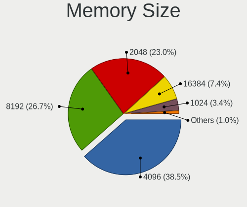

| Size  | Notebooks | Percent |
|-------|-----------|---------|
| 4096  | 239       | 41.86%  |
| 2048  | 150       | 26.27%  |
| 8192  | 129       | 22.59%  |
| 16384 | 35        | 6.13%   |
| 1024  | 14        | 2.45%   |
| 32768 | 4         | 0.7%    |

Memory Speed
------------

Memory module speed

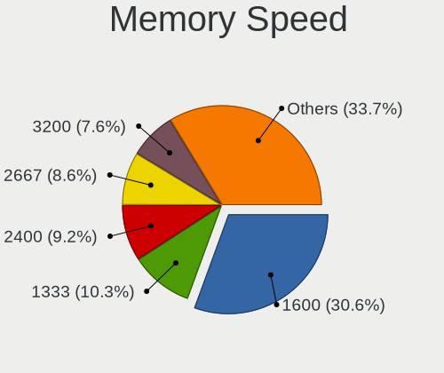

| Speed   | Notebooks | Percent |
|---------|-----------|---------|
| 1600    | 181       | 31.59%  |
| 1333    | 75        | 13.09%  |
| 2400    | 48        | 8.38%   |
| 2667    | 45        | 7.85%   |
| 667     | 41        | 7.16%   |
| 1334    | 38        | 6.63%   |
| 1067    | 34        | 5.93%   |
| 2133    | 31        | 5.41%   |
| 3200    | 25        | 4.36%   |
| 800     | 16        | 2.79%   |
| 1867    | 13        | 2.27%   |
| Unknown | 12        | 2.09%   |
| 975     | 4         | 0.7%    |
| 1066    | 3         | 0.52%   |
| 4267    | 2         | 0.35%   |
| 533     | 2         | 0.35%   |
| 333     | 2         | 0.35%   |
| 1866    | 1         | 0.17%   |

Printers & scanners
-------------------

Printer Vendor
--------------

Printer device vendors

Zero info for selected period =(

Printer Model
-------------

Printer device models

Zero info for selected period =(

Scanner Vendor
--------------

Scanner device vendors

Zero info for selected period =(

Scanner Model
-------------

Scanner device models

Zero info for selected period =(

Camera
------

Camera Vendor
-------------

Camera device vendors

| Vendor                                 | Notebooks | Percent |
|----------------------------------------|-----------|---------|
| Chicony Electronics                    | 104       | 26.94%  |
| Realtek Semiconductor                  | 38        | 9.84%   |
| Acer                                   | 36        | 9.33%   |
| Microdia                               | 34        | 8.81%   |
| IMC Networks                           | 31        | 8.03%   |
| Sunplus Innovation Technology          | 24        | 6.22%   |
| Suyin                                  | 19        | 4.92%   |
| Lite-On Technology                     | 14        | 3.63%   |
| Syntek                                 | 13        | 3.37%   |
| Quanta                                 | 10        | 2.59%   |
| Apple                                  | 9         | 2.33%   |
| Cheng Uei Precision Industry (Foxlink) | 8         | 2.07%   |
| Silicon Motion                         | 7         | 1.81%   |
| Alcor Micro                            | 7         | 1.81%   |
| Lenovo                                 | 6         | 1.55%   |
| Luxvisions Innotech Limited            | 4         | 1.04%   |
| ALi                                    | 4         | 1.04%   |
| Z-Star Microelectronics                | 3         | 0.78%   |
| Ricoh                                  | 3         | 0.78%   |
| Importek                               | 3         | 0.78%   |
| Logitech                               | 2         | 0.52%   |
| Tripath Technology                     | 1         | 0.26%   |
| Primax Electronics                     | 1         | 0.26%   |
| icSpring                               | 1         | 0.26%   |
| Holitech                               | 1         | 0.26%   |
| Foxconn / Hon Hai                      | 1         | 0.26%   |
| DigiTech                               | 1         | 0.26%   |
| Creative Technology                    | 1         | 0.26%   |

Camera Model
------------

Camera device models

| Model                                     | Notebooks | Percent |
|-------------------------------------------|-----------|---------|
| Chicony Integrated Camera                 | 24        | 6.15%   |
| Acer Integrated Camera                    | 12        | 3.08%   |
| Realtek Realtek USB2.0 PC Camera          | 11        | 2.82%   |
| Realtek Integrated_Webcam_HD              | 11        | 2.82%   |
| Lite-On Integrated Camera                 | 9         | 2.31%   |
| Sunplus Integrated_Webcam_HD              | 8         | 2.05%   |
| Microdia Integrated_Webcam_HD             | 8         | 2.05%   |
| IMC Networks USB2.0 HD UVC WebCam         | 8         | 2.05%   |
| Chicony HD WebCam                         | 8         | 2.05%   |
| Syntek Lenovo EasyCamera                  | 7         | 1.79%   |
| Acer Lenovo EasyCamera                    | 7         | 1.79%   |
| Microdia Integrated Webcam                | 6         | 1.54%   |
| Chicony Lenovo Integrated Camera (0.3MP)  | 6         | 1.54%   |
| Realtek USB Camera                        | 5         | 1.28%   |
| Microdia Dell Laptop Integrated Webcam HD | 5         | 1.28%   |
| IMC Networks Integrated Camera            | 5         | 1.28%   |
| Chicony HP HD Webcam [Fixed]              | 5         | 1.28%   |
| Apple FaceTime HD Camera                  | 5         | 1.28%   |
| Syntek EasyCamera                         | 4         | 1.03%   |
| Suyin Integrated_Webcam_HD                | 4         | 1.03%   |
| Microdia Laptop_Integrated_Webcam_HD      | 4         | 1.03%   |
| Lenovo Integrated Webcam [R5U877]         | 4         | 1.03%   |
| Chicony USB2.0 VGA UVC WebCam             | 4         | 1.03%   |
| Chicony Lenovo EasyCamera                 | 4         | 1.03%   |
| Acer ThinkPad Integrated Camera           | 4         | 1.03%   |
| Sunplus Laptop_Integrated_Webcam_FHD      | 3         | 0.77%   |
| Sunplus Integrated Camera                 | 3         | 0.77%   |
| Quanta HP Webcam                          | 3         | 0.77%   |
| Quanta HP TrueVision HD Camera            | 3         | 0.77%   |
| IMC Networks EasyCamera                   | 3         | 0.77%   |
| Chicony UVC 1.00 device HD UVC WebCam     | 3         | 0.77%   |
| Chicony USB2.0 HD UVC WebCam              | 3         | 0.77%   |
| Chicony Integrated Camera [ThinkPad]      | 3         | 0.77%   |
| Chicony HD WebCam (Acer)                  | 3         | 0.77%   |
| Chicony FJ Camera                         | 3         | 0.77%   |
| Chicony EasyCamera                        | 3         | 0.77%   |
| Chicony Chicony USB 2.0 Camera            | 3         | 0.77%   |
| Apple FaceTime HD Camera (Built-in)       | 3         | 0.77%   |
| Alcor Micro Acer Integrated Webcam        | 3         | 0.77%   |
| Acer SunplusIT INC. Integrated Camera     | 3         | 0.77%   |

Security
--------

Fingerprint Vendor
------------------

Fingerprint sensor vendors

| Vendor                     | Notebooks | Percent |
|----------------------------|-----------|---------|
| Validity Sensors           | 42        | 45.65%  |
| AuthenTec                  | 16        | 17.39%  |
| Upek                       | 15        | 16.3%   |
| STMicroelectronics         | 7         | 7.61%   |
| Synaptics                  | 4         | 4.35%   |
| Broadcom                   | 3         | 3.26%   |
| Shenzhen Goodix Technology | 2         | 2.17%   |
| LighTuning Technology      | 2         | 2.17%   |
| Elan Microelectronics      | 1         | 1.09%   |

Fingerprint Model
-----------------

Fingerprint sensor models

| Model                                                                        | Notebooks | Percent |
|------------------------------------------------------------------------------|-----------|---------|
| Upek Biometric Touchchip/Touchstrip Fingerprint Sensor                       | 13        | 14.13%  |
| Validity Sensors VFS 5011 fingerprint sensor                                 | 9         | 9.78%   |
| Validity Sensors VFS495 Fingerprint Reader                                   | 7         | 7.61%   |
| STMicroelectronics Fingerprint Reader                                        | 7         | 7.61%   |
| Validity Sensors VFS5011 Fingerprint Reader                                  | 5         | 5.43%   |
| Validity Sensors Synaptics WBDI                                              | 5         | 5.43%   |
| AuthenTec AES2810                                                            | 4         | 4.35%   |
| AuthenTec AES1600                                                            | 4         | 4.35%   |
| Validity Sensors VFS491                                                      | 3         | 3.26%   |
| Broadcom BCM5880 Secure Applications Processor with fingerprint swipe sensor | 3         | 3.26%   |
| AuthenTec AuthenTec Inc. AES1660                                             | 3         | 3.26%   |
| AuthenTec AES2501 Fingerprint Sensor                                         | 3         | 3.26%   |
| Validity Sensors VFS7500 Touch Fingerprint Sensor                            | 2         | 2.17%   |
| Validity Sensors VFS471 Fingerprint Reader                                   | 2         | 2.17%   |
| Validity Sensors VFS451 Fingerprint Reader                                   | 2         | 2.17%   |
| Validity Sensors Fingerprint scanner                                         | 2         | 2.17%   |
| Upek TCS5B Fingerprint sensor                                                | 2         | 2.17%   |
| Synaptics Metallica MOH Touch Fingerprint Reader                             | 2         | 2.17%   |
| Shenzhen Goodix Fingerprint Reader                                           | 2         | 2.17%   |
| Validity Sensors VFS301 Fingerprint Reader                                   | 1         | 1.09%   |
| Validity Sensors VFS101 Fingerprint Reader                                   | 1         | 1.09%   |
| Validity Sensors VFS Fingerprint sensor                                      | 1         | 1.09%   |
| Validity Sensors Synaptics VFS7552 Touch Fingerprint Sensor with PurePrint   | 1         | 1.09%   |
| Validity Sensors Swipe Fingerprint Sensor                                    | 1         | 1.09%   |
| Synaptics Prometheus MIS Touch Fingerprint Reader                            | 1         | 1.09%   |
| LighTuning ES603 Swipe Fingerprint Sensor                                    | 1         | 1.09%   |
| LighTuning EgisTec Touch Fingerprint Sensor                                  | 1         | 1.09%   |
| Elan ELAN WBF Fingerprint Sensor                                             | 1         | 1.09%   |
| AuthenTec AuthenTec Inc. AES2660                                             | 1         | 1.09%   |
| AuthenTec AES1660 Fingerprint Sensor                                         | 1         | 1.09%   |
| Unknown                                                                      | 1         | 1.09%   |

Chipcard Vendor
---------------

Chipcard module vendors

Zero info for selected period =(

Chipcard Model
--------------

Chipcard module models

Zero info for selected period =(

Unsupported
-----------

Unsupported Devices
-------------------

Total unsupported devices on board

| Total | Notebooks | Percent |
|-------|-----------|---------|
| 2     | 170       | 31.78%  |
| 1     | 163       | 30.47%  |
| 0     | 84        | 15.7%   |
| 3     | 81        | 15.14%  |
| 4     | 30        | 5.61%   |
| 5     | 5         | 0.93%   |
| 6     | 2         | 0.37%   |

Unsupported Device Types
------------------------

Types of unsupported devices

| Type                     | Notebooks | Percent |
|--------------------------|-----------|---------|
| Communication controller | 365       | 43.09%  |
| Card reader              | 148       | 17.47%  |
| Bluetooth                | 104       | 12.28%  |
| Net/wireless             | 99        | 11.69%  |
| Fingerprint reader       | 90        | 10.63%  |
| Firewire controller      | 17        | 2.01%   |
| Storage                  | 8         | 0.94%   |
| Sound                    | 6         | 0.71%   |
| Network                  | 4         | 0.47%   |
| Storage/raid             | 2         | 0.24%   |
| Net/ethernet             | 2         | 0.24%   |
| Dvb card                 | 2         | 0.24%   |

