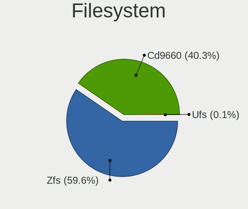
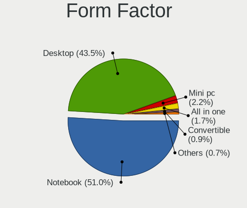
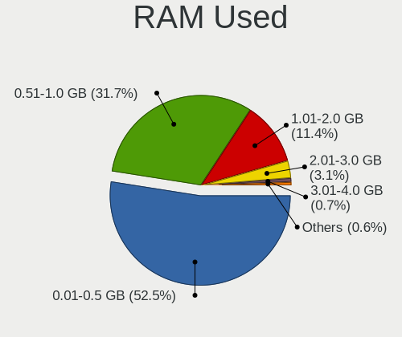
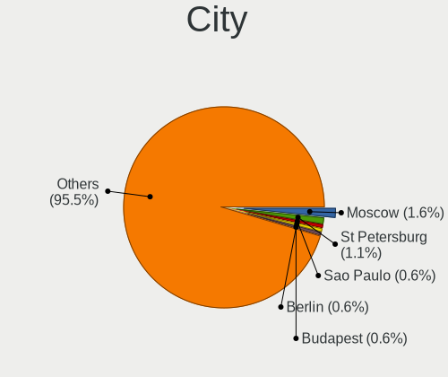
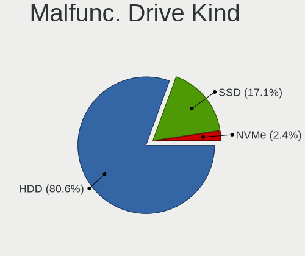
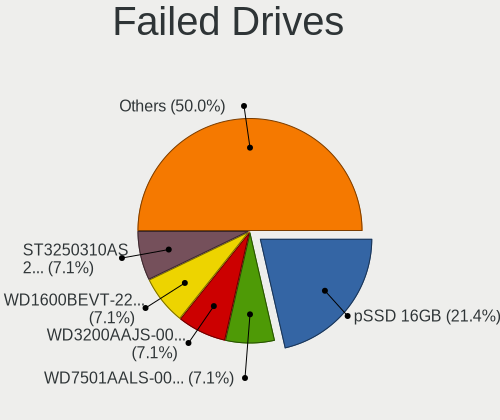
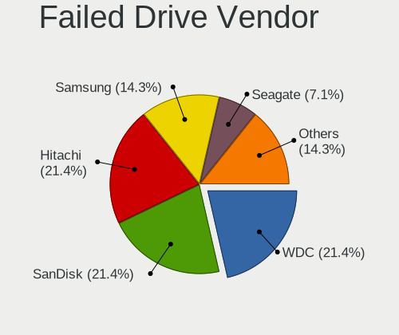
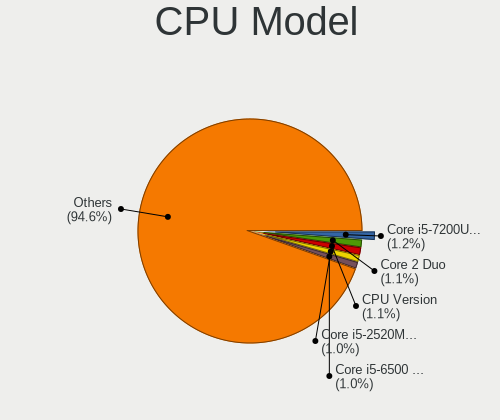
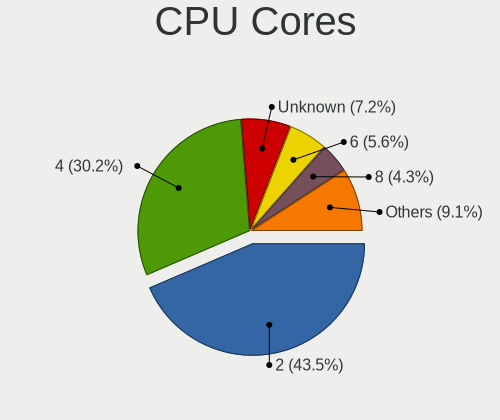
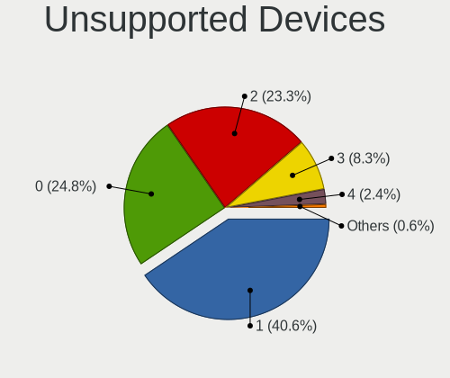

helloSystem - Tested Hardware & Statistics
------------------------------------------

A project to collect tested hardware configurations for helloSystem.

Anyone can contribute to this report by the [hw-probe](https://github.com/linuxhw/hw-probe/blob/master/INSTALL.BSD.md) tool:

    hw-probe -all -upload

Please contribute! Especially if your hardware is rare.

This is a report for all computer types. See also reports for [desktops](/Dist/helloSystem/Desktop/README.md) and [notebooks](/Dist/helloSystem/Notebook/README.md).

Contents
--------

* [ Test Cases ](#test-cases)

* [ System ](#system)
  - [ OS                       ](#os)
  - [ OS Family                ](#os-family)
  - [ Arch                     ](#arch)
  - [ DE                       ](#de)
  - [ Display Server           ](#display-server)
  - [ Display Manager          ](#display-manager)
  - [ OS Lang                  ](#os-lang)
  - [ Boot Mode                ](#boot-mode)
  - [ Filesystem               ](#filesystem)
  - [ Part. scheme             ](#part-scheme)

* [ Board ](#board)
  - [ Vendor                   ](#vendor)
  - [ Model                    ](#model)
  - [ Model Family             ](#model-family)
  - [ MFG Year                 ](#mfg-year)
  - [ Form Factor              ](#form-factor)
  - [ Coreboot                 ](#coreboot)
  - [ RAM Size                 ](#ram-size)
  - [ RAM Used                 ](#ram-used)
  - [ Total Drives             ](#total-drives)
  - [ Has CD-ROM               ](#has-cd-rom)
  - [ Has Ethernet             ](#has-ethernet)
  - [ Has WiFi                 ](#has-wifi)
  - [ Has Bluetooth            ](#has-bluetooth)

* [ Location ](#location)
  - [ Country                  ](#country)
  - [ City                     ](#city)

* [ Drives ](#drives)
  - [ Drive Vendor             ](#drive-vendor)
  - [ Drive Model              ](#drive-model)
  - [ HDD Vendor               ](#hdd-vendor)
  - [ SSD Vendor               ](#ssd-vendor)
  - [ Drive Kind               ](#drive-kind)
  - [ Drive Connector          ](#drive-connector)
  - [ Drive Size               ](#drive-size)
  - [ Space Total              ](#space-total)
  - [ Space Used               ](#space-used)
  - [ Malfunc. Drives          ](#malfunc-drives)
  - [ Malfunc. Drive Vendor    ](#malfunc-drive-vendor)
  - [ Malfunc. HDD Vendor      ](#malfunc-hdd-vendor)
  - [ Malfunc. Drive Kind      ](#malfunc-drive-kind)
  - [ Failed Drives            ](#failed-drives)
  - [ Failed Drive Vendor      ](#failed-drive-vendor)
  - [ Drive Status             ](#drive-status)

* [ Storage controller ](#storage-controller)
  - [ Storage Vendor           ](#storage-vendor)
  - [ Storage Model            ](#storage-model)
  - [ Storage Kind             ](#storage-kind)

* [ Processor ](#processor)
  - [ CPU Vendor               ](#cpu-vendor)
  - [ CPU Model                ](#cpu-model)
  - [ CPU Model Family         ](#cpu-model-family)
  - [ CPU Cores                ](#cpu-cores)
  - [ CPU Sockets              ](#cpu-sockets)
  - [ CPU Threads              ](#cpu-threads)
  - [ CPU Microarch            ](#cpu-microarch)

* [ Graphics ](#graphics)
  - [ GPU Vendor               ](#gpu-vendor)
  - [ GPU Model                ](#gpu-model)
  - [ GPU Combo                ](#gpu-combo)
  - [ GPU Driver               ](#gpu-driver)
  - [ GPU Memory               ](#gpu-memory)

* [ Monitor ](#monitor)
  - [ Monitor Vendor           ](#monitor-vendor)
  - [ Monitor Model            ](#monitor-model)
  - [ Monitor Resolution       ](#monitor-resolution)
  - [ Monitor Diagonal         ](#monitor-diagonal)
  - [ Monitor Width            ](#monitor-width)
  - [ Aspect Ratio             ](#aspect-ratio)
  - [ Monitor Area             ](#monitor-area)
  - [ Pixel Density            ](#pixel-density)
  - [ Multiple Monitors        ](#multiple-monitors)

* [ Network ](#network)
  - [ Net Controller Vendor    ](#net-controller-vendor)
  - [ Net Controller Model     ](#net-controller-model)
  - [ Wireless Vendor          ](#wireless-vendor)
  - [ Wireless Model           ](#wireless-model)
  - [ Ethernet Vendor          ](#ethernet-vendor)
  - [ Ethernet Model           ](#ethernet-model)
  - [ Net Controller Kind      ](#net-controller-kind)
  - [ Used Controller          ](#used-controller)
  - [ NICs                     ](#nics)
  - [ IPv6                     ](#ipv6)

* [ Bluetooth ](#bluetooth)
  - [ Bluetooth Vendor         ](#bluetooth-vendor)
  - [ Bluetooth Model          ](#bluetooth-model)

* [ Sound ](#sound)
  - [ Sound Vendor             ](#sound-vendor)
  - [ Sound Model              ](#sound-model)

* [ Memory ](#memory)
  - [ Memory Vendor            ](#memory-vendor)
  - [ Memory Model             ](#memory-model)
  - [ Memory Kind              ](#memory-kind)
  - [ Memory Form Factor       ](#memory-form-factor)
  - [ Memory Size              ](#memory-size)
  - [ Memory Speed             ](#memory-speed)

* [ Printers & scanners ](#printers--scanners)
  - [ Printer Vendor           ](#printer-vendor)
  - [ Printer Model            ](#printer-model)
  - [ Scanner Vendor           ](#scanner-vendor)
  - [ Scanner Model            ](#scanner-model)

* [ Camera ](#camera)
  - [ Camera Vendor            ](#camera-vendor)
  - [ Camera Model             ](#camera-model)

* [ Security ](#security)
  - [ Fingerprint Vendor       ](#fingerprint-vendor)
  - [ Fingerprint Model        ](#fingerprint-model)
  - [ Chipcard Vendor          ](#chipcard-vendor)
  - [ Chipcard Model           ](#chipcard-model)

* [ Unsupported ](#unsupported)
  - [ Unsupported Devices      ](#unsupported-devices)
  - [ Unsupported Device Types ](#unsupported-device-types)

Test Cases
----------

Total: 2039

| Vendor        | Model                       | Form-Factor | Probe                                                     | Date         |
|---------------|-----------------------------|-------------|-----------------------------------------------------------|--------------|
| Lenovo        | ThinkPad X200 7458WNZ       | Notebook    | [3ac1d60240](https://bsd-hardware.info/?probe=3ac1d60240) | Aug 12, 2023 |
| Lenovo        | ThinkPad T60 1951CZ1        | Notebook    | [46766bc381](https://bsd-hardware.info/?probe=46766bc381) | Aug 11, 2023 |
| Lenovo        | ThinkPad X220 4286CTO       | Notebook    | [2db86b4dff](https://bsd-hardware.info/?probe=2db86b4dff) | Aug 11, 2023 |
| Intel         | JSL MRD                     | Desktop     | [ca7024f423](https://bsd-hardware.info/?probe=ca7024f423) | Aug 10, 2023 |
| MSI           | B360M BAZOOKA               | Desktop     | [4b0b4b88a7](https://bsd-hardware.info/?probe=4b0b4b88a7) | Aug 10, 2023 |
| ATOPNUC       | MA90                        | Mini pc     | [4f4c550075](https://bsd-hardware.info/?probe=4f4c550075) | Aug 10, 2023 |
| Acer          | Aspire V3-371               | Notebook    | [21c262aadb](https://bsd-hardware.info/?probe=21c262aadb) | Aug 09, 2023 |
| Acer          | Aspire V3-371               | Notebook    | [68bceee682](https://bsd-hardware.info/?probe=68bceee682) | Aug 09, 2023 |
| ASUSTek       | M5A78L-M LE/USB3            | Desktop     | [4fc1fbaba1](https://bsd-hardware.info/?probe=4fc1fbaba1) | Aug 09, 2023 |
| Acer          | Veriton N2620G              | Desktop     | [2acf1e4557](https://bsd-hardware.info/?probe=2acf1e4557) | Aug 08, 2023 |
| Lenovo        | ThinkPad X1 Carbon 2nd 2... | Notebook    | [9693a5fc69](https://bsd-hardware.info/?probe=9693a5fc69) | Aug 08, 2023 |
| HP            | 82C0                        | Mini pc     | [6ad9c871cb](https://bsd-hardware.info/?probe=6ad9c871cb) | Aug 07, 2023 |
| HP            | 82C0                        | Mini pc     | [124e7b14df](https://bsd-hardware.info/?probe=124e7b14df) | Aug 07, 2023 |
| Intel         | H81                         | Desktop     | [80f40918ce](https://bsd-hardware.info/?probe=80f40918ce) | Aug 07, 2023 |
| Lenovo        | ThinkPad X1 Carbon 2nd 2... | Notebook    | [9c01814bdc](https://bsd-hardware.info/?probe=9c01814bdc) | Aug 07, 2023 |
| Lenovo        | 30FD SDK0J40705 WIN 3425... | Mini pc     | [6a45c89f9c](https://bsd-hardware.info/?probe=6a45c89f9c) | Aug 06, 2023 |
| HP            | 0AACh                       | Desktop     | [5997b1de3e](https://bsd-hardware.info/?probe=5997b1de3e) | Aug 06, 2023 |
| ASUSTek       | PRIME B450-PLUS             | Desktop     | [d3fac2e3fe](https://bsd-hardware.info/?probe=d3fac2e3fe) | Aug 06, 2023 |
| ASUSTek       | M4A88TD-M/USB3              | Desktop     | [ce95634a53](https://bsd-hardware.info/?probe=ce95634a53) | Aug 06, 2023 |
| Compaq        | Presario CQ-17              | Notebook    | [f97feb2db0](https://bsd-hardware.info/?probe=f97feb2db0) | Aug 04, 2023 |
| ASUSTek       | P5QL PRO                    | Desktop     | [dccefef8eb](https://bsd-hardware.info/?probe=dccefef8eb) | Aug 04, 2023 |
| HP            | 82C0                        | Mini pc     | [be2c1dd2f5](https://bsd-hardware.info/?probe=be2c1dd2f5) | Aug 03, 2023 |
| HP            | 82C0                        | Mini pc     | [6fa14d3439](https://bsd-hardware.info/?probe=6fa14d3439) | Aug 03, 2023 |
| HP            | EliteBook 840 G5            | Notebook    | [6496fe0cfe](https://bsd-hardware.info/?probe=6496fe0cfe) | Aug 03, 2023 |
| Gigabyte      | Z170-HD3 DDR3-CF            | Desktop     | [f66f032ffe](https://bsd-hardware.info/?probe=f66f032ffe) | Aug 01, 2023 |
| Lenovo        | IdeaPad S210 Touch 20257    | Notebook    | [1e372622c1](https://bsd-hardware.info/?probe=1e372622c1) | Jul 31, 2023 |
| Lenovo        | ThinkPad X270 20HNA04GCD    | Notebook    | [6547f4a73b](https://bsd-hardware.info/?probe=6547f4a73b) | Jul 31, 2023 |
| Lenovo        | ThinkPad X230 23202DG       | Notebook    | [f8ade878ce](https://bsd-hardware.info/?probe=f8ade878ce) | Jul 30, 2023 |
| HP            | Notebook                    | Notebook    | [360790274a](https://bsd-hardware.info/?probe=360790274a) | Jul 29, 2023 |
| Apple         | MacBookPro9,2               | Notebook    | [53e133857b](https://bsd-hardware.info/?probe=53e133857b) | Jul 29, 2023 |
| HP            | Pavilion g6                 | Notebook    | [bdd2349f1c](https://bsd-hardware.info/?probe=bdd2349f1c) | Jul 28, 2023 |
| ASUSTek       | P5B SE                      | Desktop     | [6361457008](https://bsd-hardware.info/?probe=6361457008) | Jul 27, 2023 |
| HP            | 83E1                        | Desktop     | [b211795736](https://bsd-hardware.info/?probe=b211795736) | Jul 27, 2023 |
| Dell          | Latitude 5480               | Notebook    | [e1521ed9d2](https://bsd-hardware.info/?probe=e1521ed9d2) | Jul 26, 2023 |
| ASUSTek       | A8N-E                       | Desktop     | [274a1e508f](https://bsd-hardware.info/?probe=274a1e508f) | Jul 26, 2023 |
| ATOPNUC       | MA90                        | Mini pc     | [e266a42fa5](https://bsd-hardware.info/?probe=e266a42fa5) | Jul 26, 2023 |
| Lenovo        | IdeaPad S145-14AST 81ST     | Notebook    | [1b3ba2b86a](https://bsd-hardware.info/?probe=1b3ba2b86a) | Jul 25, 2023 |
| HP            | 339A                        | Desktop     | [b770568bae](https://bsd-hardware.info/?probe=b770568bae) | Jul 25, 2023 |
| ASUSTek       | 1015PX                      | Notebook    | [b0745153e4](https://bsd-hardware.info/?probe=b0745153e4) | Jul 24, 2023 |
| Lenovo        | IdeaPad 5 15ALC05 82LN      | Notebook    | [60dac781b2](https://bsd-hardware.info/?probe=60dac781b2) | Jul 24, 2023 |
| ASRock        | H61M-VG3                    | Desktop     | [5cebf2275e](https://bsd-hardware.info/?probe=5cebf2275e) | Jul 24, 2023 |
| Acer          | Spin SP314-21               | Convertible | [375c9f30cd](https://bsd-hardware.info/?probe=375c9f30cd) | Jul 22, 2023 |
| Panasonic     | CF-F9JYFNDR                 | Notebook    | [be7b261f26](https://bsd-hardware.info/?probe=be7b261f26) | Jul 21, 2023 |
| ASUSTek       | P5QL PRO                    | Desktop     | [b51bcdf3a5](https://bsd-hardware.info/?probe=b51bcdf3a5) | Jul 20, 2023 |
| Acer          | Aspire 4736Z                | Notebook    | [bccf97f694](https://bsd-hardware.info/?probe=bccf97f694) | Jul 20, 2023 |
| ASUSTek       | 1015PX                      | Notebook    | [dc06c76cf9](https://bsd-hardware.info/?probe=dc06c76cf9) | Jul 19, 2023 |
| Lenovo        | Legion 5 15IMH05 82AU       | Notebook    | [5fcffa5bd6](https://bsd-hardware.info/?probe=5fcffa5bd6) | Jul 19, 2023 |
| HP            | 81C5 MVB                    | Desktop     | [1a4fbc384d](https://bsd-hardware.info/?probe=1a4fbc384d) | Jul 19, 2023 |
| ASUSTek       | K42Jr                       | Notebook    | [256168572a](https://bsd-hardware.info/?probe=256168572a) | Jul 18, 2023 |
| Samsung       | RC530/RC730                 | Notebook    | [b76e5e8a87](https://bsd-hardware.info/?probe=b76e5e8a87) | Jul 17, 2023 |
| Apple         | Mac-F221BEC8                | Desktop     | [3a5b0b3193](https://bsd-hardware.info/?probe=3a5b0b3193) | Jul 17, 2023 |
| Dell          | 04YP6J A01                  | Desktop     | [f474b9f986](https://bsd-hardware.info/?probe=f474b9f986) | Jul 16, 2023 |
| ASUSTek       | H97M-E                      | Desktop     | [82bc9b32bd](https://bsd-hardware.info/?probe=82bc9b32bd) | Jul 16, 2023 |
| Lenovo        | ThinkPad R14 Gen 4 21E5A... | Notebook    | [e0fc7135e5](https://bsd-hardware.info/?probe=e0fc7135e5) | Jul 15, 2023 |
| SLIMBOOK      | PROX-AMD5                   | Notebook    | [d4265533e2](https://bsd-hardware.info/?probe=d4265533e2) | Jul 15, 2023 |
| ECS           | H61H2-M17                   | Desktop     | [aa4679bee7](https://bsd-hardware.info/?probe=aa4679bee7) | Jul 14, 2023 |
| ASRock        | P67 Pro3 SE                 | Desktop     | [a7284068da](https://bsd-hardware.info/?probe=a7284068da) | Jul 12, 2023 |
| ASRock        | H61M-GS                     | Desktop     | [502952e73f](https://bsd-hardware.info/?probe=502952e73f) | Jul 11, 2023 |
| ASUSTek       | X541UVK                     | Notebook    | [17f58b70e4](https://bsd-hardware.info/?probe=17f58b70e4) | Jul 10, 2023 |
| ASRock        | A300M-STX                   | Desktop     | [5d896a607e](https://bsd-hardware.info/?probe=5d896a607e) | Jul 06, 2023 |
| Dell          | Latitude E6420              | Notebook    | [3151e6d3bb](https://bsd-hardware.info/?probe=3151e6d3bb) | Jul 05, 2023 |
| HP            | Compaq Presario CQ61        | Notebook    | [d070292855](https://bsd-hardware.info/?probe=d070292855) | Jul 03, 2023 |
| Fujitsu       | D3161-A1 S26361-D3161-A1    | Desktop     | [2053dbb697](https://bsd-hardware.info/?probe=2053dbb697) | Jul 03, 2023 |
| ASUSTek       | 1005PXD                     | Notebook    | [246032ee65](https://bsd-hardware.info/?probe=246032ee65) | Jul 02, 2023 |
| Lenovo        | ThinkPad T60 20076PU        | Notebook    | [cb47bfef12](https://bsd-hardware.info/?probe=cb47bfef12) | Jun 30, 2023 |
| HP            | 8055                        | Desktop     | [94df572de4](https://bsd-hardware.info/?probe=94df572de4) | Jun 29, 2023 |
| ASUSTek       | M2A-VM                      | Desktop     | [2d5a9bba42](https://bsd-hardware.info/?probe=2d5a9bba42) | Jun 28, 2023 |
| HP            | EliteBook 840 G3            | Notebook    | [17834256ca](https://bsd-hardware.info/?probe=17834256ca) | Jun 28, 2023 |
| Lenovo        | Kabini CRB 31900058 STD     | Desktop     | [127f92759b](https://bsd-hardware.info/?probe=127f92759b) | Jun 26, 2023 |
| Dell          | Inspiron 5570               | Notebook    | [a6e959358f](https://bsd-hardware.info/?probe=a6e959358f) | Jun 25, 2023 |
| Intel         | DG41TY AAE47335-300         | Desktop     | [111b9572ba](https://bsd-hardware.info/?probe=111b9572ba) | Jun 25, 2023 |
| Dell          | Latitude E4310              | Notebook    | [9cdd4909fe](https://bsd-hardware.info/?probe=9cdd4909fe) | Jun 24, 2023 |
| HP            | Laptop 15-bs1xx             | Notebook    | [dc0d876d7b](https://bsd-hardware.info/?probe=dc0d876d7b) | Jun 24, 2023 |
| HP            | Laptop 15-ra0xx             | Notebook    | [8c31502b68](https://bsd-hardware.info/?probe=8c31502b68) | Jun 24, 2023 |
| HP            | EliteBook 750 G1            | Notebook    | [aba91c70d1](https://bsd-hardware.info/?probe=aba91c70d1) | Jun 24, 2023 |
| HP            | 250 G6 Notebook PC          | Notebook    | [f7df283c94](https://bsd-hardware.info/?probe=f7df283c94) | Jun 24, 2023 |
| Dell          | Latitude 5490               | Notebook    | [b638c1b2b1](https://bsd-hardware.info/?probe=b638c1b2b1) | Jun 23, 2023 |
| ASUSTek       | ROG Maximus X HERO          | Desktop     | [2dfabb3a28](https://bsd-hardware.info/?probe=2dfabb3a28) | Jun 23, 2023 |
| ASUSTek       | ROG Maximus X HERO          | Desktop     | [b63efe1bc2](https://bsd-hardware.info/?probe=b63efe1bc2) | Jun 23, 2023 |
| LG Electro... | R590-K.AAA9BT               | Desktop     | [5c3ab65e8e](https://bsd-hardware.info/?probe=5c3ab65e8e) | Jun 23, 2023 |
| Acer          | Aspire 5749                 | Notebook    | [75ad2ddb6f](https://bsd-hardware.info/?probe=75ad2ddb6f) | Jun 22, 2023 |
| Lenovo        | SHARKBAY SDK0E50510 WIN     | Desktop     | [485ba68539](https://bsd-hardware.info/?probe=485ba68539) | Jun 22, 2023 |
| ASUSTek       | PRIME B350M-A               | Desktop     | [29545a1054](https://bsd-hardware.info/?probe=29545a1054) | Jun 21, 2023 |
| Acer          | Aspire 5749                 | Notebook    | [1e91633580](https://bsd-hardware.info/?probe=1e91633580) | Jun 20, 2023 |
| HP            | Pavilion 15                 | Notebook    | [9ba6acdb4b](https://bsd-hardware.info/?probe=9ba6acdb4b) | Jun 18, 2023 |
| Intel         | NUC11PABi5 K90634-305       | Mini pc     | [9f41fa4740](https://bsd-hardware.info/?probe=9f41fa4740) | Jun 18, 2023 |
| Intel         | NUC11PABi5 K90634-305       | Mini pc     | [8eb0be633d](https://bsd-hardware.info/?probe=8eb0be633d) | Jun 18, 2023 |
| HP            | Stream Laptop 14-ds0xxx     | Notebook    | [81bbc73e72](https://bsd-hardware.info/?probe=81bbc73e72) | Jun 18, 2023 |
| ASUSTek       | P7P55D LE                   | Desktop     | [ea97ade85d](https://bsd-hardware.info/?probe=ea97ade85d) | Jun 17, 2023 |
| Apple         | MacBook7,1                  | Notebook    | [6412e6fb23](https://bsd-hardware.info/?probe=6412e6fb23) | Jun 16, 2023 |
| HUAWEI        | BOHB-WAX9                   | Notebook    | [d8079e6155](https://bsd-hardware.info/?probe=d8079e6155) | Jun 16, 2023 |
| Fujitsu Si... | D2804-A1 S26361-D2804-A1    | Desktop     | [70b0e8172d](https://bsd-hardware.info/?probe=70b0e8172d) | Jun 14, 2023 |
| ASUSTek       | 1015P                       | Notebook    | [c700224684](https://bsd-hardware.info/?probe=c700224684) | Jun 14, 2023 |
| MSI           | GE63 Raider RGB 8RE         | Notebook    | [ecdb80adc0](https://bsd-hardware.info/?probe=ecdb80adc0) | Jun 14, 2023 |
| HP            | Compaq 6830s                | Notebook    | [1a06917a0f](https://bsd-hardware.info/?probe=1a06917a0f) | Jun 14, 2023 |
| Lenovo        | IdeaPad 310-15IKB 80TV      | Notebook    | [76809610f9](https://bsd-hardware.info/?probe=76809610f9) | Jun 13, 2023 |
| Lenovo        | ThinkPad T440p 20AWS1CH0... | Notebook    | [b532f1ce9c](https://bsd-hardware.info/?probe=b532f1ce9c) | Jun 13, 2023 |
| ASUSTek       | ASUS TUF Gaming A17 FA70... | Notebook    | [dd937d0914](https://bsd-hardware.info/?probe=dd937d0914) | Jun 12, 2023 |
| Samsung       | R530/R730/R540              | Notebook    | [b007264caa](https://bsd-hardware.info/?probe=b007264caa) | Jun 11, 2023 |
| Gigabyte      | B450M S2H                   | Desktop     | [2008116e96](https://bsd-hardware.info/?probe=2008116e96) | Jun 10, 2023 |
| Dell          | 0X9X1W A00                  | Desktop     | [64825f4f71](https://bsd-hardware.info/?probe=64825f4f71) | Jun 08, 2023 |
| Dell          | 0X9X1W A00                  | Desktop     | [c9d8d9a491](https://bsd-hardware.info/?probe=c9d8d9a491) | Jun 08, 2023 |
| ASUSTek       | 1015BX                      | Notebook    | [ad05aaf9fe](https://bsd-hardware.info/?probe=ad05aaf9fe) | Jun 07, 2023 |
| Lenovo        | S10-3                       | Notebook    | [f874a66e78](https://bsd-hardware.info/?probe=f874a66e78) | Jun 05, 2023 |
| Lenovo        | S10-3                       | Notebook    | [b76483ab8b](https://bsd-hardware.info/?probe=b76483ab8b) | Jun 05, 2023 |
| HP            | 3398                        | Desktop     | [980c0fc5a8](https://bsd-hardware.info/?probe=980c0fc5a8) | Jun 04, 2023 |
| HP            | Pavilion Laptop 15-eh1xx... | Notebook    | [e1a7d29d74](https://bsd-hardware.info/?probe=e1a7d29d74) | Jun 04, 2023 |
| HP            | Pavilion Laptop 15-eh1xx... | Notebook    | [d0d9de7cf3](https://bsd-hardware.info/?probe=d0d9de7cf3) | Jun 04, 2023 |
| Dell          | 0TKM9Y A00                  | Mini pc     | [fdd78a8f45](https://bsd-hardware.info/?probe=fdd78a8f45) | Jun 03, 2023 |
| Dell          | 0WR7PY A03                  | Desktop     | [c8496622be](https://bsd-hardware.info/?probe=c8496622be) | Jun 03, 2023 |
| Dell          | 0WR7PY A03                  | Desktop     | [b9f7e3e209](https://bsd-hardware.info/?probe=b9f7e3e209) | Jun 03, 2023 |
| ASUSTek       | PRIME X399-A                | Desktop     | [16dd6af1a9](https://bsd-hardware.info/?probe=16dd6af1a9) | Jun 03, 2023 |
| Panasonic     | CF-NX1GDHYS                 | Notebook    | [fb1f293997](https://bsd-hardware.info/?probe=fb1f293997) | Jun 02, 2023 |
| HP            | Pavilion Notebook           | Notebook    | [1bb0436fe5](https://bsd-hardware.info/?probe=1bb0436fe5) | May 30, 2023 |
| Intel         | H81                         | Desktop     | [e0e15704fc](https://bsd-hardware.info/?probe=e0e15704fc) | May 29, 2023 |
| ASRock        | H410M/ac                    | Desktop     | [d3e3d20cc4](https://bsd-hardware.info/?probe=d3e3d20cc4) | May 29, 2023 |
| Apple         | MacBookPro10,2              | Notebook    | [c274e2c9db](https://bsd-hardware.info/?probe=c274e2c9db) | May 29, 2023 |
| HP            | 21D0                        | Desktop     | [4a10865d28](https://bsd-hardware.info/?probe=4a10865d28) | May 28, 2023 |
| HP            | 21D0                        | Desktop     | [e3d20826b3](https://bsd-hardware.info/?probe=e3d20826b3) | May 28, 2023 |
| Fujitsu       | Unknown                     | Notebook    | [3b5c9ab914](https://bsd-hardware.info/?probe=3b5c9ab914) | May 27, 2023 |
| Gigabyte      | X58A-UD3R                   | Desktop     | [1d43f61471](https://bsd-hardware.info/?probe=1d43f61471) | May 27, 2023 |
| Unknown       | 1.0                         | Desktop     | [12d6c7934e](https://bsd-hardware.info/?probe=12d6c7934e) | May 27, 2023 |
| ASUSTek       | PRIME H510M-K               | Desktop     | [53a2d5356d](https://bsd-hardware.info/?probe=53a2d5356d) | May 26, 2023 |
| HP            | x360 310 G2 PC              | Convertible | [05bd720b57](https://bsd-hardware.info/?probe=05bd720b57) | May 26, 2023 |
| Gigabyte      | B360M D2V                   | Desktop     | [5960982eb3](https://bsd-hardware.info/?probe=5960982eb3) | May 25, 2023 |
| Lenovo        | Yoga 2 Pro 20266            | Notebook    | [a2726e621b](https://bsd-hardware.info/?probe=a2726e621b) | May 25, 2023 |
| Timi          | TM1701                      | Notebook    | [1dd768a721](https://bsd-hardware.info/?probe=1dd768a721) | May 25, 2023 |
| ASUSTek       | ROG STRIX B550-F GAMING     | Desktop     | [a0bff43f5c](https://bsd-hardware.info/?probe=a0bff43f5c) | May 23, 2023 |
| AZW           | GK55                        | Desktop     | [ef90c15915](https://bsd-hardware.info/?probe=ef90c15915) | May 23, 2023 |
| ASUSTek       | K42Jc                       | Notebook    | [3da2928a08](https://bsd-hardware.info/?probe=3da2928a08) | May 23, 2023 |
| Google        | Sentry                      | Notebook    | [107124dd66](https://bsd-hardware.info/?probe=107124dd66) | May 22, 2023 |
| ASRock        | Z68 Pro3 Gen3               | Desktop     | [0a03cd86a0](https://bsd-hardware.info/?probe=0a03cd86a0) | May 21, 2023 |
| Sony          | VPCEG15FB                   | Notebook    | [8777493861](https://bsd-hardware.info/?probe=8777493861) | May 21, 2023 |
| HP            | Pavilion Notebook           | Notebook    | [41ce3c5d11](https://bsd-hardware.info/?probe=41ce3c5d11) | May 21, 2023 |
| Apple         | MacBookPro10,1              | Notebook    | [643f7277de](https://bsd-hardware.info/?probe=643f7277de) | May 21, 2023 |
| HP            | ZBook 15 G3                 | Notebook    | [4965fc4251](https://bsd-hardware.info/?probe=4965fc4251) | May 21, 2023 |
| ASUSTek       | Z87M-PLUS                   | Desktop     | [58da7daed7](https://bsd-hardware.info/?probe=58da7daed7) | May 20, 2023 |
| Packard Be... | EasyNote LJ65               | Notebook    | [36d3e7aaf7](https://bsd-hardware.info/?probe=36d3e7aaf7) | May 19, 2023 |
| ASUSTek       | PRIME A320M-K               | Desktop     | [8f3c5de741](https://bsd-hardware.info/?probe=8f3c5de741) | May 19, 2023 |
| Intel         | 945GCT-M                    | Desktop     | [047b049834](https://bsd-hardware.info/?probe=047b049834) | May 18, 2023 |
| Gigabyte      | Z490 VISION G               | Desktop     | [976e31bfbc](https://bsd-hardware.info/?probe=976e31bfbc) | May 16, 2023 |
| Gigabyte      | Z490 VISION G               | Desktop     | [8eeec83a4e](https://bsd-hardware.info/?probe=8eeec83a4e) | May 16, 2023 |
| Gigabyte      | A520M S2H                   | Desktop     | [582dc6ab9f](https://bsd-hardware.info/?probe=582dc6ab9f) | May 15, 2023 |
| ASUSTek       | PRIME A520M-K               | Desktop     | [bda308bc8c](https://bsd-hardware.info/?probe=bda308bc8c) | May 14, 2023 |
| Sony          | SVF14A15CBB                 | Notebook    | [4ada2dca25](https://bsd-hardware.info/?probe=4ada2dca25) | May 14, 2023 |
| Dell          | 0PC5F7 A02                  | Desktop     | [b22c9a0cdf](https://bsd-hardware.info/?probe=b22c9a0cdf) | May 13, 2023 |
| Gigabyte      | GA-78LMT-USB3               | Desktop     | [a7fe22ce82](https://bsd-hardware.info/?probe=a7fe22ce82) | May 13, 2023 |
| Lenovo        | B570e HuronRiver Platfor... | Notebook    | [256915976d](https://bsd-hardware.info/?probe=256915976d) | May 12, 2023 |
| Dell          | 0WN7Y6 A01                  | Desktop     | [a232411c74](https://bsd-hardware.info/?probe=a232411c74) | May 12, 2023 |
| TUXEDO        | Aura 15 Gen1                | Notebook    | [3d889e8b9b](https://bsd-hardware.info/?probe=3d889e8b9b) | May 11, 2023 |
| Intel         | NUC6i5SYB H81131-503        | Mini pc     | [4eea72e4a6](https://bsd-hardware.info/?probe=4eea72e4a6) | May 11, 2023 |
| ASUSTek       | PRIME B450M-K II            | Desktop     | [fe053db6c7](https://bsd-hardware.info/?probe=fe053db6c7) | May 10, 2023 |
| ASUSTek       | PRIME B450M-K II            | Desktop     | [16ca4a2aa0](https://bsd-hardware.info/?probe=16ca4a2aa0) | May 10, 2023 |
| ASRock        | Q1900M                      | Desktop     | [c779034e79](https://bsd-hardware.info/?probe=c779034e79) | May 09, 2023 |
| Apple         | MacBook5,1                  | Notebook    | [da07885adb](https://bsd-hardware.info/?probe=da07885adb) | May 09, 2023 |
| AZW           | SER V1.0                    | Mini pc     | [bb96adbb13](https://bsd-hardware.info/?probe=bb96adbb13) | May 08, 2023 |
| HP            | Laptop 14-bs0xx             | Notebook    | [98ea66d6e8](https://bsd-hardware.info/?probe=98ea66d6e8) | May 07, 2023 |
| Dell          | 07F37C A00                  | Desktop     | [a23a95f97a](https://bsd-hardware.info/?probe=a23a95f97a) | May 07, 2023 |
| Acer          | V5-131                      | Notebook    | [9d3ba324bc](https://bsd-hardware.info/?probe=9d3ba324bc) | May 06, 2023 |
| ASRock        | J4125-ITX                   | Desktop     | [6e34c8b22a](https://bsd-hardware.info/?probe=6e34c8b22a) | May 05, 2023 |
| Intel         | DH87RL AAG74240-400         | Desktop     | [7833b60865](https://bsd-hardware.info/?probe=7833b60865) | May 05, 2023 |
| Dell          | 0252PH A04                  | Desktop     | [0cc9ef6521](https://bsd-hardware.info/?probe=0cc9ef6521) | May 03, 2023 |
| Dell          | 0252PH A04                  | Desktop     | [acaf59c3d5](https://bsd-hardware.info/?probe=acaf59c3d5) | May 03, 2023 |
| Lenovo        | Flex 2-15 20405             | Notebook    | [3773da7851](https://bsd-hardware.info/?probe=3773da7851) | May 03, 2023 |
| HP            | Compaq Presario CQ50        | Notebook    | [f296048a29](https://bsd-hardware.info/?probe=f296048a29) | May 03, 2023 |
| HP            | 82B4                        | Desktop     | [244817e203](https://bsd-hardware.info/?probe=244817e203) | May 02, 2023 |
| Apple         | MacBook5,1                  | Notebook    | [a5a1ca2ee6](https://bsd-hardware.info/?probe=a5a1ca2ee6) | May 02, 2023 |
| Microsoft     | Surface Pro 7               | Tablet      | [e4e2bba5fb](https://bsd-hardware.info/?probe=e4e2bba5fb) | May 02, 2023 |
| Dell          | 0T7D40 A00                  | Desktop     | [83ccb5ff07](https://bsd-hardware.info/?probe=83ccb5ff07) | May 02, 2023 |
| Lenovo        | ThinkPad L450 20DSS1S402    | Notebook    | [f899593f61](https://bsd-hardware.info/?probe=f899593f61) | May 01, 2023 |
| Gigabyte      | GA-MA790X-UD4               | Desktop     | [71e5f4aa1f](https://bsd-hardware.info/?probe=71e5f4aa1f) | May 01, 2023 |
| ASUSTek       | ROG STRIX B550-F GAMING     | Desktop     | [3f089673e0](https://bsd-hardware.info/?probe=3f089673e0) | May 01, 2023 |
| ASUSTek       | ROG STRIX B550-F GAMING     | Desktop     | [396d7f268c](https://bsd-hardware.info/?probe=396d7f268c) | May 01, 2023 |
| Intel         | NUC7i3DNB J57625-512        | Mini pc     | [50836a160a](https://bsd-hardware.info/?probe=50836a160a) | Apr 30, 2023 |
| ASUSTek       | ROG STRIX B550-F GAMING     | Desktop     | [779f5f8827](https://bsd-hardware.info/?probe=779f5f8827) | Apr 30, 2023 |
| Dell          | Latitude E5570              | Notebook    | [98e3f9821b](https://bsd-hardware.info/?probe=98e3f9821b) | Apr 29, 2023 |
| HP            | ProBook 640 G4              | Notebook    | [7b44e1591f](https://bsd-hardware.info/?probe=7b44e1591f) | Apr 29, 2023 |
| ASUSTek       | PRIME B250M-A               | Desktop     | [270284972d](https://bsd-hardware.info/?probe=270284972d) | Apr 29, 2023 |
| NCR           | Richmond BIOS.6.0           | Desktop     | [e41e1e5c70](https://bsd-hardware.info/?probe=e41e1e5c70) | Apr 28, 2023 |
| ASUSTek       | H61M-K                      | Desktop     | [e735610d5c](https://bsd-hardware.info/?probe=e735610d5c) | Apr 27, 2023 |
| ASUSTek       | H61M-K                      | Desktop     | [db767ed552](https://bsd-hardware.info/?probe=db767ed552) | Apr 27, 2023 |
| Apple         | MacBook5,1                  | Notebook    | [52174cc0ba](https://bsd-hardware.info/?probe=52174cc0ba) | Apr 27, 2023 |
| Dell          | 0252PH A04                  | Desktop     | [f497e66dec](https://bsd-hardware.info/?probe=f497e66dec) | Apr 27, 2023 |
| Acer          | Spin SP314-21               | Convertible | [f5debc3ef8](https://bsd-hardware.info/?probe=f5debc3ef8) | Apr 27, 2023 |
| HP            | 8056                        | Desktop     | [44fb168511](https://bsd-hardware.info/?probe=44fb168511) | Apr 26, 2023 |
| Apple         | MacBook5,1                  | Notebook    | [4c7f33d6a9](https://bsd-hardware.info/?probe=4c7f33d6a9) | Apr 25, 2023 |
| ASUSTek       | ROG CROSSHAIR VIII HERO     | Desktop     | [cf0771c3a2](https://bsd-hardware.info/?probe=cf0771c3a2) | Apr 25, 2023 |
| ASRock        | X370 Pro4                   | Desktop     | [9678198b3b](https://bsd-hardware.info/?probe=9678198b3b) | Apr 24, 2023 |
| Samsung       | 340XAA/350XAA/550XAA        | Notebook    | [7caed06fdb](https://bsd-hardware.info/?probe=7caed06fdb) | Apr 24, 2023 |
| Google        | Peppy                       | Notebook    | [d162160498](https://bsd-hardware.info/?probe=d162160498) | Apr 24, 2023 |
| Lenovo        | ThinkPad X270 20HMS06Q1D    | Notebook    | [2df7c991f0](https://bsd-hardware.info/?probe=2df7c991f0) | Apr 23, 2023 |
| Lenovo        | G500 20236                  | Notebook    | [e7387bfd6e](https://bsd-hardware.info/?probe=e7387bfd6e) | Apr 23, 2023 |
| Dell          | Inspiron 3421               | Notebook    | [ef4870410f](https://bsd-hardware.info/?probe=ef4870410f) | Apr 23, 2023 |
| Lenovo        | Yoga Slim 7 14ITL05 82A3    | Notebook    | [93b498fb0c](https://bsd-hardware.info/?probe=93b498fb0c) | Apr 21, 2023 |
| Packard Be... | DOT SE                      | Notebook    | [f456e964db](https://bsd-hardware.info/?probe=f456e964db) | Apr 19, 2023 |
| Dell          | Latitude 7410               | Notebook    | [d5c047907d](https://bsd-hardware.info/?probe=d5c047907d) | Apr 19, 2023 |
| Dell          | 0VTC0D A02                  | Desktop     | [a807892254](https://bsd-hardware.info/?probe=a807892254) | Apr 19, 2023 |
| Acer          | Acadia V1.44                | Desktop     | [97bda17afa](https://bsd-hardware.info/?probe=97bda17afa) | Apr 19, 2023 |
| Acer          | V5-131                      | Notebook    | [4c2332c3b8](https://bsd-hardware.info/?probe=4c2332c3b8) | Apr 19, 2023 |
| Gigabyte      | H61M-S2PH                   | Desktop     | [024173445b](https://bsd-hardware.info/?probe=024173445b) | Apr 18, 2023 |
| Acer          | Spin SP314-21               | Convertible | [820e7da3c8](https://bsd-hardware.info/?probe=820e7da3c8) | Apr 18, 2023 |
| Medion        | E15302                      | Notebook    | [f47f32e1cc](https://bsd-hardware.info/?probe=f47f32e1cc) | Apr 17, 2023 |
| Gigabyte      | A520M DS3H AC               | Desktop     | [16021ac5b5](https://bsd-hardware.info/?probe=16021ac5b5) | Apr 17, 2023 |
| Intel         | NUC7i3DNB J57625-512        | Mini pc     | [a9c8c58abc](https://bsd-hardware.info/?probe=a9c8c58abc) | Apr 16, 2023 |
| Toshiba       | PORTEGE R700                | Notebook    | [8b196955ac](https://bsd-hardware.info/?probe=8b196955ac) | Apr 15, 2023 |
| Pegatron      | 2A72h                       | Desktop     | [142340aed4](https://bsd-hardware.info/?probe=142340aed4) | Apr 15, 2023 |
| Apple         | MacBook3,1                  | Notebook    | [74986a169a](https://bsd-hardware.info/?probe=74986a169a) | Apr 15, 2023 |
| ASUSTek       | PRIME B550M-A WIFI II       | Desktop     | [8e77aee0e0](https://bsd-hardware.info/?probe=8e77aee0e0) | Apr 14, 2023 |
| HP            | 3397                        | Desktop     | [cf2d152bee](https://bsd-hardware.info/?probe=cf2d152bee) | Apr 13, 2023 |
| Google        | Terra                       | Notebook    | [ef1619f65f](https://bsd-hardware.info/?probe=ef1619f65f) | Apr 13, 2023 |
| Google        | Terra                       | Notebook    | [bf598bc5bf](https://bsd-hardware.info/?probe=bf598bc5bf) | Apr 13, 2023 |
| ASUSTek       | PRIME B550M-A WIFI II       | Desktop     | [e6c9c37b02](https://bsd-hardware.info/?probe=e6c9c37b02) | Apr 13, 2023 |
| Gigabyte      | H81M-S2PH                   | Desktop     | [b7ec959c9f](https://bsd-hardware.info/?probe=b7ec959c9f) | Apr 13, 2023 |
| Samsung       | 370E4K                      | Notebook    | [c363d008bf](https://bsd-hardware.info/?probe=c363d008bf) | Apr 13, 2023 |
| Lenovo        | ThinkPad L540 20AUA34DJP    | Notebook    | [c7e40ee8ea](https://bsd-hardware.info/?probe=c7e40ee8ea) | Apr 12, 2023 |
| Acer          | Spin SP314-21               | Convertible | [a5ee042606](https://bsd-hardware.info/?probe=a5ee042606) | Apr 12, 2023 |
| ASUSTek       | PRIME B250M-A               | Desktop     | [0747d0a699](https://bsd-hardware.info/?probe=0747d0a699) | Apr 11, 2023 |
| Lenovo        | ThinkPad L15 Gen 2 20X3C... | Notebook    | [0249b4e73f](https://bsd-hardware.info/?probe=0249b4e73f) | Apr 11, 2023 |
| Lenovo        | ThinkPad L540 20AUA34DJP    | Notebook    | [52aac5fc6f](https://bsd-hardware.info/?probe=52aac5fc6f) | Apr 11, 2023 |
| Gigabyte      | M52L-S3P                    | Desktop     | [3a6baf7f2d](https://bsd-hardware.info/?probe=3a6baf7f2d) | Apr 09, 2023 |
| AZW           | SER V1.0                    | Mini pc     | [689c25b4f6](https://bsd-hardware.info/?probe=689c25b4f6) | Apr 09, 2023 |
| Gigabyte      | B250M-Gaming 3-CF           | Desktop     | [592e08cdd2](https://bsd-hardware.info/?probe=592e08cdd2) | Apr 09, 2023 |
| Lenovo        | ThinkPad X1 Carbon 34487... | Notebook    | [cec90ddd1b](https://bsd-hardware.info/?probe=cec90ddd1b) | Apr 08, 2023 |
| Lenovo        | Legion 5 Pro 16ACH6H 82J... | Notebook    | [f3ac765863](https://bsd-hardware.info/?probe=f3ac765863) | Apr 08, 2023 |
| Dell          | XPS 13 9343                 | Notebook    | [8354aed46e](https://bsd-hardware.info/?probe=8354aed46e) | Apr 07, 2023 |
| Acer          | Veriton M6620G              | Desktop     | [13f7e5c23b](https://bsd-hardware.info/?probe=13f7e5c23b) | Apr 07, 2023 |
| Fujitsu       | CELSIUS H920                | Notebook    | [0551eecbcc](https://bsd-hardware.info/?probe=0551eecbcc) | Apr 06, 2023 |
| Acer          | Aspire 5250                 | Notebook    | [385751dbc3](https://bsd-hardware.info/?probe=385751dbc3) | Apr 06, 2023 |
| ASUSTek       | X200MA                      | Notebook    | [c30e92db89](https://bsd-hardware.info/?probe=c30e92db89) | Apr 06, 2023 |
| Lenovo        | Tilapia CRB                 | Desktop     | [977f089665](https://bsd-hardware.info/?probe=977f089665) | Apr 05, 2023 |
| Gigabyte      | B360M D2V                   | Desktop     | [6429eebbaa](https://bsd-hardware.info/?probe=6429eebbaa) | Apr 05, 2023 |
| Google        | Wolf                        | Notebook    | [2546416afd](https://bsd-hardware.info/?probe=2546416afd) | Apr 05, 2023 |
| HP            | Laptop 15-bw0xx             | Notebook    | [93ea83eef5](https://bsd-hardware.info/?probe=93ea83eef5) | Apr 03, 2023 |
| Lenovo        | G570 20079                  | Notebook    | [76cc1653c3](https://bsd-hardware.info/?probe=76cc1653c3) | Apr 03, 2023 |
| ASUSTek       | ROG STRIX Z590-F GAMING ... | Desktop     | [92d0571176](https://bsd-hardware.info/?probe=92d0571176) | Apr 03, 2023 |
| Gigabyte      | B450M DS3H V2               | Desktop     | [096620cfac](https://bsd-hardware.info/?probe=096620cfac) | Apr 03, 2023 |
| Lenovo        | ThinkBook 14-IML 20RV       | Notebook    | [48b0a1024e](https://bsd-hardware.info/?probe=48b0a1024e) | Apr 02, 2023 |
| ASUSTek       | ROG STRIX Z590-F GAMING ... | Desktop     | [760a744b91](https://bsd-hardware.info/?probe=760a744b91) | Apr 02, 2023 |
| HP            | 8055                        | Desktop     | [acef283e7c](https://bsd-hardware.info/?probe=acef283e7c) | Apr 02, 2023 |
| ASRock        | AB350M Pro4-F               | Desktop     | [424f3a2021](https://bsd-hardware.info/?probe=424f3a2021) | Apr 02, 2023 |
| ASUSTek       | X58C                        | Notebook    | [dad28a9d36](https://bsd-hardware.info/?probe=dad28a9d36) | Apr 01, 2023 |
| Gigabyte      | F2A85X-UP4                  | Desktop     | [068773e0e8](https://bsd-hardware.info/?probe=068773e0e8) | Apr 01, 2023 |
| Fujitsu       | CELSIUS H920                | Notebook    | [e6300dc691](https://bsd-hardware.info/?probe=e6300dc691) | Mar 31, 2023 |
| ASUSTek       | ROG STRIX B450-F GAMING     | Desktop     | [bcaaed4d6d](https://bsd-hardware.info/?probe=bcaaed4d6d) | Mar 31, 2023 |
| DNS           | W9x0LU                      | Notebook    | [6539659387](https://bsd-hardware.info/?probe=6539659387) | Mar 31, 2023 |
| Acer          | Aspire 5745DG               | Notebook    | [2b8bf9802e](https://bsd-hardware.info/?probe=2b8bf9802e) | Mar 31, 2023 |
| Lenovo        | ThinkPad X220 4290DK6       | Notebook    | [96c83a2846](https://bsd-hardware.info/?probe=96c83a2846) | Mar 31, 2023 |
| Gigabyte      | GA-880GM-USB3               | Desktop     | [a9bc1579c1](https://bsd-hardware.info/?probe=a9bc1579c1) | Mar 31, 2023 |
| Lenovo        | 30D0 SDK0J40697 WIN 3305... | Desktop     | [bde9fd671b](https://bsd-hardware.info/?probe=bde9fd671b) | Mar 30, 2023 |
| Fujitsu       | D3061-A1 S26361-D3061-A1    | Desktop     | [ca6badc637](https://bsd-hardware.info/?probe=ca6badc637) | Mar 30, 2023 |
| Intel         | Intel                       | Notebook    | [75e9733afd](https://bsd-hardware.info/?probe=75e9733afd) | Mar 30, 2023 |
| Dell          | Inspiron 3195               | Convertible | [2afbb563b7](https://bsd-hardware.info/?probe=2afbb563b7) | Mar 30, 2023 |
| Gigabyte      | H81M-DS2V                   | Desktop     | [a69c208286](https://bsd-hardware.info/?probe=a69c208286) | Mar 30, 2023 |
| Toshiba       | Satellite L675D             | Notebook    | [0bf578daec](https://bsd-hardware.info/?probe=0bf578daec) | Mar 30, 2023 |
| ASUSTek       | VivoBook_ASUS Laptop X50... | Notebook    | [ff14982ad9](https://bsd-hardware.info/?probe=ff14982ad9) | Mar 29, 2023 |
| Dell          | Latitude 5590               | Notebook    | [7e87d436df](https://bsd-hardware.info/?probe=7e87d436df) | Mar 29, 2023 |
| Fujitsu       | D3049-A1 S26361-D3049-A1... | Server      | [0eb67759f0](https://bsd-hardware.info/?probe=0eb67759f0) | Mar 29, 2023 |
| Lenovo        | Yoga Slim 7 Pro 14ACH5 8... | Notebook    | [0af5cebe20](https://bsd-hardware.info/?probe=0af5cebe20) | Mar 29, 2023 |
| Lenovo        | ThinkPad T540p 20BFS10W0... | Notebook    | [30c5fc2625](https://bsd-hardware.info/?probe=30c5fc2625) | Mar 29, 2023 |
| Dell          | 0T1D10 A01                  | Desktop     | [2f5592023f](https://bsd-hardware.info/?probe=2f5592023f) | Mar 29, 2023 |
| Dell          | 0T1D10 A01                  | Desktop     | [6316b108be](https://bsd-hardware.info/?probe=6316b108be) | Mar 29, 2023 |
| Irbis         | NB78                        | Notebook    | [471efbc788](https://bsd-hardware.info/?probe=471efbc788) | Mar 29, 2023 |
| Lenovo        | Yoga Slim 7 Pro 14ACH5 8... | Notebook    | [f4e450fed1](https://bsd-hardware.info/?probe=f4e450fed1) | Mar 29, 2023 |
| Lenovo        | IdeaPad 320-15ISK 80XH      | Notebook    | [dddf27cde4](https://bsd-hardware.info/?probe=dddf27cde4) | Mar 28, 2023 |
| Lenovo        | IdeaPad 320-15ISK 80XH      | Notebook    | [c2ba6aca7d](https://bsd-hardware.info/?probe=c2ba6aca7d) | Mar 28, 2023 |
| BESSTAR Te... | UM700                       | Desktop     | [78ee14c1a5](https://bsd-hardware.info/?probe=78ee14c1a5) | Mar 28, 2023 |
| Lenovo        | IdeaPad Gaming 3 15ACH6 ... | Notebook    | [fb4eec9c34](https://bsd-hardware.info/?probe=fb4eec9c34) | Mar 27, 2023 |
| ASRock        | H61M-HVS                    | Desktop     | [98777ba333](https://bsd-hardware.info/?probe=98777ba333) | Mar 27, 2023 |
| HP            | Pavilion dv6                | Notebook    | [ce2cc6852d](https://bsd-hardware.info/?probe=ce2cc6852d) | Mar 27, 2023 |
| LG Electro... | COLUMBIA                    | Notebook    | [4872f6c377](https://bsd-hardware.info/?probe=4872f6c377) | Mar 27, 2023 |
| Dell          | Inspiron 7437               | Notebook    | [2c4de59558](https://bsd-hardware.info/?probe=2c4de59558) | Mar 27, 2023 |
| Lenovo        | IdeaPad S210 20256          | Notebook    | [2e22ee87c3](https://bsd-hardware.info/?probe=2e22ee87c3) | Mar 27, 2023 |
| Lenovo        | ThinkPad T430 2349G5P       | Notebook    | [9ea67d3893](https://bsd-hardware.info/?probe=9ea67d3893) | Mar 27, 2023 |
| Dell          | Latitude 5420               | Notebook    | [4e22bbc131](https://bsd-hardware.info/?probe=4e22bbc131) | Mar 26, 2023 |
| MSI           | 870-G45                     | Desktop     | [19cbb6e0f3](https://bsd-hardware.info/?probe=19cbb6e0f3) | Mar 26, 2023 |
| LG Electro... | E500-L.A2M4A2               | Notebook    | [8dab794233](https://bsd-hardware.info/?probe=8dab794233) | Mar 26, 2023 |
| HP            | EliteBook Folio 9470m       | Notebook    | [ea2865cbf5](https://bsd-hardware.info/?probe=ea2865cbf5) | Mar 26, 2023 |
| Gigabyte      | F2A85X-UP4                  | Desktop     | [97d37b6e2f](https://bsd-hardware.info/?probe=97d37b6e2f) | Mar 25, 2023 |
| Samsung       | R468/R418                   | Notebook    | [f620a5c6ec](https://bsd-hardware.info/?probe=f620a5c6ec) | Mar 25, 2023 |
| Lenovo        | ThinkPad X220 4291AN9       | Notebook    | [1646bb53ab](https://bsd-hardware.info/?probe=1646bb53ab) | Mar 25, 2023 |
| Apple         | Mac-F22C86C8                | Mini pc     | [7945f26073](https://bsd-hardware.info/?probe=7945f26073) | Mar 25, 2023 |
| Lenovo        | ThinkPad T470 W10DG 20JN... | Notebook    | [7df625b1df](https://bsd-hardware.info/?probe=7df625b1df) | Mar 25, 2023 |
| MSI           | 870-G45                     | Desktop     | [14e990c885](https://bsd-hardware.info/?probe=14e990c885) | Mar 25, 2023 |
| Gigabyte      | F2A85X-UP4                  | Desktop     | [c0b8eb494e](https://bsd-hardware.info/?probe=c0b8eb494e) | Mar 25, 2023 |
| ASUSTek       | P5K SE                      | Desktop     | [646eff3292](https://bsd-hardware.info/?probe=646eff3292) | Mar 25, 2023 |
| Lenovo        | ThinkPad X230 Tablet 343... | Notebook    | [8e798ca6ef](https://bsd-hardware.info/?probe=8e798ca6ef) | Mar 25, 2023 |
| Lenovo        | ThinkPad W541 20EF000NUS    | Notebook    | [34b156c20c](https://bsd-hardware.info/?probe=34b156c20c) | Mar 24, 2023 |
| HP            | 8055                        | Desktop     | [03930fa6c3](https://bsd-hardware.info/?probe=03930fa6c3) | Mar 24, 2023 |
| HP            | 8350                        | Desktop     | [46dedb22a0](https://bsd-hardware.info/?probe=46dedb22a0) | Mar 24, 2023 |
| Dell          | Latitude 5500               | Notebook    | [8db518ef3d](https://bsd-hardware.info/?probe=8db518ef3d) | Mar 24, 2023 |
| Acer          | Aspire F5-573G              | Notebook    | [a8f794f3fb](https://bsd-hardware.info/?probe=a8f794f3fb) | Mar 24, 2023 |
| Unknown       | Unknown                     | Desktop     | [a66dffcb5c](https://bsd-hardware.info/?probe=a66dffcb5c) | Mar 23, 2023 |
| Intel         | DB85FL AAG89861-203         | Desktop     | [ff97717798](https://bsd-hardware.info/?probe=ff97717798) | Mar 23, 2023 |
| Gigabyte      | H81M-H                      | Desktop     | [e7cadcdae1](https://bsd-hardware.info/?probe=e7cadcdae1) | Mar 23, 2023 |
| Acer          | Revo 70                     | Desktop     | [50d93bea69](https://bsd-hardware.info/?probe=50d93bea69) | Mar 23, 2023 |
| Sony          | VAIO                        | All in one  | [ef7c622d8d](https://bsd-hardware.info/?probe=ef7c622d8d) | Mar 23, 2023 |
| Sony          | VAIO                        | All in one  | [ededfcfd39](https://bsd-hardware.info/?probe=ededfcfd39) | Mar 23, 2023 |
| Lenovo        | ThinkPad T61 7658CTO        | Notebook    | [f00e571f76](https://bsd-hardware.info/?probe=f00e571f76) | Mar 23, 2023 |
| Unknown       | T360D11                     | Desktop     | [d4d69405c5](https://bsd-hardware.info/?probe=d4d69405c5) | Mar 23, 2023 |
| T-bao         | MINI PC V1.0                | Desktop     | [eb2bc1cd51](https://bsd-hardware.info/?probe=eb2bc1cd51) | Mar 23, 2023 |
| Dell          | 0WWJRX A00                  | Desktop     | [b016b1fb3c](https://bsd-hardware.info/?probe=b016b1fb3c) | Mar 22, 2023 |
| Lenovo        | ThinkPad T430s 2356CV6      | Notebook    | [d9efc1e30b](https://bsd-hardware.info/?probe=d9efc1e30b) | Mar 22, 2023 |
| ASUSTek       | X71Vn                       | Notebook    | [6e96ea55ee](https://bsd-hardware.info/?probe=6e96ea55ee) | Mar 22, 2023 |
| Gigabyte      | F2A55-DS3                   | Desktop     | [ce8775fbe5](https://bsd-hardware.info/?probe=ce8775fbe5) | Mar 22, 2023 |
| Biostar       | H61MGC                      | Desktop     | [94e565457c](https://bsd-hardware.info/?probe=94e565457c) | Mar 22, 2023 |
| ASUSTek       | M4A88TD-V EVO/USB3          | Desktop     | [c486bbb209](https://bsd-hardware.info/?probe=c486bbb209) | Mar 22, 2023 |
| ASUSTek       | M5A97 R2.0                  | Desktop     | [840a902d2b](https://bsd-hardware.info/?probe=840a902d2b) | Mar 22, 2023 |
| Foxconn       | M61PMV FAB                  | Desktop     | [197d75cbaa](https://bsd-hardware.info/?probe=197d75cbaa) | Mar 21, 2023 |
| Lenovo        | Yoga Slim 7 Pro 14ACH5 8... | Notebook    | [136a6641be](https://bsd-hardware.info/?probe=136a6641be) | Mar 21, 2023 |
| Fujitsu Si... | D2824-A1 S26361-D2824-A1    | Desktop     | [bcada44b09](https://bsd-hardware.info/?probe=bcada44b09) | Mar 21, 2023 |
| Intel         | X99                         | Desktop     | [a74c2b96ff](https://bsd-hardware.info/?probe=a74c2b96ff) | Mar 21, 2023 |
| Dell          | 0GM819                      | Desktop     | [9d5996dd7a](https://bsd-hardware.info/?probe=9d5996dd7a) | Mar 21, 2023 |
| Lenovo        | ThinkPad X230 232578G       | Notebook    | [edf47cb2d4](https://bsd-hardware.info/?probe=edf47cb2d4) | Mar 21, 2023 |
| Lenovo        | ThinkPad T61 7659CA1        | Notebook    | [bba228ddc9](https://bsd-hardware.info/?probe=bba228ddc9) | Mar 20, 2023 |
| HP            | 8054                        | Desktop     | [6e5a18f346](https://bsd-hardware.info/?probe=6e5a18f346) | Mar 20, 2023 |
| Lenovo        | 30BC SDK0J40705 WIN 3425... | Desktop     | [33b600b436](https://bsd-hardware.info/?probe=33b600b436) | Mar 20, 2023 |
| Lenovo        | G500 20236                  | Notebook    | [55dc82af1c](https://bsd-hardware.info/?probe=55dc82af1c) | Mar 20, 2023 |
| ASUSTek       | PRIME B350-PLUS             | Desktop     | [8d0e6be5da](https://bsd-hardware.info/?probe=8d0e6be5da) | Mar 20, 2023 |
| ASUSTek       | 1015PX                      | Notebook    | [d6c1199165](https://bsd-hardware.info/?probe=d6c1199165) | Mar 20, 2023 |
| Dell          | 0GM819                      | Desktop     | [da7c02c542](https://bsd-hardware.info/?probe=da7c02c542) | Mar 20, 2023 |
| Lenovo        | ThinkPad E595 20NF0002BM    | Notebook    | [83ee1d297d](https://bsd-hardware.info/?probe=83ee1d297d) | Mar 20, 2023 |
| ASUSTek       | TUF Gaming B550M-PLUS       | Desktop     | [c07b0a75e5](https://bsd-hardware.info/?probe=c07b0a75e5) | Mar 20, 2023 |
| ASUSTek       | TUF Gaming B550M-PLUS       | Desktop     | [71d2b7317c](https://bsd-hardware.info/?probe=71d2b7317c) | Mar 19, 2023 |
| ASUSTek       | K501UQ                      | Notebook    | [b7256fddbb](https://bsd-hardware.info/?probe=b7256fddbb) | Mar 19, 2023 |
| ASRock        | H61M-DGS                    | Desktop     | [36348fa16f](https://bsd-hardware.info/?probe=36348fa16f) | Mar 19, 2023 |
| Apple         | MacBookPro5,1               | Notebook    | [9e300b5797](https://bsd-hardware.info/?probe=9e300b5797) | Mar 19, 2023 |
| MECHREVO S... | S1 Series                   | Notebook    | [58ae2c4605](https://bsd-hardware.info/?probe=58ae2c4605) | Mar 19, 2023 |
| Toshiba       | Satellite P300              | Notebook    | [81b7ca608e](https://bsd-hardware.info/?probe=81b7ca608e) | Mar 19, 2023 |
| Lenovo        | ThinkPad T520 4242PN3       | Notebook    | [3ea33f0cad](https://bsd-hardware.info/?probe=3ea33f0cad) | Mar 19, 2023 |
| Lenovo        | ThinkPad T470 W10DG 20JN... | Notebook    | [e35600705f](https://bsd-hardware.info/?probe=e35600705f) | Mar 19, 2023 |
| Lenovo        | ThinkPad L380 Yoga 20M8S... | Convertible | [40a4d98b9c](https://bsd-hardware.info/?probe=40a4d98b9c) | Mar 19, 2023 |
| Samsung       | R520/R522/R620              | Notebook    | [096d52b83d](https://bsd-hardware.info/?probe=096d52b83d) | Mar 18, 2023 |
| Lenovo        | IdeaPad 330-15IKB 81DE      | Notebook    | [be9a45f529](https://bsd-hardware.info/?probe=be9a45f529) | Mar 18, 2023 |
| ASUSTek       | PRIME B350-PLUS             | Desktop     | [acc1970543](https://bsd-hardware.info/?probe=acc1970543) | Mar 18, 2023 |
| Lenovo        | IdeaPad 330-15IKB 81DE      | Notebook    | [a365a5b411](https://bsd-hardware.info/?probe=a365a5b411) | Mar 18, 2023 |
| Apple         | MacBook4,1                  | Notebook    | [6f2790802d](https://bsd-hardware.info/?probe=6f2790802d) | Mar 18, 2023 |
| Lenovo        | ThinkPad A275 20KCS07010    | Notebook    | [4d6daf66c1](https://bsd-hardware.info/?probe=4d6daf66c1) | Mar 18, 2023 |
| ASUSTek       | P6X58D-E                    | Desktop     | [ec05209185](https://bsd-hardware.info/?probe=ec05209185) | Mar 18, 2023 |
| Fujitsu       | LIFEBOOK AH530              | Notebook    | [50a5ed6b41](https://bsd-hardware.info/?probe=50a5ed6b41) | Mar 18, 2023 |
| Dell          | 0Y5DDC A00                  | Desktop     | [f26bbd9dde](https://bsd-hardware.info/?probe=f26bbd9dde) | Mar 18, 2023 |
| IGEL Techn... | M350C                       | Notebook    | [a04efafd2e](https://bsd-hardware.info/?probe=a04efafd2e) | Mar 18, 2023 |
| HP            | Pavilion dv5                | Notebook    | [113fe74799](https://bsd-hardware.info/?probe=113fe74799) | Mar 18, 2023 |
| Gigabyte      | H110M-H-CF                  | Desktop     | [29b3a70374](https://bsd-hardware.info/?probe=29b3a70374) | Mar 18, 2023 |
| Unknown       | Unknown                     | Desktop     | [dd8a64237a](https://bsd-hardware.info/?probe=dd8a64237a) | Mar 18, 2023 |
| HP            | EliteBook 850 G2            | Notebook    | [653dbe54a4](https://bsd-hardware.info/?probe=653dbe54a4) | Mar 18, 2023 |
| ASUSTek       | TUF Gaming X570-PLUS        | Desktop     | [2ceda5b586](https://bsd-hardware.info/?probe=2ceda5b586) | Mar 17, 2023 |
| Lenovo        | ThinkPad T440p              | Notebook    | [575123c3ac](https://bsd-hardware.info/?probe=575123c3ac) | Mar 17, 2023 |
| Dell          | Inspiron 3442               | Notebook    | [cbb9f6bfbb](https://bsd-hardware.info/?probe=cbb9f6bfbb) | Mar 17, 2023 |
| ASUSTek       | ROG STRIX B450-F GAMING ... | Desktop     | [74cf75116d](https://bsd-hardware.info/?probe=74cf75116d) | Mar 17, 2023 |
| ASUSTek       | TUF B360M-PLUS GAMING       | Desktop     | [ebbd75883c](https://bsd-hardware.info/?probe=ebbd75883c) | Mar 17, 2023 |
| Dell          | Latitude E5570              | Notebook    | [8b9aa95420](https://bsd-hardware.info/?probe=8b9aa95420) | Mar 17, 2023 |
| Toshiba       | Satellite L40               | Notebook    | [2297dcb7e7](https://bsd-hardware.info/?probe=2297dcb7e7) | Mar 17, 2023 |
| Dell          | Latitude E5570              | Notebook    | [937a7c9385](https://bsd-hardware.info/?probe=937a7c9385) | Mar 17, 2023 |
| Unknown       | SKYBAY                      | Desktop     | [7399558d80](https://bsd-hardware.info/?probe=7399558d80) | Mar 17, 2023 |
| Unknown       | SKYBAY                      | Desktop     | [3fb2d0d992](https://bsd-hardware.info/?probe=3fb2d0d992) | Mar 17, 2023 |
| Lenovo        | ThinkPad X201 36801T6       | Notebook    | [decaf0c347](https://bsd-hardware.info/?probe=decaf0c347) | Mar 17, 2023 |
| HP            | 1632                        | Desktop     | [8f3bb99bb4](https://bsd-hardware.info/?probe=8f3bb99bb4) | Mar 17, 2023 |
| Lenovo        | ThinkPad X61s 7667WQS       | Notebook    | [f1351003d1](https://bsd-hardware.info/?probe=f1351003d1) | Mar 17, 2023 |
| Dell          | Inspiron 5557               | Notebook    | [ff199c6d21](https://bsd-hardware.info/?probe=ff199c6d21) | Mar 16, 2023 |
| HP            | Unknown                     | Notebook    | [0b79535c7f](https://bsd-hardware.info/?probe=0b79535c7f) | Mar 16, 2023 |
| Gigabyte      | F2A68HM-HD2                 | Desktop     | [da2b96de55](https://bsd-hardware.info/?probe=da2b96de55) | Mar 16, 2023 |
| Gigabyte      | Z87X-UD4H-CF                | Desktop     | [0bae1528b9](https://bsd-hardware.info/?probe=0bae1528b9) | Mar 16, 2023 |
| ASUSTek       | PRIME B660M-A D4            | Desktop     | [eb6b70b310](https://bsd-hardware.info/?probe=eb6b70b310) | Mar 16, 2023 |
| Intel         | NUC7i5BNB J31144-310        | Mini pc     | [c1c53bb88b](https://bsd-hardware.info/?probe=c1c53bb88b) | Mar 16, 2023 |
| Lenovo        | SHARKBAY NOK                | Desktop     | [f14a448799](https://bsd-hardware.info/?probe=f14a448799) | Mar 16, 2023 |
| ASUSTek       | PRIME B660M-A WIFI D4       | Desktop     | [44c7f21a07](https://bsd-hardware.info/?probe=44c7f21a07) | Mar 16, 2023 |
| Gigabyte      | B450M S2H                   | Desktop     | [dfa4f43317](https://bsd-hardware.info/?probe=dfa4f43317) | Mar 15, 2023 |
| Samsung       | 305E4A/305E5A/305E7A        | Notebook    | [564b1ccce1](https://bsd-hardware.info/?probe=564b1ccce1) | Mar 15, 2023 |
| Gigabyte      | H61M-S2P-B3                 | Desktop     | [864a4017cb](https://bsd-hardware.info/?probe=864a4017cb) | Mar 15, 2023 |
| HP            | 3398                        | Desktop     | [b14de43688](https://bsd-hardware.info/?probe=b14de43688) | Mar 15, 2023 |
| Acer          | Aspire E5-571G              | Notebook    | [ca34dac813](https://bsd-hardware.info/?probe=ca34dac813) | Mar 15, 2023 |
| Samsung       | 275E4E/275E5E               | Notebook    | [dd4f7ef594](https://bsd-hardware.info/?probe=dd4f7ef594) | Mar 15, 2023 |
| HP            | 81B7                        | All in one  | [fa5eb6a694](https://bsd-hardware.info/?probe=fa5eb6a694) | Mar 15, 2023 |
| HP            | Pavilion TS Sleekbook 14    | Notebook    | [d57e5b1b88](https://bsd-hardware.info/?probe=d57e5b1b88) | Mar 15, 2023 |
| ASUSTek       | ROG STRIX B560-F GAMING ... | Desktop     | [c4798050c6](https://bsd-hardware.info/?probe=c4798050c6) | Mar 15, 2023 |
| ASUSTek       | Pro B550M-C                 | Desktop     | [a0e38ad11b](https://bsd-hardware.info/?probe=a0e38ad11b) | Mar 14, 2023 |
| Dell          | 00V62H A00                  | Desktop     | [ecb9b5d004](https://bsd-hardware.info/?probe=ecb9b5d004) | Mar 14, 2023 |
| Intel         | NUC8BEB J72692-308          | Mini pc     | [25256b1698](https://bsd-hardware.info/?probe=25256b1698) | Mar 14, 2023 |
| Lenovo        | ThinkPad X270 W10DG 20K5... | Notebook    | [89a5ee25f9](https://bsd-hardware.info/?probe=89a5ee25f9) | Mar 14, 2023 |
| Acer          | TravelMate P249-G2-M        | Notebook    | [090f37a821](https://bsd-hardware.info/?probe=090f37a821) | Mar 14, 2023 |
| Foxconn       | H61M/H61M-S                 | Desktop     | [865fbff42a](https://bsd-hardware.info/?probe=865fbff42a) | Mar 14, 2023 |
| MSI           | MAG B550 TOMAHAWK           | Desktop     | [cb6b586564](https://bsd-hardware.info/?probe=cb6b586564) | Mar 14, 2023 |
| Fujitsu Si... | D2804-A1 S26361-D2804-A1    | Desktop     | [34c4bab715](https://bsd-hardware.info/?probe=34c4bab715) | Mar 14, 2023 |
| MSI           | 0A48                        | Desktop     | [815f019a8c](https://bsd-hardware.info/?probe=815f019a8c) | Mar 14, 2023 |
| Dell          | Latitude D630               | Notebook    | [da1fa73418](https://bsd-hardware.info/?probe=da1fa73418) | Mar 14, 2023 |
| HP            | Laptop 14-bs0xx             | Notebook    | [cd76713b75](https://bsd-hardware.info/?probe=cd76713b75) | Mar 14, 2023 |
| Dynabook E... | Satellite Pro E10-G-101     | Notebook    | [c58a37ef03](https://bsd-hardware.info/?probe=c58a37ef03) | Mar 14, 2023 |
| Lenovo        | NO DPK                      | Desktop     | [8a38ed8d33](https://bsd-hardware.info/?probe=8a38ed8d33) | Mar 14, 2023 |
| ASUSTek       | B85M-G                      | Desktop     | [6401dd52d2](https://bsd-hardware.info/?probe=6401dd52d2) | Mar 14, 2023 |
| AZW           | U59                         | Desktop     | [5a6ef3fb8d](https://bsd-hardware.info/?probe=5a6ef3fb8d) | Mar 14, 2023 |
| Lenovo        | ThinkPad X1 Carbon 3448A... | Notebook    | [eaaf0fc8c7](https://bsd-hardware.info/?probe=eaaf0fc8c7) | Mar 14, 2023 |
| Toshiba       | Satellite L50-B             | Notebook    | [7052b38ba8](https://bsd-hardware.info/?probe=7052b38ba8) | Mar 14, 2023 |
| Lenovo        | ThinkCentre M58p 6138DK1    | Desktop     | [293de8b0fd](https://bsd-hardware.info/?probe=293de8b0fd) | Mar 14, 2023 |
| Lenovo        | ThinkPad L450 20DSS1S402    | Notebook    | [b4893ae18f](https://bsd-hardware.info/?probe=b4893ae18f) | Mar 14, 2023 |
| Toshiba       | Satellite A200              | Notebook    | [c49985d00b](https://bsd-hardware.info/?probe=c49985d00b) | Mar 13, 2023 |
| Lenovo        | ThinkPad P51 20HH001RMX     | Notebook    | [d9d7368322](https://bsd-hardware.info/?probe=d9d7368322) | Mar 13, 2023 |
| Google        | Panther                     | Desktop     | [3577da7e53](https://bsd-hardware.info/?probe=3577da7e53) | Mar 13, 2023 |
| Dell          | 01TN68 A02                  | Desktop     | [cb6c76df00](https://bsd-hardware.info/?probe=cb6c76df00) | Mar 13, 2023 |
| Lenovo        | 3102 SDK0J40697 WIN 3305... | Desktop     | [b337baf50e](https://bsd-hardware.info/?probe=b337baf50e) | Mar 13, 2023 |
| Samsung       | R468/R418                   | Notebook    | [af44a29d38](https://bsd-hardware.info/?probe=af44a29d38) | Mar 13, 2023 |
| Dell          | Inspiron 7520               | Notebook    | [8b259d99ec](https://bsd-hardware.info/?probe=8b259d99ec) | Mar 13, 2023 |
| Gigabyte      | B365M H                     | Desktop     | [7acb7cb65f](https://bsd-hardware.info/?probe=7acb7cb65f) | Mar 13, 2023 |
| ASUSTek       | PRIME H310M-A R2.0          | Desktop     | [e96ecce822](https://bsd-hardware.info/?probe=e96ecce822) | Mar 13, 2023 |
| HP            | 8056                        | Desktop     | [164b3e5c3f](https://bsd-hardware.info/?probe=164b3e5c3f) | Mar 13, 2023 |
| T-bao         | MINI PC                     | Desktop     | [d4440566b0](https://bsd-hardware.info/?probe=d4440566b0) | Mar 13, 2023 |
| Gigabyte      | G31M-S2L                    | Desktop     | [d210b12607](https://bsd-hardware.info/?probe=d210b12607) | Mar 13, 2023 |
| Lenovo        | ThinkPad X220 4286CTO       | Notebook    | [5ce3dfe4a2](https://bsd-hardware.info/?probe=5ce3dfe4a2) | Mar 13, 2023 |
| Gigabyte      | H110M-S2-CF                 | Desktop     | [6afb777789](https://bsd-hardware.info/?probe=6afb777789) | Mar 13, 2023 |
| Lenovo        | ThinkPad X200 74591P0       | Notebook    | [882cc7fc62](https://bsd-hardware.info/?probe=882cc7fc62) | Mar 13, 2023 |
| ASUSTek       | G74Sx                       | Notebook    | [6b7cf8fcac](https://bsd-hardware.info/?probe=6b7cf8fcac) | Mar 13, 2023 |
| Toshiba       | Satellite C845              | Notebook    | [0b680543b7](https://bsd-hardware.info/?probe=0b680543b7) | Mar 13, 2023 |
| Sony          | VGN-FZ19VN                  | Notebook    | [73809d943a](https://bsd-hardware.info/?probe=73809d943a) | Mar 13, 2023 |
| Dell          | 0W0CHX A00                  | Desktop     | [85a9fddd44](https://bsd-hardware.info/?probe=85a9fddd44) | Mar 12, 2023 |
| Intel         | NUC7i5BNB J31144-310        | Mini pc     | [de20e463ea](https://bsd-hardware.info/?probe=de20e463ea) | Mar 12, 2023 |
| MSI           | H310M PRO-VDH PLUS          | Desktop     | [0eeb0661dd](https://bsd-hardware.info/?probe=0eeb0661dd) | Mar 12, 2023 |
| Fujitsu       | LIFEBOOK E736               | Notebook    | [1040a34321](https://bsd-hardware.info/?probe=1040a34321) | Mar 12, 2023 |
| Dell          | 0WMJ54 A00                  | Desktop     | [8a41ff57c2](https://bsd-hardware.info/?probe=8a41ff57c2) | Mar 12, 2023 |
| ASUSTek       | ROG Zephyrus G14 GA402RK... | Notebook    | [9c1172aa29](https://bsd-hardware.info/?probe=9c1172aa29) | Mar 12, 2023 |
| HP            | Laptop 14-bs1xx             | Notebook    | [99446c8dd0](https://bsd-hardware.info/?probe=99446c8dd0) | Mar 12, 2023 |
| Dell          | 0WMJ54 A01                  | Desktop     | [7949f20162](https://bsd-hardware.info/?probe=7949f20162) | Mar 12, 2023 |
| MSI           | B450-A PRO                  | Desktop     | [b2d29a5bbc](https://bsd-hardware.info/?probe=b2d29a5bbc) | Mar 12, 2023 |
| Gigabyte      | H61M-DS2 x.x                | Desktop     | [a39b128f44](https://bsd-hardware.info/?probe=a39b128f44) | Mar 12, 2023 |
| Lenovo        | ThinkPad X200 2024AY7       | Notebook    | [bb432faf36](https://bsd-hardware.info/?probe=bb432faf36) | Mar 12, 2023 |
| Lenovo        | ZIUS6                       | Notebook    | [d387825f01](https://bsd-hardware.info/?probe=d387825f01) | Mar 12, 2023 |
| Gigabyte      | B250M-DS3H-CF               | Desktop     | [34afe9e044](https://bsd-hardware.info/?probe=34afe9e044) | Mar 12, 2023 |
| Axiomtek      | IMB211                      | Desktop     | [aebf680e82](https://bsd-hardware.info/?probe=aebf680e82) | Mar 12, 2023 |
| Dell          | Latitude E6330              | Notebook    | [5c60cd3d04](https://bsd-hardware.info/?probe=5c60cd3d04) | Mar 12, 2023 |
| Axiomtek      | IMB211                      | Desktop     | [6c50fda85b](https://bsd-hardware.info/?probe=6c50fda85b) | Mar 12, 2023 |
| Lenovo        | ThinkPad T440p              | Notebook    | [6d372db804](https://bsd-hardware.info/?probe=6d372db804) | Mar 12, 2023 |
| Samsung       | 305E4A/305E5A/305E7A        | Notebook    | [5bcd236c4a](https://bsd-hardware.info/?probe=5bcd236c4a) | Mar 12, 2023 |
| ASUSTek       | A8N-E                       | Desktop     | [5fc3d86bac](https://bsd-hardware.info/?probe=5fc3d86bac) | Mar 12, 2023 |
| MSI           | H61M-E22                    | Desktop     | [227c78f3c1](https://bsd-hardware.info/?probe=227c78f3c1) | Mar 12, 2023 |
| ASRock        | Q1900M                      | Desktop     | [5d0f6c2276](https://bsd-hardware.info/?probe=5d0f6c2276) | Mar 12, 2023 |
| HP            | 8768 A                      | Desktop     | [5ab1dadbab](https://bsd-hardware.info/?probe=5ab1dadbab) | Mar 12, 2023 |
| Lenovo        | SHARKBAY NOK                | Desktop     | [ad604088a2](https://bsd-hardware.info/?probe=ad604088a2) | Mar 12, 2023 |
| Acer          | Nitro AN515-54              | Notebook    | [6e97a003ec](https://bsd-hardware.info/?probe=6e97a003ec) | Mar 12, 2023 |
| Acer          | Veriton N2620G              | Desktop     | [fa57448331](https://bsd-hardware.info/?probe=fa57448331) | Mar 12, 2023 |
| MSI           | A320M-A PRO                 | Desktop     | [593f6ff02d](https://bsd-hardware.info/?probe=593f6ff02d) | Mar 12, 2023 |
| Acer          | Swift SF314-42              | Notebook    | [aa89c48cb7](https://bsd-hardware.info/?probe=aa89c48cb7) | Mar 12, 2023 |
| Apple         | MacBookAir1,1               | Notebook    | [2142f08b3f](https://bsd-hardware.info/?probe=2142f08b3f) | Mar 12, 2023 |
| MSI           | B550M PRO-VDH WIFI          | Desktop     | [ededc04017](https://bsd-hardware.info/?probe=ededc04017) | Mar 12, 2023 |
| ASUSTek       | ROG STRIX B550-F GAMING     | Desktop     | [37ee7b4f47](https://bsd-hardware.info/?probe=37ee7b4f47) | Mar 12, 2023 |
| Fujitsu       | JIM86YD                     | Desktop     | [7a69b91093](https://bsd-hardware.info/?probe=7a69b91093) | Mar 12, 2023 |
| MSI           | H61M-P31/W8                 | Desktop     | [5ae8ebe3cd](https://bsd-hardware.info/?probe=5ae8ebe3cd) | Mar 11, 2023 |
| HP            | 843B                        | Desktop     | [c1886bcd29](https://bsd-hardware.info/?probe=c1886bcd29) | Mar 11, 2023 |
| HP            | Laptop 15-bs1xx             | Notebook    | [1df045ffd0](https://bsd-hardware.info/?probe=1df045ffd0) | Mar 11, 2023 |
| Lenovo        | ThinkPad T460s 20FAS2BR0... | Notebook    | [56fa0d4656](https://bsd-hardware.info/?probe=56fa0d4656) | Mar 11, 2023 |
| Dell          | Latitude E5450              | Notebook    | [4bb2040221](https://bsd-hardware.info/?probe=4bb2040221) | Mar 11, 2023 |
| HP            | 3398                        | Desktop     | [20bcb682d8](https://bsd-hardware.info/?probe=20bcb682d8) | Mar 11, 2023 |
| ASUSTek       | P8Z68-V                     | Desktop     | [3d8ef63e18](https://bsd-hardware.info/?probe=3d8ef63e18) | Mar 11, 2023 |
| Lenovo        | ThinkPad L590 20Q7U04602    | Notebook    | [64a11e18da](https://bsd-hardware.info/?probe=64a11e18da) | Mar 11, 2023 |
| Lenovo        | ThinkPad X230 23252G8       | Notebook    | [2ff46d6b7c](https://bsd-hardware.info/?probe=2ff46d6b7c) | Mar 10, 2023 |
| Clevo         | W240EL/W250ELQ/W270ELQ      | Notebook    | [aafc670aa7](https://bsd-hardware.info/?probe=aafc670aa7) | Mar 08, 2023 |
| Lenovo        | SHARKBAY SDK0E50510 WIN     | Desktop     | [d05a143723](https://bsd-hardware.info/?probe=d05a143723) | Mar 08, 2023 |
| Lenovo        | ThinkPad X1 Carbon 3444F... | Notebook    | [1a31b27b2a](https://bsd-hardware.info/?probe=1a31b27b2a) | Mar 08, 2023 |
| ASUSTek       | 1201N                       | Notebook    | [5dc595eb79](https://bsd-hardware.info/?probe=5dc595eb79) | Mar 05, 2023 |
| ASUSTek       | 1201N                       | Notebook    | [daa787f637](https://bsd-hardware.info/?probe=daa787f637) | Mar 05, 2023 |
| Lenovo        | G400s 20244                 | Notebook    | [215f16c5d9](https://bsd-hardware.info/?probe=215f16c5d9) | Mar 05, 2023 |
| Gigabyte      | X570 UD                     | Desktop     | [13e4d3ce10](https://bsd-hardware.info/?probe=13e4d3ce10) | Mar 05, 2023 |
| Lenovo        | IdeaPad 310-14IKB 80TU      | Notebook    | [8037475831](https://bsd-hardware.info/?probe=8037475831) | Mar 05, 2023 |
| HP            | EliteBook 2730p             | Notebook    | [3c404c9d20](https://bsd-hardware.info/?probe=3c404c9d20) | Mar 05, 2023 |
| Acer          | TravelMate TX50-G2          | Notebook    | [81ab6d240f](https://bsd-hardware.info/?probe=81ab6d240f) | Mar 05, 2023 |
| ASUSTek       | PRIME A320M-E               | Desktop     | [ca70bceb83](https://bsd-hardware.info/?probe=ca70bceb83) | Mar 05, 2023 |
| ASUSTek       | P7H55                       | Desktop     | [3c78171104](https://bsd-hardware.info/?probe=3c78171104) | Mar 04, 2023 |
| ASUSTek       | P7H55                       | Desktop     | [5ce8dbf5f3](https://bsd-hardware.info/?probe=5ce8dbf5f3) | Mar 04, 2023 |
| HP            | G62                         | Notebook    | [18487b3ab2](https://bsd-hardware.info/?probe=18487b3ab2) | Mar 02, 2023 |
| Sony          | SVE1511C5E                  | Notebook    | [0e972db389](https://bsd-hardware.info/?probe=0e972db389) | Mar 02, 2023 |
| Gigabyte      | GA-78LMT-S2P                | Desktop     | [29290b1b9c](https://bsd-hardware.info/?probe=29290b1b9c) | Mar 01, 2023 |
| Gigabyte      | GA-78LMT-S2P                | Desktop     | [5eb87a21db](https://bsd-hardware.info/?probe=5eb87a21db) | Mar 01, 2023 |
| Sony          | SVE1511C5E                  | Notebook    | [6aa87871c2](https://bsd-hardware.info/?probe=6aa87871c2) | Mar 01, 2023 |
| Lenovo        | IdeaPadFlex 5 14ITL05 82... | Convertible | [a919e85270](https://bsd-hardware.info/?probe=a919e85270) | Feb 28, 2023 |
| Notebook      | N2x0WU                      | Notebook    | [9545f36dee](https://bsd-hardware.info/?probe=9545f36dee) | Feb 27, 2023 |
| ASUSTek       | VivoBook_ASUSLaptop X509... | Notebook    | [115bd3bc38](https://bsd-hardware.info/?probe=115bd3bc38) | Feb 26, 2023 |
| Fujitsu       | D3009-A1 S26361-D3009-A1    | Desktop     | [66739867ed](https://bsd-hardware.info/?probe=66739867ed) | Feb 26, 2023 |
| Dell          | Inspiron 15 3515            | Notebook    | [b480a98b22](https://bsd-hardware.info/?probe=b480a98b22) | Feb 26, 2023 |
| Lenovo        | ThinkPad P51 20HH001RMX     | Notebook    | [59e609fbb2](https://bsd-hardware.info/?probe=59e609fbb2) | Feb 26, 2023 |
| Intel         | NUC11PABi5 K90634-305       | Mini pc     | [33330ade31](https://bsd-hardware.info/?probe=33330ade31) | Feb 25, 2023 |
| Samsung       | 270E5K/270E5Q/271E5K/257... | Notebook    | [45549e4faf](https://bsd-hardware.info/?probe=45549e4faf) | Feb 25, 2023 |
| ASUSTek       | ROG STRIX Z390-E GAMING     | Desktop     | [be81f2675f](https://bsd-hardware.info/?probe=be81f2675f) | Feb 25, 2023 |
| Toshiba       | dynabook R63/P              | Notebook    | [c41c3adfa4](https://bsd-hardware.info/?probe=c41c3adfa4) | Feb 25, 2023 |
| Lenovo        | ThinkPad X1 Carbon 2nd 2... | Notebook    | [b3e56e9656](https://bsd-hardware.info/?probe=b3e56e9656) | Feb 25, 2023 |
| ASRock        | X470 Gaming K4              | Desktop     | [fbff29a62a](https://bsd-hardware.info/?probe=fbff29a62a) | Feb 25, 2023 |
| Dell          | Latitude 5591               | Notebook    | [fb33d7a0c4](https://bsd-hardware.info/?probe=fb33d7a0c4) | Feb 25, 2023 |
| HP            | EliteBook 840 G1            | Notebook    | [0480ce43f2](https://bsd-hardware.info/?probe=0480ce43f2) | Feb 24, 2023 |
| ASUSTek       | VivoBook_ASUSLaptop E410... | Notebook    | [95c66df5a4](https://bsd-hardware.info/?probe=95c66df5a4) | Feb 24, 2023 |
| Lenovo        | SHARKBAY SDK0E50510 WIN     | Desktop     | [31122bd298](https://bsd-hardware.info/?probe=31122bd298) | Feb 24, 2023 |
| Plaisio       | Turbo X                     | Notebook    | [e0a8a02bb9](https://bsd-hardware.info/?probe=e0a8a02bb9) | Feb 23, 2023 |
| Dell          | 0C27VV A02                  | Desktop     | [5899533edd](https://bsd-hardware.info/?probe=5899533edd) | Feb 23, 2023 |
| Intel         | DG41TY AAE47335-300         | Desktop     | [7c1727d55a](https://bsd-hardware.info/?probe=7c1727d55a) | Feb 22, 2023 |
| HP            | EliteBook 840 G1            | Notebook    | [77c17e4a2f](https://bsd-hardware.info/?probe=77c17e4a2f) | Feb 22, 2023 |
| Dell          | 0C27VV A02                  | Desktop     | [a10df954b7](https://bsd-hardware.info/?probe=a10df954b7) | Feb 22, 2023 |
| Huanan        | X99-TF GAMING V3.0          | Desktop     | [59db63fd9d](https://bsd-hardware.info/?probe=59db63fd9d) | Feb 22, 2023 |
| Lenovo        | IdeaPad 3 14IML05 81WA      | Notebook    | [d04d402809](https://bsd-hardware.info/?probe=d04d402809) | Feb 21, 2023 |
| Gigabyte      | A320M-H-CF                  | Desktop     | [02970305db](https://bsd-hardware.info/?probe=02970305db) | Feb 21, 2023 |
| Lenovo        | ThinkPad L450 20DSS1S402    | Notebook    | [06e5309c55](https://bsd-hardware.info/?probe=06e5309c55) | Feb 20, 2023 |
| Lenovo        | ThinkPad T410 2537B94       | Notebook    | [9f9cb3e201](https://bsd-hardware.info/?probe=9f9cb3e201) | Feb 19, 2023 |
| Acer          | Aspire E1-421               | Notebook    | [db00abb833](https://bsd-hardware.info/?probe=db00abb833) | Feb 19, 2023 |
| Fujitsu Si... | ESPRIMO Mobile V5535        | Notebook    | [92bca4d026](https://bsd-hardware.info/?probe=92bca4d026) | Feb 19, 2023 |
| Huanan        | X99-TF GAMING V3.0          | Desktop     | [50dce9bf96](https://bsd-hardware.info/?probe=50dce9bf96) | Feb 19, 2023 |
| Lenovo        | G400s 20244                 | Notebook    | [f2c258a0ae](https://bsd-hardware.info/?probe=f2c258a0ae) | Feb 19, 2023 |
| Lenovo        | ThinkPad T520 4243F39       | Notebook    | [d8ba5b3157](https://bsd-hardware.info/?probe=d8ba5b3157) | Feb 19, 2023 |
| Gigabyte      | GB-BSi3A-6100               | Notebook    | [e7ef795b9b](https://bsd-hardware.info/?probe=e7ef795b9b) | Feb 19, 2023 |
| Gigabyte      | GB-BSi3A-6100               | Notebook    | [cd2273037f](https://bsd-hardware.info/?probe=cd2273037f) | Feb 19, 2023 |
| Lenovo        | ThinkPad T520 4243F39       | Notebook    | [820596f359](https://bsd-hardware.info/?probe=820596f359) | Feb 18, 2023 |
| Dell          | Inspiron 5767               | Notebook    | [39b4581223](https://bsd-hardware.info/?probe=39b4581223) | Feb 18, 2023 |
| Lenovo        | ThinkPad T61p 6457UN2       | Notebook    | [67b2e8db2b](https://bsd-hardware.info/?probe=67b2e8db2b) | Feb 18, 2023 |
| Dell          | Inspiron 5767               | Notebook    | [fd58d235b3](https://bsd-hardware.info/?probe=fd58d235b3) | Feb 18, 2023 |
| Lenovo        | ThinkPad T61p 6457UN2       | Notebook    | [f7646f9d7f](https://bsd-hardware.info/?probe=f7646f9d7f) | Feb 18, 2023 |
| Gigabyte      | B450M AORUS ELITE           | Desktop     | [6af537ff20](https://bsd-hardware.info/?probe=6af537ff20) | Feb 18, 2023 |
| ASUSTek       | PRIME H310M-C R2.0          | Desktop     | [9761fb446b](https://bsd-hardware.info/?probe=9761fb446b) | Feb 18, 2023 |
| Lenovo        | ThinkPad T430u 33522D5      | Notebook    | [d5bbbb8cbe](https://bsd-hardware.info/?probe=d5bbbb8cbe) | Feb 17, 2023 |
| ASRock        | A320M-DGS                   | Desktop     | [032d7f0c91](https://bsd-hardware.info/?probe=032d7f0c91) | Feb 17, 2023 |
| Google        | Lulu                        | Notebook    | [cf598483cf](https://bsd-hardware.info/?probe=cf598483cf) | Feb 17, 2023 |
| Unknown       | CMB-A9SC2                   | Server      | [6d3e23081c](https://bsd-hardware.info/?probe=6d3e23081c) | Feb 17, 2023 |
| ASUSTek       | P8Z68-V LX                  | Desktop     | [99ede66a89](https://bsd-hardware.info/?probe=99ede66a89) | Feb 16, 2023 |
| HP            | 3398                        | Desktop     | [186e63e8fe](https://bsd-hardware.info/?probe=186e63e8fe) | Feb 15, 2023 |
| Gigabyte      | H81M-H                      | Desktop     | [8820014583](https://bsd-hardware.info/?probe=8820014583) | Feb 15, 2023 |
| Gigabyte      | H81M-H                      | Desktop     | [592ca6bab5](https://bsd-hardware.info/?probe=592ca6bab5) | Feb 15, 2023 |
| ASUSTek       | PRIME A320M-K               | Desktop     | [35aa7d7f04](https://bsd-hardware.info/?probe=35aa7d7f04) | Feb 15, 2023 |
| HP            | OMEN by Gaming Laptop 16... | Notebook    | [00142b4e4c](https://bsd-hardware.info/?probe=00142b4e4c) | Feb 14, 2023 |
| MECHREVO S... | S1 Series                   | Notebook    | [26c3b9bf4f](https://bsd-hardware.info/?probe=26c3b9bf4f) | Feb 14, 2023 |
| MECHREVO S... | S1 Series                   | Notebook    | [1d948a1a23](https://bsd-hardware.info/?probe=1d948a1a23) | Feb 14, 2023 |
| Lenovo        | ThinkPad T520 4243F39       | Notebook    | [9137c7933c](https://bsd-hardware.info/?probe=9137c7933c) | Feb 13, 2023 |
| Dell          | 0D28YY A03                  | Desktop     | [b8dc69069d](https://bsd-hardware.info/?probe=b8dc69069d) | Feb 12, 2023 |
| Medion        | S4401 MD61519               | Convertible | [6cd6b15a60](https://bsd-hardware.info/?probe=6cd6b15a60) | Feb 12, 2023 |
| Intel         | NUC11TNBi5 M11904-404       | Mini pc     | [ba1b9f0010](https://bsd-hardware.info/?probe=ba1b9f0010) | Feb 12, 2023 |
| Intel         | NUC7i5BNB J31144-305        | Mini pc     | [60f03e1dec](https://bsd-hardware.info/?probe=60f03e1dec) | Feb 12, 2023 |
| Dell          | 0PU052                      | Desktop     | [03bcc500c0](https://bsd-hardware.info/?probe=03bcc500c0) | Feb 12, 2023 |
| Dell          | 0PU052                      | Desktop     | [035408150f](https://bsd-hardware.info/?probe=035408150f) | Feb 11, 2023 |
| ASUSTek       | P8Z68-V                     | Desktop     | [74ebc950e2](https://bsd-hardware.info/?probe=74ebc950e2) | Feb 11, 2023 |
| ASRock        | H61M/U3S3                   | Desktop     | [48c80bbb1f](https://bsd-hardware.info/?probe=48c80bbb1f) | Feb 11, 2023 |
| HP            | 83EE                        | Desktop     | [cf914f58eb](https://bsd-hardware.info/?probe=cf914f58eb) | Feb 10, 2023 |
| ASRock        | A770DE+                     | Desktop     | [cf1c018ede](https://bsd-hardware.info/?probe=cf1c018ede) | Feb 10, 2023 |
| MSI           | GF76 12UE                   | Notebook    | [371f734e07](https://bsd-hardware.info/?probe=371f734e07) | Feb 10, 2023 |
| Apple         | Mac-4B682C642B45593E iMa... | All in one  | [367edc6620](https://bsd-hardware.info/?probe=367edc6620) | Feb 10, 2023 |
| Lenovo        | MAHOBAY NOK                 | Desktop     | [d6be869761](https://bsd-hardware.info/?probe=d6be869761) | Feb 09, 2023 |
| Apple         | Mac-4B682C642B45593E iMa... | All in one  | [1d8b9a30c5](https://bsd-hardware.info/?probe=1d8b9a30c5) | Feb 09, 2023 |
| AZW           | GTR V01                     | Mini pc     | [0cfac4d34d](https://bsd-hardware.info/?probe=0cfac4d34d) | Feb 09, 2023 |
| Sony          | SVF1421E4E                  | Notebook    | [d0a9e97993](https://bsd-hardware.info/?probe=d0a9e97993) | Feb 09, 2023 |
| Biostar       | TA970                       | Desktop     | [8c1a7aedf1](https://bsd-hardware.info/?probe=8c1a7aedf1) | Feb 09, 2023 |
| HP            | Laptop 14-df0xxx            | Notebook    | [1dc503f21d](https://bsd-hardware.info/?probe=1dc503f21d) | Feb 09, 2023 |
| Acer          | Aspire 4739Z                | Notebook    | [1e97a0b938](https://bsd-hardware.info/?probe=1e97a0b938) | Feb 09, 2023 |
| Intel         | NUC10i7FNB K61360-304       | Mini pc     | [5c2047356d](https://bsd-hardware.info/?probe=5c2047356d) | Feb 08, 2023 |
| ASUSTek       | N76VZ                       | Notebook    | [3b7e2ee70b](https://bsd-hardware.info/?probe=3b7e2ee70b) | Feb 08, 2023 |
| ASUSTek       | M5A78L-M LX3                | Desktop     | [9af803f850](https://bsd-hardware.info/?probe=9af803f850) | Feb 08, 2023 |
| ASUSTek       | K84L                        | Notebook    | [d58c178c51](https://bsd-hardware.info/?probe=d58c178c51) | Feb 08, 2023 |
| HP            | Notebook                    | Notebook    | [507e85c092](https://bsd-hardware.info/?probe=507e85c092) | Feb 08, 2023 |
| ASUSTek       | 1201N                       | Notebook    | [3f44d6ed3f](https://bsd-hardware.info/?probe=3f44d6ed3f) | Feb 08, 2023 |
| MSI           | Z97 GAMING 3                | Desktop     | [bbe7b327fd](https://bsd-hardware.info/?probe=bbe7b327fd) | Feb 06, 2023 |
| Lenovo        | IdeaPad 3 15IML05 82BS      | Notebook    | [3345f50844](https://bsd-hardware.info/?probe=3345f50844) | Feb 06, 2023 |
| HP            | Notebook                    | Notebook    | [8d8e5c294a](https://bsd-hardware.info/?probe=8d8e5c294a) | Feb 06, 2023 |
| AOpen         | D1007 0BBA                  | Desktop     | [0873652381](https://bsd-hardware.info/?probe=0873652381) | Feb 06, 2023 |
| SLIMBOOK      | PROX-AMD5                   | Notebook    | [8083410c50](https://bsd-hardware.info/?probe=8083410c50) | Feb 06, 2023 |
| ASUSTek       | P8Z77-M                     | Desktop     | [627bdfafb7](https://bsd-hardware.info/?probe=627bdfafb7) | Feb 06, 2023 |
| Lenovo        | ThinkPad P15 Gen 2i 20YQ... | Notebook    | [78a978a8d4](https://bsd-hardware.info/?probe=78a978a8d4) | Feb 06, 2023 |
| Biostar       | H61MLV3                     | Desktop     | [dee9a22461](https://bsd-hardware.info/?probe=dee9a22461) | Feb 06, 2023 |
| Lenovo        | ThinkPad X380 Yoga 20LH0... | Convertible | [27702234cc](https://bsd-hardware.info/?probe=27702234cc) | Feb 06, 2023 |
| MSI           | MPG X570 GAMING PLUS        | Desktop     | [c04d9caf55](https://bsd-hardware.info/?probe=c04d9caf55) | Feb 06, 2023 |
| Lenovo        | ThinkPad X1 Carbon 3448A... | Notebook    | [80f8e59cab](https://bsd-hardware.info/?probe=80f8e59cab) | Feb 05, 2023 |
| Gigabyte      | H510M S2H V2                | Desktop     | [85628154a2](https://bsd-hardware.info/?probe=85628154a2) | Feb 05, 2023 |
| HP            | 2000                        | Notebook    | [7c997ce022](https://bsd-hardware.info/?probe=7c997ce022) | Feb 05, 2023 |
| Lenovo        | IdeaPad 3 15ITL6 82H8       | Notebook    | [c771b7daf4](https://bsd-hardware.info/?probe=c771b7daf4) | Feb 05, 2023 |
| Notebook      | NV4XMB,ME,MZ                | Notebook    | [8a2bba8635](https://bsd-hardware.info/?probe=8a2bba8635) | Feb 05, 2023 |
| Dell          | 0PC5F7 A02                  | Desktop     | [5512097fd0](https://bsd-hardware.info/?probe=5512097fd0) | Feb 05, 2023 |
| Lenovo        | G70-70 80HW006AGE           | Notebook    | [a52e13cf4e](https://bsd-hardware.info/?probe=a52e13cf4e) | Feb 04, 2023 |
| Lenovo        | B50-80 80EW                 | Notebook    | [97da411601](https://bsd-hardware.info/?probe=97da411601) | Feb 04, 2023 |
| Lenovo        | B50-80 80EW                 | Notebook    | [a8ec146fc6](https://bsd-hardware.info/?probe=a8ec146fc6) | Feb 04, 2023 |
| Lenovo        | ThinkPad T520 4243F39       | Notebook    | [c0a6490fc8](https://bsd-hardware.info/?probe=c0a6490fc8) | Feb 03, 2023 |
| ASUSTek       | PRIME B450M-A               | Desktop     | [7c56590eaa](https://bsd-hardware.info/?probe=7c56590eaa) | Feb 03, 2023 |
| Lenovo        | SKYBAY 31900002 WIN 1801... | All in one  | [725797b27e](https://bsd-hardware.info/?probe=725797b27e) | Feb 02, 2023 |
| Monster       | ABRA A7 V11.2               | Notebook    | [3e58da5c30](https://bsd-hardware.info/?probe=3e58da5c30) | Feb 02, 2023 |
| Unknown       | Unknown                     | Notebook    | [a7d54d41c8](https://bsd-hardware.info/?probe=a7d54d41c8) | Feb 02, 2023 |
| Monster       | ABRA A7 V11.2               | Notebook    | [3309453ed5](https://bsd-hardware.info/?probe=3309453ed5) | Feb 02, 2023 |
| Gigabyte      | F2A88XM-D3H                 | Desktop     | [fa88a5ce31](https://bsd-hardware.info/?probe=fa88a5ce31) | Feb 02, 2023 |
| HP            | Mini 210-1000               | Notebook    | [eaabd2a89d](https://bsd-hardware.info/?probe=eaabd2a89d) | Feb 02, 2023 |
| HP            | ENVY TS m6 Sleekbook        | Notebook    | [402494618a](https://bsd-hardware.info/?probe=402494618a) | Feb 01, 2023 |
| HP            | ENVY TS m6 Sleekbook        | Notebook    | [63d90da096](https://bsd-hardware.info/?probe=63d90da096) | Feb 01, 2023 |
| Gigabyte      | Z390 AORUS ELITE-CF         | Desktop     | [161dad9f5d](https://bsd-hardware.info/?probe=161dad9f5d) | Jan 31, 2023 |
| Acer          | Aspire ES1-520              | Notebook    | [efac696b1a](https://bsd-hardware.info/?probe=efac696b1a) | Jan 31, 2023 |
| MSI           | Modern 15 A5M               | Notebook    | [afda1bcf60](https://bsd-hardware.info/?probe=afda1bcf60) | Jan 31, 2023 |
| HP            | EliteBook 8440p             | Notebook    | [d732f4d6c4](https://bsd-hardware.info/?probe=d732f4d6c4) | Jan 31, 2023 |
| HP            | 1496                        | Desktop     | [fae90baa23](https://bsd-hardware.info/?probe=fae90baa23) | Jan 31, 2023 |
| MSI           | Modern 15 A5M               | Notebook    | [26d140b290](https://bsd-hardware.info/?probe=26d140b290) | Jan 31, 2023 |
| MACHINIST     | X99-K9 V2.0                 | Desktop     | [eb8a6cb004](https://bsd-hardware.info/?probe=eb8a6cb004) | Jan 30, 2023 |
| Dell          | 0F373D A00                  | Desktop     | [cd4202e58b](https://bsd-hardware.info/?probe=cd4202e58b) | Jan 30, 2023 |
| Dell          | Precision 5540              | Notebook    | [de7ac2f8d1](https://bsd-hardware.info/?probe=de7ac2f8d1) | Jan 30, 2023 |
| Apple         | MacBookAir5,1               | Notebook    | [eeed92ab62](https://bsd-hardware.info/?probe=eeed92ab62) | Jan 29, 2023 |
| Lenovo        | ThinkPad X1 Carbon 3448A... | Notebook    | [6da773c078](https://bsd-hardware.info/?probe=6da773c078) | Jan 29, 2023 |
| Unknown       | TJ41G-A80 v2 Series         | All in one  | [c44ac785cc](https://bsd-hardware.info/?probe=c44ac785cc) | Jan 29, 2023 |
| Unknown       | TJ41G-A80 v2 Series         | All in one  | [a5bc81b507](https://bsd-hardware.info/?probe=a5bc81b507) | Jan 29, 2023 |
| Razer         | Blade Stealth               | Notebook    | [c0b9641604](https://bsd-hardware.info/?probe=c0b9641604) | Jan 29, 2023 |
| Lenovo        | IdeaPad 110-14AST 80TQ      | Notebook    | [aed5292edc](https://bsd-hardware.info/?probe=aed5292edc) | Jan 28, 2023 |
| Packard Be... | DOT S                       | Notebook    | [09a2057767](https://bsd-hardware.info/?probe=09a2057767) | Jan 28, 2023 |
| Razer         | Blade Stealth               | Notebook    | [14760d0c64](https://bsd-hardware.info/?probe=14760d0c64) | Jan 28, 2023 |
| ASUSTek       | M4A89TD PRO USB3            | Desktop     | [1328d01296](https://bsd-hardware.info/?probe=1328d01296) | Jan 28, 2023 |
| Lenovo        | ThinkPad T460 20FMS06V00    | Notebook    | [6914f6aab5](https://bsd-hardware.info/?probe=6914f6aab5) | Jan 28, 2023 |
| Lenovo        | ThinkPad E585 20KV0010US    | Notebook    | [9cfe2dd858](https://bsd-hardware.info/?probe=9cfe2dd858) | Jan 28, 2023 |
| Acer          | ES1-131-C2BM                | Notebook    | [400ef90a79](https://bsd-hardware.info/?probe=400ef90a79) | Jan 28, 2023 |
| Dell          | Latitude 5400               | Notebook    | [a266199ace](https://bsd-hardware.info/?probe=a266199ace) | Jan 27, 2023 |
| Acer          | Aspire E3-112               | Notebook    | [513c7ff4be](https://bsd-hardware.info/?probe=513c7ff4be) | Jan 27, 2023 |
| Acidanther... | Mac-AA95B1DDAB278B95 iMa... | All in one  | [3492d9a849](https://bsd-hardware.info/?probe=3492d9a849) | Jan 27, 2023 |
| Gigabyte      | GA-MA770T-UD3               | Desktop     | [6b63a16799](https://bsd-hardware.info/?probe=6b63a16799) | Jan 26, 2023 |
| Gigabyte      | B360M D2V                   | Desktop     | [6685066b6e](https://bsd-hardware.info/?probe=6685066b6e) | Jan 26, 2023 |
| ASUSTek       | H81M-D R2.0                 | Desktop     | [07982549ac](https://bsd-hardware.info/?probe=07982549ac) | Jan 26, 2023 |
| Gigabyte      | H61M-S2PV                   | Desktop     | [9a307961ed](https://bsd-hardware.info/?probe=9a307961ed) | Jan 26, 2023 |
| Google        | Cave                        | Notebook    | [76ac12f1e2](https://bsd-hardware.info/?probe=76ac12f1e2) | Jan 25, 2023 |
| ASUSTek       | PRIME H310M-K               | Desktop     | [1c97950ce9](https://bsd-hardware.info/?probe=1c97950ce9) | Jan 25, 2023 |
| Lenovo        | ThinkPad X1 Tablet 20GHS... | Tablet      | [cd05b84425](https://bsd-hardware.info/?probe=cd05b84425) | Jan 25, 2023 |
| ASRock        | X299E-ITX/ac                | Desktop     | [0b7dacf902](https://bsd-hardware.info/?probe=0b7dacf902) | Jan 25, 2023 |
| HP            | EliteBook 2560p             | Notebook    | [80c808de34](https://bsd-hardware.info/?probe=80c808de34) | Jan 25, 2023 |
| ASUSTek       | P7P55D LE                   | Desktop     | [5da1e71837](https://bsd-hardware.info/?probe=5da1e71837) | Jan 25, 2023 |
| Timi          | TM1607                      | Notebook    | [57113d2886](https://bsd-hardware.info/?probe=57113d2886) | Jan 25, 2023 |
| Dell          | 0D02VH A01                  | Desktop     | [ad7dd00eeb](https://bsd-hardware.info/?probe=ad7dd00eeb) | Jan 25, 2023 |
| HP            | 802E                        | Desktop     | [1f3bf517af](https://bsd-hardware.info/?probe=1f3bf517af) | Jan 25, 2023 |
| Lenovo        | G500 20236                  | Notebook    | [081d22fbe2](https://bsd-hardware.info/?probe=081d22fbe2) | Jan 24, 2023 |
| Lenovo        | G500 20236                  | Notebook    | [a35053ad38](https://bsd-hardware.info/?probe=a35053ad38) | Jan 24, 2023 |
| Google        | Panther                     | Desktop     | [73d3147166](https://bsd-hardware.info/?probe=73d3147166) | Jan 24, 2023 |
| Biostar       | TB250-BTC+                  | Desktop     | [0a39ffa716](https://bsd-hardware.info/?probe=0a39ffa716) | Jan 24, 2023 |
| MSI           | PS63 Modern 8M              | Notebook    | [f740e313e5](https://bsd-hardware.info/?probe=f740e313e5) | Jan 24, 2023 |
| Timi          | TM1607                      | Notebook    | [27db14fdbd](https://bsd-hardware.info/?probe=27db14fdbd) | Jan 24, 2023 |
| Fujitsu       | LIFEBOOK S935               | Notebook    | [5c07c1a47e](https://bsd-hardware.info/?probe=5c07c1a47e) | Jan 24, 2023 |
| Dell          | Latitude 3540               | Notebook    | [a180a149f5](https://bsd-hardware.info/?probe=a180a149f5) | Jan 24, 2023 |
| Dell          | 0DFRFW A01                  | Desktop     | [23415b954f](https://bsd-hardware.info/?probe=23415b954f) | Jan 24, 2023 |
| Dell          | Latitude 5580               | Notebook    | [90cd22ad55](https://bsd-hardware.info/?probe=90cd22ad55) | Jan 24, 2023 |
| HP            | 1495                        | Desktop     | [69faf0563a](https://bsd-hardware.info/?probe=69faf0563a) | Jan 24, 2023 |
| Apple         | Mac-F221BEC8                | Desktop     | [556e872ffe](https://bsd-hardware.info/?probe=556e872ffe) | Jan 24, 2023 |
| Toshiba       | PORTEGE Z930                | Notebook    | [476203ee86](https://bsd-hardware.info/?probe=476203ee86) | Jan 23, 2023 |
| Apple         | MacBookPro9,2               | Notebook    | [aaccb6df1a](https://bsd-hardware.info/?probe=aaccb6df1a) | Jan 23, 2023 |
| Toshiba       | PORTEGE Z930                | Notebook    | [4af2cc1909](https://bsd-hardware.info/?probe=4af2cc1909) | Jan 23, 2023 |
| Gigabyte      | GA-990X-Gaming SLI-CF       | Desktop     | [9cd4d2810a](https://bsd-hardware.info/?probe=9cd4d2810a) | Jan 23, 2023 |
| ASUSTek       | K50IN                       | Notebook    | [6f7a8f3338](https://bsd-hardware.info/?probe=6f7a8f3338) | Jan 23, 2023 |
| Lenovo        | ThinkPad W541 20EF000NUS    | Notebook    | [200a92d510](https://bsd-hardware.info/?probe=200a92d510) | Jan 23, 2023 |
| Star Labs     | StarBook                    | Notebook    | [d222f381b0](https://bsd-hardware.info/?probe=d222f381b0) | Jan 23, 2023 |
| Star Labs     | StarBook                    | Notebook    | [045d4bb6e8](https://bsd-hardware.info/?probe=045d4bb6e8) | Jan 23, 2023 |
| ASRock        | Z390 Pro4                   | Desktop     | [b9d64a7496](https://bsd-hardware.info/?probe=b9d64a7496) | Jan 23, 2023 |
| Gigabyte      | X570 AORUS PRO              | Desktop     | [6cf4f6761e](https://bsd-hardware.info/?probe=6cf4f6761e) | Jan 23, 2023 |
| Gigabyte      | A520M S2H                   | Desktop     | [803a152afc](https://bsd-hardware.info/?probe=803a152afc) | Jan 23, 2023 |
| ASUSTek       | PRIME A320M-K               | Desktop     | [cdad2f0001](https://bsd-hardware.info/?probe=cdad2f0001) | Jan 23, 2023 |
| Dell          | Inspiron 15-7568            | Notebook    | [44e36adfa4](https://bsd-hardware.info/?probe=44e36adfa4) | Jan 23, 2023 |
| ASUSTek       | J1800I-C                    | Desktop     | [27ea626000](https://bsd-hardware.info/?probe=27ea626000) | Jan 23, 2023 |
| ASUSTek       | J1800I-C                    | Desktop     | [abc17c6fc6](https://bsd-hardware.info/?probe=abc17c6fc6) | Jan 23, 2023 |
| Lenovo        | ThinkPad S1 Yoga 20CD003... | Notebook    | [17fd94a4c0](https://bsd-hardware.info/?probe=17fd94a4c0) | Jan 23, 2023 |
| Gigabyte      | B450 AORUS PRO WIFI-CF      | Desktop     | [d03f9c19f8](https://bsd-hardware.info/?probe=d03f9c19f8) | Jan 23, 2023 |
| MSI           | B450M MORTAR MAX            | Desktop     | [840145eb80](https://bsd-hardware.info/?probe=840145eb80) | Jan 23, 2023 |
| Dell          | Inspiron 3442               | Notebook    | [8b137bca84](https://bsd-hardware.info/?probe=8b137bca84) | Jan 23, 2023 |
| Timi          | TM1607                      | Notebook    | [7636a0ef8f](https://bsd-hardware.info/?probe=7636a0ef8f) | Jan 23, 2023 |
| Timi          | TM1607                      | Notebook    | [1ca46404a1](https://bsd-hardware.info/?probe=1ca46404a1) | Jan 23, 2023 |
| Dell          | 0HHV7N A00                  | Desktop     | [771f2c4d96](https://bsd-hardware.info/?probe=771f2c4d96) | Jan 23, 2023 |
| Samsung       | 340XAA/350XAA/550XAA        | Notebook    | [881e97e41c](https://bsd-hardware.info/?probe=881e97e41c) | Jan 23, 2023 |
| ASUSTek       | X99-A/USB                   | Desktop     | [006553f965](https://bsd-hardware.info/?probe=006553f965) | Jan 23, 2023 |
| Gigabyte      | H81M-H                      | Desktop     | [4b3a05fc2a](https://bsd-hardware.info/?probe=4b3a05fc2a) | Jan 22, 2023 |
| ASUSTek       | P5KPL-AM SE                 | Desktop     | [6dc0fddda1](https://bsd-hardware.info/?probe=6dc0fddda1) | Jan 22, 2023 |
| Acer          | Aspire ES1-533              | Notebook    | [d2652b76cf](https://bsd-hardware.info/?probe=d2652b76cf) | Jan 22, 2023 |
| ASUSTek       | Q405UA                      | Convertible | [6662cab62d](https://bsd-hardware.info/?probe=6662cab62d) | Jan 22, 2023 |
| ASUSTek       | Q405UA                      | Convertible | [2b94c3efae](https://bsd-hardware.info/?probe=2b94c3efae) | Jan 22, 2023 |
| Dell          | 03KWTV A02                  | Desktop     | [28088f7e94](https://bsd-hardware.info/?probe=28088f7e94) | Jan 22, 2023 |
| Lenovo        | ThinkPad P50 20EN0041MX     | Notebook    | [c27f1f53f2](https://bsd-hardware.info/?probe=c27f1f53f2) | Jan 22, 2023 |
| HP            | Laptop 15-bs0xx             | Notebook    | [7bd5f0c2e9](https://bsd-hardware.info/?probe=7bd5f0c2e9) | Jan 22, 2023 |
| Intel         | H61                         | Desktop     | [7faeca8300](https://bsd-hardware.info/?probe=7faeca8300) | Jan 22, 2023 |
| Panasonic     | CF-C1BWFAZ1M                | Notebook    | [d129d929ac](https://bsd-hardware.info/?probe=d129d929ac) | Jan 22, 2023 |
| Lenovo        | ThinkPad P51 20HH001RMX     | Notebook    | [ab38c51298](https://bsd-hardware.info/?probe=ab38c51298) | Jan 22, 2023 |
| Lenovo        | IdeaPad 110-14AST 80TQ      | Notebook    | [8ae819f673](https://bsd-hardware.info/?probe=8ae819f673) | Jan 21, 2023 |
| Lenovo        | ThinkPad T61 64644YG        | Notebook    | [3497ee2fcc](https://bsd-hardware.info/?probe=3497ee2fcc) | Jan 21, 2023 |
| Dell          | 0K240Y A01                  | Desktop     | [d9f16ef94b](https://bsd-hardware.info/?probe=d9f16ef94b) | Jan 18, 2023 |
| Lenovo        | B40-70 80F30005BR           | Notebook    | [17333d88cf](https://bsd-hardware.info/?probe=17333d88cf) | Jan 17, 2023 |
| Gigabyte      | H270M-DS3H-CF               | Desktop     | [d0e2e85346](https://bsd-hardware.info/?probe=d0e2e85346) | Jan 17, 2023 |
| HP            | Pavilion dv6                | Notebook    | [9d87e4009a](https://bsd-hardware.info/?probe=9d87e4009a) | Jan 16, 2023 |
| HP            | ZBook 15 G4                 | Notebook    | [e98d329586](https://bsd-hardware.info/?probe=e98d329586) | Jan 15, 2023 |
| HP            | ZBook 15 G4                 | Notebook    | [86875f01c2](https://bsd-hardware.info/?probe=86875f01c2) | Jan 15, 2023 |
| HP            | Pavilion dv6                | Notebook    | [e42082b1c1](https://bsd-hardware.info/?probe=e42082b1c1) | Jan 15, 2023 |
| Lenovo        | ThinkPad P15v Gen 2i 21A... | Notebook    | [035f9afc5d](https://bsd-hardware.info/?probe=035f9afc5d) | Jan 14, 2023 |
| Lenovo        | ThinkPad P15v Gen 2i 21A... | Notebook    | [9ded9cc6ec](https://bsd-hardware.info/?probe=9ded9cc6ec) | Jan 14, 2023 |
| HP            | Pavilion g6                 | Notebook    | [ceb79702f2](https://bsd-hardware.info/?probe=ceb79702f2) | Jan 13, 2023 |
| Razer         | Blade Stealth               | Notebook    | [2464314a65](https://bsd-hardware.info/?probe=2464314a65) | Jan 11, 2023 |
| Gigabyte      | G1.Sniper A88X-CF           | Desktop     | [2372c973c8](https://bsd-hardware.info/?probe=2372c973c8) | Jan 11, 2023 |
| HP            | 2000                        | Notebook    | [7f29899321](https://bsd-hardware.info/?probe=7f29899321) | Jan 09, 2023 |
| Lenovo        | ThinkPad T400 2764CTO       | Notebook    | [26f8459193](https://bsd-hardware.info/?probe=26f8459193) | Jan 06, 2023 |
| Dell          | 0K240Y A02                  | Desktop     | [379b59f079](https://bsd-hardware.info/?probe=379b59f079) | Jan 05, 2023 |
| Lenovo        | ThinkPad T61 64644YG        | Notebook    | [0657433463](https://bsd-hardware.info/?probe=0657433463) | Jan 03, 2023 |
| Apple         | MacBookAir5,1               | Notebook    | [0d398d5c59](https://bsd-hardware.info/?probe=0d398d5c59) | Dec 27, 2022 |
| Gigabyte      | X399 AORUS Gaming 7         | Desktop     | [1769da5143](https://bsd-hardware.info/?probe=1769da5143) | Dec 25, 2022 |
| Sony          | VPCSB11FX                   | Notebook    | [966183e570](https://bsd-hardware.info/?probe=966183e570) | Dec 23, 2022 |
| Acer          | Aspire ES1-533              | Notebook    | [570b96d0f7](https://bsd-hardware.info/?probe=570b96d0f7) | Dec 23, 2022 |
| Dell          | Inspiron 15-3552            | Notebook    | [eea4262af2](https://bsd-hardware.info/?probe=eea4262af2) | Dec 22, 2022 |
| Dell          | Inspiron 15-3552            | Notebook    | [cae00eb4d6](https://bsd-hardware.info/?probe=cae00eb4d6) | Dec 22, 2022 |
| Dell          | 0UW457 A03                  | Desktop     | [47b66a0d86](https://bsd-hardware.info/?probe=47b66a0d86) | Dec 21, 2022 |
| Gigabyte      | H81M-DS2                    | Desktop     | [29ad5ee336](https://bsd-hardware.info/?probe=29ad5ee336) | Dec 19, 2022 |
| Lenovo        | ThinkPad X1 Extreme Gen ... | Notebook    | [d19db2828c](https://bsd-hardware.info/?probe=d19db2828c) | Dec 16, 2022 |
| Lenovo        | G510 20238                  | Notebook    | [e5c4d51eab](https://bsd-hardware.info/?probe=e5c4d51eab) | Dec 15, 2022 |
| Apple         | Mac-F221BEC8                | Desktop     | [bc15367e9f](https://bsd-hardware.info/?probe=bc15367e9f) | Dec 14, 2022 |
| HP            | Pavilion dv4                | Notebook    | [ee94a86a43](https://bsd-hardware.info/?probe=ee94a86a43) | Dec 12, 2022 |
| Apple         | MacBook3,1                  | Notebook    | [7aef0a996b](https://bsd-hardware.info/?probe=7aef0a996b) | Dec 10, 2022 |
| HP            | 2000                        | Notebook    | [5414b7c943](https://bsd-hardware.info/?probe=5414b7c943) | Dec 09, 2022 |
| HP            | 3397                        | Desktop     | [bc9e5c3ab7](https://bsd-hardware.info/?probe=bc9e5c3ab7) | Dec 09, 2022 |
| Pegatron      | 2A72h                       | Desktop     | [87e76fd095](https://bsd-hardware.info/?probe=87e76fd095) | Dec 09, 2022 |
| HP            | 245 G6                      | Notebook    | [49ce6aa725](https://bsd-hardware.info/?probe=49ce6aa725) | Dec 07, 2022 |
| ASUSTek       | CM1530                      | Desktop     | [902c77b5dc](https://bsd-hardware.info/?probe=902c77b5dc) | Dec 06, 2022 |
| Dell          | 0WMJ54 A01                  | Desktop     | [5441995e7b](https://bsd-hardware.info/?probe=5441995e7b) | Dec 05, 2022 |
| Gigabyte      | M68MT-S2P                   | Desktop     | [2fe00838c3](https://bsd-hardware.info/?probe=2fe00838c3) | Dec 05, 2022 |
| Gigabyte      | M68MT-S2P                   | Desktop     | [71f95dafb4](https://bsd-hardware.info/?probe=71f95dafb4) | Dec 05, 2022 |
| HASEE Comp... | N95XKP6                     | Notebook    | [0bc2996a6d](https://bsd-hardware.info/?probe=0bc2996a6d) | Dec 02, 2022 |
| ASUSTek       | PRIME H310T2 R2.0           | All in one  | [d1cc7c07e0](https://bsd-hardware.info/?probe=d1cc7c07e0) | Dec 02, 2022 |
| Dell          | Latitude 5590               | Notebook    | [0a17f04eba](https://bsd-hardware.info/?probe=0a17f04eba) | Dec 02, 2022 |
| Intel         | X99                         | Desktop     | [c21a466fc1](https://bsd-hardware.info/?probe=c21a466fc1) | Dec 01, 2022 |
| Dell          | Inspiron 3442               | Notebook    | [529cbab9aa](https://bsd-hardware.info/?probe=529cbab9aa) | Dec 01, 2022 |
| Acidanther... | MacBookPro15,1              | Notebook    | [57c3a4005a](https://bsd-hardware.info/?probe=57c3a4005a) | Dec 01, 2022 |
| GPD           | P3 MAX                      | Notebook    | [4a467c9616](https://bsd-hardware.info/?probe=4a467c9616) | Nov 30, 2022 |
| QIYIDA        | X99-H9 V2.0                 | Desktop     | [43163b0170](https://bsd-hardware.info/?probe=43163b0170) | Nov 28, 2022 |
| QIYIDA        | X99-H9 V2.0                 | Desktop     | [d00aa0021e](https://bsd-hardware.info/?probe=d00aa0021e) | Nov 28, 2022 |
| Lenovo        | ThinkPad T460 20FMS0XL23    | Notebook    | [bc7585ec56](https://bsd-hardware.info/?probe=bc7585ec56) | Nov 28, 2022 |
| Toshiba       | TECRA Z40-C-12Z             | Notebook    | [149e5c3de3](https://bsd-hardware.info/?probe=149e5c3de3) | Nov 28, 2022 |
| ASUSTek       | PRIME Z390M-PLUS            | Desktop     | [7329e04c22](https://bsd-hardware.info/?probe=7329e04c22) | Nov 27, 2022 |
| Apple         | MacBook5,1                  | Notebook    | [3541df7dd2](https://bsd-hardware.info/?probe=3541df7dd2) | Nov 27, 2022 |
| Dell          | 09M8Y8 A02                  | Desktop     | [2299b7c270](https://bsd-hardware.info/?probe=2299b7c270) | Nov 27, 2022 |
| ASRock        | N68-S                       | Desktop     | [3813c8856e](https://bsd-hardware.info/?probe=3813c8856e) | Nov 27, 2022 |
| Dell          | Inspiron 5558               | Notebook    | [10bece0518](https://bsd-hardware.info/?probe=10bece0518) | Nov 27, 2022 |
| Acer          | Aspire 5738                 | Notebook    | [067e8e4d58](https://bsd-hardware.info/?probe=067e8e4d58) | Nov 26, 2022 |
| Dell          | 0M017G A00                  | Desktop     | [3acaad9a7d](https://bsd-hardware.info/?probe=3acaad9a7d) | Nov 26, 2022 |
| HP            | 3048h                       | Desktop     | [3f43816a5d](https://bsd-hardware.info/?probe=3f43816a5d) | Nov 25, 2022 |
| Lenovo        | ThinkStation S30 0569A93    | Desktop     | [dd545fb588](https://bsd-hardware.info/?probe=dd545fb588) | Nov 25, 2022 |
| Pegatron      | IPM41-D3                    | Desktop     | [898f645e32](https://bsd-hardware.info/?probe=898f645e32) | Nov 25, 2022 |
| MSI           | Z170A GAMING M5             | Desktop     | [5740972ddc](https://bsd-hardware.info/?probe=5740972ddc) | Nov 25, 2022 |
| Dell          | 009Y81 A01                  | All in one  | [75132e6886](https://bsd-hardware.info/?probe=75132e6886) | Nov 25, 2022 |
| ASUSTek       | K55VD                       | Notebook    | [6fa29c4e4d](https://bsd-hardware.info/?probe=6fa29c4e4d) | Nov 24, 2022 |
| HP            | Pavilion Gaming Laptop 1... | Notebook    | [3c11fc31b2](https://bsd-hardware.info/?probe=3c11fc31b2) | Nov 24, 2022 |
| MSI           | A320M-A PRO                 | Desktop     | [fc71b97d90](https://bsd-hardware.info/?probe=fc71b97d90) | Nov 24, 2022 |
| Samsung       | 300E4C/300E5C/300E7C        | Notebook    | [e32a104392](https://bsd-hardware.info/?probe=e32a104392) | Nov 24, 2022 |
| Gigabyte      | E2500N                      | Desktop     | [64b937b551](https://bsd-hardware.info/?probe=64b937b551) | Nov 23, 2022 |
| Gigabyte      | G31M-S2L                    | Desktop     | [d376385d80](https://bsd-hardware.info/?probe=d376385d80) | Nov 23, 2022 |
| Samsung       | 300E4C/300E5C/300E7C        | Notebook    | [a4d92a3b73](https://bsd-hardware.info/?probe=a4d92a3b73) | Nov 23, 2022 |
| ASUSTek       | A55BM-K                     | Desktop     | [dc487b5779](https://bsd-hardware.info/?probe=dc487b5779) | Nov 23, 2022 |
| ASUSTek       | PRIME A320M-K               | Desktop     | [9701222998](https://bsd-hardware.info/?probe=9701222998) | Nov 23, 2022 |
| Intel         | H61                         | Desktop     | [689ebf0e57](https://bsd-hardware.info/?probe=689ebf0e57) | Nov 22, 2022 |
| Gigabyte      | P61-USB3-B3                 | Desktop     | [1ec1683acd](https://bsd-hardware.info/?probe=1ec1683acd) | Nov 21, 2022 |
| Gigabyte      | P61-USB3-B3                 | Desktop     | [5f442f0c65](https://bsd-hardware.info/?probe=5f442f0c65) | Nov 21, 2022 |
| Gigabyte      | H61M-S1                     | Desktop     | [2b851dbbc1](https://bsd-hardware.info/?probe=2b851dbbc1) | Nov 21, 2022 |
| Gigabyte      | 970A-D3P                    | Desktop     | [cced487ec5](https://bsd-hardware.info/?probe=cced487ec5) | Nov 21, 2022 |
| Gigabyte      | 970A-D3P                    | Desktop     | [c28a22ecb5](https://bsd-hardware.info/?probe=c28a22ecb5) | Nov 21, 2022 |
| ASUSTek       | P5KPL-VM-TWPC               | Desktop     | [6a5ff282a7](https://bsd-hardware.info/?probe=6a5ff282a7) | Nov 21, 2022 |
| ASUSTek       | ROG STRIX B450-F GAMING ... | Desktop     | [92eab8d065](https://bsd-hardware.info/?probe=92eab8d065) | Nov 19, 2022 |
| Dell          | Latitude D630               | Notebook    | [1c600cc283](https://bsd-hardware.info/?probe=1c600cc283) | Nov 18, 2022 |
| Acer          | Aspire 5251                 | Notebook    | [046bc722cb](https://bsd-hardware.info/?probe=046bc722cb) | Nov 16, 2022 |
| HP            | 1998                        | Desktop     | [9239fe7437](https://bsd-hardware.info/?probe=9239fe7437) | Nov 15, 2022 |
| ASUSTek       | ZenBook UX431DA_UM431DA     | Notebook    | [7650f7619d](https://bsd-hardware.info/?probe=7650f7619d) | Nov 14, 2022 |
| Lenovo        | ThinkPad X1 Carbon 3448A... | Notebook    | [1d2be7d46a](https://bsd-hardware.info/?probe=1d2be7d46a) | Nov 13, 2022 |
| ASUSTek       | P5E-VM SE                   | Desktop     | [910dc6412e](https://bsd-hardware.info/?probe=910dc6412e) | Nov 10, 2022 |
| Dell          | Inspiron 3421               | Notebook    | [5c37012f33](https://bsd-hardware.info/?probe=5c37012f33) | Nov 10, 2022 |
| MSI           | Z370I GAMING PRO CARBON ... | Desktop     | [dd9f7679b5](https://bsd-hardware.info/?probe=dd9f7679b5) | Nov 09, 2022 |
| ASUSTek       | TUF Gaming FX504GD_FX80G... | Notebook    | [2294352c5a](https://bsd-hardware.info/?probe=2294352c5a) | Nov 08, 2022 |
| Dell          | 0F428D A00                  | Desktop     | [0a9ca655d3](https://bsd-hardware.info/?probe=0a9ca655d3) | Nov 08, 2022 |
| ASUSTek       | Z97-A                       | Desktop     | [6a2b1c8105](https://bsd-hardware.info/?probe=6a2b1c8105) | Nov 05, 2022 |
| Gigabyte      | H270M-DS3H-CF               | Desktop     | [5784d8bed6](https://bsd-hardware.info/?probe=5784d8bed6) | Nov 04, 2022 |
| HP            | 8053                        | Desktop     | [92583639f6](https://bsd-hardware.info/?probe=92583639f6) | Nov 02, 2022 |
| HP            | Pavilion g6                 | Notebook    | [c4e84b8104](https://bsd-hardware.info/?probe=c4e84b8104) | Oct 30, 2022 |
| Lenovo        | 3106 SDK0J40705 WIN 3425... | Desktop     | [d20bfb6d64](https://bsd-hardware.info/?probe=d20bfb6d64) | Oct 30, 2022 |
| Lenovo        | ThinkPad W530 24491A0       | Notebook    | [4a700f43f8](https://bsd-hardware.info/?probe=4a700f43f8) | Oct 30, 2022 |
| HP            | 843B                        | Desktop     | [d7d572f9ad](https://bsd-hardware.info/?probe=d7d572f9ad) | Oct 29, 2022 |
| Samsung       | Q430/Q530                   | Notebook    | [fb98c8c797](https://bsd-hardware.info/?probe=fb98c8c797) | Oct 29, 2022 |
| Intel         | NUC8BEB J72688-306          | Mini pc     | [17f444775b](https://bsd-hardware.info/?probe=17f444775b) | Oct 28, 2022 |
| Apple         | MacBook4,1                  | Notebook    | [015f0a0a6d](https://bsd-hardware.info/?probe=015f0a0a6d) | Oct 27, 2022 |
| Samsung       | Q430/Q530                   | Notebook    | [4965215a13](https://bsd-hardware.info/?probe=4965215a13) | Oct 25, 2022 |
| HP            | 843B                        | Desktop     | [9ea2590610](https://bsd-hardware.info/?probe=9ea2590610) | Oct 23, 2022 |
| Google        | Edgar                       | Notebook    | [318a750368](https://bsd-hardware.info/?probe=318a750368) | Oct 22, 2022 |
| Lenovo        | G500 20236                  | Notebook    | [8a4e3767e9](https://bsd-hardware.info/?probe=8a4e3767e9) | Oct 22, 2022 |
| MSI           | B450M PRO-VDH PLUS          | Desktop     | [54e4202bc7](https://bsd-hardware.info/?probe=54e4202bc7) | Oct 21, 2022 |
| MSI           | B450M PRO-VDH PLUS          | Desktop     | [c6ee09790d](https://bsd-hardware.info/?probe=c6ee09790d) | Oct 20, 2022 |
| MSI           | PS63 Modern 8M              | Notebook    | [949e472db5](https://bsd-hardware.info/?probe=949e472db5) | Oct 19, 2022 |
| ASUSTek       | N3050I-C                    | Desktop     | [4a83b0953e](https://bsd-hardware.info/?probe=4a83b0953e) | Oct 18, 2022 |
| Lenovo        | ThinkPad T61 765912G        | Notebook    | [50c3c93790](https://bsd-hardware.info/?probe=50c3c93790) | Oct 17, 2022 |
| HP            | SpectreXT Pro 13-b000 PC    | Notebook    | [f45ea42873](https://bsd-hardware.info/?probe=f45ea42873) | Oct 16, 2022 |
| HP            | 8169                        | Desktop     | [86b1fbf917](https://bsd-hardware.info/?probe=86b1fbf917) | Oct 15, 2022 |
| HP            | Laptop 15q-bu0xx            | Notebook    | [99c01654a2](https://bsd-hardware.info/?probe=99c01654a2) | Oct 15, 2022 |
| Lenovo        | ThinkCentre M57p 6078AJ6    | Desktop     | [a808a7360d](https://bsd-hardware.info/?probe=a808a7360d) | Oct 14, 2022 |
| ASUSTek       | H110M-PLUS                  | Desktop     | [ba30f2772b](https://bsd-hardware.info/?probe=ba30f2772b) | Oct 12, 2022 |
| Lenovo        | IdeaPad 3 15ADA05 81W1      | Notebook    | [dec7108b53](https://bsd-hardware.info/?probe=dec7108b53) | Oct 11, 2022 |
| Acer          | Aspire 5336                 | Notebook    | [127ddc93fb](https://bsd-hardware.info/?probe=127ddc93fb) | Oct 10, 2022 |
| Acer          | Aspire E5-722G              | Notebook    | [7a4eb565fe](https://bsd-hardware.info/?probe=7a4eb565fe) | Oct 10, 2022 |
| Dell          | Latitude E6420              | Notebook    | [48c26d2a17](https://bsd-hardware.info/?probe=48c26d2a17) | Oct 10, 2022 |
| Fujitsu       | LIFEBOOK U904               | Notebook    | [3a86733538](https://bsd-hardware.info/?probe=3a86733538) | Oct 09, 2022 |
| HP            | 86FC MVB                    | Desktop     | [56453b00c8](https://bsd-hardware.info/?probe=56453b00c8) | Oct 08, 2022 |
| HP            | 86FC MVB                    | Desktop     | [c542b16d75](https://bsd-hardware.info/?probe=c542b16d75) | Oct 08, 2022 |
| Apple         | Mac-7BA5B2794B2CDB12 Mac... | Mini pc     | [b164bfcf33](https://bsd-hardware.info/?probe=b164bfcf33) | Oct 06, 2022 |
| Acer          | Aspire F5-573               | Notebook    | [9c092c9cd7](https://bsd-hardware.info/?probe=9c092c9cd7) | Oct 05, 2022 |
| TUXEDO        | Aura 15 Gen1                | Notebook    | [a49ac2701d](https://bsd-hardware.info/?probe=a49ac2701d) | Oct 02, 2022 |
| HP            | ProBook 4540s               | Notebook    | [df94757940](https://bsd-hardware.info/?probe=df94757940) | Oct 02, 2022 |
| Lenovo        | ThinkPad E15 2ORES4XJ00     | Notebook    | [323a95e6a9](https://bsd-hardware.info/?probe=323a95e6a9) | Oct 01, 2022 |
| Dell          | 0T10XW A01                  | Desktop     | [c2ff0bc0b9](https://bsd-hardware.info/?probe=c2ff0bc0b9) | Sep 30, 2022 |
| Kraftway      | KW10T                       | Notebook    | [db27da2e88](https://bsd-hardware.info/?probe=db27da2e88) | Sep 29, 2022 |
| Lenovo        | Legion Y540-17IRH 81Q4      | Notebook    | [62b9a56103](https://bsd-hardware.info/?probe=62b9a56103) | Sep 29, 2022 |
| ASRock        | A320M-HD                    | Desktop     | [6418fd0b23](https://bsd-hardware.info/?probe=6418fd0b23) | Sep 28, 2022 |
| Lenovo        | ThinkPad X61 Tablet 7763... | Notebook    | [1f37ebf2bb](https://bsd-hardware.info/?probe=1f37ebf2bb) | Sep 28, 2022 |
| Lenovo        | ThinkPad X250 20CLS1WP01    | Notebook    | [1b75ee6295](https://bsd-hardware.info/?probe=1b75ee6295) | Sep 19, 2022 |
| Dell          | Precision 7710              | Notebook    | [4c4937d824](https://bsd-hardware.info/?probe=4c4937d824) | Sep 18, 2022 |
| Lenovo        | G50-30 80G0                 | Notebook    | [da4bd87fee](https://bsd-hardware.info/?probe=da4bd87fee) | Sep 17, 2022 |
| Lenovo        | ThinkPad X270 20HMS2LL00    | Notebook    | [12f6a8866f](https://bsd-hardware.info/?probe=12f6a8866f) | Sep 14, 2022 |
| Apple         | Mac-7BA5B2D9E42DDD94        | Desktop     | [d2e169b8ad](https://bsd-hardware.info/?probe=d2e169b8ad) | Sep 13, 2022 |
| Apple         | MacBook5,2                  | Notebook    | [79503c0635](https://bsd-hardware.info/?probe=79503c0635) | Sep 10, 2022 |
| ASUSTek       | TUF B450M-PRO GAMING        | Desktop     | [7c9c1db9d7](https://bsd-hardware.info/?probe=7c9c1db9d7) | Sep 10, 2022 |
| Apple         | MacBook5,2                  | Notebook    | [9c7a64970c](https://bsd-hardware.info/?probe=9c7a64970c) | Sep 10, 2022 |
| Lenovo        | ThinkPad T440 20B7S2LT00    | Notebook    | [5104875f94](https://bsd-hardware.info/?probe=5104875f94) | Sep 06, 2022 |
| Pegatron      | IPM41-D3                    | Desktop     | [2d3a5a5260](https://bsd-hardware.info/?probe=2d3a5a5260) | Sep 06, 2022 |
| Dell          | 0Y7WYT A00                  | Desktop     | [2870b9e4c7](https://bsd-hardware.info/?probe=2870b9e4c7) | Sep 05, 2022 |
| HP            | 8719                        | Desktop     | [f3132fc160](https://bsd-hardware.info/?probe=f3132fc160) | Sep 05, 2022 |
| Apple         | MacBookPro5,1               | Notebook    | [f4d84edb3b](https://bsd-hardware.info/?probe=f4d84edb3b) | Sep 04, 2022 |
| ASUSTek       | H81M-A                      | Desktop     | [11ac5a7932](https://bsd-hardware.info/?probe=11ac5a7932) | Sep 02, 2022 |
| Dell          | Latitude E5550              | Notebook    | [867e56fb52](https://bsd-hardware.info/?probe=867e56fb52) | Sep 01, 2022 |
| Dell          | Precision 7710              | Notebook    | [339099bbf0](https://bsd-hardware.info/?probe=339099bbf0) | Sep 01, 2022 |
| ASRock        | ConRoeXFire-eSATA2          | Desktop     | [caf005ed95](https://bsd-hardware.info/?probe=caf005ed95) | Sep 01, 2022 |
| Dell          | Precision 5540              | Notebook    | [0c5089634d](https://bsd-hardware.info/?probe=0c5089634d) | Aug 30, 2022 |
| Dell          | Precision 5540              | Notebook    | [afb80a84fb](https://bsd-hardware.info/?probe=afb80a84fb) | Aug 30, 2022 |
| Lenovo        | ThinkPad T420 4178A72       | Notebook    | [18a105546b](https://bsd-hardware.info/?probe=18a105546b) | Aug 29, 2022 |
| Lenovo        | ThinkPad T420 4178A72       | Notebook    | [1433351032](https://bsd-hardware.info/?probe=1433351032) | Aug 29, 2022 |
| ASUSTek       | ROG STRIX B550-I GAMING     | Desktop     | [079adb24f8](https://bsd-hardware.info/?probe=079adb24f8) | Aug 28, 2022 |
| Toshiba       | Satellite S55t-B            | Notebook    | [df9971d3aa](https://bsd-hardware.info/?probe=df9971d3aa) | Aug 27, 2022 |
| ASUSTek       | VivoBook 15_ASUS Laptop ... | Notebook    | [2c7586b0ed](https://bsd-hardware.info/?probe=2c7586b0ed) | Aug 25, 2022 |
| ASRock        | X570 Phantom Gaming 4       | Desktop     | [17f4ac1979](https://bsd-hardware.info/?probe=17f4ac1979) | Aug 23, 2022 |
| Fujitsu       | D3041-A1 S26361-D3041-A1    | Desktop     | [5ea9441653](https://bsd-hardware.info/?probe=5ea9441653) | Aug 19, 2022 |
| Dell          | Studio 1537                 | Notebook    | [a185649600](https://bsd-hardware.info/?probe=a185649600) | Aug 17, 2022 |
| ASUSTek       | TUF Gaming FX505DT_FX505... | Notebook    | [f8c10bf25a](https://bsd-hardware.info/?probe=f8c10bf25a) | Aug 15, 2022 |
| Intel         | NUC8BEB J72688-304          | Mini pc     | [3de3724488](https://bsd-hardware.info/?probe=3de3724488) | Aug 12, 2022 |
| Lenovo        | SDK0E50510 WIN              | Desktop     | [a45977c76b](https://bsd-hardware.info/?probe=a45977c76b) | Aug 10, 2022 |
| ASRock        | Z370 Pro4                   | Desktop     | [038c5f8763](https://bsd-hardware.info/?probe=038c5f8763) | Aug 10, 2022 |
| TUXEDO        | Pulse 14 Gen1               | Notebook    | [5edf8a1bef](https://bsd-hardware.info/?probe=5edf8a1bef) | Aug 09, 2022 |
| ASUSTek       | F6A                         | Notebook    | [6626d18284](https://bsd-hardware.info/?probe=6626d18284) | Aug 08, 2022 |
| HP            | ProBook 4540s               | Notebook    | [0a7891d53f](https://bsd-hardware.info/?probe=0a7891d53f) | Aug 06, 2022 |
| eMachines     | eME728                      | Notebook    | [96d745589c](https://bsd-hardware.info/?probe=96d745589c) | Aug 06, 2022 |
| ASUSTek       | P5QL-ASUS-SE                | Desktop     | [50a0d392e7](https://bsd-hardware.info/?probe=50a0d392e7) | Aug 06, 2022 |
| Gigabyte      | A320M-S2H V2-CF             | Desktop     | [af241a5384](https://bsd-hardware.info/?probe=af241a5384) | Aug 06, 2022 |
| ASUSTek       | K30AM-J                     | Desktop     | [470ced8f30](https://bsd-hardware.info/?probe=470ced8f30) | Aug 05, 2022 |
| ASUSTek       | P5GC-MX/CKD/SI              | Desktop     | [d61693dffb](https://bsd-hardware.info/?probe=d61693dffb) | Aug 05, 2022 |
| ASUSTek       | K30AM-J                     | Desktop     | [e032724bc2](https://bsd-hardware.info/?probe=e032724bc2) | Aug 05, 2022 |
| Gigabyte      | X570 AORUS ELITE WIFI       | Desktop     | [850198c512](https://bsd-hardware.info/?probe=850198c512) | Aug 05, 2022 |
| Gigabyte      | X570 AORUS ELITE WIFI       | Desktop     | [cddf42b097](https://bsd-hardware.info/?probe=cddf42b097) | Aug 05, 2022 |
| HP            | 1497                        | Desktop     | [c6f6ddf728](https://bsd-hardware.info/?probe=c6f6ddf728) | Aug 04, 2022 |
| Acer          | Aspire 5930                 | Notebook    | [4bd9ec4253](https://bsd-hardware.info/?probe=4bd9ec4253) | Aug 02, 2022 |
| Gigabyte      | X570 AORUS PRO              | Desktop     | [ad56307789](https://bsd-hardware.info/?probe=ad56307789) | Aug 01, 2022 |
| Lenovo        | ThinkPad T61 7661GY9        | Notebook    | [7ab5339eee](https://bsd-hardware.info/?probe=7ab5339eee) | Jul 30, 2022 |
| HP            | ProBook 430 G4              | Notebook    | [2a9d4e9b0b](https://bsd-hardware.info/?probe=2a9d4e9b0b) | Jul 30, 2022 |
| Apple         | MacBook6,1                  | Notebook    | [55ab4bc8d6](https://bsd-hardware.info/?probe=55ab4bc8d6) | Jul 29, 2022 |
| Gigabyte      | A320M-S2H V2-CF             | Desktop     | [6d5bfb02a0](https://bsd-hardware.info/?probe=6d5bfb02a0) | Jul 28, 2022 |
| Dell          | Latitude E7440              | Notebook    | [03497b7b2a](https://bsd-hardware.info/?probe=03497b7b2a) | Jul 27, 2022 |
| Gigabyte      | AB350N-Gaming WIFI-CF       | Desktop     | [f50526a6d6](https://bsd-hardware.info/?probe=f50526a6d6) | Jul 27, 2022 |
| HP            | 250 G6 Notebook PC          | Notebook    | [511d057c70](https://bsd-hardware.info/?probe=511d057c70) | Jul 27, 2022 |
| MAXSUN        | MS-H110D4L FS M.2           | Desktop     | [39d06b12fd](https://bsd-hardware.info/?probe=39d06b12fd) | Jul 25, 2022 |
| Lenovo        | IdeaPad S145-15API 81V7     | Notebook    | [e2a5a65135](https://bsd-hardware.info/?probe=e2a5a65135) | Jul 23, 2022 |
| HP            | ProBook 4730s               | Notebook    | [e70725dd32](https://bsd-hardware.info/?probe=e70725dd32) | Jul 23, 2022 |
| Lenovo        | ThinkPad L450 20DSS1S402    | Notebook    | [b779706b7a](https://bsd-hardware.info/?probe=b779706b7a) | Jul 21, 2022 |
| Gigabyte      | F2A88XM-D3H                 | Desktop     | [a96e41f99e](https://bsd-hardware.info/?probe=a96e41f99e) | Jul 20, 2022 |
| Lenovo        | ThinkPad L412 0585AD9       | Notebook    | [cba0fc2340](https://bsd-hardware.info/?probe=cba0fc2340) | Jul 20, 2022 |
| ASUSTek       | P8B WS                      | Desktop     | [dd7f8123d2](https://bsd-hardware.info/?probe=dd7f8123d2) | Jul 19, 2022 |
| Lenovo        | ThinkPad X61s 76693KG       | Notebook    | [445446cc28](https://bsd-hardware.info/?probe=445446cc28) | Jul 18, 2022 |
| HP            | OMEN by Laptop              | Notebook    | [25e43be096](https://bsd-hardware.info/?probe=25e43be096) | Jul 17, 2022 |
| MSI           | MPG X570 GAMING PLUS        | Desktop     | [a80b1c4f3c](https://bsd-hardware.info/?probe=a80b1c4f3c) | Jul 17, 2022 |
| HP            | 8055                        | Desktop     | [269b4f3210](https://bsd-hardware.info/?probe=269b4f3210) | Jul 17, 2022 |
| Apple         | Mac-F2218EA9                | All in one  | [64b17b1b35](https://bsd-hardware.info/?probe=64b17b1b35) | Jul 17, 2022 |
| Apple         | Mac-F2218EA9                | All in one  | [3c7cfd537b](https://bsd-hardware.info/?probe=3c7cfd537b) | Jul 17, 2022 |
| Shuttle       | FH170                       | Desktop     | [a156048964](https://bsd-hardware.info/?probe=a156048964) | Jul 16, 2022 |
| Shuttle       | FH170                       | Desktop     | [81b62c2839](https://bsd-hardware.info/?probe=81b62c2839) | Jul 16, 2022 |
| Dell          | Inspiron MP061              | Notebook    | [56a7002cc5](https://bsd-hardware.info/?probe=56a7002cc5) | Jul 16, 2022 |
| HP            | 1998                        | Desktop     | [e4fda48283](https://bsd-hardware.info/?probe=e4fda48283) | Jul 15, 2022 |
| Apple         | MacBook4,1                  | Notebook    | [db03ba8975](https://bsd-hardware.info/?probe=db03ba8975) | Jul 14, 2022 |
| Dell          | Latitude E5450              | Notebook    | [5f1183ab0b](https://bsd-hardware.info/?probe=5f1183ab0b) | Jul 14, 2022 |
| Dell          | Latitude E5450              | Notebook    | [1080ed5654](https://bsd-hardware.info/?probe=1080ed5654) | Jul 14, 2022 |
| ASUSTek       | Maximus IX HERO             | Desktop     | [ea2f21a15f](https://bsd-hardware.info/?probe=ea2f21a15f) | Jul 12, 2022 |
| MSI           | GF63 Thin 10SC              | Notebook    | [139855ab73](https://bsd-hardware.info/?probe=139855ab73) | Jul 12, 2022 |
| Acer          | Aspire E1-522               | Notebook    | [d680e0d05d](https://bsd-hardware.info/?probe=d680e0d05d) | Jul 10, 2022 |
| Acer          | Aspire E5-571G              | Notebook    | [56fae2295e](https://bsd-hardware.info/?probe=56fae2295e) | Jul 08, 2022 |
| ASUSTek       | Maximus IX HERO             | Desktop     | [81668557c6](https://bsd-hardware.info/?probe=81668557c6) | Jul 08, 2022 |
| Fujitsu       | LIFEBOOK A555               | Notebook    | [1062220932](https://bsd-hardware.info/?probe=1062220932) | Jul 07, 2022 |
| HP            | 250 G6 Notebook PC          | Notebook    | [bbe1d21883](https://bsd-hardware.info/?probe=bbe1d21883) | Jul 07, 2022 |
| Pegatron      | IPM41-D3                    | Desktop     | [8b2af1b843](https://bsd-hardware.info/?probe=8b2af1b843) | Jul 06, 2022 |
| Lenovo        | NO DPK                      | Desktop     | [2c79a92fc4](https://bsd-hardware.info/?probe=2c79a92fc4) | Jul 06, 2022 |
| Dell          | 0F9NPY A02                  | Server      | [f1bb207022](https://bsd-hardware.info/?probe=f1bb207022) | Jul 06, 2022 |
| Dell          | 0F9NPY A02                  | Server      | [919d608fda](https://bsd-hardware.info/?probe=919d608fda) | Jul 05, 2022 |
| Pegatron      | IPM41-D3                    | Desktop     | [1cd93cd5d3](https://bsd-hardware.info/?probe=1cd93cd5d3) | Jul 04, 2022 |
| Intel         | NUC8i5BESB K75953-303       | Mini pc     | [b0a9749159](https://bsd-hardware.info/?probe=b0a9749159) | Jul 01, 2022 |
| Biostar       | G41D3C                      | Desktop     | [118bd083bf](https://bsd-hardware.info/?probe=118bd083bf) | Jul 01, 2022 |
| Dell          | Inspiron 15-3552            | Notebook    | [8cdc3bd7ab](https://bsd-hardware.info/?probe=8cdc3bd7ab) | Jul 01, 2022 |
| Lenovo        | ThinkPad T430s 2356CV6      | Notebook    | [20df9d5df2](https://bsd-hardware.info/?probe=20df9d5df2) | Jun 29, 2022 |
| Toshiba       | PORTEGE R700                | Notebook    | [d9c359c2ab](https://bsd-hardware.info/?probe=d9c359c2ab) | Jun 28, 2022 |
| Lenovo        | ThinkPad T460 20FN004CUK    | Notebook    | [18b5875c95](https://bsd-hardware.info/?probe=18b5875c95) | Jun 26, 2022 |
| Lenovo        | ThinkPad T410 2522CS7       | Notebook    | [a1561dacb2](https://bsd-hardware.info/?probe=a1561dacb2) | Jun 26, 2022 |
| ASUSTek       | ROG STRIX Z390-F GAMING     | Desktop     | [4d4993a732](https://bsd-hardware.info/?probe=4d4993a732) | Jun 24, 2022 |
| ALLEGIANCE... | X79 V3.3F                   | Desktop     | [190560a4f4](https://bsd-hardware.info/?probe=190560a4f4) | Jun 23, 2022 |
| ASUSTek       | P8B75-M LX PLUS             | Desktop     | [346bc6f0ae](https://bsd-hardware.info/?probe=346bc6f0ae) | Jun 20, 2022 |
| Apple         | MacBook6,1                  | Notebook    | [a6d3cf9a30](https://bsd-hardware.info/?probe=a6d3cf9a30) | Jun 20, 2022 |
| Lenovo        | 300e 81FY                   | Convertible | [eb136e5d7e](https://bsd-hardware.info/?probe=eb136e5d7e) | Jun 20, 2022 |
| Acer          | Aspire A315-34              | Notebook    | [90927fa85a](https://bsd-hardware.info/?probe=90927fa85a) | Jun 20, 2022 |
| Gigabyte      | GA-970A-UD3                 | Desktop     | [a094c1c53b](https://bsd-hardware.info/?probe=a094c1c53b) | Jun 20, 2022 |
| HP            | Unknown                     | Notebook    | [11ef8f9a92](https://bsd-hardware.info/?probe=11ef8f9a92) | Jun 19, 2022 |
| HP            | Compaq tc4400 (EN357UT#A... | Notebook    | [f4e4e3826b](https://bsd-hardware.info/?probe=f4e4e3826b) | Jun 19, 2022 |
| HP            | 304Bh                       | Desktop     | [8a3151b3cd](https://bsd-hardware.info/?probe=8a3151b3cd) | Jun 16, 2022 |
| HP            | Pavilion Gaming Laptop 1... | Notebook    | [aaf7ed146a](https://bsd-hardware.info/?probe=aaf7ed146a) | Jun 16, 2022 |
| HP            | Pavilion Notebook           | Notebook    | [6116216a6d](https://bsd-hardware.info/?probe=6116216a6d) | Jun 15, 2022 |
| Alienware     | M18xR2                      | Notebook    | [6d55881f6a](https://bsd-hardware.info/?probe=6d55881f6a) | Jun 15, 2022 |
| Apple         | MacBook5,1                  | Notebook    | [8ba77d7208](https://bsd-hardware.info/?probe=8ba77d7208) | Jun 13, 2022 |
| Lenovo        | G40-30 80FY                 | Notebook    | [f478f5edc1](https://bsd-hardware.info/?probe=f478f5edc1) | Jun 13, 2022 |
| Lenovo        | ThinkPad X260 20F5S45W00    | Notebook    | [acfa5c94d5](https://bsd-hardware.info/?probe=acfa5c94d5) | Jun 12, 2022 |
| HP            | ProBook 4230s               | Notebook    | [8c853f8ca9](https://bsd-hardware.info/?probe=8c853f8ca9) | Jun 11, 2022 |
| Acer          | Aspire E5-571               | Notebook    | [4be2393c8d](https://bsd-hardware.info/?probe=4be2393c8d) | Jun 11, 2022 |
| Lenovo        | ThinkCentre XXXX Y          | Desktop     | [162bbe4eac](https://bsd-hardware.info/?probe=162bbe4eac) | Jun 10, 2022 |
| Apple         | Mac-F2218EA9                | All in one  | [d1a197ec53](https://bsd-hardware.info/?probe=d1a197ec53) | Jun 09, 2022 |
| ASUSTek       | TUF B360M-E GAMING          | Desktop     | [26375bae48](https://bsd-hardware.info/?probe=26375bae48) | Jun 08, 2022 |
| Acer          | EM61SM/EM61PM               | Desktop     | [3b8d6cb36e](https://bsd-hardware.info/?probe=3b8d6cb36e) | Jun 07, 2022 |
| Lenovo        | ThinkPad T420 4236MY0       | Notebook    | [94095d4c11](https://bsd-hardware.info/?probe=94095d4c11) | Jun 06, 2022 |
| Lenovo        | ThinkPad T440p 20AWS0DU0... | Notebook    | [8029eb2018](https://bsd-hardware.info/?probe=8029eb2018) | Jun 04, 2022 |
| HP            | Pavilion g4                 | Notebook    | [79d8ca2681](https://bsd-hardware.info/?probe=79d8ca2681) | Jun 04, 2022 |
| Lenovo        | ThinkPad X250 20CLS23500    | Notebook    | [6a8b44bc47](https://bsd-hardware.info/?probe=6a8b44bc47) | Jun 03, 2022 |
| Positivo      | POS-PIQ77CL POSITIVO        | Desktop     | [848361c724](https://bsd-hardware.info/?probe=848361c724) | May 31, 2022 |
| Gigabyte      | F2A88XM-HD3                 | Desktop     | [c734325ede](https://bsd-hardware.info/?probe=c734325ede) | May 31, 2022 |
| Lenovo        | IdeaPad 3 15IGL05 82BU      | Notebook    | [6a6450f264](https://bsd-hardware.info/?probe=6a6450f264) | May 30, 2022 |
| Apple         | Mac-F2218FC8                | All in one  | [7152e4b816](https://bsd-hardware.info/?probe=7152e4b816) | May 29, 2022 |
| Dell          | 048DY8 A00                  | Desktop     | [7d1c59b392](https://bsd-hardware.info/?probe=7d1c59b392) | May 29, 2022 |
| Unknown       | Unknown                     | All in one  | [732a9df612](https://bsd-hardware.info/?probe=732a9df612) | May 27, 2022 |
| ASUSTek       | P5LD2                       | Desktop     | [64208afa2c](https://bsd-hardware.info/?probe=64208afa2c) | May 25, 2022 |
| T-bao         | MINI PC V1.0                | Desktop     | [a89b2081bb](https://bsd-hardware.info/?probe=a89b2081bb) | May 25, 2022 |
| Gigabyte      | B75M-D3H                    | Desktop     | [d0565222dc](https://bsd-hardware.info/?probe=d0565222dc) | May 24, 2022 |
| Intel         | NUC7i7BNB J31145-306        | Mini pc     | [934edfe03d](https://bsd-hardware.info/?probe=934edfe03d) | May 24, 2022 |
| Lenovo        | IdeaPad Y700-17ISK 80Q0     | Notebook    | [9e2661b9e0](https://bsd-hardware.info/?probe=9e2661b9e0) | May 24, 2022 |
| ASUSTek       | TUF X470-PLUS GAMING        | Desktop     | [ee8ba76de5](https://bsd-hardware.info/?probe=ee8ba76de5) | May 22, 2022 |
| ASUSTek       | F50SL                       | Notebook    | [e26b522868](https://bsd-hardware.info/?probe=e26b522868) | May 22, 2022 |
| Timi          | TM1701                      | Notebook    | [a28220d11f](https://bsd-hardware.info/?probe=a28220d11f) | May 22, 2022 |
| Dell          | Studio 1747                 | Notebook    | [7ae292b282](https://bsd-hardware.info/?probe=7ae292b282) | May 21, 2022 |
| ASUSTek       | P8Z77-V LX                  | Desktop     | [e7055d83e2](https://bsd-hardware.info/?probe=e7055d83e2) | May 20, 2022 |
| HP            | Pavilion dv6                | Notebook    | [73e328ad87](https://bsd-hardware.info/?probe=73e328ad87) | May 20, 2022 |
| Acer          | Aspire E1-522               | Notebook    | [23396b461f](https://bsd-hardware.info/?probe=23396b461f) | May 18, 2022 |
| Intel         | NUC10i7FNB K61360-304       | Mini pc     | [b74299204a](https://bsd-hardware.info/?probe=b74299204a) | May 18, 2022 |
| TUXEDO        | Aura 15 Gen1                | Notebook    | [20814a930a](https://bsd-hardware.info/?probe=20814a930a) | May 18, 2022 |
| Acer          | Aspire E1-522               | Notebook    | [55cda59c51](https://bsd-hardware.info/?probe=55cda59c51) | May 17, 2022 |
| ASUSTek       | K30AM-J                     | Desktop     | [f4352f7897](https://bsd-hardware.info/?probe=f4352f7897) | May 16, 2022 |
| Lenovo        | 312D SDK0J40697 WIN 3305... | Mini pc     | [5688deb0a7](https://bsd-hardware.info/?probe=5688deb0a7) | May 16, 2022 |
| ASUSTek       | K52F                        | Notebook    | [6e86ce2a12](https://bsd-hardware.info/?probe=6e86ce2a12) | May 15, 2022 |
| ASUSTek       | K52F                        | Notebook    | [4c12c55177](https://bsd-hardware.info/?probe=4c12c55177) | May 15, 2022 |
| Dell          | 0G261D A00                  | Desktop     | [c0fafdb905](https://bsd-hardware.info/?probe=c0fafdb905) | May 14, 2022 |
| Gigabyte      | AB350N-Gaming WIFI-CF       | Desktop     | [d9c28e14df](https://bsd-hardware.info/?probe=d9c28e14df) | May 13, 2022 |
| Dell          | Inspiron 15-3552            | Notebook    | [5e781a451d](https://bsd-hardware.info/?probe=5e781a451d) | May 12, 2022 |
| Razer         | Blade 15 Base Model (Ear... | Notebook    | [34ac291019](https://bsd-hardware.info/?probe=34ac291019) | May 11, 2022 |
| ASUSTek       | PRIME X570-P                | Desktop     | [aad86a8b8e](https://bsd-hardware.info/?probe=aad86a8b8e) | May 10, 2022 |
| Lenovo        | IdeaPad 310-15ISK 80SM      | Notebook    | [3ff916acf7](https://bsd-hardware.info/?probe=3ff916acf7) | May 09, 2022 |
| HP            | ProBook 4340s               | Notebook    | [6cc978f98f](https://bsd-hardware.info/?probe=6cc978f98f) | May 09, 2022 |
| Lenovo        | IdeaPad 310-15ISK 80SM      | Notebook    | [33367fe342](https://bsd-hardware.info/?probe=33367fe342) | May 09, 2022 |
| Packard Be... | EasyNote_MX52-B-071         | Notebook    | [277c9e0a0a](https://bsd-hardware.info/?probe=277c9e0a0a) | May 08, 2022 |
| Dell          | Inspiron 5559               | Notebook    | [a7111b84cb](https://bsd-hardware.info/?probe=a7111b84cb) | May 08, 2022 |
| Lenovo        | MAHOBAY                     | Desktop     | [b54df77b59](https://bsd-hardware.info/?probe=b54df77b59) | May 07, 2022 |
| Unknown       | W1415A                      | Notebook    | [1b2c63a845](https://bsd-hardware.info/?probe=1b2c63a845) | May 07, 2022 |
| Gigabyte      | F2A68HM-H                   | Desktop     | [daed3f9401](https://bsd-hardware.info/?probe=daed3f9401) | May 06, 2022 |
| ASUSTek       | P8Z77-V LX                  | Desktop     | [bf3d4941a2](https://bsd-hardware.info/?probe=bf3d4941a2) | May 06, 2022 |
| Dell          | 0Y7WYT A00                  | Desktop     | [76674e4d62](https://bsd-hardware.info/?probe=76674e4d62) | May 06, 2022 |
| Sony          | VGN-NW25GF_S                | Notebook    | [84b50ca3f1](https://bsd-hardware.info/?probe=84b50ca3f1) | May 06, 2022 |
| Toshiba       | Satellite P300              | Notebook    | [fca7b38039](https://bsd-hardware.info/?probe=fca7b38039) | May 04, 2022 |
| Lenovo        | B470 HuronRiver Platform    | Notebook    | [e0ef68c720](https://bsd-hardware.info/?probe=e0ef68c720) | May 04, 2022 |
| HP            | Pavilion m6                 | Notebook    | [c720817018](https://bsd-hardware.info/?probe=c720817018) | May 03, 2022 |
| OEM           | B85 JHS359                  | Desktop     | [c5d29cc6b3](https://bsd-hardware.info/?probe=c5d29cc6b3) | May 03, 2022 |
| HP            | Pavilion g6                 | Notebook    | [4b8ee6729a](https://bsd-hardware.info/?probe=4b8ee6729a) | May 02, 2022 |
| Gigabyte      | A320M-H-CF                  | Desktop     | [24d308754b](https://bsd-hardware.info/?probe=24d308754b) | May 02, 2022 |
| Acer          | Aspire A315-41              | Notebook    | [c59d8482e8](https://bsd-hardware.info/?probe=c59d8482e8) | May 01, 2022 |
| HP            | 0AA8h                       | Desktop     | [f9b906ea47](https://bsd-hardware.info/?probe=f9b906ea47) | Apr 30, 2022 |
| Lenovo        | ThinkPad X270 W10DG 20K5... | Notebook    | [f02e4345ff](https://bsd-hardware.info/?probe=f02e4345ff) | Apr 30, 2022 |
| Apple         | MacBookPro5,5               | Notebook    | [807676e010](https://bsd-hardware.info/?probe=807676e010) | Apr 30, 2022 |
| Apple         | MacBookPro5,5               | Notebook    | [4b5603b38b](https://bsd-hardware.info/?probe=4b5603b38b) | Apr 29, 2022 |
| Apple         | MacBookPro3,1               | Notebook    | [912d02aec2](https://bsd-hardware.info/?probe=912d02aec2) | Apr 28, 2022 |
| Lenovo        | ThinkPad T420 4236BD5       | Notebook    | [867ed989e2](https://bsd-hardware.info/?probe=867ed989e2) | Apr 27, 2022 |
| Supermicro    | X9DAL                       | Desktop     | [ef1f3da3ce](https://bsd-hardware.info/?probe=ef1f3da3ce) | Apr 26, 2022 |
| MSI           | GF65 Thin 10SER             | Notebook    | [cedf98c955](https://bsd-hardware.info/?probe=cedf98c955) | Apr 26, 2022 |
| Raspberry ... | Raspberry Pi                | Soc         | [2a8ebfdb92](https://bsd-hardware.info/?probe=2a8ebfdb92) | Apr 25, 2022 |
| Dell          | Inspiron 5437               | Notebook    | [830ea686ab](https://bsd-hardware.info/?probe=830ea686ab) | Apr 24, 2022 |
| ASUSTek       | PRIME B350-PLUS             | Desktop     | [271f1aa4d1](https://bsd-hardware.info/?probe=271f1aa4d1) | Apr 24, 2022 |
| HP            | 2000                        | Notebook    | [e9599a9bc3](https://bsd-hardware.info/?probe=e9599a9bc3) | Apr 22, 2022 |
| Gigabyte      | B450 AORUS M                | Desktop     | [427cf12b45](https://bsd-hardware.info/?probe=427cf12b45) | Apr 22, 2022 |
| ASUSTek       | TUF B450-PRO GAMING         | Desktop     | [f7a3f1dfd3](https://bsd-hardware.info/?probe=f7a3f1dfd3) | Apr 21, 2022 |
| ASRock        | X570 Phantom Gaming 4       | Desktop     | [2fd6d176ce](https://bsd-hardware.info/?probe=2fd6d176ce) | Apr 21, 2022 |
| Lenovo        | 312D SDK0J40697 WIN 3305... | Mini pc     | [bae3bbc2be](https://bsd-hardware.info/?probe=bae3bbc2be) | Apr 21, 2022 |
| Intel         | H55                         | Desktop     | [1478e4af73](https://bsd-hardware.info/?probe=1478e4af73) | Apr 20, 2022 |
| ASUSTek       | X556UJ                      | Notebook    | [ca63749774](https://bsd-hardware.info/?probe=ca63749774) | Apr 19, 2022 |
| ASUSTek       | CROSSHAIR V FORMULA-Z       | Desktop     | [ab8aea2f5c](https://bsd-hardware.info/?probe=ab8aea2f5c) | Apr 17, 2022 |
| Lenovo        | G51-35 80M8                 | Notebook    | [285328cb61](https://bsd-hardware.info/?probe=285328cb61) | Apr 16, 2022 |
| ASUSTek       | PRIME Z390M-PLUS            | Desktop     | [680303f943](https://bsd-hardware.info/?probe=680303f943) | Apr 16, 2022 |
| Dell          | 0Y7WYT A00                  | Desktop     | [399a4fb92e](https://bsd-hardware.info/?probe=399a4fb92e) | Apr 15, 2022 |
| Sony          | SVZ1311C5E                  | Notebook    | [c1c429a7e6](https://bsd-hardware.info/?probe=c1c429a7e6) | Apr 15, 2022 |
| ASUSTek       | PRIME Z390M-PLUS            | Desktop     | [47d17d48a7](https://bsd-hardware.info/?probe=47d17d48a7) | Apr 15, 2022 |
| Gigabyte      | B85M-D3H                    | Desktop     | [5502c7fd2f](https://bsd-hardware.info/?probe=5502c7fd2f) | Apr 15, 2022 |
| Dell          | Latitude E6540              | Notebook    | [a3da09ae5e](https://bsd-hardware.info/?probe=a3da09ae5e) | Apr 15, 2022 |
| Intel         | NUC7JYB J67967-402          | Mini pc     | [e94a3a5a08](https://bsd-hardware.info/?probe=e94a3a5a08) | Apr 14, 2022 |
| ASUSTek       | PRIME X399-A                | Desktop     | [3d26c05fda](https://bsd-hardware.info/?probe=3d26c05fda) | Apr 14, 2022 |
| System76      | Lemur Pro                   | Notebook    | [276ee4e96e](https://bsd-hardware.info/?probe=276ee4e96e) | Apr 13, 2022 |
| ASUSTek       | M5A97 LE R2.0               | Desktop     | [11ec99d4b7](https://bsd-hardware.info/?probe=11ec99d4b7) | Apr 11, 2022 |
| Lenovo        | ThinkPad X61 7675K2U        | Notebook    | [24f93b9532](https://bsd-hardware.info/?probe=24f93b9532) | Apr 10, 2022 |
| HP            | 1998                        | Desktop     | [06f0a28858](https://bsd-hardware.info/?probe=06f0a28858) | Apr 10, 2022 |
| BESSTAR Te... | UM250 V1.0                  | Desktop     | [844323ad2d](https://bsd-hardware.info/?probe=844323ad2d) | Apr 09, 2022 |
| ASUSTek       | P5G41T-M LX3                | Desktop     | [ded0d1a114](https://bsd-hardware.info/?probe=ded0d1a114) | Apr 09, 2022 |
| ASUSTek       | P5G41T-M LX3                | Desktop     | [14a6449380](https://bsd-hardware.info/?probe=14a6449380) | Apr 09, 2022 |
| ASUSTek       | M4A88T-M                    | Desktop     | [9d1a8b4886](https://bsd-hardware.info/?probe=9d1a8b4886) | Apr 09, 2022 |
| ASRock        | X570 Steel Legend WiFi a... | Desktop     | [703e042cfe](https://bsd-hardware.info/?probe=703e042cfe) | Apr 09, 2022 |
| Dell          | 0D6H9T A00                  | Desktop     | [e58bc4937d](https://bsd-hardware.info/?probe=e58bc4937d) | Apr 09, 2022 |
| ASUSTek       | 1001PX                      | Notebook    | [b47a498f2e](https://bsd-hardware.info/?probe=b47a498f2e) | Apr 08, 2022 |
| Panasonic     | CF-B11JWCYS                 | Notebook    | [6699d408ad](https://bsd-hardware.info/?probe=6699d408ad) | Apr 08, 2022 |
| Gigabyte      | E3000N                      | Desktop     | [7169c296cc](https://bsd-hardware.info/?probe=7169c296cc) | Apr 08, 2022 |
| MSI           | MS-7369                     | Desktop     | [25f2161cac](https://bsd-hardware.info/?probe=25f2161cac) | Apr 08, 2022 |
| HP            | Pavilion 11                 | Notebook    | [a13373b255](https://bsd-hardware.info/?probe=a13373b255) | Apr 07, 2022 |
| DNS           | W9x0LU                      | Notebook    | [8ac57e3b59](https://bsd-hardware.info/?probe=8ac57e3b59) | Apr 06, 2022 |
| Dell          | Latitude E5470              | Notebook    | [a7d087a428](https://bsd-hardware.info/?probe=a7d087a428) | Apr 05, 2022 |

...

See full list of test cases in the file [Test_Cases.md](</Dist/helloSystem/All/Test_Cases.md>).

System
------

OS
--

Installed operating systems

| Name                    | Computers | Percent |
|-------------------------|-----------|---------|
| helloSystem 0.7.0       | 446       | 26.42%  |
| helloSystem 0.8.1       | 324       | 19.19%  |
| helloSystem 0.8.0       | 253       | 14.99%  |
| helloSystem 0.5.0       | 245       | 14.51%  |
| helloSystem 0.4.0       | 190       | 11.26%  |
| helloSystem 0.6.0       | 138       | 8.18%   |
| helloSystem 0.8.2       | 61        | 3.61%   |
| helloSystem 0.3.0       | 25        | 1.48%   |
| helloSystem 13.1-p2     | 2         | 0.12%   |
| helloSystem 13.1        | 1         | 0.06%   |
| helloSystem 13.0-STABLE | 1         | 0.06%   |
| helloSystem 13.0-p11    | 1         | 0.06%   |
| helloSystem             | 1         | 0.06%   |

OS Family
---------

OS without a version

| Name        | Computers | Percent |
|-------------|-----------|---------|
| helloSystem | 1566      | 100%    |

Arch
----

OS architecture (x86_64, i586, etc.)

| Name  | Computers | Percent |
|-------|-----------|---------|
| amd64 | 1564      | 99.87%  |
| arm64 | 2         | 0.13%   |

DE
--

Desktop Environment

| Name         | Computers | Percent |
|--------------|-----------|---------|
| helloDesktop | 1547      | 98.41%  |
| GNOME        | 10        | 0.64%   |
| KDE5         | 7         | 0.45%   |
| XFCE         | 3         | 0.19%   |
| Cinnamon     | 2         | 0.13%   |
| Window Maker | 1         | 0.06%   |
| JWM          | 1         | 0.06%   |
| IceWM        | 1         | 0.06%   |

Display Server
--------------

X11 or Wayland

| Name | Computers | Percent |
|------|-----------|---------|
| X11  | 1566      | 100%    |

Display Manager
---------------

SDDM, LightDM, etc.

| Name    | Computers | Percent |
|---------|-----------|---------|
| SLiM    | 1561      | 99.43%  |
| SDDM    | 3         | 0.19%   |
| GDM     | 3         | 0.19%   |
| Console | 3         | 0.19%   |

OS Lang
-------

Language

| Lang    | Computers | Percent |
|---------|-----------|---------|
| en_US   | 1192      | 74.04%  |
| en      | 91        | 5.65%   |
| fr_FR   | 88        | 5.47%   |
| de_DE   | 35        | 2.17%   |
| ru_RU   | 31        | 1.93%   |
| es_ES   | 31        | 1.93%   |
| Unknown | 18        | 1.12%   |
| fr      | 17        | 1.06%   |
| ru      | 12        | 0.75%   |
| pt_BR   | 10        | 0.62%   |
| it_IT   | 10        | 0.62%   |
| pt      | 9         | 0.56%   |
| pl_PL   | 9         | 0.56%   |
| es      | 9         | 0.56%   |
| C       | 9         | 0.56%   |
| de      | 7         | 0.43%   |
| zh_CN   | 5         | 0.31%   |
| jp_JP   | 4         | 0.25%   |
| nl_NL   | 3         | 0.19%   |
| it      | 3         | 0.19%   |
| zh_TW   | 2         | 0.12%   |
| pl      | 2         | 0.12%   |
| nl      | 2         | 0.12%   |
| ko_KR   | 2         | 0.12%   |
| en_GB   | 2         | 0.12%   |
| uk_UA   | 1         | 0.06%   |
| tr_TR   | 1         | 0.06%   |
| sv      | 1         | 0.06%   |
| pt_PT   | 1         | 0.06%   |
| ko      | 1         | 0.06%   |
| fi_FI   | 1         | 0.06%   |
| es_AR   | 1         | 0.06%   |

Boot Mode
---------

EFI or BIOS

| Mode | Computers | Percent |
|------|-----------|---------|
| EFI  | 1465      | 93.02%  |
| BIOS | 110       | 6.98%   |

Filesystem
----------

Type of filesystem

| Type   | Computers | Percent |
|--------|-----------|---------|
| Zfs    | 1013      | 62.65%  |
| Cd9660 | 601       | 37.17%  |
| Ufs    | 3         | 0.19%   |

Part. scheme
------------

Scheme of partitioning

| Type | Computers | Percent |
|------|-----------|---------|
| GPT  | 1555      | 99.3%   |
| MBR  | 11        | 0.7%    |

Board
-----

Vendor
------

Motherboard manufacturer

| Name                | Computers | Percent |
|---------------------|-----------|---------|
| Lenovo              | 279       | 17.82%  |
| ASUSTek Computer    | 252       | 16.09%  |
| Dell                | 188       | 12.01%  |
| Hewlett-Packard     | 186       | 11.88%  |
| Gigabyte Technology | 109       | 6.96%   |
| Apple               | 72        | 4.6%    |
| Acer                | 62        | 3.96%   |
| ASRock              | 61        | 3.9%    |
| MSI                 | 50        | 3.19%   |
| Intel               | 47        | 3%      |
| Toshiba             | 25        | 1.6%    |
| Samsung Electronics | 21        | 1.34%   |
| Fujitsu             | 20        | 1.28%   |
| Sony                | 14        | 0.89%   |
| Unknown             | 14        | 0.89%   |
| Google              | 10        | 0.64%   |
| Biostar             | 10        | 0.64%   |
| Packard Bell        | 9         | 0.57%   |
| Pegatron            | 8         | 0.51%   |
| Acidanthera         | 7         | 0.45%   |
| Foxconn             | 6         | 0.38%   |
| Panasonic           | 5         | 0.32%   |
| Medion              | 5         | 0.32%   |
| LG Electronics      | 5         | 0.32%   |
| Fujitsu Siemens     | 5         | 0.32%   |
| TUXEDO              | 4         | 0.26%   |
| Timi                | 4         | 0.26%   |
| Notebook            | 4         | 0.26%   |
| AZW                 | 4         | 0.26%   |
| Shuttle             | 3         | 0.19%   |
| Itautec             | 3         | 0.19%   |
| Gateway             | 3         | 0.19%   |
| eMachines           | 3         | 0.19%   |
| T-bao               | 2         | 0.13%   |
| Supermicro          | 2         | 0.13%   |
| Razer               | 2         | 0.13%   |
| Positivo            | 2         | 0.13%   |
| Microsoft           | 2         | 0.13%   |
| MECHREVO S1 Series  | 2         | 0.13%   |
| MACHINIST           | 2         | 0.13%   |

Model
-----

Motherboard model

| Name                         | Computers | Percent |
|------------------------------|-----------|---------|
| Unknown                      | 18        | 1.15%   |
| ASUS All Series              | 13        | 0.83%   |
| Apple iMac9,1                | 7         | 0.45%   |
| Apple MacPro5,1              | 6         | 0.38%   |
| Apple MacBook4,1             | 6         | 0.38%   |
| HP Pavilion dv6              | 5         | 0.32%   |
| HP EliteDesk 800 G2 DM 35W   | 5         | 0.32%   |
| Dell OptiPlex 9020           | 5         | 0.32%   |
| Dell Inspiron 3442           | 5         | 0.32%   |
| Apple MacBookPro9,2          | 5         | 0.32%   |
| Intel H61                    | 4         | 0.26%   |
| HP Compaq Elite 8300 USDT    | 4         | 0.26%   |
| Dell OptiPlex 755            | 4         | 0.26%   |
| Dell OptiPlex 3020           | 4         | 0.26%   |
| Dell Latitude E5570          | 4         | 0.26%   |
| ASUS ROG STRIX B550-F GAMING | 4         | 0.26%   |
| Apple MacBookAir5,1          | 4         | 0.26%   |
| Acer Aspire ES1-533          | 4         | 0.26%   |
| MSI MS-7C37                  | 3         | 0.19%   |
| MSI MS-7B86                  | 3         | 0.19%   |
| Intel H81                    | 3         | 0.19%   |
| HP Pavilion Notebook         | 3         | 0.19%   |
| HP Pavilion g6               | 3         | 0.19%   |
| HP Notebook                  | 3         | 0.19%   |
| HP EliteDesk 800 G2 SFF      | 3         | 0.19%   |
| HP EliteBook 840 G3          | 3         | 0.19%   |
| HP Compaq Elite 8300 SFF     | 3         | 0.19%   |
| HP 2000                      | 3         | 0.19%   |
| Gigabyte F2A88XM-D3H         | 3         | 0.19%   |
| Dell Precision Tower 5810    | 3         | 0.19%   |
| Dell Precision 7710          | 3         | 0.19%   |
| Dell OptiPlex 780            | 3         | 0.19%   |
| Dell OptiPlex 760            | 3         | 0.19%   |
| Dell OptiPlex 7010           | 3         | 0.19%   |
| Dell Latitude E6420          | 3         | 0.19%   |
| Dell Latitude D630           | 3         | 0.19%   |
| Dell Latitude 7280           | 3         | 0.19%   |
| Dell Inspiron 7520           | 3         | 0.19%   |
| Dell Inspiron 3421           | 3         | 0.19%   |
| Dell Inspiron 15-3567        | 3         | 0.19%   |

Model Family
------------

Motherboard model prefix

| Name                    | Computers | Percent |
|-------------------------|-----------|---------|
| Lenovo ThinkPad         | 165       | 10.54%  |
| Dell Latitude           | 56        | 3.58%   |
| Dell OptiPlex           | 45        | 2.87%   |
| Dell Inspiron           | 45        | 2.87%   |
| Acer Aspire             | 44        | 2.81%   |
| HP Pavilion             | 34        | 2.17%   |
| ASUS PRIME              | 33        | 2.11%   |
| Lenovo ThinkCentre      | 30        | 1.92%   |
| Lenovo IdeaPad          | 29        | 1.85%   |
| ASUS ROG                | 25        | 1.6%    |
| HP Compaq               | 24        | 1.53%   |
| Dell Precision          | 20        | 1.28%   |
| HP EliteBook            | 19        | 1.21%   |
| Unknown                 | 18        | 1.15%   |
| HP EliteDesk            | 16        | 1.02%   |
| Toshiba Satellite       | 15        | 0.96%   |
| HP Laptop               | 15        | 0.96%   |
| ASUS All                | 13        | 0.83%   |
| HP ProBook              | 11        | 0.7%    |
| ASUS TUF                | 11        | 0.7%    |
| HP ProDesk              | 9         | 0.57%   |
| Fujitsu LIFEBOOK        | 8         | 0.51%   |
| ASUS VivoBook           | 8         | 0.51%   |
| ASUS M5A78L-M           | 7         | 0.45%   |
| Apple iMac9             | 7         | 0.45%   |
| Packard Bell EasyNote   | 6         | 0.38%   |
| Lenovo Legion           | 6         | 0.38%   |
| Gigabyte X570           | 6         | 0.38%   |
| Dell Vostro             | 6         | 0.38%   |
| ASUS P8Z77-V            | 6         | 0.38%   |
| Apple MacPro5           | 6         | 0.38%   |
| Apple MacBook4          | 6         | 0.38%   |
| Toshiba PORTEGE         | 5         | 0.32%   |
| Lenovo Yoga             | 5         | 0.32%   |
| Gigabyte B450M          | 5         | 0.32%   |
| Gigabyte B450           | 5         | 0.32%   |
| Fujitsu Siemens ESPRIMO | 5         | 0.32%   |
| Apple MacBookPro9       | 5         | 0.32%   |
| Apple MacBookPro5       | 5         | 0.32%   |
| Apple MacBook5          | 5         | 0.32%   |

MFG Year
--------

Motherboard manufacture year

| Year    | Computers | Percent |
|---------|-----------|---------|
| 2019    | 140       | 8.94%   |
| 2013    | 139       | 8.88%   |
| 2012    | 136       | 8.68%   |
| 2018    | 133       | 8.49%   |
| 2020    | 130       | 8.3%    |
| 2021    | 113       | 7.22%   |
| 2014    | 98        | 6.26%   |
| 2010    | 98        | 6.26%   |
| 2011    | 95        | 6.07%   |
| 2016    | 89        | 5.68%   |
| 2017    | 76        | 4.85%   |
| 2009    | 76        | 4.85%   |
| 2015    | 73        | 4.66%   |
| 2022    | 66        | 4.21%   |
| 2008    | 52        | 3.32%   |
| 2007    | 30        | 1.92%   |
| 2023    | 12        | 0.77%   |
| 2006    | 7         | 0.45%   |
| Unknown | 3         | 0.19%   |

Form Factor
-----------

Physical design of the computer

| Name           | Computers | Percent |
|----------------|-----------|---------|
| Notebook       | 780       | 49.81%  |
| Desktop        | 694       | 44.32%  |
| Mini pc        | 35        | 2.23%   |
| All in one     | 28        | 1.79%   |
| Convertible    | 16        | 1.02%   |
| Server         | 7         | 0.45%   |
| Tablet         | 4         | 0.26%   |
| System on chip | 2         | 0.13%   |

Coreboot
--------

Have coreboot on board

| Used | Computers | Percent |
|------|-----------|---------|
| No   | 1552      | 99.11%  |
| Yes  | 14        | 0.89%   |

RAM Size
--------

Total RAM memory

| Size in GB  | Computers | Percent |
|-------------|-----------|---------|
| 8.01-16.0   | 541       | 34.39%  |
| 4.01-8.0    | 441       | 28.04%  |
| 16.01-24.0  | 360       | 22.89%  |
| 32.01-64.0  | 107       | 6.8%    |
| 2.01-3.0    | 54        | 3.43%   |
| 64.01-256.0 | 29        | 1.84%   |
| 24.01-32.0  | 19        | 1.21%   |
| 3.01-4.0    | 18        | 1.14%   |
| 0.51-1.0    | 3         | 0.19%   |
| 1.01-2.0    | 1         | 0.06%   |

RAM Used
--------

Used RAM memory

| Used GB   | Computers | Percent |
|-----------|-----------|---------|
| 0.01-0.5  | 858       | 54.3%   |
| 0.51-1.0  | 499       | 31.58%  |
| 1.01-2.0  | 162       | 10.25%  |
| 2.01-3.0  | 46        | 2.91%   |
| 3.01-4.0  | 9         | 0.57%   |
| 4.01-8.0  | 3         | 0.19%   |
| 8.01-16.0 | 3         | 0.19%   |

Total Drives
------------

Number of drives on board

| Drives | Computers | Percent |
|--------|-----------|---------|
| 1      | 998       | 61.99%  |
| 2      | 325       | 20.19%  |
| 3      | 113       | 7.02%   |
| 0      | 84        | 5.22%   |
| 4      | 50        | 3.11%   |
| 5      | 19        | 1.18%   |
| 6      | 12        | 0.75%   |
| 9      | 3         | 0.19%   |
| 7      | 3         | 0.19%   |
| 10     | 2         | 0.12%   |
| 8      | 1         | 0.06%   |

Has CD-ROM
----------

Has CD-ROM on board

| Presented | Computers | Percent |
|-----------|-----------|---------|
| No        | 964       | 61.4%   |
| Yes       | 606       | 38.6%   |

Has Ethernet
------------

Has Ethernet on board

| Presented | Computers | Percent |
|-----------|-----------|---------|
| Yes       | 1439      | 91.89%  |
| No        | 127       | 8.11%   |

Has WiFi
--------

Has WiFi module

| Presented | Computers | Percent |
|-----------|-----------|---------|
| Yes       | 1059      | 67.5%   |
| No        | 510       | 32.5%   |

Has Bluetooth
-------------

Has Bluetooth module

| Presented | Computers | Percent |
|-----------|-----------|---------|
| No        | 789       | 50.03%  |
| Yes       | 788       | 49.97%  |

Location
--------

Country
-------

Geographic location (country)

| Country     | Computers | Percent |
|-------------|-----------|---------|
| USA         | 246       | 15.69%  |
| Germany     | 139       | 8.86%   |
| Russia      | 132       | 8.42%   |
| Brazil      | 101       | 6.44%   |
| Spain       | 70        | 4.46%   |
| Italy       | 59        | 3.76%   |
| UK          | 54        | 3.44%   |
| China       | 54        | 3.44%   |
| Poland      | 51        | 3.25%   |
| Canada      | 49        | 3.13%   |
| France      | 44        | 2.81%   |
| Netherlands | 36        | 2.3%    |
| Australia   | 32        | 2.04%   |
| Indonesia   | 31        | 1.98%   |
| Hungary     | 31        | 1.98%   |
| Ukraine     | 29        | 1.85%   |
| India       | 29        | 1.85%   |
| Mexico      | 27        | 1.72%   |
| Romania     | 20        | 1.28%   |
| Taiwan      | 15        | 0.96%   |
| Sweden      | 15        | 0.96%   |
| Turkey      | 14        | 0.89%   |
| Portugal    | 13        | 0.83%   |
| South Korea | 12        | 0.77%   |
| Bulgaria    | 12        | 0.77%   |
| Argentina   | 12        | 0.77%   |
| Greece      | 11        | 0.7%    |
| Belgium     | 11        | 0.7%    |
| Switzerland | 10        | 0.64%   |
| Peru        | 10        | 0.64%   |
| Norway      | 10        | 0.64%   |
| Japan       | 10        | 0.64%   |
| Chile       | 10        | 0.64%   |
| Finland     | 8         | 0.51%   |
| Vietnam     | 7         | 0.45%   |
| Serbia      | 7         | 0.45%   |
| Lithuania   | 7         | 0.45%   |
| Colombia    | 7         | 0.45%   |
| Venezuela   | 6         | 0.38%   |
| New Zealand | 6         | 0.38%   |

City
----

Geographic location (city)

| City          | Computers | Percent |
|---------------|-----------|---------|
| Moscow        | 25        | 1.52%   |
| St Petersburg | 12        | 0.73%   |
| Berlin        | 11        | 0.67%   |
| Sao Paulo     | 10        | 0.61%   |
| Guangzhou     | 10        | 0.61%   |
| Paris         | 9         | 0.55%   |
| Budapest      | 9         | 0.55%   |
| Wroclaw       | 8         | 0.49%   |
| Madrid        | 8         | 0.49%   |
| Jakarta       | 8         | 0.49%   |
| Curitiba      | 8         | 0.49%   |
| New York      | 7         | 0.43%   |
| Lima          | 7         | 0.43%   |
| Kyiv          | 7         | 0.43%   |
| Krakow        | 7         | 0.43%   |
| Warsaw        | 6         | 0.37%   |
| Valencia      | 6         | 0.37%   |
| Utrecht       | 6         | 0.37%   |
| Sydney        | 6         | 0.37%   |
| Santiago      | 6         | 0.37%   |
| Munich        | 6         | 0.37%   |
| Krasnodar     | 6         | 0.37%   |
| Hanoi         | 6         | 0.37%   |
| Chelyabinsk   | 6         | 0.37%   |
| Brisbane      | 6         | 0.37%   |
| Yekaterinburg | 5         | 0.3%    |
| Temple        | 5         | 0.3%    |
| So Paulo  | 5         | 0.3%    |
| Stuttgart     | 5         | 0.3%    |
| Perth         | 5         | 0.3%    |
| Milan         | 5         | 0.3%    |
| Melbourne     | 5         | 0.3%    |
| Manchester    | 5         | 0.3%    |
| Bucharest     | 5         | 0.3%    |
| Bengaluru     | 5         | 0.3%    |
| Athens        | 5         | 0.3%    |
| Ankara        | 5         | 0.3%    |
| Zurich        | 4         | 0.24%   |
| Zhengzhou     | 4         | 0.24%   |
| Vilnius       | 4         | 0.24%   |

Drives
------

Drive Vendor
------------

Hard drive vendors

| Vendor              | Computers | Drives | Percent |
|---------------------|-----------|--------|---------|
| WDC                 | 357       | 477    | 16.6%   |
| Samsung Electronics | 332       | 459    | 15.44%  |
| Seagate             | 314       | 421    | 14.6%   |
| Kingston            | 150       | 174    | 6.98%   |
| Toshiba             | 148       | 176    | 6.88%   |
| Crucial             | 107       | 140    | 4.98%   |
| SanDisk             | 95        | 102    | 4.42%   |
| Hitachi             | 92        | 112    | 4.28%   |
| Intel               | 51        | 57     | 2.37%   |
| A-DATA Technology   | 49        | 60     | 2.28%   |
| HGST                | 31        | 38     | 1.44%   |
| Micron Technology   | 24        | 25     | 1.12%   |
| Apple               | 22        | 25     | 1.02%   |
| SPCC                | 21        | 28     | 0.98%   |
| SK hynix            | 21        | 24     | 0.98%   |
| Patriot             | 19        | 22     | 0.88%   |
| PNY                 | 17        | 28     | 0.79%   |
| China               | 17        | 18     | 0.79%   |
| Transcend           | 16        | 17     | 0.74%   |
| OCZ                 | 15        | 17     | 0.7%    |
| KingSpec            | 14        | 18     | 0.65%   |
| Goodram             | 13        | 14     | 0.6%    |
| Fujitsu             | 13        | 15     | 0.6%    |
| Phison              | 12        | 16     | 0.56%   |
| Intenso             | 12        | 15     | 0.56%   |
| Corsair             | 12        | 12     | 0.56%   |
| Gigabyte Technology | 11        | 15     | 0.51%   |
| Hewlett-Packard     | 9         | 10     | 0.42%   |
| Silicon Motion      | 8         | 9      | 0.37%   |
| Team                | 7         | 7      | 0.33%   |
| Plextor             | 7         | 7      | 0.33%   |
| LITEON              | 7         | 8      | 0.33%   |
| KIOXIA              | 7         | 7      | 0.33%   |
| Apacer              | 7         | 7      | 0.33%   |
| Lexar               | 6         | 7      | 0.28%   |
| Maxtor              | 5         | 6      | 0.23%   |
| LITEONIT            | 5         | 5      | 0.23%   |
| XPG                 | 4         | 4      | 0.19%   |
| SSSTC               | 4         | 4      | 0.19%   |
| Netac               | 4         | 4      | 0.19%   |

Drive Model
-----------

Hard drive models

| Model                               | Computers | Percent |
|-------------------------------------|-----------|---------|
| Kingston SA400S37240G 240GB         | 30        | 1.28%   |
| Samsung SSD 860 EVO 500GB           | 24        | 1.02%   |
| Samsung SSD 850 EVO 250GB           | 21        | 0.89%   |
| Crucial CT500MX500SSD1 500GB        | 21        | 0.89%   |
| Kingston SA400S37120G 120GB         | 20        | 0.85%   |
| Seagate ST500DM002-1BD142 496GB     | 18        | 0.77%   |
| Seagate ST1000LM035-1RK172 1TB      | 16        | 0.68%   |
| Seagate ST1000LM024 HN-M101MBB 1TB  | 15        | 0.64%   |
| Samsung SSD 860 EVO 1TB             | 15        | 0.64%   |
| Toshiba MQ01ABD100 1TB              | 14        | 0.6%    |
| Samsung SSD 860 EVO 250GB           | 14        | 0.6%    |
| Toshiba MQ01ABF050 500GB            | 13        | 0.55%   |
| Samsung SSD 970 EVO Plus 500GB      | 13        | 0.55%   |
| Crucial CT240BX500SSD1 240GB        | 13        | 0.55%   |
| Toshiba DT01ACA100 1TB              | 12        | 0.51%   |
| Seagate ST1000DM010-2EP102 1TB      | 12        | 0.51%   |
| Seagate ST1000DM003-1ER162 1TB      | 12        | 0.51%   |
| Kingston SV300S37A120G 120GB        | 12        | 0.51%   |
| WDC WDS240G2G0A-00JH30 240GB        | 11        | 0.47%   |
| Seagate ST9500325AS 500GB           | 10        | 0.43%   |
| Seagate ST2000DM008-2FR102 2TB      | 10        | 0.43%   |
| WDC WDS120G2G0A-00JH30 120GB        | 9         | 0.38%   |
| Seagate ST3500418AS 500GB           | 9         | 0.38%   |
| Samsung SSD 970 EVO Plus 1TB        | 9         | 0.38%   |
| Samsung SSD 840 EVO 250GB           | 9         | 0.38%   |
| Kingston SA400S37480G 480GB         | 9         | 0.38%   |
| Toshiba HDWD110 1TB                 | 8         | 0.34%   |
| Samsung SSD 980 PRO 1TB             | 8         | 0.34%   |
| Samsung SSD 980 1TB                 | 8         | 0.34%   |
| Samsung SSD 870 EVO 500GB           | 8         | 0.34%   |
| Samsung SSD 850 EVO 500GB           | 8         | 0.34%   |
| A-DATA SU650 120GB                  | 8         | 0.34%   |
| Toshiba DT01ACA050 500GB            | 7         | 0.3%    |
| Seagate ST9320325AS 320GB           | 7         | 0.3%    |
| Seagate ST500LM012 HN-M500MBB 500GB | 7         | 0.3%    |
| Samsung SSD 970 EVO Plus 250GB      | 7         | 0.3%    |
| Samsung MZVLW256HEHP-000L7 256GB    | 7         | 0.3%    |
| Samsung HD322HJ 320GB               | 7         | 0.3%    |
| PNY CS900 240GB SSD                 | 7         | 0.3%    |
| Hitachi HTS545032B9A300 320GB       | 7         | 0.3%    |

HDD Vendor
----------

Hard disk drive vendors

| Vendor              | Computers | Drives | Percent |
|---------------------|-----------|--------|---------|
| Seagate             | 313       | 417    | 34.02%  |
| WDC                 | 283       | 369    | 30.76%  |
| Toshiba             | 117       | 141    | 12.72%  |
| Hitachi             | 92        | 112    | 10%     |
| Samsung Electronics | 55        | 71     | 5.98%   |
| HGST                | 31        | 38     | 3.37%   |
| Fujitsu             | 12        | 13     | 1.3%    |
| Apple               | 7         | 7      | 0.76%   |
| Maxtor              | 5         | 6      | 0.54%   |
| Hewlett-Packard     | 3         | 3      | 0.33%   |
| QUANTUM             | 1         | 1      | 0.11%   |
| CLOVER              | 1         | 2      | 0.11%   |

SSD Vendor
----------

Solid state drive vendors

| Vendor              | Computers | Drives | Percent |
|---------------------|-----------|--------|---------|
| Samsung Electronics | 188       | 237    | 19.98%  |
| Kingston            | 121       | 141    | 12.86%  |
| Crucial             | 96        | 125    | 10.2%   |
| SanDisk             | 95        | 102    | 10.1%   |
| WDC                 | 55        | 64     | 5.84%   |
| A-DATA Technology   | 37        | 40     | 3.93%   |
| Intel               | 33        | 38     | 3.51%   |
| Toshiba             | 20        | 24     | 2.13%   |
| SPCC                | 19        | 26     | 2.02%   |
| Patriot             | 19        | 22     | 2.02%   |
| PNY                 | 17        | 26     | 1.81%   |
| China               | 17        | 18     | 1.81%   |
| OCZ                 | 15        | 17     | 1.59%   |
| Transcend           | 14        | 15     | 1.49%   |
| Micron Technology   | 14        | 14     | 1.49%   |
| KingSpec            | 14        | 18     | 1.49%   |
| Apple               | 14        | 17     | 1.49%   |
| GOODRAM             | 13        | 14     | 1.38%   |
| Intenso             | 12        | 15     | 1.28%   |
| Plextor             | 7         | 7      | 0.74%   |
| LITEON              | 7         | 8      | 0.74%   |
| Gigabyte Technology | 7         | 9      | 0.74%   |
| Apacer              | 7         | 7      | 0.74%   |
| SK hynix            | 6         | 6      | 0.64%   |
| Corsair             | 6         | 6      | 0.64%   |
| LITEONIT            | 5         | 5      | 0.53%   |
| Lexar               | 5         | 5      | 0.53%   |
| Team                | 4         | 4      | 0.43%   |
| Hewlett-Packard     | 4         | 5      | 0.43%   |
| XrayDisk            | 3         | 3      | 0.32%   |
| Smartbuy            | 3         | 3      | 0.32%   |
| Pioneer             | 3         | 3      | 0.32%   |
| Leven               | 3         | 4      | 0.32%   |
| Zheino              | 2         | 2      | 0.21%   |
| Verbatim            | 2         | 4      | 0.21%   |
| V-GeN               | 2         | 2      | 0.21%   |
| SETHRISE            | 2         | 2      | 0.21%   |
| OWC                 | 2         | 2      | 0.21%   |
| Netac               | 2         | 2      | 0.21%   |
| MyDigitalSSD        | 2         | 2      | 0.21%   |

Drive Kind
----------

HDD or SSD

| Kind | Computers | Drives | Percent |
|------|-----------|--------|---------|
| SSD  | 798       | 1118   | 42.22%  |
| HDD  | 779       | 1180   | 41.22%  |
| NVMe | 313       | 410    | 16.56%  |

Drive Connector
---------------

SATA, SAS, NVMe, etc.

| Type | Computers | Drives | Percent |
|------|-----------|--------|---------|
| SATA | 1354      | 2298   | 81.22%  |
| NVMe | 313       | 410    | 18.78%  |

Drive Size
----------

Size of hard drive

| Size in TB | Computers | Drives | Percent |
|------------|-----------|--------|---------|
| 0.01-0.5   | 1133      | 1643   | 70.2%   |
| 0.51-1.0   | 334       | 437    | 20.69%  |
| 1.01-2.0   | 83        | 114    | 5.14%   |
| 3.01-4.0   | 29        | 43     | 1.8%    |
| 4.01-10.0  | 17        | 22     | 1.05%   |
| 2.01-3.0   | 16        | 35     | 0.99%   |
| 10.01-20.0 | 2         | 4      | 0.12%   |

Space Total
-----------

Amount of disk space available on the file system

| Size in GB     | Computers | Percent |
|----------------|-----------|---------|
| 1-20           | 935       | 57.29%  |
| 101-250        | 304       | 18.63%  |
| 251-500        | 185       | 11.34%  |
| 501-1000       | 88        | 5.39%   |
| 51-100         | 77        | 4.72%   |
| 21-50          | 28        | 1.72%   |
| 1001-2000      | 8         | 0.49%   |
| Unknown        | 4         | 0.25%   |
| More than 3000 | 3         | 0.18%   |

Space Used
----------

Amount of used disk space

| Used GB        | Computers | Percent |
|----------------|-----------|---------|
| 1-20           | 1541      | 98.22%  |
| 21-50          | 8         | 0.51%   |
| 101-250        | 8         | 0.51%   |
| Unknown        | 4         | 0.25%   |
| 51-100         | 3         | 0.19%   |
| 251-500        | 2         | 0.13%   |
| More than 3000 | 1         | 0.06%   |
| 1001-2000      | 1         | 0.06%   |
| 501-1000       | 1         | 0.06%   |

Malfunc. Drives
---------------

Drive models with a malfunction

| Model                               | Computers | Drives | Percent |
|-------------------------------------|-----------|--------|---------|
| Seagate ST500DM002-1BD142 496GB     | 7         | 9      | 1.72%   |
| Toshiba MQ01ABD100 1TB              | 6         | 6      | 1.47%   |
| Seagate ST1000LM024 HN-M101MBB 1TB  | 6         | 9      | 1.47%   |
| Seagate ST9500325AS 500GB           | 5         | 7      | 1.23%   |
| Seagate ST9320325AS 320GB           | 5         | 5      | 1.23%   |
| WDC WD5000AAKX-00ERMA0 500GB        | 4         | 4      | 0.98%   |
| Toshiba DT01ACA100 1TB              | 4         | 7      | 0.98%   |
| Seagate ST3500418AS 500GB           | 4         | 4      | 0.98%   |
| Hitachi HTS545050A7E380 500GB       | 4         | 4      | 0.98%   |
| HGST HTS725050A7E630 500GB          | 4         | 5      | 0.98%   |
| Toshiba MQ01ABF050 500GB            | 3         | 5      | 0.74%   |
| Toshiba MK3261GSYN 320GB            | 3         | 5      | 0.74%   |
| Seagate ST9500420AS 500GB           | 3         | 3      | 0.74%   |
| Seagate ST9160412AS 160GB           | 3         | 3      | 0.74%   |
| Seagate ST750LM022 HN-M750MBB 752GB | 3         | 3      | 0.74%   |
| Seagate ST500LT012-9WS142 500GB     | 3         | 3      | 0.74%   |
| Seagate ST500LM000-1EJ162 500GB     | 3         | 3      | 0.74%   |
| Seagate ST3250410AS 250GB           | 3         | 3      | 0.74%   |
| Seagate ST320LT020-9YG142 320GB     | 3         | 4      | 0.74%   |
| Seagate ST31000528AS 1TB            | 3         | 4      | 0.74%   |
| SanDisk SSD PLUS 240GB              | 3         | 3      | 0.74%   |
| Samsung Electronics HD322HJ 320GB   | 3         | 4      | 0.74%   |
| Hitachi HTS545050B9A300 500GB       | 3         | 3      | 0.74%   |
| Hitachi HTS542525K9A300 250GB       | 3         | 3      | 0.74%   |
| HGST HTS545032A7E380 320GB          | 3         | 3      | 0.74%   |
| HGST HTS541010A9E680 1TB            | 3         | 4      | 0.74%   |
| WDC WD5000LPCX-60VHAT0 500GB        | 2         | 3      | 0.49%   |
| WDC WD5000AAKX-60U6AA0 500GB        | 2         | 2      | 0.49%   |
| WDC WD3200BEVT-22ZCT0 320GB         | 2         | 2      | 0.49%   |
| WDC WD30EFRX-68EUZN0 3TB            | 2         | 2      | 0.49%   |
| WDC WD10JMVW-11AJGS0 1TB            | 2         | 2      | 0.49%   |
| WDC WD10EARS-003BB1 1TB             | 2         | 2      | 0.49%   |
| Toshiba MQ01ABD075 752GB            | 2         | 2      | 0.49%   |
| Toshiba MQ01ABD032 320GB            | 2         | 2      | 0.49%   |
| Toshiba MK1255GSX H 120GB           | 2         | 2      | 0.49%   |
| Seagate ST9320423AS 320GB           | 2         | 2      | 0.49%   |
| Seagate ST9160821AS 160GB           | 2         | 2      | 0.49%   |
| Seagate ST9160314AS 160GB           | 2         | 2      | 0.49%   |
| Seagate ST9120821AS 120GB           | 2         | 2      | 0.49%   |
| Seagate ST500LM021-1KJ152 500GB     | 2         | 2      | 0.49%   |

Malfunc. Drive Vendor
---------------------

Vendors of faulty drives

| Vendor              | Computers | Drives | Percent |
|---------------------|-----------|--------|---------|
| Seagate             | 108       | 135    | 27.27%  |
| WDC                 | 86        | 91     | 21.72%  |
| Hitachi             | 47        | 54     | 11.87%  |
| Toshiba             | 46        | 57     | 11.62%  |
| Samsung Electronics | 29        | 37     | 7.32%   |
| HGST                | 16        | 19     | 4.04%   |
| Kingston            | 10        | 10     | 2.53%   |
| SanDisk             | 7         | 7      | 1.77%   |
| Intel               | 7         | 7      | 1.77%   |
| Crucial             | 7         | 12     | 1.77%   |
| Fujitsu             | 4         | 4      | 1.01%   |
| Apple               | 4         | 4      | 1.01%   |
| Maxtor              | 3         | 4      | 0.76%   |
| Corsair             | 3         | 3      | 0.76%   |
| OCZ                 | 2         | 2      | 0.51%   |
| Micron Technology   | 2         | 2      | 0.51%   |
| LITEON              | 2         | 2      | 0.51%   |
| China               | 2         | 2      | 0.51%   |
| A-DATA Technology   | 2         | 2      | 0.51%   |
| XrayDisk            | 1         | 1      | 0.25%   |
| SSSTC               | 1         | 1      | 0.25%   |
| SK hynix            | 1         | 1      | 0.25%   |
| Silicon Motion      | 1         | 1      | 0.25%   |
| Pioneer             | 1         | 1      | 0.25%   |
| MidasForce          | 1         | 1      | 0.25%   |
| KingSpec            | 1         | 1      | 0.25%   |
| Hewlett-Packard     | 1         | 1      | 0.25%   |
| AGI                 | 1         | 1      | 0.25%   |

Malfunc. HDD Vendor
-------------------

Vendors of faulty HDD drives

| Vendor              | Computers | Drives | Percent |
|---------------------|-----------|--------|---------|
| Seagate             | 108       | 135    | 32.63%  |
| WDC                 | 84        | 89     | 25.38%  |
| Hitachi             | 47        | 54     | 14.2%   |
| Toshiba             | 44        | 55     | 13.29%  |
| Samsung Electronics | 21        | 25     | 6.34%   |
| HGST                | 16        | 19     | 4.83%   |
| Fujitsu             | 4         | 4      | 1.21%   |
| Apple               | 4         | 4      | 1.21%   |
| Maxtor              | 3         | 4      | 0.91%   |

Malfunc. Drive Kind
-------------------

Kinds of faulty drives

| Kind | Computers | Drives | Percent |
|------|-----------|--------|---------|
| HDD  | 306       | 389    | 82.26%  |
| SSD  | 59        | 66     | 15.86%  |
| NVMe | 7         | 8      | 1.88%   |

Failed Drives
-------------

Failed drive models

| Model                             | Computers | Drives | Percent |
|-----------------------------------|-----------|--------|---------|
| SanDisk pSSD 16GB                 | 2         | 2      | 16.67%  |
| WDC WD7501AALS-00J7B0 752GB       | 1         | 1      | 8.33%   |
| WDC WD3200AAJS-00YZCA0 320GB      | 1         | 1      | 8.33%   |
| WDC WD1600BEVT-22ZCT0 160GB       | 1         | 1      | 8.33%   |
| Seagate ST3250310AS 250GB         | 1         | 1      | 8.33%   |
| Samsung Electronics HM500JJ 500GB | 1         | 1      | 8.33%   |
| Samsung Electronics HD103SJ 1TB   | 1         | 1      | 8.33%   |
| HPE MK000480GWUGF 480GB           | 1         | 1      | 8.33%   |
| Hitachi HTS545025B9A300 250GB     | 1         | 1      | 8.33%   |
| Hitachi HDS721010DLE630 1TB       | 1         | 1      | 8.33%   |
| HGST HTS725050A7E630 500GB        | 1         | 1      | 8.33%   |

Failed Drive Vendor
-------------------

Failed drive vendors

| Vendor              | Computers | Drives | Percent |
|---------------------|-----------|--------|---------|
| WDC                 | 3         | 3      | 25%     |
| SanDisk             | 2         | 2      | 16.67%  |
| Samsung Electronics | 2         | 2      | 16.67%  |
| Hitachi             | 2         | 2      | 16.67%  |
| Seagate             | 1         | 1      | 8.33%   |
| HPE                 | 1         | 1      | 8.33%   |
| HGST                | 1         | 1      | 8.33%   |

Drive Status
------------

Number of failed and malfunc. drives

| Status   | Computers | Drives | Percent |
|----------|-----------|--------|---------|
| Works    | 1248      | 2182   | 75.32%  |
| Malfunc  | 365       | 463    | 22.03%  |
| Detected | 32        | 51     | 1.93%   |
| Failed   | 12        | 12     | 0.72%   |

Storage controller
------------------

Storage Vendor
--------------

Storage controller vendors

| Vendor                                  | Computers | Percent |
|-----------------------------------------|-----------|---------|
| Intel                                   | 1183      | 61.97%  |
| AMD                                     | 267       | 13.99%  |
| Samsung Electronics                     | 122       | 6.39%   |
| SanDisk                                 | 43        | 2.25%   |
| Nvidia                                  | 41        | 2.15%   |
| Kingston Technology Company             | 30        | 1.57%   |
| Phison Electronics                      | 26        | 1.36%   |
| ASMedia Technology                      | 25        | 1.31%   |
| Silicon Motion                          | 20        | 1.05%   |
| JMicron Technology                      | 16        | 0.84%   |
| SK hynix                                | 14        | 0.73%   |
| Marvell Technology Group                | 14        | 0.73%   |
| Micron/Crucial Technology               | 13        | 0.68%   |
| Broadcom / LSI                          | 12        | 0.63%   |
| ADATA Technology                        | 11        | 0.58%   |
| Micron Technology                       | 10        | 0.52%   |
| Toshiba                                 | 9         | 0.47%   |
| KIOXIA                                  | 9         | 0.47%   |
| Realtek Semiconductor                   | 8         | 0.42%   |
| VIA Technologies                        | 7         | 0.37%   |
| Silicon Integrated Systems [SiS]        | 4         | 0.21%   |
| Shenzhen Longsys Electronics            | 4         | 0.21%   |
| Solid State Storage Technology          | 3         | 0.16%   |
| Adaptec                                 | 3         | 0.16%   |
| Seagate Technology                      | 2         | 0.1%    |
| Lite-On IT Corp. / Plextor              | 2         | 0.1%    |
| Hewlett-Packard                         | 2         | 0.1%    |
| Biwin Storage Technology                | 2         | 0.1%    |
| Silicon Image                           | 1         | 0.05%   |
| Shenzhen Unionmemory Information System | 1         | 0.05%   |
| OCZ Technology Group                    | 1         | 0.05%   |
| Lenovo                                  | 1         | 0.05%   |
| Enmotus                                 | 1         | 0.05%   |
| Broadcom                                | 1         | 0.05%   |
| Apple                                   | 1         | 0.05%   |

Storage Model
-------------

Storage controller models

| Model                                                                                   | Computers | Percent |
|-----------------------------------------------------------------------------------------|-----------|---------|
| AMD FCH SATA Controller [AHCI mode]                                                     | 165       | 7.44%   |
| Intel 7 Series Chipset Family 6-port SATA Controller [AHCI mode]                        | 114       | 5.14%   |
| Intel Sunrise Point-LP SATA Controller [AHCI mode]                                      | 109       | 4.91%   |
| Intel 8 Series/C220 Series Chipset Family 6-port SATA Controller 1 [AHCI mode]          | 77        | 3.47%   |
| Intel Q170/Q150/B150/H170/H110/Z170/CM236 Chipset SATA Controller [AHCI Mode]           | 65        | 2.93%   |
| Samsung NVMe SSD Controller SM981/PM981/PM983                                           | 60        | 2.71%   |
| Intel 6 Series/C200 Series Chipset Family 6 port Mobile SATA AHCI Controller            | 60        | 2.71%   |
| Intel 8 Series SATA Controller 1 [AHCI mode]                                            | 55        | 2.48%   |
| Intel 6 Series/C200 Series Chipset Family 6 port Desktop SATA AHCI Controller           | 54        | 2.43%   |
| Intel 82801IBM/IEM (ICH9M/ICH9M-E) 4 port SATA Controller [AHCI mode]                   | 45        | 2.03%   |
| Intel 7 Series/C210 Series Chipset Family 6-port SATA Controller [AHCI mode]            | 38        | 1.71%   |
| AMD 400 Series Chipset SATA Controller                                                  | 38        | 1.71%   |
| Intel Cannon Lake PCH SATA AHCI Controller                                              | 37        | 1.67%   |
| Intel 82801HM/HEM (ICH8M/ICH8M-E) IDE Controller                                        | 37        | 1.67%   |
| Intel 82801HM/HEM (ICH8M/ICH8M-E) SATA Controller [AHCI mode]                           | 35        | 1.58%   |
| AMD SB7x0/SB8x0/SB9x0 IDE Controller                                                    | 35        | 1.58%   |
| Intel 82801 Mobile SATA Controller [RAID mode]                                          | 33        | 1.49%   |
| Intel 200 Series PCH SATA controller [AHCI mode]                                        | 33        | 1.49%   |
| AMD SB7x0/SB8x0/SB9x0 SATA Controller [AHCI mode]                                       | 33        | 1.49%   |
| Intel Wildcat Point-LP SATA Controller [AHCI Mode]                                      | 32        | 1.44%   |
| Intel NM10/ICH7 Family SATA Controller [IDE mode]                                       | 29        | 1.31%   |
| Intel SATA Controller [RAID mode]                                                       | 28        | 1.26%   |
| Intel 5 Series/3400 Series Chipset 6 port SATA AHCI Controller                          | 28        | 1.26%   |
| Intel 5 Series/3400 Series Chipset 4 port SATA AHCI Controller                          | 28        | 1.26%   |
| Samsung NVMe SSD Controller SM961/PM961/SM963                                           | 27        | 1.22%   |
| AMD SB7x0/SB8x0/SB9x0 SATA Controller [IDE mode]                                        | 26        | 1.17%   |
| Intel 82801G (ICH7 Family) IDE Controller                                               | 24        | 1.08%   |
| Nvidia MCP79 AHCI Controller                                                            | 23        | 1.04%   |
| ASMedia ASM1062 Serial ATA Controller                                                   | 21        | 0.95%   |
| Samsung NVMe SSD Controller 980                                                         | 19        | 0.86%   |
| Intel NM10/ICH7 Family SATA Controller [AHCI mode]                                      | 17        | 0.77%   |
| Intel 6 Series/C200 Series Chipset Family Desktop SATA Controller (IDE mode, ports 4-5) | 17        | 0.77%   |
| Intel 6 Series/C200 Series Chipset Family Desktop SATA Controller (IDE mode, ports 0-3) | 17        | 0.77%   |
| AMD 500 Series Chipset SATA Controller                                                  | 17        | 0.77%   |
| Silicon Motion SM2263EN/SM2263XT (DRAM-less) NVMe SSD Controllers                       | 16        | 0.72%   |
| Samsung NVMe SSD Controller PM9A1/PM9A3/980PRO                                          | 16        | 0.72%   |
| Intel Atom Processor E3800 Series SATA AHCI Controller                                  | 16        | 0.72%   |
| Intel Cannon Point-LP SATA Controller [AHCI Mode]                                       | 15        | 0.68%   |
| Intel Atom/Celeron/Pentium Processor x5-E8000/J3xxx/N3xxx Series SATA Controller        | 15        | 0.68%   |
| Intel Celeron/Pentium Silver Processor SATA Controller                                  | 14        | 0.63%   |

Storage Kind
------------

Kind of storage controller (IDE, SATA, NVMe, SAS, ...)

| Kind | Computers | Percent |
|------|-----------|---------|
| SATA | 1271      | 65.79%  |
| NVMe | 316       | 16.36%  |
| IDE  | 246       | 12.73%  |
| RAID | 83        | 4.3%    |
| SAS  | 9         | 0.47%   |
| SCSI | 7         | 0.36%   |

Processor
---------

CPU Vendor
----------

Processor vendors

| Vendor   | Computers | Percent |
|----------|-----------|---------|
| Intel    | 1264      | 80.72%  |
| AMD      | 300       | 19.16%  |
| Rockchip | 1         | 0.06%   |
| ARM      | 1         | 0.06%   |

CPU Model
---------

Processor models

| Model                                       | Computers | Percent |
|---------------------------------------------|-----------|---------|
| Intel Core i5-7200U CPU @ 2.50GHz           | 20        | 1.27%   |
| Intel CPU Version                           | 19        | 1.21%   |
| Intel Core i5-2520M CPU @ 2.50GHz           | 19        | 1.21%   |
| Intel Core 2 Duo                            | 17        | 1.08%   |
| Intel Core i5-8250U CPU @ 1.60GHz           | 16        | 1.02%   |
| Intel Core i5-6300U CPU @ 2.40GHz           | 16        | 1.02%   |
| Intel Core i5-3320M CPU @ 2.60GHz           | 15        | 0.96%   |
| Intel Core i5-4210U CPU @ 1.70GHz           | 14        | 0.89%   |
| Intel Core i5-5200U CPU @ 2.20GHz           | 13        | 0.83%   |
| Intel Core i5-6500 CPU @ 3.20GHz            | 12        | 0.76%   |
| Intel Core i5-3210M CPU @ 2.50GHz           | 12        | 0.76%   |
| Intel Core i5-3317U CPU @ 1.70GHz           | 10        | 0.64%   |
| Intel Core i5 CPU M 520 @ 2.40GHz           | 10        | 0.64%   |
| Intel Core 2 Duo CPU P8600 @ 2.40GHz        | 10        | 0.64%   |
| Intel Core i5-6200U CPU @ 2.30GHz           | 9         | 0.57%   |
| Intel Core i5-3470 CPU @ 3.20GHz            | 9         | 0.57%   |
| Intel Core i3-6006U CPU @ 2.00GHz           | 9         | 0.57%   |
| Intel Core i7-8700 CPU @ 3.20GHz            | 8         | 0.51%   |
| Intel Core i7-7500U CPU @ 2.70GHz           | 8         | 0.51%   |
| Intel Core i3-4005U CPU @ 1.70GHz           | 8         | 0.51%   |
| Intel Core i3-3220 CPU @ 3.30GHz            | 8         | 0.51%   |
| AMD Ryzen 5 3600 6-Core Processor           | 8         | 0.51%   |
| AMD Ryzen 5 3400G with Radeon Vega Graphics | 8         | 0.51%   |
| AMD Ryzen 5 2600 Six-Core Processor         | 8         | 0.51%   |
| Intel Xeon                                  | 7         | 0.45%   |
| Intel Core i7-6700 CPU @ 3.40GHz            | 7         | 0.45%   |
| Intel Core i7-6600U CPU @ 2.60GHz           | 7         | 0.45%   |
| Intel Core i7-3770 CPU @ 3.40GHz            | 7         | 0.45%   |
| Intel Core i7-3520M CPU @ 2.90GHz           | 7         | 0.45%   |
| Intel Core i5-3230M CPU @ 2.60GHz           | 7         | 0.45%   |
| Intel Core i3-5005U CPU @ 2.00GHz           | 7         | 0.45%   |
| Intel Core 2 Duo CPU T8300 @ 2.40GHz        | 7         | 0.45%   |
| Intel Celeron CPU N3060 @ 1.60GHz           | 7         | 0.45%   |
| AMD Ryzen 7 3700X 8-Core Processor          | 7         | 0.45%   |
| AMD Ryzen 5 1600 Six-Core Processor         | 7         | 0.45%   |
| Intel Genuine CPU                           | 6         | 0.38%   |
| Intel Core i7-8550U CPU @ 1.80GHz           | 6         | 0.38%   |
| Intel Core i7-4770 CPU @ 3.40GHz            | 6         | 0.38%   |
| Intel Core i5-7400 CPU @ 3.00GHz            | 6         | 0.38%   |
| Intel Core i5-4590 CPU @ 3.30GHz            | 6         | 0.38%   |

CPU Model Family
----------------

Processor model prefix

| Model                   | Computers | Percent |
|-------------------------|-----------|---------|
| Intel Core i5           | 415       | 26.45%  |
| Intel Core i7           | 222       | 14.15%  |
| Intel Core i3           | 163       | 10.39%  |
| Intel Core 2 Duo        | 117       | 7.46%   |
| Intel Celeron           | 85        | 5.42%   |
| Intel Xeon              | 70        | 4.46%   |
| AMD Ryzen 5             | 69        | 4.4%    |
| Other                   | 57        | 3.63%   |
| Intel Pentium           | 47        | 3%      |
| AMD Ryzen 7             | 44        | 2.8%    |
| AMD Ryzen 3             | 26        | 1.66%   |
| AMD FX                  | 23        | 1.47%   |
| Intel Pentium Dual-Core | 21        | 1.34%   |
| Intel Atom              | 19        | 1.21%   |
| AMD Phenom II X4        | 18        | 1.15%   |
| Intel Core 2 Quad       | 15        | 0.96%   |
| AMD Ryzen 9             | 11        | 0.7%    |
| AMD E1                  | 10        | 0.64%   |
| AMD A10                 | 10        | 0.64%   |
| Intel Genuine           | 9         | 0.57%   |
| AMD A6                  | 9         | 0.57%   |
| AMD A8                  | 8         | 0.51%   |
| Intel Core 2            | 7         | 0.45%   |
| AMD Athlon II X2        | 7         | 0.45%   |
| Intel Pentium Silver    | 6         | 0.38%   |
| AMD Ryzen Threadripper  | 6         | 0.38%   |
| AMD E                   | 6         | 0.38%   |
| AMD A4                  | 6         | 0.38%   |
| Intel Core i9           | 5         | 0.32%   |
| AMD Athlon II X4        | 5         | 0.32%   |
| AMD Athlon 64 X2        | 4         | 0.25%   |
| AMD Athlon              | 4         | 0.25%   |
| Intel Pentium Dual      | 3         | 0.19%   |
| Intel Core m3           | 3         | 0.19%   |
| AMD Ryzen 5 PRO         | 3         | 0.19%   |
| AMD E2                  | 3         | 0.19%   |
| Intel Pentium Gold      | 2         | 0.13%   |
| Intel Pentium 4         | 2         | 0.13%   |
| Intel Core M            | 2         | 0.13%   |
| AMD Phenom II X6        | 2         | 0.13%   |

CPU Cores
---------

Number of processor cores

| Number  | Computers | Percent |
|---------|-----------|---------|
| 2       | 690       | 44.01%  |
| 4       | 471       | 30.04%  |
| Unknown | 118       | 7.53%   |
| 6       | 87        | 5.55%   |
| 8       | 70        | 4.46%   |
| 12      | 53        | 3.38%   |
| 16      | 41        | 2.61%   |
| 1       | 17        | 1.08%   |
| 24      | 8         | 0.51%   |
| 10      | 4         | 0.26%   |
| 64      | 2         | 0.13%   |
| 48      | 2         | 0.13%   |
| 32      | 2         | 0.13%   |
| 18      | 1         | 0.06%   |
| 14      | 1         | 0.06%   |
| 3       | 1         | 0.06%   |

CPU Sockets
-----------

Number of sockets

| Number  | Computers | Percent |
|---------|-----------|---------|
| 1       | 1513      | 96.62%  |
| 2       | 49        | 3.13%   |
| Unknown | 3         | 0.19%   |
| 8       | 1         | 0.06%   |

CPU Threads
-----------

Threads per core (Hyper-Threading)

| Number  | Computers | Percent |
|---------|-----------|---------|
| 2       | 763       | 48.72%  |
| 1       | 679       | 43.36%  |
| Unknown | 124       | 7.92%   |

CPU Microarch
-------------

Microarchitecture

| Name          | Computers | Percent |
|---------------|-----------|---------|
| KabyLake      | 216       | 13.78%  |
| IvyBridge     | 170       | 10.85%  |
| Haswell       | 165       | 10.53%  |
| SandyBridge   | 138       | 8.81%   |
| Penryn        | 134       | 8.55%   |
| Skylake       | 121       | 7.72%   |
| Westmere      | 64        | 4.08%   |
| Core          | 62        | 3.96%   |
| Zen+          | 53        | 3.38%   |
| Zen 2         | 43        | 2.74%   |
| Broadwell     | 40        | 2.55%   |
| K10           | 38        | 2.43%   |
| Piledriver    | 37        | 2.36%   |
| Silvermont    | 35        | 2.23%   |
| Zen           | 32        | 2.04%   |
| Zen 3         | 31        | 1.98%   |
| CometLake     | 26        | 1.66%   |
| Unknown       | 26        | 1.66%   |
| Bonnell       | 18        | 1.15%   |
| Nehalem       | 17        | 1.08%   |
| Excavator     | 16        | 1.02%   |
| Goldmont plus | 15        | 0.96%   |
| Bobcat        | 14        | 0.89%   |
| TigerLake     | 11        | 0.7%    |
| Goldmont      | 11        | 0.7%    |
| K8 Hammer     | 9         | 0.57%   |
| Jaguar        | 9         | 0.57%   |
| Bulldozer     | 5         | 0.32%   |
| NetBurst      | 3         | 0.19%   |
| K10 Llano     | 3         | 0.19%   |
| Puma          | 2         | 0.13%   |
| IceLake       | 2         | 0.13%   |
| Steamroller   | 1         | 0.06%   |

Graphics
--------

GPU Vendor
----------

Vendors of graphics cards

| Vendor                           | Computers | Percent |
|----------------------------------|-----------|---------|
| Intel                            | 945       | 53.82%  |
| Nvidia                           | 465       | 26.48%  |
| AMD                              | 339       | 19.31%  |
| Silicon Integrated Systems [SiS] | 3         | 0.17%   |
| Matrox Electronics Systems       | 3         | 0.17%   |
| ASPEED Technology                | 1         | 0.06%   |

GPU Model
---------

Graphics card models

| Model                                                                                    | Computers | Percent |
|------------------------------------------------------------------------------------------|-----------|---------|
| Intel 2nd Generation Core Processor Family Integrated Graphics Controller                | 108       | 6.01%   |
| Intel 3rd Gen Core processor Graphics Controller                                         | 99        | 5.51%   |
| Intel Haswell-ULT Integrated Graphics Controller                                         | 56        | 3.12%   |
| Intel Skylake GT2 [HD Graphics 520]                                                      | 47        | 2.62%   |
| Intel HD Graphics 620                                                                    | 44        | 2.45%   |
| Intel HD Graphics 530                                                                    | 44        | 2.45%   |
| Intel Xeon E3-1200 v3/4th Gen Core Processor Integrated Graphics Controller              | 41        | 2.28%   |
| Intel Core Processor Integrated Graphics Controller                                      | 41        | 2.28%   |
| Intel Mobile 4 Series Chipset Integrated Graphics Controller                             | 34        | 1.89%   |
| AMD Picasso/Raven 2 [Radeon Vega Series / Radeon Vega Mobile Series]                     | 34        | 1.89%   |
| AMD Ellesmere [Radeon RX 470/480/570/570X/580/580X/590]                                  | 33        | 1.84%   |
| Intel HD Graphics 5500                                                                   | 32        | 1.78%   |
| Intel UHD Graphics 620                                                                   | 30        | 1.67%   |
| Intel Mobile GM965/GL960 Integrated Graphics Controller (secondary)                      | 27        | 1.5%    |
| Intel Mobile GM965/GL960 Integrated Graphics Controller (primary)                        | 27        | 1.5%    |
| Intel Xeon E3-1200 v2/3rd Gen Core processor Graphics Controller                         | 26        | 1.45%   |
| Intel CoffeeLake-S GT2 [UHD Graphics 630]                                                | 25        | 1.39%   |
| Nvidia GK208B [GeForce GT 710]                                                           | 23        | 1.28%   |
| Intel HD Graphics 630                                                                    | 20        | 1.11%   |
| Intel 4th Gen Core Processor Integrated Graphics Controller                              | 20        | 1.11%   |
| Intel Atom/Celeron/Pentium Processor x5-E8000/J3xxx/N3xxx Integrated Graphics Controller | 18        | 1%      |
| Nvidia GP107 [GeForce GTX 1050 Ti]                                                       | 16        | 0.89%   |
| Intel Atom Processor Z36xxx/Z37xxx Series Graphics & Display                             | 16        | 0.89%   |
| Intel 4 Series Chipset Integrated Graphics Controller                                    | 16        | 0.89%   |
| Intel Atom Processor D4xx/D5xx/N4xx/N5xx Integrated Graphics Controller                  | 15        | 0.83%   |
| Nvidia GT218 [GeForce 210]                                                               | 14        | 0.78%   |
| Nvidia GP108 [GeForce GT 1030]                                                           | 13        | 0.72%   |
| Nvidia GF119 [GeForce GT 610]                                                            | 13        | 0.72%   |
| AMD Stoney [Radeon R2/R3/R4/R5 Graphics]                                                 | 13        | 0.72%   |
| AMD Renoir                                                                               | 13        | 0.72%   |
| AMD Lexa PRO [Radeon 540/540X/550/550X / RX 540X/550/550X]                               | 13        | 0.72%   |
| Nvidia GF117M [GeForce 610M/710M/810M/820M / GT 620M/625M/630M/720M]                     | 12        | 0.67%   |
| Intel WhiskeyLake-U GT2 [UHD Graphics 620]                                               | 12        | 0.67%   |
| Intel CoffeeLake-H GT2 [UHD Graphics 630]                                                | 12        | 0.67%   |
| Nvidia GP106 [GeForce GTX 1060 6GB]                                                      | 11        | 0.61%   |
| Nvidia C79 [GeForce 9400M]                                                               | 11        | 0.61%   |
| Intel CometLake-U GT2 [UHD Graphics]                                                     | 11        | 0.61%   |
| Intel 4th Generation Core Processor Family Integrated Graphics Controller                | 11        | 0.61%   |
| AMD Raven Ridge [Radeon Vega Series / Radeon Vega Mobile Series]                         | 11        | 0.61%   |
| AMD Cezanne [Radeon Vega Series / Radeon Vega Mobile Series]                             | 11        | 0.61%   |

GPU Combo
---------

Combinations of graphics cards

| Name           | Computers | Percent |
|----------------|-----------|---------|
| 1 x Intel      | 678       | 42.97%  |
| 1 x Nvidia     | 333       | 21.1%   |
| 1 x AMD        | 271       | 17.17%  |
| Intel + Nvidia | 119       | 7.54%   |
| 2 x Intel      | 94        | 5.96%   |
| Intel + AMD    | 54        | 3.42%   |
| AMD + Nvidia   | 11        | 0.7%    |
| 2 x AMD        | 5         | 0.32%   |
| Other          | 3         | 0.19%   |
| 2 x Nvidia     | 3         | 0.19%   |
| 1 x SiS        | 3         | 0.19%   |
| 1 x Matrox     | 3         | 0.19%   |
| AMD + ASPEED   | 1         | 0.06%   |

GPU Driver
----------

Free vs proprietary

| Driver      | Computers | Percent |
|-------------|-----------|---------|
| Free        | 1244      | 78.68%  |
| Proprietary | 253       | 16%     |
| Unknown     | 84        | 5.31%   |

GPU Memory
----------

Total video memory

| Size in GB | Computers | Percent |
|------------|-----------|---------|
| Unknown    | 1131      | 71.09%  |
| 0.01-0.5   | 113       | 7.1%    |
| 1.01-2.0   | 111       | 6.98%   |
| 0.51-1.0   | 82        | 5.15%   |
| 3.01-4.0   | 73        | 4.59%   |
| 7.01-8.0   | 39        | 2.45%   |
| 5.01-6.0   | 30        | 1.89%   |
| 2.01-3.0   | 8         | 0.5%    |
| 8.01-16.0  | 4         | 0.25%   |

Monitor
-------

Monitor Vendor
--------------

Monitor vendors

| Vendor                  | Computers | Percent |
|-------------------------|-----------|---------|
| Samsung Electronics     | 129       | 11.54%  |
| LG Display              | 112       | 10.02%  |
| AU Optronics            | 112       | 10.02%  |
| Chimei Innolux          | 81        | 7.25%   |
| Dell                    | 70        | 6.26%   |
| Goldstar                | 67        | 5.99%   |
| BOE                     | 64        | 5.72%   |
| Lenovo                  | 52        | 4.65%   |
| Hewlett-Packard         | 44        | 3.94%   |
| Acer                    | 44        | 3.94%   |
| Apple                   | 42        | 3.76%   |
| BenQ                    | 36        | 3.22%   |
| AOC                     | 32        | 2.86%   |
| Philips                 | 27        | 2.42%   |
| Ancor Communications    | 24        | 2.15%   |
| Chi Mei Optoelectronics | 17        | 1.52%   |
| ViewSonic               | 11        | 0.98%   |
| InfoVision              | 10        | 0.89%   |
| Iiyama                  | 10        | 0.89%   |
| Sharp                   | 9         | 0.81%   |
| ASUSTek Computer        | 9         | 0.81%   |
| Sony                    | 8         | 0.72%   |
| Fujitsu Siemens         | 8         | 0.72%   |
| NEC Computers           | 6         | 0.54%   |
| LG Philips              | 6         | 0.54%   |
| HannStar                | 6         | 0.54%   |
| PANDA                   | 5         | 0.45%   |
| MSI                     | 5         | 0.45%   |
| Eizo                    | 5         | 0.45%   |
| Toshiba                 | 4         | 0.36%   |
| LG Electronics          | 4         | 0.36%   |
| Unknown                 | 4         | 0.36%   |
| Vizio                   | 3         | 0.27%   |
| Vestel Elektronik       | 3         | 0.27%   |
| Packard Bell            | 3         | 0.27%   |
| Medion                  | 2         | 0.18%   |
| Lenovo Group Limited    | 2         | 0.18%   |
| LED                     | 2         | 0.18%   |
| Insignia                | 2         | 0.18%   |
| Idek Iiyama             | 2         | 0.18%   |

Monitor Model
-------------

Monitor models

| Model                                                                 | Computers | Percent |
|-----------------------------------------------------------------------|-----------|---------|
| Lenovo LCD Monitor LEN4031 1280x800 300x190mm 14.0-inch               | 7         | 0.62%   |
| LG Display LCD Monitor LGD02D8 1366x768 280x160mm 12.7-inch           | 6         | 0.53%   |
| Lenovo LCD Monitor LEN4035 1280x800 300x190mm 14.0-inch               | 5         | 0.44%   |
| AU Optronics LCD Monitor AUO26EC 1366x768 340x190mm 15.3-inch         | 5         | 0.44%   |
| AU Optronics LCD Monitor AUO106C 1366x768 280x160mm 12.7-inch         | 5         | 0.44%   |
| Samsung Electronics LCD Monitor SEC5441 1366x768 340x190mm 15.3-inch  | 4         | 0.35%   |
| Samsung Electronics LCD Monitor SDC4C48 1920x1080 340x190mm 15.3-inch | 4         | 0.35%   |
| LG Display LCD Monitor LGD02DC 1366x768 340x190mm 15.3-inch           | 4         | 0.35%   |
| HannStar LCD Monitor HSD03E9 1024x600 220x130mm 10.1-inch             | 4         | 0.35%   |
| Goldstar LG FULL HD GSM5B55 1920x1080 480x270mm 21.7-inch             | 4         | 0.35%   |
| Chimei Innolux LCD Monitor CMN15AB 1366x768 340x190mm 15.3-inch       | 4         | 0.35%   |
| Chimei Innolux LCD Monitor CMN14C9 1920x1080 310x170mm 13.9-inch      | 4         | 0.35%   |
| BenQ GW2780 BNQ78E6 1920x1080 600x340mm 27.2-inch                     | 4         | 0.35%   |
| Apple Color LCD APP9CF3 1366x768 260x140mm 11.6-inch                  | 4         | 0.35%   |
| Unknown                                                               | 4         | 0.35%   |
| Vestel Elektronik 32W_LCD_TV VES3700 1920x1080 710x400mm 32.1-inch    | 3         | 0.26%   |
| Samsung Electronics LCD Monitor SEC3245 1366x768 340x190mm 15.3-inch  | 3         | 0.26%   |
| Samsung Electronics LCD Monitor SEC3047 1366x768 280x160mm 12.7-inch  | 3         | 0.26%   |
| Philips PHL 193V5 PHLC0CD 1366x768 410x230mm 18.5-inch                | 3         | 0.26%   |
| MSI G32C4 MSI3DA6 1920x1080 700x390mm 31.5-inch                       | 3         | 0.26%   |
| LG Display LCD Monitor LGD0459 1920x1080 380x210mm 17.1-inch          | 3         | 0.26%   |
| LG Display LCD Monitor LGD0385 1366x768 310x170mm 13.9-inch           | 3         | 0.26%   |
| LG Display LCD Monitor LGD033A 1366x768 340x190mm 15.3-inch           | 3         | 0.26%   |
| Lenovo LCD Monitor LEN40B0 1366x768 340x190mm 15.3-inch               | 3         | 0.26%   |
| Lenovo LCD Monitor LEN4050 1280x800 330x210mm 15.4-inch               | 3         | 0.26%   |
| Lenovo LCD Monitor LEN4000 1024x768 250x180mm 12.1-inch               | 3         | 0.26%   |
| InfoVision LCD Monitor IVO04E3 1366x768 280x160mm 12.7-inch           | 3         | 0.26%   |
| InfoVision LCD Monitor IVO03F4 1024x600 220x130mm 10.1-inch           | 3         | 0.26%   |
| Goldstar LG FULL HD GSM5ABB 1920x1080 480x270mm 21.7-inch             | 3         | 0.26%   |
| Dell U2412M DELA07A 1920x1200 520x320mm 24.0-inch                     | 3         | 0.26%   |
| Dell S2418HN/NX DEL4123 1920x1080 530x300mm 24.0-inch                 | 3         | 0.26%   |
| Chimei Innolux LCD Monitor CMN15E8 1920x1080 340x190mm 15.3-inch      | 3         | 0.26%   |
| Chimei Innolux LCD Monitor CMN15E6 1366x768 340x190mm 15.3-inch       | 3         | 0.26%   |
| Chimei Innolux LCD Monitor CMN15BF 1366x768 340x190mm 15.3-inch       | 3         | 0.26%   |
| Chimei Innolux LCD Monitor CMN14B1 1920x1080 310x170mm 13.9-inch      | 3         | 0.26%   |
| Chimei Innolux LCD Monitor CMN1490 1366x768 310x170mm 13.9-inch       | 3         | 0.26%   |
| BOE LCD Monitor BOE06CE 1366x768 280x160mm 12.7-inch                  | 3         | 0.26%   |
| BOE LCD Monitor BOE0698 1366x768 310x170mm 13.9-inch                  | 3         | 0.26%   |
| BenQ GW2765 BNQ78D6 2560x1440 600x340mm 27.2-inch                     | 3         | 0.26%   |
| BenQ GL2450 BNQ78A4 1920x1080 530x300mm 24.0-inch                     | 3         | 0.26%   |

Monitor Resolution
------------------

Monitor screen resolution

| Resolution         | Computers | Percent |
|--------------------|-----------|---------|
| 1920x1080 (FHD)    | 409       | 37.15%  |
| 1366x768 (WXGA)    | 289       | 26.25%  |
| 1600x900 (HD+)     | 54        | 4.9%    |
| 1280x800 (WXGA)    | 53        | 4.81%   |
| 2560x1440 (QHD)    | 48        | 4.36%   |
| 1280x1024 (SXGA)   | 41        | 3.72%   |
| 1680x1050 (WSXGA+) | 40        | 3.63%   |
| 3840x2160 (4K)     | 38        | 3.45%   |
| 1440x900 (WXGA+)   | 30        | 2.72%   |
| 1920x1200 (WUXGA)  | 19        | 1.73%   |
| 2560x1080          | 13        | 1.18%   |
| 1024x600           | 11        | 1%      |
| 1024x768 (XGA)     | 9         | 0.82%   |
| 3440x1440          | 7         | 0.64%   |
| 1920x540           | 6         | 0.54%   |
| 1360x768           | 6         | 0.54%   |
| 2560x1600          | 5         | 0.45%   |
| 3200x1800 (QHD+)   | 4         | 0.36%   |
| Unknown            | 3         | 0.27%   |
| 3840x1080          | 2         | 0.18%   |
| 2048x1152          | 2         | 0.18%   |
| 1600x1200          | 2         | 0.18%   |
| 1400x1050          | 2         | 0.18%   |
| 5760x2160          | 1         | 0.09%   |
| 3840x2400          | 1         | 0.09%   |
| 3520x1080          | 1         | 0.09%   |
| 3200x2000          | 1         | 0.09%   |
| 2880x1800          | 1         | 0.09%   |
| 2736x1824          | 1         | 0.09%   |
| 2160x1440          | 1         | 0.09%   |
| 1800x1200          | 1         | 0.09%   |

Monitor Diagonal
----------------

Diagonal size in inches

| Inches  | Computers | Percent |
|---------|-----------|---------|
| 15      | 227       | 20.25%  |
| 13      | 181       | 16.15%  |
| 24      | 93        | 8.3%    |
| 27      | 77        | 6.87%   |
| 21      | 77        | 6.87%   |
| 23      | 65        | 5.8%    |
| 19      | 65        | 5.8%    |
| 12      | 51        | 4.55%   |
| Unknown | 42        | 3.75%   |
| 17      | 39        | 3.48%   |
| 14      | 31        | 2.77%   |
| 18      | 29        | 2.59%   |
| 31      | 24        | 2.14%   |
| 11      | 23        | 2.05%   |
| 22      | 18        | 1.61%   |
| 20      | 17        | 1.52%   |
| 34      | 14        | 1.25%   |
| 10      | 11        | 0.98%   |
| 42      | 4         | 0.36%   |
| 29      | 4         | 0.36%   |
| 50      | 3         | 0.27%   |
| 40      | 3         | 0.27%   |
| 28      | 3         | 0.27%   |
| 16      | 3         | 0.27%   |
| 9       | 3         | 0.27%   |
| 64      | 2         | 0.18%   |
| 54      | 2         | 0.18%   |
| 33      | 2         | 0.18%   |
| 52      | 1         | 0.09%   |
| 41      | 1         | 0.09%   |
| 39      | 1         | 0.09%   |
| 36      | 1         | 0.09%   |
| 32      | 1         | 0.09%   |
| 30      | 1         | 0.09%   |
| 26      | 1         | 0.09%   |
| 25      | 1         | 0.09%   |

Monitor Width
-------------

Physical width

| Width in mm | Computers | Percent |
|-------------|-----------|---------|
| 301-350     | 369       | 33.24%  |
| 501-600     | 220       | 19.82%  |
| 401-500     | 181       | 16.31%  |
| 201-300     | 173       | 15.59%  |
| 351-400     | 51        | 4.59%   |
| Unknown     | 42        | 3.78%   |
| 601-700     | 39        | 3.51%   |
| 701-800     | 18        | 1.62%   |
| 1001-1500   | 8         | 0.72%   |
| 901-1000    | 5         | 0.45%   |
| 801-900     | 4         | 0.36%   |

Aspect Ratio
------------

Proportional relationship between the width and the height

| Ratio   | Computers | Percent |
|---------|-----------|---------|
| 16/9    | 815       | 75.81%  |
| 16/10   | 145       | 13.49%  |
| 5/4     | 37        | 3.44%   |
| Unknown | 30        | 2.79%   |
| 21/9    | 20        | 1.86%   |
| 4/3     | 15        | 1.4%    |
| 3/2     | 13        | 1.21%   |

Monitor Area
------------

Area in inch

| Area in inch | Computers | Percent |
|----------------|-----------|---------|
| 201-250        | 222       | 19.95%  |
| 91-100         | 182       | 16.35%  |
| 81-90          | 172       | 15.45%  |
| 151-200        | 87        | 7.82%   |
| 301-350        | 80        | 7.19%   |
| 101-110        | 54        | 4.85%   |
| 61-70          | 51        | 4.58%   |
| 351-500        | 44        | 3.95%   |
| Unknown        | 42        | 3.77%   |
| 141-150        | 40        | 3.59%   |
| 71-80          | 31        | 2.79%   |
| 251-300        | 26        | 2.34%   |
| 121-130        | 22        | 1.98%   |
| 51-60          | 21        | 1.89%   |
| 41-50          | 14        | 1.26%   |
| 501-1000       | 10        | 0.9%    |
| More than 1000 | 8         | 0.72%   |
| 111-120        | 4         | 0.36%   |
| 131-140        | 3         | 0.27%   |

Pixel Density
-------------

Pixels per inch

| Density       | Computers | Percent |
|---------------|-----------|---------|
| 51-100        | 404       | 36.63%  |
| 101-120       | 358       | 32.46%  |
| 121-160       | 243       | 22.03%  |
| 161-240       | 42        | 3.81%   |
| Unknown       | 42        | 3.81%   |
| More than 240 | 10        | 0.91%   |
| 1-50          | 4         | 0.36%   |

Multiple Monitors
-----------------

Total monitors connected

| Total | Computers | Percent |
|-------|-----------|---------|
| 1     | 1265      | 79.71%  |
| 0     | 238       | 15%     |
| 2     | 82        | 5.17%   |
| 3     | 2         | 0.13%   |

Network
-------

Net Controller Vendor
---------------------

Controller vendors

| Vendor                                 | Computers | Percent |
|----------------------------------------|-----------|---------|
| Intel                                  | 783       | 35.29%  |
| Realtek Semiconductor                  | 757       | 34.11%  |
| Qualcomm Atheros                       | 260       | 11.72%  |
| Broadcom                               | 163       | 7.35%   |
| Marvell Technology Group               | 34        | 1.53%   |
| Ralink                                 | 26        | 1.17%   |
| Nvidia                                 | 24        | 1.08%   |
| Ralink Technology                      | 22        | 0.99%   |
| TP-Link                                | 12        | 0.54%   |
| Samsung Electronics                    | 11        | 0.5%    |
| Sierra Wireless                        | 10        | 0.45%   |
| Xiaomi                                 | 9         | 0.41%   |
| MediaTek                               | 9         | 0.41%   |
| JMicron Technology                     | 9         | 0.41%   |
| Google                                 | 9         | 0.41%   |
| Ericsson Business Mobile Networks      | 9         | 0.41%   |
| Edimax Technology                      | 8         | 0.36%   |
| Huawei Technologies                    | 6         | 0.27%   |
| Dell                                   | 6         | 0.27%   |
| D-Link System                          | 6         | 0.27%   |
| D-Link                                 | 5         | 0.23%   |
| Silicon Integrated Systems [SiS]       | 4         | 0.18%   |
| NetGear                                | 4         | 0.18%   |
| Hewlett-Packard                        | 3         | 0.14%   |
| Qualcomm                               | 2         | 0.09%   |
| OPPO Electronics                       | 2         | 0.09%   |
| Mellanox Technologies                  | 2         | 0.09%   |
| IMC Networks                           | 2         | 0.09%   |
| Belkin Components                      | 2         | 0.09%   |
| ASUSTek Computer                       | 2         | 0.09%   |
| VIA Technologies                       | 1         | 0.05%   |
| Toshiba                                | 1         | 0.05%   |
| Sony Ericsson Mobile Communications AB | 1         | 0.05%   |
| Qualcomm Atheros Communications        | 1         | 0.05%   |
| OnePlus Technology (Shenzhen)          | 1         | 0.05%   |
| National Semiconductor                 | 1         | 0.05%   |
| Napatech A/S                           | 1         | 0.05%   |
| Motorola PCS                           | 1         | 0.05%   |
| Microchip Technology                   | 1         | 0.05%   |
| Mercucys                               | 1         | 0.05%   |

Net Controller Model
--------------------

Controller models

| Model                                                             | Computers | Percent |
|-------------------------------------------------------------------|-----------|---------|
| Realtek RTL8111/8168/8411 PCI Express Gigabit Ethernet Controller | 568       | 21.07%  |
| Realtek RTL810xE PCI Express Fast Ethernet controller             | 105       | 3.89%   |
| Intel 82579LM Gigabit Network Connection (Lewisville)             | 100       | 3.71%   |
| Intel Wireless 8265 / 8275                                        | 58        | 2.15%   |
| Qualcomm Atheros AR9485 Wireless Network Adapter                  | 54        | 2%      |
| Intel Wireless 7260                                               | 47        | 1.74%   |
| Intel Centrino Advanced-N 6205 [Taylor Peak]                      | 47        | 1.74%   |
| Qualcomm Atheros QCA9565 / AR9565 Wireless Network Adapter        | 46        | 1.71%   |
| Intel Ethernet Connection I217-LM                                 | 45        | 1.67%   |
| Intel Wireless 7265                                               | 42        | 1.56%   |
| Intel Wireless 8260                                               | 39        | 1.45%   |
| Qualcomm Atheros AR9285 Wireless Network Adapter (PCI-Express)    | 38        | 1.41%   |
| Intel I211 Gigabit Network Connection                             | 36        | 1.34%   |
| Intel Wi-Fi 6 AX200                                               | 32        | 1.19%   |
| Intel Ethernet Connection (2) I219-LM                             | 32        | 1.19%   |
| Realtek RTL8188EUS 802.11n Wireless Network Adapter               | 31        | 1.15%   |
| Broadcom BCM4322 802.11a/b/g/n Wireless LAN Controller            | 26        | 0.96%   |
| Intel Ethernet Connection I219-LM                                 | 25        | 0.93%   |
| Intel Dual Band Wireless-AC 3168NGW [Stone Peak]                  | 25        | 0.93%   |
| Realtek RTL8821CE 802.11ac PCIe Wireless Network Adapter          | 24        | 0.89%   |
| Nvidia MCP79 Ethernet                                             | 22        | 0.82%   |
| Intel Wireless 3165                                               | 22        | 0.82%   |
| Intel Ethernet Connection (7) I219-V                              | 21        | 0.78%   |
| Intel 82577LM Gigabit Network Connection                          | 20        | 0.74%   |
| Qualcomm Atheros QCA9377 802.11ac Wireless Network Adapter        | 19        | 0.7%    |
| Intel 82574L Gigabit Network Connection                           | 19        | 0.7%    |
| Intel Centrino Advanced-N 6200                                    | 18        | 0.67%   |
| Intel Ethernet Connection (4) I219-LM                             | 17        | 0.63%   |
| Realtek RTL8723BE PCIe Wireless Network Adapter                   | 16        | 0.59%   |
| Intel Ethernet Connection (2) I219-V                              | 16        | 0.59%   |
| Intel Ethernet Controller I225-V                                  | 14        | 0.52%   |
| Intel Ethernet Connection I218-LM                                 | 14        | 0.52%   |
| Intel Cannon Point-LP CNVi [Wireless-AC]                          | 14        | 0.52%   |
| Intel 82579V Gigabit Network Connection                           | 14        | 0.52%   |
| Broadcom BCM43224 802.11a/b/g/n                                   | 14        | 0.52%   |
| Broadcom BCM4321 802.11a/b/g/n                                    | 14        | 0.52%   |
| Broadcom BCM4313 802.11bgn Wireless Network Adapter               | 14        | 0.52%   |
| Realtek RTL8188CUS 802.11n WLAN Adapter                           | 13        | 0.48%   |
| Realtek RTL8188CE 802.11b/g/n WiFi Adapter                        | 13        | 0.48%   |
| Qualcomm Atheros AR8152 v2.0 Fast Ethernet                        | 13        | 0.48%   |

Wireless Vendor
---------------

Wireless vendors

| Vendor                          | Computers | Percent |
|---------------------------------|-----------|---------|
| Intel                           | 532       | 46.63%  |
| Qualcomm Atheros                | 213       | 18.67%  |
| Realtek Semiconductor           | 169       | 14.81%  |
| Broadcom                        | 119       | 10.43%  |
| Ralink                          | 26        | 2.28%   |
| Ralink Technology               | 22        | 1.93%   |
| TP-Link                         | 12        | 1.05%   |
| Sierra Wireless                 | 8         | 0.7%    |
| Edimax Technology               | 8         | 0.7%    |
| MediaTek                        | 7         | 0.61%   |
| D-Link                          | 5         | 0.44%   |
| NetGear                         | 4         | 0.35%   |
| D-Link System                   | 3         | 0.26%   |
| IMC Networks                    | 2         | 0.18%   |
| Belkin Components               | 2         | 0.18%   |
| ASUSTek Computer                | 2         | 0.18%   |
| Qualcomm Atheros Communications | 1         | 0.09%   |
| Mercucys                        | 1         | 0.09%   |
| Dell                            | 1         | 0.09%   |
| BUFFALO                         | 1         | 0.09%   |
| Atheros                         | 1         | 0.09%   |
| Accton Technology               | 1         | 0.09%   |
| AboCom Systems                  | 1         | 0.09%   |

Wireless Model
--------------

Wireless models

| Model                                                                   | Computers | Percent |
|-------------------------------------------------------------------------|-----------|---------|
| Intel Wireless 8265 / 8275                                              | 58        | 5%      |
| Qualcomm Atheros AR9485 Wireless Network Adapter                        | 54        | 4.66%   |
| Intel Wireless 7260                                                     | 47        | 4.06%   |
| Intel Centrino Advanced-N 6205 [Taylor Peak]                            | 47        | 4.06%   |
| Qualcomm Atheros QCA9565 / AR9565 Wireless Network Adapter              | 46        | 3.97%   |
| Intel Wireless 7265                                                     | 42        | 3.62%   |
| Intel Wireless 8260                                                     | 39        | 3.36%   |
| Qualcomm Atheros AR9285 Wireless Network Adapter (PCI-Express)          | 38        | 3.28%   |
| Intel Wi-Fi 6 AX200                                                     | 32        | 2.76%   |
| Realtek RTL8188EUS 802.11n Wireless Network Adapter                     | 31        | 2.67%   |
| Broadcom BCM4322 802.11a/b/g/n Wireless LAN Controller                  | 26        | 2.24%   |
| Intel Dual Band Wireless-AC 3168NGW [Stone Peak]                        | 25        | 2.16%   |
| Realtek RTL8821CE 802.11ac PCIe Wireless Network Adapter                | 24        | 2.07%   |
| Intel Wireless 3165                                                     | 22        | 1.9%    |
| Qualcomm Atheros QCA9377 802.11ac Wireless Network Adapter              | 19        | 1.64%   |
| Intel Centrino Advanced-N 6200                                          | 18        | 1.55%   |
| Realtek RTL8723BE PCIe Wireless Network Adapter                         | 16        | 1.38%   |
| Intel Cannon Point-LP CNVi [Wireless-AC]                                | 14        | 1.21%   |
| Broadcom BCM43224 802.11a/b/g/n                                         | 14        | 1.21%   |
| Broadcom BCM4321 802.11a/b/g/n                                          | 14        | 1.21%   |
| Broadcom BCM4313 802.11bgn Wireless Network Adapter                     | 14        | 1.21%   |
| Realtek RTL8188CUS 802.11n WLAN Adapter                                 | 13        | 1.12%   |
| Realtek RTL8188CE 802.11b/g/n WiFi Adapter                              | 13        | 1.12%   |
| Intel WiFi Link 5100                                                    | 13        | 1.12%   |
| Intel PRO/Wireless 4965 AG or AGN [Kedron] Network Connection           | 13        | 1.12%   |
| Broadcom BCM4331 802.11a/b/g/n                                          | 13        | 1.12%   |
| Qualcomm Atheros AR242x / AR542x Wireless Network Adapter (PCI-Express) | 12        | 1.04%   |
| Intel Centrino Wireless-N 1000 [Condor Peak]                            | 12        | 1.04%   |
| Intel Cannon Lake PCH CNVi WiFi                                         | 12        | 1.04%   |
| Intel Dual Band Wireless-AC 3165 Plus Bluetooth                         | 11        | 0.95%   |
| Intel Comet Lake PCH-LP CNVi WiFi                                       | 11        | 0.95%   |
| Intel Centrino Advanced-N 6235                                          | 11        | 0.95%   |
| Realtek RTL8821AE 802.11ac PCIe Wireless Network Adapter                | 10        | 0.86%   |
| Realtek RTL8188EE Wireless Network Adapter                              | 10        | 0.86%   |
| Qualcomm Atheros AR928X Wireless Network Adapter (PCI-Express)          | 10        | 0.86%   |
| Intel PRO/Wireless 5100 AGN [Shiloh] Network Connection                 | 10        | 0.86%   |
| Intel PRO/Wireless 3945ABG [Golan] Network Connection                   | 10        | 0.86%   |
| Broadcom BCM43142 802.11b/g/n                                           | 10        | 0.86%   |
| Ralink RT5370 Wireless Adapter                                          | 9         | 0.78%   |
| Intel Wi-Fi 6 AX201                                                     | 9         | 0.78%   |

Ethernet Vendor
---------------

Ethernet vendors

| Vendor                                 | Computers | Percent |
|----------------------------------------|-----------|---------|
| Realtek Semiconductor                  | 691       | 46.59%  |
| Intel                                  | 527       | 35.54%  |
| Qualcomm Atheros                       | 83        | 5.6%    |
| Broadcom                               | 68        | 4.59%   |
| Marvell Technology Group               | 34        | 2.29%   |
| Nvidia                                 | 24        | 1.62%   |
| Samsung Electronics                    | 11        | 0.74%   |
| Xiaomi                                 | 9         | 0.61%   |
| JMicron Technology                     | 9         | 0.61%   |
| Google                                 | 5         | 0.34%   |
| Silicon Integrated Systems [SiS]       | 4         | 0.27%   |
| Huawei Technologies                    | 4         | 0.27%   |
| Qualcomm                               | 2         | 0.13%   |
| OPPO Electronics                       | 2         | 0.13%   |
| MediaTek                               | 2         | 0.13%   |
| D-Link System                          | 2         | 0.13%   |
| VIA Technologies                       | 1         | 0.07%   |
| Sony Ericsson Mobile Communications AB | 1         | 0.07%   |
| OnePlus Technology (Shenzhen)          | 1         | 0.07%   |
| National Semiconductor                 | 1         | 0.07%   |
| Motorola PCS                           | 1         | 0.07%   |
| Aquantia                               | 1         | 0.07%   |

Ethernet Model
--------------

Ethernet models

| Model                                                             | Computers | Percent |
|-------------------------------------------------------------------|-----------|---------|
| Realtek RTL8111/8168/8411 PCI Express Gigabit Ethernet Controller | 568       | 37.89%  |
| Realtek RTL810xE PCI Express Fast Ethernet controller             | 105       | 7%      |
| Intel 82579LM Gigabit Network Connection (Lewisville)             | 100       | 6.67%   |
| Intel Ethernet Connection I217-LM                                 | 45        | 3%      |
| Intel I211 Gigabit Network Connection                             | 36        | 2.4%    |
| Intel Ethernet Connection (2) I219-LM                             | 32        | 2.13%   |
| Intel Ethernet Connection I219-LM                                 | 25        | 1.67%   |
| Nvidia MCP79 Ethernet                                             | 22        | 1.47%   |
| Intel Ethernet Connection (7) I219-V                              | 21        | 1.4%    |
| Intel 82577LM Gigabit Network Connection                          | 20        | 1.33%   |
| Intel 82574L Gigabit Network Connection                           | 19        | 1.27%   |
| Intel Ethernet Connection (4) I219-LM                             | 17        | 1.13%   |
| Intel Ethernet Connection (2) I219-V                              | 16        | 1.07%   |
| Intel Ethernet Controller I225-V                                  | 14        | 0.93%   |
| Intel Ethernet Connection I218-LM                                 | 14        | 0.93%   |
| Intel 82579V Gigabit Network Connection                           | 14        | 0.93%   |
| Qualcomm Atheros AR8152 v2.0 Fast Ethernet                        | 13        | 0.87%   |
| Qualcomm Atheros AR8151 v2.0 Gigabit Ethernet                     | 13        | 0.87%   |
| Intel Ethernet Connection I217-V                                  | 13        | 0.87%   |
| Marvell Group 88E8058 PCI-E Gigabit Ethernet Controller           | 12        | 0.8%    |
| Intel 82566MM Gigabit Network Connection                          | 12        | 0.8%    |
| Realtek RTL-8100/8101L/8139 PCI Fast Ethernet Adapter             | 11        | 0.73%   |
| Qualcomm Atheros AR8161 Gigabit Ethernet                          | 11        | 0.73%   |
| Intel Ethernet Connection (4) I219-V                              | 11        | 0.73%   |
| Intel 82567LM-3 Gigabit Network Connection                        | 11        | 0.73%   |
| Intel 82567LM Gigabit Network Connection                          | 11        | 0.73%   |
| Broadcom NetXtreme BCM57765 Gigabit Ethernet PCIe                 | 10        | 0.67%   |
| Intel Ethernet Connection (6) I219-V                              | 9         | 0.6%    |
| Intel Ethernet Connection (3) I218-LM                             | 9         | 0.6%    |
| Xiaomi Mi/Redmi series (RNDIS)                                    | 8         | 0.53%   |
| JMicron JMC250 PCI Express Gigabit Ethernet Controller            | 7         | 0.47%   |
| Intel 82566DM-2 Gigabit Network Connection                        | 7         | 0.47%   |
| Samsung GT-I9070 (network tethering, USB debugging enabled)       | 6         | 0.4%    |
| Realtek RTL8125 2.5GbE Controller                                 | 6         | 0.4%    |
| Qualcomm Atheros Attansic L1 Gigabit Ethernet                     | 6         | 0.4%    |
| Qualcomm Atheros AR8131 Gigabit Ethernet                          | 6         | 0.4%    |
| Qualcomm Atheros AR8121/AR8113/AR8114 Gigabit or Fast Ethernet    | 6         | 0.4%    |
| Intel I210 Gigabit Network Connection                             | 6         | 0.4%    |
| Broadcom NetXtreme BCM5764M Gigabit Ethernet PCIe                 | 6         | 0.4%    |
| Broadcom NetLink BCM57785 Gigabit Ethernet PCIe                   | 6         | 0.4%    |

Net Controller Kind
-------------------

Ethernet, WiFi or modem

| Kind     | Computers | Percent |
|----------|-----------|---------|
| Ethernet | 1440      | 56.76%  |
| WiFi     | 1059      | 41.74%  |
| Unknown  | 26        | 1.02%   |
| Modem    | 12        | 0.47%   |

Used Controller
---------------

Currently used network controller

| Kind     | Computers | Percent |
|----------|-----------|---------|
| Ethernet | 1196      | 64.54%  |
| WiFi     | 645       | 34.81%  |
| Unknown  | 7         | 0.38%   |
| Modem    | 5         | 0.27%   |

NICs
----

Total network controllers on board

| Total | Computers | Percent |
|-------|-----------|---------|
| 2     | 884       | 56.38%  |
| 1     | 635       | 40.5%   |
| 3     | 30        | 1.91%   |
| 0     | 15        | 0.96%   |
| 4     | 4         | 0.26%   |

IPv6
----

IPv6 vs IPv4

| Used | Computers | Percent |
|------|-----------|---------|
| No   | 1507      | 95.14%  |
| Yes  | 77        | 4.86%   |

Bluetooth
---------

Bluetooth Vendor
----------------

Controller vendors

| Vendor                          | Computers | Percent |
|---------------------------------|-----------|---------|
| Intel                           | 354       | 44.25%  |
| Apple                           | 69        | 8.63%   |
| Realtek Semiconductor           | 65        | 8.13%   |
| Broadcom                        | 65        | 8.13%   |
| Cambridge Silicon Radio         | 59        | 7.38%   |
| Qualcomm Atheros Communications | 56        | 7%      |
| IMC Networks                    | 25        | 3.13%   |
| Foxconn / Hon Hai               | 23        | 2.88%   |
| ASUSTek Computer                | 20        | 2.5%    |
| Lite-On Technology              | 18        | 2.25%   |
| Hewlett-Packard                 | 11        | 1.38%   |
| Dell                            | 9         | 1.13%   |
| Ralink                          | 8         | 1%      |
| Alps Electric                   | 4         | 0.5%    |
| TP-Link                         | 3         | 0.38%   |
| Integrated System Solution      | 3         | 0.38%   |
| Toshiba                         | 1         | 0.13%   |
| Silicon Wave                    | 1         | 0.13%   |
| Primax Electronics              | 1         | 0.13%   |
| MediaTek                        | 1         | 0.13%   |
| HTC (High Tech Computer)        | 1         | 0.13%   |
| Fujitsu                         | 1         | 0.13%   |
| Edimax Technology               | 1         | 0.13%   |
| Askey Computer                  | 1         | 0.13%   |

Bluetooth Model
---------------

Controller models

| Model                                                       | Computers | Percent |
|-------------------------------------------------------------|-----------|---------|
| Intel Bluetooth wireless interface                          | 197       | 24.53%  |
| Cambridge Silicon Radio Bluetooth Dongle (HCI mode)         | 59        | 7.35%   |
| Intel Bluetooth 9460/9560 Jefferson Peak (JfP)              | 34        | 4.23%   |
| Intel AX201 Bluetooth                                       | 31        | 3.86%   |
| Intel AX200 Bluetooth                                       | 30        | 3.74%   |
| Apple Bluetooth Host Controller                             | 26        | 3.24%   |
| Intel Wireless-AC 3168 Bluetooth                            | 25        | 3.11%   |
| Realtek Bluetooth Adapter                                   | 20        | 2.49%   |
| Intel Centrino Bluetooth Wireless Transceiver               | 19        | 2.37%   |
| Apple Built-in Bluetooth 2.0+EDR HCI                        | 19        | 2.37%   |
| Broadcom BCM20702 Bluetooth 4.0 [ThinkPad]                  | 16        | 1.99%   |
| Broadcom BCM2045B (BDC-2.1)                                 | 14        | 1.74%   |
| Realtek  Bluetooth 4.2 Adapter                              | 13        | 1.62%   |
| Qualcomm Atheros AR3012 Bluetooth 4.0                       | 13        | 1.62%   |
| Qualcomm Atheros QCA9377 Bluetooth 4.1                      | 11        | 1.37%   |
| Apple Broadcom Built-in Bluetooth                           | 11        | 1.37%   |
| Broadcom BCM2045B (BDC-2) [Bluetooth Controller]            | 10        | 1.25%   |
| Realtek Bluetooth 4.0 Adapter                               | 9         | 1.12%   |
| Ralink RT3290 Bluetooth                                     | 8         | 1%      |
| Qualcomm Atheros Dell Wireless 1707 Bluetooth 4.0 LE Device | 8         | 1%      |
| Apple Built-in iSight (no firmware loaded)                  | 8         | 1%      |
| Realtek RTL8821A Bluetooth                                  | 7         | 0.87%   |
| Qualcomm Atheros AR9462 Bluetooth                           | 7         | 0.87%   |
| Intel Wireless-AC 9260 Bluetooth Adapter                    | 7         | 0.87%   |
| Intel AX210 Bluetooth                                       | 7         | 0.87%   |
| Lite-On Atheros AR3012 Bluetooth                            | 6         | 0.75%   |
| ASUS USB-BT500                                              | 6         | 0.75%   |
| Realtek RTL8723B Bluetooth                                  | 5         | 0.62%   |
| Qualcomm Atheros Dell Wireless 1703 Bluetooth               | 5         | 0.62%   |
| IMC Networks Realtek Bluetooth Adapter                      | 5         | 0.62%   |
| HP Broadcom 2070 Bluetooth Combo                            | 5         | 0.62%   |
| HP Bluetooth 2.0 Interface [Broadcom BCM2045]               | 5         | 0.62%   |
| Broadcom BCM20702A0 Bluetooth 4.0                           | 5         | 0.62%   |
| IMC Networks Atheros AR3012 Bluetooth 4.0 Adapter           | 4         | 0.5%    |
| Foxconn / Hon Hai Bluetooth USB Module                      | 4         | 0.5%    |
| Dell DW375 Bluetooth Module                                 | 4         | 0.5%    |
| Broadcom BCM2045B (BDC-2.1) [Bluetooth Controller]          | 4         | 0.5%    |
| ASUS Broadcom BCM20702A0 Bluetooth                          | 4         | 0.5%    |
| TP-Link Bluetooth 5.0 USB Adapter                           | 3         | 0.37%   |
| Realtek Bluetooth 4.2 Adapter                               | 3         | 0.37%   |

Sound
-----

Sound Vendor
------------

Sound card vendors

| Vendor                           | Computers | Percent |
|----------------------------------|-----------|---------|
| Intel                            | 1209      | 58.35%  |
| AMD                              | 370       | 17.86%  |
| Nvidia                           | 335       | 16.17%  |
| C-Media Electronics              | 41        | 1.98%   |
| Texas Instruments                | 18        | 0.87%   |
| GN Netcom                        | 10        | 0.48%   |
| Creative Labs                    | 9         | 0.43%   |
| Generalplus Technology           | 6         | 0.29%   |
| Logitech                         | 5         | 0.24%   |
| SteelSeries ApS                  | 4         | 0.19%   |
| Silicon Integrated Systems [SiS] | 4         | 0.19%   |
| Hewlett-Packard                  | 4         | 0.19%   |
| Creative Technology              | 4         | 0.19%   |
| Yamaha                           | 3         | 0.14%   |
| Realtek Semiconductor            | 3         | 0.14%   |
| Kingston Technology              | 3         | 0.14%   |
| JMTek                            | 3         | 0.14%   |
| XMOS                             | 2         | 0.1%    |
| VIA Technologies                 | 2         | 0.1%    |
| Razer USA                        | 2         | 0.1%    |
| Google                           | 2         | 0.1%    |
| Focusrite-Novation               | 2         | 0.1%    |
| BEHRINGER International          | 2         | 0.1%    |
| ASUSTek Computer                 | 2         | 0.1%    |
| ZOOM                             | 1         | 0.05%   |
| Steinberg Soft-und Hardware      | 1         | 0.05%   |
| RME                              | 1         | 0.05%   |
| Plantronics                      | 1         | 0.05%   |
| Phison Electronics               | 1         | 0.05%   |
| OPPO Electronics                 | 1         | 0.05%   |
| Nektar                           | 1         | 0.05%   |
| Lenovo                           | 1         | 0.05%   |
| KTMicro                          | 1         | 0.05%   |
| KORG                             | 1         | 0.05%   |
| Harman                           | 1         | 0.05%   |
| Griffin Technology               | 1         | 0.05%   |
| Giga-Byte Technology             | 1         | 0.05%   |
| GEMBIRD                          | 1         | 0.05%   |
| FiiO Electronics Technology      | 1         | 0.05%   |
| Ensoniq                          | 1         | 0.05%   |

Sound Model
-----------

Sound card models

| Model                                                                                             | Computers | Percent |
|---------------------------------------------------------------------------------------------------|-----------|---------|
| Intel 7 Series/C216 Chipset Family High Definition Audio Controller                               | 161       | 6.6%    |
| Intel Sunrise Point-LP HD Audio                                                                   | 135       | 5.54%   |
| Intel 6 Series/C200 Series Chipset Family High Definition Audio Controller                        | 126       | 5.17%   |
| Intel 8 Series/C220 Series Chipset High Definition Audio Controller                               | 91        | 3.73%   |
| AMD Family 17h/19h HD Audio Controller                                                            | 84        | 3.44%   |
| Intel 100 Series/C230 Series Chipset Family HD Audio Controller                                   | 70        | 2.87%   |
| Intel Xeon E3-1200 v3/4th Gen Core Processor HD Audio Controller                                  | 68        | 2.79%   |
| Intel 5 Series/3400 Series Chipset High Definition Audio                                          | 64        | 2.62%   |
| Intel 82801I (ICH9 Family) HD Audio Controller                                                    | 61        | 2.5%    |
| AMD SBx00 Azalia (Intel HDA)                                                                      | 60        | 2.46%   |
| Intel 8 Series HD Audio Controller                                                                | 57        | 2.34%   |
| Intel Haswell-ULT HD Audio Controller                                                             | 55        | 2.26%   |
| Intel Cannon Lake PCH cAVS                                                                        | 53        | 2.17%   |
| Intel NM10/ICH7 Family High Definition Audio Controller                                           | 52        | 2.13%   |
| Intel 82801H (ICH8 Family) HD Audio Controller                                                    | 45        | 1.85%   |
| AMD Starship/Matisse HD Audio Controller                                                          | 45        | 1.85%   |
| AMD Raven/Raven2/Fenghuang HDMI/DP Audio Controller                                               | 44        | 1.8%    |
| AMD FCH Azalia Controller                                                                         | 40        | 1.64%   |
| Intel 200 Series PCH HD Audio                                                                     | 38        | 1.56%   |
| Intel Broadwell-U Audio Controller                                                                | 37        | 1.52%   |
| Nvidia GK208 HDMI/DP Audio Controller                                                             | 36        | 1.48%   |
| Intel Wildcat Point-LP High Definition Audio Controller                                           | 34        | 1.39%   |
| AMD Ellesmere HDMI Audio [Radeon RX 470/480 / 570/580/590]                                        | 34        | 1.39%   |
| AMD Family 17h (Models 00h-0fh) HD Audio Controller                                               | 33        | 1.35%   |
| AMD Renoir Radeon High Definition Audio Controller                                                | 26        | 1.07%   |
| Nvidia TU116 High Definition Audio Controller                                                     | 25        | 1.03%   |
| Nvidia MCP79 High Definition Audio                                                                | 24        | 0.98%   |
| Nvidia GP107GL High Definition Audio Controller                                                   | 22        | 0.9%    |
| Intel 82801JI (ICH10 Family) HD Audio Controller                                                  | 22        | 0.9%    |
| Intel Cannon Point-LP High Definition Audio Controller                                            | 21        | 0.86%   |
| AMD Baffin HDMI/DP Audio [Radeon RX 550 640SP / RX 560/560X]                                      | 21        | 0.86%   |
| Nvidia High Definition Audio Controller                                                           | 19        | 0.78%   |
| Nvidia GK107 HDMI Audio Controller                                                                | 19        | 0.78%   |
| AMD Oland/Hainan/Cape Verde/Pitcairn HDMI Audio [Radeon HD 7000 Series]                           | 19        | 0.78%   |
| Nvidia GF119 HDMI Audio Controller                                                                | 18        | 0.74%   |
| Intel Atom/Celeron/Pentium Processor x5-E8000/J3xxx/N3xxx Series High Definition Audio Controller | 18        | 0.74%   |
| Intel Atom Processor Z36xxx/Z37xxx Series High Definition Audio Controller                        | 16        | 0.66%   |
| AMD Family 15h (Models 60h-6fh) Audio Controller                                                  | 16        | 0.66%   |
| Nvidia TU107 GeForce GTX 1650 High Definition Audio Controller                                    | 15        | 0.62%   |
| Nvidia GP106 High Definition Audio Controller                                                     | 15        | 0.62%   |

Memory
------

Memory Vendor
-------------

Memory module vendors

| Vendor              | Computers | Percent |
|---------------------|-----------|---------|
| Samsung Electronics | 348       | 18.78%  |
| SK hynix            | 270       | 14.57%  |
| Kingston            | 252       | 13.6%   |
| Unknown             | 196       | 10.58%  |
| Micron Technology   | 160       | 8.63%   |
| Crucial             | 110       | 5.94%   |
| Corsair             | 67        | 3.62%   |
| G.Skill             | 56        | 3.02%   |
| Unknown             | 55        | 2.97%   |
| Elpida              | 40        | 2.16%   |
| Ramaxel Technology  | 36        | 1.94%   |
| Nanya Technology    | 35        | 1.89%   |
| A-DATA Technology   | 32        | 1.73%   |
| Smart               | 23        | 1.24%   |
| Team                | 19        | 1.03%   |
| Transcend           | 18        | 0.97%   |
| Patriot             | 14        | 0.76%   |
| Apacer              | 9         | 0.49%   |
| Unknown (ABCD)      | 8         | 0.43%   |
| Avant               | 8         | 0.43%   |
| Teikon              | 7         | 0.38%   |
| PNY                 | 6         | 0.32%   |
| GOODRAM             | 6         | 0.32%   |
| AMD                 | 6         | 0.32%   |
| Smart Brazil        | 5         | 0.27%   |
| High Bridge         | 5         | 0.27%   |
| ASint Technology    | 5         | 0.27%   |
| Atermiter           | 4         | 0.22%   |
| Silicon Power       | 3         | 0.16%   |
| Kingmax             | 3         | 0.16%   |
| Toshiba             | 2         | 0.11%   |
| SHARETRONIC         | 2         | 0.11%   |
| Sesame              | 2         | 0.11%   |
| Multilaser          | 2         | 0.11%   |
| Goldkey             | 2         | 0.11%   |
| GeIL                | 2         | 0.11%   |
| 48spaces            | 2         | 0.11%   |
| Wodposit            | 1         | 0.05%   |
| V-GeN               | 1         | 0.05%   |
| Unknown (D386)      | 1         | 0.05%   |

Memory Model
------------

Memory module models

| Model                                                          | Computers | Percent |
|----------------------------------------------------------------|-----------|---------|
| Unknown                                                        | 55        | 2.76%   |
| Unknown RAM Module 2GB SODIMM DDR2 667MT/s                     | 21        | 1.05%   |
| Samsung RAM M471B5173QH0-YK0 4GB SODIMM DDR3 1600MT/s          | 20        | 1%      |
| Samsung RAM M471A1K43CB1-CRC 8GB SODIMM DDR4 2667MT/s          | 15        | 0.75%   |
| SK hynix RAM HMT451S6BFR8A-PB 4GB SODIMM DDR3 1600MT/s         | 14        | 0.7%    |
| SK hynix RAM HMT351S6CFR8C-PB 4GB SODIMM DDR3 1600MT/s         | 14        | 0.7%    |
| Samsung RAM M471B5173DB0-YK0 4GB SODIMM DDR3 1600MT/s          | 13        | 0.65%   |
| SK hynix RAM HMT41GS6BFR8A-PB 8GB SODIMM DDR3 1600MT/s         | 12        | 0.6%    |
| Samsung RAM M471B5273CH0-CH9 4GB SODIMM DDR3 1334MT/s          | 12        | 0.6%    |
| Samsung RAM M471A5244CB0-CTD 4GB SODIMM DDR4 2667MT/s          | 11        | 0.55%   |
| Unknown RAM Module 4GB DIMM 1333MT/s                           | 10        | 0.5%    |
| Unknown RAM Module 2GB DIMM 1333MT/s                           | 10        | 0.5%    |
| SK hynix RAM HMA81GS6AFR8N-UH 8GB SODIMM DDR4 2400MT/s         | 9         | 0.45%   |
| Samsung RAM M471B5773CHS-CH9 2GB SODIMM 1333MT/s               | 9         | 0.45%   |
| Unknown RAM Module 2GB DIMM DDR2 800MT/s                       | 8         | 0.4%    |
| Unknown RAM Module 1GB SODIMM DDR2 667MT/s                     | 8         | 0.4%    |
| Team RAM TEAMGROUP-UD4-3200 16GB DIMM DDR4 3200MT/s            | 8         | 0.4%    |
| Samsung RAM M471B5773DH0-CH9 2GB SODIMM DDR3 1334MT/s          | 8         | 0.4%    |
| Samsung RAM M471B5273DH0-CH9 4GB SODIMM DDR3 1334MT/s          | 8         | 0.4%    |
| Samsung RAM M471B1G73QH0-YK0 8GB SODIMM DDR3 1867MT/s          | 8         | 0.4%    |
| Micron RAM 8KTF51264HZ-1G6E1 4GB SODIMM DDR3 1600MT/s          | 8         | 0.4%    |
| Unknown RAM Module 4GB SODIMM DDR3                             | 7         | 0.35%   |
| SK hynix RAM Module 2GB SODIMM DDR3 1600MT/s                   | 7         | 0.35%   |
| SK hynix RAM HMA851S6AFR6N-UH 4GB SODIMM DDR4 2400MT/s         | 7         | 0.35%   |
| SK hynix RAM HMA81GS6CJR8N-VK 8GB SODIMM DDR4 2667MT/s         | 7         | 0.35%   |
| Samsung RAM M471B5173EB0-YK0 4GB SODIMM DDR3 1600MT/s          | 7         | 0.35%   |
| Samsung RAM M471A5244CB0-CRC 4GB SODIMM DDR4 2400MT/s          | 7         | 0.35%   |
| Samsung RAM M471A1K43BB1-CRC 16GB SODIMM DDR4 2400MT/s         | 7         | 0.35%   |
| Samsung RAM M378B5173QH0-CK0 4GB DIMM DDR3 1600MT/s            | 7         | 0.35%   |
| Kingston RAM KHX3200C16D4/8GX 8GB DIMM DDR4 3200MT/s           | 7         | 0.35%   |
| Unknown RAM Module 4GB SODIMM DDR3 1333MT/s                    | 6         | 0.3%    |
| Unknown RAM Module 4GB DIMM DDR3 1333MT/s                      | 6         | 0.3%    |
| Micron RAM 16KTF51264HZ-1G6M1 4GB SODIMM DDR3 1600MT/s         | 6         | 0.3%    |
| Micron RAM 16ATF2G64HZ-2G6E1 16GB SODIMM DDR4 2667MT/s         | 6         | 0.3%    |
| Kingston RAM KHX1600C9D3/4GX 4GB DIMM DDR3 1600MT/s            | 6         | 0.3%    |
| Unknown RAM Module 8GB SODIMM DDR3 1600MT/s                    | 5         | 0.25%   |
| Unknown RAM Module 2GB SODIMM DDR2                             | 5         | 0.25%   |
| Unknown RAM Module 2048MB SODIMM DDR2 667MT/s                  | 5         | 0.25%   |
| Unknown (ABCD) RAM 123456789012345678 2GB DIMM LPDDR4 2400MT/s | 5         | 0.25%   |
| SK hynix RAM HMT451S6AFR8A-PB 4GB SODIMM DDR3 1600MT/s         | 5         | 0.25%   |

Memory Kind
-----------

Memory module kinds

| Kind    | Computers | Percent |
|---------|-----------|---------|
| DDR3    | 732       | 47.16%  |
| DDR4    | 553       | 35.63%  |
| DDR2    | 136       | 8.76%   |
| Unknown | 63        | 4.06%   |
| SDRAM   | 24        | 1.55%   |
| LPDDR3  | 17        | 1.1%    |
| LPDDR4  | 14        | 0.9%    |
| DDR     | 7         | 0.45%   |
| DRAM    | 3         | 0.19%   |
| DDR5    | 3         | 0.19%   |

Memory Form Factor
------------------

Physical design of the memory module

| Name         | Computers | Percent |
|--------------|-----------|---------|
| SODIMM       | 857       | 55.22%  |
| DIMM         | 632       | 40.72%  |
| Row Of Chips | 30        | 1.93%   |
| Chip         | 17        | 1.1%    |
| Unknown      | 9         | 0.58%   |
| FB-DIMM      | 4         | 0.26%   |
| RIMM         | 3         | 0.19%   |

Memory Size
-----------

Memory module size

| Size  | Computers | Percent |
|-------|-----------|---------|
| 4096  | 616       | 35.38%  |
| 8192  | 519       | 29.81%  |
| 2048  | 371       | 21.31%  |
| 16384 | 151       | 8.67%   |
| 1024  | 61        | 3.5%    |
| 32768 | 21        | 1.21%   |
| 512   | 2         | 0.11%   |

Memory Speed
------------

Memory module speed

| Speed   | Computers | Percent |
|---------|-----------|---------|
| 1600    | 421       | 25.03%  |
| 1333    | 233       | 13.85%  |
| 2400    | 169       | 10.05%  |
| 2667    | 140       | 8.32%   |
| 2133    | 127       | 7.55%   |
| 3200    | 126       | 7.49%   |
| 667     | 88        | 5.23%   |
| 800     | 65        | 3.86%   |
| 1067    | 63        | 3.75%   |
| 1334    | 52        | 3.09%   |
| Unknown | 42        | 2.5%    |
| 1867    | 32        | 1.9%    |
| 2666    | 25        | 1.49%   |
| 1066    | 22        | 1.31%   |
| 3600    | 11        | 0.65%   |
| 1866    | 11        | 0.65%   |
| 3000    | 9         | 0.54%   |
| 533     | 9         | 0.54%   |
| 400     | 8         | 0.48%   |
| 2048    | 4         | 0.24%   |
| 975     | 4         | 0.24%   |
| 333     | 4         | 0.24%   |
| 4800    | 3         | 0.18%   |
| 3733    | 3         | 0.18%   |
| 2933    | 3         | 0.18%   |
| 4267    | 2         | 0.12%   |
| 4400    | 1         | 0.06%   |
| 3400    | 1         | 0.06%   |
| 3333    | 1         | 0.06%   |
| 2866    | 1         | 0.06%   |
| 1639    | 1         | 0.06%   |
| 1200    | 1         | 0.06%   |

Printers & scanners
-------------------

Printer Vendor
--------------

Printer device vendors

| Vendor                | Computers | Percent |
|-----------------------|-----------|---------|
| Hewlett-Packard       | 8         | 36.36%  |
| Brother Industries    | 8         | 36.36%  |
| Lexmark International | 2         | 9.09%   |
| Seiko Epson           | 1         | 4.55%   |
| Ricoh                 | 1         | 4.55%   |
| Prolific Technology   | 1         | 4.55%   |
| Kyocera               | 1         | 4.55%   |

Printer Model
-------------

Printer device models

| Model                                                                                                             | Computers | Percent |
|-------------------------------------------------------------------------------------------------------------------|-----------|---------|
| Seiko Epson USB2.0 Printer (Hi-speed)                                                                             | 1         | 4.35%   |
| Ricoh SP 112                                                                                                      | 1         | 4.35%   |
| Prolific PL2305 Parallel Port                                                                                     | 1         | 4.35%   |
| Lexmark International SINDOH A603_A608 Print                                                                      | 1         | 4.35%   |
| Lexmark International Lexmark MS710 Print                                                                         | 1         | 4.35%   |
| Kyocera FS-1025MFP                                                                                                | 1         | 4.35%   |
| HP LaserJet P3005                                                                                                 | 1         | 4.35%   |
| HP LaserJet 3390                                                                                                  | 1         | 4.35%   |
| HP LaserJet 2200                                                                                                  | 1         | 4.35%   |
| HP LaserJet 1200                                                                                                  | 1         | 4.35%   |
| HP LaserJet 1020                                                                                                  | 1         | 4.35%   |
| HP HP LaserJet P2035 HP Print                                                                                     | 1         | 4.35%   |
| HP HP LaserJet MFP E52645 LaserJet 0 LaserJet 0 LaserJet 1 LaserJet 1 LaserJet 2 LaserJet 2 LaserJet 3 LaserJet 3 | 1         | 4.35%   |
| HP DeskJet 5850c                                                                                                  | 1         | 4.35%   |
| HP Color LaserJet CP1215                                                                                          | 1         | 4.35%   |
| Brother MFC-L2685DW                                                                                               | 1         | 4.35%   |
| Brother MFC-J200                                                                                                  | 1         | 4.35%   |
| Brother MFC-7360N                                                                                                 | 1         | 4.35%   |
| Brother HL-L2310D series                                                                                          | 1         | 4.35%   |
| Brother HL-L2300D series                                                                                          | 1         | 4.35%   |
| Brother HL-1430 Laser Printer                                                                                     | 1         | 4.35%   |
| Brother DCP-J152W                                                                                                 | 1         | 4.35%   |
| Brother DCP-J100                                                                                                  | 1         | 4.35%   |

Scanner Vendor
--------------

Scanner device vendors

| Vendor      | Computers | Percent |
|-------------|-----------|---------|
| Canon       | 6         | 85.71%  |
| Seiko Epson | 1         | 14.29%  |

Scanner Model
-------------

Scanner device models

| Model                                                                               | Computers | Percent |
|-------------------------------------------------------------------------------------|-----------|---------|
| Canon CanoScan LiDE 110                                                             | 2         | 28.57%  |
| Seiko Epson WF-2860 Series EPSON Scanner USB2.0 Printer EPSON Utility USB2.0 Faxout | 1         | 14.29%  |
| Canon CanoScan LiDE 700F                                                            | 1         | 14.29%  |
| Canon CanoScan LiDE 220                                                             | 1         | 14.29%  |
| Canon CanoScan LiDE 120                                                             | 1         | 14.29%  |
| Canon CanoScan LiDE 100                                                             | 1         | 14.29%  |

Camera
------

Camera Vendor
-------------

Camera device vendors

| Vendor                                 | Computers | Percent |
|----------------------------------------|-----------|---------|
| Chicony Electronics                    | 165       | 24.55%  |
| Bison Electronics                      | 66        | 9.82%   |
| Realtek Semiconductor                  | 55        | 8.18%   |
| Microdia                               | 55        | 8.18%   |
| IMC Networks                           | 55        | 8.18%   |
| Sunplus Innovation Technology          | 39        | 5.8%    |
| Suyin                                  | 24        | 3.57%   |
| Logitech                               | 23        | 3.42%   |
| Cheng Uei Precision Industry (Foxlink) | 19        | 2.83%   |
| Syntek                                 | 18        | 2.68%   |
| Lite-On Technology                     | 18        | 2.68%   |
| Apple                                  | 18        | 2.68%   |
| Quanta                                 | 16        | 2.38%   |
| Silicon Motion                         | 12        | 1.79%   |
| Alcor Micro                            | 12        | 1.79%   |
| Z-Star Microelectronics                | 11        | 1.64%   |
| Lenovo                                 | 9         | 1.34%   |
| Luxvisions Innotech Limited            | 7         | 1.04%   |
| ALi                                    | 6         | 0.89%   |
| Importek                               | 4         | 0.6%    |
| ARC International                      | 4         | 0.6%    |
| Ricoh                                  | 3         | 0.45%   |
| Arkmicro Technologies                  | 3         | 0.45%   |
| Supreme Electronics                    | 2         | 0.3%    |
| Intel                                  | 2         | 0.3%    |
| Hewlett-Packard                        | 2         | 0.3%    |
| Genesys Logic                          | 2         | 0.3%    |
| Generalplus Technology                 | 2         | 0.3%    |
| GEMBIRD                                | 2         | 0.3%    |
| DigiTech                               | 2         | 0.3%    |
| Creative Technology                    | 2         | 0.3%    |
| Y Media                                | 1         | 0.15%   |
| ValueHD                                | 1         | 0.15%   |
| USB Camera                             | 1         | 0.15%   |
| Unknown                                | 1         | 0.15%   |
| Trust                                  | 1         | 0.15%   |
| Tripath Technology                     | 1         | 0.15%   |
| SHENZHEN AONI ELECTRONIC               | 1         | 0.15%   |
| Primax Electronics                     | 1         | 0.15%   |
| Nanchang BYD Electronics               | 1         | 0.15%   |

Camera Model
------------

Camera device models

| Model                                     | Computers | Percent |
|-------------------------------------------|-----------|---------|
| Chicony Integrated Camera                 | 39        | 5.77%   |
| Bison Integrated Camera                   | 23        | 3.4%    |
| Microdia Integrated_Webcam_HD             | 15        | 2.22%   |
| Realtek Integrated_Webcam_HD              | 14        | 2.07%   |
| Realtek USB 2.0 PC Camera                 | 12        | 1.78%   |
| Chicony HD WebCam                         | 12        | 1.78%   |
| Sunplus Integrated_Webcam_HD              | 11        | 1.63%   |
| Lite-On Integrated Camera                 | 11        | 1.63%   |
| Bison Lenovo EasyCamera                   | 11        | 1.63%   |
| IMC Networks Integrated Camera            | 10        | 1.48%   |
| Chicony Lenovo Integrated Camera (0.3MP)  | 10        | 1.48%   |
| Apple FaceTime HD Camera (Built-in)       | 9         | 1.33%   |
| Microdia Integrated Webcam                | 8         | 1.18%   |
| IMC Networks Realtek PC Camera            | 8         | 1.18%   |
| Apple FaceTime HD Camera                  | 8         | 1.18%   |
| Syntek Lenovo EasyCamera                  | 7         | 1.04%   |
| Microdia Dell Laptop Integrated Webcam HD | 7         | 1.04%   |
| Logitech Webcam C270                      | 7         | 1.04%   |
| Chicony HP HD Webcam [Fixed]              | 7         | 1.04%   |
| Syntek EasyCamera                         | 6         | 0.89%   |
| Realtek USB Camera                        | 6         | 0.89%   |
| IMC Networks EasyCamera                   | 6         | 0.89%   |
| Chicony Realtek DMFT RGB                  | 6         | 0.89%   |
| Chicony Lenovo EasyCamera                 | 6         | 0.89%   |
| Chicony FJ Camera                         | 6         | 0.89%   |
| Bison HD Webcam                           | 6         | 0.89%   |
| Suyin Integrated_Webcam_HD                | 5         | 0.74%   |
| Lenovo Integrated Webcam [R5U877]         | 5         | 0.74%   |
| Chicony USB2.0 VGA UVC WebCam             | 5         | 0.74%   |
| Chicony Integrated Camera [ThinkPad]      | 5         | 0.74%   |
| Bison ThinkPad Integrated Camera          | 5         | 0.74%   |
| Realtek Dell EasyCamera                   | 4         | 0.59%   |
| Quanta HP TrueVision HD Camera            | 4         | 0.59%   |
| Microdia REDRAGON Live Camera Audio       | 4         | 0.59%   |
| Microdia Laptop_Integrated_Webcam_HD      | 4         | 0.59%   |
| Logitech HD Pro Webcam C920               | 4         | 0.59%   |
| Lenovo Integrated Webcam                  | 4         | 0.59%   |
| IMC Networks UVC VGA Webcam               | 4         | 0.59%   |
| IMC Networks USB 2.0 UVC VGA WebCam       | 4         | 0.59%   |
| IMC Networks Integrated Webcam            | 4         | 0.59%   |

Security
--------

Fingerprint Vendor
------------------

Fingerprint sensor vendors

| Vendor                     | Computers | Percent |
|----------------------------|-----------|---------|
| Validity Sensors           | 60        | 43.8%   |
| AuthenTec                  | 20        | 14.6%   |
| Upek                       | 17        | 12.41%  |
| Synaptics                  | 11        | 8.03%   |
| STMicroelectronics         | 9         | 6.57%   |
| Elan Microelectronics      | 7         | 5.11%   |
| Shenzhen Goodix Technology | 4         | 2.92%   |
| LighTuning Technology      | 4         | 2.92%   |
| Broadcom                   | 4         | 2.92%   |
| Fingerprint Cards          | 1         | 0.73%   |

Fingerprint Model
-----------------

Fingerprint sensor models

| Model                                                                        | Computers | Percent |
|------------------------------------------------------------------------------|-----------|---------|
| Upek Biometric Touchchip/Touchstrip Fingerprint Sensor                       | 15        | 10.95%  |
| Validity Sensors VFS 5011 fingerprint sensor                                 | 13        | 9.49%   |
| Validity Sensors VFS495 Fingerprint Reader                                   | 10        | 7.3%    |
| Validity Sensors Synaptics WBDI                                              | 9         | 6.57%   |
| STMicroelectronics Fingerprint Reader                                        | 9         | 6.57%   |
| Validity Sensors VFS5011 Fingerprint Reader                                  | 7         | 5.11%   |
| Elan Fingerprint Sensor                                                      | 7         | 5.11%   |
| AuthenTec AES2810                                                            | 5         | 3.65%   |
| AuthenTec AES1600                                                            | 5         | 3.65%   |
| Validity Sensors Fingerprint scanner                                         | 4         | 2.92%   |
| Synaptics WBDI Fingerprint Reader USB 086                                    | 4         | 2.92%   |
| Broadcom BCM5880 Secure Applications Processor with fingerprint swipe sensor | 4         | 2.92%   |
| AuthenTec AES1660                                                            | 4         | 2.92%   |
| Validity Sensors VFS7500 Touch Fingerprint Sensor                            | 3         | 2.19%   |
| Validity Sensors VFS491                                                      | 3         | 2.19%   |
| Validity Sensors VFS471 Fingerprint Reader                                   | 3         | 2.19%   |
| Synaptics Prometheus MIS Touch Fingerprint Reader                            | 3         | 2.19%   |
| Shenzhen Goodix Fingerprint Reader                                           | 3         | 2.19%   |
| AuthenTec AES2501 Fingerprint Sensor                                         | 3         | 2.19%   |
| Validity Sensors VFS451 Fingerprint Reader                                   | 2         | 1.46%   |
| Validity Sensors Swipe Fingerprint Sensor                                    | 2         | 1.46%   |
| Upek TCS5B Fingerprint sensor                                                | 2         | 1.46%   |
| Synaptics Metallica MOH Touch Fingerprint Reader                             | 2         | 1.46%   |
| LighTuning EgisTec Touch Fingerprint Sensor                                  | 2         | 1.46%   |
| AuthenTec AES2660                                                            | 2         | 1.46%   |
| Validity Sensors VFS301 Fingerprint Reader                                   | 1         | 0.73%   |
| Validity Sensors VFS101 Fingerprint Reader                                   | 1         | 0.73%   |
| Validity Sensors VFS Fingerprint sensor                                      | 1         | 0.73%   |
| Validity Sensors Synaptics VFS7552 Touch Fingerprint Sensor with PurePrint   | 1         | 0.73%   |
| Synaptics WBDI                                                               | 1         | 0.73%   |
| Synaptics UWP WBDI Device                                                    | 1         | 0.73%   |
| Shenzhen Goodix Fingerprint Reader SGX                                       | 1         | 0.73%   |
| LighTuning Fingerprint Sensor                                                | 1         | 0.73%   |
| LighTuning ES603 Swipe Fingerprint Sensor                                    | 1         | 0.73%   |
| Fingerprint Cards FPC Fingerprint Reader                                     | 1         | 0.73%   |
| AuthenTec AES1660 Fingerprint Sensor                                         | 1         | 0.73%   |

Chipcard Vendor
---------------

Chipcard module vendors

Zero info for selected period =(

Chipcard Model
--------------

Chipcard module models

Zero info for selected period =(

Unsupported
-----------

Unsupported Devices
-------------------

Total unsupported devices on board

| Total | Computers | Percent |
|-------|-----------|---------|
| 1     | 632       | 39.65%  |
| 0     | 409       | 25.66%  |
| 2     | 361       | 22.65%  |
| 3     | 138       | 8.66%   |
| 4     | 43        | 2.7%    |
| 5     | 9         | 0.56%   |
| 6     | 2         | 0.13%   |

Unsupported Device Types
------------------------

Types of unsupported devices

| Type                     | Computers | Percent |
|--------------------------|-----------|---------|
| Communication controller | 982       | 52.97%  |
| Net/wireless             | 242       | 13.05%  |
| Card reader              | 213       | 11.49%  |
| Bluetooth                | 156       | 8.41%   |
| Fingerprint reader       | 134       | 7.23%   |
| Sound                    | 46        | 2.48%   |
| Firewire controller      | 29        | 1.56%   |
| Network                  | 21        | 1.13%   |
| Storage                  | 13        | 0.7%    |
| Net/ethernet             | 9         | 0.49%   |
| Storage/raid             | 4         | 0.22%   |
| Dvb card                 | 4         | 0.22%   |
| Storage/nvme             | 1         | 0.05%   |

