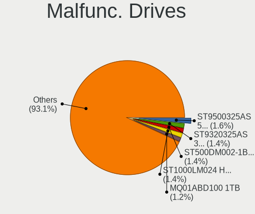
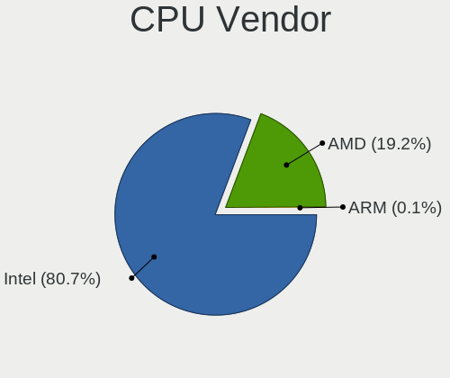
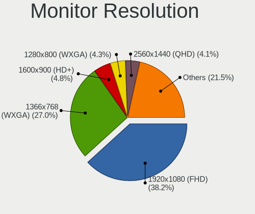
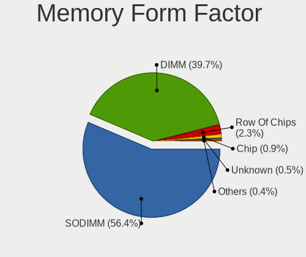
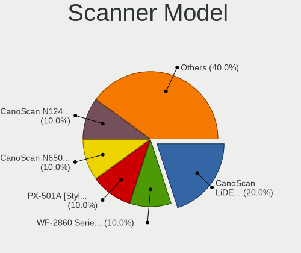

helloSystem - Tested Hardware & Statistics
------------------------------------------

A project to collect tested hardware configurations for helloSystem.

Anyone can contribute to this report by the [hw-probe](https://github.com/linuxhw/hw-probe/blob/master/INSTALL.BSD.md) tool:

    hw-probe -all -upload

Please contribute! Especially if your hardware is rare.

This is a report for all computer types. See also reports for [desktops](/Dist/helloSystem/Desktop/README.md) and [notebooks](/Dist/helloSystem/Notebook/README.md).

Full-feature report is available here: https://bsd-hardware.info/?view=trends

Contents
--------

* [ Test Cases ](#test-cases)

* [ System ](#system)
  - [ OS                       ](#os)
  - [ OS Family                ](#os-family)
  - [ Arch                     ](#arch)
  - [ DE                       ](#de)
  - [ Display Server           ](#display-server)
  - [ Display Manager          ](#display-manager)
  - [ OS Lang                  ](#os-lang)
  - [ Boot Mode                ](#boot-mode)
  - [ Filesystem               ](#filesystem)
  - [ Part. scheme             ](#part-scheme)

* [ Board ](#board)
  - [ Vendor                   ](#vendor)
  - [ Model                    ](#model)
  - [ Model Family             ](#model-family)
  - [ MFG Year                 ](#mfg-year)
  - [ Form Factor              ](#form-factor)
  - [ Coreboot                 ](#coreboot)
  - [ RAM Size                 ](#ram-size)
  - [ RAM Used                 ](#ram-used)
  - [ Total Drives             ](#total-drives)
  - [ Has CD-ROM               ](#has-cd-rom)
  - [ Has Ethernet             ](#has-ethernet)
  - [ Has WiFi                 ](#has-wifi)
  - [ Has Bluetooth            ](#has-bluetooth)

* [ Location ](#location)
  - [ Country                  ](#country)
  - [ City                     ](#city)

* [ Drives ](#drives)
  - [ Drive Vendor             ](#drive-vendor)
  - [ Drive Model              ](#drive-model)
  - [ HDD Vendor               ](#hdd-vendor)
  - [ SSD Vendor               ](#ssd-vendor)
  - [ Drive Kind               ](#drive-kind)
  - [ Drive Connector          ](#drive-connector)
  - [ Drive Size               ](#drive-size)
  - [ Space Total              ](#space-total)
  - [ Space Used               ](#space-used)
  - [ Malfunc. Drives          ](#malfunc-drives)
  - [ Malfunc. Drive Vendor    ](#malfunc-drive-vendor)
  - [ Malfunc. HDD Vendor      ](#malfunc-hdd-vendor)
  - [ Malfunc. Drive Kind      ](#malfunc-drive-kind)
  - [ Failed Drives            ](#failed-drives)
  - [ Failed Drive Vendor      ](#failed-drive-vendor)
  - [ Drive Status             ](#drive-status)

* [ Storage controller ](#storage-controller)
  - [ Storage Vendor           ](#storage-vendor)
  - [ Storage Model            ](#storage-model)
  - [ Storage Kind             ](#storage-kind)

* [ Processor ](#processor)
  - [ CPU Vendor               ](#cpu-vendor)
  - [ CPU Model                ](#cpu-model)
  - [ CPU Model Family         ](#cpu-model-family)
  - [ CPU Cores                ](#cpu-cores)
  - [ CPU Sockets              ](#cpu-sockets)
  - [ CPU Threads              ](#cpu-threads)
  - [ CPU Microarch            ](#cpu-microarch)

* [ Graphics ](#graphics)
  - [ GPU Vendor               ](#gpu-vendor)
  - [ GPU Model                ](#gpu-model)
  - [ GPU Combo                ](#gpu-combo)
  - [ GPU Driver               ](#gpu-driver)
  - [ GPU Memory               ](#gpu-memory)

* [ Monitor ](#monitor)
  - [ Monitor Vendor           ](#monitor-vendor)
  - [ Monitor Model            ](#monitor-model)
  - [ Monitor Resolution       ](#monitor-resolution)
  - [ Monitor Diagonal         ](#monitor-diagonal)
  - [ Monitor Width            ](#monitor-width)
  - [ Aspect Ratio             ](#aspect-ratio)
  - [ Monitor Area             ](#monitor-area)
  - [ Pixel Density            ](#pixel-density)
  - [ Multiple Monitors        ](#multiple-monitors)

* [ Network ](#network)
  - [ Net Controller Vendor    ](#net-controller-vendor)
  - [ Net Controller Model     ](#net-controller-model)
  - [ Wireless Vendor          ](#wireless-vendor)
  - [ Wireless Model           ](#wireless-model)
  - [ Ethernet Vendor          ](#ethernet-vendor)
  - [ Ethernet Model           ](#ethernet-model)
  - [ Net Controller Kind      ](#net-controller-kind)
  - [ Used Controller          ](#used-controller)
  - [ NICs                     ](#nics)
  - [ IPv6                     ](#ipv6)

* [ Bluetooth ](#bluetooth)
  - [ Bluetooth Vendor         ](#bluetooth-vendor)
  - [ Bluetooth Model          ](#bluetooth-model)

* [ Sound ](#sound)
  - [ Sound Vendor             ](#sound-vendor)
  - [ Sound Model              ](#sound-model)

* [ Memory ](#memory)
  - [ Memory Vendor            ](#memory-vendor)
  - [ Memory Model             ](#memory-model)
  - [ Memory Kind              ](#memory-kind)
  - [ Memory Form Factor       ](#memory-form-factor)
  - [ Memory Size              ](#memory-size)
  - [ Memory Speed             ](#memory-speed)

* [ Printers & scanners ](#printers--scanners)
  - [ Printer Vendor           ](#printer-vendor)
  - [ Printer Model            ](#printer-model)
  - [ Scanner Vendor           ](#scanner-vendor)
  - [ Scanner Model            ](#scanner-model)

* [ Camera ](#camera)
  - [ Camera Vendor            ](#camera-vendor)
  - [ Camera Model             ](#camera-model)

* [ Security ](#security)
  - [ Fingerprint Vendor       ](#fingerprint-vendor)
  - [ Fingerprint Model        ](#fingerprint-model)
  - [ Chipcard Vendor          ](#chipcard-vendor)
  - [ Chipcard Model           ](#chipcard-model)

* [ Unsupported ](#unsupported)
  - [ Unsupported Devices      ](#unsupported-devices)
  - [ Unsupported Device Types ](#unsupported-device-types)

Test Cases
----------

Total: 1071

| Vendor        | Model                       | Form-Factor | Probe                                                     | Date         |
|---------------|-----------------------------|-------------|-----------------------------------------------------------|--------------|
| HP            | Pavilion 11                 | Notebook    | [a13373b255](https://bsd-hardware.info/?probe=a13373b255) | Apr 07, 2022 |
| DNS           | W9x0LU                      | Notebook    | [8ac57e3b59](https://bsd-hardware.info/?probe=8ac57e3b59) | Apr 06, 2022 |
| Dell          | Latitude E5470              | Notebook    | [a7d087a428](https://bsd-hardware.info/?probe=a7d087a428) | Apr 05, 2022 |
| TUXEDO        | Aura 15 Gen1                | Notebook    | [e72b47b6de](https://bsd-hardware.info/?probe=e72b47b6de) | Apr 04, 2022 |
| Sony          | VGN-AW21S_B                 | Notebook    | [11edcb4e82](https://bsd-hardware.info/?probe=11edcb4e82) | Apr 03, 2022 |
| Lenovo        | 30D9 SDK0J40705 WIN 3425... | Desktop     | [964ceb3616](https://bsd-hardware.info/?probe=964ceb3616) | Apr 03, 2022 |
| Lenovo        | 30D9 SDK0J40705 WIN 3425... | Desktop     | [5038186437](https://bsd-hardware.info/?probe=5038186437) | Apr 02, 2022 |
| LG Electro... | E300-A.CP20T                | Notebook    | [304701f666](https://bsd-hardware.info/?probe=304701f666) | Apr 02, 2022 |
| TUXEDO        | Aura 15 Gen1                | Notebook    | [1be95af210](https://bsd-hardware.info/?probe=1be95af210) | Apr 01, 2022 |
| Apple         | Mac-F2218EA9                | All in one  | [e0c61311da](https://bsd-hardware.info/?probe=e0c61311da) | Apr 01, 2022 |
| Acidanther... | Mac-F60DEB81FF30ACF6 Mac... | Desktop     | [9b6f9eac6f](https://bsd-hardware.info/?probe=9b6f9eac6f) | Apr 01, 2022 |
| ASUSTek       | P8Z77-V LX                  | Desktop     | [42419abab8](https://bsd-hardware.info/?probe=42419abab8) | Apr 01, 2022 |
| Dell          | 0D6H9T A00                  | Desktop     | [7daab72741](https://bsd-hardware.info/?probe=7daab72741) | Apr 01, 2022 |
| HP            | Compaq 6510b (GF910AW#AB... | Notebook    | [a7bccf74e4](https://bsd-hardware.info/?probe=a7bccf74e4) | Mar 31, 2022 |
| ASUSTek       | P8Z77-V LX                  | Desktop     | [49627775f3](https://bsd-hardware.info/?probe=49627775f3) | Mar 31, 2022 |
| ASUSTek       | P6-P8H61E                   | Desktop     | [11664cd9d7](https://bsd-hardware.info/?probe=11664cd9d7) | Mar 30, 2022 |
| ASUSTek       | M4A88T-M                    | Desktop     | [6a615f6be5](https://bsd-hardware.info/?probe=6a615f6be5) | Mar 30, 2022 |
| ASUSTek       | P6-P8H61E                   | Desktop     | [540f66f678](https://bsd-hardware.info/?probe=540f66f678) | Mar 29, 2022 |
| ASUSTek       | M5A78L-M LX3                | Desktop     | [0906d116eb](https://bsd-hardware.info/?probe=0906d116eb) | Mar 29, 2022 |
| PCSTICK       | Unknown                     | Notebook    | [6f9f24b262](https://bsd-hardware.info/?probe=6f9f24b262) | Mar 29, 2022 |
| Gigabyte      | H110N-CF                    | Desktop     | [89593af061](https://bsd-hardware.info/?probe=89593af061) | Mar 29, 2022 |
| Gigabyte      | H61M-S2PV                   | Desktop     | [553f2beb91](https://bsd-hardware.info/?probe=553f2beb91) | Mar 27, 2022 |
| Lenovo        | 312D NOK                    | Mini pc     | [47ef9ef91a](https://bsd-hardware.info/?probe=47ef9ef91a) | Mar 27, 2022 |
| ASRock        | A320M-HDV R4.0              | Desktop     | [8c89faeb24](https://bsd-hardware.info/?probe=8c89faeb24) | Mar 26, 2022 |
| ASRock        | A320M-HDV R4.0              | Desktop     | [ae1fa6cbce](https://bsd-hardware.info/?probe=ae1fa6cbce) | Mar 26, 2022 |
| Dell          | Latitude E6540              | Notebook    | [41e5f63a69](https://bsd-hardware.info/?probe=41e5f63a69) | Mar 26, 2022 |
| Dell          | Latitude E6540              | Notebook    | [0ac0f8f1d8](https://bsd-hardware.info/?probe=0ac0f8f1d8) | Mar 26, 2022 |
| ASUSTek       | ET2411_W8                   | All in one  | [fb186da68e](https://bsd-hardware.info/?probe=fb186da68e) | Mar 26, 2022 |
| Lenovo        | ThinkBook 14 G2 ARE 20VF    | Notebook    | [00213ecee9](https://bsd-hardware.info/?probe=00213ecee9) | Mar 25, 2022 |
| ASUSTek       | P8Z77-V LX                  | Desktop     | [70d10ce47c](https://bsd-hardware.info/?probe=70d10ce47c) | Mar 25, 2022 |
| MSI           | B85-G43                     | Desktop     | [f0a919c35f](https://bsd-hardware.info/?probe=f0a919c35f) | Mar 25, 2022 |
| ASUSTek       | P8Z77-V LX                  | Desktop     | [99d079bd5a](https://bsd-hardware.info/?probe=99d079bd5a) | Mar 25, 2022 |
| MSI           | B85-G43                     | Desktop     | [7bd545fda8](https://bsd-hardware.info/?probe=7bd545fda8) | Mar 25, 2022 |
| ASUSTek       | P8Z77-V LX                  | Desktop     | [c76aa38baf](https://bsd-hardware.info/?probe=c76aa38baf) | Mar 24, 2022 |
| ASUSTek       | P8Z77-V LX                  | Desktop     | [8696405d09](https://bsd-hardware.info/?probe=8696405d09) | Mar 24, 2022 |
| Lenovo        | 312D NOK                    | Mini pc     | [9b3dac520a](https://bsd-hardware.info/?probe=9b3dac520a) | Mar 24, 2022 |
| Dell          | Vostro 3490                 | Notebook    | [34956934f5](https://bsd-hardware.info/?probe=34956934f5) | Mar 22, 2022 |
| ASUSTek       | UX31E                       | Notebook    | [93655cdd83](https://bsd-hardware.info/?probe=93655cdd83) | Mar 21, 2022 |
| ECS           | G41T-M9                     | Desktop     | [9ef50c47da](https://bsd-hardware.info/?probe=9ef50c47da) | Mar 21, 2022 |
| HP            | EliteBook 850 G3            | Notebook    | [1ae8321767](https://bsd-hardware.info/?probe=1ae8321767) | Mar 20, 2022 |
| Gateway       | NE56R                       | Notebook    | [87d177b9da](https://bsd-hardware.info/?probe=87d177b9da) | Mar 20, 2022 |
| HP            | Pavilion dv6                | Notebook    | [dee0853f4b](https://bsd-hardware.info/?probe=dee0853f4b) | Mar 17, 2022 |
| Packard Be... | EasyNote TE69HW             | Notebook    | [851eea349f](https://bsd-hardware.info/?probe=851eea349f) | Mar 17, 2022 |
| ASUSTek       | ET2411_W8                   | All in one  | [b95da98f21](https://bsd-hardware.info/?probe=b95da98f21) | Mar 17, 2022 |
| Lenovo        | ThinkPad X220 4293B43       | Notebook    | [148a268a0f](https://bsd-hardware.info/?probe=148a268a0f) | Mar 16, 2022 |
| Gigabyte      | H270-Gaming 3               | Desktop     | [2727a8e439](https://bsd-hardware.info/?probe=2727a8e439) | Mar 15, 2022 |
| HASEE Comp... | CW35S                       | Notebook    | [737c8bb48a](https://bsd-hardware.info/?probe=737c8bb48a) | Mar 14, 2022 |
| Lenovo        | ThinkPad L440 20ASS0FP00    | Notebook    | [0fbc782835](https://bsd-hardware.info/?probe=0fbc782835) | Mar 14, 2022 |
| Dell          | Latitude E6540              | Notebook    | [e0576dd008](https://bsd-hardware.info/?probe=e0576dd008) | Mar 13, 2022 |
| Gigabyte      | G31M-S2C                    | Desktop     | [5a22bb6991](https://bsd-hardware.info/?probe=5a22bb6991) | Mar 12, 2022 |
| Lenovo        | IdeaCentre B545 10100       | Desktop     | [2f13d4a946](https://bsd-hardware.info/?probe=2f13d4a946) | Mar 12, 2022 |
| MSI           | B350M BAZOOKA               | Desktop     | [bac8d0bdb7](https://bsd-hardware.info/?probe=bac8d0bdb7) | Mar 11, 2022 |
| Acer          | Aspire E1-421               | Notebook    | [cc83218496](https://bsd-hardware.info/?probe=cc83218496) | Mar 10, 2022 |
| ASUSTek       | P5Q DELUXE                  | Desktop     | [b4234170e8](https://bsd-hardware.info/?probe=b4234170e8) | Mar 10, 2022 |
| Lenovo        | Z50-70 20354                | Notebook    | [a1f85aff27](https://bsd-hardware.info/?probe=a1f85aff27) | Mar 10, 2022 |
| Lenovo        | IdeaPad N585                | Notebook    | [e22da97709](https://bsd-hardware.info/?probe=e22da97709) | Mar 10, 2022 |
| Lenovo        | Z50-70 20354                | Notebook    | [ab71ed7239](https://bsd-hardware.info/?probe=ab71ed7239) | Mar 10, 2022 |
| Pegatron      | IPM41-D3                    | Desktop     | [a58b9a4f8f](https://bsd-hardware.info/?probe=a58b9a4f8f) | Mar 09, 2022 |
| Itautec       | Infoway w7535               | Notebook    | [b55f9d1bfb](https://bsd-hardware.info/?probe=b55f9d1bfb) | Mar 09, 2022 |
| Koloe         | X58                         | Desktop     | [58e098eca2](https://bsd-hardware.info/?probe=58e098eca2) | Mar 09, 2022 |
| HP            | 8054                        | Desktop     | [86b6b8373c](https://bsd-hardware.info/?probe=86b6b8373c) | Mar 08, 2022 |
| HP            | 8054                        | Desktop     | [00078554d2](https://bsd-hardware.info/?probe=00078554d2) | Mar 08, 2022 |
| Koloe         | X58                         | Desktop     | [c501dfa5c8](https://bsd-hardware.info/?probe=c501dfa5c8) | Mar 07, 2022 |
| Lenovo        | ThinkPad X220 Tablet 429... | Notebook    | [dbd5c6e5e3](https://bsd-hardware.info/?probe=dbd5c6e5e3) | Mar 07, 2022 |
| HUAWEI        | BOD-WXX9                    | Notebook    | [65454bcc92](https://bsd-hardware.info/?probe=65454bcc92) | Mar 06, 2022 |
| Apple         | Mac-F2218EA9                | All in one  | [8b51036856](https://bsd-hardware.info/?probe=8b51036856) | Mar 06, 2022 |
| Dell          | 0GXM1W A00                  | Desktop     | [c4d10a26fd](https://bsd-hardware.info/?probe=c4d10a26fd) | Mar 04, 2022 |
| ASRock        | G41C-VS                     | Desktop     | [a9a1b1a493](https://bsd-hardware.info/?probe=a9a1b1a493) | Mar 03, 2022 |
| Intel         | DN2800MT AAG23738-600       | Desktop     | [8ecf2d023f](https://bsd-hardware.info/?probe=8ecf2d023f) | Mar 02, 2022 |
| HP            | 1905                        | Desktop     | [e271589365](https://bsd-hardware.info/?probe=e271589365) | Mar 01, 2022 |
| Gigabyte      | B450M S2H                   | Desktop     | [78f79fab6f](https://bsd-hardware.info/?probe=78f79fab6f) | Feb 28, 2022 |
| HP            | EliteBook Folio 9470m       | Notebook    | [e2cc942e3e](https://bsd-hardware.info/?probe=e2cc942e3e) | Feb 28, 2022 |
| Dell          | 0KV62T A00                  | Desktop     | [0541a207c7](https://bsd-hardware.info/?probe=0541a207c7) | Feb 28, 2022 |
| HP            | 1905                        | Desktop     | [aa010e00f2](https://bsd-hardware.info/?probe=aa010e00f2) | Feb 28, 2022 |
| Acer          | V5-131                      | Notebook    | [d175137636](https://bsd-hardware.info/?probe=d175137636) | Feb 27, 2022 |
| ASRock        | TRX40 Taichi                | Desktop     | [a2df68e1d1](https://bsd-hardware.info/?probe=a2df68e1d1) | Feb 26, 2022 |
| Acer          | V5-131                      | Notebook    | [076ca78b3f](https://bsd-hardware.info/?probe=076ca78b3f) | Feb 25, 2022 |
| Intel         | H81                         | Desktop     | [dd19abd47d](https://bsd-hardware.info/?probe=dd19abd47d) | Feb 25, 2022 |
| Intel         | H81                         | Desktop     | [04d2739bdc](https://bsd-hardware.info/?probe=04d2739bdc) | Feb 25, 2022 |
| Intel         | DCP847SKE G80890-107        | Desktop     | [f9d33f1ab1](https://bsd-hardware.info/?probe=f9d33f1ab1) | Feb 23, 2022 |
| Dell          | Latitude 7480               | Notebook    | [8a0388b49d](https://bsd-hardware.info/?probe=8a0388b49d) | Feb 23, 2022 |
| Medion        | H61H2-LM3                   | Desktop     | [beb12f2884](https://bsd-hardware.info/?probe=beb12f2884) | Feb 23, 2022 |
| ASRock        | H81M-DG4                    | Desktop     | [e20db6ad83](https://bsd-hardware.info/?probe=e20db6ad83) | Feb 23, 2022 |
| HP            | 1998                        | Desktop     | [485d417a2e](https://bsd-hardware.info/?probe=485d417a2e) | Feb 23, 2022 |
| Apple         | Mac-F2218EA9                | All in one  | [feb7882341](https://bsd-hardware.info/?probe=feb7882341) | Feb 22, 2022 |
| Dell          | 0VD5HY A07                  | Desktop     | [bb86fb3e67](https://bsd-hardware.info/?probe=bb86fb3e67) | Feb 22, 2022 |
| Dell          | Latitude E4310              | Notebook    | [ba69f80b7f](https://bsd-hardware.info/?probe=ba69f80b7f) | Feb 22, 2022 |
| Apple         | MacBook4,1                  | Notebook    | [e0cf5200de](https://bsd-hardware.info/?probe=e0cf5200de) | Feb 22, 2022 |
| Lenovo        | ThinkPad T61 766301U        | Notebook    | [f5f25efdcc](https://bsd-hardware.info/?probe=f5f25efdcc) | Feb 22, 2022 |
| Apple         | MacBook6,1                  | Notebook    | [d680290d84](https://bsd-hardware.info/?probe=d680290d84) | Feb 22, 2022 |
| ASUSTek       | CROSSHAIR VI HERO           | Desktop     | [1e6ff84e5d](https://bsd-hardware.info/?probe=1e6ff84e5d) | Feb 21, 2022 |
| Apple         | MacBook6,1                  | Notebook    | [304508ed18](https://bsd-hardware.info/?probe=304508ed18) | Feb 21, 2022 |
| Dell          | Latitude E5470              | Notebook    | [9e479e9c50](https://bsd-hardware.info/?probe=9e479e9c50) | Feb 21, 2022 |
| PCSTICK       | Unknown                     | Notebook    | [b76b5c9670](https://bsd-hardware.info/?probe=b76b5c9670) | Feb 21, 2022 |
| Dell          | Inspiron 3537               | Notebook    | [932550132e](https://bsd-hardware.info/?probe=932550132e) | Feb 20, 2022 |
| Lenovo        | ThinkPad T61 766301U        | Notebook    | [6eec3232e2](https://bsd-hardware.info/?probe=6eec3232e2) | Feb 19, 2022 |
| Intel         | NUC5CPYB H61145-404         | Mini pc     | [5f4e1c30b8](https://bsd-hardware.info/?probe=5f4e1c30b8) | Feb 19, 2022 |
| Gigabyte      | P41T-D3                     | Desktop     | [e5417931a7](https://bsd-hardware.info/?probe=e5417931a7) | Feb 18, 2022 |
| Lenovo        | IdeaPad 110S-11IBR 80WG     | Notebook    | [2f90d5c2bd](https://bsd-hardware.info/?probe=2f90d5c2bd) | Feb 18, 2022 |
| ASRock        | B460M Pro4                  | Desktop     | [7a2781344f](https://bsd-hardware.info/?probe=7a2781344f) | Feb 17, 2022 |
| TUXEDO        | InfinityBook13V3            | Notebook    | [5a75db9142](https://bsd-hardware.info/?probe=5a75db9142) | Feb 17, 2022 |
| TUXEDO        | InfinityBook13V3            | Notebook    | [edc2c4ec36](https://bsd-hardware.info/?probe=edc2c4ec36) | Feb 17, 2022 |
| ASUSTek       | 1001PX                      | Notebook    | [d171d1ec99](https://bsd-hardware.info/?probe=d171d1ec99) | Feb 17, 2022 |
| Lenovo        | ThinkPad T450 20BUS0VH08    | Notebook    | [fa2cd8964e](https://bsd-hardware.info/?probe=fa2cd8964e) | Feb 17, 2022 |
| Samsung       | N100                        | Notebook    | [3125d76ba4](https://bsd-hardware.info/?probe=3125d76ba4) | Feb 16, 2022 |
| Lenovo        | Legion 5 15ARH05 82B5       | Notebook    | [1a13b7bfd1](https://bsd-hardware.info/?probe=1a13b7bfd1) | Feb 16, 2022 |
| Lenovo        | E31-80 80MX                 | Notebook    | [098afac660](https://bsd-hardware.info/?probe=098afac660) | Feb 16, 2022 |
| Lenovo        | ThinkPad T430 2349AK1       | Notebook    | [86fd351c81](https://bsd-hardware.info/?probe=86fd351c81) | Feb 16, 2022 |
| ASUSTek       | PRIME Z390-P                | Desktop     | [3a72227408](https://bsd-hardware.info/?probe=3a72227408) | Feb 16, 2022 |
| ASUSTek       | TUF GAMING X570-PLUS        | Desktop     | [64999a24c1](https://bsd-hardware.info/?probe=64999a24c1) | Feb 16, 2022 |
| Gigabyte      | C246M-WU4-CF                | Desktop     | [4b6c6d8bde](https://bsd-hardware.info/?probe=4b6c6d8bde) | Feb 15, 2022 |
| MSI           | B450 GAMING PLUS MAX        | Desktop     | [df6278638e](https://bsd-hardware.info/?probe=df6278638e) | Feb 15, 2022 |
| Acer          | Aspire 5750G                | Notebook    | [bd22fc8a49](https://bsd-hardware.info/?probe=bd22fc8a49) | Feb 15, 2022 |
| AMD           | X64                         | Desktop     | [e5a9ff1138](https://bsd-hardware.info/?probe=e5a9ff1138) | Feb 15, 2022 |
| Acer          | V5-131                      | Notebook    | [2d5bfae3b4](https://bsd-hardware.info/?probe=2d5bfae3b4) | Feb 15, 2022 |
| Timi          | RedmiBook Pro 15            | Notebook    | [7716f59380](https://bsd-hardware.info/?probe=7716f59380) | Feb 14, 2022 |
| Timi          | RedmiBook Pro 15            | Notebook    | [fdd0ab95ed](https://bsd-hardware.info/?probe=fdd0ab95ed) | Feb 14, 2022 |
| Lenovo        | SHARKBAY SDK0E50510 WIN     | Desktop     | [eddeb5c246](https://bsd-hardware.info/?probe=eddeb5c246) | Feb 13, 2022 |
| Firefly       | ROC-RK3566-PC               | Soc         | [b5c6aa26de](https://bsd-hardware.info/?probe=b5c6aa26de) | Feb 13, 2022 |
| Apple         | MacBook5,2                  | Notebook    | [29756c2371](https://bsd-hardware.info/?probe=29756c2371) | Feb 13, 2022 |
| ASRock        | H61M/U3S3                   | Desktop     | [257e13f206](https://bsd-hardware.info/?probe=257e13f206) | Feb 12, 2022 |
| ASUSTek       | PRIME Z390-P                | Desktop     | [abf34bbc7e](https://bsd-hardware.info/?probe=abf34bbc7e) | Feb 12, 2022 |
| ASRock        | H61M/U3S3                   | Desktop     | [34dac4c0cd](https://bsd-hardware.info/?probe=34dac4c0cd) | Feb 11, 2022 |
| MSI           | B450 GAMING PLUS MAX        | Desktop     | [6997de25f9](https://bsd-hardware.info/?probe=6997de25f9) | Feb 11, 2022 |
| MACHINIST     | X99-k9 V2.0                 | Desktop     | [0a36d71db1](https://bsd-hardware.info/?probe=0a36d71db1) | Feb 10, 2022 |
| ASUSTek       | X555LA                      | Notebook    | [28b3002182](https://bsd-hardware.info/?probe=28b3002182) | Feb 10, 2022 |
| ASUSTek       | X555LA                      | Notebook    | [9aa18b2e33](https://bsd-hardware.info/?probe=9aa18b2e33) | Feb 09, 2022 |
| Intel         | X58                         | Desktop     | [f7075908f6](https://bsd-hardware.info/?probe=f7075908f6) | Feb 09, 2022 |
| ASUSTek       | PRIME Z390-P                | Desktop     | [b1931633be](https://bsd-hardware.info/?probe=b1931633be) | Feb 09, 2022 |
| ASUSTek       | PRIME Z390-P                | Desktop     | [f9c1e787a9](https://bsd-hardware.info/?probe=f9c1e787a9) | Feb 09, 2022 |
| Apple         | MacBookPro4,1               | Notebook    | [d852363467](https://bsd-hardware.info/?probe=d852363467) | Feb 08, 2022 |
| Apple         | MacBookPro4,1               | Notebook    | [f05ce66a9a](https://bsd-hardware.info/?probe=f05ce66a9a) | Feb 08, 2022 |
| MSI           | B75A-G43                    | Desktop     | [8e445eb2d4](https://bsd-hardware.info/?probe=8e445eb2d4) | Feb 08, 2022 |
| Lenovo        | G580 20150                  | Notebook    | [478714c7c9](https://bsd-hardware.info/?probe=478714c7c9) | Feb 07, 2022 |
| Acer          | Aspire E5-511G              | Notebook    | [b14c4c1ac5](https://bsd-hardware.info/?probe=b14c4c1ac5) | Feb 07, 2022 |
| TWINHEAD      | U12CT                       | Notebook    | [32247012ca](https://bsd-hardware.info/?probe=32247012ca) | Feb 06, 2022 |
| ASUSTek       | P6-P8H61E                   | Desktop     | [e838981914](https://bsd-hardware.info/?probe=e838981914) | Feb 06, 2022 |
| Dell          | Latitude D630               | Notebook    | [b34db656b5](https://bsd-hardware.info/?probe=b34db656b5) | Feb 05, 2022 |
| Lenovo        | ThinkPad T440p 20AWS3RH0... | Notebook    | [a6c02e440b](https://bsd-hardware.info/?probe=a6c02e440b) | Feb 05, 2022 |
| Sony          | VPCEB1J1E                   | Notebook    | [04c5ee02da](https://bsd-hardware.info/?probe=04c5ee02da) | Feb 05, 2022 |
| Dell          | Venue 11 Pro 7140           | Notebook    | [328f9e8d94](https://bsd-hardware.info/?probe=328f9e8d94) | Feb 04, 2022 |
| ASRock        | H81M-VG4 R2.0               | Desktop     | [8af8b5270e](https://bsd-hardware.info/?probe=8af8b5270e) | Feb 04, 2022 |
| HP            | EliteBook 6930p             | Notebook    | [d8fb34de12](https://bsd-hardware.info/?probe=d8fb34de12) | Feb 04, 2022 |
| Apple         | Mac-F221BEC8                | Desktop     | [e5043f0af4](https://bsd-hardware.info/?probe=e5043f0af4) | Feb 04, 2022 |
| Intel         | NUC7i3BNB J22859-313        | Mini pc     | [bf63607cd6](https://bsd-hardware.info/?probe=bf63607cd6) | Feb 03, 2022 |
| Intel         | NUC5i3RYB K23918-501        | Mini pc     | [342915fccd](https://bsd-hardware.info/?probe=342915fccd) | Feb 03, 2022 |
| Lenovo        | ThinkPad X220 4291H77       | Notebook    | [dd4d3a9dcc](https://bsd-hardware.info/?probe=dd4d3a9dcc) | Feb 02, 2022 |
| Pegatron      | NARRA5                      | Desktop     | [64d4fb9b97](https://bsd-hardware.info/?probe=64d4fb9b97) | Feb 02, 2022 |
| HP            | Mini 210-1000               | Notebook    | [8a8bfdaee1](https://bsd-hardware.info/?probe=8a8bfdaee1) | Feb 02, 2022 |
| HP            | G62                         | Notebook    | [476193bfd0](https://bsd-hardware.info/?probe=476193bfd0) | Feb 01, 2022 |
| Gigabyte      | Z390 GAMING X-CF            | Desktop     | [ee05643521](https://bsd-hardware.info/?probe=ee05643521) | Feb 01, 2022 |
| ASUSTek       | P5P43TD PRO                 | Desktop     | [5999e0ebfb](https://bsd-hardware.info/?probe=5999e0ebfb) | Jan 31, 2022 |
| Lenovo        | ThinkPad T510 4384AJ6       | Notebook    | [70a56029e7](https://bsd-hardware.info/?probe=70a56029e7) | Jan 31, 2022 |
| Intel         | H81                         | Desktop     | [c2f3025900](https://bsd-hardware.info/?probe=c2f3025900) | Jan 31, 2022 |
| HP            | Laptop 15-rb0xx             | Notebook    | [8e9a6cff62](https://bsd-hardware.info/?probe=8e9a6cff62) | Jan 31, 2022 |
| Sony          | VPCEB1J1E                   | Notebook    | [9151a22f13](https://bsd-hardware.info/?probe=9151a22f13) | Jan 30, 2022 |
| Pegatron      | 2A99h                       | Desktop     | [e34b6118a2](https://bsd-hardware.info/?probe=e34b6118a2) | Jan 30, 2022 |
| Fujitsu       | D3161-A1 S26361-D3161-A1    | Desktop     | [58ea01e4e6](https://bsd-hardware.info/?probe=58ea01e4e6) | Jan 29, 2022 |
| Apple         | MacBook4,1                  | Notebook    | [e89404ebed](https://bsd-hardware.info/?probe=e89404ebed) | Jan 29, 2022 |
| Samsung       | N150P/N210P/N220P           | Notebook    | [901a483718](https://bsd-hardware.info/?probe=901a483718) | Jan 29, 2022 |
| Intel         | DH77EB AAG39073-400         | Desktop     | [bfe6ef301b](https://bsd-hardware.info/?probe=bfe6ef301b) | Jan 29, 2022 |
| Apple         | MacBook5,2                  | Notebook    | [ee6e794728](https://bsd-hardware.info/?probe=ee6e794728) | Jan 29, 2022 |
| Acer          | Aspire 5930                 | Notebook    | [754db09c98](https://bsd-hardware.info/?probe=754db09c98) | Jan 28, 2022 |
| Dell          | 014GRG A03                  | Desktop     | [8e0a22c065](https://bsd-hardware.info/?probe=8e0a22c065) | Jan 28, 2022 |
| Pegatron      | IPPPV-D3G                   | Desktop     | [d5e44ccf6b](https://bsd-hardware.info/?probe=d5e44ccf6b) | Jan 28, 2022 |
| Dell          | 014GRG A03                  | Desktop     | [5996ba19b1](https://bsd-hardware.info/?probe=5996ba19b1) | Jan 27, 2022 |
| ASUSTek       | ASUS TUF Gaming A15 FA50... | Notebook    | [11bbfce5d4](https://bsd-hardware.info/?probe=11bbfce5d4) | Jan 27, 2022 |
| ASUSTek       | P5GC-MX                     | Desktop     | [372749f9d7](https://bsd-hardware.info/?probe=372749f9d7) | Jan 27, 2022 |
| Unknown       | Unknown                     | Desktop     | [a9d799ca71](https://bsd-hardware.info/?probe=a9d799ca71) | Jan 27, 2022 |
| Dell          | Latitude 7280               | Notebook    | [089b61bb38](https://bsd-hardware.info/?probe=089b61bb38) | Jan 27, 2022 |
| ASUSTek       | P5B SE                      | Desktop     | [f97fba19c1](https://bsd-hardware.info/?probe=f97fba19c1) | Jan 26, 2022 |
| Dell          | 014GRG A03                  | Desktop     | [223d955a90](https://bsd-hardware.info/?probe=223d955a90) | Jan 26, 2022 |
| Apple         | Mac-DB15BD556843C820 iMa... | All in one  | [2506316700](https://bsd-hardware.info/?probe=2506316700) | Jan 26, 2022 |
| Lenovo        | IdeaPad L340-17IRH Gamin... | Notebook    | [b1d702812e](https://bsd-hardware.info/?probe=b1d702812e) | Jan 26, 2022 |
| Fujitsu       | D3161-A1 S26361-D3161-A1    | Desktop     | [9f0a000ceb](https://bsd-hardware.info/?probe=9f0a000ceb) | Jan 25, 2022 |
| MSI           | GE75 Raider 10SFS           | Notebook    | [306f312c47](https://bsd-hardware.info/?probe=306f312c47) | Jan 25, 2022 |
| ASUSTek       | P5B SE                      | Desktop     | [e3332e7b94](https://bsd-hardware.info/?probe=e3332e7b94) | Jan 25, 2022 |
| ASRock        | B460M Pro4                  | Desktop     | [107a1e59f5](https://bsd-hardware.info/?probe=107a1e59f5) | Jan 25, 2022 |
| ASRock        | A300M-STX                   | Desktop     | [8edf072b67](https://bsd-hardware.info/?probe=8edf072b67) | Jan 25, 2022 |
| Intel         | MAHOBAY                     | Desktop     | [2036093b68](https://bsd-hardware.info/?probe=2036093b68) | Jan 25, 2022 |
| ASUSTek       | BM6835_BM6635_BP6335        | Desktop     | [73562aa169](https://bsd-hardware.info/?probe=73562aa169) | Jan 25, 2022 |
| ASUSTek       | P8H61-M LX3 PLUS R2.0       | Desktop     | [df08e2e8f0](https://bsd-hardware.info/?probe=df08e2e8f0) | Jan 24, 2022 |
| HP            | Laptop 15-bw0xx             | Notebook    | [1c8f50f7eb](https://bsd-hardware.info/?probe=1c8f50f7eb) | Jan 24, 2022 |
| Dell          | 05DN3X A00                  | Desktop     | [e0e63e69ef](https://bsd-hardware.info/?probe=e0e63e69ef) | Jan 23, 2022 |
| ASUSTek       | P7H55-M                     | Desktop     | [fb73c2f7dc](https://bsd-hardware.info/?probe=fb73c2f7dc) | Jan 23, 2022 |
| HP            | 8648                        | Desktop     | [b0adf55067](https://bsd-hardware.info/?probe=b0adf55067) | Jan 23, 2022 |
| HP            | 1998                        | Desktop     | [b59dbcdc9c](https://bsd-hardware.info/?probe=b59dbcdc9c) | Jan 23, 2022 |
| Lenovo        | IdeaPad L340-15IWL 81LG     | Notebook    | [bb6cc55d53](https://bsd-hardware.info/?probe=bb6cc55d53) | Jan 23, 2022 |
| Dell          | 05DN3X A00                  | Desktop     | [460ea5c41d](https://bsd-hardware.info/?probe=460ea5c41d) | Jan 23, 2022 |
| Dell          | 0593VH A00                  | Desktop     | [484d14dbef](https://bsd-hardware.info/?probe=484d14dbef) | Jan 22, 2022 |
| HP            | Pavilion Gaming Laptop 1... | Notebook    | [7859f220b9](https://bsd-hardware.info/?probe=7859f220b9) | Jan 22, 2022 |
| Acer          | Aspire ES1-311              | Notebook    | [83addddaa5](https://bsd-hardware.info/?probe=83addddaa5) | Jan 22, 2022 |
| Dell          | Latitude E6540              | Notebook    | [529768f8c8](https://bsd-hardware.info/?probe=529768f8c8) | Jan 21, 2022 |
| Toshiba       | Satellite L50-A             | Notebook    | [94b87158aa](https://bsd-hardware.info/?probe=94b87158aa) | Jan 21, 2022 |
| ASUSTek       | ROG STRIX B450-F GAMING     | Desktop     | [670e41ed41](https://bsd-hardware.info/?probe=670e41ed41) | Jan 21, 2022 |
| MSI           | PRO Z690-A WIFI DDR4        | Desktop     | [04abd226f3](https://bsd-hardware.info/?probe=04abd226f3) | Jan 21, 2022 |
| HP            | EliteBook 2560p             | Notebook    | [4d04ececbb](https://bsd-hardware.info/?probe=4d04ececbb) | Jan 19, 2022 |
| ASUSTek       | Maximus VIII HERO           | Desktop     | [a780a7bab2](https://bsd-hardware.info/?probe=a780a7bab2) | Jan 18, 2022 |
| Lenovo        | Legion Y540-15IRH 81SX      | Notebook    | [384d2f888b](https://bsd-hardware.info/?probe=384d2f888b) | Jan 18, 2022 |
| ASRock        | B365M Pro4                  | Desktop     | [8449bd20c1](https://bsd-hardware.info/?probe=8449bd20c1) | Jan 18, 2022 |
| Dell          | 0YF8P5 A00                  | Desktop     | [913b2a7483](https://bsd-hardware.info/?probe=913b2a7483) | Jan 18, 2022 |
| Acer          | V5-131                      | Notebook    | [ff427cb0c9](https://bsd-hardware.info/?probe=ff427cb0c9) | Jan 18, 2022 |
| Gateway       | NE56R                       | Notebook    | [a5aa8aa49a](https://bsd-hardware.info/?probe=a5aa8aa49a) | Jan 18, 2022 |
| ASUSTek       | TUF GAMING X570-PLUS        | Desktop     | [9cd2758a5f](https://bsd-hardware.info/?probe=9cd2758a5f) | Jan 18, 2022 |
| Lenovo        | ThinkPad T410 2522E38       | Notebook    | [2dbb2679f1](https://bsd-hardware.info/?probe=2dbb2679f1) | Jan 17, 2022 |
| Dell          | Latitude E5430 non-vPro     | Notebook    | [e795c7ec91](https://bsd-hardware.info/?probe=e795c7ec91) | Jan 17, 2022 |
| Fujitsu Si... | ESPRIMO Mobile V5535        | Notebook    | [f4c9b911fe](https://bsd-hardware.info/?probe=f4c9b911fe) | Jan 16, 2022 |
| Lenovo        | ThinkPad T440 20B7000PHV    | Notebook    | [9584ae69fa](https://bsd-hardware.info/?probe=9584ae69fa) | Jan 16, 2022 |
| Apple         | MacBookPro5,5               | Notebook    | [53b106bbb6](https://bsd-hardware.info/?probe=53b106bbb6) | Jan 16, 2022 |
| Lenovo        | ThinkPad R61 8935WCS        | Notebook    | [9cc0f26f6f](https://bsd-hardware.info/?probe=9cc0f26f6f) | Jan 16, 2022 |
| ASUSTek       | PRIME X570-P                | Desktop     | [3dead218e1](https://bsd-hardware.info/?probe=3dead218e1) | Jan 16, 2022 |
| Gigabyte      | B365 HD3                    | Desktop     | [62fc48bd99](https://bsd-hardware.info/?probe=62fc48bd99) | Jan 15, 2022 |
| Dell          | 0XCR8D A03                  | Desktop     | [48e9447b37](https://bsd-hardware.info/?probe=48e9447b37) | Jan 15, 2022 |
| ASUSTek       | ROG STRIX Z390-E GAMING     | Desktop     | [d377e06101](https://bsd-hardware.info/?probe=d377e06101) | Jan 15, 2022 |
| Lenovo        | ThinkPad X220 Tablet 429... | Notebook    | [5a585443b2](https://bsd-hardware.info/?probe=5a585443b2) | Jan 15, 2022 |
| Acer          | V5-131                      | Notebook    | [e4d0f66ff8](https://bsd-hardware.info/?probe=e4d0f66ff8) | Jan 13, 2022 |
| Gigabyte      | Z77N-WIFI                   | Desktop     | [459bb6486d](https://bsd-hardware.info/?probe=459bb6486d) | Jan 13, 2022 |
| Acer          | Aspire ES1-533              | Notebook    | [a9d2458de5](https://bsd-hardware.info/?probe=a9d2458de5) | Jan 13, 2022 |
| Dell          | 0X4N41 A01                  | Desktop     | [87000234dc](https://bsd-hardware.info/?probe=87000234dc) | Jan 11, 2022 |
| Lenovo        | ThinkPad T440 20B7A0B7MS    | Notebook    | [be30041f4e](https://bsd-hardware.info/?probe=be30041f4e) | Jan 10, 2022 |
| Acer          | Aspire E5-476G              | Notebook    | [2a8624ee35](https://bsd-hardware.info/?probe=2a8624ee35) | Jan 10, 2022 |
| ASUSTek       | P8Z68-M PRO                 | Desktop     | [a0885f4f44](https://bsd-hardware.info/?probe=a0885f4f44) | Jan 10, 2022 |
| HP            | 8169                        | Desktop     | [85e0cf058c](https://bsd-hardware.info/?probe=85e0cf058c) | Jan 10, 2022 |
| Apple         | Mac-F2218EA9                | All in one  | [5de4d8c93e](https://bsd-hardware.info/?probe=5de4d8c93e) | Jan 09, 2022 |
| Sony          | VPCYB45JB                   | Notebook    | [cd18905620](https://bsd-hardware.info/?probe=cd18905620) | Jan 09, 2022 |
| Lenovo        | ThinkPad L450 20DSS1S402    | Notebook    | [3c27c8bf31](https://bsd-hardware.info/?probe=3c27c8bf31) | Jan 09, 2022 |
| Lenovo        | G480 20149                  | Notebook    | [adc6b44cc8](https://bsd-hardware.info/?probe=adc6b44cc8) | Jan 09, 2022 |
| Dell          | Latitude E6530              | Notebook    | [0fa21bcf23](https://bsd-hardware.info/?probe=0fa21bcf23) | Jan 09, 2022 |
| Dell          | Inspiron 3505               | Notebook    | [8d4b342fda](https://bsd-hardware.info/?probe=8d4b342fda) | Jan 08, 2022 |
| Dell          | Inspiron 3505               | Notebook    | [8cbe3d4581](https://bsd-hardware.info/?probe=8cbe3d4581) | Jan 08, 2022 |
| Lenovo        | ThinkPad X1 Carbon 5th 2... | Notebook    | [7aea2ccaa7](https://bsd-hardware.info/?probe=7aea2ccaa7) | Jan 08, 2022 |
| Apple         | Mac-F2218EA9                | All in one  | [7c49bc84a7](https://bsd-hardware.info/?probe=7c49bc84a7) | Jan 08, 2022 |
| Lenovo        | G550 2958                   | Notebook    | [21407195e3](https://bsd-hardware.info/?probe=21407195e3) | Jan 07, 2022 |
| Lenovo        | ThinkPad E15 20RD0011MX     | Notebook    | [0fa4700d17](https://bsd-hardware.info/?probe=0fa4700d17) | Jan 07, 2022 |
| HP            | Laptop 14-dk0xxx            | Notebook    | [e7b40f6e3b](https://bsd-hardware.info/?probe=e7b40f6e3b) | Jan 06, 2022 |
| ASUSTek       | GA35DX                      | Desktop     | [eccb947ae4](https://bsd-hardware.info/?probe=eccb947ae4) | Jan 05, 2022 |
| Notebook      | N15_17RD                    | Notebook    | [47c30b962d](https://bsd-hardware.info/?probe=47c30b962d) | Jan 05, 2022 |
| Lenovo        | ThinkPad L450 20DSS1S402    | Notebook    | [bf95cdeb53](https://bsd-hardware.info/?probe=bf95cdeb53) | Jan 04, 2022 |
| HP            | EliteBook 820 G1            | Notebook    | [362940acbb](https://bsd-hardware.info/?probe=362940acbb) | Jan 03, 2022 |
| Unknown       | G31T-M7                     | Desktop     | [ed7d80e01a](https://bsd-hardware.info/?probe=ed7d80e01a) | Jan 03, 2022 |
| Dell          | Latitude 7380               | Notebook    | [590b374836](https://bsd-hardware.info/?probe=590b374836) | Jan 02, 2022 |
| Dell          | Latitude E6540              | Notebook    | [f5a43a9f8b](https://bsd-hardware.info/?probe=f5a43a9f8b) | Jan 02, 2022 |
| Apple         | Mac-F2208EC8                | Mini pc     | [4979175779](https://bsd-hardware.info/?probe=4979175779) | Jan 01, 2022 |
| Lenovo        | ThinkPad X220 4293AF4       | Notebook    | [8c7992e557](https://bsd-hardware.info/?probe=8c7992e557) | Jan 01, 2022 |
| ASUSTek       | TUF GAMING X570-PLUS        | Desktop     | [a671e3eb04](https://bsd-hardware.info/?probe=a671e3eb04) | Dec 31, 2021 |
| Dell          | Latitude E6540              | Notebook    | [97d152656e](https://bsd-hardware.info/?probe=97d152656e) | Dec 31, 2021 |
| ASUSTek       | M5A78L/USB3                 | Desktop     | [f1fe3fe225](https://bsd-hardware.info/?probe=f1fe3fe225) | Dec 30, 2021 |
| HP            | ProBook 655 G1              | Notebook    | [da312d7c14](https://bsd-hardware.info/?probe=da312d7c14) | Dec 30, 2021 |
| Acer          | Aspire 5742G                | Notebook    | [b77a4ee97c](https://bsd-hardware.info/?probe=b77a4ee97c) | Dec 30, 2021 |
| ASUSTek       | S550CA                      | Notebook    | [1263a5fb37](https://bsd-hardware.info/?probe=1263a5fb37) | Dec 29, 2021 |
| Lenovo        | ThinkPad E580 20KS005BRI    | Notebook    | [b533989df5](https://bsd-hardware.info/?probe=b533989df5) | Dec 29, 2021 |
| ASRock        | X570 Phantom Gaming 4       | Desktop     | [15211db056](https://bsd-hardware.info/?probe=15211db056) | Dec 28, 2021 |
| Dell          | Inspiron 3521               | Notebook    | [b246d110af](https://bsd-hardware.info/?probe=b246d110af) | Dec 28, 2021 |
| Dell          | 0200DY A01                  | Desktop     | [fb37dcbb93](https://bsd-hardware.info/?probe=fb37dcbb93) | Dec 28, 2021 |
| Intel         | NUC8BEB J72693-306          | Mini pc     | [07221fc111](https://bsd-hardware.info/?probe=07221fc111) | Dec 28, 2021 |
| Pegatron      | IPM41-D3                    | Desktop     | [6829928dad](https://bsd-hardware.info/?probe=6829928dad) | Dec 28, 2021 |
| Dell          | 0H9KW5 A00                  | Desktop     | [e962ca25b3](https://bsd-hardware.info/?probe=e962ca25b3) | Dec 28, 2021 |
| Lenovo        | ThinkPad T460 20FMS75800    | Notebook    | [5f17e74f2f](https://bsd-hardware.info/?probe=5f17e74f2f) | Dec 27, 2021 |
| Gigabyte      | 970A-DS3P                   | Desktop     | [0918f0a5b9](https://bsd-hardware.info/?probe=0918f0a5b9) | Dec 25, 2021 |
| ASUSTek       | PRIME B350M-A               | Desktop     | [b0aa3885bb](https://bsd-hardware.info/?probe=b0aa3885bb) | Dec 25, 2021 |
| ASUSTek       | Z170-P                      | Desktop     | [bde74629f9](https://bsd-hardware.info/?probe=bde74629f9) | Dec 25, 2021 |
| Acer          | Aspire 5742G                | Notebook    | [b650885b00](https://bsd-hardware.info/?probe=b650885b00) | Dec 24, 2021 |
| Apple         | Mac-F2218EA9                | All in one  | [ea002bb42a](https://bsd-hardware.info/?probe=ea002bb42a) | Dec 24, 2021 |
| Acer          | TravelMate 5760G            | Notebook    | [46204b90d0](https://bsd-hardware.info/?probe=46204b90d0) | Dec 24, 2021 |
| ASUSTek       | TUF GAMING X570-PLUS        | Desktop     | [8ac48ba9c3](https://bsd-hardware.info/?probe=8ac48ba9c3) | Dec 23, 2021 |
| Lenovo        | ThinkPad SL510 2847R96      | Notebook    | [b0a9802877](https://bsd-hardware.info/?probe=b0a9802877) | Dec 22, 2021 |
| Lenovo        | ThinkPad T410 2537EA8       | Notebook    | [8b457cd635](https://bsd-hardware.info/?probe=8b457cd635) | Dec 22, 2021 |
| Gigabyte      | E3000N                      | Desktop     | [eb0ba1b296](https://bsd-hardware.info/?probe=eb0ba1b296) | Dec 22, 2021 |
| Lenovo        | ThinkPad X250 20CLS1WP01    | Notebook    | [87bc0b8924](https://bsd-hardware.info/?probe=87bc0b8924) | Dec 22, 2021 |
| Toshiba       | Satellite C50-B             | Notebook    | [6b03a2c4c2](https://bsd-hardware.info/?probe=6b03a2c4c2) | Dec 22, 2021 |
| ASUSTek       | ROG STRIX Z370-E GAMING     | Desktop     | [936afa4de3](https://bsd-hardware.info/?probe=936afa4de3) | Dec 21, 2021 |
| Samsung       | 305E4A/305E5A/305E7A        | Notebook    | [5188a12b26](https://bsd-hardware.info/?probe=5188a12b26) | Dec 21, 2021 |
| Intel         | NUC10i7FNB K61360-304       | Mini pc     | [839eed529d](https://bsd-hardware.info/?probe=839eed529d) | Dec 21, 2021 |
| ASUSTek       | PRIME A320M-K               | Desktop     | [42599b554e](https://bsd-hardware.info/?probe=42599b554e) | Dec 21, 2021 |
| Lenovo        | ThinkPad X270 W10DG 20K5... | Notebook    | [2e1c585715](https://bsd-hardware.info/?probe=2e1c585715) | Dec 21, 2021 |
| Acidanther... | Mac-AA95B1DDAB278B95 iMa... | All in one  | [73076dd5de](https://bsd-hardware.info/?probe=73076dd5de) | Dec 21, 2021 |
| Gigabyte      | X58A-UD5                    | Desktop     | [62b94dd372](https://bsd-hardware.info/?probe=62b94dd372) | Dec 21, 2021 |
| Acer          | Aspire E1-421               | Notebook    | [b2aea3de1b](https://bsd-hardware.info/?probe=b2aea3de1b) | Dec 21, 2021 |
| ASUSTek       | ROG STRIX X570-E GAMING     | Desktop     | [5cc62c68f9](https://bsd-hardware.info/?probe=5cc62c68f9) | Dec 21, 2021 |
| Gigabyte      | H170-D3HP-CF                | Desktop     | [a490614a39](https://bsd-hardware.info/?probe=a490614a39) | Dec 21, 2021 |
| ASRock        | H110M-DGS                   | Desktop     | [40c4553adb](https://bsd-hardware.info/?probe=40c4553adb) | Dec 21, 2021 |
| HP            | Pavilion Gaming Laptop 1... | Notebook    | [4c22212c20](https://bsd-hardware.info/?probe=4c22212c20) | Dec 20, 2021 |
| HP            | Pavilion Gaming Laptop 1... | Notebook    | [1a193c7bf9](https://bsd-hardware.info/?probe=1a193c7bf9) | Dec 20, 2021 |
| Toshiba       | Satellite L550              | Notebook    | [977298a601](https://bsd-hardware.info/?probe=977298a601) | Dec 20, 2021 |
| ASUSTek       | N56VB                       | Notebook    | [f53b3fba5c](https://bsd-hardware.info/?probe=f53b3fba5c) | Dec 20, 2021 |
| HP            | 15 Notebook PC              | Notebook    | [1e888f2278](https://bsd-hardware.info/?probe=1e888f2278) | Dec 20, 2021 |
| ASUSTek       | P5VD2-VM                    | Desktop     | [7e8f3cf783](https://bsd-hardware.info/?probe=7e8f3cf783) | Dec 20, 2021 |
| ASUSTek       | Q170M-C                     | Desktop     | [7f9e35a31c](https://bsd-hardware.info/?probe=7f9e35a31c) | Dec 20, 2021 |
| Dell          | 0TDG4V A00                  | Desktop     | [3ce808c135](https://bsd-hardware.info/?probe=3ce808c135) | Dec 20, 2021 |
| Dell          | 0TDG4V A00                  | Desktop     | [5292ad64ef](https://bsd-hardware.info/?probe=5292ad64ef) | Dec 20, 2021 |
| Lenovo        | IdeaPad 510-15IKB 80SV      | Notebook    | [6321f4bd3a](https://bsd-hardware.info/?probe=6321f4bd3a) | Dec 20, 2021 |
| ASUSTek       | P8Z77-V LX                  | Desktop     | [3c71a8ba4e](https://bsd-hardware.info/?probe=3c71a8ba4e) | Dec 20, 2021 |
| Dell          | Latitude E5470              | Notebook    | [18470afd9d](https://bsd-hardware.info/?probe=18470afd9d) | Dec 19, 2021 |
| Apple         | Mac-F2218EA9                | All in one  | [510b7cb091](https://bsd-hardware.info/?probe=510b7cb091) | Dec 19, 2021 |
| MSI           | X370 SLI PLUS               | Desktop     | [73853f1fc2](https://bsd-hardware.info/?probe=73853f1fc2) | Dec 19, 2021 |
| Lenovo        | G500 20236                  | Notebook    | [350def9eca](https://bsd-hardware.info/?probe=350def9eca) | Dec 19, 2021 |
| Quanta        | 2AC7 011                    | Desktop     | [1a831a1d34](https://bsd-hardware.info/?probe=1a831a1d34) | Dec 18, 2021 |
| Apple         | Mac-F22C86C8                | Mini pc     | [7daf32eb4f](https://bsd-hardware.info/?probe=7daf32eb4f) | Dec 17, 2021 |
| Lenovo        | ThinkPad T440p 20AW007QM... | Notebook    | [9efeb9ee24](https://bsd-hardware.info/?probe=9efeb9ee24) | Dec 16, 2021 |
| Gigabyte      | Z77X-UD3H                   | Desktop     | [759ce775c9](https://bsd-hardware.info/?probe=759ce775c9) | Dec 15, 2021 |
| Dell          | Inspiron 3521               | Notebook    | [d8bcea438a](https://bsd-hardware.info/?probe=d8bcea438a) | Dec 15, 2021 |
| ASUSTek       | TUF GAMING X570-PLUS        | Desktop     | [32d20b9b8e](https://bsd-hardware.info/?probe=32d20b9b8e) | Dec 14, 2021 |
| Apple         | Mac-F2218EA9                | All in one  | [34ba809dc2](https://bsd-hardware.info/?probe=34ba809dc2) | Dec 14, 2021 |
| HP            | ZBook Studio G4             | Notebook    | [cdc6f54d97](https://bsd-hardware.info/?probe=cdc6f54d97) | Dec 14, 2021 |
| ASUSTek       | X502CA                      | Notebook    | [45f61ab19e](https://bsd-hardware.info/?probe=45f61ab19e) | Dec 14, 2021 |
| Apple         | Mac-F2218EA9                | All in one  | [e77489ad74](https://bsd-hardware.info/?probe=e77489ad74) | Dec 14, 2021 |
| HP            | 843B                        | Desktop     | [f0d279747f](https://bsd-hardware.info/?probe=f0d279747f) | Dec 13, 2021 |
| HP            | 843B                        | Desktop     | [56400d3999](https://bsd-hardware.info/?probe=56400d3999) | Dec 13, 2021 |
| ASUSTek       | PRIME B450M-A               | Desktop     | [aea4a33dee](https://bsd-hardware.info/?probe=aea4a33dee) | Dec 13, 2021 |
| Packard Be... | EasyNote_MX61-B-038         | Notebook    | [235d60060d](https://bsd-hardware.info/?probe=235d60060d) | Dec 12, 2021 |
| ASUSTek       | H110M-K                     | Desktop     | [2921401f70](https://bsd-hardware.info/?probe=2921401f70) | Dec 12, 2021 |
| Gigabyte      | H270M-DS3H-CF               | Desktop     | [50fba6deda](https://bsd-hardware.info/?probe=50fba6deda) | Dec 11, 2021 |
| Dell          | Inspiron 3195               | Convertible | [8bbd2c16f7](https://bsd-hardware.info/?probe=8bbd2c16f7) | Dec 11, 2021 |
| Gigabyte      | B450 I AORUS PRO WIFI-CF    | Desktop     | [6a1100cfdb](https://bsd-hardware.info/?probe=6a1100cfdb) | Dec 11, 2021 |
| Acer          | RevoOne RL85                | Desktop     | [a1e32de7da](https://bsd-hardware.info/?probe=a1e32de7da) | Dec 10, 2021 |
| Gigabyte      | B450 I AORUS PRO WIFI-CF    | Desktop     | [b900b364f6](https://bsd-hardware.info/?probe=b900b364f6) | Dec 10, 2021 |
| HP            | 8054                        | Desktop     | [de953100f6](https://bsd-hardware.info/?probe=de953100f6) | Dec 10, 2021 |
| HP            | EliteBook 2560p             | Notebook    | [a064edad4b](https://bsd-hardware.info/?probe=a064edad4b) | Dec 10, 2021 |
| MSI           | MPG B550 GAMING EDGE WIF... | Desktop     | [a9423b3232](https://bsd-hardware.info/?probe=a9423b3232) | Dec 09, 2021 |
| Acer          | Aspire 5749Z                | Notebook    | [60a25af38c](https://bsd-hardware.info/?probe=60a25af38c) | Dec 09, 2021 |
| Dell          | 0YF8P5 A00                  | Desktop     | [0f03a66475](https://bsd-hardware.info/?probe=0f03a66475) | Dec 09, 2021 |
| Dell          | 0YF8P5 A00                  | Desktop     | [83b36f7c3d](https://bsd-hardware.info/?probe=83b36f7c3d) | Dec 09, 2021 |
| Gigabyte      | H270M-DS3H-CF               | Desktop     | [a084ff48c2](https://bsd-hardware.info/?probe=a084ff48c2) | Dec 09, 2021 |
| Gigabyte      | H270M-DS3H-CF               | Desktop     | [17b557d792](https://bsd-hardware.info/?probe=17b557d792) | Dec 08, 2021 |
| Apple         | MacBookAir1,1               | Notebook    | [61c7028e83](https://bsd-hardware.info/?probe=61c7028e83) | Dec 07, 2021 |
| Philco        | 10B                         | Notebook    | [a27148f35d](https://bsd-hardware.info/?probe=a27148f35d) | Dec 06, 2021 |
| Positivo      | C14CR01                     | Notebook    | [a33c158f9f](https://bsd-hardware.info/?probe=a33c158f9f) | Dec 05, 2021 |
| ASUSTek       | Pro WS X570-ACE             | Desktop     | [35b01f0f56](https://bsd-hardware.info/?probe=35b01f0f56) | Dec 05, 2021 |
| ASUSTek       | UX31A                       | Notebook    | [9febab6c01](https://bsd-hardware.info/?probe=9febab6c01) | Dec 05, 2021 |
| HP            | Laptop 15-dw0xxx            | Notebook    | [4903f23b62](https://bsd-hardware.info/?probe=4903f23b62) | Dec 05, 2021 |
| MSI           | B450 TOMAHAWK MAX           | Desktop     | [14f1956220](https://bsd-hardware.info/?probe=14f1956220) | Dec 04, 2021 |
| ASUSTek       | X540LA                      | Notebook    | [fa809be73f](https://bsd-hardware.info/?probe=fa809be73f) | Dec 04, 2021 |
| ASUSTek       | X540LA                      | Notebook    | [cf5fd87781](https://bsd-hardware.info/?probe=cf5fd87781) | Dec 04, 2021 |
| Acer          | Swift SF314-52              | Notebook    | [e3ece211a0](https://bsd-hardware.info/?probe=e3ece211a0) | Dec 03, 2021 |
| Lenovo        | ThinkPad 13 20GJCTO1WW      | Notebook    | [e4b923d500](https://bsd-hardware.info/?probe=e4b923d500) | Dec 02, 2021 |
| ASUSTek       | X540LA                      | Notebook    | [0680188ca4](https://bsd-hardware.info/?probe=0680188ca4) | Dec 01, 2021 |
| Gigabyte      | X570 AORUS ELITE            | Desktop     | [8cfe11fe93](https://bsd-hardware.info/?probe=8cfe11fe93) | Nov 30, 2021 |
| HP            | 843B                        | Desktop     | [376e006a40](https://bsd-hardware.info/?probe=376e006a40) | Nov 30, 2021 |
| Intel         | DG41TY AAE47335-300         | Desktop     | [dd357bcaa5](https://bsd-hardware.info/?probe=dd357bcaa5) | Nov 30, 2021 |
| HP            | 843B                        | Desktop     | [404224439d](https://bsd-hardware.info/?probe=404224439d) | Nov 29, 2021 |
| HP            | Laptop 15-db0xxx            | Notebook    | [812c7f3e36](https://bsd-hardware.info/?probe=812c7f3e36) | Nov 29, 2021 |
| HP            | 843B                        | Desktop     | [a8ac0e9efb](https://bsd-hardware.info/?probe=a8ac0e9efb) | Nov 29, 2021 |
| Fujitsu       | D3220-A1 S26361-D3220-A1    | Desktop     | [bc3b65334e](https://bsd-hardware.info/?probe=bc3b65334e) | Nov 29, 2021 |
| Toshiba       | Satellite S55t-B            | Notebook    | [f6983391aa](https://bsd-hardware.info/?probe=f6983391aa) | Nov 28, 2021 |
| HP            | 1825                        | Desktop     | [32f07d2ba3](https://bsd-hardware.info/?probe=32f07d2ba3) | Nov 28, 2021 |
| Lenovo        | ThinkPad X240 20AMS2QDOC    | Notebook    | [66cfdd2419](https://bsd-hardware.info/?probe=66cfdd2419) | Nov 27, 2021 |
| Dell          | 0DR845                      | Desktop     | [4d07453a93](https://bsd-hardware.info/?probe=4d07453a93) | Nov 27, 2021 |
| Gigabyte      | B450 I AORUS PRO WIFI-CF    | Desktop     | [4cd5e5166a](https://bsd-hardware.info/?probe=4cd5e5166a) | Nov 27, 2021 |
| Apple         | Mac-F2218FA9                | All in one  | [7154bea350](https://bsd-hardware.info/?probe=7154bea350) | Nov 27, 2021 |
| ASRock        | 775i945GZ                   | Desktop     | [16fc4ee10d](https://bsd-hardware.info/?probe=16fc4ee10d) | Nov 26, 2021 |
| HP            | EliteBook 2560p             | Notebook    | [41c04c8449](https://bsd-hardware.info/?probe=41c04c8449) | Nov 26, 2021 |
| Dell          | Inspiron 3195               | Convertible | [5680c947ae](https://bsd-hardware.info/?probe=5680c947ae) | Nov 26, 2021 |
| ASRock        | AB350 Pro4                  | Desktop     | [ef35dd084e](https://bsd-hardware.info/?probe=ef35dd084e) | Nov 26, 2021 |
| Dell          | Inspiron 3195               | Convertible | [909ab22d27](https://bsd-hardware.info/?probe=909ab22d27) | Nov 25, 2021 |
| Lenovo        | V310-14IKB 80T2             | Notebook    | [f5421b8fe0](https://bsd-hardware.info/?probe=f5421b8fe0) | Nov 23, 2021 |
| HP            | 0A80h                       | Desktop     | [1e1153ee69](https://bsd-hardware.info/?probe=1e1153ee69) | Nov 22, 2021 |
| HP            | EliteBook 2560p             | Notebook    | [8fe8caf37d](https://bsd-hardware.info/?probe=8fe8caf37d) | Nov 21, 2021 |
| Apple         | Mac-F2218FA9                | All in one  | [1802f6c891](https://bsd-hardware.info/?probe=1802f6c891) | Nov 21, 2021 |
| ASUSTek       | ROG STRIX X470-F GAMING     | Desktop     | [afd0cf45c6](https://bsd-hardware.info/?probe=afd0cf45c6) | Nov 21, 2021 |
| Toshiba       | Satellite C640              | Notebook    | [2d60f00479](https://bsd-hardware.info/?probe=2d60f00479) | Nov 17, 2021 |
| Toshiba       | Satellite C640              | Notebook    | [89a9551487](https://bsd-hardware.info/?probe=89a9551487) | Nov 17, 2021 |
| Dell          | Inspiron 5566               | Notebook    | [7c6b2f2013](https://bsd-hardware.info/?probe=7c6b2f2013) | Nov 14, 2021 |
| Toshiba       | STI NA 1401                 | Notebook    | [bbbf661ee8](https://bsd-hardware.info/?probe=bbbf661ee8) | Nov 14, 2021 |
| ASUSTek       | TUF GAMING X570-PLUS        | Desktop     | [12a360ddd1](https://bsd-hardware.info/?probe=12a360ddd1) | Nov 14, 2021 |
| Lenovo        | ThinkPad T60 1951FEG        | Notebook    | [e2d5391a1a](https://bsd-hardware.info/?probe=e2d5391a1a) | Nov 14, 2021 |
| Toshiba       | PORTEGE M780                | Notebook    | [2ac9bea1e6](https://bsd-hardware.info/?probe=2ac9bea1e6) | Nov 13, 2021 |
| T-bao         | MINI PC V1.0                | Desktop     | [4ee7de3597](https://bsd-hardware.info/?probe=4ee7de3597) | Nov 12, 2021 |
| Apple         | MacBookPro9,2               | Notebook    | [04cc56305c](https://bsd-hardware.info/?probe=04cc56305c) | Nov 11, 2021 |
| Biostar       | B365MHC                     | Desktop     | [0c059bab3f](https://bsd-hardware.info/?probe=0c059bab3f) | Nov 11, 2021 |
| HP            | EliteBook 840 G5            | Notebook    | [a1ece36be8](https://bsd-hardware.info/?probe=a1ece36be8) | Nov 11, 2021 |
| Dell          | Studio 1747                 | Notebook    | [b0a51ac0af](https://bsd-hardware.info/?probe=b0a51ac0af) | Nov 11, 2021 |
| Dell          | Studio 1747                 | Notebook    | [7ab6b58d69](https://bsd-hardware.info/?probe=7ab6b58d69) | Nov 11, 2021 |
| Acer          | Aspire 5742G                | Notebook    | [0513869be8](https://bsd-hardware.info/?probe=0513869be8) | Nov 09, 2021 |
| ASUSTek       | K52Jc                       | Notebook    | [92b975763f](https://bsd-hardware.info/?probe=92b975763f) | Nov 08, 2021 |
| Lenovo        | ThinkPad T450s 20BX001PU... | Notebook    | [748312bfbf](https://bsd-hardware.info/?probe=748312bfbf) | Nov 07, 2021 |
| Itautec       | ST 4344 ST-4344 Padrao 0... | Desktop     | [ec13cb0829](https://bsd-hardware.info/?probe=ec13cb0829) | Nov 07, 2021 |
| Shuttle       | FH61R                       | Desktop     | [a231590743](https://bsd-hardware.info/?probe=a231590743) | Nov 07, 2021 |
| ASUSTek       | K52Jc                       | Notebook    | [fc919c73e3](https://bsd-hardware.info/?probe=fc919c73e3) | Nov 07, 2021 |
| ASUSTek       | M5A78L-M/USB3               | Desktop     | [7e27b1bc46](https://bsd-hardware.info/?probe=7e27b1bc46) | Nov 07, 2021 |
| Intel         | H81                         | Desktop     | [7f07aecffc](https://bsd-hardware.info/?probe=7f07aecffc) | Nov 07, 2021 |
| HP            | 14                          | Notebook    | [e0c8e95e52](https://bsd-hardware.info/?probe=e0c8e95e52) | Nov 07, 2021 |
| Lenovo        | ThinkPad W520 4276CTO       | Notebook    | [9082353a69](https://bsd-hardware.info/?probe=9082353a69) | Nov 06, 2021 |
| HP            | 844C                        | Desktop     | [fb7d8eaf5d](https://bsd-hardware.info/?probe=fb7d8eaf5d) | Nov 06, 2021 |
| Lenovo        | ThinkPad T420 4180EE8       | Notebook    | [5303c12fe5](https://bsd-hardware.info/?probe=5303c12fe5) | Nov 05, 2021 |
| Unknown       | X79                         | Desktop     | [ef88cbc606](https://bsd-hardware.info/?probe=ef88cbc606) | Nov 05, 2021 |
| ASRock        | X370 Gaming X               | Desktop     | [2a874a33dd](https://bsd-hardware.info/?probe=2a874a33dd) | Nov 05, 2021 |
| Lenovo        | SHARKBAY No DPK             | Desktop     | [b9ad64f354](https://bsd-hardware.info/?probe=b9ad64f354) | Nov 04, 2021 |
| Apple         | MacBookAir5,1               | Notebook    | [10d629e1a0](https://bsd-hardware.info/?probe=10d629e1a0) | Nov 04, 2021 |
| HP            | EliteBook 840 G3            | Notebook    | [03be88ded4](https://bsd-hardware.info/?probe=03be88ded4) | Nov 02, 2021 |
| Gigabyte      | F2A78M-DS2                  | Desktop     | [45576fddfa](https://bsd-hardware.info/?probe=45576fddfa) | Nov 02, 2021 |
| Lenovo        | IdeaPad Z360                | Notebook    | [796bd6482f](https://bsd-hardware.info/?probe=796bd6482f) | Nov 02, 2021 |
| Dell          | 0M5DCD A02                  | Desktop     | [4ff4198768](https://bsd-hardware.info/?probe=4ff4198768) | Nov 02, 2021 |
| Lenovo        | ThinkPad T430u 3352AA5      | Notebook    | [8619bcca35](https://bsd-hardware.info/?probe=8619bcca35) | Nov 01, 2021 |
| Gateway       | DX4840                      | Desktop     | [1d2e9e175c](https://bsd-hardware.info/?probe=1d2e9e175c) | Nov 01, 2021 |
| Apple         | MacBookAir5,1               | Notebook    | [b354b2bd4e](https://bsd-hardware.info/?probe=b354b2bd4e) | Oct 31, 2021 |
| HP            | Presario CQ43               | Notebook    | [b97d9ff563](https://bsd-hardware.info/?probe=b97d9ff563) | Oct 30, 2021 |
| ASRock        | X300M-STX                   | Desktop     | [e25f042400](https://bsd-hardware.info/?probe=e25f042400) | Oct 30, 2021 |
| Unknown       | Intel X79                   | Desktop     | [044908e7c3](https://bsd-hardware.info/?probe=044908e7c3) | Oct 30, 2021 |
| Chuwi         | MiniBook                    | Notebook    | [4ce05f93a8](https://bsd-hardware.info/?probe=4ce05f93a8) | Oct 28, 2021 |
| Dell          | Precision M4600             | Notebook    | [2f848fd2c0](https://bsd-hardware.info/?probe=2f848fd2c0) | Oct 27, 2021 |
| HP            | 843B                        | Desktop     | [9761f29b5e](https://bsd-hardware.info/?probe=9761f29b5e) | Oct 25, 2021 |
| ASUSTek       | TUF GAMING X570-PLUS        | Desktop     | [9f8010bdbe](https://bsd-hardware.info/?probe=9f8010bdbe) | Oct 25, 2021 |
| Sony          | SVS1511AJB                  | Notebook    | [a366b5fab3](https://bsd-hardware.info/?probe=a366b5fab3) | Oct 24, 2021 |
| Sony          | SVS1511AJB                  | Notebook    | [2333f62192](https://bsd-hardware.info/?probe=2333f62192) | Oct 24, 2021 |
| ASUSTek       | TUF B450M-PRO GAMING        | Desktop     | [9959c0900a](https://bsd-hardware.info/?probe=9959c0900a) | Oct 23, 2021 |
| Lenovo        | ThinkPad X1 Carbon 2nd 2... | Notebook    | [9996e06a3d](https://bsd-hardware.info/?probe=9996e06a3d) | Oct 22, 2021 |
| Gigabyte      | H410M S2 V2                 | Desktop     | [b106820e47](https://bsd-hardware.info/?probe=b106820e47) | Oct 21, 2021 |
| Acer          | RS880M05                    | Desktop     | [4718f0cb0c](https://bsd-hardware.info/?probe=4718f0cb0c) | Oct 21, 2021 |
| Dell          | Studio 1747                 | Notebook    | [ed704cde92](https://bsd-hardware.info/?probe=ed704cde92) | Oct 20, 2021 |
| Apple         | MacBookPro4,1               | Notebook    | [10861818b2](https://bsd-hardware.info/?probe=10861818b2) | Oct 20, 2021 |
| Apple         | Mac-F221BEC8                | Desktop     | [cb2cc35e6c](https://bsd-hardware.info/?probe=cb2cc35e6c) | Oct 19, 2021 |
| Gigabyte      | 990FXA-UD3                  | Desktop     | [3cf20ca77c](https://bsd-hardware.info/?probe=3cf20ca77c) | Oct 19, 2021 |
| Dell          | 0VRWRC A00                  | Desktop     | [9b4defb194](https://bsd-hardware.info/?probe=9b4defb194) | Oct 19, 2021 |
| HP            | Unknown                     | Notebook    | [ad95186d17](https://bsd-hardware.info/?probe=ad95186d17) | Oct 19, 2021 |
| Dell          | Studio 1747                 | Notebook    | [ca939fbe2f](https://bsd-hardware.info/?probe=ca939fbe2f) | Oct 19, 2021 |
| HP            | 3398                        | Desktop     | [892f19c9bd](https://bsd-hardware.info/?probe=892f19c9bd) | Oct 18, 2021 |
| ASUSTek       | CROSSHAIR V FORMULA-Z       | Desktop     | [0cdd3497f6](https://bsd-hardware.info/?probe=0cdd3497f6) | Oct 18, 2021 |
| HP            | 15                          | Notebook    | [e3f26d7245](https://bsd-hardware.info/?probe=e3f26d7245) | Oct 18, 2021 |
| Gigabyte      | G41MT-S2                    | Desktop     | [2847d63db0](https://bsd-hardware.info/?probe=2847d63db0) | Oct 18, 2021 |
| ASUSTek       | P5P43TD PRO                 | Desktop     | [2870e26de1](https://bsd-hardware.info/?probe=2870e26de1) | Oct 17, 2021 |
| Acidanther... | Mac-42FD25EABCABB274 iMa... | All in one  | [951eb91342](https://bsd-hardware.info/?probe=951eb91342) | Oct 17, 2021 |
| HP            | ProBook 470 G4              | Notebook    | [5f026ff3a2](https://bsd-hardware.info/?probe=5f026ff3a2) | Oct 17, 2021 |
| HP            | ProBook 470 G4              | Notebook    | [40c180238f](https://bsd-hardware.info/?probe=40c180238f) | Oct 17, 2021 |
| Lenovo        | G500s 20245                 | Notebook    | [e6141c9ab3](https://bsd-hardware.info/?probe=e6141c9ab3) | Oct 16, 2021 |
| Lenovo        | ThinkPad X230 23254G7       | Notebook    | [06c6a282ca](https://bsd-hardware.info/?probe=06c6a282ca) | Oct 16, 2021 |
| Lenovo        | Yoga 3 Pro-1370 80HE        | Notebook    | [48169f1d3c](https://bsd-hardware.info/?probe=48169f1d3c) | Oct 16, 2021 |
| Intel         | NUC8BEB J72688-308          | Mini pc     | [f2f7fc6463](https://bsd-hardware.info/?probe=f2f7fc6463) | Oct 15, 2021 |
| HP            | Pavilion dv3                | Notebook    | [7f0b7f520f](https://bsd-hardware.info/?probe=7f0b7f520f) | Oct 14, 2021 |
| ASUSTek       | F2A85-M                     | Desktop     | [b4e3f33e5c](https://bsd-hardware.info/?probe=b4e3f33e5c) | Oct 14, 2021 |
| Lenovo        | SHARKBAY No DPK             | Desktop     | [14dcd924b5](https://bsd-hardware.info/?probe=14dcd924b5) | Oct 13, 2021 |
| HP            | Pavilion Gaming Laptop 1... | Notebook    | [3c64328fbe](https://bsd-hardware.info/?probe=3c64328fbe) | Oct 13, 2021 |
| ASUSTek       | PRIME Z390M-PLUS            | Desktop     | [b3b31d25b0](https://bsd-hardware.info/?probe=b3b31d25b0) | Oct 13, 2021 |
| Lenovo        | ThinkPad L440 20ASS0FP00    | Notebook    | [d92e6e3c21](https://bsd-hardware.info/?probe=d92e6e3c21) | Oct 11, 2021 |
| Lenovo        | ThinkPad X1 Carbon Gen 9... | Notebook    | [abf8bb08a6](https://bsd-hardware.info/?probe=abf8bb08a6) | Oct 11, 2021 |
| ASUSTek       | PRIME Z390M-PLUS            | Desktop     | [5a7c1871b1](https://bsd-hardware.info/?probe=5a7c1871b1) | Oct 11, 2021 |
| Acer          | Aspire TC-780               | Desktop     | [77101a00b3](https://bsd-hardware.info/?probe=77101a00b3) | Oct 11, 2021 |
| Acer          | Aspire TC-780               | Desktop     | [3ce8481842](https://bsd-hardware.info/?probe=3ce8481842) | Oct 10, 2021 |
| ASUSTek       | D940MX                      | Desktop     | [4e798f3ef0](https://bsd-hardware.info/?probe=4e798f3ef0) | Oct 10, 2021 |
| ASUSTek       | U33Jc                       | Notebook    | [07f11b6604](https://bsd-hardware.info/?probe=07f11b6604) | Oct 10, 2021 |
| HP            | ProBook 470 G4              | Notebook    | [a9c135bf27](https://bsd-hardware.info/?probe=a9c135bf27) | Oct 10, 2021 |
| Medion        | H61H2-LM3                   | Desktop     | [67ed0f639c](https://bsd-hardware.info/?probe=67ed0f639c) | Oct 10, 2021 |
| MSI           | MS-16F1                     | Notebook    | [72b9db306a](https://bsd-hardware.info/?probe=72b9db306a) | Oct 09, 2021 |
| Lenovo        | ThinkPad T14s Gen 1 20T1... | Notebook    | [fc1eda0998](https://bsd-hardware.info/?probe=fc1eda0998) | Oct 08, 2021 |
| ASUSTek       | H81M-K                      | Desktop     | [e24f67a603](https://bsd-hardware.info/?probe=e24f67a603) | Oct 08, 2021 |
| Lenovo        | S20-30 Touch 20434          | Notebook    | [141a393d54](https://bsd-hardware.info/?probe=141a393d54) | Oct 08, 2021 |
| MSI           | G41M-P25                    | Desktop     | [21eec496b4](https://bsd-hardware.info/?probe=21eec496b4) | Oct 08, 2021 |
| Lenovo        | ThinkPad X250 20CLS2A11K    | Notebook    | [e47f4113bf](https://bsd-hardware.info/?probe=e47f4113bf) | Oct 08, 2021 |
| ASRock        | A320M-DGS                   | Desktop     | [11cf5c923a](https://bsd-hardware.info/?probe=11cf5c923a) | Oct 08, 2021 |
| Gigabyte      | B450 AORUS M                | Desktop     | [d09f63f257](https://bsd-hardware.info/?probe=d09f63f257) | Oct 07, 2021 |
| Acer          | Aspire 5741                 | Notebook    | [fd4e40a8d9](https://bsd-hardware.info/?probe=fd4e40a8d9) | Oct 07, 2021 |
| Intel         | H61                         | Desktop     | [6ce71c1b9e](https://bsd-hardware.info/?probe=6ce71c1b9e) | Oct 06, 2021 |
| Lenovo        | ThinkPad R500 2718W92       | Notebook    | [384f10861a](https://bsd-hardware.info/?probe=384f10861a) | Oct 05, 2021 |
| Toshiba       | dynabook Satellite B453/... | Notebook    | [e621531452](https://bsd-hardware.info/?probe=e621531452) | Oct 05, 2021 |
| ASUSTek       | UX21A                       | Notebook    | [fe08d28d4c](https://bsd-hardware.info/?probe=fe08d28d4c) | Oct 05, 2021 |
| Itautec       | Infoway w7530               | Notebook    | [a376201681](https://bsd-hardware.info/?probe=a376201681) | Oct 05, 2021 |
| HP            | 3397                        | Desktop     | [4c71aae5bf](https://bsd-hardware.info/?probe=4c71aae5bf) | Oct 05, 2021 |
| HP            | 81BA                        | All in one  | [c2204a3dd2](https://bsd-hardware.info/?probe=c2204a3dd2) | Oct 04, 2021 |
| ASUSTek       | X441BA                      | Notebook    | [2fcb818b78](https://bsd-hardware.info/?probe=2fcb818b78) | Oct 04, 2021 |
| ASRock        | B365M-ITX/ac                | Desktop     | [1c8820a6d0](https://bsd-hardware.info/?probe=1c8820a6d0) | Oct 04, 2021 |
| HP            | Pavilion Gaming Laptop 1... | Notebook    | [f02ef8c047](https://bsd-hardware.info/?probe=f02ef8c047) | Oct 04, 2021 |
| MSI           | B450I GAMING PLUS AC        | Desktop     | [43388a27a4](https://bsd-hardware.info/?probe=43388a27a4) | Oct 04, 2021 |
| Dell          | Latitude E4300              | Notebook    | [fdb3de3036](https://bsd-hardware.info/?probe=fdb3de3036) | Oct 03, 2021 |
| MSI           | MPG X570 GAMING PRO CARB... | Desktop     | [bd312d1c88](https://bsd-hardware.info/?probe=bd312d1c88) | Oct 03, 2021 |
| HP            | ProLiant ML350 G5           | Desktop     | [4d525cba3e](https://bsd-hardware.info/?probe=4d525cba3e) | Oct 03, 2021 |
| Dell          | Inspiron 3521               | Notebook    | [748b6d14f4](https://bsd-hardware.info/?probe=748b6d14f4) | Oct 02, 2021 |
| Dell          | 0D90HM A00                  | All in one  | [d21f14c779](https://bsd-hardware.info/?probe=d21f14c779) | Oct 02, 2021 |
| Lenovo        | ThinkPad T490s 20NYS3TU0... | Notebook    | [d377309110](https://bsd-hardware.info/?probe=d377309110) | Oct 02, 2021 |
| Lenovo        | ThinkPad X230 Tablet 343... | Notebook    | [efdfee9023](https://bsd-hardware.info/?probe=efdfee9023) | Oct 01, 2021 |
| Toshiba       | dynabook RX3 SM240E/3HD     | Notebook    | [2fe863dff4](https://bsd-hardware.info/?probe=2fe863dff4) | Oct 01, 2021 |
| Toshiba       | Satellite S55t-B            | Notebook    | [445fe665b8](https://bsd-hardware.info/?probe=445fe665b8) | Oct 01, 2021 |
| HP            | Pavilion dm4                | Notebook    | [bb5a564a50](https://bsd-hardware.info/?probe=bb5a564a50) | Sep 30, 2021 |
| Lenovo        | ThinkPad X230 2325O76       | Notebook    | [b8729e39e1](https://bsd-hardware.info/?probe=b8729e39e1) | Sep 29, 2021 |
| Toshiba       | Satellite P300              | Notebook    | [13e4aa7026](https://bsd-hardware.info/?probe=13e4aa7026) | Sep 29, 2021 |
| Lenovo        | ThinkPad L520 78594KM       | Notebook    | [7905093412](https://bsd-hardware.info/?probe=7905093412) | Sep 26, 2021 |
| HP            | 87D6 SMVB                   | Desktop     | [90d91bc113](https://bsd-hardware.info/?probe=90d91bc113) | Sep 26, 2021 |
| Gigabyte      | H61M-D2P-B3                 | Desktop     | [c6da80d54b](https://bsd-hardware.info/?probe=c6da80d54b) | Sep 25, 2021 |
| ASUSTek       | M5A78L-M LX3                | Desktop     | [f336d13e01](https://bsd-hardware.info/?probe=f336d13e01) | Sep 24, 2021 |
| Gigabyte      | H61M-D2P-B3                 | Desktop     | [6ed62a3798](https://bsd-hardware.info/?probe=6ed62a3798) | Sep 23, 2021 |
| ASRock        | X570 Phantom Gaming 4       | Desktop     | [9b14548c15](https://bsd-hardware.info/?probe=9b14548c15) | Sep 21, 2021 |
| Lenovo        | ThinkPad T410 2537E82       | Notebook    | [4ccdde7b89](https://bsd-hardware.info/?probe=4ccdde7b89) | Sep 20, 2021 |
| Sapphire      | EDGE-FT1M1 E450 1AOVU044    | Desktop     | [ea8fefdf4e](https://bsd-hardware.info/?probe=ea8fefdf4e) | Sep 20, 2021 |
| Dell          | 0MGK50 A02                  | Desktop     | [9d2959b4f1](https://bsd-hardware.info/?probe=9d2959b4f1) | Sep 20, 2021 |
| HP            | 81B4 01                     | Desktop     | [179504116d](https://bsd-hardware.info/?probe=179504116d) | Sep 20, 2021 |
| HP            | 81B4 01                     | Desktop     | [5b28c9bb75](https://bsd-hardware.info/?probe=5b28c9bb75) | Sep 20, 2021 |
| ASRock        | B450 Gaming-ITX/ac          | Desktop     | [790d020ebe](https://bsd-hardware.info/?probe=790d020ebe) | Sep 19, 2021 |
| Foxconn       | A88GMX FAB                  | Desktop     | [b46845b69f](https://bsd-hardware.info/?probe=b46845b69f) | Sep 19, 2021 |
| Lenovo        | G500s 20245                 | Notebook    | [88cd1ca7bd](https://bsd-hardware.info/?probe=88cd1ca7bd) | Sep 18, 2021 |
| Gigabyte      | H270M-DS3H-CF               | Desktop     | [9b046b157e](https://bsd-hardware.info/?probe=9b046b157e) | Sep 17, 2021 |
| Lenovo        | ThinkPad T61 64607EU        | Notebook    | [34e48b691d](https://bsd-hardware.info/?probe=34e48b691d) | Sep 17, 2021 |
| HP            | G42                         | Notebook    | [738ccd1adf](https://bsd-hardware.info/?probe=738ccd1adf) | Sep 15, 2021 |
| Lenovo        | Yoga Slim 7 Pro 14ACH5 8... | Notebook    | [7979c87340](https://bsd-hardware.info/?probe=7979c87340) | Sep 14, 2021 |
| Gigabyte      | H270M-DS3H-CF               | Desktop     | [bc2a287495](https://bsd-hardware.info/?probe=bc2a287495) | Sep 13, 2021 |
| HP            | 87D6 SMVB                   | Desktop     | [61fc69edfe](https://bsd-hardware.info/?probe=61fc69edfe) | Sep 13, 2021 |
| ASUSTek       | P8H77-I                     | Desktop     | [1feb22dc52](https://bsd-hardware.info/?probe=1feb22dc52) | Sep 12, 2021 |
| Sapphire      | EDGE-FT1M1 E450 1AOVU044    | Desktop     | [85ed325446](https://bsd-hardware.info/?probe=85ed325446) | Sep 11, 2021 |
| ASUSTek       | PRIME B360M-C               | Desktop     | [0f6e7e26fc](https://bsd-hardware.info/?probe=0f6e7e26fc) | Sep 11, 2021 |
| ASRock        | B460M Pro4                  | Desktop     | [cfc7818691](https://bsd-hardware.info/?probe=cfc7818691) | Sep 10, 2021 |
| ASUSTek       | H110M-PLUS                  | Desktop     | [08b4825275](https://bsd-hardware.info/?probe=08b4825275) | Sep 09, 2021 |
| ASRock        | B550M Pro4                  | Desktop     | [dc582ea4d3](https://bsd-hardware.info/?probe=dc582ea4d3) | Sep 09, 2021 |
| Lenovo        | 312A SDK0J40697 WIN 3305... | Desktop     | [c729f82f4c](https://bsd-hardware.info/?probe=c729f82f4c) | Sep 08, 2021 |
| Packard Be... | imedia S2110A               | Desktop     | [d62a38660c](https://bsd-hardware.info/?probe=d62a38660c) | Sep 08, 2021 |
| Lenovo        | Board                       | Desktop     | [685abcc739](https://bsd-hardware.info/?probe=685abcc739) | Sep 07, 2021 |
| HP            | 3397                        | Desktop     | [5d95b75768](https://bsd-hardware.info/?probe=5d95b75768) | Sep 06, 2021 |
| Kraftway      | KW10T                       | Notebook    | [4810842d82](https://bsd-hardware.info/?probe=4810842d82) | Sep 06, 2021 |
| Lenovo        | IdeaPad 110S-11IBR 80WG     | Notebook    | [62f9376847](https://bsd-hardware.info/?probe=62f9376847) | Sep 04, 2021 |
| Medion        | H61H2-LM3                   | Desktop     | [7a42009a08](https://bsd-hardware.info/?probe=7a42009a08) | Sep 02, 2021 |
| Medion        | H61H2-LM3                   | Desktop     | [eb81abe401](https://bsd-hardware.info/?probe=eb81abe401) | Sep 02, 2021 |
| ASUSTek       | TUF GAMING X570-PLUS        | Desktop     | [9e13729a12](https://bsd-hardware.info/?probe=9e13729a12) | Sep 02, 2021 |
| ASRock        | Z390 Pro4                   | Desktop     | [ecbf097bc5](https://bsd-hardware.info/?probe=ecbf097bc5) | Sep 02, 2021 |
| Dell          | Latitude 3540               | Notebook    | [2583b22e8d](https://bsd-hardware.info/?probe=2583b22e8d) | Aug 29, 2021 |
| Dell          | Latitude 3540               | Notebook    | [de97e0b2fc](https://bsd-hardware.info/?probe=de97e0b2fc) | Aug 29, 2021 |
| ASUSTek       | TUF B360M-PLUS GAMING S     | Desktop     | [33ba0b7c38](https://bsd-hardware.info/?probe=33ba0b7c38) | Aug 29, 2021 |
| Itautec       | Infoway w7530               | Notebook    | [d91ec24ce0](https://bsd-hardware.info/?probe=d91ec24ce0) | Aug 29, 2021 |
| Apple         | MacBookAir7,2               | Notebook    | [6eada6e49e](https://bsd-hardware.info/?probe=6eada6e49e) | Aug 28, 2021 |
| Itautec       | Infoway w7530               | Notebook    | [fe69db32c8](https://bsd-hardware.info/?probe=fe69db32c8) | Aug 27, 2021 |
| HP            | 0A60h                       | Desktop     | [0f28538e3d](https://bsd-hardware.info/?probe=0f28538e3d) | Aug 25, 2021 |
| HP            | 1589                        | Desktop     | [4d51cc9c4b](https://bsd-hardware.info/?probe=4d51cc9c4b) | Aug 24, 2021 |
| Toshiba       | Satellite S55t-B            | Notebook    | [5aaacec4ad](https://bsd-hardware.info/?probe=5aaacec4ad) | Aug 23, 2021 |
| Toshiba       | Satellite S55t-B            | Notebook    | [d74035a8e7](https://bsd-hardware.info/?probe=d74035a8e7) | Aug 23, 2021 |
| Acer          | Aspire TC-895 V:1.0         | Desktop     | [da3e8986a3](https://bsd-hardware.info/?probe=da3e8986a3) | Aug 22, 2021 |
| HP            | Pavilion dv6                | Notebook    | [8054d6310f](https://bsd-hardware.info/?probe=8054d6310f) | Aug 19, 2021 |
| EVGA          | X299 MICRO                  | Desktop     | [d04b55d1f6](https://bsd-hardware.info/?probe=d04b55d1f6) | Aug 19, 2021 |
| MSI           | GF65 Thin 10SDR             | Notebook    | [7e5ebc9c82](https://bsd-hardware.info/?probe=7e5ebc9c82) | Aug 18, 2021 |
| ASRock        | Z390 Pro4                   | Desktop     | [aca402061b](https://bsd-hardware.info/?probe=aca402061b) | Aug 18, 2021 |
| Toshiba       | Satellite L855              | Notebook    | [116ce6af18](https://bsd-hardware.info/?probe=116ce6af18) | Aug 18, 2021 |
| Intel         | NUC5i3RYB K23918-501        | Mini pc     | [75f3efc215](https://bsd-hardware.info/?probe=75f3efc215) | Aug 18, 2021 |
| Foxconn       | 2ADA                        | Desktop     | [e96976b2cc](https://bsd-hardware.info/?probe=e96976b2cc) | Aug 18, 2021 |
| Dell          | 0MGK50 A02                  | Desktop     | [2468e9d0ba](https://bsd-hardware.info/?probe=2468e9d0ba) | Aug 17, 2021 |
| HC            | HCAR357-MI V1.0             | Desktop     | [3293b7bad9](https://bsd-hardware.info/?probe=3293b7bad9) | Aug 17, 2021 |
| Dell          | Latitude E5530 non-vPro     | Notebook    | [bd4b0f0700](https://bsd-hardware.info/?probe=bd4b0f0700) | Aug 17, 2021 |
| ASUSTek       | P7H55-M LX                  | Desktop     | [5fe1a9e521](https://bsd-hardware.info/?probe=5fe1a9e521) | Aug 16, 2021 |
| Gigabyte      | HA65M-D2H-B3                | Desktop     | [fc9b50bb85](https://bsd-hardware.info/?probe=fc9b50bb85) | Aug 16, 2021 |
| ASUSTek       | X55CR                       | Notebook    | [c7c812c2c9](https://bsd-hardware.info/?probe=c7c812c2c9) | Aug 15, 2021 |
| Lenovo        | SKYBAY SDK0J40700 WIN 32... | All in one  | [37e51c01a1](https://bsd-hardware.info/?probe=37e51c01a1) | Aug 15, 2021 |
| ASUSTek       | Q505UAR                     | Convertible | [b745dee7d6](https://bsd-hardware.info/?probe=b745dee7d6) | Aug 14, 2021 |
| Apple         | Mac-77F17D7DA9285301 iMa... | All in one  | [7b20265c8e](https://bsd-hardware.info/?probe=7b20265c8e) | Aug 14, 2021 |
| HP            | 250 G4                      | Notebook    | [24e8c3de59](https://bsd-hardware.info/?probe=24e8c3de59) | Aug 13, 2021 |
| HP            | 625                         | Notebook    | [606d75e6a1](https://bsd-hardware.info/?probe=606d75e6a1) | Aug 11, 2021 |
| HP            | 250 G4                      | Notebook    | [43a7b112ba](https://bsd-hardware.info/?probe=43a7b112ba) | Aug 11, 2021 |
| Lenovo        | ThinkPad X230 2330A48       | Notebook    | [791c826f7d](https://bsd-hardware.info/?probe=791c826f7d) | Aug 11, 2021 |
| Gigabyte      | B360M D3H-CF                | Desktop     | [1c88ce5779](https://bsd-hardware.info/?probe=1c88ce5779) | Aug 10, 2021 |
| HP            | Pavilion 11                 | Notebook    | [5300a49632](https://bsd-hardware.info/?probe=5300a49632) | Aug 10, 2021 |
| Pegatron      | IPPCR-SS                    | Desktop     | [8a7fc2689b](https://bsd-hardware.info/?probe=8a7fc2689b) | Aug 09, 2021 |
| Gigabyte      | A75M-DS2                    | Desktop     | [2010fe5fab](https://bsd-hardware.info/?probe=2010fe5fab) | Aug 09, 2021 |
| Dell          | G3 3579                     | Notebook    | [91c803fdf2](https://bsd-hardware.info/?probe=91c803fdf2) | Aug 09, 2021 |
| ASUSTek       | P7H55-M LX                  | Desktop     | [df393cc673](https://bsd-hardware.info/?probe=df393cc673) | Aug 08, 2021 |
| Intel         | D54250WYK H13922-304        | Desktop     | [45c86d174e](https://bsd-hardware.info/?probe=45c86d174e) | Aug 08, 2021 |
| NEC Comput... | PC-VK17HBBCD                | Notebook    | [1e23da04c0](https://bsd-hardware.info/?probe=1e23da04c0) | Aug 08, 2021 |
| ASUSTek       | M5A78L LE                   | Desktop     | [7a1d31be72](https://bsd-hardware.info/?probe=7a1d31be72) | Aug 07, 2021 |
| ASUSTek       | H81M-A                      | Desktop     | [bb65c30be3](https://bsd-hardware.info/?probe=bb65c30be3) | Aug 07, 2021 |
| ASUSTek       | H81M-A                      | Desktop     | [9e0c8e8024](https://bsd-hardware.info/?probe=9e0c8e8024) | Aug 07, 2021 |
| Dell          | Inspiron 15-3567            | Notebook    | [9073f1975d](https://bsd-hardware.info/?probe=9073f1975d) | Aug 07, 2021 |
| ASUSTek       | K55VD                       | Notebook    | [6896c37580](https://bsd-hardware.info/?probe=6896c37580) | Aug 06, 2021 |
| Lenovo        | ThinkPad X230 23062S2       | Notebook    | [bceadf5c66](https://bsd-hardware.info/?probe=bceadf5c66) | Aug 05, 2021 |
| ASUSTek       | Crosshair V Formula         | Desktop     | [90c27497d9](https://bsd-hardware.info/?probe=90c27497d9) | Aug 05, 2021 |
| Apple         | MacBookPro3,1               | Notebook    | [3566222830](https://bsd-hardware.info/?probe=3566222830) | Aug 04, 2021 |
| PCPartner     | MILANO-P Rev.00             | Desktop     | [526390c559](https://bsd-hardware.info/?probe=526390c559) | Aug 04, 2021 |
| PCPartner     | MILANO-P Rev.00             | Desktop     | [071eac9b1b](https://bsd-hardware.info/?probe=071eac9b1b) | Aug 04, 2021 |
| Acidanther... | Mac-7BA5B2D9E42DDD94 iMa... | All in one  | [4055806819](https://bsd-hardware.info/?probe=4055806819) | Aug 04, 2021 |
| Biostar       | A770E3                      | Desktop     | [4d0ac19b8e](https://bsd-hardware.info/?probe=4d0ac19b8e) | Aug 03, 2021 |
| Lenovo        | ThinkPad X250 20CLS4JH00    | Notebook    | [89a74889ae](https://bsd-hardware.info/?probe=89a74889ae) | Aug 02, 2021 |
| Dell          | 0RY007                      | Desktop     | [c67ccf8bc6](https://bsd-hardware.info/?probe=c67ccf8bc6) | Aug 01, 2021 |
| PCPartner     | MILANO-P Rev.00             | Desktop     | [ef8217ac30](https://bsd-hardware.info/?probe=ef8217ac30) | Aug 01, 2021 |
| Sony          | VPCEJ1E1E                   | Notebook    | [c471fb3f82](https://bsd-hardware.info/?probe=c471fb3f82) | Aug 01, 2021 |
| PCPartner     | MILANO-P Rev.00             | Desktop     | [ef40df391b](https://bsd-hardware.info/?probe=ef40df391b) | Aug 01, 2021 |
| Gigabyte      | H110-D3A-CF                 | Desktop     | [7923f57fbe](https://bsd-hardware.info/?probe=7923f57fbe) | Aug 01, 2021 |
| ASUSTek       | A58M-A/USB3                 | Desktop     | [9ffd4220e8](https://bsd-hardware.info/?probe=9ffd4220e8) | Aug 01, 2021 |
| Lenovo        | G550 2958                   | Notebook    | [86880c29cf](https://bsd-hardware.info/?probe=86880c29cf) | Jul 31, 2021 |
| Lenovo        | G550 2958                   | Notebook    | [4fe522eaf3](https://bsd-hardware.info/?probe=4fe522eaf3) | Jul 31, 2021 |
| HP            | 15                          | Notebook    | [c2da1dd654](https://bsd-hardware.info/?probe=c2da1dd654) | Jul 30, 2021 |
| Microsoft     | Surface Go                  | Tablet      | [1dfbc72509](https://bsd-hardware.info/?probe=1dfbc72509) | Jul 30, 2021 |
| Intel         | NUC5i3RYB K23918-501        | Mini pc     | [1c3ec31075](https://bsd-hardware.info/?probe=1c3ec31075) | Jul 28, 2021 |
| Lenovo        | ThinkPad SL 2746M3C         | Notebook    | [aa10433581](https://bsd-hardware.info/?probe=aa10433581) | Jul 28, 2021 |
| Biostar       | N68S3+                      | Desktop     | [528c9d6eab](https://bsd-hardware.info/?probe=528c9d6eab) | Jul 26, 2021 |
| Apple         | MacBookPro6,2               | Notebook    | [7f25ab7c67](https://bsd-hardware.info/?probe=7f25ab7c67) | Jul 26, 2021 |
| Gigabyte      | PH67A-D3-B3                 | Desktop     | [73dff53f04](https://bsd-hardware.info/?probe=73dff53f04) | Jul 23, 2021 |
| ASUSTek       | H110M-PLUS                  | Desktop     | [d0f2da9c41](https://bsd-hardware.info/?probe=d0f2da9c41) | Jul 21, 2021 |
| Lenovo        | G500 20236                  | Notebook    | [d15eff8bcc](https://bsd-hardware.info/?probe=d15eff8bcc) | Jul 21, 2021 |
| HP            | Stream 11 Pro G4 EE         | Notebook    | [bd2bf6b0a0](https://bsd-hardware.info/?probe=bd2bf6b0a0) | Jul 20, 2021 |
| Gigabyte      | H110-D3A-CF                 | Desktop     | [58e49f458e](https://bsd-hardware.info/?probe=58e49f458e) | Jul 19, 2021 |
| PCPartner     | MILANO-P Rev.00             | Desktop     | [f20ac8df75](https://bsd-hardware.info/?probe=f20ac8df75) | Jul 19, 2021 |
| MSI           | IONA                        | Desktop     | [bb2c6b383b](https://bsd-hardware.info/?probe=bb2c6b383b) | Jul 17, 2021 |
| ASRock        | N68C-GS FX                  | Desktop     | [012356047f](https://bsd-hardware.info/?probe=012356047f) | Jul 17, 2021 |
| ASRock        | N68C-GS FX                  | Desktop     | [e1f439def9](https://bsd-hardware.info/?probe=e1f439def9) | Jul 17, 2021 |
| ASUSTek       | M5A78L-M/USB3               | Desktop     | [20fc88018b](https://bsd-hardware.info/?probe=20fc88018b) | Jul 16, 2021 |
| Apple         | MacBookPro9,2               | Notebook    | [6cca4dee6f](https://bsd-hardware.info/?probe=6cca4dee6f) | Jul 15, 2021 |
| Lenovo        | ThinkPad X230 2325IG2       | Notebook    | [158ecc5e0b](https://bsd-hardware.info/?probe=158ecc5e0b) | Jul 14, 2021 |
| HP            | ProLiant DL380 G5           | Server      | [7dfaec9b01](https://bsd-hardware.info/?probe=7dfaec9b01) | Jul 13, 2021 |
| HP            | 0AE8h C                     | Desktop     | [23df6b2e94](https://bsd-hardware.info/?probe=23df6b2e94) | Jul 12, 2021 |
| Intel         | NUC5i3RYB K23918-501        | Mini pc     | [4bd9c0bbb8](https://bsd-hardware.info/?probe=4bd9c0bbb8) | Jul 11, 2021 |
| Alienware     | 17                          | Notebook    | [aff2be63cd](https://bsd-hardware.info/?probe=aff2be63cd) | Jul 10, 2021 |
| Gigabyte      | H110-D3A-CF                 | Desktop     | [2c390b4301](https://bsd-hardware.info/?probe=2c390b4301) | Jul 09, 2021 |
| Gigabyte      | H110-D3A-CF                 | Desktop     | [aea3a11daf](https://bsd-hardware.info/?probe=aea3a11daf) | Jul 08, 2021 |
| HP            | Pavilion x360 Convertibl... | Convertible | [40624b04c0](https://bsd-hardware.info/?probe=40624b04c0) | Jul 08, 2021 |
| Dell          | 0GXM1W A02                  | Desktop     | [269edf2dcf](https://bsd-hardware.info/?probe=269edf2dcf) | Jul 06, 2021 |
| MouseCompu... | W331AU                      | Notebook    | [f9a4733911](https://bsd-hardware.info/?probe=f9a4733911) | Jul 06, 2021 |
| Intel         | NUC7i7BNB J31145-306        | Mini pc     | [631f69c3f6](https://bsd-hardware.info/?probe=631f69c3f6) | Jul 06, 2021 |
| MouseCompu... | W331AU                      | Notebook    | [4adfeaa072](https://bsd-hardware.info/?probe=4adfeaa072) | Jul 06, 2021 |
| Samsung       | 3570R/370R/470R/450R/510... | Notebook    | [31d42f4469](https://bsd-hardware.info/?probe=31d42f4469) | Jul 05, 2021 |
| ASRock        | B450M-HDV                   | Desktop     | [dca41aa10a](https://bsd-hardware.info/?probe=dca41aa10a) | Jul 05, 2021 |
| eMachines     | eM350                       | Notebook    | [94579b896e](https://bsd-hardware.info/?probe=94579b896e) | Jul 04, 2021 |
| eMachines     | eM350                       | Notebook    | [c268dd82de](https://bsd-hardware.info/?probe=c268dd82de) | Jul 04, 2021 |
| ASRock        | X99 Taichi                  | Desktop     | [149d7abd05](https://bsd-hardware.info/?probe=149d7abd05) | Jul 04, 2021 |
| ASUSTek       | PRIME Z390-P                | Desktop     | [4060cdec72](https://bsd-hardware.info/?probe=4060cdec72) | Jul 04, 2021 |
| ASRock        | Z390 Pro4                   | Desktop     | [dc4eb674ea](https://bsd-hardware.info/?probe=dc4eb674ea) | Jul 03, 2021 |
| Lenovo        | B590 62743PG                | Notebook    | [2400297995](https://bsd-hardware.info/?probe=2400297995) | Jul 03, 2021 |
| Shuttle       | NC10U                       | Desktop     | [5d2d20dd04](https://bsd-hardware.info/?probe=5d2d20dd04) | Jul 02, 2021 |
| HP            | ProBook 4440s               | Notebook    | [4aac49bc1e](https://bsd-hardware.info/?probe=4aac49bc1e) | Jul 01, 2021 |
| Lenovo        | SHARKBAY SDK0E50510 WIN     | Desktop     | [6cf3337855](https://bsd-hardware.info/?probe=6cf3337855) | Jul 01, 2021 |
| Fujitsu       | D2863 S26361-D2863-A10 W... | Server      | [8cebf32782](https://bsd-hardware.info/?probe=8cebf32782) | Jun 30, 2021 |
| Lenovo        | ThinkPad X200 7458VP4       | Notebook    | [42100d8ea1](https://bsd-hardware.info/?probe=42100d8ea1) | Jun 30, 2021 |
| Protectli     | FW2B Ver                    | Desktop     | [7b6f704247](https://bsd-hardware.info/?probe=7b6f704247) | Jun 30, 2021 |
| HP            | Pavilion 17                 | Notebook    | [9929e0c39b](https://bsd-hardware.info/?probe=9929e0c39b) | Jun 30, 2021 |
| HP            | 0B4Ch D                     | Desktop     | [b56bd19073](https://bsd-hardware.info/?probe=b56bd19073) | Jun 30, 2021 |
| Biostar       | B450MH                      | Desktop     | [167f09a25c](https://bsd-hardware.info/?probe=167f09a25c) | Jun 29, 2021 |
| Dell          | Latitude E6410              | Notebook    | [8c904d84e0](https://bsd-hardware.info/?probe=8c904d84e0) | Jun 28, 2021 |
| ASUSTek       | M5A97 R2.0                  | Desktop     | [e7a0dfcecf](https://bsd-hardware.info/?probe=e7a0dfcecf) | Jun 28, 2021 |
| Huanan        | X99-8M-F V1.2               | Desktop     | [6477b9ef24](https://bsd-hardware.info/?probe=6477b9ef24) | Jun 28, 2021 |
| Lenovo        | G500 20236                  | Notebook    | [6e96d4c26f](https://bsd-hardware.info/?probe=6e96d4c26f) | Jun 28, 2021 |
| MSI           | B450 GAMING PLUS MAX        | Desktop     | [f0e80b0788](https://bsd-hardware.info/?probe=f0e80b0788) | Jun 28, 2021 |
| ASUSTek       | H110M-E/M.2                 | Desktop     | [f3b0bb0930](https://bsd-hardware.info/?probe=f3b0bb0930) | Jun 28, 2021 |
| Lenovo        | IdeaPad S145-15IWL 81MV     | Notebook    | [ceb18e38a3](https://bsd-hardware.info/?probe=ceb18e38a3) | Jun 28, 2021 |
| Lenovo        | G500 20236                  | Notebook    | [7ae63d4c6c](https://bsd-hardware.info/?probe=7ae63d4c6c) | Jun 27, 2021 |
| Lenovo        | ThinkPad L450 20DTCTO1WW    | Notebook    | [aba7b76575](https://bsd-hardware.info/?probe=aba7b76575) | Jun 27, 2021 |
| ASUSTek       | H81M-K                      | Desktop     | [1a35d2f6ab](https://bsd-hardware.info/?probe=1a35d2f6ab) | Jun 26, 2021 |
| ASUSTek       | PRIME H410M-D               | Desktop     | [8ea103b783](https://bsd-hardware.info/?probe=8ea103b783) | Jun 26, 2021 |
| MSI           | G41M-P25                    | Desktop     | [5cc75b4df0](https://bsd-hardware.info/?probe=5cc75b4df0) | Jun 25, 2021 |
| ASUSTek       | Strix 17 GL703GE            | Notebook    | [1697ebb0a5](https://bsd-hardware.info/?probe=1697ebb0a5) | Jun 25, 2021 |
| Dell          | 0P03DX A03                  | Desktop     | [b2f0c90d79](https://bsd-hardware.info/?probe=b2f0c90d79) | Jun 24, 2021 |
| Acer          | Aspire 5750                 | Notebook    | [d59f20f88a](https://bsd-hardware.info/?probe=d59f20f88a) | Jun 22, 2021 |
| ASUSTek       | P7H55                       | Desktop     | [c33ec074f8](https://bsd-hardware.info/?probe=c33ec074f8) | Jun 22, 2021 |
| ASUSTek       | P8H67-M PRO                 | Desktop     | [616c7043bd](https://bsd-hardware.info/?probe=616c7043bd) | Jun 22, 2021 |
| eMachines     | eM350                       | Notebook    | [52198cfd80](https://bsd-hardware.info/?probe=52198cfd80) | Jun 22, 2021 |
| eMachines     | eM350                       | Notebook    | [60b4338ace](https://bsd-hardware.info/?probe=60b4338ace) | Jun 22, 2021 |
| Dell          | Precision 7710              | Notebook    | [33653d0c28](https://bsd-hardware.info/?probe=33653d0c28) | Jun 22, 2021 |
| Lenovo        | ThinkPad X230 2325WWB       | Notebook    | [786669cc9c](https://bsd-hardware.info/?probe=786669cc9c) | Jun 21, 2021 |
| ASUSTek       | CP5141                      | Desktop     | [73c62835c1](https://bsd-hardware.info/?probe=73c62835c1) | Jun 21, 2021 |
| Lenovo        | ThinkPad T440s 20ARS1B70... | Notebook    | [46dca136f6](https://bsd-hardware.info/?probe=46dca136f6) | Jun 21, 2021 |
| Dell          | Inspiron 3542               | Notebook    | [bb13e61de1](https://bsd-hardware.info/?probe=bb13e61de1) | Jun 21, 2021 |
| Lenovo        | ThinkPad T470p 20J6A012C... | Notebook    | [d5e4c49986](https://bsd-hardware.info/?probe=d5e4c49986) | Jun 21, 2021 |
| Acer          | Aspire 5750                 | Notebook    | [cc6dc71d37](https://bsd-hardware.info/?probe=cc6dc71d37) | Jun 21, 2021 |
| Foxconn       | 2ABF                        | Desktop     | [d30b2629eb](https://bsd-hardware.info/?probe=d30b2629eb) | Jun 21, 2021 |
| Intel         | DH67CL AAG10212-206         | Desktop     | [f2367a4249](https://bsd-hardware.info/?probe=f2367a4249) | Jun 21, 2021 |
| Gigabyte      | H97-D3H-CF                  | Desktop     | [a326fd4061](https://bsd-hardware.info/?probe=a326fd4061) | Jun 20, 2021 |
| Dell          | 0PGKWF A01                  | Desktop     | [9f09d62462](https://bsd-hardware.info/?probe=9f09d62462) | Jun 20, 2021 |
| MSI           | H110M PRO-VH PLUS           | Desktop     | [45b842180e](https://bsd-hardware.info/?probe=45b842180e) | Jun 20, 2021 |
| Toshiba       | PORTEGE Z10t-A              | Notebook    | [cb7cbd17d0](https://bsd-hardware.info/?probe=cb7cbd17d0) | Jun 20, 2021 |
| Gateway       | NE56R                       | Notebook    | [cc65e24aea](https://bsd-hardware.info/?probe=cc65e24aea) | Jun 20, 2021 |
| ASUSTek       | ROG STRIX H370-I GAMING     | Desktop     | [d2dd261a2a](https://bsd-hardware.info/?probe=d2dd261a2a) | Jun 20, 2021 |
| ASUSTek       | VivoBook_ASUSLaptop X712... | Notebook    | [0fe1337b93](https://bsd-hardware.info/?probe=0fe1337b93) | Jun 19, 2021 |
| MSI           | B450M PRO-M2 MAX            | Desktop     | [edcbaf755f](https://bsd-hardware.info/?probe=edcbaf755f) | Jun 19, 2021 |
| ASUSTek       | VivoBook_ASUSLaptop X403... | Notebook    | [902b4298d4](https://bsd-hardware.info/?probe=902b4298d4) | Jun 19, 2021 |
| WYSE          | Z CLASS                     | Notebook    | [571fdbf390](https://bsd-hardware.info/?probe=571fdbf390) | Jun 19, 2021 |
| Dell          | 0XPDFK A01                  | Desktop     | [631dbb841b](https://bsd-hardware.info/?probe=631dbb841b) | Jun 19, 2021 |
| Dell          | Latitude E5420              | Notebook    | [1ed3ff35f6](https://bsd-hardware.info/?probe=1ed3ff35f6) | Jun 19, 2021 |
| Lenovo        | ThinkPad Yoga 11e 20DAS0... | Notebook    | [0e448af5f5](https://bsd-hardware.info/?probe=0e448af5f5) | Jun 18, 2021 |
| Lenovo        | ThinkServer RS140           | Desktop     | [0f5d669e9f](https://bsd-hardware.info/?probe=0f5d669e9f) | Jun 18, 2021 |
| Lenovo        | ThinkServer RS140           | Desktop     | [63ba615299](https://bsd-hardware.info/?probe=63ba615299) | Jun 18, 2021 |
| Gigabyte      | AX370-Gaming-CF             | Desktop     | [d77be09267](https://bsd-hardware.info/?probe=d77be09267) | Jun 18, 2021 |
| Dell          | Latitude 7280               | Notebook    | [8fd335f46f](https://bsd-hardware.info/?probe=8fd335f46f) | Jun 18, 2021 |
| Dell          | 0XPDFK A01                  | Desktop     | [7a1c26edeb](https://bsd-hardware.info/?probe=7a1c26edeb) | Jun 18, 2021 |
| Dell          | Vostro 3560                 | Notebook    | [ce9d5f9a46](https://bsd-hardware.info/?probe=ce9d5f9a46) | Jun 18, 2021 |
| Lenovo        | ThinkPad Edge E530 62724... | Notebook    | [78abd376db](https://bsd-hardware.info/?probe=78abd376db) | Jun 18, 2021 |
| ASUSTek       | H110I-PLUS                  | Desktop     | [0cb30b464d](https://bsd-hardware.info/?probe=0cb30b464d) | Jun 17, 2021 |
| Lenovo        | ThinkPad T420 4236FJ1       | Notebook    | [808f58228e](https://bsd-hardware.info/?probe=808f58228e) | Jun 17, 2021 |
| ASUSTek       | H110M-E/M.2                 | Desktop     | [b0b67667d3](https://bsd-hardware.info/?probe=b0b67667d3) | Jun 16, 2021 |
| HP            | 3397                        | Desktop     | [3dd97c60ca](https://bsd-hardware.info/?probe=3dd97c60ca) | Jun 16, 2021 |
| Lenovo        | Board                       | Desktop     | [c981ffdff7](https://bsd-hardware.info/?probe=c981ffdff7) | Jun 15, 2021 |
| Toshiba       | PORTEGE R930                | Notebook    | [db520e9382](https://bsd-hardware.info/?probe=db520e9382) | Jun 15, 2021 |
| Toshiba       | Satellite C640              | Notebook    | [ec0d93d08c](https://bsd-hardware.info/?probe=ec0d93d08c) | Jun 15, 2021 |
| Lenovo        | ThinkPad T440s 20ARS1B70... | Notebook    | [9ae8146589](https://bsd-hardware.info/?probe=9ae8146589) | Jun 15, 2021 |
| Dell          | Latitude 5400               | Notebook    | [1bb6c1f63f](https://bsd-hardware.info/?probe=1bb6c1f63f) | Jun 15, 2021 |
| ASUSTek       | M5A78L-M LX/BR              | Desktop     | [5f9b56c8ae](https://bsd-hardware.info/?probe=5f9b56c8ae) | Jun 15, 2021 |
| ASUSTek       | M4A78LT-M                   | Desktop     | [0c8d6cd661](https://bsd-hardware.info/?probe=0c8d6cd661) | Jun 14, 2021 |
| ASUSTek       | PRIME A320M-K               | Desktop     | [fea57181b5](https://bsd-hardware.info/?probe=fea57181b5) | Jun 14, 2021 |
| Dell          | Inspiron 15-3567            | Notebook    | [53049dff12](https://bsd-hardware.info/?probe=53049dff12) | Jun 14, 2021 |
| ASRock        | G31M-VS2                    | Desktop     | [f2f5b95f4b](https://bsd-hardware.info/?probe=f2f5b95f4b) | Jun 14, 2021 |
| Intel         | X79 V2.72A                  | Desktop     | [88173bcf06](https://bsd-hardware.info/?probe=88173bcf06) | Jun 14, 2021 |
| HP            | OMEN by HP Laptop           | Notebook    | [abc94e9198](https://bsd-hardware.info/?probe=abc94e9198) | Jun 13, 2021 |
| ASUSTek       | TUF GAMING X570-PLUS        | Desktop     | [eeb4489d2f](https://bsd-hardware.info/?probe=eeb4489d2f) | Jun 13, 2021 |
| Gigabyte      | H470M DS3H                  | Desktop     | [7c37a0319b](https://bsd-hardware.info/?probe=7c37a0319b) | Jun 13, 2021 |
| ASRock        | FM2A68M-HD+                 | Desktop     | [8bb0d23eb4](https://bsd-hardware.info/?probe=8bb0d23eb4) | Jun 13, 2021 |
| HP            | 255 G2                      | Notebook    | [31177d9e0f](https://bsd-hardware.info/?probe=31177d9e0f) | Jun 13, 2021 |
| Lenovo        | ThinkPad T430 2349GCU       | Notebook    | [ca15c7d742](https://bsd-hardware.info/?probe=ca15c7d742) | Jun 13, 2021 |
| Gateway       | NE56R                       | Notebook    | [932f5d03f3](https://bsd-hardware.info/?probe=932f5d03f3) | Jun 13, 2021 |
| Dell          | Latitude E4300              | Notebook    | [7855973957](https://bsd-hardware.info/?probe=7855973957) | Jun 12, 2021 |
| Dell          | Inspiron 15-3567            | Notebook    | [d239ee4916](https://bsd-hardware.info/?probe=d239ee4916) | Jun 12, 2021 |
| Lenovo        | ThinkPad X240 20AMS39F0K    | Notebook    | [65564434a9](https://bsd-hardware.info/?probe=65564434a9) | Jun 12, 2021 |
| ASUSTek       | UX330UAK                    | Notebook    | [430c90b88d](https://bsd-hardware.info/?probe=430c90b88d) | Jun 12, 2021 |
| ASUSTek       | Z97-A-USB31                 | Desktop     | [7fe10badbb](https://bsd-hardware.info/?probe=7fe10badbb) | Jun 11, 2021 |
| Pegatron      | T12Ah                       | Notebook    | [50d37406df](https://bsd-hardware.info/?probe=50d37406df) | Jun 06, 2021 |
| HP            | Pavilion dv4                | Notebook    | [27f912e4e4](https://bsd-hardware.info/?probe=27f912e4e4) | May 28, 2021 |
| Lenovo        | Board                       | Desktop     | [1d6f23a5de](https://bsd-hardware.info/?probe=1d6f23a5de) | May 24, 2021 |
| Dell          | Inspiron 3442               | Notebook    | [0d1d75a914](https://bsd-hardware.info/?probe=0d1d75a914) | May 23, 2021 |
| Dell          | Latitude E6410              | Notebook    | [211fe874fd](https://bsd-hardware.info/?probe=211fe874fd) | May 22, 2021 |
| Apple         | Mac-F221BEC8                | Desktop     | [869f003493](https://bsd-hardware.info/?probe=869f003493) | May 17, 2021 |
| Dell          | Inspiron 3442               | Notebook    | [076dc91b26](https://bsd-hardware.info/?probe=076dc91b26) | May 13, 2021 |
| HP            | 240 G5 Notebook PC          | Notebook    | [f9c67b360f](https://bsd-hardware.info/?probe=f9c67b360f) | May 08, 2021 |
| Dell          | Latitude E5570              | Notebook    | [c8477da717](https://bsd-hardware.info/?probe=c8477da717) | May 07, 2021 |
| MSI           | B450M-A PRO MAX             | Desktop     | [6317bd7dbd](https://bsd-hardware.info/?probe=6317bd7dbd) | May 05, 2021 |
| Apple         | MacBookPro11,3              | Notebook    | [1c9feef8e7](https://bsd-hardware.info/?probe=1c9feef8e7) | May 03, 2021 |
| Dell          | Inspiron 7373               | Convertible | [dc37c53e48](https://bsd-hardware.info/?probe=dc37c53e48) | May 02, 2021 |
| MSI           | B450-A PRO                  | Desktop     | [ed656e816f](https://bsd-hardware.info/?probe=ed656e816f) | May 01, 2021 |
| Notebook      | W65KJ1_KK1                  | Notebook    | [d4d0b819bc](https://bsd-hardware.info/?probe=d4d0b819bc) | Apr 24, 2021 |
| ASUSTek       | ROG STRIX B360-F GAMING     | Desktop     | [6e874538cb](https://bsd-hardware.info/?probe=6e874538cb) | Apr 20, 2021 |
| HP            | 18E7                        | Desktop     | [e6354de524](https://bsd-hardware.info/?probe=e6354de524) | Apr 20, 2021 |
| Gateway       | NE56R                       | Notebook    | [bbbc827581](https://bsd-hardware.info/?probe=bbbc827581) | Apr 16, 2021 |
| Gateway       | NE56R                       | Notebook    | [f4031498db](https://bsd-hardware.info/?probe=f4031498db) | Apr 15, 2021 |
| Dell          | Latitude E7240              | Notebook    | [1dbd9a5cee](https://bsd-hardware.info/?probe=1dbd9a5cee) | Apr 13, 2021 |
| Lenovo        | ThinkPad T400 7417TPU       | Notebook    | [981517a51a](https://bsd-hardware.info/?probe=981517a51a) | Apr 13, 2021 |
| Apple         | MacBookPro8,1               | Notebook    | [5d3d014284](https://bsd-hardware.info/?probe=5d3d014284) | Apr 12, 2021 |
| Apple         | MacBookPro8,1               | Notebook    | [ffcc46ea0b](https://bsd-hardware.info/?probe=ffcc46ea0b) | Apr 12, 2021 |
| ASUSTek       | P5G41T-M LX3                | Desktop     | [1759329ae3](https://bsd-hardware.info/?probe=1759329ae3) | Apr 12, 2021 |
| Gateway       | NE56R                       | Notebook    | [af262c2350](https://bsd-hardware.info/?probe=af262c2350) | Apr 11, 2021 |
| ASUSTek       | TP500LNG                    | Notebook    | [6501322932](https://bsd-hardware.info/?probe=6501322932) | Apr 06, 2021 |
| Panasonic     | CF-NX1GDHYS                 | Notebook    | [6bbadba65d](https://bsd-hardware.info/?probe=6bbadba65d) | Apr 04, 2021 |
| Dell          | 0RW199                      | Desktop     | [e78392bc4c](https://bsd-hardware.info/?probe=e78392bc4c) | Apr 02, 2021 |
| Lenovo        | SHARKBAY SDK0E50510 WIN     | Desktop     | [62376c16a4](https://bsd-hardware.info/?probe=62376c16a4) | Mar 31, 2021 |
| Lenovo        | ThinkPad T440s 20ARS1B70... | Notebook    | [b644ed3914](https://bsd-hardware.info/?probe=b644ed3914) | Mar 31, 2021 |
| Medion        | H61H2-LM3                   | Desktop     | [6483c8390f](https://bsd-hardware.info/?probe=6483c8390f) | Mar 31, 2021 |
| Pegatron      | IPM41-D3                    | Desktop     | [687047b3d2](https://bsd-hardware.info/?probe=687047b3d2) | Mar 30, 2021 |
| Apple         | Mac-F65AE981FFA204ED Mac... | Mini pc     | [ac585b4e0d](https://bsd-hardware.info/?probe=ac585b4e0d) | Mar 30, 2021 |
| Dell          | Vostro 14-3468              | Notebook    | [219133fc53](https://bsd-hardware.info/?probe=219133fc53) | Mar 30, 2021 |
| Dell          | Vostro 14-3468              | Notebook    | [2c61fcee12](https://bsd-hardware.info/?probe=2c61fcee12) | Mar 30, 2021 |
| Gigabyte      | Z77X-UD5H                   | Desktop     | [d3742d3898](https://bsd-hardware.info/?probe=d3742d3898) | Mar 29, 2021 |
| ASUSTek       | X540UP                      | Notebook    | [a9c4506364](https://bsd-hardware.info/?probe=a9c4506364) | Mar 28, 2021 |
| Lenovo        | ThinkPad T440s 20ARS1B70... | Notebook    | [a5b9f5e79d](https://bsd-hardware.info/?probe=a5b9f5e79d) | Mar 27, 2021 |
| Lenovo        | ThinkPad X230 23255Y4       | Notebook    | [ab871769f0](https://bsd-hardware.info/?probe=ab871769f0) | Mar 27, 2021 |
| Toshiba       | Satellite L500              | Notebook    | [e07fd4edd9](https://bsd-hardware.info/?probe=e07fd4edd9) | Mar 25, 2021 |
| Dell          | 0NW6H5 A00                  | Desktop     | [1499695aae](https://bsd-hardware.info/?probe=1499695aae) | Mar 25, 2021 |
| HP            | Pavilion Notebook           | Notebook    | [42ecf97502](https://bsd-hardware.info/?probe=42ecf97502) | Mar 25, 2021 |
| HP            | Pavilion Notebook           | Notebook    | [88e98e18a5](https://bsd-hardware.info/?probe=88e98e18a5) | Mar 25, 2021 |
| HP            | 18E7                        | Desktop     | [0e835b61ff](https://bsd-hardware.info/?probe=0e835b61ff) | Mar 24, 2021 |
| ASUSTek       | G75VW                       | Notebook    | [9b84d1e7e6](https://bsd-hardware.info/?probe=9b84d1e7e6) | Mar 24, 2021 |
| ASUSTek       | G75VW                       | Notebook    | [cf4b3e0c6f](https://bsd-hardware.info/?probe=cf4b3e0c6f) | Mar 23, 2021 |
| ASUSTek       | G75VW                       | Notebook    | [4a59793120](https://bsd-hardware.info/?probe=4a59793120) | Mar 23, 2021 |
| Lenovo        | SHARKBAY SDK0E50510 WIN     | Desktop     | [78a7c7b8cb](https://bsd-hardware.info/?probe=78a7c7b8cb) | Mar 23, 2021 |
| Lenovo        | ThinkPad T440s 20ARS1B70... | Notebook    | [d856b5bf95](https://bsd-hardware.info/?probe=d856b5bf95) | Mar 23, 2021 |
| Samsung       | 530U3C/530U4C/532U3C        | Notebook    | [10c79ea427](https://bsd-hardware.info/?probe=10c79ea427) | Mar 22, 2021 |
| ASRock        | H71M-DGS                    | Desktop     | [d05d6281d3](https://bsd-hardware.info/?probe=d05d6281d3) | Mar 21, 2021 |
| HP            | 1825                        | Desktop     | [15e822a4dc](https://bsd-hardware.info/?probe=15e822a4dc) | Mar 20, 2021 |
| Dell          | Inspiron 7370               | Notebook    | [7e2328dda3](https://bsd-hardware.info/?probe=7e2328dda3) | Mar 20, 2021 |
| Lenovo        | SHARKBAY SDK0E50510 WIN     | Desktop     | [f9c3fc3b84](https://bsd-hardware.info/?probe=f9c3fc3b84) | Mar 19, 2021 |
| Lenovo        | SHARKBAY SDK0E50510 WIN     | Desktop     | [5ae508dfa8](https://bsd-hardware.info/?probe=5ae508dfa8) | Mar 19, 2021 |
| Lenovo        | ThinkPad X260 20F5S82N00    | Notebook    | [aa3deadedd](https://bsd-hardware.info/?probe=aa3deadedd) | Mar 19, 2021 |
| Pegatron      | IPM41-D3                    | Desktop     | [fdfc8e2b9b](https://bsd-hardware.info/?probe=fdfc8e2b9b) | Mar 17, 2021 |
| Gigabyte      | B450 AORUS ELITE            | Desktop     | [9f780aff14](https://bsd-hardware.info/?probe=9f780aff14) | Mar 16, 2021 |
| Gigabyte      | B450 AORUS ELITE            | Desktop     | [83aacceb4c](https://bsd-hardware.info/?probe=83aacceb4c) | Mar 16, 2021 |
| Dell          | Inspiron 7520               | Notebook    | [599d3e84d7](https://bsd-hardware.info/?probe=599d3e84d7) | Mar 16, 2021 |
| Gigabyte      | X570 AORUS ELITE            | Desktop     | [adb0e59aa1](https://bsd-hardware.info/?probe=adb0e59aa1) | Mar 15, 2021 |
| ASUSTek       | PRIME H310M-E R2.0          | Desktop     | [8964a02114](https://bsd-hardware.info/?probe=8964a02114) | Mar 15, 2021 |
| ASUSTek       | PRIME Z390M-PLUS            | Desktop     | [0a3b290f9f](https://bsd-hardware.info/?probe=0a3b290f9f) | Mar 15, 2021 |
| TUXEDO        | Aura 15 Gen1                | Notebook    | [860b1cd65b](https://bsd-hardware.info/?probe=860b1cd65b) | Mar 15, 2021 |
| ASUSTek       | M4A88TD-V EVO/USB3          | Desktop     | [1c30f7523f](https://bsd-hardware.info/?probe=1c30f7523f) | Mar 15, 2021 |
| Dell          | Inspiron 3442               | Notebook    | [f156951052](https://bsd-hardware.info/?probe=f156951052) | Mar 14, 2021 |
| Supermicro    | X10SRA                      | Server      | [4da7433e8b](https://bsd-hardware.info/?probe=4da7433e8b) | Mar 14, 2021 |
| Packard Be... | EasyNote MH36               | Notebook    | [2a98cae4e8](https://bsd-hardware.info/?probe=2a98cae4e8) | Mar 13, 2021 |
| ASUSTek       | PRIME B350M-A               | Desktop     | [416039a620](https://bsd-hardware.info/?probe=416039a620) | Mar 13, 2021 |
| Lenovo        | ThinkPad T61 766416U        | Notebook    | [cf75f7c9cb](https://bsd-hardware.info/?probe=cf75f7c9cb) | Mar 13, 2021 |
| Lenovo        | ThinkPad T61 766416U        | Notebook    | [b90180457c](https://bsd-hardware.info/?probe=b90180457c) | Mar 13, 2021 |
| Fujitsu       | LIFEBOOK A555               | Notebook    | [bcb99d0f09](https://bsd-hardware.info/?probe=bcb99d0f09) | Mar 13, 2021 |
| Fujitsu       | LIFEBOOK A555               | Notebook    | [ee894449af](https://bsd-hardware.info/?probe=ee894449af) | Mar 13, 2021 |
| ASUSTek       | BM6AD_BM1AD_BP1AD           | Desktop     | [60dedd3dcc](https://bsd-hardware.info/?probe=60dedd3dcc) | Mar 13, 2021 |
| Dell          | Inspiron 7520               | Notebook    | [0054ef2511](https://bsd-hardware.info/?probe=0054ef2511) | Mar 13, 2021 |
| Lenovo        | MAHOBAY NO DPK              | Desktop     | [436706f322](https://bsd-hardware.info/?probe=436706f322) | Mar 12, 2021 |
| Lenovo        | MAHOBAY NO DPK              | Desktop     | [002e54c256](https://bsd-hardware.info/?probe=002e54c256) | Mar 12, 2021 |
| Dell          | 0HN7XN A01                  | Desktop     | [3339a68c44](https://bsd-hardware.info/?probe=3339a68c44) | Mar 12, 2021 |
| ASUSTek       | H110M-PLUS                  | Desktop     | [80e7c230d7](https://bsd-hardware.info/?probe=80e7c230d7) | Mar 12, 2021 |
| Dell          | 0W2PJY A01                  | Desktop     | [f162510a27](https://bsd-hardware.info/?probe=f162510a27) | Mar 12, 2021 |
| Dell          | Inspiron 3543               | Notebook    | [525eeec663](https://bsd-hardware.info/?probe=525eeec663) | Mar 12, 2021 |
| MSI           | B150M PRO-VDH               | Desktop     | [bc75a3ab13](https://bsd-hardware.info/?probe=bc75a3ab13) | Mar 11, 2021 |
| Acer          | Aspire 4810T                | Notebook    | [14af887195](https://bsd-hardware.info/?probe=14af887195) | Mar 11, 2021 |
| Lenovo        | B41-80 80LG                 | Notebook    | [d598cc6240](https://bsd-hardware.info/?probe=d598cc6240) | Mar 11, 2021 |
| ASUSTek       | H110M-PLUS                  | Desktop     | [cf00023cef](https://bsd-hardware.info/?probe=cf00023cef) | Mar 11, 2021 |
| TUXEDO        | Aura 15 Gen1                | Notebook    | [9a7f08f8c1](https://bsd-hardware.info/?probe=9a7f08f8c1) | Mar 11, 2021 |
| TUXEDO        | Aura 15 Gen1                | Notebook    | [d9661207d7](https://bsd-hardware.info/?probe=d9661207d7) | Mar 11, 2021 |
| Apple         | MacBookPro5,5               | Notebook    | [f46146b79e](https://bsd-hardware.info/?probe=f46146b79e) | Mar 11, 2021 |
| Apple         | MacBookPro5,5               | Notebook    | [c1ed4c02b8](https://bsd-hardware.info/?probe=c1ed4c02b8) | Mar 11, 2021 |
| ASRock        | B450M Pro4                  | Desktop     | [e9ca160a2d](https://bsd-hardware.info/?probe=e9ca160a2d) | Mar 11, 2021 |
| ASUSTek       | M4A78                       | Desktop     | [00dc46f0a1](https://bsd-hardware.info/?probe=00dc46f0a1) | Mar 10, 2021 |
| Gigabyte      | 970A-DS3P                   | Desktop     | [47d17e6983](https://bsd-hardware.info/?probe=47d17e6983) | Mar 10, 2021 |
| Dell          | 0JP3NX A01                  | Desktop     | [fc94b8c422](https://bsd-hardware.info/?probe=fc94b8c422) | Mar 09, 2021 |
| Lenovo        | ThinkPad T530 2392ASU       | Notebook    | [39f3a4f234](https://bsd-hardware.info/?probe=39f3a4f234) | Mar 09, 2021 |
| Lenovo        | SHARKBAY SDK0E50510 WIN     | Desktop     | [66a223add9](https://bsd-hardware.info/?probe=66a223add9) | Mar 08, 2021 |
| Toshiba       | Satellite Pro U400          | Notebook    | [71fd81df30](https://bsd-hardware.info/?probe=71fd81df30) | Mar 07, 2021 |
| ASUSTek       | X556UA                      | Notebook    | [57018edd10](https://bsd-hardware.info/?probe=57018edd10) | Mar 07, 2021 |
| Dell          | Latitude E6500              | Notebook    | [d25dacc162](https://bsd-hardware.info/?probe=d25dacc162) | Mar 07, 2021 |
| ASUSTek       | PRIME B350M-A               | Desktop     | [b79872a08e](https://bsd-hardware.info/?probe=b79872a08e) | Mar 07, 2021 |
| HP            | Pavilion Gaming Laptop 1... | Notebook    | [5e5632d9b6](https://bsd-hardware.info/?probe=5e5632d9b6) | Mar 07, 2021 |
| ASUSTek       | P8Z77-V                     | Desktop     | [88ee81b089](https://bsd-hardware.info/?probe=88ee81b089) | Mar 06, 2021 |
| ASUSTek       | M5A99X EVO R2.0             | Desktop     | [a03927cc2e](https://bsd-hardware.info/?probe=a03927cc2e) | Mar 06, 2021 |
| Lenovo        | 3000 N200 0769AP2           | Notebook    | [6b81593de9](https://bsd-hardware.info/?probe=6b81593de9) | Mar 06, 2021 |
| Dell          | Latitude E5570              | Notebook    | [12eae7a62e](https://bsd-hardware.info/?probe=12eae7a62e) | Mar 05, 2021 |
| Medion        | H61H2-LM3                   | Desktop     | [01df19257a](https://bsd-hardware.info/?probe=01df19257a) | Mar 05, 2021 |
| Lenovo        | IdeaPad 700-15ISK 80RU      | Notebook    | [b03cb1f957](https://bsd-hardware.info/?probe=b03cb1f957) | Mar 05, 2021 |
| Gigabyte      | Z77M-D3H                    | Desktop     | [2f1e8f315f](https://bsd-hardware.info/?probe=2f1e8f315f) | Mar 05, 2021 |
| Dell          | 03CDJK A01                  | All in one  | [fc655524ab](https://bsd-hardware.info/?probe=fc655524ab) | Mar 04, 2021 |
| VeryPC        | S400                        | Desktop     | [77b744169b](https://bsd-hardware.info/?probe=77b744169b) | Mar 04, 2021 |
| HP            | EliteBook 820 G1            | Notebook    | [de98cd5952](https://bsd-hardware.info/?probe=de98cd5952) | Mar 04, 2021 |
| HP            | EliteBook 820 G1            | Notebook    | [03c5808adf](https://bsd-hardware.info/?probe=03c5808adf) | Mar 04, 2021 |
| ASRock        | 970A-G                      | Desktop     | [3e474f93cf](https://bsd-hardware.info/?probe=3e474f93cf) | Mar 04, 2021 |
| Lenovo        | IdeaPad 700-15ISK 80RU      | Notebook    | [d129752b43](https://bsd-hardware.info/?probe=d129752b43) | Mar 04, 2021 |
| Dell          | 0W2PJY A01                  | Desktop     | [d8c2f0b19f](https://bsd-hardware.info/?probe=d8c2f0b19f) | Mar 04, 2021 |
| Gigabyte      | Z87-D3HP-CF                 | Desktop     | [4c2d7f9b3b](https://bsd-hardware.info/?probe=4c2d7f9b3b) | Mar 03, 2021 |
| ASUSTek       | X55CR                       | Notebook    | [e887ee2ff5](https://bsd-hardware.info/?probe=e887ee2ff5) | Mar 03, 2021 |
| ASUSTek       | X55CR                       | Notebook    | [e1e4548d22](https://bsd-hardware.info/?probe=e1e4548d22) | Mar 03, 2021 |
| Foxconn       | 2ADA                        | Desktop     | [10d02d0982](https://bsd-hardware.info/?probe=10d02d0982) | Mar 03, 2021 |
| HP            | 339A                        | Desktop     | [6b1072ee33](https://bsd-hardware.info/?probe=6b1072ee33) | Mar 01, 2021 |
| HP            | 18E7                        | Desktop     | [091b80c404](https://bsd-hardware.info/?probe=091b80c404) | Mar 01, 2021 |
| Acer          | Aspire 8730                 | Notebook    | [33e7d80b63](https://bsd-hardware.info/?probe=33e7d80b63) | Mar 01, 2021 |
| Intel         | NUC8BEB J72693-306          | Mini pc     | [0951c73dba](https://bsd-hardware.info/?probe=0951c73dba) | Mar 01, 2021 |
| Lenovo        | ThinkPad X1 Carbon 5th 2... | Notebook    | [950cf51db1](https://bsd-hardware.info/?probe=950cf51db1) | Feb 28, 2021 |
| ASUSTek       | G1S                         | Notebook    | [593c12aa06](https://bsd-hardware.info/?probe=593c12aa06) | Feb 28, 2021 |
| Gigabyte      | Z87-D3HP-CF                 | Desktop     | [2af4fda964](https://bsd-hardware.info/?probe=2af4fda964) | Feb 27, 2021 |
| Hampoo        | B3W6_NA123C Reserved        | Notebook    | [bc138c0580](https://bsd-hardware.info/?probe=bc138c0580) | Feb 27, 2021 |
| ASRock        | AB350 Pro4                  | Desktop     | [8e0afc66b5](https://bsd-hardware.info/?probe=8e0afc66b5) | Feb 26, 2021 |
| ASRock        | H61M-VG3                    | Desktop     | [68d5d3c6cd](https://bsd-hardware.info/?probe=68d5d3c6cd) | Feb 26, 2021 |
| Lenovo        | IdeaPad S145-15IWL 81S9     | Notebook    | [5211d36066](https://bsd-hardware.info/?probe=5211d36066) | Feb 25, 2021 |
| ASUSTek       | X555LAB                     | Notebook    | [b0364fffaf](https://bsd-hardware.info/?probe=b0364fffaf) | Feb 25, 2021 |
| Intel         | NUC7JYB J67969-401          | Mini pc     | [8e78a839a5](https://bsd-hardware.info/?probe=8e78a839a5) | Feb 25, 2021 |
| Lenovo        | ThinkPad T470p 20J6A012C... | Notebook    | [cbaa19611e](https://bsd-hardware.info/?probe=cbaa19611e) | Feb 24, 2021 |
| ASUSTek       | X555LAB                     | Notebook    | [45d57c2be0](https://bsd-hardware.info/?probe=45d57c2be0) | Feb 24, 2021 |
| Dell          | XPS 13 9333                 | Notebook    | [7c78b3d42a](https://bsd-hardware.info/?probe=7c78b3d42a) | Feb 24, 2021 |
| Apple         | Mac-F65AE981FFA204ED Mac... | Mini pc     | [13c1f72630](https://bsd-hardware.info/?probe=13c1f72630) | Feb 24, 2021 |
| ASUSTek       | VivoBook_ASUSLaptop X712... | Notebook    | [7f35ef7fa9](https://bsd-hardware.info/?probe=7f35ef7fa9) | Feb 23, 2021 |
| ASUSTek       | P8Z77-V LX2                 | Desktop     | [0aeea0fec9](https://bsd-hardware.info/?probe=0aeea0fec9) | Feb 23, 2021 |
| ASUSTek       | P5Q                         | Desktop     | [22fa0d8178](https://bsd-hardware.info/?probe=22fa0d8178) | Feb 23, 2021 |
| Lenovo        | Z50-70 20354                | Notebook    | [d3d9dc620f](https://bsd-hardware.info/?probe=d3d9dc620f) | Feb 23, 2021 |
| Intel         | H61                         | Desktop     | [a8ae96a0ab](https://bsd-hardware.info/?probe=a8ae96a0ab) | Feb 23, 2021 |
| Samsung       | RV411/RV511/E3511/S3511/... | Notebook    | [467a915fc7](https://bsd-hardware.info/?probe=467a915fc7) | Feb 23, 2021 |
| LG Electro... | 14Z980-G.BH51P1             | Notebook    | [d8ee6bc4e3](https://bsd-hardware.info/?probe=d8ee6bc4e3) | Feb 22, 2021 |
| Lenovo        | IdeaPad S145-15API 81UT     | Notebook    | [7def696a61](https://bsd-hardware.info/?probe=7def696a61) | Feb 22, 2021 |
| ASUSTek       | P8Z77-V LX                  | Desktop     | [8390039d0b](https://bsd-hardware.info/?probe=8390039d0b) | Feb 22, 2021 |
| Dell          | Latitude E7240              | Notebook    | [e42e579971](https://bsd-hardware.info/?probe=e42e579971) | Feb 22, 2021 |
| Lenovo        | G470 20078                  | Notebook    | [b8e35aacdb](https://bsd-hardware.info/?probe=b8e35aacdb) | Feb 22, 2021 |
| Apple         | MacBookPro9,2               | Notebook    | [a7d9aeda81](https://bsd-hardware.info/?probe=a7d9aeda81) | Feb 22, 2021 |
| ASUSTek       | PRIME Z390M-PLUS            | Desktop     | [58c6bf426e](https://bsd-hardware.info/?probe=58c6bf426e) | Feb 22, 2021 |
| Lenovo        | ThinkPad X240 20AMS4V000    | Notebook    | [cbfa45fe44](https://bsd-hardware.info/?probe=cbfa45fe44) | Feb 22, 2021 |
| MSI           | A78M-E35                    | Desktop     | [0a1462e4a7](https://bsd-hardware.info/?probe=0a1462e4a7) | Feb 22, 2021 |
| Dell          | 0M863N A01                  | Desktop     | [8dd5cd14a9](https://bsd-hardware.info/?probe=8dd5cd14a9) | Feb 22, 2021 |
| Biostar       | B365MHC                     | Desktop     | [adb029c65f](https://bsd-hardware.info/?probe=adb029c65f) | Feb 22, 2021 |
| ASUSTek       | K46CA                       | Notebook    | [f286c1e784](https://bsd-hardware.info/?probe=f286c1e784) | Feb 21, 2021 |
| Gigabyte      | Z77M-D3H                    | Desktop     | [d0b9e29aed](https://bsd-hardware.info/?probe=d0b9e29aed) | Feb 21, 2021 |
| ASUSTek       | GRYPHON Z97 ARMOR EDITIO... | Desktop     | [405b36b911](https://bsd-hardware.info/?probe=405b36b911) | Feb 21, 2021 |
| Dell          | 0RW199                      | Desktop     | [e0ecb4caa7](https://bsd-hardware.info/?probe=e0ecb4caa7) | Feb 21, 2021 |
| ASUSTek       | X751LN                      | Notebook    | [a88cfd7fdd](https://bsd-hardware.info/?probe=a88cfd7fdd) | Feb 21, 2021 |
| Lenovo        | ThinkPad T440p 20AWS0U50... | Notebook    | [5d86c90af1](https://bsd-hardware.info/?probe=5d86c90af1) | Feb 21, 2021 |
| HP            | EliteBook 8540p             | Notebook    | [78d9a31074](https://bsd-hardware.info/?probe=78d9a31074) | Feb 21, 2021 |
| Apple         | Mac-942B5BF58194151B        | All in one  | [c9a8d5ade5](https://bsd-hardware.info/?probe=c9a8d5ade5) | Feb 21, 2021 |
| Dell          | 0YK962 A03                  | Server      | [e98f23cd45](https://bsd-hardware.info/?probe=e98f23cd45) | Feb 21, 2021 |
| Toshiba       | Satellite U500              | Notebook    | [feae098542](https://bsd-hardware.info/?probe=feae098542) | Feb 20, 2021 |
| ASUSTek       | P5B-Deluxe                  | Desktop     | [a471763f19](https://bsd-hardware.info/?probe=a471763f19) | Feb 20, 2021 |
| Lenovo        | ThinkPad E420 1141A83       | Notebook    | [aa98e655f3](https://bsd-hardware.info/?probe=aa98e655f3) | Feb 20, 2021 |
| Packard Be... | EasyNote TS11HR             | Notebook    | [1adcd64182](https://bsd-hardware.info/?probe=1adcd64182) | Feb 20, 2021 |
| Lenovo        | ThinkPad E420 1141A83       | Notebook    | [9731048099](https://bsd-hardware.info/?probe=9731048099) | Feb 20, 2021 |
| ASUSTek       | X556UA                      | Notebook    | [6bbf9d6e29](https://bsd-hardware.info/?probe=6bbf9d6e29) | Feb 20, 2021 |
| Lenovo        | ThinkPad E420 1141A83       | Notebook    | [03d4d9a468](https://bsd-hardware.info/?probe=03d4d9a468) | Feb 20, 2021 |
| Lenovo        | ThinkPad E420 1141A83       | Notebook    | [a48872901d](https://bsd-hardware.info/?probe=a48872901d) | Feb 20, 2021 |
| ASUSTek       | PRIME H310M-A               | Desktop     | [cda0bac40d](https://bsd-hardware.info/?probe=cda0bac40d) | Feb 20, 2021 |
| Gigabyte      | GA-870-UD3P                 | Desktop     | [e228db2983](https://bsd-hardware.info/?probe=e228db2983) | Feb 20, 2021 |
| Dell          | 0M863N A01                  | Desktop     | [94f2627d79](https://bsd-hardware.info/?probe=94f2627d79) | Feb 20, 2021 |
| Lenovo        | SHARKBAY 0B98401 WIN        | Desktop     | [d60f06a51d](https://bsd-hardware.info/?probe=d60f06a51d) | Feb 20, 2021 |
| Intel         | NUC7i7DNB J83500-202        | Mini pc     | [3802b33f17](https://bsd-hardware.info/?probe=3802b33f17) | Feb 20, 2021 |
| ASRock        | 970 Extreme3                | Desktop     | [daa7afc688](https://bsd-hardware.info/?probe=daa7afc688) | Feb 19, 2021 |
| Apple         | MacBook5,1                  | Notebook    | [1a374f79df](https://bsd-hardware.info/?probe=1a374f79df) | Feb 19, 2021 |
| ASUSTek       | PRIME H270-PLUS             | Desktop     | [0b5194e68e](https://bsd-hardware.info/?probe=0b5194e68e) | Feb 19, 2021 |
| ASRock        | Z170 Pro4/D3                | Desktop     | [7df0653726](https://bsd-hardware.info/?probe=7df0653726) | Feb 19, 2021 |
| HP            | ProBook 440 G2              | Notebook    | [63038d613f](https://bsd-hardware.info/?probe=63038d613f) | Feb 19, 2021 |
| Acer          | Aspire ES1-533              | Notebook    | [045cf81f15](https://bsd-hardware.info/?probe=045cf81f15) | Feb 18, 2021 |
| Lenovo        | ThinkPad X1 Carbon 4th 2... | Notebook    | [71cfece3a7](https://bsd-hardware.info/?probe=71cfece3a7) | Feb 18, 2021 |
| Lenovo        | ZIUS6                       | Notebook    | [1c239bac92](https://bsd-hardware.info/?probe=1c239bac92) | Feb 18, 2021 |
| Samsung       | Galaxy Book 12              | Tablet      | [91c76db748](https://bsd-hardware.info/?probe=91c76db748) | Feb 18, 2021 |
| Samsung       | Galaxy Book 12              | Tablet      | [5f73061749](https://bsd-hardware.info/?probe=5f73061749) | Feb 18, 2021 |
| Acidanther... | Mac-42FD25EABCABB274 iMa... | All in one  | [1917cd73e1](https://bsd-hardware.info/?probe=1917cd73e1) | Feb 18, 2021 |
| Unknown       | Unknown                     | Desktop     | [22af66ce96](https://bsd-hardware.info/?probe=22af66ce96) | Feb 18, 2021 |
| ASRock        | B365M Pro4                  | Desktop     | [1c438d977e](https://bsd-hardware.info/?probe=1c438d977e) | Feb 18, 2021 |
| HARDKERNEL    | ODROID-H2                   | Desktop     | [6fe9279f1f](https://bsd-hardware.info/?probe=6fe9279f1f) | Feb 18, 2021 |
| Fujitsu       | D3517-A1 S26361-D3517-A1    | Desktop     | [8891e427e1](https://bsd-hardware.info/?probe=8891e427e1) | Feb 17, 2021 |
| Dell          | Inspiron 3521               | Notebook    | [10490aef33](https://bsd-hardware.info/?probe=10490aef33) | Feb 17, 2021 |
| Dell          | Latitude E6330              | Notebook    | [abe1869a95](https://bsd-hardware.info/?probe=abe1869a95) | Feb 17, 2021 |
| Dell          | 0GM819                      | Desktop     | [836d0f9057](https://bsd-hardware.info/?probe=836d0f9057) | Feb 17, 2021 |
| Fujitsu       | LIFEBOOK E744               | Notebook    | [fc2f449a8a](https://bsd-hardware.info/?probe=fc2f449a8a) | Feb 17, 2021 |
| Lenovo        | ThinkPad T490 20RYS06R00    | Notebook    | [12c985b708](https://bsd-hardware.info/?probe=12c985b708) | Feb 17, 2021 |
| ASUSTek       | P8H61-MX R2.0               | Desktop     | [e601d28f5e](https://bsd-hardware.info/?probe=e601d28f5e) | Feb 17, 2021 |
| HP            | Pavilion Laptop 14-ce2xx... | Notebook    | [c355a6280b](https://bsd-hardware.info/?probe=c355a6280b) | Feb 17, 2021 |
| Dell          | Latitude 7390               | Notebook    | [3fe6eff89a](https://bsd-hardware.info/?probe=3fe6eff89a) | Feb 17, 2021 |
| Lenovo        | NO DPK                      | Desktop     | [1ec71f814b](https://bsd-hardware.info/?probe=1ec71f814b) | Feb 17, 2021 |
| MSI           | MPG X570 GAMING PLUS        | Desktop     | [b087324f05](https://bsd-hardware.info/?probe=b087324f05) | Feb 17, 2021 |
| MSI           | MPG X570 GAMING PLUS        | Desktop     | [d03a5bbea5](https://bsd-hardware.info/?probe=d03a5bbea5) | Feb 17, 2021 |
| Dell          | Venue 11 Pro 7140           | Notebook    | [1a49b7921a](https://bsd-hardware.info/?probe=1a49b7921a) | Feb 17, 2021 |
| Lenovo        | ThinkServer TS140           | Desktop     | [29fb200d1a](https://bsd-hardware.info/?probe=29fb200d1a) | Feb 17, 2021 |
| Lenovo        | ThinkPad T430 2349PMP       | Notebook    | [23de6449ad](https://bsd-hardware.info/?probe=23de6449ad) | Feb 17, 2021 |
| HP            | OMEN by HP Laptop           | Notebook    | [bb8beb97be](https://bsd-hardware.info/?probe=bb8beb97be) | Feb 17, 2021 |
| Dell          | Latitude E4300              | Notebook    | [d5051ef185](https://bsd-hardware.info/?probe=d5051ef185) | Feb 16, 2021 |
| Pegatron      | IPM41-D3                    | Desktop     | [ffc1292c18](https://bsd-hardware.info/?probe=ffc1292c18) | Feb 16, 2021 |
| Lenovo        | Board                       | Desktop     | [966a037b6d](https://bsd-hardware.info/?probe=966a037b6d) | Feb 16, 2021 |
| Gigabyte      | F2A88XM-D3H                 | Desktop     | [c112c8a9fe](https://bsd-hardware.info/?probe=c112c8a9fe) | Feb 16, 2021 |
| MSI           | G41M-P25                    | Desktop     | [3e037419d7](https://bsd-hardware.info/?probe=3e037419d7) | Feb 16, 2021 |
| Pegatron      | IPM41-D3                    | Desktop     | [6e5c330c9c](https://bsd-hardware.info/?probe=6e5c330c9c) | Feb 16, 2021 |
| ASUSTek       | VM62                        | Desktop     | [4d02a33fec](https://bsd-hardware.info/?probe=4d02a33fec) | Feb 16, 2021 |
| Lenovo        | U310                        | Notebook    | [ccec69b736](https://bsd-hardware.info/?probe=ccec69b736) | Feb 16, 2021 |
| Gigabyte      | B360N WIFI-CF               | Desktop     | [0a48ee3b16](https://bsd-hardware.info/?probe=0a48ee3b16) | Feb 16, 2021 |
| Google        | Guado                       | Desktop     | [f6473eeb71](https://bsd-hardware.info/?probe=f6473eeb71) | Feb 16, 2021 |
| Lenovo        | U310                        | Notebook    | [83805a17c5](https://bsd-hardware.info/?probe=83805a17c5) | Feb 16, 2021 |
| Lenovo        | U310                        | Notebook    | [111385095d](https://bsd-hardware.info/?probe=111385095d) | Feb 16, 2021 |
| Apple         | MacBookAir4,2               | Notebook    | [7d8419c918](https://bsd-hardware.info/?probe=7d8419c918) | Feb 16, 2021 |
| ASUSTek       | P5B SE                      | Desktop     | [425210021c](https://bsd-hardware.info/?probe=425210021c) | Feb 16, 2021 |
| HP            | 8768 A                      | Desktop     | [f2be4b7b65](https://bsd-hardware.info/?probe=f2be4b7b65) | Feb 16, 2021 |
| HP            | OMEN Laptop 15-en0xxx       | Notebook    | [19f307ff6d](https://bsd-hardware.info/?probe=19f307ff6d) | Feb 16, 2021 |
| Lenovo        | ThinkPad T430 23427YU       | Notebook    | [79d1896352](https://bsd-hardware.info/?probe=79d1896352) | Feb 16, 2021 |
| eMachines     | eME732ZG                    | Notebook    | [d0c0433452](https://bsd-hardware.info/?probe=d0c0433452) | Feb 16, 2021 |
| ASUSTek       | X555LD                      | Notebook    | [74d43ccd10](https://bsd-hardware.info/?probe=74d43ccd10) | Feb 16, 2021 |
| HP            | EliteBook 8440p             | Notebook    | [7968c7d2dd](https://bsd-hardware.info/?probe=7968c7d2dd) | Feb 16, 2021 |
| ASUSTek       | P5E-VM SE                   | Desktop     | [89fbf4a403](https://bsd-hardware.info/?probe=89fbf4a403) | Feb 16, 2021 |
| Dell          | Inspiron 3421               | Notebook    | [c5f6880081](https://bsd-hardware.info/?probe=c5f6880081) | Feb 15, 2021 |
| HP            | EliteBook 840 G3            | Notebook    | [0d35b2f5d8](https://bsd-hardware.info/?probe=0d35b2f5d8) | Feb 15, 2021 |
| ASUSTek       | X75VC                       | Notebook    | [4a0982db2b](https://bsd-hardware.info/?probe=4a0982db2b) | Feb 15, 2021 |
| Dell          | 0HY9JP A00                  | Desktop     | [ddabefae47](https://bsd-hardware.info/?probe=ddabefae47) | Feb 15, 2021 |
| HP            | 304Bh                       | Desktop     | [ebd3736a78](https://bsd-hardware.info/?probe=ebd3736a78) | Feb 15, 2021 |
| Lenovo        | ThinkPad E490 20N8CTO1WW    | Notebook    | [5a393bc680](https://bsd-hardware.info/?probe=5a393bc680) | Feb 15, 2021 |
| Intel         | DN2820FYK H24582-201        | Desktop     | [be56203e79](https://bsd-hardware.info/?probe=be56203e79) | Feb 15, 2021 |
| Gigabyte      | B450M DS3H-CF               | Desktop     | [9181a2479b](https://bsd-hardware.info/?probe=9181a2479b) | Feb 15, 2021 |
| HP            | 2B3C                        | Desktop     | [6c628d33ab](https://bsd-hardware.info/?probe=6c628d33ab) | Feb 15, 2021 |
| ASUSTek       | EX-B85M-V                   | Desktop     | [54c319f2c0](https://bsd-hardware.info/?probe=54c319f2c0) | Feb 15, 2021 |
| Medion        | P6812                       | Notebook    | [c2c592bca8](https://bsd-hardware.info/?probe=c2c592bca8) | Feb 15, 2021 |
| Medion        | P6812                       | Notebook    | [afa43a6aab](https://bsd-hardware.info/?probe=afa43a6aab) | Feb 15, 2021 |
| Apple         | MacBookPro6,2               | Notebook    | [4d83633f97](https://bsd-hardware.info/?probe=4d83633f97) | Feb 15, 2021 |
| ASRock        | B450M Pro4                  | Desktop     | [ef29c46355](https://bsd-hardware.info/?probe=ef29c46355) | Feb 15, 2021 |
| HP            | 81B4 01                     | Desktop     | [1bf2cb9506](https://bsd-hardware.info/?probe=1bf2cb9506) | Feb 15, 2021 |
| ASRock        | A300M-STX                   | Desktop     | [9d7266ffc2](https://bsd-hardware.info/?probe=9d7266ffc2) | Feb 15, 2021 |
| ASUSTek       | ROG STRIX TRX40-E GAMING    | Desktop     | [02f241b7d7](https://bsd-hardware.info/?probe=02f241b7d7) | Feb 14, 2021 |
| Gigabyte      | Z68X-UD3H-B3                | Desktop     | [290991af1f](https://bsd-hardware.info/?probe=290991af1f) | Feb 14, 2021 |
| ASRock        | B550M Pro4                  | Desktop     | [61a5641019](https://bsd-hardware.info/?probe=61a5641019) | Feb 14, 2021 |
| Lenovo        | Legion Y530-15ICH 81FV      | Notebook    | [f8bdec0105](https://bsd-hardware.info/?probe=f8bdec0105) | Feb 14, 2021 |
| Dell          | Latitude E4300              | Notebook    | [981de7fd20](https://bsd-hardware.info/?probe=981de7fd20) | Feb 14, 2021 |
| Gigabyte      | Z97M-D3H                    | Desktop     | [a335917871](https://bsd-hardware.info/?probe=a335917871) | Feb 14, 2021 |
| ASUSTek       | PRIME Z390M-PLUS            | Desktop     | [c996e74ebc](https://bsd-hardware.info/?probe=c996e74ebc) | Feb 14, 2021 |
| ASUSTek       | M5A99FX PRO R2.0            | Desktop     | [8082fefc2e](https://bsd-hardware.info/?probe=8082fefc2e) | Feb 14, 2021 |
| ASUSTek       | ROG STRIX B360-F GAMING     | Desktop     | [94167310ae](https://bsd-hardware.info/?probe=94167310ae) | Feb 14, 2021 |
| ASUSTek       | ROG STRIX Z370-G GAMING     | Desktop     | [565ceb36f0](https://bsd-hardware.info/?probe=565ceb36f0) | Feb 14, 2021 |
| Lenovo        | ThinkPad T400 2768WGC       | Notebook    | [f8ce633ed7](https://bsd-hardware.info/?probe=f8ce633ed7) | Feb 14, 2021 |
| HP            | ProBook 470 G4              | Notebook    | [f808e6bb4a](https://bsd-hardware.info/?probe=f808e6bb4a) | Feb 13, 2021 |
| Apple         | Mac-F2238BAE iMac11,3       | All in one  | [d7cca96f72](https://bsd-hardware.info/?probe=d7cca96f72) | Feb 13, 2021 |
| ASUSTek       | GRYPHON Z97 ARMOR EDITIO... | Desktop     | [694204751b](https://bsd-hardware.info/?probe=694204751b) | Feb 13, 2021 |
| Dell          | 0PC5F7 A01                  | Desktop     | [f1e8c08e31](https://bsd-hardware.info/?probe=f1e8c08e31) | Feb 13, 2021 |
| ASUSTek       | Z170-K                      | Desktop     | [aa525de283](https://bsd-hardware.info/?probe=aa525de283) | Feb 13, 2021 |
| Lenovo        | ThinkPad T580 20LAS2TG00    | Notebook    | [d5a1c088b3](https://bsd-hardware.info/?probe=d5a1c088b3) | Feb 13, 2021 |
| Gigabyte      | Z68X-UD3H-B3                | Desktop     | [a2040528cc](https://bsd-hardware.info/?probe=a2040528cc) | Feb 13, 2021 |
| eMachines     | eME732ZG                    | Notebook    | [c51678397d](https://bsd-hardware.info/?probe=c51678397d) | Feb 13, 2021 |
| Lenovo        | ThinkPad X200 7459ZLW       | Notebook    | [9fbba84be0](https://bsd-hardware.info/?probe=9fbba84be0) | Feb 13, 2021 |
| Lenovo        | ThinkPad T430 2349GCG       | Notebook    | [6da4116499](https://bsd-hardware.info/?probe=6da4116499) | Feb 13, 2021 |
| Lenovo        | ThinkPad T430 2349GCG       | Notebook    | [d212f58dd2](https://bsd-hardware.info/?probe=d212f58dd2) | Feb 13, 2021 |
| Dell          | 06NWYK A00                  | Desktop     | [32acfb4467](https://bsd-hardware.info/?probe=32acfb4467) | Feb 13, 2021 |
| ASUSTek       | H61M-E                      | Desktop     | [98b498ddb0](https://bsd-hardware.info/?probe=98b498ddb0) | Feb 13, 2021 |
| ASUSTek       | P8H61-M LE                  | Desktop     | [b861820636](https://bsd-hardware.info/?probe=b861820636) | Feb 13, 2021 |
| Dell          | Inspiron 3442               | Notebook    | [411797b4dc](https://bsd-hardware.info/?probe=411797b4dc) | Feb 13, 2021 |
| Dell          | 0KWVT8 A03                  | Desktop     | [289b3114ec](https://bsd-hardware.info/?probe=289b3114ec) | Feb 13, 2021 |
| Samsung       | 910S3K/9310SK/910S3P/911... | Notebook    | [bdf7452299](https://bsd-hardware.info/?probe=bdf7452299) | Feb 13, 2021 |
| Dell          | 06NWYK A00                  | Desktop     | [2ff05af403](https://bsd-hardware.info/?probe=2ff05af403) | Feb 13, 2021 |
| ASUSTek       | P8H61-M LE                  | Desktop     | [3a3d7d0701](https://bsd-hardware.info/?probe=3a3d7d0701) | Feb 12, 2021 |
| Apple         | MacBookPro8,1               | Notebook    | [8f93b4146d](https://bsd-hardware.info/?probe=8f93b4146d) | Feb 12, 2021 |
| Apple         | MacBookPro8,1               | Notebook    | [e74d76ecb3](https://bsd-hardware.info/?probe=e74d76ecb3) | Feb 12, 2021 |
| Dell          | Latitude E6420              | Notebook    | [6bf1f5fe84](https://bsd-hardware.info/?probe=6bf1f5fe84) | Feb 12, 2021 |
| Google        | Panther                     | Desktop     | [1d1512889f](https://bsd-hardware.info/?probe=1d1512889f) | Feb 12, 2021 |
| HP            | 339A                        | Desktop     | [18b86b645a](https://bsd-hardware.info/?probe=18b86b645a) | Feb 12, 2021 |
| Dell          | Latitude 7280               | Notebook    | [defaee0e5c](https://bsd-hardware.info/?probe=defaee0e5c) | Feb 12, 2021 |
| Dell          | Latitude 7280               | Notebook    | [1e243253d1](https://bsd-hardware.info/?probe=1e243253d1) | Feb 12, 2021 |
| Dell          | Latitude 7280               | Notebook    | [1ba418a5e6](https://bsd-hardware.info/?probe=1ba418a5e6) | Feb 12, 2021 |
| Gigabyte      | Z87-D3HP-CF                 | Desktop     | [64551b8203](https://bsd-hardware.info/?probe=64551b8203) | Feb 12, 2021 |
| HP            | 2B17                        | Desktop     | [572bf634a8](https://bsd-hardware.info/?probe=572bf634a8) | Feb 12, 2021 |
| Clevo         | C41X0                       | Notebook    | [81c48d156a](https://bsd-hardware.info/?probe=81c48d156a) | Feb 12, 2021 |
| ASUSTek       | VivoBook_ASUSLaptop X512... | Notebook    | [37e4e7c85c](https://bsd-hardware.info/?probe=37e4e7c85c) | Feb 12, 2021 |
| HP            | 8055                        | Desktop     | [8ecc5bbb55](https://bsd-hardware.info/?probe=8ecc5bbb55) | Feb 12, 2021 |
| Lenovo        | ThinkPad T460s 20F90037L... | Notebook    | [8325c794b3](https://bsd-hardware.info/?probe=8325c794b3) | Feb 12, 2021 |
| ASUSTek       | PRIME B450M-A               | Desktop     | [ac6b550ff4](https://bsd-hardware.info/?probe=ac6b550ff4) | Feb 12, 2021 |
| Apple         | MacBook5,2                  | Notebook    | [f1bc2178a9](https://bsd-hardware.info/?probe=f1bc2178a9) | Feb 12, 2021 |
| Lenovo        | ThinkPad T440s 20ARS10P0... | Notebook    | [bfee99bebd](https://bsd-hardware.info/?probe=bfee99bebd) | Feb 12, 2021 |
| Lenovo        | MAHOBAY                     | Desktop     | [bacae1ddbb](https://bsd-hardware.info/?probe=bacae1ddbb) | Feb 12, 2021 |
| Lenovo        | Legion Y530-15ICH 81FV      | Notebook    | [2b0f35d7a9](https://bsd-hardware.info/?probe=2b0f35d7a9) | Feb 12, 2021 |
| Lenovo        | G500 20236                  | Notebook    | [9b149fcd68](https://bsd-hardware.info/?probe=9b149fcd68) | Feb 12, 2021 |
| Dell          | Inspiron 3521               | Notebook    | [3a73ecd855](https://bsd-hardware.info/?probe=3a73ecd855) | Feb 12, 2021 |
| Dell          | Inspiron 3521               | Notebook    | [afd71fdf87](https://bsd-hardware.info/?probe=afd71fdf87) | Feb 12, 2021 |
| Dell          | Latitude 7380               | Notebook    | [1aa2a3a541](https://bsd-hardware.info/?probe=1aa2a3a541) | Feb 12, 2021 |
| Dell          | Latitude 7380               | Notebook    | [4814701c0e](https://bsd-hardware.info/?probe=4814701c0e) | Feb 12, 2021 |
| Dell          | XPS 15 9560                 | Notebook    | [687008da4f](https://bsd-hardware.info/?probe=687008da4f) | Feb 11, 2021 |
| ASUSTek       | S551LN                      | Notebook    | [42792115e3](https://bsd-hardware.info/?probe=42792115e3) | Feb 11, 2021 |
| Dell          | Latitude 7280               | Notebook    | [d62b7120c8](https://bsd-hardware.info/?probe=d62b7120c8) | Feb 11, 2021 |
| ASUSTek       | P8H77-V                     | Desktop     | [aaaffba650](https://bsd-hardware.info/?probe=aaaffba650) | Feb 11, 2021 |
| Apple         | MacBook6,1                  | Notebook    | [3a9335691f](https://bsd-hardware.info/?probe=3a9335691f) | Feb 11, 2021 |
| ASUSTek       | PRIME H310I-PLUS R2.0       | Desktop     | [5965bc8a1d](https://bsd-hardware.info/?probe=5965bc8a1d) | Feb 11, 2021 |
| MSI           | PRESTIGE X570 CREATION      | Desktop     | [261aa9d7ab](https://bsd-hardware.info/?probe=261aa9d7ab) | Feb 11, 2021 |
| Intel         | DG41RQ AAE54511-203         | Desktop     | [e0f72bc85e](https://bsd-hardware.info/?probe=e0f72bc85e) | Feb 11, 2021 |
| Intel         | DG41RQ AAE54511-203         | Desktop     | [3030d78460](https://bsd-hardware.info/?probe=3030d78460) | Feb 11, 2021 |
| ASUSTek       | K50IJ                       | Notebook    | [8cd0aedd3a](https://bsd-hardware.info/?probe=8cd0aedd3a) | Feb 11, 2021 |
| ASRock        | AB350 Gaming-ITX/ac         | Desktop     | [3a6a5a66f7](https://bsd-hardware.info/?probe=3a6a5a66f7) | Feb 11, 2021 |
| A-DATA Tec... | XENIA159GENI72060           | Notebook    | [b2bf9a977b](https://bsd-hardware.info/?probe=b2bf9a977b) | Feb 11, 2021 |
| ASUSTek       | M5A78L-M/USB3               | Desktop     | [a49ff2b77a](https://bsd-hardware.info/?probe=a49ff2b77a) | Feb 11, 2021 |
| ASUSTek       | M5A78L-M LX PLUS            | Desktop     | [f19ced0784](https://bsd-hardware.info/?probe=f19ced0784) | Feb 11, 2021 |
| Dell          | Latitude 3410               | Notebook    | [465dd01c0d](https://bsd-hardware.info/?probe=465dd01c0d) | Feb 11, 2021 |
| Dell          | Inspiron 3521               | Notebook    | [43196baf75](https://bsd-hardware.info/?probe=43196baf75) | Feb 11, 2021 |
| Samsung       | 300V3Z/300V4Z/300V5Z        | Notebook    | [270ca253a3](https://bsd-hardware.info/?probe=270ca253a3) | Feb 11, 2021 |
| Dell          | Inspiron 3521               | Notebook    | [b3569ebb39](https://bsd-hardware.info/?probe=b3569ebb39) | Feb 11, 2021 |
| Medion        | H81H3-EM2 H81EM2W08.308     | Desktop     | [9958f514c9](https://bsd-hardware.info/?probe=9958f514c9) | Feb 10, 2021 |
| Lenovo        | ThinkPad L470 20J5S09500    | Notebook    | [b17963cd30](https://bsd-hardware.info/?probe=b17963cd30) | Feb 10, 2021 |
| ASUSTek       | ROG STRIX B450-F GAMING     | Desktop     | [b507d43de5](https://bsd-hardware.info/?probe=b507d43de5) | Feb 10, 2021 |
| Lenovo        | ThinkPad T410 253722U       | Notebook    | [219e9cb1d7](https://bsd-hardware.info/?probe=219e9cb1d7) | Feb 10, 2021 |
| Gigabyte      | B150M-D3H-CF                | Desktop     | [cba616392a](https://bsd-hardware.info/?probe=cba616392a) | Feb 10, 2021 |
| ASUSTek       | K50IJ                       | Notebook    | [52a30e2478](https://bsd-hardware.info/?probe=52a30e2478) | Feb 10, 2021 |
| ASRock        | H270M Pro4                  | Desktop     | [37af53e334](https://bsd-hardware.info/?probe=37af53e334) | Feb 10, 2021 |
| Acer          | Aspire X1700                | Desktop     | [06dc1753ef](https://bsd-hardware.info/?probe=06dc1753ef) | Feb 10, 2021 |
| Acer          | Aspire X1700                | Desktop     | [6886acf351](https://bsd-hardware.info/?probe=6886acf351) | Feb 10, 2021 |
| Toshiba       | TECRA M11                   | Notebook    | [468d16d496](https://bsd-hardware.info/?probe=468d16d496) | Feb 10, 2021 |
| ASUSTek       | P8Z77-V PRO/THUNDERBOLT     | Desktop     | [6fdcef7c9e](https://bsd-hardware.info/?probe=6fdcef7c9e) | Feb 10, 2021 |
| MSI           | Z87-G41 PC Mate             | Desktop     | [23fc631dec](https://bsd-hardware.info/?probe=23fc631dec) | Feb 10, 2021 |
| Gigabyte      | Z97P-D3                     | Desktop     | [a3bd8f5772](https://bsd-hardware.info/?probe=a3bd8f5772) | Feb 10, 2021 |
| Lenovo        | ThinkPad L512 25975XU       | Notebook    | [b4d22f4179](https://bsd-hardware.info/?probe=b4d22f4179) | Feb 10, 2021 |
| Apple         | Mac-F42C88C8 Proto1         | Desktop     | [9517fd0273](https://bsd-hardware.info/?probe=9517fd0273) | Feb 10, 2021 |
| Dell          | 0PC5F7 A01                  | Desktop     | [f045556287](https://bsd-hardware.info/?probe=f045556287) | Feb 09, 2021 |
| Lenovo        | ThinkPad X260 20F5S1H800    | Notebook    | [ca369843a9](https://bsd-hardware.info/?probe=ca369843a9) | Feb 09, 2021 |
| ASUSTek       | PRIME X470-PRO              | Desktop     | [a77e980850](https://bsd-hardware.info/?probe=a77e980850) | Feb 09, 2021 |
| ASUSTek       | X550LC                      | Notebook    | [b3cf6f9142](https://bsd-hardware.info/?probe=b3cf6f9142) | Feb 09, 2021 |
| Lenovo        | IdeaPad S145-15API 81UT     | Notebook    | [7e5ce355e7](https://bsd-hardware.info/?probe=7e5ce355e7) | Feb 08, 2021 |
| Dell          | Latitude 5280               | Notebook    | [73fca8b178](https://bsd-hardware.info/?probe=73fca8b178) | Feb 08, 2021 |
| ASUSTek       | X510UQ                      | Notebook    | [9da77349b9](https://bsd-hardware.info/?probe=9da77349b9) | Feb 07, 2021 |
| ASRock        | A320M-DGS                   | Desktop     | [7c179e0033](https://bsd-hardware.info/?probe=7c179e0033) | Feb 06, 2021 |
| ASUSTek       | X502CA                      | Notebook    | [5e15d06a9b](https://bsd-hardware.info/?probe=5e15d06a9b) | Feb 06, 2021 |
| ASUSTek       | X502CA                      | Notebook    | [1a2df26f19](https://bsd-hardware.info/?probe=1a2df26f19) | Feb 06, 2021 |
| Dell          | 096JG8 A00                  | Desktop     | [e73a728a76](https://bsd-hardware.info/?probe=e73a728a76) | Feb 03, 2021 |
| Dell          | 096JG8 A00                  | Desktop     | [612272e598](https://bsd-hardware.info/?probe=612272e598) | Feb 03, 2021 |
| Samsung       | 300E5M/300E5L               | Notebook    | [a667296c17](https://bsd-hardware.info/?probe=a667296c17) | Feb 03, 2021 |
| Fujitsu       | LIFEBOOK E753               | Notebook    | [37245aca21](https://bsd-hardware.info/?probe=37245aca21) | Feb 03, 2021 |
| Lenovo        | ThinkPad T470s 20HGS1VD0... | Notebook    | [faa7becf82](https://bsd-hardware.info/?probe=faa7becf82) | Feb 01, 2021 |
| HP            | EliteBook 8570p             | Notebook    | [b3eb492602](https://bsd-hardware.info/?probe=b3eb492602) | Jan 31, 2021 |
| Lenovo        | ThinkPad E480 20KN005CRT    | Notebook    | [503378cac9](https://bsd-hardware.info/?probe=503378cac9) | Jan 31, 2021 |
| Clevo         | W55xEU                      | Notebook    | [e17285783e](https://bsd-hardware.info/?probe=e17285783e) | Jan 29, 2021 |
| Acer          | EM61SM/EM61PM               | Desktop     | [b82613052e](https://bsd-hardware.info/?probe=b82613052e) | Jan 27, 2021 |
| ASRock        | X399 Taichi                 | Desktop     | [875e6714ca](https://bsd-hardware.info/?probe=875e6714ca) | Jan 27, 2021 |
| Acer          | RevoOne RL85                | Desktop     | [6cbf99ef86](https://bsd-hardware.info/?probe=6cbf99ef86) | Jan 26, 2021 |
| Acer          | RevoOne RL85                | Desktop     | [c51b959fcc](https://bsd-hardware.info/?probe=c51b959fcc) | Jan 26, 2021 |
| Dell          | Latitude E6440              | Notebook    | [ed46852cfa](https://bsd-hardware.info/?probe=ed46852cfa) | Jan 26, 2021 |
| Dell          | Latitude E5570              | Notebook    | [bcf60e66d7](https://bsd-hardware.info/?probe=bcf60e66d7) | Jan 26, 2021 |
| Acer          | RevoOne RL85                | Desktop     | [ce03b7b713](https://bsd-hardware.info/?probe=ce03b7b713) | Jan 23, 2021 |
| Pegatron      | T12Ah                       | Notebook    | [e9c5982872](https://bsd-hardware.info/?probe=e9c5982872) | Jan 23, 2021 |
| Apple         | MacBook4,1                  | Notebook    | [9eca3b0463](https://bsd-hardware.info/?probe=9eca3b0463) | Jan 22, 2021 |
| HP            | Pavilion x360 Convertibl... | Convertible | [2e630c3c54](https://bsd-hardware.info/?probe=2e630c3c54) | Jan 22, 2021 |
| Dell          | 088DT1 A01                  | Desktop     | [fcc759e013](https://bsd-hardware.info/?probe=fcc759e013) | Jan 21, 2021 |
| ASUSTek       | VM40B                       | Desktop     | [58b6a3291e](https://bsd-hardware.info/?probe=58b6a3291e) | Jan 21, 2021 |
| Dell          | 0Y7WYT A00                  | Desktop     | [4af9b92154](https://bsd-hardware.info/?probe=4af9b92154) | Jan 19, 2021 |
| HP            | ProBook 470 G4              | Notebook    | [bc4bca1e5e](https://bsd-hardware.info/?probe=bc4bca1e5e) | Jan 18, 2021 |
| Lenovo        | ThinkPad X1 Carbon 3444A... | Notebook    | [b659b95d1a](https://bsd-hardware.info/?probe=b659b95d1a) | Jan 18, 2021 |
| HP            | ProBook 470 G4              | Notebook    | [e39a46cadf](https://bsd-hardware.info/?probe=e39a46cadf) | Jan 17, 2021 |
| MSI           | Boston                      | Desktop     | [aa9d7bae21](https://bsd-hardware.info/?probe=aa9d7bae21) | Jan 17, 2021 |
| HP            | ProBook 470 G4              | Notebook    | [55c762d22e](https://bsd-hardware.info/?probe=55c762d22e) | Jan 17, 2021 |
| MSI           | Boston                      | Desktop     | [f21954fa35](https://bsd-hardware.info/?probe=f21954fa35) | Jan 17, 2021 |
| Gigabyte      | TRX40 DESIGNARE             | Desktop     | [f506b21449](https://bsd-hardware.info/?probe=f506b21449) | Jan 17, 2021 |
| Dell          | 0M863N A01                  | Desktop     | [4feae8b20d](https://bsd-hardware.info/?probe=4feae8b20d) | Jan 15, 2021 |
| Lenovo        | ThinkPad T480s 20L8S6G21... | Notebook    | [a8508f91de](https://bsd-hardware.info/?probe=a8508f91de) | Jan 14, 2021 |
| HP            | ProBook 470 G4              | Notebook    | [c4eecdac67](https://bsd-hardware.info/?probe=c4eecdac67) | Jan 14, 2021 |
| ASUSTek       | Z170-A                      | Desktop     | [271f2c1186](https://bsd-hardware.info/?probe=271f2c1186) | Jan 12, 2021 |
| Lenovo        | ThinkPad T410 2537N96       | Notebook    | [8b54f3995d](https://bsd-hardware.info/?probe=8b54f3995d) | Jan 12, 2021 |
| Apple         | MacBookPro5,2               | Notebook    | [e2768ec168](https://bsd-hardware.info/?probe=e2768ec168) | Jan 10, 2021 |
| Apple         | MacBookPro5,2               | Notebook    | [56414400c1](https://bsd-hardware.info/?probe=56414400c1) | Jan 10, 2021 |
| HP            | EliteBook 8570p             | Notebook    | [97a3ac7e36](https://bsd-hardware.info/?probe=97a3ac7e36) | Jan 08, 2021 |
| Lenovo        | ThinkPad X1 Carbon 34484... | Notebook    | [6133b45179](https://bsd-hardware.info/?probe=6133b45179) | Jan 05, 2021 |
| Fujitsu       | LIFEBOOK E744               | Notebook    | [9d50133c85](https://bsd-hardware.info/?probe=9d50133c85) | Jan 03, 2021 |
| Acer          | RevoOne RL85                | Desktop     | [e419e4c937](https://bsd-hardware.info/?probe=e419e4c937) | Jan 03, 2021 |
| Apple         | MacBookPro10,2              | Notebook    | [1b0cc7506e](https://bsd-hardware.info/?probe=1b0cc7506e) | Jan 03, 2021 |
| Acer          | RevoOne RL85                | Desktop     | [259c54d264](https://bsd-hardware.info/?probe=259c54d264) | Jan 02, 2021 |
| Lenovo        | ThinkPad T440p 20AWS3JY0... | Notebook    | [c51f274f90](https://bsd-hardware.info/?probe=c51f274f90) | Jan 02, 2021 |
| Apple         | MacBookPro10,2              | Notebook    | [e43a26be8d](https://bsd-hardware.info/?probe=e43a26be8d) | Jan 01, 2021 |
| HP            | EliteBook 8570p             | Notebook    | [60d9540d35](https://bsd-hardware.info/?probe=60d9540d35) | Dec 31, 2020 |

System
------

OS
--

Installed operating systems

| Name                    | Computers | Percent |
|-------------------------|-----------|---------|
| helloSystem 0.5.0       | 241       | 28.66%  |
| helloSystem 0.7.0       | 214       | 25.45%  |
| helloSystem 0.4.0       | 190       | 22.59%  |
| helloSystem 0.6.0       | 135       | 16.05%  |
| helloSystem 0.8.0       | 34        | 4.04%   |
| helloSystem 0.3.0       | 25        | 2.97%   |
| helloSystem 13.0-STABLE | 1         | 0.12%   |
| helloSystem             | 1         | 0.12%   |

OS Family
---------

OS without a version

| Name        | Computers | Percent |
|-------------|-----------|---------|
| helloSystem | 790       | 100%    |

Arch
----

OS architecture (x86_64, i586, etc.)

| Name  | Computers | Percent |
|-------|-----------|---------|
| amd64 | 789       | 99.87%  |
| arm64 | 1         | 0.13%   |

DE
--

Desktop Environment

| Name         | Computers | Percent |
|--------------|-----------|---------|
| helloDesktop | 784       | 98.87%  |
| GNOME        | 5         | 0.63%   |
| KDE5         | 3         | 0.38%   |
| XFCE         | 1         | 0.13%   |

Display Server
--------------

X11 or Wayland

| Name | Computers | Percent |
|------|-----------|---------|
| X11  | 790       | 100%    |

Display Manager
---------------

SDDM, LightDM, etc.

| Name    | Computers | Percent |
|---------|-----------|---------|
| SLiM    | 789       | 99.62%  |
| SDDM    | 2         | 0.25%   |
| Console | 1         | 0.13%   |

OS Lang
-------

Language

| Lang    | Computers | Percent |
|---------|-----------|---------|
| en_US   | 767       | 96.97%  |
| de_DE   | 7         | 0.88%   |
| es_ES   | 4         | 0.51%   |
| C       | 4         | 0.51%   |
| fr_FR   | 3         | 0.38%   |
| it_IT   | 2         | 0.25%   |
| uk_UA   | 1         | 0.13%   |
| ru_RU   | 1         | 0.13%   |
| es_AR   | 1         | 0.13%   |
| Unknown | 1         | 0.13%   |

Boot Mode
---------

EFI or BIOS

| Mode | Computers | Percent |
|------|-----------|---------|
| EFI  | 694       | 87.08%  |
| BIOS | 103       | 12.92%  |

Filesystem
----------

Type of filesystem

| Type   | Computers | Percent |
|--------|-----------|---------|
| Zfs    | 660       | 82.09%  |
| Cd9660 | 144       | 17.91%  |

Part. scheme
------------

Scheme of partitioning

| Type | Computers | Percent |
|------|-----------|---------|
| GPT  | 784       | 99.24%  |
| MBR  | 6         | 0.76%   |

Board
-----

Vendor
------

Motherboard manufacturer

| Name                | Computers | Percent |
|---------------------|-----------|---------|
| ASUSTek Computer    | 139       | 17.59%  |
| Lenovo              | 138       | 17.47%  |
| Dell                | 100       | 12.66%  |
| Hewlett-Packard     | 85        | 10.76%  |
| Gigabyte Technology | 47        | 5.95%   |
| Apple               | 43        | 5.44%   |
| ASRock              | 40        | 5.06%   |
| Acer                | 25        | 3.16%   |
| MSI                 | 24        | 3.04%   |
| Intel               | 24        | 3.04%   |
| Toshiba             | 16        | 2.03%   |
| Samsung Electronics | 10        | 1.27%   |
| Fujitsu             | 7         | 0.89%   |
| Pegatron            | 6         | 0.76%   |
| Sony                | 5         | 0.63%   |
| Packard Bell        | 5         | 0.63%   |
| Biostar             | 5         | 0.63%   |
| Acidanthera         | 5         | 0.63%   |
| Foxconn             | 4         | 0.51%   |
| Unknown             | 4         | 0.51%   |
| TUXEDO              | 3         | 0.38%   |
| Medion              | 3         | 0.38%   |
| Itautec             | 3         | 0.38%   |
| Gateway             | 3         | 0.38%   |
| Shuttle             | 2         | 0.25%   |
| Notebook            | 2         | 0.25%   |
| LG Electronics      | 2         | 0.25%   |
| Google              | 2         | 0.25%   |
| eMachines           | 2         | 0.25%   |
| WYSE                | 1         | 0.13%   |
| VeryPC              | 1         | 0.13%   |
| TWINHEAD            | 1         | 0.13%   |
| Timi                | 1         | 0.13%   |
| T-bao               | 1         | 0.13%   |
| Supermicro          | 1         | 0.13%   |
| Semp Toshiba        | 1         | 0.13%   |
| Sapphire            | 1         | 0.13%   |
| Quanta              | 1         | 0.13%   |
| Protectli           | 1         | 0.13%   |
| Positivo            | 1         | 0.13%   |
| Philco              | 1         | 0.13%   |
| PCSTICK             | 1         | 0.13%   |
| PCPartner           | 1         | 0.13%   |
| Panasonic           | 1         | 0.13%   |
| NEC Computers       | 1         | 0.13%   |
| MouseComputer       | 1         | 0.13%   |
| Microsoft           | 1         | 0.13%   |
| MACHINIST           | 1         | 0.13%   |
| Kraftway            | 1         | 0.13%   |
| Koloe               | 1         | 0.13%   |
| HUAWEI              | 1         | 0.13%   |
| Huanan              | 1         | 0.13%   |
| HC                  | 1         | 0.13%   |
| HASEE Computer      | 1         | 0.13%   |
| HARDKERNEL          | 1         | 0.13%   |
| Hampoo              | 1         | 0.13%   |
| Fujitsu Siemens     | 1         | 0.13%   |
| Firefly             | 1         | 0.13%   |
| EVGA                | 1         | 0.13%   |
| ECS                 | 1         | 0.13%   |

Model
-----

Motherboard model

| Name                                    | Computers | Percent |
|-----------------------------------------|-----------|---------|
| Unknown                                 | 6         | 0.76%   |
| ASUS All Series                         | 5         | 0.63%   |
| Apple iMac9,1                           | 4         | 0.51%   |
| Dell OptiPlex 9020                      | 3         | 0.38%   |
| Dell Latitude 7280                      | 3         | 0.38%   |
| Dell Inspiron 15-3567                   | 3         | 0.38%   |
| ASUS P8Z77-V LX                         | 3         | 0.38%   |
| ASUS M5A78L-M/USB3                      | 3         | 0.38%   |
| Apple MacPro5,1                         | 3         | 0.38%   |
| Apple MacBookPro9,2                     | 3         | 0.38%   |
| Apple MacBook4,1                        | 3         | 0.38%   |
| TUXEDO Aura 15 Gen1                     | 2         | 0.25%   |
| MSI MS-7B86                             | 2         | 0.25%   |
| MSI MS-7592                             | 2         | 0.25%   |
| Lenovo Z50-70 20354                     | 2         | 0.25%   |
| Lenovo IdeaPad 110S-11IBR 80WG          | 2         | 0.25%   |
| Lenovo G550 2958                        | 2         | 0.25%   |
| Intel NUC8i3BEH                         | 2         | 0.25%   |
| Intel H61                               | 2         | 0.25%   |
| HP ProDesk 600 G1 SFF                   | 2         | 0.25%   |
| HP Pavilion x360 Convertible            | 2         | 0.25%   |
| HP Pavilion dv6                         | 2         | 0.25%   |
| HP EliteDesk 800 G2 SFF                 | 2         | 0.25%   |
| HP EliteDesk 800 G1 DM                  | 2         | 0.25%   |
| HP EliteBook 840 G3                     | 2         | 0.25%   |
| HP Compaq Elite 8300 SFF                | 2         | 0.25%   |
| HP 15                                   | 2         | 0.25%   |
| Gigabyte X570 AORUS ELITE               | 2         | 0.25%   |
| Gigabyte 970A-DS3P                      | 2         | 0.25%   |
| Gateway NE56R                           | 2         | 0.25%   |
| Dell Venue 11 Pro 7140                  | 2         | 0.25%   |
| Dell OptiPlex 990                       | 2         | 0.25%   |
| Dell OptiPlex 760                       | 2         | 0.25%   |
| Dell OptiPlex 755                       | 2         | 0.25%   |
| Dell OptiPlex 7010                      | 2         | 0.25%   |
| Dell Latitude E7240                     | 2         | 0.25%   |
| Dell Latitude E6540                     | 2         | 0.25%   |
| Dell Latitude E6410                     | 2         | 0.25%   |
| Dell Latitude E5570                     | 2         | 0.25%   |
| Dell Latitude E5470                     | 2         | 0.25%   |
| Dell Latitude E4300                     | 2         | 0.25%   |
| Dell Latitude 7380                      | 2         | 0.25%   |
| Dell Inspiron 7520                      | 2         | 0.25%   |
| Dell Inspiron 3521                      | 2         | 0.25%   |
| Dell Inspiron 3442                      | 2         | 0.25%   |
| Biostar B365MHC                         | 2         | 0.25%   |
| ASUS X556UA                             | 2         | 0.25%   |
| ASUS X502CA                             | 2         | 0.25%   |
| ASUS VivoBook_ASUSLaptop X712DAP_M712DA | 2         | 0.25%   |
| ASUS TUF GAMING X570-PLUS               | 2         | 0.25%   |
| ASUS ROG STRIX B450-F GAMING            | 2         | 0.25%   |
| ASUS PRIME B450M-A                      | 2         | 0.25%   |
| ASUS PRIME B350M-A                      | 2         | 0.25%   |
| ASUS PRIME A320M-K                      | 2         | 0.25%   |
| ASUS P5P43TD PRO                        | 2         | 0.25%   |
| ASUS P5B SE                             | 2         | 0.25%   |
| ASRock X570 Phantom Gaming 4            | 2         | 0.25%   |
| ASRock B550M Pro4                       | 2         | 0.25%   |
| ASRock B460M Pro4                       | 2         | 0.25%   |
| ASRock B450M Pro4                       | 2         | 0.25%   |

Model Family
------------

Motherboard model prefix

| Name                  | Computers | Percent |
|-----------------------|-----------|---------|
| Lenovo ThinkPad       | 88        | 11.14%  |
| Dell Latitude         | 33        | 4.18%   |
| Dell Inspiron         | 23        | 2.91%   |
| Dell OptiPlex         | 22        | 2.78%   |
| Acer Aspire           | 18        | 2.28%   |
| HP Pavilion           | 15        | 1.9%    |
| ASUS PRIME            | 14        | 1.77%   |
| Lenovo ThinkCentre    | 12        | 1.52%   |
| HP EliteBook          | 11        | 1.39%   |
| ASUS ROG              | 11        | 1.39%   |
| Toshiba Satellite     | 10        | 1.27%   |
| Lenovo IdeaPad        | 10        | 1.27%   |
| HP Compaq             | 8         | 1.01%   |
| Dell Precision        | 8         | 1.01%   |
| HP EliteDesk          | 6         | 0.76%   |
| ASUS P8Z77-V          | 6         | 0.76%   |
| ASUS M5A78L-M         | 6         | 0.76%   |
| Unknown               | 6         | 0.76%   |
| HP Laptop             | 5         | 0.63%   |
| ASUS All              | 5         | 0.63%   |
| Packard Bell EasyNote | 4         | 0.51%   |
| HP ProDesk            | 4         | 0.51%   |
| HP ProBook            | 4         | 0.51%   |
| Dell Vostro           | 4         | 0.51%   |
| ASUS VivoBook         | 4         | 0.51%   |
| ASUS TUF              | 4         | 0.51%   |
| Apple iMac9           | 4         | 0.51%   |
| Toshiba PORTEGE       | 3         | 0.38%   |
| Lenovo Legion         | 3         | 0.38%   |
| Itautec Infoway       | 3         | 0.38%   |
| HP 15                 | 3         | 0.38%   |
| Gigabyte B450         | 3         | 0.38%   |
| Fujitsu LIFEBOOK      | 3         | 0.38%   |
| Dell XPS              | 3         | 0.38%   |
| ASUS Crosshair        | 3         | 0.38%   |
| Apple MacPro5         | 3         | 0.38%   |
| Apple MacBookPro9     | 3         | 0.38%   |
| Apple MacBookPro5     | 3         | 0.38%   |
| Apple MacBook4        | 3         | 0.38%   |
| TUXEDO Aura           | 2         | 0.25%   |
| Toshiba dynabook      | 2         | 0.25%   |
| MSI MS-7B86           | 2         | 0.25%   |
| MSI MS-7592           | 2         | 0.25%   |
| Lenovo Z50-70         | 2         | 0.25%   |
| Lenovo Yoga           | 2         | 0.25%   |
| Lenovo IdeaCentre     | 2         | 0.25%   |
| Lenovo G550           | 2         | 0.25%   |
| Intel NUC8i3BEH       | 2         | 0.25%   |
| Intel H61             | 2         | 0.25%   |
| HP Slim               | 2         | 0.25%   |
| HP ProLiant           | 2         | 0.25%   |
| HP OMEN               | 2         | 0.25%   |
| Gigabyte X570         | 2         | 0.25%   |
| Gigabyte B450M        | 2         | 0.25%   |
| Gigabyte 970A-DS3P    | 2         | 0.25%   |
| Gateway NE56R         | 2         | 0.25%   |
| Dell Venue            | 2         | 0.25%   |
| Dell Studio           | 2         | 0.25%   |
| Dell PowerEdge        | 2         | 0.25%   |
| Biostar B365MHC       | 2         | 0.25%   |

MFG Year
--------

Motherboard manufacture year

| Year    | Computers | Percent |
|---------|-----------|---------|
| 2019    | 84        | 10.63%  |
| 2013    | 80        | 10.13%  |
| 2020    | 75        | 9.49%   |
| 2018    | 72        | 9.11%   |
| 2012    | 67        | 8.48%   |
| 2014    | 53        | 6.71%   |
| 2021    | 51        | 6.46%   |
| 2015    | 50        | 6.33%   |
| 2010    | 50        | 6.33%   |
| 2011    | 46        | 5.82%   |
| 2009    | 46        | 5.82%   |
| 2016    | 42        | 5.32%   |
| 2017    | 36        | 4.56%   |
| 2008    | 21        | 2.66%   |
| 2007    | 13        | 1.65%   |
| 2006    | 2         | 0.25%   |
| 2022    | 1         | 0.13%   |
| Unknown | 1         | 0.13%   |

Form Factor
-----------

Physical design of the computer

| Name           | Computers | Percent |
|----------------|-----------|---------|
| Notebook       | 386       | 48.86%  |
| Desktop        | 361       | 45.7%   |
| All in one     | 16        | 2.03%   |
| Mini pc        | 15        | 1.9%    |
| Convertible    | 5         | 0.63%   |
| Server         | 4         | 0.51%   |
| Tablet         | 2         | 0.25%   |
| System on chip | 1         | 0.13%   |

Coreboot
--------

Have coreboot on board

| Used | Computers | Percent |
|------|-----------|---------|
| No   | 787       | 99.62%  |
| Yes  | 3         | 0.38%   |

RAM Size
--------

Total RAM memory

| Size in GB  | Computers | Percent |
|-------------|-----------|---------|
| 8.01-16.0   | 266       | 33.63%  |
| 4.01-8.0    | 243       | 30.72%  |
| 16.01-24.0  | 178       | 22.5%   |
| 32.01-64.0  | 56        | 7.08%   |
| 2.01-3.0    | 20        | 2.53%   |
| 64.01-256.0 | 12        | 1.52%   |
| 24.01-32.0  | 10        | 1.26%   |
| 3.01-4.0    | 4         | 0.51%   |
| 1.01-2.0    | 1         | 0.13%   |
| 0.51-1.0    | 1         | 0.13%   |

RAM Used
--------

Used RAM memory

| Used GB   | Computers | Percent |
|-----------|-----------|---------|
| 0.01-0.5  | 449       | 56.41%  |
| 0.51-1.0  | 243       | 30.53%  |
| 1.01-2.0  | 77        | 9.67%   |
| 2.01-3.0  | 20        | 2.51%   |
| 3.01-4.0  | 4         | 0.5%    |
| 8.01-16.0 | 2         | 0.25%   |
| 4.01-8.0  | 1         | 0.13%   |

Total Drives
------------

Number of drives on board

| Drives | Computers | Percent |
|--------|-----------|---------|
| 1      | 497       | 61.43%  |
| 2      | 164       | 20.27%  |
| 3      | 56        | 6.92%   |
| 0      | 37        | 4.57%   |
| 4      | 34        | 4.2%    |
| 5      | 10        | 1.24%   |
| 6      | 7         | 0.87%   |
| 7      | 2         | 0.25%   |
| 10     | 1         | 0.12%   |
| 8      | 1         | 0.12%   |

Has CD-ROM
----------

Has CD-ROM on board

| Presented | Computers | Percent |
|-----------|-----------|---------|
| No        | 460       | 58.08%  |
| Yes       | 332       | 41.92%  |

Has Ethernet
------------

Has Ethernet on board

| Presented | Computers | Percent |
|-----------|-----------|---------|
| Yes       | 737       | 93.29%  |
| No        | 53        | 6.71%   |

Has WiFi
--------

Has WiFi module

| Presented | Computers | Percent |
|-----------|-----------|---------|
| Yes       | 528       | 66.75%  |
| No        | 263       | 33.25%  |

Has Bluetooth
-------------

Has Bluetooth module

| Presented | Computers | Percent |
|-----------|-----------|---------|
| No        | 413       | 52.08%  |
| Yes       | 380       | 47.92%  |

Location
--------

Country
-------

Geographic location (country)

| Country      | Computers | Percent |
|--------------|-----------|---------|
| USA          | 118       | 14.9%   |
| Germany      | 84        | 10.61%  |
| Russia       | 58        | 7.32%   |
| Brazil       | 49        | 6.19%   |
| UK           | 35        | 4.42%   |
| Italy        | 32        | 4.04%   |
| Spain        | 29        | 3.66%   |
| Canada       | 27        | 3.41%   |
| Ukraine      | 25        | 3.16%   |
| China        | 25        | 3.16%   |
| France       | 24        | 3.03%   |
| Poland       | 20        | 2.53%   |
| Australia    | 19        | 2.4%    |
| Netherlands  | 18        | 2.27%   |
| Hungary      | 17        | 2.15%   |
| India        | 16        | 2.02%   |
| Mexico       | 14        | 1.77%   |
| Taiwan       | 8         | 1.01%   |
| Sweden       | 8         | 1.01%   |
| South Korea  | 8         | 1.01%   |
| Indonesia    | 8         | 1.01%   |
| Greece       | 8         | 1.01%   |
| Romania      | 7         | 0.88%   |
| Portugal     | 6         | 0.76%   |
| Peru         | 6         | 0.76%   |
| Japan        | 6         | 0.76%   |
| Finland      | 6         | 0.76%   |
| Chile        | 6         | 0.76%   |
| Turkey       | 5         | 0.63%   |
| Switzerland  | 5         | 0.63%   |
| Norway       | 5         | 0.63%   |
| Lithuania    | 5         | 0.63%   |
| Bulgaria     | 5         | 0.63%   |
| Vietnam      | 4         | 0.51%   |
| South Africa | 4         | 0.51%   |
| New Zealand  | 4         | 0.51%   |
| Denmark      | 4         | 0.51%   |
| Argentina    | 4         | 0.51%   |
| Venezuela    | 3         | 0.38%   |
| UAE          | 3         | 0.38%   |
| Slovakia     | 3         | 0.38%   |
| Guatemala    | 3         | 0.38%   |
| Croatia      | 3         | 0.38%   |
| Colombia     | 3         | 0.38%   |
| Belarus      | 3         | 0.38%   |
| Thailand     | 2         | 0.25%   |
| Philippines  | 2         | 0.25%   |
| Malaysia     | 2         | 0.25%   |
| Macao        | 2         | 0.25%   |
| Georgia      | 2         | 0.25%   |
| Egypt        | 2         | 0.25%   |
| Belgium      | 2         | 0.25%   |
| Austria      | 2         | 0.25%   |
| Uruguay      | 1         | 0.13%   |
| Tanzania     | 1         | 0.13%   |
| Syria        | 1         | 0.13%   |
| Slovenia     | 1         | 0.13%   |
| Singapore    | 1         | 0.13%   |
| Puerto Rico  | 1         | 0.13%   |
| Oman         | 1         | 0.13%   |

City
----

Geographic location (city)

| City              | Computers | Percent |
|-------------------|-----------|---------|
| Moscow            | 10        | 1.21%   |
| St Petersburg     | 7         | 0.85%   |
| Kyiv              | 6         | 0.73%   |
| Guangzhou         | 6         | 0.73%   |
| Utrecht           | 5         | 0.61%   |
| So Paulo      | 5         | 0.61%   |
| Lima              | 5         | 0.61%   |
| Athens            | 5         | 0.61%   |
| Rio de Janeiro    | 4         | 0.48%   |
| Paris             | 4         | 0.48%   |
| New York          | 4         | 0.48%   |
| Munich            | 4         | 0.48%   |
| Jakarta           | 4         | 0.48%   |
| Hanoi             | 4         | 0.48%   |
| Curitiba          | 4         | 0.48%   |
| Budapest          | 4         | 0.48%   |
| Brisbane          | 4         | 0.48%   |
| Berlin            | 4         | 0.48%   |
| Wroclaw           | 3         | 0.36%   |
| Warsaw            | 3         | 0.36%   |
| Vilnius           | 3         | 0.36%   |
| Ufa               | 3         | 0.36%   |
| Tula de Allende   | 3         | 0.36%   |
| Surabaya          | 3         | 0.36%   |
| Sevastopol        | 3         | 0.36%   |
| So Paulo      | 3         | 0.36%   |
| Santiago          | 3         | 0.36%   |
| Rudersberg        | 3         | 0.36%   |
| Pflugerville      | 3         | 0.36%   |
| Perth             | 3         | 0.36%   |
| Oklahoma City     | 3         | 0.36%   |
| Madrid            | 3         | 0.36%   |
| Leatherhead       | 3         | 0.36%   |
| Krasnodar         | 3         | 0.36%   |
| Kharkiv           | 3         | 0.36%   |
| Hobart            | 3         | 0.36%   |
| Helsinki          | 3         | 0.36%   |
| Harrisburg        | 3         | 0.36%   |
| Halle             | 3         | 0.36%   |
| Guatemala City    | 3         | 0.36%   |
| Frankfurt am Main | 3         | 0.36%   |
| Franconville      | 3         | 0.36%   |
| Chelyabinsk       | 3         | 0.36%   |
| Calgary           | 3         | 0.36%   |
| Beijing           | 3         | 0.36%   |
| Barnaul           | 3         | 0.36%   |
| Zurich            | 2         | 0.24%   |
| Yunlin            | 2         | 0.24%   |
| Yekaterinburg     | 2         | 0.24%   |
| Voronezh          | 2         | 0.24%   |
| Vsters    | 2         | 0.24%   |
| Turin             | 2         | 0.24%   |
| Toronto           | 2         | 0.24%   |
| Torokszentmiklos  | 2         | 0.24%   |
| Tiruchi           | 2         | 0.24%   |
| Taoyuan District  | 2         | 0.24%   |
| Sydney            | 2         | 0.24%   |
| Surgut            | 2         | 0.24%   |
| Suceava           | 2         | 0.24%   |
| Stuttgart         | 2         | 0.24%   |

Drives
------

Drive Vendor
------------

Hard drive vendors

| Vendor              | Computers | Drives | Percent |
|---------------------|-----------|--------|---------|
| WDC                 | 195       | 255    | 17.68%  |
| Seagate             | 169       | 242    | 15.32%  |
| Samsung Electronics | 168       | 227    | 15.23%  |
| Toshiba             | 76        | 90     | 6.89%   |
| Kingston            | 74        | 88     | 6.71%   |
| Crucial             | 61        | 80     | 5.53%   |
| SanDisk             | 47        | 51     | 4.26%   |
| Hitachi             | 42        | 51     | 3.81%   |
| Intel               | 32        | 34     | 2.9%    |
| A-DATA Technology   | 23        | 31     | 2.09%   |
| HGST                | 20        | 21     | 1.81%   |
| SPCC                | 16        | 18     | 1.45%   |
| Apple               | 13        | 13     | 1.18%   |
| SK Hynix            | 11        | 14     | 1%      |
| Micron Technology   | 9         | 9      | 0.82%   |
| Patriot             | 8         | 11     | 0.73%   |
| OCZ                 | 8         | 9      | 0.73%   |
| GOODRAM             | 8         | 8      | 0.73%   |
| PNY                 | 7         | 16     | 0.63%   |
| Gigabyte Technology | 7         | 9      | 0.63%   |
| Fujitsu             | 7         | 9      | 0.63%   |
| Transcend           | 6         | 7      | 0.54%   |
| Phison              | 6         | 9      | 0.54%   |
| LITEON              | 6         | 6      | 0.54%   |
| KingSpec            | 6         | 8      | 0.54%   |
| Hewlett-Packard     | 6         | 7      | 0.54%   |
| Corsair             | 6         | 6      | 0.54%   |
| Apacer              | 6         | 6      | 0.54%   |
| Silicon Motion      | 4         | 4      | 0.36%   |
| Intenso             | 4         | 5      | 0.36%   |
| China               | 4         | 4      | 0.36%   |
| XPG                 | 3         | 3      | 0.27%   |
| PLEXTOR             | 3         | 3      | 0.27%   |
| LITEONIT            | 3         | 3      | 0.27%   |
| Lexar               | 3         | 4      | 0.27%   |
| Smartbuy            | 2         | 2      | 0.18%   |
| Mushkin             | 2         | 2      | 0.18%   |
| Leven               | 2         | 3      | 0.18%   |
| KIOXIA              | 2         | 2      | 0.18%   |
| EMTEC               | 2         | 2      | 0.18%   |
| Zheino              | 1         | 1      | 0.09%   |
| Verbatim            | 1         | 1      | 0.09%   |
| Team                | 1         | 1      | 0.09%   |
| SSSTC               | 1         | 1      | 0.09%   |
| SMART               | 1         | 1      | 0.09%   |
| Pioneer             | 1         | 1      | 0.09%   |
| OWC                 | 1         | 1      | 0.09%   |
| ORICO               | 1         | 2      | 0.09%   |
| MyDigitalSSD        | 1         | 1      | 0.09%   |
| MAXTOR              | 1         | 1      | 0.09%   |
| LSI                 | 1         | 1      | 0.09%   |
| Lite-On             | 1         | 1      | 0.09%   |
| Lenovo              | 1         | 1      | 0.09%   |
| LDLC                | 1         | 1      | 0.09%   |
| KingDian            | 1         | 1      | 0.09%   |
| Integral            | 1         | 1      | 0.09%   |
| INDMEM              | 1         | 1      | 0.09%   |
| HPE                 | 1         | 1      | 0.09%   |
| Hoodisk             | 1         | 1      | 0.09%   |
| Hikvision           | 1         | 1      | 0.09%   |

Drive Model
-----------

Hard drive models

| Model                                   | Computers | Percent |
|-----------------------------------------|-----------|---------|
| Samsung SSD 860 EVO 500GB               | 14        | 1.15%   |
| Samsung SSD 850 EVO 250GB               | 13        | 1.07%   |
| Kingston SA400S37240G 240GB             | 13        | 1.07%   |
| Kingston SA400S37120G 120GB             | 13        | 1.07%   |
| Crucial CT500MX500SSD1 500GB            | 13        | 1.07%   |
| Samsung SSD 860 EVO 250GB               | 10        | 0.82%   |
| Seagate ST1000DM003-1ER162 1TB          | 9         | 0.74%   |
| Samsung SSD 860 EVO 1TB                 | 9         | 0.74%   |
| WDC WDS240G2G0A-00JH30 240GB            | 8         | 0.66%   |
| Toshiba MQ01ABD100 1TB                  | 8         | 0.66%   |
| Toshiba DT01ACA100 1TB                  | 8         | 0.66%   |
| Seagate ST500DM002-1BD142 500GB         | 8         | 0.66%   |
| Seagate ST1000LM024 HN-M101MBB 1TB      | 8         | 0.66%   |
| Seagate ST1000LM035-1RK172 1TB          | 7         | 0.58%   |
| Crucial CT240BX500SSD1 240GB            | 7         | 0.58%   |
| Seagate ST9500325AS 500GB               | 6         | 0.49%   |
| Seagate ST500LM012 HN-M500MBB 500GB     | 6         | 0.49%   |
| Seagate ST2000DM008-2FR102 2TB          | 6         | 0.49%   |
| Samsung SSD 970 EVO Plus 500GB          | 6         | 0.49%   |
| Samsung SSD 840 EVO 250GB               | 6         | 0.49%   |
| Samsung HD322HJ 320GB                   | 6         | 0.49%   |
| Kingston SV300S37A120G 120GB            | 6         | 0.49%   |
| Crucial CT250MX500SSD1 250GB            | 6         | 0.49%   |
| WDC WDS120G2G0A-00JH30 120GB            | 5         | 0.41%   |
| Toshiba MQ01ABF050 500GB                | 5         | 0.41%   |
| SPCC Solid State Disk 512GB             | 5         | 0.41%   |
| Seagate ST1000DM010-2EP102 1TB          | 5         | 0.41%   |
| SanDisk SDSSDA240G 240GB                | 5         | 0.41%   |
| Samsung SSD 970 EVO 250GB               | 5         | 0.41%   |
| Samsung SSD 850 EVO 500GB               | 5         | 0.41%   |
| Samsung MZVLW256HEHP-000L7 256GB        | 5         | 0.41%   |
| Samsung HD103SI 1TB                     | 5         | 0.41%   |
| Crucial CT120BX500SSD1 120GB            | 5         | 0.41%   |
| A-DATA SU650 120GB                      | 5         | 0.41%   |
| WDC WDS100T2B0A-00SM50 1TB              | 4         | 0.33%   |
| Seagate ST9500420AS 500GB               | 4         | 0.33%   |
| Seagate ST500LM021-1KJ152 500GB         | 4         | 0.33%   |
| Seagate ST4000DM004-2CV104 4TB          | 4         | 0.33%   |
| Seagate ST3500312CS 500GB               | 4         | 0.33%   |
| Seagate ST31000528AS 1TB                | 4         | 0.33%   |
| Seagate ST1000LM049-2GH172 1TB          | 4         | 0.33%   |
| Micron 1100 SATA 256GB                  | 4         | 0.33%   |
| Kingston SA400S37480G 480GB             | 4         | 0.33%   |
| Kingston SA2000M8250G 250GB             | 4         | 0.33%   |
| HGST HTS725050A7E630 500GB              | 4         | 0.33%   |
| HGST HTS545050A7E680 500GB              | 4         | 0.33%   |
| A-DATA SU650 240GB                      | 4         | 0.33%   |
| XPG GAMMIX S11 Pro 256GB                | 3         | 0.25%   |
| WDC WDS500G2B0A-00SM50 500GB            | 3         | 0.25%   |
| WDC WD5000LPVX-22V0TT0 500GB            | 3         | 0.25%   |
| WDC WD5000AAKX-00ERMA0 500GB            | 3         | 0.25%   |
| WDC WD10EZEX-08WN4A0 1TB                | 3         | 0.25%   |
| Toshiba HDWD110 1TB                     | 3         | 0.25%   |
| Toshiba DT01ACA050 500GB                | 3         | 0.25%   |
| SPCC Solid State Disk 256GB             | 3         | 0.25%   |
| SK Hynix BC501 HFM128GDJTNG-8310A 128GB | 3         | 0.25%   |
| Seagate ST9320325AS 320GB               | 3         | 0.25%   |
| Seagate ST750LM022 HN-M750MBB 752GB     | 3         | 0.25%   |
| Seagate ST3500413AS 500GB               | 3         | 0.25%   |
| Seagate ST3320418AS 320GB               | 3         | 0.25%   |

HDD Vendor
----------

Hard disk drive vendors

| Vendor              | Computers | Drives | Percent |
|---------------------|-----------|--------|---------|
| Seagate             | 168       | 238    | 34.08%  |
| WDC                 | 156       | 199    | 31.64%  |
| Toshiba             | 58        | 70     | 11.76%  |
| Hitachi             | 42        | 51     | 8.52%   |
| Samsung Electronics | 35        | 46     | 7.1%    |
| HGST                | 20        | 21     | 4.06%   |
| Fujitsu             | 6         | 7      | 1.22%   |
| Apple               | 4         | 4      | 0.81%   |
| Hewlett-Packard     | 2         | 2      | 0.41%   |
| MAXTOR              | 1         | 1      | 0.2%    |
| CLOVER              | 1         | 1      | 0.2%    |

SSD Vendor
----------

Solid state drive vendors

| Vendor              | Computers | Drives | Percent |
|---------------------|-----------|--------|---------|
| Samsung Electronics | 103       | 127    | 21.02%  |
| Kingston            | 64        | 75     | 13.06%  |
| Crucial             | 56        | 74     | 11.43%  |
| SanDisk             | 47        | 51     | 9.59%   |
| WDC                 | 29        | 36     | 5.92%   |
| Intel               | 21        | 22     | 4.29%   |
| A-DATA Technology   | 18        | 20     | 3.67%   |
| SPCC                | 14        | 16     | 2.86%   |
| Toshiba             | 10        | 12     | 2.04%   |
| Patriot             | 8         | 11     | 1.63%   |
| OCZ                 | 8         | 9      | 1.63%   |
| Micron Technology   | 8         | 8      | 1.63%   |
| GOODRAM             | 8         | 8      | 1.63%   |
| Apple               | 8         | 8      | 1.63%   |
| PNY                 | 7         | 14     | 1.43%   |
| Transcend           | 6         | 7      | 1.22%   |
| LITEON              | 6         | 6      | 1.22%   |
| KingSpec            | 6         | 8      | 1.22%   |
| Apacer              | 6         | 6      | 1.22%   |
| Intenso             | 4         | 5      | 0.82%   |
| Gigabyte Technology | 4         | 5      | 0.82%   |
| China               | 4         | 4      | 0.82%   |
| SK Hynix            | 3         | 3      | 0.61%   |
| PLEXTOR             | 3         | 3      | 0.61%   |
| LITEONIT            | 3         | 3      | 0.61%   |
| Lexar               | 3         | 3      | 0.61%   |
| Corsair             | 3         | 3      | 0.61%   |
| Smartbuy            | 2         | 2      | 0.41%   |
| Leven               | 2         | 3      | 0.41%   |
| Hewlett-Packard     | 2         | 3      | 0.41%   |
| EMTEC               | 2         | 2      | 0.41%   |
| Zheino              | 1         | 1      | 0.2%    |
| Verbatim            | 1         | 1      | 0.2%    |
| Team                | 1         | 1      | 0.2%    |
| SSSTC               | 1         | 1      | 0.2%    |
| SMART               | 1         | 1      | 0.2%    |
| Pioneer             | 1         | 1      | 0.2%    |
| OWC                 | 1         | 1      | 0.2%    |
| ORICO               | 1         | 2      | 0.2%    |
| MyDigitalSSD        | 1         | 1      | 0.2%    |
| Mushkin             | 1         | 1      | 0.2%    |
| LSI                 | 1         | 1      | 0.2%    |
| Lite-On             | 1         | 1      | 0.2%    |
| Lenovo              | 1         | 1      | 0.2%    |
| KingDian            | 1         | 1      | 0.2%    |
| Integral            | 1         | 1      | 0.2%    |
| INDMEM              | 1         | 1      | 0.2%    |
| HPE                 | 1         | 1      | 0.2%    |
| Hoodisk             | 1         | 1      | 0.2%    |
| Hikvision           | 1         | 1      | 0.2%    |
| Fujitsu             | 1         | 2      | 0.2%    |
| FORESEE             | 1         | 1      | 0.2%    |
| AMD                 | 1         | 1      | 0.2%    |

Drive Kind
----------

HDD or SSD

| Kind | Computers | Drives | Percent |
|------|-----------|--------|---------|
| SSD  | 414       | 581    | 42.77%  |
| HDD  | 414       | 640    | 42.77%  |
| NVMe | 140       | 178    | 14.46%  |

Drive Connector
---------------

SATA, SAS, NVMe, etc.

| Type | Computers | Drives | Percent |
|------|-----------|--------|---------|
| SATA | 702       | 1221   | 83.37%  |
| NVMe | 140       | 178    | 16.63%  |

Drive Size
----------

Size of hard drive

| Size in TB | Computers | Drives | Percent |
|------------|-----------|--------|---------|
| 0.01-0.5   | 583       | 857    | 68.43%  |
| 0.51-1.0   | 188       | 246    | 22.07%  |
| 1.01-2.0   | 47        | 60     | 5.52%   |
| 3.01-4.0   | 15        | 26     | 1.76%   |
| 2.01-3.0   | 10        | 21     | 1.17%   |
| 4.01-10.0  | 9         | 11     | 1.06%   |

Space Total
-----------

Amount of disk space available on the file system

| Size in GB | Computers | Percent |
|------------|-----------|---------|
| 1-20       | 521       | 63.93%  |
| 101-250    | 141       | 17.3%   |
| 251-500    | 83        | 10.18%  |
| 501-1000   | 38        | 4.66%   |
| 51-100     | 17        | 2.09%   |
| 21-50      | 13        | 1.6%    |
| 1001-2000  | 2         | 0.25%   |

Space Used
----------

Amount of used disk space

| Used GB | Computers | Percent |
|---------|-----------|---------|
| 1-20    | 787       | 99.62%  |
| 21-50   | 2         | 0.25%   |
| 101-250 | 1         | 0.13%   |

Malfunc. Drives
---------------

Drive models with a malfunction

| Model                               | Computers | Drives | Percent |
|-------------------------------------|-----------|--------|---------|
| Toshiba MQ01ABD100 1TB              | 3         | 3      | 1.34%   |
| Seagate ST9500420AS 500GB           | 3         | 3      | 1.34%   |
| Seagate ST9500325AS 500GB           | 3         | 3      | 1.34%   |
| Seagate ST9320325AS 320GB           | 3         | 3      | 1.34%   |
| Seagate ST500DM002-1BD142 500GB     | 3         | 4      | 1.34%   |
| Seagate ST3250410AS 250GB           | 3         | 3      | 1.34%   |
| Seagate ST31000528AS 1TB            | 3         | 4      | 1.34%   |
| Seagate ST1000LM024 HN-M101MBB 1TB  | 3         | 4      | 1.34%   |
| Samsung Electronics HD322HJ 320GB   | 3         | 3      | 1.34%   |
| HGST HTS545032A7E380 320GB          | 3         | 3      | 1.34%   |
| WDC WD5000AAKX-00ERMA0 500GB        | 2         | 2      | 0.89%   |
| WDC WD3200BEVT-22ZCT0 320GB         | 2         | 2      | 0.89%   |
| WDC WD10JMVW-11AJGS0 1TB            | 2         | 2      | 0.89%   |
| Toshiba MQ01ABF050 500GB            | 2         | 3      | 0.89%   |
| Toshiba MQ01ABD075 752GB            | 2         | 2      | 0.89%   |
| Toshiba MK3261GSYN 320GB            | 2         | 4      | 0.89%   |
| Toshiba DT01ACA100 1TB              | 2         | 5      | 0.89%   |
| Seagate ST9320423AS 320GB           | 2         | 2      | 0.89%   |
| Seagate ST750LM022 HN-M750MBB 752GB | 2         | 2      | 0.89%   |
| Seagate ST500LT012-9WS142 500GB     | 2         | 2      | 0.89%   |
| Seagate ST380815AS 80GB             | 2         | 2      | 0.89%   |
| Seagate ST3500413AS 500GB           | 2         | 4      | 0.89%   |
| Seagate ST3320418AS 320GB           | 2         | 2      | 0.89%   |
| Seagate ST1000LM035-1RK172 1TB      | 2         | 2      | 0.89%   |
| Samsung Electronics HD161HJ 160GB   | 2         | 2      | 0.89%   |
| Hitachi HTS545050A7E380 500GB       | 2         | 2      | 0.89%   |
| Hitachi HTS545032B9A300 320GB       | 2         | 2      | 0.89%   |
| HGST HTS725050A7E630 500GB          | 2         | 3      | 0.89%   |
| HGST HTS541010A9E680 1TB            | 2         | 2      | 0.89%   |
| Crucial CT525MX300SSD1 528GB        | 2         | 5      | 0.89%   |
| Apple HDD HTS545050A7E362 500GB     | 2         | 2      | 0.89%   |
| WDC WDS240G2G0A-00JH30 240GB        | 1         | 1      | 0.45%   |
| WDC WDS200T2B0A 2TB                 | 1         | 1      | 0.45%   |
| WDC WD800JD-55MUA1 80GB             | 1         | 1      | 0.45%   |
| WDC WD6400AAKS-22A7B0 640GB         | 1         | 1      | 0.45%   |
| WDC WD5000LPVX-60V0TT0 500GB        | 1         | 1      | 0.45%   |
| WDC WD5000LPLX-60ZNTT1 500GB        | 1         | 1      | 0.45%   |
| WDC WD5000LPCX-75VHAT0 500GB        | 1         | 1      | 0.45%   |
| WDC WD5000LPCX-60VHAT0 500GB        | 1         | 1      | 0.45%   |
| WDC WD5000BPVT-22HXZT3 500GB        | 1         | 1      | 0.45%   |
| WDC WD5000AZLX-00CL5A0 500GB        | 1         | 1      | 0.45%   |
| WDC WD5000AVCS-632DY1 500GB         | 1         | 1      | 0.45%   |
| WDC WD5000AAKX-60U6AA0 500GB        | 1         | 1      | 0.45%   |
| WDC WD5000AAKX-08ERMA0 500GB        | 1         | 1      | 0.45%   |
| WDC WD5000AAKS-22A7B0 500GB         | 1         | 1      | 0.45%   |
| WDC WD5000AAKS-08V0A0 500GB         | 1         | 1      | 0.45%   |
| WDC WD5000AAKS-00V1A0 500GB         | 1         | 1      | 0.45%   |
| WDC WD5000AAKS-00E4A0 500GB         | 1         | 1      | 0.45%   |
| WDC WD40EFRX-68WT0N0 4TB            | 1         | 1      | 0.45%   |
| WDC WD400JB-00ENA0 40GB             | 1         | 1      | 0.45%   |
| WDC WD3200BPVT-55ZEST0 320GB        | 1         | 1      | 0.45%   |
| WDC WD3200BPVT-22JJ5T0 320GB        | 1         | 1      | 0.45%   |
| WDC WD3200BEVT-80A0RT0 320GB        | 1         | 1      | 0.45%   |
| WDC WD3200BEVT-60ZCT1 320GB         | 1         | 1      | 0.45%   |
| WDC WD3200BEVT-00A0RT0 233GB        | 1         | 1      | 0.45%   |
| WDC WD3200BEKT-60V5T1 320GB         | 1         | 1      | 0.45%   |
| WDC WD3200AAKS-00UU3A0 320GB        | 1         | 1      | 0.45%   |
| WDC WD3200AAJS-22B4A0 320GB         | 1         | 1      | 0.45%   |
| WDC WD3200AAJS-00L7A0 320GB         | 1         | 1      | 0.45%   |
| WDC WD30EZRX-22D8PB0 3TB            | 1         | 1      | 0.45%   |

Malfunc. Drive Vendor
---------------------

Vendors of faulty drives

| Vendor              | Computers | Drives | Percent |
|---------------------|-----------|--------|---------|
| Seagate             | 58        | 69     | 26.73%  |
| WDC                 | 53        | 54     | 24.42%  |
| Toshiba             | 26        | 34     | 11.98%  |
| Hitachi             | 22        | 24     | 10.14%  |
| Samsung Electronics | 19        | 22     | 8.76%   |
| HGST                | 10        | 11     | 4.61%   |
| SanDisk             | 4         | 4      | 1.84%   |
| Kingston            | 4         | 4      | 1.84%   |
| Intel               | 4         | 4      | 1.84%   |
| Crucial             | 4         | 7      | 1.84%   |
| Apple               | 3         | 3      | 1.38%   |
| Micron Technology   | 2         | 2      | 0.92%   |
| LITEON              | 2         | 2      | 0.92%   |
| Fujitsu             | 2         | 2      | 0.92%   |
| SSSTC               | 1         | 1      | 0.46%   |
| Hewlett-Packard     | 1         | 1      | 0.46%   |
| Corsair             | 1         | 1      | 0.46%   |
| AGI                 | 1         | 1      | 0.46%   |

Malfunc. HDD Vendor
-------------------

Vendors of faulty HDD drives

| Vendor              | Computers | Drives | Percent |
|---------------------|-----------|--------|---------|
| Seagate             | 58        | 69     | 31.35%  |
| WDC                 | 51        | 52     | 27.57%  |
| Toshiba             | 24        | 32     | 12.97%  |
| Hitachi             | 22        | 24     | 11.89%  |
| Samsung Electronics | 15        | 18     | 8.11%   |
| HGST                | 10        | 11     | 5.41%   |
| Apple               | 3         | 3      | 1.62%   |
| Fujitsu             | 2         | 2      | 1.08%   |

Malfunc. Drive Kind
-------------------

Kinds of faulty drives

| Kind | Computers | Drives | Percent |
|------|-----------|--------|---------|
| HDD  | 171       | 211    | 84.24%  |
| SSD  | 30        | 33     | 14.78%  |
| NVMe | 2         | 2      | 0.99%   |

Failed Drives
-------------

Failed drive models

| Model                         | Computers | Drives | Percent |
|-------------------------------|-----------|--------|---------|
| HPE MK000480GWUGF 480GB       | 1         | 1      | 33.33%  |
| Hitachi HTS545025B9A300 250GB | 1         | 1      | 33.33%  |
| HGST HTS725050A7E630 500GB    | 1         | 1      | 33.33%  |

Failed Drive Vendor
-------------------

Failed drive vendors

| Vendor  | Computers | Drives | Percent |
|---------|-----------|--------|---------|
| HPE     | 1         | 1      | 33.33%  |
| Hitachi | 1         | 1      | 33.33%  |
| HGST    | 1         | 1      | 33.33%  |

Drive Status
------------

Number of failed and malfunc. drives

| Status   | Computers | Drives | Percent |
|----------|-----------|--------|---------|
| Works    | 631       | 1130   | 74.32%  |
| Malfunc  | 201       | 246    | 23.67%  |
| Detected | 14        | 20     | 1.65%   |
| Failed   | 3         | 3      | 0.35%   |

Storage controller
------------------

Storage Vendor
--------------

Storage controller vendors

| Vendor                           | Computers | Percent |
|----------------------------------|-----------|---------|
| Intel                            | 616       | 64.23%  |
| AMD                              | 131       | 13.66%  |
| Samsung Electronics              | 49        | 5.11%   |
| Sandisk                          | 19        | 1.98%   |
| Nvidia                           | 19        | 1.98%   |
| ASMedia Technology               | 16        | 1.67%   |
| Phison Electronics               | 14        | 1.46%   |
| Silicon Motion                   | 11        | 1.15%   |
| Kingston Technology Company      | 11        | 1.15%   |
| JMicron Technology               | 9         | 0.94%   |
| SK Hynix                         | 8         | 0.83%   |
| Marvell Technology Group         | 7         | 0.73%   |
| Broadcom / LSI                   | 7         | 0.73%   |
| Toshiba                          | 6         | 0.63%   |
| Micron/Crucial Technology        | 6         | 0.63%   |
| ADATA Technology                 | 6         | 0.63%   |
| VIA Technologies                 | 4         | 0.42%   |
| KIOXIA                           | 4         | 0.42%   |
| Seagate Technology               | 2         | 0.21%   |
| Realtek Semiconductor            | 2         | 0.21%   |
| Hewlett-Packard                  | 2         | 0.21%   |
| Adaptec                          | 2         | 0.21%   |
| Silicon Integrated Systems [SiS] | 1         | 0.1%    |
| Silicon Image                    | 1         | 0.1%    |
| Shenzhen Longsys Electronics     | 1         | 0.1%    |
| Micron Technology                | 1         | 0.1%    |
| Lite-On IT Corp. / Plextor       | 1         | 0.1%    |
| Enmotus                          | 1         | 0.1%    |
| Broadcom                         | 1         | 0.1%    |
| Apple                            | 1         | 0.1%    |

Storage Model
-------------

Storage controller models

| Model                                                                                   | Computers | Percent |
|-----------------------------------------------------------------------------------------|-----------|---------|
| AMD FCH SATA Controller [AHCI mode]                                                     | 84        | 7.56%   |
| Intel 7 Series Chipset Family 6-port SATA Controller [AHCI mode]                        | 68        | 6.12%   |
| Intel Sunrise Point-LP SATA Controller [AHCI mode]                                      | 53        | 4.77%   |
| Intel 8 Series/C220 Series Chipset Family 6-port SATA Controller 1 [AHCI mode]          | 43        | 3.87%   |
| Intel Q170/Q150/B150/H170/H110/Z170/CM236 Chipset SATA Controller [AHCI Mode]           | 33        | 2.97%   |
| Intel 8 Series SATA Controller 1 [AHCI mode]                                            | 32        | 2.88%   |
| Intel 6 Series/C200 Series Chipset Family 6 port Mobile SATA AHCI Controller            | 31        | 2.79%   |
| Intel 6 Series/C200 Series Chipset Family 6 port Desktop SATA AHCI Controller           | 28        | 2.52%   |
| Intel 7 Series/C210 Series Chipset Family 6-port SATA Controller [AHCI mode]            | 25        | 2.25%   |
| Samsung NVMe SSD Controller SM981/PM981/PM983                                           | 23        | 2.07%   |
| Intel 82801IBM/IEM (ICH9M/ICH9M-E) 4 port SATA Controller [AHCI mode]                   | 23        | 2.07%   |
| AMD 400 Series Chipset SATA Controller                                                  | 22        | 1.98%   |
| AMD SB7x0/SB8x0/SB9x0 SATA Controller [AHCI mode]                                       | 20        | 1.8%    |
| AMD SB7x0/SB8x0/SB9x0 IDE Controller                                                    | 20        | 1.8%    |
| Intel Cannon Lake PCH SATA AHCI Controller                                              | 19        | 1.71%   |
| Intel NM10/ICH7 Family SATA Controller [IDE mode]                                       | 18        | 1.62%   |
| Intel 82801 Mobile SATA Controller [RAID mode]                                          | 18        | 1.62%   |
| Intel 5 Series/3400 Series Chipset 6 port SATA AHCI Controller                          | 18        | 1.62%   |
| Intel Wildcat Point-LP SATA Controller [AHCI Mode]                                      | 17        | 1.53%   |
| Intel 5 Series/3400 Series Chipset 4 port SATA AHCI Controller                          | 17        | 1.53%   |
| Intel 82801HM/HEM (ICH8M/ICH8M-E) IDE Controller                                        | 16        | 1.44%   |
| Samsung NVMe SSD Controller SM961/PM961/SM963                                           | 15        | 1.35%   |
| Intel SATA Controller [RAID mode]                                                       | 15        | 1.35%   |
| ASMedia ASM1062 Serial ATA Controller                                                   | 15        | 1.35%   |
| Intel 82801HM/HEM (ICH8M/ICH8M-E) SATA Controller [AHCI mode]                           | 14        | 1.26%   |
| Intel 200 Series PCH SATA controller [AHCI mode]                                        | 14        | 1.26%   |
| AMD SB7x0/SB8x0/SB9x0 SATA Controller [IDE mode]                                        | 14        | 1.26%   |
| Intel 82801G (ICH7 Family) IDE Controller                                               | 13        | 1.17%   |
| Nvidia MCP79 AHCI Controller                                                            | 12        | 1.08%   |
| Sandisk WD Blue SN550 NVMe SSD                                                          | 10        | 0.9%    |
| Intel 82801JI (ICH10 Family) SATA AHCI Controller                                       | 10        | 0.9%    |
| Unknown                                                                                 | 10        | 0.9%    |
| Silicon Motion SM2263EN/SM2263XT SSD Controller                                         | 9         | 0.81%   |
| Kingston Company A2000 NVMe SSD                                                         | 8         | 0.72%   |
| Intel NM10/ICH7 Family SATA Controller [AHCI mode]                                      | 8         | 0.72%   |
| Intel Cannon Point-LP SATA Controller [AHCI Mode]                                       | 8         | 0.72%   |
| Intel Atom/Celeron/Pentium Processor x5-E8000/J3xxx/N3xxx Series SATA Controller        | 8         | 0.72%   |
| Phison E12 NVMe Controller                                                              | 7         | 0.63%   |
| Intel Atom Processor E3800 Series SATA AHCI Controller                                  | 7         | 0.63%   |
| Intel HM170/QM170 Chipset SATA Controller [AHCI Mode]                                   | 6         | 0.54%   |
| Intel Comet Lake SATA AHCI Controller                                                   | 6         | 0.54%   |
| Intel 5 Series/3400 Series Chipset 4 port SATA IDE Controller                           | 6         | 0.54%   |
| Intel 5 Series/3400 Series Chipset 2 port SATA IDE Controller                           | 6         | 0.54%   |
| AMD 300 Series Chipset SATA Controller                                                  | 6         | 0.54%   |
| ADATA XPG SX8200 Pro PCIe Gen3x4 M.2 2280 Solid State Drive                             | 6         | 0.54%   |
| Samsung NVMe SSD Controller PM9A1/PM9A3/980PRO                                          | 5         | 0.45%   |
| Phison E16 PCIe4 NVMe Controller                                                        | 5         | 0.45%   |
| Nvidia MCP61 SATA Controller                                                            | 5         | 0.45%   |
| Intel SSD 660P Series                                                                   | 5         | 0.45%   |
| Intel Celeron/Pentium Silver Processor SATA Controller                                  | 5         | 0.45%   |
| Intel Cannon Lake Mobile PCH SATA AHCI Controller                                       | 5         | 0.45%   |
| Intel 6 Series/C200 Series Chipset Family Desktop SATA Controller (IDE mode, ports 4-5) | 5         | 0.45%   |
| Intel 6 Series/C200 Series Chipset Family Desktop SATA Controller (IDE mode, ports 0-3) | 5         | 0.45%   |
| AMD FCH SATA Controller D                                                               | 5         | 0.45%   |
| KIOXIA unknown                                                                          | 4         | 0.36%   |
| JMicron JMB363 SATA/IDE Controller                                                      | 4         | 0.36%   |
| Intel Mobile 4 Series Chipset PT IDER Controller                                        | 4         | 0.36%   |
| Intel 9 Series Chipset Family SATA Controller [AHCI Mode]                               | 4         | 0.36%   |
| Intel 631xESB/632xESB IDE Controller                                                    | 4         | 0.36%   |
| Intel 400 Series Chipset Family SATA AHCI Controller                                    | 4         | 0.36%   |

Storage Kind
------------

Kind of storage controller (IDE, SATA, NVMe, SAS, ...)

| Kind | Computers | Percent |
|------|-----------|---------|
| SATA | 653       | 67.25%  |
| NVMe | 141       | 14.52%  |
| IDE  | 123       | 12.67%  |
| RAID | 44        | 4.53%   |
| SAS  | 5         | 0.51%   |
| SCSI | 5         | 0.51%   |

Processor
---------

CPU Vendor
----------

Processor vendors

| Vendor   | Computers | Percent |
|----------|-----------|---------|
| Intel    | 646       | 81.77%  |
| AMD      | 143       | 18.1%   |
| Rockchip | 1         | 0.13%   |

CPU Model
---------

Processor models

| Model                                       | Computers | Percent |
|---------------------------------------------|-----------|---------|
| Intel CPU Version                           | 12        | 1.52%   |
| Intel Core i5-3320M CPU @ 2.60GHz           | 11        | 1.39%   |
| Intel Core i5-7200U CPU @ 2.50GHz           | 10        | 1.26%   |
| Intel Core i5-2520M CPU @ 2.50GHz           | 10        | 1.26%   |
| Intel Core 2 Duo                            | 10        | 1.26%   |
| Intel Core i5-4210U CPU @ 1.70GHz           | 9         | 1.14%   |
| Intel Core i5-5200U CPU @ 2.20GHz           | 8         | 1.01%   |
| Intel Core i5-8250U CPU @ 1.60GHz           | 7         | 0.88%   |
| Intel Core i5-3317U CPU @ 1.70GHz           | 7         | 0.88%   |
| Intel Core i5-3210M CPU @ 2.50GHz           | 7         | 0.88%   |
| Intel Xeon                                  | 6         | 0.76%   |
| Intel Core i7-6600U CPU @ 2.60GHz           | 6         | 0.76%   |
| Intel Core i5-6300U CPU @ 2.40GHz           | 6         | 0.76%   |
| Intel Core i5-4300U CPU @ 1.90GHz           | 6         | 0.76%   |
| AMD Ryzen 5 1600 Six-Core Processor         | 6         | 0.76%   |
| Intel Core i7-8700 CPU @ 3.20GHz            | 5         | 0.63%   |
| Intel Core i7-7500U CPU @ 2.70GHz           | 5         | 0.63%   |
| Intel Core i5-6500 CPU @ 3.20GHz            | 5         | 0.63%   |
| Intel Core i5-3230M CPU @ 2.60GHz           | 5         | 0.63%   |
| Intel Core i5 CPU M 520 @ 2.40GHz           | 5         | 0.63%   |
| Intel Core i3-6006U CPU @ 2.00GHz           | 5         | 0.63%   |
| Intel Core 2 Duo CPU P8600 @ 2.40GHz        | 5         | 0.63%   |
| AMD Ryzen 5 3400G with Radeon Vega Graphics | 5         | 0.63%   |
| Intel Core i7-7700 CPU @ 3.60GHz            | 4         | 0.51%   |
| Intel Core i7-7600U CPU @ 2.80GHz           | 4         | 0.51%   |
| Intel Core i7-3770 CPU @ 3.40GHz            | 4         | 0.51%   |
| Intel Core i7-3520M CPU @ 2.90GHz           | 4         | 0.51%   |
| Intel Core i5-6200U CPU @ 2.30GHz           | 4         | 0.51%   |
| Intel Core i5-4590 CPU @ 3.30GHz            | 4         | 0.51%   |
| Intel Core i5-3470 CPU @ 3.20GHz            | 4         | 0.51%   |
| Intel Core i3-6100 CPU @ 3.70GHz            | 4         | 0.51%   |
| Intel Core i3 CPU M 330 @ 2.13GHz           | 4         | 0.51%   |
| Intel Core 2 Duo CPU T8300 @ 2.40GHz        | 4         | 0.51%   |
| Intel Core 2 Duo CPU T7300 @ 2.00GHz        | 4         | 0.51%   |
| Intel Core 2 Duo CPU P8700 @ 2.53GHz        | 4         | 0.51%   |
| Intel Atom CPU N450 @ 1.66GHz               | 4         | 0.51%   |
| AMD Ryzen 5 3600 6-Core Processor           | 4         | 0.51%   |
| AMD Ryzen 3 2200G with Radeon Vega Graphics | 4         | 0.51%   |
| Intel Genuine CPU                           | 3         | 0.38%   |
| Intel Core i7-9700F CPU @ 3.00GHz           | 3         | 0.38%   |
| Intel Core i7-8750H CPU @ 2.20GHz           | 3         | 0.38%   |
| Intel Core i7-8700K CPU @ 3.70GHz           | 3         | 0.38%   |
| Intel Core i7-6700 CPU @ 3.40GHz            | 3         | 0.38%   |
| Intel Core i7-4790 CPU @ 3.60GHz            | 3         | 0.38%   |
| Intel Core i7-4770 CPU @ 3.40GHz            | 3         | 0.38%   |
| Intel Core i7-4700MQ CPU @ 2.40GHz          | 3         | 0.38%   |
| Intel Core i7-4600U CPU @ 2.10GHz           | 3         | 0.38%   |
| Intel Core i7-4510U CPU @ 2.00GHz           | 3         | 0.38%   |
| Intel Core i7-3770K CPU @ 3.50GHz           | 3         | 0.38%   |
| Intel Core i7-3632QM CPU @ 2.20GHz          | 3         | 0.38%   |
| Intel Core i7-3630QM CPU @ 2.40GHz          | 3         | 0.38%   |
| Intel Core i7 CPU M 620 @ 2.67GHz           | 3         | 0.38%   |
| Intel Core i5-9400F CPU @ 2.90GHz           | 3         | 0.38%   |
| Intel Core i5-9400 CPU @ 2.90GHz            | 3         | 0.38%   |
| Intel Core i5-4300M CPU @ 2.60GHz           | 3         | 0.38%   |
| Intel Core i5-3570K CPU @ 3.40GHz           | 3         | 0.38%   |
| Intel Core i5-3450 CPU @ 3.10GHz            | 3         | 0.38%   |
| Intel Core i5-2400 CPU @ 3.10GHz            | 3         | 0.38%   |
| Intel Core i5 CPU M 540 @ 2.53GHz           | 3         | 0.38%   |
| Intel Core i3-7100U CPU @ 2.40GHz           | 3         | 0.38%   |

CPU Model Family
----------------

Processor model prefix

| Model                   | Computers | Percent |
|-------------------------|-----------|---------|
| Intel Core i5           | 218       | 27.56%  |
| Intel Core i7           | 116       | 14.66%  |
| Intel Core i3           | 88        | 11.13%  |
| Intel Core 2 Duo        | 60        | 7.59%   |
| Intel Celeron           | 37        | 4.68%   |
| Intel Xeon              | 36        | 4.55%   |
| AMD Ryzen 5             | 34        | 4.3%    |
| Intel Pentium           | 26        | 3.29%   |
| Other                   | 22        | 2.78%   |
| AMD Ryzen 7             | 20        | 2.53%   |
| AMD FX                  | 16        | 2.02%   |
| AMD Ryzen 3             | 12        | 1.52%   |
| Intel Pentium Dual-Core | 11        | 1.39%   |
| Intel Atom              | 11        | 1.39%   |
| AMD Phenom II X4        | 8         | 1.01%   |
| Intel Core 2 Quad       | 6         | 0.76%   |
| AMD A6                  | 6         | 0.76%   |
| Intel Genuine           | 5         | 0.63%   |
| AMD Ryzen 9             | 5         | 0.63%   |
| AMD A10                 | 5         | 0.63%   |
| AMD Ryzen Threadripper  | 4         | 0.51%   |
| AMD E1                  | 4         | 0.51%   |
| AMD E                   | 4         | 0.51%   |
| Intel Pentium Silver    | 3         | 0.38%   |
| AMD Athlon II X4        | 3         | 0.38%   |
| AMD A8                  | 3         | 0.38%   |
| Intel Core M            | 2         | 0.25%   |
| Intel Core i9           | 2         | 0.25%   |
| Intel Core 2            | 2         | 0.25%   |
| AMD Phenom II X6        | 2         | 0.25%   |
| AMD E2                  | 2         | 0.25%   |
| AMD Athlon II X2        | 2         | 0.25%   |
| Intel Pentium Gold      | 1         | 0.13%   |
| Intel Pentium Dual      | 1         | 0.13%   |
| Intel Pentium 4         | 1         | 0.13%   |
| Intel Core m3           | 1         | 0.13%   |
| Intel Core 2 Solo       | 1         | 0.13%   |
| AMD Turion 64 X2 Mobile | 1         | 0.13%   |
| AMD Sempron             | 1         | 0.13%   |
| AMD Ryzen 5 PRO         | 1         | 0.13%   |
| AMD Phenom II           | 1         | 0.13%   |
| AMD G                   | 1         | 0.13%   |
| AMD C-60                | 1         | 0.13%   |
| AMD Athlon II X3        | 1         | 0.13%   |
| AMD Athlon II           | 1         | 0.13%   |
| AMD Athlon 64 X2        | 1         | 0.13%   |
| AMD Athlon              | 1         | 0.13%   |
| AMD A4                  | 1         | 0.13%   |

CPU Cores
---------

Number of processor cores

| Number  | Computers | Percent |
|---------|-----------|---------|
| 2       | 365       | 46.14%  |
| 4       | 229       | 28.95%  |
| Unknown | 58        | 7.33%   |
| 6       | 45        | 5.69%   |
| 8       | 35        | 4.42%   |
| 12      | 23        | 2.91%   |
| 16      | 17        | 2.15%   |
| 1       | 7         | 0.88%   |
| 24      | 6         | 0.76%   |
| 64      | 2         | 0.25%   |
| 48      | 1         | 0.13%   |
| 14      | 1         | 0.13%   |
| 10      | 1         | 0.13%   |
| 3       | 1         | 0.13%   |

CPU Sockets
-----------

Number of sockets

| Number  | Computers | Percent |
|---------|-----------|---------|
| 1       | 760       | 96.2%   |
| 2       | 27        | 3.42%   |
| Unknown | 2         | 0.25%   |
| 8       | 1         | 0.13%   |

CPU Threads
-----------

Threads per core (Hyper-Threading)

| Number  | Computers | Percent |
|---------|-----------|---------|
| 2       | 396       | 50.13%  |
| 1       | 335       | 42.41%  |
| Unknown | 59        | 7.47%   |

CPU Microarch
-------------

Microarchitecture

| Name          | Computers | Percent |
|---------------|-----------|---------|
| KabyLake      | 105       | 13.29%  |
| IvyBridge     | 95        | 12.03%  |
| Haswell       | 90        | 11.39%  |
| SandyBridge   | 74        | 9.37%   |
| Penryn        | 74        | 9.37%   |
| Skylake       | 59        | 7.47%   |
| Westmere      | 41        | 5.19%   |
| Zen 2         | 28        | 3.54%   |
| Core          | 24        | 3.04%   |
| Zen+          | 22        | 2.78%   |
| Broadwell     | 22        | 2.78%   |
| Piledriver    | 21        | 2.66%   |
| Zen           | 19        | 2.41%   |
| K10           | 17        | 2.15%   |
| Silvermont    | 16        | 2.03%   |
| Nehalem       | 11        | 1.39%   |
| CometLake     | 11        | 1.39%   |
| Bonnell       | 9         | 1.14%   |
| Bobcat        | 9         | 1.14%   |
| Zen 3         | 8         | 1.01%   |
| Excavator     | 6         | 0.76%   |
| Goldmont plus | 5         | 0.63%   |
| Goldmont      | 4         | 0.51%   |
| Bulldozer     | 4         | 0.51%   |
| Unknown       | 4         | 0.51%   |
| TigerLake     | 3         | 0.38%   |
| K8 Hammer     | 3         | 0.38%   |
| Jaguar        | 3         | 0.38%   |
| K10 Llano     | 2         | 0.25%   |
| NetBurst      | 1         | 0.13%   |

Graphics
--------

GPU Vendor
----------

Vendors of graphics cards

| Vendor                           | Computers | Percent |
|----------------------------------|-----------|---------|
| Intel                            | 465       | 52.9%   |
| Nvidia                           | 246       | 27.99%  |
| AMD                              | 166       | 18.89%  |
| Silicon Integrated Systems [SiS] | 1         | 0.11%   |
| Matrox Electronics Systems       | 1         | 0.11%   |

GPU Model
---------

Graphics card models

| Model                                                                                    | Computers | Percent |
|------------------------------------------------------------------------------------------|-----------|---------|
| Intel 3rd Gen Core processor Graphics Controller                                         | 59        | 6.64%   |
| Intel 2nd Generation Core Processor Family Integrated Graphics Controller                | 57        | 6.41%   |
| Intel Haswell-ULT Integrated Graphics Controller                                         | 33        | 3.71%   |
| Intel Core Processor Integrated Graphics Controller                                      | 25        | 2.81%   |
| Intel Skylake GT2 [HD Graphics 520]                                                      | 24        | 2.7%    |
| Intel HD Graphics 620                                                                    | 24        | 2.7%    |
| Intel Xeon E3-1200 v3/4th Gen Core Processor Integrated Graphics Controller              | 20        | 2.25%   |
| Intel Mobile 4 Series Chipset Integrated Graphics Controller                             | 20        | 2.25%   |
| AMD Ellesmere [Radeon RX 470/480/570/570X/580/580X/590]                                  | 20        | 2.25%   |
| Intel HD Graphics 530                                                                    | 18        | 2.02%   |
| Nvidia GK208B [GeForce GT 710]                                                           | 14        | 1.57%   |
| Intel HD Graphics 5500                                                                   | 14        | 1.57%   |
| AMD Picasso/Raven 2 [Radeon Vega Series / Radeon Vega Mobile Series]                     | 13        | 1.46%   |
| Intel 4th Gen Core Processor Integrated Graphics Controller                              | 12        | 1.35%   |
| Intel Xeon E3-1200 v2/3rd Gen Core processor Graphics Controller                         | 11        | 1.24%   |
| Intel UHD Graphics 620                                                                   | 11        | 1.24%   |
| Intel CoffeeLake-S GT2 [UHD Graphics 630]                                                | 11        | 1.24%   |
| Intel HD Graphics 630                                                                    | 10        | 1.12%   |
| Nvidia GP108 [GeForce GT 1030]                                                           | 9         | 1.01%   |
| Nvidia GP107 [GeForce GTX 1050 Ti]                                                       | 9         | 1.01%   |
| Nvidia GF119 [GeForce GT 610]                                                            | 9         | 1.01%   |
| Nvidia GF117M [GeForce 610M/710M/810M/820M / GT 620M/625M/630M/720M]                     | 9         | 1.01%   |
| AMD Renoir                                                                               | 9         | 1.01%   |
| Intel Atom/Celeron/Pentium Processor x5-E8000/J3xxx/N3xxx Integrated Graphics Controller | 8         | 0.9%    |
| Intel Atom Processor Z36xxx/Z37xxx Series Graphics & Display                             | 8         | 0.9%    |
| Intel Atom Processor D4xx/D5xx/N4xx/N5xx Integrated Graphics Controller                  | 8         | 0.9%    |
| Nvidia GT218 [GeForce 210]                                                               | 7         | 0.79%   |
| Intel WhiskeyLake-U GT2 [UHD Graphics 620]                                               | 7         | 0.79%   |
| Intel IvyBridge GT2 [HD Graphics 4000]                                                   | 7         | 0.79%   |
| Intel 4 Series Chipset Integrated Graphics Controller                                    | 7         | 0.79%   |
| AMD Navi 10 [Radeon RX 5600 OEM/5600 XT / 5700/5700 XT]                                  | 7         | 0.79%   |
| AMD Lexa PRO [Radeon 540/540X/550/550X / RX 540X/550/550X]                               | 7         | 0.79%   |
| Nvidia GM204 [GeForce GTX 970]                                                           | 6         | 0.67%   |
| Intel Mobile GM965/GL960 Integrated Graphics Controller (secondary)                      | 6         | 0.67%   |
| Intel Mobile GM965/GL960 Integrated Graphics Controller (primary)                        | 6         | 0.67%   |
| Intel CometLake-U GT2 [UHD Graphics]                                                     | 6         | 0.67%   |
| Nvidia GP106 [GeForce GTX 1060 6GB]                                                      | 5         | 0.56%   |
| Nvidia GK208B [GeForce GT 730]                                                           | 5         | 0.56%   |
| Nvidia C79 [GeForce 9400M]                                                               | 5         | 0.56%   |
| Intel CometLake-S GT2 [UHD Graphics 630]                                                 | 5         | 0.56%   |
| AMD Stoney [Radeon R2/R3/R4/R5 Graphics]                                                 | 5         | 0.56%   |
| AMD Baffin [Radeon RX 460/560D / Pro 450/455/460/555/555X/560/560X]                      | 5         | 0.56%   |
| Nvidia TU117M                                                                            | 4         | 0.45%   |
| Nvidia TU116M [GeForce GTX 1660 Ti Mobile]                                               | 4         | 0.45%   |
| Nvidia TU116 [GeForce GTX 1660 SUPER]                                                    | 4         | 0.45%   |
| Nvidia GM206 [GeForce GTX 960]                                                           | 4         | 0.45%   |
| Nvidia GM107 [GeForce GTX 750 Ti]                                                        | 4         | 0.45%   |
| Nvidia G96CM [GeForce 9600M GT]                                                          | 4         | 0.45%   |
| Nvidia G84M [GeForce 8600M GT]                                                           | 4         | 0.45%   |
| Nvidia C79 [GeForce 9400]                                                                | 4         | 0.45%   |
| Intel 4th Generation Core Processor Family Integrated Graphics Controller                | 4         | 0.45%   |
| AMD Cezanne                                                                              | 4         | 0.45%   |
| Nvidia TU116 [GeForce GTX 1660]                                                          | 3         | 0.34%   |
| Nvidia GP107M [GeForce GTX 1050 Ti Mobile]                                               | 3         | 0.34%   |
| Nvidia GM206 [GeForce GTX 950]                                                           | 3         | 0.34%   |
| Nvidia GM108M [GeForce 940MX]                                                            | 3         | 0.34%   |
| Nvidia GK107 [GeForce GT 740]                                                            | 3         | 0.34%   |
| Nvidia GK106 [GeForce GTX 660]                                                           | 3         | 0.34%   |
| Nvidia G86M [Quadro NVS 140M]                                                            | 3         | 0.34%   |
| Intel TigerLake-LP GT2 [Iris Xe Graphics]                                                | 3         | 0.34%   |

GPU Combo
---------

Combinations of graphics cards

| Name           | Computers | Percent |
|----------------|-----------|---------|
| 1 x Intel      | 345       | 43.29%  |
| 1 x Nvidia     | 183       | 22.96%  |
| 1 x AMD        | 137       | 17.19%  |
| Intel + Nvidia | 55        | 6.9%    |
| 2 x Intel      | 42        | 5.27%   |
| Intel + AMD    | 22        | 2.76%   |
| AMD + Nvidia   | 7         | 0.88%   |
| 2 x Nvidia     | 2         | 0.25%   |
| Other          | 1         | 0.13%   |
| 2 x AMD        | 1         | 0.13%   |
| 1 x SiS        | 1         | 0.13%   |
| 1 x Matrox     | 1         | 0.13%   |

GPU Driver
----------

Free vs proprietary

| Driver      | Computers | Percent |
|-------------|-----------|---------|
| Free        | 606       | 76.04%  |
| Proprietary | 132       | 16.56%  |
| Unknown     | 59        | 7.4%    |

GPU Memory
----------

Total video memory

| Size in GB | Computers | Percent |
|------------|-----------|---------|
| Unknown    | 563       | 70.38%  |
| 1.01-2.0   | 67        | 8.38%   |
| 0.01-0.5   | 52        | 6.5%    |
| 0.51-1.0   | 41        | 5.13%   |
| 3.01-4.0   | 37        | 4.63%   |
| 7.01-8.0   | 22        | 2.75%   |
| 5.01-6.0   | 15        | 1.88%   |
| 2.01-3.0   | 3         | 0.38%   |

Monitor
-------

Monitor Vendor
--------------

Monitor vendors

| Vendor                  | Computers | Percent |
|-------------------------|-----------|---------|
| Samsung Electronics     | 80        | 12.14%  |
| LG Display              | 77        | 11.68%  |
| AU Optronics            | 61        | 9.26%   |
| Chimei Innolux          | 49        | 7.44%   |
| Goldstar                | 41        | 6.22%   |
| Dell                    | 40        | 6.07%   |
| BOE                     | 34        | 5.16%   |
| Lenovo                  | 32        | 4.86%   |
| Hewlett-Packard         | 28        | 4.25%   |
| BenQ                    | 24        | 3.64%   |
| Apple                   | 22        | 3.34%   |
| Acer                    | 21        | 3.19%   |
| AOC                     | 20        | 3.03%   |
| Ancor Communications    | 17        | 2.58%   |
| Philips                 | 13        | 1.97%   |
| Chi Mei Optoelectronics | 10        | 1.52%   |
| ViewSonic               | 7         | 1.06%   |
| InfoVision              | 7         | 1.06%   |
| Iiyama                  | 7         | 1.06%   |
| Sony                    | 6         | 0.91%   |
| ASUSTek Computer        | 6         | 0.91%   |
| Toshiba                 | 4         | 0.61%   |
| Fujitsu Siemens         | 4         | 0.61%   |
| Eizo                    | 4         | 0.61%   |
| Vestel Elektronik       | 3         | 0.46%   |
| Packard Bell            | 3         | 0.46%   |
| Vizio                   | 2         | 0.3%    |
| Sharp                   | 2         | 0.3%    |
| NEC Computers           | 2         | 0.3%    |
| Medion                  | 2         | 0.3%    |
| LG Philips              | 2         | 0.3%    |
| LED                     | 2         | 0.3%    |
| Insignia                | 2         | 0.3%    |
| HannStar                | 2         | 0.3%    |
| Westinghouse            | 1         | 0.15%   |
| VIE                     | 1         | 0.15%   |
| Videoseven              | 1         | 0.15%   |
| TMX                     | 1         | 0.15%   |
| Sun                     | 1         | 0.15%   |
| SGT                     | 1         | 0.15%   |
| RTK                     | 1         | 0.15%   |
| RS                      | 1         | 0.15%   |
| PRI                     | 1         | 0.15%   |
| PANDA                   | 1         | 0.15%   |
| Nvidia                  | 1         | 0.15%   |
| Lenovo Group Limited    | 1         | 0.15%   |
| KTC                     | 1         | 0.15%   |
| KJT                     | 1         | 0.15%   |
| Haier                   | 1         | 0.15%   |
| Gateway                 | 1         | 0.15%   |
| FND                     | 1         | 0.15%   |
| Denver                  | 1         | 0.15%   |
| CVT                     | 1         | 0.15%   |
| CPT                     | 1         | 0.15%   |
| CAN                     | 1         | 0.15%   |
| AVX                     | 1         | 0.15%   |
| ALP                     | 1         | 0.15%   |

Monitor Model
-------------

Monitor models

| Model                                                                    | Computers | Percent |
|--------------------------------------------------------------------------|-----------|---------|
| LG Display LCD Monitor LGD02D8 1366x768 280x160mm 12.7-inch              | 6         | 0.9%    |
| Samsung Electronics LCD Monitor SDC4C48 1920x1080 340x190mm 15.3-inch    | 4         | 0.6%    |
| Lenovo LCD Monitor LEN4035 1280x800 300x190mm 14.0-inch                  | 4         | 0.6%    |
| Lenovo LCD Monitor LEN4031 1280x800 290x180mm 13.4-inch                  | 4         | 0.6%    |
| Chimei Innolux LCD Monitor CMN15AB 1366x768 340x190mm 15.3-inch          | 4         | 0.6%    |
| Vestel Elektronik 24W_LCD_TV VES3700 1920x1080 530x300mm 24.0-inch       | 3         | 0.45%   |
| Samsung Electronics LCD Monitor SEC3047 1366x768 280x160mm 12.7-inch     | 3         | 0.45%   |
| Philips PHL 193V5 PHLC0CD 1366x768 410x230mm 18.5-inch                   | 3         | 0.45%   |
| LG Display LCD Monitor LGD0385 1366x768 310x170mm 13.9-inch              | 3         | 0.45%   |
| LG Display LCD Monitor LGD02DC 1366x768 340x190mm 15.3-inch              | 3         | 0.45%   |
| Lenovo LCD Monitor LEN40B0 1366x768 340x190mm 15.3-inch                  | 3         | 0.45%   |
| Goldstar LG FULL HD GSM5B55 1920x1080 480x270mm 21.7-inch                | 3         | 0.45%   |
| BenQ GW2765 BNQ78D6 2560x1440 600x340mm 27.2-inch                        | 3         | 0.45%   |
| AU Optronics LCD Monitor AUO26EC 1366x768 340x190mm 15.3-inch            | 3         | 0.45%   |
| AU Optronics LCD Monitor AUO22EC 1366x768 340x190mm 15.3-inch            | 3         | 0.45%   |
| AU Optronics LCD Monitor AUO106C 1366x768 280x160mm 12.7-inch            | 3         | 0.45%   |
| Toshiba TV TSB0108 1360x768 700x390mm 31.5-inch                          | 2         | 0.3%    |
| Sony TV SNY9C01 1360x768                                                 | 2         | 0.3%    |
| Samsung Electronics SyncMaster SAM05C5 1920x1080                         | 2         | 0.3%    |
| Samsung Electronics LCD Monitor SEC334A 1366x768 340x190mm 15.3-inch     | 2         | 0.3%    |
| Samsung Electronics LCD Monitor SAM0AC6 1920x1080 1110x620mm 50.1-inch   | 2         | 0.3%    |
| Samsung Electronics C24F390 SAM0D2C 1920x1080 520x290mm 23.4-inch        | 2         | 0.3%    |
| Philips LCD Monitor PHLC0B1 1920x1080 480x270mm 21.7-inch                | 2         | 0.3%    |
| LG Display LCD Monitor LGD11F9 1280x800 290x180mm 13.4-inch              | 2         | 0.3%    |
| LG Display LCD Monitor LGD059B 1920x1080 290x170mm 13.2-inch             | 2         | 0.3%    |
| LG Display LCD Monitor LGD0532 1920x1080 340x190mm 15.3-inch             | 2         | 0.3%    |
| LG Display LCD Monitor LGD045C 1366x768 350x190mm 15.7-inch              | 2         | 0.3%    |
| LG Display LCD Monitor LGD03AB 1366x768 340x190mm 15.3-inch              | 2         | 0.3%    |
| LG Display LCD Monitor LGD0230 1366x768 340x190mm 15.3-inch              | 2         | 0.3%    |
| Lenovo LEN X24A LEN60CF 1920x1080 530x300mm 24.0-inch                    | 2         | 0.3%    |
| Lenovo LCD Monitor LEN40BA 1920x1080 340x190mm 15.3-inch                 | 2         | 0.3%    |
| Lenovo LCD Monitor LEN4050 1280x800 330x210mm 15.4-inch                  | 2         | 0.3%    |
| Lenovo LCD Monitor LEN4011 1280x800 260x160mm 12.0-inch                  | 2         | 0.3%    |
| InfoVision LCD Monitor IVO04E3 1366x768 280x160mm 12.7-inch              | 2         | 0.3%    |
| InfoVision LCD Monitor IVO03F4 1024x600 220x130mm 10.1-inch              | 2         | 0.3%    |
| Iiyama PLE2407HDS IVM560D 1920x1080 520x300mm 23.6-inch                  | 2         | 0.3%    |
| Hewlett-Packard 27f HPN354A 1920x1080 600x340mm 27.2-inch                | 2         | 0.3%    |
| Hewlett-Packard 27er HWP3325 1920x1080 600x340mm 27.2-inch               | 2         | 0.3%    |
| Goldstar W1942 GSM4B6F 1440x900 410x260mm 19.1-inch                      | 2         | 0.3%    |
| Goldstar LCD Monitor GSM5AB8 1920x1080 480x270mm 21.7-inch               | 2         | 0.3%    |
| Goldstar E2441 GSM581F 1920x1080 530x300mm 24.0-inch                     | 2         | 0.3%    |
| Dell U3415W DELA0A6 3440x1440 800x330mm 34.1-inch                        | 2         | 0.3%    |
| Dell U2412M DELA07B 1920x1200 520x320mm 24.0-inch                        | 2         | 0.3%    |
| Chimei Innolux LCD Monitor CMN15B1 1920x1080 340x190mm 15.3-inch         | 2         | 0.3%    |
| Chimei Innolux LCD Monitor CMN14C9 1920x1080 310x170mm 13.9-inch         | 2         | 0.3%    |
| Chimei Innolux LCD Monitor CMN14C0 1920x1080 310x170mm 13.9-inch         | 2         | 0.3%    |
| Chimei Innolux LCD Monitor CMN14B1 1920x1080 310x170mm 13.9-inch         | 2         | 0.3%    |
| Chimei Innolux LCD Monitor CMN1482 1600x900 310x170mm 13.9-inch          | 2         | 0.3%    |
| Chimei Innolux LCD Monitor CMN1132 1366x768 260x140mm 11.6-inch          | 2         | 0.3%    |
| Chi Mei Optoelectronics LCD Monitor CMO15A7 1366x768 350x190mm 15.7-inch | 2         | 0.3%    |
| Chi Mei Optoelectronics LCD Monitor CMO1312 1280x800 290x180mm 13.4-inch | 2         | 0.3%    |
| BOE LCD Monitor BOE06C8 1366x768 280x160mm 12.7-inch                     | 2         | 0.3%    |
| BOE LCD Monitor BOE0600 1366x768 310x170mm 13.9-inch                     | 2         | 0.3%    |
| BenQ GW2780 BNQ78E6 1920x1080 600x340mm 27.2-inch                        | 2         | 0.3%    |
| BenQ GW2260 BNQ78C4 1920x1080 480x270mm 21.7-inch                        | 2         | 0.3%    |
| BenQ GL2460 BNQ78CE 1920x1080 530x300mm 24.0-inch                        | 2         | 0.3%    |
| BenQ GL2450 BNQ78A4 1920x1080 530x300mm 24.0-inch                        | 2         | 0.3%    |
| AU Optronics LCD Monitor AUO8174 1280x800 330x210mm 15.4-inch            | 2         | 0.3%    |
| AU Optronics LCD Monitor AUO46EC 1366x768 340x190mm 15.3-inch            | 2         | 0.3%    |
| AU Optronics LCD Monitor AUO38ED 1920x1080 340x190mm 15.3-inch           | 2         | 0.3%    |

Monitor Resolution
------------------

Monitor screen resolution

| Resolution         | Computers | Percent |
|--------------------|-----------|---------|
| 1920x1080 (FHD)    | 232       | 35.75%  |
| 1366x768 (WXGA)    | 171       | 26.35%  |
| 1600x900 (HD+)     | 34        | 5.24%   |
| 1280x800 (WXGA)    | 33        | 5.08%   |
| 1280x1024 (SXGA)   | 29        | 4.47%   |
| 2560x1440 (QHD)    | 27        | 4.16%   |
| 3840x2160 (4K)     | 25        | 3.85%   |
| 1680x1050 (WSXGA+) | 23        | 3.54%   |
| 1440x900 (WXGA+)   | 21        | 3.24%   |
| 1920x1200 (WUXGA)  | 16        | 2.47%   |
| 3440x1440          | 6         | 0.92%   |
| 2560x1080          | 6         | 0.92%   |
| 1920x540           | 6         | 0.92%   |
| 1024x600           | 5         | 0.77%   |
| 1360x768           | 4         | 0.62%   |
| 1024x768 (XGA)     | 3         | 0.46%   |
| 3200x1800 (QHD+)   | 2         | 0.31%   |
| 2048x1152          | 2         | 0.31%   |
| 3200x2000          | 1         | 0.15%   |
| 2560x1600          | 1         | 0.15%   |
| 1800x1200          | 1         | 0.15%   |
| 1600x1200          | 1         | 0.15%   |

Monitor Diagonal
----------------

Diagonal size in inches

| Inches  | Computers | Percent |
|---------|-----------|---------|
| 15      | 121       | 18.31%  |
| 13      | 111       | 16.79%  |
| 24      | 59        | 8.93%   |
| 21      | 49        | 7.41%   |
| 27      | 45        | 6.81%   |
| 23      | 42        | 6.35%   |
| 19      | 42        | 6.35%   |
| 12      | 34        | 5.14%   |
| 17      | 27        | 4.08%   |
| 18      | 20        | 3.03%   |
| 14      | 17        | 2.57%   |
| 31      | 14        | 2.12%   |
| 11      | 14        | 2.12%   |
| 22      | 10        | 1.51%   |
| 20      | 9         | 1.36%   |
| Unknown | 9         | 1.36%   |
| 34      | 7         | 1.06%   |
| 10      | 7         | 1.06%   |
| 42      | 4         | 0.61%   |
| 50      | 3         | 0.45%   |
| 16      | 3         | 0.45%   |
| 54      | 2         | 0.3%    |
| 40      | 2         | 0.3%    |
| 28      | 2         | 0.3%    |
| 64      | 1         | 0.15%   |
| 52      | 1         | 0.15%   |
| 39      | 1         | 0.15%   |
| 33      | 1         | 0.15%   |
| 30      | 1         | 0.15%   |
| 29      | 1         | 0.15%   |
| 25      | 1         | 0.15%   |
| 9       | 1         | 0.15%   |

Monitor Width
-------------

Physical width

| Width in mm | Computers | Percent |
|-------------|-----------|---------|
| 301-350     | 209       | 32.01%  |
| 501-600     | 136       | 20.83%  |
| 401-500     | 111       | 17%     |
| 201-300     | 108       | 16.54%  |
| 351-400     | 35        | 5.36%   |
| 601-700     | 23        | 3.52%   |
| Unknown     | 9         | 1.38%   |
| 701-800     | 8         | 1.23%   |
| 1001-1500   | 7         | 1.07%   |
| 901-1000    | 4         | 0.61%   |
| 801-900     | 3         | 0.46%   |

Aspect Ratio
------------

Proportional relationship between the width and the height

| Ratio   | Computers | Percent |
|---------|-----------|---------|
| 16/9    | 490       | 77.41%  |
| 16/10   | 93        | 14.69%  |
| 5/4     | 27        | 4.27%   |
| 21/9    | 12        | 1.9%    |
| 4/3     | 5         | 0.79%   |
| 3/2     | 5         | 0.79%   |
| Unknown | 1         | 0.16%   |

Monitor Area
------------

Area in inch

| Area in inch | Computers | Percent |
|----------------|-----------|---------|
| 201-250        | 136       | 20.76%  |
| 81-90          | 105       | 16.03%  |
| 91-100         | 92        | 14.05%  |
| 151-200        | 55        | 8.4%    |
| 301-350        | 46        | 7.02%   |
| 61-70          | 34        | 5.19%   |
| 101-110        | 31        | 4.73%   |
| 141-150        | 28        | 4.27%   |
| 351-500        | 22        | 3.36%   |
| 251-300        | 22        | 3.36%   |
| 71-80          | 20        | 3.05%   |
| 51-60          | 14        | 2.14%   |
| 121-130        | 14        | 2.14%   |
| Unknown        | 9         | 1.37%   |
| 41-50          | 8         | 1.22%   |
| More than 1000 | 7         | 1.07%   |
| 501-1000       | 7         | 1.07%   |
| 111-120        | 3         | 0.46%   |
| 131-140        | 2         | 0.31%   |

Pixel Density
-------------

Pixels per inch

| Density       | Computers | Percent |
|---------------|-----------|---------|
| 51-100        | 246       | 37.9%   |
| 101-120       | 214       | 32.97%  |
| 121-160       | 146       | 22.5%   |
| 161-240       | 29        | 4.47%   |
| Unknown       | 9         | 1.39%   |
| 1-50          | 3         | 0.46%   |
| More than 240 | 2         | 0.31%   |

Multiple Monitors
-----------------

Total monitors connected

| Total | Computers | Percent |
|-------|-----------|---------|
| 1     | 598       | 74.75%  |
| 0     | 157       | 19.63%  |
| 2     | 44        | 5.5%    |
| 3     | 1         | 0.13%   |

Network
-------

Net Controller Vendor
---------------------

Controller vendors

| Vendor                            | Computers | Percent |
|-----------------------------------|-----------|---------|
| Intel                             | 393       | 35.22%  |
| Realtek Semiconductor             | 376       | 33.69%  |
| Qualcomm Atheros                  | 125       | 11.2%   |
| Broadcom                          | 101       | 9.05%   |
| Marvell Technology Group          | 17        | 1.52%   |
| Ralink                            | 14        | 1.25%   |
| Ralink Technology                 | 13        | 1.16%   |
| Nvidia                            | 13        | 1.16%   |
| JMicron Technology                | 6         | 0.54%   |
| Ericsson Business Mobile Networks | 6         | 0.54%   |
| TP-Link                           | 4         | 0.36%   |
| Sierra Wireless                   | 4         | 0.36%   |
| Huawei Technologies               | 4         | 0.36%   |
| D-Link System                     | 4         | 0.36%   |
| NetGear                           | 3         | 0.27%   |
| Hewlett-Packard                   | 3         | 0.27%   |
| Google                            | 3         | 0.27%   |
| Edimax Technology                 | 3         | 0.27%   |
| Samsung Electronics               | 2         | 0.18%   |
| MediaTek                          | 2         | 0.18%   |
| IMC Networks                      | 2         | 0.18%   |
| Dell                              | 2         | 0.18%   |
| D-Link                            | 2         | 0.18%   |
| Xiaomi                            | 1         | 0.09%   |
| VIA Technologies                  | 1         | 0.09%   |
| Toshiba                           | 1         | 0.09%   |
| Silicon Integrated Systems [SiS]  | 1         | 0.09%   |
| Qualcomm Atheros Communications   | 1         | 0.09%   |
| Microchip Technology              | 1         | 0.09%   |
| Mercucys                          | 1         | 0.09%   |
| Mellanox Technologies             | 1         | 0.09%   |
| Bluegiga Technologies             | 1         | 0.09%   |
| Belkin Components                 | 1         | 0.09%   |
| ASUSTek Computer                  | 1         | 0.09%   |
| Aquantia                          | 1         | 0.09%   |
| AboCom Systems                    | 1         | 0.09%   |
| 3Com                              | 1         | 0.09%   |

Net Controller Model
--------------------

Controller models

| Model                                                             | Computers | Percent |
|-------------------------------------------------------------------|-----------|---------|
| Realtek RTL8111/8168/8411 PCI Express Gigabit Ethernet Controller | 287       | 21.06%  |
| Intel 82579LM Gigabit Network Connection (Lewisville)             | 52        | 3.82%   |
| Realtek RTL810xE PCI Express Fast Ethernet controller             | 51        | 3.74%   |
| Qualcomm Atheros AR9485 Wireless Network Adapter                  | 33        | 2.42%   |
| Intel Wireless 8265 / 8275                                        | 27        | 1.98%   |
| Intel Wireless 7260                                               | 27        | 1.98%   |
| Intel Ethernet Connection I217-LM                                 | 26        | 1.91%   |
| Intel Centrino Advanced-N 6205 [Taylor Peak]                      | 26        | 1.91%   |
| Intel I211 Gigabit Network Connection                             | 24        | 1.76%   |
| Intel Wireless 7265                                               | 23        | 1.69%   |
| Qualcomm Atheros QCA9565 / AR9565 Wireless Network Adapter        | 22        | 1.61%   |
| Intel Wi-Fi 6 AX200                                               | 19        | 1.39%   |
| Intel Wireless 8260                                               | 18        | 1.32%   |
| Qualcomm Atheros AR9285 Wireless Network Adapter (PCI-Express)    | 15        | 1.1%    |
| Realtek RTL8188EUS 802.11n Wireless Network Adapter               | 14        | 1.03%   |
| Broadcom BCM4322 802.11a/b/g/n Wireless LAN Controller            | 14        | 1.03%   |
| Intel Ethernet Connection (7) I219-V                              | 13        | 0.95%   |
| Nvidia MCP79 Ethernet                                             | 12        | 0.88%   |
| Intel Ethernet Connection I219-LM                                 | 12        | 0.88%   |
| Intel Centrino Advanced-N 6200                                    | 12        | 0.88%   |
| Intel 82577LM Gigabit Network Connection                          | 12        | 0.88%   |
| Intel Ethernet Connection I218-LM                                 | 11        | 0.81%   |
| Intel Ethernet Connection (2) I219-LM                             | 11        | 0.81%   |
| Realtek RTL8821CE 802.11ac PCIe Wireless Network Adapter          | 10        | 0.73%   |
| Intel WiFi Link 5100                                              | 10        | 0.73%   |
| Intel Ethernet Connection (4) I219-LM                             | 10        | 0.73%   |
| Intel Ethernet Connection (2) I219-V                              | 10        | 0.73%   |
| Intel Dual Band Wireless-AC 3168NGW [Stone Peak]                  | 10        | 0.73%   |
| Intel Dual Band Wireless-AC 3165 Plus Bluetooth                   | 10        | 0.73%   |
| Qualcomm Atheros QCA9377 802.11ac Wireless Network Adapter        | 9         | 0.66%   |
| Qualcomm Atheros AR8161 Gigabit Ethernet                          | 9         | 0.66%   |
| Intel 82579V Gigabit Network Connection                           | 9         | 0.66%   |
| Broadcom BCM43224 802.11a/b/g/n                                   | 9         | 0.66%   |
| Realtek RTL8188EE Wireless Network Adapter                        | 8         | 0.59%   |
| Intel Cannon Point-LP CNVi [Wireless-AC]                          | 8         | 0.59%   |
| Broadcom BCM4331 802.11a/b/g/n                                    | 8         | 0.59%   |
| Realtek RTL8723BE PCIe Wireless Network Adapter                   | 7         | 0.51%   |
| Realtek RTL8188CE 802.11b/g/n WiFi Adapter                        | 7         | 0.51%   |
| Qualcomm Atheros AR8151 v2.0 Gigabit Ethernet                     | 7         | 0.51%   |
| Intel Wireless 3165                                               | 7         | 0.51%   |
| Intel Ethernet Connection I217-V                                  | 7         | 0.51%   |
| Intel Centrino Wireless-N 1000 [Condor Peak]                      | 7         | 0.51%   |
| Intel Centrino Advanced-N 6235                                    | 7         | 0.51%   |
| Broadcom NetXtreme BCM57765 Gigabit Ethernet PCIe                 | 7         | 0.51%   |
| Broadcom BCM4321 802.11a/b/g/n                                    | 7         | 0.51%   |
| Broadcom BCM4313 802.11bgn Wireless Network Adapter               | 7         | 0.51%   |
| Marvell Group 88E8058 PCI-E Gigabit Ethernet Controller           | 6         | 0.44%   |
| Intel Ethernet Connection (4) I219-V                              | 6         | 0.44%   |
| Intel Comet Lake PCH-LP CNVi WiFi                                 | 6         | 0.44%   |
| Intel Centrino Wireless-N 2230                                    | 6         | 0.44%   |
| Intel 82574L Gigabit Network Connection                           | 6         | 0.44%   |
| Intel 82567LM Gigabit Network Connection                          | 6         | 0.44%   |
| Broadcom NetXtreme BCM5764M Gigabit Ethernet PCIe                 | 6         | 0.44%   |
| Broadcom NetLink BCM57785 Gigabit Ethernet PCIe                   | 6         | 0.44%   |
| Realtek RTL8188CUS 802.11n WLAN Adapter                           | 5         | 0.37%   |
| Ralink RT5370 Wireless Adapter                                    | 5         | 0.37%   |
| Qualcomm Atheros AR928X Wireless Network Adapter (PCI-Express)    | 5         | 0.37%   |
| Intel Wireless-AC 9260                                            | 5         | 0.37%   |
| Intel PRO/Wireless 5100 AGN [Shiloh] Network Connection           | 5         | 0.37%   |
| Intel PRO/Wireless 4965 AG or AGN [Kedron] Network Connection     | 5         | 0.37%   |

Wireless Vendor
---------------

Wireless vendors

| Vendor                          | Computers | Percent |
|---------------------------------|-----------|---------|
| Intel                           | 272       | 47.64%  |
| Qualcomm Atheros                | 102       | 17.86%  |
| Realtek Semiconductor           | 75        | 13.13%  |
| Broadcom                        | 68        | 11.91%  |
| Ralink                          | 14        | 2.45%   |
| Ralink Technology               | 13        | 2.28%   |
| TP-Link                         | 4         | 0.7%    |
| Sierra Wireless                 | 4         | 0.7%    |
| NetGear                         | 3         | 0.53%   |
| Edimax Technology               | 3         | 0.53%   |
| IMC Networks                    | 2         | 0.35%   |
| D-Link System                   | 2         | 0.35%   |
| D-Link                          | 2         | 0.35%   |
| Qualcomm Atheros Communications | 1         | 0.18%   |
| Mercucys                        | 1         | 0.18%   |
| MediaTek                        | 1         | 0.18%   |
| Dell                            | 1         | 0.18%   |
| Belkin Components               | 1         | 0.18%   |
| ASUSTek Computer                | 1         | 0.18%   |
| AboCom Systems                  | 1         | 0.18%   |

Wireless Model
--------------

Wireless models

| Model                                                                   | Computers | Percent |
|-------------------------------------------------------------------------|-----------|---------|
| Qualcomm Atheros AR9485 Wireless Network Adapter                        | 33        | 5.7%    |
| Intel Wireless 8265 / 8275                                              | 27        | 4.66%   |
| Intel Wireless 7260                                                     | 27        | 4.66%   |
| Intel Centrino Advanced-N 6205 [Taylor Peak]                            | 26        | 4.49%   |
| Intel Wireless 7265                                                     | 23        | 3.97%   |
| Qualcomm Atheros QCA9565 / AR9565 Wireless Network Adapter              | 22        | 3.8%    |
| Intel Wi-Fi 6 AX200                                                     | 19        | 3.28%   |
| Intel Wireless 8260                                                     | 18        | 3.11%   |
| Qualcomm Atheros AR9285 Wireless Network Adapter (PCI-Express)          | 15        | 2.59%   |
| Realtek RTL8188EUS 802.11n Wireless Network Adapter                     | 14        | 2.42%   |
| Broadcom BCM4322 802.11a/b/g/n Wireless LAN Controller                  | 14        | 2.42%   |
| Intel Centrino Advanced-N 6200                                          | 12        | 2.07%   |
| Realtek RTL8821CE 802.11ac PCIe Wireless Network Adapter                | 10        | 1.73%   |
| Intel WiFi Link 5100                                                    | 10        | 1.73%   |
| Intel Dual Band Wireless-AC 3168NGW [Stone Peak]                        | 10        | 1.73%   |
| Intel Dual Band Wireless-AC 3165 Plus Bluetooth                         | 10        | 1.73%   |
| Qualcomm Atheros QCA9377 802.11ac Wireless Network Adapter              | 9         | 1.55%   |
| Broadcom BCM43224 802.11a/b/g/n                                         | 9         | 1.55%   |
| Realtek RTL8188EE Wireless Network Adapter                              | 8         | 1.38%   |
| Intel Cannon Point-LP CNVi [Wireless-AC]                                | 8         | 1.38%   |
| Broadcom BCM4331 802.11a/b/g/n                                          | 8         | 1.38%   |
| Realtek RTL8723BE PCIe Wireless Network Adapter                         | 7         | 1.21%   |
| Realtek RTL8188CE 802.11b/g/n WiFi Adapter                              | 7         | 1.21%   |
| Intel Wireless 3165                                                     | 7         | 1.21%   |
| Intel Centrino Wireless-N 1000 [Condor Peak]                            | 7         | 1.21%   |
| Intel Centrino Advanced-N 6235                                          | 7         | 1.21%   |
| Broadcom BCM4321 802.11a/b/g/n                                          | 7         | 1.21%   |
| Broadcom BCM4313 802.11bgn Wireless Network Adapter                     | 7         | 1.21%   |
| Intel Comet Lake PCH-LP CNVi WiFi                                       | 6         | 1.04%   |
| Intel Centrino Wireless-N 2230                                          | 6         | 1.04%   |
| Realtek RTL8188CUS 802.11n WLAN Adapter                                 | 5         | 0.86%   |
| Ralink RT5370 Wireless Adapter                                          | 5         | 0.86%   |
| Qualcomm Atheros AR928X Wireless Network Adapter (PCI-Express)          | 5         | 0.86%   |
| Intel Wireless-AC 9260                                                  | 5         | 0.86%   |
| Intel PRO/Wireless 5100 AGN [Shiloh] Network Connection                 | 5         | 0.86%   |
| Intel PRO/Wireless 4965 AG or AGN [Kedron] Network Connection           | 5         | 0.86%   |
| Intel Centrino Ultimate-N 6300                                          | 5         | 0.86%   |
| Broadcom BCM4360 802.11ac Wireless Network Adapter                      | 5         | 0.86%   |
| Realtek RTL8821AE 802.11ac PCIe Wireless Network Adapter                | 4         | 0.69%   |
| Qualcomm Atheros AR9287 Wireless Network Adapter (PCI-Express)          | 4         | 0.69%   |
| Qualcomm Atheros AR242x / AR542x Wireless Network Adapter (PCI-Express) | 4         | 0.69%   |
| Intel PRO/Wireless 3945ABG [Golan] Network Connection                   | 4         | 0.69%   |
| Intel Cannon Lake PCH CNVi WiFi                                         | 4         | 0.69%   |
| Broadcom BCM43225 802.11b/g/n                                           | 4         | 0.69%   |
| TP-Link Archer T2U PLUS [RTL8821AU]                                     | 3         | 0.52%   |
| Sierra Wireless Sierra Wireless EM7345 4G LTE                           | 3         | 0.52%   |
| Realtek RTL8822BE 802.11a/b/g/n/ac WiFi adapter                         | 3         | 0.52%   |
| Realtek RTL8723DE Wireless Network Adapter                              | 3         | 0.52%   |
| Realtek RTL8192CU 802.11n WLAN Adapter                                  | 3         | 0.52%   |
| Realtek Realtek Bluetooth 4.2 Adapter                                   | 3         | 0.52%   |
| Ralink RT2870/RT3070 Wireless Adapter                                   | 3         | 0.52%   |
| Ralink MT7601U Wireless Adapter                                         | 3         | 0.52%   |
| Ralink RT3290 Wireless 802.11n 1T/1R PCIe                               | 3         | 0.52%   |
| Qualcomm Atheros QCA6174 802.11ac Wireless Network Adapter              | 3         | 0.52%   |
| Intel Wireless 3160                                                     | 3         | 0.52%   |
| Intel Wi-Fi 6 AX201                                                     | 3         | 0.52%   |
| Intel Ultimate N WiFi Link 5300                                         | 3         | 0.52%   |
| Broadcom BCM4352 802.11ac Wireless Network Adapter                      | 3         | 0.52%   |
| Broadcom BCM43142 802.11b/g/n                                           | 3         | 0.52%   |
| Realtek RTL8852AE 802.11ax PCIe Wireless Network Adapter                | 2         | 0.35%   |

Ethernet Vendor
---------------

Ethernet vendors

| Vendor                           | Computers | Percent |
|----------------------------------|-----------|---------|
| Realtek Semiconductor            | 346       | 45.83%  |
| Intel                            | 268       | 35.5%   |
| Broadcom                         | 50        | 6.62%   |
| Qualcomm Atheros                 | 42        | 5.56%   |
| Marvell Technology Group         | 17        | 2.25%   |
| Nvidia                           | 13        | 1.72%   |
| JMicron Technology               | 6         | 0.79%   |
| Google                           | 3         | 0.4%    |
| Samsung Electronics              | 2         | 0.26%   |
| Huawei Technologies              | 2         | 0.26%   |
| Xiaomi                           | 1         | 0.13%   |
| VIA Technologies                 | 1         | 0.13%   |
| Silicon Integrated Systems [SiS] | 1         | 0.13%   |
| MediaTek                         | 1         | 0.13%   |
| D-Link System                    | 1         | 0.13%   |
| Aquantia                         | 1         | 0.13%   |

Ethernet Model
--------------

Ethernet models

| Model                                                                          | Computers | Percent |
|--------------------------------------------------------------------------------|-----------|---------|
| Realtek RTL8111/8168/8411 PCI Express Gigabit Ethernet Controller              | 287       | 37.57%  |
| Intel 82579LM Gigabit Network Connection (Lewisville)                          | 52        | 6.81%   |
| Realtek RTL810xE PCI Express Fast Ethernet controller                          | 51        | 6.68%   |
| Intel Ethernet Connection I217-LM                                              | 26        | 3.4%    |
| Intel I211 Gigabit Network Connection                                          | 24        | 3.14%   |
| Intel Ethernet Connection (7) I219-V                                           | 13        | 1.7%    |
| Nvidia MCP79 Ethernet                                                          | 12        | 1.57%   |
| Intel Ethernet Connection I219-LM                                              | 12        | 1.57%   |
| Intel 82577LM Gigabit Network Connection                                       | 12        | 1.57%   |
| Intel Ethernet Connection I218-LM                                              | 11        | 1.44%   |
| Intel Ethernet Connection (2) I219-LM                                          | 11        | 1.44%   |
| Intel Ethernet Connection (4) I219-LM                                          | 10        | 1.31%   |
| Intel Ethernet Connection (2) I219-V                                           | 10        | 1.31%   |
| Qualcomm Atheros AR8161 Gigabit Ethernet                                       | 9         | 1.18%   |
| Intel 82579V Gigabit Network Connection                                        | 9         | 1.18%   |
| Qualcomm Atheros AR8151 v2.0 Gigabit Ethernet                                  | 7         | 0.92%   |
| Intel Ethernet Connection I217-V                                               | 7         | 0.92%   |
| Broadcom NetXtreme BCM57765 Gigabit Ethernet PCIe                              | 7         | 0.92%   |
| Marvell Group 88E8058 PCI-E Gigabit Ethernet Controller                        | 6         | 0.79%   |
| Intel Ethernet Connection (4) I219-V                                           | 6         | 0.79%   |
| Intel 82574L Gigabit Network Connection                                        | 6         | 0.79%   |
| Intel 82567LM Gigabit Network Connection                                       | 6         | 0.79%   |
| Broadcom NetXtreme BCM5764M Gigabit Ethernet PCIe                              | 6         | 0.79%   |
| Broadcom NetLink BCM57785 Gigabit Ethernet PCIe                                | 6         | 0.79%   |
| Broadcom NetXtreme BCM5761 Gigabit Ethernet PCIe                               | 5         | 0.65%   |
| Realtek RTL-8100/8101L/8139 PCI Fast Ethernet Adapter                          | 4         | 0.52%   |
| Qualcomm Atheros AR8121/AR8113/AR8114 Gigabit or Fast Ethernet                 | 4         | 0.52%   |
| JMicron JMC250 PCI Express Gigabit Ethernet Controller                         | 4         | 0.52%   |
| Intel I210 Gigabit Network Connection                                          | 4         | 0.52%   |
| Intel Ethernet Connection (6) I219-V                                           | 4         | 0.52%   |
| Intel Ethernet Connection (3) I218-V                                           | 4         | 0.52%   |
| Broadcom NetXtreme BCM57766 Gigabit Ethernet PCIe                              | 4         | 0.52%   |
| Broadcom NetLink BCM57780 Gigabit Ethernet PCIe                                | 4         | 0.52%   |
| Qualcomm Atheros Attansic L1 Gigabit Ethernet                                  | 3         | 0.39%   |
| Qualcomm Atheros AR8132 Fast Ethernet                                          | 3         | 0.39%   |
| Qualcomm Atheros AR8131 Gigabit Ethernet                                       | 3         | 0.39%   |
| Marvell Group 88E8056 PCI-E Gigabit Ethernet Controller                        | 3         | 0.39%   |
| Intel Ethernet Connection (3) I218-LM                                          | 3         | 0.39%   |
| Intel Ethernet Connection (2) I218-V                                           | 3         | 0.39%   |
| Intel 82578DM Gigabit Network Connection                                       | 3         | 0.39%   |
| Intel 82567LM-3 Gigabit Network Connection                                     | 3         | 0.39%   |
| Intel 82566MM Gigabit Network Connection                                       | 3         | 0.39%   |
| Broadcom NetLink BCM5906M Fast Ethernet PCI Express                            | 3         | 0.39%   |
| Broadcom NetLink BCM5787M Gigabit Ethernet PCI Express                         | 3         | 0.39%   |
| Samsung GT-I9070 (network tethering, USB debugging enabled)                    | 2         | 0.26%   |
| Realtek RTL8125 2.5GbE Controller                                              | 2         | 0.26%   |
| Qualcomm Atheros QCA8172 Fast Ethernet                                         | 2         | 0.26%   |
| Qualcomm Atheros AR8162 Fast Ethernet                                          | 2         | 0.26%   |
| Qualcomm Atheros AR8152 v2.0 Fast Ethernet                                     | 2         | 0.26%   |
| Qualcomm Atheros AR8152 v1.1 Fast Ethernet                                     | 2         | 0.26%   |
| Marvell Group Yukon Optima 88E8059 [PCIe Gigabit Ethernet Controller with AVB] | 2         | 0.26%   |
| JMicron JMC260 PCI Express Fast Ethernet Controller                            | 2         | 0.26%   |
| Intel Ethernet Connection I219-V                                               | 2         | 0.26%   |
| Intel Ethernet Connection I218-V                                               | 2         | 0.26%   |
| Intel Ethernet Connection (6) I219-LM                                          | 2         | 0.26%   |
| Intel Ethernet Connection (12) I219-V                                          | 2         | 0.26%   |
| Intel Ethernet Connection (11) I219-V                                          | 2         | 0.26%   |
| Intel Ethernet Connection (10) I219-LM                                         | 2         | 0.26%   |
| Intel 82583V Gigabit Network Connection                                        | 2         | 0.26%   |
| Intel 82577LC Gigabit Network Connection                                       | 2         | 0.26%   |

Net Controller Kind
-------------------

Ethernet, WiFi or modem

| Kind     | Computers | Percent |
|----------|-----------|---------|
| Ethernet | 738       | 57.34%  |
| WiFi     | 529       | 41.1%   |
| Modem    | 11        | 0.85%   |
| Unknown  | 9         | 0.7%    |

Used Controller
---------------

Currently used network controller

| Kind     | Computers | Percent |
|----------|-----------|---------|
| Ethernet | 721       | 62.32%  |
| WiFi     | 424       | 36.65%  |
| Unknown  | 7         | 0.61%   |
| Modem    | 5         | 0.43%   |

NICs
----

Total network controllers on board

| Total | Computers | Percent |
|-------|-----------|---------|
| 2     | 456       | 57.65%  |
| 1     | 310       | 39.19%  |
| 3     | 17        | 2.15%   |
| 0     | 5         | 0.63%   |
| 4     | 3         | 0.38%   |

IPv6
----

IPv6 vs IPv4

| Used | Computers | Percent |
|------|-----------|---------|
| No   | 768       | 96.36%  |
| Yes  | 29        | 3.64%   |

Bluetooth
---------

Bluetooth Vendor
----------------

Controller vendors

| Vendor                          | Computers | Percent |
|---------------------------------|-----------|---------|
| Intel                           | 171       | 44.3%   |
| Apple                           | 41        | 10.62%  |
| Broadcom                        | 36        | 9.33%   |
| Cambridge Silicon Radio         | 31        | 8.03%   |
| Realtek Semiconductor           | 26        | 6.74%   |
| Qualcomm Atheros Communications | 25        | 6.48%   |
| IMC Networks                    | 13        | 3.37%   |
| ASUSTek Computer                | 10        | 2.59%   |
| Lite-On Technology              | 7         | 1.81%   |
| Foxconn / Hon Hai               | 6         | 1.55%   |
| Hewlett-Packard                 | 5         | 1.3%    |
| Dell                            | 5         | 1.3%    |
| Ralink                          | 3         | 0.78%   |
| Integrated System Solution      | 3         | 0.78%   |
| Alps Electric                   | 2         | 0.52%   |
| HTC (High Tech Computer)        | 1         | 0.26%   |
| Edimax Technology               | 1         | 0.26%   |

Bluetooth Model
---------------

Controller models

| Model                                                       | Computers | Percent |
|-------------------------------------------------------------|-----------|---------|
| Intel Bluetooth wireless interface                          | 100       | 25.71%  |
| Cambridge Silicon Radio Bluetooth Dongle (HCI mode)         | 31        | 7.97%   |
| Intel AX200 Bluetooth                                       | 19        | 4.88%   |
| Intel Centrino Bluetooth Wireless Transceiver               | 12        | 3.08%   |
| Intel AX201 Bluetooth                                       | 12        | 3.08%   |
| Apple Built-in Bluetooth 2.0+EDR HCI                        | 12        | 3.08%   |
| Intel Bluetooth 9460/9560 Jefferson Peak (JfP)              | 11        | 2.83%   |
| Apple Bluetooth Host Controller                             | 11        | 2.83%   |
| Intel Wireless-AC 3168 Bluetooth                            | 10        | 2.57%   |
| Broadcom BCM20702 Bluetooth 4.0 [ThinkPad]                  | 10        | 2.57%   |
| Apple Apple Broadcom Built-in Bluetooth                     | 10        | 2.57%   |
| Realtek  Bluetooth 4.2 Adapter                              | 9         | 2.31%   |
| Broadcom BCM2045B (BDC-2.1)                                 | 8         | 2.06%   |
| Qualcomm Atheros  QCA9377 Bluetooth 4.1                     | 5         | 1.29%   |
| Intel Wireless-AC 9260 Bluetooth Adapter                    | 5         | 1.29%   |
| Realtek  Bluetooth Adapter                                  | 4         | 1.03%   |
| Realtek Bluetooth Radio                                     | 4         | 1.03%   |
| Qualcomm Atheros Dell Wireless 1707 Bluetooth 4.0 LE Device | 4         | 1.03%   |
| Qualcomm Atheros AR3012 Bluetooth 4.0                       | 4         | 1.03%   |
| IMC Networks Atheros AR3012 Bluetooth 4.0 Adapter           | 4         | 1.03%   |
| Apple Built-in iSight (no firmware loaded)                  | 4         | 1.03%   |
| Realtek RTL8723B Bluetooth                                  | 3         | 0.77%   |
| Ralink RT3290 Bluetooth                                     | 3         | 0.77%   |
| Qualcomm Atheros Dell Wireless 1703 Bluetooth               | 3         | 0.77%   |
| Qualcomm Atheros AR9462 Bluetooth                           | 3         | 0.77%   |
| Lite-On Qualcomm Atheros Bluetooth 4.0 + HS                 | 3         | 0.77%   |
| HP Broadcom 2070 Bluetooth Combo                            | 3         | 0.77%   |
| Dell DW375 Bluetooth Module                                 | 3         | 0.77%   |
| Broadcom BCM20702A0 Bluetooth 4.0                           | 3         | 0.77%   |
| ASUS ASUS USB-BT500                                         | 3         | 0.77%   |
| Apple Bluetooth USB Host Controller                         | 3         | 0.77%   |
| Realtek  Bluetooth 4.0 Adapter                              | 2         | 0.51%   |
| Realtek  Bluetooth 4.0 + High Speed Chip                    | 2         | 0.51%   |
| Qualcomm Atheros QCA61x4 Bluetooth 4.0                      | 2         | 0.51%   |
| Lite-On Atheros AR3012 Bluetooth                            | 2         | 0.51%   |
| Intel Centrino Advanced-N 6230 Bluetooth adapter            | 2         | 0.51%   |
| Integrated System Solution Bluetooth Device                 | 2         | 0.51%   |
| HP Bluetooth 2.0 Interface [Broadcom BCM2045]               | 2         | 0.51%   |
| Dell Dell Wireless 380 Bluetooth 4.0 Module                 | 2         | 0.51%   |
| Broadcom BCM43142 Bluetooth 4.0                             | 2         | 0.51%   |
| Broadcom BCM2045B (BDC-2.1) [Bluetooth Controller]          | 2         | 0.51%   |
| Broadcom BCM2045B (BDC-2) [Bluetooth Controller]            | 2         | 0.51%   |
| ASUS Realtek Bluetooth 4.0 + High Speed Chip                | 2         | 0.51%   |
| ASUS Broadcom BCM20702A0 Bluetooth                          | 2         | 0.51%   |
| Apple Bluetooth HCI                                         | 2         | 0.51%   |
| Realtek RTL8821A Bluetooth                                  | 1         | 0.26%   |
| Realtek Dell Wireless 1801 Bluetooth 4.0 LE                 | 1         | 0.26%   |
| Realtek CSR Bluetooth Chip                                  | 1         | 0.26%   |
| Qualcomm Atheros  QCA9565 Bluetooth 4.0 + HS Adapter        | 1         | 0.26%   |
| Qualcomm Atheros  QCA61x4 Bluetooth 4.1                     | 1         | 0.26%   |
| Qualcomm Atheros Atheros AR9462 Bluetooth 3.0 + HS Adapter  | 1         | 0.26%   |
| Qualcomm Atheros AR3011 Bluetooth (no firmware)             | 1         | 0.26%   |
| Lite-On Realtek Bluetooth Adapter                           | 1         | 0.26%   |
| Lite-On Atheros Bluetooth                                   | 1         | 0.26%   |
| Integrated System Solution KY-BT100 Bluetooth Adapter       | 1         | 0.26%   |
| IMC Networks Realtek Bluetooth Adapter                      | 1         | 0.26%   |
| IMC Networks Realtek Bluetooth 4.0 Adapter                  | 1         | 0.26%   |
| IMC Networks Qualcomm Atheros Bluetooth 4.1                 | 1         | 0.26%   |
| IMC Networks Qualcomm Atheros Bluetooth 4.0 + HS            | 1         | 0.26%   |
| IMC Networks Qualcomm Atheros Bluetooth 4.0                 | 1         | 0.26%   |

Sound
-----

Sound Vendor
------------

Sound card vendors

| Vendor                           | Computers | Percent |
|----------------------------------|-----------|---------|
| Intel                            | 619       | 58.23%  |
| AMD                              | 185       | 17.4%   |
| Nvidia                           | 178       | 16.75%  |
| C-Media Electronics              | 23        | 2.16%   |
| Texas Instruments                | 9         | 0.85%   |
| GN Netcom                        | 6         | 0.56%   |
| Creative Labs                    | 6         | 0.56%   |
| Creative Technology              | 4         | 0.38%   |
| SteelSeries ApS                  | 3         | 0.28%   |
| Logitech                         | 3         | 0.28%   |
| Yamaha                           | 2         | 0.19%   |
| XMOS                             | 2         | 0.19%   |
| Kingston Technology              | 2         | 0.19%   |
| ZOOM                             | 1         | 0.09%   |
| VIA Technologies                 | 1         | 0.09%   |
| Steinberg Soft-und Hardware      | 1         | 0.09%   |
| Silicon Integrated Systems [SiS] | 1         | 0.09%   |
| Sennheiser Communications        | 1         | 0.09%   |
| Realtek Semiconductor            | 1         | 0.09%   |
| Plantronics                      | 1         | 0.09%   |
| Nektar                           | 1         | 0.09%   |
| KORG                             | 1         | 0.09%   |
| JMTek                            | 1         | 0.09%   |
| Hewlett-Packard                  | 1         | 0.09%   |
| Griffin Technology               | 1         | 0.09%   |
| Giga-Byte Technology             | 1         | 0.09%   |
| Focusrite-Novation               | 1         | 0.09%   |
| Ensoniq                          | 1         | 0.09%   |
| Elgato Systems                   | 1         | 0.09%   |
| Corsair                          | 1         | 0.09%   |
| Cambridge Silicon Radio          | 1         | 0.09%   |
| Bose                             | 1         | 0.09%   |
| BEHRINGER International          | 1         | 0.09%   |
| ASUSTek Computer                 | 1         | 0.09%   |

Sound Model
-----------

Sound card models

| Model                                                                                             | Computers | Percent |
|---------------------------------------------------------------------------------------------------|-----------|---------|
| Intel 7 Series/C216 Chipset Family High Definition Audio Controller                               | 97        | 7.81%   |
| Intel 6 Series/C200 Series Chipset Family High Definition Audio Controller                        | 64        | 5.15%   |
| Intel Sunrise Point-LP HD Audio                                                                   | 63        | 5.07%   |
| Intel 8 Series/C220 Series Chipset High Definition Audio Controller                               | 50        | 4.03%   |
| Intel 5 Series/3400 Series Chipset High Definition Audio                                          | 40        | 3.22%   |
| Intel 100 Series/C230 Series Chipset Family HD Audio Controller                                   | 39        | 3.14%   |
| AMD SBx00 Azalia (Intel HDA)                                                                      | 36        | 2.9%    |
| Intel Xeon E3-1200 v3/4th Gen Core Processor HD Audio Controller                                  | 34        | 2.74%   |
| Intel 8 Series HD Audio Controller                                                                | 34        | 2.74%   |
| AMD Family 17h/19h HD Audio Controller                                                            | 34        | 2.74%   |
| Intel Haswell-ULT HD Audio Controller                                                             | 33        | 2.66%   |
| Intel 82801I (ICH9 Family) HD Audio Controller                                                    | 32        | 2.58%   |
| Intel NM10/ICH7 Family High Definition Audio Controller                                           | 28        | 2.25%   |
| Intel Cannon Lake PCH cAVS                                                                        | 24        | 1.93%   |
| Nvidia GK208 HDMI/DP Audio Controller                                                             | 23        | 1.85%   |
| AMD Starship/Matisse HD Audio Controller                                                          | 22        | 1.77%   |
| Intel 82801H (ICH8 Family) HD Audio Controller                                                    | 20        | 1.61%   |
| AMD Ellesmere HDMI Audio [Radeon RX 470/480 / 570/580/590]                                        | 20        | 1.61%   |
| Intel Broadwell-U Audio Controller                                                                | 19        | 1.53%   |
| AMD Family 17h (Models 00h-0fh) HD Audio Controller                                               | 19        | 1.53%   |
| AMD FCH Azalia Controller                                                                         | 18        | 1.45%   |
| Intel Wildcat Point-LP High Definition Audio Controller                                           | 17        | 1.37%   |
| Intel 200 Series PCH HD Audio                                                                     | 17        | 1.37%   |
| AMD Raven/Raven2/Fenghuang HDMI/DP Audio Controller                                               | 16        | 1.29%   |
| Nvidia TU116 High Definition Audio Controller                                                     | 15        | 1.21%   |
| Intel 82801JI (ICH10 Family) HD Audio Controller                                                  | 14        | 1.13%   |
| AMD Baffin HDMI/DP Audio [Radeon RX 550 640SP / RX 560/560X]                                      | 13        | 1.05%   |
| Nvidia MCP79 High Definition Audio                                                                | 12        | 0.97%   |
| Nvidia GF119 HDMI Audio Controller                                                                | 12        | 0.97%   |
| Intel Cannon Point-LP High Definition Audio Controller                                            | 12        | 0.97%   |
| Nvidia GP107GL High Definition Audio Controller                                                   | 11        | 0.89%   |
| Nvidia GK107 HDMI Audio Controller                                                                | 10        | 0.81%   |
| AMD Oland/Hainan/Cape Verde/Pitcairn HDMI Audio [Radeon HD 7000 Series]                           | 10        | 0.81%   |
| Nvidia GP108 High Definition Audio Controller                                                     | 9         | 0.72%   |
| AMD Renoir Radeon High Definition Audio Controller                                                | 9         | 0.72%   |
| Nvidia High Definition Audio Controller                                                           | 8         | 0.64%   |
| Nvidia GF108 High Definition Audio Controller                                                     | 8         | 0.64%   |
| Intel Atom/Celeron/Pentium Processor x5-E8000/J3xxx/N3xxx Series High Definition Audio Controller | 8         | 0.64%   |
| AMD Wrestler HDMI Audio                                                                           | 8         | 0.64%   |
| AMD Turks HDMI Audio [Radeon HD 6500/6600 / 6700M Series]                                         | 8         | 0.64%   |
| AMD Navi 10 HDMI Audio                                                                            | 8         | 0.64%   |
| Nvidia GP106 High Definition Audio Controller                                                     | 7         | 0.56%   |
| Nvidia GM206 High Definition Audio Controller                                                     | 7         | 0.56%   |
| Intel Comet Lake PCH-LP cAVS                                                                      | 7         | 0.56%   |
| Intel Atom Processor Z36xxx/Z37xxx Series High Definition Audio Controller                        | 7         | 0.56%   |
| Nvidia TU107 GeForce GTX 1650 High Definition Audio Controller                                    | 6         | 0.48%   |
| Nvidia GP104 High Definition Audio Controller                                                     | 6         | 0.48%   |
| Nvidia GM204 High Definition Audio Controller                                                     | 6         | 0.48%   |
| C-Media Electronics Audio Adapter (Unitek Y-247A)                                                 | 6         | 0.48%   |
| AMD Trinity HDMI Audio Controller                                                                 | 6         | 0.48%   |
| AMD RV710/730 HDMI Audio [Radeon HD 4000 series]                                                  | 6         | 0.48%   |
| AMD Family 15h (Models 60h-6fh) Audio Controller                                                  | 6         | 0.48%   |
| AMD Cedar HDMI Audio [Radeon HD 5400/6300/7300 Series]                                            | 6         | 0.48%   |
| Texas Instruments PCM2902 Audio Codec                                                             | 5         | 0.4%    |
| Nvidia MCP61 High Definition Audio                                                                | 5         | 0.4%    |
| Nvidia GM107 High Definition Audio Controller [GeForce 940MX]                                     | 5         | 0.4%    |
| Nvidia GK104 HDMI Audio Controller                                                                | 5         | 0.4%    |
| Intel Comet Lake PCH-V cAVS                                                                       | 5         | 0.4%    |
| Intel Celeron/Pentium Silver Processor High Definition Audio                                      | 5         | 0.4%    |
| Intel 9 Series Chipset Family HD Audio Controller                                                 | 5         | 0.4%    |

Memory
------

Memory Vendor
-------------

Memory module vendors

| Vendor                     | Computers | Percent |
|----------------------------|-----------|---------|
| Samsung Electronics        | 175       | 18.68%  |
| SK Hynix                   | 136       | 14.51%  |
| Kingston                   | 129       | 13.77%  |
| Unknown                    | 104       | 11.1%   |
| Micron Technology          | 80        | 8.54%   |
| Crucial                    | 64        | 6.83%   |
| Corsair                    | 37        | 3.95%   |
| G.Skill                    | 31        | 3.31%   |
| Elpida                     | 27        | 2.88%   |
| Nanya Technology           | 19        | 2.03%   |
| Ramaxel Technology         | 18        | 1.92%   |
| Unknown                    | 14        | 1.49%   |
| A-DATA Technology          | 13        | 1.39%   |
| Team                       | 11        | 1.17%   |
| Smart                      | 11        | 1.17%   |
| Patriot                    | 7         | 0.75%   |
| Transcend                  | 6         | 0.64%   |
| Avant                      | 6         | 0.64%   |
| Apacer                     | 6         | 0.64%   |
| Teikon                     | 5         | 0.53%   |
| AMD                        | 4         | 0.43%   |
| Silicon Power              | 3         | 0.32%   |
| PNY                        | 3         | 0.32%   |
| High Bridge                | 3         | 0.32%   |
| Unknown (ABCD)             | 2         | 0.21%   |
| Smart Brazil               | 2         | 0.21%   |
| Goldkey                    | 2         | 0.21%   |
| 48spaces                   | 2         | 0.21%   |
| V-GeN                      | 1         | 0.11%   |
| Unknown (7F7F7F94FFFFFFFF) | 1         | 0.11%   |
| Unknown (09A4)             | 1         | 0.11%   |
| Unknown (08B5)             | 1         | 0.11%   |
| Unifosa                    | 1         | 0.11%   |
| Toshiba                    | 1         | 0.11%   |
| SHARETRONIC                | 1         | 0.11%   |
| Sesame                     | 1         | 0.11%   |
| Ramos Technology           | 1         | 0.11%   |
| PKI/Kingston               | 1         | 0.11%   |
| KomputerBay                | 1         | 0.11%   |
| Kingmax                    | 1         | 0.11%   |
| Hikvision                  | 1         | 0.11%   |
| GOODRAM                    | 1         | 0.11%   |
| Axiom                      | 1         | 0.11%   |
| Atermiter                  | 1         | 0.11%   |
| ASint Technology           | 1         | 0.11%   |

Memory Model
------------

Memory module models

| Model                                                   | Computers | Percent |
|---------------------------------------------------------|-----------|---------|
| Unknown                                                 | 14        | 1.39%   |
| Samsung RAM M471B5273CH0-CH9 4GB SODIMM DDR3 1334MT/s   | 10        | 0.99%   |
| SK Hynix RAM HMT451S6BFR8A-PB 4GB SODIMM DDR3 1600MT/s  | 9         | 0.89%   |
| Samsung RAM M471B5173QH0-YK0 4GB SODIMM DDR3 1600MT/s   | 9         | 0.89%   |
| Unknown RAM Module 2GB SODIMM DDR2 667MT/s              | 8         | 0.79%   |
| SK Hynix RAM HMT351S6CFR8C-PB 4GB SODIMM DDR3 1600MT/s  | 8         | 0.79%   |
| Samsung RAM M471B5173DB0-YK0 4GB SODIMM DDR3 1600MT/s   | 8         | 0.79%   |
| SK Hynix RAM HMT41GS6BFR8A-PB 8GB SODIMM DDR3 1600MT/s  | 7         | 0.69%   |
| Samsung RAM M471B5273DH0-CH9 4GB SODIMM DDR3 1334MT/s   | 7         | 0.69%   |
| Samsung RAM M471A5244CB0-CTD 4GB SODIMM DDR4 2667MT/s   | 7         | 0.69%   |
| Samsung RAM M471B5773CHS-CH9 2GB SODIMM 1333MT/s        | 6         | 0.59%   |
| Unknown RAM Module 4GB SODIMM DDR3 1333MT/s             | 5         | 0.5%    |
| Unknown RAM Module 2GB DIMM 1333MT/s                    | 5         | 0.5%    |
| Unknown RAM Module 2048MB SODIMM DDR2 667MT/s           | 5         | 0.5%    |
| Samsung RAM M471B5173EB0-YK0 4GB SODIMM DDR3 1600MT/s   | 5         | 0.5%    |
| Kingston RAM KHX3200C16D4/8GX 8GB DIMM DDR4 3200MT/s    | 5         | 0.5%    |
| Unknown RAM Module 4GB DIMM 1333MT/s                    | 4         | 0.4%    |
| Unknown RAM Module 2048MB DIMM DDR2 800MT/s             | 4         | 0.4%    |
| Team RAM TEAMGROUP-UD4-3200 16GB DIMM DDR4 3200MT/s     | 4         | 0.4%    |
| Smart RAM SH564568FH8NZPHSCR 2GB SODIMM DDR3 1334MT/s   | 4         | 0.4%    |
| SK Hynix RAM Module 2GB SODIMM DDR3 1600MT/s            | 4         | 0.4%    |
| SK Hynix RAM HMT451S6AFR8A-PB 4GB SODIMM DDR3 1600MT/s  | 4         | 0.4%    |
| SK Hynix RAM HMT351S6EFR8A-PB 4GB SODIMM DDR3 1600MT/s  | 4         | 0.4%    |
| Samsung RAM M471B5773DH0-CH9 2GB SODIMM DDR3 1334MT/s   | 4         | 0.4%    |
| Samsung RAM M471B5273DH0-CK0 4GB SODIMM DDR3 1600MT/s   | 4         | 0.4%    |
| Samsung RAM M471B5173BH0-CK0 4GB SODIMM DDR3 1600MT/s   | 4         | 0.4%    |
| Samsung RAM M471B1G73QH0-YK0 8GB SODIMM DDR3 1600MT/s   | 4         | 0.4%    |
| Samsung RAM M471B1G73DB0-YK0 8GB SODIMM DDR3 1600MT/s   | 4         | 0.4%    |
| Micron RAM 8KTF51264HZ-1G6E1 4GB SODIMM DDR3 1600MT/s   | 4         | 0.4%    |
| Kingston RAM KHX1600C9D3/4GX 4GB DIMM DDR3 1600MT/s     | 4         | 0.4%    |
| Unknown RAM Module 4GB DIMM DDR3 1333MT/s               | 3         | 0.3%    |
| Unknown RAM Module 1GB DIMM SDRAM                       | 3         | 0.3%    |
| SK Hynix RAM Module 2GB SODIMM DDR3 1067MT/s            | 3         | 0.3%    |
| SK Hynix RAM HMT425S6AFR6A-PB 2GB SODIMM DDR3 1600MT/s  | 3         | 0.3%    |
| SK Hynix RAM HMT351S6EFR8C-PB 4GB SODIMM DDR3 1600MT/s  | 3         | 0.3%    |
| SK Hynix RAM HMT351S6CFR8C-H9 4GB SODIMM DDR3 1333MT/s  | 3         | 0.3%    |
| Samsung RAM Module 2048MB SODIMM DDR3 1333MT/s          | 3         | 0.3%    |
| Samsung RAM M471B5673FH0-CH9 2GB SODIMM DDR3 1333MT/s   | 3         | 0.3%    |
| Samsung RAM M471A5244CB0-CRC 4GB SODIMM DDR4 2400MT/s   | 3         | 0.3%    |
| Samsung RAM M471A5143EB0-CPB 4GB SODIMM DDR4 2133MT/s   | 3         | 0.3%    |
| Samsung RAM M471A2K43CB1-CTD 16GB SODIMM DDR4 2667MT/s  | 3         | 0.3%    |
| Ramaxel RAM RMT3170MN68F9F1600 4GB SODIMM DDR3 1600MT/s | 3         | 0.3%    |
| Nanya RAM NT2GC64B8HA1NS-BE 2GB SODIMM DDR3 1067MT/s    | 3         | 0.3%    |
| Micron RAM 8KTF51264HZ-1G6N1 4GB SODIMM DDR3 1600MT/s   | 3         | 0.3%    |
| Micron RAM 4ATF51264HZ-2G3E1 4GB SODIMM DDR4 2400MT/s   | 3         | 0.3%    |
| Kingston RAM Module 2048MB DIMM DDR2 800MT/s            | 3         | 0.3%    |
| Kingston RAM KHX2666C16/8G 8GB DIMM DDR4 2667MT/s       | 3         | 0.3%    |
| Elpida RAM Module 4096MB SODIMM DDR3 1600MT/s           | 3         | 0.3%    |
| Elpida RAM EBJ41UF8BCS0-DJ-F 4GB SODIMM DDR3 1333MT/s   | 3         | 0.3%    |
| Crucial RAM CT8G4DFS8266.M8FD 8GB DIMM DDR4 2667MT/s    | 3         | 0.3%    |
| Crucial RAM CT8G4DFD8213.C16FAR1 8GB DIMM DDR4 2133MT/s | 3         | 0.3%    |
| Corsair RAM CMX8GX3M2A1333C9 4GB DIMM 1333MT/s          | 3         | 0.3%    |
| Unknown RAM Module 8GB SODIMM DDR3 1600MT/s             | 2         | 0.2%    |
| Unknown RAM Module 4GB SODIMM DDR3                      | 2         | 0.2%    |
| Unknown RAM Module 4GB SODIMM DDR2 667MT/s              | 2         | 0.2%    |
| Unknown RAM Module 4GB DIMM DDR 1333MT/s                | 2         | 0.2%    |
| Unknown RAM Module 4096MB DIMM 1600MT/s                 | 2         | 0.2%    |
| Unknown RAM Module 2GB SODIMM DDR2                      | 2         | 0.2%    |
| Unknown RAM Module 2GB DIMM DDR2 800MT/s                | 2         | 0.2%    |
| Unknown RAM Module 2GB DIMM DDR 1333MT/s                | 2         | 0.2%    |

Memory Kind
-----------

Memory module kinds

| Kind    | Computers | Percent |
|---------|-----------|---------|
| DDR3    | 409       | 52.44%  |
| DDR4    | 247       | 31.67%  |
| DDR2    | 63        | 8.08%   |
| Unknown | 32        | 4.1%    |
| LPDDR3  | 11        | 1.41%   |
| SDRAM   | 9         | 1.15%   |
| LPDDR4  | 4         | 0.51%   |
| DDR     | 3         | 0.38%   |
| DRAM    | 2         | 0.26%   |

Memory Form Factor
------------------

Physical design of the memory module

| Name         | Computers | Percent |
|--------------|-----------|---------|
| SODIMM       | 424       | 54.36%  |
| DIMM         | 328       | 42.05%  |
| Row Of Chips | 14        | 1.79%   |
| Chip         | 8         | 1.03%   |
| FB-DIMM      | 4         | 0.51%   |
| Unknown      | 2         | 0.26%   |

Memory Size
-----------

Memory module size

| Size  | Computers | Percent |
|-------|-----------|---------|
| 4096  | 342       | 39.13%  |
| 8192  | 231       | 26.43%  |
| 2048  | 202       | 23.11%  |
| 16384 | 71        | 8.12%   |
| 1024  | 20        | 2.29%   |
| 32768 | 8         | 0.92%   |

Memory Speed
------------

Memory module speed

| Speed   | Computers | Percent |
|---------|-----------|---------|
| 1600    | 240       | 28.3%   |
| 1333    | 138       | 16.27%  |
| 2400    | 87        | 10.26%  |
| 2667    | 63        | 7.43%   |
| 2133    | 55        | 6.49%   |
| 3200    | 44        | 5.19%   |
| 667     | 40        | 4.72%   |
| 1067    | 33        | 3.89%   |
| 800     | 33        | 3.89%   |
| 1334    | 31        | 3.66%   |
| Unknown | 15        | 1.77%   |
| 2666    | 14        | 1.65%   |
| 1867    | 13        | 1.53%   |
| 1066    | 11        | 1.3%    |
| 533     | 6         | 0.71%   |
| 1866    | 4         | 0.47%   |
| 400     | 4         | 0.47%   |
| 3600    | 3         | 0.35%   |
| 2933    | 3         | 0.35%   |
| 333     | 2         | 0.24%   |
| 4267    | 1         | 0.12%   |
| 3733    | 1         | 0.12%   |
| 3000    | 1         | 0.12%   |
| 2800    | 1         | 0.12%   |
| 1800    | 1         | 0.12%   |
| 1777    | 1         | 0.12%   |
| 1400    | 1         | 0.12%   |
| 1200    | 1         | 0.12%   |
| 975     | 1         | 0.12%   |

Printers & scanners
-------------------

Printer Vendor
--------------

Printer device vendors

| Vendor                | Computers | Percent |
|-----------------------|-----------|---------|
| Hewlett-Packard       | 5         | 31.25%  |
| Brother Industries    | 5         | 31.25%  |
| Lexmark International | 2         | 12.5%   |
| Seiko Epson           | 1         | 6.25%   |
| Ricoh                 | 1         | 6.25%   |
| Prolific Technology   | 1         | 6.25%   |
| Kyocera               | 1         | 6.25%   |

Printer Model
-------------

Printer device models

| Model                                        | Computers | Percent |
|----------------------------------------------|-----------|---------|
| Seiko Epson USB2.0 Printer (Hi-speed)        | 1         | 5.88%   |
| Ricoh SP 112                                 | 1         | 5.88%   |
| Prolific PL2305 Parallel Port                | 1         | 5.88%   |
| Lexmark International SINDOH A603_A608 Print | 1         | 5.88%   |
| Lexmark International Lexmark MS710 Print    | 1         | 5.88%   |
| Kyocera FS-1025MFP                           | 1         | 5.88%   |
| HP LaserJet P3005                            | 1         | 5.88%   |
| HP LaserJet 2200                             | 1         | 5.88%   |
| HP LaserJet 1200                             | 1         | 5.88%   |
| HP HP LaserJet P2035 HP Print                | 1         | 5.88%   |
| HP DeskJet 5850c                             | 1         | 5.88%   |
| HP Color LaserJet CP1215                     | 1         | 5.88%   |
| Brother MFC-J200                             | 1         | 5.88%   |
| Brother MFC-7360N                            | 1         | 5.88%   |
| Brother HL-L2310D series                     | 1         | 5.88%   |
| Brother HL-1430 Laser Printer                | 1         | 5.88%   |
| Brother DCP-J100                             | 1         | 5.88%   |

Scanner Vendor
--------------

Scanner device vendors

| Vendor      | Computers | Percent |
|-------------|-----------|---------|
| Canon       | 2         | 66.67%  |
| Seiko Epson | 1         | 33.33%  |

Scanner Model
-------------

Scanner device models

| Model                                                                               | Computers | Percent |
|-------------------------------------------------------------------------------------|-----------|---------|
| Canon CanoScan LiDE 110                                                             | 2         | 66.67%  |
| Seiko Epson WF-2860 Series EPSON Scanner USB2.0 Printer EPSON Utility USB2.0 Faxout | 1         | 33.33%  |

Camera
------

Camera Vendor
-------------

Camera device vendors

| Vendor                                 | Computers | Percent |
|----------------------------------------|-----------|---------|
| Chicony Electronics                    | 84        | 24.71%  |
| Realtek Semiconductor                  | 32        | 9.41%   |
| Acer                                   | 28        | 8.24%   |
| Microdia                               | 26        | 7.65%   |
| IMC Networks                           | 26        | 7.65%   |
| Sunplus Innovation Technology          | 20        | 5.88%   |
| Suyin                                  | 12        | 3.53%   |
| Logitech                               | 12        | 3.53%   |
| Lite-On Technology                     | 12        | 3.53%   |
| Apple                                  | 11        | 3.24%   |
| Cheng Uei Precision Industry (Foxlink) | 9         | 2.65%   |
| Syntek                                 | 8         | 2.35%   |
| Z-Star Microelectronics                | 7         | 2.06%   |
| Silicon Motion                         | 7         | 2.06%   |
| Quanta                                 | 6         | 1.76%   |
| Alcor Micro                            | 6         | 1.76%   |
| Lenovo                                 | 5         | 1.47%   |
| Luxvisions Innotech Limited            | 3         | 0.88%   |
| Importek                               | 3         | 0.88%   |
| ARC International                      | 3         | 0.88%   |
| Ricoh                                  | 2         | 0.59%   |
| Hewlett-Packard                        | 2         | 0.59%   |
| Generalplus Technology                 | 2         | 0.59%   |
| ALi                                    | 2         | 0.59%   |
| Tripath Technology                     | 1         | 0.29%   |
| Primax Electronics                     | 1         | 0.29%   |
| Linux Foundation                       | 1         | 0.29%   |
| KYE Systems (Mouse Systems)            | 1         | 0.29%   |
| Intel                                  | 1         | 0.29%   |
| Holitech                               | 1         | 0.29%   |
| HD WEBCAM                              | 1         | 0.29%   |
| GEMBIRD                                | 1         | 0.29%   |
| Foxconn / Hon Hai                      | 1         | 0.29%   |
| Creative Technology                    | 1         | 0.29%   |
| Arkmicro Technologies                  | 1         | 0.29%   |
| A4Tech                                 | 1         | 0.29%   |

Camera Model
------------

Camera device models

| Model                                               | Computers | Percent |
|-----------------------------------------------------|-----------|---------|
| Chicony Integrated Camera                           | 21        | 6.1%    |
| Realtek Realtek USB2.0 PC Camera                    | 10        | 2.91%   |
| Realtek Integrated_Webcam_HD                        | 10        | 2.91%   |
| Lite-On Integrated Camera                           | 8         | 2.33%   |
| Acer Integrated Camera                              | 8         | 2.33%   |
| Sunplus Integrated_Webcam_HD                        | 7         | 2.03%   |
| IMC Networks USB2.0 HD UVC WebCam                   | 6         | 1.74%   |
| Chicony Lenovo Integrated Camera (0.3MP)            | 6         | 1.74%   |
| Apple FaceTime HD Camera                            | 6         | 1.74%   |
| Acer Lenovo EasyCamera                              | 6         | 1.74%   |
| Microdia Integrated_Webcam_HD                       | 5         | 1.45%   |
| Syntek Lenovo EasyCamera                            | 4         | 1.16%   |
| Realtek USB Camera                                  | 4         | 1.16%   |
| Microdia Laptop_Integrated_Webcam_HD                | 4         | 1.16%   |
| Microdia Integrated Webcam                          | 4         | 1.16%   |
| Logitech Webcam C270                                | 4         | 1.16%   |
| IMC Networks Integrated Camera                      | 4         | 1.16%   |
| Chicony USB2.0 VGA UVC WebCam                       | 4         | 1.16%   |
| Chicony HD WebCam                                   | 4         | 1.16%   |
| Apple FaceTime HD Camera (Built-in)                 | 4         | 1.16%   |
| Sunplus Integrated Camera                           | 3         | 0.87%   |
| Microdia Dell Laptop Integrated Webcam HD           | 3         | 0.87%   |
| Lenovo Integrated Webcam [R5U877]                   | 3         | 0.87%   |
| IMC Networks EasyCamera                             | 3         | 0.87%   |
| Chicony UVC 1.00 device HD UVC WebCam               | 3         | 0.87%   |
| Chicony USB2.0 HD UVC WebCam                        | 3         | 0.87%   |
| Chicony Lenovo EasyCamera                           | 3         | 0.87%   |
| Chicony Integrated Camera [ThinkPad]                | 3         | 0.87%   |
| Chicony HP HD Webcam [Fixed]                        | 3         | 0.87%   |
| Chicony EasyCamera                                  | 3         | 0.87%   |
| Chicony Chicony USB 2.0 Camera                      | 3         | 0.87%   |
| ARC International Camera                            | 3         | 0.87%   |
| Alcor Micro Acer Integrated Webcam                  | 3         | 0.87%   |
| Acer ThinkPad Integrated Camera                     | 3         | 0.87%   |
| Acer Lenovo Integrated Webcam                       | 3         | 0.87%   |
| Syntek EasyCamera                                   | 2         | 0.58%   |
| Suyin Integrated_Webcam_HD                          | 2         | 0.58%   |
| Sunplus Laptop_Integrated_Webcam_FHD                | 2         | 0.58%   |
| Sunplus Asus Webcam                                 | 2         | 0.58%   |
| Silicon Motion Realtek USB2.0 PC Camera             | 2         | 0.58%   |
| Realtek Integrated_Webcam_FHD                       | 2         | 0.58%   |
| Realtek Integrated_Webcam_8M                        | 2         | 0.58%   |
| Realtek Integrated Webcam                           | 2         | 0.58%   |
| Quanta HP Webcam                                    | 2         | 0.58%   |
| Quanta HP TrueVision HD Camera                      | 2         | 0.58%   |
| Microdia Sonix USB 2.0 Camera                       | 2         | 0.58%   |
| Luxvisions Innotech Limited HP TrueVision HD Camera | 2         | 0.58%   |
| Logitech Webcam C930e                               | 2         | 0.58%   |
| Logitech Webcam C310                                | 2         | 0.58%   |
| Logitech HD Pro Webcam C920                         | 2         | 0.58%   |
| Lenovo Integrated Webcam                            | 2         | 0.58%   |
| IMC Networks XHC Camera                             | 2         | 0.58%   |
| IMC Networks USB2.0 UVC VGA WebCam                  | 2         | 0.58%   |
| IMC Networks USB2.0 UVC HD Webcam                   | 2         | 0.58%   |
| Generalplus GENERAL WEBCAM                          | 2         | 0.58%   |
| Chicony TOSHIBA Web Camera - HD                     | 2         | 0.58%   |
| Chicony thinkpad t430s camera                       | 2         | 0.58%   |
| Chicony HP HD Camera                                | 2         | 0.58%   |
| Chicony FJ Camera                                   | 2         | 0.58%   |
| Chicony 1.3M Webcam                                 | 2         | 0.58%   |

Security
--------

Fingerprint Vendor
------------------

Fingerprint sensor vendors

| Vendor                     | Computers | Percent |
|----------------------------|-----------|---------|
| Validity Sensors           | 31        | 45.59%  |
| Upek                       | 12        | 17.65%  |
| AuthenTec                  | 11        | 16.18%  |
| STMicroelectronics         | 4         | 5.88%   |
| Synaptics                  | 3         | 4.41%   |
| LighTuning Technology      | 2         | 2.94%   |
| Elan Microelectronics      | 2         | 2.94%   |
| Broadcom                   | 2         | 2.94%   |
| Shenzhen Goodix Technology | 1         | 1.47%   |

Fingerprint Model
-----------------

Fingerprint sensor models

| Model                                                                        | Computers | Percent |
|------------------------------------------------------------------------------|-----------|---------|
| Upek Biometric Touchchip/Touchstrip Fingerprint Sensor                       | 11        | 16.18%  |
| Validity Sensors VFS 5011 fingerprint sensor                                 | 8         | 11.76%  |
| Validity Sensors VFS495 Fingerprint Reader                                   | 6         | 8.82%   |
| Validity Sensors VFS5011 Fingerprint Reader                                  | 5         | 7.35%   |
| Validity Sensors Synaptics WBDI                                              | 4         | 5.88%   |
| STMicroelectronics Fingerprint Reader                                        | 4         | 5.88%   |
| AuthenTec AES2810                                                            | 4         | 5.88%   |
| Validity Sensors VFS7500 Touch Fingerprint Sensor                            | 2         | 2.94%   |
| Validity Sensors VFS451 Fingerprint Reader                                   | 2         | 2.94%   |
| Synaptics Metallica MOH Touch Fingerprint Reader                             | 2         | 2.94%   |
| Elan ELAN WBF Fingerprint Sensor                                             | 2         | 2.94%   |
| Broadcom BCM5880 Secure Applications Processor with fingerprint swipe sensor | 2         | 2.94%   |
| AuthenTec AuthenTec Inc. AES1660                                             | 2         | 2.94%   |
| AuthenTec AES2501 Fingerprint Sensor                                         | 2         | 2.94%   |
| AuthenTec AES1600                                                            | 2         | 2.94%   |
| Validity Sensors VFS491                                                      | 1         | 1.47%   |
| Validity Sensors VFS301 Fingerprint Reader                                   | 1         | 1.47%   |
| Validity Sensors Synaptics VFS7552 Touch Fingerprint Sensor with PurePrint   | 1         | 1.47%   |
| Validity Sensors Fingerprint scanner                                         | 1         | 1.47%   |
| Upek TCS5B Fingerprint sensor                                                | 1         | 1.47%   |
| Synaptics Prometheus MIS Touch Fingerprint Reader                            | 1         | 1.47%   |
| Shenzhen Goodix Fingerprint Reader                                           | 1         | 1.47%   |
| LighTuning ES603 Swipe Fingerprint Sensor                                    | 1         | 1.47%   |
| LighTuning EgisTec Touch Fingerprint Sensor                                  | 1         | 1.47%   |
| AuthenTec AuthenTec Inc. AES2660                                             | 1         | 1.47%   |

Chipcard Vendor
---------------

Chipcard module vendors

Zero info for selected period =(

Chipcard Model
--------------

Chipcard module models

Zero info for selected period =(

Unsupported
-----------

Unsupported Devices
-------------------

Total unsupported devices on board

| Total | Computers | Percent |
|-------|-----------|---------|
| 1     | 306       | 37.97%  |
| 0     | 201       | 24.94%  |
| 2     | 189       | 23.45%  |
| 3     | 75        | 9.31%   |
| 4     | 29        | 3.6%    |
| 5     | 4         | 0.5%    |
| 6     | 2         | 0.25%   |

Unsupported Device Types
------------------------

Types of unsupported devices

| Type                     | Computers | Percent |
|--------------------------|-----------|---------|
| Communication controller | 500       | 50.56%  |
| Card reader              | 140       | 14.16%  |
| Net/wireless             | 125       | 12.64%  |
| Bluetooth                | 81        | 8.19%   |
| Fingerprint reader       | 67        | 6.77%   |
| Firewire controller      | 28        | 2.83%   |
| Sound                    | 22        | 2.22%   |
| Network                  | 8         | 0.81%   |
| Storage                  | 6         | 0.61%   |
| Net/ethernet             | 6         | 0.61%   |
| Storage/raid             | 3         | 0.3%    |
| Dvb card                 | 2         | 0.2%    |
| Storage/nvme             | 1         | 0.1%    |

