helloSystem 0.4.0 - Tested Hardware & Statistics (Desktops)
-----------------------------------------------------------

A project to collect tested hardware configurations for helloSystem 0.4.0.

Anyone can contribute to this report by the [hw-probe](https://github.com/linuxhw/hw-probe/blob/master/INSTALL.BSD.md) tool:

    hw-probe -all -upload

Please contribute! Especially if your hardware is rare.

Contents
--------

* [ Test Cases ](#test-cases)

* [ System ](#system)
  - [ Arch                     ](#arch)
  - [ DE                       ](#de)
  - [ Display Server           ](#display-server)
  - [ Display Manager          ](#display-manager)
  - [ OS Lang                  ](#os-lang)
  - [ Boot Mode                ](#boot-mode)
  - [ Filesystem               ](#filesystem)
  - [ Part. scheme             ](#part-scheme)

* [ Board ](#board)
  - [ Vendor                   ](#vendor)
  - [ Model                    ](#model)
  - [ Model Family             ](#model-family)
  - [ MFG Year                 ](#mfg-year)
  - [ Form Factor              ](#form-factor)
  - [ Coreboot                 ](#coreboot)
  - [ RAM Size                 ](#ram-size)
  - [ RAM Used                 ](#ram-used)
  - [ Total Drives             ](#total-drives)
  - [ Has CD-ROM               ](#has-cd-rom)
  - [ Has Ethernet             ](#has-ethernet)
  - [ Has WiFi                 ](#has-wifi)
  - [ Has Bluetooth            ](#has-bluetooth)

* [ Location ](#location)
  - [ Country                  ](#country)
  - [ City                     ](#city)

* [ Drives ](#drives)
  - [ Drive Vendor             ](#drive-vendor)
  - [ Drive Model              ](#drive-model)
  - [ HDD Vendor               ](#hdd-vendor)
  - [ SSD Vendor               ](#ssd-vendor)
  - [ Drive Kind               ](#drive-kind)
  - [ Drive Connector          ](#drive-connector)
  - [ Drive Size               ](#drive-size)
  - [ Space Total              ](#space-total)
  - [ Space Used               ](#space-used)
  - [ Malfunc. Drives          ](#malfunc-drives)
  - [ Malfunc. Drive Vendor    ](#malfunc-drive-vendor)
  - [ Malfunc. HDD Vendor      ](#malfunc-hdd-vendor)
  - [ Malfunc. Drive Kind      ](#malfunc-drive-kind)
  - [ Failed Drives            ](#failed-drives)
  - [ Failed Drive Vendor      ](#failed-drive-vendor)
  - [ Drive Status             ](#drive-status)

* [ Storage controller ](#storage-controller)
  - [ Storage Vendor           ](#storage-vendor)
  - [ Storage Model            ](#storage-model)
  - [ Storage Kind             ](#storage-kind)

* [ Processor ](#processor)
  - [ CPU Vendor               ](#cpu-vendor)
  - [ CPU Model                ](#cpu-model)
  - [ CPU Model Family         ](#cpu-model-family)
  - [ CPU Cores                ](#cpu-cores)
  - [ CPU Sockets              ](#cpu-sockets)
  - [ CPU Threads              ](#cpu-threads)
  - [ CPU Microarch            ](#cpu-microarch)

* [ Graphics ](#graphics)
  - [ GPU Vendor               ](#gpu-vendor)
  - [ GPU Model                ](#gpu-model)
  - [ GPU Combo                ](#gpu-combo)
  - [ GPU Driver               ](#gpu-driver)
  - [ GPU Memory               ](#gpu-memory)

* [ Monitor ](#monitor)
  - [ Monitor Vendor           ](#monitor-vendor)
  - [ Monitor Model            ](#monitor-model)
  - [ Monitor Resolution       ](#monitor-resolution)
  - [ Monitor Diagonal         ](#monitor-diagonal)
  - [ Monitor Width            ](#monitor-width)
  - [ Aspect Ratio             ](#aspect-ratio)
  - [ Monitor Area             ](#monitor-area)
  - [ Pixel Density            ](#pixel-density)
  - [ Multiple Monitors        ](#multiple-monitors)

* [ Network ](#network)
  - [ Net Controller Vendor    ](#net-controller-vendor)
  - [ Net Controller Model     ](#net-controller-model)
  - [ Wireless Vendor          ](#wireless-vendor)
  - [ Wireless Model           ](#wireless-model)
  - [ Ethernet Vendor          ](#ethernet-vendor)
  - [ Ethernet Model           ](#ethernet-model)
  - [ Net Controller Kind      ](#net-controller-kind)
  - [ Used Controller          ](#used-controller)
  - [ NICs                     ](#nics)
  - [ IPv6                     ](#ipv6)

* [ Bluetooth ](#bluetooth)
  - [ Bluetooth Vendor         ](#bluetooth-vendor)
  - [ Bluetooth Model          ](#bluetooth-model)

* [ Sound ](#sound)
  - [ Sound Vendor             ](#sound-vendor)
  - [ Sound Model              ](#sound-model)

* [ Memory ](#memory)
  - [ Memory Vendor            ](#memory-vendor)
  - [ Memory Model             ](#memory-model)
  - [ Memory Kind              ](#memory-kind)
  - [ Memory Form Factor       ](#memory-form-factor)
  - [ Memory Size              ](#memory-size)
  - [ Memory Speed             ](#memory-speed)

* [ Printers & scanners ](#printers--scanners)
  - [ Printer Vendor           ](#printer-vendor)
  - [ Printer Model            ](#printer-model)
  - [ Scanner Vendor           ](#scanner-vendor)
  - [ Scanner Model            ](#scanner-model)

* [ Camera ](#camera)
  - [ Camera Vendor            ](#camera-vendor)
  - [ Camera Model             ](#camera-model)

* [ Security ](#security)
  - [ Fingerprint Vendor       ](#fingerprint-vendor)
  - [ Fingerprint Model        ](#fingerprint-model)
  - [ Chipcard Vendor          ](#chipcard-vendor)
  - [ Chipcard Model           ](#chipcard-model)

* [ Unsupported ](#unsupported)
  - [ Unsupported Devices      ](#unsupported-devices)
  - [ Unsupported Device Types ](#unsupported-device-types)

Test Cases
----------

Total: 114

| Vendor        | Model                       | Probe                                                     | Date         |
|---------------|-----------------------------|-----------------------------------------------------------|--------------|
| Acidanther... | Mac-F60DEB81FF30ACF6 Mac... | [9b6f9eac6f](https://bsd-hardware.info/?probe=9b6f9eac6f) | Apr 01, 2022 |
| HP            | 81B4 01                     | [5b28c9bb75](https://bsd-hardware.info/?probe=5b28c9bb75) | Sep 20, 2021 |
| Dell          | 0MGK50 A02                  | [2468e9d0ba](https://bsd-hardware.info/?probe=2468e9d0ba) | Aug 17, 2021 |
| MSI           | G41M-P25                    | [5cc75b4df0](https://bsd-hardware.info/?probe=5cc75b4df0) | Jun 25, 2021 |
| ASUSTek       | Z97-A-USB31                 | [7fe10badbb](https://bsd-hardware.info/?probe=7fe10badbb) | Jun 11, 2021 |
| Lenovo        | Board                       | [1d6f23a5de](https://bsd-hardware.info/?probe=1d6f23a5de) | May 24, 2021 |
| Apple         | Mac-F221BEC8                | [869f003493](https://bsd-hardware.info/?probe=869f003493) | May 17, 2021 |
| MSI           | B450M-A PRO MAX             | [6317bd7dbd](https://bsd-hardware.info/?probe=6317bd7dbd) | May 05, 2021 |
| ASUSTek       | ROG STRIX B360-F GAMING     | [6e874538cb](https://bsd-hardware.info/?probe=6e874538cb) | Apr 20, 2021 |
| HP            | 18E7                        | [e6354de524](https://bsd-hardware.info/?probe=e6354de524) | Apr 20, 2021 |
| Dell          | 0NW6H5 A00                  | [1499695aae](https://bsd-hardware.info/?probe=1499695aae) | Mar 25, 2021 |
| ASRock        | H71M-DGS                    | [d05d6281d3](https://bsd-hardware.info/?probe=d05d6281d3) | Mar 21, 2021 |
| HP            | 1825                        | [15e822a4dc](https://bsd-hardware.info/?probe=15e822a4dc) | Mar 20, 2021 |
| Lenovo        | SHARKBAY SDK0E50510 WIN     | [f9c3fc3b84](https://bsd-hardware.info/?probe=f9c3fc3b84) | Mar 19, 2021 |
| Pegatron      | IPM41-D3                    | [fdfc8e2b9b](https://bsd-hardware.info/?probe=fdfc8e2b9b) | Mar 17, 2021 |
| Gigabyte      | B450 AORUS ELITE            | [9f780aff14](https://bsd-hardware.info/?probe=9f780aff14) | Mar 16, 2021 |
| Gigabyte      | B450 AORUS ELITE            | [83aacceb4c](https://bsd-hardware.info/?probe=83aacceb4c) | Mar 16, 2021 |
| Gigabyte      | X570 AORUS ELITE            | [adb0e59aa1](https://bsd-hardware.info/?probe=adb0e59aa1) | Mar 15, 2021 |
| ASUSTek       | PRIME B350M-A               | [416039a620](https://bsd-hardware.info/?probe=416039a620) | Mar 13, 2021 |
| ASUSTek       | BM6AD_BM1AD_BP1AD           | [60dedd3dcc](https://bsd-hardware.info/?probe=60dedd3dcc) | Mar 13, 2021 |
| Lenovo        | MAHOBAY NO DPK              | [436706f322](https://bsd-hardware.info/?probe=436706f322) | Mar 12, 2021 |
| Lenovo        | MAHOBAY NO DPK              | [002e54c256](https://bsd-hardware.info/?probe=002e54c256) | Mar 12, 2021 |
| Dell          | 0HN7XN A01                  | [3339a68c44](https://bsd-hardware.info/?probe=3339a68c44) | Mar 12, 2021 |
| ASUSTek       | M4A78                       | [00dc46f0a1](https://bsd-hardware.info/?probe=00dc46f0a1) | Mar 10, 2021 |
| Lenovo        | SHARKBAY SDK0E50510 WIN     | [66a223add9](https://bsd-hardware.info/?probe=66a223add9) | Mar 08, 2021 |
| ASUSTek       | PRIME B350M-A               | [b79872a08e](https://bsd-hardware.info/?probe=b79872a08e) | Mar 07, 2021 |
| ASUSTek       | M5A99X EVO R2.0             | [a03927cc2e](https://bsd-hardware.info/?probe=a03927cc2e) | Mar 06, 2021 |
| Medion        | H61H2-LM3                   | [01df19257a](https://bsd-hardware.info/?probe=01df19257a) | Mar 05, 2021 |
| Gigabyte      | Z77M-D3H                    | [2f1e8f315f](https://bsd-hardware.info/?probe=2f1e8f315f) | Mar 05, 2021 |
| VeryPC        | S400                        | [77b744169b](https://bsd-hardware.info/?probe=77b744169b) | Mar 04, 2021 |
| ASRock        | 970A-G                      | [3e474f93cf](https://bsd-hardware.info/?probe=3e474f93cf) | Mar 04, 2021 |
| Gigabyte      | Z87-D3HP-CF                 | [4c2d7f9b3b](https://bsd-hardware.info/?probe=4c2d7f9b3b) | Mar 03, 2021 |
| HP            | 339A                        | [6b1072ee33](https://bsd-hardware.info/?probe=6b1072ee33) | Mar 01, 2021 |
| HP            | 18E7                        | [091b80c404](https://bsd-hardware.info/?probe=091b80c404) | Mar 01, 2021 |
| Gigabyte      | Z87-D3HP-CF                 | [2af4fda964](https://bsd-hardware.info/?probe=2af4fda964) | Feb 27, 2021 |
| ASRock        | AB350 Pro4                  | [8e0afc66b5](https://bsd-hardware.info/?probe=8e0afc66b5) | Feb 26, 2021 |
| ASRock        | H61M-VG3                    | [68d5d3c6cd](https://bsd-hardware.info/?probe=68d5d3c6cd) | Feb 26, 2021 |
| Intel         | H61                         | [a8ae96a0ab](https://bsd-hardware.info/?probe=a8ae96a0ab) | Feb 23, 2021 |
| ASUSTek       | P8Z77-V LX                  | [8390039d0b](https://bsd-hardware.info/?probe=8390039d0b) | Feb 22, 2021 |
| ASUSTek       | PRIME Z390M-PLUS            | [58c6bf426e](https://bsd-hardware.info/?probe=58c6bf426e) | Feb 22, 2021 |
| MSI           | A78M-E35                    | [0a1462e4a7](https://bsd-hardware.info/?probe=0a1462e4a7) | Feb 22, 2021 |
| Dell          | 0M863N A01                  | [8dd5cd14a9](https://bsd-hardware.info/?probe=8dd5cd14a9) | Feb 22, 2021 |
| Gigabyte      | Z77M-D3H                    | [d0b9e29aed](https://bsd-hardware.info/?probe=d0b9e29aed) | Feb 21, 2021 |
| ASUSTek       | GRYPHON Z97 ARMOR EDITIO... | [405b36b911](https://bsd-hardware.info/?probe=405b36b911) | Feb 21, 2021 |
| ASUSTek       | PRIME H310M-A               | [cda0bac40d](https://bsd-hardware.info/?probe=cda0bac40d) | Feb 20, 2021 |
| Gigabyte      | GA-870-UD3P                 | [e228db2983](https://bsd-hardware.info/?probe=e228db2983) | Feb 20, 2021 |
| Dell          | 0M863N A01                  | [94f2627d79](https://bsd-hardware.info/?probe=94f2627d79) | Feb 20, 2021 |
| Lenovo        | SHARKBAY 0B98401 WIN        | [d60f06a51d](https://bsd-hardware.info/?probe=d60f06a51d) | Feb 20, 2021 |
| ASRock        | 970 Extreme3                | [daa7afc688](https://bsd-hardware.info/?probe=daa7afc688) | Feb 19, 2021 |
| ASRock        | Z170 Pro4/D3                | [7df0653726](https://bsd-hardware.info/?probe=7df0653726) | Feb 19, 2021 |
| ASRock        | B365M Pro4                  | [1c438d977e](https://bsd-hardware.info/?probe=1c438d977e) | Feb 18, 2021 |
| HARDKERNEL    | ODROID-H2                   | [6fe9279f1f](https://bsd-hardware.info/?probe=6fe9279f1f) | Feb 18, 2021 |
| Fujitsu       | D3517-A1 S26361-D3517-A1    | [8891e427e1](https://bsd-hardware.info/?probe=8891e427e1) | Feb 17, 2021 |
| Lenovo        | NO DPK                      | [1ec71f814b](https://bsd-hardware.info/?probe=1ec71f814b) | Feb 17, 2021 |
| Lenovo        | ThinkServer TS140           | [29fb200d1a](https://bsd-hardware.info/?probe=29fb200d1a) | Feb 17, 2021 |
| Pegatron      | IPM41-D3                    | [ffc1292c18](https://bsd-hardware.info/?probe=ffc1292c18) | Feb 16, 2021 |
| Lenovo        | Board                       | [966a037b6d](https://bsd-hardware.info/?probe=966a037b6d) | Feb 16, 2021 |
| Gigabyte      | F2A88XM-D3H                 | [c112c8a9fe](https://bsd-hardware.info/?probe=c112c8a9fe) | Feb 16, 2021 |
| MSI           | G41M-P25                    | [3e037419d7](https://bsd-hardware.info/?probe=3e037419d7) | Feb 16, 2021 |
| Gigabyte      | B360N WIFI-CF               | [0a48ee3b16](https://bsd-hardware.info/?probe=0a48ee3b16) | Feb 16, 2021 |
| Google        | Guado                       | [f6473eeb71](https://bsd-hardware.info/?probe=f6473eeb71) | Feb 16, 2021 |
| ASUSTek       | P5E-VM SE                   | [89fbf4a403](https://bsd-hardware.info/?probe=89fbf4a403) | Feb 16, 2021 |
| Dell          | 0HY9JP A00                  | [ddabefae47](https://bsd-hardware.info/?probe=ddabefae47) | Feb 15, 2021 |
| HP            | 304Bh                       | [ebd3736a78](https://bsd-hardware.info/?probe=ebd3736a78) | Feb 15, 2021 |
| Gigabyte      | B450M DS3H-CF               | [9181a2479b](https://bsd-hardware.info/?probe=9181a2479b) | Feb 15, 2021 |
| HP            | 2B3C                        | [6c628d33ab](https://bsd-hardware.info/?probe=6c628d33ab) | Feb 15, 2021 |
| HP            | 81B4 01                     | [1bf2cb9506](https://bsd-hardware.info/?probe=1bf2cb9506) | Feb 15, 2021 |
| ASRock        | A300M-STX                   | [9d7266ffc2](https://bsd-hardware.info/?probe=9d7266ffc2) | Feb 15, 2021 |
| ASUSTek       | ROG STRIX TRX40-E GAMING    | [02f241b7d7](https://bsd-hardware.info/?probe=02f241b7d7) | Feb 14, 2021 |
| Gigabyte      | Z68X-UD3H-B3                | [290991af1f](https://bsd-hardware.info/?probe=290991af1f) | Feb 14, 2021 |
| Gigabyte      | Z97M-D3H                    | [a335917871](https://bsd-hardware.info/?probe=a335917871) | Feb 14, 2021 |
| ASUSTek       | PRIME Z390M-PLUS            | [c996e74ebc](https://bsd-hardware.info/?probe=c996e74ebc) | Feb 14, 2021 |
| ASUSTek       | ROG STRIX B360-F GAMING     | [94167310ae](https://bsd-hardware.info/?probe=94167310ae) | Feb 14, 2021 |
| ASUSTek       | GRYPHON Z97 ARMOR EDITIO... | [694204751b](https://bsd-hardware.info/?probe=694204751b) | Feb 13, 2021 |
| Dell          | 0PC5F7 A01                  | [f1e8c08e31](https://bsd-hardware.info/?probe=f1e8c08e31) | Feb 13, 2021 |
| ASUSTek       | Z170-K                      | [aa525de283](https://bsd-hardware.info/?probe=aa525de283) | Feb 13, 2021 |
| Gigabyte      | Z68X-UD3H-B3                | [a2040528cc](https://bsd-hardware.info/?probe=a2040528cc) | Feb 13, 2021 |
| Dell          | 06NWYK A00                  | [32acfb4467](https://bsd-hardware.info/?probe=32acfb4467) | Feb 13, 2021 |
| ASUSTek       | H61M-E                      | [98b498ddb0](https://bsd-hardware.info/?probe=98b498ddb0) | Feb 13, 2021 |
| ASUSTek       | P8H61-M LE                  | [b861820636](https://bsd-hardware.info/?probe=b861820636) | Feb 13, 2021 |
| Dell          | 0KWVT8 A03                  | [289b3114ec](https://bsd-hardware.info/?probe=289b3114ec) | Feb 13, 2021 |
| Dell          | 06NWYK A00                  | [2ff05af403](https://bsd-hardware.info/?probe=2ff05af403) | Feb 13, 2021 |
| ASUSTek       | P8H61-M LE                  | [3a3d7d0701](https://bsd-hardware.info/?probe=3a3d7d0701) | Feb 12, 2021 |
| Google        | Panther                     | [1d1512889f](https://bsd-hardware.info/?probe=1d1512889f) | Feb 12, 2021 |
| HP            | 339A                        | [18b86b645a](https://bsd-hardware.info/?probe=18b86b645a) | Feb 12, 2021 |
| Gigabyte      | Z87-D3HP-CF                 | [64551b8203](https://bsd-hardware.info/?probe=64551b8203) | Feb 12, 2021 |
| HP            | 2B17                        | [572bf634a8](https://bsd-hardware.info/?probe=572bf634a8) | Feb 12, 2021 |
| HP            | 8055                        | [8ecc5bbb55](https://bsd-hardware.info/?probe=8ecc5bbb55) | Feb 12, 2021 |
| ASUSTek       | PRIME B450M-A               | [ac6b550ff4](https://bsd-hardware.info/?probe=ac6b550ff4) | Feb 12, 2021 |
| Lenovo        | MAHOBAY                     | [bacae1ddbb](https://bsd-hardware.info/?probe=bacae1ddbb) | Feb 12, 2021 |
| ASUSTek       | P8H77-V                     | [aaaffba650](https://bsd-hardware.info/?probe=aaaffba650) | Feb 11, 2021 |
| ASUSTek       | PRIME H310I-PLUS R2.0       | [5965bc8a1d](https://bsd-hardware.info/?probe=5965bc8a1d) | Feb 11, 2021 |
| MSI           | PRESTIGE X570 CREATION      | [261aa9d7ab](https://bsd-hardware.info/?probe=261aa9d7ab) | Feb 11, 2021 |
| Intel         | DG41RQ AAE54511-203         | [e0f72bc85e](https://bsd-hardware.info/?probe=e0f72bc85e) | Feb 11, 2021 |
| Intel         | DG41RQ AAE54511-203         | [3030d78460](https://bsd-hardware.info/?probe=3030d78460) | Feb 11, 2021 |
| ASRock        | AB350 Gaming-ITX/ac         | [3a6a5a66f7](https://bsd-hardware.info/?probe=3a6a5a66f7) | Feb 11, 2021 |
| ASUSTek       | M5A78L-M/USB3               | [a49ff2b77a](https://bsd-hardware.info/?probe=a49ff2b77a) | Feb 11, 2021 |
| ASUSTek       | M5A78L-M LX PLUS            | [f19ced0784](https://bsd-hardware.info/?probe=f19ced0784) | Feb 11, 2021 |
| Medion        | H81H3-EM2 H81EM2W08.308     | [9958f514c9](https://bsd-hardware.info/?probe=9958f514c9) | Feb 10, 2021 |
| ASUSTek       | ROG STRIX B450-F GAMING     | [b507d43de5](https://bsd-hardware.info/?probe=b507d43de5) | Feb 10, 2021 |
| Gigabyte      | B150M-D3H-CF                | [cba616392a](https://bsd-hardware.info/?probe=cba616392a) | Feb 10, 2021 |
| ASRock        | H270M Pro4                  | [37af53e334](https://bsd-hardware.info/?probe=37af53e334) | Feb 10, 2021 |
| Acer          | Aspire X1700                | [06dc1753ef](https://bsd-hardware.info/?probe=06dc1753ef) | Feb 10, 2021 |
| Acer          | Aspire X1700                | [6886acf351](https://bsd-hardware.info/?probe=6886acf351) | Feb 10, 2021 |
| ASUSTek       | P8Z77-V PRO/THUNDERBOLT     | [6fdcef7c9e](https://bsd-hardware.info/?probe=6fdcef7c9e) | Feb 10, 2021 |
| MSI           | Z87-G41 PC Mate             | [23fc631dec](https://bsd-hardware.info/?probe=23fc631dec) | Feb 10, 2021 |
| Gigabyte      | Z97P-D3                     | [a3bd8f5772](https://bsd-hardware.info/?probe=a3bd8f5772) | Feb 10, 2021 |
| Apple         | Mac-F42C88C8 Proto1         | [9517fd0273](https://bsd-hardware.info/?probe=9517fd0273) | Feb 10, 2021 |
| Dell          | 0PC5F7 A01                  | [f045556287](https://bsd-hardware.info/?probe=f045556287) | Feb 09, 2021 |
| ASUSTek       | PRIME X470-PRO              | [a77e980850](https://bsd-hardware.info/?probe=a77e980850) | Feb 09, 2021 |
| Dell          | 0Y7WYT A00                  | [4af9b92154](https://bsd-hardware.info/?probe=4af9b92154) | Jan 19, 2021 |
| MSI           | Boston                      | [aa9d7bae21](https://bsd-hardware.info/?probe=aa9d7bae21) | Jan 17, 2021 |
| MSI           | Boston                      | [f21954fa35](https://bsd-hardware.info/?probe=f21954fa35) | Jan 17, 2021 |
| Gigabyte      | TRX40 DESIGNARE             | [f506b21449](https://bsd-hardware.info/?probe=f506b21449) | Jan 17, 2021 |

System
------

Arch
----

OS architecture (x86_64, i586, etc.)

| Name  | Desktops | Percent |
|-------|----------|---------|
| amd64 | 90       | 100%    |

DE
--

Desktop Environment

| Name         | Desktops | Percent |
|--------------|----------|---------|
| helloDesktop | 90       | 100%    |

Display Server
--------------

X11 or Wayland

| Name | Desktops | Percent |
|------|----------|---------|
| X11  | 90       | 100%    |

Display Manager
---------------

SDDM, LightDM, etc.

| Name | Desktops | Percent |
|------|----------|---------|
| SLiM | 90       | 100%    |

OS Lang
-------

Language

| Lang  | Desktops | Percent |
|-------|----------|---------|
| en_US | 88       | 97.78%  |
| fr_FR | 1        | 1.11%   |
| es_ES | 1        | 1.11%   |

Boot Mode
---------

EFI or BIOS

| Mode | Desktops | Percent |
|------|----------|---------|
| EFI  | 82       | 91.11%  |
| BIOS | 8        | 8.89%   |

Filesystem
----------

Type of filesystem

| Type | Desktops | Percent |
|------|----------|---------|
| Zfs  | 90       | 100%    |

Part. scheme
------------

Scheme of partitioning

| Type | Desktops | Percent |
|------|----------|---------|
| GPT  | 90       | 100%    |

Board
-----

Vendor
------

Motherboard manufacturer

| Name                | Desktops | Percent |
|---------------------|----------|---------|
| ASUSTek Computer    | 23       | 25.56%  |
| Gigabyte Technology | 13       | 14.44%  |
| Hewlett-Packard     | 10       | 11.11%  |
| ASRock              | 10       | 11.11%  |
| Dell                | 9        | 10%     |
| Lenovo              | 7        | 7.78%   |
| MSI                 | 5        | 5.56%   |
| Intel               | 2        | 2.22%   |
| Google              | 2        | 2.22%   |
| Apple               | 2        | 2.22%   |
| VeryPC              | 1        | 1.11%   |
| Pegatron            | 1        | 1.11%   |
| Medion              | 1        | 1.11%   |
| HARDKERNEL          | 1        | 1.11%   |
| Fujitsu             | 1        | 1.11%   |
| Acidanthera         | 1        | 1.11%   |
| Acer                | 1        | 1.11%   |

Model
-----

Motherboard model

| Name                                | Desktops | Percent |
|-------------------------------------|----------|---------|
| ASUS All Series                     | 2        | 2.22%   |
| VeryPC S400-K7-N-O                  | 1        | 1.11%   |
| Pegatron IPM41-D3                   | 1        | 1.11%   |
| MSI NR074AA-ABZ CQ5125IT            | 1        | 1.11%   |
| MSI MS-7C52                         | 1        | 1.11%   |
| MSI MS-7850                         | 1        | 1.11%   |
| MSI MS-7721                         | 1        | 1.11%   |
| MSI MS-7592                         | 1        | 1.11%   |
| Medion H81H3-EM2                    | 1        | 1.11%   |
| Lenovo ThinkStation S30 43511K5     | 1        | 1.11%   |
| Lenovo ThinkCentre M92 3229AM4      | 1        | 1.11%   |
| Lenovo ThinkCentre M91p 7033DE6     | 1        | 1.11%   |
| Lenovo ThinkCentre M90p 5864W1S     | 1        | 1.11%   |
| Lenovo ThinkCentre M82 2756B94      | 1        | 1.11%   |
| Lenovo ThinkCentre M73 10AY0020US   | 1        | 1.11%   |
| Lenovo 70A0S02K00 ThinkServer TS140 | 1        | 1.11%   |
| Intel H61                           | 1        | 1.11%   |
| Intel DG41RQ AAE54511-203           | 1        | 1.11%   |
| HP ProDesk 600 G1 TWR               | 1        | 1.11%   |
| HP ProDesk 600 G1 SFF               | 1        | 1.11%   |
| HP EliteDesk 800 G2 DM 35W          | 1        | 1.11%   |
| HP EliteDesk 800 G1 DM              | 1        | 1.11%   |
| HP Compaq Pro 6300 SFF              | 1        | 1.11%   |
| HP Compaq Pro 6300 MT               | 1        | 1.11%   |
| HP Compaq 8100 Elite CMT PC         | 1        | 1.11%   |
| HP 500-311ns                        | 1        | 1.11%   |
| HP 260-p026                         | 1        | 1.11%   |
| HP 23-r103la                        | 1        | 1.11%   |
| HARDKERNEL ODROID-H2                | 1        | 1.11%   |
| Google Panther                      | 1        | 1.11%   |
| Google Guado                        | 1        | 1.11%   |
| Gigabyte Z97P-D3                    | 1        | 1.11%   |
| Gigabyte Z97M-D3H                   | 1        | 1.11%   |
| Gigabyte Z87-D3HP                   | 1        | 1.11%   |
| Gigabyte Z77M-D3H                   | 1        | 1.11%   |
| Gigabyte Z68X-UD3H-B3               | 1        | 1.11%   |
| Gigabyte X570 AORUS ELITE           | 1        | 1.11%   |
| Gigabyte TRX40 DESIGNARE            | 1        | 1.11%   |
| Gigabyte GA-870-UD3P                | 1        | 1.11%   |
| Gigabyte F2A88XM-D3H                | 1        | 1.11%   |
| Gigabyte B450M DS3H                 | 1        | 1.11%   |
| Gigabyte B450 AORUS ELITE           | 1        | 1.11%   |
| Gigabyte B360N WIFI                 | 1        | 1.11%   |
| Gigabyte B150M-D3H-CF               | 1        | 1.11%   |
| Fujitsu CELSIUS W570power           | 1        | 1.11%   |
| Dell XPS 8700                       | 1        | 1.11%   |
| Dell Precision T1600                | 1        | 1.11%   |
| Dell OptiPlex 9020                  | 1        | 1.11%   |
| Dell OptiPlex 790                   | 1        | 1.11%   |
| Dell OptiPlex 760                   | 1        | 1.11%   |
| Dell OptiPlex 7050                  | 1        | 1.11%   |
| Dell OptiPlex 7040                  | 1        | 1.11%   |
| Dell OptiPlex 380                   | 1        | 1.11%   |
| Dell OptiPlex 3040                  | 1        | 1.11%   |
| ASUS Z170-K                         | 1        | 1.11%   |
| ASUS ROG STRIX TRX40-E GAMING       | 1        | 1.11%   |
| ASUS ROG STRIX B450-F GAMING        | 1        | 1.11%   |
| ASUS ROG STRIX B360-F GAMING        | 1        | 1.11%   |
| ASUS PRIME Z390M-PLUS               | 1        | 1.11%   |
| ASUS PRIME X470-PRO                 | 1        | 1.11%   |

Model Family
------------

Motherboard model prefix

| Name                  | Desktops | Percent |
|-----------------------|----------|---------|
| Dell OptiPlex         | 7        | 7.78%   |
| Lenovo ThinkCentre    | 5        | 5.56%   |
| ASUS PRIME            | 5        | 5.56%   |
| HP Compaq             | 3        | 3.33%   |
| ASUS ROG              | 3        | 3.33%   |
| HP ProDesk            | 2        | 2.22%   |
| HP EliteDesk          | 2        | 2.22%   |
| ASUS P8Z77-V          | 2        | 2.22%   |
| ASUS M5A78L-M         | 2        | 2.22%   |
| ASUS All              | 2        | 2.22%   |
| ASRock AB350          | 2        | 2.22%   |
| VeryPC S400-K7-N-O    | 1        | 1.11%   |
| Pegatron IPM41-D3     | 1        | 1.11%   |
| MSI NR074AA-ABZ       | 1        | 1.11%   |
| MSI MS-7C52           | 1        | 1.11%   |
| MSI MS-7850           | 1        | 1.11%   |
| MSI MS-7721           | 1        | 1.11%   |
| MSI MS-7592           | 1        | 1.11%   |
| Medion H81H3-EM2      | 1        | 1.11%   |
| Lenovo ThinkStation   | 1        | 1.11%   |
| Lenovo 70A0S02K00     | 1        | 1.11%   |
| Intel H61             | 1        | 1.11%   |
| Intel DG41RQ          | 1        | 1.11%   |
| HP 500-311ns          | 1        | 1.11%   |
| HP 260-p026           | 1        | 1.11%   |
| HP 23-r103la          | 1        | 1.11%   |
| HARDKERNEL ODROID-H2  | 1        | 1.11%   |
| Google Panther        | 1        | 1.11%   |
| Google Guado          | 1        | 1.11%   |
| Gigabyte Z97P-D3      | 1        | 1.11%   |
| Gigabyte Z97M-D3H     | 1        | 1.11%   |
| Gigabyte Z87-D3HP     | 1        | 1.11%   |
| Gigabyte Z77M-D3H     | 1        | 1.11%   |
| Gigabyte Z68X-UD3H-B3 | 1        | 1.11%   |
| Gigabyte X570         | 1        | 1.11%   |
| Gigabyte TRX40        | 1        | 1.11%   |
| Gigabyte GA-870-UD3P  | 1        | 1.11%   |
| Gigabyte F2A88XM-D3H  | 1        | 1.11%   |
| Gigabyte B450M        | 1        | 1.11%   |
| Gigabyte B450         | 1        | 1.11%   |
| Gigabyte B360N        | 1        | 1.11%   |
| Gigabyte B150M-D3H-CF | 1        | 1.11%   |
| Fujitsu CELSIUS       | 1        | 1.11%   |
| Dell XPS              | 1        | 1.11%   |
| Dell Precision        | 1        | 1.11%   |
| ASUS Z170-K           | 1        | 1.11%   |
| ASUS P8H77-V          | 1        | 1.11%   |
| ASUS P8H61-M          | 1        | 1.11%   |
| ASUS P5E-VM           | 1        | 1.11%   |
| ASUS M5A99X           | 1        | 1.11%   |
| ASUS M4A78            | 1        | 1.11%   |
| ASUS Intel            | 1        | 1.11%   |
| ASUS H61M-E           | 1        | 1.11%   |
| ASUS BM6AD            | 1        | 1.11%   |
| ASRock Z170           | 1        | 1.11%   |
| ASRock H71M-DGS       | 1        | 1.11%   |
| ASRock H61M-VG3       | 1        | 1.11%   |
| ASRock H270M          | 1        | 1.11%   |
| ASRock B365M          | 1        | 1.11%   |
| ASRock A300M-STX      | 1        | 1.11%   |

MFG Year
--------

Motherboard manufacture year

| Year | Desktops | Percent |
|------|----------|---------|
| 2018 | 16       | 17.78%  |
| 2014 | 12       | 13.33%  |
| 2020 | 9        | 10%     |
| 2019 | 9        | 10%     |
| 2016 | 7        | 7.78%   |
| 2013 | 7        | 7.78%   |
| 2012 | 7        | 7.78%   |
| 2011 | 5        | 5.56%   |
| 2017 | 4        | 4.44%   |
| 2009 | 4        | 4.44%   |
| 2015 | 3        | 3.33%   |
| 2008 | 3        | 3.33%   |
| 2021 | 2        | 2.22%   |
| 2010 | 2        | 2.22%   |

Form Factor
-----------

Physical design of the computer

| Name    | Desktops | Percent |
|---------|----------|---------|
| Desktop | 90       | 100%    |

Coreboot
--------

Have coreboot on board

| Used | Desktops | Percent |
|------|----------|---------|
| No   | 88       | 97.78%  |
| Yes  | 2        | 2.22%   |

RAM Size
--------

Total RAM memory

| Size in GB  | Desktops | Percent |
|-------------|----------|---------|
| 16.01-24.0  | 31       | 34.44%  |
| 8.01-16.0   | 27       | 30%     |
| 4.01-8.0    | 15       | 16.67%  |
| 32.01-64.0  | 12       | 13.33%  |
| 64.01-256.0 | 3        | 3.33%   |
| 24.01-32.0  | 2        | 2.22%   |

RAM Used
--------

Used RAM memory

| Used GB  | Desktops | Percent |
|----------|----------|---------|
| 0.51-1.0 | 39       | 42.86%  |
| 0.01-0.5 | 39       | 42.86%  |
| 1.01-2.0 | 10       | 10.99%  |
| 2.01-3.0 | 2        | 2.2%    |
| 3.01-4.0 | 1        | 1.1%    |

Total Drives
------------

Number of drives on board

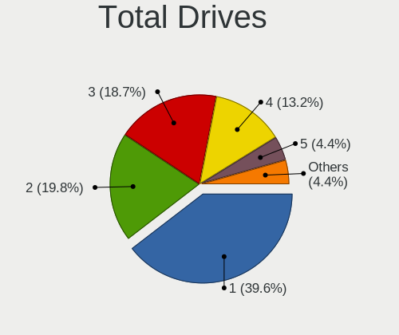

| Drives | Desktops | Percent |
|--------|----------|---------|
| 1      | 36       | 40%     |
| 2      | 18       | 20%     |
| 3      | 17       | 18.89%  |
| 4      | 12       | 13.33%  |
| 5      | 3        | 3.33%   |
| 6      | 2        | 2.22%   |
| 7      | 1        | 1.11%   |
| 0      | 1        | 1.11%   |

Has CD-ROM
----------

Has CD-ROM on board

| Presented | Desktops | Percent |
|-----------|----------|---------|
| No        | 53       | 58.89%  |
| Yes       | 37       | 41.11%  |

Has Ethernet
------------

Has Ethernet on board

| Presented | Desktops | Percent |
|-----------|----------|---------|
| Yes       | 90       | 100%    |

Has WiFi
--------

Has WiFi module

| Presented | Desktops | Percent |
|-----------|----------|---------|
| No        | 66       | 73.33%  |
| Yes       | 24       | 26.67%  |

Has Bluetooth
-------------

Has Bluetooth module

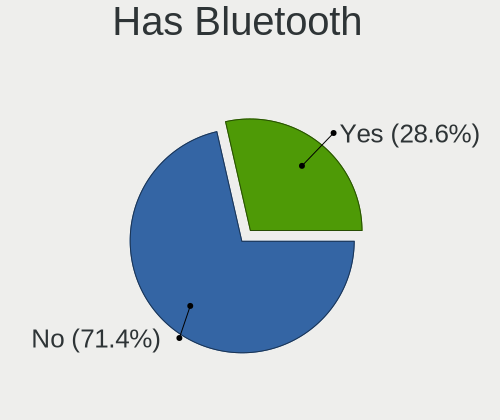

| Presented | Desktops | Percent |
|-----------|----------|---------|
| No        | 64       | 71.11%  |
| Yes       | 26       | 28.89%  |

Location
--------

Country
-------

Geographic location (country)

| Country      | Desktops | Percent |
|--------------|----------|---------|
| Germany      | 18       | 20%     |
| USA          | 11       | 12.22%  |
| Spain        | 7        | 7.78%   |
| Italy        | 7        | 7.78%   |
| UK           | 6        | 6.67%   |
| Russia       | 6        | 6.67%   |
| Brazil       | 5        | 5.56%   |
| France       | 4        | 4.44%   |
| Mexico       | 3        | 3.33%   |
| Ukraine      | 2        | 2.22%   |
| Poland       | 2        | 2.22%   |
| China        | 2        | 2.22%   |
| Taiwan       | 1        | 1.11%   |
| Switzerland  | 1        | 1.11%   |
| South Africa | 1        | 1.11%   |
| Peru         | 1        | 1.11%   |
| Macao        | 1        | 1.11%   |
| Japan        | 1        | 1.11%   |
| Ireland      | 1        | 1.11%   |
| Greece       | 1        | 1.11%   |
| Estonia      | 1        | 1.11%   |
| Egypt        | 1        | 1.11%   |
| Croatia      | 1        | 1.11%   |
| Colombia     | 1        | 1.11%   |
| Chile        | 1        | 1.11%   |
| Canada       | 1        | 1.11%   |
| Bulgaria     | 1        | 1.11%   |
| Belgium      | 1        | 1.11%   |
| Australia    | 1        | 1.11%   |

City
----

Geographic location (city)

| City                | Desktops | Percent |
|---------------------|----------|---------|
| Paris               | 3        | 3.3%    |
| Stourbridge         | 2        | 2.2%    |
| Rudersberg          | 2        | 2.2%    |
| Marlborough         | 2        | 2.2%    |
| Zaragoza            | 1        | 1.1%    |
| Zajaczki Pierwsze   | 1        | 1.1%    |
| Wesley Chapel       | 1        | 1.1%    |
| Ware                | 1        | 1.1%    |
| Vereeniging         | 1        | 1.1%    |
| Valencia            | 1        | 1.1%    |
| Ufa                 | 1        | 1.1%    |
| Tomah               | 1        | 1.1%    |
| Tieling             | 1        | 1.1%    |
| Terni               | 1        | 1.1%    |
| Taoyuan District    | 1        | 1.1%    |
| Tallinn             | 1        | 1.1%    |
| SГЈo Paulo        | 1        | 1.1%    |
| St Petersburg       | 1        | 1.1%    |
| Sheffield           | 1        | 1.1%    |
| Sevastopol          | 1        | 1.1%    |
| Seattle             | 1        | 1.1%    |
| Schluechtern        | 1        | 1.1%    |
| Sasso Marconi       | 1        | 1.1%    |
| Santiago            | 1        | 1.1%    |
| Sannicandro di Bari | 1        | 1.1%    |
| Sankt Augustin      | 1        | 1.1%    |
| Sandy               | 1        | 1.1%    |
| Salzgitter          | 1        | 1.1%    |
| Rousse              | 1        | 1.1%    |
| Roding              | 1        | 1.1%    |
| Rockford            | 1        | 1.1%    |
| Rheine              | 1        | 1.1%    |
| Renens              | 1        | 1.1%    |
| Reigate             | 1        | 1.1%    |
| Ravenna             | 1        | 1.1%    |
| QuerГ©taro City   | 1        | 1.1%    |
| Qinnan              | 1        | 1.1%    |
| Pyrgos Dirou        | 1        | 1.1%    |
| Pau                 | 1        | 1.1%    |
| Parma               | 1        | 1.1%    |
| Ontinyent           | 1        | 1.1%    |
| Oklahoma City       | 1        | 1.1%    |
| Nurtingen           | 1        | 1.1%    |
| Neuffen             | 1        | 1.1%    |
| Munich              | 1        | 1.1%    |
| Moscow              | 1        | 1.1%    |
| Metzingen           | 1        | 1.1%    |
| Melbourne           | 1        | 1.1%    |
| MedellГ­n         | 1        | 1.1%    |
| Madrid              | 1        | 1.1%    |
| Macatuba            | 1        | 1.1%    |
| Macao               | 1        | 1.1%    |
| LГјbeck           | 1        | 1.1%    |
| Lucca               | 1        | 1.1%    |
| Lima                | 1        | 1.1%    |
| Kyiv                | 1        | 1.1%    |
| Kusatsu-shi         | 1        | 1.1%    |
| Krasnoyarsk         | 1        | 1.1%    |
| Krasnodar           | 1        | 1.1%    |
| Kitchener           | 1        | 1.1%    |

Drives
------

Drive Vendor
------------

Hard drive vendors

| Vendor              | Desktops | Drives | Percent |
|---------------------|----------|--------|---------|
| WDC                 | 31       | 40     | 18.79%  |
| Seagate             | 29       | 39     | 17.58%  |
| Samsung Electronics | 28       | 47     | 16.97%  |
| Kingston            | 15       | 16     | 9.09%   |
| Crucial             | 11       | 15     | 6.67%   |
| SanDisk             | 10       | 11     | 6.06%   |
| Toshiba             | 8        | 8      | 4.85%   |
| Hitachi             | 5        | 7      | 3.03%   |
| SPCC                | 3        | 3      | 1.82%   |
| Micron Technology   | 3        | 3      | 1.82%   |
| PNY                 | 2        | 2      | 1.21%   |
| Intel               | 2        | 2      | 1.21%   |
| GOODRAM             | 2        | 2      | 1.21%   |
| Gigabyte Technology | 2        | 3      | 1.21%   |
| Corsair             | 2        | 2      | 1.21%   |
| Transcend           | 1        | 1      | 0.61%   |
| SK Hynix            | 1        | 1      | 0.61%   |
| Phison              | 1        | 3      | 0.61%   |
| OCZ                 | 1        | 2      | 0.61%   |
| MAXTOR              | 1        | 1      | 0.61%   |
| Leven               | 1        | 2      | 0.61%   |
| Intenso             | 1        | 2      | 0.61%   |
| Hoodisk             | 1        | 1      | 0.61%   |
| HGST                | 1        | 1      | 0.61%   |
| Enmotus             | 1        | 1      | 0.61%   |
| EMTEC               | 1        | 1      | 0.61%   |
| A-DATA Technology   | 1        | 1      | 0.61%   |

Drive Model
-----------

Hard drive models

| Model                               | Desktops | Percent |
|-------------------------------------|----------|---------|
| Samsung SSD 860 EVO 500GB           | 4        | 1.99%   |
| Samsung HD103SI 1TB                 | 4        | 1.99%   |
| Kingston SA400S37240G 240GB         | 4        | 1.99%   |
| Crucial CT500MX500SSD1 500GB        | 4        | 1.99%   |
| Toshiba DT01ACA100 1TB              | 3        | 1.49%   |
| Seagate ST500DM002-1BD142 500GB     | 3        | 1.49%   |
| Samsung SSD 850 EVO 250GB           | 3        | 1.49%   |
| Kingston SV300S37A120G 120GB        | 3        | 1.49%   |
| WDC WDS100T2B0A-00SM50 1TB          | 2        | 1%      |
| WDC WD20EARX-00PASB0 2TB            | 2        | 1%      |
| WDC WD10EZEX-00RKKA0 1TB            | 2        | 1%      |
| Toshiba Q300 240GB                  | 2        | 1%      |
| Seagate ST500LX025-1U717D 500GB     | 2        | 1%      |
| Seagate ST500LM012 HN-M500MBB 500GB | 2        | 1%      |
| Seagate ST1000DM010-2EP102 1TB      | 2        | 1%      |
| Seagate ST1000DM003-1ER162 1TB      | 2        | 1%      |
| SanDisk SDSSDA240G 240GB            | 2        | 1%      |
| SanDisk pSSD 256GB                  | 2        | 1%      |
| Samsung SSD 960 EVO 500GB           | 2        | 1%      |
| Samsung SSD 960 EVO 250GB           | 2        | 1%      |
| Samsung SSD 840 EVO 1TB             | 2        | 1%      |
| Samsung HD322HJ 320GB               | 2        | 1%      |
| Kingston SA2000M8250G 250GB         | 2        | 1%      |
| Crucial CT500MX500SSD4 500GB        | 2        | 1%      |
| WDC WDS500G2B0A-00SM50 500GB        | 1        | 0.5%    |
| WDC WDS250G2B0A-00SM50 250GB        | 1        | 0.5%    |
| WDC WDS240G2G0A-00JH30 240GB        | 1        | 0.5%    |
| WDC WDS120G2G0A-00JH30 120GB        | 1        | 0.5%    |
| WDC WDS100T2G0A-00JH30 1TB          | 1        | 0.5%    |
| WDC WD7500AAVS-00D7B0 752GB         | 1        | 0.5%    |
| WDC WD60EMAZ-11LW3B0 6TB            | 1        | 0.5%    |
| WDC WD5003ABYZ-011FA0 500GB         | 1        | 0.5%    |
| WDC WD5003ABYX-88 LEN 500GB         | 1        | 0.5%    |
| WDC WD5000LPCX-24VHAT0 500GB        | 1        | 0.5%    |
| WDC WD5000LPCX-24C6HT0 500GB        | 1        | 0.5%    |
| WDC WD5000BEVT-00A03T0 500GB        | 1        | 0.5%    |
| WDC WD5000AVCS-632DY1 500GB         | 1        | 0.5%    |
| WDC WD5000AAKX-00ERMA0 500GB        | 1        | 0.5%    |
| WDC WD5000AAKS-00E4A0 500GB         | 1        | 0.5%    |
| WDC WD5000AADS-00S9B0 500GB         | 1        | 0.5%    |
| WDC WD40EFRX-68WT0N0 4TB            | 1        | 0.5%    |
| WDC WD3200AAJS-56M0A0 320GB         | 1        | 0.5%    |
| WDC WD2500JS-58NCB1 250GB           | 1        | 0.5%    |
| WDC WD2500BEVT-00A23T0 250GB        | 1        | 0.5%    |
| WDC WD2500AAKX-75U6AA0 250GB        | 1        | 0.5%    |
| WDC WD2500AAKX-083CA1 250GB         | 1        | 0.5%    |
| WDC WD20EZRX-00D8PB0 2TB            | 1        | 0.5%    |
| WDC WD20EVDS-63T3B0 2TB             | 1        | 0.5%    |
| WDC WD2002FYPS-01U1B1 2TB           | 1        | 0.5%    |
| WDC WD1600AABS-61PRA0 160GB         | 1        | 0.5%    |
| WDC WD10JPVX-22JC3T0 1TB            | 1        | 0.5%    |
| WDC WD10EZRX-00D8PB0 1TB            | 1        | 0.5%    |
| WDC WD10EZEX-08WN4A0 1TB            | 1        | 0.5%    |
| WDC WD10EFRX-68FYTN0 1TB            | 1        | 0.5%    |
| WDC WD10EAVS-00D7B0 1TB             | 1        | 0.5%    |
| WDC WD10EARS-00MVWB0 1TB            | 1        | 0.5%    |
| WDC WD10EARS-003BB1 1TB             | 1        | 0.5%    |
| Transcend TS128GMTS400 128GB        | 1        | 0.5%    |
| Toshiba THNSNJ128GCSU 128GB         | 1        | 0.5%    |
| Toshiba MQ01ABD100 1TB              | 1        | 0.5%    |

HDD Vendor
----------

Hard disk drive vendors

| Vendor              | Desktops | Drives | Percent |
|---------------------|----------|--------|---------|
| Seagate             | 29       | 39     | 37.18%  |
| WDC                 | 27       | 33     | 34.62%  |
| Samsung Electronics | 10       | 15     | 12.82%  |
| Toshiba             | 5        | 5      | 6.41%   |
| Hitachi             | 5        | 7      | 6.41%   |
| MAXTOR              | 1        | 1      | 1.28%   |
| HGST                | 1        | 1      | 1.28%   |

SSD Vendor
----------

Solid state drive vendors

| Vendor              | Desktops | Drives | Percent |
|---------------------|----------|--------|---------|
| Samsung Electronics | 15       | 22     | 20%     |
| Kingston            | 13       | 14     | 17.33%  |
| Crucial             | 11       | 15     | 14.67%  |
| SanDisk             | 10       | 11     | 13.33%  |
| WDC                 | 6        | 7      | 8%      |
| Toshiba             | 3        | 3      | 4%      |
| Micron Technology   | 3        | 3      | 4%      |
| SPCC                | 2        | 2      | 2.67%   |
| PNY                 | 2        | 2      | 2.67%   |
| GOODRAM             | 2        | 2      | 2.67%   |
| Transcend           | 1        | 1      | 1.33%   |
| OCZ                 | 1        | 2      | 1.33%   |
| Leven               | 1        | 2      | 1.33%   |
| Intenso             | 1        | 2      | 1.33%   |
| Intel               | 1        | 1      | 1.33%   |
| Hoodisk             | 1        | 1      | 1.33%   |
| EMTEC               | 1        | 1      | 1.33%   |
| A-DATA Technology   | 1        | 1      | 1.33%   |

Drive Kind
----------

HDD or SSD

| Kind | Desktops | Drives | Percent |
|------|----------|--------|---------|
| HDD  | 58       | 101    | 45.31%  |
| SSD  | 54       | 92     | 42.19%  |
| NVMe | 16       | 24     | 12.5%   |

Drive Connector
---------------

SATA, SAS, NVMe, etc.

| Type | Desktops | Drives | Percent |
|------|----------|--------|---------|
| SATA | 86       | 193    | 84.31%  |
| NVMe | 16       | 24     | 15.69%  |

Drive Size
----------

Size of hard drive

| Size in TB | Desktops | Drives | Percent |
|------------|----------|--------|---------|
| 0.01-0.5   | 74       | 128    | 61.67%  |
| 0.51-1.0   | 32       | 47     | 26.67%  |
| 1.01-2.0   | 9        | 12     | 7.5%    |
| 3.01-4.0   | 2        | 2      | 1.67%   |
| 4.01-10.0  | 2        | 2      | 1.67%   |
| 2.01-3.0   | 1        | 2      | 0.83%   |

Space Total
-----------

Amount of disk space available on the file system

| Size in GB | Desktops | Percent |
|------------|----------|---------|
| 1-20       | 70       | 77.78%  |
| 101-250    | 13       | 14.44%  |
| 251-500    | 5        | 5.56%   |
| 21-50      | 1        | 1.11%   |
| 501-1000   | 1        | 1.11%   |

Space Used
----------

Amount of used disk space

| Used GB | Desktops | Percent |
|---------|----------|---------|
| 1-20    | 90       | 100%    |

Malfunc. Drives
---------------

Drive models with a malfunction

| Model                                        | Desktops | Drives | Percent |
|----------------------------------------------|----------|--------|---------|
| Seagate ST500DM002-1BD142 500GB              | 2        | 3      | 6.67%   |
| WDC WDS240G2G0A-00JH30 240GB                 | 1        | 1      | 3.33%   |
| WDC WD5000AVCS-632DY1 500GB                  | 1        | 1      | 3.33%   |
| WDC WD5000AAKS-00E4A0 500GB                  | 1        | 1      | 3.33%   |
| WDC WD2500AAKX-083CA1 250GB                  | 1        | 1      | 3.33%   |
| WDC WD20EVDS-63T3B0 2TB                      | 1        | 1      | 3.33%   |
| WDC WD20EARX-00PASB0 2TB                     | 1        | 1      | 3.33%   |
| WDC WD2002FYPS-01U1B1 2TB                    | 1        | 1      | 3.33%   |
| WDC WD10EZEX-00RKKA0 1TB                     | 1        | 1      | 3.33%   |
| WDC WD10EAVS-00D7B0 1TB                      | 1        | 1      | 3.33%   |
| Seagate ST9160314AS 160GB                    | 1        | 1      | 3.33%   |
| Seagate ST320LM001 HN-M320MBB 320GB          | 1        | 1      | 3.33%   |
| Seagate ST3160215AS 160GB                    | 1        | 1      | 3.33%   |
| Seagate ST31500341AS 1.5TB                   | 1        | 1      | 3.33%   |
| Seagate ST1000DX001-1CM162 1TB               | 1        | 1      | 3.33%   |
| Seagate ST1000DM003-9YN162 1TB               | 1        | 1      | 3.33%   |
| SanDisk SSD PLUS 480GB                       | 1        | 1      | 3.33%   |
| Samsung Electronics SP2514N 250GB            | 1        | 1      | 3.33%   |
| Samsung Electronics MZHPV512HDGL-00000 512GB | 1        | 1      | 3.33%   |
| Samsung Electronics HM320JI 320GB            | 1        | 1      | 3.33%   |
| Samsung Electronics HD753LJ 752GB            | 1        | 1      | 3.33%   |
| Samsung Electronics HD252HJ 250GB            | 1        | 1      | 3.33%   |
| Samsung Electronics HD103UJ 1TB              | 1        | 1      | 3.33%   |
| Samsung Electronics HD103SI 1TB              | 1        | 1      | 3.33%   |
| Intel SSDSC2BF180A4L 180GB                   | 1        | 1      | 3.33%   |
| Hitachi HTS725050A9A364 500GB                | 1        | 1      | 3.33%   |
| Hitachi HTS543216L9A300 160GB                | 1        | 1      | 3.33%   |
| Hitachi HCS5C1050CLA382 500GB                | 1        | 1      | 3.33%   |
| HGST HTS545032A7E380 320GB                   | 1        | 1      | 3.33%   |

Malfunc. Drive Vendor
---------------------

Vendors of faulty drives

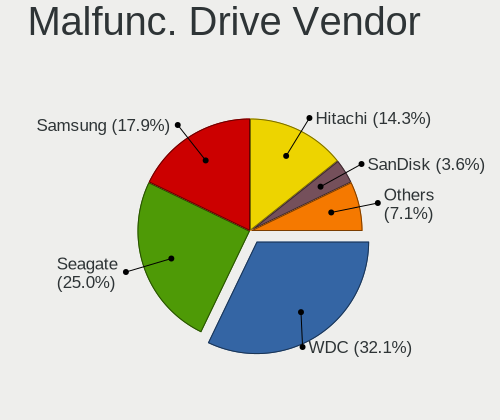

| Vendor              | Desktops | Drives | Percent |
|---------------------|----------|--------|---------|
| WDC                 | 9        | 9      | 33.33%  |
| Seagate             | 7        | 9      | 25.93%  |
| Samsung Electronics | 5        | 7      | 18.52%  |
| Hitachi             | 3        | 3      | 11.11%  |
| SanDisk             | 1        | 1      | 3.7%    |
| Intel               | 1        | 1      | 3.7%    |
| HGST                | 1        | 1      | 3.7%    |

Malfunc. HDD Vendor
-------------------

Vendors of faulty HDD drives

| Vendor              | Desktops | Drives | Percent |
|---------------------|----------|--------|---------|
| WDC                 | 8        | 8      | 34.78%  |
| Seagate             | 7        | 9      | 30.43%  |
| Samsung Electronics | 4        | 6      | 17.39%  |
| Hitachi             | 3        | 3      | 13.04%  |
| HGST                | 1        | 1      | 4.35%   |

Malfunc. Drive Kind
-------------------

Kinds of faulty drives

| Kind | Desktops | Drives | Percent |
|------|----------|--------|---------|
| HDD  | 19       | 27     | 82.61%  |
| SSD  | 4        | 4      | 17.39%  |

Failed Drives
-------------

Failed drive models

Zero info for selected period =(

Failed Drive Vendor
-------------------

Failed drive vendors

Zero info for selected period =(

Drive Status
------------

Number of failed and malfunc. drives

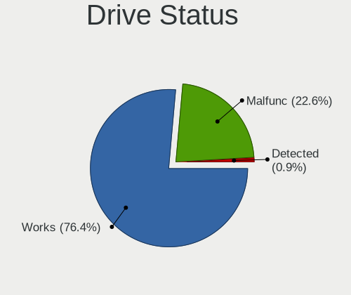

| Status   | Desktops | Drives | Percent |
|----------|----------|--------|---------|
| Works    | 81       | 185    | 77.14%  |
| Malfunc  | 23       | 31     | 21.9%   |
| Detected | 1        | 1      | 0.95%   |

Storage controller
------------------

Storage Vendor
--------------

Storage controller vendors

| Vendor                      | Desktops | Percent |
|-----------------------------|----------|---------|
| Intel                       | 65       | 57.52%  |
| AMD                         | 22       | 19.47%  |
| Samsung Electronics         | 9        | 7.96%   |
| Phison Electronics          | 5        | 4.42%   |
| ASMedia Technology          | 5        | 4.42%   |
| Kingston Technology Company | 2        | 1.77%   |
| SK Hynix                    | 1        | 0.88%   |
| Nvidia                      | 1        | 0.88%   |
| Marvell Technology Group    | 1        | 0.88%   |
| JMicron Technology          | 1        | 0.88%   |
| Enmotus                     | 1        | 0.88%   |

Storage Model
-------------

Storage controller models

| Model                                                                          | Desktops | Percent |
|--------------------------------------------------------------------------------|----------|---------|
| AMD FCH SATA Controller [AHCI mode]                                            | 14       | 10%     |
| Intel 8 Series/C220 Series Chipset Family 6-port SATA Controller 1 [AHCI mode] | 12       | 8.57%   |
| Intel 6 Series/C200 Series Chipset Family 6 port Desktop SATA AHCI Controller  | 9        | 6.43%   |
| Intel Q170/Q150/B150/H170/H110/Z170/CM236 Chipset SATA Controller [AHCI Mode]  | 7        | 5%      |
| Intel 7 Series/C210 Series Chipset Family 6-port SATA Controller [AHCI mode]   | 7        | 5%      |
| Samsung NVMe SSD Controller SM961/PM961/SM963                                  | 5        | 3.57%   |
| Intel NM10/ICH7 Family SATA Controller [IDE mode]                              | 5        | 3.57%   |
| ASMedia ASM1062 Serial ATA Controller                                          | 5        | 3.57%   |
| AMD SB7x0/SB8x0/SB9x0 IDE Controller                                           | 5        | 3.57%   |
| AMD 400 Series Chipset SATA Controller                                         | 5        | 3.57%   |
| Intel Cannon Lake PCH SATA AHCI Controller                                     | 4        | 2.86%   |
| AMD SB7x0/SB8x0/SB9x0 SATA Controller [IDE mode]                               | 4        | 2.86%   |
| Samsung NVMe SSD Controller SM981/PM981/PM983                                  | 3        | 2.14%   |
| Intel SATA Controller [RAID mode]                                              | 3        | 2.14%   |
| Intel 9 Series Chipset Family SATA Controller [AHCI Mode]                      | 3        | 2.14%   |
| Intel 82801G (ICH7 Family) IDE Controller                                      | 3        | 2.14%   |
| AMD SB7x0/SB8x0/SB9x0 SATA Controller [AHCI mode]                              | 3        | 2.14%   |
| AMD 300 Series Chipset SATA Controller                                         | 3        | 2.14%   |
| Phison PS5013 E13 NVMe Controller                                              | 2        | 1.43%   |
| Phison E16 PCIe4 NVMe Controller                                               | 2        | 1.43%   |
| Phison E12 NVMe Controller                                                     | 2        | 1.43%   |
| Kingston Company A2000 NVMe SSD                                                | 2        | 1.43%   |
| Intel C602 chipset 4-Port SATA Storage Control Unit                            | 2        | 1.43%   |
| Intel C600/X79 series chipset SATA RAID Controller                             | 2        | 1.43%   |
| Intel C600/X79 series chipset IDE-r Controller                                 | 2        | 1.43%   |
| Intel 5 Series/3400 Series Chipset 6 port SATA AHCI Controller                 | 2        | 1.43%   |
| Intel 200 Series PCH SATA controller [AHCI mode]                               | 2        | 1.43%   |
| Unknown                                                                        | 2        | 1.43%   |
| SK Hynix BC501 NVMe Solid State Drive                                          | 1        | 0.71%   |
| Samsung SM951 AHCI                                                             | 1        | 0.71%   |
| Samsung NVMe SSD Controller SM951/PM951                                        | 1        | 0.71%   |
| Nvidia MCP73 IDE Controller                                                    | 1        | 0.71%   |
| Nvidia GeForce 7100/nForce 630i SATA                                           | 1        | 0.71%   |
| Marvell Group 88SE9172 SATA 6Gb/s Controller                                   | 1        | 0.71%   |
| JMicron JMB368 IDE controller                                                  | 1        | 0.71%   |
| Intel Wildcat Point-LP SATA Controller [AHCI Mode]                             | 1        | 0.71%   |
| Intel Sunrise Point-LP SATA Controller [AHCI mode]                             | 1        | 0.71%   |
| Intel Celeron/Pentium Silver Processor SATA Controller                         | 1        | 0.71%   |
| Intel 82801JI (ICH10 Family) SATA AHCI Controller                              | 1        | 0.71%   |
| Intel 82801JD/DO (ICH10 Family) SATA AHCI Controller                           | 1        | 0.71%   |
| Intel 82801IB (ICH9) 2 port SATA Controller [IDE mode]                         | 1        | 0.71%   |
| Intel 82801I (ICH9 Family) 2 port SATA Controller [IDE mode]                   | 1        | 0.71%   |
| Intel 8 Series SATA Controller 1 [AHCI mode]                                   | 1        | 0.71%   |
| Intel 7 Series/C210 Series Chipset Family 4-port SATA Controller [IDE mode]    | 1        | 0.71%   |
| Intel 7 Series/C210 Series Chipset Family 2-port SATA Controller [IDE mode]    | 1        | 0.71%   |
| Intel 631xESB/632xESB SATA AHCI Controller                                     | 1        | 0.71%   |
| Intel 631xESB/632xESB IDE Controller                                           | 1        | 0.71%   |
| Intel 4 Series Chipset PT IDER Controller                                      | 1        | 0.71%   |

Storage Kind
------------

Kind of storage controller (IDE, SATA, NVMe, SAS, ...)

| Kind | Desktops | Percent |
|------|----------|---------|
| SATA | 72       | 64.86%  |
| IDE  | 17       | 15.32%  |
| NVMe | 15       | 13.51%  |
| RAID | 5        | 4.5%    |
| SAS  | 2        | 1.8%    |

Processor
---------

CPU Vendor
----------

Processor vendors

| Vendor | Desktops | Percent |
|--------|----------|---------|
| Intel  | 67       | 74.44%  |
| AMD    | 23       | 25.56%  |

CPU Model
---------

Processor models

| Model                                          | Desktops | Percent |
|------------------------------------------------|----------|---------|
| Intel Core i7-4790 CPU @ 3.60GHz               | 3        | 3.33%   |
| Intel Core i3-6100T CPU @ 3.20GHz              | 3        | 3.33%   |
| Intel Core 2 Duo                               | 3        | 3.33%   |
| AMD Ryzen 5 1600 Six-Core Processor            | 3        | 3.33%   |
| Intel Core i7-8700 CPU @ 3.20GHz               | 2        | 2.22%   |
| Intel Core i7-3770K CPU @ 3.50GHz              | 2        | 2.22%   |
| Intel Core i5-9400 CPU @ 2.90GHz               | 2        | 2.22%   |
| Intel Core i5-4590 CPU @ 3.30GHz               | 2        | 2.22%   |
| Intel Core i5-3570K CPU @ 3.40GHz              | 2        | 2.22%   |
| Intel Core i3-6100 CPU @ 3.70GHz               | 2        | 2.22%   |
| AMD Ryzen 5 3400G with Radeon Vega Graphics    | 2        | 2.22%   |
| Intel Xeon CPU X5690 @ 3.47GHz                 | 1        | 1.11%   |
| Intel Xeon CPU X                               | 1        | 1.11%   |
| Intel Xeon CPU E5-2620 0 @ 2.00GHz             | 1        | 1.11%   |
| Intel Xeon CPU E5-1620 @ 3.60GHz               | 1        | 1.11%   |
| Intel Xeon CPU E31245 @ 3.30GH                 | 1        | 1.11%   |
| Intel Xeon CPU E3-1265L v3 @ 2.50GHz           | 1        | 1.11%   |
| Intel Xeon CPU E3-1245 v3 @ 3.40GHz            | 1        | 1.11%   |
| Intel Pentium Dual-Core CPU E6700 @ 3.20GHz    | 1        | 1.11%   |
| Intel Pentium Dual-Core CPU E5200 @ 2.50GHz    | 1        | 1.11%   |
| Intel Pentium CPU G640 @ 2.80GHz               | 1        | 1.11%   |
| Intel Pentium CPU G620 @ 2.60GHz               | 1        | 1.11%   |
| Intel Pentium CPU G2030 @ 3.00GHz              | 1        | 1.11%   |
| Intel Pentium CPU G2020T @ 2.50GHz             | 1        | 1.11%   |
| Intel Core i7-8700K CPU @ 3.70GHz              | 1        | 1.11%   |
| Intel Core i7-7700 CPU @ 3.60GHz               | 1        | 1.11%   |
| Intel Core i7-7500U CPU @ 2.70GHz              | 1        | 1.11%   |
| Intel Core i7-6700K CPU @ 4.00GHz              | 1        | 1.11%   |
| Intel Core i7-6700 CPU @ 3.40GHz               | 1        | 1.11%   |
| Intel Core i7-4790K CPU @ 4.00GHz              | 1        | 1.11%   |
| Intel Core i7-4770 CPU @ 3.40GHz               | 1        | 1.11%   |
| Intel Core i7-3770 CPU @ 3.40GHz               | 1        | 1.11%   |
| Intel Core i7-2600 CPU @ 3.40GH                | 1        | 1.11%   |
| Intel Core i5-9400F CPU @ 2.90GHz              | 1        | 1.11%   |
| Intel Core i5-7500 CPU @ 3.40GHz               | 1        | 1.11%   |
| Intel Core i5-7400 CPU @ 3.00GHz               | 1        | 1.11%   |
| Intel Core i5-4670K CPU @ 3.40GHz              | 1        | 1.11%   |
| Intel Core i5-4570T CPU @ 2.90GHz              | 1        | 1.11%   |
| Intel Core i5-4460T CPU @ 1.90GHz              | 1        | 1.11%   |
| Intel Core i5-4460 CPU @ 3.20GHz               | 1        | 1.11%   |
| Intel Core i5-3470 CPU @ 3.20GHz               | 1        | 1.11%   |
| Intel Core i5-2400S CPU @ 2.50GHz              | 1        | 1.11%   |
| Intel Core i5-2400 CPU @ 3.10GHz               | 1        | 1.11%   |
| Intel Core i5 CPU 670 @ 3.47GHz                | 1        | 1.11%   |
| Intel Core i5 CPU 650 @ 3.20GHz                | 1        | 1.11%   |
| Intel Core i3-5010U CPU @ 2.10GHz              | 1        | 1.11%   |
| Intel Core i3-4360 CPU @ 3.70GHz               | 1        | 1.11%   |
| Intel Core i3-4350 CPU @ 3.60GHz               | 1        | 1.11%   |
| Intel Core i3-3240 CPU @ 3.40GHz               | 1        | 1.11%   |
| Intel Core i3-3220 CPU @ 3.30GHz               | 1        | 1.11%   |
| Intel Core i3-2100 CPU @ 3.10GHz               | 1        | 1.11%   |
| Intel Core 2 Quad CPU Q9400 @ 2.66GHz          | 1        | 1.11%   |
| Intel Core 2 Duo CPU E7500 @ 2.93GHz           | 1        | 1.11%   |
| Intel Core 2 Duo CPU E7200 @ 2.53GHz           | 1        | 1.11%   |
| Intel Celeron J4115 CPU @ 1.80GHz              | 1        | 1.11%   |
| Intel Celeron CPU G1840 @ 2.80GHz              | 1        | 1.11%   |
| Intel Celeron 2955U @ 1.40GHz                  | 1        | 1.11%   |
| AMD Ryzen Threadripper 3970X 32-Core Processor | 1        | 1.11%   |
| AMD Ryzen Threadripper 3960X 24-Core Processor | 1        | 1.11%   |
| AMD Ryzen 7 3800X 8-Core Processor             | 1        | 1.11%   |

CPU Model Family
----------------

Processor model prefix

| Model                   | Desktops | Percent |
|-------------------------|----------|---------|
| Intel Core i5           | 18       | 20%     |
| Intel Core i7           | 16       | 17.78%  |
| Intel Core i3           | 11       | 12.22%  |
| Intel Xeon              | 7        | 7.78%   |
| AMD Ryzen 5             | 7        | 7.78%   |
| Intel Core 2 Duo        | 5        | 5.56%   |
| AMD FX                  | 5        | 5.56%   |
| Intel Pentium           | 4        | 4.44%   |
| Intel Celeron           | 3        | 3.33%   |
| AMD A8                  | 3        | 3.33%   |
| Intel Pentium Dual-Core | 2        | 2.22%   |
| AMD Ryzen Threadripper  | 2        | 2.22%   |
| AMD Ryzen 7             | 2        | 2.22%   |
| AMD Ryzen 3             | 2        | 2.22%   |
| AMD Phenom II X4        | 2        | 2.22%   |
| Intel Core 2 Quad       | 1        | 1.11%   |

CPU Cores
---------

Number of processor cores

| Number  | Desktops | Percent |
|---------|----------|---------|
| 4       | 38       | 42.22%  |
| 2       | 25       | 27.78%  |
| 6       | 9        | 10%     |
| 8       | 6        | 6.67%   |
| 12      | 5        | 5.56%   |
| Unknown | 3        | 3.33%   |
| 16      | 2        | 2.22%   |
| 64      | 1        | 1.11%   |
| 48      | 1        | 1.11%   |

CPU Sockets
-----------

Number of sockets

| Number | Desktops | Percent |
|--------|----------|---------|
| 1      | 89       | 98.89%  |
| 8      | 1        | 1.11%   |

CPU Threads
-----------

Threads per core (Hyper-Threading)

| Number  | Desktops | Percent |
|---------|----------|---------|
| 1       | 50       | 55.56%  |
| 2       | 37       | 41.11%  |
| Unknown | 3        | 3.33%   |

CPU Microarch
-------------

Microarchitecture

| Name          | Desktops | Percent |
|---------------|----------|---------|
| Haswell       | 17       | 18.89%  |
| KabyLake      | 10       | 11.11%  |
| IvyBridge     | 10       | 11.11%  |
| SandyBridge   | 9        | 10%     |
| Penryn        | 8        | 8.89%   |
| Skylake       | 7        | 7.78%   |
| Piledriver    | 7        | 7.78%   |
| Zen 2         | 5        | 5.56%   |
| Zen+          | 4        | 4.44%   |
| Zen           | 4        | 4.44%   |
| Westmere      | 3        | 3.33%   |
| K10           | 2        | 2.22%   |
| Goldmont plus | 1        | 1.11%   |
| Core          | 1        | 1.11%   |
| Bulldozer     | 1        | 1.11%   |
| Broadwell     | 1        | 1.11%   |

Graphics
--------

GPU Vendor
----------

Vendors of graphics cards

| Vendor | Desktops | Percent |
|--------|----------|---------|
| Nvidia | 40       | 40.4%   |
| Intel  | 33       | 33.33%  |
| AMD    | 26       | 26.26%  |

GPU Model
---------

Graphics card models

| Model                                                                       | Desktops | Percent |
|-----------------------------------------------------------------------------|----------|---------|
| Intel Xeon E3-1200 v3/4th Gen Core Processor Integrated Graphics Controller | 8        | 8%      |
| AMD Ellesmere [Radeon RX 470/480/570/570X/580/580X/590]                     | 5        | 5%      |
| Intel CoffeeLake-S GT2 [UHD Graphics 630]                                   | 4        | 4%      |
| Intel 2nd Generation Core Processor Family Integrated Graphics Controller   | 4        | 4%      |
| Nvidia GP107 [GeForce GTX 1050 Ti]                                          | 3        | 3%      |
| Nvidia GM107 [GeForce GTX 750 Ti]                                           | 3        | 3%      |
| Nvidia GK208B [GeForce GT 730]                                              | 3        | 3%      |
| Intel Xeon E3-1200 v2/3rd Gen Core processor Graphics Controller            | 3        | 3%      |
| AMD Navi 10 [Radeon RX 5600 OEM/5600 XT / 5700/5700 XT]                     | 3        | 3%      |
| Nvidia GP108 [GeForce GT 1030]                                              | 2        | 2%      |
| Nvidia GP106 [GeForce GTX 1060 6GB]                                         | 2        | 2%      |
| Nvidia GM206 [GeForce GTX 960]                                              | 2        | 2%      |
| Nvidia GK208B [GeForce GT 720]                                              | 2        | 2%      |
| Nvidia GK107 [GeForce GTX 650]                                              | 2        | 2%      |
| Nvidia GK106 [GeForce GTX 660]                                              | 2        | 2%      |
| Nvidia GF119 [GeForce GT 610]                                               | 2        | 2%      |
| Nvidia G92 [GeForce 9800 GT]                                                | 2        | 2%      |
| Intel IvyBridge GT2 [HD Graphics 4000]                                      | 2        | 2%      |
| Intel HD Graphics 630                                                       | 2        | 2%      |
| Intel HD Graphics 530                                                       | 2        | 2%      |
| Intel 4 Series Chipset Integrated Graphics Controller                       | 2        | 2%      |
| AMD Oland XT [Radeon HD 8670 / R5 340X OEM / R7 250/350/350X OEM]           | 2        | 2%      |
| AMD Baffin [Radeon RX 550 640SP / RX 560/560X]                              | 2        | 2%      |
| Nvidia TU116 [GeForce GTX 1660 SUPER]                                       | 1        | 1%      |
| Nvidia TU104 [GeForce RTX 2080 Rev. A]                                      | 1        | 1%      |
| Nvidia GT218 [GeForce 210]                                                  | 1        | 1%      |
| Nvidia GP104 [GeForce GTX 1080]                                             | 1        | 1%      |
| Nvidia GP104 [GeForce GTX 1060 6GB]                                         | 1        | 1%      |
| Nvidia GM204 [GeForce GTX 970]                                              | 1        | 1%      |
| Nvidia GK208B [GeForce GT 710]                                              | 1        | 1%      |
| Nvidia GK208 [GeForce GT 720]                                               | 1        | 1%      |
| Nvidia GK110 [GeForce GTX 780]                                              | 1        | 1%      |
| Nvidia GK107GL [Quadro K600]                                                | 1        | 1%      |
| Nvidia GK107 [GeForce GT 740]                                               | 1        | 1%      |
| Nvidia GF108 [GeForce GT 630]                                               | 1        | 1%      |
| Nvidia GF108 [GeForce GT 430]                                               | 1        | 1%      |
| Nvidia GF106 [GeForce GTS 450]                                              | 1        | 1%      |
| Nvidia G98 [GeForce 8400 GS Rev. 2]                                         | 1        | 1%      |
| Nvidia G72 [GeForce 7300 LE]                                                | 1        | 1%      |
| Intel Xeon E3-1200 v3 Processor Integrated Graphics Controller              | 1        | 1%      |
| Intel HD Graphics 620                                                       | 1        | 1%      |
| Intel HD Graphics 5500                                                      | 1        | 1%      |
| Intel Haswell-ULT Integrated Graphics Controller                            | 1        | 1%      |
| Intel GeminiLake [UHD Graphics 600]                                         | 1        | 1%      |
| Intel Core Processor Integrated Graphics Controller                         | 1        | 1%      |
| AMD Turks PRO [Radeon HD 6570/7570/8550 / R5 230]                           | 1        | 1%      |
| AMD RV710 [Radeon HD 4350/4550]                                             | 1        | 1%      |
| AMD Richland [Radeon HD 8570D]                                              | 1        | 1%      |
| AMD Picasso/Raven 2 [Radeon Vega Series / Radeon Vega Mobile Series]        | 1        | 1%      |
| AMD Park [Mobility Radeon HD 5430]                                          | 1        | 1%      |
| AMD Oland PRO [Radeon R7 240/340 / Radeon 520]                              | 1        | 1%      |
| AMD Navi 14 [Radeon RX 5500/5500M / Pro 5500M]                              | 1        | 1%      |
| AMD Lexa PRO [Radeon 540/540X/550/550X / RX 540X/550/550X]                  | 1        | 1%      |
| AMD Juniper XT [Radeon HD 5770]                                             | 1        | 1%      |
| AMD Cedar [Radeon HD 5000/6000/7350/8350 Series]                            | 1        | 1%      |
| AMD Cape Verde XT [Radeon HD 7770/8760 / R7 250X]                           | 1        | 1%      |
| AMD Cape Verde PRO [Radeon HD 7750/8740 / R7 250E]                          | 1        | 1%      |
| AMD Caicos [Radeon HD 6450/7450/8450 / R5 230 OEM]                          | 1        | 1%      |
| AMD Baffin [Radeon RX 460/560D / Pro 450/455/460/555/555X/560/560X]         | 1        | 1%      |

GPU Combo
---------

Combinations of graphics cards

| Name           | Desktops | Percent |
|----------------|----------|---------|
| 1 x Nvidia     | 33       | 36.26%  |
| 1 x AMD        | 24       | 26.37%  |
| 1 x Intel      | 22       | 24.18%  |
| Intel + Nvidia | 6        | 6.59%   |
| Intel + AMD    | 3        | 3.3%    |
| 2 x Intel      | 2        | 2.2%    |
| 2 x Nvidia     | 1        | 1.1%    |

GPU Driver
----------

Free vs proprietary

| Driver      | Desktops | Percent |
|-------------|----------|---------|
| Free        | 59       | 65.56%  |
| Proprietary | 30       | 33.33%  |
| Unknown     | 1        | 1.11%   |

GPU Memory
----------

Total video memory

| Size in GB | Desktops | Percent |
|------------|----------|---------|
| Unknown    | 42       | 46.15%  |
| 1.01-2.0   | 19       | 20.88%  |
| 3.01-4.0   | 10       | 10.99%  |
| 0.51-1.0   | 9        | 9.89%   |
| 7.01-8.0   | 5        | 5.49%   |
| 5.01-6.0   | 4        | 4.4%    |
| 2.01-3.0   | 1        | 1.1%    |
| 0.01-0.5   | 1        | 1.1%    |

Monitor
-------

Monitor Vendor
--------------

Monitor vendors

| Vendor               | Desktops | Percent |
|----------------------|----------|---------|
| Goldstar             | 12       | 18.18%  |
| Dell                 | 9        | 13.64%  |
| Samsung Electronics  | 8        | 12.12%  |
| Hewlett-Packard      | 7        | 10.61%  |
| Acer                 | 6        | 9.09%   |
| BenQ                 | 3        | 4.55%   |
| Ancor Communications | 3        | 4.55%   |
| Philips              | 2        | 3.03%   |
| Packard Bell         | 2        | 3.03%   |
| Lenovo               | 2        | 3.03%   |
| Eizo                 | 2        | 3.03%   |
| ViewSonic            | 1        | 1.52%   |
| Vestel Elektronik    | 1        | 1.52%   |
| Toshiba              | 1        | 1.52%   |
| Sony                 | 1        | 1.52%   |
| PRI                  | 1        | 1.52%   |
| KJT                  | 1        | 1.52%   |
| Iiyama               | 1        | 1.52%   |
| HannStar             | 1        | 1.52%   |
| ASUSTek Computer     | 1        | 1.52%   |
| AOC                  | 1        | 1.52%   |

Monitor Model
-------------

Monitor models

| Model                                                                 | Desktops | Percent |
|-----------------------------------------------------------------------|----------|---------|
| Goldstar E2441 GSM581F 1920x1080 530x300mm 24.0-inch                  | 2        | 2.99%   |
| ViewSonic VX2433wm VSC3822 1920x1080 520x290mm 23.4-inch              | 1        | 1.49%   |
| Vestel Elektronik 24W_LCD_TV VES3700 1920x1080 530x300mm 24.0-inch    | 1        | 1.49%   |
| Toshiba TV TSB0218 3840x2160                                          | 1        | 1.49%   |
| Sony TV SNY9C01 1360x768                                              | 1        | 1.49%   |
| Samsung Electronics SyncMaster SAM0600 1600x900 440x250mm 19.9-inch   | 1        | 1.49%   |
| Samsung Electronics SyncMaster SAM05C5 1920x1080                      | 1        | 1.49%   |
| Samsung Electronics SyncMaster SAM036C 1920x1200 550x340mm 25.5-inch  | 1        | 1.49%   |
| Samsung Electronics SyncMaster SAM0364 1360x768 340x190mm 15.3-inch   | 1        | 1.49%   |
| Samsung Electronics SyncMaster SAM0304 1680x1050 490x320mm 23.0-inch  | 1        | 1.49%   |
| Samsung Electronics SMBX2231 SAM076D 1920x1080 480x270mm 21.7-inch    | 1        | 1.49%   |
| Samsung Electronics S24E390 SAM0C1A 1920x1080 520x290mm 23.4-inch     | 1        | 1.49%   |
| Samsung Electronics LCD Monitor SAM03A2 1440x900 410x260mm 19.1-inch  | 1        | 1.49%   |
| PRI LED-MONITOR PRI0828 3840x2160 1150x650mm 52.0-inch                | 1        | 1.49%   |
| Philips PHL 278E9Q PHLC17F 1920x1080 600x340mm 27.2-inch              | 1        | 1.49%   |
| Philips LCD Monitor PHLC0B1 1920x1080 480x270mm 21.7-inch             | 1        | 1.49%   |
| Packard Bell Viseo223DX PKB0385 1920x1080 480x270mm 21.7-inch         | 1        | 1.49%   |
| Packard Bell Viseo 200Ws PKB00C2 1600x900 440x250mm 19.9-inch         | 1        | 1.49%   |
| Lenovo LCD Monitor LEN60A1 1920x1080 480x270mm 21.7-inch              | 1        | 1.49%   |
| Lenovo C24-25 LEN66B0 1920x1080 530x300mm 24.0-inch                   | 1        | 1.49%   |
| KJT KJT4K2K60DP KJT5AFD 3840x2160 600x340mm 27.2-inch                 | 1        | 1.49%   |
| Iiyama PLG2888UH IVM710C 3840x2160 620x340mm 27.8-inch                | 1        | 1.49%   |
| Hewlett-Packard w1907 HWP26A3 1440x900 410x260mm 19.1-inch            | 1        | 1.49%   |
| Hewlett-Packard LCD Monitor HWP2915 1920x1080 510x290mm 23.1-inch     | 1        | 1.49%   |
| Hewlett-Packard LA2405 HWP284A 1920x1200 520x320mm 24.0-inch          | 1        | 1.49%   |
| Hewlett-Packard All-in-One HWP4253 1920x1080 510x290mm 23.1-inch      | 1        | 1.49%   |
| Hewlett-Packard 27f HPN354A 1920x1080 600x340mm 27.2-inch             | 1        | 1.49%   |
| Hewlett-Packard 27er HWP3325 1920x1080 600x340mm 27.2-inch            | 1        | 1.49%   |
| Hewlett-Packard 23xi HWP3031 1920x1080 510x290mm 23.1-inch            | 1        | 1.49%   |
| Hewlett-Packard 22cw HWP3183 1920x1080 480x270mm 21.7-inch            | 1        | 1.49%   |
| HannStar LCD Monitor HSD2469 1680x1050 470x300mm 22.0-inch            | 1        | 1.49%   |
| Goldstar W1942 GSM4B6F 1440x900 410x260mm 19.1-inch                   | 1        | 1.49%   |
| Goldstar MP59G GSM5B35 1920x1080 600x340mm 27.2-inch                  | 1        | 1.49%   |
| Goldstar LG ULTRAWIDE GSM59F1 2560x1080 670x280mm 28.6-inch           | 1        | 1.49%   |
| Goldstar LG HDR WFHD GSM7714 2560x1080 800x340mm 34.2-inch            | 1        | 1.49%   |
| Goldstar LG FULL HD GSM5ABB 1920x1080 480x270mm 21.7-inch             | 1        | 1.49%   |
| Goldstar L1953TR GSM4B44 1280x1024 340x270mm 17.1-inch                | 1        | 1.49%   |
| Goldstar L1950H GSM4AA2 1280x1024 380x300mm 19.1-inch                 | 1        | 1.49%   |
| Goldstar E2340 GSM57C7 1920x1080 510x290mm 23.1-inch                  | 1        | 1.49%   |
| Goldstar E2242 GSM58BE 1920x1080 480x270mm 21.7-inch                  | 1        | 1.49%   |
| Goldstar 2D FHD LG TV GSM59C4 1920x1080 510x290mm 23.1-inch           | 1        | 1.49%   |
| Eizo EV2303W ENC2060 1920x1080 510x290mm 23.1-inch                    | 1        | 1.49%   |
| Eizo CS2731 ENC3071 2560x1440 600x340mm 27.2-inch                     | 1        | 1.49%   |
| Dell U3415W DELA0A6 3440x1440 800x330mm 34.1-inch                     | 1        | 1.49%   |
| Dell U2412M DELA07B 1920x1200 520x320mm 24.0-inch                     | 1        | 1.49%   |
| Dell U2412M DELA07A 1920x1200 520x320mm 24.0-inch                     | 1        | 1.49%   |
| Dell S2716DG DELA0D1 2560x1440 600x340mm 27.2-inch                    | 1        | 1.49%   |
| Dell P2416D DELA0C2 2048x1152 530x300mm 24.0-inch                     | 1        | 1.49%   |
| Dell P1917S DELD092 1280x1024 380x300mm 19.1-inch                     | 1        | 1.49%   |
| Dell LCD Monitor DELA0FA 3440x1440 800x340mm 34.2-inch                | 1        | 1.49%   |
| Dell G2410 DEL404A 1920x1080 530x300mm 24.0-inch                      | 1        | 1.49%   |
| Dell E1916H DELF065 1366x768 410x230mm 18.5-inch                      | 1        | 1.49%   |
| BenQ GL2450 BNQ78A4 1920x1080 530x300mm 24.0-inch                     | 1        | 1.49%   |
| BenQ GL2240 BNQ7887 1920x1080 480x270mm 21.7-inch                     | 1        | 1.49%   |
| BenQ G2250 BNQ789D 1920x1080 480x270mm 21.7-inch                      | 1        | 1.49%   |
| ASUSTek Computer VG248 AUS24C2 1920x1080 530x300mm 24.0-inch          | 1        | 1.49%   |
| AOC 2770 AOC2770 1920x1080 600x340mm 27.2-inch                        | 1        | 1.49%   |
| Ancor Communications VS278 ACI27A1 1920x1080 600x340mm 27.2-inch      | 1        | 1.49%   |
| Ancor Communications ASUS VS228 ACI22FD 1920x1080 480x270mm 21.7-inch | 1        | 1.49%   |
| Ancor Communications ASUS MX239 ACI23C2 1920x1080 530x310mm 24.2-inch | 1        | 1.49%   |

Monitor Resolution
------------------

Monitor screen resolution

| Resolution         | Desktops | Percent |
|--------------------|----------|---------|
| 1920x1080 (FHD)    | 33       | 51.56%  |
| 3840x2160 (4K)     | 5        | 7.81%   |
| 1920x1200 (WUXGA)  | 4        | 6.25%   |
| 2560x1440 (QHD)    | 3        | 4.69%   |
| 1440x900 (WXGA+)   | 3        | 4.69%   |
| 1280x1024 (SXGA)   | 3        | 4.69%   |
| 3440x1440          | 2        | 3.13%   |
| 2560x1080          | 2        | 3.13%   |
| 1680x1050 (WSXGA+) | 2        | 3.13%   |
| 1600x900 (HD+)     | 2        | 3.13%   |
| 1360x768           | 2        | 3.13%   |
| 2048x1152          | 1        | 1.56%   |
| 1920x540           | 1        | 1.56%   |
| 1366x768 (WXGA)    | 1        | 1.56%   |

Monitor Diagonal
----------------

Diagonal size in inches

| Inches  | Desktops | Percent |
|---------|----------|---------|
| 27      | 12       | 18.18%  |
| 24      | 12       | 18.18%  |
| 21      | 11       | 16.67%  |
| 23      | 9        | 13.64%  |
| 19      | 7        | 10.61%  |
| 34      | 3        | 4.55%   |
| Unknown | 3        | 4.55%   |
| 42      | 2        | 3.03%   |
| 52      | 1        | 1.52%   |
| 28      | 1        | 1.52%   |
| 25      | 1        | 1.52%   |
| 22      | 1        | 1.52%   |
| 18      | 1        | 1.52%   |
| 17      | 1        | 1.52%   |
| 15      | 1        | 1.52%   |

Monitor Width
-------------

Physical width

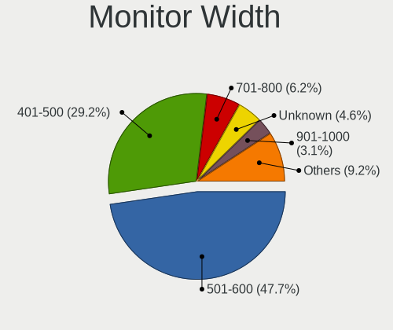

| Width in mm | Desktops | Percent |
|-------------|----------|---------|
| 501-600     | 31       | 47.69%  |
| 401-500     | 19       | 29.23%  |
| 701-800     | 3        | 4.62%   |
| Unknown     | 3        | 4.62%   |
| 601-700     | 2        | 3.08%   |
| 351-400     | 2        | 3.08%   |
| 301-350     | 2        | 3.08%   |
| 901-1000    | 2        | 3.08%   |
| 1001-1500   | 1        | 1.54%   |

Aspect Ratio
------------

Proportional relationship between the width and the height

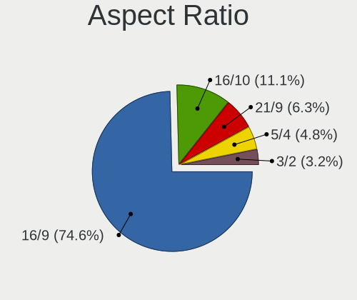

| Ratio | Desktops | Percent |
|-------|----------|---------|
| 16/9  | 47       | 74.6%   |
| 16/10 | 8        | 12.7%   |
| 21/9  | 4        | 6.35%   |
| 5/4   | 3        | 4.76%   |
| 3/2   | 1        | 1.59%   |

Monitor Area
------------

Area in inch²

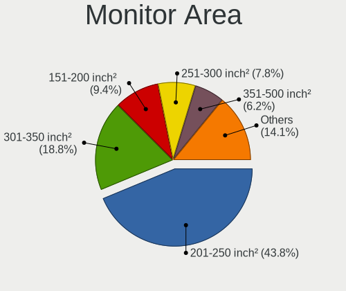

| Area in inch² | Desktops | Percent |
|----------------|----------|---------|
| 201-250        | 27       | 42.19%  |
| 301-350        | 12       | 18.75%  |
| 151-200        | 7        | 10.94%  |
| 251-300        | 6        | 9.38%   |
| 351-500        | 3        | 4.69%   |
| Unknown        | 3        | 4.69%   |
| 141-150        | 2        | 3.13%   |
| 501-1000       | 2        | 3.13%   |
| More than 1000 | 1        | 1.56%   |
| 91-100         | 1        | 1.56%   |

Pixel Density
-------------

Pixels per inch

| Density | Desktops | Percent |
|---------|----------|---------|
| 51-100  | 43       | 65.15%  |
| 101-120 | 18       | 27.27%  |
| Unknown | 3        | 4.55%   |
| 161-240 | 1        | 1.52%   |
| 121-160 | 1        | 1.52%   |

Multiple Monitors
-----------------

Total monitors connected

| Total | Desktops | Percent |
|-------|----------|---------|
| 1     | 64       | 71.11%  |
| 0     | 22       | 24.44%  |
| 2     | 4        | 4.44%   |

Network
-------

Net Controller Vendor
---------------------

Controller vendors

| Vendor                | Desktops | Percent |
|-----------------------|----------|---------|
| Realtek Semiconductor | 47       | 42.34%  |
| Intel                 | 45       | 40.54%  |
| Qualcomm Atheros      | 7        | 6.31%   |
| Broadcom              | 4        | 3.6%    |
| Ralink Technology     | 2        | 1.8%    |
| Ralink                | 2        | 1.8%    |
| Nvidia                | 1        | 0.9%    |
| MediaTek              | 1        | 0.9%    |
| D-Link System         | 1        | 0.9%    |
| Bluegiga Technologies | 1        | 0.9%    |

Net Controller Model
--------------------

Controller models

| Model                                                                                 | Desktops | Percent |
|---------------------------------------------------------------------------------------|----------|---------|
| Realtek RTL8111/8168/8411 PCI Express Gigabit Ethernet Controller                     | 38       | 30.89%  |
| Intel 82579LM Gigabit Network Connection (Lewisville)                                 | 9        | 7.32%   |
| Intel I211 Gigabit Network Connection                                                 | 6        | 4.88%   |
| Intel Ethernet Connection I217-LM                                                     | 5        | 4.07%   |
| Intel Wi-Fi 6 AX200                                                                   | 3        | 2.44%   |
| Intel Ethernet Connection I217-V                                                      | 3        | 2.44%   |
| Intel Ethernet Connection (7) I219-V                                                  | 3        | 2.44%   |
| Intel Ethernet Connection (2) I219-V                                                  | 3        | 2.44%   |
| Intel Ethernet Connection (2) I219-LM                                                 | 3        | 2.44%   |
| Realtek RTL8125 2.5GbE Controller                                                     | 2        | 1.63%   |
| Realtek RTL810xE PCI Express Fast Ethernet controller                                 | 2        | 1.63%   |
| Qualcomm Atheros AR9485 Wireless Network Adapter                                      | 2        | 1.63%   |
| Intel Wireless 7260                                                                   | 2        | 1.63%   |
| Intel Ethernet Connection (2) I218-V                                                  | 2        | 1.63%   |
| Intel 82578DM Gigabit Network Connection                                              | 2        | 1.63%   |
| Realtek RTL8812AE 802.11ac PCIe Wireless Network Adapter                              | 1        | 0.81%   |
| Realtek RTL8723BE PCIe Wireless Network Adapter                                       | 1        | 0.81%   |
| Realtek RTL8192CU 802.11n WLAN Adapter                                                | 1        | 0.81%   |
| Realtek RTL8188EE Wireless Network Adapter                                            | 1        | 0.81%   |
| Realtek RTL8188CUS 802.11n WLAN Adapter                                               | 1        | 0.81%   |
| Realtek RTL8169 PCI Gigabit Ethernet Controller                                       | 1        | 0.81%   |
| Realtek RTL-8100/8101L/8139 PCI Fast Ethernet Adapter                                 | 1        | 0.81%   |
| Ralink RT5370 Wireless Adapter                                                        | 1        | 0.81%   |
| Ralink MT7601U Wireless Adapter                                                       | 1        | 0.81%   |
| Ralink RT5360 Wireless 802.11n 1T/1R                                                  | 1        | 0.81%   |
| Ralink RT3060 Wireless 802.11n 1T/1R                                                  | 1        | 0.81%   |
| Qualcomm Atheros Attansic L1 Gigabit Ethernet                                         | 1        | 0.81%   |
| Qualcomm Atheros AR9462 Wireless Network Adapter                                      | 1        | 0.81%   |
| Qualcomm Atheros AR8161 Gigabit Ethernet                                              | 1        | 0.81%   |
| Qualcomm Atheros AR8151 v2.0 Gigabit Ethernet                                         | 1        | 0.81%   |
| Qualcomm Atheros AR5418 Wireless Network Adapter [AR5008E 802.11(a)bgn] (PCI-Express) | 1        | 0.81%   |
| Nvidia MCP73 Ethernet                                                                 | 1        | 0.81%   |
| MediaTek USB Ethernet-RNDIS                                                           | 1        | 0.81%   |
| Intel Wireless 7265                                                                   | 1        | 0.81%   |
| Intel Wireless 3165                                                                   | 1        | 0.81%   |
| Intel I210 Gigabit Network Connection                                                 | 1        | 0.81%   |
| Intel Ethernet Connection I219-LM                                                     | 1        | 0.81%   |
| Intel Ethernet Connection (5) I219-LM                                                 | 1        | 0.81%   |
| Intel Dual Band Wireless-AC 3168NGW [Stone Peak]                                      | 1        | 0.81%   |
| Intel Centrino Wireless-N 2230                                                        | 1        | 0.81%   |
| Intel Centrino Advanced-N 6230 [Rainbow Peak]                                         | 1        | 0.81%   |
| Intel 82579V Gigabit Network Connection                                               | 1        | 0.81%   |
| Intel 82574L Gigabit Network Connection                                               | 1        | 0.81%   |
| Intel 82571EB/82571GB Gigabit Ethernet Controller D0/D1 (copper applications)         | 1        | 0.81%   |
| Intel 82567LM-3 Gigabit Network Connection                                            | 1        | 0.81%   |
| Intel 82557/8/9/0/1 Ethernet Pro 100                                                  | 1        | 0.81%   |
| Intel 80003ES2LAN Gigabit Ethernet Controller (Copper)                                | 1        | 0.81%   |
| D-Link System DGE-528T Gigabit Ethernet Adapter                                       | 1        | 0.81%   |
| Broadcom NetLink BCM57780 Gigabit Ethernet PCIe                                       | 1        | 0.81%   |
| Broadcom BCM43224 802.11a/b/g/n                                                       | 1        | 0.81%   |
| Broadcom BCM4322 802.11a/b/g/n Wireless LAN Controller                                | 1        | 0.81%   |
| Broadcom 802.11ac Network Adapter                                                     | 1        | 0.81%   |
| Bluegiga BLED112 Bluetooth 4.0 Single Mode Dongle                                     | 1        | 0.81%   |

Wireless Vendor
---------------

Wireless vendors

| Vendor                | Desktops | Percent |
|-----------------------|----------|---------|
| Intel                 | 10       | 38.46%  |
| Realtek Semiconductor | 5        | 19.23%  |
| Qualcomm Atheros      | 4        | 15.38%  |
| Broadcom              | 3        | 11.54%  |
| Ralink Technology     | 2        | 7.69%   |
| Ralink                | 2        | 7.69%   |

Wireless Model
--------------

Wireless models

| Model                                                                                 | Desktops | Percent |
|---------------------------------------------------------------------------------------|----------|---------|
| Intel Wi-Fi 6 AX200                                                                   | 3        | 11.54%  |
| Qualcomm Atheros AR9485 Wireless Network Adapter                                      | 2        | 7.69%   |
| Intel Wireless 7260                                                                   | 2        | 7.69%   |
| Realtek RTL8812AE 802.11ac PCIe Wireless Network Adapter                              | 1        | 3.85%   |
| Realtek RTL8723BE PCIe Wireless Network Adapter                                       | 1        | 3.85%   |
| Realtek RTL8192CU 802.11n WLAN Adapter                                                | 1        | 3.85%   |
| Realtek RTL8188EE Wireless Network Adapter                                            | 1        | 3.85%   |
| Realtek RTL8188CUS 802.11n WLAN Adapter                                               | 1        | 3.85%   |
| Ralink RT5370 Wireless Adapter                                                        | 1        | 3.85%   |
| Ralink MT7601U Wireless Adapter                                                       | 1        | 3.85%   |
| Ralink RT5360 Wireless 802.11n 1T/1R                                                  | 1        | 3.85%   |
| Ralink RT3060 Wireless 802.11n 1T/1R                                                  | 1        | 3.85%   |
| Qualcomm Atheros AR9462 Wireless Network Adapter                                      | 1        | 3.85%   |
| Qualcomm Atheros AR5418 Wireless Network Adapter [AR5008E 802.11(a)bgn] (PCI-Express) | 1        | 3.85%   |
| Intel Wireless 7265                                                                   | 1        | 3.85%   |
| Intel Wireless 3165                                                                   | 1        | 3.85%   |
| Intel Dual Band Wireless-AC 3168NGW [Stone Peak]                                      | 1        | 3.85%   |
| Intel Centrino Wireless-N 2230                                                        | 1        | 3.85%   |
| Intel Centrino Advanced-N 6230 [Rainbow Peak]                                         | 1        | 3.85%   |
| Broadcom BCM43224 802.11a/b/g/n                                                       | 1        | 3.85%   |
| Broadcom BCM4322 802.11a/b/g/n Wireless LAN Controller                                | 1        | 3.85%   |
| Broadcom 802.11ac Network Adapter                                                     | 1        | 3.85%   |

Ethernet Vendor
---------------

Ethernet vendors

| Vendor                | Desktops | Percent |
|-----------------------|----------|---------|
| Realtek Semiconductor | 43       | 46.74%  |
| Intel                 | 42       | 45.65%  |
| Qualcomm Atheros      | 3        | 3.26%   |
| Nvidia                | 1        | 1.09%   |
| MediaTek              | 1        | 1.09%   |
| D-Link System         | 1        | 1.09%   |
| Broadcom              | 1        | 1.09%   |

Ethernet Model
--------------

Ethernet models

| Model                                                                         | Desktops | Percent |
|-------------------------------------------------------------------------------|----------|---------|
| Realtek RTL8111/8168/8411 PCI Express Gigabit Ethernet Controller             | 38       | 40%     |
| Intel 82579LM Gigabit Network Connection (Lewisville)                         | 9        | 9.47%   |
| Intel I211 Gigabit Network Connection                                         | 6        | 6.32%   |
| Intel Ethernet Connection I217-LM                                             | 5        | 5.26%   |
| Intel Ethernet Connection I217-V                                              | 3        | 3.16%   |
| Intel Ethernet Connection (7) I219-V                                          | 3        | 3.16%   |
| Intel Ethernet Connection (2) I219-V                                          | 3        | 3.16%   |
| Intel Ethernet Connection (2) I219-LM                                         | 3        | 3.16%   |
| Realtek RTL810xE PCI Express Fast Ethernet controller                         | 2        | 2.11%   |
| Intel Ethernet Connection (2) I218-V                                          | 2        | 2.11%   |
| Intel 82578DM Gigabit Network Connection                                      | 2        | 2.11%   |
| Realtek RTL8169 PCI Gigabit Ethernet Controller                               | 1        | 1.05%   |
| Realtek RTL8125 2.5GbE Controller                                             | 1        | 1.05%   |
| Realtek RTL-8100/8101L/8139 PCI Fast Ethernet Adapter                         | 1        | 1.05%   |
| Qualcomm Atheros Attansic L1 Gigabit Ethernet                                 | 1        | 1.05%   |
| Qualcomm Atheros AR8161 Gigabit Ethernet                                      | 1        | 1.05%   |
| Qualcomm Atheros AR8151 v2.0 Gigabit Ethernet                                 | 1        | 1.05%   |
| Nvidia MCP73 Ethernet                                                         | 1        | 1.05%   |
| MediaTek USB Ethernet-RNDIS                                                   | 1        | 1.05%   |
| Intel I210 Gigabit Network Connection                                         | 1        | 1.05%   |
| Intel Ethernet Connection I219-LM                                             | 1        | 1.05%   |
| Intel Ethernet Connection (5) I219-LM                                         | 1        | 1.05%   |
| Intel 82579V Gigabit Network Connection                                       | 1        | 1.05%   |
| Intel 82574L Gigabit Network Connection                                       | 1        | 1.05%   |
| Intel 82571EB/82571GB Gigabit Ethernet Controller D0/D1 (copper applications) | 1        | 1.05%   |
| Intel 82567LM-3 Gigabit Network Connection                                    | 1        | 1.05%   |
| Intel 82557/8/9/0/1 Ethernet Pro 100                                          | 1        | 1.05%   |
| Intel 80003ES2LAN Gigabit Ethernet Controller (Copper)                        | 1        | 1.05%   |
| D-Link System DGE-528T Gigabit Ethernet Adapter                               | 1        | 1.05%   |
| Broadcom NetLink BCM57780 Gigabit Ethernet PCIe                               | 1        | 1.05%   |

Net Controller Kind
-------------------

Ethernet, WiFi or modem

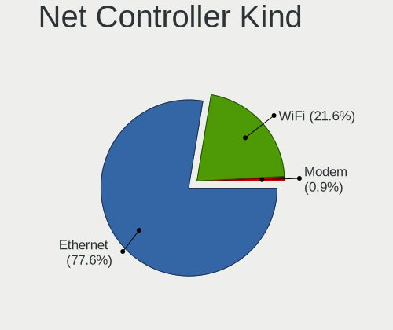

| Kind     | Desktops | Percent |
|----------|----------|---------|
| Ethernet | 90       | 76.92%  |
| WiFi     | 25       | 21.37%  |
| Modem    | 1        | 0.85%   |
| Unknown  | 1        | 0.85%   |

Used Controller
---------------

Currently used network controller

| Kind     | Desktops | Percent |
|----------|----------|---------|
| Ethernet | 90       | 84.91%  |
| WiFi     | 16       | 15.09%  |

NICs
----

Total network controllers on board

| Total | Desktops | Percent |
|-------|----------|---------|
| 1     | 64       | 71.11%  |
| 2     | 20       | 22.22%  |
| 3     | 6        | 6.67%   |

IPv6
----

IPv6 vs IPv4

| Used | Desktops | Percent |
|------|----------|---------|
| No   | 90       | 100%    |

Bluetooth
---------

Bluetooth Vendor
----------------

Controller vendors

| Vendor                     | Desktops | Percent |
|----------------------------|----------|---------|
| Cambridge Silicon Radio    | 9        | 32.14%  |
| Intel                      | 8        | 28.57%  |
| Realtek Semiconductor      | 3        | 10.71%  |
| Broadcom                   | 3        | 10.71%  |
| ASUSTek Computer           | 2        | 7.14%   |
| Integrated System Solution | 1        | 3.57%   |
| IMC Networks               | 1        | 3.57%   |
| Apple                      | 1        | 3.57%   |

Bluetooth Model
---------------

Controller models

| Model                                                   | Desktops | Percent |
|---------------------------------------------------------|----------|---------|
| Cambridge Silicon Radio Bluetooth Dongle (HCI mode)     | 9        | 32.14%  |
| Intel Bluetooth wireless interface                      | 3        | 10.71%  |
| Intel AX200 Bluetooth                                   | 3        | 10.71%  |
| Broadcom BCM20702A0 Bluetooth 4.0                       | 2        | 7.14%   |
| ASUS ASUS USB-BT500                                     | 2        | 7.14%   |
| Realtek  Bluetooth Adapter                              | 1        | 3.57%   |
| Realtek  Bluetooth 4.0 Adapter                          | 1        | 3.57%   |
| Realtek Bluetooth Radio                                 | 1        | 3.57%   |
| Intel Wireless-AC 3168 Bluetooth                        | 1        | 3.57%   |
| Intel Centrino Bluetooth Wireless Transceiver           | 1        | 3.57%   |
| Integrated System Solution Bluetooth Device             | 1        | 3.57%   |
| IMC Networks Qualcomm Atheros AR9462 Bluetooth 4.0 + HS | 1        | 3.57%   |
| Broadcom Broadcom 4371 Bluetooth 4.1 Adapter            | 1        | 3.57%   |
| Apple Built-in Bluetooth 2.0+EDR HCI                    | 1        | 3.57%   |

Sound
-----

Sound Vendor
------------

Sound card vendors

| Vendor               | Desktops | Percent |
|----------------------|----------|---------|
| Intel                | 64       | 42.38%  |
| Nvidia               | 37       | 24.5%   |
| AMD                  | 35       | 23.18%  |
| C-Media Electronics  | 7        | 4.64%   |
| Creative Labs        | 2        | 1.32%   |
| Texas Instruments    | 1        | 0.66%   |
| Griffin Technology   | 1        | 0.66%   |
| GN Netcom            | 1        | 0.66%   |
| Giga-Byte Technology | 1        | 0.66%   |
| Elgato Systems       | 1        | 0.66%   |
| Bose                 | 1        | 0.66%   |

Sound Model
-----------

Sound card models

| Model                                                                      | Desktops | Percent |
|----------------------------------------------------------------------------|----------|---------|
| Intel 8 Series/C220 Series Chipset High Definition Audio Controller        | 12       | 6.74%   |
| Intel Xeon E3-1200 v3/4th Gen Core Processor HD Audio Controller           | 9        | 5.06%   |
| Intel 6 Series/C200 Series Chipset Family High Definition Audio Controller | 9        | 5.06%   |
| Intel 100 Series/C230 Series Chipset Family HD Audio Controller            | 8        | 4.49%   |
| Nvidia GK208 HDMI/DP Audio Controller                                      | 7        | 3.93%   |
| AMD SBx00 Azalia (Intel HDA)                                               | 7        | 3.93%   |
| Intel 7 Series/C216 Chipset Family High Definition Audio Controller        | 6        | 3.37%   |
| AMD Family 17h (Models 00h-0fh) HD Audio Controller                        | 6        | 3.37%   |
| Intel NM10/ICH7 Family High Definition Audio Controller                    | 5        | 2.81%   |
| AMD Starship/Matisse HD Audio Controller                                   | 5        | 2.81%   |
| AMD Oland/Hainan/Cape Verde/Pitcairn HDMI Audio [Radeon HD 7000 Series]    | 5        | 2.81%   |
| AMD Ellesmere HDMI Audio [Radeon RX 470/480 / 570/580/590]                 | 5        | 2.81%   |
| Nvidia GK107 HDMI Audio Controller                                         | 4        | 2.25%   |
| Intel Cannon Lake PCH cAVS                                                 | 4        | 2.25%   |
| Intel 9 Series Chipset Family HD Audio Controller                          | 4        | 2.25%   |
| Intel 200 Series PCH HD Audio                                              | 4        | 2.25%   |
| AMD Navi 10 HDMI Audio                                                     | 4        | 2.25%   |
| AMD Baffin HDMI/DP Audio [Radeon RX 550 640SP / RX 560/560X]               | 4        | 2.25%   |
| Nvidia GP107GL High Definition Audio Controller                            | 3        | 1.69%   |
| Nvidia GM107 High Definition Audio Controller [GeForce 940MX]              | 3        | 1.69%   |
| C-Media Electronics Audio Adapter (Unitek Y-247A)                          | 3        | 1.69%   |
| AMD FCH Azalia Controller                                                  | 3        | 1.69%   |
| Nvidia GP108 High Definition Audio Controller                              | 2        | 1.12%   |
| Nvidia GP106 High Definition Audio Controller                              | 2        | 1.12%   |
| Nvidia GP104 High Definition Audio Controller                              | 2        | 1.12%   |
| Nvidia GM206 High Definition Audio Controller                              | 2        | 1.12%   |
| Nvidia GK106 HDMI Audio Controller                                         | 2        | 1.12%   |
| Nvidia GF119 HDMI Audio Controller                                         | 2        | 1.12%   |
| Nvidia GF108 High Definition Audio Controller                              | 2        | 1.12%   |
| Intel C600/X79 series chipset High Definition Audio Controller             | 2        | 1.12%   |
| Intel 5 Series/3400 Series Chipset High Definition Audio                   | 2        | 1.12%   |
| AMD Family 17h/19h HD Audio Controller                                     | 2        | 1.12%   |
| AMD Cedar HDMI Audio [Radeon HD 5400/6300/7300 Series]                     | 2        | 1.12%   |
| Texas Instruments PCM2704 16-bit stereo audio DAC                          | 1        | 0.56%   |
| Nvidia TU116 High Definition Audio Controller                              | 1        | 0.56%   |
| Nvidia TU104 HD Audio Controller                                           | 1        | 0.56%   |
| Nvidia MCP73 High Definition Audio                                         | 1        | 0.56%   |
| Nvidia High Definition Audio Controller                                    | 1        | 0.56%   |
| Nvidia GM204 High Definition Audio Controller                              | 1        | 0.56%   |
| Nvidia GK110 High Definition Audio Controller                              | 1        | 0.56%   |
| Nvidia GF106 High Definition Audio Controller                              | 1        | 0.56%   |
| Intel Wildcat Point-LP High Definition Audio Controller                    | 1        | 0.56%   |
| Intel Sunrise Point-LP HD Audio                                            | 1        | 0.56%   |
| Intel Haswell-ULT HD Audio Controller                                      | 1        | 0.56%   |
| Intel Celeron/Pentium Silver Processor High Definition Audio               | 1        | 0.56%   |
| Intel Broadwell-U Audio Controller                                         | 1        | 0.56%   |
| Intel 82801JI (ICH10 Family) HD Audio Controller                           | 1        | 0.56%   |
| Intel 82801JD/DO (ICH10 Family) HD Audio Controller                        | 1        | 0.56%   |
| Intel 82801I (ICH9 Family) HD Audio Controller                             | 1        | 0.56%   |
| Intel 8 Series HD Audio Controller                                         | 1        | 0.56%   |
| Intel 631xESB/632xESB High Definition Audio Controller                     | 1        | 0.56%   |
| Griffin Technology iMic                                                    | 1        | 0.56%   |
| GN Netcom GN 8110 USB                                                      | 1        | 0.56%   |
| Giga-Byte Technology USB Audio                                             | 1        | 0.56%   |
| Elgato Systems Elgato Wave:3 Elgato Wave:3 Controls Elgato Wave:3 DFU      | 1        | 0.56%   |
| Creative Labs EMU20k1 [Sound Blaster X-Fi Series]                          | 1        | 0.56%   |
| Creative Labs EMU10k2/CA0100/CA0102/CA10200 [Sound Blaster Audigy Series]  | 1        | 0.56%   |
| C-Media Electronics USB Audio Class 1.0 and 2.0 Device                     | 1        | 0.56%   |
| C-Media Electronics CMI8738/CMI8768 PCI Audio                              | 1        | 0.56%   |
| C-Media Electronics CM108 Audio Controller                                 | 1        | 0.56%   |

Memory
------

Memory Vendor
-------------

Memory module vendors

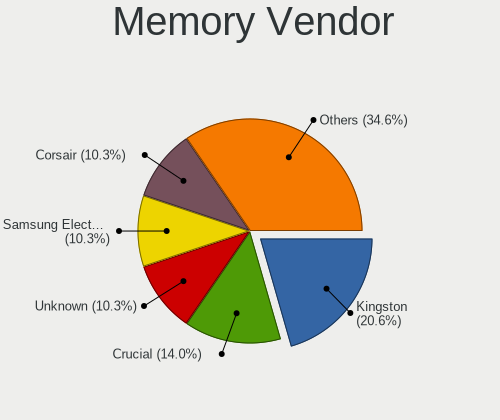

| Vendor              | Desktops | Percent |
|---------------------|----------|---------|
| Kingston            | 22       | 20.56%  |
| Crucial             | 15       | 14.02%  |
| Unknown             | 11       | 10.28%  |
| Samsung Electronics | 11       | 10.28%  |
| Corsair             | 11       | 10.28%  |
| SK Hynix            | 9        | 8.41%   |
| Micron Technology   | 9        | 8.41%   |
| G.Skill             | 8        | 7.48%   |
| Nanya Technology    | 2        | 1.87%   |
| Unknown (ABCD)      | 1        | 0.93%   |
| Transcend           | 1        | 0.93%   |
| Team                | 1        | 0.93%   |
| Silicon Power       | 1        | 0.93%   |
| Ramos Technology    | 1        | 0.93%   |
| KomputerBay         | 1        | 0.93%   |
| Elpida              | 1        | 0.93%   |
| Avant               | 1        | 0.93%   |
| A-DATA Technology   | 1        | 0.93%   |

Memory Model
------------

Memory module models

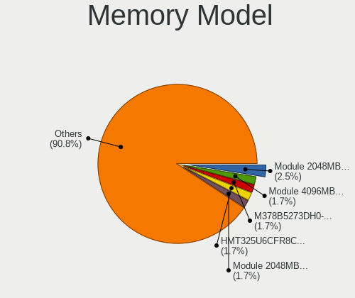

| Model                                                          | Desktops | Percent |
|----------------------------------------------------------------|----------|---------|
| Unknown RAM Module 2048MB DIMM DDR2 800MT/s                    | 3        | 2.52%   |
| Unknown RAM Module 4096MB DIMM 1600MT/s                        | 2        | 1.68%   |
| SK Hynix RAM HMT325U6CFR8C-H9 2GB DIMM DDR3 1333MT/s           | 2        | 1.68%   |
| Samsung RAM M378B5273DH0-CH9 4GB DIMM DDR3 1333MT/s            | 2        | 1.68%   |
| Kingston RAM Module 2048MB DIMM DDR2 800MT/s                   | 2        | 1.68%   |
| Kingston RAM KHX3200C16D4/8GX 8GB DIMM DDR4 3200MT/s           | 2        | 1.68%   |
| Kingston RAM KHX1600C10D3/8G 8GB DIMM DDR3 1600MT/s            | 2        | 1.68%   |
| Kingston RAM 99U5584-010.A00LF 4096MB DIMM DDR3 1866MT/s       | 2        | 1.68%   |
| Kingston RAM 99U5471-025.A00LF 4GB DIMM DDR3 1333MT/s          | 2        | 1.68%   |
| Crucial RAM BLS8G3D1609DS1S00. 8GB DIMM DDR3 1600MT/s          | 2        | 1.68%   |
| Corsair RAM CMZ8GX3M2A1600C9 4GB DIMM DDR3 1600MT/s            | 2        | 1.68%   |
| Unknown RAM Module 8192MB DIMM 1600MT/s                        | 1        | 0.84%   |
| Unknown RAM Module 4096MB DIMM DDR3 1067MT/s                   | 1        | 0.84%   |
| Unknown RAM Module 4096MB DIMM DDR2                            | 1        | 0.84%   |
| Unknown RAM Module 2048MB SODIMM DDR3 1600MT/s                 | 1        | 0.84%   |
| Unknown RAM Module 2048MB DIMM SDRAM 1066MT/s                  | 1        | 0.84%   |
| Unknown RAM Module 2048MB DIMM DDR3 1066MT/s                   | 1        | 0.84%   |
| Unknown RAM Module 2048MB DIMM DDR2                            | 1        | 0.84%   |
| Unknown RAM Module 2048MB DIMM 1333MT/s                        | 1        | 0.84%   |
| Unknown (ABCD) RAM 123456789012345678 2GB DIMM LPDDR4 2400MT/s | 1        | 0.84%   |
| Transcend RAM TS1GLH64V1H 8GB DIMM DDR4 2133MT/s               | 1        | 0.84%   |
| Team RAM Elite-1600 8GB DIMM DDR3 1600MT/s                     | 1        | 0.84%   |
| SK Hynix RAM Module 4096MB FB-DIMM DDR2 667MT/s                | 1        | 0.84%   |
| SK Hynix RAM HMT451U6BFR8A-PB 4GB DIMM DDR3 1600MT/s           | 1        | 0.84%   |
| SK Hynix RAM HMT451S6BFR8A-PB 4GB SODIMM DDR3 1600MT/s         | 1        | 0.84%   |
| SK Hynix RAM HMT42GR7MFR4A 16384MB DIMM DDR3 1333MT/s          | 1        | 0.84%   |
| SK Hynix RAM HMT351U6EFR8C-PB 4GB DIMM DDR3 1600MT/s           | 1        | 0.84%   |
| SK Hynix RAM HMT351U6CFR8C-H9 4GB DIMM DDR3 1333MT/s           | 1        | 0.84%   |
| SK Hynix RAM HMT31GR7CFR4A 8192MB DIMM DDR3 1333MT/s           | 1        | 0.84%   |
| SK Hynix RAM HMA81GU6AFR8N-UH 8GB DIMM DDR4 2400MT/s           | 1        | 0.84%   |
| Silicon Power RAM SP008GXLZU266BSA 8192MB DIMM DDR4 2666MT/s   | 1        | 0.84%   |
| Samsung RAM M471B1G73EB0-YK0 8192MB DDR3 1600MT/s              | 1        | 0.84%   |
| Samsung RAM M391B5673EH1-CH9 2048MB DIMM DDR3 1333MT/s         | 1        | 0.84%   |
| Samsung RAM M378B5773DH0-CH9 2GB DIMM DDR3 1333MT/s            | 1        | 0.84%   |
| Samsung RAM M378B5273CH0-CK0 4GB DIMM DDR3 1600MT/s            | 1        | 0.84%   |
| Samsung RAM M378B5273CH0-CH9 4GB DIMM DDR3 1333MT/s            | 1        | 0.84%   |
| Samsung RAM M378B5173QH0-CK0 4GB DIMM DDR3 1600MT/s            | 1        | 0.84%   |
| Samsung RAM M378B5173DB0-CK0 4GB DIMM DDR3 1600MT/s            | 1        | 0.84%   |
| Samsung RAM M378A1K43CB2-CRC 8GB DIMM DDR4 2400MT/s            | 1        | 0.84%   |
| Samsung RAM M3 78T5663EH3-CF7 2GB DIMM DDR2 800MT/s            | 1        | 0.84%   |
| Ramos RAM EWB8GB681PAE-16IC 8192MB DIMM DDR3 1600MT/s          | 1        | 0.84%   |
| Nanya RAM NT4GC64B8HG0NF-DI 4GB DIMM DDR3 1600MT/s             | 1        | 0.84%   |
| Nanya RAM 99P5471-039.A00LF 8192MB DIMM DDR3 1067MT/s          | 1        | 0.84%   |
| Micron RAM Module 4096MB FB-DIMM DDR2 667MT/s                  | 1        | 0.84%   |
| Micron RAM CT102464BD160B.C16 8192MB DIMM DDR3 1600MT/s        | 1        | 0.84%   |
| Micron RAM 9KSF25672AZ-1G6K1 2048MB DIMM DDR3 1600MT/s         | 1        | 0.84%   |
| Micron RAM 8KTF51264HZ-1G6N1 4GB SODIMM DDR3 1600MT/s          | 1        | 0.84%   |
| Micron RAM 8KTF51264HZ-1G6J1 4096MB SODIMM DDR3 1333MT/s       | 1        | 0.84%   |
| Micron RAM 8JTF51264AZ-1G6E1 4GB DIMM DDR3 1600MT/s            | 1        | 0.84%   |
| Micron RAM 8ATF1G64HZ-3G2J1 8GB SODIMM DDR4 3200MT/s           | 1        | 0.84%   |
| Micron RAM 16KTF1G64HZ-1G6N1 8GB SODIMM DDR3 1600MT/s          | 1        | 0.84%   |
| Micron RAM 16JTF1G64AZ-1G6E1 8GB DIMM DDR3 1600MT/s            | 1        | 0.84%   |
| KomputerBay RAM KB_8G_D3_1600_C10 8192MB DIMM DDR3 1600MT/s    | 1        | 0.84%   |
| Kingston RAM MSI24D4U7S8MB-8 8192MB DIMM DDR4 2400MT/s         | 1        | 0.84%   |
| Kingston RAM KHX1866C10D3/4G 4GB DIMM DDR3 1867MT/s            | 1        | 0.84%   |
| Kingston RAM CBD24D4S7S8MA-8 8192MB SODIMM DDR4 2400MT/s       | 1        | 0.84%   |
| Kingston RAM 99U5584-007.A00LF 4GB DIMM DDR3 1333MT/s          | 1        | 0.84%   |
| Kingston RAM 99U5474-037.A00LF 4096MB DIMM DDR3 1333MT/s       | 1        | 0.84%   |
| Kingston RAM 99U5474-028.A00LF 4GB DIMM DDR3 1333MT/s          | 1        | 0.84%   |
| Kingston RAM 99U5471-054.A00LF 8GB DIMM DDR3 1600MT/s          | 1        | 0.84%   |

Memory Kind
-----------

Memory module kinds

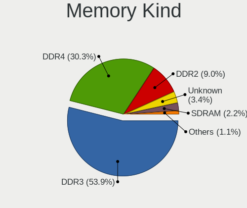

| Kind    | Desktops | Percent |
|---------|----------|---------|
| DDR3    | 48       | 54.55%  |
| DDR4    | 27       | 30.68%  |
| DDR2    | 8        | 9.09%   |
| Unknown | 3        | 3.41%   |
| SDRAM   | 1        | 1.14%   |
| LPDDR4  | 1        | 1.14%   |

Memory Form Factor
------------------

Physical design of the memory module

| Name    | Desktops | Percent |
|---------|----------|---------|
| DIMM    | 77       | 87.5%   |
| SODIMM  | 9        | 10.23%  |
| FB-DIMM | 1        | 1.14%   |
| Unknown | 1        | 1.14%   |

Memory Size
-----------

Memory module size

| Size  | Desktops | Percent |
|-------|----------|---------|
| 8192  | 39       | 39%     |
| 4096  | 34       | 34%     |
| 2048  | 18       | 18%     |
| 16384 | 9        | 9%      |

Memory Speed
------------

Memory module speed

| Speed   | Desktops | Percent |
|---------|----------|---------|
| 1600    | 27       | 28.72%  |
| 1333    | 21       | 22.34%  |
| 2400    | 13       | 13.83%  |
| 800     | 7        | 7.45%   |
| 3200    | 4        | 4.26%   |
| 2133    | 4        | 4.26%   |
| 2666    | 3        | 3.19%   |
| 2667    | 2        | 2.13%   |
| 1867    | 2        | 2.13%   |
| 1866    | 2        | 2.13%   |
| 1067    | 2        | 2.13%   |
| 1066    | 2        | 2.13%   |
| 3600    | 1        | 1.06%   |
| 2933    | 1        | 1.06%   |
| 2800    | 1        | 1.06%   |
| 667     | 1        | 1.06%   |
| Unknown | 1        | 1.06%   |

Printers & scanners
-------------------

Printer Vendor
--------------

Printer device vendors

| Vendor             | Desktops | Percent |
|--------------------|----------|---------|
| Ricoh              | 1        | 25%     |
| Kyocera            | 1        | 25%     |
| Hewlett-Packard    | 1        | 25%     |
| Brother Industries | 1        | 25%     |

Printer Model
-------------

Printer device models

| Model              | Desktops | Percent |
|--------------------|----------|---------|
| Ricoh SP 112       | 1        | 25%     |
| Kyocera FS-1025MFP | 1        | 25%     |
| HP LaserJet P3005  | 1        | 25%     |
| Brother MFC-J200   | 1        | 25%     |

Scanner Vendor
--------------

Scanner device vendors

| Vendor      | Desktops | Percent |
|-------------|----------|---------|
| Canon       | 2        | 66.67%  |
| Seiko Epson | 1        | 33.33%  |

Scanner Model
-------------

Scanner device models

| Model                                                                               | Desktops | Percent |
|-------------------------------------------------------------------------------------|----------|---------|
| Canon CanoScan LiDE 110                                                             | 2        | 66.67%  |
| Seiko Epson WF-2860 Series EPSON Scanner USB2.0 Printer EPSON Utility USB2.0 Faxout | 1        | 33.33%  |

Camera
------

Camera Vendor
-------------

Camera device vendors

| Vendor                        | Desktops | Percent |
|-------------------------------|----------|---------|
| Z-Star Microelectronics       | 2        | 14.29%  |
| Microdia                      | 2        | 14.29%  |
| Logitech                      | 2        | 14.29%  |
| ARC International             | 2        | 14.29%  |
| Sunplus Innovation Technology | 1        | 7.14%   |
| Linux Foundation              | 1        | 7.14%   |
| KYE Systems (Mouse Systems)   | 1        | 7.14%   |
| Generalplus Technology        | 1        | 7.14%   |
| Chicony Electronics           | 1        | 7.14%   |
| Alcor Micro                   | 1        | 7.14%   |

Camera Model
------------

Camera device models

| Model                                            | Desktops | Percent |
|--------------------------------------------------|----------|---------|
| ARC International Camera                         | 2        | 14.29%  |
| Z-Star Venus USB2.0 Camera                       | 1        | 7.14%   |
| Z-Star Vega USB 2.0 Camera                       | 1        | 7.14%   |
| Sunplus Aukey-PC-LM1E Camera                     | 1        | 7.14%   |
| Microdia Webcam Vitade AF                        | 1        | 7.14%   |
| Microdia ASUS USB2.0 Webcam                      | 1        | 7.14%   |
| Logitech Webcam C310                             | 1        | 7.14%   |
| Logitech C922 Pro Stream Webcam                  | 1        | 7.14%   |
| Linux Foundation HD Camera                       | 1        | 7.14%   |
| KYE Systems (Mouse Systems) AUKEY PC-LM1E Camera | 1        | 7.14%   |
| Generalplus GENERAL WEBCAM                       | 1        | 7.14%   |
| Chicony HP Integrated Webcam                     | 1        | 7.14%   |
| Alcor Micro PC Camera                            | 1        | 7.14%   |

Security
--------

Fingerprint Vendor
------------------

Fingerprint sensor vendors

Zero info for selected period =(

Fingerprint Model
-----------------

Fingerprint sensor models

Zero info for selected period =(

Chipcard Vendor
---------------

Chipcard module vendors

Zero info for selected period =(

Chipcard Model
--------------

Chipcard module models

Zero info for selected period =(

Unsupported
-----------

Unsupported Devices
-------------------

Total unsupported devices on board

| Total | Desktops | Percent |
|-------|----------|---------|
| 1     | 52       | 57.78%  |
| 0     | 27       | 30%     |
| 2     | 8        | 8.89%   |
| 3     | 3        | 3.33%   |

Unsupported Device Types
------------------------

Types of unsupported devices

| Type                     | Desktops | Percent |
|--------------------------|----------|---------|
| Communication controller | 56       | 74.67%  |
| Sound                    | 7        | 9.33%   |
| Net/wireless             | 6        | 8%      |
| Card reader              | 2        | 2.67%   |
| Network                  | 1        | 1.33%   |
| Net/ethernet             | 1        | 1.33%   |
| Firewire controller      | 1        | 1.33%   |
| Bluetooth                | 1        | 1.33%   |

