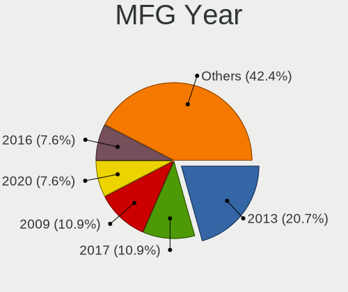
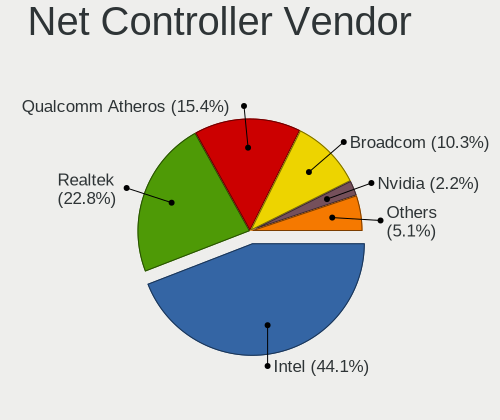
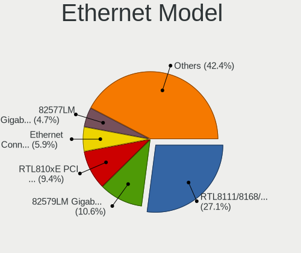
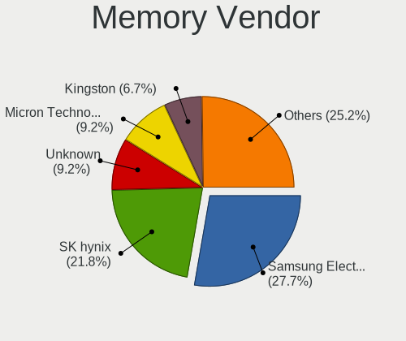
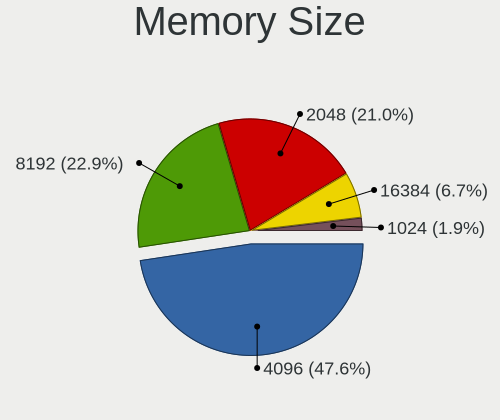
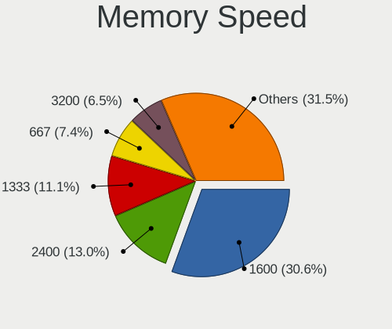
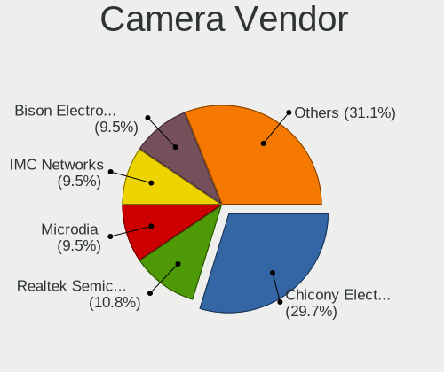

helloSystem 0.4.0 - Tested Hardware & Statistics (Notebooks)
------------------------------------------------------------

A project to collect tested hardware configurations for helloSystem 0.4.0.

Anyone can contribute to this report by the [hw-probe](https://github.com/linuxhw/hw-probe/blob/master/INSTALL.BSD.md) tool:

    hw-probe -all -upload

Please submit a probe of your configuration if it's not presented on the page or is rare.

Full-feature report is available here: https://bsd-hardware.info/?view=trends

Contents
--------

* [ Test Cases ](#test-cases)

* [ System ](#system)
  - [ Arch                     ](#arch)
  - [ DE                       ](#de)
  - [ Display Server           ](#display-server)
  - [ Display Manager          ](#display-manager)
  - [ OS Lang                  ](#os-lang)
  - [ Boot Mode                ](#boot-mode)
  - [ Filesystem               ](#filesystem)
  - [ Part. scheme             ](#part-scheme)

* [ Board ](#board)
  - [ Vendor                   ](#vendor)
  - [ Model                    ](#model)
  - [ Model Family             ](#model-family)
  - [ MFG Year                 ](#mfg-year)
  - [ Form Factor              ](#form-factor)
  - [ Coreboot                 ](#coreboot)
  - [ RAM Size                 ](#ram-size)
  - [ RAM Used                 ](#ram-used)
  - [ Total Drives             ](#total-drives)
  - [ Has CD-ROM               ](#has-cd-rom)
  - [ Has Ethernet             ](#has-ethernet)
  - [ Has WiFi                 ](#has-wifi)
  - [ Has Bluetooth            ](#has-bluetooth)

* [ Location ](#location)
  - [ Country                  ](#country)
  - [ City                     ](#city)

* [ Drives ](#drives)
  - [ Drive Vendor             ](#drive-vendor)
  - [ Drive Model              ](#drive-model)
  - [ HDD Vendor               ](#hdd-vendor)
  - [ SSD Vendor               ](#ssd-vendor)
  - [ Drive Kind               ](#drive-kind)
  - [ Drive Connector          ](#drive-connector)
  - [ Drive Size               ](#drive-size)
  - [ Space Total              ](#space-total)
  - [ Space Used               ](#space-used)
  - [ Malfunc. Drives          ](#malfunc-drives)
  - [ Malfunc. Drive Vendor    ](#malfunc-drive-vendor)
  - [ Malfunc. HDD Vendor      ](#malfunc-hdd-vendor)
  - [ Malfunc. Drive Kind      ](#malfunc-drive-kind)
  - [ Failed Drives            ](#failed-drives)
  - [ Failed Drive Vendor      ](#failed-drive-vendor)
  - [ Drive Status             ](#drive-status)

* [ Storage controller ](#storage-controller)
  - [ Storage Vendor           ](#storage-vendor)
  - [ Storage Model            ](#storage-model)
  - [ Storage Kind             ](#storage-kind)

* [ Processor ](#processor)
  - [ CPU Vendor               ](#cpu-vendor)
  - [ CPU Model                ](#cpu-model)
  - [ CPU Model Family         ](#cpu-model-family)
  - [ CPU Cores                ](#cpu-cores)
  - [ CPU Sockets              ](#cpu-sockets)
  - [ CPU Threads              ](#cpu-threads)
  - [ CPU Microarch            ](#cpu-microarch)

* [ Graphics ](#graphics)
  - [ GPU Vendor               ](#gpu-vendor)
  - [ GPU Model                ](#gpu-model)
  - [ GPU Combo                ](#gpu-combo)
  - [ GPU Driver               ](#gpu-driver)
  - [ GPU Memory               ](#gpu-memory)

* [ Monitor ](#monitor)
  - [ Monitor Vendor           ](#monitor-vendor)
  - [ Monitor Model            ](#monitor-model)
  - [ Monitor Resolution       ](#monitor-resolution)
  - [ Monitor Diagonal         ](#monitor-diagonal)
  - [ Monitor Width            ](#monitor-width)
  - [ Aspect Ratio             ](#aspect-ratio)
  - [ Monitor Area             ](#monitor-area)
  - [ Pixel Density            ](#pixel-density)
  - [ Multiple Monitors        ](#multiple-monitors)

* [ Network ](#network)
  - [ Net Controller Vendor    ](#net-controller-vendor)
  - [ Net Controller Model     ](#net-controller-model)
  - [ Wireless Vendor          ](#wireless-vendor)
  - [ Wireless Model           ](#wireless-model)
  - [ Ethernet Vendor          ](#ethernet-vendor)
  - [ Ethernet Model           ](#ethernet-model)
  - [ Net Controller Kind      ](#net-controller-kind)
  - [ Used Controller          ](#used-controller)
  - [ NICs                     ](#nics)
  - [ IPv6                     ](#ipv6)

* [ Bluetooth ](#bluetooth)
  - [ Bluetooth Vendor         ](#bluetooth-vendor)
  - [ Bluetooth Model          ](#bluetooth-model)

* [ Sound ](#sound)
  - [ Sound Vendor             ](#sound-vendor)
  - [ Sound Model              ](#sound-model)

* [ Memory ](#memory)
  - [ Memory Vendor            ](#memory-vendor)
  - [ Memory Model             ](#memory-model)
  - [ Memory Kind              ](#memory-kind)
  - [ Memory Form Factor       ](#memory-form-factor)
  - [ Memory Size              ](#memory-size)
  - [ Memory Speed             ](#memory-speed)

* [ Printers & scanners ](#printers--scanners)
  - [ Printer Vendor           ](#printer-vendor)
  - [ Printer Model            ](#printer-model)
  - [ Scanner Vendor           ](#scanner-vendor)
  - [ Scanner Model            ](#scanner-model)

* [ Camera ](#camera)
  - [ Camera Vendor            ](#camera-vendor)
  - [ Camera Model             ](#camera-model)

* [ Security ](#security)
  - [ Fingerprint Vendor       ](#fingerprint-vendor)
  - [ Fingerprint Model        ](#fingerprint-model)
  - [ Chipcard Vendor          ](#chipcard-vendor)
  - [ Chipcard Model           ](#chipcard-model)

* [ Unsupported ](#unsupported)
  - [ Unsupported Devices      ](#unsupported-devices)
  - [ Unsupported Device Types ](#unsupported-device-types)

Test Cases
----------

Total: 125

| Vendor        | Model                       | Probe                                                     | Date         |
|---------------|-----------------------------|-----------------------------------------------------------|--------------|
| Apple         | MacBookPro4,1               | [d852363467](https://bsd-hardware.info/?probe=d852363467) | Feb 08, 2022 |
| Apple         | MacBookPro4,1               | [f05ce66a9a](https://bsd-hardware.info/?probe=f05ce66a9a) | Feb 08, 2022 |
| Samsung       | 3570R/370R/470R/450R/510... | [31d42f4469](https://bsd-hardware.info/?probe=31d42f4469) | Jul 05, 2021 |
| Pegatron      | T12Ah                       | [50d37406df](https://bsd-hardware.info/?probe=50d37406df) | Jun 06, 2021 |
| HP            | Pavilion dv4                | [27f912e4e4](https://bsd-hardware.info/?probe=27f912e4e4) | May 28, 2021 |
| Dell          | Inspiron 3442               | [0d1d75a914](https://bsd-hardware.info/?probe=0d1d75a914) | May 23, 2021 |
| Dell          | Latitude E6410              | [211fe874fd](https://bsd-hardware.info/?probe=211fe874fd) | May 22, 2021 |
| Dell          | Inspiron 3442               | [076dc91b26](https://bsd-hardware.info/?probe=076dc91b26) | May 13, 2021 |
| HP            | 240 G5 Notebook PC          | [f9c67b360f](https://bsd-hardware.info/?probe=f9c67b360f) | May 08, 2021 |
| Dell          | Latitude E5570              | [c8477da717](https://bsd-hardware.info/?probe=c8477da717) | May 07, 2021 |
| Apple         | MacBookPro11,3              | [1c9feef8e7](https://bsd-hardware.info/?probe=1c9feef8e7) | May 03, 2021 |
| Notebook      | W65KJ1_KK1                  | [d4d0b819bc](https://bsd-hardware.info/?probe=d4d0b819bc) | Apr 24, 2021 |
| Gateway       | NE56R                       | [bbbc827581](https://bsd-hardware.info/?probe=bbbc827581) | Apr 16, 2021 |
| Gateway       | NE56R                       | [f4031498db](https://bsd-hardware.info/?probe=f4031498db) | Apr 15, 2021 |
| Dell          | Latitude E7240              | [1dbd9a5cee](https://bsd-hardware.info/?probe=1dbd9a5cee) | Apr 13, 2021 |
| Lenovo        | ThinkPad T400 7417TPU       | [981517a51a](https://bsd-hardware.info/?probe=981517a51a) | Apr 13, 2021 |
| Apple         | MacBookPro8,1               | [5d3d014284](https://bsd-hardware.info/?probe=5d3d014284) | Apr 12, 2021 |
| Apple         | MacBookPro8,1               | [ffcc46ea0b](https://bsd-hardware.info/?probe=ffcc46ea0b) | Apr 12, 2021 |
| Gateway       | NE56R                       | [af262c2350](https://bsd-hardware.info/?probe=af262c2350) | Apr 11, 2021 |
| ASUSTek       | TP500LNG                    | [6501322932](https://bsd-hardware.info/?probe=6501322932) | Apr 06, 2021 |
| Panasonic     | CF-NX1GDHYS                 | [6bbadba65d](https://bsd-hardware.info/?probe=6bbadba65d) | Apr 04, 2021 |
| ASUSTek       | X540UP                      | [a9c4506364](https://bsd-hardware.info/?probe=a9c4506364) | Mar 28, 2021 |
| ASUSTek       | G75VW                       | [cf4b3e0c6f](https://bsd-hardware.info/?probe=cf4b3e0c6f) | Mar 23, 2021 |
| ASUSTek       | G75VW                       | [4a59793120](https://bsd-hardware.info/?probe=4a59793120) | Mar 23, 2021 |
| Dell          | Inspiron 7370               | [7e2328dda3](https://bsd-hardware.info/?probe=7e2328dda3) | Mar 20, 2021 |
| Dell          | Inspiron 3442               | [f156951052](https://bsd-hardware.info/?probe=f156951052) | Mar 14, 2021 |
| Lenovo        | ThinkPad T61 766416U        | [cf75f7c9cb](https://bsd-hardware.info/?probe=cf75f7c9cb) | Mar 13, 2021 |
| Lenovo        | ThinkPad T61 766416U        | [b90180457c](https://bsd-hardware.info/?probe=b90180457c) | Mar 13, 2021 |
| Apple         | MacBookPro5,5               | [f46146b79e](https://bsd-hardware.info/?probe=f46146b79e) | Mar 11, 2021 |
| Apple         | MacBookPro5,5               | [c1ed4c02b8](https://bsd-hardware.info/?probe=c1ed4c02b8) | Mar 11, 2021 |
| Lenovo        | ThinkPad T530 2392ASU       | [39f3a4f234](https://bsd-hardware.info/?probe=39f3a4f234) | Mar 09, 2021 |
| HP            | Pavilion Gaming Laptop 1... | [5e5632d9b6](https://bsd-hardware.info/?probe=5e5632d9b6) | Mar 07, 2021 |
| Lenovo        | 3000 N200 0769AP2           | [6b81593de9](https://bsd-hardware.info/?probe=6b81593de9) | Mar 06, 2021 |
| Lenovo        | IdeaPad 700-15ISK 80RU      | [b03cb1f957](https://bsd-hardware.info/?probe=b03cb1f957) | Mar 05, 2021 |
| ASUSTek       | X55CR                       | [e887ee2ff5](https://bsd-hardware.info/?probe=e887ee2ff5) | Mar 03, 2021 |
| ASUSTek       | X55CR                       | [e1e4548d22](https://bsd-hardware.info/?probe=e1e4548d22) | Mar 03, 2021 |
| Lenovo        | ThinkPad X1 Carbon 5th 2... | [950cf51db1](https://bsd-hardware.info/?probe=950cf51db1) | Feb 28, 2021 |
| ASUSTek       | G1S                         | [593c12aa06](https://bsd-hardware.info/?probe=593c12aa06) | Feb 28, 2021 |
| ASUSTek       | X555LAB                     | [b0364fffaf](https://bsd-hardware.info/?probe=b0364fffaf) | Feb 25, 2021 |
| ASUSTek       | X555LAB                     | [45d57c2be0](https://bsd-hardware.info/?probe=45d57c2be0) | Feb 24, 2021 |
| ASUSTek       | VivoBook_ASUSLaptop X712... | [7f35ef7fa9](https://bsd-hardware.info/?probe=7f35ef7fa9) | Feb 23, 2021 |
| Lenovo        | Z50-70 20354                | [d3d9dc620f](https://bsd-hardware.info/?probe=d3d9dc620f) | Feb 23, 2021 |
| Lenovo        | IdeaPad S145-15API 81UT     | [7def696a61](https://bsd-hardware.info/?probe=7def696a61) | Feb 22, 2021 |
| Lenovo        | ThinkPad X240 20AMS4V000    | [cbfa45fe44](https://bsd-hardware.info/?probe=cbfa45fe44) | Feb 22, 2021 |
| ASUSTek       | K46CA                       | [f286c1e784](https://bsd-hardware.info/?probe=f286c1e784) | Feb 21, 2021 |
| ASUSTek       | X751LN                      | [a88cfd7fdd](https://bsd-hardware.info/?probe=a88cfd7fdd) | Feb 21, 2021 |
| Lenovo        | ThinkPad T440p 20AWS0U50... | [5d86c90af1](https://bsd-hardware.info/?probe=5d86c90af1) | Feb 21, 2021 |
| Toshiba       | Satellite U500              | [feae098542](https://bsd-hardware.info/?probe=feae098542) | Feb 20, 2021 |
| Packard Be... | EasyNote TS11HR             | [1adcd64182](https://bsd-hardware.info/?probe=1adcd64182) | Feb 20, 2021 |
| ASUSTek       | X556UA                      | [6bbf9d6e29](https://bsd-hardware.info/?probe=6bbf9d6e29) | Feb 20, 2021 |
| Apple         | MacBook5,1                  | [1a374f79df](https://bsd-hardware.info/?probe=1a374f79df) | Feb 19, 2021 |
| Acer          | Aspire ES1-533              | [045cf81f15](https://bsd-hardware.info/?probe=045cf81f15) | Feb 18, 2021 |
| Lenovo        | ThinkPad X1 Carbon 4th 2... | [71cfece3a7](https://bsd-hardware.info/?probe=71cfece3a7) | Feb 18, 2021 |
| Dell          | Inspiron 3521               | [10490aef33](https://bsd-hardware.info/?probe=10490aef33) | Feb 17, 2021 |
| Dell          | Latitude E6330              | [abe1869a95](https://bsd-hardware.info/?probe=abe1869a95) | Feb 17, 2021 |
| Fujitsu       | LIFEBOOK E744               | [fc2f449a8a](https://bsd-hardware.info/?probe=fc2f449a8a) | Feb 17, 2021 |
| Dell          | Latitude 7390               | [3fe6eff89a](https://bsd-hardware.info/?probe=3fe6eff89a) | Feb 17, 2021 |
| Dell          | Venue 11 Pro 7140           | [1a49b7921a](https://bsd-hardware.info/?probe=1a49b7921a) | Feb 17, 2021 |
| Lenovo        | ThinkPad T430 2349PMP       | [23de6449ad](https://bsd-hardware.info/?probe=23de6449ad) | Feb 17, 2021 |
| Dell          | Latitude E4300              | [d5051ef185](https://bsd-hardware.info/?probe=d5051ef185) | Feb 16, 2021 |
| Lenovo        | U310                        | [ccec69b736](https://bsd-hardware.info/?probe=ccec69b736) | Feb 16, 2021 |
| Lenovo        | U310                        | [83805a17c5](https://bsd-hardware.info/?probe=83805a17c5) | Feb 16, 2021 |
| Lenovo        | U310                        | [111385095d](https://bsd-hardware.info/?probe=111385095d) | Feb 16, 2021 |
| Apple         | MacBookAir4,2               | [7d8419c918](https://bsd-hardware.info/?probe=7d8419c918) | Feb 16, 2021 |
| HP            | OMEN Laptop 15-en0xxx       | [19f307ff6d](https://bsd-hardware.info/?probe=19f307ff6d) | Feb 16, 2021 |
| Lenovo        | ThinkPad T430 23427YU       | [79d1896352](https://bsd-hardware.info/?probe=79d1896352) | Feb 16, 2021 |
| HP            | EliteBook 8440p             | [7968c7d2dd](https://bsd-hardware.info/?probe=7968c7d2dd) | Feb 16, 2021 |
| Dell          | Inspiron 3421               | [c5f6880081](https://bsd-hardware.info/?probe=c5f6880081) | Feb 15, 2021 |
| ASUSTek       | X75VC                       | [4a0982db2b](https://bsd-hardware.info/?probe=4a0982db2b) | Feb 15, 2021 |
| Lenovo        | ThinkPad E490 20N8CTO1WW    | [5a393bc680](https://bsd-hardware.info/?probe=5a393bc680) | Feb 15, 2021 |
| Medion        | P6812                       | [c2c592bca8](https://bsd-hardware.info/?probe=c2c592bca8) | Feb 15, 2021 |
| Medion        | P6812                       | [afa43a6aab](https://bsd-hardware.info/?probe=afa43a6aab) | Feb 15, 2021 |
| Apple         | MacBookPro6,2               | [4d83633f97](https://bsd-hardware.info/?probe=4d83633f97) | Feb 15, 2021 |
| Lenovo        | ThinkPad T400 2768WGC       | [f8ce633ed7](https://bsd-hardware.info/?probe=f8ce633ed7) | Feb 14, 2021 |
| HP            | ProBook 470 G4              | [f808e6bb4a](https://bsd-hardware.info/?probe=f808e6bb4a) | Feb 13, 2021 |
| Lenovo        | ThinkPad T580 20LAS2TG00    | [d5a1c088b3](https://bsd-hardware.info/?probe=d5a1c088b3) | Feb 13, 2021 |
| eMachines     | eME732ZG                    | [c51678397d](https://bsd-hardware.info/?probe=c51678397d) | Feb 13, 2021 |
| Lenovo        | ThinkPad X200 7459ZLW       | [9fbba84be0](https://bsd-hardware.info/?probe=9fbba84be0) | Feb 13, 2021 |
| Lenovo        | ThinkPad T430 2349GCG       | [6da4116499](https://bsd-hardware.info/?probe=6da4116499) | Feb 13, 2021 |
| Lenovo        | ThinkPad T430 2349GCG       | [d212f58dd2](https://bsd-hardware.info/?probe=d212f58dd2) | Feb 13, 2021 |
| Dell          | Inspiron 3442               | [411797b4dc](https://bsd-hardware.info/?probe=411797b4dc) | Feb 13, 2021 |
| Samsung       | 910S3K/9310SK/910S3P/911... | [bdf7452299](https://bsd-hardware.info/?probe=bdf7452299) | Feb 13, 2021 |
| Dell          | Latitude E6420              | [6bf1f5fe84](https://bsd-hardware.info/?probe=6bf1f5fe84) | Feb 12, 2021 |
| Clevo         | C41X0                       | [81c48d156a](https://bsd-hardware.info/?probe=81c48d156a) | Feb 12, 2021 |
| ASUSTek       | VivoBook_ASUSLaptop X512... | [37e4e7c85c](https://bsd-hardware.info/?probe=37e4e7c85c) | Feb 12, 2021 |
| Lenovo        | ThinkPad T460s 20F90037L... | [8325c794b3](https://bsd-hardware.info/?probe=8325c794b3) | Feb 12, 2021 |
| Apple         | MacBook5,2                  | [f1bc2178a9](https://bsd-hardware.info/?probe=f1bc2178a9) | Feb 12, 2021 |
| Lenovo        | ThinkPad T440s 20ARS10P0... | [bfee99bebd](https://bsd-hardware.info/?probe=bfee99bebd) | Feb 12, 2021 |
| Lenovo        | Legion Y530-15ICH 81FV      | [2b0f35d7a9](https://bsd-hardware.info/?probe=2b0f35d7a9) | Feb 12, 2021 |
| Lenovo        | G500 20236                  | [9b149fcd68](https://bsd-hardware.info/?probe=9b149fcd68) | Feb 12, 2021 |
| Dell          | Inspiron 3521               | [3a73ecd855](https://bsd-hardware.info/?probe=3a73ecd855) | Feb 12, 2021 |
| Dell          | Inspiron 3521               | [afd71fdf87](https://bsd-hardware.info/?probe=afd71fdf87) | Feb 12, 2021 |
| Dell          | Latitude 7380               | [1aa2a3a541](https://bsd-hardware.info/?probe=1aa2a3a541) | Feb 12, 2021 |
| Dell          | Latitude 7380               | [4814701c0e](https://bsd-hardware.info/?probe=4814701c0e) | Feb 12, 2021 |
| Dell          | XPS 15 9560                 | [687008da4f](https://bsd-hardware.info/?probe=687008da4f) | Feb 11, 2021 |
| ASUSTek       | S551LN                      | [42792115e3](https://bsd-hardware.info/?probe=42792115e3) | Feb 11, 2021 |
| Apple         | MacBook6,1                  | [3a9335691f](https://bsd-hardware.info/?probe=3a9335691f) | Feb 11, 2021 |
| ASUSTek       | K50IJ                       | [8cd0aedd3a](https://bsd-hardware.info/?probe=8cd0aedd3a) | Feb 11, 2021 |
| A-DATA Tec... | XENIA159GENI72060           | [b2bf9a977b](https://bsd-hardware.info/?probe=b2bf9a977b) | Feb 11, 2021 |
| Dell          | Latitude 3410               | [465dd01c0d](https://bsd-hardware.info/?probe=465dd01c0d) | Feb 11, 2021 |
| Dell          | Inspiron 3521               | [43196baf75](https://bsd-hardware.info/?probe=43196baf75) | Feb 11, 2021 |
| Samsung       | 300V3Z/300V4Z/300V5Z        | [270ca253a3](https://bsd-hardware.info/?probe=270ca253a3) | Feb 11, 2021 |
| Dell          | Inspiron 3521               | [b3569ebb39](https://bsd-hardware.info/?probe=b3569ebb39) | Feb 11, 2021 |
| Lenovo        | ThinkPad L470 20J5S09500    | [b17963cd30](https://bsd-hardware.info/?probe=b17963cd30) | Feb 10, 2021 |
| Lenovo        | ThinkPad T410 253722U       | [219e9cb1d7](https://bsd-hardware.info/?probe=219e9cb1d7) | Feb 10, 2021 |
| ASUSTek       | K50IJ                       | [52a30e2478](https://bsd-hardware.info/?probe=52a30e2478) | Feb 10, 2021 |
| Toshiba       | TECRA M11                   | [468d16d496](https://bsd-hardware.info/?probe=468d16d496) | Feb 10, 2021 |
| Lenovo        | ThinkPad L512 25975XU       | [b4d22f4179](https://bsd-hardware.info/?probe=b4d22f4179) | Feb 10, 2021 |
| Lenovo        | ThinkPad X260 20F5S1H800    | [ca369843a9](https://bsd-hardware.info/?probe=ca369843a9) | Feb 09, 2021 |
| ASUSTek       | X550LC                      | [b3cf6f9142](https://bsd-hardware.info/?probe=b3cf6f9142) | Feb 09, 2021 |
| Lenovo        | IdeaPad S145-15API 81UT     | [7e5ce355e7](https://bsd-hardware.info/?probe=7e5ce355e7) | Feb 08, 2021 |
| Dell          | Latitude 5280               | [73fca8b178](https://bsd-hardware.info/?probe=73fca8b178) | Feb 08, 2021 |
| ASUSTek       | X510UQ                      | [9da77349b9](https://bsd-hardware.info/?probe=9da77349b9) | Feb 07, 2021 |
| ASUSTek       | X502CA                      | [5e15d06a9b](https://bsd-hardware.info/?probe=5e15d06a9b) | Feb 06, 2021 |
| ASUSTek       | X502CA                      | [1a2df26f19](https://bsd-hardware.info/?probe=1a2df26f19) | Feb 06, 2021 |
| Fujitsu       | LIFEBOOK E753               | [37245aca21](https://bsd-hardware.info/?probe=37245aca21) | Feb 03, 2021 |
| Lenovo        | ThinkPad T470s 20HGS1VD0... | [faa7becf82](https://bsd-hardware.info/?probe=faa7becf82) | Feb 01, 2021 |
| HP            | EliteBook 8570p             | [b3eb492602](https://bsd-hardware.info/?probe=b3eb492602) | Jan 31, 2021 |
| Dell          | Latitude E6440              | [ed46852cfa](https://bsd-hardware.info/?probe=ed46852cfa) | Jan 26, 2021 |
| Pegatron      | T12Ah                       | [e9c5982872](https://bsd-hardware.info/?probe=e9c5982872) | Jan 23, 2021 |
| Lenovo        | ThinkPad X1 Carbon 3444A... | [b659b95d1a](https://bsd-hardware.info/?probe=b659b95d1a) | Jan 18, 2021 |
| HP            | ProBook 470 G4              | [e39a46cadf](https://bsd-hardware.info/?probe=e39a46cadf) | Jan 17, 2021 |
| HP            | ProBook 470 G4              | [55c762d22e](https://bsd-hardware.info/?probe=55c762d22e) | Jan 17, 2021 |
| Lenovo        | ThinkPad T480s 20L8S6G21... | [a8508f91de](https://bsd-hardware.info/?probe=a8508f91de) | Jan 14, 2021 |
| HP            | ProBook 470 G4              | [c4eecdac67](https://bsd-hardware.info/?probe=c4eecdac67) | Jan 14, 2021 |

System
------

Arch
----

OS architecture (x86_64, i586, etc.)

| Name  | Notebooks | Percent |
|-------|-----------|---------|
| amd64 | 92        | 100%    |

DE
--

Desktop Environment

| Name         | Notebooks | Percent |
|--------------|-----------|---------|
| helloDesktop | 91        | 98.91%  |
| KDE5         | 1         | 1.09%   |

Display Server
--------------

X11 or Wayland

| Name | Notebooks | Percent |
|------|-----------|---------|
| X11  | 92        | 100%    |

Display Manager
---------------

SDDM, LightDM, etc.

| Name | Notebooks | Percent |
|------|-----------|---------|
| SLiM | 91        | 98.91%  |
| SDDM | 1         | 1.09%   |

OS Lang
-------

Language

| Lang  | Notebooks | Percent |
|-------|-----------|---------|
| en_US | 89        | 96.74%  |
| fr_FR | 1         | 1.09%   |
| es_ES | 1         | 1.09%   |
| de_DE | 1         | 1.09%   |

Boot Mode
---------

EFI or BIOS

| Mode | Notebooks | Percent |
|------|-----------|---------|
| EFI  | 80        | 86.96%  |
| BIOS | 12        | 13.04%  |

Filesystem
----------

Type of filesystem

| Type | Notebooks | Percent |
|------|-----------|---------|
| Zfs  | 92        | 100%    |

Part. scheme
------------

Scheme of partitioning

| Type | Notebooks | Percent |
|------|-----------|---------|
| GPT  | 92        | 100%    |

Board
-----

Vendor
------

Motherboard manufacturer

| Name                | Notebooks | Percent |
|---------------------|-----------|---------|
| Lenovo              | 28        | 30.43%  |
| Dell                | 19        | 20.65%  |
| ASUSTek Computer    | 15        | 16.3%   |
| Apple               | 8         | 8.7%    |
| Hewlett-Packard     | 7         | 7.61%   |
| Samsung Electronics | 3         | 3.26%   |
| Toshiba             | 2         | 2.17%   |
| Fujitsu             | 2         | 2.17%   |
| Pegatron            | 1         | 1.09%   |
| Panasonic           | 1         | 1.09%   |
| Packard Bell        | 1         | 1.09%   |
| Notebook            | 1         | 1.09%   |
| Medion              | 1         | 1.09%   |
| Gateway             | 1         | 1.09%   |
| Clevo               | 1         | 1.09%   |
| Acer                | 1         | 1.09%   |

Model
-----

Motherboard model

| Name                                     | Notebooks | Percent |
|------------------------------------------|-----------|---------|
| Dell Inspiron 3521                       | 2         | 2.17%   |
| Dell Inspiron 3442                       | 2         | 2.17%   |
| Toshiba TECRA M11                        | 1         | 1.09%   |
| Toshiba Satellite U500                   | 1         | 1.09%   |
| Samsung 910S3K/9310SK/910S3P/911S3K      | 1         | 1.09%   |
| Samsung 3570R/370R/470R/450R/510R/4450RV | 1         | 1.09%   |
| Samsung 300V3Z/300V4Z/300V5Z             | 1         | 1.09%   |
| Pegatron T12Ah                           | 1         | 1.09%   |
| Panasonic CF-NX1GDHYS                    | 1         | 1.09%   |
| Packard Bell EasyNote TS11HR             | 1         | 1.09%   |
| Notebook W65KJ1_KK1                      | 1         | 1.09%   |
| Medion P6812                             | 1         | 1.09%   |
| Lenovo Z50-70 20354                      | 1         | 1.09%   |
| Lenovo U310                              | 1         | 1.09%   |
| Lenovo ThinkPad X260 20F5S1H800          | 1         | 1.09%   |
| Lenovo ThinkPad X240 20AMS4V000          | 1         | 1.09%   |
| Lenovo ThinkPad X200 7459ZLW             | 1         | 1.09%   |
| Lenovo ThinkPad X1 Carbon 5th 20HQS02100 | 1         | 1.09%   |
| Lenovo ThinkPad X1 Carbon 4th 20FCS2K000 | 1         | 1.09%   |
| Lenovo ThinkPad X1 Carbon 3444AZU        | 1         | 1.09%   |
| Lenovo ThinkPad T61 766416U              | 1         | 1.09%   |
| Lenovo ThinkPad T580 20LAS2TG00          | 1         | 1.09%   |
| Lenovo ThinkPad T530 2392ASU             | 1         | 1.09%   |
| Lenovo ThinkPad T480s 20L8S6G21E         | 1         | 1.09%   |
| Lenovo ThinkPad T470s 20HGS1VD00         | 1         | 1.09%   |
| Lenovo ThinkPad T460s 20F90037LM         | 1         | 1.09%   |
| Lenovo ThinkPad T440s 20ARS10P05         | 1         | 1.09%   |
| Lenovo ThinkPad T440p 20AWS0U500         | 1         | 1.09%   |
| Lenovo ThinkPad T430 2349PMP             | 1         | 1.09%   |
| Lenovo ThinkPad T430 2349GCG             | 1         | 1.09%   |
| Lenovo ThinkPad T430 23427YU             | 1         | 1.09%   |
| Lenovo ThinkPad T410 253722U             | 1         | 1.09%   |
| Lenovo ThinkPad T400 7417TPU             | 1         | 1.09%   |
| Lenovo ThinkPad T400 2768WGC             | 1         | 1.09%   |
| Lenovo ThinkPad L512 25975XU             | 1         | 1.09%   |
| Lenovo ThinkPad L470 20J5S09500          | 1         | 1.09%   |
| Lenovo ThinkPad E490 20N8CTO1WW          | 1         | 1.09%   |
| Lenovo IdeaPad 700-15ISK 80RU            | 1         | 1.09%   |
| Lenovo G500 20236                        | 1         | 1.09%   |
| Lenovo 3000 N200 0769AP2                 | 1         | 1.09%   |
| HP ProBook 470 G4                        | 1         | 1.09%   |
| HP Pavilion Gaming Laptop 15-ec1xxx      | 1         | 1.09%   |
| HP Pavilion dv4                          | 1         | 1.09%   |
| HP OMEN Laptop 15-en0xxx                 | 1         | 1.09%   |
| HP EliteBook 8570p                       | 1         | 1.09%   |
| HP EliteBook 8440p                       | 1         | 1.09%   |
| HP 240 G5 Notebook PC                    | 1         | 1.09%   |
| Gateway NE56R                            | 1         | 1.09%   |
| Fujitsu LIFEBOOK E753                    | 1         | 1.09%   |
| Fujitsu LIFEBOOK E744                    | 1         | 1.09%   |
| Dell XPS 15 9560                         | 1         | 1.09%   |
| Dell Venue 11 Pro 7140                   | 1         | 1.09%   |
| Dell Latitude E7240                      | 1         | 1.09%   |
| Dell Latitude E6440                      | 1         | 1.09%   |
| Dell Latitude E6420                      | 1         | 1.09%   |
| Dell Latitude E6410                      | 1         | 1.09%   |
| Dell Latitude E6330                      | 1         | 1.09%   |
| Dell Latitude E5570                      | 1         | 1.09%   |
| Dell Latitude E4300                      | 1         | 1.09%   |
| Dell Latitude 7390                       | 1         | 1.09%   |

Model Family
------------

Motherboard model prefix

| Name                  | Notebooks | Percent |
|-----------------------|-----------|---------|
| Lenovo ThinkPad       | 23        | 25%     |
| Dell Latitude         | 11        | 11.96%  |
| Dell Inspiron         | 6         | 6.52%   |
| HP Pavilion           | 2         | 2.17%   |
| HP EliteBook          | 2         | 2.17%   |
| Fujitsu LIFEBOOK      | 2         | 2.17%   |
| ASUS VivoBook         | 2         | 2.17%   |
| Toshiba TECRA         | 1         | 1.09%   |
| Toshiba Satellite     | 1         | 1.09%   |
| Samsung 910S3K        | 1         | 1.09%   |
| Samsung 3570R         | 1         | 1.09%   |
| Samsung 300V3Z        | 1         | 1.09%   |
| Pegatron T12Ah        | 1         | 1.09%   |
| Panasonic CF-NX1GDHYS | 1         | 1.09%   |
| Packard Bell EasyNote | 1         | 1.09%   |
| Notebook W65KJ1       | 1         | 1.09%   |
| Medion P6812          | 1         | 1.09%   |
| Lenovo Z50-70         | 1         | 1.09%   |
| Lenovo U310           | 1         | 1.09%   |
| Lenovo IdeaPad        | 1         | 1.09%   |
| Lenovo G500           | 1         | 1.09%   |
| Lenovo 3000           | 1         | 1.09%   |
| HP ProBook            | 1         | 1.09%   |
| HP OMEN               | 1         | 1.09%   |
| HP 240                | 1         | 1.09%   |
| Gateway NE56R         | 1         | 1.09%   |
| Dell XPS              | 1         | 1.09%   |
| Dell Venue            | 1         | 1.09%   |
| Clevo C41X0           | 1         | 1.09%   |
| ASUS X75VC            | 1         | 1.09%   |
| ASUS X55CR            | 1         | 1.09%   |
| ASUS X556UA           | 1         | 1.09%   |
| ASUS X555LAB          | 1         | 1.09%   |
| ASUS X550LC           | 1         | 1.09%   |
| ASUS X540UP           | 1         | 1.09%   |
| ASUS X510UQ           | 1         | 1.09%   |
| ASUS X502CA           | 1         | 1.09%   |
| ASUS TP500LNG         | 1         | 1.09%   |
| ASUS S551LN           | 1         | 1.09%   |
| ASUS K50IJ            | 1         | 1.09%   |
| ASUS K46CA            | 1         | 1.09%   |
| ASUS G1S              | 1         | 1.09%   |
| Apple MacBookPro8     | 1         | 1.09%   |
| Apple MacBookPro6     | 1         | 1.09%   |
| Apple MacBookPro5     | 1         | 1.09%   |
| Apple MacBookPro4     | 1         | 1.09%   |
| Apple MacBookPro11    | 1         | 1.09%   |
| Apple MacBookAir4     | 1         | 1.09%   |
| Apple MacBook6        | 1         | 1.09%   |
| Apple MacBook5        | 1         | 1.09%   |
| Acer Aspire           | 1         | 1.09%   |

MFG Year
--------

Motherboard manufacture year

| Year | Notebooks | Percent |
|------|-----------|---------|
| 2013 | 17        | 18.48%  |
| 2009 | 10        | 10.87%  |
| 2018 | 8         | 8.7%    |
| 2017 | 8         | 8.7%    |
| 2016 | 8         | 8.7%    |
| 2020 | 7         | 7.61%   |
| 2019 | 7         | 7.61%   |
| 2015 | 6         | 6.52%   |
| 2014 | 5         | 5.43%   |
| 2010 | 5         | 5.43%   |
| 2012 | 4         | 4.35%   |
| 2008 | 3         | 3.26%   |
| 2011 | 2         | 2.17%   |
| 2007 | 2         | 2.17%   |

Form Factor
-----------

Physical design of the computer

| Name     | Notebooks | Percent |
|----------|-----------|---------|
| Notebook | 92        | 100%    |

Coreboot
--------

Have coreboot on board

| Used | Notebooks | Percent |
|------|-----------|---------|
| No   | 92        | 100%    |

RAM Size
--------

Total RAM memory

| Size in GB | Notebooks | Percent |
|------------|-----------|---------|
| 4.01-8.0   | 40        | 43.48%  |
| 8.01-16.0  | 34        | 36.96%  |
| 16.01-24.0 | 16        | 17.39%  |
| 32.01-64.0 | 1         | 1.09%   |
| 24.01-32.0 | 1         | 1.09%   |

RAM Used
--------

Used RAM memory

| Used GB  | Notebooks | Percent |
|----------|-----------|---------|
| 0.01-0.5 | 63        | 68.48%  |
| 0.51-1.0 | 22        | 23.91%  |
| 2.01-3.0 | 4         | 4.35%   |
| 1.01-2.0 | 3         | 3.26%   |

Total Drives
------------

Number of drives on board

| Drives | Notebooks | Percent |
|--------|-----------|---------|
| 1      | 75        | 81.52%  |
| 2      | 13        | 14.13%  |
| 0      | 4         | 4.35%   |

Has CD-ROM
----------

Has CD-ROM on board

| Presented | Notebooks | Percent |
|-----------|-----------|---------|
| No        | 49        | 53.26%  |
| Yes       | 43        | 46.74%  |

Has Ethernet
------------

Has Ethernet on board

| Presented | Notebooks | Percent |
|-----------|-----------|---------|
| Yes       | 84        | 91.3%   |
| No        | 8         | 8.7%    |

Has WiFi
--------

Has WiFi module

| Presented | Notebooks | Percent |
|-----------|-----------|---------|
| Yes       | 92        | 100%    |

Has Bluetooth
-------------

Has Bluetooth module

| Presented | Notebooks | Percent |
|-----------|-----------|---------|
| Yes       | 65        | 70.65%  |
| No        | 27        | 29.35%  |

Location
--------

Country
-------

Geographic location (country)

| Country      | Notebooks | Percent |
|--------------|-----------|---------|
| USA          | 14        | 15.22%  |
| Germany      | 14        | 15.22%  |
| Brazil       | 10        | 10.87%  |
| France       | 7         | 7.61%   |
| Italy        | 5         | 5.43%   |
| UK           | 4         | 4.35%   |
| Hungary      | 4         | 4.35%   |
| Canada       | 4         | 4.35%   |
| China        | 3         | 3.26%   |
| Australia    | 3         | 3.26%   |
| UAE          | 2         | 2.17%   |
| Sweden       | 2         | 2.17%   |
| Spain        | 2         | 2.17%   |
| Portugal     | 2         | 2.17%   |
| Netherlands  | 2         | 2.17%   |
| India        | 2         | 2.17%   |
| Ukraine      | 1         | 1.09%   |
| South Korea  | 1         | 1.09%   |
| South Africa | 1         | 1.09%   |
| Poland       | 1         | 1.09%   |
| Philippines  | 1         | 1.09%   |
| Macao        | 1         | 1.09%   |
| Lithuania    | 1         | 1.09%   |
| Japan        | 1         | 1.09%   |
| Indonesia    | 1         | 1.09%   |
| Greece       | 1         | 1.09%   |
| Finland      | 1         | 1.09%   |
| Croatia      | 1         | 1.09%   |

City
----

Geographic location (city)

| City                      | Notebooks | Percent |
|---------------------------|-----------|---------|
| Franconville              | 3         | 3.26%   |
| SГЈo Paulo              | 2         | 2.17%   |
| New York                  | 2         | 2.17%   |
| Guangzhou                 | 2         | 2.17%   |
| Canberra                  | 2         | 2.17%   |
| Budapest                  | 2         | 2.17%   |
| Brighton                  | 2         | 2.17%   |
| ЕљwiД™tochЕ‚owice | 1         | 1.09%   |
| Vilnius                   | 1         | 1.09%   |
| Victoria                  | 1         | 1.09%   |
| Velika Gorica             | 1         | 1.09%   |
| Utrecht                   | 1         | 1.09%   |
| Uberaba                   | 1         | 1.09%   |
| Turin                     | 1         | 1.09%   |
| Trieste                   | 1         | 1.09%   |
| Toronto                   | 1         | 1.09%   |
| Tilburg                   | 1         | 1.09%   |
| The Bronx                 | 1         | 1.09%   |
| Terrassa                  | 1         | 1.09%   |
| Teresopolis               | 1         | 1.09%   |
| Sydney                    | 1         | 1.09%   |
| Surabaya                  | 1         | 1.09%   |
| Strullendorf              | 1         | 1.09%   |
| St Louis                  | 1         | 1.09%   |
| Sintra                    | 1         | 1.09%   |
| Siklos                    | 1         | 1.09%   |
| Seattle                   | 1         | 1.09%   |
| Sao Jeronimo da Serra     | 1         | 1.09%   |
| Sandhausen                | 1         | 1.09%   |
| Salzwedel                 | 1         | 1.09%   |
| Rudersberg                | 1         | 1.09%   |
| Reutlingen                | 1         | 1.09%   |
| Reigate                   | 1         | 1.09%   |
| Pleidelsheim              | 1         | 1.09%   |
| Phoenix                   | 1         | 1.09%   |
| Olin                      | 1         | 1.09%   |
| Oklahoma City             | 1         | 1.09%   |
| Okayama                   | 1         | 1.09%   |
| Nowon-gu                  | 1         | 1.09%   |
| Nanjing                   | 1         | 1.09%   |
| Marica                    | 1         | 1.09%   |
| Macao                     | 1         | 1.09%   |
| Ludwigshafen am Rhein     | 1         | 1.09%   |
| Lucknow                   | 1         | 1.09%   |
| Londrina                  | 1         | 1.09%   |
| LogroГ±o                | 1         | 1.09%   |
| Lisbon                    | 1         | 1.09%   |
| Huellhorst                | 1         | 1.09%   |
| Helsinki                  | 1         | 1.09%   |
| HaГџfurt                | 1         | 1.09%   |
| Halle                     | 1         | 1.09%   |
| Groblersdal               | 1         | 1.09%   |
| Goiatuba                  | 1         | 1.09%   |
| Gatineau                  | 1         | 1.09%   |
| Frisco                    | 1         | 1.09%   |
| Frankfurt am Main         | 1         | 1.09%   |
| Forest City               | 1         | 1.09%   |
| Fontenay-sous-Bois        | 1         | 1.09%   |
| Falkenberg                | 1         | 1.09%   |
| Everett                   | 1         | 1.09%   |

Drives
------

Drive Vendor
------------

Hard drive vendors

| Vendor              | Notebooks | Drives | Percent |
|---------------------|-----------|--------|---------|
| Samsung Electronics | 17        | 18     | 16.67%  |
| WDC                 | 15        | 18     | 14.71%  |
| Seagate             | 9         | 9      | 8.82%   |
| Toshiba             | 8         | 8      | 7.84%   |
| SanDisk             | 8         | 8      | 7.84%   |
| Kingston            | 6         | 6      | 5.88%   |
| Crucial             | 6         | 7      | 5.88%   |
| Hitachi             | 5         | 5      | 4.9%    |
| Micron Technology   | 3         | 3      | 2.94%   |
| Patriot             | 2         | 2      | 1.96%   |
| LITEON              | 2         | 2      | 1.96%   |
| Intel               | 2         | 2      | 1.96%   |
| HGST                | 2         | 2      | 1.96%   |
| Transcend           | 1         | 1      | 0.98%   |
| SPCC                | 1         | 1      | 0.98%   |
| SK Hynix            | 1         | 1      | 0.98%   |
| Silicon Motion      | 1         | 1      | 0.98%   |
| PNY                 | 1         | 1      | 0.98%   |
| Pioneer             | 1         | 1      | 0.98%   |
| OCZ                 | 1         | 1      | 0.98%   |
| LITEONIT            | 1         | 1      | 0.98%   |
| Lexar               | 1         | 1      | 0.98%   |
| KingDian            | 1         | 1      | 0.98%   |
| Intenso             | 1         | 1      | 0.98%   |
| Hikvision           | 1         | 1      | 0.98%   |
| Fujitsu             | 1         | 1      | 0.98%   |
| Colorful            | 1         | 1      | 0.98%   |
| China               | 1         | 1      | 0.98%   |
| Apple               | 1         | 1      | 0.98%   |
| A-DATA Technology   | 1         | 1      | 0.98%   |

Drive Model
-----------

Hard drive models

| Model                                | Notebooks | Percent |
|--------------------------------------|-----------|---------|
| Micron 1100 SATA 256GB               | 3         | 2.83%   |
| WDC WDS240G2G0A-00JH30 240GB         | 2         | 1.89%   |
| WDC WD1600BEVS-08VAT2 160GB          | 2         | 1.89%   |
| Toshiba MQ01ABD100 1TB               | 2         | 1.89%   |
| Seagate ST750LM022 HN-M750MBB 752GB  | 2         | 1.89%   |
| Samsung SSD 860 EVO 500GB            | 2         | 1.89%   |
| Samsung SSD 860 EVO 250GB            | 2         | 1.89%   |
| WDC WDS200T2B0A 2TB                  | 1         | 0.94%   |
| WDC WDS120G1G0A-00SS50 120GB         | 1         | 0.94%   |
| WDC WD5000LPCX-21VHAT0 500GB         | 1         | 0.94%   |
| WDC WD5000BPKT-00PK4T0 500GB         | 1         | 0.94%   |
| WDC WD3200BPVT-55ZEST0 320GB         | 1         | 0.94%   |
| WDC WD3200BEVT-60ZCT1 320GB          | 1         | 0.94%   |
| WDC WD3200BEKT-60V5T1 320GB          | 1         | 0.94%   |
| WDC WD1600BEVS-60RST0 160GB          | 1         | 0.94%   |
| WDC WD10JPVX-75JC3T0 1TB             | 1         | 0.94%   |
| WDC WD10JPVT-00A1YT0 1TB             | 1         | 0.94%   |
| WDC WD10JMVW-11AJGS0 1TB             | 1         | 0.94%   |
| WDC PC SN730 SDBPNTY-1T00-1006 1TB   | 1         | 0.94%   |
| WDC PC SN530 SDBPNPZ-256G-1002 256GB | 1         | 0.94%   |
| WDC PC SN520 SDAPMUW-128G-1101 128GB | 1         | 0.94%   |
| Transcend TSA 240GB                  | 1         | 0.94%   |
| Toshiba THNSN5512GPUK NVMe 512GB     | 1         | 0.94%   |
| Toshiba MQ02ABF050H-SSHD-8GB         | 1         | 0.94%   |
| Toshiba MQ01ABF050 500GB             | 1         | 0.94%   |
| Toshiba MK5065GSXF 500GB             | 1         | 0.94%   |
| Toshiba MK2555GSXF 250GB             | 1         | 0.94%   |
| Toshiba KXG60ZNV512G NVMe 512GB      | 1         | 0.94%   |
| SPCC Solid State Disk 512GB          | 1         | 0.94%   |
| SK Hynix 120GB SSD                   | 1         | 0.94%   |
| Silicon Motion Aura Pro X2 960GB     | 1         | 0.94%   |
| Seagate ST9500420AS 500GB            | 1         | 0.94%   |
| Seagate ST9320325AS 320GB            | 1         | 0.94%   |
| Seagate ST500LM021-1KJ152 500GB      | 1         | 0.94%   |
| Seagate ST320LT012-9WS14C 320GB      | 1         | 0.94%   |
| Seagate ST1000LM049-2GH172 1TB       | 1         | 0.94%   |
| Seagate ST1000LM035-1RK172 1TB       | 1         | 0.94%   |
| Seagate ST1000LM025 HN-M101ABB 1TB   | 1         | 0.94%   |
| SanDisk SSD PLUS 240 GB              | 1         | 0.94%   |
| SanDisk SDSSDP256G 256GB             | 1         | 0.94%   |
| SanDisk SDSSDA120G 120GB             | 1         | 0.94%   |
| SanDisk SDCFHS-016G                  | 1         | 0.94%   |
| SanDisk SD9TN8W256G1001 256GB        | 1         | 0.94%   |
| SanDisk SD8SB8U128G1001 128GB        | 1         | 0.94%   |
| SanDisk SD5SG2128G1052E 128GB        | 1         | 0.94%   |
| SanDisk pSSD 256GB                   | 1         | 0.94%   |
| Samsung SSD 850 EVO 500GB            | 1         | 0.94%   |
| Samsung SSD 850 EVO 250GB            | 1         | 0.94%   |
| Samsung SSD 840 EVO 250GB            | 1         | 0.94%   |
| Samsung SSD 840 EVO 1TB              | 1         | 0.94%   |
| Samsung SSD 840 EVO 120GB            | 1         | 0.94%   |
| Samsung SSD 750 EVO 120GB            | 1         | 0.94%   |
| Samsung SG9MSM6D024GPM00 22GB        | 1         | 0.94%   |
| Samsung MZYTE256HMHP-000L2 256GB     | 1         | 0.94%   |
| Samsung MZVLW256HEHP-000L7 256GB     | 1         | 0.94%   |
| Samsung MZVLB256HBHQ-000L7 256GB     | 1         | 0.94%   |
| Samsung MZ7TD256HAFV-000L7 256GB     | 1         | 0.94%   |
| Samsung MZ7LN256HCHP-000L7 256GB     | 1         | 0.94%   |
| Samsung MZ7LF192HCGS-000L1 192GB     | 1         | 0.94%   |
| Samsung HM321HI 320GB                | 1         | 0.94%   |

HDD Vendor
----------

Hard disk drive vendors

| Vendor              | Notebooks | Drives | Percent |
|---------------------|-----------|--------|---------|
| WDC                 | 11        | 11     | 31.43%  |
| Seagate             | 9         | 9      | 25.71%  |
| Toshiba             | 6         | 6      | 17.14%  |
| Hitachi             | 5         | 5      | 14.29%  |
| HGST                | 2         | 2      | 5.71%   |
| Samsung Electronics | 1         | 1      | 2.86%   |
| Fujitsu             | 1         | 1      | 2.86%   |

SSD Vendor
----------

Solid state drive vendors

| Vendor              | Notebooks | Drives | Percent |
|---------------------|-----------|--------|---------|
| Samsung Electronics | 15        | 15     | 25.42%  |
| SanDisk             | 8         | 8      | 13.56%  |
| Kingston            | 5         | 5      | 8.47%   |
| Crucial             | 5         | 6      | 8.47%   |
| WDC                 | 4         | 4      | 6.78%   |
| Micron Technology   | 3         | 3      | 5.08%   |
| Patriot             | 2         | 2      | 3.39%   |
| LITEON              | 2         | 2      | 3.39%   |
| Transcend           | 1         | 1      | 1.69%   |
| SPCC                | 1         | 1      | 1.69%   |
| SK Hynix            | 1         | 1      | 1.69%   |
| PNY                 | 1         | 1      | 1.69%   |
| Pioneer             | 1         | 1      | 1.69%   |
| OCZ                 | 1         | 1      | 1.69%   |
| LITEONIT            | 1         | 1      | 1.69%   |
| Lexar               | 1         | 1      | 1.69%   |
| KingDian            | 1         | 1      | 1.69%   |
| Intenso             | 1         | 1      | 1.69%   |
| Intel               | 1         | 1      | 1.69%   |
| Hikvision           | 1         | 1      | 1.69%   |
| China               | 1         | 1      | 1.69%   |
| Apple               | 1         | 1      | 1.69%   |
| A-DATA Technology   | 1         | 1      | 1.69%   |

Drive Kind
----------

HDD or SSD

| Kind | Notebooks | Drives | Percent |
|------|-----------|--------|---------|
| SSD  | 54        | 60     | 54%     |
| HDD  | 34        | 35     | 34%     |
| NVMe | 12        | 12     | 12%     |

Drive Connector
---------------

SATA, SAS, NVMe, etc.

| Type | Notebooks | Drives | Percent |
|------|-----------|--------|---------|
| SATA | 80        | 95     | 86.96%  |
| NVMe | 12        | 12     | 13.04%  |

Drive Size
----------

Size of hard drive

| Size in TB | Notebooks | Drives | Percent |
|------------|-----------|--------|---------|
| 0.01-0.5   | 69        | 78     | 82.14%  |
| 0.51-1.0   | 13        | 15     | 15.48%  |
| 1.01-2.0   | 2         | 2      | 2.38%   |

Space Total
-----------

Amount of disk space available on the file system

| Size in GB | Notebooks | Percent |
|------------|-----------|---------|
| 1-20       | 66        | 70.97%  |
| 101-250    | 16        | 17.2%   |
| 251-500    | 7         | 7.53%   |
| 501-1000   | 3         | 3.23%   |
| 51-100     | 1         | 1.08%   |

Space Used
----------

Amount of used disk space

| Used GB | Notebooks | Percent |
|---------|-----------|---------|
| 1-20    | 92        | 100%    |

Malfunc. Drives
---------------

Drive models with a malfunction

| Model                               | Notebooks | Drives | Percent |
|-------------------------------------|-----------|--------|---------|
| Toshiba MQ01ABD100 1TB              | 2         | 2      | 8.33%   |
| WDC WDS200T2B0A 2TB                 | 1         | 1      | 4.17%   |
| WDC WD3200BPVT-55ZEST0 320GB        | 1         | 1      | 4.17%   |
| WDC WD3200BEVT-60ZCT1 320GB         | 1         | 1      | 4.17%   |
| WDC WD3200BEKT-60V5T1 320GB         | 1         | 1      | 4.17%   |
| WDC WD1600BEVS-60RST0 160GB         | 1         | 1      | 4.17%   |
| WDC WD10JPVX-75JC3T0 1TB            | 1         | 1      | 4.17%   |
| WDC WD10JMVW-11AJGS0 1TB            | 1         | 1      | 4.17%   |
| Toshiba MQ02ABF050H-SSHD-8GB        | 1         | 1      | 4.17%   |
| Toshiba MK2555GSXF 250GB            | 1         | 1      | 4.17%   |
| Seagate ST9500420AS 500GB           | 1         | 1      | 4.17%   |
| Seagate ST9320325AS 320GB           | 1         | 1      | 4.17%   |
| Seagate ST750LM022 HN-M750MBB 752GB | 1         | 1      | 4.17%   |
| Seagate ST320LT012-9WS14C 320GB     | 1         | 1      | 4.17%   |
| Seagate ST1000LM025 HN-M101ABB 1TB  | 1         | 1      | 4.17%   |
| SanDisk SD5SG2128G1052E 128GB       | 1         | 1      | 4.17%   |
| Samsung Electronics HM321HI 320GB   | 1         | 1      | 4.17%   |
| Micron Technology 1100 SATA 256GB   | 1         | 1      | 4.17%   |
| LITEON LJH-64V2G-11 M.2 2260 64GB   | 1         | 1      | 4.17%   |
| Hitachi HTS545025B9SA02 250GB       | 1         | 1      | 4.17%   |
| Hitachi HTS541612J9SA00 120GB       | 1         | 1      | 4.17%   |
| HGST HTS725050A7E630 500GB          | 1         | 1      | 4.17%   |
| Crucial CT525MX300SSD1 528GB        | 1         | 2      | 4.17%   |

Malfunc. Drive Vendor
---------------------

Vendors of faulty drives

| Vendor              | Notebooks | Drives | Percent |
|---------------------|-----------|--------|---------|
| WDC                 | 7         | 7      | 29.17%  |
| Seagate             | 5         | 5      | 20.83%  |
| Toshiba             | 4         | 4      | 16.67%  |
| Hitachi             | 2         | 2      | 8.33%   |
| SanDisk             | 1         | 1      | 4.17%   |
| Samsung Electronics | 1         | 1      | 4.17%   |
| Micron Technology   | 1         | 1      | 4.17%   |
| LITEON              | 1         | 1      | 4.17%   |
| HGST                | 1         | 1      | 4.17%   |
| Crucial             | 1         | 2      | 4.17%   |

Malfunc. HDD Vendor
-------------------

Vendors of faulty HDD drives

| Vendor              | Notebooks | Drives | Percent |
|---------------------|-----------|--------|---------|
| WDC                 | 6         | 6      | 31.58%  |
| Seagate             | 5         | 5      | 26.32%  |
| Toshiba             | 4         | 4      | 21.05%  |
| Hitachi             | 2         | 2      | 10.53%  |
| Samsung Electronics | 1         | 1      | 5.26%   |
| HGST                | 1         | 1      | 5.26%   |

Malfunc. Drive Kind
-------------------

Kinds of faulty drives

| Kind | Notebooks | Drives | Percent |
|------|-----------|--------|---------|
| HDD  | 18        | 19     | 78.26%  |
| SSD  | 5         | 6      | 21.74%  |

Failed Drives
-------------

Failed drive models

Zero info for selected period =(

Failed Drive Vendor
-------------------

Failed drive vendors

Zero info for selected period =(

Drive Status
------------

Number of failed and malfunc. drives

| Status   | Notebooks | Drives | Percent |
|----------|-----------|--------|---------|
| Works    | 73        | 81     | 75.26%  |
| Malfunc  | 23        | 25     | 23.71%  |
| Detected | 1         | 1      | 1.03%   |

Storage controller
------------------

Storage Vendor
--------------

Storage controller vendors

| Vendor                      | Notebooks | Percent |
|-----------------------------|-----------|---------|
| Intel                       | 82        | 80.39%  |
| AMD                         | 5         | 4.9%    |
| Sandisk                     | 3         | 2.94%   |
| Nvidia                      | 3         | 2.94%   |
| Toshiba                     | 2         | 1.96%   |
| Silicon Motion              | 2         | 1.96%   |
| Samsung Electronics         | 2         | 1.96%   |
| Micron/Crucial Technology   | 1         | 0.98%   |
| Kingston Technology Company | 1         | 0.98%   |
| JMicron Technology          | 1         | 0.98%   |

Storage Model
-------------

Storage controller models

| Model                                                                          | Notebooks | Percent |
|--------------------------------------------------------------------------------|-----------|---------|
| Intel 7 Series Chipset Family 6-port SATA Controller [AHCI mode]               | 17        | 15.45%  |
| Intel Sunrise Point-LP SATA Controller [AHCI mode]                             | 13        | 11.82%  |
| Intel 8 Series SATA Controller 1 [AHCI mode]                                   | 8         | 7.27%   |
| Intel 82801IBM/IEM (ICH9M/ICH9M-E) 4 port SATA Controller [AHCI mode]          | 7         | 6.36%   |
| Intel 6 Series/C200 Series Chipset Family 6 port Mobile SATA AHCI Controller   | 7         | 6.36%   |
| AMD FCH SATA Controller [AHCI mode]                                            | 5         | 4.55%   |
| Intel 82801HM/HEM (ICH8M/ICH8M-E) SATA Controller [AHCI mode]                  | 4         | 3.64%   |
| Intel 82801HM/HEM (ICH8M/ICH8M-E) IDE Controller                               | 4         | 3.64%   |
| Intel 82801 Mobile SATA Controller [RAID mode]                                 | 4         | 3.64%   |
| Nvidia MCP79 AHCI Controller                                                   | 3         | 2.73%   |
| Intel Wildcat Point-LP SATA Controller [AHCI Mode]                             | 3         | 2.73%   |
| Intel 8 Series/C220 Series Chipset Family 6-port SATA Controller 1 [AHCI mode] | 3         | 2.73%   |
| Intel Mobile 4 Series Chipset PT IDER Controller                               | 2         | 1.82%   |
| Intel HM170/QM170 Chipset SATA Controller [AHCI Mode]                          | 2         | 1.82%   |
| Intel Comet Lake PCH-LP SATA RAID Premium Controller                           | 2         | 1.82%   |
| Intel 5 Series/3400 Series Chipset 6 port SATA AHCI Controller                 | 2         | 1.82%   |
| Intel 5 Series/3400 Series Chipset 4 port SATA AHCI Controller                 | 2         | 1.82%   |
| Toshiba XG6 NVMe SSD Controller                                                | 1         | 0.91%   |
| Toshiba XG4 NVMe SSD Controller                                                | 1         | 0.91%   |
| Silicon Motion SM2263EN/SM2263XT SSD Controller                                | 1         | 0.91%   |
| Silicon Motion SM2262/SM2262EN SSD Controller                                  | 1         | 0.91%   |
| Sandisk WD Blue SN550 NVMe SSD                                                 | 1         | 0.91%   |
| Sandisk WD Black SN750 / PC SN730 NVMe SSD                                     | 1         | 0.91%   |
| Sandisk PC SN520 NVMe SSD                                                      | 1         | 0.91%   |
| Samsung NVMe SSD Controller SM981/PM981/PM983                                  | 1         | 0.91%   |
| Samsung NVMe SSD Controller SM961/PM961/SM963                                  | 1         | 0.91%   |
| Micron/Crucial P1 NVMe PCIe SSD                                                | 1         | 0.91%   |
| JMicron JMB360 AHCI Controller                                                 | 1         | 0.91%   |
| Intel SSD 660P Series                                                          | 1         | 0.91%   |
| Intel SATA Controller [RAID mode]                                              | 1         | 0.91%   |
| Intel Q170/Q150/B150/H170/H110/Z170/CM236 Chipset SATA Controller [AHCI Mode]  | 1         | 0.91%   |
| Intel Celeron N3350/Pentium N4200/Atom E3900 Series SATA AHCI Controller       | 1         | 0.91%   |
| Intel Cannon Point-LP SATA Controller [AHCI Mode]                              | 1         | 0.91%   |
| Intel 82801IBM/IEM (ICH9M/ICH9M-E) 2 port SATA Controller [IDE mode]           | 1         | 0.91%   |
| Intel 7 Series Chipset Family 4-port SATA Controller [IDE mode]                | 1         | 0.91%   |
| Intel 7 Series Chipset Family 2-port SATA Controller [IDE mode]                | 1         | 0.91%   |
| Intel 5 Series/3400 Series Chipset 4 port SATA IDE Controller                  | 1         | 0.91%   |
| Intel 5 Series/3400 Series Chipset 2 port SATA IDE Controller                  | 1         | 0.91%   |
| Unknown                                                                        | 1         | 0.91%   |

Storage Kind
------------

Kind of storage controller (IDE, SATA, NVMe, SAS, ...)

| Kind | Notebooks | Percent |
|------|-----------|---------|
| SATA | 79        | 73.83%  |
| NVMe | 12        | 11.21%  |
| IDE  | 9         | 8.41%   |
| RAID | 7         | 6.54%   |

Processor
---------

CPU Vendor
----------

Processor vendors

| Vendor | Notebooks | Percent |
|--------|-----------|---------|
| Intel  | 88        | 95.65%  |
| AMD    | 4         | 4.35%   |

CPU Model
---------

Processor models

| Model                                       | Notebooks | Percent |
|---------------------------------------------|-----------|---------|
| Intel Core i5-7200U CPU @ 2.50GHz           | 4         | 4.35%   |
| Intel Core i5-3320M CPU @ 2.60GHz           | 4         | 4.35%   |
| Intel Core i7-6600U CPU @ 2.60GHz           | 3         | 3.26%   |
| Intel Core i5-3317U CPU @ 1.70GHz           | 3         | 3.26%   |
| Intel Core i3-3227U CPU @ 1.90GHz           | 3         | 3.26%   |
| Intel CPU Version                           | 2         | 2.17%   |
| Intel Core i7-7600U CPU @ 2.80GHz           | 2         | 2.17%   |
| Intel Core i7-7500U CPU @ 2.70GHz           | 2         | 2.17%   |
| Intel Core i7-4702MQ CPU @ 2.20GHz          | 2         | 2.17%   |
| Intel Core i7-3520M CPU @ 2.90GHz           | 2         | 2.17%   |
| Intel Core i5-5200U CPU @ 2.20GHz           | 2         | 2.17%   |
| Intel Core i5-4300U CPU @ 1.90GHz           | 2         | 2.17%   |
| Intel Core i5 CPU M 520 @ 2.40GHz           | 2         | 2.17%   |
| Intel Core 2 Duo CPU P8700 @ 2.53GHz        | 2         | 2.17%   |
| Intel Core 2 Duo CPU P8600 @ 2.40GHz        | 2         | 2.17%   |
| Intel Pentium Dual-Core CPU T4400 @ 2.20GHz | 1         | 1.09%   |
| Intel Pentium CPU N4200 @ 1.10GHz           | 1         | 1.09%   |
| Intel Pentium CPU G4600 @ 3.60GHz           | 1         | 1.09%   |
| Intel Pentium CPU 997 @ 1.60GHz             | 1         | 1.09%   |
| Intel Pentium 3558U @ 1.70GHz               | 1         | 1.09%   |
| Intel Genuine CPU                           | 1         | 1.09%   |
| Intel Core M-5Y10c CPU @ 0.80GHz            | 1         | 1.09%   |
| Intel Core i7-7700HQ CPU @ 2.80GHz          | 1         | 1.09%   |
| Intel Core i7-4870HQ CPU @ 2.50GHz          | 1         | 1.09%   |
| Intel Core i7-4600U CPU @ 2.10GHz           | 1         | 1.09%   |
| Intel Core i7-4510U CPU @ 2.00GHz           | 1         | 1.09%   |
| Intel Core i7-4500U CPU @ 1.80GHz           | 1         | 1.09%   |
| Intel Core i7-3632QM CPU @ 2.20GHz          | 1         | 1.09%   |
| Intel Core i7-2677M CPU @ 1.80GHz           | 1         | 1.09%   |
| Intel Core i7-2640M CPU @ 2.80GHz           | 1         | 1.09%   |
| Intel Core i7-2630QM CPU @ 2.00GHz          | 1         | 1.09%   |
| Intel Core i7 CPU M 620 @ 2.67GHz           | 1         | 1.09%   |
| Intel Core i5-8350U CPU @ 1.70GHz           | 1         | 1.09%   |
| Intel Core i5-8265U CPU @ 1.60GHz           | 1         | 1.09%   |
| Intel Core i5-8250U CPU @ 1.60GHz           | 1         | 1.09%   |
| Intel Core i5-6440HQ CPU @ 2.60GHz          | 1         | 1.09%   |
| Intel Core i5-6300U CPU @ 2.40GHz           | 1         | 1.09%   |
| Intel Core i5-6300HQ CPU @ 2.30GHz          | 1         | 1.09%   |
| Intel Core i5-6200U CPU @ 2.30GHz           | 1         | 1.09%   |
| Intel Core i5-4210U CPU @ 1.70GHz           | 1         | 1.09%   |
| Intel Core i5-4200U CPU @ 1.60GHz           | 1         | 1.09%   |
| Intel Core i5-4200M CPU @ 2.50GHz           | 1         | 1.09%   |
| Intel Core i5-2540M CPU @ 2.60GHz           | 1         | 1.09%   |
| Intel Core i5-2410M CPU @ 2.30GH            | 1         | 1.09%   |
| Intel Core i5-10210U CPU @ 1.60GHz          | 1         | 1.09%   |
| Intel Core i5 CPU M 560 @ 2.67GH            | 1         | 1.09%   |
| Intel Core i5 CPU M 540 @ 2.53GHz           | 1         | 1.09%   |
| Intel Core i3-7100U CPU @ 2.40GHz           | 1         | 1.09%   |
| Intel Core i3-6006U CPU @ 2.00GHz           | 1         | 1.09%   |
| Intel Core i3-4005U CPU @ 1.70GHz           | 1         | 1.09%   |
| Intel Core i3-3110M CPU @ 2.40GHz           | 1         | 1.09%   |
| Intel Core i3-2370M CPU @ 2.40GHz           | 1         | 1.09%   |
| Intel Core i3-2330M CPU @ 2.20GHz           | 1         | 1.09%   |
| Intel Core 2 Duo CPU T8300 @ 2.40GHz        | 1         | 1.09%   |
| Intel Core 2 Duo CPU T7700 @ 2.40GHz        | 1         | 1.09%   |
| Intel Core 2 Duo CPU T7300 @ 2.00GHz        | 1         | 1.09%   |
| Intel Core 2 Duo CPU T6400 @ 2.00GHz        | 1         | 1.09%   |
| Intel Core 2 Duo CPU T5900 @ 2.20GHz        | 1         | 1.09%   |
| Intel Core 2 Duo CPU P8400 @ 2.26GHz        | 1         | 1.09%   |
| Intel Core 2 Duo CPU P7550 @ 2.26GHz        | 1         | 1.09%   |

CPU Model Family
----------------

Processor model prefix

| Model                   | Notebooks | Percent |
|-------------------------|-----------|---------|
| Intel Core i5           | 32        | 34.78%  |
| Intel Core i7           | 21        | 22.83%  |
| Intel Core 2 Duo        | 13        | 14.13%  |
| Intel Core i3           | 9         | 9.78%   |
| Intel Pentium           | 4         | 4.35%   |
| Intel Celeron           | 4         | 4.35%   |
| Other                   | 2         | 2.17%   |
| AMD Ryzen 5             | 2         | 2.17%   |
| Intel Pentium Dual-Core | 1         | 1.09%   |
| Intel Genuine           | 1         | 1.09%   |
| Intel Core M            | 1         | 1.09%   |
| AMD Ryzen 7             | 1         | 1.09%   |
| AMD Ryzen 3             | 1         | 1.09%   |

CPU Cores
---------

Number of processor cores

| Number  | Notebooks | Percent |
|---------|-----------|---------|
| 2       | 63        | 68.48%  |
| 4       | 14        | 15.22%  |
| Unknown | 12        | 13.04%  |
| 16      | 1         | 1.09%   |
| 12      | 1         | 1.09%   |
| 8       | 1         | 1.09%   |

CPU Sockets
-----------

Number of sockets

| Number | Notebooks | Percent |
|--------|-----------|---------|
| 1      | 88        | 95.65%  |
| 2      | 4         | 4.35%   |

CPU Threads
-----------

Threads per core (Hyper-Threading)

| Number  | Notebooks | Percent |
|---------|-----------|---------|
| 2       | 63        | 68.48%  |
| 1       | 17        | 18.48%  |
| Unknown | 12        | 13.04%  |

CPU Microarch
-------------

Microarchitecture

| Name        | Notebooks | Percent |
|-------------|-----------|---------|
| KabyLake    | 15        | 16.3%   |
| IvyBridge   | 15        | 16.3%   |
| Haswell     | 13        | 14.13%  |
| Penryn      | 12        | 13.04%  |
| SandyBridge | 11        | 11.96%  |
| Skylake     | 8         | 8.7%    |
| Westmere    | 6         | 6.52%   |
| Core        | 4         | 4.35%   |
| Broadwell   | 3         | 3.26%   |
| Zen+        | 2         | 2.17%   |
| Zen 2       | 2         | 2.17%   |
| Goldmont    | 1         | 1.09%   |

Graphics
--------

GPU Vendor
----------

Vendors of graphics cards

| Vendor | Notebooks | Percent |
|--------|-----------|---------|
| Intel  | 79        | 71.82%  |
| Nvidia | 23        | 20.91%  |
| AMD    | 8         | 7.27%   |

GPU Model
---------

Graphics card models

| Model                                                                              | Notebooks | Percent |
|------------------------------------------------------------------------------------|-----------|---------|
| Intel 3rd Gen Core processor Graphics Controller                                   | 14        | 12.73%  |
| Intel 2nd Generation Core Processor Family Integrated Graphics Controller          | 11        | 10%     |
| Intel HD Graphics 620                                                              | 9         | 8.18%   |
| Intel Haswell-ULT Integrated Graphics Controller                                   | 9         | 8.18%   |
| Intel Mobile 4 Series Chipset Integrated Graphics Controller                       | 8         | 7.27%   |
| Intel Skylake GT2 [HD Graphics 520]                                                | 6         | 5.45%   |
| Intel Core Processor Integrated Graphics Controller                                | 6         | 5.45%   |
| Intel 4th Gen Core Processor Integrated Graphics Controller                        | 3         | 2.73%   |
| AMD Picasso/Raven 2 [Radeon Vega Series / Radeon Vega Mobile Series]               | 3         | 2.73%   |
| Nvidia GP107M [GeForce GTX 1050 Mobile]                                            | 2         | 1.82%   |
| Nvidia GM108M [GeForce 840M]                                                       | 2         | 1.82%   |
| Nvidia GF117M [GeForce 610M/710M/810M/820M / GT 620M/625M/630M/720M]               | 2         | 1.82%   |
| Nvidia G84M [GeForce 8600M GT]                                                     | 2         | 1.82%   |
| Nvidia C79 [GeForce 9400M]                                                         | 2         | 1.82%   |
| Intel UHD Graphics 620                                                             | 2         | 1.82%   |
| Intel HD Graphics 630                                                              | 2         | 1.82%   |
| Intel HD Graphics 5500                                                             | 2         | 1.82%   |
| Intel HD Graphics 530                                                              | 2         | 1.82%   |
| Intel CometLake-U GT2 [UHD Graphics]                                               | 2         | 1.82%   |
| AMD Renoir                                                                         | 2         | 1.82%   |
| Nvidia TU117M                                                                      | 1         | 0.91%   |
| Nvidia TU116M [GeForce GTX 1660 Ti Mobile]                                         | 1         | 0.91%   |
| Nvidia GT216M [GeForce GT 330M]                                                    | 1         | 0.91%   |
| Nvidia GM108M [GeForce 940MX]                                                      | 1         | 0.91%   |
| Nvidia GM108M [GeForce 930MX]                                                      | 1         | 0.91%   |
| Nvidia GM107M [GeForce GTX 950M]                                                   | 1         | 0.91%   |
| Nvidia GK107M [GeForce GT 750M Mac Edition]                                        | 1         | 0.91%   |
| Nvidia GF119M [GeForce GT 520MX]                                                   | 1         | 0.91%   |
| Nvidia GF116M [GeForce GT 555M/635M]                                               | 1         | 0.91%   |
| Nvidia G98M [GeForce 9200M GS]                                                     | 1         | 0.91%   |
| Nvidia G86M [Quadro NVS 140M]                                                      | 1         | 0.91%   |
| Nvidia G72M [Quadro NVS 110M/GeForce Go 7300]                                      | 1         | 0.91%   |
| Nvidia C79 [GeForce 9400M G]                                                       | 1         | 0.91%   |
| Intel WhiskeyLake-U GT2 [UHD Graphics 620]                                         | 1         | 0.91%   |
| Intel HD Graphics 5300                                                             | 1         | 0.91%   |
| Intel Celeron N3350/Pentium N4200/Atom E3900 Series Integrated Graphics Controller | 1         | 0.91%   |
| AMD Thames [Radeon HD 7550M/7570M/7650M]                                           | 1         | 0.91%   |
| AMD Sun LE [Radeon HD 8550M / R5 M230]                                             | 1         | 0.91%   |
| AMD Lexa PRO [Radeon 540/540X/550/550X / RX 540X/550/550X]                         | 1         | 0.91%   |

GPU Combo
---------

Combinations of graphics cards

| Name           | Notebooks | Percent |
|----------------|-----------|---------|
| 1 x Intel      | 56        | 60.87%  |
| Intel + Nvidia | 12        | 13.04%  |
| 1 x Nvidia     | 9         | 9.78%   |
| 2 x Intel      | 8         | 8.7%    |
| 1 x AMD        | 3         | 3.26%   |
| Intel + AMD    | 2         | 2.17%   |
| AMD + Nvidia   | 2         | 2.17%   |

GPU Driver
----------

Free vs proprietary

| Driver      | Notebooks | Percent |
|-------------|-----------|---------|
| Free        | 81        | 88.04%  |
| Unknown     | 9         | 9.78%   |
| Proprietary | 2         | 2.17%   |

GPU Memory
----------

Total video memory

| Size in GB | Notebooks | Percent |
|------------|-----------|---------|
| Unknown    | 91        | 98.91%  |
| 0.51-1.0   | 1         | 1.09%   |

Monitor
-------

Monitor Vendor
--------------

Monitor vendors

| Vendor                  | Notebooks | Percent |
|-------------------------|-----------|---------|
| AU Optronics            | 20        | 26.32%  |
| LG Display              | 18        | 23.68%  |
| Chimei Innolux          | 9         | 11.84%  |
| Lenovo                  | 7         | 9.21%   |
| BOE                     | 5         | 6.58%   |
| Samsung Electronics     | 4         | 5.26%   |
| Chi Mei Optoelectronics | 3         | 3.95%   |
| Apple                   | 3         | 3.95%   |
| Sharp                   | 1         | 1.32%   |
| Philips                 | 1         | 1.32%   |
| PANDA                   | 1         | 1.32%   |
| InfoVision              | 1         | 1.32%   |
| Goldstar                | 1         | 1.32%   |
| Eizo                    | 1         | 1.32%   |
| Dell                    | 1         | 1.32%   |

Monitor Model
-------------

Monitor models

| Model                                                                    | Notebooks | Percent |
|--------------------------------------------------------------------------|-----------|---------|
| LG Display LCD Monitor LGD03AB 1366x768 340x190mm 15.3-inch              | 2         | 2.63%   |
| Lenovo LCD Monitor LEN4031 1280x800 300x190mm 14.0-inch                  | 2         | 2.63%   |
| Chimei Innolux LCD Monitor CMN15AB 1366x768 340x190mm 15.3-inch          | 2         | 2.63%   |
| Chimei Innolux LCD Monitor CMN14B1 1920x1080 310x170mm 13.9-inch         | 2         | 2.63%   |
| Sharp LCD Monitor SHP1453 1920x1080 350x190mm 15.7-inch                  | 1         | 1.32%   |
| Samsung Electronics LCD Monitor SEC5442 1440x900 300x190mm 14.0-inch     | 1         | 1.32%   |
| Samsung Electronics LCD Monitor SEC324A 1366x768 340x190mm 15.3-inch     | 1         | 1.32%   |
| Samsung Electronics LCD Monitor SDC5441 1366x768 310x170mm 13.9-inch     | 1         | 1.32%   |
| Samsung Electronics LCD Monitor SDC4C48 1920x1080 340x190mm 15.3-inch    | 1         | 1.32%   |
| Philips PHL 328E1 PHLC204 3840x2160 700x390mm 31.5-inch                  | 1         | 1.32%   |
| PANDA LM156LF1L03 NCP001C 1920x1080 340x190mm 15.3-inch                  | 1         | 1.32%   |
| LG Display LCD Monitor LGDCF01 1366x768 340x190mm 15.3-inch              | 1         | 1.32%   |
| LG Display LCD Monitor LGD11F9 1280x800 290x180mm 13.4-inch              | 1         | 1.32%   |
| LG Display LCD Monitor LGD059B 1920x1080 290x170mm 13.2-inch             | 1         | 1.32%   |
| LG Display LCD Monitor LGD0573 1920x1080 340x190mm 15.3-inch             | 1         | 1.32%   |
| LG Display LCD Monitor LGD055F 2560x1440 310x170mm 13.9-inch             | 1         | 1.32%   |
| LG Display LCD Monitor LGD04A3 1366x768 280x160mm 12.7-inch              | 1         | 1.32%   |
| LG Display LCD Monitor LGD0458 1366x768 310x170mm 13.9-inch              | 1         | 1.32%   |
| LG Display LCD Monitor LGD03DC 1366x768 280x160mm 12.7-inch              | 1         | 1.32%   |
| LG Display LCD Monitor LGD039F 1366x768 350x190mm 15.7-inch              | 1         | 1.32%   |
| LG Display LCD Monitor LGD0390 1600x900 380x210mm 17.1-inch              | 1         | 1.32%   |
| LG Display LCD Monitor LGD037E 1920x1080 350x190mm 15.7-inch             | 1         | 1.32%   |
| LG Display LCD Monitor LGD034C 1366x768 290x160mm 13.0-inch              | 1         | 1.32%   |
| LG Display LCD Monitor LGD02DF 1600x900 310x170mm 13.9-inch              | 1         | 1.32%   |
| LG Display LCD Monitor LGD02DC 1366x768 340x190mm 15.3-inch              | 1         | 1.32%   |
| LG Display LCD Monitor LGD0258 1600x900 350x190mm 15.7-inch              | 1         | 1.32%   |
| LG Display LCD Monitor LGD0213 1600x900 310x170mm 13.9-inch              | 1         | 1.32%   |
| Lenovo LCD Monitor LEN40BA 1920x1080 340x190mm 15.3-inch                 | 1         | 1.32%   |
| Lenovo LCD Monitor LEN40B1 1600x900 340x190mm 15.3-inch                  | 1         | 1.32%   |
| Lenovo LCD Monitor LEN40B0 1366x768 340x190mm 15.3-inch                  | 1         | 1.32%   |
| Lenovo LCD Monitor LEN4035 1280x800 300x190mm 14.0-inch                  | 1         | 1.32%   |
| Lenovo LCD Monitor LEN4010 1280x800 260x160mm 12.0-inch                  | 1         | 1.32%   |
| InfoVision LCD Monitor IVO0533 1366x768 290x160mm 13.0-inch              | 1         | 1.32%   |
| Goldstar LG FULL HD GSM5B55 1920x1080 480x270mm 21.7-inch                | 1         | 1.32%   |
| Eizo EV2436W ENC2385 1920x1200 520x330mm 24.2-inch                       | 1         | 1.32%   |
| Dell S2419HGF DELD0E1 1920x1080 530x300mm 24.0-inch                      | 1         | 1.32%   |
| Chimei Innolux LCD Monitor CMN15CB 1920x1080 340x190mm 15.3-inch         | 1         | 1.32%   |
| Chimei Innolux LCD Monitor CMN15C5 1366x768 340x190mm 15.3-inch          | 1         | 1.32%   |
| Chimei Innolux LCD Monitor CMN15C4 1920x1080 340x190mm 15.3-inch         | 1         | 1.32%   |
| Chimei Innolux LCD Monitor CMN15B8 1366x768 340x190mm 15.3-inch          | 1         | 1.32%   |
| Chimei Innolux LCD Monitor CMN1367 1920x1080 290x170mm 13.2-inch         | 1         | 1.32%   |
| Chi Mei Optoelectronics LCD Monitor CMO15A7 1366x768 350x190mm 15.7-inch | 1         | 1.32%   |
| Chi Mei Optoelectronics LCD Monitor CMO1592 1366x768 350x190mm 15.7-inch | 1         | 1.32%   |
| Chi Mei Optoelectronics LCD Monitor CMO1312 1280x800 290x180mm 13.4-inch | 1         | 1.32%   |
| BOE LCD Monitor BOE0791 1920x1080 310x170mm 13.9-inch                    | 1         | 1.32%   |
| BOE LCD Monitor BOE0697 1366x768 310x170mm 13.9-inch                     | 1         | 1.32%   |
| BOE LCD Monitor BOE065D 1920x1080 340x190mm 15.3-inch                    | 1         | 1.32%   |
| BOE LCD Monitor BOE0600 1366x768 310x170mm 13.9-inch                     | 1         | 1.32%   |
| BOE LCD Monitor BOE05E0 1366x768 280x160mm 12.7-inch                     | 1         | 1.32%   |
| AU Optronics LCD Monitor AUO8174 1280x800 330x210mm 15.4-inch            | 1         | 1.32%   |
| AU Optronics LCD Monitor AUO70EC 1366x768 340x190mm 15.3-inch            | 1         | 1.32%   |
| AU Optronics LCD Monitor AUO48EC 1366x768 340x190mm 15.3-inch            | 1         | 1.32%   |
| AU Optronics LCD Monitor AUO47EC 1366x768 340x190mm 15.3-inch            | 1         | 1.32%   |
| AU Optronics LCD Monitor AUO46EC 1366x768 340x190mm 15.3-inch            | 1         | 1.32%   |
| AU Optronics LCD Monitor AUO462D 1920x1080 290x170mm 13.2-inch           | 1         | 1.32%   |
| AU Optronics LCD Monitor AUO423D 1920x1080 310x170mm 13.9-inch           | 1         | 1.32%   |
| AU Optronics LCD Monitor AUO38ED 1920x1080 340x190mm 15.3-inch           | 1         | 1.32%   |
| AU Optronics LCD Monitor AUO323C 1366x768 310x170mm 13.9-inch            | 1         | 1.32%   |
| AU Optronics LCD Monitor AUO313D 1920x1080 310x170mm 13.9-inch           | 1         | 1.32%   |
| AU Optronics LCD Monitor AUO313C 1366x768 310x170mm 13.9-inch            | 1         | 1.32%   |

Monitor Resolution
------------------

Monitor screen resolution

| Resolution        | Notebooks | Percent |
|-------------------|-----------|---------|
| 1366x768 (WXGA)   | 31        | 41.33%  |
| 1920x1080 (FHD)   | 21        | 28%     |
| 1600x900 (HD+)    | 9         | 12%     |
| 1280x800 (WXGA)   | 8         | 10.67%  |
| 1920x1200 (WUXGA) | 2         | 2.67%   |
| 1440x900 (WXGA+)  | 2         | 2.67%   |
| 3840x2160 (4K)    | 1         | 1.33%   |
| 2560x1440 (QHD)   | 1         | 1.33%   |

Monitor Diagonal
----------------

Diagonal size in inches

| Inches | Notebooks | Percent |
|--------|-----------|---------|
| 15     | 32        | 42.11%  |
| 13     | 28        | 36.84%  |
| 12     | 5         | 6.58%   |
| 14     | 4         | 5.26%   |
| 24     | 2         | 2.63%   |
| 17     | 2         | 2.63%   |
| 31     | 1         | 1.32%   |
| 22     | 1         | 1.32%   |
| 21     | 1         | 1.32%   |

Monitor Width
-------------

Physical width

| Width in mm | Notebooks | Percent |
|-------------|-----------|---------|
| 301-350     | 50        | 65.79%  |
| 201-300     | 19        | 25%     |
| 501-600     | 2         | 2.63%   |
| 401-500     | 2         | 2.63%   |
| 351-400     | 2         | 2.63%   |
| 601-700     | 1         | 1.32%   |

Aspect Ratio
------------

Proportional relationship between the width and the height

| Ratio | Notebooks | Percent |
|-------|-----------|---------|
| 16/9  | 61        | 83.56%  |
| 16/10 | 12        | 16.44%  |

Monitor Area
------------

Area in inch²

| Area in inch² | Notebooks | Percent |
|----------------|-----------|---------|
| 81-90          | 26        | 34.21%  |
| 91-100         | 22        | 28.95%  |
| 101-110        | 10        | 13.16%  |
| 71-80          | 6         | 7.89%   |
| 61-70          | 5         | 6.58%   |
| 201-250        | 3         | 3.95%   |
| 121-130        | 2         | 2.63%   |
| 351-500        | 1         | 1.32%   |
| 251-300        | 1         | 1.32%   |

Pixel Density
-------------

Pixels per inch

| Density | Notebooks | Percent |
|---------|-----------|---------|
| 101-120 | 32        | 42.67%  |
| 121-160 | 29        | 38.67%  |
| 51-100  | 9         | 12%     |
| 161-240 | 5         | 6.67%   |

Multiple Monitors
-----------------

Total monitors connected

| Total | Notebooks | Percent |
|-------|-----------|---------|
| 1     | 68        | 73.91%  |
| 0     | 19        | 20.65%  |
| 2     | 5         | 5.43%   |

Network
-------

Net Controller Vendor
---------------------

Controller vendors

| Vendor                            | Notebooks | Percent |
|-----------------------------------|-----------|---------|
| Intel                             | 60        | 44.44%  |
| Realtek Semiconductor             | 31        | 22.96%  |
| Qualcomm Atheros                  | 21        | 15.56%  |
| Broadcom                          | 14        | 10.37%  |
| Nvidia                            | 3         | 2.22%   |
| Sierra Wireless                   | 1         | 0.74%   |
| Marvell Technology Group          | 1         | 0.74%   |
| JMicron Technology                | 1         | 0.74%   |
| Hewlett-Packard                   | 1         | 0.74%   |
| Ericsson Business Mobile Networks | 1         | 0.74%   |
| Edimax Technology                 | 1         | 0.74%   |

Net Controller Model
--------------------

Controller models

| Model                                                                       | Notebooks | Percent |
|-----------------------------------------------------------------------------|-----------|---------|
| Realtek RTL8111/8168/8411 PCI Express Gigabit Ethernet Controller           | 23        | 12.5%   |
| Qualcomm Atheros AR9485 Wireless Network Adapter                            | 12        | 6.52%   |
| Intel Wireless 8265 / 8275                                                  | 11        | 5.98%   |
| Intel Centrino Advanced-N 6205 [Taylor Peak]                                | 9         | 4.89%   |
| Intel 82579LM Gigabit Network Connection (Lewisville)                       | 9         | 4.89%   |
| Realtek RTL810xE PCI Express Fast Ethernet controller                       | 8         | 4.35%   |
| Intel Wireless 7260                                                         | 7         | 3.8%    |
| Intel Ethernet Connection (4) I219-LM                                       | 5         | 2.72%   |
| Intel Wireless 8260                                                         | 4         | 2.17%   |
| Intel Centrino Advanced-N 6200                                              | 4         | 2.17%   |
| Intel 82577LM Gigabit Network Connection                                    | 4         | 2.17%   |
| Qualcomm Atheros QCA9565 / AR9565 Wireless Network Adapter                  | 3         | 1.63%   |
| Qualcomm Atheros AR8161 Gigabit Ethernet                                    | 3         | 1.63%   |
| Nvidia MCP79 Ethernet                                                       | 3         | 1.63%   |
| Intel Wireless 7265                                                         | 3         | 1.63%   |
| Intel PRO/Wireless 5100 AGN [Shiloh] Network Connection                     | 3         | 1.63%   |
| Intel Ethernet Connection I219-LM                                           | 3         | 1.63%   |
| Intel Ethernet Connection I218-LM                                           | 3         | 1.63%   |
| Intel Ethernet Connection I217-LM                                           | 3         | 1.63%   |
| Intel Ethernet Connection (4) I219-V                                        | 3         | 1.63%   |
| Intel 82567LM Gigabit Network Connection                                    | 3         | 1.63%   |
| Broadcom BCM43224 802.11a/b/g/n                                             | 3         | 1.63%   |
| Qualcomm Atheros QCA9377 802.11ac Wireless Network Adapter                  | 2         | 1.09%   |
| Intel Wireless-AC 9260                                                      | 2         | 1.09%   |
| Intel WiFi Link 5100                                                        | 2         | 1.09%   |
| Intel PRO/Wireless 4965 AG or AGN [Kedron] Network Connection               | 2         | 1.09%   |
| Intel Dual Band Wireless-AC 3168NGW [Stone Peak]                            | 2         | 1.09%   |
| Intel Comet Lake PCH-LP CNVi WiFi                                           | 2         | 1.09%   |
| Intel Centrino Advanced-N 6235                                              | 2         | 1.09%   |
| Broadcom NetLink BCM57785 Gigabit Ethernet PCIe                             | 2         | 1.09%   |
| Broadcom BCM4322 802.11a/b/g/n Wireless LAN Controller                      | 2         | 1.09%   |
| Sierra Wireless EM7455                                                      | 1         | 0.54%   |
| Realtek RTL8822CE 802.11ac PCIe Wireless Network Adapter                    | 1         | 0.54%   |
| Realtek RTL8812AU 802.11a/b/g/n/ac 2T2R DB WLAN Adapter                     | 1         | 0.54%   |
| Realtek RTL8723BE PCIe Wireless Network Adapter                             | 1         | 0.54%   |
| Realtek RTL8191SEvB Wireless LAN Controller                                 | 1         | 0.54%   |
| Qualcomm Atheros QCA8172 Fast Ethernet                                      | 1         | 0.54%   |
| Qualcomm Atheros QCA6174 802.11ac Wireless Network Adapter                  | 1         | 0.54%   |
| Qualcomm Atheros AR9287 Wireless Network Adapter (PCI-Express)              | 1         | 0.54%   |
| Qualcomm Atheros AR9285 Wireless Network Adapter (PCI-Express)              | 1         | 0.54%   |
| Qualcomm Atheros AR8151 v2.0 Gigabit Ethernet                               | 1         | 0.54%   |
| Qualcomm Atheros AR8121/AR8113/AR8114 Gigabit or Fast Ethernet              | 1         | 0.54%   |
| Marvell Group 88E8058 PCI-E Gigabit Ethernet Controller                     | 1         | 0.54%   |
| JMicron JMC260 PCI Express Fast Ethernet Controller                         | 1         | 0.54%   |
| Intel Wireless 3165                                                         | 1         | 0.54%   |
| Intel Wi-Fi 6 AX200                                                         | 1         | 0.54%   |
| Intel PRO/Wireless 3945ABG [Golan] Network Connection                       | 1         | 0.54%   |
| Intel Ethernet Connection (2) I219-LM                                       | 1         | 0.54%   |
| Intel Ethernet Connection (10) I219-LM                                      | 1         | 0.54%   |
| Intel Dual Band Wireless-AC 3165 Plus Bluetooth                             | 1         | 0.54%   |
| Intel Centrino Wireless-N 2230                                              | 1         | 0.54%   |
| Intel Centrino Wireless-N 130                                               | 1         | 0.54%   |
| Intel Centrino Wireless-N 1030 [Rainbow Peak]                               | 1         | 0.54%   |
| Intel 82567LF Gigabit Network Connection                                    | 1         | 0.54%   |
| Intel 82566MM Gigabit Network Connection                                    | 1         | 0.54%   |
| HP hs2350 HSPA+ Mobile Broadband Module Network Adapter                     | 1         | 0.54%   |
| Ericsson Business Mobile Networks N5321 gw Mobile Broadband Serial Port III | 1         | 0.54%   |
| Edimax EW-7811Un 802.11n Wireless Adapter [Realtek RTL8188CUS]              | 1         | 0.54%   |
| Broadcom NetXtreme BCM57765 Gigabit Ethernet PCIe                           | 1         | 0.54%   |
| Broadcom NetXtreme BCM57762 Gigabit Ethernet PCIe                           | 1         | 0.54%   |

Wireless Vendor
---------------

Wireless vendors

| Vendor                | Notebooks | Percent |
|-----------------------|-----------|---------|
| Intel                 | 60        | 61.86%  |
| Qualcomm Atheros      | 20        | 20.62%  |
| Broadcom              | 11        | 11.34%  |
| Realtek Semiconductor | 4         | 4.12%   |
| Sierra Wireless       | 1         | 1.03%   |
| Edimax Technology     | 1         | 1.03%   |

Wireless Model
--------------

Wireless models

| Model                                                          | Notebooks | Percent |
|----------------------------------------------------------------|-----------|---------|
| Qualcomm Atheros AR9485 Wireless Network Adapter               | 12        | 12.37%  |
| Intel Wireless 8265 / 8275                                     | 11        | 11.34%  |
| Intel Centrino Advanced-N 6205 [Taylor Peak]                   | 9         | 9.28%   |
| Intel Wireless 7260                                            | 7         | 7.22%   |
| Intel Wireless 8260                                            | 4         | 4.12%   |
| Intel Centrino Advanced-N 6200                                 | 4         | 4.12%   |
| Qualcomm Atheros QCA9565 / AR9565 Wireless Network Adapter     | 3         | 3.09%   |
| Intel Wireless 7265                                            | 3         | 3.09%   |
| Intel PRO/Wireless 5100 AGN [Shiloh] Network Connection        | 3         | 3.09%   |
| Broadcom BCM43224 802.11a/b/g/n                                | 3         | 3.09%   |
| Qualcomm Atheros QCA9377 802.11ac Wireless Network Adapter     | 2         | 2.06%   |
| Intel Wireless-AC 9260                                         | 2         | 2.06%   |
| Intel WiFi Link 5100                                           | 2         | 2.06%   |
| Intel PRO/Wireless 4965 AG or AGN [Kedron] Network Connection  | 2         | 2.06%   |
| Intel Dual Band Wireless-AC 3168NGW [Stone Peak]               | 2         | 2.06%   |
| Intel Comet Lake PCH-LP CNVi WiFi                              | 2         | 2.06%   |
| Intel Centrino Advanced-N 6235                                 | 2         | 2.06%   |
| Broadcom BCM4322 802.11a/b/g/n Wireless LAN Controller         | 2         | 2.06%   |
| Sierra Wireless EM7455                                         | 1         | 1.03%   |
| Realtek RTL8822CE 802.11ac PCIe Wireless Network Adapter       | 1         | 1.03%   |
| Realtek RTL8812AU 802.11a/b/g/n/ac 2T2R DB WLAN Adapter        | 1         | 1.03%   |
| Realtek RTL8723BE PCIe Wireless Network Adapter                | 1         | 1.03%   |
| Realtek RTL8191SEvB Wireless LAN Controller                    | 1         | 1.03%   |
| Qualcomm Atheros QCA6174 802.11ac Wireless Network Adapter     | 1         | 1.03%   |
| Qualcomm Atheros AR9287 Wireless Network Adapter (PCI-Express) | 1         | 1.03%   |
| Qualcomm Atheros AR9285 Wireless Network Adapter (PCI-Express) | 1         | 1.03%   |
| Intel Wireless 3165                                            | 1         | 1.03%   |
| Intel Wi-Fi 6 AX200                                            | 1         | 1.03%   |
| Intel PRO/Wireless 3945ABG [Golan] Network Connection          | 1         | 1.03%   |
| Intel Dual Band Wireless-AC 3165 Plus Bluetooth                | 1         | 1.03%   |
| Intel Centrino Wireless-N 2230                                 | 1         | 1.03%   |
| Intel Centrino Wireless-N 130                                  | 1         | 1.03%   |
| Intel Centrino Wireless-N 1030 [Rainbow Peak]                  | 1         | 1.03%   |
| Edimax EW-7811Un 802.11n Wireless Adapter [Realtek RTL8188CUS] | 1         | 1.03%   |
| Broadcom BCM4360 802.11ac Wireless Network Adapter             | 1         | 1.03%   |
| Broadcom BCM4331 802.11a/b/g/n                                 | 1         | 1.03%   |
| Broadcom BCM43225 802.11b/g/n                                  | 1         | 1.03%   |
| Broadcom BCM4321 802.11a/b/g/n                                 | 1         | 1.03%   |
| Broadcom BCM43142 802.11b/g/n                                  | 1         | 1.03%   |
| Broadcom BCM4312 802.11b/g LP-PHY                              | 1         | 1.03%   |

Ethernet Vendor
---------------

Ethernet vendors

| Vendor                   | Notebooks | Percent |
|--------------------------|-----------|---------|
| Intel                    | 37        | 43.53%  |
| Realtek Semiconductor    | 31        | 36.47%  |
| Qualcomm Atheros         | 6         | 7.06%   |
| Broadcom                 | 6         | 7.06%   |
| Nvidia                   | 3         | 3.53%   |
| Marvell Technology Group | 1         | 1.18%   |
| JMicron Technology       | 1         | 1.18%   |

Ethernet Model
--------------

Ethernet models

| Model                                                             | Notebooks | Percent |
|-------------------------------------------------------------------|-----------|---------|
| Realtek RTL8111/8168/8411 PCI Express Gigabit Ethernet Controller | 23        | 27.06%  |
| Intel 82579LM Gigabit Network Connection (Lewisville)             | 9         | 10.59%  |
| Realtek RTL810xE PCI Express Fast Ethernet controller             | 8         | 9.41%   |
| Intel Ethernet Connection (4) I219-LM                             | 5         | 5.88%   |
| Intel 82577LM Gigabit Network Connection                          | 4         | 4.71%   |
| Qualcomm Atheros AR8161 Gigabit Ethernet                          | 3         | 3.53%   |
| Nvidia MCP79 Ethernet                                             | 3         | 3.53%   |
| Intel Ethernet Connection I219-LM                                 | 3         | 3.53%   |
| Intel Ethernet Connection I218-LM                                 | 3         | 3.53%   |
| Intel Ethernet Connection I217-LM                                 | 3         | 3.53%   |
| Intel Ethernet Connection (4) I219-V                              | 3         | 3.53%   |
| Intel 82567LM Gigabit Network Connection                          | 3         | 3.53%   |
| Broadcom NetLink BCM57785 Gigabit Ethernet PCIe                   | 2         | 2.35%   |
| Qualcomm Atheros QCA8172 Fast Ethernet                            | 1         | 1.18%   |
| Qualcomm Atheros AR8151 v2.0 Gigabit Ethernet                     | 1         | 1.18%   |
| Qualcomm Atheros AR8121/AR8113/AR8114 Gigabit or Fast Ethernet    | 1         | 1.18%   |
| Marvell Group 88E8058 PCI-E Gigabit Ethernet Controller           | 1         | 1.18%   |
| JMicron JMC260 PCI Express Fast Ethernet Controller               | 1         | 1.18%   |
| Intel Ethernet Connection (2) I219-LM                             | 1         | 1.18%   |
| Intel Ethernet Connection (10) I219-LM                            | 1         | 1.18%   |
| Intel 82567LF Gigabit Network Connection                          | 1         | 1.18%   |
| Intel 82566MM Gigabit Network Connection                          | 1         | 1.18%   |
| Broadcom NetXtreme BCM57765 Gigabit Ethernet PCIe                 | 1         | 1.18%   |
| Broadcom NetXtreme BCM57762 Gigabit Ethernet PCIe                 | 1         | 1.18%   |
| Broadcom NetXtreme BCM5764M Gigabit Ethernet PCIe                 | 1         | 1.18%   |
| Broadcom NetLink BCM5906M Fast Ethernet PCI Express               | 1         | 1.18%   |

Net Controller Kind
-------------------

Ethernet, WiFi or modem

| Kind     | Notebooks | Percent |
|----------|-----------|---------|
| WiFi     | 93        | 51.67%  |
| Ethernet | 85        | 47.22%  |
| Modem    | 2         | 1.11%   |

Used Controller
---------------

Currently used network controller

| Kind     | Notebooks | Percent |
|----------|-----------|---------|
| Ethernet | 84        | 50%     |
| WiFi     | 82        | 48.81%  |
| Modem    | 2         | 1.19%   |

NICs
----

Total network controllers on board

| Total | Notebooks | Percent |
|-------|-----------|---------|
| 2     | 84        | 91.3%   |
| 1     | 8         | 8.7%    |

IPv6
----

IPv6 vs IPv4

| Used | Notebooks | Percent |
|------|-----------|---------|
| No   | 91        | 98.91%  |
| Yes  | 1         | 1.09%   |

Bluetooth
---------

Bluetooth Vendor
----------------

Controller vendors

| Vendor                          | Notebooks | Percent |
|---------------------------------|-----------|---------|
| Intel                           | 33        | 49.25%  |
| Apple                           | 8         | 11.94%  |
| Qualcomm Atheros Communications | 7         | 10.45%  |
| Broadcom                        | 6         | 8.96%   |
| IMC Networks                    | 4         | 5.97%   |
| Realtek Semiconductor           | 2         | 2.99%   |
| Lite-On Technology              | 2         | 2.99%   |
| ASUSTek Computer                | 2         | 2.99%   |
| Hewlett-Packard                 | 1         | 1.49%   |
| Dell                            | 1         | 1.49%   |
| Alps Electric                   | 1         | 1.49%   |

Bluetooth Model
---------------

Controller models

| Model                                                   | Notebooks | Percent |
|---------------------------------------------------------|-----------|---------|
| Intel Bluetooth wireless interface                      | 22        | 32.35%  |
| Apple Bluetooth Host Controller                         | 5         | 7.35%   |
| Intel Centrino Bluetooth Wireless Transceiver           | 3         | 4.41%   |
| Qualcomm Atheros Dell Wireless 1703 Bluetooth           | 2         | 2.94%   |
| Qualcomm Atheros AR9462 Bluetooth                       | 2         | 2.94%   |
| Intel Wireless-AC 9260 Bluetooth Adapter                | 2         | 2.94%   |
| Intel Wireless-AC 3168 Bluetooth                        | 2         | 2.94%   |
| Intel AX201 Bluetooth                                   | 2         | 2.94%   |
| Broadcom BCM20702 Bluetooth 4.0 [ThinkPad]              | 2         | 2.94%   |
| Broadcom BCM2045B (BDC-2.1) [Bluetooth Controller]      | 2         | 2.94%   |
| Apple Built-in Bluetooth 2.0+EDR HCI                    | 2         | 2.94%   |
| Realtek RTL8723B Bluetooth                              | 1         | 1.47%   |
| Realtek  Bluetooth 4.2 Adapter                          | 1         | 1.47%   |
| Qualcomm Atheros  QCA9377 Bluetooth 4.1                 | 1         | 1.47%   |
| Qualcomm Atheros QCA61x4 Bluetooth 4.0                  | 1         | 1.47%   |
| Qualcomm Atheros AR3012 Bluetooth 4.0                   | 1         | 1.47%   |
| Lite-On Qualcomm Atheros Bluetooth 4.0 + HS             | 1         | 1.47%   |
| Lite-On Atheros Bluetooth                               | 1         | 1.47%   |
| Intel Centrino Advanced-N 6230 Bluetooth adapter        | 1         | 1.47%   |
| Intel AX200 Bluetooth                                   | 1         | 1.47%   |
| IMC Networks Qualcomm Atheros Bluetooth 4.1             | 1         | 1.47%   |
| IMC Networks Qualcomm Atheros AR3012 Bluetooth 4.0 + HS | 1         | 1.47%   |
| IMC Networks Bluetooth Module                           | 1         | 1.47%   |
| IMC Networks Atheros AR3012 Bluetooth 4.0 Adapter       | 1         | 1.47%   |
| HP Broadcom 2070 Bluetooth Combo                        | 1         | 1.47%   |
| Dell DW375 Bluetooth Module                             | 1         | 1.47%   |
| Broadcom BCM43142 Bluetooth 4.0                         | 1         | 1.47%   |
| Broadcom BCM2045B (BDC-2.1)                             | 1         | 1.47%   |
| ASUS BT-253 Bluetooth Adapter                           | 1         | 1.47%   |
| ASUS BT-183 Bluetooth 2.0+EDR adapter                   | 1         | 1.47%   |
| Apple Built-in iSight (no firmware loaded)              | 1         | 1.47%   |
| Apple Bluetooth HCI                                     | 1         | 1.47%   |
| Alps Electric UGTZ4 Bluetooth                           | 1         | 1.47%   |

Sound
-----

Sound Vendor
------------

Sound card vendors

| Vendor          | Notebooks | Percent |
|-----------------|-----------|---------|
| Intel           | 86        | 86%     |
| Nvidia          | 7         | 7%      |
| AMD             | 6         | 6%      |
| SteelSeries ApS | 1         | 1%      |

Sound Model
-----------

Sound card models

| Model                                                                      | Notebooks | Percent |
|----------------------------------------------------------------------------|-----------|---------|
| Intel 7 Series/C216 Chipset Family High Definition Audio Controller        | 19        | 16.24%  |
| Intel Sunrise Point-LP HD Audio                                            | 17        | 14.53%  |
| Intel Haswell-ULT HD Audio Controller                                      | 9         | 7.69%   |
| Intel 82801I (ICH9 Family) HD Audio Controller                             | 9         | 7.69%   |
| Intel 8 Series HD Audio Controller                                         | 9         | 7.69%   |
| Intel 6 Series/C200 Series Chipset Family High Definition Audio Controller | 7         | 5.98%   |
| Intel 5 Series/3400 Series Chipset High Definition Audio                   | 6         | 5.13%   |
| AMD Family 17h/19h HD Audio Controller                                     | 5         | 4.27%   |
| Intel 82801H (ICH8 Family) HD Audio Controller                             | 4         | 3.42%   |
| Intel 8 Series/C220 Series Chipset High Definition Audio Controller        | 4         | 3.42%   |
| Nvidia MCP79 High Definition Audio                                         | 3         | 2.56%   |
| Intel Xeon E3-1200 v3/4th Gen Core Processor HD Audio Controller           | 3         | 2.56%   |
| Intel Broadwell-U Audio Controller                                         | 3         | 2.56%   |
| Intel 100 Series/C230 Series Chipset Family HD Audio Controller            | 3         | 2.56%   |
| AMD Raven/Raven2/Fenghuang HDMI/DP Audio Controller                        | 3         | 2.56%   |
| Intel Wildcat Point-LP High Definition Audio Controller                    | 2         | 1.71%   |
| Intel Comet Lake PCH-LP cAVS                                               | 2         | 1.71%   |
| SteelSeries ApS SteelSeries Siberia 350                                    | 1         | 0.85%   |
| Nvidia TU116 High Definition Audio Controller                              | 1         | 0.85%   |
| Nvidia TU107 GeForce GTX 1650 High Definition Audio Controller             | 1         | 0.85%   |
| Nvidia GT216 HDMI Audio Controller                                         | 1         | 0.85%   |
| Nvidia GK107 HDMI Audio Controller                                         | 1         | 0.85%   |
| Intel CM238 HD Audio Controller                                            | 1         | 0.85%   |
| Intel Celeron N3350/Pentium N4200/Atom E3900 Series Audio Cluster          | 1         | 0.85%   |
| Intel Cannon Point-LP High Definition Audio Controller                     | 1         | 0.85%   |
| AMD Turks HDMI Audio [Radeon HD 6500/6600 / 6700M Series]                  | 1         | 0.85%   |

Memory
------

Memory Vendor
-------------

Memory module vendors

| Vendor              | Notebooks | Percent |
|---------------------|-----------|---------|
| Samsung Electronics | 33        | 27.73%  |
| SK Hynix            | 26        | 21.85%  |
| Unknown             | 11        | 9.24%   |
| Micron Technology   | 11        | 9.24%   |
| Kingston            | 8         | 6.72%   |
| Elpida              | 6         | 5.04%   |
| Crucial             | 5         | 4.2%    |
| Smart               | 3         | 2.52%   |
| Ramaxel Technology  | 3         | 2.52%   |
| Corsair             | 3         | 2.52%   |
| A-DATA Technology   | 3         | 2.52%   |
| V-GeN               | 1         | 0.84%   |
| Unknown (08B5)      | 1         | 0.84%   |
| Transcend           | 1         | 0.84%   |
| SHARETRONIC         | 1         | 0.84%   |
| PNY                 | 1         | 0.84%   |
| G.Skill             | 1         | 0.84%   |
| Unknown             | 1         | 0.84%   |

Memory Model
------------

Memory module models

| Model                                                           | Notebooks | Percent |
|-----------------------------------------------------------------|-----------|---------|
| Unknown RAM Module 2048MB SODIMM DDR2 667MT/s                   | 4         | 3.2%    |
| SK Hynix RAM HMT351S6EFR8A-PB 4GB SODIMM DDR3 1600MT/s          | 3         | 2.4%    |
| Samsung RAM M471B5273CH0-CH9 4GB SODIMM DDR3 1334MT/s           | 3         | 2.4%    |
| SK Hynix RAM HMT451S6AFR8A-PB 4GB SODIMM DDR3 1600MT/s          | 2         | 1.6%    |
| SK Hynix RAM HMT425S6AFR6A-PB 2GB SODIMM DDR3 1600MT/s          | 2         | 1.6%    |
| SK Hynix RAM HMA451S6AFR8N-TF 4GB SODIMM DDR4 2133MT/s          | 2         | 1.6%    |
| SK Hynix RAM HMA41GS6AFR8N-TF 8GB SODIMM DDR4 2133MT/s          | 2         | 1.6%    |
| Samsung RAM M471B5173QH0-YK0 4GB SODIMM DDR3 1600MT/s           | 2         | 1.6%    |
| Samsung RAM M471B5173DB0-YK0 4GB SODIMM DDR3 1600MT/s           | 2         | 1.6%    |
| Samsung RAM M471B5173BH0-CK0 4GB SODIMM DDR3 1600MT/s           | 2         | 1.6%    |
| Samsung RAM M471A5244CB0-CTD 4GB SODIMM DDR4 2667MT/s           | 2         | 1.6%    |
| Samsung RAM M471A5244CB0-CRC 4GB SODIMM DDR4 2400MT/s           | 2         | 1.6%    |
| Samsung RAM M471A1K43BB1-CRC 8GB SODIMM DDR4 2400MT/s           | 2         | 1.6%    |
| Micron RAM Module 4096MB SODIMM DDR3 1600MT/s                   | 2         | 1.6%    |
| Elpida RAM Module 4096MB SODIMM DDR3 1600MT/s                   | 2         | 1.6%    |
| Corsair RAM Module 4096MB SODIMM DDR3 1067MT/s                  | 2         | 1.6%    |
| V-GeN RAM D4R8GS24A8R 8192MB SODIMM DDR4 2133MT/s               | 1         | 0.8%    |
| Unknown SODIMM 2048MB SODIMM DDR2 667MT/s                       | 1         | 0.8%    |
| Unknown SODIMM 2048MB SODIMM DDR2 533MT/s                       | 1         | 0.8%    |
| Unknown RAM Module 4096MB SODIMM DDR4 2133MT/s                  | 1         | 0.8%    |
| Unknown RAM Module 4096MB SODIMM DDR3 667MT/s                   | 1         | 0.8%    |
| Unknown RAM Module 4096MB SODIMM DDR3 1067MT/s                  | 1         | 0.8%    |
| Unknown RAM Module 4096MB SODIMM DDR2                           | 1         | 0.8%    |
| Unknown RAM Module 4096MB SODIMM 1066MT/s                       | 1         | 0.8%    |
| Unknown (08B5) RAM IM416GU8N24 16384MB SODIMM DDR4 2400MT/s     | 1         | 0.8%    |
| Transcend RAM TS512MSH64V6H 4096MB SODIMM DDR4 2667MT/s         | 1         | 0.8%    |
| Smart RAM SH564568FH8NZPHSCR 2GB SODIMM DDR3 1334MT/s           | 1         | 0.8%    |
| Smart RAM SH564568FH8NWPHSFR 2GB SODIMM DDR3 1333MT/s           | 1         | 0.8%    |
| Smart RAM SH564128FJ8NZRNSDG 4096MB SODIMM DDR3 1600MT/s        | 1         | 0.8%    |
| Smart RAM SH564128FJ8NWRNSQR 4GB SODIMM DDR3 1600MT/s           | 1         | 0.8%    |
| SK Hynix RAM Module 8192MB SODIMM DDR3 1600MT/s                 | 1         | 0.8%    |
| SK Hynix RAM Module 1024MB SODIMM DDR3 1067MT/s                 | 1         | 0.8%    |
| SK Hynix RAM HMT851S6AMR6A-PB 4GB Chip DDR3 1600MT/s            | 1         | 0.8%    |
| SK Hynix RAM HMT451S6BFR8A-PB 4GB SODIMM DDR3 1600MT/s          | 1         | 0.8%    |
| SK Hynix RAM HMT41GS6BFR8A-PB 8GB SODIMM DDR3 1600MT/s          | 1         | 0.8%    |
| SK Hynix RAM HMT351S6CFR8C-PB 4GB SODIMM DDR3 1600MT/s          | 1         | 0.8%    |
| SK Hynix RAM HMT351S6CFR8C-H9 4GB SODIMM DDR3 1333MT/s          | 1         | 0.8%    |
| SK Hynix RAM HMT325S6CFR8C-PB 2GB SODIMM DDR3 1600MT/s          | 1         | 0.8%    |
| SK Hynix RAM HMT325S6CFR8C-H9 2048MB SODIMM DDR3 1333MT/s       | 1         | 0.8%    |
| SK Hynix RAM HMT125S6BFR8C-H9 2048MB SODIMM DDR3 1333MT/s       | 1         | 0.8%    |
| SK Hynix RAM HMA851S6JJR6N-VK 4GB SODIMM DDR4 2667MT/s          | 1         | 0.8%    |
| SK Hynix RAM HMA851S6AFR6N-UH 4096MB Row Of Chips DDR4 2400MT/s | 1         | 0.8%    |
| SK Hynix RAM HMA82GS6AFR8N-UH 16GB SODIMM DDR4 2400MT/s         | 1         | 0.8%    |
| SK Hynix RAM HMA81GS6DJR8N-XN 8GB SODIMM DDR4 3200MT/s          | 1         | 0.8%    |
| SK Hynix RAM HMA81GS6AFR8N-UH 8GB SODIMM DDR4 2400MT/s          | 1         | 0.8%    |
| SHARETRONIC RAM Module 2048MB SODIMM DDR3 1600MT/s              | 1         | 0.8%    |
| Samsung RAM Module 4096MB SODIMM DDR3 1333MT/s                  | 1         | 0.8%    |
| Samsung RAM Module 4096MB SODIMM DDR3 1067MT/s                  | 1         | 0.8%    |
| Samsung RAM Module 2048MB SODIMM LPDDR3 1600MT/s                | 1         | 0.8%    |
| Samsung RAM Module 2048MB SODIMM DDR3 1333MT/s                  | 1         | 0.8%    |
| Samsung RAM Module 1024MB SODIMM DDR2 667MT/s                   | 1         | 0.8%    |
| Samsung RAM M471B5773CHS-CH9 2GB SODIMM 1333MT/s                | 1         | 0.8%    |
| Samsung RAM M471B5674QH0-YK0 2GB SODIMM DDR3 1600MT/s           | 1         | 0.8%    |
| Samsung RAM M471B5673FH0-CH9 2GB SODIMM DDR3 1333MT/s           | 1         | 0.8%    |
| Samsung RAM M471B5273EB0-YK0 4GB SODIMM DDR3 1600MT/s           | 1         | 0.8%    |
| Samsung RAM M471B5273CH0-CF8 4GB SODIMM DDR3 1067MT/s           | 1         | 0.8%    |
| Samsung RAM M471B5173BH0-YK0 4GB SODIMM DDR3 1600MT/s           | 1         | 0.8%    |
| Samsung RAM M471B1G73QH0-YK0 8GB SODIMM DDR3 1600MT/s           | 1         | 0.8%    |
| Samsung RAM M471A5244BB0-CRC 4GB SODIMM DDR4 2400MT/s           | 1         | 0.8%    |
| Samsung RAM M471A5143DB0-CPB 4GB SODIMM DDR4 2133MT/s           | 1         | 0.8%    |

Memory Kind
-----------

Memory module kinds

| Kind    | Notebooks | Percent |
|---------|-----------|---------|
| DDR3    | 55        | 58.51%  |
| DDR4    | 25        | 26.6%   |
| DDR2    | 10        | 10.64%  |
| LPDDR3  | 3         | 3.19%   |
| Unknown | 1         | 1.06%   |

Memory Form Factor
------------------

Physical design of the memory module

| Name         | Notebooks | Percent |
|--------------|-----------|---------|
| SODIMM       | 90        | 94.74%  |
| Chip         | 3         | 3.16%   |
| Row Of Chips | 2         | 2.11%   |

Memory Size
-----------

Memory module size

| Size  | Notebooks | Percent |
|-------|-----------|---------|
| 4096  | 51        | 49.51%  |
| 2048  | 23        | 22.33%  |
| 8192  | 22        | 21.36%  |
| 16384 | 5         | 4.85%   |
| 1024  | 2         | 1.94%   |

Memory Speed
------------

Memory module speed

| Speed   | Notebooks | Percent |
|---------|-----------|---------|
| 1600    | 35        | 33.65%  |
| 2400    | 15        | 14.42%  |
| 1333    | 13        | 12.5%   |
| 2133    | 8         | 7.69%   |
| 667     | 8         | 7.69%   |
| 2667    | 5         | 4.81%   |
| 1334    | 5         | 4.81%   |
| 1067    | 5         | 4.81%   |
| 3200    | 4         | 3.85%   |
| 1867    | 2         | 1.92%   |
| 1066    | 1         | 0.96%   |
| 800     | 1         | 0.96%   |
| 533     | 1         | 0.96%   |
| Unknown | 1         | 0.96%   |

Printers & scanners
-------------------

Printer Vendor
--------------

Printer device vendors

Zero info for selected period =(

Printer Model
-------------

Printer device models

Zero info for selected period =(

Scanner Vendor
--------------

Scanner device vendors

Zero info for selected period =(

Scanner Model
-------------

Scanner device models

Zero info for selected period =(

Camera
------

Camera Vendor
-------------

Camera device vendors

| Vendor                                 | Notebooks | Percent |
|----------------------------------------|-----------|---------|
| Chicony Electronics                    | 22        | 29.73%  |
| Realtek Semiconductor                  | 8         | 10.81%  |
| Microdia                               | 7         | 9.46%   |
| IMC Networks                           | 7         | 9.46%   |
| Acer                                   | 7         | 9.46%   |
| Suyin                                  | 5         | 6.76%   |
| Sunplus Innovation Technology          | 4         | 5.41%   |
| Silicon Motion                         | 3         | 4.05%   |
| Lite-On Technology                     | 3         | 4.05%   |
| Apple                                  | 2         | 2.7%    |
| Syntek                                 | 1         | 1.35%   |
| Ricoh                                  | 1         | 1.35%   |
| Luxvisions Innotech Limited            | 1         | 1.35%   |
| Lenovo                                 | 1         | 1.35%   |
| Creative Technology                    | 1         | 1.35%   |
| Cheng Uei Precision Industry (Foxlink) | 1         | 1.35%   |

Camera Model
------------

Camera device models

| Model                                                      | Notebooks | Percent |
|------------------------------------------------------------|-----------|---------|
| Chicony Integrated Camera                                  | 6         | 8%      |
| Sunplus Integrated_Webcam_HD                               | 3         | 4%      |
| Microdia Integrated_Webcam_HD                              | 3         | 4%      |
| Lite-On Integrated Camera                                  | 3         | 4%      |
| Suyin Integrated_Webcam_HD                                 | 2         | 2.67%   |
| Realtek USB Camera                                         | 2         | 2.67%   |
| Realtek Realtek USB2.0 PC Camera                           | 2         | 2.67%   |
| Realtek Integrated_Webcam_HD                               | 2         | 2.67%   |
| IMC Networks USB2.0 HD UVC WebCam                          | 2         | 2.67%   |
| Chicony UVC 1.00 device HD UVC WebCam                      | 2         | 2.67%   |
| Chicony USB2.0 VGA UVC WebCam                              | 2         | 2.67%   |
| Chicony USB2.0 HD UVC WebCam                               | 2         | 2.67%   |
| Chicony FJ Camera                                          | 2         | 2.67%   |
| Acer Integrated Camera                                     | 2         | 2.67%   |
| Syntek Lenovo EasyCamera                                   | 1         | 1.33%   |
| Suyin HP webcam [dv6-1190en]                               | 1         | 1.33%   |
| Suyin Acer Crystal Eye webcam                              | 1         | 1.33%   |
| Suyin 1.3M HD WebCam                                       | 1         | 1.33%   |
| Sunplus Laptop_Integrated_Webcam_FHD                       | 1         | 1.33%   |
| Silicon Motion WebCam SCB-1100N                            | 1         | 1.33%   |
| Silicon Motion Realtek USB2.0 PC Camera                    | 1         | 1.33%   |
| Silicon Motion ATIV Real HD Camera                         | 1         | 1.33%   |
| Ricoh HD Webcam                                            | 1         | 1.33%   |
| Realtek Integrated_Webcam_FHD                              | 1         | 1.33%   |
| Realtek Integrated_Webcam_8M                               | 1         | 1.33%   |
| Realtek Acer 640 x 480 laptop camera                       | 1         | 1.33%   |
| Microdia Laptop_Integrated_Webcam_HD                       | 1         | 1.33%   |
| Microdia Integrated Webcam                                 | 1         | 1.33%   |
| Microdia Dell Laptop Integrated Webcam HD                  | 1         | 1.33%   |
| Microdia Dell Integrated HD Webcam                         | 1         | 1.33%   |
| Luxvisions Innotech Limited HP Wide Vision HD Camera       | 1         | 1.33%   |
| Lenovo Integrated Webcam [R5U877]                          | 1         | 1.33%   |
| IMC Networks VGA UVC WebCam                                | 1         | 1.33%   |
| IMC Networks USB2.0 UVC HD Webcam                          | 1         | 1.33%   |
| IMC Networks USB Camera                                    | 1         | 1.33%   |
| IMC Networks HP TrueVision HD Camera                       | 1         | 1.33%   |
| IMC Networks EasyCamera                                    | 1         | 1.33%   |
| Creative Webcam Live! Motion                               | 1         | 1.33%   |
| Chicony thinkpad t430s camera                              | 1         | 1.33%   |
| Chicony Sonix ST50220 USB Video Camera                     | 1         | 1.33%   |
| Chicony Integrated HP HD Webcam                            | 1         | 1.33%   |
| Chicony Integrated Camera (1280x720@30)                    | 1         | 1.33%   |
| Chicony HD WebCam                                          | 1         | 1.33%   |
| Chicony Chicony USB 2.0 Camera                             | 1         | 1.33%   |
| Chicony 2.0M UVC Webcam / CNF7129                          | 1         | 1.33%   |
| Chicony 1.3 MPixel UVC Webcam                              | 1         | 1.33%   |
| Cheng Uei Precision Industry (Foxlink) HP Universal Camera | 1         | 1.33%   |
| Apple FaceTime HD Camera                                   | 1         | 1.33%   |
| Apple FaceTime Camera                                      | 1         | 1.33%   |
| Acer USB HD Webcam                                         | 1         | 1.33%   |
| Acer ThinkPad Integrated Camera                            | 1         | 1.33%   |
| Acer SunplusIT Integrated Camera                           | 1         | 1.33%   |
| Acer Lenovo Integrated Webcam                              | 1         | 1.33%   |
| Acer Lenovo EasyCamera                                     | 1         | 1.33%   |

Security
--------

Fingerprint Vendor
------------------

Fingerprint sensor vendors

| Vendor                | Notebooks | Percent |
|-----------------------|-----------|---------|
| Validity Sensors      | 6         | 40%     |
| AuthenTec             | 4         | 26.67%  |
| Upek                  | 1         | 6.67%   |
| Synaptics             | 1         | 6.67%   |
| STMicroelectronics    | 1         | 6.67%   |
| Elan Microelectronics | 1         | 6.67%   |
| Broadcom              | 1         | 6.67%   |

Fingerprint Model
-----------------

Fingerprint sensor models

| Model                                                                        | Notebooks | Percent |
|------------------------------------------------------------------------------|-----------|---------|
| Validity Sensors VFS7500 Touch Fingerprint Sensor                            | 2         | 13.33%  |
| Validity Sensors VFS495 Fingerprint Reader                                   | 1         | 6.67%   |
| Validity Sensors VFS451 Fingerprint Reader                                   | 1         | 6.67%   |
| Validity Sensors VFS 5011 fingerprint sensor                                 | 1         | 6.67%   |
| Validity Sensors Synaptics WBDI                                              | 1         | 6.67%   |
| Upek Biometric Touchchip/Touchstrip Fingerprint Sensor                       | 1         | 6.67%   |
| Synaptics Metallica MOH Touch Fingerprint Reader                             | 1         | 6.67%   |
| STMicroelectronics Fingerprint Reader                                        | 1         | 6.67%   |
| Elan ELAN WBF Fingerprint Sensor                                             | 1         | 6.67%   |
| Broadcom BCM5880 Secure Applications Processor with fingerprint swipe sensor | 1         | 6.67%   |
| AuthenTec AuthenTec Inc. AES2660                                             | 1         | 6.67%   |
| AuthenTec AuthenTec Inc. AES1660                                             | 1         | 6.67%   |
| AuthenTec AES2810                                                            | 1         | 6.67%   |
| AuthenTec AES2501 Fingerprint Sensor                                         | 1         | 6.67%   |

Chipcard Vendor
---------------

Chipcard module vendors

Zero info for selected period =(

Chipcard Model
--------------

Chipcard module models

Zero info for selected period =(

Unsupported
-----------

Unsupported Devices
-------------------

Total unsupported devices on board

| Total | Notebooks | Percent |
|-------|-----------|---------|
| 2     | 33        | 35.87%  |
| 1     | 23        | 25%     |
| 3     | 14        | 15.22%  |
| 0     | 13        | 14.13%  |
| 4     | 6         | 6.52%   |
| 5     | 2         | 2.17%   |
| 6     | 1         | 1.09%   |

Unsupported Device Types
------------------------

Types of unsupported devices

| Type                     | Notebooks | Percent |
|--------------------------|-----------|---------|
| Communication controller | 73        | 43.45%  |
| Card reader              | 39        | 23.21%  |
| Bluetooth                | 22        | 13.1%   |
| Fingerprint reader       | 15        | 8.93%   |
| Net/wireless             | 12        | 7.14%   |
| Storage/raid             | 2         | 1.19%   |
| Storage                  | 1         | 0.6%    |
| Sound                    | 1         | 0.6%    |
| Network                  | 1         | 0.6%    |
| Net/ethernet             | 1         | 0.6%    |
| Firewire controller      | 1         | 0.6%    |

