helloSystem 0.4.0 - Tested Hardware & Statistics
------------------------------------------------

A project to collect tested hardware configurations for helloSystem 0.4.0.

Anyone can contribute to this report by the [hw-probe](https://github.com/linuxhw/hw-probe/blob/master/INSTALL.BSD.md) tool:

    hw-probe -all -upload

Please submit a probe of your configuration if it's not presented on the page or is rare.

This is a report for all computer types. See also reports for [desktops](/Dist/helloSystem_0.4.0/Desktop/README.md) and [notebooks](/Dist/helloSystem_0.4.0/Notebook/README.md).

Full-feature report is available here: https://bsd-hardware.info/?view=trends&rel=hellosystem-0.4.0

Contents
--------

* [ Test Cases ](#test-cases)

* [ System ](#system)
  - [ Arch                     ](#arch)
  - [ DE                       ](#de)
  - [ Display Server           ](#display-server)
  - [ Display Manager          ](#display-manager)
  - [ OS Lang                  ](#os-lang)
  - [ Boot Mode                ](#boot-mode)
  - [ Filesystem               ](#filesystem)
  - [ Part. scheme             ](#part-scheme)

* [ Board ](#board)
  - [ Vendor                   ](#vendor)
  - [ Model                    ](#model)
  - [ Model Family             ](#model-family)
  - [ MFG Year                 ](#mfg-year)
  - [ Form Factor              ](#form-factor)
  - [ Coreboot                 ](#coreboot)
  - [ RAM Size                 ](#ram-size)
  - [ RAM Used                 ](#ram-used)
  - [ Total Drives             ](#total-drives)
  - [ Has CD-ROM               ](#has-cd-rom)
  - [ Has Ethernet             ](#has-ethernet)
  - [ Has WiFi                 ](#has-wifi)
  - [ Has Bluetooth            ](#has-bluetooth)

* [ Location ](#location)
  - [ Country                  ](#country)
  - [ City                     ](#city)

* [ Drives ](#drives)
  - [ Drive Vendor             ](#drive-vendor)
  - [ Drive Model              ](#drive-model)
  - [ HDD Vendor               ](#hdd-vendor)
  - [ SSD Vendor               ](#ssd-vendor)
  - [ Drive Kind               ](#drive-kind)
  - [ Drive Connector          ](#drive-connector)
  - [ Drive Size               ](#drive-size)
  - [ Space Total              ](#space-total)
  - [ Space Used               ](#space-used)
  - [ Malfunc. Drives          ](#malfunc-drives)
  - [ Malfunc. Drive Vendor    ](#malfunc-drive-vendor)
  - [ Malfunc. HDD Vendor      ](#malfunc-hdd-vendor)
  - [ Malfunc. Drive Kind      ](#malfunc-drive-kind)
  - [ Failed Drives            ](#failed-drives)
  - [ Failed Drive Vendor      ](#failed-drive-vendor)
  - [ Drive Status             ](#drive-status)

* [ Storage controller ](#storage-controller)
  - [ Storage Vendor           ](#storage-vendor)
  - [ Storage Model            ](#storage-model)
  - [ Storage Kind             ](#storage-kind)

* [ Processor ](#processor)
  - [ CPU Vendor               ](#cpu-vendor)
  - [ CPU Model                ](#cpu-model)
  - [ CPU Model Family         ](#cpu-model-family)
  - [ CPU Cores                ](#cpu-cores)
  - [ CPU Sockets              ](#cpu-sockets)
  - [ CPU Threads              ](#cpu-threads)
  - [ CPU Microarch            ](#cpu-microarch)

* [ Graphics ](#graphics)
  - [ GPU Vendor               ](#gpu-vendor)
  - [ GPU Model                ](#gpu-model)
  - [ GPU Combo                ](#gpu-combo)
  - [ GPU Driver               ](#gpu-driver)
  - [ GPU Memory               ](#gpu-memory)

* [ Monitor ](#monitor)
  - [ Monitor Vendor           ](#monitor-vendor)
  - [ Monitor Model            ](#monitor-model)
  - [ Monitor Resolution       ](#monitor-resolution)
  - [ Monitor Diagonal         ](#monitor-diagonal)
  - [ Monitor Width            ](#monitor-width)
  - [ Aspect Ratio             ](#aspect-ratio)
  - [ Monitor Area             ](#monitor-area)
  - [ Pixel Density            ](#pixel-density)
  - [ Multiple Monitors        ](#multiple-monitors)

* [ Network ](#network)
  - [ Net Controller Vendor    ](#net-controller-vendor)
  - [ Net Controller Model     ](#net-controller-model)
  - [ Wireless Vendor          ](#wireless-vendor)
  - [ Wireless Model           ](#wireless-model)
  - [ Ethernet Vendor          ](#ethernet-vendor)
  - [ Ethernet Model           ](#ethernet-model)
  - [ Net Controller Kind      ](#net-controller-kind)
  - [ Used Controller          ](#used-controller)
  - [ NICs                     ](#nics)
  - [ IPv6                     ](#ipv6)

* [ Bluetooth ](#bluetooth)
  - [ Bluetooth Vendor         ](#bluetooth-vendor)
  - [ Bluetooth Model          ](#bluetooth-model)

* [ Sound ](#sound)
  - [ Sound Vendor             ](#sound-vendor)
  - [ Sound Model              ](#sound-model)

* [ Memory ](#memory)
  - [ Memory Vendor            ](#memory-vendor)
  - [ Memory Model             ](#memory-model)
  - [ Memory Kind              ](#memory-kind)
  - [ Memory Form Factor       ](#memory-form-factor)
  - [ Memory Size              ](#memory-size)
  - [ Memory Speed             ](#memory-speed)

* [ Printers & scanners ](#printers--scanners)
  - [ Printer Vendor           ](#printer-vendor)
  - [ Printer Model            ](#printer-model)
  - [ Scanner Vendor           ](#scanner-vendor)
  - [ Scanner Model            ](#scanner-model)

* [ Camera ](#camera)
  - [ Camera Vendor            ](#camera-vendor)
  - [ Camera Model             ](#camera-model)

* [ Security ](#security)
  - [ Fingerprint Vendor       ](#fingerprint-vendor)
  - [ Fingerprint Model        ](#fingerprint-model)
  - [ Chipcard Vendor          ](#chipcard-vendor)
  - [ Chipcard Model           ](#chipcard-model)

* [ Unsupported ](#unsupported)
  - [ Unsupported Devices      ](#unsupported-devices)
  - [ Unsupported Device Types ](#unsupported-device-types)

Test Cases
----------

| Vendor        | Model                       | Form-Factor | Probe                                                     | Date         |
|---------------|-----------------------------|-------------|-----------------------------------------------------------|--------------|
| Dell          | 0MGK50 A02                  | Desktop     | [2468e9d0ba](https://bsd-hardware.info/?probe=2468e9d0ba) | Aug 17, 2021 |
| Samsung       | 3570R/370R/470R/450R/510... | Notebook    | [31d42f4469](https://bsd-hardware.info/?probe=31d42f4469) | Jul 05, 2021 |
| MSI           | G41M-P25                    | Desktop     | [5cc75b4df0](https://bsd-hardware.info/?probe=5cc75b4df0) | Jun 25, 2021 |
| ASUSTek       | Z97-A-USB31                 | Desktop     | [7fe10badbb](https://bsd-hardware.info/?probe=7fe10badbb) | Jun 11, 2021 |
| Pegatron      | T12Ah                       | Notebook    | [50d37406df](https://bsd-hardware.info/?probe=50d37406df) | Jun 06, 2021 |
| HP            | Pavilion dv4                | Notebook    | [27f912e4e4](https://bsd-hardware.info/?probe=27f912e4e4) | May 28, 2021 |
| Lenovo        | Board                       | Desktop     | [1d6f23a5de](https://bsd-hardware.info/?probe=1d6f23a5de) | May 24, 2021 |
| Dell          | Inspiron 3442               | Notebook    | [0d1d75a914](https://bsd-hardware.info/?probe=0d1d75a914) | May 23, 2021 |
| Dell          | Latitude E6410              | Notebook    | [211fe874fd](https://bsd-hardware.info/?probe=211fe874fd) | May 22, 2021 |
| Apple         | Mac-F221BEC8                | Desktop     | [869f003493](https://bsd-hardware.info/?probe=869f003493) | May 17, 2021 |
| Dell          | Inspiron 3442               | Notebook    | [076dc91b26](https://bsd-hardware.info/?probe=076dc91b26) | May 13, 2021 |
| HP            | 240 G5 Notebook PC          | Notebook    | [f9c67b360f](https://bsd-hardware.info/?probe=f9c67b360f) | May 08, 2021 |
| Dell          | Latitude E5570              | Notebook    | [c8477da717](https://bsd-hardware.info/?probe=c8477da717) | May 07, 2021 |
| MSI           | B450M-A PRO MAX             | Desktop     | [6317bd7dbd](https://bsd-hardware.info/?probe=6317bd7dbd) | May 05, 2021 |
| Apple         | MacBookPro11,3              | Notebook    | [1c9feef8e7](https://bsd-hardware.info/?probe=1c9feef8e7) | May 03, 2021 |
| Dell          | Inspiron 7373               | Convertible | [dc37c53e48](https://bsd-hardware.info/?probe=dc37c53e48) | May 02, 2021 |
| Notebook      | W65KJ1_KK1                  | Notebook    | [d4d0b819bc](https://bsd-hardware.info/?probe=d4d0b819bc) | Apr 24, 2021 |
| ASUSTek       | ROG STRIX B360-F GAMING     | Desktop     | [6e874538cb](https://bsd-hardware.info/?probe=6e874538cb) | Apr 20, 2021 |
| HP            | 18E7                        | Desktop     | [e6354de524](https://bsd-hardware.info/?probe=e6354de524) | Apr 20, 2021 |
| Gateway       | NE56R                       | Notebook    | [bbbc827581](https://bsd-hardware.info/?probe=bbbc827581) | Apr 16, 2021 |
| Gateway       | NE56R                       | Notebook    | [f4031498db](https://bsd-hardware.info/?probe=f4031498db) | Apr 15, 2021 |
| Dell          | Latitude E7240              | Notebook    | [1dbd9a5cee](https://bsd-hardware.info/?probe=1dbd9a5cee) | Apr 13, 2021 |
| Lenovo        | ThinkPad T400 7417TPU       | Notebook    | [981517a51a](https://bsd-hardware.info/?probe=981517a51a) | Apr 13, 2021 |
| Apple         | MacBookPro8,1               | Notebook    | [5d3d014284](https://bsd-hardware.info/?probe=5d3d014284) | Apr 12, 2021 |
| Apple         | MacBookPro8,1               | Notebook    | [ffcc46ea0b](https://bsd-hardware.info/?probe=ffcc46ea0b) | Apr 12, 2021 |
| Gateway       | NE56R                       | Notebook    | [af262c2350](https://bsd-hardware.info/?probe=af262c2350) | Apr 11, 2021 |
| ASUSTek       | TP500LNG                    | Notebook    | [6501322932](https://bsd-hardware.info/?probe=6501322932) | Apr 06, 2021 |
| Panasonic     | CF-NX1GDHYS                 | Notebook    | [6bbadba65d](https://bsd-hardware.info/?probe=6bbadba65d) | Apr 04, 2021 |
| ASUSTek       | X540UP                      | Notebook    | [a9c4506364](https://bsd-hardware.info/?probe=a9c4506364) | Mar 28, 2021 |
| Dell          | 0NW6H5 A00                  | Desktop     | [1499695aae](https://bsd-hardware.info/?probe=1499695aae) | Mar 25, 2021 |
| ASUSTek       | G75VW                       | Notebook    | [cf4b3e0c6f](https://bsd-hardware.info/?probe=cf4b3e0c6f) | Mar 23, 2021 |
| ASUSTek       | G75VW                       | Notebook    | [4a59793120](https://bsd-hardware.info/?probe=4a59793120) | Mar 23, 2021 |
| ASRock        | H71M-DGS                    | Desktop     | [d05d6281d3](https://bsd-hardware.info/?probe=d05d6281d3) | Mar 21, 2021 |
| HP            | 1825                        | Desktop     | [15e822a4dc](https://bsd-hardware.info/?probe=15e822a4dc) | Mar 20, 2021 |
| Dell          | Inspiron 7370               | Notebook    | [7e2328dda3](https://bsd-hardware.info/?probe=7e2328dda3) | Mar 20, 2021 |
| Lenovo        | SHARKBAY SDK0E50510 WIN     | Desktop     | [f9c3fc3b84](https://bsd-hardware.info/?probe=f9c3fc3b84) | Mar 19, 2021 |
| Pegatron      | IPM41-D3                    | Desktop     | [fdfc8e2b9b](https://bsd-hardware.info/?probe=fdfc8e2b9b) | Mar 17, 2021 |
| Gigabyte      | B450 AORUS ELITE            | Desktop     | [9f780aff14](https://bsd-hardware.info/?probe=9f780aff14) | Mar 16, 2021 |
| Gigabyte      | B450 AORUS ELITE            | Desktop     | [83aacceb4c](https://bsd-hardware.info/?probe=83aacceb4c) | Mar 16, 2021 |
| Gigabyte      | X570 AORUS ELITE            | Desktop     | [adb0e59aa1](https://bsd-hardware.info/?probe=adb0e59aa1) | Mar 15, 2021 |
| Dell          | Inspiron 3442               | Notebook    | [f156951052](https://bsd-hardware.info/?probe=f156951052) | Mar 14, 2021 |
| Supermicro    | X10SRA                      | Server      | [4da7433e8b](https://bsd-hardware.info/?probe=4da7433e8b) | Mar 14, 2021 |
| ASUSTek       | PRIME B350M-A               | Desktop     | [416039a620](https://bsd-hardware.info/?probe=416039a620) | Mar 13, 2021 |
| Lenovo        | ThinkPad T61 766416U        | Notebook    | [cf75f7c9cb](https://bsd-hardware.info/?probe=cf75f7c9cb) | Mar 13, 2021 |
| Lenovo        | ThinkPad T61 766416U        | Notebook    | [b90180457c](https://bsd-hardware.info/?probe=b90180457c) | Mar 13, 2021 |
| ASUSTek       | BM6AD_BM1AD_BP1AD           | Desktop     | [60dedd3dcc](https://bsd-hardware.info/?probe=60dedd3dcc) | Mar 13, 2021 |
| Lenovo        | MAHOBAY NO DPK              | Desktop     | [436706f322](https://bsd-hardware.info/?probe=436706f322) | Mar 12, 2021 |
| Lenovo        | MAHOBAY NO DPK              | Desktop     | [002e54c256](https://bsd-hardware.info/?probe=002e54c256) | Mar 12, 2021 |
| Dell          | 0HN7XN A01                  | Desktop     | [3339a68c44](https://bsd-hardware.info/?probe=3339a68c44) | Mar 12, 2021 |
| Apple         | MacBookPro5,5               | Notebook    | [f46146b79e](https://bsd-hardware.info/?probe=f46146b79e) | Mar 11, 2021 |
| Apple         | MacBookPro5,5               | Notebook    | [c1ed4c02b8](https://bsd-hardware.info/?probe=c1ed4c02b8) | Mar 11, 2021 |
| ASUSTek       | M4A78                       | Desktop     | [00dc46f0a1](https://bsd-hardware.info/?probe=00dc46f0a1) | Mar 10, 2021 |
| Lenovo        | ThinkPad T530 2392ASU       | Notebook    | [39f3a4f234](https://bsd-hardware.info/?probe=39f3a4f234) | Mar 09, 2021 |
| Lenovo        | SHARKBAY SDK0E50510 WIN     | Desktop     | [66a223add9](https://bsd-hardware.info/?probe=66a223add9) | Mar 08, 2021 |
| ASUSTek       | PRIME B350M-A               | Desktop     | [b79872a08e](https://bsd-hardware.info/?probe=b79872a08e) | Mar 07, 2021 |
| HP            | Pavilion Gaming Laptop 1... | Notebook    | [5e5632d9b6](https://bsd-hardware.info/?probe=5e5632d9b6) | Mar 07, 2021 |
| ASUSTek       | M5A99X EVO R2.0             | Desktop     | [a03927cc2e](https://bsd-hardware.info/?probe=a03927cc2e) | Mar 06, 2021 |
| Lenovo        | 3000 N200 0769AP2           | Notebook    | [6b81593de9](https://bsd-hardware.info/?probe=6b81593de9) | Mar 06, 2021 |
| Medion        | H61H2-LM3                   | Desktop     | [01df19257a](https://bsd-hardware.info/?probe=01df19257a) | Mar 05, 2021 |
| Lenovo        | IdeaPad 700-15ISK 80RU      | Notebook    | [b03cb1f957](https://bsd-hardware.info/?probe=b03cb1f957) | Mar 05, 2021 |
| Gigabyte      | Z77M-D3H                    | Desktop     | [2f1e8f315f](https://bsd-hardware.info/?probe=2f1e8f315f) | Mar 05, 2021 |
| Dell          | 03CDJK A01                  | All in one  | [fc655524ab](https://bsd-hardware.info/?probe=fc655524ab) | Mar 04, 2021 |
| VeryPC        | S400                        | Desktop     | [77b744169b](https://bsd-hardware.info/?probe=77b744169b) | Mar 04, 2021 |
| ASRock        | 970A-G                      | Desktop     | [3e474f93cf](https://bsd-hardware.info/?probe=3e474f93cf) | Mar 04, 2021 |
| Gigabyte      | Z87-D3HP-CF                 | Desktop     | [4c2d7f9b3b](https://bsd-hardware.info/?probe=4c2d7f9b3b) | Mar 03, 2021 |
| ASUSTek       | X55CR                       | Notebook    | [e887ee2ff5](https://bsd-hardware.info/?probe=e887ee2ff5) | Mar 03, 2021 |
| ASUSTek       | X55CR                       | Notebook    | [e1e4548d22](https://bsd-hardware.info/?probe=e1e4548d22) | Mar 03, 2021 |
| HP            | 339A                        | Desktop     | [6b1072ee33](https://bsd-hardware.info/?probe=6b1072ee33) | Mar 01, 2021 |
| HP            | 18E7                        | Desktop     | [091b80c404](https://bsd-hardware.info/?probe=091b80c404) | Mar 01, 2021 |
| Intel         | NUC8BEB J72693-306          | Mini pc     | [0951c73dba](https://bsd-hardware.info/?probe=0951c73dba) | Mar 01, 2021 |
| Lenovo        | ThinkPad X1 Carbon 5th 2... | Notebook    | [950cf51db1](https://bsd-hardware.info/?probe=950cf51db1) | Feb 28, 2021 |
| ASUSTek       | G1S                         | Notebook    | [593c12aa06](https://bsd-hardware.info/?probe=593c12aa06) | Feb 28, 2021 |
| Gigabyte      | Z87-D3HP-CF                 | Desktop     | [2af4fda964](https://bsd-hardware.info/?probe=2af4fda964) | Feb 27, 2021 |
| ASRock        | AB350 Pro4                  | Desktop     | [8e0afc66b5](https://bsd-hardware.info/?probe=8e0afc66b5) | Feb 26, 2021 |
| ASRock        | H61M-VG3                    | Desktop     | [68d5d3c6cd](https://bsd-hardware.info/?probe=68d5d3c6cd) | Feb 26, 2021 |
| ASUSTek       | X555LAB                     | Notebook    | [b0364fffaf](https://bsd-hardware.info/?probe=b0364fffaf) | Feb 25, 2021 |
| Intel         | NUC7JYB J67969-401          | Mini pc     | [8e78a839a5](https://bsd-hardware.info/?probe=8e78a839a5) | Feb 25, 2021 |
| ASUSTek       | X555LAB                     | Notebook    | [45d57c2be0](https://bsd-hardware.info/?probe=45d57c2be0) | Feb 24, 2021 |
| Apple         | Mac-F65AE981FFA204ED Mac... | Mini pc     | [13c1f72630](https://bsd-hardware.info/?probe=13c1f72630) | Feb 24, 2021 |
| ASUSTek       | VivoBook_ASUSLaptop X712... | Notebook    | [7f35ef7fa9](https://bsd-hardware.info/?probe=7f35ef7fa9) | Feb 23, 2021 |
| Lenovo        | Z50-70 20354                | Notebook    | [d3d9dc620f](https://bsd-hardware.info/?probe=d3d9dc620f) | Feb 23, 2021 |
| Intel         | H61                         | Desktop     | [a8ae96a0ab](https://bsd-hardware.info/?probe=a8ae96a0ab) | Feb 23, 2021 |
| Lenovo        | IdeaPad S145-15API 81UT     | Notebook    | [7def696a61](https://bsd-hardware.info/?probe=7def696a61) | Feb 22, 2021 |
| ASUSTek       | P8Z77-V LX                  | Desktop     | [8390039d0b](https://bsd-hardware.info/?probe=8390039d0b) | Feb 22, 2021 |
| ASUSTek       | PRIME Z390M-PLUS            | Desktop     | [58c6bf426e](https://bsd-hardware.info/?probe=58c6bf426e) | Feb 22, 2021 |
| Lenovo        | ThinkPad X240 20AMS4V000    | Notebook    | [cbfa45fe44](https://bsd-hardware.info/?probe=cbfa45fe44) | Feb 22, 2021 |
| MSI           | A78M-E35                    | Desktop     | [0a1462e4a7](https://bsd-hardware.info/?probe=0a1462e4a7) | Feb 22, 2021 |
| Dell          | 0M863N A01                  | Desktop     | [8dd5cd14a9](https://bsd-hardware.info/?probe=8dd5cd14a9) | Feb 22, 2021 |
| ASUSTek       | K46CA                       | Notebook    | [f286c1e784](https://bsd-hardware.info/?probe=f286c1e784) | Feb 21, 2021 |
| Gigabyte      | Z77M-D3H                    | Desktop     | [d0b9e29aed](https://bsd-hardware.info/?probe=d0b9e29aed) | Feb 21, 2021 |
| ASUSTek       | GRYPHON Z97 ARMOR EDITIO... | Desktop     | [405b36b911](https://bsd-hardware.info/?probe=405b36b911) | Feb 21, 2021 |
| ASUSTek       | X751LN                      | Notebook    | [a88cfd7fdd](https://bsd-hardware.info/?probe=a88cfd7fdd) | Feb 21, 2021 |
| Lenovo        | ThinkPad T440p 20AWS0U50... | Notebook    | [5d86c90af1](https://bsd-hardware.info/?probe=5d86c90af1) | Feb 21, 2021 |
| Dell          | 0YK962 A03                  | Server      | [e98f23cd45](https://bsd-hardware.info/?probe=e98f23cd45) | Feb 21, 2021 |
| Toshiba       | Satellite U500              | Notebook    | [feae098542](https://bsd-hardware.info/?probe=feae098542) | Feb 20, 2021 |
| Packard Be... | EasyNote TS11HR             | Notebook    | [1adcd64182](https://bsd-hardware.info/?probe=1adcd64182) | Feb 20, 2021 |
| ASUSTek       | X556UA                      | Notebook    | [6bbf9d6e29](https://bsd-hardware.info/?probe=6bbf9d6e29) | Feb 20, 2021 |
| ASUSTek       | PRIME H310M-A               | Desktop     | [cda0bac40d](https://bsd-hardware.info/?probe=cda0bac40d) | Feb 20, 2021 |
| Gigabyte      | GA-870-UD3P                 | Desktop     | [e228db2983](https://bsd-hardware.info/?probe=e228db2983) | Feb 20, 2021 |
| Dell          | 0M863N A01                  | Desktop     | [94f2627d79](https://bsd-hardware.info/?probe=94f2627d79) | Feb 20, 2021 |
| Lenovo        | SHARKBAY 0B98401 WIN        | Desktop     | [d60f06a51d](https://bsd-hardware.info/?probe=d60f06a51d) | Feb 20, 2021 |
| Intel         | NUC7i7DNB J83500-202        | Mini pc     | [3802b33f17](https://bsd-hardware.info/?probe=3802b33f17) | Feb 20, 2021 |
| ASRock        | 970 Extreme3                | Desktop     | [daa7afc688](https://bsd-hardware.info/?probe=daa7afc688) | Feb 19, 2021 |
| Apple         | MacBook5,1                  | Notebook    | [1a374f79df](https://bsd-hardware.info/?probe=1a374f79df) | Feb 19, 2021 |
| ASRock        | Z170 Pro4/D3                | Desktop     | [7df0653726](https://bsd-hardware.info/?probe=7df0653726) | Feb 19, 2021 |
| Acer          | Aspire ES1-533              | Notebook    | [045cf81f15](https://bsd-hardware.info/?probe=045cf81f15) | Feb 18, 2021 |
| Lenovo        | ThinkPad X1 Carbon 4th 2... | Notebook    | [71cfece3a7](https://bsd-hardware.info/?probe=71cfece3a7) | Feb 18, 2021 |
| Acidanther... | Mac-42FD25EABCABB274 iMa... | All in one  | [1917cd73e1](https://bsd-hardware.info/?probe=1917cd73e1) | Feb 18, 2021 |
| ASRock        | B365M Pro4                  | Desktop     | [1c438d977e](https://bsd-hardware.info/?probe=1c438d977e) | Feb 18, 2021 |
| HARDKERNEL    | ODROID-H2                   | Desktop     | [6fe9279f1f](https://bsd-hardware.info/?probe=6fe9279f1f) | Feb 18, 2021 |
| Fujitsu       | D3517-A1 S26361-D3517-A1    | Desktop     | [8891e427e1](https://bsd-hardware.info/?probe=8891e427e1) | Feb 17, 2021 |
| Dell          | Inspiron 3521               | Notebook    | [10490aef33](https://bsd-hardware.info/?probe=10490aef33) | Feb 17, 2021 |
| Dell          | Latitude E6330              | Notebook    | [abe1869a95](https://bsd-hardware.info/?probe=abe1869a95) | Feb 17, 2021 |
| Fujitsu       | LIFEBOOK E744               | Notebook    | [fc2f449a8a](https://bsd-hardware.info/?probe=fc2f449a8a) | Feb 17, 2021 |
| Dell          | Latitude 7390               | Notebook    | [3fe6eff89a](https://bsd-hardware.info/?probe=3fe6eff89a) | Feb 17, 2021 |
| Lenovo        | NO DPK                      | Desktop     | [1ec71f814b](https://bsd-hardware.info/?probe=1ec71f814b) | Feb 17, 2021 |
| Dell          | Venue 11 Pro 7140           | Notebook    | [1a49b7921a](https://bsd-hardware.info/?probe=1a49b7921a) | Feb 17, 2021 |
| Lenovo        | ThinkServer TS140           | Desktop     | [29fb200d1a](https://bsd-hardware.info/?probe=29fb200d1a) | Feb 17, 2021 |
| Lenovo        | ThinkPad T430 2349PMP       | Notebook    | [23de6449ad](https://bsd-hardware.info/?probe=23de6449ad) | Feb 17, 2021 |
| Dell          | Latitude E4300              | Notebook    | [d5051ef185](https://bsd-hardware.info/?probe=d5051ef185) | Feb 16, 2021 |
| Pegatron      | IPM41-D3                    | Desktop     | [ffc1292c18](https://bsd-hardware.info/?probe=ffc1292c18) | Feb 16, 2021 |
| Lenovo        | Board                       | Desktop     | [966a037b6d](https://bsd-hardware.info/?probe=966a037b6d) | Feb 16, 2021 |
| Gigabyte      | F2A88XM-D3H                 | Desktop     | [c112c8a9fe](https://bsd-hardware.info/?probe=c112c8a9fe) | Feb 16, 2021 |
| MSI           | G41M-P25                    | Desktop     | [3e037419d7](https://bsd-hardware.info/?probe=3e037419d7) | Feb 16, 2021 |
| Lenovo        | U310                        | Notebook    | [ccec69b736](https://bsd-hardware.info/?probe=ccec69b736) | Feb 16, 2021 |
| Gigabyte      | B360N WIFI-CF               | Desktop     | [0a48ee3b16](https://bsd-hardware.info/?probe=0a48ee3b16) | Feb 16, 2021 |
| Google        | Guado                       | Desktop     | [f6473eeb71](https://bsd-hardware.info/?probe=f6473eeb71) | Feb 16, 2021 |
| Lenovo        | U310                        | Notebook    | [83805a17c5](https://bsd-hardware.info/?probe=83805a17c5) | Feb 16, 2021 |
| Lenovo        | U310                        | Notebook    | [111385095d](https://bsd-hardware.info/?probe=111385095d) | Feb 16, 2021 |
| Apple         | MacBookAir4,2               | Notebook    | [7d8419c918](https://bsd-hardware.info/?probe=7d8419c918) | Feb 16, 2021 |
| HP            | OMEN Laptop 15-en0xxx       | Notebook    | [19f307ff6d](https://bsd-hardware.info/?probe=19f307ff6d) | Feb 16, 2021 |
| Lenovo        | ThinkPad T430 23427YU       | Notebook    | [79d1896352](https://bsd-hardware.info/?probe=79d1896352) | Feb 16, 2021 |
| HP            | EliteBook 8440p             | Notebook    | [7968c7d2dd](https://bsd-hardware.info/?probe=7968c7d2dd) | Feb 16, 2021 |
| ASUSTek       | P5E-VM SE                   | Desktop     | [89fbf4a403](https://bsd-hardware.info/?probe=89fbf4a403) | Feb 16, 2021 |
| Dell          | Inspiron 3421               | Notebook    | [c5f6880081](https://bsd-hardware.info/?probe=c5f6880081) | Feb 15, 2021 |
| ASUSTek       | X75VC                       | Notebook    | [4a0982db2b](https://bsd-hardware.info/?probe=4a0982db2b) | Feb 15, 2021 |
| Dell          | 0HY9JP A00                  | Desktop     | [ddabefae47](https://bsd-hardware.info/?probe=ddabefae47) | Feb 15, 2021 |
| HP            | 304Bh                       | Desktop     | [ebd3736a78](https://bsd-hardware.info/?probe=ebd3736a78) | Feb 15, 2021 |
| Lenovo        | ThinkPad E490 20N8CTO1WW    | Notebook    | [5a393bc680](https://bsd-hardware.info/?probe=5a393bc680) | Feb 15, 2021 |
| Gigabyte      | B450M DS3H-CF               | Desktop     | [9181a2479b](https://bsd-hardware.info/?probe=9181a2479b) | Feb 15, 2021 |
| HP            | 2B3C                        | Desktop     | [6c628d33ab](https://bsd-hardware.info/?probe=6c628d33ab) | Feb 15, 2021 |
| Medion        | P6812                       | Notebook    | [c2c592bca8](https://bsd-hardware.info/?probe=c2c592bca8) | Feb 15, 2021 |
| Medion        | P6812                       | Notebook    | [afa43a6aab](https://bsd-hardware.info/?probe=afa43a6aab) | Feb 15, 2021 |
| Apple         | MacBookPro6,2               | Notebook    | [4d83633f97](https://bsd-hardware.info/?probe=4d83633f97) | Feb 15, 2021 |
| HP            | 81B4 01                     | Desktop     | [1bf2cb9506](https://bsd-hardware.info/?probe=1bf2cb9506) | Feb 15, 2021 |
| ASRock        | A300M-STX                   | Desktop     | [9d7266ffc2](https://bsd-hardware.info/?probe=9d7266ffc2) | Feb 15, 2021 |
| ASUSTek       | ROG STRIX TRX40-E GAMING    | Desktop     | [02f241b7d7](https://bsd-hardware.info/?probe=02f241b7d7) | Feb 14, 2021 |
| Gigabyte      | Z68X-UD3H-B3                | Desktop     | [290991af1f](https://bsd-hardware.info/?probe=290991af1f) | Feb 14, 2021 |
| Gigabyte      | Z97M-D3H                    | Desktop     | [a335917871](https://bsd-hardware.info/?probe=a335917871) | Feb 14, 2021 |
| ASUSTek       | PRIME Z390M-PLUS            | Desktop     | [c996e74ebc](https://bsd-hardware.info/?probe=c996e74ebc) | Feb 14, 2021 |
| ASUSTek       | ROG STRIX B360-F GAMING     | Desktop     | [94167310ae](https://bsd-hardware.info/?probe=94167310ae) | Feb 14, 2021 |
| Lenovo        | ThinkPad T400 2768WGC       | Notebook    | [f8ce633ed7](https://bsd-hardware.info/?probe=f8ce633ed7) | Feb 14, 2021 |
| HP            | ProBook 470 G4              | Notebook    | [f808e6bb4a](https://bsd-hardware.info/?probe=f808e6bb4a) | Feb 13, 2021 |
| ASUSTek       | GRYPHON Z97 ARMOR EDITIO... | Desktop     | [694204751b](https://bsd-hardware.info/?probe=694204751b) | Feb 13, 2021 |
| Dell          | 0PC5F7 A01                  | Desktop     | [f1e8c08e31](https://bsd-hardware.info/?probe=f1e8c08e31) | Feb 13, 2021 |
| ASUSTek       | Z170-K                      | Desktop     | [aa525de283](https://bsd-hardware.info/?probe=aa525de283) | Feb 13, 2021 |
| Lenovo        | ThinkPad T580 20LAS2TG00    | Notebook    | [d5a1c088b3](https://bsd-hardware.info/?probe=d5a1c088b3) | Feb 13, 2021 |
| Gigabyte      | Z68X-UD3H-B3                | Desktop     | [a2040528cc](https://bsd-hardware.info/?probe=a2040528cc) | Feb 13, 2021 |
| eMachines     | eME732ZG                    | Notebook    | [c51678397d](https://bsd-hardware.info/?probe=c51678397d) | Feb 13, 2021 |
| Lenovo        | ThinkPad X200 7459ZLW       | Notebook    | [9fbba84be0](https://bsd-hardware.info/?probe=9fbba84be0) | Feb 13, 2021 |
| Lenovo        | ThinkPad T430 2349GCG       | Notebook    | [6da4116499](https://bsd-hardware.info/?probe=6da4116499) | Feb 13, 2021 |
| Lenovo        | ThinkPad T430 2349GCG       | Notebook    | [d212f58dd2](https://bsd-hardware.info/?probe=d212f58dd2) | Feb 13, 2021 |
| Dell          | 06NWYK A00                  | Desktop     | [32acfb4467](https://bsd-hardware.info/?probe=32acfb4467) | Feb 13, 2021 |
| ASUSTek       | H61M-E                      | Desktop     | [98b498ddb0](https://bsd-hardware.info/?probe=98b498ddb0) | Feb 13, 2021 |
| ASUSTek       | P8H61-M LE                  | Desktop     | [b861820636](https://bsd-hardware.info/?probe=b861820636) | Feb 13, 2021 |
| Dell          | Inspiron 3442               | Notebook    | [411797b4dc](https://bsd-hardware.info/?probe=411797b4dc) | Feb 13, 2021 |
| Dell          | 0KWVT8 A03                  | Desktop     | [289b3114ec](https://bsd-hardware.info/?probe=289b3114ec) | Feb 13, 2021 |
| Samsung       | 910S3K/9310SK/910S3P/911... | Notebook    | [bdf7452299](https://bsd-hardware.info/?probe=bdf7452299) | Feb 13, 2021 |
| Dell          | 06NWYK A00                  | Desktop     | [2ff05af403](https://bsd-hardware.info/?probe=2ff05af403) | Feb 13, 2021 |
| ASUSTek       | P8H61-M LE                  | Desktop     | [3a3d7d0701](https://bsd-hardware.info/?probe=3a3d7d0701) | Feb 12, 2021 |
| Dell          | Latitude E6420              | Notebook    | [6bf1f5fe84](https://bsd-hardware.info/?probe=6bf1f5fe84) | Feb 12, 2021 |
| Google        | Panther                     | Desktop     | [1d1512889f](https://bsd-hardware.info/?probe=1d1512889f) | Feb 12, 2021 |
| HP            | 339A                        | Desktop     | [18b86b645a](https://bsd-hardware.info/?probe=18b86b645a) | Feb 12, 2021 |
| Gigabyte      | Z87-D3HP-CF                 | Desktop     | [64551b8203](https://bsd-hardware.info/?probe=64551b8203) | Feb 12, 2021 |
| HP            | 2B17                        | Desktop     | [572bf634a8](https://bsd-hardware.info/?probe=572bf634a8) | Feb 12, 2021 |
| Clevo         | C41X0                       | Notebook    | [81c48d156a](https://bsd-hardware.info/?probe=81c48d156a) | Feb 12, 2021 |
| ASUSTek       | VivoBook_ASUSLaptop X512... | Notebook    | [37e4e7c85c](https://bsd-hardware.info/?probe=37e4e7c85c) | Feb 12, 2021 |
| HP            | 8055                        | Desktop     | [8ecc5bbb55](https://bsd-hardware.info/?probe=8ecc5bbb55) | Feb 12, 2021 |
| Lenovo        | ThinkPad T460s 20F90037L... | Notebook    | [8325c794b3](https://bsd-hardware.info/?probe=8325c794b3) | Feb 12, 2021 |
| ASUSTek       | PRIME B450M-A               | Desktop     | [ac6b550ff4](https://bsd-hardware.info/?probe=ac6b550ff4) | Feb 12, 2021 |
| Apple         | MacBook5,2                  | Notebook    | [f1bc2178a9](https://bsd-hardware.info/?probe=f1bc2178a9) | Feb 12, 2021 |
| Lenovo        | ThinkPad T440s 20ARS10P0... | Notebook    | [bfee99bebd](https://bsd-hardware.info/?probe=bfee99bebd) | Feb 12, 2021 |
| Lenovo        | MAHOBAY                     | Desktop     | [bacae1ddbb](https://bsd-hardware.info/?probe=bacae1ddbb) | Feb 12, 2021 |
| Lenovo        | Legion Y530-15ICH 81FV      | Notebook    | [2b0f35d7a9](https://bsd-hardware.info/?probe=2b0f35d7a9) | Feb 12, 2021 |
| Lenovo        | G500 20236                  | Notebook    | [9b149fcd68](https://bsd-hardware.info/?probe=9b149fcd68) | Feb 12, 2021 |
| Dell          | Inspiron 3521               | Notebook    | [3a73ecd855](https://bsd-hardware.info/?probe=3a73ecd855) | Feb 12, 2021 |
| Dell          | Inspiron 3521               | Notebook    | [afd71fdf87](https://bsd-hardware.info/?probe=afd71fdf87) | Feb 12, 2021 |
| Dell          | Latitude 7380               | Notebook    | [1aa2a3a541](https://bsd-hardware.info/?probe=1aa2a3a541) | Feb 12, 2021 |
| Dell          | Latitude 7380               | Notebook    | [4814701c0e](https://bsd-hardware.info/?probe=4814701c0e) | Feb 12, 2021 |
| Dell          | XPS 15 9560                 | Notebook    | [687008da4f](https://bsd-hardware.info/?probe=687008da4f) | Feb 11, 2021 |
| ASUSTek       | S551LN                      | Notebook    | [42792115e3](https://bsd-hardware.info/?probe=42792115e3) | Feb 11, 2021 |
| ASUSTek       | P8H77-V                     | Desktop     | [aaaffba650](https://bsd-hardware.info/?probe=aaaffba650) | Feb 11, 2021 |
| Apple         | MacBook6,1                  | Notebook    | [3a9335691f](https://bsd-hardware.info/?probe=3a9335691f) | Feb 11, 2021 |
| ASUSTek       | PRIME H310I-PLUS R2.0       | Desktop     | [5965bc8a1d](https://bsd-hardware.info/?probe=5965bc8a1d) | Feb 11, 2021 |
| MSI           | PRESTIGE X570 CREATION      | Desktop     | [261aa9d7ab](https://bsd-hardware.info/?probe=261aa9d7ab) | Feb 11, 2021 |
| Intel         | DG41RQ AAE54511-203         | Desktop     | [e0f72bc85e](https://bsd-hardware.info/?probe=e0f72bc85e) | Feb 11, 2021 |
| Intel         | DG41RQ AAE54511-203         | Desktop     | [3030d78460](https://bsd-hardware.info/?probe=3030d78460) | Feb 11, 2021 |
| ASUSTek       | K50IJ                       | Notebook    | [8cd0aedd3a](https://bsd-hardware.info/?probe=8cd0aedd3a) | Feb 11, 2021 |
| ASRock        | AB350 Gaming-ITX/ac         | Desktop     | [3a6a5a66f7](https://bsd-hardware.info/?probe=3a6a5a66f7) | Feb 11, 2021 |
| A-DATA Tec... | XENIA159GENI72060           | Notebook    | [b2bf9a977b](https://bsd-hardware.info/?probe=b2bf9a977b) | Feb 11, 2021 |
| ASUSTek       | M5A78L-M/USB3               | Desktop     | [a49ff2b77a](https://bsd-hardware.info/?probe=a49ff2b77a) | Feb 11, 2021 |
| ASUSTek       | M5A78L-M LX PLUS            | Desktop     | [f19ced0784](https://bsd-hardware.info/?probe=f19ced0784) | Feb 11, 2021 |
| Dell          | Latitude 3410               | Notebook    | [465dd01c0d](https://bsd-hardware.info/?probe=465dd01c0d) | Feb 11, 2021 |
| Dell          | Inspiron 3521               | Notebook    | [43196baf75](https://bsd-hardware.info/?probe=43196baf75) | Feb 11, 2021 |
| Samsung       | 300V3Z/300V4Z/300V5Z        | Notebook    | [270ca253a3](https://bsd-hardware.info/?probe=270ca253a3) | Feb 11, 2021 |
| Dell          | Inspiron 3521               | Notebook    | [b3569ebb39](https://bsd-hardware.info/?probe=b3569ebb39) | Feb 11, 2021 |
| Medion        | H81H3-EM2 H81EM2W08.308     | Desktop     | [9958f514c9](https://bsd-hardware.info/?probe=9958f514c9) | Feb 10, 2021 |
| Lenovo        | ThinkPad L470 20J5S09500    | Notebook    | [b17963cd30](https://bsd-hardware.info/?probe=b17963cd30) | Feb 10, 2021 |
| ASUSTek       | ROG STRIX B450-F GAMING     | Desktop     | [b507d43de5](https://bsd-hardware.info/?probe=b507d43de5) | Feb 10, 2021 |
| Lenovo        | ThinkPad T410 253722U       | Notebook    | [219e9cb1d7](https://bsd-hardware.info/?probe=219e9cb1d7) | Feb 10, 2021 |
| Gigabyte      | B150M-D3H-CF                | Desktop     | [cba616392a](https://bsd-hardware.info/?probe=cba616392a) | Feb 10, 2021 |
| ASUSTek       | K50IJ                       | Notebook    | [52a30e2478](https://bsd-hardware.info/?probe=52a30e2478) | Feb 10, 2021 |
| ASRock        | H270M Pro4                  | Desktop     | [37af53e334](https://bsd-hardware.info/?probe=37af53e334) | Feb 10, 2021 |
| Acer          | Aspire X1700                | Desktop     | [06dc1753ef](https://bsd-hardware.info/?probe=06dc1753ef) | Feb 10, 2021 |
| Acer          | Aspire X1700                | Desktop     | [6886acf351](https://bsd-hardware.info/?probe=6886acf351) | Feb 10, 2021 |
| Toshiba       | TECRA M11                   | Notebook    | [468d16d496](https://bsd-hardware.info/?probe=468d16d496) | Feb 10, 2021 |
| ASUSTek       | P8Z77-V PRO/THUNDERBOLT     | Desktop     | [6fdcef7c9e](https://bsd-hardware.info/?probe=6fdcef7c9e) | Feb 10, 2021 |
| MSI           | Z87-G41 PC Mate             | Desktop     | [23fc631dec](https://bsd-hardware.info/?probe=23fc631dec) | Feb 10, 2021 |
| Gigabyte      | Z97P-D3                     | Desktop     | [a3bd8f5772](https://bsd-hardware.info/?probe=a3bd8f5772) | Feb 10, 2021 |
| Lenovo        | ThinkPad L512 25975XU       | Notebook    | [b4d22f4179](https://bsd-hardware.info/?probe=b4d22f4179) | Feb 10, 2021 |
| Apple         | Mac-F42C88C8 Proto1         | Desktop     | [9517fd0273](https://bsd-hardware.info/?probe=9517fd0273) | Feb 10, 2021 |
| Dell          | 0PC5F7 A01                  | Desktop     | [f045556287](https://bsd-hardware.info/?probe=f045556287) | Feb 09, 2021 |
| Lenovo        | ThinkPad X260 20F5S1H800    | Notebook    | [ca369843a9](https://bsd-hardware.info/?probe=ca369843a9) | Feb 09, 2021 |
| ASUSTek       | PRIME X470-PRO              | Desktop     | [a77e980850](https://bsd-hardware.info/?probe=a77e980850) | Feb 09, 2021 |
| ASUSTek       | X550LC                      | Notebook    | [b3cf6f9142](https://bsd-hardware.info/?probe=b3cf6f9142) | Feb 09, 2021 |
| Lenovo        | IdeaPad S145-15API 81UT     | Notebook    | [7e5ce355e7](https://bsd-hardware.info/?probe=7e5ce355e7) | Feb 08, 2021 |
| Dell          | Latitude 5280               | Notebook    | [73fca8b178](https://bsd-hardware.info/?probe=73fca8b178) | Feb 08, 2021 |
| ASUSTek       | X510UQ                      | Notebook    | [9da77349b9](https://bsd-hardware.info/?probe=9da77349b9) | Feb 07, 2021 |
| ASUSTek       | X502CA                      | Notebook    | [5e15d06a9b](https://bsd-hardware.info/?probe=5e15d06a9b) | Feb 06, 2021 |
| ASUSTek       | X502CA                      | Notebook    | [1a2df26f19](https://bsd-hardware.info/?probe=1a2df26f19) | Feb 06, 2021 |
| Fujitsu       | LIFEBOOK E753               | Notebook    | [37245aca21](https://bsd-hardware.info/?probe=37245aca21) | Feb 03, 2021 |
| Lenovo        | ThinkPad T470s 20HGS1VD0... | Notebook    | [faa7becf82](https://bsd-hardware.info/?probe=faa7becf82) | Feb 01, 2021 |
| HP            | EliteBook 8570p             | Notebook    | [b3eb492602](https://bsd-hardware.info/?probe=b3eb492602) | Jan 31, 2021 |
| Dell          | Latitude E6440              | Notebook    | [ed46852cfa](https://bsd-hardware.info/?probe=ed46852cfa) | Jan 26, 2021 |
| Pegatron      | T12Ah                       | Notebook    | [e9c5982872](https://bsd-hardware.info/?probe=e9c5982872) | Jan 23, 2021 |
| Dell          | 0Y7WYT A00                  | Desktop     | [4af9b92154](https://bsd-hardware.info/?probe=4af9b92154) | Jan 19, 2021 |
| Lenovo        | ThinkPad X1 Carbon 3444A... | Notebook    | [b659b95d1a](https://bsd-hardware.info/?probe=b659b95d1a) | Jan 18, 2021 |
| HP            | ProBook 470 G4              | Notebook    | [e39a46cadf](https://bsd-hardware.info/?probe=e39a46cadf) | Jan 17, 2021 |
| MSI           | Boston                      | Desktop     | [aa9d7bae21](https://bsd-hardware.info/?probe=aa9d7bae21) | Jan 17, 2021 |
| HP            | ProBook 470 G4              | Notebook    | [55c762d22e](https://bsd-hardware.info/?probe=55c762d22e) | Jan 17, 2021 |
| MSI           | Boston                      | Desktop     | [f21954fa35](https://bsd-hardware.info/?probe=f21954fa35) | Jan 17, 2021 |
| Gigabyte      | TRX40 DESIGNARE             | Desktop     | [f506b21449](https://bsd-hardware.info/?probe=f506b21449) | Jan 17, 2021 |
| Lenovo        | ThinkPad T480s 20L8S6G21... | Notebook    | [a8508f91de](https://bsd-hardware.info/?probe=a8508f91de) | Jan 14, 2021 |
| HP            | ProBook 470 G4              | Notebook    | [c4eecdac67](https://bsd-hardware.info/?probe=c4eecdac67) | Jan 14, 2021 |

System
------

Arch
----

OS architecture (x86_64, i586, etc.)

| Name  | Computers | Percent |
|-------|-----------|---------|
| amd64 | 188       | 100%    |

DE
--

Desktop Environment

| Name         | Computers | Percent |
|--------------|-----------|---------|
| helloDesktop | 187       | 99.47%  |
| KDE5         | 1         | 0.53%   |

Display Server
--------------

X11 or Wayland

| Name | Computers | Percent |
|------|-----------|---------|
| X11  | 188       | 100%    |

Display Manager
---------------

SDDM, LightDM, etc.

| Name | Computers | Percent |
|------|-----------|---------|
| SLiM | 187       | 99.47%  |
| SDDM | 1         | 0.53%   |

OS Lang
-------

Language

| Lang  | Computers | Percent |
|-------|-----------|---------|
| en_US | 184       | 97.87%  |
| fr_FR | 2         | 1.06%   |
| es_ES | 2         | 1.06%   |

Boot Mode
---------

EFI or BIOS

| Mode | Computers | Percent |
|------|-----------|---------|
| EFI  | 168       | 89.36%  |
| BIOS | 20        | 10.64%  |

Filesystem
----------

Type of filesystem

| Type | Computers | Percent |
|------|-----------|---------|
| Zfs  | 188       | 100%    |

Part. scheme
------------

Scheme of partitioning

| Type | Computers | Percent |
|------|-----------|---------|
| GPT  | 188       | 100%    |

Board
-----

Vendor
------

Motherboard manufacturer

| Name                | Computers | Percent |
|---------------------|-----------|---------|
| ASUSTek Computer    | 38        | 20.21%  |
| Lenovo              | 35        | 18.62%  |
| Dell                | 30        | 15.96%  |
| Hewlett-Packard     | 17        | 9.04%   |
| Gigabyte Technology | 13        | 6.91%   |
| ASRock              | 10        | 5.32%   |
| Apple               | 10        | 5.32%   |
| MSI                 | 5         | 2.66%   |
| Intel               | 5         | 2.66%   |
| Samsung Electronics | 3         | 1.6%    |
| Fujitsu             | 3         | 1.6%    |
| Toshiba             | 2         | 1.06%   |
| Pegatron            | 2         | 1.06%   |
| Medion              | 2         | 1.06%   |
| Google              | 2         | 1.06%   |
| Acer                | 2         | 1.06%   |
| VeryPC              | 1         | 0.53%   |
| Supermicro          | 1         | 0.53%   |
| Panasonic           | 1         | 0.53%   |
| Packard Bell        | 1         | 0.53%   |
| Notebook            | 1         | 0.53%   |
| HARDKERNEL          | 1         | 0.53%   |
| Gateway             | 1         | 0.53%   |
| Clevo               | 1         | 0.53%   |
| Acidanthera         | 1         | 0.53%   |

Model
-----

Motherboard model

| Name                                     | Computers | Percent |
|------------------------------------------|-----------|---------|
| Dell Inspiron 3521                       | 2         | 1.06%   |
| Dell Inspiron 3442                       | 2         | 1.06%   |
| ASUS All Series                          | 2         | 1.06%   |
| VeryPC S400-K7-N-O                       | 1         | 0.53%   |
| Toshiba TECRA M11                        | 1         | 0.53%   |
| Toshiba Satellite U500                   | 1         | 0.53%   |
| Supermicro X10SRA                        | 1         | 0.53%   |
| Samsung 910S3K/9310SK/910S3P/911S3K      | 1         | 0.53%   |
| Samsung 3570R/370R/470R/450R/510R/4450RV | 1         | 0.53%   |
| Samsung 300V3Z/300V4Z/300V5Z             | 1         | 0.53%   |
| Pegatron T12Ah                           | 1         | 0.53%   |
| Pegatron IPM41-D3                        | 1         | 0.53%   |
| Panasonic CF-NX1GDHYS                    | 1         | 0.53%   |
| Packard Bell EasyNote TS11HR             | 1         | 0.53%   |
| Notebook W65KJ1_KK1                      | 1         | 0.53%   |
| MSI NR074AA-ABZ CQ5125IT                 | 1         | 0.53%   |
| MSI MS-7C52                              | 1         | 0.53%   |
| MSI MS-7850                              | 1         | 0.53%   |
| MSI MS-7721                              | 1         | 0.53%   |
| MSI MS-7592                              | 1         | 0.53%   |
| Medion P6812                             | 1         | 0.53%   |
| Medion H81H3-EM2                         | 1         | 0.53%   |
| Lenovo Z50-70 20354                      | 1         | 0.53%   |
| Lenovo U310                              | 1         | 0.53%   |
| Lenovo ThinkStation S30 43511K5          | 1         | 0.53%   |
| Lenovo ThinkPad X260 20F5S1H800          | 1         | 0.53%   |
| Lenovo ThinkPad X240 20AMS4V000          | 1         | 0.53%   |
| Lenovo ThinkPad X200 7459ZLW             | 1         | 0.53%   |
| Lenovo ThinkPad X1 Carbon 5th 20HQS02100 | 1         | 0.53%   |
| Lenovo ThinkPad X1 Carbon 4th 20FCS2K000 | 1         | 0.53%   |
| Lenovo ThinkPad X1 Carbon 3444AZU        | 1         | 0.53%   |
| Lenovo ThinkPad T61 766416U              | 1         | 0.53%   |
| Lenovo ThinkPad T580 20LAS2TG00          | 1         | 0.53%   |
| Lenovo ThinkPad T530 2392ASU             | 1         | 0.53%   |
| Lenovo ThinkPad T480s 20L8S6G21E         | 1         | 0.53%   |
| Lenovo ThinkPad T470s 20HGS1VD00         | 1         | 0.53%   |
| Lenovo ThinkPad T460s 20F90037LM         | 1         | 0.53%   |
| Lenovo ThinkPad T440s 20ARS10P05         | 1         | 0.53%   |
| Lenovo ThinkPad T440p 20AWS0U500         | 1         | 0.53%   |
| Lenovo ThinkPad T430 2349PMP             | 1         | 0.53%   |
| Lenovo ThinkPad T430 2349GCG             | 1         | 0.53%   |
| Lenovo ThinkPad T430 23427YU             | 1         | 0.53%   |
| Lenovo ThinkPad T410 253722U             | 1         | 0.53%   |
| Lenovo ThinkPad T400 7417TPU             | 1         | 0.53%   |
| Lenovo ThinkPad T400 2768WGC             | 1         | 0.53%   |
| Lenovo ThinkPad L512 25975XU             | 1         | 0.53%   |
| Lenovo ThinkPad L470 20J5S09500          | 1         | 0.53%   |
| Lenovo ThinkPad E490 20N8CTO1WW          | 1         | 0.53%   |
| Lenovo ThinkCentre M92 3229AM4           | 1         | 0.53%   |
| Lenovo ThinkCentre M91p 7033DE6          | 1         | 0.53%   |
| Lenovo ThinkCentre M90p 5864W1S          | 1         | 0.53%   |
| Lenovo ThinkCentre M82 2756B94           | 1         | 0.53%   |
| Lenovo ThinkCentre M73 10AY0020US        | 1         | 0.53%   |
| Lenovo IdeaPad 700-15ISK 80RU            | 1         | 0.53%   |
| Lenovo G500 20236                        | 1         | 0.53%   |
| Lenovo 70A0S02K00 ThinkServer TS140      | 1         | 0.53%   |
| Lenovo 3000 N200 0769AP2                 | 1         | 0.53%   |
| Intel NUC8i3BEH                          | 1         | 0.53%   |
| Intel NUC7PJYH                           | 1         | 0.53%   |
| Intel NUC7i7DNKE                         | 1         | 0.53%   |

Model Family
------------

Motherboard model prefix

| Name                  | Computers | Percent |
|-----------------------|-----------|---------|
| Lenovo ThinkPad       | 23        | 12.23%  |
| Dell Latitude         | 11        | 5.85%   |
| Dell OptiPlex         | 7         | 3.72%   |
| Dell Inspiron         | 7         | 3.72%   |
| Lenovo ThinkCentre    | 5         | 2.66%   |
| ASUS PRIME            | 5         | 2.66%   |
| HP Compaq             | 3         | 1.6%    |
| ASUS ROG              | 3         | 1.6%    |
| HP ProDesk            | 2         | 1.06%   |
| HP Pavilion           | 2         | 1.06%   |
| HP EliteDesk          | 2         | 1.06%   |
| HP EliteBook          | 2         | 1.06%   |
| Fujitsu LIFEBOOK      | 2         | 1.06%   |
| Dell XPS              | 2         | 1.06%   |
| ASUS VivoBook         | 2         | 1.06%   |
| ASUS P8Z77-V          | 2         | 1.06%   |
| ASUS M5A78L-M         | 2         | 1.06%   |
| ASUS All              | 2         | 1.06%   |
| ASRock AB350          | 2         | 1.06%   |
| Acer Aspire           | 2         | 1.06%   |
| VeryPC S400-K7-N-O    | 1         | 0.53%   |
| Toshiba TECRA         | 1         | 0.53%   |
| Toshiba Satellite     | 1         | 0.53%   |
| Supermicro X10SRA     | 1         | 0.53%   |
| Samsung 910S3K        | 1         | 0.53%   |
| Samsung 3570R         | 1         | 0.53%   |
| Samsung 300V3Z        | 1         | 0.53%   |
| Pegatron T12Ah        | 1         | 0.53%   |
| Pegatron IPM41-D3     | 1         | 0.53%   |
| Panasonic CF-NX1GDHYS | 1         | 0.53%   |
| Packard Bell EasyNote | 1         | 0.53%   |
| Notebook W65KJ1       | 1         | 0.53%   |
| MSI NR074AA-ABZ       | 1         | 0.53%   |
| MSI MS-7C52           | 1         | 0.53%   |
| MSI MS-7850           | 1         | 0.53%   |
| MSI MS-7721           | 1         | 0.53%   |
| MSI MS-7592           | 1         | 0.53%   |
| Medion P6812          | 1         | 0.53%   |
| Medion H81H3-EM2      | 1         | 0.53%   |
| Lenovo Z50-70         | 1         | 0.53%   |
| Lenovo U310           | 1         | 0.53%   |
| Lenovo ThinkStation   | 1         | 0.53%   |
| Lenovo IdeaPad        | 1         | 0.53%   |
| Lenovo G500           | 1         | 0.53%   |
| Lenovo 70A0S02K00     | 1         | 0.53%   |
| Lenovo 3000           | 1         | 0.53%   |
| Intel NUC8i3BEH       | 1         | 0.53%   |
| Intel NUC7PJYH        | 1         | 0.53%   |
| Intel NUC7i7DNKE      | 1         | 0.53%   |
| Intel H61             | 1         | 0.53%   |
| Intel DG41RQ          | 1         | 0.53%   |
| HP ProBook            | 1         | 0.53%   |
| HP OMEN               | 1         | 0.53%   |
| HP 500-311ns          | 1         | 0.53%   |
| HP 260-p026           | 1         | 0.53%   |
| HP 240                | 1         | 0.53%   |
| HP 23-r103la          | 1         | 0.53%   |
| HARDKERNEL ODROID-H2  | 1         | 0.53%   |
| Google Panther        | 1         | 0.53%   |
| Google Guado          | 1         | 0.53%   |

MFG Year
--------

Motherboard manufacture year

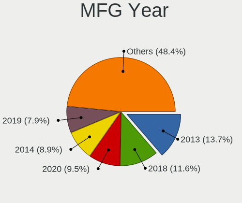

| Year | Computers | Percent |
|------|-----------|---------|
| 2020 | 37        | 19.68%  |
| 2019 | 21        | 11.17%  |
| 2018 | 20        | 10.64%  |
| 2013 | 19        | 10.11%  |
| 2014 | 16        | 8.51%   |
| 2017 | 11        | 5.85%   |
| 2016 | 11        | 5.85%   |
| 2012 | 11        | 5.85%   |
| 2009 | 10        | 5.32%   |
| 2015 | 8         | 4.26%   |
| 2011 | 7         | 3.72%   |
| 2010 | 6         | 3.19%   |
| 2008 | 5         | 2.66%   |
| 2021 | 3         | 1.6%    |
| 2007 | 2         | 1.06%   |
| 2006 | 1         | 0.53%   |

Form Factor
-----------

Physical design of the computer

| Name        | Computers | Percent |
|-------------|-----------|---------|
| Notebook    | 91        | 48.4%   |
| Desktop     | 89        | 47.34%  |
| Mini pc     | 4         | 2.13%   |
| Server      | 2         | 1.06%   |
| Convertible | 1         | 0.53%   |
| All in one  | 1         | 0.53%   |

Coreboot
--------

Have coreboot on board

| Used | Computers | Percent |
|------|-----------|---------|
| No   | 186       | 98.94%  |
| Yes  | 2         | 1.06%   |

RAM Size
--------

Total RAM memory

| Size in GB  | Computers | Percent |
|-------------|-----------|---------|
| 8.01-16.0   | 63        | 33.51%  |
| 4.01-8.0    | 54        | 28.72%  |
| 16.01-24.0  | 51        | 27.13%  |
| 32.01-64.0  | 13        | 6.91%   |
| 24.01-32.0  | 4         | 2.13%   |
| 64.01-256.0 | 3         | 1.6%    |

RAM Used
--------

Used RAM memory

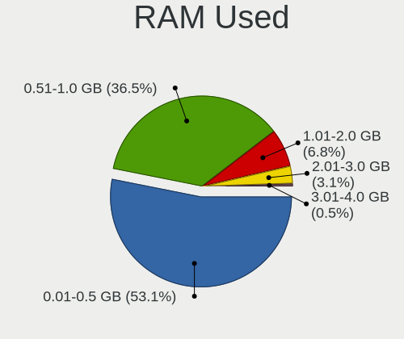

| Used GB  | Computers | Percent |
|----------|-----------|---------|
| 0.01-0.5 | 101       | 53.44%  |
| 0.51-1.0 | 68        | 35.98%  |
| 1.01-2.0 | 13        | 6.88%   |
| 2.01-3.0 | 6         | 3.17%   |
| 3.01-4.0 | 1         | 0.53%   |

Total Drives
------------

Number of drives on board

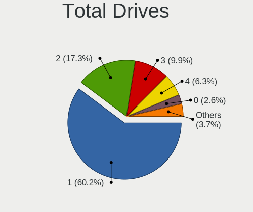

| Drives | Computers | Percent |
|--------|-----------|---------|
| 1      | 114       | 60.64%  |
| 2      | 33        | 17.55%  |
| 3      | 19        | 10.11%  |
| 4      | 11        | 5.85%   |
| 0      | 5         | 2.66%   |
| 5      | 3         | 1.6%    |
| 6      | 2         | 1.06%   |
| 7      | 1         | 0.53%   |

Has CD-ROM
----------

Has CD-ROM on board

| Presented | Computers | Percent |
|-----------|-----------|---------|
| No        | 109       | 57.98%  |
| Yes       | 79        | 42.02%  |

Has Ethernet
------------

Has Ethernet on board

| Presented | Computers | Percent |
|-----------|-----------|---------|
| Yes       | 179       | 95.21%  |
| No        | 9         | 4.79%   |

Has WiFi
--------

Has WiFi module

| Presented | Computers | Percent |
|-----------|-----------|---------|
| Yes       | 119       | 63.3%   |
| No        | 69        | 36.7%   |

Has Bluetooth
-------------

Has Bluetooth module

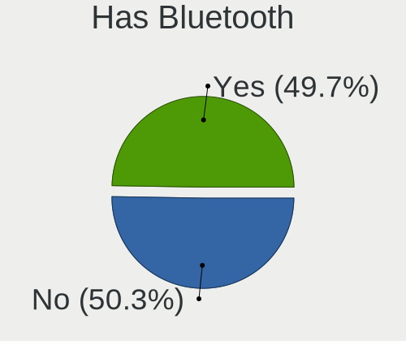

| Presented | Computers | Percent |
|-----------|-----------|---------|
| Yes       | 94        | 50%     |
| No        | 94        | 50%     |

Location
--------

Country
-------

Geographic location (country)

| Country      | Computers | Percent |
|--------------|-----------|---------|
| Germany      | 32        | 17.02%  |
| USA          | 27        | 14.36%  |
| Brazil       | 15        | 7.98%   |
| Italy        | 12        | 6.38%   |
| France       | 11        | 5.85%   |
| UK           | 10        | 5.32%   |
| Spain        | 9         | 4.79%   |
| Russia       | 6         | 3.19%   |
| Australia    | 6         | 3.19%   |
| China        | 5         | 2.66%   |
| Canada       | 5         | 2.66%   |
| Hungary      | 4         | 2.13%   |
| Ukraine      | 3         | 1.6%    |
| Poland       | 3         | 1.6%    |
| Mexico       | 3         | 1.6%    |
| India        | 3         | 1.6%    |
| UAE          | 2         | 1.06%   |
| Taiwan       | 2         | 1.06%   |
| Sweden       | 2         | 1.06%   |
| South Africa | 2         | 1.06%   |
| Portugal     | 2         | 1.06%   |
| Netherlands  | 2         | 1.06%   |
| Macao        | 2         | 1.06%   |
| Japan        | 2         | 1.06%   |
| Greece       | 2         | 1.06%   |
| Croatia      | 2         | 1.06%   |
| Switzerland  | 1         | 0.53%   |
| South Korea  | 1         | 0.53%   |
| Philippines  | 1         | 0.53%   |
| Peru         | 1         | 0.53%   |
| Lithuania    | 1         | 0.53%   |
| Ireland      | 1         | 0.53%   |
| Indonesia    | 1         | 0.53%   |
| Finland      | 1         | 0.53%   |
| Estonia      | 1         | 0.53%   |
| Egypt        | 1         | 0.53%   |
| Colombia     | 1         | 0.53%   |
| Chile        | 1         | 0.53%   |
| Bulgaria     | 1         | 0.53%   |
| Belgium      | 1         | 0.53%   |

City
----

Geographic location (city)

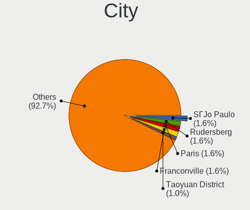

| City                  | Computers | Percent |
|-----------------------|-----------|---------|
| So Paulo            | 3         | 1.59%   |
| Rudersberg            | 3         | 1.59%   |
| Paris                 | 3         | 1.59%   |
| Franconville          | 3         | 1.59%   |
| Taoyuan District      | 2         | 1.06%   |
| Stourbridge           | 2         | 1.06%   |
| Seattle               | 2         | 1.06%   |
| Reigate               | 2         | 1.06%   |
| Oklahoma City         | 2         | 1.06%   |
| New York              | 2         | 1.06%   |
| Marlborough           | 2         | 1.06%   |
| Macao                 | 2         | 1.06%   |
| Halle                 | 2         | 1.06%   |
| Guangzhou             | 2         | 1.06%   |
| Curitiba              | 2         | 1.06%   |
| Canberra              | 2         | 1.06%   |
| Budapest              | 2         | 1.06%   |
| Brighton              | 2         | 1.06%   |
| Berlin                | 2         | 1.06%   |
| witochowice     | 1         | 0.53%   |
| Zaragoza              | 1         | 0.53%   |
| Zajaczki Pierwsze     | 1         | 0.53%   |
| Wesley Chapel         | 1         | 0.53%   |
| Ware                  | 1         | 0.53%   |
| Vilnius               | 1         | 0.53%   |
| Victoria              | 1         | 0.53%   |
| Vereeniging           | 1         | 0.53%   |
| Velika Gorica         | 1         | 0.53%   |
| Valencia              | 1         | 0.53%   |
| Utrecht               | 1         | 0.53%   |
| Ufa                   | 1         | 0.53%   |
| Uberaba               | 1         | 0.53%   |
| Turin                 | 1         | 0.53%   |
| Trieste               | 1         | 0.53%   |
| Toronto               | 1         | 0.53%   |
| Tomah                 | 1         | 0.53%   |
| Tilburg               | 1         | 0.53%   |
| Tieling               | 1         | 0.53%   |
| The Bronx             | 1         | 0.53%   |
| Terrassa              | 1         | 0.53%   |
| Terni                 | 1         | 0.53%   |
| Teresopolis           | 1         | 0.53%   |
| Tallinn               | 1         | 0.53%   |
| Sydney                | 1         | 0.53%   |
| Surabaya              | 1         | 0.53%   |
| St Petersburg         | 1         | 0.53%   |
| St Louis              | 1         | 0.53%   |
| Sintra                | 1         | 0.53%   |
| Siklos                | 1         | 0.53%   |
| Sheffield             | 1         | 0.53%   |
| Sevastopol            | 1         | 0.53%   |
| Schluechtern          | 1         | 0.53%   |
| Sasso Marconi         | 1         | 0.53%   |
| Sao Jeronimo da Serra | 1         | 0.53%   |
| Santiago              | 1         | 0.53%   |
| Sannicandro di Bari   | 1         | 0.53%   |
| Sankt Augustin        | 1         | 0.53%   |
| Sandy                 | 1         | 0.53%   |
| Sandhausen            | 1         | 0.53%   |
| Salzwedel             | 1         | 0.53%   |

Drives
------

Drive Vendor
------------

Hard drive vendors

| Vendor              | Computers | Drives | Percent |
|---------------------|-----------|--------|---------|
| WDC                 | 46        | 58     | 16.61%  |
| Samsung Electronics | 46        | 66     | 16.61%  |
| Seagate             | 39        | 49     | 14.08%  |
| Kingston            | 23        | 23     | 8.3%    |
| Crucial             | 19        | 24     | 6.86%   |
| SanDisk             | 18        | 19     | 6.5%    |
| Toshiba             | 17        | 17     | 6.14%   |
| Hitachi             | 11        | 14     | 3.97%   |
| Intel               | 7         | 7      | 2.53%   |
| Micron Technology   | 6         | 6      | 2.17%   |
| SPCC                | 5         | 5      | 1.81%   |
| PNY                 | 3         | 3      | 1.08%   |
| HGST                | 3         | 3      | 1.08%   |
| Transcend           | 2         | 2      | 0.72%   |
| SK Hynix            | 2         | 2      | 0.72%   |
| Patriot             | 2         | 2      | 0.72%   |
| OCZ                 | 2         | 3      | 0.72%   |
| LITEON              | 2         | 2      | 0.72%   |
| GOODRAM             | 2         | 2      | 0.72%   |
| Gigabyte Technology | 2         | 3      | 0.72%   |
| Corsair             | 2         | 2      | 0.72%   |
| A-DATA Technology   | 2         | 2      | 0.72%   |
| Silicon Motion      | 1         | 1      | 0.36%   |
| Pioneer             | 1         | 1      | 0.36%   |
| Phison              | 1         | 3      | 0.36%   |
| MAXTOR              | 1         | 1      | 0.36%   |
| LITEONIT            | 1         | 1      | 0.36%   |
| Lexar               | 1         | 1      | 0.36%   |
| KingDian            | 1         | 1      | 0.36%   |
| Intenso             | 1         | 1      | 0.36%   |
| Hoodisk             | 1         | 1      | 0.36%   |
| Hikvision           | 1         | 1      | 0.36%   |
| Fujitsu             | 1         | 1      | 0.36%   |
| Enmotus             | 1         | 1      | 0.36%   |
| EMTEC               | 1         | 1      | 0.36%   |
| Colorful            | 1         | 1      | 0.36%   |
| China               | 1         | 1      | 0.36%   |
| Apple               | 1         | 1      | 0.36%   |

Drive Model
-----------

Hard drive models

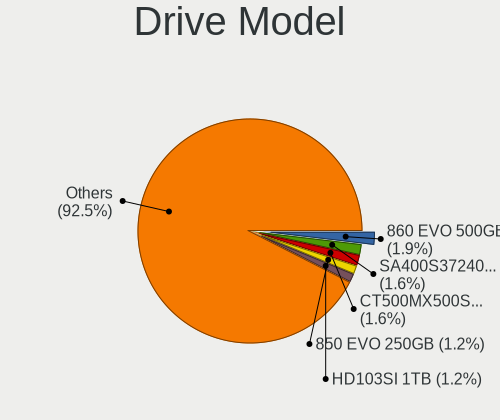

| Model                               | Computers | Percent |
|-------------------------------------|-----------|---------|
| Samsung SSD 860 EVO 500GB           | 6         | 1.9%    |
| Kingston SA400S37240G 240GB         | 5         | 1.58%   |
| Crucial CT500MX500SSD1 500GB        | 5         | 1.58%   |
| Samsung SSD 850 EVO 250GB           | 4         | 1.27%   |
| Samsung HD103SI 1TB                 | 4         | 1.27%   |
| Micron 1100 SATA 256GB              | 4         | 1.27%   |
| Kingston SV300S37A120G 120GB        | 4         | 1.27%   |
| WDC WDS240G2G0A-00JH30 240GB        | 3         | 0.95%   |
| Toshiba MQ01ABD100 1TB              | 3         | 0.95%   |
| Toshiba DT01ACA100 1TB              | 3         | 0.95%   |
| Seagate ST500DM002-1BD142 500GB     | 3         | 0.95%   |
| SanDisk pSSD 256GB                  | 3         | 0.95%   |
| Samsung SSD 860 EVO 250GB           | 3         | 0.95%   |
| Samsung SSD 840 EVO 1TB             | 3         | 0.95%   |
| WDC WDS100T2B0A-00SM50 1TB          | 2         | 0.63%   |
| WDC WD20EARX-00PASB0 2TB            | 2         | 0.63%   |
| WDC WD1600BEVS-08VAT2 160GB         | 2         | 0.63%   |
| WDC WD10EZEX-00RKKA0 1TB            | 2         | 0.63%   |
| Toshiba Q300 240GB                  | 2         | 0.63%   |
| SPCC Solid State Disk 512GB         | 2         | 0.63%   |
| Seagate ST750LM022 HN-M750MBB 752GB | 2         | 0.63%   |
| Seagate ST500LX025-1U717D 500GB     | 2         | 0.63%   |
| Seagate ST500LM021-1KJ152 500GB     | 2         | 0.63%   |
| Seagate ST500LM012 HN-M500MBB 500GB | 2         | 0.63%   |
| Seagate ST1000DM010-2EP102 1TB      | 2         | 0.63%   |
| Seagate ST1000DM003-1ER162 1TB      | 2         | 0.63%   |
| SanDisk SDSSDA240G 240GB            | 2         | 0.63%   |
| Samsung SSD 960 EVO 500GB           | 2         | 0.63%   |
| Samsung SSD 960 EVO 250GB           | 2         | 0.63%   |
| Samsung SSD 840 EVO 250GB           | 2         | 0.63%   |
| Samsung SSD 840 EVO 120GB           | 2         | 0.63%   |
| Samsung MZVLW256HEHP-000L7 256GB    | 2         | 0.63%   |
| Samsung HD322HJ 320GB               | 2         | 0.63%   |
| PNY CS900 240GB SSD                 | 2         | 0.63%   |
| Kingston SUV500M8240G 240GB         | 2         | 0.63%   |
| Kingston SA400S37480G 480GB         | 2         | 0.63%   |
| Kingston SA2000M8250G 250GB         | 2         | 0.63%   |
| Crucial M4-CT128M4SSD2 128GB        | 2         | 0.63%   |
| Crucial CT500MX500SSD4 500GB        | 2         | 0.63%   |
| Crucial CT250MX500SSD1 250GB        | 2         | 0.63%   |
| Crucial CT240BX500SSD1 240GB        | 2         | 0.63%   |
| WDC WDS500G2B0A-00SM50 500GB        | 1         | 0.32%   |
| WDC WDS250G2B0A-00SM50 250GB        | 1         | 0.32%   |
| WDC WDS200T2B0A 2TB                 | 1         | 0.32%   |
| WDC WDS120G2G0B-00EPW0 120GB        | 1         | 0.32%   |
| WDC WDS120G2G0A-00JH30 120GB        | 1         | 0.32%   |
| WDC WDS120G1G0A-00SS50 120GB        | 1         | 0.32%   |
| WDC WDS100T2G0A-00JH30 1TB          | 1         | 0.32%   |
| WDC WD7500AAVS-00D7B0 752GB         | 1         | 0.32%   |
| WDC WD60EMAZ-11LW3B0 6TB            | 1         | 0.32%   |
| WDC WD5003ABYZ-011FA0 500GB         | 1         | 0.32%   |
| WDC WD5003ABYX-88 LEN 500GB         | 1         | 0.32%   |
| WDC WD5000LPCX-24VHAT0 500GB        | 1         | 0.32%   |
| WDC WD5000LPCX-24C6HT0 500GB        | 1         | 0.32%   |
| WDC WD5000LPCX-21VHAT0 500GB        | 1         | 0.32%   |
| WDC WD5000BEVT-00A03T0 500GB        | 1         | 0.32%   |
| WDC WD5000AVCS-632DY1 500GB         | 1         | 0.32%   |
| WDC WD5000AAKX-00ERMA0 500GB        | 1         | 0.32%   |
| WDC WD5000AAKS-00E4A0 500GB         | 1         | 0.32%   |
| WDC WD5000AADS-00S9B0 500GB         | 1         | 0.32%   |

HDD Vendor
----------

Hard disk drive vendors

| Vendor              | Computers | Drives | Percent |
|---------------------|-----------|--------|---------|
| Seagate             | 39        | 49     | 34.21%  |
| WDC                 | 37        | 43     | 32.46%  |
| Toshiba             | 11        | 11     | 9.65%   |
| Samsung Electronics | 11        | 16     | 9.65%   |
| Hitachi             | 11        | 14     | 9.65%   |
| HGST                | 3         | 3      | 2.63%   |
| MAXTOR              | 1         | 1      | 0.88%   |
| Fujitsu             | 1         | 1      | 0.88%   |

SSD Vendor
----------

Solid state drive vendors

| Vendor              | Computers | Drives | Percent |
|---------------------|-----------|--------|---------|
| Samsung Electronics | 30        | 37     | 21.28%  |
| Kingston            | 20        | 20     | 14.18%  |
| SanDisk             | 18        | 19     | 12.77%  |
| Crucial             | 18        | 23     | 12.77%  |
| WDC                 | 11        | 12     | 7.8%    |
| Micron Technology   | 6         | 6      | 4.26%   |
| Toshiba             | 4         | 4      | 2.84%   |
| SPCC                | 4         | 4      | 2.84%   |
| Intel               | 4         | 4      | 2.84%   |
| PNY                 | 3         | 3      | 2.13%   |
| Transcend           | 2         | 2      | 1.42%   |
| Patriot             | 2         | 2      | 1.42%   |
| OCZ                 | 2         | 3      | 1.42%   |
| LITEON              | 2         | 2      | 1.42%   |
| GOODRAM             | 2         | 2      | 1.42%   |
| A-DATA Technology   | 2         | 2      | 1.42%   |
| SK Hynix            | 1         | 1      | 0.71%   |
| Pioneer             | 1         | 1      | 0.71%   |
| LITEONIT            | 1         | 1      | 0.71%   |
| Lexar               | 1         | 1      | 0.71%   |
| KingDian            | 1         | 1      | 0.71%   |
| Intenso             | 1         | 1      | 0.71%   |
| Hoodisk             | 1         | 1      | 0.71%   |
| Hikvision           | 1         | 1      | 0.71%   |
| EMTEC               | 1         | 1      | 0.71%   |
| China               | 1         | 1      | 0.71%   |
| Apple               | 1         | 1      | 0.71%   |

Drive Kind
----------

HDD or SSD

| Kind | Computers | Drives | Percent |
|------|-----------|--------|---------|
| SSD  | 114       | 156    | 48.31%  |
| HDD  | 92        | 138    | 38.98%  |
| NVMe | 30        | 38     | 12.71%  |

Drive Connector
---------------

SATA, SAS, NVMe, etc.

| Type | Computers | Drives | Percent |
|------|-----------|--------|---------|
| SATA | 172       | 294    | 85.15%  |
| NVMe | 30        | 38     | 14.85%  |

Drive Size
----------

Size of hard drive

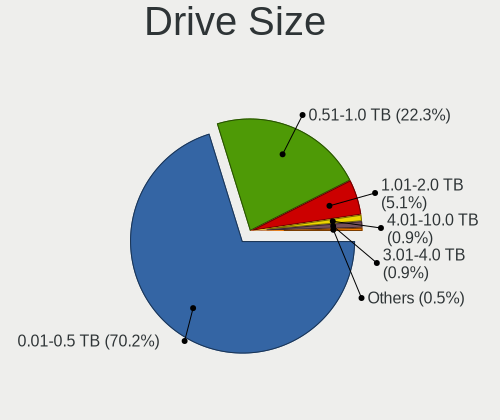

| Size in TB | Computers | Drives | Percent |
|------------|-----------|--------|---------|
| 0.01-0.5   | 149       | 210    | 70.62%  |
| 0.51-1.0   | 46        | 64     | 21.8%   |
| 1.01-2.0   | 11        | 14     | 5.21%   |
| 3.01-4.0   | 2         | 2      | 0.95%   |
| 4.01-10.0  | 2         | 2      | 0.95%   |
| 2.01-3.0   | 1         | 2      | 0.47%   |

Space Total
-----------

Amount of disk space available on the file system

| Size in GB | Computers | Percent |
|------------|-----------|---------|
| 1-20       | 140       | 74.07%  |
| 101-250    | 29        | 15.34%  |
| 251-500    | 13        | 6.88%   |
| 501-1000   | 4         | 2.12%   |
| 51-100     | 2         | 1.06%   |
| 21-50      | 1         | 0.53%   |

Space Used
----------

Amount of used disk space

| Used GB | Computers | Percent |
|---------|-----------|---------|
| 1-20    | 188       | 100%    |

Malfunc. Drives
---------------

Drive models with a malfunction

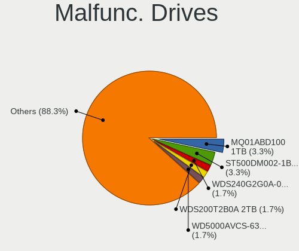

| Model                                        | Computers | Drives | Percent |
|----------------------------------------------|-----------|--------|---------|
| Toshiba MQ01ABD100 1TB                       | 2         | 2      | 3.45%   |
| Seagate ST500DM002-1BD142 500GB              | 2         | 3      | 3.45%   |
| WDC WDS240G2G0A-00JH30 240GB                 | 1         | 1      | 1.72%   |
| WDC WDS200T2B0A 2TB                          | 1         | 1      | 1.72%   |
| WDC WD5000AVCS-632DY1 500GB                  | 1         | 1      | 1.72%   |
| WDC WD5000AAKS-00E4A0 500GB                  | 1         | 1      | 1.72%   |
| WDC WD3200BPVT-55ZEST0 320GB                 | 1         | 1      | 1.72%   |
| WDC WD3200BEVT-60ZCT1 320GB                  | 1         | 1      | 1.72%   |
| WDC WD3200BEKT-60V5T1 320GB                  | 1         | 1      | 1.72%   |
| WDC WD2500AAKX-083CA1 250GB                  | 1         | 1      | 1.72%   |
| WDC WD20EVDS-63T3B0 2TB                      | 1         | 1      | 1.72%   |
| WDC WD20EARX-00PASB0 2TB                     | 1         | 1      | 1.72%   |
| WDC WD2002FYPS-01U1B1 2TB                    | 1         | 1      | 1.72%   |
| WDC WD1600BEVS-60RST0 160GB                  | 1         | 1      | 1.72%   |
| WDC WD10JPVX-75JC3T0 1TB                     | 1         | 1      | 1.72%   |
| WDC WD10JMVW-11AJGS0 1TB                     | 1         | 1      | 1.72%   |
| WDC WD10EZEX-00RKKA0 1TB                     | 1         | 1      | 1.72%   |
| WDC WD10EAVS-00D7B0 1TB                      | 1         | 1      | 1.72%   |
| Toshiba MQ02ABF050H-SSHD-8GB                 | 1         | 1      | 1.72%   |
| Toshiba MK2555GSXF 250GB                     | 1         | 1      | 1.72%   |
| Seagate ST9500420AS 500GB                    | 1         | 1      | 1.72%   |
| Seagate ST9320325AS 320GB                    | 1         | 1      | 1.72%   |
| Seagate ST9160314AS 160GB                    | 1         | 1      | 1.72%   |
| Seagate ST750LM022 HN-M750MBB 752GB          | 1         | 1      | 1.72%   |
| Seagate ST320LT012-9WS14C 320GB              | 1         | 1      | 1.72%   |
| Seagate ST320LM001 HN-M320MBB 320GB          | 1         | 1      | 1.72%   |
| Seagate ST3160215AS 160GB                    | 1         | 1      | 1.72%   |
| Seagate ST31500341AS 1.5TB                   | 1         | 1      | 1.72%   |
| Seagate ST1000LM025 HN-M101ABB 1TB           | 1         | 1      | 1.72%   |
| Seagate ST1000DX001-1CM162 1TB               | 1         | 1      | 1.72%   |
| Seagate ST1000DM003-9YN162 1TB               | 1         | 1      | 1.72%   |
| SanDisk SSD PLUS 480GB                       | 1         | 1      | 1.72%   |
| SanDisk SD5SG2128G1052E 128GB                | 1         | 1      | 1.72%   |
| Samsung Electronics SP2514N 250GB            | 1         | 1      | 1.72%   |
| Samsung Electronics MZHPV512HDGL-00000 512GB | 1         | 1      | 1.72%   |
| Samsung Electronics HM321HI 320GB            | 1         | 1      | 1.72%   |
| Samsung Electronics HM320JI 320GB            | 1         | 1      | 1.72%   |
| Samsung Electronics HD753LJ 752GB            | 1         | 1      | 1.72%   |
| Samsung Electronics HD252HJ 250GB            | 1         | 1      | 1.72%   |
| Samsung Electronics HD103UJ 1TB              | 1         | 1      | 1.72%   |
| Samsung Electronics HD103SI 1TB              | 1         | 1      | 1.72%   |
| Micron Technology 1100 SATA 256GB            | 1         | 1      | 1.72%   |
| LITEON LJH-64V2G-11 M.2 2260 64GB            | 1         | 1      | 1.72%   |
| Kingston SA400S37480G 480GB                  | 1         | 1      | 1.72%   |
| Intel SSDSC2CT180A3 180GB                    | 1         | 1      | 1.72%   |
| Intel SSDSC2BF180A4L 180GB                   | 1         | 1      | 1.72%   |
| Intel SSDSA2M080G2GC 80GB                    | 1         | 1      | 1.72%   |
| Intel SSDPEKKW512G7 512GB                    | 1         | 1      | 1.72%   |
| Hitachi HTS725050A9A364 500GB                | 1         | 1      | 1.72%   |
| Hitachi HTS545025B9SA02 250GB                | 1         | 1      | 1.72%   |
| Hitachi HTS543216L9A300 160GB                | 1         | 1      | 1.72%   |
| Hitachi HTS541612J9SA00 120GB                | 1         | 1      | 1.72%   |
| Hitachi HCS5C1050CLA382 500GB                | 1         | 1      | 1.72%   |
| HGST HTS725050A7E630 500GB                   | 1         | 1      | 1.72%   |
| HGST HTS545032A7E380 320GB                   | 1         | 1      | 1.72%   |
| Crucial CT525MX300SSD1 528GB                 | 1         | 2      | 1.72%   |

Malfunc. Drive Vendor
---------------------

Vendors of faulty drives

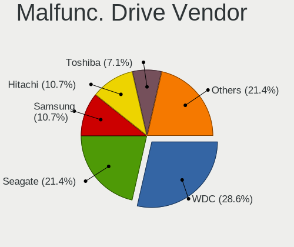

| Vendor              | Computers | Drives | Percent |
|---------------------|-----------|--------|---------|
| WDC                 | 16        | 16     | 29.09%  |
| Seagate             | 12        | 14     | 21.82%  |
| Samsung Electronics | 6         | 8      | 10.91%  |
| Hitachi             | 5         | 5      | 9.09%   |
| Toshiba             | 4         | 4      | 7.27%   |
| Intel               | 4         | 4      | 7.27%   |
| SanDisk             | 2         | 2      | 3.64%   |
| HGST                | 2         | 2      | 3.64%   |
| Micron Technology   | 1         | 1      | 1.82%   |
| LITEON              | 1         | 1      | 1.82%   |
| Kingston            | 1         | 1      | 1.82%   |
| Crucial             | 1         | 2      | 1.82%   |

Malfunc. HDD Vendor
-------------------

Vendors of faulty HDD drives

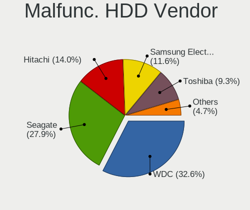

| Vendor              | Computers | Drives | Percent |
|---------------------|-----------|--------|---------|
| WDC                 | 14        | 14     | 33.33%  |
| Seagate             | 12        | 14     | 28.57%  |
| Samsung Electronics | 5         | 7      | 11.9%   |
| Hitachi             | 5         | 5      | 11.9%   |
| Toshiba             | 4         | 4      | 9.52%   |
| HGST                | 2         | 2      | 4.76%   |

Malfunc. Drive Kind
-------------------

Kinds of faulty drives

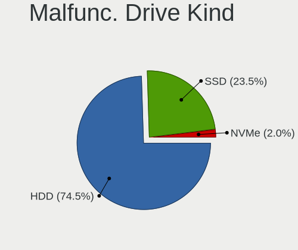

| Kind | Computers | Drives | Percent |
|------|-----------|--------|---------|
| HDD  | 37        | 46     | 74%     |
| SSD  | 12        | 13     | 24%     |
| NVMe | 1         | 1      | 2%      |

Failed Drives
-------------

Failed drive models

Zero info for selected period =(

Failed Drive Vendor
-------------------

Failed drive vendors

Zero info for selected period =(

Drive Status
------------

Number of failed and malfunc. drives

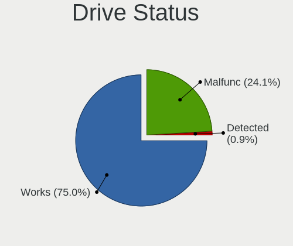

| Status   | Computers | Drives | Percent |
|----------|-----------|--------|---------|
| Works    | 157       | 270    | 75.12%  |
| Malfunc  | 50        | 60     | 23.92%  |
| Detected | 2         | 2      | 0.96%   |

Storage controller
------------------

Storage Vendor
--------------

Storage controller vendors

| Vendor                      | Computers | Percent |
|-----------------------------|-----------|---------|
| Intel                       | 152       | 67.86%  |
| AMD                         | 27        | 12.05%  |
| Samsung Electronics         | 12        | 5.36%   |
| Phison Electronics          | 5         | 2.23%   |
| ASMedia Technology          | 5         | 2.23%   |
| Nvidia                      | 4         | 1.79%   |
| Sandisk                     | 3         | 1.34%   |
| Kingston Technology Company | 3         | 1.34%   |
| Toshiba                     | 2         | 0.89%   |
| Silicon Motion              | 2         | 0.89%   |
| Marvell Technology Group    | 2         | 0.89%   |
| JMicron Technology          | 2         | 0.89%   |
| SK Hynix                    | 1         | 0.45%   |
| Micron/Crucial Technology   | 1         | 0.45%   |
| Enmotus                     | 1         | 0.45%   |
| Broadcom / LSI              | 1         | 0.45%   |
| Broadcom                    | 1         | 0.45%   |

Storage Model
-------------

Storage controller models

| Model                                                                          | Computers | Percent |
|--------------------------------------------------------------------------------|-----------|---------|
| AMD FCH SATA Controller [AHCI mode]                                            | 19        | 7.36%   |
| Intel 7 Series Chipset Family 6-port SATA Controller [AHCI mode]               | 18        | 6.98%   |
| Intel Sunrise Point-LP SATA Controller [AHCI mode]                             | 16        | 6.2%    |
| Intel 8 Series/C220 Series Chipset Family 6-port SATA Controller 1 [AHCI mode] | 16        | 6.2%    |
| Intel 8 Series SATA Controller 1 [AHCI mode]                                   | 9         | 3.49%   |
| Intel 6 Series/C200 Series Chipset Family 6 port Desktop SATA AHCI Controller  | 9         | 3.49%   |
| Intel Q170/Q150/B150/H170/H110/Z170/CM236 Chipset SATA Controller [AHCI Mode]  | 8         | 3.1%    |
| Samsung NVMe SSD Controller SM961/PM961/SM963                                  | 7         | 2.71%   |
| Intel 82801IBM/IEM (ICH9M/ICH9M-E) 4 port SATA Controller [AHCI mode]          | 7         | 2.71%   |
| Intel 7 Series/C210 Series Chipset Family 6-port SATA Controller [AHCI mode]   | 7         | 2.71%   |
| Intel 6 Series/C200 Series Chipset Family 6 port Mobile SATA AHCI Controller   | 7         | 2.71%   |
| Intel NM10/ICH7 Family SATA Controller [IDE mode]                              | 5         | 1.94%   |
| ASMedia ASM1062 Serial ATA Controller                                          | 5         | 1.94%   |
| AMD SB7x0/SB8x0/SB9x0 IDE Controller                                           | 5         | 1.94%   |
| AMD 400 Series Chipset SATA Controller                                         | 5         | 1.94%   |
| Samsung NVMe SSD Controller SM981/PM981/PM983                                  | 4         | 1.55%   |
| Intel Wildcat Point-LP SATA Controller [AHCI Mode]                             | 4         | 1.55%   |
| Intel SATA Controller [RAID mode]                                              | 4         | 1.55%   |
| Intel Cannon Lake PCH SATA AHCI Controller                                     | 4         | 1.55%   |
| Intel 82801 Mobile SATA Controller [RAID mode]                                 | 4         | 1.55%   |
| Intel 5 Series/3400 Series Chipset 6 port SATA AHCI Controller                 | 4         | 1.55%   |
| AMD SB7x0/SB8x0/SB9x0 SATA Controller [IDE mode]                               | 4         | 1.55%   |
| Nvidia MCP79 AHCI Controller                                                   | 3         | 1.16%   |
| Intel 9 Series Chipset Family SATA Controller [AHCI Mode]                      | 3         | 1.16%   |
| Intel 82801HM/HEM (ICH8M/ICH8M-E) SATA Controller [AHCI mode]                  | 3         | 1.16%   |
| Intel 82801HM/HEM (ICH8M/ICH8M-E) IDE Controller                               | 3         | 1.16%   |
| Intel 82801G (ICH7 Family) IDE Controller                                      | 3         | 1.16%   |
| AMD SB7x0/SB8x0/SB9x0 SATA Controller [AHCI mode]                              | 3         | 1.16%   |
| AMD 300 Series Chipset SATA Controller                                         | 3         | 1.16%   |
| Unknown                                                                        | 3         | 1.16%   |
| Phison PS5013 E13 NVMe Controller                                              | 2         | 0.78%   |
| Phison E16 PCIe4 NVMe Controller                                               | 2         | 0.78%   |
| Phison E12 NVMe Controller                                                     | 2         | 0.78%   |
| Marvell Group 88SE9172 SATA 6Gb/s Controller                                   | 2         | 0.78%   |
| Kingston Company A2000 NVMe SSD                                                | 2         | 0.78%   |
| Intel Mobile 4 Series Chipset PT IDER Controller                               | 2         | 0.78%   |
| Intel HM170/QM170 Chipset SATA Controller [AHCI Mode]                          | 2         | 0.78%   |
| Intel Comet Lake PCH-LP SATA RAID Premium Controller                           | 2         | 0.78%   |
| Intel Celeron/Pentium Silver Processor SATA Controller                         | 2         | 0.78%   |
| Intel Cannon Point-LP SATA Controller [AHCI Mode]                              | 2         | 0.78%   |
| Intel 5 Series/3400 Series Chipset 4 port SATA AHCI Controller                 | 2         | 0.78%   |
| Intel 200 Series PCH SATA controller [AHCI mode]                               | 2         | 0.78%   |
| Toshiba XG6 NVMe SSD Controller                                                | 1         | 0.39%   |
| Toshiba XG4 NVMe SSD Controller                                                | 1         | 0.39%   |
| SK Hynix BC501 NVMe Solid State Drive                                          | 1         | 0.39%   |
| Silicon Motion SM2263EN/SM2263XT SSD Controller                                | 1         | 0.39%   |
| Silicon Motion SM2262/SM2262EN SSD Controller                                  | 1         | 0.39%   |
| Sandisk WD Blue SN550 NVMe SSD                                                 | 1         | 0.39%   |
| Sandisk WD Black SN750 / PC SN730 NVMe SSD                                     | 1         | 0.39%   |
| Sandisk PC SN520 NVMe SSD                                                      | 1         | 0.39%   |
| Samsung SM951 AHCI                                                             | 1         | 0.39%   |
| Samsung NVMe SSD Controller SM951/PM951                                        | 1         | 0.39%   |
| Nvidia MCP73 IDE Controller                                                    | 1         | 0.39%   |
| Nvidia GeForce 7100/nForce 630i SATA                                           | 1         | 0.39%   |
| Micron/Crucial P1 NVMe PCIe SSD                                                | 1         | 0.39%   |
| JMicron JMB368 IDE controller                                                  | 1         | 0.39%   |
| JMicron JMB360 AHCI Controller                                                 | 1         | 0.39%   |
| Intel SSD 660P Series                                                          | 1         | 0.39%   |
| Intel SSD 600P Series                                                          | 1         | 0.39%   |
| Intel Celeron N3350/Pentium N4200/Atom E3900 Series SATA AHCI Controller       | 1         | 0.39%   |

Storage Kind
------------

Kind of storage controller (IDE, SATA, NVMe, SAS, ...)

| Kind | Computers | Percent |
|------|-----------|---------|
| SATA | 157       | 70.09%  |
| NVMe | 29        | 12.95%  |
| IDE  | 25        | 11.16%  |
| RAID | 11        | 4.91%   |
| SAS  | 1         | 0.45%   |
| SCSI | 1         | 0.45%   |

Processor
---------

CPU Vendor
----------

Processor vendors

| Vendor | Computers | Percent |
|--------|-----------|---------|
| Intel  | 160       | 85.11%  |
| AMD    | 28        | 14.89%  |

CPU Model
---------

Processor models

| Model                                       | Computers | Percent |
|---------------------------------------------|-----------|---------|
| Intel Core i5-7200U CPU @ 2.50GHz           | 4         | 2.13%   |
| Intel Core i5-3320M CPU @ 2.60GHz           | 4         | 2.13%   |
| Intel Core 2 Duo                            | 4         | 2.13%   |
| Intel Core i7-7500U CPU @ 2.70GHz           | 3         | 1.6%    |
| Intel Core i7-6600U CPU @ 2.60GHz           | 3         | 1.6%    |
| Intel Core i7-4790 CPU @ 3.60GHz            | 3         | 1.6%    |
| Intel Core i5-3317U CPU @ 1.70GHz           | 3         | 1.6%    |
| Intel Core i3-6100T CPU @ 3.20GHz           | 3         | 1.6%    |
| Intel Core i3-3227U CPU @ 1.90GHz           | 3         | 1.6%    |
| AMD Ryzen 5 1600 Six-Core Processor         | 3         | 1.6%    |
| Intel CPU Version                           | 2         | 1.06%   |
| Intel Core i7-8700 CPU @ 3.20GHz            | 2         | 1.06%   |
| Intel Core i7-7600U CPU @ 2.80GHz           | 2         | 1.06%   |
| Intel Core i7-4770 CPU @ 3.40GHz            | 2         | 1.06%   |
| Intel Core i7-4702MQ CPU @ 2.20GHz          | 2         | 1.06%   |
| Intel Core i7-3770K CPU @ 3.50GHz           | 2         | 1.06%   |
| Intel Core i7-3520M CPU @ 2.90GHz           | 2         | 1.06%   |
| Intel Core i5-9400 CPU @ 2.90GHz            | 2         | 1.06%   |
| Intel Core i5-8250U CPU @ 1.60GHz           | 2         | 1.06%   |
| Intel Core i5-5200U CPU @ 2.20GHz           | 2         | 1.06%   |
| Intel Core i5-4590 CPU @ 3.30GHz            | 2         | 1.06%   |
| Intel Core i5-4300U CPU @ 1.90GHz           | 2         | 1.06%   |
| Intel Core i5-3570K CPU @ 3.40GHz           | 2         | 1.06%   |
| Intel Core i5 CPU M 520 @ 2.40GHz           | 2         | 1.06%   |
| Intel Core i3-6100 CPU @ 3.70GHz            | 2         | 1.06%   |
| Intel Core 2 Duo CPU P8700 @ 2.53GHz        | 2         | 1.06%   |
| Intel Core 2 Duo CPU P8600 @ 2.40GHz        | 2         | 1.06%   |
| AMD Ryzen 5 3400G with Radeon Vega Graphics | 2         | 1.06%   |
| Intel Xeon CPU X5690 @ 3.47GHz              | 1         | 0.53%   |
| Intel Xeon CPU X                            | 1         | 0.53%   |
| Intel Xeon CPU E5-2620 0 @ 2.00GHz          | 1         | 0.53%   |
| Intel Xeon CPU E5-1620 v4 @ 3.50GHz         | 1         | 0.53%   |
| Intel Xeon CPU E31245 @ 3.30GH              | 1         | 0.53%   |
| Intel Xeon CPU E3-1265L v3 @ 2.50GHz        | 1         | 0.53%   |
| Intel Xeon CPU E3-1245 v3 @ 3.40GHz         | 1         | 0.53%   |
| Intel Pentium Silver J5005 CPU @ 1.50GHz    | 1         | 0.53%   |
| Intel Pentium Dual-Core CPU T4400 @ 2.20GHz | 1         | 0.53%   |
| Intel Pentium Dual-Core CPU E6700 @ 3.20GHz | 1         | 0.53%   |
| Intel Pentium Dual-Core CPU E5200 @ 2.50GHz | 1         | 0.53%   |
| Intel Pentium CPU N4200 @ 1.10GHz           | 1         | 0.53%   |
| Intel Pentium CPU G640 @ 2.80GHz            | 1         | 0.53%   |
| Intel Pentium CPU G620 @ 2.60GHz            | 1         | 0.53%   |
| Intel Pentium CPU G4600 @ 3.60GHz           | 1         | 0.53%   |
| Intel Pentium CPU G2030 @ 3.00GHz           | 1         | 0.53%   |
| Intel Pentium CPU G2020T @ 2.50GHz          | 1         | 0.53%   |
| Intel Pentium CPU 997 @ 1.60GHz             | 1         | 0.53%   |
| Intel Pentium 3558U @ 1.70GHz               | 1         | 0.53%   |
| Intel Genuine CPU                           | 1         | 0.53%   |
| Intel Core M-5Y10c CPU @ 0.80GHz            | 1         | 0.53%   |
| Intel Core i7-8700K CPU @ 3.70GHz           | 1         | 0.53%   |
| Intel Core i7-8650U CPU @ 1.90GHz           | 1         | 0.53%   |
| Intel Core i7-7700HQ CPU @ 2.80GHz          | 1         | 0.53%   |
| Intel Core i7-7700 CPU @ 3.60GHz            | 1         | 0.53%   |
| Intel Core i7-6700K CPU @ 4.00GHz           | 1         | 0.53%   |
| Intel Core i7-6700 CPU @ 3.40GHz            | 1         | 0.53%   |
| Intel Core i7-4870HQ CPU @ 2.50GHz          | 1         | 0.53%   |
| Intel Core i7-4790K CPU @ 4.00GHz           | 1         | 0.53%   |
| Intel Core i7-4600U CPU @ 2.10GHz           | 1         | 0.53%   |
| Intel Core i7-4510U CPU @ 2.00GHz           | 1         | 0.53%   |
| Intel Core i7-4500U CPU @ 1.80GHz           | 1         | 0.53%   |

CPU Model Family
----------------

Processor model prefix

| Model                   | Computers | Percent |
|-------------------------|-----------|---------|
| Intel Core i5           | 51        | 27.13%  |
| Intel Core i7           | 40        | 21.28%  |
| Intel Core i3           | 21        | 11.17%  |
| Intel Core 2 Duo        | 17        | 9.04%   |
| AMD Ryzen 5             | 9         | 4.79%   |
| Intel Pentium           | 8         | 4.26%   |
| Intel Xeon              | 7         | 3.72%   |
| Intel Celeron           | 7         | 3.72%   |
| AMD FX                  | 5         | 2.66%   |
| Other                   | 3         | 1.6%    |
| Intel Pentium Dual-Core | 3         | 1.6%    |
| AMD Ryzen 7             | 3         | 1.6%    |
| AMD Ryzen 3             | 3         | 1.6%    |
| AMD A8                  | 3         | 1.6%    |
| AMD Ryzen Threadripper  | 2         | 1.06%   |
| AMD Phenom II X4        | 2         | 1.06%   |
| Intel Pentium Silver    | 1         | 0.53%   |
| Intel Genuine           | 1         | 0.53%   |
| Intel Core M            | 1         | 0.53%   |
| Intel Core 2 Quad       | 1         | 0.53%   |

CPU Cores
---------

Number of processor cores

| Number  | Computers | Percent |
|---------|-----------|---------|
| 2       | 89        | 47.34%  |
| 4       | 58        | 30.85%  |
| Unknown | 14        | 7.45%   |
| 6       | 9         | 4.79%   |
| 8       | 7         | 3.72%   |
| 12      | 6         | 3.19%   |
| 16      | 3         | 1.6%    |
| 64      | 1         | 0.53%   |
| 48      | 1         | 0.53%   |

CPU Sockets
-----------

Number of sockets

| Number | Computers | Percent |
|--------|-----------|---------|
| 1      | 183       | 97.34%  |
| 2      | 4         | 2.13%   |
| 8      | 1         | 0.53%   |

CPU Threads
-----------

Threads per core (Hyper-Threading)

| Number  | Computers | Percent |
|---------|-----------|---------|
| 2       | 105       | 55.85%  |
| 1       | 69        | 36.7%   |
| Unknown | 14        | 7.45%   |

CPU Microarch
-------------

Microarchitecture

| Name          | Computers | Percent |
|---------------|-----------|---------|
| Haswell       | 31        | 16.49%  |
| KabyLake      | 28        | 14.89%  |
| IvyBridge     | 26        | 13.83%  |
| SandyBridge   | 19        | 10.11%  |
| Penryn        | 19        | 10.11%  |
| Skylake       | 15        | 7.98%   |
| Westmere      | 9         | 4.79%   |
| Zen 2         | 7         | 3.72%   |
| Piledriver    | 7         | 3.72%   |
| Zen+          | 6         | 3.19%   |
| Core          | 5         | 2.66%   |
| Broadwell     | 5         | 2.66%   |
| Zen           | 4         | 2.13%   |
| K10           | 2         | 1.06%   |
| Goldmont plus | 2         | 1.06%   |
| K8 Hammer     | 1         | 0.53%   |
| Goldmont      | 1         | 0.53%   |
| Bulldozer     | 1         | 0.53%   |

Graphics
--------

GPU Vendor
----------

Vendors of graphics cards

| Vendor | Computers | Percent |
|--------|-----------|---------|
| Intel  | 117       | 54.42%  |
| Nvidia | 63        | 29.3%   |
| AMD    | 35        | 16.28%  |

GPU Model
---------

Graphics card models

| Model                                                                       | Computers | Percent |
|-----------------------------------------------------------------------------|-----------|---------|
| Intel 3rd Gen Core processor Graphics Controller                            | 15        | 6.94%   |
| Intel 2nd Generation Core Processor Family Integrated Graphics Controller   | 15        | 6.94%   |
| Intel HD Graphics 620                                                       | 10        | 4.63%   |
| Intel Haswell-ULT Integrated Graphics Controller                            | 10        | 4.63%   |
| Intel Xeon E3-1200 v3/4th Gen Core Processor Integrated Graphics Controller | 8         | 3.7%    |
| Intel Mobile 4 Series Chipset Integrated Graphics Controller                | 8         | 3.7%    |
| Intel Core Processor Integrated Graphics Controller                         | 7         | 3.24%   |
| Intel Skylake GT2 [HD Graphics 520]                                         | 6         | 2.78%   |
| AMD Ellesmere [Radeon RX 470/480/570/570X/580/580X/590]                     | 6         | 2.78%   |
| Intel Xeon E3-1200 v2/3rd Gen Core processor Graphics Controller            | 5         | 2.31%   |
| Intel UHD Graphics 620                                                      | 4         | 1.85%   |
| Intel HD Graphics 630                                                       | 4         | 1.85%   |
| Intel HD Graphics 530                                                       | 4         | 1.85%   |
| Intel CometLake-S GT2 [UHD Graphics 630]                                    | 4         | 1.85%   |
| AMD Picasso                                                                 | 4         | 1.85%   |
| Nvidia GP107 [GeForce GTX 1050 Ti]                                          | 3         | 1.39%   |
| Nvidia GM107 [GeForce GTX 750 Ti]                                           | 3         | 1.39%   |
| Nvidia GK208B [GeForce GT 730]                                              | 3         | 1.39%   |
| Intel HD Graphics 5500                                                      | 3         | 1.39%   |
| Intel 4th Gen Core Processor Integrated Graphics Controller                 | 3         | 1.39%   |
| AMD Navi 10 [Radeon RX 5600 OEM/5600 XT / 5700/5700 XT]                     | 3         | 1.39%   |
| Nvidia GP108 [GeForce GT 1030]                                              | 2         | 0.93%   |
| Nvidia GP107M [GeForce GTX 1050 Mobile]                                     | 2         | 0.93%   |
| Nvidia GP106 [GeForce GTX 1060 6GB]                                         | 2         | 0.93%   |
| Nvidia GM206 [GeForce GTX 960]                                              | 2         | 0.93%   |
| Nvidia GM108M [GeForce 840M]                                                | 2         | 0.93%   |
| Nvidia GK208B [GeForce GT 720]                                              | 2         | 0.93%   |
| Nvidia GK107 [GeForce GTX 650]                                              | 2         | 0.93%   |
| Nvidia GK106 [GeForce GTX 660]                                              | 2         | 0.93%   |
| Nvidia GF119 [GeForce GT 610]                                               | 2         | 0.93%   |
| Nvidia GF117M [GeForce 610M/710M/810M/820M / GT 620M/625M/630M/720M]        | 2         | 0.93%   |
| Nvidia G92 [GeForce 9800 GT]                                                | 2         | 0.93%   |
| Nvidia C79 [GeForce 9400M]                                                  | 2         | 0.93%   |
| Intel CometLake-U GT2 [UHD Graphics]                                        | 2         | 0.93%   |
| Intel 4 Series Chipset Integrated Graphics Controller                       | 2         | 0.93%   |
| AMD Renoir                                                                  | 2         | 0.93%   |
| AMD Oland XT [Radeon HD 8670 / R5 340X OEM / R7 250/350/350X OEM]           | 2         | 0.93%   |
| AMD Lexa PRO [Radeon 540/540X/550/550X / RX 540X/550/550X]                  | 2         | 0.93%   |
| Nvidia TU117M                                                               | 1         | 0.46%   |
| Nvidia TU116M [GeForce GTX 1660 Ti Mobile]                                  | 1         | 0.46%   |
| Nvidia TU116 [GeForce GTX 1660 SUPER]                                       | 1         | 0.46%   |
| Nvidia TU104 [GeForce RTX 2080 Rev. A]                                      | 1         | 0.46%   |
| Nvidia GT218 [GeForce 210]                                                  | 1         | 0.46%   |
| Nvidia GT216M [GeForce GT 330M]                                             | 1         | 0.46%   |
| Nvidia GP107GL [Quadro P400]                                                | 1         | 0.46%   |
| Nvidia GP104 [GeForce GTX 1080]                                             | 1         | 0.46%   |
| Nvidia GP104 [GeForce GTX 1060 6GB]                                         | 1         | 0.46%   |
| Nvidia GM204 [GeForce GTX 970]                                              | 1         | 0.46%   |
| Nvidia GM108M [GeForce 940MX]                                               | 1         | 0.46%   |
| Nvidia GM108M [GeForce 930MX]                                               | 1         | 0.46%   |
| Nvidia GM107M [GeForce GTX 950M]                                            | 1         | 0.46%   |
| Nvidia GK208B [GeForce GT 710]                                              | 1         | 0.46%   |
| Nvidia GK208 [GeForce GT 720]                                               | 1         | 0.46%   |
| Nvidia GK110 [GeForce GTX 780]                                              | 1         | 0.46%   |
| Nvidia GK107M [GeForce GT 750M Mac Edition]                                 | 1         | 0.46%   |
| Nvidia GK107GL [Quadro K600]                                                | 1         | 0.46%   |
| Nvidia GK107 [GeForce GT 740]                                               | 1         | 0.46%   |
| Nvidia GF119M [GeForce GT 520MX]                                            | 1         | 0.46%   |
| Nvidia GF116M [GeForce GT 555M/635M]                                        | 1         | 0.46%   |
| Nvidia GF108 [GeForce GT 630]                                               | 1         | 0.46%   |

GPU Combo
---------

Combinations of graphics cards

| Name           | Computers | Percent |
|----------------|-----------|---------|
| 1 x Intel      | 83        | 43.92%  |
| 1 x Nvidia     | 42        | 22.22%  |
| 1 x AMD        | 28        | 14.81%  |
| Intel + Nvidia | 18        | 9.52%   |
| 2 x Intel      | 10        | 5.29%   |
| Intel + AMD    | 5         | 2.65%   |
| AMD + Nvidia   | 2         | 1.06%   |
| 2 x Nvidia     | 1         | 0.53%   |

GPU Driver
----------

Free vs proprietary

| Driver      | Computers | Percent |
|-------------|-----------|---------|
| Free        | 146       | 77.66%  |
| Proprietary | 33        | 17.55%  |
| Unknown     | 9         | 4.79%   |

GPU Memory
----------

Total video memory

| Size in GB | Computers | Percent |
|------------|-----------|---------|
| Unknown    | 138       | 73.02%  |
| 1.01-2.0   | 20        | 10.58%  |
| 3.01-4.0   | 10        | 5.29%   |
| 0.51-1.0   | 10        | 5.29%   |
| 7.01-8.0   | 5         | 2.65%   |
| 5.01-6.0   | 4         | 2.12%   |
| 2.01-3.0   | 1         | 0.53%   |
| 0.01-0.5   | 1         | 0.53%   |

Monitor
-------

Monitor Vendor
--------------

Monitor vendors

| Vendor                  | Computers | Percent |
|-------------------------|-----------|---------|
| AU Optronics            | 20        | 13.42%  |
| LG Display              | 18        | 12.08%  |
| Goldstar                | 13        | 8.72%   |
| Samsung Electronics     | 12        | 8.05%   |
| Dell                    | 10        | 6.71%   |
| Lenovo                  | 9         | 6.04%   |
| Chimei Innolux          | 9         | 6.04%   |
| Hewlett-Packard         | 7         | 4.7%    |
| Acer                    | 7         | 4.7%    |
| BOE                     | 6         | 4.03%   |
| BenQ                    | 5         | 3.36%   |
| Ancor Communications    | 4         | 2.68%   |
| ViewSonic               | 3         | 2.01%   |
| Philips                 | 3         | 2.01%   |
| Eizo                    | 3         | 2.01%   |
| Chi Mei Optoelectronics | 3         | 2.01%   |
| Apple                   | 3         | 2.01%   |
| Packard Bell            | 2         | 1.34%   |
| Vestel Elektronik       | 1         | 0.67%   |
| Toshiba                 | 1         | 0.67%   |
| Sony                    | 1         | 0.67%   |
| Sharp                   | 1         | 0.67%   |
| PRI                     | 1         | 0.67%   |
| PANDA                   | 1         | 0.67%   |
| KJT                     | 1         | 0.67%   |
| InfoVision              | 1         | 0.67%   |
| Iiyama                  | 1         | 0.67%   |
| HannStar                | 1         | 0.67%   |
| ASUSTek Computer        | 1         | 0.67%   |
| AOC                     | 1         | 0.67%   |

Monitor Model
-------------

Monitor models

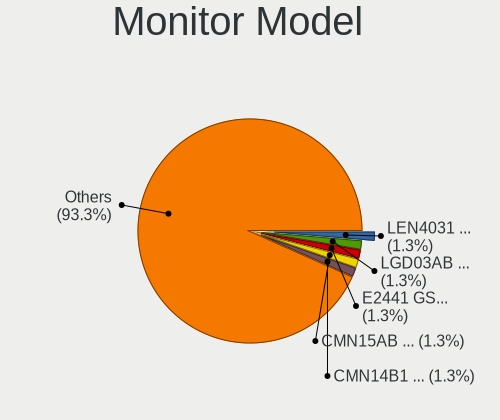

| Model                                                                 | Computers | Percent |
|-----------------------------------------------------------------------|-----------|---------|
| LG Display LCD Monitor LGD03AB 1366x768 340x190mm 15.3-inch           | 2         | 1.33%   |
| Lenovo LCD Monitor LEN4031 1280x800 300x190mm 14.0-inch               | 2         | 1.33%   |
| Goldstar E2441 GSM581F 1920x1080 530x300mm 24.0-inch                  | 2         | 1.33%   |
| Chimei Innolux LCD Monitor CMN15AB 1366x768 340x190mm 15.3-inch       | 2         | 1.33%   |
| Chimei Innolux LCD Monitor CMN14B1 1920x1080 310x170mm 13.9-inch      | 2         | 1.33%   |
| BenQ GW2765 BNQ78D6 2560x1440 600x340mm 27.2-inch                     | 2         | 1.33%   |
| ViewSonic VX2433wm VSC3822 1920x1080 520x290mm 23.4-inch              | 1         | 0.67%   |
| ViewSonic VA2026w VSC5020 1680x1050 430x270mm 20.0-inch               | 1         | 0.67%   |
| ViewSonic LCD Monitor VSC941C 1280x1024 340x270mm 17.1-inch           | 1         | 0.67%   |
| Vestel Elektronik 22W_LCD_TV VES3700 1920x540                         | 1         | 0.67%   |
| Toshiba TV TSB0218 3840x2160                                          | 1         | 0.67%   |
| Sony TV SNY9C01 1360x768                                              | 1         | 0.67%   |
| Sharp LCD Monitor SHP1453 1920x1080 350x190mm 15.7-inch               | 1         | 0.67%   |
| Samsung Electronics SyncMaster SAM0600 1600x900 440x250mm 19.9-inch   | 1         | 0.67%   |
| Samsung Electronics SyncMaster SAM05C5 1920x1080                      | 1         | 0.67%   |
| Samsung Electronics SyncMaster SAM036C 1920x1200 550x340mm 25.5-inch  | 1         | 0.67%   |
| Samsung Electronics SyncMaster SAM0364 1360x768 340x190mm 15.3-inch   | 1         | 0.67%   |
| Samsung Electronics SyncMaster SAM0304 1680x1050 490x320mm 23.0-inch  | 1         | 0.67%   |
| Samsung Electronics SMBX2231 SAM076D 1920x1080 480x270mm 21.7-inch    | 1         | 0.67%   |
| Samsung Electronics S24E390 SAM0C1A 1920x1080 520x290mm 23.4-inch     | 1         | 0.67%   |
| Samsung Electronics LCD Monitor SEC5442 1440x900 300x190mm 14.0-inch  | 1         | 0.67%   |
| Samsung Electronics LCD Monitor SEC324A 1366x768 340x190mm 15.3-inch  | 1         | 0.67%   |
| Samsung Electronics LCD Monitor SDC5441 1366x768 340x190mm 15.3-inch  | 1         | 0.67%   |
| Samsung Electronics LCD Monitor SDC4C48 1920x1080 240x130mm 10.7-inch | 1         | 0.67%   |
| Samsung Electronics LCD Monitor SAM03A2 1440x900 410x260mm 19.1-inch  | 1         | 0.67%   |
| PRI LED-MONITOR PRI0828 3840x2160 1150x650mm 52.0-inch                | 1         | 0.67%   |
| Philips PHL 328E1 PHLC204 3840x2160 700x390mm 31.5-inch               | 1         | 0.67%   |
| Philips PHL 278E9Q PHLC17F 1920x1080 600x340mm 27.2-inch              | 1         | 0.67%   |
| Philips LCD Monitor PHLC0B1 1920x1080 480x270mm 21.7-inch             | 1         | 0.67%   |
| PANDA LM156LF1L03 NCP001C 1920x1080 340x190mm 15.3-inch               | 1         | 0.67%   |
| Packard Bell Viseo223DX PKB0385 1920x1080 480x270mm 21.7-inch         | 1         | 0.67%   |
| Packard Bell Viseo 200Ws PKB00C2 1600x900 440x250mm 19.9-inch         | 1         | 0.67%   |
| LG Display LCD Monitor LGDCF01 1366x768 340x190mm 15.3-inch           | 1         | 0.67%   |
| LG Display LCD Monitor LGD11F9 1280x800 290x180mm 13.4-inch           | 1         | 0.67%   |
| LG Display LCD Monitor LGD059B 1920x1080 290x170mm 13.2-inch          | 1         | 0.67%   |
| LG Display LCD Monitor LGD0573 1920x1080 340x190mm 15.3-inch          | 1         | 0.67%   |
| LG Display LCD Monitor LGD055F 2560x1440 310x170mm 13.9-inch          | 1         | 0.67%   |
| LG Display LCD Monitor LGD04A3 1366x768 280x160mm 12.7-inch           | 1         | 0.67%   |
| LG Display LCD Monitor LGD0458 1366x768 310x170mm 13.9-inch           | 1         | 0.67%   |
| LG Display LCD Monitor LGD03DC 1366x768 280x160mm 12.7-inch           | 1         | 0.67%   |
| LG Display LCD Monitor LGD039F 1366x768 350x190mm 15.7-inch           | 1         | 0.67%   |
| LG Display LCD Monitor LGD0390 1600x900 380x210mm 17.1-inch           | 1         | 0.67%   |
| LG Display LCD Monitor LGD037E 1920x1080 350x190mm 15.7-inch          | 1         | 0.67%   |
| LG Display LCD Monitor LGD034C 1366x768 290x160mm 13.0-inch           | 1         | 0.67%   |
| LG Display LCD Monitor LGD02DF 1600x900 310x170mm 13.9-inch           | 1         | 0.67%   |
| LG Display LCD Monitor LGD02DC 1366x768 340x190mm 15.3-inch           | 1         | 0.67%   |
| LG Display LCD Monitor LGD0258 1600x900 350x190mm 15.7-inch           | 1         | 0.67%   |
| LG Display LCD Monitor LGD0213 1600x900 310x170mm 13.9-inch           | 1         | 0.67%   |
| Lenovo LCD Monitor LEN60A1 1920x1080 480x270mm 21.7-inch              | 1         | 0.67%   |
| Lenovo LCD Monitor LEN40BA 1920x1080 340x190mm 15.3-inch              | 1         | 0.67%   |
| Lenovo LCD Monitor LEN40B1 1600x900 340x190mm 15.3-inch               | 1         | 0.67%   |
| Lenovo LCD Monitor LEN40B0 1366x768 340x190mm 15.3-inch               | 1         | 0.67%   |
| Lenovo LCD Monitor LEN4035 1280x800 300x190mm 14.0-inch               | 1         | 0.67%   |
| Lenovo LCD Monitor LEN4010 1280x800 260x160mm 12.0-inch               | 1         | 0.67%   |
| Lenovo C24-25 LEN66B0 1920x1080 530x300mm 24.0-inch                   | 1         | 0.67%   |
| KJT KJT4K2K60DP KJT5AFD 3840x2160 600x340mm 27.2-inch                 | 1         | 0.67%   |
| InfoVision LCD Monitor IVO0533 1366x768 290x160mm 13.0-inch           | 1         | 0.67%   |
| Iiyama PLG2888UH IVM710C 3840x2160 620x340mm 27.8-inch                | 1         | 0.67%   |
| Hewlett-Packard w1907 HWP26A3 1440x900 410x260mm 19.1-inch            | 1         | 0.67%   |
| Hewlett-Packard LCD Monitor HWP2915 1920x1080 510x290mm 23.1-inch     | 1         | 0.67%   |

Monitor Resolution
------------------

Monitor screen resolution

| Resolution         | Computers | Percent |
|--------------------|-----------|---------|
| 1920x1080 (FHD)    | 56        | 38.36%  |
| 1366x768 (WXGA)    | 32        | 21.92%  |
| 1600x900 (HD+)     | 11        | 7.53%   |
| 1280x800 (WXGA)    | 8         | 5.48%   |
| 3840x2160 (4K)     | 7         | 4.79%   |
| 2560x1440 (QHD)    | 6         | 4.11%   |
| 1920x1200 (WUXGA)  | 6         | 4.11%   |
| 1440x900 (WXGA+)   | 5         | 3.42%   |
| 1280x1024 (SXGA)   | 4         | 2.74%   |
| 1680x1050 (WSXGA+) | 3         | 2.05%   |
| 3440x1440          | 2         | 1.37%   |
| 2560x1080          | 2         | 1.37%   |
| 1360x768           | 2         | 1.37%   |
| 2048x1152          | 1         | 0.68%   |
| 1920x540           | 1         | 0.68%   |

Monitor Diagonal
----------------

Diagonal size in inches

| Inches  | Computers | Percent |
|---------|-----------|---------|
| 15      | 32        | 21.48%  |
| 13      | 29        | 19.46%  |
| 27      | 15        | 10.07%  |
| 24      | 14        | 9.4%    |
| 21      | 13        | 8.72%   |
| 23      | 9         | 6.04%   |
| 19      | 7         | 4.7%    |
| 12      | 5         | 3.36%   |
| 17      | 4         | 2.68%   |
| 14      | 4         | 2.68%   |
| Unknown | 4         | 2.68%   |
| 34      | 3         | 2.01%   |
| 22      | 2         | 1.34%   |
| 52      | 1         | 0.67%   |
| 42      | 1         | 0.67%   |
| 31      | 1         | 0.67%   |
| 28      | 1         | 0.67%   |
| 25      | 1         | 0.67%   |
| 20      | 1         | 0.67%   |
| 18      | 1         | 0.67%   |
| 10      | 1         | 0.67%   |

Monitor Width
-------------

Physical width

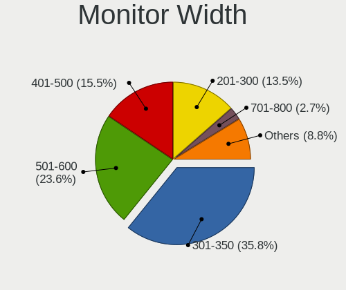

| Width in mm | Computers | Percent |
|-------------|-----------|---------|
| 301-350     | 52        | 35.14%  |
| 501-600     | 35        | 23.65%  |
| 401-500     | 23        | 15.54%  |
| 201-300     | 21        | 14.19%  |
| 601-700     | 4         | 2.7%    |
| 351-400     | 4         | 2.7%    |
| Unknown     | 4         | 2.7%    |
| 701-800     | 3         | 2.03%   |
| 1001-1500   | 1         | 0.68%   |
| 901-1000    | 1         | 0.68%   |

Aspect Ratio
------------

Proportional relationship between the width and the height

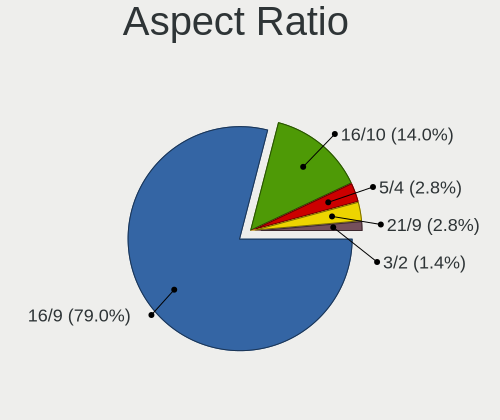

| Ratio | Computers | Percent |
|-------|-----------|---------|
| 16/9  | 112       | 78.32%  |
| 16/10 | 21        | 14.69%  |
| 5/4   | 4         | 2.8%    |
| 21/9  | 4         | 2.8%    |
| 32/9  | 1         | 0.7%    |
| 3/2   | 1         | 0.7%    |

Monitor Area
------------

Area in inch

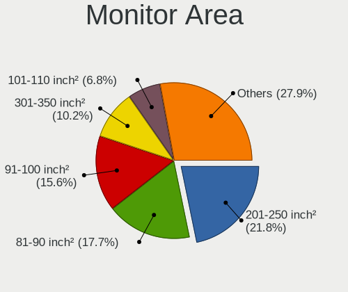

| Area in inch | Computers | Percent |
|----------------|-----------|---------|
| 201-250        | 31        | 21.09%  |
| 81-90          | 26        | 17.69%  |
| 91-100         | 22        | 14.97%  |
| 301-350        | 15        | 10.2%   |
| 101-110        | 10        | 6.8%    |
| 151-200        | 8         | 5.44%   |
| 71-80          | 7         | 4.76%   |
| 251-300        | 7         | 4.76%   |
| 61-70          | 5         | 3.4%    |
| 351-500        | 4         | 2.72%   |
| Unknown        | 4         | 2.72%   |
| 141-150        | 3         | 2.04%   |
| 121-130        | 2         | 1.36%   |
| More than 1000 | 1         | 0.68%   |
| 41-50          | 1         | 0.68%   |
| 501-1000       | 1         | 0.68%   |

Pixel Density
-------------

Pixels per inch

| Density | Computers | Percent |
|---------|-----------|---------|
| 51-100  | 53        | 35.81%  |
| 101-120 | 52        | 35.14%  |
| 121-160 | 31        | 20.95%  |
| 161-240 | 8         | 5.41%   |
| Unknown | 4         | 2.7%    |

Multiple Monitors
-----------------

Total monitors connected

| Total | Computers | Percent |
|-------|-----------|---------|
| 1     | 139       | 73.94%  |
| 0     | 40        | 21.28%  |
| 2     | 9         | 4.79%   |

Network
-------

Net Controller Vendor
---------------------

Controller vendors

| Vendor                            | Computers | Percent |
|-----------------------------------|-----------|---------|
| Intel                             | 110       | 43.82%  |
| Realtek Semiconductor             | 78        | 31.08%  |
| Qualcomm Atheros                  | 28        | 11.16%  |
| Broadcom                          | 19        | 7.57%   |
| Nvidia                            | 4         | 1.59%   |
| Ralink Technology                 | 2         | 0.8%    |
| Ralink                            | 2         | 0.8%    |
| Sierra Wireless                   | 1         | 0.4%    |
| MediaTek                          | 1         | 0.4%    |
| JMicron Technology                | 1         | 0.4%    |
| Hewlett-Packard                   | 1         | 0.4%    |
| Ericsson Business Mobile Networks | 1         | 0.4%    |
| Edimax Technology                 | 1         | 0.4%    |
| D-Link System                     | 1         | 0.4%    |
| Bluegiga Technologies             | 1         | 0.4%    |

Net Controller Model
--------------------

Controller models

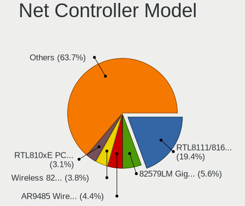

| Model                                                             | Computers | Percent |
|-------------------------------------------------------------------|-----------|---------|
| Realtek RTL8111/8168/8411 PCI Express Gigabit Ethernet Controller | 62        | 19.68%  |
| Intel 82579LM Gigabit Network Connection (Lewisville)             | 17        | 5.4%    |
| Qualcomm Atheros AR9485 Wireless Network Adapter                  | 14        | 4.44%   |
| Intel Wireless 8265 / 8275                                        | 12        | 3.81%   |
| Realtek RTL810xE PCI Express Fast Ethernet controller             | 10        | 3.17%   |
| Intel Wireless 7260                                               | 9         | 2.86%   |
| Intel Centrino Advanced-N 6205 [Taylor Peak]                      | 9         | 2.86%   |
| Intel Ethernet Connection I217-LM                                 | 8         | 2.54%   |
| Intel I211 Gigabit Network Connection                             | 6         | 1.9%    |
| Intel Wireless 7265                                               | 5         | 1.59%   |
| Intel Ethernet Connection I219-LM                                 | 5         | 1.59%   |
| Intel Ethernet Connection (4) I219-LM                             | 5         | 1.59%   |
| Qualcomm Atheros AR8161 Gigabit Ethernet                          | 4         | 1.27%   |
| Intel Wireless 8260                                               | 4         | 1.27%   |
| Intel Wi-Fi 6 AX200                                               | 4         | 1.27%   |
| Intel Ethernet Connection I217-V                                  | 4         | 1.27%   |
| Intel Ethernet Connection (2) I219-LM                             | 4         | 1.27%   |
| Intel Centrino Advanced-N 6200                                    | 4         | 1.27%   |
| Intel 82577LM Gigabit Network Connection                          | 4         | 1.27%   |
| Broadcom BCM43224 802.11a/b/g/n                                   | 4         | 1.27%   |
| Qualcomm Atheros QCA9565 / AR9565 Wireless Network Adapter        | 3         | 0.95%   |
| Nvidia MCP79 Ethernet                                             | 3         | 0.95%   |
| Intel PRO/Wireless 5100 AGN [Shiloh] Network Connection           | 3         | 0.95%   |
| Intel Ethernet Connection I218-LM                                 | 3         | 0.95%   |
| Intel Ethernet Connection (7) I219-V                              | 3         | 0.95%   |
| Intel Ethernet Connection (4) I219-V                              | 3         | 0.95%   |
| Intel Ethernet Connection (2) I219-V                              | 3         | 0.95%   |
| Intel Dual Band Wireless-AC 3168NGW [Stone Peak]                  | 3         | 0.95%   |
| Intel 82567LM Gigabit Network Connection                          | 3         | 0.95%   |
| Broadcom BCM4322 802.11a/b/g/n Wireless LAN Controller            | 3         | 0.95%   |
| Realtek RTL8723BE PCIe Wireless Network Adapter                   | 2         | 0.63%   |
| Realtek RTL8125 2.5GbE Controller                                 | 2         | 0.63%   |
| Qualcomm Atheros QCA9377 802.11ac Wireless Network Adapter        | 2         | 0.63%   |
| Qualcomm Atheros AR8151 v2.0 Gigabit Ethernet                     | 2         | 0.63%   |
| Intel Wireless-AC 9260                                            | 2         | 0.63%   |
| Intel Wireless 3165                                               | 2         | 0.63%   |
| Intel WiFi Link 5100                                              | 2         | 0.63%   |
| Intel PRO/Wireless 4965 AG or AGN [Kedron] Network Connection     | 2         | 0.63%   |
| Intel I210 Gigabit Network Connection                             | 2         | 0.63%   |
| Intel Ethernet Connection (2) I218-V                              | 2         | 0.63%   |
| Intel Comet Lake PCH-LP CNVi WiFi                                 | 2         | 0.63%   |
| Intel Centrino Wireless-N 2230                                    | 2         | 0.63%   |
| Intel Centrino Advanced-N 6235                                    | 2         | 0.63%   |
| Intel 82578DM Gigabit Network Connection                          | 2         | 0.63%   |
| Broadcom NetLink BCM57785 Gigabit Ethernet PCIe                   | 2         | 0.63%   |
| Broadcom BCM4331 802.11a/b/g/n                                    | 2         | 0.63%   |
| Sierra Wireless EM7455                                            | 1         | 0.32%   |
| Realtek RTL8822CE 802.11ac PCIe Wireless Network Adapter          | 1         | 0.32%   |
| Realtek RTL8812AU 802.11a/b/g/n/ac 2T2R DB WLAN Adapter           | 1         | 0.32%   |
| Realtek RTL8812AE 802.11ac PCIe Wireless Network Adapter          | 1         | 0.32%   |
| Realtek RTL8191SEvB Wireless LAN Controller                       | 1         | 0.32%   |
| Realtek RTL8188EE Wireless Network Adapter                        | 1         | 0.32%   |
| Realtek RTL8188CUS 802.11n WLAN Adapter                           | 1         | 0.32%   |
| Realtek RTL8169 PCI Gigabit Ethernet Controller                   | 1         | 0.32%   |
| Realtek RTL-8100/8101L/8139 PCI Fast Ethernet Adapter             | 1         | 0.32%   |
| Ralink RT5370 Wireless Adapter                                    | 1         | 0.32%   |
| Ralink MT7601U Wireless Adapter                                   | 1         | 0.32%   |
| Ralink RT5360 Wireless 802.11n 1T/1R                              | 1         | 0.32%   |
| Ralink RT3060 Wireless 802.11n 1T/1R                              | 1         | 0.32%   |
| Qualcomm Atheros QCA8172 Fast Ethernet                            | 1         | 0.32%   |

Wireless Vendor
---------------

Wireless vendors

| Vendor                | Computers | Percent |
|-----------------------|-----------|---------|
| Intel                 | 74        | 58.73%  |
| Qualcomm Atheros      | 24        | 19.05%  |
| Broadcom              | 14        | 11.11%  |
| Realtek Semiconductor | 8         | 6.35%   |
| Ralink Technology     | 2         | 1.59%   |
| Ralink                | 2         | 1.59%   |
| Sierra Wireless       | 1         | 0.79%   |
| Edimax Technology     | 1         | 0.79%   |

Wireless Model
--------------

Wireless models

| Model                                                                                 | Computers | Percent |
|---------------------------------------------------------------------------------------|-----------|---------|
| Qualcomm Atheros AR9485 Wireless Network Adapter                                      | 14        | 11.11%  |
| Intel Wireless 8265 / 8275                                                            | 12        | 9.52%   |
| Intel Wireless 7260                                                                   | 9         | 7.14%   |
| Intel Centrino Advanced-N 6205 [Taylor Peak]                                          | 9         | 7.14%   |
| Intel Wireless 7265                                                                   | 5         | 3.97%   |
| Intel Wireless 8260                                                                   | 4         | 3.17%   |
| Intel Wi-Fi 6 AX200                                                                   | 4         | 3.17%   |
| Intel Centrino Advanced-N 6200                                                        | 4         | 3.17%   |
| Broadcom BCM43224 802.11a/b/g/n                                                       | 4         | 3.17%   |
| Qualcomm Atheros QCA9565 / AR9565 Wireless Network Adapter                            | 3         | 2.38%   |
| Intel PRO/Wireless 5100 AGN [Shiloh] Network Connection                               | 3         | 2.38%   |
| Intel Dual Band Wireless-AC 3168NGW [Stone Peak]                                      | 3         | 2.38%   |
| Broadcom BCM4322 802.11a/b/g/n Wireless LAN Controller                                | 3         | 2.38%   |
| Realtek RTL8723BE PCIe Wireless Network Adapter                                       | 2         | 1.59%   |
| Qualcomm Atheros QCA9377 802.11ac Wireless Network Adapter                            | 2         | 1.59%   |
| Intel Wireless-AC 9260                                                                | 2         | 1.59%   |
| Intel Wireless 3165                                                                   | 2         | 1.59%   |
| Intel WiFi Link 5100                                                                  | 2         | 1.59%   |
| Intel PRO/Wireless 4965 AG or AGN [Kedron] Network Connection                         | 2         | 1.59%   |
| Intel Comet Lake PCH-LP CNVi WiFi                                                     | 2         | 1.59%   |
| Intel Centrino Wireless-N 2230                                                        | 2         | 1.59%   |
| Intel Centrino Advanced-N 6235                                                        | 2         | 1.59%   |
| Broadcom BCM4331 802.11a/b/g/n                                                        | 2         | 1.59%   |
| Sierra Wireless EM7455                                                                | 1         | 0.79%   |
| Realtek RTL8822CE 802.11ac PCIe Wireless Network Adapter                              | 1         | 0.79%   |
| Realtek RTL8812AU 802.11a/b/g/n/ac 2T2R DB WLAN Adapter                               | 1         | 0.79%   |
| Realtek RTL8812AE 802.11ac PCIe Wireless Network Adapter                              | 1         | 0.79%   |
| Realtek RTL8191SEvB Wireless LAN Controller                                           | 1         | 0.79%   |
| Realtek RTL8188EE Wireless Network Adapter                                            | 1         | 0.79%   |
| Realtek RTL8188CUS 802.11n WLAN Adapter                                               | 1         | 0.79%   |
| Ralink RT5370 Wireless Adapter                                                        | 1         | 0.79%   |
| Ralink MT7601U Wireless Adapter                                                       | 1         | 0.79%   |
| Ralink RT5360 Wireless 802.11n 1T/1R                                                  | 1         | 0.79%   |
| Ralink RT3060 Wireless 802.11n 1T/1R                                                  | 1         | 0.79%   |
| Qualcomm Atheros QCA6174 802.11ac Wireless Network Adapter                            | 1         | 0.79%   |
| Qualcomm Atheros AR9462 Wireless Network Adapter                                      | 1         | 0.79%   |
| Qualcomm Atheros AR9287 Wireless Network Adapter (PCI-Express)                        | 1         | 0.79%   |
| Qualcomm Atheros AR9285 Wireless Network Adapter (PCI-Express)                        | 1         | 0.79%   |
| Qualcomm Atheros AR5418 Wireless Network Adapter [AR5008E 802.11(a)bgn] (PCI-Express) | 1         | 0.79%   |
| Intel PRO/Wireless 3945ABG [Golan] Network Connection                                 | 1         | 0.79%   |
| Intel Gemini Lake PCH CNVi WiFi                                                       | 1         | 0.79%   |
| Intel Dual Band Wireless-AC 3165 Plus Bluetooth                                       | 1         | 0.79%   |
| Intel Centrino Wireless-N 130                                                         | 1         | 0.79%   |
| Intel Centrino Wireless-N 1030 [Rainbow Peak]                                         | 1         | 0.79%   |
| Intel Centrino Advanced-N 6230 [Rainbow Peak]                                         | 1         | 0.79%   |
| Intel Cannon Point-LP CNVi [Wireless-AC]                                              | 1         | 0.79%   |
| Edimax EW-7811Un 802.11n Wireless Adapter [Realtek RTL8188CUS]                        | 1         | 0.79%   |
| Broadcom BCM4360 802.11ac Wireless Network Adapter                                    | 1         | 0.79%   |
| Broadcom BCM43225 802.11b/g/n                                                         | 1         | 0.79%   |
| Broadcom BCM43142 802.11b/g/n                                                         | 1         | 0.79%   |
| Broadcom BCM4312 802.11b/g LP-PHY                                                     | 1         | 0.79%   |
| Broadcom 802.11ac Network Adapter                                                     | 1         | 0.79%   |

Ethernet Vendor
---------------

Ethernet vendors

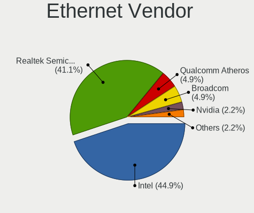

| Vendor                | Computers | Percent |
|-----------------------|-----------|---------|
| Intel                 | 82        | 45.05%  |
| Realtek Semiconductor | 75        | 41.21%  |
| Qualcomm Atheros      | 9         | 4.95%   |
| Broadcom              | 9         | 4.95%   |
| Nvidia                | 4         | 2.2%    |
| MediaTek              | 1         | 0.55%   |
| JMicron Technology    | 1         | 0.55%   |
| D-Link System         | 1         | 0.55%   |

Ethernet Model
--------------

Ethernet models

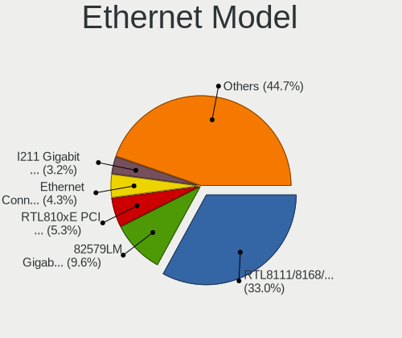

| Model                                                                         | Computers | Percent |
|-------------------------------------------------------------------------------|-----------|---------|
| Realtek RTL8111/8168/8411 PCI Express Gigabit Ethernet Controller             | 62        | 33.51%  |
| Intel 82579LM Gigabit Network Connection (Lewisville)                         | 17        | 9.19%   |
| Realtek RTL810xE PCI Express Fast Ethernet controller                         | 10        | 5.41%   |
| Intel Ethernet Connection I217-LM                                             | 8         | 4.32%   |
| Intel I211 Gigabit Network Connection                                         | 6         | 3.24%   |
| Intel Ethernet Connection I219-LM                                             | 5         | 2.7%    |
| Intel Ethernet Connection (4) I219-LM                                         | 5         | 2.7%    |
| Qualcomm Atheros AR8161 Gigabit Ethernet                                      | 4         | 2.16%   |
| Intel Ethernet Connection I217-V                                              | 4         | 2.16%   |
| Intel Ethernet Connection (2) I219-LM                                         | 4         | 2.16%   |
| Intel 82577LM Gigabit Network Connection                                      | 4         | 2.16%   |
| Nvidia MCP79 Ethernet                                                         | 3         | 1.62%   |
| Intel Ethernet Connection I218-LM                                             | 3         | 1.62%   |
| Intel Ethernet Connection (7) I219-V                                          | 3         | 1.62%   |
| Intel Ethernet Connection (4) I219-V                                          | 3         | 1.62%   |
| Intel Ethernet Connection (2) I219-V                                          | 3         | 1.62%   |
| Intel 82567LM Gigabit Network Connection                                      | 3         | 1.62%   |
| Qualcomm Atheros AR8151 v2.0 Gigabit Ethernet                                 | 2         | 1.08%   |
| Intel I210 Gigabit Network Connection                                         | 2         | 1.08%   |
| Intel Ethernet Connection (2) I218-V                                          | 2         | 1.08%   |
| Intel 82578DM Gigabit Network Connection                                      | 2         | 1.08%   |
| Broadcom NetLink BCM57785 Gigabit Ethernet PCIe                               | 2         | 1.08%   |
| Realtek RTL8169 PCI Gigabit Ethernet Controller                               | 1         | 0.54%   |
| Realtek RTL8125 2.5GbE Controller                                             | 1         | 0.54%   |
| Realtek RTL-8100/8101L/8139 PCI Fast Ethernet Adapter                         | 1         | 0.54%   |
| Qualcomm Atheros QCA8172 Fast Ethernet                                        | 1         | 0.54%   |
| Qualcomm Atheros Attansic L1 Gigabit Ethernet                                 | 1         | 0.54%   |
| Qualcomm Atheros AR8121/AR8113/AR8114 Gigabit or Fast Ethernet                | 1         | 0.54%   |
| Nvidia MCP73 Ethernet                                                         | 1         | 0.54%   |
| MediaTek USB Ethernet-RNDIS                                                   | 1         | 0.54%   |
| JMicron JMC260 PCI Express Fast Ethernet Controller                           | 1         | 0.54%   |
| Intel Ethernet Connection (6) I219-V                                          | 1         | 0.54%   |
| Intel Ethernet Connection (5) I219-LM                                         | 1         | 0.54%   |
| Intel Ethernet Connection (10) I219-LM                                        | 1         | 0.54%   |
| Intel 82579V Gigabit Network Connection                                       | 1         | 0.54%   |
| Intel 82574L Gigabit Network Connection                                       | 1         | 0.54%   |
| Intel 82571EB/82571GB Gigabit Ethernet Controller D0/D1 (copper applications) | 1         | 0.54%   |
| Intel 82567LM-3 Gigabit Network Connection                                    | 1         | 0.54%   |
| Intel 82567LF Gigabit Network Connection                                      | 1         | 0.54%   |
| Intel 82566MM Gigabit Network Connection                                      | 1         | 0.54%   |
| Intel 82557/8/9/0/1 Ethernet Pro 100                                          | 1         | 0.54%   |
| Intel 80003ES2LAN Gigabit Ethernet Controller (Copper)                        | 1         | 0.54%   |
| D-Link System DGE-528T Gigabit Ethernet Adapter                               | 1         | 0.54%   |
| Broadcom NetXtreme BCM57766 Gigabit Ethernet PCIe                             | 1         | 0.54%   |
| Broadcom NetXtreme BCM57765 Gigabit Ethernet PCIe                             | 1         | 0.54%   |
| Broadcom NetXtreme BCM57762 Gigabit Ethernet PCIe                             | 1         | 0.54%   |
| Broadcom NetXtreme BCM5764M Gigabit Ethernet PCIe                             | 1         | 0.54%   |
| Broadcom NetXtreme BCM5721 Gigabit Ethernet PCI Express                       | 1         | 0.54%   |
| Broadcom NetLink BCM5906M Fast Ethernet PCI Express                           | 1         | 0.54%   |
| Broadcom NetLink BCM57780 Gigabit Ethernet PCIe                               | 1         | 0.54%   |

Net Controller Kind
-------------------

Ethernet, WiFi or modem

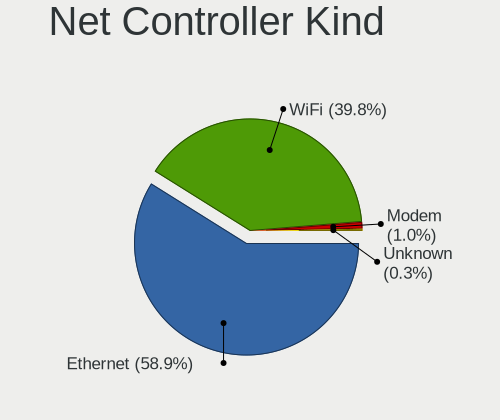

| Kind     | Computers | Percent |
|----------|-----------|---------|
| Ethernet | 180       | 59.02%  |
| WiFi     | 121       | 39.67%  |
| Modem    | 3         | 0.98%   |
| Unknown  | 1         | 0.33%   |

Used Controller
---------------

Currently used network controller

| Kind     | Computers | Percent |
|----------|-----------|---------|
| Ethernet | 179       | 63.7%   |
| WiFi     | 100       | 35.59%  |
| Modem    | 2         | 0.71%   |

NICs
----

Total network controllers on board

| Total | Computers | Percent |
|-------|-----------|---------|
| 2     | 109       | 57.98%  |
| 1     | 73        | 38.83%  |
| 3     | 6         | 3.19%   |

IPv6
----

IPv6 vs IPv4

| Used | Computers | Percent |
|------|-----------|---------|
| No   | 187       | 99.47%  |
| Yes  | 1         | 0.53%   |

Bluetooth
---------

Bluetooth Vendor
----------------

Controller vendors

| Vendor                          | Computers | Percent |
|---------------------------------|-----------|---------|
| Intel                           | 44        | 44.9%   |
| Cambridge Silicon Radio         | 9         | 9.18%   |
| Broadcom                        | 9         | 9.18%   |
| Apple                           | 9         | 9.18%   |
| Qualcomm Atheros Communications | 7         | 7.14%   |
| Realtek Semiconductor           | 5         | 5.1%    |
| IMC Networks                    | 5         | 5.1%    |
| ASUSTek Computer                | 4         | 4.08%   |
| Lite-On Technology              | 2         | 2.04%   |
| Integrated System Solution      | 1         | 1.02%   |
| Hewlett-Packard                 | 1         | 1.02%   |
| Dell                            | 1         | 1.02%   |
| Alps Electric                   | 1         | 1.02%   |

Bluetooth Model
---------------

Controller models

| Model                                                   | Computers | Percent |
|---------------------------------------------------------|-----------|---------|
| Intel Bluetooth wireless interface                      | 27        | 27.27%  |
| Cambridge Silicon Radio Bluetooth Dongle (HCI mode)     | 9         | 9.09%   |
| Apple Bluetooth Host Controller                         | 5         | 5.05%   |
| Intel Centrino Bluetooth Wireless Transceiver           | 4         | 4.04%   |
| Intel AX200 Bluetooth                                   | 4         | 4.04%   |
| Intel Wireless-AC 3168 Bluetooth                        | 3         | 3.03%   |
| Apple Built-in Bluetooth 2.0+EDR HCI                    | 3         | 3.03%   |
| Qualcomm Atheros Dell Wireless 1703 Bluetooth           | 2         | 2.02%   |
| Qualcomm Atheros AR9462 Bluetooth                       | 2         | 2.02%   |
| Intel Wireless-AC 9260 Bluetooth Adapter                | 2         | 2.02%   |
| Intel AX201 Bluetooth                                   | 2         | 2.02%   |
| Broadcom BCM20702A0 Bluetooth 4.0                       | 2         | 2.02%   |
| Broadcom BCM20702 Bluetooth 4.0 [ThinkPad]              | 2         | 2.02%   |
| Broadcom BCM2045B (BDC-2.1) [Bluetooth Controller]      | 2         | 2.02%   |
| ASUS ASUS USB-BT500                                     | 2         | 2.02%   |
| Realtek RTL8723B Bluetooth                              | 1         | 1.01%   |
| Realtek  Bluetooth Adapter                              | 1         | 1.01%   |
| Realtek  Bluetooth 4.2 Adapter                          | 1         | 1.01%   |
| Realtek  Bluetooth 4.0 Adapter                          | 1         | 1.01%   |
| Realtek Bluetooth Radio                                 | 1         | 1.01%   |
| Qualcomm Atheros  QCA9377 Bluetooth 4.1                 | 1         | 1.01%   |
| Qualcomm Atheros QCA61x4 Bluetooth 4.0                  | 1         | 1.01%   |
| Qualcomm Atheros AR3012 Bluetooth 4.0                   | 1         | 1.01%   |
| Lite-On Qualcomm Atheros Bluetooth 4.0 + HS             | 1         | 1.01%   |
| Lite-On Atheros Bluetooth                               | 1         | 1.01%   |
| Intel Centrino Advanced-N 6230 Bluetooth adapter        | 1         | 1.01%   |
| Intel Bluetooth 9460/9560 Jefferson Peak (JfP)          | 1         | 1.01%   |
| Integrated System Solution Bluetooth Device             | 1         | 1.01%   |
| IMC Networks Qualcomm Atheros Bluetooth 4.1             | 1         | 1.01%   |
| IMC Networks Qualcomm Atheros AR9462 Bluetooth 4.0 + HS | 1         | 1.01%   |
| IMC Networks Qualcomm Atheros AR3012 Bluetooth 4.0 + HS | 1         | 1.01%   |
| IMC Networks Bluetooth Module                           | 1         | 1.01%   |
| IMC Networks Atheros AR3012 Bluetooth 4.0 Adapter       | 1         | 1.01%   |
| HP Broadcom 2070 Bluetooth Combo                        | 1         | 1.01%   |
| Dell DW375 Bluetooth Module                             | 1         | 1.01%   |
| Broadcom Broadcom 4371 Bluetooth 4.1 Adapter            | 1         | 1.01%   |
| Broadcom BCM43142 Bluetooth 4.0                         | 1         | 1.01%   |
| Broadcom BCM2045B (BDC-2.1)                             | 1         | 1.01%   |
| ASUS BT-253 Bluetooth Adapter                           | 1         | 1.01%   |
| ASUS BT-183 Bluetooth 2.0+EDR adapter                   | 1         | 1.01%   |
| Apple Built-in iSight (no firmware loaded)              | 1         | 1.01%   |
| Apple Apple Broadcom Built-in Bluetooth                 | 1         | 1.01%   |
| Alps Electric UGTZ4 Bluetooth                           | 1         | 1.01%   |

Sound
-----

Sound Vendor
------------

Sound card vendors

| Vendor               | Computers | Percent |
|----------------------|-----------|---------|
| Intel                | 155       | 60.31%  |
| Nvidia               | 45        | 17.51%  |
| AMD                  | 41        | 15.95%  |
| C-Media Electronics  | 7         | 2.72%   |
| Creative Labs        | 2         | 0.78%   |
| Texas Instruments    | 1         | 0.39%   |
| SteelSeries ApS      | 1         | 0.39%   |
| Griffin Technology   | 1         | 0.39%   |
| GN Netcom            | 1         | 0.39%   |
| Giga-Byte Technology | 1         | 0.39%   |
| Elgato Systems       | 1         | 0.39%   |
| Bose                 | 1         | 0.39%   |

Sound Model
-----------

Sound card models

| Model                                                                      | Computers | Percent |
|----------------------------------------------------------------------------|-----------|---------|
| Intel 7 Series/C216 Chipset Family High Definition Audio Controller        | 26        | 8.64%   |
| Intel Sunrise Point-LP HD Audio                                            | 20        | 6.64%   |
| Intel 8 Series/C220 Series Chipset High Definition Audio Controller        | 17        | 5.65%   |
| Intel 6 Series/C200 Series Chipset Family High Definition Audio Controller | 16        | 5.32%   |
| Intel Xeon E3-1200 v3/4th Gen Core Processor HD Audio Controller           | 12        | 3.99%   |
| Intel 100 Series/C230 Series Chipset Family HD Audio Controller            | 11        | 3.65%   |
| Intel Haswell-ULT HD Audio Controller                                      | 10        | 3.32%   |
| Intel 82801I (ICH9 Family) HD Audio Controller                             | 10        | 3.32%   |
| Intel 8 Series HD Audio Controller                                         | 10        | 3.32%   |
| Intel 5 Series/3400 Series Chipset High Definition Audio                   | 8         | 2.66%   |
| Nvidia GK208 HDMI/DP Audio Controller                                      | 7         | 2.33%   |
| AMD SBx00 Azalia (Intel HDA)                                               | 7         | 2.33%   |
| AMD Family 17h (Models 10h-1fh) HD Audio Controller                        | 7         | 2.33%   |
| AMD Family 17h (Models 00h-0fh) HD Audio Controller                        | 6         | 1.99%   |
| AMD Ellesmere HDMI Audio [Radeon RX 470/480 / 570/580/590]                 | 6         | 1.99%   |
| Nvidia GK107 HDMI Audio Controller                                         | 5         | 1.66%   |
| Intel NM10/ICH7 Family High Definition Audio Controller                    | 5         | 1.66%   |
| AMD Starship/Matisse HD Audio Controller                                   | 5         | 1.66%   |
| AMD Oland/Hainan/Cape Verde/Pitcairn HDMI Audio [Radeon HD 7000 Series]    | 5         | 1.66%   |
| Nvidia GP107GL High Definition Audio Controller                            | 4         | 1.33%   |
| Intel Cannon Lake PCH cAVS                                                 | 4         | 1.33%   |
| Intel Broadwell-U Audio Controller                                         | 4         | 1.33%   |
| Intel 9 Series Chipset Family HD Audio Controller                          | 4         | 1.33%   |
| Intel 200 Series PCH HD Audio                                              | 4         | 1.33%   |
| AMD Raven/Raven2/Fenghuang HDMI/DP Audio Controller                        | 4         | 1.33%   |
| AMD Navi 10 HDMI Audio                                                     | 4         | 1.33%   |
| Nvidia MCP79 High Definition Audio                                         | 3         | 1%      |
| Nvidia GM107 High Definition Audio Controller [GeForce 940MX]              | 3         | 1%      |
| Intel Wildcat Point-LP High Definition Audio Controller                    | 3         | 1%      |
| Intel 82801H (ICH8 Family) HD Audio Controller                             | 3         | 1%      |
| C-Media Electronics Audio Adapter (Unitek Y-247A)                          | 3         | 1%      |
| AMD FCH Azalia Controller                                                  | 3         | 1%      |
| AMD Baffin HDMI/DP Audio [Radeon RX 550 640SP / RX 560/560X]               | 3         | 1%      |
| Nvidia TU116 High Definition Audio Controller                              | 2         | 0.66%   |
| Nvidia GP108 High Definition Audio Controller                              | 2         | 0.66%   |
| Nvidia GP106 High Definition Audio Controller                              | 2         | 0.66%   |
| Nvidia GP104 High Definition Audio Controller                              | 2         | 0.66%   |
| Nvidia GM206 High Definition Audio Controller                              | 2         | 0.66%   |
| Nvidia GK106 HDMI Audio Controller                                         | 2         | 0.66%   |
| Nvidia GF119 HDMI Audio Controller                                         | 2         | 0.66%   |
| Nvidia GF108 High Definition Audio Controller                              | 2         | 0.66%   |
| Intel Comet Lake PCH-LP cAVS                                               | 2         | 0.66%   |
| Intel Celeron/Pentium Silver Processor High Definition Audio               | 2         | 0.66%   |
| Intel Cannon Point-LP High Definition Audio Controller                     | 2         | 0.66%   |
| AMD Turks HDMI Audio [Radeon HD 6500/6600 / 6700M Series]                  | 2         | 0.66%   |
| AMD Cedar HDMI Audio [Radeon HD 5400/6300/7300 Series]                     | 2         | 0.66%   |
| Texas Instruments PCM2704 16-bit stereo audio DAC                          | 1         | 0.33%   |
| SteelSeries ApS SteelSeries Siberia 350                                    | 1         | 0.33%   |
| Nvidia TU107 GeForce GTX 1650 High Definition Audio Controller             | 1         | 0.33%   |
| Nvidia TU104 HD Audio Controller                                           | 1         | 0.33%   |
| Nvidia MCP73 High Definition Audio                                         | 1         | 0.33%   |
| Nvidia High Definition Audio Controller                                    | 1         | 0.33%   |
| Nvidia GT216 HDMI Audio Controller                                         | 1         | 0.33%   |
| Nvidia GM204 High Definition Audio Controller                              | 1         | 0.33%   |
| Nvidia GK110 High Definition Audio Controller                              | 1         | 0.33%   |
| Nvidia GF106 High Definition Audio Controller                              | 1         | 0.33%   |
| Intel CM238 HD Audio Controller                                            | 1         | 0.33%   |
| Intel Celeron N3350/Pentium N4200/Atom E3900 Series Audio Cluster          | 1         | 0.33%   |
| Intel C610/X99 series chipset HD Audio Controller                          | 1         | 0.33%   |
| Intel C600/X79 series chipset High Definition Audio Controller             | 1         | 0.33%   |

Memory
------

Memory Vendor
-------------

Memory module vendors

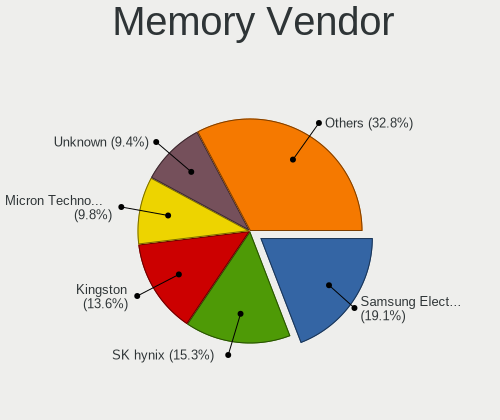

| Vendor              | Computers | Percent |
|---------------------|-----------|---------|
| Samsung Electronics | 43        | 18.61%  |
| SK Hynix            | 36        | 15.58%  |
| Kingston            | 32        | 13.85%  |
| Unknown             | 22        | 9.52%   |
| Micron Technology   | 22        | 9.52%   |
| Crucial             | 21        | 9.09%   |
| Corsair             | 14        | 6.06%   |
| G.Skill             | 10        | 4.33%   |
| Elpida              | 7         | 3.03%   |
| A-DATA Technology   | 4         | 1.73%   |
| Smart               | 3         | 1.3%    |
| Ramaxel Technology  | 3         | 1.3%    |
| Transcend           | 2         | 0.87%   |
| Nanya Technology    | 2         | 0.87%   |
| V-GeN               | 1         | 0.43%   |
| Unknown (ABCD)      | 1         | 0.43%   |
| Unknown (08B5)      | 1         | 0.43%   |
| Team                | 1         | 0.43%   |
| Silicon Power       | 1         | 0.43%   |
| SHARETRONIC         | 1         | 0.43%   |
| Ramos Technology    | 1         | 0.43%   |
| PNY                 | 1         | 0.43%   |
| KomputerBay         | 1         | 0.43%   |
| Avant               | 1         | 0.43%   |

Memory Model
------------

Memory module models

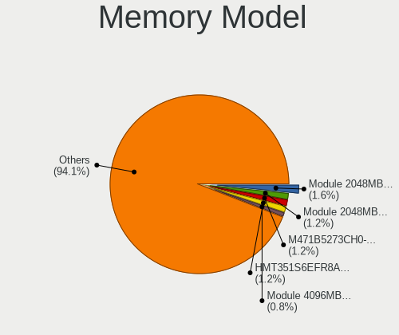

| Model                                                          | Computers | Percent |
|----------------------------------------------------------------|-----------|---------|
| Unknown RAM Module 2048MB SODIMM DDR2 667MT/s                  | 4         | 1.6%    |
| Unknown RAM Module 2048MB DIMM DDR2 800MT/s                    | 3         | 1.2%    |
| SK Hynix RAM HMT351S6EFR8A-PB 4GB SODIMM DDR3 1600MT/s         | 3         | 1.2%    |
| Samsung RAM M471B5273CH0-CH9 4GB SODIMM DDR3 1333MT/s          | 3         | 1.2%    |
| Unknown RAM Module 4096MB DIMM 1600MT/s                        | 2         | 0.8%    |
| SK Hynix RAM HMT451S6BFR8A-PB 4GB SODIMM DDR3 1600MT/s         | 2         | 0.8%    |
| SK Hynix RAM HMT451S6AFR8A-PB 4GB SODIMM DDR3 1600MT/s         | 2         | 0.8%    |
| SK Hynix RAM HMT425S6AFR6A-PB 2GB SODIMM DDR3 1600MT/s         | 2         | 0.8%    |
| SK Hynix RAM HMT325U6CFR8C-H9 2GB DIMM DDR3 1333MT/s           | 2         | 0.8%    |
| SK Hynix RAM HMA451S6AFR8N-TF 4GB SODIMM DDR4 2133MT/s         | 2         | 0.8%    |
| SK Hynix RAM HMA41GS6AFR8N-TF 8GB SODIMM DDR4 2133MT/s         | 2         | 0.8%    |
| Samsung RAM M471B5173QH0-YK0 4GB SODIMM DDR3 1600MT/s          | 2         | 0.8%    |
| Samsung RAM M471B5173DB0-YK0 4GB SODIMM DDR3 1600MT/s          | 2         | 0.8%    |
| Samsung RAM M471B5173BH0-CK0 4096MB SODIMM DDR3 1600MT/s       | 2         | 0.8%    |
| Samsung RAM M471A5244CB0-CTD 4GB SODIMM DDR4 2667MT/s          | 2         | 0.8%    |
| Samsung RAM M471A5244CB0-CRC 4GB SODIMM DDR4 2400MT/s          | 2         | 0.8%    |
| Samsung RAM M471A1K43BB1-CRC 8GB SODIMM DDR4 2400MT/s          | 2         | 0.8%    |
| Samsung RAM M378B5273DH0-CH9 4GB DIMM DDR3 1333MT/s            | 2         | 0.8%    |
| Micron RAM Module 4096MB SODIMM DDR3 1600MT/s                  | 2         | 0.8%    |
| Micron RAM 8KTF51264HZ-1G6N1 4GB SODIMM DDR3 1600MT/s          | 2         | 0.8%    |
| Micron RAM 8ATF1G64HZ-3G2J1 8GB SODIMM DDR4 3200MT/s           | 2         | 0.8%    |
| Kingston RAM Module 2048MB DIMM DDR2 800MT/s                   | 2         | 0.8%    |
| Kingston RAM KHX3200C16D4/8GX 8GB DIMM DDR4 3200MT/s           | 2         | 0.8%    |
| Kingston RAM KHX1600C10D3/8G 8192MB DIMM DDR3 1600MT/s         | 2         | 0.8%    |
| Kingston RAM 99U5584-010.A00LF 4096MB DIMM DDR3 1866MT/s       | 2         | 0.8%    |
| Kingston RAM 99U5471-025.A00LF 4GB DIMM DDR3 1333MT/s          | 2         | 0.8%    |
| Elpida RAM Module 4096MB SODIMM DDR3 1600MT/s                  | 2         | 0.8%    |
| Crucial RAM BLS8G3D1609DS1S00. 8GB DIMM DDR3 1600MT/s          | 2         | 0.8%    |
| Corsair RAM Module 4096MB SODIMM DDR3 1067MT/s                 | 2         | 0.8%    |
| Corsair RAM CMZ8GX3M2A1600C9 4GB DIMM DDR3 1600MT/s            | 2         | 0.8%    |
| V-GeN RAM D4R8GS24A8R 8192MB SODIMM DDR4 2133MT/s              | 1         | 0.4%    |
| Unknown SODIMM 2048MB SODIMM DDR2 667MT/s                      | 1         | 0.4%    |
| Unknown SODIMM 2048MB SODIMM DDR2 533MT/s                      | 1         | 0.4%    |
| Unknown RAM Module 8192MB DIMM 1600MT/s                        | 1         | 0.4%    |
| Unknown RAM Module 4096MB SODIMM DDR4 2133MT/s                 | 1         | 0.4%    |
| Unknown RAM Module 4096MB SODIMM DDR3 667MT/s                  | 1         | 0.4%    |
| Unknown RAM Module 4096MB SODIMM DDR3 1067MT/s                 | 1         | 0.4%    |
| Unknown RAM Module 4096MB SODIMM DDR2                          | 1         | 0.4%    |
| Unknown RAM Module 4096MB SODIMM 1066MT/s                      | 1         | 0.4%    |
| Unknown RAM Module 4096MB DIMM DDR3 1067MT/s                   | 1         | 0.4%    |
| Unknown RAM Module 4096MB DIMM DDR2                            | 1         | 0.4%    |
| Unknown RAM Module 2048MB SODIMM DDR3 1600MT/s                 | 1         | 0.4%    |
| Unknown RAM Module 2048MB DIMM SDRAM 1066MT/s                  | 1         | 0.4%    |
| Unknown RAM Module 2048MB DIMM DDR3 1066MT/s                   | 1         | 0.4%    |
| Unknown RAM Module 2048MB DIMM DDR2                            | 1         | 0.4%    |
| Unknown RAM Module 2048MB DIMM 1333MT/s                        | 1         | 0.4%    |
| Unknown (ABCD) RAM 123456789012345678 2GB DIMM LPDDR4 2400MT/s | 1         | 0.4%    |
| Unknown (08B5) RAM IM416GU8N24 16384MB SODIMM DDR4 2400MT/s    | 1         | 0.4%    |
| Transcend RAM TS512MSH64V6H 4096MB SODIMM DDR4 2667MT/s        | 1         | 0.4%    |
| Transcend RAM TS1GLH64V1H 8GB DIMM DDR4 2133MT/s               | 1         | 0.4%    |
| Team RAM Elite-1600 8192MB DIMM DDR3 1600MT/s                  | 1         | 0.4%    |
| Smart RAM SH564568FH8NZPHSCR 2GB SODIMM DDR3 1334MT/s          | 1         | 0.4%    |
| Smart RAM SH564568FH8NWPHSFR 2GB SODIMM DDR3 1333MT/s          | 1         | 0.4%    |
| Smart RAM SH564128FJ8NZRNSDG 4096MB SODIMM DDR3 1600MT/s       | 1         | 0.4%    |
| Smart RAM SH564128FJ8NWRNSQR 4096MB SODIMM DDR3 1600MT/s       | 1         | 0.4%    |
| SK Hynix RAM Module 8192MB SODIMM DDR3 1600MT/s                | 1         | 0.4%    |
| SK Hynix RAM Module 4096MB FB-DIMM DDR2 667MT/s                | 1         | 0.4%    |
| SK Hynix RAM Module 1024MB SODIMM DDR3 1067MT/s                | 1         | 0.4%    |
| SK Hynix RAM HYMP151P72CP4-S5 4096MB DIMM DDR2 800MT/s         | 1         | 0.4%    |
| SK Hynix RAM HMT851S6AMR6A-PB 4096MB Chip DDR3 1600MT/s        | 1         | 0.4%    |

Memory Kind
-----------

Memory module kinds

| Kind    | Computers | Percent |
|---------|-----------|---------|
| DDR3    | 103       | 55.08%  |
| DDR4    | 57        | 30.48%  |
| DDR2    | 18        | 9.63%   |
| Unknown | 4         | 2.14%   |
| LPDDR3  | 3         | 1.6%    |
| SDRAM   | 1         | 0.53%   |
| LPDDR4  | 1         | 0.53%   |

Memory Form Factor
------------------

Physical design of the memory module

| Name         | Computers | Percent |
|--------------|-----------|---------|
| SODIMM       | 102       | 53.97%  |
| DIMM         | 79        | 41.8%   |
| Row Of Chips | 3         | 1.59%   |
| Chip         | 3         | 1.59%   |
| FB-DIMM      | 1         | 0.53%   |
| Unknown      | 1         | 0.53%   |

Memory Size
-----------

Memory module size

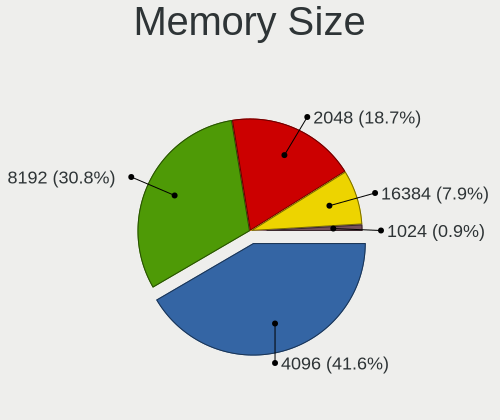

| Size  | Computers | Percent |
|-------|-----------|---------|
| 4096  | 89        | 42.58%  |
| 8192  | 64        | 30.62%  |
| 2048  | 40        | 19.14%  |
| 16384 | 15        | 7.18%   |
| 1024  | 1         | 0.48%   |

Memory Speed
------------

Memory module speed

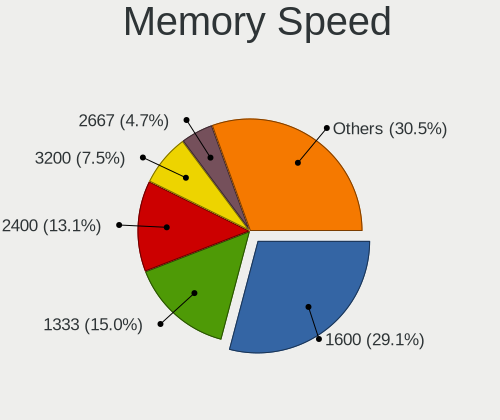

| Speed   | Computers | Percent |
|---------|-----------|---------|
| 1600    | 60        | 29.41%  |
| 1333    | 39        | 19.12%  |
| 2400    | 32        | 15.69%  |
| 2133    | 12        | 5.88%   |
| 3200    | 9         | 4.41%   |
| 800     | 9         | 4.41%   |
| 2667    | 8         | 3.92%   |
| 667     | 8         | 3.92%   |
| 1067    | 7         | 3.43%   |
| 1867    | 4         | 1.96%   |
| 2666    | 3         | 1.47%   |
| 1066    | 3         | 1.47%   |
| 1866    | 2         | 0.98%   |
| 1334    | 2         | 0.98%   |
| Unknown | 2         | 0.98%   |
| 3600    | 1         | 0.49%   |
| 2933    | 1         | 0.49%   |
| 2800    | 1         | 0.49%   |
| 533     | 1         | 0.49%   |

Printers & scanners
-------------------

Printer Vendor
--------------

Printer device vendors

| Vendor             | Computers | Percent |
|--------------------|-----------|---------|
| Ricoh              | 1         | 25%     |
| Kyocera            | 1         | 25%     |
| Hewlett-Packard    | 1         | 25%     |
| Brother Industries | 1         | 25%     |

Printer Model
-------------

Printer device models

| Model              | Computers | Percent |
|--------------------|-----------|---------|
| Ricoh SP 112       | 1         | 25%     |
| Kyocera FS-1025MFP | 1         | 25%     |
| HP LaserJet P3005  | 1         | 25%     |
| Brother MFC-J200   | 1         | 25%     |

Scanner Vendor
--------------

Scanner device vendors

| Vendor      | Computers | Percent |
|-------------|-----------|---------|
| Canon       | 2         | 66.67%  |
| Seiko Epson | 1         | 33.33%  |

Scanner Model
-------------

Scanner device models

| Model                                                                               | Computers | Percent |
|-------------------------------------------------------------------------------------|-----------|---------|
| Canon CanoScan LiDE 110                                                             | 2         | 66.67%  |
| Seiko Epson WF-2860 Series EPSON Scanner USB2.0 Printer EPSON Utility USB2.0 Faxout | 1         | 33.33%  |

Camera
------

Camera Vendor
-------------

Camera device vendors

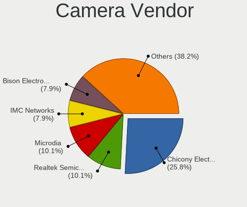

| Vendor                                 | Computers | Percent |
|----------------------------------------|-----------|---------|
| Chicony Electronics                    | 23        | 25.84%  |
| Realtek Semiconductor                  | 9         | 10.11%  |
| Microdia                               | 9         | 10.11%  |
| IMC Networks                           | 7         | 7.87%   |
| Acer                                   | 7         | 7.87%   |
| Suyin                                  | 5         | 5.62%   |
| Sunplus Innovation Technology          | 5         | 5.62%   |
| Silicon Motion                         | 3         | 3.37%   |
| Lite-On Technology                     | 3         | 3.37%   |
| Z-Star Microelectronics                | 2         | 2.25%   |
| Logitech                               | 2         | 2.25%   |
| ARC International                      | 2         | 2.25%   |
| Apple                                  | 2         | 2.25%   |
| Syntek                                 | 1         | 1.12%   |
| Ricoh                                  | 1         | 1.12%   |
| Luxvisions Innotech Limited            | 1         | 1.12%   |
| Linux Foundation                       | 1         | 1.12%   |
| Lenovo                                 | 1         | 1.12%   |
| KYE Systems (Mouse Systems)            | 1         | 1.12%   |
| Generalplus Technology                 | 1         | 1.12%   |
| Creative Technology                    | 1         | 1.12%   |
| Cheng Uei Precision Industry (Foxlink) | 1         | 1.12%   |
| Alcor Micro                            | 1         | 1.12%   |

Camera Model
------------

Camera device models

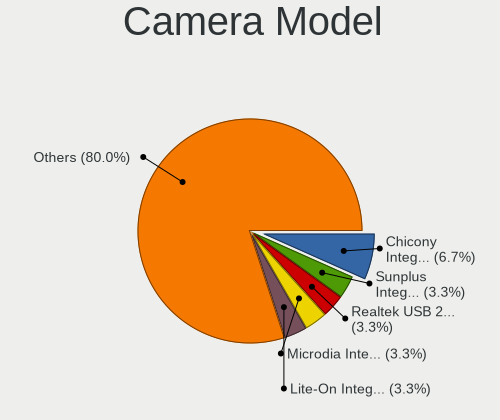

| Model                                                      | Computers | Percent |
|------------------------------------------------------------|-----------|---------|
| Chicony Integrated Camera                                  | 6         | 6.67%   |
| Sunplus Integrated_Webcam_HD                               | 3         | 3.33%   |
| Realtek Realtek USB2.0 PC Camera                           | 3         | 3.33%   |
| Microdia Integrated_Webcam_HD                              | 3         | 3.33%   |
| Lite-On Integrated Camera                                  | 3         | 3.33%   |
| Suyin Laptop_Integrated_Webcam_HD                          | 2         | 2.22%   |
| Realtek USB Camera                                         | 2         | 2.22%   |
| Realtek Integrated_Webcam_HD                               | 2         | 2.22%   |
| IMC Networks USB2.0 HD UVC WebCam                          | 2         | 2.22%   |
| Chicony UVC 1.00 device HD UVC WebCam                      | 2         | 2.22%   |
| Chicony USB2.0 VGA UVC WebCam                              | 2         | 2.22%   |
| Chicony USB2.0 HD UVC WebCam                               | 2         | 2.22%   |
| Chicony FJ Camera                                          | 2         | 2.22%   |
| ARC International Camera                                   | 2         | 2.22%   |
| Acer Integrated Camera                                     | 2         | 2.22%   |
| Z-Star Venus USB2.0 Camera                                 | 1         | 1.11%   |
| Z-Star Vega USB 2.0 Camera                                 | 1         | 1.11%   |
| Syntek Lenovo EasyCamera                                   | 1         | 1.11%   |
| Suyin HP webcam [dv6-1190en]                               | 1         | 1.11%   |
| Suyin Acer Crystal Eye webcam                              | 1         | 1.11%   |
| Suyin 1.3M HD WebCam                                       | 1         | 1.11%   |
| Sunplus Laptop_Integrated_Webcam_FHD                       | 1         | 1.11%   |
| Sunplus Aukey-PC-LM1E Camera                               | 1         | 1.11%   |
| Silicon Motion WebCam SCB-1100N                            | 1         | 1.11%   |
| Silicon Motion Realtek USB2.0 PC Camera                    | 1         | 1.11%   |
| Silicon Motion ATIV Real HD Camera                         | 1         | 1.11%   |
| Ricoh HD Webcam                                            | 1         | 1.11%   |
| Realtek Integrated_Webcam_FHD                              | 1         | 1.11%   |
| Realtek Integrated_Webcam_8M                               | 1         | 1.11%   |
| Realtek Acer 640 x 480 laptop camera                       | 1         | 1.11%   |
| Microdia Webcam Vitade AF                                  | 1         | 1.11%   |
| Microdia Laptop_Integrated_Webcam_HD                       | 1         | 1.11%   |
| Microdia Integrated Webcam                                 | 1         | 1.11%   |
| Microdia Dell Laptop Integrated Webcam HD                  | 1         | 1.11%   |
| Microdia Dell Integrated HD Webcam                         | 1         | 1.11%   |
| Microdia ASUS USB2.0 Webcam                                | 1         | 1.11%   |
| Luxvisions Innotech Limited HP Wide Vision HD Camera       | 1         | 1.11%   |
| Logitech Webcam C310                                       | 1         | 1.11%   |
| Logitech C922 Pro Stream Webcam                            | 1         | 1.11%   |
| Linux Foundation HD Camera                                 | 1         | 1.11%   |
| Lenovo Integrated Webcam [R5U877]                          | 1         | 1.11%   |
| KYE Systems (Mouse Systems) AUKEY PC-LM1E Camera           | 1         | 1.11%   |
| IMC Networks VGA UVC WebCam                                | 1         | 1.11%   |
| IMC Networks USB2.0 UVC HD Webcam                          | 1         | 1.11%   |
| IMC Networks USB Camera                                    | 1         | 1.11%   |
| IMC Networks HP TrueVision HD Camera                       | 1         | 1.11%   |
| IMC Networks EasyCamera                                    | 1         | 1.11%   |
| Generalplus GENERAL WEBCAM                                 | 1         | 1.11%   |
| Creative Webcam Live! Motion                               | 1         | 1.11%   |
| Chicony thinkpad t430s camera                              | 1         | 1.11%   |
| Chicony Sonix ST50220 USB Video Camera                     | 1         | 1.11%   |
| Chicony Integrated HP HD Webcam                            | 1         | 1.11%   |
| Chicony Integrated Camera (1280x720@30)                    | 1         | 1.11%   |
| Chicony HP Integrated Webcam                               | 1         | 1.11%   |
| Chicony HD WebCam                                          | 1         | 1.11%   |
| Chicony Chicony USB 2.0 Camera                             | 1         | 1.11%   |
| Chicony 2.0M UVC Webcam / CNF7129                          | 1         | 1.11%   |
| Chicony 1.3 MPixel UVC Webcam                              | 1         | 1.11%   |
| Cheng Uei Precision Industry (Foxlink) HP Universal Camera | 1         | 1.11%   |
| Apple FaceTime HD Camera                                   | 1         | 1.11%   |

Security
--------

Fingerprint Vendor
------------------

Fingerprint sensor vendors

| Vendor                | Computers | Percent |
|-----------------------|-----------|---------|
| Validity Sensors      | 6         | 40%     |
| AuthenTec             | 4         | 26.67%  |
| Upek                  | 1         | 6.67%   |
| Synaptics             | 1         | 6.67%   |
| STMicroelectronics    | 1         | 6.67%   |
| Elan Microelectronics | 1         | 6.67%   |
| Broadcom              | 1         | 6.67%   |

Fingerprint Model
-----------------

Fingerprint sensor models

| Model                                                                        | Computers | Percent |
|------------------------------------------------------------------------------|-----------|---------|
| Validity Sensors VFS7500 Touch Fingerprint Sensor                            | 2         | 13.33%  |
| Validity Sensors VFS495 Fingerprint Reader                                   | 1         | 6.67%   |
| Validity Sensors VFS451 Fingerprint Reader                                   | 1         | 6.67%   |
| Validity Sensors VFS 5011 fingerprint sensor                                 | 1         | 6.67%   |
| Validity Sensors Synaptics WBDI                                              | 1         | 6.67%   |
| Upek Biometric Touchchip/Touchstrip Fingerprint Sensor                       | 1         | 6.67%   |
| Synaptics Metallica MOH Touch Fingerprint Reader                             | 1         | 6.67%   |
| STMicroelectronics Fingerprint Reader                                        | 1         | 6.67%   |
| Elan ELAN WBF Fingerprint Sensor                                             | 1         | 6.67%   |
| Broadcom BCM5880 Secure Applications Processor with fingerprint swipe sensor | 1         | 6.67%   |
| AuthenTec AuthenTec Inc. AES2660                                             | 1         | 6.67%   |
| AuthenTec AuthenTec Inc. AES1660                                             | 1         | 6.67%   |
| AuthenTec AES2810                                                            | 1         | 6.67%   |
| AuthenTec AES2501 Fingerprint Sensor                                         | 1         | 6.67%   |

Chipcard Vendor
---------------

Chipcard module vendors

Zero info for selected period =(

Chipcard Model
--------------

Chipcard module models

Zero info for selected period =(

Unsupported
-----------

Unsupported Devices
-------------------

Total unsupported devices on board

| Total | Computers | Percent |
|-------|-----------|---------|
| 1     | 75        | 39.89%  |
| 2     | 44        | 23.4%   |
| 0     | 42        | 22.34%  |
| 3     | 18        | 9.57%   |
| 4     | 6         | 3.19%   |
| 5     | 2         | 1.06%   |
| 6     | 1         | 0.53%   |

Unsupported Device Types
------------------------

Types of unsupported devices

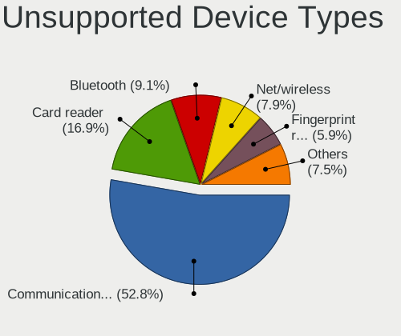

| Type                     | Computers | Percent |
|--------------------------|-----------|---------|
| Communication controller | 133       | 52.78%  |
| Card reader              | 43        | 17.06%  |
| Bluetooth                | 23        | 9.13%   |
| Net/wireless             | 20        | 7.94%   |
| Fingerprint reader       | 15        | 5.95%   |
| Sound                    | 8         | 3.17%   |
| Firewire controller      | 3         | 1.19%   |
| Storage/raid             | 2         | 0.79%   |
| Network                  | 2         | 0.79%   |
| Net/ethernet             | 2         | 0.79%   |
| Storage                  | 1         | 0.4%    |

