helloSystem 0.5.0 - Tested Hardware & Statistics
------------------------------------------------

A project to collect tested hardware configurations for helloSystem 0.5.0.

Anyone can contribute to this report by the [hw-probe](https://github.com/linuxhw/hw-probe/blob/master/INSTALL.BSD.md) tool:

    hw-probe -all -upload

Please contribute! Especially if your hardware is rare.

This is a report for all computer types. See also reports for [desktops](/Dist/helloSystem_0.5.0/Desktop/README.md) and [notebooks](/Dist/helloSystem_0.5.0/Notebook/README.md).

Contents
--------

* [ Test Cases ](#test-cases)

* [ System ](#system)
  - [ Arch                     ](#arch)
  - [ DE                       ](#de)
  - [ Display Server           ](#display-server)
  - [ Display Manager          ](#display-manager)
  - [ OS Lang                  ](#os-lang)
  - [ Boot Mode                ](#boot-mode)
  - [ Filesystem               ](#filesystem)
  - [ Part. scheme             ](#part-scheme)

* [ Board ](#board)
  - [ Vendor                   ](#vendor)
  - [ Model                    ](#model)
  - [ Model Family             ](#model-family)
  - [ MFG Year                 ](#mfg-year)
  - [ Form Factor              ](#form-factor)
  - [ Coreboot                 ](#coreboot)
  - [ RAM Size                 ](#ram-size)
  - [ RAM Used                 ](#ram-used)
  - [ Total Drives             ](#total-drives)
  - [ Has CD-ROM               ](#has-cd-rom)
  - [ Has Ethernet             ](#has-ethernet)
  - [ Has WiFi                 ](#has-wifi)
  - [ Has Bluetooth            ](#has-bluetooth)

* [ Location ](#location)
  - [ Country                  ](#country)
  - [ City                     ](#city)

* [ Drives ](#drives)
  - [ Drive Vendor             ](#drive-vendor)
  - [ Drive Model              ](#drive-model)
  - [ HDD Vendor               ](#hdd-vendor)
  - [ SSD Vendor               ](#ssd-vendor)
  - [ Drive Kind               ](#drive-kind)
  - [ Drive Connector          ](#drive-connector)
  - [ Drive Size               ](#drive-size)
  - [ Space Total              ](#space-total)
  - [ Space Used               ](#space-used)
  - [ Malfunc. Drives          ](#malfunc-drives)
  - [ Malfunc. Drive Vendor    ](#malfunc-drive-vendor)
  - [ Malfunc. HDD Vendor      ](#malfunc-hdd-vendor)
  - [ Malfunc. Drive Kind      ](#malfunc-drive-kind)
  - [ Failed Drives            ](#failed-drives)
  - [ Failed Drive Vendor      ](#failed-drive-vendor)
  - [ Drive Status             ](#drive-status)

* [ Storage controller ](#storage-controller)
  - [ Storage Vendor           ](#storage-vendor)
  - [ Storage Model            ](#storage-model)
  - [ Storage Kind             ](#storage-kind)

* [ Processor ](#processor)
  - [ CPU Vendor               ](#cpu-vendor)
  - [ CPU Model                ](#cpu-model)
  - [ CPU Model Family         ](#cpu-model-family)
  - [ CPU Cores                ](#cpu-cores)
  - [ CPU Sockets              ](#cpu-sockets)
  - [ CPU Threads              ](#cpu-threads)
  - [ CPU Microarch            ](#cpu-microarch)

* [ Graphics ](#graphics)
  - [ GPU Vendor               ](#gpu-vendor)
  - [ GPU Model                ](#gpu-model)
  - [ GPU Combo                ](#gpu-combo)
  - [ GPU Driver               ](#gpu-driver)
  - [ GPU Memory               ](#gpu-memory)

* [ Monitor ](#monitor)
  - [ Monitor Vendor           ](#monitor-vendor)
  - [ Monitor Model            ](#monitor-model)
  - [ Monitor Resolution       ](#monitor-resolution)
  - [ Monitor Diagonal         ](#monitor-diagonal)
  - [ Monitor Width            ](#monitor-width)
  - [ Aspect Ratio             ](#aspect-ratio)
  - [ Monitor Area             ](#monitor-area)
  - [ Pixel Density            ](#pixel-density)
  - [ Multiple Monitors        ](#multiple-monitors)

* [ Network ](#network)
  - [ Net Controller Vendor    ](#net-controller-vendor)
  - [ Net Controller Model     ](#net-controller-model)
  - [ Wireless Vendor          ](#wireless-vendor)
  - [ Wireless Model           ](#wireless-model)
  - [ Ethernet Vendor          ](#ethernet-vendor)
  - [ Ethernet Model           ](#ethernet-model)
  - [ Net Controller Kind      ](#net-controller-kind)
  - [ Used Controller          ](#used-controller)
  - [ NICs                     ](#nics)
  - [ IPv6                     ](#ipv6)

* [ Bluetooth ](#bluetooth)
  - [ Bluetooth Vendor         ](#bluetooth-vendor)
  - [ Bluetooth Model          ](#bluetooth-model)

* [ Sound ](#sound)
  - [ Sound Vendor             ](#sound-vendor)
  - [ Sound Model              ](#sound-model)

* [ Memory ](#memory)
  - [ Memory Vendor            ](#memory-vendor)
  - [ Memory Model             ](#memory-model)
  - [ Memory Kind              ](#memory-kind)
  - [ Memory Form Factor       ](#memory-form-factor)
  - [ Memory Size              ](#memory-size)
  - [ Memory Speed             ](#memory-speed)

* [ Printers & scanners ](#printers--scanners)
  - [ Printer Vendor           ](#printer-vendor)
  - [ Printer Model            ](#printer-model)
  - [ Scanner Vendor           ](#scanner-vendor)
  - [ Scanner Model            ](#scanner-model)

* [ Camera ](#camera)
  - [ Camera Vendor            ](#camera-vendor)
  - [ Camera Model             ](#camera-model)

* [ Security ](#security)
  - [ Fingerprint Vendor       ](#fingerprint-vendor)
  - [ Fingerprint Model        ](#fingerprint-model)
  - [ Chipcard Vendor          ](#chipcard-vendor)
  - [ Chipcard Model           ](#chipcard-model)

* [ Unsupported ](#unsupported)
  - [ Unsupported Devices      ](#unsupported-devices)
  - [ Unsupported Device Types ](#unsupported-device-types)

Test Cases
----------

Total: 298

| Vendor        | Model                       | Form-Factor | Probe                                                     | Date         |
|---------------|-----------------------------|-------------|-----------------------------------------------------------|--------------|
| ASUSTek       | CROSSHAIR V FORMULA-Z       | Desktop     | [ab8aea2f5c](https://bsd-hardware.info/?probe=ab8aea2f5c) | Apr 17, 2022 |
| Fujitsu Si... | ESPRIMO Mobile V5535        | Notebook    | [f4c9b911fe](https://bsd-hardware.info/?probe=f4c9b911fe) | Jan 16, 2022 |
| Packard Be... | EasyNote_MX61-B-038         | Notebook    | [235d60060d](https://bsd-hardware.info/?probe=235d60060d) | Dec 12, 2021 |
| HP            | Laptop 15-dw0xxx            | Notebook    | [4903f23b62](https://bsd-hardware.info/?probe=4903f23b62) | Dec 05, 2021 |
| MSI           | B450 TOMAHAWK MAX           | Desktop     | [14f1956220](https://bsd-hardware.info/?probe=14f1956220) | Dec 04, 2021 |
| Dell          | 0DR845                      | Desktop     | [4d07453a93](https://bsd-hardware.info/?probe=4d07453a93) | Nov 27, 2021 |
| Biostar       | B365MHC                     | Desktop     | [0c059bab3f](https://bsd-hardware.info/?probe=0c059bab3f) | Nov 11, 2021 |
| HP            | EliteBook 840 G3            | Notebook    | [03be88ded4](https://bsd-hardware.info/?probe=03be88ded4) | Nov 02, 2021 |
| HP            | ProBook 470 G4              | Notebook    | [5f026ff3a2](https://bsd-hardware.info/?probe=5f026ff3a2) | Oct 17, 2021 |
| HP            | ProBook 470 G4              | Notebook    | [40c180238f](https://bsd-hardware.info/?probe=40c180238f) | Oct 17, 2021 |
| Lenovo        | G500s 20245                 | Notebook    | [e6141c9ab3](https://bsd-hardware.info/?probe=e6141c9ab3) | Oct 16, 2021 |
| Lenovo        | ThinkPad X230 23254G7       | Notebook    | [06c6a282ca](https://bsd-hardware.info/?probe=06c6a282ca) | Oct 16, 2021 |
| HP            | Pavilion dv3                | Notebook    | [7f0b7f520f](https://bsd-hardware.info/?probe=7f0b7f520f) | Oct 14, 2021 |
| ASUSTek       | F2A85-M                     | Desktop     | [b4e3f33e5c](https://bsd-hardware.info/?probe=b4e3f33e5c) | Oct 14, 2021 |
| ASUSTek       | PRIME Z390M-PLUS            | Desktop     | [b3b31d25b0](https://bsd-hardware.info/?probe=b3b31d25b0) | Oct 13, 2021 |
| ASUSTek       | PRIME Z390M-PLUS            | Desktop     | [5a7c1871b1](https://bsd-hardware.info/?probe=5a7c1871b1) | Oct 11, 2021 |
| Acer          | Aspire TC-780               | Desktop     | [77101a00b3](https://bsd-hardware.info/?probe=77101a00b3) | Oct 11, 2021 |
| ASUSTek       | D940MX                      | Desktop     | [4e798f3ef0](https://bsd-hardware.info/?probe=4e798f3ef0) | Oct 10, 2021 |
| HP            | ProBook 470 G4              | Notebook    | [a9c135bf27](https://bsd-hardware.info/?probe=a9c135bf27) | Oct 10, 2021 |
| Lenovo        | ThinkPad T14s Gen 1 20T1... | Notebook    | [fc1eda0998](https://bsd-hardware.info/?probe=fc1eda0998) | Oct 08, 2021 |
| Toshiba       | dynabook Satellite B453/... | Notebook    | [e621531452](https://bsd-hardware.info/?probe=e621531452) | Oct 05, 2021 |
| ASUSTek       | X441BA                      | Notebook    | [2fcb818b78](https://bsd-hardware.info/?probe=2fcb818b78) | Oct 04, 2021 |
| Dell          | 0D90HM A00                  | All in one  | [d21f14c779](https://bsd-hardware.info/?probe=d21f14c779) | Oct 02, 2021 |
| Lenovo        | ThinkPad T490s 20NYS3TU0... | Notebook    | [d377309110](https://bsd-hardware.info/?probe=d377309110) | Oct 02, 2021 |
| Lenovo        | ThinkPad X230 Tablet 343... | Notebook    | [efdfee9023](https://bsd-hardware.info/?probe=efdfee9023) | Oct 01, 2021 |
| Lenovo        | ThinkPad X230 2325O76       | Notebook    | [b8729e39e1](https://bsd-hardware.info/?probe=b8729e39e1) | Sep 29, 2021 |
| Toshiba       | Satellite P300              | Notebook    | [13e4aa7026](https://bsd-hardware.info/?probe=13e4aa7026) | Sep 29, 2021 |
| Lenovo        | ThinkPad L520 78594KM       | Notebook    | [7905093412](https://bsd-hardware.info/?probe=7905093412) | Sep 26, 2021 |
| HP            | 87D6 SMVB                   | Desktop     | [90d91bc113](https://bsd-hardware.info/?probe=90d91bc113) | Sep 26, 2021 |
| Gigabyte      | H61M-D2P-B3                 | Desktop     | [c6da80d54b](https://bsd-hardware.info/?probe=c6da80d54b) | Sep 25, 2021 |
| ASUSTek       | M5A78L-M LX3                | Desktop     | [f336d13e01](https://bsd-hardware.info/?probe=f336d13e01) | Sep 24, 2021 |
| Gigabyte      | H61M-D2P-B3                 | Desktop     | [6ed62a3798](https://bsd-hardware.info/?probe=6ed62a3798) | Sep 23, 2021 |
| Lenovo        | ThinkPad T410 2537E82       | Notebook    | [4ccdde7b89](https://bsd-hardware.info/?probe=4ccdde7b89) | Sep 20, 2021 |
| Foxconn       | A88GMX FAB                  | Desktop     | [b46845b69f](https://bsd-hardware.info/?probe=b46845b69f) | Sep 19, 2021 |
| Lenovo        | ThinkPad T61 64607EU        | Notebook    | [34e48b691d](https://bsd-hardware.info/?probe=34e48b691d) | Sep 17, 2021 |
| HP            | G42                         | Notebook    | [738ccd1adf](https://bsd-hardware.info/?probe=738ccd1adf) | Sep 15, 2021 |
| Lenovo        | Yoga Slim 7 Pro 14ACH5 8... | Notebook    | [7979c87340](https://bsd-hardware.info/?probe=7979c87340) | Sep 14, 2021 |
| Gigabyte      | H270M-DS3H-CF               | Desktop     | [bc2a287495](https://bsd-hardware.info/?probe=bc2a287495) | Sep 13, 2021 |
| HP            | 87D6 SMVB                   | Desktop     | [61fc69edfe](https://bsd-hardware.info/?probe=61fc69edfe) | Sep 13, 2021 |
| ASUSTek       | P8H77-I                     | Desktop     | [1feb22dc52](https://bsd-hardware.info/?probe=1feb22dc52) | Sep 12, 2021 |
| Sapphire      | EDGE-FT1M1 E450 1AOVU044    | Desktop     | [85ed325446](https://bsd-hardware.info/?probe=85ed325446) | Sep 11, 2021 |
| ASRock        | B460M Pro4                  | Desktop     | [cfc7818691](https://bsd-hardware.info/?probe=cfc7818691) | Sep 10, 2021 |
| ASUSTek       | H110M-PLUS                  | Desktop     | [08b4825275](https://bsd-hardware.info/?probe=08b4825275) | Sep 09, 2021 |
| ASRock        | B550M Pro4                  | Desktop     | [dc582ea4d3](https://bsd-hardware.info/?probe=dc582ea4d3) | Sep 09, 2021 |
| Lenovo        | 312A SDK0J40697 WIN 3305... | Desktop     | [c729f82f4c](https://bsd-hardware.info/?probe=c729f82f4c) | Sep 08, 2021 |
| Packard Be... | imedia S2110A               | Desktop     | [d62a38660c](https://bsd-hardware.info/?probe=d62a38660c) | Sep 08, 2021 |
| Lenovo        | Board                       | Desktop     | [685abcc739](https://bsd-hardware.info/?probe=685abcc739) | Sep 07, 2021 |
| Lenovo        | IdeaPad 110S-11IBR 80WG     | Notebook    | [62f9376847](https://bsd-hardware.info/?probe=62f9376847) | Sep 04, 2021 |
| Medion        | H61H2-LM3                   | Desktop     | [7a42009a08](https://bsd-hardware.info/?probe=7a42009a08) | Sep 02, 2021 |
| ASUSTek       | TUF GAMING X570-PLUS        | Desktop     | [9e13729a12](https://bsd-hardware.info/?probe=9e13729a12) | Sep 02, 2021 |
| Apple         | MacBookAir7,2               | Notebook    | [6eada6e49e](https://bsd-hardware.info/?probe=6eada6e49e) | Aug 28, 2021 |
| Itautec       | Infoway w7530               | Notebook    | [fe69db32c8](https://bsd-hardware.info/?probe=fe69db32c8) | Aug 27, 2021 |
| HP            | 0A60h                       | Desktop     | [0f28538e3d](https://bsd-hardware.info/?probe=0f28538e3d) | Aug 25, 2021 |
| HP            | 1589                        | Desktop     | [4d51cc9c4b](https://bsd-hardware.info/?probe=4d51cc9c4b) | Aug 24, 2021 |
| Acer          | Aspire TC-895 V:1.0         | Desktop     | [da3e8986a3](https://bsd-hardware.info/?probe=da3e8986a3) | Aug 22, 2021 |
| HP            | Pavilion dv6                | Notebook    | [8054d6310f](https://bsd-hardware.info/?probe=8054d6310f) | Aug 19, 2021 |
| EVGA          | X299 MICRO                  | Desktop     | [d04b55d1f6](https://bsd-hardware.info/?probe=d04b55d1f6) | Aug 19, 2021 |
| MSI           | GF65 Thin 10SDR             | Notebook    | [7e5ebc9c82](https://bsd-hardware.info/?probe=7e5ebc9c82) | Aug 18, 2021 |
| ASRock        | Z390 Pro4                   | Desktop     | [aca402061b](https://bsd-hardware.info/?probe=aca402061b) | Aug 18, 2021 |
| Toshiba       | Satellite L855              | Notebook    | [116ce6af18](https://bsd-hardware.info/?probe=116ce6af18) | Aug 18, 2021 |
| Intel         | NUC5i3RYB K23918-501        | Mini pc     | [75f3efc215](https://bsd-hardware.info/?probe=75f3efc215) | Aug 18, 2021 |
| Foxconn       | 2ADA                        | Desktop     | [e96976b2cc](https://bsd-hardware.info/?probe=e96976b2cc) | Aug 18, 2021 |
| HC            | HCAR357-MI V1.0             | Desktop     | [3293b7bad9](https://bsd-hardware.info/?probe=3293b7bad9) | Aug 17, 2021 |
| Dell          | Latitude E5530 non-vPro     | Notebook    | [bd4b0f0700](https://bsd-hardware.info/?probe=bd4b0f0700) | Aug 17, 2021 |
| Gigabyte      | HA65M-D2H-B3                | Desktop     | [fc9b50bb85](https://bsd-hardware.info/?probe=fc9b50bb85) | Aug 16, 2021 |
| ASUSTek       | X55CR                       | Notebook    | [c7c812c2c9](https://bsd-hardware.info/?probe=c7c812c2c9) | Aug 15, 2021 |
| Lenovo        | SKYBAY SDK0J40700 WIN 32... | All in one  | [37e51c01a1](https://bsd-hardware.info/?probe=37e51c01a1) | Aug 15, 2021 |
| Apple         | Mac-77F17D7DA9285301 iMa... | All in one  | [7b20265c8e](https://bsd-hardware.info/?probe=7b20265c8e) | Aug 14, 2021 |
| HP            | 250 G4                      | Notebook    | [24e8c3de59](https://bsd-hardware.info/?probe=24e8c3de59) | Aug 13, 2021 |
| HP            | 625                         | Notebook    | [606d75e6a1](https://bsd-hardware.info/?probe=606d75e6a1) | Aug 11, 2021 |
| HP            | 250 G4                      | Notebook    | [43a7b112ba](https://bsd-hardware.info/?probe=43a7b112ba) | Aug 11, 2021 |
| Lenovo        | ThinkPad X230 2330A48       | Notebook    | [791c826f7d](https://bsd-hardware.info/?probe=791c826f7d) | Aug 11, 2021 |
| Gigabyte      | B360M D3H-CF                | Desktop     | [1c88ce5779](https://bsd-hardware.info/?probe=1c88ce5779) | Aug 10, 2021 |
| HP            | Pavilion 11                 | Notebook    | [5300a49632](https://bsd-hardware.info/?probe=5300a49632) | Aug 10, 2021 |
| Pegatron      | IPPCR-SS                    | Desktop     | [8a7fc2689b](https://bsd-hardware.info/?probe=8a7fc2689b) | Aug 09, 2021 |
| Gigabyte      | A75M-DS2                    | Desktop     | [2010fe5fab](https://bsd-hardware.info/?probe=2010fe5fab) | Aug 09, 2021 |
| Dell          | G3 3579                     | Notebook    | [91c803fdf2](https://bsd-hardware.info/?probe=91c803fdf2) | Aug 09, 2021 |
| ASUSTek       | P7H55-M LX                  | Desktop     | [df393cc673](https://bsd-hardware.info/?probe=df393cc673) | Aug 08, 2021 |
| Intel         | D54250WYK H13922-304        | Desktop     | [45c86d174e](https://bsd-hardware.info/?probe=45c86d174e) | Aug 08, 2021 |
| NEC Comput... | PC-VK17HBBCD                | Notebook    | [1e23da04c0](https://bsd-hardware.info/?probe=1e23da04c0) | Aug 08, 2021 |
| ASUSTek       | M5A78L LE                   | Desktop     | [7a1d31be72](https://bsd-hardware.info/?probe=7a1d31be72) | Aug 07, 2021 |
| ASUSTek       | H81M-A                      | Desktop     | [bb65c30be3](https://bsd-hardware.info/?probe=bb65c30be3) | Aug 07, 2021 |
| ASUSTek       | H81M-A                      | Desktop     | [9e0c8e8024](https://bsd-hardware.info/?probe=9e0c8e8024) | Aug 07, 2021 |
| Dell          | Inspiron 15-3567            | Notebook    | [9073f1975d](https://bsd-hardware.info/?probe=9073f1975d) | Aug 07, 2021 |
| ASUSTek       | K55VD                       | Notebook    | [6896c37580](https://bsd-hardware.info/?probe=6896c37580) | Aug 06, 2021 |
| ASUSTek       | Crosshair V Formula         | Desktop     | [90c27497d9](https://bsd-hardware.info/?probe=90c27497d9) | Aug 05, 2021 |
| Apple         | MacBookPro3,1               | Notebook    | [3566222830](https://bsd-hardware.info/?probe=3566222830) | Aug 04, 2021 |
| PCPartner     | MILANO-P Rev.00             | Desktop     | [526390c559](https://bsd-hardware.info/?probe=526390c559) | Aug 04, 2021 |
| PCPartner     | MILANO-P Rev.00             | Desktop     | [071eac9b1b](https://bsd-hardware.info/?probe=071eac9b1b) | Aug 04, 2021 |
| Acidanther... | Mac-7BA5B2D9E42DDD94 iMa... | All in one  | [4055806819](https://bsd-hardware.info/?probe=4055806819) | Aug 04, 2021 |
| Biostar       | A770E3                      | Desktop     | [4d0ac19b8e](https://bsd-hardware.info/?probe=4d0ac19b8e) | Aug 03, 2021 |
| Lenovo        | ThinkPad X250 20CLS4JH00    | Notebook    | [89a74889ae](https://bsd-hardware.info/?probe=89a74889ae) | Aug 02, 2021 |
| Dell          | 0RY007                      | Desktop     | [c67ccf8bc6](https://bsd-hardware.info/?probe=c67ccf8bc6) | Aug 01, 2021 |
| Sony          | VPCEJ1E1E                   | Notebook    | [c471fb3f82](https://bsd-hardware.info/?probe=c471fb3f82) | Aug 01, 2021 |
| PCPartner     | MILANO-P Rev.00             | Desktop     | [ef40df391b](https://bsd-hardware.info/?probe=ef40df391b) | Aug 01, 2021 |
| Gigabyte      | H110-D3A-CF                 | Desktop     | [7923f57fbe](https://bsd-hardware.info/?probe=7923f57fbe) | Aug 01, 2021 |
| ASUSTek       | A58M-A/USB3                 | Desktop     | [9ffd4220e8](https://bsd-hardware.info/?probe=9ffd4220e8) | Aug 01, 2021 |
| Lenovo        | G550 2958                   | Notebook    | [86880c29cf](https://bsd-hardware.info/?probe=86880c29cf) | Jul 31, 2021 |
| Lenovo        | G550 2958                   | Notebook    | [4fe522eaf3](https://bsd-hardware.info/?probe=4fe522eaf3) | Jul 31, 2021 |
| HP            | 15                          | Notebook    | [c2da1dd654](https://bsd-hardware.info/?probe=c2da1dd654) | Jul 30, 2021 |
| Microsoft     | Surface Go                  | Tablet      | [1dfbc72509](https://bsd-hardware.info/?probe=1dfbc72509) | Jul 30, 2021 |
| Biostar       | N68S3+                      | Desktop     | [528c9d6eab](https://bsd-hardware.info/?probe=528c9d6eab) | Jul 26, 2021 |
| Apple         | MacBookPro6,2               | Notebook    | [7f25ab7c67](https://bsd-hardware.info/?probe=7f25ab7c67) | Jul 26, 2021 |
| Gigabyte      | PH67A-D3-B3                 | Desktop     | [73dff53f04](https://bsd-hardware.info/?probe=73dff53f04) | Jul 23, 2021 |
| Lenovo        | G500 20236                  | Notebook    | [d15eff8bcc](https://bsd-hardware.info/?probe=d15eff8bcc) | Jul 21, 2021 |
| HP            | Stream 11 Pro G4 EE         | Notebook    | [bd2bf6b0a0](https://bsd-hardware.info/?probe=bd2bf6b0a0) | Jul 20, 2021 |
| Gigabyte      | H110-D3A-CF                 | Desktop     | [58e49f458e](https://bsd-hardware.info/?probe=58e49f458e) | Jul 19, 2021 |
| PCPartner     | MILANO-P Rev.00             | Desktop     | [f20ac8df75](https://bsd-hardware.info/?probe=f20ac8df75) | Jul 19, 2021 |
| MSI           | IONA                        | Desktop     | [bb2c6b383b](https://bsd-hardware.info/?probe=bb2c6b383b) | Jul 17, 2021 |
| ASRock        | N68C-GS FX                  | Desktop     | [012356047f](https://bsd-hardware.info/?probe=012356047f) | Jul 17, 2021 |
| ASRock        | N68C-GS FX                  | Desktop     | [e1f439def9](https://bsd-hardware.info/?probe=e1f439def9) | Jul 17, 2021 |
| ASUSTek       | M5A78L-M/USB3               | Desktop     | [20fc88018b](https://bsd-hardware.info/?probe=20fc88018b) | Jul 16, 2021 |
| Apple         | MacBookPro9,2               | Notebook    | [6cca4dee6f](https://bsd-hardware.info/?probe=6cca4dee6f) | Jul 15, 2021 |
| HP            | ProLiant DL380 G5           | Server      | [7dfaec9b01](https://bsd-hardware.info/?probe=7dfaec9b01) | Jul 13, 2021 |
| HP            | 0AE8h C                     | Desktop     | [23df6b2e94](https://bsd-hardware.info/?probe=23df6b2e94) | Jul 12, 2021 |
| Intel         | NUC5i3RYB K23918-501        | Mini pc     | [4bd9c0bbb8](https://bsd-hardware.info/?probe=4bd9c0bbb8) | Jul 11, 2021 |
| Alienware     | 17                          | Notebook    | [aff2be63cd](https://bsd-hardware.info/?probe=aff2be63cd) | Jul 10, 2021 |
| HP            | Pavilion x360 Convertibl... | Convertible | [40624b04c0](https://bsd-hardware.info/?probe=40624b04c0) | Jul 08, 2021 |
| Dell          | 0GXM1W A02                  | Desktop     | [269edf2dcf](https://bsd-hardware.info/?probe=269edf2dcf) | Jul 06, 2021 |
| MouseCompu... | W331AU                      | Notebook    | [f9a4733911](https://bsd-hardware.info/?probe=f9a4733911) | Jul 06, 2021 |
| Intel         | NUC7i7BNB J31145-306        | Mini pc     | [631f69c3f6](https://bsd-hardware.info/?probe=631f69c3f6) | Jul 06, 2021 |
| MouseCompu... | W331AU                      | Notebook    | [4adfeaa072](https://bsd-hardware.info/?probe=4adfeaa072) | Jul 06, 2021 |
| ASRock        | B450M-HDV                   | Desktop     | [dca41aa10a](https://bsd-hardware.info/?probe=dca41aa10a) | Jul 05, 2021 |
| ASRock        | X99 Taichi                  | Desktop     | [149d7abd05](https://bsd-hardware.info/?probe=149d7abd05) | Jul 04, 2021 |
| ASUSTek       | PRIME Z390-P                | Desktop     | [4060cdec72](https://bsd-hardware.info/?probe=4060cdec72) | Jul 04, 2021 |
| ASRock        | Z390 Pro4                   | Desktop     | [dc4eb674ea](https://bsd-hardware.info/?probe=dc4eb674ea) | Jul 03, 2021 |
| Shuttle       | NC10U                       | Desktop     | [5d2d20dd04](https://bsd-hardware.info/?probe=5d2d20dd04) | Jul 02, 2021 |
| HP            | ProBook 4440s               | Notebook    | [4aac49bc1e](https://bsd-hardware.info/?probe=4aac49bc1e) | Jul 01, 2021 |
| Fujitsu       | D2863 S26361-D2863-A10 W... | Server      | [8cebf32782](https://bsd-hardware.info/?probe=8cebf32782) | Jun 30, 2021 |
| Lenovo        | ThinkPad X200 7458VP4       | Notebook    | [42100d8ea1](https://bsd-hardware.info/?probe=42100d8ea1) | Jun 30, 2021 |
| Protectli     | FW2B Ver                    | Desktop     | [7b6f704247](https://bsd-hardware.info/?probe=7b6f704247) | Jun 30, 2021 |
| HP            | Pavilion 17                 | Notebook    | [9929e0c39b](https://bsd-hardware.info/?probe=9929e0c39b) | Jun 30, 2021 |
| HP            | 0B4Ch D                     | Desktop     | [b56bd19073](https://bsd-hardware.info/?probe=b56bd19073) | Jun 30, 2021 |
| Biostar       | B450MH                      | Desktop     | [167f09a25c](https://bsd-hardware.info/?probe=167f09a25c) | Jun 29, 2021 |
| Dell          | Latitude E6410              | Notebook    | [8c904d84e0](https://bsd-hardware.info/?probe=8c904d84e0) | Jun 28, 2021 |
| Huanan        | X99-8M-F V1.2               | Desktop     | [6477b9ef24](https://bsd-hardware.info/?probe=6477b9ef24) | Jun 28, 2021 |
| Lenovo        | G500 20236                  | Notebook    | [6e96d4c26f](https://bsd-hardware.info/?probe=6e96d4c26f) | Jun 28, 2021 |
| MSI           | B450 GAMING PLUS MAX        | Desktop     | [f0e80b0788](https://bsd-hardware.info/?probe=f0e80b0788) | Jun 28, 2021 |
| ASUSTek       | H110M-E/M.2                 | Desktop     | [f3b0bb0930](https://bsd-hardware.info/?probe=f3b0bb0930) | Jun 28, 2021 |
| Lenovo        | G500 20236                  | Notebook    | [7ae63d4c6c](https://bsd-hardware.info/?probe=7ae63d4c6c) | Jun 27, 2021 |
| Lenovo        | ThinkPad L450 20DTCTO1WW    | Notebook    | [aba7b76575](https://bsd-hardware.info/?probe=aba7b76575) | Jun 27, 2021 |
| ASUSTek       | PRIME H410M-D               | Desktop     | [8ea103b783](https://bsd-hardware.info/?probe=8ea103b783) | Jun 26, 2021 |
| ASUSTek       | Strix 17 GL703GE            | Notebook    | [1697ebb0a5](https://bsd-hardware.info/?probe=1697ebb0a5) | Jun 25, 2021 |
| Dell          | 0P03DX A03                  | Desktop     | [b2f0c90d79](https://bsd-hardware.info/?probe=b2f0c90d79) | Jun 24, 2021 |
| Acer          | Aspire 5750                 | Notebook    | [d59f20f88a](https://bsd-hardware.info/?probe=d59f20f88a) | Jun 22, 2021 |
| ASUSTek       | P7H55                       | Desktop     | [c33ec074f8](https://bsd-hardware.info/?probe=c33ec074f8) | Jun 22, 2021 |
| ASUSTek       | P8H67-M PRO                 | Desktop     | [616c7043bd](https://bsd-hardware.info/?probe=616c7043bd) | Jun 22, 2021 |
| Dell          | Precision 7710              | Notebook    | [33653d0c28](https://bsd-hardware.info/?probe=33653d0c28) | Jun 22, 2021 |
| Lenovo        | ThinkPad X230 2325WWB       | Notebook    | [786669cc9c](https://bsd-hardware.info/?probe=786669cc9c) | Jun 21, 2021 |
| ASUSTek       | CP5141                      | Desktop     | [73c62835c1](https://bsd-hardware.info/?probe=73c62835c1) | Jun 21, 2021 |
| Lenovo        | ThinkPad T440s 20ARS1B70... | Notebook    | [46dca136f6](https://bsd-hardware.info/?probe=46dca136f6) | Jun 21, 2021 |
| Lenovo        | ThinkPad T470p 20J6A012C... | Notebook    | [d5e4c49986](https://bsd-hardware.info/?probe=d5e4c49986) | Jun 21, 2021 |
| Acer          | Aspire 5750                 | Notebook    | [cc6dc71d37](https://bsd-hardware.info/?probe=cc6dc71d37) | Jun 21, 2021 |
| Foxconn       | 2ABF                        | Desktop     | [d30b2629eb](https://bsd-hardware.info/?probe=d30b2629eb) | Jun 21, 2021 |
| Intel         | DH67CL AAG10212-206         | Desktop     | [f2367a4249](https://bsd-hardware.info/?probe=f2367a4249) | Jun 21, 2021 |
| Gigabyte      | H97-D3H-CF                  | Desktop     | [a326fd4061](https://bsd-hardware.info/?probe=a326fd4061) | Jun 20, 2021 |
| Dell          | 0PGKWF A01                  | Desktop     | [9f09d62462](https://bsd-hardware.info/?probe=9f09d62462) | Jun 20, 2021 |
| MSI           | H110M PRO-VH PLUS           | Desktop     | [45b842180e](https://bsd-hardware.info/?probe=45b842180e) | Jun 20, 2021 |
| Toshiba       | PORTEGE Z10t-A              | Notebook    | [cb7cbd17d0](https://bsd-hardware.info/?probe=cb7cbd17d0) | Jun 20, 2021 |
| Gateway       | NE56R                       | Notebook    | [cc65e24aea](https://bsd-hardware.info/?probe=cc65e24aea) | Jun 20, 2021 |
| ASUSTek       | ROG STRIX H370-I GAMING     | Desktop     | [d2dd261a2a](https://bsd-hardware.info/?probe=d2dd261a2a) | Jun 20, 2021 |
| ASUSTek       | VivoBook_ASUSLaptop X712... | Notebook    | [0fe1337b93](https://bsd-hardware.info/?probe=0fe1337b93) | Jun 19, 2021 |
| MSI           | B450M PRO-M2 MAX            | Desktop     | [edcbaf755f](https://bsd-hardware.info/?probe=edcbaf755f) | Jun 19, 2021 |
| ASUSTek       | VivoBook_ASUSLaptop X403... | Notebook    | [902b4298d4](https://bsd-hardware.info/?probe=902b4298d4) | Jun 19, 2021 |
| WYSE          | Z CLASS                     | Notebook    | [571fdbf390](https://bsd-hardware.info/?probe=571fdbf390) | Jun 19, 2021 |
| Dell          | 0XPDFK A01                  | Desktop     | [631dbb841b](https://bsd-hardware.info/?probe=631dbb841b) | Jun 19, 2021 |
| Dell          | Latitude E5420              | Notebook    | [1ed3ff35f6](https://bsd-hardware.info/?probe=1ed3ff35f6) | Jun 19, 2021 |
| Lenovo        | ThinkServer RS140           | Desktop     | [0f5d669e9f](https://bsd-hardware.info/?probe=0f5d669e9f) | Jun 18, 2021 |
| Lenovo        | ThinkServer RS140           | Desktop     | [63ba615299](https://bsd-hardware.info/?probe=63ba615299) | Jun 18, 2021 |
| Gigabyte      | AX370-Gaming-CF             | Desktop     | [d77be09267](https://bsd-hardware.info/?probe=d77be09267) | Jun 18, 2021 |
| Dell          | 0XPDFK A01                  | Desktop     | [7a1c26edeb](https://bsd-hardware.info/?probe=7a1c26edeb) | Jun 18, 2021 |
| Dell          | Vostro 3560                 | Notebook    | [ce9d5f9a46](https://bsd-hardware.info/?probe=ce9d5f9a46) | Jun 18, 2021 |
| Lenovo        | ThinkPad Edge E530 62724... | Notebook    | [78abd376db](https://bsd-hardware.info/?probe=78abd376db) | Jun 18, 2021 |
| ASUSTek       | H110I-PLUS                  | Desktop     | [0cb30b464d](https://bsd-hardware.info/?probe=0cb30b464d) | Jun 17, 2021 |
| Lenovo        | ThinkPad T420 4236FJ1       | Notebook    | [808f58228e](https://bsd-hardware.info/?probe=808f58228e) | Jun 17, 2021 |
| HP            | 3397                        | Desktop     | [3dd97c60ca](https://bsd-hardware.info/?probe=3dd97c60ca) | Jun 16, 2021 |
| Lenovo        | Board                       | Desktop     | [c981ffdff7](https://bsd-hardware.info/?probe=c981ffdff7) | Jun 15, 2021 |
| Toshiba       | PORTEGE R930                | Notebook    | [db520e9382](https://bsd-hardware.info/?probe=db520e9382) | Jun 15, 2021 |
| Toshiba       | Satellite C640              | Notebook    | [ec0d93d08c](https://bsd-hardware.info/?probe=ec0d93d08c) | Jun 15, 2021 |
| Lenovo        | ThinkPad T440s 20ARS1B70... | Notebook    | [9ae8146589](https://bsd-hardware.info/?probe=9ae8146589) | Jun 15, 2021 |
| Dell          | Latitude 5400               | Notebook    | [1bb6c1f63f](https://bsd-hardware.info/?probe=1bb6c1f63f) | Jun 15, 2021 |
| ASUSTek       | M5A78L-M LX/BR              | Desktop     | [5f9b56c8ae](https://bsd-hardware.info/?probe=5f9b56c8ae) | Jun 15, 2021 |
| ASUSTek       | M4A78LT-M                   | Desktop     | [0c8d6cd661](https://bsd-hardware.info/?probe=0c8d6cd661) | Jun 14, 2021 |
| ASUSTek       | PRIME A320M-K               | Desktop     | [fea57181b5](https://bsd-hardware.info/?probe=fea57181b5) | Jun 14, 2021 |
| Dell          | Inspiron 15-3567            | Notebook    | [53049dff12](https://bsd-hardware.info/?probe=53049dff12) | Jun 14, 2021 |
| ASRock        | G31M-VS2                    | Desktop     | [f2f5b95f4b](https://bsd-hardware.info/?probe=f2f5b95f4b) | Jun 14, 2021 |
| Intel         | X79 V2.72A                  | Desktop     | [88173bcf06](https://bsd-hardware.info/?probe=88173bcf06) | Jun 14, 2021 |
| HP            | OMEN by HP Laptop           | Notebook    | [abc94e9198](https://bsd-hardware.info/?probe=abc94e9198) | Jun 13, 2021 |
| ASUSTek       | TUF GAMING X570-PLUS        | Desktop     | [eeb4489d2f](https://bsd-hardware.info/?probe=eeb4489d2f) | Jun 13, 2021 |
| Gigabyte      | H470M DS3H                  | Desktop     | [7c37a0319b](https://bsd-hardware.info/?probe=7c37a0319b) | Jun 13, 2021 |
| ASRock        | FM2A68M-HD+                 | Desktop     | [8bb0d23eb4](https://bsd-hardware.info/?probe=8bb0d23eb4) | Jun 13, 2021 |
| HP            | 255 G2                      | Notebook    | [31177d9e0f](https://bsd-hardware.info/?probe=31177d9e0f) | Jun 13, 2021 |
| Lenovo        | ThinkPad T430 2349GCU       | Notebook    | [ca15c7d742](https://bsd-hardware.info/?probe=ca15c7d742) | Jun 13, 2021 |
| Gateway       | NE56R                       | Notebook    | [932f5d03f3](https://bsd-hardware.info/?probe=932f5d03f3) | Jun 13, 2021 |
| Dell          | Latitude E4300              | Notebook    | [7855973957](https://bsd-hardware.info/?probe=7855973957) | Jun 12, 2021 |
| Dell          | Inspiron 15-3567            | Notebook    | [d239ee4916](https://bsd-hardware.info/?probe=d239ee4916) | Jun 12, 2021 |
| Lenovo        | ThinkPad X240 20AMS39F0K    | Notebook    | [65564434a9](https://bsd-hardware.info/?probe=65564434a9) | Jun 12, 2021 |
| ASUSTek       | UX330UAK                    | Notebook    | [430c90b88d](https://bsd-hardware.info/?probe=430c90b88d) | Jun 12, 2021 |
| ASUSTek       | P5G41T-M LX3                | Desktop     | [1759329ae3](https://bsd-hardware.info/?probe=1759329ae3) | Apr 12, 2021 |
| Dell          | 0RW199                      | Desktop     | [e78392bc4c](https://bsd-hardware.info/?probe=e78392bc4c) | Apr 02, 2021 |
| Lenovo        | SHARKBAY SDK0E50510 WIN     | Desktop     | [62376c16a4](https://bsd-hardware.info/?probe=62376c16a4) | Mar 31, 2021 |
| Lenovo        | ThinkPad T440s 20ARS1B70... | Notebook    | [b644ed3914](https://bsd-hardware.info/?probe=b644ed3914) | Mar 31, 2021 |
| Medion        | H61H2-LM3                   | Desktop     | [6483c8390f](https://bsd-hardware.info/?probe=6483c8390f) | Mar 31, 2021 |
| Pegatron      | IPM41-D3                    | Desktop     | [687047b3d2](https://bsd-hardware.info/?probe=687047b3d2) | Mar 30, 2021 |
| Apple         | Mac-F65AE981FFA204ED Mac... | Mini pc     | [ac585b4e0d](https://bsd-hardware.info/?probe=ac585b4e0d) | Mar 30, 2021 |
| Dell          | Vostro 14-3468              | Notebook    | [219133fc53](https://bsd-hardware.info/?probe=219133fc53) | Mar 30, 2021 |
| Dell          | Vostro 14-3468              | Notebook    | [2c61fcee12](https://bsd-hardware.info/?probe=2c61fcee12) | Mar 30, 2021 |
| Gigabyte      | Z77X-UD5H                   | Desktop     | [d3742d3898](https://bsd-hardware.info/?probe=d3742d3898) | Mar 29, 2021 |
| Lenovo        | ThinkPad T440s 20ARS1B70... | Notebook    | [a5b9f5e79d](https://bsd-hardware.info/?probe=a5b9f5e79d) | Mar 27, 2021 |
| Lenovo        | ThinkPad X230 23255Y4       | Notebook    | [ab871769f0](https://bsd-hardware.info/?probe=ab871769f0) | Mar 27, 2021 |
| Toshiba       | Satellite L500              | Notebook    | [e07fd4edd9](https://bsd-hardware.info/?probe=e07fd4edd9) | Mar 25, 2021 |
| HP            | Pavilion Notebook           | Notebook    | [42ecf97502](https://bsd-hardware.info/?probe=42ecf97502) | Mar 25, 2021 |
| HP            | Pavilion Notebook           | Notebook    | [88e98e18a5](https://bsd-hardware.info/?probe=88e98e18a5) | Mar 25, 2021 |
| HP            | 18E7                        | Desktop     | [0e835b61ff](https://bsd-hardware.info/?probe=0e835b61ff) | Mar 24, 2021 |
| ASUSTek       | G75VW                       | Notebook    | [9b84d1e7e6](https://bsd-hardware.info/?probe=9b84d1e7e6) | Mar 24, 2021 |
| Lenovo        | SHARKBAY SDK0E50510 WIN     | Desktop     | [78a7c7b8cb](https://bsd-hardware.info/?probe=78a7c7b8cb) | Mar 23, 2021 |
| Lenovo        | ThinkPad T440s 20ARS1B70... | Notebook    | [d856b5bf95](https://bsd-hardware.info/?probe=d856b5bf95) | Mar 23, 2021 |
| Samsung       | 530U3C/530U4C/532U3C        | Notebook    | [10c79ea427](https://bsd-hardware.info/?probe=10c79ea427) | Mar 22, 2021 |
| Lenovo        | SHARKBAY SDK0E50510 WIN     | Desktop     | [5ae508dfa8](https://bsd-hardware.info/?probe=5ae508dfa8) | Mar 19, 2021 |
| Lenovo        | ThinkPad X260 20F5S82N00    | Notebook    | [aa3deadedd](https://bsd-hardware.info/?probe=aa3deadedd) | Mar 19, 2021 |
| Dell          | Inspiron 7520               | Notebook    | [599d3e84d7](https://bsd-hardware.info/?probe=599d3e84d7) | Mar 16, 2021 |
| ASUSTek       | PRIME H310M-E R2.0          | Desktop     | [8964a02114](https://bsd-hardware.info/?probe=8964a02114) | Mar 15, 2021 |
| ASUSTek       | PRIME Z390M-PLUS            | Desktop     | [0a3b290f9f](https://bsd-hardware.info/?probe=0a3b290f9f) | Mar 15, 2021 |
| TUXEDO        | Aura 15 Gen1                | Notebook    | [860b1cd65b](https://bsd-hardware.info/?probe=860b1cd65b) | Mar 15, 2021 |
| Packard Be... | EasyNote MH36               | Notebook    | [2a98cae4e8](https://bsd-hardware.info/?probe=2a98cae4e8) | Mar 13, 2021 |
| Fujitsu       | LIFEBOOK A555               | Notebook    | [bcb99d0f09](https://bsd-hardware.info/?probe=bcb99d0f09) | Mar 13, 2021 |
| Fujitsu       | LIFEBOOK A555               | Notebook    | [ee894449af](https://bsd-hardware.info/?probe=ee894449af) | Mar 13, 2021 |
| Dell          | Inspiron 7520               | Notebook    | [0054ef2511](https://bsd-hardware.info/?probe=0054ef2511) | Mar 13, 2021 |
| ASUSTek       | H110M-PLUS                  | Desktop     | [80e7c230d7](https://bsd-hardware.info/?probe=80e7c230d7) | Mar 12, 2021 |
| Dell          | 0W2PJY A01                  | Desktop     | [f162510a27](https://bsd-hardware.info/?probe=f162510a27) | Mar 12, 2021 |
| Dell          | Inspiron 3543               | Notebook    | [525eeec663](https://bsd-hardware.info/?probe=525eeec663) | Mar 12, 2021 |
| MSI           | B150M PRO-VDH               | Desktop     | [bc75a3ab13](https://bsd-hardware.info/?probe=bc75a3ab13) | Mar 11, 2021 |
| Acer          | Aspire 4810T                | Notebook    | [14af887195](https://bsd-hardware.info/?probe=14af887195) | Mar 11, 2021 |
| Lenovo        | B41-80 80LG                 | Notebook    | [d598cc6240](https://bsd-hardware.info/?probe=d598cc6240) | Mar 11, 2021 |
| ASUSTek       | H110M-PLUS                  | Desktop     | [cf00023cef](https://bsd-hardware.info/?probe=cf00023cef) | Mar 11, 2021 |
| TUXEDO        | Aura 15 Gen1                | Notebook    | [9a7f08f8c1](https://bsd-hardware.info/?probe=9a7f08f8c1) | Mar 11, 2021 |
| TUXEDO        | Aura 15 Gen1                | Notebook    | [d9661207d7](https://bsd-hardware.info/?probe=d9661207d7) | Mar 11, 2021 |
| ASRock        | B450M Pro4                  | Desktop     | [e9ca160a2d](https://bsd-hardware.info/?probe=e9ca160a2d) | Mar 11, 2021 |
| Gigabyte      | 970A-DS3P                   | Desktop     | [47d17e6983](https://bsd-hardware.info/?probe=47d17e6983) | Mar 10, 2021 |
| Dell          | 0JP3NX A01                  | Desktop     | [fc94b8c422](https://bsd-hardware.info/?probe=fc94b8c422) | Mar 09, 2021 |
| Toshiba       | Satellite Pro U400          | Notebook    | [71fd81df30](https://bsd-hardware.info/?probe=71fd81df30) | Mar 07, 2021 |
| ASUSTek       | X556UA                      | Notebook    | [57018edd10](https://bsd-hardware.info/?probe=57018edd10) | Mar 07, 2021 |
| Dell          | Latitude E6500              | Notebook    | [d25dacc162](https://bsd-hardware.info/?probe=d25dacc162) | Mar 07, 2021 |
| ASUSTek       | P8Z77-V                     | Desktop     | [88ee81b089](https://bsd-hardware.info/?probe=88ee81b089) | Mar 06, 2021 |
| Dell          | Latitude E5570              | Notebook    | [12eae7a62e](https://bsd-hardware.info/?probe=12eae7a62e) | Mar 05, 2021 |
| HP            | EliteBook 820 G1            | Notebook    | [de98cd5952](https://bsd-hardware.info/?probe=de98cd5952) | Mar 04, 2021 |
| HP            | EliteBook 820 G1            | Notebook    | [03c5808adf](https://bsd-hardware.info/?probe=03c5808adf) | Mar 04, 2021 |
| Lenovo        | IdeaPad 700-15ISK 80RU      | Notebook    | [d129752b43](https://bsd-hardware.info/?probe=d129752b43) | Mar 04, 2021 |
| Dell          | 0W2PJY A01                  | Desktop     | [d8c2f0b19f](https://bsd-hardware.info/?probe=d8c2f0b19f) | Mar 04, 2021 |
| Foxconn       | 2ADA                        | Desktop     | [10d02d0982](https://bsd-hardware.info/?probe=10d02d0982) | Mar 03, 2021 |
| Acer          | Aspire 8730                 | Notebook    | [33e7d80b63](https://bsd-hardware.info/?probe=33e7d80b63) | Mar 01, 2021 |
| Hampoo        | B3W6_NA123C Reserved        | Notebook    | [bc138c0580](https://bsd-hardware.info/?probe=bc138c0580) | Feb 27, 2021 |
| Lenovo        | IdeaPad S145-15IWL 81S9     | Notebook    | [5211d36066](https://bsd-hardware.info/?probe=5211d36066) | Feb 25, 2021 |
| Lenovo        | ThinkPad T470p 20J6A012C... | Notebook    | [cbaa19611e](https://bsd-hardware.info/?probe=cbaa19611e) | Feb 24, 2021 |
| Dell          | XPS 13 9333                 | Notebook    | [7c78b3d42a](https://bsd-hardware.info/?probe=7c78b3d42a) | Feb 24, 2021 |
| ASUSTek       | P8Z77-V LX2                 | Desktop     | [0aeea0fec9](https://bsd-hardware.info/?probe=0aeea0fec9) | Feb 23, 2021 |
| ASUSTek       | P5Q                         | Desktop     | [22fa0d8178](https://bsd-hardware.info/?probe=22fa0d8178) | Feb 23, 2021 |
| Samsung       | RV411/RV511/E3511/S3511/... | Notebook    | [467a915fc7](https://bsd-hardware.info/?probe=467a915fc7) | Feb 23, 2021 |
| LG Electro... | 14Z980-G.BH51P1             | Notebook    | [d8ee6bc4e3](https://bsd-hardware.info/?probe=d8ee6bc4e3) | Feb 22, 2021 |
| Dell          | Latitude E7240              | Notebook    | [e42e579971](https://bsd-hardware.info/?probe=e42e579971) | Feb 22, 2021 |
| Lenovo        | G470 20078                  | Notebook    | [b8e35aacdb](https://bsd-hardware.info/?probe=b8e35aacdb) | Feb 22, 2021 |
| Apple         | MacBookPro9,2               | Notebook    | [a7d9aeda81](https://bsd-hardware.info/?probe=a7d9aeda81) | Feb 22, 2021 |
| Biostar       | B365MHC                     | Desktop     | [adb029c65f](https://bsd-hardware.info/?probe=adb029c65f) | Feb 22, 2021 |
| Dell          | 0RW199                      | Desktop     | [e0ecb4caa7](https://bsd-hardware.info/?probe=e0ecb4caa7) | Feb 21, 2021 |
| HP            | EliteBook 8540p             | Notebook    | [78d9a31074](https://bsd-hardware.info/?probe=78d9a31074) | Feb 21, 2021 |
| Apple         | Mac-942B5BF58194151B        | All in one  | [c9a8d5ade5](https://bsd-hardware.info/?probe=c9a8d5ade5) | Feb 21, 2021 |
| ASUSTek       | P5B-Deluxe                  | Desktop     | [a471763f19](https://bsd-hardware.info/?probe=a471763f19) | Feb 20, 2021 |
| Lenovo        | ThinkPad E420 1141A83       | Notebook    | [aa98e655f3](https://bsd-hardware.info/?probe=aa98e655f3) | Feb 20, 2021 |
| Lenovo        | ThinkPad E420 1141A83       | Notebook    | [9731048099](https://bsd-hardware.info/?probe=9731048099) | Feb 20, 2021 |
| Lenovo        | ThinkPad E420 1141A83       | Notebook    | [03d4d9a468](https://bsd-hardware.info/?probe=03d4d9a468) | Feb 20, 2021 |
| Lenovo        | ThinkPad E420 1141A83       | Notebook    | [a48872901d](https://bsd-hardware.info/?probe=a48872901d) | Feb 20, 2021 |
| ASUSTek       | PRIME H270-PLUS             | Desktop     | [0b5194e68e](https://bsd-hardware.info/?probe=0b5194e68e) | Feb 19, 2021 |
| HP            | ProBook 440 G2              | Notebook    | [63038d613f](https://bsd-hardware.info/?probe=63038d613f) | Feb 19, 2021 |
| Lenovo        | ZIUS6                       | Notebook    | [1c239bac92](https://bsd-hardware.info/?probe=1c239bac92) | Feb 18, 2021 |
| Samsung       | Galaxy Book 12              | Tablet      | [91c76db748](https://bsd-hardware.info/?probe=91c76db748) | Feb 18, 2021 |
| Samsung       | Galaxy Book 12              | Tablet      | [5f73061749](https://bsd-hardware.info/?probe=5f73061749) | Feb 18, 2021 |
| Unknown       | Unknown                     | Desktop     | [22af66ce96](https://bsd-hardware.info/?probe=22af66ce96) | Feb 18, 2021 |
| Dell          | 0GM819                      | Desktop     | [836d0f9057](https://bsd-hardware.info/?probe=836d0f9057) | Feb 17, 2021 |
| Lenovo        | ThinkPad T490 20RYS06R00    | Notebook    | [12c985b708](https://bsd-hardware.info/?probe=12c985b708) | Feb 17, 2021 |
| ASUSTek       | P8H61-MX R2.0               | Desktop     | [e601d28f5e](https://bsd-hardware.info/?probe=e601d28f5e) | Feb 17, 2021 |
| HP            | Pavilion Laptop 14-ce2xx... | Notebook    | [c355a6280b](https://bsd-hardware.info/?probe=c355a6280b) | Feb 17, 2021 |
| MSI           | MPG X570 GAMING PLUS        | Desktop     | [b087324f05](https://bsd-hardware.info/?probe=b087324f05) | Feb 17, 2021 |
| MSI           | MPG X570 GAMING PLUS        | Desktop     | [d03a5bbea5](https://bsd-hardware.info/?probe=d03a5bbea5) | Feb 17, 2021 |
| HP            | OMEN by HP Laptop           | Notebook    | [bb8beb97be](https://bsd-hardware.info/?probe=bb8beb97be) | Feb 17, 2021 |
| Pegatron      | IPM41-D3                    | Desktop     | [6e5c330c9c](https://bsd-hardware.info/?probe=6e5c330c9c) | Feb 16, 2021 |
| ASUSTek       | VM62                        | Desktop     | [4d02a33fec](https://bsd-hardware.info/?probe=4d02a33fec) | Feb 16, 2021 |
| ASUSTek       | P5B SE                      | Desktop     | [425210021c](https://bsd-hardware.info/?probe=425210021c) | Feb 16, 2021 |
| HP            | 8768 A                      | Desktop     | [f2be4b7b65](https://bsd-hardware.info/?probe=f2be4b7b65) | Feb 16, 2021 |
| eMachines     | eME732ZG                    | Notebook    | [d0c0433452](https://bsd-hardware.info/?probe=d0c0433452) | Feb 16, 2021 |
| ASUSTek       | X555LD                      | Notebook    | [74d43ccd10](https://bsd-hardware.info/?probe=74d43ccd10) | Feb 16, 2021 |
| HP            | EliteBook 840 G3            | Notebook    | [0d35b2f5d8](https://bsd-hardware.info/?probe=0d35b2f5d8) | Feb 15, 2021 |
| Intel         | DN2820FYK H24582-201        | Desktop     | [be56203e79](https://bsd-hardware.info/?probe=be56203e79) | Feb 15, 2021 |
| ASUSTek       | EX-B85M-V                   | Desktop     | [54c319f2c0](https://bsd-hardware.info/?probe=54c319f2c0) | Feb 15, 2021 |
| ASRock        | B450M Pro4                  | Desktop     | [ef29c46355](https://bsd-hardware.info/?probe=ef29c46355) | Feb 15, 2021 |
| ASRock        | B550M Pro4                  | Desktop     | [61a5641019](https://bsd-hardware.info/?probe=61a5641019) | Feb 14, 2021 |
| Lenovo        | Legion Y530-15ICH 81FV      | Notebook    | [f8bdec0105](https://bsd-hardware.info/?probe=f8bdec0105) | Feb 14, 2021 |
| ASUSTek       | M5A99FX PRO R2.0            | Desktop     | [8082fefc2e](https://bsd-hardware.info/?probe=8082fefc2e) | Feb 14, 2021 |
| ASUSTek       | ROG STRIX Z370-G GAMING     | Desktop     | [565ceb36f0](https://bsd-hardware.info/?probe=565ceb36f0) | Feb 14, 2021 |

System
------

Arch
----

OS architecture (x86_64, i586, etc.)

| Name  | Computers | Percent |
|-------|-----------|---------|
| amd64 | 242       | 100%    |

DE
--

Desktop Environment

| Name         | Computers | Percent |
|--------------|-----------|---------|
| helloDesktop | 240       | 99.17%  |
| KDE5         | 1         | 0.41%   |
| GNOME        | 1         | 0.41%   |

Display Server
--------------

X11 or Wayland

| Name | Computers | Percent |
|------|-----------|---------|
| X11  | 242       | 100%    |

Display Manager
---------------

SDDM, LightDM, etc.

| Name | Computers | Percent |
|------|-----------|---------|
| SLiM | 242       | 100%    |

OS Lang
-------

Language

| Lang  | Computers | Percent |
|-------|-----------|---------|
| en_US | 240       | 98.77%  |
| it_IT | 1         | 0.41%   |
| es_ES | 1         | 0.41%   |
| es_AR | 1         | 0.41%   |

Boot Mode
---------

EFI or BIOS

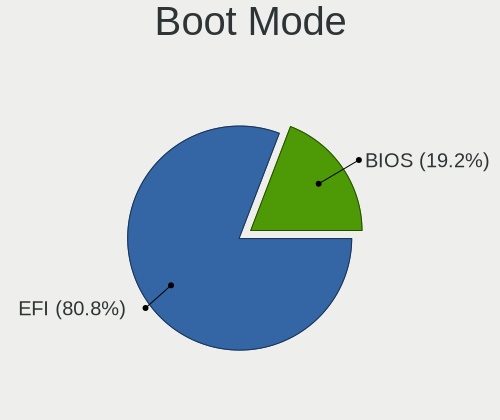

| Mode | Computers | Percent |
|------|-----------|---------|
| EFI  | 194       | 80.17%  |
| BIOS | 48        | 19.83%  |

Filesystem
----------

Type of filesystem

| Type | Computers | Percent |
|------|-----------|---------|
| Zfs  | 242       | 100%    |

Part. scheme
------------

Scheme of partitioning

| Type | Computers | Percent |
|------|-----------|---------|
| GPT  | 242       | 100%    |

Board
-----

Vendor
------

Motherboard manufacturer

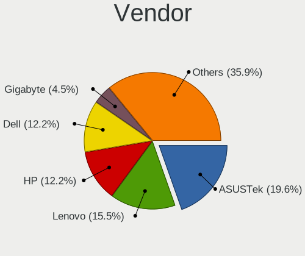

| Name                | Computers | Percent |
|---------------------|-----------|---------|
| ASUSTek Computer    | 46        | 19.01%  |
| Lenovo              | 38        | 15.7%   |
| Hewlett-Packard     | 30        | 12.4%   |
| Dell                | 30        | 12.4%   |
| Gigabyte Technology | 11        | 4.55%   |
| ASRock              | 11        | 4.55%   |
| Toshiba             | 8         | 3.31%   |
| MSI                 | 8         | 3.31%   |
| Apple               | 8         | 3.31%   |
| Intel               | 6         | 2.48%   |
| Biostar             | 5         | 2.07%   |
| Acer                | 5         | 2.07%   |
| Foxconn             | 4         | 1.65%   |
| Samsung Electronics | 3         | 1.24%   |
| Packard Bell        | 3         | 1.24%   |
| Pegatron            | 2         | 0.83%   |
| Gateway             | 2         | 0.83%   |
| Fujitsu             | 2         | 0.83%   |
| WYSE                | 1         | 0.41%   |
| TUXEDO              | 1         | 0.41%   |
| Sony                | 1         | 0.41%   |
| Shuttle             | 1         | 0.41%   |
| Protectli           | 1         | 0.41%   |
| PCPartner           | 1         | 0.41%   |
| NEC Computers       | 1         | 0.41%   |
| MouseComputer       | 1         | 0.41%   |
| Microsoft           | 1         | 0.41%   |
| Medion              | 1         | 0.41%   |
| LG Electronics      | 1         | 0.41%   |
| Huanan              | 1         | 0.41%   |
| HC                  | 1         | 0.41%   |
| Hampoo              | 1         | 0.41%   |
| Fujitsu Siemens     | 1         | 0.41%   |
| EVGA                | 1         | 0.41%   |
| eMachines           | 1         | 0.41%   |
| Alienware           | 1         | 0.41%   |
| Acidanthera         | 1         | 0.41%   |
| Unknown             | 1         | 0.41%   |

Model
-----

Motherboard model

| Name                                        | Computers | Percent |
|---------------------------------------------|-----------|---------|
| Dell Inspiron 15-3567                       | 3         | 1.24%   |
| HP EliteBook 840 G3                         | 2         | 0.83%   |
| Gateway NE56R                               | 2         | 0.83%   |
| Dell OptiPlex 755                           | 2         | 0.83%   |
| Dell Inspiron 7520                          | 2         | 0.83%   |
| Biostar B365MHC                             | 2         | 0.83%   |
| ASUS All Series                             | 2         | 0.83%   |
| ASRock B550M Pro4                           | 2         | 0.83%   |
| ASRock B450M Pro4                           | 2         | 0.83%   |
| Apple MacBookPro9,2                         | 2         | 0.83%   |
| WYSE Z CLASS                                | 1         | 0.41%   |
| TUXEDO Aura 15 Gen1                         | 1         | 0.41%   |
| Toshiba Satellite Pro U400                  | 1         | 0.41%   |
| Toshiba Satellite P300                      | 1         | 0.41%   |
| Toshiba Satellite L855                      | 1         | 0.41%   |
| Toshiba Satellite L500                      | 1         | 0.41%   |
| Toshiba Satellite C640                      | 1         | 0.41%   |
| Toshiba PORTEGE Z10t-A                      | 1         | 0.41%   |
| Toshiba PORTEGE R930                        | 1         | 0.41%   |
| Toshiba dynabook Satellite B453/L           | 1         | 0.41%   |
| Sony VPCEJ1E1E                              | 1         | 0.41%   |
| Shuttle NC10U                               | 1         | 0.41%   |
| Samsung RV411/RV511/E3511/S3511/RV711/E3411 | 1         | 0.41%   |
| Samsung Galaxy Book 12                      | 1         | 0.41%   |
| Samsung 530U3C/530U4C/532U3C                | 1         | 0.41%   |
| Protectli FW2B                              | 1         | 0.41%   |
| Pegatron SAISHIAT2                          | 1         | 0.41%   |
| Pegatron IPM41-D3                           | 1         | 0.41%   |
| PCPartner DREAMSYS                          | 1         | 0.41%   |
| Packard Bell imedia S2110                   | 1         | 0.41%   |
| Packard Bell EasyNote_MX61-B-038            | 1         | 0.41%   |
| Packard Bell EasyNote MH36                  | 1         | 0.41%   |
| NEC Computers PC-VK17HBBCD                  | 1         | 0.41%   |
| MSI WC791AA-UUW HPE-119sc                   | 1         | 0.41%   |
| MSI MS-7C37                                 | 1         | 0.41%   |
| MSI MS-7C02                                 | 1         | 0.41%   |
| MSI MS-7B86                                 | 1         | 0.41%   |
| MSI MS-7B84                                 | 1         | 0.41%   |
| MSI MS-7A15                                 | 1         | 0.41%   |
| MSI MS-7982                                 | 1         | 0.41%   |
| MSI GF65 Thin 10SDR                         | 1         | 0.41%   |
| MouseComputer W331AU                        | 1         | 0.41%   |
| Microsoft Surface Go                        | 1         | 0.41%   |
| Medion H61H2-LM3                            | 1         | 0.41%   |
| LG 14Z980-G.BH51P1                          | 1         | 0.41%   |
| Lenovo ZIUS6                                | 1         | 0.41%   |
| Lenovo Yoga Slim 7 Pro 14ACH5 82MS          | 1         | 0.41%   |
| Lenovo ThinkPad X260 20F5S82N00             | 1         | 0.41%   |
| Lenovo ThinkPad X250 20CLS4JH00             | 1         | 0.41%   |
| Lenovo ThinkPad X240 20AMS39F0K             | 1         | 0.41%   |
| Lenovo ThinkPad X230 Tablet 343522U         | 1         | 0.41%   |
| Lenovo ThinkPad X230 2330A48                | 1         | 0.41%   |
| Lenovo ThinkPad X230 2325WWB                | 1         | 0.41%   |
| Lenovo ThinkPad X230 2325O76                | 1         | 0.41%   |
| Lenovo ThinkPad X230 23255Y4                | 1         | 0.41%   |
| Lenovo ThinkPad X230 23254G7                | 1         | 0.41%   |
| Lenovo ThinkPad X200 7458VP4                | 1         | 0.41%   |
| Lenovo ThinkPad T61 64607EU                 | 1         | 0.41%   |
| Lenovo ThinkPad T490s 20NYS3TU00            | 1         | 0.41%   |
| Lenovo ThinkPad T490 20RYS06R00             | 1         | 0.41%   |

Model Family
------------

Motherboard model prefix

| Name                       | Computers | Percent |
|----------------------------|-----------|---------|
| Lenovo ThinkPad            | 22        | 9.09%   |
| Dell Latitude              | 8         | 3.31%   |
| Dell Inspiron              | 8         | 3.31%   |
| HP Pavilion                | 7         | 2.89%   |
| Dell OptiPlex              | 6         | 2.48%   |
| Toshiba Satellite          | 5         | 2.07%   |
| ASUS PRIME                 | 5         | 2.07%   |
| Acer Aspire                | 5         | 2.07%   |
| Lenovo ThinkCentre         | 4         | 1.65%   |
| Dell Precision             | 4         | 1.65%   |
| HP ProBook                 | 3         | 1.24%   |
| HP EliteBook               | 3         | 1.24%   |
| ASUS M5A78L-M              | 3         | 1.24%   |
| Toshiba PORTEGE            | 2         | 0.83%   |
| Packard Bell EasyNote      | 2         | 0.83%   |
| Lenovo IdeaPad             | 2         | 0.83%   |
| HP Compaq                  | 2         | 0.83%   |
| Gateway NE56R              | 2         | 0.83%   |
| Dell Vostro                | 2         | 0.83%   |
| Biostar B365MHC            | 2         | 0.83%   |
| ASUS VivoBook              | 2         | 0.83%   |
| ASUS ROG                   | 2         | 0.83%   |
| ASUS P8Z77-V               | 2         | 0.83%   |
| ASUS Crosshair             | 2         | 0.83%   |
| ASUS All                   | 2         | 0.83%   |
| ASRock B550M               | 2         | 0.83%   |
| ASRock B450M               | 2         | 0.83%   |
| Apple MacBookPro9          | 2         | 0.83%   |
| WYSE Z                     | 1         | 0.41%   |
| TUXEDO Aura                | 1         | 0.41%   |
| Toshiba dynabook           | 1         | 0.41%   |
| Sony VPCEJ1E1E             | 1         | 0.41%   |
| Shuttle NC10U              | 1         | 0.41%   |
| Samsung RV411              | 1         | 0.41%   |
| Samsung Galaxy             | 1         | 0.41%   |
| Samsung 530U3C             | 1         | 0.41%   |
| Protectli FW2B             | 1         | 0.41%   |
| Pegatron SAISHIAT2         | 1         | 0.41%   |
| Pegatron IPM41-D3          | 1         | 0.41%   |
| PCPartner DREAMSYS         | 1         | 0.41%   |
| Packard Bell imedia        | 1         | 0.41%   |
| NEC Computers PC-VK17HBBCD | 1         | 0.41%   |
| MSI WC791AA-UUW            | 1         | 0.41%   |
| MSI MS-7C37                | 1         | 0.41%   |
| MSI MS-7C02                | 1         | 0.41%   |
| MSI MS-7B86                | 1         | 0.41%   |
| MSI MS-7B84                | 1         | 0.41%   |
| MSI MS-7A15                | 1         | 0.41%   |
| MSI MS-7982                | 1         | 0.41%   |
| MSI GF65                   | 1         | 0.41%   |
| MouseComputer W331AU       | 1         | 0.41%   |
| Microsoft Surface          | 1         | 0.41%   |
| Medion H61H2-LM3           | 1         | 0.41%   |
| LG 14Z980-G.BH51P1         | 1         | 0.41%   |
| Lenovo ZIUS6               | 1         | 0.41%   |
| Lenovo Yoga                | 1         | 0.41%   |
| Lenovo Legion              | 1         | 0.41%   |
| Lenovo IdeaCentre          | 1         | 0.41%   |
| Lenovo G550                | 1         | 0.41%   |
| Lenovo G500s               | 1         | 0.41%   |

MFG Year
--------

Motherboard manufacture year

| Year | Computers | Percent |
|------|-----------|---------|
| 2020 | 33        | 13.64%  |
| 2019 | 30        | 12.4%   |
| 2013 | 28        | 11.57%  |
| 2012 | 25        | 10.33%  |
| 2018 | 20        | 8.26%   |
| 2014 | 15        | 6.2%    |
| 2011 | 15        | 6.2%    |
| 2015 | 14        | 5.79%   |
| 2010 | 13        | 5.37%   |
| 2009 | 12        | 4.96%   |
| 2016 | 11        | 4.55%   |
| 2021 | 10        | 4.13%   |
| 2017 | 6         | 2.48%   |
| 2008 | 6         | 2.48%   |
| 2007 | 4         | 1.65%   |

Form Factor
-----------

Physical design of the computer

| Name        | Computers | Percent |
|-------------|-----------|---------|
| Notebook    | 115       | 47.52%  |
| Desktop     | 114       | 47.11%  |
| All in one  | 5         | 2.07%   |
| Mini pc     | 3         | 1.24%   |
| Tablet      | 2         | 0.83%   |
| Server      | 2         | 0.83%   |
| Convertible | 1         | 0.41%   |

Coreboot
--------

Have coreboot on board

| Used | Computers | Percent |
|------|-----------|---------|
| No   | 241       | 99.59%  |
| Yes  | 1         | 0.41%   |

RAM Size
--------

Total RAM memory

| Size in GB  | Computers | Percent |
|-------------|-----------|---------|
| 4.01-8.0    | 89        | 36.78%  |
| 8.01-16.0   | 83        | 34.3%   |
| 16.01-24.0  | 53        | 21.9%   |
| 32.01-64.0  | 10        | 4.13%   |
| 24.01-32.0  | 3         | 1.24%   |
| 64.01-256.0 | 2         | 0.83%   |
| 3.01-4.0    | 1         | 0.41%   |
| 2.01-3.0    | 1         | 0.41%   |

RAM Used
--------

Used RAM memory

| Used GB   | Computers | Percent |
|-----------|-----------|---------|
| 0.01-0.5  | 149       | 61.32%  |
| 0.51-1.0  | 68        | 27.98%  |
| 1.01-2.0  | 19        | 7.82%   |
| 2.01-3.0  | 5         | 2.06%   |
| 4.01-8.0  | 1         | 0.41%   |
| 8.01-16.0 | 1         | 0.41%   |

Total Drives
------------

Number of drives on board

| Drives | Computers | Percent |
|--------|-----------|---------|
| 1      | 153       | 62.45%  |
| 2      | 48        | 19.59%  |
| 0      | 15        | 6.12%   |
| 3      | 14        | 5.71%   |
| 4      | 7         | 2.86%   |
| 6      | 3         | 1.22%   |
| 5      | 3         | 1.22%   |
| 10     | 1         | 0.41%   |
| 8      | 1         | 0.41%   |

Has CD-ROM
----------

Has CD-ROM on board

| Presented | Computers | Percent |
|-----------|-----------|---------|
| No        | 136       | 56.2%   |
| Yes       | 106       | 43.8%   |

Has Ethernet
------------

Has Ethernet on board

| Presented | Computers | Percent |
|-----------|-----------|---------|
| Yes       | 224       | 92.56%  |
| No        | 18        | 7.44%   |

Has WiFi
--------

Has WiFi module

| Presented | Computers | Percent |
|-----------|-----------|---------|
| Yes       | 161       | 66.26%  |
| No        | 82        | 33.74%  |

Has Bluetooth
-------------

Has Bluetooth module

| Presented | Computers | Percent |
|-----------|-----------|---------|
| No        | 132       | 54.32%  |
| Yes       | 111       | 45.68%  |

Location
--------

Country
-------

Geographic location (country)

| Country            | Computers | Percent |
|--------------------|-----------|---------|
| USA                | 42        | 17.28%  |
| Germany            | 18        | 7.41%   |
| Brazil             | 14        | 5.76%   |
| UK                 | 12        | 4.94%   |
| Canada             | 11        | 4.53%   |
| Russia             | 9         | 3.7%    |
| Italy              | 9         | 3.7%    |
| China              | 9         | 3.7%    |
| Spain              | 8         | 3.29%   |
| Netherlands        | 7         | 2.88%   |
| Australia          | 7         | 2.88%   |
| Ukraine            | 6         | 2.47%   |
| India              | 6         | 2.47%   |
| France             | 6         | 2.47%   |
| Sweden             | 5         | 2.06%   |
| Poland             | 5         | 2.06%   |
| Mexico             | 4         | 1.65%   |
| Indonesia          | 4         | 1.65%   |
| Taiwan             | 3         | 1.23%   |
| Switzerland        | 3         | 1.23%   |
| South Korea        | 3         | 1.23%   |
| Portugal           | 3         | 1.23%   |
| Lithuania          | 3         | 1.23%   |
| Finland            | 3         | 1.23%   |
| Argentina          | 3         | 1.23%   |
| Slovakia           | 2         | 0.82%   |
| Peru               | 2         | 0.82%   |
| New Zealand        | 2         | 0.82%   |
| Japan              | 2         | 0.82%   |
| Hungary            | 2         | 0.82%   |
| Guatemala          | 2         | 0.82%   |
| Greece             | 2         | 0.82%   |
| Belarus            | 2         | 0.82%   |
| Venezuela          | 1         | 0.41%   |
| Uruguay            | 1         | 0.41%   |
| Turkey             | 1         | 0.41%   |
| Thailand           | 1         | 0.41%   |
| South Africa       | 1         | 0.41%   |
| Slovenia           | 1         | 0.41%   |
| Puerto Rico        | 1         | 0.41%   |
| Oman               | 1         | 0.41%   |
| Norway             | 1         | 0.41%   |
| Morocco            | 1         | 0.41%   |
| Montenegro         | 1         | 0.41%   |
| Malta              | 1         | 0.41%   |
| Malaysia           | 1         | 0.41%   |
| Latvia             | 1         | 0.41%   |
| Eswatini           | 1         | 0.41%   |
| Egypt              | 1         | 0.41%   |
| Ecuador            | 1         | 0.41%   |
| Dominican Republic | 1         | 0.41%   |
| Cyprus             | 1         | 0.41%   |
| Croatia            | 1         | 0.41%   |
| Chile              | 1         | 0.41%   |
| Bulgaria           | 1         | 0.41%   |
| Belgium            | 1         | 0.41%   |
| Austria            | 1         | 0.41%   |

City
----

Geographic location (city)

| City            | Computers | Percent |
|-----------------|-----------|---------|
| Brisbane        | 3         | 1.21%   |
| Zurich          | 2         | 0.81%   |
| Wroclaw         | 2         | 0.81%   |
| So Paulo    | 2         | 0.81%   |
| Surabaya        | 2         | 0.81%   |
| So Paulo    | 2         | 0.81%   |
| Paris           | 2         | 0.81%   |
| New York        | 2         | 0.81%   |
| Mumbai          | 2         | 0.81%   |
| Mar del Plata   | 2         | 0.81%   |
| Jakarta         | 2         | 0.81%   |
| Guatemala City  | 2         | 0.81%   |
| Dnipropetrovsk  | 2         | 0.81%   |
| Curitiba        | 2         | 0.81%   |
| Chicago         | 2         | 0.81%   |
| Calgary         | 2         | 0.81%   |
| Berlin          | 2         | 0.81%   |
| Athens          | 2         | 0.81%   |
| Aberdeen        | 2         | 0.81%   |
| iauliai     | 1         | 0.4%    |
| Zhongshan       | 1         | 0.4%    |
| Zhengzhou       | 1         | 0.4%    |
| Zagreb          | 1         | 0.4%    |
| York            | 1         | 0.4%    |
| Yekaterinburg   | 1         | 0.4%    |
| Yarang          | 1         | 0.4%    |
| Wuhan           | 1         | 0.4%    |
| Winnipeg        | 1         | 0.4%    |
| Washington      | 1         | 0.4%    |
| Warmond         | 1         | 0.4%    |
| Wandur          | 1         | 0.4%    |
| Vladivostok     | 1         | 0.4%    |
| Vitria      | 1         | 0.4%    |
| Vilnius         | 1         | 0.4%    |
| Villeurbanne    | 1         | 0.4%    |
| Vigonovo        | 1         | 0.4%    |
| Vienna          | 1         | 0.4%    |
| Vsters  | 1         | 0.4%    |
| Vawkavysk       | 1         | 0.4%    |
| Vancouver       | 1         | 0.4%    |
| Utrecht         | 1         | 0.4%    |
| Ufa             | 1         | 0.4%    |
| Tula de Allende | 1         | 0.4%    |
| Trujillo        | 1         | 0.4%    |
| Treviso         | 1         | 0.4%    |
| Traverse City   | 1         | 0.4%    |
| Toronto         | 1         | 0.4%    |
| The Bronx       | 1         | 0.4%    |
| Tettnang Castle | 1         | 0.4%    |
| Tangara         | 1         | 0.4%    |
| Tampere         | 1         | 0.4%    |
| Taichung        | 1         | 0.4%    |
| Taganrog        | 1         | 0.4%    |
| Sydney          | 1         | 0.4%    |
| Suzhou          | 1         | 0.4%    |
| Sungai Buloh    | 1         | 0.4%    |
| St Petersburg   | 1         | 0.4%    |
| Solarino        | 1         | 0.4%    |
| Sofia           | 1         | 0.4%    |
| Simpsonville    | 1         | 0.4%    |

Drives
------

Drive Vendor
------------

Hard drive vendors

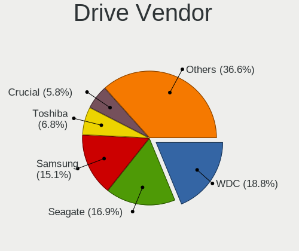

| Vendor              | Computers | Drives | Percent |
|---------------------|-----------|--------|---------|
| WDC                 | 59        | 78     | 18.55%  |
| Seagate             | 54        | 76     | 16.98%  |
| Samsung Electronics | 49        | 66     | 15.41%  |
| Toshiba             | 22        | 23     | 6.92%   |
| Crucial             | 16        | 18     | 5.03%   |
| Kingston            | 14        | 16     | 4.4%    |
| SanDisk             | 13        | 14     | 4.09%   |
| Hitachi             | 13        | 15     | 4.09%   |
| Intel               | 11        | 11     | 3.46%   |
| A-DATA Technology   | 9         | 14     | 2.83%   |
| Apple               | 8         | 8      | 2.52%   |
| HGST                | 7         | 7      | 2.2%    |
| SPCC                | 4         | 5      | 1.26%   |
| Hewlett-Packard     | 4         | 5      | 1.26%   |
| SK Hynix            | 3         | 3      | 0.94%   |
| PNY                 | 3         | 11     | 0.94%   |
| Fujitsu             | 3         | 4      | 0.94%   |
| Transcend           | 2         | 3      | 0.63%   |
| Silicon Motion      | 2         | 2      | 0.63%   |
| Patriot             | 2         | 2      | 0.63%   |
| OCZ                 | 2         | 2      | 0.63%   |
| LITEON              | 2         | 2      | 0.63%   |
| KingSpec            | 2         | 2      | 0.63%   |
| Apacer              | 2         | 2      | 0.63%   |
| SSSTC               | 1         | 1      | 0.31%   |
| SMART               | 1         | 1      | 0.31%   |
| Phison              | 1         | 1      | 0.31%   |
| ORICO               | 1         | 2      | 0.31%   |
| MyDigitalSSD        | 1         | 1      | 0.31%   |
| Micron Technology   | 1         | 1      | 0.31%   |
| LSI                 | 1         | 1      | 0.31%   |
| LITEONIT            | 1         | 1      | 0.31%   |
| Lenovo              | 1         | 1      | 0.31%   |
| HPE                 | 1         | 1      | 0.31%   |
| EMTEC               | 1         | 1      | 0.31%   |
| CLOVER              | 1         | 1      | 0.31%   |

Drive Model
-----------

Hard drive models

| Model                               | Computers | Percent |
|-------------------------------------|-----------|---------|
| Samsung SSD 850 EVO 250GB           | 6         | 1.71%   |
| A-DATA SU650 120GB                  | 5         | 1.42%   |
| Seagate ST1000LM035-1RK172 1TB      | 4         | 1.14%   |
| Samsung SSD 860 EVO 250GB           | 4         | 1.14%   |
| Seagate ST9500325AS 500GB           | 3         | 0.85%   |
| Seagate ST500LM012 HN-M500MBB 500GB | 3         | 0.85%   |
| Seagate ST500DM002-1BD142 500GB     | 3         | 0.85%   |
| Seagate ST3250410AS 250GB           | 3         | 0.85%   |
| Seagate ST1000DM003-1ER162 1TB      | 3         | 0.85%   |
| Samsung SSD 860 EVO 1TB             | 3         | 0.85%   |
| Kingston SA400S37240G 240GB         | 3         | 0.85%   |
| Kingston SA400S37120G 120GB         | 3         | 0.85%   |
| WDC WD20EARS-00MVWB0 2TB            | 2         | 0.57%   |
| WDC WD10EZEX-08WN4A0 1TB            | 2         | 0.57%   |
| Seagate ST4000DM004-2CV104 4TB      | 2         | 0.57%   |
| Seagate ST380815AS 80GB             | 2         | 0.57%   |
| Seagate ST3250318AS 250GB           | 2         | 0.57%   |
| Seagate ST31000528AS 1TB            | 2         | 0.57%   |
| Seagate ST1000LM049-2GH172 1TB      | 2         | 0.57%   |
| SanDisk SDSSDP128G 128GB            | 2         | 0.57%   |
| SanDisk SDSSDA240G 240GB            | 2         | 0.57%   |
| Samsung SSD 970 EVO Plus 250GB      | 2         | 0.57%   |
| Samsung SSD 860 EVO 500GB           | 2         | 0.57%   |
| Samsung SSD 840 EVO 250GB           | 2         | 0.57%   |
| Samsung HN-M101MBB 1TB              | 2         | 0.57%   |
| Intel SSDSC2KW256G8 256GB           | 2         | 0.57%   |
| Intel SSDPEKNW512G8 512GB           | 2         | 0.57%   |
| Hitachi HTS727550A9E364 500GB       | 2         | 0.57%   |
| HGST HTS725050A7E630 500GB          | 2         | 0.57%   |
| HGST HTS545032A7E380 320GB          | 2         | 0.57%   |
| Crucial CT525MX300SSD1 528GB        | 2         | 0.57%   |
| Crucial CT1000P1SSD8 1TB            | 2         | 0.57%   |
| Crucial CT1000MX500SSD1 1TB         | 2         | 0.57%   |
| Apple SSD SM256E 256GB              | 2         | 0.57%   |
| Apple HDD HTS545050A7E362 500GB     | 2         | 0.57%   |
| A-DATA SX8200PNP 256GB              | 2         | 0.57%   |
| WDC WDS500G3X0C-00SJG0 500GB        | 1         | 0.28%   |
| WDC WDS500G2B0A-00SM50 500GB        | 1         | 0.28%   |
| WDC WDS250G3X0C-00SJG0 250GB        | 1         | 0.28%   |
| WDC WDS250G1B0A-00H9H0 250GB        | 1         | 0.28%   |
| WDC WDS240G2G0A-00JH30 240GB        | 1         | 0.28%   |
| WDC WDS120G2G0A-00JH30 120GB        | 1         | 0.28%   |
| WDC WDS120G1G0A-00SS50 120GB        | 1         | 0.28%   |
| WDC WDS100T2B0A-00SM50 1TB          | 1         | 0.28%   |
| WDC WDBNCE2500PNC 250GB             | 1         | 0.28%   |
| WDC WD80EZAZ-11TDBA0 8TB            | 1         | 0.28%   |
| WDC WD800JD-55MUA1 80GB             | 1         | 0.28%   |
| WDC WD800BEVS-00RST0 80GB           | 1         | 0.28%   |
| WDC WD7500BPVX-60JC3T0 752GB        | 1         | 0.28%   |
| WDC WD7500BPKX-00HPJT0 752GB        | 1         | 0.28%   |
| WDC WD6400AAKS-22A7B0 640GB         | 1         | 0.28%   |
| WDC WD5002ABYS-02B1B0 500GB         | 1         | 0.28%   |
| WDC WD5000LPVX-60V0TT0 500GB        | 1         | 0.28%   |
| WDC WD5000LPVX-00V0TT0 500GB        | 1         | 0.28%   |
| WDC WD5000BEVT-22ZAT0 500GB         | 1         | 0.28%   |
| WDC WD5000AZRX-00L4HB0 500GB        | 1         | 0.28%   |
| WDC WD5000ABYS-01TNA0 500GB         | 1         | 0.28%   |
| WDC WD5000AAKX-60U6AA0 500GB        | 1         | 0.28%   |
| WDC WD5000AAKX-083CA1 500GB         | 1         | 0.28%   |
| WDC WD5000AAKX-00ERMA0 500GB        | 1         | 0.28%   |

HDD Vendor
----------

Hard disk drive vendors

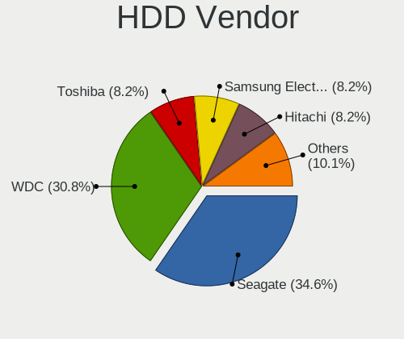

| Vendor              | Computers | Drives | Percent |
|---------------------|-----------|--------|---------|
| Seagate             | 54        | 76     | 34.39%  |
| WDC                 | 48        | 65     | 30.57%  |
| Toshiba             | 13        | 13     | 8.28%   |
| Samsung Electronics | 13        | 15     | 8.28%   |
| Hitachi             | 13        | 15     | 8.28%   |
| HGST                | 7         | 7      | 4.46%   |
| Fujitsu             | 3         | 4      | 1.91%   |
| Apple               | 3         | 3      | 1.91%   |
| LSI                 | 1         | 1      | 0.64%   |
| Hewlett-Packard     | 1         | 1      | 0.64%   |
| CLOVER              | 1         | 1      | 0.64%   |

SSD Vendor
----------

Solid state drive vendors

| Vendor              | Computers | Drives | Percent |
|---------------------|-----------|--------|---------|
| Samsung Electronics | 30        | 38     | 23.81%  |
| SanDisk             | 13        | 14     | 10.32%  |
| Kingston            | 13        | 14     | 10.32%  |
| Crucial             | 13        | 15     | 10.32%  |
| WDC                 | 7         | 8      | 5.56%   |
| Intel               | 7         | 7      | 5.56%   |
| A-DATA Technology   | 6         | 7      | 4.76%   |
| Toshiba             | 4         | 5      | 3.17%   |
| SPCC                | 4         | 5      | 3.17%   |
| Apple               | 4         | 4      | 3.17%   |
| PNY                 | 3         | 9      | 2.38%   |
| Transcend           | 2         | 3      | 1.59%   |
| Patriot             | 2         | 2      | 1.59%   |
| OCZ                 | 2         | 2      | 1.59%   |
| LITEON              | 2         | 2      | 1.59%   |
| KingSpec            | 2         | 2      | 1.59%   |
| Apacer              | 2         | 2      | 1.59%   |
| SSSTC               | 1         | 1      | 0.79%   |
| SMART               | 1         | 1      | 0.79%   |
| ORICO               | 1         | 2      | 0.79%   |
| MyDigitalSSD        | 1         | 1      | 0.79%   |
| Micron Technology   | 1         | 1      | 0.79%   |
| LITEONIT            | 1         | 1      | 0.79%   |
| Lenovo              | 1         | 1      | 0.79%   |
| HPE                 | 1         | 1      | 0.79%   |
| Hewlett-Packard     | 1         | 2      | 0.79%   |
| EMTEC               | 1         | 1      | 0.79%   |

Drive Kind
----------

HDD or SSD

| Kind | Computers | Drives | Percent |
|------|-----------|--------|---------|
| HDD  | 136       | 201    | 46.9%   |
| SSD  | 112       | 151    | 38.62%  |
| NVMe | 42        | 50     | 14.48%  |

Drive Connector
---------------

SATA, SAS, NVMe, etc.

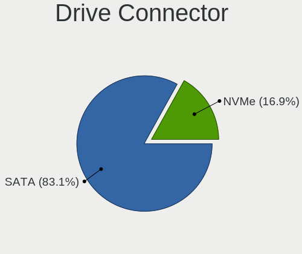

| Type | Computers | Drives | Percent |
|------|-----------|--------|---------|
| SATA | 213       | 352    | 83.53%  |
| NVMe | 42        | 50     | 16.47%  |

Drive Size
----------

Size of hard drive

| Size in TB | Computers | Drives | Percent |
|------------|-----------|--------|---------|
| 0.01-0.5   | 173       | 243    | 67.32%  |
| 0.51-1.0   | 59        | 74     | 22.96%  |
| 1.01-2.0   | 14        | 18     | 5.45%   |
| 3.01-4.0   | 5         | 6      | 1.95%   |
| 2.01-3.0   | 3         | 6      | 1.17%   |
| 4.01-10.0  | 3         | 5      | 1.17%   |

Space Total
-----------

Amount of disk space available on the file system

| Size in GB | Computers | Percent |
|------------|-----------|---------|
| 1-20       | 154       | 62.86%  |
| 101-250    | 37        | 15.1%   |
| 251-500    | 23        | 9.39%   |
| 501-1000   | 18        | 7.35%   |
| 51-100     | 7         | 2.86%   |
| 21-50      | 4         | 1.63%   |
| 1001-2000  | 2         | 0.82%   |

Space Used
----------

Amount of used disk space

| Used GB | Computers | Percent |
|---------|-----------|---------|
| 1-20    | 242       | 100%    |

Malfunc. Drives
---------------

Drive models with a malfunction

| Model                                    | Computers | Drives | Percent |
|------------------------------------------|-----------|--------|---------|
| Seagate ST3250410AS 250GB                | 3         | 3      | 4.23%   |
| Seagate ST9500325AS 500GB                | 2         | 2      | 2.82%   |
| Seagate ST380815AS 80GB                  | 2         | 2      | 2.82%   |
| Seagate ST1000LM035-1RK172 1TB           | 2         | 2      | 2.82%   |
| HGST HTS545032A7E380 320GB               | 2         | 2      | 2.82%   |
| Crucial CT525MX300SSD1 528GB             | 2         | 3      | 2.82%   |
| Apple HDD HTS545050A7E362 500GB          | 2         | 2      | 2.82%   |
| WDC WD800JD-55MUA1 80GB                  | 1         | 1      | 1.41%   |
| WDC WD6400AAKS-22A7B0 640GB              | 1         | 1      | 1.41%   |
| WDC WD5000LPVX-60V0TT0 500GB             | 1         | 1      | 1.41%   |
| WDC WD5000AAKX-60U6AA0 500GB             | 1         | 1      | 1.41%   |
| WDC WD5000AAKX-00ERMA0 500GB             | 1         | 1      | 1.41%   |
| WDC WD40EFRX-68WT0N0 4TB                 | 1         | 1      | 1.41%   |
| WDC WD3200BEVT-22ZCT0 320GB              | 1         | 1      | 1.41%   |
| WDC WD3200BEVT-00A0RT0 233GB             | 1         | 1      | 1.41%   |
| WDC WD3200AAJS-00L7A0 320GB              | 1         | 1      | 1.41%   |
| WDC WD30EZRX-22D8PB0 3TB                 | 1         | 1      | 1.41%   |
| WDC WD2500AAKX-083CA1 250GB              | 1         | 1      | 1.41%   |
| WDC WD20EARS-00MVWB0 2TB                 | 1         | 1      | 1.41%   |
| WDC WD1600AAJS-60WAA0 160GB              | 1         | 1      | 1.41%   |
| WDC WD1600AAJS-00WAA0 160GB              | 1         | 1      | 1.41%   |
| WDC WD10EARS-00Y5B1 1TB                  | 1         | 1      | 1.41%   |
| Toshiba THNSNK128GCS8 SATA 128GB         | 1         | 1      | 1.41%   |
| Toshiba MQ01ABD075 752GB                 | 1         | 1      | 1.41%   |
| Toshiba MQ01ABD032 320GB                 | 1         | 1      | 1.41%   |
| Toshiba MK3276GSX 320GB                  | 1         | 1      | 1.41%   |
| Toshiba MK3265GSXN 320GB                 | 1         | 1      | 1.41%   |
| Toshiba MK3261GSYN 320GB                 | 1         | 1      | 1.41%   |
| SSSTC CVB-8D128-HP 128GB                 | 1         | 1      | 1.41%   |
| Seagate ST9320423AS 320GB                | 1         | 1      | 1.41%   |
| Seagate ST9160821AS 160GB                | 1         | 1      | 1.41%   |
| Seagate ST9160412AS 160GB                | 1         | 1      | 1.41%   |
| Seagate ST500VT000-1DK142 500GB          | 1         | 1      | 1.41%   |
| Seagate ST500LM012 HN-M500MBB 500GB      | 1         | 1      | 1.41%   |
| Seagate ST3750640AS 752GB                | 1         | 1      | 1.41%   |
| Seagate ST3500413AS 500GB                | 1         | 1      | 1.41%   |
| Seagate ST3250318AS 250GB                | 1         | 1      | 1.41%   |
| Seagate ST320LT012-9WS14C 320GB          | 1         | 2      | 1.41%   |
| Seagate ST31000528AS 1TB                 | 1         | 1      | 1.41%   |
| Seagate ST31000333AS 1TB                 | 1         | 1      | 1.41%   |
| Seagate ST1000LM049-2GH172 1TB           | 1         | 1      | 1.41%   |
| Seagate ST1000LM024 HN-M101MBB 1TB       | 1         | 1      | 1.41%   |
| Samsung Electronics SSD 840 Series 500GB | 1         | 1      | 1.41%   |
| Samsung Electronics SP2004C 200GB        | 1         | 1      | 1.41%   |
| Samsung Electronics HD642JJ 640GB        | 1         | 1      | 1.41%   |
| Samsung Electronics HD321KJ 320GB        | 1         | 1      | 1.41%   |
| Samsung Electronics HD161HJ 160GB        | 1         | 1      | 1.41%   |
| Kingston RBU-SNS8350DES3128GP 128GB      | 1         | 1      | 1.41%   |
| Hitachi HTS727550A9E364 500GB            | 1         | 1      | 1.41%   |
| Hitachi HTS723232A7A364 320GB            | 1         | 1      | 1.41%   |
| Hitachi HTS545050B9A300 500GB            | 1         | 1      | 1.41%   |
| Hitachi HTS545050A7E380 500GB            | 1         | 1      | 1.41%   |
| Hitachi HTS545032B9A300 320GB            | 1         | 1      | 1.41%   |
| Hitachi HTS545025B9SA02 250GB            | 1         | 1      | 1.41%   |
| Hitachi HDS721050CLA362 500GB            | 1         | 1      | 1.41%   |
| Hitachi HDP725025GLA380 250GB            | 1         | 1      | 1.41%   |
| HGST HTS725050A7E630 500GB               | 1         | 1      | 1.41%   |
| HGST HTS721010A9E630 1TB                 | 1         | 1      | 1.41%   |
| HGST HTS541010A9E680 1TB                 | 1         | 1      | 1.41%   |
| Hewlett-Packard SSD S700 1TB             | 1         | 1      | 1.41%   |

Malfunc. Drive Vendor
---------------------

Vendors of faulty drives

| Vendor              | Computers | Drives | Percent |
|---------------------|-----------|--------|---------|
| Seagate             | 21        | 23     | 30%     |
| WDC                 | 15        | 15     | 21.43%  |
| Hitachi             | 8         | 8      | 11.43%  |
| Toshiba             | 6         | 6      | 8.57%   |
| Samsung Electronics | 5         | 5      | 7.14%   |
| HGST                | 5         | 5      | 7.14%   |
| Apple               | 3         | 3      | 4.29%   |
| Fujitsu             | 2         | 2      | 2.86%   |
| Crucial             | 2         | 3      | 2.86%   |
| SSSTC               | 1         | 1      | 1.43%   |
| Kingston            | 1         | 1      | 1.43%   |
| Hewlett-Packard     | 1         | 1      | 1.43%   |

Malfunc. HDD Vendor
-------------------

Vendors of faulty HDD drives

| Vendor              | Computers | Drives | Percent |
|---------------------|-----------|--------|---------|
| Seagate             | 21        | 23     | 33.33%  |
| WDC                 | 15        | 15     | 23.81%  |
| Hitachi             | 8         | 8      | 12.7%   |
| Toshiba             | 5         | 5      | 7.94%   |
| HGST                | 5         | 5      | 7.94%   |
| Samsung Electronics | 4         | 4      | 6.35%   |
| Apple               | 3         | 3      | 4.76%   |
| Fujitsu             | 2         | 2      | 3.17%   |

Malfunc. Drive Kind
-------------------

Kinds of faulty drives

| Kind | Computers | Drives | Percent |
|------|-----------|--------|---------|
| HDD  | 59        | 65     | 89.39%  |
| SSD  | 7         | 8      | 10.61%  |

Failed Drives
-------------

Failed drive models

| Model                      | Computers | Drives | Percent |
|----------------------------|-----------|--------|---------|
| HPE MK000480GWUGF 480GB    | 1         | 1      | 50%     |
| HGST HTS725050A7E630 500GB | 1         | 1      | 50%     |

Failed Drive Vendor
-------------------

Failed drive vendors

| Vendor | Computers | Drives | Percent |
|--------|-----------|--------|---------|
| HPE    | 1         | 1      | 50%     |
| HGST   | 1         | 1      | 50%     |

Drive Status
------------

Number of failed and malfunc. drives

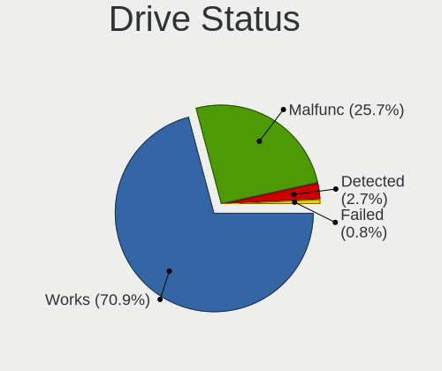

| Status   | Computers | Drives | Percent |
|----------|-----------|--------|---------|
| Works    | 182       | 314    | 70.82%  |
| Malfunc  | 66        | 73     | 25.68%  |
| Detected | 7         | 13     | 2.72%   |
| Failed   | 2         | 2      | 0.78%   |

Storage controller
------------------

Storage Vendor
--------------

Storage controller vendors

| Vendor                           | Computers | Percent |
|----------------------------------|-----------|---------|
| Intel                            | 191       | 63.88%  |
| AMD                              | 42        | 14.05%  |
| Samsung Electronics              | 14        | 4.68%   |
| ASMedia Technology               | 7         | 2.34%   |
| Broadcom / LSI                   | 6         | 2.01%   |
| Sandisk                          | 5         | 1.67%   |
| Toshiba                          | 4         | 1.34%   |
| Silicon Motion                   | 4         | 1.34%   |
| SK Hynix                         | 3         | 1%      |
| Micron/Crucial Technology        | 3         | 1%      |
| VIA Technologies                 | 2         | 0.67%   |
| Phison Electronics               | 2         | 0.67%   |
| Nvidia                           | 2         | 0.67%   |
| Kingston Technology Company      | 2         | 0.67%   |
| JMicron Technology               | 2         | 0.67%   |
| ADATA Technology                 | 2         | 0.67%   |
| Adaptec                          | 2         | 0.67%   |
| Silicon Integrated Systems [SiS] | 1         | 0.33%   |
| Silicon Image                    | 1         | 0.33%   |
| Realtek Semiconductor            | 1         | 0.33%   |
| Marvell Technology Group         | 1         | 0.33%   |
| KIOXIA                           | 1         | 0.33%   |
| Hewlett-Packard                  | 1         | 0.33%   |

Storage Model
-------------

Storage controller models

| Model                                                                                   | Computers | Percent |
|-----------------------------------------------------------------------------------------|-----------|---------|
| Intel 7 Series Chipset Family 6-port SATA Controller [AHCI mode]                        | 25        | 7.18%   |
| AMD FCH SATA Controller [AHCI mode]                                                     | 20        | 5.75%   |
| Intel Sunrise Point-LP SATA Controller [AHCI mode]                                      | 16        | 4.6%    |
| Intel 6 Series/C200 Series Chipset Family 6 port Desktop SATA AHCI Controller           | 11        | 3.16%   |
| Intel Q170/Q150/B150/H170/H110/Z170/CM236 Chipset SATA Controller [AHCI Mode]           | 10        | 2.87%   |
| Intel 8 Series SATA Controller 1 [AHCI mode]                                            | 10        | 2.87%   |
| AMD SB7x0/SB8x0/SB9x0 IDE Controller                                                    | 10        | 2.87%   |
| Intel 82801IBM/IEM (ICH9M/ICH9M-E) 4 port SATA Controller [AHCI mode]                   | 9         | 2.59%   |
| AMD SB7x0/SB8x0/SB9x0 SATA Controller [AHCI mode]                                       | 9         | 2.59%   |
| Intel 6 Series/C200 Series Chipset Family 6 port Mobile SATA AHCI Controller            | 8         | 2.3%    |
| AMD 400 Series Chipset SATA Controller                                                  | 8         | 2.3%    |
| Samsung NVMe SSD Controller SM981/PM981/PM983                                           | 7         | 2.01%   |
| Intel 82801 Mobile SATA Controller [RAID mode]                                          | 7         | 2.01%   |
| Intel 200 Series PCH SATA controller [AHCI mode]                                        | 7         | 2.01%   |
| Intel Wildcat Point-LP SATA Controller [AHCI Mode]                                      | 6         | 1.72%   |
| Intel Cannon Lake PCH SATA AHCI Controller                                              | 6         | 1.72%   |
| Intel 7 Series/C210 Series Chipset Family 6-port SATA Controller [AHCI mode]            | 6         | 1.72%   |
| ASMedia ASM1062 Serial ATA Controller                                                   | 6         | 1.72%   |
| Intel 8 Series/C220 Series Chipset Family 6-port SATA Controller 1 [AHCI mode]          | 5         | 1.44%   |
| AMD SB7x0/SB8x0/SB9x0 SATA Controller [IDE mode]                                        | 5         | 1.44%   |
| Silicon Motion SM2263EN/SM2263XT SSD Controller                                         | 4         | 1.15%   |
| Intel SATA Controller [RAID mode]                                                       | 4         | 1.15%   |
| Intel Atom/Celeron/Pentium Processor x5-E8000/J3xxx/N3xxx Series SATA Controller        | 4         | 1.15%   |
| Intel 5 Series/3400 Series Chipset 6 port SATA AHCI Controller                          | 4         | 1.15%   |
| Broadcom / LSI SAS2008 PCI-Express Fusion-MPT SAS-2 [Falcon]                            | 4         | 1.15%   |
| Samsung NVMe SSD Controller SM961/PM961/SM963                                           | 3         | 0.86%   |
| Intel SSD 660P Series                                                                   | 3         | 0.86%   |
| Intel NM10/ICH7 Family SATA Controller [IDE mode]                                       | 3         | 0.86%   |
| Intel HM170/QM170 Chipset SATA Controller [AHCI Mode]                                   | 3         | 0.86%   |
| Intel Cannon Point-LP SATA Controller [AHCI Mode]                                       | 3         | 0.86%   |
| Intel Cannon Lake Mobile PCH SATA AHCI Controller                                       | 3         | 0.86%   |
| Intel 82801JI (ICH10 Family) SATA AHCI Controller                                       | 3         | 0.86%   |
| Intel 6 Series/C200 Series Chipset Family Desktop SATA Controller (IDE mode, ports 4-5) | 3         | 0.86%   |
| Intel 6 Series/C200 Series Chipset Family Desktop SATA Controller (IDE mode, ports 0-3) | 3         | 0.86%   |
| Intel 5 Series/3400 Series Chipset 4 port SATA IDE Controller                           | 3         | 0.86%   |
| Intel 5 Series/3400 Series Chipset 4 port SATA AHCI Controller                          | 3         | 0.86%   |
| Intel 5 Series/3400 Series Chipset 2 port SATA IDE Controller                           | 3         | 0.86%   |
| Intel 400 Series Chipset Family SATA AHCI Controller                                    | 3         | 0.86%   |
| VIA VT6415 PATA IDE Host Controller                                                     | 2         | 0.57%   |
| Toshiba unknown                                                                         | 2         | 0.57%   |
| Toshiba BG3 NVMe SSD Controller                                                         | 2         | 0.57%   |
| SK Hynix Gold P31 SSD                                                                   | 2         | 0.57%   |
| Sandisk WD Blue SN550 NVMe SSD                                                          | 2         | 0.57%   |
| Sandisk WD Black SN750 / PC SN730 NVMe SSD                                              | 2         | 0.57%   |
| Samsung NVMe SSD Controller PM9A1/PM9A3/980PRO                                          | 2         | 0.57%   |
| Nvidia MCP61 SATA Controller                                                            | 2         | 0.57%   |
| Nvidia MCP61 IDE                                                                        | 2         | 0.57%   |
| Micron/Crucial P1 NVMe PCIe SSD                                                         | 2         | 0.57%   |
| Kingston Company A2000 NVMe SSD                                                         | 2         | 0.57%   |
| JMicron JMB363 SATA/IDE Controller                                                      | 2         | 0.57%   |
| Intel Celeron/Pentium Silver Processor SATA Controller                                  | 2         | 0.57%   |
| Intel 82Q35 Express PT IDER Controller                                                  | 2         | 0.57%   |
| Intel 82801IR/IO/IH (ICH9R/DO/DH) 4 port SATA Controller [IDE mode]                     | 2         | 0.57%   |
| Intel 82801I (ICH9 Family) 2 port SATA Controller [IDE mode]                            | 2         | 0.57%   |
| Intel 82801HR/HO/HH (ICH8R/DO/DH) 2 port SATA Controller [IDE mode]                     | 2         | 0.57%   |
| Intel 82801HM/HEM (ICH8M/ICH8M-E) SATA Controller [AHCI mode]                           | 2         | 0.57%   |
| Intel 82801HM/HEM (ICH8M/ICH8M-E) IDE Controller                                        | 2         | 0.57%   |
| Intel 82801H (ICH8 Family) 4 port SATA Controller [IDE mode]                            | 2         | 0.57%   |
| Intel 82801G (ICH7 Family) IDE Controller                                               | 2         | 0.57%   |
| Intel 8 Series/C220 Series Chipset Family 4-port SATA Controller 1 [IDE mode]           | 2         | 0.57%   |

Storage Kind
------------

Kind of storage controller (IDE, SATA, NVMe, SAS, ...)

| Kind | Computers | Percent |
|------|-----------|---------|
| SATA | 195       | 64.14%  |
| IDE  | 43        | 14.14%  |
| NVMe | 42        | 13.82%  |
| RAID | 17        | 5.59%   |
| SAS  | 4         | 1.32%   |
| SCSI | 3         | 0.99%   |

Processor
---------

CPU Vendor
----------

Processor vendors

| Vendor | Computers | Percent |
|--------|-----------|---------|
| Intel  | 196       | 80.99%  |
| AMD    | 46        | 19.01%  |

CPU Model
---------

Processor models

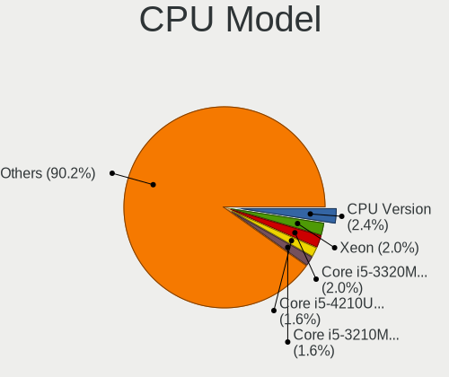

| Model                                       | Computers | Percent |
|---------------------------------------------|-----------|---------|
| Intel CPU Version                           | 6         | 2.48%   |
| Intel Xeon                                  | 5         | 2.07%   |
| Intel Core i5-3320M CPU @ 2.60GHz           | 5         | 2.07%   |
| Intel Core i5-4210U CPU @ 1.70GHz           | 4         | 1.65%   |
| Intel Core i5-3210M CPU @ 2.50GHz           | 4         | 1.65%   |
| Intel Core i7-8750H CPU @ 2.20GHz           | 3         | 1.24%   |
| Intel Core i5-6300U CPU @ 2.40GHz           | 3         | 1.24%   |
| Intel Core i5-6200U CPU @ 2.30GHz           | 3         | 1.24%   |
| Intel Core i5-2400 CPU @ 3.10GHz            | 3         | 1.24%   |
| Intel Core i3-5005U CPU @ 2.00GHz           | 3         | 1.24%   |
| Intel Core 2 Duo                            | 3         | 1.24%   |
| Intel Core i7-7500U CPU @ 2.70GHz           | 2         | 0.83%   |
| Intel Core i7-4510U CPU @ 2.00GHz           | 2         | 0.83%   |
| Intel Core i7-3630QM CPU @ 2.40GHz          | 2         | 0.83%   |
| Intel Core i7 CPU M 620 @ 2.67GHz           | 2         | 0.83%   |
| Intel Core i5-9400F CPU @ 2.90GHz           | 2         | 0.83%   |
| Intel Core i5-7200U CPU @ 2.50GHz           | 2         | 0.83%   |
| Intel Core i5-5200U CPU @ 2.20GHz           | 2         | 0.83%   |
| Intel Core i5-3340M CPU @ 2.70GHz           | 2         | 0.83%   |
| Intel Core i5-3230M CPU @ 2.60GHz           | 2         | 0.83%   |
| Intel Core i5-2520M CPU @ 2.50GHz           | 2         | 0.83%   |
| Intel Core i3-6100 CPU @ 3.70GHz            | 2         | 0.83%   |
| Intel Core i3-6006U CPU @ 2.00GHz           | 2         | 0.83%   |
| Intel Core i3-2370M CPU @ 2.40GHz           | 2         | 0.83%   |
| Intel Core i3-2350M CPU @ 2.30GHz           | 2         | 0.83%   |
| Intel Core i3-10100 CPU @ 3.60GHz           | 2         | 0.83%   |
| Intel Core 2 Duo CPU T7300 @ 2.00GHz        | 2         | 0.83%   |
| Intel Core 2 Duo CPU T6500 @ 2.10GHz        | 2         | 0.83%   |
| Intel Celeron CPU N3450 @ 1.10GHz           | 2         | 0.83%   |
| Intel Celeron CPU G3930 @ 2.90GHz           | 2         | 0.83%   |
| Intel Celeron CPU 1005M @ 1.90GHz           | 2         | 0.83%   |
| AMD Ryzen 9 3900X 12-Core Processor         | 2         | 0.83%   |
| AMD Ryzen 5 3600 6-Core Processor           | 2         | 0.83%   |
| AMD A10-5700 APU with Radeon HD Graphics    | 2         | 0.83%   |
| Intel Xeon CPU X3470                        | 1         | 0.41%   |
| Intel Xeon CPU W3550 @ 3.07GHz              | 1         | 0.41%   |
| Intel Xeon CPU E5530 @ 2.40GHz              | 1         | 0.41%   |
| Intel Xeon CPU E5-2630L 0 @ 2.00GHz         | 1         | 0.41%   |
| Intel Xeon CPU E5-1650 v3 @ 3.50GHz         | 1         | 0.41%   |
| Intel Xeon CPU E5-1603 @ 2.80GHz            | 1         | 0.41%   |
| Intel Xeon CPU E3-1241 v3 @ 3.50GHz         | 1         | 0.41%   |
| Intel Xeon CPU E3-1230 v3 @ 3.30GHz         | 1         | 0.41%   |
| Intel Pentium Silver N5030 CPU @ 1.10GHz    | 1         | 0.41%   |
| Intel Pentium Gold G5400 CPU @ 3.70GHz      | 1         | 0.41%   |
| Intel Pentium Dual-Core CPU E6700 @ 3.20GHz | 1         | 0.41%   |
| Intel Pentium Dual-Core CPU E6600 @ 3.06GHz | 1         | 0.41%   |
| Intel Pentium Dual-Core CPU E5800 @ 3.20GHz | 1         | 0.41%   |
| Intel Pentium Dual-Core CPU E5500 @ 2.80GHz | 1         | 0.41%   |
| Intel Pentium CPU P6200 @ 2.13GHz           | 1         | 0.41%   |
| Intel Pentium CPU N3700 @ 1.60GHz           | 1         | 0.41%   |
| Intel Pentium CPU G4400 @ 3.30GHz           | 1         | 0.41%   |
| Intel Pentium CPU G3460 @ 3.50GHz           | 1         | 0.41%   |
| Intel Pentium CPU G3420 @ 3.20GHz           | 1         | 0.41%   |
| Intel Pentium CPU G2020 @ 2.90GHz           | 1         | 0.41%   |
| Intel Pentium CPU B940 @ 2.00GHz            | 1         | 0.41%   |
| Intel Pentium CPU 4415Y @ 1.60GHz           | 1         | 0.41%   |
| Intel Pentium 4 CPU 3.60GHz                 | 1         | 0.41%   |
| Intel Genuine CPU 0000 @ 2.10GHz            | 1         | 0.41%   |
| Intel Genuine CPU                           | 1         | 0.41%   |
| Intel Core i9-7920X CPU @ 2.90GHz           | 1         | 0.41%   |

CPU Model Family
----------------

Processor model prefix

| Model                   | Computers | Percent |
|-------------------------|-----------|---------|
| Intel Core i5           | 66        | 27.27%  |
| Intel Core i3           | 33        | 13.64%  |
| Intel Core i7           | 31        | 12.81%  |
| Intel Celeron           | 16        | 6.61%   |
| Intel Xeon              | 13        | 5.37%   |
| Intel Core 2 Duo        | 12        | 4.96%   |
| Intel Pentium           | 8         | 3.31%   |
| AMD Ryzen 5             | 8         | 3.31%   |
| Other                   | 6         | 2.48%   |
| AMD FX                  | 6         | 2.48%   |
| AMD Ryzen 7             | 5         | 2.07%   |
| Intel Pentium Dual-Core | 4         | 1.65%   |
| AMD Ryzen 3             | 4         | 1.65%   |
| AMD A6                  | 3         | 1.24%   |
| AMD A10                 | 3         | 1.24%   |
| Intel Genuine           | 2         | 0.83%   |
| AMD Ryzen 9             | 2         | 0.83%   |
| AMD Phenom II X4        | 2         | 0.83%   |
| AMD E1                  | 2         | 0.83%   |
| AMD Athlon II X4        | 2         | 0.83%   |
| Intel Pentium Silver    | 1         | 0.41%   |
| Intel Pentium Gold      | 1         | 0.41%   |
| Intel Pentium 4         | 1         | 0.41%   |
| Intel Core i9           | 1         | 0.41%   |
| Intel Core 2 Solo       | 1         | 0.41%   |
| AMD Turion 64 X2 Mobile | 1         | 0.41%   |
| AMD Sempron             | 1         | 0.41%   |
| AMD Phenom II X6        | 1         | 0.41%   |
| AMD Phenom II           | 1         | 0.41%   |
| AMD G                   | 1         | 0.41%   |
| AMD Athlon II X3        | 1         | 0.41%   |
| AMD Athlon II X2        | 1         | 0.41%   |
| AMD Athlon II           | 1         | 0.41%   |
| AMD Athlon              | 1         | 0.41%   |

CPU Cores
---------

Number of processor cores

| Number  | Computers | Percent |
|---------|-----------|---------|
| 2       | 121       | 50%     |
| 4       | 67        | 27.69%  |
| 6       | 18        | 7.44%   |
| 8       | 13        | 5.37%   |
| Unknown | 9         | 3.72%   |
| 12      | 5         | 2.07%   |
| 16      | 4         | 1.65%   |
| 24      | 2         | 0.83%   |
| 1       | 2         | 0.83%   |
| 3       | 1         | 0.41%   |

CPU Sockets
-----------

Number of sockets

| Number | Computers | Percent |
|--------|-----------|---------|
| 1      | 237       | 97.93%  |
| 2      | 5         | 2.07%   |

CPU Threads
-----------

Threads per core (Hyper-Threading)

| Number  | Computers | Percent |
|---------|-----------|---------|
| 2       | 117       | 48.35%  |
| 1       | 115       | 47.52%  |
| Unknown | 10        | 4.13%   |

CPU Microarch
-------------

Microarchitecture

| Name          | Computers | Percent |
|---------------|-----------|---------|
| KabyLake      | 37        | 15.29%  |
| IvyBridge     | 31        | 12.81%  |
| SandyBridge   | 26        | 10.74%  |
| Haswell       | 20        | 8.26%   |
| Penryn        | 19        | 7.85%   |
| Skylake       | 18        | 7.44%   |
| Westmere      | 10        | 4.13%   |
| K10           | 9         | 3.72%   |
| Zen 2         | 8         | 3.31%   |
| Piledriver    | 8         | 3.31%   |
| Broadwell     | 8         | 3.31%   |
| Core          | 7         | 2.89%   |
| CometLake     | 6         | 2.48%   |
| Zen+          | 5         | 2.07%   |
| Zen           | 5         | 2.07%   |
| Silvermont    | 5         | 2.07%   |
| Nehalem       | 4         | 1.65%   |
| Zen 3         | 2         | 0.83%   |
| Jaguar        | 2         | 0.83%   |
| Goldmont plus | 2         | 0.83%   |
| Goldmont      | 2         | 0.83%   |
| Bulldozer     | 2         | 0.83%   |
| Bobcat        | 2         | 0.83%   |
| NetBurst      | 1         | 0.41%   |
| K8 Hammer     | 1         | 0.41%   |
| K10 Llano     | 1         | 0.41%   |
| Excavator     | 1         | 0.41%   |

Graphics
--------

GPU Vendor
----------

Vendors of graphics cards

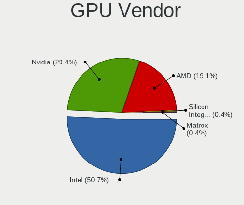

| Vendor                           | Computers | Percent |
|----------------------------------|-----------|---------|
| Intel                            | 136       | 50.75%  |
| Nvidia                           | 78        | 29.1%   |
| AMD                              | 52        | 19.4%   |
| Silicon Integrated Systems [SiS] | 1         | 0.37%   |
| Matrox Electronics Systems       | 1         | 0.37%   |

GPU Model
---------

Graphics card models

| Model                                                                                    | Computers | Percent |
|------------------------------------------------------------------------------------------|-----------|---------|
| Intel 3rd Gen Core processor Graphics Controller                                         | 20        | 7.46%   |
| Intel 2nd Generation Core Processor Family Integrated Graphics Controller                | 18        | 6.72%   |
| Intel Haswell-ULT Integrated Graphics Controller                                         | 10        | 3.73%   |
| Intel Skylake GT2 [HD Graphics 520]                                                      | 9         | 3.36%   |
| Intel Mobile 4 Series Chipset Integrated Graphics Controller                             | 9         | 3.36%   |
| Nvidia GK208B [GeForce GT 710]                                                           | 7         | 2.61%   |
| Nvidia GP108 [GeForce GT 1030]                                                           | 6         | 2.24%   |
| Intel WhiskeyLake-U GT2 [UHD Graphics 620]                                               | 5         | 1.87%   |
| Intel HD Graphics 620                                                                    | 5         | 1.87%   |
| Intel HD Graphics 5500                                                                   | 5         | 1.87%   |
| Intel HD Graphics 530                                                                    | 5         | 1.87%   |
| Intel Core Processor Integrated Graphics Controller                                      | 5         | 1.87%   |
| AMD Picasso/Raven 2 [Radeon Vega Series / Radeon Vega Mobile Series]                     | 5         | 1.87%   |
| Nvidia GT218 [GeForce 210]                                                               | 4         | 1.49%   |
| Intel CoffeeLake-S GT2 [UHD Graphics 630]                                                | 4         | 1.49%   |
| Intel Atom/Celeron/Pentium Processor x5-E8000/J3xxx/N3xxx Integrated Graphics Controller | 4         | 1.49%   |
| AMD Ellesmere [Radeon RX 470/480/570/570X/580/580X/590]                                  | 4         | 1.49%   |
| Nvidia GP107M [GeForce GTX 1050 Ti Mobile]                                               | 3         | 1.12%   |
| Nvidia GF119 [GeForce GT 610]                                                            | 3         | 1.12%   |
| Nvidia GF117M [GeForce 610M/710M/810M/820M / GT 620M/625M/630M/720M]                     | 3         | 1.12%   |
| Intel Xeon E3-1200 v2/3rd Gen Core processor Graphics Controller                         | 3         | 1.12%   |
| Intel HD Graphics 630                                                                    | 3         | 1.12%   |
| Intel CoffeeLake-H GT2 [UHD Graphics 630]                                                | 3         | 1.12%   |
| Nvidia TU116 [GeForce GTX 1660 SUPER]                                                    | 2         | 0.75%   |
| Nvidia GP107 [GeForce GTX 1050 Ti]                                                       | 2         | 0.75%   |
| Nvidia GM206 [GeForce GTX 960]                                                           | 2         | 0.75%   |
| Nvidia GM206 [GeForce GTX 950]                                                           | 2         | 0.75%   |
| Nvidia GM204 [GeForce GTX 970]                                                           | 2         | 0.75%   |
| Nvidia G92 [GeForce GTS 250]                                                             | 2         | 0.75%   |
| Intel Xeon E3-1200 v3/4th Gen Core Processor Integrated Graphics Controller              | 2         | 0.75%   |
| Intel HD Graphics 500                                                                    | 2         | 0.75%   |
| Intel CometLake-U GT2 [UHD Graphics]                                                     | 2         | 0.75%   |
| Intel CometLake-S GT2 [UHD Graphics 630]                                                 | 2         | 0.75%   |
| AMD RV710 [Radeon HD 4350/4550]                                                          | 2         | 0.75%   |
| AMD RS880M [Mobility Radeon HD 4225/4250]                                                | 2         | 0.75%   |
| AMD RS780L [Radeon 3000]                                                                 | 2         | 0.75%   |
| AMD Renoir                                                                               | 2         | 0.75%   |
| AMD Chelsea LP [Radeon HD 7730M]                                                         | 2         | 0.75%   |
| AMD Cezanne                                                                              | 2         | 0.75%   |
| AMD Caicos [Radeon HD 6450/7450/8450 / R5 230 OEM]                                       | 2         | 0.75%   |
| Silicon Integrated Systems [SiS] 771/671 PCIE VGA Display Adapter                        | 1         | 0.37%   |
| Nvidia TU116M [GeForce GTX 1660 Ti Mobile]                                               | 1         | 0.37%   |
| Nvidia TU116 [GeForce GTX 1660]                                                          | 1         | 0.37%   |
| Nvidia TU116 [GeForce GTX 1650]                                                          | 1         | 0.37%   |
| Nvidia TU104GL [Quadro RTX 4000]                                                         | 1         | 0.37%   |
| Nvidia NV43 [GeForce 6600]                                                               | 1         | 0.37%   |
| Nvidia GT216M [NVS 5100M]                                                                | 1         | 0.37%   |
| Nvidia GT216M [GeForce GT 330M]                                                          | 1         | 0.37%   |
| Nvidia GP106 [GeForce GTX 1060 6GB]                                                      | 1         | 0.37%   |
| Nvidia GP106 [GeForce GTX 1060 3GB]                                                      | 1         | 0.37%   |
| Nvidia GP104 [GeForce GTX 1070]                                                          | 1         | 0.37%   |
| Nvidia GM108M [GeForce 940MX]                                                            | 1         | 0.37%   |
| Nvidia GM108M [GeForce 930M]                                                             | 1         | 0.37%   |
| Nvidia GM108M [GeForce 930MX]                                                            | 1         | 0.37%   |
| Nvidia GM107M [GeForce GTX 960M]                                                         | 1         | 0.37%   |
| Nvidia GM107M [GeForce GTX 950M]                                                         | 1         | 0.37%   |
| Nvidia GM107 [GeForce GTX 750 Ti]                                                        | 1         | 0.37%   |
| Nvidia GK208 [GeForce GT 630 Rev. 2]                                                     | 1         | 0.37%   |
| Nvidia GK107M [GeForce GTX 660M]                                                         | 1         | 0.37%   |
| Nvidia GK107 [GeForce GT 740]                                                            | 1         | 0.37%   |

GPU Combo
---------

Combinations of graphics cards

| Name           | Computers | Percent |
|----------------|-----------|---------|
| 1 x Intel      | 101       | 41.56%  |
| 1 x Nvidia     | 60        | 24.69%  |
| 1 x AMD        | 43        | 17.7%   |
| Intel + Nvidia | 16        | 6.58%   |
| 2 x Intel      | 11        | 4.53%   |
| Intel + AMD    | 8         | 3.29%   |
| AMD + Nvidia   | 2         | 0.82%   |
| 1 x SiS        | 1         | 0.41%   |
| 1 x Matrox     | 1         | 0.41%   |

GPU Driver
----------

Free vs proprietary

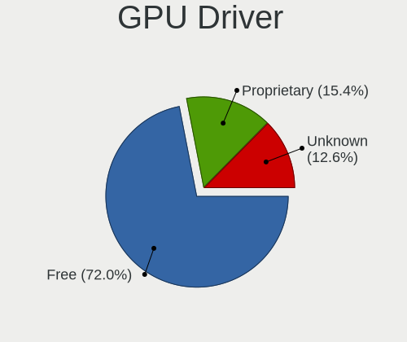

| Driver      | Computers | Percent |
|-------------|-----------|---------|
| Free        | 175       | 72.02%  |
| Proprietary | 37        | 15.23%  |
| Unknown     | 31        | 12.76%  |

GPU Memory
----------

Total video memory

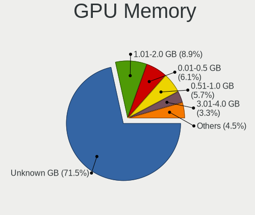

| Size in GB | Computers | Percent |
|------------|-----------|---------|
| Unknown    | 174       | 71.6%   |
| 1.01-2.0   | 22        | 9.05%   |
| 0.01-0.5   | 15        | 6.17%   |
| 0.51-1.0   | 14        | 5.76%   |
| 3.01-4.0   | 8         | 3.29%   |
| 7.01-8.0   | 5         | 2.06%   |
| 5.01-6.0   | 3         | 1.23%   |
| 2.01-3.0   | 2         | 0.82%   |

Monitor
-------

Monitor Vendor
--------------

Monitor vendors

| Vendor                  | Computers | Percent |
|-------------------------|-----------|---------|
| Samsung Electronics     | 32        | 17.2%   |
| LG Display              | 24        | 12.9%   |
| AU Optronics            | 19        | 10.22%  |
| Chimei Innolux          | 14        | 7.53%   |
| Goldstar                | 13        | 6.99%   |
| Dell                    | 10        | 5.38%   |
| Hewlett-Packard         | 8         | 4.3%    |
| AOC                     | 7         | 3.76%   |
| Acer                    | 6         | 3.23%   |
| Chi Mei Optoelectronics | 5         | 2.69%   |
| BOE                     | 5         | 2.69%   |
| Lenovo                  | 4         | 2.15%   |
| BenQ                    | 4         | 2.15%   |
| ViewSonic               | 3         | 1.61%   |
| InfoVision              | 3         | 1.61%   |
| Iiyama                  | 3         | 1.61%   |
| Ancor Communications    | 3         | 1.61%   |
| Sony                    | 2         | 1.08%   |
| LG Philips              | 2         | 1.08%   |
| Apple                   | 2         | 1.08%   |
| Vizio                   | 1         | 0.54%   |
| VIE                     | 1         | 0.54%   |
| Videoseven              | 1         | 0.54%   |
| Toshiba                 | 1         | 0.54%   |
| Sun                     | 1         | 0.54%   |
| Sharp                   | 1         | 0.54%   |
| RS                      | 1         | 0.54%   |
| Philips                 | 1         | 0.54%   |
| NEC Computers           | 1         | 0.54%   |
| Medion                  | 1         | 0.54%   |
| LED                     | 1         | 0.54%   |
| Insignia                | 1         | 0.54%   |
| Gateway                 | 1         | 0.54%   |
| Fujitsu Siemens         | 1         | 0.54%   |
| CVT                     | 1         | 0.54%   |
| CAN                     | 1         | 0.54%   |
| ASUSTek Computer        | 1         | 0.54%   |

Monitor Model
-------------

Monitor models

| Model                                                                  | Computers | Percent |
|------------------------------------------------------------------------|-----------|---------|
| AU Optronics LCD Monitor AUO26EC 1366x768 340x190mm 15.3-inch          | 3         | 1.61%   |
| Samsung Electronics LCD Monitor SEC3047 1366x768 280x160mm 12.7-inch   | 2         | 1.08%   |
| LG Display LCD Monitor LGD0532 1920x1080 340x190mm 15.3-inch           | 2         | 1.08%   |
| LG Display LCD Monitor LGD02D8 1366x768 280x160mm 12.7-inch            | 2         | 1.08%   |
| InfoVision LCD Monitor IVO04E3 1366x768 280x160mm 12.7-inch            | 2         | 1.08%   |
| Goldstar LG FULL HD GSM5B55 1920x1080 480x270mm 21.7-inch              | 2         | 1.08%   |
| Chimei Innolux LCD Monitor CMN14C0 1920x1080 310x170mm 13.9-inch       | 2         | 1.08%   |
| AU Optronics LCD Monitor AUO22EC 1366x768 340x190mm 15.3-inch          | 2         | 1.08%   |
| AOC 22V2WG5 AOC2202 1920x1080 480x270mm 21.7-inch                      | 2         | 1.08%   |
| Vizio D32f-F1 VIZ1027 1920x1080 700x390mm 31.5-inch                    | 1         | 0.54%   |
| ViewSonic VX1940w VSC6A20 1680x1050 410x260mm 19.1-inch                | 1         | 0.54%   |
| ViewSonic LCD Monitor VSCD824 1920x1080 520x290mm 23.4-inch            | 1         | 0.54%   |
| ViewSonic LCD Monitor VSC8724 1440x900 410x260mm 19.1-inch             | 1         | 0.54%   |
| VIE A/G2356 VIE2300 1920x1080 500x300mm 23.0-inch                      | 1         | 0.54%   |
| Videoseven WL19A IGM1908 1280x1024 380x300mm 19.1-inch                 | 1         | 0.54%   |
| Toshiba TV TSB0108 1360x768 700x390mm 31.5-inch                        | 1         | 0.54%   |
| Sun X7202A SUN0595 1280x1024 380x300mm 19.1-inch                       | 1         | 0.54%   |
| Sony TV SNYC901 1920x1080                                              | 1         | 0.54%   |
| Sony SDM-HS95P SNY2500 1280x1024 380x300mm 19.1-inch                   | 1         | 0.54%   |
| Sharp LQ100P1JX51 SHP14A6 1800x1200 210x140mm 9.9-inch                 | 1         | 0.54%   |
| Samsung Electronics U32J59x SAM0F33 3840x2160 700x390mm 31.5-inch      | 1         | 0.54%   |
| Samsung Electronics U28E590 SAM0C4C 3840x2160 610x350mm 27.7-inch      | 1         | 0.54%   |
| Samsung Electronics T24D390 SAM0B6E 1920x1080 520x290mm 23.4-inch      | 1         | 0.54%   |
| Samsung Electronics T22C300 SAM0AB3 1920x1080 480x270mm 21.7-inch      | 1         | 0.54%   |
| Samsung Electronics SyncMaster SAM0600 1600x900 440x250mm 19.9-inch    | 1         | 0.54%   |
| Samsung Electronics SyncMaster SAM03E4 1680x1050 470x300mm 22.0-inch   | 1         | 0.54%   |
| Samsung Electronics SyncMaster SAM03E0 1440x900 410x260mm 19.1-inch    | 1         | 0.54%   |
| Samsung Electronics SyncMaster SAM03D7 1680x1050 470x300mm 22.0-inch   | 1         | 0.54%   |
| Samsung Electronics SyncMaster SAM0320 1680x1050 470x300mm 22.0-inch   | 1         | 0.54%   |
| Samsung Electronics SyncMaster SAM0304 1680x1050 490x320mm 23.0-inch   | 1         | 0.54%   |
| Samsung Electronics SyncMaster SAM021E 1680x1050 430x270mm 20.0-inch   | 1         | 0.54%   |
| Samsung Electronics SE790C SAM0C62 2560x1080 700x310mm 30.1-inch       | 1         | 0.54%   |
| Samsung Electronics SA300/SA350 SAM078A 1366x768 410x230mm 18.5-inch   | 1         | 0.54%   |
| Samsung Electronics S27D590 SAM0B49 1920x1080 600x340mm 27.2-inch      | 1         | 0.54%   |
| Samsung Electronics S24D300 SAM0B43 1920x1080 530x300mm 24.0-inch      | 1         | 0.54%   |
| Samsung Electronics S24C350 SAM0A3A 1920x1080 530x300mm 24.0-inch      | 1         | 0.54%   |
| Samsung Electronics LCD Monitor SEC5441 1280x800 330x210mm 15.4-inch   | 1         | 0.54%   |
| Samsung Electronics LCD Monitor SEC3847 1440x900 370x230mm 17.2-inch   | 1         | 0.54%   |
| Samsung Electronics LCD Monitor SEC354C 1366x768 350x200mm 15.9-inch   | 1         | 0.54%   |
| Samsung Electronics LCD Monitor SDC4C51 1366x768 340x190mm 15.3-inch   | 1         | 0.54%   |
| Samsung Electronics LCD Monitor SDC4253 1366x768 260x150mm 11.8-inch   | 1         | 0.54%   |
| Samsung Electronics LCD Monitor SDC324D 1366x768 310x170mm 13.9-inch   | 1         | 0.54%   |
| Samsung Electronics LCD Monitor SDC324A 1366x768 290x170mm 13.2-inch   | 1         | 0.54%   |
| Samsung Electronics LCD Monitor SAM4A75 1024x768 300x230mm 14.9-inch   | 1         | 0.54%   |
| Samsung Electronics LCD Monitor SAM0F9F 3840x2160 1420x800mm 64.2-inch | 1         | 0.54%   |
| Samsung Electronics LCD Monitor SAM0D3B 3840x2160 890x500mm 40.2-inch  | 1         | 0.54%   |
| Samsung Electronics LCD Monitor SAM0AC6 1920x1080 1110x620mm 50.1-inch | 1         | 0.54%   |
| Samsung Electronics LCD Monitor SAM07C0 1920x1080 480x270mm 21.7-inch  | 1         | 0.54%   |
| Samsung Electronics LC24RG50 SAM0F91 1920x1080 530x300mm 24.0-inch     | 1         | 0.54%   |
| Samsung Electronics C24F390 SAM0D2D 1920x1080 520x290mm 23.4-inch      | 1         | 0.54%   |
| RS LE2262 BTC2262 1680x1050 470x290mm 21.7-inch                        | 1         | 0.54%   |
| Philips LCD Monitor PHLC0B1 1920x1080 480x270mm 21.7-inch              | 1         | 0.54%   |
| NEC Computers EA244UHD NEC2B1D 3840x2160 530x300mm 24.0-inch           | 1         | 0.54%   |
| Medion MD21281 MED3947 1366x768 410x230mm 18.5-inch                    | 1         | 0.54%   |
| LG Philips LCD Monitor LPLE300 1280x800 330x210mm 15.4-inch            | 1         | 0.54%   |
| LG Philips LCD Monitor LPL3B01 1280x800 330x210mm 15.4-inch            | 1         | 0.54%   |
| LG Display LCD Monitor LGD11F9 1280x800 290x180mm 13.4-inch            | 1         | 0.54%   |
| LG Display LCD Monitor LGD05E5 1920x1080 340x190mm 15.3-inch           | 1         | 0.54%   |
| LG Display LCD Monitor LGD05B1 1920x1080 310x170mm 13.9-inch           | 1         | 0.54%   |
| LG Display LCD Monitor LGD0545 3200x1800 290x170mm 13.2-inch           | 1         | 0.54%   |

Monitor Resolution
------------------

Monitor screen resolution

| Resolution         | Computers | Percent |
|--------------------|-----------|---------|
| 1920x1080 (FHD)    | 63        | 34.24%  |
| 1366x768 (WXGA)    | 55        | 29.89%  |
| 3840x2160 (4K)     | 11        | 5.98%   |
| 1680x1050 (WSXGA+) | 11        | 5.98%   |
| 1280x1024 (SXGA)   | 9         | 4.89%   |
| 1440x900 (WXGA+)   | 7         | 3.8%    |
| 1280x800 (WXGA)    | 7         | 3.8%    |
| 1600x900 (HD+)     | 6         | 3.26%   |
| 2560x1440 (QHD)    | 5         | 2.72%   |
| 2560x1080          | 3         | 1.63%   |
| 3440x1440          | 2         | 1.09%   |
| 3200x1800 (QHD+)   | 1         | 0.54%   |
| 2048x1152          | 1         | 0.54%   |
| 1920x540           | 1         | 0.54%   |
| 1800x1200          | 1         | 0.54%   |
| 1024x768 (XGA)     | 1         | 0.54%   |

Monitor Diagonal
----------------

Diagonal size in inches

| Inches  | Computers | Percent |
|---------|-----------|---------|
| 15      | 34        | 18.38%  |
| 13      | 29        | 15.68%  |
| 21      | 17        | 9.19%   |
| 19      | 15        | 8.11%   |
| 24      | 11        | 5.95%   |
| 23      | 11        | 5.95%   |
| 27      | 10        | 5.41%   |
| 12      | 10        | 5.41%   |
| 17      | 9         | 4.86%   |
| 31      | 7         | 3.78%   |
| 18      | 7         | 3.78%   |
| 22      | 4         | 2.16%   |
| 11      | 4         | 2.16%   |
| 20      | 3         | 1.62%   |
| 34      | 2         | 1.08%   |
| 14      | 2         | 1.08%   |
| 64      | 1         | 0.54%   |
| 54      | 1         | 0.54%   |
| 50      | 1         | 0.54%   |
| 40      | 1         | 0.54%   |
| 39      | 1         | 0.54%   |
| 30      | 1         | 0.54%   |
| 28      | 1         | 0.54%   |
| 16      | 1         | 0.54%   |
| 9       | 1         | 0.54%   |
| Unknown | 1         | 0.54%   |

Monitor Width
-------------

Physical width

| Width in mm | Computers | Percent |
|-------------|-----------|---------|
| 301-350     | 57        | 30.81%  |
| 401-500     | 42        | 22.7%   |
| 501-600     | 28        | 15.14%  |
| 201-300     | 25        | 13.51%  |
| 351-400     | 14        | 7.57%   |
| 601-700     | 11        | 5.95%   |
| 1001-1500   | 3         | 1.62%   |
| 801-900     | 2         | 1.08%   |
| 701-800     | 2         | 1.08%   |
| Unknown     | 1         | 0.54%   |

Aspect Ratio
------------

Proportional relationship between the width and the height

| Ratio | Computers | Percent |
|-------|-----------|---------|
| 16/9  | 140       | 77.35%  |
| 16/10 | 25        | 13.81%  |
| 5/4   | 8         | 4.42%   |
| 21/9  | 5         | 2.76%   |
| 3/2   | 2         | 1.1%    |
| 4/3   | 1         | 0.55%   |

Monitor Area
------------

Area in inch

| Area in inch | Computers | Percent |
|----------------|-----------|---------|
| 201-250        | 41        | 22.4%   |
| 81-90          | 26        | 14.21%  |
| 91-100         | 26        | 14.21%  |
| 151-200        | 18        | 9.84%   |
| 301-350        | 11        | 6.01%   |
| 61-70          | 10        | 5.46%   |
| 351-500        | 9         | 4.92%   |
| 101-110        | 9         | 4.92%   |
| 141-150        | 8         | 4.37%   |
| 121-130        | 6         | 3.28%   |
| 71-80          | 4         | 2.19%   |
| 51-60          | 4         | 2.19%   |
| More than 1000 | 3         | 1.64%   |
| 251-300        | 2         | 1.09%   |
| 501-1000       | 2         | 1.09%   |
| 41-50          | 1         | 0.55%   |
| 131-140        | 1         | 0.55%   |
| 111-120        | 1         | 0.55%   |
| Unknown        | 1         | 0.55%   |

Pixel Density
-------------

Pixels per inch

| Density       | Computers | Percent |
|---------------|-----------|---------|
| 51-100        | 70        | 38.67%  |
| 101-120       | 61        | 33.7%   |
| 121-160       | 40        | 22.1%   |
| 161-240       | 7         | 3.87%   |
| More than 240 | 1         | 0.55%   |
| 1-50          | 1         | 0.55%   |
| Unknown       | 1         | 0.55%   |

Multiple Monitors
-----------------

Total monitors connected

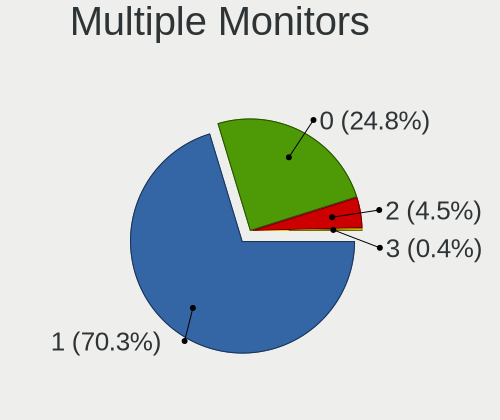

| Total | Computers | Percent |
|-------|-----------|---------|
| 1     | 172       | 70.78%  |
| 0     | 61        | 25.1%   |
| 2     | 10        | 4.12%   |

Network
-------

Net Controller Vendor
---------------------

Controller vendors

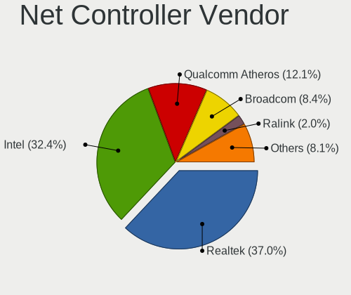

| Vendor                            | Computers | Percent |
|-----------------------------------|-----------|---------|
| Realtek Semiconductor             | 127       | 37.24%  |
| Intel                             | 110       | 32.26%  |
| Qualcomm Atheros                  | 42        | 12.32%  |
| Broadcom                          | 28        | 8.21%   |
| Ralink                            | 7         | 2.05%   |
| Ralink Technology                 | 4         | 1.17%   |
| Marvell Technology Group          | 4         | 1.17%   |
| Samsung Electronics               | 2         | 0.59%   |
| D-Link                            | 2         | 0.59%   |
| VIA Technologies                  | 1         | 0.29%   |
| TP-Link                           | 1         | 0.29%   |
| Toshiba                           | 1         | 0.29%   |
| Silicon Integrated Systems [SiS]  | 1         | 0.29%   |
| Sierra Wireless                   | 1         | 0.29%   |
| Qualcomm Atheros Communications   | 1         | 0.29%   |
| Mellanox Technologies             | 1         | 0.29%   |
| Huawei Technologies               | 1         | 0.29%   |
| Hewlett-Packard                   | 1         | 0.29%   |
| Google                            | 1         | 0.29%   |
| Ericsson Business Mobile Networks | 1         | 0.29%   |
| D-Link System                     | 1         | 0.29%   |
| ASUSTek Computer                  | 1         | 0.29%   |
| AboCom Systems                    | 1         | 0.29%   |
| 3Com                              | 1         | 0.29%   |

Net Controller Model
--------------------

Controller models

| Model                                                                   | Computers | Percent |
|-------------------------------------------------------------------------|-----------|---------|
| Realtek RTL8111/8168/8411 PCI Express Gigabit Ethernet Controller       | 100       | 24.39%  |
| Realtek RTL810xE PCI Express Fast Ethernet controller                   | 19        | 4.63%   |
| Intel 82579LM Gigabit Network Connection (Lewisville)                   | 15        | 3.66%   |
| Qualcomm Atheros AR9485 Wireless Network Adapter                        | 9         | 2.2%    |
| Qualcomm Atheros QCA9565 / AR9565 Wireless Network Adapter              | 8         | 1.95%   |
| Intel Wireless 7260                                                     | 8         | 1.95%   |
| Intel Wireless 7265                                                     | 7         | 1.71%   |
| Intel Centrino Advanced-N 6205 [Taylor Peak]                            | 7         | 1.71%   |
| Realtek RTL8188EUS 802.11n Wireless Network Adapter                     | 6         | 1.46%   |
| Intel Wireless 8260                                                     | 6         | 1.46%   |
| Intel Ethernet Connection (7) I219-V                                    | 6         | 1.46%   |
| Qualcomm Atheros AR9285 Wireless Network Adapter (PCI-Express)          | 5         | 1.22%   |
| Intel Wireless 8265 / 8275                                              | 5         | 1.22%   |
| Intel WiFi Link 5100                                                    | 5         | 1.22%   |
| Intel Wi-Fi 6 AX200                                                     | 5         | 1.22%   |
| Realtek RTL8821CE 802.11ac PCIe Wireless Network Adapter                | 4         | 0.98%   |
| Intel Dual Band Wireless-AC 3165 Plus Bluetooth                         | 4         | 0.98%   |
| Intel Cannon Point-LP CNVi [Wireless-AC]                                | 4         | 0.98%   |
| Intel 82579V Gigabit Network Connection                                 | 4         | 0.98%   |
| Broadcom NetXtreme BCM5764M Gigabit Ethernet PCIe                       | 4         | 0.98%   |
| Intel Wireless 3165                                                     | 3         | 0.73%   |
| Intel I211 Gigabit Network Connection                                   | 3         | 0.73%   |
| Intel Ethernet Connection I219-LM                                       | 3         | 0.73%   |
| Intel Ethernet Connection I218-LM                                       | 3         | 0.73%   |
| Intel Ethernet Connection I217-LM                                       | 3         | 0.73%   |
| Intel Centrino Wireless-N 2230                                          | 3         | 0.73%   |
| Intel Centrino Advanced-N 6200                                          | 3         | 0.73%   |
| Intel 82577LM Gigabit Network Connection                                | 3         | 0.73%   |
| Broadcom NetXtreme BCM57765 Gigabit Ethernet PCIe                       | 3         | 0.73%   |
| Broadcom NetXtreme BCM5761 Gigabit Ethernet PCIe                        | 3         | 0.73%   |
| Broadcom BCM4331 802.11a/b/g/n                                          | 3         | 0.73%   |
| Samsung GT-I9070 (network tethering, USB debugging enabled)             | 2         | 0.49%   |
| Realtek RTL8821AE 802.11ac PCIe Wireless Network Adapter                | 2         | 0.49%   |
| Realtek RTL8188EE Wireless Network Adapter                              | 2         | 0.49%   |
| Realtek RTL8188CE 802.11b/g/n WiFi Adapter                              | 2         | 0.49%   |
| Ralink RT5370 Wireless Adapter                                          | 2         | 0.49%   |
| Ralink RT5390R 802.11bgn PCIe Wireless Network Adapter                  | 2         | 0.49%   |
| Ralink RT3290 Wireless 802.11n 1T/1R PCIe                               | 2         | 0.49%   |
| Qualcomm Atheros QCA9377 802.11ac Wireless Network Adapter              | 2         | 0.49%   |
| Qualcomm Atheros QCA8172 Fast Ethernet                                  | 2         | 0.49%   |
| Qualcomm Atheros QCA6174 802.11ac Wireless Network Adapter              | 2         | 0.49%   |
| Qualcomm Atheros AR928X Wireless Network Adapter (PCI-Express)          | 2         | 0.49%   |
| Qualcomm Atheros AR9287 Wireless Network Adapter (PCI-Express)          | 2         | 0.49%   |
| Qualcomm Atheros AR8161 Gigabit Ethernet                                | 2         | 0.49%   |
| Qualcomm Atheros AR242x / AR542x Wireless Network Adapter (PCI-Express) | 2         | 0.49%   |
| Intel Wireless 3160                                                     | 2         | 0.49%   |
| Intel Ultimate N WiFi Link 5300                                         | 2         | 0.49%   |
| Intel Ethernet Connection I218-V                                        | 2         | 0.49%   |
| Intel Ethernet Connection (6) I219-LM                                   | 2         | 0.49%   |
| Intel Ethernet Connection (3) I218-V                                    | 2         | 0.49%   |
| Intel Dual Band Wireless-AC 3168NGW [Stone Peak]                        | 2         | 0.49%   |
| Intel Comet Lake PCH-LP CNVi WiFi                                       | 2         | 0.49%   |
| Intel Centrino Wireless-N 1000 [Condor Peak]                            | 2         | 0.49%   |
| Intel Centrino Advanced-N 6235                                          | 2         | 0.49%   |
| Intel Cannon Lake PCH CNVi WiFi                                         | 2         | 0.49%   |
| Intel 82583V Gigabit Network Connection                                 | 2         | 0.49%   |
| Intel 82567LM Gigabit Network Connection                                | 2         | 0.49%   |
| Intel 82566DM-2 Gigabit Network Connection                              | 2         | 0.49%   |
| Broadcom NetXtreme BCM57766 Gigabit Ethernet PCIe                       | 2         | 0.49%   |
| Broadcom NetLink BCM57785 Gigabit Ethernet PCIe                         | 2         | 0.49%   |

Wireless Vendor
---------------

Wireless vendors

| Vendor                          | Computers | Percent |
|---------------------------------|-----------|---------|
| Intel                           | 79        | 45.93%  |
| Qualcomm Atheros                | 36        | 20.93%  |
| Realtek Semiconductor           | 23        | 13.37%  |
| Broadcom                        | 15        | 8.72%   |
| Ralink                          | 7         | 4.07%   |
| Ralink Technology               | 4         | 2.33%   |
| D-Link                          | 2         | 1.16%   |
| TP-Link                         | 1         | 0.58%   |
| Sierra Wireless                 | 1         | 0.58%   |
| Qualcomm Atheros Communications | 1         | 0.58%   |
| D-Link System                   | 1         | 0.58%   |
| ASUSTek Computer                | 1         | 0.58%   |
| AboCom Systems                  | 1         | 0.58%   |

Wireless Model
--------------

Wireless models

| Model                                                                                 | Computers | Percent |
|---------------------------------------------------------------------------------------|-----------|---------|
| Qualcomm Atheros AR9485 Wireless Network Adapter                                      | 9         | 5.23%   |
| Qualcomm Atheros QCA9565 / AR9565 Wireless Network Adapter                            | 8         | 4.65%   |
| Intel Wireless 7260                                                                   | 8         | 4.65%   |
| Intel Wireless 7265                                                                   | 7         | 4.07%   |
| Intel Centrino Advanced-N 6205 [Taylor Peak]                                          | 7         | 4.07%   |
| Realtek RTL8188EUS 802.11n Wireless Network Adapter                                   | 6         | 3.49%   |
| Intel Wireless 8260                                                                   | 6         | 3.49%   |
| Qualcomm Atheros AR9285 Wireless Network Adapter (PCI-Express)                        | 5         | 2.91%   |
| Intel Wireless 8265 / 8275                                                            | 5         | 2.91%   |
| Intel WiFi Link 5100                                                                  | 5         | 2.91%   |
| Intel Wi-Fi 6 AX200                                                                   | 5         | 2.91%   |
| Realtek RTL8821CE 802.11ac PCIe Wireless Network Adapter                              | 4         | 2.33%   |
| Intel Dual Band Wireless-AC 3165 Plus Bluetooth                                       | 4         | 2.33%   |
| Intel Cannon Point-LP CNVi [Wireless-AC]                                              | 4         | 2.33%   |
| Intel Wireless 3165                                                                   | 3         | 1.74%   |
| Intel Centrino Wireless-N 2230                                                        | 3         | 1.74%   |
| Intel Centrino Advanced-N 6200                                                        | 3         | 1.74%   |
| Broadcom BCM4331 802.11a/b/g/n                                                        | 3         | 1.74%   |
| Realtek RTL8821AE 802.11ac PCIe Wireless Network Adapter                              | 2         | 1.16%   |
| Realtek RTL8188EE Wireless Network Adapter                                            | 2         | 1.16%   |
| Realtek RTL8188CE 802.11b/g/n WiFi Adapter                                            | 2         | 1.16%   |
| Ralink RT5370 Wireless Adapter                                                        | 2         | 1.16%   |
| Ralink RT5390R 802.11bgn PCIe Wireless Network Adapter                                | 2         | 1.16%   |
| Ralink RT3290 Wireless 802.11n 1T/1R PCIe                                             | 2         | 1.16%   |
| Qualcomm Atheros QCA9377 802.11ac Wireless Network Adapter                            | 2         | 1.16%   |
| Qualcomm Atheros QCA6174 802.11ac Wireless Network Adapter                            | 2         | 1.16%   |
| Qualcomm Atheros AR928X Wireless Network Adapter (PCI-Express)                        | 2         | 1.16%   |
| Qualcomm Atheros AR9287 Wireless Network Adapter (PCI-Express)                        | 2         | 1.16%   |
| Qualcomm Atheros AR242x / AR542x Wireless Network Adapter (PCI-Express)               | 2         | 1.16%   |
| Intel Wireless 3160                                                                   | 2         | 1.16%   |
| Intel Ultimate N WiFi Link 5300                                                       | 2         | 1.16%   |
| Intel Dual Band Wireless-AC 3168NGW [Stone Peak]                                      | 2         | 1.16%   |
| Intel Comet Lake PCH-LP CNVi WiFi                                                     | 2         | 1.16%   |
| Intel Centrino Wireless-N 1000 [Condor Peak]                                          | 2         | 1.16%   |
| Intel Centrino Advanced-N 6235                                                        | 2         | 1.16%   |
| Intel Cannon Lake PCH CNVi WiFi                                                       | 2         | 1.16%   |
| Broadcom BCM4360 802.11ac Wireless Network Adapter                                    | 2         | 1.16%   |
| Broadcom BCM4352 802.11ac Wireless Network Adapter                                    | 2         | 1.16%   |
| Broadcom BCM4313 802.11bgn Wireless Network Adapter                                   | 2         | 1.16%   |
| TP-Link AC600 wireless Realtek RTL8811AU [Archer T2U Nano]                            | 1         | 0.58%   |
| Sierra Wireless Sierra Wireless EM7345 4G LTE                                         | 1         | 0.58%   |
| Realtek RTL8852AE 802.11ax PCIe Wireless Network Adapter                              | 1         | 0.58%   |
| Realtek RTL8812AE 802.11ac PCIe Wireless Network Adapter                              | 1         | 0.58%   |
| Realtek RTL8192EE PCIe Wireless Network Adapter                                       | 1         | 0.58%   |
| Realtek RTL8192CU 802.11n WLAN Adapter                                                | 1         | 0.58%   |
| Realtek RTL8192CE PCIe Wireless Network Adapter                                       | 1         | 0.58%   |
| Realtek RTL8191SEvB Wireless LAN Controller                                           | 1         | 0.58%   |
| Realtek RTL8188SU 802.11n WLAN Adapter                                                | 1         | 0.58%   |
| Ralink RT2501/RT2573 Wireless Adapter                                                 | 1         | 0.58%   |
| Ralink MT7601U Wireless Adapter                                                       | 1         | 0.58%   |
| Ralink RT5392 PCIe Wireless Network Adapter                                           | 1         | 0.58%   |
| Ralink RT3092 Wireless 802.11n 2T/2R PCIe                                             | 1         | 0.58%   |
| Ralink RT2790 Wireless 802.11n 1T/2R PCIe                                             | 1         | 0.58%   |
| Qualcomm Atheros AR9271 802.11n                                                       | 1         | 0.58%   |
| Qualcomm Atheros AR9462 Wireless Network Adapter                                      | 1         | 0.58%   |
| Qualcomm Atheros AR93xx Wireless Network Adapter                                      | 1         | 0.58%   |
| Qualcomm Atheros AR5418 Wireless Network Adapter [AR5008E 802.11(a)bgn] (PCI-Express) | 1         | 0.58%   |
| Qualcomm Atheros AR5416 Wireless Network Adapter [AR5008 802.11(a)bgn]                | 1         | 0.58%   |
| Intel Wireless-AC 9260                                                                | 1         | 0.58%   |
| Intel PRO/Wireless 5100 AGN [Shiloh] Network Connection                               | 1         | 0.58%   |

Ethernet Vendor
---------------

Ethernet vendors

| Vendor                           | Computers | Percent |
|----------------------------------|-----------|---------|
| Realtek Semiconductor            | 120       | 52.17%  |
| Intel                            | 68        | 29.57%  |
| Broadcom                         | 20        | 8.7%    |
| Qualcomm Atheros                 | 12        | 5.22%   |
| Marvell Technology Group         | 4         | 1.74%   |
| Samsung Electronics              | 2         | 0.87%   |
| VIA Technologies                 | 1         | 0.43%   |
| Silicon Integrated Systems [SiS] | 1         | 0.43%   |
| Huawei Technologies              | 1         | 0.43%   |
| Google                           | 1         | 0.43%   |

Ethernet Model
--------------

Ethernet models

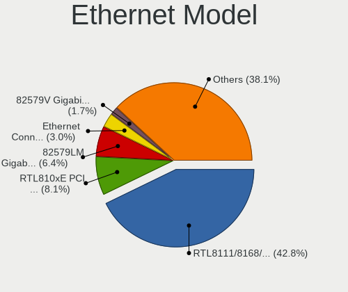

| Model                                                             | Computers | Percent |
|-------------------------------------------------------------------|-----------|---------|
| Realtek RTL8111/8168/8411 PCI Express Gigabit Ethernet Controller | 100       | 42.92%  |
| Realtek RTL810xE PCI Express Fast Ethernet controller             | 19        | 8.15%   |
| Intel 82579LM Gigabit Network Connection (Lewisville)             | 15        | 6.44%   |
| Intel Ethernet Connection (7) I219-V                              | 6         | 2.58%   |
| Intel 82579V Gigabit Network Connection                           | 4         | 1.72%   |
| Broadcom NetXtreme BCM5764M Gigabit Ethernet PCIe                 | 4         | 1.72%   |
| Intel I211 Gigabit Network Connection                             | 3         | 1.29%   |
| Intel Ethernet Connection I219-LM                                 | 3         | 1.29%   |
| Intel Ethernet Connection I218-LM                                 | 3         | 1.29%   |
| Intel Ethernet Connection I217-LM                                 | 3         | 1.29%   |
| Intel 82577LM Gigabit Network Connection                          | 3         | 1.29%   |
| Broadcom NetXtreme BCM57765 Gigabit Ethernet PCIe                 | 3         | 1.29%   |
| Broadcom NetXtreme BCM5761 Gigabit Ethernet PCIe                  | 3         | 1.29%   |
| Samsung GT-I9070 (network tethering, USB debugging enabled)       | 2         | 0.86%   |
| Qualcomm Atheros QCA8172 Fast Ethernet                            | 2         | 0.86%   |
| Qualcomm Atheros AR8161 Gigabit Ethernet                          | 2         | 0.86%   |
| Intel Ethernet Connection I218-V                                  | 2         | 0.86%   |
| Intel Ethernet Connection (6) I219-LM                             | 2         | 0.86%   |
| Intel Ethernet Connection (3) I218-V                              | 2         | 0.86%   |
| Intel 82583V Gigabit Network Connection                           | 2         | 0.86%   |
| Intel 82567LM Gigabit Network Connection                          | 2         | 0.86%   |
| Intel 82566DM-2 Gigabit Network Connection                        | 2         | 0.86%   |
| Broadcom NetXtreme BCM57766 Gigabit Ethernet PCIe                 | 2         | 0.86%   |
| Broadcom NetLink BCM57785 Gigabit Ethernet PCIe                   | 2         | 0.86%   |
| VIA VT6105/VT6106S [Rhine-III]                                    | 1         | 0.43%   |
| Silicon Integrated Systems [SiS] 191 Gigabit Ethernet Adapter     | 1         | 0.43%   |
| Realtek RTL-8100/8101L/8139 PCI Fast Ethernet Adapter             | 1         | 0.43%   |
| Qualcomm Atheros QCA8171 Gigabit Ethernet                         | 1         | 0.43%   |
| Qualcomm Atheros Killer E220x Gigabit Ethernet Controller         | 1         | 0.43%   |
| Qualcomm Atheros Attansic L1 Gigabit Ethernet                     | 1         | 0.43%   |
| Qualcomm Atheros AR8152 v2.0 Fast Ethernet                        | 1         | 0.43%   |
| Qualcomm Atheros AR8152 v1.1 Fast Ethernet                        | 1         | 0.43%   |
| Qualcomm Atheros AR8151 v2.0 Gigabit Ethernet                     | 1         | 0.43%   |
| Qualcomm Atheros AR8131 Gigabit Ethernet                          | 1         | 0.43%   |
| Qualcomm Atheros AR8121/AR8113/AR8114 Gigabit or Fast Ethernet    | 1         | 0.43%   |
| Marvell Group 88E8072 PCI-E Gigabit Ethernet Controller           | 1         | 0.43%   |
| Marvell Group 88E8058 PCI-E Gigabit Ethernet Controller           | 1         | 0.43%   |
| Marvell Group 88E8056 PCI-E Gigabit Ethernet Controller           | 1         | 0.43%   |
| Marvell Group 88E8040T PCI-E Fast Ethernet Controller             | 1         | 0.43%   |
| Marvell Group 88E8001 Gigabit Ethernet Controller                 | 1         | 0.43%   |
| Intel Ethernet Connection I219-V                                  | 1         | 0.43%   |
| Intel Ethernet Connection I217-V                                  | 1         | 0.43%   |
| Intel Ethernet Connection (6) I219-V                              | 1         | 0.43%   |
| Intel Ethernet Connection (5) I219-V                              | 1         | 0.43%   |
| Intel Ethernet Connection (4) I219-V                              | 1         | 0.43%   |
| Intel Ethernet Connection (3) I218-LM                             | 1         | 0.43%   |
| Intel Ethernet Connection (2) I219-V                              | 1         | 0.43%   |
| Intel Ethernet Connection (2) I219-LM                             | 1         | 0.43%   |
| Intel Ethernet Connection (2) I218-V                              | 1         | 0.43%   |
| Intel Ethernet Connection (12) I219-V                             | 1         | 0.43%   |
| Intel Ethernet Connection (11) I219-V                             | 1         | 0.43%   |
| Intel Ethernet Connection (10) I219-LM                            | 1         | 0.43%   |
| Intel 82578DM Gigabit Network Connection                          | 1         | 0.43%   |
| Intel 82574L Gigabit Network Connection                           | 1         | 0.43%   |
| Intel 82567LF Gigabit Network Connection                          | 1         | 0.43%   |
| Intel 82566MM Gigabit Network Connection                          | 1         | 0.43%   |
| Intel 82562V-2 10/100 Network Connection                          | 1         | 0.43%   |
| Intel 82557/8/9/0/1 Ethernet Pro 100                              | 1         | 0.43%   |
| Huawei USB Composite Device                                       | 1         | 0.43%   |
| Google Nexus/Pixel Device (charging + debug)                      | 1         | 0.43%   |

Net Controller Kind
-------------------

Ethernet, WiFi or modem

| Kind     | Computers | Percent |
|----------|-----------|---------|
| Ethernet | 224       | 57.58%  |
| WiFi     | 160       | 41.13%  |
| Modem    | 3         | 0.77%   |
| Unknown  | 2         | 0.51%   |

Used Controller
---------------

Currently used network controller

| Kind     | Computers | Percent |
|----------|-----------|---------|
| Ethernet | 221       | 62.25%  |
| WiFi     | 130       | 36.62%  |
| Modem    | 2         | 0.56%   |
| Unknown  | 2         | 0.56%   |

NICs
----

Total network controllers on board

| Total | Computers | Percent |
|-------|-----------|---------|
| 2     | 140       | 57.61%  |
| 1     | 99        | 40.74%  |
| 3     | 3         | 1.23%   |
| 0     | 1         | 0.41%   |

IPv6
----

IPv6 vs IPv4

| Used | Computers | Percent |
|------|-----------|---------|
| No   | 231       | 94.67%  |
| Yes  | 13        | 5.33%   |

Bluetooth
---------

Bluetooth Vendor
----------------

Controller vendors

| Vendor                          | Computers | Percent |
|---------------------------------|-----------|---------|
| Intel                           | 50        | 44.25%  |
| Broadcom                        | 11        | 9.73%   |
| Cambridge Silicon Radio         | 10        | 8.85%   |
| Qualcomm Atheros Communications | 9         | 7.96%   |
| Realtek Semiconductor           | 8         | 7.08%   |
| Apple                           | 8         | 7.08%   |
| IMC Networks                    | 4         | 3.54%   |
| ASUSTek Computer                | 3         | 2.65%   |
| Ralink                          | 2         | 1.77%   |
| Lite-On Technology              | 2         | 1.77%   |
| Dell                            | 2         | 1.77%   |
| Integrated System Solution      | 1         | 0.88%   |
| Hewlett-Packard                 | 1         | 0.88%   |
| Foxconn / Hon Hai               | 1         | 0.88%   |
| Edimax Technology               | 1         | 0.88%   |

Bluetooth Model
---------------

Controller models

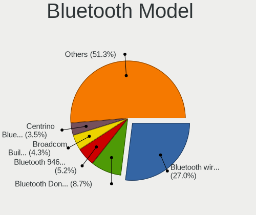

| Model                                                       | Computers | Percent |
|-------------------------------------------------------------|-----------|---------|
| Intel Bluetooth wireless interface                          | 31        | 27.43%  |
| Cambridge Silicon Radio Bluetooth Dongle (HCI mode)         | 10        | 8.85%   |
| Intel Bluetooth 9460/9560 Jefferson Peak (JfP)              | 5         | 4.42%   |
| Apple Apple Broadcom Built-in Bluetooth                     | 5         | 4.42%   |
| Intel Centrino Bluetooth Wireless Transceiver               | 4         | 3.54%   |
| Intel AX200 Bluetooth                                       | 4         | 3.54%   |
| Broadcom BCM20702 Bluetooth 4.0 [ThinkPad]                  | 4         | 3.54%   |
| Realtek  Bluetooth 4.2 Adapter                              | 3         | 2.65%   |
| Intel AX201 Bluetooth                                       | 3         | 2.65%   |
| Ralink RT3290 Bluetooth                                     | 2         | 1.77%   |
| Qualcomm Atheros Dell Wireless 1707 Bluetooth 4.0 LE Device | 2         | 1.77%   |
| Qualcomm Atheros AR3012 Bluetooth 4.0                       | 2         | 1.77%   |
| Lite-On Qualcomm Atheros Bluetooth 4.0 + HS                 | 2         | 1.77%   |
| Intel Wireless-AC 3168 Bluetooth                            | 2         | 1.77%   |
| IMC Networks Atheros AR3012 Bluetooth 4.0 Adapter           | 2         | 1.77%   |
| ASUS Broadcom BCM20702A0 Bluetooth                          | 2         | 1.77%   |
| Realtek RTL8821A Bluetooth                                  | 1         | 0.88%   |
| Realtek  Bluetooth Adapter                                  | 1         | 0.88%   |
| Realtek  Bluetooth 4.0 + High Speed Chip                    | 1         | 0.88%   |
| Realtek CSR Bluetooth Chip                                  | 1         | 0.88%   |
| Realtek Bluetooth Radio                                     | 1         | 0.88%   |
| Qualcomm Atheros  QCA9565 Bluetooth 4.0 + HS Adapter        | 1         | 0.88%   |
| Qualcomm Atheros  QCA61x4 Bluetooth 4.1                     | 1         | 0.88%   |
| Qualcomm Atheros QCA61x4 Bluetooth 4.0                      | 1         | 0.88%   |
| Qualcomm Atheros Dell Wireless 1703 Bluetooth               | 1         | 0.88%   |
| Qualcomm Atheros Atheros AR9462 Bluetooth 3.0 + HS Adapter  | 1         | 0.88%   |
| Intel Wireless-AC 9260 Bluetooth Adapter                    | 1         | 0.88%   |
| Integrated System Solution Bluetooth Device                 | 1         | 0.88%   |
| IMC Networks Qualcomm Atheros Bluetooth 4.0                 | 1         | 0.88%   |
| IMC Networks Broadcom BCM20702 Bluetooth 4.0 +HS USB Device | 1         | 0.88%   |
| HP Broadcom 2070 Bluetooth Combo                            | 1         | 0.88%   |
| Foxconn / Hon Hai Qualcomm Atheros AR3011 Bluetooth Adapter | 1         | 0.88%   |
| Edimax EW-7611ULB 802.11b/g/n and Bluetooth 4.0 Adapter     | 1         | 0.88%   |
| Dell DW375 Bluetooth Module                                 | 1         | 0.88%   |
| Dell Dell Wireless 380 Bluetooth 4.0 Module                 | 1         | 0.88%   |
| Broadcom Bluetooth Device                                   | 1         | 0.88%   |
| Broadcom Bluetooth 2.0+eDR dongle                           | 1         | 0.88%   |
| Broadcom BCM43142A0 Bluetooth 4.0                           | 1         | 0.88%   |
| Broadcom BCM20702A0 Bluetooth 4.0                           | 1         | 0.88%   |
| Broadcom BCM2070 Bluetooth 2.1 + EDR                        | 1         | 0.88%   |
| Broadcom BCM2045B (BDC-2.1)                                 | 1         | 0.88%   |
| Broadcom BCM2045B (BDC-2) [Bluetooth Controller]            | 1         | 0.88%   |
| ASUS Realtek Bluetooth 4.0 + High Speed Chip                | 1         | 0.88%   |
| Apple Built-in Bluetooth 2.0+EDR HCI                        | 1         | 0.88%   |
| Apple Bluetooth USB Host Controller                         | 1         | 0.88%   |
| Apple Bluetooth Host Controller                             | 1         | 0.88%   |

Sound
-----

Sound Vendor
------------

Sound card vendors

| Vendor                           | Computers | Percent |
|----------------------------------|-----------|---------|
| Intel                            | 193       | 60.12%  |
| AMD                              | 58        | 18.07%  |
| Nvidia                           | 55        | 17.13%  |
| Texas Instruments                | 2         | 0.62%   |
| Creative Technology              | 2         | 0.62%   |
| C-Media Electronics              | 2         | 0.62%   |
| XMOS                             | 1         | 0.31%   |
| Steinberg Soft-und Hardware      | 1         | 0.31%   |
| SteelSeries ApS                  | 1         | 0.31%   |
| Silicon Integrated Systems [SiS] | 1         | 0.31%   |
| Realtek Semiconductor            | 1         | 0.31%   |
| Logitech                         | 1         | 0.31%   |
| Kingston Technology              | 1         | 0.31%   |
| Ensoniq                          | 1         | 0.31%   |
| Creative Labs                    | 1         | 0.31%   |

Sound Model
-----------

Sound card models

| Model                                                                                             | Computers | Percent |
|---------------------------------------------------------------------------------------------------|-----------|---------|
| Intel 7 Series/C216 Chipset Family High Definition Audio Controller                               | 32        | 8.6%    |
| Intel 6 Series/C200 Series Chipset Family High Definition Audio Controller                        | 22        | 5.91%   |
| Intel Sunrise Point-LP HD Audio                                                                   | 17        | 4.57%   |
| AMD SBx00 Azalia (Intel HDA)                                                                      | 16        | 4.3%    |
| Intel 82801I (ICH9 Family) HD Audio Controller                                                    | 15        | 4.03%   |
| Intel 100 Series/C230 Series Chipset Family HD Audio Controller                                   | 12        | 3.23%   |
| Intel Haswell-ULT HD Audio Controller                                                             | 11        | 2.96%   |
| Intel 8 Series HD Audio Controller                                                                | 11        | 2.96%   |
| Intel Cannon Lake PCH cAVS                                                                        | 10        | 2.69%   |
| AMD Family 17h/19h HD Audio Controller                                                            | 10        | 2.69%   |
| Intel 5 Series/3400 Series Chipset High Definition Audio                                          | 9         | 2.42%   |
| Nvidia GK208 HDMI/DP Audio Controller                                                             | 8         | 2.15%   |
| Intel Wildcat Point-LP High Definition Audio Controller                                           | 7         | 1.88%   |
| Intel Broadwell-U Audio Controller                                                                | 7         | 1.88%   |
| Intel 8 Series/C220 Series Chipset High Definition Audio Controller                               | 7         | 1.88%   |
| Intel 200 Series PCH HD Audio                                                                     | 7         | 1.88%   |
| Nvidia GP108 High Definition Audio Controller                                                     | 6         | 1.61%   |
| Nvidia GF119 HDMI Audio Controller                                                                | 6         | 1.61%   |
| Intel Cannon Point-LP High Definition Audio Controller                                            | 6         | 1.61%   |
| AMD FCH Azalia Controller                                                                         | 6         | 1.61%   |
| Nvidia TU116 High Definition Audio Controller                                                     | 5         | 1.34%   |
| Intel 82801JI (ICH10 Family) HD Audio Controller                                                  | 5         | 1.34%   |
| Intel 82801H (ICH8 Family) HD Audio Controller                                                    | 5         | 1.34%   |
| AMD Starship/Matisse HD Audio Controller                                                          | 5         | 1.34%   |
| AMD Raven/Raven2/Fenghuang HDMI/DP Audio Controller                                               | 5         | 1.34%   |
| Nvidia GM206 High Definition Audio Controller                                                     | 4         | 1.08%   |
| Intel Xeon E3-1200 v3/4th Gen Core Processor HD Audio Controller                                  | 4         | 1.08%   |
| Intel NM10/ICH7 Family High Definition Audio Controller                                           | 4         | 1.08%   |
| Intel Comet Lake PCH-V cAVS                                                                       | 4         | 1.08%   |
| Intel Atom/Celeron/Pentium Processor x5-E8000/J3xxx/N3xxx Series High Definition Audio Controller | 4         | 1.08%   |
| AMD Turks HDMI Audio [Radeon HD 6500/6600 / 6700M Series]                                         | 4         | 1.08%   |
| AMD Renoir Radeon High Definition Audio Controller                                                | 4         | 1.08%   |
| AMD Ellesmere HDMI Audio [Radeon RX 470/480 / 570/580/590]                                        | 4         | 1.08%   |
| Nvidia High Definition Audio Controller                                                           | 3         | 0.81%   |
| Nvidia GK107 HDMI Audio Controller                                                                | 3         | 0.81%   |
| AMD Trinity HDMI Audio Controller                                                                 | 3         | 0.81%   |
| AMD RV710/730 HDMI Audio [Radeon HD 4000 series]                                                  | 3         | 0.81%   |
| AMD Family 17h (Models 00h-0fh) HD Audio Controller                                               | 3         | 0.81%   |
| AMD Caicos HDMI Audio [Radeon HD 6450 / 7450/8450/8490 OEM / R5 230/235/235X OEM]                 | 3         | 0.81%   |
| AMD Baffin HDMI/DP Audio [Radeon RX 550 640SP / RX 560/560X]                                      | 3         | 0.81%   |
| Nvidia MCP61 High Definition Audio                                                                | 2         | 0.54%   |
| Nvidia GT216 HDMI Audio Controller                                                                | 2         | 0.54%   |
| Nvidia GP107GL High Definition Audio Controller                                                   | 2         | 0.54%   |
| Nvidia GP106 High Definition Audio Controller                                                     | 2         | 0.54%   |
| Nvidia GM204 High Definition Audio Controller                                                     | 2         | 0.54%   |
| Nvidia GK106 HDMI Audio Controller                                                                | 2         | 0.54%   |
| Nvidia GF108 High Definition Audio Controller                                                     | 2         | 0.54%   |
| Nvidia GF106 High Definition Audio Controller                                                     | 2         | 0.54%   |
| Intel Comet Lake PCH-LP cAVS                                                                      | 2         | 0.54%   |
| Intel Comet Lake PCH cAVS                                                                         | 2         | 0.54%   |
| Intel Celeron/Pentium Silver Processor High Definition Audio                                      | 2         | 0.54%   |
| Intel Celeron N3350/Pentium N4200/Atom E3900 Series Audio Cluster                                 | 2         | 0.54%   |
| Intel C600/X79 series chipset High Definition Audio Controller                                    | 2         | 0.54%   |
| AMD Wrestler HDMI Audio                                                                           | 2         | 0.54%   |
| AMD RS880 HDMI Audio [Radeon HD 4200 Series]                                                      | 2         | 0.54%   |
| AMD Kabini HDMI/DP Audio                                                                          | 2         | 0.54%   |
| AMD Cedar HDMI Audio [Radeon HD 5400/6300/7300 Series]                                            | 2         | 0.54%   |
| XMOS Cyberdrive Audio Driver                                                                      | 1         | 0.27%   |
| Texas Instruments SMSL Q5 AMP                                                                     | 1         | 0.27%   |
| Texas Instruments PCM2902 Audio Codec                                                             | 1         | 0.27%   |

Memory
------

Memory Vendor
-------------

Memory module vendors

| Vendor                     | Computers | Percent |
|----------------------------|-----------|---------|
| Samsung Electronics        | 50        | 17.12%  |
| SK Hynix                   | 40        | 13.7%   |
| Kingston                   | 37        | 12.67%  |
| Unknown                    | 35        | 11.99%  |
| Micron Technology          | 28        | 9.59%   |
| Crucial                    | 22        | 7.53%   |
| Elpida                     | 13        | 4.45%   |
| G.Skill                    | 9         | 3.08%   |
| Corsair                    | 8         | 2.74%   |
| Nanya Technology           | 7         | 2.4%    |
| Ramaxel Technology         | 6         | 2.05%   |
| Smart                      | 4         | 1.37%   |
| A-DATA Technology          | 4         | 1.37%   |
| Avant                      | 3         | 1.03%   |
| Apacer                     | 3         | 1.03%   |
| Unknown                    | 3         | 1.03%   |
| Teikon                     | 2         | 0.68%   |
| Team                       | 2         | 0.68%   |
| PNY                        | 2         | 0.68%   |
| High Bridge                | 2         | 0.68%   |
| AMD                        | 2         | 0.68%   |
| Unknown (ABCD)             | 1         | 0.34%   |
| Unknown (7F7F7F94FFFFFFFF) | 1         | 0.34%   |
| Unknown (09A4)             | 1         | 0.34%   |
| Transcend                  | 1         | 0.34%   |
| Toshiba                    | 1         | 0.34%   |
| Smart Brazil               | 1         | 0.34%   |
| SHARETRONIC                | 1         | 0.34%   |
| Patriot                    | 1         | 0.34%   |
| Goldkey                    | 1         | 0.34%   |
| Axiom                      | 1         | 0.34%   |

Memory Model
------------

Memory module models

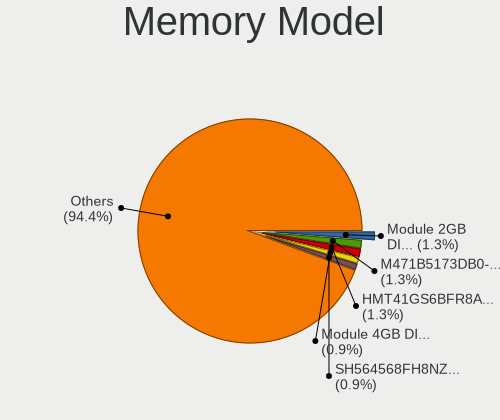

| Model                                                              | Computers | Percent |
|--------------------------------------------------------------------|-----------|---------|
| Unknown RAM Module 2GB DIMM 1333MT/s                               | 4         | 1.27%   |
| SK Hynix RAM HMT41GS6BFR8A-PB 8GB SODIMM DDR3 1600MT/s             | 4         | 1.27%   |
| Samsung RAM M471B5173DB0-YK0 4GB SODIMM DDR3 1600MT/s              | 4         | 1.27%   |
| Unknown RAM Module 4GB DIMM 1333MT/s                               | 3         | 0.95%   |
| Smart RAM SH564568FH8NZPHSCR 2GB SODIMM DDR3 1334MT/s              | 3         | 0.95%   |
| SK Hynix RAM HMT351S6CFR8C-PB 4GB SODIMM DDR3 1600MT/s             | 3         | 0.95%   |
| Samsung RAM M471B5773CHS-CH9 2GB SODIMM DDR3 1333MT/s              | 3         | 0.95%   |
| Samsung RAM M471B5273CH0-CH9 4GB SODIMM DDR3 1334MT/s              | 3         | 0.95%   |
| Samsung RAM M471B5173QH0-YK0 4GB SODIMM DDR3 1600MT/s              | 3         | 0.95%   |
| Samsung RAM M471A5143EB0-CPB 4GB SODIMM DDR4 2133MT/s              | 3         | 0.95%   |
| Unknown                                                            | 3         | 0.95%   |
| Unknown RAM Module 8GB SODIMM DDR3 1600MT/s                        | 2         | 0.63%   |
| Unknown RAM Module 4GB SODIMM DDR3 1333MT/s                        | 2         | 0.63%   |
| SK Hynix RAM Module 2GB SODIMM DDR3 1600MT/s                       | 2         | 0.63%   |
| SK Hynix RAM HMT351S6BFR8C-H9 4GB SODIMM DDR3 1334MT/s             | 2         | 0.63%   |
| Samsung RAM M471B5273DH0-CH9 4GB SODIMM DDR3 1334MT/s              | 2         | 0.63%   |
| Samsung RAM M471A2K43CB1-CTD 16GB SODIMM DDR4 2667MT/s             | 2         | 0.63%   |
| Samsung RAM K3QF4F40BM-AGCF 4GB Row Of Chips LPDDR3 1867MT/s       | 2         | 0.63%   |
| Micron RAM 8KTF51264HZ-1G6E1 4GB SODIMM DDR3 1600MT/s              | 2         | 0.63%   |
| Micron RAM 8JTF25664AZ-1G6M1 2GB DIMM DDR3 1600MT/s                | 2         | 0.63%   |
| Micron RAM 4ATF51264HZ-2G3E1 4GB SODIMM DDR4 2400MT/s              | 2         | 0.63%   |
| Micron RAM 4ATF51264HZ-2G3B1 4GB SODIMM DDR4 2400MT/s              | 2         | 0.63%   |
| Micron RAM 16ATF2G64HZ-2G6E1 16GB SODIMM DDR4 2667MT/s             | 2         | 0.63%   |
| Kingston RAM KHX3200C16D4/8GX 8GB DIMM DDR4 3200MT/s               | 2         | 0.63%   |
| Kingston RAM KHX2666C16/8G 8GB DIMM DDR4 2667MT/s                  | 2         | 0.63%   |
| Kingston RAM KHX1600C9D3/4GX 4GB DIMM DDR3 1600MT/s                | 2         | 0.63%   |
| G.Skill RAM F4-2666C19-8GNT 8GB DIMM DDR4 2666MT/s                 | 2         | 0.63%   |
| Avant RAM W641GU49J9266N6 8192MB DIMM DDR4 2667MT/s                | 2         | 0.63%   |
| Unknown RAM TMKS8G68ALFBCH-266 8192MB SODIMM DDR4 2400MT/s         | 1         | 0.32%   |
| Unknown RAM R9P5316-007.A02LF 2GB DIMM 533MT/s                     | 1         | 0.32%   |
| Unknown RAM Module 8GB SODIMM DDR3 1333MT/s                        | 1         | 0.32%   |
| Unknown RAM Module 8GB DIMM DDR4 2400MT/s                          | 1         | 0.32%   |
| Unknown RAM Module 8GB DIMM DDR3 1866MT/s                          | 1         | 0.32%   |
| Unknown RAM Module 8GB DIMM 1333MT/s                               | 1         | 0.32%   |
| Unknown RAM Module 4GB SODIMM DDR3 1600MT/s                        | 1         | 0.32%   |
| Unknown RAM Module 4GB SODIMM DDR3                                 | 1         | 0.32%   |
| Unknown RAM Module 4GB SODIMM DDR2 667MT/s                         | 1         | 0.32%   |
| Unknown RAM Module 4GB DIMM DDR3 1866MT/s                          | 1         | 0.32%   |
| Unknown RAM Module 4GB DIMM DDR3 1333MT/s                          | 1         | 0.32%   |
| Unknown RAM Module 4GB DIMM DDR 1333MT/s                           | 1         | 0.32%   |
| Unknown RAM Module 4GB DIMM 667MT/s                                | 1         | 0.32%   |
| Unknown RAM Module 4096MB DIMM DDR2                                | 1         | 0.32%   |
| Unknown RAM Module 2GB SODIMM DDR2 667MT/s                         | 1         | 0.32%   |
| Unknown RAM Module 2GB FB-DIMM DDR2 667MT/s                        | 1         | 0.32%   |
| Unknown RAM Module 2GB DIMM SDRAM                                  | 1         | 0.32%   |
| Unknown RAM Module 2GB DIMM DDR3 1333MT/s                          | 1         | 0.32%   |
| Unknown RAM Module 2GB DIMM DDR2 800MT/s                           | 1         | 0.32%   |
| Unknown RAM Module 2GB DIMM DDR 1333MT/s                           | 1         | 0.32%   |
| Unknown RAM Module 2GB DIMM 533MT/s                                | 1         | 0.32%   |
| Unknown RAM Module 2GB DIMM 1600MT/s                               | 1         | 0.32%   |
| Unknown RAM Module 2048MB SODIMM 800MT/s                           | 1         | 0.32%   |
| Unknown RAM Module 2048MB SODIMM 667MT/s                           | 1         | 0.32%   |
| Unknown RAM Module 2048MB DIMM SDRAM 800MT/s                       | 1         | 0.32%   |
| Unknown RAM Module 2048MB DIMM DDR2 800MT/s                        | 1         | 0.32%   |
| Unknown RAM Module 2048MB DIMM DDR2                                | 1         | 0.32%   |
| Unknown RAM Module 1GB DIMM 1333MT/s                               | 1         | 0.32%   |
| Unknown RAM Module 1024MB DIMM SDRAM 667MT/s                       | 1         | 0.32%   |
| Unknown RAM 7TE39AA# 8GB DIMM DDR4 2667MT/s                        | 1         | 0.32%   |
| Unknown (ABCD) RAM 123456789012345678 2GB DIMM LPDDR4 2400MT/s     | 1         | 0.32%   |
| Unknown (7F7F7F94FFFFFFFF) RAM 996593PCGH 2048MB DIMM DDR2 800MT/s | 1         | 0.32%   |

Memory Kind
-----------

Memory module kinds

| Kind    | Computers | Percent |
|---------|-----------|---------|
| DDR3    | 121       | 50.21%  |
| DDR4    | 78        | 32.37%  |
| DDR2    | 16        | 6.64%   |
| Unknown | 16        | 6.64%   |
| LPDDR3  | 4         | 1.66%   |
| SDRAM   | 3         | 1.24%   |
| LPDDR4  | 1         | 0.41%   |
| DRAM    | 1         | 0.41%   |
| DDR     | 1         | 0.41%   |

Memory Form Factor
------------------

Physical design of the memory module

| Name         | Computers | Percent |
|--------------|-----------|---------|
| SODIMM       | 121       | 50.21%  |
| DIMM         | 109       | 45.23%  |
| Row Of Chips | 6         | 2.49%   |
| FB-DIMM      | 2         | 0.83%   |
| Chip         | 2         | 0.83%   |
| Unknown      | 1         | 0.41%   |

Memory Size
-----------

Memory module size

| Size  | Computers | Percent |
|-------|-----------|---------|
| 4096  | 111       | 39.78%  |
| 2048  | 74        | 26.52%  |
| 8192  | 68        | 24.37%  |
| 16384 | 17        | 6.09%   |
| 1024  | 6         | 2.15%   |
| 32768 | 3         | 1.08%   |

Memory Speed
------------

Memory module speed

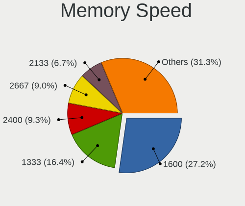

| Speed   | Computers | Percent |
|---------|-----------|---------|
| 1600    | 72        | 27.07%  |
| 1333    | 45        | 16.92%  |
| 2400    | 27        | 10.15%  |
| 2667    | 26        | 9.77%   |
| 2133    | 18        | 6.77%   |
| 800     | 13        | 4.89%   |
| 1334    | 12        | 4.51%   |
| 667     | 11        | 4.14%   |
| 3200    | 9         | 3.38%   |
| 1867    | 6         | 2.26%   |
| 2666    | 5         | 1.88%   |
| 1067    | 4         | 1.5%    |
| Unknown | 4         | 1.5%    |
| 533     | 3         | 1.13%   |
| 2933    | 2         | 0.75%   |
| 1866    | 2         | 0.75%   |
| 1066    | 2         | 0.75%   |
| 1800    | 1         | 0.38%   |
| 1777    | 1         | 0.38%   |
| 1400    | 1         | 0.38%   |
| 975     | 1         | 0.38%   |
| 333     | 1         | 0.38%   |

Printers & scanners
-------------------

Printer Vendor
--------------

Printer device vendors

| Vendor                | Computers | Percent |
|-----------------------|-----------|---------|
| Hewlett-Packard       | 4         | 57.14%  |
| Lexmark International | 2         | 28.57%  |
| Seiko Epson           | 1         | 14.29%  |

Printer Model
-------------

Printer device models

| Model                                        | Computers | Percent |
|----------------------------------------------|-----------|---------|
| Seiko Epson USB2.0 Printer (Hi-speed)        | 1         | 12.5%   |
| Lexmark International SINDOH A603_A608 Print | 1         | 12.5%   |
| Lexmark International Lexmark MS710 Print    | 1         | 12.5%   |
| HP LaserJet 2200                             | 1         | 12.5%   |
| HP LaserJet 1200                             | 1         | 12.5%   |
| HP HP LaserJet P2035 HP Print                | 1         | 12.5%   |
| HP DeskJet 5850c                             | 1         | 12.5%   |
| HP Color LaserJet CP1215                     | 1         | 12.5%   |

Scanner Vendor
--------------

Scanner device vendors

Zero info for selected period =(

Scanner Model
-------------

Scanner device models

Zero info for selected period =(

Camera
------

Camera Vendor
-------------

Camera device vendors

| Vendor                                 | Computers | Percent |
|----------------------------------------|-----------|---------|
| Chicony Electronics                    | 22        | 23.16%  |
| Realtek Semiconductor                  | 11        | 11.58%  |
| Microdia                               | 7         | 7.37%   |
| Sunplus Innovation Technology          | 6         | 6.32%   |
| IMC Networks                           | 6         | 6.32%   |
| Acer                                   | 6         | 6.32%   |
| Suyin                                  | 5         | 5.26%   |
| Apple                                  | 4         | 4.21%   |
| Syntek                                 | 3         | 3.16%   |
| Cheng Uei Precision Industry (Foxlink) | 3         | 3.16%   |
| Silicon Motion                         | 2         | 2.11%   |
| Logitech                               | 2         | 2.11%   |
| Lite-On Technology                     | 2         | 2.11%   |
| Importek                               | 2         | 2.11%   |
| Alcor Micro                            | 2         | 2.11%   |
| Ricoh                                  | 1         | 1.05%   |
| Quanta                                 | 1         | 1.05%   |
| Luxvisions Innotech Limited            | 1         | 1.05%   |
| Lenovo                                 | 1         | 1.05%   |
| Intel                                  | 1         | 1.05%   |
| Holitech                               | 1         | 1.05%   |
| Hewlett-Packard                        | 1         | 1.05%   |
| HD WEBCAM                              | 1         | 1.05%   |
| Generalplus Technology                 | 1         | 1.05%   |
| GEMBIRD                                | 1         | 1.05%   |
| ALi                                    | 1         | 1.05%   |
| A4Tech                                 | 1         | 1.05%   |

Camera Model
------------

Camera device models

| Model                                                      | Computers | Percent |
|------------------------------------------------------------|-----------|---------|
| Realtek Integrated_Webcam_HD                               | 5         | 5.21%   |
| Chicony Integrated Camera                                  | 5         | 5.21%   |
| Realtek Realtek USB2.0 PC Camera                           | 3         | 3.13%   |
| Chicony Integrated Camera [ThinkPad]                       | 3         | 3.13%   |
| Chicony HP HD Webcam [Fixed]                               | 3         | 3.13%   |
| Apple FaceTime HD Camera                                   | 3         | 3.13%   |
| Syntek Lenovo EasyCamera                                   | 2         | 2.08%   |
| Sunplus Integrated_Webcam_HD                               | 2         | 2.08%   |
| Sunplus Asus Webcam                                        | 2         | 2.08%   |
| Realtek Integrated Webcam                                  | 2         | 2.08%   |
| Microdia Laptop_Integrated_Webcam_HD                       | 2         | 2.08%   |
| Microdia Integrated Webcam                                 | 2         | 2.08%   |
| Logitech Webcam C270                                       | 2         | 2.08%   |
| IMC Networks USB2.0 HD UVC WebCam                          | 2         | 2.08%   |
| IMC Networks Integrated Camera                             | 2         | 2.08%   |
| Chicony HP HD Camera                                       | 2         | 2.08%   |
| Acer Integrated Camera                                     | 2         | 2.08%   |
| Syntek EasyCamera                                          | 1         | 1.04%   |
| Suyin USB 2.0 Camera                                       | 1         | 1.04%   |
| Suyin Sony Visual Communication Camera                     | 1         | 1.04%   |
| Suyin HP Webcam-101                                        | 1         | 1.04%   |
| Suyin HP Integrated Webcam                                 | 1         | 1.04%   |
| Suyin Acer/Lenovo Webcam [CN0316]                          | 1         | 1.04%   |
| Sunplus Integrated Camera                                  | 1         | 1.04%   |
| Sunplus Dell E5570 integrated webcam                       | 1         | 1.04%   |
| Silicon Motion WebCam SCX Series                           | 1         | 1.04%   |
| Silicon Motion Realtek USB2.0 PC Camera                    | 1         | 1.04%   |
| Ricoh Integrated Camera                                    | 1         | 1.04%   |
| Realtek LG Camera                                          | 1         | 1.04%   |
| Quanta HP Webcam                                           | 1         | 1.04%   |
| Microdia Laptop_Integrated_Webcam_FHD                      | 1         | 1.04%   |
| Microdia HP Webcam                                         | 1         | 1.04%   |
| Microdia ASUS USB2.0 Webcam                                | 1         | 1.04%   |
| Luxvisions Innotech Limited HP TrueVision HD Camera        | 1         | 1.04%   |
| Lite-On Integrated Camera                                  | 1         | 1.04%   |
| Lite-On HP IR Camera                                       | 1         | 1.04%   |
| Lenovo Integrated Webcam [R5U877]                          | 1         | 1.04%   |
| Intel RealSense 3D Camera (Front F200)                     | 1         | 1.04%   |
| Importek TOSHIBA Web Camera - HD                           | 1         | 1.04%   |
| Importek TOSHIBA Web Camera                                | 1         | 1.04%   |
| IMC Networks USB2.0 VGA UVC WebCam                         | 1         | 1.04%   |
| IMC Networks EasyCamera                                    | 1         | 1.04%   |
| Holitech USB2.0 HD UVC WebCam                              | 1         | 1.04%   |
| HP Premium Starter Webcam                                  | 1         | 1.04%   |
| HD WEBCAM HD WEBCAM                                        | 1         | 1.04%   |
| Generalplus GENERAL WEBCAM                                 | 1         | 1.04%   |
| GEMBIRD Generic UVC 1.00 camera [AppoTech AX2311]          | 1         | 1.04%   |
| Chicony UVC 1.00 device HD UVC WebCam                      | 1         | 1.04%   |
| Chicony USB2.0 VGA UVC WebCam                              | 1         | 1.04%   |
| Chicony USB 2.0 Camera                                     | 1         | 1.04%   |
| Chicony TOSHIBA Web Camera - HD                            | 1         | 1.04%   |
| Chicony TOSHIBA Web Camera - 3M                            | 1         | 1.04%   |
| Chicony Lenovo EasyCamera                                  | 1         | 1.04%   |
| Chicony HP Webcam [2 MP Macro]                             | 1         | 1.04%   |
| Chicony HD WebCam                                          | 1         | 1.04%   |
| Chicony Chicony USB2.0 Camera                              | 1         | 1.04%   |
| Chicony 1.3M Webcam                                        | 1         | 1.04%   |
| Cheng Uei Precision Industry (Foxlink) Webcam              | 1         | 1.04%   |
| Cheng Uei Precision Industry (Foxlink) Realtek DMFT - RGB  | 1         | 1.04%   |
| Cheng Uei Precision Industry (Foxlink) HP Universal Camera | 1         | 1.04%   |

Security
--------

Fingerprint Vendor
------------------

Fingerprint sensor vendors

| Vendor             | Computers | Percent |
|--------------------|-----------|---------|
| Validity Sensors   | 9         | 69.23%  |
| Synaptics          | 1         | 7.69%   |
| STMicroelectronics | 1         | 7.69%   |
| Broadcom           | 1         | 7.69%   |
| AuthenTec          | 1         | 7.69%   |

Fingerprint Model
-----------------

Fingerprint sensor models

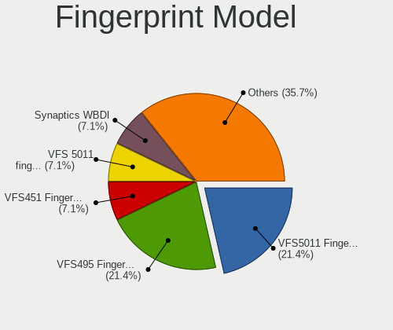

| Model                                                                        | Computers | Percent |
|------------------------------------------------------------------------------|-----------|---------|
| Validity Sensors VFS5011 Fingerprint Reader                                  | 3         | 23.08%  |
| Validity Sensors VFS495 Fingerprint Reader                                   | 3         | 23.08%  |
| Validity Sensors VFS451 Fingerprint Reader                                   | 1         | 7.69%   |
| Validity Sensors VFS 5011 fingerprint sensor                                 | 1         | 7.69%   |
| Validity Sensors Synaptics WBDI                                              | 1         | 7.69%   |
| Synaptics Prometheus MIS Touch Fingerprint Reader                            | 1         | 7.69%   |
| STMicroelectronics Fingerprint Reader                                        | 1         | 7.69%   |
| Broadcom BCM5880 Secure Applications Processor with fingerprint swipe sensor | 1         | 7.69%   |
| AuthenTec AES2810                                                            | 1         | 7.69%   |

Chipcard Vendor
---------------

Chipcard module vendors

Zero info for selected period =(

Chipcard Model
--------------

Chipcard module models

Zero info for selected period =(

Unsupported
-----------

Unsupported Devices
-------------------

Total unsupported devices on board

| Total | Computers | Percent |
|-------|-----------|---------|
| 1     | 96        | 39.18%  |
| 2     | 59        | 24.08%  |
| 0     | 55        | 22.45%  |
| 3     | 26        | 10.61%  |
| 4     | 7         | 2.86%   |
| 6     | 1         | 0.41%   |
| 5     | 1         | 0.41%   |

Unsupported Device Types
------------------------

Types of unsupported devices

| Type                     | Computers | Percent |
|--------------------------|-----------|---------|
| Communication controller | 158       | 50.32%  |
| Card reader              | 58        | 18.47%  |
| Net/wireless             | 39        | 12.42%  |
| Bluetooth                | 23        | 7.32%   |
| Fingerprint reader       | 13        | 4.14%   |
| Firewire controller      | 12        | 3.82%   |
| Sound                    | 5         | 1.59%   |
| Storage                  | 3         | 0.96%   |
| Storage/raid             | 1         | 0.32%   |
| Network                  | 1         | 0.32%   |
| Dvb card                 | 1         | 0.32%   |

