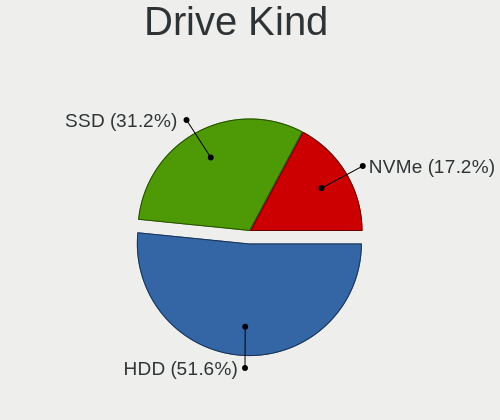
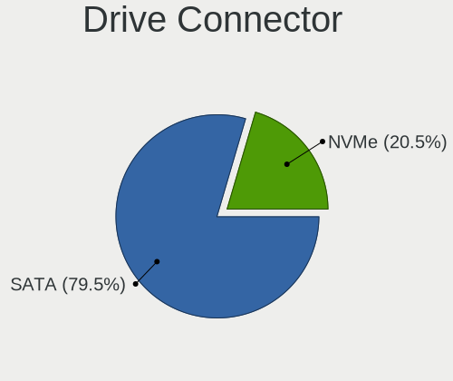
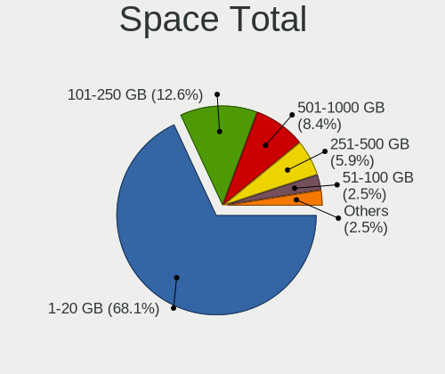
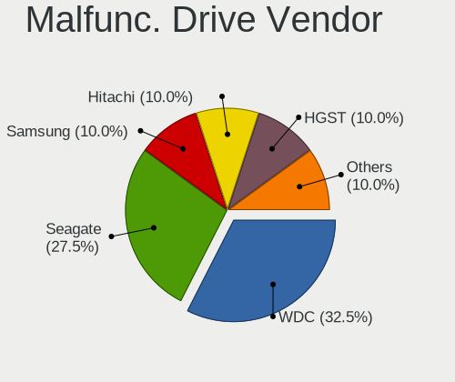
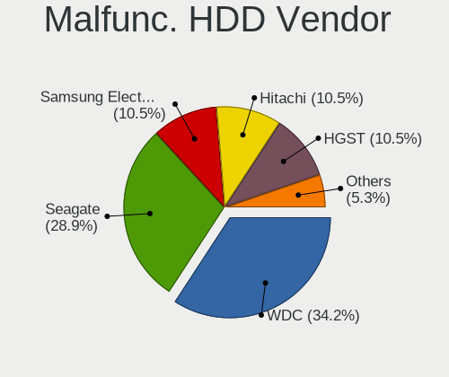
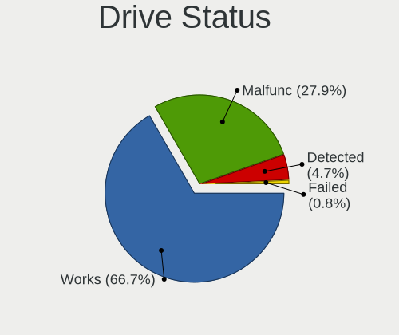
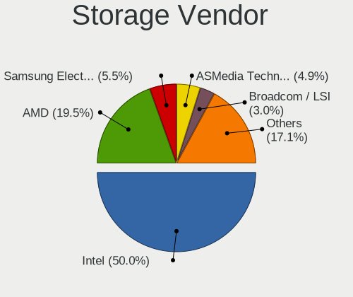
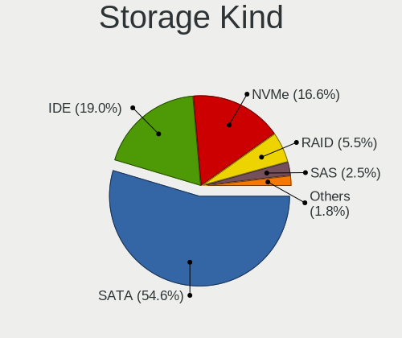
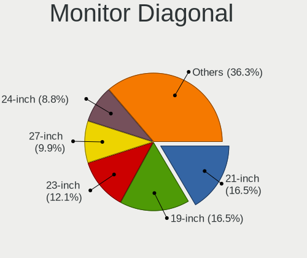
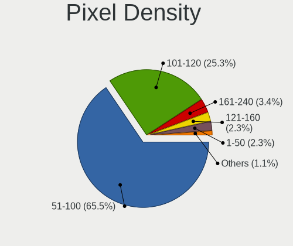

helloSystem 0.5.0 - Tested Hardware & Statistics (Desktops)
-----------------------------------------------------------

A project to collect tested hardware configurations for helloSystem 0.5.0.

Anyone can contribute to this report by the [hw-probe](https://github.com/linuxhw/hw-probe/blob/master/INSTALL.BSD.md) tool:

    hw-probe -all -upload

Please contribute! Especially if your hardware is rare.

Contents
--------

* [ Test Cases ](#test-cases)

* [ System ](#system)
  - [ Arch                     ](#arch)
  - [ DE                       ](#de)
  - [ Display Server           ](#display-server)
  - [ Display Manager          ](#display-manager)
  - [ OS Lang                  ](#os-lang)
  - [ Boot Mode                ](#boot-mode)
  - [ Filesystem               ](#filesystem)
  - [ Part. scheme             ](#part-scheme)

* [ Board ](#board)
  - [ Vendor                   ](#vendor)
  - [ Model                    ](#model)
  - [ Model Family             ](#model-family)
  - [ MFG Year                 ](#mfg-year)
  - [ Form Factor              ](#form-factor)
  - [ Coreboot                 ](#coreboot)
  - [ RAM Size                 ](#ram-size)
  - [ RAM Used                 ](#ram-used)
  - [ Total Drives             ](#total-drives)
  - [ Has CD-ROM               ](#has-cd-rom)
  - [ Has Ethernet             ](#has-ethernet)
  - [ Has WiFi                 ](#has-wifi)
  - [ Has Bluetooth            ](#has-bluetooth)

* [ Location ](#location)
  - [ Country                  ](#country)
  - [ City                     ](#city)

* [ Drives ](#drives)
  - [ Drive Vendor             ](#drive-vendor)
  - [ Drive Model              ](#drive-model)
  - [ HDD Vendor               ](#hdd-vendor)
  - [ SSD Vendor               ](#ssd-vendor)
  - [ Drive Kind               ](#drive-kind)
  - [ Drive Connector          ](#drive-connector)
  - [ Drive Size               ](#drive-size)
  - [ Space Total              ](#space-total)
  - [ Space Used               ](#space-used)
  - [ Malfunc. Drives          ](#malfunc-drives)
  - [ Malfunc. Drive Vendor    ](#malfunc-drive-vendor)
  - [ Malfunc. HDD Vendor      ](#malfunc-hdd-vendor)
  - [ Malfunc. Drive Kind      ](#malfunc-drive-kind)
  - [ Failed Drives            ](#failed-drives)
  - [ Failed Drive Vendor      ](#failed-drive-vendor)
  - [ Drive Status             ](#drive-status)

* [ Storage controller ](#storage-controller)
  - [ Storage Vendor           ](#storage-vendor)
  - [ Storage Model            ](#storage-model)
  - [ Storage Kind             ](#storage-kind)

* [ Processor ](#processor)
  - [ CPU Vendor               ](#cpu-vendor)
  - [ CPU Model                ](#cpu-model)
  - [ CPU Model Family         ](#cpu-model-family)
  - [ CPU Cores                ](#cpu-cores)
  - [ CPU Sockets              ](#cpu-sockets)
  - [ CPU Threads              ](#cpu-threads)
  - [ CPU Microarch            ](#cpu-microarch)

* [ Graphics ](#graphics)
  - [ GPU Vendor               ](#gpu-vendor)
  - [ GPU Model                ](#gpu-model)
  - [ GPU Combo                ](#gpu-combo)
  - [ GPU Driver               ](#gpu-driver)
  - [ GPU Memory               ](#gpu-memory)

* [ Monitor ](#monitor)
  - [ Monitor Vendor           ](#monitor-vendor)
  - [ Monitor Model            ](#monitor-model)
  - [ Monitor Resolution       ](#monitor-resolution)
  - [ Monitor Diagonal         ](#monitor-diagonal)
  - [ Monitor Width            ](#monitor-width)
  - [ Aspect Ratio             ](#aspect-ratio)
  - [ Monitor Area             ](#monitor-area)
  - [ Pixel Density            ](#pixel-density)
  - [ Multiple Monitors        ](#multiple-monitors)

* [ Network ](#network)
  - [ Net Controller Vendor    ](#net-controller-vendor)
  - [ Net Controller Model     ](#net-controller-model)
  - [ Wireless Vendor          ](#wireless-vendor)
  - [ Wireless Model           ](#wireless-model)
  - [ Ethernet Vendor          ](#ethernet-vendor)
  - [ Ethernet Model           ](#ethernet-model)
  - [ Net Controller Kind      ](#net-controller-kind)
  - [ Used Controller          ](#used-controller)
  - [ NICs                     ](#nics)
  - [ IPv6                     ](#ipv6)

* [ Bluetooth ](#bluetooth)
  - [ Bluetooth Vendor         ](#bluetooth-vendor)
  - [ Bluetooth Model          ](#bluetooth-model)

* [ Sound ](#sound)
  - [ Sound Vendor             ](#sound-vendor)
  - [ Sound Model              ](#sound-model)

* [ Memory ](#memory)
  - [ Memory Vendor            ](#memory-vendor)
  - [ Memory Model             ](#memory-model)
  - [ Memory Kind              ](#memory-kind)
  - [ Memory Form Factor       ](#memory-form-factor)
  - [ Memory Size              ](#memory-size)
  - [ Memory Speed             ](#memory-speed)

* [ Printers & scanners ](#printers--scanners)
  - [ Printer Vendor           ](#printer-vendor)
  - [ Printer Model            ](#printer-model)
  - [ Scanner Vendor           ](#scanner-vendor)
  - [ Scanner Model            ](#scanner-model)

* [ Camera ](#camera)
  - [ Camera Vendor            ](#camera-vendor)
  - [ Camera Model             ](#camera-model)

* [ Security ](#security)
  - [ Fingerprint Vendor       ](#fingerprint-vendor)
  - [ Fingerprint Model        ](#fingerprint-model)
  - [ Chipcard Vendor          ](#chipcard-vendor)
  - [ Chipcard Model           ](#chipcard-model)

* [ Unsupported ](#unsupported)
  - [ Unsupported Devices      ](#unsupported-devices)
  - [ Unsupported Device Types ](#unsupported-device-types)

Test Cases
----------

Total: 139

| Vendor        | Model                       | Probe                                                     | Date         |
|---------------|-----------------------------|-----------------------------------------------------------|--------------|
| ASUSTek       | TUF B360M-E GAMING          | [26375bae48](https://bsd-hardware.info/?probe=26375bae48) | Jun 08, 2022 |
| ASUSTek       | CROSSHAIR V FORMULA-Z       | [ab8aea2f5c](https://bsd-hardware.info/?probe=ab8aea2f5c) | Apr 17, 2022 |
| MSI           | B450 TOMAHAWK MAX           | [14f1956220](https://bsd-hardware.info/?probe=14f1956220) | Dec 04, 2021 |
| Dell          | 0DR845                      | [4d07453a93](https://bsd-hardware.info/?probe=4d07453a93) | Nov 27, 2021 |
| Biostar       | B365MHC                     | [0c059bab3f](https://bsd-hardware.info/?probe=0c059bab3f) | Nov 11, 2021 |
| ASUSTek       | F2A85-M                     | [b4e3f33e5c](https://bsd-hardware.info/?probe=b4e3f33e5c) | Oct 14, 2021 |
| ASUSTek       | PRIME Z390M-PLUS            | [b3b31d25b0](https://bsd-hardware.info/?probe=b3b31d25b0) | Oct 13, 2021 |
| ASUSTek       | PRIME Z390M-PLUS            | [5a7c1871b1](https://bsd-hardware.info/?probe=5a7c1871b1) | Oct 11, 2021 |
| Acer          | Aspire TC-780               | [77101a00b3](https://bsd-hardware.info/?probe=77101a00b3) | Oct 11, 2021 |
| ASUSTek       | D940MX                      | [4e798f3ef0](https://bsd-hardware.info/?probe=4e798f3ef0) | Oct 10, 2021 |
| HP            | 87D6 SMVB                   | [90d91bc113](https://bsd-hardware.info/?probe=90d91bc113) | Sep 26, 2021 |
| Gigabyte      | H61M-D2P-B3                 | [c6da80d54b](https://bsd-hardware.info/?probe=c6da80d54b) | Sep 25, 2021 |
| ASUSTek       | M5A78L-M LX3                | [f336d13e01](https://bsd-hardware.info/?probe=f336d13e01) | Sep 24, 2021 |
| Gigabyte      | H61M-D2P-B3                 | [6ed62a3798](https://bsd-hardware.info/?probe=6ed62a3798) | Sep 23, 2021 |
| Foxconn       | A88GMX FAB                  | [b46845b69f](https://bsd-hardware.info/?probe=b46845b69f) | Sep 19, 2021 |
| Gigabyte      | H270M-DS3H-CF               | [bc2a287495](https://bsd-hardware.info/?probe=bc2a287495) | Sep 13, 2021 |
| HP            | 87D6 SMVB                   | [61fc69edfe](https://bsd-hardware.info/?probe=61fc69edfe) | Sep 13, 2021 |
| ASUSTek       | P8H77-I                     | [1feb22dc52](https://bsd-hardware.info/?probe=1feb22dc52) | Sep 12, 2021 |
| Sapphire      | EDGE-FT1M1 E450 1AOVU044    | [85ed325446](https://bsd-hardware.info/?probe=85ed325446) | Sep 11, 2021 |
| ASRock        | B460M Pro4                  | [cfc7818691](https://bsd-hardware.info/?probe=cfc7818691) | Sep 10, 2021 |
| ASUSTek       | H110M-PLUS                  | [08b4825275](https://bsd-hardware.info/?probe=08b4825275) | Sep 09, 2021 |
| ASRock        | B550M Pro4                  | [dc582ea4d3](https://bsd-hardware.info/?probe=dc582ea4d3) | Sep 09, 2021 |
| Lenovo        | 312A SDK0J40697 WIN 3305... | [c729f82f4c](https://bsd-hardware.info/?probe=c729f82f4c) | Sep 08, 2021 |
| Packard Be... | imedia S2110A               | [d62a38660c](https://bsd-hardware.info/?probe=d62a38660c) | Sep 08, 2021 |
| Lenovo        | Board                       | [685abcc739](https://bsd-hardware.info/?probe=685abcc739) | Sep 07, 2021 |
| Medion        | H61H2-LM3                   | [7a42009a08](https://bsd-hardware.info/?probe=7a42009a08) | Sep 02, 2021 |
| ASUSTek       | TUF GAMING X570-PLUS        | [9e13729a12](https://bsd-hardware.info/?probe=9e13729a12) | Sep 02, 2021 |
| HP            | 0A60h                       | [0f28538e3d](https://bsd-hardware.info/?probe=0f28538e3d) | Aug 25, 2021 |
| HP            | 1589                        | [4d51cc9c4b](https://bsd-hardware.info/?probe=4d51cc9c4b) | Aug 24, 2021 |
| Acer          | Aspire TC-895 V:1.0         | [da3e8986a3](https://bsd-hardware.info/?probe=da3e8986a3) | Aug 22, 2021 |
| EVGA          | X299 MICRO                  | [d04b55d1f6](https://bsd-hardware.info/?probe=d04b55d1f6) | Aug 19, 2021 |
| ASRock        | Z390 Pro4                   | [aca402061b](https://bsd-hardware.info/?probe=aca402061b) | Aug 18, 2021 |
| Foxconn       | 2ADA                        | [e96976b2cc](https://bsd-hardware.info/?probe=e96976b2cc) | Aug 18, 2021 |
| HC            | HCAR357-MI V1.0             | [3293b7bad9](https://bsd-hardware.info/?probe=3293b7bad9) | Aug 17, 2021 |
| Gigabyte      | HA65M-D2H-B3                | [fc9b50bb85](https://bsd-hardware.info/?probe=fc9b50bb85) | Aug 16, 2021 |
| Gigabyte      | B360M D3H-CF                | [1c88ce5779](https://bsd-hardware.info/?probe=1c88ce5779) | Aug 10, 2021 |
| Pegatron      | IPPCR-SS                    | [8a7fc2689b](https://bsd-hardware.info/?probe=8a7fc2689b) | Aug 09, 2021 |
| Gigabyte      | A75M-DS2                    | [2010fe5fab](https://bsd-hardware.info/?probe=2010fe5fab) | Aug 09, 2021 |
| ASUSTek       | P7H55-M LX                  | [df393cc673](https://bsd-hardware.info/?probe=df393cc673) | Aug 08, 2021 |
| Intel         | D54250WYK H13922-304        | [45c86d174e](https://bsd-hardware.info/?probe=45c86d174e) | Aug 08, 2021 |
| ASUSTek       | M5A78L LE                   | [7a1d31be72](https://bsd-hardware.info/?probe=7a1d31be72) | Aug 07, 2021 |
| ASUSTek       | H81M-A                      | [bb65c30be3](https://bsd-hardware.info/?probe=bb65c30be3) | Aug 07, 2021 |
| ASUSTek       | H81M-A                      | [9e0c8e8024](https://bsd-hardware.info/?probe=9e0c8e8024) | Aug 07, 2021 |
| ASUSTek       | Crosshair V Formula         | [90c27497d9](https://bsd-hardware.info/?probe=90c27497d9) | Aug 05, 2021 |
| PCPartner     | MILANO-P Rev.00             | [526390c559](https://bsd-hardware.info/?probe=526390c559) | Aug 04, 2021 |
| Biostar       | A770E3                      | [4d0ac19b8e](https://bsd-hardware.info/?probe=4d0ac19b8e) | Aug 03, 2021 |
| Dell          | 0RY007                      | [c67ccf8bc6](https://bsd-hardware.info/?probe=c67ccf8bc6) | Aug 01, 2021 |
| Gigabyte      | H110-D3A-CF                 | [7923f57fbe](https://bsd-hardware.info/?probe=7923f57fbe) | Aug 01, 2021 |
| ASUSTek       | A58M-A/USB3                 | [9ffd4220e8](https://bsd-hardware.info/?probe=9ffd4220e8) | Aug 01, 2021 |
| Biostar       | N68S3+                      | [528c9d6eab](https://bsd-hardware.info/?probe=528c9d6eab) | Jul 26, 2021 |
| Gigabyte      | PH67A-D3-B3                 | [73dff53f04](https://bsd-hardware.info/?probe=73dff53f04) | Jul 23, 2021 |
| Gigabyte      | H110-D3A-CF                 | [58e49f458e](https://bsd-hardware.info/?probe=58e49f458e) | Jul 19, 2021 |
| PCPartner     | MILANO-P Rev.00             | [f20ac8df75](https://bsd-hardware.info/?probe=f20ac8df75) | Jul 19, 2021 |
| MSI           | IONA                        | [bb2c6b383b](https://bsd-hardware.info/?probe=bb2c6b383b) | Jul 17, 2021 |
| ASRock        | N68C-GS FX                  | [012356047f](https://bsd-hardware.info/?probe=012356047f) | Jul 17, 2021 |
| ASRock        | N68C-GS FX                  | [e1f439def9](https://bsd-hardware.info/?probe=e1f439def9) | Jul 17, 2021 |
| ASUSTek       | M5A78L-M/USB3               | [20fc88018b](https://bsd-hardware.info/?probe=20fc88018b) | Jul 16, 2021 |
| HP            | 0AE8h C                     | [23df6b2e94](https://bsd-hardware.info/?probe=23df6b2e94) | Jul 12, 2021 |
| Dell          | 0GXM1W A02                  | [269edf2dcf](https://bsd-hardware.info/?probe=269edf2dcf) | Jul 06, 2021 |
| ASRock        | B450M-HDV                   | [dca41aa10a](https://bsd-hardware.info/?probe=dca41aa10a) | Jul 05, 2021 |
| ASRock        | X99 Taichi                  | [149d7abd05](https://bsd-hardware.info/?probe=149d7abd05) | Jul 04, 2021 |
| ASUSTek       | PRIME Z390-P                | [4060cdec72](https://bsd-hardware.info/?probe=4060cdec72) | Jul 04, 2021 |
| ASRock        | Z390 Pro4                   | [dc4eb674ea](https://bsd-hardware.info/?probe=dc4eb674ea) | Jul 03, 2021 |
| Shuttle       | NC10U                       | [5d2d20dd04](https://bsd-hardware.info/?probe=5d2d20dd04) | Jul 02, 2021 |
| Protectli     | FW2B Ver                    | [7b6f704247](https://bsd-hardware.info/?probe=7b6f704247) | Jun 30, 2021 |
| HP            | 0B4Ch D                     | [b56bd19073](https://bsd-hardware.info/?probe=b56bd19073) | Jun 30, 2021 |
| Biostar       | B450MH                      | [167f09a25c](https://bsd-hardware.info/?probe=167f09a25c) | Jun 29, 2021 |
| Huanan        | X99-8M-F V1.2               | [6477b9ef24](https://bsd-hardware.info/?probe=6477b9ef24) | Jun 28, 2021 |
| MSI           | B450 GAMING PLUS MAX        | [f0e80b0788](https://bsd-hardware.info/?probe=f0e80b0788) | Jun 28, 2021 |
| ASUSTek       | H110M-E/M.2                 | [f3b0bb0930](https://bsd-hardware.info/?probe=f3b0bb0930) | Jun 28, 2021 |
| ASUSTek       | PRIME H410M-D               | [8ea103b783](https://bsd-hardware.info/?probe=8ea103b783) | Jun 26, 2021 |
| Dell          | 0P03DX A03                  | [b2f0c90d79](https://bsd-hardware.info/?probe=b2f0c90d79) | Jun 24, 2021 |
| ASUSTek       | P7H55                       | [c33ec074f8](https://bsd-hardware.info/?probe=c33ec074f8) | Jun 22, 2021 |
| ASUSTek       | P8H67-M PRO                 | [616c7043bd](https://bsd-hardware.info/?probe=616c7043bd) | Jun 22, 2021 |
| ASUSTek       | CP5141                      | [73c62835c1](https://bsd-hardware.info/?probe=73c62835c1) | Jun 21, 2021 |
| Foxconn       | 2ABF                        | [d30b2629eb](https://bsd-hardware.info/?probe=d30b2629eb) | Jun 21, 2021 |
| Intel         | DH67CL AAG10212-206         | [f2367a4249](https://bsd-hardware.info/?probe=f2367a4249) | Jun 21, 2021 |
| Gigabyte      | H97-D3H-CF                  | [a326fd4061](https://bsd-hardware.info/?probe=a326fd4061) | Jun 20, 2021 |
| Dell          | 0PGKWF A01                  | [9f09d62462](https://bsd-hardware.info/?probe=9f09d62462) | Jun 20, 2021 |
| MSI           | H110M PRO-VH PLUS           | [45b842180e](https://bsd-hardware.info/?probe=45b842180e) | Jun 20, 2021 |
| ASUSTek       | ROG STRIX H370-I GAMING     | [d2dd261a2a](https://bsd-hardware.info/?probe=d2dd261a2a) | Jun 20, 2021 |
| MSI           | B450M PRO-M2 MAX            | [edcbaf755f](https://bsd-hardware.info/?probe=edcbaf755f) | Jun 19, 2021 |
| Dell          | 0XPDFK A01                  | [631dbb841b](https://bsd-hardware.info/?probe=631dbb841b) | Jun 19, 2021 |
| Lenovo        | ThinkServer RS140           | [0f5d669e9f](https://bsd-hardware.info/?probe=0f5d669e9f) | Jun 18, 2021 |
| Lenovo        | ThinkServer RS140           | [63ba615299](https://bsd-hardware.info/?probe=63ba615299) | Jun 18, 2021 |
| Gigabyte      | AX370-Gaming-CF             | [d77be09267](https://bsd-hardware.info/?probe=d77be09267) | Jun 18, 2021 |
| Dell          | 0XPDFK A01                  | [7a1c26edeb](https://bsd-hardware.info/?probe=7a1c26edeb) | Jun 18, 2021 |
| ASUSTek       | H110I-PLUS                  | [0cb30b464d](https://bsd-hardware.info/?probe=0cb30b464d) | Jun 17, 2021 |
| HP            | 3397                        | [3dd97c60ca](https://bsd-hardware.info/?probe=3dd97c60ca) | Jun 16, 2021 |
| Lenovo        | Board                       | [c981ffdff7](https://bsd-hardware.info/?probe=c981ffdff7) | Jun 15, 2021 |
| ASUSTek       | M5A78L-M LX/BR              | [5f9b56c8ae](https://bsd-hardware.info/?probe=5f9b56c8ae) | Jun 15, 2021 |
| ASUSTek       | M4A78LT-M                   | [0c8d6cd661](https://bsd-hardware.info/?probe=0c8d6cd661) | Jun 14, 2021 |
| ASUSTek       | PRIME A320M-K               | [fea57181b5](https://bsd-hardware.info/?probe=fea57181b5) | Jun 14, 2021 |
| ASRock        | G31M-VS2                    | [f2f5b95f4b](https://bsd-hardware.info/?probe=f2f5b95f4b) | Jun 14, 2021 |
| Intel         | X79 V2.72A                  | [88173bcf06](https://bsd-hardware.info/?probe=88173bcf06) | Jun 14, 2021 |
| ASUSTek       | TUF GAMING X570-PLUS        | [eeb4489d2f](https://bsd-hardware.info/?probe=eeb4489d2f) | Jun 13, 2021 |
| Gigabyte      | H470M DS3H                  | [7c37a0319b](https://bsd-hardware.info/?probe=7c37a0319b) | Jun 13, 2021 |
| ASRock        | FM2A68M-HD+                 | [8bb0d23eb4](https://bsd-hardware.info/?probe=8bb0d23eb4) | Jun 13, 2021 |
| ASUSTek       | P5G41T-M LX3                | [1759329ae3](https://bsd-hardware.info/?probe=1759329ae3) | Apr 12, 2021 |
| Dell          | 0RW199                      | [e78392bc4c](https://bsd-hardware.info/?probe=e78392bc4c) | Apr 02, 2021 |
| Lenovo        | SHARKBAY SDK0E50510 WIN     | [62376c16a4](https://bsd-hardware.info/?probe=62376c16a4) | Mar 31, 2021 |
| Medion        | H61H2-LM3                   | [6483c8390f](https://bsd-hardware.info/?probe=6483c8390f) | Mar 31, 2021 |
| Pegatron      | IPM41-D3                    | [687047b3d2](https://bsd-hardware.info/?probe=687047b3d2) | Mar 30, 2021 |
| Gigabyte      | Z77X-UD5H                   | [d3742d3898](https://bsd-hardware.info/?probe=d3742d3898) | Mar 29, 2021 |
| HP            | 18E7                        | [0e835b61ff](https://bsd-hardware.info/?probe=0e835b61ff) | Mar 24, 2021 |
| Lenovo        | SHARKBAY SDK0E50510 WIN     | [5ae508dfa8](https://bsd-hardware.info/?probe=5ae508dfa8) | Mar 19, 2021 |
| ASUSTek       | PRIME H310M-E R2.0          | [8964a02114](https://bsd-hardware.info/?probe=8964a02114) | Mar 15, 2021 |
| ASUSTek       | PRIME Z390M-PLUS            | [0a3b290f9f](https://bsd-hardware.info/?probe=0a3b290f9f) | Mar 15, 2021 |
| ASUSTek       | H110M-PLUS                  | [80e7c230d7](https://bsd-hardware.info/?probe=80e7c230d7) | Mar 12, 2021 |
| Dell          | 0W2PJY A01                  | [f162510a27](https://bsd-hardware.info/?probe=f162510a27) | Mar 12, 2021 |
| MSI           | B150M PRO-VDH               | [bc75a3ab13](https://bsd-hardware.info/?probe=bc75a3ab13) | Mar 11, 2021 |
| ASUSTek       | H110M-PLUS                  | [cf00023cef](https://bsd-hardware.info/?probe=cf00023cef) | Mar 11, 2021 |
| ASRock        | B450M Pro4                  | [e9ca160a2d](https://bsd-hardware.info/?probe=e9ca160a2d) | Mar 11, 2021 |
| Gigabyte      | 970A-DS3P                   | [47d17e6983](https://bsd-hardware.info/?probe=47d17e6983) | Mar 10, 2021 |
| Dell          | 0JP3NX A01                  | [fc94b8c422](https://bsd-hardware.info/?probe=fc94b8c422) | Mar 09, 2021 |
| ASUSTek       | P8Z77-V                     | [88ee81b089](https://bsd-hardware.info/?probe=88ee81b089) | Mar 06, 2021 |
| Dell          | 0W2PJY A01                  | [d8c2f0b19f](https://bsd-hardware.info/?probe=d8c2f0b19f) | Mar 04, 2021 |
| Foxconn       | 2ADA                        | [10d02d0982](https://bsd-hardware.info/?probe=10d02d0982) | Mar 03, 2021 |
| ASUSTek       | P8Z77-V LX2                 | [0aeea0fec9](https://bsd-hardware.info/?probe=0aeea0fec9) | Feb 23, 2021 |
| ASUSTek       | P5Q                         | [22fa0d8178](https://bsd-hardware.info/?probe=22fa0d8178) | Feb 23, 2021 |
| Biostar       | B365MHC                     | [adb029c65f](https://bsd-hardware.info/?probe=adb029c65f) | Feb 22, 2021 |
| Dell          | 0RW199                      | [e0ecb4caa7](https://bsd-hardware.info/?probe=e0ecb4caa7) | Feb 21, 2021 |
| ASUSTek       | P5B-Deluxe                  | [a471763f19](https://bsd-hardware.info/?probe=a471763f19) | Feb 20, 2021 |
| ASUSTek       | PRIME H270-PLUS             | [0b5194e68e](https://bsd-hardware.info/?probe=0b5194e68e) | Feb 19, 2021 |
| Unknown       | Unknown                     | [22af66ce96](https://bsd-hardware.info/?probe=22af66ce96) | Feb 18, 2021 |
| Dell          | 0GM819                      | [836d0f9057](https://bsd-hardware.info/?probe=836d0f9057) | Feb 17, 2021 |
| ASUSTek       | P8H61-MX R2.0               | [e601d28f5e](https://bsd-hardware.info/?probe=e601d28f5e) | Feb 17, 2021 |
| MSI           | MPG X570 GAMING PLUS        | [b087324f05](https://bsd-hardware.info/?probe=b087324f05) | Feb 17, 2021 |
| MSI           | MPG X570 GAMING PLUS        | [d03a5bbea5](https://bsd-hardware.info/?probe=d03a5bbea5) | Feb 17, 2021 |
| Pegatron      | IPM41-D3                    | [6e5c330c9c](https://bsd-hardware.info/?probe=6e5c330c9c) | Feb 16, 2021 |
| ASUSTek       | VM62                        | [4d02a33fec](https://bsd-hardware.info/?probe=4d02a33fec) | Feb 16, 2021 |
| ASUSTek       | P5B SE                      | [425210021c](https://bsd-hardware.info/?probe=425210021c) | Feb 16, 2021 |
| HP            | 8768 A                      | [f2be4b7b65](https://bsd-hardware.info/?probe=f2be4b7b65) | Feb 16, 2021 |
| Intel         | DN2820FYK H24582-201        | [be56203e79](https://bsd-hardware.info/?probe=be56203e79) | Feb 15, 2021 |
| ASUSTek       | EX-B85M-V                   | [54c319f2c0](https://bsd-hardware.info/?probe=54c319f2c0) | Feb 15, 2021 |
| ASRock        | B450M Pro4                  | [ef29c46355](https://bsd-hardware.info/?probe=ef29c46355) | Feb 15, 2021 |
| ASRock        | B550M Pro4                  | [61a5641019](https://bsd-hardware.info/?probe=61a5641019) | Feb 14, 2021 |
| ASUSTek       | M5A99FX PRO R2.0            | [8082fefc2e](https://bsd-hardware.info/?probe=8082fefc2e) | Feb 14, 2021 |
| ASUSTek       | ROG STRIX Z370-G GAMING     | [565ceb36f0](https://bsd-hardware.info/?probe=565ceb36f0) | Feb 14, 2021 |

System
------

Arch
----

OS architecture (x86_64, i586, etc.)

| Name  | Desktops | Percent |
|-------|----------|---------|
| amd64 | 115      | 100%    |

DE
--

Desktop Environment

| Name         | Desktops | Percent |
|--------------|----------|---------|
| helloDesktop | 115      | 99.14%  |
| XFCE         | 1        | 0.86%   |

Display Server
--------------

X11 or Wayland

| Name | Desktops | Percent |
|------|----------|---------|
| X11  | 115      | 100%    |

Display Manager
---------------

SDDM, LightDM, etc.

| Name | Desktops | Percent |
|------|----------|---------|
| SLiM | 115      | 100%    |

OS Lang
-------

Language

| Lang  | Desktops | Percent |
|-------|----------|---------|
| en_US | 113      | 97.41%  |
| it_IT | 1        | 0.86%   |
| es_ES | 1        | 0.86%   |
| es_AR | 1        | 0.86%   |

Boot Mode
---------

EFI or BIOS

| Mode | Desktops | Percent |
|------|----------|---------|
| EFI  | 91       | 79.13%  |
| BIOS | 24       | 20.87%  |

Filesystem
----------

Type of filesystem

| Type | Desktops | Percent |
|------|----------|---------|
| Zfs  | 115      | 100%    |

Part. scheme
------------

Scheme of partitioning

| Type | Desktops | Percent |
|------|----------|---------|
| GPT  | 115      | 100%    |

Board
-----

Vendor
------

Motherboard manufacturer

| Name                | Desktops | Percent |
|---------------------|----------|---------|
| ASUSTek Computer    | 37       | 32.17%  |
| Gigabyte Technology | 11       | 9.57%   |
| ASRock              | 11       | 9.57%   |
| Dell                | 10       | 8.7%    |
| Hewlett-Packard     | 8        | 6.96%   |
| MSI                 | 7        | 6.09%   |
| Lenovo              | 5        | 4.35%   |
| Biostar             | 5        | 4.35%   |
| Intel               | 4        | 3.48%   |
| Foxconn             | 4        | 3.48%   |
| Pegatron            | 2        | 1.74%   |
| Acer                | 2        | 1.74%   |
| Shuttle             | 1        | 0.87%   |
| Protectli           | 1        | 0.87%   |
| PCPartner           | 1        | 0.87%   |
| Packard Bell        | 1        | 0.87%   |
| Medion              | 1        | 0.87%   |
| Huanan              | 1        | 0.87%   |
| HC                  | 1        | 0.87%   |
| EVGA                | 1        | 0.87%   |
| Unknown             | 1        | 0.87%   |

Model
-----

Motherboard model

| Name                                | Desktops | Percent |
|-------------------------------------|----------|---------|
| Dell OptiPlex 755                   | 2        | 1.74%   |
| Biostar B365MHC                     | 2        | 1.74%   |
| ASUS All Series                     | 2        | 1.74%   |
| ASRock B550M Pro4                   | 2        | 1.74%   |
| ASRock B450M Pro4                   | 2        | 1.74%   |
| Shuttle NC10U                       | 1        | 0.87%   |
| Protectli FW2B                      | 1        | 0.87%   |
| Pegatron SAISHIAT2                  | 1        | 0.87%   |
| Pegatron IPM41-D3                   | 1        | 0.87%   |
| PCPartner DREAMSYS                  | 1        | 0.87%   |
| Packard Bell imedia S2110           | 1        | 0.87%   |
| MSI WC791AA-UUW HPE-119sc           | 1        | 0.87%   |
| MSI MS-7C37                         | 1        | 0.87%   |
| MSI MS-7C02                         | 1        | 0.87%   |
| MSI MS-7B86                         | 1        | 0.87%   |
| MSI MS-7B84                         | 1        | 0.87%   |
| MSI MS-7A15                         | 1        | 0.87%   |
| MSI MS-7982                         | 1        | 0.87%   |
| Medion H61H2-LM3                    | 1        | 0.87%   |
| Lenovo ThinkCentre M91p 7033DE6     | 1        | 0.87%   |
| Lenovo ThinkCentre M91p 7033D54     | 1        | 0.87%   |
| Lenovo ThinkCentre M83 10AHS35Q00   | 1        | 0.87%   |
| Lenovo ThinkCentre M720s 10SUS4WT00 | 1        | 0.87%   |
| Lenovo 70F8S01J00 ThinkServer RS140 | 1        | 0.87%   |
| Intel X79 V2.72A                    | 1        | 0.87%   |
| Intel DN2820FYK H24582-201          | 1        | 0.87%   |
| Intel DH67CL AAG10212-206           | 1        | 0.87%   |
| Intel D54250WYK H13922-304          | 1        | 0.87%   |
| Huanan X99-8M-F V1.2                | 1        | 0.87%   |
| HP Z600 Workstation                 | 1        | 0.87%   |
| HP Z420 Workstation                 | 1        | 0.87%   |
| HP Z400 Workstation                 | 1        | 0.87%   |
| HP Slim Desktop S01-pF1xxx          | 1        | 0.87%   |
| HP ProDesk 600 G1 SFF               | 1        | 0.87%   |
| HP Desktop M01-F1xxx                | 1        | 0.87%   |
| HP Compaq Elite 8300 SFF            | 1        | 0.87%   |
| HP Compaq dc5700 Small Form Factor  | 1        | 0.87%   |
| HC HCAR357-MI                       | 1        | 0.87%   |
| Gigabyte Z77X-UD5H                  | 1        | 0.87%   |
| Gigabyte PH67A-D3-B3                | 1        | 0.87%   |

Model Family
------------

Motherboard model prefix

| Name                | Desktops | Percent |
|---------------------|----------|---------|
| Dell OptiPlex       | 6        | 5.22%   |
| ASUS PRIME          | 5        | 4.35%   |
| Lenovo ThinkCentre  | 4        | 3.48%   |
| Dell Precision      | 3        | 2.61%   |
| ASUS M5A78L-M       | 3        | 2.61%   |
| HP Compaq           | 2        | 1.74%   |
| Biostar B365MHC     | 2        | 1.74%   |
| ASUS TUF            | 2        | 1.74%   |
| ASUS ROG            | 2        | 1.74%   |
| ASUS P8Z77-V        | 2        | 1.74%   |
| ASUS Crosshair      | 2        | 1.74%   |
| ASUS All            | 2        | 1.74%   |
| ASRock B550M        | 2        | 1.74%   |
| ASRock B450M        | 2        | 1.74%   |
| Acer Aspire         | 2        | 1.74%   |
| Shuttle NC10U       | 1        | 0.87%   |
| Protectli FW2B      | 1        | 0.87%   |
| Pegatron SAISHIAT2  | 1        | 0.87%   |
| Pegatron IPM41-D3   | 1        | 0.87%   |
| PCPartner DREAMSYS  | 1        | 0.87%   |
| Packard Bell imedia | 1        | 0.87%   |
| MSI WC791AA-UUW     | 1        | 0.87%   |
| MSI MS-7C37         | 1        | 0.87%   |
| MSI MS-7C02         | 1        | 0.87%   |
| MSI MS-7B86         | 1        | 0.87%   |
| MSI MS-7B84         | 1        | 0.87%   |
| MSI MS-7A15         | 1        | 0.87%   |
| MSI MS-7982         | 1        | 0.87%   |
| Medion H61H2-LM3    | 1        | 0.87%   |
| Lenovo 70F8S01J00   | 1        | 0.87%   |
| Intel X79           | 1        | 0.87%   |
| Intel DN2820FYK     | 1        | 0.87%   |
| Intel DH67CL        | 1        | 0.87%   |
| Intel D54250WYK     | 1        | 0.87%   |
| Huanan X99-8M-F     | 1        | 0.87%   |
| HP Z600             | 1        | 0.87%   |
| HP Z420             | 1        | 0.87%   |
| HP Z400             | 1        | 0.87%   |
| HP Slim             | 1        | 0.87%   |
| HP ProDesk          | 1        | 0.87%   |

MFG Year
--------

Motherboard manufacture year

| Year | Desktops | Percent |
|------|----------|---------|
| 2020 | 16       | 13.91%  |
| 2012 | 15       | 13.04%  |
| 2019 | 14       | 12.17%  |
| 2013 | 13       | 11.3%   |
| 2018 | 12       | 10.43%  |
| 2010 | 8        | 6.96%   |
| 2014 | 7        | 6.09%   |
| 2011 | 6        | 5.22%   |
| 2021 | 5        | 4.35%   |
| 2016 | 5        | 4.35%   |
| 2017 | 4        | 3.48%   |
| 2008 | 4        | 3.48%   |
| 2015 | 3        | 2.61%   |
| 2009 | 2        | 1.74%   |
| 2007 | 1        | 0.87%   |

Form Factor
-----------

Physical design of the computer

| Name    | Desktops | Percent |
|---------|----------|---------|
| Desktop | 115      | 100%    |

Coreboot
--------

Have coreboot on board

| Used | Desktops | Percent |
|------|----------|---------|
| No   | 115      | 100%    |

RAM Size
--------

Total RAM memory

| Size in GB  | Desktops | Percent |
|-------------|----------|---------|
| 4.01-8.0    | 36       | 31.3%   |
| 16.01-24.0  | 36       | 31.3%   |
| 8.01-16.0   | 33       | 28.7%   |
| 32.01-64.0  | 7        | 6.09%   |
| 64.01-256.0 | 2        | 1.74%   |
| 24.01-32.0  | 1        | 0.87%   |

RAM Used
--------

Used RAM memory

| Used GB  | Desktops | Percent |
|----------|----------|---------|
| 0.01-0.5 | 62       | 53.45%  |
| 0.51-1.0 | 36       | 31.03%  |
| 1.01-2.0 | 15       | 12.93%  |
| 2.01-3.0 | 2        | 1.72%   |
| 4.01-8.0 | 1        | 0.86%   |

Total Drives
------------

Number of drives on board

| Drives | Desktops | Percent |
|--------|----------|---------|
| 1      | 53       | 45.3%   |
| 2      | 30       | 25.64%  |
| 3      | 12       | 10.26%  |
| 4      | 7        | 5.98%   |
| 0      | 7        | 5.98%   |
| 6      | 3        | 2.56%   |
| 5      | 3        | 2.56%   |
| 10     | 1        | 0.85%   |
| 8      | 1        | 0.85%   |

Has CD-ROM
----------

Has CD-ROM on board

| Presented | Desktops | Percent |
|-----------|----------|---------|
| No        | 70       | 60.87%  |
| Yes       | 45       | 39.13%  |

Has Ethernet
------------

Has Ethernet on board

| Presented | Desktops | Percent |
|-----------|----------|---------|
| Yes       | 113      | 98.26%  |
| No        | 2        | 1.74%   |

Has WiFi
--------

Has WiFi module

| Presented | Desktops | Percent |
|-----------|----------|---------|
| No        | 79       | 68.1%   |
| Yes       | 37       | 31.9%   |

Has Bluetooth
-------------

Has Bluetooth module

| Presented | Desktops | Percent |
|-----------|----------|---------|
| No        | 89       | 76.72%  |
| Yes       | 27       | 23.28%  |

Location
--------

Country
-------

Geographic location (country)

| Country     | Desktops | Percent |
|-------------|----------|---------|
| USA         | 18       | 15.65%  |
| Russia      | 9        | 7.83%   |
| UK          | 8        | 6.96%   |
| Canada      | 8        | 6.96%   |
| Germany     | 6        | 5.22%   |
| France      | 5        | 4.35%   |
| Ukraine     | 4        | 3.48%   |
| Italy       | 4        | 3.48%   |
| China       | 4        | 3.48%   |
| Brazil      | 4        | 3.48%   |
| Australia   | 4        | 3.48%   |
| Taiwan      | 3        | 2.61%   |
| South Korea | 3        | 2.61%   |
| Spain       | 2        | 1.74%   |
| Poland      | 2        | 1.74%   |
| Mexico      | 2        | 1.74%   |
| India       | 2        | 1.74%   |
| Guatemala   | 2        | 1.74%   |
| Finland     | 2        | 1.74%   |
| Argentina   | 2        | 1.74%   |
| Venezuela   | 1        | 0.87%   |
| Uruguay     | 1        | 0.87%   |
| Turkey      | 1        | 0.87%   |
| Thailand    | 1        | 0.87%   |
| Sweden      | 1        | 0.87%   |
| Slovenia    | 1        | 0.87%   |
| Slovakia    | 1        | 0.87%   |
| Portugal    | 1        | 0.87%   |
| Peru        | 1        | 0.87%   |
| Norway      | 1        | 0.87%   |
| New Zealand | 1        | 0.87%   |
| Netherlands | 1        | 0.87%   |
| Lithuania   | 1        | 0.87%   |
| Indonesia   | 1        | 0.87%   |
| Hungary     | 1        | 0.87%   |
| Greece      | 1        | 0.87%   |
| Eswatini    | 1        | 0.87%   |
| Egypt       | 1        | 0.87%   |
| Ecuador     | 1        | 0.87%   |
| Chile       | 1        | 0.87%   |

City
----

Geographic location (city)

| City                   | Desktops | Percent |
|------------------------|----------|---------|
| SГЈo Paulo           | 2        | 1.71%   |
| Paris                  | 2        | 1.71%   |
| Guatemala City         | 2        | 1.71%   |
| Dnipropetrovsk         | 2        | 1.71%   |
| Calgary                | 2        | 1.71%   |
| Brisbane               | 2        | 1.71%   |
| Е iauliai            | 1        | 0.85%   |
| Zhongshan              | 1        | 0.85%   |
| York                   | 1        | 0.85%   |
| Yekaterinburg          | 1        | 0.85%   |
| Yarang                 | 1        | 0.85%   |
| Winnipeg               | 1        | 0.85%   |
| Vladivostok            | 1        | 0.85%   |
| Villeurbanne           | 1        | 0.85%   |
| Vawkavysk              | 1        | 0.85%   |
| Ufa                    | 1        | 0.85%   |
| Trujillo               | 1        | 0.85%   |
| Treviso                | 1        | 0.85%   |
| Toronto                | 1        | 0.85%   |
| Tettnang Castle        | 1        | 0.85%   |
| Tampere                | 1        | 0.85%   |
| Taichung               | 1        | 0.85%   |
| Taganrog               | 1        | 0.85%   |
| Sydney                 | 1        | 0.85%   |
| Suzhou                 | 1        | 0.85%   |
| St Petersburg          | 1        | 0.85%   |
| Simpsonville           | 1        | 0.85%   |
| Sheffield              | 1        | 0.85%   |
| Sevastopol             | 1        | 0.85%   |
| Seoul                  | 1        | 0.85%   |
| São Paulo           | 1        | 0.85%   |
| San Francisco          | 1        | 0.85%   |
| Saint-Laurent-de-Ceris | 1        | 0.85%   |
| Rome                   | 1        | 0.85%   |
| Ransbach-Baumbach      | 1        | 0.85%   |
| Portsmouth             | 1        | 0.85%   |
| Porto                  | 1        | 0.85%   |
| Pflugerville           | 1        | 0.85%   |
| Petergof               | 1        | 0.85%   |
| Oslo                   | 1        | 0.85%   |

Drives
------

Drive Vendor
------------

Hard drive vendors

| Vendor              | Desktops | Drives | Percent |
|---------------------|----------|--------|---------|
| WDC                 | 42       | 61     | 23.2%   |
| Seagate             | 34       | 56     | 18.78%  |
| Samsung Electronics | 29       | 40     | 16.02%  |
| Toshiba             | 8        | 9      | 4.42%   |
| Kingston            | 8        | 9      | 4.42%   |
| Hitachi             | 7        | 8      | 3.87%   |
| SanDisk             | 6        | 7      | 3.31%   |
| Intel               | 5        | 5      | 2.76%   |
| HGST                | 5        | 5      | 2.76%   |
| Crucial             | 5        | 7      | 2.76%   |
| A-DATA Technology   | 5        | 9      | 2.76%   |
| Apple               | 3        | 3      | 1.66%   |
| SPCC                | 2        | 3      | 1.1%    |
| SK hynix            | 2        | 2      | 1.1%    |
| Silicon Motion      | 2        | 2      | 1.1%    |
| PNY                 | 2        | 10     | 1.1%    |
| Hewlett-Packard     | 2        | 2      | 1.1%    |
| Fujitsu             | 2        | 3      | 1.1%    |
| Apacer              | 2        | 2      | 1.1%    |
| Transcend           | 1        | 1      | 0.55%   |
| Phison              | 1        | 1      | 0.55%   |
| Patriot             | 1        | 1      | 0.55%   |
| ORICO               | 1        | 2      | 0.55%   |
| LSI                 | 1        | 1      | 0.55%   |
| LITEON              | 1        | 1      | 0.55%   |
| Lenovo              | 1        | 1      | 0.55%   |
| KingSpec            | 1        | 1      | 0.55%   |
| Emtec               | 1        | 1      | 0.55%   |
| CLOVER              | 1        | 1      | 0.55%   |

Drive Model
-----------

Hard drive models

| Model                           | Desktops | Percent |
|---------------------------------|----------|---------|
| Samsung SSD 860 EVO 250GB       | 4        | 1.9%    |
| Samsung SSD 850 EVO 250GB       | 4        | 1.9%    |
| Seagate ST500DM002-1BD142 500GB | 3        | 1.43%   |
| Seagate ST3250410AS 250GB       | 3        | 1.43%   |
| A-DATA SU650 120GB              | 3        | 1.43%   |
| WDC WD20EARS-00MVWB0 2TB        | 2        | 0.95%   |
| WDC WD10EZEX-08WN4A0 1TB        | 2        | 0.95%   |
| Seagate ST4000DM004-2CV104 4TB  | 2        | 0.95%   |
| Seagate ST380815AS 80GB         | 2        | 0.95%   |
| Seagate ST3250318AS 250GB       | 2        | 0.95%   |
| Seagate ST1000DM010-2EP102 1TB  | 2        | 0.95%   |
| Seagate ST1000DM003-1ER162 1TB  | 2        | 0.95%   |
| HGST HTS725050A7E630 500GB      | 2        | 0.95%   |
| HGST HTS545032A7E380 320GB      | 2        | 0.95%   |
| Apple SSD SM256E 256GB          | 2        | 0.95%   |
| A-DATA SX8200PNP 256GB          | 2        | 0.95%   |
| WDC WDS500G3X0C-00SJG0 500GB    | 1        | 0.48%   |
| WDC WDS500G2B0A-00SM50 500GB    | 1        | 0.48%   |
| WDC WDS250G3X0C-00SJG0 250GB    | 1        | 0.48%   |
| WDC WDS250G1B0A-00H9H0 250GB    | 1        | 0.48%   |
| WDC WDS120G2G0A-00JH30 120GB    | 1        | 0.48%   |
| WDC WDS100T2B0A-00SM50 1TB      | 1        | 0.48%   |
| WDC WD80EZAZ-11TDBA0 8TB        | 1        | 0.48%   |
| WDC WD800JD-55MUA1 80GB         | 1        | 0.48%   |
| WDC WD7500BPKX-00HPJT0 752GB    | 1        | 0.48%   |
| WDC WD6400AAKS-22A7B0 640GB     | 1        | 0.48%   |
| WDC WD5002ABYS-02B1B0 500GB     | 1        | 0.48%   |
| WDC WD5000BEVT-22ZAT0 500GB     | 1        | 0.48%   |
| WDC WD5000AZRX-00L4HB0 500GB    | 1        | 0.48%   |
| WDC WD5000ABYS-01TNA0 500GB     | 1        | 0.48%   |
| WDC WD5000AAKX-60U6AA0 500GB    | 1        | 0.48%   |
| WDC WD5000AAKX-083CA1 500GB     | 1        | 0.48%   |
| WDC WD5000AAKX-00ERMA0 500GB    | 1        | 0.48%   |
| WDC WD5000AAKS-00A7B2 500GB     | 1        | 0.48%   |
| WDC WD40EFRX-68WT0N0 4TB        | 1        | 0.48%   |
| WDC WD400BD-75LRA0 40GB         | 1        | 0.48%   |
| WDC WD4004FZWX-00GBGB0 4TB      | 1        | 0.48%   |
| WDC WD3200BPVT-22ZEST0 320GB    | 1        | 0.48%   |
| WDC WD3200BEVT-00A0RT0 233GB    | 1        | 0.48%   |
| WDC WD3200BEKT-60PVMT0 320GB    | 1        | 0.48%   |

HDD Vendor
----------

Hard disk drive vendors

| Vendor              | Desktops | Drives | Percent |
|---------------------|----------|--------|---------|
| WDC                 | 37       | 54     | 36.63%  |
| Seagate             | 34       | 56     | 33.66%  |
| Samsung Electronics | 10       | 12     | 9.9%    |
| Hitachi             | 7        | 8      | 6.93%   |
| Toshiba             | 5        | 5      | 4.95%   |
| HGST                | 5        | 5      | 4.95%   |
| Fujitsu             | 2        | 3      | 1.98%   |
| CLOVER              | 1        | 1      | 0.99%   |

SSD Vendor
----------

Solid state drive vendors

| Vendor              | Desktops | Drives | Percent |
|---------------------|----------|--------|---------|
| Samsung Electronics | 14       | 19     | 23.73%  |
| Kingston            | 7        | 7      | 11.86%  |
| SanDisk             | 6        | 7      | 10.17%  |
| WDC                 | 4        | 5      | 6.78%   |
| Intel               | 3        | 3      | 5.08%   |
| Crucial             | 3        | 5      | 5.08%   |
| Apple               | 3        | 3      | 5.08%   |
| A-DATA Technology   | 3        | 3      | 5.08%   |
| Toshiba             | 2        | 3      | 3.39%   |
| SPCC                | 2        | 3      | 3.39%   |
| PNY                 | 2        | 8      | 3.39%   |
| Apacer              | 2        | 2      | 3.39%   |
| Transcend           | 1        | 1      | 1.69%   |
| Patriot             | 1        | 1      | 1.69%   |
| ORICO               | 1        | 2      | 1.69%   |
| LSI                 | 1        | 1      | 1.69%   |
| LITEON              | 1        | 1      | 1.69%   |
| Lenovo              | 1        | 1      | 1.69%   |
| KingSpec            | 1        | 1      | 1.69%   |
| Emtec               | 1        | 1      | 1.69%   |

Drive Kind
----------

HDD or SSD

| Kind | Desktops | Drives | Percent |
|------|----------|--------|---------|
| HDD  | 81       | 144    | 51.92%  |
| SSD  | 49       | 77     | 31.41%  |
| NVMe | 26       | 33     | 16.67%  |

Drive Connector
---------------

SATA, SAS, NVMe, etc.

| Type | Desktops | Drives | Percent |
|------|----------|--------|---------|
| SATA | 105      | 221    | 80.15%  |
| NVMe | 26       | 33     | 19.85%  |

Drive Size
----------

Size of hard drive

| Size in TB | Desktops | Drives | Percent |
|------------|----------|--------|---------|
| 0.01-0.5   | 88       | 145    | 61.97%  |
| 0.51-1.0   | 33       | 45     | 23.24%  |
| 1.01-2.0   | 10       | 14     | 7.04%   |
| 3.01-4.0   | 5        | 6      | 3.52%   |
| 2.01-3.0   | 3        | 6      | 2.11%   |
| 4.01-10.0  | 3        | 5      | 2.11%   |

Space Total
-----------

Amount of disk space available on the file system

| Size in GB | Desktops | Percent |
|------------|----------|---------|
| 1-20       | 80       | 67.8%   |
| 101-250    | 15       | 12.71%  |
| 501-1000   | 10       | 8.47%   |
| 251-500    | 7        | 5.93%   |
| 51-100     | 3        | 2.54%   |
| 21-50      | 2        | 1.69%   |
| 1001-2000  | 1        | 0.85%   |

Space Used
----------

Amount of used disk space

| Used GB | Desktops | Percent |
|---------|----------|---------|
| 1-20    | 115      | 100%    |

Malfunc. Drives
---------------

Drive models with a malfunction

| Model                             | Desktops | Drives | Percent |
|-----------------------------------|----------|--------|---------|
| Seagate ST3250410AS 250GB         | 3        | 3      | 7.5%    |
| Seagate ST380815AS 80GB           | 2        | 2      | 5%      |
| HGST HTS545032A7E380 320GB        | 2        | 2      | 5%      |
| WDC WD800JD-55MUA1 80GB           | 1        | 1      | 2.5%    |
| WDC WD6400AAKS-22A7B0 640GB       | 1        | 1      | 2.5%    |
| WDC WD5000AAKX-60U6AA0 500GB      | 1        | 1      | 2.5%    |
| WDC WD5000AAKX-00ERMA0 500GB      | 1        | 1      | 2.5%    |
| WDC WD40EFRX-68WT0N0 4TB          | 1        | 1      | 2.5%    |
| WDC WD3200BEVT-00A0RT0 233GB      | 1        | 1      | 2.5%    |
| WDC WD3200AAJS-00L7A0 320GB       | 1        | 1      | 2.5%    |
| WDC WD30EZRX-22D8PB0 3TB          | 1        | 1      | 2.5%    |
| WDC WD2500AAKX-083CA1 250GB       | 1        | 1      | 2.5%    |
| WDC WD20EARS-00MVWB0 2TB          | 1        | 1      | 2.5%    |
| WDC WD1600AAJS-60WAA0 160GB       | 1        | 1      | 2.5%    |
| WDC WD1600AAJS-00WAA0 160GB       | 1        | 1      | 2.5%    |
| WDC WD10EARS-00Y5B1 1TB           | 1        | 1      | 2.5%    |
| Toshiba THNSNK128GCS8 SATA 128GB  | 1        | 1      | 2.5%    |
| Toshiba MK3276GSX 320GB           | 1        | 1      | 2.5%    |
| Seagate ST9500325AS 500GB         | 1        | 1      | 2.5%    |
| Seagate ST500VT000-1DK142 500GB   | 1        | 1      | 2.5%    |
| Seagate ST3750640AS 752GB         | 1        | 1      | 2.5%    |
| Seagate ST3500413AS 500GB         | 1        | 1      | 2.5%    |
| Seagate ST3250318AS 250GB         | 1        | 1      | 2.5%    |
| Seagate ST31000333AS 1TB          | 1        | 1      | 2.5%    |
| Samsung Electronics SP2004C 200GB | 1        | 1      | 2.5%    |
| Samsung Electronics HD642JJ 640GB | 1        | 1      | 2.5%    |
| Samsung Electronics HD321KJ 320GB | 1        | 1      | 2.5%    |
| Samsung Electronics HD161HJ 160GB | 1        | 1      | 2.5%    |
| Hitachi HTS727550A9E364 500GB     | 1        | 1      | 2.5%    |
| Hitachi HTS723232A7A364 320GB     | 1        | 1      | 2.5%    |
| Hitachi HDS721050CLA362 500GB     | 1        | 1      | 2.5%    |
| Hitachi HDP725025GLA380 250GB     | 1        | 1      | 2.5%    |
| HGST HTS725050A7E630 500GB        | 1        | 1      | 2.5%    |
| HGST HTS541010A9E680 1TB          | 1        | 1      | 2.5%    |
| Fujitsu MHZ2250BH G1 250GB        | 1        | 1      | 2.5%    |
| Crucial CT525MX300SSD1 528GB      | 1        | 2      | 2.5%    |

Malfunc. Drive Vendor
---------------------

Vendors of faulty drives

| Vendor              | Desktops | Drives | Percent |
|---------------------|----------|--------|---------|
| WDC                 | 13       | 13     | 33.33%  |
| Seagate             | 10       | 11     | 25.64%  |
| Samsung Electronics | 4        | 4      | 10.26%  |
| Hitachi             | 4        | 4      | 10.26%  |
| HGST                | 4        | 4      | 10.26%  |
| Toshiba             | 2        | 2      | 5.13%   |
| Fujitsu             | 1        | 1      | 2.56%   |
| Crucial             | 1        | 2      | 2.56%   |

Malfunc. HDD Vendor
-------------------

Vendors of faulty HDD drives

| Vendor              | Desktops | Drives | Percent |
|---------------------|----------|--------|---------|
| WDC                 | 13       | 13     | 35.14%  |
| Seagate             | 10       | 11     | 27.03%  |
| Samsung Electronics | 4        | 4      | 10.81%  |
| Hitachi             | 4        | 4      | 10.81%  |
| HGST                | 4        | 4      | 10.81%  |
| Toshiba             | 1        | 1      | 2.7%    |
| Fujitsu             | 1        | 1      | 2.7%    |

Malfunc. Drive Kind
-------------------

Kinds of faulty drives

| Kind | Desktops | Drives | Percent |
|------|----------|--------|---------|
| HDD  | 33       | 38     | 94.29%  |
| SSD  | 2        | 3      | 5.71%   |

Failed Drives
-------------

Failed drive models

| Model                      | Desktops | Drives | Percent |
|----------------------------|----------|--------|---------|
| HGST HTS725050A7E630 500GB | 1        | 1      | 100%    |

Failed Drive Vendor
-------------------

Failed drive vendors

| Vendor | Desktops | Drives | Percent |
|--------|----------|--------|---------|
| HGST   | 1        | 1      | 100%    |

Drive Status
------------

Number of failed and malfunc. drives

| Status   | Desktops | Drives | Percent |
|----------|----------|--------|---------|
| Works    | 86       | 200    | 67.19%  |
| Malfunc  | 35       | 41     | 27.34%  |
| Detected | 6        | 12     | 4.69%   |
| Failed   | 1        | 1      | 0.78%   |

Storage controller
------------------

Storage Vendor
--------------

Storage controller vendors

| Vendor                      | Desktops | Percent |
|-----------------------------|----------|---------|
| Intel                       | 82       | 50.62%  |
| AMD                         | 32       | 19.75%  |
| Samsung Electronics         | 9        | 5.56%   |
| ASMedia Technology          | 7        | 4.32%   |
| Broadcom / LSI              | 5        | 3.09%   |
| Silicon Motion              | 4        | 2.47%   |
| VIA Technologies            | 2        | 1.23%   |
| SK hynix                    | 2        | 1.23%   |
| SanDisk                     | 2        | 1.23%   |
| Phison Electronics          | 2        | 1.23%   |
| Nvidia                      | 2        | 1.23%   |
| Micron/Crucial Technology   | 2        | 1.23%   |
| Kingston Technology Company | 2        | 1.23%   |
| JMicron Technology          | 2        | 1.23%   |
| ADATA Technology            | 2        | 1.23%   |
| Adaptec                     | 2        | 1.23%   |
| Toshiba                     | 1        | 0.62%   |
| Silicon Image               | 1        | 0.62%   |
| Marvell Technology Group    | 1        | 0.62%   |

Storage Model
-------------

Storage controller models

| Model                                                                                   | Desktops | Percent |
|-----------------------------------------------------------------------------------------|----------|---------|
| AMD FCH SATA Controller [AHCI mode]                                                     | 14       | 7.04%   |
| Intel 6 Series/C200 Series Chipset Family 6 port Desktop SATA AHCI Controller           | 10       | 5.03%   |
| AMD SB7x0/SB8x0/SB9x0 IDE Controller                                                    | 10       | 5.03%   |
| AMD 400 Series Chipset SATA Controller                                                  | 8        | 4.02%   |
| Intel Q170/Q150/B150/H170/H110/Z170/CM236 Chipset SATA Controller [AHCI Mode]           | 7        | 3.52%   |
| Intel 200 Series PCH SATA controller [AHCI mode]                                        | 7        | 3.52%   |
| Intel Cannon Lake PCH SATA AHCI Controller                                              | 6        | 3.02%   |
| Intel 7 Series/C210 Series Chipset Family 6-port SATA Controller [AHCI mode]            | 6        | 3.02%   |
| ASMedia ASM1062 Serial ATA Controller                                                   | 6        | 3.02%   |
| AMD SB7x0/SB8x0/SB9x0 SATA Controller [AHCI mode]                                       | 6        | 3.02%   |
| Samsung NVMe SSD Controller SM981/PM981/PM983                                           | 5        | 2.51%   |
| Intel SATA Controller [RAID mode]                                                       | 5        | 2.51%   |
| Intel 8 Series/C220 Series Chipset Family 6-port SATA Controller 1 [AHCI mode]          | 5        | 2.51%   |
| AMD SB7x0/SB8x0/SB9x0 SATA Controller [IDE mode]                                        | 5        | 2.51%   |
| Silicon Motion SM2263EN/SM2263XT SSD Controller                                         | 4        | 2.01%   |
| Broadcom / LSI SAS2008 PCI-Express Fusion-MPT SAS-2 [Falcon]                            | 4        | 2.01%   |
| Intel NM10/ICH7 Family SATA Controller [IDE mode]                                       | 3        | 1.51%   |
| Intel 82801JI (ICH10 Family) SATA AHCI Controller                                       | 3        | 1.51%   |
| Intel 6 Series/C200 Series Chipset Family Desktop SATA Controller (IDE mode, ports 4-5) | 3        | 1.51%   |
| Intel 6 Series/C200 Series Chipset Family Desktop SATA Controller (IDE mode, ports 0-3) | 3        | 1.51%   |
| Intel 400 Series Chipset Family SATA AHCI Controller                                    | 3        | 1.51%   |
| VIA VT6415 PATA IDE Host Controller                                                     | 2        | 1.01%   |
| Samsung NVMe SSD Controller SM961/PM961/SM963                                           | 2        | 1.01%   |
| Nvidia MCP61 SATA Controller                                                            | 2        | 1.01%   |
| Nvidia MCP61 IDE                                                                        | 2        | 1.01%   |
| Kingston Company A2000 NVMe SSD                                                         | 2        | 1.01%   |
| JMicron JMB363 SATA/IDE Controller                                                      | 2        | 1.01%   |
| Intel SSD 660P Series                                                                   | 2        | 1.01%   |
| Intel 82Q35 Express PT IDER Controller                                                  | 2        | 1.01%   |
| Intel 82801IR/IO/IH (ICH9R/DO/DH) 4 port SATA Controller [IDE mode]                     | 2        | 1.01%   |
| Intel 82801I (ICH9 Family) 2 port SATA Controller [IDE mode]                            | 2        | 1.01%   |
| Intel 82801HR/HO/HH (ICH8R/DO/DH) 2 port SATA Controller [IDE mode]                     | 2        | 1.01%   |
| Intel 82801H (ICH8 Family) 4 port SATA Controller [IDE mode]                            | 2        | 1.01%   |
| Intel 82801G (ICH7 Family) IDE Controller                                               | 2        | 1.01%   |
| Intel 8 Series/C220 Series Chipset Family 4-port SATA Controller 1 [IDE mode]           | 2        | 1.01%   |
| Intel 8 Series SATA Controller 1 [AHCI mode]                                            | 2        | 1.01%   |
| Intel 5 Series/3400 Series Chipset 6 port SATA AHCI Controller                          | 2        | 1.01%   |
| AMD 500 Series Chipset SATA Controller                                                  | 2        | 1.01%   |
| ADATA XPG SX8200 Pro PCIe Gen3x4 M.2 2280 Solid State Drive                             | 2        | 1.01%   |
| Adaptec AIC-7850T/7856T [AVA-2902/4/6 / AHA-2910]                                       | 2        | 1.01%   |

Storage Kind
------------

Kind of storage controller (IDE, SATA, NVMe, SAS, ...)

| Kind | Desktops | Percent |
|------|----------|---------|
| SATA | 89       | 54.94%  |
| IDE  | 31       | 19.14%  |
| NVMe | 26       | 16.05%  |
| RAID | 9        | 5.56%   |
| SAS  | 4        | 2.47%   |
| SCSI | 3        | 1.85%   |

Processor
---------

CPU Vendor
----------

Processor vendors

| Vendor | Desktops | Percent |
|--------|----------|---------|
| Intel  | 81       | 70.43%  |
| AMD    | 34       | 29.57%  |

CPU Model
---------

Processor models

| Model                                       | Desktops | Percent |
|---------------------------------------------|----------|---------|
| Intel Xeon                                  | 4        | 3.48%   |
| Intel Core i5-2400 CPU @ 3.10GHz            | 3        | 2.61%   |
| Intel Core i7-9700K CPU @ 3.60GHz           | 2        | 1.74%   |
| Intel Core i5-9400F CPU @ 2.90GHz           | 2        | 1.74%   |
| Intel Core i3-6100 CPU @ 3.70GHz            | 2        | 1.74%   |
| Intel Core i3-10100 CPU @ 3.60GHz           | 2        | 1.74%   |
| Intel Celeron CPU G3930 @ 2.90GHz           | 2        | 1.74%   |
| AMD Ryzen 9 3900X 12-Core Processor         | 2        | 1.74%   |
| AMD Ryzen 5 3600 6-Core Processor           | 2        | 1.74%   |
| AMD A10-5700 APU with Radeon HD Graphics    | 2        | 1.74%   |
| Intel Xeon CPU W3550 @ 3.07GHz              | 1        | 0.87%   |
| Intel Xeon CPU E5530 @ 2.40GHz              | 1        | 0.87%   |
| Intel Xeon CPU E5-2630L 0 @ 2.00GHz         | 1        | 0.87%   |
| Intel Xeon CPU E5-1650 v3 @ 3.50GHz         | 1        | 0.87%   |
| Intel Xeon CPU E5-1603 @ 2.80GHz            | 1        | 0.87%   |
| Intel Xeon CPU E3-1241 v3 @ 3.50GHz         | 1        | 0.87%   |
| Intel Xeon CPU E3-1230 v3 @ 3.30GHz         | 1        | 0.87%   |
| Intel Pentium Gold G5400 CPU @ 3.70GHz      | 1        | 0.87%   |
| Intel Pentium Dual-Core CPU E6700 @ 3.20GHz | 1        | 0.87%   |
| Intel Pentium Dual-Core CPU E6600 @ 3.06GHz | 1        | 0.87%   |
| Intel Pentium Dual-Core CPU E5800 @ 3.20GHz | 1        | 0.87%   |
| Intel Pentium Dual-Core CPU E5500 @ 2.80GHz | 1        | 0.87%   |
| Intel Pentium CPU G4400 @ 3.30GHz           | 1        | 0.87%   |
| Intel Pentium CPU G3460 @ 3.50GHz           | 1        | 0.87%   |
| Intel Pentium CPU G3420 @ 3.20GHz           | 1        | 0.87%   |
| Intel Pentium CPU G2020 @ 2.90GHz           | 1        | 0.87%   |
| Intel Pentium 4 CPU 3.60GHz                 | 1        | 0.87%   |
| Intel Genuine CPU 0000 @ 2.10GHz            | 1        | 0.87%   |
| Intel Core i9-7920X CPU @ 2.90GHz           | 1        | 0.87%   |
| Intel Core i7-9700F CPU @ 3.00GHz           | 1        | 0.87%   |
| Intel Core i7-8700K CPU @ 3.70GHz           | 1        | 0.87%   |
| Intel Core i7-8700 CPU @ 3.20GHz            | 1        | 0.87%   |
| Intel Core i7-7700 CPU @ 3.60GHz            | 1        | 0.87%   |
| Intel Core i7-3770K CPU @ 3.50GHz           | 1        | 0.87%   |
| Intel Core i7-2600K CPU @ 3.40GHz           | 1        | 0.87%   |
| Intel Core i5-9400 CPU @ 2.90GHz            | 1        | 0.87%   |
| Intel Core i5-8500 CPU @ 3.00GHz            | 1        | 0.87%   |
| Intel Core i5-8400 CPU @ 2.80GHz            | 1        | 0.87%   |
| Intel Core i5-7500T CPU @ 2.70GHz           | 1        | 0.87%   |
| Intel Core i5-7500 CPU @ 3.40GHz            | 1        | 0.87%   |

CPU Model Family
----------------

Processor model prefix

| Model                   | Desktops | Percent |
|-------------------------|----------|---------|
| Intel Core i5           | 23       | 20%     |
| Intel Core i3           | 16       | 13.91%  |
| Intel Xeon              | 11       | 9.57%   |
| Intel Core i7           | 8        | 6.96%   |
| Intel Celeron           | 7        | 6.09%   |
| AMD Ryzen 5             | 7        | 6.09%   |
| AMD FX                  | 6        | 5.22%   |
| Intel Pentium Dual-Core | 4        | 3.48%   |
| Intel Pentium           | 4        | 3.48%   |
| Intel Core 2 Duo        | 4        | 3.48%   |
| AMD Ryzen 7             | 3        | 2.61%   |
| AMD Ryzen 3             | 3        | 2.61%   |
| AMD Ryzen 9             | 2        | 1.74%   |
| AMD Phenom II X4        | 2        | 1.74%   |
| AMD Athlon II X4        | 2        | 1.74%   |
| AMD A10                 | 2        | 1.74%   |
| Intel Pentium Gold      | 1        | 0.87%   |
| Intel Pentium 4         | 1        | 0.87%   |
| Intel Genuine           | 1        | 0.87%   |
| Intel Core i9           | 1        | 0.87%   |
| AMD Sempron             | 1        | 0.87%   |
| AMD Phenom II X6        | 1        | 0.87%   |
| AMD E1                  | 1        | 0.87%   |
| AMD Athlon II X3        | 1        | 0.87%   |
| AMD Athlon II X2        | 1        | 0.87%   |
| AMD Athlon              | 1        | 0.87%   |
| AMD A6                  | 1        | 0.87%   |

CPU Cores
---------

Number of processor cores

| Number  | Desktops | Percent |
|---------|----------|---------|
| 4       | 39       | 33.91%  |
| 2       | 35       | 30.43%  |
| 6       | 14       | 12.17%  |
| 8       | 12       | 10.43%  |
| 12      | 5        | 4.35%   |
| 16      | 3        | 2.61%   |
| Unknown | 3        | 2.61%   |
| 24      | 2        | 1.74%   |
| 3       | 1        | 0.87%   |
| 1       | 1        | 0.87%   |

CPU Sockets
-----------

Number of sockets

| Number | Desktops | Percent |
|--------|----------|---------|
| 1      | 112      | 97.39%  |
| 2      | 3        | 2.61%   |

CPU Threads
-----------

Threads per core (Hyper-Threading)

| Number  | Desktops | Percent |
|---------|----------|---------|
| 1       | 76       | 66.09%  |
| 2       | 36       | 31.3%   |
| Unknown | 3        | 2.61%   |

CPU Microarch
-------------

Microarchitecture

| Name          | Desktops | Percent |
|---------------|----------|---------|
| KabyLake      | 18       | 15.65%  |
| SandyBridge   | 12       | 10.43%  |
| IvyBridge     | 10       | 8.7%    |
| Haswell       | 10       | 8.7%    |
| Penryn        | 8        | 6.96%   |
| Zen 2         | 7        | 6.09%   |
| Piledriver    | 7        | 6.09%   |
| K10           | 7        | 6.09%   |
| Skylake       | 5        | 4.35%   |
| CometLake     | 5        | 4.35%   |
| Zen+          | 4        | 3.48%   |
| Zen           | 4        | 3.48%   |
| Westmere      | 3        | 2.61%   |
| Nehalem       | 3        | 2.61%   |
| Silvermont    | 2        | 1.74%   |
| Core          | 2        | 1.74%   |
| Bulldozer     | 2        | 1.74%   |
| Zen 3         | 1        | 0.87%   |
| NetBurst      | 1        | 0.87%   |
| K10 Llano     | 1        | 0.87%   |
| Goldmont plus | 1        | 0.87%   |
| Broadwell     | 1        | 0.87%   |
| Bobcat        | 1        | 0.87%   |

Graphics
--------

GPU Vendor
----------

Vendors of graphics cards

| Vendor | Desktops | Percent |
|--------|----------|---------|
| Nvidia | 57       | 47.5%   |
| Intel  | 34       | 28.33%  |
| AMD    | 29       | 24.17%  |

GPU Model
---------

Graphics card models

| Model                                                                       | Desktops | Percent |
|-----------------------------------------------------------------------------|----------|---------|
| Nvidia GK208B [GeForce GT 710]                                              | 7        | 5.83%   |
| Nvidia GP108 [GeForce GT 1030]                                              | 6        | 5%      |
| Intel 2nd Generation Core Processor Family Integrated Graphics Controller   | 5        | 4.17%   |
| Nvidia GT218 [GeForce 210]                                                  | 4        | 3.33%   |
| Intel CoffeeLake-S GT2 [UHD Graphics 630]                                   | 4        | 3.33%   |
| AMD Picasso/Raven 2 [Radeon Vega Series / Radeon Vega Mobile Series]        | 4        | 3.33%   |
| Nvidia GF119 [GeForce GT 610]                                               | 3        | 2.5%    |
| Intel Xeon E3-1200 v2/3rd Gen Core processor Graphics Controller            | 3        | 2.5%    |
| AMD Ellesmere [Radeon RX 470/480/570/570X/580/580X/590]                     | 3        | 2.5%    |
| Nvidia TU116 [GeForce GTX 1660 SUPER]                                       | 2        | 1.67%   |
| Nvidia GP107 [GeForce GTX 1050 Ti]                                          | 2        | 1.67%   |
| Nvidia GP106 [GeForce GTX 1060 6GB]                                         | 2        | 1.67%   |
| Nvidia GM206 [GeForce GTX 960]                                              | 2        | 1.67%   |
| Nvidia GM206 [GeForce GTX 950]                                              | 2        | 1.67%   |
| Nvidia GM204 [GeForce GTX 970]                                              | 2        | 1.67%   |
| Nvidia G92 [GeForce GTS 250]                                                | 2        | 1.67%   |
| Intel Xeon E3-1200 v3/4th Gen Core Processor Integrated Graphics Controller | 2        | 1.67%   |
| Intel HD Graphics 630                                                       | 2        | 1.67%   |
| Intel Haswell-ULT Integrated Graphics Controller                            | 2        | 1.67%   |
| Intel CometLake-S GT2 [UHD Graphics 630]                                    | 2        | 1.67%   |
| AMD RV710 [Radeon HD 4350/4550]                                             | 2        | 1.67%   |
| AMD RS780L [Radeon 3000]                                                    | 2        | 1.67%   |
| AMD Caicos [Radeon HD 6450/7450/8450 / R5 230 OEM]                          | 2        | 1.67%   |
| Nvidia TU116 [GeForce GTX 1660]                                             | 1        | 0.83%   |
| Nvidia TU116 [GeForce GTX 1650]                                             | 1        | 0.83%   |
| Nvidia TU104GL [Quadro RTX 4000]                                            | 1        | 0.83%   |
| Nvidia NV43 [GeForce 6600]                                                  | 1        | 0.83%   |
| Nvidia GP106 [GeForce GTX 1060 3GB]                                         | 1        | 0.83%   |
| Nvidia GP104 [GeForce GTX 1070]                                             | 1        | 0.83%   |
| Nvidia GM107 [GeForce GTX 750 Ti]                                           | 1        | 0.83%   |
| Nvidia GK208 [GeForce GT 630 Rev. 2]                                        | 1        | 0.83%   |
| Nvidia GK107 [GeForce GT 740]                                               | 1        | 0.83%   |
| Nvidia GK107 [GeForce GT 640]                                               | 1        | 0.83%   |
| Nvidia GK106GL [Quadro K4000]                                               | 1        | 0.83%   |
| Nvidia GK106 [GeForce GTX 660]                                              | 1        | 0.83%   |
| Nvidia GK104 [GeForce GTX 760]                                              | 1        | 0.83%   |
| Nvidia GF119 [NVS 315]                                                      | 1        | 0.83%   |
| Nvidia GF119 [GeForce GT 625 OEM]                                           | 1        | 0.83%   |
| Nvidia GF114 [GeForce GTX 560]                                              | 1        | 0.83%   |
| Nvidia GF108 [GeForce GT 630]                                               | 1        | 0.83%   |

GPU Combo
---------

Combinations of graphics cards

| Name           | Desktops | Percent |
|----------------|----------|---------|
| 1 x Nvidia     | 54       | 46.55%  |
| 1 x Intel      | 29       | 25%     |
| 1 x AMD        | 26       | 22.41%  |
| 2 x Intel      | 2        | 1.72%   |
| Intel + AMD    | 2        | 1.72%   |
| AMD + Nvidia   | 2        | 1.72%   |
| Intel + Nvidia | 1        | 0.86%   |

GPU Driver
----------

Free vs proprietary

| Driver      | Desktops | Percent |
|-------------|----------|---------|
| Free        | 69       | 59.48%  |
| Proprietary | 36       | 31.03%  |
| Unknown     | 11       | 9.48%   |

GPU Memory
----------

Total video memory

| Size in GB | Desktops | Percent |
|------------|----------|---------|
| Unknown    | 60       | 51.72%  |
| 1.01-2.0   | 20       | 17.24%  |
| 0.51-1.0   | 12       | 10.34%  |
| 3.01-4.0   | 8        | 6.9%    |
| 0.01-0.5   | 6        | 5.17%   |
| 7.01-8.0   | 4        | 3.45%   |
| 5.01-6.0   | 4        | 3.45%   |
| 2.01-3.0   | 2        | 1.72%   |

Monitor
-------

Monitor Vendor
--------------

Monitor vendors

| Vendor               | Desktops | Percent |
|----------------------|----------|---------|
| Samsung Electronics  | 22       | 23.91%  |
| Goldstar             | 12       | 13.04%  |
| Hewlett-Packard      | 8        | 8.7%    |
| Dell                 | 7        | 7.61%   |
| AOC                  | 6        | 6.52%   |
| Acer                 | 6        | 6.52%   |
| BenQ                 | 4        | 4.35%   |
| ViewSonic            | 3        | 3.26%   |
| Iiyama               | 3        | 3.26%   |
| Ancor Communications | 3        | 3.26%   |
| Vizio                | 1        | 1.09%   |
| VIE                  | 1        | 1.09%   |
| Videoseven           | 1        | 1.09%   |
| Toshiba              | 1        | 1.09%   |
| Sun                  | 1        | 1.09%   |
| Sony                 | 1        | 1.09%   |
| RS                   | 1        | 1.09%   |
| Philips              | 1        | 1.09%   |
| Medion               | 1        | 1.09%   |
| Lenovo               | 1        | 1.09%   |
| LED                  | 1        | 1.09%   |
| Insignia             | 1        | 1.09%   |
| HannStar             | 1        | 1.09%   |
| Gateway              | 1        | 1.09%   |
| Fujitsu Siemens      | 1        | 1.09%   |
| CVT                  | 1        | 1.09%   |
| CAN                  | 1        | 1.09%   |
| ASUSTek Computer     | 1        | 1.09%   |

Monitor Model
-------------

Monitor models

| Model                                                                  | Desktops | Percent |
|------------------------------------------------------------------------|----------|---------|
| AOC 22V2WG5 AOC2202 1920x1080 480x270mm 21.7-inch                      | 2        | 2.17%   |
| Vizio D32f-F1 VIZ1027 1920x1080 700x390mm 31.5-inch                    | 1        | 1.09%   |
| ViewSonic VX1940w VSC6A20 1680x1050 410x260mm 19.1-inch                | 1        | 1.09%   |
| ViewSonic LCD Monitor VSCD824 1920x1080 520x290mm 23.4-inch            | 1        | 1.09%   |
| ViewSonic LCD Monitor VSC8724 1440x900 410x260mm 19.1-inch             | 1        | 1.09%   |
| VIE A/G2356 VIE2300 1920x1080 500x300mm 23.0-inch                      | 1        | 1.09%   |
| Videoseven WL19A IGM1908 1280x1024 380x300mm 19.1-inch                 | 1        | 1.09%   |
| Toshiba TV TSB0108 1360x768 700x390mm 31.5-inch                        | 1        | 1.09%   |
| Sun X7202A SUN0595 1280x1024 380x300mm 19.1-inch                       | 1        | 1.09%   |
| Sony TV SNYC901 1920x1080                                              | 1        | 1.09%   |
| Samsung Electronics U32J59x SAM0F33 3840x2160 700x390mm 31.5-inch      | 1        | 1.09%   |
| Samsung Electronics U28E590 SAM0C4C 3840x2160 610x350mm 27.7-inch      | 1        | 1.09%   |
| Samsung Electronics T24D390 SAM0B6E 1920x1080 520x290mm 23.4-inch      | 1        | 1.09%   |
| Samsung Electronics SyncMaster SAM0600 1600x900 440x250mm 19.9-inch    | 1        | 1.09%   |
| Samsung Electronics SyncMaster SAM03E0 1440x900 410x260mm 19.1-inch    | 1        | 1.09%   |
| Samsung Electronics SyncMaster SAM03D7 1680x1050 470x300mm 22.0-inch   | 1        | 1.09%   |
| Samsung Electronics SyncMaster SAM0320 1680x1050 470x300mm 22.0-inch   | 1        | 1.09%   |
| Samsung Electronics SyncMaster SAM0304 1680x1050 490x320mm 23.0-inch   | 1        | 1.09%   |
| Samsung Electronics SyncMaster SAM021E 1680x1050 430x270mm 20.0-inch   | 1        | 1.09%   |
| Samsung Electronics SE790C SAM0C62 2560x1080 700x310mm 30.1-inch       | 1        | 1.09%   |
| Samsung Electronics SA300/SA350 SAM078A 1366x768 410x230mm 18.5-inch   | 1        | 1.09%   |
| Samsung Electronics S27D590 SAM0B49 1920x1080 600x340mm 27.2-inch      | 1        | 1.09%   |
| Samsung Electronics S24D300 SAM0B43 1920x1080 530x300mm 24.0-inch      | 1        | 1.09%   |
| Samsung Electronics S24C350 SAM0A3A 1920x1080 530x300mm 24.0-inch      | 1        | 1.09%   |
| Samsung Electronics S22D390 SAM0B63 1920x1080 480x270mm 21.7-inch      | 1        | 1.09%   |
| Samsung Electronics LCD Monitor SAM4A75 1024x768 300x230mm 14.9-inch   | 1        | 1.09%   |
| Samsung Electronics LCD Monitor SAM0F9F 3840x2160 1420x800mm 64.2-inch | 1        | 1.09%   |
| Samsung Electronics LCD Monitor SAM0D3B 3840x2160 890x500mm 40.2-inch  | 1        | 1.09%   |
| Samsung Electronics LCD Monitor SAM0AC6 1920x1080 1110x620mm 50.1-inch | 1        | 1.09%   |
| Samsung Electronics LCD Monitor SAM07C0 1920x1080 480x270mm 21.7-inch  | 1        | 1.09%   |
| Samsung Electronics LC24RG50 SAM0F91 1920x1080 530x300mm 24.0-inch     | 1        | 1.09%   |
| Samsung Electronics C24F390 SAM0D2D 1920x1080 520x290mm 23.4-inch      | 1        | 1.09%   |
| RS LE2262 BTC2262 1680x1050 470x290mm 21.7-inch                        | 1        | 1.09%   |
| Philips LCD Monitor PHLC0B1 1920x1080 480x270mm 21.7-inch              | 1        | 1.09%   |
| Medion MD21281 MED3947 1366x768 410x230mm 18.5-inch                    | 1        | 1.09%   |
| Lenovo LEN X24A LEN60CF 1920x1080 530x300mm 24.0-inch                  | 1        | 1.09%   |
| LED 2250W LED2250 1920x1080 480x270mm 21.7-inch                        | 1        | 1.09%   |
| Insignia LCD Monitor BBY0050 1920x1080 700x400mm 31.7-inch             | 1        | 1.09%   |
| Iiyama PLE2407HDS IVM560D 1920x1080 520x300mm 23.6-inch                | 1        | 1.09%   |
| Iiyama PL4071UH IVM000A 3840x2160 880x490mm 39.7-inch                  | 1        | 1.09%   |

Monitor Resolution
------------------

Monitor screen resolution

| Resolution         | Desktops | Percent |
|--------------------|----------|---------|
| 1920x1080 (FHD)    | 37       | 41.11%  |
| 1680x1050 (WSXGA+) | 10       | 11.11%  |
| 3840x2160 (4K)     | 9        | 10%     |
| 1280x1024 (SXGA)   | 8        | 8.89%   |
| 1366x768 (WXGA)    | 7        | 7.78%   |
| 1440x900 (WXGA+)   | 6        | 6.67%   |
| 2560x1440 (QHD)    | 5        | 5.56%   |
| 2560x1080          | 3        | 3.33%   |
| 3440x1440          | 1        | 1.11%   |
| 2048x1152          | 1        | 1.11%   |
| 1920x540           | 1        | 1.11%   |
| 1600x900 (HD+)     | 1        | 1.11%   |
| 1024x768 (XGA)     | 1        | 1.11%   |

Monitor Diagonal
----------------

Diagonal size in inches

| Inches  | Desktops | Percent |
|---------|----------|---------|
| 21      | 15       | 16.48%  |
| 19      | 15       | 16.48%  |
| 23      | 11       | 12.09%  |
| 27      | 9        | 9.89%   |
| 24      | 8        | 8.79%   |
| 31      | 7        | 7.69%   |
| 18      | 7        | 7.69%   |
| 22      | 3        | 3.3%    |
| 20      | 3        | 3.3%    |
| 34      | 2        | 2.2%    |
| 64      | 1        | 1.1%    |
| 54      | 1        | 1.1%    |
| 50      | 1        | 1.1%    |
| 40      | 1        | 1.1%    |
| 39      | 1        | 1.1%    |
| 30      | 1        | 1.1%    |
| 28      | 1        | 1.1%    |
| 17      | 1        | 1.1%    |
| 16      | 1        | 1.1%    |
| 14      | 1        | 1.1%    |
| Unknown | 1        | 1.1%    |

Monitor Width
-------------

Physical width

| Width in mm | Desktops | Percent |
|-------------|----------|---------|
| 401-500     | 38       | 42.22%  |
| 501-600     | 25       | 27.78%  |
| 601-700     | 10       | 11.11%  |
| 351-400     | 7        | 7.78%   |
| 1001-1500   | 3        | 3.33%   |
| 801-900     | 2        | 2.22%   |
| 701-800     | 2        | 2.22%   |
| 301-350     | 1        | 1.11%   |
| 201-300     | 1        | 1.11%   |
| Unknown     | 1        | 1.11%   |

Aspect Ratio
------------

Proportional relationship between the width and the height

| Ratio | Desktops | Percent |
|-------|----------|---------|
| 16/9  | 61       | 68.54%  |
| 16/10 | 15       | 16.85%  |
| 5/4   | 7        | 7.87%   |
| 21/9  | 4        | 4.49%   |
| 4/3   | 1        | 1.12%   |
| 3/2   | 1        | 1.12%   |

Monitor Area
------------

Area in inch²

| Area in inch² | Desktops | Percent |
|----------------|----------|---------|
| 201-250        | 34       | 38.64%  |
| 151-200        | 18       | 20.45%  |
| 301-350        | 10       | 11.36%  |
| 351-500        | 9        | 10.23%  |
| 141-150        | 7        | 7.95%   |
| More than 1000 | 3        | 3.41%   |
| 251-300        | 2        | 2.27%   |
| 501-1000       | 2        | 2.27%   |
| 111-120        | 1        | 1.14%   |
| 101-110        | 1        | 1.14%   |
| Unknown        | 1        | 1.14%   |

Pixel Density
-------------

Pixels per inch

| Density | Desktops | Percent |
|---------|----------|---------|
| 51-100  | 58       | 66.67%  |
| 101-120 | 22       | 25.29%  |
| 161-240 | 3        | 3.45%   |
| 121-160 | 2        | 2.3%    |
| 1-50    | 1        | 1.15%   |
| Unknown | 1        | 1.15%   |

Multiple Monitors
-----------------

Total monitors connected

| Total | Desktops | Percent |
|-------|----------|---------|
| 1     | 79       | 68.1%   |
| 0     | 31       | 26.72%  |
| 2     | 5        | 4.31%   |
| 3     | 1        | 0.86%   |

Network
-------

Net Controller Vendor
---------------------

Controller vendors

| Vendor                          | Desktops | Percent |
|---------------------------------|----------|---------|
| Realtek Semiconductor           | 74       | 51.03%  |
| Intel                           | 39       | 26.9%   |
| Broadcom                        | 9        | 6.21%   |
| Qualcomm Atheros                | 7        | 4.83%   |
| Ralink                          | 4        | 2.76%   |
| Ralink Technology               | 2        | 1.38%   |
| VIA Technologies                | 1        | 0.69%   |
| Samsung Electronics             | 1        | 0.69%   |
| Qualcomm Atheros Communications | 1        | 0.69%   |
| Mellanox Technologies           | 1        | 0.69%   |
| Marvell Technology Group        | 1        | 0.69%   |
| Google                          | 1        | 0.69%   |
| D-Link System                   | 1        | 0.69%   |
| D-Link                          | 1        | 0.69%   |
| ASUSTek Computer                | 1        | 0.69%   |
| 3Com                            | 1        | 0.69%   |

Net Controller Model
--------------------

Controller models

| Model                                                                  | Desktops | Percent |
|------------------------------------------------------------------------|----------|---------|
| Realtek RTL8111/8168/8411 PCI Express Gigabit Ethernet Controller      | 69       | 43.13%  |
| Intel Ethernet Connection (7) I219-V                                   | 7        | 4.38%   |
| Intel 82579LM Gigabit Network Connection (Lewisville)                  | 6        | 3.75%   |
| Intel Wi-Fi 6 AX200                                                    | 4        | 2.5%    |
| Realtek RTL8821CE 802.11ac PCIe Wireless Network Adapter               | 3        | 1.88%   |
| Realtek RTL8188EUS 802.11n Wireless Network Adapter                    | 3        | 1.88%   |
| Intel I211 Gigabit Network Connection                                  | 3        | 1.88%   |
| Intel Ethernet Connection I217-LM                                      | 3        | 1.88%   |
| Intel 82579V Gigabit Network Connection                                | 3        | 1.88%   |
| Ralink RT5390R 802.11bgn PCIe Wireless Network Adapter                 | 2        | 1.25%   |
| Intel Wireless 7260                                                    | 2        | 1.25%   |
| Intel 82583V Gigabit Network Connection                                | 2        | 1.25%   |
| Intel 82566DM-2 Gigabit Network Connection                             | 2        | 1.25%   |
| Broadcom NetXtreme BCM5764M Gigabit Ethernet PCIe                      | 2        | 1.25%   |
| Broadcom NetXtreme BCM5761 Gigabit Ethernet PCIe                       | 2        | 1.25%   |
| VIA VT6105/VT6106S [Rhine-III]                                         | 1        | 0.63%   |
| Samsung GT-I9070 (network tethering, USB debugging enabled)            | 1        | 0.63%   |
| Realtek RTL8821AE 802.11ac PCIe Wireless Network Adapter               | 1        | 0.63%   |
| Realtek RTL8192CE PCIe Wireless Network Adapter                        | 1        | 0.63%   |
| Realtek RTL8188SU 802.11n WLAN Adapter                                 | 1        | 0.63%   |
| Realtek RTL8188EE Wireless Network Adapter                             | 1        | 0.63%   |
| Realtek RTL8188CE 802.11b/g/n WiFi Adapter                             | 1        | 0.63%   |
| Realtek RTL810xE PCI Express Fast Ethernet controller                  | 1        | 0.63%   |
| Ralink RT5370 Wireless Adapter                                         | 1        | 0.63%   |
| Ralink MT7601U Wireless Adapter                                        | 1        | 0.63%   |
| Ralink RT5392 PCIe Wireless Network Adapter                            | 1        | 0.63%   |
| Ralink RT3092 Wireless 802.11n 2T/2R PCIe                              | 1        | 0.63%   |
| Qualcomm Atheros QCA9565 / AR9565 Wireless Network Adapter             | 1        | 0.63%   |
| Qualcomm Atheros QCA8171 Gigabit Ethernet                              | 1        | 0.63%   |
| Qualcomm Atheros AR9271 802.11n                                        | 1        | 0.63%   |
| Qualcomm Atheros Attansic L1 Gigabit Ethernet                          | 1        | 0.63%   |
| Qualcomm Atheros AR9485 Wireless Network Adapter                       | 1        | 0.63%   |
| Qualcomm Atheros AR9287 Wireless Network Adapter (PCI-Express)         | 1        | 0.63%   |
| Qualcomm Atheros AR8121/AR8113/AR8114 Gigabit or Fast Ethernet         | 1        | 0.63%   |
| Qualcomm Atheros AR5416 Wireless Network Adapter [AR5008 802.11(a)bgn] | 1        | 0.63%   |
| Mellanox MT27500 Family [ConnectX-3]                                   | 1        | 0.63%   |
| Marvell Group 88E8056 PCI-E Gigabit Ethernet Controller                | 1        | 0.63%   |
| Marvell Group 88E8001 Gigabit Ethernet Controller                      | 1        | 0.63%   |
| Intel Wireless-AC 9260                                                 | 1        | 0.63%   |
| Intel Wireless 3165                                                    | 1        | 0.63%   |

Wireless Vendor
---------------

Wireless vendors

| Vendor                          | Desktops | Percent |
|---------------------------------|----------|---------|
| Intel                           | 12       | 30.77%  |
| Realtek Semiconductor           | 11       | 28.21%  |
| Ralink                          | 4        | 10.26%  |
| Qualcomm Atheros                | 4        | 10.26%  |
| Ralink Technology               | 2        | 5.13%   |
| Broadcom                        | 2        | 5.13%   |
| Qualcomm Atheros Communications | 1        | 2.56%   |
| D-Link System                   | 1        | 2.56%   |
| D-Link                          | 1        | 2.56%   |
| ASUSTek Computer                | 1        | 2.56%   |

Wireless Model
--------------

Wireless models

| Model                                                                      | Desktops | Percent |
|----------------------------------------------------------------------------|----------|---------|
| Intel Wi-Fi 6 AX200                                                        | 4        | 10.26%  |
| Realtek RTL8821CE 802.11ac PCIe Wireless Network Adapter                   | 3        | 7.69%   |
| Realtek RTL8188EUS 802.11n Wireless Network Adapter                        | 3        | 7.69%   |
| Ralink RT5390R 802.11bgn PCIe Wireless Network Adapter                     | 2        | 5.13%   |
| Intel Wireless 7260                                                        | 2        | 5.13%   |
| Realtek RTL8821AE 802.11ac PCIe Wireless Network Adapter                   | 1        | 2.56%   |
| Realtek RTL8192CE PCIe Wireless Network Adapter                            | 1        | 2.56%   |
| Realtek RTL8188SU 802.11n WLAN Adapter                                     | 1        | 2.56%   |
| Realtek RTL8188EE Wireless Network Adapter                                 | 1        | 2.56%   |
| Realtek RTL8188CE 802.11b/g/n WiFi Adapter                                 | 1        | 2.56%   |
| Ralink RT5370 Wireless Adapter                                             | 1        | 2.56%   |
| Ralink MT7601U Wireless Adapter                                            | 1        | 2.56%   |
| Ralink RT5392 PCIe Wireless Network Adapter                                | 1        | 2.56%   |
| Ralink RT3092 Wireless 802.11n 2T/2R PCIe                                  | 1        | 2.56%   |
| Qualcomm Atheros QCA9565 / AR9565 Wireless Network Adapter                 | 1        | 2.56%   |
| Qualcomm Atheros AR9271 802.11n                                            | 1        | 2.56%   |
| Qualcomm Atheros AR9485 Wireless Network Adapter                           | 1        | 2.56%   |
| Qualcomm Atheros AR9287 Wireless Network Adapter (PCI-Express)             | 1        | 2.56%   |
| Qualcomm Atheros AR5416 Wireless Network Adapter [AR5008 802.11(a)bgn]     | 1        | 2.56%   |
| Intel Wireless-AC 9260                                                     | 1        | 2.56%   |
| Intel Wireless 3165                                                        | 1        | 2.56%   |
| Intel Wireless 3160                                                        | 1        | 2.56%   |
| Intel Dual Band Wireless-AC 3168NGW [Stone Peak]                           | 1        | 2.56%   |
| Intel Centrino Advanced-N 6205 [Taylor Peak]                               | 1        | 2.56%   |
| Intel Cannon Lake PCH CNVi WiFi                                            | 1        | 2.56%   |
| D-Link System AirPlus G DWL-G122 Wireless Adapter(rev.C1) [Ralink RT2571W] | 1        | 2.56%   |
| D-Link DWA-125 Wireless N 150 Adapter(rev.B1) [Ralink RT5370]              | 1        | 2.56%   |
| Broadcom BCM4360 802.11ac Wireless Network Adapter                         | 1        | 2.56%   |
| Broadcom BCM4352 802.11ac Wireless Network Adapter                         | 1        | 2.56%   |
| ASUS N10 Nano 802.11n Network Adapter [Realtek RTL8192CU]                  | 1        | 2.56%   |

Ethernet Vendor
---------------

Ethernet vendors

| Vendor                   | Desktops | Percent |
|--------------------------|----------|---------|
| Realtek Semiconductor    | 70       | 59.83%  |
| Intel                    | 33       | 28.21%  |
| Broadcom                 | 7        | 5.98%   |
| Qualcomm Atheros         | 3        | 2.56%   |
| VIA Technologies         | 1        | 0.85%   |
| Samsung Electronics      | 1        | 0.85%   |
| Marvell Technology Group | 1        | 0.85%   |
| Google                   | 1        | 0.85%   |

Ethernet Model
--------------

Ethernet models

| Model                                                             | Desktops | Percent |
|-------------------------------------------------------------------|----------|---------|
| Realtek RTL8111/8168/8411 PCI Express Gigabit Ethernet Controller | 69       | 57.98%  |
| Intel Ethernet Connection (7) I219-V                              | 7        | 5.88%   |
| Intel 82579LM Gigabit Network Connection (Lewisville)             | 6        | 5.04%   |
| Intel I211 Gigabit Network Connection                             | 3        | 2.52%   |
| Intel Ethernet Connection I217-LM                                 | 3        | 2.52%   |
| Intel 82579V Gigabit Network Connection                           | 3        | 2.52%   |
| Intel 82583V Gigabit Network Connection                           | 2        | 1.68%   |
| Intel 82566DM-2 Gigabit Network Connection                        | 2        | 1.68%   |
| Broadcom NetXtreme BCM5764M Gigabit Ethernet PCIe                 | 2        | 1.68%   |
| Broadcom NetXtreme BCM5761 Gigabit Ethernet PCIe                  | 2        | 1.68%   |
| VIA VT6105/VT6106S [Rhine-III]                                    | 1        | 0.84%   |
| Samsung GT-I9070 (network tethering, USB debugging enabled)       | 1        | 0.84%   |
| Realtek RTL810xE PCI Express Fast Ethernet controller             | 1        | 0.84%   |
| Qualcomm Atheros QCA8171 Gigabit Ethernet                         | 1        | 0.84%   |
| Qualcomm Atheros Attansic L1 Gigabit Ethernet                     | 1        | 0.84%   |
| Qualcomm Atheros AR8121/AR8113/AR8114 Gigabit or Fast Ethernet    | 1        | 0.84%   |
| Marvell Group 88E8056 PCI-E Gigabit Ethernet Controller           | 1        | 0.84%   |
| Marvell Group 88E8001 Gigabit Ethernet Controller                 | 1        | 0.84%   |
| Intel Ethernet Connection I218-V                                  | 1        | 0.84%   |
| Intel Ethernet Connection I217-V                                  | 1        | 0.84%   |
| Intel Ethernet Connection (2) I219-V                              | 1        | 0.84%   |
| Intel Ethernet Connection (2) I218-V                              | 1        | 0.84%   |
| Intel Ethernet Connection (12) I219-V                             | 1        | 0.84%   |
| Intel Ethernet Connection (11) I219-V                             | 1        | 0.84%   |
| Intel 82562V-2 10/100 Network Connection                          | 1        | 0.84%   |
| Intel 82557/8/9/0/1 Ethernet Pro 100                              | 1        | 0.84%   |
| Google Nexus/Pixel Device (charging + debug)                      | 1        | 0.84%   |
| Broadcom NetXtreme BCM5762 Gigabit Ethernet PCIe                  | 1        | 0.84%   |
| Broadcom NetXtreme BCM5755 Gigabit Ethernet PCI Express           | 1        | 0.84%   |
| Broadcom NetXtreme BCM5754 Gigabit Ethernet PCI Express           | 1        | 0.84%   |

Net Controller Kind
-------------------

Ethernet, WiFi or modem

| Kind     | Desktops | Percent |
|----------|----------|---------|
| Ethernet | 113      | 74.83%  |
| WiFi     | 36       | 23.84%  |
| Unknown  | 2        | 1.32%   |

Used Controller
---------------

Currently used network controller

| Kind     | Desktops | Percent |
|----------|----------|---------|
| Ethernet | 112      | 80.58%  |
| WiFi     | 25       | 17.99%  |
| Unknown  | 2        | 1.44%   |

NICs
----

Total network controllers on board

| Total | Desktops | Percent |
|-------|----------|---------|
| 1     | 81       | 69.83%  |
| 2     | 31       | 26.72%  |
| 3     | 3        | 2.59%   |
| 0     | 1        | 0.86%   |

IPv6
----

IPv6 vs IPv4

| Used | Desktops | Percent |
|------|----------|---------|
| No   | 114      | 98.28%  |
| Yes  | 2        | 1.72%   |

Bluetooth
---------

Bluetooth Vendor
----------------

Controller vendors

| Vendor                          | Desktops | Percent |
|---------------------------------|----------|---------|
| Intel                           | 9        | 32.14%  |
| Cambridge Silicon Radio         | 6        | 21.43%  |
| Realtek Semiconductor           | 3        | 10.71%  |
| Broadcom                        | 3        | 10.71%  |
| ASUSTek Computer                | 3        | 10.71%  |
| Qualcomm Atheros Communications | 1        | 3.57%   |
| Integrated System Solution      | 1        | 3.57%   |
| Edimax Technology               | 1        | 3.57%   |
| Apple                           | 1        | 3.57%   |

Bluetooth Model
---------------

Controller models

| Model                                                   | Desktops | Percent |
|---------------------------------------------------------|----------|---------|
| Cambridge Silicon Radio Bluetooth Dongle (HCI mode)     | 6        | 21.43%  |
| Intel Bluetooth wireless interface                      | 3        | 10.71%  |
| Intel AX200 Bluetooth                                   | 3        | 10.71%  |
| Realtek  Bluetooth 4.2 Adapter                          | 2        | 7.14%   |
| ASUS Broadcom BCM20702A0 Bluetooth                      | 2        | 7.14%   |
| Realtek Bluetooth Adapter                               | 1        | 3.57%   |
| Qualcomm Atheros AR3012 Bluetooth 4.0                   | 1        | 3.57%   |
| Intel Wireless-AC 9260 Bluetooth Adapter                | 1        | 3.57%   |
| Intel Wireless-AC 3168 Bluetooth                        | 1        | 3.57%   |
| Intel Bluetooth 9460/9560 Jefferson Peak (JfP)          | 1        | 3.57%   |
| Integrated System Solution Bluetooth Device             | 1        | 3.57%   |
| Edimax EW-7611ULB 802.11b/g/n and Bluetooth 4.0 Adapter | 1        | 3.57%   |
| Broadcom Bluetooth Device                               | 1        | 3.57%   |
| Broadcom Bluetooth 2.0+eDR dongle                       | 1        | 3.57%   |
| Broadcom BCM20702A0 Bluetooth 4.0                       | 1        | 3.57%   |
| ASUS Realtek Bluetooth 4.0 + High Speed Chip            | 1        | 3.57%   |
| Apple Bluetooth Host Controller                         | 1        | 3.57%   |

Sound
-----

Sound Vendor
------------

Sound card vendors

| Vendor                      | Desktops | Percent |
|-----------------------------|----------|---------|
| Intel                       | 81       | 43.55%  |
| Nvidia                      | 51       | 27.42%  |
| AMD                         | 40       | 21.51%  |
| Texas Instruments           | 3        | 1.61%   |
| C-Media Electronics         | 2        | 1.08%   |
| XMOS                        | 1        | 0.54%   |
| Steinberg Soft-und Hardware | 1        | 0.54%   |
| SteelSeries ApS             | 1        | 0.54%   |
| Realtek Semiconductor       | 1        | 0.54%   |
| Logitech                    | 1        | 0.54%   |
| Kingston Technology         | 1        | 0.54%   |
| Ensoniq                     | 1        | 0.54%   |
| Creative Technology         | 1        | 0.54%   |
| Creative Labs               | 1        | 0.54%   |

Sound Model
-----------

Sound card models

| Model                                                                             | Desktops | Percent |
|-----------------------------------------------------------------------------------|----------|---------|
| Intel 6 Series/C200 Series Chipset Family High Definition Audio Controller        | 13       | 6.22%   |
| AMD SBx00 Azalia (Intel HDA)                                                      | 12       | 5.74%   |
| Nvidia GK208 HDMI/DP Audio Controller                                             | 8        | 3.83%   |
| Intel Cannon Lake PCH cAVS                                                        | 8        | 3.83%   |
| Intel 200 Series PCH HD Audio                                                     | 7        | 3.35%   |
| Intel 100 Series/C230 Series Chipset Family HD Audio Controller                   | 7        | 3.35%   |
| AMD Family 17h/19h HD Audio Controller                                            | 7        | 3.35%   |
| Nvidia GP108 High Definition Audio Controller                                     | 6        | 2.87%   |
| Intel 8 Series/C220 Series Chipset High Definition Audio Controller               | 6        | 2.87%   |
| Intel 7 Series/C216 Chipset Family High Definition Audio Controller               | 6        | 2.87%   |
| Nvidia GF119 HDMI Audio Controller                                                | 5        | 2.39%   |
| Intel 82801JI (ICH10 Family) HD Audio Controller                                  | 5        | 2.39%   |
| AMD Starship/Matisse HD Audio Controller                                          | 5        | 2.39%   |
| Nvidia TU116 High Definition Audio Controller                                     | 4        | 1.91%   |
| Nvidia GM206 High Definition Audio Controller                                     | 4        | 1.91%   |
| Intel NM10/ICH7 Family High Definition Audio Controller                           | 4        | 1.91%   |
| Intel Comet Lake PCH-V cAVS                                                       | 4        | 1.91%   |
| AMD Raven/Raven2/Fenghuang HDMI/DP Audio Controller                               | 4        | 1.91%   |
| Nvidia High Definition Audio Controller                                           | 3        | 1.44%   |
| Nvidia GP106 High Definition Audio Controller                                     | 3        | 1.44%   |
| Intel Xeon E3-1200 v3/4th Gen Core Processor HD Audio Controller                  | 3        | 1.44%   |
| Intel 82801I (ICH9 Family) HD Audio Controller                                    | 3        | 1.44%   |
| Intel 82801H (ICH8 Family) HD Audio Controller                                    | 3        | 1.44%   |
| AMD FCH Azalia Controller                                                         | 3        | 1.44%   |
| AMD Family 17h (Models 00h-0fh) HD Audio Controller                               | 3        | 1.44%   |
| AMD Ellesmere HDMI Audio [Radeon RX 470/480 / 570/580/590]                        | 3        | 1.44%   |
| AMD Caicos HDMI Audio [Radeon HD 6450 / 7450/8450/8490 OEM / R5 230/235/235X OEM] | 3        | 1.44%   |
| Nvidia MCP61 High Definition Audio                                                | 2        | 0.96%   |
| Nvidia GP107GL High Definition Audio Controller                                   | 2        | 0.96%   |
| Nvidia GM204 High Definition Audio Controller                                     | 2        | 0.96%   |
| Nvidia GK107 HDMI Audio Controller                                                | 2        | 0.96%   |
| Nvidia GK106 HDMI Audio Controller                                                | 2        | 0.96%   |
| Nvidia GF108 High Definition Audio Controller                                     | 2        | 0.96%   |
| Nvidia GF106 High Definition Audio Controller                                     | 2        | 0.96%   |
| Intel Haswell-ULT HD Audio Controller                                             | 2        | 0.96%   |
| Intel C600/X79 series chipset High Definition Audio Controller                    | 2        | 0.96%   |
| Intel 8 Series HD Audio Controller                                                | 2        | 0.96%   |
| Intel 5 Series/3400 Series Chipset High Definition Audio                          | 2        | 0.96%   |
| AMD Turks HDMI Audio [Radeon HD 6500/6600 / 6700M Series]                         | 2        | 0.96%   |
| AMD Trinity HDMI Audio Controller                                                 | 2        | 0.96%   |

Memory
------

Memory Vendor
-------------

Memory module vendors

| Vendor                     | Desktops | Percent |
|----------------------------|----------|---------|
| Kingston                   | 24       | 17.39%  |
| Unknown                    | 23       | 16.67%  |
| Crucial                    | 17       | 12.32%  |
| SK hynix                   | 12       | 8.7%    |
| Samsung Electronics        | 12       | 8.7%    |
| Micron Technology          | 11       | 7.97%   |
| G.Skill                    | 8        | 5.8%    |
| Corsair                    | 7        | 5.07%   |
| Nanya Technology           | 4        | 2.9%    |
| Avant                      | 3        | 2.17%   |
| Team                       | 2        | 1.45%   |
| Ramaxel Technology         | 2        | 1.45%   |
| PNY                        | 2        | 1.45%   |
| Elpida                     | 2        | 1.45%   |
| AMD                        | 2        | 1.45%   |
| Unknown (7F7F7F94FFFFFFFF) | 1        | 0.72%   |
| Unknown (09A4)             | 1        | 0.72%   |
| Patriot                    | 1        | 0.72%   |
| Hyundai lnc                | 1        | 0.72%   |
| Goldkey                    | 1        | 0.72%   |
| Apacer                     | 1        | 0.72%   |
| A-DATA Technology          | 1        | 0.72%   |

Memory Model
------------

Memory module models

| Model                                                              | Desktops | Percent |
|--------------------------------------------------------------------|----------|---------|
| Unknown RAM Module 2GB DIMM 1333MT/s                               | 4        | 2.65%   |
| Unknown RAM Module 4GB DIMM 1333MT/s                               | 3        | 1.99%   |
| Micron RAM 8JTF25664AZ-1G6M1 2GB DIMM DDR3 1600MT/s                | 2        | 1.32%   |
| Kingston RAM KHX3200C16D4/8GX 8GB DIMM DDR4 3200MT/s               | 2        | 1.32%   |
| Kingston RAM KHX2666C16/8G 8GB DIMM DDR4 2667MT/s                  | 2        | 1.32%   |
| Kingston RAM KHX1600C9D3/4GX 4GB DIMM DDR3 1600MT/s                | 2        | 1.32%   |
| G.Skill RAM F4-2666C19-8GNT 8GB DIMM DDR4 2666MT/s                 | 2        | 1.32%   |
| Avant RAM W641GU49J9266N6 8192MB DIMM DDR4 2667MT/s                | 2        | 1.32%   |
| Unknown RAM TMKS8G68ALFBCH-266 8192MB SODIMM DDR4 2400MT/s         | 1        | 0.66%   |
| Unknown RAM R9P5316-007.A02LF 2GB DIMM 533MT/s                     | 1        | 0.66%   |
| Unknown RAM Module 8GB DIMM DDR4 2400MT/s                          | 1        | 0.66%   |
| Unknown RAM Module 8GB DIMM DDR3 1866MT/s                          | 1        | 0.66%   |
| Unknown RAM Module 8GB DIMM 1333MT/s                               | 1        | 0.66%   |
| Unknown RAM Module 4GB DIMM DDR3 1866MT/s                          | 1        | 0.66%   |
| Unknown RAM Module 4GB DIMM DDR 1333MT/s                           | 1        | 0.66%   |
| Unknown RAM Module 4GB DIMM 667MT/s                                | 1        | 0.66%   |
| Unknown RAM Module 4096MB DIMM DDR2                                | 1        | 0.66%   |
| Unknown RAM Module 2GB DIMM SDRAM                                  | 1        | 0.66%   |
| Unknown RAM Module 2GB DIMM DDR3 1333MT/s                          | 1        | 0.66%   |
| Unknown RAM Module 2GB DIMM DDR2 800MT/s                           | 1        | 0.66%   |
| Unknown RAM Module 2GB DIMM DDR 1333MT/s                           | 1        | 0.66%   |
| Unknown RAM Module 2GB DIMM 533MT/s                                | 1        | 0.66%   |
| Unknown RAM Module 2GB DIMM 1600MT/s                               | 1        | 0.66%   |
| Unknown RAM Module 2048MB DIMM SDRAM 800MT/s                       | 1        | 0.66%   |
| Unknown RAM Module 2048MB DIMM DDR2 800MT/s                        | 1        | 0.66%   |
| Unknown RAM Module 2048MB DIMM DDR2                                | 1        | 0.66%   |
| Unknown RAM Module 1GB DIMM 1333MT/s                               | 1        | 0.66%   |
| Unknown RAM Module 1024MB DIMM SDRAM 667MT/s                       | 1        | 0.66%   |
| Unknown RAM 7TE39AA# 8GB DIMM DDR4 2667MT/s                        | 1        | 0.66%   |
| Unknown (7F7F7F94FFFFFFFF) RAM 996593PCGH 2048MB DIMM DDR2 800MT/s | 1        | 0.66%   |
| Unknown (09A4) RAM 08S2400CL170H 8192MB DIMM DDR4 2133MT/s         | 1        | 0.66%   |
| Team RAM TEAMGROUP-UD4-3000 4GB DIMM DDR4 2400MT/s                 | 1        | 0.66%   |
| Team RAM TEAMGROUP-UD4-2666 16GB DIMM DDR4 2667MT/s                | 1        | 0.66%   |
| SK hynix RAM Module 4GB DIMM DDR3 1066MT/s                         | 1        | 0.66%   |
| SK hynix RAM HYMP525F72CP4N3-Y5 2048MB FB-DIMM DDR2 533MT/s        | 1        | 0.66%   |
| SK hynix RAM HMT451U7BFR8A-PB 4GB DIMM DDR3 1600MT/s               | 1        | 0.66%   |
| SK hynix RAM HMT451U6BFR8C-PB 4GB DIMM DDR3 1600MT/s               | 1        | 0.66%   |
| SK hynix RAM HMT451U6BFR8A-PB 4GB DIMM DDR3 1600MT/s               | 1        | 0.66%   |
| SK hynix RAM HMT451U6AFR8C-PB 4GB DIMM DDR3 1600MT/s               | 1        | 0.66%   |
| SK hynix RAM HMT351U6EFR8C-PB 4GB DIMM DDR3 1600MT/s               | 1        | 0.66%   |

Memory Kind
-----------

Memory module kinds

| Kind    | Desktops | Percent |
|---------|----------|---------|
| DDR4    | 47       | 40.17%  |
| DDR3    | 46       | 39.32%  |
| Unknown | 11       | 9.4%    |
| DDR2    | 8        | 6.84%   |
| SDRAM   | 4        | 3.42%   |
| DDR     | 1        | 0.85%   |

Memory Form Factor
------------------

Physical design of the memory module

| Name    | Desktops | Percent |
|---------|----------|---------|
| DIMM    | 106      | 92.17%  |
| SODIMM  | 8        | 6.96%   |
| FB-DIMM | 1        | 0.87%   |

Memory Size
-----------

Memory module size

| Size  | Desktops | Percent |
|-------|----------|---------|
| 4096  | 47       | 34.31%  |
| 8192  | 40       | 29.2%   |
| 2048  | 32       | 23.36%  |
| 16384 | 10       | 7.3%    |
| 1024  | 6        | 4.38%   |
| 32768 | 2        | 1.46%   |

Memory Speed
------------

Memory module speed

| Speed   | Desktops | Percent |
|---------|----------|---------|
| 1600    | 27       | 21.26%  |
| 1333    | 23       | 18.11%  |
| 2667    | 16       | 12.6%   |
| 2400    | 14       | 11.02%  |
| 2133    | 10       | 7.87%   |
| 667     | 7        | 5.51%   |
| 3200    | 6        | 4.72%   |
| 800     | 6        | 4.72%   |
| 2666    | 5        | 3.94%   |
| 533     | 3        | 2.36%   |
| 3000    | 2        | 1.57%   |
| 1867    | 2        | 1.57%   |
| 1866    | 2        | 1.57%   |
| 1066    | 2        | 1.57%   |
| Unknown | 2        | 1.57%   |

Printers & scanners
-------------------

Printer Vendor
--------------

Printer device vendors

| Vendor                | Desktops | Percent |
|-----------------------|----------|---------|
| Hewlett-Packard       | 4        | 57.14%  |
| Lexmark International | 2        | 28.57%  |
| Seiko Epson           | 1        | 14.29%  |

Printer Model
-------------

Printer device models

| Model                                        | Desktops | Percent |
|----------------------------------------------|----------|---------|
| Seiko Epson USB2.0 Printer (Hi-speed)        | 1        | 12.5%   |
| Lexmark International SINDOH A603_A608 Print | 1        | 12.5%   |
| Lexmark International Lexmark MS710 Print    | 1        | 12.5%   |
| HP LaserJet 2200                             | 1        | 12.5%   |
| HP LaserJet 1200                             | 1        | 12.5%   |
| HP HP LaserJet P2035 HP Print                | 1        | 12.5%   |
| HP DeskJet 5850c                             | 1        | 12.5%   |
| HP Color LaserJet CP1215                     | 1        | 12.5%   |

Scanner Vendor
--------------

Scanner device vendors

Zero info for selected period =(

Scanner Model
-------------

Scanner device models

Zero info for selected period =(

Camera
------

Camera Vendor
-------------

Camera device vendors

| Vendor                 | Desktops | Percent |
|------------------------|----------|---------|
| Microdia               | 1        | 14.29%  |
| Logitech               | 1        | 14.29%  |
| Hewlett-Packard        | 1        | 14.29%  |
| HD WEBCAM              | 1        | 14.29%  |
| Generalplus Technology | 1        | 14.29%  |
| GEMBIRD                | 1        | 14.29%  |
| A4Tech                 | 1        | 14.29%  |

Camera Model
------------

Camera device models

| Model                                             | Desktops | Percent |
|---------------------------------------------------|----------|---------|
| Microdia ASUS USB 2.0 Webcam                      | 1        | 14.29%  |
| Logitech Webcam C270                              | 1        | 14.29%  |
| HP Premium Starter Webcam                         | 1        | 14.29%  |
| HD WEBCAM HD WEBCAM                               | 1        | 14.29%  |
| Generalplus HD Webcam                             | 1        | 14.29%  |
| GEMBIRD Generic UVC 1.00 camera [AppoTech AX2311] | 1        | 14.29%  |
| A4Tech A4tech FHD 1080P PC Camera                 | 1        | 14.29%  |

Security
--------

Fingerprint Vendor
------------------

Fingerprint sensor vendors

Zero info for selected period =(

Fingerprint Model
-----------------

Fingerprint sensor models

Zero info for selected period =(

Chipcard Vendor
---------------

Chipcard module vendors

Zero info for selected period =(

Chipcard Model
--------------

Chipcard module models

Zero info for selected period =(

Unsupported
-----------

Unsupported Devices
-------------------

Total unsupported devices on board

| Total | Desktops | Percent |
|-------|----------|---------|
| 1     | 57       | 49.14%  |
| 0     | 42       | 36.21%  |
| 2     | 14       | 12.07%  |
| 3     | 2        | 1.72%   |
| 4     | 1        | 0.86%   |

Unsupported Device Types
------------------------

Types of unsupported devices

| Type                     | Desktops | Percent |
|--------------------------|----------|---------|
| Communication controller | 62       | 68.13%  |
| Net/wireless             | 16       | 17.58%  |
| Firewire controller      | 4        | 4.4%    |
| Sound                    | 3        | 3.3%    |
| Bluetooth                | 3        | 3.3%    |
| Storage/raid             | 1        | 1.1%    |
| Network                  | 1        | 1.1%    |
| Card reader              | 1        | 1.1%    |

