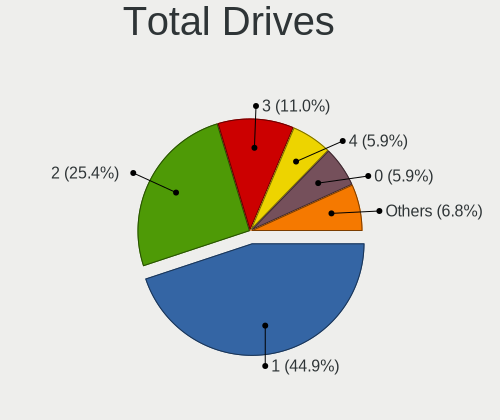
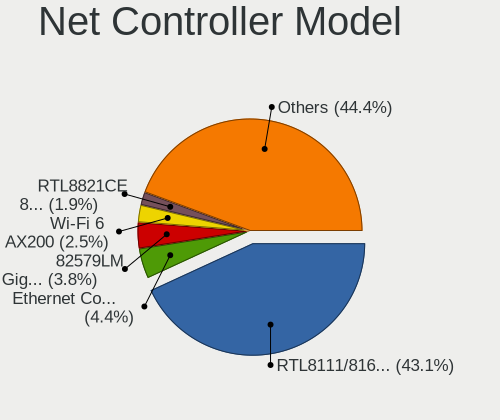
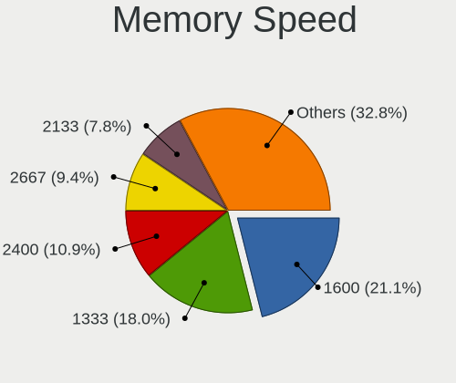
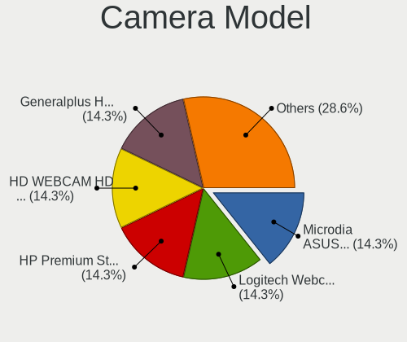

helloSystem 0.5.0 - Tested Hardware & Statistics (Desktops)
-----------------------------------------------------------

A project to collect tested hardware configurations for helloSystem 0.5.0.

Anyone can contribute to this report by the [hw-probe](https://github.com/linuxhw/hw-probe/blob/master/INSTALL.BSD.md) tool:

    hw-probe -all -upload

Please submit a probe of your configuration if it's not presented on the page or is rare.

Full-feature report is available here: https://bsd-hardware.info/?view=trends&rel=hellosystem-0.5.0

Contents
--------

* [ Test Cases ](#test-cases)

* [ System ](#system)
  - [ Arch                     ](#arch)
  - [ DE                       ](#de)
  - [ Display Server           ](#display-server)
  - [ Display Manager          ](#display-manager)
  - [ OS Lang                  ](#os-lang)
  - [ Boot Mode                ](#boot-mode)
  - [ Filesystem               ](#filesystem)
  - [ Part. scheme             ](#part-scheme)

* [ Board ](#board)
  - [ Vendor                   ](#vendor)
  - [ Model                    ](#model)
  - [ Model Family             ](#model-family)
  - [ MFG Year                 ](#mfg-year)
  - [ Form Factor              ](#form-factor)
  - [ Coreboot                 ](#coreboot)
  - [ RAM Size                 ](#ram-size)
  - [ RAM Used                 ](#ram-used)
  - [ Total Drives             ](#total-drives)
  - [ Has CD-ROM               ](#has-cd-rom)
  - [ Has Ethernet             ](#has-ethernet)
  - [ Has WiFi                 ](#has-wifi)
  - [ Has Bluetooth            ](#has-bluetooth)

* [ Location ](#location)
  - [ Country                  ](#country)
  - [ City                     ](#city)

* [ Drives ](#drives)
  - [ Drive Vendor             ](#drive-vendor)
  - [ Drive Model              ](#drive-model)
  - [ HDD Vendor               ](#hdd-vendor)
  - [ SSD Vendor               ](#ssd-vendor)
  - [ Drive Kind               ](#drive-kind)
  - [ Drive Connector          ](#drive-connector)
  - [ Drive Size               ](#drive-size)
  - [ Space Total              ](#space-total)
  - [ Space Used               ](#space-used)
  - [ Malfunc. Drives          ](#malfunc-drives)
  - [ Malfunc. Drive Vendor    ](#malfunc-drive-vendor)
  - [ Malfunc. HDD Vendor      ](#malfunc-hdd-vendor)
  - [ Malfunc. Drive Kind      ](#malfunc-drive-kind)
  - [ Failed Drives            ](#failed-drives)
  - [ Failed Drive Vendor      ](#failed-drive-vendor)
  - [ Drive Status             ](#drive-status)

* [ Storage controller ](#storage-controller)
  - [ Storage Vendor           ](#storage-vendor)
  - [ Storage Model            ](#storage-model)
  - [ Storage Kind             ](#storage-kind)

* [ Processor ](#processor)
  - [ CPU Vendor               ](#cpu-vendor)
  - [ CPU Model                ](#cpu-model)
  - [ CPU Model Family         ](#cpu-model-family)
  - [ CPU Cores                ](#cpu-cores)
  - [ CPU Sockets              ](#cpu-sockets)
  - [ CPU Threads              ](#cpu-threads)
  - [ CPU Microarch            ](#cpu-microarch)

* [ Graphics ](#graphics)
  - [ GPU Vendor               ](#gpu-vendor)
  - [ GPU Model                ](#gpu-model)
  - [ GPU Combo                ](#gpu-combo)
  - [ GPU Driver               ](#gpu-driver)
  - [ GPU Memory               ](#gpu-memory)

* [ Monitor ](#monitor)
  - [ Monitor Vendor           ](#monitor-vendor)
  - [ Monitor Model            ](#monitor-model)
  - [ Monitor Resolution       ](#monitor-resolution)
  - [ Monitor Diagonal         ](#monitor-diagonal)
  - [ Monitor Width            ](#monitor-width)
  - [ Aspect Ratio             ](#aspect-ratio)
  - [ Monitor Area             ](#monitor-area)
  - [ Pixel Density            ](#pixel-density)
  - [ Multiple Monitors        ](#multiple-monitors)

* [ Network ](#network)
  - [ Net Controller Vendor    ](#net-controller-vendor)
  - [ Net Controller Model     ](#net-controller-model)
  - [ Wireless Vendor          ](#wireless-vendor)
  - [ Wireless Model           ](#wireless-model)
  - [ Ethernet Vendor          ](#ethernet-vendor)
  - [ Ethernet Model           ](#ethernet-model)
  - [ Net Controller Kind      ](#net-controller-kind)
  - [ Used Controller          ](#used-controller)
  - [ NICs                     ](#nics)
  - [ IPv6                     ](#ipv6)

* [ Bluetooth ](#bluetooth)
  - [ Bluetooth Vendor         ](#bluetooth-vendor)
  - [ Bluetooth Model          ](#bluetooth-model)

* [ Sound ](#sound)
  - [ Sound Vendor             ](#sound-vendor)
  - [ Sound Model              ](#sound-model)

* [ Memory ](#memory)
  - [ Memory Vendor            ](#memory-vendor)
  - [ Memory Model             ](#memory-model)
  - [ Memory Kind              ](#memory-kind)
  - [ Memory Form Factor       ](#memory-form-factor)
  - [ Memory Size              ](#memory-size)
  - [ Memory Speed             ](#memory-speed)

* [ Printers & scanners ](#printers--scanners)
  - [ Printer Vendor           ](#printer-vendor)
  - [ Printer Model            ](#printer-model)
  - [ Scanner Vendor           ](#scanner-vendor)
  - [ Scanner Model            ](#scanner-model)

* [ Camera ](#camera)
  - [ Camera Vendor            ](#camera-vendor)
  - [ Camera Model             ](#camera-model)

* [ Security ](#security)
  - [ Fingerprint Vendor       ](#fingerprint-vendor)
  - [ Fingerprint Model        ](#fingerprint-model)
  - [ Chipcard Vendor          ](#chipcard-vendor)
  - [ Chipcard Model           ](#chipcard-model)

* [ Unsupported ](#unsupported)
  - [ Unsupported Devices      ](#unsupported-devices)
  - [ Unsupported Device Types ](#unsupported-device-types)

Test Cases
----------

| Vendor    | Model                   | Probe                                                     | Date         |
|-----------|-------------------------|-----------------------------------------------------------|--------------|
| Lenovo    | Board                   | [685abcc739](https://bsd-hardware.info/?probe=685abcc739) | Sep 07, 2021 |
| Medion    | H61H2-LM3               | [7a42009a08](https://bsd-hardware.info/?probe=7a42009a08) | Sep 02, 2021 |
| ASUSTek   | TUF GAMING X570-PLUS    | [9e13729a12](https://bsd-hardware.info/?probe=9e13729a12) | Sep 02, 2021 |
| HP        | 0A60h                   | [0f28538e3d](https://bsd-hardware.info/?probe=0f28538e3d) | Aug 25, 2021 |
| HP        | 1589                    | [4d51cc9c4b](https://bsd-hardware.info/?probe=4d51cc9c4b) | Aug 24, 2021 |
| Acer      | Aspire TC-895 V:1.0     | [da3e8986a3](https://bsd-hardware.info/?probe=da3e8986a3) | Aug 22, 2021 |
| EVGA      | X299 MICRO              | [d04b55d1f6](https://bsd-hardware.info/?probe=d04b55d1f6) | Aug 19, 2021 |
| ASRock    | Z390 Pro4               | [aca402061b](https://bsd-hardware.info/?probe=aca402061b) | Aug 18, 2021 |
| Foxconn   | 2ADA                    | [e96976b2cc](https://bsd-hardware.info/?probe=e96976b2cc) | Aug 18, 2021 |
| HC        | HCAR357-MI V1.0         | [3293b7bad9](https://bsd-hardware.info/?probe=3293b7bad9) | Aug 17, 2021 |
| Gigabyte  | HA65M-D2H-B3            | [fc9b50bb85](https://bsd-hardware.info/?probe=fc9b50bb85) | Aug 16, 2021 |
| Gigabyte  | B360M D3H-CF            | [1c88ce5779](https://bsd-hardware.info/?probe=1c88ce5779) | Aug 10, 2021 |
| Pegatron  | IPPCR-SS                | [8a7fc2689b](https://bsd-hardware.info/?probe=8a7fc2689b) | Aug 09, 2021 |
| Gigabyte  | A75M-DS2                | [2010fe5fab](https://bsd-hardware.info/?probe=2010fe5fab) | Aug 09, 2021 |
| ASUSTek   | P7H55-M LX              | [df393cc673](https://bsd-hardware.info/?probe=df393cc673) | Aug 08, 2021 |
| Intel     | D54250WYK H13922-304    | [45c86d174e](https://bsd-hardware.info/?probe=45c86d174e) | Aug 08, 2021 |
| ASUSTek   | M5A78L LE               | [7a1d31be72](https://bsd-hardware.info/?probe=7a1d31be72) | Aug 07, 2021 |
| ASUSTek   | H81M-A                  | [bb65c30be3](https://bsd-hardware.info/?probe=bb65c30be3) | Aug 07, 2021 |
| ASUSTek   | H81M-A                  | [9e0c8e8024](https://bsd-hardware.info/?probe=9e0c8e8024) | Aug 07, 2021 |
| ASUSTek   | Crosshair V Formula     | [90c27497d9](https://bsd-hardware.info/?probe=90c27497d9) | Aug 05, 2021 |
| PCPartner | MILANO-P Rev.00         | [526390c559](https://bsd-hardware.info/?probe=526390c559) | Aug 04, 2021 |
| PCPartner | MILANO-P Rev.00         | [071eac9b1b](https://bsd-hardware.info/?probe=071eac9b1b) | Aug 04, 2021 |
| Biostar   | A770E3                  | [4d0ac19b8e](https://bsd-hardware.info/?probe=4d0ac19b8e) | Aug 03, 2021 |
| Dell      | 0RY007                  | [c67ccf8bc6](https://bsd-hardware.info/?probe=c67ccf8bc6) | Aug 01, 2021 |
| PCPartner | MILANO-P Rev.00         | [ef40df391b](https://bsd-hardware.info/?probe=ef40df391b) | Aug 01, 2021 |
| Gigabyte  | H110-D3A-CF             | [7923f57fbe](https://bsd-hardware.info/?probe=7923f57fbe) | Aug 01, 2021 |
| ASUSTek   | A58M-A/USB3             | [9ffd4220e8](https://bsd-hardware.info/?probe=9ffd4220e8) | Aug 01, 2021 |
| Biostar   | N68S3+                  | [528c9d6eab](https://bsd-hardware.info/?probe=528c9d6eab) | Jul 26, 2021 |
| Gigabyte  | PH67A-D3-B3             | [73dff53f04](https://bsd-hardware.info/?probe=73dff53f04) | Jul 23, 2021 |
| Gigabyte  | H110-D3A-CF             | [58e49f458e](https://bsd-hardware.info/?probe=58e49f458e) | Jul 19, 2021 |
| PCPartner | MILANO-P Rev.00         | [f20ac8df75](https://bsd-hardware.info/?probe=f20ac8df75) | Jul 19, 2021 |
| MSI       | IONA                    | [bb2c6b383b](https://bsd-hardware.info/?probe=bb2c6b383b) | Jul 17, 2021 |
| ASRock    | N68C-GS FX              | [012356047f](https://bsd-hardware.info/?probe=012356047f) | Jul 17, 2021 |
| ASRock    | N68C-GS FX              | [e1f439def9](https://bsd-hardware.info/?probe=e1f439def9) | Jul 17, 2021 |
| ASUSTek   | M5A78L-M/USB3           | [20fc88018b](https://bsd-hardware.info/?probe=20fc88018b) | Jul 16, 2021 |
| HP        | 0AE8h C                 | [23df6b2e94](https://bsd-hardware.info/?probe=23df6b2e94) | Jul 12, 2021 |
| Dell      | 0GXM1W A02              | [269edf2dcf](https://bsd-hardware.info/?probe=269edf2dcf) | Jul 06, 2021 |
| ASRock    | B450M-HDV               | [dca41aa10a](https://bsd-hardware.info/?probe=dca41aa10a) | Jul 05, 2021 |
| ASRock    | X99 Taichi              | [149d7abd05](https://bsd-hardware.info/?probe=149d7abd05) | Jul 04, 2021 |
| ASUSTek   | PRIME Z390-P            | [4060cdec72](https://bsd-hardware.info/?probe=4060cdec72) | Jul 04, 2021 |
| ASRock    | Z390 Pro4               | [dc4eb674ea](https://bsd-hardware.info/?probe=dc4eb674ea) | Jul 03, 2021 |
| Shuttle   | NC10U                   | [5d2d20dd04](https://bsd-hardware.info/?probe=5d2d20dd04) | Jul 02, 2021 |
| Protectli | FW2B Ver                | [7b6f704247](https://bsd-hardware.info/?probe=7b6f704247) | Jun 30, 2021 |
| HP        | 0B4Ch D                 | [b56bd19073](https://bsd-hardware.info/?probe=b56bd19073) | Jun 30, 2021 |
| Biostar   | B450MH                  | [167f09a25c](https://bsd-hardware.info/?probe=167f09a25c) | Jun 29, 2021 |
| Huanan    | X99-8M-F V1.2           | [6477b9ef24](https://bsd-hardware.info/?probe=6477b9ef24) | Jun 28, 2021 |
| MSI       | B450 GAMING PLUS MAX    | [f0e80b0788](https://bsd-hardware.info/?probe=f0e80b0788) | Jun 28, 2021 |
| ASUSTek   | H110M-E/M.2             | [f3b0bb0930](https://bsd-hardware.info/?probe=f3b0bb0930) | Jun 28, 2021 |
| ASUSTek   | PRIME H410M-D           | [8ea103b783](https://bsd-hardware.info/?probe=8ea103b783) | Jun 26, 2021 |
| Dell      | 0P03DX A03              | [b2f0c90d79](https://bsd-hardware.info/?probe=b2f0c90d79) | Jun 24, 2021 |
| ASUSTek   | P7H55                   | [c33ec074f8](https://bsd-hardware.info/?probe=c33ec074f8) | Jun 22, 2021 |
| ASUSTek   | P8H67-M PRO             | [616c7043bd](https://bsd-hardware.info/?probe=616c7043bd) | Jun 22, 2021 |
| ASUSTek   | CP5141                  | [73c62835c1](https://bsd-hardware.info/?probe=73c62835c1) | Jun 21, 2021 |
| Foxconn   | 2ABF                    | [d30b2629eb](https://bsd-hardware.info/?probe=d30b2629eb) | Jun 21, 2021 |
| Intel     | DH67CL AAG10212-206     | [f2367a4249](https://bsd-hardware.info/?probe=f2367a4249) | Jun 21, 2021 |
| Gigabyte  | H97-D3H-CF              | [a326fd4061](https://bsd-hardware.info/?probe=a326fd4061) | Jun 20, 2021 |
| Dell      | 0PGKWF A01              | [9f09d62462](https://bsd-hardware.info/?probe=9f09d62462) | Jun 20, 2021 |
| MSI       | H110M PRO-VH PLUS       | [45b842180e](https://bsd-hardware.info/?probe=45b842180e) | Jun 20, 2021 |
| ASUSTek   | ROG STRIX H370-I GAMING | [d2dd261a2a](https://bsd-hardware.info/?probe=d2dd261a2a) | Jun 20, 2021 |
| MSI       | B450M PRO-M2 MAX        | [edcbaf755f](https://bsd-hardware.info/?probe=edcbaf755f) | Jun 19, 2021 |
| Dell      | 0XPDFK A01              | [631dbb841b](https://bsd-hardware.info/?probe=631dbb841b) | Jun 19, 2021 |
| Lenovo    | ThinkServer RS140       | [0f5d669e9f](https://bsd-hardware.info/?probe=0f5d669e9f) | Jun 18, 2021 |
| Lenovo    | ThinkServer RS140       | [63ba615299](https://bsd-hardware.info/?probe=63ba615299) | Jun 18, 2021 |
| Gigabyte  | AX370-Gaming-CF         | [d77be09267](https://bsd-hardware.info/?probe=d77be09267) | Jun 18, 2021 |
| Dell      | 0XPDFK A01              | [7a1c26edeb](https://bsd-hardware.info/?probe=7a1c26edeb) | Jun 18, 2021 |
| ASUSTek   | H110I-PLUS              | [0cb30b464d](https://bsd-hardware.info/?probe=0cb30b464d) | Jun 17, 2021 |
| HP        | 3397                    | [3dd97c60ca](https://bsd-hardware.info/?probe=3dd97c60ca) | Jun 16, 2021 |
| Lenovo    | Board                   | [c981ffdff7](https://bsd-hardware.info/?probe=c981ffdff7) | Jun 15, 2021 |
| ASUSTek   | M5A78L-M LX/BR          | [5f9b56c8ae](https://bsd-hardware.info/?probe=5f9b56c8ae) | Jun 15, 2021 |
| ASUSTek   | M4A78LT-M               | [0c8d6cd661](https://bsd-hardware.info/?probe=0c8d6cd661) | Jun 14, 2021 |
| ASUSTek   | PRIME A320M-K           | [fea57181b5](https://bsd-hardware.info/?probe=fea57181b5) | Jun 14, 2021 |
| ASRock    | G31M-VS2                | [f2f5b95f4b](https://bsd-hardware.info/?probe=f2f5b95f4b) | Jun 14, 2021 |
| Intel     | X79 V2.72A              | [88173bcf06](https://bsd-hardware.info/?probe=88173bcf06) | Jun 14, 2021 |
| ASUSTek   | TUF GAMING X570-PLUS    | [eeb4489d2f](https://bsd-hardware.info/?probe=eeb4489d2f) | Jun 13, 2021 |
| Gigabyte  | H470M DS3H              | [7c37a0319b](https://bsd-hardware.info/?probe=7c37a0319b) | Jun 13, 2021 |
| ASRock    | FM2A68M-HD+             | [8bb0d23eb4](https://bsd-hardware.info/?probe=8bb0d23eb4) | Jun 13, 2021 |
| ASUSTek   | P5G41T-M LX3            | [1759329ae3](https://bsd-hardware.info/?probe=1759329ae3) | Apr 12, 2021 |
| Dell      | 0RW199                  | [e78392bc4c](https://bsd-hardware.info/?probe=e78392bc4c) | Apr 02, 2021 |
| Lenovo    | SHARKBAY SDK0E50510 WIN | [62376c16a4](https://bsd-hardware.info/?probe=62376c16a4) | Mar 31, 2021 |
| Medion    | H61H2-LM3               | [6483c8390f](https://bsd-hardware.info/?probe=6483c8390f) | Mar 31, 2021 |
| Pegatron  | IPM41-D3                | [687047b3d2](https://bsd-hardware.info/?probe=687047b3d2) | Mar 30, 2021 |
| Gigabyte  | Z77X-UD5H               | [d3742d3898](https://bsd-hardware.info/?probe=d3742d3898) | Mar 29, 2021 |
| HP        | 18E7                    | [0e835b61ff](https://bsd-hardware.info/?probe=0e835b61ff) | Mar 24, 2021 |
| Lenovo    | SHARKBAY SDK0E50510 WIN | [78a7c7b8cb](https://bsd-hardware.info/?probe=78a7c7b8cb) | Mar 23, 2021 |
| Lenovo    | SHARKBAY SDK0E50510 WIN | [5ae508dfa8](https://bsd-hardware.info/?probe=5ae508dfa8) | Mar 19, 2021 |
| ASUSTek   | PRIME H310M-E R2.0      | [8964a02114](https://bsd-hardware.info/?probe=8964a02114) | Mar 15, 2021 |
| ASUSTek   | PRIME Z390M-PLUS        | [0a3b290f9f](https://bsd-hardware.info/?probe=0a3b290f9f) | Mar 15, 2021 |
| ASUSTek   | H110M-PLUS              | [80e7c230d7](https://bsd-hardware.info/?probe=80e7c230d7) | Mar 12, 2021 |
| Dell      | 0W2PJY A01              | [f162510a27](https://bsd-hardware.info/?probe=f162510a27) | Mar 12, 2021 |
| MSI       | B150M PRO-VDH           | [bc75a3ab13](https://bsd-hardware.info/?probe=bc75a3ab13) | Mar 11, 2021 |
| ASUSTek   | H110M-PLUS              | [cf00023cef](https://bsd-hardware.info/?probe=cf00023cef) | Mar 11, 2021 |
| ASRock    | B450M Pro4              | [e9ca160a2d](https://bsd-hardware.info/?probe=e9ca160a2d) | Mar 11, 2021 |
| Gigabyte  | 970A-DS3P               | [47d17e6983](https://bsd-hardware.info/?probe=47d17e6983) | Mar 10, 2021 |
| Dell      | 0JP3NX A01              | [fc94b8c422](https://bsd-hardware.info/?probe=fc94b8c422) | Mar 09, 2021 |
| ASUSTek   | P8Z77-V                 | [88ee81b089](https://bsd-hardware.info/?probe=88ee81b089) | Mar 06, 2021 |
| Dell      | 0W2PJY A01              | [d8c2f0b19f](https://bsd-hardware.info/?probe=d8c2f0b19f) | Mar 04, 2021 |
| Foxconn   | 2ADA                    | [10d02d0982](https://bsd-hardware.info/?probe=10d02d0982) | Mar 03, 2021 |
| ASUSTek   | P8Z77-V LX2             | [0aeea0fec9](https://bsd-hardware.info/?probe=0aeea0fec9) | Feb 23, 2021 |
| ASUSTek   | P5Q                     | [22fa0d8178](https://bsd-hardware.info/?probe=22fa0d8178) | Feb 23, 2021 |
| Biostar   | B365MHC                 | [adb029c65f](https://bsd-hardware.info/?probe=adb029c65f) | Feb 22, 2021 |
| Dell      | 0RW199                  | [e0ecb4caa7](https://bsd-hardware.info/?probe=e0ecb4caa7) | Feb 21, 2021 |
| ASUSTek   | P5B-Deluxe              | [a471763f19](https://bsd-hardware.info/?probe=a471763f19) | Feb 20, 2021 |
| ASUSTek   | PRIME H270-PLUS         | [0b5194e68e](https://bsd-hardware.info/?probe=0b5194e68e) | Feb 19, 2021 |
| Unknown   | Unknown                 | [22af66ce96](https://bsd-hardware.info/?probe=22af66ce96) | Feb 18, 2021 |
| Dell      | 0GM819                  | [836d0f9057](https://bsd-hardware.info/?probe=836d0f9057) | Feb 17, 2021 |
| ASUSTek   | P8H61-MX R2.0           | [e601d28f5e](https://bsd-hardware.info/?probe=e601d28f5e) | Feb 17, 2021 |
| MSI       | MPG X570 GAMING PLUS    | [b087324f05](https://bsd-hardware.info/?probe=b087324f05) | Feb 17, 2021 |
| MSI       | MPG X570 GAMING PLUS    | [d03a5bbea5](https://bsd-hardware.info/?probe=d03a5bbea5) | Feb 17, 2021 |
| Pegatron  | IPM41-D3                | [6e5c330c9c](https://bsd-hardware.info/?probe=6e5c330c9c) | Feb 16, 2021 |
| ASUSTek   | VM62                    | [4d02a33fec](https://bsd-hardware.info/?probe=4d02a33fec) | Feb 16, 2021 |
| ASUSTek   | P5B SE                  | [425210021c](https://bsd-hardware.info/?probe=425210021c) | Feb 16, 2021 |
| HP        | 8768 A                  | [f2be4b7b65](https://bsd-hardware.info/?probe=f2be4b7b65) | Feb 16, 2021 |
| Intel     | DN2820FYK H24582-201    | [be56203e79](https://bsd-hardware.info/?probe=be56203e79) | Feb 15, 2021 |
| ASUSTek   | EX-B85M-V               | [54c319f2c0](https://bsd-hardware.info/?probe=54c319f2c0) | Feb 15, 2021 |
| ASRock    | B450M Pro4              | [ef29c46355](https://bsd-hardware.info/?probe=ef29c46355) | Feb 15, 2021 |
| ASRock    | B550M Pro4              | [61a5641019](https://bsd-hardware.info/?probe=61a5641019) | Feb 14, 2021 |
| ASUSTek   | M5A99FX PRO R2.0        | [8082fefc2e](https://bsd-hardware.info/?probe=8082fefc2e) | Feb 14, 2021 |
| ASUSTek   | ROG STRIX Z370-G GAMING | [565ceb36f0](https://bsd-hardware.info/?probe=565ceb36f0) | Feb 14, 2021 |

System
------

Arch
----

OS architecture (x86_64, i586, etc.)

| Name  | Desktops | Percent |
|-------|----------|---------|
| amd64 | 98       | 100%    |

DE
--

Desktop Environment

| Name         | Desktops | Percent |
|--------------|----------|---------|
| helloDesktop | 98       | 100%    |

Display Server
--------------

X11 or Wayland

| Name | Desktops | Percent |
|------|----------|---------|
| X11  | 98       | 100%    |

Display Manager
---------------

SDDM, LightDM, etc.

| Name | Desktops | Percent |
|------|----------|---------|
| SLiM | 98       | 100%    |

OS Lang
-------

Language

| Lang  | Desktops | Percent |
|-------|----------|---------|
| en_US | 96       | 96.97%  |
| it_IT | 1        | 1.01%   |
| es_ES | 1        | 1.01%   |
| es_AR | 1        | 1.01%   |

Boot Mode
---------

EFI or BIOS

| Mode | Desktops | Percent |
|------|----------|---------|
| EFI  | 80       | 81.63%  |
| BIOS | 18       | 18.37%  |

Filesystem
----------

Type of filesystem

| Type | Desktops | Percent |
|------|----------|---------|
| Zfs  | 98       | 100%    |

Part. scheme
------------

Scheme of partitioning

| Type | Desktops | Percent |
|------|----------|---------|
| GPT  | 98       | 100%    |

Board
-----

Vendor
------

Motherboard manufacturer

| Name                | Desktops | Percent |
|---------------------|----------|---------|
| ASUSTek Computer    | 31       | 31.63%  |
| Gigabyte Technology | 10       | 10.2%   |
| Dell                | 9        | 9.18%   |
| ASRock              | 9        | 9.18%   |
| Hewlett-Packard     | 7        | 7.14%   |
| MSI                 | 6        | 6.12%   |
| Lenovo              | 4        | 4.08%   |
| Intel               | 4        | 4.08%   |
| Biostar             | 4        | 4.08%   |
| Foxconn             | 3        | 3.06%   |
| Pegatron            | 2        | 2.04%   |
| Shuttle             | 1        | 1.02%   |
| Protectli           | 1        | 1.02%   |
| PCPartner           | 1        | 1.02%   |
| Medion              | 1        | 1.02%   |
| Huanan              | 1        | 1.02%   |
| HC                  | 1        | 1.02%   |
| EVGA                | 1        | 1.02%   |
| Acer                | 1        | 1.02%   |
| Unknown             | 1        | 1.02%   |

Model
-----

Motherboard model

| Name                                | Desktops | Percent |
|-------------------------------------|----------|---------|
| ASUS All Series                     | 2        | 2.04%   |
| ASRock B450M Pro4                   | 2        | 2.04%   |
| Shuttle NC10U                       | 1        | 1.02%   |
| Protectli FW2B                      | 1        | 1.02%   |
| Pegatron SAISHIAT2                  | 1        | 1.02%   |
| Pegatron IPM41-D3                   | 1        | 1.02%   |
| PCPartner DREAMSYS                  | 1        | 1.02%   |
| MSI WC791AA-UUW HPE-119sc           | 1        | 1.02%   |
| MSI MS-7C37                         | 1        | 1.02%   |
| MSI MS-7B86                         | 1        | 1.02%   |
| MSI MS-7B84                         | 1        | 1.02%   |
| MSI MS-7A15                         | 1        | 1.02%   |
| MSI MS-7982                         | 1        | 1.02%   |
| Medion H61H2-LM3                    | 1        | 1.02%   |
| Lenovo ThinkCentre M91p 7033DE6     | 1        | 1.02%   |
| Lenovo ThinkCentre M91p 7033D54     | 1        | 1.02%   |
| Lenovo ThinkCentre M83 10AHS35Q00   | 1        | 1.02%   |
| Lenovo 70F8S01J00 ThinkServer RS140 | 1        | 1.02%   |
| Intel X79 V2.72A                    | 1        | 1.02%   |
| Intel DN2820FYK H24582-201          | 1        | 1.02%   |
| Intel DH67CL AAG10212-206           | 1        | 1.02%   |
| Intel D54250WYK H13922-304          | 1        | 1.02%   |
| Huanan X99-8M-F V1.2                | 1        | 1.02%   |
| HP Z600 Workstation                 | 1        | 1.02%   |
| HP Z420 Workstation                 | 1        | 1.02%   |
| HP Z400 Workstation                 | 1        | 1.02%   |
| HP Slim Desktop S01-pF1xxx          | 1        | 1.02%   |
| HP ProDesk 600 G1 SFF               | 1        | 1.02%   |
| HP Compaq Elite 8300 SFF            | 1        | 1.02%   |
| HP Compaq dc5700 Small Form Factor  | 1        | 1.02%   |
| HC HCAR357-MI                       | 1        | 1.02%   |
| Gigabyte Z77X-UD5H                  | 1        | 1.02%   |
| Gigabyte PH67A-D3-B3                | 1        | 1.02%   |
| Gigabyte HA65M-D2H-B3               | 1        | 1.02%   |
| Gigabyte H97-D3H                    | 1        | 1.02%   |
| Gigabyte H470M DS3H                 | 1        | 1.02%   |
| Gigabyte H110-D3A                   | 1        | 1.02%   |
| Gigabyte B360M-D3H                  | 1        | 1.02%   |
| Gigabyte AX370-Gaming               | 1        | 1.02%   |
| Gigabyte A75M-DS2                   | 1        | 1.02%   |
| Gigabyte 970A-DS3P                  | 1        | 1.02%   |
| Foxconn Pro 3500 Series             | 1        | 1.02%   |
| Foxconn p6-2305elm                  | 1        | 1.02%   |
| Foxconn p6-2171a                    | 1        | 1.02%   |
| EVGA X299 MICRO                     | 1        | 1.02%   |
| Dell Precision WorkStation T7400    | 1        | 1.02%   |
| Dell Precision WorkStation T5500    | 1        | 1.02%   |
| Dell Precision WorkStation T3500    | 1        | 1.02%   |
| Dell OptiPlex 990                   | 1        | 1.02%   |
| Dell OptiPlex 755                   | 1        | 1.02%   |
| Dell OptiPlex 7010                  | 1        | 1.02%   |
| Dell OptiPlex 5055 Ryzen CPU        | 1        | 1.02%   |
| Dell OptiPlex 3050                  | 1        | 1.02%   |
| Dell Inspiron 530                   | 1        | 1.02%   |
| Biostar N68S3+                      | 1        | 1.02%   |
| Biostar B450MH                      | 1        | 1.02%   |
| Biostar B365MHC                     | 1        | 1.02%   |
| Biostar A770E3                      | 1        | 1.02%   |
| ASUS VM62                           | 1        | 1.02%   |
| ASUS TUF GAMING X570-PLUS           | 1        | 1.02%   |

Model Family
------------

Motherboard model prefix

| Name                  | Desktops | Percent |
|-----------------------|----------|---------|
| Dell OptiPlex         | 5        | 5.1%    |
| ASUS PRIME            | 5        | 5.1%    |
| Lenovo ThinkCentre    | 3        | 3.06%   |
| Dell Precision        | 3        | 3.06%   |
| HP Compaq             | 2        | 2.04%   |
| ASUS ROG              | 2        | 2.04%   |
| ASUS P8Z77-V          | 2        | 2.04%   |
| ASUS M5A78L-M         | 2        | 2.04%   |
| ASUS All              | 2        | 2.04%   |
| ASRock B450M          | 2        | 2.04%   |
| Shuttle NC10U         | 1        | 1.02%   |
| Protectli FW2B        | 1        | 1.02%   |
| Pegatron SAISHIAT2    | 1        | 1.02%   |
| Pegatron IPM41-D3     | 1        | 1.02%   |
| PCPartner DREAMSYS    | 1        | 1.02%   |
| MSI WC791AA-UUW       | 1        | 1.02%   |
| MSI MS-7C37           | 1        | 1.02%   |
| MSI MS-7B86           | 1        | 1.02%   |
| MSI MS-7B84           | 1        | 1.02%   |
| MSI MS-7A15           | 1        | 1.02%   |
| MSI MS-7982           | 1        | 1.02%   |
| Medion H61H2-LM3      | 1        | 1.02%   |
| Lenovo 70F8S01J00     | 1        | 1.02%   |
| Intel X79             | 1        | 1.02%   |
| Intel DN2820FYK       | 1        | 1.02%   |
| Intel DH67CL          | 1        | 1.02%   |
| Intel D54250WYK       | 1        | 1.02%   |
| Huanan X99-8M-F       | 1        | 1.02%   |
| HP Z600               | 1        | 1.02%   |
| HP Z420               | 1        | 1.02%   |
| HP Z400               | 1        | 1.02%   |
| HP Slim               | 1        | 1.02%   |
| HP ProDesk            | 1        | 1.02%   |
| HC HCAR357-MI         | 1        | 1.02%   |
| Gigabyte Z77X-UD5H    | 1        | 1.02%   |
| Gigabyte PH67A-D3-B3  | 1        | 1.02%   |
| Gigabyte HA65M-D2H-B3 | 1        | 1.02%   |
| Gigabyte H97-D3H      | 1        | 1.02%   |
| Gigabyte H470M        | 1        | 1.02%   |
| Gigabyte H110-D3A     | 1        | 1.02%   |
| Gigabyte B360M-D3H    | 1        | 1.02%   |
| Gigabyte AX370-Gaming | 1        | 1.02%   |
| Gigabyte A75M-DS2     | 1        | 1.02%   |
| Gigabyte 970A-DS3P    | 1        | 1.02%   |
| Foxconn Pro           | 1        | 1.02%   |
| Foxconn p6-2305elm    | 1        | 1.02%   |
| Foxconn p6-2171a      | 1        | 1.02%   |
| EVGA X299             | 1        | 1.02%   |
| Dell Inspiron         | 1        | 1.02%   |
| Biostar N68S3+        | 1        | 1.02%   |
| Biostar B450MH        | 1        | 1.02%   |
| Biostar B365MHC       | 1        | 1.02%   |
| Biostar A770E3        | 1        | 1.02%   |
| ASUS VM62             | 1        | 1.02%   |
| ASUS TUF              | 1        | 1.02%   |
| ASUS PC               | 1        | 1.02%   |
| ASUS P8H61-MX         | 1        | 1.02%   |
| ASUS P7H55            | 1        | 1.02%   |
| ASUS P5Q              | 1        | 1.02%   |
| ASUS P5B-Deluxe       | 1        | 1.02%   |

MFG Year
--------

Motherboard manufacture year

| Year | Desktops | Percent |
|------|----------|---------|
| 2020 | 14       | 14.29%  |
| 2012 | 13       | 13.27%  |
| 2019 | 12       | 12.24%  |
| 2018 | 11       | 11.22%  |
| 2013 | 9        | 9.18%   |
| 2010 | 8        | 8.16%   |
| 2021 | 7        | 7.14%   |
| 2014 | 5        | 5.1%    |
| 2011 | 5        | 5.1%    |
| 2016 | 4        | 4.08%   |
| 2017 | 3        | 3.06%   |
| 2015 | 3        | 3.06%   |
| 2009 | 2        | 2.04%   |
| 2008 | 2        | 2.04%   |

Form Factor
-----------

Physical design of the computer

| Name    | Desktops | Percent |
|---------|----------|---------|
| Desktop | 98       | 100%    |

Coreboot
--------

Have coreboot on board

| Used | Desktops | Percent |
|------|----------|---------|
| No   | 98       | 100%    |

RAM Size
--------

Total RAM memory

| Size in GB  | Desktops | Percent |
|-------------|----------|---------|
| 4.01-8.0    | 31       | 31.63%  |
| 16.01-24.0  | 30       | 30.61%  |
| 8.01-16.0   | 29       | 29.59%  |
| 32.01-64.0  | 6        | 6.12%   |
| 24.01-32.0  | 1        | 1.02%   |
| 64.01-256.0 | 1        | 1.02%   |

RAM Used
--------

Used RAM memory

| Used GB  | Desktops | Percent |
|----------|----------|---------|
| 0.01-0.5 | 54       | 54.55%  |
| 0.51-1.0 | 31       | 31.31%  |
| 1.01-2.0 | 11       | 11.11%  |
| 2.01-3.0 | 2        | 2.02%   |
| 4.01-8.0 | 1        | 1.01%   |

Total Drives
------------

Number of drives on board

| Drives | Desktops | Percent |
|--------|----------|---------|
| 1      | 46       | 46.46%  |
| 2      | 25       | 25.25%  |
| 3      | 10       | 10.1%   |
| 0      | 7        | 7.07%   |
| 4      | 6        | 6.06%   |
| 6      | 3        | 3.03%   |
| 8      | 1        | 1.01%   |
| 5      | 1        | 1.01%   |

Has CD-ROM
----------

Has CD-ROM on board

| Presented | Desktops | Percent |
|-----------|----------|---------|
| No        | 60       | 61.22%  |
| Yes       | 38       | 38.78%  |

Has Ethernet
------------

Has Ethernet on board

| Presented | Desktops | Percent |
|-----------|----------|---------|
| Yes       | 96       | 97.96%  |
| No        | 2        | 2.04%   |

Has WiFi
--------

Has WiFi module

| Presented | Desktops | Percent |
|-----------|----------|---------|
| No        | 67       | 67.68%  |
| Yes       | 32       | 32.32%  |

Has Bluetooth
-------------

Has Bluetooth module

| Presented | Desktops | Percent |
|-----------|----------|---------|
| No        | 75       | 76.53%  |
| Yes       | 23       | 23.47%  |

Location
--------

Country
-------

Geographic location (country)

| Country     | Desktops | Percent |
|-------------|----------|---------|
| USA         | 16       | 16.33%  |
| UK          | 8        | 8.16%   |
| Russia      | 8        | 8.16%   |
| Canada      | 6        | 6.12%   |
| Germany     | 5        | 5.1%    |
| Ukraine     | 4        | 4.08%   |
| Italy       | 4        | 4.08%   |
| China       | 4        | 4.08%   |
| Brazil      | 4        | 4.08%   |
| Australia   | 4        | 4.08%   |
| Taiwan      | 3        | 3.06%   |
| South Korea | 3        | 3.06%   |
| Poland      | 2        | 2.04%   |
| Mexico      | 2        | 2.04%   |
| France      | 2        | 2.04%   |
| Finland     | 2        | 2.04%   |
| Argentina   | 2        | 2.04%   |
| Venezuela   | 1        | 1.02%   |
| Uruguay     | 1        | 1.02%   |
| Turkey      | 1        | 1.02%   |
| Sweden      | 1        | 1.02%   |
| Spain       | 1        | 1.02%   |
| Slovakia    | 1        | 1.02%   |
| Portugal    | 1        | 1.02%   |
| Norway      | 1        | 1.02%   |
| New Zealand | 1        | 1.02%   |
| Netherlands | 1        | 1.02%   |
| Lithuania   | 1        | 1.02%   |
| Indonesia   | 1        | 1.02%   |
| India       | 1        | 1.02%   |
| Hungary     | 1        | 1.02%   |
| Guatemala   | 1        | 1.02%   |
| Greece      | 1        | 1.02%   |
| Egypt       | 1        | 1.02%   |
| Chile       | 1        | 1.02%   |
| Belarus     | 1        | 1.02%   |

City
----

Geographic location (city)

| City              | Desktops | Percent |
|-------------------|----------|---------|
| São Paulo        | 2        | 2.04%   |
| Dnipropetrovsk    | 2        | 2.04%   |
| Calgary           | 2        | 2.04%   |
| Brisbane          | 2        | 2.04%   |
| Å iauliai         | 1        | 1.02%   |
| Zhongshan         | 1        | 1.02%   |
| York              | 1        | 1.02%   |
| Yekaterinburg     | 1        | 1.02%   |
| Winnipeg          | 1        | 1.02%   |
| Vladivostok       | 1        | 1.02%   |
| Villeurbanne      | 1        | 1.02%   |
| Vawkavysk         | 1        | 1.02%   |
| Ufa               | 1        | 1.02%   |
| Treviso           | 1        | 1.02%   |
| Toronto           | 1        | 1.02%   |
| Tettnang Castle   | 1        | 1.02%   |
| Tampere           | 1        | 1.02%   |
| Taichung          | 1        | 1.02%   |
| Taganrog          | 1        | 1.02%   |
| Sydney            | 1        | 1.02%   |
| Suzhou            | 1        | 1.02%   |
| St Petersburg     | 1        | 1.02%   |
| Simpsonville      | 1        | 1.02%   |
| Sheffield         | 1        | 1.02%   |
| Sevastopol        | 1        | 1.02%   |
| Seoul             | 1        | 1.02%   |
| S??o Paulo        | 1        | 1.02%   |
| Rome              | 1        | 1.02%   |
| Ransbach-Baumbach | 1        | 1.02%   |
| Porto             | 1        | 1.02%   |
| Pflugerville      | 1        | 1.02%   |
| Oslo              | 1        | 1.02%   |
| Ortona            | 1        | 1.02%   |
| Ogden             | 1        | 1.02%   |
| North Vancouver   | 1        | 1.02%   |
| New York          | 1        | 1.02%   |
| New Taipei        | 1        | 1.02%   |
| Mumbai            | 1        | 1.02%   |
| Mount Pleasant    | 1        | 1.02%   |
| Montevideo        | 1        | 1.02%   |
| Mokpo             | 1        | 1.02%   |
| Minneapolis       | 1        | 1.02%   |
| Milton Keynes     | 1        | 1.02%   |
| Miami             | 1        | 1.02%   |
| Marrickville      | 1        | 1.02%   |
| Mar del Plata     | 1        | 1.02%   |
| Mansfield         | 1        | 1.02%   |
| Mankato           | 1        | 1.02%   |
| Malton            | 1        | 1.02%   |
| Malokaterynivka   | 1        | 1.02%   |
| London            | 1        | 1.02%   |
| Langwedel         | 1        | 1.02%   |
| Kyiv              | 1        | 1.02%   |
| Kungsbacka        | 1        | 1.02%   |
| Kuiju             | 1        | 1.02%   |
| Knoxville         | 1        | 1.02%   |
| Kitchener         | 1        | 1.02%   |
| Kazan?ˆ™          | 1        | 1.02%   |
| Katowice          | 1        | 1.02%   |
| Kampen            | 1        | 1.02%   |

Drives
------

Drive Vendor
------------

Hard drive vendors

| Vendor              | Desktops | Drives | Percent |
|---------------------|----------|--------|---------|
| WDC                 | 33       | 41     | 22.3%   |
| Seagate             | 28       | 45     | 18.92%  |
| Samsung Electronics | 24       | 33     | 16.22%  |
| Toshiba             | 7        | 7      | 4.73%   |
| Kingston            | 7        | 8      | 4.73%   |
| Hitachi             | 7        | 8      | 4.73%   |
| SanDisk             | 6        | 7      | 4.05%   |
| A-DATA Technology   | 5        | 9      | 3.38%   |
| Intel               | 4        | 4      | 2.7%    |
| HGST                | 4        | 4      | 2.7%    |
| Crucial             | 3        | 3      | 2.03%   |
| SPCC                | 2        | 3      | 1.35%   |
| Silicon Motion      | 2        | 2      | 1.35%   |
| PNY                 | 2        | 9      | 1.35%   |
| Fujitsu             | 2        | 3      | 1.35%   |
| Apacer              | 2        | 2      | 1.35%   |
| Transcend           | 1        | 1      | 0.68%   |
| Phison              | 1        | 1      | 0.68%   |
| ORICO               | 1        | 2      | 0.68%   |
| LSI                 | 1        | 1      | 0.68%   |
| LITEON              | 1        | 1      | 0.68%   |
| Lenovo              | 1        | 1      | 0.68%   |
| KingSpec            | 1        | 1      | 0.68%   |
| Hewlett-Packard     | 1        | 1      | 0.68%   |
| CLOVER              | 1        | 1      | 0.68%   |
| Apple               | 1        | 1      | 0.68%   |

Drive Model
-----------

Hard drive models

| Model                               | Desktops | Percent |
|-------------------------------------|----------|---------|
| Seagate ST500DM002-1BD142 500GB     | 3        | 1.76%   |
| Seagate ST3250410AS 250GB           | 3        | 1.76%   |
| Samsung SSD 860 EVO 250GB           | 3        | 1.76%   |
| Samsung SSD 850 EVO 250GB           | 3        | 1.76%   |
| A-DATA SU650 120GB                  | 3        | 1.76%   |
| WDC WD20EARS-00MVWB0 2TB            | 2        | 1.18%   |
| WDC WD10EZEX-08WN4A0 1TB            | 2        | 1.18%   |
| Seagate ST380815AS 80GB             | 2        | 1.18%   |
| Seagate ST3250318AS 250GB           | 2        | 1.18%   |
| HGST HTS725050A7E630 500GB          | 2        | 1.18%   |
| HGST HTS545032A7E380 320GB          | 2        | 1.18%   |
| A-DATA SX8200PNP 256GB              | 2        | 1.18%   |
| WDC WDS500G3X0C-00SJG0 500GB        | 1        | 0.59%   |
| WDC WDS500G2B0A-00SM50 500GB        | 1        | 0.59%   |
| WDC WDS250G3X0C-00SJG0 250GB        | 1        | 0.59%   |
| WDC WDS250G1B0A-00H9H0 250GB        | 1        | 0.59%   |
| WDC WDS100T2B0A-00SM50 1TB          | 1        | 0.59%   |
| WDC WD800JD-55MUA1 80GB             | 1        | 0.59%   |
| WDC WD7500BPKX-00HPJT0 752GB        | 1        | 0.59%   |
| WDC WD6400AAKS-22A7B0 640GB         | 1        | 0.59%   |
| WDC WD5002ABYS-02B1B0 500GB         | 1        | 0.59%   |
| WDC WD5000BEVT-22ZAT0 500GB         | 1        | 0.59%   |
| WDC WD5000AZRX-00L4HB0 500GB        | 1        | 0.59%   |
| WDC WD5000AAKX-60U6AA0 500GB        | 1        | 0.59%   |
| WDC WD5000AAKX-00ERMA0 500GB        | 1        | 0.59%   |
| WDC WD5000AAKS-00A7B2 500GB         | 1        | 0.59%   |
| WDC WD40EFRX-68WT0N0 4TB            | 1        | 0.59%   |
| WDC WD400BD-75LRA0 40GB             | 1        | 0.59%   |
| WDC WD4004FZWX-00GBGB0 4TB          | 1        | 0.59%   |
| WDC WD3200BEVT-00A0RT0 233GB        | 1        | 0.59%   |
| WDC WD3200BEKT-60PVMT0 320GB        | 1        | 0.59%   |
| WDC WD3200AAJS-00L7A0 320GB         | 1        | 0.59%   |
| WDC WD3003FZEX-00Z4SA0 3TB          | 1        | 0.59%   |
| WDC WD3000JS-63PDB1 304GB           | 1        | 0.59%   |
| WDC WD2500YS-01SHB1 256GB           | 1        | 0.59%   |
| WDC WD2500BEVS-22UST0 250GB         | 1        | 0.59%   |
| WDC WD2500AAKX-083CA1 250GB         | 1        | 0.59%   |
| WDC WD2500AAJS-75M0A0 250GB         | 1        | 0.59%   |
| WDC WD1600AAJS-00WAA0 160GB         | 1        | 0.59%   |
| WDC WD10SPZX-00Z10T0 1TB            | 1        | 0.59%   |
| WDC WD10EZRX-00A8LB0 1TB            | 1        | 0.59%   |
| WDC WD10EZEX-08Y20A0 1TB            | 1        | 0.59%   |
| WDC WD10EARS-00Y5B1 1TB             | 1        | 0.59%   |
| WDC WD1003FZEX-00MK2A0 1TB          | 1        | 0.59%   |
| Transcend TS32GMTS400S 32GB         | 1        | 0.59%   |
| Toshiba THNSNK128GCS8 SATA 128GB    | 1        | 0.59%   |
| Toshiba Q300 240GB                  | 1        | 0.59%   |
| Toshiba MQ01ABF050M 500GB           | 1        | 0.59%   |
| Toshiba MK3276GSX 320GB             | 1        | 0.59%   |
| Toshiba MG04ACA200E 2TB             | 1        | 0.59%   |
| Toshiba DT01ACA300 3TB              | 1        | 0.59%   |
| Toshiba DT01ACA100 1TB              | 1        | 0.59%   |
| SPCC Solid State Disk 64GB          | 1        | 0.59%   |
| SPCC Solid State Disk 512GB         | 1        | 0.59%   |
| Silicon Motion ShiJi 256GB M.2-NVMe | 1        | 0.59%   |
| Silicon Motion R5MP240G8 240GB      | 1        | 0.59%   |
| Seagate ST9500325AS 500GB           | 1        | 0.59%   |
| Seagate ST8000VN0022-2EL112 8TB     | 1        | 0.59%   |
| Seagate ST8000DM004-2CX188 8TB      | 1        | 0.59%   |
| Seagate ST500LM012 HN-M500MBB 500GB | 1        | 0.59%   |

HDD Vendor
----------

Hard disk drive vendors

| Vendor              | Desktops | Drives | Percent |
|---------------------|----------|--------|---------|
| WDC                 | 29       | 36     | 33.72%  |
| Seagate             | 28       | 45     | 32.56%  |
| Samsung Electronics | 9        | 11     | 10.47%  |
| Hitachi             | 7        | 8      | 8.14%   |
| Toshiba             | 5        | 5      | 5.81%   |
| HGST                | 4        | 4      | 4.65%   |
| Fujitsu             | 2        | 3      | 2.33%   |
| LSI                 | 1        | 1      | 1.16%   |
| CLOVER              | 1        | 1      | 1.16%   |

SSD Vendor
----------

Solid state drive vendors

| Vendor              | Desktops | Drives | Percent |
|---------------------|----------|--------|---------|
| Samsung Electronics | 11       | 15     | 22.92%  |
| SanDisk             | 6        | 7      | 12.5%   |
| Kingston            | 6        | 6      | 12.5%   |
| WDC                 | 3        | 3      | 6.25%   |
| Crucial             | 3        | 3      | 6.25%   |
| A-DATA Technology   | 3        | 3      | 6.25%   |
| Toshiba             | 2        | 2      | 4.17%   |
| SPCC                | 2        | 3      | 4.17%   |
| PNY                 | 2        | 7      | 4.17%   |
| Intel               | 2        | 2      | 4.17%   |
| Apacer              | 2        | 2      | 4.17%   |
| Transcend           | 1        | 1      | 2.08%   |
| ORICO               | 1        | 2      | 2.08%   |
| LITEON              | 1        | 1      | 2.08%   |
| Lenovo              | 1        | 1      | 2.08%   |
| KingSpec            | 1        | 1      | 2.08%   |
| Apple               | 1        | 1      | 2.08%   |

Drive Kind
----------

HDD or SSD

| Kind | Desktops | Drives | Percent |
|------|----------|--------|---------|
| HDD  | 68       | 114    | 53.54%  |
| SSD  | 40       | 60     | 31.5%   |
| NVMe | 19       | 25     | 14.96%  |

Drive Connector
---------------

SATA, SAS, NVMe, etc.

| Type | Desktops | Drives | Percent |
|------|----------|--------|---------|
| SATA | 88       | 174    | 82.24%  |
| NVMe | 19       | 25     | 17.76%  |

Drive Size
----------

Size of hard drive

| Size in TB | Desktops | Drives | Percent |
|------------|----------|--------|---------|
| 0.01-0.5   | 75       | 117    | 64.1%   |
| 0.51-1.0   | 26       | 33     | 22.22%  |
| 1.01-2.0   | 8        | 11     | 6.84%   |
| 3.01-4.0   | 4        | 5      | 3.42%   |
| 2.01-3.0   | 2        | 5      | 1.71%   |
| 4.01-10.0  | 2        | 3      | 1.71%   |

Space Total
-----------

Amount of disk space available on the file system

| Size in GB | Desktops | Percent |
|------------|----------|---------|
| 1-20       | 70       | 69.31%  |
| 101-250    | 10       | 9.9%    |
| 501-1000   | 9        | 8.91%   |
| 251-500    | 6        | 5.94%   |
| 51-100     | 3        | 2.97%   |
| 21-50      | 2        | 1.98%   |
| 1001-2000  | 1        | 0.99%   |

Space Used
----------

Amount of used disk space

| Used GB | Desktops | Percent |
|---------|----------|---------|
| 1-20    | 98       | 100%    |

Malfunc. Drives
---------------

Drive models with a malfunction

| Model                             | Desktops | Drives | Percent |
|-----------------------------------|----------|--------|---------|
| Seagate ST3250410AS 250GB         | 3        | 3      | 8.57%   |
| Seagate ST380815AS 80GB           | 2        | 2      | 5.71%   |
| HGST HTS545032A7E380 320GB        | 2        | 2      | 5.71%   |
| WDC WD800JD-55MUA1 80GB           | 1        | 1      | 2.86%   |
| WDC WD6400AAKS-22A7B0 640GB       | 1        | 1      | 2.86%   |
| WDC WD5000AAKX-60U6AA0 500GB      | 1        | 1      | 2.86%   |
| WDC WD5000AAKX-00ERMA0 500GB      | 1        | 1      | 2.86%   |
| WDC WD40EFRX-68WT0N0 4TB          | 1        | 1      | 2.86%   |
| WDC WD3200BEVT-00A0RT0 233GB      | 1        | 1      | 2.86%   |
| WDC WD3200AAJS-00L7A0 320GB       | 1        | 1      | 2.86%   |
| WDC WD2500AAKX-083CA1 250GB       | 1        | 1      | 2.86%   |
| WDC WD20EARS-00MVWB0 2TB          | 1        | 1      | 2.86%   |
| WDC WD1600AAJS-00WAA0 160GB       | 1        | 1      | 2.86%   |
| WDC WD10EARS-00Y5B1 1TB           | 1        | 1      | 2.86%   |
| Toshiba THNSNK128GCS8 SATA 128GB  | 1        | 1      | 2.86%   |
| Toshiba MK3276GSX 320GB           | 1        | 1      | 2.86%   |
| Seagate ST9500325AS 500GB         | 1        | 1      | 2.86%   |
| Seagate ST3500413AS 500GB         | 1        | 1      | 2.86%   |
| Seagate ST3250318AS 250GB         | 1        | 1      | 2.86%   |
| Seagate ST31000333AS 1TB          | 1        | 1      | 2.86%   |
| Samsung Electronics SP2004C 200GB | 1        | 1      | 2.86%   |
| Samsung Electronics HD642JJ 640GB | 1        | 1      | 2.86%   |
| Samsung Electronics HD321KJ 320GB | 1        | 1      | 2.86%   |
| Samsung Electronics HD161HJ 160GB | 1        | 1      | 2.86%   |
| Hitachi HTS727550A9E364 500GB     | 1        | 1      | 2.86%   |
| Hitachi HTS723232A7A364 320GB     | 1        | 1      | 2.86%   |
| Hitachi HDS721050CLA362 500GB     | 1        | 1      | 2.86%   |
| Hitachi HDP725025GLA380 250GB     | 1        | 1      | 2.86%   |
| HGST HTS725050A7E630 500GB        | 1        | 1      | 2.86%   |
| Fujitsu MHZ2250BH G1 250GB        | 1        | 1      | 2.86%   |
| Crucial CT525MX300SSD1 528GB      | 1        | 1      | 2.86%   |

Malfunc. Drive Vendor
---------------------

Vendors of faulty drives

| Vendor              | Desktops | Drives | Percent |
|---------------------|----------|--------|---------|
| WDC                 | 11       | 11     | 32.35%  |
| Seagate             | 8        | 9      | 23.53%  |
| Samsung Electronics | 4        | 4      | 11.76%  |
| Hitachi             | 4        | 4      | 11.76%  |
| HGST                | 3        | 3      | 8.82%   |
| Toshiba             | 2        | 2      | 5.88%   |
| Fujitsu             | 1        | 1      | 2.94%   |
| Crucial             | 1        | 1      | 2.94%   |

Malfunc. HDD Vendor
-------------------

Vendors of faulty HDD drives

| Vendor              | Desktops | Drives | Percent |
|---------------------|----------|--------|---------|
| WDC                 | 11       | 11     | 34.38%  |
| Seagate             | 8        | 9      | 25%     |
| Samsung Electronics | 4        | 4      | 12.5%   |
| Hitachi             | 4        | 4      | 12.5%   |
| HGST                | 3        | 3      | 9.38%   |
| Toshiba             | 1        | 1      | 3.13%   |
| Fujitsu             | 1        | 1      | 3.13%   |

Malfunc. Drive Kind
-------------------

Kinds of faulty drives

| Kind | Desktops | Drives | Percent |
|------|----------|--------|---------|
| HDD  | 28       | 33     | 93.33%  |
| SSD  | 2        | 2      | 6.67%   |

Failed Drives
-------------

Failed drive models

| Model                      | Desktops | Drives | Percent |
|----------------------------|----------|--------|---------|
| HGST HTS725050A7E630 500GB | 1        | 1      | 100%    |

Failed Drive Vendor
-------------------

Failed drive vendors

| Vendor | Desktops | Drives | Percent |
|--------|----------|--------|---------|
| HGST   | 1        | 1      | 100%    |

Drive Status
------------

Number of failed and malfunc. drives

| Status   | Desktops | Drives | Percent |
|----------|----------|--------|---------|
| Works    | 73       | 153    | 66.97%  |
| Malfunc  | 30       | 35     | 27.52%  |
| Detected | 5        | 10     | 4.59%   |
| Failed   | 1        | 1      | 0.92%   |

Storage controller
------------------

Storage Vendor
--------------

Storage controller vendors

| Vendor                      | Desktops | Percent |
|-----------------------------|----------|---------|
| Intel                       | 73       | 55.3%   |
| AMD                         | 24       | 18.18%  |
| Samsung Electronics         | 7        | 5.3%    |
| ASMedia Technology          | 4        | 3.03%   |
| Silicon Motion              | 3        | 2.27%   |
| Broadcom / LSI              | 3        | 2.27%   |
| VIA Technologies            | 2        | 1.52%   |
| Sandisk                     | 2        | 1.52%   |
| Phison Electronics          | 2        | 1.52%   |
| Nvidia                      | 2        | 1.52%   |
| Kingston Technology Company | 2        | 1.52%   |
| JMicron Technology          | 2        | 1.52%   |
| ADATA Technology            | 2        | 1.52%   |
| Adaptec                     | 2        | 1.52%   |
| Silicon Image               | 1        | 0.76%   |
| Marvell Technology Group    | 1        | 0.76%   |

Storage Model
-------------

Storage controller models

| Model                                                                                   | Desktops | Percent |
|-----------------------------------------------------------------------------------------|----------|---------|
| AMD FCH SATA Controller [AHCI mode]                                                     | 12       | 7.36%   |
| Intel 6 Series/C200 Series Chipset Family 6 port Desktop SATA AHCI Controller           | 10       | 6.13%   |
| AMD SB7x0/SB8x0/SB9x0 IDE Controller                                                    | 7        | 4.29%   |
| Intel Q170/Q150/B150/H170/H110/Z170/CM236 Chipset SATA Controller [AHCI Mode]           | 6        | 3.68%   |
| Intel 200 Series PCH SATA controller [AHCI mode]                                        | 6        | 3.68%   |
| AMD 400 Series Chipset SATA Controller                                                  | 6        | 3.68%   |
| Intel Cannon Lake PCH SATA AHCI Controller                                              | 5        | 3.07%   |
| Intel 8 Series/C220 Series Chipset Family 6-port SATA Controller 1 [AHCI mode]          | 5        | 3.07%   |
| Intel 7 Series/C210 Series Chipset Family 6-port SATA Controller [AHCI mode]            | 5        | 3.07%   |
| AMD SB7x0/SB8x0/SB9x0 SATA Controller [IDE mode]                                        | 5        | 3.07%   |
| Silicon Motion SM2263EN/SM2263XT SSD Controller                                         | 3        | 1.84%   |
| Samsung NVMe SSD Controller SM981/PM981/PM983                                           | 3        | 1.84%   |
| Intel SATA Controller [RAID mode]                                                       | 3        | 1.84%   |
| Intel NM10/ICH7 Family SATA Controller [IDE mode]                                       | 3        | 1.84%   |
| Intel 82801JI (ICH10 Family) SATA AHCI Controller                                       | 3        | 1.84%   |
| ASMedia ASM1062 Serial ATA Controller                                                   | 3        | 1.84%   |
| VIA VT6415 PATA IDE Host Controller                                                     | 2        | 1.23%   |
| Samsung NVMe SSD Controller SM961/PM961/SM963                                           | 2        | 1.23%   |
| Nvidia MCP61 SATA Controller                                                            | 2        | 1.23%   |
| Nvidia MCP61 IDE                                                                        | 2        | 1.23%   |
| Kingston Company A2000 NVMe SSD                                                         | 2        | 1.23%   |
| JMicron JMB363 SATA/IDE Controller                                                      | 2        | 1.23%   |
| Intel SSD 660P Series                                                                   | 2        | 1.23%   |
| Intel 82801IR/IO/IH (ICH9R/DO/DH) 4 port SATA Controller [IDE mode]                     | 2        | 1.23%   |
| Intel 82801I (ICH9 Family) 2 port SATA Controller [IDE mode]                            | 2        | 1.23%   |
| Intel 82801HR/HO/HH (ICH8R/DO/DH) 2 port SATA Controller [IDE mode]                     | 2        | 1.23%   |
| Intel 82801H (ICH8 Family) 4 port SATA Controller [IDE mode]                            | 2        | 1.23%   |
| Intel 82801G (ICH7 Family) IDE Controller                                               | 2        | 1.23%   |
| Intel 8 Series/C220 Series Chipset Family 4-port SATA Controller 1 [IDE mode]           | 2        | 1.23%   |
| Intel 8 Series SATA Controller 1 [AHCI mode]                                            | 2        | 1.23%   |
| Intel 6 Series/C200 Series Chipset Family Desktop SATA Controller (IDE mode, ports 4-5) | 2        | 1.23%   |
| Intel 6 Series/C200 Series Chipset Family Desktop SATA Controller (IDE mode, ports 0-3) | 2        | 1.23%   |
| Intel 5 Series/3400 Series Chipset 6 port SATA AHCI Controller                          | 2        | 1.23%   |
| Intel 400 Series Chipset Family SATA AHCI Controller                                    | 2        | 1.23%   |
| Broadcom / LSI SAS2008 PCI-Express Fusion-MPT SAS-2 [Falcon]                            | 2        | 1.23%   |
| AMD SB7x0/SB8x0/SB9x0 SATA Controller [AHCI mode]                                       | 2        | 1.23%   |
| ADATA XPG SX8200 Pro PCIe Gen3x4 M.2 2280 Solid State Drive                             | 2        | 1.23%   |
| Adaptec AIC-7850T/7856T [AVA-2902/4/6 / AHA-2910]                                       | 2        | 1.23%   |
| Silicon Image SiI 3512 [SATALink/SATARaid] Serial ATA Controller                        | 1        | 0.61%   |
| Sandisk WD Black SN750 / PC SN730 NVMe SSD                                              | 1        | 0.61%   |
| Sandisk WD Black 2018/SN750 / PC SN720 NVMe SSD                                         | 1        | 0.61%   |
| Samsung NVMe SSD Controller SM951/PM951                                                 | 1        | 0.61%   |
| Samsung NVMe SSD Controller PM9A1/PM9A3/980PRO                                          | 1        | 0.61%   |
| Phison E16 PCIe4 NVMe Controller                                                        | 1        | 0.61%   |
| Phison E12 NVMe Controller                                                              | 1        | 0.61%   |
| Marvell Group 88SE9172 SATA III 6Gb/s RAID Controller                                   | 1        | 0.61%   |
| Intel Celeron/Pentium Silver Processor SATA Controller                                  | 1        | 0.61%   |
| Intel Cannon Point-LP SATA Controller [AHCI Mode]                                       | 1        | 0.61%   |
| Intel C610/X99 series chipset sSATA Controller [AHCI mode]                              | 1        | 0.61%   |
| Intel C610/X99 series chipset 6-Port SATA Controller [AHCI mode]                        | 1        | 0.61%   |
| Intel C602 chipset 4-Port SATA Storage Control Unit                                     | 1        | 0.61%   |
| Intel C600/X79 series chipset SATA RAID Controller                                      | 1        | 0.61%   |
| Intel C600/X79 series chipset IDE-r Controller                                          | 1        | 0.61%   |
| Intel C600/X79 series chipset 6-Port SATA AHCI Controller                               | 1        | 0.61%   |
| Intel Atom/Celeron/Pentium Processor x5-E8000/J3xxx/N3xxx Series SATA Controller        | 1        | 0.61%   |
| Intel Atom Processor E3800 Series SATA AHCI Controller                                  | 1        | 0.61%   |
| Intel 9 Series Chipset Family SATA Controller [AHCI Mode]                               | 1        | 0.61%   |
| Intel 82Q35 Express PT IDER Controller                                                  | 1        | 0.61%   |
| Intel 82801HR/HO/HH (ICH8R/DO/DH) 6 port SATA Controller [AHCI mode]                    | 1        | 0.61%   |
| Intel 8 Series/C220 Series Chipset Family 2-port SATA Controller 2 [IDE mode]           | 1        | 0.61%   |

Storage Kind
------------

Kind of storage controller (IDE, SATA, NVMe, SAS, ...)

| Kind | Desktops | Percent |
|------|----------|---------|
| SATA | 75       | 56.39%  |
| IDE  | 26       | 19.55%  |
| NVMe | 19       | 14.29%  |
| RAID | 8        | 6.02%   |
| SCSI | 3        | 2.26%   |
| SAS  | 2        | 1.5%    |

Processor
---------

CPU Vendor
----------

Processor vendors

| Vendor | Desktops | Percent |
|--------|----------|---------|
| Intel  | 72       | 73.47%  |
| AMD    | 26       | 26.53%  |

CPU Model
---------

Processor models

| Model                                       | Desktops | Percent |
|---------------------------------------------|----------|---------|
| Intel Xeon                                  | 4        | 4.08%   |
| Intel Core i5-2400 CPU @ 3.10GHz            | 3        | 3.06%   |
| Intel Core i3-6100 CPU @ 3.70GHz            | 2        | 2.04%   |
| Intel Core i3-10100 CPU @ 3.60GHz           | 2        | 2.04%   |
| Intel Celeron CPU G3930 @ 2.90GHz           | 2        | 2.04%   |
| AMD Ryzen 9 3900X 12-Core Processor         | 2        | 2.04%   |
| Intel Xeon CPU W3550 @ 3.07GHz              | 1        | 1.02%   |
| Intel Xeon CPU E5530 @ 2.40GHz              | 1        | 1.02%   |
| Intel Xeon CPU E5-2630L 0 @ 2.00GHz         | 1        | 1.02%   |
| Intel Xeon CPU E5-1650 v3 @ 3.50GHz         | 1        | 1.02%   |
| Intel Xeon CPU E5-1603 @ 2.80GHz            | 1        | 1.02%   |
| Intel Xeon CPU E3-1241 v3 @ 3.50GHz         | 1        | 1.02%   |
| Intel Xeon CPU E3-1230 v3 @ 3.30GHz         | 1        | 1.02%   |
| Intel Pentium Gold G5400 CPU @ 3.70GHz      | 1        | 1.02%   |
| Intel Pentium Dual-Core CPU E6700 @ 3.20GHz | 1        | 1.02%   |
| Intel Pentium Dual-Core CPU E6600 @ 3.06GHz | 1        | 1.02%   |
| Intel Pentium Dual-Core CPU E5800 @ 3.20GHz | 1        | 1.02%   |
| Intel Pentium Dual-Core CPU E5500 @ 2.80GHz | 1        | 1.02%   |
| Intel Pentium CPU G4400 @ 3.30GHz           | 1        | 1.02%   |
| Intel Pentium CPU G3460 @ 3.50GHz           | 1        | 1.02%   |
| Intel Pentium CPU G3420 @ 3.20GHz           | 1        | 1.02%   |
| Intel Pentium CPU G2020 @ 2.90GHz           | 1        | 1.02%   |
| Intel Pentium 4 CPU 3.60GHz                 | 1        | 1.02%   |
| Intel Genuine CPU 0000 @ 2.10GHz            | 1        | 1.02%   |
| Intel Core i9-7920X CPU @ 2.90GHz           | 1        | 1.02%   |
| Intel Core i7-9700F CPU @ 3.00GHz           | 1        | 1.02%   |
| Intel Core i7-8700K CPU @ 3.70GHz           | 1        | 1.02%   |
| Intel Core i7-8700 CPU @ 3.20GHz            | 1        | 1.02%   |
| Intel Core i7-3770K CPU @ 3.50GHz           | 1        | 1.02%   |
| Intel Core i7-2600K CPU @ 3.40GHz           | 1        | 1.02%   |
| Intel Core i5-9400F CPU @ 2.90GHz           | 1        | 1.02%   |
| Intel Core i5-9400 CPU @ 2.90GHz            | 1        | 1.02%   |
| Intel Core i5-8400 CPU @ 2.80GHz            | 1        | 1.02%   |
| Intel Core i5-7500T CPU @ 2.70GHz           | 1        | 1.02%   |
| Intel Core i5-7500 CPU @ 3.40GHz            | 1        | 1.02%   |
| Intel Core i5-4440 CPU @ 3.10GHz            | 1        | 1.02%   |
| Intel Core i5-4250U CPU @ 1.30GHz           | 1        | 1.02%   |
| Intel Core i5-4210U CPU @ 1.70GHz           | 1        | 1.02%   |
| Intel Core i5-3570K CPU @ 3.40GHz           | 1        | 1.02%   |
| Intel Core i5-3470 CPU @ 3.20GHz            | 1        | 1.02%   |
| Intel Core i5-3450 CPU @ 3.10GHz            | 1        | 1.02%   |
| Intel Core i5-2400S CPU @ 2.50GH            | 1        | 1.02%   |
| Intel Core i5-2400S CPU                     | 1        | 1.02%   |
| Intel Core i5-10400 CPU @ 2.90GHz           | 1        | 1.02%   |
| Intel Core i5 CPU 650 @ 3.20GHz             | 1        | 1.02%   |
| Intel Core i3-9100F CPU @ 3.60GHz           | 1        | 1.02%   |
| Intel Core i3-6300 CPU @ 3.80GHz            | 1        | 1.02%   |
| Intel Core i3-4360 CPU @ 3.70GHz            | 1        | 1.02%   |
| Intel Core i3-4170 CPU @ 3.70GHz            | 1        | 1.02%   |
| Intel Core i3-3240 CPU @ 3.40GHz            | 1        | 1.02%   |
| Intel Core i3-3225 CPU @ 3.30GHz            | 1        | 1.02%   |
| Intel Core i3-3220 CPU @ 3.30GHz            | 1        | 1.02%   |
| Intel Core i3-2120 CPU @ 3.30GHz            | 1        | 1.02%   |
| Intel Core i3-2105 CPU                      | 1        | 1.02%   |
| Intel Core i3-2100T CPU @ 2.50GHz           | 1        | 1.02%   |
| Intel Core i3-10100F CPU @ 3.60GHz          | 1        | 1.02%   |
| Intel Core i3 CPU 530 @ 2.93GHz             | 1        | 1.02%   |
| Intel Core 2 Duo CPU E8400 @ 3.00GHz        | 1        | 1.02%   |
| Intel Core 2 Duo CPU E7200 @ 2.53GHz        | 1        | 1.02%   |
| Intel Core 2 Duo CPU E4500 @ 2.20GHz        | 1        | 1.02%   |

CPU Model Family
----------------

Processor model prefix

| Model                   | Desktops | Percent |
|-------------------------|----------|---------|
| Intel Core i5           | 18       | 18.37%  |
| Intel Core i3           | 16       | 16.33%  |
| Intel Xeon              | 11       | 11.22%  |
| Intel Celeron           | 7        | 7.14%   |
| Intel Core i7           | 5        | 5.1%    |
| AMD Ryzen 5             | 5        | 5.1%    |
| AMD FX                  | 5        | 5.1%    |
| Intel Pentium Dual-Core | 4        | 4.08%   |
| Intel Pentium           | 4        | 4.08%   |
| Intel Core 2 Duo        | 3        | 3.06%   |
| AMD Ryzen 3             | 3        | 3.06%   |
| AMD Ryzen 9             | 2        | 2.04%   |
| AMD Ryzen 7             | 2        | 2.04%   |
| AMD Phenom II X4        | 2        | 2.04%   |
| AMD Athlon II X4        | 2        | 2.04%   |
| Intel Pentium Gold      | 1        | 1.02%   |
| Intel Pentium 4         | 1        | 1.02%   |
| Intel Genuine           | 1        | 1.02%   |
| Intel Core i9           | 1        | 1.02%   |
| AMD Phenom II X6        | 1        | 1.02%   |
| AMD Athlon II X2        | 1        | 1.02%   |
| AMD Athlon              | 1        | 1.02%   |
| AMD A6                  | 1        | 1.02%   |
| AMD A10                 | 1        | 1.02%   |

CPU Cores
---------

Number of processor cores

| Number  | Desktops | Percent |
|---------|----------|---------|
| 4       | 36       | 36.73%  |
| 2       | 32       | 32.65%  |
| 6       | 11       | 11.22%  |
| 8       | 9        | 9.18%   |
| 12      | 3        | 3.06%   |
| Unknown | 3        | 3.06%   |
| 24      | 2        | 2.04%   |
| 16      | 2        | 2.04%   |

CPU Sockets
-----------

Number of sockets

| Number | Desktops | Percent |
|--------|----------|---------|
| 1      | 95       | 96.94%  |
| 2      | 3        | 3.06%   |

CPU Threads
-----------

Threads per core (Hyper-Threading)

| Number  | Desktops | Percent |
|---------|----------|---------|
| 1       | 62       | 63.27%  |
| 2       | 33       | 33.67%  |
| Unknown | 3        | 3.06%   |

CPU Microarch
-------------

Microarchitecture

| Name          | Desktops | Percent |
|---------------|----------|---------|
| KabyLake      | 13       | 13.27%  |
| SandyBridge   | 11       | 11.22%  |
| Haswell       | 10       | 10.2%   |
| IvyBridge     | 9        | 9.18%   |
| Penryn        | 8        | 8.16%   |
| Zen 2         | 5        | 5.1%    |
| Skylake       | 5        | 5.1%    |
| Piledriver    | 5        | 5.1%    |
| K10           | 5        | 5.1%    |
| Zen+          | 4        | 4.08%   |
| Zen           | 4        | 4.08%   |
| CometLake     | 4        | 4.08%   |
| Westmere      | 3        | 3.06%   |
| Nehalem       | 3        | 3.06%   |
| Silvermont    | 2        | 2.04%   |
| Bulldozer     | 2        | 2.04%   |
| NetBurst      | 1        | 1.02%   |
| K10 Llano     | 1        | 1.02%   |
| Goldmont plus | 1        | 1.02%   |
| Core          | 1        | 1.02%   |
| Broadwell     | 1        | 1.02%   |

Graphics
--------

GPU Vendor
----------

Vendors of graphics cards

| Vendor | Desktops | Percent |
|--------|----------|---------|
| Nvidia | 51       | 50%     |
| Intel  | 28       | 27.45%  |
| AMD    | 23       | 22.55%  |

GPU Model
---------

Graphics card models

| Model                                                                                    | Desktops | Percent |
|------------------------------------------------------------------------------------------|----------|---------|
| Nvidia GP108 [GeForce GT 1030]                                                           | 6        | 5.88%   |
| Nvidia GK208B [GeForce GT 710]                                                           | 6        | 5.88%   |
| Nvidia GT218 [GeForce 210]                                                               | 4        | 3.92%   |
| Intel Xeon E3-1200 v2/3rd Gen Core processor Graphics Controller                         | 4        | 3.92%   |
| Intel 2nd Generation Core Processor Family Integrated Graphics Controller                | 4        | 3.92%   |
| AMD Picasso                                                                              | 4        | 3.92%   |
| Nvidia GF119 [GeForce GT 610]                                                            | 3        | 2.94%   |
| Intel CometLake-S GT2 [UHD Graphics 630]                                                 | 3        | 2.94%   |
| AMD Ellesmere [Radeon RX 470/480/570/570X/580/580X/590]                                  | 3        | 2.94%   |
| Nvidia TU116 [GeForce GTX 1660 SUPER]                                                    | 2        | 1.96%   |
| Nvidia GP107 [GeForce GTX 1050 Ti]                                                       | 2        | 1.96%   |
| Nvidia GM206 [GeForce GTX 960]                                                           | 2        | 1.96%   |
| Nvidia GM206 [GeForce GTX 950]                                                           | 2        | 1.96%   |
| Nvidia GM204 [GeForce GTX 970]                                                           | 2        | 1.96%   |
| Nvidia G92 [GeForce GTS 250]                                                             | 2        | 1.96%   |
| Intel Xeon E3-1200 v3/4th Gen Core Processor Integrated Graphics Controller              | 2        | 1.96%   |
| Intel Haswell-ULT Integrated Graphics Controller                                         | 2        | 1.96%   |
| AMD RV710 [Radeon HD 4350/4550]                                                          | 2        | 1.96%   |
| AMD RS780L [Radeon 3000]                                                                 | 2        | 1.96%   |
| Nvidia TU116 [GeForce GTX 1660]                                                          | 1        | 0.98%   |
| Nvidia TU116 [GeForce GTX 1650]                                                          | 1        | 0.98%   |
| Nvidia NV43 [GeForce 6600]                                                               | 1        | 0.98%   |
| Nvidia GP106 [GeForce GTX 1060 6GB]                                                      | 1        | 0.98%   |
| Nvidia GP106 [GeForce GTX 1060 3GB]                                                      | 1        | 0.98%   |
| Nvidia GM107 [GeForce GTX 750 Ti]                                                        | 1        | 0.98%   |
| Nvidia GK208 [GeForce GT 630 Rev. 2]                                                     | 1        | 0.98%   |
| Nvidia GK107 [GeForce GT 740]                                                            | 1        | 0.98%   |
| Nvidia GK107 [GeForce GT 640]                                                            | 1        | 0.98%   |
| Nvidia GK106GL [Quadro K4000]                                                            | 1        | 0.98%   |
| Nvidia GK106 [GeForce GTX 660]                                                           | 1        | 0.98%   |
| Nvidia GK104 [GeForce GTX 760]                                                           | 1        | 0.98%   |
| Nvidia GF119 [NVS 315]                                                                   | 1        | 0.98%   |
| Nvidia GF108 [GeForce GT 630]                                                            | 1        | 0.98%   |
| Nvidia GF108 [GeForce GT 530]                                                            | 1        | 0.98%   |
| Nvidia GF106GL [Quadro 2000]                                                             | 1        | 0.98%   |
| Nvidia GF106 [GeForce GTS 450]                                                           | 1        | 0.98%   |
| Nvidia G86 [Quadro NVS 290]                                                              | 1        | 0.98%   |
| Nvidia G84 [GeForce 8600 GT]                                                             | 1        | 0.98%   |
| Nvidia G80GL [Quadro FX 5600]                                                            | 1        | 0.98%   |
| Intel HD Graphics 630                                                                    | 1        | 0.98%   |
| Intel HD Graphics 610                                                                    | 1        | 0.98%   |
| Intel HD Graphics 530                                                                    | 1        | 0.98%   |
| Intel GeminiLake [UHD Graphics 600]                                                      | 1        | 0.98%   |
| Intel CoffeeLake-S GT1 [UHD Graphics 610]                                                | 1        | 0.98%   |
| Intel Coffee Lake UHD 610 Graphics Controller                                            | 1        | 0.98%   |
| Intel Atom/Celeron/Pentium Processor x5-E8000/J3xxx/N3xxx Integrated Graphics Controller | 1        | 0.98%   |
| Intel Atom Processor Z36xxx/Z37xxx Series Graphics & Display                             | 1        | 0.98%   |
| Intel 82Q963/Q965 Integrated Graphics Controller                                         | 1        | 0.98%   |
| Intel 82G33/G31 Express Integrated Graphics Controller                                   | 1        | 0.98%   |
| Intel 4th Generation Core Processor Family Integrated Graphics Controller                | 1        | 0.98%   |
| Intel 4 Series Chipset Integrated Graphics Controller                                    | 1        | 0.98%   |
| Intel 3rd Gen Core processor Graphics Controller                                         | 1        | 0.98%   |
| AMD Whistler LE [Radeon HD 6610M/7610M]                                                  | 1        | 0.98%   |
| AMD Turks PRO [Radeon HD 6570/7570/8550 / R5 230]                                        | 1        | 0.98%   |
| AMD Tahiti XT [Radeon HD 7970/8970 OEM / R9 280X]                                        | 1        | 0.98%   |
| AMD RV670 [Radeon HD 3690/3850]                                                          | 1        | 0.98%   |
| AMD RV620 GL [FirePro 2260]                                                              | 1        | 0.98%   |
| AMD Richland [Radeon HD 8470D]                                                           | 1        | 0.98%   |
| AMD Redwood PRO [Radeon HD 5550/5570/5630/6510/6610/7570]                                | 1        | 0.98%   |
| AMD Navi 10 [Radeon RX 5600 OEM/5600 XT / 5700/5700 XT]                                  | 1        | 0.98%   |

GPU Combo
---------

Combinations of graphics cards

| Name         | Desktops | Percent |
|--------------|----------|---------|
| 1 x Nvidia   | 49       | 49.49%  |
| 1 x Intel    | 25       | 25.25%  |
| 1 x AMD      | 20       | 20.2%   |
| Intel + AMD  | 2        | 2.02%   |
| AMD + Nvidia | 2        | 2.02%   |
| 2 x Intel    | 1        | 1.01%   |

GPU Driver
----------

Free vs proprietary

| Driver      | Desktops | Percent |
|-------------|----------|---------|
| Free        | 59       | 60.2%   |
| Proprietary | 31       | 31.63%  |
| Unknown     | 8        | 8.16%   |

GPU Memory
----------

Total video memory

| Size in GB | Desktops | Percent |
|------------|----------|---------|
| Unknown    | 51       | 52.04%  |
| 1.01-2.0   | 19       | 19.39%  |
| 0.51-1.0   | 9        | 9.18%   |
| 3.01-4.0   | 8        | 8.16%   |
| 0.01-0.5   | 5        | 5.1%    |
| 7.01-8.0   | 2        | 2.04%   |
| 5.01-6.0   | 2        | 2.04%   |
| 2.01-3.0   | 2        | 2.04%   |

Monitor
-------

Monitor Vendor
--------------

Monitor vendors

| Vendor               | Desktops | Percent |
|----------------------|----------|---------|
| Samsung Electronics  | 20       | 26.32%  |
| Goldstar             | 10       | 13.16%  |
| Dell                 | 7        | 9.21%   |
| Hewlett-Packard      | 6        | 7.89%   |
| Acer                 | 4        | 5.26%   |
| ViewSonic            | 3        | 3.95%   |
| Iiyama               | 3        | 3.95%   |
| BenQ                 | 3        | 3.95%   |
| AOC                  | 3        | 3.95%   |
| Ancor Communications | 3        | 3.95%   |
| Vizio                | 1        | 1.32%   |
| Toshiba              | 1        | 1.32%   |
| Sun                  | 1        | 1.32%   |
| Sony                 | 1        | 1.32%   |
| RS                   | 1        | 1.32%   |
| Philips              | 1        | 1.32%   |
| Medion               | 1        | 1.32%   |
| Lenovo               | 1        | 1.32%   |
| LED                  | 1        | 1.32%   |
| Insignia             | 1        | 1.32%   |
| Gateway              | 1        | 1.32%   |
| Fujitsu Siemens      | 1        | 1.32%   |
| CVT                  | 1        | 1.32%   |
| CAN                  | 1        | 1.32%   |

Monitor Model
-------------

Monitor models

| Model                                                                  | Desktops | Percent |
|------------------------------------------------------------------------|----------|---------|
| Vizio D32f-F1 VIZ1027 1920x1080 700x390mm 31.5-inch                    | 1        | 1.32%   |
| ViewSonic VX1940w VSC6A20 1680x1050 410x260mm 19.1-inch                | 1        | 1.32%   |
| ViewSonic LCD Monitor VSCD824 1920x1080 520x290mm 23.4-inch            | 1        | 1.32%   |
| ViewSonic LCD Monitor VSC8724 1440x900 410x260mm 19.1-inch             | 1        | 1.32%   |
| Toshiba TV TSB0108 1360x768 480x270mm 21.7-inch                        | 1        | 1.32%   |
| Sun X7202A SUN0595 1280x1024 380x300mm 19.1-inch                       | 1        | 1.32%   |
| Sony TV SNYC901 1920x1080                                              | 1        | 1.32%   |
| Samsung Electronics U32J59x SAM0F33 3840x2160 700x390mm 31.5-inch      | 1        | 1.32%   |
| Samsung Electronics U28E590 SAM0C4C 3840x2160 610x350mm 27.7-inch      | 1        | 1.32%   |
| Samsung Electronics T24D390 SAM0B6E 1920x1080 520x290mm 23.4-inch      | 1        | 1.32%   |
| Samsung Electronics SyncMaster SAM0600 1600x900 440x250mm 19.9-inch    | 1        | 1.32%   |
| Samsung Electronics SyncMaster SAM03E0 1440x900 410x260mm 19.1-inch    | 1        | 1.32%   |
| Samsung Electronics SyncMaster SAM03D7 1680x1050 470x300mm 22.0-inch   | 1        | 1.32%   |
| Samsung Electronics SyncMaster SAM0320 1680x1050 470x300mm 22.0-inch   | 1        | 1.32%   |
| Samsung Electronics SyncMaster SAM0304 1680x1050 490x320mm 23.0-inch   | 1        | 1.32%   |
| Samsung Electronics SyncMaster SAM021E 1680x1050 430x270mm 20.0-inch   | 1        | 1.32%   |
| Samsung Electronics SE790C SAM0C62 2560x1080 700x310mm 30.1-inch       | 1        | 1.32%   |
| Samsung Electronics S27D590 SAM0B49 1920x1080 600x340mm 27.2-inch      | 1        | 1.32%   |
| Samsung Electronics S24D300 SAM0B43 1920x1080 530x300mm 24.0-inch      | 1        | 1.32%   |
| Samsung Electronics S24C350 SAM0A3A 1920x1080 530x300mm 24.0-inch      | 1        | 1.32%   |
| Samsung Electronics LCD Monitor SAM4A75 1024x768 300x230mm 14.9-inch   | 1        | 1.32%   |
| Samsung Electronics LCD Monitor SAM0F9F 3840x2160 1420x800mm 64.2-inch | 1        | 1.32%   |
| Samsung Electronics LCD Monitor SAM0D3B 3840x2160 890x500mm 40.2-inch  | 1        | 1.32%   |
| Samsung Electronics LCD Monitor SAM0AC6 1920x1080 700x390mm 31.5-inch  | 1        | 1.32%   |
| Samsung Electronics LCD Monitor SAM07C0 1920x1080 480x270mm 21.7-inch  | 1        | 1.32%   |
| Samsung Electronics LC24RG50 SAM0F91 1920x1080 530x300mm 24.0-inch     | 1        | 1.32%   |
| Samsung Electronics C24F390 SAM0D2D 1920x1080 520x290mm 23.4-inch      | 1        | 1.32%   |
| RS LE2262 BTC2262 1680x1050 470x290mm 21.7-inch                        | 1        | 1.32%   |
| Philips LCD Monitor PHLC0B1 1920x1080 480x270mm 21.7-inch              | 1        | 1.32%   |
| Medion MD21281 MED3947 1366x768 410x230mm 18.5-inch                    | 1        | 1.32%   |
| Lenovo LEN X24A LEN60CF 1920x1080 530x300mm 24.0-inch                  | 1        | 1.32%   |
| LED 2250W LED2250 1920x1080 480x270mm 21.7-inch                        | 1        | 1.32%   |
| Insignia LCD Monitor BBY0050 1920x1080 700x400mm 31.7-inch             | 1        | 1.32%   |
| Iiyama PLE2407HDS IVM560D 1920x1080 520x300mm 23.6-inch                | 1        | 1.32%   |
| Iiyama PL4071UH IVM000A 3840x2160 880x490mm 39.7-inch                  | 1        | 1.32%   |
| Iiyama PL3270Q IVM7608 2560x1440 700x390mm 31.5-inch                   | 1        | 1.32%   |
| Hewlett-Packard Z27n G2 HPN348A 2560x1440 600x340mm 27.2-inch          | 1        | 1.32%   |
| Hewlett-Packard w20 HWP26AB 1680x1050 430x270mm 20.0-inch              | 1        | 1.32%   |
| Hewlett-Packard w1907 HWP26A2 1440x900 410x260mm 19.1-inch             | 1        | 1.32%   |
| Hewlett-Packard LA1905 HWP2844 1440x900 410x260mm 19.1-inch            | 1        | 1.32%   |
| Hewlett-Packard 27er HWP3325 1920x1080 600x340mm 27.2-inch             | 1        | 1.32%   |
| Hewlett-Packard 2310e HWP2909 1920x1080 510x290mm 23.1-inch            | 1        | 1.32%   |
| Goldstar W2243 GSM56FE 1920x1080 480x270mm 21.7-inch                   | 1        | 1.32%   |
| Goldstar LG ULTRAWIDE GSM59F2 2560x1080 580x240mm 24.7-inch            | 1        | 1.32%   |
| Goldstar LG Ultra HD GSM5B08 3840x2160 600x340mm 27.2-inch             | 1        | 1.32%   |
| Goldstar LG QHD GSM772A 2560x1440 700x390mm 31.5-inch                  | 1        | 1.32%   |
| Goldstar LG HDR QHD GSM5B95 2560x1440 700x390mm 31.5-inch              | 1        | 1.32%   |
| Goldstar LG FULL HD GSM5B55 1920x1080 480x270mm 21.7-inch              | 1        | 1.32%   |
| Goldstar LG FULL HD GSM5ABA 1920x1080 480x270mm 21.7-inch              | 1        | 1.32%   |
| Goldstar LCD Monitor GSM76F5 1920x1080 700x390mm 31.5-inch             | 1        | 1.32%   |
| Goldstar E1941 GSM4BF0 1366x768 410x230mm 18.5-inch                    | 1        | 1.32%   |
| Goldstar 19M35 GSM4C24 1366x768 410x230mm 18.5-inch                    | 1        | 1.32%   |
| Gateway FPD1775W GWY06B0 1280x1024 370x210mm 16.7-inch                 | 1        | 1.32%   |
| Fujitsu Siemens B19-6 LED FUS07F2 1280x1024 380x300mm 19.1-inch        | 1        | 1.32%   |
| Dell U2515H DELD06E 2560x1440 550x310mm 24.9-inch                      | 1        | 1.32%   |
| Dell SP2309W DELD01C 2048x1152 510x290mm 23.1-inch                     | 1        | 1.32%   |
| Dell P2715Q DEL40BD 3840x2160 600x340mm 27.2-inch                      | 1        | 1.32%   |
| Dell P2312H DEL4076 1920x1080 510x290mm 23.1-inch                      | 1        | 1.32%   |
| Dell E207WFP DELD010 1680x1050 430x270mm 20.0-inch                     | 1        | 1.32%   |
| Dell E196FP DELA015 1280x1024 340x270mm 17.1-inch                      | 1        | 1.32%   |

Monitor Resolution
------------------

Monitor screen resolution

| Resolution         | Desktops | Percent |
|--------------------|----------|---------|
| 1920x1080 (FHD)    | 27       | 36%     |
| 1680x1050 (WSXGA+) | 10       | 13.33%  |
| 3840x2160 (4K)     | 8        | 10.67%  |
| 1366x768 (WXGA)    | 6        | 8%      |
| 1280x1024 (SXGA)   | 6        | 8%      |
| 2560x1440 (QHD)    | 5        | 6.67%   |
| 1440x900 (WXGA+)   | 5        | 6.67%   |
| 2560x1080          | 3        | 4%      |
| 3440x1440          | 1        | 1.33%   |
| 2048x1152          | 1        | 1.33%   |
| 1600x900 (HD+)     | 1        | 1.33%   |
| 1360x768           | 1        | 1.33%   |
| 1024x768 (XGA)     | 1        | 1.33%   |

Monitor Diagonal
----------------

Diagonal size in inches

| Inches  | Desktops | Percent |
|---------|----------|---------|
| 19      | 12       | 16%     |
| 21      | 10       | 13.33%  |
| 23      | 9        | 12%     |
| 31      | 7        | 9.33%   |
| 27      | 7        | 9.33%   |
| 24      | 7        | 9.33%   |
| 18      | 6        | 8%      |
| 22      | 3        | 4%      |
| 20      | 3        | 4%      |
| 64      | 1        | 1.33%   |
| 54      | 1        | 1.33%   |
| 40      | 1        | 1.33%   |
| 39      | 1        | 1.33%   |
| 34      | 1        | 1.33%   |
| 30      | 1        | 1.33%   |
| 28      | 1        | 1.33%   |
| 17      | 1        | 1.33%   |
| 16      | 1        | 1.33%   |
| 14      | 1        | 1.33%   |
| Unknown | 1        | 1.33%   |

Monitor Width
-------------

Physical width

| Width in mm | Desktops | Percent |
|-------------|----------|---------|
| 401-500     | 31       | 41.33%  |
| 501-600     | 21       | 28%     |
| 601-700     | 10       | 13.33%  |
| 351-400     | 5        | 6.67%   |
| 801-900     | 2        | 2.67%   |
| 1001-1500   | 2        | 2.67%   |
| 701-800     | 1        | 1.33%   |
| 301-350     | 1        | 1.33%   |
| 201-300     | 1        | 1.33%   |
| Unknown     | 1        | 1.33%   |

Aspect Ratio
------------

Proportional relationship between the width and the height

| Ratio | Desktops | Percent |
|-------|----------|---------|
| 16/9  | 49       | 66.22%  |
| 16/10 | 14       | 18.92%  |
| 5/4   | 5        | 6.76%   |
| 21/9  | 4        | 5.41%   |
| 4/3   | 1        | 1.35%   |
| 3/2   | 1        | 1.35%   |

Monitor Area
------------

Area in inch²

| Area in inch² | Desktops | Percent |
|----------------|----------|---------|
| 201-250        | 27       | 36.49%  |
| 151-200        | 15       | 20.27%  |
| 351-500        | 8        | 10.81%  |
| 301-350        | 8        | 10.81%  |
| 141-150        | 7        | 9.46%   |
| More than 1000 | 2        | 2.7%    |
| 251-300        | 2        | 2.7%    |
| 501-1000       | 2        | 2.7%    |
| 111-120        | 1        | 1.35%   |
| 101-110        | 1        | 1.35%   |
| Unknown        | 1        | 1.35%   |

Pixel Density
-------------

Pixels per inch

| Density | Desktops | Percent |
|---------|----------|---------|
| 51-100  | 51       | 69.86%  |
| 101-120 | 17       | 23.29%  |
| 161-240 | 2        | 2.74%   |
| 121-160 | 2        | 2.74%   |
| Unknown | 1        | 1.37%   |

Multiple Monitors
-----------------

Total monitors connected

| Total | Desktops | Percent |
|-------|----------|---------|
| 1     | 68       | 69.39%  |
| 0     | 26       | 26.53%  |
| 2     | 4        | 4.08%   |

Network
-------

Net Controller Vendor
---------------------

Controller vendors

| Vendor                          | Desktops | Percent |
|---------------------------------|----------|---------|
| Realtek Semiconductor           | 63       | 51.22%  |
| Intel                           | 32       | 26.02%  |
| Broadcom                        | 9        | 7.32%   |
| Qualcomm Atheros                | 6        | 4.88%   |
| Ralink                          | 4        | 3.25%   |
| Ralink Technology               | 2        | 1.63%   |
| Qualcomm Atheros Communications | 1        | 0.81%   |
| Mellanox Technologies           | 1        | 0.81%   |
| Marvell Technology Group        | 1        | 0.81%   |
| D-Link System                   | 1        | 0.81%   |
| D-Link                          | 1        | 0.81%   |
| ASUSTek Computer                | 1        | 0.81%   |
| 3Com                            | 1        | 0.81%   |

Net Controller Model
--------------------

Controller models

| Model                                                                      | Desktops | Percent |
|----------------------------------------------------------------------------|----------|---------|
| Realtek RTL8111/8168/8411 PCI Express Gigabit Ethernet Controller          | 59       | 43.7%   |
| Intel 82579LM Gigabit Network Connection (Lewisville)                      | 6        | 4.44%   |
| Intel Ethernet Connection (7) I219-V                                       | 4        | 2.96%   |
| Realtek RTL8188EUS 802.11n Wireless Network Adapter                        | 3        | 2.22%   |
| Intel I211 Gigabit Network Connection                                      | 3        | 2.22%   |
| Intel Ethernet Connection I217-LM                                          | 3        | 2.22%   |
| Intel 82579V Gigabit Network Connection                                    | 3        | 2.22%   |
| Realtek RTL8821CE 802.11ac PCIe Wireless Network Adapter                   | 2        | 1.48%   |
| Ralink RT5390R 802.11bgn PCIe Wireless Network Adapter                     | 2        | 1.48%   |
| Intel Wireless 7260                                                        | 2        | 1.48%   |
| Intel Wi-Fi 6 AX200                                                        | 2        | 1.48%   |
| Broadcom NetXtreme BCM5764M Gigabit Ethernet PCIe                          | 2        | 1.48%   |
| Broadcom NetXtreme BCM5761 Gigabit Ethernet PCIe                           | 2        | 1.48%   |
| Realtek RTL8821AE 802.11ac PCIe Wireless Network Adapter                   | 1        | 0.74%   |
| Realtek RTL8188SU 802.11n WLAN Adapter                                     | 1        | 0.74%   |
| Realtek RTL8188EE Wireless Network Adapter                                 | 1        | 0.74%   |
| Realtek RTL8188CE 802.11b/g/n WiFi Adapter                                 | 1        | 0.74%   |
| Realtek RTL810xE PCI Express Fast Ethernet controller                      | 1        | 0.74%   |
| Ralink RT5370 Wireless Adapter                                             | 1        | 0.74%   |
| Ralink MT7601U Wireless Adapter                                            | 1        | 0.74%   |
| Ralink RT5392 PCIe Wireless Network Adapter                                | 1        | 0.74%   |
| Ralink RT3092 Wireless 802.11n 2T/2R PCIe                                  | 1        | 0.74%   |
| Qualcomm Atheros QCA9565 / AR9565 Wireless Network Adapter                 | 1        | 0.74%   |
| Qualcomm Atheros AR9271 802.11n                                            | 1        | 0.74%   |
| Qualcomm Atheros Attansic L1 Gigabit Ethernet                              | 1        | 0.74%   |
| Qualcomm Atheros AR9485 Wireless Network Adapter                           | 1        | 0.74%   |
| Qualcomm Atheros AR9287 Wireless Network Adapter (PCI-Express)             | 1        | 0.74%   |
| Qualcomm Atheros AR8121/AR8113/AR8114 Gigabit or Fast Ethernet             | 1        | 0.74%   |
| Qualcomm Atheros AR5416 Wireless Network Adapter [AR5008 802.11(a)bgn]     | 1        | 0.74%   |
| Mellanox MT27500 Family [ConnectX-3]                                       | 1        | 0.74%   |
| Marvell Group 88E8056 PCI-E Gigabit Ethernet Controller                    | 1        | 0.74%   |
| Marvell Group 88E8001 Gigabit Ethernet Controller                          | 1        | 0.74%   |
| Intel Wireless-AC 9260                                                     | 1        | 0.74%   |
| Intel Wireless 3165                                                        | 1        | 0.74%   |
| Intel Wireless 3160                                                        | 1        | 0.74%   |
| Intel Ethernet Connection I218-V                                           | 1        | 0.74%   |
| Intel Ethernet Connection I217-V                                           | 1        | 0.74%   |
| Intel Ethernet Connection (2) I219-V                                       | 1        | 0.74%   |
| Intel Ethernet Connection (2) I218-V                                       | 1        | 0.74%   |
| Intel Ethernet Connection (11) I219-V                                      | 1        | 0.74%   |
| Intel Centrino Advanced-N 6205 [Taylor Peak]                               | 1        | 0.74%   |
| Intel Cannon Lake PCH CNVi WiFi                                            | 1        | 0.74%   |
| Intel 82583V Gigabit Network Connection                                    | 1        | 0.74%   |
| Intel 82566DM-2 Gigabit Network Connection                                 | 1        | 0.74%   |
| Intel 82562V-2 10/100 Network Connection                                   | 1        | 0.74%   |
| Intel 82557/8/9/0/1 Ethernet Pro 100                                       | 1        | 0.74%   |
| D-Link System AirPlus G DWL-G122 Wireless Adapter(rev.C1) [Ralink RT2571W] | 1        | 0.74%   |
| D-Link DWA-125 Wireless N 150 Adapter(rev.B1) [Ralink RT5370]              | 1        | 0.74%   |
| Broadcom NetXtreme BCM5762 Gigabit Ethernet PCIe                           | 1        | 0.74%   |
| Broadcom NetXtreme BCM5755 Gigabit Ethernet PCI Express                    | 1        | 0.74%   |
| Broadcom NetXtreme BCM5754 Gigabit Ethernet PCI Express                    | 1        | 0.74%   |
| Broadcom BCM4360 802.11ac Wireless Network Adapter                         | 1        | 0.74%   |
| Broadcom BCM4352 802.11ac Wireless Network Adapter                         | 1        | 0.74%   |
| ASUS N10 Nano 802.11n Network Adapter [Realtek RTL8192CU]                  | 1        | 0.74%   |
| 3Com 3c940 10/100/1000Base-T [Marvell]                                     | 1        | 0.74%   |

Wireless Vendor
---------------

Wireless vendors

| Vendor                          | Desktops | Percent |
|---------------------------------|----------|---------|
| Realtek Semiconductor           | 9        | 26.47%  |
| Intel                           | 9        | 26.47%  |
| Ralink                          | 4        | 11.76%  |
| Qualcomm Atheros                | 4        | 11.76%  |
| Ralink Technology               | 2        | 5.88%   |
| Broadcom                        | 2        | 5.88%   |
| Qualcomm Atheros Communications | 1        | 2.94%   |
| D-Link System                   | 1        | 2.94%   |
| D-Link                          | 1        | 2.94%   |
| ASUSTek Computer                | 1        | 2.94%   |

Wireless Model
--------------

Wireless models

| Model                                                                      | Desktops | Percent |
|----------------------------------------------------------------------------|----------|---------|
| Realtek RTL8188EUS 802.11n Wireless Network Adapter                        | 3        | 8.82%   |
| Realtek RTL8821CE 802.11ac PCIe Wireless Network Adapter                   | 2        | 5.88%   |
| Ralink RT5390R 802.11bgn PCIe Wireless Network Adapter                     | 2        | 5.88%   |
| Intel Wireless 7260                                                        | 2        | 5.88%   |
| Intel Wi-Fi 6 AX200                                                        | 2        | 5.88%   |
| Realtek RTL8821AE 802.11ac PCIe Wireless Network Adapter                   | 1        | 2.94%   |
| Realtek RTL8188SU 802.11n WLAN Adapter                                     | 1        | 2.94%   |
| Realtek RTL8188EE Wireless Network Adapter                                 | 1        | 2.94%   |
| Realtek RTL8188CE 802.11b/g/n WiFi Adapter                                 | 1        | 2.94%   |
| Ralink RT5370 Wireless Adapter                                             | 1        | 2.94%   |
| Ralink MT7601U Wireless Adapter                                            | 1        | 2.94%   |
| Ralink RT5392 PCIe Wireless Network Adapter                                | 1        | 2.94%   |
| Ralink RT3092 Wireless 802.11n 2T/2R PCIe                                  | 1        | 2.94%   |
| Qualcomm Atheros QCA9565 / AR9565 Wireless Network Adapter                 | 1        | 2.94%   |
| Qualcomm Atheros AR9271 802.11n                                            | 1        | 2.94%   |
| Qualcomm Atheros AR9485 Wireless Network Adapter                           | 1        | 2.94%   |
| Qualcomm Atheros AR9287 Wireless Network Adapter (PCI-Express)             | 1        | 2.94%   |
| Qualcomm Atheros AR5416 Wireless Network Adapter [AR5008 802.11(a)bgn]     | 1        | 2.94%   |
| Intel Wireless-AC 9260                                                     | 1        | 2.94%   |
| Intel Wireless 3165                                                        | 1        | 2.94%   |
| Intel Wireless 3160                                                        | 1        | 2.94%   |
| Intel Centrino Advanced-N 6205 [Taylor Peak]                               | 1        | 2.94%   |
| Intel Cannon Lake PCH CNVi WiFi                                            | 1        | 2.94%   |
| D-Link System AirPlus G DWL-G122 Wireless Adapter(rev.C1) [Ralink RT2571W] | 1        | 2.94%   |
| D-Link DWA-125 Wireless N 150 Adapter(rev.B1) [Ralink RT5370]              | 1        | 2.94%   |
| Broadcom BCM4360 802.11ac Wireless Network Adapter                         | 1        | 2.94%   |
| Broadcom BCM4352 802.11ac Wireless Network Adapter                         | 1        | 2.94%   |
| ASUS N10 Nano 802.11n Network Adapter [Realtek RTL8192CU]                  | 1        | 2.94%   |

Ethernet Vendor
---------------

Ethernet vendors

| Vendor                   | Desktops | Percent |
|--------------------------|----------|---------|
| Realtek Semiconductor    | 60       | 61.86%  |
| Intel                    | 27       | 27.84%  |
| Broadcom                 | 7        | 7.22%   |
| Qualcomm Atheros         | 2        | 2.06%   |
| Marvell Technology Group | 1        | 1.03%   |

Ethernet Model
--------------

Ethernet models

| Model                                                             | Desktops | Percent |
|-------------------------------------------------------------------|----------|---------|
| Realtek RTL8111/8168/8411 PCI Express Gigabit Ethernet Controller | 59       | 59.6%   |
| Intel 82579LM Gigabit Network Connection (Lewisville)             | 6        | 6.06%   |
| Intel Ethernet Connection (7) I219-V                              | 4        | 4.04%   |
| Intel I211 Gigabit Network Connection                             | 3        | 3.03%   |
| Intel Ethernet Connection I217-LM                                 | 3        | 3.03%   |
| Intel 82579V Gigabit Network Connection                           | 3        | 3.03%   |
| Broadcom NetXtreme BCM5764M Gigabit Ethernet PCIe                 | 2        | 2.02%   |
| Broadcom NetXtreme BCM5761 Gigabit Ethernet PCIe                  | 2        | 2.02%   |
| Realtek RTL810xE PCI Express Fast Ethernet controller             | 1        | 1.01%   |
| Qualcomm Atheros Attansic L1 Gigabit Ethernet                     | 1        | 1.01%   |
| Qualcomm Atheros AR8121/AR8113/AR8114 Gigabit or Fast Ethernet    | 1        | 1.01%   |
| Marvell Group 88E8056 PCI-E Gigabit Ethernet Controller           | 1        | 1.01%   |
| Marvell Group 88E8001 Gigabit Ethernet Controller                 | 1        | 1.01%   |
| Intel Ethernet Connection I218-V                                  | 1        | 1.01%   |
| Intel Ethernet Connection I217-V                                  | 1        | 1.01%   |
| Intel Ethernet Connection (2) I219-V                              | 1        | 1.01%   |
| Intel Ethernet Connection (2) I218-V                              | 1        | 1.01%   |
| Intel Ethernet Connection (11) I219-V                             | 1        | 1.01%   |
| Intel 82583V Gigabit Network Connection                           | 1        | 1.01%   |
| Intel 82566DM-2 Gigabit Network Connection                        | 1        | 1.01%   |
| Intel 82562V-2 10/100 Network Connection                          | 1        | 1.01%   |
| Intel 82557/8/9/0/1 Ethernet Pro 100                              | 1        | 1.01%   |
| Broadcom NetXtreme BCM5762 Gigabit Ethernet PCIe                  | 1        | 1.01%   |
| Broadcom NetXtreme BCM5755 Gigabit Ethernet PCI Express           | 1        | 1.01%   |
| Broadcom NetXtreme BCM5754 Gigabit Ethernet PCI Express           | 1        | 1.01%   |

Net Controller Kind
-------------------

Ethernet, WiFi or modem

| Kind     | Desktops | Percent |
|----------|----------|---------|
| Ethernet | 96       | 74.42%  |
| WiFi     | 31       | 24.03%  |
| Unknown  | 2        | 1.55%   |

Used Controller
---------------

Currently used network controller

| Kind     | Desktops | Percent |
|----------|----------|---------|
| Ethernet | 96       | 80%     |
| WiFi     | 22       | 18.33%  |
| Unknown  | 2        | 1.67%   |

NICs
----

Total network controllers on board

| Total | Desktops | Percent |
|-------|----------|---------|
| 1     | 70       | 70.71%  |
| 2     | 25       | 25.25%  |
| 3     | 3        | 3.03%   |
| 0     | 1        | 1.01%   |

IPv6
----

IPv6 vs IPv4

| Used | Desktops | Percent |
|------|----------|---------|
| No   | 97       | 97.98%  |
| Yes  | 2        | 2.02%   |

Bluetooth
---------

Bluetooth Vendor
----------------

Controller vendors

| Vendor                          | Desktops | Percent |
|---------------------------------|----------|---------|
| Intel                           | 7        | 29.17%  |
| Cambridge Silicon Radio         | 5        | 20.83%  |
| Broadcom                        | 3        | 12.5%   |
| ASUSTek Computer                | 3        | 12.5%   |
| Realtek Semiconductor           | 2        | 8.33%   |
| Qualcomm Atheros Communications | 1        | 4.17%   |
| Integrated System Solution      | 1        | 4.17%   |
| Edimax Technology               | 1        | 4.17%   |
| Apple                           | 1        | 4.17%   |

Bluetooth Model
---------------

Controller models

| Model                                                   | Desktops | Percent |
|---------------------------------------------------------|----------|---------|
| Cambridge Silicon Radio Bluetooth Dongle (HCI mode)     | 5        | 20.83%  |
| Intel Bluetooth wireless interface                      | 3        | 12.5%   |
| Intel AX200 Bluetooth                                   | 2        | 8.33%   |
| ASUS Broadcom BCM20702A0 Bluetooth                      | 2        | 8.33%   |
| Realtek  Bluetooth Adapter                              | 1        | 4.17%   |
| Realtek  Bluetooth 4.2 Adapter                          | 1        | 4.17%   |
| Qualcomm Atheros AR3012 Bluetooth 4.0                   | 1        | 4.17%   |
| Intel Wireless-AC 9260 Bluetooth Adapter                | 1        | 4.17%   |
| Intel Bluetooth 9460/9560 Jefferson Peak (JfP)          | 1        | 4.17%   |
| Integrated System Solution Bluetooth Device             | 1        | 4.17%   |
| Edimax EW-7611ULB 802.11b/g/n and Bluetooth 4.0 Adapter | 1        | 4.17%   |
| Broadcom Bluetooth Device                               | 1        | 4.17%   |
| Broadcom Bluetooth 2.0+eDR dongle                       | 1        | 4.17%   |
| Broadcom BCM20702A0 Bluetooth 4.0                       | 1        | 4.17%   |
| ASUS Realtek Bluetooth 4.0 + High Speed Chip            | 1        | 4.17%   |
| Apple Apple Broadcom Built-in Bluetooth                 | 1        | 4.17%   |

Sound
-----

Sound Vendor
------------

Sound card vendors

| Vendor                      | Desktops | Percent |
|-----------------------------|----------|---------|
| Intel                       | 72       | 45.28%  |
| Nvidia                      | 45       | 28.3%   |
| AMD                         | 32       | 20.13%  |
| Texas Instruments           | 2        | 1.26%   |
| XMOS                        | 1        | 0.63%   |
| Steinberg Soft-und Hardware | 1        | 0.63%   |
| SteelSeries ApS             | 1        | 0.63%   |
| Realtek Semiconductor       | 1        | 0.63%   |
| Logitech                    | 1        | 0.63%   |
| Creative Technology         | 1        | 0.63%   |
| Creative Labs               | 1        | 0.63%   |
| C-Media Electronics         | 1        | 0.63%   |

Sound Model
-----------

Sound card models

| Model                                                                                             | Desktops | Percent |
|---------------------------------------------------------------------------------------------------|----------|---------|
| Intel 6 Series/C200 Series Chipset Family High Definition Audio Controller                        | 12       | 6.78%   |
| AMD SBx00 Azalia (Intel HDA)                                                                      | 8        | 4.52%   |
| Nvidia GK208 HDMI/DP Audio Controller                                                             | 7        | 3.95%   |
| Nvidia GP108 High Definition Audio Controller                                                     | 6        | 3.39%   |
| Intel 8 Series/C220 Series Chipset High Definition Audio Controller                               | 6        | 3.39%   |
| Intel 200 Series PCH HD Audio                                                                     | 6        | 3.39%   |
| Intel 100 Series/C230 Series Chipset Family HD Audio Controller                                   | 6        | 3.39%   |
| Intel Cannon Lake PCH cAVS                                                                        | 5        | 2.82%   |
| Intel 82801JI (ICH10 Family) HD Audio Controller                                                  | 5        | 2.82%   |
| Intel 7 Series/C216 Chipset Family High Definition Audio Controller                               | 5        | 2.82%   |
| AMD Starship/Matisse HD Audio Controller                                                          | 5        | 2.82%   |
| AMD Family 17h (Models 10h-1fh) HD Audio Controller                                               | 5        | 2.82%   |
| Nvidia TU116 High Definition Audio Controller                                                     | 4        | 2.26%   |
| Nvidia GM206 High Definition Audio Controller                                                     | 4        | 2.26%   |
| Nvidia GF119 HDMI Audio Controller                                                                | 4        | 2.26%   |
| Intel NM10/ICH7 Family High Definition Audio Controller                                           | 4        | 2.26%   |
| AMD Raven/Raven2/Fenghuang HDMI/DP Audio Controller                                               | 4        | 2.26%   |
| Nvidia High Definition Audio Controller                                                           | 3        | 1.69%   |
| Intel Xeon E3-1200 v3/4th Gen Core Processor HD Audio Controller                                  | 3        | 1.69%   |
| Intel Comet Lake PCH-V Smart Sound Technology Audio Controller                                    | 3        | 1.69%   |
| Intel 82801H (ICH8 Family) HD Audio Controller                                                    | 3        | 1.69%   |
| AMD Family 17h (Models 00h-0fh) HD Audio Controller                                               | 3        | 1.69%   |
| AMD Ellesmere HDMI Audio [Radeon RX 470/480 / 570/580/590]                                        | 3        | 1.69%   |
| Nvidia MCP61 High Definition Audio                                                                | 2        | 1.13%   |
| Nvidia GP107GL High Definition Audio Controller                                                   | 2        | 1.13%   |
| Nvidia GP106 High Definition Audio Controller                                                     | 2        | 1.13%   |
| Nvidia GM204 High Definition Audio Controller                                                     | 2        | 1.13%   |
| Nvidia GK107 HDMI Audio Controller                                                                | 2        | 1.13%   |
| Nvidia GK106 HDMI Audio Controller                                                                | 2        | 1.13%   |
| Nvidia GF108 High Definition Audio Controller                                                     | 2        | 1.13%   |
| Nvidia GF106 High Definition Audio Controller                                                     | 2        | 1.13%   |
| Intel Haswell-ULT HD Audio Controller                                                             | 2        | 1.13%   |
| Intel C600/X79 series chipset High Definition Audio Controller                                    | 2        | 1.13%   |
| Intel 82801I (ICH9 Family) HD Audio Controller                                                    | 2        | 1.13%   |
| Intel 8 Series HD Audio Controller                                                                | 2        | 1.13%   |
| Intel 5 Series/3400 Series Chipset High Definition Audio                                          | 2        | 1.13%   |
| AMD Turks HDMI Audio [Radeon HD 6500/6600 / 6700M Series]                                         | 2        | 1.13%   |
| AMD RV710/730 HDMI Audio [Radeon HD 4000 series]                                                  | 2        | 1.13%   |
| AMD FCH Azalia Controller                                                                         | 2        | 1.13%   |
| AMD Caicos HDMI Audio [Radeon HD 6450 / 7450/8450/8490 OEM / R5 230/235/235X OEM]                 | 2        | 1.13%   |
| AMD Baffin HDMI/DP Audio [Radeon RX 550 640SP / RX 560/560X]                                      | 2        | 1.13%   |
| XMOS Cyberdrive Audio Driver                                                                      | 1        | 0.56%   |
| Texas Instruments SMSL Q5 AMP                                                                     | 1        | 0.56%   |
| Texas Instruments PCM2902 Audio Codec                                                             | 1        | 0.56%   |
| Steinberg Soft-und Hardware MI4                                                                   | 1        | 0.56%   |
| SteelSeries ApS Arctis 7 wireless adapter                                                         | 1        | 0.56%   |
| Realtek Semiconductor Realtek Audio USB Realtek Audio USB Microphone                              | 1        | 0.56%   |
| Nvidia GM107 High Definition Audio Controller [GeForce 940MX]                                     | 1        | 0.56%   |
| Nvidia GK104 HDMI Audio Controller                                                                | 1        | 0.56%   |
| Logitech HD Webcam C910                                                                           | 1        | 0.56%   |
| Intel USB PnP Sound Device                                                                        | 1        | 0.56%   |
| Intel Comet Lake PCH cAVS                                                                         | 1        | 0.56%   |
| Intel Celeron/Pentium Silver Processor High Definition Audio                                      | 1        | 0.56%   |
| Intel Cannon Point-LP High Definition Audio Controller                                            | 1        | 0.56%   |
| Intel C610/X99 series chipset HD Audio Controller                                                 | 1        | 0.56%   |
| Intel Atom/Celeron/Pentium Processor x5-E8000/J3xxx/N3xxx Series High Definition Audio Controller | 1        | 0.56%   |
| Intel Atom Processor Z36xxx/Z37xxx Series High Definition Audio Controller                        | 1        | 0.56%   |
| Intel 9 Series Chipset Family HD Audio Controller                                                 | 1        | 0.56%   |
| Intel 631xESB/632xESB High Definition Audio Controller                                            | 1        | 0.56%   |
| Creative Technology SoundBlaster Live! 24-bit External SB0490                                     | 1        | 0.56%   |

Memory
------

Memory Vendor
-------------

Memory module vendors

| Vendor                     | Desktops | Percent |
|----------------------------|----------|---------|
| Kingston                   | 21       | 17.65%  |
| Unknown                    | 18       | 15.13%  |
| Crucial                    | 17       | 14.29%  |
| SK Hynix                   | 11       | 9.24%   |
| Samsung Electronics        | 11       | 9.24%   |
| Micron Technology          | 10       | 8.4%    |
| G.Skill                    | 6        | 5.04%   |
| Corsair                    | 5        | 4.2%    |
| Nanya Technology           | 3        | 2.52%   |
| Team                       | 2        | 1.68%   |
| PNY                        | 2        | 1.68%   |
| Elpida                     | 2        | 1.68%   |
| Avant                      | 2        | 1.68%   |
| AMD                        | 2        | 1.68%   |
| Unknown (7F7F7F94FFFFFFFF) | 1        | 0.84%   |
| Unknown (09A4)             | 1        | 0.84%   |
| Ramaxel Technology         | 1        | 0.84%   |
| Patriot                    | 1        | 0.84%   |
| Goldkey                    | 1        | 0.84%   |
| Apacer                     | 1        | 0.84%   |
| A-DATA Technology          | 1        | 0.84%   |

Memory Model
------------

Memory module models

| Model                                                              | Desktops | Percent |
|--------------------------------------------------------------------|----------|---------|
| Unknown RAM Module 4GB DIMM 1333MT/s                               | 2        | 1.53%   |
| Unknown RAM Module 2GB DIMM 1333MT/s                               | 2        | 1.53%   |
| Micron RAM 8JTF25664AZ-1G6M1 2GB DIMM DDR3 1600MT/s                | 2        | 1.53%   |
| Kingston RAM KHX3200C16D4/8GX 8GB DIMM DDR4 3200MT/s               | 2        | 1.53%   |
| Kingston RAM KHX2666C16/8G 8GB DIMM DDR4 2667MT/s                  | 2        | 1.53%   |
| G.Skill RAM F4-2666C19-8GNT 8GB DIMM DDR4 2666MT/s                 | 2        | 1.53%   |
| Unknown RAM TMKS8G68ALFBCH-266 8192MB SODIMM DDR4 2400MT/s         | 1        | 0.76%   |
| Unknown RAM R9P5316-007.A02LF 2GB DIMM 533MT/s                     | 1        | 0.76%   |
| Unknown RAM Module 8GB DIMM DDR4 2400MT/s                          | 1        | 0.76%   |
| Unknown RAM Module 8GB DIMM DDR3 1866MT/s                          | 1        | 0.76%   |
| Unknown RAM Module 8GB DIMM 1333MT/s                               | 1        | 0.76%   |
| Unknown RAM Module 4GB DIMM DDR3 1866MT/s                          | 1        | 0.76%   |
| Unknown RAM Module 4GB DIMM DDR 1333MT/s                           | 1        | 0.76%   |
| Unknown RAM Module 4GB DIMM 667MT/s                                | 1        | 0.76%   |
| Unknown RAM Module 4096MB DIMM DDR2                                | 1        | 0.76%   |
| Unknown RAM Module 2GB DIMM SDRAM                                  | 1        | 0.76%   |
| Unknown RAM Module 2GB DIMM DDR2 800MT/s                           | 1        | 0.76%   |
| Unknown RAM Module 2GB DIMM DDR 1333MT/s                           | 1        | 0.76%   |
| Unknown RAM Module 2GB DIMM 1600MT/s                               | 1        | 0.76%   |
| Unknown RAM Module 2048MB DIMM SDRAM 800MT/s                       | 1        | 0.76%   |
| Unknown RAM Module 2048MB DIMM DDR2 800MT/s                        | 1        | 0.76%   |
| Unknown RAM Module 2048MB DIMM DDR2                                | 1        | 0.76%   |
| Unknown RAM Module 1GB DIMM 1333MT/s                               | 1        | 0.76%   |
| Unknown RAM Module 1024MB DIMM SDRAM 667MT/s                       | 1        | 0.76%   |
| Unknown (7F7F7F94FFFFFFFF) RAM 996593PCGH 2048MB DIMM DDR2 800MT/s | 1        | 0.76%   |
| Unknown (09A4) RAM 08S2400CL170H 8192MB DIMM DDR4 2133MT/s         | 1        | 0.76%   |
| Team RAM TEAMGROUP-UD4-3000 4GB DIMM DDR4 2400MT/s                 | 1        | 0.76%   |
| Team RAM TEAMGROUP-UD4-2666 8GB DIMM DDR4 2667MT/s                 | 1        | 0.76%   |
| SK Hynix RAM HYMP525F72CP4N3-Y5 2048MB FB-DIMM DDR2 533MT/s        | 1        | 0.76%   |
| SK Hynix RAM HMT451U7BFR8A-PB 4GB DIMM DDR3 1600MT/s               | 1        | 0.76%   |
| SK Hynix RAM HMT451U6BFR8C-PB 4GB DIMM DDR3 1600MT/s               | 1        | 0.76%   |
| SK Hynix RAM HMT451U6BFR8A-PB 4GB DIMM DDR3 1600MT/s               | 1        | 0.76%   |
| SK Hynix RAM HMT451U6AFR8C-PB 4GB DIMM DDR3 1600MT/s               | 1        | 0.76%   |
| SK Hynix RAM HMT351U6EFR8C-PB 4GB DIMM DDR3 1600MT/s               | 1        | 0.76%   |
| SK Hynix RAM HMT351U6CFR8C-PB 4GB DIMM DDR3 1600MT/s               | 1        | 0.76%   |
| SK Hynix RAM HMT351S6CFR8C-H9 4GB SODIMM DDR3 1333MT/s             | 1        | 0.76%   |
| SK Hynix RAM HMT325U6CFR8C-PB 2GB DIMM DDR3 1600MT/s               | 1        | 0.76%   |
| SK Hynix RAM HMT325U6CFR8C-H9 2GB DIMM DDR3 1333MT/s               | 1        | 0.76%   |
| SK Hynix RAM HMT325U6BFR8C-H9 2GB DIMM DDR3 1333MT/s               | 1        | 0.76%   |
| SK Hynix RAM HMT125U6TFR8C-H9 2GB DIMM DDR3 1333MT/s               | 1        | 0.76%   |
| SK Hynix RAM HMT125U6BFR8C-H9 2048MB DIMM DDR3 1333MT/s            | 1        | 0.76%   |
| Samsung RAM M471B5173DB0-YK0 4GB SODIMM DDR3 1600MT/s              | 1        | 0.76%   |
| Samsung RAM M391B5673EH1-CF8 2GB DIMM DDR3 1066MT/s                | 1        | 0.76%   |
| Samsung RAM M391B5273DH0-YH9 4096MB DIMM DDR3 1333MT/s             | 1        | 0.76%   |
| Samsung RAM M378B5773QB0-CK0 2GB DIMM DDR3 1600MT/s                | 1        | 0.76%   |
| Samsung RAM M378B5773DH0-CH9 2GB DIMM DDR3 1333MT/s                | 1        | 0.76%   |
| Samsung RAM M378B5773CH0-CH9 2GB DIMM DDR3 1333MT/s                | 1        | 0.76%   |
| Samsung RAM M378B5173QH0-CK0 4GB DIMM DDR3 1600MT/s                | 1        | 0.76%   |
| Samsung RAM M378B5173BH0-CK0 4GB DIMM DDR3 1600MT/s                | 1        | 0.76%   |
| Samsung RAM M378B1G73BH0-CK0 8GB DIMM DDR3 1333MT/s                | 1        | 0.76%   |
| Samsung RAM M378A5244CB0-CRC 4GB DIMM DDR4 2400MT/s                | 1        | 0.76%   |
| Samsung RAM M378A1G43TB1-CTD 8192MB DIMM DDR4 3200MT/s             | 1        | 0.76%   |
| Samsung RAM M3 78T5663QZ3-CF7 2GB DIMM DDR2 800MT/s                | 1        | 0.76%   |
| Ramaxel RAM RMR5030MN68F9F1600 4GB DIMM DDR3 1600MT/s              | 1        | 0.76%   |
| PNY RAM 8GBF1X08QFHH38-135 8GB DIMM DDR4 2133MT/s                  | 1        | 0.76%   |
| PNY RAM 64C0MHHHJ-HS 4GB DIMM DDR3 1333MT/s                        | 1        | 0.76%   |
| Patriot RAM 3200 C16 Series 4096MB DIMM DDR4 2133MT/s              | 1        | 0.76%   |
| Nanya RAM NT4GC72B4NA1N 4GB DIMM DDR3 1333MT/s                     | 1        | 0.76%   |
| Nanya RAM NT4GC64B8HG0NF-DI 4GB DIMM DDR3 1600MT/s                 | 1        | 0.76%   |
| Nanya RAM M2F4G64CB8HG5N-CG 4GB DIMM DDR3 1333MT/s                 | 1        | 0.76%   |

Memory Kind
-----------

Memory module kinds

| Kind    | Desktops | Percent |
|---------|----------|---------|
| DDR3    | 42       | 42.42%  |
| DDR4    | 38       | 38.38%  |
| Unknown | 8        | 8.08%   |
| DDR2    | 7        | 7.07%   |
| SDRAM   | 3        | 3.03%   |
| DDR     | 1        | 1.01%   |

Memory Form Factor
------------------

Physical design of the memory module

| Name    | Desktops | Percent |
|---------|----------|---------|
| DIMM    | 90       | 91.84%  |
| SODIMM  | 7        | 7.14%   |
| FB-DIMM | 1        | 1.02%   |

Memory Size
-----------

Memory module size

| Size  | Desktops | Percent |
|-------|----------|---------|
| 4096  | 45       | 37.82%  |
| 8192  | 34       | 28.57%  |
| 2048  | 28       | 23.53%  |
| 16384 | 6        | 5.04%   |
| 1024  | 5        | 4.2%    |
| 32768 | 1        | 0.84%   |

Memory Speed
------------

Memory module speed

| Speed   | Desktops | Percent |
|---------|----------|---------|
| 1600    | 24       | 21.82%  |
| 1333    | 20       | 18.18%  |
| 2400    | 13       | 11.82%  |
| 2133    | 11       | 10%     |
| 2667    | 10       | 9.09%   |
| 800     | 6        | 5.45%   |
| 667     | 6        | 5.45%   |
| 2666    | 5        | 4.55%   |
| 3200    | 4        | 3.64%   |
| 1866    | 2        | 1.82%   |
| 533     | 2        | 1.82%   |
| Unknown | 2        | 1.82%   |
| 2933    | 1        | 0.91%   |
| 1867    | 1        | 0.91%   |
| 1800    | 1        | 0.91%   |
| 1400    | 1        | 0.91%   |
| 1066    | 1        | 0.91%   |

Printers & scanners
-------------------

Printer Vendor
--------------

Printer device vendors

| Vendor                | Desktops | Percent |
|-----------------------|----------|---------|
| Hewlett-Packard       | 4        | 57.14%  |
| Lexmark International | 2        | 28.57%  |
| Seiko Epson           | 1        | 14.29%  |

Printer Model
-------------

Printer device models

| Model                                        | Desktops | Percent |
|----------------------------------------------|----------|---------|
| Seiko Epson USB2.0 Printer (Hi-speed)        | 1        | 12.5%   |
| Lexmark International SINDOH A603_A608 Print | 1        | 12.5%   |
| Lexmark International Lexmark MS710 Print    | 1        | 12.5%   |
| HP LaserJet 2200                             | 1        | 12.5%   |
| HP LaserJet 1200                             | 1        | 12.5%   |
| HP HP LaserJet P2035 HP Print                | 1        | 12.5%   |
| HP DeskJet 5850c                             | 1        | 12.5%   |
| HP Color LaserJet CP1215                     | 1        | 12.5%   |

Scanner Vendor
--------------

Scanner device vendors

Zero info for selected period =(

Scanner Model
-------------

Scanner device models

Zero info for selected period =(

Camera
------

Camera Vendor
-------------

Camera device vendors

| Vendor                 | Desktops | Percent |
|------------------------|----------|---------|
| Microdia               | 1        | 20%     |
| Logitech               | 1        | 20%     |
| Hewlett-Packard        | 1        | 20%     |
| Generalplus Technology | 1        | 20%     |
| A4Tech                 | 1        | 20%     |

Camera Model
------------

Camera device models

| Model                             | Desktops | Percent |
|-----------------------------------|----------|---------|
| Microdia ASUS USB2.0 Webcam       | 1        | 20%     |
| Logitech Webcam C270              | 1        | 20%     |
| HP Premium Starter Webcam         | 1        | 20%     |
| Generalplus GENERAL WEBCAM        | 1        | 20%     |
| A4Tech A4tech FHD 1080P PC Camera | 1        | 20%     |

Security
--------

Fingerprint Vendor
------------------

Fingerprint sensor vendors

Zero info for selected period =(

Fingerprint Model
-----------------

Fingerprint sensor models

Zero info for selected period =(

Chipcard Vendor
---------------

Chipcard module vendors

Zero info for selected period =(

Chipcard Model
--------------

Chipcard module models

Zero info for selected period =(

Unsupported
-----------

Unsupported Devices
-------------------

Total unsupported devices on board

| Total | Desktops | Percent |
|-------|----------|---------|
| 1     | 48       | 48.48%  |
| 0     | 37       | 37.37%  |
| 2     | 11       | 11.11%  |
| 3     | 2        | 2.02%   |
| 4     | 1        | 1.01%   |

Unsupported Device Types
------------------------

Types of unsupported devices

| Type                     | Desktops | Percent |
|--------------------------|----------|---------|
| Communication controller | 53       | 68.83%  |
| Net/wireless             | 13       | 16.88%  |
| Firewire controller      | 4        | 5.19%   |
| Bluetooth                | 3        | 3.9%    |
| Sound                    | 2        | 2.6%    |
| Storage/raid             | 1        | 1.3%    |
| Card reader              | 1        | 1.3%    |

