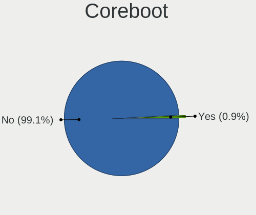
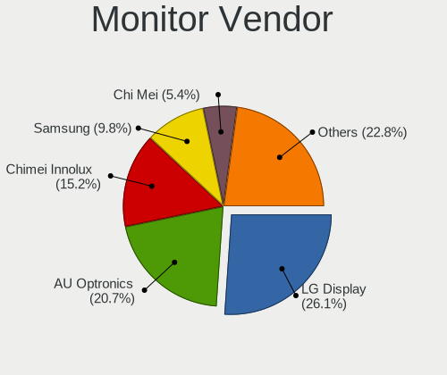
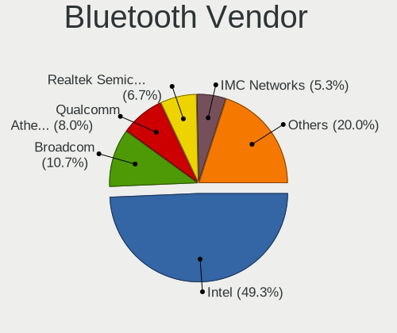
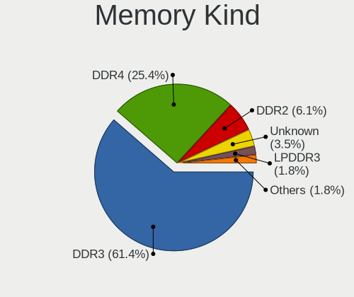
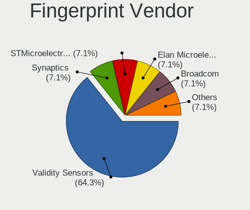
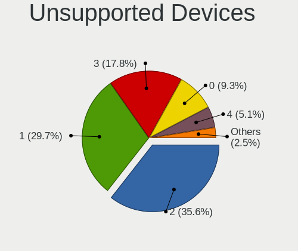

helloSystem 0.5.0 - Tested Hardware & Statistics (Notebooks)
------------------------------------------------------------

A project to collect tested hardware configurations for helloSystem 0.5.0.

Anyone can contribute to this report by the [hw-probe](https://github.com/linuxhw/hw-probe/blob/master/INSTALL.BSD.md) tool:

    hw-probe -all -upload

Please submit a probe of your configuration if it's not presented on the page or is rare.

Full-feature report is available here: https://bsd-hardware.info/?view=trends&rel=hellosystem-0.5.0

Contents
--------

* [ Test Cases ](#test-cases)

* [ System ](#system)
  - [ Arch                     ](#arch)
  - [ DE                       ](#de)
  - [ Display Server           ](#display-server)
  - [ Display Manager          ](#display-manager)
  - [ OS Lang                  ](#os-lang)
  - [ Boot Mode                ](#boot-mode)
  - [ Filesystem               ](#filesystem)
  - [ Part. scheme             ](#part-scheme)

* [ Board ](#board)
  - [ Vendor                   ](#vendor)
  - [ Model                    ](#model)
  - [ Model Family             ](#model-family)
  - [ MFG Year                 ](#mfg-year)
  - [ Form Factor              ](#form-factor)
  - [ Coreboot                 ](#coreboot)
  - [ RAM Size                 ](#ram-size)
  - [ RAM Used                 ](#ram-used)
  - [ Total Drives             ](#total-drives)
  - [ Has CD-ROM               ](#has-cd-rom)
  - [ Has Ethernet             ](#has-ethernet)
  - [ Has WiFi                 ](#has-wifi)
  - [ Has Bluetooth            ](#has-bluetooth)

* [ Location ](#location)
  - [ Country                  ](#country)
  - [ City                     ](#city)

* [ Drives ](#drives)
  - [ Drive Vendor             ](#drive-vendor)
  - [ Drive Model              ](#drive-model)
  - [ HDD Vendor               ](#hdd-vendor)
  - [ SSD Vendor               ](#ssd-vendor)
  - [ Drive Kind               ](#drive-kind)
  - [ Drive Connector          ](#drive-connector)
  - [ Drive Size               ](#drive-size)
  - [ Space Total              ](#space-total)
  - [ Space Used               ](#space-used)
  - [ Malfunc. Drives          ](#malfunc-drives)
  - [ Malfunc. Drive Vendor    ](#malfunc-drive-vendor)
  - [ Malfunc. HDD Vendor      ](#malfunc-hdd-vendor)
  - [ Malfunc. Drive Kind      ](#malfunc-drive-kind)
  - [ Failed Drives            ](#failed-drives)
  - [ Failed Drive Vendor      ](#failed-drive-vendor)
  - [ Drive Status             ](#drive-status)

* [ Storage controller ](#storage-controller)
  - [ Storage Vendor           ](#storage-vendor)
  - [ Storage Model            ](#storage-model)
  - [ Storage Kind             ](#storage-kind)

* [ Processor ](#processor)
  - [ CPU Vendor               ](#cpu-vendor)
  - [ CPU Model                ](#cpu-model)
  - [ CPU Model Family         ](#cpu-model-family)
  - [ CPU Cores                ](#cpu-cores)
  - [ CPU Sockets              ](#cpu-sockets)
  - [ CPU Threads              ](#cpu-threads)
  - [ CPU Microarch            ](#cpu-microarch)

* [ Graphics ](#graphics)
  - [ GPU Vendor               ](#gpu-vendor)
  - [ GPU Model                ](#gpu-model)
  - [ GPU Combo                ](#gpu-combo)
  - [ GPU Driver               ](#gpu-driver)
  - [ GPU Memory               ](#gpu-memory)

* [ Monitor ](#monitor)
  - [ Monitor Vendor           ](#monitor-vendor)
  - [ Monitor Model            ](#monitor-model)
  - [ Monitor Resolution       ](#monitor-resolution)
  - [ Monitor Diagonal         ](#monitor-diagonal)
  - [ Monitor Width            ](#monitor-width)
  - [ Aspect Ratio             ](#aspect-ratio)
  - [ Monitor Area             ](#monitor-area)
  - [ Pixel Density            ](#pixel-density)
  - [ Multiple Monitors        ](#multiple-monitors)

* [ Network ](#network)
  - [ Net Controller Vendor    ](#net-controller-vendor)
  - [ Net Controller Model     ](#net-controller-model)
  - [ Wireless Vendor          ](#wireless-vendor)
  - [ Wireless Model           ](#wireless-model)
  - [ Ethernet Vendor          ](#ethernet-vendor)
  - [ Ethernet Model           ](#ethernet-model)
  - [ Net Controller Kind      ](#net-controller-kind)
  - [ Used Controller          ](#used-controller)
  - [ NICs                     ](#nics)
  - [ IPv6                     ](#ipv6)

* [ Bluetooth ](#bluetooth)
  - [ Bluetooth Vendor         ](#bluetooth-vendor)
  - [ Bluetooth Model          ](#bluetooth-model)

* [ Sound ](#sound)
  - [ Sound Vendor             ](#sound-vendor)
  - [ Sound Model              ](#sound-model)

* [ Memory ](#memory)
  - [ Memory Vendor            ](#memory-vendor)
  - [ Memory Model             ](#memory-model)
  - [ Memory Kind              ](#memory-kind)
  - [ Memory Form Factor       ](#memory-form-factor)
  - [ Memory Size              ](#memory-size)
  - [ Memory Speed             ](#memory-speed)

* [ Printers & scanners ](#printers--scanners)
  - [ Printer Vendor           ](#printer-vendor)
  - [ Printer Model            ](#printer-model)
  - [ Scanner Vendor           ](#scanner-vendor)
  - [ Scanner Model            ](#scanner-model)

* [ Camera ](#camera)
  - [ Camera Vendor            ](#camera-vendor)
  - [ Camera Model             ](#camera-model)

* [ Security ](#security)
  - [ Fingerprint Vendor       ](#fingerprint-vendor)
  - [ Fingerprint Model        ](#fingerprint-model)
  - [ Chipcard Vendor          ](#chipcard-vendor)
  - [ Chipcard Model           ](#chipcard-model)

* [ Unsupported ](#unsupported)
  - [ Unsupported Devices      ](#unsupported-devices)
  - [ Unsupported Device Types ](#unsupported-device-types)

Test Cases
----------

| Vendor        | Model                       | Probe                                                     | Date         |
|---------------|-----------------------------|-----------------------------------------------------------|--------------|
| Lenovo        | ThinkPad T490s 20NYS3TU0... | [d377309110](https://bsd-hardware.info/?probe=d377309110) | Oct 02, 2021 |
| Lenovo        | ThinkPad X230 Tablet 343... | [efdfee9023](https://bsd-hardware.info/?probe=efdfee9023) | Oct 01, 2021 |
| Lenovo        | ThinkPad X230 2325O76       | [b8729e39e1](https://bsd-hardware.info/?probe=b8729e39e1) | Sep 29, 2021 |
| Toshiba       | Satellite P300              | [13e4aa7026](https://bsd-hardware.info/?probe=13e4aa7026) | Sep 29, 2021 |
| Lenovo        | ThinkPad L520 78594KM       | [7905093412](https://bsd-hardware.info/?probe=7905093412) | Sep 26, 2021 |
| Lenovo        | ThinkPad T410 2537E82       | [4ccdde7b89](https://bsd-hardware.info/?probe=4ccdde7b89) | Sep 20, 2021 |
| Lenovo        | ThinkPad T61 64607EU        | [34e48b691d](https://bsd-hardware.info/?probe=34e48b691d) | Sep 17, 2021 |
| HP            | G42                         | [738ccd1adf](https://bsd-hardware.info/?probe=738ccd1adf) | Sep 15, 2021 |
| Lenovo        | Yoga Slim 7 Pro 14ACH5 8... | [7979c87340](https://bsd-hardware.info/?probe=7979c87340) | Sep 14, 2021 |
| Lenovo        | IdeaPad 110S-11IBR 80WG     | [62f9376847](https://bsd-hardware.info/?probe=62f9376847) | Sep 04, 2021 |
| Apple         | MacBookAir7,2               | [6eada6e49e](https://bsd-hardware.info/?probe=6eada6e49e) | Aug 28, 2021 |
| Itautec       | Infoway w7530               | [fe69db32c8](https://bsd-hardware.info/?probe=fe69db32c8) | Aug 27, 2021 |
| HP            | Pavilion dv6                | [8054d6310f](https://bsd-hardware.info/?probe=8054d6310f) | Aug 19, 2021 |
| MSI           | GF65 Thin 10SDR             | [7e5ebc9c82](https://bsd-hardware.info/?probe=7e5ebc9c82) | Aug 18, 2021 |
| Toshiba       | Satellite L855              | [116ce6af18](https://bsd-hardware.info/?probe=116ce6af18) | Aug 18, 2021 |
| Dell          | Latitude E5530 non-vPro     | [bd4b0f0700](https://bsd-hardware.info/?probe=bd4b0f0700) | Aug 17, 2021 |
| ASUSTek       | X55CR                       | [c7c812c2c9](https://bsd-hardware.info/?probe=c7c812c2c9) | Aug 15, 2021 |
| HP            | 250 G4                      | [24e8c3de59](https://bsd-hardware.info/?probe=24e8c3de59) | Aug 13, 2021 |
| HP            | 625                         | [606d75e6a1](https://bsd-hardware.info/?probe=606d75e6a1) | Aug 11, 2021 |
| HP            | 250 G4                      | [43a7b112ba](https://bsd-hardware.info/?probe=43a7b112ba) | Aug 11, 2021 |
| Lenovo        | ThinkPad X230 2330A48       | [791c826f7d](https://bsd-hardware.info/?probe=791c826f7d) | Aug 11, 2021 |
| HP            | Pavilion 11                 | [5300a49632](https://bsd-hardware.info/?probe=5300a49632) | Aug 10, 2021 |
| Dell          | G3 3579                     | [91c803fdf2](https://bsd-hardware.info/?probe=91c803fdf2) | Aug 09, 2021 |
| NEC Comput... | PC-VK17HBBCD                | [1e23da04c0](https://bsd-hardware.info/?probe=1e23da04c0) | Aug 08, 2021 |
| Dell          | Inspiron 15-3567            | [9073f1975d](https://bsd-hardware.info/?probe=9073f1975d) | Aug 07, 2021 |
| ASUSTek       | K55VD                       | [6896c37580](https://bsd-hardware.info/?probe=6896c37580) | Aug 06, 2021 |
| Apple         | MacBookPro3,1               | [3566222830](https://bsd-hardware.info/?probe=3566222830) | Aug 04, 2021 |
| Lenovo        | ThinkPad X250 20CLS4JH00    | [89a74889ae](https://bsd-hardware.info/?probe=89a74889ae) | Aug 02, 2021 |
| Sony          | VPCEJ1E1E                   | [c471fb3f82](https://bsd-hardware.info/?probe=c471fb3f82) | Aug 01, 2021 |
| Lenovo        | G550 2958                   | [86880c29cf](https://bsd-hardware.info/?probe=86880c29cf) | Jul 31, 2021 |
| Lenovo        | G550 2958                   | [4fe522eaf3](https://bsd-hardware.info/?probe=4fe522eaf3) | Jul 31, 2021 |
| HP            | 15                          | [c2da1dd654](https://bsd-hardware.info/?probe=c2da1dd654) | Jul 30, 2021 |
| Apple         | MacBookPro6,2               | [7f25ab7c67](https://bsd-hardware.info/?probe=7f25ab7c67) | Jul 26, 2021 |
| Lenovo        | G500 20236                  | [d15eff8bcc](https://bsd-hardware.info/?probe=d15eff8bcc) | Jul 21, 2021 |
| HP            | Stream 11 Pro G4 EE         | [bd2bf6b0a0](https://bsd-hardware.info/?probe=bd2bf6b0a0) | Jul 20, 2021 |
| Apple         | MacBookPro9,2               | [6cca4dee6f](https://bsd-hardware.info/?probe=6cca4dee6f) | Jul 15, 2021 |
| Alienware     | 17                          | [aff2be63cd](https://bsd-hardware.info/?probe=aff2be63cd) | Jul 10, 2021 |
| MouseCompu... | W331AU                      | [f9a4733911](https://bsd-hardware.info/?probe=f9a4733911) | Jul 06, 2021 |
| MouseCompu... | W331AU                      | [4adfeaa072](https://bsd-hardware.info/?probe=4adfeaa072) | Jul 06, 2021 |
| HP            | ProBook 4440s               | [4aac49bc1e](https://bsd-hardware.info/?probe=4aac49bc1e) | Jul 01, 2021 |
| Lenovo        | ThinkPad X200 7458VP4       | [42100d8ea1](https://bsd-hardware.info/?probe=42100d8ea1) | Jun 30, 2021 |
| HP            | Pavilion 17                 | [9929e0c39b](https://bsd-hardware.info/?probe=9929e0c39b) | Jun 30, 2021 |
| Dell          | Latitude E6410              | [8c904d84e0](https://bsd-hardware.info/?probe=8c904d84e0) | Jun 28, 2021 |
| Lenovo        | G500 20236                  | [6e96d4c26f](https://bsd-hardware.info/?probe=6e96d4c26f) | Jun 28, 2021 |
| Lenovo        | G500 20236                  | [7ae63d4c6c](https://bsd-hardware.info/?probe=7ae63d4c6c) | Jun 27, 2021 |
| Lenovo        | ThinkPad L450 20DTCTO1WW    | [aba7b76575](https://bsd-hardware.info/?probe=aba7b76575) | Jun 27, 2021 |
| ASUSTek       | Strix 17 GL703GE            | [1697ebb0a5](https://bsd-hardware.info/?probe=1697ebb0a5) | Jun 25, 2021 |
| Acer          | Aspire 5750                 | [d59f20f88a](https://bsd-hardware.info/?probe=d59f20f88a) | Jun 22, 2021 |
| Dell          | Precision 7710              | [33653d0c28](https://bsd-hardware.info/?probe=33653d0c28) | Jun 22, 2021 |
| Lenovo        | ThinkPad X230 2325WWB       | [786669cc9c](https://bsd-hardware.info/?probe=786669cc9c) | Jun 21, 2021 |
| Lenovo        | ThinkPad T440s 20ARS1B70... | [46dca136f6](https://bsd-hardware.info/?probe=46dca136f6) | Jun 21, 2021 |
| Lenovo        | ThinkPad T470p 20J6A012C... | [d5e4c49986](https://bsd-hardware.info/?probe=d5e4c49986) | Jun 21, 2021 |
| Acer          | Aspire 5750                 | [cc6dc71d37](https://bsd-hardware.info/?probe=cc6dc71d37) | Jun 21, 2021 |
| Toshiba       | PORTEGE Z10t-A              | [cb7cbd17d0](https://bsd-hardware.info/?probe=cb7cbd17d0) | Jun 20, 2021 |
| Gateway       | NE56R                       | [cc65e24aea](https://bsd-hardware.info/?probe=cc65e24aea) | Jun 20, 2021 |
| ASUSTek       | VivoBook_ASUSLaptop X712... | [0fe1337b93](https://bsd-hardware.info/?probe=0fe1337b93) | Jun 19, 2021 |
| ASUSTek       | VivoBook_ASUSLaptop X403... | [902b4298d4](https://bsd-hardware.info/?probe=902b4298d4) | Jun 19, 2021 |
| WYSE          | Z CLASS                     | [571fdbf390](https://bsd-hardware.info/?probe=571fdbf390) | Jun 19, 2021 |
| Dell          | Latitude E5420              | [1ed3ff35f6](https://bsd-hardware.info/?probe=1ed3ff35f6) | Jun 19, 2021 |
| Dell          | Vostro 3560                 | [ce9d5f9a46](https://bsd-hardware.info/?probe=ce9d5f9a46) | Jun 18, 2021 |
| Lenovo        | ThinkPad Edge E530 62724... | [78abd376db](https://bsd-hardware.info/?probe=78abd376db) | Jun 18, 2021 |
| Lenovo        | ThinkPad T420 4236FJ1       | [808f58228e](https://bsd-hardware.info/?probe=808f58228e) | Jun 17, 2021 |
| Toshiba       | PORTEGE R930                | [db520e9382](https://bsd-hardware.info/?probe=db520e9382) | Jun 15, 2021 |
| Toshiba       | Satellite C640              | [ec0d93d08c](https://bsd-hardware.info/?probe=ec0d93d08c) | Jun 15, 2021 |
| Lenovo        | ThinkPad T440s 20ARS1B70... | [9ae8146589](https://bsd-hardware.info/?probe=9ae8146589) | Jun 15, 2021 |
| Dell          | Latitude 5400               | [1bb6c1f63f](https://bsd-hardware.info/?probe=1bb6c1f63f) | Jun 15, 2021 |
| Dell          | Inspiron 15-3567            | [53049dff12](https://bsd-hardware.info/?probe=53049dff12) | Jun 14, 2021 |
| HP            | OMEN by HP Laptop           | [abc94e9198](https://bsd-hardware.info/?probe=abc94e9198) | Jun 13, 2021 |
| HP            | 255 G2                      | [31177d9e0f](https://bsd-hardware.info/?probe=31177d9e0f) | Jun 13, 2021 |
| Lenovo        | ThinkPad T430 2349GCU       | [ca15c7d742](https://bsd-hardware.info/?probe=ca15c7d742) | Jun 13, 2021 |
| Gateway       | NE56R                       | [932f5d03f3](https://bsd-hardware.info/?probe=932f5d03f3) | Jun 13, 2021 |
| Dell          | Latitude E4300              | [7855973957](https://bsd-hardware.info/?probe=7855973957) | Jun 12, 2021 |
| Dell          | Inspiron 15-3567            | [d239ee4916](https://bsd-hardware.info/?probe=d239ee4916) | Jun 12, 2021 |
| Lenovo        | ThinkPad X240 20AMS39F0K    | [65564434a9](https://bsd-hardware.info/?probe=65564434a9) | Jun 12, 2021 |
| ASUSTek       | UX330UAK                    | [430c90b88d](https://bsd-hardware.info/?probe=430c90b88d) | Jun 12, 2021 |
| Lenovo        | ThinkPad T440s 20ARS1B70... | [b644ed3914](https://bsd-hardware.info/?probe=b644ed3914) | Mar 31, 2021 |
| Dell          | Vostro 14-3468              | [219133fc53](https://bsd-hardware.info/?probe=219133fc53) | Mar 30, 2021 |
| Dell          | Vostro 14-3468              | [2c61fcee12](https://bsd-hardware.info/?probe=2c61fcee12) | Mar 30, 2021 |
| Lenovo        | ThinkPad T440s 20ARS1B70... | [a5b9f5e79d](https://bsd-hardware.info/?probe=a5b9f5e79d) | Mar 27, 2021 |
| Lenovo        | ThinkPad X230 23255Y4       | [ab871769f0](https://bsd-hardware.info/?probe=ab871769f0) | Mar 27, 2021 |
| Toshiba       | Satellite L500              | [e07fd4edd9](https://bsd-hardware.info/?probe=e07fd4edd9) | Mar 25, 2021 |
| HP            | Pavilion Notebook           | [42ecf97502](https://bsd-hardware.info/?probe=42ecf97502) | Mar 25, 2021 |
| HP            | Pavilion Notebook           | [88e98e18a5](https://bsd-hardware.info/?probe=88e98e18a5) | Mar 25, 2021 |
| ASUSTek       | G75VW                       | [9b84d1e7e6](https://bsd-hardware.info/?probe=9b84d1e7e6) | Mar 24, 2021 |
| Lenovo        | ThinkPad T440s 20ARS1B70... | [d856b5bf95](https://bsd-hardware.info/?probe=d856b5bf95) | Mar 23, 2021 |
| Samsung       | 530U3C/530U4C/532U3C        | [10c79ea427](https://bsd-hardware.info/?probe=10c79ea427) | Mar 22, 2021 |
| Lenovo        | ThinkPad X260 20F5S82N00    | [aa3deadedd](https://bsd-hardware.info/?probe=aa3deadedd) | Mar 19, 2021 |
| Dell          | Inspiron 7520               | [599d3e84d7](https://bsd-hardware.info/?probe=599d3e84d7) | Mar 16, 2021 |
| TUXEDO        | Aura 15 Gen1                | [860b1cd65b](https://bsd-hardware.info/?probe=860b1cd65b) | Mar 15, 2021 |
| Packard Be... | EasyNote MH36               | [2a98cae4e8](https://bsd-hardware.info/?probe=2a98cae4e8) | Mar 13, 2021 |
| Fujitsu       | LIFEBOOK A555               | [bcb99d0f09](https://bsd-hardware.info/?probe=bcb99d0f09) | Mar 13, 2021 |
| Fujitsu       | LIFEBOOK A555               | [ee894449af](https://bsd-hardware.info/?probe=ee894449af) | Mar 13, 2021 |
| Dell          | Inspiron 7520               | [0054ef2511](https://bsd-hardware.info/?probe=0054ef2511) | Mar 13, 2021 |
| Dell          | Inspiron 3543               | [525eeec663](https://bsd-hardware.info/?probe=525eeec663) | Mar 12, 2021 |
| Acer          | Aspire 4810T                | [14af887195](https://bsd-hardware.info/?probe=14af887195) | Mar 11, 2021 |
| Lenovo        | B41-80 80LG                 | [d598cc6240](https://bsd-hardware.info/?probe=d598cc6240) | Mar 11, 2021 |
| TUXEDO        | Aura 15 Gen1                | [9a7f08f8c1](https://bsd-hardware.info/?probe=9a7f08f8c1) | Mar 11, 2021 |
| TUXEDO        | Aura 15 Gen1                | [d9661207d7](https://bsd-hardware.info/?probe=d9661207d7) | Mar 11, 2021 |
| Toshiba       | Satellite Pro U400          | [71fd81df30](https://bsd-hardware.info/?probe=71fd81df30) | Mar 07, 2021 |
| ASUSTek       | X556UA                      | [57018edd10](https://bsd-hardware.info/?probe=57018edd10) | Mar 07, 2021 |
| Dell          | Latitude E6500              | [d25dacc162](https://bsd-hardware.info/?probe=d25dacc162) | Mar 07, 2021 |
| Dell          | Latitude E5570              | [12eae7a62e](https://bsd-hardware.info/?probe=12eae7a62e) | Mar 05, 2021 |
| HP            | EliteBook 820 G1            | [de98cd5952](https://bsd-hardware.info/?probe=de98cd5952) | Mar 04, 2021 |
| HP            | EliteBook 820 G1            | [03c5808adf](https://bsd-hardware.info/?probe=03c5808adf) | Mar 04, 2021 |
| Lenovo        | IdeaPad 700-15ISK 80RU      | [d129752b43](https://bsd-hardware.info/?probe=d129752b43) | Mar 04, 2021 |
| Acer          | Aspire 8730                 | [33e7d80b63](https://bsd-hardware.info/?probe=33e7d80b63) | Mar 01, 2021 |
| Hampoo        | B3W6_NA123C Reserved        | [bc138c0580](https://bsd-hardware.info/?probe=bc138c0580) | Feb 27, 2021 |
| Lenovo        | IdeaPad S145-15IWL 81S9     | [5211d36066](https://bsd-hardware.info/?probe=5211d36066) | Feb 25, 2021 |
| Lenovo        | ThinkPad T470p 20J6A012C... | [cbaa19611e](https://bsd-hardware.info/?probe=cbaa19611e) | Feb 24, 2021 |
| Dell          | XPS 13 9333                 | [7c78b3d42a](https://bsd-hardware.info/?probe=7c78b3d42a) | Feb 24, 2021 |
| Samsung       | RV411/RV511/E3511/S3511/... | [467a915fc7](https://bsd-hardware.info/?probe=467a915fc7) | Feb 23, 2021 |
| LG Electro... | 14Z980-G.BH51P1             | [d8ee6bc4e3](https://bsd-hardware.info/?probe=d8ee6bc4e3) | Feb 22, 2021 |
| Dell          | Latitude E7240              | [e42e579971](https://bsd-hardware.info/?probe=e42e579971) | Feb 22, 2021 |
| Lenovo        | G470 20078                  | [b8e35aacdb](https://bsd-hardware.info/?probe=b8e35aacdb) | Feb 22, 2021 |
| Apple         | MacBookPro9,2               | [a7d9aeda81](https://bsd-hardware.info/?probe=a7d9aeda81) | Feb 22, 2021 |
| HP            | EliteBook 8540p             | [78d9a31074](https://bsd-hardware.info/?probe=78d9a31074) | Feb 21, 2021 |
| Lenovo        | ThinkPad E420 1141A83       | [aa98e655f3](https://bsd-hardware.info/?probe=aa98e655f3) | Feb 20, 2021 |
| Lenovo        | ThinkPad E420 1141A83       | [9731048099](https://bsd-hardware.info/?probe=9731048099) | Feb 20, 2021 |
| Lenovo        | ThinkPad E420 1141A83       | [03d4d9a468](https://bsd-hardware.info/?probe=03d4d9a468) | Feb 20, 2021 |
| Lenovo        | ThinkPad E420 1141A83       | [a48872901d](https://bsd-hardware.info/?probe=a48872901d) | Feb 20, 2021 |
| HP            | ProBook 440 G2              | [63038d613f](https://bsd-hardware.info/?probe=63038d613f) | Feb 19, 2021 |
| Lenovo        | ZIUS6                       | [1c239bac92](https://bsd-hardware.info/?probe=1c239bac92) | Feb 18, 2021 |
| Lenovo        | ThinkPad T490 20RYS06R00    | [12c985b708](https://bsd-hardware.info/?probe=12c985b708) | Feb 17, 2021 |
| HP            | Pavilion Laptop 14-ce2xx... | [c355a6280b](https://bsd-hardware.info/?probe=c355a6280b) | Feb 17, 2021 |
| HP            | OMEN by HP Laptop           | [bb8beb97be](https://bsd-hardware.info/?probe=bb8beb97be) | Feb 17, 2021 |
| eMachines     | eME732ZG                    | [d0c0433452](https://bsd-hardware.info/?probe=d0c0433452) | Feb 16, 2021 |
| ASUSTek       | X555LD                      | [74d43ccd10](https://bsd-hardware.info/?probe=74d43ccd10) | Feb 16, 2021 |
| HP            | EliteBook 840 G3            | [0d35b2f5d8](https://bsd-hardware.info/?probe=0d35b2f5d8) | Feb 15, 2021 |
| Lenovo        | Legion Y530-15ICH 81FV      | [f8bdec0105](https://bsd-hardware.info/?probe=f8bdec0105) | Feb 14, 2021 |

System
------

Arch
----

OS architecture (x86_64, i586, etc.)

| Name  | Notebooks | Percent |
|-------|-----------|---------|
| amd64 | 104       | 100%    |

DE
--

Desktop Environment

| Name         | Notebooks | Percent |
|--------------|-----------|---------|
| helloDesktop | 103       | 99.04%  |
| KDE5         | 1         | 0.96%   |

Display Server
--------------

X11 or Wayland

| Name | Notebooks | Percent |
|------|-----------|---------|
| X11  | 104       | 100%    |

Display Manager
---------------

SDDM, LightDM, etc.

| Name | Notebooks | Percent |
|------|-----------|---------|
| SLiM | 104       | 100%    |

OS Lang
-------

Language

| Lang  | Notebooks | Percent |
|-------|-----------|---------|
| en_US | 104       | 100%    |

Boot Mode
---------

EFI or BIOS

| Mode | Notebooks | Percent |
|------|-----------|---------|
| EFI  | 83        | 79.81%  |
| BIOS | 21        | 20.19%  |

Filesystem
----------

Type of filesystem

| Type | Notebooks | Percent |
|------|-----------|---------|
| Zfs  | 104       | 100%    |

Part. scheme
------------

Scheme of partitioning

| Type | Notebooks | Percent |
|------|-----------|---------|
| GPT  | 104       | 100%    |

Board
-----

Vendor
------

Motherboard manufacturer

| Name                | Notebooks | Percent |
|---------------------|-----------|---------|
| Lenovo              | 29        | 27.88%  |
| Dell                | 19        | 18.27%  |
| Hewlett-Packard     | 16        | 15.38%  |
| ASUSTek Computer    | 9         | 8.65%   |
| Toshiba             | 7         | 6.73%   |
| Apple               | 5         | 4.81%   |
| Acer                | 3         | 2.88%   |
| Samsung Electronics | 2         | 1.92%   |
| Gateway             | 2         | 1.92%   |
| WYSE                | 1         | 0.96%   |
| TUXEDO              | 1         | 0.96%   |
| Sony                | 1         | 0.96%   |
| Packard Bell        | 1         | 0.96%   |
| NEC Computers       | 1         | 0.96%   |
| MSI                 | 1         | 0.96%   |
| MouseComputer       | 1         | 0.96%   |
| LG Electronics      | 1         | 0.96%   |
| Hampoo              | 1         | 0.96%   |
| Fujitsu             | 1         | 0.96%   |
| eMachines           | 1         | 0.96%   |
| Alienware           | 1         | 0.96%   |

Model
-----

Motherboard model

| Name                                        | Notebooks | Percent |
|---------------------------------------------|-----------|---------|
| Dell Inspiron 15-3567                       | 3         | 2.88%   |
| Gateway NE56R                               | 2         | 1.92%   |
| Dell Inspiron 7520                          | 2         | 1.92%   |
| Apple MacBookPro9,2                         | 2         | 1.92%   |
| WYSE Z CLASS                                | 1         | 0.96%   |
| TUXEDO Aura 15 Gen1                         | 1         | 0.96%   |
| Toshiba Satellite Pro U400                  | 1         | 0.96%   |
| Toshiba Satellite P300                      | 1         | 0.96%   |
| Toshiba Satellite L855                      | 1         | 0.96%   |
| Toshiba Satellite L500                      | 1         | 0.96%   |
| Toshiba Satellite C640                      | 1         | 0.96%   |
| Toshiba PORTEGE Z10t-A                      | 1         | 0.96%   |
| Toshiba PORTEGE R930                        | 1         | 0.96%   |
| Sony VPCEJ1E1E                              | 1         | 0.96%   |
| Samsung RV411/RV511/E3511/S3511/RV711/E3411 | 1         | 0.96%   |
| Samsung 530U3C/530U4C/532U3C                | 1         | 0.96%   |
| Packard Bell EasyNote MH36                  | 1         | 0.96%   |
| NEC Computers PC-VK17HBBCD                  | 1         | 0.96%   |
| MSI GF65 Thin 10SDR                         | 1         | 0.96%   |
| MouseComputer W331AU                        | 1         | 0.96%   |
| LG 14Z980-G.BH51P1                          | 1         | 0.96%   |
| Lenovo ZIUS6                                | 1         | 0.96%   |
| Lenovo Yoga Slim 7 Pro 14ACH5 82MS          | 1         | 0.96%   |
| Lenovo ThinkPad X260 20F5S82N00             | 1         | 0.96%   |
| Lenovo ThinkPad X250 20CLS4JH00             | 1         | 0.96%   |
| Lenovo ThinkPad X240 20AMS39F0K             | 1         | 0.96%   |
| Lenovo ThinkPad X230 Tablet 343522U         | 1         | 0.96%   |
| Lenovo ThinkPad X230 2330A48                | 1         | 0.96%   |
| Lenovo ThinkPad X230 2325WWB                | 1         | 0.96%   |
| Lenovo ThinkPad X230 2325O76                | 1         | 0.96%   |
| Lenovo ThinkPad X230 23255Y4                | 1         | 0.96%   |
| Lenovo ThinkPad X200 7458VP4                | 1         | 0.96%   |
| Lenovo ThinkPad T61 64607EU                 | 1         | 0.96%   |
| Lenovo ThinkPad T490s 20NYS3TU00            | 1         | 0.96%   |
| Lenovo ThinkPad T490 20RYS06R00             | 1         | 0.96%   |
| Lenovo ThinkPad T470p 20J6A012CD            | 1         | 0.96%   |
| Lenovo ThinkPad T440s 20ARS1B704            | 1         | 0.96%   |
| Lenovo ThinkPad T420 4236FJ1                | 1         | 0.96%   |
| Lenovo ThinkPad T410 2537E82                | 1         | 0.96%   |
| Lenovo ThinkPad L520 78594KM                | 1         | 0.96%   |
| Lenovo ThinkPad L450 20DTCTO1WW             | 1         | 0.96%   |
| Lenovo ThinkPad Edge E530 62724FU           | 1         | 0.96%   |
| Lenovo ThinkPad E420 1141A83                | 1         | 0.96%   |
| Lenovo Legion Y530-15ICH 81FV               | 1         | 0.96%   |
| Lenovo IdeaPad S145-15IWL 81S9              | 1         | 0.96%   |
| Lenovo IdeaPad 110S-11IBR 80WG              | 1         | 0.96%   |
| Lenovo G550 2958                            | 1         | 0.96%   |
| Lenovo G500 20236                           | 1         | 0.96%   |
| Lenovo G470 20078                           | 1         | 0.96%   |
| Lenovo B41-80 80LG                          | 1         | 0.96%   |
| HP Stream 11 Pro G4 EE                      | 1         | 0.96%   |
| HP ProBook 4440s                            | 1         | 0.96%   |
| HP ProBook 440 G2                           | 1         | 0.96%   |
| HP Pavilion Notebook                        | 1         | 0.96%   |
| HP Pavilion Laptop 14-ce2xxx                | 1         | 0.96%   |
| HP Pavilion dv6                             | 1         | 0.96%   |
| HP Pavilion 17                              | 1         | 0.96%   |
| HP Pavilion 11                              | 1         | 0.96%   |
| HP OMEN by HP Laptop                        | 1         | 0.96%   |
| HP G42                                      | 1         | 0.96%   |

Model Family
------------

Motherboard model prefix

| Name                       | Notebooks | Percent |
|----------------------------|-----------|---------|
| Lenovo ThinkPad            | 20        | 19.23%  |
| Dell Latitude              | 8         | 7.69%   |
| Dell Inspiron              | 6         | 5.77%   |
| Toshiba Satellite          | 5         | 4.81%   |
| HP Pavilion                | 5         | 4.81%   |
| Acer Aspire                | 3         | 2.88%   |
| Toshiba PORTEGE            | 2         | 1.92%   |
| Lenovo IdeaPad             | 2         | 1.92%   |
| HP ProBook                 | 2         | 1.92%   |
| HP EliteBook               | 2         | 1.92%   |
| Gateway NE56R              | 2         | 1.92%   |
| Dell Vostro                | 2         | 1.92%   |
| ASUS VivoBook              | 2         | 1.92%   |
| Apple MacBookPro9          | 2         | 1.92%   |
| WYSE Z                     | 1         | 0.96%   |
| TUXEDO Aura                | 1         | 0.96%   |
| Sony VPCEJ1E1E             | 1         | 0.96%   |
| Samsung RV411              | 1         | 0.96%   |
| Samsung 530U3C             | 1         | 0.96%   |
| Packard Bell EasyNote      | 1         | 0.96%   |
| NEC Computers PC-VK17HBBCD | 1         | 0.96%   |
| MSI GF65                   | 1         | 0.96%   |
| MouseComputer W331AU       | 1         | 0.96%   |
| LG 14Z980-G.BH51P1         | 1         | 0.96%   |
| Lenovo ZIUS6               | 1         | 0.96%   |
| Lenovo Yoga                | 1         | 0.96%   |
| Lenovo Legion              | 1         | 0.96%   |
| Lenovo G550                | 1         | 0.96%   |
| Lenovo G500                | 1         | 0.96%   |
| Lenovo G470                | 1         | 0.96%   |
| Lenovo B41-80              | 1         | 0.96%   |
| HP Stream                  | 1         | 0.96%   |
| HP OMEN                    | 1         | 0.96%   |
| HP G42                     | 1         | 0.96%   |
| HP 625                     | 1         | 0.96%   |
| HP 255                     | 1         | 0.96%   |
| HP 250                     | 1         | 0.96%   |
| HP 15                      | 1         | 0.96%   |
| Hampoo NA123               | 1         | 0.96%   |
| Fujitsu LIFEBOOK           | 1         | 0.96%   |
| eMachines eME732ZG         | 1         | 0.96%   |
| Dell XPS                   | 1         | 0.96%   |
| Dell Precision             | 1         | 0.96%   |
| Dell G3                    | 1         | 0.96%   |
| ASUS X55CR                 | 1         | 0.96%   |
| ASUS X556UA                | 1         | 0.96%   |
| ASUS X555LD                | 1         | 0.96%   |
| ASUS UX330UAK              | 1         | 0.96%   |
| ASUS Strix                 | 1         | 0.96%   |
| ASUS K55VD                 | 1         | 0.96%   |
| ASUS G75VW                 | 1         | 0.96%   |
| Apple MacBookPro6          | 1         | 0.96%   |
| Apple MacBookPro3          | 1         | 0.96%   |
| Apple MacBookAir7          | 1         | 0.96%   |
| Alienware 17               | 1         | 0.96%   |

MFG Year
--------

Motherboard manufacture year

| Year | Notebooks | Percent |
|------|-----------|---------|
| 2020 | 20        | 19.23%  |
| 2013 | 17        | 16.35%  |
| 2019 | 15        | 14.42%  |
| 2011 | 8         | 7.69%   |
| 2018 | 7         | 6.73%   |
| 2009 | 7         | 6.73%   |
| 2015 | 6         | 5.77%   |
| 2014 | 6         | 5.77%   |
| 2012 | 5         | 4.81%   |
| 2021 | 4         | 3.85%   |
| 2017 | 3         | 2.88%   |
| 2016 | 2         | 1.92%   |
| 2010 | 2         | 1.92%   |
| 2008 | 2         | 1.92%   |

Form Factor
-----------

Physical design of the computer

| Name     | Notebooks | Percent |
|----------|-----------|---------|
| Notebook | 104       | 100%    |

Coreboot
--------

Have coreboot on board

| Used | Notebooks | Percent |
|------|-----------|---------|
| No   | 103       | 99.04%  |
| Yes  | 1         | 0.96%   |

RAM Size
--------

Total RAM memory

| Size in GB | Notebooks | Percent |
|------------|-----------|---------|
| 4.01-8.0   | 46        | 44.23%  |
| 8.01-16.0  | 39        | 37.5%   |
| 16.01-24.0 | 14        | 13.46%  |
| 32.01-64.0 | 3         | 2.88%   |
| 24.01-32.0 | 1         | 0.96%   |
| 2.01-3.0   | 1         | 0.96%   |

RAM Used
--------

Used RAM memory

| Used GB   | Notebooks | Percent |
|-----------|-----------|---------|
| 0.01-0.5  | 71        | 68.27%  |
| 0.51-1.0  | 27        | 25.96%  |
| 1.01-2.0  | 3         | 2.88%   |
| 2.01-3.0  | 2         | 1.92%   |
| 8.01-16.0 | 1         | 0.96%   |

Total Drives
------------

Number of drives on board

| Drives | Notebooks | Percent |
|--------|-----------|---------|
| 1      | 82        | 78.1%   |
| 2      | 14        | 13.33%  |
| 0      | 7         | 6.67%   |
| 3      | 2         | 1.9%    |

Has CD-ROM
----------

Has CD-ROM on board

| Presented | Notebooks | Percent |
|-----------|-----------|---------|
| Yes       | 54        | 51.92%  |
| No        | 50        | 48.08%  |

Has Ethernet
------------

Has Ethernet on board

| Presented | Notebooks | Percent |
|-----------|-----------|---------|
| Yes       | 90        | 86.54%  |
| No        | 14        | 13.46%  |

Has WiFi
--------

Has WiFi module

| Presented | Notebooks | Percent |
|-----------|-----------|---------|
| Yes       | 103       | 99.04%  |
| No        | 1         | 0.96%   |

Has Bluetooth
-------------

Has Bluetooth module

| Presented | Notebooks | Percent |
|-----------|-----------|---------|
| Yes       | 67        | 64.42%  |
| No        | 37        | 35.58%  |

Location
--------

Country
-------

Geographic location (country)

| Country            | Notebooks | Percent |
|--------------------|-----------|---------|
| USA                | 19        | 18.1%   |
| Germany            | 11        | 10.48%  |
| Brazil             | 8         | 7.62%   |
| Netherlands        | 6         | 5.71%   |
| China              | 5         | 4.76%   |
| UK                 | 4         | 3.81%   |
| Sweden             | 4         | 3.81%   |
| Spain              | 4         | 3.81%   |
| Switzerland        | 3         | 2.86%   |
| Italy              | 3         | 2.86%   |
| India              | 3         | 2.86%   |
| Ukraine            | 2         | 1.9%    |
| Portugal           | 2         | 1.9%    |
| Poland             | 2         | 1.9%    |
| Mexico             | 2         | 1.9%    |
| Indonesia          | 2         | 1.9%    |
| Canada             | 2         | 1.9%    |
| South Africa       | 1         | 0.95%   |
| Slovakia           | 1         | 0.95%   |
| Puerto Rico        | 1         | 0.95%   |
| Oman               | 1         | 0.95%   |
| New Zealand        | 1         | 0.95%   |
| Morocco            | 1         | 0.95%   |
| Montenegro         | 1         | 0.95%   |
| Malaysia           | 1         | 0.95%   |
| Lithuania          | 1         | 0.95%   |
| Latvia             | 1         | 0.95%   |
| Japan              | 1         | 0.95%   |
| Hungary            | 1         | 0.95%   |
| Greece             | 1         | 0.95%   |
| France             | 1         | 0.95%   |
| Dominican Republic | 1         | 0.95%   |
| Cyprus             | 1         | 0.95%   |
| Croatia            | 1         | 0.95%   |
| Bulgaria           | 1         | 0.95%   |
| Belgium            | 1         | 0.95%   |
| Belarus            | 1         | 0.95%   |
| Austria            | 1         | 0.95%   |
| Australia          | 1         | 0.95%   |
| Argentina          | 1         | 0.95%   |

City
----

Geographic location (city)

| City                 | Notebooks | Percent |
|----------------------|-----------|---------|
| Zurich               | 2         | 1.87%   |
| Berlin               | 2         | 1.87%   |
| Zhengzhou            | 1         | 0.93%   |
| Zagreb               | 1         | 0.93%   |
| Wuhan                | 1         | 0.93%   |
| Wroclaw              | 1         | 0.93%   |
| Washington           | 1         | 0.93%   |
| Warmond              | 1         | 0.93%   |
| Wandur               | 1         | 0.93%   |
| Vigonovo             | 1         | 0.93%   |
| Vienna               | 1         | 0.93%   |
| V?§ster??s           | 1         | 0.93%   |
| Vancouver            | 1         | 0.93%   |
| Utrecht              | 1         | 0.93%   |
| Tula de Allende      | 1         | 0.93%   |
| Traverse City        | 1         | 0.93%   |
| The Bronx            | 1         | 0.93%   |
| Tangara              | 1         | 0.93%   |
| Surabaya             | 1         | 0.93%   |
| Sungai Buloh         | 1         | 0.93%   |
| Solarino             | 1         | 0.93%   |
| Sofia                | 1         | 0.93%   |
| Shibakoen            | 1         | 0.93%   |
| Shasta               | 1         | 0.93%   |
| Santo Domingo Este   | 1         | 0.93%   |
| Sankt Augustin       | 1         | 0.93%   |
| Roosendaal           | 1         | 0.93%   |
| Riga                 | 1         | 0.93%   |
| Redondela            | 1         | 0.93%   |
| Pleidelsheim         | 1         | 0.93%   |
| Plav                 | 1         | 0.93%   |
| Plattsburgh          | 1         | 0.93%   |
| Perwez               | 1         | 0.93%   |
| Osasco               | 1         | 0.93%   |
| Oosterhout           | 1         | 0.93%   |
| Oklahoma City        | 1         | 0.93%   |
| Notting Hill Gate    | 1         | 0.93%   |
| Nizwa                | 1         | 0.93%   |
| New Braunfels        | 1         | 0.93%   |
| Morden               | 1         | 0.93%   |
| Montreuil            | 1         | 0.93%   |
| Miskolc              | 1         | 0.93%   |
| Mar del Plata        | 1         | 0.93%   |
| Lusk                 | 1         | 0.93%   |
| Lule??               | 1         | 0.93%   |
| Lisbon               | 1         | 0.93%   |
| Liptovský Mikuláš | 1         | 0.93%   |
| Limassol             | 1         | 0.93%   |
| Leipzig              | 1         | 0.93%   |
| Leesville            | 1         | 0.93%   |
| Las Vegas            | 1         | 0.93%   |
| Langnau am Albis     | 1         | 0.93%   |
| Lake Forest          | 1         | 0.93%   |
| Lajeado              | 1         | 0.93%   |
| Krakow               | 1         | 0.93%   |
| Klaipƒóda            | 1         | 0.93%   |
| Klagshamn            | 1         | 0.93%   |
| Kherson              | 1         | 0.93%   |
| Johannesburg         | 1         | 0.93%   |
| Jakarta              | 1         | 0.93%   |

Drives
------

Drive Vendor
------------

Hard drive vendors

| Vendor              | Notebooks | Drives | Percent |
|---------------------|-----------|--------|---------|
| WDC                 | 16        | 16     | 14.41%  |
| Samsung Electronics | 15        | 20     | 13.51%  |
| Seagate             | 14        | 15     | 12.61%  |
| Toshiba             | 11        | 11     | 9.91%   |
| Crucial             | 9         | 9      | 8.11%   |
| SanDisk             | 6         | 6      | 5.41%   |
| Intel               | 6         | 6      | 5.41%   |
| Hitachi             | 6         | 7      | 5.41%   |
| Kingston            | 4         | 5      | 3.6%    |
| A-DATA Technology   | 3         | 4      | 2.7%    |
| SPCC                | 2         | 2      | 1.8%    |
| OCZ                 | 2         | 2      | 1.8%    |
| HGST                | 2         | 2      | 1.8%    |
| Apple               | 2         | 2      | 1.8%    |
| Transcend           | 1         | 2      | 0.9%    |
| SMART               | 1         | 1      | 0.9%    |
| SK Hynix            | 1         | 1      | 0.9%    |
| PNY                 | 1         | 1      | 0.9%    |
| Patriot             | 1         | 1      | 0.9%    |
| MyDigitalSSD        | 1         | 1      | 0.9%    |
| Micron Technology   | 1         | 1      | 0.9%    |
| LITEONIT            | 1         | 1      | 0.9%    |
| LITEON              | 1         | 1      | 0.9%    |
| KingSpec            | 1         | 1      | 0.9%    |
| HPE                 | 1         | 1      | 0.9%    |
| Hewlett-Packard     | 1         | 2      | 0.9%    |
| Fujitsu             | 1         | 1      | 0.9%    |

Drive Model
-----------

Hard drive models

| Model                                | Notebooks | Percent |
|--------------------------------------|-----------|---------|
| Seagate ST9500325AS 500GB            | 2         | 1.75%   |
| Seagate ST500LM012 HN-M500MBB 500GB  | 2         | 1.75%   |
| Seagate ST1000LM035-1RK172 1TB       | 2         | 1.75%   |
| Samsung SSD 850 EVO 250GB            | 2         | 1.75%   |
| Crucial CT1000MX500SSD1 1TB          | 2         | 1.75%   |
| WDC WDS240G2G0A-00JH30 240GB         | 1         | 0.88%   |
| WDC WDBNCE2500PNC 250GB              | 1         | 0.88%   |
| WDC WD800BEVS-00RST0 80GB            | 1         | 0.88%   |
| WDC WD7500BPVX-60JC3T0 752GB         | 1         | 0.88%   |
| WDC WD5000LPVX-60V0TT0 500GB         | 1         | 0.88%   |
| WDC WD5000LPVX-00V0TT0 500GB         | 1         | 0.88%   |
| WDC WD3200BEVT-60ZCT1 320GB          | 1         | 0.88%   |
| WDC WD3200BEVT-22ZCT0 320GB          | 1         | 0.88%   |
| WDC WD3200BEKT-75PVMT1 320GB         | 1         | 0.88%   |
| WDC WD2500BEVT-75ZCT2 250GB          | 1         | 0.88%   |
| WDC WD1600BEVT-75ZCT2 160GB          | 1         | 0.88%   |
| WDC WD10SPZX-24Z10 1TB               | 1         | 0.88%   |
| WDC WD10JPVX-00JC3T0 1TB             | 1         | 0.88%   |
| WDC PC SN730 SDBPNTY-1T00-1101 1TB   | 1         | 0.88%   |
| WDC PC SN530 SDBPNPZ-512G-1032 512GB | 1         | 0.88%   |
| WDC PC SN530 SDBPNPZ-256G-1002 256GB | 1         | 0.88%   |
| Transcend TS512GMTS430S 512GB        | 1         | 0.88%   |
| Toshiba THNSNF128GCSS 128GB          | 1         | 0.88%   |
| Toshiba THNSNC128GMLJ 128GB          | 1         | 0.88%   |
| Toshiba MQ01ABF050 500GB             | 1         | 0.88%   |
| Toshiba MQ01ABD100 1TB               | 1         | 0.88%   |
| Toshiba MQ01ABD075 752GB             | 1         | 0.88%   |
| Toshiba MQ01ABD032 320GB             | 1         | 0.88%   |
| Toshiba MK3265GSXN 320GB             | 1         | 0.88%   |
| Toshiba MK3261GSYN 320GB             | 1         | 0.88%   |
| Toshiba MK3261GSY 320GB              | 1         | 0.88%   |
| Toshiba KXG50PNV2T04 NVMe 2048GB     | 1         | 0.88%   |
| Toshiba KBG40ZNS256G NVMe 256GB      | 1         | 0.88%   |
| SPCC Solid State Disk 256GB          | 1         | 0.88%   |
| SPCC Solid State Disk 1TB            | 1         | 0.88%   |
| SMART SSD XceedValue2 mSATA 32GB     | 1         | 0.88%   |
| SK Hynix SHGP31-1000GM-2 1TB         | 1         | 0.88%   |
| Seagate ST9320423AS 320GB            | 1         | 0.88%   |
| Seagate ST9250315AS 250GB            | 1         | 0.88%   |
| Seagate ST9160412ASG 160GB           | 1         | 0.88%   |
| Seagate ST9160412AS 160GB            | 1         | 0.88%   |
| Seagate ST500LM000-SSHD-8GB          | 1         | 0.88%   |
| Seagate ST320LT012-9WS14C 320GB      | 1         | 0.88%   |
| Seagate ST1000LM049-2GH172 1TB       | 1         | 0.88%   |
| Seagate ST1000LM048-2E7172 1TB       | 1         | 0.88%   |
| SanDisk Ultra II 480GB               | 1         | 0.88%   |
| SanDisk SSD i100 24GB                | 1         | 0.88%   |
| SanDisk SDSSDP128G 128GB             | 1         | 0.88%   |
| SanDisk SDSSDHP256G 256GB            | 1         | 0.88%   |
| SanDisk SD8SBAT256G1002 256GB        | 1         | 0.88%   |
| SanDisk SD7SN6S-256G-1006 256GB      | 1         | 0.88%   |
| Samsung SSD RBX Series 64GB M        | 1         | 0.88%   |
| Samsung SSD PM851 mSATA 256GB        | 1         | 0.88%   |
| Samsung SSD 980 PRO 500GB            | 1         | 0.88%   |
| Samsung SSD 970 EVO 250GB            | 1         | 0.88%   |
| Samsung SSD 870 QVO 1TB              | 1         | 0.88%   |
| Samsung SSD 860 EVO 500GB            | 1         | 0.88%   |
| Samsung SSD 860 EVO 1TB              | 1         | 0.88%   |
| Samsung SSD 840 Series 500GB         | 1         | 0.88%   |
| Samsung SSD 840 EVO 250GB            | 1         | 0.88%   |

HDD Vendor
----------

Hard disk drive vendors

| Vendor              | Notebooks | Drives | Percent |
|---------------------|-----------|--------|---------|
| Seagate             | 14        | 15     | 31.11%  |
| WDC                 | 11        | 11     | 24.44%  |
| Toshiba             | 7         | 7      | 15.56%  |
| Hitachi             | 6         | 7      | 13.33%  |
| Samsung Electronics | 3         | 3      | 6.67%   |
| HGST                | 2         | 2      | 4.44%   |
| Fujitsu             | 1         | 1      | 2.22%   |
| Apple               | 1         | 1      | 2.22%   |

SSD Vendor
----------

Solid state drive vendors

| Vendor              | Notebooks | Drives | Percent |
|---------------------|-----------|--------|---------|
| Samsung Electronics | 11        | 14     | 20%     |
| Crucial             | 8         | 8      | 14.55%  |
| SanDisk             | 6         | 6      | 10.91%  |
| Kingston            | 4         | 5      | 7.27%   |
| Intel               | 4         | 4      | 7.27%   |
| WDC                 | 2         | 2      | 3.64%   |
| Toshiba             | 2         | 2      | 3.64%   |
| SPCC                | 2         | 2      | 3.64%   |
| OCZ                 | 2         | 2      | 3.64%   |
| A-DATA Technology   | 2         | 3      | 3.64%   |
| Transcend           | 1         | 2      | 1.82%   |
| SMART               | 1         | 1      | 1.82%   |
| PNY                 | 1         | 1      | 1.82%   |
| Patriot             | 1         | 1      | 1.82%   |
| MyDigitalSSD        | 1         | 1      | 1.82%   |
| Micron Technology   | 1         | 1      | 1.82%   |
| LITEONIT            | 1         | 1      | 1.82%   |
| LITEON              | 1         | 1      | 1.82%   |
| KingSpec            | 1         | 1      | 1.82%   |
| HPE                 | 1         | 1      | 1.82%   |
| Hewlett-Packard     | 1         | 2      | 1.82%   |
| Apple               | 1         | 1      | 1.82%   |

Drive Kind
----------

HDD or SSD

| Kind | Notebooks | Drives | Percent |
|------|-----------|--------|---------|
| SSD  | 50        | 62     | 46.73%  |
| HDD  | 45        | 47     | 42.06%  |
| NVMe | 12        | 13     | 11.21%  |

Drive Connector
---------------

SATA, SAS, NVMe, etc.

| Type | Notebooks | Drives | Percent |
|------|-----------|--------|---------|
| SATA | 89        | 109    | 88.12%  |
| NVMe | 12        | 13     | 11.88%  |

Drive Size
----------

Size of hard drive

| Size in TB | Notebooks | Drives | Percent |
|------------|-----------|--------|---------|
| 0.01-0.5   | 73        | 87     | 79.35%  |
| 0.51-1.0   | 17        | 20     | 18.48%  |
| 1.01-2.0   | 2         | 2      | 2.17%   |

Space Total
-----------

Amount of disk space available on the file system

| Size in GB | Notebooks | Percent |
|------------|-----------|---------|
| 1-20       | 61        | 58.65%  |
| 251-500    | 16        | 15.38%  |
| 101-250    | 15        | 14.42%  |
| 501-1000   | 5         | 4.81%   |
| 51-100     | 4         | 3.85%   |
| 21-50      | 2         | 1.92%   |
| 1001-2000  | 1         | 0.96%   |

Space Used
----------

Amount of used disk space

| Used GB | Notebooks | Percent |
|---------|-----------|---------|
| 1-20    | 104       | 100%    |

Malfunc. Drives
---------------

Drive models with a malfunction

| Model                                    | Notebooks | Drives | Percent |
|------------------------------------------|-----------|--------|---------|
| WDC WD5000LPVX-60V0TT0 500GB             | 1         | 1      | 4.35%   |
| WDC WD3200BEVT-22ZCT0 320GB              | 1         | 1      | 4.35%   |
| Toshiba MQ01ABD075 752GB                 | 1         | 1      | 4.35%   |
| Toshiba MQ01ABD032 320GB                 | 1         | 1      | 4.35%   |
| Toshiba MK3265GSXN 320GB                 | 1         | 1      | 4.35%   |
| Toshiba MK3261GSYN 320GB                 | 1         | 1      | 4.35%   |
| Seagate ST9500325AS 500GB                | 1         | 1      | 4.35%   |
| Seagate ST9320423AS 320GB                | 1         | 1      | 4.35%   |
| Seagate ST9160412AS 160GB                | 1         | 1      | 4.35%   |
| Seagate ST500LM012 HN-M500MBB 500GB      | 1         | 1      | 4.35%   |
| Seagate ST320LT012-9WS14C 320GB          | 1         | 2      | 4.35%   |
| Seagate ST1000LM049-2GH172 1TB           | 1         | 1      | 4.35%   |
| Seagate ST1000LM035-1RK172 1TB           | 1         | 1      | 4.35%   |
| Samsung Electronics SSD 840 Series 500GB | 1         | 1      | 4.35%   |
| Kingston RBU-SNS8350DES3128GP 128GB      | 1         | 1      | 4.35%   |
| Hitachi HTS545050B9A300 500GB            | 1         | 1      | 4.35%   |
| Hitachi HTS545050A7E380 500GB            | 1         | 1      | 4.35%   |
| Hitachi HTS545032B9A300 320GB            | 1         | 1      | 4.35%   |
| Hitachi HTS545025B9SA02 250GB            | 1         | 1      | 4.35%   |
| HGST HTS721010A9E630 1TB                 | 1         | 1      | 4.35%   |
| Hewlett-Packard SSD S700 1TB             | 1         | 1      | 4.35%   |
| Fujitsu MHW2160BH 160GB                  | 1         | 1      | 4.35%   |
| Apple HDD HTS545050A7E362 500GB          | 1         | 1      | 4.35%   |

Malfunc. Drive Vendor
---------------------

Vendors of faulty drives

| Vendor              | Notebooks | Drives | Percent |
|---------------------|-----------|--------|---------|
| Seagate             | 7         | 8      | 30.43%  |
| Toshiba             | 4         | 4      | 17.39%  |
| Hitachi             | 4         | 4      | 17.39%  |
| WDC                 | 2         | 2      | 8.7%    |
| Samsung Electronics | 1         | 1      | 4.35%   |
| Kingston            | 1         | 1      | 4.35%   |
| HGST                | 1         | 1      | 4.35%   |
| Hewlett-Packard     | 1         | 1      | 4.35%   |
| Fujitsu             | 1         | 1      | 4.35%   |
| Apple               | 1         | 1      | 4.35%   |

Malfunc. HDD Vendor
-------------------

Vendors of faulty HDD drives

| Vendor  | Notebooks | Drives | Percent |
|---------|-----------|--------|---------|
| Seagate | 7         | 8      | 35%     |
| Toshiba | 4         | 4      | 20%     |
| Hitachi | 4         | 4      | 20%     |
| WDC     | 2         | 2      | 10%     |
| HGST    | 1         | 1      | 5%      |
| Fujitsu | 1         | 1      | 5%      |
| Apple   | 1         | 1      | 5%      |

Malfunc. Drive Kind
-------------------

Kinds of faulty drives

| Kind | Notebooks | Drives | Percent |
|------|-----------|--------|---------|
| HDD  | 20        | 21     | 86.96%  |
| SSD  | 3         | 3      | 13.04%  |

Failed Drives
-------------

Failed drive models

| Model                   | Notebooks | Drives | Percent |
|-------------------------|-----------|--------|---------|
| HPE MK000480GWUGF 480GB | 1         | 1      | 100%    |

Failed Drive Vendor
-------------------

Failed drive vendors

| Vendor | Notebooks | Drives | Percent |
|--------|-----------|--------|---------|
| HPE    | 1         | 1      | 100%    |

Drive Status
------------

Number of failed and malfunc. drives

| Status  | Notebooks | Drives | Percent |
|---------|-----------|--------|---------|
| Works   | 79        | 97     | 76.7%   |
| Malfunc | 23        | 24     | 22.33%  |
| Failed  | 1         | 1      | 0.97%   |

Storage controller
------------------

Storage Vendor
--------------

Storage controller vendors

| Vendor                    | Notebooks | Percent |
|---------------------------|-----------|---------|
| Intel                     | 91        | 83.49%  |
| AMD                       | 7         | 6.42%   |
| Sandisk                   | 3         | 2.75%   |
| Samsung Electronics       | 3         | 2.75%   |
| Toshiba                   | 1         | 0.92%   |
| SK Hynix                  | 1         | 0.92%   |
| Realtek Semiconductor     | 1         | 0.92%   |
| Micron/Crucial Technology | 1         | 0.92%   |
| KIOXIA                    | 1         | 0.92%   |

Storage Model
-------------

Storage controller models

| Model                                                                            | Notebooks | Percent |
|----------------------------------------------------------------------------------|-----------|---------|
| Intel 7 Series Chipset Family 6-port SATA Controller [AHCI mode]                 | 20        | 17.09%  |
| Intel Sunrise Point-LP SATA Controller [AHCI mode]                               | 11        | 9.4%    |
| Intel 82801IBM/IEM (ICH9M/ICH9M-E) 4 port SATA Controller [AHCI mode]            | 8         | 6.84%   |
| Intel 8 Series SATA Controller 1 [AHCI mode]                                     | 8         | 6.84%   |
| Intel 6 Series/C200 Series Chipset Family 6 port Mobile SATA AHCI Controller     | 8         | 6.84%   |
| Intel 82801 Mobile SATA Controller [RAID mode]                                   | 7         | 5.98%   |
| Intel Wildcat Point-LP SATA Controller [AHCI Mode]                               | 5         | 4.27%   |
| AMD FCH SATA Controller [AHCI mode]                                              | 4         | 3.42%   |
| Intel HM170/QM170 Chipset SATA Controller [AHCI Mode]                            | 3         | 2.56%   |
| Intel Cannon Lake Mobile PCH SATA AHCI Controller                                | 3         | 2.56%   |
| Intel 5 Series/3400 Series Chipset 4 port SATA AHCI Controller                   | 3         | 2.56%   |
| AMD SB7x0/SB8x0/SB9x0 SATA Controller [AHCI mode]                                | 3         | 2.56%   |
| Sandisk WD Blue SN550 NVMe SSD                                                   | 2         | 1.71%   |
| Intel Cannon Point-LP SATA Controller [AHCI Mode]                                | 2         | 1.71%   |
| Intel Atom/Celeron/Pentium Processor x5-E8000/J3xxx/N3xxx Series SATA Controller | 2         | 1.71%   |
| Intel 82801HM/HEM (ICH8M/ICH8M-E) SATA Controller [AHCI mode]                    | 2         | 1.71%   |
| Intel 82801HM/HEM (ICH8M/ICH8M-E) IDE Controller                                 | 2         | 1.71%   |
| Intel 5 Series/3400 Series Chipset 6 port SATA AHCI Controller                   | 2         | 1.71%   |
| Intel 5 Series/3400 Series Chipset 4 port SATA IDE Controller                    | 2         | 1.71%   |
| Intel 5 Series/3400 Series Chipset 2 port SATA IDE Controller                    | 2         | 1.71%   |
| Unknown                                                                          | 2         | 1.71%   |
| Toshiba unknown                                                                  | 1         | 0.85%   |
| SK Hynix Gold P31 SSD                                                            | 1         | 0.85%   |
| Sandisk WD Black SN750 / PC SN730 NVMe SSD                                       | 1         | 0.85%   |
| Samsung SM951 AHCI                                                               | 1         | 0.85%   |
| Samsung NVMe SSD Controller SM981/PM981/PM983                                    | 1         | 0.85%   |
| Samsung NVMe SSD Controller PM9A1/PM9A3/980PRO                                   | 1         | 0.85%   |
| KIOXIA unknown                                                                   | 1         | 0.85%   |
| Intel SSD Pro 7600p/760p/E 6100p Series                                          | 1         | 0.85%   |
| Intel SSD 660P Series                                                            | 1         | 0.85%   |
| Intel Q170/Q150/B150/H170/H110/Z170/CM236 Chipset SATA Controller [AHCI Mode]    | 1         | 0.85%   |
| Intel Mobile 4 Series Chipset PT IDER Controller                                 | 1         | 0.85%   |
| Intel Celeron N3350/Pentium N4200/Atom E3900 Series SATA AHCI Controller         | 1         | 0.85%   |
| Intel 82801IBM/IEM (ICH9M/ICH9M-E) 2 port SATA Controller [IDE mode]             | 1         | 0.85%   |
| Intel 7 Series Chipset Family 4-port SATA Controller [IDE mode]                  | 1         | 0.85%   |
| Intel 7 Series Chipset Family 2-port SATA Controller [IDE mode]                  | 1         | 0.85%   |
| AMD FCH IDE Controller                                                           | 1         | 0.85%   |

Storage Kind
------------

Kind of storage controller (IDE, SATA, NVMe, SAS, ...)

| Kind | Notebooks | Percent |
|------|-----------|---------|
| SATA | 87        | 76.32%  |
| NVMe | 12        | 10.53%  |
| IDE  | 8         | 7.02%   |
| RAID | 7         | 6.14%   |

Processor
---------

CPU Vendor
----------

Processor vendors

| Vendor | Notebooks | Percent |
|--------|-----------|---------|
| Intel  | 95        | 91.35%  |
| AMD    | 9         | 8.65%   |

CPU Model
---------

Processor models

| Model                                 | Notebooks | Percent |
|---------------------------------------|-----------|---------|
| Intel CPU Version                     | 6         | 5.77%   |
| Intel Core i5-3320M CPU @ 2.60GHz     | 4         | 3.85%   |
| Intel Core i5-3210M CPU @ 2.50GHz     | 4         | 3.85%   |
| Intel Core i7-8750H CPU @ 2.20GHz     | 3         | 2.88%   |
| Intel Core i5-6200U CPU @ 2.30GHz     | 3         | 2.88%   |
| Intel Core i5-4210U CPU @ 1.70GHz     | 3         | 2.88%   |
| Intel Core i7-4510U CPU @ 2.00GHz     | 2         | 1.92%   |
| Intel Core i7-3630QM CPU @ 2.40GHz    | 2         | 1.92%   |
| Intel Core i7 CPU M 620 @ 2.67GHz     | 2         | 1.92%   |
| Intel Core i5-6300U CPU @ 2.40GHz     | 2         | 1.92%   |
| Intel Core i5-5200U CPU @ 2.20GHz     | 2         | 1.92%   |
| Intel Core i5-3340M CPU @ 2.70GHz     | 2         | 1.92%   |
| Intel Core i5-3230M CPU @ 2.60GHz     | 2         | 1.92%   |
| Intel Core i5-2520M CPU @ 2.50GHz     | 2         | 1.92%   |
| Intel Core i3-6006U CPU @ 2.00GHz     | 2         | 1.92%   |
| Intel Core i3-5005U CPU @ 2.00GHz     | 2         | 1.92%   |
| Intel Core i3-2370M CPU @ 2.40GHz     | 2         | 1.92%   |
| Intel Core i3-2350M CPU @ 2.30GHz     | 2         | 1.92%   |
| Intel Core 2 Duo                      | 2         | 1.92%   |
| Intel Celeron CPU N3450 @ 1.10GHz     | 2         | 1.92%   |
| Intel Pentium CPU P6200 @ 2.13GHz     | 1         | 0.96%   |
| Intel Pentium CPU B940 @ 2.00GHz      | 1         | 0.96%   |
| Intel Genuine CPU                     | 1         | 0.96%   |
| Intel Core i7-8665U CPU @ 1.90GHz     | 1         | 0.96%   |
| Intel Core i7-8565U CPU @ 1.80GHz     | 1         | 0.96%   |
| Intel Core i7-7500U CPU @ 2.70GHz     | 1         | 0.96%   |
| Intel Core i7-6820HQ CPU @ 2.70GHz    | 1         | 0.96%   |
| Intel Core i7-6700HQ CPU @ 2.60GHz    | 1         | 0.96%   |
| Intel Core i7-4700MQ CPU @ 2.40GHz    | 1         | 0.96%   |
| Intel Core i7-4600U CPU @ 2.10GHz     | 1         | 0.96%   |
| Intel Core i7-3632QM CPU @ 2.20GHz    | 1         | 0.96%   |
| Intel Core i7-2637M CPU               | 1         | 0.96%   |
| Intel Core i7-10750H CPU @ 2.60GHz    | 1         | 0.96%   |
| Intel Core i7-10510U CPU @ 1.80GHz    | 1         | 0.96%   |
| Intel Core i5-8365U CPU @ 1.60GHz     | 1         | 0.96%   |
| Intel Core i5-8265U CPU @ 1.60GHz     | 1         | 0.96%   |
| Intel Core i5-8250U CPU @ 1.60GHz     | 1         | 0.96%   |
| Intel Core i5-7300HQ CPU @ 2.50GHz    | 1         | 0.96%   |
| Intel Core i5-7200U CPU @ 2.50GHz     | 1         | 0.96%   |
| Intel Core i5-6300HQ CPU @ 2.30GHz    | 1         | 0.96%   |
| Intel Core i5-5250U CPU @ 1.60GHz     | 1         | 0.96%   |
| Intel Core i5-4300U CPU @ 1.90GHz     | 1         | 0.96%   |
| Intel Core i5-4210Y CPU @ 1.50GHz     | 1         | 0.96%   |
| Intel Core i5-4200U CPU @ 1.60GHz     | 1         | 0.96%   |
| Intel Core i5-2537M CPU @ 1.40GHz     | 1         | 0.96%   |
| Intel Core i5 CPU M 560 @ 2.67GH      | 1         | 0.96%   |
| Intel Core i5 CPU M 540 @ 2.53GHz     | 1         | 0.96%   |
| Intel Core i3-8145U CPU @ 2.10GHz     | 1         | 0.96%   |
| Intel Core i3-7100U CPU @ 2.40GHz     | 1         | 0.96%   |
| Intel Core i3-3120M CPU @ 2.50GHz     | 1         | 0.96%   |
| Intel Core i3-2330M CPU @ 2.20GHz     | 1         | 0.96%   |
| Intel Core i3-2310M CPU @ 2.10GH      | 1         | 0.96%   |
| Intel Core i3 CPU M 390 @ 2.67GHz     | 1         | 0.96%   |
| Intel Core 2 Solo CPU U3500 @ 1.40GHz | 1         | 0.96%   |
| Intel Core 2 Duo CPU T7500 @ 2.20GHz  | 1         | 0.96%   |
| Intel Core 2 Duo CPU T7300 @ 2.00GHz  | 1         | 0.96%   |
| Intel Core 2 Duo CPU T6500 @ 2.10GHz  | 1         | 0.96%   |
| Intel Core 2 Duo CPU P8700 @ 2.53GHz  | 1         | 0.96%   |
| Intel Celeron CPU N3060 @ 1.60GHz     | 1         | 0.96%   |
| Intel Celeron CPU N3050 @ 1.60GHz     | 1         | 0.96%   |

CPU Model Family
----------------

Processor model prefix

| Model             | Notebooks | Percent |
|-------------------|-----------|---------|
| Intel Core i5     | 37        | 35.58%  |
| Intel Core i7     | 20        | 19.23%  |
| Intel Core i3     | 14        | 13.46%  |
| Intel Celeron     | 8         | 7.69%   |
| Other             | 6         | 5.77%   |
| Intel Core 2 Duo  | 6         | 5.77%   |
| Intel Pentium     | 2         | 1.92%   |
| AMD Ryzen 7       | 2         | 1.92%   |
| Intel Genuine     | 1         | 0.96%   |
| Intel Core 2 Solo | 1         | 0.96%   |
| AMD Ryzen 3       | 1         | 0.96%   |
| AMD Phenom II     | 1         | 0.96%   |
| AMD G             | 1         | 0.96%   |
| AMD E1            | 1         | 0.96%   |
| AMD Athlon II     | 1         | 0.96%   |
| AMD A6            | 1         | 0.96%   |
| AMD A10           | 1         | 0.96%   |

CPU Cores
---------

Number of processor cores

| Number  | Notebooks | Percent |
|---------|-----------|---------|
| 2       | 74        | 71.15%  |
| 4       | 19        | 18.27%  |
| 6       | 4         | 3.85%   |
| Unknown | 4         | 3.85%   |
| 16      | 1         | 0.96%   |
| 8       | 1         | 0.96%   |
| 1       | 1         | 0.96%   |

CPU Sockets
-----------

Number of sockets

| Number | Notebooks | Percent |
|--------|-----------|---------|
| 1      | 103       | 99.04%  |
| 2      | 1         | 0.96%   |

CPU Threads
-----------

Threads per core (Hyper-Threading)

| Number  | Notebooks | Percent |
|---------|-----------|---------|
| 2       | 69        | 66.35%  |
| 1       | 30        | 28.85%  |
| Unknown | 5         | 4.81%   |

CPU Microarch
-------------

Microarchitecture

| Name        | Notebooks | Percent |
|-------------|-----------|---------|
| IvyBridge   | 17        | 16.35%  |
| KabyLake    | 14        | 13.46%  |
| SandyBridge | 13        | 12.5%   |
| Skylake     | 10        | 9.62%   |
| Penryn      | 10        | 9.62%   |
| Haswell     | 10        | 9.62%   |
| Westmere    | 7         | 6.73%   |
| Broadwell   | 6         | 5.77%   |
| Core        | 3         | 2.88%   |
| Silvermont  | 2         | 1.92%   |
| K10         | 2         | 1.92%   |
| Jaguar      | 2         | 1.92%   |
| Goldmont    | 2         | 1.92%   |
| Zen+        | 1         | 0.96%   |
| Zen 3       | 1         | 0.96%   |
| Zen 2       | 1         | 0.96%   |
| Piledriver  | 1         | 0.96%   |
| CometLake   | 1         | 0.96%   |
| Bobcat      | 1         | 0.96%   |

Graphics
--------

GPU Vendor
----------

Vendors of graphics cards

| Vendor | Notebooks | Percent |
|--------|-----------|---------|
| Intel  | 85        | 70.25%  |
| Nvidia | 19        | 15.7%   |
| AMD    | 17        | 14.05%  |

GPU Model
---------

Graphics card models

| Model                                                                                    | Notebooks | Percent |
|------------------------------------------------------------------------------------------|-----------|---------|
| Intel 3rd Gen Core processor Graphics Controller                                         | 15        | 12.4%   |
| Intel 2nd Generation Core Processor Family Integrated Graphics Controller                | 12        | 9.92%   |
| Intel Mobile 4 Series Chipset Integrated Graphics Controller                             | 8         | 6.61%   |
| Intel Haswell-ULT Integrated Graphics Controller                                         | 8         | 6.61%   |
| Intel Skylake GT2 [HD Graphics 520]                                                      | 7         | 5.79%   |
| Intel WhiskeyLake-U GT2 [UHD Graphics 620]                                               | 5         | 4.13%   |
| Intel Core Processor Integrated Graphics Controller                                      | 5         | 4.13%   |
| Intel HD Graphics 5500                                                                   | 4         | 3.31%   |
| Nvidia GP107M [GeForce GTX 1050 Ti Mobile]                                               | 3         | 2.48%   |
| Intel HD Graphics 620                                                                    | 3         | 2.48%   |
| Intel HD Graphics 530                                                                    | 3         | 2.48%   |
| Intel CoffeeLake-H GT2 [UHD Graphics 630]                                                | 3         | 2.48%   |
| Nvidia GF117M [GeForce 610M/710M/810M/820M / GT 620M/625M/630M/720M]                     | 2         | 1.65%   |
| Intel HD Graphics 500                                                                    | 2         | 1.65%   |
| Intel Atom/Celeron/Pentium Processor x5-E8000/J3xxx/N3xxx Integrated Graphics Controller | 2         | 1.65%   |
| AMD RS880M [Mobility Radeon HD 4225/4250]                                                | 2         | 1.65%   |
| AMD Chelsea LP [Radeon HD 7730M]                                                         | 2         | 1.65%   |
| Nvidia TU116M [GeForce GTX 1660 Ti Mobile]                                               | 1         | 0.83%   |
| Nvidia GT216M [NVS 5100M]                                                                | 1         | 0.83%   |
| Nvidia GT216M [GeForce GT 330M]                                                          | 1         | 0.83%   |
| Nvidia GM108M [GeForce 940MX]                                                            | 1         | 0.83%   |
| Nvidia GM107M [GeForce GTX 960M]                                                         | 1         | 0.83%   |
| Nvidia GM107M [GeForce GTX 950M]                                                         | 1         | 0.83%   |
| Nvidia GK107M [GeForce GTX 660M]                                                         | 1         | 0.83%   |
| Nvidia GK106M [GeForce GTX 770M]                                                         | 1         | 0.83%   |
| Nvidia GF119M [GeForce 610M]                                                             | 1         | 0.83%   |
| Nvidia GF119M [GeForce 410M]                                                             | 1         | 0.83%   |
| Nvidia G98M [Quadro NVS 160M]                                                            | 1         | 0.83%   |
| Nvidia G96CM [GeForce 9600M GT]                                                          | 1         | 0.83%   |
| Nvidia G86M [Quadro NVS 140M]                                                            | 1         | 0.83%   |
| Nvidia G84M [GeForce 8600M GT]                                                           | 1         | 0.83%   |
| Intel UHD Graphics 620                                                                   | 1         | 0.83%   |
| Intel HD Graphics 630                                                                    | 1         | 0.83%   |
| Intel HD Graphics 6000                                                                   | 1         | 0.83%   |
| Intel HD Graphics                                                                        | 1         | 0.83%   |
| Intel Haswell-ULT High Definition Audio Controller [HD Graphics]                         | 1         | 0.83%   |
| Intel CometLake-U GT2 [UHD Graphics]                                                     | 1         | 0.83%   |
| Intel CometLake-H GT2 [UHD Graphics]                                                     | 1         | 0.83%   |
| Intel 4th Gen Core Processor Integrated Graphics Controller                              | 1         | 0.83%   |
| AMD Wrestler [Radeon HD 6310]                                                            | 1         | 0.83%   |
| AMD Venus XTX [Radeon HD 8890M / R9 M275X/M375X]                                         | 1         | 0.83%   |
| AMD Thames [Radeon HD 7500M/7600M Series]                                                | 1         | 0.83%   |
| AMD Temash [Radeon HD 8250/8280G]                                                        | 1         | 0.83%   |
| AMD Sun XT [Radeon HD 8670A/8670M/8690M / R5 M330 / M430 / Radeon 520 Mobile]            | 1         | 0.83%   |
| AMD Seymour [Radeon HD 6400M/7400M Series]                                               | 1         | 0.83%   |
| AMD RV710/M92 [Mobility Radeon HD 4530/4570/545v]                                        | 1         | 0.83%   |
| AMD Richland [Radeon HD 8610G]                                                           | 1         | 0.83%   |
| AMD Renoir                                                                               | 1         | 0.83%   |
| AMD Picasso                                                                              | 1         | 0.83%   |
| AMD Park [Mobility Radeon HD 5430/5450/5470]                                             | 1         | 0.83%   |
| AMD Kabini [Radeon HD 8210]                                                              | 1         | 0.83%   |
| AMD Cezanne                                                                              | 1         | 0.83%   |

GPU Combo
---------

Combinations of graphics cards

| Name           | Notebooks | Percent |
|----------------|-----------|---------|
| 1 x Intel      | 60        | 57.69%  |
| Intel + Nvidia | 12        | 11.54%  |
| 1 x AMD        | 12        | 11.54%  |
| 2 x Intel      | 8         | 7.69%   |
| 1 x Nvidia     | 7         | 6.73%   |
| Intel + AMD    | 5         | 4.81%   |

GPU Driver
----------

Free vs proprietary

| Driver      | Notebooks | Percent |
|-------------|-----------|---------|
| Free        | 85        | 81.73%  |
| Unknown     | 18        | 17.31%  |
| Proprietary | 1         | 0.96%   |

GPU Memory
----------

Total video memory

| Size in GB | Notebooks | Percent |
|------------|-----------|---------|
| Unknown    | 94        | 90.38%  |
| 0.01-0.5   | 7         | 6.73%   |
| 0.51-1.0   | 2         | 1.92%   |
| 1.01-2.0   | 1         | 0.96%   |

Monitor
-------

Monitor Vendor
--------------

Monitor vendors

| Vendor                  | Notebooks | Percent |
|-------------------------|-----------|---------|
| LG Display              | 24        | 28.92%  |
| AU Optronics            | 15        | 18.07%  |
| Chimei Innolux          | 13        | 15.66%  |
| Samsung Electronics     | 9         | 10.84%  |
| BOE                     | 5         | 6.02%   |
| Chi Mei Optoelectronics | 4         | 4.82%   |
| InfoVision              | 3         | 3.61%   |
| Lenovo                  | 2         | 2.41%   |
| Apple                   | 2         | 2.41%   |
| AOC                     | 2         | 2.41%   |
| Sony                    | 1         | 1.2%    |
| LG Philips              | 1         | 1.2%    |
| Goldstar                | 1         | 1.2%    |
| Dell                    | 1         | 1.2%    |

Monitor Model
-------------

Monitor models

| Model                                                                     | Notebooks | Percent |
|---------------------------------------------------------------------------|-----------|---------|
| AU Optronics LCD Monitor AUO26EC 1366x768 340x190mm 15.3-inch             | 3         | 3.61%   |
| Samsung Electronics LCD Monitor SEC3047 1366x768 280x160mm 12.7-inch      | 2         | 2.41%   |
| LG Display LCD Monitor LGD0532 1920x1080 340x190mm 15.3-inch              | 2         | 2.41%   |
| LG Display LCD Monitor LGD02D8 1366x768 280x160mm 12.7-inch               | 2         | 2.41%   |
| InfoVision LCD Monitor IVO04E3 1366x768 280x160mm 12.7-inch               | 2         | 2.41%   |
| Chimei Innolux LCD Monitor CMN14C0 1920x1080 310x170mm 13.9-inch          | 2         | 2.41%   |
| AU Optronics LCD Monitor AUO22EC 1366x768 340x190mm 15.3-inch             | 2         | 2.41%   |
| Sony SDM-HS95P SNY2500 1280x1024 380x300mm 19.1-inch                      | 1         | 1.2%    |
| Samsung Electronics SyncMaster SAM03E4 1680x1050 470x300mm 22.0-inch      | 1         | 1.2%    |
| Samsung Electronics LCD Monitor SEC5441 1280x800 330x210mm 15.4-inch      | 1         | 1.2%    |
| Samsung Electronics LCD Monitor SEC3847 1440x900 370x230mm 17.2-inch      | 1         | 1.2%    |
| Samsung Electronics LCD Monitor SEC354C 1366x768 350x200mm 15.9-inch      | 1         | 1.2%    |
| Samsung Electronics LCD Monitor SDC4C51 1366x768 340x190mm 15.3-inch      | 1         | 1.2%    |
| Samsung Electronics LCD Monitor SDC324D 1366x768 310x170mm 13.9-inch      | 1         | 1.2%    |
| Samsung Electronics LCD Monitor SDC324A 1366x768 290x170mm 13.2-inch      | 1         | 1.2%    |
| LG Philips LCD Monitor LPL3B01 1280x800 330x210mm 15.4-inch               | 1         | 1.2%    |
| LG Display LCD Monitor LGD11F9 1280x800 290x180mm 13.4-inch               | 1         | 1.2%    |
| LG Display LCD Monitor LGD05E5 1920x1080 340x190mm 15.3-inch              | 1         | 1.2%    |
| LG Display LCD Monitor LGD05B1 1920x1080 310x170mm 13.9-inch              | 1         | 1.2%    |
| LG Display LCD Monitor LGD0545 3200x1800 290x170mm 13.2-inch              | 1         | 1.2%    |
| LG Display LCD Monitor LGD053F 1920x1080 340x190mm 15.3-inch              | 1         | 1.2%    |
| LG Display LCD Monitor LGD0527 1366x768 310x170mm 13.9-inch               | 1         | 1.2%    |
| LG Display LCD Monitor LGD0525 1366x768 340x190mm 15.3-inch               | 1         | 1.2%    |
| LG Display LCD Monitor LGD045C 1366x768 350x190mm 15.7-inch               | 1         | 1.2%    |
| LG Display LCD Monitor LGD0459 1920x1080 380x210mm 17.1-inch              | 1         | 1.2%    |
| LG Display LCD Monitor LGD0446 1920x1080 310x170mm 13.9-inch              | 1         | 1.2%    |
| LG Display LCD Monitor LGD03A3 1366x768 280x160mm 12.7-inch               | 1         | 1.2%    |
| LG Display LCD Monitor LGD0372 1600x900 380x210mm 17.1-inch               | 1         | 1.2%    |
| LG Display LCD Monitor LGD0360 1600x900 290x170mm 13.2-inch               | 1         | 1.2%    |
| LG Display LCD Monitor LGD02E9 1366x768 310x170mm 13.9-inch               | 1         | 1.2%    |
| LG Display LCD Monitor LGD02E2 1600x900 310x170mm 13.9-inch               | 1         | 1.2%    |
| LG Display LCD Monitor LGD02DC 1366x768 340x190mm 15.3-inch               | 1         | 1.2%    |
| LG Display LCD Monitor LGD02DA 1920x1080 380x210mm 17.1-inch              | 1         | 1.2%    |
| LG Display LCD Monitor LGD02AD 1366x768 340x190mm 15.3-inch               | 1         | 1.2%    |
| LG Display LCD Monitor LGD029B 1366x768 310x170mm 13.9-inch               | 1         | 1.2%    |
| LG Display LCD Monitor LGD0230 1366x768 340x190mm 15.3-inch               | 1         | 1.2%    |
| Lenovo LCD Monitor LEN4035 1280x800 300x190mm 14.0-inch                   | 1         | 1.2%    |
| Lenovo LCD Monitor LEN4011 1280x800 260x160mm 12.0-inch                   | 1         | 1.2%    |
| InfoVision LCD Monitor IVO0579 1366x768 310x170mm 13.9-inch               | 1         | 1.2%    |
| Goldstar LG FULL HD GSM5B55 1920x1080 480x270mm 21.7-inch                 | 1         | 1.2%    |
| Dell E2013H DELD05C 1600x900 440x250mm 19.9-inch                          | 1         | 1.2%    |
| Chimei Innolux LCD Monitor CMN1747 1920x1080 380x210mm 17.1-inch          | 1         | 1.2%    |
| Chimei Innolux LCD Monitor CMN15B1 1920x1080 340x190mm 15.3-inch          | 1         | 1.2%    |
| Chimei Innolux LCD Monitor CMN15AB 1366x768 340x190mm 15.3-inch           | 1         | 1.2%    |
| Chimei Innolux LCD Monitor CMN15A9 1366x768 340x190mm 15.3-inch           | 1         | 1.2%    |
| Chimei Innolux LCD Monitor CMN14F2 1920x1080 310x170mm 13.9-inch          | 1         | 1.2%    |
| Chimei Innolux LCD Monitor CMN14E0 1920x1080 310x170mm 13.9-inch          | 1         | 1.2%    |
| Chimei Innolux LCD Monitor CMN14D4 1920x1080 310x170mm 13.9-inch          | 1         | 1.2%    |
| Chimei Innolux LCD Monitor CMN14A1 1366x768 310x170mm 13.9-inch           | 1         | 1.2%    |
| Chimei Innolux LCD Monitor CMN1469 1366x768 310x170mm 13.9-inch           | 1         | 1.2%    |
| Chimei Innolux LCD Monitor CMN1404 1920x1080 310x170mm 13.9-inch          | 1         | 1.2%    |
| Chimei Innolux LCD Monitor CMN1132 1366x768 260x140mm 11.6-inch           | 1         | 1.2%    |
| Chi Mei Optoelectronics LCD Monitor CMO1720 1920x1080 380x210mm 17.1-inch | 1         | 1.2%    |
| Chi Mei Optoelectronics LCD Monitor CMO15A7 1366x768 350x190mm 15.7-inch  | 1         | 1.2%    |
| Chi Mei Optoelectronics LCD Monitor CMO15A3 1366x768 350x190mm 15.7-inch  | 1         | 1.2%    |
| Chi Mei Optoelectronics LCD Monitor CMO1312 1280x800 290x180mm 13.4-inch  | 1         | 1.2%    |
| BOE LCD Monitor BOE0715 1366x768 250x140mm 11.3-inch                      | 1         | 1.2%    |
| BOE LCD Monitor BOE06C2 1366x768 340x190mm 15.3-inch                      | 1         | 1.2%    |
| BOE LCD Monitor BOE0691 1920x1080 280x160mm 12.7-inch                     | 1         | 1.2%    |
| BOE LCD Monitor BOE0674 1366x768 340x190mm 15.3-inch                      | 1         | 1.2%    |

Monitor Resolution
------------------

Monitor screen resolution

| Resolution         | Notebooks | Percent |
|--------------------|-----------|---------|
| 1366x768 (WXGA)    | 42        | 51.22%  |
| 1920x1080 (FHD)    | 24        | 29.27%  |
| 1280x800 (WXGA)    | 6         | 7.32%   |
| 1600x900 (HD+)     | 4         | 4.88%   |
| 1440x900 (WXGA+)   | 2         | 2.44%   |
| 3840x2160 (4K)     | 1         | 1.22%   |
| 3200x1800 (QHD+)   | 1         | 1.22%   |
| 1680x1050 (WSXGA+) | 1         | 1.22%   |
| 1280x1024 (SXGA)   | 1         | 1.22%   |

Monitor Diagonal
----------------

Diagonal size in inches

| Inches | Notebooks | Percent |
|--------|-----------|---------|
| 15     | 31        | 37.35%  |
| 13     | 27        | 32.53%  |
| 12     | 9         | 10.84%  |
| 17     | 6         | 7.23%   |
| 11     | 3         | 3.61%   |
| 21     | 2         | 2.41%   |
| 19     | 2         | 2.41%   |
| 27     | 1         | 1.2%    |
| 22     | 1         | 1.2%    |
| 14     | 1         | 1.2%    |

Monitor Width
-------------

Physical width

| Width in mm | Notebooks | Percent |
|-------------|-----------|---------|
| 301-350     | 51        | 61.45%  |
| 201-300     | 20        | 24.1%   |
| 351-400     | 7         | 8.43%   |
| 401-500     | 4         | 4.82%   |
| 601-700     | 1         | 1.2%    |

Aspect Ratio
------------

Proportional relationship between the width and the height

| Ratio | Notebooks | Percent |
|-------|-----------|---------|
| 16/9  | 69        | 86.25%  |
| 16/10 | 10        | 12.5%   |
| 5/4   | 1         | 1.25%   |

Monitor Area
------------

Area in inch²

| Area in inch² | Notebooks | Percent |
|----------------|-----------|---------|
| 81-90          | 25        | 30.12%  |
| 91-100         | 24        | 28.92%  |
| 61-70          | 9         | 10.84%  |
| 101-110        | 7         | 8.43%   |
| 121-130        | 5         | 6.02%   |
| 71-80          | 3         | 3.61%   |
| 51-60          | 3         | 3.61%   |
| 201-250        | 3         | 3.61%   |
| 151-200        | 2         | 2.41%   |
| 301-350        | 1         | 1.2%    |
| 131-140        | 1         | 1.2%    |

Pixel Density
-------------

Pixels per inch

| Density       | Notebooks | Percent |
|---------------|-----------|---------|
| 121-160       | 35        | 42.68%  |
| 101-120       | 33        | 40.24%  |
| 51-100        | 11        | 13.41%  |
| 161-240       | 2         | 2.44%   |
| More than 240 | 1         | 1.22%   |

Multiple Monitors
-----------------

Total monitors connected

| Total | Notebooks | Percent |
|-------|-----------|---------|
| 1     | 78        | 75%     |
| 0     | 21        | 20.19%  |
| 2     | 5         | 4.81%   |

Network
-------

Net Controller Vendor
---------------------

Controller vendors

| Vendor                            | Notebooks | Percent |
|-----------------------------------|-----------|---------|
| Intel                             | 60        | 37.27%  |
| Realtek Semiconductor             | 44        | 27.33%  |
| Qualcomm Atheros                  | 28        | 17.39%  |
| Broadcom                          | 14        | 8.7%    |
| Ralink                            | 3         | 1.86%   |
| Marvell Technology Group          | 3         | 1.86%   |
| Ralink Technology                 | 2         | 1.24%   |
| TP-Link                           | 1         | 0.62%   |
| Toshiba                           | 1         | 0.62%   |
| Sierra Wireless                   | 1         | 0.62%   |
| Hewlett-Packard                   | 1         | 0.62%   |
| Ericsson Business Mobile Networks | 1         | 0.62%   |
| D-Link                            | 1         | 0.62%   |
| AboCom Systems                    | 1         | 0.62%   |

Net Controller Model
--------------------

Controller models

| Model                                                                                 | Notebooks | Percent |
|---------------------------------------------------------------------------------------|-----------|---------|
| Realtek RTL8111/8168/8411 PCI Express Gigabit Ethernet Controller                     | 26        | 12.68%  |
| Realtek RTL810xE PCI Express Fast Ethernet controller                                 | 15        | 7.32%   |
| Qualcomm Atheros AR9485 Wireless Network Adapter                                      | 8         | 3.9%    |
| Intel 82579LM Gigabit Network Connection (Lewisville)                                 | 8         | 3.9%    |
| Qualcomm Atheros QCA9565 / AR9565 Wireless Network Adapter                            | 6         | 2.93%   |
| Intel Wireless 7260                                                                   | 6         | 2.93%   |
| Qualcomm Atheros AR9285 Wireless Network Adapter (PCI-Express)                        | 5         | 2.44%   |
| Intel Wireless 8260                                                                   | 5         | 2.44%   |
| Intel Wireless 7265                                                                   | 5         | 2.44%   |
| Intel WiFi Link 5100                                                                  | 5         | 2.44%   |
| Intel Centrino Advanced-N 6205 [Taylor Peak]                                          | 5         | 2.44%   |
| Intel Wireless 8265 / 8275                                                            | 4         | 1.95%   |
| Intel Cannon Point-LP CNVi [Wireless-AC]                                              | 4         | 1.95%   |
| Realtek RTL8188EUS 802.11n Wireless Network Adapter                                   | 3         | 1.46%   |
| Intel Ethernet Connection I218-LM                                                     | 3         | 1.46%   |
| Intel Dual Band Wireless-AC 3165 Plus Bluetooth                                       | 3         | 1.46%   |
| Intel Centrino Wireless-N 2230                                                        | 3         | 1.46%   |
| Intel Centrino Advanced-N 6200                                                        | 3         | 1.46%   |
| Intel 82577LM Gigabit Network Connection                                              | 3         | 1.46%   |
| Ralink RT3290 Wireless 802.11n 1T/1R PCIe                                             | 2         | 0.98%   |
| Qualcomm Atheros QCA9377 802.11ac Wireless Network Adapter                            | 2         | 0.98%   |
| Qualcomm Atheros AR928X Wireless Network Adapter (PCI-Express)                        | 2         | 0.98%   |
| Qualcomm Atheros AR8161 Gigabit Ethernet                                              | 2         | 0.98%   |
| Intel Wireless 3165                                                                   | 2         | 0.98%   |
| Intel Ultimate N WiFi Link 5300                                                       | 2         | 0.98%   |
| Intel Ethernet Connection I219-LM                                                     | 2         | 0.98%   |
| Intel Ethernet Connection (6) I219-LM                                                 | 2         | 0.98%   |
| Intel Centrino Wireless-N 1000 [Condor Peak]                                          | 2         | 0.98%   |
| Intel Centrino Advanced-N 6235                                                        | 2         | 0.98%   |
| Intel 82567LM Gigabit Network Connection                                              | 2         | 0.98%   |
| Broadcom NetXtreme BCM57765 Gigabit Ethernet PCIe                                     | 2         | 0.98%   |
| Broadcom NetXtreme BCM5764M Gigabit Ethernet PCIe                                     | 2         | 0.98%   |
| Broadcom NetLink BCM57785 Gigabit Ethernet PCIe                                       | 2         | 0.98%   |
| Broadcom BCM4331 802.11a/b/g/n                                                        | 2         | 0.98%   |
| Broadcom BCM4313 802.11bgn Wireless Network Adapter                                   | 2         | 0.98%   |
| TP-Link AC600 wireless Realtek RTL8811AU [Archer T2U Nano]                            | 1         | 0.49%   |
| Toshiba Ericsson H5321gw for TOSHIBA Mobile Broadband Network Adapter                 | 1         | 0.49%   |
| Sierra Wireless Sierra Wireless EM7345 4G LTE                                         | 1         | 0.49%   |
| Realtek RTL8852AE 802.11ax PCIe Wireless Network Adapter                              | 1         | 0.49%   |
| Realtek RTL8821AE 802.11ac PCIe Wireless Network Adapter                              | 1         | 0.49%   |
| Realtek RTL8192EE PCIe Wireless Network Adapter                                       | 1         | 0.49%   |
| Realtek RTL8192CU 802.11n WLAN Adapter                                                | 1         | 0.49%   |
| Realtek RTL8191SEvB Wireless LAN Controller                                           | 1         | 0.49%   |
| Realtek RTL8188EE Wireless Network Adapter                                            | 1         | 0.49%   |
| Realtek RTL8188CE 802.11b/g/n WiFi Adapter                                            | 1         | 0.49%   |
| Ralink RT5370 Wireless Adapter                                                        | 1         | 0.49%   |
| Ralink RT2501/RT2573 Wireless Adapter                                                 | 1         | 0.49%   |
| Ralink RT2790 Wireless 802.11n 1T/2R PCIe                                             | 1         | 0.49%   |
| Qualcomm Atheros QCA8172 Fast Ethernet                                                | 1         | 0.49%   |
| Qualcomm Atheros Killer E220x Gigabit Ethernet Controller                             | 1         | 0.49%   |
| Qualcomm Atheros AR9462 Wireless Network Adapter                                      | 1         | 0.49%   |
| Qualcomm Atheros AR9287 Wireless Network Adapter (PCI-Express)                        | 1         | 0.49%   |
| Qualcomm Atheros AR8152 v2.0 Fast Ethernet                                            | 1         | 0.49%   |
| Qualcomm Atheros AR8152 v1.1 Fast Ethernet                                            | 1         | 0.49%   |
| Qualcomm Atheros AR8151 v2.0 Gigabit Ethernet                                         | 1         | 0.49%   |
| Qualcomm Atheros AR8131 Gigabit Ethernet                                              | 1         | 0.49%   |
| Qualcomm Atheros AR5418 Wireless Network Adapter [AR5008E 802.11(a)bgn] (PCI-Express) | 1         | 0.49%   |
| Marvell Group 88E8072 PCI-E Gigabit Ethernet Controller                               | 1         | 0.49%   |
| Marvell Group 88E8058 PCI-E Gigabit Ethernet Controller                               | 1         | 0.49%   |
| Marvell Group 88E8040T PCI-E Fast Ethernet Controller                                 | 1         | 0.49%   |

Wireless Vendor
---------------

Wireless vendors

| Vendor                | Notebooks | Percent |
|-----------------------|-----------|---------|
| Intel                 | 57        | 50.89%  |
| Qualcomm Atheros      | 26        | 23.21%  |
| Realtek Semiconductor | 10        | 8.93%   |
| Broadcom              | 10        | 8.93%   |
| Ralink                | 3         | 2.68%   |
| Ralink Technology     | 2         | 1.79%   |
| TP-Link               | 1         | 0.89%   |
| Sierra Wireless       | 1         | 0.89%   |
| D-Link                | 1         | 0.89%   |
| AboCom Systems        | 1         | 0.89%   |

Wireless Model
--------------

Wireless models

| Model                                                                                 | Notebooks | Percent |
|---------------------------------------------------------------------------------------|-----------|---------|
| Qualcomm Atheros AR9485 Wireless Network Adapter                                      | 8         | 7.14%   |
| Qualcomm Atheros QCA9565 / AR9565 Wireless Network Adapter                            | 6         | 5.36%   |
| Intel Wireless 7260                                                                   | 6         | 5.36%   |
| Qualcomm Atheros AR9285 Wireless Network Adapter (PCI-Express)                        | 5         | 4.46%   |
| Intel Wireless 8260                                                                   | 5         | 4.46%   |
| Intel Wireless 7265                                                                   | 5         | 4.46%   |
| Intel WiFi Link 5100                                                                  | 5         | 4.46%   |
| Intel Centrino Advanced-N 6205 [Taylor Peak]                                          | 5         | 4.46%   |
| Intel Wireless 8265 / 8275                                                            | 4         | 3.57%   |
| Intel Cannon Point-LP CNVi [Wireless-AC]                                              | 4         | 3.57%   |
| Realtek RTL8188EUS 802.11n Wireless Network Adapter                                   | 3         | 2.68%   |
| Intel Dual Band Wireless-AC 3165 Plus Bluetooth                                       | 3         | 2.68%   |
| Intel Centrino Wireless-N 2230                                                        | 3         | 2.68%   |
| Intel Centrino Advanced-N 6200                                                        | 3         | 2.68%   |
| Ralink RT3290 Wireless 802.11n 1T/1R PCIe                                             | 2         | 1.79%   |
| Qualcomm Atheros QCA9377 802.11ac Wireless Network Adapter                            | 2         | 1.79%   |
| Qualcomm Atheros AR928X Wireless Network Adapter (PCI-Express)                        | 2         | 1.79%   |
| Intel Wireless 3165                                                                   | 2         | 1.79%   |
| Intel Ultimate N WiFi Link 5300                                                       | 2         | 1.79%   |
| Intel Centrino Wireless-N 1000 [Condor Peak]                                          | 2         | 1.79%   |
| Intel Centrino Advanced-N 6235                                                        | 2         | 1.79%   |
| Broadcom BCM4331 802.11a/b/g/n                                                        | 2         | 1.79%   |
| Broadcom BCM4313 802.11bgn Wireless Network Adapter                                   | 2         | 1.79%   |
| TP-Link AC600 wireless Realtek RTL8811AU [Archer T2U Nano]                            | 1         | 0.89%   |
| Sierra Wireless Sierra Wireless EM7345 4G LTE                                         | 1         | 0.89%   |
| Realtek RTL8852AE 802.11ax PCIe Wireless Network Adapter                              | 1         | 0.89%   |
| Realtek RTL8821AE 802.11ac PCIe Wireless Network Adapter                              | 1         | 0.89%   |
| Realtek RTL8192EE PCIe Wireless Network Adapter                                       | 1         | 0.89%   |
| Realtek RTL8192CU 802.11n WLAN Adapter                                                | 1         | 0.89%   |
| Realtek RTL8191SEvB Wireless LAN Controller                                           | 1         | 0.89%   |
| Realtek RTL8188EE Wireless Network Adapter                                            | 1         | 0.89%   |
| Realtek RTL8188CE 802.11b/g/n WiFi Adapter                                            | 1         | 0.89%   |
| Ralink RT5370 Wireless Adapter                                                        | 1         | 0.89%   |
| Ralink RT2501/RT2573 Wireless Adapter                                                 | 1         | 0.89%   |
| Ralink RT2790 Wireless 802.11n 1T/2R PCIe                                             | 1         | 0.89%   |
| Qualcomm Atheros AR9462 Wireless Network Adapter                                      | 1         | 0.89%   |
| Qualcomm Atheros AR9287 Wireless Network Adapter (PCI-Express)                        | 1         | 0.89%   |
| Qualcomm Atheros AR5418 Wireless Network Adapter [AR5008E 802.11(a)bgn] (PCI-Express) | 1         | 0.89%   |
| Intel Wi-Fi 6 AX200                                                                   | 1         | 0.89%   |
| Intel PRO/Wireless 5100 AGN [Shiloh] Network Connection                               | 1         | 0.89%   |
| Intel PRO/Wireless 4965 AG or AGN [Kedron] Network Connection                         | 1         | 0.89%   |
| Intel Comet Lake PCH-LP CNVi WiFi                                                     | 1         | 0.89%   |
| Intel Comet Lake PCH CNVi WiFi                                                        | 1         | 0.89%   |
| Intel Cannon Lake PCH CNVi WiFi                                                       | 1         | 0.89%   |
| D-Link DWA-171 AC600 DB Wireless Adapter(rev.A1) [Realtek RTL8811AU]                  | 1         | 0.89%   |
| Broadcom BCM4360 802.11ac Wireless Network Adapter                                    | 1         | 0.89%   |
| Broadcom BCM4352 802.11ac Wireless Network Adapter                                    | 1         | 0.89%   |
| Broadcom BCM43225 802.11b/g/n                                                         | 1         | 0.89%   |
| Broadcom BCM43224 802.11a/b/g/n                                                       | 1         | 0.89%   |
| Broadcom BCM43142 802.11b/g/n                                                         | 1         | 0.89%   |
| Broadcom BCM4312 802.11b/g LP-PHY                                                     | 1         | 0.89%   |
| AboCom Systems 802.11n/b/g Mini Wireless LAN USB2.0 Adapter                           | 1         | 0.89%   |

Ethernet Vendor
---------------

Ethernet vendors

| Vendor                   | Notebooks | Percent |
|--------------------------|-----------|---------|
| Realtek Semiconductor    | 41        | 45.56%  |
| Intel                    | 29        | 32.22%  |
| Broadcom                 | 9         | 10%     |
| Qualcomm Atheros         | 8         | 8.89%   |
| Marvell Technology Group | 3         | 3.33%   |

Ethernet Model
--------------

Ethernet models

| Model                                                             | Notebooks | Percent |
|-------------------------------------------------------------------|-----------|---------|
| Realtek RTL8111/8168/8411 PCI Express Gigabit Ethernet Controller | 26        | 28.89%  |
| Realtek RTL810xE PCI Express Fast Ethernet controller             | 15        | 16.67%  |
| Intel 82579LM Gigabit Network Connection (Lewisville)             | 8         | 8.89%   |
| Intel Ethernet Connection I218-LM                                 | 3         | 3.33%   |
| Intel 82577LM Gigabit Network Connection                          | 3         | 3.33%   |
| Qualcomm Atheros AR8161 Gigabit Ethernet                          | 2         | 2.22%   |
| Intel Ethernet Connection I219-LM                                 | 2         | 2.22%   |
| Intel Ethernet Connection (6) I219-LM                             | 2         | 2.22%   |
| Intel 82567LM Gigabit Network Connection                          | 2         | 2.22%   |
| Broadcom NetXtreme BCM57765 Gigabit Ethernet PCIe                 | 2         | 2.22%   |
| Broadcom NetXtreme BCM5764M Gigabit Ethernet PCIe                 | 2         | 2.22%   |
| Broadcom NetLink BCM57785 Gigabit Ethernet PCIe                   | 2         | 2.22%   |
| Qualcomm Atheros QCA8172 Fast Ethernet                            | 1         | 1.11%   |
| Qualcomm Atheros Killer E220x Gigabit Ethernet Controller         | 1         | 1.11%   |
| Qualcomm Atheros AR8152 v2.0 Fast Ethernet                        | 1         | 1.11%   |
| Qualcomm Atheros AR8152 v1.1 Fast Ethernet                        | 1         | 1.11%   |
| Qualcomm Atheros AR8151 v2.0 Gigabit Ethernet                     | 1         | 1.11%   |
| Qualcomm Atheros AR8131 Gigabit Ethernet                          | 1         | 1.11%   |
| Marvell Group 88E8072 PCI-E Gigabit Ethernet Controller           | 1         | 1.11%   |
| Marvell Group 88E8058 PCI-E Gigabit Ethernet Controller           | 1         | 1.11%   |
| Marvell Group 88E8040T PCI-E Fast Ethernet Controller             | 1         | 1.11%   |
| Intel Ethernet Connection I219-V                                  | 1         | 1.11%   |
| Intel Ethernet Connection I218-V                                  | 1         | 1.11%   |
| Intel Ethernet Connection (6) I219-V                              | 1         | 1.11%   |
| Intel Ethernet Connection (5) I219-V                              | 1         | 1.11%   |
| Intel Ethernet Connection (3) I218-V                              | 1         | 1.11%   |
| Intel Ethernet Connection (3) I218-LM                             | 1         | 1.11%   |
| Intel Ethernet Connection (2) I219-LM                             | 1         | 1.11%   |
| Intel 82567LF Gigabit Network Connection                          | 1         | 1.11%   |
| Intel 82566MM Gigabit Network Connection                          | 1         | 1.11%   |
| Broadcom NetXtreme BCM5761 Gigabit Ethernet PCIe                  | 1         | 1.11%   |
| Broadcom NetLink BCM5906M Fast Ethernet PCI Express               | 1         | 1.11%   |
| Broadcom NetLink BCM57780 Gigabit Ethernet PCIe                   | 1         | 1.11%   |

Net Controller Kind
-------------------

Ethernet, WiFi or modem

| Kind     | Notebooks | Percent |
|----------|-----------|---------|
| WiFi     | 103       | 52.55%  |
| Ethernet | 90        | 45.92%  |
| Modem    | 3         | 1.53%   |

Used Controller
---------------

Currently used network controller

| Kind     | Notebooks | Percent |
|----------|-----------|---------|
| WiFi     | 91        | 50%     |
| Ethernet | 89        | 48.9%   |
| Modem    | 2         | 1.1%    |

NICs
----

Total network controllers on board

| Total | Notebooks | Percent |
|-------|-----------|---------|
| 2     | 88        | 84.62%  |
| 1     | 16        | 15.38%  |

IPv6
----

IPv6 vs IPv4

| Used | Notebooks | Percent |
|------|-----------|---------|
| No   | 97        | 92.38%  |
| Yes  | 8         | 7.62%   |

Bluetooth
---------

Bluetooth Vendor
----------------

Controller vendors

| Vendor                          | Notebooks | Percent |
|---------------------------------|-----------|---------|
| Intel                           | 33        | 48.53%  |
| Broadcom                        | 8         | 11.76%  |
| Qualcomm Atheros Communications | 6         | 8.82%   |
| Realtek Semiconductor           | 4         | 5.88%   |
| IMC Networks                    | 4         | 5.88%   |
| Apple                           | 4         | 5.88%   |
| Ralink                          | 2         | 2.94%   |
| Dell                            | 2         | 2.94%   |
| Cambridge Silicon Radio         | 2         | 2.94%   |
| Lite-On Technology              | 1         | 1.47%   |
| Hewlett-Packard                 | 1         | 1.47%   |
| Foxconn / Hon Hai               | 1         | 1.47%   |

Bluetooth Model
---------------

Controller models

| Model                                                       | Notebooks | Percent |
|-------------------------------------------------------------|-----------|---------|
| Intel Bluetooth wireless interface                          | 22        | 32.35%  |
| Intel Centrino Bluetooth Wireless Transceiver               | 4         | 5.88%   |
| Intel Bluetooth 9460/9560 Jefferson Peak (JfP)              | 4         | 5.88%   |
| Broadcom BCM20702 Bluetooth 4.0 [ThinkPad]                  | 4         | 5.88%   |
| Apple Apple Broadcom Built-in Bluetooth                     | 3         | 4.41%   |
| Ralink RT3290 Bluetooth                                     | 2         | 2.94%   |
| Qualcomm Atheros Dell Wireless 1707 Bluetooth 4.0 LE Device | 2         | 2.94%   |
| Intel AX201 Bluetooth                                       | 2         | 2.94%   |
| IMC Networks Atheros AR3012 Bluetooth 4.0 Adapter           | 2         | 2.94%   |
| Cambridge Silicon Radio Bluetooth Dongle (HCI mode)         | 2         | 2.94%   |
| Realtek RTL8821A Bluetooth                                  | 1         | 1.47%   |
| Realtek  Bluetooth 4.0 + High Speed Chip                    | 1         | 1.47%   |
| Realtek CSR Bluetooth Chip                                  | 1         | 1.47%   |
| Realtek Bluetooth Radio                                     | 1         | 1.47%   |
| Qualcomm Atheros  QCA9565 Bluetooth 4.0 + HS Adapter        | 1         | 1.47%   |
| Qualcomm Atheros Dell Wireless 1703 Bluetooth               | 1         | 1.47%   |
| Qualcomm Atheros Atheros AR9462 Bluetooth 3.0 + HS Adapter  | 1         | 1.47%   |
| Qualcomm Atheros AR3012 Bluetooth 4.0                       | 1         | 1.47%   |
| Lite-On Qualcomm Atheros Bluetooth 4.0 + HS                 | 1         | 1.47%   |
| Intel AX200 Bluetooth                                       | 1         | 1.47%   |
| IMC Networks Qualcomm Atheros Bluetooth 4.0                 | 1         | 1.47%   |
| IMC Networks Broadcom BCM20702 Bluetooth 4.0 +HS USB Device | 1         | 1.47%   |
| HP Broadcom 2070 Bluetooth Combo                            | 1         | 1.47%   |
| Foxconn / Hon Hai Qualcomm Atheros AR3011 Bluetooth Adapter | 1         | 1.47%   |
| Dell DW375 Bluetooth Module                                 | 1         | 1.47%   |
| Dell Dell Wireless 380 Bluetooth 4.0 Module                 | 1         | 1.47%   |
| Broadcom BCM43142A0 Bluetooth 4.0                           | 1         | 1.47%   |
| Broadcom BCM2070 Bluetooth 2.1 + EDR                        | 1         | 1.47%   |
| Broadcom BCM2045B (BDC-2.1)                                 | 1         | 1.47%   |
| Broadcom BCM2045B (BDC-2) [Bluetooth Controller]            | 1         | 1.47%   |
| Apple Bluetooth Host Controller                             | 1         | 1.47%   |

Sound
-----

Sound Vendor
------------

Sound card vendors

| Vendor | Notebooks | Percent |
|--------|-----------|---------|
| Intel  | 95        | 84.07%  |
| AMD    | 13        | 11.5%   |
| Nvidia | 5         | 4.42%   |

Sound Model
-----------

Sound card models

| Model                                                                                             | Notebooks | Percent |
|---------------------------------------------------------------------------------------------------|-----------|---------|
| Intel 7 Series/C216 Chipset Family High Definition Audio Controller                               | 22        | 15.94%  |
| Intel Sunrise Point-LP HD Audio                                                                   | 11        | 7.97%   |
| Intel 82801I (ICH9 Family) HD Audio Controller                                                    | 11        | 7.97%   |
| Intel Haswell-ULT HD Audio Controller                                                             | 9         | 6.52%   |
| Intel 8 Series HD Audio Controller                                                                | 9         | 6.52%   |
| Intel 6 Series/C200 Series Chipset Family High Definition Audio Controller                        | 8         | 5.8%    |
| Intel 5 Series/3400 Series Chipset High Definition Audio                                          | 7         | 5.07%   |
| Intel Wildcat Point-LP High Definition Audio Controller                                           | 6         | 4.35%   |
| Intel Broadwell-U Audio Controller                                                                | 6         | 4.35%   |
| Intel Cannon Point-LP High Definition Audio Controller                                            | 5         | 3.62%   |
| Intel Cannon Lake PCH cAVS                                                                        | 3         | 2.17%   |
| Intel 100 Series/C230 Series Chipset Family HD Audio Controller                                   | 3         | 2.17%   |
| AMD SBx00 Azalia (Intel HDA)                                                                      | 3         | 2.17%   |
| AMD FCH Azalia Controller                                                                         | 3         | 2.17%   |
| AMD Family 17h (Models 10h-1fh) HD Audio Controller                                               | 3         | 2.17%   |
| Nvidia GT216 HDMI Audio Controller                                                                | 2         | 1.45%   |
| Intel Celeron N3350/Pentium N4200/Atom E3900 Series Audio Cluster                                 | 2         | 1.45%   |
| Intel Atom/Celeron/Pentium Processor x5-E8000/J3xxx/N3xxx Series High Definition Audio Controller | 2         | 1.45%   |
| Intel 82801H (ICH8 Family) HD Audio Controller                                                    | 2         | 1.45%   |
| AMD RS880 HDMI Audio [Radeon HD 4200 Series]                                                      | 2         | 1.45%   |
| AMD Renoir Radeon High Definition Audio Controller                                                | 2         | 1.45%   |
| AMD Kabini HDMI/DP Audio                                                                          | 2         | 1.45%   |
| Nvidia TU116 High Definition Audio Controller                                                     | 1         | 0.72%   |
| Nvidia GK107 HDMI Audio Controller                                                                | 1         | 0.72%   |
| Nvidia GF119 HDMI Audio Controller                                                                | 1         | 0.72%   |
| Intel Xeon E3-1200 v3/4th Gen Core Processor HD Audio Controller                                  | 1         | 0.72%   |
| Intel Comet Lake PCH-LP cAVS                                                                      | 1         | 0.72%   |
| Intel Comet Lake PCH cAVS                                                                         | 1         | 0.72%   |
| Intel CM238 HD Audio Controller                                                                   | 1         | 0.72%   |
| Intel 8 Series/C220 Series Chipset High Definition Audio Controller                               | 1         | 0.72%   |
| AMD Wrestler HDMI Audio                                                                           | 1         | 0.72%   |
| AMD Turks HDMI Audio [Radeon HD 6500/6600 / 6700M Series]                                         | 1         | 0.72%   |
| AMD Trinity HDMI Audio Controller                                                                 | 1         | 0.72%   |
| AMD RV710/730 HDMI Audio [Radeon HD 4000 series]                                                  | 1         | 0.72%   |
| AMD Raven/Raven2/Fenghuang HDMI/DP Audio Controller                                               | 1         | 0.72%   |
| AMD Oland/Hainan/Cape Verde/Pitcairn HDMI Audio [Radeon HD 7000 Series]                           | 1         | 0.72%   |
| AMD Cedar HDMI Audio [Radeon HD 5400/6300/7300 Series]                                            | 1         | 0.72%   |

Memory
------

Memory Vendor
-------------

Memory module vendors

| Vendor              | Notebooks | Percent |
|---------------------|-----------|---------|
| Samsung Electronics | 30        | 23.08%  |
| SK Hynix            | 24        | 18.46%  |
| Micron Technology   | 15        | 11.54%  |
| Kingston            | 12        | 9.23%   |
| Elpida              | 10        | 7.69%   |
| Unknown             | 8         | 6.15%   |
| Smart               | 4         | 3.08%   |
| Ramaxel Technology  | 4         | 3.08%   |
| Crucial             | 4         | 3.08%   |
| Nanya Technology    | 3         | 2.31%   |
| Teikon              | 2         | 1.54%   |
| High Bridge         | 2         | 1.54%   |
| Apacer              | 2         | 1.54%   |
| Unknown (ABCD)      | 1         | 0.77%   |
| Transcend           | 1         | 0.77%   |
| Toshiba             | 1         | 0.77%   |
| Smart Brazil        | 1         | 0.77%   |
| SHARETRONIC         | 1         | 0.77%   |
| G.Skill             | 1         | 0.77%   |
| Corsair             | 1         | 0.77%   |
| Axiom               | 1         | 0.77%   |
| A-DATA Technology   | 1         | 0.77%   |
| Unknown             | 1         | 0.77%   |

Memory Model
------------

Memory module models

| Model                                                                     | Notebooks | Percent |
|---------------------------------------------------------------------------|-----------|---------|
| SK Hynix RAM HMT41GS6BFR8A-PB 8GB SODIMM DDR3 1600MT/s                    | 4         | 2.9%    |
| Smart RAM SH564568FH8NZPHSCR 2GB SODIMM DDR3 1334MT/s                     | 3         | 2.17%   |
| Samsung RAM M471B5773CHS-CH9 2GB SODIMM DDR3 1333MT/s                     | 3         | 2.17%   |
| Samsung RAM M471B5273CH0-CH9 4GB SODIMM DDR3 1333MT/s                     | 3         | 2.17%   |
| Unknown RAM Module 4GB SODIMM DDR3 1333MT/s                               | 2         | 1.45%   |
| SK Hynix RAM Module 2GB SODIMM DDR3 1600MT/s                              | 2         | 1.45%   |
| SK Hynix RAM HMT351S6CFR8C-PB 4GB SODIMM DDR3 1600MT/s                    | 2         | 1.45%   |
| SK Hynix RAM HMT351S6BFR8C-H9 4GB SODIMM DDR3 1334MT/s                    | 2         | 1.45%   |
| Samsung RAM M471B5273DH0-CH9 4GB SODIMM DDR3 1334MT/s                     | 2         | 1.45%   |
| Samsung RAM M471B5173QH0-YK0 4GB SODIMM DDR3 1600MT/s                     | 2         | 1.45%   |
| Samsung RAM M471B5173DB0-YK0 4GB SODIMM DDR3 1600MT/s                     | 2         | 1.45%   |
| Samsung RAM M471A2K43CB1-CTD 16GB SODIMM DDR4 2667MT/s                    | 2         | 1.45%   |
| Micron RAM 8KTF51264HZ-1G6E1 4GB SODIMM DDR3 1600MT/s                     | 2         | 1.45%   |
| Micron RAM 4ATF51264HZ-2G3B1 4GB SODIMM DDR4 2400MT/s                     | 2         | 1.45%   |
| Unknown RAM Module 8GB SODIMM DDR3 1600MT/s                               | 1         | 0.72%   |
| Unknown RAM Module 8GB SODIMM DDR3 1333MT/s                               | 1         | 0.72%   |
| Unknown RAM Module 4GB SODIMM DDR3                                        | 1         | 0.72%   |
| Unknown RAM Module 4GB SODIMM DDR2 667MT/s                                | 1         | 0.72%   |
| Unknown RAM Module 2GB SODIMM DDR2 667MT/s                                | 1         | 0.72%   |
| Unknown RAM Module 2048MB SODIMM 800MT/s                                  | 1         | 0.72%   |
| Unknown RAM Module 2048MB SODIMM 667MT/s                                  | 1         | 0.72%   |
| Unknown (ABCD) RAM 123456789012345678 2GB DIMM LPDDR4 2400MT/s            | 1         | 0.72%   |
| Transcend RAM JM1600KSH-8G 8192MB SODIMM DDR3 1333MT/s                    | 1         | 0.72%   |
| Toshiba RAM 8HTF12864HDY-800G1 2048MB SODIMM 800MT/s                      | 1         | 0.72%   |
| Toshiba RAM 64T128020EDL2.5C2 2048MB SODIMM 800MT/s                       | 1         | 0.72%   |
| Teikon RAM TMT451S6BFR8A-PBSC 4096MB SODIMM DDR3 1600MT/s                 | 1         | 0.72%   |
| Teikon RAM TML251S6EFR8A-PBHC 4096MB SODIMM DDR3 1600MT/s                 | 1         | 0.72%   |
| Smart RAM SH564568FH8NWPHSFR 2GB SODIMM DDR3 1333MT/s                     | 1         | 0.72%   |
| Smart RAM SH564128FJ8NZRNSDR 4GB SODIMM DDR3 1600MT/s                     | 1         | 0.72%   |
| Smart Brazil RAM SMS4TDC3C0K0446SCG 4096MB SODIMM DDR4 2400MT/s           | 1         | 0.72%   |
| SK Hynix RAM Module 2GB DDR3 1600MT/s                                     | 1         | 0.72%   |
| SK Hynix RAM HYMP125S64CP8-S6 2GB SODIMM DDR 975MT/s                      | 1         | 0.72%   |
| SK Hynix RAM HMT351S6EFR8C-PB 4GB SODIMM DDR3 1600MT/s                    | 1         | 0.72%   |
| SK Hynix RAM HMT351S6CFR8A-PB 4GB SODIMM DDR3 1333MT/s                    | 1         | 0.72%   |
| SK Hynix RAM HMT325S6CFR8C-PB 2GB SODIMM DDR3 1600MT/s                    | 1         | 0.72%   |
| SK Hynix RAM HMT325S6CFR8C-H9 2048MB SODIMM DDR3 1333MT/s                 | 1         | 0.72%   |
| SK Hynix RAM HMT125S6BFR8C-G7 2GB SODIMM DDR3 1067MT/s                    | 1         | 0.72%   |
| SK Hynix RAM HMAB2GS6AMR6N-XN 16384MB SODIMM DDR4 3200MT/s                | 1         | 0.72%   |
| SK Hynix RAM HMA851S6JJR6N-VK 4GB SODIMM DDR4 2667MT/s                    | 1         | 0.72%   |
| SK Hynix RAM HMA851S6AFR6N-UH 4GB SODIMM DDR4 2400MT/s                    | 1         | 0.72%   |
| SK Hynix RAM HMA81GS6DJR8N-VK 8GB SODIMM DDR4 2667MT/s                    | 1         | 0.72%   |
| SK Hynix RAM HMA81GS6CJR8N-VK 8GB SODIMM DDR4 2667MT/s                    | 1         | 0.72%   |
| SK Hynix RAM HMA81GS6AFR8N-UH 8192MB Chip DDR4 2133MT/s                   | 1         | 0.72%   |
| SK Hynix RAM 9A9A9A9A9A9A9A9A9A9A9A9A9A9A9A9A9A9A 2GB SODIMM DDR2 800MT/s | 1         | 0.72%   |
| SK Hynix RAM 313131313131313131313131313131313131 2GB SODIMM DDR2 800MT/s | 1         | 0.72%   |
| SHARETRONIC RAM Module 2GB SODIMM DDR3 1600MT/s                           | 1         | 0.72%   |
| Samsung RAM Module 2GB SODIMM DDR3 1600MT/s                               | 1         | 0.72%   |
| Samsung RAM M471B5773DH0-CK0 2GB SODIMM DDR3 1600MT/s                     | 1         | 0.72%   |
| Samsung RAM M471B5773DH0-CH9 2GB SODIMM DDR3 1333MT/s                     | 1         | 0.72%   |
| Samsung RAM M471B5674EB0-YMA 2GB Row Of Chips DDR3 1600MT/s               | 1         | 0.72%   |
| Samsung RAM M471B5273DH0-CK0 4GB SODIMM DDR3 1600MT/s                     | 1         | 0.72%   |
| Samsung RAM M471B5273BH1-CH9 4096MB SODIMM DDR3 1333MT/s                  | 1         | 0.72%   |
| Samsung RAM M471B1G73QH0-YK0 8GB SODIMM DDR3 1600MT/s                     | 1         | 0.72%   |
| Samsung RAM M471B1G73DB0-YK0 8GB SODIMM DDR3 1600MT/s                     | 1         | 0.72%   |
| Samsung RAM M471B1G73AH0-CH9 8GB SODIMM DDR3 1333MT/s                     | 1         | 0.72%   |
| Samsung RAM M471A5644EB0-CPB 2048MB SODIMM DDR4 2133MT/s                  | 1         | 0.72%   |
| Samsung RAM M471A5244CB0-CTD 4GB SODIMM DDR4 2667MT/s                     | 1         | 0.72%   |
| Samsung RAM M471A5143EB0-CPB 4GB SODIMM DDR4 2133MT/s                     | 1         | 0.72%   |
| Samsung RAM M471A4G43MB1-CTD 32GB SODIMM DDR4 2667MT/s                    | 1         | 0.72%   |
| Samsung RAM M471A1K43CB1-CTD 8GB SODIMM DDR4 2667MT/s                     | 1         | 0.72%   |

Memory Kind
-----------

Memory module kinds

| Kind    | Notebooks | Percent |
|---------|-----------|---------|
| DDR3    | 66        | 64.08%  |
| DDR4    | 24        | 23.3%   |
| DDR2    | 5         | 4.85%   |
| Unknown | 5         | 4.85%   |
| LPDDR3  | 2         | 1.94%   |
| LPDDR4  | 1         | 0.97%   |

Memory Form Factor
------------------

Physical design of the memory module

| Name         | Notebooks | Percent |
|--------------|-----------|---------|
| SODIMM       | 96        | 92.31%  |
| Row Of Chips | 4         | 3.85%   |
| Chip         | 2         | 1.92%   |
| DIMM         | 1         | 0.96%   |
| Unknown      | 1         | 0.96%   |

Memory Size
-----------

Memory module size

| Size  | Notebooks | Percent |
|-------|-----------|---------|
| 4096  | 50        | 42.37%  |
| 2048  | 36        | 30.51%  |
| 8192  | 24        | 20.34%  |
| 16384 | 7         | 5.93%   |
| 32768 | 1         | 0.85%   |

Memory Speed
------------

Memory module speed

| Speed   | Notebooks | Percent |
|---------|-----------|---------|
| 1600    | 40        | 33.9%   |
| 1333    | 24        | 20.34%  |
| 2400    | 11        | 9.32%   |
| 2667    | 9         | 7.63%   |
| 1334    | 9         | 7.63%   |
| 800     | 6         | 5.08%   |
| 2133    | 5         | 4.24%   |
| 1067    | 3         | 2.54%   |
| 667     | 3         | 2.54%   |
| 3200    | 2         | 1.69%   |
| 1867    | 2         | 1.69%   |
| 1777    | 1         | 0.85%   |
| 1066    | 1         | 0.85%   |
| 975     | 1         | 0.85%   |
| Unknown | 1         | 0.85%   |

Printers & scanners
-------------------

Printer Vendor
--------------

Printer device vendors

Zero info for selected period =(

Printer Model
-------------

Printer device models

Zero info for selected period =(

Scanner Vendor
--------------

Scanner device vendors

Zero info for selected period =(

Scanner Model
-------------

Scanner device models

Zero info for selected period =(

Camera
------

Camera Vendor
-------------

Camera device vendors

| Vendor                                 | Notebooks | Percent |
|----------------------------------------|-----------|---------|
| Chicony Electronics                    | 20        | 26.67%  |
| Realtek Semiconductor                  | 10        | 13.33%  |
| Sunplus Innovation Technology          | 6         | 8%      |
| Microdia                               | 6         | 8%      |
| IMC Networks                           | 5         | 6.67%   |
| Acer                                   | 5         | 6.67%   |
| Suyin                                  | 4         | 5.33%   |
| Syntek                                 | 2         | 2.67%   |
| Silicon Motion                         | 2         | 2.67%   |
| Lite-On Technology                     | 2         | 2.67%   |
| Importek                               | 2         | 2.67%   |
| Cheng Uei Precision Industry (Foxlink) | 2         | 2.67%   |
| Apple                                  | 2         | 2.67%   |
| Alcor Micro                            | 2         | 2.67%   |
| Ricoh                                  | 1         | 1.33%   |
| Quanta                                 | 1         | 1.33%   |
| Logitech                               | 1         | 1.33%   |
| Lenovo                                 | 1         | 1.33%   |
| Holitech                               | 1         | 1.33%   |

Camera Model
------------

Camera device models

| Model                                                     | Notebooks | Percent |
|-----------------------------------------------------------|-----------|---------|
| Realtek Integrated_Webcam_HD                              | 4         | 5.26%   |
| Chicony Integrated Camera                                 | 4         | 5.26%   |
| Realtek Realtek USB2.0 PC Camera                          | 3         | 3.95%   |
| Chicony Integrated Camera [ThinkPad]                      | 3         | 3.95%   |
| Chicony HP HD Webcam [Fixed]                              | 3         | 3.95%   |
| Sunplus Integrated_Webcam_HD                              | 2         | 2.63%   |
| Sunplus Asus Webcam                                       | 2         | 2.63%   |
| Realtek Integrated Webcam                                 | 2         | 2.63%   |
| Microdia Laptop_Integrated_Webcam_HD                      | 2         | 2.63%   |
| Microdia Integrated Webcam                                | 2         | 2.63%   |
| IMC Networks USB2.0 HD UVC WebCam                         | 2         | 2.63%   |
| IMC Networks Integrated Camera                            | 2         | 2.63%   |
| Apple FaceTime HD Camera                                  | 2         | 2.63%   |
| Acer Integrated Camera                                    | 2         | 2.63%   |
| Syntek Lenovo EasyCamera                                  | 1         | 1.32%   |
| Syntek EasyCamera                                         | 1         | 1.32%   |
| Suyin USB 2.0 Camera                                      | 1         | 1.32%   |
| Suyin Sony Visual Communication Camera                    | 1         | 1.32%   |
| Suyin HP Webcam-101                                       | 1         | 1.32%   |
| Suyin HP Integrated Webcam                                | 1         | 1.32%   |
| Sunplus Integrated Camera                                 | 1         | 1.32%   |
| Sunplus Dell E5570 integrated webcam                      | 1         | 1.32%   |
| Silicon Motion WebCam SCX Series                          | 1         | 1.32%   |
| Silicon Motion Realtek USB2.0 PC Camera                   | 1         | 1.32%   |
| Ricoh Integrated Camera                                   | 1         | 1.32%   |
| Realtek LG Camera                                         | 1         | 1.32%   |
| Quanta HP Webcam                                          | 1         | 1.32%   |
| Microdia Laptop_Integrated_Webcam_FHD                     | 1         | 1.32%   |
| Microdia HP Webcam                                        | 1         | 1.32%   |
| Logitech Webcam C270                                      | 1         | 1.32%   |
| Lite-On Integrated Camera                                 | 1         | 1.32%   |
| Lite-On HP IR Camera                                      | 1         | 1.32%   |
| Lenovo Integrated Webcam [R5U877]                         | 1         | 1.32%   |
| Importek TOSHIBA Web Camera - HD                          | 1         | 1.32%   |
| Importek TOSHIBA Web Camera                               | 1         | 1.32%   |
| IMC Networks EasyCamera                                   | 1         | 1.32%   |
| Holitech USB2.0 HD UVC WebCam                             | 1         | 1.32%   |
| Chicony UVC 1.00 device HD UVC WebCam                     | 1         | 1.32%   |
| Chicony USB2.0 VGA UVC WebCam                             | 1         | 1.32%   |
| Chicony USB 2.0 Camera                                    | 1         | 1.32%   |
| Chicony TOSHIBA Web Camera - HD                           | 1         | 1.32%   |
| Chicony TOSHIBA Web Camera - 3M                           | 1         | 1.32%   |
| Chicony Lenovo EasyCamera                                 | 1         | 1.32%   |
| Chicony HP Webcam [2 MP Macro]                            | 1         | 1.32%   |
| Chicony HP HD Camera                                      | 1         | 1.32%   |
| Chicony HD WebCam                                         | 1         | 1.32%   |
| Chicony Chicony USB2.0 Camera                             | 1         | 1.32%   |
| Chicony 1.3M Webcam                                       | 1         | 1.32%   |
| Cheng Uei Precision Industry (Foxlink) Webcam             | 1         | 1.32%   |
| Cheng Uei Precision Industry (Foxlink) Realtek DMFT - RGB | 1         | 1.32%   |
| Alcor Micro USB 2.0 Camera                                | 1         | 1.32%   |
| Alcor Micro Acer Integrated Webcam                        | 1         | 1.32%   |
| Acer Lenovo Integrated Webcam                             | 1         | 1.32%   |
| Acer Lenovo EasyCamera                                    | 1         | 1.32%   |
| Acer HD Webcam                                            | 1         | 1.32%   |

Security
--------

Fingerprint Vendor
------------------

Fingerprint sensor vendors

| Vendor             | Notebooks | Percent |
|--------------------|-----------|---------|
| Validity Sensors   | 7         | 70%     |
| STMicroelectronics | 1         | 10%     |
| Broadcom           | 1         | 10%     |
| AuthenTec          | 1         | 10%     |

Fingerprint Model
-----------------

Fingerprint sensor models

| Model                                                                        | Notebooks | Percent |
|------------------------------------------------------------------------------|-----------|---------|
| Validity Sensors VFS5011 Fingerprint Reader                                  | 3         | 30%     |
| Validity Sensors VFS495 Fingerprint Reader                                   | 1         | 10%     |
| Validity Sensors VFS451 Fingerprint Reader                                   | 1         | 10%     |
| Validity Sensors VFS 5011 fingerprint sensor                                 | 1         | 10%     |
| Validity Sensors Synaptics WBDI                                              | 1         | 10%     |
| STMicroelectronics Fingerprint Reader                                        | 1         | 10%     |
| Broadcom BCM5880 Secure Applications Processor with fingerprint swipe sensor | 1         | 10%     |
| AuthenTec AES2810                                                            | 1         | 10%     |

Chipcard Vendor
---------------

Chipcard module vendors

Zero info for selected period =(

Chipcard Model
--------------

Chipcard module models

Zero info for selected period =(

Unsupported
-----------

Unsupported Devices
-------------------

Total unsupported devices on board

| Total | Notebooks | Percent |
|-------|-----------|---------|
| 2     | 39        | 36.79%  |
| 1     | 33        | 31.13%  |
| 3     | 21        | 19.81%  |
| 0     | 7         | 6.6%    |
| 4     | 6         | 5.66%   |

Unsupported Device Types
------------------------

Types of unsupported devices

| Type                     | Notebooks | Percent |
|--------------------------|-----------|---------|
| Communication controller | 81        | 43.32%  |
| Card reader              | 48        | 25.67%  |
| Net/wireless             | 17        | 9.09%   |
| Bluetooth                | 17        | 9.09%   |
| Fingerprint reader       | 10        | 5.35%   |
| Firewire controller      | 8         | 4.28%   |
| Storage                  | 3         | 1.6%    |
| Sound                    | 2         | 1.07%   |
| Dvb card                 | 1         | 0.53%   |

