helloSystem 0.6.0 - Tested Hardware & Statistics (Desktops)
-----------------------------------------------------------

A project to collect tested hardware configurations for helloSystem 0.6.0.

Anyone can contribute to this report by the [hw-probe](https://github.com/linuxhw/hw-probe/blob/master/INSTALL.BSD.md) tool:

    hw-probe -all -upload

Please submit a probe of your configuration if it's not presented on the page or is rare.

Full-feature report is available here: https://bsd-hardware.info/?view=trends

Contents
--------

* [ Test Cases ](#test-cases)

* [ System ](#system)
  - [ Arch                     ](#arch)
  - [ DE                       ](#de)
  - [ Display Server           ](#display-server)
  - [ Display Manager          ](#display-manager)
  - [ OS Lang                  ](#os-lang)
  - [ Boot Mode                ](#boot-mode)
  - [ Filesystem               ](#filesystem)
  - [ Part. scheme             ](#part-scheme)

* [ Board ](#board)
  - [ Vendor                   ](#vendor)
  - [ Model                    ](#model)
  - [ Model Family             ](#model-family)
  - [ MFG Year                 ](#mfg-year)
  - [ Form Factor              ](#form-factor)
  - [ Coreboot                 ](#coreboot)
  - [ RAM Size                 ](#ram-size)
  - [ RAM Used                 ](#ram-used)
  - [ Total Drives             ](#total-drives)
  - [ Has CD-ROM               ](#has-cd-rom)
  - [ Has Ethernet             ](#has-ethernet)
  - [ Has WiFi                 ](#has-wifi)
  - [ Has Bluetooth            ](#has-bluetooth)

* [ Location ](#location)
  - [ Country                  ](#country)
  - [ City                     ](#city)

* [ Drives ](#drives)
  - [ Drive Vendor             ](#drive-vendor)
  - [ Drive Model              ](#drive-model)
  - [ HDD Vendor               ](#hdd-vendor)
  - [ SSD Vendor               ](#ssd-vendor)
  - [ Drive Kind               ](#drive-kind)
  - [ Drive Connector          ](#drive-connector)
  - [ Drive Size               ](#drive-size)
  - [ Space Total              ](#space-total)
  - [ Space Used               ](#space-used)
  - [ Malfunc. Drives          ](#malfunc-drives)
  - [ Malfunc. Drive Vendor    ](#malfunc-drive-vendor)
  - [ Malfunc. HDD Vendor      ](#malfunc-hdd-vendor)
  - [ Malfunc. Drive Kind      ](#malfunc-drive-kind)
  - [ Failed Drives            ](#failed-drives)
  - [ Failed Drive Vendor      ](#failed-drive-vendor)
  - [ Drive Status             ](#drive-status)

* [ Storage controller ](#storage-controller)
  - [ Storage Vendor           ](#storage-vendor)
  - [ Storage Model            ](#storage-model)
  - [ Storage Kind             ](#storage-kind)

* [ Processor ](#processor)
  - [ CPU Vendor               ](#cpu-vendor)
  - [ CPU Model                ](#cpu-model)
  - [ CPU Model Family         ](#cpu-model-family)
  - [ CPU Cores                ](#cpu-cores)
  - [ CPU Sockets              ](#cpu-sockets)
  - [ CPU Threads              ](#cpu-threads)
  - [ CPU Microarch            ](#cpu-microarch)

* [ Graphics ](#graphics)
  - [ GPU Vendor               ](#gpu-vendor)
  - [ GPU Model                ](#gpu-model)
  - [ GPU Combo                ](#gpu-combo)
  - [ GPU Driver               ](#gpu-driver)
  - [ GPU Memory               ](#gpu-memory)

* [ Monitor ](#monitor)
  - [ Monitor Vendor           ](#monitor-vendor)
  - [ Monitor Model            ](#monitor-model)
  - [ Monitor Resolution       ](#monitor-resolution)
  - [ Monitor Diagonal         ](#monitor-diagonal)
  - [ Monitor Width            ](#monitor-width)
  - [ Aspect Ratio             ](#aspect-ratio)
  - [ Monitor Area             ](#monitor-area)
  - [ Pixel Density            ](#pixel-density)
  - [ Multiple Monitors        ](#multiple-monitors)

* [ Network ](#network)
  - [ Net Controller Vendor    ](#net-controller-vendor)
  - [ Net Controller Model     ](#net-controller-model)
  - [ Wireless Vendor          ](#wireless-vendor)
  - [ Wireless Model           ](#wireless-model)
  - [ Ethernet Vendor          ](#ethernet-vendor)
  - [ Ethernet Model           ](#ethernet-model)
  - [ Net Controller Kind      ](#net-controller-kind)
  - [ Used Controller          ](#used-controller)
  - [ NICs                     ](#nics)
  - [ IPv6                     ](#ipv6)

* [ Bluetooth ](#bluetooth)
  - [ Bluetooth Vendor         ](#bluetooth-vendor)
  - [ Bluetooth Model          ](#bluetooth-model)

* [ Sound ](#sound)
  - [ Sound Vendor             ](#sound-vendor)
  - [ Sound Model              ](#sound-model)

* [ Memory ](#memory)
  - [ Memory Vendor            ](#memory-vendor)
  - [ Memory Model             ](#memory-model)
  - [ Memory Kind              ](#memory-kind)
  - [ Memory Form Factor       ](#memory-form-factor)
  - [ Memory Size              ](#memory-size)
  - [ Memory Speed             ](#memory-speed)

* [ Printers & scanners ](#printers--scanners)
  - [ Printer Vendor           ](#printer-vendor)
  - [ Printer Model            ](#printer-model)
  - [ Scanner Vendor           ](#scanner-vendor)
  - [ Scanner Model            ](#scanner-model)

* [ Camera ](#camera)
  - [ Camera Vendor            ](#camera-vendor)
  - [ Camera Model             ](#camera-model)

* [ Security ](#security)
  - [ Fingerprint Vendor       ](#fingerprint-vendor)
  - [ Fingerprint Model        ](#fingerprint-model)
  - [ Chipcard Vendor          ](#chipcard-vendor)
  - [ Chipcard Model           ](#chipcard-model)

* [ Unsupported ](#unsupported)
  - [ Unsupported Devices      ](#unsupported-devices)
  - [ Unsupported Device Types ](#unsupported-device-types)

Test Cases
----------

| Vendor    | Model                       | Probe                                                     | Date         |
|-----------|-----------------------------|-----------------------------------------------------------|--------------|
| Fujitsu   | D3220-A1 S26361-D3220-A1    | [bc3b65334e](https://bsd-hardware.info/?probe=bc3b65334e) | Nov 29, 2021 |
| ASRock    | AB350 Pro4                  | [ef35dd084e](https://bsd-hardware.info/?probe=ef35dd084e) | Nov 26, 2021 |
| HP        | 0A80h                       | [1e1153ee69](https://bsd-hardware.info/?probe=1e1153ee69) | Nov 22, 2021 |
| ASUSTek   | ROG STRIX X470-F GAMING     | [afd0cf45c6](https://bsd-hardware.info/?probe=afd0cf45c6) | Nov 21, 2021 |
| ASUSTek   | TUF GAMING X570-PLUS        | [12a360ddd1](https://bsd-hardware.info/?probe=12a360ddd1) | Nov 14, 2021 |
| T-bao     | MINI PC V1.0                | [4ee7de3597](https://bsd-hardware.info/?probe=4ee7de3597) | Nov 12, 2021 |
| Itautec   | ST 4344 ST-4344 Padrao 0... | [ec13cb0829](https://bsd-hardware.info/?probe=ec13cb0829) | Nov 07, 2021 |
| Shuttle   | FH61R                       | [a231590743](https://bsd-hardware.info/?probe=a231590743) | Nov 07, 2021 |
| ASUSTek   | M5A78L-M/USB3               | [7e27b1bc46](https://bsd-hardware.info/?probe=7e27b1bc46) | Nov 07, 2021 |
| Intel     | H81                         | [7f07aecffc](https://bsd-hardware.info/?probe=7f07aecffc) | Nov 07, 2021 |
| ASRock    | X370 Gaming X               | [2a874a33dd](https://bsd-hardware.info/?probe=2a874a33dd) | Nov 05, 2021 |
| Lenovo    | SHARKBAY No DPK             | [b9ad64f354](https://bsd-hardware.info/?probe=b9ad64f354) | Nov 04, 2021 |
| Gigabyte  | F2A78M-DS2                  | [45576fddfa](https://bsd-hardware.info/?probe=45576fddfa) | Nov 02, 2021 |
| Dell      | 0M5DCD A02                  | [4ff4198768](https://bsd-hardware.info/?probe=4ff4198768) | Nov 02, 2021 |
| Gateway   | DX4840                      | [1d2e9e175c](https://bsd-hardware.info/?probe=1d2e9e175c) | Nov 01, 2021 |
| ASRock    | X300M-STX                   | [e25f042400](https://bsd-hardware.info/?probe=e25f042400) | Oct 30, 2021 |
| Unknown   | Intel X79                   | [044908e7c3](https://bsd-hardware.info/?probe=044908e7c3) | Oct 30, 2021 |
| ASUSTek   | TUF GAMING X570-PLUS        | [9f8010bdbe](https://bsd-hardware.info/?probe=9f8010bdbe) | Oct 25, 2021 |
| ASUSTek   | TUF B450M-PRO GAMING        | [9959c0900a](https://bsd-hardware.info/?probe=9959c0900a) | Oct 23, 2021 |
| Gigabyte  | H410M S2 V2                 | [b106820e47](https://bsd-hardware.info/?probe=b106820e47) | Oct 21, 2021 |
| Acer      | RS880M05                    | [4718f0cb0c](https://bsd-hardware.info/?probe=4718f0cb0c) | Oct 21, 2021 |
| Apple     | Mac-F221BEC8                | [cb2cc35e6c](https://bsd-hardware.info/?probe=cb2cc35e6c) | Oct 19, 2021 |
| Gigabyte  | 990FXA-UD3                  | [3cf20ca77c](https://bsd-hardware.info/?probe=3cf20ca77c) | Oct 19, 2021 |
| Dell      | 0VRWRC A00                  | [9b4defb194](https://bsd-hardware.info/?probe=9b4defb194) | Oct 19, 2021 |
| HP        | 3398                        | [892f19c9bd](https://bsd-hardware.info/?probe=892f19c9bd) | Oct 18, 2021 |
| ASUSTek   | CROSSHAIR V FORMULA-Z       | [0cdd3497f6](https://bsd-hardware.info/?probe=0cdd3497f6) | Oct 18, 2021 |
| Gigabyte  | G41MT-S2                    | [2847d63db0](https://bsd-hardware.info/?probe=2847d63db0) | Oct 18, 2021 |
| ASUSTek   | P5P43TD PRO                 | [2870e26de1](https://bsd-hardware.info/?probe=2870e26de1) | Oct 17, 2021 |
| Lenovo    | SHARKBAY No DPK             | [14dcd924b5](https://bsd-hardware.info/?probe=14dcd924b5) | Oct 13, 2021 |
| Medion    | H61H2-LM3                   | [67ed0f639c](https://bsd-hardware.info/?probe=67ed0f639c) | Oct 10, 2021 |
| ASUSTek   | H81M-K                      | [e24f67a603](https://bsd-hardware.info/?probe=e24f67a603) | Oct 08, 2021 |
| MSI       | G41M-P25                    | [21eec496b4](https://bsd-hardware.info/?probe=21eec496b4) | Oct 08, 2021 |
| ASRock    | A320M-DGS                   | [11cf5c923a](https://bsd-hardware.info/?probe=11cf5c923a) | Oct 08, 2021 |
| Gigabyte  | B450 AORUS M                | [d09f63f257](https://bsd-hardware.info/?probe=d09f63f257) | Oct 07, 2021 |
| Intel     | H61                         | [6ce71c1b9e](https://bsd-hardware.info/?probe=6ce71c1b9e) | Oct 06, 2021 |
| HP        | 3397                        | [4c71aae5bf](https://bsd-hardware.info/?probe=4c71aae5bf) | Oct 05, 2021 |
| ASRock    | B365M-ITX/ac                | [1c8820a6d0](https://bsd-hardware.info/?probe=1c8820a6d0) | Oct 04, 2021 |
| MSI       | B450I GAMING PLUS AC        | [43388a27a4](https://bsd-hardware.info/?probe=43388a27a4) | Oct 04, 2021 |
| MSI       | MPG X570 GAMING PRO CARB... | [bd312d1c88](https://bsd-hardware.info/?probe=bd312d1c88) | Oct 03, 2021 |
| HP        | ProLiant ML350 G5           | [4d525cba3e](https://bsd-hardware.info/?probe=4d525cba3e) | Oct 03, 2021 |
| ASRock    | X570 Phantom Gaming 4       | [9b14548c15](https://bsd-hardware.info/?probe=9b14548c15) | Sep 21, 2021 |
| Sapphire  | EDGE-FT1M1 E450 1AOVU044    | [ea8fefdf4e](https://bsd-hardware.info/?probe=ea8fefdf4e) | Sep 20, 2021 |
| Dell      | 0MGK50 A02                  | [9d2959b4f1](https://bsd-hardware.info/?probe=9d2959b4f1) | Sep 20, 2021 |
| HP        | 81B4 01                     | [179504116d](https://bsd-hardware.info/?probe=179504116d) | Sep 20, 2021 |
| ASRock    | B450 Gaming-ITX/ac          | [790d020ebe](https://bsd-hardware.info/?probe=790d020ebe) | Sep 19, 2021 |
| Gigabyte  | H270M-DS3H-CF               | [9b046b157e](https://bsd-hardware.info/?probe=9b046b157e) | Sep 17, 2021 |
| ASUSTek   | PRIME B360M-C               | [0f6e7e26fc](https://bsd-hardware.info/?probe=0f6e7e26fc) | Sep 11, 2021 |
| HP        | 3397                        | [5d95b75768](https://bsd-hardware.info/?probe=5d95b75768) | Sep 06, 2021 |
| Medion    | H61H2-LM3                   | [eb81abe401](https://bsd-hardware.info/?probe=eb81abe401) | Sep 02, 2021 |
| ASRock    | Z390 Pro4                   | [ecbf097bc5](https://bsd-hardware.info/?probe=ecbf097bc5) | Sep 02, 2021 |
| ASUSTek   | TUF B360M-PLUS GAMING S     | [33ba0b7c38](https://bsd-hardware.info/?probe=33ba0b7c38) | Aug 29, 2021 |
| ASUSTek   | P7H55-M LX                  | [5fe1a9e521](https://bsd-hardware.info/?probe=5fe1a9e521) | Aug 16, 2021 |
| PCPartner | MILANO-P Rev.00             | [ef8217ac30](https://bsd-hardware.info/?probe=ef8217ac30) | Aug 01, 2021 |
| ASUSTek   | H110M-PLUS                  | [d0f2da9c41](https://bsd-hardware.info/?probe=d0f2da9c41) | Jul 21, 2021 |
| Gigabyte  | H110-D3A-CF                 | [2c390b4301](https://bsd-hardware.info/?probe=2c390b4301) | Jul 09, 2021 |
| Gigabyte  | H110-D3A-CF                 | [aea3a11daf](https://bsd-hardware.info/?probe=aea3a11daf) | Jul 08, 2021 |
| Lenovo    | SHARKBAY SDK0E50510 WIN     | [6cf3337855](https://bsd-hardware.info/?probe=6cf3337855) | Jul 01, 2021 |
| ASUSTek   | M5A97 R2.0                  | [e7a0dfcecf](https://bsd-hardware.info/?probe=e7a0dfcecf) | Jun 28, 2021 |
| ASUSTek   | H81M-K                      | [1a35d2f6ab](https://bsd-hardware.info/?probe=1a35d2f6ab) | Jun 26, 2021 |
| ASUSTek   | H110M-E/M.2                 | [b0b67667d3](https://bsd-hardware.info/?probe=b0b67667d3) | Jun 16, 2021 |

System
------

Arch
----

OS architecture (x86_64, i586, etc.)

| Name  | Desktops | Percent |
|-------|----------|---------|
| amd64 | 52       | 100%    |

DE
--

Desktop Environment

| Name         | Desktops | Percent |
|--------------|----------|---------|
| helloDesktop | 52       | 98.11%  |
| GNOME        | 1        | 1.89%   |

Display Server
--------------

X11 or Wayland

| Name | Desktops | Percent |
|------|----------|---------|
| X11  | 52       | 100%    |

Display Manager
---------------

SDDM, LightDM, etc.

| Name | Desktops | Percent |
|------|----------|---------|
| SLiM | 52       | 100%    |

OS Lang
-------

Language

| Lang  | Desktops | Percent |
|-------|----------|---------|
| en_US | 52       | 100%    |

Boot Mode
---------

EFI or BIOS

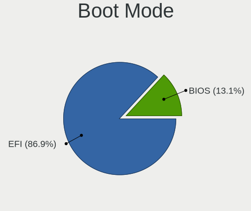

| Mode | Desktops | Percent |
|------|----------|---------|
| EFI  | 45       | 86.54%  |
| BIOS | 7        | 13.46%  |

Filesystem
----------

Type of filesystem

| Type | Desktops | Percent |
|------|----------|---------|
| Zfs  | 52       | 100%    |

Part. scheme
------------

Scheme of partitioning

| Type | Desktops | Percent |
|------|----------|---------|
| GPT  | 52       | 100%    |

Board
-----

Vendor
------

Motherboard manufacturer

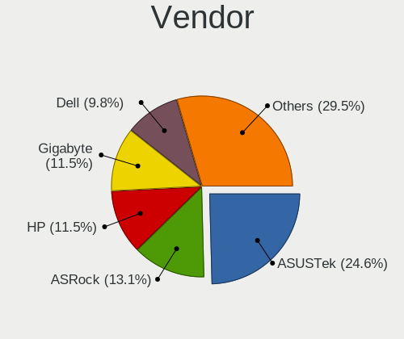

| Name                | Desktops | Percent |
|---------------------|----------|---------|
| ASUSTek Computer    | 12       | 23.08%  |
| ASRock              | 8        | 15.38%  |
| Gigabyte Technology | 6        | 11.54%  |
| Hewlett-Packard     | 5        | 9.62%   |
| MSI                 | 3        | 5.77%   |
| Dell                | 3        | 5.77%   |
| Lenovo              | 2        | 3.85%   |
| Intel               | 2        | 3.85%   |
| T-bao               | 1        | 1.92%   |
| Shuttle             | 1        | 1.92%   |
| Sapphire            | 1        | 1.92%   |
| PCPartner           | 1        | 1.92%   |
| Medion              | 1        | 1.92%   |
| Itautec             | 1        | 1.92%   |
| Gateway             | 1        | 1.92%   |
| Fujitsu             | 1        | 1.92%   |
| Apple               | 1        | 1.92%   |
| Acer                | 1        | 1.92%   |
| Unknown             | 1        | 1.92%   |

Model
-----

Motherboard model

| Name                               | Desktops | Percent |
|------------------------------------|----------|---------|
| T-bao MINI PC                      | 1        | 1.92%   |
| Shuttle SH61R                      | 1        | 1.92%   |
| Sapphire EDGE-FT1M1 E450 1AOVU044  | 1        | 1.92%   |
| PCPartner DREAMSYS                 | 1        | 1.92%   |
| MSI MS-7B93                        | 1        | 1.92%   |
| MSI MS-7A40                        | 1        | 1.92%   |
| MSI MS-7592                        | 1        | 1.92%   |
| Medion H61H2-LM3                   | 1        | 1.92%   |
| Lenovo ThinkCentre M83 10AHS35Q00  | 1        | 1.92%   |
| Lenovo ThinkCentre E73z 10BD004RRU | 1        | 1.92%   |
| Itautec Infoway ST-4344            | 1        | 1.92%   |
| Intel H81                          | 1        | 1.92%   |
| Intel H61                          | 1        | 1.92%   |
| HP [AH877AV] _ Currency Bulk P     | 1        | 1.92%   |
| HP ProLiant ML350 G5               | 1        | 1.92%   |
| HP Compaq Elite 8300 USDT          | 1        | 1.92%   |
| HP Compaq Elite 8300 SFF           | 1        | 1.92%   |
| HP 260-p026                        | 1        | 1.92%   |
| Gigabyte H410M S2 V2               | 1        | 1.92%   |
| Gigabyte H270M-DS3H                | 1        | 1.92%   |
| Gigabyte G41MT-S2                  | 1        | 1.92%   |
| Gigabyte F2A78M-DS2                | 1        | 1.92%   |
| Gigabyte B450 AORUS M              | 1        | 1.92%   |
| Gigabyte 990FXA-UD3                | 1        | 1.92%   |
| Gateway DX4840                     | 1        | 1.92%   |
| Fujitsu D3220-A1                   | 1        | 1.92%   |
| Dell OptiPlex 390                  | 1        | 1.92%   |
| Dell OptiPlex 3040                 | 1        | 1.92%   |
| Dell OptiPlex 3020M                | 1        | 1.92%   |
| ASUS TUF GAMING X570-PLUS          | 1        | 1.92%   |
| ASUS TUF B450M-PRO GAMING          | 1        | 1.92%   |
| ASUS TUF B360M-PLUS GAMING S       | 1        | 1.92%   |
| ASUS ROG STRIX X470-F GAMING       | 1        | 1.92%   |
| ASUS P7H55-M LX                    | 1        | 1.92%   |
| ASUS P5P43TD PRO                   | 1        | 1.92%   |
| ASUS M5A97 R2.0                    | 1        | 1.92%   |
| ASUS M5A78L-M/USB3                 | 1        | 1.92%   |
| ASUS H110M-PLUS                    | 1        | 1.92%   |
| ASUS exone Business 1203           | 1        | 1.92%   |
| ASUS CROSSHAIR V FORMULA-Z         | 1        | 1.92%   |
| ASUS All Series                    | 1        | 1.92%   |
| ASRock Z390 Pro4                   | 1        | 1.92%   |
| ASRock X570 Phantom Gaming 4       | 1        | 1.92%   |
| ASRock X370 Gaming X               | 1        | 1.92%   |
| ASRock X300M-STX                   | 1        | 1.92%   |
| ASRock B450 Gaming-ITX/ac          | 1        | 1.92%   |
| ASRock B365M-ITX/ac                | 1        | 1.92%   |
| ASRock AB350 Pro4                  | 1        | 1.92%   |
| ASRock A320M-DGS                   | 1        | 1.92%   |
| Apple MacPro5,1                    | 1        | 1.92%   |
| Acer Veriton M430                  | 1        | 1.92%   |
| Unknown                            | 1        | 1.92%   |

Model Family
------------

Motherboard model prefix

| Name                | Desktops | Percent |
|---------------------|----------|---------|
| Dell OptiPlex       | 3        | 5.77%   |
| ASUS TUF            | 3        | 5.77%   |
| Lenovo ThinkCentre  | 2        | 3.85%   |
| HP Compaq           | 2        | 3.85%   |
| T-bao MINI          | 1        | 1.92%   |
| Shuttle SH61R       | 1        | 1.92%   |
| Sapphire EDGE-FT1M1 | 1        | 1.92%   |
| PCPartner DREAMSYS  | 1        | 1.92%   |
| MSI MS-7B93         | 1        | 1.92%   |
| MSI MS-7A40         | 1        | 1.92%   |
| MSI MS-7592         | 1        | 1.92%   |
| Medion H61H2-LM3    | 1        | 1.92%   |
| Itautec Infoway     | 1        | 1.92%   |
| Intel H81           | 1        | 1.92%   |
| Intel H61           | 1        | 1.92%   |
| HP [AH877AV]        | 1        | 1.92%   |
| HP ProLiant         | 1        | 1.92%   |
| HP 260-p026         | 1        | 1.92%   |
| Gigabyte H410M      | 1        | 1.92%   |
| Gigabyte H270M-DS3H | 1        | 1.92%   |
| Gigabyte G41MT-S2   | 1        | 1.92%   |
| Gigabyte F2A78M-DS2 | 1        | 1.92%   |
| Gigabyte B450       | 1        | 1.92%   |
| Gigabyte 990FXA-UD3 | 1        | 1.92%   |
| Gateway DX4840      | 1        | 1.92%   |
| Fujitsu D3220-A1    | 1        | 1.92%   |
| ASUS ROG            | 1        | 1.92%   |
| ASUS P7H55-M        | 1        | 1.92%   |
| ASUS P5P43TD        | 1        | 1.92%   |
| ASUS M5A97          | 1        | 1.92%   |
| ASUS M5A78L-M       | 1        | 1.92%   |
| ASUS H110M-PLUS     | 1        | 1.92%   |
| ASUS exone          | 1        | 1.92%   |
| ASUS CROSSHAIR      | 1        | 1.92%   |
| ASUS All            | 1        | 1.92%   |
| ASRock Z390         | 1        | 1.92%   |
| ASRock X570         | 1        | 1.92%   |
| ASRock X370         | 1        | 1.92%   |
| ASRock X300M-STX    | 1        | 1.92%   |
| ASRock B450         | 1        | 1.92%   |
| ASRock B365M-ITX    | 1        | 1.92%   |
| ASRock AB350        | 1        | 1.92%   |
| ASRock A320M-DGS    | 1        | 1.92%   |
| Apple MacPro5       | 1        | 1.92%   |
| Acer Veriton        | 1        | 1.92%   |
| Unknown             | 1        | 1.92%   |

MFG Year
--------

Motherboard manufacture year

| Year | Desktops | Percent |
|------|----------|---------|
| 2021 | 8        | 15.38%  |
| 2020 | 7        | 13.46%  |
| 2019 | 7        | 13.46%  |
| 2015 | 5        | 9.62%   |
| 2012 | 4        | 7.69%   |
| 2010 | 4        | 7.69%   |
| 2018 | 3        | 5.77%   |
| 2017 | 3        | 5.77%   |
| 2016 | 3        | 5.77%   |
| 2011 | 3        | 5.77%   |
| 2013 | 2        | 3.85%   |
| 2014 | 1        | 1.92%   |
| 2009 | 1        | 1.92%   |
| 2007 | 1        | 1.92%   |

Form Factor
-----------

Physical design of the computer

| Name    | Desktops | Percent |
|---------|----------|---------|
| Desktop | 52       | 100%    |

Coreboot
--------

Have coreboot on board

| Used | Desktops | Percent |
|------|----------|---------|
| No   | 52       | 100%    |

RAM Size
--------

Total RAM memory

| Size in GB  | Desktops | Percent |
|-------------|----------|---------|
| 16.01-24.0  | 18       | 34.62%  |
| 8.01-16.0   | 15       | 28.85%  |
| 4.01-8.0    | 9        | 17.31%  |
| 32.01-64.0  | 7        | 13.46%  |
| 64.01-256.0 | 3        | 5.77%   |

RAM Used
--------

Used RAM memory

| Used GB  | Desktops | Percent |
|----------|----------|---------|
| 0.51-1.0 | 23       | 44.23%  |
| 0.01-0.5 | 20       | 38.46%  |
| 1.01-2.0 | 8        | 15.38%  |
| 3.01-4.0 | 1        | 1.92%   |

Total Drives
------------

Number of drives on board

| Drives | Desktops | Percent |
|--------|----------|---------|
| 1      | 24       | 44.44%  |
| 2      | 15       | 27.78%  |
| 3      | 8        | 14.81%  |
| 4      | 6        | 11.11%  |
| 5      | 1        | 1.85%   |

Has CD-ROM
----------

Has CD-ROM on board

| Presented | Desktops | Percent |
|-----------|----------|---------|
| No        | 34       | 65.38%  |
| Yes       | 18       | 34.62%  |

Has Ethernet
------------

Has Ethernet on board

| Presented | Desktops | Percent |
|-----------|----------|---------|
| Yes       | 52       | 100%    |

Has WiFi
--------

Has WiFi module

| Presented | Desktops | Percent |
|-----------|----------|---------|
| No        | 34       | 65.38%  |
| Yes       | 18       | 34.62%  |

Has Bluetooth
-------------

Has Bluetooth module

| Presented | Desktops | Percent |
|-----------|----------|---------|
| No        | 39       | 75%     |
| Yes       | 13       | 25%     |

Location
--------

Country
-------

Geographic location (country)

| Country     | Desktops | Percent |
|-------------|----------|---------|
| USA         | 7        | 13.46%  |
| Russia      | 6        | 11.54%  |
| Germany     | 5        | 9.62%   |
| Brazil      | 4        | 7.69%   |
| Italy       | 3        | 5.77%   |
| Australia   | 3        | 5.77%   |
| Ukraine     | 2        | 3.85%   |
| Spain       | 2        | 3.85%   |
| Poland      | 2        | 3.85%   |
| India       | 2        | 3.85%   |
| China       | 2        | 3.85%   |
| UK          | 1        | 1.92%   |
| Turkey      | 1        | 1.92%   |
| Thailand    | 1        | 1.92%   |
| Taiwan      | 1        | 1.92%   |
| Switzerland | 1        | 1.92%   |
| South Korea | 1        | 1.92%   |
| Netherlands | 1        | 1.92%   |
| Mexico      | 1        | 1.92%   |
| Hungary     | 1        | 1.92%   |
| Hong Kong   | 1        | 1.92%   |
| Guatemala   | 1        | 1.92%   |
| Denmark     | 1        | 1.92%   |
| Chile       | 1        | 1.92%   |
| Canada      | 1        | 1.92%   |

City
----

Geographic location (city)

| City              | Desktops | Percent |
|-------------------|----------|---------|
| Marlborough       | 2        | 3.85%   |
| Hobart            | 2        | 3.85%   |
| Yekaterinburg     | 1        | 1.92%   |
| Xiamen            | 1        | 1.92%   |
| Warrenton         | 1        | 1.92%   |
| Voronezh          | 1        | 1.92%   |
| Tula de Allende   | 1        | 1.92%   |
| Torre del Mar     | 1        | 1.92%   |
| Tampa             | 1        | 1.92%   |
| Stuttgart         | 1        | 1.92%   |
| Stralsund         | 1        | 1.92%   |
| Siedlce           | 1        | 1.92%   |
| Shepetivka        | 1        | 1.92%   |
| Santiago          | 1        | 1.92%   |
| Rostov-on-Don     | 1        | 1.92%   |
| Riehen            | 1        | 1.92%   |
| Richmond          | 1        | 1.92%   |
| Reriutaba         | 1        | 1.92%   |
| Qingdao           | 1        | 1.92%   |
| Pistoia           | 1        | 1.92%   |
| Nieuwegein        | 1        | 1.92%   |
| Newtownabbey      | 1        | 1.92%   |
| Munich            | 1        | 1.92%   |
| Moscow            | 1        | 1.92%   |
| Manaus            | 1        | 1.92%   |
| Kyiv              | 1        | 1.92%   |
| Kosekoy           | 1        | 1.92%   |
| Kochi             | 1        | 1.92%   |
| Katowice          | 1        | 1.92%   |
| Irkutsk           | 1        | 1.92%   |
| Inhapim           | 1        | 1.92%   |
| Ilh?©us           | 1        | 1.92%   |
| Idaho Falls       | 1        | 1.92%   |
| Hsinchu           | 1        | 1.92%   |
| Hong Kong         | 1        | 1.92%   |
| Hicksville        | 1        | 1.92%   |
| Heidelberg        | 1        | 1.92%   |
| Gy?‘r             | 1        | 1.92%   |
| Gwangyang         | 1        | 1.92%   |
| Guatemala City    | 1        | 1.92%   |
| Grottazzolina     | 1        | 1.92%   |
| Fuente Carreteros | 1        | 1.92%   |
| Frederiksberg     | 1        | 1.92%   |
| Filderstadt       | 1        | 1.92%   |
| Ernakulam         | 1        | 1.92%   |
| Chelyabinsk       | 1        | 1.92%   |
| Brisbane          | 1        | 1.92%   |
| Bari              | 1        | 1.92%   |
| Bangkok           | 1        | 1.92%   |
| Anaheim           | 1        | 1.92%   |

Drives
------

Drive Vendor
------------

Hard drive vendors

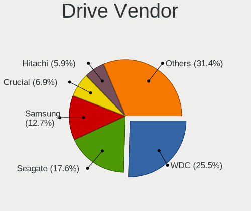

| Vendor              | Desktops | Drives | Percent |
|---------------------|----------|--------|---------|
| WDC                 | 21       | 26     | 24.71%  |
| Seagate             | 16       | 20     | 18.82%  |
| Samsung Electronics | 10       | 14     | 11.76%  |
| Hitachi             | 5        | 7      | 5.88%   |
| Crucial             | 4        | 7      | 4.71%   |
| Toshiba             | 3        | 5      | 3.53%   |
| SanDisk             | 3        | 3      | 3.53%   |
| Kingston            | 3        | 5      | 3.53%   |
| Smartbuy            | 2        | 2      | 2.35%   |
| Intel               | 2        | 2      | 2.35%   |
| China               | 2        | 2      | 2.35%   |
| A-DATA Technology   | 2        | 4      | 2.35%   |
| Verbatim            | 1        | 1      | 1.18%   |
| SPCC                | 1        | 1      | 1.18%   |
| Silicon Motion      | 1        | 1      | 1.18%   |
| PNY                 | 1        | 1      | 1.18%   |
| PLEXTOR             | 1        | 1      | 1.18%   |
| LITEONIT            | 1        | 1      | 1.18%   |
| KingSpec            | 1        | 1      | 1.18%   |
| Hewlett-Packard     | 1        | 1      | 1.18%   |
| GOODRAM             | 1        | 1      | 1.18%   |
| Gigabyte Technology | 1        | 1      | 1.18%   |
| Corsair             | 1        | 1      | 1.18%   |
| Apacer              | 1        | 1      | 1.18%   |

Drive Model
-----------

Hard drive models

| Model                               | Desktops | Percent |
|-------------------------------------|----------|---------|
| WDC WDS100T2B0C-00PXH0 1TB          | 2        | 2%      |
| WDC WD3200BPVT-22JJ5T0 320GB        | 2        | 2%      |
| Toshiba DT01ACA100 1TB              | 2        | 2%      |
| Seagate ST3500312CS 500GB           | 2        | 2%      |
| SanDisk SDSSDA240G 240GB            | 2        | 2%      |
| Samsung SSD 860 EVO 500GB           | 2        | 2%      |
| Samsung SSD 850 EVO 250GB           | 2        | 2%      |
| Samsung HD322HJ 320GB               | 2        | 2%      |
| China SATA SSD 120GB                | 2        | 2%      |
| WDC WDS250G2X0C-00L350 250GB        | 1        | 1%      |
| WDC WD800JD-00LSA0 80GB             | 1        | 1%      |
| WDC WD5000LPCX-00VHAT0 500GB        | 1        | 1%      |
| WDC WD5000AAVS-00ZTB0 500GB         | 1        | 1%      |
| WDC WD5000AAKS-08V0A0 500GB         | 1        | 1%      |
| WDC WD5000AAKS-00V1A0 500GB         | 1        | 1%      |
| WDC WD40EZRZ-22GXCB0 4TB            | 1        | 1%      |
| WDC WD3200AAKS-00UU3A0 320GB        | 1        | 1%      |
| WDC WD30EZRZ-00WN9B0 3TB            | 1        | 1%      |
| WDC WD3003FZEX-00Z4SA0 3TB          | 1        | 1%      |
| WDC WD2500JD-75HBB0 250GB           | 1        | 1%      |
| WDC WD2500BEVS-22UST0 250GB         | 1        | 1%      |
| WDC WD1600BEVT-22ZCT0 160GB         | 1        | 1%      |
| WDC WD1600AAJS-00WAA0 160GB         | 1        | 1%      |
| WDC WD1600AAJS-00V4A0 160GB         | 1        | 1%      |
| WDC WD10SPZX-22Z10T0 1TB            | 1        | 1%      |
| WDC WD10JMVW-11AJGS0 1TB            | 1        | 1%      |
| WDC WD10EZRX-00A8LB0 1TB            | 1        | 1%      |
| WDC WD10EZEX-75WN4A1 1TB            | 1        | 1%      |
| WDC WD10EFRX-68FYTN0 1TB            | 1        | 1%      |
| WDC WD1002FAEX-00Y9A0 1TB           | 1        | 1%      |
| Verbatim Vi550 S3 SSD 256GB         | 1        | 1%      |
| Toshiba MQ01UBD100 1TB              | 1        | 1%      |
| Toshiba DT01ACA050 500GB            | 1        | 1%      |
| SPCC M.2 PCIe SSD 256GB             | 1        | 1%      |
| Smartbuy SSD 240GB                  | 1        | 1%      |
| Smartbuy SSD 120GB                  | 1        | 1%      |
| Silicon Motion ASint AS806 128GB    | 1        | 1%      |
| Seagate ST9320325AS 320GB           | 1        | 1%      |
| Seagate ST750LM022 HN-M750MBB 752GB | 1        | 1%      |
| Seagate ST500LM000-1EJ162 500GB     | 1        | 1%      |
| Seagate ST500DM002-1SB10A 500GB     | 1        | 1%      |
| Seagate ST500DM002-1BD142 500GB     | 1        | 1%      |
| Seagate ST4000DM004-2CV104 4TB      | 1        | 1%      |
| Seagate ST3500413AS 500GB           | 1        | 1%      |
| Seagate ST3250318AS 250GB           | 1        | 1%      |
| Seagate ST3160813AS 160GB           | 1        | 1%      |
| Seagate ST31000524AS 1TB            | 1        | 1%      |
| Seagate ST3000DM001-1CH166 3TB      | 1        | 1%      |
| Seagate ST2000DX001-1CM164 2TB      | 1        | 1%      |
| Seagate ST2000DL003-9VT166 2TB      | 1        | 1%      |
| Seagate ST1000LM048-2E7172 1TB      | 1        | 1%      |
| Seagate ST1000LM035-1RK172 1TB      | 1        | 1%      |
| Seagate ST1000LM024 HN-M101MBB 1TB  | 1        | 1%      |
| Seagate ST1000DM010-2EP102 1TB      | 1        | 1%      |
| SanDisk SDSSDA120G 120GB            | 1        | 1%      |
| Samsung SSD 970 EVO Plus 500GB      | 1        | 1%      |
| Samsung SSD 970 EVO 500GB           | 1        | 1%      |
| Samsung SSD 860 EVO 250GB           | 1        | 1%      |
| Samsung SSD 860 EVO 1TB             | 1        | 1%      |
| Samsung HD204UI 2TB                 | 1        | 1%      |

HDD Vendor
----------

Hard disk drive vendors

| Vendor              | Desktops | Drives | Percent |
|---------------------|----------|--------|---------|
| WDC                 | 19       | 23     | 40.43%  |
| Seagate             | 16       | 20     | 34.04%  |
| Hitachi             | 5        | 7      | 10.64%  |
| Toshiba             | 3        | 5      | 6.38%   |
| Samsung Electronics | 3        | 5      | 6.38%   |
| Hewlett-Packard     | 1        | 1      | 2.13%   |

SSD Vendor
----------

Solid state drive vendors

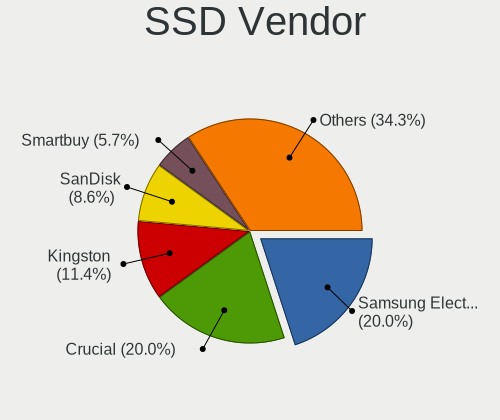

| Vendor              | Desktops | Drives | Percent |
|---------------------|----------|--------|---------|
| Samsung Electronics | 6        | 7      | 20.69%  |
| Crucial             | 4        | 7      | 13.79%  |
| SanDisk             | 3        | 3      | 10.34%  |
| Kingston            | 3        | 5      | 10.34%  |
| Smartbuy            | 2        | 2      | 6.9%    |
| China               | 2        | 2      | 6.9%    |
| Verbatim            | 1        | 1      | 3.45%   |
| PNY                 | 1        | 1      | 3.45%   |
| PLEXTOR             | 1        | 1      | 3.45%   |
| LITEONIT            | 1        | 1      | 3.45%   |
| KingSpec            | 1        | 1      | 3.45%   |
| Intel               | 1        | 1      | 3.45%   |
| GOODRAM             | 1        | 1      | 3.45%   |
| Apacer              | 1        | 1      | 3.45%   |
| A-DATA Technology   | 1        | 2      | 3.45%   |

Drive Kind
----------

HDD or SSD

| Kind | Desktops | Drives | Percent |
|------|----------|--------|---------|
| HDD  | 35       | 61     | 49.3%   |
| SSD  | 25       | 36     | 35.21%  |
| NVMe | 11       | 12     | 15.49%  |

Drive Connector
---------------

SATA, SAS, NVMe, etc.

| Type | Desktops | Drives | Percent |
|------|----------|--------|---------|
| SATA | 46       | 97     | 80.7%   |
| NVMe | 11       | 12     | 19.3%   |

Drive Size
----------

Size of hard drive

| Size in TB | Desktops | Drives | Percent |
|------------|----------|--------|---------|
| 0.01-0.5   | 42       | 62     | 60%     |
| 0.51-1.0   | 18       | 22     | 25.71%  |
| 1.01-2.0   | 5        | 6      | 7.14%   |
| 2.01-3.0   | 3        | 5      | 4.29%   |
| 3.01-4.0   | 2        | 2      | 2.86%   |

Space Total
-----------

Amount of disk space available on the file system

| Size in GB | Desktops | Percent |
|------------|----------|---------|
| 1-20       | 33       | 63.46%  |
| 101-250    | 13       | 25%     |
| 251-500    | 4        | 7.69%   |
| 21-50      | 1        | 1.92%   |
| 51-100     | 1        | 1.92%   |

Space Used
----------

Amount of used disk space

| Used GB | Desktops | Percent |
|---------|----------|---------|
| 1-20    | 52       | 100%    |

Malfunc. Drives
---------------

Drive models with a malfunction

| Model                               | Desktops | Drives | Percent |
|-------------------------------------|----------|--------|---------|
| Samsung Electronics HD322HJ 320GB   | 2        | 2      | 13.33%  |
| WDC WD5000AAKS-08V0A0 500GB         | 1        | 1      | 6.67%   |
| WDC WD5000AAKS-00V1A0 500GB         | 1        | 1      | 6.67%   |
| WDC WD3200BPVT-22JJ5T0 320GB        | 1        | 1      | 6.67%   |
| WDC WD3200AAKS-00UU3A0 320GB        | 1        | 1      | 6.67%   |
| WDC WD10JMVW-11AJGS0 1TB            | 1        | 1      | 6.67%   |
| Toshiba MQ01UBD100 1TB              | 1        | 1      | 6.67%   |
| Toshiba DT01ACA100 1TB              | 1        | 2      | 6.67%   |
| Seagate ST9320325AS 320GB           | 1        | 1      | 6.67%   |
| Seagate ST750LM022 HN-M750MBB 752GB | 1        | 1      | 6.67%   |
| Seagate ST500DM002-1BD142 500GB     | 1        | 1      | 6.67%   |
| Seagate ST3500413AS 500GB           | 1        | 1      | 6.67%   |
| SanDisk SDSSDA240G 240GB            | 1        | 1      | 6.67%   |
| Samsung Electronics HD161HJ 160GB   | 1        | 1      | 6.67%   |

Malfunc. Drive Vendor
---------------------

Vendors of faulty drives

| Vendor              | Desktops | Drives | Percent |
|---------------------|----------|--------|---------|
| WDC                 | 5        | 5      | 35.71%  |
| Seagate             | 4        | 4      | 28.57%  |
| Toshiba             | 2        | 3      | 14.29%  |
| Samsung Electronics | 2        | 3      | 14.29%  |
| SanDisk             | 1        | 1      | 7.14%   |

Malfunc. HDD Vendor
-------------------

Vendors of faulty HDD drives

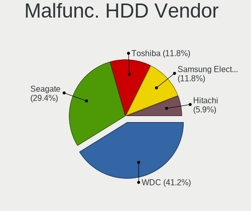

| Vendor              | Desktops | Drives | Percent |
|---------------------|----------|--------|---------|
| WDC                 | 5        | 5      | 38.46%  |
| Seagate             | 4        | 4      | 30.77%  |
| Toshiba             | 2        | 3      | 15.38%  |
| Samsung Electronics | 2        | 3      | 15.38%  |

Malfunc. Drive Kind
-------------------

Kinds of faulty drives

| Kind | Desktops | Drives | Percent |
|------|----------|--------|---------|
| HDD  | 12       | 15     | 92.31%  |
| SSD  | 1        | 1      | 7.69%   |

Failed Drives
-------------

Failed drive models

Zero info for selected period =(

Failed Drive Vendor
-------------------

Failed drive vendors

Zero info for selected period =(

Drive Status
------------

Number of failed and malfunc. drives

| Status   | Desktops | Drives | Percent |
|----------|----------|--------|---------|
| Works    | 48       | 92     | 77.42%  |
| Malfunc  | 13       | 16     | 20.97%  |
| Detected | 1        | 1      | 1.61%   |

Storage controller
------------------

Storage Vendor
--------------

Storage controller vendors

| Vendor                     | Desktops | Percent |
|----------------------------|----------|---------|
| Intel                      | 32       | 47.76%  |
| AMD                        | 19       | 28.36%  |
| Sandisk                    | 3        | 4.48%   |
| Phison Electronics         | 3        | 4.48%   |
| ASMedia Technology         | 3        | 4.48%   |
| Samsung Electronics        | 2        | 2.99%   |
| Silicon Motion             | 1        | 1.49%   |
| Lite-On IT Corp. / Plextor | 1        | 1.49%   |
| JMicron Technology         | 1        | 1.49%   |
| Hewlett-Packard            | 1        | 1.49%   |
| ADATA Technology           | 1        | 1.49%   |

Storage Model
-------------

Storage controller models

| Model                                                                                   | Desktops | Percent |
|-----------------------------------------------------------------------------------------|----------|---------|
| AMD FCH SATA Controller [AHCI mode]                                                     | 12       | 14.81%  |
| Intel 8 Series/C220 Series Chipset Family 6-port SATA Controller 1 [AHCI mode]          | 5        | 6.17%   |
| AMD SB7x0/SB8x0/SB9x0 SATA Controller [AHCI mode]                                       | 5        | 6.17%   |
| AMD 400 Series Chipset SATA Controller                                                  | 5        | 6.17%   |
| Intel Q170/Q150/B150/H170/H110/Z170/CM236 Chipset SATA Controller [AHCI Mode]           | 3        | 3.7%    |
| Intel NM10/ICH7 Family SATA Controller [IDE mode]                                       | 3        | 3.7%    |
| Intel Cannon Lake PCH SATA AHCI Controller                                              | 3        | 3.7%    |
| Intel 7 Series/C210 Series Chipset Family 6-port SATA Controller [AHCI mode]            | 3        | 3.7%    |
| Intel 6 Series/C200 Series Chipset Family 6 port Desktop SATA AHCI Controller           | 3        | 3.7%    |
| ASMedia ASM1062 Serial ATA Controller                                                   | 3        | 3.7%    |
| Sandisk WD Blue SN550 NVMe SSD                                                          | 2        | 2.47%   |
| Samsung NVMe SSD Controller SM981/PM981/PM983                                           | 2        | 2.47%   |
| Intel 200 Series PCH SATA controller [AHCI mode]                                        | 2        | 2.47%   |
| AMD SB7x0/SB8x0/SB9x0 IDE Controller                                                    | 2        | 2.47%   |
| Silicon Motion SM2263EN/SM2263XT SSD Controller                                         | 1        | 1.23%   |
| Sandisk WD Black 2018/SN750 / PC SN720 NVMe SSD                                         | 1        | 1.23%   |
| Phison PS5013 E13 NVMe Controller                                                       | 1        | 1.23%   |
| Phison E16 PCIe4 NVMe Controller                                                        | 1        | 1.23%   |
| Phison E12 NVMe Controller                                                              | 1        | 1.23%   |
| Lite-On IT Corp. / Plextor M6e PCI Express SSD [Marvell 88SS9183]                       | 1        | 1.23%   |
| JMicron JMB361 AHCI/IDE                                                                 | 1        | 1.23%   |
| Intel SSD Pro 7600p/760p/E 6100p Series                                                 | 1        | 1.23%   |
| Intel Comet Lake SATA AHCI Controller                                                   | 1        | 1.23%   |
| Intel 82801JI (ICH10 Family) SATA AHCI Controller                                       | 1        | 1.23%   |
| Intel 82801JI (ICH10 Family) 4 port SATA IDE Controller #1                              | 1        | 1.23%   |
| Intel 82801JI (ICH10 Family) 2 port SATA IDE Controller #2                              | 1        | 1.23%   |
| Intel 82801H (ICH8 Family) 4 port SATA Controller [IDE mode]                            | 1        | 1.23%   |
| Intel 82801G (ICH7 Family) IDE Controller                                               | 1        | 1.23%   |
| Intel 8 Series/C220 Series Chipset Family 4-port SATA Controller 1 [IDE mode]           | 1        | 1.23%   |
| Intel 631xESB/632xESB IDE Controller                                                    | 1        | 1.23%   |
| Intel 6 Series/C200 Series Chipset Family Desktop SATA Controller (IDE mode, ports 4-5) | 1        | 1.23%   |
| Intel 6 Series/C200 Series Chipset Family Desktop SATA Controller (IDE mode, ports 0-3) | 1        | 1.23%   |
| Intel 5 Series/3400 Series Chipset 6 port SATA AHCI Controller                          | 1        | 1.23%   |
| Intel 5 Series/3400 Series Chipset 4 port SATA IDE Controller                           | 1        | 1.23%   |
| Intel 5 Series/3400 Series Chipset 2 port SATA IDE Controller                           | 1        | 1.23%   |
| HP Smart Array E200i (SAS Controller)                                                   | 1        | 1.23%   |
| HP Smart Array Controller                                                               | 1        | 1.23%   |
| AMD X370 Series Chipset SATA Controller                                                 | 1        | 1.23%   |
| AMD SB7x0/SB8x0/SB9x0 SATA Controller [IDE mode]                                        | 1        | 1.23%   |
| AMD FCH SATA Controller D                                                               | 1        | 1.23%   |
| AMD 300 Series Chipset SATA Controller                                                  | 1        | 1.23%   |
| ADATA XPG SX8200 Pro PCIe Gen3x4 M.2 2280 Solid State Drive                             | 1        | 1.23%   |

Storage Kind
------------

Kind of storage controller (IDE, SATA, NVMe, SAS, ...)

| Kind | Desktops | Percent |
|------|----------|---------|
| SATA | 40       | 63.49%  |
| NVMe | 11       | 17.46%  |
| IDE  | 11       | 17.46%  |
| RAID | 1        | 1.59%   |

Processor
---------

CPU Vendor
----------

Processor vendors

| Vendor | Desktops | Percent |
|--------|----------|---------|
| Intel  | 32       | 61.54%  |
| AMD    | 20       | 38.46%  |

CPU Model
---------

Processor models

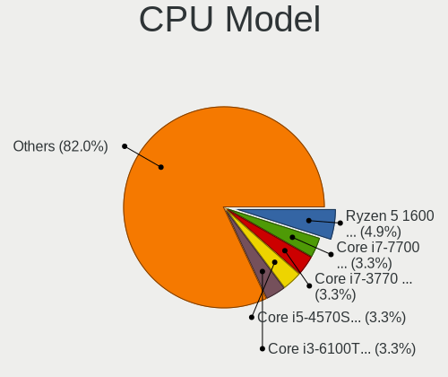

| Model                                         | Desktops | Percent |
|-----------------------------------------------|----------|---------|
| AMD Ryzen 5 1600 Six-Core Processor           | 3        | 5.77%   |
| Intel Core i3-6100T CPU @ 3.20GHz             | 2        | 3.85%   |
| AMD Ryzen 9 3900X 12-Core Processor           | 2        | 3.85%   |
| AMD FX-8350 Eight-Core Processor              | 2        | 3.85%   |
| Intel Xeon CPU W3680 @ 3.33GHz                | 1        | 1.92%   |
| Intel Xeon CPU E5-2690 0 @ 2.90GHz            | 1        | 1.92%   |
| Intel Xeon                                    | 1        | 1.92%   |
| Intel Pentium Dual-Core CPU E5700 @ 3.00GHz   | 1        | 1.92%   |
| Intel Pentium CPU G3420 @ 3.20GHz             | 1        | 1.92%   |
| Intel Genuine CPU 2160 @ 1.80GHz              | 1        | 1.92%   |
| Intel Core i7-9700F CPU @ 3.00GHz             | 1        | 1.92%   |
| Intel Core i7-8700K CPU @ 3.70GHz             | 1        | 1.92%   |
| Intel Core i7-7700 CPU @ 3.60GHz              | 1        | 1.92%   |
| Intel Core i7-3770 CPU @ 3.40GHz              | 1        | 1.92%   |
| Intel Core i7-10700 CPU @ 2.90GHz             | 1        | 1.92%   |
| Intel Core i5-9600K CPU @ 3.70GHz             | 1        | 1.92%   |
| Intel Core i5-7500 CPU @ 3.40GHz              | 1        | 1.92%   |
| Intel Core i5-4590 CPU @ 3.30GHz              | 1        | 1.92%   |
| Intel Core i5-4570S CPU @ 2.90GHz             | 1        | 1.92%   |
| Intel Core i5-4460 CPU @ 3.20GHz              | 1        | 1.92%   |
| Intel Core i5-2500 CPU @ 3.30GHz              | 1        | 1.92%   |
| Intel Core i5-2320 CPU @ 3.00GHz              | 1        | 1.92%   |
| Intel Core i5 CPU 750 @ 2.67GHz               | 1        | 1.92%   |
| Intel Core i5 CPU 661 @ 3.33GHz               | 1        | 1.92%   |
| Intel Core i3-8100 CPU @ 3.60GHz              | 1        | 1.92%   |
| Intel Core i3-4170 CPU @ 3.70GHz              | 1        | 1.92%   |
| Intel Core i3-4150T CPU @ 3.00GHz             | 1        | 1.92%   |
| Intel Core i3-4130 CPU @ 3.40GHz              | 1        | 1.92%   |
| Intel Core i3-3240 CPU @ 3.40GHz              | 1        | 1.92%   |
| Intel Core i3-2120 CPU @ 3.30GHz              | 1        | 1.92%   |
| Intel Core i3-2120 CPU @ 3.30GH               | 1        | 1.92%   |
| Intel Core 2 Quad CPU Q8400 @ 2.66GHz         | 1        | 1.92%   |
| Intel Core 2 Duo CPU E7500 @ 2.93GHz          | 1        | 1.92%   |
| Intel Core 2 Duo CPU                          | 1        | 1.92%   |
| AMD Ryzen 9 5900X 12-Core Processor           | 1        | 1.92%   |
| AMD Ryzen 7 3800X 8-Core Processor            | 1        | 1.92%   |
| AMD Ryzen 7 2700X Eight-Core Processor        | 1        | 1.92%   |
| AMD Ryzen 7 1700X Eight-Core Processor        | 1        | 1.92%   |
| AMD Ryzen 5 PRO 4650G with Radeon Graphics    | 1        | 1.92%   |
| AMD Ryzen 5 2600 Six-Core Processor           | 1        | 1.92%   |
| AMD Ryzen 3 2200U with Radeon Vega Mobile Gfx | 1        | 1.92%   |
| AMD Ryzen 3 2200G with Radeon Vega Graphics   | 1        | 1.92%   |
| AMD Phenom II X6 1045T Processor              | 1        | 1.92%   |
| AMD FX-6300 Six-Core Processor                | 1        | 1.92%   |
| AMD FX-6100 Six-Core Processor                | 1        | 1.92%   |
| AMD E-450 APU with Radeon HD Graphics         | 1        | 1.92%   |
| AMD A4-7300 APU with Radeon HD Graphics       | 1        | 1.92%   |

CPU Model Family
----------------

Processor model prefix

| Model                   | Desktops | Percent |
|-------------------------|----------|---------|
| Intel Core i5           | 9        | 17.31%  |
| Intel Core i3           | 9        | 17.31%  |
| Intel Core i7           | 5        | 9.62%   |
| AMD Ryzen 5             | 4        | 7.69%   |
| AMD FX                  | 4        | 7.69%   |
| Intel Xeon              | 3        | 5.77%   |
| AMD Ryzen 9             | 3        | 5.77%   |
| AMD Ryzen 7             | 3        | 5.77%   |
| Intel Core 2 Duo        | 2        | 3.85%   |
| AMD Ryzen 3             | 2        | 3.85%   |
| Intel Pentium Dual-Core | 1        | 1.92%   |
| Intel Pentium           | 1        | 1.92%   |
| Intel Genuine           | 1        | 1.92%   |
| Intel Core 2 Quad       | 1        | 1.92%   |
| AMD Ryzen 5 PRO         | 1        | 1.92%   |
| AMD Phenom II X6        | 1        | 1.92%   |
| AMD E                   | 1        | 1.92%   |
| AMD A4                  | 1        | 1.92%   |

CPU Cores
---------

Number of processor cores

| Number  | Desktops | Percent |
|---------|----------|---------|
| 2       | 15       | 28.85%  |
| 4       | 14       | 26.92%  |
| 6       | 6        | 11.54%  |
| 12      | 5        | 9.62%   |
| 8       | 5        | 9.62%   |
| 24      | 3        | 5.77%   |
| 16      | 3        | 5.77%   |
| Unknown | 1        | 1.92%   |

CPU Sockets
-----------

Number of sockets

| Number | Desktops | Percent |
|--------|----------|---------|
| 1      | 50       | 96.15%  |
| 2      | 2        | 3.85%   |

CPU Threads
-----------

Threads per core (Hyper-Threading)

| Number  | Desktops | Percent |
|---------|----------|---------|
| 1       | 36       | 69.23%  |
| 2       | 15       | 28.85%  |
| Unknown | 1        | 1.92%   |

CPU Microarch
-------------

Microarchitecture

| Name        | Desktops | Percent |
|-------------|----------|---------|
| Haswell     | 7        | 13.46%  |
| KabyLake    | 6        | 11.54%  |
| Zen         | 5        | 9.62%   |
| SandyBridge | 5        | 9.62%   |
| Penryn      | 5        | 9.62%   |
| Zen 2       | 4        | 7.69%   |
| Piledriver  | 4        | 7.69%   |
| Zen+        | 3        | 5.77%   |
| Westmere    | 2        | 3.85%   |
| Skylake     | 2        | 3.85%   |
| IvyBridge   | 2        | 3.85%   |
| Zen 3       | 1        | 1.92%   |
| Nehalem     | 1        | 1.92%   |
| K10         | 1        | 1.92%   |
| Core        | 1        | 1.92%   |
| CometLake   | 1        | 1.92%   |
| Bulldozer   | 1        | 1.92%   |
| Bobcat      | 1        | 1.92%   |

Graphics
--------

GPU Vendor
----------

Vendors of graphics cards

| Vendor | Desktops | Percent |
|--------|----------|---------|
| Nvidia | 22       | 40.74%  |
| AMD    | 18       | 33.33%  |
| Intel  | 14       | 25.93%  |

GPU Model
---------

Graphics card models

| Model                                                                       | Desktops | Percent |
|-----------------------------------------------------------------------------|----------|---------|
| Nvidia GK208B [GeForce GT 710]                                              | 3        | 5.56%   |
| Nvidia GF119 [GeForce GT 610]                                               | 3        | 5.56%   |
| Intel 2nd Generation Core Processor Family Integrated Graphics Controller   | 3        | 5.56%   |
| AMD Ellesmere [Radeon RX 470/480/570/570X/580/580X/590]                     | 3        | 5.56%   |
| Nvidia TU116 [GeForce GTX 1660 SUPER]                                       | 2        | 3.7%    |
| Nvidia GM206 [GeForce GTX 950]                                              | 2        | 3.7%    |
| Intel Xeon E3-1200 v3/4th Gen Core Processor Integrated Graphics Controller | 2        | 3.7%    |
| Intel 4th Generation Core Processor Family Integrated Graphics Controller   | 2        | 3.7%    |
| AMD Oland PRO [Radeon R7 240/340]                                           | 2        | 3.7%    |
| AMD Baffin [Radeon RX 550 640SP / RX 560/560X]                              | 2        | 3.7%    |
| Nvidia TU116 [GeForce GTX 1660]                                             | 1        | 1.85%   |
| Nvidia GT215 [GeForce GT 220]                                               | 1        | 1.85%   |
| Nvidia GP108 [GeForce GT 1030]                                              | 1        | 1.85%   |
| Nvidia GP107 [GeForce GTX 1050 Ti]                                          | 1        | 1.85%   |
| Nvidia GP104 [GeForce GTX 1060 3GB]                                         | 1        | 1.85%   |
| Nvidia GP102 [GeForce GTX 1080 Ti]                                          | 1        | 1.85%   |
| Nvidia GK104 [GeForce GTX 770]                                              | 1        | 1.85%   |
| Nvidia GK104 [GeForce GTX 680]                                              | 1        | 1.85%   |
| Nvidia GF108 [GeForce GT 530]                                               | 1        | 1.85%   |
| Nvidia GF108 [GeForce GT 440]                                               | 1        | 1.85%   |
| Nvidia G96C [GeForce 9500 GT]                                               | 1        | 1.85%   |
| Nvidia G92 [GeForce GT 330]                                                 | 1        | 1.85%   |
| Intel IvyBridge GT2 [HD Graphics 4000]                                      | 1        | 1.85%   |
| Intel HD Graphics 630                                                       | 1        | 1.85%   |
| Intel HD Graphics 530                                                       | 1        | 1.85%   |
| Intel CometLake-S GT2 [UHD Graphics 630]                                    | 1        | 1.85%   |
| Intel CoffeeLake-S GT2 [UHD Graphics 630]                                   | 1        | 1.85%   |
| Intel 82Q963/Q965 Integrated Graphics Controller                            | 1        | 1.85%   |
| Intel 4 Series Chipset Integrated Graphics Controller                       | 1        | 1.85%   |
| AMD Wrestler [Radeon HD 6320]                                               | 1        | 1.85%   |
| AMD Turks XT [Radeon HD 6670/7670]                                          | 1        | 1.85%   |
| AMD RS880 [Radeon HD 4250]                                                  | 1        | 1.85%   |
| AMD RS780L [Radeon 3000]                                                    | 1        | 1.85%   |
| AMD Richland [Radeon HD 8470D]                                              | 1        | 1.85%   |
| AMD Renoir                                                                  | 1        | 1.85%   |
| AMD Raven Ridge [Radeon Vega Series / Radeon Vega Mobile Series]            | 1        | 1.85%   |
| AMD Oland [Radeon HD 8570 / R5 430 OEM / R7 240/340 / Radeon 520 OEM]       | 1        | 1.85%   |
| AMD Navi 21 [Radeon RX 6800/6800 XT / 6900 XT]                              | 1        | 1.85%   |
| AMD Lexa PRO [Radeon 540/540X/550/550X / RX 540X/550/550X]                  | 1        | 1.85%   |
| AMD Baffin [Radeon RX 460/560D / Pro 450/455/460/555/555X/560/560X]         | 1        | 1.85%   |

GPU Combo
---------

Combinations of graphics cards

| Name           | Desktops | Percent |
|----------------|----------|---------|
| 1 x Nvidia     | 21       | 40.38%  |
| 1 x AMD        | 17       | 32.69%  |
| 1 x Intel      | 11       | 21.15%  |
| 2 x Intel      | 1        | 1.92%   |
| Intel + Nvidia | 1        | 1.92%   |
| Intel + AMD    | 1        | 1.92%   |

GPU Driver
----------

Free vs proprietary

| Driver      | Desktops | Percent |
|-------------|----------|---------|
| Free        | 40       | 76.92%  |
| Proprietary | 11       | 21.15%  |
| Unknown     | 1        | 1.92%   |

GPU Memory
----------

Total video memory

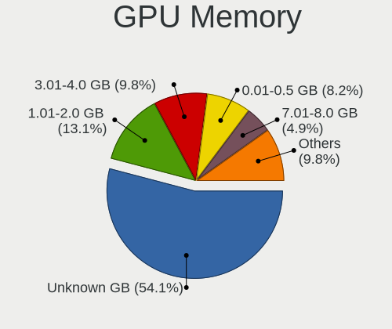

| Size in GB | Desktops | Percent |
|------------|----------|---------|
| Unknown    | 28       | 53.85%  |
| 1.01-2.0   | 7        | 13.46%  |
| 3.01-4.0   | 5        | 9.62%   |
| 0.01-0.5   | 5        | 9.62%   |
| 5.01-6.0   | 3        | 5.77%   |
| 7.01-8.0   | 2        | 3.85%   |
| 0.51-1.0   | 2        | 3.85%   |

Monitor
-------

Monitor Vendor
--------------

Monitor vendors

| Vendor               | Desktops | Percent |
|----------------------|----------|---------|
| Samsung Electronics  | 5        | 15.63%  |
| Iiyama               | 3        | 9.38%   |
| Philips              | 2        | 6.25%   |
| Lenovo               | 2        | 6.25%   |
| Hewlett-Packard      | 2        | 6.25%   |
| Goldstar             | 2        | 6.25%   |
| Dell                 | 2        | 6.25%   |
| BenQ                 | 2        | 6.25%   |
| Ancor Communications | 2        | 6.25%   |
| Acer                 | 2        | 6.25%   |
| Vizio                | 1        | 3.13%   |
| ViewSonic            | 1        | 3.13%   |
| Medion               | 1        | 3.13%   |
| Haier                | 1        | 3.13%   |
| Eizo                 | 1        | 3.13%   |
| ASUSTek Computer     | 1        | 3.13%   |
| AOC                  | 1        | 3.13%   |
| ALP                  | 1        | 3.13%   |

Monitor Model
-------------

Monitor models

| Model                                                                | Desktops | Percent |
|----------------------------------------------------------------------|----------|---------|
| Iiyama PLE2407HDS IVM560D 1920x1080 520x300mm 23.6-inch              | 2        | 6.25%   |
| Vizio LCD Monitor VIZ0022 1920x540 480x270mm 21.7-inch               | 1        | 3.13%   |
| ViewSonic VX2458-mhd VSC0437 1920x1080 520x290mm 23.4-inch           | 1        | 3.13%   |
| Samsung Electronics T22D390 SAM0B69 1920x1080 480x270mm 21.7-inch    | 1        | 3.13%   |
| Samsung Electronics SyncMaster SAM05CD 1920x1080                     | 1        | 3.13%   |
| Samsung Electronics SyncMaster SAM05C5 1920x1080                     | 1        | 3.13%   |
| Samsung Electronics SMS24A450 SAM083A 1920x1200 520x320mm 24.0-inch  | 1        | 3.13%   |
| Samsung Electronics LCD Monitor SAM4A75 1024x768 300x230mm 14.9-inch | 1        | 3.13%   |
| Philips PHL 243V7 PHLC155 1920x1080 530x300mm 24.0-inch              | 1        | 3.13%   |
| Philips PHL 193V5 PHLC0CD 1366x768 410x230mm 18.5-inch               | 1        | 3.13%   |
| Medion MD21281 MED3947 1366x768 410x230mm 18.5-inch                  | 1        | 3.13%   |
| Lenovo LEN-M73Z-D LEN00A0 1600x900 440x240mm 19.7-inch               | 1        | 3.13%   |
| Lenovo LEN-E73Z-D LEN00A1 1600x900 440x240mm 19.7-inch               | 1        | 3.13%   |
| Iiyama PL2409HD IVM560C 1920x1080 520x290mm 23.4-inch                | 1        | 3.13%   |
| Hewlett-Packard E243m HPN3465 1920x1080 530x300mm 24.0-inch          | 1        | 3.13%   |
| Hewlett-Packard 2310 HWP288F 1920x1080 510x290mm 23.1-inch           | 1        | 3.13%   |
| Haier HT-20216B(C) HAI2031 1920x1080 480x270mm 21.7-inch             | 1        | 3.13%   |
| Goldstar L1553S GSM3BB0 1024x768 300x230mm 14.9-inch                 | 1        | 3.13%   |
| Goldstar D2342P GSM5840 1920x1080 510x290mm 23.1-inch                | 1        | 3.13%   |
| Eizo EV2316W ENC2394 1920x1080 510x290mm 23.1-inch                   | 1        | 3.13%   |
| Dell E228WFP DELD014 1680x1050 470x300mm 22.0-inch                   | 1        | 3.13%   |
| Dell 1708FP DEL4024 1280x1024 340x270mm 17.1-inch                    | 1        | 3.13%   |
| BenQ LCD Monitor BNQ7725 1920x1080 480x270mm 21.7-inch               | 1        | 3.13%   |
| BenQ GW2765 BNQ78D6 2560x1440 600x340mm 27.2-inch                    | 1        | 3.13%   |
| ASUSTek Computer VP247 AUS24CA 1920x1080 520x290mm 23.4-inch         | 1        | 3.13%   |
| AOC LE19W037 AOC1907 1360x768 410x230mm 18.5-inch                    | 1        | 3.13%   |
| Ancor Communications MW221 ACI22B1 1680x1050 470x300mm 22.0-inch     | 1        | 3.13%   |
| Ancor Communications BE24A ACI24AB 1920x1200 520x320mm 24.0-inch     | 1        | 3.13%   |
| ALP 2476 IPS ALP2476 1920x1080 530x300mm 24.0-inch                   | 1        | 3.13%   |
| Acer ET430K ACR0558 3840x2160 940x530mm 42.5-inch                    | 1        | 3.13%   |
| Acer B223W ACR0018 1680x1050 470x300mm 22.0-inch                     | 1        | 3.13%   |

Monitor Resolution
------------------

Monitor screen resolution

| Resolution         | Desktops | Percent |
|--------------------|----------|---------|
| 1920x1080 (FHD)    | 16       | 50%     |
| 1680x1050 (WSXGA+) | 3        | 9.38%   |
| 1920x1200 (WUXGA)  | 2        | 6.25%   |
| 1600x900 (HD+)     | 2        | 6.25%   |
| 1366x768 (WXGA)    | 2        | 6.25%   |
| 1024x768 (XGA)     | 2        | 6.25%   |
| 3840x2160 (4K)     | 1        | 3.13%   |
| 2560x1440 (QHD)    | 1        | 3.13%   |
| 1920x540           | 1        | 3.13%   |
| 1360x768           | 1        | 3.13%   |
| 1280x1024 (SXGA)   | 1        | 3.13%   |

Monitor Diagonal
----------------

Diagonal size in inches

| Inches  | Desktops | Percent |
|---------|----------|---------|
| 23      | 8        | 25%     |
| 24      | 5        | 15.63%  |
| 21      | 4        | 12.5%   |
| 22      | 3        | 9.38%   |
| 18      | 3        | 9.38%   |
| 19      | 2        | 6.25%   |
| 14      | 2        | 6.25%   |
| Unknown | 2        | 6.25%   |
| 42      | 1        | 3.13%   |
| 27      | 1        | 3.13%   |
| 17      | 1        | 3.13%   |

Monitor Width
-------------

Physical width

| Width in mm | Desktops | Percent |
|-------------|----------|---------|
| 501-600     | 14       | 43.75%  |
| 401-500     | 12       | 37.5%   |
| 201-300     | 2        | 6.25%   |
| Unknown     | 2        | 6.25%   |
| 301-350     | 1        | 3.13%   |
| 901-1000    | 1        | 3.13%   |

Aspect Ratio
------------

Proportional relationship between the width and the height

| Ratio | Desktops | Percent |
|-------|----------|---------|
| 16/9  | 24       | 75%     |
| 16/10 | 5        | 15.63%  |
| 4/3   | 2        | 6.25%   |
| 5/4   | 1        | 3.13%   |

Monitor Area
------------

Area in inch²

| Area in inch² | Desktops | Percent |
|----------------|----------|---------|
| 201-250        | 18       | 56.25%  |
| 141-150        | 4        | 12.5%   |
| 251-300        | 2        | 6.25%   |
| 151-200        | 2        | 6.25%   |
| 101-110        | 2        | 6.25%   |
| Unknown        | 2        | 6.25%   |
| 301-350        | 1        | 3.13%   |
| 501-1000       | 1        | 3.13%   |

Pixel Density
-------------

Pixels per inch

| Density | Desktops | Percent |
|---------|----------|---------|
| 51-100  | 25       | 78.13%  |
| 101-120 | 5        | 15.63%  |
| Unknown | 2        | 6.25%   |

Multiple Monitors
-----------------

Total monitors connected

| Total | Desktops | Percent |
|-------|----------|---------|
| 1     | 30       | 57.69%  |
| 0     | 21       | 40.38%  |
| 2     | 1        | 1.92%   |

Network
-------

Net Controller Vendor
---------------------

Controller vendors

| Vendor                   | Desktops | Percent |
|--------------------------|----------|---------|
| Realtek Semiconductor    | 31       | 46.27%  |
| Intel                    | 18       | 26.87%  |
| Broadcom                 | 7        | 10.45%  |
| Qualcomm Atheros         | 3        | 4.48%   |
| Ralink Technology        | 2        | 2.99%   |
| Ralink                   | 1        | 1.49%   |
| Marvell Technology Group | 1        | 1.49%   |
| IMC Networks             | 1        | 1.49%   |
| Belkin Components        | 1        | 1.49%   |
| ASUSTek Computer         | 1        | 1.49%   |
| Aquantia                 | 1        | 1.49%   |

Net Controller Model
--------------------

Controller models

| Model                                                                          | Desktops | Percent |
|--------------------------------------------------------------------------------|----------|---------|
| Realtek RTL8111/8168/8411 PCI Express Gigabit Ethernet Controller              | 27       | 36.99%  |
| Intel I211 Gigabit Network Connection                                          | 5        | 6.85%   |
| Intel Ethernet Connection (7) I219-V                                           | 3        | 4.11%   |
| Realtek RTL810xE PCI Express Fast Ethernet controller                          | 2        | 2.74%   |
| Intel Ethernet Connection I217-V                                               | 2        | 2.74%   |
| Intel Dual Band Wireless-AC 3168NGW [Stone Peak]                               | 2        | 2.74%   |
| Intel 82579LM Gigabit Network Connection (Lewisville)                          | 2        | 2.74%   |
| Broadcom BCM4360 802.11ac Wireless Network Adapter                             | 2        | 2.74%   |
| Realtek RTL8821CE 802.11ac PCIe Wireless Network Adapter                       | 1        | 1.37%   |
| Realtek RTL8723BE PCIe Wireless Network Adapter                                | 1        | 1.37%   |
| Realtek RTL8188FTV 802.11b/g/n 1T1R 2.4G WLAN Adapter                          | 1        | 1.37%   |
| Realtek RTL8188EUS 802.11n Wireless Network Adapter                            | 1        | 1.37%   |
| Realtek RTL8188EE Wireless Network Adapter                                     | 1        | 1.37%   |
| Ralink RT3072 Wireless Adapter                                                 | 1        | 1.37%   |
| Ralink MT7601U Wireless Adapter                                                | 1        | 1.37%   |
| Ralink RT2561/RT61 rev B 802.11g                                               | 1        | 1.37%   |
| Qualcomm Atheros AR9485 Wireless Network Adapter                               | 1        | 1.37%   |
| Qualcomm Atheros AR8151 v1.0 Gigabit Ethernet                                  | 1        | 1.37%   |
| Qualcomm Atheros AR8121/AR8113/AR8114 Gigabit or Fast Ethernet                 | 1        | 1.37%   |
| Marvell Group Yukon Optima 88E8059 [PCIe Gigabit Ethernet Controller with AVB] | 1        | 1.37%   |
| Intel Wireless 7265                                                            | 1        | 1.37%   |
| Intel Ethernet Connection I217-LM                                              | 1        | 1.37%   |
| Intel Ethernet Connection (2) I219-V                                           | 1        | 1.37%   |
| Intel Ethernet Connection (11) I219-V                                          | 1        | 1.37%   |
| Intel Centrino Wireless-N 105                                                  | 1        | 1.37%   |
| Intel 82583V Gigabit Network Connection                                        | 1        | 1.37%   |
| Intel 82574L Gigabit Network Connection                                        | 1        | 1.37%   |
| IMC Networks Realtek RTL8191SU Wireless LAN 802.11n USB 2.0 Network Adapter    | 1        | 1.37%   |
| Broadcom NetXtreme II BCM5708 Gigabit Ethernet                                 | 1        | 1.37%   |
| Broadcom NetXtreme BCM5755 Gigabit Ethernet PCI Express                        | 1        | 1.37%   |
| Broadcom NetXtreme BCM5705_2 Gigabit Ethernet                                  | 1        | 1.37%   |
| Broadcom BCM4352 802.11ac Wireless Network Adapter                             | 1        | 1.37%   |
| Broadcom BCM4322 802.11a/b/g/n Wireless LAN Controller                         | 1        | 1.37%   |
| Belkin Components F5D7050 Wireless G Adapter v4000 [Zydas ZD1211B]             | 1        | 1.37%   |
| ASUS N10 Nano 802.11n Network Adapter [Realtek RTL8192CU]                      | 1        | 1.37%   |
| Aquantia AQC107 NBase-T/IEEE 802.3bz Ethernet Controller [AQtion]              | 1        | 1.37%   |

Wireless Vendor
---------------

Wireless vendors

| Vendor                | Desktops | Percent |
|-----------------------|----------|---------|
| Realtek Semiconductor | 4        | 21.05%  |
| Intel                 | 4        | 21.05%  |
| Broadcom              | 4        | 21.05%  |
| Ralink Technology     | 2        | 10.53%  |
| Ralink                | 1        | 5.26%   |
| Qualcomm Atheros      | 1        | 5.26%   |
| IMC Networks          | 1        | 5.26%   |
| Belkin Components     | 1        | 5.26%   |
| ASUSTek Computer      | 1        | 5.26%   |

Wireless Model
--------------

Wireless models

| Model                                                                       | Desktops | Percent |
|-----------------------------------------------------------------------------|----------|---------|
| Intel Dual Band Wireless-AC 3168NGW [Stone Peak]                            | 2        | 10%     |
| Broadcom BCM4360 802.11ac Wireless Network Adapter                          | 2        | 10%     |
| Realtek RTL8821CE 802.11ac PCIe Wireless Network Adapter                    | 1        | 5%      |
| Realtek RTL8723BE PCIe Wireless Network Adapter                             | 1        | 5%      |
| Realtek RTL8188FTV 802.11b/g/n 1T1R 2.4G WLAN Adapter                       | 1        | 5%      |
| Realtek RTL8188EUS 802.11n Wireless Network Adapter                         | 1        | 5%      |
| Realtek RTL8188EE Wireless Network Adapter                                  | 1        | 5%      |
| Ralink RT3072 Wireless Adapter                                              | 1        | 5%      |
| Ralink MT7601U Wireless Adapter                                             | 1        | 5%      |
| Ralink RT2561/RT61 rev B 802.11g                                            | 1        | 5%      |
| Qualcomm Atheros AR9485 Wireless Network Adapter                            | 1        | 5%      |
| Intel Wireless 7265                                                         | 1        | 5%      |
| Intel Centrino Wireless-N 105                                               | 1        | 5%      |
| IMC Networks Realtek RTL8191SU Wireless LAN 802.11n USB 2.0 Network Adapter | 1        | 5%      |
| Broadcom BCM4352 802.11ac Wireless Network Adapter                          | 1        | 5%      |
| Broadcom BCM4322 802.11a/b/g/n Wireless LAN Controller                      | 1        | 5%      |
| Belkin Components F5D7050 Wireless G Adapter v4000 [Zydas ZD1211B]          | 1        | 5%      |
| ASUS N10 Nano 802.11n Network Adapter [Realtek RTL8192CU]                   | 1        | 5%      |

Ethernet Vendor
---------------

Ethernet vendors

| Vendor                   | Desktops | Percent |
|--------------------------|----------|---------|
| Realtek Semiconductor    | 29       | 54.72%  |
| Intel                    | 17       | 32.08%  |
| Broadcom                 | 3        | 5.66%   |
| Qualcomm Atheros         | 2        | 3.77%   |
| Marvell Technology Group | 1        | 1.89%   |
| Aquantia                 | 1        | 1.89%   |

Ethernet Model
--------------

Ethernet models

| Model                                                                          | Desktops | Percent |
|--------------------------------------------------------------------------------|----------|---------|
| Realtek RTL8111/8168/8411 PCI Express Gigabit Ethernet Controller              | 27       | 50.94%  |
| Intel I211 Gigabit Network Connection                                          | 5        | 9.43%   |
| Intel Ethernet Connection (7) I219-V                                           | 3        | 5.66%   |
| Realtek RTL810xE PCI Express Fast Ethernet controller                          | 2        | 3.77%   |
| Intel Ethernet Connection I217-V                                               | 2        | 3.77%   |
| Intel 82579LM Gigabit Network Connection (Lewisville)                          | 2        | 3.77%   |
| Qualcomm Atheros AR8151 v1.0 Gigabit Ethernet                                  | 1        | 1.89%   |
| Qualcomm Atheros AR8121/AR8113/AR8114 Gigabit or Fast Ethernet                 | 1        | 1.89%   |
| Marvell Group Yukon Optima 88E8059 [PCIe Gigabit Ethernet Controller with AVB] | 1        | 1.89%   |
| Intel Ethernet Connection I217-LM                                              | 1        | 1.89%   |
| Intel Ethernet Connection (2) I219-V                                           | 1        | 1.89%   |
| Intel Ethernet Connection (11) I219-V                                          | 1        | 1.89%   |
| Intel 82583V Gigabit Network Connection                                        | 1        | 1.89%   |
| Intel 82574L Gigabit Network Connection                                        | 1        | 1.89%   |
| Broadcom NetXtreme II BCM5708 Gigabit Ethernet                                 | 1        | 1.89%   |
| Broadcom NetXtreme BCM5755 Gigabit Ethernet PCI Express                        | 1        | 1.89%   |
| Broadcom NetXtreme BCM5705_2 Gigabit Ethernet                                  | 1        | 1.89%   |
| Aquantia AQC107 NBase-T/IEEE 802.3bz Ethernet Controller [AQtion]              | 1        | 1.89%   |

Net Controller Kind
-------------------

Ethernet, WiFi or modem

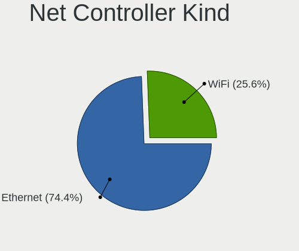

| Kind     | Desktops | Percent |
|----------|----------|---------|
| Ethernet | 52       | 74.29%  |
| WiFi     | 18       | 25.71%  |

Used Controller
---------------

Currently used network controller

| Kind     | Desktops | Percent |
|----------|----------|---------|
| Ethernet | 52       | 81.25%  |
| WiFi     | 12       | 18.75%  |

NICs
----

Total network controllers on board

| Total | Desktops | Percent |
|-------|----------|---------|
| 1     | 37       | 71.15%  |
| 2     | 14       | 26.92%  |
| 3     | 1        | 1.92%   |

IPv6
----

IPv6 vs IPv4

| Used | Desktops | Percent |
|------|----------|---------|
| No   | 51       | 96.23%  |
| Yes  | 2        | 3.77%   |

Bluetooth
---------

Bluetooth Vendor
----------------

Controller vendors

| Vendor                  | Desktops | Percent |
|-------------------------|----------|---------|
| Intel                   | 4        | 30.77%  |
| Apple                   | 3        | 23.08%  |
| Realtek Semiconductor   | 2        | 15.38%  |
| Foxconn / Hon Hai       | 1        | 7.69%   |
| Cambridge Silicon Radio | 1        | 7.69%   |
| Broadcom                | 1        | 7.69%   |
| ASUSTek Computer        | 1        | 7.69%   |

Bluetooth Model
---------------

Controller models

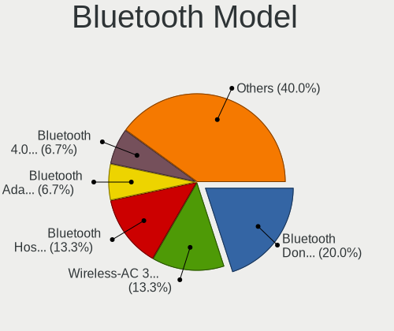

| Model                                               | Desktops | Percent |
|-----------------------------------------------------|----------|---------|
| Intel Wireless-AC 3168 Bluetooth                    | 2        | 15.38%  |
| Apple Apple Broadcom Built-in Bluetooth             | 2        | 15.38%  |
| Realtek  Bluetooth Adapter                          | 1        | 7.69%   |
| Realtek  Bluetooth 4.0 Adapter                      | 1        | 7.69%   |
| Intel Bluetooth wireless interface                  | 1        | 7.69%   |
| Intel AX200 Bluetooth                               | 1        | 7.69%   |
| Foxconn / Hon Hai Broadcom Bluetooth 4.0 USB        | 1        | 7.69%   |
| Cambridge Silicon Radio Bluetooth Dongle (HCI mode) | 1        | 7.69%   |
| Broadcom BCM92046DG-CL1ROM Bluetooth 2.1 Adapter    | 1        | 7.69%   |
| ASUS Broadcom BCM20702A0 Bluetooth                  | 1        | 7.69%   |
| Apple Built-in Bluetooth 2.0+EDR HCI                | 1        | 7.69%   |

Sound
-----

Sound Vendor
------------

Sound card vendors

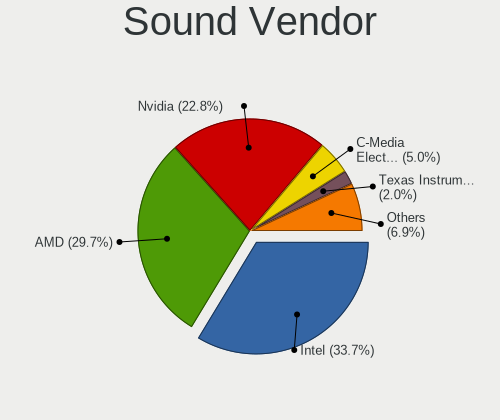

| Vendor                  | Desktops | Percent |
|-------------------------|----------|---------|
| Intel                   | 30       | 34.48%  |
| AMD                     | 25       | 28.74%  |
| Nvidia                  | 20       | 22.99%  |
| C-Media Electronics     | 4        | 4.6%    |
| Texas Instruments       | 2        | 2.3%    |
| Logitech                | 2        | 2.3%    |
| Plantronics             | 1        | 1.15%   |
| Hewlett-Packard         | 1        | 1.15%   |
| Creative Labs           | 1        | 1.15%   |
| BEHRINGER International | 1        | 1.15%   |

Sound Model
-----------

Sound card models

| Model                                                                      | Desktops | Percent |
|----------------------------------------------------------------------------|----------|---------|
| Intel 8 Series/C220 Series Chipset High Definition Audio Controller        | 7        | 6.93%   |
| AMD SBx00 Azalia (Intel HDA)                                               | 6        | 5.94%   |
| AMD Family 17h (Models 00h-0fh) HD Audio Controller                        | 6        | 5.94%   |
| Intel 6 Series/C200 Series Chipset Family High Definition Audio Controller | 4        | 3.96%   |
| AMD Starship/Matisse HD Audio Controller                                   | 4        | 3.96%   |
| AMD Baffin HDMI/DP Audio [Radeon RX 550 640SP / RX 560/560X]               | 4        | 3.96%   |
| Nvidia TU116 High Definition Audio Controller                              | 3        | 2.97%   |
| Nvidia GK208 HDMI/DP Audio Controller                                      | 3        | 2.97%   |
| Nvidia GF119 HDMI Audio Controller                                         | 3        | 2.97%   |
| Intel NM10/ICH7 Family High Definition Audio Controller                    | 3        | 2.97%   |
| Intel 7 Series/C216 Chipset Family High Definition Audio Controller        | 3        | 2.97%   |
| Intel 100 Series/C230 Series Chipset Family HD Audio Controller            | 3        | 2.97%   |
| AMD Oland/Hainan/Cape Verde/Pitcairn HDMI Audio [Radeon HD 7000 Series]    | 3        | 2.97%   |
| AMD Family 17h (Models 10h-1fh) HD Audio Controller                        | 3        | 2.97%   |
| AMD Ellesmere HDMI Audio [Radeon RX 470/480 / 570/580/590]                 | 3        | 2.97%   |
| Texas Instruments PCM2902 Audio Codec                                      | 2        | 1.98%   |
| Nvidia GM206 High Definition Audio Controller                              | 2        | 1.98%   |
| Nvidia GK104 HDMI Audio Controller                                         | 2        | 1.98%   |
| Nvidia GF108 High Definition Audio Controller                              | 2        | 1.98%   |
| Intel Xeon E3-1200 v3/4th Gen Core Processor HD Audio Controller           | 2        | 1.98%   |
| Intel Cannon Lake PCH cAVS                                                 | 2        | 1.98%   |
| Intel 82801JI (ICH10 Family) HD Audio Controller                           | 2        | 1.98%   |
| Intel 5 Series/3400 Series Chipset High Definition Audio                   | 2        | 1.98%   |
| Intel 200 Series PCH HD Audio                                              | 2        | 1.98%   |
| Plantronics Plantronics Blackwire 325.1                                    | 1        | 0.99%   |
| Nvidia High Definition Audio Controller                                    | 1        | 0.99%   |
| Nvidia GP108 High Definition Audio Controller                              | 1        | 0.99%   |
| Nvidia GP107GL High Definition Audio Controller                            | 1        | 0.99%   |
| Nvidia GP104 High Definition Audio Controller                              | 1        | 0.99%   |
| Nvidia GP102 HDMI Audio Controller                                         | 1        | 0.99%   |
| Logitech HD Webcam C910                                                    | 1        | 0.99%   |
| Logitech HD Webcam C510                                                    | 1        | 0.99%   |
| Intel Comet Lake PCH cAVS                                                  | 1        | 0.99%   |
| Intel 82801H (ICH8 Family) HD Audio Controller                             | 1        | 0.99%   |
| Hewlett-Packard E243m                                                      | 1        | 0.99%   |
| Creative Labs EMU10k2/CA0100/CA0102/CA10200 [Sound Blaster Audigy Series]  | 1        | 0.99%   |
| C-Media Electronics CM108 Audio Controller                                 | 1        | 0.99%   |
| C-Media Electronics CM102-A+/102S+ Audio Controller                        | 1        | 0.99%   |
| C-Media Electronics Audio Adapter (Unitek Y-247A)                          | 1        | 0.99%   |
| C-Media Electronics Audio Adapter                                          | 1        | 0.99%   |
| BEHRINGER International UMC202HD 192k                                      | 1        | 0.99%   |
| AMD Wrestler HDMI Audio                                                    | 1        | 0.99%   |
| AMD Turks HDMI Audio [Radeon HD 6500/6600 / 6700M Series]                  | 1        | 0.99%   |
| AMD RS880 HDMI Audio [Radeon HD 4200 Series]                               | 1        | 0.99%   |
| AMD RS780 HDMI Audio [Radeon 3000/3100 / HD 3200/3300]                     | 1        | 0.99%   |
| AMD Renoir Radeon High Definition Audio Controller                         | 1        | 0.99%   |
| AMD Raven/Raven2/Fenghuang HDMI/DP Audio Controller                        | 1        | 0.99%   |
| AMD Navi 21 HDMI Audio [Radeon RX 6800/6800 XT / 6900 XT]                  | 1        | 0.99%   |
| AMD FCH Azalia Controller                                                  | 1        | 0.99%   |

Memory
------

Memory Vendor
-------------

Memory module vendors

| Vendor              | Desktops | Percent |
|---------------------|----------|---------|
| Kingston            | 11       | 18.03%  |
| Samsung Electronics | 8        | 13.11%  |
| Crucial             | 8        | 13.11%  |
| Unknown             | 6        | 9.84%   |
| SK Hynix            | 4        | 6.56%   |
| Corsair             | 4        | 6.56%   |
| Team                | 3        | 4.92%   |
| Nanya Technology    | 3        | 4.92%   |
| Unknown             | 3        | 4.92%   |
| Transcend           | 2        | 3.28%   |
| Micron Technology   | 2        | 3.28%   |
| G.Skill             | 2        | 3.28%   |
| A-DATA Technology   | 2        | 3.28%   |
| Ramaxel Technology  | 1        | 1.64%   |
| Patriot             | 1        | 1.64%   |
| Hikvision           | 1        | 1.64%   |

Memory Model
------------

Memory module models

| Model                                                   | Desktops | Percent |
|---------------------------------------------------------|----------|---------|
| Unknown                                                 | 3        | 4.76%   |
| Team RAM TEAMGROUP-UD4-3200 16GB DIMM DDR4 3200MT/s     | 2        | 3.17%   |
| SK Hynix RAM HMT451S6BCFR8A-PB 4GB DIMM DDR3 1600MT/s   | 2        | 3.17%   |
| Crucial RAM CT8G4DFS8266.M8FD 8GB DIMM DDR4 2667MT/s    | 2        | 3.17%   |
| Unknown RAM Module 8GB DIMM 1600MT/s                    | 1        | 1.59%   |
| Unknown RAM Module 4GB FB-DIMM DDR2 667MT/s             | 1        | 1.59%   |
| Unknown RAM Module 4GB DIMM DDR3 800MT/s                | 1        | 1.59%   |
| Unknown RAM Module 4GB DIMM DDR 1333MT/s                | 1        | 1.59%   |
| Unknown RAM Module 4GB DIMM 400MT/s                     | 1        | 1.59%   |
| Unknown RAM Module 2GB DIMM 1333MT/s                    | 1        | 1.59%   |
| Transcend RAM Module 2GB DIMM DDR3 1333MT/s             | 1        | 1.59%   |
| Transcend RAM JM1333KSN-4G 4GB DIMM DDR3 1333MT/s       | 1        | 1.59%   |
| Team RAM TEAMGROUP-UD4-2666 8GB DIMM DDR4 2667MT/s      | 1        | 1.59%   |
| SK Hynix RAM HMT451U6BFR8C-PB 4GB DIMM DDR3 1600MT/s    | 1        | 1.59%   |
| SK Hynix RAM HMT351U6CFR8C-PB 4GB DIMM DDR3 1600MT/s    | 1        | 1.59%   |
| Samsung RAM Module 2GB DIMM DDR3 400MT/s                | 1        | 1.59%   |
| Samsung RAM Module 16GB DIMM DDR3 1333MT/s              | 1        | 1.59%   |
| Samsung RAM M471B5273DH0-CK0 4GB SODIMM DDR3 1600MT/s   | 1        | 1.59%   |
| Samsung RAM M471B1G73DB0-YK0 8GB SODIMM DDR3 1600MT/s   | 1        | 1.59%   |
| Samsung RAM M393B1K70DH0 8GB DIMM DDR3 1600MT/s         | 1        | 1.59%   |
| Samsung RAM M378B5773QB0-CK0 2GB DIMM DDR3 1600MT/s     | 1        | 1.59%   |
| Samsung RAM M378B5673FH0-CH9 2GB DIMM DDR3 1067MT/s     | 1        | 1.59%   |
| Samsung RAM M378B5173BH0-CK0 4GB DIMM DDR3 1600MT/s     | 1        | 1.59%   |
| Samsung RAM M378B1G73DB0-CK0 8GB DIMM DDR3 1600MT/s     | 1        | 1.59%   |
| Ramaxel RAM RMR5030MN68F9F1600 4GB DIMM DDR3 1600MT/s   | 1        | 1.59%   |
| Patriot RAM Module 2GB DIMM DDR2 533MT/s                | 1        | 1.59%   |
| Nanya RAM NT4GC72B8PB0NF-CG 4GB DIMM DDR3 1333MT/s      | 1        | 1.59%   |
| Nanya RAM M2F4G64CC88D7N-DI 4GB DIMM DDR3 1600MT/s      | 1        | 1.59%   |
| Nanya RAM M2F4G64CB8HG5N-CG 4GB DIMM DDR3 1333MT/s      | 1        | 1.59%   |
| Nanya RAM M2F2G64CB88G7N-CG 2GB DIMM DDR3 1333MT/s      | 1        | 1.59%   |
| Micron RAM 4ATF51264HZ-2G6B1 4GB SODIMM DDR4 1200MT/s   | 1        | 1.59%   |
| Micron RAM 16KTF1G64HZ-1G6N1 8GB SODIMM DDR3 1600MT/s   | 1        | 1.59%   |
| Kingston RAM KHX3466C19D4/16G 16GB DIMM DDR4 3200MT/s   | 1        | 1.59%   |
| Kingston RAM KHX3200C16D4/8GX 8GB DIMM DDR4 3200MT/s    | 1        | 1.59%   |
| Kingston RAM KHX2666C16/8G 8GB DIMM DDR4 2667MT/s       | 1        | 1.59%   |
| Kingston RAM KHX2400C15/8G 8GB DIMM DDR4 2400MT/s       | 1        | 1.59%   |
| Kingston RAM KHX2400C14S4/16G 16GB SODIMM DDR4 2400MT/s | 1        | 1.59%   |
| Kingston RAM KHX1600C10D3/ 8GB DIMM DDR3 1600MT/s       | 1        | 1.59%   |
| Kingston RAM 99U5665-001.A00G 4GB DIMM DDR4 2400MT/s    | 1        | 1.59%   |
| Kingston RAM 99U5471-012.A00LF 4GB DIMM DDR3 1333MT/s   | 1        | 1.59%   |
| Kingston RAM 9965525-116.A00LF 8GB DIMM DDR3 1600MT/s   | 1        | 1.59%   |
| Kingston RAM 9905734-180.A00G 16GB DIMM DDR4 2666MT/s   | 1        | 1.59%   |
| Kingston RAM 9905665-020.A00G 4GB DIMM DDR4 2667MT/s    | 1        | 1.59%   |
| Hikvision RAM HKED3041AAB3H3HA1 4GB DIMM DDR3 1600MT/s  | 1        | 1.59%   |
| G.Skill RAM F4-3200C16-8GTZR 8GB DIMM DDR4 3200MT/s     | 1        | 1.59%   |
| G.Skill RAM F4-2400C15-8GFT 8GB DIMM DDR4 2400MT/s      | 1        | 1.59%   |
| Crucial RAM Module 8GB SODIMM DDR3 1600MT/s             | 1        | 1.59%   |
| Crucial RAM CT4G4DFS824A.C8FF 4GB DIMM DDR4 2667MT/s    | 1        | 1.59%   |
| Crucial RAM CT4G4DFS8213.C8FBD1 4GB DIMM DDR4 2133MT/s  | 1        | 1.59%   |
| Crucial RAM BLS8G4D240FSB.16FBD2 8GB DIMM DDR4 2400MT/s | 1        | 1.59%   |
| Crucial RAM BL8G32C16U4BL.M8FE 8GB DIMM DDR4 2667MT/s   | 1        | 1.59%   |
| Crucial RAM BL8G30C15U4B.M8FE 8GB DIMM DDR4 2666MT/s    | 1        | 1.59%   |
| Corsair RAM CMZ8GX3M1A1600C10 8GB DIMM DDR3 1600MT/s    | 1        | 1.59%   |
| Corsair RAM CMW64GX4M2E3200C16 32GB DIMM DDR4 2133MT/s  | 1        | 1.59%   |
| Corsair RAM CMV4GX3M1A133 4GB DIMM DDR3 1333MT/s        | 1        | 1.59%   |
| Corsair RAM CMK16GX4M1A2400C14 16GB DIMM DDR4 2400MT/s  | 1        | 1.59%   |
| A-DATA RAM Module 1GB DIMM DDR2 533MT/s                 | 1        | 1.59%   |
| A-DATA RAM MI74C1C167HZ1 4GB SODIMM DDR3 1333MT/s       | 1        | 1.59%   |

Memory Kind
-----------

Memory module kinds

| Kind    | Desktops | Percent |
|---------|----------|---------|
| DDR3    | 23       | 44.23%  |
| DDR4    | 22       | 42.31%  |
| Unknown | 3        | 5.77%   |
| DDR2    | 2        | 3.85%   |
| SDRAM   | 1        | 1.92%   |
| DDR     | 1        | 1.92%   |

Memory Form Factor
------------------

Physical design of the memory module

| Name    | Desktops | Percent |
|---------|----------|---------|
| DIMM    | 46       | 88.46%  |
| SODIMM  | 5        | 9.62%   |
| FB-DIMM | 1        | 1.92%   |

Memory Size
-----------

Memory module size

| Size  | Desktops | Percent |
|-------|----------|---------|
| 4096  | 20       | 35.09%  |
| 8192  | 19       | 33.33%  |
| 2048  | 9        | 15.79%  |
| 16384 | 7        | 12.28%  |
| 32768 | 1        | 1.75%   |
| 1024  | 1        | 1.75%   |

Memory Speed
------------

Memory module speed

| Speed | Desktops | Percent |
|-------|----------|---------|
| 1600  | 15       | 27.78%  |
| 1333  | 11       | 20.37%  |
| 2667  | 6        | 11.11%  |
| 2400  | 6        | 11.11%  |
| 3200  | 5        | 9.26%   |
| 2666  | 2        | 3.7%    |
| 2133  | 2        | 3.7%    |
| 400   | 2        | 3.7%    |
| 1200  | 1        | 1.85%   |
| 1066  | 1        | 1.85%   |
| 800   | 1        | 1.85%   |
| 667   | 1        | 1.85%   |
| 533   | 1        | 1.85%   |

Printers & scanners
-------------------

Printer Vendor
--------------

Printer device vendors

| Vendor                | Desktops | Percent |
|-----------------------|----------|---------|
| Lexmark International | 1        | 50%     |
| Brother Industries    | 1        | 50%     |

Printer Model
-------------

Printer device models

| Model                                        | Desktops | Percent |
|----------------------------------------------|----------|---------|
| Lexmark International SINDOH A603_A608 Print | 1        | 50%     |
| Brother DCP-J100                             | 1        | 50%     |

Scanner Vendor
--------------

Scanner device vendors

Zero info for selected period =(

Scanner Model
-------------

Scanner device models

Zero info for selected period =(

Camera
------

Camera Vendor
-------------

Camera device vendors

| Vendor                  | Desktops | Percent |
|-------------------------|----------|---------|
| Z-Star Microelectronics | 2        | 28.57%  |
| IMC Networks            | 2        | 28.57%  |
| Logitech                | 1        | 14.29%  |
| Hewlett-Packard         | 1        | 14.29%  |
| Chicony Electronics     | 1        | 14.29%  |

Camera Model
------------

Camera device models

| Model                             | Desktops | Percent |
|-----------------------------------|----------|---------|
| IMC Networks XHC Camera           | 2        | 28.57%  |
| Z-Star Integrated Camera          | 1        | 14.29%  |
| Z-Star A4 TECH USB2.0 PC Camera J | 1        | 14.29%  |
| Logitech Webcam C270              | 1        | 14.29%  |
| HP Premium Starter Webcam         | 1        | 14.29%  |
| Chicony HP Display Camera         | 1        | 14.29%  |

Security
--------

Fingerprint Vendor
------------------

Fingerprint sensor vendors

Zero info for selected period =(

Fingerprint Model
-----------------

Fingerprint sensor models

Zero info for selected period =(

Chipcard Vendor
---------------

Chipcard module vendors

Zero info for selected period =(

Chipcard Model
--------------

Chipcard module models

Zero info for selected period =(

Unsupported
-----------

Unsupported Devices
-------------------

Total unsupported devices on board

| Total | Desktops | Percent |
|-------|----------|---------|
| 1     | 25       | 48.08%  |
| 0     | 21       | 40.38%  |
| 2     | 5        | 9.62%   |
| 3     | 1        | 1.92%   |

Unsupported Device Types
------------------------

Types of unsupported devices

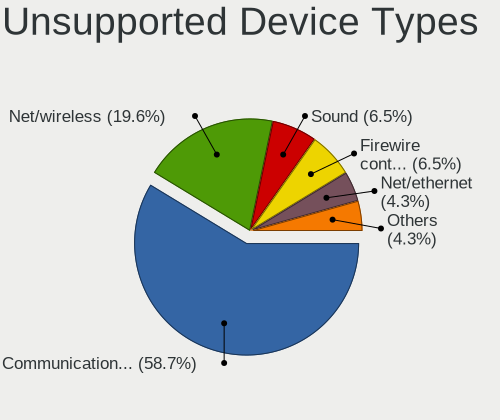

| Type                     | Desktops | Percent |
|--------------------------|----------|---------|
| Communication controller | 22       | 61.11%  |
| Net/wireless             | 7        | 19.44%  |
| Sound                    | 3        | 8.33%   |
| Firewire controller      | 2        | 5.56%   |
| Net/ethernet             | 1        | 2.78%   |
| Card reader              | 1        | 2.78%   |

