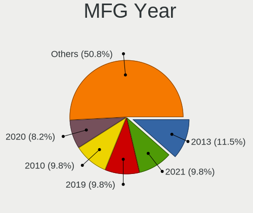
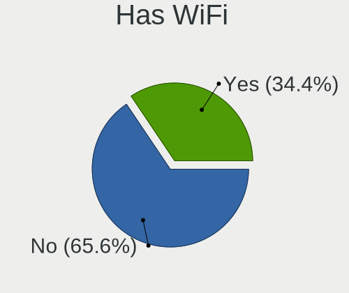
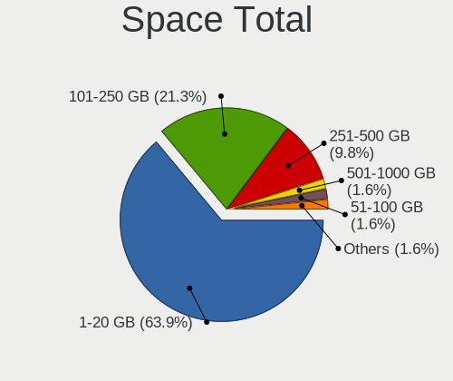
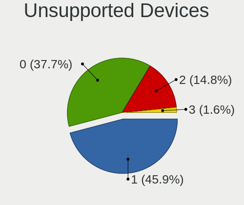

helloSystem 0.6.0 - Tested Hardware & Statistics (Desktops)
-----------------------------------------------------------

A project to collect tested hardware configurations for helloSystem 0.6.0.

Anyone can contribute to this report by the [hw-probe](https://github.com/linuxhw/hw-probe/blob/master/INSTALL.BSD.md) tool:

    hw-probe -all -upload

Please submit a probe of your configuration if it's not presented on the page or is rare.

Full-feature report is available here: https://bsd-hardware.info/?view=trends&rel=hellosystem-0.6.0

Contents
--------

* [ Test Cases ](#test-cases)

* [ System ](#system)
  - [ Arch                     ](#arch)
  - [ DE                       ](#de)
  - [ Display Server           ](#display-server)
  - [ Display Manager          ](#display-manager)
  - [ OS Lang                  ](#os-lang)
  - [ Boot Mode                ](#boot-mode)
  - [ Filesystem               ](#filesystem)
  - [ Part. scheme             ](#part-scheme)

* [ Board ](#board)
  - [ Vendor                   ](#vendor)
  - [ Model                    ](#model)
  - [ Model Family             ](#model-family)
  - [ MFG Year                 ](#mfg-year)
  - [ Form Factor              ](#form-factor)
  - [ Coreboot                 ](#coreboot)
  - [ RAM Size                 ](#ram-size)
  - [ RAM Used                 ](#ram-used)
  - [ Total Drives             ](#total-drives)
  - [ Has CD-ROM               ](#has-cd-rom)
  - [ Has Ethernet             ](#has-ethernet)
  - [ Has WiFi                 ](#has-wifi)
  - [ Has Bluetooth            ](#has-bluetooth)

* [ Location ](#location)
  - [ Country                  ](#country)
  - [ City                     ](#city)

* [ Drives ](#drives)
  - [ Drive Vendor             ](#drive-vendor)
  - [ Drive Model              ](#drive-model)
  - [ HDD Vendor               ](#hdd-vendor)
  - [ SSD Vendor               ](#ssd-vendor)
  - [ Drive Kind               ](#drive-kind)
  - [ Drive Connector          ](#drive-connector)
  - [ Drive Size               ](#drive-size)
  - [ Space Total              ](#space-total)
  - [ Space Used               ](#space-used)
  - [ Malfunc. Drives          ](#malfunc-drives)
  - [ Malfunc. Drive Vendor    ](#malfunc-drive-vendor)
  - [ Malfunc. HDD Vendor      ](#malfunc-hdd-vendor)
  - [ Malfunc. Drive Kind      ](#malfunc-drive-kind)
  - [ Failed Drives            ](#failed-drives)
  - [ Failed Drive Vendor      ](#failed-drive-vendor)
  - [ Drive Status             ](#drive-status)

* [ Storage controller ](#storage-controller)
  - [ Storage Vendor           ](#storage-vendor)
  - [ Storage Model            ](#storage-model)
  - [ Storage Kind             ](#storage-kind)

* [ Processor ](#processor)
  - [ CPU Vendor               ](#cpu-vendor)
  - [ CPU Model                ](#cpu-model)
  - [ CPU Model Family         ](#cpu-model-family)
  - [ CPU Cores                ](#cpu-cores)
  - [ CPU Sockets              ](#cpu-sockets)
  - [ CPU Threads              ](#cpu-threads)
  - [ CPU Microarch            ](#cpu-microarch)

* [ Graphics ](#graphics)
  - [ GPU Vendor               ](#gpu-vendor)
  - [ GPU Model                ](#gpu-model)
  - [ GPU Combo                ](#gpu-combo)
  - [ GPU Driver               ](#gpu-driver)
  - [ GPU Memory               ](#gpu-memory)

* [ Monitor ](#monitor)
  - [ Monitor Vendor           ](#monitor-vendor)
  - [ Monitor Model            ](#monitor-model)
  - [ Monitor Resolution       ](#monitor-resolution)
  - [ Monitor Diagonal         ](#monitor-diagonal)
  - [ Monitor Width            ](#monitor-width)
  - [ Aspect Ratio             ](#aspect-ratio)
  - [ Monitor Area             ](#monitor-area)
  - [ Pixel Density            ](#pixel-density)
  - [ Multiple Monitors        ](#multiple-monitors)

* [ Network ](#network)
  - [ Net Controller Vendor    ](#net-controller-vendor)
  - [ Net Controller Model     ](#net-controller-model)
  - [ Wireless Vendor          ](#wireless-vendor)
  - [ Wireless Model           ](#wireless-model)
  - [ Ethernet Vendor          ](#ethernet-vendor)
  - [ Ethernet Model           ](#ethernet-model)
  - [ Net Controller Kind      ](#net-controller-kind)
  - [ Used Controller          ](#used-controller)
  - [ NICs                     ](#nics)
  - [ IPv6                     ](#ipv6)

* [ Bluetooth ](#bluetooth)
  - [ Bluetooth Vendor         ](#bluetooth-vendor)
  - [ Bluetooth Model          ](#bluetooth-model)

* [ Sound ](#sound)
  - [ Sound Vendor             ](#sound-vendor)
  - [ Sound Model              ](#sound-model)

* [ Memory ](#memory)
  - [ Memory Vendor            ](#memory-vendor)
  - [ Memory Model             ](#memory-model)
  - [ Memory Kind              ](#memory-kind)
  - [ Memory Form Factor       ](#memory-form-factor)
  - [ Memory Size              ](#memory-size)
  - [ Memory Speed             ](#memory-speed)

* [ Printers & scanners ](#printers--scanners)
  - [ Printer Vendor           ](#printer-vendor)
  - [ Printer Model            ](#printer-model)
  - [ Scanner Vendor           ](#scanner-vendor)
  - [ Scanner Model            ](#scanner-model)

* [ Camera ](#camera)
  - [ Camera Vendor            ](#camera-vendor)
  - [ Camera Model             ](#camera-model)

* [ Security ](#security)
  - [ Fingerprint Vendor       ](#fingerprint-vendor)
  - [ Fingerprint Model        ](#fingerprint-model)
  - [ Chipcard Vendor          ](#chipcard-vendor)
  - [ Chipcard Model           ](#chipcard-model)

* [ Unsupported ](#unsupported)
  - [ Unsupported Devices      ](#unsupported-devices)
  - [ Unsupported Device Types ](#unsupported-device-types)

Test Cases
----------

| Vendor    | Model                       | Probe                                                     | Date         |
|-----------|-----------------------------|-----------------------------------------------------------|--------------|
| MSI       | MPG X570 GAMING PRO CARB... | [bd312d1c88](https://bsd-hardware.info/?probe=bd312d1c88) | Oct 03, 2021 |
| HP        | ProLiant ML350 G5           | [4d525cba3e](https://bsd-hardware.info/?probe=4d525cba3e) | Oct 03, 2021 |
| ASRock    | X570 Phantom Gaming 4       | [9b14548c15](https://bsd-hardware.info/?probe=9b14548c15) | Sep 21, 2021 |
| Sapphire  | EDGE-FT1M1 E450 1AOVU044    | [ea8fefdf4e](https://bsd-hardware.info/?probe=ea8fefdf4e) | Sep 20, 2021 |
| Dell      | 0MGK50 A02                  | [9d2959b4f1](https://bsd-hardware.info/?probe=9d2959b4f1) | Sep 20, 2021 |
| HP        | 81B4 01                     | [179504116d](https://bsd-hardware.info/?probe=179504116d) | Sep 20, 2021 |
| ASRock    | B450 Gaming-ITX/ac          | [790d020ebe](https://bsd-hardware.info/?probe=790d020ebe) | Sep 19, 2021 |
| Gigabyte  | H270M-DS3H-CF               | [9b046b157e](https://bsd-hardware.info/?probe=9b046b157e) | Sep 17, 2021 |
| ASUSTek   | PRIME B360M-C               | [0f6e7e26fc](https://bsd-hardware.info/?probe=0f6e7e26fc) | Sep 11, 2021 |
| HP        | 3397                        | [5d95b75768](https://bsd-hardware.info/?probe=5d95b75768) | Sep 06, 2021 |
| Medion    | H61H2-LM3                   | [eb81abe401](https://bsd-hardware.info/?probe=eb81abe401) | Sep 02, 2021 |
| ASRock    | Z390 Pro4                   | [ecbf097bc5](https://bsd-hardware.info/?probe=ecbf097bc5) | Sep 02, 2021 |
| ASUSTek   | TUF B360M-PLUS GAMING S     | [33ba0b7c38](https://bsd-hardware.info/?probe=33ba0b7c38) | Aug 29, 2021 |
| ASUSTek   | P7H55-M LX                  | [5fe1a9e521](https://bsd-hardware.info/?probe=5fe1a9e521) | Aug 16, 2021 |
| PCPartner | MILANO-P Rev.00             | [ef8217ac30](https://bsd-hardware.info/?probe=ef8217ac30) | Aug 01, 2021 |
| ASUSTek   | H110M-PLUS                  | [d0f2da9c41](https://bsd-hardware.info/?probe=d0f2da9c41) | Jul 21, 2021 |
| Gigabyte  | H110-D3A-CF                 | [2c390b4301](https://bsd-hardware.info/?probe=2c390b4301) | Jul 09, 2021 |
| Gigabyte  | H110-D3A-CF                 | [aea3a11daf](https://bsd-hardware.info/?probe=aea3a11daf) | Jul 08, 2021 |
| Lenovo    | SHARKBAY SDK0E50510 WIN     | [6cf3337855](https://bsd-hardware.info/?probe=6cf3337855) | Jul 01, 2021 |
| ASUSTek   | M5A97 R2.0                  | [e7a0dfcecf](https://bsd-hardware.info/?probe=e7a0dfcecf) | Jun 28, 2021 |
| ASUSTek   | H81M-K                      | [1a35d2f6ab](https://bsd-hardware.info/?probe=1a35d2f6ab) | Jun 26, 2021 |
| ASUSTek   | H110M-E/M.2                 | [b0b67667d3](https://bsd-hardware.info/?probe=b0b67667d3) | Jun 16, 2021 |

System
------

Arch
----

OS architecture (x86_64, i586, etc.)

| Name  | Desktops | Percent |
|-------|----------|---------|
| amd64 | 18       | 100%    |

DE
--

Desktop Environment

| Name         | Desktops | Percent |
|--------------|----------|---------|
| helloDesktop | 17       | 94.44%  |
| GNOME        | 1        | 5.56%   |

Display Server
--------------

X11 or Wayland

| Name | Desktops | Percent |
|------|----------|---------|
| X11  | 18       | 100%    |

Display Manager
---------------

SDDM, LightDM, etc.

| Name | Desktops | Percent |
|------|----------|---------|
| SLiM | 18       | 100%    |

OS Lang
-------

Language

| Lang  | Desktops | Percent |
|-------|----------|---------|
| en_US | 18       | 100%    |

Boot Mode
---------

EFI or BIOS

| Mode | Desktops | Percent |
|------|----------|---------|
| EFI  | 17       | 94.44%  |
| BIOS | 1        | 5.56%   |

Filesystem
----------

Type of filesystem

| Type | Desktops | Percent |
|------|----------|---------|
| Zfs  | 18       | 100%    |

Part. scheme
------------

Scheme of partitioning

| Type | Desktops | Percent |
|------|----------|---------|
| GPT  | 18       | 100%    |

Board
-----

Vendor
------

Motherboard manufacturer

| Name                | Desktops | Percent |
|---------------------|----------|---------|
| ASUSTek Computer    | 6        | 33.33%  |
| Hewlett-Packard     | 3        | 16.67%  |
| ASRock              | 3        | 16.67%  |
| Sapphire            | 1        | 5.56%   |
| PCPartner           | 1        | 5.56%   |
| MSI                 | 1        | 5.56%   |
| Lenovo              | 1        | 5.56%   |
| Gigabyte Technology | 1        | 5.56%   |
| Dell                | 1        | 5.56%   |

Model
-----

Motherboard model

| Name                              | Desktops | Percent |
|-----------------------------------|----------|---------|
| Sapphire EDGE-FT1M1 E450 1AOVU044 | 1        | 5.56%   |
| PCPartner DREAMSYS                | 1        | 5.56%   |
| MSI MS-7B93                       | 1        | 5.56%   |
| Lenovo ThinkCentre M83 10AHS35Q00 | 1        | 5.56%   |
| HP ProLiant ML350 G5              | 1        | 5.56%   |
| HP Compaq Elite 8300 SFF          | 1        | 5.56%   |
| HP 260-p026                       | 1        | 5.56%   |
| Gigabyte H270M-DS3H               | 1        | 5.56%   |
| Dell OptiPlex 3040                | 1        | 5.56%   |
| ASUS TUF B360M-PLUS GAMING S      | 1        | 5.56%   |
| ASUS P7H55-M LX                   | 1        | 5.56%   |
| ASUS M5A97 R2.0                   | 1        | 5.56%   |
| ASUS H110M-PLUS                   | 1        | 5.56%   |
| ASUS exone Business 1203          | 1        | 5.56%   |
| ASUS All Series                   | 1        | 5.56%   |
| ASRock Z390 Pro4                  | 1        | 5.56%   |
| ASRock X570 Phantom Gaming 4      | 1        | 5.56%   |
| ASRock B450 Gaming-ITX/ac         | 1        | 5.56%   |

Model Family
------------

Motherboard model prefix

| Name                | Desktops | Percent |
|---------------------|----------|---------|
| Sapphire EDGE-FT1M1 | 1        | 5.56%   |
| PCPartner DREAMSYS  | 1        | 5.56%   |
| MSI MS-7B93         | 1        | 5.56%   |
| Lenovo ThinkCentre  | 1        | 5.56%   |
| HP ProLiant         | 1        | 5.56%   |
| HP Compaq           | 1        | 5.56%   |
| HP 260-p026         | 1        | 5.56%   |
| Gigabyte H270M-DS3H | 1        | 5.56%   |
| Dell OptiPlex       | 1        | 5.56%   |
| ASUS TUF            | 1        | 5.56%   |
| ASUS P7H55-M        | 1        | 5.56%   |
| ASUS M5A97          | 1        | 5.56%   |
| ASUS H110M-PLUS     | 1        | 5.56%   |
| ASUS exone          | 1        | 5.56%   |
| ASUS All            | 1        | 5.56%   |
| ASRock Z390         | 1        | 5.56%   |
| ASRock X570         | 1        | 5.56%   |
| ASRock B450         | 1        | 5.56%   |

MFG Year
--------

Motherboard manufacture year

| Year | Desktops | Percent |
|------|----------|---------|
| 2021 | 3        | 16.67%  |
| 2020 | 3        | 16.67%  |
| 2019 | 3        | 16.67%  |
| 2017 | 2        | 11.11%  |
| 2016 | 2        | 11.11%  |
| 2015 | 1        | 5.56%   |
| 2013 | 1        | 5.56%   |
| 2012 | 1        | 5.56%   |
| 2011 | 1        | 5.56%   |
| 2010 | 1        | 5.56%   |

Form Factor
-----------

Physical design of the computer

| Name    | Desktops | Percent |
|---------|----------|---------|
| Desktop | 18       | 100%    |

Coreboot
--------

Have coreboot on board

| Used | Desktops | Percent |
|------|----------|---------|
| No   | 18       | 100%    |

RAM Size
--------

Total RAM memory

| Size in GB  | Desktops | Percent |
|-------------|----------|---------|
| 16.01-24.0  | 7        | 38.89%  |
| 8.01-16.0   | 5        | 27.78%  |
| 64.01-256.0 | 3        | 16.67%  |
| 4.01-8.0    | 2        | 11.11%  |
| 32.01-64.0  | 1        | 5.56%   |

RAM Used
--------

Used RAM memory

| Used GB  | Desktops | Percent |
|----------|----------|---------|
| 0.51-1.0 | 8        | 44.44%  |
| 0.01-0.5 | 6        | 33.33%  |
| 1.01-2.0 | 3        | 16.67%  |
| 3.01-4.0 | 1        | 5.56%   |

Total Drives
------------

Number of drives on board

| Drives | Desktops | Percent |
|--------|----------|---------|
| 1      | 9        | 50%     |
| 3      | 4        | 22.22%  |
| 2      | 3        | 16.67%  |
| 4      | 2        | 11.11%  |

Has CD-ROM
----------

Has CD-ROM on board

| Presented | Desktops | Percent |
|-----------|----------|---------|
| No        | 14       | 77.78%  |
| Yes       | 4        | 22.22%  |

Has Ethernet
------------

Has Ethernet on board

| Presented | Desktops | Percent |
|-----------|----------|---------|
| Yes       | 18       | 100%    |

Has WiFi
--------

Has WiFi module

| Presented | Desktops | Percent |
|-----------|----------|---------|
| No        | 11       | 61.11%  |
| Yes       | 7        | 38.89%  |

Has Bluetooth
-------------

Has Bluetooth module

| Presented | Desktops | Percent |
|-----------|----------|---------|
| No        | 13       | 72.22%  |
| Yes       | 5        | 27.78%  |

Location
--------

Country
-------

Geographic location (country)

| Country     | Desktops | Percent |
|-------------|----------|---------|
| USA         | 3        | 16.67%  |
| Germany     | 3        | 16.67%  |
| Russia      | 2        | 11.11%  |
| Italy       | 2        | 11.11%  |
| UK          | 1        | 5.56%   |
| Turkey      | 1        | 5.56%   |
| South Korea | 1        | 5.56%   |
| Netherlands | 1        | 5.56%   |
| Mexico      | 1        | 5.56%   |
| Hungary     | 1        | 5.56%   |
| Hong Kong   | 1        | 5.56%   |
| Australia   | 1        | 5.56%   |

City
----

Geographic location (city)

| City            | Desktops | Percent |
|-----------------|----------|---------|
| Marlborough     | 2        | 11.11%  |
| Tula de Allende | 1        | 5.56%   |
| Tampa           | 1        | 5.56%   |
| Stuttgart       | 1        | 5.56%   |
| Rostov-on-Don   | 1        | 5.56%   |
| Pistoia         | 1        | 5.56%   |
| Nieuwegein      | 1        | 5.56%   |
| Newtownabbey    | 1        | 5.56%   |
| Kosekoy         | 1        | 5.56%   |
| Hong Kong       | 1        | 5.56%   |
| Heidelberg      | 1        | 5.56%   |
| Gy?‘r           | 1        | 5.56%   |
| Gwangyang       | 1        | 5.56%   |
| Grottazzolina   | 1        | 5.56%   |
| Filderstadt     | 1        | 5.56%   |
| Chelyabinsk     | 1        | 5.56%   |
| Brisbane        | 1        | 5.56%   |

Drives
------

Drive Vendor
------------

Hard drive vendors

| Vendor              | Desktops | Drives | Percent |
|---------------------|----------|--------|---------|
| WDC                 | 8        | 9      | 25%     |
| Seagate             | 5        | 5      | 15.63%  |
| Samsung Electronics | 4        | 5      | 12.5%   |
| Crucial             | 2        | 2      | 6.25%   |
| China               | 2        | 2      | 6.25%   |
| A-DATA Technology   | 2        | 3      | 6.25%   |
| Verbatim            | 1        | 1      | 3.13%   |
| Toshiba             | 1        | 1      | 3.13%   |
| Smartbuy            | 1        | 1      | 3.13%   |
| SanDisk             | 1        | 1      | 3.13%   |
| PLEXTOR             | 1        | 1      | 3.13%   |
| Kingston            | 1        | 1      | 3.13%   |
| Hitachi             | 1        | 1      | 3.13%   |
| Hewlett-Packard     | 1        | 1      | 3.13%   |
| Gigabyte Technology | 1        | 1      | 3.13%   |

Drive Model
-----------

Hard drive models

| Model                               | Desktops | Percent |
|-------------------------------------|----------|---------|
| China SATA SSD 120GB                | 2        | 5.71%   |
| WDC WDS250G2X0C-00L350 250GB        | 1        | 2.86%   |
| WDC WDS100T2B0C-00PXH0 1TB          | 1        | 2.86%   |
| WDC WD5000AAVS-00ZTB0 500GB         | 1        | 2.86%   |
| WDC WD40EZRZ-22GXCB0 4TB            | 1        | 2.86%   |
| WDC WD3200BPVT-22JJ5T0 320GB        | 1        | 2.86%   |
| WDC WD10SPZX-22Z10T0 1TB            | 1        | 2.86%   |
| WDC WD10JMVW-11AJGS0 1TB            | 1        | 2.86%   |
| WDC WD10EZRX-00A8LB0 1TB            | 1        | 2.86%   |
| WDC WD1002FAEX-00Y9A0 1TB           | 1        | 2.86%   |
| Verbatim Vi550 S3 SSD 256GB         | 1        | 2.86%   |
| Toshiba DT01ACA100 1TB              | 1        | 2.86%   |
| Smartbuy SSD 120GB                  | 1        | 2.86%   |
| Seagate ST750LM022 HN-M750MBB 752GB | 1        | 2.86%   |
| Seagate ST500LM000-1EJ162 500GB     | 1        | 2.86%   |
| Seagate ST3250318AS 250GB           | 1        | 2.86%   |
| Seagate ST31000524AS 1TB            | 1        | 2.86%   |
| Seagate ST2000DX001-1CM164 2TB      | 1        | 2.86%   |
| SanDisk SDSSDA240G 240GB            | 1        | 2.86%   |
| Samsung SSD 970 EVO 500GB           | 1        | 2.86%   |
| Samsung SSD 860 EVO 500GB           | 1        | 2.86%   |
| Samsung SSD 860 EVO 250GB           | 1        | 2.86%   |
| Samsung SSD 860 EVO 1TB             | 1        | 2.86%   |
| Samsung SSD 850 EVO 250GB           | 1        | 2.86%   |
| PLEXTOR PX-AG256M6e 256GB           | 1        | 2.86%   |
| Kingston SS200S330G 32GB            | 1        | 2.86%   |
| Hitachi HUS724030ALE641 3TB         | 1        | 2.86%   |
| HP RAID 0 240GB                     | 1        | 2.86%   |
| Gigabyte GP-GSM2NE3256GNTD 256GB    | 1        | 2.86%   |
| Crucial CT128M550SSD4 128GB         | 1        | 2.86%   |
| Crucial CT1050MX300SSD4 1TB         | 1        | 2.86%   |
| A-DATA SX8200PNP 512GB              | 1        | 2.86%   |
| A-DATA SX8200PNP 256GB              | 1        | 2.86%   |
| A-DATA SU630 240GB                  | 1        | 2.86%   |

HDD Vendor
----------

Hard disk drive vendors

| Vendor          | Desktops | Drives | Percent |
|-----------------|----------|--------|---------|
| WDC             | 6        | 7      | 42.86%  |
| Seagate         | 5        | 5      | 35.71%  |
| Toshiba         | 1        | 1      | 7.14%   |
| Hitachi         | 1        | 1      | 7.14%   |
| Hewlett-Packard | 1        | 1      | 7.14%   |

SSD Vendor
----------

Solid state drive vendors

| Vendor              | Desktops | Drives | Percent |
|---------------------|----------|--------|---------|
| Samsung Electronics | 4        | 4      | 28.57%  |
| Crucial             | 2        | 2      | 14.29%  |
| China               | 2        | 2      | 14.29%  |
| Verbatim            | 1        | 1      | 7.14%   |
| Smartbuy            | 1        | 1      | 7.14%   |
| SanDisk             | 1        | 1      | 7.14%   |
| PLEXTOR             | 1        | 1      | 7.14%   |
| Kingston            | 1        | 1      | 7.14%   |
| A-DATA Technology   | 1        | 1      | 7.14%   |

Drive Kind
----------

HDD or SSD

| Kind | Desktops | Drives | Percent |
|------|----------|--------|---------|
| SSD  | 11       | 14     | 42.31%  |
| HDD  | 10       | 15     | 38.46%  |
| NVMe | 5        | 6      | 19.23%  |

Drive Connector
---------------

SATA, SAS, NVMe, etc.

| Type | Desktops | Drives | Percent |
|------|----------|--------|---------|
| SATA | 16       | 29     | 76.19%  |
| NVMe | 5        | 6      | 23.81%  |

Drive Size
----------

Size of hard drive

| Size in TB | Desktops | Drives | Percent |
|------------|----------|--------|---------|
| 0.01-0.5   | 15       | 17     | 55.56%  |
| 0.51-1.0   | 8        | 8      | 29.63%  |
| 1.01-2.0   | 2        | 2      | 7.41%   |
| 3.01-4.0   | 1        | 1      | 3.7%    |
| 2.01-3.0   | 1        | 1      | 3.7%    |

Space Total
-----------

Amount of disk space available on the file system

| Size in GB | Desktops | Percent |
|------------|----------|---------|
| 1-20       | 10       | 55.56%  |
| 101-250    | 5        | 27.78%  |
| 251-500    | 2        | 11.11%  |
| 21-50      | 1        | 5.56%   |

Space Used
----------

Amount of used disk space

| Used GB | Desktops | Percent |
|---------|----------|---------|
| 1-20    | 18       | 100%    |

Malfunc. Drives
---------------

Drive models with a malfunction

| Model                               | Desktops | Drives | Percent |
|-------------------------------------|----------|--------|---------|
| WDC WD10JMVW-11AJGS0 1TB            | 1        | 1      | 25%     |
| Toshiba DT01ACA100 1TB              | 1        | 1      | 25%     |
| Seagate ST750LM022 HN-M750MBB 752GB | 1        | 1      | 25%     |
| SanDisk SDSSDA240G 240GB            | 1        | 1      | 25%     |

Malfunc. Drive Vendor
---------------------

Vendors of faulty drives

| Vendor  | Desktops | Drives | Percent |
|---------|----------|--------|---------|
| WDC     | 1        | 1      | 25%     |
| Toshiba | 1        | 1      | 25%     |
| Seagate | 1        | 1      | 25%     |
| SanDisk | 1        | 1      | 25%     |

Malfunc. HDD Vendor
-------------------

Vendors of faulty HDD drives

| Vendor  | Desktops | Drives | Percent |
|---------|----------|--------|---------|
| WDC     | 1        | 1      | 33.33%  |
| Toshiba | 1        | 1      | 33.33%  |
| Seagate | 1        | 1      | 33.33%  |

Malfunc. Drive Kind
-------------------

Kinds of faulty drives

| Kind | Desktops | Drives | Percent |
|------|----------|--------|---------|
| HDD  | 3        | 3      | 75%     |
| SSD  | 1        | 1      | 25%     |

Failed Drives
-------------

Failed drive models

Zero info for selected period =(

Failed Drive Vendor
-------------------

Failed drive vendors

Zero info for selected period =(

Drive Status
------------

Number of failed and malfunc. drives

| Status   | Desktops | Drives | Percent |
|----------|----------|--------|---------|
| Works    | 17       | 30     | 77.27%  |
| Malfunc  | 4        | 4      | 18.18%  |
| Detected | 1        | 1      | 4.55%   |

Storage controller
------------------

Storage Vendor
--------------

Storage controller vendors

| Vendor                     | Desktops | Percent |
|----------------------------|----------|---------|
| Intel                      | 12       | 48%     |
| AMD                        | 5        | 20%     |
| Sandisk                    | 2        | 8%      |
| Samsung Electronics        | 1        | 4%      |
| Phison Electronics         | 1        | 4%      |
| Lite-On IT Corp. / Plextor | 1        | 4%      |
| Hewlett-Packard            | 1        | 4%      |
| ASMedia Technology         | 1        | 4%      |
| ADATA Technology           | 1        | 4%      |

Storage Model
-------------

Storage controller models

| Model                                                                          | Desktops | Percent |
|--------------------------------------------------------------------------------|----------|---------|
| Intel Q170/Q150/B150/H170/H110/Z170/CM236 Chipset SATA Controller [AHCI Mode]  | 3        | 11.11%  |
| Intel Cannon Lake PCH SATA AHCI Controller                                     | 3        | 11.11%  |
| Intel 8 Series/C220 Series Chipset Family 6-port SATA Controller 1 [AHCI mode] | 2        | 7.41%   |
| AMD SB7x0/SB8x0/SB9x0 SATA Controller [AHCI mode]                              | 2        | 7.41%   |
| AMD FCH SATA Controller [AHCI mode]                                            | 2        | 7.41%   |
| Sandisk WD Blue SN550 NVMe SSD                                                 | 1        | 3.7%    |
| Sandisk WD Black 2018/SN750 / PC SN720 NVMe SSD                                | 1        | 3.7%    |
| Samsung NVMe SSD Controller SM981/PM981/PM983                                  | 1        | 3.7%    |
| Phison PS5013 E13 NVMe Controller                                              | 1        | 3.7%    |
| Lite-On IT Corp. / Plextor M6e PCI Express SSD [Marvell 88SS9183]              | 1        | 3.7%    |
| Intel 7 Series/C210 Series Chipset Family 6-port SATA Controller [AHCI mode]   | 1        | 3.7%    |
| Intel 631xESB/632xESB IDE Controller                                           | 1        | 3.7%    |
| Intel 5 Series/3400 Series Chipset 4 port SATA IDE Controller                  | 1        | 3.7%    |
| Intel 5 Series/3400 Series Chipset 2 port SATA IDE Controller                  | 1        | 3.7%    |
| Intel 200 Series PCH SATA controller [AHCI mode]                               | 1        | 3.7%    |
| HP Smart Array E200i (SAS Controller)                                          | 1        | 3.7%    |
| HP Smart Array Controller                                                      | 1        | 3.7%    |
| ASMedia ASM1062 Serial ATA Controller                                          | 1        | 3.7%    |
| AMD 400 Series Chipset SATA Controller                                         | 1        | 3.7%    |
| ADATA XPG SX8200 Pro PCIe Gen3x4 M.2 2280 Solid State Drive                    | 1        | 3.7%    |

Storage Kind
------------

Kind of storage controller (IDE, SATA, NVMe, SAS, ...)

| Kind | Desktops | Percent |
|------|----------|---------|
| SATA | 15       | 65.22%  |
| NVMe | 5        | 21.74%  |
| IDE  | 2        | 8.7%    |
| RAID | 1        | 4.35%   |

Processor
---------

CPU Vendor
----------

Processor vendors

| Vendor | Desktops | Percent |
|--------|----------|---------|
| Intel  | 13       | 72.22%  |
| AMD    | 5        | 27.78%  |

CPU Model
---------

Processor models

| Model                                 | Desktops | Percent |
|---------------------------------------|----------|---------|
| Intel Core i3-6100T CPU @ 3.20GHz     | 2        | 11.11%  |
| Intel Xeon                            | 1        | 5.56%   |
| Intel Pentium CPU G3420 @ 3.20GHz     | 1        | 5.56%   |
| Intel Core i7-8700K CPU @ 3.70GHz     | 1        | 5.56%   |
| Intel Core i7-7700 CPU @ 3.60GHz      | 1        | 5.56%   |
| Intel Core i7-3770 CPU @ 3.40GHz      | 1        | 5.56%   |
| Intel Core i5-9600K CPU @ 3.70GHz     | 1        | 5.56%   |
| Intel Core i5-7500 CPU @ 3.40GHz      | 1        | 5.56%   |
| Intel Core i5-4460 CPU @ 3.20GHz      | 1        | 5.56%   |
| Intel Core i5 CPU 661 @ 3.33GHz       | 1        | 5.56%   |
| Intel Core i3-8100 CPU @ 3.60GHz      | 1        | 5.56%   |
| Intel Core i3-4170 CPU @ 3.70GHz      | 1        | 5.56%   |
| AMD Ryzen 9 5900X 12-Core Processor   | 1        | 5.56%   |
| AMD Ryzen 9 3900X 12-Core Processor   | 1        | 5.56%   |
| AMD Ryzen 7 3800X 8-Core Processor    | 1        | 5.56%   |
| AMD FX-6100 Six-Core Processor        | 1        | 5.56%   |
| AMD E-450 APU with Radeon HD Graphics | 1        | 5.56%   |

CPU Model Family
----------------

Processor model prefix

| Model         | Desktops | Percent |
|---------------|----------|---------|
| Intel Core i5 | 4        | 22.22%  |
| Intel Core i3 | 4        | 22.22%  |
| Intel Core i7 | 3        | 16.67%  |
| AMD Ryzen 9   | 2        | 11.11%  |
| Intel Xeon    | 1        | 5.56%   |
| Intel Pentium | 1        | 5.56%   |
| AMD Ryzen 7   | 1        | 5.56%   |
| AMD FX        | 1        | 5.56%   |
| AMD E         | 1        | 5.56%   |

CPU Cores
---------

Number of processor cores

| Number | Desktops | Percent |
|--------|----------|---------|
| 4      | 6        | 33.33%  |
| 2      | 6        | 33.33%  |
| 6      | 3        | 16.67%  |
| 24     | 2        | 11.11%  |
| 16     | 1        | 5.56%   |

CPU Sockets
-----------

Number of sockets

| Number | Desktops | Percent |
|--------|----------|---------|
| 1      | 17       | 94.44%  |
| 2      | 1        | 5.56%   |

CPU Threads
-----------

Threads per core (Hyper-Threading)

| Number | Desktops | Percent |
|--------|----------|---------|
| 1      | 11       | 61.11%  |
| 2      | 7        | 38.89%  |

CPU Microarch
-------------

Microarchitecture

| Name      | Desktops | Percent |
|-----------|----------|---------|
| KabyLake  | 5        | 27.78%  |
| Haswell   | 3        | 16.67%  |
| Zen 2     | 2        | 11.11%  |
| Skylake   | 2        | 11.11%  |
| Zen 3     | 1        | 5.56%   |
| Westmere  | 1        | 5.56%   |
| Penryn    | 1        | 5.56%   |
| IvyBridge | 1        | 5.56%   |
| Bulldozer | 1        | 5.56%   |
| Bobcat    | 1        | 5.56%   |

Graphics
--------

GPU Vendor
----------

Vendors of graphics cards

| Vendor | Desktops | Percent |
|--------|----------|---------|
| Nvidia | 7        | 35%     |
| AMD    | 7        | 35%     |
| Intel  | 6        | 30%     |

GPU Model
---------

Graphics card models

| Model                                                                       | Desktops | Percent |
|-----------------------------------------------------------------------------|----------|---------|
| Nvidia GP108 [GeForce GT 1030]                                              | 1        | 5%      |
| Nvidia GP107 [GeForce GTX 1050 Ti]                                          | 1        | 5%      |
| Nvidia GP104 [GeForce GTX 1060 3GB]                                         | 1        | 5%      |
| Nvidia GP102 [GeForce GTX 1080 Ti]                                          | 1        | 5%      |
| Nvidia GK208B [GeForce GT 710]                                              | 1        | 5%      |
| Nvidia GF108 [GeForce GT 530]                                               | 1        | 5%      |
| Nvidia G96C [GeForce 9500 GT]                                               | 1        | 5%      |
| Intel Xeon E3-1200 v3/4th Gen Core Processor Integrated Graphics Controller | 1        | 5%      |
| Intel Xeon E3-1200 v2/3rd Gen Core processor Graphics Controller            | 1        | 5%      |
| Intel HD Graphics 630                                                       | 1        | 5%      |
| Intel HD Graphics 530                                                       | 1        | 5%      |
| Intel CoffeeLake-S GT2 [UHD Graphics 630]                                   | 1        | 5%      |
| Intel 4th Generation Core Processor Family Integrated Graphics Controller   | 1        | 5%      |
| AMD Wrestler [Radeon HD 6320]                                               | 1        | 5%      |
| AMD Turks XT [Radeon HD 6670/7670]                                          | 1        | 5%      |
| AMD Oland [Radeon HD 8570 / R5 430 OEM / R7 240/340 / Radeon 520 OEM]       | 1        | 5%      |
| AMD Navi 21 [Radeon RX 6800/6800 XT / 6900 XT]                              | 1        | 5%      |
| AMD Ellesmere [Radeon RX 470/480/570/570X/580/580X/590]                     | 1        | 5%      |
| AMD Baffin [Radeon RX 550 640SP / RX 560/560X]                              | 1        | 5%      |
| AMD Baffin [Radeon RX 460/560D / Pro 450/455/460/555/555X/560/560X]         | 1        | 5%      |

GPU Combo
---------

Combinations of graphics cards

| Name           | Desktops | Percent |
|----------------|----------|---------|
| 1 x Nvidia     | 6        | 33.33%  |
| 1 x AMD        | 6        | 33.33%  |
| 1 x Intel      | 4        | 22.22%  |
| Intel + Nvidia | 1        | 5.56%   |
| Intel + AMD    | 1        | 5.56%   |

GPU Driver
----------

Free vs proprietary

| Driver      | Desktops | Percent |
|-------------|----------|---------|
| Free        | 16       | 88.89%  |
| Proprietary | 2        | 11.11%  |

GPU Memory
----------

Total video memory

| Size in GB | Desktops | Percent |
|------------|----------|---------|
| Unknown    | 13       | 72.22%  |
| 3.01-4.0   | 2        | 11.11%  |
| 0.01-0.5   | 2        | 11.11%  |
| 7.01-8.0   | 1        | 5.56%   |

Monitor
-------

Monitor Vendor
--------------

Monitor vendors

| Vendor               | Desktops | Percent |
|----------------------|----------|---------|
| Samsung Electronics  | 4        | 33.33%  |
| Iiyama               | 2        | 16.67%  |
| Acer                 | 2        | 16.67%  |
| Hewlett-Packard      | 1        | 8.33%   |
| Dell                 | 1        | 8.33%   |
| Ancor Communications | 1        | 8.33%   |
| ALP                  | 1        | 8.33%   |

Monitor Model
-------------

Monitor models

| Model                                                                | Desktops | Percent |
|----------------------------------------------------------------------|----------|---------|
| Samsung Electronics T22D390 SAM0B69 1920x1080 480x270mm 21.7-inch    | 1        | 8.33%   |
| Samsung Electronics SyncMaster SAM05CD 1920x1080                     | 1        | 8.33%   |
| Samsung Electronics SyncMaster SAM05C5 1920x1080                     | 1        | 8.33%   |
| Samsung Electronics LCD Monitor SAM4A75 1024x768 300x230mm 14.9-inch | 1        | 8.33%   |
| Iiyama PLE2407HDS IVM560D 1920x1080 520x300mm 23.6-inch              | 1        | 8.33%   |
| Iiyama PL2409HD IVM560C 1920x1080 520x290mm 23.4-inch                | 1        | 8.33%   |
| Hewlett-Packard 2310 HWP288F 1920x1080 510x290mm 23.1-inch           | 1        | 8.33%   |
| Dell 1708FP DEL4024 1280x1024 340x270mm 17.1-inch                    | 1        | 8.33%   |
| Ancor Communications MW221 ACI22B1 1680x1050 470x300mm 22.0-inch     | 1        | 8.33%   |
| ALP 2476 IPS ALP2476 1920x1080 530x300mm 24.0-inch                   | 1        | 8.33%   |
| Acer ET430K ACR0558 3840x2160 940x530mm 42.5-inch                    | 1        | 8.33%   |
| Acer B223W ACR0018 1680x1050 470x300mm 22.0-inch                     | 1        | 8.33%   |

Monitor Resolution
------------------

Monitor screen resolution

| Resolution         | Desktops | Percent |
|--------------------|----------|---------|
| 1920x1080 (FHD)    | 7        | 58.33%  |
| 1680x1050 (WSXGA+) | 2        | 16.67%  |
| 3840x2160 (4K)     | 1        | 8.33%   |
| 1280x1024 (SXGA)   | 1        | 8.33%   |
| 1024x768 (XGA)     | 1        | 8.33%   |

Monitor Diagonal
----------------

Diagonal size in inches

| Inches  | Desktops | Percent |
|---------|----------|---------|
| 23      | 3        | 25%     |
| 22      | 2        | 16.67%  |
| Unknown | 2        | 16.67%  |
| 42      | 1        | 8.33%   |
| 24      | 1        | 8.33%   |
| 21      | 1        | 8.33%   |
| 17      | 1        | 8.33%   |
| 14      | 1        | 8.33%   |

Monitor Width
-------------

Physical width

| Width in mm | Desktops | Percent |
|-------------|----------|---------|
| 501-600     | 4        | 33.33%  |
| 401-500     | 3        | 25%     |
| Unknown     | 2        | 16.67%  |
| 301-350     | 1        | 8.33%   |
| 201-300     | 1        | 8.33%   |
| 901-1000    | 1        | 8.33%   |

Aspect Ratio
------------

Proportional relationship between the width and the height

| Ratio | Desktops | Percent |
|-------|----------|---------|
| 16/9  | 8        | 66.67%  |
| 16/10 | 2        | 16.67%  |
| 5/4   | 1        | 8.33%   |
| 4/3   | 1        | 8.33%   |

Monitor Area
------------

Area in inch²

| Area in inch² | Desktops | Percent |
|----------------|----------|---------|
| 201-250        | 7        | 58.33%  |
| Unknown        | 2        | 16.67%  |
| 141-150        | 1        | 8.33%   |
| 101-110        | 1        | 8.33%   |
| 501-1000       | 1        | 8.33%   |

Pixel Density
-------------

Pixels per inch

| Density | Desktops | Percent |
|---------|----------|---------|
| 51-100  | 8        | 66.67%  |
| 101-120 | 2        | 16.67%  |
| Unknown | 2        | 16.67%  |

Multiple Monitors
-----------------

Total monitors connected

| Total | Desktops | Percent |
|-------|----------|---------|
| 1     | 10       | 55.56%  |
| 0     | 7        | 38.89%  |
| 2     | 1        | 5.56%   |

Network
-------

Net Controller Vendor
---------------------

Controller vendors

| Vendor                   | Desktops | Percent |
|--------------------------|----------|---------|
| Realtek Semiconductor    | 8        | 33.33%  |
| Intel                    | 8        | 33.33%  |
| Broadcom                 | 3        | 12.5%   |
| Ralink Technology        | 1        | 4.17%   |
| Qualcomm Atheros         | 1        | 4.17%   |
| Marvell Technology Group | 1        | 4.17%   |
| IMC Networks             | 1        | 4.17%   |
| ASUSTek Computer         | 1        | 4.17%   |

Net Controller Model
--------------------

Controller models

| Model                                                                          | Desktops | Percent |
|--------------------------------------------------------------------------------|----------|---------|
| Realtek RTL8111/8168/8411 PCI Express Gigabit Ethernet Controller              | 7        | 26.92%  |
| Intel I211 Gigabit Network Connection                                          | 3        | 11.54%  |
| Intel Ethernet Connection (7) I219-V                                           | 3        | 11.54%  |
| Realtek RTL8723BE PCIe Wireless Network Adapter                                | 1        | 3.85%   |
| Realtek RTL8188FTV 802.11b/g/n 1T1R 2.4G WLAN Adapter                          | 1        | 3.85%   |
| Ralink MT7601U Wireless Adapter                                                | 1        | 3.85%   |
| Qualcomm Atheros AR9485 Wireless Network Adapter                               | 1        | 3.85%   |
| Marvell Group Yukon Optima 88E8059 [PCIe Gigabit Ethernet Controller with AVB] | 1        | 3.85%   |
| Intel Ethernet Connection I217-LM                                              | 1        | 3.85%   |
| Intel Dual Band Wireless-AC 3168NGW [Stone Peak]                               | 1        | 3.85%   |
| Intel 82579LM Gigabit Network Connection (Lewisville)                          | 1        | 3.85%   |
| IMC Networks Realtek RTL8191SU Wireless LAN 802.11n USB 2.0 Network Adapter    | 1        | 3.85%   |
| Broadcom NetXtreme II BCM5708 Gigabit Ethernet                                 | 1        | 3.85%   |
| Broadcom NetXtreme BCM5705_2 Gigabit Ethernet                                  | 1        | 3.85%   |
| Broadcom BCM4352 802.11ac Wireless Network Adapter                             | 1        | 3.85%   |
| ASUS N10 Nano 802.11n Network Adapter [Realtek RTL8192CU]                      | 1        | 3.85%   |

Wireless Vendor
---------------

Wireless vendors

| Vendor                | Desktops | Percent |
|-----------------------|----------|---------|
| Realtek Semiconductor | 2        | 25%     |
| Ralink Technology     | 1        | 12.5%   |
| Qualcomm Atheros      | 1        | 12.5%   |
| Intel                 | 1        | 12.5%   |
| IMC Networks          | 1        | 12.5%   |
| Broadcom              | 1        | 12.5%   |
| ASUSTek Computer      | 1        | 12.5%   |

Wireless Model
--------------

Wireless models

| Model                                                                       | Desktops | Percent |
|-----------------------------------------------------------------------------|----------|---------|
| Realtek RTL8723BE PCIe Wireless Network Adapter                             | 1        | 12.5%   |
| Realtek RTL8188FTV 802.11b/g/n 1T1R 2.4G WLAN Adapter                       | 1        | 12.5%   |
| Ralink MT7601U Wireless Adapter                                             | 1        | 12.5%   |
| Qualcomm Atheros AR9485 Wireless Network Adapter                            | 1        | 12.5%   |
| Intel Dual Band Wireless-AC 3168NGW [Stone Peak]                            | 1        | 12.5%   |
| IMC Networks Realtek RTL8191SU Wireless LAN 802.11n USB 2.0 Network Adapter | 1        | 12.5%   |
| Broadcom BCM4352 802.11ac Wireless Network Adapter                          | 1        | 12.5%   |
| ASUS N10 Nano 802.11n Network Adapter [Realtek RTL8192CU]                   | 1        | 12.5%   |

Ethernet Vendor
---------------

Ethernet vendors

| Vendor                   | Desktops | Percent |
|--------------------------|----------|---------|
| Intel                    | 8        | 44.44%  |
| Realtek Semiconductor    | 7        | 38.89%  |
| Broadcom                 | 2        | 11.11%  |
| Marvell Technology Group | 1        | 5.56%   |

Ethernet Model
--------------

Ethernet models

| Model                                                                          | Desktops | Percent |
|--------------------------------------------------------------------------------|----------|---------|
| Realtek RTL8111/8168/8411 PCI Express Gigabit Ethernet Controller              | 7        | 38.89%  |
| Intel I211 Gigabit Network Connection                                          | 3        | 16.67%  |
| Intel Ethernet Connection (7) I219-V                                           | 3        | 16.67%  |
| Marvell Group Yukon Optima 88E8059 [PCIe Gigabit Ethernet Controller with AVB] | 1        | 5.56%   |
| Intel Ethernet Connection I217-LM                                              | 1        | 5.56%   |
| Intel 82579LM Gigabit Network Connection (Lewisville)                          | 1        | 5.56%   |
| Broadcom NetXtreme II BCM5708 Gigabit Ethernet                                 | 1        | 5.56%   |
| Broadcom NetXtreme BCM5705_2 Gigabit Ethernet                                  | 1        | 5.56%   |

Net Controller Kind
-------------------

Ethernet, WiFi or modem

| Kind     | Desktops | Percent |
|----------|----------|---------|
| Ethernet | 18       | 72%     |
| WiFi     | 7        | 28%     |

Used Controller
---------------

Currently used network controller

| Kind     | Desktops | Percent |
|----------|----------|---------|
| Ethernet | 18       | 85.71%  |
| WiFi     | 3        | 14.29%  |

NICs
----

Total network controllers on board

| Total | Desktops | Percent |
|-------|----------|---------|
| 1     | 14       | 77.78%  |
| 2     | 4        | 22.22%  |

IPv6
----

IPv6 vs IPv4

| Used | Desktops | Percent |
|------|----------|---------|
| No   | 18       | 100%    |

Bluetooth
---------

Bluetooth Vendor
----------------

Controller vendors

| Vendor                | Desktops | Percent |
|-----------------------|----------|---------|
| Intel                 | 2        | 40%     |
| Realtek Semiconductor | 1        | 20%     |
| Foxconn / Hon Hai     | 1        | 20%     |
| ASUSTek Computer      | 1        | 20%     |

Bluetooth Model
---------------

Controller models

| Model                                        | Desktops | Percent |
|----------------------------------------------|----------|---------|
| Realtek  Bluetooth 4.0 Adapter               | 1        | 20%     |
| Intel Wireless-AC 3168 Bluetooth             | 1        | 20%     |
| Intel AX200 Bluetooth                        | 1        | 20%     |
| Foxconn / Hon Hai Broadcom Bluetooth 4.0 USB | 1        | 20%     |
| ASUS Broadcom BCM20702A0 Bluetooth           | 1        | 20%     |

Sound
-----

Sound Vendor
------------

Sound card vendors

| Vendor              | Desktops | Percent |
|---------------------|----------|---------|
| Intel               | 11       | 33.33%  |
| AMD                 | 9        | 27.27%  |
| Nvidia              | 6        | 18.18%  |
| C-Media Electronics | 3        | 9.09%   |
| Logitech            | 2        | 6.06%   |
| Texas Instruments   | 1        | 3.03%   |
| Creative Labs       | 1        | 3.03%   |

Sound Model
-----------

Sound card models

| Model                                                                     | Desktops | Percent |
|---------------------------------------------------------------------------|----------|---------|
| Intel 8 Series/C220 Series Chipset High Definition Audio Controller       | 3        | 8.11%   |
| Intel 100 Series/C230 Series Chipset Family HD Audio Controller           | 3        | 8.11%   |
| AMD Starship/Matisse HD Audio Controller                                  | 3        | 8.11%   |
| Intel Cannon Lake PCH cAVS                                                | 2        | 5.41%   |
| AMD SBx00 Azalia (Intel HDA)                                              | 2        | 5.41%   |
| AMD Baffin HDMI/DP Audio [Radeon RX 550 640SP / RX 560/560X]              | 2        | 5.41%   |
| Texas Instruments PCM2902 Audio Codec                                     | 1        | 2.7%    |
| Nvidia GP108 High Definition Audio Controller                             | 1        | 2.7%    |
| Nvidia GP107GL High Definition Audio Controller                           | 1        | 2.7%    |
| Nvidia GP104 High Definition Audio Controller                             | 1        | 2.7%    |
| Nvidia GP102 HDMI Audio Controller                                        | 1        | 2.7%    |
| Nvidia GK208 HDMI/DP Audio Controller                                     | 1        | 2.7%    |
| Nvidia GF108 High Definition Audio Controller                             | 1        | 2.7%    |
| Logitech HD Webcam C910                                                   | 1        | 2.7%    |
| Logitech HD Webcam C510                                                   | 1        | 2.7%    |
| Intel Xeon E3-1200 v3/4th Gen Core Processor HD Audio Controller          | 1        | 2.7%    |
| Intel 7 Series/C216 Chipset Family High Definition Audio Controller       | 1        | 2.7%    |
| Intel 5 Series/3400 Series Chipset High Definition Audio                  | 1        | 2.7%    |
| Intel 200 Series PCH HD Audio                                             | 1        | 2.7%    |
| Creative Labs EMU10k2/CA0100/CA0102/CA10200 [Sound Blaster Audigy Series] | 1        | 2.7%    |
| C-Media Electronics CM108 Audio Controller                                | 1        | 2.7%    |
| C-Media Electronics CM102-A+/102S+ Audio Controller                       | 1        | 2.7%    |
| C-Media Electronics Audio Adapter (Unitek Y-247A)                         | 1        | 2.7%    |
| AMD Wrestler HDMI Audio                                                   | 1        | 2.7%    |
| AMD Turks HDMI Audio [Radeon HD 6500/6600 / 6700M Series]                 | 1        | 2.7%    |
| AMD Oland/Hainan/Cape Verde/Pitcairn HDMI Audio [Radeon HD 7000 Series]   | 1        | 2.7%    |
| AMD Navi 21 HDMI Audio [Radeon RX 6800/6800 XT / 6900 XT]                 | 1        | 2.7%    |
| AMD Ellesmere HDMI Audio [Radeon RX 470/480 / 570/580/590]                | 1        | 2.7%    |

Memory
------

Memory Vendor
-------------

Memory module vendors

| Vendor              | Desktops | Percent |
|---------------------|----------|---------|
| Crucial             | 5        | 25%     |
| Kingston            | 3        | 15%     |
| Unknown             | 2        | 10%     |
| Team                | 2        | 10%     |
| Samsung Electronics | 2        | 10%     |
| Corsair             | 2        | 10%     |
| Transcend           | 1        | 5%      |
| SK Hynix            | 1        | 5%      |
| Ramaxel Technology  | 1        | 5%      |
| Micron Technology   | 1        | 5%      |

Memory Model
------------

Memory module models

| Model                                                   | Desktops | Percent |
|---------------------------------------------------------|----------|---------|
| Crucial RAM CT8G4DFS8266.M8FD 8GB DIMM DDR4 2667MT/s    | 2        | 9.52%   |
| Unknown RAM Module 4GB FB-DIMM DDR2 667MT/s             | 1        | 4.76%   |
| Unknown RAM Module 4GB DIMM DDR 1333MT/s                | 1        | 4.76%   |
| Transcend RAM JM1333KSN-4G 4GB DIMM DDR3 1333MT/s       | 1        | 4.76%   |
| Team RAM TEAMGROUP-UD4-3200 16GB DIMM DDR4 3200MT/s     | 1        | 4.76%   |
| Team RAM TEAMGROUP-UD4-2666 8GB DIMM DDR4 2667MT/s      | 1        | 4.76%   |
| SK Hynix RAM HMT451U6BFR8C-PB 4GB DIMM DDR3 1600MT/s    | 1        | 4.76%   |
| Samsung RAM M378B5773QB0-CK0 2GB DIMM DDR3 1600MT/s     | 1        | 4.76%   |
| Samsung RAM M378B5173BH0-CK0 4GB DIMM DDR3 1600MT/s     | 1        | 4.76%   |
| Samsung RAM M378B1G73DB0-CK0 8GB DIMM DDR3 1600MT/s     | 1        | 4.76%   |
| Ramaxel RAM RMR5030MN68F9F1600 4GB DIMM DDR3 1600MT/s   | 1        | 4.76%   |
| Micron RAM 16KTF1G64HZ-1G6N1 8GB SODIMM DDR3 1600MT/s   | 1        | 4.76%   |
| Kingston RAM KHX3466C19D4/16G 16GB DIMM DDR4 3200MT/s   | 1        | 4.76%   |
| Kingston RAM KHX2666C16/8G 8GB DIMM DDR4 2667MT/s       | 1        | 4.76%   |
| Kingston RAM 9965525-116.A00LF 8GB DIMM DDR3 1600MT/s   | 1        | 4.76%   |
| Crucial RAM Module 8GB SODIMM DDR3 1600MT/s             | 1        | 4.76%   |
| Crucial RAM CT4G4DFS8213.C8FBD1 4GB DIMM DDR4 2133MT/s  | 1        | 4.76%   |
| Crucial RAM BLS8G4D240FSB.16FBD2 8GB DIMM DDR4 2400MT/s | 1        | 4.76%   |
| Corsair RAM CMW64GX4M2E3200C16 32GB DIMM DDR4 2133MT/s  | 1        | 4.76%   |
| Corsair RAM CMK16GX4M1A2400C14 16GB DIMM DDR4 2400MT/s  | 1        | 4.76%   |

Memory Kind
-----------

Memory module kinds

| Kind | Desktops | Percent |
|------|----------|---------|
| DDR4 | 10       | 52.63%  |
| DDR3 | 7        | 36.84%  |
| DDR2 | 1        | 5.26%   |
| DDR  | 1        | 5.26%   |

Memory Form Factor
------------------

Physical design of the memory module

| Name    | Desktops | Percent |
|---------|----------|---------|
| DIMM    | 17       | 89.47%  |
| SODIMM  | 1        | 5.26%   |
| FB-DIMM | 1        | 5.26%   |

Memory Size
-----------

Memory module size

| Size  | Desktops | Percent |
|-------|----------|---------|
| 8192  | 8        | 40%     |
| 4096  | 7        | 35%     |
| 16384 | 3        | 15%     |
| 32768 | 1        | 5%      |
| 2048  | 1        | 5%      |

Memory Speed
------------

Memory module speed

| Speed | Desktops | Percent |
|-------|----------|---------|
| 1600  | 6        | 31.58%  |
| 2667  | 4        | 21.05%  |
| 3200  | 2        | 10.53%  |
| 2400  | 2        | 10.53%  |
| 2133  | 2        | 10.53%  |
| 1333  | 2        | 10.53%  |
| 667   | 1        | 5.26%   |

Printers & scanners
-------------------

Printer Vendor
--------------

Printer device vendors

| Vendor                | Desktops | Percent |
|-----------------------|----------|---------|
| Lexmark International | 1        | 50%     |
| Brother Industries    | 1        | 50%     |

Printer Model
-------------

Printer device models

| Model                                        | Desktops | Percent |
|----------------------------------------------|----------|---------|
| Lexmark International SINDOH A603_A608 Print | 1        | 50%     |
| Brother DCP-J100                             | 1        | 50%     |

Scanner Vendor
--------------

Scanner device vendors

Zero info for selected period =(

Scanner Model
-------------

Scanner device models

Zero info for selected period =(

Camera
------

Camera Vendor
-------------

Camera device vendors

| Vendor                  | Desktops | Percent |
|-------------------------|----------|---------|
| Z-Star Microelectronics | 1        | 50%     |
| Logitech                | 1        | 50%     |

Camera Model
------------

Camera device models

| Model                             | Desktops | Percent |
|-----------------------------------|----------|---------|
| Z-Star A4 TECH USB2.0 PC Camera J | 1        | 50%     |
| Logitech Webcam C270              | 1        | 50%     |

Security
--------

Fingerprint Vendor
------------------

Fingerprint sensor vendors

Zero info for selected period =(

Fingerprint Model
-----------------

Fingerprint sensor models

Zero info for selected period =(

Chipcard Vendor
---------------

Chipcard module vendors

Zero info for selected period =(

Chipcard Model
--------------

Chipcard module models

Zero info for selected period =(

Unsupported
-----------

Unsupported Devices
-------------------

Total unsupported devices on board

| Total | Desktops | Percent |
|-------|----------|---------|
| 1     | 8        | 44.44%  |
| 0     | 5        | 27.78%  |
| 2     | 4        | 22.22%  |
| 3     | 1        | 5.56%   |

Unsupported Device Types
------------------------

Types of unsupported devices

| Type                     | Desktops | Percent |
|--------------------------|----------|---------|
| Communication controller | 12       | 70.59%  |
| Net/wireless             | 4        | 23.53%  |
| Sound                    | 1        | 5.88%   |

