helloSystem 0.6.0 - Tested Hardware & Statistics (Notebooks)
------------------------------------------------------------

A project to collect tested hardware configurations for helloSystem 0.6.0.

Anyone can contribute to this report by the [hw-probe](https://github.com/linuxhw/hw-probe/blob/master/INSTALL.BSD.md) tool:

    hw-probe -all -upload

Please submit a probe of your configuration if it's not presented on the page or is rare.

Full-feature report is available here: https://bsd-hardware.info/?view=trends&rel=hellosystem-0.6.0

Contents
--------

* [ Test Cases ](#test-cases)

* [ System ](#system)
  - [ Arch                     ](#arch)
  - [ DE                       ](#de)
  - [ Display Server           ](#display-server)
  - [ Display Manager          ](#display-manager)
  - [ OS Lang                  ](#os-lang)
  - [ Boot Mode                ](#boot-mode)
  - [ Filesystem               ](#filesystem)
  - [ Part. scheme             ](#part-scheme)

* [ Board ](#board)
  - [ Vendor                   ](#vendor)
  - [ Model                    ](#model)
  - [ Model Family             ](#model-family)
  - [ MFG Year                 ](#mfg-year)
  - [ Form Factor              ](#form-factor)
  - [ Coreboot                 ](#coreboot)
  - [ RAM Size                 ](#ram-size)
  - [ RAM Used                 ](#ram-used)
  - [ Total Drives             ](#total-drives)
  - [ Has CD-ROM               ](#has-cd-rom)
  - [ Has Ethernet             ](#has-ethernet)
  - [ Has WiFi                 ](#has-wifi)
  - [ Has Bluetooth            ](#has-bluetooth)

* [ Location ](#location)
  - [ Country                  ](#country)
  - [ City                     ](#city)

* [ Drives ](#drives)
  - [ Drive Vendor             ](#drive-vendor)
  - [ Drive Model              ](#drive-model)
  - [ HDD Vendor               ](#hdd-vendor)
  - [ SSD Vendor               ](#ssd-vendor)
  - [ Drive Kind               ](#drive-kind)
  - [ Drive Connector          ](#drive-connector)
  - [ Drive Size               ](#drive-size)
  - [ Space Total              ](#space-total)
  - [ Space Used               ](#space-used)
  - [ Malfunc. Drives          ](#malfunc-drives)
  - [ Malfunc. Drive Vendor    ](#malfunc-drive-vendor)
  - [ Malfunc. HDD Vendor      ](#malfunc-hdd-vendor)
  - [ Malfunc. Drive Kind      ](#malfunc-drive-kind)
  - [ Failed Drives            ](#failed-drives)
  - [ Failed Drive Vendor      ](#failed-drive-vendor)
  - [ Drive Status             ](#drive-status)

* [ Storage controller ](#storage-controller)
  - [ Storage Vendor           ](#storage-vendor)
  - [ Storage Model            ](#storage-model)
  - [ Storage Kind             ](#storage-kind)

* [ Processor ](#processor)
  - [ CPU Vendor               ](#cpu-vendor)
  - [ CPU Model                ](#cpu-model)
  - [ CPU Model Family         ](#cpu-model-family)
  - [ CPU Cores                ](#cpu-cores)
  - [ CPU Sockets              ](#cpu-sockets)
  - [ CPU Threads              ](#cpu-threads)
  - [ CPU Microarch            ](#cpu-microarch)

* [ Graphics ](#graphics)
  - [ GPU Vendor               ](#gpu-vendor)
  - [ GPU Model                ](#gpu-model)
  - [ GPU Combo                ](#gpu-combo)
  - [ GPU Driver               ](#gpu-driver)
  - [ GPU Memory               ](#gpu-memory)

* [ Monitor ](#monitor)
  - [ Monitor Vendor           ](#monitor-vendor)
  - [ Monitor Model            ](#monitor-model)
  - [ Monitor Resolution       ](#monitor-resolution)
  - [ Monitor Diagonal         ](#monitor-diagonal)
  - [ Monitor Width            ](#monitor-width)
  - [ Aspect Ratio             ](#aspect-ratio)
  - [ Monitor Area             ](#monitor-area)
  - [ Pixel Density            ](#pixel-density)
  - [ Multiple Monitors        ](#multiple-monitors)

* [ Network ](#network)
  - [ Net Controller Vendor    ](#net-controller-vendor)
  - [ Net Controller Model     ](#net-controller-model)
  - [ Wireless Vendor          ](#wireless-vendor)
  - [ Wireless Model           ](#wireless-model)
  - [ Ethernet Vendor          ](#ethernet-vendor)
  - [ Ethernet Model           ](#ethernet-model)
  - [ Net Controller Kind      ](#net-controller-kind)
  - [ Used Controller          ](#used-controller)
  - [ NICs                     ](#nics)
  - [ IPv6                     ](#ipv6)

* [ Bluetooth ](#bluetooth)
  - [ Bluetooth Vendor         ](#bluetooth-vendor)
  - [ Bluetooth Model          ](#bluetooth-model)

* [ Sound ](#sound)
  - [ Sound Vendor             ](#sound-vendor)
  - [ Sound Model              ](#sound-model)

* [ Memory ](#memory)
  - [ Memory Vendor            ](#memory-vendor)
  - [ Memory Model             ](#memory-model)
  - [ Memory Kind              ](#memory-kind)
  - [ Memory Form Factor       ](#memory-form-factor)
  - [ Memory Size              ](#memory-size)
  - [ Memory Speed             ](#memory-speed)

* [ Printers & scanners ](#printers--scanners)
  - [ Printer Vendor           ](#printer-vendor)
  - [ Printer Model            ](#printer-model)
  - [ Scanner Vendor           ](#scanner-vendor)
  - [ Scanner Model            ](#scanner-model)

* [ Camera ](#camera)
  - [ Camera Vendor            ](#camera-vendor)
  - [ Camera Model             ](#camera-model)

* [ Security ](#security)
  - [ Fingerprint Vendor       ](#fingerprint-vendor)
  - [ Fingerprint Model        ](#fingerprint-model)
  - [ Chipcard Vendor          ](#chipcard-vendor)
  - [ Chipcard Model           ](#chipcard-model)

* [ Unsupported ](#unsupported)
  - [ Unsupported Devices      ](#unsupported-devices)
  - [ Unsupported Device Types ](#unsupported-device-types)

Test Cases
----------

| Vendor    | Model                       | Probe                                                     | Date         |
|-----------|-----------------------------|-----------------------------------------------------------|--------------|
| Dell      | Latitude E4300              | [fdb3de3036](https://bsd-hardware.info/?probe=fdb3de3036) | Oct 03, 2021 |
| Dell      | Inspiron 3521               | [748b6d14f4](https://bsd-hardware.info/?probe=748b6d14f4) | Oct 02, 2021 |
| Toshiba   | dynabook RX3 SM240E/3HD     | [2fe863dff4](https://bsd-hardware.info/?probe=2fe863dff4) | Oct 01, 2021 |
| Toshiba   | Satellite S55t-B            | [445fe665b8](https://bsd-hardware.info/?probe=445fe665b8) | Oct 01, 2021 |
| HP        | Pavilion dm4                | [bb5a564a50](https://bsd-hardware.info/?probe=bb5a564a50) | Sep 30, 2021 |
| Lenovo    | G500s 20245                 | [88cd1ca7bd](https://bsd-hardware.info/?probe=88cd1ca7bd) | Sep 18, 2021 |
| Kraftway  | KW10T                       | [4810842d82](https://bsd-hardware.info/?probe=4810842d82) | Sep 06, 2021 |
| Dell      | Latitude 3540               | [2583b22e8d](https://bsd-hardware.info/?probe=2583b22e8d) | Aug 29, 2021 |
| Dell      | Latitude 3540               | [de97e0b2fc](https://bsd-hardware.info/?probe=de97e0b2fc) | Aug 29, 2021 |
| Itautec   | Infoway w7530               | [d91ec24ce0](https://bsd-hardware.info/?probe=d91ec24ce0) | Aug 29, 2021 |
| Toshiba   | Satellite S55t-B            | [5aaacec4ad](https://bsd-hardware.info/?probe=5aaacec4ad) | Aug 23, 2021 |
| Toshiba   | Satellite S55t-B            | [d74035a8e7](https://bsd-hardware.info/?probe=d74035a8e7) | Aug 23, 2021 |
| Lenovo    | ThinkPad X230 23062S2       | [bceadf5c66](https://bsd-hardware.info/?probe=bceadf5c66) | Aug 05, 2021 |
| Lenovo    | ThinkPad SL 2746M3C         | [aa10433581](https://bsd-hardware.info/?probe=aa10433581) | Jul 28, 2021 |
| Lenovo    | ThinkPad X230 2325IG2       | [158ecc5e0b](https://bsd-hardware.info/?probe=158ecc5e0b) | Jul 14, 2021 |
| eMachines | eM350                       | [94579b896e](https://bsd-hardware.info/?probe=94579b896e) | Jul 04, 2021 |
| eMachines | eM350                       | [c268dd82de](https://bsd-hardware.info/?probe=c268dd82de) | Jul 04, 2021 |
| Lenovo    | B590 62743PG                | [2400297995](https://bsd-hardware.info/?probe=2400297995) | Jul 03, 2021 |
| Lenovo    | IdeaPad S145-15IWL 81MV     | [ceb18e38a3](https://bsd-hardware.info/?probe=ceb18e38a3) | Jun 28, 2021 |
| eMachines | eM350                       | [52198cfd80](https://bsd-hardware.info/?probe=52198cfd80) | Jun 22, 2021 |
| eMachines | eM350                       | [60b4338ace](https://bsd-hardware.info/?probe=60b4338ace) | Jun 22, 2021 |
| Dell      | Inspiron 3542               | [bb13e61de1](https://bsd-hardware.info/?probe=bb13e61de1) | Jun 21, 2021 |
| Lenovo    | ThinkPad Yoga 11e 20DAS0... | [0e448af5f5](https://bsd-hardware.info/?probe=0e448af5f5) | Jun 18, 2021 |
| Dell      | Latitude 7280               | [8fd335f46f](https://bsd-hardware.info/?probe=8fd335f46f) | Jun 18, 2021 |

System
------

Arch
----

OS architecture (x86_64, i586, etc.)

| Name  | Notebooks | Percent |
|-------|-----------|---------|
| amd64 | 18        | 100%    |

DE
--

Desktop Environment

| Name         | Notebooks | Percent |
|--------------|-----------|---------|
| helloDesktop | 18        | 100%    |

Display Server
--------------

X11 or Wayland

| Name | Notebooks | Percent |
|------|-----------|---------|
| X11  | 18        | 100%    |

Display Manager
---------------

SDDM, LightDM, etc.

| Name | Notebooks | Percent |
|------|-----------|---------|
| SLiM | 18        | 100%    |

OS Lang
-------

Language

| Lang  | Notebooks | Percent |
|-------|-----------|---------|
| en_US | 17        | 94.44%  |
| ru_RU | 1         | 5.56%   |

Boot Mode
---------

EFI or BIOS

| Mode | Notebooks | Percent |
|------|-----------|---------|
| EFI  | 12        | 66.67%  |
| BIOS | 6         | 33.33%  |

Filesystem
----------

Type of filesystem

| Type | Notebooks | Percent |
|------|-----------|---------|
| Zfs  | 18        | 100%    |

Part. scheme
------------

Scheme of partitioning

| Type | Notebooks | Percent |
|------|-----------|---------|
| GPT  | 18        | 100%    |

Board
-----

Vendor
------

Motherboard manufacturer

| Name            | Notebooks | Percent |
|-----------------|-----------|---------|
| Lenovo          | 7         | 38.89%  |
| Dell            | 5         | 27.78%  |
| Toshiba         | 2         | 11.11%  |
| Kraftway        | 1         | 5.56%   |
| Itautec         | 1         | 5.56%   |
| Hewlett-Packard | 1         | 5.56%   |
| eMachines       | 1         | 5.56%   |

Model
-----

Motherboard model

| Name                                | Notebooks | Percent |
|-------------------------------------|-----------|---------|
| Toshiba Satellite S55t-B            | 1         | 5.56%   |
| Toshiba dynabook RX3 SM240E/3HD     | 1         | 5.56%   |
| Lenovo ThinkPad Yoga 11e 20DAS0AE00 | 1         | 5.56%   |
| Lenovo ThinkPad X230 2325IG2        | 1         | 5.56%   |
| Lenovo ThinkPad X230 23062S2        | 1         | 5.56%   |
| Lenovo ThinkPad SL 2746M3C          | 1         | 5.56%   |
| Lenovo IdeaPad S145-15IWL 81MV      | 1         | 5.56%   |
| Lenovo G500s 20245                  | 1         | 5.56%   |
| Lenovo B590 62743PG                 | 1         | 5.56%   |
| Kraftway KW10T                      | 1         | 5.56%   |
| Itautec Infoway w7530               | 1         | 5.56%   |
| HP Pavilion dm4                     | 1         | 5.56%   |
| eMachines eM350                     | 1         | 5.56%   |
| Dell Latitude E4300                 | 1         | 5.56%   |
| Dell Latitude 7280                  | 1         | 5.56%   |
| Dell Latitude 3540                  | 1         | 5.56%   |
| Dell Inspiron 3542                  | 1         | 5.56%   |
| Dell Inspiron 3521                  | 1         | 5.56%   |

Model Family
------------

Motherboard model prefix

| Name              | Notebooks | Percent |
|-------------------|-----------|---------|
| Lenovo ThinkPad   | 4         | 22.22%  |
| Dell Latitude     | 3         | 16.67%  |
| Dell Inspiron     | 2         | 11.11%  |
| Toshiba Satellite | 1         | 5.56%   |
| Toshiba dynabook  | 1         | 5.56%   |
| Lenovo IdeaPad    | 1         | 5.56%   |
| Lenovo G500s      | 1         | 5.56%   |
| Lenovo B590       | 1         | 5.56%   |
| Kraftway KW10T    | 1         | 5.56%   |
| Itautec Infoway   | 1         | 5.56%   |
| HP Pavilion       | 1         | 5.56%   |
| eMachines eM350   | 1         | 5.56%   |

MFG Year
--------

Motherboard manufacture year

| Year | Notebooks | Percent |
|------|-----------|---------|
| 2014 | 4         | 22.22%  |
| 2013 | 3         | 16.67%  |
| 2011 | 3         | 16.67%  |
| 2020 | 2         | 11.11%  |
| 2019 | 2         | 11.11%  |
| 2021 | 1         | 5.56%   |
| 2018 | 1         | 5.56%   |
| 2010 | 1         | 5.56%   |
| 2009 | 1         | 5.56%   |

Form Factor
-----------

Physical design of the computer

| Name     | Notebooks | Percent |
|----------|-----------|---------|
| Notebook | 18        | 100%    |

Coreboot
--------

Have coreboot on board

| Used | Notebooks | Percent |
|------|-----------|---------|
| No   | 18        | 100%    |

RAM Size
--------

Total RAM memory

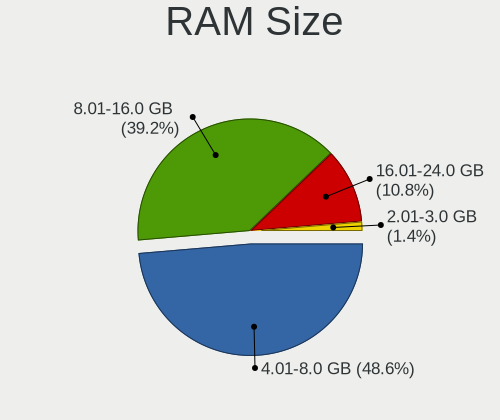

| Size in GB | Notebooks | Percent |
|------------|-----------|---------|
| 4.01-8.0   | 9         | 50%     |
| 8.01-16.0  | 6         | 33.33%  |
| 16.01-24.0 | 2         | 11.11%  |
| 2.01-3.0   | 1         | 5.56%   |

RAM Used
--------

Used RAM memory

| Used GB  | Notebooks | Percent |
|----------|-----------|---------|
| 0.01-0.5 | 13        | 72.22%  |
| 0.51-1.0 | 5         | 27.78%  |

Total Drives
------------

Number of drives on board

| Drives | Notebooks | Percent |
|--------|-----------|---------|
| 1      | 17        | 94.44%  |
| 2      | 1         | 5.56%   |

Has CD-ROM
----------

Has CD-ROM on board

| Presented | Notebooks | Percent |
|-----------|-----------|---------|
| Yes       | 9         | 50%     |
| No        | 9         | 50%     |

Has Ethernet
------------

Has Ethernet on board

| Presented | Notebooks | Percent |
|-----------|-----------|---------|
| Yes       | 16        | 88.89%  |
| No        | 2         | 11.11%  |

Has WiFi
--------

Has WiFi module

| Presented | Notebooks | Percent |
|-----------|-----------|---------|
| Yes       | 18        | 100%    |

Has Bluetooth
-------------

Has Bluetooth module

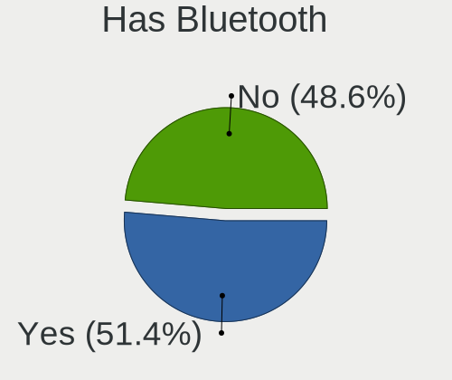

| Presented | Notebooks | Percent |
|-----------|-----------|---------|
| Yes       | 10        | 55.56%  |
| No        | 8         | 44.44%  |

Location
--------

Country
-------

Geographic location (country)

| Country     | Notebooks | Percent |
|-------------|-----------|---------|
| USA         | 3         | 16.67%  |
| Russia      | 2         | 11.11%  |
| Brazil      | 2         | 11.11%  |
| Syria       | 1         | 5.56%   |
| South Korea | 1         | 5.56%   |
| Peru        | 1         | 5.56%   |
| Netherlands | 1         | 5.56%   |
| Mexico      | 1         | 5.56%   |
| Lithuania   | 1         | 5.56%   |
| Japan       | 1         | 5.56%   |
| Italy       | 1         | 5.56%   |
| Greece      | 1         | 5.56%   |
| Germany     | 1         | 5.56%   |
| China       | 1         | 5.56%   |

City
----

Geographic location (city)

| City               | Notebooks | Percent |
|--------------------|-----------|---------|
| Ufa                | 1         | 5.56%   |
| The Hague          | 1         | 5.56%   |
| Taito              | 1         | 5.56%   |
| Seoul              | 1         | 5.56%   |
| Seattle            | 1         | 5.56%   |
| Rio de Janeiro     | 1         | 5.56%   |
| Redmond            | 1         | 5.56%   |
| Obninsk            | 1         | 5.56%   |
| Nughedu San Nicolo | 1         | 5.56%   |
| Monterrey          | 1         | 5.56%   |
| Lima               | 1         | 5.56%   |
| Kaunas             | 1         | 5.56%   |
| Ipojuca            | 1         | 5.56%   |
| Guangzhou          | 1         | 5.56%   |
| Dulles             | 1         | 5.56%   |
| Damascus           | 1         | 5.56%   |
| Bensheim           | 1         | 5.56%   |
| Athens             | 1         | 5.56%   |

Drives
------

Drive Vendor
------------

Hard drive vendors

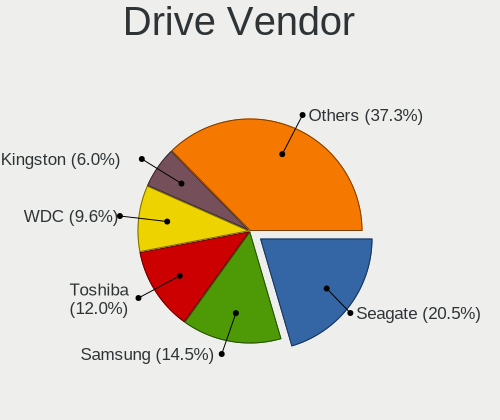

| Vendor              | Notebooks | Drives | Percent |
|---------------------|-----------|--------|---------|
| Seagate             | 5         | 5      | 25%     |
| Toshiba             | 4         | 5      | 20%     |
| WDC                 | 1         | 1      | 5%      |
| SPCC                | 1         | 1      | 5%      |
| Samsung Electronics | 1         | 1      | 5%      |
| Patriot             | 1         | 1      | 5%      |
| LITEON              | 1         | 1      | 5%      |
| Lexar               | 1         | 1      | 5%      |
| Leven               | 1         | 1      | 5%      |
| Hitachi             | 1         | 1      | 5%      |
| FORESEE             | 1         | 1      | 5%      |
| Crucial             | 1         | 1      | 5%      |
| A-DATA Technology   | 1         | 1      | 5%      |

Drive Model
-----------

Hard drive models

| Model                               | Notebooks | Percent |
|-------------------------------------|-----------|---------|
| Toshiba MQ01ABF050 500GB            | 2         | 10%     |
| WDC WD2500BEVS-08VAT2 250GB         | 1         | 5%      |
| Toshiba MQ01ABD100 1TB              | 1         | 5%      |
| Toshiba MK5061GSYN 500GB            | 1         | 5%      |
| SPCC Solid State Disk 1TB           | 1         | 5%      |
| Seagate ST9500325AS 500GB           | 1         | 5%      |
| Seagate ST9160412ASG 160GB          | 1         | 5%      |
| Seagate ST500LT012-1DG142 500GB     | 1         | 5%      |
| Seagate ST500LM012 HN-M500MBB 500GB | 1         | 5%      |
| Seagate ST1000LM024 HN-M101MBB 1TB  | 1         | 5%      |
| Samsung MZNLN512HMJP-000H1 512GB    | 1         | 5%      |
| Patriot Burst 120GB                 | 1         | 5%      |
| LITEON IT LCS-128L9S-HP 128GB       | 1         | 5%      |
| Lexar 256GB SSD                     | 1         | 5%      |
| Leven JAJS300M480C 480GB            | 1         | 5%      |
| Hitachi HTS545025B9A300 250GB       | 1         | 5%      |
| FORESEE 128GB SSD                   | 1         | 5%      |
| Crucial CT480BX200SSD1 480GB        | 1         | 5%      |
| A-DATA SX6000PNP 1TB                | 1         | 5%      |

HDD Vendor
----------

Hard disk drive vendors

| Vendor  | Notebooks | Drives | Percent |
|---------|-----------|--------|---------|
| Seagate | 5         | 5      | 45.45%  |
| Toshiba | 4         | 5      | 36.36%  |
| WDC     | 1         | 1      | 9.09%   |
| Hitachi | 1         | 1      | 9.09%   |

SSD Vendor
----------

Solid state drive vendors

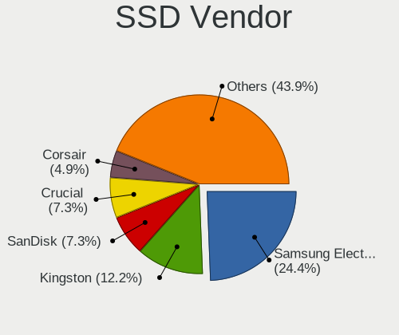

| Vendor              | Notebooks | Drives | Percent |
|---------------------|-----------|--------|---------|
| SPCC                | 1         | 1      | 12.5%   |
| Samsung Electronics | 1         | 1      | 12.5%   |
| Patriot             | 1         | 1      | 12.5%   |
| LITEON              | 1         | 1      | 12.5%   |
| Lexar               | 1         | 1      | 12.5%   |
| Leven               | 1         | 1      | 12.5%   |
| FORESEE             | 1         | 1      | 12.5%   |
| Crucial             | 1         | 1      | 12.5%   |

Drive Kind
----------

HDD or SSD

| Kind | Notebooks | Drives | Percent |
|------|-----------|--------|---------|
| HDD  | 10        | 12     | 52.63%  |
| SSD  | 8         | 8      | 42.11%  |
| NVMe | 1         | 1      | 5.26%   |

Drive Connector
---------------

SATA, SAS, NVMe, etc.

| Type | Notebooks | Drives | Percent |
|------|-----------|--------|---------|
| SATA | 18        | 20     | 94.74%  |
| NVMe | 1         | 1      | 5.26%   |

Drive Size
----------

Size of hard drive

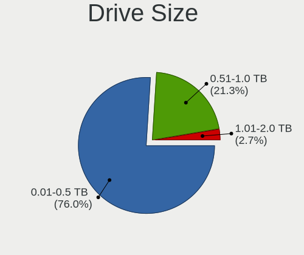

| Size in TB | Notebooks | Drives | Percent |
|------------|-----------|--------|---------|
| 0.01-0.5   | 14        | 16     | 77.78%  |
| 0.51-1.0   | 3         | 3      | 16.67%  |
| 1.01-2.0   | 1         | 1      | 5.56%   |

Space Total
-----------

Amount of disk space available on the file system

| Size in GB | Notebooks | Percent |
|------------|-----------|---------|
| 1-20       | 9         | 47.37%  |
| 251-500    | 4         | 21.05%  |
| 101-250    | 4         | 21.05%  |
| 501-1000   | 2         | 10.53%  |

Space Used
----------

Amount of used disk space

| Used GB | Notebooks | Percent |
|---------|-----------|---------|
| 1-20    | 18        | 100%    |

Malfunc. Drives
---------------

Drive models with a malfunction

| Model                              | Notebooks | Drives | Percent |
|------------------------------------|-----------|--------|---------|
| Toshiba MQ01ABF050 500GB           | 1         | 2      | 25%     |
| Toshiba MK5061GSYN 500GB           | 1         | 1      | 25%     |
| Seagate ST9500325AS 500GB          | 1         | 1      | 25%     |
| Seagate ST1000LM024 HN-M101MBB 1TB | 1         | 1      | 25%     |

Malfunc. Drive Vendor
---------------------

Vendors of faulty drives

| Vendor  | Notebooks | Drives | Percent |
|---------|-----------|--------|---------|
| Toshiba | 2         | 3      | 50%     |
| Seagate | 2         | 2      | 50%     |

Malfunc. HDD Vendor
-------------------

Vendors of faulty HDD drives

| Vendor  | Notebooks | Drives | Percent |
|---------|-----------|--------|---------|
| Toshiba | 2         | 3      | 50%     |
| Seagate | 2         | 2      | 50%     |

Malfunc. Drive Kind
-------------------

Kinds of faulty drives

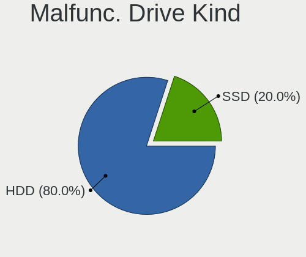

| Kind | Notebooks | Drives | Percent |
|------|-----------|--------|---------|
| HDD  | 4         | 5      | 100%    |

Failed Drives
-------------

Failed drive models

| Model                         | Notebooks | Drives | Percent |
|-------------------------------|-----------|--------|---------|
| Hitachi HTS545025B9A300 250GB | 1         | 1      | 100%    |

Failed Drive Vendor
-------------------

Failed drive vendors

| Vendor  | Notebooks | Drives | Percent |
|---------|-----------|--------|---------|
| Hitachi | 1         | 1      | 100%    |

Drive Status
------------

Number of failed and malfunc. drives

| Status  | Notebooks | Drives | Percent |
|---------|-----------|--------|---------|
| Works   | 14        | 15     | 73.68%  |
| Malfunc | 4         | 5      | 21.05%  |
| Failed  | 1         | 1      | 5.26%   |

Storage controller
------------------

Storage Vendor
--------------

Storage controller vendors

| Vendor                | Notebooks | Percent |
|-----------------------|-----------|---------|
| Intel                 | 18        | 94.74%  |
| Realtek Semiconductor | 1         | 5.26%   |

Storage Model
-------------

Storage controller models

| Model                                                                 | Notebooks | Percent |
|-----------------------------------------------------------------------|-----------|---------|
| Intel 7 Series Chipset Family 6-port SATA Controller [AHCI mode]      | 6         | 31.58%  |
| Intel Atom Processor E3800 Series SATA AHCI Controller                | 2         | 10.53%  |
| Intel 8 Series SATA Controller 1 [AHCI mode]                          | 2         | 10.53%  |
| Intel 5 Series/3400 Series Chipset 4 port SATA AHCI Controller        | 2         | 10.53%  |
| Intel Wildcat Point-LP SATA Controller [AHCI Mode]                    | 1         | 5.26%   |
| Intel Sunrise Point-LP SATA Controller [AHCI mode]                    | 1         | 5.26%   |
| Intel NM10/ICH7 Family SATA Controller [AHCI mode]                    | 1         | 5.26%   |
| Intel Cannon Point-LP SATA Controller [AHCI Mode]                     | 1         | 5.26%   |
| Intel 82801IBM/IEM (ICH9M/ICH9M-E) 4 port SATA Controller [AHCI mode] | 1         | 5.26%   |
| Intel 82801 Mobile SATA Controller [RAID mode]                        | 1         | 5.26%   |
| Unknown                                                               | 1         | 5.26%   |

Storage Kind
------------

Kind of storage controller (IDE, SATA, NVMe, SAS, ...)

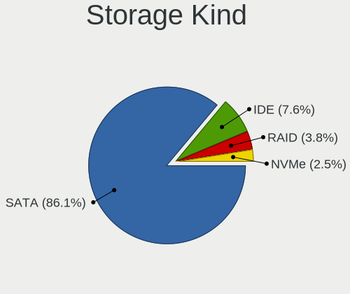

| Kind | Notebooks | Percent |
|------|-----------|---------|
| SATA | 17        | 89.47%  |
| RAID | 1         | 5.26%   |
| NVMe | 1         | 5.26%   |

Processor
---------

CPU Vendor
----------

Processor vendors

| Vendor | Notebooks | Percent |
|--------|-----------|---------|
| Intel  | 18        | 100%    |

CPU Model
---------

Processor models

| Model                                | Notebooks | Percent |
|--------------------------------------|-----------|---------|
| Intel Core i3-3110M CPU @ 2.40GHz    | 2         | 11.11%  |
| Intel Pentium CPU 5405U @ 2.30GHz    | 1         | 5.56%   |
| Intel Core i5-7300U CPU @ 2.60GHz    | 1         | 5.56%   |
| Intel Core i5-5200U CPU @ 2.20GHz    | 1         | 5.56%   |
| Intel Core i5-4210U CPU @ 1.70GHz    | 1         | 5.56%   |
| Intel Core i5-3230M CPU @ 2.60GHz    | 1         | 5.56%   |
| Intel Core i5-3210M CPU @ 2.50GHz    | 1         | 5.56%   |
| Intel Core i5 CPU M 520 @ 2.40GHz    | 1         | 5.56%   |
| Intel Core i5 CPU M 450 @ 2.40GHz    | 1         | 5.56%   |
| Intel Core i3-4005U CPU @ 1.70GHz    | 1         | 5.56%   |
| Intel Core i3-3227U CPU @ 1.90GHz    | 1         | 5.56%   |
| Intel Core 2 Duo CPU T5870 @ 2.00GHz | 1         | 5.56%   |
| Intel Core 2 Duo                     | 1         | 5.56%   |
| Intel Celeron CPU N2930 @ 1.83GHz    | 1         | 5.56%   |
| Intel Celeron CPU 847 @ 1.10GHz      | 1         | 5.56%   |
| Intel Atom CPU N450 @ 1.66GHz        | 1         | 5.56%   |
| Intel Atom CPU E3825 @ 1.33GHz       | 1         | 5.56%   |

CPU Model Family
----------------

Processor model prefix

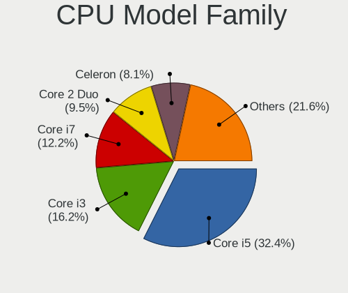

| Model            | Notebooks | Percent |
|------------------|-----------|---------|
| Intel Core i5    | 7         | 38.89%  |
| Intel Core i3    | 4         | 22.22%  |
| Intel Core 2 Duo | 2         | 11.11%  |
| Intel Celeron    | 2         | 11.11%  |
| Intel Atom       | 2         | 11.11%  |
| Intel Pentium    | 1         | 5.56%   |

CPU Cores
---------

Number of processor cores

| Number  | Notebooks | Percent |
|---------|-----------|---------|
| 2       | 15        | 83.33%  |
| 4       | 1         | 5.56%   |
| 1       | 1         | 5.56%   |
| Unknown | 1         | 5.56%   |

CPU Sockets
-----------

Number of sockets

| Number | Notebooks | Percent |
|--------|-----------|---------|
| 1      | 18        | 100%    |

CPU Threads
-----------

Threads per core (Hyper-Threading)

| Number  | Notebooks | Percent |
|---------|-----------|---------|
| 2       | 13        | 72.22%  |
| 1       | 4         | 22.22%  |
| Unknown | 1         | 5.56%   |

CPU Microarch
-------------

Microarchitecture

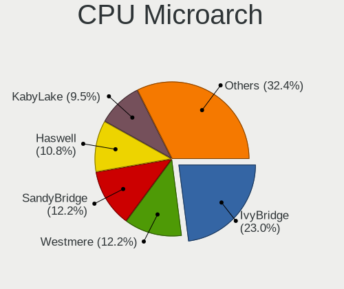

| Name        | Notebooks | Percent |
|-------------|-----------|---------|
| IvyBridge   | 5         | 27.78%  |
| Westmere    | 2         | 11.11%  |
| Silvermont  | 2         | 11.11%  |
| KabyLake    | 2         | 11.11%  |
| Haswell     | 2         | 11.11%  |
| SandyBridge | 1         | 5.56%   |
| Penryn      | 1         | 5.56%   |
| Core        | 1         | 5.56%   |
| Broadwell   | 1         | 5.56%   |
| Bonnell     | 1         | 5.56%   |

Graphics
--------

GPU Vendor
----------

Vendors of graphics cards

| Vendor | Notebooks | Percent |
|--------|-----------|---------|
| Intel  | 17        | 80.95%  |
| Nvidia | 3         | 14.29%  |
| AMD    | 1         | 4.76%   |

GPU Model
---------

Graphics card models

| Model                                                                     | Notebooks | Percent |
|---------------------------------------------------------------------------|-----------|---------|
| Intel 3rd Gen Core processor Graphics Controller                          | 5         | 23.81%  |
| Nvidia GF117M [GeForce 610M/710M/810M/820M / GT 620M/625M/630M/720M]      | 2         | 9.52%   |
| Intel Haswell-ULT Integrated Graphics Controller                          | 2         | 9.52%   |
| Intel Core Processor Integrated Graphics Controller                       | 2         | 9.52%   |
| Intel Atom Processor Z36xxx/Z37xxx Series Graphics & Display              | 2         | 9.52%   |
| Nvidia G98M [GeForce G 105M]                                              | 1         | 4.76%   |
| Intel Mobile 4 Series Chipset Integrated Graphics Controller              | 1         | 4.76%   |
| Intel HD Graphics 620                                                     | 1         | 4.76%   |
| Intel HD Graphics 5500                                                    | 1         | 4.76%   |
| Intel Coffee Lake UHD 610 Graphics Controller                             | 1         | 4.76%   |
| Intel Atom Processor D4xx/D5xx/N4xx/N5xx Integrated Graphics Controller   | 1         | 4.76%   |
| Intel 2nd Generation Core Processor Family Integrated Graphics Controller | 1         | 4.76%   |
| AMD Venus PRO [Radeon HD 8850M / R9 M265X]                                | 1         | 4.76%   |

GPU Combo
---------

Combinations of graphics cards

| Name           | Notebooks | Percent |
|----------------|-----------|---------|
| 1 x Intel      | 12        | 66.67%  |
| 2 x Intel      | 2         | 11.11%  |
| Intel + Nvidia | 2         | 11.11%  |
| 1 x Nvidia     | 1         | 5.56%   |
| Intel + AMD    | 1         | 5.56%   |

GPU Driver
----------

Free vs proprietary

| Driver  | Notebooks | Percent |
|---------|-----------|---------|
| Free    | 17        | 94.44%  |
| Unknown | 1         | 5.56%   |

GPU Memory
----------

Total video memory

| Size in GB | Notebooks | Percent |
|------------|-----------|---------|
| Unknown    | 18        | 100%    |

Monitor
-------

Monitor Vendor
--------------

Monitor vendors

| Vendor              | Notebooks | Percent |
|---------------------|-----------|---------|
| LG Display          | 5         | 31.25%  |
| BOE                 | 5         | 31.25%  |
| AU Optronics        | 3         | 18.75%  |
| Samsung Electronics | 2         | 12.5%   |
| InfoVision          | 1         | 6.25%   |

Monitor Model
-------------

Monitor models

| Model                                                                | Notebooks | Percent |
|----------------------------------------------------------------------|-----------|---------|
| LG Display LCD Monitor LGD02D8 1366x768 280x160mm 12.7-inch          | 2         | 12.5%   |
| Samsung Electronics LCD Monitor SEC414C 1366x768 310x170mm 13.9-inch | 1         | 6.25%   |
| Samsung Electronics LCD Monitor SEC3942 1366x768 310x170mm 13.9-inch | 1         | 6.25%   |
| LG Display LCD Monitor LGD11F9 1280x800 290x180mm 13.4-inch          | 1         | 6.25%   |
| LG Display LCD Monitor LGD0470 1920x1080 350x190mm 15.7-inch         | 1         | 6.25%   |
| LG Display LCD Monitor LGD03AB 1366x768 340x190mm 15.3-inch          | 1         | 6.25%   |
| InfoVision LCD Monitor IVO03F4 1024x600 220x130mm 10.1-inch          | 1         | 6.25%   |
| BOE LCD Monitor BOE0757 1366x768 340x190mm 15.3-inch                 | 1         | 6.25%   |
| BOE LCD Monitor BOE06D3 1366x768 340x190mm 15.3-inch                 | 1         | 6.25%   |
| BOE LCD Monitor BOE06C8 1366x768 280x160mm 12.7-inch                 | 1         | 6.25%   |
| BOE LCD Monitor BOE0615 1366x768 340x190mm 15.3-inch                 | 1         | 6.25%   |
| BOE LCD Monitor BOE05E9 1366x768 250x140mm 11.3-inch                 | 1         | 6.25%   |
| AU Optronics LCD Monitor AUO45EC 1366x768 340x190mm 15.3-inch        | 1         | 6.25%   |
| AU Optronics LCD Monitor AUO4100 1920x1200 220x140mm 10.3-inch       | 1         | 6.25%   |
| AU Optronics LCD Monitor AUO21ED 1920x1080 340x190mm 15.3-inch       | 1         | 6.25%   |

Monitor Resolution
------------------

Monitor screen resolution

| Resolution        | Notebooks | Percent |
|-------------------|-----------|---------|
| 1366x768 (WXGA)   | 11        | 68.75%  |
| 1920x1080 (FHD)   | 2         | 12.5%   |
| 1920x1200 (WUXGA) | 1         | 6.25%   |
| 1280x800 (WXGA)   | 1         | 6.25%   |
| 1024x600          | 1         | 6.25%   |

Monitor Diagonal
----------------

Diagonal size in inches

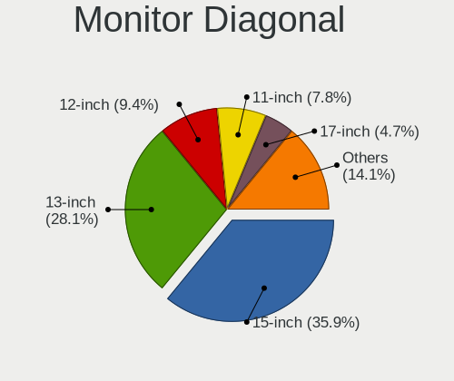

| Inches | Notebooks | Percent |
|--------|-----------|---------|
| 15     | 7         | 43.75%  |
| 13     | 3         | 18.75%  |
| 12     | 3         | 18.75%  |
| 10     | 2         | 12.5%   |
| 11     | 1         | 6.25%   |

Monitor Width
-------------

Physical width

| Width in mm | Notebooks | Percent |
|-------------|-----------|---------|
| 301-350     | 9         | 56.25%  |
| 201-300     | 7         | 43.75%  |

Aspect Ratio
------------

Proportional relationship between the width and the height

| Ratio | Notebooks | Percent |
|-------|-----------|---------|
| 16/9  | 14        | 87.5%   |
| 16/10 | 2         | 12.5%   |

Monitor Area
------------

Area in inch²

| Area in inch² | Notebooks | Percent |
|----------------|-----------|---------|
| 91-100         | 6         | 37.5%   |
| 81-90          | 3         | 18.75%  |
| 61-70          | 3         | 18.75%  |
| 41-50          | 2         | 12.5%   |
| 51-60          | 1         | 6.25%   |
| 101-110        | 1         | 6.25%   |

Pixel Density
-------------

Pixels per inch

| Density | Notebooks | Percent |
|---------|-----------|---------|
| 101-120 | 9         | 56.25%  |
| 121-160 | 6         | 37.5%   |
| 161-240 | 1         | 6.25%   |

Multiple Monitors
-----------------

Total monitors connected

| Total | Notebooks | Percent |
|-------|-----------|---------|
| 1     | 17        | 94.44%  |
| 0     | 1         | 5.56%   |

Network
-------

Net Controller Vendor
---------------------

Controller vendors

| Vendor                | Notebooks | Percent |
|-----------------------|-----------|---------|
| Realtek Semiconductor | 10        | 34.48%  |
| Intel                 | 10        | 34.48%  |
| Qualcomm Atheros      | 5         | 17.24%  |
| Broadcom              | 3         | 10.34%  |
| Huawei Technologies   | 1         | 3.45%   |

Net Controller Model
--------------------

Controller models

| Model                                                                   | Notebooks | Percent |
|-------------------------------------------------------------------------|-----------|---------|
| Realtek RTL8111/8168/8411 PCI Express Gigabit Ethernet Controller       | 6         | 16.67%  |
| Realtek RTL810xE PCI Express Fast Ethernet controller                   | 3         | 8.33%   |
| Intel 82579LM Gigabit Network Connection (Lewisville)                   | 2         | 5.56%   |
| Broadcom BCM43142 802.11b/g/n                                           | 2         | 5.56%   |
| Realtek RTL8821CE 802.11ac PCIe Wireless Network Adapter                | 1         | 2.78%   |
| Realtek RTL8188EUS 802.11n Wireless Network Adapter                     | 1         | 2.78%   |
| Realtek RTL8188CE 802.11b/g/n WiFi Adapter                              | 1         | 2.78%   |
| Qualcomm Atheros QCA9565 / AR9565 Wireless Network Adapter              | 1         | 2.78%   |
| Qualcomm Atheros QCA8172 Fast Ethernet                                  | 1         | 2.78%   |
| Qualcomm Atheros AR928X Wireless Network Adapter (PCI-Express)          | 1         | 2.78%   |
| Qualcomm Atheros AR9285 Wireless Network Adapter (PCI-Express)          | 1         | 2.78%   |
| Qualcomm Atheros AR8132 Fast Ethernet                                   | 1         | 2.78%   |
| Qualcomm Atheros AR242x / AR542x Wireless Network Adapter (PCI-Express) | 1         | 2.78%   |
| Intel Wireless 8265 / 8275                                              | 1         | 2.78%   |
| Intel Wireless 7265                                                     | 1         | 2.78%   |
| Intel Wireless 7260                                                     | 1         | 2.78%   |
| Intel Wireless 3160                                                     | 1         | 2.78%   |
| Intel WiFi Link 5100                                                    | 1         | 2.78%   |
| Intel Ethernet Connection (4) I219-LM                                   | 1         | 2.78%   |
| Intel Centrino Wireless-N 2200                                          | 1         | 2.78%   |
| Intel Centrino Wireless-N 135                                           | 1         | 2.78%   |
| Intel Centrino Wireless-N 1000 [Condor Peak]                            | 1         | 2.78%   |
| Intel Centrino Advanced-N 6205 [Taylor Peak]                            | 1         | 2.78%   |
| Intel 82577LC Gigabit Network Connection                                | 1         | 2.78%   |
| Intel 82567LM Gigabit Network Connection                                | 1         | 2.78%   |
| Huawei ME936 LTE/HSDPA+ 4G modem                                        | 1         | 2.78%   |
| Broadcom BCM43228 802.11a/b/g/n                                         | 1         | 2.78%   |

Wireless Vendor
---------------

Wireless vendors

| Vendor                | Notebooks | Percent |
|-----------------------|-----------|---------|
| Intel                 | 9         | 50%     |
| Qualcomm Atheros      | 4         | 22.22%  |
| Broadcom              | 3         | 16.67%  |
| Realtek Semiconductor | 2         | 11.11%  |

Wireless Model
--------------

Wireless models

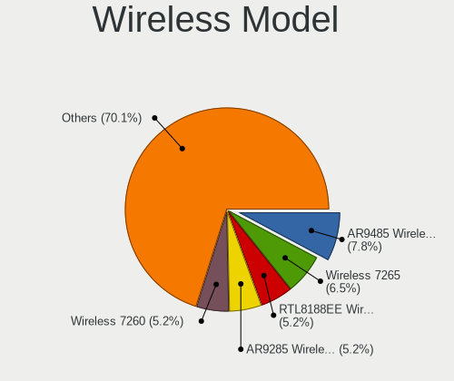

| Model                                                                   | Notebooks | Percent |
|-------------------------------------------------------------------------|-----------|---------|
| Broadcom BCM43142 802.11b/g/n                                           | 2         | 10.53%  |
| Realtek RTL8821CE 802.11ac PCIe Wireless Network Adapter                | 1         | 5.26%   |
| Realtek RTL8188EUS 802.11n Wireless Network Adapter                     | 1         | 5.26%   |
| Realtek RTL8188CE 802.11b/g/n WiFi Adapter                              | 1         | 5.26%   |
| Qualcomm Atheros QCA9565 / AR9565 Wireless Network Adapter              | 1         | 5.26%   |
| Qualcomm Atheros AR928X Wireless Network Adapter (PCI-Express)          | 1         | 5.26%   |
| Qualcomm Atheros AR9285 Wireless Network Adapter (PCI-Express)          | 1         | 5.26%   |
| Qualcomm Atheros AR242x / AR542x Wireless Network Adapter (PCI-Express) | 1         | 5.26%   |
| Intel Wireless 8265 / 8275                                              | 1         | 5.26%   |
| Intel Wireless 7265                                                     | 1         | 5.26%   |
| Intel Wireless 7260                                                     | 1         | 5.26%   |
| Intel Wireless 3160                                                     | 1         | 5.26%   |
| Intel WiFi Link 5100                                                    | 1         | 5.26%   |
| Intel Centrino Wireless-N 2200                                          | 1         | 5.26%   |
| Intel Centrino Wireless-N 135                                           | 1         | 5.26%   |
| Intel Centrino Wireless-N 1000 [Condor Peak]                            | 1         | 5.26%   |
| Intel Centrino Advanced-N 6205 [Taylor Peak]                            | 1         | 5.26%   |
| Broadcom BCM43228 802.11a/b/g/n                                         | 1         | 5.26%   |

Ethernet Vendor
---------------

Ethernet vendors

| Vendor                | Notebooks | Percent |
|-----------------------|-----------|---------|
| Realtek Semiconductor | 9         | 56.25%  |
| Intel                 | 5         | 31.25%  |
| Qualcomm Atheros      | 2         | 12.5%   |

Ethernet Model
--------------

Ethernet models

| Model                                                             | Notebooks | Percent |
|-------------------------------------------------------------------|-----------|---------|
| Realtek RTL8111/8168/8411 PCI Express Gigabit Ethernet Controller | 6         | 37.5%   |
| Realtek RTL810xE PCI Express Fast Ethernet controller             | 3         | 18.75%  |
| Intel 82579LM Gigabit Network Connection (Lewisville)             | 2         | 12.5%   |
| Qualcomm Atheros QCA8172 Fast Ethernet                            | 1         | 6.25%   |
| Qualcomm Atheros AR8132 Fast Ethernet                             | 1         | 6.25%   |
| Intel Ethernet Connection (4) I219-LM                             | 1         | 6.25%   |
| Intel 82577LC Gigabit Network Connection                          | 1         | 6.25%   |
| Intel 82567LM Gigabit Network Connection                          | 1         | 6.25%   |

Net Controller Kind
-------------------

Ethernet, WiFi or modem

| Kind     | Notebooks | Percent |
|----------|-----------|---------|
| WiFi     | 18        | 51.43%  |
| Ethernet | 16        | 45.71%  |
| Modem    | 1         | 2.86%   |

Used Controller
---------------

Currently used network controller

| Kind     | Notebooks | Percent |
|----------|-----------|---------|
| Ethernet | 16        | 51.61%  |
| WiFi     | 15        | 48.39%  |

NICs
----

Total network controllers on board

| Total | Notebooks | Percent |
|-------|-----------|---------|
| 2     | 16        | 88.89%  |
| 1     | 2         | 11.11%  |

IPv6
----

IPv6 vs IPv4

| Used | Notebooks | Percent |
|------|-----------|---------|
| No   | 18        | 100%    |

Bluetooth
---------

Bluetooth Vendor
----------------

Controller vendors

| Vendor                          | Notebooks | Percent |
|---------------------------------|-----------|---------|
| Broadcom                        | 4         | 40%     |
| Intel                           | 3         | 30%     |
| Realtek Semiconductor           | 1         | 10%     |
| Qualcomm Atheros Communications | 1         | 10%     |
| Cambridge Silicon Radio         | 1         | 10%     |

Bluetooth Model
---------------

Controller models

| Model                                               | Notebooks | Percent |
|-----------------------------------------------------|-----------|---------|
| Intel Bluetooth wireless interface                  | 3         | 30%     |
| Broadcom BCM43142 Bluetooth 4.0                     | 2         | 20%     |
| Broadcom BCM20702 Bluetooth 4.0 [ThinkPad]          | 2         | 20%     |
| Realtek  Bluetooth Adapter                          | 1         | 10%     |
| Qualcomm Atheros AR9462 Bluetooth                   | 1         | 10%     |
| Cambridge Silicon Radio Bluetooth Dongle (HCI mode) | 1         | 10%     |

Sound
-----

Sound Vendor
------------

Sound card vendors

| Vendor | Notebooks | Percent |
|--------|-----------|---------|
| Intel  | 18        | 100%    |

Sound Model
-----------

Sound card models

| Model                                                                      | Notebooks | Percent |
|----------------------------------------------------------------------------|-----------|---------|
| Intel 7 Series/C216 Chipset Family High Definition Audio Controller        | 6         | 30%     |
| Intel Atom Processor Z36xxx/Z37xxx Series High Definition Audio Controller | 2         | 10%     |
| Intel 82801I (ICH9 Family) HD Audio Controller                             | 2         | 10%     |
| Intel 8 Series HD Audio Controller                                         | 2         | 10%     |
| Intel 5 Series/3400 Series Chipset High Definition Audio                   | 2         | 10%     |
| Intel Wildcat Point-LP High Definition Audio Controller                    | 1         | 5%      |
| Intel Sunrise Point-LP HD Audio                                            | 1         | 5%      |
| Intel NM10/ICH7 Family High Definition Audio Controller                    | 1         | 5%      |
| Intel Haswell-ULT HD Audio Controller                                      | 1         | 5%      |
| Intel Cannon Point-LP High Definition Audio Controller                     | 1         | 5%      |
| Intel Broadwell-U Audio Controller                                         | 1         | 5%      |

Memory
------

Memory Vendor
-------------

Memory module vendors

| Vendor              | Notebooks | Percent |
|---------------------|-----------|---------|
| SK Hynix            | 6         | 25%     |
| Unknown             | 4         | 16.67%  |
| Micron Technology   | 3         | 12.5%   |
| Samsung Electronics | 2         | 8.33%   |
| Kingston            | 2         | 8.33%   |
| Teikon              | 1         | 4.17%   |
| Team                | 1         | 4.17%   |
| Smart Brazil        | 1         | 4.17%   |
| Smart               | 1         | 4.17%   |
| PKI/Kingston        | 1         | 4.17%   |
| Nanya Technology    | 1         | 4.17%   |
| A-DATA Technology   | 1         | 4.17%   |

Memory Model
------------

Memory module models

| Model                                                                   | Notebooks | Percent |
|-------------------------------------------------------------------------|-----------|---------|
| SK Hynix RAM HMT351S6EFR8A-PB 4GB SODIMM DDR3 1600MT/s                  | 2         | 8.33%   |
| Unknown RAM Module 4GB SODIMM DDR3 1600MT/s                             | 1         | 4.17%   |
| Unknown RAM Module 4GB SODIMM DDR3 1333MT/s                             | 1         | 4.17%   |
| Unknown RAM Module 4GB DIMM DDR3 1067MT/s                               | 1         | 4.17%   |
| Unknown RAM Module 2GB SODIMM DDR2 667MT/s                              | 1         | 4.17%   |
| Teikon RAM TMT451S6BFR8A-PBHC 4GB SODIMM DDR3 1333MT/s                  | 1         | 4.17%   |
| Team RAM TEAMGROUP-SD3-1066 4GB SODIMM DDR3 1067MT/s                    | 1         | 4.17%   |
| Smart RAM SH564568FH8NZPHSCR 2GB SODIMM DDR3 1334MT/s                   | 1         | 4.17%   |
| Smart Brazil RAM SF4641G8CK8IEHLSBG 8GB SODIMM DDR4 2133MT/s            | 1         | 4.17%   |
| SK Hynix RAM HMT451S6AFR8C-PB 4GB SODIMM DDR3 1600MT/s                  | 1         | 4.17%   |
| SK Hynix RAM HMT41GS6BFR8A-PB 8GB SODIMM DDR3 1600MT/s                  | 1         | 4.17%   |
| SK Hynix RAM HMT41GS6AFR8A-PB 8GB SODIMM DDR3 1600MT/s                  | 1         | 4.17%   |
| SK Hynix RAM HMT351S6CFR8A-PB 4GB SODIMM DDR3 1333MT/s                  | 1         | 4.17%   |
| Samsung RAM M471B5674QH0-YK0 2GB SODIMM DDR3 1600MT/s                   | 1         | 4.17%   |
| Samsung RAM M471B5273CH0-CH9 4GB SODIMM DDR3 1333MT/s                   | 1         | 4.17%   |
| PKI/Kingston RAM 9905428-043.A00LF 4GB SODIMM DDR3 1067MT/s             | 1         | 4.17%   |
| Nanya RAM NT2GC64B8HA1NS-BE 2GB SODIMM DDR3 1066MT/s                    | 1         | 4.17%   |
| Micron RAM 8KTF51264HZ-1G6N1 4GB SODIMM DDR3 1600MT/s                   | 1         | 4.17%   |
| Micron RAM 8ATF1G64HZ-2G3H1 8GB SODIMM DDR4 2400MT/s                    | 1         | 4.17%   |
| Micron RAM 16KTF1G64HZ-1G6E1 8GB SODIMM DDR3 1600MT/s                   | 1         | 4.17%   |
| Kingston RAM TSB16D3LS1KFG/4G 4GB SODIMM DDR3 1600MT/s                  | 1         | 4.17%   |
| Kingston RAM ACR16D3LS1KFG/8G 8GB SODIMM DDR3 1600MT/s                  | 1         | 4.17%   |
| A-DATA RAM 20444F564531423136334245202020202020 2GB SODIMM DDR2 667MT/s | 1         | 4.17%   |

Memory Kind
-----------

Memory module kinds

| Kind | Notebooks | Percent |
|------|-----------|---------|
| DDR3 | 14        | 77.78%  |
| DDR4 | 2         | 11.11%  |
| DDR2 | 2         | 11.11%  |

Memory Form Factor
------------------

Physical design of the memory module

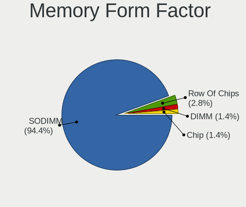

| Name   | Notebooks | Percent |
|--------|-----------|---------|
| SODIMM | 17        | 94.44%  |
| DIMM   | 1         | 5.56%   |

Memory Size
-----------

Memory module size

| Size | Notebooks | Percent |
|------|-----------|---------|
| 4096 | 12        | 54.55%  |
| 8192 | 5         | 22.73%  |
| 2048 | 5         | 22.73%  |

Memory Speed
------------

Memory module speed

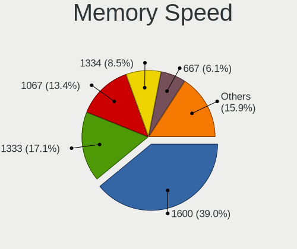

| Speed | Notebooks | Percent |
|-------|-----------|---------|
| 1600  | 7         | 35%     |
| 1333  | 4         | 20%     |
| 1067  | 3         | 15%     |
| 667   | 2         | 10%     |
| 2400  | 1         | 5%      |
| 2133  | 1         | 5%      |
| 1334  | 1         | 5%      |
| 1066  | 1         | 5%      |

Printers & scanners
-------------------

Printer Vendor
--------------

Printer device vendors

Zero info for selected period =(

Printer Model
-------------

Printer device models

Zero info for selected period =(

Scanner Vendor
--------------

Scanner device vendors

Zero info for selected period =(

Scanner Model
-------------

Scanner device models

Zero info for selected period =(

Camera
------

Camera Vendor
-------------

Camera device vendors

| Vendor                        | Notebooks | Percent |
|-------------------------------|-----------|---------|
| Realtek Semiconductor         | 3         | 23.08%  |
| Chicony Electronics           | 3         | 23.08%  |
| Syntek                        | 1         | 7.69%   |
| Suyin                         | 1         | 7.69%   |
| Sunplus Innovation Technology | 1         | 7.69%   |
| Microdia                      | 1         | 7.69%   |
| Importek                      | 1         | 7.69%   |
| ALi                           | 1         | 7.69%   |
| Acer                          | 1         | 7.69%   |

Camera Model
------------

Camera device models

| Model                                     | Notebooks | Percent |
|-------------------------------------------|-----------|---------|
| Realtek Realtek USB2.0 PC Camera          | 2         | 15.38%  |
| Chicony Integrated Camera                 | 2         | 15.38%  |
| Syntek EasyCamera                         | 1         | 7.69%   |
| Suyin Integrated_Webcam_HD                | 1         | 7.69%   |
| Sunplus Integrated Camera                 | 1         | 7.69%   |
| Realtek Integrated_Webcam_HD              | 1         | 7.69%   |
| Microdia Dell Laptop Integrated Webcam HD | 1         | 7.69%   |
| Importek HP Webcam                        | 1         | 7.69%   |
| Chicony TOSHIBA Web Camera - HD           | 1         | 7.69%   |
| ALi WebCam                                | 1         | 7.69%   |
| Acer ThinkPad Integrated Camera           | 1         | 7.69%   |

Security
--------

Fingerprint Vendor
------------------

Fingerprint sensor vendors

| Vendor           | Notebooks | Percent |
|------------------|-----------|---------|
| Validity Sensors | 1         | 50%     |
| AuthenTec        | 1         | 50%     |

Fingerprint Model
-----------------

Fingerprint sensor models

| Model                                      | Notebooks | Percent |
|--------------------------------------------|-----------|---------|
| Validity Sensors VFS301 Fingerprint Reader | 1         | 50%     |
| AuthenTec AuthenTec Inc. AES1660           | 1         | 50%     |

Chipcard Vendor
---------------

Chipcard module vendors

Zero info for selected period =(

Chipcard Model
--------------

Chipcard module models

Zero info for selected period =(

Unsupported
-----------

Unsupported Devices
-------------------

Total unsupported devices on board

| Total | Notebooks | Percent |
|-------|-----------|---------|
| 2     | 8         | 44.44%  |
| 1     | 4         | 22.22%  |
| 3     | 3         | 16.67%  |
| 0     | 3         | 16.67%  |

Unsupported Device Types
------------------------

Types of unsupported devices

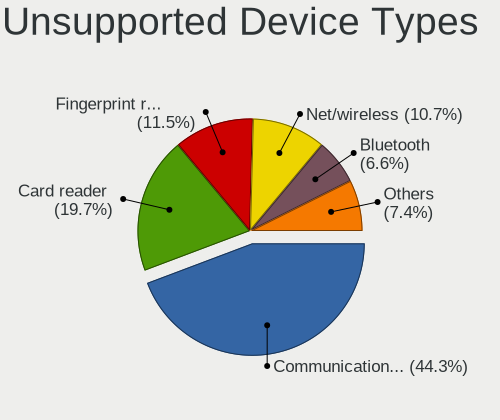

| Type                     | Notebooks | Percent |
|--------------------------|-----------|---------|
| Communication controller | 13        | 46.43%  |
| Card reader              | 6         | 21.43%  |
| Net/wireless             | 4         | 14.29%  |
| Fingerprint reader       | 2         | 7.14%   |
| Network                  | 1         | 3.57%   |
| Firewire controller      | 1         | 3.57%   |
| Bluetooth                | 1         | 3.57%   |

