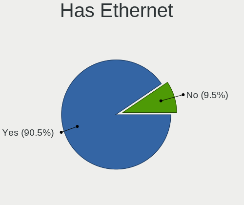
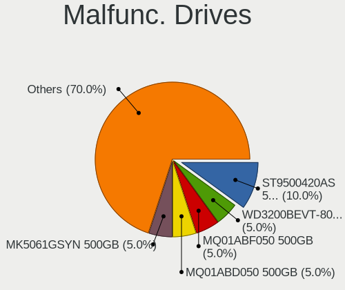
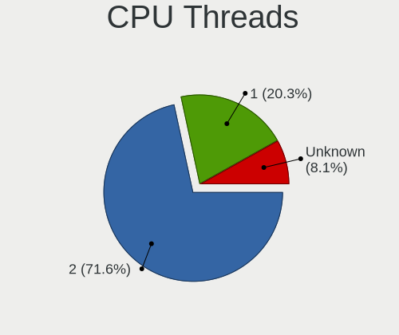
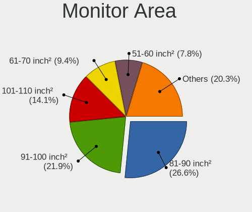
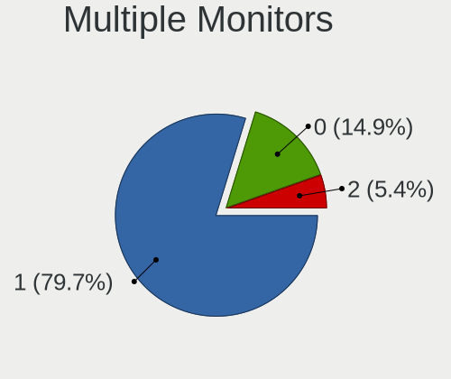
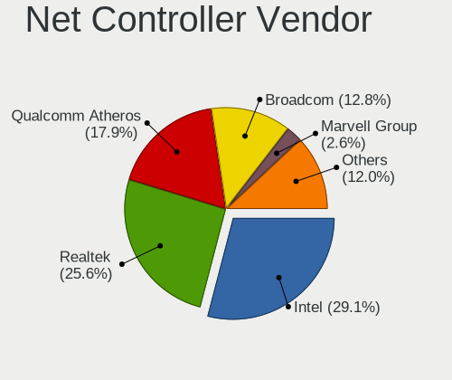
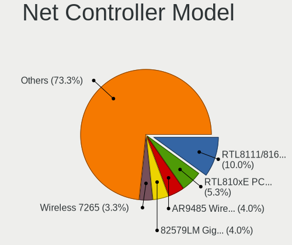
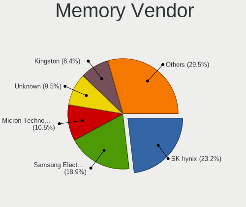
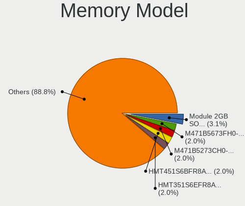
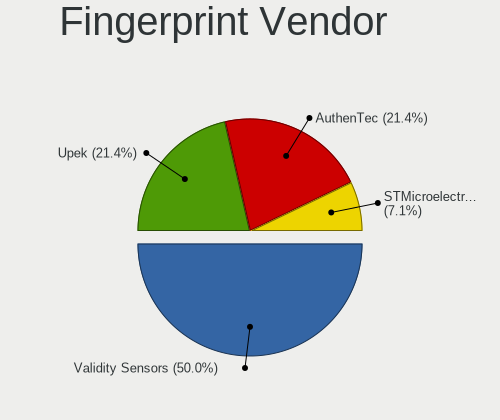

helloSystem 0.6.0 - Tested Hardware & Statistics (Notebooks)
------------------------------------------------------------

A project to collect tested hardware configurations for helloSystem 0.6.0.

Anyone can contribute to this report by the [hw-probe](https://github.com/linuxhw/hw-probe/blob/master/INSTALL.BSD.md) tool:

    hw-probe -all -upload

Please submit a probe of your configuration if it's not presented on the page or is rare.

Full-feature report is available here: https://bsd-hardware.info/?view=trends

Contents
--------

* [ Test Cases ](#test-cases)

* [ System ](#system)
  - [ Arch                     ](#arch)
  - [ DE                       ](#de)
  - [ Display Server           ](#display-server)
  - [ Display Manager          ](#display-manager)
  - [ OS Lang                  ](#os-lang)
  - [ Boot Mode                ](#boot-mode)
  - [ Filesystem               ](#filesystem)
  - [ Part. scheme             ](#part-scheme)

* [ Board ](#board)
  - [ Vendor                   ](#vendor)
  - [ Model                    ](#model)
  - [ Model Family             ](#model-family)
  - [ MFG Year                 ](#mfg-year)
  - [ Form Factor              ](#form-factor)
  - [ Coreboot                 ](#coreboot)
  - [ RAM Size                 ](#ram-size)
  - [ RAM Used                 ](#ram-used)
  - [ Total Drives             ](#total-drives)
  - [ Has CD-ROM               ](#has-cd-rom)
  - [ Has Ethernet             ](#has-ethernet)
  - [ Has WiFi                 ](#has-wifi)
  - [ Has Bluetooth            ](#has-bluetooth)

* [ Location ](#location)
  - [ Country                  ](#country)
  - [ City                     ](#city)

* [ Drives ](#drives)
  - [ Drive Vendor             ](#drive-vendor)
  - [ Drive Model              ](#drive-model)
  - [ HDD Vendor               ](#hdd-vendor)
  - [ SSD Vendor               ](#ssd-vendor)
  - [ Drive Kind               ](#drive-kind)
  - [ Drive Connector          ](#drive-connector)
  - [ Drive Size               ](#drive-size)
  - [ Space Total              ](#space-total)
  - [ Space Used               ](#space-used)
  - [ Malfunc. Drives          ](#malfunc-drives)
  - [ Malfunc. Drive Vendor    ](#malfunc-drive-vendor)
  - [ Malfunc. HDD Vendor      ](#malfunc-hdd-vendor)
  - [ Malfunc. Drive Kind      ](#malfunc-drive-kind)
  - [ Failed Drives            ](#failed-drives)
  - [ Failed Drive Vendor      ](#failed-drive-vendor)
  - [ Drive Status             ](#drive-status)

* [ Storage controller ](#storage-controller)
  - [ Storage Vendor           ](#storage-vendor)
  - [ Storage Model            ](#storage-model)
  - [ Storage Kind             ](#storage-kind)

* [ Processor ](#processor)
  - [ CPU Vendor               ](#cpu-vendor)
  - [ CPU Model                ](#cpu-model)
  - [ CPU Model Family         ](#cpu-model-family)
  - [ CPU Cores                ](#cpu-cores)
  - [ CPU Sockets              ](#cpu-sockets)
  - [ CPU Threads              ](#cpu-threads)
  - [ CPU Microarch            ](#cpu-microarch)

* [ Graphics ](#graphics)
  - [ GPU Vendor               ](#gpu-vendor)
  - [ GPU Model                ](#gpu-model)
  - [ GPU Combo                ](#gpu-combo)
  - [ GPU Driver               ](#gpu-driver)
  - [ GPU Memory               ](#gpu-memory)

* [ Monitor ](#monitor)
  - [ Monitor Vendor           ](#monitor-vendor)
  - [ Monitor Model            ](#monitor-model)
  - [ Monitor Resolution       ](#monitor-resolution)
  - [ Monitor Diagonal         ](#monitor-diagonal)
  - [ Monitor Width            ](#monitor-width)
  - [ Aspect Ratio             ](#aspect-ratio)
  - [ Monitor Area             ](#monitor-area)
  - [ Pixel Density            ](#pixel-density)
  - [ Multiple Monitors        ](#multiple-monitors)

* [ Network ](#network)
  - [ Net Controller Vendor    ](#net-controller-vendor)
  - [ Net Controller Model     ](#net-controller-model)
  - [ Wireless Vendor          ](#wireless-vendor)
  - [ Wireless Model           ](#wireless-model)
  - [ Ethernet Vendor          ](#ethernet-vendor)
  - [ Ethernet Model           ](#ethernet-model)
  - [ Net Controller Kind      ](#net-controller-kind)
  - [ Used Controller          ](#used-controller)
  - [ NICs                     ](#nics)
  - [ IPv6                     ](#ipv6)

* [ Bluetooth ](#bluetooth)
  - [ Bluetooth Vendor         ](#bluetooth-vendor)
  - [ Bluetooth Model          ](#bluetooth-model)

* [ Sound ](#sound)
  - [ Sound Vendor             ](#sound-vendor)
  - [ Sound Model              ](#sound-model)

* [ Memory ](#memory)
  - [ Memory Vendor            ](#memory-vendor)
  - [ Memory Model             ](#memory-model)
  - [ Memory Kind              ](#memory-kind)
  - [ Memory Form Factor       ](#memory-form-factor)
  - [ Memory Size              ](#memory-size)
  - [ Memory Speed             ](#memory-speed)

* [ Printers & scanners ](#printers--scanners)
  - [ Printer Vendor           ](#printer-vendor)
  - [ Printer Model            ](#printer-model)
  - [ Scanner Vendor           ](#scanner-vendor)
  - [ Scanner Model            ](#scanner-model)

* [ Camera ](#camera)
  - [ Camera Vendor            ](#camera-vendor)
  - [ Camera Model             ](#camera-model)

* [ Security ](#security)
  - [ Fingerprint Vendor       ](#fingerprint-vendor)
  - [ Fingerprint Model        ](#fingerprint-model)
  - [ Chipcard Vendor          ](#chipcard-vendor)
  - [ Chipcard Model           ](#chipcard-model)

* [ Unsupported ](#unsupported)
  - [ Unsupported Devices      ](#unsupported-devices)
  - [ Unsupported Device Types ](#unsupported-device-types)

Test Cases
----------

| Vendor    | Model                       | Probe                                                     | Date         |
|-----------|-----------------------------|-----------------------------------------------------------|--------------|
| Lenovo    | G580 20150                  | [478714c7c9](https://bsd-hardware.info/?probe=478714c7c9) | Feb 07, 2022 |
| Sony      | VPCEB1J1E                   | [04c5ee02da](https://bsd-hardware.info/?probe=04c5ee02da) | Feb 05, 2022 |
| Lenovo    | IdeaPad L340-15IWL 81LG     | [bb6cc55d53](https://bsd-hardware.info/?probe=bb6cc55d53) | Jan 23, 2022 |
| Toshiba   | Satellite L50-A             | [94b87158aa](https://bsd-hardware.info/?probe=94b87158aa) | Jan 21, 2022 |
| Apple     | MacBookPro5,5               | [53b106bbb6](https://bsd-hardware.info/?probe=53b106bbb6) | Jan 16, 2022 |
| Sony      | VPCYB45JB                   | [cd18905620](https://bsd-hardware.info/?probe=cd18905620) | Jan 09, 2022 |
| Lenovo    | G550 2958                   | [21407195e3](https://bsd-hardware.info/?probe=21407195e3) | Jan 07, 2022 |
| Acer      | Aspire E1-421               | [b2aea3de1b](https://bsd-hardware.info/?probe=b2aea3de1b) | Dec 21, 2021 |
| Lenovo    | G500 20236                  | [350def9eca](https://bsd-hardware.info/?probe=350def9eca) | Dec 19, 2021 |
| Lenovo    | ThinkPad T440p 20AW007QM... | [9efeb9ee24](https://bsd-hardware.info/?probe=9efeb9ee24) | Dec 16, 2021 |
| Dell      | Inspiron 3521               | [d8bcea438a](https://bsd-hardware.info/?probe=d8bcea438a) | Dec 15, 2021 |
| ASUSTek   | X502CA                      | [45f61ab19e](https://bsd-hardware.info/?probe=45f61ab19e) | Dec 14, 2021 |
| HP        | EliteBook 2560p             | [a064edad4b](https://bsd-hardware.info/?probe=a064edad4b) | Dec 10, 2021 |
| Acer      | Aspire 5749Z                | [60a25af38c](https://bsd-hardware.info/?probe=60a25af38c) | Dec 09, 2021 |
| Philco    | 10B                         | [a27148f35d](https://bsd-hardware.info/?probe=a27148f35d) | Dec 06, 2021 |
| Positivo  | C14CR01                     | [a33c158f9f](https://bsd-hardware.info/?probe=a33c158f9f) | Dec 05, 2021 |
| ASUSTek   | UX31A                       | [9febab6c01](https://bsd-hardware.info/?probe=9febab6c01) | Dec 05, 2021 |
| Lenovo    | ThinkPad 13 20GJCTO1WW      | [e4b923d500](https://bsd-hardware.info/?probe=e4b923d500) | Dec 02, 2021 |
| ASUSTek   | X540LA                      | [0680188ca4](https://bsd-hardware.info/?probe=0680188ca4) | Dec 01, 2021 |
| HP        | Laptop 15-db0xxx            | [812c7f3e36](https://bsd-hardware.info/?probe=812c7f3e36) | Nov 29, 2021 |
| HP        | EliteBook 2560p             | [41c04c8449](https://bsd-hardware.info/?probe=41c04c8449) | Nov 26, 2021 |
| HP        | EliteBook 2560p             | [8fe8caf37d](https://bsd-hardware.info/?probe=8fe8caf37d) | Nov 21, 2021 |
| Dell      | Inspiron 5566               | [7c6b2f2013](https://bsd-hardware.info/?probe=7c6b2f2013) | Nov 14, 2021 |
| Toshiba   | STI NA 1401                 | [bbbf661ee8](https://bsd-hardware.info/?probe=bbbf661ee8) | Nov 14, 2021 |
| Toshiba   | PORTEGE M780                | [2ac9bea1e6](https://bsd-hardware.info/?probe=2ac9bea1e6) | Nov 13, 2021 |
| Apple     | MacBookPro9,2               | [04cc56305c](https://bsd-hardware.info/?probe=04cc56305c) | Nov 11, 2021 |
| HP        | EliteBook 840 G5            | [a1ece36be8](https://bsd-hardware.info/?probe=a1ece36be8) | Nov 11, 2021 |
| Dell      | Studio 1747                 | [b0a51ac0af](https://bsd-hardware.info/?probe=b0a51ac0af) | Nov 11, 2021 |
| Dell      | Studio 1747                 | [7ab6b58d69](https://bsd-hardware.info/?probe=7ab6b58d69) | Nov 11, 2021 |
| Acer      | Aspire 5742G                | [0513869be8](https://bsd-hardware.info/?probe=0513869be8) | Nov 09, 2021 |
| Lenovo    | ThinkPad T450s 20BX001PU... | [748312bfbf](https://bsd-hardware.info/?probe=748312bfbf) | Nov 07, 2021 |
| ASUSTek   | K52Jc                       | [fc919c73e3](https://bsd-hardware.info/?probe=fc919c73e3) | Nov 07, 2021 |
| HP        | 14                          | [e0c8e95e52](https://bsd-hardware.info/?probe=e0c8e95e52) | Nov 07, 2021 |
| Lenovo    | ThinkPad W520 4276CTO       | [9082353a69](https://bsd-hardware.info/?probe=9082353a69) | Nov 06, 2021 |
| Lenovo    | ThinkPad T420 4180EE8       | [5303c12fe5](https://bsd-hardware.info/?probe=5303c12fe5) | Nov 05, 2021 |
| Lenovo    | IdeaPad Z360                | [796bd6482f](https://bsd-hardware.info/?probe=796bd6482f) | Nov 02, 2021 |
| Lenovo    | ThinkPad T430u 3352AA5      | [8619bcca35](https://bsd-hardware.info/?probe=8619bcca35) | Nov 01, 2021 |
| Apple     | MacBookAir5,1               | [b354b2bd4e](https://bsd-hardware.info/?probe=b354b2bd4e) | Oct 31, 2021 |
| HP        | Presario CQ43               | [b97d9ff563](https://bsd-hardware.info/?probe=b97d9ff563) | Oct 30, 2021 |
| Chuwi     | MiniBook                    | [4ce05f93a8](https://bsd-hardware.info/?probe=4ce05f93a8) | Oct 28, 2021 |
| Dell      | Precision M4600             | [2f848fd2c0](https://bsd-hardware.info/?probe=2f848fd2c0) | Oct 27, 2021 |
| Sony      | SVS1511AJB                  | [a366b5fab3](https://bsd-hardware.info/?probe=a366b5fab3) | Oct 24, 2021 |
| Sony      | SVS1511AJB                  | [2333f62192](https://bsd-hardware.info/?probe=2333f62192) | Oct 24, 2021 |
| Lenovo    | ThinkPad X1 Carbon 2nd 2... | [9996e06a3d](https://bsd-hardware.info/?probe=9996e06a3d) | Oct 22, 2021 |
| Dell      | Studio 1747                 | [ed704cde92](https://bsd-hardware.info/?probe=ed704cde92) | Oct 20, 2021 |
| Apple     | MacBookPro4,1               | [10861818b2](https://bsd-hardware.info/?probe=10861818b2) | Oct 20, 2021 |
| HP        | Unknown                     | [ad95186d17](https://bsd-hardware.info/?probe=ad95186d17) | Oct 19, 2021 |
| Dell      | Studio 1747                 | [ca939fbe2f](https://bsd-hardware.info/?probe=ca939fbe2f) | Oct 19, 2021 |
| HP        | 15                          | [e3f26d7245](https://bsd-hardware.info/?probe=e3f26d7245) | Oct 18, 2021 |
| Lenovo    | Yoga 3 Pro-1370 80HE        | [48169f1d3c](https://bsd-hardware.info/?probe=48169f1d3c) | Oct 16, 2021 |
| Lenovo    | ThinkPad L440 20ASS0FP00    | [d92e6e3c21](https://bsd-hardware.info/?probe=d92e6e3c21) | Oct 11, 2021 |
| Lenovo    | ThinkPad X1 Carbon Gen 9... | [abf8bb08a6](https://bsd-hardware.info/?probe=abf8bb08a6) | Oct 11, 2021 |
| ASUSTek   | U33Jc                       | [07f11b6604](https://bsd-hardware.info/?probe=07f11b6604) | Oct 10, 2021 |
| MSI       | MS-16F1                     | [72b9db306a](https://bsd-hardware.info/?probe=72b9db306a) | Oct 09, 2021 |
| Lenovo    | S20-30 Touch 20434          | [141a393d54](https://bsd-hardware.info/?probe=141a393d54) | Oct 08, 2021 |
| Lenovo    | ThinkPad X250 20CLS2A11K    | [e47f4113bf](https://bsd-hardware.info/?probe=e47f4113bf) | Oct 08, 2021 |
| Acer      | Aspire 5741                 | [fd4e40a8d9](https://bsd-hardware.info/?probe=fd4e40a8d9) | Oct 07, 2021 |
| Lenovo    | ThinkPad R500 2718W92       | [384f10861a](https://bsd-hardware.info/?probe=384f10861a) | Oct 05, 2021 |
| ASUSTek   | UX21A                       | [fe08d28d4c](https://bsd-hardware.info/?probe=fe08d28d4c) | Oct 05, 2021 |
| Itautec   | Infoway w7530               | [a376201681](https://bsd-hardware.info/?probe=a376201681) | Oct 05, 2021 |
| HP        | Pavilion Gaming Laptop 1... | [f02ef8c047](https://bsd-hardware.info/?probe=f02ef8c047) | Oct 04, 2021 |
| Dell      | Latitude E4300              | [fdb3de3036](https://bsd-hardware.info/?probe=fdb3de3036) | Oct 03, 2021 |
| Dell      | Inspiron 3521               | [748b6d14f4](https://bsd-hardware.info/?probe=748b6d14f4) | Oct 02, 2021 |
| Toshiba   | dynabook RX3 SM240E/3HD     | [2fe863dff4](https://bsd-hardware.info/?probe=2fe863dff4) | Oct 01, 2021 |
| Toshiba   | Satellite S55t-B            | [445fe665b8](https://bsd-hardware.info/?probe=445fe665b8) | Oct 01, 2021 |
| HP        | Pavilion dm4                | [bb5a564a50](https://bsd-hardware.info/?probe=bb5a564a50) | Sep 30, 2021 |
| Lenovo    | G500s 20245                 | [88cd1ca7bd](https://bsd-hardware.info/?probe=88cd1ca7bd) | Sep 18, 2021 |
| Kraftway  | KW10T                       | [4810842d82](https://bsd-hardware.info/?probe=4810842d82) | Sep 06, 2021 |
| Dell      | Latitude 3540               | [2583b22e8d](https://bsd-hardware.info/?probe=2583b22e8d) | Aug 29, 2021 |
| Dell      | Latitude 3540               | [de97e0b2fc](https://bsd-hardware.info/?probe=de97e0b2fc) | Aug 29, 2021 |
| Itautec   | Infoway w7530               | [d91ec24ce0](https://bsd-hardware.info/?probe=d91ec24ce0) | Aug 29, 2021 |
| Toshiba   | Satellite S55t-B            | [5aaacec4ad](https://bsd-hardware.info/?probe=5aaacec4ad) | Aug 23, 2021 |
| Toshiba   | Satellite S55t-B            | [d74035a8e7](https://bsd-hardware.info/?probe=d74035a8e7) | Aug 23, 2021 |
| Lenovo    | ThinkPad X230 23062S2       | [bceadf5c66](https://bsd-hardware.info/?probe=bceadf5c66) | Aug 05, 2021 |
| Lenovo    | ThinkPad SL 2746M3C         | [aa10433581](https://bsd-hardware.info/?probe=aa10433581) | Jul 28, 2021 |
| Lenovo    | ThinkPad X230 2325IG2       | [158ecc5e0b](https://bsd-hardware.info/?probe=158ecc5e0b) | Jul 14, 2021 |
| eMachines | eM350                       | [94579b896e](https://bsd-hardware.info/?probe=94579b896e) | Jul 04, 2021 |
| eMachines | eM350                       | [c268dd82de](https://bsd-hardware.info/?probe=c268dd82de) | Jul 04, 2021 |
| Lenovo    | B590 62743PG                | [2400297995](https://bsd-hardware.info/?probe=2400297995) | Jul 03, 2021 |
| Lenovo    | IdeaPad S145-15IWL 81MV     | [ceb18e38a3](https://bsd-hardware.info/?probe=ceb18e38a3) | Jun 28, 2021 |
| eMachines | eM350                       | [52198cfd80](https://bsd-hardware.info/?probe=52198cfd80) | Jun 22, 2021 |
| eMachines | eM350                       | [60b4338ace](https://bsd-hardware.info/?probe=60b4338ace) | Jun 22, 2021 |
| Dell      | Inspiron 3542               | [bb13e61de1](https://bsd-hardware.info/?probe=bb13e61de1) | Jun 21, 2021 |
| Lenovo    | ThinkPad Yoga 11e 20DAS0... | [0e448af5f5](https://bsd-hardware.info/?probe=0e448af5f5) | Jun 18, 2021 |
| Dell      | Latitude 7280               | [8fd335f46f](https://bsd-hardware.info/?probe=8fd335f46f) | Jun 18, 2021 |

System
------

Arch
----

OS architecture (x86_64, i586, etc.)

| Name  | Notebooks | Percent |
|-------|-----------|---------|
| amd64 | 68        | 100%    |

DE
--

Desktop Environment

| Name         | Notebooks | Percent |
|--------------|-----------|---------|
| helloDesktop | 66        | 97.06%  |
| XFCE         | 1         | 1.47%   |
| KDE5         | 1         | 1.47%   |

Display Server
--------------

X11 or Wayland

| Name | Notebooks | Percent |
|------|-----------|---------|
| X11  | 68        | 100%    |

Display Manager
---------------

SDDM, LightDM, etc.

| Name | Notebooks | Percent |
|------|-----------|---------|
| SLiM | 68        | 100%    |

OS Lang
-------

Language

| Lang    | Notebooks | Percent |
|---------|-----------|---------|
| en_US   | 65        | 95.59%  |
| ru_RU   | 1         | 1.47%   |
| de_DE   | 1         | 1.47%   |
| Unknown | 1         | 1.47%   |

Boot Mode
---------

EFI or BIOS

| Mode | Notebooks | Percent |
|------|-----------|---------|
| EFI  | 52        | 75.36%  |
| BIOS | 17        | 24.64%  |

Filesystem
----------

Type of filesystem

| Type | Notebooks | Percent |
|------|-----------|---------|
| Zfs  | 68        | 100%    |

Part. scheme
------------

Scheme of partitioning

| Type | Notebooks | Percent |
|------|-----------|---------|
| GPT  | 68        | 100%    |

Board
-----

Vendor
------

Motherboard manufacturer

| Name             | Notebooks | Percent |
|------------------|-----------|---------|
| Lenovo           | 25        | 36.76%  |
| Hewlett-Packard  | 8         | 11.76%  |
| Dell             | 8         | 11.76%  |
| Toshiba          | 4         | 5.88%   |
| ASUSTek Computer | 4         | 5.88%   |
| Apple            | 4         | 5.88%   |
| Acer             | 4         | 5.88%   |
| Sony             | 3         | 4.41%   |
| Semp Toshiba     | 1         | 1.47%   |
| Positivo         | 1         | 1.47%   |
| Philco           | 1         | 1.47%   |
| MSI              | 1         | 1.47%   |
| Kraftway         | 1         | 1.47%   |
| Itautec          | 1         | 1.47%   |
| eMachines        | 1         | 1.47%   |
| Chuwi            | 1         | 1.47%   |

Model
-----

Motherboard model

| Name                                       | Notebooks | Percent |
|--------------------------------------------|-----------|---------|
| Toshiba Satellite S55t-B                   | 1         | 1.47%   |
| Toshiba Satellite L50-A                    | 1         | 1.47%   |
| Toshiba PORTEGE M780                       | 1         | 1.47%   |
| Toshiba dynabook RX3 SM240E/3HD            | 1         | 1.47%   |
| Sony VPCYB45JB                             | 1         | 1.47%   |
| Sony VPCEB1J1E                             | 1         | 1.47%   |
| Sony SVS1511AJB                            | 1         | 1.47%   |
| Semp Toshiba STI NA 1401                   | 1         | 1.47%   |
| Positivo C14CR01                           | 1         | 1.47%   |
| Philco 10B                                 | 1         | 1.47%   |
| MSI MS-16F1                                | 1         | 1.47%   |
| Lenovo Yoga 3 Pro-1370 80HE                | 1         | 1.47%   |
| Lenovo ThinkPad Yoga 11e 20DAS0AE00        | 1         | 1.47%   |
| Lenovo ThinkPad X250 20CLS2A11K            | 1         | 1.47%   |
| Lenovo ThinkPad X230 2325IG2               | 1         | 1.47%   |
| Lenovo ThinkPad X230 23062S2               | 1         | 1.47%   |
| Lenovo ThinkPad X1 Carbon Gen 9 20XWA003CD | 1         | 1.47%   |
| Lenovo ThinkPad X1 Carbon 2nd 20A70066UK   | 1         | 1.47%   |
| Lenovo ThinkPad W520 4276CTO               | 1         | 1.47%   |
| Lenovo ThinkPad T450s 20BX001PUS           | 1         | 1.47%   |
| Lenovo ThinkPad T440p 20AW007QMS           | 1         | 1.47%   |
| Lenovo ThinkPad T430u 3352AA5              | 1         | 1.47%   |
| Lenovo ThinkPad T420 4180EE8               | 1         | 1.47%   |
| Lenovo ThinkPad SL 2746M3C                 | 1         | 1.47%   |
| Lenovo ThinkPad R500 2718W92               | 1         | 1.47%   |
| Lenovo ThinkPad L440 20ASS0FP00            | 1         | 1.47%   |
| Lenovo ThinkPad 13 20GJCTO1WW              | 1         | 1.47%   |
| Lenovo S20-30 Touch 20434                  | 1         | 1.47%   |
| Lenovo IdeaPad Z360                        | 1         | 1.47%   |
| Lenovo IdeaPad S145-15IWL 81MV             | 1         | 1.47%   |
| Lenovo IdeaPad L340-15IWL 81LG             | 1         | 1.47%   |
| Lenovo G580 20150                          | 1         | 1.47%   |
| Lenovo G550 2958                           | 1         | 1.47%   |
| Lenovo G500s 20245                         | 1         | 1.47%   |
| Lenovo G500 20236                          | 1         | 1.47%   |
| Lenovo B590 62743PG                        | 1         | 1.47%   |
| Kraftway KW10T                             | 1         | 1.47%   |
| Itautec Infoway w7530                      | 1         | 1.47%   |
| HP Presario CQ43                           | 1         | 1.47%   |
| HP Pavilion dm4                            | 1         | 1.47%   |
| HP Laptop 15-db0xxx                        | 1         | 1.47%   |
| HP EliteBook 840 G5                        | 1         | 1.47%   |
| HP EliteBook 2560p                         | 1         | 1.47%   |
| HP 15                                      | 1         | 1.47%   |
| HP 14                                      | 1         | 1.47%   |
| eMachines eM350                            | 1         | 1.47%   |
| Dell Studio 1747                           | 1         | 1.47%   |
| Dell Precision M4600                       | 1         | 1.47%   |
| Dell Latitude E4300                        | 1         | 1.47%   |
| Dell Latitude 7280                         | 1         | 1.47%   |
| Dell Latitude 3540                         | 1         | 1.47%   |
| Dell Inspiron 5566                         | 1         | 1.47%   |
| Dell Inspiron 3542                         | 1         | 1.47%   |
| Dell Inspiron 3521                         | 1         | 1.47%   |
| Chuwi MiniBook                             | 1         | 1.47%   |
| ASUS X502CA                                | 1         | 1.47%   |
| ASUS UX31A                                 | 1         | 1.47%   |
| ASUS UX21A                                 | 1         | 1.47%   |
| ASUS U33Jc                                 | 1         | 1.47%   |
| Apple MacBookPro9,2                        | 1         | 1.47%   |

Model Family
------------

Motherboard model prefix

| Name              | Notebooks | Percent |
|-------------------|-----------|---------|
| Lenovo ThinkPad   | 15        | 22.06%  |
| Acer Aspire       | 4         | 5.88%   |
| Lenovo IdeaPad    | 3         | 4.41%   |
| Dell Latitude     | 3         | 4.41%   |
| Dell Inspiron     | 3         | 4.41%   |
| Toshiba Satellite | 2         | 2.94%   |
| HP EliteBook      | 2         | 2.94%   |
| Toshiba PORTEGE   | 1         | 1.47%   |
| Toshiba dynabook  | 1         | 1.47%   |
| Sony VPCYB45JB    | 1         | 1.47%   |
| Sony VPCEB1J1E    | 1         | 1.47%   |
| Sony SVS1511AJB   | 1         | 1.47%   |
| Semp Toshiba STI  | 1         | 1.47%   |
| Positivo C14CR01  | 1         | 1.47%   |
| Philco 10B        | 1         | 1.47%   |
| MSI MS-16F1       | 1         | 1.47%   |
| Lenovo Yoga       | 1         | 1.47%   |
| Lenovo S20-30     | 1         | 1.47%   |
| Lenovo G580       | 1         | 1.47%   |
| Lenovo G550       | 1         | 1.47%   |
| Lenovo G500s      | 1         | 1.47%   |
| Lenovo G500       | 1         | 1.47%   |
| Lenovo B590       | 1         | 1.47%   |
| Kraftway KW10T    | 1         | 1.47%   |
| Itautec Infoway   | 1         | 1.47%   |
| HP Presario       | 1         | 1.47%   |
| HP Pavilion       | 1         | 1.47%   |
| HP Laptop         | 1         | 1.47%   |
| HP 15             | 1         | 1.47%   |
| HP 14             | 1         | 1.47%   |
| eMachines eM350   | 1         | 1.47%   |
| Dell Studio       | 1         | 1.47%   |
| Dell Precision    | 1         | 1.47%   |
| Chuwi MiniBook    | 1         | 1.47%   |
| ASUS X502CA       | 1         | 1.47%   |
| ASUS UX31A        | 1         | 1.47%   |
| ASUS UX21A        | 1         | 1.47%   |
| ASUS U33Jc        | 1         | 1.47%   |
| Apple MacBookPro9 | 1         | 1.47%   |
| Apple MacBookPro5 | 1         | 1.47%   |
| Apple MacBookPro4 | 1         | 1.47%   |
| Apple MacBookAir5 | 1         | 1.47%   |
| Unknown           | 1         | 1.47%   |

MFG Year
--------

Motherboard manufacture year

| Year | Notebooks | Percent |
|------|-----------|---------|
| 2011 | 10        | 14.71%  |
| 2013 | 9         | 13.24%  |
| 2012 | 9         | 13.24%  |
| 2019 | 7         | 10.29%  |
| 2014 | 7         | 10.29%  |
| 2015 | 6         | 8.82%   |
| 2010 | 6         | 8.82%   |
| 2020 | 5         | 7.35%   |
| 2009 | 3         | 4.41%   |
| 2018 | 2         | 2.94%   |
| 2016 | 2         | 2.94%   |
| 2021 | 1         | 1.47%   |
| 2008 | 1         | 1.47%   |

Form Factor
-----------

Physical design of the computer

| Name     | Notebooks | Percent |
|----------|-----------|---------|
| Notebook | 68        | 100%    |

Coreboot
--------

Have coreboot on board

| Used | Notebooks | Percent |
|------|-----------|---------|
| No   | 68        | 100%    |

RAM Size
--------

Total RAM memory

| Size in GB | Notebooks | Percent |
|------------|-----------|---------|
| 4.01-8.0   | 34        | 50%     |
| 8.01-16.0  | 26        | 38.24%  |
| 16.01-24.0 | 7         | 10.29%  |
| 2.01-3.0   | 1         | 1.47%   |

RAM Used
--------

Used RAM memory

| Used GB  | Notebooks | Percent |
|----------|-----------|---------|
| 0.01-0.5 | 51        | 75%     |
| 0.51-1.0 | 17        | 25%     |

Total Drives
------------

Number of drives on board

| Drives | Notebooks | Percent |
|--------|-----------|---------|
| 1      | 57        | 83.82%  |
| 2      | 8         | 11.76%  |
| 0      | 2         | 2.94%   |
| 3      | 1         | 1.47%   |

Has CD-ROM
----------

Has CD-ROM on board

| Presented | Notebooks | Percent |
|-----------|-----------|---------|
| No        | 35        | 51.47%  |
| Yes       | 33        | 48.53%  |

Has Ethernet
------------

Has Ethernet on board

| Presented | Notebooks | Percent |
|-----------|-----------|---------|
| Yes       | 61        | 89.71%  |
| No        | 7         | 10.29%  |

Has WiFi
--------

Has WiFi module

| Presented | Notebooks | Percent |
|-----------|-----------|---------|
| Yes       | 65        | 95.59%  |
| No        | 3         | 4.41%   |

Has Bluetooth
-------------

Has Bluetooth module

| Presented | Notebooks | Percent |
|-----------|-----------|---------|
| Yes       | 35        | 51.47%  |
| No        | 33        | 48.53%  |

Location
--------

Country
-------

Geographic location (country)

| Country     | Notebooks | Percent |
|-------------|-----------|---------|
| Brazil      | 10        | 14.71%  |
| USA         | 5         | 7.35%   |
| Germany     | 5         | 7.35%   |
| Ukraine     | 4         | 5.88%   |
| Russia      | 4         | 5.88%   |
| UK          | 3         | 4.41%   |
| Spain       | 3         | 4.41%   |
| Mexico      | 3         | 4.41%   |
| Italy       | 3         | 4.41%   |
| China       | 3         | 4.41%   |
| South Korea | 2         | 2.94%   |
| Poland      | 2         | 2.94%   |
| New Zealand | 2         | 2.94%   |
| Netherlands | 2         | 2.94%   |
| Australia   | 2         | 2.94%   |
| Syria       | 1         | 1.47%   |
| Slovakia    | 1         | 1.47%   |
| Singapore   | 1         | 1.47%   |
| Peru        | 1         | 1.47%   |
| Lithuania   | 1         | 1.47%   |
| Libya       | 1         | 1.47%   |
| Japan       | 1         | 1.47%   |
| Greece      | 1         | 1.47%   |
| France      | 1         | 1.47%   |
| Czechia     | 1         | 1.47%   |
| Cuba        | 1         | 1.47%   |
| Colombia    | 1         | 1.47%   |
| Chile       | 1         | 1.47%   |
| Canada      | 1         | 1.47%   |
| Bulgaria    | 1         | 1.47%   |

City
----

Geographic location (city)

| City                       | Notebooks | Percent |
|----------------------------|-----------|---------|
| Maraba                     | 2         | 2.86%   |
| Guangzhou                  | 2         | 2.86%   |
| Barcelona                  | 2         | 2.86%   |
| Yeongdong-gun              | 1         | 1.43%   |
| Wroclaw                    | 1         | 1.43%   |
| Wellington                 | 1         | 1.43%   |
| Ufa                        | 1         | 1.43%   |
| Tyumen                     | 1         | 1.43%   |
| Tula de Allende            | 1         | 1.43%   |
| Tripoli                    | 1         | 1.43%   |
| The Hague                  | 1         | 1.43%   |
| Taito                      | 1         | 1.43%   |
| Stara Zagora               | 1         | 1.43%   |
| Stade                      | 1         | 1.43%   |
| St Petersburg              | 1         | 1.43%   |
| Singapore                  | 1         | 1.43%   |
| Seoul                      | 1         | 1.43%   |
| Seattle                    | 1         | 1.43%   |
| São Paulo               | 1         | 1.43%   |
| Santiago                   | 1         | 1.43%   |
| Rome                       | 1         | 1.43%   |
| Rio de Janeiro             | 1         | 1.43%   |
| Redmond                    | 1         | 1.43%   |
| Pruszcz Gdanski            | 1         | 1.43%   |
| Pilsen                     | 1         | 1.43%   |
| Perth                      | 1         | 1.43%   |
| Oegstgeest                 | 1         | 1.43%   |
| Odessa                     | 1         | 1.43%   |
| Obninsk                    | 1         | 1.43%   |
| Nughedu San Nicolo         | 1         | 1.43%   |
| Nogent-sur-Marne           | 1         | 1.43%   |
| New Plymouth               | 1         | 1.43%   |
| Mykolayiv                  | 1         | 1.43%   |
| Monterrey                  | 1         | 1.43%   |
| Monte Belo                 | 1         | 1.43%   |
| Mission                    | 1         | 1.43%   |
| Memphis                    | 1         | 1.43%   |
| Medellín                | 1         | 1.43%   |
| Liptovský Mikuláš | 1         | 1.43%   |
| Lima                       | 1         | 1.43%   |
| Leatherhead                | 1         | 1.43%   |
| La Paz                     | 1         | 1.43%   |
| Kyiv                       | 1         | 1.43%   |
| Kaunas                     | 1         | 1.43%   |
| Jagüey Grande           | 1         | 1.43%   |
| Ipojuca                    | 1         | 1.43%   |
| Ibiuna                     | 1         | 1.43%   |
| Havana                     | 1         | 1.43%   |
| Harrisburg                 | 1         | 1.43%   |
| Frankfurt am Main          | 1         | 1.43%   |
| Finchley                   | 1         | 1.43%   |
| Farneto                    | 1         | 1.43%   |
| Elche                      | 1         | 1.43%   |
| Dulles                     | 1         | 1.43%   |
| Diadema                    | 1         | 1.43%   |
| Detmold                    | 1         | 1.43%   |
| Damascus                   | 1         | 1.43%   |
| Curitiba                   | 1         | 1.43%   |
| Chengdu                    | 1         | 1.43%   |
| Chapecó                 | 1         | 1.43%   |

Drives
------

Drive Vendor
------------

Hard drive vendors

| Vendor              | Notebooks | Drives | Percent |
|---------------------|-----------|--------|---------|
| Seagate             | 14        | 15     | 18.42%  |
| Samsung Electronics | 11        | 12     | 14.47%  |
| Toshiba             | 9         | 11     | 11.84%  |
| WDC                 | 8         | 8      | 10.53%  |
| Kingston            | 5         | 6      | 6.58%   |
| SanDisk             | 3         | 3      | 3.95%   |
| Hitachi             | 3         | 3      | 3.95%   |
| Crucial             | 3         | 3      | 3.95%   |
| HGST                | 2         | 2      | 2.63%   |
| Corsair             | 2         | 2      | 2.63%   |
| Transcend           | 1         | 1      | 1.32%   |
| SPCC                | 1         | 1      | 1.32%   |
| PLEXTOR             | 1         | 1      | 1.32%   |
| Patriot             | 1         | 1      | 1.32%   |
| Micron Technology   | 1         | 1      | 1.32%   |
| LITEON              | 1         | 1      | 1.32%   |
| Lexar               | 1         | 1      | 1.32%   |
| Leven               | 1         | 1      | 1.32%   |
| KingSpec            | 1         | 1      | 1.32%   |
| Intel               | 1         | 1      | 1.32%   |
| Gigabyte Technology | 1         | 1      | 1.32%   |
| FORESEE             | 1         | 1      | 1.32%   |
| Apple               | 1         | 1      | 1.32%   |
| Apacer              | 1         | 1      | 1.32%   |
| AMD                 | 1         | 1      | 1.32%   |
| A-DATA Technology   | 1         | 1      | 1.32%   |

Drive Model
-----------

Hard drive models

| Model                                | Notebooks | Percent |
|--------------------------------------|-----------|---------|
| Toshiba MQ01ABD100 1TB               | 3         | 3.9%    |
| Seagate ST9500325AS 500GB            | 3         | 3.9%    |
| Toshiba MQ01ABF050 500GB             | 2         | 2.6%    |
| Seagate ST9500420AS 500GB            | 2         | 2.6%    |
| SanDisk SD5SE2256G1002E 256GB        | 2         | 2.6%    |
| Samsung SSD 860 EVO 1TB              | 2         | 2.6%    |
| Samsung MZ7TE128HMGR-000L1 128GB     | 2         | 2.6%    |
| Kingston SA400S37960G 960GB          | 2         | 2.6%    |
| WDC WDS240G2G0A-00JH30 240GB         | 1         | 1.3%    |
| WDC WD5000BPKT-00PK4T0 500GB         | 1         | 1.3%    |
| WDC WD5000BEKT-60KA9T0 500GB         | 1         | 1.3%    |
| WDC WD3200BEVT-80A0RT0 320GB         | 1         | 1.3%    |
| WDC WD2500BEVS-08VAT2 250GB          | 1         | 1.3%    |
| WDC WD1600BPVT-11JJ5T0 160GB         | 1         | 1.3%    |
| WDC WD1200BEVS-07RST0 120GB          | 1         | 1.3%    |
| WDC WD10SPZX-24Z10 1TB               | 1         | 1.3%    |
| Transcend TS120GMTS420S 120GB        | 1         | 1.3%    |
| Toshiba MQ01ABD050 247GB             | 1         | 1.3%    |
| Toshiba MK5061GSYN 500GB             | 1         | 1.3%    |
| Toshiba MK3261GSYN 320GB             | 1         | 1.3%    |
| Toshiba MK1252GSX 120GB              | 1         | 1.3%    |
| SPCC Solid State Disk 1TB            | 1         | 1.3%    |
| Seagate ST9250315ASG 250GB           | 1         | 1.3%    |
| Seagate ST9160412ASG 160GB           | 1         | 1.3%    |
| Seagate ST500LT012-1DG142 500GB      | 1         | 1.3%    |
| Seagate ST500LM021-1KJ152 500GB      | 1         | 1.3%    |
| Seagate ST500LM012 HN-M500MBB 500GB  | 1         | 1.3%    |
| Seagate ST320LT012-9WS14C 320GB      | 1         | 1.3%    |
| Seagate ST2000LM007-1R8174 2TB       | 1         | 1.3%    |
| Seagate ST1000LM048-2E7172 1TB       | 1         | 1.3%    |
| Seagate ST1000LM024 HN-M101MBB 1TB   | 1         | 1.3%    |
| SanDisk SSD U110 16GB                | 1         | 1.3%    |
| Samsung SSD 850 EVO 500GB            | 1         | 1.3%    |
| Samsung SSD 840 EVO 250GB            | 1         | 1.3%    |
| Samsung MZVL21T0HCLR-00BL7 1TB       | 1         | 1.3%    |
| Samsung MZNTE256HMHP-000L2 256GB     | 1         | 1.3%    |
| Samsung MZNLN512HMJP-000L7 512GB     | 1         | 1.3%    |
| Samsung MZNLN512HMJP-000H1 512GB     | 1         | 1.3%    |
| Samsung HM320II 320GB                | 1         | 1.3%    |
| PLEXTOR PX-128M5Pro 128GB            | 1         | 1.3%    |
| Patriot Burst 120GB                  | 1         | 1.3%    |
| Micron MTFDDAV256TBN-1AR15ABHA 256GB | 1         | 1.3%    |
| LITEON IT LCS-128L9S-HP 128GB        | 1         | 1.3%    |
| Lexar 256GB SSD                      | 1         | 1.3%    |
| Leven JAJS300M480C 480GB             | 1         | 1.3%    |
| Kingston SVP200S37A60G 64GB          | 1         | 1.3%    |
| Kingston SUV300S37A120G 120GB        | 1         | 1.3%    |
| Kingston SMS200S360G 64GB            | 1         | 1.3%    |
| Kingston SKC300S37A240G 240GB        | 1         | 1.3%    |
| KingSpec MT-256 256GB                | 1         | 1.3%    |
| Intel SSDSCKGF180A4L 180GB           | 1         | 1.3%    |
| Hitachi HTS545025B9A300 250GB        | 1         | 1.3%    |
| Hitachi HTS541616J9SA00 160GB        | 1         | 1.3%    |
| Hitachi HTS541080G9SA00 80GB         | 1         | 1.3%    |
| HGST HTS545032A7E680 320GB           | 1         | 1.3%    |
| HGST HTS541010A9E680 1TB             | 1         | 1.3%    |
| Gigabyte GP-GSTFS31256GTND 256GB     | 1         | 1.3%    |
| FORESEE 128GB SSD                    | 1         | 1.3%    |
| Crucial CT500MX500SSD1 500GB         | 1         | 1.3%    |
| Crucial CT480BX200SSD1 480GB         | 1         | 1.3%    |

HDD Vendor
----------

Hard disk drive vendors

| Vendor              | Notebooks | Drives | Percent |
|---------------------|-----------|--------|---------|
| Seagate             | 14        | 15     | 38.89%  |
| Toshiba             | 9         | 11     | 25%     |
| WDC                 | 7         | 7      | 19.44%  |
| Hitachi             | 3         | 3      | 8.33%   |
| HGST                | 2         | 2      | 5.56%   |
| Samsung Electronics | 1         | 1      | 2.78%   |

SSD Vendor
----------

Solid state drive vendors

| Vendor              | Notebooks | Drives | Percent |
|---------------------|-----------|--------|---------|
| Samsung Electronics | 9         | 10     | 23.68%  |
| Kingston            | 5         | 6      | 13.16%  |
| SanDisk             | 3         | 3      | 7.89%   |
| Crucial             | 3         | 3      | 7.89%   |
| Corsair             | 2         | 2      | 5.26%   |
| WDC                 | 1         | 1      | 2.63%   |
| Transcend           | 1         | 1      | 2.63%   |
| SPCC                | 1         | 1      | 2.63%   |
| PLEXTOR             | 1         | 1      | 2.63%   |
| Patriot             | 1         | 1      | 2.63%   |
| Micron Technology   | 1         | 1      | 2.63%   |
| LITEON              | 1         | 1      | 2.63%   |
| Lexar               | 1         | 1      | 2.63%   |
| Leven               | 1         | 1      | 2.63%   |
| KingSpec            | 1         | 1      | 2.63%   |
| Intel               | 1         | 1      | 2.63%   |
| Gigabyte Technology | 1         | 1      | 2.63%   |
| FORESEE             | 1         | 1      | 2.63%   |
| Apple               | 1         | 1      | 2.63%   |
| Apacer              | 1         | 1      | 2.63%   |
| AMD                 | 1         | 1      | 2.63%   |

Drive Kind
----------

HDD or SSD

| Kind | Notebooks | Drives | Percent |
|------|-----------|--------|---------|
| SSD  | 35        | 40     | 49.3%   |
| HDD  | 34        | 39     | 47.89%  |
| NVMe | 2         | 2      | 2.82%   |

Drive Connector
---------------

SATA, SAS, NVMe, etc.

| Type | Notebooks | Drives | Percent |
|------|-----------|--------|---------|
| SATA | 65        | 79     | 97.01%  |
| NVMe | 2         | 2      | 2.99%   |

Drive Size
----------

Size of hard drive

| Size in TB | Notebooks | Drives | Percent |
|------------|-----------|--------|---------|
| 0.01-0.5   | 53        | 64     | 77.94%  |
| 0.51-1.0   | 13        | 13     | 19.12%  |
| 1.01-2.0   | 2         | 2      | 2.94%   |

Space Total
-----------

Amount of disk space available on the file system

| Size in GB | Notebooks | Percent |
|------------|-----------|---------|
| 1-20       | 37        | 51.39%  |
| 101-250    | 18        | 25%     |
| 251-500    | 11        | 15.28%  |
| 501-1000   | 5         | 6.94%   |
| 51-100     | 1         | 1.39%   |

Space Used
----------

Amount of used disk space

| Used GB | Notebooks | Percent |
|---------|-----------|---------|
| 1-20    | 68        | 100%    |

Malfunc. Drives
---------------

Drive models with a malfunction

| Model                                           | Notebooks | Drives | Percent |
|-------------------------------------------------|-----------|--------|---------|
| Seagate ST9500420AS 500GB                       | 2         | 2      | 10.53%  |
| WDC WD3200BEVT-80A0RT0 320GB                    | 1         | 1      | 5.26%   |
| Toshiba MQ01ABF050 500GB                        | 1         | 2      | 5.26%   |
| Toshiba MQ01ABD050 247GB                        | 1         | 1      | 5.26%   |
| Toshiba MK5061GSYN 500GB                        | 1         | 1      | 5.26%   |
| Toshiba MK3261GSYN 320GB                        | 1         | 2      | 5.26%   |
| Toshiba MK1252GSX 120GB                         | 1         | 1      | 5.26%   |
| Seagate ST9500325AS 500GB                       | 1         | 1      | 5.26%   |
| Seagate ST500LM021-1KJ152 500GB                 | 1         | 1      | 5.26%   |
| Seagate ST320LT012-9WS14C 320GB                 | 1         | 1      | 5.26%   |
| Seagate ST1000LM048-2E7172 1TB                  | 1         | 1      | 5.26%   |
| Seagate ST1000LM024 HN-M101MBB 1TB              | 1         | 1      | 5.26%   |
| SanDisk SD5SE2256G1002E 256GB                   | 1         | 1      | 5.26%   |
| Micron Technology MTFDDAV256TBN-1AR15ABHA 256GB | 1         | 1      | 5.26%   |
| Hitachi HTS541616J9SA00 160GB                   | 1         | 1      | 5.26%   |
| Hitachi HTS541080G9SA00 80GB                    | 1         | 1      | 5.26%   |
| HGST HTS541010A9E680 1TB                        | 1         | 1      | 5.26%   |
| Corsair Force GT 120GB                          | 1         | 1      | 5.26%   |

Malfunc. Drive Vendor
---------------------

Vendors of faulty drives

| Vendor            | Notebooks | Drives | Percent |
|-------------------|-----------|--------|---------|
| Seagate           | 7         | 7      | 36.84%  |
| Toshiba           | 5         | 7      | 26.32%  |
| Hitachi           | 2         | 2      | 10.53%  |
| WDC               | 1         | 1      | 5.26%   |
| SanDisk           | 1         | 1      | 5.26%   |
| Micron Technology | 1         | 1      | 5.26%   |
| HGST              | 1         | 1      | 5.26%   |
| Corsair           | 1         | 1      | 5.26%   |

Malfunc. HDD Vendor
-------------------

Vendors of faulty HDD drives

| Vendor  | Notebooks | Drives | Percent |
|---------|-----------|--------|---------|
| Seagate | 7         | 7      | 43.75%  |
| Toshiba | 5         | 7      | 31.25%  |
| Hitachi | 2         | 2      | 12.5%   |
| WDC     | 1         | 1      | 6.25%   |
| HGST    | 1         | 1      | 6.25%   |

Malfunc. Drive Kind
-------------------

Kinds of faulty drives

| Kind | Notebooks | Drives | Percent |
|------|-----------|--------|---------|
| HDD  | 16        | 18     | 84.21%  |
| SSD  | 3         | 3      | 15.79%  |

Failed Drives
-------------

Failed drive models

| Model                         | Notebooks | Drives | Percent |
|-------------------------------|-----------|--------|---------|
| Hitachi HTS545025B9A300 250GB | 1         | 1      | 100%    |

Failed Drive Vendor
-------------------

Failed drive vendors

| Vendor  | Notebooks | Drives | Percent |
|---------|-----------|--------|---------|
| Hitachi | 1         | 1      | 100%    |

Drive Status
------------

Number of failed and malfunc. drives

| Status  | Notebooks | Drives | Percent |
|---------|-----------|--------|---------|
| Works   | 49        | 59     | 71.01%  |
| Malfunc | 19        | 21     | 27.54%  |
| Failed  | 1         | 1      | 1.45%   |

Storage controller
------------------

Storage Vendor
--------------

Storage controller vendors

| Vendor                | Notebooks | Percent |
|-----------------------|-----------|---------|
| Intel                 | 62        | 89.86%  |
| AMD                   | 4         | 5.8%    |
| Samsung Electronics   | 1         | 1.45%   |
| Realtek Semiconductor | 1         | 1.45%   |
| Nvidia                | 1         | 1.45%   |

Storage Model
-------------

Storage controller models

| Model                                                                                  | Notebooks | Percent |
|----------------------------------------------------------------------------------------|-----------|---------|
| Intel 7 Series Chipset Family 6-port SATA Controller [AHCI mode]                       | 17        | 22.97%  |
| Intel 5 Series/3400 Series Chipset 4 port SATA AHCI Controller                         | 7         | 9.46%   |
| Intel Sunrise Point-LP SATA Controller [AHCI mode]                                     | 5         | 6.76%   |
| Intel 6 Series/C200 Series Chipset Family 6 port Mobile SATA AHCI Controller           | 5         | 6.76%   |
| Intel Wildcat Point-LP SATA Controller [AHCI Mode]                                     | 4         | 5.41%   |
| Intel 8 Series SATA Controller 1 [AHCI mode]                                           | 4         | 5.41%   |
| Intel Atom Processor E3800 Series SATA AHCI Controller                                 | 3         | 4.05%   |
| Intel 82801IBM/IEM (ICH9M/ICH9M-E) 4 port SATA Controller [AHCI mode]                  | 3         | 4.05%   |
| Intel 82801 Mobile SATA Controller [RAID mode]                                         | 3         | 4.05%   |
| Intel NM10/ICH7 Family SATA Controller [AHCI mode]                                     | 2         | 2.7%    |
| Intel Cannon Point-LP SATA Controller [AHCI Mode]                                      | 2         | 2.7%    |
| Intel 8 Series/C220 Series Chipset Family 6-port SATA Controller 1 [AHCI mode]         | 2         | 2.7%    |
| Intel 5 Series/3400 Series Chipset 6 port SATA AHCI Controller                         | 2         | 2.7%    |
| AMD SB7x0/SB8x0/SB9x0 SATA Controller [AHCI mode]                                      | 2         | 2.7%    |
| AMD FCH SATA Controller [AHCI mode]                                                    | 2         | 2.7%    |
| Samsung NVMe SSD Controller PM9A1/PM9A3/980PRO                                         | 1         | 1.35%   |
| Nvidia MCP79 AHCI Controller                                                           | 1         | 1.35%   |
| Intel 82801HM/HEM (ICH8M/ICH8M-E) SATA Controller [AHCI mode]                          | 1         | 1.35%   |
| Intel 82801HM/HEM (ICH8M/ICH8M-E) IDE Controller                                       | 1         | 1.35%   |
| Intel 8 Series/C220 Series Chipset Family 2-port SATA Controller 2 [IDE mode]          | 1         | 1.35%   |
| Intel 8 Series Chipset Family 4-port SATA Controller 1 [IDE mode] - Mobile             | 1         | 1.35%   |
| Intel 6 Series/C200 Series Chipset Family Mobile SATA Controller (IDE mode, ports 4-5) | 1         | 1.35%   |
| Intel 6 Series/C200 Series Chipset Family Mobile SATA Controller (IDE mode, ports 0-3) | 1         | 1.35%   |
| Intel 5 Series/3400 Series Chipset 4 port SATA IDE Controller                          | 1         | 1.35%   |
| Intel 5 Series/3400 Series Chipset 2 port SATA IDE Controller                          | 1         | 1.35%   |
| Unknown                                                                                | 1         | 1.35%   |

Storage Kind
------------

Kind of storage controller (IDE, SATA, NVMe, SAS, ...)

| Kind | Notebooks | Percent |
|------|-----------|---------|
| SATA | 62        | 87.32%  |
| IDE  | 4         | 5.63%   |
| RAID | 3         | 4.23%   |
| NVMe | 2         | 2.82%   |

Processor
---------

CPU Vendor
----------

Processor vendors

| Vendor | Notebooks | Percent |
|--------|-----------|---------|
| Intel  | 64        | 94.12%  |
| AMD    | 4         | 5.88%   |

CPU Model
---------

Processor models

| Model                                        | Notebooks | Percent |
|----------------------------------------------|-----------|---------|
| Intel Core i5-3317U CPU @ 1.70GHz            | 3         | 4.41%   |
| Intel CPU Version                            | 2         | 2.94%   |
| Intel Core i7-3520M CPU @ 2.90GHz            | 2         | 2.94%   |
| Intel Core i5-5200U CPU @ 2.20GHz            | 2         | 2.94%   |
| Intel Core i5-4210U CPU @ 1.70GHz            | 2         | 2.94%   |
| Intel Core i5-3230M CPU @ 2.60GHz            | 2         | 2.94%   |
| Intel Core i5-2520M CPU @ 2.50GHz            | 2         | 2.94%   |
| Intel Core i3-3110M CPU @ 2.40GHz            | 2         | 2.94%   |
| Intel Core i3 CPU M 370 @ 2.40GHz            | 2         | 2.94%   |
| Intel Core i3 CPU M 330 @ 2.13GHz            | 2         | 2.94%   |
| Intel Processor 5Y70 CPU @ 1.10GHz           | 1         | 1.47%   |
| Intel Pentium CPU N3530 @ 2.16GHz            | 1         | 1.47%   |
| Intel Pentium CPU B960 @ 2.20GHz             | 1         | 1.47%   |
| Intel Pentium CPU 5405U @ 2.30GHz            | 1         | 1.47%   |
| Intel Genuine CPU                            | 1         | 1.47%   |
| Intel Core m3-8100Y CPU @ 1.10GHz            | 1         | 1.47%   |
| Intel Core i7-7500U CPU @ 2.70GHz            | 1         | 1.47%   |
| Intel Core i7-4712MQ CPU @ 2.30GHz           | 1         | 1.47%   |
| Intel Core i7-4700MQ CPU @ 2.40GHz           | 1         | 1.47%   |
| Intel Core i7-3632QM CPU @ 2.20GHz           | 1         | 1.47%   |
| Intel Core i7-3517U CPU @ 1.90GHz            | 1         | 1.47%   |
| Intel Core i7-2860QM CPU @ 2.50GHz           | 1         | 1.47%   |
| Intel Core i7-2640M CPU @ 2.80GH             | 1         | 1.47%   |
| Intel Core i5-8350U CPU @ 1.70GHz            | 1         | 1.47%   |
| Intel Core i5-7300U CPU @ 2.60GHz            | 1         | 1.47%   |
| Intel Core i5-5300U CPU @ 2.30GHz            | 1         | 1.47%   |
| Intel Core i5-4300U CPU @ 1.90GHz            | 1         | 1.47%   |
| Intel Core i5-4300M CPU @ 2.60GHz            | 1         | 1.47%   |
| Intel Core i5-3320M CPU @ 2.60GHz            | 1         | 1.47%   |
| Intel Core i5-3210M CPU @ 2.50GHz            | 1         | 1.47%   |
| Intel Core i5-2410M CPU @ 2.30GHz            | 1         | 1.47%   |
| Intel Core i5 CPU M 520 @ 2.40GHz            | 1         | 1.47%   |
| Intel Core i5 CPU M 460 @ 2.53GHz            | 1         | 1.47%   |
| Intel Core i5 CPU M 450 @ 2.40GHz            | 1         | 1.47%   |
| Intel Core i3-8145U CPU @ 2.10GHz            | 1         | 1.47%   |
| Intel Core i3-6100U CPU @ 2.30GHz            | 1         | 1.47%   |
| Intel Core i3-4005U CPU @ 1.70GHz            | 1         | 1.47%   |
| Intel Core i3-3227U CPU @ 1.90GHz            | 1         | 1.47%   |
| Intel Core i3 CPU M 370 @ 2.40GH             | 1         | 1.47%   |
| Intel Core 2 Duo CPU T8300 @ 2.40GHz         | 1         | 1.47%   |
| Intel Core 2 Duo CPU T5870 @ 2.00GHz         | 1         | 1.47%   |
| Intel Core 2 Duo CPU P8700 @ 2.53GHz         | 1         | 1.47%   |
| Intel Core 2 Duo CPU P8600 @ 2.40GHz         | 1         | 1.47%   |
| Intel Core 2 Duo                             | 1         | 1.47%   |
| Intel Celeron CPU N2930 @ 1.83GHz            | 1         | 1.47%   |
| Intel Celeron CPU B815 @ 1.60GHz             | 1         | 1.47%   |
| Intel Celeron CPU 847 @ 1.10GHz              | 1         | 1.47%   |
| Intel Celeron CPU 1007U @ 1.50GHz            | 1         | 1.47%   |
| Intel Celeron CPU 1005M @ 1.90GHz            | 1         | 1.47%   |
| Intel Atom CPU N450 @ 1.66GHz                | 1         | 1.47%   |
| Intel Atom CPU E3825 @ 1.33GHz               | 1         | 1.47%   |
| Intel Atom CPU D425 @ 1.80GHz                | 1         | 1.47%   |
| Intel 11th Gen Core i7-1165G7 @ 2.80GHz      | 1         | 1.47%   |
| AMD E-450 APU with Radeon HD Graphics        | 1         | 1.47%   |
| AMD E-300 APU with Radeon HD Graphics        | 1         | 1.47%   |
| AMD C-60 APU with Radeon HD Graphics         | 1         | 1.47%   |
| AMD A6-9225 RADEON R4, 5 COMPUTE CORES 2C+3G | 1         | 1.47%   |

CPU Model Family
----------------

Processor model prefix

| Model            | Notebooks | Percent |
|------------------|-----------|---------|
| Intel Core i5    | 22        | 32.35%  |
| Intel Core i3    | 11        | 16.18%  |
| Intel Core i7    | 9         | 13.24%  |
| Intel Core 2 Duo | 5         | 7.35%   |
| Intel Celeron    | 5         | 7.35%   |
| Other            | 4         | 5.88%   |
| Intel Pentium    | 3         | 4.41%   |
| Intel Atom       | 3         | 4.41%   |
| AMD E            | 2         | 2.94%   |
| Intel Genuine    | 1         | 1.47%   |
| Intel Core m3    | 1         | 1.47%   |
| AMD C-60         | 1         | 1.47%   |
| AMD A6           | 1         | 1.47%   |

CPU Cores
---------

Number of processor cores

| Number  | Notebooks | Percent |
|---------|-----------|---------|
| 2       | 53        | 77.94%  |
| 4       | 9         | 13.24%  |
| Unknown | 4         | 5.88%   |
| 1       | 2         | 2.94%   |

CPU Sockets
-----------

Number of sockets

| Number | Notebooks | Percent |
|--------|-----------|---------|
| 1      | 66        | 97.06%  |
| 2      | 2         | 2.94%   |

CPU Threads
-----------

Threads per core (Hyper-Threading)

| Number  | Notebooks | Percent |
|---------|-----------|---------|
| 2       | 50        | 73.53%  |
| 1       | 14        | 20.59%  |
| Unknown | 4         | 5.88%   |

CPU Microarch
-------------

Microarchitecture

| Name        | Notebooks | Percent |
|-------------|-----------|---------|
| IvyBridge   | 16        | 23.53%  |
| Westmere    | 9         | 13.24%  |
| SandyBridge | 8         | 11.76%  |
| Haswell     | 7         | 10.29%  |
| KabyLake    | 6         | 8.82%   |
| Penryn      | 5         | 7.35%   |
| Broadwell   | 4         | 5.88%   |
| Silvermont  | 3         | 4.41%   |
| Bobcat      | 3         | 4.41%   |
| Bonnell     | 2         | 2.94%   |
| TigerLake   | 1         | 1.47%   |
| Skylake     | 1         | 1.47%   |
| Nehalem     | 1         | 1.47%   |
| Excavator   | 1         | 1.47%   |
| Core        | 1         | 1.47%   |

Graphics
--------

GPU Vendor
----------

Vendors of graphics cards

| Vendor | Notebooks | Percent |
|--------|-----------|---------|
| Intel  | 56        | 74.67%  |
| Nvidia | 13        | 17.33%  |
| AMD    | 6         | 8%      |

GPU Model
---------

Graphics card models

| Model                                                                     | Notebooks | Percent |
|---------------------------------------------------------------------------|-----------|---------|
| Intel 3rd Gen Core processor Graphics Controller                          | 16        | 21.33%  |
| Intel 2nd Generation Core Processor Family Integrated Graphics Controller | 7         | 9.33%   |
| Intel Core Processor Integrated Graphics Controller                       | 6         | 8%      |
| Intel Haswell-ULT Integrated Graphics Controller                          | 4         | 5.33%   |
| Nvidia GF117M [GeForce 610M/710M/810M/820M / GT 620M/625M/630M/720M]      | 3         | 4%      |
| Intel Mobile 4 Series Chipset Integrated Graphics Controller              | 3         | 4%      |
| Intel HD Graphics 5500                                                    | 3         | 4%      |
| Intel Atom Processor Z36xxx/Z37xxx Series Graphics & Display              | 3         | 4%      |
| Intel 4th Gen Core Processor Integrated Graphics Controller               | 3         | 4%      |
| Intel HD Graphics 620                                                     | 2         | 2.67%   |
| Intel Atom Processor D4xx/D5xx/N4xx/N5xx Integrated Graphics Controller   | 2         | 2.67%   |
| Nvidia GT218M [GeForce 310M]                                              | 1         | 1.33%   |
| Nvidia GK208M [GeForce GT 740M]                                           | 1         | 1.33%   |
| Nvidia GK107M [GeForce GT 640M LE]                                        | 1         | 1.33%   |
| Nvidia GF108M [GeForce GT 420M]                                           | 1         | 1.33%   |
| Nvidia GF108GLM [Quadro 1000M]                                            | 1         | 1.33%   |
| Nvidia GF106M [GeForce GTX 460M]                                          | 1         | 1.33%   |
| Nvidia GF106GLM [Quadro 2000M]                                            | 1         | 1.33%   |
| Nvidia G98M [GeForce G 105M]                                              | 1         | 1.33%   |
| Nvidia G84M [GeForce 8600M GT]                                            | 1         | 1.33%   |
| Nvidia C79 [GeForce 9400M]                                                | 1         | 1.33%   |
| Intel WhiskeyLake-U GT2 [UHD Graphics 620]                                | 1         | 1.33%   |
| Intel UHD Graphics 620                                                    | 1         | 1.33%   |
| Intel UHD Graphics 615                                                    | 1         | 1.33%   |
| Intel TigerLake-LP GT2 [Iris Xe Graphics]                                 | 1         | 1.33%   |
| Intel Skylake GT2 [HD Graphics 520]                                       | 1         | 1.33%   |
| Intel HD Graphics 5300                                                    | 1         | 1.33%   |
| Intel Coffee Lake UHD 610 Graphics Controller                             | 1         | 1.33%   |
| AMD Wrestler [Radeon HD 6320]                                             | 1         | 1.33%   |
| AMD Wrestler [Radeon HD 6310]                                             | 1         | 1.33%   |
| AMD Wrestler [Radeon HD 6290]                                             | 1         | 1.33%   |
| AMD Venus PRO [Radeon HD 8850M / R9 M265X]                                | 1         | 1.33%   |
| AMD Stoney [Radeon R2/R3/R4/R5 Graphics]                                  | 1         | 1.33%   |
| AMD RV730/M96 [Mobility Radeon HD 4650/5165]                              | 1         | 1.33%   |

GPU Combo
---------

Combinations of graphics cards

| Name           | Notebooks | Percent |
|----------------|-----------|---------|
| 1 x Intel      | 44        | 64.71%  |
| 1 x Nvidia     | 7         | 10.29%  |
| Intel + Nvidia | 6         | 8.82%   |
| 2 x Intel      | 5         | 7.35%   |
| 1 x AMD        | 5         | 7.35%   |
| Intel + AMD    | 1         | 1.47%   |

GPU Driver
----------

Free vs proprietary

| Driver      | Notebooks | Percent |
|-------------|-----------|---------|
| Free        | 59        | 86.76%  |
| Unknown     | 8         | 11.76%  |
| Proprietary | 1         | 1.47%   |

GPU Memory
----------

Total video memory

| Size in GB | Notebooks | Percent |
|------------|-----------|---------|
| Unknown    | 63        | 92.65%  |
| 0.01-0.5   | 4         | 5.88%   |
| 0.51-1.0   | 1         | 1.47%   |

Monitor
-------

Monitor Vendor
--------------

Monitor vendors

| Vendor                  | Notebooks | Percent |
|-------------------------|-----------|---------|
| LG Display              | 14        | 24.14%  |
| AU Optronics            | 10        | 17.24%  |
| Samsung Electronics     | 7         | 12.07%  |
| Chimei Innolux          | 7         | 12.07%  |
| BOE                     | 7         | 12.07%  |
| Lenovo                  | 3         | 5.17%   |
| InfoVision              | 3         | 5.17%   |
| Chi Mei Optoelectronics | 2         | 3.45%   |
| Apple                   | 2         | 3.45%   |
| KTC                     | 1         | 1.72%   |
| Hewlett-Packard         | 1         | 1.72%   |
| Fujitsu Siemens         | 1         | 1.72%   |

Monitor Model
-------------

Monitor models

| Model                                                                    | Notebooks | Percent |
|--------------------------------------------------------------------------|-----------|---------|
| LG Display LCD Monitor LGD0385 1366x768 310x170mm 13.9-inch              | 2         | 3.45%   |
| LG Display LCD Monitor LGD02D8 1366x768 280x160mm 12.7-inch              | 2         | 3.45%   |
| InfoVision LCD Monitor IVO03F4 1024x600 220x130mm 10.1-inch              | 2         | 3.45%   |
| Chi Mei Optoelectronics LCD Monitor CMO15A7 1366x768 350x190mm 15.7-inch | 2         | 3.45%   |
| Samsung Electronics LCD Monitor SEC5742 1366x768 310x170mm 13.9-inch     | 1         | 1.72%   |
| Samsung Electronics LCD Monitor SEC414C 1366x768 310x170mm 13.9-inch     | 1         | 1.72%   |
| Samsung Electronics LCD Monitor SEC3942 1366x768 310x170mm 13.9-inch     | 1         | 1.72%   |
| Samsung Electronics LCD Monitor SEC334A 1366x768 340x190mm 15.3-inch     | 1         | 1.72%   |
| Samsung Electronics LCD Monitor SEC3143 1366x768 310x180mm 14.1-inch     | 1         | 1.72%   |
| Samsung Electronics LCD Monitor SDC4445 1366x768 340x190mm 15.3-inch     | 1         | 1.72%   |
| Samsung Electronics LCD Monitor SDC434A 3200x1800 290x170mm 13.2-inch    | 1         | 1.72%   |
| LG Display LCD Monitor LGD11F9 1280x800 290x180mm 13.4-inch              | 1         | 1.72%   |
| LG Display LCD Monitor LGD048C 1920x1080 290x170mm 13.2-inch             | 1         | 1.72%   |
| LG Display LCD Monitor LGD0470 1920x1080 350x190mm 15.7-inch             | 1         | 1.72%   |
| LG Display LCD Monitor LGD0419 2560x1440 310x170mm 13.9-inch             | 1         | 1.72%   |
| LG Display LCD Monitor LGD03ED 1366x768 280x160mm 12.7-inch              | 1         | 1.72%   |
| LG Display LCD Monitor LGD03AB 1366x768 340x190mm 15.3-inch              | 1         | 1.72%   |
| LG Display LCD Monitor LGD0323 1920x1080 350x190mm 15.7-inch             | 1         | 1.72%   |
| LG Display LCD Monitor LGD02DC 1366x768 340x190mm 15.3-inch              | 1         | 1.72%   |
| LG Display LCD Monitor LGD0230 1366x768 340x190mm 15.3-inch              | 1         | 1.72%   |
| LG Display LCD Monitor LGD021D 1600x900 380x210mm 17.1-inch              | 1         | 1.72%   |
| Lenovo LEN X24A LEN60CF 1920x1080 530x300mm 24.0-inch                    | 1         | 1.72%   |
| Lenovo LCD Monitor LEN40B2 1920x1080 340x190mm 15.3-inch                 | 1         | 1.72%   |
| Lenovo LCD Monitor LEN4050 1280x800 330x210mm 15.4-inch                  | 1         | 1.72%   |
| KTC M-9005L11-D KTC1990 1280x1024 340x270mm 17.1-inch                    | 1         | 1.72%   |
| InfoVision LCD Monitor IVO057F 1920x1080 310x170mm 13.9-inch             | 1         | 1.72%   |
| Hewlett-Packard 2009 HWP2827 1600x900 440x250mm 19.9-inch                | 1         | 1.72%   |
| Fujitsu Siemens E19-5 FUS07CD 1280x1024 380x300mm 19.1-inch              | 1         | 1.72%   |
| Chimei Innolux LCD Monitor CMN15C6 1366x768 340x190mm 15.3-inch          | 1         | 1.72%   |
| Chimei Innolux LCD Monitor CMN15AB 1366x768 340x190mm 15.3-inch          | 1         | 1.72%   |
| Chimei Innolux LCD Monitor CMN1492 1366x768 310x170mm 13.9-inch          | 1         | 1.72%   |
| Chimei Innolux LCD Monitor CMN1482 1600x900 310x170mm 13.9-inch          | 1         | 1.72%   |
| Chimei Innolux LCD Monitor CMN1348 1920x1080 280x160mm 12.7-inch         | 1         | 1.72%   |
| Chimei Innolux LCD Monitor CMN1124 1920x1080 260x140mm 11.6-inch         | 1         | 1.72%   |
| Chimei Innolux LCD Monitor CMN1119 1366x768 260x140mm 11.6-inch          | 1         | 1.72%   |
| BOE LCD Monitor BOE0757 1366x768 340x190mm 15.3-inch                     | 1         | 1.72%   |
| BOE LCD Monitor BOE06D3 1366x768 340x190mm 15.3-inch                     | 1         | 1.72%   |
| BOE LCD Monitor BOE06C8 1366x768 280x160mm 12.7-inch                     | 1         | 1.72%   |
| BOE LCD Monitor BOE0685 1600x900 380x210mm 17.1-inch                     | 1         | 1.72%   |
| BOE LCD Monitor BOE0615 1366x768 340x190mm 15.3-inch                     | 1         | 1.72%   |
| BOE LCD Monitor BOE05E9 1366x768 250x140mm 11.3-inch                     | 1         | 1.72%   |
| BOE LCD Monitor BOE05B1 1366x768 310x170mm 13.9-inch                     | 1         | 1.72%   |
| AU Optronics LCD Monitor AUO46EC 1366x768 340x190mm 15.3-inch            | 1         | 1.72%   |
| AU Optronics LCD Monitor AUO45EC 1366x768 340x190mm 15.3-inch            | 1         | 1.72%   |
| AU Optronics LCD Monitor AUO4100 1920x1200 220x140mm 10.3-inch           | 1         | 1.72%   |
| AU Optronics LCD Monitor AUO315C 1366x768 260x140mm 11.6-inch            | 1         | 1.72%   |
| AU Optronics LCD Monitor AUO313C 1366x768 310x170mm 13.9-inch            | 1         | 1.72%   |
| AU Optronics LCD Monitor AUO303E 1600x900 310x170mm 13.9-inch            | 1         | 1.72%   |
| AU Optronics LCD Monitor AUO253C 1366x768 310x170mm 13.9-inch            | 1         | 1.72%   |
| AU Optronics LCD Monitor AUO22EC 1366x768 340x190mm 15.3-inch            | 1         | 1.72%   |
| AU Optronics LCD Monitor AUO21ED 1920x1080 340x190mm 15.3-inch           | 1         | 1.72%   |
| AU Optronics LCD Monitor AUO206C 1366x768 280x160mm 12.7-inch            | 1         | 1.72%   |
| Apple LCD Monitor APP9CC3 1280x800 290x180mm 13.4-inch                   | 1         | 1.72%   |
| Apple Color LCD APP9CF3 1366x768 260x140mm 11.6-inch                     | 1         | 1.72%   |

Monitor Resolution
------------------

Monitor screen resolution

| Resolution        | Notebooks | Percent |
|-------------------|-----------|---------|
| 1366x768 (WXGA)   | 34        | 58.62%  |
| 1920x1080 (FHD)   | 9         | 15.52%  |
| 1600x900 (HD+)    | 5         | 8.62%   |
| 1280x800 (WXGA)   | 3         | 5.17%   |
| 1280x1024 (SXGA)  | 2         | 3.45%   |
| 1024x600          | 2         | 3.45%   |
| 3200x1800 (QHD+)  | 1         | 1.72%   |
| 2560x1440 (QHD)   | 1         | 1.72%   |
| 1920x1200 (WUXGA) | 1         | 1.72%   |

Monitor Diagonal
----------------

Diagonal size in inches

| Inches | Notebooks | Percent |
|--------|-----------|---------|
| 15     | 20        | 34.48%  |
| 13     | 17        | 29.31%  |
| 12     | 6         | 10.34%  |
| 11     | 5         | 8.62%   |
| 17     | 3         | 5.17%   |
| 10     | 3         | 5.17%   |
| 19     | 2         | 3.45%   |
| 24     | 1         | 1.72%   |
| 14     | 1         | 1.72%   |

Monitor Width
-------------

Physical width

| Width in mm | Notebooks | Percent |
|-------------|-----------|---------|
| 301-350     | 34        | 59.65%  |
| 201-300     | 18        | 31.58%  |
| 351-400     | 3         | 5.26%   |
| 501-600     | 1         | 1.75%   |
| 401-500     | 1         | 1.75%   |

Aspect Ratio
------------

Proportional relationship between the width and the height

| Ratio | Notebooks | Percent |
|-------|-----------|---------|
| 16/9  | 51        | 89.47%  |
| 16/10 | 4         | 7.02%   |
| 5/4   | 2         | 3.51%   |

Monitor Area
------------

Area in inch²

| Area in inch² | Notebooks | Percent |
|----------------|-----------|---------|
| 81-90          | 16        | 27.59%  |
| 91-100         | 14        | 24.14%  |
| 61-70          | 6         | 10.34%  |
| 101-110        | 6         | 10.34%  |
| 51-60          | 5         | 8.62%   |
| 41-50          | 3         | 5.17%   |
| 71-80          | 2         | 3.45%   |
| 151-200        | 2         | 3.45%   |
| 121-130        | 2         | 3.45%   |
| 201-250        | 1         | 1.72%   |
| 141-150        | 1         | 1.72%   |

Pixel Density
-------------

Pixels per inch

| Density       | Notebooks | Percent |
|---------------|-----------|---------|
| 101-120       | 28        | 49.12%  |
| 121-160       | 16        | 28.07%  |
| 51-100        | 7         | 12.28%  |
| 161-240       | 5         | 8.77%   |
| More than 240 | 1         | 1.75%   |

Multiple Monitors
-----------------

Total monitors connected

| Total | Notebooks | Percent |
|-------|-----------|---------|
| 1     | 55        | 80.88%  |
| 0     | 10        | 14.71%  |
| 2     | 3         | 4.41%   |

Network
-------

Net Controller Vendor
---------------------

Controller vendors

| Vendor                            | Notebooks | Percent |
|-----------------------------------|-----------|---------|
| Intel                             | 31        | 29.25%  |
| Realtek Semiconductor             | 27        | 25.47%  |
| Qualcomm Atheros                  | 19        | 17.92%  |
| Broadcom                          | 14        | 13.21%  |
| JMicron Technology                | 3         | 2.83%   |
| Ericsson Business Mobile Networks | 3         | 2.83%   |
| Marvell Technology Group          | 2         | 1.89%   |
| Huawei Technologies               | 2         | 1.89%   |
| Xiaomi                            | 1         | 0.94%   |
| Sierra Wireless                   | 1         | 0.94%   |
| Ralink                            | 1         | 0.94%   |
| Nvidia                            | 1         | 0.94%   |
| Google                            | 1         | 0.94%   |

Net Controller Model
--------------------

Controller models

| Model                                                                          | Notebooks | Percent |
|--------------------------------------------------------------------------------|-----------|---------|
| Realtek RTL8111/8168/8411 PCI Express Gigabit Ethernet Controller              | 13        | 9.42%   |
| Realtek RTL810xE PCI Express Fast Ethernet controller                          | 8         | 5.8%    |
| Qualcomm Atheros AR9485 Wireless Network Adapter                               | 6         | 4.35%   |
| Intel 82579LM Gigabit Network Connection (Lewisville)                          | 6         | 4.35%   |
| Intel Wireless 7265                                                            | 5         | 3.62%   |
| Qualcomm Atheros AR9285 Wireless Network Adapter (PCI-Express)                 | 4         | 2.9%    |
| Intel Wireless 7260                                                            | 4         | 2.9%    |
| Realtek RTL8188EE Wireless Network Adapter                                     | 3         | 2.17%   |
| Realtek RTL8188CE 802.11b/g/n WiFi Adapter                                     | 3         | 2.17%   |
| Intel Centrino Advanced-N 6205 [Taylor Peak]                                   | 3         | 2.17%   |
| Realtek RTL8188EUS 802.11n Wireless Network Adapter                            | 2         | 1.45%   |
| Qualcomm Atheros QCA9565 / AR9565 Wireless Network Adapter                     | 2         | 1.45%   |
| Qualcomm Atheros QCA8172 Fast Ethernet                                         | 2         | 1.45%   |
| Qualcomm Atheros AR8161 Gigabit Ethernet                                       | 2         | 1.45%   |
| Qualcomm Atheros AR8131 Gigabit Ethernet                                       | 2         | 1.45%   |
| JMicron JMC250 PCI Express Gigabit Ethernet Controller                         | 2         | 1.45%   |
| Intel Wireless 8265 / 8275                                                     | 2         | 1.45%   |
| Intel Ethernet Connection I217-LM                                              | 2         | 1.45%   |
| Intel Ethernet Connection (4) I219-LM                                          | 2         | 1.45%   |
| Intel Centrino Wireless-N 1000 [Condor Peak]                                   | 2         | 1.45%   |
| Intel Centrino Ultimate-N 6300                                                 | 2         | 1.45%   |
| Intel Centrino Advanced-N 6235                                                 | 2         | 1.45%   |
| Intel 82577LC Gigabit Network Connection                                       | 2         | 1.45%   |
| Ericsson Business Mobile Networks F5521 gw Mobile Broadband Serial Port III    | 2         | 1.45%   |
| Broadcom NetLink BCM57780 Gigabit Ethernet PCIe                                | 2         | 1.45%   |
| Broadcom BCM43142 802.11b/g/n                                                  | 2         | 1.45%   |
| Broadcom BCM4313 802.11bgn Wireless Network Adapter                            | 2         | 1.45%   |
| Xiaomi Mi/Redmi series (RNDIS)                                                 | 1         | 0.72%   |
| Sierra Wireless Sierra Wireless EM7345 4G LTE                                  | 1         | 0.72%   |
| Realtek RTL8852AE 802.11ax PCIe Wireless Network Adapter                       | 1         | 0.72%   |
| Realtek RTL8821CE 802.11ac PCIe Wireless Network Adapter                       | 1         | 0.72%   |
| Realtek RTL8723DE Wireless Network Adapter                                     | 1         | 0.72%   |
| Realtek RTL8723BE PCIe Wireless Network Adapter                                | 1         | 0.72%   |
| Realtek Realtek Bluetooth 4.2 Adapter                                          | 1         | 0.72%   |
| Ralink RT3290 Wireless 802.11n 1T/1R PCIe                                      | 1         | 0.72%   |
| Qualcomm Atheros AR928X Wireless Network Adapter (PCI-Express)                 | 1         | 0.72%   |
| Qualcomm Atheros AR9287 Wireless Network Adapter (PCI-Express)                 | 1         | 0.72%   |
| Qualcomm Atheros AR8162 Fast Ethernet                                          | 1         | 0.72%   |
| Qualcomm Atheros AR8152 v2.0 Fast Ethernet                                     | 1         | 0.72%   |
| Qualcomm Atheros AR8152 v1.1 Fast Ethernet                                     | 1         | 0.72%   |
| Qualcomm Atheros AR8151 v2.0 Gigabit Ethernet                                  | 1         | 0.72%   |
| Qualcomm Atheros AR8132 Fast Ethernet                                          | 1         | 0.72%   |
| Qualcomm Atheros AR242x / AR542x Wireless Network Adapter (PCI-Express)        | 1         | 0.72%   |
| Nvidia MCP79 Ethernet                                                          | 1         | 0.72%   |
| Marvell Group Yukon Optima 88E8059 [PCIe Gigabit Ethernet Controller with AVB] | 1         | 0.72%   |
| Marvell Group 88E8058 PCI-E Gigabit Ethernet Controller                        | 1         | 0.72%   |
| JMicron JMC260 PCI Express Fast Ethernet Controller                            | 1         | 0.72%   |
| Intel Wireless 8260                                                            | 1         | 0.72%   |
| Intel Wireless 3160                                                            | 1         | 0.72%   |
| Intel WiFi Link 5100                                                           | 1         | 0.72%   |
| Intel Wi-Fi 6 AX201                                                            | 1         | 0.72%   |
| Intel PRO/Wireless 5100 AGN [Shiloh] Network Connection                        | 1         | 0.72%   |
| Intel Ethernet Connection I219-V                                               | 1         | 0.72%   |
| Intel Ethernet Connection I218-LM                                              | 1         | 0.72%   |
| Intel Ethernet Connection (3) I218-V                                           | 1         | 0.72%   |
| Intel Ethernet Connection (3) I218-LM                                          | 1         | 0.72%   |
| Intel Centrino Wireless-N 6150                                                 | 1         | 0.72%   |
| Intel Centrino Wireless-N 2200                                                 | 1         | 0.72%   |
| Intel Centrino Wireless-N 135                                                  | 1         | 0.72%   |
| Intel Centrino WiMAX 6150                                                      | 1         | 0.72%   |

Wireless Vendor
---------------

Wireless vendors

| Vendor                | Notebooks | Percent |
|-----------------------|-----------|---------|
| Intel                 | 29        | 42.65%  |
| Qualcomm Atheros      | 15        | 22.06%  |
| Realtek Semiconductor | 11        | 16.18%  |
| Broadcom              | 11        | 16.18%  |
| Sierra Wireless       | 1         | 1.47%   |
| Ralink                | 1         | 1.47%   |

Wireless Model
--------------

Wireless models

| Model                                                                   | Notebooks | Percent |
|-------------------------------------------------------------------------|-----------|---------|
| Qualcomm Atheros AR9485 Wireless Network Adapter                        | 6         | 8.45%   |
| Intel Wireless 7265                                                     | 5         | 7.04%   |
| Qualcomm Atheros AR9285 Wireless Network Adapter (PCI-Express)          | 4         | 5.63%   |
| Intel Wireless 7260                                                     | 4         | 5.63%   |
| Realtek RTL8188EE Wireless Network Adapter                              | 3         | 4.23%   |
| Realtek RTL8188CE 802.11b/g/n WiFi Adapter                              | 3         | 4.23%   |
| Intel Centrino Advanced-N 6205 [Taylor Peak]                            | 3         | 4.23%   |
| Realtek RTL8188EUS 802.11n Wireless Network Adapter                     | 2         | 2.82%   |
| Qualcomm Atheros QCA9565 / AR9565 Wireless Network Adapter              | 2         | 2.82%   |
| Intel Wireless 8265 / 8275                                              | 2         | 2.82%   |
| Intel Centrino Wireless-N 1000 [Condor Peak]                            | 2         | 2.82%   |
| Intel Centrino Ultimate-N 6300                                          | 2         | 2.82%   |
| Intel Centrino Advanced-N 6235                                          | 2         | 2.82%   |
| Broadcom BCM43142 802.11b/g/n                                           | 2         | 2.82%   |
| Broadcom BCM4313 802.11bgn Wireless Network Adapter                     | 2         | 2.82%   |
| Sierra Wireless Sierra Wireless EM7345 4G LTE                           | 1         | 1.41%   |
| Realtek RTL8852AE 802.11ax PCIe Wireless Network Adapter                | 1         | 1.41%   |
| Realtek RTL8821CE 802.11ac PCIe Wireless Network Adapter                | 1         | 1.41%   |
| Realtek RTL8723DE Wireless Network Adapter                              | 1         | 1.41%   |
| Realtek RTL8723BE PCIe Wireless Network Adapter                         | 1         | 1.41%   |
| Realtek Realtek Bluetooth 4.2 Adapter                                   | 1         | 1.41%   |
| Ralink RT3290 Wireless 802.11n 1T/1R PCIe                               | 1         | 1.41%   |
| Qualcomm Atheros AR928X Wireless Network Adapter (PCI-Express)          | 1         | 1.41%   |
| Qualcomm Atheros AR9287 Wireless Network Adapter (PCI-Express)          | 1         | 1.41%   |
| Qualcomm Atheros AR242x / AR542x Wireless Network Adapter (PCI-Express) | 1         | 1.41%   |
| Intel Wireless 8260                                                     | 1         | 1.41%   |
| Intel Wireless 3160                                                     | 1         | 1.41%   |
| Intel WiFi Link 5100                                                    | 1         | 1.41%   |
| Intel Wi-Fi 6 AX201                                                     | 1         | 1.41%   |
| Intel PRO/Wireless 5100 AGN [Shiloh] Network Connection                 | 1         | 1.41%   |
| Intel Centrino Wireless-N 6150                                          | 1         | 1.41%   |
| Intel Centrino Wireless-N 2200                                          | 1         | 1.41%   |
| Intel Centrino Wireless-N 135                                           | 1         | 1.41%   |
| Intel Centrino WiMAX 6150                                               | 1         | 1.41%   |
| Intel Cannon Point-LP CNVi [Wireless-AC]                                | 1         | 1.41%   |
| Broadcom BCM4360 802.11ac Wireless Network Adapter                      | 1         | 1.41%   |
| Broadcom BCM4331 802.11a/b/g/n                                          | 1         | 1.41%   |
| Broadcom BCM43228 802.11a/b/g/n                                         | 1         | 1.41%   |
| Broadcom BCM43225 802.11b/g/n                                           | 1         | 1.41%   |
| Broadcom BCM43224 802.11a/b/g/n                                         | 1         | 1.41%   |
| Broadcom BCM4322 802.11a/b/g/n Wireless LAN Controller                  | 1         | 1.41%   |
| Broadcom BCM4321 802.11a/b/g/n                                          | 1         | 1.41%   |

Ethernet Vendor
---------------

Ethernet vendors

| Vendor                   | Notebooks | Percent |
|--------------------------|-----------|---------|
| Realtek Semiconductor    | 21        | 33.33%  |
| Intel                    | 17        | 26.98%  |
| Qualcomm Atheros         | 11        | 17.46%  |
| Broadcom                 | 5         | 7.94%   |
| JMicron Technology       | 3         | 4.76%   |
| Marvell Technology Group | 2         | 3.17%   |
| Xiaomi                   | 1         | 1.59%   |
| Nvidia                   | 1         | 1.59%   |
| Huawei Technologies      | 1         | 1.59%   |
| Google                   | 1         | 1.59%   |

Ethernet Model
--------------

Ethernet models

| Model                                                                          | Notebooks | Percent |
|--------------------------------------------------------------------------------|-----------|---------|
| Realtek RTL8111/8168/8411 PCI Express Gigabit Ethernet Controller              | 13        | 20.63%  |
| Realtek RTL810xE PCI Express Fast Ethernet controller                          | 8         | 12.7%   |
| Intel 82579LM Gigabit Network Connection (Lewisville)                          | 6         | 9.52%   |
| Qualcomm Atheros QCA8172 Fast Ethernet                                         | 2         | 3.17%   |
| Qualcomm Atheros AR8161 Gigabit Ethernet                                       | 2         | 3.17%   |
| Qualcomm Atheros AR8131 Gigabit Ethernet                                       | 2         | 3.17%   |
| JMicron JMC250 PCI Express Gigabit Ethernet Controller                         | 2         | 3.17%   |
| Intel Ethernet Connection I217-LM                                              | 2         | 3.17%   |
| Intel Ethernet Connection (4) I219-LM                                          | 2         | 3.17%   |
| Intel 82577LC Gigabit Network Connection                                       | 2         | 3.17%   |
| Broadcom NetLink BCM57780 Gigabit Ethernet PCIe                                | 2         | 3.17%   |
| Xiaomi Mi/Redmi series (RNDIS)                                                 | 1         | 1.59%   |
| Qualcomm Atheros AR8162 Fast Ethernet                                          | 1         | 1.59%   |
| Qualcomm Atheros AR8152 v2.0 Fast Ethernet                                     | 1         | 1.59%   |
| Qualcomm Atheros AR8152 v1.1 Fast Ethernet                                     | 1         | 1.59%   |
| Qualcomm Atheros AR8151 v2.0 Gigabit Ethernet                                  | 1         | 1.59%   |
| Qualcomm Atheros AR8132 Fast Ethernet                                          | 1         | 1.59%   |
| Nvidia MCP79 Ethernet                                                          | 1         | 1.59%   |
| Marvell Group Yukon Optima 88E8059 [PCIe Gigabit Ethernet Controller with AVB] | 1         | 1.59%   |
| Marvell Group 88E8058 PCI-E Gigabit Ethernet Controller                        | 1         | 1.59%   |
| JMicron JMC260 PCI Express Fast Ethernet Controller                            | 1         | 1.59%   |
| Intel Ethernet Connection I219-V                                               | 1         | 1.59%   |
| Intel Ethernet Connection I218-LM                                              | 1         | 1.59%   |
| Intel Ethernet Connection (3) I218-V                                           | 1         | 1.59%   |
| Intel Ethernet Connection (3) I218-LM                                          | 1         | 1.59%   |
| Intel 82567LM Gigabit Network Connection                                       | 1         | 1.59%   |
| Huawei USB Composite Device                                                    | 1         | 1.59%   |
| Google Nexus/Pixel Device (tether)                                             | 1         | 1.59%   |
| Broadcom NetXtreme BCM57765 Gigabit Ethernet PCIe                              | 1         | 1.59%   |
| Broadcom NetLink BCM5906M Fast Ethernet PCI Express                            | 1         | 1.59%   |
| Broadcom NetLink BCM5787M Gigabit Ethernet PCI Express                         | 1         | 1.59%   |

Net Controller Kind
-------------------

Ethernet, WiFi or modem

| Kind     | Notebooks | Percent |
|----------|-----------|---------|
| WiFi     | 66        | 50.38%  |
| Ethernet | 61        | 46.56%  |
| Modem    | 2         | 1.53%   |
| Unknown  | 2         | 1.53%   |

Used Controller
---------------

Currently used network controller

| Kind     | Notebooks | Percent |
|----------|-----------|---------|
| Ethernet | 58        | 50%     |
| WiFi     | 55        | 47.41%  |
| Unknown  | 2         | 1.72%   |
| Modem    | 1         | 0.86%   |

NICs
----

Total network controllers on board

| Total | Notebooks | Percent |
|-------|-----------|---------|
| 2     | 57        | 83.82%  |
| 1     | 11        | 16.18%  |

IPv6
----

IPv6 vs IPv4

| Used | Notebooks | Percent |
|------|-----------|---------|
| No   | 66        | 97.06%  |
| Yes  | 2         | 2.94%   |

Bluetooth
---------

Bluetooth Vendor
----------------

Controller vendors

| Vendor                          | Notebooks | Percent |
|---------------------------------|-----------|---------|
| Intel                           | 15        | 41.67%  |
| Broadcom                        | 7         | 19.44%  |
| Apple                           | 5         | 13.89%  |
| Realtek Semiconductor           | 3         | 8.33%   |
| Foxconn / Hon Hai               | 2         | 5.56%   |
| Ralink                          | 1         | 2.78%   |
| Qualcomm Atheros Communications | 1         | 2.78%   |
| Hewlett-Packard                 | 1         | 2.78%   |
| Cambridge Silicon Radio         | 1         | 2.78%   |

Bluetooth Model
---------------

Controller models

| Model                                               | Notebooks | Percent |
|-----------------------------------------------------|-----------|---------|
| Intel Bluetooth wireless interface                  | 11        | 30.56%  |
| Intel Centrino Bluetooth Wireless Transceiver       | 2         | 5.56%   |
| Broadcom BCM43142 Bluetooth 4.0                     | 2         | 5.56%   |
| Broadcom BCM20702 Bluetooth 4.0 [ThinkPad]          | 2         | 5.56%   |
| Apple Apple Broadcom Built-in Bluetooth             | 2         | 5.56%   |
| Realtek RTL8723B Bluetooth                          | 1         | 2.78%   |
| Realtek  Bluetooth Adapter                          | 1         | 2.78%   |
| Realtek Bluetooth Radio                             | 1         | 2.78%   |
| Ralink RT3290 Bluetooth                             | 1         | 2.78%   |
| Qualcomm Atheros AR9462 Bluetooth                   | 1         | 2.78%   |
| Intel Bluetooth 9460/9560 Jefferson Peak (JfP)      | 1         | 2.78%   |
| Intel AX201 Bluetooth                               | 1         | 2.78%   |
| HP Broadcom 2070 Bluetooth Combo                    | 1         | 2.78%   |
| Foxconn / Hon Hai Broadcom BCM20702 Bluetooth       | 1         | 2.78%   |
| Foxconn / Hon Hai Atheros AR3012 Bluetooth          | 1         | 2.78%   |
| Cambridge Silicon Radio Bluetooth Dongle (HCI mode) | 1         | 2.78%   |
| Broadcom Broadcom Bluetooth 4.0                     | 1         | 2.78%   |
| Broadcom BCM2046 Bluetooth Device                   | 1         | 2.78%   |
| Broadcom BCM2045B (BDC-2.1)                         | 1         | 2.78%   |
| Apple Built-in Bluetooth 2.0+EDR HCI                | 1         | 2.78%   |
| Apple Bluetooth Host Controller                     | 1         | 2.78%   |
| Apple Bluetooth HCI                                 | 1         | 2.78%   |

Sound
-----

Sound Vendor
------------

Sound card vendors

| Vendor | Notebooks | Percent |
|--------|-----------|---------|
| Intel  | 63        | 85.14%  |
| Nvidia | 5         | 6.76%   |
| AMD    | 5         | 6.76%   |
| XMOS   | 1         | 1.35%   |

Sound Model
-----------

Sound card models

| Model                                                                      | Notebooks | Percent |
|----------------------------------------------------------------------------|-----------|---------|
| Intel 7 Series/C216 Chipset Family High Definition Audio Controller        | 18        | 20.45%  |
| Intel 5 Series/3400 Series Chipset High Definition Audio                   | 10        | 11.36%  |
| Intel 6 Series/C200 Series Chipset Family High Definition Audio Controller | 6         | 6.82%   |
| Intel Sunrise Point-LP HD Audio                                            | 5         | 5.68%   |
| Intel Wildcat Point-LP High Definition Audio Controller                    | 4         | 4.55%   |
| Intel Broadwell-U Audio Controller                                         | 4         | 4.55%   |
| Intel 82801I (ICH9 Family) HD Audio Controller                             | 4         | 4.55%   |
| Intel 8 Series HD Audio Controller                                         | 4         | 4.55%   |
| Intel Xeon E3-1200 v3/4th Gen Core Processor HD Audio Controller           | 3         | 3.41%   |
| Intel Haswell-ULT HD Audio Controller                                      | 3         | 3.41%   |
| Intel Atom Processor Z36xxx/Z37xxx Series High Definition Audio Controller | 3         | 3.41%   |
| Intel 8 Series/C220 Series Chipset High Definition Audio Controller        | 3         | 3.41%   |
| AMD Wrestler HDMI Audio                                                    | 3         | 3.41%   |
| Nvidia GF108 High Definition Audio Controller                              | 2         | 2.27%   |
| Intel NM10/ICH7 Family High Definition Audio Controller                    | 2         | 2.27%   |
| Intel Cannon Point-LP High Definition Audio Controller                     | 2         | 2.27%   |
| AMD SBx00 Azalia (Intel HDA)                                               | 2         | 2.27%   |
| XMOS retrieving string failed                                              | 1         | 1.14%   |
| Nvidia MCP79 High Definition Audio                                         | 1         | 1.14%   |
| Nvidia High Definition Audio Controller                                    | 1         | 1.14%   |
| Nvidia GF106 High Definition Audio Controller                              | 1         | 1.14%   |
| Intel Tiger Lake-LP Smart Sound Technology Audio Controller                | 1         | 1.14%   |
| Intel 82801H (ICH8 Family) HD Audio Controller                             | 1         | 1.14%   |
| AMD RV710/730 HDMI Audio [Radeon HD 4000 series]                           | 1         | 1.14%   |
| AMD High Definition Audio Controller                                       | 1         | 1.14%   |
| AMD FCH Azalia Controller                                                  | 1         | 1.14%   |
| AMD Family 15h (Models 60h-6fh) Audio Controller                           | 1         | 1.14%   |

Memory
------

Memory Vendor
-------------

Memory module vendors

| Vendor              | Notebooks | Percent |
|---------------------|-----------|---------|
| SK Hynix            | 20        | 22.99%  |
| Samsung Electronics | 16        | 18.39%  |
| Micron Technology   | 9         | 10.34%  |
| Unknown             | 8         | 9.2%    |
| Kingston            | 8         | 9.2%    |
| Teikon              | 3         | 3.45%   |
| Smart               | 3         | 3.45%   |
| Nanya Technology    | 3         | 3.45%   |
| Elpida              | 3         | 3.45%   |
| Team                | 2         | 2.3%    |
| Ramaxel Technology  | 2         | 2.3%    |
| Apacer              | 2         | 2.3%    |
| Unknown             | 2         | 2.3%    |
| Smart Brazil        | 1         | 1.15%   |
| SHARETRONIC         | 1         | 1.15%   |
| PKI/Kingston        | 1         | 1.15%   |
| Crucial             | 1         | 1.15%   |
| ASint Technology    | 1         | 1.15%   |
| A-DATA Technology   | 1         | 1.15%   |

Memory Model
------------

Memory module models

| Model                                                        | Notebooks | Percent |
|--------------------------------------------------------------|-----------|---------|
| Unknown RAM Module 2GB SODIMM DDR2 667MT/s                   | 2         | 2.22%   |
| SK Hynix RAM HMT451S6BFR8A-PB 4GB SODIMM DDR3 1600MT/s       | 2         | 2.22%   |
| SK Hynix RAM HMT351S6EFR8A-PB 4GB SODIMM DDR3 1600MT/s       | 2         | 2.22%   |
| SK Hynix RAM HMT351S6CFR8C-PB 4GB SODIMM DDR3 1600MT/s       | 2         | 2.22%   |
| SK Hynix RAM HMT325S6BFR8C-H9 2GB SODIMM DDR3 1333MT/s       | 2         | 2.22%   |
| Samsung RAM M471B5673FH0-CH9 2GB SODIMM DDR3 1333MT/s        | 2         | 2.22%   |
| Samsung RAM M471B5273CH0-CH9 4GB SODIMM DDR3 1334MT/s        | 2         | 2.22%   |
| Nanya RAM NT2GC64B8HA1NS-BE 2GB SODIMM DDR3 1067MT/s         | 2         | 2.22%   |
| Unknown                                                      | 2         | 2.22%   |
| Unknown RAM Module 4GB SODIMM DDR3 1600MT/s                  | 1         | 1.11%   |
| Unknown RAM Module 4GB SODIMM DDR3 1333MT/s                  | 1         | 1.11%   |
| Unknown RAM Module 4GB SODIMM DDR3                           | 1         | 1.11%   |
| Unknown RAM Module 4GB SODIMM DDR2 800MT/s                   | 1         | 1.11%   |
| Unknown RAM Module 4GB DIMM DDR3 1067MT/s                    | 1         | 1.11%   |
| Unknown RAM Module 2GB SODIMM DDR3                           | 1         | 1.11%   |
| Teikon RAM TMT451S6BFR8A-PBHC 4GB SODIMM DDR3 1333MT/s       | 1         | 1.11%   |
| Teikon RAM TMT41GS6BFR8A-PBSC 8GB SODIMM DDR3 1600MT/s       | 1         | 1.11%   |
| Teikon RAM TMT225S6FR8C-H9HC 2GB SODIMM DDR3 1334MT/s        | 1         | 1.11%   |
| Team RAM TEAMGROUP-SD3-1066 4GB SODIMM DDR3 1067MT/s         | 1         | 1.11%   |
| Team RAM Elite-1333 4GB SODIMM DDR3 1333MT/s                 | 1         | 1.11%   |
| Smart RAM SH564568FH8NZPHSCR 2GB SODIMM DDR3 1334MT/s        | 1         | 1.11%   |
| Smart RAM SH564128FJ8NWRNSQG 4GB SODIMM DDR3 1600MT/s        | 1         | 1.11%   |
| Smart RAM SH564128FH8NZPHSCR 4GB SODIMM DDR3 1333MT/s        | 1         | 1.11%   |
| Smart Brazil RAM SF4641G8CK8IEHLSBG 8GB SODIMM DDR4 2133MT/s | 1         | 1.11%   |
| SK Hynix RAM Module 8GB SODIMM DDR4 2400MT/s                 | 1         | 1.11%   |
| SK Hynix RAM Module 8GB Row Of Chips LPDDR3 1600MT/s         | 1         | 1.11%   |
| SK Hynix RAM Module 4GB SODIMM DDR3 1067MT/s                 | 1         | 1.11%   |
| SK Hynix RAM Module 2GB SODIMM DDR3 1600MT/s                 | 1         | 1.11%   |
| SK Hynix RAM HMT451S6AFR8C-PB 4GB SODIMM DDR3 1600MT/s       | 1         | 1.11%   |
| SK Hynix RAM HMT451S6AFR8A-PB 4GB SODIMM DDR3 1600MT/s       | 1         | 1.11%   |
| SK Hynix RAM HMT41GS6BFR8A-PB 8GB SODIMM DDR3 1600MT/s       | 1         | 1.11%   |
| SK Hynix RAM HMT41GS6AFR8A-PB 8GB SODIMM DDR3 1600MT/s       | 1         | 1.11%   |
| SK Hynix RAM HMT351S6EFR8C-PB 4GB SODIMM DDR3 1600MT/s       | 1         | 1.11%   |
| SK Hynix RAM HMT351S6CFR8C-H9 4GB SODIMM DDR3 1333MT/s       | 1         | 1.11%   |
| SK Hynix RAM HMT351S6CFR8A-PB 4GB SODIMM DDR3 1600MT/s       | 1         | 1.11%   |
| SK Hynix RAM HMT351S6CFR8A-PB 4GB SODIMM DDR3 1333MT/s       | 1         | 1.11%   |
| SK Hynix RAM HMT351S6BFR8C-H9 4GB SODIMM DDR3 1333MT/s       | 1         | 1.11%   |
| SHARETRONIC RAM Module 2GB SODIMM DDR3 1600MT/s              | 1         | 1.11%   |
| Samsung RAM Module 2GB SODIMM DDR3 1067MT/s                  | 1         | 1.11%   |
| Samsung RAM M471B5674QH0-YK0 2GB SODIMM DDR3 1600MT/s        | 1         | 1.11%   |
| Samsung RAM M471B5674-H0-YK0--- 4GB Chip DDR3 1600MT/s       | 1         | 1.11%   |
| Samsung RAM M471B5673FH0-CF8 2GB SODIMM DDR3 1067MT/s        | 1         | 1.11%   |
| Samsung RAM M471B5673EH1-CF8 2GB SODIMM 1067MT/s             | 1         | 1.11%   |
| Samsung RAM M471B5273DH0-CK0 4GB SODIMM DDR3 1600MT/s        | 1         | 1.11%   |
| Samsung RAM M471B5273DH0-CH9 4GB SODIMM DDR3 1334MT/s        | 1         | 1.11%   |
| Samsung RAM M471B5273CH0-CF8 4GB SODIMM DDR3 1067MT/s        | 1         | 1.11%   |
| Samsung RAM M471B5173QH0-YK0 4GB SODIMM DDR3 1600MT/s        | 1         | 1.11%   |
| Samsung RAM M471B1G73QH0-YK0 8GB SODIMM DDR3 1600MT/s        | 1         | 1.11%   |
| Samsung RAM M471B1G73DB0-YK0 8GB SODIMM DDR3 1600MT/s        | 1         | 1.11%   |
| Samsung RAM M471B1G73CB0-YK0 8GB SODIMM DDR3 1600MT/s        | 1         | 1.11%   |
| Samsung RAM M471A5244CB0-CTD 4GB SODIMM DDR4 2667MT/s        | 1         | 1.11%   |
| Samsung RAM K4B8G1646B-MYK0 4GB SODIMM DDR3 1600MT/s         | 1         | 1.11%   |
| Ramaxel RAM RMT3190ME76F8F1600 2GB SODIMM DDR3 1067MT/s      | 1         | 1.11%   |
| Ramaxel RAM RMSA3230KB78HAF2133 8GB SODIMM DDR4 2133MT/s     | 1         | 1.11%   |
| PKI/Kingston RAM 9905428-043.A00LF 4GB SODIMM DDR3 1067MT/s  | 1         | 1.11%   |
| Nanya RAM NT4GC64B8HB0NS-CG 4GB SODIMM DDR3 1067MT/s         | 1         | 1.11%   |
| Micron RAM Module 2GB SODIMM DDR3 1333MT/s                   | 1         | 1.11%   |
| Micron RAM 8KTF51264HZ-1G6N1 4GB SODIMM DDR3 1600MT/s        | 1         | 1.11%   |
| Micron RAM 8KTF5126 4HZ-1G6D1 4GB SODIMM DDR3 1600MT/s       | 1         | 1.11%   |
| Micron RAM 8JSF25664HZ-1G4D1 2GB SODIMM DDR3 1333MT/s        | 1         | 1.11%   |

Memory Kind
-----------

Memory module kinds

| Kind   | Notebooks | Percent |
|--------|-----------|---------|
| DDR3   | 53        | 80.3%   |
| DDR4   | 6         | 9.09%   |
| DDR2   | 4         | 6.06%   |
| LPDDR3 | 2         | 3.03%   |
| LPDDR4 | 1         | 1.52%   |

Memory Form Factor
------------------

Physical design of the memory module

| Name         | Notebooks | Percent |
|--------------|-----------|---------|
| SODIMM       | 62        | 93.94%  |
| Row Of Chips | 2         | 3.03%   |
| DIMM         | 1         | 1.52%   |
| Chip         | 1         | 1.52%   |

Memory Size
-----------

Memory module size

| Size | Notebooks | Percent |
|------|-----------|---------|
| 4096 | 38        | 49.35%  |
| 2048 | 25        | 32.47%  |
| 8192 | 14        | 18.18%  |

Memory Speed
------------

Memory module speed

| Speed   | Notebooks | Percent |
|---------|-----------|---------|
| 1600    | 29        | 38.67%  |
| 1333    | 15        | 20%     |
| 1067    | 12        | 16%     |
| 1334    | 5         | 6.67%   |
| 667     | 3         | 4%      |
| 2667    | 2         | 2.67%   |
| 2400    | 2         | 2.67%   |
| 2133    | 2         | 2.67%   |
| Unknown | 2         | 2.67%   |
| 4267    | 1         | 1.33%   |
| 1066    | 1         | 1.33%   |
| 800     | 1         | 1.33%   |

Printers & scanners
-------------------

Printer Vendor
--------------

Printer device vendors

Zero info for selected period =(

Printer Model
-------------

Printer device models

Zero info for selected period =(

Scanner Vendor
--------------

Scanner device vendors

Zero info for selected period =(

Scanner Model
-------------

Scanner device models

Zero info for selected period =(

Camera
------

Camera Vendor
-------------

Camera device vendors

| Vendor                                 | Notebooks | Percent |
|----------------------------------------|-----------|---------|
| Chicony Electronics                    | 16        | 31.37%  |
| Acer                                   | 8         | 15.69%  |
| Sunplus Innovation Technology          | 4         | 7.84%   |
| Microdia                               | 4         | 7.84%   |
| Realtek Semiconductor                  | 3         | 5.88%   |
| Cheng Uei Precision Industry (Foxlink) | 3         | 5.88%   |
| Suyin                                  | 2         | 3.92%   |
| IMC Networks                           | 2         | 3.92%   |
| Apple                                  | 2         | 3.92%   |
| Tripath Technology                     | 1         | 1.96%   |
| Syntek                                 | 1         | 1.96%   |
| Lite-On Technology                     | 1         | 1.96%   |
| Lenovo                                 | 1         | 1.96%   |
| Importek                               | 1         | 1.96%   |
| Foxconn / Hon Hai                      | 1         | 1.96%   |
| ALi                                    | 1         | 1.96%   |

Camera Model
------------

Camera device models

| Model                                                          | Notebooks | Percent |
|----------------------------------------------------------------|-----------|---------|
| Chicony Integrated Camera                                      | 8         | 15.69%  |
| Acer Lenovo EasyCamera                                         | 3         | 5.88%   |
| Acer Integrated Camera                                         | 3         | 5.88%   |
| Realtek Realtek USB2.0 PC Camera                               | 2         | 3.92%   |
| Tripath 2M Front Camera                                        | 1         | 1.96%   |
| Syntek EasyCamera                                              | 1         | 1.96%   |
| Suyin Integrated_Webcam_HD                                     | 1         | 1.96%   |
| Suyin 1.3M WebCam (notebook emachines E730, Acer sub-brand)    | 1         | 1.96%   |
| Sunplus Lenovo EasyCamera                                      | 1         | 1.96%   |
| Sunplus Laptop_Integrated_Webcam_FHD                           | 1         | 1.96%   |
| Sunplus Integrated Camera                                      | 1         | 1.96%   |
| Sunplus HP Universal Camera                                    | 1         | 1.96%   |
| Realtek Integrated_Webcam_HD                                   | 1         | 1.96%   |
| Microdia Webcam                                                | 1         | 1.96%   |
| Microdia Laptop_Integrated_Webcam_2M                           | 1         | 1.96%   |
| Microdia Integrated Webcam HD                                  | 1         | 1.96%   |
| Microdia Dell Laptop Integrated Webcam HD                      | 1         | 1.96%   |
| Lite-On Integrated Camera                                      | 1         | 1.96%   |
| Lenovo Integrated Webcam                                       | 1         | 1.96%   |
| Importek HP Webcam                                             | 1         | 1.96%   |
| IMC Networks USB2.0 UVC HD Webcam                              | 1         | 1.96%   |
| IMC Networks 2M Integrated Webcam                              | 1         | 1.96%   |
| Foxconn / Hon Hai USB2.0 Camera                                | 1         | 1.96%   |
| Chicony WebCam                                                 | 1         | 1.96%   |
| Chicony USB2.0 HD UVC WebCam                                   | 1         | 1.96%   |
| Chicony TOSHIBA Web Camera - HD                                | 1         | 1.96%   |
| Chicony Sony Visual Communication Camera                       | 1         | 1.96%   |
| Chicony Lenovo Integrated Camera (0.3MP)                       | 1         | 1.96%   |
| Chicony Lenovo EasyCamera                                      | 1         | 1.96%   |
| Chicony Asus 720p CMOS webcam                                  | 1         | 1.96%   |
| Chicony 1.3M Webcam                                            | 1         | 1.96%   |
| Cheng Uei Precision Industry (Foxlink) HP Webcam-101           | 1         | 1.96%   |
| Cheng Uei Precision Industry (Foxlink) HP Universal Camera     | 1         | 1.96%   |
| Cheng Uei Precision Industry (Foxlink) HP TrueVision HD Camera | 1         | 1.96%   |
| Apple FaceTime HD Camera (Built-in)                            | 1         | 1.96%   |
| Apple FaceTime HD Camera                                       | 1         | 1.96%   |
| ALi WebCam                                                     | 1         | 1.96%   |
| Acer ThinkPad Integrated Camera                                | 1         | 1.96%   |
| Acer HD Webcam                                                 | 1         | 1.96%   |

Security
--------

Fingerprint Vendor
------------------

Fingerprint sensor vendors

| Vendor           | Notebooks | Percent |
|------------------|-----------|---------|
| Validity Sensors | 6         | 50%     |
| Upek             | 3         | 25%     |
| AuthenTec        | 3         | 25%     |

Fingerprint Model
-----------------

Fingerprint sensor models

| Model                                                                      | Notebooks | Percent |
|----------------------------------------------------------------------------|-----------|---------|
| Validity Sensors VFS 5011 fingerprint sensor                               | 4         | 33.33%  |
| Upek Biometric Touchchip/Touchstrip Fingerprint Sensor                     | 3         | 25%     |
| Validity Sensors VFS301 Fingerprint Reader                                 | 1         | 8.33%   |
| Validity Sensors Synaptics VFS7552 Touch Fingerprint Sensor with PurePrint | 1         | 8.33%   |
| AuthenTec AuthenTec Inc. AES1660                                           | 1         | 8.33%   |
| AuthenTec AES2810                                                          | 1         | 8.33%   |
| AuthenTec AES1600                                                          | 1         | 8.33%   |

Chipcard Vendor
---------------

Chipcard module vendors

Zero info for selected period =(

Chipcard Model
--------------

Chipcard module models

Zero info for selected period =(

Unsupported
-----------

Unsupported Devices
-------------------

Total unsupported devices on board

| Total | Notebooks | Percent |
|-------|-----------|---------|
| 2     | 20        | 29.41%  |
| 1     | 20        | 29.41%  |
| 3     | 12        | 17.65%  |
| 0     | 11        | 16.18%  |
| 4     | 5         | 7.35%   |

Unsupported Device Types
------------------------

Types of unsupported devices

| Type                     | Notebooks | Percent |
|--------------------------|-----------|---------|
| Communication controller | 50        | 44.64%  |
| Card reader              | 22        | 19.64%  |
| Net/wireless             | 13        | 11.61%  |
| Fingerprint reader       | 12        | 10.71%  |
| Firewire controller      | 6         | 5.36%   |
| Bluetooth                | 6         | 5.36%   |
| Storage                  | 2         | 1.79%   |
| Network                  | 1         | 0.89%   |

