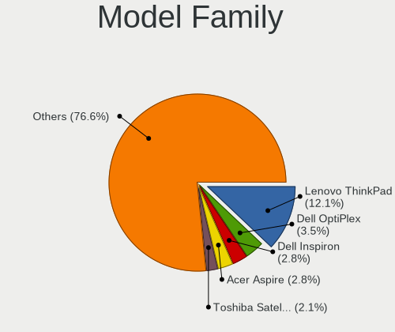
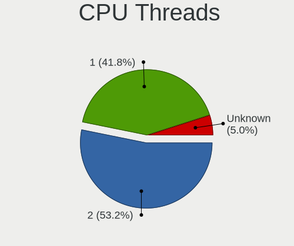
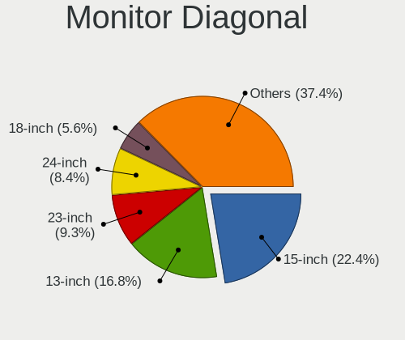
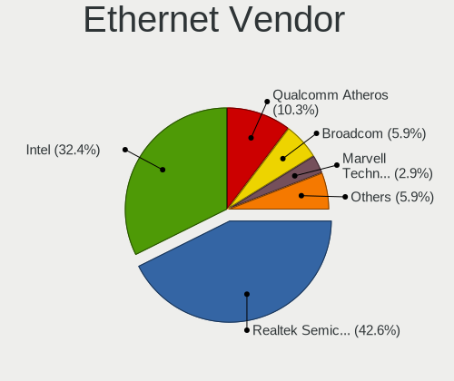
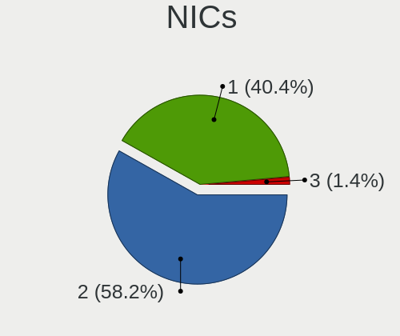
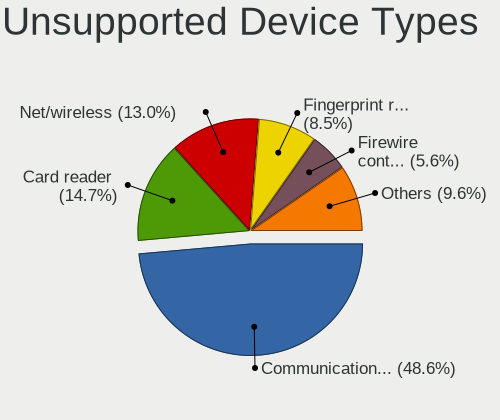

helloSystem 0.6.0 - Tested Hardware & Statistics
------------------------------------------------

A project to collect tested hardware configurations for helloSystem 0.6.0.

Anyone can contribute to this report by the [hw-probe](https://github.com/linuxhw/hw-probe/blob/master/INSTALL.BSD.md) tool:

    hw-probe -all -upload

Please submit a probe of your configuration if it's not presented on the page or is rare.

This is a report for all computer types. See also reports for [desktops](/Dist/helloSystem_0.6.0/Desktop/README.md) and [notebooks](/Dist/helloSystem_0.6.0/Notebook/README.md).

Full-feature report is available here: https://bsd-hardware.info/?view=trends&rel=hellosystem-0.6.0

Contents
--------

* [ Test Cases ](#test-cases)

* [ System ](#system)
  - [ Arch                     ](#arch)
  - [ DE                       ](#de)
  - [ Display Server           ](#display-server)
  - [ Display Manager          ](#display-manager)
  - [ OS Lang                  ](#os-lang)
  - [ Boot Mode                ](#boot-mode)
  - [ Filesystem               ](#filesystem)
  - [ Part. scheme             ](#part-scheme)

* [ Board ](#board)
  - [ Vendor                   ](#vendor)
  - [ Model                    ](#model)
  - [ Model Family             ](#model-family)
  - [ MFG Year                 ](#mfg-year)
  - [ Form Factor              ](#form-factor)
  - [ Coreboot                 ](#coreboot)
  - [ RAM Size                 ](#ram-size)
  - [ RAM Used                 ](#ram-used)
  - [ Total Drives             ](#total-drives)
  - [ Has CD-ROM               ](#has-cd-rom)
  - [ Has Ethernet             ](#has-ethernet)
  - [ Has WiFi                 ](#has-wifi)
  - [ Has Bluetooth            ](#has-bluetooth)

* [ Location ](#location)
  - [ Country                  ](#country)
  - [ City                     ](#city)

* [ Drives ](#drives)
  - [ Drive Vendor             ](#drive-vendor)
  - [ Drive Model              ](#drive-model)
  - [ HDD Vendor               ](#hdd-vendor)
  - [ SSD Vendor               ](#ssd-vendor)
  - [ Drive Kind               ](#drive-kind)
  - [ Drive Connector          ](#drive-connector)
  - [ Drive Size               ](#drive-size)
  - [ Space Total              ](#space-total)
  - [ Space Used               ](#space-used)
  - [ Malfunc. Drives          ](#malfunc-drives)
  - [ Malfunc. Drive Vendor    ](#malfunc-drive-vendor)
  - [ Malfunc. HDD Vendor      ](#malfunc-hdd-vendor)
  - [ Malfunc. Drive Kind      ](#malfunc-drive-kind)
  - [ Failed Drives            ](#failed-drives)
  - [ Failed Drive Vendor      ](#failed-drive-vendor)
  - [ Drive Status             ](#drive-status)

* [ Storage controller ](#storage-controller)
  - [ Storage Vendor           ](#storage-vendor)
  - [ Storage Model            ](#storage-model)
  - [ Storage Kind             ](#storage-kind)

* [ Processor ](#processor)
  - [ CPU Vendor               ](#cpu-vendor)
  - [ CPU Model                ](#cpu-model)
  - [ CPU Model Family         ](#cpu-model-family)
  - [ CPU Cores                ](#cpu-cores)
  - [ CPU Sockets              ](#cpu-sockets)
  - [ CPU Threads              ](#cpu-threads)
  - [ CPU Microarch            ](#cpu-microarch)

* [ Graphics ](#graphics)
  - [ GPU Vendor               ](#gpu-vendor)
  - [ GPU Model                ](#gpu-model)
  - [ GPU Combo                ](#gpu-combo)
  - [ GPU Driver               ](#gpu-driver)
  - [ GPU Memory               ](#gpu-memory)

* [ Monitor ](#monitor)
  - [ Monitor Vendor           ](#monitor-vendor)
  - [ Monitor Model            ](#monitor-model)
  - [ Monitor Resolution       ](#monitor-resolution)
  - [ Monitor Diagonal         ](#monitor-diagonal)
  - [ Monitor Width            ](#monitor-width)
  - [ Aspect Ratio             ](#aspect-ratio)
  - [ Monitor Area             ](#monitor-area)
  - [ Pixel Density            ](#pixel-density)
  - [ Multiple Monitors        ](#multiple-monitors)

* [ Network ](#network)
  - [ Net Controller Vendor    ](#net-controller-vendor)
  - [ Net Controller Model     ](#net-controller-model)
  - [ Wireless Vendor          ](#wireless-vendor)
  - [ Wireless Model           ](#wireless-model)
  - [ Ethernet Vendor          ](#ethernet-vendor)
  - [ Ethernet Model           ](#ethernet-model)
  - [ Net Controller Kind      ](#net-controller-kind)
  - [ Used Controller          ](#used-controller)
  - [ NICs                     ](#nics)
  - [ IPv6                     ](#ipv6)

* [ Bluetooth ](#bluetooth)
  - [ Bluetooth Vendor         ](#bluetooth-vendor)
  - [ Bluetooth Model          ](#bluetooth-model)

* [ Sound ](#sound)
  - [ Sound Vendor             ](#sound-vendor)
  - [ Sound Model              ](#sound-model)

* [ Memory ](#memory)
  - [ Memory Vendor            ](#memory-vendor)
  - [ Memory Model             ](#memory-model)
  - [ Memory Kind              ](#memory-kind)
  - [ Memory Form Factor       ](#memory-form-factor)
  - [ Memory Size              ](#memory-size)
  - [ Memory Speed             ](#memory-speed)

* [ Printers & scanners ](#printers--scanners)
  - [ Printer Vendor           ](#printer-vendor)
  - [ Printer Model            ](#printer-model)
  - [ Scanner Vendor           ](#scanner-vendor)
  - [ Scanner Model            ](#scanner-model)

* [ Camera ](#camera)
  - [ Camera Vendor            ](#camera-vendor)
  - [ Camera Model             ](#camera-model)

* [ Security ](#security)
  - [ Fingerprint Vendor       ](#fingerprint-vendor)
  - [ Fingerprint Model        ](#fingerprint-model)
  - [ Chipcard Vendor          ](#chipcard-vendor)
  - [ Chipcard Model           ](#chipcard-model)

* [ Unsupported ](#unsupported)
  - [ Unsupported Devices      ](#unsupported-devices)
  - [ Unsupported Device Types ](#unsupported-device-types)

Test Cases
----------

| Vendor    | Model                       | Form-Factor | Probe                                                     | Date         |
|-----------|-----------------------------|-------------|-----------------------------------------------------------|--------------|
| Dell      | Latitude E4300              | Notebook    | [fdb3de3036](https://bsd-hardware.info/?probe=fdb3de3036) | Oct 03, 2021 |
| MSI       | MPG X570 GAMING PRO CARB... | Desktop     | [bd312d1c88](https://bsd-hardware.info/?probe=bd312d1c88) | Oct 03, 2021 |
| HP        | ProLiant ML350 G5           | Desktop     | [4d525cba3e](https://bsd-hardware.info/?probe=4d525cba3e) | Oct 03, 2021 |
| Dell      | Inspiron 3521               | Notebook    | [748b6d14f4](https://bsd-hardware.info/?probe=748b6d14f4) | Oct 02, 2021 |
| Toshiba   | dynabook RX3 SM240E/3HD     | Notebook    | [2fe863dff4](https://bsd-hardware.info/?probe=2fe863dff4) | Oct 01, 2021 |
| Toshiba   | Satellite S55t-B            | Notebook    | [445fe665b8](https://bsd-hardware.info/?probe=445fe665b8) | Oct 01, 2021 |
| HP        | Pavilion dm4                | Notebook    | [bb5a564a50](https://bsd-hardware.info/?probe=bb5a564a50) | Sep 30, 2021 |
| ASRock    | X570 Phantom Gaming 4       | Desktop     | [9b14548c15](https://bsd-hardware.info/?probe=9b14548c15) | Sep 21, 2021 |
| Sapphire  | EDGE-FT1M1 E450 1AOVU044    | Desktop     | [ea8fefdf4e](https://bsd-hardware.info/?probe=ea8fefdf4e) | Sep 20, 2021 |
| Dell      | 0MGK50 A02                  | Desktop     | [9d2959b4f1](https://bsd-hardware.info/?probe=9d2959b4f1) | Sep 20, 2021 |
| HP        | 81B4 01                     | Desktop     | [179504116d](https://bsd-hardware.info/?probe=179504116d) | Sep 20, 2021 |
| ASRock    | B450 Gaming-ITX/ac          | Desktop     | [790d020ebe](https://bsd-hardware.info/?probe=790d020ebe) | Sep 19, 2021 |
| Lenovo    | G500s 20245                 | Notebook    | [88cd1ca7bd](https://bsd-hardware.info/?probe=88cd1ca7bd) | Sep 18, 2021 |
| Gigabyte  | H270M-DS3H-CF               | Desktop     | [9b046b157e](https://bsd-hardware.info/?probe=9b046b157e) | Sep 17, 2021 |
| ASUSTek   | PRIME B360M-C               | Desktop     | [0f6e7e26fc](https://bsd-hardware.info/?probe=0f6e7e26fc) | Sep 11, 2021 |
| HP        | 3397                        | Desktop     | [5d95b75768](https://bsd-hardware.info/?probe=5d95b75768) | Sep 06, 2021 |
| Kraftway  | KW10T                       | Notebook    | [4810842d82](https://bsd-hardware.info/?probe=4810842d82) | Sep 06, 2021 |
| Medion    | H61H2-LM3                   | Desktop     | [eb81abe401](https://bsd-hardware.info/?probe=eb81abe401) | Sep 02, 2021 |
| ASRock    | Z390 Pro4                   | Desktop     | [ecbf097bc5](https://bsd-hardware.info/?probe=ecbf097bc5) | Sep 02, 2021 |
| Dell      | Latitude 3540               | Notebook    | [2583b22e8d](https://bsd-hardware.info/?probe=2583b22e8d) | Aug 29, 2021 |
| Dell      | Latitude 3540               | Notebook    | [de97e0b2fc](https://bsd-hardware.info/?probe=de97e0b2fc) | Aug 29, 2021 |
| ASUSTek   | TUF B360M-PLUS GAMING S     | Desktop     | [33ba0b7c38](https://bsd-hardware.info/?probe=33ba0b7c38) | Aug 29, 2021 |
| Itautec   | Infoway w7530               | Notebook    | [d91ec24ce0](https://bsd-hardware.info/?probe=d91ec24ce0) | Aug 29, 2021 |
| Toshiba   | Satellite S55t-B            | Notebook    | [5aaacec4ad](https://bsd-hardware.info/?probe=5aaacec4ad) | Aug 23, 2021 |
| Toshiba   | Satellite S55t-B            | Notebook    | [d74035a8e7](https://bsd-hardware.info/?probe=d74035a8e7) | Aug 23, 2021 |
| ASUSTek   | P7H55-M LX                  | Desktop     | [5fe1a9e521](https://bsd-hardware.info/?probe=5fe1a9e521) | Aug 16, 2021 |
| ASUSTek   | Q505UAR                     | Convertible | [b745dee7d6](https://bsd-hardware.info/?probe=b745dee7d6) | Aug 14, 2021 |
| Lenovo    | ThinkPad X230 23062S2       | Notebook    | [bceadf5c66](https://bsd-hardware.info/?probe=bceadf5c66) | Aug 05, 2021 |
| PCPartner | MILANO-P Rev.00             | Desktop     | [ef8217ac30](https://bsd-hardware.info/?probe=ef8217ac30) | Aug 01, 2021 |
| Intel     | NUC5i3RYB K23918-501        | Mini pc     | [1c3ec31075](https://bsd-hardware.info/?probe=1c3ec31075) | Jul 28, 2021 |
| Lenovo    | ThinkPad SL 2746M3C         | Notebook    | [aa10433581](https://bsd-hardware.info/?probe=aa10433581) | Jul 28, 2021 |
| ASUSTek   | H110M-PLUS                  | Desktop     | [d0f2da9c41](https://bsd-hardware.info/?probe=d0f2da9c41) | Jul 21, 2021 |
| Lenovo    | ThinkPad X230 2325IG2       | Notebook    | [158ecc5e0b](https://bsd-hardware.info/?probe=158ecc5e0b) | Jul 14, 2021 |
| Gigabyte  | H110-D3A-CF                 | Desktop     | [2c390b4301](https://bsd-hardware.info/?probe=2c390b4301) | Jul 09, 2021 |
| Gigabyte  | H110-D3A-CF                 | Desktop     | [aea3a11daf](https://bsd-hardware.info/?probe=aea3a11daf) | Jul 08, 2021 |
| eMachines | eM350                       | Notebook    | [94579b896e](https://bsd-hardware.info/?probe=94579b896e) | Jul 04, 2021 |
| eMachines | eM350                       | Notebook    | [c268dd82de](https://bsd-hardware.info/?probe=c268dd82de) | Jul 04, 2021 |
| Lenovo    | B590 62743PG                | Notebook    | [2400297995](https://bsd-hardware.info/?probe=2400297995) | Jul 03, 2021 |
| Lenovo    | SHARKBAY SDK0E50510 WIN     | Desktop     | [6cf3337855](https://bsd-hardware.info/?probe=6cf3337855) | Jul 01, 2021 |
| ASUSTek   | M5A97 R2.0                  | Desktop     | [e7a0dfcecf](https://bsd-hardware.info/?probe=e7a0dfcecf) | Jun 28, 2021 |
| Lenovo    | IdeaPad S145-15IWL 81MV     | Notebook    | [ceb18e38a3](https://bsd-hardware.info/?probe=ceb18e38a3) | Jun 28, 2021 |
| ASUSTek   | H81M-K                      | Desktop     | [1a35d2f6ab](https://bsd-hardware.info/?probe=1a35d2f6ab) | Jun 26, 2021 |
| eMachines | eM350                       | Notebook    | [52198cfd80](https://bsd-hardware.info/?probe=52198cfd80) | Jun 22, 2021 |
| eMachines | eM350                       | Notebook    | [60b4338ace](https://bsd-hardware.info/?probe=60b4338ace) | Jun 22, 2021 |
| Dell      | Inspiron 3542               | Notebook    | [bb13e61de1](https://bsd-hardware.info/?probe=bb13e61de1) | Jun 21, 2021 |
| Lenovo    | ThinkPad Yoga 11e 20DAS0... | Notebook    | [0e448af5f5](https://bsd-hardware.info/?probe=0e448af5f5) | Jun 18, 2021 |
| Dell      | Latitude 7280               | Notebook    | [8fd335f46f](https://bsd-hardware.info/?probe=8fd335f46f) | Jun 18, 2021 |
| ASUSTek   | H110M-E/M.2                 | Desktop     | [b0b67667d3](https://bsd-hardware.info/?probe=b0b67667d3) | Jun 16, 2021 |

System
------

Arch
----

OS architecture (x86_64, i586, etc.)

| Name  | Computers | Percent |
|-------|-----------|---------|
| amd64 | 38        | 100%    |

DE
--

Desktop Environment

| Name         | Computers | Percent |
|--------------|-----------|---------|
| helloDesktop | 37        | 97.37%  |
| GNOME        | 1         | 2.63%   |

Display Server
--------------

X11 or Wayland

| Name | Computers | Percent |
|------|-----------|---------|
| X11  | 38        | 100%    |

Display Manager
---------------

SDDM, LightDM, etc.

| Name | Computers | Percent |
|------|-----------|---------|
| SLiM | 38        | 100%    |

OS Lang
-------

Language

| Lang  | Computers | Percent |
|-------|-----------|---------|
| en_US | 37        | 97.37%  |
| ru_RU | 1         | 2.63%   |

Boot Mode
---------

EFI or BIOS

| Mode | Computers | Percent |
|------|-----------|---------|
| EFI  | 31        | 81.58%  |
| BIOS | 7         | 18.42%  |

Filesystem
----------

Type of filesystem

| Type | Computers | Percent |
|------|-----------|---------|
| Zfs  | 38        | 100%    |

Part. scheme
------------

Scheme of partitioning

| Type | Computers | Percent |
|------|-----------|---------|
| GPT  | 38        | 100%    |

Board
-----

Vendor
------

Motherboard manufacturer

| Name                | Computers | Percent |
|---------------------|-----------|---------|
| Lenovo              | 8         | 21.05%  |
| ASUSTek Computer    | 7         | 18.42%  |
| Dell                | 6         | 15.79%  |
| Hewlett-Packard     | 4         | 10.53%  |
| ASRock              | 3         | 7.89%   |
| Toshiba             | 2         | 5.26%   |
| Sapphire            | 1         | 2.63%   |
| PCPartner           | 1         | 2.63%   |
| MSI                 | 1         | 2.63%   |
| Kraftway            | 1         | 2.63%   |
| Itautec             | 1         | 2.63%   |
| Intel               | 1         | 2.63%   |
| Gigabyte Technology | 1         | 2.63%   |
| eMachines           | 1         | 2.63%   |

Model
-----

Motherboard model

| Name                                | Computers | Percent |
|-------------------------------------|-----------|---------|
| Toshiba Satellite S55t-B            | 1         | 2.63%   |
| Toshiba dynabook RX3 SM240E/3HD     | 1         | 2.63%   |
| Sapphire EDGE-FT1M1 E450 1AOVU044   | 1         | 2.63%   |
| PCPartner DREAMSYS                  | 1         | 2.63%   |
| MSI MS-7B93                         | 1         | 2.63%   |
| Lenovo ThinkPad Yoga 11e 20DAS0AE00 | 1         | 2.63%   |
| Lenovo ThinkPad X230 2325IG2        | 1         | 2.63%   |
| Lenovo ThinkPad X230 23062S2        | 1         | 2.63%   |
| Lenovo ThinkPad SL 2746M3C          | 1         | 2.63%   |
| Lenovo ThinkCentre M83 10AHS35Q00   | 1         | 2.63%   |
| Lenovo IdeaPad S145-15IWL 81MV      | 1         | 2.63%   |
| Lenovo G500s 20245                  | 1         | 2.63%   |
| Lenovo B590 62743PG                 | 1         | 2.63%   |
| Kraftway KW10T                      | 1         | 2.63%   |
| Itautec Infoway w7530               | 1         | 2.63%   |
| Intel NUC5i3RYH                     | 1         | 2.63%   |
| HP ProLiant ML350 G5                | 1         | 2.63%   |
| HP Pavilion dm4                     | 1         | 2.63%   |
| HP Compaq Elite 8300 SFF            | 1         | 2.63%   |
| HP 260-p026                         | 1         | 2.63%   |
| Gigabyte H270M-DS3H                 | 1         | 2.63%   |
| eMachines eM350                     | 1         | 2.63%   |
| Dell OptiPlex 3040                  | 1         | 2.63%   |
| Dell Latitude E4300                 | 1         | 2.63%   |
| Dell Latitude 7280                  | 1         | 2.63%   |
| Dell Latitude 3540                  | 1         | 2.63%   |
| Dell Inspiron 3542                  | 1         | 2.63%   |
| Dell Inspiron 3521                  | 1         | 2.63%   |
| ASUS TUF B360M-PLUS GAMING S        | 1         | 2.63%   |
| ASUS Q505UAR                        | 1         | 2.63%   |
| ASUS P7H55-M LX                     | 1         | 2.63%   |
| ASUS M5A97 R2.0                     | 1         | 2.63%   |
| ASUS H110M-PLUS                     | 1         | 2.63%   |
| ASUS exone Business 1203            | 1         | 2.63%   |
| ASUS All Series                     | 1         | 2.63%   |
| ASRock Z390 Pro4                    | 1         | 2.63%   |
| ASRock X570 Phantom Gaming 4        | 1         | 2.63%   |
| ASRock B450 Gaming-ITX/ac           | 1         | 2.63%   |

Model Family
------------

Motherboard model prefix

| Name                | Computers | Percent |
|---------------------|-----------|---------|
| Lenovo ThinkPad     | 4         | 10.53%  |
| Dell Latitude       | 3         | 7.89%   |
| Dell Inspiron       | 2         | 5.26%   |
| Toshiba Satellite   | 1         | 2.63%   |
| Toshiba dynabook    | 1         | 2.63%   |
| Sapphire EDGE-FT1M1 | 1         | 2.63%   |
| PCPartner DREAMSYS  | 1         | 2.63%   |
| MSI MS-7B93         | 1         | 2.63%   |
| Lenovo ThinkCentre  | 1         | 2.63%   |
| Lenovo IdeaPad      | 1         | 2.63%   |
| Lenovo G500s        | 1         | 2.63%   |
| Lenovo B590         | 1         | 2.63%   |
| Kraftway KW10T      | 1         | 2.63%   |
| Itautec Infoway     | 1         | 2.63%   |
| Intel NUC5i3RYH     | 1         | 2.63%   |
| HP ProLiant         | 1         | 2.63%   |
| HP Pavilion         | 1         | 2.63%   |
| HP Compaq           | 1         | 2.63%   |
| HP 260-p026         | 1         | 2.63%   |
| Gigabyte H270M-DS3H | 1         | 2.63%   |
| eMachines eM350     | 1         | 2.63%   |
| Dell OptiPlex       | 1         | 2.63%   |
| ASUS TUF            | 1         | 2.63%   |
| ASUS Q505UAR        | 1         | 2.63%   |
| ASUS P7H55-M        | 1         | 2.63%   |
| ASUS M5A97          | 1         | 2.63%   |
| ASUS H110M-PLUS     | 1         | 2.63%   |
| ASUS exone          | 1         | 2.63%   |
| ASUS All            | 1         | 2.63%   |
| ASRock Z390         | 1         | 2.63%   |
| ASRock X570         | 1         | 2.63%   |
| ASRock B450         | 1         | 2.63%   |

MFG Year
--------

Motherboard manufacture year

| Year | Computers | Percent |
|------|-----------|---------|
| 2019 | 6         | 15.79%  |
| 2020 | 5         | 13.16%  |
| 2021 | 4         | 10.53%  |
| 2014 | 4         | 10.53%  |
| 2013 | 4         | 10.53%  |
| 2011 | 4         | 10.53%  |
| 2018 | 2         | 5.26%   |
| 2017 | 2         | 5.26%   |
| 2016 | 2         | 5.26%   |
| 2010 | 2         | 5.26%   |
| 2015 | 1         | 2.63%   |
| 2012 | 1         | 2.63%   |
| 2009 | 1         | 2.63%   |

Form Factor
-----------

Physical design of the computer

| Name        | Computers | Percent |
|-------------|-----------|---------|
| Desktop     | 18        | 47.37%  |
| Notebook    | 18        | 47.37%  |
| Convertible | 1         | 2.63%   |
| Mini pc     | 1         | 2.63%   |

Coreboot
--------

Have coreboot on board

| Used | Computers | Percent |
|------|-----------|---------|
| No   | 38        | 100%    |

RAM Size
--------

Total RAM memory

| Size in GB  | Computers | Percent |
|-------------|-----------|---------|
| 8.01-16.0   | 12        | 31.58%  |
| 4.01-8.0    | 11        | 28.95%  |
| 16.01-24.0  | 10        | 26.32%  |
| 64.01-256.0 | 3         | 7.89%   |
| 32.01-64.0  | 1         | 2.63%   |
| 2.01-3.0    | 1         | 2.63%   |

RAM Used
--------

Used RAM memory

| Used GB  | Computers | Percent |
|----------|-----------|---------|
| 0.01-0.5 | 19        | 50%     |
| 0.51-1.0 | 15        | 39.47%  |
| 1.01-2.0 | 3         | 7.89%   |
| 3.01-4.0 | 1         | 2.63%   |

Total Drives
------------

Number of drives on board

| Drives | Computers | Percent |
|--------|-----------|---------|
| 1      | 27        | 71.05%  |
| 3      | 5         | 13.16%  |
| 2      | 4         | 10.53%  |
| 4      | 2         | 5.26%   |

Has CD-ROM
----------

Has CD-ROM on board

| Presented | Computers | Percent |
|-----------|-----------|---------|
| No        | 25        | 65.79%  |
| Yes       | 13        | 34.21%  |

Has Ethernet
------------

Has Ethernet on board

| Presented | Computers | Percent |
|-----------|-----------|---------|
| Yes       | 35        | 92.11%  |
| No        | 3         | 7.89%   |

Has WiFi
--------

Has WiFi module

| Presented | Computers | Percent |
|-----------|-----------|---------|
| Yes       | 27        | 71.05%  |
| No        | 11        | 28.95%  |

Has Bluetooth
-------------

Has Bluetooth module

| Presented | Computers | Percent |
|-----------|-----------|---------|
| No        | 21        | 55.26%  |
| Yes       | 17        | 44.74%  |

Location
--------

Country
-------

Geographic location (country)

| Country     | Computers | Percent |
|-------------|-----------|---------|
| USA         | 7         | 18.42%  |
| Russia      | 4         | 10.53%  |
| Germany     | 4         | 10.53%  |
| Italy       | 3         | 7.89%   |
| South Korea | 2         | 5.26%   |
| Netherlands | 2         | 5.26%   |
| Mexico      | 2         | 5.26%   |
| Brazil      | 2         | 5.26%   |
| UK          | 1         | 2.63%   |
| Turkey      | 1         | 2.63%   |
| Syria       | 1         | 2.63%   |
| Peru        | 1         | 2.63%   |
| Lithuania   | 1         | 2.63%   |
| Japan       | 1         | 2.63%   |
| Hungary     | 1         | 2.63%   |
| Hong Kong   | 1         | 2.63%   |
| Greece      | 1         | 2.63%   |
| China       | 1         | 2.63%   |
| Canada      | 1         | 2.63%   |
| Australia   | 1         | 2.63%   |

City
----

Geographic location (city)

| City               | Computers | Percent |
|--------------------|-----------|---------|
| Marlborough        | 2         | 5.26%   |
| Ufa                | 1         | 2.63%   |
| Tula de Allende    | 1         | 2.63%   |
| The Hague          | 1         | 2.63%   |
| Tampa              | 1         | 2.63%   |
| Taito              | 1         | 2.63%   |
| Stuttgart          | 1         | 2.63%   |
| Sherwood Park      | 1         | 2.63%   |
| Seoul              | 1         | 2.63%   |
| Seattle            | 1         | 2.63%   |
| Rostov-on-Don      | 1         | 2.63%   |
| Rio de Janeiro     | 1         | 2.63%   |
| Redmond            | 1         | 2.63%   |
| Pistoia            | 1         | 2.63%   |
| Obninsk            | 1         | 2.63%   |
| Nughedu San Nicolo | 1         | 2.63%   |
| Nieuwegein         | 1         | 2.63%   |
| Newtownabbey       | 1         | 2.63%   |
| Monterrey          | 1         | 2.63%   |
| Lima               | 1         | 2.63%   |
| Kosekoy            | 1         | 2.63%   |
| Kaunas             | 1         | 2.63%   |
| Ipojuca            | 1         | 2.63%   |
| Hong Kong          | 1         | 2.63%   |
| Heidelberg         | 1         | 2.63%   |
| Gy?‘r              | 1         | 2.63%   |
| Gwangyang          | 1         | 2.63%   |
| Guangzhou          | 1         | 2.63%   |
| Grottazzolina      | 1         | 2.63%   |
| Filderstadt        | 1         | 2.63%   |
| Dulles             | 1         | 2.63%   |
| Damascus           | 1         | 2.63%   |
| Chelyabinsk        | 1         | 2.63%   |
| Cary               | 1         | 2.63%   |
| Brisbane           | 1         | 2.63%   |
| Bensheim           | 1         | 2.63%   |
| Athens             | 1         | 2.63%   |

Drives
------

Drive Vendor
------------

Hard drive vendors

| Vendor              | Computers | Drives | Percent |
|---------------------|-----------|--------|---------|
| Seagate             | 11        | 11     | 20%     |
| WDC                 | 9         | 10     | 16.36%  |
| Samsung Electronics | 6         | 7      | 10.91%  |
| Toshiba             | 5         | 6      | 9.09%   |
| Crucial             | 3         | 3      | 5.45%   |
| A-DATA Technology   | 3         | 4      | 5.45%   |
| Hitachi             | 2         | 2      | 3.64%   |
| China               | 2         | 2      | 3.64%   |
| Verbatim            | 1         | 1      | 1.82%   |
| SPCC                | 1         | 1      | 1.82%   |
| Smartbuy            | 1         | 1      | 1.82%   |
| SanDisk             | 1         | 1      | 1.82%   |
| PLEXTOR             | 1         | 1      | 1.82%   |
| Patriot             | 1         | 1      | 1.82%   |
| LITEON              | 1         | 1      | 1.82%   |
| Lexar               | 1         | 1      | 1.82%   |
| Leven               | 1         | 1      | 1.82%   |
| Kingston            | 1         | 1      | 1.82%   |
| HGST                | 1         | 1      | 1.82%   |
| Hewlett-Packard     | 1         | 1      | 1.82%   |
| Gigabyte Technology | 1         | 1      | 1.82%   |
| FORESEE             | 1         | 1      | 1.82%   |

Drive Model
-----------

Hard drive models

| Model                               | Computers | Percent |
|-------------------------------------|-----------|---------|
| Toshiba MQ01ABF050 500GB            | 2         | 3.45%   |
| China SATA SSD 120GB                | 2         | 3.45%   |
| WDC WDS250G2X0C-00L350 250GB        | 1         | 1.72%   |
| WDC WDS100T2B0C-00PXH0 1TB          | 1         | 1.72%   |
| WDC WD5000AAVS-00ZTB0 500GB         | 1         | 1.72%   |
| WDC WD40EZRZ-22GXCB0 4TB            | 1         | 1.72%   |
| WDC WD3200BPVT-22JJ5T0 320GB        | 1         | 1.72%   |
| WDC WD2500BEVS-08VAT2 250GB         | 1         | 1.72%   |
| WDC WD10SPZX-22Z10T0 1TB            | 1         | 1.72%   |
| WDC WD10JMVW-11AJGS0 1TB            | 1         | 1.72%   |
| WDC WD10EZRX-00A8LB0 1TB            | 1         | 1.72%   |
| WDC WD1002FAEX-00Y9A0 1TB           | 1         | 1.72%   |
| Verbatim Vi550 S3 SSD 256GB         | 1         | 1.72%   |
| Toshiba MQ01ABD100 1TB              | 1         | 1.72%   |
| Toshiba MK5061GSYN 500GB            | 1         | 1.72%   |
| Toshiba DT01ACA100 1TB              | 1         | 1.72%   |
| SPCC Solid State Disk 1TB           | 1         | 1.72%   |
| Smartbuy SSD 120GB                  | 1         | 1.72%   |
| Seagate ST9500325AS 500GB           | 1         | 1.72%   |
| Seagate ST9160412ASG 160GB          | 1         | 1.72%   |
| Seagate ST750LM022 HN-M750MBB 752GB | 1         | 1.72%   |
| Seagate ST500LT012-1DG142 500GB     | 1         | 1.72%   |
| Seagate ST500LM012 HN-M500MBB 500GB | 1         | 1.72%   |
| Seagate ST500LM000-1EJ162 500GB     | 1         | 1.72%   |
| Seagate ST3250318AS 250GB           | 1         | 1.72%   |
| Seagate ST31000524AS 1TB            | 1         | 1.72%   |
| Seagate ST2000DX001-1CM164 2TB      | 1         | 1.72%   |
| Seagate ST1000LM024 HN-M101MBB 1TB  | 1         | 1.72%   |
| Seagate ST1000LM014-1EJ164 1TB      | 1         | 1.72%   |
| SanDisk SDSSDA240G 240GB            | 1         | 1.72%   |
| Samsung SSD 970 EVO Plus 250GB      | 1         | 1.72%   |
| Samsung SSD 970 EVO 500GB           | 1         | 1.72%   |
| Samsung SSD 860 EVO 500GB           | 1         | 1.72%   |
| Samsung SSD 860 EVO 250GB           | 1         | 1.72%   |
| Samsung SSD 860 EVO 1TB             | 1         | 1.72%   |
| Samsung SSD 850 EVO 250GB           | 1         | 1.72%   |
| Samsung MZNLN512HMJP-000H1 512GB    | 1         | 1.72%   |
| PLEXTOR PX-AG256M6e 256GB           | 1         | 1.72%   |
| Patriot Burst 120GB                 | 1         | 1.72%   |
| LITEON IT LCS-128L9S-HP 128GB       | 1         | 1.72%   |
| Lexar 256GB SSD                     | 1         | 1.72%   |
| Leven JAJS300M480C 480GB            | 1         | 1.72%   |
| Kingston SS200S330G 32GB            | 1         | 1.72%   |
| Hitachi HUS724030ALE641 3TB         | 1         | 1.72%   |
| Hitachi HTS545025B9A300 250GB       | 1         | 1.72%   |
| HGST HTS541010B7E610 1TB            | 1         | 1.72%   |
| HP RAID 0 240GB                     | 1         | 1.72%   |
| Gigabyte GP-GSM2NE3256GNTD 256GB    | 1         | 1.72%   |
| FORESEE 128GB SSD                   | 1         | 1.72%   |
| Crucial CT480BX200SSD1 480GB        | 1         | 1.72%   |
| Crucial CT128M550SSD4 128GB         | 1         | 1.72%   |
| Crucial CT1050MX300SSD4 1TB         | 1         | 1.72%   |
| A-DATA SX8200PNP 512GB              | 1         | 1.72%   |
| A-DATA SX8200PNP 256GB              | 1         | 1.72%   |
| A-DATA SX6000PNP 1TB                | 1         | 1.72%   |
| A-DATA SU630 240GB                  | 1         | 1.72%   |

HDD Vendor
----------

Hard disk drive vendors

| Vendor          | Computers | Drives | Percent |
|-----------------|-----------|--------|---------|
| Seagate         | 11        | 11     | 40.74%  |
| WDC             | 7         | 8      | 25.93%  |
| Toshiba         | 5         | 6      | 18.52%  |
| Hitachi         | 2         | 2      | 7.41%   |
| HGST            | 1         | 1      | 3.7%    |
| Hewlett-Packard | 1         | 1      | 3.7%    |

SSD Vendor
----------

Solid state drive vendors

| Vendor              | Computers | Drives | Percent |
|---------------------|-----------|--------|---------|
| Samsung Electronics | 5         | 5      | 22.73%  |
| Crucial             | 3         | 3      | 13.64%  |
| China               | 2         | 2      | 9.09%   |
| Verbatim            | 1         | 1      | 4.55%   |
| SPCC                | 1         | 1      | 4.55%   |
| Smartbuy            | 1         | 1      | 4.55%   |
| SanDisk             | 1         | 1      | 4.55%   |
| PLEXTOR             | 1         | 1      | 4.55%   |
| Patriot             | 1         | 1      | 4.55%   |
| LITEON              | 1         | 1      | 4.55%   |
| Lexar               | 1         | 1      | 4.55%   |
| Leven               | 1         | 1      | 4.55%   |
| Kingston            | 1         | 1      | 4.55%   |
| FORESEE             | 1         | 1      | 4.55%   |
| A-DATA Technology   | 1         | 1      | 4.55%   |

Drive Kind
----------

HDD or SSD

| Kind | Computers | Drives | Percent |
|------|-----------|--------|---------|
| HDD  | 22        | 29     | 45.83%  |
| SSD  | 19        | 22     | 39.58%  |
| NVMe | 7         | 8      | 14.58%  |

Drive Connector
---------------

SATA, SAS, NVMe, etc.

| Type | Computers | Drives | Percent |
|------|-----------|--------|---------|
| SATA | 36        | 51     | 83.72%  |
| NVMe | 7         | 8      | 16.28%  |

Drive Size
----------

Size of hard drive

| Size in TB | Computers | Drives | Percent |
|------------|-----------|--------|---------|
| 0.01-0.5   | 29        | 33     | 61.7%   |
| 0.51-1.0   | 13        | 13     | 27.66%  |
| 1.01-2.0   | 3         | 3      | 6.38%   |
| 3.01-4.0   | 1         | 1      | 2.13%   |
| 2.01-3.0   | 1         | 1      | 2.13%   |

Space Total
-----------

Amount of disk space available on the file system

| Size in GB | Computers | Percent |
|------------|-----------|---------|
| 1-20       | 20        | 51.28%  |
| 101-250    | 10        | 25.64%  |
| 251-500    | 6         | 15.38%  |
| 501-1000   | 2         | 5.13%   |
| 21-50      | 1         | 2.56%   |

Space Used
----------

Amount of used disk space

| Used GB | Computers | Percent |
|---------|-----------|---------|
| 1-20    | 38        | 100%    |

Malfunc. Drives
---------------

Drive models with a malfunction

| Model                               | Computers | Drives | Percent |
|-------------------------------------|-----------|--------|---------|
| WDC WD10JMVW-11AJGS0 1TB            | 1         | 1      | 12.5%   |
| Toshiba MQ01ABF050 500GB            | 1         | 2      | 12.5%   |
| Toshiba MK5061GSYN 500GB            | 1         | 1      | 12.5%   |
| Toshiba DT01ACA100 1TB              | 1         | 1      | 12.5%   |
| Seagate ST9500325AS 500GB           | 1         | 1      | 12.5%   |
| Seagate ST750LM022 HN-M750MBB 752GB | 1         | 1      | 12.5%   |
| Seagate ST1000LM024 HN-M101MBB 1TB  | 1         | 1      | 12.5%   |
| SanDisk SDSSDA240G 240GB            | 1         | 1      | 12.5%   |

Malfunc. Drive Vendor
---------------------

Vendors of faulty drives

| Vendor  | Computers | Drives | Percent |
|---------|-----------|--------|---------|
| Toshiba | 3         | 4      | 37.5%   |
| Seagate | 3         | 3      | 37.5%   |
| WDC     | 1         | 1      | 12.5%   |
| SanDisk | 1         | 1      | 12.5%   |

Malfunc. HDD Vendor
-------------------

Vendors of faulty HDD drives

| Vendor  | Computers | Drives | Percent |
|---------|-----------|--------|---------|
| Toshiba | 3         | 4      | 42.86%  |
| Seagate | 3         | 3      | 42.86%  |
| WDC     | 1         | 1      | 14.29%  |

Malfunc. Drive Kind
-------------------

Kinds of faulty drives

| Kind | Computers | Drives | Percent |
|------|-----------|--------|---------|
| HDD  | 7         | 8      | 87.5%   |
| SSD  | 1         | 1      | 12.5%   |

Failed Drives
-------------

Failed drive models

| Model                         | Computers | Drives | Percent |
|-------------------------------|-----------|--------|---------|
| Hitachi HTS545025B9A300 250GB | 1         | 1      | 100%    |

Failed Drive Vendor
-------------------

Failed drive vendors

| Vendor  | Computers | Drives | Percent |
|---------|-----------|--------|---------|
| Hitachi | 1         | 1      | 100%    |

Drive Status
------------

Number of failed and malfunc. drives

| Status   | Computers | Drives | Percent |
|----------|-----------|--------|---------|
| Works    | 33        | 48     | 76.74%  |
| Malfunc  | 8         | 9      | 18.6%   |
| Detected | 1         | 1      | 2.33%   |
| Failed   | 1         | 1      | 2.33%   |

Storage controller
------------------

Storage Vendor
--------------

Storage controller vendors

| Vendor                     | Computers | Percent |
|----------------------------|-----------|---------|
| Intel                      | 32        | 68.09%  |
| AMD                        | 5         | 10.64%  |
| Sandisk                    | 2         | 4.26%   |
| Samsung Electronics        | 2         | 4.26%   |
| Realtek Semiconductor      | 1         | 2.13%   |
| Phison Electronics         | 1         | 2.13%   |
| Lite-On IT Corp. / Plextor | 1         | 2.13%   |
| Hewlett-Packard            | 1         | 2.13%   |
| ASMedia Technology         | 1         | 2.13%   |
| ADATA Technology           | 1         | 2.13%   |

Storage Model
-------------

Storage controller models

| Model                                                                          | Computers | Percent |
|--------------------------------------------------------------------------------|-----------|---------|
| Intel 7 Series Chipset Family 6-port SATA Controller [AHCI mode]               | 6         | 12.24%  |
| Intel Q170/Q150/B150/H170/H110/Z170/CM236 Chipset SATA Controller [AHCI Mode]  | 3         | 6.12%   |
| Intel Cannon Lake PCH SATA AHCI Controller                                     | 3         | 6.12%   |
| Samsung NVMe SSD Controller SM981/PM981/PM983                                  | 2         | 4.08%   |
| Intel Wildcat Point-LP SATA Controller [AHCI Mode]                             | 2         | 4.08%   |
| Intel Sunrise Point-LP SATA Controller [AHCI mode]                             | 2         | 4.08%   |
| Intel Atom Processor E3800 Series SATA AHCI Controller                         | 2         | 4.08%   |
| Intel 8 Series/C220 Series Chipset Family 6-port SATA Controller 1 [AHCI mode] | 2         | 4.08%   |
| Intel 8 Series SATA Controller 1 [AHCI mode]                                   | 2         | 4.08%   |
| Intel 5 Series/3400 Series Chipset 4 port SATA AHCI Controller                 | 2         | 4.08%   |
| AMD SB7x0/SB8x0/SB9x0 SATA Controller [AHCI mode]                              | 2         | 4.08%   |
| AMD FCH SATA Controller [AHCI mode]                                            | 2         | 4.08%   |
| Sandisk WD Blue SN550 NVMe SSD                                                 | 1         | 2.04%   |
| Sandisk WD Black 2018/SN750 / PC SN720 NVMe SSD                                | 1         | 2.04%   |
| Phison PS5013 E13 NVMe Controller                                              | 1         | 2.04%   |
| Lite-On IT Corp. / Plextor M6e PCI Express SSD [Marvell 88SS9183]              | 1         | 2.04%   |
| Intel NM10/ICH7 Family SATA Controller [AHCI mode]                             | 1         | 2.04%   |
| Intel Cannon Point-LP SATA Controller [AHCI Mode]                              | 1         | 2.04%   |
| Intel 82801IBM/IEM (ICH9M/ICH9M-E) 4 port SATA Controller [AHCI mode]          | 1         | 2.04%   |
| Intel 82801 Mobile SATA Controller [RAID mode]                                 | 1         | 2.04%   |
| Intel 7 Series/C210 Series Chipset Family 6-port SATA Controller [AHCI mode]   | 1         | 2.04%   |
| Intel 631xESB/632xESB IDE Controller                                           | 1         | 2.04%   |
| Intel 5 Series/3400 Series Chipset 4 port SATA IDE Controller                  | 1         | 2.04%   |
| Intel 5 Series/3400 Series Chipset 2 port SATA IDE Controller                  | 1         | 2.04%   |
| Intel 200 Series PCH SATA controller [AHCI mode]                               | 1         | 2.04%   |
| HP Smart Array E200i (SAS Controller)                                          | 1         | 2.04%   |
| HP Smart Array Controller                                                      | 1         | 2.04%   |
| ASMedia ASM1062 Serial ATA Controller                                          | 1         | 2.04%   |
| AMD 400 Series Chipset SATA Controller                                         | 1         | 2.04%   |
| ADATA XPG SX8200 Pro PCIe Gen3x4 M.2 2280 Solid State Drive                    | 1         | 2.04%   |
| Unknown                                                                        | 1         | 2.04%   |

Storage Kind
------------

Kind of storage controller (IDE, SATA, NVMe, SAS, ...)

| Kind | Computers | Percent |
|------|-----------|---------|
| SATA | 34        | 75.56%  |
| NVMe | 7         | 15.56%  |
| RAID | 2         | 4.44%   |
| IDE  | 2         | 4.44%   |

Processor
---------

CPU Vendor
----------

Processor vendors

| Vendor | Computers | Percent |
|--------|-----------|---------|
| Intel  | 33        | 86.84%  |
| AMD    | 5         | 13.16%  |

CPU Model
---------

Processor models

| Model                                 | Computers | Percent |
|---------------------------------------|-----------|---------|
| Intel Core i3-6100T CPU @ 3.20GHz     | 2         | 5.26%   |
| Intel Core i3-3110M CPU @ 2.40GHz     | 2         | 5.26%   |
| Intel Xeon                            | 1         | 2.63%   |
| Intel Pentium CPU G3420 @ 3.20GHz     | 1         | 2.63%   |
| Intel Pentium CPU 5405U @ 2.30GHz     | 1         | 2.63%   |
| Intel Core i7-8700K CPU @ 3.70GHz     | 1         | 2.63%   |
| Intel Core i7-7700 CPU @ 3.60GHz      | 1         | 2.63%   |
| Intel Core i7-3770 CPU @ 3.40GHz      | 1         | 2.63%   |
| Intel Core i5-9600K CPU @ 3.70GHz     | 1         | 2.63%   |
| Intel Core i5-8250U CPU @ 1.60GHz     | 1         | 2.63%   |
| Intel Core i5-7500 CPU @ 3.40GHz      | 1         | 2.63%   |
| Intel Core i5-7300U CPU @ 2.60GHz     | 1         | 2.63%   |
| Intel Core i5-5200U CPU @ 2.20GHz     | 1         | 2.63%   |
| Intel Core i5-4460 CPU @ 3.20GHz      | 1         | 2.63%   |
| Intel Core i5-4210U CPU @ 1.70GHz     | 1         | 2.63%   |
| Intel Core i5-3230M CPU @ 2.60GHz     | 1         | 2.63%   |
| Intel Core i5-3210M CPU @ 2.50GHz     | 1         | 2.63%   |
| Intel Core i5 CPU M 520 @ 2.40GHz     | 1         | 2.63%   |
| Intel Core i5 CPU M 450 @ 2.40GHz     | 1         | 2.63%   |
| Intel Core i5 CPU 661 @ 3.33GHz       | 1         | 2.63%   |
| Intel Core i3-8100 CPU @ 3.60GHz      | 1         | 2.63%   |
| Intel Core i3-5005U CPU @ 2.00GHz     | 1         | 2.63%   |
| Intel Core i3-4170 CPU @ 3.70GHz      | 1         | 2.63%   |
| Intel Core i3-4005U CPU @ 1.70GHz     | 1         | 2.63%   |
| Intel Core i3-3227U CPU @ 1.90GHz     | 1         | 2.63%   |
| Intel Core 2 Duo CPU T5870 @ 2.00GHz  | 1         | 2.63%   |
| Intel Core 2 Duo                      | 1         | 2.63%   |
| Intel Celeron CPU N2930 @ 1.83GHz     | 1         | 2.63%   |
| Intel Celeron CPU 847 @ 1.10GHz       | 1         | 2.63%   |
| Intel Atom CPU N450 @ 1.66GHz         | 1         | 2.63%   |
| Intel Atom CPU E3825 @ 1.33GHz        | 1         | 2.63%   |
| AMD Ryzen 9 5900X 12-Core Processor   | 1         | 2.63%   |
| AMD Ryzen 9 3900X 12-Core Processor   | 1         | 2.63%   |
| AMD Ryzen 7 3800X 8-Core Processor    | 1         | 2.63%   |
| AMD FX-6100 Six-Core Processor        | 1         | 2.63%   |
| AMD E-450 APU with Radeon HD Graphics | 1         | 2.63%   |

CPU Model Family
----------------

Processor model prefix

| Model            | Computers | Percent |
|------------------|-----------|---------|
| Intel Core i5    | 12        | 31.58%  |
| Intel Core i3    | 9         | 23.68%  |
| Intel Core i7    | 3         | 7.89%   |
| Intel Pentium    | 2         | 5.26%   |
| Intel Core 2 Duo | 2         | 5.26%   |
| Intel Celeron    | 2         | 5.26%   |
| Intel Atom       | 2         | 5.26%   |
| AMD Ryzen 9      | 2         | 5.26%   |
| Intel Xeon       | 1         | 2.63%   |
| AMD Ryzen 7      | 1         | 2.63%   |
| AMD FX           | 1         | 2.63%   |
| AMD E            | 1         | 2.63%   |

CPU Cores
---------

Number of processor cores

| Number  | Computers | Percent |
|---------|-----------|---------|
| 2       | 22        | 57.89%  |
| 4       | 8         | 21.05%  |
| 6       | 3         | 7.89%   |
| 24      | 2         | 5.26%   |
| 16      | 1         | 2.63%   |
| 1       | 1         | 2.63%   |
| Unknown | 1         | 2.63%   |

CPU Sockets
-----------

Number of sockets

| Number | Computers | Percent |
|--------|-----------|---------|
| 1      | 37        | 97.37%  |
| 2      | 1         | 2.63%   |

CPU Threads
-----------

Threads per core (Hyper-Threading)

| Number  | Computers | Percent |
|---------|-----------|---------|
| 2       | 22        | 57.89%  |
| 1       | 15        | 39.47%  |
| Unknown | 1         | 2.63%   |

CPU Microarch
-------------

Microarchitecture

| Name        | Computers | Percent |
|-------------|-----------|---------|
| KabyLake    | 8         | 21.05%  |
| IvyBridge   | 6         | 15.79%  |
| Haswell     | 5         | 13.16%  |
| Westmere    | 3         | 7.89%   |
| Zen 2       | 2         | 5.26%   |
| Skylake     | 2         | 5.26%   |
| Silvermont  | 2         | 5.26%   |
| Penryn      | 2         | 5.26%   |
| Broadwell   | 2         | 5.26%   |
| Zen 3       | 1         | 2.63%   |
| SandyBridge | 1         | 2.63%   |
| Core        | 1         | 2.63%   |
| Bulldozer   | 1         | 2.63%   |
| Bonnell     | 1         | 2.63%   |
| Bobcat      | 1         | 2.63%   |

Graphics
--------

GPU Vendor
----------

Vendors of graphics cards

| Vendor | Computers | Percent |
|--------|-----------|---------|
| Intel  | 25        | 58.14%  |
| Nvidia | 10        | 23.26%  |
| AMD    | 8         | 18.6%   |

GPU Model
---------

Graphics card models

| Model                                                                       | Computers | Percent |
|-----------------------------------------------------------------------------|-----------|---------|
| Intel 3rd Gen Core processor Graphics Controller                            | 5         | 11.63%  |
| Nvidia GF117M [GeForce 610M/710M/810M/820M / GT 620M/625M/630M/720M]        | 2         | 4.65%   |
| Intel HD Graphics 5500                                                      | 2         | 4.65%   |
| Intel Haswell-ULT Integrated Graphics Controller                            | 2         | 4.65%   |
| Intel Core Processor Integrated Graphics Controller                         | 2         | 4.65%   |
| Intel Atom Processor Z36xxx/Z37xxx Series Graphics & Display                | 2         | 4.65%   |
| Nvidia GP108 [GeForce GT 1030]                                              | 1         | 2.33%   |
| Nvidia GP107 [GeForce GTX 1050 Ti]                                          | 1         | 2.33%   |
| Nvidia GP104 [GeForce GTX 1060 3GB]                                         | 1         | 2.33%   |
| Nvidia GP102 [GeForce GTX 1080 Ti]                                          | 1         | 2.33%   |
| Nvidia GK208B [GeForce GT 710]                                              | 1         | 2.33%   |
| Nvidia GF108 [GeForce GT 530]                                               | 1         | 2.33%   |
| Nvidia G98M [GeForce G 105M]                                                | 1         | 2.33%   |
| Nvidia G96C [GeForce 9500 GT]                                               | 1         | 2.33%   |
| Intel Xeon E3-1200 v3/4th Gen Core Processor Integrated Graphics Controller | 1         | 2.33%   |
| Intel Xeon E3-1200 v2/3rd Gen Core processor Graphics Controller            | 1         | 2.33%   |
| Intel UHD Graphics 620                                                      | 1         | 2.33%   |
| Intel Mobile 4 Series Chipset Integrated Graphics Controller                | 1         | 2.33%   |
| Intel HD Graphics 630                                                       | 1         | 2.33%   |
| Intel HD Graphics 620                                                       | 1         | 2.33%   |
| Intel HD Graphics 530                                                       | 1         | 2.33%   |
| Intel CoffeeLake-S GT2 [UHD Graphics 630]                                   | 1         | 2.33%   |
| Intel Coffee Lake UHD 610 Graphics Controller                               | 1         | 2.33%   |
| Intel Atom Processor D4xx/D5xx/N4xx/N5xx Integrated Graphics Controller     | 1         | 2.33%   |
| Intel 4th Generation Core Processor Family Integrated Graphics Controller   | 1         | 2.33%   |
| Intel 2nd Generation Core Processor Family Integrated Graphics Controller   | 1         | 2.33%   |
| AMD Wrestler [Radeon HD 6320]                                               | 1         | 2.33%   |
| AMD Venus PRO [Radeon HD 8850M / R9 M265X]                                  | 1         | 2.33%   |
| AMD Turks XT [Radeon HD 6670/7670]                                          | 1         | 2.33%   |
| AMD Oland [Radeon HD 8570 / R5 430 OEM / R7 240/340 / Radeon 520 OEM]       | 1         | 2.33%   |
| AMD Navi 21 [Radeon RX 6800/6800 XT / 6900 XT]                              | 1         | 2.33%   |
| AMD Ellesmere [Radeon RX 470/480/570/570X/580/580X/590]                     | 1         | 2.33%   |
| AMD Baffin [Radeon RX 550 640SP / RX 560/560X]                              | 1         | 2.33%   |
| AMD Baffin [Radeon RX 460/560D / Pro 450/455/460/555/555X/560/560X]         | 1         | 2.33%   |

GPU Combo
---------

Combinations of graphics cards

| Name           | Computers | Percent |
|----------------|-----------|---------|
| 1 x Intel      | 18        | 47.37%  |
| 1 x Nvidia     | 7         | 18.42%  |
| 1 x AMD        | 6         | 15.79%  |
| Intel + Nvidia | 3         | 7.89%   |
| 2 x Intel      | 2         | 5.26%   |
| Intel + AMD    | 2         | 5.26%   |

GPU Driver
----------

Free vs proprietary

| Driver      | Computers | Percent |
|-------------|-----------|---------|
| Free        | 35        | 92.11%  |
| Proprietary | 2         | 5.26%   |
| Unknown     | 1         | 2.63%   |

GPU Memory
----------

Total video memory

| Size in GB | Computers | Percent |
|------------|-----------|---------|
| Unknown    | 33        | 86.84%  |
| 3.01-4.0   | 2         | 5.26%   |
| 0.01-0.5   | 2         | 5.26%   |
| 7.01-8.0   | 1         | 2.63%   |

Monitor
-------

Monitor Vendor
--------------

Monitor vendors

| Vendor               | Computers | Percent |
|----------------------|-----------|---------|
| Samsung Electronics  | 6         | 20%     |
| LG Display           | 5         | 16.67%  |
| BOE                  | 5         | 16.67%  |
| AU Optronics         | 3         | 10%     |
| Iiyama               | 2         | 6.67%   |
| Dell                 | 2         | 6.67%   |
| Acer                 | 2         | 6.67%   |
| InfoVision           | 1         | 3.33%   |
| Hewlett-Packard      | 1         | 3.33%   |
| Chimei Innolux       | 1         | 3.33%   |
| Ancor Communications | 1         | 3.33%   |
| ALP                  | 1         | 3.33%   |

Monitor Model
-------------

Monitor models

| Model                                                                | Computers | Percent |
|----------------------------------------------------------------------|-----------|---------|
| LG Display LCD Monitor LGD02D8 1366x768 280x160mm 12.7-inch          | 2         | 6.67%   |
| Samsung Electronics T22D390 SAM0B69 1920x1080 480x270mm 21.7-inch    | 1         | 3.33%   |
| Samsung Electronics SyncMaster SAM05CD 1920x1080                     | 1         | 3.33%   |
| Samsung Electronics SyncMaster SAM05C5 1920x1080                     | 1         | 3.33%   |
| Samsung Electronics LCD Monitor SEC414C 1366x768 310x170mm 13.9-inch | 1         | 3.33%   |
| Samsung Electronics LCD Monitor SEC3942 1366x768 310x170mm 13.9-inch | 1         | 3.33%   |
| Samsung Electronics LCD Monitor SAM4A75 1024x768 300x230mm 14.9-inch | 1         | 3.33%   |
| LG Display LCD Monitor LGD11F9 1280x800 290x180mm 13.4-inch          | 1         | 3.33%   |
| LG Display LCD Monitor LGD0470 1920x1080 350x190mm 15.7-inch         | 1         | 3.33%   |
| LG Display LCD Monitor LGD03AB 1366x768 340x190mm 15.3-inch          | 1         | 3.33%   |
| InfoVision LCD Monitor IVO03F4 1024x600 220x130mm 10.1-inch          | 1         | 3.33%   |
| Iiyama PLE2407HDS IVM560D 1920x1080 520x300mm 23.6-inch              | 1         | 3.33%   |
| Iiyama PL2409HD IVM560C 1920x1080 520x290mm 23.4-inch                | 1         | 3.33%   |
| Hewlett-Packard 2310 HWP288F 1920x1080 510x290mm 23.1-inch           | 1         | 3.33%   |
| Dell U3415W DELA0AA 3440x1440 800x330mm 34.1-inch                    | 1         | 3.33%   |
| Dell 1708FP DEL4024 1280x1024 340x270mm 17.1-inch                    | 1         | 3.33%   |
| Chimei Innolux LCD Monitor CMN15E8 1920x1080 340x190mm 15.3-inch     | 1         | 3.33%   |
| BOE LCD Monitor BOE0757 1366x768 340x190mm 15.3-inch                 | 1         | 3.33%   |
| BOE LCD Monitor BOE06D3 1366x768 340x190mm 15.3-inch                 | 1         | 3.33%   |
| BOE LCD Monitor BOE06C8 1366x768 280x160mm 12.7-inch                 | 1         | 3.33%   |
| BOE LCD Monitor BOE0615 1366x768 340x190mm 15.3-inch                 | 1         | 3.33%   |
| BOE LCD Monitor BOE05E9 1366x768 250x140mm 11.3-inch                 | 1         | 3.33%   |
| AU Optronics LCD Monitor AUO45EC 1366x768 340x190mm 15.3-inch        | 1         | 3.33%   |
| AU Optronics LCD Monitor AUO4100 1920x1200 220x140mm 10.3-inch       | 1         | 3.33%   |
| AU Optronics LCD Monitor AUO21ED 1920x1080 340x190mm 15.3-inch       | 1         | 3.33%   |
| Ancor Communications MW221 ACI22B1 1680x1050 470x300mm 22.0-inch     | 1         | 3.33%   |
| ALP 2476 IPS ALP2476 1920x1080 530x300mm 24.0-inch                   | 1         | 3.33%   |
| Acer ET430K ACR0558 3840x2160 940x530mm 42.5-inch                    | 1         | 3.33%   |
| Acer B223W ACR0018 1680x1050 470x300mm 22.0-inch                     | 1         | 3.33%   |

Monitor Resolution
------------------

Monitor screen resolution

| Resolution         | Computers | Percent |
|--------------------|-----------|---------|
| 1366x768 (WXGA)    | 11        | 36.67%  |
| 1920x1080 (FHD)    | 10        | 33.33%  |
| 1680x1050 (WSXGA+) | 2         | 6.67%   |
| 3840x2160 (4K)     | 1         | 3.33%   |
| 3440x1440          | 1         | 3.33%   |
| 1920x1200 (WUXGA)  | 1         | 3.33%   |
| 1280x800 (WXGA)    | 1         | 3.33%   |
| 1280x1024 (SXGA)   | 1         | 3.33%   |
| 1024x768 (XGA)     | 1         | 3.33%   |
| 1024x600           | 1         | 3.33%   |

Monitor Diagonal
----------------

Diagonal size in inches

| Inches  | Computers | Percent |
|---------|-----------|---------|
| 15      | 8         | 26.67%  |
| 23      | 3         | 10%     |
| 13      | 3         | 10%     |
| 12      | 3         | 10%     |
| 22      | 2         | 6.67%   |
| 10      | 2         | 6.67%   |
| Unknown | 2         | 6.67%   |
| 42      | 1         | 3.33%   |
| 34      | 1         | 3.33%   |
| 24      | 1         | 3.33%   |
| 21      | 1         | 3.33%   |
| 17      | 1         | 3.33%   |
| 14      | 1         | 3.33%   |
| 11      | 1         | 3.33%   |

Monitor Width
-------------

Physical width

| Width in mm | Computers | Percent |
|-------------|-----------|---------|
| 301-350     | 11        | 36.67%  |
| 201-300     | 8         | 26.67%  |
| 501-600     | 4         | 13.33%  |
| 401-500     | 3         | 10%     |
| Unknown     | 2         | 6.67%   |
| 701-800     | 1         | 3.33%   |
| 901-1000    | 1         | 3.33%   |

Aspect Ratio
------------

Proportional relationship between the width and the height

| Ratio | Computers | Percent |
|-------|-----------|---------|
| 16/9  | 23        | 76.67%  |
| 16/10 | 4         | 13.33%  |
| 5/4   | 1         | 3.33%   |
| 4/3   | 1         | 3.33%   |
| 21/9  | 1         | 3.33%   |

Monitor Area
------------

Area in inch²

| Area in inch² | Computers | Percent |
|----------------|-----------|---------|
| 201-250        | 7         | 23.33%  |
| 91-100         | 7         | 23.33%  |
| 81-90          | 3         | 10%     |
| 61-70          | 3         | 10%     |
| 41-50          | 2         | 6.67%   |
| 101-110        | 2         | 6.67%   |
| Unknown        | 2         | 6.67%   |
| 51-60          | 1         | 3.33%   |
| 351-500        | 1         | 3.33%   |
| 141-150        | 1         | 3.33%   |
| 501-1000       | 1         | 3.33%   |

Pixel Density
-------------

Pixels per inch

| Density | Computers | Percent |
|---------|-----------|---------|
| 101-120 | 12        | 40%     |
| 51-100  | 8         | 26.67%  |
| 121-160 | 7         | 23.33%  |
| Unknown | 2         | 6.67%   |
| 161-240 | 1         | 3.33%   |

Multiple Monitors
-----------------

Total monitors connected

| Total | Computers | Percent |
|-------|-----------|---------|
| 1     | 29        | 76.32%  |
| 0     | 8         | 21.05%  |
| 2     | 1         | 2.63%   |

Network
-------

Net Controller Vendor
---------------------

Controller vendors

| Vendor                   | Computers | Percent |
|--------------------------|-----------|---------|
| Intel                    | 20        | 36.36%  |
| Realtek Semiconductor    | 18        | 32.73%  |
| Qualcomm Atheros         | 6         | 10.91%  |
| Broadcom                 | 6         | 10.91%  |
| Ralink Technology        | 1         | 1.82%   |
| Marvell Technology Group | 1         | 1.82%   |
| IMC Networks             | 1         | 1.82%   |
| Huawei Technologies      | 1         | 1.82%   |
| ASUSTek Computer         | 1         | 1.82%   |

Net Controller Model
--------------------

Controller models

| Model                                                                          | Computers | Percent |
|--------------------------------------------------------------------------------|-----------|---------|
| Realtek RTL8111/8168/8411 PCI Express Gigabit Ethernet Controller              | 13        | 20%     |
| Realtek RTL810xE PCI Express Fast Ethernet controller                          | 3         | 4.62%   |
| Intel I211 Gigabit Network Connection                                          | 3         | 4.62%   |
| Intel Ethernet Connection (7) I219-V                                           | 3         | 4.62%   |
| Intel 82579LM Gigabit Network Connection (Lewisville)                          | 3         | 4.62%   |
| Intel Wireless 8265 / 8275                                                     | 2         | 3.08%   |
| Intel Wireless 7265                                                            | 2         | 3.08%   |
| Broadcom BCM43142 802.11b/g/n                                                  | 2         | 3.08%   |
| Realtek RTL8821CE 802.11ac PCIe Wireless Network Adapter                       | 1         | 1.54%   |
| Realtek RTL8723BE PCIe Wireless Network Adapter                                | 1         | 1.54%   |
| Realtek RTL8188FTV 802.11b/g/n 1T1R 2.4G WLAN Adapter                          | 1         | 1.54%   |
| Realtek RTL8188EUS 802.11n Wireless Network Adapter                            | 1         | 1.54%   |
| Realtek RTL8188CE 802.11b/g/n WiFi Adapter                                     | 1         | 1.54%   |
| Ralink MT7601U Wireless Adapter                                                | 1         | 1.54%   |
| Qualcomm Atheros QCA9565 / AR9565 Wireless Network Adapter                     | 1         | 1.54%   |
| Qualcomm Atheros QCA8172 Fast Ethernet                                         | 1         | 1.54%   |
| Qualcomm Atheros AR9485 Wireless Network Adapter                               | 1         | 1.54%   |
| Qualcomm Atheros AR928X Wireless Network Adapter (PCI-Express)                 | 1         | 1.54%   |
| Qualcomm Atheros AR9285 Wireless Network Adapter (PCI-Express)                 | 1         | 1.54%   |
| Qualcomm Atheros AR8132 Fast Ethernet                                          | 1         | 1.54%   |
| Qualcomm Atheros AR242x / AR542x Wireless Network Adapter (PCI-Express)        | 1         | 1.54%   |
| Marvell Group Yukon Optima 88E8059 [PCIe Gigabit Ethernet Controller with AVB] | 1         | 1.54%   |
| Intel Wireless 7260                                                            | 1         | 1.54%   |
| Intel Wireless 3160                                                            | 1         | 1.54%   |
| Intel WiFi Link 5100                                                           | 1         | 1.54%   |
| Intel Ethernet Connection I217-LM                                              | 1         | 1.54%   |
| Intel Ethernet Connection (4) I219-LM                                          | 1         | 1.54%   |
| Intel Ethernet Connection (3) I218-V                                           | 1         | 1.54%   |
| Intel Dual Band Wireless-AC 3168NGW [Stone Peak]                               | 1         | 1.54%   |
| Intel Centrino Wireless-N 2200                                                 | 1         | 1.54%   |
| Intel Centrino Wireless-N 135                                                  | 1         | 1.54%   |
| Intel Centrino Wireless-N 1000 [Condor Peak]                                   | 1         | 1.54%   |
| Intel Centrino Advanced-N 6205 [Taylor Peak]                                   | 1         | 1.54%   |
| Intel 82577LC Gigabit Network Connection                                       | 1         | 1.54%   |
| Intel 82567LM Gigabit Network Connection                                       | 1         | 1.54%   |
| IMC Networks Realtek RTL8191SU Wireless LAN 802.11n USB 2.0 Network Adapter    | 1         | 1.54%   |
| Huawei ME936 LTE/HSDPA+ 4G modem                                               | 1         | 1.54%   |
| Broadcom NetXtreme II BCM5708 Gigabit Ethernet                                 | 1         | 1.54%   |
| Broadcom NetXtreme BCM5705_2 Gigabit Ethernet                                  | 1         | 1.54%   |
| Broadcom BCM4352 802.11ac Wireless Network Adapter                             | 1         | 1.54%   |
| Broadcom BCM43228 802.11a/b/g/n                                                | 1         | 1.54%   |
| ASUS N10 Nano 802.11n Network Adapter [Realtek RTL8192CU]                      | 1         | 1.54%   |

Wireless Vendor
---------------

Wireless vendors

| Vendor                | Computers | Percent |
|-----------------------|-----------|---------|
| Intel                 | 12        | 42.86%  |
| Qualcomm Atheros      | 5         | 17.86%  |
| Realtek Semiconductor | 4         | 14.29%  |
| Broadcom              | 4         | 14.29%  |
| Ralink Technology     | 1         | 3.57%   |
| IMC Networks          | 1         | 3.57%   |
| ASUSTek Computer      | 1         | 3.57%   |

Wireless Model
--------------

Wireless models

| Model                                                                       | Computers | Percent |
|-----------------------------------------------------------------------------|-----------|---------|
| Intel Wireless 8265 / 8275                                                  | 2         | 6.9%    |
| Intel Wireless 7265                                                         | 2         | 6.9%    |
| Broadcom BCM43142 802.11b/g/n                                               | 2         | 6.9%    |
| Realtek RTL8821CE 802.11ac PCIe Wireless Network Adapter                    | 1         | 3.45%   |
| Realtek RTL8723BE PCIe Wireless Network Adapter                             | 1         | 3.45%   |
| Realtek RTL8188FTV 802.11b/g/n 1T1R 2.4G WLAN Adapter                       | 1         | 3.45%   |
| Realtek RTL8188EUS 802.11n Wireless Network Adapter                         | 1         | 3.45%   |
| Realtek RTL8188CE 802.11b/g/n WiFi Adapter                                  | 1         | 3.45%   |
| Ralink MT7601U Wireless Adapter                                             | 1         | 3.45%   |
| Qualcomm Atheros QCA9565 / AR9565 Wireless Network Adapter                  | 1         | 3.45%   |
| Qualcomm Atheros AR9485 Wireless Network Adapter                            | 1         | 3.45%   |
| Qualcomm Atheros AR928X Wireless Network Adapter (PCI-Express)              | 1         | 3.45%   |
| Qualcomm Atheros AR9285 Wireless Network Adapter (PCI-Express)              | 1         | 3.45%   |
| Qualcomm Atheros AR242x / AR542x Wireless Network Adapter (PCI-Express)     | 1         | 3.45%   |
| Intel Wireless 7260                                                         | 1         | 3.45%   |
| Intel Wireless 3160                                                         | 1         | 3.45%   |
| Intel WiFi Link 5100                                                        | 1         | 3.45%   |
| Intel Dual Band Wireless-AC 3168NGW [Stone Peak]                            | 1         | 3.45%   |
| Intel Centrino Wireless-N 2200                                              | 1         | 3.45%   |
| Intel Centrino Wireless-N 135                                               | 1         | 3.45%   |
| Intel Centrino Wireless-N 1000 [Condor Peak]                                | 1         | 3.45%   |
| Intel Centrino Advanced-N 6205 [Taylor Peak]                                | 1         | 3.45%   |
| IMC Networks Realtek RTL8191SU Wireless LAN 802.11n USB 2.0 Network Adapter | 1         | 3.45%   |
| Broadcom BCM4352 802.11ac Wireless Network Adapter                          | 1         | 3.45%   |
| Broadcom BCM43228 802.11a/b/g/n                                             | 1         | 3.45%   |
| ASUS N10 Nano 802.11n Network Adapter [Realtek RTL8192CU]                   | 1         | 3.45%   |

Ethernet Vendor
---------------

Ethernet vendors

| Vendor                   | Computers | Percent |
|--------------------------|-----------|---------|
| Realtek Semiconductor    | 16        | 45.71%  |
| Intel                    | 14        | 40%     |
| Qualcomm Atheros         | 2         | 5.71%   |
| Broadcom                 | 2         | 5.71%   |
| Marvell Technology Group | 1         | 2.86%   |

Ethernet Model
--------------

Ethernet models

| Model                                                                          | Computers | Percent |
|--------------------------------------------------------------------------------|-----------|---------|
| Realtek RTL8111/8168/8411 PCI Express Gigabit Ethernet Controller              | 13        | 37.14%  |
| Realtek RTL810xE PCI Express Fast Ethernet controller                          | 3         | 8.57%   |
| Intel I211 Gigabit Network Connection                                          | 3         | 8.57%   |
| Intel Ethernet Connection (7) I219-V                                           | 3         | 8.57%   |
| Intel 82579LM Gigabit Network Connection (Lewisville)                          | 3         | 8.57%   |
| Qualcomm Atheros QCA8172 Fast Ethernet                                         | 1         | 2.86%   |
| Qualcomm Atheros AR8132 Fast Ethernet                                          | 1         | 2.86%   |
| Marvell Group Yukon Optima 88E8059 [PCIe Gigabit Ethernet Controller with AVB] | 1         | 2.86%   |
| Intel Ethernet Connection I217-LM                                              | 1         | 2.86%   |
| Intel Ethernet Connection (4) I219-LM                                          | 1         | 2.86%   |
| Intel Ethernet Connection (3) I218-V                                           | 1         | 2.86%   |
| Intel 82577LC Gigabit Network Connection                                       | 1         | 2.86%   |
| Intel 82567LM Gigabit Network Connection                                       | 1         | 2.86%   |
| Broadcom NetXtreme II BCM5708 Gigabit Ethernet                                 | 1         | 2.86%   |
| Broadcom NetXtreme BCM5705_2 Gigabit Ethernet                                  | 1         | 2.86%   |

Net Controller Kind
-------------------

Ethernet, WiFi or modem

| Kind     | Computers | Percent |
|----------|-----------|---------|
| Ethernet | 35        | 55.56%  |
| WiFi     | 27        | 42.86%  |
| Modem    | 1         | 1.59%   |

Used Controller
---------------

Currently used network controller

| Kind     | Computers | Percent |
|----------|-----------|---------|
| Ethernet | 35        | 63.64%  |
| WiFi     | 20        | 36.36%  |

NICs
----

Total network controllers on board

| Total | Computers | Percent |
|-------|-----------|---------|
| 2     | 21        | 55.26%  |
| 1     | 17        | 44.74%  |

IPv6
----

IPv6 vs IPv4

| Used | Computers | Percent |
|------|-----------|---------|
| No   | 38        | 100%    |

Bluetooth
---------

Bluetooth Vendor
----------------

Controller vendors

| Vendor                          | Computers | Percent |
|---------------------------------|-----------|---------|
| Intel                           | 6         | 37.5%   |
| Broadcom                        | 4         | 25%     |
| Realtek Semiconductor           | 2         | 12.5%   |
| Qualcomm Atheros Communications | 1         | 6.25%   |
| Foxconn / Hon Hai               | 1         | 6.25%   |
| Cambridge Silicon Radio         | 1         | 6.25%   |
| ASUSTek Computer                | 1         | 6.25%   |

Bluetooth Model
---------------

Controller models

| Model                                               | Computers | Percent |
|-----------------------------------------------------|-----------|---------|
| Intel Bluetooth wireless interface                  | 4         | 25%     |
| Broadcom BCM43142 Bluetooth 4.0                     | 2         | 12.5%   |
| Broadcom BCM20702 Bluetooth 4.0 [ThinkPad]          | 2         | 12.5%   |
| Realtek  Bluetooth Adapter                          | 1         | 6.25%   |
| Realtek  Bluetooth 4.0 Adapter                      | 1         | 6.25%   |
| Qualcomm Atheros AR9462 Bluetooth                   | 1         | 6.25%   |
| Intel Wireless-AC 3168 Bluetooth                    | 1         | 6.25%   |
| Intel AX200 Bluetooth                               | 1         | 6.25%   |
| Foxconn / Hon Hai Broadcom Bluetooth 4.0 USB        | 1         | 6.25%   |
| Cambridge Silicon Radio Bluetooth Dongle (HCI mode) | 1         | 6.25%   |
| ASUS Broadcom BCM20702A0 Bluetooth                  | 1         | 6.25%   |

Sound
-----

Sound Vendor
------------

Sound card vendors

| Vendor              | Computers | Percent |
|---------------------|-----------|---------|
| Intel               | 31        | 57.41%  |
| AMD                 | 9         | 16.67%  |
| Nvidia              | 6         | 11.11%  |
| C-Media Electronics | 3         | 5.56%   |
| Texas Instruments   | 2         | 3.7%    |
| Logitech            | 2         | 3.7%    |
| Creative Labs       | 1         | 1.85%   |

Sound Model
-----------

Sound card models

| Model                                                                      | Computers | Percent |
|----------------------------------------------------------------------------|-----------|---------|
| Intel 7 Series/C216 Chipset Family High Definition Audio Controller        | 7         | 11.48%  |
| Intel 8 Series/C220 Series Chipset High Definition Audio Controller        | 3         | 4.92%   |
| Intel 5 Series/3400 Series Chipset High Definition Audio                   | 3         | 4.92%   |
| Intel 100 Series/C230 Series Chipset Family HD Audio Controller            | 3         | 4.92%   |
| AMD Starship/Matisse HD Audio Controller                                   | 3         | 4.92%   |
| Texas Instruments PCM2902 Audio Codec                                      | 2         | 3.28%   |
| Intel Wildcat Point-LP High Definition Audio Controller                    | 2         | 3.28%   |
| Intel Sunrise Point-LP HD Audio                                            | 2         | 3.28%   |
| Intel Cannon Lake PCH cAVS                                                 | 2         | 3.28%   |
| Intel Broadwell-U Audio Controller                                         | 2         | 3.28%   |
| Intel Atom Processor Z36xxx/Z37xxx Series High Definition Audio Controller | 2         | 3.28%   |
| Intel 82801I (ICH9 Family) HD Audio Controller                             | 2         | 3.28%   |
| Intel 8 Series HD Audio Controller                                         | 2         | 3.28%   |
| AMD SBx00 Azalia (Intel HDA)                                               | 2         | 3.28%   |
| AMD Baffin HDMI/DP Audio [Radeon RX 550 640SP / RX 560/560X]               | 2         | 3.28%   |
| Nvidia GP108 High Definition Audio Controller                              | 1         | 1.64%   |
| Nvidia GP107GL High Definition Audio Controller                            | 1         | 1.64%   |
| Nvidia GP104 High Definition Audio Controller                              | 1         | 1.64%   |
| Nvidia GP102 HDMI Audio Controller                                         | 1         | 1.64%   |
| Nvidia GK208 HDMI/DP Audio Controller                                      | 1         | 1.64%   |
| Nvidia GF108 High Definition Audio Controller                              | 1         | 1.64%   |
| Logitech HD Webcam C910                                                    | 1         | 1.64%   |
| Logitech HD Webcam C510                                                    | 1         | 1.64%   |
| Intel Xeon E3-1200 v3/4th Gen Core Processor HD Audio Controller           | 1         | 1.64%   |
| Intel NM10/ICH7 Family High Definition Audio Controller                    | 1         | 1.64%   |
| Intel Haswell-ULT HD Audio Controller                                      | 1         | 1.64%   |
| Intel Cannon Point-LP High Definition Audio Controller                     | 1         | 1.64%   |
| Intel 200 Series PCH HD Audio                                              | 1         | 1.64%   |
| Creative Labs EMU10k2/CA0100/CA0102/CA10200 [Sound Blaster Audigy Series]  | 1         | 1.64%   |
| C-Media Electronics CM108 Audio Controller                                 | 1         | 1.64%   |
| C-Media Electronics CM102-A+/102S+ Audio Controller                        | 1         | 1.64%   |
| C-Media Electronics Audio Adapter (Unitek Y-247A)                          | 1         | 1.64%   |
| AMD Wrestler HDMI Audio                                                    | 1         | 1.64%   |
| AMD Turks HDMI Audio [Radeon HD 6500/6600 / 6700M Series]                  | 1         | 1.64%   |
| AMD Oland/Hainan/Cape Verde/Pitcairn HDMI Audio [Radeon HD 7000 Series]    | 1         | 1.64%   |
| AMD Navi 21 HDMI Audio [Radeon RX 6800/6800 XT / 6900 XT]                  | 1         | 1.64%   |
| AMD Ellesmere HDMI Audio [Radeon RX 470/480 / 570/580/590]                 | 1         | 1.64%   |

Memory
------

Memory Vendor
-------------

Memory module vendors

| Vendor              | Computers | Percent |
|---------------------|-----------|---------|
| Unknown             | 7         | 14.89%  |
| SK Hynix            | 7         | 14.89%  |
| Samsung Electronics | 5         | 10.64%  |
| Micron Technology   | 5         | 10.64%  |
| Kingston            | 5         | 10.64%  |
| Crucial             | 5         | 10.64%  |
| Team                | 3         | 6.38%   |
| Corsair             | 2         | 4.26%   |
| Transcend           | 1         | 2.13%   |
| Teikon              | 1         | 2.13%   |
| Smart Brazil        | 1         | 2.13%   |
| Smart               | 1         | 2.13%   |
| Ramaxel Technology  | 1         | 2.13%   |
| PKI/Kingston        | 1         | 2.13%   |
| Nanya Technology    | 1         | 2.13%   |
| A-DATA Technology   | 1         | 2.13%   |

Memory Model
------------

Memory module models

| Model                                                                   | Computers | Percent |
|-------------------------------------------------------------------------|-----------|---------|
| SK Hynix RAM HMT351S6EFR8A-PB 4GB SODIMM DDR3 1600MT/s                  | 2         | 4.17%   |
| Micron RAM 8ATF1G64HZ-2G3H1 8GB SODIMM DDR4 2400MT/s                    | 2         | 4.17%   |
| Crucial RAM CT8G4DFS8266.M8FD 8GB DIMM DDR4 2667MT/s                    | 2         | 4.17%   |
| Unknown RAM Module 8GB SODIMM DDR3 1600MT/s                             | 1         | 2.08%   |
| Unknown RAM Module 4GB SODIMM DDR3 1600MT/s                             | 1         | 2.08%   |
| Unknown RAM Module 4GB SODIMM DDR3 1333MT/s                             | 1         | 2.08%   |
| Unknown RAM Module 4GB FB-DIMM DDR2 667MT/s                             | 1         | 2.08%   |
| Unknown RAM Module 4GB DIMM DDR3 1067MT/s                               | 1         | 2.08%   |
| Unknown RAM Module 4GB DIMM DDR 1333MT/s                                | 1         | 2.08%   |
| Unknown RAM Module 2GB SODIMM DDR2 667MT/s                              | 1         | 2.08%   |
| Transcend RAM JM1333KSN-4G 4GB DIMM DDR3 1333MT/s                       | 1         | 2.08%   |
| Teikon RAM TMT451S6BFR8A-PBHC 4GB SODIMM DDR3 1333MT/s                  | 1         | 2.08%   |
| Team RAM TEAMGROUP-UD4-3200 16GB DIMM DDR4 3200MT/s                     | 1         | 2.08%   |
| Team RAM TEAMGROUP-UD4-2666 8GB DIMM DDR4 2667MT/s                      | 1         | 2.08%   |
| Team RAM TEAMGROUP-SD3-1066 4GB SODIMM DDR3 1067MT/s                    | 1         | 2.08%   |
| Smart RAM SH564568FH8NZPHSCR 2GB SODIMM DDR3 1334MT/s                   | 1         | 2.08%   |
| Smart Brazil RAM SF4641G8CK8IEHLSBG 8GB SODIMM DDR4 2133MT/s            | 1         | 2.08%   |
| SK Hynix RAM HMT451U6BFR8C-PB 4GB DIMM DDR3 1600MT/s                    | 1         | 2.08%   |
| SK Hynix RAM HMT451S6AFR8C-PB 4GB SODIMM DDR3 1600MT/s                  | 1         | 2.08%   |
| SK Hynix RAM HMT41GS6BFR8A-PB 8GB SODIMM DDR3 1600MT/s                  | 1         | 2.08%   |
| SK Hynix RAM HMT41GS6AFR8A-PB 8GB SODIMM DDR3 1600MT/s                  | 1         | 2.08%   |
| SK Hynix RAM HMT351S6CFR8A-PB 4GB SODIMM DDR3 1333MT/s                  | 1         | 2.08%   |
| Samsung RAM M471B5674QH0-YK0 2GB SODIMM DDR3 1600MT/s                   | 1         | 2.08%   |
| Samsung RAM M471B5273CH0-CH9 4GB SODIMM DDR3 1333MT/s                   | 1         | 2.08%   |
| Samsung RAM M471A5244CB0-CRC 4GB SODIMM DDR4 2400MT/s                   | 1         | 2.08%   |
| Samsung RAM M378B5773QB0-CK0 2GB DIMM DDR3 1600MT/s                     | 1         | 2.08%   |
| Samsung RAM M378B5173BH0-CK0 4GB DIMM DDR3 1600MT/s                     | 1         | 2.08%   |
| Samsung RAM M378B1G73DB0-CK0 8GB DIMM DDR3 1600MT/s                     | 1         | 2.08%   |
| Ramaxel RAM RMR5030MN68F9F1600 4GB DIMM DDR3 1600MT/s                   | 1         | 2.08%   |
| PKI/Kingston RAM 9905428-043.A00LF 4GB SODIMM DDR3 1067MT/s             | 1         | 2.08%   |
| Nanya RAM NT2GC64B8HA1NS-BE 2GB SODIMM DDR3 1066MT/s                    | 1         | 2.08%   |
| Micron RAM 8KTF51264HZ-1G6N1 4GB SODIMM DDR3 1600MT/s                   | 1         | 2.08%   |
| Micron RAM 16KTF1G64HZ-1G6N1 8GB SODIMM DDR3 1600MT/s                   | 1         | 2.08%   |
| Micron RAM 16KTF1G64HZ-1G6E1 8GB SODIMM DDR3 1600MT/s                   | 1         | 2.08%   |
| Kingston RAM TSB16D3LS1KFG/4G 4GB SODIMM DDR3 1600MT/s                  | 1         | 2.08%   |
| Kingston RAM KHX3466C19D4/16G 16GB DIMM DDR4 3200MT/s                   | 1         | 2.08%   |
| Kingston RAM KHX2666C16/8G 8GB DIMM DDR4 2667MT/s                       | 1         | 2.08%   |
| Kingston RAM ACR16D3LS1KFG/8G 8GB SODIMM DDR3 1600MT/s                  | 1         | 2.08%   |
| Kingston RAM 9965525-116.A00LF 8GB DIMM DDR3 1600MT/s                   | 1         | 2.08%   |
| Crucial RAM Module 8GB SODIMM DDR3 1600MT/s                             | 1         | 2.08%   |
| Crucial RAM CT4G4DFS8213.C8FBD1 4GB DIMM DDR4 2133MT/s                  | 1         | 2.08%   |
| Crucial RAM BLS8G4D240FSB.16FBD2 8GB DIMM DDR4 2400MT/s                 | 1         | 2.08%   |
| Corsair RAM CMW64GX4M2E3200C16 32GB DIMM DDR4 2133MT/s                  | 1         | 2.08%   |
| Corsair RAM CMK16GX4M1A2400C14 16GB DIMM DDR4 2400MT/s                  | 1         | 2.08%   |
| A-DATA RAM 20444F564531423136334245202020202020 2GB SODIMM DDR2 667MT/s | 1         | 2.08%   |

Memory Kind
-----------

Memory module kinds

| Kind | Computers | Percent |
|------|-----------|---------|
| DDR3 | 22        | 56.41%  |
| DDR4 | 13        | 33.33%  |
| DDR2 | 3         | 7.69%   |
| DDR  | 1         | 2.56%   |

Memory Form Factor
------------------

Physical design of the memory module

| Name    | Computers | Percent |
|---------|-----------|---------|
| SODIMM  | 20        | 51.28%  |
| DIMM    | 18        | 46.15%  |
| FB-DIMM | 1         | 2.56%   |

Memory Size
-----------

Memory module size

| Size  | Computers | Percent |
|-------|-----------|---------|
| 4096  | 20        | 44.44%  |
| 8192  | 15        | 33.33%  |
| 2048  | 6         | 13.33%  |
| 16384 | 3         | 6.67%   |
| 32768 | 1         | 2.22%   |

Memory Speed
------------

Memory module speed

| Speed | Computers | Percent |
|-------|-----------|---------|
| 1600  | 14        | 34.15%  |
| 1333  | 6         | 14.63%  |
| 2667  | 4         | 9.76%   |
| 2400  | 4         | 9.76%   |
| 2133  | 3         | 7.32%   |
| 1067  | 3         | 7.32%   |
| 667   | 3         | 7.32%   |
| 3200  | 2         | 4.88%   |
| 1334  | 1         | 2.44%   |
| 1066  | 1         | 2.44%   |

Printers & scanners
-------------------

Printer Vendor
--------------

Printer device vendors

| Vendor                | Computers | Percent |
|-----------------------|-----------|---------|
| Lexmark International | 1         | 50%     |
| Brother Industries    | 1         | 50%     |

Printer Model
-------------

Printer device models

| Model                                        | Computers | Percent |
|----------------------------------------------|-----------|---------|
| Lexmark International SINDOH A603_A608 Print | 1         | 50%     |
| Brother DCP-J100                             | 1         | 50%     |

Scanner Vendor
--------------

Scanner device vendors

Zero info for selected period =(

Scanner Model
-------------

Scanner device models

Zero info for selected period =(

Camera
------

Camera Vendor
-------------

Camera device vendors

| Vendor                        | Computers | Percent |
|-------------------------------|-----------|---------|
| Realtek Semiconductor         | 3         | 18.75%  |
| Chicony Electronics           | 3         | 18.75%  |
| Z-Star Microelectronics       | 1         | 6.25%   |
| Syntek                        | 1         | 6.25%   |
| Suyin                         | 1         | 6.25%   |
| Sunplus Innovation Technology | 1         | 6.25%   |
| Microdia                      | 1         | 6.25%   |
| Logitech                      | 1         | 6.25%   |
| Importek                      | 1         | 6.25%   |
| IMC Networks                  | 1         | 6.25%   |
| ALi                           | 1         | 6.25%   |
| Acer                          | 1         | 6.25%   |

Camera Model
------------

Camera device models

| Model                                     | Computers | Percent |
|-------------------------------------------|-----------|---------|
| Realtek Realtek USB2.0 PC Camera          | 2         | 12.5%   |
| Chicony Integrated Camera                 | 2         | 12.5%   |
| Z-Star A4 TECH USB2.0 PC Camera J         | 1         | 6.25%   |
| Syntek EasyCamera                         | 1         | 6.25%   |
| Suyin Integrated_Webcam_HD                | 1         | 6.25%   |
| Sunplus Integrated Camera                 | 1         | 6.25%   |
| Realtek Integrated_Webcam_HD              | 1         | 6.25%   |
| Microdia Dell Laptop Integrated Webcam HD | 1         | 6.25%   |
| Logitech Webcam C270                      | 1         | 6.25%   |
| Importek HP Webcam                        | 1         | 6.25%   |
| IMC Networks USB2.0 HD UVC WebCam         | 1         | 6.25%   |
| Chicony TOSHIBA Web Camera - HD           | 1         | 6.25%   |
| ALi WebCam                                | 1         | 6.25%   |
| Acer ThinkPad Integrated Camera           | 1         | 6.25%   |

Security
--------

Fingerprint Vendor
------------------

Fingerprint sensor vendors

| Vendor                | Computers | Percent |
|-----------------------|-----------|---------|
| Validity Sensors      | 1         | 33.33%  |
| Elan Microelectronics | 1         | 33.33%  |
| AuthenTec             | 1         | 33.33%  |

Fingerprint Model
-----------------

Fingerprint sensor models

| Model                                      | Computers | Percent |
|--------------------------------------------|-----------|---------|
| Validity Sensors VFS301 Fingerprint Reader | 1         | 33.33%  |
| Elan ELAN WBF Fingerprint Sensor           | 1         | 33.33%  |
| AuthenTec AuthenTec Inc. AES1660           | 1         | 33.33%  |

Chipcard Vendor
---------------

Chipcard module vendors

Zero info for selected period =(

Chipcard Model
--------------

Chipcard module models

Zero info for selected period =(

Unsupported
-----------

Unsupported Devices
-------------------

Total unsupported devices on board

| Total | Computers | Percent |
|-------|-----------|---------|
| 2     | 13        | 34.21%  |
| 1     | 13        | 34.21%  |
| 0     | 8         | 21.05%  |
| 3     | 4         | 10.53%  |

Unsupported Device Types
------------------------

Types of unsupported devices

| Type                     | Computers | Percent |
|--------------------------|-----------|---------|
| Communication controller | 27        | 56.25%  |
| Net/wireless             | 8         | 16.67%  |
| Card reader              | 6         | 12.5%   |
| Fingerprint reader       | 3         | 6.25%   |
| Sound                    | 1         | 2.08%   |
| Network                  | 1         | 2.08%   |
| Firewire controller      | 1         | 2.08%   |
| Bluetooth                | 1         | 2.08%   |

