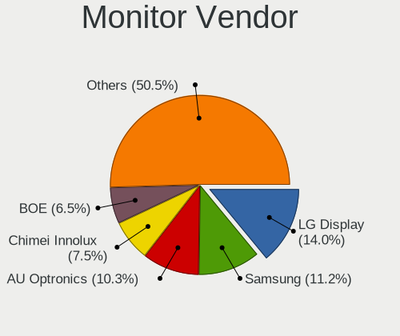
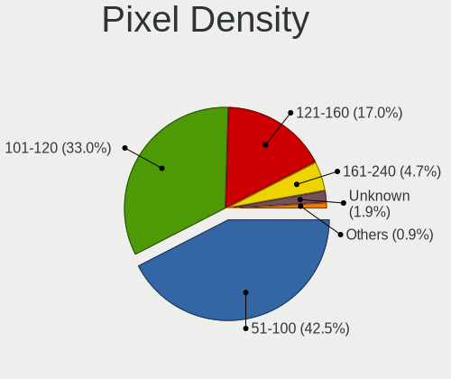
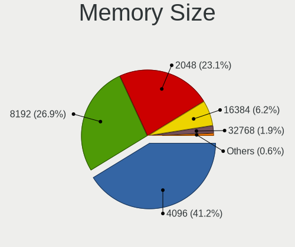
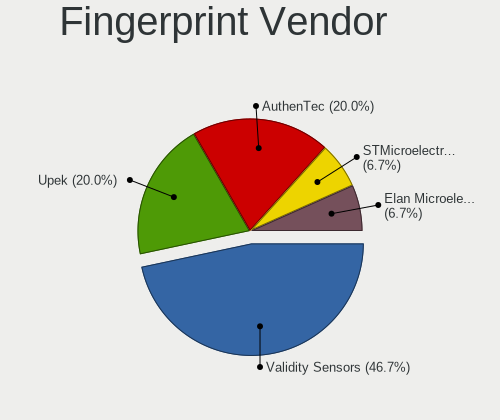

helloSystem 0.6.0 - Tested Hardware & Statistics
------------------------------------------------

A project to collect tested hardware configurations for helloSystem 0.6.0.

Anyone can contribute to this report by the [hw-probe](https://github.com/linuxhw/hw-probe/blob/master/INSTALL.BSD.md) tool:

    hw-probe -all -upload

Please contribute! Especially if your hardware is rare.

This is a report for all computer types. See also reports for [desktops](/Dist/helloSystem_0.6.0/Desktop/README.md) and [notebooks](/Dist/helloSystem_0.6.0/Notebook/README.md).

Contents
--------

* [ Test Cases ](#test-cases)

* [ System ](#system)
  - [ Arch                     ](#arch)
  - [ DE                       ](#de)
  - [ Display Server           ](#display-server)
  - [ Display Manager          ](#display-manager)
  - [ OS Lang                  ](#os-lang)
  - [ Boot Mode                ](#boot-mode)
  - [ Filesystem               ](#filesystem)
  - [ Part. scheme             ](#part-scheme)

* [ Board ](#board)
  - [ Vendor                   ](#vendor)
  - [ Model                    ](#model)
  - [ Model Family             ](#model-family)
  - [ MFG Year                 ](#mfg-year)
  - [ Form Factor              ](#form-factor)
  - [ Coreboot                 ](#coreboot)
  - [ RAM Size                 ](#ram-size)
  - [ RAM Used                 ](#ram-used)
  - [ Total Drives             ](#total-drives)
  - [ Has CD-ROM               ](#has-cd-rom)
  - [ Has Ethernet             ](#has-ethernet)
  - [ Has WiFi                 ](#has-wifi)
  - [ Has Bluetooth            ](#has-bluetooth)

* [ Location ](#location)
  - [ Country                  ](#country)
  - [ City                     ](#city)

* [ Drives ](#drives)
  - [ Drive Vendor             ](#drive-vendor)
  - [ Drive Model              ](#drive-model)
  - [ HDD Vendor               ](#hdd-vendor)
  - [ SSD Vendor               ](#ssd-vendor)
  - [ Drive Kind               ](#drive-kind)
  - [ Drive Connector          ](#drive-connector)
  - [ Drive Size               ](#drive-size)
  - [ Space Total              ](#space-total)
  - [ Space Used               ](#space-used)
  - [ Malfunc. Drives          ](#malfunc-drives)
  - [ Malfunc. Drive Vendor    ](#malfunc-drive-vendor)
  - [ Malfunc. HDD Vendor      ](#malfunc-hdd-vendor)
  - [ Malfunc. Drive Kind      ](#malfunc-drive-kind)
  - [ Failed Drives            ](#failed-drives)
  - [ Failed Drive Vendor      ](#failed-drive-vendor)
  - [ Drive Status             ](#drive-status)

* [ Storage controller ](#storage-controller)
  - [ Storage Vendor           ](#storage-vendor)
  - [ Storage Model            ](#storage-model)
  - [ Storage Kind             ](#storage-kind)

* [ Processor ](#processor)
  - [ CPU Vendor               ](#cpu-vendor)
  - [ CPU Model                ](#cpu-model)
  - [ CPU Model Family         ](#cpu-model-family)
  - [ CPU Cores                ](#cpu-cores)
  - [ CPU Sockets              ](#cpu-sockets)
  - [ CPU Threads              ](#cpu-threads)
  - [ CPU Microarch            ](#cpu-microarch)

* [ Graphics ](#graphics)
  - [ GPU Vendor               ](#gpu-vendor)
  - [ GPU Model                ](#gpu-model)
  - [ GPU Combo                ](#gpu-combo)
  - [ GPU Driver               ](#gpu-driver)
  - [ GPU Memory               ](#gpu-memory)

* [ Monitor ](#monitor)
  - [ Monitor Vendor           ](#monitor-vendor)
  - [ Monitor Model            ](#monitor-model)
  - [ Monitor Resolution       ](#monitor-resolution)
  - [ Monitor Diagonal         ](#monitor-diagonal)
  - [ Monitor Width            ](#monitor-width)
  - [ Aspect Ratio             ](#aspect-ratio)
  - [ Monitor Area             ](#monitor-area)
  - [ Pixel Density            ](#pixel-density)
  - [ Multiple Monitors        ](#multiple-monitors)

* [ Network ](#network)
  - [ Net Controller Vendor    ](#net-controller-vendor)
  - [ Net Controller Model     ](#net-controller-model)
  - [ Wireless Vendor          ](#wireless-vendor)
  - [ Wireless Model           ](#wireless-model)
  - [ Ethernet Vendor          ](#ethernet-vendor)
  - [ Ethernet Model           ](#ethernet-model)
  - [ Net Controller Kind      ](#net-controller-kind)
  - [ Used Controller          ](#used-controller)
  - [ NICs                     ](#nics)
  - [ IPv6                     ](#ipv6)

* [ Bluetooth ](#bluetooth)
  - [ Bluetooth Vendor         ](#bluetooth-vendor)
  - [ Bluetooth Model          ](#bluetooth-model)

* [ Sound ](#sound)
  - [ Sound Vendor             ](#sound-vendor)
  - [ Sound Model              ](#sound-model)

* [ Memory ](#memory)
  - [ Memory Vendor            ](#memory-vendor)
  - [ Memory Model             ](#memory-model)
  - [ Memory Kind              ](#memory-kind)
  - [ Memory Form Factor       ](#memory-form-factor)
  - [ Memory Size              ](#memory-size)
  - [ Memory Speed             ](#memory-speed)

* [ Printers & scanners ](#printers--scanners)
  - [ Printer Vendor           ](#printer-vendor)
  - [ Printer Model            ](#printer-model)
  - [ Scanner Vendor           ](#scanner-vendor)
  - [ Scanner Model            ](#scanner-model)

* [ Camera ](#camera)
  - [ Camera Vendor            ](#camera-vendor)
  - [ Camera Model             ](#camera-model)

* [ Security ](#security)
  - [ Fingerprint Vendor       ](#fingerprint-vendor)
  - [ Fingerprint Model        ](#fingerprint-model)
  - [ Chipcard Vendor          ](#chipcard-vendor)
  - [ Chipcard Model           ](#chipcard-model)

* [ Unsupported ](#unsupported)
  - [ Unsupported Devices      ](#unsupported-devices)
  - [ Unsupported Device Types ](#unsupported-device-types)

Test Cases
----------

Total: 170

| Vendor        | Model                       | Form-Factor | Probe                                                     | Date         |
|---------------|-----------------------------|-------------|-----------------------------------------------------------|--------------|
| Apple         | MacBookPro3,1               | Notebook    | [912d02aec2](https://bsd-hardware.info/?probe=912d02aec2) | Apr 28, 2022 |
| ASUSTek       | P6-P8H61E                   | Desktop     | [540f66f678](https://bsd-hardware.info/?probe=540f66f678) | Mar 29, 2022 |
| HP            | Pavilion dv6                | Notebook    | [dee0853f4b](https://bsd-hardware.info/?probe=dee0853f4b) | Mar 17, 2022 |
| Dell          | 0GXM1W A00                  | Desktop     | [c4d10a26fd](https://bsd-hardware.info/?probe=c4d10a26fd) | Mar 04, 2022 |
| Intel         | H81                         | Desktop     | [dd19abd47d](https://bsd-hardware.info/?probe=dd19abd47d) | Feb 25, 2022 |
| Lenovo        | G580 20150                  | Notebook    | [478714c7c9](https://bsd-hardware.info/?probe=478714c7c9) | Feb 07, 2022 |
| Sony          | VPCEB1J1E                   | Notebook    | [04c5ee02da](https://bsd-hardware.info/?probe=04c5ee02da) | Feb 05, 2022 |
| Dell          | 014GRG A03                  | Desktop     | [8e0a22c065](https://bsd-hardware.info/?probe=8e0a22c065) | Jan 28, 2022 |
| Dell          | 014GRG A03                  | Desktop     | [5996ba19b1](https://bsd-hardware.info/?probe=5996ba19b1) | Jan 27, 2022 |
| Dell          | 014GRG A03                  | Desktop     | [223d955a90](https://bsd-hardware.info/?probe=223d955a90) | Jan 26, 2022 |
| Dell          | 05DN3X A00                  | Desktop     | [e0e63e69ef](https://bsd-hardware.info/?probe=e0e63e69ef) | Jan 23, 2022 |
| Lenovo        | IdeaPad L340-15IWL 81LG     | Notebook    | [bb6cc55d53](https://bsd-hardware.info/?probe=bb6cc55d53) | Jan 23, 2022 |
| Dell          | 05DN3X A00                  | Desktop     | [460ea5c41d](https://bsd-hardware.info/?probe=460ea5c41d) | Jan 23, 2022 |
| Toshiba       | Satellite L50-A             | Notebook    | [94b87158aa](https://bsd-hardware.info/?probe=94b87158aa) | Jan 21, 2022 |
| Apple         | MacBookPro5,5               | Notebook    | [53b106bbb6](https://bsd-hardware.info/?probe=53b106bbb6) | Jan 16, 2022 |
| Sony          | VPCYB45JB                   | Notebook    | [cd18905620](https://bsd-hardware.info/?probe=cd18905620) | Jan 09, 2022 |
| Lenovo        | G550 2958                   | Notebook    | [21407195e3](https://bsd-hardware.info/?probe=21407195e3) | Jan 07, 2022 |
| ASUSTek       | M5A78L/USB3                 | Desktop     | [f1fe3fe225](https://bsd-hardware.info/?probe=f1fe3fe225) | Dec 30, 2021 |
| Acer          | Aspire E1-421               | Notebook    | [b2aea3de1b](https://bsd-hardware.info/?probe=b2aea3de1b) | Dec 21, 2021 |
| Lenovo        | G500 20236                  | Notebook    | [350def9eca](https://bsd-hardware.info/?probe=350def9eca) | Dec 19, 2021 |
| Lenovo        | ThinkPad T440p 20AW007QM... | Notebook    | [9efeb9ee24](https://bsd-hardware.info/?probe=9efeb9ee24) | Dec 16, 2021 |
| Dell          | Inspiron 3521               | Notebook    | [d8bcea438a](https://bsd-hardware.info/?probe=d8bcea438a) | Dec 15, 2021 |
| Apple         | Mac-F2218EA9                | All in one  | [34ba809dc2](https://bsd-hardware.info/?probe=34ba809dc2) | Dec 14, 2021 |
| ASUSTek       | X502CA                      | Notebook    | [45f61ab19e](https://bsd-hardware.info/?probe=45f61ab19e) | Dec 14, 2021 |
| Apple         | Mac-F2218EA9                | All in one  | [e77489ad74](https://bsd-hardware.info/?probe=e77489ad74) | Dec 14, 2021 |
| ASUSTek       | H110M-K                     | Desktop     | [2921401f70](https://bsd-hardware.info/?probe=2921401f70) | Dec 12, 2021 |
| Dell          | Inspiron 3195               | Convertible | [8bbd2c16f7](https://bsd-hardware.info/?probe=8bbd2c16f7) | Dec 11, 2021 |
| HP            | 8054                        | Desktop     | [de953100f6](https://bsd-hardware.info/?probe=de953100f6) | Dec 10, 2021 |
| HP            | EliteBook 2560p             | Notebook    | [a064edad4b](https://bsd-hardware.info/?probe=a064edad4b) | Dec 10, 2021 |
| MSI           | MPG B550 GAMING EDGE WIF... | Desktop     | [a9423b3232](https://bsd-hardware.info/?probe=a9423b3232) | Dec 09, 2021 |
| Acer          | Aspire 5749Z                | Notebook    | [60a25af38c](https://bsd-hardware.info/?probe=60a25af38c) | Dec 09, 2021 |
| Philco        | 10B                         | Notebook    | [a27148f35d](https://bsd-hardware.info/?probe=a27148f35d) | Dec 06, 2021 |
| Positivo      | C14CR01                     | Notebook    | [a33c158f9f](https://bsd-hardware.info/?probe=a33c158f9f) | Dec 05, 2021 |
| ASUSTek       | Pro WS X570-ACE             | Desktop     | [35b01f0f56](https://bsd-hardware.info/?probe=35b01f0f56) | Dec 05, 2021 |
| ASUSTek       | UX31A                       | Notebook    | [9febab6c01](https://bsd-hardware.info/?probe=9febab6c01) | Dec 05, 2021 |
| Lenovo        | ThinkPad 13 20GJCTO1WW      | Notebook    | [e4b923d500](https://bsd-hardware.info/?probe=e4b923d500) | Dec 02, 2021 |
| ASUSTek       | X540LA                      | Notebook    | [0680188ca4](https://bsd-hardware.info/?probe=0680188ca4) | Dec 01, 2021 |
| HP            | Laptop 15-db0xxx            | Notebook    | [812c7f3e36](https://bsd-hardware.info/?probe=812c7f3e36) | Nov 29, 2021 |
| Fujitsu       | D3220-A1 S26361-D3220-A1    | Desktop     | [bc3b65334e](https://bsd-hardware.info/?probe=bc3b65334e) | Nov 29, 2021 |
| HP            | EliteBook 2560p             | Notebook    | [41c04c8449](https://bsd-hardware.info/?probe=41c04c8449) | Nov 26, 2021 |
| Dell          | Inspiron 3195               | Convertible | [5680c947ae](https://bsd-hardware.info/?probe=5680c947ae) | Nov 26, 2021 |
| ASRock        | AB350 Pro4                  | Desktop     | [ef35dd084e](https://bsd-hardware.info/?probe=ef35dd084e) | Nov 26, 2021 |
| Dell          | Inspiron 3195               | Convertible | [909ab22d27](https://bsd-hardware.info/?probe=909ab22d27) | Nov 25, 2021 |
| HP            | 0A80h                       | Desktop     | [1e1153ee69](https://bsd-hardware.info/?probe=1e1153ee69) | Nov 22, 2021 |
| HP            | EliteBook 2560p             | Notebook    | [8fe8caf37d](https://bsd-hardware.info/?probe=8fe8caf37d) | Nov 21, 2021 |
| ASUSTek       | ROG STRIX X470-F GAMING     | Desktop     | [afd0cf45c6](https://bsd-hardware.info/?probe=afd0cf45c6) | Nov 21, 2021 |
| Dell          | Inspiron 5566               | Notebook    | [7c6b2f2013](https://bsd-hardware.info/?probe=7c6b2f2013) | Nov 14, 2021 |
| Toshiba       | STI NA 1401                 | Notebook    | [bbbf661ee8](https://bsd-hardware.info/?probe=bbbf661ee8) | Nov 14, 2021 |
| ASUSTek       | TUF GAMING X570-PLUS        | Desktop     | [12a360ddd1](https://bsd-hardware.info/?probe=12a360ddd1) | Nov 14, 2021 |
| Toshiba       | PORTEGE M780                | Notebook    | [2ac9bea1e6](https://bsd-hardware.info/?probe=2ac9bea1e6) | Nov 13, 2021 |
| T-bao         | MINI PC V1.0                | Desktop     | [4ee7de3597](https://bsd-hardware.info/?probe=4ee7de3597) | Nov 12, 2021 |
| Apple         | MacBookPro9,2               | Notebook    | [04cc56305c](https://bsd-hardware.info/?probe=04cc56305c) | Nov 11, 2021 |
| HP            | EliteBook 840 G5            | Notebook    | [a1ece36be8](https://bsd-hardware.info/?probe=a1ece36be8) | Nov 11, 2021 |
| Dell          | Studio 1747                 | Notebook    | [b0a51ac0af](https://bsd-hardware.info/?probe=b0a51ac0af) | Nov 11, 2021 |
| Dell          | Studio 1747                 | Notebook    | [7ab6b58d69](https://bsd-hardware.info/?probe=7ab6b58d69) | Nov 11, 2021 |
| Acer          | Aspire 5742G                | Notebook    | [0513869be8](https://bsd-hardware.info/?probe=0513869be8) | Nov 09, 2021 |
| Lenovo        | ThinkPad T450s 20BX001PU... | Notebook    | [748312bfbf](https://bsd-hardware.info/?probe=748312bfbf) | Nov 07, 2021 |
| Itautec       | ST 4344 ST-4344 Padrao 0... | Desktop     | [ec13cb0829](https://bsd-hardware.info/?probe=ec13cb0829) | Nov 07, 2021 |
| Shuttle       | FH61R                       | Desktop     | [a231590743](https://bsd-hardware.info/?probe=a231590743) | Nov 07, 2021 |
| ASUSTek       | K52Jc                       | Notebook    | [fc919c73e3](https://bsd-hardware.info/?probe=fc919c73e3) | Nov 07, 2021 |
| ASUSTek       | M5A78L-M/USB3               | Desktop     | [7e27b1bc46](https://bsd-hardware.info/?probe=7e27b1bc46) | Nov 07, 2021 |
| Intel         | H81                         | Desktop     | [7f07aecffc](https://bsd-hardware.info/?probe=7f07aecffc) | Nov 07, 2021 |
| HP            | 14                          | Notebook    | [e0c8e95e52](https://bsd-hardware.info/?probe=e0c8e95e52) | Nov 07, 2021 |
| Lenovo        | ThinkPad W520 4276CTO       | Notebook    | [9082353a69](https://bsd-hardware.info/?probe=9082353a69) | Nov 06, 2021 |
| Lenovo        | ThinkPad T420 4180EE8       | Notebook    | [5303c12fe5](https://bsd-hardware.info/?probe=5303c12fe5) | Nov 05, 2021 |
| ASRock        | X370 Gaming X               | Desktop     | [2a874a33dd](https://bsd-hardware.info/?probe=2a874a33dd) | Nov 05, 2021 |
| Lenovo        | SHARKBAY No DPK             | Desktop     | [b9ad64f354](https://bsd-hardware.info/?probe=b9ad64f354) | Nov 04, 2021 |
| Gigabyte      | F2A78M-DS2                  | Desktop     | [45576fddfa](https://bsd-hardware.info/?probe=45576fddfa) | Nov 02, 2021 |
| Lenovo        | IdeaPad Z360                | Notebook    | [796bd6482f](https://bsd-hardware.info/?probe=796bd6482f) | Nov 02, 2021 |
| Dell          | 0M5DCD A02                  | Desktop     | [4ff4198768](https://bsd-hardware.info/?probe=4ff4198768) | Nov 02, 2021 |
| Lenovo        | ThinkPad T430u 3352AA5      | Notebook    | [8619bcca35](https://bsd-hardware.info/?probe=8619bcca35) | Nov 01, 2021 |
| Gateway       | DX4840                      | Desktop     | [1d2e9e175c](https://bsd-hardware.info/?probe=1d2e9e175c) | Nov 01, 2021 |
| Apple         | MacBookAir5,1               | Notebook    | [b354b2bd4e](https://bsd-hardware.info/?probe=b354b2bd4e) | Oct 31, 2021 |
| HP            | Presario CQ43               | Notebook    | [b97d9ff563](https://bsd-hardware.info/?probe=b97d9ff563) | Oct 30, 2021 |
| ASRock        | X300M-STX                   | Desktop     | [e25f042400](https://bsd-hardware.info/?probe=e25f042400) | Oct 30, 2021 |
| Unknown       | Intel X79                   | Desktop     | [044908e7c3](https://bsd-hardware.info/?probe=044908e7c3) | Oct 30, 2021 |
| Chuwi         | MiniBook                    | Notebook    | [4ce05f93a8](https://bsd-hardware.info/?probe=4ce05f93a8) | Oct 28, 2021 |
| Dell          | Precision M4600             | Notebook    | [2f848fd2c0](https://bsd-hardware.info/?probe=2f848fd2c0) | Oct 27, 2021 |
| ASUSTek       | TUF GAMING X570-PLUS        | Desktop     | [9f8010bdbe](https://bsd-hardware.info/?probe=9f8010bdbe) | Oct 25, 2021 |
| Sony          | SVS1511AJB                  | Notebook    | [a366b5fab3](https://bsd-hardware.info/?probe=a366b5fab3) | Oct 24, 2021 |
| Sony          | SVS1511AJB                  | Notebook    | [2333f62192](https://bsd-hardware.info/?probe=2333f62192) | Oct 24, 2021 |
| ASUSTek       | TUF B450M-PRO GAMING        | Desktop     | [9959c0900a](https://bsd-hardware.info/?probe=9959c0900a) | Oct 23, 2021 |
| Lenovo        | ThinkPad X1 Carbon 2nd 2... | Notebook    | [9996e06a3d](https://bsd-hardware.info/?probe=9996e06a3d) | Oct 22, 2021 |
| Gigabyte      | H410M S2 V2                 | Desktop     | [b106820e47](https://bsd-hardware.info/?probe=b106820e47) | Oct 21, 2021 |
| Acer          | RS880M05                    | Desktop     | [4718f0cb0c](https://bsd-hardware.info/?probe=4718f0cb0c) | Oct 21, 2021 |
| Dell          | Studio 1747                 | Notebook    | [ed704cde92](https://bsd-hardware.info/?probe=ed704cde92) | Oct 20, 2021 |
| Apple         | MacBookPro4,1               | Notebook    | [10861818b2](https://bsd-hardware.info/?probe=10861818b2) | Oct 20, 2021 |
| Apple         | Mac-F221BEC8                | Desktop     | [cb2cc35e6c](https://bsd-hardware.info/?probe=cb2cc35e6c) | Oct 19, 2021 |
| Gigabyte      | 990FXA-UD3                  | Desktop     | [3cf20ca77c](https://bsd-hardware.info/?probe=3cf20ca77c) | Oct 19, 2021 |
| Dell          | 0VRWRC A00                  | Desktop     | [9b4defb194](https://bsd-hardware.info/?probe=9b4defb194) | Oct 19, 2021 |
| HP            | Unknown                     | Notebook    | [ad95186d17](https://bsd-hardware.info/?probe=ad95186d17) | Oct 19, 2021 |
| Dell          | Studio 1747                 | Notebook    | [ca939fbe2f](https://bsd-hardware.info/?probe=ca939fbe2f) | Oct 19, 2021 |
| HP            | 3398                        | Desktop     | [892f19c9bd](https://bsd-hardware.info/?probe=892f19c9bd) | Oct 18, 2021 |
| ASUSTek       | CROSSHAIR V FORMULA-Z       | Desktop     | [0cdd3497f6](https://bsd-hardware.info/?probe=0cdd3497f6) | Oct 18, 2021 |
| HP            | 15                          | Notebook    | [e3f26d7245](https://bsd-hardware.info/?probe=e3f26d7245) | Oct 18, 2021 |
| Gigabyte      | G41MT-S2                    | Desktop     | [2847d63db0](https://bsd-hardware.info/?probe=2847d63db0) | Oct 18, 2021 |
| ASUSTek       | P5P43TD PRO                 | Desktop     | [2870e26de1](https://bsd-hardware.info/?probe=2870e26de1) | Oct 17, 2021 |
| Acidanther... | Mac-42FD25EABCABB274 iMa... | All in one  | [951eb91342](https://bsd-hardware.info/?probe=951eb91342) | Oct 17, 2021 |
| Lenovo        | Yoga 3 Pro-1370 80HE        | Notebook    | [48169f1d3c](https://bsd-hardware.info/?probe=48169f1d3c) | Oct 16, 2021 |
| Intel         | NUC8BEB J72688-308          | Mini pc     | [f2f7fc6463](https://bsd-hardware.info/?probe=f2f7fc6463) | Oct 15, 2021 |
| Lenovo        | SHARKBAY No DPK             | Desktop     | [14dcd924b5](https://bsd-hardware.info/?probe=14dcd924b5) | Oct 13, 2021 |
| Lenovo        | ThinkPad L440 20ASS0FP00    | Notebook    | [d92e6e3c21](https://bsd-hardware.info/?probe=d92e6e3c21) | Oct 11, 2021 |
| Lenovo        | ThinkPad X1 Carbon Gen 9... | Notebook    | [abf8bb08a6](https://bsd-hardware.info/?probe=abf8bb08a6) | Oct 11, 2021 |
| ASUSTek       | U33Jc                       | Notebook    | [07f11b6604](https://bsd-hardware.info/?probe=07f11b6604) | Oct 10, 2021 |
| Medion        | H61H2-LM3                   | Desktop     | [67ed0f639c](https://bsd-hardware.info/?probe=67ed0f639c) | Oct 10, 2021 |
| MSI           | MS-16F1                     | Notebook    | [72b9db306a](https://bsd-hardware.info/?probe=72b9db306a) | Oct 09, 2021 |
| ASUSTek       | H81M-K                      | Desktop     | [e24f67a603](https://bsd-hardware.info/?probe=e24f67a603) | Oct 08, 2021 |
| Lenovo        | S20-30 Touch 20434          | Notebook    | [141a393d54](https://bsd-hardware.info/?probe=141a393d54) | Oct 08, 2021 |
| MSI           | G41M-P25                    | Desktop     | [21eec496b4](https://bsd-hardware.info/?probe=21eec496b4) | Oct 08, 2021 |
| Lenovo        | ThinkPad X250 20CLS2A11K    | Notebook    | [e47f4113bf](https://bsd-hardware.info/?probe=e47f4113bf) | Oct 08, 2021 |
| ASRock        | A320M-DGS                   | Desktop     | [11cf5c923a](https://bsd-hardware.info/?probe=11cf5c923a) | Oct 08, 2021 |
| Gigabyte      | B450 AORUS M                | Desktop     | [d09f63f257](https://bsd-hardware.info/?probe=d09f63f257) | Oct 07, 2021 |
| Acer          | Aspire 5741                 | Notebook    | [fd4e40a8d9](https://bsd-hardware.info/?probe=fd4e40a8d9) | Oct 07, 2021 |
| Intel         | H61                         | Desktop     | [6ce71c1b9e](https://bsd-hardware.info/?probe=6ce71c1b9e) | Oct 06, 2021 |
| Lenovo        | ThinkPad R500 2718W92       | Notebook    | [384f10861a](https://bsd-hardware.info/?probe=384f10861a) | Oct 05, 2021 |
| ASUSTek       | UX21A                       | Notebook    | [fe08d28d4c](https://bsd-hardware.info/?probe=fe08d28d4c) | Oct 05, 2021 |
| Itautec       | Infoway w7530               | Notebook    | [a376201681](https://bsd-hardware.info/?probe=a376201681) | Oct 05, 2021 |
| HP            | 3397                        | Desktop     | [4c71aae5bf](https://bsd-hardware.info/?probe=4c71aae5bf) | Oct 05, 2021 |
| HP            | 81BA                        | All in one  | [c2204a3dd2](https://bsd-hardware.info/?probe=c2204a3dd2) | Oct 04, 2021 |
| ASRock        | B365M-ITX/ac                | Desktop     | [1c8820a6d0](https://bsd-hardware.info/?probe=1c8820a6d0) | Oct 04, 2021 |
| HP            | Pavilion Gaming Laptop 1... | Notebook    | [f02ef8c047](https://bsd-hardware.info/?probe=f02ef8c047) | Oct 04, 2021 |
| MSI           | B450I GAMING PLUS AC        | Desktop     | [43388a27a4](https://bsd-hardware.info/?probe=43388a27a4) | Oct 04, 2021 |
| Dell          | Latitude E4300              | Notebook    | [fdb3de3036](https://bsd-hardware.info/?probe=fdb3de3036) | Oct 03, 2021 |
| MSI           | MPG X570 GAMING PRO CARB... | Desktop     | [bd312d1c88](https://bsd-hardware.info/?probe=bd312d1c88) | Oct 03, 2021 |
| HP            | ProLiant ML350 G5           | Desktop     | [4d525cba3e](https://bsd-hardware.info/?probe=4d525cba3e) | Oct 03, 2021 |
| Dell          | Inspiron 3521               | Notebook    | [748b6d14f4](https://bsd-hardware.info/?probe=748b6d14f4) | Oct 02, 2021 |
| Toshiba       | dynabook RX3 SM240E/3HD     | Notebook    | [2fe863dff4](https://bsd-hardware.info/?probe=2fe863dff4) | Oct 01, 2021 |
| Toshiba       | Satellite S55t-B            | Notebook    | [445fe665b8](https://bsd-hardware.info/?probe=445fe665b8) | Oct 01, 2021 |
| HP            | Pavilion dm4                | Notebook    | [bb5a564a50](https://bsd-hardware.info/?probe=bb5a564a50) | Sep 30, 2021 |
| ASRock        | X570 Phantom Gaming 4       | Desktop     | [9b14548c15](https://bsd-hardware.info/?probe=9b14548c15) | Sep 21, 2021 |
| Sapphire      | EDGE-FT1M1 E450 1AOVU044    | Desktop     | [ea8fefdf4e](https://bsd-hardware.info/?probe=ea8fefdf4e) | Sep 20, 2021 |
| Dell          | 0MGK50 A02                  | Desktop     | [9d2959b4f1](https://bsd-hardware.info/?probe=9d2959b4f1) | Sep 20, 2021 |
| HP            | 81B4 01                     | Desktop     | [179504116d](https://bsd-hardware.info/?probe=179504116d) | Sep 20, 2021 |
| ASRock        | B450 Gaming-ITX/ac          | Desktop     | [790d020ebe](https://bsd-hardware.info/?probe=790d020ebe) | Sep 19, 2021 |
| Lenovo        | G500s 20245                 | Notebook    | [88cd1ca7bd](https://bsd-hardware.info/?probe=88cd1ca7bd) | Sep 18, 2021 |
| Gigabyte      | H270M-DS3H-CF               | Desktop     | [9b046b157e](https://bsd-hardware.info/?probe=9b046b157e) | Sep 17, 2021 |
| ASUSTek       | PRIME B360M-C               | Desktop     | [0f6e7e26fc](https://bsd-hardware.info/?probe=0f6e7e26fc) | Sep 11, 2021 |
| HP            | 3397                        | Desktop     | [5d95b75768](https://bsd-hardware.info/?probe=5d95b75768) | Sep 06, 2021 |
| Kraftway      | KW10T                       | Notebook    | [4810842d82](https://bsd-hardware.info/?probe=4810842d82) | Sep 06, 2021 |
| Medion        | H61H2-LM3                   | Desktop     | [eb81abe401](https://bsd-hardware.info/?probe=eb81abe401) | Sep 02, 2021 |
| ASRock        | Z390 Pro4                   | Desktop     | [ecbf097bc5](https://bsd-hardware.info/?probe=ecbf097bc5) | Sep 02, 2021 |
| Dell          | Latitude 3540               | Notebook    | [2583b22e8d](https://bsd-hardware.info/?probe=2583b22e8d) | Aug 29, 2021 |
| Dell          | Latitude 3540               | Notebook    | [de97e0b2fc](https://bsd-hardware.info/?probe=de97e0b2fc) | Aug 29, 2021 |
| ASUSTek       | TUF B360M-PLUS GAMING S     | Desktop     | [33ba0b7c38](https://bsd-hardware.info/?probe=33ba0b7c38) | Aug 29, 2021 |
| Itautec       | Infoway w7530               | Notebook    | [d91ec24ce0](https://bsd-hardware.info/?probe=d91ec24ce0) | Aug 29, 2021 |
| Toshiba       | Satellite S55t-B            | Notebook    | [5aaacec4ad](https://bsd-hardware.info/?probe=5aaacec4ad) | Aug 23, 2021 |
| Toshiba       | Satellite S55t-B            | Notebook    | [d74035a8e7](https://bsd-hardware.info/?probe=d74035a8e7) | Aug 23, 2021 |
| ASUSTek       | P7H55-M LX                  | Desktop     | [5fe1a9e521](https://bsd-hardware.info/?probe=5fe1a9e521) | Aug 16, 2021 |
| ASUSTek       | Q505UAR                     | Convertible | [b745dee7d6](https://bsd-hardware.info/?probe=b745dee7d6) | Aug 14, 2021 |
| Lenovo        | ThinkPad X230 23062S2       | Notebook    | [bceadf5c66](https://bsd-hardware.info/?probe=bceadf5c66) | Aug 05, 2021 |
| PCPartner     | MILANO-P Rev.00             | Desktop     | [ef8217ac30](https://bsd-hardware.info/?probe=ef8217ac30) | Aug 01, 2021 |
| Intel         | NUC5i3RYB K23918-501        | Mini pc     | [1c3ec31075](https://bsd-hardware.info/?probe=1c3ec31075) | Jul 28, 2021 |
| Lenovo        | ThinkPad SL 2746M3C         | Notebook    | [aa10433581](https://bsd-hardware.info/?probe=aa10433581) | Jul 28, 2021 |
| ASUSTek       | H110M-PLUS                  | Desktop     | [d0f2da9c41](https://bsd-hardware.info/?probe=d0f2da9c41) | Jul 21, 2021 |
| Lenovo        | ThinkPad X230 2325IG2       | Notebook    | [158ecc5e0b](https://bsd-hardware.info/?probe=158ecc5e0b) | Jul 14, 2021 |
| Gigabyte      | H110-D3A-CF                 | Desktop     | [2c390b4301](https://bsd-hardware.info/?probe=2c390b4301) | Jul 09, 2021 |
| Gigabyte      | H110-D3A-CF                 | Desktop     | [aea3a11daf](https://bsd-hardware.info/?probe=aea3a11daf) | Jul 08, 2021 |
| eMachines     | eM350                       | Notebook    | [94579b896e](https://bsd-hardware.info/?probe=94579b896e) | Jul 04, 2021 |
| eMachines     | eM350                       | Notebook    | [c268dd82de](https://bsd-hardware.info/?probe=c268dd82de) | Jul 04, 2021 |
| Lenovo        | B590 62743PG                | Notebook    | [2400297995](https://bsd-hardware.info/?probe=2400297995) | Jul 03, 2021 |
| Lenovo        | SHARKBAY SDK0E50510 WIN     | Desktop     | [6cf3337855](https://bsd-hardware.info/?probe=6cf3337855) | Jul 01, 2021 |
| ASUSTek       | M5A97 R2.0                  | Desktop     | [e7a0dfcecf](https://bsd-hardware.info/?probe=e7a0dfcecf) | Jun 28, 2021 |
| Lenovo        | IdeaPad S145-15IWL 81MV     | Notebook    | [ceb18e38a3](https://bsd-hardware.info/?probe=ceb18e38a3) | Jun 28, 2021 |
| ASUSTek       | H81M-K                      | Desktop     | [1a35d2f6ab](https://bsd-hardware.info/?probe=1a35d2f6ab) | Jun 26, 2021 |
| eMachines     | eM350                       | Notebook    | [52198cfd80](https://bsd-hardware.info/?probe=52198cfd80) | Jun 22, 2021 |
| eMachines     | eM350                       | Notebook    | [60b4338ace](https://bsd-hardware.info/?probe=60b4338ace) | Jun 22, 2021 |
| Dell          | Inspiron 3542               | Notebook    | [bb13e61de1](https://bsd-hardware.info/?probe=bb13e61de1) | Jun 21, 2021 |
| Lenovo        | ThinkPad Yoga 11e 20DAS0... | Notebook    | [0e448af5f5](https://bsd-hardware.info/?probe=0e448af5f5) | Jun 18, 2021 |
| Dell          | Latitude 7280               | Notebook    | [8fd335f46f](https://bsd-hardware.info/?probe=8fd335f46f) | Jun 18, 2021 |
| ASUSTek       | H110M-E/M.2                 | Desktop     | [b0b67667d3](https://bsd-hardware.info/?probe=b0b67667d3) | Jun 16, 2021 |

System
------

Arch
----

OS architecture (x86_64, i586, etc.)

| Name  | Computers | Percent |
|-------|-----------|---------|
| amd64 | 136       | 100%    |

DE
--

Desktop Environment

| Name         | Computers | Percent |
|--------------|-----------|---------|
| helloDesktop | 134       | 97.81%  |
| XFCE         | 1         | 0.73%   |
| KDE5         | 1         | 0.73%   |
| GNOME        | 1         | 0.73%   |

Display Server
--------------

X11 or Wayland

| Name | Computers | Percent |
|------|-----------|---------|
| X11  | 136       | 100%    |

Display Manager
---------------

SDDM, LightDM, etc.

| Name | Computers | Percent |
|------|-----------|---------|
| SLiM | 136       | 100%    |

OS Lang
-------

Language

| Lang    | Computers | Percent |
|---------|-----------|---------|
| en_US   | 132       | 97.06%  |
| de_DE   | 2         | 1.47%   |
| ru_RU   | 1         | 0.74%   |
| Unknown | 1         | 0.74%   |

Boot Mode
---------

EFI or BIOS

| Mode | Computers | Percent |
|------|-----------|---------|
| EFI  | 110       | 80.29%  |
| BIOS | 27        | 19.71%  |

Filesystem
----------

Type of filesystem

| Type | Computers | Percent |
|------|-----------|---------|
| Zfs  | 136       | 100%    |

Part. scheme
------------

Scheme of partitioning

| Type | Computers | Percent |
|------|-----------|---------|
| GPT  | 136       | 100%    |

Board
-----

Vendor
------

Motherboard manufacturer

| Name                | Computers | Percent |
|---------------------|-----------|---------|
| Lenovo              | 27        | 19.85%  |
| ASUSTek Computer    | 20        | 14.71%  |
| Hewlett-Packard     | 16        | 11.76%  |
| Dell                | 15        | 11.03%  |
| ASRock              | 8         | 5.88%   |
| Gigabyte Technology | 6         | 4.41%   |
| Apple               | 6         | 4.41%   |
| MSI                 | 5         | 3.68%   |
| Acer                | 5         | 3.68%   |
| Toshiba             | 4         | 2.94%   |
| Intel               | 4         | 2.94%   |
| Sony                | 3         | 2.21%   |
| Itautec             | 2         | 1.47%   |
| T-bao               | 1         | 0.74%   |
| Shuttle             | 1         | 0.74%   |
| Semp Toshiba        | 1         | 0.74%   |
| Sapphire            | 1         | 0.74%   |
| Positivo            | 1         | 0.74%   |
| Philco              | 1         | 0.74%   |
| PCPartner           | 1         | 0.74%   |
| Medion              | 1         | 0.74%   |
| Kraftway            | 1         | 0.74%   |
| Gateway             | 1         | 0.74%   |
| Fujitsu             | 1         | 0.74%   |
| eMachines           | 1         | 0.74%   |
| Chuwi               | 1         | 0.74%   |
| Acidanthera         | 1         | 0.74%   |
| Unknown             | 1         | 0.74%   |

Model
-----

Motherboard model

| Name                                       | Computers | Percent |
|--------------------------------------------|-----------|---------|
| Unknown                                    | 2         | 1.47%   |
| Toshiba Satellite S55t-B                   | 1         | 0.74%   |
| Toshiba Satellite L50-A                    | 1         | 0.74%   |
| Toshiba PORTEGE M780                       | 1         | 0.74%   |
| Toshiba dynabook RX3 SM240E/3HD            | 1         | 0.74%   |
| T-bao MINI PC                              | 1         | 0.74%   |
| Sony VPCYB45JB                             | 1         | 0.74%   |
| Sony VPCEB1J1E                             | 1         | 0.74%   |
| Sony SVS1511AJB                            | 1         | 0.74%   |
| Shuttle SH61R                              | 1         | 0.74%   |
| Semp Toshiba STI NA 1401                   | 1         | 0.74%   |
| Sapphire EDGE-FT1M1 E450 1AOVU044          | 1         | 0.74%   |
| Positivo C14CR01                           | 1         | 0.74%   |
| Philco 10B                                 | 1         | 0.74%   |
| PCPartner DREAMSYS                         | 1         | 0.74%   |
| MSI MS-7C91                                | 1         | 0.74%   |
| MSI MS-7B93                                | 1         | 0.74%   |
| MSI MS-7A40                                | 1         | 0.74%   |
| MSI MS-7592                                | 1         | 0.74%   |
| MSI MS-16F1                                | 1         | 0.74%   |
| Medion H61H2-LM3                           | 1         | 0.74%   |
| Lenovo Yoga 3 Pro-1370 80HE                | 1         | 0.74%   |
| Lenovo ThinkPad Yoga 11e 20DAS0AE00        | 1         | 0.74%   |
| Lenovo ThinkPad X250 20CLS2A11K            | 1         | 0.74%   |
| Lenovo ThinkPad X230 2325IG2               | 1         | 0.74%   |
| Lenovo ThinkPad X230 23062S2               | 1         | 0.74%   |
| Lenovo ThinkPad X1 Carbon Gen 9 20XWA003CD | 1         | 0.74%   |
| Lenovo ThinkPad X1 Carbon 2nd 20A70066UK   | 1         | 0.74%   |
| Lenovo ThinkPad W520 4276CTO               | 1         | 0.74%   |
| Lenovo ThinkPad T450s 20BX001PUS           | 1         | 0.74%   |
| Lenovo ThinkPad T440p 20AW007QMS           | 1         | 0.74%   |
| Lenovo ThinkPad T430u 3352AA5              | 1         | 0.74%   |
| Lenovo ThinkPad T420 4180EE8               | 1         | 0.74%   |
| Lenovo ThinkPad SL 2746M3C                 | 1         | 0.74%   |
| Lenovo ThinkPad R500 2718W92               | 1         | 0.74%   |
| Lenovo ThinkPad L440 20ASS0FP00            | 1         | 0.74%   |
| Lenovo ThinkPad 13 20GJCTO1WW              | 1         | 0.74%   |
| Lenovo ThinkCentre M83 10AHS35Q00          | 1         | 0.74%   |
| Lenovo ThinkCentre E73z 10BD004RRU         | 1         | 0.74%   |
| Lenovo S20-30 Touch 20434                  | 1         | 0.74%   |
| Lenovo IdeaPad Z360                        | 1         | 0.74%   |
| Lenovo IdeaPad S145-15IWL 81MV             | 1         | 0.74%   |
| Lenovo IdeaPad L340-15IWL 81LG             | 1         | 0.74%   |
| Lenovo G580 20150                          | 1         | 0.74%   |
| Lenovo G550 2958                           | 1         | 0.74%   |
| Lenovo G500s 20245                         | 1         | 0.74%   |
| Lenovo G500 20236                          | 1         | 0.74%   |
| Lenovo B590 62743PG                        | 1         | 0.74%   |
| Kraftway KW10T                             | 1         | 0.74%   |
| Itautec Infoway w7530                      | 1         | 0.74%   |
| Itautec Infoway ST-4344                    | 1         | 0.74%   |
| Intel NUC8i7BEH                            | 1         | 0.74%   |
| Intel NUC5i3RYH                            | 1         | 0.74%   |
| Intel H81                                  | 1         | 0.74%   |
| Intel H61                                  | 1         | 0.74%   |
| HP [AH877AV] _ Currency Bulk P             | 1         | 0.74%   |
| HP ProLiant ML350 G5                       | 1         | 0.74%   |
| HP Presario CQ43                           | 1         | 0.74%   |
| HP Pavilion dv6                            | 1         | 0.74%   |
| HP Pavilion dm4                            | 1         | 0.74%   |

Model Family
------------

Motherboard model prefix

| Name                | Computers | Percent |
|---------------------|-----------|---------|
| Lenovo ThinkPad     | 15        | 11.03%  |
| Dell OptiPlex       | 5         | 3.68%   |
| Dell Inspiron       | 4         | 2.94%   |
| Acer Aspire         | 4         | 2.94%   |
| Lenovo IdeaPad      | 3         | 2.21%   |
| Dell Latitude       | 3         | 2.21%   |
| ASUS TUF            | 3         | 2.21%   |
| Toshiba Satellite   | 2         | 1.47%   |
| Lenovo ThinkCentre  | 2         | 1.47%   |
| Itautec Infoway     | 2         | 1.47%   |
| HP Pavilion         | 2         | 1.47%   |
| HP EliteBook        | 2         | 1.47%   |
| HP Compaq           | 2         | 1.47%   |
| Dell Studio         | 2         | 1.47%   |
| Unknown             | 2         | 1.47%   |
| Toshiba PORTEGE     | 1         | 0.74%   |
| Toshiba dynabook    | 1         | 0.74%   |
| T-bao MINI          | 1         | 0.74%   |
| Sony VPCYB45JB      | 1         | 0.74%   |
| Sony VPCEB1J1E      | 1         | 0.74%   |
| Sony SVS1511AJB     | 1         | 0.74%   |
| Shuttle SH61R       | 1         | 0.74%   |
| Semp Toshiba STI    | 1         | 0.74%   |
| Sapphire EDGE-FT1M1 | 1         | 0.74%   |
| Positivo C14CR01    | 1         | 0.74%   |
| Philco 10B          | 1         | 0.74%   |
| PCPartner DREAMSYS  | 1         | 0.74%   |
| MSI MS-7C91         | 1         | 0.74%   |
| MSI MS-7B93         | 1         | 0.74%   |
| MSI MS-7A40         | 1         | 0.74%   |
| MSI MS-7592         | 1         | 0.74%   |
| MSI MS-16F1         | 1         | 0.74%   |
| Medion H61H2-LM3    | 1         | 0.74%   |
| Lenovo Yoga         | 1         | 0.74%   |
| Lenovo S20-30       | 1         | 0.74%   |
| Lenovo G580         | 1         | 0.74%   |
| Lenovo G550         | 1         | 0.74%   |
| Lenovo G500s        | 1         | 0.74%   |
| Lenovo G500         | 1         | 0.74%   |
| Lenovo B590         | 1         | 0.74%   |
| Kraftway KW10T      | 1         | 0.74%   |
| Intel NUC8i7BEH     | 1         | 0.74%   |
| Intel NUC5i3RYH     | 1         | 0.74%   |
| Intel H81           | 1         | 0.74%   |
| Intel H61           | 1         | 0.74%   |
| HP [AH877AV]        | 1         | 0.74%   |
| HP ProLiant         | 1         | 0.74%   |
| HP Presario         | 1         | 0.74%   |
| HP Laptop           | 1         | 0.74%   |
| HP EliteDesk        | 1         | 0.74%   |
| HP 260-p026         | 1         | 0.74%   |
| HP 24-g038ur        | 1         | 0.74%   |
| HP 15               | 1         | 0.74%   |
| HP 14               | 1         | 0.74%   |
| Gigabyte H410M      | 1         | 0.74%   |
| Gigabyte H270M-DS3H | 1         | 0.74%   |
| Gigabyte G41MT-S2   | 1         | 0.74%   |
| Gigabyte F2A78M-DS2 | 1         | 0.74%   |
| Gigabyte B450       | 1         | 0.74%   |
| Gigabyte 990FXA-UD3 | 1         | 0.74%   |

MFG Year
--------

Motherboard manufacture year

| Year | Computers | Percent |
|------|-----------|---------|
| 2019 | 17        | 12.5%   |
| 2013 | 15        | 11.03%  |
| 2012 | 13        | 9.56%   |
| 2011 | 13        | 9.56%   |
| 2010 | 12        | 8.82%   |
| 2020 | 11        | 8.09%   |
| 2015 | 10        | 7.35%   |
| 2014 | 10        | 7.35%   |
| 2021 | 8         | 5.88%   |
| 2018 | 7         | 5.15%   |
| 2016 | 7         | 5.15%   |
| 2017 | 5         | 3.68%   |
| 2009 | 5         | 3.68%   |
| 2008 | 2         | 1.47%   |
| 2007 | 1         | 0.74%   |

Form Factor
-----------

Physical design of the computer

| Name        | Computers | Percent |
|-------------|-----------|---------|
| Notebook    | 70        | 51.47%  |
| Desktop     | 60        | 44.12%  |
| Convertible | 2         | 1.47%   |
| Mini pc     | 2         | 1.47%   |
| All in one  | 2         | 1.47%   |

Coreboot
--------

Have coreboot on board

| Used | Computers | Percent |
|------|-----------|---------|
| No   | 136       | 100%    |

RAM Size
--------

Total RAM memory

| Size in GB  | Computers | Percent |
|-------------|-----------|---------|
| 8.01-16.0   | 47        | 34.31%  |
| 4.01-8.0    | 46        | 33.58%  |
| 16.01-24.0  | 29        | 21.17%  |
| 32.01-64.0  | 10        | 7.3%    |
| 64.01-256.0 | 3         | 2.19%   |
| 3.01-4.0    | 1         | 0.73%   |
| 2.01-3.0    | 1         | 0.73%   |

RAM Used
--------

Used RAM memory

| Used GB  | Computers | Percent |
|----------|-----------|---------|
| 0.01-0.5 | 78        | 56.93%  |
| 0.51-1.0 | 45        | 32.85%  |
| 1.01-2.0 | 11        | 8.03%   |
| 3.01-4.0 | 2         | 1.46%   |
| 2.01-3.0 | 1         | 0.73%   |

Total Drives
------------

Number of drives on board

| Drives | Computers | Percent |
|--------|-----------|---------|
| 1      | 90        | 65.22%  |
| 2      | 25        | 18.12%  |
| 3      | 12        | 8.7%    |
| 4      | 7         | 5.07%   |
| 0      | 3         | 2.17%   |
| 5      | 1         | 0.72%   |

Has CD-ROM
----------

Has CD-ROM on board

| Presented | Computers | Percent |
|-----------|-----------|---------|
| No        | 76        | 55.88%  |
| Yes       | 60        | 44.12%  |

Has Ethernet
------------

Has Ethernet on board

| Presented | Computers | Percent |
|-----------|-----------|---------|
| Yes       | 126       | 92.65%  |
| No        | 10        | 7.35%   |

Has WiFi
--------

Has WiFi module

| Presented | Computers | Percent |
|-----------|-----------|---------|
| Yes       | 93        | 68.38%  |
| No        | 43        | 31.62%  |

Has Bluetooth
-------------

Has Bluetooth module

| Presented | Computers | Percent |
|-----------|-----------|---------|
| No        | 81        | 59.56%  |
| Yes       | 55        | 40.44%  |

Location
--------

Country
-------

Geographic location (country)

| Country     | Computers | Percent |
|-------------|-----------|---------|
| USA         | 19        | 13.97%  |
| Brazil      | 14        | 10.29%  |
| Germany     | 12        | 8.82%   |
| Russia      | 11        | 8.09%   |
| Ukraine     | 6         | 4.41%   |
| Poland      | 6         | 4.41%   |
| Italy       | 6         | 4.41%   |
| Spain       | 5         | 3.68%   |
| China       | 5         | 3.68%   |
| Australia   | 5         | 3.68%   |
| UK          | 4         | 2.94%   |
| Mexico      | 4         | 2.94%   |
| South Korea | 3         | 2.21%   |
| Netherlands | 3         | 2.21%   |
| Canada      | 3         | 2.21%   |
| New Zealand | 2         | 1.47%   |
| India       | 2         | 1.47%   |
| Chile       | 2         | 1.47%   |
| Bulgaria    | 2         | 1.47%   |
| Venezuela   | 1         | 0.74%   |
| Turkey      | 1         | 0.74%   |
| Thailand    | 1         | 0.74%   |
| Taiwan      | 1         | 0.74%   |
| Syria       | 1         | 0.74%   |
| Switzerland | 1         | 0.74%   |
| Slovakia    | 1         | 0.74%   |
| Singapore   | 1         | 0.74%   |
| Peru        | 1         | 0.74%   |
| Lithuania   | 1         | 0.74%   |
| Libya       | 1         | 0.74%   |
| Japan       | 1         | 0.74%   |
| Hungary     | 1         | 0.74%   |
| Hong Kong   | 1         | 0.74%   |
| Guatemala   | 1         | 0.74%   |
| Greece      | 1         | 0.74%   |
| France      | 1         | 0.74%   |
| Finland     | 1         | 0.74%   |
| Denmark     | 1         | 0.74%   |
| Czechia     | 1         | 0.74%   |
| Cuba        | 1         | 0.74%   |
| Colombia    | 1         | 0.74%   |

City
----

Geographic location (city)

| City               | Computers | Percent |
|--------------------|-----------|---------|
| Harrisburg         | 3         | 2.16%   |
| Tula de Allende    | 2         | 1.44%   |
| Santiago           | 2         | 1.44%   |
| Marlborough        | 2         | 1.44%   |
| Maraba             | 2         | 1.44%   |
| Kyiv               | 2         | 1.44%   |
| Hobart             | 2         | 1.44%   |
| Guangzhou          | 2         | 1.44%   |
| Frankfurt am Main  | 2         | 1.44%   |
| Ernakulam          | 2         | 1.44%   |
| Barcelona          | 2         | 1.44%   |
| Yeongdong-gun      | 1         | 0.72%   |
| Yekaterinburg      | 1         | 0.72%   |
| Xiamen             | 1         | 0.72%   |
| Wroclaw            | 1         | 0.72%   |
| Wolgast            | 1         | 0.72%   |
| Wellington         | 1         | 0.72%   |
| Warrenton          | 1         | 0.72%   |
| Voronezh           | 1         | 0.72%   |
| Ufa                | 1         | 0.72%   |
| Tyumen             | 1         | 0.72%   |
| Tripoli            | 1         | 0.72%   |
| Torre del Mar      | 1         | 0.72%   |
| The Hague          | 1         | 0.72%   |
| Tampa              | 1         | 0.72%   |
| Taito              | 1         | 0.72%   |
| Stuttgart          | 1         | 0.72%   |
| Stralsund          | 1         | 0.72%   |
| Stara Zagora       | 1         | 0.72%   |
| Stade              | 1         | 0.72%   |
| St Petersburg      | 1         | 0.72%   |
| Sofia              | 1         | 0.72%   |
| Singapore          | 1         | 0.72%   |
| Siedlce            | 1         | 0.72%   |
| Sherwood Park      | 1         | 0.72%   |
| Shepetivka         | 1         | 0.72%   |
| Seoul              | 1         | 0.72%   |
| Seattle            | 1         | 0.72%   |
| São Paulo       | 1         | 0.72%   |
| Rzeszów         | 1         | 0.72%   |
| Rostov-on-Don      | 1         | 0.72%   |
| Rome               | 1         | 0.72%   |
| Rio de Janeiro     | 1         | 0.72%   |
| Riehen             | 1         | 0.72%   |
| Richmond           | 1         | 0.72%   |
| Reriutaba          | 1         | 0.72%   |
| Redmond            | 1         | 0.72%   |
| Qingdao            | 1         | 0.72%   |
| Pruszcz Gdanski    | 1         | 0.72%   |
| Pistoia            | 1         | 0.72%   |
| Pilsen             | 1         | 0.72%   |
| Perth              | 1         | 0.72%   |
| Olympia            | 1         | 0.72%   |
| Old Town           | 1         | 0.72%   |
| Oegstgeest         | 1         | 0.72%   |
| Odessa             | 1         | 0.72%   |
| Obninsk            | 1         | 0.72%   |
| Nughedu San Nicolo | 1         | 0.72%   |
| Nogent-sur-Marne   | 1         | 0.72%   |
| Nieuwegein         | 1         | 0.72%   |

Drives
------

Drive Vendor
------------

Hard drive vendors

| Vendor              | Computers | Drives | Percent |
|---------------------|-----------|--------|---------|
| Seagate             | 34        | 40     | 18.58%  |
| WDC                 | 33        | 39     | 18.03%  |
| Samsung Electronics | 26        | 32     | 14.21%  |
| Toshiba             | 15        | 19     | 8.2%    |
| Kingston            | 9         | 13     | 4.92%   |
| Hitachi             | 9         | 11     | 4.92%   |
| Crucial             | 8         | 11     | 4.37%   |
| SanDisk             | 6         | 6      | 3.28%   |
| Intel               | 3         | 3      | 1.64%   |
| HGST                | 3         | 3      | 1.64%   |
| Corsair             | 3         | 3      | 1.64%   |
| A-DATA Technology   | 3         | 5      | 1.64%   |
| SPCC                | 2         | 2      | 1.09%   |
| Smartbuy            | 2         | 2      | 1.09%   |
| PLEXTOR             | 2         | 2      | 1.09%   |
| OCZ                 | 2         | 2      | 1.09%   |
| KingSpec            | 2         | 3      | 1.09%   |
| Gigabyte Technology | 2         | 2      | 1.09%   |
| China               | 2         | 2      | 1.09%   |
| Apacer              | 2         | 2      | 1.09%   |
| Verbatim            | 1         | 1      | 0.55%   |
| Transcend           | 1         | 1      | 0.55%   |
| Silicon Motion      | 1         | 1      | 0.55%   |
| PNY                 | 1         | 1      | 0.55%   |
| Patriot             | 1         | 1      | 0.55%   |
| Micron Technology   | 1         | 1      | 0.55%   |
| LITEONIT            | 1         | 1      | 0.55%   |
| LITEON              | 1         | 1      | 0.55%   |
| Lexar               | 1         | 1      | 0.55%   |
| Leven               | 1         | 1      | 0.55%   |
| Hewlett-Packard     | 1         | 1      | 0.55%   |
| GOODRAM             | 1         | 1      | 0.55%   |
| FORESEE             | 1         | 1      | 0.55%   |
| Apple               | 1         | 1      | 0.55%   |
| AMD                 | 1         | 1      | 0.55%   |

Drive Model
-----------

Hard drive models

| Model                              | Computers | Percent |
|------------------------------------|-----------|---------|
| Seagate ST1000LM024 HN-M101MBB 1TB | 4         | 1.98%   |
| Toshiba MQ01ABD100 1TB             | 3         | 1.49%   |
| Seagate ST9500325AS 500GB          | 3         | 1.49%   |
| Samsung SSD 860 EVO 500GB          | 3         | 1.49%   |
| Samsung SSD 860 EVO 1TB            | 3         | 1.49%   |
| WDC WDS100T2B0C-00PXH0 1TB         | 2         | 0.99%   |
| WDC WD3200BPVT-22JJ5T0 320GB       | 2         | 0.99%   |
| Toshiba MQ01ABF050 500GB           | 2         | 0.99%   |
| Toshiba DT01ACA100 1TB             | 2         | 0.99%   |
| Seagate ST9500420AS 500GB          | 2         | 0.99%   |
| Seagate ST3500312CS 500GB          | 2         | 0.99%   |
| Seagate ST1000LM048-2E7172 1TB     | 2         | 0.99%   |
| SanDisk SDSSDA240G 240GB           | 2         | 0.99%   |
| SanDisk SD5SE2256G1002E 256GB      | 2         | 0.99%   |
| Samsung SSD 970 EVO Plus 500GB     | 2         | 0.99%   |
| Samsung SSD 850 EVO 250GB          | 2         | 0.99%   |
| Samsung MZ7TE128HMGR-000L1 128GB   | 2         | 0.99%   |
| Samsung HD322HJ 320GB              | 2         | 0.99%   |
| Kingston SA400S37960G 960GB        | 2         | 0.99%   |
| Hitachi HTS545025B9A300 250GB      | 2         | 0.99%   |
| Crucial CT250MX500SSD1 250GB       | 2         | 0.99%   |
| China SATA SSD 120GB               | 2         | 0.99%   |
| WDC WDS250G2X0C-00L350 250GB       | 1         | 0.5%    |
| WDC WDS240G2G0A-00JH30 240GB       | 1         | 0.5%    |
| WDC WD800JD-00LSA0 80GB            | 1         | 0.5%    |
| WDC WD5000LPCX-00VHAT0 500GB       | 1         | 0.5%    |
| WDC WD5000BPKT-00PK4T0 500GB       | 1         | 0.5%    |
| WDC WD5000BEKT-60KA9T0 500GB       | 1         | 0.5%    |
| WDC WD5000AAVS-00ZTB0 500GB        | 1         | 0.5%    |
| WDC WD5000AAKX-08ERMA0 500GB       | 1         | 0.5%    |
| WDC WD5000AAKX-00ERMA0 500GB       | 1         | 0.5%    |
| WDC WD5000AAKS-08V0A0 500GB        | 1         | 0.5%    |
| WDC WD5000AAKS-00V1A0 500GB        | 1         | 0.5%    |
| WDC WD40EZRZ-22GXCB0 4TB           | 1         | 0.5%    |
| WDC WD40EFRX-68N32N0 4TB           | 1         | 0.5%    |
| WDC WD3200BEVT-80A0RT0 320GB       | 1         | 0.5%    |
| WDC WD3200AAKS-00UU3A0 320GB       | 1         | 0.5%    |
| WDC WD30EZRZ-00WN9B0 3TB           | 1         | 0.5%    |
| WDC WD3003FZEX-00Z4SA0 3TB         | 1         | 0.5%    |
| WDC WD2500JD-75HBB0 250GB          | 1         | 0.5%    |
| WDC WD2500BEVS-22UST0 250GB        | 1         | 0.5%    |
| WDC WD2500BEVS-08VAT2 250GB        | 1         | 0.5%    |
| WDC WD20SMZW-11YFCS0 2TB           | 1         | 0.5%    |
| WDC WD1600BPVT-11JJ5T0 160GB       | 1         | 0.5%    |
| WDC WD1600BEVT-22ZCT0 160GB        | 1         | 0.5%    |
| WDC WD1600AAJS-00WAA0 160GB        | 1         | 0.5%    |
| WDC WD1600AAJS-00V4A0 160GB        | 1         | 0.5%    |
| WDC WD1200BEVS-07RST0 120GB        | 1         | 0.5%    |
| WDC WD10SPZX-24Z10 1TB             | 1         | 0.5%    |
| WDC WD10SPZX-22Z10T0 1TB           | 1         | 0.5%    |
| WDC WD10JMVW-11AJGS0 1TB           | 1         | 0.5%    |
| WDC WD10EZRX-00A8LB0 1TB           | 1         | 0.5%    |
| WDC WD10EZEX-75WN4A1 1TB           | 1         | 0.5%    |
| WDC WD10EFRX-68FYTN0 1TB           | 1         | 0.5%    |
| WDC WD1002FAEX-00Y9A0 1TB          | 1         | 0.5%    |
| WDC WD1001FAES-75W7A0 1TB          | 1         | 0.5%    |
| Verbatim Vi550 S3 SSD 128GB        | 1         | 0.5%    |
| Transcend TS120GMTS420S 120GB      | 1         | 0.5%    |
| Toshiba MQ02ABD100H 1TB            | 1         | 0.5%    |
| Toshiba MQ01UBD100 1TB             | 1         | 0.5%    |

HDD Vendor
----------

Hard disk drive vendors

| Vendor              | Computers | Drives | Percent |
|---------------------|-----------|--------|---------|
| Seagate             | 34        | 40     | 35.42%  |
| WDC                 | 30        | 35     | 31.25%  |
| Toshiba             | 15        | 19     | 15.63%  |
| Hitachi             | 9         | 11     | 9.38%   |
| Samsung Electronics | 5         | 7      | 5.21%   |
| HGST                | 3         | 3      | 3.13%   |

SSD Vendor
----------

Solid state drive vendors

| Vendor              | Computers | Drives | Percent |
|---------------------|-----------|--------|---------|
| Samsung Electronics | 16        | 18     | 21.92%  |
| Kingston            | 9         | 13     | 12.33%  |
| Crucial             | 8         | 11     | 10.96%  |
| SanDisk             | 6         | 6      | 8.22%   |
| Smartbuy            | 2         | 2      | 2.74%   |
| PLEXTOR             | 2         | 2      | 2.74%   |
| OCZ                 | 2         | 2      | 2.74%   |
| KingSpec            | 2         | 3      | 2.74%   |
| Intel               | 2         | 2      | 2.74%   |
| Corsair             | 2         | 2      | 2.74%   |
| China               | 2         | 2      | 2.74%   |
| Apacer              | 2         | 2      | 2.74%   |
| WDC                 | 1         | 1      | 1.37%   |
| Verbatim            | 1         | 1      | 1.37%   |
| Transcend           | 1         | 1      | 1.37%   |
| SPCC                | 1         | 1      | 1.37%   |
| PNY                 | 1         | 1      | 1.37%   |
| Patriot             | 1         | 1      | 1.37%   |
| Micron Technology   | 1         | 1      | 1.37%   |
| LITEONIT            | 1         | 1      | 1.37%   |
| LITEON              | 1         | 1      | 1.37%   |
| Lexar               | 1         | 1      | 1.37%   |
| Leven               | 1         | 1      | 1.37%   |
| Hewlett-Packard     | 1         | 1      | 1.37%   |
| GOODRAM             | 1         | 1      | 1.37%   |
| Gigabyte Technology | 1         | 1      | 1.37%   |
| FORESEE             | 1         | 1      | 1.37%   |
| Apple               | 1         | 1      | 1.37%   |
| AMD                 | 1         | 1      | 1.37%   |
| A-DATA Technology   | 1         | 2      | 1.37%   |

Drive Kind
----------

HDD or SSD

| Kind | Computers | Drives | Percent |
|------|-----------|--------|---------|
| HDD  | 78        | 115    | 48.75%  |
| SSD  | 66        | 84     | 41.25%  |
| NVMe | 16        | 18     | 10%     |

Drive Connector
---------------

SATA, SAS, NVMe, etc.

| Type | Computers | Drives | Percent |
|------|-----------|--------|---------|
| SATA | 125       | 199    | 88.65%  |
| NVMe | 16        | 18     | 11.35%  |

Drive Size
----------

Size of hard drive

| Size in TB | Computers | Drives | Percent |
|------------|-----------|--------|---------|
| 0.01-0.5   | 102       | 137    | 64.97%  |
| 0.51-1.0   | 39        | 43     | 24.84%  |
| 1.01-2.0   | 8         | 9      | 5.1%    |
| 2.01-3.0   | 4         | 6      | 2.55%   |
| 3.01-4.0   | 3         | 3      | 1.91%   |
| 4.01-10.0  | 1         | 1      | 0.64%   |

Space Total
-----------

Amount of disk space available on the file system

| Size in GB | Computers | Percent |
|------------|-----------|---------|
| 1-20       | 80        | 57.14%  |
| 101-250    | 33        | 23.57%  |
| 251-500    | 17        | 12.14%  |
| 501-1000   | 7         | 5%      |
| 51-100     | 2         | 1.43%   |
| 21-50      | 1         | 0.71%   |

Space Used
----------

Amount of used disk space

| Used GB | Computers | Percent |
|---------|-----------|---------|
| 1-20    | 136       | 100%    |

Malfunc. Drives
---------------

Drive models with a malfunction

| Model                                           | Computers | Drives | Percent |
|-------------------------------------------------|-----------|--------|---------|
| Seagate ST9500420AS 500GB                       | 2         | 2      | 5.41%   |
| Samsung Electronics HD322HJ 320GB               | 2         | 2      | 5.41%   |
| WDC WD5000AAKX-08ERMA0 500GB                    | 1         | 1      | 2.7%    |
| WDC WD5000AAKX-00ERMA0 500GB                    | 1         | 1      | 2.7%    |
| WDC WD5000AAKS-08V0A0 500GB                     | 1         | 1      | 2.7%    |
| WDC WD5000AAKS-00V1A0 500GB                     | 1         | 1      | 2.7%    |
| WDC WD3200BPVT-22JJ5T0 320GB                    | 1         | 1      | 2.7%    |
| WDC WD3200BEVT-80A0RT0 320GB                    | 1         | 1      | 2.7%    |
| WDC WD3200AAKS-00UU3A0 320GB                    | 1         | 1      | 2.7%    |
| WDC WD10JMVW-11AJGS0 1TB                        | 1         | 1      | 2.7%    |
| Toshiba MQ01UBD100 1TB                          | 1         | 1      | 2.7%    |
| Toshiba MQ01ABF050 500GB                        | 1         | 2      | 2.7%    |
| Toshiba MQ01ABD050 500GB                        | 1         | 1      | 2.7%    |
| Toshiba MK5061GSYN 500GB                        | 1         | 1      | 2.7%    |
| Toshiba MK3261GSYN 320GB                        | 1         | 2      | 2.7%    |
| Toshiba MK1252GSX 120GB                         | 1         | 1      | 2.7%    |
| Toshiba DT01ACA100 1TB                          | 1         | 2      | 2.7%    |
| Seagate ST9500325AS 500GB                       | 1         | 1      | 2.7%    |
| Seagate ST9320325AS 320GB                       | 1         | 1      | 2.7%    |
| Seagate ST750LM022 HN-M750MBB 752GB             | 1         | 1      | 2.7%    |
| Seagate ST500LM021-1KJ152 500GB                 | 1         | 1      | 2.7%    |
| Seagate ST500DM002-1BD142 500GB                 | 1         | 1      | 2.7%    |
| Seagate ST3500413AS 500GB                       | 1         | 1      | 2.7%    |
| Seagate ST320LT012-9WS14C 320GB                 | 1         | 1      | 2.7%    |
| Seagate ST1000LM048-2E7172 1TB                  | 1         | 1      | 2.7%    |
| Seagate ST1000LM024 HN-M101MBB 1TB              | 1         | 1      | 2.7%    |
| SanDisk SDSSDA240G 240GB                        | 1         | 1      | 2.7%    |
| SanDisk SD5SE2256G1002E 256GB                   | 1         | 1      | 2.7%    |
| Samsung Electronics HD161HJ 160GB               | 1         | 1      | 2.7%    |
| Micron Technology MTFDDAV256TBN-1AR15ABHA 256GB | 1         | 1      | 2.7%    |
| Hitachi HTS722020K9SA00 200GB                   | 1         | 1      | 2.7%    |
| Hitachi HTS541616J9SA00 160GB                   | 1         | 1      | 2.7%    |
| Hitachi HTS541080G9SA00 80GB                    | 1         | 1      | 2.7%    |
| HGST HTS541010A9E680 1TB                        | 1         | 1      | 2.7%    |
| Corsair Force GT 120GB                          | 1         | 1      | 2.7%    |

Malfunc. Drive Vendor
---------------------

Vendors of faulty drives

| Vendor              | Computers | Drives | Percent |
|---------------------|-----------|--------|---------|
| Seagate             | 11        | 11     | 30.56%  |
| WDC                 | 8         | 8      | 22.22%  |
| Toshiba             | 7         | 10     | 19.44%  |
| Hitachi             | 3         | 3      | 8.33%   |
| SanDisk             | 2         | 2      | 5.56%   |
| Samsung Electronics | 2         | 3      | 5.56%   |
| Micron Technology   | 1         | 1      | 2.78%   |
| HGST                | 1         | 1      | 2.78%   |
| Corsair             | 1         | 1      | 2.78%   |

Malfunc. HDD Vendor
-------------------

Vendors of faulty HDD drives

| Vendor              | Computers | Drives | Percent |
|---------------------|-----------|--------|---------|
| Seagate             | 11        | 11     | 34.38%  |
| WDC                 | 8         | 8      | 25%     |
| Toshiba             | 7         | 10     | 21.88%  |
| Hitachi             | 3         | 3      | 9.38%   |
| Samsung Electronics | 2         | 3      | 6.25%   |
| HGST                | 1         | 1      | 3.13%   |

Malfunc. Drive Kind
-------------------

Kinds of faulty drives

| Kind | Computers | Drives | Percent |
|------|-----------|--------|---------|
| HDD  | 31        | 36     | 88.57%  |
| SSD  | 4         | 4      | 11.43%  |

Failed Drives
-------------

Failed drive models

| Model                         | Computers | Drives | Percent |
|-------------------------------|-----------|--------|---------|
| Hitachi HTS545025B9A300 250GB | 1         | 1      | 100%    |

Failed Drive Vendor
-------------------

Failed drive vendors

| Vendor  | Computers | Drives | Percent |
|---------|-----------|--------|---------|
| Hitachi | 1         | 1      | 100%    |

Drive Status
------------

Number of failed and malfunc. drives

| Status   | Computers | Drives | Percent |
|----------|-----------|--------|---------|
| Works    | 110       | 175    | 74.83%  |
| Malfunc  | 35        | 40     | 23.81%  |
| Detected | 1         | 1      | 0.68%   |
| Failed   | 1         | 1      | 0.68%   |

Storage controller
------------------

Storage Vendor
--------------

Storage controller vendors

| Vendor                     | Computers | Percent |
|----------------------------|-----------|---------|
| Intel                      | 106       | 68.39%  |
| AMD                        | 27        | 17.42%  |
| Samsung Electronics        | 6         | 3.87%   |
| Sandisk                    | 3         | 1.94%   |
| Phison Electronics         | 3         | 1.94%   |
| ASMedia Technology         | 3         | 1.94%   |
| Silicon Motion             | 1         | 0.65%   |
| Realtek Semiconductor      | 1         | 0.65%   |
| Nvidia                     | 1         | 0.65%   |
| Lite-On IT Corp. / Plextor | 1         | 0.65%   |
| JMicron Technology         | 1         | 0.65%   |
| Hewlett-Packard            | 1         | 0.65%   |
| ADATA Technology           | 1         | 0.65%   |

Storage Model
-------------

Storage controller models

| Model                                                                                   | Computers | Percent |
|-----------------------------------------------------------------------------------------|-----------|---------|
| Intel 7 Series Chipset Family 6-port SATA Controller [AHCI mode]                        | 17        | 9.66%   |
| AMD FCH SATA Controller [AHCI mode]                                                     | 16        | 9.09%   |
| Intel 8 Series/C220 Series Chipset Family 6-port SATA Controller 1 [AHCI mode]          | 10        | 5.68%   |
| Intel Sunrise Point-LP SATA Controller [AHCI mode]                                      | 7         | 3.98%   |
| Intel 5 Series/3400 Series Chipset 4 port SATA AHCI Controller                          | 7         | 3.98%   |
| AMD SB7x0/SB8x0/SB9x0 SATA Controller [AHCI mode]                                       | 7         | 3.98%   |
| Intel 6 Series/C200 Series Chipset Family 6 port Mobile SATA AHCI Controller            | 6         | 3.41%   |
| Intel Wildcat Point-LP SATA Controller [AHCI Mode]                                      | 5         | 2.84%   |
| Intel Q170/Q150/B150/H170/H110/Z170/CM236 Chipset SATA Controller [AHCI Mode]           | 5         | 2.84%   |
| AMD 400 Series Chipset SATA Controller                                                  | 5         | 2.84%   |
| Samsung NVMe SSD Controller SM981/PM981/PM983                                           | 4         | 2.27%   |
| Intel 8 Series SATA Controller 1 [AHCI mode]                                            | 4         | 2.27%   |
| Intel 7 Series/C210 Series Chipset Family 6-port SATA Controller [AHCI mode]            | 4         | 2.27%   |
| Intel NM10/ICH7 Family SATA Controller [IDE mode]                                       | 3         | 1.7%    |
| Intel Cannon Lake PCH SATA AHCI Controller                                              | 3         | 1.7%    |
| Intel Atom Processor E3800 Series SATA AHCI Controller                                  | 3         | 1.7%    |
| Intel 82801IBM/IEM (ICH9M/ICH9M-E) 4 port SATA Controller [AHCI mode]                   | 3         | 1.7%    |
| Intel 82801 Mobile SATA Controller [RAID mode]                                          | 3         | 1.7%    |
| Intel 6 Series/C200 Series Chipset Family 6 port Desktop SATA AHCI Controller           | 3         | 1.7%    |
| Intel 5 Series/3400 Series Chipset 6 port SATA AHCI Controller                          | 3         | 1.7%    |
| ASMedia ASM1062 Serial ATA Controller                                                   | 3         | 1.7%    |
| AMD SB7x0/SB8x0/SB9x0 IDE Controller                                                    | 3         | 1.7%    |
| Sandisk WD Blue SN550 NVMe SSD                                                          | 2         | 1.14%   |
| Intel NM10/ICH7 Family SATA Controller [AHCI mode]                                      | 2         | 1.14%   |
| Intel Cannon Point-LP SATA Controller [AHCI Mode]                                       | 2         | 1.14%   |
| Intel 82801JI (ICH10 Family) SATA AHCI Controller                                       | 2         | 1.14%   |
| Intel 82801HM/HEM (ICH8M/ICH8M-E) SATA Controller [AHCI mode]                           | 2         | 1.14%   |
| Intel 82801HM/HEM (ICH8M/ICH8M-E) IDE Controller                                        | 2         | 1.14%   |
| Intel 5 Series/3400 Series Chipset 4 port SATA IDE Controller                           | 2         | 1.14%   |
| Intel 5 Series/3400 Series Chipset 2 port SATA IDE Controller                           | 2         | 1.14%   |
| Intel 200 Series PCH SATA controller [AHCI mode]                                        | 2         | 1.14%   |
| AMD SB7x0/SB8x0/SB9x0 SATA Controller [IDE mode]                                        | 2         | 1.14%   |
| Silicon Motion SM2263EN/SM2263XT SSD Controller                                         | 1         | 0.57%   |
| Sandisk WD Black 2018/SN750 / PC SN720 NVMe SSD                                         | 1         | 0.57%   |
| Samsung NVMe SSD Controller SM961/PM961/SM963                                           | 1         | 0.57%   |
| Samsung NVMe SSD Controller PM9A1/PM9A3/980PRO                                          | 1         | 0.57%   |
| Phison PS5013 E13 NVMe Controller                                                       | 1         | 0.57%   |
| Phison E16 PCIe4 NVMe Controller                                                        | 1         | 0.57%   |
| Phison E12 NVMe Controller                                                              | 1         | 0.57%   |
| Nvidia MCP79 AHCI Controller                                                            | 1         | 0.57%   |
| Lite-On IT Corp. / Plextor M6e PCI Express SSD [Marvell 88SS9183]                       | 1         | 0.57%   |
| JMicron JMB361 AHCI/IDE                                                                 | 1         | 0.57%   |
| Intel SSD Pro 7600p/760p/E 6100p Series                                                 | 1         | 0.57%   |
| Intel Comet Lake SATA AHCI Controller                                                   | 1         | 0.57%   |
| Intel 82801JI (ICH10 Family) 4 port SATA IDE Controller #1                              | 1         | 0.57%   |
| Intel 82801JI (ICH10 Family) 2 port SATA IDE Controller #2                              | 1         | 0.57%   |
| Intel 82801H (ICH8 Family) 4 port SATA Controller [IDE mode]                            | 1         | 0.57%   |
| Intel 82801G (ICH7 Family) IDE Controller                                               | 1         | 0.57%   |
| Intel 8 Series/C220 Series Chipset Family 4-port SATA Controller 1 [IDE mode]           | 1         | 0.57%   |
| Intel 8 Series/C220 Series Chipset Family 2-port SATA Controller 2 [IDE mode]           | 1         | 0.57%   |
| Intel 8 Series Chipset Family 4-port SATA Controller 1 [IDE mode] - Mobile              | 1         | 0.57%   |
| Intel 631xESB/632xESB IDE Controller                                                    | 1         | 0.57%   |
| Intel 6 Series/C200 Series Chipset Family Mobile SATA Controller (IDE mode, ports 4-5)  | 1         | 0.57%   |
| Intel 6 Series/C200 Series Chipset Family Mobile SATA Controller (IDE mode, ports 0-3)  | 1         | 0.57%   |
| Intel 6 Series/C200 Series Chipset Family Desktop SATA Controller (IDE mode, ports 4-5) | 1         | 0.57%   |
| Intel 6 Series/C200 Series Chipset Family Desktop SATA Controller (IDE mode, ports 0-3) | 1         | 0.57%   |
| HP Smart Array E200i (SAS Controller)                                                   | 1         | 0.57%   |
| HP Smart Array Controller                                                               | 1         | 0.57%   |
| AMD X370 Series Chipset SATA Controller                                                 | 1         | 0.57%   |
| AMD FCH SATA Controller D                                                               | 1         | 0.57%   |

Storage Kind
------------

Kind of storage controller (IDE, SATA, NVMe, SAS, ...)

| Kind | Computers | Percent |
|------|-----------|---------|
| SATA | 117       | 75.97%  |
| IDE  | 17        | 11.04%  |
| NVMe | 16        | 10.39%  |
| RAID | 4         | 2.6%    |

Processor
---------

CPU Vendor
----------

Processor vendors

| Vendor | Computers | Percent |
|--------|-----------|---------|
| Intel  | 108       | 79.41%  |
| AMD    | 28        | 20.59%  |

CPU Model
---------

Processor models

| Model                                       | Computers | Percent |
|---------------------------------------------|-----------|---------|
| Intel Core i5-3317U CPU @ 1.70GHz           | 3         | 2.21%   |
| AMD Ryzen 5 1600 Six-Core Processor         | 3         | 2.21%   |
| Intel CPU Version                           | 2         | 1.47%   |
| Intel Core i7-7700 CPU @ 3.60GHz            | 2         | 1.47%   |
| Intel Core i7-3770 CPU @ 3.40GHz            | 2         | 1.47%   |
| Intel Core i7-3520M CPU @ 2.90GHz           | 2         | 1.47%   |
| Intel Core i5-5200U CPU @ 2.20GHz           | 2         | 1.47%   |
| Intel Core i5-4570S CPU @ 2.90GHz           | 2         | 1.47%   |
| Intel Core i5-4210U CPU @ 1.70GHz           | 2         | 1.47%   |
| Intel Core i5-3230M CPU @ 2.60GHz           | 2         | 1.47%   |
| Intel Core i5-2520M CPU @ 2.50GHz           | 2         | 1.47%   |
| Intel Core i3-6100U CPU @ 2.30GHz           | 2         | 1.47%   |
| Intel Core i3-6100T CPU @ 3.20GHz           | 2         | 1.47%   |
| Intel Core i3-3110M CPU @ 2.40GHz           | 2         | 1.47%   |
| Intel Core i3 CPU M 370 @ 2.40GHz           | 2         | 1.47%   |
| Intel Core i3 CPU M 330 @ 2.13GHz           | 2         | 1.47%   |
| AMD Ryzen 9 3900X 12-Core Processor         | 2         | 1.47%   |
| AMD FX-8350 Eight-Core Processor            | 2         | 1.47%   |
| AMD E-450 APU with Radeon HD Graphics       | 2         | 1.47%   |
| Intel Xeon CPU W3680 @ 3.33GHz              | 1         | 0.74%   |
| Intel Xeon CPU E5-2690 0 @ 2.90GHz          | 1         | 0.74%   |
| Intel Xeon                                  | 1         | 0.74%   |
| Intel Processor 5Y70 CPU @ 1.10GHz          | 1         | 0.74%   |
| Intel Pentium Dual-Core CPU E5700 @ 3.00GHz | 1         | 0.74%   |
| Intel Pentium CPU N3530 @ 2.16GHz           | 1         | 0.74%   |
| Intel Pentium CPU G3420 @ 3.20GHz           | 1         | 0.74%   |
| Intel Pentium CPU B960 @ 2.20GHz            | 1         | 0.74%   |
| Intel Pentium CPU 5405U @ 2.30GHz           | 1         | 0.74%   |
| Intel Genuine CPU 2160 @ 1.80GHz            | 1         | 0.74%   |
| Intel Genuine CPU                           | 1         | 0.74%   |
| Intel Core m3-8100Y CPU @ 1.10GHz           | 1         | 0.74%   |
| Intel Core i7-9700F CPU @ 3.00GHz           | 1         | 0.74%   |
| Intel Core i7-8700K CPU @ 3.70GHz           | 1         | 0.74%   |
| Intel Core i7-8559U CPU @ 2.70GHz           | 1         | 0.74%   |
| Intel Core i7-7500U CPU @ 2.70GHz           | 1         | 0.74%   |
| Intel Core i7-4712MQ CPU @ 2.30GHz          | 1         | 0.74%   |
| Intel Core i7-4700MQ CPU @ 2.40GHz          | 1         | 0.74%   |
| Intel Core i7-3632QM CPU @ 2.20GHz          | 1         | 0.74%   |
| Intel Core i7-3517U CPU @ 1.90GHz           | 1         | 0.74%   |
| Intel Core i7-2860QM CPU @ 2.50GHz          | 1         | 0.74%   |
| Intel Core i7-2640M CPU @ 2.80GH            | 1         | 0.74%   |
| Intel Core i7-10700 CPU @ 2.90GHz           | 1         | 0.74%   |
| Intel Core i7 CPU 960 @ 3.20GHz             | 1         | 0.74%   |
| Intel Core i5-9600K CPU @ 3.70GHz           | 1         | 0.74%   |
| Intel Core i5-8350U CPU @ 1.70GHz           | 1         | 0.74%   |
| Intel Core i5-8250U CPU @ 1.60GHz           | 1         | 0.74%   |
| Intel Core i5-7500 CPU @ 3.40GHz            | 1         | 0.74%   |
| Intel Core i5-7300U CPU @ 2.60GHz           | 1         | 0.74%   |
| Intel Core i5-6500 CPU @ 3.20GHz            | 1         | 0.74%   |
| Intel Core i5-5300U CPU @ 2.30GHz           | 1         | 0.74%   |
| Intel Core i5-4590 CPU @ 3.30GHz            | 1         | 0.74%   |
| Intel Core i5-4570 CPU @ 3.20GHz            | 1         | 0.74%   |
| Intel Core i5-4460 CPU @ 3.20GHz            | 1         | 0.74%   |
| Intel Core i5-4300U CPU @ 1.90GHz           | 1         | 0.74%   |
| Intel Core i5-4300M CPU @ 2.60GHz           | 1         | 0.74%   |
| Intel Core i5-3320M CPU @ 2.60GHz           | 1         | 0.74%   |
| Intel Core i5-3210M CPU @ 2.50GHz           | 1         | 0.74%   |
| Intel Core i5-2500 CPU @ 3.30GHz            | 1         | 0.74%   |
| Intel Core i5-2450M CPU @ 2.50GHz           | 1         | 0.74%   |
| Intel Core i5-2410M CPU @ 2.30GHz           | 1         | 0.74%   |

CPU Model Family
----------------

Processor model prefix

| Model                   | Computers | Percent |
|-------------------------|-----------|---------|
| Intel Core i5           | 36        | 26.47%  |
| Intel Core i3           | 22        | 16.18%  |
| Intel Core i7           | 18        | 13.24%  |
| Intel Core 2 Duo        | 8         | 5.88%   |
| Other                   | 5         | 3.68%   |
| Intel Celeron           | 5         | 3.68%   |
| AMD Ryzen 5             | 5         | 3.68%   |
| Intel Pentium           | 4         | 2.94%   |
| AMD Ryzen 7             | 4         | 2.94%   |
| AMD FX                  | 4         | 2.94%   |
| Intel Xeon              | 3         | 2.21%   |
| Intel Atom              | 3         | 2.21%   |
| AMD Ryzen 9             | 3         | 2.21%   |
| AMD E                   | 3         | 2.21%   |
| Intel Genuine           | 2         | 1.47%   |
| AMD Ryzen 3             | 2         | 1.47%   |
| Intel Pentium Dual-Core | 1         | 0.74%   |
| Intel Core m3           | 1         | 0.74%   |
| Intel Core 2 Quad       | 1         | 0.74%   |
| AMD Ryzen 5 PRO         | 1         | 0.74%   |
| AMD Phenom II X6        | 1         | 0.74%   |
| AMD Phenom II X4        | 1         | 0.74%   |
| AMD C-60                | 1         | 0.74%   |
| AMD A6                  | 1         | 0.74%   |
| AMD A4                  | 1         | 0.74%   |

CPU Cores
---------

Number of processor cores

| Number  | Computers | Percent |
|---------|-----------|---------|
| 2       | 72        | 52.94%  |
| 4       | 32        | 23.53%  |
| 12      | 6         | 4.41%   |
| 6       | 6         | 4.41%   |
| Unknown | 6         | 4.41%   |
| 8       | 5         | 3.68%   |
| 16      | 4         | 2.94%   |
| 24      | 3         | 2.21%   |
| 1       | 2         | 1.47%   |

CPU Sockets
-----------

Number of sockets

| Number | Computers | Percent |
|--------|-----------|---------|
| 1      | 131       | 96.32%  |
| 2      | 5         | 3.68%   |

CPU Threads
-----------

Threads per core (Hyper-Threading)

| Number  | Computers | Percent |
|---------|-----------|---------|
| 2       | 73        | 53.68%  |
| 1       | 57        | 41.91%  |
| Unknown | 6         | 4.41%   |

CPU Microarch
-------------

Microarchitecture

| Name        | Computers | Percent |
|-------------|-----------|---------|
| IvyBridge   | 19        | 13.97%  |
| Haswell     | 16        | 11.76%  |
| KabyLake    | 15        | 11.03%  |
| SandyBridge | 14        | 10.29%  |
| Westmere    | 11        | 8.09%   |
| Penryn      | 10        | 7.35%   |
| Zen 2       | 6         | 4.41%   |
| Zen         | 5         | 3.68%   |
| Skylake     | 5         | 3.68%   |
| Broadwell   | 5         | 3.68%   |
| Piledriver  | 4         | 2.94%   |
| Bobcat      | 4         | 2.94%   |
| Zen+        | 3         | 2.21%   |
| Silvermont  | 3         | 2.21%   |
| Nehalem     | 3         | 2.21%   |
| Core        | 3         | 2.21%   |
| K10         | 2         | 1.47%   |
| Excavator   | 2         | 1.47%   |
| Bonnell     | 2         | 1.47%   |
| Zen 3       | 1         | 0.74%   |
| TigerLake   | 1         | 0.74%   |
| CometLake   | 1         | 0.74%   |
| Bulldozer   | 1         | 0.74%   |

Graphics
--------

GPU Vendor
----------

Vendors of graphics cards

| Vendor | Computers | Percent |
|--------|-----------|---------|
| Intel  | 80        | 54.42%  |
| Nvidia | 39        | 26.53%  |
| AMD    | 28        | 19.05%  |

GPU Model
---------

Graphics card models

| Model                                                                       | Computers | Percent |
|-----------------------------------------------------------------------------|-----------|---------|
| Intel 3rd Gen Core processor Graphics Controller                            | 16        | 10.88%  |
| Intel 2nd Generation Core Processor Family Integrated Graphics Controller   | 11        | 7.48%   |
| Intel Core Processor Integrated Graphics Controller                         | 6         | 4.08%   |
| AMD Ellesmere [Radeon RX 470/480/570/570X/580/580X/590]                     | 5         | 3.4%    |
| Nvidia GK208B [GeForce GT 710]                                              | 4         | 2.72%   |
| Nvidia GF119 [GeForce GT 610]                                               | 4         | 2.72%   |
| Intel Xeon E3-1200 v3/4th Gen Core Processor Integrated Graphics Controller | 4         | 2.72%   |
| Intel HD Graphics 5500                                                      | 4         | 2.72%   |
| Intel Haswell-ULT Integrated Graphics Controller                            | 4         | 2.72%   |
| Nvidia GF117M [GeForce 610M/710M/810M/820M / GT 620M/625M/630M/720M]        | 3         | 2.04%   |
| Intel Mobile 4 Series Chipset Integrated Graphics Controller                | 3         | 2.04%   |
| Intel Atom Processor Z36xxx/Z37xxx Series Graphics & Display                | 3         | 2.04%   |
| Intel 4th Generation Core Processor Family Integrated Graphics Controller   | 3         | 2.04%   |
| Intel 4th Gen Core Processor Integrated Graphics Controller                 | 3         | 2.04%   |
| Nvidia TU116 [GeForce GTX 1660 SUPER]                                       | 2         | 1.36%   |
| Nvidia GM206 [GeForce GTX 950]                                              | 2         | 1.36%   |
| Nvidia G84M [GeForce 8600M GT]                                              | 2         | 1.36%   |
| Intel UHD Graphics 620                                                      | 2         | 1.36%   |
| Intel Skylake GT2 [HD Graphics 520]                                         | 2         | 1.36%   |
| Intel HD Graphics 630                                                       | 2         | 1.36%   |
| Intel HD Graphics 620                                                       | 2         | 1.36%   |
| Intel HD Graphics 530                                                       | 2         | 1.36%   |
| Intel Atom Processor D4xx/D5xx/N4xx/N5xx Integrated Graphics Controller     | 2         | 1.36%   |
| AMD Wrestler [Radeon HD 6320]                                               | 2         | 1.36%   |
| AMD Stoney [Radeon R2/R3/R4/R5 Graphics]                                    | 2         | 1.36%   |
| AMD Oland PRO [Radeon R7 240/340 / Radeon 520]                              | 2         | 1.36%   |
| AMD Baffin [Radeon RX 550 640SP / RX 560/560X]                              | 2         | 1.36%   |
| Nvidia TU116 [GeForce GTX 1660]                                             | 1         | 0.68%   |
| Nvidia GT218M [GeForce 310M]                                                | 1         | 0.68%   |
| Nvidia GT215 [GeForce GT 220]                                               | 1         | 0.68%   |
| Nvidia GP108 [GeForce GT 1030]                                              | 1         | 0.68%   |
| Nvidia GP107 [GeForce GTX 1050 Ti]                                          | 1         | 0.68%   |
| Nvidia GP106 [GeForce GTX 1060 3GB]                                         | 1         | 0.68%   |
| Nvidia GP104 [GeForce GTX 1060 3GB]                                         | 1         | 0.68%   |
| Nvidia GP102 [GeForce GTX 1080 Ti]                                          | 1         | 0.68%   |
| Nvidia GK208M [GeForce GT 740M]                                             | 1         | 0.68%   |
| Nvidia GK107M [GeForce GT 640M LE]                                          | 1         | 0.68%   |
| Nvidia GK104 [GeForce GTX 770]                                              | 1         | 0.68%   |
| Nvidia GK104 [GeForce GTX 680]                                              | 1         | 0.68%   |
| Nvidia GF108M [GeForce GT 420M]                                             | 1         | 0.68%   |
| Nvidia GF108GLM [Quadro 1000M]                                              | 1         | 0.68%   |
| Nvidia GF108 [GeForce GT 530]                                               | 1         | 0.68%   |
| Nvidia GF108 [GeForce GT 440]                                               | 1         | 0.68%   |
| Nvidia GF106M [GeForce GTX 460M]                                            | 1         | 0.68%   |
| Nvidia GF106GLM [Quadro 2000M]                                              | 1         | 0.68%   |
| Nvidia G98M [GeForce G 105M]                                                | 1         | 0.68%   |
| Nvidia G96C [GeForce 9500 GT]                                               | 1         | 0.68%   |
| Nvidia G92 [GeForce GT 330]                                                 | 1         | 0.68%   |
| Nvidia C79 [GeForce 9400M]                                                  | 1         | 0.68%   |
| Intel WhiskeyLake-U GT2 [UHD Graphics 620]                                  | 1         | 0.68%   |
| Intel UHD Graphics 615                                                      | 1         | 0.68%   |
| Intel TigerLake-LP GT2 [Iris Xe Graphics]                                   | 1         | 0.68%   |
| Intel IvyBridge GT2 [HD Graphics 4000]                                      | 1         | 0.68%   |
| Intel HD Graphics 5300                                                      | 1         | 0.68%   |
| Intel CometLake-S GT2 [UHD Graphics 630]                                    | 1         | 0.68%   |
| Intel CoffeeLake-U GT3e [Iris Plus Graphics 655]                            | 1         | 0.68%   |
| Intel CoffeeLake-S GT2 [UHD Graphics 630]                                   | 1         | 0.68%   |
| Intel Coffee Lake UHD 610 Graphics Controller                               | 1         | 0.68%   |
| Intel 82Q963/Q965 Integrated Graphics Controller                            | 1         | 0.68%   |
| Intel 4 Series Chipset Integrated Graphics Controller                       | 1         | 0.68%   |

GPU Combo
---------

Combinations of graphics cards

| Name           | Computers | Percent |
|----------------|-----------|---------|
| 1 x Intel      | 64        | 46.72%  |
| 1 x Nvidia     | 31        | 22.63%  |
| 1 x AMD        | 26        | 18.98%  |
| Intel + Nvidia | 8         | 5.84%   |
| 2 x Intel      | 6         | 4.38%   |
| Intel + AMD    | 2         | 1.46%   |

GPU Driver
----------

Free vs proprietary

| Driver      | Computers | Percent |
|-------------|-----------|---------|
| Free        | 113       | 83.09%  |
| Proprietary | 13        | 9.56%   |
| Unknown     | 10        | 7.35%   |

GPU Memory
----------

Total video memory

| Size in GB | Computers | Percent |
|------------|-----------|---------|
| Unknown    | 103       | 75.18%  |
| 0.01-0.5   | 10        | 7.3%    |
| 1.01-2.0   | 8         | 5.84%   |
| 3.01-4.0   | 6         | 4.38%   |
| 0.51-1.0   | 4         | 2.92%   |
| 7.01-8.0   | 3         | 2.19%   |
| 5.01-6.0   | 3         | 2.19%   |

Monitor
-------

Monitor Vendor
--------------

Monitor vendors

| Vendor                  | Computers | Percent |
|-------------------------|-----------|---------|
| LG Display              | 14        | 13.73%  |
| Samsung Electronics     | 12        | 11.76%  |
| AU Optronics            | 10        | 9.8%    |
| Chimei Innolux          | 8         | 7.84%   |
| BOE                     | 7         | 6.86%   |
| Hewlett-Packard         | 6         | 5.88%   |
| Lenovo                  | 5         | 4.9%    |
| Dell                    | 5         | 4.9%    |
| InfoVision              | 3         | 2.94%   |
| Iiyama                  | 3         | 2.94%   |
| Goldstar                | 3         | 2.94%   |
| Chi Mei Optoelectronics | 3         | 2.94%   |
| BenQ                    | 3         | 2.94%   |
| Ancor Communications    | 3         | 2.94%   |
| Philips                 | 2         | 1.96%   |
| Apple                   | 2         | 1.96%   |
| Acer                    | 2         | 1.96%   |
| Vizio                   | 1         | 0.98%   |
| ViewSonic               | 1         | 0.98%   |
| SGT                     | 1         | 0.98%   |
| Medion                  | 1         | 0.98%   |
| KTC                     | 1         | 0.98%   |
| Haier                   | 1         | 0.98%   |
| Fujitsu Siemens         | 1         | 0.98%   |
| Eizo                    | 1         | 0.98%   |
| ASUSTek Computer        | 1         | 0.98%   |
| AOC                     | 1         | 0.98%   |
| ALP                     | 1         | 0.98%   |

Monitor Model
-------------

Monitor models

| Model                                                                    | Computers | Percent |
|--------------------------------------------------------------------------|-----------|---------|
| LG Display LCD Monitor LGD0385 1366x768 310x170mm 13.9-inch              | 2         | 1.94%   |
| LG Display LCD Monitor LGD02D8 1366x768 280x160mm 12.7-inch              | 2         | 1.94%   |
| InfoVision LCD Monitor IVO03F4 1024x600 220x130mm 10.1-inch              | 2         | 1.94%   |
| Iiyama PLE2407HDS IVM560D 1920x1080 520x300mm 23.6-inch                  | 2         | 1.94%   |
| Chi Mei Optoelectronics LCD Monitor CMO15A7 1366x768 350x190mm 15.7-inch | 2         | 1.94%   |
| Vizio LCD Monitor VIZ0022 1920x540 480x270mm 21.7-inch                   | 1         | 0.97%   |
| ViewSonic VX2458-mhd VSC0437 1920x1080 520x290mm 23.4-inch               | 1         | 0.97%   |
| SGT YSD SGT1700 1280x1024 380x210mm 17.1-inch                            | 1         | 0.97%   |
| Samsung Electronics T22D390 SAM0B69 1920x1080 480x270mm 21.7-inch        | 1         | 0.97%   |
| Samsung Electronics SyncMaster SAM05CD 1920x1080                         | 1         | 0.97%   |
| Samsung Electronics SyncMaster SAM05C5 1920x1080                         | 1         | 0.97%   |
| Samsung Electronics SMS24A450 SAM083A 1920x1200 520x320mm 24.0-inch      | 1         | 0.97%   |
| Samsung Electronics LCD Monitor SEC5742 1366x768 310x170mm 13.9-inch     | 1         | 0.97%   |
| Samsung Electronics LCD Monitor SEC414C 1366x768 310x170mm 13.9-inch     | 1         | 0.97%   |
| Samsung Electronics LCD Monitor SEC3942 1366x768 310x170mm 13.9-inch     | 1         | 0.97%   |
| Samsung Electronics LCD Monitor SEC334A 1366x768 340x190mm 15.3-inch     | 1         | 0.97%   |
| Samsung Electronics LCD Monitor SEC3143 1366x768 310x180mm 14.1-inch     | 1         | 0.97%   |
| Samsung Electronics LCD Monitor SDC4445 1366x768 340x190mm 15.3-inch     | 1         | 0.97%   |
| Samsung Electronics LCD Monitor SDC434A 3200x1800 290x170mm 13.2-inch    | 1         | 0.97%   |
| Samsung Electronics LCD Monitor SAM4A75 1024x768 300x230mm 14.9-inch     | 1         | 0.97%   |
| Philips PHL 243V7 PHLC155 1920x1080 530x300mm 24.0-inch                  | 1         | 0.97%   |
| Philips PHL 193V5 PHLC0CD 1366x768 410x230mm 18.5-inch                   | 1         | 0.97%   |
| Medion MD21281 MED3947 1366x768 410x230mm 18.5-inch                      | 1         | 0.97%   |
| LG Display LCD Monitor LGD11F9 1280x800 290x180mm 13.4-inch              | 1         | 0.97%   |
| LG Display LCD Monitor LGD048C 1920x1080 290x170mm 13.2-inch             | 1         | 0.97%   |
| LG Display LCD Monitor LGD0470 1920x1080 350x190mm 15.7-inch             | 1         | 0.97%   |
| LG Display LCD Monitor LGD0419 2560x1440 310x170mm 13.9-inch             | 1         | 0.97%   |
| LG Display LCD Monitor LGD03ED 1366x768 280x160mm 12.7-inch              | 1         | 0.97%   |
| LG Display LCD Monitor LGD03AB 1366x768 340x190mm 15.3-inch              | 1         | 0.97%   |
| LG Display LCD Monitor LGD0323 1920x1080 350x190mm 15.7-inch             | 1         | 0.97%   |
| LG Display LCD Monitor LGD02DC 1366x768 340x190mm 15.3-inch              | 1         | 0.97%   |
| LG Display LCD Monitor LGD0230 1366x768 340x190mm 15.3-inch              | 1         | 0.97%   |
| LG Display LCD Monitor LGD021D 1600x900 380x210mm 17.1-inch              | 1         | 0.97%   |
| Lenovo LEN-M73Z-D LEN00A0 1600x900 440x240mm 19.7-inch                   | 1         | 0.97%   |
| Lenovo LEN-E73Z-D LEN00A1 1600x900 440x240mm 19.7-inch                   | 1         | 0.97%   |
| Lenovo LEN X24A LEN60CF 1920x1080 530x300mm 24.0-inch                    | 1         | 0.97%   |
| Lenovo LCD Monitor LEN40B2 1920x1080 340x190mm 15.3-inch                 | 1         | 0.97%   |
| Lenovo LCD Monitor LEN4050 1280x800 330x210mm 15.4-inch                  | 1         | 0.97%   |
| KTC M-9005L11-D KTC1990 1280x1024 340x270mm 17.1-inch                    | 1         | 0.97%   |
| InfoVision LCD Monitor IVO057F 1920x1080 310x170mm 13.9-inch             | 1         | 0.97%   |
| Iiyama PL2409HD IVM560C 1920x1080 520x290mm 23.4-inch                    | 1         | 0.97%   |
| Hewlett-Packard ZR22w HWP2867 1920x1080 480x270mm 21.7-inch              | 1         | 0.97%   |
| Hewlett-Packard LCD Monitor HWP4267 1920x1080 530x300mm 24.0-inch        | 1         | 0.97%   |
| Hewlett-Packard E243m HPN3465 1920x1080 530x300mm 24.0-inch              | 1         | 0.97%   |
| Hewlett-Packard 2310 HWP288F 1920x1080 510x290mm 23.1-inch               | 1         | 0.97%   |
| Hewlett-Packard 2009 HWP2827 1600x900 440x250mm 19.9-inch                | 1         | 0.97%   |
| Hewlett-Packard 19ka HWP3328 1366x768 410x230mm 18.5-inch                | 1         | 0.97%   |
| Haier HT-20216B(C) HAI2031 1920x1080 480x270mm 21.7-inch                 | 1         | 0.97%   |
| Goldstar L1553S GSM3BB0 1024x768 300x230mm 14.9-inch                     | 1         | 0.97%   |
| Goldstar E1942 GSM4C09 1366x768 410x230mm 18.5-inch                      | 1         | 0.97%   |
| Goldstar D2342P GSM5840 1920x1080 510x290mm 23.1-inch                    | 1         | 0.97%   |
| Fujitsu Siemens E19-5 FUS07CD 1280x1024 380x300mm 19.1-inch              | 1         | 0.97%   |
| Eizo EV2316W ENC2394 1920x1080 510x290mm 23.1-inch                       | 1         | 0.97%   |
| Dell U3415W DELA0AA 3440x1440 800x330mm 34.1-inch                        | 1         | 0.97%   |
| Dell ST2321L DELF033 1920x1080 510x290mm 23.1-inch                       | 1         | 0.97%   |
| Dell ST2321L DELF031 1920x1080 510x290mm 23.1-inch                       | 1         | 0.97%   |
| Dell S2418HN/NX DEL4123 1920x1080 530x300mm 24.0-inch                    | 1         | 0.97%   |
| Dell E228WFP DELD014 1680x1050 470x300mm 22.0-inch                       | 1         | 0.97%   |
| Dell 1708FP DEL4024 1280x1024 340x270mm 17.1-inch                        | 1         | 0.97%   |
| Chimei Innolux LCD Monitor CMN15E8 1920x1080 340x190mm 15.3-inch         | 1         | 0.97%   |

Monitor Resolution
------------------

Monitor screen resolution

| Resolution         | Computers | Percent |
|--------------------|-----------|---------|
| 1366x768 (WXGA)    | 40        | 39.22%  |
| 1920x1080 (FHD)    | 31        | 30.39%  |
| 1600x900 (HD+)     | 7         | 6.86%   |
| 1280x1024 (SXGA)   | 4         | 3.92%   |
| 1920x1200 (WUXGA)  | 3         | 2.94%   |
| 1680x1050 (WSXGA+) | 3         | 2.94%   |
| 1280x800 (WXGA)    | 3         | 2.94%   |
| 2560x1440 (QHD)    | 2         | 1.96%   |
| 1024x768 (XGA)     | 2         | 1.96%   |
| 1024x600           | 2         | 1.96%   |
| 3840x2160 (4K)     | 1         | 0.98%   |
| 3440x1440          | 1         | 0.98%   |
| 3200x1800 (QHD+)   | 1         | 0.98%   |
| 1920x540           | 1         | 0.98%   |
| 1360x768           | 1         | 0.98%   |

Monitor Diagonal
----------------

Diagonal size in inches

| Inches  | Computers | Percent |
|---------|-----------|---------|
| 15      | 22        | 21.57%  |
| 13      | 17        | 16.67%  |
| 24      | 9         | 8.82%   |
| 23      | 9         | 8.82%   |
| 18      | 6         | 5.88%   |
| 12      | 6         | 5.88%   |
| 21      | 5         | 4.9%    |
| 17      | 5         | 4.9%    |
| 11      | 5         | 4.9%    |
| 19      | 4         | 3.92%   |
| 22      | 3         | 2.94%   |
| 14      | 3         | 2.94%   |
| 10      | 3         | 2.94%   |
| Unknown | 2         | 1.96%   |
| 42      | 1         | 0.98%   |
| 34      | 1         | 0.98%   |
| 27      | 1         | 0.98%   |

Monitor Width
-------------

Physical width

| Width in mm | Computers | Percent |
|-------------|-----------|---------|
| 301-350     | 37        | 36.63%  |
| 201-300     | 20        | 19.8%   |
| 501-600     | 19        | 18.81%  |
| 401-500     | 17        | 16.83%  |
| 351-400     | 4         | 3.96%   |
| Unknown     | 2         | 1.98%   |
| 701-800     | 1         | 0.99%   |
| 901-1000    | 1         | 0.99%   |

Aspect Ratio
------------

Proportional relationship between the width and the height

| Ratio | Computers | Percent |
|-------|-----------|---------|
| 16/9  | 86        | 85.15%  |
| 16/10 | 9         | 8.91%   |
| 5/4   | 3         | 2.97%   |
| 4/3   | 2         | 1.98%   |
| 21/9  | 1         | 0.99%   |

Monitor Area
------------

Area in inch²

| Area in inch² | Computers | Percent |
|----------------|-----------|---------|
| 201-250        | 24        | 23.53%  |
| 81-90          | 16        | 15.69%  |
| 91-100         | 15        | 14.71%  |
| 101-110        | 9         | 8.82%   |
| 141-150        | 8         | 7.84%   |
| 61-70          | 6         | 5.88%   |
| 51-60          | 5         | 4.9%    |
| 151-200        | 4         | 3.92%   |
| 41-50          | 3         | 2.94%   |
| 121-130        | 3         | 2.94%   |
| 71-80          | 2         | 1.96%   |
| 251-300        | 2         | 1.96%   |
| Unknown        | 2         | 1.96%   |
| 351-500        | 1         | 0.98%   |
| 301-350        | 1         | 0.98%   |
| 501-1000       | 1         | 0.98%   |

Pixel Density
-------------

Pixels per inch

| Density       | Computers | Percent |
|---------------|-----------|---------|
| 51-100        | 41        | 40.59%  |
| 101-120       | 35        | 34.65%  |
| 121-160       | 17        | 16.83%  |
| 161-240       | 5         | 4.95%   |
| Unknown       | 2         | 1.98%   |
| More than 240 | 1         | 0.99%   |

Multiple Monitors
-----------------

Total monitors connected

| Total | Computers | Percent |
|-------|-----------|---------|
| 1     | 97        | 70.8%   |
| 0     | 35        | 25.55%  |
| 2     | 5         | 3.65%   |

Network
-------

Net Controller Vendor
---------------------

Controller vendors

| Vendor                            | Computers | Percent |
|-----------------------------------|-----------|---------|
| Realtek Semiconductor             | 66        | 33.33%  |
| Intel                             | 59        | 29.8%   |
| Qualcomm Atheros                  | 25        | 12.63%  |
| Broadcom                          | 22        | 11.11%  |
| Marvell Technology Group          | 4         | 2.02%   |
| Ralink Technology                 | 3         | 1.52%   |
| JMicron Technology                | 3         | 1.52%   |
| Ericsson Business Mobile Networks | 3         | 1.52%   |
| Ralink                            | 2         | 1.01%   |
| Huawei Technologies               | 2         | 1.01%   |
| Xiaomi                            | 1         | 0.51%   |
| TP-Link                           | 1         | 0.51%   |
| Sierra Wireless                   | 1         | 0.51%   |
| Nvidia                            | 1         | 0.51%   |
| IMC Networks                      | 1         | 0.51%   |
| Google                            | 1         | 0.51%   |
| Belkin Components                 | 1         | 0.51%   |
| ASUSTek Computer                  | 1         | 0.51%   |
| Aquantia                          | 1         | 0.51%   |

Net Controller Model
--------------------

Controller models

| Model                                                                          | Computers | Percent |
|--------------------------------------------------------------------------------|-----------|---------|
| Realtek RTL8111/8168/8411 PCI Express Gigabit Ethernet Controller              | 46        | 19.25%  |
| Realtek RTL810xE PCI Express Fast Ethernet controller                          | 10        | 4.18%   |
| Intel 82579LM Gigabit Network Connection (Lewisville)                          | 9         | 3.77%   |
| Qualcomm Atheros AR9485 Wireless Network Adapter                               | 7         | 2.93%   |
| Intel Wireless 7265                                                            | 7         | 2.93%   |
| Intel I211 Gigabit Network Connection                                          | 6         | 2.51%   |
| Intel Ethernet Connection I217-LM                                              | 5         | 2.09%   |
| Realtek RTL8188EUS 802.11n Wireless Network Adapter                            | 4         | 1.67%   |
| Realtek RTL8188EE Wireless Network Adapter                                     | 4         | 1.67%   |
| Qualcomm Atheros AR9285 Wireless Network Adapter (PCI-Express)                 | 4         | 1.67%   |
| Intel Wireless 7260                                                            | 4         | 1.67%   |
| Realtek RTL8723BE PCIe Wireless Network Adapter                                | 3         | 1.26%   |
| Realtek RTL8188CE 802.11b/g/n WiFi Adapter                                     | 3         | 1.26%   |
| Qualcomm Atheros QCA9565 / AR9565 Wireless Network Adapter                     | 3         | 1.26%   |
| Intel Wireless 8265 / 8275                                                     | 3         | 1.26%   |
| Intel Ethernet Connection (7) I219-V                                           | 3         | 1.26%   |
| Intel Centrino Advanced-N 6205 [Taylor Peak]                                   | 3         | 1.26%   |
| Broadcom BCM4360 802.11ac Wireless Network Adapter                             | 3         | 1.26%   |
| Realtek RTL8821CE 802.11ac PCIe Wireless Network Adapter                       | 2         | 0.84%   |
| Ralink MT7601U Wireless Adapter                                                | 2         | 0.84%   |
| Qualcomm Atheros QCA8172 Fast Ethernet                                         | 2         | 0.84%   |
| Qualcomm Atheros AR928X Wireless Network Adapter (PCI-Express)                 | 2         | 0.84%   |
| Qualcomm Atheros AR8161 Gigabit Ethernet                                       | 2         | 0.84%   |
| Qualcomm Atheros AR8131 Gigabit Ethernet                                       | 2         | 0.84%   |
| Marvell Group Yukon Optima 88E8059 [PCIe Gigabit Ethernet Controller with AVB] | 2         | 0.84%   |
| Marvell Group 88E8058 PCI-E Gigabit Ethernet Controller                        | 2         | 0.84%   |
| JMicron JMC250 PCI Express Gigabit Ethernet Controller                         | 2         | 0.84%   |
| Intel Ethernet Connection I217-V                                               | 2         | 0.84%   |
| Intel Ethernet Connection (4) I219-LM                                          | 2         | 0.84%   |
| Intel Ethernet Connection (3) I218-V                                           | 2         | 0.84%   |
| Intel Dual Band Wireless-AC 3168NGW [Stone Peak]                               | 2         | 0.84%   |
| Intel Centrino Wireless-N 1000 [Condor Peak]                                   | 2         | 0.84%   |
| Intel Centrino Ultimate-N 6300                                                 | 2         | 0.84%   |
| Intel Centrino Advanced-N 6235                                                 | 2         | 0.84%   |
| Intel Cannon Point-LP CNVi [Wireless-AC]                                       | 2         | 0.84%   |
| Intel 82577LC Gigabit Network Connection                                       | 2         | 0.84%   |
| Ericsson Business Mobile Networks F5521 gw Mobile Broadband Serial Port III    | 2         | 0.84%   |
| Broadcom NetLink BCM57780 Gigabit Ethernet PCIe                                | 2         | 0.84%   |
| Broadcom BCM4322 802.11a/b/g/n Wireless LAN Controller                         | 2         | 0.84%   |
| Broadcom BCM4321 802.11a/b/g/n                                                 | 2         | 0.84%   |
| Broadcom BCM43142 802.11b/g/n                                                  | 2         | 0.84%   |
| Broadcom BCM4313 802.11bgn Wireless Network Adapter                            | 2         | 0.84%   |
| Xiaomi Mi/Redmi series (RNDIS)                                                 | 1         | 0.42%   |
| TP-Link Archer T2U PLUS [RTL8821AU]                                            | 1         | 0.42%   |
| Sierra Wireless Sierra Wireless EM7345 4G LTE                                  | 1         | 0.42%   |
| Realtek RTL8852AE 802.11ax PCIe Wireless Network Adapter                       | 1         | 0.42%   |
| Realtek RTL8723DE Wireless Network Adapter                                     | 1         | 0.42%   |
| Realtek RTL8188FTV 802.11b/g/n 1T1R 2.4G WLAN Adapter                          | 1         | 0.42%   |
| Realtek RTL8125 2.5GbE Controller                                              | 1         | 0.42%   |
| Realtek Realtek Bluetooth 4.2 Adapter                                          | 1         | 0.42%   |
| Ralink RT3072 Wireless Adapter                                                 | 1         | 0.42%   |
| Ralink RT3290 Wireless 802.11n 1T/1R PCIe                                      | 1         | 0.42%   |
| Ralink RT2561/RT61 rev B 802.11g                                               | 1         | 0.42%   |
| Qualcomm Atheros AR93xx Wireless Network Adapter                               | 1         | 0.42%   |
| Qualcomm Atheros AR9287 Wireless Network Adapter (PCI-Express)                 | 1         | 0.42%   |
| Qualcomm Atheros AR8162 Fast Ethernet                                          | 1         | 0.42%   |
| Qualcomm Atheros AR8152 v2.0 Fast Ethernet                                     | 1         | 0.42%   |
| Qualcomm Atheros AR8152 v1.1 Fast Ethernet                                     | 1         | 0.42%   |
| Qualcomm Atheros AR8151 v2.0 Gigabit Ethernet                                  | 1         | 0.42%   |
| Qualcomm Atheros AR8151 v1.0 Gigabit Ethernet                                  | 1         | 0.42%   |

Wireless Vendor
---------------

Wireless vendors

| Vendor                | Computers | Percent |
|-----------------------|-----------|---------|
| Intel                 | 38        | 38%     |
| Qualcomm Atheros      | 19        | 19%     |
| Realtek Semiconductor | 17        | 17%     |
| Broadcom              | 16        | 16%     |
| Ralink Technology     | 3         | 3%      |
| Ralink                | 2         | 2%      |
| TP-Link               | 1         | 1%      |
| Sierra Wireless       | 1         | 1%      |
| IMC Networks          | 1         | 1%      |
| Belkin Components     | 1         | 1%      |
| ASUSTek Computer      | 1         | 1%      |

Wireless Model
--------------

Wireless models

| Model                                                                       | Computers | Percent |
|-----------------------------------------------------------------------------|-----------|---------|
| Qualcomm Atheros AR9485 Wireless Network Adapter                            | 7         | 6.73%   |
| Intel Wireless 7265                                                         | 7         | 6.73%   |
| Realtek RTL8188EUS 802.11n Wireless Network Adapter                         | 4         | 3.85%   |
| Realtek RTL8188EE Wireless Network Adapter                                  | 4         | 3.85%   |
| Qualcomm Atheros AR9285 Wireless Network Adapter (PCI-Express)              | 4         | 3.85%   |
| Intel Wireless 7260                                                         | 4         | 3.85%   |
| Realtek RTL8723BE PCIe Wireless Network Adapter                             | 3         | 2.88%   |
| Realtek RTL8188CE 802.11b/g/n WiFi Adapter                                  | 3         | 2.88%   |
| Qualcomm Atheros QCA9565 / AR9565 Wireless Network Adapter                  | 3         | 2.88%   |
| Intel Wireless 8265 / 8275                                                  | 3         | 2.88%   |
| Intel Centrino Advanced-N 6205 [Taylor Peak]                                | 3         | 2.88%   |
| Broadcom BCM4360 802.11ac Wireless Network Adapter                          | 3         | 2.88%   |
| Realtek RTL8821CE 802.11ac PCIe Wireless Network Adapter                    | 2         | 1.92%   |
| Ralink MT7601U Wireless Adapter                                             | 2         | 1.92%   |
| Qualcomm Atheros AR928X Wireless Network Adapter (PCI-Express)              | 2         | 1.92%   |
| Intel Dual Band Wireless-AC 3168NGW [Stone Peak]                            | 2         | 1.92%   |
| Intel Centrino Wireless-N 1000 [Condor Peak]                                | 2         | 1.92%   |
| Intel Centrino Ultimate-N 6300                                              | 2         | 1.92%   |
| Intel Centrino Advanced-N 6235                                              | 2         | 1.92%   |
| Intel Cannon Point-LP CNVi [Wireless-AC]                                    | 2         | 1.92%   |
| Broadcom BCM4322 802.11a/b/g/n Wireless LAN Controller                      | 2         | 1.92%   |
| Broadcom BCM4321 802.11a/b/g/n                                              | 2         | 1.92%   |
| Broadcom BCM43142 802.11b/g/n                                               | 2         | 1.92%   |
| Broadcom BCM4313 802.11bgn Wireless Network Adapter                         | 2         | 1.92%   |
| TP-Link Archer T2U PLUS [RTL8821AU]                                         | 1         | 0.96%   |
| Sierra Wireless Sierra Wireless EM7345 4G LTE                               | 1         | 0.96%   |
| Realtek RTL8852AE 802.11ax PCIe Wireless Network Adapter                    | 1         | 0.96%   |
| Realtek RTL8723DE Wireless Network Adapter                                  | 1         | 0.96%   |
| Realtek RTL8188FTV 802.11b/g/n 1T1R 2.4G WLAN Adapter                       | 1         | 0.96%   |
| Realtek Realtek Bluetooth 4.2 Adapter                                       | 1         | 0.96%   |
| Ralink RT3072 Wireless Adapter                                              | 1         | 0.96%   |
| Ralink RT3290 Wireless 802.11n 1T/1R PCIe                                   | 1         | 0.96%   |
| Ralink RT2561/RT61 rev B 802.11g                                            | 1         | 0.96%   |
| Qualcomm Atheros AR93xx Wireless Network Adapter                            | 1         | 0.96%   |
| Qualcomm Atheros AR9287 Wireless Network Adapter (PCI-Express)              | 1         | 0.96%   |
| Qualcomm Atheros AR242x / AR542x Wireless Network Adapter (PCI-Express)     | 1         | 0.96%   |
| Intel Wireless 8260                                                         | 1         | 0.96%   |
| Intel Wireless 3160                                                         | 1         | 0.96%   |
| Intel WiFi Link 5100                                                        | 1         | 0.96%   |
| Intel Wi-Fi 6 AX201                                                         | 1         | 0.96%   |
| Intel Wi-Fi 6 AX200                                                         | 1         | 0.96%   |
| Intel PRO/Wireless 5100 AGN [Shiloh] Network Connection                     | 1         | 0.96%   |
| Intel Centrino Wireless-N 6150                                              | 1         | 0.96%   |
| Intel Centrino Wireless-N 2200                                              | 1         | 0.96%   |
| Intel Centrino Wireless-N 135                                               | 1         | 0.96%   |
| Intel Centrino Wireless-N 105                                               | 1         | 0.96%   |
| Intel Centrino Wireless-N 1030 [Rainbow Peak]                               | 1         | 0.96%   |
| Intel Centrino WiMAX 6150                                                   | 1         | 0.96%   |
| IMC Networks Realtek RTL8191SU Wireless LAN 802.11n USB 2.0 Network Adapter | 1         | 0.96%   |
| Broadcom BCM4352 802.11ac Wireless Network Adapter                          | 1         | 0.96%   |
| Broadcom BCM4331 802.11a/b/g/n                                              | 1         | 0.96%   |
| Broadcom BCM43228 802.11a/b/g/n                                             | 1         | 0.96%   |
| Broadcom BCM43225 802.11b/g/n                                               | 1         | 0.96%   |
| Broadcom BCM43224 802.11a/b/g/n                                             | 1         | 0.96%   |
| Belkin Components F5D7050 Wireless G Adapter v4000 [Zydas ZD1211B]          | 1         | 0.96%   |
| ASUS N10 Nano 802.11n Network Adapter [Realtek RTL8192CU]                   | 1         | 0.96%   |

Ethernet Vendor
---------------

Ethernet vendors

| Vendor                   | Computers | Percent |
|--------------------------|-----------|---------|
| Realtek Semiconductor    | 56        | 43.08%  |
| Intel                    | 41        | 31.54%  |
| Qualcomm Atheros         | 13        | 10%     |
| Broadcom                 | 8         | 6.15%   |
| Marvell Technology Group | 4         | 3.08%   |
| JMicron Technology       | 3         | 2.31%   |
| Xiaomi                   | 1         | 0.77%   |
| Nvidia                   | 1         | 0.77%   |
| Huawei Technologies      | 1         | 0.77%   |
| Google                   | 1         | 0.77%   |
| Aquantia                 | 1         | 0.77%   |

Ethernet Model
--------------

Ethernet models

| Model                                                                          | Computers | Percent |
|--------------------------------------------------------------------------------|-----------|---------|
| Realtek RTL8111/8168/8411 PCI Express Gigabit Ethernet Controller              | 46        | 35.38%  |
| Realtek RTL810xE PCI Express Fast Ethernet controller                          | 10        | 7.69%   |
| Intel 82579LM Gigabit Network Connection (Lewisville)                          | 9         | 6.92%   |
| Intel I211 Gigabit Network Connection                                          | 6         | 4.62%   |
| Intel Ethernet Connection I217-LM                                              | 5         | 3.85%   |
| Intel Ethernet Connection (7) I219-V                                           | 3         | 2.31%   |
| Qualcomm Atheros QCA8172 Fast Ethernet                                         | 2         | 1.54%   |
| Qualcomm Atheros AR8161 Gigabit Ethernet                                       | 2         | 1.54%   |
| Qualcomm Atheros AR8131 Gigabit Ethernet                                       | 2         | 1.54%   |
| Marvell Group Yukon Optima 88E8059 [PCIe Gigabit Ethernet Controller with AVB] | 2         | 1.54%   |
| Marvell Group 88E8058 PCI-E Gigabit Ethernet Controller                        | 2         | 1.54%   |
| JMicron JMC250 PCI Express Gigabit Ethernet Controller                         | 2         | 1.54%   |
| Intel Ethernet Connection I217-V                                               | 2         | 1.54%   |
| Intel Ethernet Connection (4) I219-LM                                          | 2         | 1.54%   |
| Intel Ethernet Connection (3) I218-V                                           | 2         | 1.54%   |
| Intel 82577LC Gigabit Network Connection                                       | 2         | 1.54%   |
| Broadcom NetLink BCM57780 Gigabit Ethernet PCIe                                | 2         | 1.54%   |
| Xiaomi Mi/Redmi series (RNDIS)                                                 | 1         | 0.77%   |
| Qualcomm Atheros AR8162 Fast Ethernet                                          | 1         | 0.77%   |
| Qualcomm Atheros AR8152 v2.0 Fast Ethernet                                     | 1         | 0.77%   |
| Qualcomm Atheros AR8152 v1.1 Fast Ethernet                                     | 1         | 0.77%   |
| Qualcomm Atheros AR8151 v2.0 Gigabit Ethernet                                  | 1         | 0.77%   |
| Qualcomm Atheros AR8151 v1.0 Gigabit Ethernet                                  | 1         | 0.77%   |
| Qualcomm Atheros AR8132 Fast Ethernet                                          | 1         | 0.77%   |
| Qualcomm Atheros AR8121/AR8113/AR8114 Gigabit or Fast Ethernet                 | 1         | 0.77%   |
| Nvidia MCP79 Ethernet                                                          | 1         | 0.77%   |
| JMicron JMC260 PCI Express Fast Ethernet Controller                            | 1         | 0.77%   |
| Intel Ethernet Connection I219-V                                               | 1         | 0.77%   |
| Intel Ethernet Connection I218-LM                                              | 1         | 0.77%   |
| Intel Ethernet Connection (6) I219-V                                           | 1         | 0.77%   |
| Intel Ethernet Connection (3) I218-LM                                          | 1         | 0.77%   |
| Intel Ethernet Connection (2) I219-V                                           | 1         | 0.77%   |
| Intel Ethernet Connection (2) I219-LM                                          | 1         | 0.77%   |
| Intel Ethernet Connection (11) I219-V                                          | 1         | 0.77%   |
| Intel 82583V Gigabit Network Connection                                        | 1         | 0.77%   |
| Intel 82574L Gigabit Network Connection                                        | 1         | 0.77%   |
| Intel 82567LM Gigabit Network Connection                                       | 1         | 0.77%   |
| Huawei USB Composite Device                                                    | 1         | 0.77%   |
| Google Nexus/Pixel Device (tether)                                             | 1         | 0.77%   |
| Broadcom NetXtreme II BCM5708 Gigabit Ethernet                                 | 1         | 0.77%   |
| Broadcom NetXtreme BCM57765 Gigabit Ethernet PCIe                              | 1         | 0.77%   |
| Broadcom NetXtreme BCM5755 Gigabit Ethernet PCI Express                        | 1         | 0.77%   |
| Broadcom NetXtreme BCM5705_2 Gigabit Ethernet                                  | 1         | 0.77%   |
| Broadcom NetLink BCM5906M Fast Ethernet PCI Express                            | 1         | 0.77%   |
| Broadcom NetLink BCM5787M Gigabit Ethernet PCI Express                         | 1         | 0.77%   |
| Aquantia AQC107 NBase-T/IEEE 802.3bz Ethernet Controller [AQtion]              | 1         | 0.77%   |

Net Controller Kind
-------------------

Ethernet, WiFi or modem

| Kind     | Computers | Percent |
|----------|-----------|---------|
| Ethernet | 126       | 56%     |
| WiFi     | 94        | 41.78%  |
| Unknown  | 3         | 1.33%   |
| Modem    | 2         | 0.89%   |

Used Controller
---------------

Currently used network controller

| Kind     | Computers | Percent |
|----------|-----------|---------|
| Ethernet | 122       | 61%     |
| WiFi     | 75        | 37.5%   |
| Unknown  | 2         | 1%      |
| Modem    | 1         | 0.5%    |

NICs
----

Total network controllers on board

| Total | Computers | Percent |
|-------|-----------|---------|
| 2     | 78        | 57.35%  |
| 1     | 56        | 41.18%  |
| 3     | 2         | 1.47%   |

IPv6
----

IPv6 vs IPv4

| Used | Computers | Percent |
|------|-----------|---------|
| No   | 133       | 97.08%  |
| Yes  | 4         | 2.92%   |

Bluetooth
---------

Bluetooth Vendor
----------------

Controller vendors

| Vendor                          | Computers | Percent |
|---------------------------------|-----------|---------|
| Intel                           | 22        | 40%     |
| Broadcom                        | 8         | 14.55%  |
| Apple                           | 8         | 14.55%  |
| Realtek Semiconductor           | 6         | 10.91%  |
| Foxconn / Hon Hai               | 3         | 5.45%   |
| Cambridge Silicon Radio         | 3         | 5.45%   |
| Qualcomm Atheros Communications | 2         | 3.64%   |
| Ralink                          | 1         | 1.82%   |
| Hewlett-Packard                 | 1         | 1.82%   |
| ASUSTek Computer                | 1         | 1.82%   |

Bluetooth Model
---------------

Controller models

| Model                                                       | Computers | Percent |
|-------------------------------------------------------------|-----------|---------|
| Intel Bluetooth wireless interface                          | 13        | 23.64%  |
| Apple Apple Broadcom Built-in Bluetooth                     | 4         | 7.27%   |
| Cambridge Silicon Radio Bluetooth Dongle (HCI mode)         | 3         | 5.45%   |
| Realtek  Bluetooth Adapter                                  | 2         | 3.64%   |
| Realtek  Bluetooth 4.0 Adapter                              | 2         | 3.64%   |
| Intel Wireless-AC 3168 Bluetooth                            | 2         | 3.64%   |
| Intel Centrino Bluetooth Wireless Transceiver               | 2         | 3.64%   |
| Intel Bluetooth 9460/9560 Jefferson Peak (JfP)              | 2         | 3.64%   |
| Broadcom BCM43142 Bluetooth 4.0                             | 2         | 3.64%   |
| Broadcom BCM20702 Bluetooth 4.0 [ThinkPad]                  | 2         | 3.64%   |
| Apple Built-in Bluetooth 2.0+EDR HCI                        | 2         | 3.64%   |
| Realtek RTL8723B Bluetooth                                  | 1         | 1.82%   |
| Realtek Bluetooth Radio                                     | 1         | 1.82%   |
| Ralink RT3290 Bluetooth                                     | 1         | 1.82%   |
| Qualcomm Atheros Dell Wireless 1707 Bluetooth 4.0 LE Device | 1         | 1.82%   |
| Qualcomm Atheros AR9462 Bluetooth                           | 1         | 1.82%   |
| Intel Centrino Advanced-N 6230 Bluetooth adapter            | 1         | 1.82%   |
| Intel AX201 Bluetooth                                       | 1         | 1.82%   |
| Intel AX200 Bluetooth                                       | 1         | 1.82%   |
| HP Broadcom 2070 Bluetooth Combo                            | 1         | 1.82%   |
| Foxconn / Hon Hai Broadcom Bluetooth 4.0 USB                | 1         | 1.82%   |
| Foxconn / Hon Hai Broadcom BCM20702 Bluetooth               | 1         | 1.82%   |
| Foxconn / Hon Hai Atheros AR3012 Bluetooth                  | 1         | 1.82%   |
| Broadcom Broadcom Bluetooth 4.0                             | 1         | 1.82%   |
| Broadcom BCM92046DG-CL1ROM Bluetooth 2.1 Adapter            | 1         | 1.82%   |
| Broadcom BCM2046 Bluetooth Device                           | 1         | 1.82%   |
| Broadcom BCM2045B (BDC-2.1)                                 | 1         | 1.82%   |
| ASUS Broadcom BCM20702A0 Bluetooth                          | 1         | 1.82%   |
| Apple Bluetooth Host Controller                             | 1         | 1.82%   |
| Apple Bluetooth HCI                                         | 1         | 1.82%   |

Sound
-----

Sound Vendor
------------

Sound card vendors

| Vendor                  | Computers | Percent |
|-------------------------|-----------|---------|
| Intel                   | 104       | 56.83%  |
| AMD                     | 35        | 19.13%  |
| Nvidia                  | 28        | 15.3%   |
| C-Media Electronics     | 5         | 2.73%   |
| Texas Instruments       | 3         | 1.64%   |
| Logitech                | 2         | 1.09%   |
| Creative Labs           | 2         | 1.09%   |
| XMOS                    | 1         | 0.55%   |
| Plantronics             | 1         | 0.55%   |
| Hewlett-Packard         | 1         | 0.55%   |
| BEHRINGER International | 1         | 0.55%   |

Sound Model
-----------

Sound card models

| Model                                                                      | Computers | Percent |
|----------------------------------------------------------------------------|-----------|---------|
| Intel 7 Series/C216 Chipset Family High Definition Audio Controller        | 22        | 10.09%  |
| Intel 8 Series/C220 Series Chipset High Definition Audio Controller        | 12        | 5.5%    |
| Intel 5 Series/3400 Series Chipset High Definition Audio                   | 12        | 5.5%    |
| Intel 6 Series/C200 Series Chipset Family High Definition Audio Controller | 11        | 5.05%   |
| AMD SBx00 Azalia (Intel HDA)                                               | 9         | 4.13%   |
| Intel Xeon E3-1200 v3/4th Gen Core Processor HD Audio Controller           | 8         | 3.67%   |
| Intel Sunrise Point-LP HD Audio                                            | 7         | 3.21%   |
| AMD Starship/Matisse HD Audio Controller                                   | 6         | 2.75%   |
| AMD Family 17h (Models 00h-0fh) HD Audio Controller                        | 6         | 2.75%   |
| Intel Wildcat Point-LP High Definition Audio Controller                    | 5         | 2.29%   |
| Intel NM10/ICH7 Family High Definition Audio Controller                    | 5         | 2.29%   |
| Intel Broadwell-U Audio Controller                                         | 5         | 2.29%   |
| Intel 100 Series/C230 Series Chipset Family HD Audio Controller            | 5         | 2.29%   |
| AMD Ellesmere HDMI Audio [Radeon RX 470/480 / 570/580/590]                 | 5         | 2.29%   |
| Nvidia GK208 HDMI/DP Audio Controller                                      | 4         | 1.83%   |
| Nvidia GF119 HDMI Audio Controller                                         | 4         | 1.83%   |
| Nvidia GF108 High Definition Audio Controller                              | 4         | 1.83%   |
| Intel 82801I (ICH9 Family) HD Audio Controller                             | 4         | 1.83%   |
| Intel 8 Series HD Audio Controller                                         | 4         | 1.83%   |
| AMD Wrestler HDMI Audio                                                    | 4         | 1.83%   |
| AMD Baffin HDMI/DP Audio [Radeon RX 550 640SP / RX 560/560X]               | 4         | 1.83%   |
| Texas Instruments PCM2902 Audio Codec                                      | 3         | 1.38%   |
| Nvidia TU116 High Definition Audio Controller                              | 3         | 1.38%   |
| Intel Haswell-ULT HD Audio Controller                                      | 3         | 1.38%   |
| Intel Cannon Point-LP High Definition Audio Controller                     | 3         | 1.38%   |
| Intel Atom Processor Z36xxx/Z37xxx Series High Definition Audio Controller | 3         | 1.38%   |
| Intel 82801H (ICH8 Family) HD Audio Controller                             | 3         | 1.38%   |
| AMD Oland/Hainan/Cape Verde/Pitcairn HDMI Audio [Radeon HD 7000 Series]    | 3         | 1.38%   |
| AMD Family 17h/19h HD Audio Controller                                     | 3         | 1.38%   |
| Nvidia High Definition Audio Controller                                    | 2         | 0.92%   |
| Nvidia GM206 High Definition Audio Controller                              | 2         | 0.92%   |
| Nvidia GK104 HDMI Audio Controller                                         | 2         | 0.92%   |
| Intel Cannon Lake PCH cAVS                                                 | 2         | 0.92%   |
| Intel 82801JI (ICH10 Family) HD Audio Controller                           | 2         | 0.92%   |
| Intel 200 Series PCH HD Audio                                              | 2         | 0.92%   |
| C-Media Electronics CM108 Audio Controller                                 | 2         | 0.92%   |
| AMD High Definition Audio Controller                                       | 2         | 0.92%   |
| AMD FCH Azalia Controller                                                  | 2         | 0.92%   |
| AMD Family 15h (Models 60h-6fh) Audio Controller                           | 2         | 0.92%   |
| XMOS retrieving string failed                                              | 1         | 0.46%   |
| Plantronics Plantronics Blackwire 325.1                                    | 1         | 0.46%   |
| Nvidia MCP79 High Definition Audio                                         | 1         | 0.46%   |
| Nvidia GP108 High Definition Audio Controller                              | 1         | 0.46%   |
| Nvidia GP107GL High Definition Audio Controller                            | 1         | 0.46%   |
| Nvidia GP106 High Definition Audio Controller                              | 1         | 0.46%   |
| Nvidia GP104 High Definition Audio Controller                              | 1         | 0.46%   |
| Nvidia GP102 HDMI Audio Controller                                         | 1         | 0.46%   |
| Nvidia GF106 High Definition Audio Controller                              | 1         | 0.46%   |
| Logitech HD Webcam C910                                                    | 1         | 0.46%   |
| Logitech HD Webcam C510                                                    | 1         | 0.46%   |
| Intel Tiger Lake-LP Smart Sound Technology Audio Controller                | 1         | 0.46%   |
| Intel Comet Lake PCH cAVS                                                  | 1         | 0.46%   |
| Hewlett-Packard E243m                                                      | 1         | 0.46%   |
| Creative Labs EMU10k2/CA0100/CA0102/CA10200 [Sound Blaster Audigy Series]  | 1         | 0.46%   |
| Creative Labs CA0110 [Sound Blaster X-Fi Xtreme Audio]                     | 1         | 0.46%   |
| C-Media Electronics CM102-A+/102S+ Audio Controller                        | 1         | 0.46%   |
| C-Media Electronics Audio Adapter (Unitek Y-247A)                          | 1         | 0.46%   |
| C-Media Electronics Audio Adapter                                          | 1         | 0.46%   |
| BEHRINGER International UMC202HD 192k                                      | 1         | 0.46%   |
| AMD Turks HDMI Audio [Radeon HD 6500/6600 / 6700M Series]                  | 1         | 0.46%   |

Memory
------

Memory Vendor
-------------

Memory module vendors

| Vendor                       | Computers | Percent |
|------------------------------|-----------|---------|
| Samsung Electronics          | 29        | 17.47%  |
| SK Hynix                     | 26        | 15.66%  |
| Kingston                     | 21        | 12.65%  |
| Unknown                      | 16        | 9.64%   |
| Micron Technology            | 12        | 7.23%   |
| Crucial                      | 10        | 6.02%   |
| Nanya Technology             | 6         | 3.61%   |
| Team                         | 5         | 3.01%   |
| Unknown                      | 5         | 3.01%   |
| Ramaxel Technology           | 4         | 2.41%   |
| G.Skill                      | 4         | 2.41%   |
| Corsair                      | 4         | 2.41%   |
| Teikon                       | 3         | 1.81%   |
| Smart                        | 3         | 1.81%   |
| Elpida                       | 3         | 1.81%   |
| A-DATA Technology            | 3         | 1.81%   |
| Transcend                    | 2         | 1.2%    |
| Patriot                      | 2         | 1.2%    |
| Apacer                       | 2         | 1.2%    |
| Unknown (0x7F7F7F94FFFFFFFF) | 1         | 0.6%    |
| Smart Brazil                 | 1         | 0.6%    |
| SHARETRONIC                  | 1         | 0.6%    |
| PKI/Kingston                 | 1         | 0.6%    |
| Hikvision                    | 1         | 0.6%    |
| ASint Technology             | 1         | 0.6%    |

Memory Model
------------

Memory module models

| Model                                                           | Computers | Percent |
|-----------------------------------------------------------------|-----------|---------|
| Unknown                                                         | 5         | 2.91%   |
| Unknown RAM Module 2GB SODIMM DDR2 667MT/s                      | 2         | 1.16%   |
| Team RAM TEAMGROUP-UD4-3200 16GB DIMM DDR4 3200MT/s             | 2         | 1.16%   |
| SK Hynix RAM HMT451S6BFR8A-PB 4GB SODIMM DDR3 1600MT/s          | 2         | 1.16%   |
| SK Hynix RAM HMT451S6BCFR8A-PB 4GB DIMM DDR3 1600MT/s           | 2         | 1.16%   |
| SK Hynix RAM HMT351S6EFR8A-PB 4GB SODIMM DDR3 1600MT/s          | 2         | 1.16%   |
| SK Hynix RAM HMT351S6CFR8C-PB 4GB SODIMM DDR3 1600MT/s          | 2         | 1.16%   |
| SK Hynix RAM HMT325S6BFR8C-H9 2GB SODIMM DDR3 1333MT/s          | 2         | 1.16%   |
| Samsung RAM M471B5673FH0-CH9 2GB SODIMM DDR3 1333MT/s           | 2         | 1.16%   |
| Samsung RAM M471B5273DH0-CK0 4GB SODIMM DDR3 1600MT/s           | 2         | 1.16%   |
| Samsung RAM M471B5273CH0-CH9 4GB SODIMM DDR3 1334MT/s           | 2         | 1.16%   |
| Samsung RAM M471B1G73DB0-YK0 8GB SODIMM DDR3 1600MT/s           | 2         | 1.16%   |
| Samsung RAM M471A5244CB0-CTD 4GB SODIMM DDR4 2667MT/s           | 2         | 1.16%   |
| Samsung RAM M378B5673FH0-CH9 2GB DIMM DDR3 1333MT/s             | 2         | 1.16%   |
| Ramaxel RAM RMR5030MN68F9F1600 4GB DIMM DDR3 1600MT/s           | 2         | 1.16%   |
| Nanya RAM NT2GC64B8HA1NS-BE 2GB SODIMM DDR3 1067MT/s            | 2         | 1.16%   |
| Micron RAM 8ATF1G64HZ-2G3H1 8GB SODIMM DDR4 2400MT/s            | 2         | 1.16%   |
| Crucial RAM Module 8GB SODIMM DDR3 1600MT/s                     | 2         | 1.16%   |
| Crucial RAM CT8G4DFS8266.M8FD 8GB DIMM DDR4 2667MT/s            | 2         | 1.16%   |
| Unknown RAM Module 8GB SODIMM DDR3 1600MT/s                     | 1         | 0.58%   |
| Unknown RAM Module 8GB DIMM 1600MT/s                            | 1         | 0.58%   |
| Unknown RAM Module 4GB SODIMM DDR3 1600MT/s                     | 1         | 0.58%   |
| Unknown RAM Module 4GB SODIMM DDR3 1333MT/s                     | 1         | 0.58%   |
| Unknown RAM Module 4GB SODIMM DDR3                              | 1         | 0.58%   |
| Unknown RAM Module 4GB SODIMM DDR2 800MT/s                      | 1         | 0.58%   |
| Unknown RAM Module 4GB FB-DIMM DDR2 667MT/s                     | 1         | 0.58%   |
| Unknown RAM Module 4GB DIMM DDR3 800MT/s                        | 1         | 0.58%   |
| Unknown RAM Module 4GB DIMM DDR3 1067MT/s                       | 1         | 0.58%   |
| Unknown RAM Module 4GB DIMM DDR 1333MT/s                        | 1         | 0.58%   |
| Unknown RAM Module 4GB DIMM 400MT/s                             | 1         | 0.58%   |
| Unknown RAM Module 4GB DIMM 1333MT/s                            | 1         | 0.58%   |
| Unknown RAM Module 2GB SODIMM DDR3                              | 1         | 0.58%   |
| Unknown RAM Module 2GB DIMM 1333MT/s                            | 1         | 0.58%   |
| Unknown (0x7F7F7F94FFFFFFFF) RAM Module 2GB SODIMM DDR2 667MT/s | 1         | 0.58%   |
| Transcend RAM Module 2GB DIMM DDR3 1333MT/s                     | 1         | 0.58%   |
| Transcend RAM JM1333KSN-4G 4GB DIMM DDR3 1333MT/s               | 1         | 0.58%   |
| Teikon RAM TMT451S6BFR8A-PBHC 4GB SODIMM DDR3 1333MT/s          | 1         | 0.58%   |
| Teikon RAM TMT41GS6BFR8A-PBSC 8GB SODIMM DDR3 1600MT/s          | 1         | 0.58%   |
| Teikon RAM TMT225S6FR8C-H9HC 2GB SODIMM DDR3 1334MT/s           | 1         | 0.58%   |
| Team RAM TEAMGROUP-UD4-2666 8GB DIMM DDR4 2667MT/s              | 1         | 0.58%   |
| Team RAM TEAMGROUP-SD3-1066 4GB SODIMM DDR3 1067MT/s            | 1         | 0.58%   |
| Team RAM Elite-1333 4GB SODIMM DDR3 1333MT/s                    | 1         | 0.58%   |
| Smart RAM SH564568FH8NZPHSCR 2GB SODIMM DDR3 1334MT/s           | 1         | 0.58%   |
| Smart RAM SH564128FJ8NWRNSQG 4GB SODIMM DDR3 1600MT/s           | 1         | 0.58%   |
| Smart RAM SH564128FH8NZPHSCR 4GB SODIMM DDR3 1333MT/s           | 1         | 0.58%   |
| Smart Brazil RAM SF4641G8CK8IEHLSBG 8GB SODIMM DDR4 2133MT/s    | 1         | 0.58%   |
| SK Hynix RAM Module 8GB SODIMM DDR4 2400MT/s                    | 1         | 0.58%   |
| SK Hynix RAM Module 8GB Row Of Chips LPDDR3 1600MT/s            | 1         | 0.58%   |
| SK Hynix RAM Module 4GB SODIMM DDR3 1067MT/s                    | 1         | 0.58%   |
| SK Hynix RAM Module 2GB SODIMM DDR3 1600MT/s                    | 1         | 0.58%   |
| SK Hynix RAM HMT451U6BFR8C-PB 4GB DIMM DDR3 1600MT/s            | 1         | 0.58%   |
| SK Hynix RAM HMT451S6AFR8C-PB 4GB SODIMM DDR3 1600MT/s          | 1         | 0.58%   |
| SK Hynix RAM HMT451S6AFR8A-PB 4GB SODIMM DDR3 1600MT/s          | 1         | 0.58%   |
| SK Hynix RAM HMT41GS6BFR8A-PB 8GB SODIMM DDR3 1600MT/s          | 1         | 0.58%   |
| SK Hynix RAM HMT41GS6AFR8A-PB 8GB SODIMM DDR3 1600MT/s          | 1         | 0.58%   |
| SK Hynix RAM HMT351U6CFR8C-PB 4GB DIMM DDR3 1600MT/s            | 1         | 0.58%   |
| SK Hynix RAM HMT351S6EFR8C-PB 4GB SODIMM DDR3 1600MT/s          | 1         | 0.58%   |
| SK Hynix RAM HMT351S6CFR8C-PB 4GB SODIMM DDR3 1333MT/s          | 1         | 0.58%   |
| SK Hynix RAM HMT351S6CFR8C-H9 4GB SODIMM DDR3 1333MT/s          | 1         | 0.58%   |
| SK Hynix RAM HMT351S6CFR8A-PB 4GB SODIMM DDR3 1600MT/s          | 1         | 0.58%   |

Memory Kind
-----------

Memory module kinds

| Kind    | Computers | Percent |
|---------|-----------|---------|
| DDR3    | 82        | 61.19%  |
| DDR4    | 36        | 26.87%  |
| DDR2    | 7         | 5.22%   |
| Unknown | 4         | 2.99%   |
| LPDDR3  | 2         | 1.49%   |
| SDRAM   | 1         | 0.75%   |
| LPDDR4  | 1         | 0.75%   |
| DDR     | 1         | 0.75%   |

Memory Form Factor
------------------

Physical design of the memory module

| Name         | Computers | Percent |
|--------------|-----------|---------|
| SODIMM       | 74        | 55.22%  |
| DIMM         | 56        | 41.79%  |
| Row Of Chips | 2         | 1.49%   |
| FB-DIMM      | 1         | 0.75%   |
| Chip         | 1         | 0.75%   |

Memory Size
-----------

Memory module size

| Size  | Computers | Percent |
|-------|-----------|---------|
| 4096  | 64        | 42.11%  |
| 8192  | 39        | 25.66%  |
| 2048  | 37        | 24.34%  |
| 16384 | 10        | 6.58%   |
| 32768 | 1         | 0.66%   |
| 1024  | 1         | 0.66%   |

Memory Speed
------------

Memory module speed

| Speed   | Computers | Percent |
|---------|-----------|---------|
| 1600    | 48        | 32.88%  |
| 1333    | 30        | 20.55%  |
| 1067    | 12        | 8.22%   |
| 2667    | 10        | 6.85%   |
| 2400    | 10        | 6.85%   |
| 2133    | 7         | 4.79%   |
| 3200    | 5         | 3.42%   |
| 1334    | 5         | 3.42%   |
| 667     | 5         | 3.42%   |
| 2666    | 2         | 1.37%   |
| 1066    | 2         | 1.37%   |
| 800     | 2         | 1.37%   |
| 400     | 2         | 1.37%   |
| Unknown | 2         | 1.37%   |
| 4267    | 1         | 0.68%   |
| 3000    | 1         | 0.68%   |
| 1200    | 1         | 0.68%   |
| 533     | 1         | 0.68%   |

Printers & scanners
-------------------

Printer Vendor
--------------

Printer device vendors

| Vendor                | Computers | Percent |
|-----------------------|-----------|---------|
| Brother Industries    | 2         | 66.67%  |
| Lexmark International | 1         | 33.33%  |

Printer Model
-------------

Printer device models

| Model                                        | Computers | Percent |
|----------------------------------------------|-----------|---------|
| Lexmark International SINDOH A603_A608 Print | 1         | 33.33%  |
| Brother HL-L2310D series                     | 1         | 33.33%  |
| Brother DCP-J100                             | 1         | 33.33%  |

Scanner Vendor
--------------

Scanner device vendors

Zero info for selected period =(

Scanner Model
-------------

Scanner device models

Zero info for selected period =(

Camera
------

Camera Vendor
-------------

Camera device vendors

| Vendor                                 | Computers | Percent |
|----------------------------------------|-----------|---------|
| Chicony Electronics                    | 17        | 27.87%  |
| Acer                                   | 8         | 13.11%  |
| IMC Networks                           | 5         | 8.2%    |
| Sunplus Innovation Technology          | 4         | 6.56%   |
| Realtek Semiconductor                  | 4         | 6.56%   |
| Microdia                               | 4         | 6.56%   |
| Cheng Uei Precision Industry (Foxlink) | 4         | 6.56%   |
| Z-Star Microelectronics                | 2         | 3.28%   |
| Suyin                                  | 2         | 3.28%   |
| Apple                                  | 2         | 3.28%   |
| Tripath Technology                     | 1         | 1.64%   |
| Syntek                                 | 1         | 1.64%   |
| Logitech                               | 1         | 1.64%   |
| Lite-On Technology                     | 1         | 1.64%   |
| Lenovo                                 | 1         | 1.64%   |
| Importek                               | 1         | 1.64%   |
| Hewlett-Packard                        | 1         | 1.64%   |
| Foxconn / Hon Hai                      | 1         | 1.64%   |
| ALi                                    | 1         | 1.64%   |

Camera Model
------------

Camera device models

| Model                                                          | Computers | Percent |
|----------------------------------------------------------------|-----------|---------|
| Chicony Integrated Camera                                      | 8         | 13.11%  |
| Acer Lenovo EasyCamera                                         | 3         | 4.92%   |
| Acer Integrated Camera                                         | 3         | 4.92%   |
| Realtek Realtek USB2.0 PC Camera                               | 2         | 3.28%   |
| Realtek Integrated_Webcam_HD                                   | 2         | 3.28%   |
| IMC Networks XHC Camera                                        | 2         | 3.28%   |
| Z-Star Integrated Camera                                       | 1         | 1.64%   |
| Z-Star A4 TECH USB2.0 PC Camera J                              | 1         | 1.64%   |
| Tripath 2M Front Camera                                        | 1         | 1.64%   |
| Syntek EasyCamera                                              | 1         | 1.64%   |
| Suyin Integrated_Webcam_HD                                     | 1         | 1.64%   |
| Suyin 1.3M WebCam (notebook emachines E730, Acer sub-brand)    | 1         | 1.64%   |
| Sunplus Lenovo EasyCamera                                      | 1         | 1.64%   |
| Sunplus Laptop_Integrated_Webcam_FHD                           | 1         | 1.64%   |
| Sunplus Integrated Camera                                      | 1         | 1.64%   |
| Sunplus HP Universal Camera                                    | 1         | 1.64%   |
| Microdia Webcam                                                | 1         | 1.64%   |
| Microdia Laptop_Integrated_Webcam_2M                           | 1         | 1.64%   |
| Microdia Integrated Webcam HD                                  | 1         | 1.64%   |
| Microdia Dell Laptop Integrated Webcam HD                      | 1         | 1.64%   |
| Logitech Webcam C270                                           | 1         | 1.64%   |
| Lite-On Integrated Camera                                      | 1         | 1.64%   |
| Lenovo Integrated Webcam                                       | 1         | 1.64%   |
| Importek HP Webcam                                             | 1         | 1.64%   |
| IMC Networks USB2.0 UVC HD Webcam                              | 1         | 1.64%   |
| IMC Networks USB2.0 HD UVC WebCam                              | 1         | 1.64%   |
| IMC Networks 2M Integrated Webcam                              | 1         | 1.64%   |
| HP Premium Starter Webcam                                      | 1         | 1.64%   |
| Foxconn / Hon Hai USB2.0 Camera                                | 1         | 1.64%   |
| Chicony WebCam                                                 | 1         | 1.64%   |
| Chicony USB2.0 HD UVC WebCam                                   | 1         | 1.64%   |
| Chicony TOSHIBA Web Camera - HD                                | 1         | 1.64%   |
| Chicony Sony Visual Communication Camera                       | 1         | 1.64%   |
| Chicony Lenovo Integrated Camera (0.3MP)                       | 1         | 1.64%   |
| Chicony Lenovo EasyCamera                                      | 1         | 1.64%   |
| Chicony HP Display Camera                                      | 1         | 1.64%   |
| Chicony Asus 720p CMOS webcam                                  | 1         | 1.64%   |
| Chicony 1.3M Webcam                                            | 1         | 1.64%   |
| Cheng Uei Precision Industry (Foxlink) HP Webcam-101           | 1         | 1.64%   |
| Cheng Uei Precision Industry (Foxlink) HP Universal Camera     | 1         | 1.64%   |
| Cheng Uei Precision Industry (Foxlink) HP TrueVision HD Camera | 1         | 1.64%   |
| Cheng Uei Precision Industry (Foxlink) HP Integrated Webcam    | 1         | 1.64%   |
| Apple FaceTime HD Camera (Built-in)                            | 1         | 1.64%   |
| Apple FaceTime HD Camera                                       | 1         | 1.64%   |
| ALi WebCam                                                     | 1         | 1.64%   |
| Acer ThinkPad Integrated Camera                                | 1         | 1.64%   |
| Acer HD Webcam                                                 | 1         | 1.64%   |

Security
--------

Fingerprint Vendor
------------------

Fingerprint sensor vendors

| Vendor                | Computers | Percent |
|-----------------------|-----------|---------|
| Validity Sensors      | 7         | 50%     |
| Upek                  | 3         | 21.43%  |
| AuthenTec             | 3         | 21.43%  |
| Elan Microelectronics | 1         | 7.14%   |

Fingerprint Model
-----------------

Fingerprint sensor models

| Model                                                                      | Computers | Percent |
|----------------------------------------------------------------------------|-----------|---------|
| Validity Sensors VFS 5011 fingerprint sensor                               | 4         | 28.57%  |
| Upek Biometric Touchchip/Touchstrip Fingerprint Sensor                     | 3         | 21.43%  |
| Validity Sensors VFS301 Fingerprint Reader                                 | 1         | 7.14%   |
| Validity Sensors Synaptics VFS7552 Touch Fingerprint Sensor with PurePrint | 1         | 7.14%   |
| Validity Sensors Fingerprint scanner                                       | 1         | 7.14%   |
| Elan ELAN WBF Fingerprint Sensor                                           | 1         | 7.14%   |
| AuthenTec AuthenTec Inc. AES1660                                           | 1         | 7.14%   |
| AuthenTec AES2810                                                          | 1         | 7.14%   |
| AuthenTec AES1600                                                          | 1         | 7.14%   |

Chipcard Vendor
---------------

Chipcard module vendors

Zero info for selected period =(

Chipcard Model
--------------

Chipcard module models

Zero info for selected period =(

Unsupported
-----------

Unsupported Devices
-------------------

Total unsupported devices on board

| Total | Computers | Percent |
|-------|-----------|---------|
| 1     | 50        | 36.76%  |
| 0     | 35        | 25.74%  |
| 2     | 33        | 24.26%  |
| 3     | 13        | 9.56%   |
| 4     | 5         | 3.68%   |

Unsupported Device Types
------------------------

Types of unsupported devices

| Type                     | Computers | Percent |
|--------------------------|-----------|---------|
| Communication controller | 83        | 49.11%  |
| Card reader              | 24        | 14.2%   |
| Net/wireless             | 23        | 13.61%  |
| Fingerprint reader       | 14        | 8.28%   |
| Firewire controller      | 10        | 5.92%   |
| Bluetooth                | 6         | 3.55%   |
| Sound                    | 3         | 1.78%   |
| Storage                  | 2         | 1.18%   |
| Network                  | 2         | 1.18%   |
| Net/ethernet             | 2         | 1.18%   |

