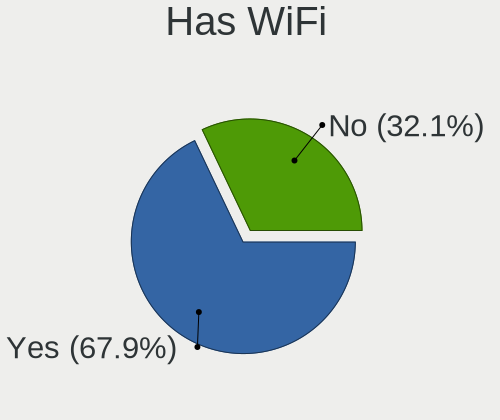
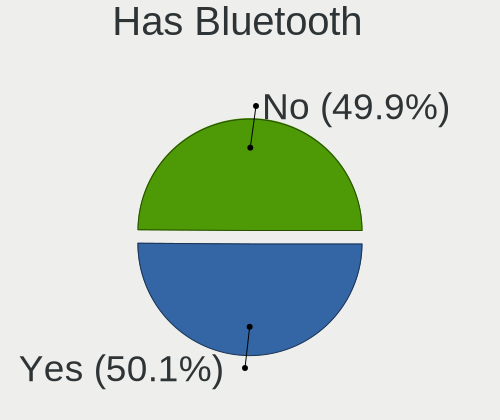
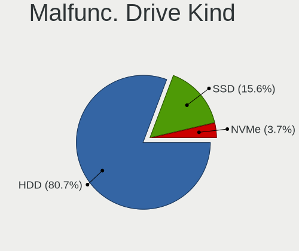
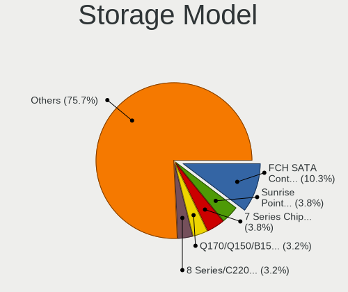
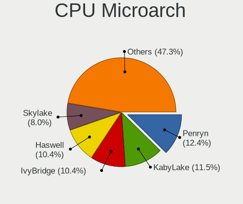
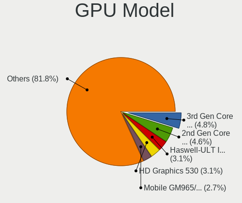

helloSystem 0.7.0 - Tested Hardware & Statistics
------------------------------------------------

A project to collect tested hardware configurations for helloSystem 0.7.0.

Anyone can contribute to this report by the [hw-probe](https://github.com/linuxhw/hw-probe/blob/master/INSTALL.BSD.md) tool:

    hw-probe -all -upload

Please contribute! Especially if your hardware is rare.

This is a report for all computer types. See also reports for [desktops](/Dist/helloSystem_0.7.0/Desktop/README.md) and [notebooks](/Dist/helloSystem_0.7.0/Notebook/README.md).

Contents
--------

* [ Test Cases ](#test-cases)

* [ System ](#system)
  - [ Arch                     ](#arch)
  - [ DE                       ](#de)
  - [ Display Server           ](#display-server)
  - [ Display Manager          ](#display-manager)
  - [ OS Lang                  ](#os-lang)
  - [ Boot Mode                ](#boot-mode)
  - [ Filesystem               ](#filesystem)
  - [ Part. scheme             ](#part-scheme)

* [ Board ](#board)
  - [ Vendor                   ](#vendor)
  - [ Model                    ](#model)
  - [ Model Family             ](#model-family)
  - [ MFG Year                 ](#mfg-year)
  - [ Form Factor              ](#form-factor)
  - [ Coreboot                 ](#coreboot)
  - [ RAM Size                 ](#ram-size)
  - [ RAM Used                 ](#ram-used)
  - [ Total Drives             ](#total-drives)
  - [ Has CD-ROM               ](#has-cd-rom)
  - [ Has Ethernet             ](#has-ethernet)
  - [ Has WiFi                 ](#has-wifi)
  - [ Has Bluetooth            ](#has-bluetooth)

* [ Location ](#location)
  - [ Country                  ](#country)
  - [ City                     ](#city)

* [ Drives ](#drives)
  - [ Drive Vendor             ](#drive-vendor)
  - [ Drive Model              ](#drive-model)
  - [ HDD Vendor               ](#hdd-vendor)
  - [ SSD Vendor               ](#ssd-vendor)
  - [ Drive Kind               ](#drive-kind)
  - [ Drive Connector          ](#drive-connector)
  - [ Drive Size               ](#drive-size)
  - [ Space Total              ](#space-total)
  - [ Space Used               ](#space-used)
  - [ Malfunc. Drives          ](#malfunc-drives)
  - [ Malfunc. Drive Vendor    ](#malfunc-drive-vendor)
  - [ Malfunc. HDD Vendor      ](#malfunc-hdd-vendor)
  - [ Malfunc. Drive Kind      ](#malfunc-drive-kind)
  - [ Failed Drives            ](#failed-drives)
  - [ Failed Drive Vendor      ](#failed-drive-vendor)
  - [ Drive Status             ](#drive-status)

* [ Storage controller ](#storage-controller)
  - [ Storage Vendor           ](#storage-vendor)
  - [ Storage Model            ](#storage-model)
  - [ Storage Kind             ](#storage-kind)

* [ Processor ](#processor)
  - [ CPU Vendor               ](#cpu-vendor)
  - [ CPU Model                ](#cpu-model)
  - [ CPU Model Family         ](#cpu-model-family)
  - [ CPU Cores                ](#cpu-cores)
  - [ CPU Sockets              ](#cpu-sockets)
  - [ CPU Threads              ](#cpu-threads)
  - [ CPU Microarch            ](#cpu-microarch)

* [ Graphics ](#graphics)
  - [ GPU Vendor               ](#gpu-vendor)
  - [ GPU Model                ](#gpu-model)
  - [ GPU Combo                ](#gpu-combo)
  - [ GPU Driver               ](#gpu-driver)
  - [ GPU Memory               ](#gpu-memory)

* [ Monitor ](#monitor)
  - [ Monitor Vendor           ](#monitor-vendor)
  - [ Monitor Model            ](#monitor-model)
  - [ Monitor Resolution       ](#monitor-resolution)
  - [ Monitor Diagonal         ](#monitor-diagonal)
  - [ Monitor Width            ](#monitor-width)
  - [ Aspect Ratio             ](#aspect-ratio)
  - [ Monitor Area             ](#monitor-area)
  - [ Pixel Density            ](#pixel-density)
  - [ Multiple Monitors        ](#multiple-monitors)

* [ Network ](#network)
  - [ Net Controller Vendor    ](#net-controller-vendor)
  - [ Net Controller Model     ](#net-controller-model)
  - [ Wireless Vendor          ](#wireless-vendor)
  - [ Wireless Model           ](#wireless-model)
  - [ Ethernet Vendor          ](#ethernet-vendor)
  - [ Ethernet Model           ](#ethernet-model)
  - [ Net Controller Kind      ](#net-controller-kind)
  - [ Used Controller          ](#used-controller)
  - [ NICs                     ](#nics)
  - [ IPv6                     ](#ipv6)

* [ Bluetooth ](#bluetooth)
  - [ Bluetooth Vendor         ](#bluetooth-vendor)
  - [ Bluetooth Model          ](#bluetooth-model)

* [ Sound ](#sound)
  - [ Sound Vendor             ](#sound-vendor)
  - [ Sound Model              ](#sound-model)

* [ Memory ](#memory)
  - [ Memory Vendor            ](#memory-vendor)
  - [ Memory Model             ](#memory-model)
  - [ Memory Kind              ](#memory-kind)
  - [ Memory Form Factor       ](#memory-form-factor)
  - [ Memory Size              ](#memory-size)
  - [ Memory Speed             ](#memory-speed)

* [ Printers & scanners ](#printers--scanners)
  - [ Printer Vendor           ](#printer-vendor)
  - [ Printer Model            ](#printer-model)
  - [ Scanner Vendor           ](#scanner-vendor)
  - [ Scanner Model            ](#scanner-model)

* [ Camera ](#camera)
  - [ Camera Vendor            ](#camera-vendor)
  - [ Camera Model             ](#camera-model)

* [ Security ](#security)
  - [ Fingerprint Vendor       ](#fingerprint-vendor)
  - [ Fingerprint Model        ](#fingerprint-model)
  - [ Chipcard Vendor          ](#chipcard-vendor)
  - [ Chipcard Model           ](#chipcard-model)

* [ Unsupported ](#unsupported)
  - [ Unsupported Devices      ](#unsupported-devices)
  - [ Unsupported Device Types ](#unsupported-device-types)

Test Cases
----------

Total: 315

| Vendor        | Model                       | Form-Factor | Probe                                                     | Date         |
|---------------|-----------------------------|-------------|-----------------------------------------------------------|--------------|
| HP            | 0AA8h                       | Desktop     | [f9b906ea47](https://bsd-hardware.info/?probe=f9b906ea47) | Apr 30, 2022 |
| Apple         | MacBookPro5,5               | Notebook    | [807676e010](https://bsd-hardware.info/?probe=807676e010) | Apr 30, 2022 |
| Lenovo        | ThinkPad T420 4236BD5       | Notebook    | [867ed989e2](https://bsd-hardware.info/?probe=867ed989e2) | Apr 27, 2022 |
| Supermicro    | X9DAL                       | Desktop     | [ef1f3da3ce](https://bsd-hardware.info/?probe=ef1f3da3ce) | Apr 26, 2022 |
| MSI           | GF65 Thin 10SER             | Notebook    | [cedf98c955](https://bsd-hardware.info/?probe=cedf98c955) | Apr 26, 2022 |
| Dell          | Inspiron 5437               | Notebook    | [830ea686ab](https://bsd-hardware.info/?probe=830ea686ab) | Apr 24, 2022 |
| ASUSTek       | PRIME B350-PLUS             | Desktop     | [271f1aa4d1](https://bsd-hardware.info/?probe=271f1aa4d1) | Apr 24, 2022 |
| HP            | 2000                        | Notebook    | [e9599a9bc3](https://bsd-hardware.info/?probe=e9599a9bc3) | Apr 22, 2022 |
| Gigabyte      | B450 AORUS M                | Desktop     | [427cf12b45](https://bsd-hardware.info/?probe=427cf12b45) | Apr 22, 2022 |
| ASUSTek       | TUF B450-PRO GAMING         | Desktop     | [f7a3f1dfd3](https://bsd-hardware.info/?probe=f7a3f1dfd3) | Apr 21, 2022 |
| ASRock        | X570 Phantom Gaming 4       | Desktop     | [2fd6d176ce](https://bsd-hardware.info/?probe=2fd6d176ce) | Apr 21, 2022 |
| Lenovo        | 312D SDK0J40697 WIN 3305... | Mini pc     | [bae3bbc2be](https://bsd-hardware.info/?probe=bae3bbc2be) | Apr 21, 2022 |
| Intel         | H55                         | Desktop     | [1478e4af73](https://bsd-hardware.info/?probe=1478e4af73) | Apr 20, 2022 |
| ASUSTek       | X556UJ                      | Notebook    | [ca63749774](https://bsd-hardware.info/?probe=ca63749774) | Apr 19, 2022 |
| Lenovo        | G51-35 80M8                 | Notebook    | [285328cb61](https://bsd-hardware.info/?probe=285328cb61) | Apr 16, 2022 |
| ASUSTek       | PRIME Z390M-PLUS            | Desktop     | [680303f943](https://bsd-hardware.info/?probe=680303f943) | Apr 16, 2022 |
| Dell          | 0Y7WYT A00                  | Desktop     | [399a4fb92e](https://bsd-hardware.info/?probe=399a4fb92e) | Apr 15, 2022 |
| Sony          | SVZ1311C5E                  | Notebook    | [c1c429a7e6](https://bsd-hardware.info/?probe=c1c429a7e6) | Apr 15, 2022 |
| ASUSTek       | PRIME Z390M-PLUS            | Desktop     | [47d17d48a7](https://bsd-hardware.info/?probe=47d17d48a7) | Apr 15, 2022 |
| Gigabyte      | B85M-D3H                    | Desktop     | [5502c7fd2f](https://bsd-hardware.info/?probe=5502c7fd2f) | Apr 15, 2022 |
| Dell          | Latitude E6540              | Notebook    | [a3da09ae5e](https://bsd-hardware.info/?probe=a3da09ae5e) | Apr 15, 2022 |
| Intel         | NUC7JYB J67967-402          | Mini pc     | [e94a3a5a08](https://bsd-hardware.info/?probe=e94a3a5a08) | Apr 14, 2022 |
| ASUSTek       | PRIME X399-A                | Desktop     | [3d26c05fda](https://bsd-hardware.info/?probe=3d26c05fda) | Apr 14, 2022 |
| ASUSTek       | P8Z77-V LX                  | Desktop     | [562a4d0421](https://bsd-hardware.info/?probe=562a4d0421) | Apr 14, 2022 |
| ASUSTek       | P8Z77-V LX                  | Desktop     | [9f70756cb2](https://bsd-hardware.info/?probe=9f70756cb2) | Apr 14, 2022 |
| System76      | Lemur Pro                   | Notebook    | [276ee4e96e](https://bsd-hardware.info/?probe=276ee4e96e) | Apr 13, 2022 |
| ASUSTek       | M5A97 LE R2.0               | Desktop     | [11ec99d4b7](https://bsd-hardware.info/?probe=11ec99d4b7) | Apr 11, 2022 |
| Lenovo        | ThinkPad X61 7675K2U        | Notebook    | [24f93b9532](https://bsd-hardware.info/?probe=24f93b9532) | Apr 10, 2022 |
| HP            | 1998                        | Desktop     | [06f0a28858](https://bsd-hardware.info/?probe=06f0a28858) | Apr 10, 2022 |
| BESSTAR Te... | UM250 V1.0                  | Desktop     | [844323ad2d](https://bsd-hardware.info/?probe=844323ad2d) | Apr 09, 2022 |
| ASUSTek       | P5G41T-M LX3                | Desktop     | [ded0d1a114](https://bsd-hardware.info/?probe=ded0d1a114) | Apr 09, 2022 |
| ASUSTek       | P5G41T-M LX3                | Desktop     | [14a6449380](https://bsd-hardware.info/?probe=14a6449380) | Apr 09, 2022 |
| ASUSTek       | M4A88T-M                    | Desktop     | [9d1a8b4886](https://bsd-hardware.info/?probe=9d1a8b4886) | Apr 09, 2022 |
| ASRock        | X570 Steel Legend WiFi a... | Desktop     | [703e042cfe](https://bsd-hardware.info/?probe=703e042cfe) | Apr 09, 2022 |
| Dell          | 0D6H9T A00                  | Desktop     | [e58bc4937d](https://bsd-hardware.info/?probe=e58bc4937d) | Apr 09, 2022 |
| Panasonic     | CF-B11JWCYS                 | Notebook    | [6699d408ad](https://bsd-hardware.info/?probe=6699d408ad) | Apr 08, 2022 |
| Gigabyte      | E3000N                      | Desktop     | [7169c296cc](https://bsd-hardware.info/?probe=7169c296cc) | Apr 08, 2022 |
| MSI           | MS-7369                     | Desktop     | [25f2161cac](https://bsd-hardware.info/?probe=25f2161cac) | Apr 08, 2022 |
| HP            | Pavilion 11                 | Notebook    | [a13373b255](https://bsd-hardware.info/?probe=a13373b255) | Apr 07, 2022 |
| DNS           | W9x0LU                      | Notebook    | [8ac57e3b59](https://bsd-hardware.info/?probe=8ac57e3b59) | Apr 06, 2022 |
| TUXEDO        | Aura 15 Gen1                | Notebook    | [e72b47b6de](https://bsd-hardware.info/?probe=e72b47b6de) | Apr 04, 2022 |
| Lenovo        | 30D9 SDK0J40705 WIN 3425... | Desktop     | [5038186437](https://bsd-hardware.info/?probe=5038186437) | Apr 02, 2022 |
| LG Electro... | E300-A.CP20T                | Notebook    | [304701f666](https://bsd-hardware.info/?probe=304701f666) | Apr 02, 2022 |
| TUXEDO        | Aura 15 Gen1                | Notebook    | [1be95af210](https://bsd-hardware.info/?probe=1be95af210) | Apr 01, 2022 |
| Apple         | Mac-F2218EA9                | All in one  | [e0c61311da](https://bsd-hardware.info/?probe=e0c61311da) | Apr 01, 2022 |
| ASUSTek       | P8Z77-V LX                  | Desktop     | [42419abab8](https://bsd-hardware.info/?probe=42419abab8) | Apr 01, 2022 |
| Dell          | 0D6H9T A00                  | Desktop     | [7daab72741](https://bsd-hardware.info/?probe=7daab72741) | Apr 01, 2022 |
| HP            | Compaq 6510b (GF910AW#AB... | Notebook    | [a7bccf74e4](https://bsd-hardware.info/?probe=a7bccf74e4) | Mar 31, 2022 |
| ASUSTek       | P8Z77-V LX                  | Desktop     | [49627775f3](https://bsd-hardware.info/?probe=49627775f3) | Mar 31, 2022 |
| ASUSTek       | P6-P8H61E                   | Desktop     | [11664cd9d7](https://bsd-hardware.info/?probe=11664cd9d7) | Mar 30, 2022 |
| ASUSTek       | M4A88T-M                    | Desktop     | [6a615f6be5](https://bsd-hardware.info/?probe=6a615f6be5) | Mar 30, 2022 |
| ASUSTek       | M5A78L-M LX3                | Desktop     | [0906d116eb](https://bsd-hardware.info/?probe=0906d116eb) | Mar 29, 2022 |
| Gigabyte      | H110N-CF                    | Desktop     | [89593af061](https://bsd-hardware.info/?probe=89593af061) | Mar 29, 2022 |
| Gigabyte      | H61M-S2PV                   | Desktop     | [553f2beb91](https://bsd-hardware.info/?probe=553f2beb91) | Mar 27, 2022 |
| Lenovo        | 312D NOK                    | Mini pc     | [47ef9ef91a](https://bsd-hardware.info/?probe=47ef9ef91a) | Mar 27, 2022 |
| ASRock        | A320M-HDV R4.0              | Desktop     | [8c89faeb24](https://bsd-hardware.info/?probe=8c89faeb24) | Mar 26, 2022 |
| ASRock        | A320M-HDV R4.0              | Desktop     | [ae1fa6cbce](https://bsd-hardware.info/?probe=ae1fa6cbce) | Mar 26, 2022 |
| Dell          | Latitude E6540              | Notebook    | [0ac0f8f1d8](https://bsd-hardware.info/?probe=0ac0f8f1d8) | Mar 26, 2022 |
| ASUSTek       | ET2411_W8                   | All in one  | [fb186da68e](https://bsd-hardware.info/?probe=fb186da68e) | Mar 26, 2022 |
| Lenovo        | ThinkBook 14 G2 ARE 20VF    | Notebook    | [00213ecee9](https://bsd-hardware.info/?probe=00213ecee9) | Mar 25, 2022 |
| ASUSTek       | P8Z77-V LX                  | Desktop     | [70d10ce47c](https://bsd-hardware.info/?probe=70d10ce47c) | Mar 25, 2022 |
| MSI           | B85-G43                     | Desktop     | [f0a919c35f](https://bsd-hardware.info/?probe=f0a919c35f) | Mar 25, 2022 |
| ASUSTek       | P8Z77-V LX                  | Desktop     | [99d079bd5a](https://bsd-hardware.info/?probe=99d079bd5a) | Mar 25, 2022 |
| MSI           | B85-G43                     | Desktop     | [7bd545fda8](https://bsd-hardware.info/?probe=7bd545fda8) | Mar 25, 2022 |
| ASUSTek       | P8Z77-V LX                  | Desktop     | [c76aa38baf](https://bsd-hardware.info/?probe=c76aa38baf) | Mar 24, 2022 |
| ASUSTek       | P8Z77-V LX                  | Desktop     | [8696405d09](https://bsd-hardware.info/?probe=8696405d09) | Mar 24, 2022 |
| Lenovo        | 312D NOK                    | Mini pc     | [9b3dac520a](https://bsd-hardware.info/?probe=9b3dac520a) | Mar 24, 2022 |
| Dell          | Vostro 3490                 | Notebook    | [34956934f5](https://bsd-hardware.info/?probe=34956934f5) | Mar 22, 2022 |
| ECS           | G41T-M9                     | Desktop     | [9ef50c47da](https://bsd-hardware.info/?probe=9ef50c47da) | Mar 21, 2022 |
| Packard Be... | EasyNote TE69HW             | Notebook    | [851eea349f](https://bsd-hardware.info/?probe=851eea349f) | Mar 17, 2022 |
| ASUSTek       | ET2411_W8                   | All in one  | [b95da98f21](https://bsd-hardware.info/?probe=b95da98f21) | Mar 17, 2022 |
| Lenovo        | ThinkPad X220 4293B43       | Notebook    | [148a268a0f](https://bsd-hardware.info/?probe=148a268a0f) | Mar 16, 2022 |
| Gigabyte      | H270-Gaming 3               | Desktop     | [2727a8e439](https://bsd-hardware.info/?probe=2727a8e439) | Mar 15, 2022 |
| HASEE Comp... | CW35S                       | Notebook    | [737c8bb48a](https://bsd-hardware.info/?probe=737c8bb48a) | Mar 14, 2022 |
| Lenovo        | ThinkPad L440 20ASS0FP00    | Notebook    | [0fbc782835](https://bsd-hardware.info/?probe=0fbc782835) | Mar 14, 2022 |
| Dell          | Latitude E6540              | Notebook    | [e0576dd008](https://bsd-hardware.info/?probe=e0576dd008) | Mar 13, 2022 |
| Gigabyte      | G31M-S2C                    | Desktop     | [5a22bb6991](https://bsd-hardware.info/?probe=5a22bb6991) | Mar 12, 2022 |
| Lenovo        | IdeaCentre B545 10100       | Desktop     | [2f13d4a946](https://bsd-hardware.info/?probe=2f13d4a946) | Mar 12, 2022 |
| Acer          | Aspire E1-421               | Notebook    | [cc83218496](https://bsd-hardware.info/?probe=cc83218496) | Mar 10, 2022 |
| ASUSTek       | P5Q DELUXE                  | Desktop     | [b4234170e8](https://bsd-hardware.info/?probe=b4234170e8) | Mar 10, 2022 |
| Lenovo        | Z50-70 20354                | Notebook    | [a1f85aff27](https://bsd-hardware.info/?probe=a1f85aff27) | Mar 10, 2022 |
| Lenovo        | IdeaPad N585                | Notebook    | [e22da97709](https://bsd-hardware.info/?probe=e22da97709) | Mar 10, 2022 |
| Lenovo        | Z50-70 20354                | Notebook    | [ab71ed7239](https://bsd-hardware.info/?probe=ab71ed7239) | Mar 10, 2022 |
| Pegatron      | IPM41-D3                    | Desktop     | [a58b9a4f8f](https://bsd-hardware.info/?probe=a58b9a4f8f) | Mar 09, 2022 |
| Itautec       | Infoway w7535               | Notebook    | [b55f9d1bfb](https://bsd-hardware.info/?probe=b55f9d1bfb) | Mar 09, 2022 |
| Koloe         | X58                         | Desktop     | [58e098eca2](https://bsd-hardware.info/?probe=58e098eca2) | Mar 09, 2022 |
| HP            | 8054                        | Desktop     | [86b6b8373c](https://bsd-hardware.info/?probe=86b6b8373c) | Mar 08, 2022 |
| HP            | 8054                        | Desktop     | [00078554d2](https://bsd-hardware.info/?probe=00078554d2) | Mar 08, 2022 |
| Koloe         | X58                         | Desktop     | [c501dfa5c8](https://bsd-hardware.info/?probe=c501dfa5c8) | Mar 07, 2022 |
| Lenovo        | ThinkPad X220 Tablet 429... | Notebook    | [dbd5c6e5e3](https://bsd-hardware.info/?probe=dbd5c6e5e3) | Mar 07, 2022 |
| Apple         | Mac-F2218EA9                | All in one  | [8b51036856](https://bsd-hardware.info/?probe=8b51036856) | Mar 06, 2022 |
| HP            | 1905                        | Desktop     | [e271589365](https://bsd-hardware.info/?probe=e271589365) | Mar 01, 2022 |
| Gigabyte      | B450M S2H                   | Desktop     | [78f79fab6f](https://bsd-hardware.info/?probe=78f79fab6f) | Feb 28, 2022 |
| HP            | EliteBook Folio 9470m       | Notebook    | [e2cc942e3e](https://bsd-hardware.info/?probe=e2cc942e3e) | Feb 28, 2022 |
| Dell          | 0KV62T A00                  | Desktop     | [0541a207c7](https://bsd-hardware.info/?probe=0541a207c7) | Feb 28, 2022 |
| HP            | 1905                        | Desktop     | [aa010e00f2](https://bsd-hardware.info/?probe=aa010e00f2) | Feb 28, 2022 |
| Acer          | V5-131                      | Notebook    | [d175137636](https://bsd-hardware.info/?probe=d175137636) | Feb 27, 2022 |
| ASRock        | TRX40 Taichi                | Desktop     | [a2df68e1d1](https://bsd-hardware.info/?probe=a2df68e1d1) | Feb 26, 2022 |
| Intel         | H81                         | Desktop     | [04d2739bdc](https://bsd-hardware.info/?probe=04d2739bdc) | Feb 25, 2022 |
| Intel         | DCP847SKE G80890-107        | Desktop     | [f9d33f1ab1](https://bsd-hardware.info/?probe=f9d33f1ab1) | Feb 23, 2022 |
| Medion        | H61H2-LM3                   | Desktop     | [beb12f2884](https://bsd-hardware.info/?probe=beb12f2884) | Feb 23, 2022 |
| ASRock        | H81M-DG4                    | Desktop     | [e20db6ad83](https://bsd-hardware.info/?probe=e20db6ad83) | Feb 23, 2022 |
| HP            | 1998                        | Desktop     | [485d417a2e](https://bsd-hardware.info/?probe=485d417a2e) | Feb 23, 2022 |
| Apple         | Mac-F2218EA9                | All in one  | [feb7882341](https://bsd-hardware.info/?probe=feb7882341) | Feb 22, 2022 |
| Dell          | 0VD5HY A07                  | Desktop     | [bb86fb3e67](https://bsd-hardware.info/?probe=bb86fb3e67) | Feb 22, 2022 |
| Dell          | Latitude E4310              | Notebook    | [ba69f80b7f](https://bsd-hardware.info/?probe=ba69f80b7f) | Feb 22, 2022 |
| Apple         | MacBook4,1                  | Notebook    | [e0cf5200de](https://bsd-hardware.info/?probe=e0cf5200de) | Feb 22, 2022 |
| Lenovo        | ThinkPad T61 766301U        | Notebook    | [f5f25efdcc](https://bsd-hardware.info/?probe=f5f25efdcc) | Feb 22, 2022 |
| Apple         | MacBook6,1                  | Notebook    | [d680290d84](https://bsd-hardware.info/?probe=d680290d84) | Feb 22, 2022 |
| ASUSTek       | CROSSHAIR VI HERO           | Desktop     | [1e6ff84e5d](https://bsd-hardware.info/?probe=1e6ff84e5d) | Feb 21, 2022 |
| Apple         | MacBook6,1                  | Notebook    | [304508ed18](https://bsd-hardware.info/?probe=304508ed18) | Feb 21, 2022 |
| Dell          | Latitude E5470              | Notebook    | [9e479e9c50](https://bsd-hardware.info/?probe=9e479e9c50) | Feb 21, 2022 |
| Dell          | Inspiron 3537               | Notebook    | [932550132e](https://bsd-hardware.info/?probe=932550132e) | Feb 20, 2022 |
| Lenovo        | ThinkPad T61 766301U        | Notebook    | [6eec3232e2](https://bsd-hardware.info/?probe=6eec3232e2) | Feb 19, 2022 |
| Intel         | NUC5CPYB H61145-404         | Mini pc     | [5f4e1c30b8](https://bsd-hardware.info/?probe=5f4e1c30b8) | Feb 19, 2022 |
| Gigabyte      | P41T-D3                     | Desktop     | [e5417931a7](https://bsd-hardware.info/?probe=e5417931a7) | Feb 18, 2022 |
| Lenovo        | IdeaPad 110S-11IBR 80WG     | Notebook    | [2f90d5c2bd](https://bsd-hardware.info/?probe=2f90d5c2bd) | Feb 18, 2022 |
| ASRock        | B460M Pro4                  | Desktop     | [7a2781344f](https://bsd-hardware.info/?probe=7a2781344f) | Feb 17, 2022 |
| TUXEDO        | InfinityBook13V3            | Notebook    | [5a75db9142](https://bsd-hardware.info/?probe=5a75db9142) | Feb 17, 2022 |
| TUXEDO        | InfinityBook13V3            | Notebook    | [edc2c4ec36](https://bsd-hardware.info/?probe=edc2c4ec36) | Feb 17, 2022 |
| Lenovo        | ThinkPad T450 20BUS0VH08    | Notebook    | [fa2cd8964e](https://bsd-hardware.info/?probe=fa2cd8964e) | Feb 17, 2022 |
| Samsung       | N100                        | Notebook    | [3125d76ba4](https://bsd-hardware.info/?probe=3125d76ba4) | Feb 16, 2022 |
| Lenovo        | E31-80 80MX                 | Notebook    | [098afac660](https://bsd-hardware.info/?probe=098afac660) | Feb 16, 2022 |
| Lenovo        | ThinkPad T430 2349AK1       | Notebook    | [86fd351c81](https://bsd-hardware.info/?probe=86fd351c81) | Feb 16, 2022 |
| ASUSTek       | PRIME Z390-P                | Desktop     | [3a72227408](https://bsd-hardware.info/?probe=3a72227408) | Feb 16, 2022 |
| Gigabyte      | C246M-WU4-CF                | Desktop     | [4b6c6d8bde](https://bsd-hardware.info/?probe=4b6c6d8bde) | Feb 15, 2022 |
| MSI           | B450 GAMING PLUS MAX        | Desktop     | [df6278638e](https://bsd-hardware.info/?probe=df6278638e) | Feb 15, 2022 |
| Acer          | V5-131                      | Notebook    | [2d5bfae3b4](https://bsd-hardware.info/?probe=2d5bfae3b4) | Feb 15, 2022 |
| ASRock        | H61M/U3S3                   | Desktop     | [257e13f206](https://bsd-hardware.info/?probe=257e13f206) | Feb 12, 2022 |
| ASUSTek       | PRIME Z390-P                | Desktop     | [abf34bbc7e](https://bsd-hardware.info/?probe=abf34bbc7e) | Feb 12, 2022 |
| ASRock        | H61M/U3S3                   | Desktop     | [34dac4c0cd](https://bsd-hardware.info/?probe=34dac4c0cd) | Feb 11, 2022 |
| MSI           | B450 GAMING PLUS MAX        | Desktop     | [6997de25f9](https://bsd-hardware.info/?probe=6997de25f9) | Feb 11, 2022 |
| ASUSTek       | X555LA                      | Notebook    | [28b3002182](https://bsd-hardware.info/?probe=28b3002182) | Feb 10, 2022 |
| ASUSTek       | X555LA                      | Notebook    | [9aa18b2e33](https://bsd-hardware.info/?probe=9aa18b2e33) | Feb 09, 2022 |
| Intel         | X58                         | Desktop     | [f7075908f6](https://bsd-hardware.info/?probe=f7075908f6) | Feb 09, 2022 |
| ASUSTek       | PRIME Z390-P                | Desktop     | [b1931633be](https://bsd-hardware.info/?probe=b1931633be) | Feb 09, 2022 |
| ASUSTek       | PRIME Z390-P                | Desktop     | [f9c1e787a9](https://bsd-hardware.info/?probe=f9c1e787a9) | Feb 09, 2022 |
| MSI           | B75A-G43                    | Desktop     | [8e445eb2d4](https://bsd-hardware.info/?probe=8e445eb2d4) | Feb 08, 2022 |
| Acer          | Aspire E5-511G              | Notebook    | [b14c4c1ac5](https://bsd-hardware.info/?probe=b14c4c1ac5) | Feb 07, 2022 |
| TWINHEAD      | U12CT                       | Notebook    | [32247012ca](https://bsd-hardware.info/?probe=32247012ca) | Feb 06, 2022 |
| ASUSTek       | P6-P8H61E                   | Desktop     | [e838981914](https://bsd-hardware.info/?probe=e838981914) | Feb 06, 2022 |
| Dell          | Latitude D630               | Notebook    | [b34db656b5](https://bsd-hardware.info/?probe=b34db656b5) | Feb 05, 2022 |
| Lenovo        | ThinkPad T440p 20AWS3RH0... | Notebook    | [a6c02e440b](https://bsd-hardware.info/?probe=a6c02e440b) | Feb 05, 2022 |
| Dell          | Venue 11 Pro 7140           | Notebook    | [328f9e8d94](https://bsd-hardware.info/?probe=328f9e8d94) | Feb 04, 2022 |
| ASRock        | H81M-VG4 R2.0               | Desktop     | [8af8b5270e](https://bsd-hardware.info/?probe=8af8b5270e) | Feb 04, 2022 |
| HP            | EliteBook 6930p             | Notebook    | [d8fb34de12](https://bsd-hardware.info/?probe=d8fb34de12) | Feb 04, 2022 |
| Apple         | Mac-F221BEC8                | Desktop     | [e5043f0af4](https://bsd-hardware.info/?probe=e5043f0af4) | Feb 04, 2022 |
| Intel         | NUC7i3BNB J22859-313        | Mini pc     | [bf63607cd6](https://bsd-hardware.info/?probe=bf63607cd6) | Feb 03, 2022 |
| Intel         | NUC5i3RYB K23918-501        | Mini pc     | [342915fccd](https://bsd-hardware.info/?probe=342915fccd) | Feb 03, 2022 |
| Lenovo        | ThinkPad X220 4291H77       | Notebook    | [dd4d3a9dcc](https://bsd-hardware.info/?probe=dd4d3a9dcc) | Feb 02, 2022 |
| Pegatron      | NARRA5                      | Desktop     | [64d4fb9b97](https://bsd-hardware.info/?probe=64d4fb9b97) | Feb 02, 2022 |
| HP            | Mini 210-1000               | Notebook    | [8a8bfdaee1](https://bsd-hardware.info/?probe=8a8bfdaee1) | Feb 02, 2022 |
| HP            | G62                         | Notebook    | [476193bfd0](https://bsd-hardware.info/?probe=476193bfd0) | Feb 01, 2022 |
| Gigabyte      | Z390 GAMING X-CF            | Desktop     | [ee05643521](https://bsd-hardware.info/?probe=ee05643521) | Feb 01, 2022 |
| ASUSTek       | P5P43TD PRO                 | Desktop     | [5999e0ebfb](https://bsd-hardware.info/?probe=5999e0ebfb) | Jan 31, 2022 |
| Lenovo        | ThinkPad T510 4384AJ6       | Notebook    | [70a56029e7](https://bsd-hardware.info/?probe=70a56029e7) | Jan 31, 2022 |
| Intel         | H81                         | Desktop     | [c2f3025900](https://bsd-hardware.info/?probe=c2f3025900) | Jan 31, 2022 |
| HP            | Laptop 15-rb0xx             | Notebook    | [8e9a6cff62](https://bsd-hardware.info/?probe=8e9a6cff62) | Jan 31, 2022 |
| Pegatron      | 2A99h                       | Desktop     | [e34b6118a2](https://bsd-hardware.info/?probe=e34b6118a2) | Jan 30, 2022 |
| Fujitsu       | D3161-A1 S26361-D3161-A1    | Desktop     | [58ea01e4e6](https://bsd-hardware.info/?probe=58ea01e4e6) | Jan 29, 2022 |
| Apple         | MacBook4,1                  | Notebook    | [e89404ebed](https://bsd-hardware.info/?probe=e89404ebed) | Jan 29, 2022 |
| Samsung       | N150P/N210P/N220P           | Notebook    | [901a483718](https://bsd-hardware.info/?probe=901a483718) | Jan 29, 2022 |
| Intel         | DH77EB AAG39073-400         | Desktop     | [bfe6ef301b](https://bsd-hardware.info/?probe=bfe6ef301b) | Jan 29, 2022 |
| Apple         | MacBook5,2                  | Notebook    | [ee6e794728](https://bsd-hardware.info/?probe=ee6e794728) | Jan 29, 2022 |
| Acer          | Aspire 5930                 | Notebook    | [754db09c98](https://bsd-hardware.info/?probe=754db09c98) | Jan 28, 2022 |
| ASUSTek       | ASUS TUF Gaming A15 FA50... | Notebook    | [11bbfce5d4](https://bsd-hardware.info/?probe=11bbfce5d4) | Jan 27, 2022 |
| ASUSTek       | P5GC-MX                     | Desktop     | [372749f9d7](https://bsd-hardware.info/?probe=372749f9d7) | Jan 27, 2022 |
| Unknown       | Unknown                     | Desktop     | [a9d799ca71](https://bsd-hardware.info/?probe=a9d799ca71) | Jan 27, 2022 |
| Dell          | Latitude 7280               | Notebook    | [089b61bb38](https://bsd-hardware.info/?probe=089b61bb38) | Jan 27, 2022 |
| ASUSTek       | P5B SE                      | Desktop     | [f97fba19c1](https://bsd-hardware.info/?probe=f97fba19c1) | Jan 26, 2022 |
| Apple         | Mac-DB15BD556843C820 iMa... | All in one  | [2506316700](https://bsd-hardware.info/?probe=2506316700) | Jan 26, 2022 |
| Lenovo        | IdeaPad L340-17IRH Gamin... | Notebook    | [b1d702812e](https://bsd-hardware.info/?probe=b1d702812e) | Jan 26, 2022 |
| Fujitsu       | D3161-A1 S26361-D3161-A1    | Desktop     | [9f0a000ceb](https://bsd-hardware.info/?probe=9f0a000ceb) | Jan 25, 2022 |
| MSI           | GE75 Raider 10SFS           | Notebook    | [306f312c47](https://bsd-hardware.info/?probe=306f312c47) | Jan 25, 2022 |
| ASUSTek       | P5B SE                      | Desktop     | [e3332e7b94](https://bsd-hardware.info/?probe=e3332e7b94) | Jan 25, 2022 |
| ASRock        | B460M Pro4                  | Desktop     | [107a1e59f5](https://bsd-hardware.info/?probe=107a1e59f5) | Jan 25, 2022 |
| ASRock        | A300M-STX                   | Desktop     | [8edf072b67](https://bsd-hardware.info/?probe=8edf072b67) | Jan 25, 2022 |
| ASUSTek       | BM6835_BM6635_BP6335        | Desktop     | [73562aa169](https://bsd-hardware.info/?probe=73562aa169) | Jan 25, 2022 |
| ASUSTek       | P8H61-M LX3 PLUS R2.0       | Desktop     | [df08e2e8f0](https://bsd-hardware.info/?probe=df08e2e8f0) | Jan 24, 2022 |
| HP            | Laptop 15-bw0xx             | Notebook    | [1c8f50f7eb](https://bsd-hardware.info/?probe=1c8f50f7eb) | Jan 24, 2022 |
| ASUSTek       | P7H55-M                     | Desktop     | [fb73c2f7dc](https://bsd-hardware.info/?probe=fb73c2f7dc) | Jan 23, 2022 |
| HP            | 1998                        | Desktop     | [b59dbcdc9c](https://bsd-hardware.info/?probe=b59dbcdc9c) | Jan 23, 2022 |
| HP            | Pavilion Gaming Laptop 1... | Notebook    | [7859f220b9](https://bsd-hardware.info/?probe=7859f220b9) | Jan 22, 2022 |
| Acer          | Aspire ES1-311              | Notebook    | [83addddaa5](https://bsd-hardware.info/?probe=83addddaa5) | Jan 22, 2022 |
| Dell          | Latitude E6540              | Notebook    | [529768f8c8](https://bsd-hardware.info/?probe=529768f8c8) | Jan 21, 2022 |
| ASUSTek       | ROG STRIX B450-F GAMING     | Desktop     | [670e41ed41](https://bsd-hardware.info/?probe=670e41ed41) | Jan 21, 2022 |
| MSI           | PRO Z690-A WIFI DDR4        | Desktop     | [04abd226f3](https://bsd-hardware.info/?probe=04abd226f3) | Jan 21, 2022 |
| HP            | EliteBook 2560p             | Notebook    | [4d04ececbb](https://bsd-hardware.info/?probe=4d04ececbb) | Jan 19, 2022 |
| ASUSTek       | Maximus VIII HERO           | Desktop     | [a780a7bab2](https://bsd-hardware.info/?probe=a780a7bab2) | Jan 18, 2022 |
| Lenovo        | Legion Y540-15IRH 81SX      | Notebook    | [384d2f888b](https://bsd-hardware.info/?probe=384d2f888b) | Jan 18, 2022 |
| Acer          | V5-131                      | Notebook    | [ff427cb0c9](https://bsd-hardware.info/?probe=ff427cb0c9) | Jan 18, 2022 |
| Gateway       | NE56R                       | Notebook    | [a5aa8aa49a](https://bsd-hardware.info/?probe=a5aa8aa49a) | Jan 18, 2022 |
| ASUSTek       | TUF GAMING X570-PLUS        | Desktop     | [9cd2758a5f](https://bsd-hardware.info/?probe=9cd2758a5f) | Jan 18, 2022 |
| Lenovo        | ThinkPad T410 2522E38       | Notebook    | [2dbb2679f1](https://bsd-hardware.info/?probe=2dbb2679f1) | Jan 17, 2022 |
| Dell          | Latitude E5430 non-vPro     | Notebook    | [e795c7ec91](https://bsd-hardware.info/?probe=e795c7ec91) | Jan 17, 2022 |
| Lenovo        | ThinkPad T440 20B7000PHV    | Notebook    | [9584ae69fa](https://bsd-hardware.info/?probe=9584ae69fa) | Jan 16, 2022 |
| Lenovo        | ThinkPad R61 8935WCS        | Notebook    | [9cc0f26f6f](https://bsd-hardware.info/?probe=9cc0f26f6f) | Jan 16, 2022 |
| ASUSTek       | PRIME X570-P                | Desktop     | [3dead218e1](https://bsd-hardware.info/?probe=3dead218e1) | Jan 16, 2022 |
| Gigabyte      | B365 HD3                    | Desktop     | [62fc48bd99](https://bsd-hardware.info/?probe=62fc48bd99) | Jan 15, 2022 |
| Dell          | 0XCR8D A03                  | Desktop     | [48e9447b37](https://bsd-hardware.info/?probe=48e9447b37) | Jan 15, 2022 |
| ASUSTek       | ROG STRIX Z390-E GAMING     | Desktop     | [d377e06101](https://bsd-hardware.info/?probe=d377e06101) | Jan 15, 2022 |
| Lenovo        | ThinkPad X220 Tablet 429... | Notebook    | [5a585443b2](https://bsd-hardware.info/?probe=5a585443b2) | Jan 15, 2022 |
| Acer          | V5-131                      | Notebook    | [e4d0f66ff8](https://bsd-hardware.info/?probe=e4d0f66ff8) | Jan 13, 2022 |
| Gigabyte      | Z77N-WIFI                   | Desktop     | [459bb6486d](https://bsd-hardware.info/?probe=459bb6486d) | Jan 13, 2022 |
| Acer          | Aspire ES1-533              | Notebook    | [a9d2458de5](https://bsd-hardware.info/?probe=a9d2458de5) | Jan 13, 2022 |
| Acer          | Aspire E5-476G              | Notebook    | [2a8624ee35](https://bsd-hardware.info/?probe=2a8624ee35) | Jan 10, 2022 |
| ASUSTek       | P8Z68-M PRO                 | Desktop     | [a0885f4f44](https://bsd-hardware.info/?probe=a0885f4f44) | Jan 10, 2022 |
| HP            | 8169                        | Desktop     | [85e0cf058c](https://bsd-hardware.info/?probe=85e0cf058c) | Jan 10, 2022 |
| Lenovo        | ThinkPad L450 20DSS1S402    | Notebook    | [3c27c8bf31](https://bsd-hardware.info/?probe=3c27c8bf31) | Jan 09, 2022 |
| Dell          | Latitude E6530              | Notebook    | [0fa21bcf23](https://bsd-hardware.info/?probe=0fa21bcf23) | Jan 09, 2022 |
| Dell          | Inspiron 3505               | Notebook    | [8d4b342fda](https://bsd-hardware.info/?probe=8d4b342fda) | Jan 08, 2022 |
| Dell          | Inspiron 3505               | Notebook    | [8cbe3d4581](https://bsd-hardware.info/?probe=8cbe3d4581) | Jan 08, 2022 |
| Lenovo        | ThinkPad X1 Carbon 5th 2... | Notebook    | [7aea2ccaa7](https://bsd-hardware.info/?probe=7aea2ccaa7) | Jan 08, 2022 |
| Lenovo        | ThinkPad E15 20RD0011MX     | Notebook    | [0fa4700d17](https://bsd-hardware.info/?probe=0fa4700d17) | Jan 07, 2022 |
| HP            | Laptop 14-dk0xxx            | Notebook    | [e7b40f6e3b](https://bsd-hardware.info/?probe=e7b40f6e3b) | Jan 06, 2022 |
| ASUSTek       | GA35DX                      | Desktop     | [eccb947ae4](https://bsd-hardware.info/?probe=eccb947ae4) | Jan 05, 2022 |
| Notebook      | N15_17RD                    | Notebook    | [47c30b962d](https://bsd-hardware.info/?probe=47c30b962d) | Jan 05, 2022 |
| Lenovo        | ThinkPad L450 20DSS1S402    | Notebook    | [bf95cdeb53](https://bsd-hardware.info/?probe=bf95cdeb53) | Jan 04, 2022 |
| Unknown       | G31T-M7                     | Desktop     | [ed7d80e01a](https://bsd-hardware.info/?probe=ed7d80e01a) | Jan 03, 2022 |
| Dell          | Latitude 7380               | Notebook    | [590b374836](https://bsd-hardware.info/?probe=590b374836) | Jan 02, 2022 |
| Dell          | Latitude E6540              | Notebook    | [f5a43a9f8b](https://bsd-hardware.info/?probe=f5a43a9f8b) | Jan 02, 2022 |
| Apple         | Mac-F2208EC8                | Mini pc     | [4979175779](https://bsd-hardware.info/?probe=4979175779) | Jan 01, 2022 |
| Lenovo        | ThinkPad X220 4293AF4       | Notebook    | [8c7992e557](https://bsd-hardware.info/?probe=8c7992e557) | Jan 01, 2022 |
| ASUSTek       | TUF GAMING X570-PLUS        | Desktop     | [a671e3eb04](https://bsd-hardware.info/?probe=a671e3eb04) | Dec 31, 2021 |
| Dell          | Latitude E6540              | Notebook    | [97d152656e](https://bsd-hardware.info/?probe=97d152656e) | Dec 31, 2021 |
| HP            | ProBook 655 G1              | Notebook    | [da312d7c14](https://bsd-hardware.info/?probe=da312d7c14) | Dec 30, 2021 |
| Acer          | Aspire 5742G                | Notebook    | [b77a4ee97c](https://bsd-hardware.info/?probe=b77a4ee97c) | Dec 30, 2021 |
| ASUSTek       | S550CA                      | Notebook    | [1263a5fb37](https://bsd-hardware.info/?probe=1263a5fb37) | Dec 29, 2021 |
| Lenovo        | ThinkPad E580 20KS005BRI    | Notebook    | [b533989df5](https://bsd-hardware.info/?probe=b533989df5) | Dec 29, 2021 |
| ASRock        | X570 Phantom Gaming 4       | Desktop     | [15211db056](https://bsd-hardware.info/?probe=15211db056) | Dec 28, 2021 |
| Dell          | Inspiron 3521               | Notebook    | [b246d110af](https://bsd-hardware.info/?probe=b246d110af) | Dec 28, 2021 |
| Dell          | 0200DY A01                  | Desktop     | [fb37dcbb93](https://bsd-hardware.info/?probe=fb37dcbb93) | Dec 28, 2021 |
| Intel         | NUC8BEB J72693-306          | Mini pc     | [07221fc111](https://bsd-hardware.info/?probe=07221fc111) | Dec 28, 2021 |
| Pegatron      | IPM41-D3                    | Desktop     | [6829928dad](https://bsd-hardware.info/?probe=6829928dad) | Dec 28, 2021 |
| Dell          | 0H9KW5 A00                  | Desktop     | [e962ca25b3](https://bsd-hardware.info/?probe=e962ca25b3) | Dec 28, 2021 |
| Lenovo        | ThinkPad T460 20FMS75800    | Notebook    | [5f17e74f2f](https://bsd-hardware.info/?probe=5f17e74f2f) | Dec 27, 2021 |
| Gigabyte      | 970A-DS3P                   | Desktop     | [0918f0a5b9](https://bsd-hardware.info/?probe=0918f0a5b9) | Dec 25, 2021 |
| ASUSTek       | PRIME B350M-A               | Desktop     | [b0aa3885bb](https://bsd-hardware.info/?probe=b0aa3885bb) | Dec 25, 2021 |
| ASUSTek       | Z170-P                      | Desktop     | [bde74629f9](https://bsd-hardware.info/?probe=bde74629f9) | Dec 25, 2021 |
| Acer          | Aspire 5742G                | Notebook    | [b650885b00](https://bsd-hardware.info/?probe=b650885b00) | Dec 24, 2021 |
| Apple         | Mac-F2218EA9                | All in one  | [ea002bb42a](https://bsd-hardware.info/?probe=ea002bb42a) | Dec 24, 2021 |
| Acer          | TravelMate 5760G            | Notebook    | [46204b90d0](https://bsd-hardware.info/?probe=46204b90d0) | Dec 24, 2021 |
| ASUSTek       | TUF GAMING X570-PLUS        | Desktop     | [8ac48ba9c3](https://bsd-hardware.info/?probe=8ac48ba9c3) | Dec 23, 2021 |
| Lenovo        | ThinkPad SL510 2847R96      | Notebook    | [b0a9802877](https://bsd-hardware.info/?probe=b0a9802877) | Dec 22, 2021 |
| Lenovo        | ThinkPad T410 2537EA8       | Notebook    | [8b457cd635](https://bsd-hardware.info/?probe=8b457cd635) | Dec 22, 2021 |
| Gigabyte      | E3000N                      | Desktop     | [eb0ba1b296](https://bsd-hardware.info/?probe=eb0ba1b296) | Dec 22, 2021 |
| Lenovo        | ThinkPad X250 20CLS1WP01    | Notebook    | [87bc0b8924](https://bsd-hardware.info/?probe=87bc0b8924) | Dec 22, 2021 |
| Toshiba       | Satellite C50-B             | Notebook    | [6b03a2c4c2](https://bsd-hardware.info/?probe=6b03a2c4c2) | Dec 22, 2021 |
| ASUSTek       | ROG STRIX Z370-E GAMING     | Desktop     | [936afa4de3](https://bsd-hardware.info/?probe=936afa4de3) | Dec 21, 2021 |
| Samsung       | 305E4A/305E5A/305E7A        | Notebook    | [5188a12b26](https://bsd-hardware.info/?probe=5188a12b26) | Dec 21, 2021 |
| Intel         | NUC10i7FNB K61360-304       | Mini pc     | [839eed529d](https://bsd-hardware.info/?probe=839eed529d) | Dec 21, 2021 |
| ASUSTek       | PRIME A320M-K               | Desktop     | [42599b554e](https://bsd-hardware.info/?probe=42599b554e) | Dec 21, 2021 |
| Lenovo        | ThinkPad X270 W10DG 20K5... | Notebook    | [2e1c585715](https://bsd-hardware.info/?probe=2e1c585715) | Dec 21, 2021 |
| Acidanther... | Mac-AA95B1DDAB278B95 iMa... | All in one  | [73076dd5de](https://bsd-hardware.info/?probe=73076dd5de) | Dec 21, 2021 |
| Gigabyte      | X58A-UD5                    | Desktop     | [62b94dd372](https://bsd-hardware.info/?probe=62b94dd372) | Dec 21, 2021 |
| ASUSTek       | ROG STRIX X570-E GAMING     | Desktop     | [5cc62c68f9](https://bsd-hardware.info/?probe=5cc62c68f9) | Dec 21, 2021 |
| Gigabyte      | H170-D3HP-CF                | Desktop     | [a490614a39](https://bsd-hardware.info/?probe=a490614a39) | Dec 21, 2021 |
| ASRock        | H110M-DGS                   | Desktop     | [40c4553adb](https://bsd-hardware.info/?probe=40c4553adb) | Dec 21, 2021 |
| HP            | Pavilion Gaming Laptop 1... | Notebook    | [4c22212c20](https://bsd-hardware.info/?probe=4c22212c20) | Dec 20, 2021 |
| HP            | Pavilion Gaming Laptop 1... | Notebook    | [1a193c7bf9](https://bsd-hardware.info/?probe=1a193c7bf9) | Dec 20, 2021 |
| Toshiba       | Satellite L550              | Notebook    | [977298a601](https://bsd-hardware.info/?probe=977298a601) | Dec 20, 2021 |
| ASUSTek       | N56VB                       | Notebook    | [f53b3fba5c](https://bsd-hardware.info/?probe=f53b3fba5c) | Dec 20, 2021 |
| HP            | 15 Notebook PC              | Notebook    | [1e888f2278](https://bsd-hardware.info/?probe=1e888f2278) | Dec 20, 2021 |
| ASUSTek       | P5VD2-VM                    | Desktop     | [7e8f3cf783](https://bsd-hardware.info/?probe=7e8f3cf783) | Dec 20, 2021 |
| ASUSTek       | Q170M-C                     | Desktop     | [7f9e35a31c](https://bsd-hardware.info/?probe=7f9e35a31c) | Dec 20, 2021 |
| Dell          | 0TDG4V A00                  | Desktop     | [3ce808c135](https://bsd-hardware.info/?probe=3ce808c135) | Dec 20, 2021 |
| Dell          | 0TDG4V A00                  | Desktop     | [5292ad64ef](https://bsd-hardware.info/?probe=5292ad64ef) | Dec 20, 2021 |
| Lenovo        | IdeaPad 510-15IKB 80SV      | Notebook    | [6321f4bd3a](https://bsd-hardware.info/?probe=6321f4bd3a) | Dec 20, 2021 |
| ASUSTek       | P8Z77-V LX                  | Desktop     | [3c71a8ba4e](https://bsd-hardware.info/?probe=3c71a8ba4e) | Dec 20, 2021 |
| Dell          | Latitude E5470              | Notebook    | [18470afd9d](https://bsd-hardware.info/?probe=18470afd9d) | Dec 19, 2021 |
| Apple         | Mac-F2218EA9                | All in one  | [510b7cb091](https://bsd-hardware.info/?probe=510b7cb091) | Dec 19, 2021 |
| MSI           | X370 SLI PLUS               | Desktop     | [73853f1fc2](https://bsd-hardware.info/?probe=73853f1fc2) | Dec 19, 2021 |
| Quanta        | 2AC7 011                    | Desktop     | [1a831a1d34](https://bsd-hardware.info/?probe=1a831a1d34) | Dec 18, 2021 |
| Apple         | Mac-F22C86C8                | Mini pc     | [7daf32eb4f](https://bsd-hardware.info/?probe=7daf32eb4f) | Dec 17, 2021 |
| Gigabyte      | Z77X-UD3H                   | Desktop     | [759ce775c9](https://bsd-hardware.info/?probe=759ce775c9) | Dec 15, 2021 |
| ASUSTek       | TUF GAMING X570-PLUS        | Desktop     | [32d20b9b8e](https://bsd-hardware.info/?probe=32d20b9b8e) | Dec 14, 2021 |
| HP            | ZBook Studio G4             | Notebook    | [cdc6f54d97](https://bsd-hardware.info/?probe=cdc6f54d97) | Dec 14, 2021 |
| HP            | 843B                        | Desktop     | [f0d279747f](https://bsd-hardware.info/?probe=f0d279747f) | Dec 13, 2021 |
| HP            | 843B                        | Desktop     | [56400d3999](https://bsd-hardware.info/?probe=56400d3999) | Dec 13, 2021 |
| ASUSTek       | PRIME B450M-A               | Desktop     | [aea4a33dee](https://bsd-hardware.info/?probe=aea4a33dee) | Dec 13, 2021 |
| Gigabyte      | H270M-DS3H-CF               | Desktop     | [50fba6deda](https://bsd-hardware.info/?probe=50fba6deda) | Dec 11, 2021 |
| Gigabyte      | B450 I AORUS PRO WIFI-CF    | Desktop     | [6a1100cfdb](https://bsd-hardware.info/?probe=6a1100cfdb) | Dec 11, 2021 |
| Acer          | RevoOne RL85                | Desktop     | [a1e32de7da](https://bsd-hardware.info/?probe=a1e32de7da) | Dec 10, 2021 |
| Gigabyte      | B450 I AORUS PRO WIFI-CF    | Desktop     | [b900b364f6](https://bsd-hardware.info/?probe=b900b364f6) | Dec 10, 2021 |
| Dell          | 0YF8P5 A00                  | Desktop     | [0f03a66475](https://bsd-hardware.info/?probe=0f03a66475) | Dec 09, 2021 |
| Dell          | 0YF8P5 A00                  | Desktop     | [83b36f7c3d](https://bsd-hardware.info/?probe=83b36f7c3d) | Dec 09, 2021 |
| Gigabyte      | H270M-DS3H-CF               | Desktop     | [a084ff48c2](https://bsd-hardware.info/?probe=a084ff48c2) | Dec 09, 2021 |
| Gigabyte      | H270M-DS3H-CF               | Desktop     | [17b557d792](https://bsd-hardware.info/?probe=17b557d792) | Dec 08, 2021 |
| Apple         | MacBookAir1,1               | Notebook    | [61c7028e83](https://bsd-hardware.info/?probe=61c7028e83) | Dec 07, 2021 |
| ASUSTek       | X540LA                      | Notebook    | [fa809be73f](https://bsd-hardware.info/?probe=fa809be73f) | Dec 04, 2021 |
| ASUSTek       | X540LA                      | Notebook    | [cf5fd87781](https://bsd-hardware.info/?probe=cf5fd87781) | Dec 04, 2021 |
| Acer          | Swift SF314-52              | Notebook    | [e3ece211a0](https://bsd-hardware.info/?probe=e3ece211a0) | Dec 03, 2021 |
| Gigabyte      | X570 AORUS ELITE            | Desktop     | [8cfe11fe93](https://bsd-hardware.info/?probe=8cfe11fe93) | Nov 30, 2021 |
| HP            | 843B                        | Desktop     | [376e006a40](https://bsd-hardware.info/?probe=376e006a40) | Nov 30, 2021 |
| Intel         | DG41TY AAE47335-300         | Desktop     | [dd357bcaa5](https://bsd-hardware.info/?probe=dd357bcaa5) | Nov 30, 2021 |
| HP            | 843B                        | Desktop     | [404224439d](https://bsd-hardware.info/?probe=404224439d) | Nov 29, 2021 |
| HP            | 843B                        | Desktop     | [a8ac0e9efb](https://bsd-hardware.info/?probe=a8ac0e9efb) | Nov 29, 2021 |
| Toshiba       | Satellite S55t-B            | Notebook    | [f6983391aa](https://bsd-hardware.info/?probe=f6983391aa) | Nov 28, 2021 |
| HP            | 1825                        | Desktop     | [32f07d2ba3](https://bsd-hardware.info/?probe=32f07d2ba3) | Nov 28, 2021 |
| Lenovo        | ThinkPad X240 20AMS2QDOC    | Notebook    | [66cfdd2419](https://bsd-hardware.info/?probe=66cfdd2419) | Nov 27, 2021 |
| Gigabyte      | B450 I AORUS PRO WIFI-CF    | Desktop     | [4cd5e5166a](https://bsd-hardware.info/?probe=4cd5e5166a) | Nov 27, 2021 |
| Apple         | Mac-F2218FA9                | All in one  | [7154bea350](https://bsd-hardware.info/?probe=7154bea350) | Nov 27, 2021 |
| ASRock        | 775i945GZ                   | Desktop     | [16fc4ee10d](https://bsd-hardware.info/?probe=16fc4ee10d) | Nov 26, 2021 |
| Lenovo        | V310-14IKB 80T2             | Notebook    | [f5421b8fe0](https://bsd-hardware.info/?probe=f5421b8fe0) | Nov 23, 2021 |
| Apple         | Mac-F2218FA9                | All in one  | [1802f6c891](https://bsd-hardware.info/?probe=1802f6c891) | Nov 21, 2021 |
| Toshiba       | Satellite C640              | Notebook    | [2d60f00479](https://bsd-hardware.info/?probe=2d60f00479) | Nov 17, 2021 |
| Toshiba       | Satellite C640              | Notebook    | [89a9551487](https://bsd-hardware.info/?probe=89a9551487) | Nov 17, 2021 |
| Lenovo        | ThinkPad T60 1951FEG        | Notebook    | [e2d5391a1a](https://bsd-hardware.info/?probe=e2d5391a1a) | Nov 14, 2021 |
| ASUSTek       | K52Jc                       | Notebook    | [92b975763f](https://bsd-hardware.info/?probe=92b975763f) | Nov 08, 2021 |
| HP            | 844C                        | Desktop     | [fb7d8eaf5d](https://bsd-hardware.info/?probe=fb7d8eaf5d) | Nov 06, 2021 |
| Unknown       | X79                         | Desktop     | [ef88cbc606](https://bsd-hardware.info/?probe=ef88cbc606) | Nov 05, 2021 |
| Apple         | MacBookAir5,1               | Notebook    | [10d629e1a0](https://bsd-hardware.info/?probe=10d629e1a0) | Nov 04, 2021 |
| HP            | 843B                        | Desktop     | [9761f29b5e](https://bsd-hardware.info/?probe=9761f29b5e) | Oct 25, 2021 |
| HP            | Pavilion Gaming Laptop 1... | Notebook    | [3c64328fbe](https://bsd-hardware.info/?probe=3c64328fbe) | Oct 13, 2021 |
| Acer          | Aspire TC-780               | Desktop     | [3ce8481842](https://bsd-hardware.info/?probe=3ce8481842) | Oct 10, 2021 |

System
------

Arch
----

OS architecture (x86_64, i586, etc.)

| Name  | Computers | Percent |
|-------|-----------|---------|
| amd64 | 243       | 100%    |

DE
--

Desktop Environment

| Name         | Computers | Percent |
|--------------|-----------|---------|
| helloDesktop | 241       | 99.18%  |
| GNOME        | 2         | 0.82%   |

Display Server
--------------

X11 or Wayland

| Name | Computers | Percent |
|------|-----------|---------|
| X11  | 243       | 100%    |

Display Manager
---------------

SDDM, LightDM, etc.

| Name | Computers | Percent |
|------|-----------|---------|
| SLiM | 243       | 100%    |

OS Lang
-------

Language

| Lang  | Computers | Percent |
|-------|-----------|---------|
| en_US | 229       | 94.24%  |
| de_DE | 4         | 1.65%   |
| es_ES | 3         | 1.23%   |
| C     | 3         | 1.23%   |
| fr_FR | 2         | 0.82%   |
| uk_UA | 1         | 0.41%   |
| it_IT | 1         | 0.41%   |

Boot Mode
---------

EFI or BIOS

| Mode | Computers | Percent |
|------|-----------|---------|
| EFI  | 236       | 97.12%  |
| BIOS | 7         | 2.88%   |

Filesystem
----------

Type of filesystem

| Type   | Computers | Percent |
|--------|-----------|---------|
| Cd9660 | 144       | 57.83%  |
| Zfs    | 105       | 42.17%  |

Part. scheme
------------

Scheme of partitioning

| Type | Computers | Percent |
|------|-----------|---------|
| GPT  | 238       | 97.94%  |
| MBR  | 5         | 2.06%   |

Board
-----

Vendor
------

Motherboard manufacturer

| Name                | Computers | Percent |
|---------------------|-----------|---------|
| ASUSTek Computer    | 44        | 18.11%  |
| Lenovo              | 39        | 16.05%  |
| Hewlett-Packard     | 25        | 10.29%  |
| Dell                | 24        | 9.88%   |
| Gigabyte Technology | 20        | 8.23%   |
| Apple               | 15        | 6.17%   |
| Intel               | 12        | 4.94%   |
| ASRock              | 12        | 4.94%   |
| Acer                | 12        | 4.94%   |
| MSI                 | 7         | 2.88%   |
| Toshiba             | 4         | 1.65%   |
| TUXEDO              | 3         | 1.23%   |
| Samsung Electronics | 3         | 1.23%   |
| Pegatron            | 3         | 1.23%   |
| Unknown             | 2         | 0.82%   |
| TWINHEAD            | 1         | 0.41%   |
| Supermicro          | 1         | 0.41%   |
| Sony                | 1         | 0.41%   |
| Quanta              | 1         | 0.41%   |
| Panasonic           | 1         | 0.41%   |
| Packard Bell        | 1         | 0.41%   |
| Notebook            | 1         | 0.41%   |
| Medion              | 1         | 0.41%   |
| LG Electronics      | 1         | 0.41%   |
| Koloe               | 1         | 0.41%   |
| Itautec             | 1         | 0.41%   |
| HASEE Computer      | 1         | 0.41%   |
| Gateway             | 1         | 0.41%   |
| Fujitsu             | 1         | 0.41%   |
| ECS                 | 1         | 0.41%   |
| DNS                 | 1         | 0.41%   |
| BESSTAR Tech        | 1         | 0.41%   |
| Acidanthera         | 1         | 0.41%   |

Model
-----

Motherboard model

| Name                                     | Computers | Percent |
|------------------------------------------|-----------|---------|
| Apple iMac9,1                            | 4         | 1.65%   |
| TUXEDO Aura 15 Gen1                      | 2         | 0.82%   |
| HP EliteDesk 700 G1 SFF                  | 2         | 0.82%   |
| Dell Latitude E5470                      | 2         | 0.82%   |
| ASUS TUF GAMING X570-PLUS                | 2         | 0.82%   |
| ASUS P8Z77-V LX                          | 2         | 0.82%   |
| ASRock X570 Phantom Gaming 4             | 2         | 0.82%   |
| Apple MacBook4,1                         | 2         | 0.82%   |
| Acer V5-131                              | 2         | 0.82%   |
| Unknown                                  | 2         | 0.82%   |
| TWINHEAD U12CT                           | 1         | 0.41%   |
| TUXEDO InfinityBook13V3                  | 1         | 0.41%   |
| Toshiba Satellite S55t-B                 | 1         | 0.41%   |
| Toshiba Satellite L550                   | 1         | 0.41%   |
| Toshiba Satellite C640                   | 1         | 0.41%   |
| Toshiba Satellite C50-B                  | 1         | 0.41%   |
| Supermicro X9DAL                         | 1         | 0.41%   |
| Sony SVZ1311C5E                          | 1         | 0.41%   |
| Samsung N150P/N210P/N220P                | 1         | 0.41%   |
| Samsung N100                             | 1         | 0.41%   |
| Samsung 305E4A/305E5A/305E7A             | 1         | 0.41%   |
| Quanta 120-1135                          | 1         | 0.41%   |
| Pegatron IPM41-D3                        | 1         | 0.41%   |
| Pegatron Compaq 505B Microtower PC       | 1         | 0.41%   |
| Pegatron AY627AA-ABA a4313w              | 1         | 0.41%   |
| Panasonic CF-B11JWCYS                    | 1         | 0.41%   |
| Packard Bell EasyNote TE69HW             | 1         | 0.41%   |
| Notebook N15_17RD                        | 1         | 0.41%   |
| MSI MS-7D25                              | 1         | 0.41%   |
| MSI MS-7B86                              | 1         | 0.41%   |
| MSI MS-7A33                              | 1         | 0.41%   |
| MSI MS-7816                              | 1         | 0.41%   |
| MSI MS-7758                              | 1         | 0.41%   |
| MSI MS-7369                              | 1         | 0.41%   |
| MSI GF65 Thin 10SER                      | 1         | 0.41%   |
| Medion H61H2-LM3                         | 1         | 0.41%   |
| LG E300-A.CP20T                          | 1         | 0.41%   |
| Lenovo Z50-70 20354                      | 1         | 0.41%   |
| Lenovo V310-14IKB 80T2                   | 1         | 0.41%   |
| Lenovo ThinkPad X61 7675K2U              | 1         | 0.41%   |
| Lenovo ThinkPad X270 W10DG 20K5S0BM01    | 1         | 0.41%   |
| Lenovo ThinkPad X250 20CLS1WP01          | 1         | 0.41%   |
| Lenovo ThinkPad X240 20AMS2QDOC          | 1         | 0.41%   |
| Lenovo ThinkPad X220 Tablet 4298B65      | 1         | 0.41%   |
| Lenovo ThinkPad X220 Tablet 42962WU      | 1         | 0.41%   |
| Lenovo ThinkPad X220 4293B43             | 1         | 0.41%   |
| Lenovo ThinkPad X220 4293AF4             | 1         | 0.41%   |
| Lenovo ThinkPad X220 4291H77             | 1         | 0.41%   |
| Lenovo ThinkPad X1 Carbon 5th 20HRS04C00 | 1         | 0.41%   |
| Lenovo ThinkPad T61 766301U              | 1         | 0.41%   |
| Lenovo ThinkPad T60 1951FEG              | 1         | 0.41%   |
| Lenovo ThinkPad T510 4384AJ6             | 1         | 0.41%   |
| Lenovo ThinkPad T460 20FMS75800          | 1         | 0.41%   |
| Lenovo ThinkPad T440p 20AWS3RH00         | 1         | 0.41%   |
| Lenovo ThinkPad T440 20B7000PHV          | 1         | 0.41%   |
| Lenovo ThinkPad T430 2349AK1             | 1         | 0.41%   |
| Lenovo ThinkPad T420 4236BD5             | 1         | 0.41%   |
| Lenovo ThinkPad T410 2537EA8             | 1         | 0.41%   |
| Lenovo ThinkPad T410 2522E38             | 1         | 0.41%   |
| Lenovo ThinkPad SL510 2847R96            | 1         | 0.41%   |

Model Family
------------

Motherboard model prefix

| Name                    | Computers | Percent |
|-------------------------|-----------|---------|
| Lenovo ThinkPad         | 26        | 10.7%   |
| Dell Latitude           | 9         | 3.7%    |
| ASUS PRIME              | 8         | 3.29%   |
| Acer Aspire             | 7         | 2.88%   |
| Dell OptiPlex           | 5         | 2.06%   |
| Dell Inspiron           | 5         | 2.06%   |
| ASUS ROG                | 5         | 2.06%   |
| Toshiba Satellite       | 4         | 1.65%   |
| Lenovo IdeaPad          | 4         | 1.65%   |
| HP Pavilion             | 4         | 1.65%   |
| HP EliteDesk            | 4         | 1.65%   |
| Apple iMac9             | 4         | 1.65%   |
| HP Laptop               | 3         | 1.23%   |
| HP EliteBook            | 3         | 1.23%   |
| ASUS TUF                | 3         | 1.23%   |
| TUXEDO Aura             | 2         | 0.82%   |
| Lenovo ThinkCentre      | 2         | 0.82%   |
| HP Compaq               | 2         | 0.82%   |
| Gigabyte B450           | 2         | 0.82%   |
| Dell Vostro             | 2         | 0.82%   |
| ASUS P8Z77-V            | 2         | 0.82%   |
| ASRock X570             | 2         | 0.82%   |
| Apple MacBook4          | 2         | 0.82%   |
| Acer V5-131             | 2         | 0.82%   |
| Unknown                 | 2         | 0.82%   |
| TWINHEAD U12CT          | 1         | 0.41%   |
| TUXEDO InfinityBook13V3 | 1         | 0.41%   |
| Supermicro X9DAL        | 1         | 0.41%   |
| Sony SVZ1311C5E         | 1         | 0.41%   |
| Samsung N150P           | 1         | 0.41%   |
| Samsung N100            | 1         | 0.41%   |
| Samsung 305E4A          | 1         | 0.41%   |
| Quanta 120-1135         | 1         | 0.41%   |
| Pegatron IPM41-D3       | 1         | 0.41%   |
| Pegatron Compaq         | 1         | 0.41%   |
| Pegatron AY627AA-ABA    | 1         | 0.41%   |
| Panasonic CF-B11JWCYS   | 1         | 0.41%   |
| Packard Bell EasyNote   | 1         | 0.41%   |
| Notebook N15            | 1         | 0.41%   |
| MSI MS-7D25             | 1         | 0.41%   |
| MSI MS-7B86             | 1         | 0.41%   |
| MSI MS-7A33             | 1         | 0.41%   |
| MSI MS-7816             | 1         | 0.41%   |
| MSI MS-7758             | 1         | 0.41%   |
| MSI MS-7369             | 1         | 0.41%   |
| MSI GF65                | 1         | 0.41%   |
| Medion H61H2-LM3        | 1         | 0.41%   |
| LG E300-A.CP20T         | 1         | 0.41%   |
| Lenovo Z50-70           | 1         | 0.41%   |
| Lenovo V310-14IKB       | 1         | 0.41%   |
| Lenovo ThinkBook        | 1         | 0.41%   |
| Lenovo Legion           | 1         | 0.41%   |
| Lenovo IdeaCentre       | 1         | 0.41%   |
| Lenovo G51-35           | 1         | 0.41%   |
| Lenovo E31-80           | 1         | 0.41%   |
| Koloe Thurley           | 1         | 0.41%   |
| Itautec Infoway         | 1         | 0.41%   |
| Intel X58               | 1         | 0.41%   |
| Intel NUC8i3BEH         | 1         | 0.41%   |
| Intel NUC7i3BNK         | 1         | 0.41%   |

MFG Year
--------

Motherboard manufacture year

| Year    | Computers | Percent |
|---------|-----------|---------|
| 2021    | 30        | 12.35%  |
| 2019    | 23        | 9.47%   |
| 2018    | 22        | 9.05%   |
| 2013    | 20        | 8.23%   |
| 2010    | 19        | 7.82%   |
| 2012    | 18        | 7.41%   |
| 2015    | 16        | 6.58%   |
| 2020    | 14        | 5.76%   |
| 2016    | 14        | 5.76%   |
| 2009    | 14        | 5.76%   |
| 2017    | 13        | 5.35%   |
| 2011    | 13        | 5.35%   |
| 2014    | 12        | 4.94%   |
| 2008    | 7         | 2.88%   |
| 2007    | 6         | 2.47%   |
| 2006    | 1         | 0.41%   |
| Unknown | 1         | 0.41%   |

Form Factor
-----------

Physical design of the computer

| Name       | Computers | Percent |
|------------|-----------|---------|
| Desktop    | 113       | 46.5%   |
| Notebook   | 113       | 46.5%   |
| Mini pc    | 10        | 4.12%   |
| All in one | 7         | 2.88%   |

Coreboot
--------

Have coreboot on board

| Used | Computers | Percent |
|------|-----------|---------|
| No   | 243       | 100%    |

RAM Size
--------

Total RAM memory

| Size in GB  | Computers | Percent |
|-------------|-----------|---------|
| 8.01-16.0   | 71        | 29.22%  |
| 4.01-8.0    | 69        | 28.4%   |
| 16.01-24.0  | 54        | 22.22%  |
| 32.01-64.0  | 22        | 9.05%   |
| 2.01-3.0    | 13        | 5.35%   |
| 64.01-256.0 | 7         | 2.88%   |
| 24.01-32.0  | 4         | 1.65%   |
| 3.01-4.0    | 1         | 0.41%   |
| 1.01-2.0    | 1         | 0.41%   |
| 0.51-1.0    | 1         | 0.41%   |

RAM Used
--------

Used RAM memory

| Used GB   | Computers | Percent |
|-----------|-----------|---------|
| 0.01-0.5  | 128       | 52.46%  |
| 0.51-1.0  | 72        | 29.51%  |
| 1.01-2.0  | 35        | 14.34%  |
| 2.01-3.0  | 7         | 2.87%   |
| 3.01-4.0  | 1         | 0.41%   |
| 8.01-16.0 | 1         | 0.41%   |

Total Drives
------------

Number of drives on board

| Drives | Computers | Percent |
|--------|-----------|---------|
| 1      | 143       | 58.13%  |
| 2      | 61        | 24.8%   |
| 3      | 12        | 4.88%   |
| 4      | 11        | 4.47%   |
| 0      | 11        | 4.47%   |
| 5      | 4         | 1.63%   |
| 6      | 2         | 0.81%   |
| 9      | 1         | 0.41%   |
| 7      | 1         | 0.41%   |

Has CD-ROM
----------

Has CD-ROM on board

| Presented | Computers | Percent |
|-----------|-----------|---------|
| No        | 150       | 61.73%  |
| Yes       | 93        | 38.27%  |

Has Ethernet
------------

Has Ethernet on board

| Presented | Computers | Percent |
|-----------|-----------|---------|
| Yes       | 234       | 96.3%   |
| No        | 9         | 3.7%    |

Has WiFi
--------

Has WiFi module

| Presented | Computers | Percent |
|-----------|-----------|---------|
| Yes       | 165       | 67.9%   |
| No        | 78        | 32.1%   |

Has Bluetooth
-------------

Has Bluetooth module

| Presented | Computers | Percent |
|-----------|-----------|---------|
| Yes       | 124       | 51.03%  |
| No        | 119       | 48.97%  |

Location
--------

Country
-------

Geographic location (country)

| Country             | Computers | Percent |
|---------------------|-----------|---------|
| USA                 | 41        | 16.87%  |
| Russia              | 27        | 11.11%  |
| Germany             | 18        | 7.41%   |
| Brazil              | 12        | 4.94%   |
| Spain               | 11        | 4.53%   |
| Ukraine             | 10        | 4.12%   |
| Poland              | 9         | 3.7%    |
| Italy               | 9         | 3.7%    |
| Hungary             | 9         | 3.7%    |
| Canada              | 9         | 3.7%    |
| UK                  | 8         | 3.29%   |
| France              | 7         | 2.88%   |
| Romania             | 6         | 2.47%   |
| India               | 5         | 2.06%   |
| China               | 5         | 2.06%   |
| Vietnam             | 4         | 1.65%   |
| Turkey              | 4         | 1.65%   |
| Netherlands         | 4         | 1.65%   |
| Peru                | 3         | 1.23%   |
| Mexico              | 3         | 1.23%   |
| Greece              | 3         | 1.23%   |
| Denmark             | 3         | 1.23%   |
| Chile               | 3         | 1.23%   |
| South Korea         | 2         | 0.82%   |
| Portugal            | 2         | 0.82%   |
| Norway              | 2         | 0.82%   |
| Indonesia           | 2         | 0.82%   |
| Australia           | 2         | 0.82%   |
| Argentina           | 2         | 0.82%   |
| Trinidad and Tobago | 1         | 0.41%   |
| Thailand            | 1         | 0.41%   |
| Tanzania            | 1         | 0.41%   |
| Taiwan              | 1         | 0.41%   |
| Sweden              | 1         | 0.41%   |
| Philippines         | 1         | 0.41%   |
| Panama              | 1         | 0.41%   |
| Malaysia            | 1         | 0.41%   |
| Lithuania           | 1         | 0.41%   |
| Kazakhstan          | 1         | 0.41%   |
| Iceland             | 1         | 0.41%   |
| Georgia             | 1         | 0.41%   |
| Finland             | 1         | 0.41%   |
| Cuba                | 1         | 0.41%   |
| Colombia            | 1         | 0.41%   |
| Bulgaria            | 1         | 0.41%   |
| Belarus             | 1         | 0.41%   |
| Austria             | 1         | 0.41%   |

City
----

Geographic location (city)

| City                          | Computers | Percent |
|-------------------------------|-----------|---------|
| St Petersburg                 | 5         | 2.01%   |
| Moscow                        | 5         | 2.01%   |
| Hanoi                         | 4         | 1.61%   |
| Warsaw                        | 3         | 1.2%    |
| Rio de Janeiro                | 3         | 1.2%    |
| Lima                          | 3         | 1.2%    |
| Kharkiv                       | 3         | 1.2%    |
| Tiruchi                       | 2         | 0.8%    |
| Surgut                        | 2         | 0.8%    |
| Suceava                       | 2         | 0.8%    |
| Smiths Falls                  | 2         | 0.8%    |
| Sherwood Park                 | 2         | 0.8%    |
| San Sebastin de los Reyes | 2         | 0.8%    |
| Pflugerville                  | 2         | 0.8%    |
| Myrtle Beach                  | 2         | 0.8%    |
| Leatherhead                   | 2         | 0.8%    |
| Kyiv                          | 2         | 0.8%    |
| Katowice                      | 2         | 0.8%    |
| Jakarta                       | 2         | 0.8%    |
| Dreieich                      | 2         | 0.8%    |
| Dijon                         | 2         | 0.8%    |
| Curitiba                      | 2         | 0.8%    |
| Coria del Ro              | 2         | 0.8%    |
| Castilleja de la Cuesta       | 2         | 0.8%    |
| Bucharest                     | 2         | 0.8%    |
| Beijing                       | 2         | 0.8%    |
| Barnaul                       | 2         | 0.8%    |
| Ankara                        | 2         | 0.8%    |
| Amsterdam                     | 2         | 0.8%    |
| Zhaoqing                      | 1         | 0.4%    |
| Zaporizhzhya                  | 1         | 0.4%    |
| Zapopan                       | 1         | 0.4%    |
| Yunlin                        | 1         | 0.4%    |
| Youngsville                   | 1         | 0.4%    |
| Yaphank                       | 1         | 0.4%    |
| Washington                    | 1         | 0.4%    |
| Vilnius                       | 1         | 0.4%    |
| Vsters                | 1         | 0.4%    |
| Ugarchin                      | 1         | 0.4%    |
| Turley                        | 1         | 0.4%    |
| Turin                         | 1         | 0.4%    |
| Torokszentmiklos              | 1         | 0.4%    |
| Tolyatti                      | 1         | 0.4%    |
| Thessaloniki                  | 1         | 0.4%    |
| Tampa                         | 1         | 0.4%    |
| Szombathely                   | 1         | 0.4%    |
| Szeged                        | 1         | 0.4%    |
| Szkesfehrvr       | 1         | 0.4%    |
| Susanville                    | 1         | 0.4%    |
| Stavropol                     | 1         | 0.4%    |
| Sparta                        | 1         | 0.4%    |
| Spalice                       | 1         | 0.4%    |
| Sopron                        | 1         | 0.4%    |
| Songpa-gu                     | 1         | 0.4%    |
| Shah Alam                     | 1         | 0.4%    |
| Seville                       | 1         | 0.4%    |
| Sevastopol                    | 1         | 0.4%    |
| Senftenberg                   | 1         | 0.4%    |
| Seattle                       | 1         | 0.4%    |
| Scottsdale                    | 1         | 0.4%    |

Drives
------

Drive Vendor
------------

Hard drive vendors

| Vendor              | Computers | Drives | Percent |
|---------------------|-----------|--------|---------|
| WDC                 | 65        | 82     | 18.41%  |
| Samsung Electronics | 53        | 62     | 15.01%  |
| Seagate             | 51        | 70     | 14.45%  |
| Toshiba             | 27        | 30     | 7.65%   |
| Kingston            | 25        | 29     | 7.08%   |
| Crucial             | 22        | 28     | 6.23%   |
| SanDisk             | 11        | 12     | 3.12%   |
| A-DATA Technology   | 11        | 12     | 3.12%   |
| Hitachi             | 10        | 11     | 2.83%   |
| Intel               | 9         | 10     | 2.55%   |
| HGST                | 8         | 8      | 2.27%   |
| Patriot             | 6         | 6      | 1.7%    |
| SK Hynix            | 5         | 7      | 1.42%   |
| Phison              | 4         | 4      | 1.13%   |
| GOODRAM             | 4         | 4      | 1.13%   |
| XPG                 | 3         | 3      | 0.85%   |
| SPCC                | 3         | 4      | 0.85%   |
| Intenso             | 3         | 3      | 0.85%   |
| PNY                 | 2         | 2      | 0.57%   |
| OCZ                 | 2         | 2      | 0.57%   |
| Mushkin             | 2         | 2      | 0.57%   |
| Micron Technology   | 2         | 2      | 0.57%   |
| LITEON              | 2         | 2      | 0.57%   |
| KingSpec            | 2         | 2      | 0.57%   |
| Gigabyte Technology | 2         | 3      | 0.57%   |
| Fujitsu             | 2         | 2      | 0.57%   |
| Apple               | 2         | 2      | 0.57%   |
| Apacer              | 2         | 2      | 0.57%   |
| Zheino              | 1         | 1      | 0.28%   |
| Transcend           | 1         | 1      | 0.28%   |
| Team                | 1         | 1      | 0.28%   |
| PLEXTOR             | 1         | 1      | 0.28%   |
| Lite-On             | 1         | 1      | 0.28%   |
| KIOXIA              | 1         | 1      | 0.28%   |
| Integral            | 1         | 1      | 0.28%   |
| INDMEM              | 1         | 1      | 0.28%   |
| Hewlett-Packard     | 1         | 1      | 0.28%   |
| EMTEC               | 1         | 1      | 0.28%   |
| Corsair             | 1         | 1      | 0.28%   |
| China               | 1         | 1      | 0.28%   |
| AGI                 | 1         | 1      | 0.28%   |

Drive Model
-----------

Hard drive models

| Model                                   | Computers | Percent |
|-----------------------------------------|-----------|---------|
| Kingston SA400S37120G 120GB             | 9         | 2.35%   |
| Crucial CT500MX500SSD1 500GB            | 6         | 1.57%   |
| HGST HTS545050A7E680 500GB              | 5         | 1.31%   |
| Crucial CT240BX500SSD1 240GB            | 5         | 1.31%   |
| WDC WDS240G2G0A-00JH30 240GB            | 4         | 1.04%   |
| WDC WDS120G2G0A-00JH30 120GB            | 4         | 1.04%   |
| Toshiba MQ01ABF050 500GB                | 4         | 1.04%   |
| Seagate ST1000DM010-2EP102 1TB          | 4         | 1.04%   |
| Kingston SA400S37240G 240GB             | 4         | 1.04%   |
| XPG GAMMIX S11 Pro 256GB                | 3         | 0.78%   |
| WDC WD5000LPVX-22V0TT0 500GB            | 3         | 0.78%   |
| Toshiba HDWD110 1TB                     | 3         | 0.78%   |
| Seagate ST4000DM004-2CV104 4TB          | 3         | 0.78%   |
| Seagate ST2000DM008-2FR102 2TB          | 3         | 0.78%   |
| Seagate ST1000LM024 HN-M101MBB 1TB      | 3         | 0.78%   |
| Seagate ST1000DM003-1ER162 1TB          | 3         | 0.78%   |
| Samsung SSD 980 PRO 1TB                 | 3         | 0.78%   |
| Samsung SSD 860 EVO 500GB               | 3         | 0.78%   |
| Samsung SSD 850 EVO 250GB               | 3         | 0.78%   |
| Crucial CT120BX500SSD1 120GB            | 3         | 0.78%   |
| WDC WDS500G2B0C-00PXH0 500GB            | 2         | 0.52%   |
| WDC WDS100T2B0C-00PXH0 1TB              | 2         | 0.52%   |
| WDC WD5000LPCX-60VHAT0 500GB            | 2         | 0.52%   |
| WDC WD20PURZ-85GU6Y0 2TB                | 2         | 0.52%   |
| WDC WD10JPCX-24UE4T0 1TB                | 2         | 0.52%   |
| Toshiba DT01ACA050 500GB                | 2         | 0.52%   |
| SK Hynix BC501 HFM128GDJTNG-8310A 128GB | 2         | 0.52%   |
| Seagate ST500LT012-9WS142 500GB         | 2         | 0.52%   |
| Seagate ST3500418AS 500GB               | 2         | 0.52%   |
| Seagate ST3500413AS 500GB               | 2         | 0.52%   |
| Seagate ST3320418AS 320GB               | 2         | 0.52%   |
| Seagate ST31000528AS 1TB                | 2         | 0.52%   |
| SanDisk SDSSDA120G 120GB                | 2         | 0.52%   |
| Samsung SSD 970 EVO Plus 500GB          | 2         | 0.52%   |
| Samsung SSD 970 EVO Plus 1TB            | 2         | 0.52%   |
| Samsung SSD 970 EVO 250GB               | 2         | 0.52%   |
| Samsung SSD 870 EVO 500GB               | 2         | 0.52%   |
| Samsung SSD 860 EVO 250GB               | 2         | 0.52%   |
| Samsung SSD 860 EVO 1TB                 | 2         | 0.52%   |
| Samsung SSD 850 EVO 500GB               | 2         | 0.52%   |
| Samsung Portable SSD T5 500GB           | 2         | 0.52%   |
| Samsung MZVLW256HEHP-000L7 256GB        | 2         | 0.52%   |
| Samsung HD322HJ 320GB                   | 2         | 0.52%   |
| Patriot Burst 240GB                     | 2         | 0.52%   |
| Patriot Burst 120GB                     | 2         | 0.52%   |
| Hitachi HTS541680J9SA00 80GB            | 2         | 0.52%   |
| GOODRAM SSDPR-CL100-120-G2 120GB        | 2         | 0.52%   |
| Crucial CT256MX100SSD1 256GB            | 2         | 0.52%   |
| Crucial CT1050MX300SSD1 1TB             | 2         | 0.52%   |
| A-DATA SP550 240GB                      | 2         | 0.52%   |
| Zheino CHN mSATAM1 256 256GB            | 1         | 0.26%   |
| WDC WDS500G2B0B-00YS70 500GB            | 1         | 0.26%   |
| WDC WDS500G2B0A-00SM50 500GB            | 1         | 0.26%   |
| WDC WDS250G1B0A-00H9H0 250GB            | 1         | 0.26%   |
| WDC WDS200T2B0C-00PXH0 2TB              | 1         | 0.26%   |
| WDC WDS100T3X0C-00SJG0 1TB              | 1         | 0.26%   |
| WDC WDS100T2B0A-00SM50 1TB              | 1         | 0.26%   |
| WDC WDBNCE5000PNC 500GB                 | 1         | 0.26%   |
| WDC WDBA3V0010BNC-WRSN 1TB              | 1         | 0.26%   |
| WDC WD60EZRZ-00RWYB1 6TB                | 1         | 0.26%   |

HDD Vendor
----------

Hard disk drive vendors

| Vendor              | Computers | Drives | Percent |
|---------------------|-----------|--------|---------|
| Seagate             | 50        | 66     | 34.01%  |
| WDC                 | 45        | 52     | 30.61%  |
| Toshiba             | 24        | 27     | 16.33%  |
| Hitachi             | 10        | 11     | 6.8%    |
| Samsung Electronics | 8         | 8      | 5.44%   |
| HGST                | 8         | 8      | 5.44%   |
| Fujitsu             | 1         | 1      | 0.68%   |
| Apple               | 1         | 1      | 0.68%   |

SSD Vendor
----------

Solid state drive vendors

| Vendor              | Computers | Drives | Percent |
|---------------------|-----------|--------|---------|
| Samsung Electronics | 30        | 32     | 19.11%  |
| Crucial             | 22        | 27     | 14.01%  |
| Kingston            | 21        | 23     | 13.38%  |
| WDC                 | 12        | 16     | 7.64%   |
| SanDisk             | 11        | 12     | 7.01%   |
| A-DATA Technology   | 9         | 9      | 5.73%   |
| Patriot             | 6         | 6      | 3.82%   |
| Intel               | 6         | 6      | 3.82%   |
| GOODRAM             | 4         | 4      | 2.55%   |
| SPCC                | 3         | 4      | 1.91%   |
| Intenso             | 3         | 3      | 1.91%   |
| Toshiba             | 2         | 2      | 1.27%   |
| SK Hynix            | 2         | 2      | 1.27%   |
| PNY                 | 2         | 2      | 1.27%   |
| OCZ                 | 2         | 2      | 1.27%   |
| LITEON              | 2         | 2      | 1.27%   |
| KingSpec            | 2         | 2      | 1.27%   |
| Gigabyte Technology | 2         | 3      | 1.27%   |
| Apacer              | 2         | 2      | 1.27%   |
| Zheino              | 1         | 1      | 0.64%   |
| Transcend           | 1         | 1      | 0.64%   |
| Team                | 1         | 1      | 0.64%   |
| PLEXTOR             | 1         | 1      | 0.64%   |
| Mushkin             | 1         | 1      | 0.64%   |
| Lite-On             | 1         | 1      | 0.64%   |
| Integral            | 1         | 1      | 0.64%   |
| INDMEM              | 1         | 1      | 0.64%   |
| Hewlett-Packard     | 1         | 1      | 0.64%   |
| Fujitsu             | 1         | 1      | 0.64%   |
| EMTEC               | 1         | 1      | 0.64%   |
| Corsair             | 1         | 1      | 0.64%   |
| China               | 1         | 1      | 0.64%   |
| Apple               | 1         | 1      | 0.64%   |

Drive Kind
----------

HDD or SSD

| Kind | Computers | Drives | Percent |
|------|-----------|--------|---------|
| SSD  | 130       | 173    | 42.07%  |
| HDD  | 125       | 174    | 40.45%  |
| NVMe | 54        | 72     | 17.48%  |

Drive Connector
---------------

SATA, SAS, NVMe, etc.

| Type | Computers | Drives | Percent |
|------|-----------|--------|---------|
| SATA | 213       | 347    | 79.78%  |
| NVMe | 54        | 72     | 20.22%  |

Drive Size
----------

Size of hard drive

| Size in TB | Computers | Drives | Percent |
|------------|-----------|--------|---------|
| 0.01-0.5   | 180       | 247    | 68.97%  |
| 0.51-1.0   | 49        | 58     | 18.77%  |
| 1.01-2.0   | 15        | 16     | 5.75%   |
| 3.01-4.0   | 9         | 16     | 3.45%   |
| 2.01-3.0   | 4         | 5      | 1.53%   |
| 4.01-10.0  | 3         | 4      | 1.15%   |
| 10.01-20.0 | 1         | 1      | 0.38%   |

Space Total
-----------

Amount of disk space available on the file system

| Size in GB | Computers | Percent |
|------------|-----------|---------|
| 1-20       | 140       | 56.45%  |
| 101-250    | 53        | 21.37%  |
| 251-500    | 31        | 12.5%   |
| 501-1000   | 11        | 4.44%   |
| 21-50      | 7         | 2.82%   |
| 51-100     | 6         | 2.42%   |

Space Used
----------

Amount of used disk space

| Used GB | Computers | Percent |
|---------|-----------|---------|
| 1-20    | 240       | 98.77%  |
| 21-50   | 2         | 0.82%   |
| 101-250 | 1         | 0.41%   |

Malfunc. Drives
---------------

Drive models with a malfunction

| Model                               | Computers | Drives | Percent |
|-------------------------------------|-----------|--------|---------|
| Seagate ST3500413AS 500GB           | 2         | 3      | 2.99%   |
| Seagate ST3320418AS 320GB           | 2         | 2      | 2.99%   |
| Seagate ST31000528AS 1TB            | 2         | 3      | 2.99%   |
| Seagate ST1000LM024 HN-M101MBB 1TB  | 2         | 2      | 2.99%   |
| WDC WD60EZRZ-00RWYB1 6TB            | 1         | 1      | 1.49%   |
| WDC WD5000LPLX-60ZNTT1 500GB        | 1         | 1      | 1.49%   |
| WDC WD5000LPCX-75VHAT0 500GB        | 1         | 1      | 1.49%   |
| WDC WD5000LPCX-60VHAT0 500GB        | 1         | 1      | 1.49%   |
| WDC WD5000BPVT-22HXZT3 500GB        | 1         | 1      | 1.49%   |
| WDC WD5000AZLX-00CL5A0 500GB        | 1         | 1      | 1.49%   |
| WDC WD5000AAKS-22A7B0 500GB         | 1         | 1      | 1.49%   |
| WDC WD400JB-00ENA0 40GB             | 1         | 1      | 1.49%   |
| WDC WD3200BEVT-22ZCT0 320GB         | 1         | 1      | 1.49%   |
| WDC WD3200AAJS-22B4A0 320GB         | 1         | 1      | 1.49%   |
| WDC WD1600BEVT-80A23T0 160GB        | 1         | 1      | 1.49%   |
| WDC WD1600BEVT-22ZCT0 160GB         | 1         | 1      | 1.49%   |
| WDC WD1600BEKT-66F3T2 160GB         | 1         | 1      | 1.49%   |
| WDC WD1600AAJS-40H3A0 160GB         | 1         | 1      | 1.49%   |
| WDC WD10EZEX-08M2NA0 1TB            | 1         | 1      | 1.49%   |
| WDC WD10EARS-003BB1 1TB             | 1         | 1      | 1.49%   |
| Toshiba THNSNX024GMNT 24GB          | 1         | 1      | 1.49%   |
| Toshiba MQ01ABF050 500GB            | 1         | 1      | 1.49%   |
| Toshiba MQ01ABD100 1TB              | 1         | 1      | 1.49%   |
| Toshiba MQ01ABD075 752GB            | 1         | 1      | 1.49%   |
| Toshiba MK8034GSX 80GB              | 1         | 1      | 1.49%   |
| Toshiba MK7559GSXF 752GB            | 1         | 1      | 1.49%   |
| Toshiba MK3265GSXN 320GB            | 1         | 1      | 1.49%   |
| Toshiba MK3261GSYN 320GB            | 1         | 1      | 1.49%   |
| Toshiba MD04ACA400 4TB              | 1         | 1      | 1.49%   |
| Toshiba DT01ACA100 1TB              | 1         | 3      | 1.49%   |
| Toshiba DT01ABA300 3TB              | 1         | 1      | 1.49%   |
| Seagate ST9640320AS 640GB           | 1         | 1      | 1.49%   |
| Seagate ST9320423AS 320GB           | 1         | 1      | 1.49%   |
| Seagate ST8000NM0055-1RM112 8TB     | 1         | 1      | 1.49%   |
| Seagate ST500LT012-9WS142 500GB     | 1         | 1      | 1.49%   |
| Seagate ST380211AS 80GB             | 1         | 1      | 1.49%   |
| Seagate ST3500418AS 500GB           | 1         | 1      | 1.49%   |
| Seagate ST3250310AS 250GB           | 1         | 1      | 1.49%   |
| Seagate ST320LT007-9ZV142 320GB     | 1         | 1      | 1.49%   |
| Seagate ST3160812AS 160GB           | 1         | 1      | 1.49%   |
| Seagate ST1000DM003-1ER162 1TB      | 1         | 1      | 1.49%   |
| Samsung Electronics SSD 870 EVO 1TB | 1         | 1      | 1.49%   |
| Samsung Electronics SSD 860 EVO 1TB | 1         | 1      | 1.49%   |
| Samsung Electronics HS082HB 80GB    | 1         | 1      | 1.49%   |
| Samsung Electronics HM160HI 160GB   | 1         | 1      | 1.49%   |
| Samsung Electronics HD322HJ 320GB   | 1         | 1      | 1.49%   |
| Samsung Electronics HD250HJ 250GB   | 1         | 1      | 1.49%   |
| LITEON CV8-8E128-HP 128GB           | 1         | 1      | 1.49%   |
| Kingston SV200S3128G 128GB          | 1         | 1      | 1.49%   |
| Kingston SMS200S3120G 120GB         | 1         | 1      | 1.49%   |
| Hitachi HTS723216L9SA60 160GB       | 1         | 1      | 1.49%   |
| Hitachi HTS545050A7E380 500GB       | 1         | 1      | 1.49%   |
| Hitachi HTS543232L9SA02 320GB       | 1         | 1      | 1.49%   |
| Hitachi HTS542516K9SA00 160GB       | 1         | 1      | 1.49%   |
| Hitachi HTS541680J9SA00 80GB        | 1         | 2      | 1.49%   |
| Hitachi HDT721064SLA360 640GB       | 1         | 1      | 1.49%   |
| Hitachi HDT721010SLA360 1TB         | 1         | 1      | 1.49%   |
| HGST HTS545050A7E680 500GB          | 1         | 1      | 1.49%   |
| HGST HTS541075A7E630 752GB          | 1         | 1      | 1.49%   |
| Crucial CT240M500SSD1 240GB         | 1         | 1      | 1.49%   |

Malfunc. Drive Vendor
---------------------

Vendors of faulty drives

| Vendor              | Computers | Drives | Percent |
|---------------------|-----------|--------|---------|
| Seagate             | 17        | 20     | 26.15%  |
| WDC                 | 16        | 16     | 24.62%  |
| Toshiba             | 10        | 13     | 15.38%  |
| Hitachi             | 7         | 8      | 10.77%  |
| Samsung Electronics | 6         | 6      | 9.23%   |
| Kingston            | 2         | 2      | 3.08%   |
| HGST                | 2         | 2      | 3.08%   |
| Crucial             | 2         | 2      | 3.08%   |
| LITEON              | 1         | 1      | 1.54%   |
| AGI                 | 1         | 1      | 1.54%   |
| A-DATA Technology   | 1         | 1      | 1.54%   |

Malfunc. HDD Vendor
-------------------

Vendors of faulty HDD drives

| Vendor              | Computers | Drives | Percent |
|---------------------|-----------|--------|---------|
| Seagate             | 17        | 20     | 30.91%  |
| WDC                 | 16        | 16     | 29.09%  |
| Toshiba             | 9         | 12     | 16.36%  |
| Hitachi             | 7         | 8      | 12.73%  |
| Samsung Electronics | 4         | 4      | 7.27%   |
| HGST                | 2         | 2      | 3.64%   |

Malfunc. Drive Kind
-------------------

Kinds of faulty drives

| Kind | Computers | Drives | Percent |
|------|-----------|--------|---------|
| HDD  | 51        | 62     | 83.61%  |
| SSD  | 8         | 8      | 13.11%  |
| NVMe | 2         | 2      | 3.28%   |

Failed Drives
-------------

Failed drive models

| Model                        | Computers | Drives | Percent |
|------------------------------|-----------|--------|---------|
| WDC WD3200AAJS-00YZCA0 320GB | 1         | 1      | 100%    |

Failed Drive Vendor
-------------------

Failed drive vendors

| Vendor | Computers | Drives | Percent |
|--------|-----------|--------|---------|
| WDC    | 1         | 1      | 100%    |

Drive Status
------------

Number of failed and malfunc. drives

| Status   | Computers | Drives | Percent |
|----------|-----------|--------|---------|
| Works    | 194       | 343    | 75.49%  |
| Malfunc  | 59        | 72     | 22.96%  |
| Detected | 3         | 3      | 1.17%   |
| Failed   | 1         | 1      | 0.39%   |

Storage controller
------------------

Storage Vendor
--------------

Storage controller vendors

| Vendor                      | Computers | Percent |
|-----------------------------|-----------|---------|
| Intel                       | 177       | 58.42%  |
| AMD                         | 45        | 14.85%  |
| Samsung Electronics         | 20        | 6.6%    |
| Nvidia                      | 12        | 3.96%   |
| Sandisk                     | 10        | 3.3%    |
| ADATA Technology            | 5         | 1.65%   |
| Phison Electronics          | 4         | 1.32%   |
| Kingston Technology Company | 4         | 1.32%   |
| SK Hynix                    | 3         | 0.99%   |
| Marvell Technology Group    | 3         | 0.99%   |
| JMicron Technology          | 3         | 0.99%   |
| ASMedia Technology          | 3         | 0.99%   |
| Silicon Motion              | 2         | 0.66%   |
| Seagate Technology          | 2         | 0.66%   |
| Micron Technology           | 2         | 0.66%   |
| KIOXIA                      | 2         | 0.66%   |
| Broadcom / LSI              | 2         | 0.66%   |
| VIA Technologies            | 1         | 0.33%   |
| Realtek Semiconductor       | 1         | 0.33%   |
| Micron/Crucial Technology   | 1         | 0.33%   |
| Apple                       | 1         | 0.33%   |

Storage Model
-------------

Storage controller models

| Model                                                                            | Computers | Percent |
|----------------------------------------------------------------------------------|-----------|---------|
| AMD FCH SATA Controller [AHCI mode]                                              | 37        | 10.76%  |
| Intel Sunrise Point-LP SATA Controller [AHCI mode]                               | 12        | 3.49%   |
| Intel Q170/Q150/B150/H170/H110/Z170/CM236 Chipset SATA Controller [AHCI Mode]    | 12        | 3.49%   |
| Intel 8 Series/C220 Series Chipset Family 6-port SATA Controller 1 [AHCI mode]   | 12        | 3.49%   |
| Intel 7 Series Chipset Family 6-port SATA Controller [AHCI mode]                 | 12        | 3.49%   |
| Intel Cannon Lake PCH SATA AHCI Controller                                       | 10        | 2.91%   |
| Samsung NVMe SSD Controller SM981/PM981/PM983                                    | 9         | 2.62%   |
| Intel NM10/ICH7 Family SATA Controller [IDE mode]                                | 9         | 2.62%   |
| Intel 6 Series/C200 Series Chipset Family 6 port Mobile SATA AHCI Controller     | 9         | 2.62%   |
| Nvidia MCP79 AHCI Controller                                                     | 8         | 2.33%   |
| Intel 82801HM/HEM (ICH8M/ICH8M-E) IDE Controller                                 | 8         | 2.33%   |
| Intel 8 Series SATA Controller 1 [AHCI mode]                                     | 8         | 2.33%   |
| Intel 7 Series/C210 Series Chipset Family 6-port SATA Controller [AHCI mode]     | 8         | 2.33%   |
| Intel SATA Controller [RAID mode]                                                | 7         | 2.03%   |
| Intel 82801G (ICH7 Family) IDE Controller                                        | 7         | 2.03%   |
| Intel 6 Series/C200 Series Chipset Family 6 port Desktop SATA AHCI Controller    | 7         | 2.03%   |
| Intel 5 Series/3400 Series Chipset 4 port SATA AHCI Controller                   | 7         | 2.03%   |
| Unknown                                                                          | 7         | 2.03%   |
| Sandisk WD Blue SN550 NVMe SSD                                                   | 6         | 1.74%   |
| Intel 82801HM/HEM (ICH8M/ICH8M-E) SATA Controller [AHCI mode]                    | 6         | 1.74%   |
| AMD 400 Series Chipset SATA Controller                                           | 6         | 1.74%   |
| Samsung NVMe SSD Controller SM961/PM961/SM963                                    | 5         | 1.45%   |
| Intel Wildcat Point-LP SATA Controller [AHCI Mode]                               | 5         | 1.45%   |
| Intel 5 Series/3400 Series Chipset 6 port SATA AHCI Controller                   | 5         | 1.45%   |
| ADATA XPG SX8200 Pro PCIe Gen3x4 M.2 2280 Solid State Drive                      | 5         | 1.45%   |
| Samsung NVMe SSD Controller PM9A1/PM9A3/980PRO                                   | 4         | 1.16%   |
| Intel Atom/Celeron/Pentium Processor x5-E8000/J3xxx/N3xxx Series SATA Controller | 4         | 1.16%   |
| Intel 82801JI (ICH10 Family) SATA AHCI Controller                                | 4         | 1.16%   |
| Intel 82801 Mobile SATA Controller [RAID mode]                                   | 4         | 1.16%   |
| Phison E12 NVMe Controller                                                       | 3         | 0.87%   |
| Intel NM10/ICH7 Family SATA Controller [AHCI mode]                               | 3         | 0.87%   |
| Intel Comet Lake SATA AHCI Controller                                            | 3         | 0.87%   |
| Intel Atom Processor E3800 Series SATA AHCI Controller                           | 3         | 0.87%   |
| Intel 82801IBM/IEM (ICH9M/ICH9M-E) 4 port SATA Controller [AHCI mode]            | 3         | 0.87%   |
| Intel 82801HM/HEM (ICH8M/ICH8M-E) SATA Controller [IDE mode]                     | 3         | 0.87%   |
| Intel 200 Series PCH SATA controller [AHCI mode]                                 | 3         | 0.87%   |
| ASMedia ASM1062 Serial ATA Controller                                            | 3         | 0.87%   |
| AMD SB7x0/SB8x0/SB9x0 SATA Controller [AHCI mode]                                | 3         | 0.87%   |
| SK Hynix BC501 NVMe Solid State Drive                                            | 2         | 0.58%   |
| Samsung NVMe SSD Controller 980                                                  | 2         | 0.58%   |
| Nvidia MCP61 SATA Controller                                                     | 2         | 0.58%   |
| KIOXIA unknown                                                                   | 2         | 0.58%   |
| Kingston Company A2000 NVMe SSD                                                  | 2         | 0.58%   |
| JMicron JMB363 SATA/IDE Controller                                               | 2         | 0.58%   |
| Intel Cannon Lake Mobile PCH SATA AHCI Controller                                | 2         | 0.58%   |
| Intel 82801JI (ICH10 Family) 4 port SATA IDE Controller #1                       | 2         | 0.58%   |
| Intel 82801JI (ICH10 Family) 2 port SATA IDE Controller #2                       | 2         | 0.58%   |
| AMD X370 Series Chipset SATA Controller                                          | 2         | 0.58%   |
| AMD SB7x0/SB8x0/SB9x0 SATA Controller [IDE mode]                                 | 2         | 0.58%   |
| AMD SB7x0/SB8x0/SB9x0 IDE Controller                                             | 2         | 0.58%   |
| AMD FCH SATA Controller D                                                        | 2         | 0.58%   |
| AMD 300 Series Chipset SATA Controller                                           | 2         | 0.58%   |
| VIA VT82C586A/B/VT82C686/A/B/VT823x/A/C PIPC Bus Master IDE                      | 1         | 0.29%   |
| VIA VT8237A SATA 2-Port Controller                                               | 1         | 0.29%   |
| SK Hynix Gold P31 SSD                                                            | 1         | 0.29%   |
| Silicon Motion SM2263EN/SM2263XT SSD Controller                                  | 1         | 0.29%   |
| Silicon Motion SM2262/SM2262EN SSD Controller                                    | 1         | 0.29%   |
| Seagate FireCuda 520 SSD                                                         | 1         | 0.29%   |
| Seagate FireCuda 510 SSD                                                         | 1         | 0.29%   |
| Sandisk WD Black 2018/SN750 / PC SN720 NVMe SSD                                  | 1         | 0.29%   |

Storage Kind
------------

Kind of storage controller (IDE, SATA, NVMe, SAS, ...)

| Kind | Computers | Percent |
|------|-----------|---------|
| SATA | 201       | 66.12%  |
| NVMe | 55        | 18.09%  |
| IDE  | 34        | 11.18%  |
| RAID | 12        | 3.95%   |
| SAS  | 1         | 0.33%   |
| SCSI | 1         | 0.33%   |

Processor
---------

CPU Vendor
----------

Processor vendors

| Vendor | Computers | Percent |
|--------|-----------|---------|
| Intel  | 191       | 78.6%   |
| AMD    | 52        | 21.4%   |

CPU Model
---------

Processor models

| Model                                       | Computers | Percent |
|---------------------------------------------|-----------|---------|
| Intel Core i5-2520M CPU @ 2.50GHz           | 7         | 2.88%   |
| Intel Core i5-6500 CPU @ 3.20GHz            | 4         | 1.65%   |
| Intel Core i7-6700 CPU @ 3.40GHz            | 3         | 1.23%   |
| Intel Core i5-7200U CPU @ 2.50GHz           | 3         | 1.23%   |
| Intel Core i5-5200U CPU @ 2.20GHz           | 3         | 1.23%   |
| Intel Core 2 Duo CPU T8300 @ 2.40GHz        | 3         | 1.23%   |
| Intel Core 2 Duo CPU P7550 @ 2.26GHz        | 3         | 1.23%   |
| Intel Pentium CPU G860 @ 3.00GHz            | 2         | 0.82%   |
| Intel CPU Version                           | 2         | 0.82%   |
| Intel Core i7-8700 CPU @ 3.20GHz            | 2         | 0.82%   |
| Intel Core i7-6500U CPU @ 2.50GHz           | 2         | 0.82%   |
| Intel Core i5-9400 CPU @ 2.90GHz            | 2         | 0.82%   |
| Intel Core i5-8250U CPU @ 1.60GHz           | 2         | 0.82%   |
| Intel Core i5-6300U CPU @ 2.40GHz           | 2         | 0.82%   |
| Intel Core i5-4590 CPU @ 3.30GHz            | 2         | 0.82%   |
| Intel Core i5-4570 CPU @ 3.20GHz            | 2         | 0.82%   |
| Intel Core i5-4300M CPU @ 2.60GHz           | 2         | 0.82%   |
| Intel Core i5-4210U CPU @ 1.70GHz           | 2         | 0.82%   |
| Intel Core i5-3450 CPU @ 3.10GHz            | 2         | 0.82%   |
| Intel Core i5-3320M CPU @ 2.60GHz           | 2         | 0.82%   |
| Intel Core i5-3210M CPU @ 2.50GHz           | 2         | 0.82%   |
| Intel Core i5-10300H CPU @ 2.50GHz          | 2         | 0.82%   |
| Intel Core i5 CPU M 520 @ 2.40GHz           | 2         | 0.82%   |
| Intel Core i3 CPU M 330 @ 2.13GHz           | 2         | 0.82%   |
| Intel Core 2 Quad CPU Q9550 @ 2.83GHz       | 2         | 0.82%   |
| Intel Core 2 Quad CPU Q8300 @ 2.50GHz       | 2         | 0.82%   |
| Intel Core 2 Duo CPU P7350 @ 2.00GHz        | 2         | 0.82%   |
| Intel Core 2 Duo                            | 2         | 0.82%   |
| Intel Celeron CPU N3050 @ 1.60GHz           | 2         | 0.82%   |
| Intel Atom CPU N450 @ 1.66GHz               | 2         | 0.82%   |
| AMD Ryzen 9 3900X 12-Core Processor         | 2         | 0.82%   |
| AMD Ryzen 7 5800X 8-Core Processor          | 2         | 0.82%   |
| AMD Ryzen 7 4700U with Radeon Graphics      | 2         | 0.82%   |
| AMD Ryzen 7 3700X 8-Core Processor          | 2         | 0.82%   |
| AMD Ryzen 7 2700X Eight-Core Processor      | 2         | 0.82%   |
| AMD Ryzen 5 3600X 6-Core Processor          | 2         | 0.82%   |
| AMD Ryzen 5 3600 6-Core Processor           | 2         | 0.82%   |
| AMD Ryzen 5 3400G with Radeon Vega Graphics | 2         | 0.82%   |
| AMD Ryzen 3 2200G with Radeon Vega Graphics | 2         | 0.82%   |
| AMD E1-1200 APU with Radeon HD Graphics     | 2         | 0.82%   |
| Intel Xeon E-2136 CPU @ 3.30GHz             | 1         | 0.41%   |
| Intel Xeon CPU X5647 @ 2.93GHz              | 1         | 0.41%   |
| Intel Xeon CPU X3470 @ 2.93GHz              | 1         | 0.41%   |
| Intel Xeon CPU W3680 @ 3.33GHz              | 1         | 0.41%   |
| Intel Xeon CPU E5504 @ 2.00GHz              | 1         | 0.41%   |
| Intel Xeon CPU E5-2403 v2 @ 1.80GHz         | 1         | 0.41%   |
| Intel Xeon CPU E31245 @ 3.30GHz             | 1         | 0.41%   |
| Intel Xeon CPU E3-1270 v3 @ 3.50GHz         | 1         | 0.41%   |
| Intel Xeon CPU E3-1265L V2 @ 2.50GHz        | 1         | 0.41%   |
| Intel Xeon CPU E3-1241 v3 @ 3.50GHz         | 1         | 0.41%   |
| Intel Xeon CPU E3-1230 V2 @ 3.30GHz         | 1         | 0.41%   |
| Intel Xeon CPU E3-1225 v3 @ 3.20GHz         | 1         | 0.41%   |
| Intel Pentium Dual-Core CPU E6700 @ 3.20GHz | 1         | 0.41%   |
| Intel Pentium Dual-Core CPU E6500 @ 2.93GHz | 1         | 0.41%   |
| Intel Pentium Dual-Core CPU E6500 @         | 1         | 0.41%   |
| Intel Pentium Dual-Core CPU E5500 @ 2.80GHz | 1         | 0.41%   |
| Intel Pentium Dual CPU E2180 @ 2.00GHz      | 1         | 0.41%   |
| Intel Pentium CPU N3700 @ 1.60GHz           | 1         | 0.41%   |
| Intel Pentium CPU N3540 @ 2.16GHz           | 1         | 0.41%   |
| Intel Pentium CPU N3530 @ 2.16GHz           | 1         | 0.41%   |

CPU Model Family
----------------

Processor model prefix

| Model                   | Computers | Percent |
|-------------------------|-----------|---------|
| Intel Core i5           | 67        | 27.57%  |
| Intel Core i7           | 26        | 10.7%   |
| Intel Core 2 Duo        | 23        | 9.47%   |
| Intel Core i3           | 22        | 9.05%   |
| Intel Celeron           | 13        | 5.35%   |
| AMD Ryzen 5             | 13        | 5.35%   |
| Intel Xeon              | 12        | 4.94%   |
| AMD Ryzen 7             | 10        | 4.12%   |
| Intel Pentium           | 6         | 2.47%   |
| Intel Core 2 Quad       | 5         | 2.06%   |
| Other                   | 4         | 1.65%   |
| Intel Pentium Dual-Core | 4         | 1.65%   |
| Intel Atom              | 4         | 1.65%   |
| AMD Ryzen 9             | 4         | 1.65%   |
| AMD Ryzen 3             | 3         | 1.23%   |
| AMD E2                  | 3         | 1.23%   |
| AMD A6                  | 3         | 1.23%   |
| Intel Core 2            | 2         | 0.82%   |
| AMD Ryzen Threadripper  | 2         | 0.82%   |
| AMD Phenom II X4        | 2         | 0.82%   |
| AMD FX                  | 2         | 0.82%   |
| AMD E1                  | 2         | 0.82%   |
| AMD A10                 | 2         | 0.82%   |
| Intel Pentium Dual      | 1         | 0.41%   |
| Intel Core M            | 1         | 0.41%   |
| Intel Core i9           | 1         | 0.41%   |
| AMD Ryzen 5 PRO         | 1         | 0.41%   |
| AMD E                   | 1         | 0.41%   |
| AMD Athlon II X4        | 1         | 0.41%   |
| AMD Athlon II X2        | 1         | 0.41%   |
| AMD Athlon Dual Core    | 1         | 0.41%   |
| AMD A8                  | 1         | 0.41%   |

CPU Cores
---------

Number of processor cores

| Number  | Computers | Percent |
|---------|-----------|---------|
| 2       | 95        | 39.09%  |
| 4       | 69        | 28.4%   |
| Unknown | 28        | 11.52%  |
| 6       | 16        | 6.58%   |
| 8       | 12        | 4.94%   |
| 12      | 8         | 3.29%   |
| 16      | 7         | 2.88%   |
| 24      | 3         | 1.23%   |
| 64      | 1         | 0.41%   |
| 48      | 1         | 0.41%   |
| 32      | 1         | 0.41%   |
| 14      | 1         | 0.41%   |
| 1       | 1         | 0.41%   |

CPU Sockets
-----------

Number of sockets

| Number  | Computers | Percent |
|---------|-----------|---------|
| 1       | 228       | 93.83%  |
| 2       | 13        | 5.35%   |
| Unknown | 2         | 0.82%   |

CPU Threads
-----------

Threads per core (Hyper-Threading)

| Number  | Computers | Percent |
|---------|-----------|---------|
| 1       | 112       | 46.09%  |
| 2       | 103       | 42.39%  |
| Unknown | 28        | 11.52%  |

CPU Microarch
-------------

Microarchitecture

| Name          | Computers | Percent |
|---------------|-----------|---------|
| KabyLake      | 28        | 11.52%  |
| Penryn        | 26        | 10.7%   |
| Haswell       | 24        | 9.88%   |
| IvyBridge     | 23        | 9.47%   |
| Skylake       | 20        | 8.23%   |
| SandyBridge   | 18        | 7.41%   |
| Zen 2         | 13        | 5.35%   |
| Westmere      | 13        | 5.35%   |
| Core          | 11        | 4.53%   |
| Zen+          | 8         | 3.29%   |
| Silvermont    | 7         | 2.88%   |
| Zen 3         | 6         | 2.47%   |
| Zen           | 6         | 2.47%   |
| Broadwell     | 6         | 2.47%   |
| Piledriver    | 4         | 1.65%   |
| K10           | 4         | 1.65%   |
| CometLake     | 4         | 1.65%   |
| Bonnell       | 4         | 1.65%   |
| Bobcat        | 4         | 1.65%   |
| Nehalem       | 3         | 1.23%   |
| Jaguar        | 2         | 0.82%   |
| Excavator     | 2         | 0.82%   |
| Unknown       | 2         | 0.82%   |
| Puma          | 1         | 0.41%   |
| K8 Hammer     | 1         | 0.41%   |
| K10 Llano     | 1         | 0.41%   |
| Goldmont plus | 1         | 0.41%   |
| Goldmont      | 1         | 0.41%   |

Graphics
--------

GPU Vendor
----------

Vendors of graphics cards

| Vendor | Computers | Percent |
|--------|-----------|---------|
| Intel  | 134       | 50.38%  |
| Nvidia | 75        | 28.2%   |
| AMD    | 57        | 21.43%  |

GPU Model
---------

Graphics card models

| Model                                                                                    | Computers | Percent |
|------------------------------------------------------------------------------------------|-----------|---------|
| Intel 2nd Generation Core Processor Family Integrated Graphics Controller                | 14        | 5.11%   |
| Intel 3rd Gen Core processor Graphics Controller                                         | 12        | 4.38%   |
| Intel HD Graphics 530                                                                    | 9         | 3.28%   |
| Intel Haswell-ULT Integrated Graphics Controller                                         | 8         | 2.92%   |
| Intel Core Processor Integrated Graphics Controller                                      | 8         | 2.92%   |
| Intel Xeon E3-1200 v3/4th Gen Core Processor Integrated Graphics Controller              | 7         | 2.55%   |
| AMD Ellesmere [Radeon RX 470/480/570/570X/580/580X/590]                                  | 7         | 2.55%   |
| Intel Mobile GM965/GL960 Integrated Graphics Controller (secondary)                      | 6         | 2.19%   |
| Intel Mobile GM965/GL960 Integrated Graphics Controller (primary)                        | 6         | 2.19%   |
| Intel HD Graphics 620                                                                    | 6         | 2.19%   |
| Intel Skylake GT2 [HD Graphics 520]                                                      | 5         | 1.82%   |
| Intel HD Graphics 5500                                                                   | 5         | 1.82%   |
| Nvidia C79 [GeForce 9400]                                                                | 4         | 1.46%   |
| Intel Xeon E3-1200 v2/3rd Gen Core processor Graphics Controller                         | 4         | 1.46%   |
| Intel Atom/Celeron/Pentium Processor x5-E8000/J3xxx/N3xxx Integrated Graphics Controller | 4         | 1.46%   |
| Intel Atom Processor D4xx/D5xx/N4xx/N5xx Integrated Graphics Controller                  | 4         | 1.46%   |
| Intel 4th Gen Core Processor Integrated Graphics Controller                              | 4         | 1.46%   |
| AMD Renoir                                                                               | 4         | 1.46%   |
| AMD Picasso/Raven 2 [Radeon Vega Series / Radeon Vega Mobile Series]                     | 4         | 1.46%   |
| Nvidia GT218 [GeForce 210]                                                               | 3         | 1.09%   |
| Nvidia GP107 [GeForce GTX 1050 Ti]                                                       | 3         | 1.09%   |
| Nvidia GM204 [GeForce GTX 970]                                                           | 3         | 1.09%   |
| Nvidia GK208B [GeForce GT 710]                                                           | 3         | 1.09%   |
| Intel UHD Graphics 620                                                                   | 3         | 1.09%   |
| Intel IvyBridge GT2 [HD Graphics 4000]                                                   | 3         | 1.09%   |
| Intel CoffeeLake-S GT2 [UHD Graphics 630]                                                | 3         | 1.09%   |
| Intel Atom Processor Z36xxx/Z37xxx Series Graphics & Display                             | 3         | 1.09%   |
| Intel 4 Series Chipset Integrated Graphics Controller                                    | 3         | 1.09%   |
| AMD Raven Ridge [Radeon Vega Series / Radeon Vega Mobile Series]                         | 3         | 1.09%   |
| AMD Navi 10 [Radeon RX 5600 OEM/5600 XT / 5700/5700 XT]                                  | 3         | 1.09%   |
| AMD Lexa PRO [Radeon 540/540X/550/550X / RX 540X/550/550X]                               | 3         | 1.09%   |
| Nvidia TU117M                                                                            | 2         | 0.73%   |
| Nvidia TU117 [GeForce GTX 1650]                                                          | 2         | 0.73%   |
| Nvidia TU116M [GeForce GTX 1660 Ti Mobile]                                               | 2         | 0.73%   |
| Nvidia TU116 [GeForce GTX 1660 Ti]                                                       | 2         | 0.73%   |
| Nvidia GK208B [GeForce GT 730]                                                           | 2         | 0.73%   |
| Nvidia GA102 [GeForce RTX 3080]                                                          | 2         | 0.73%   |
| Nvidia C79 [GeForce 9400M]                                                               | 2         | 0.73%   |
| Nvidia C61 [GeForce 6150SE nForce 430]                                                   | 2         | 0.73%   |
| Intel HD Graphics 630                                                                    | 2         | 0.73%   |
| Intel CometLake-U GT2 [UHD Graphics]                                                     | 2         | 0.73%   |
| Intel CometLake-H GT2 [UHD Graphics]                                                     | 2         | 0.73%   |
| Intel 82G33/G31 Express Integrated Graphics Controller                                   | 2         | 0.73%   |
| AMD Wrestler [Radeon HD 7310]                                                            | 2         | 0.73%   |
| AMD Turks XT [Radeon HD 6670/7670]                                                       | 2         | 0.73%   |
| AMD Stoney [Radeon R2/R3/R4/R5 Graphics]                                                 | 2         | 0.73%   |
| AMD Cezanne                                                                              | 2         | 0.73%   |
| AMD Baffin [Radeon RX 460/560D / Pro 450/455/460/555/555X/560/560X]                      | 2         | 0.73%   |
| Nvidia TU117M [GeForce GTX 1650 Mobile / Max-Q]                                          | 1         | 0.36%   |
| Nvidia TU116 [GeForce GTX 1660 SUPER]                                                    | 1         | 0.36%   |
| Nvidia TU116 [GeForce GTX 1650 SUPER]                                                    | 1         | 0.36%   |
| Nvidia TU106M [GeForce RTX 2060 Mobile]                                                  | 1         | 0.36%   |
| Nvidia MCP89 [GeForce 320M]                                                              | 1         | 0.36%   |
| Nvidia GT216 [GeForce GT 220]                                                            | 1         | 0.36%   |
| Nvidia GP108M [GeForce MX150]                                                            | 1         | 0.36%   |
| Nvidia GP107 [GeForce GTX 1050]                                                          | 1         | 0.36%   |
| Nvidia GP106 [GeForce GTX 1060 6GB]                                                      | 1         | 0.36%   |
| Nvidia GP104 [GeForce GTX 1080]                                                          | 1         | 0.36%   |
| Nvidia GP104 [GeForce GTX 1070 Ti]                                                       | 1         | 0.36%   |
| Nvidia GM206 [GeForce GTX 950]                                                           | 1         | 0.36%   |

GPU Combo
---------

Combinations of graphics cards

| Name           | Computers | Percent |
|----------------|-----------|---------|
| 1 x Intel      | 100       | 40.82%  |
| 1 x Nvidia     | 59        | 24.08%  |
| 1 x AMD        | 49        | 20%     |
| Intel + Nvidia | 15        | 6.12%   |
| 2 x Intel      | 14        | 5.71%   |
| Intel + AMD    | 5         | 2.04%   |
| AMD + Nvidia   | 2         | 0.82%   |
| 2 x AMD        | 1         | 0.41%   |

GPU Driver
----------

Free vs proprietary

| Driver      | Computers | Percent |
|-------------|-----------|---------|
| Free        | 186       | 76.23%  |
| Proprietary | 52        | 21.31%  |
| Unknown     | 6         | 2.46%   |

GPU Memory
----------

Total video memory

| Size in GB | Computers | Percent |
|------------|-----------|---------|
| Unknown    | 152       | 62.04%  |
| 0.01-0.5   | 28        | 11.43%  |
| 0.51-1.0   | 18        | 7.35%   |
| 3.01-4.0   | 16        | 6.53%   |
| 1.01-2.0   | 16        | 6.53%   |
| 7.01-8.0   | 10        | 4.08%   |
| 5.01-6.0   | 5         | 2.04%   |

Monitor
-------

Monitor Vendor
--------------

Monitor vendors

| Vendor                  | Computers | Percent |
|-------------------------|-----------|---------|
| Samsung Electronics     | 27        | 11.69%  |
| LG Display              | 23        | 9.96%   |
| AU Optronics            | 20        | 8.66%   |
| Chimei Innolux          | 17        | 7.36%   |
| Goldstar                | 16        | 6.93%   |
| Dell                    | 16        | 6.93%   |
| Lenovo                  | 14        | 6.06%   |
| BOE                     | 12        | 5.19%   |
| Apple                   | 12        | 5.19%   |
| BenQ                    | 11        | 4.76%   |
| AOC                     | 10        | 4.33%   |
| Acer                    | 8         | 3.46%   |
| Ancor Communications    | 7         | 3.03%   |
| Philips                 | 6         | 2.6%    |
| Hewlett-Packard         | 6         | 2.6%    |
| Sony                    | 4         | 1.73%   |
| ASUSTek Computer        | 3         | 1.3%    |
| ViewSonic               | 2         | 0.87%   |
| Vestel Elektronik       | 2         | 0.87%   |
| Fujitsu Siemens         | 2         | 0.87%   |
| Chi Mei Optoelectronics | 2         | 0.87%   |
| Westinghouse            | 1         | 0.43%   |
| Toshiba                 | 1         | 0.43%   |
| SGT                     | 1         | 0.43%   |
| RTK                     | 1         | 0.43%   |
| NEC Computers           | 1         | 0.43%   |
| Medion                  | 1         | 0.43%   |
| Lenovo Group Limited    | 1         | 0.43%   |
| LED                     | 1         | 0.43%   |
| Iiyama                  | 1         | 0.43%   |
| FND                     | 1         | 0.43%   |
| Denver                  | 1         | 0.43%   |

Monitor Model
-------------

Monitor models

| Model                                                                  | Computers | Percent |
|------------------------------------------------------------------------|-----------|---------|
| Vestel Elektronik 24W_LCD_TV VES3700 1920x1080 530x300mm 24.0-inch     | 2         | 0.84%   |
| Samsung Electronics LCD Monitor SDC4C48 1920x1080 340x190mm 15.3-inch  | 2         | 0.84%   |
| Samsung Electronics C24F390 SAM0D2C 1920x1080 520x290mm 23.4-inch      | 2         | 0.84%   |
| Philips PHL 193V5 PHLC0CD 1366x768 410x230mm 18.5-inch                 | 2         | 0.84%   |
| LG Display LCD Monitor LGD02D8 1366x768 280x160mm 12.7-inch            | 2         | 0.84%   |
| Lenovo LCD Monitor LEN40B0 1366x768 340x190mm 15.3-inch                | 2         | 0.84%   |
| Lenovo LCD Monitor LEN4031 1280x800 290x180mm 13.4-inch                | 2         | 0.84%   |
| Lenovo LCD Monitor LEN4000 1024x768 250x180mm 12.1-inch                | 2         | 0.84%   |
| Goldstar LCD Monitor GSM5AB8 1920x1080 480x270mm 21.7-inch             | 2         | 0.84%   |
| Chimei Innolux LCD Monitor CMN14C9 1920x1080 310x170mm 13.9-inch       | 2         | 0.84%   |
| BenQ GW2780 BNQ78E6 1920x1080 600x340mm 27.2-inch                      | 2         | 0.84%   |
| AU Optronics LCD Monitor AUO325C 1366x768 260x140mm 11.6-inch          | 2         | 0.84%   |
| AU Optronics LCD Monitor AUO133D 1920x1080 310x170mm 13.9-inch         | 2         | 0.84%   |
| Apple Color LCD APP9C93 1680x1050 430x270mm 20.0-inch                  | 2         | 0.84%   |
| AOC 24G2W1G4 AOC2402 1920x1080 530x300mm 24.0-inch                     | 2         | 0.84%   |
| Ancor Communications MX27AQ ACI27A5 2560x1440 600x340mm 27.2-inch      | 2         | 0.84%   |
| Westinghouse LCM-19w4 WDE1904 1440x900 410x260mm 19.1-inch             | 1         | 0.42%   |
| ViewSonic VX1940w VSC6A20 1680x1050 410x260mm 19.1-inch                | 1         | 0.42%   |
| ViewSonic LCD Monitor VSCBD2B 1920x1080 480x270mm 21.7-inch            | 1         | 0.42%   |
| Toshiba TV TSB0108 1360x768 700x390mm 31.5-inch                        | 1         | 0.42%   |
| Sony TV SNYEE01 1920x1080                                              | 1         | 0.42%   |
| Sony TV SNY9C01 1360x768                                               | 1         | 0.42%   |
| Sony SDM-S75D/F/N SNY3800 1280x1024 340x270mm 17.1-inch                | 1         | 0.42%   |
| Sony LCD SNY06FA 1600x900 290x160mm 13.0-inch                          | 1         | 0.42%   |
| SGT YSD SGT1700 1280x1024 380x210mm 17.1-inch                          | 1         | 0.42%   |
| Samsung Electronics U28E590 SAM0C4E 3840x2160 610x350mm 27.7-inch      | 1         | 0.42%   |
| Samsung Electronics T24E390 SAM0C20 1920x1080 520x290mm 23.4-inch      | 1         | 0.42%   |
| Samsung Electronics SyncMaster SAM0601 1600x900                        | 1         | 0.42%   |
| Samsung Electronics SyncMaster SAM05FF 1600x900 440x250mm 19.9-inch    | 1         | 0.42%   |
| Samsung Electronics SyncMaster SAM05C5 1920x1080                       | 1         | 0.42%   |
| Samsung Electronics SyncMaster SAM0373 1680x1050 440x300mm 21.0-inch   | 1         | 0.42%   |
| Samsung Electronics SyncMaster SAM027D 1680x1050 430x270mm 20.0-inch   | 1         | 0.42%   |
| Samsung Electronics SyncMaster SAM0116 1024x768 280x210mm 13.8-inch    | 1         | 0.42%   |
| Samsung Electronics SMBX2250 SAM071B 1920x1080 480x270mm 21.7-inch     | 1         | 0.42%   |
| Samsung Electronics S27C350 SAM0A3E 1920x1080 600x340mm 27.2-inch      | 1         | 0.42%   |
| Samsung Electronics S24F350 SAM0D20 1920x1080 520x290mm 23.4-inch      | 1         | 0.42%   |
| Samsung Electronics S24D390 SAM0B65 1920x1080 520x290mm 23.4-inch      | 1         | 0.42%   |
| Samsung Electronics S24C450 SAM09CB 1920x1080 530x300mm 24.0-inch      | 1         | 0.42%   |
| Samsung Electronics S19D300 SAM0B34 1366x768 410x230mm 18.5-inch       | 1         | 0.42%   |
| Samsung Electronics LCD Monitor SEC4542 1280x800 300x190mm 14.0-inch   | 1         | 0.42%   |
| Samsung Electronics LCD Monitor SEC384A 1366x768 340x190mm 15.3-inch   | 1         | 0.42%   |
| Samsung Electronics LCD Monitor SEC334A 1366x768 340x190mm 15.3-inch   | 1         | 0.42%   |
| Samsung Electronics LCD Monitor SEC324C 1600x900 310x170mm 13.9-inch   | 1         | 0.42%   |
| Samsung Electronics LCD Monitor SEC3157 1280x800 300x190mm 14.0-inch   | 1         | 0.42%   |
| Samsung Electronics LCD Monitor SEC314C 1920x1080 340x190mm 15.3-inch  | 1         | 0.42%   |
| Samsung Electronics LCD Monitor SEC3052 1024x600 220x130mm 10.1-inch   | 1         | 0.42%   |
| Samsung Electronics LCD Monitor SEC3047 1366x768 280x160mm 12.7-inch   | 1         | 0.42%   |
| Samsung Electronics LCD Monitor SDC4347 1366x768 340x190mm 15.3-inch   | 1         | 0.42%   |
| Samsung Electronics LCD Monitor SAM0DF7 3840x2160 1020x570mm 46.0-inch | 1         | 0.42%   |
| Samsung Electronics LCD Monitor SAM0AC6 1920x1080 1110x620mm 50.1-inch | 1         | 0.42%   |
| Samsung Electronics LC24RG50 SAM0F90 1920x1080 530x300mm 24.0-inch     | 1         | 0.42%   |
| Samsung Electronics C32F391 SAM0D34 1920x1080 700x390mm 31.5-inch      | 1         | 0.42%   |
| Samsung Electronics C24FG7x SAM0E44 1920x1080 530x300mm 24.0-inch      | 1         | 0.42%   |
| RTK CPL AIO PC RTK2482 1920x1080 510x280mm 22.9-inch                   | 1         | 0.42%   |
| Philips PHL 278E1 PHLC217 3840x2160 600x340mm 27.2-inch                | 1         | 0.42%   |
| Philips 248CLH PHLC088 1920x1080 520x290mm 23.4-inch                   | 1         | 0.42%   |
| Philips 220E PHLC02E 1920x1080 470x260mm 21.1-inch                     | 1         | 0.42%   |
| Philips 190V PHL0081 1440x900 400x250mm 18.6-inch                      | 1         | 0.42%   |
| NEC Computers LCD1770VX NEC6696 1280x1024 340x270mm 17.1-inch          | 1         | 0.42%   |
| Medion MD 20160 MED3625 1920x1080 520x290mm 23.4-inch                  | 1         | 0.42%   |

Monitor Resolution
------------------

Monitor screen resolution

| Resolution         | Computers | Percent |
|--------------------|-----------|---------|
| 1920x1080 (FHD)    | 82        | 35.81%  |
| 1366x768 (WXGA)    | 56        | 24.45%  |
| 1280x800 (WXGA)    | 14        | 6.11%   |
| 1600x900 (HD+)     | 12        | 5.24%   |
| 1280x1024 (SXGA)   | 12        | 5.24%   |
| 2560x1440 (QHD)    | 11        | 4.8%    |
| 3840x2160 (4K)     | 8         | 3.49%   |
| 1920x1200 (WUXGA)  | 8         | 3.49%   |
| 1680x1050 (WSXGA+) | 7         | 3.06%   |
| 1440x900 (WXGA+)   | 7         | 3.06%   |
| 1920x540           | 3         | 1.31%   |
| 3440x1440          | 2         | 0.87%   |
| 2560x1080          | 2         | 0.87%   |
| 1024x768 (XGA)     | 2         | 0.87%   |
| 1024x600           | 2         | 0.87%   |
| 1360x768           | 1         | 0.44%   |

Monitor Diagonal
----------------

Diagonal size in inches

| Inches  | Computers | Percent |
|---------|-----------|---------|
| 15      | 39        | 16.53%  |
| 13      | 33        | 13.98%  |
| 24      | 27        | 11.44%  |
| 27      | 17        | 7.2%    |
| 23      | 16        | 6.78%   |
| 21      | 16        | 6.78%   |
| 19      | 14        | 5.93%   |
| 12      | 12        | 5.08%   |
| 17      | 11        | 4.66%   |
| 14      | 7         | 2.97%   |
| 31      | 6         | 2.54%   |
| 20      | 6         | 2.54%   |
| 18      | 6         | 2.54%   |
| 11      | 5         | 2.12%   |
| Unknown | 5         | 2.12%   |
| 34      | 3         | 1.27%   |
| 10      | 3         | 1.27%   |
| 42      | 2         | 0.85%   |
| 16      | 2         | 0.85%   |
| 54      | 1         | 0.42%   |
| 50      | 1         | 0.42%   |
| 40      | 1         | 0.42%   |
| 33      | 1         | 0.42%   |
| 29      | 1         | 0.42%   |
| 22      | 1         | 0.42%   |

Monitor Width
-------------

Physical width

| Width in mm | Computers | Percent |
|-------------|-----------|---------|
| 301-350     | 67        | 28.88%  |
| 501-600     | 57        | 24.57%  |
| 201-300     | 39        | 16.81%  |
| 401-500     | 34        | 14.66%  |
| 351-400     | 13        | 5.6%    |
| 601-700     | 8         | 3.45%   |
| Unknown     | 5         | 2.16%   |
| 701-800     | 4         | 1.72%   |
| 1001-1500   | 2         | 0.86%   |
| 901-1000    | 2         | 0.86%   |
| 801-900     | 1         | 0.43%   |

Aspect Ratio
------------

Proportional relationship between the width and the height

| Ratio   | Computers | Percent |
|---------|-----------|---------|
| 16/9    | 164       | 74.55%  |
| 16/10   | 34        | 15.45%  |
| 5/4     | 10        | 4.55%   |
| 3/2     | 4         | 1.82%   |
| 21/9    | 4         | 1.82%   |
| 4/3     | 3         | 1.36%   |
| Unknown | 1         | 0.45%   |

Monitor Area
------------

Area in inch

| Area in inch | Computers | Percent |
|----------------|-----------|---------|
| 201-250        | 48        | 20.43%  |
| 81-90          | 33        | 14.04%  |
| 91-100         | 33        | 14.04%  |
| 151-200        | 24        | 10.21%  |
| 301-350        | 17        | 7.23%   |
| 61-70          | 12        | 5.11%   |
| 251-300        | 11        | 4.68%   |
| 351-500        | 10        | 4.26%   |
| 141-150        | 9         | 3.83%   |
| 101-110        | 8         | 3.4%    |
| 71-80          | 5         | 2.13%   |
| 51-60          | 5         | 2.13%   |
| 121-130        | 5         | 2.13%   |
| Unknown        | 5         | 2.13%   |
| 41-50          | 3         | 1.28%   |
| 501-1000       | 3         | 1.28%   |
| More than 1000 | 2         | 0.85%   |
| 131-140        | 1         | 0.43%   |
| 111-120        | 1         | 0.43%   |

Pixel Density
-------------

Pixels per inch

| Density | Computers | Percent |
|---------|-----------|---------|
| 51-100  | 94        | 40.52%  |
| 101-120 | 74        | 31.9%   |
| 121-160 | 51        | 21.98%  |
| 161-240 | 7         | 3.02%   |
| Unknown | 5         | 2.16%   |
| 1-50    | 1         | 0.43%   |

Multiple Monitors
-----------------

Total monitors connected

| Total | Computers | Percent |
|-------|-----------|---------|
| 1     | 200       | 81.63%  |
| 2     | 24        | 9.8%    |
| 0     | 20        | 8.16%   |
| 3     | 1         | 0.41%   |

Network
-------

Net Controller Vendor
---------------------

Controller vendors

| Vendor                            | Computers | Percent |
|-----------------------------------|-----------|---------|
| Realtek Semiconductor             | 127       | 35.38%  |
| Intel                             | 118       | 32.87%  |
| Qualcomm Atheros                  | 37        | 10.31%  |
| Broadcom                          | 34        | 9.47%   |
| Nvidia                            | 8         | 2.23%   |
| Marvell Technology Group          | 6         | 1.67%   |
| Ralink Technology                 | 3         | 0.84%   |
| Ralink                            | 3         | 0.84%   |
| NetGear                           | 3         | 0.84%   |
| TP-Link                           | 2         | 0.56%   |
| JMicron Technology                | 2         | 0.56%   |
| Ericsson Business Mobile Networks | 2         | 0.56%   |
| Edimax Technology                 | 2         | 0.56%   |
| Dell                              | 2         | 0.56%   |
| D-Link System                     | 2         | 0.56%   |
| Sierra Wireless                   | 1         | 0.28%   |
| OPPO Electronics                  | 1         | 0.28%   |
| Microchip Technology              | 1         | 0.28%   |
| Mercucys                          | 1         | 0.28%   |
| MediaTek                          | 1         | 0.28%   |
| Huawei Technologies               | 1         | 0.28%   |
| Hewlett-Packard                   | 1         | 0.28%   |
| Google                            | 1         | 0.28%   |

Net Controller Model
--------------------

Controller models

| Model                                                             | Computers | Percent |
|-------------------------------------------------------------------|-----------|---------|
| Realtek RTL8111/8168/8411 PCI Express Gigabit Ethernet Controller | 94        | 21.61%  |
| Realtek RTL810xE PCI Express Fast Ethernet controller             | 18        | 4.14%   |
| Intel 82579LM Gigabit Network Connection (Lewisville)             | 13        | 2.99%   |
| Intel I211 Gigabit Network Connection                             | 11        | 2.53%   |
| Intel Wi-Fi 6 AX200                                               | 10        | 2.3%    |
| Intel Ethernet Connection I217-LM                                 | 10        | 2.3%    |
| Qualcomm Atheros QCA9565 / AR9565 Wireless Network Adapter        | 9         | 2.07%   |
| Intel Centrino Advanced-N 6205 [Taylor Peak]                      | 9         | 2.07%   |
| Nvidia MCP79 Ethernet                                             | 8         | 1.84%   |
| Broadcom BCM4322 802.11a/b/g/n Wireless LAN Controller            | 8         | 1.84%   |
| Qualcomm Atheros AR9485 Wireless Network Adapter                  | 7         | 1.61%   |
| Intel Wireless 8260                                               | 7         | 1.61%   |
| Intel Wireless 7265                                               | 7         | 1.61%   |
| Intel Ethernet Connection (2) I219-LM                             | 6         | 1.38%   |
| Realtek RTL8188EUS 802.11n Wireless Network Adapter               | 5         | 1.15%   |
| Qualcomm Atheros AR9285 Wireless Network Adapter (PCI-Express)    | 5         | 1.15%   |
| Intel Wireless 8265 / 8275                                        | 5         | 1.15%   |
| Intel Wireless 7260                                               | 5         | 1.15%   |
| Intel Ethernet Connection (7) I219-V                              | 5         | 1.15%   |
| Qualcomm Atheros QCA9377 802.11ac Wireless Network Adapter        | 4         | 0.92%   |
| Qualcomm Atheros AR8151 v2.0 Gigabit Ethernet                     | 4         | 0.92%   |
| Intel Dual Band Wireless-AC 3165 Plus Bluetooth                   | 4         | 0.92%   |
| Intel Centrino Advanced-N 6200                                    | 4         | 0.92%   |
| Intel 82579V Gigabit Network Connection                           | 4         | 0.92%   |
| Intel 82577LM Gigabit Network Connection                          | 4         | 0.92%   |
| Broadcom BCM4321 802.11a/b/g/n                                    | 4         | 0.92%   |
| Realtek RTL8822BE 802.11a/b/g/n/ac WiFi adapter                   | 3         | 0.69%   |
| Realtek RTL8821CE 802.11ac PCIe Wireless Network Adapter          | 3         | 0.69%   |
| Realtek RTL8723BE PCIe Wireless Network Adapter                   | 3         | 0.69%   |
| Realtek RTL8188CUS 802.11n WLAN Adapter                           | 3         | 0.69%   |
| Intel PRO/Wireless 4965 AG or AGN [Kedron] Network Connection     | 3         | 0.69%   |
| Intel PRO/Wireless 3945ABG [Golan] Network Connection             | 3         | 0.69%   |
| Intel Ethernet Connection I219-LM                                 | 3         | 0.69%   |
| Intel Ethernet Connection (2) I219-V                              | 3         | 0.69%   |
| Intel Centrino Wireless-N 1000 [Condor Peak]                      | 3         | 0.69%   |
| Broadcom NetLink BCM57785 Gigabit Ethernet PCIe                   | 3         | 0.69%   |
| Broadcom BCM43224 802.11a/b/g/n                                   | 3         | 0.69%   |
| TP-Link Archer T2U PLUS [RTL8821AU]                               | 2         | 0.46%   |
| Realtek RTL8821AE 802.11ac PCIe Wireless Network Adapter          | 2         | 0.46%   |
| Realtek RTL8723DE Wireless Network Adapter                        | 2         | 0.46%   |
| Realtek RTL8192CU 802.11n WLAN Adapter                            | 2         | 0.46%   |
| Realtek RTL8188CE 802.11b/g/n WiFi Adapter                        | 2         | 0.46%   |
| Realtek RTL-8100/8101L/8139 PCI Fast Ethernet Adapter             | 2         | 0.46%   |
| Realtek Realtek Bluetooth 4.2 Adapter                             | 2         | 0.46%   |
| Realtek 802.11n WLAN Adapter                                      | 2         | 0.46%   |
| Ralink RT5370 Wireless Adapter                                    | 2         | 0.46%   |
| Qualcomm Atheros AR8161 Gigabit Ethernet                          | 2         | 0.46%   |
| Marvell Group 88E8058 PCI-E Gigabit Ethernet Controller           | 2         | 0.46%   |
| JMicron JMC250 PCI Express Gigabit Ethernet Controller            | 2         | 0.46%   |
| Intel Wireless-AC 9260                                            | 2         | 0.46%   |
| Intel Wireless 3165                                               | 2         | 0.46%   |
| Intel WiFi Link 5100                                              | 2         | 0.46%   |
| Intel I210 Gigabit Network Connection                             | 2         | 0.46%   |
| Intel Ethernet Connection I218-LM                                 | 2         | 0.46%   |
| Intel Ethernet Connection (4) I219-V                              | 2         | 0.46%   |
| Intel Ethernet Connection (3) I218-V                              | 2         | 0.46%   |
| Intel Dual Band Wireless-AC 3168NGW [Stone Peak]                  | 2         | 0.46%   |
| Intel Comet Lake PCH-LP CNVi WiFi                                 | 2         | 0.46%   |
| Intel Centrino Ultimate-N 6300                                    | 2         | 0.46%   |
| Intel Centrino Advanced-N 6235                                    | 2         | 0.46%   |

Wireless Vendor
---------------

Wireless vendors

| Vendor                | Computers | Percent |
|-----------------------|-----------|---------|
| Intel                 | 84        | 46.15%  |
| Realtek Semiconductor | 29        | 15.93%  |
| Qualcomm Atheros      | 28        | 15.38%  |
| Broadcom              | 24        | 13.19%  |
| Ralink Technology     | 3         | 1.65%   |
| Ralink                | 3         | 1.65%   |
| NetGear               | 3         | 1.65%   |
| TP-Link               | 2         | 1.1%    |
| Edimax Technology     | 2         | 1.1%    |
| Sierra Wireless       | 1         | 0.55%   |
| Mercucys              | 1         | 0.55%   |
| MediaTek              | 1         | 0.55%   |
| Dell                  | 1         | 0.55%   |

Wireless Model
--------------

Wireless models

| Model                                                                   | Computers | Percent |
|-------------------------------------------------------------------------|-----------|---------|
| Intel Wi-Fi 6 AX200                                                     | 10        | 5.41%   |
| Qualcomm Atheros QCA9565 / AR9565 Wireless Network Adapter              | 9         | 4.86%   |
| Intel Centrino Advanced-N 6205 [Taylor Peak]                            | 9         | 4.86%   |
| Broadcom BCM4322 802.11a/b/g/n Wireless LAN Controller                  | 8         | 4.32%   |
| Qualcomm Atheros AR9485 Wireless Network Adapter                        | 7         | 3.78%   |
| Intel Wireless 8260                                                     | 7         | 3.78%   |
| Intel Wireless 7265                                                     | 7         | 3.78%   |
| Realtek RTL8188EUS 802.11n Wireless Network Adapter                     | 5         | 2.7%    |
| Qualcomm Atheros AR9285 Wireless Network Adapter (PCI-Express)          | 5         | 2.7%    |
| Intel Wireless 8265 / 8275                                              | 5         | 2.7%    |
| Intel Wireless 7260                                                     | 5         | 2.7%    |
| Qualcomm Atheros QCA9377 802.11ac Wireless Network Adapter              | 4         | 2.16%   |
| Intel Dual Band Wireless-AC 3165 Plus Bluetooth                         | 4         | 2.16%   |
| Intel Centrino Advanced-N 6200                                          | 4         | 2.16%   |
| Broadcom BCM4321 802.11a/b/g/n                                          | 4         | 2.16%   |
| Realtek RTL8822BE 802.11a/b/g/n/ac WiFi adapter                         | 3         | 1.62%   |
| Realtek RTL8821CE 802.11ac PCIe Wireless Network Adapter                | 3         | 1.62%   |
| Realtek RTL8723BE PCIe Wireless Network Adapter                         | 3         | 1.62%   |
| Realtek RTL8188CUS 802.11n WLAN Adapter                                 | 3         | 1.62%   |
| Intel PRO/Wireless 4965 AG or AGN [Kedron] Network Connection           | 3         | 1.62%   |
| Intel PRO/Wireless 3945ABG [Golan] Network Connection                   | 3         | 1.62%   |
| Intel Centrino Wireless-N 1000 [Condor Peak]                            | 3         | 1.62%   |
| Broadcom BCM43224 802.11a/b/g/n                                         | 3         | 1.62%   |
| TP-Link Archer T2U PLUS [RTL8821AU]                                     | 2         | 1.08%   |
| Realtek RTL8821AE 802.11ac PCIe Wireless Network Adapter                | 2         | 1.08%   |
| Realtek RTL8723DE Wireless Network Adapter                              | 2         | 1.08%   |
| Realtek RTL8192CU 802.11n WLAN Adapter                                  | 2         | 1.08%   |
| Realtek RTL8188CE 802.11b/g/n WiFi Adapter                              | 2         | 1.08%   |
| Realtek Realtek Bluetooth 4.2 Adapter                                   | 2         | 1.08%   |
| Realtek 802.11n WLAN Adapter                                            | 2         | 1.08%   |
| Ralink RT5370 Wireless Adapter                                          | 2         | 1.08%   |
| Intel Wireless-AC 9260                                                  | 2         | 1.08%   |
| Intel Wireless 3165                                                     | 2         | 1.08%   |
| Intel WiFi Link 5100                                                    | 2         | 1.08%   |
| Intel Dual Band Wireless-AC 3168NGW [Stone Peak]                        | 2         | 1.08%   |
| Intel Comet Lake PCH-LP CNVi WiFi                                       | 2         | 1.08%   |
| Intel Centrino Ultimate-N 6300                                          | 2         | 1.08%   |
| Intel Centrino Advanced-N 6235                                          | 2         | 1.08%   |
| Intel Cannon Lake PCH CNVi WiFi                                         | 2         | 1.08%   |
| Broadcom BCM4360 802.11ac Wireless Network Adapter                      | 2         | 1.08%   |
| Broadcom BCM4313 802.11bgn Wireless Network Adapter                     | 2         | 1.08%   |
| Sierra Wireless Sierra Wireless EM7345 4G LTE                           | 1         | 0.54%   |
| Realtek RTL8852AE 802.11ax PCIe Wireless Network Adapter                | 1         | 0.54%   |
| Realtek RTL8822CE 802.11ac PCIe Wireless Network Adapter                | 1         | 0.54%   |
| Realtek RTL8188EE Wireless Network Adapter                              | 1         | 0.54%   |
| Ralink RT2870/RT3070 Wireless Adapter                                   | 1         | 0.54%   |
| Ralink RT3290 Wireless 802.11n 1T/1R PCIe                               | 1         | 0.54%   |
| Ralink RT2790 Wireless 802.11n 1T/2R PCIe                               | 1         | 0.54%   |
| Ralink RT2500 Wireless 802.11bg                                         | 1         | 0.54%   |
| Qualcomm Atheros AR93xx Wireless Network Adapter                        | 1         | 0.54%   |
| Qualcomm Atheros AR9287 Wireless Network Adapter (PCI-Express)          | 1         | 0.54%   |
| Qualcomm Atheros AR242x / AR542x Wireless Network Adapter (PCI-Express) | 1         | 0.54%   |
| NetGear WNA1000M 802.11bgn [Realtek RTL8188CUS]                         | 1         | 0.54%   |
| NetGear WN111(v2) RangeMax Next Wireless [Atheros AR9170+AR9101]        | 1         | 0.54%   |
| NetGear A6100 AC600 DB Wireless Adapter [Realtek RTL8811AU]             | 1         | 0.54%   |
| Mercucys MERCUSYS Wireless USB Adapter                                  | 1         | 0.54%   |
| MediaTek 802.11ac Wireless LAN Card                                     | 1         | 0.54%   |
| Intel Wireless 3160                                                     | 1         | 0.54%   |
| Intel Ultimate N WiFi Link 5300                                         | 1         | 0.54%   |
| Intel Gemini Lake PCH CNVi WiFi                                         | 1         | 0.54%   |

Ethernet Vendor
---------------

Ethernet vendors

| Vendor                   | Computers | Percent |
|--------------------------|-----------|---------|
| Realtek Semiconductor    | 116       | 48.13%  |
| Intel                    | 82        | 34.02%  |
| Qualcomm Atheros         | 12        | 4.98%   |
| Broadcom                 | 12        | 4.98%   |
| Nvidia                   | 8         | 3.32%   |
| Marvell Technology Group | 6         | 2.49%   |
| JMicron Technology       | 2         | 0.83%   |
| OPPO Electronics         | 1         | 0.41%   |
| Google                   | 1         | 0.41%   |
| D-Link System            | 1         | 0.41%   |

Ethernet Model
--------------

Ethernet models

| Model                                                                         | Computers | Percent |
|-------------------------------------------------------------------------------|-----------|---------|
| Realtek RTL8111/8168/8411 PCI Express Gigabit Ethernet Controller             | 94        | 38.68%  |
| Realtek RTL810xE PCI Express Fast Ethernet controller                         | 18        | 7.41%   |
| Intel 82579LM Gigabit Network Connection (Lewisville)                         | 13        | 5.35%   |
| Intel I211 Gigabit Network Connection                                         | 11        | 4.53%   |
| Intel Ethernet Connection I217-LM                                             | 10        | 4.12%   |
| Nvidia MCP79 Ethernet                                                         | 8         | 3.29%   |
| Intel Ethernet Connection (2) I219-LM                                         | 6         | 2.47%   |
| Intel Ethernet Connection (7) I219-V                                          | 5         | 2.06%   |
| Qualcomm Atheros AR8151 v2.0 Gigabit Ethernet                                 | 4         | 1.65%   |
| Intel 82579V Gigabit Network Connection                                       | 4         | 1.65%   |
| Intel 82577LM Gigabit Network Connection                                      | 4         | 1.65%   |
| Intel Ethernet Connection I219-LM                                             | 3         | 1.23%   |
| Intel Ethernet Connection (2) I219-V                                          | 3         | 1.23%   |
| Broadcom NetLink BCM57785 Gigabit Ethernet PCIe                               | 3         | 1.23%   |
| Realtek RTL-8100/8101L/8139 PCI Fast Ethernet Adapter                         | 2         | 0.82%   |
| Qualcomm Atheros AR8161 Gigabit Ethernet                                      | 2         | 0.82%   |
| Marvell Group 88E8058 PCI-E Gigabit Ethernet Controller                       | 2         | 0.82%   |
| JMicron JMC250 PCI Express Gigabit Ethernet Controller                        | 2         | 0.82%   |
| Intel I210 Gigabit Network Connection                                         | 2         | 0.82%   |
| Intel Ethernet Connection I218-LM                                             | 2         | 0.82%   |
| Intel Ethernet Connection (4) I219-V                                          | 2         | 0.82%   |
| Intel Ethernet Connection (3) I218-V                                          | 2         | 0.82%   |
| Intel 82574L Gigabit Network Connection                                       | 2         | 0.82%   |
| Intel 82566MM Gigabit Network Connection                                      | 2         | 0.82%   |
| Broadcom NetXtreme BCM5761 Gigabit Ethernet PCIe                              | 2         | 0.82%   |
| Broadcom NetLink BCM5787M Gigabit Ethernet PCI Express                        | 2         | 0.82%   |
| Realtek RTL8125 2.5GbE Controller                                             | 1         | 0.41%   |
| Realtek RTL-8110SC/8169SC Gigabit Ethernet                                    | 1         | 0.41%   |
| Qualcomm Atheros QCA8171 Gigabit Ethernet                                     | 1         | 0.41%   |
| Qualcomm Atheros Killer E2500 Gigabit Ethernet Controller                     | 1         | 0.41%   |
| Qualcomm Atheros Attansic L2 Fast Ethernet                                    | 1         | 0.41%   |
| Qualcomm Atheros Attansic L1 Gigabit Ethernet                                 | 1         | 0.41%   |
| Qualcomm Atheros AR8152 v1.1 Fast Ethernet                                    | 1         | 0.41%   |
| Qualcomm Atheros AR8121/AR8113/AR8114 Gigabit or Fast Ethernet                | 1         | 0.41%   |
| OPPO SDM720G-IDP _SN:AB3CB1F6 RNDIS Control RNDIS Ethernet Data               | 1         | 0.41%   |
| Marvell Group 88E8071 PCI-E Gigabit Ethernet Controller                       | 1         | 0.41%   |
| Marvell Group 88E8056 PCI-E Gigabit Ethernet Controller                       | 1         | 0.41%   |
| Marvell Group 88E8040 PCI-E Fast Ethernet Controller                          | 1         | 0.41%   |
| Marvell Group 88E8039 PCI-E Fast Ethernet Controller                          | 1         | 0.41%   |
| Intel Ethernet Controller I225-V                                              | 1         | 0.41%   |
| Intel Ethernet Connection (7) I219-LM                                         | 1         | 0.41%   |
| Intel Ethernet Connection (6) I219-V                                          | 1         | 0.41%   |
| Intel Ethernet Connection (4) I219-LM                                         | 1         | 0.41%   |
| Intel Ethernet Connection (3) I218-LM                                         | 1         | 0.41%   |
| Intel Ethernet Connection (12) I219-V                                         | 1         | 0.41%   |
| Intel Ethernet Connection (10) I219-V                                         | 1         | 0.41%   |
| Intel 82573L Gigabit Ethernet Controller                                      | 1         | 0.41%   |
| Intel 82572EI Gigabit Ethernet Controller (Copper)                            | 1         | 0.41%   |
| Intel 82571EB/82571GB Gigabit Ethernet Controller D0/D1 (copper applications) | 1         | 0.41%   |
| Intel 82567LM-3 Gigabit Network Connection                                    | 1         | 0.41%   |
| Intel 82567LM Gigabit Network Connection                                      | 1         | 0.41%   |
| Intel 82566DM-2 Gigabit Network Connection                                    | 1         | 0.41%   |
| Google Nexus/Pixel Device (tether)                                            | 1         | 0.41%   |
| D-Link System DGE-528T Gigabit Ethernet Adapter                               | 1         | 0.41%   |
| Broadcom NetXtreme BCM57786 Gigabit Ethernet PCIe                             | 1         | 0.41%   |
| Broadcom NetXtreme BCM57766 Gigabit Ethernet PCIe                             | 1         | 0.41%   |
| Broadcom NetXtreme BCM57765 Gigabit Ethernet PCIe                             | 1         | 0.41%   |
| Broadcom NetXtreme BCM5755M Gigabit Ethernet PCI Express                      | 1         | 0.41%   |
| Broadcom NetLink BCM57780 Gigabit Ethernet PCIe                               | 1         | 0.41%   |

Net Controller Kind
-------------------

Ethernet, WiFi or modem

| Kind     | Computers | Percent |
|----------|-----------|---------|
| Ethernet | 234       | 57.64%  |
| WiFi     | 165       | 40.64%  |
| Modem    | 4         | 0.99%   |
| Unknown  | 3         | 0.74%   |

Used Controller
---------------

Currently used network controller

| Kind     | Computers | Percent |
|----------|-----------|---------|
| Ethernet | 217       | 64.01%  |
| WiFi     | 118       | 34.81%  |
| Unknown  | 3         | 0.88%   |
| Modem    | 1         | 0.29%   |

NICs
----

Total network controllers on board

| Total | Computers | Percent |
|-------|-----------|---------|
| 2     | 144       | 59.26%  |
| 1     | 88        | 36.21%  |
| 3     | 6         | 2.47%   |
| 4     | 3         | 1.23%   |
| 0     | 2         | 0.82%   |

IPv6
----

IPv6 vs IPv4

| Used | Computers | Percent |
|------|-----------|---------|
| No   | 230       | 93.5%   |
| Yes  | 16        | 6.5%    |

Bluetooth
---------

Bluetooth Vendor
----------------

Controller vendors

| Vendor                          | Computers | Percent |
|---------------------------------|-----------|---------|
| Intel                           | 54        | 43.2%   |
| Apple                           | 15        | 12%     |
| Cambridge Silicon Radio         | 10        | 8%      |
| Broadcom                        | 10        | 8%      |
| Realtek Semiconductor           | 9         | 7.2%    |
| Qualcomm Atheros Communications | 7         | 5.6%    |
| IMC Networks                    | 4         | 3.2%    |
| Lite-On Technology              | 3         | 2.4%    |
| Hewlett-Packard                 | 3         | 2.4%    |
| Integrated System Solution      | 2         | 1.6%    |
| Foxconn / Hon Hai               | 2         | 1.6%    |
| Dell                            | 2         | 1.6%    |
| ASUSTek Computer                | 2         | 1.6%    |
| Ralink                          | 1         | 0.8%    |
| HTC (High Tech Computer)        | 1         | 0.8%    |

Bluetooth Model
---------------

Controller models

| Model                                                                | Computers | Percent |
|----------------------------------------------------------------------|-----------|---------|
| Intel Bluetooth wireless interface                                   | 28        | 22.05%  |
| Intel AX200 Bluetooth                                                | 10        | 7.87%   |
| Cambridge Silicon Radio Bluetooth Dongle (HCI mode)                  | 10        | 7.87%   |
| Intel AX201 Bluetooth                                                | 5         | 3.94%   |
| Broadcom BCM2045B (BDC-2.1)                                          | 5         | 3.94%   |
| Apple Built-in Bluetooth 2.0+EDR HCI                                 | 5         | 3.94%   |
| Realtek  Bluetooth 4.2 Adapter                                       | 4         | 3.15%   |
| Intel Bluetooth 9460/9560 Jefferson Peak (JfP)                       | 4         | 3.15%   |
| Qualcomm Atheros  QCA9377 Bluetooth 4.1                              | 3         | 2.36%   |
| Intel Centrino Bluetooth Wireless Transceiver                        | 3         | 2.36%   |
| Apple Built-in iSight (no firmware loaded)                           | 3         | 2.36%   |
| Apple Bluetooth Host Controller                                      | 3         | 2.36%   |
| Apple Apple Broadcom Built-in Bluetooth                              | 3         | 2.36%   |
| Realtek Bluetooth Radio                                              | 2         | 1.57%   |
| Lite-On Atheros AR3012 Bluetooth                                     | 2         | 1.57%   |
| Intel Wireless-AC 9260 Bluetooth Adapter                             | 2         | 1.57%   |
| Intel Wireless-AC 3168 Bluetooth                                     | 2         | 1.57%   |
| HP Bluetooth 2.0 Interface [Broadcom BCM2045]                        | 2         | 1.57%   |
| Broadcom BCM2045B (BDC-2) [Bluetooth Controller]                     | 2         | 1.57%   |
| Realtek RTL8821A Bluetooth                                           | 1         | 0.79%   |
| Realtek RTL8723B Bluetooth                                           | 1         | 0.79%   |
| Realtek  Bluetooth 4.0 Adapter                                       | 1         | 0.79%   |
| Realtek  Bluetooth 4.0 + High Speed Chip                             | 1         | 0.79%   |
| Ralink RT3290 Bluetooth                                              | 1         | 0.79%   |
| Qualcomm Atheros Dell Wireless 1707 Bluetooth 4.0 LE Device          | 1         | 0.79%   |
| Qualcomm Atheros AR9462 Bluetooth                                    | 1         | 0.79%   |
| Qualcomm Atheros AR3012 Bluetooth 4.0                                | 1         | 0.79%   |
| Qualcomm Atheros AR3011 Bluetooth (no firmware)                      | 1         | 0.79%   |
| Lite-On Realtek Bluetooth Adapter                                    | 1         | 0.79%   |
| Integrated System Solution KY-BT100 Bluetooth Adapter                | 1         | 0.79%   |
| Integrated System Solution Bluetooth Device                          | 1         | 0.79%   |
| IMC Networks Realtek Bluetooth Adapter                               | 1         | 0.79%   |
| IMC Networks Realtek Bluetooth 4.0 Adapter                           | 1         | 0.79%   |
| IMC Networks Qualcomm Atheros Bluetooth 4.0 + HS                     | 1         | 0.79%   |
| IMC Networks Atheros AR3012 Bluetooth 4.0 Adapter                    | 1         | 0.79%   |
| HTC (High Tech Computer) Vive Hub Bluetooth 4.1 (Broadcom BCM920703) | 1         | 0.79%   |
| HP Broadcom 2070 Bluetooth Combo                                     | 1         | 0.79%   |
| Foxconn / Hon Hai Qualcomm Atheros Bluetooth 4.0                     | 1         | 0.79%   |
| Foxconn / Hon Hai Bluetooth USB Module                               | 1         | 0.79%   |
| Dell DW375 Bluetooth Module                                          | 1         | 0.79%   |
| Dell Dell Wireless 380 Bluetooth 4.0 Module                          | 1         | 0.79%   |
| Broadcom Broadcom BCM2070 Bluetooth 2.1+EDR USB Device               | 1         | 0.79%   |
| Broadcom BCM43142 Bluetooth 4.0                                      | 1         | 0.79%   |
| Broadcom BCM20702 Bluetooth 4.0 [ThinkPad]                           | 1         | 0.79%   |
| ASUS Bluetooth Controller                                            | 1         | 0.79%   |
| ASUS ASUS USB-BT500                                                  | 1         | 0.79%   |
| Apple Broadcom Bluetooth 2.1 module                                  | 1         | 0.79%   |
| Apple Bluetooth USB Host Controller                                  | 1         | 0.79%   |

Sound
-----

Sound Vendor
------------

Sound card vendors

| Vendor                      | Computers | Percent |
|-----------------------------|-----------|---------|
| Intel                       | 177       | 52.37%  |
| AMD                         | 65        | 19.23%  |
| Nvidia                      | 60        | 17.75%  |
| C-Media Electronics         | 7         | 2.07%   |
| GN Netcom                   | 5         | 1.48%   |
| Texas Instruments           | 4         | 1.18%   |
| Logitech                    | 3         | 0.89%   |
| JMTek                       | 2         | 0.59%   |
| Yamaha                      | 1         | 0.3%    |
| VIA Technologies            | 1         | 0.3%    |
| SteelSeries ApS             | 1         | 0.3%    |
| Sennheiser Communications   | 1         | 0.3%    |
| Nektar                      | 1         | 0.3%    |
| Lenovo                      | 1         | 0.3%    |
| KORG                        | 1         | 0.3%    |
| Kingston Technology         | 1         | 0.3%    |
| Focusrite-Novation          | 1         | 0.3%    |
| FiiO Electronics Technology | 1         | 0.3%    |
| Creative Technology         | 1         | 0.3%    |
| Creative Labs               | 1         | 0.3%    |
| Corsair                     | 1         | 0.3%    |
| Cambridge Silicon Radio     | 1         | 0.3%    |
| ASUSTek Computer            | 1         | 0.3%    |

Sound Model
-----------

Sound card models

| Model                                                                                             | Computers | Percent |
|---------------------------------------------------------------------------------------------------|-----------|---------|
| Intel 7 Series/C216 Chipset Family High Definition Audio Controller                               | 23        | 5.78%   |
| Intel 8 Series/C220 Series Chipset High Definition Audio Controller                               | 16        | 4.02%   |
| Intel 6 Series/C200 Series Chipset Family High Definition Audio Controller                        | 16        | 4.02%   |
| Intel Sunrise Point-LP HD Audio                                                                   | 15        | 3.77%   |
| AMD Family 17h/19h HD Audio Controller                                                            | 14        | 3.52%   |
| Intel NM10/ICH7 Family High Definition Audio Controller                                           | 13        | 3.27%   |
| Intel 100 Series/C230 Series Chipset Family HD Audio Controller                                   | 13        | 3.27%   |
| AMD Starship/Matisse HD Audio Controller                                                          | 13        | 3.27%   |
| Intel 5 Series/3400 Series Chipset High Definition Audio                                          | 12        | 3.02%   |
| Intel Xeon E3-1200 v3/4th Gen Core Processor HD Audio Controller                                  | 11        | 2.76%   |
| Intel Cannon Lake PCH cAVS                                                                        | 11        | 2.76%   |
| Intel 82801H (ICH8 Family) HD Audio Controller                                                    | 9         | 2.26%   |
| AMD FCH Azalia Controller                                                                         | 9         | 2.26%   |
| Nvidia MCP79 High Definition Audio                                                                | 8         | 2.01%   |
| Intel Haswell-ULT HD Audio Controller                                                             | 8         | 2.01%   |
| Intel 8 Series HD Audio Controller                                                                | 8         | 2.01%   |
| AMD Raven/Raven2/Fenghuang HDMI/DP Audio Controller                                               | 7         | 1.76%   |
| AMD Ellesmere HDMI Audio [Radeon RX 470/480 / 570/580/590]                                        | 7         | 1.76%   |
| Nvidia TU116 High Definition Audio Controller                                                     | 6         | 1.51%   |
| Intel Broadwell-U Audio Controller                                                                | 6         | 1.51%   |
| Intel 82801JI (ICH10 Family) HD Audio Controller                                                  | 6         | 1.51%   |
| AMD SBx00 Azalia (Intel HDA)                                                                      | 6         | 1.51%   |
| AMD Family 17h (Models 00h-0fh) HD Audio Controller                                               | 6         | 1.51%   |
| Nvidia TU107 GeForce GTX 1650 High Definition Audio Controller                                    | 5         | 1.26%   |
| Nvidia GK208 HDMI/DP Audio Controller                                                             | 5         | 1.26%   |
| Intel Wildcat Point-LP High Definition Audio Controller                                           | 5         | 1.26%   |
| AMD Renoir Radeon High Definition Audio Controller                                                | 5         | 1.26%   |
| Nvidia GP107GL High Definition Audio Controller                                                   | 4         | 1.01%   |
| Intel Atom/Celeron/Pentium Processor x5-E8000/J3xxx/N3xxx Series High Definition Audio Controller | 4         | 1.01%   |
| Intel 82801I (ICH9 Family) HD Audio Controller                                                    | 4         | 1.01%   |
| Intel 200 Series PCH HD Audio                                                                     | 4         | 1.01%   |
| AMD Baffin HDMI/DP Audio [Radeon RX 550 640SP / RX 560/560X]                                      | 4         | 1.01%   |
| Nvidia High Definition Audio Controller                                                           | 3         | 0.75%   |
| Nvidia GM204 High Definition Audio Controller                                                     | 3         | 0.75%   |
| Nvidia GF108 High Definition Audio Controller                                                     | 3         | 0.75%   |
| Nvidia GA104 High Definition Audio Controller                                                     | 3         | 0.75%   |
| Intel Comet Lake PCH-LP cAVS                                                                      | 3         | 0.75%   |
| Intel Atom Processor Z36xxx/Z37xxx Series High Definition Audio Controller                        | 3         | 0.75%   |
| AMD Wrestler HDMI Audio                                                                           | 3         | 0.75%   |
| AMD Navi 10 HDMI Audio                                                                            | 3         | 0.75%   |
| AMD Kabini HDMI/DP Audio                                                                          | 3         | 0.75%   |
| Texas Instruments PCM2902 Audio Codec                                                             | 2         | 0.5%    |
| Nvidia MCP61 High Definition Audio                                                                | 2         | 0.5%    |
| Nvidia GP104 High Definition Audio Controller                                                     | 2         | 0.5%    |
| Nvidia GK107 HDMI Audio Controller                                                                | 2         | 0.5%    |
| Nvidia GK104 HDMI Audio Controller                                                                | 2         | 0.5%    |
| Nvidia GF119 HDMI Audio Controller                                                                | 2         | 0.5%    |
| Nvidia GA102 High Definition Audio Controller                                                     | 2         | 0.5%    |
| JMTek USB PnP Audio Device                                                                        | 2         | 0.5%    |
| Intel Comet Lake PCH cAVS                                                                         | 2         | 0.5%    |
| GN Netcom Jabra SPEAK 510 USB                                                                     | 2         | 0.5%    |
| C-Media Electronics Digital Hifi Audio Digital Hifi Audio SPDIFs                                  | 2         | 0.5%    |
| C-Media Electronics CMI8788 [Oxygen HD Audio]                                                     | 2         | 0.5%    |
| AMD Turks HDMI Audio [Radeon HD 6500/6600 / 6700M Series]                                         | 2         | 0.5%    |
| AMD Trinity HDMI Audio Controller                                                                 | 2         | 0.5%    |
| AMD RV710/730 HDMI Audio [Radeon HD 4000 series]                                                  | 2         | 0.5%    |
| AMD Redwood HDMI Audio [Radeon HD 5000 Series]                                                    | 2         | 0.5%    |
| AMD Navi 21/23 HDMI/DP Audio Controller                                                           | 2         | 0.5%    |
| AMD High Definition Audio Controller                                                              | 2         | 0.5%    |
| AMD Family 15h (Models 60h-6fh) Audio Controller                                                  | 2         | 0.5%    |

Memory
------

Memory Vendor
-------------

Memory module vendors

| Vendor              | Computers | Percent |
|---------------------|-----------|---------|
| Samsung Electronics | 51        | 18.21%  |
| Kingston            | 47        | 16.79%  |
| SK Hynix            | 35        | 12.5%   |
| Unknown             | 34        | 12.14%  |
| Micron Technology   | 18        | 6.43%   |
| Crucial             | 15        | 5.36%   |
| Corsair             | 14        | 5%      |
| G.Skill             | 10        | 3.57%   |
| Nanya Technology    | 7         | 2.5%    |
| Ramaxel Technology  | 6         | 2.14%   |
| A-DATA Technology   | 5         | 1.79%   |
| Team                | 4         | 1.43%   |
| Elpida              | 4         | 1.43%   |
| Unknown             | 4         | 1.43%   |
| Smart               | 3         | 1.07%   |
| Patriot             | 3         | 1.07%   |
| Transcend           | 2         | 0.71%   |
| Silicon Power       | 2         | 0.71%   |
| AMD                 | 2         | 0.71%   |
| 48spaces            | 2         | 0.71%   |
| Unifosa             | 1         | 0.36%   |
| TakeMS              | 1         | 0.36%   |
| Super Talent        | 1         | 0.36%   |
| Sesame              | 1         | 0.36%   |
| Kingmax             | 1         | 0.36%   |
| Hikvision           | 1         | 0.36%   |
| High Bridge         | 1         | 0.36%   |
| GOODRAM             | 1         | 0.36%   |
| Goldkey             | 1         | 0.36%   |
| Avant               | 1         | 0.36%   |
| Atermiter           | 1         | 0.36%   |
| Apacer              | 1         | 0.36%   |

Memory Model
------------

Memory module models

| Model                                                                     | Computers | Percent |
|---------------------------------------------------------------------------|-----------|---------|
| Unknown RAM Module 2GB SODIMM DDR2 667MT/s                                | 5         | 1.63%   |
| Samsung RAM M471B5273DH0-CH9 4GB SODIMM DDR3 1334MT/s                     | 4         | 1.3%    |
| Samsung RAM M471B5273CH0-CH9 4GB SODIMM DDR3 1334MT/s                     | 4         | 1.3%    |
| Samsung RAM M471B5173EB0-YK0 4GB SODIMM DDR3 1600MT/s                     | 4         | 1.3%    |
| Unknown                                                                   | 4         | 1.3%    |
| SK Hynix RAM Module 2GB SODIMM DDR3 1067MT/s                              | 3         | 0.98%   |
| SK Hynix RAM HMT451S6BFR8A-PB 4GB SODIMM DDR3 1600MT/s                    | 3         | 0.98%   |
| SK Hynix RAM HMT351S6CFR8C-PB 4GB SODIMM DDR3 1600MT/s                    | 3         | 0.98%   |
| Kingston RAM KHX3200C16D4/8GX 8GB DIMM DDR4 3200MT/s                      | 3         | 0.98%   |
| Unknown RAM Module 8GB SODIMM DDR3 1600MT/s                               | 2         | 0.65%   |
| Unknown RAM Module 4GB DIMM DDR3 1333MT/s                                 | 2         | 0.65%   |
| Unknown RAM Module 2GB DIMM DDR2                                          | 2         | 0.65%   |
| Unknown RAM Module 2GB DIMM 400MT/s                                       | 2         | 0.65%   |
| Unknown RAM Module 2GB DIMM 1333MT/s                                      | 2         | 0.65%   |
| Unknown RAM Module 1GB DIMM SDRAM                                         | 2         | 0.65%   |
| Team RAM TEAMGROUP-UD4-3200 16GB DIMM DDR4 3200MT/s                       | 2         | 0.65%   |
| SK Hynix RAM HMA81GS6JJR8N-VK 8GB SODIMM DDR4 2667MT/s                    | 2         | 0.65%   |
| Samsung RAM M471B5773DH0-CH9 2GB SODIMM DDR3 1334MT/s                     | 2         | 0.65%   |
| Samsung RAM M471B5773CHS-CH9 2GB SODIMM DDR3 1333MT/s                     | 2         | 0.65%   |
| Samsung RAM M471B5173QH0-YK0 4GB SODIMM DDR3 1600MT/s                     | 2         | 0.65%   |
| Samsung RAM M471B5173DB0-YK0 4GB SODIMM DDR3 1600MT/s                     | 2         | 0.65%   |
| Samsung RAM M471A5244CB0-CTD 4GB SODIMM DDR4 2667MT/s                     | 2         | 0.65%   |
| Samsung RAM M471A2K43CB1-CTD 16GB SODIMM DDR4 2667MT/s                    | 2         | 0.65%   |
| Samsung RAM M471A1K43CB1-CRC 8GB SODIMM DDR4 2400MT/s                     | 2         | 0.65%   |
| Ramaxel RAM RMSA3300ME78HBF-2666 16GB SODIMM DDR4 2667MT/s                | 2         | 0.65%   |
| Micron RAM 8KTF51264HZ-1G6E1 4GB SODIMM DDR3 1600MT/s                     | 2         | 0.65%   |
| Micron RAM 4ATF1G64HZ-3G2E1 8GB SODIMM DDR4 3200MT/s                      | 2         | 0.65%   |
| Micron RAM 18KSF51272AZ-1G4M1 4GB DIMM DDR3 1333MT/s                      | 2         | 0.65%   |
| Kingston RAM Module 2GB SODIMM DDR2 667MT/s                               | 2         | 0.65%   |
| G.Skill RAM F4-3600C16-16GTZNC 16GB DIMM DDR4 3600MT/s                    | 2         | 0.65%   |
| Crucial RAM CT51264BA160B.C16F 4GB DIMM DDR3 1600MT/s                     | 2         | 0.65%   |
| Crucial RAM BL16G32C16U4B.16FE 16GB DIMM DDR4 3200MT/s                    | 2         | 0.65%   |
| Corsair RAM CMK16GX4M2B3200C16 8GB DIMM DDR4 3200MT/s                     | 2         | 0.65%   |
| Corsair RAM CMK16GX4M2A2666C16 8GB DIMM DDR4 2667MT/s                     | 2         | 0.65%   |
| 48spaces RAM 012345678901234567890123456789012345 2GB SODIMM DDR2 667MT/s | 2         | 0.65%   |
| Unknown RAM Module 8GB DIMM DDR3 1600MT/s                                 | 1         | 0.33%   |
| Unknown RAM Module 8GB DIMM DDR3 1333MT/s                                 | 1         | 0.33%   |
| Unknown RAM Module 4GB SODIMM DDR3 800MT/s                                | 1         | 0.33%   |
| Unknown RAM Module 4GB SODIMM DDR3 1333MT/s                               | 1         | 0.33%   |
| Unknown RAM Module 4GB SODIMM DDR3 1067MT/s                               | 1         | 0.33%   |
| Unknown RAM Module 4GB SODIMM DDR3                                        | 1         | 0.33%   |
| Unknown RAM Module 4GB SODIMM DDR2 667MT/s                                | 1         | 0.33%   |
| Unknown RAM Module 4GB DIMM SDRAM                                         | 1         | 0.33%   |
| Unknown RAM Module 4GB DIMM 1600MT/s                                      | 1         | 0.33%   |
| Unknown RAM Module 2GB SODIMM DDR2                                        | 1         | 0.33%   |
| Unknown RAM Module 2GB DIMM SDRAM 533MT/s                                 | 1         | 0.33%   |
| Unknown RAM Module 2GB DIMM DDR2 800MT/s                                  | 1         | 0.33%   |
| Unknown RAM Module 2GB DIMM DDR2 667MT/s                                  | 1         | 0.33%   |
| Unknown RAM Module 2GB DIMM DDR 1333MT/s                                  | 1         | 0.33%   |
| Unknown RAM Module 2GB DIMM 800MT/s                                       | 1         | 0.33%   |
| Unknown RAM Module 1GB SODIMM DDR2 667MT/s                                | 1         | 0.33%   |
| Unknown RAM Module 1GB DIMM DDR2 667MT/s                                  | 1         | 0.33%   |
| Unknown RAM Module 1GB DIMM DDR2 333MT/s                                  | 1         | 0.33%   |
| Unifosa RAM GU512303EP0202 2GB DIMM DDR3 1333MT/s                         | 1         | 0.33%   |
| Transcend RAM TS512MSK64W6H 4GB SODIMM DDR3 1600MT/s                      | 1         | 0.33%   |
| Transcend RAM TS128MLQ64V8U 1GB DIMM DDR2 800MT/s                         | 1         | 0.33%   |
| Team RAM TEAMGROUP-UD4-2133 8GB DIMM DDR4 2133MT/s                        | 1         | 0.33%   |
| Team RAM TEAMGROUP-UD3-1600 8GB DIMM DDR3 1600MT/s                        | 1         | 0.33%   |
| TakeMS RAM TMS1GB264C081665QI 1GB DIMM DDR2 667MT/s                       | 1         | 0.33%   |
| Super Talent RAM SUPERTALENT02 4GB DIMM DDR3 1333MT/s                     | 1         | 0.33%   |

Memory Kind
-----------

Memory module kinds

| Kind    | Computers | Percent |
|---------|-----------|---------|
| DDR3    | 116       | 48.95%  |
| DDR4    | 82        | 34.6%   |
| DDR2    | 23        | 9.7%    |
| Unknown | 8         | 3.38%   |
| SDRAM   | 4         | 1.69%   |
| LPDDR3  | 2         | 0.84%   |
| DRAM    | 1         | 0.42%   |
| DDR     | 1         | 0.42%   |

Memory Form Factor
------------------

Physical design of the memory module

| Name         | Computers | Percent |
|--------------|-----------|---------|
| SODIMM       | 133       | 56.36%  |
| DIMM         | 102       | 43.22%  |
| Row Of Chips | 1         | 0.42%   |

Memory Size
-----------

Memory module size

| Size  | Computers | Percent |
|-------|-----------|---------|
| 4096  | 86        | 32.7%   |
| 8192  | 74        | 28.14%  |
| 2048  | 59        | 22.43%  |
| 16384 | 29        | 11.03%  |
| 1024  | 11        | 4.18%   |
| 32768 | 4         | 1.52%   |

Memory Speed
------------

Memory module speed

| Speed   | Computers | Percent |
|---------|-----------|---------|
| 1600    | 67        | 25.97%  |
| 1333    | 34        | 13.18%  |
| 2667    | 22        | 8.53%   |
| 3200    | 21        | 8.14%   |
| 2400    | 20        | 7.75%   |
| 2133    | 16        | 6.2%    |
| 667     | 16        | 6.2%    |
| 1067    | 12        | 4.65%   |
| 1334    | 11        | 4.26%   |
| 800     | 9         | 3.49%   |
| Unknown | 8         | 3.1%    |
| 2666    | 6         | 2.33%   |
| 1867    | 4         | 1.55%   |
| 3600    | 3         | 1.16%   |
| 1066    | 3         | 1.16%   |
| 400     | 2         | 0.78%   |
| 3733    | 1         | 0.39%   |
| 3400    | 1         | 0.39%   |
| 533     | 1         | 0.39%   |
| 333     | 1         | 0.39%   |

Printers & scanners
-------------------

Printer Vendor
--------------

Printer device vendors

| Vendor              | Computers | Percent |
|---------------------|-----------|---------|
| Prolific Technology | 1         | 33.33%  |
| Hewlett-Packard     | 1         | 33.33%  |
| Brother Industries  | 1         | 33.33%  |

Printer Model
-------------

Printer device models

| Model                                                                                                             | Computers | Percent |
|-------------------------------------------------------------------------------------------------------------------|-----------|---------|
| Prolific PL2305 Parallel Port                                                                                     | 1         | 33.33%  |
| HP HP LaserJet MFP E52645 LaserJet 0 LaserJet 0 LaserJet 1 LaserJet 1 LaserJet 2 LaserJet 2 LaserJet 3 LaserJet 3 | 1         | 33.33%  |
| Brother HL-1430 Laser Printer                                                                                     | 1         | 33.33%  |

Scanner Vendor
--------------

Scanner device vendors

Zero info for selected period =(

Scanner Model
-------------

Scanner device models

Zero info for selected period =(

Camera
------

Camera Vendor
-------------

Camera device vendors

| Vendor                                 | Computers | Percent |
|----------------------------------------|-----------|---------|
| Chicony Electronics                    | 26        | 27.08%  |
| Realtek Semiconductor                  | 8         | 8.33%   |
| Microdia                               | 7         | 7.29%   |
| IMC Networks                           | 6         | 6.25%   |
| Quanta                                 | 5         | 5.21%   |
| Logitech                               | 5         | 5.21%   |
| Lite-On Technology                     | 5         | 5.21%   |
| Acer                                   | 5         | 5.21%   |
| Sunplus Innovation Technology          | 4         | 4.17%   |
| Z-Star Microelectronics                | 3         | 3.13%   |
| Syntek                                 | 3         | 3.13%   |
| Suyin                                  | 2         | 2.08%   |
| Lenovo                                 | 2         | 2.08%   |
| Cheng Uei Precision Industry (Foxlink) | 2         | 2.08%   |
| Apple                                  | 2         | 2.08%   |
| Alcor Micro                            | 2         | 2.08%   |
| Silicon Motion                         | 1         | 1.04%   |
| Ricoh                                  | 1         | 1.04%   |
| Primax Electronics                     | 1         | 1.04%   |
| Luxvisions Innotech Limited            | 1         | 1.04%   |
| Importek                               | 1         | 1.04%   |
| Hewlett-Packard                        | 1         | 1.04%   |
| Genesys Logic                          | 1         | 1.04%   |
| Arkmicro Technologies                  | 1         | 1.04%   |
| ARC International                      | 1         | 1.04%   |

Camera Model
------------

Camera device models

| Model                                               | Computers | Percent |
|-----------------------------------------------------|-----------|---------|
| Chicony Lenovo Integrated Camera (0.3MP)            | 5         | 5.15%   |
| Chicony HD WebCam                                   | 4         | 4.12%   |
| Realtek USB Camera                                  | 3         | 3.09%   |
| Lite-On Integrated Camera                           | 3         | 3.09%   |
| Chicony EasyCamera                                  | 3         | 3.09%   |
| Syntek Lenovo EasyCamera                            | 2         | 2.06%   |
| Realtek Realtek USB2.0 PC Camera                    | 2         | 2.06%   |
| Quanta HP TrueVision HD Camera                      | 2         | 2.06%   |
| Microdia Sonix USB 2.0 Camera                       | 2         | 2.06%   |
| Microdia Integrated_Webcam_HD                       | 2         | 2.06%   |
| Microdia Dell Laptop Integrated Webcam HD           | 2         | 2.06%   |
| IMC Networks Integrated Camera                      | 2         | 2.06%   |
| Chicony Integrated Camera                           | 2         | 2.06%   |
| Chicony Chicony USB 2.0 Camera                      | 2         | 2.06%   |
| Apple FaceTime HD Camera (Built-in)                 | 2         | 2.06%   |
| Z-Star WebCam SC-03FFL11739P                        | 1         | 1.03%   |
| Z-Star Webcam                                       | 1         | 1.03%   |
| Z-Star Lenovo USB2.0 UVC Camera                     | 1         | 1.03%   |
| Syntek ASUS USB2.0 camera                           | 1         | 1.03%   |
| Suyin Integrated_Webcam_HD                          | 1         | 1.03%   |
| Suyin HD Video WebCam                               | 1         | 1.03%   |
| Sunplus Integrated_Webcam_HD                        | 1         | 1.03%   |
| Sunplus Integrated Camera                           | 1         | 1.03%   |
| Sunplus HP Universal Camera                         | 1         | 1.03%   |
| Sunplus HD WebCam                                   | 1         | 1.03%   |
| Silicon Motion HP Webcam-50                         | 1         | 1.03%   |
| Ricoh USB2.0 Camera                                 | 1         | 1.03%   |
| Realtek Integrated_Webcam_HD                        | 1         | 1.03%   |
| Realtek Integrated_Webcam_FHD                       | 1         | 1.03%   |
| Realtek Integrated_Webcam_8M                        | 1         | 1.03%   |
| Realtek HD WebCam                                   | 1         | 1.03%   |
| Quanta Realtek DMFT - RGB                           | 1         | 1.03%   |
| Quanta HP Webcam                                    | 1         | 1.03%   |
| Quanta HD WebCam                                    | 1         | 1.03%   |
| Primax Dell Laptop Integrated Webcam 2Mpix          | 1         | 1.03%   |
| Microdia Integrated Webcam                          | 1         | 1.03%   |
| Luxvisions Innotech Limited HP TrueVision HD Camera | 1         | 1.03%   |
| Logitech Webcam C930e                               | 1         | 1.03%   |
| Logitech Webcam C310                                | 1         | 1.03%   |
| Logitech Webcam C270                                | 1         | 1.03%   |
| Logitech C922 Pro Stream Webcam                     | 1         | 1.03%   |
| Logitech BRIO Ultra HD Webcam                       | 1         | 1.03%   |
| Lite-On TOSHIBA Web Camera - HD                     | 1         | 1.03%   |
| Lite-On HP HD Camera                                | 1         | 1.03%   |
| Lenovo Integrated Webcam [R5U877]                   | 1         | 1.03%   |
| Lenovo Integrated Webcam                            | 1         | 1.03%   |
| Importek TOSHIBA Web Camera                         | 1         | 1.03%   |
| IMC Networks XHC Camera                             | 1         | 1.03%   |
| IMC Networks USB2.0 HD UVC WebCam                   | 1         | 1.03%   |
| IMC Networks SunplusIT Integrated Camera            | 1         | 1.03%   |
| IMC Networks EasyCamera                             | 1         | 1.03%   |
| HP Realtek PC Camera                                | 1         | 1.03%   |
| Genesys Logic Digital Microscope                    | 1         | 1.03%   |
| Chicony Webcam-101                                  | 1         | 1.03%   |
| Chicony UVC 1.00 device HD UVC WebCam               | 1         | 1.03%   |
| Chicony USB2.0 VGA UVC WebCam                       | 1         | 1.03%   |
| Chicony USB 2.0 VGA UVC WebCam                      | 1         | 1.03%   |
| Chicony TOSHIBA Web Camera - HD                     | 1         | 1.03%   |
| Chicony thinkpad t430s camera                       | 1         | 1.03%   |
| Chicony HP Webcam                                   | 1         | 1.03%   |

Security
--------

Fingerprint Vendor
------------------

Fingerprint sensor vendors

| Vendor                     | Computers | Percent |
|----------------------------|-----------|---------|
| Upek                       | 8         | 30.77%  |
| Validity Sensors           | 7         | 26.92%  |
| AuthenTec                  | 4         | 15.38%  |
| STMicroelectronics         | 3         | 11.54%  |
| LighTuning Technology      | 2         | 7.69%   |
| Synaptics                  | 1         | 3.85%   |
| Shenzhen Goodix Technology | 1         | 3.85%   |

Fingerprint Model
-----------------

Fingerprint sensor models

| Model                                                  | Computers | Percent |
|--------------------------------------------------------|-----------|---------|
| Upek Biometric Touchchip/Touchstrip Fingerprint Sensor | 7         | 26.92%  |
| STMicroelectronics Fingerprint Reader                  | 3         | 11.54%  |
| Validity Sensors VFS5011 Fingerprint Reader            | 2         | 7.69%   |
| Validity Sensors Synaptics WBDI                        | 2         | 7.69%   |
| Validity Sensors VFS495 Fingerprint Reader             | 1         | 3.85%   |
| Validity Sensors VFS491                                | 1         | 3.85%   |
| Validity Sensors VFS 5011 fingerprint sensor           | 1         | 3.85%   |
| Upek TCS5B Fingerprint sensor                          | 1         | 3.85%   |
| Synaptics Metallica MOH Touch Fingerprint Reader       | 1         | 3.85%   |
| Shenzhen Goodix Fingerprint Reader                     | 1         | 3.85%   |
| LighTuning ES603 Swipe Fingerprint Sensor              | 1         | 3.85%   |
| LighTuning EgisTec Touch Fingerprint Sensor            | 1         | 3.85%   |
| AuthenTec AES2810                                      | 1         | 3.85%   |
| AuthenTec AES2501 Fingerprint Sensor                   | 1         | 3.85%   |
| AuthenTec AES1660 Fingerprint Sensor                   | 1         | 3.85%   |
| AuthenTec AES1600                                      | 1         | 3.85%   |

Chipcard Vendor
---------------

Chipcard module vendors

Zero info for selected period =(

Chipcard Model
--------------

Chipcard module models

Zero info for selected period =(

Unsupported
-----------

Unsupported Devices
-------------------

Total unsupported devices on board

| Total | Computers | Percent |
|-------|-----------|---------|
| 1     | 95        | 38.93%  |
| 0     | 70        | 28.69%  |
| 2     | 53        | 21.72%  |
| 3     | 18        | 7.38%   |
| 4     | 8         | 3.28%   |

Unsupported Device Types
------------------------

Types of unsupported devices

| Type                     | Computers | Percent |
|--------------------------|-----------|---------|
| Communication controller | 139       | 52.26%  |
| Net/wireless             | 49        | 18.42%  |
| Bluetooth                | 26        | 9.77%   |
| Fingerprint reader       | 25        | 9.4%    |
| Card reader              | 17        | 6.39%   |
| Sound                    | 5         | 1.88%   |
| Network                  | 3         | 1.13%   |
| Storage/nvme             | 1         | 0.38%   |
| Net/ethernet             | 1         | 0.38%   |

