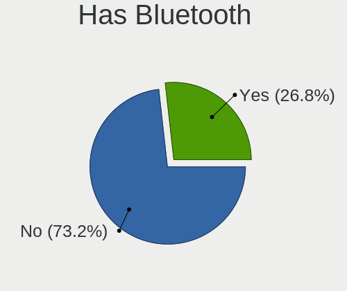
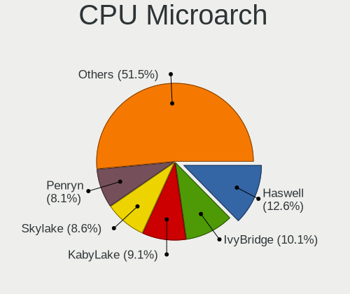
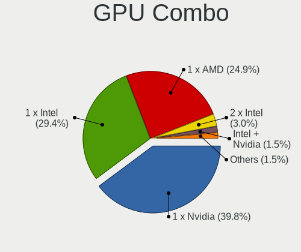
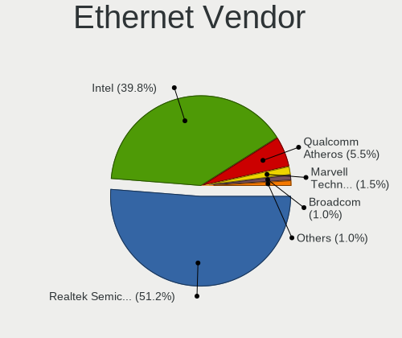
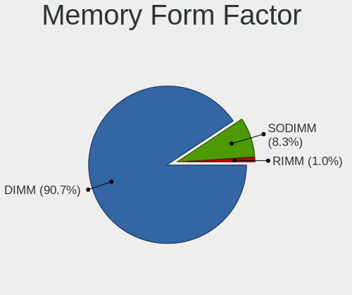
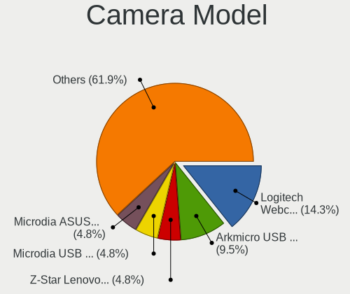

helloSystem 0.7.0 - Tested Hardware & Statistics (Desktops)
-----------------------------------------------------------

A project to collect tested hardware configurations for helloSystem 0.7.0.

Anyone can contribute to this report by the [hw-probe](https://github.com/linuxhw/hw-probe/blob/master/INSTALL.BSD.md) tool:

    hw-probe -all -upload

Please submit a probe of your configuration if it's not presented on the page or is rare.

Full-feature report is available here: https://bsd-hardware.info/?view=trends

Contents
--------

* [ Test Cases ](#test-cases)

* [ System ](#system)
  - [ Arch                     ](#arch)
  - [ DE                       ](#de)
  - [ Display Server           ](#display-server)
  - [ Display Manager          ](#display-manager)
  - [ OS Lang                  ](#os-lang)
  - [ Boot Mode                ](#boot-mode)
  - [ Filesystem               ](#filesystem)
  - [ Part. scheme             ](#part-scheme)

* [ Board ](#board)
  - [ Vendor                   ](#vendor)
  - [ Model                    ](#model)
  - [ Model Family             ](#model-family)
  - [ MFG Year                 ](#mfg-year)
  - [ Form Factor              ](#form-factor)
  - [ Coreboot                 ](#coreboot)
  - [ RAM Size                 ](#ram-size)
  - [ RAM Used                 ](#ram-used)
  - [ Total Drives             ](#total-drives)
  - [ Has CD-ROM               ](#has-cd-rom)
  - [ Has Ethernet             ](#has-ethernet)
  - [ Has WiFi                 ](#has-wifi)
  - [ Has Bluetooth            ](#has-bluetooth)

* [ Location ](#location)
  - [ Country                  ](#country)
  - [ City                     ](#city)

* [ Drives ](#drives)
  - [ Drive Vendor             ](#drive-vendor)
  - [ Drive Model              ](#drive-model)
  - [ HDD Vendor               ](#hdd-vendor)
  - [ SSD Vendor               ](#ssd-vendor)
  - [ Drive Kind               ](#drive-kind)
  - [ Drive Connector          ](#drive-connector)
  - [ Drive Size               ](#drive-size)
  - [ Space Total              ](#space-total)
  - [ Space Used               ](#space-used)
  - [ Malfunc. Drives          ](#malfunc-drives)
  - [ Malfunc. Drive Vendor    ](#malfunc-drive-vendor)
  - [ Malfunc. HDD Vendor      ](#malfunc-hdd-vendor)
  - [ Malfunc. Drive Kind      ](#malfunc-drive-kind)
  - [ Failed Drives            ](#failed-drives)
  - [ Failed Drive Vendor      ](#failed-drive-vendor)
  - [ Drive Status             ](#drive-status)

* [ Storage controller ](#storage-controller)
  - [ Storage Vendor           ](#storage-vendor)
  - [ Storage Model            ](#storage-model)
  - [ Storage Kind             ](#storage-kind)

* [ Processor ](#processor)
  - [ CPU Vendor               ](#cpu-vendor)
  - [ CPU Model                ](#cpu-model)
  - [ CPU Model Family         ](#cpu-model-family)
  - [ CPU Cores                ](#cpu-cores)
  - [ CPU Sockets              ](#cpu-sockets)
  - [ CPU Threads              ](#cpu-threads)
  - [ CPU Microarch            ](#cpu-microarch)

* [ Graphics ](#graphics)
  - [ GPU Vendor               ](#gpu-vendor)
  - [ GPU Model                ](#gpu-model)
  - [ GPU Combo                ](#gpu-combo)
  - [ GPU Driver               ](#gpu-driver)
  - [ GPU Memory               ](#gpu-memory)

* [ Monitor ](#monitor)
  - [ Monitor Vendor           ](#monitor-vendor)
  - [ Monitor Model            ](#monitor-model)
  - [ Monitor Resolution       ](#monitor-resolution)
  - [ Monitor Diagonal         ](#monitor-diagonal)
  - [ Monitor Width            ](#monitor-width)
  - [ Aspect Ratio             ](#aspect-ratio)
  - [ Monitor Area             ](#monitor-area)
  - [ Pixel Density            ](#pixel-density)
  - [ Multiple Monitors        ](#multiple-monitors)

* [ Network ](#network)
  - [ Net Controller Vendor    ](#net-controller-vendor)
  - [ Net Controller Model     ](#net-controller-model)
  - [ Wireless Vendor          ](#wireless-vendor)
  - [ Wireless Model           ](#wireless-model)
  - [ Ethernet Vendor          ](#ethernet-vendor)
  - [ Ethernet Model           ](#ethernet-model)
  - [ Net Controller Kind      ](#net-controller-kind)
  - [ Used Controller          ](#used-controller)
  - [ NICs                     ](#nics)
  - [ IPv6                     ](#ipv6)

* [ Bluetooth ](#bluetooth)
  - [ Bluetooth Vendor         ](#bluetooth-vendor)
  - [ Bluetooth Model          ](#bluetooth-model)

* [ Sound ](#sound)
  - [ Sound Vendor             ](#sound-vendor)
  - [ Sound Model              ](#sound-model)

* [ Memory ](#memory)
  - [ Memory Vendor            ](#memory-vendor)
  - [ Memory Model             ](#memory-model)
  - [ Memory Kind              ](#memory-kind)
  - [ Memory Form Factor       ](#memory-form-factor)
  - [ Memory Size              ](#memory-size)
  - [ Memory Speed             ](#memory-speed)

* [ Printers & scanners ](#printers--scanners)
  - [ Printer Vendor           ](#printer-vendor)
  - [ Printer Model            ](#printer-model)
  - [ Scanner Vendor           ](#scanner-vendor)
  - [ Scanner Model            ](#scanner-model)

* [ Camera ](#camera)
  - [ Camera Vendor            ](#camera-vendor)
  - [ Camera Model             ](#camera-model)

* [ Security ](#security)
  - [ Fingerprint Vendor       ](#fingerprint-vendor)
  - [ Fingerprint Model        ](#fingerprint-model)
  - [ Chipcard Vendor          ](#chipcard-vendor)
  - [ Chipcard Model           ](#chipcard-model)

* [ Unsupported ](#unsupported)
  - [ Unsupported Devices      ](#unsupported-devices)
  - [ Unsupported Device Types ](#unsupported-device-types)

Test Cases
----------

| Vendor   | Model                    | Probe                                                     | Date         |
|----------|--------------------------|-----------------------------------------------------------|--------------|
| ASUSTek  | TUF GAMING X570-PLUS     | [a671e3eb04](https://bsd-hardware.info/?probe=a671e3eb04) | Dec 31, 2021 |
| ASRock   | X570 Phantom Gaming 4    | [15211db056](https://bsd-hardware.info/?probe=15211db056) | Dec 28, 2021 |
| Dell     | 0200DY A01               | [fb37dcbb93](https://bsd-hardware.info/?probe=fb37dcbb93) | Dec 28, 2021 |
| Pegatron | IPM41-D3                 | [6829928dad](https://bsd-hardware.info/?probe=6829928dad) | Dec 28, 2021 |
| Dell     | 0H9KW5 A00               | [e962ca25b3](https://bsd-hardware.info/?probe=e962ca25b3) | Dec 28, 2021 |
| Gigabyte | 970A-DS3P                | [0918f0a5b9](https://bsd-hardware.info/?probe=0918f0a5b9) | Dec 25, 2021 |
| ASUSTek  | PRIME B350M-A            | [b0aa3885bb](https://bsd-hardware.info/?probe=b0aa3885bb) | Dec 25, 2021 |
| ASUSTek  | Z170-P                   | [bde74629f9](https://bsd-hardware.info/?probe=bde74629f9) | Dec 25, 2021 |
| ASUSTek  | TUF GAMING X570-PLUS     | [8ac48ba9c3](https://bsd-hardware.info/?probe=8ac48ba9c3) | Dec 23, 2021 |
| Gigabyte | E3000N                   | [eb0ba1b296](https://bsd-hardware.info/?probe=eb0ba1b296) | Dec 22, 2021 |
| ASUSTek  | ROG STRIX Z370-E GAMING  | [936afa4de3](https://bsd-hardware.info/?probe=936afa4de3) | Dec 21, 2021 |
| ASUSTek  | PRIME A320M-K            | [42599b554e](https://bsd-hardware.info/?probe=42599b554e) | Dec 21, 2021 |
| Gigabyte | X58A-UD5                 | [62b94dd372](https://bsd-hardware.info/?probe=62b94dd372) | Dec 21, 2021 |
| ASUSTek  | ROG STRIX X570-E GAMING  | [5cc62c68f9](https://bsd-hardware.info/?probe=5cc62c68f9) | Dec 21, 2021 |
| Gigabyte | H170-D3HP-CF             | [a490614a39](https://bsd-hardware.info/?probe=a490614a39) | Dec 21, 2021 |
| ASRock   | H110M-DGS                | [40c4553adb](https://bsd-hardware.info/?probe=40c4553adb) | Dec 21, 2021 |
| ASUSTek  | P5VD2-VM                 | [7e8f3cf783](https://bsd-hardware.info/?probe=7e8f3cf783) | Dec 20, 2021 |
| ASUSTek  | Q170M-C                  | [7f9e35a31c](https://bsd-hardware.info/?probe=7f9e35a31c) | Dec 20, 2021 |
| Dell     | 0TDG4V A00               | [3ce808c135](https://bsd-hardware.info/?probe=3ce808c135) | Dec 20, 2021 |
| Dell     | 0TDG4V A00               | [5292ad64ef](https://bsd-hardware.info/?probe=5292ad64ef) | Dec 20, 2021 |
| ASUSTek  | P8Z77-V LX               | [3c71a8ba4e](https://bsd-hardware.info/?probe=3c71a8ba4e) | Dec 20, 2021 |
| MSI      | X370 SLI PLUS            | [73853f1fc2](https://bsd-hardware.info/?probe=73853f1fc2) | Dec 19, 2021 |
| Quanta   | 2AC7 011                 | [1a831a1d34](https://bsd-hardware.info/?probe=1a831a1d34) | Dec 18, 2021 |
| Gigabyte | Z77X-UD3H                | [759ce775c9](https://bsd-hardware.info/?probe=759ce775c9) | Dec 15, 2021 |
| ASUSTek  | TUF GAMING X570-PLUS     | [32d20b9b8e](https://bsd-hardware.info/?probe=32d20b9b8e) | Dec 14, 2021 |
| HP       | 843B                     | [f0d279747f](https://bsd-hardware.info/?probe=f0d279747f) | Dec 13, 2021 |
| HP       | 843B                     | [56400d3999](https://bsd-hardware.info/?probe=56400d3999) | Dec 13, 2021 |
| ASUSTek  | PRIME B450M-A            | [aea4a33dee](https://bsd-hardware.info/?probe=aea4a33dee) | Dec 13, 2021 |
| Gigabyte | H270M-DS3H-CF            | [50fba6deda](https://bsd-hardware.info/?probe=50fba6deda) | Dec 11, 2021 |
| Gigabyte | B450 I AORUS PRO WIFI-CF | [6a1100cfdb](https://bsd-hardware.info/?probe=6a1100cfdb) | Dec 11, 2021 |
| Acer     | RevoOne RL85             | [a1e32de7da](https://bsd-hardware.info/?probe=a1e32de7da) | Dec 10, 2021 |
| Gigabyte | B450 I AORUS PRO WIFI-CF | [b900b364f6](https://bsd-hardware.info/?probe=b900b364f6) | Dec 10, 2021 |
| Dell     | 0YF8P5 A00               | [0f03a66475](https://bsd-hardware.info/?probe=0f03a66475) | Dec 09, 2021 |
| Dell     | 0YF8P5 A00               | [83b36f7c3d](https://bsd-hardware.info/?probe=83b36f7c3d) | Dec 09, 2021 |
| Gigabyte | H270M-DS3H-CF            | [a084ff48c2](https://bsd-hardware.info/?probe=a084ff48c2) | Dec 09, 2021 |
| Gigabyte | H270M-DS3H-CF            | [17b557d792](https://bsd-hardware.info/?probe=17b557d792) | Dec 08, 2021 |
| Gigabyte | X570 AORUS ELITE         | [8cfe11fe93](https://bsd-hardware.info/?probe=8cfe11fe93) | Nov 30, 2021 |
| HP       | 843B                     | [376e006a40](https://bsd-hardware.info/?probe=376e006a40) | Nov 30, 2021 |
| Intel    | DG41TY AAE47335-300      | [dd357bcaa5](https://bsd-hardware.info/?probe=dd357bcaa5) | Nov 30, 2021 |
| HP       | 843B                     | [404224439d](https://bsd-hardware.info/?probe=404224439d) | Nov 29, 2021 |
| HP       | 843B                     | [a8ac0e9efb](https://bsd-hardware.info/?probe=a8ac0e9efb) | Nov 29, 2021 |
| HP       | 1825                     | [32f07d2ba3](https://bsd-hardware.info/?probe=32f07d2ba3) | Nov 28, 2021 |
| Gigabyte | B450 I AORUS PRO WIFI-CF | [4cd5e5166a](https://bsd-hardware.info/?probe=4cd5e5166a) | Nov 27, 2021 |
| ASRock   | 775i945GZ                | [16fc4ee10d](https://bsd-hardware.info/?probe=16fc4ee10d) | Nov 26, 2021 |
| HP       | 844C                     | [fb7d8eaf5d](https://bsd-hardware.info/?probe=fb7d8eaf5d) | Nov 06, 2021 |
| Unknown  | X79                      | [ef88cbc606](https://bsd-hardware.info/?probe=ef88cbc606) | Nov 05, 2021 |
| HP       | 843B                     | [9761f29b5e](https://bsd-hardware.info/?probe=9761f29b5e) | Oct 25, 2021 |
| Acer     | Aspire TC-780            | [3ce8481842](https://bsd-hardware.info/?probe=3ce8481842) | Oct 10, 2021 |

System
------

Arch
----

OS architecture (x86_64, i586, etc.)

| Name  | Desktops | Percent |
|-------|----------|---------|
| amd64 | 33       | 100%    |

DE
--

Desktop Environment

| Name         | Desktops | Percent |
|--------------|----------|---------|
| helloDesktop | 32       | 96.97%  |
| GNOME        | 1        | 3.03%   |

Display Server
--------------

X11 or Wayland

| Name | Desktops | Percent |
|------|----------|---------|
| X11  | 33       | 100%    |

Display Manager
---------------

SDDM, LightDM, etc.

| Name | Desktops | Percent |
|------|----------|---------|
| SLiM | 33       | 100%    |

OS Lang
-------

Language

| Lang  | Desktops | Percent |
|-------|----------|---------|
| en_US | 32       | 96.97%  |
| de_DE | 1        | 3.03%   |

Boot Mode
---------

EFI or BIOS

| Mode | Desktops | Percent |
|------|----------|---------|
| EFI  | 32       | 96.97%  |
| BIOS | 1        | 3.03%   |

Filesystem
----------

Type of filesystem

| Type   | Desktops | Percent |
|--------|----------|---------|
| Cd9660 | 23       | 67.65%  |
| Zfs    | 11       | 32.35%  |

Part. scheme
------------

Scheme of partitioning

| Type | Desktops | Percent |
|------|----------|---------|
| GPT  | 32       | 96.97%  |
| MBR  | 1        | 3.03%   |

Board
-----

Vendor
------

Motherboard manufacturer

| Name                | Desktops | Percent |
|---------------------|----------|---------|
| ASUSTek Computer    | 10       | 30.3%   |
| Gigabyte Technology | 8        | 24.24%  |
| Dell                | 4        | 12.12%  |
| Hewlett-Packard     | 3        | 9.09%   |
| ASRock              | 3        | 9.09%   |
| Quanta              | 1        | 3.03%   |
| Pegatron            | 1        | 3.03%   |
| MSI                 | 1        | 3.03%   |
| Intel               | 1        | 3.03%   |
| Acer                | 1        | 3.03%   |

Model
-----

Motherboard model

| Name                                | Desktops | Percent |
|-------------------------------------|----------|---------|
| Quanta 120-1135                     | 1        | 3.03%   |
| Pegatron IPM41-D3                   | 1        | 3.03%   |
| MSI MS-7A33                         | 1        | 3.03%   |
| Intel DG41TY AAE47335-300           | 1        | 3.03%   |
| HP Pavilion Gaming Desktop 690-00xx | 1        | 3.03%   |
| HP EliteDesk 800 G1 DM              | 1        | 3.03%   |
| HP 844C                             | 1        | 3.03%   |
| Gigabyte Z77X-UD3H                  | 1        | 3.03%   |
| Gigabyte X58A-UD5                   | 1        | 3.03%   |
| Gigabyte X570 AORUS ELITE           | 1        | 3.03%   |
| Gigabyte H270M-DS3H                 | 1        | 3.03%   |
| Gigabyte H170-D3HP                  | 1        | 3.03%   |
| Gigabyte E3000N                     | 1        | 3.03%   |
| Gigabyte B450 I AORUS PRO WIFI      | 1        | 3.03%   |
| Gigabyte 970A-DS3P                  | 1        | 3.03%   |
| Dell Vostro 3667                    | 1        | 3.03%   |
| Dell Precision T1700                | 1        | 3.03%   |
| Dell OptiPlex 780                   | 1        | 3.03%   |
| Dell Inspiron 3891                  | 1        | 3.03%   |
| ASUS Z170-P                         | 1        | 3.03%   |
| ASUS TUF GAMING X570-PLUS           | 1        | 3.03%   |
| ASUS ROG STRIX Z370-E GAMING        | 1        | 3.03%   |
| ASUS ROG STRIX X570-E GAMING        | 1        | 3.03%   |
| ASUS Q170M-C                        | 1        | 3.03%   |
| ASUS PRIME B450M-A                  | 1        | 3.03%   |
| ASUS PRIME B350M-A                  | 1        | 3.03%   |
| ASUS PRIME A320M-K                  | 1        | 3.03%   |
| ASUS P8Z77-V LX                     | 1        | 3.03%   |
| ASUS P5VD2-VM                       | 1        | 3.03%   |
| ASRock X570 Phantom Gaming 4        | 1        | 3.03%   |
| ASRock H110M-DGS                    | 1        | 3.03%   |
| ASRock 775i945GZ                    | 1        | 3.03%   |
| Acer RevoOne RL85                   | 1        | 3.03%   |

Model Family
------------

Motherboard model prefix

| Name                | Desktops | Percent |
|---------------------|----------|---------|
| ASUS PRIME          | 3        | 9.09%   |
| ASUS ROG            | 2        | 6.06%   |
| Quanta 120-1135     | 1        | 3.03%   |
| Pegatron IPM41-D3   | 1        | 3.03%   |
| MSI MS-7A33         | 1        | 3.03%   |
| Intel DG41TY        | 1        | 3.03%   |
| HP Pavilion         | 1        | 3.03%   |
| HP EliteDesk        | 1        | 3.03%   |
| HP 844C             | 1        | 3.03%   |
| Gigabyte Z77X-UD3H  | 1        | 3.03%   |
| Gigabyte X58A-UD5   | 1        | 3.03%   |
| Gigabyte X570       | 1        | 3.03%   |
| Gigabyte H270M-DS3H | 1        | 3.03%   |
| Gigabyte H170-D3HP  | 1        | 3.03%   |
| Gigabyte E3000N     | 1        | 3.03%   |
| Gigabyte B450       | 1        | 3.03%   |
| Gigabyte 970A-DS3P  | 1        | 3.03%   |
| Dell Vostro         | 1        | 3.03%   |
| Dell Precision      | 1        | 3.03%   |
| Dell OptiPlex       | 1        | 3.03%   |
| Dell Inspiron       | 1        | 3.03%   |
| ASUS Z170-P         | 1        | 3.03%   |
| ASUS TUF            | 1        | 3.03%   |
| ASUS Q170M-C        | 1        | 3.03%   |
| ASUS P8Z77-V        | 1        | 3.03%   |
| ASUS P5VD2-VM       | 1        | 3.03%   |
| ASRock X570         | 1        | 3.03%   |
| ASRock H110M-DGS    | 1        | 3.03%   |
| ASRock 775i945GZ    | 1        | 3.03%   |
| Acer RevoOne        | 1        | 3.03%   |

MFG Year
--------

Motherboard manufacture year

| Year | Desktops | Percent |
|------|----------|---------|
| 2021 | 10       | 30.3%   |
| 2018 | 4        | 12.12%  |
| 2017 | 3        | 9.09%   |
| 2020 | 2        | 6.06%   |
| 2019 | 2        | 6.06%   |
| 2016 | 2        | 6.06%   |
| 2011 | 2        | 6.06%   |
| 2010 | 2        | 6.06%   |
| 2007 | 2        | 6.06%   |
| 2015 | 1        | 3.03%   |
| 2014 | 1        | 3.03%   |
| 2013 | 1        | 3.03%   |
| 2012 | 1        | 3.03%   |

Form Factor
-----------

Physical design of the computer

| Name    | Desktops | Percent |
|---------|----------|---------|
| Desktop | 33       | 100%    |

Coreboot
--------

Have coreboot on board

| Used | Desktops | Percent |
|------|----------|---------|
| No   | 33       | 100%    |

RAM Size
--------

Total RAM memory

| Size in GB  | Desktops | Percent |
|-------------|----------|---------|
| 32.01-64.0  | 8        | 24.24%  |
| 8.01-16.0   | 8        | 24.24%  |
| 16.01-24.0  | 7        | 21.21%  |
| 4.01-8.0    | 6        | 18.18%  |
| 24.01-32.0  | 1        | 3.03%   |
| 2.01-3.0    | 1        | 3.03%   |
| 64.01-256.0 | 1        | 3.03%   |
| 0.51-1.0    | 1        | 3.03%   |

RAM Used
--------

Used RAM memory

| Used GB   | Desktops | Percent |
|-----------|----------|---------|
| 0.01-0.5  | 12       | 35.29%  |
| 1.01-2.0  | 9        | 26.47%  |
| 0.51-1.0  | 9        | 26.47%  |
| 2.01-3.0  | 2        | 5.88%   |
| 3.01-4.0  | 1        | 2.94%   |
| 8.01-16.0 | 1        | 2.94%   |

Total Drives
------------

Number of drives on board

| Drives | Desktops | Percent |
|--------|----------|---------|
| 1      | 11       | 33.33%  |
| 2      | 7        | 21.21%  |
| 3      | 5        | 15.15%  |
| 0      | 4        | 12.12%  |
| 4      | 3        | 9.09%   |
| 5      | 2        | 6.06%   |
| 6      | 1        | 3.03%   |

Has CD-ROM
----------

Has CD-ROM on board

| Presented | Desktops | Percent |
|-----------|----------|---------|
| No        | 20       | 60.61%  |
| Yes       | 13       | 39.39%  |

Has Ethernet
------------

Has Ethernet on board

| Presented | Desktops | Percent |
|-----------|----------|---------|
| Yes       | 33       | 100%    |

Has WiFi
--------

Has WiFi module

| Presented | Desktops | Percent |
|-----------|----------|---------|
| No        | 19       | 57.58%  |
| Yes       | 14       | 42.42%  |

Has Bluetooth
-------------

Has Bluetooth module

| Presented | Desktops | Percent |
|-----------|----------|---------|
| No        | 20       | 60.61%  |
| Yes       | 13       | 39.39%  |

Location
--------

Country
-------

Geographic location (country)

| Country     | Desktops | Percent |
|-------------|----------|---------|
| USA         | 5        | 15.15%  |
| Russia      | 5        | 15.15%  |
| Canada      | 3        | 9.09%   |
| Romania     | 2        | 6.06%   |
| Hungary     | 2        | 6.06%   |
| Germany     | 2        | 6.06%   |
| Vietnam     | 1        | 3.03%   |
| Ukraine     | 1        | 3.03%   |
| Taiwan      | 1        | 3.03%   |
| Spain       | 1        | 3.03%   |
| Poland      | 1        | 3.03%   |
| Philippines | 1        | 3.03%   |
| Peru        | 1        | 3.03%   |
| Norway      | 1        | 3.03%   |
| Italy       | 1        | 3.03%   |
| India       | 1        | 3.03%   |
| France      | 1        | 3.03%   |
| Denmark     | 1        | 3.03%   |
| China       | 1        | 3.03%   |
| Brazil      | 1        | 3.03%   |

City
----

Geographic location (city)

| City              | Desktops | Percent |
|-------------------|----------|---------|
| Yunlin            | 1        | 2.94%   |
| Szeged            | 1        | 2.94%   |
| Sz?©kesfeh?©rv??r | 1        | 2.94%   |
| Surgut            | 1        | 2.94%   |
| Suceava           | 1        | 2.94%   |
| St Petersburg     | 1        | 2.94%   |
| Smiths Falls      | 1        | 2.94%   |
| Santa Maria       | 1        | 2.94%   |
| Renfrew           | 1        | 2.94%   |
| Paso Robles       | 1        | 2.94%   |
| Ourense           | 1        | 2.94%   |
| Novosibirsk       | 1        | 2.94%   |
| New Delhi         | 1        | 2.94%   |
| Myski             | 1        | 2.94%   |
| Montreal          | 1        | 2.94%   |
| Lima              | 1        | 2.94%   |
| Lehrte            | 1        | 2.94%   |
| Katowice          | 1        | 2.94%   |
| Hayfork           | 1        | 2.94%   |
| Hanoi             | 1        | 2.94%   |
| Hangzhou          | 1        | 2.94%   |
| Front Royal       | 1        | 2.94%   |
| Follonica         | 1        | 2.94%   |
| Escondido         | 1        | 2.94%   |
| Esbjerg           | 1        | 2.94%   |
| Dreieich          | 1        | 2.94%   |
| Curitiba          | 1        | 2.94%   |
| Collierville      | 1        | 2.94%   |
| Chelyabinsk       | 1        | 2.94%   |
| Chamb?©ry         | 1        | 2.94%   |
| Bucharest         | 1        | 2.94%   |
| Belogorodka       | 1        | 2.94%   |
| Balestrand        | 1        | 2.94%   |
| A Valenza         | 1        | 2.94%   |

Drives
------

Drive Vendor
------------

Hard drive vendors

| Vendor              | Desktops | Drives | Percent |
|---------------------|----------|--------|---------|
| Seagate             | 13       | 21     | 22.41%  |
| Samsung Electronics | 13       | 16     | 22.41%  |
| WDC                 | 8        | 11     | 13.79%  |
| Toshiba             | 4        | 6      | 6.9%    |
| SK Hynix            | 3        | 5      | 5.17%   |
| Kingston            | 3        | 3      | 5.17%   |
| XPG                 | 2        | 2      | 3.45%   |
| Intel               | 2        | 2      | 3.45%   |
| Crucial             | 2        | 2      | 3.45%   |
| A-DATA Technology   | 2        | 2      | 3.45%   |
| SanDisk             | 1        | 1      | 1.72%   |
| Phison              | 1        | 1      | 1.72%   |
| OCZ                 | 1        | 1      | 1.72%   |
| Hitachi             | 1        | 1      | 1.72%   |
| HGST                | 1        | 1      | 1.72%   |
| GOODRAM             | 1        | 1      | 1.72%   |

Drive Model
-----------

Hard drive models

| Model                                   | Desktops | Percent |
|-----------------------------------------|----------|---------|
| Samsung SSD 850 EVO 250GB               | 3        | 4.55%   |
| XPG GAMMIX S11 Pro 1TB                  | 2        | 3.03%   |
| Seagate ST4000DM004-2CV104 4TB          | 2        | 3.03%   |
| Seagate ST1000DM010-2EP102 1TB          | 2        | 3.03%   |
| Samsung SSD 970 EVO 250GB               | 2        | 3.03%   |
| Kingston SA400S37120G 120GB             | 2        | 3.03%   |
| WDC WDS500G2B0A-00SM50 500GB            | 1        | 1.52%   |
| WDC WDS250G1B0A-00H9H0 250GB            | 1        | 1.52%   |
| WDC WDS240G2G0A-00JH30 240GB            | 1        | 1.52%   |
| WDC WDS100T2B0A-00SM50 1TB              | 1        | 1.52%   |
| WDC WD5000LPVX-22V0TT0 500GB            | 1        | 1.52%   |
| WDC WD40EZRZ-00GXCB0 4TB                | 1        | 1.52%   |
| WDC WD3003FZEX-00Z4SA0 3TB              | 1        | 1.52%   |
| WDC WD10EZEX-60WN4A0 1TB                | 1        | 1.52%   |
| WDC WD10EZEX-00KUWA0 1TB                | 1        | 1.52%   |
| Toshiba HDWE160 6TB                     | 1        | 1.52%   |
| Toshiba HDWD110 1TB                     | 1        | 1.52%   |
| Toshiba DT01ACA100 1TB                  | 1        | 1.52%   |
| Toshiba DT01ACA050 500GB                | 1        | 1.52%   |
| SK Hynix SHGS31-1000GS-2 1TB            | 1        | 1.52%   |
| SK Hynix BC711 NVMe 256GB               | 1        | 1.52%   |
| SK Hynix BC501 HFM128GDJTNG-8310A 128GB | 1        | 1.52%   |
| Seagate ST4000NC001-1FS168 4TB          | 1        | 1.52%   |
| Seagate ST4000NC000-1FR168 4TB          | 1        | 1.52%   |
| Seagate ST3500413AS 500GB               | 1        | 1.52%   |
| Seagate ST3400633AS 400GB               | 1        | 1.52%   |
| Seagate ST32000641AS 2TB                | 1        | 1.52%   |
| Seagate ST3000DM008-2DM166 3TB          | 1        | 1.52%   |
| Seagate ST3000DM001-1CH166 3TB          | 1        | 1.52%   |
| Seagate ST2000LX001-1RG174 2TB          | 1        | 1.52%   |
| Seagate ST2000DM008-2FR102 2TB          | 1        | 1.52%   |
| Seagate ST2000DM006-2DM164 2TB          | 1        | 1.52%   |
| Seagate ST2000DM001-1ER164 2TB          | 1        | 1.52%   |
| Seagate ST2000DL003-9VT166 2TB          | 1        | 1.52%   |
| Seagate ST1000LM035-1RK172 1TB          | 1        | 1.52%   |
| Seagate ST1000DM003-1ER162 1TB          | 1        | 1.52%   |
| SanDisk SDSSDA120G 120GB                | 1        | 1.52%   |
| Samsung SSD 980 1TB                     | 1        | 1.52%   |
| Samsung SSD 970 EVO Plus 500GB          | 1        | 1.52%   |
| Samsung SSD 970 EVO 1TB                 | 1        | 1.52%   |
| Samsung SSD 870 EVO 500GB               | 1        | 1.52%   |
| Samsung SSD 870 EVO 1TB                 | 1        | 1.52%   |
| Samsung SSD 860 EVO M.2 500GB           | 1        | 1.52%   |
| Samsung SSD 860 EVO 500GB               | 1        | 1.52%   |
| Samsung SSD 860 EVO 250GB               | 1        | 1.52%   |
| Samsung Portable SSD T5 500GB           | 1        | 1.52%   |
| Samsung PM961 NVMe 256GB                | 1        | 1.52%   |
| Phison Sabrent 1TB                      | 1        | 1.52%   |
| OCZ AGILITY3 128GB                      | 1        | 1.52%   |
| Kingston SA2000M81000G 1TB              | 1        | 1.52%   |
| Intel SSDSC2CW120A3 120GB               | 1        | 1.52%   |
| Intel SSDSC2BP480G4 480GB               | 1        | 1.52%   |
| Hitachi HTS541680J9SA00 80GB            | 1        | 1.52%   |
| HGST HTS725050A7E630 500GB              | 1        | 1.52%   |
| GOODRAM SSDPR-CX400-128-G2 128GB        | 1        | 1.52%   |
| Crucial CT240M500SSD1 240GB             | 1        | 1.52%   |
| Crucial CT1050MX300SSD4 1TB             | 1        | 1.52%   |
| A-DATA SU630 240GB                      | 1        | 1.52%   |
| A-DATA SP900 128GB                      | 1        | 1.52%   |

HDD Vendor
----------

Hard disk drive vendors

| Vendor  | Desktops | Drives | Percent |
|---------|----------|--------|---------|
| Seagate | 13       | 21     | 54.17%  |
| WDC     | 5        | 5      | 20.83%  |
| Toshiba | 4        | 6      | 16.67%  |
| Hitachi | 1        | 1      | 4.17%   |
| HGST    | 1        | 1      | 4.17%   |

SSD Vendor
----------

Solid state drive vendors

| Vendor              | Desktops | Drives | Percent |
|---------------------|----------|--------|---------|
| Samsung Electronics | 9        | 9      | 37.5%   |
| WDC                 | 3        | 6      | 12.5%   |
| Kingston            | 2        | 2      | 8.33%   |
| Intel               | 2        | 2      | 8.33%   |
| Crucial             | 2        | 2      | 8.33%   |
| A-DATA Technology   | 2        | 2      | 8.33%   |
| SK Hynix            | 1        | 1      | 4.17%   |
| SanDisk             | 1        | 1      | 4.17%   |
| OCZ                 | 1        | 1      | 4.17%   |
| GOODRAM             | 1        | 1      | 4.17%   |

Drive Kind
----------

HDD or SSD

| Kind | Desktops | Drives | Percent |
|------|----------|--------|---------|
| HDD  | 20       | 34     | 40%     |
| SSD  | 19       | 27     | 38%     |
| NVMe | 11       | 15     | 22%     |

Drive Connector
---------------

SATA, SAS, NVMe, etc.

| Type | Desktops | Drives | Percent |
|------|----------|--------|---------|
| SATA | 27       | 61     | 71.05%  |
| NVMe | 11       | 15     | 28.95%  |

Drive Size
----------

Size of hard drive

| Size in TB | Desktops | Drives | Percent |
|------------|----------|--------|---------|
| 0.01-0.5   | 20       | 29     | 47.62%  |
| 0.51-1.0   | 9        | 13     | 21.43%  |
| 1.01-2.0   | 7        | 8      | 16.67%  |
| 3.01-4.0   | 3        | 7      | 7.14%   |
| 2.01-3.0   | 2        | 3      | 4.76%   |
| 4.01-10.0  | 1        | 1      | 2.38%   |

Space Total
-----------

Amount of disk space available on the file system

| Size in GB | Desktops | Percent |
|------------|----------|---------|
| 1-20       | 24       | 72.73%  |
| 101-250    | 4        | 12.12%  |
| 251-500    | 2        | 6.06%   |
| 21-50      | 1        | 3.03%   |
| 501-1000   | 1        | 3.03%   |
| 51-100     | 1        | 3.03%   |

Space Used
----------

Amount of used disk space

| Used GB | Desktops | Percent |
|---------|----------|---------|
| 1-20    | 33       | 100%    |

Malfunc. Drives
---------------

Drive models with a malfunction

| Model                               | Desktops | Drives | Percent |
|-------------------------------------|----------|--------|---------|
| Toshiba DT01ACA100 1TB              | 1        | 3      | 20%     |
| Seagate ST3500413AS 500GB           | 1        | 1      | 20%     |
| Samsung Electronics SSD 870 EVO 1TB | 1        | 1      | 20%     |
| Hitachi HTS541680J9SA00 80GB        | 1        | 1      | 20%     |
| Crucial CT240M500SSD1 240GB         | 1        | 1      | 20%     |

Malfunc. Drive Vendor
---------------------

Vendors of faulty drives

| Vendor              | Desktops | Drives | Percent |
|---------------------|----------|--------|---------|
| Toshiba             | 1        | 3      | 20%     |
| Seagate             | 1        | 1      | 20%     |
| Samsung Electronics | 1        | 1      | 20%     |
| Hitachi             | 1        | 1      | 20%     |
| Crucial             | 1        | 1      | 20%     |

Malfunc. HDD Vendor
-------------------

Vendors of faulty HDD drives

| Vendor  | Desktops | Drives | Percent |
|---------|----------|--------|---------|
| Toshiba | 1        | 3      | 33.33%  |
| Seagate | 1        | 1      | 33.33%  |
| Hitachi | 1        | 1      | 33.33%  |

Malfunc. Drive Kind
-------------------

Kinds of faulty drives

| Kind | Desktops | Drives | Percent |
|------|----------|--------|---------|
| HDD  | 3        | 5      | 60%     |
| SSD  | 2        | 2      | 40%     |

Failed Drives
-------------

Failed drive models

Zero info for selected period =(

Failed Drive Vendor
-------------------

Failed drive vendors

Zero info for selected period =(

Drive Status
------------

Number of failed and malfunc. drives

| Status  | Desktops | Drives | Percent |
|---------|----------|--------|---------|
| Works   | 28       | 69     | 84.85%  |
| Malfunc | 5        | 7      | 15.15%  |

Storage controller
------------------

Storage Vendor
--------------

Storage controller vendors

| Vendor                      | Desktops | Percent |
|-----------------------------|----------|---------|
| Intel                       | 20       | 42.55%  |
| AMD                         | 12       | 25.53%  |
| Samsung Electronics         | 5        | 10.64%  |
| SK Hynix                    | 2        | 4.26%   |
| Marvell Technology Group    | 2        | 4.26%   |
| ADATA Technology            | 2        | 4.26%   |
| VIA Technologies            | 1        | 2.13%   |
| Phison Electronics          | 1        | 2.13%   |
| Kingston Technology Company | 1        | 2.13%   |
| JMicron Technology          | 1        | 2.13%   |

Storage Model
-------------

Storage controller models

| Model                                                                          | Desktops | Percent |
|--------------------------------------------------------------------------------|----------|---------|
| AMD FCH SATA Controller [AHCI mode]                                            | 10       | 17.24%  |
| Intel Q170/Q150/B150/H170/H110/Z170/CM236 Chipset SATA Controller [AHCI Mode]  | 5        | 8.62%   |
| Samsung NVMe SSD Controller SM981/PM981/PM983                                  | 4        | 6.9%    |
| Intel NM10/ICH7 Family SATA Controller [IDE mode]                              | 3        | 5.17%   |
| Intel Cannon Lake PCH SATA AHCI Controller                                     | 2        | 3.45%   |
| Intel 82801G (ICH7 Family) IDE Controller                                      | 2        | 3.45%   |
| Intel 8 Series/C220 Series Chipset Family 6-port SATA Controller 1 [AHCI mode] | 2        | 3.45%   |
| Intel 7 Series/C210 Series Chipset Family 6-port SATA Controller [AHCI mode]   | 2        | 3.45%   |
| AMD SB7x0/SB8x0/SB9x0 SATA Controller [AHCI mode]                              | 2        | 3.45%   |
| AMD 400 Series Chipset SATA Controller                                         | 2        | 3.45%   |
| ADATA XPG SX8200 Pro PCIe Gen3x4 M.2 2280 Solid State Drive                    | 2        | 3.45%   |
| VIA VT82C586A/B/VT82C686/A/B/VT823x/A/C PIPC Bus Master IDE                    | 1        | 1.72%   |
| VIA VT8237A SATA 2-Port Controller                                             | 1        | 1.72%   |
| SK Hynix Gold P31 SSD                                                          | 1        | 1.72%   |
| SK Hynix BC501 NVMe Solid State Drive                                          | 1        | 1.72%   |
| Samsung NVMe SSD Controller SM961/PM961/SM963                                  | 1        | 1.72%   |
| Samsung NVMe SSD Controller 980                                                | 1        | 1.72%   |
| Phison E12 NVMe Controller                                                     | 1        | 1.72%   |
| Marvell Group 88SE9172 SATA 6Gb/s Controller                                   | 1        | 1.72%   |
| Marvell Group 88SE9128 PCIe SATA 6 Gb/s RAID controller                        | 1        | 1.72%   |
| Kingston Company A2000 NVMe SSD                                                | 1        | 1.72%   |
| JMicron JMB363 SATA/IDE Controller                                             | 1        | 1.72%   |
| Intel SATA Controller [RAID mode]                                              | 1        | 1.72%   |
| Intel 82801JI (ICH10 Family) SATA AHCI Controller                              | 1        | 1.72%   |
| Intel 82801JD/DO (ICH10 Family) 4-port SATA IDE Controller                     | 1        | 1.72%   |
| Intel 82801JD/DO (ICH10 Family) 2-port SATA IDE Controller                     | 1        | 1.72%   |
| Intel 82801 Mobile SATA Controller [RAID mode]                                 | 1        | 1.72%   |
| Intel 500 Series Chipset Family SATA AHCI Controller                           | 1        | 1.72%   |
| Intel 4 Series Chipset PT IDER Controller                                      | 1        | 1.72%   |
| Intel 200 Series PCH SATA controller [AHCI mode]                               | 1        | 1.72%   |
| AMD X370 Series Chipset SATA Controller                                        | 1        | 1.72%   |
| AMD FCH SATA Controller D                                                      | 1        | 1.72%   |
| AMD 300 Series Chipset SATA Controller                                         | 1        | 1.72%   |

Storage Kind
------------

Kind of storage controller (IDE, SATA, NVMe, SAS, ...)

| Kind | Desktops | Percent |
|------|----------|---------|
| SATA | 26       | 59.09%  |
| NVMe | 11       | 25%     |
| IDE  | 5        | 11.36%  |
| RAID | 2        | 4.55%   |

Processor
---------

CPU Vendor
----------

Processor vendors

| Vendor | Desktops | Percent |
|--------|----------|---------|
| Intel  | 21       | 63.64%  |
| AMD    | 12       | 36.36%  |

CPU Model
---------

Processor models

| Model                                       | Desktops | Percent |
|---------------------------------------------|----------|---------|
| Intel Xeon CPU E3-1230 V2 @ 3.30GHz         | 1        | 3.03%   |
| Intel Pentium Dual-Core CPU E6700 @ 3.20GHz | 1        | 3.03%   |
| Intel Core i7-8700K CPU @ 3.70GHz           | 1        | 3.03%   |
| Intel Core i7-8700 CPU @ 3.20GHz            | 1        | 3.03%   |
| Intel Core i7-7700 CPU @ 3.60GHz            | 1        | 3.03%   |
| Intel Core i7-6700 CPU @ 3.40GHz            | 1        | 3.03%   |
| Intel Core i7-4770 CPU @ 3.40GHz            | 1        | 3.03%   |
| Intel Core i7 CPU                           | 1        | 3.03%   |
| Intel Core i5-8400 CPU @ 2.80GHz            | 1        | 3.03%   |
| Intel Core i5-6500 CPU @ 3.20GHz            | 1        | 3.03%   |
| Intel Core i5-6400 CPU @ 2.70GHz            | 1        | 3.03%   |
| Intel Core i5-4590T CPU @ 2.00GHz           | 1        | 3.03%   |
| Intel Core i5-3475S CPU @ 2.90GHz           | 1        | 3.03%   |
| Intel Core i3-6320 CPU @ 3.90GHz            | 1        | 3.03%   |
| Intel Core i3-6300 CPU @ 3.80GHz            | 1        | 3.03%   |
| Intel Core i3-5010U CPU @ 2.10GHz           | 1        | 3.03%   |
| Intel Core 2 Duo CPU E7500 @ 2.93GHz        | 1        | 3.03%   |
| Intel Core 2 Duo CPU E4700 @ 2.60GHz        | 1        | 3.03%   |
| Intel Core 2 Duo                            | 1        | 3.03%   |
| Intel Core 2 CPU 4300 @ 1.80GHz             | 1        | 3.03%   |
| Intel 11th Gen Core i5-11400 @ 2.60GHz      | 1        | 3.03%   |
| AMD Ryzen 9 5900X 12-Core Processor         | 1        | 3.03%   |
| AMD Ryzen 9 3900X 12-Core Processor         | 1        | 3.03%   |
| AMD Ryzen 7 5800X 8-Core Processor          | 1        | 3.03%   |
| AMD Ryzen 7 5700G with Radeon Graphics      | 1        | 3.03%   |
| AMD Ryzen 7 1800X Eight-Core Processor      | 1        | 3.03%   |
| AMD Ryzen 5 3600X 6-Core Processor          | 1        | 3.03%   |
| AMD Ryzen 5 3400G with Radeon Vega Graphics | 1        | 3.03%   |
| AMD Ryzen 5 2400G with Radeon Vega Graphics | 1        | 3.03%   |
| AMD Ryzen 5 1600 Six-Core Processor         | 1        | 3.03%   |
| AMD FX-6300 Six-Core Processor              | 1        | 3.03%   |
| AMD E2-3000 APU with Radeon HD Graphics     | 1        | 3.03%   |
| AMD E-450 APU with Radeon HD Graphics       | 1        | 3.03%   |

CPU Model Family
----------------

Processor model prefix

| Model                   | Desktops | Percent |
|-------------------------|----------|---------|
| Intel Core i7           | 6        | 18.18%  |
| Intel Core i5           | 5        | 15.15%  |
| AMD Ryzen 5             | 4        | 12.12%  |
| Intel Core i3           | 3        | 9.09%   |
| Intel Core 2 Duo        | 3        | 9.09%   |
| AMD Ryzen 7             | 3        | 9.09%   |
| AMD Ryzen 9             | 2        | 6.06%   |
| Other                   | 1        | 3.03%   |
| Intel Xeon              | 1        | 3.03%   |
| Intel Pentium Dual-Core | 1        | 3.03%   |
| Intel Core 2            | 1        | 3.03%   |
| AMD FX                  | 1        | 3.03%   |
| AMD E2                  | 1        | 3.03%   |
| AMD E                   | 1        | 3.03%   |

CPU Cores
---------

Number of processor cores

| Number  | Desktops | Percent |
|---------|----------|---------|
| 4       | 9        | 27.27%  |
| 2       | 7        | 21.21%  |
| 6       | 5        | 15.15%  |
| Unknown | 3        | 9.09%   |
| 24      | 2        | 6.06%   |
| 16      | 2        | 6.06%   |
| 12      | 2        | 6.06%   |
| 8       | 2        | 6.06%   |
| 14      | 1        | 3.03%   |

CPU Sockets
-----------

Number of sockets

| Number | Desktops | Percent |
|--------|----------|---------|
| 1      | 33       | 100%    |

CPU Threads
-----------

Threads per core (Hyper-Threading)

| Number  | Desktops | Percent |
|---------|----------|---------|
| 1       | 19       | 57.58%  |
| 2       | 11       | 33.33%  |
| Unknown | 3        | 9.09%   |

CPU Microarch
-------------

Microarchitecture

| Name       | Desktops | Percent |
|------------|----------|---------|
| Skylake    | 5        | 15.15%  |
| KabyLake   | 4        | 12.12%  |
| Zen 3      | 3        | 9.09%   |
| Zen        | 3        | 9.09%   |
| Penryn     | 3        | 9.09%   |
| Zen 2      | 2        | 6.06%   |
| IvyBridge  | 2        | 6.06%   |
| Haswell    | 2        | 6.06%   |
| Core       | 2        | 6.06%   |
| Zen+       | 1        | 3.03%   |
| Piledriver | 1        | 3.03%   |
| Nehalem    | 1        | 3.03%   |
| Jaguar     | 1        | 3.03%   |
| Broadwell  | 1        | 3.03%   |
| Bobcat     | 1        | 3.03%   |
| Unknown    | 1        | 3.03%   |

Graphics
--------

GPU Vendor
----------

Vendors of graphics cards

| Vendor | Desktops | Percent |
|--------|----------|---------|
| Nvidia | 13       | 39.39%  |
| Intel  | 11       | 33.33%  |
| AMD    | 9        | 27.27%  |

GPU Model
---------

Graphics card models

| Model                                                                       | Desktops | Percent |
|-----------------------------------------------------------------------------|----------|---------|
| Intel HD Graphics 530                                                       | 3        | 9.09%   |
| Nvidia GP107 [GeForce GTX 1050 Ti]                                          | 2        | 6.06%   |
| Intel Xeon E3-1200 v3/4th Gen Core Processor Integrated Graphics Controller | 2        | 6.06%   |
| Intel 4 Series Chipset Integrated Graphics Controller                       | 2        | 6.06%   |
| Nvidia GP107 [GeForce GTX 1050]                                             | 1        | 3.03%   |
| Nvidia GP106 [GeForce GTX 1060 6GB]                                         | 1        | 3.03%   |
| Nvidia GP104 [GeForce GTX 1080]                                             | 1        | 3.03%   |
| Nvidia GP104 [GeForce GTX 1070 Ti]                                          | 1        | 3.03%   |
| Nvidia GM206 [GeForce GTX 950]                                              | 1        | 3.03%   |
| Nvidia GM204 [GeForce GTX 970]                                              | 1        | 3.03%   |
| Nvidia GM107 [GeForce GTX 750]                                              | 1        | 3.03%   |
| Nvidia GK104 [GeForce GTX 760]                                              | 1        | 3.03%   |
| Nvidia GA104 [GeForce RTX 3070 Lite Hash Rate]                              | 1        | 3.03%   |
| Nvidia G86 [GeForce 8500 GT]                                                | 1        | 3.03%   |
| Nvidia G72 [GeForce 7300 LE]                                                | 1        | 3.03%   |
| Intel RocketLake-S GT1 [UHD Graphics 730]                                   | 1        | 3.03%   |
| Intel IvyBridge GT2 [HD Graphics 4000]                                      | 1        | 3.03%   |
| Intel HD Graphics 630                                                       | 1        | 3.03%   |
| Intel HD Graphics 5500                                                      | 1        | 3.03%   |
| AMD Wrestler [Radeon HD 6320]                                               | 1        | 3.03%   |
| AMD Turks XT [Radeon HD 6670/7670]                                          | 1        | 3.03%   |
| AMD Redwood XT [Radeon HD 5670/5690/5730]                                   | 1        | 3.03%   |
| AMD Raven Ridge [Radeon Vega Series / Radeon Vega Mobile Series]            | 1        | 3.03%   |
| AMD Picasso/Raven 2 [Radeon Vega Series / Radeon Vega Mobile Series]        | 1        | 3.03%   |
| AMD Navi 10 [Radeon RX 5600 OEM/5600 XT / 5700/5700 XT]                     | 1        | 3.03%   |
| AMD Kabini [Radeon HD 8280 / R3 Series]                                     | 1        | 3.03%   |
| AMD Ellesmere [Radeon RX 470/480/570/570X/580/580X/590]                     | 1        | 3.03%   |
| AMD Cezanne                                                                 | 1        | 3.03%   |

GPU Combo
---------

Combinations of graphics cards

| Name       | Desktops | Percent |
|------------|----------|---------|
| 1 x Nvidia | 13       | 39.39%  |
| 1 x Intel  | 10       | 30.3%   |
| 1 x AMD    | 9        | 27.27%  |
| 2 x Intel  | 1        | 3.03%   |

GPU Driver
----------

Free vs proprietary

| Driver      | Desktops | Percent |
|-------------|----------|---------|
| Free        | 20       | 58.82%  |
| Proprietary | 12       | 35.29%  |
| Unknown     | 2        | 5.88%   |

GPU Memory
----------

Total video memory

| Size in GB | Desktops | Percent |
|------------|----------|---------|
| Unknown    | 15       | 44.12%  |
| 1.01-2.0   | 6        | 17.65%  |
| 3.01-4.0   | 5        | 14.71%  |
| 7.01-8.0   | 3        | 8.82%   |
| 0.01-0.5   | 3        | 8.82%   |
| 5.01-6.0   | 1        | 2.94%   |
| 0.51-1.0   | 1        | 2.94%   |

Monitor
-------

Monitor Vendor
--------------

Monitor vendors

| Vendor               | Desktops | Percent |
|----------------------|----------|---------|
| Samsung Electronics  | 6        | 18.18%  |
| Goldstar             | 5        | 15.15%  |
| Dell                 | 5        | 15.15%  |
| Hewlett-Packard      | 4        | 12.12%  |
| BenQ                 | 4        | 12.12%  |
| AOC                  | 4        | 12.12%  |
| Philips              | 1        | 3.03%   |
| NEC Computers        | 1        | 3.03%   |
| Iiyama               | 1        | 3.03%   |
| Ancor Communications | 1        | 3.03%   |
| Acer                 | 1        | 3.03%   |

Monitor Model
-------------

Monitor models

| Model                                                                 | Desktops | Percent |
|-----------------------------------------------------------------------|----------|---------|
| Samsung Electronics U28E590 SAM0C4E 3840x2160 610x350mm 27.7-inch     | 1        | 2.94%   |
| Samsung Electronics T24E390 SAM0C20 1920x1080 520x290mm 23.4-inch     | 1        | 2.94%   |
| Samsung Electronics SyncMaster SAM05FF 1600x900 440x250mm 19.9-inch   | 1        | 2.94%   |
| Samsung Electronics SyncMaster SAM05C5 1920x1080                      | 1        | 2.94%   |
| Samsung Electronics SyncMaster SAM027D 1680x1050 430x270mm 20.0-inch  | 1        | 2.94%   |
| Samsung Electronics SMBX2250 SAM071B 1920x1080 480x270mm 21.7-inch    | 1        | 2.94%   |
| Samsung Electronics S24D390 SAM0B65 1920x1080 520x290mm 23.4-inch     | 1        | 2.94%   |
| Philips PHL 278E1 PHLC217 3840x2160 600x340mm 27.2-inch               | 1        | 2.94%   |
| NEC Computers LCD1770VX NEC6696 1280x1024 340x270mm 17.1-inch         | 1        | 2.94%   |
| Iiyama PLE2407HDS IVM560D 1920x1080 520x300mm 23.6-inch               | 1        | 2.94%   |
| Hewlett-Packard Z24n G2 HPN3485 1920x1200 520x320mm 24.0-inch         | 1        | 2.94%   |
| Hewlett-Packard LCD Monitor HWP4218 1600x900 440x250mm 19.9-inch      | 1        | 2.94%   |
| Hewlett-Packard LCD Monitor HPN3425 1920x1080 540x300mm 24.3-inch     | 1        | 2.94%   |
| Hewlett-Packard 24fw HPN3545 1920x1080 530x300mm 24.0-inch            | 1        | 2.94%   |
| Goldstar M2280D GSM57B9 1920x1080 480x270mm 21.7-inch                 | 1        | 2.94%   |
| Goldstar LG HDR 4K GSM7706 3840x2160 600x340mm 27.2-inch              | 1        | 2.94%   |
| Goldstar LCD Monitor GSM5AB8 1920x1080 480x270mm 21.7-inch            | 1        | 2.94%   |
| Goldstar 700E GSM4317 1280x1024 330x250mm 16.3-inch                   | 1        | 2.94%   |
| Goldstar 19MB35 GSM4C23 1280x1024 380x300mm 19.1-inch                 | 1        | 2.94%   |
| Dell U3415W DELA0A6 3440x1440 800x330mm 34.1-inch                     | 1        | 2.94%   |
| Dell U2515H DELD06F 2560x1440 550x310mm 24.9-inch                     | 1        | 2.94%   |
| Dell U2415 DELA0BA 1920x1200 520x320mm 24.0-inch                      | 1        | 2.94%   |
| Dell U2412M DELA07B 1920x1200 520x320mm 24.0-inch                     | 1        | 2.94%   |
| Dell P2311H DEL4067 1920x1080 510x290mm 23.1-inch                     | 1        | 2.94%   |
| BenQ GW2780 BNQ78E6 1920x1080 600x340mm 27.2-inch                     | 1        | 2.94%   |
| BenQ GW2260 BNQ78C4 1920x1080 480x270mm 21.7-inch                     | 1        | 2.94%   |
| BenQ GL2460 BNQ78CE 1920x1080 530x300mm 24.0-inch                     | 1        | 2.94%   |
| BenQ EW2440L BNQ7938 1920x1080 530x300mm 24.0-inch                    | 1        | 2.94%   |
| AOC Q32G2WG3 AOC3202 2560x1440 700x390mm 31.5-inch                    | 1        | 2.94%   |
| AOC 2778X AOC2778 2560x1440 600x340mm 27.2-inch                       | 1        | 2.94%   |
| AOC 24G2W1G4 AOC2402 1920x1080 530x300mm 24.0-inch                    | 1        | 2.94%   |
| AOC 2369M AOC2369 1920x1080 510x290mm 23.1-inch                       | 1        | 2.94%   |
| Ancor Communications ASUS VW198 ACI19AA 1680x1050 400x250mm 18.6-inch | 1        | 2.94%   |
| Acer G227HQL ACR03DE 1920x1080 480x270mm 21.7-inch                    | 1        | 2.94%   |

Monitor Resolution
------------------

Monitor screen resolution

| Resolution         | Desktops | Percent |
|--------------------|----------|---------|
| 1920x1080 (FHD)    | 16       | 48.48%  |
| 3840x2160 (4K)     | 3        | 9.09%   |
| 2560x1440 (QHD)    | 3        | 9.09%   |
| 1920x1200 (WUXGA)  | 3        | 9.09%   |
| 1280x1024 (SXGA)   | 3        | 9.09%   |
| 1680x1050 (WSXGA+) | 2        | 6.06%   |
| 1600x900 (HD+)     | 2        | 6.06%   |
| 3440x1440          | 1        | 3.03%   |

Monitor Diagonal
----------------

Diagonal size in inches

| Inches  | Desktops | Percent |
|---------|----------|---------|
| 24      | 9        | 26.47%  |
| 27      | 5        | 14.71%  |
| 23      | 5        | 14.71%  |
| 21      | 5        | 14.71%  |
| 19      | 3        | 8.82%   |
| 34      | 1        | 2.94%   |
| 31      | 1        | 2.94%   |
| 20      | 1        | 2.94%   |
| 18      | 1        | 2.94%   |
| 17      | 1        | 2.94%   |
| 16      | 1        | 2.94%   |
| Unknown | 1        | 2.94%   |

Monitor Width
-------------

Physical width

| Width in mm | Desktops | Percent |
|-------------|----------|---------|
| 501-600     | 15       | 50%     |
| 401-500     | 7        | 23.33%  |
| 601-700     | 2        | 6.67%   |
| 351-400     | 2        | 6.67%   |
| 301-350     | 2        | 6.67%   |
| 701-800     | 1        | 3.33%   |
| Unknown     | 1        | 3.33%   |

Aspect Ratio
------------

Proportional relationship between the width and the height

| Ratio | Desktops | Percent |
|-------|----------|---------|
| 16/9  | 21       | 70%     |
| 16/10 | 5        | 16.67%  |
| 5/4   | 2        | 6.67%   |
| 4/3   | 1        | 3.33%   |
| 21/9  | 1        | 3.33%   |

Monitor Area
------------

Area in inch²

| Area in inch² | Desktops | Percent |
|----------------|----------|---------|
| 201-250        | 13       | 39.39%  |
| 301-350        | 5        | 15.15%  |
| 251-300        | 5        | 15.15%  |
| 151-200        | 5        | 15.15%  |
| 351-500        | 2        | 6.06%   |
| 141-150        | 1        | 3.03%   |
| 121-130        | 1        | 3.03%   |
| Unknown        | 1        | 3.03%   |

Pixel Density
-------------

Pixels per inch

| Density | Desktops | Percent |
|---------|----------|---------|
| 51-100  | 20       | 58.82%  |
| 101-120 | 10       | 29.41%  |
| 161-240 | 2        | 5.88%   |
| 121-160 | 1        | 2.94%   |
| Unknown | 1        | 2.94%   |

Multiple Monitors
-----------------

Total monitors connected

| Total | Desktops | Percent |
|-------|----------|---------|
| 1     | 26       | 76.47%  |
| 2     | 5        | 14.71%  |
| 0     | 3        | 8.82%   |

Network
-------

Net Controller Vendor
---------------------

Controller vendors

| Vendor                | Desktops | Percent |
|-----------------------|----------|---------|
| Realtek Semiconductor | 25       | 59.52%  |
| Intel                 | 12       | 28.57%  |
| Qualcomm Atheros      | 2        | 4.76%   |
| Broadcom              | 2        | 4.76%   |
| Ralink                | 1        | 2.38%   |

Net Controller Model
--------------------

Controller models

| Model                                                                         | Desktops | Percent |
|-------------------------------------------------------------------------------|----------|---------|
| Realtek RTL8111/8168/8411 PCI Express Gigabit Ethernet Controller             | 19       | 38.78%  |
| Intel I211 Gigabit Network Connection                                         | 4        | 8.16%   |
| Realtek RTL8822BE 802.11a/b/g/n/ac WiFi adapter                               | 3        | 6.12%   |
| Intel Wi-Fi 6 AX200                                                           | 2        | 4.08%   |
| Intel Ethernet Connection I217-LM                                             | 2        | 4.08%   |
| Intel Ethernet Connection (2) I219-V                                          | 2        | 4.08%   |
| Realtek RTL8821AE 802.11ac PCIe Wireless Network Adapter                      | 1        | 2.04%   |
| Realtek RTL8192CU 802.11n WLAN Adapter                                        | 1        | 2.04%   |
| Realtek RTL8188EUS 802.11n Wireless Network Adapter                           | 1        | 2.04%   |
| Realtek RTL8188CUS 802.11n WLAN Adapter                                       | 1        | 2.04%   |
| Realtek RTL810xE PCI Express Fast Ethernet controller                         | 1        | 2.04%   |
| Realtek RTL-8110SC/8169SC Gigabit Ethernet                                    | 1        | 2.04%   |
| Realtek RTL-8100/8101L/8139 PCI Fast Ethernet Adapter                         | 1        | 2.04%   |
| Ralink RT2500 Wireless 802.11bg                                               | 1        | 2.04%   |
| Qualcomm Atheros QCA9565 / AR9565 Wireless Network Adapter                    | 1        | 2.04%   |
| Qualcomm Atheros AR8161 Gigabit Ethernet                                      | 1        | 2.04%   |
| Intel Wireless-AC 9260                                                        | 1        | 2.04%   |
| Intel Wireless 7260                                                           | 1        | 2.04%   |
| Intel Ethernet Connection (2) I219-LM                                         | 1        | 2.04%   |
| Intel 82571EB/82571GB Gigabit Ethernet Controller D0/D1 (copper applications) | 1        | 2.04%   |
| Intel 82567LM-3 Gigabit Network Connection                                    | 1        | 2.04%   |
| Broadcom NetXtreme BCM5761 Gigabit Ethernet PCIe                              | 1        | 2.04%   |
| Broadcom BCM4360 802.11ac Wireless Network Adapter                            | 1        | 2.04%   |

Wireless Vendor
---------------

Wireless vendors

| Vendor                | Desktops | Percent |
|-----------------------|----------|---------|
| Realtek Semiconductor | 7        | 50%     |
| Intel                 | 4        | 28.57%  |
| Ralink                | 1        | 7.14%   |
| Qualcomm Atheros      | 1        | 7.14%   |
| Broadcom              | 1        | 7.14%   |

Wireless Model
--------------

Wireless models

| Model                                                      | Desktops | Percent |
|------------------------------------------------------------|----------|---------|
| Realtek RTL8822BE 802.11a/b/g/n/ac WiFi adapter            | 3        | 21.43%  |
| Intel Wi-Fi 6 AX200                                        | 2        | 14.29%  |
| Realtek RTL8821AE 802.11ac PCIe Wireless Network Adapter   | 1        | 7.14%   |
| Realtek RTL8192CU 802.11n WLAN Adapter                     | 1        | 7.14%   |
| Realtek RTL8188EUS 802.11n Wireless Network Adapter        | 1        | 7.14%   |
| Realtek RTL8188CUS 802.11n WLAN Adapter                    | 1        | 7.14%   |
| Ralink RT2500 Wireless 802.11bg                            | 1        | 7.14%   |
| Qualcomm Atheros QCA9565 / AR9565 Wireless Network Adapter | 1        | 7.14%   |
| Intel Wireless-AC 9260                                     | 1        | 7.14%   |
| Intel Wireless 7260                                        | 1        | 7.14%   |
| Broadcom BCM4360 802.11ac Wireless Network Adapter         | 1        | 7.14%   |

Ethernet Vendor
---------------

Ethernet vendors

| Vendor                | Desktops | Percent |
|-----------------------|----------|---------|
| Realtek Semiconductor | 22       | 62.86%  |
| Intel                 | 11       | 31.43%  |
| Qualcomm Atheros      | 1        | 2.86%   |
| Broadcom              | 1        | 2.86%   |

Ethernet Model
--------------

Ethernet models

| Model                                                                         | Desktops | Percent |
|-------------------------------------------------------------------------------|----------|---------|
| Realtek RTL8111/8168/8411 PCI Express Gigabit Ethernet Controller             | 19       | 54.29%  |
| Intel I211 Gigabit Network Connection                                         | 4        | 11.43%  |
| Intel Ethernet Connection I217-LM                                             | 2        | 5.71%   |
| Intel Ethernet Connection (2) I219-V                                          | 2        | 5.71%   |
| Realtek RTL810xE PCI Express Fast Ethernet controller                         | 1        | 2.86%   |
| Realtek RTL-8110SC/8169SC Gigabit Ethernet                                    | 1        | 2.86%   |
| Realtek RTL-8100/8101L/8139 PCI Fast Ethernet Adapter                         | 1        | 2.86%   |
| Qualcomm Atheros AR8161 Gigabit Ethernet                                      | 1        | 2.86%   |
| Intel Ethernet Connection (2) I219-LM                                         | 1        | 2.86%   |
| Intel 82571EB/82571GB Gigabit Ethernet Controller D0/D1 (copper applications) | 1        | 2.86%   |
| Intel 82567LM-3 Gigabit Network Connection                                    | 1        | 2.86%   |
| Broadcom NetXtreme BCM5761 Gigabit Ethernet PCIe                              | 1        | 2.86%   |

Net Controller Kind
-------------------

Ethernet, WiFi or modem

| Kind     | Desktops | Percent |
|----------|----------|---------|
| Ethernet | 33       | 70.21%  |
| WiFi     | 14       | 29.79%  |

Used Controller
---------------

Currently used network controller

| Kind     | Desktops | Percent |
|----------|----------|---------|
| Ethernet | 33       | 82.5%   |
| WiFi     | 7        | 17.5%   |

NICs
----

Total network controllers on board

| Total | Desktops | Percent |
|-------|----------|---------|
| 1     | 21       | 63.64%  |
| 2     | 10       | 30.3%   |
| 4     | 1        | 3.03%   |
| 3     | 1        | 3.03%   |

IPv6
----

IPv6 vs IPv4

| Used | Desktops | Percent |
|------|----------|---------|
| No   | 31       | 93.94%  |
| Yes  | 2        | 6.06%   |

Bluetooth
---------

Bluetooth Vendor
----------------

Controller vendors

| Vendor                          | Desktops | Percent |
|---------------------------------|----------|---------|
| Intel                           | 5        | 38.46%  |
| Realtek Semiconductor           | 2        | 15.38%  |
| Qualcomm Atheros Communications | 1        | 7.69%   |
| Integrated System Solution      | 1        | 7.69%   |
| IMC Networks                    | 1        | 7.69%   |
| Cambridge Silicon Radio         | 1        | 7.69%   |
| ASUSTek Computer                | 1        | 7.69%   |
| Apple                           | 1        | 7.69%   |

Bluetooth Model
---------------

Controller models

| Model                                                       | Desktops | Percent |
|-------------------------------------------------------------|----------|---------|
| Realtek  Bluetooth 4.2 Adapter                              | 2        | 15.38%  |
| Intel AX200 Bluetooth                                       | 2        | 15.38%  |
| Qualcomm Atheros Dell Wireless 1707 Bluetooth 4.0 LE Device | 1        | 7.69%   |
| Intel Wireless-AC 9260 Bluetooth Adapter                    | 1        | 7.69%   |
| Intel Bluetooth wireless interface                          | 1        | 7.69%   |
| Intel AX201 Bluetooth                                       | 1        | 7.69%   |
| Integrated System Solution KY-BT100 Bluetooth Adapter       | 1        | 7.69%   |
| IMC Networks Realtek Bluetooth 4.0 Adapter                  | 1        | 7.69%   |
| Cambridge Silicon Radio Bluetooth Dongle (HCI mode)         | 1        | 7.69%   |
| ASUS Bluetooth Controller                                   | 1        | 7.69%   |
| Apple Apple Broadcom Built-in Bluetooth                     | 1        | 7.69%   |

Sound
-----

Sound Vendor
------------

Sound card vendors

| Vendor              | Desktops | Percent |
|---------------------|----------|---------|
| Intel               | 20       | 35.71%  |
| AMD                 | 15       | 26.79%  |
| Nvidia              | 11       | 19.64%  |
| C-Media Electronics | 3        | 5.36%   |
| Yamaha              | 1        | 1.79%   |
| VIA Technologies    | 1        | 1.79%   |
| Nektar              | 1        | 1.79%   |
| Logitech            | 1        | 1.79%   |
| JMTek               | 1        | 1.79%   |
| GN Netcom           | 1        | 1.79%   |
| Creative Labs       | 1        | 1.79%   |

Sound Model
-----------

Sound card models

| Model                                                               | Desktops | Percent |
|---------------------------------------------------------------------|----------|---------|
| Intel 100 Series/C230 Series Chipset Family HD Audio Controller     | 5        | 7.81%   |
| AMD Starship/Matisse HD Audio Controller                            | 4        | 6.25%   |
| Nvidia GP107GL High Definition Audio Controller                     | 3        | 4.69%   |
| Intel NM10/ICH7 Family High Definition Audio Controller             | 3        | 4.69%   |
| AMD Family 17h (Models 10h-1fh) HD Audio Controller                 | 3        | 4.69%   |
| Nvidia GP104 High Definition Audio Controller                       | 2        | 3.13%   |
| Intel Xeon E3-1200 v3/4th Gen Core Processor HD Audio Controller    | 2        | 3.13%   |
| Intel Cannon Lake PCH cAVS                                          | 2        | 3.13%   |
| Intel 8 Series/C220 Series Chipset High Definition Audio Controller | 2        | 3.13%   |
| Intel 7 Series/C216 Chipset Family High Definition Audio Controller | 2        | 3.13%   |
| Intel 200 Series PCH HD Audio                                       | 2        | 3.13%   |
| AMD SBx00 Azalia (Intel HDA)                                        | 2        | 3.13%   |
| AMD Raven/Raven2/Fenghuang HDMI/DP Audio Controller                 | 2        | 3.13%   |
| AMD Family 17h (Models 00h-0fh) HD Audio Controller                 | 2        | 3.13%   |
| Yamaha Steinberg UR12                                               | 1        | 1.56%   |
| VIA Technologies VX900/VT8xxx High Definition Audio Controller      | 1        | 1.56%   |
| Nvidia GP106 High Definition Audio Controller                       | 1        | 1.56%   |
| Nvidia GM206 High Definition Audio Controller                       | 1        | 1.56%   |
| Nvidia GM204 High Definition Audio Controller                       | 1        | 1.56%   |
| Nvidia GM107 High Definition Audio Controller [GeForce 940MX]       | 1        | 1.56%   |
| Nvidia GK104 HDMI Audio Controller                                  | 1        | 1.56%   |
| Nvidia GA104 High Definition Audio Controller                       | 1        | 1.56%   |
| Nektar Impact GX61                                                  | 1        | 1.56%   |
| Logitech HD Webcam C510                                             | 1        | 1.56%   |
| JMTek USB PnP Audio Device                                          | 1        | 1.56%   |
| Intel Wildcat Point-LP High Definition Audio Controller             | 1        | 1.56%   |
| Intel Tiger Lake-H HD Audio Controller                              | 1        | 1.56%   |
| Intel Broadwell-U Audio Controller                                  | 1        | 1.56%   |
| Intel 82801JI (ICH10 Family) HD Audio Controller                    | 1        | 1.56%   |
| Intel 82801JD/DO (ICH10 Family) HD Audio Controller                 | 1        | 1.56%   |
| GN Netcom Jabra SPEAK 510 USB                                       | 1        | 1.56%   |
| Creative Labs Sound Core3D [Sound Blaster Recon3D / Z-Series]       | 1        | 1.56%   |
| C-Media Electronics Digital Hifi Audio Digital Hifi Audio SPDIFs    | 1        | 1.56%   |
| C-Media Electronics CMI8788 [Oxygen HD Audio]                       | 1        | 1.56%   |
| C-Media Electronics Cmedia Audio                                    | 1        | 1.56%   |
| AMD Turks HDMI Audio [Radeon HD 6500/6600 / 6700M Series]           | 1        | 1.56%   |
| AMD Renoir Radeon High Definition Audio Controller                  | 1        | 1.56%   |
| AMD Redwood HDMI Audio [Radeon HD 5000 Series]                      | 1        | 1.56%   |
| AMD Navi 10 HDMI Audio                                              | 1        | 1.56%   |
| AMD Kabini HDMI/DP Audio                                            | 1        | 1.56%   |
| AMD FCH Azalia Controller                                           | 1        | 1.56%   |
| AMD Ellesmere HDMI Audio [Radeon RX 470/480 / 570/580/590]          | 1        | 1.56%   |

Memory
------

Memory Vendor
-------------

Memory module vendors

| Vendor              | Desktops | Percent |
|---------------------|----------|---------|
| Unknown             | 6        | 16.22%  |
| Kingston            | 6        | 16.22%  |
| Crucial             | 5        | 13.51%  |
| G.Skill             | 3        | 8.11%   |
| Corsair             | 3        | 8.11%   |
| Team                | 2        | 5.41%   |
| SK Hynix            | 2        | 5.41%   |
| Samsung Electronics | 2        | 5.41%   |
| Micron Technology   | 2        | 5.41%   |
| AMD                 | 2        | 5.41%   |
| Unifosa             | 1        | 2.7%    |
| GOODRAM             | 1        | 2.7%    |
| Goldkey             | 1        | 2.7%    |
| Unknown             | 1        | 2.7%    |

Memory Model
------------

Memory module models

| Model                                                   | Desktops | Percent |
|---------------------------------------------------------|----------|---------|
| Unknown RAM Module 4GB DIMM DDR3 1333MT/s               | 1        | 2.63%   |
| Unknown RAM Module 2GB DIMM DDR2 667MT/s                | 1        | 2.63%   |
| Unknown RAM Module 2GB DIMM DDR2                        | 1        | 2.63%   |
| Unknown RAM Module 2GB DIMM 400MT/s                     | 1        | 2.63%   |
| Unknown RAM Module 1GB DIMM SDRAM                       | 1        | 2.63%   |
| Unknown RAM Module 1GB DIMM DDR2 667MT/s                | 1        | 2.63%   |
| Unifosa RAM GU512303EP0202 2GB DIMM DDR3 1333MT/s       | 1        | 2.63%   |
| Team RAM TEAMGROUP-UD4-3200 16GB DIMM DDR4 3200MT/s     | 1        | 2.63%   |
| Team RAM TEAMGROUP-UD4-2133 8GB DIMM DDR4 2133MT/s      | 1        | 2.63%   |
| SK Hynix RAM Module 4GB SODIMM DDR3 1600MT/s            | 1        | 2.63%   |
| SK Hynix RAM HMAA1GU6CJR6N-XN 8GB DIMM DDR4 3200MT/s    | 1        | 2.63%   |
| Samsung RAM M471B5273DH0-CH9 4GB DIMM DDR3 1333MT/s     | 1        | 2.63%   |
| Samsung RAM M378A5244CB0-CRC 4GB DIMM DDR4 2666MT/s     | 1        | 2.63%   |
| Micron RAM 4ATF51264AZ-3G2J1 4GB DIMM DDR4 3200MT/s     | 1        | 2.63%   |
| Micron RAM 16KTF1G64HZ-1G6N1 8GB SODIMM DDR3 1600MT/s   | 1        | 2.63%   |
| Kingston RAM Module 8GB DIMM DDR4 2666MT/s              | 1        | 2.63%   |
| Kingston RAM KHX3200C16D4/16GX 16GB DIMM DDR4 3200MT/s  | 1        | 2.63%   |
| Kingston RAM KHX2666C16/16G 16GB DIMM DDR4 2666MT/s     | 1        | 2.63%   |
| Kingston RAM KHX2133C14D4/4G 4GB DIMM DDR4 2133MT/s     | 1        | 2.63%   |
| Kingston RAM KHX2133C14/8G 8GB DIMM DDR4 2133MT/s       | 1        | 2.63%   |
| Kingston RAM KHX1866C10D3/4G 4GB DIMM DDR3 1867MT/s     | 1        | 2.63%   |
| GOODRAM RAM GR2666D464L19S/8G 8GB DIMM DDR4 2400MT/s    | 1        | 2.63%   |
| Goldkey RAM GKH200UD12808-1333 2GB DIMM DDR3 1333MT/s   | 1        | 2.63%   |
| G.Skill RAM F4-3600C16-16GTZNC 16GB DIMM DDR4 3600MT/s  | 1        | 2.63%   |
| G.Skill RAM F4-3200C14-8GFX 8GB DIMM DDR4 2400MT/s      | 1        | 2.63%   |
| G.Skill RAM F4-3000C16-8GVRB 8GB DIMM DDR4 2133MT/s     | 1        | 2.63%   |
| G.Skill RAM F4-3000C16-8GTZR 8GB DIMM DDR4 2133MT/s     | 1        | 2.63%   |
| Crucial RAM CT8G4DFD8213.C16FBD1 8GB DIMM DDR4 2133MT/s | 1        | 2.63%   |
| Crucial RAM CT8G4DFD8213.C16FAR1 8GB DIMM DDR4 2133MT/s | 1        | 2.63%   |
| Crucial RAM CT51264BA160B.C16F 4GB DIMM DDR3 1600MT/s   | 1        | 2.63%   |
| Crucial RAM CT16G4DFD8266.C16FP 16GB DIMM DDR4 2666MT/s | 1        | 2.63%   |
| Crucial RAM BL8G30C15U4B.M8FE 8GB DIMM DDR4 2666MT/s    | 1        | 2.63%   |
| Corsair RAM CMZ16GX3M2A1600C10 8GB DIMM DDR3 1600MT/s   | 1        | 2.63%   |
| Corsair RAM CMK16GX4M2D3200C16 8GB DIMM DDR4 2133MT/s   | 1        | 2.63%   |
| Corsair RAM CMK16GX4M1A2400C14 16GB DIMM DDR4 2400MT/s  | 1        | 2.63%   |
| AMD RAM R9416G3206U2S 16GB DIMM DDR4 2400MT/s           | 1        | 2.63%   |
| AMD RAM R534G1601U1S 4GB DIMM DDR3 800MT/s              | 1        | 2.63%   |
| Unknown                                                 | 1        | 2.63%   |

Memory Kind
-----------

Memory module kinds

| Kind    | Desktops | Percent |
|---------|----------|---------|
| DDR4    | 19       | 59.38%  |
| DDR3    | 8        | 25%     |
| DDR2    | 3        | 9.38%   |
| SDRAM   | 1        | 3.13%   |
| Unknown | 1        | 3.13%   |

Memory Form Factor
------------------

Physical design of the memory module

| Name   | Desktops | Percent |
|--------|----------|---------|
| DIMM   | 30       | 93.75%  |
| SODIMM | 2        | 6.25%   |

Memory Size
-----------

Memory module size

| Size  | Desktops | Percent |
|-------|----------|---------|
| 8192  | 13       | 37.14%  |
| 4096  | 9        | 25.71%  |
| 16384 | 6        | 17.14%  |
| 2048  | 4        | 11.43%  |
| 1024  | 2        | 5.71%   |
| 32768 | 1        | 2.86%   |

Memory Speed
------------

Memory module speed

| Speed   | Desktops | Percent |
|---------|----------|---------|
| 2133    | 7        | 21.88%  |
| 2666    | 5        | 15.63%  |
| 1600    | 4        | 12.5%   |
| 3200    | 3        | 9.38%   |
| 2400    | 3        | 9.38%   |
| 1333    | 2        | 6.25%   |
| 667     | 2        | 6.25%   |
| Unknown | 2        | 6.25%   |
| 3600    | 1        | 3.13%   |
| 1867    | 1        | 3.13%   |
| 800     | 1        | 3.13%   |
| 400     | 1        | 3.13%   |

Printers & scanners
-------------------

Printer Vendor
--------------

Printer device vendors

| Vendor             | Desktops | Percent |
|--------------------|----------|---------|
| Brother Industries | 1        | 100%    |

Printer Model
-------------

Printer device models

| Model                         | Desktops | Percent |
|-------------------------------|----------|---------|
| Brother HL-1430 Laser Printer | 1        | 100%    |

Scanner Vendor
--------------

Scanner device vendors

Zero info for selected period =(

Scanner Model
-------------

Scanner device models

Zero info for selected period =(

Camera
------

Camera Vendor
-------------

Camera device vendors

| Vendor              | Desktops | Percent |
|---------------------|----------|---------|
| Logitech            | 1        | 33.33%  |
| Hewlett-Packard     | 1        | 33.33%  |
| Chicony Electronics | 1        | 33.33%  |

Camera Model
------------

Camera device models

| Model                   | Desktops | Percent |
|-------------------------|----------|---------|
| Logitech Webcam C930e   | 1        | 33.33%  |
| HP Realtek PC Camera    | 1        | 33.33%  |
| Chicony HP 0.3MP Webcam | 1        | 33.33%  |

Security
--------

Fingerprint Vendor
------------------

Fingerprint sensor vendors

Zero info for selected period =(

Fingerprint Model
-----------------

Fingerprint sensor models

Zero info for selected period =(

Chipcard Vendor
---------------

Chipcard module vendors

Zero info for selected period =(

Chipcard Model
--------------

Chipcard module models

Zero info for selected period =(

Unsupported
-----------

Unsupported Devices
-------------------

Total unsupported devices on board

| Total | Desktops | Percent |
|-------|----------|---------|
| 0     | 14       | 42.42%  |
| 1     | 11       | 33.33%  |
| 2     | 5        | 15.15%  |
| 3     | 3        | 9.09%   |

Unsupported Device Types
------------------------

Types of unsupported devices

| Type                     | Desktops | Percent |
|--------------------------|----------|---------|
| Communication controller | 16       | 59.26%  |
| Net/wireless             | 8        | 29.63%  |
| Sound                    | 1        | 3.7%    |
| Card reader              | 1        | 3.7%    |
| Bluetooth                | 1        | 3.7%    |

