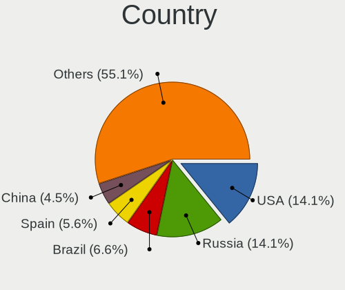
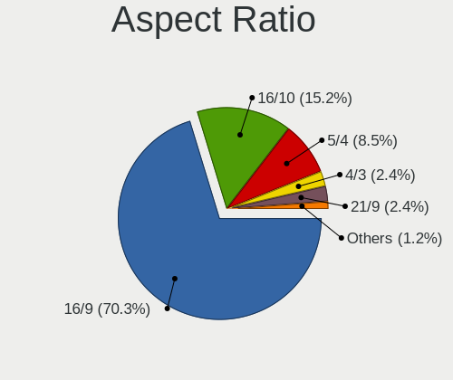
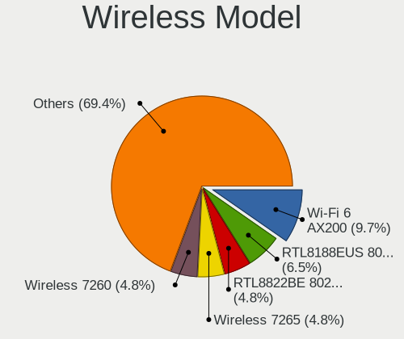
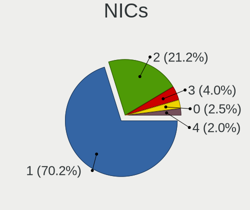
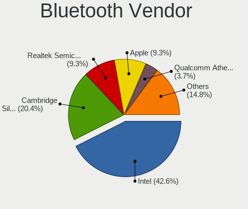
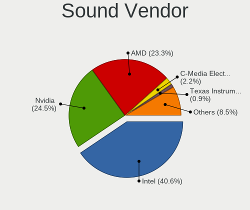
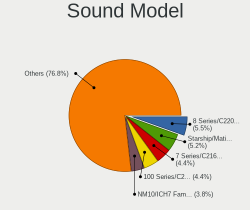

helloSystem 0.7.0 - Tested Hardware & Statistics (Desktops)
-----------------------------------------------------------

A project to collect tested hardware configurations for helloSystem 0.7.0.

Anyone can contribute to this report by the [hw-probe](https://github.com/linuxhw/hw-probe/blob/master/INSTALL.BSD.md) tool:

    hw-probe -all -upload

Please contribute! Especially if your hardware is rare.

Contents
--------

* [ Test Cases ](#test-cases)

* [ System ](#system)
  - [ Arch                     ](#arch)
  - [ DE                       ](#de)
  - [ Display Server           ](#display-server)
  - [ Display Manager          ](#display-manager)
  - [ OS Lang                  ](#os-lang)
  - [ Boot Mode                ](#boot-mode)
  - [ Filesystem               ](#filesystem)
  - [ Part. scheme             ](#part-scheme)

* [ Board ](#board)
  - [ Vendor                   ](#vendor)
  - [ Model                    ](#model)
  - [ Model Family             ](#model-family)
  - [ MFG Year                 ](#mfg-year)
  - [ Form Factor              ](#form-factor)
  - [ Coreboot                 ](#coreboot)
  - [ RAM Size                 ](#ram-size)
  - [ RAM Used                 ](#ram-used)
  - [ Total Drives             ](#total-drives)
  - [ Has CD-ROM               ](#has-cd-rom)
  - [ Has Ethernet             ](#has-ethernet)
  - [ Has WiFi                 ](#has-wifi)
  - [ Has Bluetooth            ](#has-bluetooth)

* [ Location ](#location)
  - [ Country                  ](#country)
  - [ City                     ](#city)

* [ Drives ](#drives)
  - [ Drive Vendor             ](#drive-vendor)
  - [ Drive Model              ](#drive-model)
  - [ HDD Vendor               ](#hdd-vendor)
  - [ SSD Vendor               ](#ssd-vendor)
  - [ Drive Kind               ](#drive-kind)
  - [ Drive Connector          ](#drive-connector)
  - [ Drive Size               ](#drive-size)
  - [ Space Total              ](#space-total)
  - [ Space Used               ](#space-used)
  - [ Malfunc. Drives          ](#malfunc-drives)
  - [ Malfunc. Drive Vendor    ](#malfunc-drive-vendor)
  - [ Malfunc. HDD Vendor      ](#malfunc-hdd-vendor)
  - [ Malfunc. Drive Kind      ](#malfunc-drive-kind)
  - [ Failed Drives            ](#failed-drives)
  - [ Failed Drive Vendor      ](#failed-drive-vendor)
  - [ Drive Status             ](#drive-status)

* [ Storage controller ](#storage-controller)
  - [ Storage Vendor           ](#storage-vendor)
  - [ Storage Model            ](#storage-model)
  - [ Storage Kind             ](#storage-kind)

* [ Processor ](#processor)
  - [ CPU Vendor               ](#cpu-vendor)
  - [ CPU Model                ](#cpu-model)
  - [ CPU Model Family         ](#cpu-model-family)
  - [ CPU Cores                ](#cpu-cores)
  - [ CPU Sockets              ](#cpu-sockets)
  - [ CPU Threads              ](#cpu-threads)
  - [ CPU Microarch            ](#cpu-microarch)

* [ Graphics ](#graphics)
  - [ GPU Vendor               ](#gpu-vendor)
  - [ GPU Model                ](#gpu-model)
  - [ GPU Combo                ](#gpu-combo)
  - [ GPU Driver               ](#gpu-driver)
  - [ GPU Memory               ](#gpu-memory)

* [ Monitor ](#monitor)
  - [ Monitor Vendor           ](#monitor-vendor)
  - [ Monitor Model            ](#monitor-model)
  - [ Monitor Resolution       ](#monitor-resolution)
  - [ Monitor Diagonal         ](#monitor-diagonal)
  - [ Monitor Width            ](#monitor-width)
  - [ Aspect Ratio             ](#aspect-ratio)
  - [ Monitor Area             ](#monitor-area)
  - [ Pixel Density            ](#pixel-density)
  - [ Multiple Monitors        ](#multiple-monitors)

* [ Network ](#network)
  - [ Net Controller Vendor    ](#net-controller-vendor)
  - [ Net Controller Model     ](#net-controller-model)
  - [ Wireless Vendor          ](#wireless-vendor)
  - [ Wireless Model           ](#wireless-model)
  - [ Ethernet Vendor          ](#ethernet-vendor)
  - [ Ethernet Model           ](#ethernet-model)
  - [ Net Controller Kind      ](#net-controller-kind)
  - [ Used Controller          ](#used-controller)
  - [ NICs                     ](#nics)
  - [ IPv6                     ](#ipv6)

* [ Bluetooth ](#bluetooth)
  - [ Bluetooth Vendor         ](#bluetooth-vendor)
  - [ Bluetooth Model          ](#bluetooth-model)

* [ Sound ](#sound)
  - [ Sound Vendor             ](#sound-vendor)
  - [ Sound Model              ](#sound-model)

* [ Memory ](#memory)
  - [ Memory Vendor            ](#memory-vendor)
  - [ Memory Model             ](#memory-model)
  - [ Memory Kind              ](#memory-kind)
  - [ Memory Form Factor       ](#memory-form-factor)
  - [ Memory Size              ](#memory-size)
  - [ Memory Speed             ](#memory-speed)

* [ Printers & scanners ](#printers--scanners)
  - [ Printer Vendor           ](#printer-vendor)
  - [ Printer Model            ](#printer-model)
  - [ Scanner Vendor           ](#scanner-vendor)
  - [ Scanner Model            ](#scanner-model)

* [ Camera ](#camera)
  - [ Camera Vendor            ](#camera-vendor)
  - [ Camera Model             ](#camera-model)

* [ Security ](#security)
  - [ Fingerprint Vendor       ](#fingerprint-vendor)
  - [ Fingerprint Model        ](#fingerprint-model)
  - [ Chipcard Vendor          ](#chipcard-vendor)
  - [ Chipcard Model           ](#chipcard-model)

* [ Unsupported ](#unsupported)
  - [ Unsupported Devices      ](#unsupported-devices)
  - [ Unsupported Device Types ](#unsupported-device-types)

Test Cases
----------

Total: 203

| Vendor        | Model                       | Probe                                                     | Date         |
|---------------|-----------------------------|-----------------------------------------------------------|--------------|
| HP            | 8053                        | [92583639f6](https://bsd-hardware.info/?probe=92583639f6) | Nov 02, 2022 |
| MSI           | B450M PRO-VDH PLUS          | [c6ee09790d](https://bsd-hardware.info/?probe=c6ee09790d) | Oct 20, 2022 |
| ASUSTek       | N3050I-C                    | [4a83b0953e](https://bsd-hardware.info/?probe=4a83b0953e) | Oct 18, 2022 |
| HP            | 8169                        | [86b1fbf917](https://bsd-hardware.info/?probe=86b1fbf917) | Oct 15, 2022 |
| Lenovo        | ThinkCentre M57p 6078AJ6    | [a808a7360d](https://bsd-hardware.info/?probe=a808a7360d) | Oct 14, 2022 |
| ASRock        | A320M-HD                    | [6418fd0b23](https://bsd-hardware.info/?probe=6418fd0b23) | Sep 28, 2022 |
| Apple         | Mac-7BA5B2D9E42DDD94        | [d2e169b8ad](https://bsd-hardware.info/?probe=d2e169b8ad) | Sep 13, 2022 |
| ASUSTek       | TUF B450M-PRO GAMING        | [7c9c1db9d7](https://bsd-hardware.info/?probe=7c9c1db9d7) | Sep 10, 2022 |
| Pegatron      | IPM41-D3                    | [2d3a5a5260](https://bsd-hardware.info/?probe=2d3a5a5260) | Sep 06, 2022 |
| ASUSTek       | H81M-A                      | [11ac5a7932](https://bsd-hardware.info/?probe=11ac5a7932) | Sep 02, 2022 |
| ASRock        | X570 Phantom Gaming 4       | [17f4ac1979](https://bsd-hardware.info/?probe=17f4ac1979) | Aug 23, 2022 |
| Fujitsu       | D3041-A1 S26361-D3041-A1    | [5ea9441653](https://bsd-hardware.info/?probe=5ea9441653) | Aug 19, 2022 |
| Lenovo        | SDK0E50510 WIN              | [a45977c76b](https://bsd-hardware.info/?probe=a45977c76b) | Aug 10, 2022 |
| ASRock        | Z370 Pro4                   | [038c5f8763](https://bsd-hardware.info/?probe=038c5f8763) | Aug 10, 2022 |
| Gigabyte      | A320M-S2H V2-CF             | [af241a5384](https://bsd-hardware.info/?probe=af241a5384) | Aug 06, 2022 |
| ASUSTek       | P5GC-MX/CKD/SI              | [d61693dffb](https://bsd-hardware.info/?probe=d61693dffb) | Aug 05, 2022 |
| ASUSTek       | K30AM-J                     | [e032724bc2](https://bsd-hardware.info/?probe=e032724bc2) | Aug 05, 2022 |
| Gigabyte      | X570 AORUS ELITE WIFI       | [850198c512](https://bsd-hardware.info/?probe=850198c512) | Aug 05, 2022 |
| Gigabyte      | X570 AORUS ELITE WIFI       | [cddf42b097](https://bsd-hardware.info/?probe=cddf42b097) | Aug 05, 2022 |
| HP            | 1497                        | [c6f6ddf728](https://bsd-hardware.info/?probe=c6f6ddf728) | Aug 04, 2022 |
| Gigabyte      | X570 AORUS PRO              | [ad56307789](https://bsd-hardware.info/?probe=ad56307789) | Aug 01, 2022 |
| Gigabyte      | A320M-S2H V2-CF             | [6d5bfb02a0](https://bsd-hardware.info/?probe=6d5bfb02a0) | Jul 28, 2022 |
| Gigabyte      | AB350N-Gaming WIFI-CF       | [f50526a6d6](https://bsd-hardware.info/?probe=f50526a6d6) | Jul 27, 2022 |
| MAXSUN        | MS-H110D4L FS M.2           | [39d06b12fd](https://bsd-hardware.info/?probe=39d06b12fd) | Jul 25, 2022 |
| Gigabyte      | F2A88XM-D3H                 | [a96e41f99e](https://bsd-hardware.info/?probe=a96e41f99e) | Jul 20, 2022 |
| ASUSTek       | P8B WS                      | [dd7f8123d2](https://bsd-hardware.info/?probe=dd7f8123d2) | Jul 19, 2022 |
| HP            | 8055                        | [269b4f3210](https://bsd-hardware.info/?probe=269b4f3210) | Jul 17, 2022 |
| Shuttle       | FH170                       | [a156048964](https://bsd-hardware.info/?probe=a156048964) | Jul 16, 2022 |
| Shuttle       | FH170                       | [81b62c2839](https://bsd-hardware.info/?probe=81b62c2839) | Jul 16, 2022 |
| ASUSTek       | Maximus IX HERO             | [ea2f21a15f](https://bsd-hardware.info/?probe=ea2f21a15f) | Jul 12, 2022 |
| ASUSTek       | Maximus IX HERO             | [81668557c6](https://bsd-hardware.info/?probe=81668557c6) | Jul 08, 2022 |
| Lenovo        | NO DPK                      | [2c79a92fc4](https://bsd-hardware.info/?probe=2c79a92fc4) | Jul 06, 2022 |
| Pegatron      | IPM41-D3                    | [1cd93cd5d3](https://bsd-hardware.info/?probe=1cd93cd5d3) | Jul 04, 2022 |
| ASUSTek       | ROG STRIX Z390-F GAMING     | [4d4993a732](https://bsd-hardware.info/?probe=4d4993a732) | Jun 24, 2022 |
| ALLEGIANCE... | X79 V3.3F                   | [190560a4f4](https://bsd-hardware.info/?probe=190560a4f4) | Jun 23, 2022 |
| ASUSTek       | P8B75-M LX PLUS             | [346bc6f0ae](https://bsd-hardware.info/?probe=346bc6f0ae) | Jun 20, 2022 |
| Gigabyte      | GA-970A-UD3                 | [a094c1c53b](https://bsd-hardware.info/?probe=a094c1c53b) | Jun 20, 2022 |
| HP            | 304Bh                       | [8a3151b3cd](https://bsd-hardware.info/?probe=8a3151b3cd) | Jun 16, 2022 |
| Lenovo        | ThinkCentre XXXX Y          | [162bbe4eac](https://bsd-hardware.info/?probe=162bbe4eac) | Jun 10, 2022 |
| Acer          | EM61SM/EM61PM               | [3b8d6cb36e](https://bsd-hardware.info/?probe=3b8d6cb36e) | Jun 07, 2022 |
| Positivo      | POS-PIQ77CL POSITIVO        | [848361c724](https://bsd-hardware.info/?probe=848361c724) | May 31, 2022 |
| Gigabyte      | F2A88XM-HD3                 | [c734325ede](https://bsd-hardware.info/?probe=c734325ede) | May 31, 2022 |
| Dell          | 048DY8 A00                  | [7d1c59b392](https://bsd-hardware.info/?probe=7d1c59b392) | May 29, 2022 |
| ASUSTek       | P5LD2                       | [64208afa2c](https://bsd-hardware.info/?probe=64208afa2c) | May 25, 2022 |
| T-bao         | MINI PC V1.0                | [a89b2081bb](https://bsd-hardware.info/?probe=a89b2081bb) | May 25, 2022 |
| Gigabyte      | B75M-D3H                    | [d0565222dc](https://bsd-hardware.info/?probe=d0565222dc) | May 24, 2022 |
| ASUSTek       | TUF X470-PLUS GAMING        | [ee8ba76de5](https://bsd-hardware.info/?probe=ee8ba76de5) | May 22, 2022 |
| ASUSTek       | P8Z77-V LX                  | [e7055d83e2](https://bsd-hardware.info/?probe=e7055d83e2) | May 20, 2022 |
| Dell          | 0G261D A00                  | [c0fafdb905](https://bsd-hardware.info/?probe=c0fafdb905) | May 14, 2022 |
| Gigabyte      | AB350N-Gaming WIFI-CF       | [d9c28e14df](https://bsd-hardware.info/?probe=d9c28e14df) | May 13, 2022 |
| ASUSTek       | PRIME X570-P                | [aad86a8b8e](https://bsd-hardware.info/?probe=aad86a8b8e) | May 10, 2022 |
| Lenovo        | MAHOBAY                     | [b54df77b59](https://bsd-hardware.info/?probe=b54df77b59) | May 07, 2022 |
| Gigabyte      | F2A68HM-H                   | [daed3f9401](https://bsd-hardware.info/?probe=daed3f9401) | May 06, 2022 |
| ASUSTek       | P8Z77-V LX                  | [bf3d4941a2](https://bsd-hardware.info/?probe=bf3d4941a2) | May 06, 2022 |
| Dell          | 0Y7WYT A00                  | [76674e4d62](https://bsd-hardware.info/?probe=76674e4d62) | May 06, 2022 |
| OEM           | B85 JHS359                  | [c5d29cc6b3](https://bsd-hardware.info/?probe=c5d29cc6b3) | May 03, 2022 |
| Gigabyte      | A320M-H-CF                  | [24d308754b](https://bsd-hardware.info/?probe=24d308754b) | May 02, 2022 |
| HP            | 0AA8h                       | [f9b906ea47](https://bsd-hardware.info/?probe=f9b906ea47) | Apr 30, 2022 |
| Supermicro    | X9DAL                       | [ef1f3da3ce](https://bsd-hardware.info/?probe=ef1f3da3ce) | Apr 26, 2022 |
| ASUSTek       | PRIME B350-PLUS             | [271f1aa4d1](https://bsd-hardware.info/?probe=271f1aa4d1) | Apr 24, 2022 |
| Gigabyte      | B450 AORUS M                | [427cf12b45](https://bsd-hardware.info/?probe=427cf12b45) | Apr 22, 2022 |
| ASUSTek       | TUF B450-PRO GAMING         | [f7a3f1dfd3](https://bsd-hardware.info/?probe=f7a3f1dfd3) | Apr 21, 2022 |
| ASRock        | X570 Phantom Gaming 4       | [2fd6d176ce](https://bsd-hardware.info/?probe=2fd6d176ce) | Apr 21, 2022 |
| Intel         | H55                         | [1478e4af73](https://bsd-hardware.info/?probe=1478e4af73) | Apr 20, 2022 |
| ASUSTek       | PRIME Z390M-PLUS            | [680303f943](https://bsd-hardware.info/?probe=680303f943) | Apr 16, 2022 |
| Dell          | 0Y7WYT A00                  | [399a4fb92e](https://bsd-hardware.info/?probe=399a4fb92e) | Apr 15, 2022 |
| ASUSTek       | PRIME Z390M-PLUS            | [47d17d48a7](https://bsd-hardware.info/?probe=47d17d48a7) | Apr 15, 2022 |
| Gigabyte      | B85M-D3H                    | [5502c7fd2f](https://bsd-hardware.info/?probe=5502c7fd2f) | Apr 15, 2022 |
| ASUSTek       | PRIME X399-A                | [3d26c05fda](https://bsd-hardware.info/?probe=3d26c05fda) | Apr 14, 2022 |
| ASUSTek       | M5A97 LE R2.0               | [11ec99d4b7](https://bsd-hardware.info/?probe=11ec99d4b7) | Apr 11, 2022 |
| HP            | 1998                        | [06f0a28858](https://bsd-hardware.info/?probe=06f0a28858) | Apr 10, 2022 |
| BESSTAR Te... | UM250 V1.0                  | [844323ad2d](https://bsd-hardware.info/?probe=844323ad2d) | Apr 09, 2022 |
| ASUSTek       | P5G41T-M LX3                | [ded0d1a114](https://bsd-hardware.info/?probe=ded0d1a114) | Apr 09, 2022 |
| ASUSTek       | P5G41T-M LX3                | [14a6449380](https://bsd-hardware.info/?probe=14a6449380) | Apr 09, 2022 |
| ASUSTek       | M4A88T-M                    | [9d1a8b4886](https://bsd-hardware.info/?probe=9d1a8b4886) | Apr 09, 2022 |
| ASRock        | X570 Steel Legend WiFi a... | [703e042cfe](https://bsd-hardware.info/?probe=703e042cfe) | Apr 09, 2022 |
| Dell          | 0D6H9T A00                  | [e58bc4937d](https://bsd-hardware.info/?probe=e58bc4937d) | Apr 09, 2022 |
| Gigabyte      | E3000N                      | [7169c296cc](https://bsd-hardware.info/?probe=7169c296cc) | Apr 08, 2022 |
| MSI           | MS-7369                     | [25f2161cac](https://bsd-hardware.info/?probe=25f2161cac) | Apr 08, 2022 |
| Lenovo        | 30D9 SDK0J40705 WIN 3425... | [5038186437](https://bsd-hardware.info/?probe=5038186437) | Apr 02, 2022 |
| Dell          | 0D6H9T A00                  | [7daab72741](https://bsd-hardware.info/?probe=7daab72741) | Apr 01, 2022 |
| ASUSTek       | P6-P8H61E                   | [11664cd9d7](https://bsd-hardware.info/?probe=11664cd9d7) | Mar 30, 2022 |
| ASUSTek       | M4A88T-M                    | [6a615f6be5](https://bsd-hardware.info/?probe=6a615f6be5) | Mar 30, 2022 |
| ASUSTek       | M5A78L-M LX3                | [0906d116eb](https://bsd-hardware.info/?probe=0906d116eb) | Mar 29, 2022 |
| Gigabyte      | H110N-CF                    | [89593af061](https://bsd-hardware.info/?probe=89593af061) | Mar 29, 2022 |
| Gigabyte      | H61M-S2PV                   | [553f2beb91](https://bsd-hardware.info/?probe=553f2beb91) | Mar 27, 2022 |
| ASRock        | A320M-HDV R4.0              | [8c89faeb24](https://bsd-hardware.info/?probe=8c89faeb24) | Mar 26, 2022 |
| ASRock        | A320M-HDV R4.0              | [ae1fa6cbce](https://bsd-hardware.info/?probe=ae1fa6cbce) | Mar 26, 2022 |
| MSI           | B85-G43                     | [f0a919c35f](https://bsd-hardware.info/?probe=f0a919c35f) | Mar 25, 2022 |
| MSI           | B85-G43                     | [7bd545fda8](https://bsd-hardware.info/?probe=7bd545fda8) | Mar 25, 2022 |
| ASUSTek       | P8Z77-V LX                  | [8696405d09](https://bsd-hardware.info/?probe=8696405d09) | Mar 24, 2022 |
| ECS           | G41T-M9                     | [9ef50c47da](https://bsd-hardware.info/?probe=9ef50c47da) | Mar 21, 2022 |
| Gigabyte      | H270-Gaming 3               | [2727a8e439](https://bsd-hardware.info/?probe=2727a8e439) | Mar 15, 2022 |
| Gigabyte      | G31M-S2C                    | [5a22bb6991](https://bsd-hardware.info/?probe=5a22bb6991) | Mar 12, 2022 |
| Lenovo        | IdeaCentre B545 10100       | [2f13d4a946](https://bsd-hardware.info/?probe=2f13d4a946) | Mar 12, 2022 |
| ASUSTek       | P5Q DELUXE                  | [b4234170e8](https://bsd-hardware.info/?probe=b4234170e8) | Mar 10, 2022 |
| Pegatron      | IPM41-D3                    | [a58b9a4f8f](https://bsd-hardware.info/?probe=a58b9a4f8f) | Mar 09, 2022 |
| Koloe         | X58                         | [58e098eca2](https://bsd-hardware.info/?probe=58e098eca2) | Mar 09, 2022 |
| HP            | 8054                        | [86b6b8373c](https://bsd-hardware.info/?probe=86b6b8373c) | Mar 08, 2022 |
| HP            | 8054                        | [00078554d2](https://bsd-hardware.info/?probe=00078554d2) | Mar 08, 2022 |
| Koloe         | X58                         | [c501dfa5c8](https://bsd-hardware.info/?probe=c501dfa5c8) | Mar 07, 2022 |
| HP            | 1905                        | [e271589365](https://bsd-hardware.info/?probe=e271589365) | Mar 01, 2022 |
| Gigabyte      | B450M S2H                   | [78f79fab6f](https://bsd-hardware.info/?probe=78f79fab6f) | Feb 28, 2022 |
| Dell          | 0KV62T A00                  | [0541a207c7](https://bsd-hardware.info/?probe=0541a207c7) | Feb 28, 2022 |
| HP            | 1905                        | [aa010e00f2](https://bsd-hardware.info/?probe=aa010e00f2) | Feb 28, 2022 |
| ASRock        | TRX40 Taichi                | [a2df68e1d1](https://bsd-hardware.info/?probe=a2df68e1d1) | Feb 26, 2022 |
| Intel         | H81                         | [04d2739bdc](https://bsd-hardware.info/?probe=04d2739bdc) | Feb 25, 2022 |
| Intel         | DCP847SKE G80890-107        | [f9d33f1ab1](https://bsd-hardware.info/?probe=f9d33f1ab1) | Feb 23, 2022 |
| Medion        | H61H2-LM3                   | [beb12f2884](https://bsd-hardware.info/?probe=beb12f2884) | Feb 23, 2022 |
| ASRock        | H81M-DG4                    | [e20db6ad83](https://bsd-hardware.info/?probe=e20db6ad83) | Feb 23, 2022 |
| HP            | 1998                        | [485d417a2e](https://bsd-hardware.info/?probe=485d417a2e) | Feb 23, 2022 |
| Dell          | 0VD5HY A07                  | [bb86fb3e67](https://bsd-hardware.info/?probe=bb86fb3e67) | Feb 22, 2022 |
| ASUSTek       | CROSSHAIR VI HERO           | [1e6ff84e5d](https://bsd-hardware.info/?probe=1e6ff84e5d) | Feb 21, 2022 |
| Gigabyte      | P41T-D3                     | [e5417931a7](https://bsd-hardware.info/?probe=e5417931a7) | Feb 18, 2022 |
| ASRock        | B460M Pro4                  | [7a2781344f](https://bsd-hardware.info/?probe=7a2781344f) | Feb 17, 2022 |
| ASUSTek       | PRIME Z390-P                | [3a72227408](https://bsd-hardware.info/?probe=3a72227408) | Feb 16, 2022 |
| Gigabyte      | C246M-WU4-CF                | [4b6c6d8bde](https://bsd-hardware.info/?probe=4b6c6d8bde) | Feb 15, 2022 |
| MSI           | B450 GAMING PLUS MAX        | [df6278638e](https://bsd-hardware.info/?probe=df6278638e) | Feb 15, 2022 |
| ASRock        | H61M/U3S3                   | [257e13f206](https://bsd-hardware.info/?probe=257e13f206) | Feb 12, 2022 |
| ASRock        | H61M/U3S3                   | [34dac4c0cd](https://bsd-hardware.info/?probe=34dac4c0cd) | Feb 11, 2022 |
| MSI           | B450 GAMING PLUS MAX        | [6997de25f9](https://bsd-hardware.info/?probe=6997de25f9) | Feb 11, 2022 |
| Intel         | X58                         | [f7075908f6](https://bsd-hardware.info/?probe=f7075908f6) | Feb 09, 2022 |
| ASUSTek       | PRIME Z390-P                | [b1931633be](https://bsd-hardware.info/?probe=b1931633be) | Feb 09, 2022 |
| ASUSTek       | PRIME Z390-P                | [f9c1e787a9](https://bsd-hardware.info/?probe=f9c1e787a9) | Feb 09, 2022 |
| MSI           | B75A-G43                    | [8e445eb2d4](https://bsd-hardware.info/?probe=8e445eb2d4) | Feb 08, 2022 |
| ASUSTek       | P6-P8H61E                   | [e838981914](https://bsd-hardware.info/?probe=e838981914) | Feb 06, 2022 |
| ASRock        | H81M-VG4 R2.0               | [8af8b5270e](https://bsd-hardware.info/?probe=8af8b5270e) | Feb 04, 2022 |
| Apple         | Mac-F221BEC8                | [e5043f0af4](https://bsd-hardware.info/?probe=e5043f0af4) | Feb 04, 2022 |
| Pegatron      | NARRA5                      | [64d4fb9b97](https://bsd-hardware.info/?probe=64d4fb9b97) | Feb 02, 2022 |
| Gigabyte      | Z390 GAMING X-CF            | [ee05643521](https://bsd-hardware.info/?probe=ee05643521) | Feb 01, 2022 |
| ASUSTek       | P5P43TD PRO                 | [5999e0ebfb](https://bsd-hardware.info/?probe=5999e0ebfb) | Jan 31, 2022 |
| Intel         | H81                         | [c2f3025900](https://bsd-hardware.info/?probe=c2f3025900) | Jan 31, 2022 |
| Pegatron      | 2A99h                       | [e34b6118a2](https://bsd-hardware.info/?probe=e34b6118a2) | Jan 30, 2022 |
| Fujitsu       | D3161-A1 S26361-D3161-A1    | [58ea01e4e6](https://bsd-hardware.info/?probe=58ea01e4e6) | Jan 29, 2022 |
| Intel         | DH77EB AAG39073-400         | [bfe6ef301b](https://bsd-hardware.info/?probe=bfe6ef301b) | Jan 29, 2022 |
| ASUSTek       | P5GC-MX                     | [372749f9d7](https://bsd-hardware.info/?probe=372749f9d7) | Jan 27, 2022 |
| Unknown       | Unknown                     | [a9d799ca71](https://bsd-hardware.info/?probe=a9d799ca71) | Jan 27, 2022 |
| ASUSTek       | P5B SE                      | [f97fba19c1](https://bsd-hardware.info/?probe=f97fba19c1) | Jan 26, 2022 |
| Fujitsu       | D3161-A1 S26361-D3161-A1    | [9f0a000ceb](https://bsd-hardware.info/?probe=9f0a000ceb) | Jan 25, 2022 |
| ASUSTek       | P5B SE                      | [e3332e7b94](https://bsd-hardware.info/?probe=e3332e7b94) | Jan 25, 2022 |
| ASRock        | B460M Pro4                  | [107a1e59f5](https://bsd-hardware.info/?probe=107a1e59f5) | Jan 25, 2022 |
| ASRock        | A300M-STX                   | [8edf072b67](https://bsd-hardware.info/?probe=8edf072b67) | Jan 25, 2022 |
| ASUSTek       | BM6835_BM6635_BP6335        | [73562aa169](https://bsd-hardware.info/?probe=73562aa169) | Jan 25, 2022 |
| ASUSTek       | P8H61-M LX3 PLUS R2.0       | [df08e2e8f0](https://bsd-hardware.info/?probe=df08e2e8f0) | Jan 24, 2022 |
| ASUSTek       | P7H55-M                     | [fb73c2f7dc](https://bsd-hardware.info/?probe=fb73c2f7dc) | Jan 23, 2022 |
| HP            | 1998                        | [b59dbcdc9c](https://bsd-hardware.info/?probe=b59dbcdc9c) | Jan 23, 2022 |
| ASUSTek       | ROG STRIX B450-F GAMING     | [670e41ed41](https://bsd-hardware.info/?probe=670e41ed41) | Jan 21, 2022 |
| MSI           | PRO Z690-A WIFI DDR4        | [04abd226f3](https://bsd-hardware.info/?probe=04abd226f3) | Jan 21, 2022 |
| ASUSTek       | Maximus VIII HERO           | [a780a7bab2](https://bsd-hardware.info/?probe=a780a7bab2) | Jan 18, 2022 |
| ASUSTek       | TUF GAMING X570-PLUS        | [9cd2758a5f](https://bsd-hardware.info/?probe=9cd2758a5f) | Jan 18, 2022 |
| ASUSTek       | PRIME X570-P                | [3dead218e1](https://bsd-hardware.info/?probe=3dead218e1) | Jan 16, 2022 |
| Gigabyte      | B365 HD3                    | [62fc48bd99](https://bsd-hardware.info/?probe=62fc48bd99) | Jan 15, 2022 |
| Dell          | 0XCR8D A03                  | [48e9447b37](https://bsd-hardware.info/?probe=48e9447b37) | Jan 15, 2022 |
| ASUSTek       | ROG STRIX Z390-E GAMING     | [d377e06101](https://bsd-hardware.info/?probe=d377e06101) | Jan 15, 2022 |
| Gigabyte      | Z77N-WIFI                   | [459bb6486d](https://bsd-hardware.info/?probe=459bb6486d) | Jan 13, 2022 |
| ASUSTek       | P8Z68-M PRO                 | [a0885f4f44](https://bsd-hardware.info/?probe=a0885f4f44) | Jan 10, 2022 |
| HP            | 8169                        | [85e0cf058c](https://bsd-hardware.info/?probe=85e0cf058c) | Jan 10, 2022 |
| ASUSTek       | GA35DX                      | [eccb947ae4](https://bsd-hardware.info/?probe=eccb947ae4) | Jan 05, 2022 |
| Unknown       | G31T-M7                     | [ed7d80e01a](https://bsd-hardware.info/?probe=ed7d80e01a) | Jan 03, 2022 |
| ASUSTek       | TUF GAMING X570-PLUS        | [a671e3eb04](https://bsd-hardware.info/?probe=a671e3eb04) | Dec 31, 2021 |
| ASRock        | X570 Phantom Gaming 4       | [15211db056](https://bsd-hardware.info/?probe=15211db056) | Dec 28, 2021 |
| Dell          | 0200DY A01                  | [fb37dcbb93](https://bsd-hardware.info/?probe=fb37dcbb93) | Dec 28, 2021 |
| Pegatron      | IPM41-D3                    | [6829928dad](https://bsd-hardware.info/?probe=6829928dad) | Dec 28, 2021 |
| Dell          | 0H9KW5 A00                  | [e962ca25b3](https://bsd-hardware.info/?probe=e962ca25b3) | Dec 28, 2021 |
| Gigabyte      | 970A-DS3P                   | [0918f0a5b9](https://bsd-hardware.info/?probe=0918f0a5b9) | Dec 25, 2021 |
| ASUSTek       | PRIME B350M-A               | [b0aa3885bb](https://bsd-hardware.info/?probe=b0aa3885bb) | Dec 25, 2021 |
| ASUSTek       | Z170-P                      | [bde74629f9](https://bsd-hardware.info/?probe=bde74629f9) | Dec 25, 2021 |
| Gigabyte      | E3000N                      | [eb0ba1b296](https://bsd-hardware.info/?probe=eb0ba1b296) | Dec 22, 2021 |
| ASUSTek       | ROG STRIX Z370-E GAMING     | [936afa4de3](https://bsd-hardware.info/?probe=936afa4de3) | Dec 21, 2021 |
| ASUSTek       | PRIME A320M-K               | [42599b554e](https://bsd-hardware.info/?probe=42599b554e) | Dec 21, 2021 |
| Gigabyte      | X58A-UD5                    | [62b94dd372](https://bsd-hardware.info/?probe=62b94dd372) | Dec 21, 2021 |
| ASUSTek       | ROG STRIX X570-E GAMING     | [5cc62c68f9](https://bsd-hardware.info/?probe=5cc62c68f9) | Dec 21, 2021 |
| Gigabyte      | H170-D3HP-CF                | [a490614a39](https://bsd-hardware.info/?probe=a490614a39) | Dec 21, 2021 |
| ASRock        | H110M-DGS                   | [40c4553adb](https://bsd-hardware.info/?probe=40c4553adb) | Dec 21, 2021 |
| ASUSTek       | P5VD2-VM                    | [7e8f3cf783](https://bsd-hardware.info/?probe=7e8f3cf783) | Dec 20, 2021 |
| ASUSTek       | Q170M-C                     | [7f9e35a31c](https://bsd-hardware.info/?probe=7f9e35a31c) | Dec 20, 2021 |
| Dell          | 0TDG4V A00                  | [3ce808c135](https://bsd-hardware.info/?probe=3ce808c135) | Dec 20, 2021 |
| Dell          | 0TDG4V A00                  | [5292ad64ef](https://bsd-hardware.info/?probe=5292ad64ef) | Dec 20, 2021 |
| ASUSTek       | P8Z77-V LX                  | [3c71a8ba4e](https://bsd-hardware.info/?probe=3c71a8ba4e) | Dec 20, 2021 |
| MSI           | X370 SLI PLUS               | [73853f1fc2](https://bsd-hardware.info/?probe=73853f1fc2) | Dec 19, 2021 |
| Quanta        | 2AC7 011                    | [1a831a1d34](https://bsd-hardware.info/?probe=1a831a1d34) | Dec 18, 2021 |
| Gigabyte      | Z77X-UD3H                   | [759ce775c9](https://bsd-hardware.info/?probe=759ce775c9) | Dec 15, 2021 |
| ASUSTek       | TUF GAMING X570-PLUS        | [32d20b9b8e](https://bsd-hardware.info/?probe=32d20b9b8e) | Dec 14, 2021 |
| HP            | 843B                        | [f0d279747f](https://bsd-hardware.info/?probe=f0d279747f) | Dec 13, 2021 |
| HP            | 843B                        | [56400d3999](https://bsd-hardware.info/?probe=56400d3999) | Dec 13, 2021 |
| ASUSTek       | PRIME B450M-A               | [aea4a33dee](https://bsd-hardware.info/?probe=aea4a33dee) | Dec 13, 2021 |
| Gigabyte      | H270M-DS3H-CF               | [50fba6deda](https://bsd-hardware.info/?probe=50fba6deda) | Dec 11, 2021 |
| Gigabyte      | B450 I AORUS PRO WIFI-CF    | [6a1100cfdb](https://bsd-hardware.info/?probe=6a1100cfdb) | Dec 11, 2021 |
| Acer          | RevoOne RL85                | [a1e32de7da](https://bsd-hardware.info/?probe=a1e32de7da) | Dec 10, 2021 |
| Dell          | 0YF8P5 A00                  | [0f03a66475](https://bsd-hardware.info/?probe=0f03a66475) | Dec 09, 2021 |
| Dell          | 0YF8P5 A00                  | [83b36f7c3d](https://bsd-hardware.info/?probe=83b36f7c3d) | Dec 09, 2021 |
| Gigabyte      | H270M-DS3H-CF               | [a084ff48c2](https://bsd-hardware.info/?probe=a084ff48c2) | Dec 09, 2021 |
| Gigabyte      | H270M-DS3H-CF               | [17b557d792](https://bsd-hardware.info/?probe=17b557d792) | Dec 08, 2021 |
| Gigabyte      | X570 AORUS ELITE            | [8cfe11fe93](https://bsd-hardware.info/?probe=8cfe11fe93) | Nov 30, 2021 |
| Intel         | DG41TY AAE47335-300         | [dd357bcaa5](https://bsd-hardware.info/?probe=dd357bcaa5) | Nov 30, 2021 |
| HP            | 843B                        | [404224439d](https://bsd-hardware.info/?probe=404224439d) | Nov 29, 2021 |
| HP            | 1825                        | [32f07d2ba3](https://bsd-hardware.info/?probe=32f07d2ba3) | Nov 28, 2021 |
| Gigabyte      | B450 I AORUS PRO WIFI-CF    | [4cd5e5166a](https://bsd-hardware.info/?probe=4cd5e5166a) | Nov 27, 2021 |
| ASRock        | 775i945GZ                   | [16fc4ee10d](https://bsd-hardware.info/?probe=16fc4ee10d) | Nov 26, 2021 |
| HP            | 844C                        | [fb7d8eaf5d](https://bsd-hardware.info/?probe=fb7d8eaf5d) | Nov 06, 2021 |
| Unknown       | X79                         | [ef88cbc606](https://bsd-hardware.info/?probe=ef88cbc606) | Nov 05, 2021 |
| HP            | 843B                        | [9761f29b5e](https://bsd-hardware.info/?probe=9761f29b5e) | Oct 25, 2021 |
| Acer          | Aspire TC-780               | [3ce8481842](https://bsd-hardware.info/?probe=3ce8481842) | Oct 10, 2021 |

System
------

Arch
----

OS architecture (x86_64, i586, etc.)

| Name  | Desktops | Percent |
|-------|----------|---------|
| amd64 | 157      | 100%    |

DE
--

Desktop Environment

| Name         | Desktops | Percent |
|--------------|----------|---------|
| helloDesktop | 156      | 99.36%  |
| GNOME        | 1        | 0.64%   |

Display Server
--------------

X11 or Wayland

| Name | Desktops | Percent |
|------|----------|---------|
| X11  | 157      | 100%    |

Display Manager
---------------

SDDM, LightDM, etc.

| Name | Desktops | Percent |
|------|----------|---------|
| SLiM | 157      | 100%    |

OS Lang
-------

Language

| Lang  | Desktops | Percent |
|-------|----------|---------|
| en_US | 152      | 96.82%  |
| es_ES | 2        | 1.27%   |
| fr_FR | 1        | 0.64%   |
| de_DE | 1        | 0.64%   |
| C     | 1        | 0.64%   |

Boot Mode
---------

EFI or BIOS

| Mode | Desktops | Percent |
|------|----------|---------|
| EFI  | 152      | 96.82%  |
| BIOS | 5        | 3.18%   |

Filesystem
----------

Type of filesystem

| Type   | Desktops | Percent |
|--------|----------|---------|
| Cd9660 | 98       | 60.49%  |
| Zfs    | 64       | 39.51%  |

Part. scheme
------------

Scheme of partitioning

| Type | Desktops | Percent |
|------|----------|---------|
| GPT  | 153      | 97.45%  |
| MBR  | 4        | 2.55%   |

Board
-----

Vendor
------

Motherboard manufacturer

| Name                | Desktops | Percent |
|---------------------|----------|---------|
| ASUSTek Computer    | 47       | 29.94%  |
| Gigabyte Technology | 30       | 19.11%  |
| Hewlett-Packard     | 14       | 8.92%   |
| ASRock              | 14       | 8.92%   |
| Dell                | 11       | 7.01%   |
| MSI                 | 6        | 3.82%   |
| Lenovo              | 6        | 3.82%   |
| Intel               | 6        | 3.82%   |
| Pegatron            | 3        | 1.91%   |
| Fujitsu             | 2        | 1.27%   |
| Apple               | 2        | 1.27%   |
| Acer                | 2        | 1.27%   |
| Unknown             | 2        | 1.27%   |
| T-bao               | 1        | 0.64%   |
| Supermicro          | 1        | 0.64%   |
| Shuttle             | 1        | 0.64%   |
| Quanta              | 1        | 0.64%   |
| Positivo            | 1        | 0.64%   |
| OEM                 | 1        | 0.64%   |
| Medion              | 1        | 0.64%   |
| MAXSUN              | 1        | 0.64%   |
| Koloe               | 1        | 0.64%   |
| ECS                 | 1        | 0.64%   |
| BESSTAR Tech        | 1        | 0.64%   |
| ALLEGIANCE GAMING   | 1        | 0.64%   |

Model
-----

Motherboard model

| Name                               | Desktops | Percent |
|------------------------------------|----------|---------|
| HP ProDesk 600 G2 DM               | 2        | 1.27%   |
| HP EliteDesk 700 G1 SFF            | 2        | 1.27%   |
| Dell Precision T1700               | 2        | 1.27%   |
| ASUS TUF GAMING X570-PLUS          | 2        | 1.27%   |
| ASUS PRIME X570-P                  | 2        | 1.27%   |
| ASUS P8Z77-V LX                    | 2        | 1.27%   |
| ASUS All Series                    | 2        | 1.27%   |
| ASRock X570 Phantom Gaming 4       | 2        | 1.27%   |
| Apple MacPro5,1                    | 2        | 1.27%   |
| Unknown                            | 2        | 1.27%   |
| T-bao MINI PC                      | 1        | 0.64%   |
| Supermicro X9DAL                   | 1        | 0.64%   |
| Shuttle XH170                      | 1        | 0.64%   |
| Quanta 120-1135                    | 1        | 0.64%   |
| Positivo POS-PIQ77CL               | 1        | 0.64%   |
| Pegatron IPM41-D3                  | 1        | 0.64%   |
| Pegatron Compaq 505B Microtower PC | 1        | 0.64%   |
| Pegatron AY627AA-ABA a4313w        | 1        | 0.64%   |
| OEM B85 JHS359                     | 1        | 0.64%   |
| MSI MS-7D25                        | 1        | 0.64%   |
| MSI MS-7B86                        | 1        | 0.64%   |
| MSI MS-7A33                        | 1        | 0.64%   |
| MSI MS-7816                        | 1        | 0.64%   |
| MSI MS-7758                        | 1        | 0.64%   |
| MSI MS-7369                        | 1        | 0.64%   |
| Medion H61H2-LM3                   | 1        | 0.64%   |
| MAXSUN MS-H110D4L FS M.2           | 1        | 0.64%   |
| Lenovo YangTianA8800T              | 1        | 0.64%   |
| Lenovo ThinkCentre XXXX Y          | 1        | 0.64%   |
| Lenovo ThinkCentre M93z 10AD002UUS | 1        | 0.64%   |
| Lenovo ThinkCentre M72e m72e       | 1        | 0.64%   |
| Lenovo ThinkCentre M57p 6078AJ6    | 1        | 0.64%   |
| Lenovo IdeaCentre B545 10100       | 1        | 0.64%   |
| Koloe Thurley                      | 1        | 0.64%   |
| Intel X58                          | 1        | 0.64%   |
| Intel H81                          | 1        | 0.64%   |
| Intel H55                          | 1        | 0.64%   |
| Intel DH77EB AAG39073-400          | 1        | 0.64%   |
| Intel DG41TY AAE47335-300          | 1        | 0.64%   |
| Intel DCP847SKE G80890-107         | 1        | 0.64%   |

Model Family
------------

Motherboard model prefix

| Name                  | Desktops | Percent |
|-----------------------|----------|---------|
| ASUS PRIME            | 9        | 5.73%   |
| HP EliteDesk          | 6        | 3.82%   |
| Dell OptiPlex         | 6        | 3.82%   |
| ASUS ROG              | 6        | 3.82%   |
| ASUS TUF              | 5        | 3.18%   |
| Lenovo ThinkCentre    | 4        | 2.55%   |
| HP Compaq             | 3        | 1.91%   |
| Gigabyte X570         | 3        | 1.91%   |
| HP ProDesk            | 2        | 1.27%   |
| Gigabyte B450         | 2        | 1.27%   |
| Fujitsu ESPRIMO       | 2        | 1.27%   |
| Dell Precision        | 2        | 1.27%   |
| ASUS P8Z77-V          | 2        | 1.27%   |
| ASUS P5GC-MX          | 2        | 1.27%   |
| ASUS Maximus          | 2        | 1.27%   |
| ASUS All              | 2        | 1.27%   |
| ASRock X570           | 2        | 1.27%   |
| Apple MacPro5         | 2        | 1.27%   |
| Unknown               | 2        | 1.27%   |
| T-bao MINI            | 1        | 0.64%   |
| Supermicro X9DAL      | 1        | 0.64%   |
| Shuttle XH170         | 1        | 0.64%   |
| Quanta 120-1135       | 1        | 0.64%   |
| Positivo POS-PIQ77CL  | 1        | 0.64%   |
| Pegatron IPM41-D3     | 1        | 0.64%   |
| Pegatron Compaq       | 1        | 0.64%   |
| Pegatron AY627AA-ABA  | 1        | 0.64%   |
| OEM B85               | 1        | 0.64%   |
| MSI MS-7D25           | 1        | 0.64%   |
| MSI MS-7B86           | 1        | 0.64%   |
| MSI MS-7A33           | 1        | 0.64%   |
| MSI MS-7816           | 1        | 0.64%   |
| MSI MS-7758           | 1        | 0.64%   |
| MSI MS-7369           | 1        | 0.64%   |
| Medion H61H2-LM3      | 1        | 0.64%   |
| MAXSUN MS-H110D4L     | 1        | 0.64%   |
| Lenovo YangTianA8800T | 1        | 0.64%   |
| Lenovo IdeaCentre     | 1        | 0.64%   |
| Koloe Thurley         | 1        | 0.64%   |
| Intel X58             | 1        | 0.64%   |

MFG Year
--------

Motherboard manufacture year

| Year | Desktops | Percent |
|------|----------|---------|
| 2019 | 19       | 12.1%   |
| 2021 | 18       | 11.46%  |
| 2012 | 17       | 10.83%  |
| 2018 | 16       | 10.19%  |
| 2014 | 12       | 7.64%   |
| 2020 | 10       | 6.37%   |
| 2013 | 10       | 6.37%   |
| 2017 | 9        | 5.73%   |
| 2016 | 9        | 5.73%   |
| 2010 | 9        | 5.73%   |
| 2009 | 8        | 5.1%    |
| 2015 | 5        | 3.18%   |
| 2011 | 5        | 3.18%   |
| 2007 | 5        | 3.18%   |
| 2008 | 3        | 1.91%   |
| 2022 | 2        | 1.27%   |

Form Factor
-----------

Physical design of the computer

| Name    | Desktops | Percent |
|---------|----------|---------|
| Desktop | 157      | 100%    |

Coreboot
--------

Have coreboot on board

| Used | Desktops | Percent |
|------|----------|---------|
| No   | 157      | 100%    |

RAM Size
--------

Total RAM memory

| Size in GB  | Desktops | Percent |
|-------------|----------|---------|
| 8.01-16.0   | 44       | 28.03%  |
| 16.01-24.0  | 42       | 26.75%  |
| 4.01-8.0    | 29       | 18.47%  |
| 32.01-64.0  | 26       | 16.56%  |
| 64.01-256.0 | 7        | 4.46%   |
| 2.01-3.0    | 4        | 2.55%   |
| 24.01-32.0  | 3        | 1.91%   |
| 1.01-2.0    | 1        | 0.64%   |
| 0.51-1.0    | 1        | 0.64%   |

RAM Used
--------

Used RAM memory

| Used GB   | Desktops | Percent |
|-----------|----------|---------|
| 0.01-0.5  | 62       | 39.24%  |
| 0.51-1.0  | 53       | 33.54%  |
| 1.01-2.0  | 35       | 22.15%  |
| 2.01-3.0  | 5        | 3.16%   |
| 3.01-4.0  | 2        | 1.27%   |
| 8.01-16.0 | 1        | 0.63%   |

Total Drives
------------

Number of drives on board

| Drives | Desktops | Percent |
|--------|----------|---------|
| 1      | 70       | 43.48%  |
| 2      | 43       | 26.71%  |
| 3      | 17       | 10.56%  |
| 4      | 14       | 8.7%    |
| 0      | 9        | 5.59%   |
| 5      | 4        | 2.48%   |
| 6      | 2        | 1.24%   |
| 9      | 1        | 0.62%   |
| 7      | 1        | 0.62%   |

Has CD-ROM
----------

Has CD-ROM on board

| Presented | Desktops | Percent |
|-----------|----------|---------|
| No        | 105      | 66.88%  |
| Yes       | 52       | 33.12%  |

Has Ethernet
------------

Has Ethernet on board

| Presented | Desktops | Percent |
|-----------|----------|---------|
| Yes       | 155      | 98.73%  |
| No        | 2        | 1.27%   |

Has WiFi
--------

Has WiFi module

| Presented | Desktops | Percent |
|-----------|----------|---------|
| No        | 111      | 70.7%   |
| Yes       | 46       | 29.3%   |

Has Bluetooth
-------------

Has Bluetooth module

| Presented | Desktops | Percent |
|-----------|----------|---------|
| No        | 112      | 71.34%  |
| Yes       | 45       | 28.66%  |

Location
--------

Country
-------

Geographic location (country)

| Country      | Desktops | Percent |
|--------------|----------|---------|
| USA          | 22       | 14.01%  |
| Russia       | 22       | 14.01%  |
| Brazil       | 10       | 6.37%   |
| Spain        | 8        | 5.1%    |
| Poland       | 8        | 5.1%    |
| China        | 8        | 5.1%    |
| Hungary      | 7        | 4.46%   |
| Canada       | 7        | 4.46%   |
| Ukraine      | 6        | 3.82%   |
| Italy        | 6        | 3.82%   |
| Germany      | 6        | 3.82%   |
| India        | 4        | 2.55%   |
| France       | 4        | 2.55%   |
| Australia    | 4        | 2.55%   |
| UK           | 3        | 1.91%   |
| Turkey       | 3        | 1.91%   |
| South Korea  | 3        | 1.91%   |
| Romania      | 3        | 1.91%   |
| Peru         | 2        | 1.27%   |
| Norway       | 2        | 1.27%   |
| Vietnam      | 1        | 0.64%   |
| Venezuela    | 1        | 0.64%   |
| Thailand     | 1        | 0.64%   |
| Taiwan       | 1        | 0.64%   |
| Switzerland  | 1        | 0.64%   |
| South Africa | 1        | 0.64%   |
| Serbia       | 1        | 0.64%   |
| Portugal     | 1        | 0.64%   |
| Philippines  | 1        | 0.64%   |
| Panama       | 1        | 0.64%   |
| New Zealand  | 1        | 0.64%   |
| Netherlands  | 1        | 0.64%   |
| Mexico       | 1        | 0.64%   |
| Kazakhstan   | 1        | 0.64%   |
| Iceland      | 1        | 0.64%   |
| Greece       | 1        | 0.64%   |
| Finland      | 1        | 0.64%   |
| Denmark      | 1        | 0.64%   |
| Argentina    | 1        | 0.64%   |

City
----

Geographic location (city)

| City                          | Desktops | Percent |
|-------------------------------|----------|---------|
| St Petersburg                 | 4        | 2.45%   |
| Moscow                        | 3        | 1.84%   |
| Surgut                        | 2        | 1.23%   |
| Stavropol                     | 2        | 1.23%   |
| Sao Paulo                     | 2        | 1.23%   |
| Perth                         | 2        | 1.23%   |
| Myrtle Beach                  | 2        | 1.23%   |
| Lima                          | 2        | 1.23%   |
| Kharkiv                       | 2        | 1.23%   |
| Istanbul                      | 2        | 1.23%   |
| Guangzhou                     | 2        | 1.23%   |
| Curitiba                      | 2        | 1.23%   |
| Castilleja de la Cuesta       | 2        | 1.23%   |
| Barnaul                       | 2        | 1.23%   |
| Zhengzhou                     | 1        | 0.61%   |
| Yunlin                        | 1        | 0.61%   |
| Xicheng District              | 1        | 0.61%   |
| Warsaw                        | 1        | 0.61%   |
| Vancouver                     | 1        | 0.61%   |
| Tver                          | 1        | 0.61%   |
| Tromsø                       | 1        | 0.61%   |
| Tiruchi                       | 1        | 0.61%   |
| Temple                        | 1        | 0.61%   |
| Tampa                         | 1        | 0.61%   |
| Szombathely                   | 1        | 0.61%   |
| Szeged                        | 1        | 0.61%   |
| Székesfehérvár       | 1        | 0.61%   |
| Suceava                       | 1        | 0.61%   |
| Sparta                        | 1        | 0.61%   |
| Spalice                       | 1        | 0.61%   |
| Sopron                        | 1        | 0.61%   |
| Songpa-gu                     | 1        | 0.61%   |
| Somerset West                 | 1        | 0.61%   |
| Smiths Falls                  | 1        | 0.61%   |
| Seville                       | 1        | 0.61%   |
| Santo André                  | 1        | 0.61%   |
| Santa Maria                   | 1        | 0.61%   |
| San Sebastián de los Reyes | 1        | 0.61%   |
| San Luis Potosí City         | 1        | 0.61%   |
| Saint-Colomban                | 1        | 0.61%   |

Drives
------

Drive Vendor
------------

Hard drive vendors

| Vendor              | Desktops | Drives | Percent |
|---------------------|----------|--------|---------|
| Seagate             | 55       | 74     | 21.15%  |
| WDC                 | 43       | 60     | 16.54%  |
| Samsung Electronics | 42       | 57     | 16.15%  |
| Toshiba             | 20       | 25     | 7.69%   |
| Crucial             | 16       | 22     | 6.15%   |
| Kingston            | 14       | 19     | 5.38%   |
| A-DATA Technology   | 7        | 8      | 2.69%   |
| SanDisk             | 6        | 6      | 2.31%   |
| Intel               | 6        | 6      | 2.31%   |
| Phison              | 5        | 5      | 1.92%   |
| Hitachi             | 5        | 7      | 1.92%   |
| GOODRAM             | 5        | 6      | 1.92%   |
| SK hynix            | 4        | 6      | 1.54%   |
| XPG                 | 3        | 3      | 1.15%   |
| PNY                 | 3        | 3      | 1.15%   |
| Patriot             | 3        | 3      | 1.15%   |
| OCZ                 | 3        | 3      | 1.15%   |
| HGST                | 3        | 3      | 1.15%   |
| Team                | 2        | 2      | 0.77%   |
| KingSpec            | 2        | 2      | 0.77%   |
| Gigabyte Technology | 2        | 3      | 0.77%   |
| XrayDisk            | 1        | 1      | 0.38%   |
| tigo                | 1        | 1      | 0.38%   |
| SPCC                | 1        | 1      | 0.38%   |
| Silicon Motion      | 1        | 1      | 0.38%   |
| Plextor             | 1        | 1      | 0.38%   |
| Mushkin             | 1        | 1      | 0.38%   |
| LITEON              | 1        | 2      | 0.38%   |
| Lite-On             | 1        | 1      | 0.38%   |
| Intenso             | 1        | 1      | 0.38%   |
| EMTEC               | 1        | 1      | 0.38%   |
| Apacer              | 1        | 1      | 0.38%   |

Drive Model
-----------

Hard drive models

| Model                                   | Desktops | Percent |
|-----------------------------------------|----------|---------|
| Seagate ST1000DM010-2EP102 1TB          | 5        | 1.71%   |
| Seagate ST1000DM003-1ER162 1TB          | 5        | 1.71%   |
| Kingston SA400S37120G 120GB             | 4        | 1.37%   |
| XPG GAMMIX S11 Pro 256GB                | 3        | 1.02%   |
| Toshiba HDWD110 1TB                     | 3        | 1.02%   |
| Seagate ST4000DM004-2CV104 4TB          | 3        | 1.02%   |
| Seagate ST31000528AS 1TB                | 3        | 1.02%   |
| Seagate ST2000DM008-2FR102 2TB          | 3        | 1.02%   |
| Samsung SSD 980 PRO 1TB                 | 3        | 1.02%   |
| Samsung SSD 970 EVO Plus 1TB            | 3        | 1.02%   |
| Samsung SSD 850 EVO 250GB               | 3        | 1.02%   |
| Samsung HD322HJ 320GB                   | 3        | 1.02%   |
| Crucial CT500MX500SSD1 500GB            | 3        | 1.02%   |
| Crucial CT240BX500SSD1 240GB            | 3        | 1.02%   |
| WDC WDS240G2G0A-00JH30 240GB            | 2        | 0.68%   |
| WDC WDS100T2B0C-00PXH0 1TB              | 2        | 0.68%   |
| WDC WD5000LPVX-22V0TT0 500GB            | 2        | 0.68%   |
| WDC WD3200AAJS-00YZCA0 320GB            | 2        | 0.68%   |
| WDC WD20PURZ-85GU6Y0 2TB                | 2        | 0.68%   |
| Toshiba DT01ACA100 1TB                  | 2        | 0.68%   |
| Toshiba DT01ACA050 500GB                | 2        | 0.68%   |
| SK hynix BC501 HFM128GDJTNG-8310A 128GB | 2        | 0.68%   |
| Seagate ST3500418AS 500GB               | 2        | 0.68%   |
| Seagate ST3500413AS 500GB               | 2        | 0.68%   |
| Seagate ST3320418AS 320GB               | 2        | 0.68%   |
| Seagate ST3160812AS 160GB               | 2        | 0.68%   |
| Seagate ST1000DM003-1CH162 1TB          | 2        | 0.68%   |
| SanDisk SDSSDA120G 120GB                | 2        | 0.68%   |
| Samsung SSD 980 1TB                     | 2        | 0.68%   |
| Samsung SSD 970 EVO Plus 500GB          | 2        | 0.68%   |
| Samsung SSD 970 EVO 250GB               | 2        | 0.68%   |
| Samsung SSD 860 EVO 500GB               | 2        | 0.68%   |
| Samsung SSD 860 EVO 250GB               | 2        | 0.68%   |
| Samsung SSD 850 EVO 500GB               | 2        | 0.68%   |
| Samsung SSD 750 EVO 120GB               | 2        | 0.68%   |
| Kingston SA400S37240G 240GB             | 2        | 0.68%   |
| Kingston SA2000M81000G 1TB              | 2        | 0.68%   |
| Intel SSDSC2CW120A3 120GB               | 2        | 0.68%   |
| Goodram SSDPR-CL100-120-G2 120GB        | 2        | 0.68%   |
| Crucial CT275MX300SSD1 275GB            | 2        | 0.68%   |

HDD Vendor
----------

Hard disk drive vendors

| Vendor              | Desktops | Drives | Percent |
|---------------------|----------|--------|---------|
| Seagate             | 55       | 71     | 44.35%  |
| WDC                 | 34       | 40     | 27.42%  |
| Toshiba             | 18       | 22     | 14.52%  |
| Samsung Electronics | 9        | 9      | 7.26%   |
| Hitachi             | 5        | 7      | 4.03%   |
| HGST                | 3        | 3      | 2.42%   |

SSD Vendor
----------

Solid state drive vendors

| Vendor              | Desktops | Drives | Percent |
|---------------------|----------|--------|---------|
| Samsung Electronics | 23       | 25     | 22.33%  |
| Crucial             | 15       | 20     | 14.56%  |
| Kingston            | 11       | 15     | 10.68%  |
| WDC                 | 6        | 10     | 5.83%   |
| SanDisk             | 6        | 6      | 5.83%   |
| A-DATA Technology   | 6        | 6      | 5.83%   |
| Intel               | 5        | 5      | 4.85%   |
| Goodram             | 5        | 6      | 4.85%   |
| PNY                 | 3        | 3      | 2.91%   |
| Patriot             | 3        | 3      | 2.91%   |
| OCZ                 | 3        | 3      | 2.91%   |
| Toshiba             | 2        | 3      | 1.94%   |
| KingSpec            | 2        | 2      | 1.94%   |
| Gigabyte Technology | 2        | 3      | 1.94%   |
| XrayDisk            | 1        | 1      | 0.97%   |
| tigo                | 1        | 1      | 0.97%   |
| Team                | 1        | 1      | 0.97%   |
| SPCC                | 1        | 1      | 0.97%   |
| SK hynix            | 1        | 1      | 0.97%   |
| Plextor             | 1        | 1      | 0.97%   |
| LITEON              | 1        | 2      | 0.97%   |
| Lite-On             | 1        | 1      | 0.97%   |
| Intenso             | 1        | 1      | 0.97%   |
| EMTEC               | 1        | 1      | 0.97%   |
| Apacer              | 1        | 1      | 0.97%   |

Drive Kind
----------

HDD or SSD

| Kind | Desktops | Drives | Percent |
|------|----------|--------|---------|
| HDD  | 99       | 152    | 44.59%  |
| SSD  | 84       | 122    | 37.84%  |
| NVMe | 39       | 61     | 17.57%  |

Drive Connector
---------------

SATA, SAS, NVMe, etc.

| Type | Desktops | Drives | Percent |
|------|----------|--------|---------|
| SATA | 139      | 274    | 78.09%  |
| NVMe | 39       | 61     | 21.91%  |

Drive Size
----------

Size of hard drive

| Size in TB | Desktops | Drives | Percent |
|------------|----------|--------|---------|
| 0.01-0.5   | 119      | 183    | 62.96%  |
| 0.51-1.0   | 37       | 47     | 19.58%  |
| 1.01-2.0   | 15       | 17     | 7.94%   |
| 3.01-4.0   | 9        | 16     | 4.76%   |
| 2.01-3.0   | 5        | 6      | 2.65%   |
| 4.01-10.0  | 3        | 4      | 1.59%   |
| 10.01-20.0 | 1        | 1      | 0.53%   |

Space Total
-----------

Amount of disk space available on the file system

| Size in GB | Desktops | Percent |
|------------|----------|---------|
| 1-20       | 96       | 59.26%  |
| 101-250    | 35       | 21.6%   |
| 251-500    | 19       | 11.73%  |
| 501-1000   | 8        | 4.94%   |
| 51-100     | 3        | 1.85%   |
| 21-50      | 1        | 0.62%   |

Space Used
----------

Amount of used disk space

| Used GB | Desktops | Percent |
|---------|----------|---------|
| 1-20    | 156      | 99.36%  |
| 21-50   | 1        | 0.64%   |

Malfunc. Drives
---------------

Drive models with a malfunction

| Model                               | Desktops | Drives | Percent |
|-------------------------------------|----------|--------|---------|
| Seagate ST3500413AS 500GB           | 2        | 3      | 4.44%   |
| Seagate ST3320418AS 320GB           | 2        | 2      | 4.44%   |
| Seagate ST31000528AS 1TB            | 2        | 3      | 4.44%   |
| XrayDisk SSD 240GB                  | 1        | 1      | 2.22%   |
| WDC WD60EZRZ-00RWYB1 6TB            | 1        | 1      | 2.22%   |
| WDC WD5000AZLX-00CL5A0 500GB        | 1        | 1      | 2.22%   |
| WDC WD5000AAKX-00ERMA0 500GB        | 1        | 1      | 2.22%   |
| WDC WD5000AAKS-22A7B0 500GB         | 1        | 1      | 2.22%   |
| WDC WD400JB-00ENA0 40GB             | 1        | 1      | 2.22%   |
| WDC WD3200AAJS-22B4A0 320GB         | 1        | 1      | 2.22%   |
| WDC WD3200AAJS-00YZCA0 320GB        | 1        | 1      | 2.22%   |
| WDC WD20EURS-63S48Y0 2TB            | 1        | 1      | 2.22%   |
| WDC WD1600BEVT-22ZCT0 160GB         | 1        | 1      | 2.22%   |
| WDC WD10EZEX-08M2NA0 1TB            | 1        | 1      | 2.22%   |
| WDC WD10EARS-003BB1 1TB             | 1        | 1      | 2.22%   |
| Toshiba MQ01UBD100 1TB              | 1        | 1      | 2.22%   |
| Toshiba MQ01ABD025 250GB            | 1        | 1      | 2.22%   |
| Toshiba MD04ACA400 4TB              | 1        | 1      | 2.22%   |
| Toshiba DT01ACA100 1TB              | 1        | 3      | 2.22%   |
| Toshiba DT01ABA300 3TB              | 1        | 1      | 2.22%   |
| Seagate ST8000NM0055-1RM112 8TB     | 1        | 1      | 2.22%   |
| Seagate ST380211AS 80GB             | 1        | 1      | 2.22%   |
| Seagate ST3500418AS 500GB           | 1        | 1      | 2.22%   |
| Seagate ST3250310AS 250GB           | 1        | 1      | 2.22%   |
| Seagate ST320LM000 HM321HI 320GB    | 1        | 2      | 2.22%   |
| Seagate ST3160812AS 160GB           | 1        | 1      | 2.22%   |
| Seagate ST31000520AS 1TB            | 1        | 1      | 2.22%   |
| Seagate ST1000LM024 HN-M101MBB 1TB  | 1        | 1      | 2.22%   |
| Seagate ST1000DM003-1ER162 1TB      | 1        | 1      | 2.22%   |
| Samsung Electronics SSD 870 EVO 1TB | 1        | 1      | 2.22%   |
| Samsung Electronics HD322HJ 320GB   | 1        | 1      | 2.22%   |
| Samsung Electronics HD250HJ 250GB   | 1        | 1      | 2.22%   |
| Samsung Electronics HD081GJ 80GB    | 1        | 1      | 2.22%   |
| Kingston SV200S3128G 128GB          | 1        | 1      | 2.22%   |
| Kingston SMS200S3120G 120GB         | 1        | 1      | 2.22%   |
| KingSpec P3-128 128GB               | 1        | 1      | 2.22%   |
| Intel SSDSC2CT080A4 80GB            | 1        | 1      | 2.22%   |
| Hitachi HTS541680J9SA00 80GB        | 1        | 3      | 2.22%   |
| Hitachi HDT721010SLA360 1TB         | 1        | 1      | 2.22%   |
| Crucial CT240M500SSD1 240GB         | 1        | 1      | 2.22%   |

Malfunc. Drive Vendor
---------------------

Vendors of faulty drives

| Vendor              | Desktops | Drives | Percent |
|---------------------|----------|--------|---------|
| Seagate             | 14       | 18     | 32.56%  |
| WDC                 | 11       | 11     | 25.58%  |
| Toshiba             | 4        | 7      | 9.3%    |
| Samsung Electronics | 4        | 4      | 9.3%    |
| Kingston            | 2        | 2      | 4.65%   |
| Hitachi             | 2        | 4      | 4.65%   |
| Crucial             | 2        | 2      | 4.65%   |
| XrayDisk            | 1        | 1      | 2.33%   |
| KingSpec            | 1        | 1      | 2.33%   |
| Intel               | 1        | 1      | 2.33%   |
| A-DATA Technology   | 1        | 1      | 2.33%   |

Malfunc. HDD Vendor
-------------------

Vendors of faulty HDD drives

| Vendor              | Desktops | Drives | Percent |
|---------------------|----------|--------|---------|
| Seagate             | 14       | 18     | 41.18%  |
| WDC                 | 11       | 11     | 32.35%  |
| Toshiba             | 4        | 7      | 11.76%  |
| Samsung Electronics | 3        | 3      | 8.82%   |
| Hitachi             | 2        | 4      | 5.88%   |

Malfunc. Drive Kind
-------------------

Kinds of faulty drives

| Kind | Desktops | Drives | Percent |
|------|----------|--------|---------|
| HDD  | 31       | 43     | 77.5%   |
| SSD  | 8        | 8      | 20%     |
| NVMe | 1        | 1      | 2.5%    |

Failed Drives
-------------

Failed drive models

| Model                        | Desktops | Drives | Percent |
|------------------------------|----------|--------|---------|
| WDC WD3200AAJS-00YZCA0 320GB | 1        | 1      | 100%    |

Failed Drive Vendor
-------------------

Failed drive vendors

| Vendor | Desktops | Drives | Percent |
|--------|----------|--------|---------|
| WDC    | 1        | 1      | 100%    |

Drive Status
------------

Number of failed and malfunc. drives

| Status   | Desktops | Drives | Percent |
|----------|----------|--------|---------|
| Works    | 132      | 281    | 76.74%  |
| Malfunc  | 38       | 52     | 22.09%  |
| Detected | 1        | 1      | 0.58%   |
| Failed   | 1        | 1      | 0.58%   |

Storage controller
------------------

Storage Vendor
--------------

Storage controller vendors

| Vendor                       | Desktops | Percent |
|------------------------------|----------|---------|
| Intel                        | 103      | 49.05%  |
| AMD                          | 46       | 21.9%   |
| Samsung Electronics          | 16       | 7.62%   |
| SanDisk                      | 5        | 2.38%   |
| Phison Electronics           | 5        | 2.38%   |
| Nvidia                       | 4        | 1.9%    |
| Marvell Technology Group     | 4        | 1.9%    |
| ADATA Technology             | 4        | 1.9%    |
| SK hynix                     | 3        | 1.43%   |
| Kingston Technology Company  | 3        | 1.43%   |
| JMicron Technology           | 3        | 1.43%   |
| Broadcom / LSI               | 3        | 1.43%   |
| ASMedia Technology           | 3        | 1.43%   |
| Silicon Motion               | 2        | 0.95%   |
| Micron/Crucial Technology    | 2        | 0.95%   |
| VIA Technologies             | 1        | 0.48%   |
| Shenzhen Longsys Electronics | 1        | 0.48%   |
| Seagate Technology           | 1        | 0.48%   |
| Realtek Semiconductor        | 1        | 0.48%   |

Storage Model
-------------

Storage controller models

| Model                                                                          | Desktops | Percent |
|--------------------------------------------------------------------------------|----------|---------|
| AMD FCH SATA Controller [AHCI mode]                                            | 36       | 14.17%  |
| Intel Q170/Q150/B150/H170/H110/Z170/CM236 Chipset SATA Controller [AHCI Mode]  | 15       | 5.91%   |
| Intel 7 Series/C210 Series Chipset Family 6-port SATA Controller [AHCI mode]   | 12       | 4.72%   |
| Intel NM10/ICH7 Family SATA Controller [IDE mode]                              | 11       | 4.33%   |
| Intel 8 Series/C220 Series Chipset Family 6-port SATA Controller 1 [AHCI mode] | 11       | 4.33%   |
| Intel 6 Series/C200 Series Chipset Family 6 port Desktop SATA AHCI Controller  | 9        | 3.54%   |
| Samsung NVMe SSD Controller SM981/PM981/PM983                                  | 8        | 3.15%   |
| Intel SATA Controller [RAID mode]                                              | 8        | 3.15%   |
| Intel Cannon Lake PCH SATA AHCI Controller                                     | 8        | 3.15%   |
| Intel 82801G (ICH7 Family) IDE Controller                                      | 8        | 3.15%   |
| AMD 400 Series Chipset SATA Controller                                         | 8        | 3.15%   |
| Intel 82801JI (ICH10 Family) SATA AHCI Controller                              | 5        | 1.97%   |
| SanDisk WD Blue SN550 NVMe SSD                                                 | 4        | 1.57%   |
| Samsung NVMe SSD Controller SM961/PM961/SM963                                  | 4        | 1.57%   |
| Intel 200 Series PCH SATA controller [AHCI mode]                               | 4        | 1.57%   |
| AMD SB7x0/SB8x0/SB9x0 SATA Controller [AHCI mode]                              | 4        | 1.57%   |
| AMD FCH SATA Controller D                                                      | 4        | 1.57%   |
| AMD 300 Series Chipset SATA Controller                                         | 4        | 1.57%   |
| ADATA XPG SX8200 Pro PCIe Gen3x4 M.2 2280 Solid State Drive                    | 4        | 1.57%   |
| Samsung NVMe SSD Controller PM9A1/PM9A3/980PRO                                 | 3        | 1.18%   |
| Samsung NVMe SSD Controller 980                                                | 3        | 1.18%   |
| Phison E12 NVMe Controller                                                     | 3        | 1.18%   |
| Nvidia MCP61 SATA Controller                                                   | 3        | 1.18%   |
| Kingston Company A2000 NVMe SSD                                                | 3        | 1.18%   |
| Intel 4 Series Chipset PT IDER Controller                                      | 3        | 1.18%   |
| ASMedia ASM1062 Serial ATA Controller                                          | 3        | 1.18%   |
| Unknown                                                                        | 3        | 1.18%   |
| SK hynix BC501 NVMe Solid State Drive                                          | 2        | 0.79%   |
| JMicron JMB363 SATA/IDE Controller                                             | 2        | 0.79%   |
| Intel C600/X79 series chipset 6-Port SATA AHCI Controller                      | 2        | 0.79%   |
| Intel 82Q35 Express PT IDER Controller                                         | 2        | 0.79%   |
| Intel 82801JI (ICH10 Family) 4 port SATA IDE Controller #1                     | 2        | 0.79%   |
| Intel 82801JI (ICH10 Family) 2 port SATA IDE Controller #2                     | 2        | 0.79%   |
| Intel 82801JD/DO (ICH10 Family) 4-port SATA IDE Controller                     | 2        | 0.79%   |
| Intel 82801JD/DO (ICH10 Family) 2-port SATA IDE Controller                     | 2        | 0.79%   |
| Intel 82801IR/IO/IH (ICH9R/DO/DH) 6 port SATA Controller [AHCI mode]           | 2        | 0.79%   |
| Intel 5 Series/3400 Series Chipset 6 port SATA AHCI Controller                 | 2        | 0.79%   |
| AMD X370 Series Chipset SATA Controller                                        | 2        | 0.79%   |
| AMD SB7x0/SB8x0/SB9x0 SATA Controller [IDE mode]                               | 2        | 0.79%   |
| AMD SB7x0/SB8x0/SB9x0 IDE Controller                                           | 2        | 0.79%   |

Storage Kind
------------

Kind of storage controller (IDE, SATA, NVMe, SAS, ...)

| Kind | Desktops | Percent |
|------|----------|---------|
| SATA | 122      | 59.51%  |
| NVMe | 39       | 19.02%  |
| IDE  | 31       | 15.12%  |
| RAID | 11       | 5.37%   |
| SAS  | 1        | 0.49%   |
| SCSI | 1        | 0.49%   |

Processor
---------

CPU Vendor
----------

Processor vendors

| Vendor | Desktops | Percent |
|--------|----------|---------|
| Intel  | 106      | 67.52%  |
| AMD    | 51       | 32.48%  |

CPU Model
---------

Processor models

| Model                                       | Desktops | Percent |
|---------------------------------------------|----------|---------|
| AMD Ryzen 7 3700X 8-Core Processor          | 5        | 3.18%   |
| Intel Core i5-6500 CPU @ 3.20GHz            | 4        | 2.55%   |
| Intel Core i7-8700 CPU @ 3.20GHz            | 3        | 1.91%   |
| Intel Core i7-6700 CPU @ 3.40GHz            | 3        | 1.91%   |
| AMD Ryzen 7 2700X Eight-Core Processor      | 3        | 1.91%   |
| Intel Xeon CPU X3470 @ 2.93GHz              | 2        | 1.27%   |
| Intel Xeon CPU E3-1270 v3 @ 3.50GHz         | 2        | 1.27%   |
| Intel Xeon CPU E3-1230 V2 @ 3.30GHz         | 2        | 1.27%   |
| Intel Pentium CPU G860 @ 3.00GHz            | 2        | 1.27%   |
| Intel Core i7-3770 CPU @ 3.40GHz            | 2        | 1.27%   |
| Intel Core i5-6500T CPU @ 2.50GHz           | 2        | 1.27%   |
| Intel Core i5-4590 CPU @ 3.30GHz            | 2        | 1.27%   |
| Intel Core i5-4570 CPU @ 3.20GHz            | 2        | 1.27%   |
| Intel Core i5-3570 CPU @ 3.40GHz            | 2        | 1.27%   |
| Intel Core i5-3470 CPU @ 3.20GHz            | 2        | 1.27%   |
| Intel Core i5-3450 CPU @ 3.10GHz            | 2        | 1.27%   |
| Intel Core 2 Quad CPU Q9550 @ 2.83GHz       | 2        | 1.27%   |
| Intel Core 2 Quad CPU Q8300 @ 2.50GHz       | 2        | 1.27%   |
| Intel Core 2 Duo CPU E6750 @ 2.66GHz        | 2        | 1.27%   |
| Intel Core 2 Duo                            | 2        | 1.27%   |
| AMD Ryzen 9 3900X 12-Core Processor         | 2        | 1.27%   |
| AMD Ryzen 7 5800X 8-Core Processor          | 2        | 1.27%   |
| AMD Ryzen 5 3600X 6-Core Processor          | 2        | 1.27%   |
| AMD Ryzen 5 3600 6-Core Processor           | 2        | 1.27%   |
| AMD Ryzen 5 3400G with Radeon Vega Graphics | 2        | 1.27%   |
| AMD Ryzen 3 2200G with Radeon Vega Graphics | 2        | 1.27%   |
| Intel Xeon E-2136 CPU @ 3.30GHz             | 1        | 0.64%   |
| Intel Xeon CPU X5647 @ 2.93GHz              | 1        | 0.64%   |
| Intel Xeon CPU X5550 @ 2.67GHz              | 1        | 0.64%   |
| Intel Xeon CPU W3680 @ 3.33GHz              | 1        | 0.64%   |
| Intel Xeon CPU E5504 @ 2.00GHz              | 1        | 0.64%   |
| Intel Xeon CPU E5-2630L 0 @ 2.00GHz         | 1        | 0.64%   |
| Intel Xeon CPU E5-2403 v2 @ 1.80GHz         | 1        | 0.64%   |
| Intel Xeon CPU E31245 @ 3.30GHz             | 1        | 0.64%   |
| Intel Xeon CPU E3-1265L V2 @ 2.50GHz        | 1        | 0.64%   |
| Intel Xeon CPU E3-1241 v3 @ 3.50GHz         | 1        | 0.64%   |
| Intel Xeon CPU E3-1240 V2 @ 3.40GHz         | 1        | 0.64%   |
| Intel Xeon CPU E3-1225 v3 @ 3.20GHz         | 1        | 0.64%   |
| Intel Pentium Dual-Core CPU E6700 @ 3.20GHz | 1        | 0.64%   |
| Intel Pentium Dual-Core CPU E6500 @ 2.93GHz | 1        | 0.64%   |

CPU Model Family
----------------

Processor model prefix

| Model                   | Desktops | Percent |
|-------------------------|----------|---------|
| Intel Core i5           | 30       | 19.11%  |
| Intel Xeon              | 18       | 11.46%  |
| Intel Core i7           | 16       | 10.19%  |
| AMD Ryzen 7             | 12       | 7.64%   |
| AMD Ryzen 5             | 12       | 7.64%   |
| Intel Core i3           | 9        | 5.73%   |
| Intel Core 2 Duo        | 8        | 5.1%    |
| Intel Core 2 Quad       | 6        | 3.82%   |
| Intel Pentium           | 5        | 3.18%   |
| Intel Pentium Dual-Core | 4        | 2.55%   |
| AMD Ryzen 9             | 4        | 2.55%   |
| AMD Ryzen 3             | 4        | 2.55%   |
| Intel Celeron           | 3        | 1.91%   |
| AMD Phenom II X4        | 3        | 1.91%   |
| Other                   | 2        | 1.27%   |
| AMD Ryzen Threadripper  | 2        | 1.27%   |
| AMD FX                  | 2        | 1.27%   |
| AMD A10                 | 2        | 1.27%   |
| Intel Pentium Dual      | 1        | 0.64%   |
| Intel Pentium D         | 1        | 0.64%   |
| Intel Core i9           | 1        | 0.64%   |
| Intel Core 2            | 1        | 0.64%   |
| Intel Atom              | 1        | 0.64%   |
| AMD Ryzen 5 PRO         | 1        | 0.64%   |
| AMD E2                  | 1        | 0.64%   |
| AMD E                   | 1        | 0.64%   |
| AMD Athlon II X4        | 1        | 0.64%   |
| AMD Athlon II X2        | 1        | 0.64%   |
| AMD Athlon Dual Core    | 1        | 0.64%   |
| AMD Athlon 64 X2        | 1        | 0.64%   |
| AMD Athlon              | 1        | 0.64%   |
| AMD A6                  | 1        | 0.64%   |
| AMD A4                  | 1        | 0.64%   |

CPU Cores
---------

Number of processor cores

| Number  | Desktops | Percent |
|---------|----------|---------|
| 4       | 63       | 40.13%  |
| 2       | 34       | 21.66%  |
| 6       | 13       | 8.28%   |
| 16      | 11       | 7.01%   |
| 8       | 11       | 7.01%   |
| 12      | 9        | 5.73%   |
| Unknown | 9        | 5.73%   |
| 24      | 3        | 1.91%   |
| 64      | 1        | 0.64%   |
| 48      | 1        | 0.64%   |
| 32      | 1        | 0.64%   |
| 14      | 1        | 0.64%   |

CPU Sockets
-----------

Number of sockets

| Number | Desktops | Percent |
|--------|----------|---------|
| 1      | 155      | 98.73%  |
| 2      | 2        | 1.27%   |

CPU Threads
-----------

Threads per core (Hyper-Threading)

| Number  | Desktops | Percent |
|---------|----------|---------|
| 1       | 103      | 65.61%  |
| 2       | 45       | 28.66%  |
| Unknown | 9        | 5.73%   |

CPU Microarch
-------------

Microarchitecture

| Name        | Desktops | Percent |
|-------------|----------|---------|
| IvyBridge   | 16       | 10.19%  |
| Haswell     | 16       | 10.19%  |
| Skylake     | 15       | 9.55%   |
| KabyLake    | 14       | 8.92%   |
| Penryn      | 13       | 8.28%   |
| Zen 2       | 12       | 7.64%   |
| Zen+        | 10       | 6.37%   |
| SandyBridge | 10       | 6.37%   |
| Zen         | 8        | 5.1%    |
| Core        | 7        | 4.46%   |
| Zen 3       | 6        | 3.82%   |
| Piledriver  | 6        | 3.82%   |
| Nehalem     | 5        | 3.18%   |
| K10         | 5        | 3.18%   |
| Westmere    | 3        | 1.91%   |
| K8 Hammer   | 2        | 1.27%   |
| Unknown     | 2        | 1.27%   |
| Silvermont  | 1        | 0.64%   |
| NetBurst    | 1        | 0.64%   |
| Jaguar      | 1        | 0.64%   |
| CometLake   | 1        | 0.64%   |
| Broadwell   | 1        | 0.64%   |
| Bonnell     | 1        | 0.64%   |
| Bobcat      | 1        | 0.64%   |

Graphics
--------

GPU Vendor
----------

Vendors of graphics cards

| Vendor | Desktops | Percent |
|--------|----------|---------|
| Nvidia | 62       | 38.04%  |
| Intel  | 57       | 34.97%  |
| AMD    | 44       | 26.99%  |

GPU Model
---------

Graphics card models

| Model                                                                       | Desktops | Percent |
|-----------------------------------------------------------------------------|----------|---------|
| Intel HD Graphics 530                                                       | 11       | 6.67%   |
| Intel Xeon E3-1200 v3/4th Gen Core Processor Integrated Graphics Controller | 9        | 5.45%   |
| AMD Ellesmere [Radeon RX 470/480/570/570X/580/580X/590]                     | 8        | 4.85%   |
| Intel 4 Series Chipset Integrated Graphics Controller                       | 6        | 3.64%   |
| Intel Xeon E3-1200 v2/3rd Gen Core processor Graphics Controller            | 5        | 3.03%   |
| Intel 2nd Generation Core Processor Family Integrated Graphics Controller   | 5        | 3.03%   |
| Nvidia GP107 [GeForce GTX 1050 Ti]                                          | 4        | 2.42%   |
| Intel IvyBridge GT2 [HD Graphics 4000]                                      | 4        | 2.42%   |
| AMD Raven Ridge [Radeon Vega Series / Radeon Vega Mobile Series]            | 4        | 2.42%   |
| AMD Picasso/Raven 2 [Radeon Vega Series / Radeon Vega Mobile Series]        | 4        | 2.42%   |
| AMD Navi 10 [Radeon RX 5600 OEM/5600 XT / 5700/5700 XT]                     | 4        | 2.42%   |
| Nvidia GT218 [GeForce 210]                                                  | 3        | 1.82%   |
| Nvidia GM204 [GeForce GTX 970]                                              | 3        | 1.82%   |
| Nvidia GK208B [GeForce GT 710]                                              | 3        | 1.82%   |
| Nvidia TU117 [GeForce GTX 1650]                                             | 2        | 1.21%   |
| Nvidia TU116 [GeForce GTX 1660 Ti]                                          | 2        | 1.21%   |
| Nvidia TU116 [GeForce GTX 1660 SUPER]                                       | 2        | 1.21%   |
| Nvidia GP107 [GeForce GTX 1050]                                             | 2        | 1.21%   |
| Nvidia GP102 [GeForce GTX 1080 Ti]                                          | 2        | 1.21%   |
| Nvidia GK208B [GeForce GT 730]                                              | 2        | 1.21%   |
| Nvidia GK107GL [Quadro K2000]                                               | 2        | 1.21%   |
| Nvidia GF108 [GeForce GT 430]                                               | 2        | 1.21%   |
| Nvidia GA102 [GeForce RTX 3080]                                             | 2        | 1.21%   |
| Nvidia C61 [GeForce 6150SE nForce 430]                                      | 2        | 1.21%   |
| Intel CoffeeLake-S GT2 [UHD Graphics 630]                                   | 2        | 1.21%   |
| Intel 82G33/G31 Express Integrated Graphics Controller                      | 2        | 1.21%   |
| Intel 82945G/GZ Integrated Graphics Controller                              | 2        | 1.21%   |
| AMD Turks XT [Radeon HD 6670/7670]                                          | 2        | 1.21%   |
| AMD Redwood XT [Radeon HD 5670/5690/5730]                                   | 2        | 1.21%   |
| AMD Lexa PRO [Radeon 540/540X/550/550X / RX 540X/550/550X]                  | 2        | 1.21%   |
| AMD Juniper XT [Radeon HD 5770]                                             | 2        | 1.21%   |
| AMD Baffin [Radeon RX 460/560D / Pro 450/455/460/555/555X/560/560X]         | 2        | 1.21%   |
| Nvidia TU116 [GeForce GTX 1650 SUPER]                                       | 1        | 0.61%   |
| Nvidia TU106 [GeForce RTX 2060 SUPER]                                       | 1        | 0.61%   |
| Nvidia TU102 [GeForce RTX 2080 Ti Rev. A]                                   | 1        | 0.61%   |
| Nvidia GT216 [GeForce GT 220]                                               | 1        | 0.61%   |
| Nvidia GP106 [GeForce GTX 1060 6GB]                                         | 1        | 0.61%   |
| Nvidia GP106 [GeForce GTX 1060 3GB]                                         | 1        | 0.61%   |
| Nvidia GP104 [GeForce GTX 1080]                                             | 1        | 0.61%   |
| Nvidia GP104 [GeForce GTX 1070]                                             | 1        | 0.61%   |

GPU Combo
---------

Combinations of graphics cards

| Name           | Desktops | Percent |
|----------------|----------|---------|
| 1 x Nvidia     | 60       | 37.5%   |
| 1 x Intel      | 48       | 30%     |
| 1 x AMD        | 42       | 26.25%  |
| 2 x Intel      | 5        | 3.13%   |
| Intel + Nvidia | 3        | 1.88%   |
| 2 x AMD        | 1        | 0.63%   |
| Intel + AMD    | 1        | 0.63%   |

GPU Driver
----------

Free vs proprietary

| Driver      | Desktops | Percent |
|-------------|----------|---------|
| Free        | 104      | 65.41%  |
| Proprietary | 52       | 32.7%   |
| Unknown     | 3        | 1.89%   |

GPU Memory
----------

Total video memory

| Size in GB | Desktops | Percent |
|------------|----------|---------|
| Unknown    | 72       | 44.72%  |
| 1.01-2.0   | 22       | 13.66%  |
| 3.01-4.0   | 19       | 11.8%   |
| 0.51-1.0   | 17       | 10.56%  |
| 7.01-8.0   | 14       | 8.7%    |
| 0.01-0.5   | 9        | 5.59%   |
| 5.01-6.0   | 5        | 3.11%   |
| 8.01-16.0  | 2        | 1.24%   |
| 2.01-3.0   | 1        | 0.62%   |

Monitor
-------

Monitor Vendor
--------------

Monitor vendors

| Vendor               | Desktops | Percent |
|----------------------|----------|---------|
| Samsung Electronics  | 20       | 14.18%  |
| Goldstar             | 19       | 13.48%  |
| Dell                 | 15       | 10.64%  |
| BenQ                 | 10       | 7.09%   |
| AOC                  | 10       | 7.09%   |
| Acer                 | 10       | 7.09%   |
| Philips              | 9        | 6.38%   |
| Hewlett-Packard      | 8        | 5.67%   |
| Ancor Communications | 6        | 4.26%   |
| Fujitsu Siemens      | 5        | 3.55%   |
| ASUSTek Computer     | 5        | 3.55%   |
| Sony                 | 4        | 2.84%   |
| Lenovo               | 4        | 2.84%   |
| ViewSonic            | 2        | 1.42%   |
| NEC Computers        | 2        | 1.42%   |
| MSI                  | 2        | 1.42%   |
| Iiyama               | 2        | 1.42%   |
| ZL_                  | 1        | 0.71%   |
| Westinghouse         | 1        | 0.71%   |
| Vestel Elektronik    | 1        | 0.71%   |
| SGT                  | 1        | 0.71%   |
| LTV                  | 1        | 0.71%   |
| GRR                  | 1        | 0.71%   |
| FND                  | 1        | 0.71%   |
| Denver               | 1        | 0.71%   |

Monitor Model
-------------

Monitor models

| Model                                                                  | Desktops | Percent |
|------------------------------------------------------------------------|----------|---------|
| Samsung Electronics SyncMaster SAM0601 1600x900                        | 2        | 1.36%   |
| Goldstar LCD Monitor GSM5AB8 1920x1080 480x270mm 21.7-inch             | 2        | 1.36%   |
| ASUSTek Computer ROG XG279Q AUS278D 2560x1440 600x340mm 27.2-inch      | 2        | 1.36%   |
| AOC 24G2W1G4 AOC2402 1920x1080 530x300mm 24.0-inch                     | 2        | 1.36%   |
| Ancor Communications MX27AQ ACI27A5 2560x1440 600x340mm 27.2-inch      | 2        | 1.36%   |
| ZL_ zhuoyue-HDMI ZL_2716 2560x1440 600x330mm 27.0-inch                 | 1        | 0.68%   |
| Westinghouse LCM-19w4 WDE1904 1440x900 410x260mm 19.1-inch             | 1        | 0.68%   |
| ViewSonic VX1940w VSC6A20 1680x1050 410x260mm 19.1-inch                | 1        | 0.68%   |
| ViewSonic LCD Monitor VSCBD2B 1920x1080 480x270mm 21.7-inch            | 1        | 0.68%   |
| Vestel Elektronik 32W_LCD_TV VES3700 1920x1080 710x400mm 32.1-inch     | 1        | 0.68%   |
| Sony TV SNYEE01 1920x1080                                              | 1        | 0.68%   |
| Sony TV SNY9C01 1360x768                                               | 1        | 0.68%   |
| Sony SDM-S75D/F/N SNY3800 1280x1024 340x270mm 17.1-inch                | 1        | 0.68%   |
| Sony SDM-E76D SNYB200 1280x1024 340x270mm 17.1-inch                    | 1        | 0.68%   |
| SGT YSD SGT1700 1280x1024 380x210mm 17.1-inch                          | 1        | 0.68%   |
| Samsung Electronics U32J59x SAM0F35 3840x2160 700x390mm 31.5-inch      | 1        | 0.68%   |
| Samsung Electronics U28E590 SAM0C4E 3840x2160 610x350mm 27.7-inch      | 1        | 0.68%   |
| Samsung Electronics T24E390 SAM0C20 1920x1080 520x290mm 23.4-inch      | 1        | 0.68%   |
| Samsung Electronics SyncMaster SAM05FF 1600x900 440x250mm 19.9-inch    | 1        | 0.68%   |
| Samsung Electronics SyncMaster SAM05C5 1920x1080                       | 1        | 0.68%   |
| Samsung Electronics SyncMaster SAM05B0 1920x1080                       | 1        | 0.68%   |
| Samsung Electronics SyncMaster SAM0373 1680x1050 440x300mm 21.0-inch   | 1        | 0.68%   |
| Samsung Electronics SyncMaster SAM02FA 1440x900 410x260mm 19.1-inch    | 1        | 0.68%   |
| Samsung Electronics SyncMaster SAM02E3 1440x900 370x230mm 17.2-inch    | 1        | 0.68%   |
| Samsung Electronics SyncMaster SAM027D 1680x1050 430x270mm 20.0-inch   | 1        | 0.68%   |
| Samsung Electronics SyncMaster SAM0116 1024x768 280x210mm 13.8-inch    | 1        | 0.68%   |
| Samsung Electronics SMBX2250 SAM071B 1920x1080 480x270mm 21.7-inch     | 1        | 0.68%   |
| Samsung Electronics SA300/SA350 SAM078C 1600x900 440x250mm 19.9-inch   | 1        | 0.68%   |
| Samsung Electronics S24H85x SAM0E0C 2560x1440 530x300mm 24.0-inch      | 1        | 0.68%   |
| Samsung Electronics S24D390 SAM0B65 1920x1080 520x290mm 23.4-inch      | 1        | 0.68%   |
| Samsung Electronics S24D332 SAM0F5E 1920x1080 530x300mm 24.0-inch      | 1        | 0.68%   |
| Samsung Electronics S24C450 SAM09CB 1920x1080 530x300mm 24.0-inch      | 1        | 0.68%   |
| Samsung Electronics S19D300 SAM0B34 1366x768 410x230mm 18.5-inch       | 1        | 0.68%   |
| Samsung Electronics LCD Monitor SAM0AC6 1920x1080 1110x620mm 50.1-inch | 1        | 0.68%   |
| Samsung Electronics LC24RG50 SAM0F90 1920x1080 530x300mm 24.0-inch     | 1        | 0.68%   |
| Samsung Electronics C32F391 SAM0D34 1920x1080 700x390mm 31.5-inch      | 1        | 0.68%   |
| Samsung Electronics C24FG7x SAM0E44 1920x1080 530x300mm 24.0-inch      | 1        | 0.68%   |
| Samsung Electronics C24F390 SAM0D2C 1920x1080 520x290mm 23.4-inch      | 1        | 0.68%   |
| Philips PHL 278E1 PHLC217 3840x2160 600x340mm 27.2-inch                | 1        | 0.68%   |
| Philips PHL 221V8 PHLC211 1920x1080 480x270mm 21.7-inch                | 1        | 0.68%   |

Monitor Resolution
------------------

Monitor screen resolution

| Resolution         | Desktops | Percent |
|--------------------|----------|---------|
| 1920x1080 (FHD)    | 62       | 43.97%  |
| 1280x1024 (SXGA)   | 16       | 11.35%  |
| 2560x1440 (QHD)    | 14       | 9.93%   |
| 1600x900 (HD+)     | 9        | 6.38%   |
| 1440x900 (WXGA+)   | 9        | 6.38%   |
| 3840x2160 (4K)     | 6        | 4.26%   |
| 1680x1050 (WSXGA+) | 6        | 4.26%   |
| 1920x1200 (WUXGA)  | 5        | 3.55%   |
| 1366x768 (WXGA)    | 5        | 3.55%   |
| 2560x1080          | 2        | 1.42%   |
| 1360x768           | 2        | 1.42%   |
| 1024x768 (XGA)     | 2        | 1.42%   |
| 3440x1440          | 1        | 0.71%   |
| 1920x540           | 1        | 0.71%   |
| 1600x1200          | 1        | 0.71%   |

Monitor Diagonal
----------------

Diagonal size in inches

| Inches  | Desktops | Percent |
|---------|----------|---------|
| 24      | 26       | 18.18%  |
| 19      | 21       | 14.69%  |
| 27      | 19       | 13.29%  |
| 21      | 18       | 12.59%  |
| 23      | 14       | 9.79%   |
| 17      | 10       | 6.99%   |
| 18      | 8        | 5.59%   |
| 31      | 6        | 4.2%    |
| Unknown | 6        | 4.2%    |
| 20      | 3        | 2.1%    |
| 34      | 2        | 1.4%    |
| 22      | 2        | 1.4%    |
| 50      | 1        | 0.7%    |
| 42      | 1        | 0.7%    |
| 36      | 1        | 0.7%    |
| 33      | 1        | 0.7%    |
| 29      | 1        | 0.7%    |
| 28      | 1        | 0.7%    |
| 16      | 1        | 0.7%    |
| 13      | 1        | 0.7%    |

Monitor Width
-------------

Physical width

| Width in mm | Desktops | Percent |
|-------------|----------|---------|
| 501-600     | 55       | 39.57%  |
| 401-500     | 42       | 30.22%  |
| 351-400     | 11       | 7.91%   |
| 601-700     | 9        | 6.47%   |
| 301-350     | 9        | 6.47%   |
| Unknown     | 6        | 4.32%   |
| 701-800     | 4        | 2.88%   |
| 201-300     | 1        | 0.72%   |
| 1001-1500   | 1        | 0.72%   |
| 901-1000    | 1        | 0.72%   |

Aspect Ratio
------------

Proportional relationship between the width and the height

| Ratio | Desktops | Percent |
|-------|----------|---------|
| 16/9  | 96       | 70.07%  |
| 16/10 | 20       | 14.6%   |
| 5/4   | 14       | 10.22%  |
| 4/3   | 3        | 2.19%   |
| 21/9  | 3        | 2.19%   |
| 3/2   | 1        | 0.73%   |

Monitor Area
------------

Area in inch²

| Area in inch² | Desktops | Percent |
|----------------|----------|---------|
| 201-250        | 50       | 35.21%  |
| 151-200        | 29       | 20.42%  |
| 301-350        | 19       | 13.38%  |
| 141-150        | 13       | 9.15%   |
| 351-500        | 10       | 7.04%   |
| 251-300        | 8        | 5.63%   |
| Unknown        | 6        | 4.23%   |
| 121-130        | 2        | 1.41%   |
| 501-1000       | 2        | 1.41%   |
| More than 1000 | 1        | 0.7%    |
| 131-140        | 1        | 0.7%    |
| 91-100         | 1        | 0.7%    |

Pixel Density
-------------

Pixels per inch

| Density | Desktops | Percent |
|---------|----------|---------|
| 51-100  | 94       | 66.2%   |
| 101-120 | 32       | 22.54%  |
| Unknown | 6        | 4.23%   |
| 121-160 | 5        | 3.52%   |
| 161-240 | 3        | 2.11%   |
| 1-50    | 2        | 1.41%   |

Multiple Monitors
-----------------

Total monitors connected

| Total | Desktops | Percent |
|-------|----------|---------|
| 1     | 129      | 81.65%  |
| 0     | 16       | 10.13%  |
| 2     | 12       | 7.59%   |
| 3     | 1        | 0.63%   |

Network
-------

Net Controller Vendor
---------------------

Controller vendors

| Vendor                   | Desktops | Percent |
|--------------------------|----------|---------|
| Realtek Semiconductor    | 92       | 48.17%  |
| Intel                    | 69       | 36.13%  |
| Qualcomm Atheros         | 11       | 5.76%   |
| Broadcom                 | 4        | 2.09%   |
| Marvell Technology Group | 3        | 1.57%   |
| Ralink Technology        | 2        | 1.05%   |
| Ralink                   | 2        | 1.05%   |
| Xiaomi                   | 1        | 0.52%   |
| TP-Link                  | 1        | 0.52%   |
| NetGear                  | 1        | 0.52%   |
| Microchip Technology     | 1        | 0.52%   |
| Mellanox Technologies    | 1        | 0.52%   |
| MediaTek                 | 1        | 0.52%   |
| Edimax Technology        | 1        | 0.52%   |
| D-Link System            | 1        | 0.52%   |

Net Controller Model
--------------------

Controller models

| Model                                                             | Desktops | Percent |
|-------------------------------------------------------------------|----------|---------|
| Realtek RTL8111/8168/8411 PCI Express Gigabit Ethernet Controller | 74       | 34.26%  |
| Intel I211 Gigabit Network Connection                             | 13       | 6.02%   |
| Intel Ethernet Connection I217-LM                                 | 9        | 4.17%   |
| Intel Ethernet Connection (2) I219-LM                             | 8        | 3.7%    |
| Realtek RTL810xE PCI Express Fast Ethernet controller             | 6        | 2.78%   |
| Intel Wi-Fi 6 AX200                                               | 6        | 2.78%   |
| Intel Ethernet Connection (2) I219-V                              | 5        | 2.31%   |
| Intel 82579LM Gigabit Network Connection (Lewisville)             | 5        | 2.31%   |
| Realtek RTL8188EUS 802.11n Wireless Network Adapter               | 4        | 1.85%   |
| Intel Ethernet Connection (7) I219-V                              | 4        | 1.85%   |
| Intel 82579V Gigabit Network Connection                           | 4        | 1.85%   |
| Intel 82574L Gigabit Network Connection                           | 4        | 1.85%   |
| Realtek RTL8822BE 802.11a/b/g/n/ac WiFi adapter                   | 3        | 1.39%   |
| Intel Wireless 7265                                               | 3        | 1.39%   |
| Intel 82567LM-3 Gigabit Network Connection                        | 3        | 1.39%   |
| Realtek RTL8812AE 802.11ac PCIe Wireless Network Adapter          | 2        | 0.93%   |
| Realtek RTL8192CU 802.11n WLAN Adapter                            | 2        | 0.93%   |
| Realtek RTL8188CE 802.11b/g/n WiFi Adapter                        | 2        | 0.93%   |
| Realtek RTL-8100/8101L/8139 PCI Fast Ethernet Adapter             | 2        | 0.93%   |
| Ralink RT5370 Wireless Adapter                                    | 2        | 0.93%   |
| Qualcomm Atheros Attansic L2 Fast Ethernet                        | 2        | 0.93%   |
| Qualcomm Atheros AR8151 v2.0 Gigabit Ethernet                     | 2        | 0.93%   |
| Marvell Group 88E8056 PCI-E Gigabit Ethernet Controller           | 2        | 0.93%   |
| Intel Wireless-AC 9260                                            | 2        | 0.93%   |
| Intel Wireless 7260                                               | 2        | 0.93%   |
| Intel Dual Band Wireless-AC 3168NGW [Stone Peak]                  | 2        | 0.93%   |
| Intel 82566DM-2 Gigabit Network Connection                        | 2        | 0.93%   |
| Broadcom BCM4360 802.11ac Wireless Network Adapter                | 2        | 0.93%   |
| Xiaomi Mi/Redmi series (RNDIS)                                    | 1        | 0.46%   |
| TP-Link Archer T2U PLUS [RTL8821AU]                               | 1        | 0.46%   |
| Realtek RTL88x2bu [AC1200 Techkey]                                | 1        | 0.46%   |
| Realtek RTL8822CE 802.11ac PCIe Wireless Network Adapter          | 1        | 0.46%   |
| Realtek RTL8821CE 802.11ac PCIe Wireless Network Adapter          | 1        | 0.46%   |
| Realtek RTL8821AE 802.11ac PCIe Wireless Network Adapter          | 1        | 0.46%   |
| Realtek RTL8188EE Wireless Network Adapter                        | 1        | 0.46%   |
| Realtek RTL8188CUS 802.11n WLAN Adapter                           | 1        | 0.46%   |
| Realtek RTL8125 2.5GbE Controller                                 | 1        | 0.46%   |
| Realtek RTL-8110SC/8169SC Gigabit Ethernet                        | 1        | 0.46%   |
| Ralink RT2790 Wireless 802.11n 1T/2R PCIe                         | 1        | 0.46%   |
| Ralink RT2500 Wireless 802.11bg                                   | 1        | 0.46%   |

Wireless Vendor
---------------

Wireless vendors

| Vendor                | Desktops | Percent |
|-----------------------|----------|---------|
| Intel                 | 19       | 38%     |
| Realtek Semiconductor | 18       | 36%     |
| Broadcom              | 3        | 6%      |
| Ralink Technology     | 2        | 4%      |
| Ralink                | 2        | 4%      |
| Qualcomm Atheros      | 2        | 4%      |
| TP-Link               | 1        | 2%      |
| NetGear               | 1        | 2%      |
| MediaTek              | 1        | 2%      |
| Edimax Technology     | 1        | 2%      |

Wireless Model
--------------

Wireless models

| Model                                                             | Desktops | Percent |
|-------------------------------------------------------------------|----------|---------|
| Intel Wi-Fi 6 AX200                                               | 6        | 11.76%  |
| Realtek RTL8188EUS 802.11n Wireless Network Adapter               | 4        | 7.84%   |
| Realtek RTL8822BE 802.11a/b/g/n/ac WiFi adapter                   | 3        | 5.88%   |
| Intel Wireless 7265                                               | 3        | 5.88%   |
| Realtek RTL8812AE 802.11ac PCIe Wireless Network Adapter          | 2        | 3.92%   |
| Realtek RTL8192CU 802.11n WLAN Adapter                            | 2        | 3.92%   |
| Realtek RTL8188CE 802.11b/g/n WiFi Adapter                        | 2        | 3.92%   |
| Ralink RT5370 Wireless Adapter                                    | 2        | 3.92%   |
| Intel Wireless-AC 9260                                            | 2        | 3.92%   |
| Intel Wireless 7260                                               | 2        | 3.92%   |
| Intel Dual Band Wireless-AC 3168NGW [Stone Peak]                  | 2        | 3.92%   |
| Broadcom BCM4360 802.11ac Wireless Network Adapter                | 2        | 3.92%   |
| TP-Link Archer T2U PLUS [RTL8821AU]                               | 1        | 1.96%   |
| Realtek RTL88x2bu [AC1200 Techkey]                                | 1        | 1.96%   |
| Realtek RTL8822CE 802.11ac PCIe Wireless Network Adapter          | 1        | 1.96%   |
| Realtek RTL8821CE 802.11ac PCIe Wireless Network Adapter          | 1        | 1.96%   |
| Realtek RTL8821AE 802.11ac PCIe Wireless Network Adapter          | 1        | 1.96%   |
| Realtek RTL8188EE Wireless Network Adapter                        | 1        | 1.96%   |
| Realtek RTL8188CUS 802.11n WLAN Adapter                           | 1        | 1.96%   |
| Ralink RT2790 Wireless 802.11n 1T/2R PCIe                         | 1        | 1.96%   |
| Ralink RT2500 Wireless 802.11bg                                   | 1        | 1.96%   |
| Qualcomm Atheros QCA9565 / AR9565 Wireless Network Adapter        | 1        | 1.96%   |
| Qualcomm Atheros AR93xx Wireless Network Adapter                  | 1        | 1.96%   |
| NetGear WN111(v2) RangeMax Next Wireless [Atheros AR9170+AR9101]  | 1        | 1.96%   |
| MediaTek 802.11ac Wireless LAN Card                               | 1        | 1.96%   |
| Intel Wireless 3165                                               | 1        | 1.96%   |
| Intel Centrino Wireless-N 2230                                    | 1        | 1.96%   |
| Intel Cannon Lake PCH CNVi WiFi                                   | 1        | 1.96%   |
| Intel Alder Lake-S PCH CNVi WiFi                                  | 1        | 1.96%   |
| Edimax EW-7612UAn V2 802.11n Wireless Adapter [Realtek RTL8192CU] | 1        | 1.96%   |
| Broadcom BCM4322 802.11a/b/g/n Wireless LAN Controller            | 1        | 1.96%   |

Ethernet Vendor
---------------

Ethernet vendors

| Vendor                   | Desktops | Percent |
|--------------------------|----------|---------|
| Realtek Semiconductor    | 84       | 52.17%  |
| Intel                    | 62       | 38.51%  |
| Qualcomm Atheros         | 9        | 5.59%   |
| Marvell Technology Group | 3        | 1.86%   |
| Xiaomi                   | 1        | 0.62%   |
| D-Link System            | 1        | 0.62%   |
| Broadcom                 | 1        | 0.62%   |

Ethernet Model
--------------

Ethernet models

| Model                                                                         | Desktops | Percent |
|-------------------------------------------------------------------------------|----------|---------|
| Realtek RTL8111/8168/8411 PCI Express Gigabit Ethernet Controller             | 74       | 45.4%   |
| Intel I211 Gigabit Network Connection                                         | 13       | 7.98%   |
| Intel Ethernet Connection I217-LM                                             | 9        | 5.52%   |
| Intel Ethernet Connection (2) I219-LM                                         | 8        | 4.91%   |
| Realtek RTL810xE PCI Express Fast Ethernet controller                         | 6        | 3.68%   |
| Intel Ethernet Connection (2) I219-V                                          | 5        | 3.07%   |
| Intel 82579LM Gigabit Network Connection (Lewisville)                         | 5        | 3.07%   |
| Intel Ethernet Connection (7) I219-V                                          | 4        | 2.45%   |
| Intel 82579V Gigabit Network Connection                                       | 4        | 2.45%   |
| Intel 82574L Gigabit Network Connection                                       | 4        | 2.45%   |
| Intel 82567LM-3 Gigabit Network Connection                                    | 3        | 1.84%   |
| Realtek RTL-8100/8101L/8139 PCI Fast Ethernet Adapter                         | 2        | 1.23%   |
| Qualcomm Atheros Attansic L2 Fast Ethernet                                    | 2        | 1.23%   |
| Qualcomm Atheros AR8151 v2.0 Gigabit Ethernet                                 | 2        | 1.23%   |
| Marvell Group 88E8056 PCI-E Gigabit Ethernet Controller                       | 2        | 1.23%   |
| Intel 82566DM-2 Gigabit Network Connection                                    | 2        | 1.23%   |
| Xiaomi Mi/Redmi series (RNDIS)                                                | 1        | 0.61%   |
| Realtek RTL8125 2.5GbE Controller                                             | 1        | 0.61%   |
| Realtek RTL-8110SC/8169SC Gigabit Ethernet                                    | 1        | 0.61%   |
| Qualcomm Atheros QCA8171 Gigabit Ethernet                                     | 1        | 0.61%   |
| Qualcomm Atheros Killer E2500 Gigabit Ethernet Controller                     | 1        | 0.61%   |
| Qualcomm Atheros Attansic L1 Gigabit Ethernet                                 | 1        | 0.61%   |
| Qualcomm Atheros AR8161 Gigabit Ethernet                                      | 1        | 0.61%   |
| Qualcomm Atheros AR8121/AR8113/AR8114 Gigabit or Fast Ethernet                | 1        | 0.61%   |
| Marvell Group 88E8053 PCI-E Gigabit Ethernet Controller                       | 1        | 0.61%   |
| Intel I210 Gigabit Network Connection                                         | 1        | 0.61%   |
| Intel Ethernet Controller I225-V                                              | 1        | 0.61%   |
| Intel Ethernet Connection (7) I219-LM                                         | 1        | 0.61%   |
| Intel Ethernet Connection (12) I219-V                                         | 1        | 0.61%   |
| Intel 82578DM Gigabit Network Connection                                      | 1        | 0.61%   |
| Intel 82572EI Gigabit Ethernet Controller (Copper)                            | 1        | 0.61%   |
| Intel 82571EB/82571GB Gigabit Ethernet Controller D0/D1 (copper applications) | 1        | 0.61%   |
| D-Link System DGE-528T Gigabit Ethernet Adapter                               | 1        | 0.61%   |
| Broadcom NetXtreme BCM5761 Gigabit Ethernet PCIe                              | 1        | 0.61%   |

Net Controller Kind
-------------------

Ethernet, WiFi or modem

| Kind     | Desktops | Percent |
|----------|----------|---------|
| Ethernet | 155      | 76.35%  |
| WiFi     | 46       | 22.66%  |
| Modem    | 1        | 0.49%   |
| Unknown  | 1        | 0.49%   |

Used Controller
---------------

Currently used network controller

| Kind     | Desktops | Percent |
|----------|----------|---------|
| Ethernet | 146      | 88.48%  |
| WiFi     | 19       | 11.52%  |

NICs
----

Total network controllers on board

| Total | Desktops | Percent |
|-------|----------|---------|
| 1     | 110      | 70.06%  |
| 2     | 36       | 22.93%  |
| 3     | 6        | 3.82%   |
| 4     | 3        | 1.91%   |
| 0     | 2        | 1.27%   |

IPv6
----

IPv6 vs IPv4

| Used | Desktops | Percent |
|------|----------|---------|
| No   | 152      | 94.41%  |
| Yes  | 9        | 5.59%   |

Bluetooth
---------

Bluetooth Vendor
----------------

Controller vendors

| Vendor                          | Desktops | Percent |
|---------------------------------|----------|---------|
| Intel                           | 19       | 41.3%   |
| Cambridge Silicon Radio         | 9        | 19.57%  |
| Realtek Semiconductor           | 5        | 10.87%  |
| Apple                           | 4        | 8.7%    |
| Integrated System Solution      | 2        | 4.35%   |
| IMC Networks                    | 2        | 4.35%   |
| ASUSTek Computer                | 2        | 4.35%   |
| TP-Link                         | 1        | 2.17%   |
| Qualcomm Atheros Communications | 1        | 2.17%   |
| HTC (High Tech Computer)        | 1        | 2.17%   |

Bluetooth Model
---------------

Controller models

| Model                                                                | Desktops | Percent |
|----------------------------------------------------------------------|----------|---------|
| Cambridge Silicon Radio Bluetooth Dongle (HCI mode)                  | 9        | 19.57%  |
| Intel AX200 Bluetooth                                                | 6        | 13.04%  |
| Intel Bluetooth wireless interface                                   | 5        | 10.87%  |
| Realtek  Bluetooth Adapter                                           | 2        | 4.35%   |
| Realtek  Bluetooth 4.2 Adapter                                       | 2        | 4.35%   |
| Intel Wireless-AC 9260 Bluetooth Adapter                             | 2        | 4.35%   |
| Intel Wireless-AC 3168 Bluetooth                                     | 2        | 4.35%   |
| Intel AX201 Bluetooth                                                | 2        | 4.35%   |
| Apple Built-in Bluetooth 2.0+EDR HCI                                 | 2        | 4.35%   |
| Apple Apple Broadcom Built-in Bluetooth                              | 2        | 4.35%   |
| TP-Link TP-Link UB500 Adapter                                        | 1        | 2.17%   |
| Realtek  Bluetooth 4.0 Adapter                                       | 1        | 2.17%   |
| Qualcomm Atheros Dell Wireless 1707 Bluetooth 4.0 LE Device          | 1        | 2.17%   |
| Intel Centrino Bluetooth Wireless Transceiver                        | 1        | 2.17%   |
| Intel Bluetooth 9460/9560 Jefferson Peak (JfP)                       | 1        | 2.17%   |
| Integrated System Solution KY-BT100 Bluetooth Adapter                | 1        | 2.17%   |
| Integrated System Solution Bluetooth Device                          | 1        | 2.17%   |
| IMC Networks Realtek Bluetooth Adapter                               | 1        | 2.17%   |
| IMC Networks Realtek Bluetooth 4.0 Adapter                           | 1        | 2.17%   |
| HTC (High Tech Computer) Vive Hub Bluetooth 4.1 (Broadcom BCM920703) | 1        | 2.17%   |
| ASUS Bluetooth Controller                                            | 1        | 2.17%   |
| ASUS ASUS USB-BT500                                                  | 1        | 2.17%   |

Sound
-----

Sound Vendor
------------

Sound card vendors

| Vendor                      | Desktops | Percent |
|-----------------------------|----------|---------|
| Intel                       | 102      | 40%     |
| AMD                         | 62       | 24.31%  |
| Nvidia                      | 59       | 23.14%  |
| C-Media Electronics         | 5        | 1.96%   |
| Texas Instruments           | 3        | 1.18%   |
| Logitech                    | 3        | 1.18%   |
| SteelSeries ApS             | 2        | 0.78%   |
| JMTek                       | 2        | 0.78%   |
| GN Netcom                   | 2        | 0.78%   |
| Focusrite-Novation          | 2        | 0.78%   |
| Yamaha                      | 1        | 0.39%   |
| VIA Technologies            | 1        | 0.39%   |
| Nektar                      | 1        | 0.39%   |
| KORG                        | 1        | 0.39%   |
| Kingston Technology         | 1        | 0.39%   |
| Generalplus Technology      | 1        | 0.39%   |
| FiiO Electronics Technology | 1        | 0.39%   |
| Creative Labs               | 1        | 0.39%   |
| Corsair                     | 1        | 0.39%   |
| Cambridge Silicon Radio     | 1        | 0.39%   |
| BEHRINGER International     | 1        | 0.39%   |
| ASUSTek Computer            | 1        | 0.39%   |
| Astro Gaming                | 1        | 0.39%   |

Sound Model
-----------

Sound card models

| Model                                                                      | Desktops | Percent |
|----------------------------------------------------------------------------|----------|---------|
| AMD Starship/Matisse HD Audio Controller                                   | 17       | 5.74%   |
| Intel 8 Series/C220 Series Chipset High Definition Audio Controller        | 16       | 5.41%   |
| Intel 100 Series/C230 Series Chipset Family HD Audio Controller            | 15       | 5.07%   |
| Intel 7 Series/C216 Chipset Family High Definition Audio Controller        | 14       | 4.73%   |
| Intel NM10/ICH7 Family High Definition Audio Controller                    | 12       | 4.05%   |
| AMD Family 17h/19h HD Audio Controller                                     | 10       | 3.38%   |
| Intel Xeon E3-1200 v3/4th Gen Core Processor HD Audio Controller           | 9        | 3.04%   |
| Intel 6 Series/C200 Series Chipset Family High Definition Audio Controller | 9        | 3.04%   |
| AMD Family 17h (Models 00h-0fh) HD Audio Controller                        | 9        | 3.04%   |
| AMD Raven/Raven2/Fenghuang HDMI/DP Audio Controller                        | 8        | 2.7%    |
| AMD Ellesmere HDMI Audio [Radeon RX 470/480 / 570/580/590]                 | 8        | 2.7%    |
| Intel Cannon Lake PCH cAVS                                                 | 7        | 2.36%   |
| Intel 82801JI (ICH10 Family) HD Audio Controller                           | 7        | 2.36%   |
| Nvidia GP107GL High Definition Audio Controller                            | 6        | 2.03%   |
| Nvidia GK208 HDMI/DP Audio Controller                                      | 6        | 2.03%   |
| Intel 200 Series PCH HD Audio                                              | 6        | 2.03%   |
| AMD SBx00 Azalia (Intel HDA)                                               | 6        | 2.03%   |
| Nvidia TU116 High Definition Audio Controller                              | 5        | 1.69%   |
| AMD FCH Azalia Controller                                                  | 5        | 1.69%   |
| Nvidia GK107 HDMI Audio Controller                                         | 4        | 1.35%   |
| AMD Navi 10 HDMI Audio                                                     | 4        | 1.35%   |
| AMD Baffin HDMI/DP Audio [Radeon RX 550 640SP / RX 560/560X]               | 4        | 1.35%   |
| Nvidia MCP61 High Definition Audio                                         | 3        | 1.01%   |
| Nvidia High Definition Audio Controller                                    | 3        | 1.01%   |
| Nvidia GP104 High Definition Audio Controller                              | 3        | 1.01%   |
| Nvidia GM206 High Definition Audio Controller                              | 3        | 1.01%   |
| Nvidia GM204 High Definition Audio Controller                              | 3        | 1.01%   |
| Nvidia GF108 High Definition Audio Controller                              | 3        | 1.01%   |
| Nvidia GA104 High Definition Audio Controller                              | 3        | 1.01%   |
| Intel 82801JD/DO (ICH10 Family) HD Audio Controller                        | 3        | 1.01%   |
| Intel 5 Series/3400 Series Chipset High Definition Audio                   | 3        | 1.01%   |
| AMD Redwood HDMI Audio [Radeon HD 5000 Series]                             | 3        | 1.01%   |
| AMD Navi 21/23 HDMI/DP Audio Controller                                    | 3        | 1.01%   |
| Texas Instruments PCM2902 Audio Codec                                      | 2        | 0.68%   |
| Nvidia TU107 GeForce GTX 1650 High Definition Audio Controller             | 2        | 0.68%   |
| Nvidia GP106 High Definition Audio Controller                              | 2        | 0.68%   |
| Nvidia GP102 HDMI Audio Controller                                         | 2        | 0.68%   |
| Nvidia GK104 HDMI Audio Controller                                         | 2        | 0.68%   |
| Nvidia GF119 HDMI Audio Controller                                         | 2        | 0.68%   |
| Nvidia GA102 High Definition Audio Controller                              | 2        | 0.68%   |

Memory
------

Memory Vendor
-------------

Memory module vendors

| Vendor              | Desktops | Percent |
|---------------------|----------|---------|
| Kingston            | 39       | 21.91%  |
| Unknown             | 25       | 14.04%  |
| Samsung Electronics | 16       | 8.99%   |
| Corsair             | 15       | 8.43%   |
| SK hynix            | 12       | 6.74%   |
| G.Skill             | 12       | 6.74%   |
| Micron Technology   | 11       | 6.18%   |
| Crucial             | 11       | 6.18%   |
| Unknown             | 8        | 4.49%   |
| Team                | 6        | 3.37%   |
| Patriot             | 3        | 1.69%   |
| A-DATA Technology   | 3        | 1.69%   |
| Transcend           | 2        | 1.12%   |
| Nanya Technology    | 2        | 1.12%   |
| AMD                 | 2        | 1.12%   |
| Unknown (D386)      | 1        | 0.56%   |
| Unifosa             | 1        | 0.56%   |
| TakeMS              | 1        | 0.56%   |
| Super Talent        | 1        | 0.56%   |
| Strontium           | 1        | 0.56%   |
| Ramaxel Technology  | 1        | 0.56%   |
| Hikvision           | 1        | 0.56%   |
| Goodram             | 1        | 0.56%   |
| Goldkey             | 1        | 0.56%   |
| Elpida              | 1        | 0.56%   |
| Atermiter           | 1        | 0.56%   |

Memory Model
------------

Memory module models

| Model                                                  | Desktops | Percent |
|--------------------------------------------------------|----------|---------|
| Unknown                                                | 8        | 4.06%   |
| Team RAM TEAMGROUP-UD4-3200 16GB DIMM DDR4 3200MT/s    | 4        | 2.03%   |
| Kingston RAM KHX3200C16D4/8GX 8GB DIMM DDR4 3200MT/s   | 4        | 2.03%   |
| Unknown RAM Module 4GB DIMM DDR3 1333MT/s              | 2        | 1.02%   |
| Unknown RAM Module 2GB DIMM DDR2                       | 2        | 1.02%   |
| Unknown RAM Module 2GB DIMM 400MT/s                    | 2        | 1.02%   |
| Unknown RAM Module 2GB DIMM 1333MT/s                   | 2        | 1.02%   |
| Unknown RAM Module 1GB DIMM SDRAM                      | 2        | 1.02%   |
| Samsung RAM Module 4GB SODIMM DDR4 2133MT/s            | 2        | 1.02%   |
| Samsung RAM M378B5173QH0-CK0 4GB DIMM DDR3 1600MT/s    | 2        | 1.02%   |
| Micron RAM 18KSF51272AZ-1G4M1 4GB DIMM DDR3 1333MT/s   | 2        | 1.02%   |
| Kingston RAM Module 1GB DIMM DDR2 667MT/s              | 2        | 1.02%   |
| Kingston RAM KF3200C16D4/8GX 8GB DIMM DDR4 2400MT/s    | 2        | 1.02%   |
| G.Skill RAM F4-3600C16-16GTZNC 16GB DIMM DDR4 3600MT/s | 2        | 1.02%   |
| Crucial RAM CT51264BA160B.C16F 4GB DIMM DDR3 1600MT/s  | 2        | 1.02%   |
| Crucial RAM BL16G32C16U4B.16FE 16GB DIMM DDR4 3200MT/s | 2        | 1.02%   |
| Corsair RAM CMK16GX4M2B3200C16 8GB DIMM DDR4 3200MT/s  | 2        | 1.02%   |
| Corsair RAM CMK16GX4M2A2666C16 8GB DIMM DDR4 2667MT/s  | 2        | 1.02%   |
| Unknown RAM Module 8GB DIMM DDR3 1600MT/s              | 1        | 0.51%   |
| Unknown RAM Module 8GB DIMM DDR3 1333MT/s              | 1        | 0.51%   |
| Unknown RAM Module 512MB DIMM SDRAM                    | 1        | 0.51%   |
| Unknown RAM Module 4GB SODIMM DDR3 800MT/s             | 1        | 0.51%   |
| Unknown RAM Module 4GB DIMM SDRAM                      | 1        | 0.51%   |
| Unknown RAM Module 4GB DIMM DDR4 2133MT/s              | 1        | 0.51%   |
| Unknown RAM Module 4GB DIMM 1600MT/s                   | 1        | 0.51%   |
| Unknown RAM Module 4GB DIMM 1333MT/s                   | 1        | 0.51%   |
| Unknown RAM Module 2GB DIMM SDRAM 533MT/s              | 1        | 0.51%   |
| Unknown RAM Module 2GB DIMM DDR2 800MT/s               | 1        | 0.51%   |
| Unknown RAM Module 2GB DIMM DDR2 667MT/s               | 1        | 0.51%   |
| Unknown RAM Module 2GB DIMM DDR 1333MT/s               | 1        | 0.51%   |
| Unknown RAM Module 2GB DIMM 800MT/s                    | 1        | 0.51%   |
| Unknown RAM Module 1GB DIMM DDR2 667MT/s               | 1        | 0.51%   |
| Unknown RAM Module 1GB DIMM DDR2 333MT/s               | 1        | 0.51%   |
| Unknown (D386) RAM Module 16GB DIMM DDR4 2133MT/s      | 1        | 0.51%   |
| Unifosa RAM GU512303EP0202 2GB DIMM DDR3 1333MT/s      | 1        | 0.51%   |
| Transcend RAM TS128MLQ64V8U 1GB DIMM DDR2 800MT/s      | 1        | 0.51%   |
| Transcend RAM JM1333KLN-2G 2GB DIMM DDR3 1333MT/s      | 1        | 0.51%   |
| Team RAM TEAMGROUP-UD4-2133 8GB DIMM DDR4 2133MT/s     | 1        | 0.51%   |
| Team RAM TEAMGROUP-UD3-1600 8GB DIMM DDR3 1600MT/s     | 1        | 0.51%   |
| TakeMS RAM TMS1GB264C081665QI 1GB DIMM DDR2 667MT/s    | 1        | 0.51%   |

Memory Kind
-----------

Memory module kinds

| Kind    | Desktops | Percent |
|---------|----------|---------|
| DDR4    | 67       | 43.79%  |
| DDR3    | 57       | 37.25%  |
| DDR2    | 13       | 8.5%    |
| Unknown | 10       | 6.54%   |
| SDRAM   | 5        | 3.27%   |
| DDR     | 1        | 0.65%   |

Memory Form Factor
------------------

Physical design of the memory module

| Name   | Desktops | Percent |
|--------|----------|---------|
| DIMM   | 139      | 90.85%  |
| SODIMM | 14       | 9.15%   |

Memory Size
-----------

Memory module size

| Size  | Desktops | Percent |
|-------|----------|---------|
| 8192  | 55       | 32.93%  |
| 4096  | 48       | 28.74%  |
| 2048  | 28       | 16.77%  |
| 16384 | 25       | 14.97%  |
| 1024  | 8        | 4.79%   |
| 32768 | 2        | 1.2%    |
| 512   | 1        | 0.6%    |

Memory Speed
------------

Memory module speed

| Speed   | Desktops | Percent |
|---------|----------|---------|
| 1600    | 33       | 19.88%  |
| 1333    | 27       | 16.27%  |
| 3200    | 20       | 12.05%  |
| 2133    | 19       | 11.45%  |
| 2400    | 11       | 6.63%   |
| 2667    | 9        | 5.42%   |
| 800     | 8        | 4.82%   |
| Unknown | 7        | 4.22%   |
| 2666    | 6        | 3.61%   |
| 3600    | 4        | 2.41%   |
| 1066    | 4        | 2.41%   |
| 667     | 4        | 2.41%   |
| 1867    | 2        | 1.2%    |
| 1067    | 2        | 1.2%    |
| 400     | 2        | 1.2%    |
| 333     | 2        | 1.2%    |
| 3733    | 1        | 0.6%    |
| 3400    | 1        | 0.6%    |
| 2933    | 1        | 0.6%    |
| 1866    | 1        | 0.6%    |
| 1200    | 1        | 0.6%    |
| 533     | 1        | 0.6%    |

Printers & scanners
-------------------

Printer Vendor
--------------

Printer device vendors

| Vendor             | Desktops | Percent |
|--------------------|----------|---------|
| Hewlett-Packard    | 1        | 50%     |
| Brother Industries | 1        | 50%     |

Printer Model
-------------

Printer device models

| Model                                                                                                             | Desktops | Percent |
|-------------------------------------------------------------------------------------------------------------------|----------|---------|
| HP HP LaserJet MFP E52645 LaserJet 0 LaserJet 0 LaserJet 1 LaserJet 1 LaserJet 2 LaserJet 2 LaserJet 3 LaserJet 3 | 1        | 50%     |
| Brother HL-1430 Laser Printer                                                                                     | 1        | 50%     |

Scanner Vendor
--------------

Scanner device vendors

Zero info for selected period =(

Scanner Model
-------------

Scanner device models

Zero info for selected period =(

Camera
------

Camera Vendor
-------------

Camera device vendors

| Vendor                  | Desktops | Percent |
|-------------------------|----------|---------|
| Logitech                | 8        | 47.06%  |
| Microdia                | 2        | 11.76%  |
| Z-Star Microelectronics | 1        | 5.88%   |
| IMC Networks            | 1        | 5.88%   |
| Hewlett-Packard         | 1        | 5.88%   |
| Genesys Logic           | 1        | 5.88%   |
| Chicony Electronics     | 1        | 5.88%   |
| Aveo Technology         | 1        | 5.88%   |
| Arkmicro Technologies   | 1        | 5.88%   |

Camera Model
------------

Camera device models

| Model                            | Desktops | Percent |
|----------------------------------|----------|---------|
| Logitech Webcam C270             | 2        | 11.76%  |
| Z-Star Lenovo USB2.0 UVC Camera  | 1        | 5.88%   |
| Microdia USB 2.0 Camera          | 1        | 5.88%   |
| Microdia ASUS USB2.0 Webcam      | 1        | 5.88%   |
| Logitech Webcam C930e            | 1        | 5.88%   |
| Logitech Webcam C310             | 1        | 5.88%   |
| Logitech Webcam C170             | 1        | 5.88%   |
| Logitech C922 Pro Stream Webcam  | 1        | 5.88%   |
| Logitech C670i FHD Webcam        | 1        | 5.88%   |
| Logitech BRIO Ultra HD Webcam    | 1        | 5.88%   |
| IMC Networks XHC Camera          | 1        | 5.88%   |
| HP Realtek PC Camera             | 1        | 5.88%   |
| Genesys Logic Digital Microscope | 1        | 5.88%   |
| Chicony HP 0.3MP Webcam          | 1        | 5.88%   |
| Aveo Camera                      | 1        | 5.88%   |
| Arkmicro USB2.0 PC CAMERA        | 1        | 5.88%   |

Security
--------

Fingerprint Vendor
------------------

Fingerprint sensor vendors

Zero info for selected period =(

Fingerprint Model
-----------------

Fingerprint sensor models

Zero info for selected period =(

Chipcard Vendor
---------------

Chipcard module vendors

Zero info for selected period =(

Chipcard Model
--------------

Chipcard module models

Zero info for selected period =(

Unsupported
-----------

Unsupported Devices
-------------------

Total unsupported devices on board

| Total | Desktops | Percent |
|-------|----------|---------|
| 1     | 67       | 42.68%  |
| 0     | 61       | 38.85%  |
| 2     | 24       | 15.29%  |
| 3     | 3        | 1.91%   |
| 4     | 2        | 1.27%   |

Unsupported Device Types
------------------------

Types of unsupported devices

| Type                     | Desktops | Percent |
|--------------------------|----------|---------|
| Communication controller | 81       | 68.07%  |
| Net/wireless             | 23       | 19.33%  |
| Sound                    | 6        | 5.04%   |
| Bluetooth                | 4        | 3.36%   |
| Network                  | 2        | 1.68%   |
| Card reader              | 2        | 1.68%   |
| Net/ethernet             | 1        | 0.84%   |

