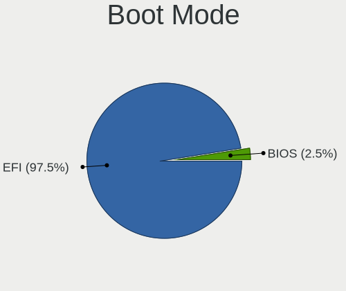
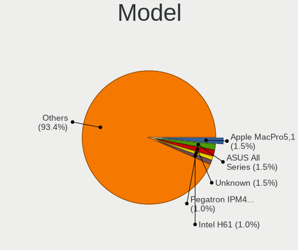
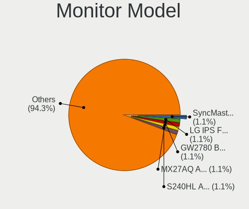
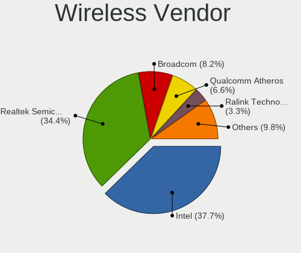
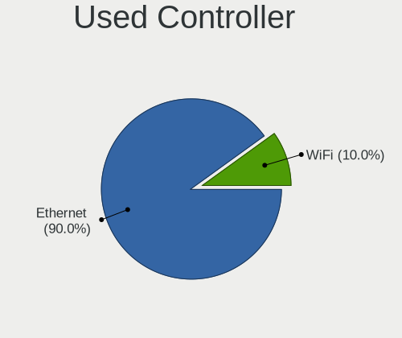
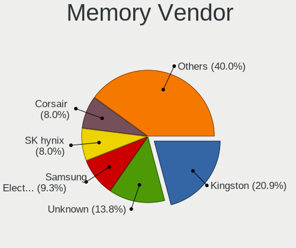

helloSystem 0.7.0 - Tested Hardware & Statistics (Desktops)
-----------------------------------------------------------

A project to collect tested hardware configurations for helloSystem 0.7.0.

Anyone can contribute to this report by the [hw-probe](https://github.com/linuxhw/hw-probe/blob/master/INSTALL.BSD.md) tool:

    hw-probe -all -upload

Please submit a probe of your configuration if it's not presented on the page or is rare.

Full-feature report is available here: https://bsd-hardware.info/?view=trends

Contents
--------

* [ Test Cases ](#test-cases)

* [ System ](#system)
  - [ Arch                     ](#arch)
  - [ DE                       ](#de)
  - [ Display Server           ](#display-server)
  - [ Display Manager          ](#display-manager)
  - [ OS Lang                  ](#os-lang)
  - [ Boot Mode                ](#boot-mode)
  - [ Filesystem               ](#filesystem)
  - [ Part. scheme             ](#part-scheme)

* [ Board ](#board)
  - [ Vendor                   ](#vendor)
  - [ Model                    ](#model)
  - [ Model Family             ](#model-family)
  - [ MFG Year                 ](#mfg-year)
  - [ Form Factor              ](#form-factor)
  - [ Coreboot                 ](#coreboot)
  - [ RAM Size                 ](#ram-size)
  - [ RAM Used                 ](#ram-used)
  - [ Total Drives             ](#total-drives)
  - [ Has CD-ROM               ](#has-cd-rom)
  - [ Has Ethernet             ](#has-ethernet)
  - [ Has WiFi                 ](#has-wifi)
  - [ Has Bluetooth            ](#has-bluetooth)

* [ Location ](#location)
  - [ Country                  ](#country)
  - [ City                     ](#city)

* [ Drives ](#drives)
  - [ Drive Vendor             ](#drive-vendor)
  - [ Drive Model              ](#drive-model)
  - [ HDD Vendor               ](#hdd-vendor)
  - [ SSD Vendor               ](#ssd-vendor)
  - [ Drive Kind               ](#drive-kind)
  - [ Drive Connector          ](#drive-connector)
  - [ Drive Size               ](#drive-size)
  - [ Space Total              ](#space-total)
  - [ Space Used               ](#space-used)
  - [ Malfunc. Drives          ](#malfunc-drives)
  - [ Malfunc. Drive Vendor    ](#malfunc-drive-vendor)
  - [ Malfunc. HDD Vendor      ](#malfunc-hdd-vendor)
  - [ Malfunc. Drive Kind      ](#malfunc-drive-kind)
  - [ Failed Drives            ](#failed-drives)
  - [ Failed Drive Vendor      ](#failed-drive-vendor)
  - [ Drive Status             ](#drive-status)

* [ Storage controller ](#storage-controller)
  - [ Storage Vendor           ](#storage-vendor)
  - [ Storage Model            ](#storage-model)
  - [ Storage Kind             ](#storage-kind)

* [ Processor ](#processor)
  - [ CPU Vendor               ](#cpu-vendor)
  - [ CPU Model                ](#cpu-model)
  - [ CPU Model Family         ](#cpu-model-family)
  - [ CPU Cores                ](#cpu-cores)
  - [ CPU Sockets              ](#cpu-sockets)
  - [ CPU Threads              ](#cpu-threads)
  - [ CPU Microarch            ](#cpu-microarch)

* [ Graphics ](#graphics)
  - [ GPU Vendor               ](#gpu-vendor)
  - [ GPU Model                ](#gpu-model)
  - [ GPU Combo                ](#gpu-combo)
  - [ GPU Driver               ](#gpu-driver)
  - [ GPU Memory               ](#gpu-memory)

* [ Monitor ](#monitor)
  - [ Monitor Vendor           ](#monitor-vendor)
  - [ Monitor Model            ](#monitor-model)
  - [ Monitor Resolution       ](#monitor-resolution)
  - [ Monitor Diagonal         ](#monitor-diagonal)
  - [ Monitor Width            ](#monitor-width)
  - [ Aspect Ratio             ](#aspect-ratio)
  - [ Monitor Area             ](#monitor-area)
  - [ Pixel Density            ](#pixel-density)
  - [ Multiple Monitors        ](#multiple-monitors)

* [ Network ](#network)
  - [ Net Controller Vendor    ](#net-controller-vendor)
  - [ Net Controller Model     ](#net-controller-model)
  - [ Wireless Vendor          ](#wireless-vendor)
  - [ Wireless Model           ](#wireless-model)
  - [ Ethernet Vendor          ](#ethernet-vendor)
  - [ Ethernet Model           ](#ethernet-model)
  - [ Net Controller Kind      ](#net-controller-kind)
  - [ Used Controller          ](#used-controller)
  - [ NICs                     ](#nics)
  - [ IPv6                     ](#ipv6)

* [ Bluetooth ](#bluetooth)
  - [ Bluetooth Vendor         ](#bluetooth-vendor)
  - [ Bluetooth Model          ](#bluetooth-model)

* [ Sound ](#sound)
  - [ Sound Vendor             ](#sound-vendor)
  - [ Sound Model              ](#sound-model)

* [ Memory ](#memory)
  - [ Memory Vendor            ](#memory-vendor)
  - [ Memory Model             ](#memory-model)
  - [ Memory Kind              ](#memory-kind)
  - [ Memory Form Factor       ](#memory-form-factor)
  - [ Memory Size              ](#memory-size)
  - [ Memory Speed             ](#memory-speed)

* [ Printers & scanners ](#printers--scanners)
  - [ Printer Vendor           ](#printer-vendor)
  - [ Printer Model            ](#printer-model)
  - [ Scanner Vendor           ](#scanner-vendor)
  - [ Scanner Model            ](#scanner-model)

* [ Camera ](#camera)
  - [ Camera Vendor            ](#camera-vendor)
  - [ Camera Model             ](#camera-model)

* [ Security ](#security)
  - [ Fingerprint Vendor       ](#fingerprint-vendor)
  - [ Fingerprint Model        ](#fingerprint-model)
  - [ Chipcard Vendor          ](#chipcard-vendor)
  - [ Chipcard Model           ](#chipcard-model)

* [ Unsupported ](#unsupported)
  - [ Unsupported Devices      ](#unsupported-devices)
  - [ Unsupported Device Types ](#unsupported-device-types)

Test Cases
----------

| Vendor   | Model                    | Probe                                                     | Date         |
|----------|--------------------------|-----------------------------------------------------------|--------------|
| ASUSTek  | P5P43TD PRO              | [5999e0ebfb](https://bsd-hardware.info/?probe=5999e0ebfb) | Jan 31, 2022 |
| Intel    | H81                      | [c2f3025900](https://bsd-hardware.info/?probe=c2f3025900) | Jan 31, 2022 |
| Pegatron | 2A99h                    | [e34b6118a2](https://bsd-hardware.info/?probe=e34b6118a2) | Jan 30, 2022 |
| Fujitsu  | D3161-A1 S26361-D3161-A1 | [58ea01e4e6](https://bsd-hardware.info/?probe=58ea01e4e6) | Jan 29, 2022 |
| Intel    | DH77EB AAG39073-400      | [bfe6ef301b](https://bsd-hardware.info/?probe=bfe6ef301b) | Jan 29, 2022 |
| ASUSTek  | P5GC-MX                  | [372749f9d7](https://bsd-hardware.info/?probe=372749f9d7) | Jan 27, 2022 |
| Unknown  | Unknown                  | [a9d799ca71](https://bsd-hardware.info/?probe=a9d799ca71) | Jan 27, 2022 |
| ASUSTek  | P5B SE                   | [f97fba19c1](https://bsd-hardware.info/?probe=f97fba19c1) | Jan 26, 2022 |
| Fujitsu  | D3161-A1 S26361-D3161-A1 | [9f0a000ceb](https://bsd-hardware.info/?probe=9f0a000ceb) | Jan 25, 2022 |
| ASUSTek  | P5B SE                   | [e3332e7b94](https://bsd-hardware.info/?probe=e3332e7b94) | Jan 25, 2022 |
| ASRock   | B460M Pro4               | [107a1e59f5](https://bsd-hardware.info/?probe=107a1e59f5) | Jan 25, 2022 |
| ASRock   | A300M-STX                | [8edf072b67](https://bsd-hardware.info/?probe=8edf072b67) | Jan 25, 2022 |
| ASUSTek  | BM6835_BM6635_BP6335     | [73562aa169](https://bsd-hardware.info/?probe=73562aa169) | Jan 25, 2022 |
| ASUSTek  | P8H61-M LX3 PLUS R2.0    | [df08e2e8f0](https://bsd-hardware.info/?probe=df08e2e8f0) | Jan 24, 2022 |
| ASUSTek  | P7H55-M                  | [fb73c2f7dc](https://bsd-hardware.info/?probe=fb73c2f7dc) | Jan 23, 2022 |
| HP       | 1998                     | [b59dbcdc9c](https://bsd-hardware.info/?probe=b59dbcdc9c) | Jan 23, 2022 |
| ASUSTek  | ROG STRIX B450-F GAMING  | [670e41ed41](https://bsd-hardware.info/?probe=670e41ed41) | Jan 21, 2022 |
| MSI      | PRO Z690-A WIFI DDR4     | [04abd226f3](https://bsd-hardware.info/?probe=04abd226f3) | Jan 21, 2022 |
| ASUSTek  | Maximus VIII HERO        | [a780a7bab2](https://bsd-hardware.info/?probe=a780a7bab2) | Jan 18, 2022 |
| ASUSTek  | TUF GAMING X570-PLUS     | [9cd2758a5f](https://bsd-hardware.info/?probe=9cd2758a5f) | Jan 18, 2022 |
| ASUSTek  | PRIME X570-P             | [3dead218e1](https://bsd-hardware.info/?probe=3dead218e1) | Jan 16, 2022 |
| Gigabyte | B365 HD3                 | [62fc48bd99](https://bsd-hardware.info/?probe=62fc48bd99) | Jan 15, 2022 |
| Dell     | 0XCR8D A03               | [48e9447b37](https://bsd-hardware.info/?probe=48e9447b37) | Jan 15, 2022 |
| ASUSTek  | ROG STRIX Z390-E GAMING  | [d377e06101](https://bsd-hardware.info/?probe=d377e06101) | Jan 15, 2022 |
| Gigabyte | Z77N-WIFI                | [459bb6486d](https://bsd-hardware.info/?probe=459bb6486d) | Jan 13, 2022 |
| ASUSTek  | P8Z68-M PRO              | [a0885f4f44](https://bsd-hardware.info/?probe=a0885f4f44) | Jan 10, 2022 |
| HP       | 8169                     | [85e0cf058c](https://bsd-hardware.info/?probe=85e0cf058c) | Jan 10, 2022 |
| ASUSTek  | GA35DX                   | [eccb947ae4](https://bsd-hardware.info/?probe=eccb947ae4) | Jan 05, 2022 |
| Unknown  | G31T-M7                  | [ed7d80e01a](https://bsd-hardware.info/?probe=ed7d80e01a) | Jan 03, 2022 |
| ASUSTek  | TUF GAMING X570-PLUS     | [a671e3eb04](https://bsd-hardware.info/?probe=a671e3eb04) | Dec 31, 2021 |
| ASRock   | X570 Phantom Gaming 4    | [15211db056](https://bsd-hardware.info/?probe=15211db056) | Dec 28, 2021 |
| Dell     | 0200DY A01               | [fb37dcbb93](https://bsd-hardware.info/?probe=fb37dcbb93) | Dec 28, 2021 |
| Pegatron | IPM41-D3                 | [6829928dad](https://bsd-hardware.info/?probe=6829928dad) | Dec 28, 2021 |
| Dell     | 0H9KW5 A00               | [e962ca25b3](https://bsd-hardware.info/?probe=e962ca25b3) | Dec 28, 2021 |
| Gigabyte | 970A-DS3P                | [0918f0a5b9](https://bsd-hardware.info/?probe=0918f0a5b9) | Dec 25, 2021 |
| ASUSTek  | PRIME B350M-A            | [b0aa3885bb](https://bsd-hardware.info/?probe=b0aa3885bb) | Dec 25, 2021 |
| ASUSTek  | Z170-P                   | [bde74629f9](https://bsd-hardware.info/?probe=bde74629f9) | Dec 25, 2021 |
| ASUSTek  | TUF GAMING X570-PLUS     | [8ac48ba9c3](https://bsd-hardware.info/?probe=8ac48ba9c3) | Dec 23, 2021 |
| Gigabyte | E3000N                   | [eb0ba1b296](https://bsd-hardware.info/?probe=eb0ba1b296) | Dec 22, 2021 |
| ASUSTek  | ROG STRIX Z370-E GAMING  | [936afa4de3](https://bsd-hardware.info/?probe=936afa4de3) | Dec 21, 2021 |
| ASUSTek  | PRIME A320M-K            | [42599b554e](https://bsd-hardware.info/?probe=42599b554e) | Dec 21, 2021 |
| Gigabyte | X58A-UD5                 | [62b94dd372](https://bsd-hardware.info/?probe=62b94dd372) | Dec 21, 2021 |
| ASUSTek  | ROG STRIX X570-E GAMING  | [5cc62c68f9](https://bsd-hardware.info/?probe=5cc62c68f9) | Dec 21, 2021 |
| Gigabyte | H170-D3HP-CF             | [a490614a39](https://bsd-hardware.info/?probe=a490614a39) | Dec 21, 2021 |
| ASRock   | H110M-DGS                | [40c4553adb](https://bsd-hardware.info/?probe=40c4553adb) | Dec 21, 2021 |
| ASUSTek  | P5VD2-VM                 | [7e8f3cf783](https://bsd-hardware.info/?probe=7e8f3cf783) | Dec 20, 2021 |
| ASUSTek  | Q170M-C                  | [7f9e35a31c](https://bsd-hardware.info/?probe=7f9e35a31c) | Dec 20, 2021 |
| Dell     | 0TDG4V A00               | [3ce808c135](https://bsd-hardware.info/?probe=3ce808c135) | Dec 20, 2021 |
| Dell     | 0TDG4V A00               | [5292ad64ef](https://bsd-hardware.info/?probe=5292ad64ef) | Dec 20, 2021 |
| ASUSTek  | P8Z77-V LX               | [3c71a8ba4e](https://bsd-hardware.info/?probe=3c71a8ba4e) | Dec 20, 2021 |
| MSI      | X370 SLI PLUS            | [73853f1fc2](https://bsd-hardware.info/?probe=73853f1fc2) | Dec 19, 2021 |
| Quanta   | 2AC7 011                 | [1a831a1d34](https://bsd-hardware.info/?probe=1a831a1d34) | Dec 18, 2021 |
| Gigabyte | Z77X-UD3H                | [759ce775c9](https://bsd-hardware.info/?probe=759ce775c9) | Dec 15, 2021 |
| ASUSTek  | TUF GAMING X570-PLUS     | [32d20b9b8e](https://bsd-hardware.info/?probe=32d20b9b8e) | Dec 14, 2021 |
| HP       | 843B                     | [f0d279747f](https://bsd-hardware.info/?probe=f0d279747f) | Dec 13, 2021 |
| HP       | 843B                     | [56400d3999](https://bsd-hardware.info/?probe=56400d3999) | Dec 13, 2021 |
| ASUSTek  | PRIME B450M-A            | [aea4a33dee](https://bsd-hardware.info/?probe=aea4a33dee) | Dec 13, 2021 |
| Gigabyte | H270M-DS3H-CF            | [50fba6deda](https://bsd-hardware.info/?probe=50fba6deda) | Dec 11, 2021 |
| Gigabyte | B450 I AORUS PRO WIFI-CF | [6a1100cfdb](https://bsd-hardware.info/?probe=6a1100cfdb) | Dec 11, 2021 |
| Acer     | RevoOne RL85             | [a1e32de7da](https://bsd-hardware.info/?probe=a1e32de7da) | Dec 10, 2021 |
| Gigabyte | B450 I AORUS PRO WIFI-CF | [b900b364f6](https://bsd-hardware.info/?probe=b900b364f6) | Dec 10, 2021 |
| Dell     | 0YF8P5 A00               | [0f03a66475](https://bsd-hardware.info/?probe=0f03a66475) | Dec 09, 2021 |
| Dell     | 0YF8P5 A00               | [83b36f7c3d](https://bsd-hardware.info/?probe=83b36f7c3d) | Dec 09, 2021 |
| Gigabyte | H270M-DS3H-CF            | [a084ff48c2](https://bsd-hardware.info/?probe=a084ff48c2) | Dec 09, 2021 |
| Gigabyte | H270M-DS3H-CF            | [17b557d792](https://bsd-hardware.info/?probe=17b557d792) | Dec 08, 2021 |
| Gigabyte | X570 AORUS ELITE         | [8cfe11fe93](https://bsd-hardware.info/?probe=8cfe11fe93) | Nov 30, 2021 |
| HP       | 843B                     | [376e006a40](https://bsd-hardware.info/?probe=376e006a40) | Nov 30, 2021 |
| Intel    | DG41TY AAE47335-300      | [dd357bcaa5](https://bsd-hardware.info/?probe=dd357bcaa5) | Nov 30, 2021 |
| HP       | 843B                     | [404224439d](https://bsd-hardware.info/?probe=404224439d) | Nov 29, 2021 |
| HP       | 843B                     | [a8ac0e9efb](https://bsd-hardware.info/?probe=a8ac0e9efb) | Nov 29, 2021 |
| HP       | 1825                     | [32f07d2ba3](https://bsd-hardware.info/?probe=32f07d2ba3) | Nov 28, 2021 |
| Gigabyte | B450 I AORUS PRO WIFI-CF | [4cd5e5166a](https://bsd-hardware.info/?probe=4cd5e5166a) | Nov 27, 2021 |
| ASRock   | 775i945GZ                | [16fc4ee10d](https://bsd-hardware.info/?probe=16fc4ee10d) | Nov 26, 2021 |
| HP       | 844C                     | [fb7d8eaf5d](https://bsd-hardware.info/?probe=fb7d8eaf5d) | Nov 06, 2021 |
| Unknown  | X79                      | [ef88cbc606](https://bsd-hardware.info/?probe=ef88cbc606) | Nov 05, 2021 |
| HP       | 843B                     | [9761f29b5e](https://bsd-hardware.info/?probe=9761f29b5e) | Oct 25, 2021 |
| Acer     | Aspire TC-780            | [3ce8481842](https://bsd-hardware.info/?probe=3ce8481842) | Oct 10, 2021 |

System
------

Arch
----

OS architecture (x86_64, i586, etc.)

| Name  | Desktops | Percent |
|-------|----------|---------|
| amd64 | 60       | 100%    |

DE
--

Desktop Environment

| Name         | Desktops | Percent |
|--------------|----------|---------|
| helloDesktop | 59       | 98.33%  |
| GNOME        | 1        | 1.67%   |

Display Server
--------------

X11 or Wayland

| Name | Desktops | Percent |
|------|----------|---------|
| X11  | 60       | 100%    |

Display Manager
---------------

SDDM, LightDM, etc.

| Name | Desktops | Percent |
|------|----------|---------|
| SLiM | 60       | 100%    |

OS Lang
-------

Language

| Lang  | Desktops | Percent |
|-------|----------|---------|
| en_US | 58       | 96.67%  |
| de_DE | 1        | 1.67%   |
| C     | 1        | 1.67%   |

Boot Mode
---------

EFI or BIOS

| Mode | Desktops | Percent |
|------|----------|---------|
| EFI  | 57       | 95%     |
| BIOS | 3        | 5%      |

Filesystem
----------

Type of filesystem

| Type   | Desktops | Percent |
|--------|----------|---------|
| Cd9660 | 39       | 63.93%  |
| Zfs    | 22       | 36.07%  |

Part. scheme
------------

Scheme of partitioning

| Type | Desktops | Percent |
|------|----------|---------|
| GPT  | 57       | 95%     |
| MBR  | 3        | 5%      |

Board
-----

Vendor
------

Motherboard manufacturer

| Name                | Desktops | Percent |
|---------------------|----------|---------|
| ASUSTek Computer    | 23       | 38.33%  |
| Gigabyte Technology | 10       | 16.67%  |
| Hewlett-Packard     | 5        | 8.33%   |
| Dell                | 5        | 8.33%   |
| ASRock              | 5        | 8.33%   |
| Intel               | 3        | 5%      |
| Pegatron            | 2        | 3.33%   |
| MSI                 | 2        | 3.33%   |
| Unknown             | 2        | 3.33%   |
| Quanta              | 1        | 1.67%   |
| Fujitsu             | 1        | 1.67%   |
| Acer                | 1        | 1.67%   |

Model
-----

Motherboard model

| Name                                | Desktops | Percent |
|-------------------------------------|----------|---------|
| ASUS TUF GAMING X570-PLUS           | 2        | 3.33%   |
| Unknown                             | 2        | 3.33%   |
| Quanta 120-1135                     | 1        | 1.67%   |
| Pegatron IPM41-D3                   | 1        | 1.67%   |
| Pegatron Compaq 505B Microtower PC  | 1        | 1.67%   |
| MSI MS-7D25                         | 1        | 1.67%   |
| MSI MS-7A33                         | 1        | 1.67%   |
| Intel H81                           | 1        | 1.67%   |
| Intel DH77EB AAG39073-400           | 1        | 1.67%   |
| Intel DG41TY AAE47335-300           | 1        | 1.67%   |
| HP ProDesk 600 G2 DM                | 1        | 1.67%   |
| HP Pavilion Gaming Desktop 690-00xx | 1        | 1.67%   |
| HP EliteDesk 800 G1 DM              | 1        | 1.67%   |
| HP EliteDesk 700 G1 SFF             | 1        | 1.67%   |
| HP 844C                             | 1        | 1.67%   |
| Gigabyte Z77X-UD3H                  | 1        | 1.67%   |
| Gigabyte Z77N-WIFI                  | 1        | 1.67%   |
| Gigabyte X58A-UD5                   | 1        | 1.67%   |
| Gigabyte X570 AORUS ELITE           | 1        | 1.67%   |
| Gigabyte H270M-DS3H                 | 1        | 1.67%   |
| Gigabyte H170-D3HP                  | 1        | 1.67%   |
| Gigabyte E3000N                     | 1        | 1.67%   |
| Gigabyte B450 I AORUS PRO WIFI      | 1        | 1.67%   |
| Gigabyte B365 HD3                   | 1        | 1.67%   |
| Gigabyte 970A-DS3P                  | 1        | 1.67%   |
| Fujitsu ESPRIMO E710                | 1        | 1.67%   |
| Dell Vostro 3667                    | 1        | 1.67%   |
| Dell Precision T1700                | 1        | 1.67%   |
| Dell OptiPlex 9020                  | 1        | 1.67%   |
| Dell OptiPlex 780                   | 1        | 1.67%   |
| Dell Inspiron 3891                  | 1        | 1.67%   |
| ASUS Z170-P                         | 1        | 1.67%   |
| ASUS ROG STRIX Z390-E GAMING        | 1        | 1.67%   |
| ASUS ROG STRIX Z370-E GAMING        | 1        | 1.67%   |
| ASUS ROG STRIX X570-E GAMING        | 1        | 1.67%   |
| ASUS ROG Strix GA35DX_G35DX         | 1        | 1.67%   |
| ASUS ROG STRIX B450-F GAMING        | 1        | 1.67%   |
| ASUS Q170M-C                        | 1        | 1.67%   |
| ASUS PRIME X570-P                   | 1        | 1.67%   |
| ASUS PRIME B450M-A                  | 1        | 1.67%   |
| ASUS PRIME B350M-A                  | 1        | 1.67%   |
| ASUS PRIME A320M-K                  | 1        | 1.67%   |
| ASUS P8Z77-V LX                     | 1        | 1.67%   |
| ASUS P8Z68-M PRO                    | 1        | 1.67%   |
| ASUS P8H61-M LX3 PLUS R2.0          | 1        | 1.67%   |
| ASUS P7H55-M                        | 1        | 1.67%   |
| ASUS P5VD2-VM                       | 1        | 1.67%   |
| ASUS P5P43TD PRO                    | 1        | 1.67%   |
| ASUS P5GC-MX                        | 1        | 1.67%   |
| ASUS P5B SE                         | 1        | 1.67%   |
| ASUS Maximus VIII HERO              | 1        | 1.67%   |
| ASUS BM6835_BM6635_BP6335           | 1        | 1.67%   |
| ASRock X570 Phantom Gaming 4        | 1        | 1.67%   |
| ASRock H110M-DGS                    | 1        | 1.67%   |
| ASRock B460M Pro4                   | 1        | 1.67%   |
| ASRock A300M-STX                    | 1        | 1.67%   |
| ASRock 775i945GZ                    | 1        | 1.67%   |
| Acer RevoOne RL85                   | 1        | 1.67%   |

Model Family
------------

Motherboard model prefix

| Name                | Desktops | Percent |
|---------------------|----------|---------|
| ASUS ROG            | 5        | 8.33%   |
| ASUS PRIME          | 4        | 6.67%   |
| HP EliteDesk        | 2        | 3.33%   |
| Dell OptiPlex       | 2        | 3.33%   |
| ASUS TUF            | 2        | 3.33%   |
| Unknown             | 2        | 3.33%   |
| Quanta 120-1135     | 1        | 1.67%   |
| Pegatron IPM41-D3   | 1        | 1.67%   |
| Pegatron Compaq     | 1        | 1.67%   |
| MSI MS-7D25         | 1        | 1.67%   |
| MSI MS-7A33         | 1        | 1.67%   |
| Intel H81           | 1        | 1.67%   |
| Intel DH77EB        | 1        | 1.67%   |
| Intel DG41TY        | 1        | 1.67%   |
| HP ProDesk          | 1        | 1.67%   |
| HP Pavilion         | 1        | 1.67%   |
| HP 844C             | 1        | 1.67%   |
| Gigabyte Z77X-UD3H  | 1        | 1.67%   |
| Gigabyte Z77N-WIFI  | 1        | 1.67%   |
| Gigabyte X58A-UD5   | 1        | 1.67%   |
| Gigabyte X570       | 1        | 1.67%   |
| Gigabyte H270M-DS3H | 1        | 1.67%   |
| Gigabyte H170-D3HP  | 1        | 1.67%   |
| Gigabyte E3000N     | 1        | 1.67%   |
| Gigabyte B450       | 1        | 1.67%   |
| Gigabyte B365       | 1        | 1.67%   |
| Gigabyte 970A-DS3P  | 1        | 1.67%   |
| Fujitsu ESPRIMO     | 1        | 1.67%   |
| Dell Vostro         | 1        | 1.67%   |
| Dell Precision      | 1        | 1.67%   |
| Dell Inspiron       | 1        | 1.67%   |
| ASUS Z170-P         | 1        | 1.67%   |
| ASUS Q170M-C        | 1        | 1.67%   |
| ASUS P8Z77-V        | 1        | 1.67%   |
| ASUS P8Z68-M        | 1        | 1.67%   |
| ASUS P8H61-M        | 1        | 1.67%   |
| ASUS P7H55-M        | 1        | 1.67%   |
| ASUS P5VD2-VM       | 1        | 1.67%   |
| ASUS P5P43TD        | 1        | 1.67%   |
| ASUS P5GC-MX        | 1        | 1.67%   |
| ASUS P5B            | 1        | 1.67%   |
| ASUS Maximus        | 1        | 1.67%   |
| ASUS BM6835         | 1        | 1.67%   |
| ASRock X570         | 1        | 1.67%   |
| ASRock H110M-DGS    | 1        | 1.67%   |
| ASRock B460M        | 1        | 1.67%   |
| ASRock A300M-STX    | 1        | 1.67%   |
| ASRock 775i945GZ    | 1        | 1.67%   |
| Acer RevoOne        | 1        | 1.67%   |

MFG Year
--------

Motherboard manufacture year

| Year | Desktops | Percent |
|------|----------|---------|
| 2021 | 10       | 16.67%  |
| 2019 | 9        | 15%     |
| 2017 | 7        | 11.67%  |
| 2013 | 5        | 8.33%   |
| 2018 | 4        | 6.67%   |
| 2014 | 4        | 6.67%   |
| 2010 | 4        | 6.67%   |
| 2016 | 3        | 5%      |
| 2012 | 3        | 5%      |
| 2007 | 3        | 5%      |
| 2020 | 2        | 3.33%   |
| 2011 | 2        | 3.33%   |
| 2009 | 2        | 3.33%   |
| 2015 | 1        | 1.67%   |
| 2008 | 1        | 1.67%   |

Form Factor
-----------

Physical design of the computer

| Name    | Desktops | Percent |
|---------|----------|---------|
| Desktop | 60       | 100%    |

Coreboot
--------

Have coreboot on board

| Used | Desktops | Percent |
|------|----------|---------|
| No   | 60       | 100%    |

RAM Size
--------

Total RAM memory

| Size in GB  | Desktops | Percent |
|-------------|----------|---------|
| 16.01-24.0  | 16       | 26.67%  |
| 8.01-16.0   | 16       | 26.67%  |
| 32.01-64.0  | 14       | 23.33%  |
| 4.01-8.0    | 7        | 11.67%  |
| 2.01-3.0    | 3        | 5%      |
| 64.01-256.0 | 2        | 3.33%   |
| 24.01-32.0  | 1        | 1.67%   |
| 0.51-1.0    | 1        | 1.67%   |

RAM Used
--------

Used RAM memory

| Used GB   | Desktops | Percent |
|-----------|----------|---------|
| 0.01-0.5  | 22       | 36.07%  |
| 1.01-2.0  | 17       | 27.87%  |
| 0.51-1.0  | 17       | 27.87%  |
| 2.01-3.0  | 3        | 4.92%   |
| 3.01-4.0  | 1        | 1.64%   |
| 8.01-16.0 | 1        | 1.64%   |

Total Drives
------------

Number of drives on board

| Drives | Desktops | Percent |
|--------|----------|---------|
| 1      | 22       | 36.67%  |
| 2      | 18       | 30%     |
| 3      | 6        | 10%     |
| 4      | 5        | 8.33%   |
| 0      | 4        | 6.67%   |
| 5      | 3        | 5%      |
| 6      | 2        | 3.33%   |

Has CD-ROM
----------

Has CD-ROM on board

| Presented | Desktops | Percent |
|-----------|----------|---------|
| No        | 38       | 63.33%  |
| Yes       | 22       | 36.67%  |

Has Ethernet
------------

Has Ethernet on board

| Presented | Desktops | Percent |
|-----------|----------|---------|
| Yes       | 59       | 98.33%  |
| No        | 1        | 1.67%   |

Has WiFi
--------

Has WiFi module

| Presented | Desktops | Percent |
|-----------|----------|---------|
| No        | 40       | 66.67%  |
| Yes       | 20       | 33.33%  |

Has Bluetooth
-------------

Has Bluetooth module

| Presented | Desktops | Percent |
|-----------|----------|---------|
| No        | 36       | 60%     |
| Yes       | 24       | 40%     |

Location
--------

Country
-------

Geographic location (country)

| Country     | Desktops | Percent |
|-------------|----------|---------|
| Russia      | 12       | 20%     |
| USA         | 8        | 13.33%  |
| Canada      | 4        | 6.67%   |
| Poland      | 3        | 5%      |
| India       | 3        | 5%      |
| Hungary     | 3        | 5%      |
| Ukraine     | 2        | 3.33%   |
| Spain       | 2        | 3.33%   |
| Romania     | 2        | 3.33%   |
| Italy       | 2        | 3.33%   |
| Germany     | 2        | 3.33%   |
| France      | 2        | 3.33%   |
| Brazil      | 2        | 3.33%   |
| Australia   | 2        | 3.33%   |
| Vietnam     | 1        | 1.67%   |
| UK          | 1        | 1.67%   |
| Turkey      | 1        | 1.67%   |
| Taiwan      | 1        | 1.67%   |
| Philippines | 1        | 1.67%   |
| Peru        | 1        | 1.67%   |
| Norway      | 1        | 1.67%   |
| Kazakhstan  | 1        | 1.67%   |
| Finland     | 1        | 1.67%   |
| Denmark     | 1        | 1.67%   |
| China       | 1        | 1.67%   |

City
----

Geographic location (city)

| City              | Desktops | Percent |
|-------------------|----------|---------|
| Surgut            | 2        | 3.28%   |
| St Petersburg     | 2        | 3.28%   |
| Barnaul           | 2        | 3.28%   |
| Yunlin            | 1        | 1.64%   |
| Warsaw            | 1        | 1.64%   |
| Tiruchi           | 1        | 1.64%   |
| Szeged            | 1        | 1.64%   |
| Sz?©kesfeh?©rv??r | 1        | 1.64%   |
| Suceava           | 1        | 1.64%   |
| Stavropol         | 1        | 1.64%   |
| Spalice           | 1        | 1.64%   |
| Smiths Falls      | 1        | 1.64%   |
| Santa Maria       | 1        | 1.64%   |
| Rio de Janeiro    | 1        | 1.64%   |
| Renfrew           | 1        | 1.64%   |
| Pflugerville      | 1        | 1.64%   |
| Paso Robles       | 1        | 1.64%   |
| Ourense           | 1        | 1.64%   |
| Novosibirsk       | 1        | 1.64%   |
| New Delhi         | 1        | 1.64%   |
| Myski             | 1        | 1.64%   |
| Myrtle Beach      | 1        | 1.64%   |
| Montreal          | 1        | 1.64%   |
| Melbourne         | 1        | 1.64%   |
| Maglod            | 1        | 1.64%   |
| Luton             | 1        | 1.64%   |
| Lima              | 1        | 1.64%   |
| Lehrte            | 1        | 1.64%   |
| Kremenchug        | 1        | 1.64%   |
| Kostroma          | 1        | 1.64%   |
| Katowice          | 1        | 1.64%   |
| Imperial          | 1        | 1.64%   |
| Helsinki          | 1        | 1.64%   |
| Hayfork           | 1        | 1.64%   |
| Hanoi             | 1        | 1.64%   |
| Hangzhou          | 1        | 1.64%   |
| Greater Sudbury   | 1        | 1.64%   |
| Genille           | 1        | 1.64%   |
| Front Royal       | 1        | 1.64%   |
| Follonica         | 1        | 1.64%   |
| Escondido         | 1        | 1.64%   |
| Esbjerg           | 1        | 1.64%   |
| Ernakulam         | 1        | 1.64%   |
| Dreieich          | 1        | 1.64%   |
| Curitiba          | 1        | 1.64%   |
| Coria del R?­o    | 1        | 1.64%   |
| Collierville      | 1        | 1.64%   |
| Chelyabinsk       | 1        | 1.64%   |
| Cheboksary        | 1        | 1.64%   |
| Chamb?©ry         | 1        | 1.64%   |
| Catania           | 1        | 1.64%   |
| Bucharest         | 1        | 1.64%   |
| Brisbane          | 1        | 1.64%   |
| Belogorodka       | 1        | 1.64%   |
| Balestrand        | 1        | 1.64%   |
| Ankara            | 1        | 1.64%   |
| Almaty            | 1        | 1.64%   |
| A Valenza         | 1        | 1.64%   |

Drives
------

Drive Vendor
------------

Hard drive vendors

| Vendor              | Desktops | Drives | Percent |
|---------------------|----------|--------|---------|
| Seagate             | 22       | 30     | 20.95%  |
| Samsung Electronics | 21       | 25     | 20%     |
| WDC                 | 15       | 20     | 14.29%  |
| Crucial             | 7        | 12     | 6.67%   |
| Toshiba             | 6        | 8      | 5.71%   |
| SK Hynix            | 4        | 6      | 3.81%   |
| Kingston            | 4        | 4      | 3.81%   |
| Intel               | 3        | 3      | 2.86%   |
| GOODRAM             | 3        | 3      | 2.86%   |
| A-DATA Technology   | 3        | 3      | 2.86%   |
| XPG                 | 2        | 2      | 1.9%    |
| OCZ                 | 2        | 2      | 1.9%    |
| Hitachi             | 2        | 2      | 1.9%    |
| HGST                | 2        | 2      | 1.9%    |
| Gigabyte Technology | 2        | 3      | 1.9%    |
| SanDisk             | 1        | 1      | 0.95%   |
| PLEXTOR             | 1        | 1      | 0.95%   |
| Phison              | 1        | 1      | 0.95%   |
| Mushkin             | 1        | 1      | 0.95%   |
| Lite-On             | 1        | 1      | 0.95%   |
| KingSpec            | 1        | 1      | 0.95%   |
| Apacer              | 1        | 1      | 0.95%   |

Drive Model
-----------

Hard drive models

| Model                                   | Desktops | Percent |
|-----------------------------------------|----------|---------|
| Seagate ST2000DM008-2FR102 2TB          | 3        | 2.5%    |
| Samsung SSD 850 EVO 250GB               | 3        | 2.5%    |
| Crucial CT500MX500SSD1 500GB            | 3        | 2.5%    |
| XPG GAMMIX S11 Pro 1TB                  | 2        | 1.67%   |
| WDC WDS240G2G0A-00JH30 240GB            | 2        | 1.67%   |
| WDC WD5000LPVX-22V0TT0 500GB            | 2        | 1.67%   |
| SK Hynix BC501 HFM128GDJTNG-8310A 128GB | 2        | 1.67%   |
| Seagate ST4000DM004-2CV104 4TB          | 2        | 1.67%   |
| Seagate ST1000DM010-2EP102 1TB          | 2        | 1.67%   |
| Samsung SSD 970 EVO Plus 1TB            | 2        | 1.67%   |
| Samsung SSD 970 EVO 250GB               | 2        | 1.67%   |
| Kingston SA400S37120G 120GB             | 2        | 1.67%   |
| WDC WDS500G2B0C-00PXH0 500GB            | 1        | 0.83%   |
| WDC WDS500G2B0A-00SM50 500GB            | 1        | 0.83%   |
| WDC WDS250G1B0A-00H9H0 250GB            | 1        | 0.83%   |
| WDC WDS100T2B0A-00SM50 1TB              | 1        | 0.83%   |
| WDC WDBA3V0010BNC-WRSN 1TB              | 1        | 0.83%   |
| WDC WD5000AAKS-22A7B0 500GB             | 1        | 0.83%   |
| WDC WD40EZRZ-00GXCB0 4TB                | 1        | 0.83%   |
| WDC WD4004FZWX-00GBGB0 4TB              | 1        | 0.83%   |
| WDC WD3003FZEX-00Z4SA0 3TB              | 1        | 0.83%   |
| WDC WD2500AAKX-073CA1 250GB             | 1        | 0.83%   |
| WDC WD1600BEVT-22ZCT0 160GB             | 1        | 0.83%   |
| WDC WD10EZEX-60ZF5A0 1TB                | 1        | 0.83%   |
| WDC WD10EZEX-60WN4A0 1TB                | 1        | 0.83%   |
| WDC WD10EZEX-00KUWA0 1TB                | 1        | 0.83%   |
| Toshiba MK1655GSX 160GB                 | 1        | 0.83%   |
| Toshiba HDWE160 6TB                     | 1        | 0.83%   |
| Toshiba HDWD110 1TB                     | 1        | 0.83%   |
| Toshiba DT01ACA200 2TB                  | 1        | 0.83%   |
| Toshiba DT01ACA100 1TB                  | 1        | 0.83%   |
| Toshiba DT01ACA050 500GB                | 1        | 0.83%   |
| SK Hynix SHGS31-1000GS-2 1TB            | 1        | 0.83%   |
| SK Hynix BC711 NVMe 256GB               | 1        | 0.83%   |
| Seagate ST500DM002-1BD142 500GB         | 1        | 0.83%   |
| Seagate ST4000NC001-1FS168 4TB          | 1        | 0.83%   |
| Seagate ST4000NC000-1FR168 4TB          | 1        | 0.83%   |
| Seagate ST380211AS 80GB                 | 1        | 0.83%   |
| Seagate ST3500413AS 500GB               | 1        | 0.83%   |
| Seagate ST3500312CS 500GB               | 1        | 0.83%   |
| Seagate ST3400633AS 400GB               | 1        | 0.83%   |
| Seagate ST3320418AS 320GB               | 1        | 0.83%   |
| Seagate ST32000641AS 2TB                | 1        | 0.83%   |
| Seagate ST31000528AS 1TB                | 1        | 0.83%   |
| Seagate ST3000DM008-2DM166 3TB          | 1        | 0.83%   |
| Seagate ST3000DM001-1CH166 3TB          | 1        | 0.83%   |
| Seagate ST2000LX001-1RG174 2TB          | 1        | 0.83%   |
| Seagate ST2000DM006-2DM164 2TB          | 1        | 0.83%   |
| Seagate ST2000DM001-1ER164 2TB          | 1        | 0.83%   |
| Seagate ST2000DM001-1CH164 2TB          | 1        | 0.83%   |
| Seagate ST2000DL003-9VT166 2TB          | 1        | 0.83%   |
| Seagate ST1000LM035-1RK172 1TB          | 1        | 0.83%   |
| Seagate ST1000LM024 HN-M101MBB 1TB      | 1        | 0.83%   |
| Seagate ST1000DM003-1ER162 1TB          | 1        | 0.83%   |
| SanDisk SDSSDA120G 120GB                | 1        | 0.83%   |
| Samsung SSD 980 PRO 1TB                 | 1        | 0.83%   |
| Samsung SSD 980 1TB                     | 1        | 0.83%   |
| Samsung SSD 970 EVO Plus 500GB          | 1        | 0.83%   |
| Samsung SSD 970 EVO 1TB                 | 1        | 0.83%   |
| Samsung SSD 870 EVO 500GB               | 1        | 0.83%   |

HDD Vendor
----------

Hard disk drive vendors

| Vendor              | Desktops | Drives | Percent |
|---------------------|----------|--------|---------|
| Seagate             | 22       | 30     | 51.16%  |
| WDC                 | 9        | 11     | 20.93%  |
| Toshiba             | 6        | 8      | 13.95%  |
| Samsung Electronics | 2        | 2      | 4.65%   |
| Hitachi             | 2        | 2      | 4.65%   |
| HGST                | 2        | 2      | 4.65%   |

SSD Vendor
----------

Solid state drive vendors

| Vendor              | Desktops | Drives | Percent |
|---------------------|----------|--------|---------|
| Samsung Electronics | 13       | 13     | 28.89%  |
| Crucial             | 7        | 11     | 15.56%  |
| WDC                 | 4        | 7      | 8.89%   |
| Kingston            | 3        | 3      | 6.67%   |
| GOODRAM             | 3        | 3      | 6.67%   |
| A-DATA Technology   | 3        | 3      | 6.67%   |
| OCZ                 | 2        | 2      | 4.44%   |
| Intel               | 2        | 2      | 4.44%   |
| Gigabyte Technology | 2        | 3      | 4.44%   |
| SK Hynix            | 1        | 1      | 2.22%   |
| SanDisk             | 1        | 1      | 2.22%   |
| PLEXTOR             | 1        | 1      | 2.22%   |
| Lite-On             | 1        | 1      | 2.22%   |
| KingSpec            | 1        | 1      | 2.22%   |
| Apacer              | 1        | 1      | 2.22%   |

Drive Kind
----------

HDD or SSD

| Kind | Desktops | Drives | Percent |
|------|----------|--------|---------|
| HDD  | 38       | 55     | 40.86%  |
| SSD  | 36       | 53     | 38.71%  |
| NVMe | 19       | 24     | 20.43%  |

Drive Connector
---------------

SATA, SAS, NVMe, etc.

| Type | Desktops | Drives | Percent |
|------|----------|--------|---------|
| SATA | 52       | 108    | 73.24%  |
| NVMe | 19       | 24     | 26.76%  |

Drive Size
----------

Size of hard drive

| Size in TB | Desktops | Drives | Percent |
|------------|----------|--------|---------|
| 0.01-0.5   | 42       | 65     | 56.76%  |
| 0.51-1.0   | 14       | 19     | 18.92%  |
| 1.01-2.0   | 11       | 12     | 14.86%  |
| 3.01-4.0   | 4        | 8      | 5.41%   |
| 2.01-3.0   | 2        | 3      | 2.7%    |
| 4.01-10.0  | 1        | 1      | 1.35%   |

Space Total
-----------

Amount of disk space available on the file system

| Size in GB | Desktops | Percent |
|------------|----------|---------|
| 1-20       | 40       | 66.67%  |
| 101-250    | 12       | 20%     |
| 251-500    | 4        | 6.67%   |
| 501-1000   | 2        | 3.33%   |
| 21-50      | 1        | 1.67%   |
| 51-100     | 1        | 1.67%   |

Space Used
----------

Amount of used disk space

| Used GB | Desktops | Percent |
|---------|----------|---------|
| 1-20    | 60       | 100%    |

Malfunc. Drives
---------------

Drive models with a malfunction

| Model                               | Desktops | Drives | Percent |
|-------------------------------------|----------|--------|---------|
| WDC WD5000AAKS-22A7B0 500GB         | 1        | 1      | 8.33%   |
| WDC WD1600BEVT-22ZCT0 160GB         | 1        | 1      | 8.33%   |
| Toshiba DT01ACA100 1TB              | 1        | 3      | 8.33%   |
| Seagate ST380211AS 80GB             | 1        | 1      | 8.33%   |
| Seagate ST3500413AS 500GB           | 1        | 1      | 8.33%   |
| Seagate ST3320418AS 320GB           | 1        | 1      | 8.33%   |
| Seagate ST31000528AS 1TB            | 1        | 1      | 8.33%   |
| Seagate ST1000LM024 HN-M101MBB 1TB  | 1        | 1      | 8.33%   |
| Samsung Electronics SSD 870 EVO 1TB | 1        | 1      | 8.33%   |
| Samsung Electronics HD322HJ 320GB   | 1        | 1      | 8.33%   |
| Hitachi HTS541680J9SA00 80GB        | 1        | 1      | 8.33%   |
| Crucial CT240M500SSD1 240GB         | 1        | 1      | 8.33%   |

Malfunc. Drive Vendor
---------------------

Vendors of faulty drives

| Vendor              | Desktops | Drives | Percent |
|---------------------|----------|--------|---------|
| Seagate             | 5        | 5      | 41.67%  |
| WDC                 | 2        | 2      | 16.67%  |
| Samsung Electronics | 2        | 2      | 16.67%  |
| Toshiba             | 1        | 3      | 8.33%   |
| Hitachi             | 1        | 1      | 8.33%   |
| Crucial             | 1        | 1      | 8.33%   |

Malfunc. HDD Vendor
-------------------

Vendors of faulty HDD drives

| Vendor              | Desktops | Drives | Percent |
|---------------------|----------|--------|---------|
| Seagate             | 5        | 5      | 50%     |
| WDC                 | 2        | 2      | 20%     |
| Toshiba             | 1        | 3      | 10%     |
| Samsung Electronics | 1        | 1      | 10%     |
| Hitachi             | 1        | 1      | 10%     |

Malfunc. Drive Kind
-------------------

Kinds of faulty drives

| Kind | Desktops | Drives | Percent |
|------|----------|--------|---------|
| HDD  | 10       | 12     | 83.33%  |
| SSD  | 2        | 2      | 16.67%  |

Failed Drives
-------------

Failed drive models

Zero info for selected period =(

Failed Drive Vendor
-------------------

Failed drive vendors

Zero info for selected period =(

Drive Status
------------

Number of failed and malfunc. drives

| Status  | Desktops | Drives | Percent |
|---------|----------|--------|---------|
| Works   | 53       | 118    | 81.54%  |
| Malfunc | 12       | 14     | 18.46%  |

Storage controller
------------------

Storage Vendor
--------------

Storage controller vendors

| Vendor                      | Desktops | Percent |
|-----------------------------|----------|---------|
| Intel                       | 42       | 48.84%  |
| AMD                         | 16       | 18.6%   |
| Samsung Electronics         | 8        | 9.3%    |
| SK Hynix                    | 3        | 3.49%   |
| JMicron Technology          | 3        | 3.49%   |
| Sandisk                     | 2        | 2.33%   |
| Marvell Technology Group    | 2        | 2.33%   |
| ASMedia Technology          | 2        | 2.33%   |
| ADATA Technology            | 2        | 2.33%   |
| VIA Technologies            | 1        | 1.16%   |
| Silicon Motion              | 1        | 1.16%   |
| Phison Electronics          | 1        | 1.16%   |
| Nvidia                      | 1        | 1.16%   |
| Micron/Crucial Technology   | 1        | 1.16%   |
| Kingston Technology Company | 1        | 1.16%   |

Storage Model
-------------

Storage controller models

| Model                                                                          | Desktops | Percent |
|--------------------------------------------------------------------------------|----------|---------|
| AMD FCH SATA Controller [AHCI mode]                                            | 14       | 13.86%  |
| Intel Q170/Q150/B150/H170/H110/Z170/CM236 Chipset SATA Controller [AHCI Mode]  | 7        | 6.93%   |
| Samsung NVMe SSD Controller SM981/PM981/PM983                                  | 6        | 5.94%   |
| Intel 7 Series/C210 Series Chipset Family 6-port SATA Controller [AHCI mode]   | 6        | 5.94%   |
| Intel NM10/ICH7 Family SATA Controller [IDE mode]                              | 5        | 4.95%   |
| Intel 82801G (ICH7 Family) IDE Controller                                      | 4        | 3.96%   |
| Intel 8 Series/C220 Series Chipset Family 6-port SATA Controller 1 [AHCI mode] | 4        | 3.96%   |
| Intel Cannon Lake PCH SATA AHCI Controller                                     | 3        | 2.97%   |
| SK Hynix BC501 NVMe Solid State Drive                                          | 2        | 1.98%   |
| Sandisk WD Blue SN550 NVMe SSD                                                 | 2        | 1.98%   |
| JMicron JMB363 SATA/IDE Controller                                             | 2        | 1.98%   |
| Intel SATA Controller [RAID mode]                                              | 2        | 1.98%   |
| Intel 6 Series/C200 Series Chipset Family 6 port Desktop SATA AHCI Controller  | 2        | 1.98%   |
| Intel 200 Series PCH SATA controller [AHCI mode]                               | 2        | 1.98%   |
| ASMedia ASM1062 Serial ATA Controller                                          | 2        | 1.98%   |
| AMD SB7x0/SB8x0/SB9x0 SATA Controller [AHCI mode]                              | 2        | 1.98%   |
| AMD 400 Series Chipset SATA Controller                                         | 2        | 1.98%   |
| ADATA XPG SX8200 Pro PCIe Gen3x4 M.2 2280 Solid State Drive                    | 2        | 1.98%   |
| VIA VT82C586A/B/VT82C686/A/B/VT823x/A/C PIPC Bus Master IDE                    | 1        | 0.99%   |
| VIA VT8237A SATA 2-Port Controller                                             | 1        | 0.99%   |
| SK Hynix Gold P31 SSD                                                          | 1        | 0.99%   |
| Silicon Motion SM2262/SM2262EN SSD Controller                                  | 1        | 0.99%   |
| Samsung NVMe SSD Controller SM961/PM961/SM963                                  | 1        | 0.99%   |
| Samsung NVMe SSD Controller PM9A1/PM9A3/980PRO                                 | 1        | 0.99%   |
| Samsung NVMe SSD Controller 980                                                | 1        | 0.99%   |
| Phison E12 NVMe Controller                                                     | 1        | 0.99%   |
| Nvidia MCP61 SATA Controller                                                   | 1        | 0.99%   |
| Micron/Crucial P2 NVMe PCIe SSD                                                | 1        | 0.99%   |
| Marvell Group 88SE9172 SATA 6Gb/s Controller                                   | 1        | 0.99%   |
| Marvell Group 88SE9128 PCIe SATA 6 Gb/s RAID controller                        | 1        | 0.99%   |
| Kingston Company A2000 NVMe SSD                                                | 1        | 0.99%   |
| JMicron JMB361 AHCI/IDE                                                        | 1        | 0.99%   |
| Intel SSD 660P Series                                                          | 1        | 0.99%   |
| Intel Alder Lake-S PCH SATA Controller [AHCI Mode]                             | 1        | 0.99%   |
| Intel 82801JI (ICH10 Family) SATA AHCI Controller                              | 1        | 0.99%   |
| Intel 82801JI (ICH10 Family) 4 port SATA IDE Controller #1                     | 1        | 0.99%   |
| Intel 82801JI (ICH10 Family) 2 port SATA IDE Controller #2                     | 1        | 0.99%   |
| Intel 82801JD/DO (ICH10 Family) 4-port SATA IDE Controller                     | 1        | 0.99%   |
| Intel 82801JD/DO (ICH10 Family) 2-port SATA IDE Controller                     | 1        | 0.99%   |
| Intel 82801HM/HEM (ICH8M/ICH8M-E) SATA Controller [IDE mode]                   | 1        | 0.99%   |
| Intel 82801HM/HEM (ICH8M/ICH8M-E) IDE Controller                               | 1        | 0.99%   |
| Intel 82801HB (ICH8) 4 port SATA Controller [AHCI mode]                        | 1        | 0.99%   |
| Intel 82801 Mobile SATA Controller [RAID mode]                                 | 1        | 0.99%   |
| Intel 500 Series Chipset Family SATA AHCI Controller                           | 1        | 0.99%   |
| Intel 5 Series/3400 Series Chipset 6 port SATA AHCI Controller                 | 1        | 0.99%   |
| Intel 400 Series Chipset Family SATA AHCI Controller                           | 1        | 0.99%   |
| Intel 4 Series Chipset PT IDER Controller                                      | 1        | 0.99%   |
| AMD X370 Series Chipset SATA Controller                                        | 1        | 0.99%   |
| AMD FCH SATA Controller D                                                      | 1        | 0.99%   |
| AMD 300 Series Chipset SATA Controller                                         | 1        | 0.99%   |

Storage Kind
------------

Kind of storage controller (IDE, SATA, NVMe, SAS, ...)

| Kind | Desktops | Percent |
|------|----------|---------|
| SATA | 46       | 58.23%  |
| NVMe | 19       | 24.05%  |
| IDE  | 11       | 13.92%  |
| RAID | 3        | 3.8%    |

Processor
---------

CPU Vendor
----------

Processor vendors

| Vendor | Desktops | Percent |
|--------|----------|---------|
| Intel  | 42       | 70%     |
| AMD    | 18       | 30%     |

CPU Model
---------

Processor models

| Model                                       | Desktops | Percent |
|---------------------------------------------|----------|---------|
| Intel Core i7-8700 CPU @ 3.20GHz            | 2        | 3.33%   |
| AMD Ryzen 7 5800X 8-Core Processor          | 2        | 3.33%   |
| AMD Ryzen 5 3600X 6-Core Processor          | 2        | 3.33%   |
| AMD Ryzen 5 3400G with Radeon Vega Graphics | 2        | 3.33%   |
| Intel Xeon CPU X3470 @ 2.93GHz              | 1        | 1.67%   |
| Intel Xeon CPU E31245 @ 3.30GHz             | 1        | 1.67%   |
| Intel Xeon CPU E3-1265L V2 @ 2.50GHz        | 1        | 1.67%   |
| Intel Xeon CPU E3-1230 V2 @ 3.30GHz         | 1        | 1.67%   |
| Intel Pentium Dual-Core CPU E6700 @ 3.20GHz | 1        | 1.67%   |
| Intel Pentium Dual-Core CPU E6500 @ 2.93GHz | 1        | 1.67%   |
| Intel Pentium Dual-Core CPU E5500 @ 2.80GHz | 1        | 1.67%   |
| Intel Pentium Dual CPU E2180 @ 2.00GHz      | 1        | 1.67%   |
| Intel Core i9-9900 CPU @ 3.10GHz            | 1        | 1.67%   |
| Intel Core i7-8700K CPU @ 3.70GHz           | 1        | 1.67%   |
| Intel Core i7-7700 CPU @ 3.60GHz            | 1        | 1.67%   |
| Intel Core i7-6700T CPU @ 2.80GHz           | 1        | 1.67%   |
| Intel Core i7-6700 CPU @ 3.40GHz            | 1        | 1.67%   |
| Intel Core i7-4770 CPU @ 3.40GHz            | 1        | 1.67%   |
| Intel Core i7-3770 CPU @ 3.40GHz            | 1        | 1.67%   |
| Intel Core i7 CPU                           | 1        | 1.67%   |
| Intel Core i5-8400 CPU @ 2.80GHz            | 1        | 1.67%   |
| Intel Core i5-6600K CPU @ 3.50GHz           | 1        | 1.67%   |
| Intel Core i5-6500 CPU @ 3.20GHz            | 1        | 1.67%   |
| Intel Core i5-6400 CPU @ 2.70GHz            | 1        | 1.67%   |
| Intel Core i5-4590T CPU @ 2.00GHz           | 1        | 1.67%   |
| Intel Core i5-4590 CPU @ 3.30GHz            | 1        | 1.67%   |
| Intel Core i5-4570 CPU @ 3.20GHz            | 1        | 1.67%   |
| Intel Core i5-3570 CPU @ 3.40GHz            | 1        | 1.67%   |
| Intel Core i5-3475S CPU @ 2.90GHz           | 1        | 1.67%   |
| Intel Core i5-3450 CPU @ 3.10GHz            | 1        | 1.67%   |
| Intel Core i5-2405S CPU @ 2.50GHz           | 1        | 1.67%   |
| Intel Core i5-10500 CPU @ 3.10GHz           | 1        | 1.67%   |
| Intel Core i3-6320 CPU @ 3.90GHz            | 1        | 1.67%   |
| Intel Core i3-6300 CPU @ 3.80GHz            | 1        | 1.67%   |
| Intel Core i3-5010U CPU @ 2.10GHz           | 1        | 1.67%   |
| Intel Core i3-4130 CPU @ 3.40GHz            | 1        | 1.67%   |
| Intel Core 2 Quad CPU Q9550 @ 2.83GHz       | 1        | 1.67%   |
| Intel Core 2 Duo CPU E7500 @ 2.93GHz        | 1        | 1.67%   |
| Intel Core 2 Duo CPU E4700 @ 2.60GHz        | 1        | 1.67%   |
| Intel Core 2 Duo                            | 1        | 1.67%   |
| Intel Core 2 CPU 4300 @ 1.80GHz             | 1        | 1.67%   |
| Intel Atom CPU D525 @ 1.80GHz               | 1        | 1.67%   |
| Intel 12th Gen Core i5-12600K               | 1        | 1.67%   |
| Intel 11th Gen Core i5-11400 @ 2.60GHz      | 1        | 1.67%   |
| AMD Ryzen 9 5900X 12-Core Processor         | 1        | 1.67%   |
| AMD Ryzen 9 3900X 12-Core Processor         | 1        | 1.67%   |
| AMD Ryzen 7 5700G with Radeon Graphics      | 1        | 1.67%   |
| AMD Ryzen 7 3700X 8-Core Processor          | 1        | 1.67%   |
| AMD Ryzen 7 1800X Eight-Core Processor      | 1        | 1.67%   |
| AMD Ryzen 5 2600X Six-Core Processor        | 1        | 1.67%   |
| AMD Ryzen 5 2400G with Radeon Vega Graphics | 1        | 1.67%   |
| AMD Ryzen 5 1600 Six-Core Processor         | 1        | 1.67%   |
| AMD FX-6300 Six-Core Processor              | 1        | 1.67%   |
| AMD E2-3000 APU with Radeon HD Graphics     | 1        | 1.67%   |
| AMD E-450 APU with Radeon HD Graphics       | 1        | 1.67%   |
| AMD Athlon II X2 215 Processor              | 1        | 1.67%   |

CPU Model Family
----------------

Processor model prefix

| Model                   | Desktops | Percent |
|-------------------------|----------|---------|
| Intel Core i5           | 12       | 20%     |
| Intel Core i7           | 9        | 15%     |
| AMD Ryzen 5             | 7        | 11.67%  |
| AMD Ryzen 7             | 5        | 8.33%   |
| Intel Xeon              | 4        | 6.67%   |
| Intel Core i3           | 4        | 6.67%   |
| Intel Pentium Dual-Core | 3        | 5%      |
| Intel Core 2 Duo        | 3        | 5%      |
| Other                   | 2        | 3.33%   |
| AMD Ryzen 9             | 2        | 3.33%   |
| Intel Pentium Dual      | 1        | 1.67%   |
| Intel Core i9           | 1        | 1.67%   |
| Intel Core 2 Quad       | 1        | 1.67%   |
| Intel Core 2            | 1        | 1.67%   |
| Intel Atom              | 1        | 1.67%   |
| AMD FX                  | 1        | 1.67%   |
| AMD E2                  | 1        | 1.67%   |
| AMD E                   | 1        | 1.67%   |
| AMD Athlon II X2        | 1        | 1.67%   |

CPU Cores
---------

Number of processor cores

| Number  | Desktops | Percent |
|---------|----------|---------|
| 4       | 20       | 33.33%  |
| 2       | 12       | 20%     |
| 6       | 7        | 11.67%  |
| 8       | 5        | 8.33%   |
| Unknown | 5        | 8.33%   |
| 16      | 4        | 6.67%   |
| 12      | 4        | 6.67%   |
| 24      | 2        | 3.33%   |
| 14      | 1        | 1.67%   |

CPU Sockets
-----------

Number of sockets

| Number | Desktops | Percent |
|--------|----------|---------|
| 1      | 60       | 100%    |

CPU Threads
-----------

Threads per core (Hyper-Threading)

| Number  | Desktops | Percent |
|---------|----------|---------|
| 1       | 33       | 55%     |
| 2       | 22       | 36.67%  |
| Unknown | 5        | 8.33%   |

CPU Microarch
-------------

Microarchitecture

| Name        | Desktops | Percent |
|-------------|----------|---------|
| Skylake     | 7        | 11.67%  |
| Penryn      | 6        | 10%     |
| KabyLake    | 6        | 10%     |
| IvyBridge   | 6        | 10%     |
| Haswell     | 5        | 8.33%   |
| Zen 3       | 4        | 6.67%   |
| Zen 2       | 4        | 6.67%   |
| Zen+        | 3        | 5%      |
| Zen         | 3        | 5%      |
| Core        | 3        | 5%      |
| SandyBridge | 2        | 3.33%   |
| Nehalem     | 2        | 3.33%   |
| Unknown     | 2        | 3.33%   |
| Piledriver  | 1        | 1.67%   |
| K10         | 1        | 1.67%   |
| Jaguar      | 1        | 1.67%   |
| CometLake   | 1        | 1.67%   |
| Broadwell   | 1        | 1.67%   |
| Bonnell     | 1        | 1.67%   |
| Bobcat      | 1        | 1.67%   |

Graphics
--------

GPU Vendor
----------

Vendors of graphics cards

| Vendor | Desktops | Percent |
|--------|----------|---------|
| Intel  | 24       | 39.34%  |
| Nvidia | 23       | 37.7%   |
| AMD    | 14       | 22.95%  |

GPU Model
---------

Graphics card models

| Model                                                                       | Desktops | Percent |
|-----------------------------------------------------------------------------|----------|---------|
| Intel Xeon E3-1200 v3/4th Gen Core Processor Integrated Graphics Controller | 4        | 6.56%   |
| Intel HD Graphics 530                                                       | 4        | 6.56%   |
| Nvidia GM204 [GeForce GTX 970]                                              | 3        | 4.92%   |
| AMD Navi 10 [Radeon RX 5600 OEM/5600 XT / 5700/5700 XT]                     | 3        | 4.92%   |
| Nvidia GP107 [GeForce GTX 1050 Ti]                                          | 2        | 3.28%   |
| Intel IvyBridge GT2 [HD Graphics 4000]                                      | 2        | 3.28%   |
| Intel 4 Series Chipset Integrated Graphics Controller                       | 2        | 3.28%   |
| AMD Picasso/Raven 2 [Radeon Vega Series / Radeon Vega Mobile Series]        | 2        | 3.28%   |
| AMD Ellesmere [Radeon RX 470/480/570/570X/580/580X/590]                     | 2        | 3.28%   |
| Nvidia TU116 [GeForce GTX 1650 SUPER]                                       | 1        | 1.64%   |
| Nvidia GP107 [GeForce GTX 1050]                                             | 1        | 1.64%   |
| Nvidia GP106 [GeForce GTX 1060 6GB]                                         | 1        | 1.64%   |
| Nvidia GP104 [GeForce GTX 1080]                                             | 1        | 1.64%   |
| Nvidia GP104 [GeForce GTX 1070 Ti]                                          | 1        | 1.64%   |
| Nvidia GM206 [GeForce GTX 950]                                              | 1        | 1.64%   |
| Nvidia GM107 [GeForce GTX 750]                                              | 1        | 1.64%   |
| Nvidia GK208B [GeForce GT 730]                                              | 1        | 1.64%   |
| Nvidia GK208B [GeForce GT 710]                                              | 1        | 1.64%   |
| Nvidia GK104 [GeForce GTX 760]                                              | 1        | 1.64%   |
| Nvidia GF116 [GeForce GTX 550 Ti]                                           | 1        | 1.64%   |
| Nvidia GA106 [GeForce RTX 3060 Lite Hash Rate]                              | 1        | 1.64%   |
| Nvidia GA104 [GeForce RTX 3070]                                             | 1        | 1.64%   |
| Nvidia GA104 [GeForce RTX 3070 Lite Hash Rate]                              | 1        | 1.64%   |
| Nvidia GA102 [GeForce RTX 3080]                                             | 1        | 1.64%   |
| Nvidia G86 [GeForce 8500 GT]                                                | 1        | 1.64%   |
| Nvidia G72 [GeForce 7300 LE]                                                | 1        | 1.64%   |
| Nvidia C61 [GeForce 6150SE nForce 430]                                      | 1        | 1.64%   |
| Intel Xeon E3-1200 v2/3rd Gen Core processor Graphics Controller            | 1        | 1.64%   |
| Intel RocketLake-S GT1 [UHD Graphics 730]                                   | 1        | 1.64%   |
| Intel HD Graphics 630                                                       | 1        | 1.64%   |
| Intel HD Graphics 5500                                                      | 1        | 1.64%   |
| Intel CometLake-S GT2 [UHD Graphics 630]                                    | 1        | 1.64%   |
| Intel CoffeeLake-S GT2 [UHD Graphics 630]                                   | 1        | 1.64%   |
| Intel Atom Processor D4xx/D5xx/N4xx/N5xx Integrated Graphics Controller     | 1        | 1.64%   |
| Intel AlderLake-S GT1                                                       | 1        | 1.64%   |
| Intel 82G33/G31 Express Integrated Graphics Controller                      | 1        | 1.64%   |
| Intel 82945G/GZ Integrated Graphics Controller                              | 1        | 1.64%   |
| Intel 4th Generation Core Processor Family Integrated Graphics Controller   | 1        | 1.64%   |
| Intel 2nd Generation Core Processor Family Integrated Graphics Controller   | 1        | 1.64%   |
| AMD Wrestler [Radeon HD 6320]                                               | 1        | 1.64%   |
| AMD Turks XT [Radeon HD 6670/7670]                                          | 1        | 1.64%   |
| AMD Redwood XT [Radeon HD 5670/5690/5730]                                   | 1        | 1.64%   |
| AMD Raven Ridge [Radeon Vega Series / Radeon Vega Mobile Series]            | 1        | 1.64%   |
| AMD Lexa PRO [Radeon 540/540X/550/550X / RX 540X/550/550X]                  | 1        | 1.64%   |
| AMD Kabini [Radeon HD 8280 / R3 Series]                                     | 1        | 1.64%   |
| AMD Cezanne                                                                 | 1        | 1.64%   |

GPU Combo
---------

Combinations of graphics cards

| Name           | Desktops | Percent |
|----------------|----------|---------|
| 1 x Nvidia     | 22       | 36.67%  |
| 1 x Intel      | 21       | 35%     |
| 1 x AMD        | 14       | 23.33%  |
| 2 x Intel      | 2        | 3.33%   |
| Intel + Nvidia | 1        | 1.67%   |

GPU Driver
----------

Free vs proprietary

| Driver      | Desktops | Percent |
|-------------|----------|---------|
| Free        | 39       | 63.93%  |
| Proprietary | 19       | 31.15%  |
| Unknown     | 3        | 4.92%   |

GPU Memory
----------

Total video memory

| Size in GB | Desktops | Percent |
|------------|----------|---------|
| Unknown    | 31       | 50.82%  |
| 1.01-2.0   | 9        | 14.75%  |
| 3.01-4.0   | 8        | 13.11%  |
| 7.01-8.0   | 6        | 9.84%   |
| 0.51-1.0   | 3        | 4.92%   |
| 0.01-0.5   | 3        | 4.92%   |
| 5.01-6.0   | 1        | 1.64%   |

Monitor
-------

Monitor Vendor
--------------

Monitor vendors

| Vendor               | Desktops | Percent |
|----------------------|----------|---------|
| Samsung Electronics  | 10       | 18.18%  |
| BenQ                 | 9        | 16.36%  |
| Goldstar             | 7        | 12.73%  |
| Dell                 | 6        | 10.91%  |
| AOC                  | 6        | 10.91%  |
| Hewlett-Packard      | 5        | 9.09%   |
| Sony                 | 2        | 3.64%   |
| Philips              | 2        | 3.64%   |
| Ancor Communications | 2        | 3.64%   |
| Acer                 | 2        | 3.64%   |
| SGT                  | 1        | 1.82%   |
| NEC Computers        | 1        | 1.82%   |
| Iiyama               | 1        | 1.82%   |
| ASUSTek Computer     | 1        | 1.82%   |

Monitor Model
-------------

Monitor models

| Model                                                                  | Desktops | Percent |
|------------------------------------------------------------------------|----------|---------|
| Sony TV SNYEE01 1920x1080                                              | 1        | 1.75%   |
| Sony SDM-S75D/F/N SNY3800 1280x1024 340x270mm 17.1-inch                | 1        | 1.75%   |
| SGT YSD SGT1700 1280x1024 380x210mm 17.1-inch                          | 1        | 1.75%   |
| Samsung Electronics U28E590 SAM0C4E 3840x2160 610x350mm 27.7-inch      | 1        | 1.75%   |
| Samsung Electronics T24E390 SAM0C20 1920x1080 520x290mm 23.4-inch      | 1        | 1.75%   |
| Samsung Electronics SyncMaster SAM05FF 1600x900 440x250mm 19.9-inch    | 1        | 1.75%   |
| Samsung Electronics SyncMaster SAM05C5 1920x1080                       | 1        | 1.75%   |
| Samsung Electronics SyncMaster SAM0373 1680x1050 440x300mm 21.0-inch   | 1        | 1.75%   |
| Samsung Electronics SyncMaster SAM027D 1680x1050 430x270mm 20.0-inch   | 1        | 1.75%   |
| Samsung Electronics SMBX2250 SAM071B 1920x1080 480x270mm 21.7-inch     | 1        | 1.75%   |
| Samsung Electronics S24D390 SAM0B65 1920x1080 520x290mm 23.4-inch      | 1        | 1.75%   |
| Samsung Electronics S19D300 SAM0B34 1366x768 410x230mm 18.5-inch       | 1        | 1.75%   |
| Samsung Electronics LCD Monitor SAM0AC6 1920x1080 1110x620mm 50.1-inch | 1        | 1.75%   |
| Samsung Electronics LC24RG50 SAM0F90 1920x1080 530x300mm 24.0-inch     | 1        | 1.75%   |
| Samsung Electronics C32F391 SAM0D34 1920x1080 700x390mm 31.5-inch      | 1        | 1.75%   |
| Philips PHL 278E1 PHLC217 3840x2160 600x340mm 27.2-inch                | 1        | 1.75%   |
| Philips 248CLH PHLC088 1920x1080 520x290mm 23.4-inch                   | 1        | 1.75%   |
| NEC Computers LCD1770VX NEC6696 1280x1024 340x270mm 17.1-inch          | 1        | 1.75%   |
| Iiyama PLE2407HDS IVM560D 1920x1080 520x300mm 23.6-inch                | 1        | 1.75%   |
| Hewlett-Packard Z24n G2 HPN3485 1920x1200 520x320mm 24.0-inch          | 1        | 1.75%   |
| Hewlett-Packard LCD Monitor HWP4218 1600x900 440x250mm 19.9-inch       | 1        | 1.75%   |
| Hewlett-Packard LCD Monitor HPN3425 1920x1080 540x300mm 24.3-inch      | 1        | 1.75%   |
| Hewlett-Packard 27f HPN354A 1920x1080 600x340mm 27.2-inch              | 1        | 1.75%   |
| Hewlett-Packard 24fw HPN3545 1920x1080 530x300mm 24.0-inch             | 1        | 1.75%   |
| Goldstar W1942 GSM4B6F 1440x900 410x260mm 19.1-inch                    | 1        | 1.75%   |
| Goldstar M2280D GSM57B9 1920x1080 480x270mm 21.7-inch                  | 1        | 1.75%   |
| Goldstar LG HDR 4K GSM7706 3840x2160 600x340mm 27.2-inch               | 1        | 1.75%   |
| Goldstar LCD Monitor GSM5AB8 1920x1080 480x270mm 21.7-inch             | 1        | 1.75%   |
| Goldstar LCD Monitor GSM5807 1920x1080 480x270mm 21.7-inch             | 1        | 1.75%   |
| Goldstar 700E GSM4317 1280x1024 330x250mm 16.3-inch                    | 1        | 1.75%   |
| Goldstar 19MB35 GSM4C23 1280x1024 380x300mm 19.1-inch                  | 1        | 1.75%   |
| Dell U3415W DELA0A6 3440x1440 800x330mm 34.1-inch                      | 1        | 1.75%   |
| Dell U2515H DELD06F 2560x1440 550x310mm 24.9-inch                      | 1        | 1.75%   |
| Dell U2415 DELA0BA 1920x1200 520x320mm 24.0-inch                       | 1        | 1.75%   |
| Dell U2412M DELA07B 1920x1200 520x320mm 24.0-inch                      | 1        | 1.75%   |
| Dell P2311H DEL4067 1920x1080 510x290mm 23.1-inch                      | 1        | 1.75%   |
| Dell E248WFP DELA02D 1920x1200 520x320mm 24.0-inch                     | 1        | 1.75%   |
| BenQ XL2411Z BNQ7F31 1920x1080 530x300mm 24.0-inch                     | 1        | 1.75%   |
| BenQ GW2780 BNQ78E6 1920x1080 600x340mm 27.2-inch                      | 1        | 1.75%   |
| BenQ GW2260 BNQ78C4 1920x1080 480x270mm 21.7-inch                      | 1        | 1.75%   |
| BenQ GL2460 BNQ78CE 1920x1080 530x300mm 24.0-inch                      | 1        | 1.75%   |
| BenQ GL2450 BNQ78A4 1920x1080 530x300mm 24.0-inch                      | 1        | 1.75%   |
| BenQ G702AD BNQ7846 1280x1024 340x270mm 17.1-inch                      | 1        | 1.75%   |
| BenQ G2020HD BNQ781F 1600x900 440x250mm 19.9-inch                      | 1        | 1.75%   |
| BenQ EW2440L BNQ7938 1920x1080 530x300mm 24.0-inch                     | 1        | 1.75%   |
| BenQ BL2780 BNQ802B 1920x1080 600x340mm 27.2-inch                      | 1        | 1.75%   |
| ASUSTek Computer VP228 AUS22A1 1920x1080 480x270mm 21.7-inch           | 1        | 1.75%   |
| AOC Q32G2WG3 AOC3202 2560x1440 700x390mm 31.5-inch                     | 1        | 1.75%   |
| AOC 2778X AOC2778 2560x1440 600x340mm 27.2-inch                        | 1        | 1.75%   |
| AOC 24G2W1G4 AOC2402 1920x1080 530x300mm 24.0-inch                     | 1        | 1.75%   |
| AOC 2369M AOC2369 1920x1080 510x290mm 23.1-inch                        | 1        | 1.75%   |
| AOC 2236 AOC2236 1920x1080 480x270mm 21.7-inch                         | 1        | 1.75%   |
| AOC 2050 AOC2050 1600x900 440x250mm 19.9-inch                          | 1        | 1.75%   |
| Ancor Communications ASUS VW198 ACI19AA 1680x1050 400x250mm 18.6-inch  | 1        | 1.75%   |
| Ancor Communications ASUS MG278 ACI27A8 2560x1440 600x340mm 27.2-inch  | 1        | 1.75%   |
| Acer G227HQL ACR03DE 1920x1080 480x270mm 21.7-inch                     | 1        | 1.75%   |
| Acer ET322QK C ACR06E3 3840x2160 700x390mm 31.5-inch                   | 1        | 1.75%   |

Monitor Resolution
------------------

Monitor screen resolution

| Resolution         | Desktops | Percent |
|--------------------|----------|---------|
| 1920x1080 (FHD)    | 27       | 49.09%  |
| 1280x1024 (SXGA)   | 6        | 10.91%  |
| 3840x2160 (4K)     | 4        | 7.27%   |
| 2560x1440 (QHD)    | 4        | 7.27%   |
| 1920x1200 (WUXGA)  | 4        | 7.27%   |
| 1600x900 (HD+)     | 4        | 7.27%   |
| 1680x1050 (WSXGA+) | 3        | 5.45%   |
| 3440x1440          | 1        | 1.82%   |
| 1440x900 (WXGA+)   | 1        | 1.82%   |
| 1366x768 (WXGA)    | 1        | 1.82%   |

Monitor Diagonal
----------------

Diagonal size in inches

| Inches  | Desktops | Percent |
|---------|----------|---------|
| 24      | 13       | 23.21%  |
| 27      | 8        | 14.29%  |
| 21      | 8        | 14.29%  |
| 23      | 6        | 10.71%  |
| 19      | 6        | 10.71%  |
| 17      | 4        | 7.14%   |
| 31      | 3        | 5.36%   |
| 18      | 2        | 3.57%   |
| Unknown | 2        | 3.57%   |
| 50      | 1        | 1.79%   |
| 34      | 1        | 1.79%   |
| 20      | 1        | 1.79%   |
| 16      | 1        | 1.79%   |

Monitor Width
-------------

Physical width

| Width in mm | Desktops | Percent |
|-------------|----------|---------|
| 501-600     | 23       | 44.23%  |
| 401-500     | 14       | 26.92%  |
| 601-700     | 4        | 7.69%   |
| 301-350     | 4        | 7.69%   |
| 351-400     | 3        | 5.77%   |
| Unknown     | 2        | 3.85%   |
| 701-800     | 1        | 1.92%   |
| 1001-1500   | 1        | 1.92%   |

Aspect Ratio
------------

Proportional relationship between the width and the height

| Ratio | Desktops | Percent |
|-------|----------|---------|
| 16/9  | 38       | 73.08%  |
| 16/10 | 7        | 13.46%  |
| 5/4   | 4        | 7.69%   |
| 4/3   | 1        | 1.92%   |
| 3/2   | 1        | 1.92%   |
| 21/9  | 1        | 1.92%   |

Monitor Area
------------

Area in inch²

| Area in inch² | Desktops | Percent |
|----------------|----------|---------|
| 201-250        | 20       | 36.36%  |
| 301-350        | 8        | 14.55%  |
| 151-200        | 8        | 14.55%  |
| 251-300        | 6        | 10.91%  |
| 351-500        | 4        | 7.27%   |
| 141-150        | 4        | 7.27%   |
| 121-130        | 2        | 3.64%   |
| Unknown        | 2        | 3.64%   |
| More than 1000 | 1        | 1.82%   |

Pixel Density
-------------

Pixels per inch

| Density | Desktops | Percent |
|---------|----------|---------|
| 51-100  | 35       | 62.5%   |
| 101-120 | 14       | 25%     |
| 161-240 | 2        | 3.57%   |
| 121-160 | 2        | 3.57%   |
| Unknown | 2        | 3.57%   |
| 1-50    | 1        | 1.79%   |

Multiple Monitors
-----------------

Total monitors connected

| Total | Desktops | Percent |
|-------|----------|---------|
| 1     | 47       | 77.05%  |
| 0     | 7        | 11.48%  |
| 2     | 6        | 9.84%   |
| 3     | 1        | 1.64%   |

Network
-------

Net Controller Vendor
---------------------

Controller vendors

| Vendor                | Desktops | Percent |
|-----------------------|----------|---------|
| Realtek Semiconductor | 37       | 50.68%  |
| Intel                 | 26       | 35.62%  |
| Qualcomm Atheros      | 5        | 6.85%   |
| Broadcom              | 2        | 2.74%   |
| Ralink                | 1        | 1.37%   |
| NetGear               | 1        | 1.37%   |
| Microchip Technology  | 1        | 1.37%   |

Net Controller Model
--------------------

Controller models

| Model                                                                         | Desktops | Percent |
|-------------------------------------------------------------------------------|----------|---------|
| Realtek RTL8111/8168/8411 PCI Express Gigabit Ethernet Controller             | 28       | 33.73%  |
| Intel I211 Gigabit Network Connection                                         | 6        | 7.23%   |
| Intel Ethernet Connection I217-LM                                             | 4        | 4.82%   |
| Realtek RTL8822BE 802.11a/b/g/n/ac WiFi adapter                               | 3        | 3.61%   |
| Intel Ethernet Connection (2) I219-V                                          | 3        | 3.61%   |
| Intel 82579V Gigabit Network Connection                                       | 3        | 3.61%   |
| Realtek RTL810xE PCI Express Fast Ethernet controller                         | 2        | 2.41%   |
| Realtek RTL-8100/8101L/8139 PCI Fast Ethernet Adapter                         | 2        | 2.41%   |
| Intel Wireless-AC 9260                                                        | 2        | 2.41%   |
| Intel Wi-Fi 6 AX200                                                           | 2        | 2.41%   |
| Intel Ethernet Connection (2) I219-LM                                         | 2        | 2.41%   |
| Realtek RTL8822CE 802.11ac PCIe Wireless Network Adapter                      | 1        | 1.2%    |
| Realtek RTL8821AE 802.11ac PCIe Wireless Network Adapter                      | 1        | 1.2%    |
| Realtek RTL8192CU 802.11n WLAN Adapter                                        | 1        | 1.2%    |
| Realtek RTL8188EUS 802.11n Wireless Network Adapter                           | 1        | 1.2%    |
| Realtek RTL8188CUS 802.11n WLAN Adapter                                       | 1        | 1.2%    |
| Realtek RTL-8110SC/8169SC Gigabit Ethernet                                    | 1        | 1.2%    |
| Ralink RT2500 Wireless 802.11bg                                               | 1        | 1.2%    |
| Qualcomm Atheros QCA9565 / AR9565 Wireless Network Adapter                    | 1        | 1.2%    |
| Qualcomm Atheros Attansic L2 Fast Ethernet                                    | 1        | 1.2%    |
| Qualcomm Atheros Attansic L1 Gigabit Ethernet                                 | 1        | 1.2%    |
| Qualcomm Atheros AR8161 Gigabit Ethernet                                      | 1        | 1.2%    |
| Qualcomm Atheros AR8121/AR8113/AR8114 Gigabit or Fast Ethernet                | 1        | 1.2%    |
| NetGear WN111(v2) RangeMax Next Wireless [Atheros AR9170+AR9101]              | 1        | 1.2%    |
| Microchip HTC Hub Controller                                                  | 1        | 1.2%    |
| Intel Wireless 7265                                                           | 1        | 1.2%    |
| Intel Wireless 7260                                                           | 1        | 1.2%    |
| Intel Ethernet Controller I225-V                                              | 1        | 1.2%    |
| Intel Ethernet Connection (7) I219-V                                          | 1        | 1.2%    |
| Intel Ethernet Connection (12) I219-V                                         | 1        | 1.2%    |
| Intel Centrino Wireless-N 2230                                                | 1        | 1.2%    |
| Intel Cannon Lake PCH CNVi WiFi                                               | 1        | 1.2%    |
| Intel Alder Lake-S PCH CNVi WiFi                                              | 1        | 1.2%    |
| Intel 82571EB/82571GB Gigabit Ethernet Controller D0/D1 (copper applications) | 1        | 1.2%    |
| Intel 82567LM-3 Gigabit Network Connection                                    | 1        | 1.2%    |
| Broadcom NetXtreme BCM5761 Gigabit Ethernet PCIe                              | 1        | 1.2%    |
| Broadcom BCM4360 802.11ac Wireless Network Adapter                            | 1        | 1.2%    |

Wireless Vendor
---------------

Wireless vendors

| Vendor                | Desktops | Percent |
|-----------------------|----------|---------|
| Intel                 | 9        | 42.86%  |
| Realtek Semiconductor | 8        | 38.1%   |
| Ralink                | 1        | 4.76%   |
| Qualcomm Atheros      | 1        | 4.76%   |
| NetGear               | 1        | 4.76%   |
| Broadcom              | 1        | 4.76%   |

Wireless Model
--------------

Wireless models

| Model                                                            | Desktops | Percent |
|------------------------------------------------------------------|----------|---------|
| Realtek RTL8822BE 802.11a/b/g/n/ac WiFi adapter                  | 3        | 14.29%  |
| Intel Wireless-AC 9260                                           | 2        | 9.52%   |
| Intel Wi-Fi 6 AX200                                              | 2        | 9.52%   |
| Realtek RTL8822CE 802.11ac PCIe Wireless Network Adapter         | 1        | 4.76%   |
| Realtek RTL8821AE 802.11ac PCIe Wireless Network Adapter         | 1        | 4.76%   |
| Realtek RTL8192CU 802.11n WLAN Adapter                           | 1        | 4.76%   |
| Realtek RTL8188EUS 802.11n Wireless Network Adapter              | 1        | 4.76%   |
| Realtek RTL8188CUS 802.11n WLAN Adapter                          | 1        | 4.76%   |
| Ralink RT2500 Wireless 802.11bg                                  | 1        | 4.76%   |
| Qualcomm Atheros QCA9565 / AR9565 Wireless Network Adapter       | 1        | 4.76%   |
| NetGear WN111(v2) RangeMax Next Wireless [Atheros AR9170+AR9101] | 1        | 4.76%   |
| Intel Wireless 7265                                              | 1        | 4.76%   |
| Intel Wireless 7260                                              | 1        | 4.76%   |
| Intel Centrino Wireless-N 2230                                   | 1        | 4.76%   |
| Intel Cannon Lake PCH CNVi WiFi                                  | 1        | 4.76%   |
| Intel Alder Lake-S PCH CNVi WiFi                                 | 1        | 4.76%   |
| Broadcom BCM4360 802.11ac Wireless Network Adapter               | 1        | 4.76%   |

Ethernet Vendor
---------------

Ethernet vendors

| Vendor                | Desktops | Percent |
|-----------------------|----------|---------|
| Realtek Semiconductor | 33       | 54.1%   |
| Intel                 | 23       | 37.7%   |
| Qualcomm Atheros      | 4        | 6.56%   |
| Broadcom              | 1        | 1.64%   |

Ethernet Model
--------------

Ethernet models

| Model                                                                         | Desktops | Percent |
|-------------------------------------------------------------------------------|----------|---------|
| Realtek RTL8111/8168/8411 PCI Express Gigabit Ethernet Controller             | 28       | 45.9%   |
| Intel I211 Gigabit Network Connection                                         | 6        | 9.84%   |
| Intel Ethernet Connection I217-LM                                             | 4        | 6.56%   |
| Intel Ethernet Connection (2) I219-V                                          | 3        | 4.92%   |
| Intel 82579V Gigabit Network Connection                                       | 3        | 4.92%   |
| Realtek RTL810xE PCI Express Fast Ethernet controller                         | 2        | 3.28%   |
| Realtek RTL-8100/8101L/8139 PCI Fast Ethernet Adapter                         | 2        | 3.28%   |
| Intel Ethernet Connection (2) I219-LM                                         | 2        | 3.28%   |
| Realtek RTL-8110SC/8169SC Gigabit Ethernet                                    | 1        | 1.64%   |
| Qualcomm Atheros Attansic L2 Fast Ethernet                                    | 1        | 1.64%   |
| Qualcomm Atheros Attansic L1 Gigabit Ethernet                                 | 1        | 1.64%   |
| Qualcomm Atheros AR8161 Gigabit Ethernet                                      | 1        | 1.64%   |
| Qualcomm Atheros AR8121/AR8113/AR8114 Gigabit or Fast Ethernet                | 1        | 1.64%   |
| Intel Ethernet Controller I225-V                                              | 1        | 1.64%   |
| Intel Ethernet Connection (7) I219-V                                          | 1        | 1.64%   |
| Intel Ethernet Connection (12) I219-V                                         | 1        | 1.64%   |
| Intel 82571EB/82571GB Gigabit Ethernet Controller D0/D1 (copper applications) | 1        | 1.64%   |
| Intel 82567LM-3 Gigabit Network Connection                                    | 1        | 1.64%   |
| Broadcom NetXtreme BCM5761 Gigabit Ethernet PCIe                              | 1        | 1.64%   |

Net Controller Kind
-------------------

Ethernet, WiFi or modem

| Kind     | Desktops | Percent |
|----------|----------|---------|
| Ethernet | 59       | 73.75%  |
| WiFi     | 20       | 25%     |
| Modem    | 1        | 1.25%   |

Used Controller
---------------

Currently used network controller

| Kind     | Desktops | Percent |
|----------|----------|---------|
| Ethernet | 57       | 82.61%  |
| WiFi     | 12       | 17.39%  |

NICs
----

Total network controllers on board

| Total | Desktops | Percent |
|-------|----------|---------|
| 1     | 40       | 66.67%  |
| 2     | 15       | 25%     |
| 4     | 2        | 3.33%   |
| 3     | 2        | 3.33%   |
| 0     | 1        | 1.67%   |

IPv6
----

IPv6 vs IPv4

| Used | Desktops | Percent |
|------|----------|---------|
| No   | 57       | 95%     |
| Yes  | 3        | 5%      |

Bluetooth
---------

Bluetooth Vendor
----------------

Controller vendors

| Vendor                          | Desktops | Percent |
|---------------------------------|----------|---------|
| Intel                           | 10       | 41.67%  |
| Cambridge Silicon Radio         | 5        | 20.83%  |
| Realtek Semiconductor           | 2        | 8.33%   |
| IMC Networks                    | 2        | 8.33%   |
| Qualcomm Atheros Communications | 1        | 4.17%   |
| Integrated System Solution      | 1        | 4.17%   |
| HTC (High Tech Computer)        | 1        | 4.17%   |
| ASUSTek Computer                | 1        | 4.17%   |
| Apple                           | 1        | 4.17%   |

Bluetooth Model
---------------

Controller models

| Model                                                                | Desktops | Percent |
|----------------------------------------------------------------------|----------|---------|
| Cambridge Silicon Radio Bluetooth Dongle (HCI mode)                  | 5        | 20.83%  |
| Realtek  Bluetooth 4.2 Adapter                                       | 2        | 8.33%   |
| Intel Wireless-AC 9260 Bluetooth Adapter                             | 2        | 8.33%   |
| Intel Bluetooth wireless interface                                   | 2        | 8.33%   |
| Intel AX201 Bluetooth                                                | 2        | 8.33%   |
| Intel AX200 Bluetooth                                                | 2        | 8.33%   |
| Qualcomm Atheros Dell Wireless 1707 Bluetooth 4.0 LE Device          | 1        | 4.17%   |
| Intel Centrino Bluetooth Wireless Transceiver                        | 1        | 4.17%   |
| Intel Bluetooth 9460/9560 Jefferson Peak (JfP)                       | 1        | 4.17%   |
| Integrated System Solution KY-BT100 Bluetooth Adapter                | 1        | 4.17%   |
| IMC Networks Realtek Bluetooth Adapter                               | 1        | 4.17%   |
| IMC Networks Realtek Bluetooth 4.0 Adapter                           | 1        | 4.17%   |
| HTC (High Tech Computer) Vive Hub Bluetooth 4.1 (Broadcom BCM920703) | 1        | 4.17%   |
| ASUS Bluetooth Controller                                            | 1        | 4.17%   |
| Apple Apple Broadcom Built-in Bluetooth                              | 1        | 4.17%   |

Sound
-----

Sound Vendor
------------

Sound card vendors

| Vendor              | Desktops | Percent |
|---------------------|----------|---------|
| Intel               | 39       | 39.8%   |
| Nvidia              | 21       | 21.43%  |
| AMD                 | 21       | 21.43%  |
| C-Media Electronics | 4        | 4.08%   |
| Logitech            | 2        | 2.04%   |
| GN Netcom           | 2        | 2.04%   |
| Yamaha              | 1        | 1.02%   |
| VIA Technologies    | 1        | 1.02%   |
| Texas Instruments   | 1        | 1.02%   |
| SteelSeries ApS     | 1        | 1.02%   |
| Nektar              | 1        | 1.02%   |
| KORG                | 1        | 1.02%   |
| Kingston Technology | 1        | 1.02%   |
| JMTek               | 1        | 1.02%   |
| Creative Labs       | 1        | 1.02%   |

Sound Model
-----------

Sound card models

| Model                                                                      | Desktops | Percent |
|----------------------------------------------------------------------------|----------|---------|
| Intel 100 Series/C230 Series Chipset Family HD Audio Controller            | 7        | 6.19%   |
| AMD Starship/Matisse HD Audio Controller                                   | 7        | 6.19%   |
| Intel 7 Series/C216 Chipset Family High Definition Audio Controller        | 6        | 5.31%   |
| Intel Xeon E3-1200 v3/4th Gen Core Processor HD Audio Controller           | 5        | 4.42%   |
| Intel NM10/ICH7 Family High Definition Audio Controller                    | 5        | 4.42%   |
| Intel 8 Series/C220 Series Chipset High Definition Audio Controller        | 5        | 4.42%   |
| AMD Family 17h (Models 10h-1fh) HD Audio Controller                        | 4        | 3.54%   |
| Nvidia GP107GL High Definition Audio Controller                            | 3        | 2.65%   |
| Nvidia GM204 High Definition Audio Controller                              | 3        | 2.65%   |
| Intel 200 Series PCH HD Audio                                              | 3        | 2.65%   |
| AMD Raven/Raven2/Fenghuang HDMI/DP Audio Controller                        | 3        | 2.65%   |
| AMD Navi 10 HDMI Audio                                                     | 3        | 2.65%   |
| AMD Family 17h (Models 00h-0fh) HD Audio Controller                        | 3        | 2.65%   |
| Nvidia GP104 High Definition Audio Controller                              | 2        | 1.77%   |
| Nvidia GK208 HDMI/DP Audio Controller                                      | 2        | 1.77%   |
| Nvidia GA104 High Definition Audio Controller                              | 2        | 1.77%   |
| Intel Cannon Lake PCH cAVS                                                 | 2        | 1.77%   |
| Intel 82801JI (ICH10 Family) HD Audio Controller                           | 2        | 1.77%   |
| Intel 6 Series/C200 Series Chipset Family High Definition Audio Controller | 2        | 1.77%   |
| C-Media Electronics CMI8788 [Oxygen HD Audio]                              | 2        | 1.77%   |
| AMD SBx00 Azalia (Intel HDA)                                               | 2        | 1.77%   |
| AMD Ellesmere HDMI Audio [Radeon RX 470/480 / 570/580/590]                 | 2        | 1.77%   |
| Yamaha Steinberg UR12                                                      | 1        | 0.88%   |
| VIA Technologies VX900/VT8xxx High Definition Audio Controller             | 1        | 0.88%   |
| Texas Instruments PCM2902 Audio Codec                                      | 1        | 0.88%   |
| SteelSeries ApS SteelSeries Arctis 5 Arctis 5 Chat Arctis 5 Game           | 1        | 0.88%   |
| Nvidia TU116 High Definition Audio Controller                              | 1        | 0.88%   |
| Nvidia MCP61 High Definition Audio                                         | 1        | 0.88%   |
| Nvidia GP106 High Definition Audio Controller                              | 1        | 0.88%   |
| Nvidia GM206 High Definition Audio Controller                              | 1        | 0.88%   |
| Nvidia GM107 High Definition Audio Controller [GeForce 940MX]              | 1        | 0.88%   |
| Nvidia GK104 HDMI Audio Controller                                         | 1        | 0.88%   |
| Nvidia GF116 High Definition Audio Controller                              | 1        | 0.88%   |
| Nvidia GA102 High Definition Audio Controller                              | 1        | 0.88%   |
| Nektar Impact GX61                                                         | 1        | 0.88%   |
| Logitech Headset H390                                                      | 1        | 0.88%   |
| Logitech HD Webcam C510                                                    | 1        | 0.88%   |
| KORG microKEY-25                                                           | 1        | 0.88%   |
| Kingston Technology HyperX QuadCast                                        | 1        | 0.88%   |
| JMTek USB PnP Audio Device                                                 | 1        | 0.88%   |
| Intel Wildcat Point-LP High Definition Audio Controller                    | 1        | 0.88%   |
| Intel Tiger Lake-H HD Audio Controller                                     | 1        | 0.88%   |
| Intel Comet Lake PCH-V cAVS                                                | 1        | 0.88%   |
| Intel Broadwell-U Audio Controller                                         | 1        | 0.88%   |
| Intel Alder Lake-S HD Audio Controller                                     | 1        | 0.88%   |
| Intel 82801JD/DO (ICH10 Family) HD Audio Controller                        | 1        | 0.88%   |
| Intel 82801H (ICH8 Family) HD Audio Controller                             | 1        | 0.88%   |
| Intel 5 Series/3400 Series Chipset High Definition Audio                   | 1        | 0.88%   |
| GN Netcom Jabra SPEAK 510 USB                                              | 1        | 0.88%   |
| GN Netcom Jabra Link 380                                                   | 1        | 0.88%   |
| Creative Labs Sound Core3D [Sound Blaster Recon3D / Z-Series]              | 1        | 0.88%   |
| C-Media Electronics FX-AUDIO                                               | 1        | 0.88%   |
| C-Media Electronics Cmedia Audio                                           | 1        | 0.88%   |
| AMD Turks HDMI Audio [Radeon HD 6500/6600 / 6700M Series]                  | 1        | 0.88%   |
| AMD Renoir Radeon High Definition Audio Controller                         | 1        | 0.88%   |
| AMD Redwood HDMI Audio [Radeon HD 5000 Series]                             | 1        | 0.88%   |
| AMD Kabini HDMI/DP Audio                                                   | 1        | 0.88%   |
| AMD FCH Azalia Controller                                                  | 1        | 0.88%   |
| AMD Baffin HDMI/DP Audio [Radeon RX 550 640SP / RX 560/560X]               | 1        | 0.88%   |
| Unknown                                                                    | 1        | 0.88%   |

Memory
------

Memory Vendor
-------------

Memory module vendors

| Vendor              | Desktops | Percent |
|---------------------|----------|---------|
| Unknown             | 12       | 17.91%  |
| Kingston            | 11       | 16.42%  |
| Crucial             | 7        | 10.45%  |
| G.Skill             | 6        | 8.96%   |
| Corsair             | 6        | 8.96%   |
| SK Hynix            | 4        | 5.97%   |
| Samsung Electronics | 4        | 5.97%   |
| Team                | 3        | 4.48%   |
| Micron Technology   | 3        | 4.48%   |
| AMD                 | 2        | 2.99%   |
| Unknown             | 2        | 2.99%   |
| Unifosa             | 1        | 1.49%   |
| Patriot             | 1        | 1.49%   |
| Hikvision           | 1        | 1.49%   |
| GOODRAM             | 1        | 1.49%   |
| Goldkey             | 1        | 1.49%   |
| Atermiter           | 1        | 1.49%   |
| A-DATA Technology   | 1        | 1.49%   |

Memory Model
------------

Memory module models

| Model                                                    | Desktops | Percent |
|----------------------------------------------------------|----------|---------|
| Unknown RAM Module 1GB DIMM SDRAM                        | 2        | 2.9%    |
| Unknown                                                  | 2        | 2.9%    |
| Unknown RAM Module 8GB DIMM DDR3 1600MT/s                | 1        | 1.45%   |
| Unknown RAM Module 4GB SODIMM DDR3 800MT/s               | 1        | 1.45%   |
| Unknown RAM Module 4GB DIMM DDR3 1333MT/s                | 1        | 1.45%   |
| Unknown RAM Module 2GB DIMM SDRAM 533MT/s                | 1        | 1.45%   |
| Unknown RAM Module 2GB DIMM DDR2 667MT/s                 | 1        | 1.45%   |
| Unknown RAM Module 2GB DIMM DDR2                         | 1        | 1.45%   |
| Unknown RAM Module 2GB DIMM DDR 1333MT/s                 | 1        | 1.45%   |
| Unknown RAM Module 2GB DIMM 400MT/s                      | 1        | 1.45%   |
| Unknown RAM Module 1GB DIMM DDR2 667MT/s                 | 1        | 1.45%   |
| Unknown RAM Module 1GB DIMM DDR2 333MT/s                 | 1        | 1.45%   |
| Unifosa RAM GU512303EP0202 2GB DIMM DDR3 1333MT/s        | 1        | 1.45%   |
| Team RAM TEAMGROUP-UD4-3200 16GB DIMM DDR4 3200MT/s      | 1        | 1.45%   |
| Team RAM TEAMGROUP-UD4-2133 8GB DIMM DDR4 2133MT/s       | 1        | 1.45%   |
| Team RAM TEAMGROUP-UD3-1600 8GB DIMM DDR3 1600MT/s       | 1        | 1.45%   |
| SK Hynix RAM Module 4GB SODIMM DDR3 1600MT/s             | 1        | 1.45%   |
| SK Hynix RAM HMT451S6BCFR8A-PB 4GB DIMM DDR3 1600MT/s    | 1        | 1.45%   |
| SK Hynix RAM HMAA1GU6CJR6N-XN 8GB DIMM DDR4 3200MT/s     | 1        | 1.45%   |
| SK Hynix RAM HMA81GU6DJR8N-XN 8GB DIMM DDR4 3200MT/s     | 1        | 1.45%   |
| Samsung RAM Module 4GB SODIMM DDR4 2133MT/s              | 1        | 1.45%   |
| Samsung RAM M471B5273DH0-CH9 4GB DIMM DDR3 1333MT/s      | 1        | 1.45%   |
| Samsung RAM M378B5173DB0-CK0 4GB DIMM DDR3 1600MT/s      | 1        | 1.45%   |
| Samsung RAM M378A5244CB0-CRC 4GB DIMM DDR4 2666MT/s      | 1        | 1.45%   |
| Patriot RAM PSD38G16002 8GB DIMM DDR3 1600MT/s           | 1        | 1.45%   |
| Micron RAM 4ATF51264AZ-3G2J1 4GB DIMM DDR4 3200MT/s      | 1        | 1.45%   |
| Micron RAM 18KSF51272AZ-1G4M1 4GB DIMM DDR3 1333MT/s     | 1        | 1.45%   |
| Micron RAM 16KTF1G64HZ-1G6N1 8GB SODIMM DDR3 1600MT/s    | 1        | 1.45%   |
| Kingston RAM Module 8GB DIMM DDR4 2666MT/s               | 1        | 1.45%   |
| Kingston RAM KHX3733C19D4/16GX 16GB DIMM DDR4 3733MT/s   | 1        | 1.45%   |
| Kingston RAM KHX3200C16D4/16GX 16GB DIMM DDR4 3200MT/s   | 1        | 1.45%   |
| Kingston RAM KHX2666C16/16G 16GB DIMM DDR4 2666MT/s      | 1        | 1.45%   |
| Kingston RAM KHX2666C15S4/8G 8GB SODIMM DDR4 2667MT/s    | 1        | 1.45%   |
| Kingston RAM KHX2133C14D4/4G 4GB DIMM DDR4 2133MT/s      | 1        | 1.45%   |
| Kingston RAM KHX2133C14/8G 8GB DIMM DDR4 2133MT/s        | 1        | 1.45%   |
| Kingston RAM KHX1866C10D3/4G 4GB DIMM DDR3 1867MT/s      | 1        | 1.45%   |
| Kingston RAM KHX1600C9D3/4GX 4GB DIMM DDR3 1600MT/s      | 1        | 1.45%   |
| Kingston RAM KF3200C16D4/16GX 16GB DIMM DDR4 2400MT/s    | 1        | 1.45%   |
| Kingston RAM 99U5474-010.A00LF 2GB DIMM DDR3 1333MT/s    | 1        | 1.45%   |
| Hikvision RAM HKED3041AAB3H3HA1 4GB DIMM DDR3 1600MT/s   | 1        | 1.45%   |
| GOODRAM RAM GR2666D464L19S/8G 8GB DIMM DDR4 2400MT/s     | 1        | 1.45%   |
| Goldkey RAM GKH200UD12808-1333 2GB DIMM DDR3 1333MT/s    | 1        | 1.45%   |
| G.Skill RAM F4-3600C16-16GTZNC 16GB DIMM DDR4 3600MT/s   | 1        | 1.45%   |
| G.Skill RAM F4-3200C16-8GSXWB 8GB DIMM DDR4 2133MT/s     | 1        | 1.45%   |
| G.Skill RAM F4-3200C14-8GFX 8GB DIMM DDR4 2400MT/s       | 1        | 1.45%   |
| G.Skill RAM F4-3000C16-8GVRB 8GB DIMM DDR4 2133MT/s      | 1        | 1.45%   |
| G.Skill RAM F4-3000C16-8GTZR 8GB DIMM DDR4 2133MT/s      | 1        | 1.45%   |
| G.Skill RAM F3-1600C9-4GAO 4GB DIMM DDR3 1600MT/s        | 1        | 1.45%   |
| G.Skill RAM F3-10666CL9-4GBRL 4GB DIMM DDR3 1333MT/s     | 1        | 1.45%   |
| G.Skill RAM F3-10600CL9-2GBNT 2GB DIMM DDR3 1333MT/s     | 1        | 1.45%   |
| Crucial RAM CT8G4DFD8213.C16FBD1 8GB DIMM DDR4 2133MT/s  | 1        | 1.45%   |
| Crucial RAM CT8G4DFD8213.C16FAR1 8GB DIMM DDR4 2133MT/s  | 1        | 1.45%   |
| Crucial RAM CT51264BA160B.C16F 4GB DIMM DDR3 1600MT/s    | 1        | 1.45%   |
| Crucial RAM CT4G4SFS824A.C8FBD1 4GB SODIMM DDR4 2400MT/s | 1        | 1.45%   |
| Crucial RAM CT16G4DFD8266.C16FP 16GB DIMM DDR4 2666MT/s  | 1        | 1.45%   |
| Crucial RAM BL8G30C15U4B.M8FE 8GB DIMM DDR4 2666MT/s     | 1        | 1.45%   |
| Crucial RAM BL16G32C16U4B.16FE 16GB DIMM DDR4 3200MT/s   | 1        | 1.45%   |
| Corsair RAM CMZ16GX3M2A1600C10 8GB DIMM DDR3 1600MT/s    | 1        | 1.45%   |
| Corsair RAM CMW32GX4M2E3200C16 16GB DIMM DDR4 2666MT/s   | 1        | 1.45%   |
| Corsair RAM CMK32GX4M2B3200C16 16GB DIMM DDR4 3200MT/s   | 1        | 1.45%   |

Memory Kind
-----------

Memory module kinds

| Kind    | Desktops | Percent |
|---------|----------|---------|
| DDR4    | 30       | 51.72%  |
| DDR3    | 18       | 31.03%  |
| DDR2    | 4        | 6.9%    |
| SDRAM   | 3        | 5.17%   |
| Unknown | 2        | 3.45%   |
| DDR     | 1        | 1.72%   |

Memory Form Factor
------------------

Physical design of the memory module

| Name   | Desktops | Percent |
|--------|----------|---------|
| DIMM   | 53       | 91.38%  |
| SODIMM | 5        | 8.62%   |

Memory Size
-----------

Memory module size

| Size  | Desktops | Percent |
|-------|----------|---------|
| 8192  | 21       | 33.87%  |
| 4096  | 16       | 25.81%  |
| 16384 | 12       | 19.35%  |
| 2048  | 7        | 11.29%  |
| 1024  | 5        | 8.06%   |
| 32768 | 1        | 1.61%   |

Memory Speed
------------

Memory module speed

| Speed   | Desktops | Percent |
|---------|----------|---------|
| 1600    | 11       | 18.64%  |
| 2133    | 9        | 15.25%  |
| 3200    | 7        | 11.86%  |
| 2666    | 6        | 10.17%  |
| 2400    | 5        | 8.47%   |
| 1333    | 5        | 8.47%   |
| Unknown | 3        | 5.08%   |
| 2667    | 2        | 3.39%   |
| 800     | 2        | 3.39%   |
| 667     | 2        | 3.39%   |
| 3733    | 1        | 1.69%   |
| 3600    | 1        | 1.69%   |
| 1867    | 1        | 1.69%   |
| 1066    | 1        | 1.69%   |
| 533     | 1        | 1.69%   |
| 400     | 1        | 1.69%   |
| 333     | 1        | 1.69%   |

Printers & scanners
-------------------

Printer Vendor
--------------

Printer device vendors

| Vendor             | Desktops | Percent |
|--------------------|----------|---------|
| Brother Industries | 1        | 100%    |

Printer Model
-------------

Printer device models

| Model                         | Desktops | Percent |
|-------------------------------|----------|---------|
| Brother HL-1430 Laser Printer | 1        | 100%    |

Scanner Vendor
--------------

Scanner device vendors

Zero info for selected period =(

Scanner Model
-------------

Scanner device models

Zero info for selected period =(

Camera
------

Camera Vendor
-------------

Camera device vendors

| Vendor                | Desktops | Percent |
|-----------------------|----------|---------|
| Logitech              | 2        | 33.33%  |
| IMC Networks          | 1        | 16.67%  |
| Hewlett-Packard       | 1        | 16.67%  |
| Chicony Electronics   | 1        | 16.67%  |
| Arkmicro Technologies | 1        | 16.67%  |

Camera Model
------------

Camera device models

| Model                     | Desktops | Percent |
|---------------------------|----------|---------|
| Logitech Webcam C930e     | 1        | 16.67%  |
| Logitech Webcam C310      | 1        | 16.67%  |
| IMC Networks XHC Camera   | 1        | 16.67%  |
| HP Realtek PC Camera      | 1        | 16.67%  |
| Chicony HP 0.3MP Webcam   | 1        | 16.67%  |
| Arkmicro USB2.0 PC CAMERA | 1        | 16.67%  |

Security
--------

Fingerprint Vendor
------------------

Fingerprint sensor vendors

Zero info for selected period =(

Fingerprint Model
-----------------

Fingerprint sensor models

Zero info for selected period =(

Chipcard Vendor
---------------

Chipcard module vendors

Zero info for selected period =(

Chipcard Model
--------------

Chipcard module models

Zero info for selected period =(

Unsupported
-----------

Unsupported Devices
-------------------

Total unsupported devices on board

| Total | Desktops | Percent |
|-------|----------|---------|
| 1     | 24       | 40%     |
| 0     | 23       | 38.33%  |
| 2     | 8        | 13.33%  |
| 3     | 3        | 5%      |
| 4     | 2        | 3.33%   |

Unsupported Device Types
------------------------

Types of unsupported devices

| Type                     | Desktops | Percent |
|--------------------------|----------|---------|
| Communication controller | 32       | 60.38%  |
| Net/wireless             | 13       | 24.53%  |
| Bluetooth                | 4        | 7.55%   |
| Sound                    | 2        | 3.77%   |
| Net/ethernet             | 1        | 1.89%   |
| Card reader              | 1        | 1.89%   |

