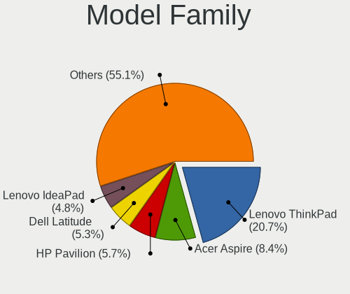
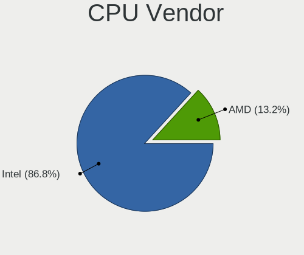
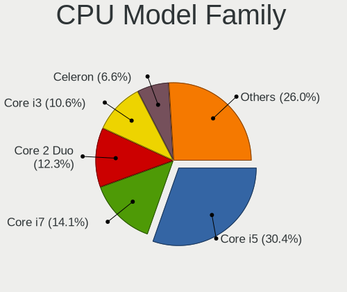
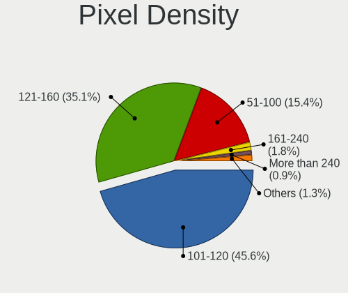
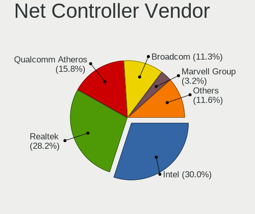
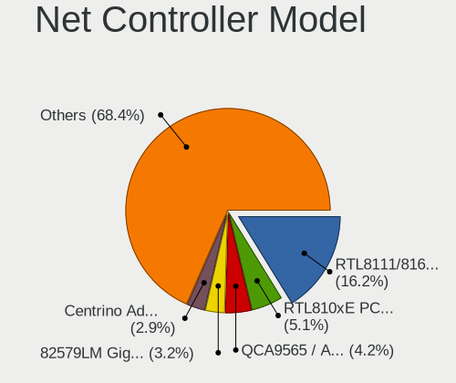
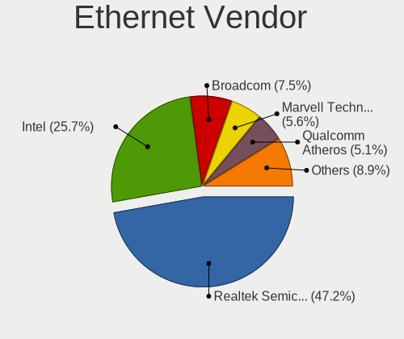
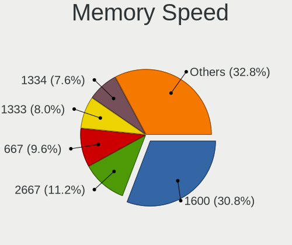

helloSystem 0.7.0 - Tested Hardware & Statistics (Notebooks)
------------------------------------------------------------

A project to collect tested hardware configurations for helloSystem 0.7.0.

Anyone can contribute to this report by the [hw-probe](https://github.com/linuxhw/hw-probe/blob/master/INSTALL.BSD.md) tool:

    hw-probe -all -upload

Please contribute! Especially if your hardware is rare.

Contents
--------

* [ Test Cases ](#test-cases)

* [ System ](#system)
  - [ Arch                     ](#arch)
  - [ DE                       ](#de)
  - [ Display Server           ](#display-server)
  - [ Display Manager          ](#display-manager)
  - [ OS Lang                  ](#os-lang)
  - [ Boot Mode                ](#boot-mode)
  - [ Filesystem               ](#filesystem)
  - [ Part. scheme             ](#part-scheme)

* [ Board ](#board)
  - [ Vendor                   ](#vendor)
  - [ Model                    ](#model)
  - [ Model Family             ](#model-family)
  - [ MFG Year                 ](#mfg-year)
  - [ Form Factor              ](#form-factor)
  - [ Coreboot                 ](#coreboot)
  - [ RAM Size                 ](#ram-size)
  - [ RAM Used                 ](#ram-used)
  - [ Total Drives             ](#total-drives)
  - [ Has CD-ROM               ](#has-cd-rom)
  - [ Has Ethernet             ](#has-ethernet)
  - [ Has WiFi                 ](#has-wifi)
  - [ Has Bluetooth            ](#has-bluetooth)

* [ Location ](#location)
  - [ Country                  ](#country)
  - [ City                     ](#city)

* [ Drives ](#drives)
  - [ Drive Vendor             ](#drive-vendor)
  - [ Drive Model              ](#drive-model)
  - [ HDD Vendor               ](#hdd-vendor)
  - [ SSD Vendor               ](#ssd-vendor)
  - [ Drive Kind               ](#drive-kind)
  - [ Drive Connector          ](#drive-connector)
  - [ Drive Size               ](#drive-size)
  - [ Space Total              ](#space-total)
  - [ Space Used               ](#space-used)
  - [ Malfunc. Drives          ](#malfunc-drives)
  - [ Malfunc. Drive Vendor    ](#malfunc-drive-vendor)
  - [ Malfunc. HDD Vendor      ](#malfunc-hdd-vendor)
  - [ Malfunc. Drive Kind      ](#malfunc-drive-kind)
  - [ Failed Drives            ](#failed-drives)
  - [ Failed Drive Vendor      ](#failed-drive-vendor)
  - [ Drive Status             ](#drive-status)

* [ Storage controller ](#storage-controller)
  - [ Storage Vendor           ](#storage-vendor)
  - [ Storage Model            ](#storage-model)
  - [ Storage Kind             ](#storage-kind)

* [ Processor ](#processor)
  - [ CPU Vendor               ](#cpu-vendor)
  - [ CPU Model                ](#cpu-model)
  - [ CPU Model Family         ](#cpu-model-family)
  - [ CPU Cores                ](#cpu-cores)
  - [ CPU Sockets              ](#cpu-sockets)
  - [ CPU Threads              ](#cpu-threads)
  - [ CPU Microarch            ](#cpu-microarch)

* [ Graphics ](#graphics)
  - [ GPU Vendor               ](#gpu-vendor)
  - [ GPU Model                ](#gpu-model)
  - [ GPU Combo                ](#gpu-combo)
  - [ GPU Driver               ](#gpu-driver)
  - [ GPU Memory               ](#gpu-memory)

* [ Monitor ](#monitor)
  - [ Monitor Vendor           ](#monitor-vendor)
  - [ Monitor Model            ](#monitor-model)
  - [ Monitor Resolution       ](#monitor-resolution)
  - [ Monitor Diagonal         ](#monitor-diagonal)
  - [ Monitor Width            ](#monitor-width)
  - [ Aspect Ratio             ](#aspect-ratio)
  - [ Monitor Area             ](#monitor-area)
  - [ Pixel Density            ](#pixel-density)
  - [ Multiple Monitors        ](#multiple-monitors)

* [ Network ](#network)
  - [ Net Controller Vendor    ](#net-controller-vendor)
  - [ Net Controller Model     ](#net-controller-model)
  - [ Wireless Vendor          ](#wireless-vendor)
  - [ Wireless Model           ](#wireless-model)
  - [ Ethernet Vendor          ](#ethernet-vendor)
  - [ Ethernet Model           ](#ethernet-model)
  - [ Net Controller Kind      ](#net-controller-kind)
  - [ Used Controller          ](#used-controller)
  - [ NICs                     ](#nics)
  - [ IPv6                     ](#ipv6)

* [ Bluetooth ](#bluetooth)
  - [ Bluetooth Vendor         ](#bluetooth-vendor)
  - [ Bluetooth Model          ](#bluetooth-model)

* [ Sound ](#sound)
  - [ Sound Vendor             ](#sound-vendor)
  - [ Sound Model              ](#sound-model)

* [ Memory ](#memory)
  - [ Memory Vendor            ](#memory-vendor)
  - [ Memory Model             ](#memory-model)
  - [ Memory Kind              ](#memory-kind)
  - [ Memory Form Factor       ](#memory-form-factor)
  - [ Memory Size              ](#memory-size)
  - [ Memory Speed             ](#memory-speed)

* [ Printers & scanners ](#printers--scanners)
  - [ Printer Vendor           ](#printer-vendor)
  - [ Printer Model            ](#printer-model)
  - [ Scanner Vendor           ](#scanner-vendor)
  - [ Scanner Model            ](#scanner-model)

* [ Camera ](#camera)
  - [ Camera Vendor            ](#camera-vendor)
  - [ Camera Model             ](#camera-model)

* [ Security ](#security)
  - [ Fingerprint Vendor       ](#fingerprint-vendor)
  - [ Fingerprint Model        ](#fingerprint-model)
  - [ Chipcard Vendor          ](#chipcard-vendor)
  - [ Chipcard Model           ](#chipcard-model)

* [ Unsupported ](#unsupported)
  - [ Unsupported Devices      ](#unsupported-devices)
  - [ Unsupported Device Types ](#unsupported-device-types)

Test Cases
----------

Total: 135

| Vendor        | Model                       | Probe                                                     | Date         |
|---------------|-----------------------------|-----------------------------------------------------------|--------------|
| Apple         | MacBookPro5,5               | [807676e010](https://bsd-hardware.info/?probe=807676e010) | Apr 30, 2022 |
| Lenovo        | ThinkPad T420 4236BD5       | [867ed989e2](https://bsd-hardware.info/?probe=867ed989e2) | Apr 27, 2022 |
| MSI           | GF65 Thin 10SER             | [cedf98c955](https://bsd-hardware.info/?probe=cedf98c955) | Apr 26, 2022 |
| Dell          | Inspiron 5437               | [830ea686ab](https://bsd-hardware.info/?probe=830ea686ab) | Apr 24, 2022 |
| HP            | 2000                        | [e9599a9bc3](https://bsd-hardware.info/?probe=e9599a9bc3) | Apr 22, 2022 |
| ASUSTek       | X556UJ                      | [ca63749774](https://bsd-hardware.info/?probe=ca63749774) | Apr 19, 2022 |
| Lenovo        | G51-35 80M8                 | [285328cb61](https://bsd-hardware.info/?probe=285328cb61) | Apr 16, 2022 |
| Sony          | SVZ1311C5E                  | [c1c429a7e6](https://bsd-hardware.info/?probe=c1c429a7e6) | Apr 15, 2022 |
| Dell          | Latitude E6540              | [a3da09ae5e](https://bsd-hardware.info/?probe=a3da09ae5e) | Apr 15, 2022 |
| System76      | Lemur Pro                   | [276ee4e96e](https://bsd-hardware.info/?probe=276ee4e96e) | Apr 13, 2022 |
| Lenovo        | ThinkPad X61 7675K2U        | [24f93b9532](https://bsd-hardware.info/?probe=24f93b9532) | Apr 10, 2022 |
| Panasonic     | CF-B11JWCYS                 | [6699d408ad](https://bsd-hardware.info/?probe=6699d408ad) | Apr 08, 2022 |
| HP            | Pavilion 11                 | [a13373b255](https://bsd-hardware.info/?probe=a13373b255) | Apr 07, 2022 |
| DNS           | W9x0LU                      | [8ac57e3b59](https://bsd-hardware.info/?probe=8ac57e3b59) | Apr 06, 2022 |
| TUXEDO        | Aura 15 Gen1                | [e72b47b6de](https://bsd-hardware.info/?probe=e72b47b6de) | Apr 04, 2022 |
| LG Electro... | E300-A.CP20T                | [304701f666](https://bsd-hardware.info/?probe=304701f666) | Apr 02, 2022 |
| TUXEDO        | Aura 15 Gen1                | [1be95af210](https://bsd-hardware.info/?probe=1be95af210) | Apr 01, 2022 |
| HP            | Compaq 6510b (GF910AW#AB... | [a7bccf74e4](https://bsd-hardware.info/?probe=a7bccf74e4) | Mar 31, 2022 |
| Dell          | Latitude E6540              | [0ac0f8f1d8](https://bsd-hardware.info/?probe=0ac0f8f1d8) | Mar 26, 2022 |
| Lenovo        | ThinkBook 14 G2 ARE 20VF    | [00213ecee9](https://bsd-hardware.info/?probe=00213ecee9) | Mar 25, 2022 |
| Dell          | Vostro 3490                 | [34956934f5](https://bsd-hardware.info/?probe=34956934f5) | Mar 22, 2022 |
| Packard Be... | EasyNote TE69HW             | [851eea349f](https://bsd-hardware.info/?probe=851eea349f) | Mar 17, 2022 |
| Lenovo        | ThinkPad X220 4293B43       | [148a268a0f](https://bsd-hardware.info/?probe=148a268a0f) | Mar 16, 2022 |
| HASEE Comp... | CW35S                       | [737c8bb48a](https://bsd-hardware.info/?probe=737c8bb48a) | Mar 14, 2022 |
| Lenovo        | ThinkPad L440 20ASS0FP00    | [0fbc782835](https://bsd-hardware.info/?probe=0fbc782835) | Mar 14, 2022 |
| Dell          | Latitude E6540              | [e0576dd008](https://bsd-hardware.info/?probe=e0576dd008) | Mar 13, 2022 |
| Acer          | Aspire E1-421               | [cc83218496](https://bsd-hardware.info/?probe=cc83218496) | Mar 10, 2022 |
| Lenovo        | Z50-70 20354                | [a1f85aff27](https://bsd-hardware.info/?probe=a1f85aff27) | Mar 10, 2022 |
| Lenovo        | IdeaPad N585                | [e22da97709](https://bsd-hardware.info/?probe=e22da97709) | Mar 10, 2022 |
| Lenovo        | Z50-70 20354                | [ab71ed7239](https://bsd-hardware.info/?probe=ab71ed7239) | Mar 10, 2022 |
| Itautec       | Infoway w7535               | [b55f9d1bfb](https://bsd-hardware.info/?probe=b55f9d1bfb) | Mar 09, 2022 |
| Lenovo        | ThinkPad X220 Tablet 429... | [dbd5c6e5e3](https://bsd-hardware.info/?probe=dbd5c6e5e3) | Mar 07, 2022 |
| HP            | EliteBook Folio 9470m       | [e2cc942e3e](https://bsd-hardware.info/?probe=e2cc942e3e) | Feb 28, 2022 |
| Acer          | V5-131                      | [d175137636](https://bsd-hardware.info/?probe=d175137636) | Feb 27, 2022 |
| Dell          | Latitude E4310              | [ba69f80b7f](https://bsd-hardware.info/?probe=ba69f80b7f) | Feb 22, 2022 |
| Apple         | MacBook4,1                  | [e0cf5200de](https://bsd-hardware.info/?probe=e0cf5200de) | Feb 22, 2022 |
| Lenovo        | ThinkPad T61 766301U        | [f5f25efdcc](https://bsd-hardware.info/?probe=f5f25efdcc) | Feb 22, 2022 |
| Apple         | MacBook6,1                  | [d680290d84](https://bsd-hardware.info/?probe=d680290d84) | Feb 22, 2022 |
| Apple         | MacBook6,1                  | [304508ed18](https://bsd-hardware.info/?probe=304508ed18) | Feb 21, 2022 |
| Dell          | Latitude E5470              | [9e479e9c50](https://bsd-hardware.info/?probe=9e479e9c50) | Feb 21, 2022 |
| Dell          | Inspiron 3537               | [932550132e](https://bsd-hardware.info/?probe=932550132e) | Feb 20, 2022 |
| Lenovo        | ThinkPad T61 766301U        | [6eec3232e2](https://bsd-hardware.info/?probe=6eec3232e2) | Feb 19, 2022 |
| Lenovo        | IdeaPad 110S-11IBR 80WG     | [2f90d5c2bd](https://bsd-hardware.info/?probe=2f90d5c2bd) | Feb 18, 2022 |
| TUXEDO        | InfinityBook13V3            | [5a75db9142](https://bsd-hardware.info/?probe=5a75db9142) | Feb 17, 2022 |
| TUXEDO        | InfinityBook13V3            | [edc2c4ec36](https://bsd-hardware.info/?probe=edc2c4ec36) | Feb 17, 2022 |
| Lenovo        | ThinkPad T450 20BUS0VH08    | [fa2cd8964e](https://bsd-hardware.info/?probe=fa2cd8964e) | Feb 17, 2022 |
| Samsung       | N100                        | [3125d76ba4](https://bsd-hardware.info/?probe=3125d76ba4) | Feb 16, 2022 |
| Lenovo        | E31-80 80MX                 | [098afac660](https://bsd-hardware.info/?probe=098afac660) | Feb 16, 2022 |
| Lenovo        | ThinkPad T430 2349AK1       | [86fd351c81](https://bsd-hardware.info/?probe=86fd351c81) | Feb 16, 2022 |
| Acer          | V5-131                      | [2d5bfae3b4](https://bsd-hardware.info/?probe=2d5bfae3b4) | Feb 15, 2022 |
| ASUSTek       | X555LA                      | [28b3002182](https://bsd-hardware.info/?probe=28b3002182) | Feb 10, 2022 |
| ASUSTek       | X555LA                      | [9aa18b2e33](https://bsd-hardware.info/?probe=9aa18b2e33) | Feb 09, 2022 |
| Acer          | Aspire E5-511G              | [b14c4c1ac5](https://bsd-hardware.info/?probe=b14c4c1ac5) | Feb 07, 2022 |
| TWINHEAD      | U12CT                       | [32247012ca](https://bsd-hardware.info/?probe=32247012ca) | Feb 06, 2022 |
| Dell          | Latitude D630               | [b34db656b5](https://bsd-hardware.info/?probe=b34db656b5) | Feb 05, 2022 |
| Lenovo        | ThinkPad T440p 20AWS3RH0... | [a6c02e440b](https://bsd-hardware.info/?probe=a6c02e440b) | Feb 05, 2022 |
| Dell          | Venue 11 Pro 7140           | [328f9e8d94](https://bsd-hardware.info/?probe=328f9e8d94) | Feb 04, 2022 |
| HP            | EliteBook 6930p             | [d8fb34de12](https://bsd-hardware.info/?probe=d8fb34de12) | Feb 04, 2022 |
| Lenovo        | ThinkPad X220 4291H77       | [dd4d3a9dcc](https://bsd-hardware.info/?probe=dd4d3a9dcc) | Feb 02, 2022 |
| HP            | Mini 210-1000               | [8a8bfdaee1](https://bsd-hardware.info/?probe=8a8bfdaee1) | Feb 02, 2022 |
| HP            | G62                         | [476193bfd0](https://bsd-hardware.info/?probe=476193bfd0) | Feb 01, 2022 |
| Lenovo        | ThinkPad T510 4384AJ6       | [70a56029e7](https://bsd-hardware.info/?probe=70a56029e7) | Jan 31, 2022 |
| HP            | Laptop 15-rb0xx             | [8e9a6cff62](https://bsd-hardware.info/?probe=8e9a6cff62) | Jan 31, 2022 |
| Apple         | MacBook4,1                  | [e89404ebed](https://bsd-hardware.info/?probe=e89404ebed) | Jan 29, 2022 |
| Samsung       | N150P/N210P/N220P           | [901a483718](https://bsd-hardware.info/?probe=901a483718) | Jan 29, 2022 |
| Apple         | MacBook5,2                  | [ee6e794728](https://bsd-hardware.info/?probe=ee6e794728) | Jan 29, 2022 |
| Acer          | Aspire 5930                 | [754db09c98](https://bsd-hardware.info/?probe=754db09c98) | Jan 28, 2022 |
| ASUSTek       | ASUS TUF Gaming A15 FA50... | [11bbfce5d4](https://bsd-hardware.info/?probe=11bbfce5d4) | Jan 27, 2022 |
| Dell          | Latitude 7280               | [089b61bb38](https://bsd-hardware.info/?probe=089b61bb38) | Jan 27, 2022 |
| Lenovo        | IdeaPad L340-17IRH Gamin... | [b1d702812e](https://bsd-hardware.info/?probe=b1d702812e) | Jan 26, 2022 |
| MSI           | GE75 Raider 10SFS           | [306f312c47](https://bsd-hardware.info/?probe=306f312c47) | Jan 25, 2022 |
| HP            | Laptop 15-bw0xx             | [1c8f50f7eb](https://bsd-hardware.info/?probe=1c8f50f7eb) | Jan 24, 2022 |
| HP            | Pavilion Gaming Laptop 1... | [7859f220b9](https://bsd-hardware.info/?probe=7859f220b9) | Jan 22, 2022 |
| Acer          | Aspire ES1-311              | [83addddaa5](https://bsd-hardware.info/?probe=83addddaa5) | Jan 22, 2022 |
| Dell          | Latitude E6540              | [529768f8c8](https://bsd-hardware.info/?probe=529768f8c8) | Jan 21, 2022 |
| HP            | EliteBook 2560p             | [4d04ececbb](https://bsd-hardware.info/?probe=4d04ececbb) | Jan 19, 2022 |
| Lenovo        | Legion Y540-15IRH 81SX      | [384d2f888b](https://bsd-hardware.info/?probe=384d2f888b) | Jan 18, 2022 |
| Acer          | V5-131                      | [ff427cb0c9](https://bsd-hardware.info/?probe=ff427cb0c9) | Jan 18, 2022 |
| Gateway       | NE56R                       | [a5aa8aa49a](https://bsd-hardware.info/?probe=a5aa8aa49a) | Jan 18, 2022 |
| Lenovo        | ThinkPad T410 2522E38       | [2dbb2679f1](https://bsd-hardware.info/?probe=2dbb2679f1) | Jan 17, 2022 |
| Dell          | Latitude E5430 non-vPro     | [e795c7ec91](https://bsd-hardware.info/?probe=e795c7ec91) | Jan 17, 2022 |
| Lenovo        | ThinkPad T440 20B7000PHV    | [9584ae69fa](https://bsd-hardware.info/?probe=9584ae69fa) | Jan 16, 2022 |
| Lenovo        | ThinkPad R61 8935WCS        | [9cc0f26f6f](https://bsd-hardware.info/?probe=9cc0f26f6f) | Jan 16, 2022 |
| Lenovo        | ThinkPad X220 Tablet 429... | [5a585443b2](https://bsd-hardware.info/?probe=5a585443b2) | Jan 15, 2022 |
| Acer          | V5-131                      | [e4d0f66ff8](https://bsd-hardware.info/?probe=e4d0f66ff8) | Jan 13, 2022 |
| Acer          | Aspire ES1-533              | [a9d2458de5](https://bsd-hardware.info/?probe=a9d2458de5) | Jan 13, 2022 |
| Acer          | Aspire E5-476G              | [2a8624ee35](https://bsd-hardware.info/?probe=2a8624ee35) | Jan 10, 2022 |
| Lenovo        | ThinkPad L450 20DSS1S402    | [3c27c8bf31](https://bsd-hardware.info/?probe=3c27c8bf31) | Jan 09, 2022 |
| Dell          | Latitude E6530              | [0fa21bcf23](https://bsd-hardware.info/?probe=0fa21bcf23) | Jan 09, 2022 |
| Dell          | Inspiron 3505               | [8d4b342fda](https://bsd-hardware.info/?probe=8d4b342fda) | Jan 08, 2022 |
| Dell          | Inspiron 3505               | [8cbe3d4581](https://bsd-hardware.info/?probe=8cbe3d4581) | Jan 08, 2022 |
| Lenovo        | ThinkPad X1 Carbon 5th 2... | [7aea2ccaa7](https://bsd-hardware.info/?probe=7aea2ccaa7) | Jan 08, 2022 |
| Lenovo        | ThinkPad E15 20RD0011MX     | [0fa4700d17](https://bsd-hardware.info/?probe=0fa4700d17) | Jan 07, 2022 |
| HP            | Laptop 14-dk0xxx            | [e7b40f6e3b](https://bsd-hardware.info/?probe=e7b40f6e3b) | Jan 06, 2022 |
| Notebook      | N15_17RD                    | [47c30b962d](https://bsd-hardware.info/?probe=47c30b962d) | Jan 05, 2022 |
| Lenovo        | ThinkPad L450 20DSS1S402    | [bf95cdeb53](https://bsd-hardware.info/?probe=bf95cdeb53) | Jan 04, 2022 |
| Dell          | Latitude 7380               | [590b374836](https://bsd-hardware.info/?probe=590b374836) | Jan 02, 2022 |
| Dell          | Latitude E6540              | [f5a43a9f8b](https://bsd-hardware.info/?probe=f5a43a9f8b) | Jan 02, 2022 |
| Lenovo        | ThinkPad X220 4293AF4       | [8c7992e557](https://bsd-hardware.info/?probe=8c7992e557) | Jan 01, 2022 |
| Dell          | Latitude E6540              | [97d152656e](https://bsd-hardware.info/?probe=97d152656e) | Dec 31, 2021 |
| HP            | ProBook 655 G1              | [da312d7c14](https://bsd-hardware.info/?probe=da312d7c14) | Dec 30, 2021 |
| Acer          | Aspire 5742G                | [b77a4ee97c](https://bsd-hardware.info/?probe=b77a4ee97c) | Dec 30, 2021 |
| ASUSTek       | S550CA                      | [1263a5fb37](https://bsd-hardware.info/?probe=1263a5fb37) | Dec 29, 2021 |
| Lenovo        | ThinkPad E580 20KS005BRI    | [b533989df5](https://bsd-hardware.info/?probe=b533989df5) | Dec 29, 2021 |
| Dell          | Inspiron 3521               | [b246d110af](https://bsd-hardware.info/?probe=b246d110af) | Dec 28, 2021 |
| Lenovo        | ThinkPad T460 20FMS75800    | [5f17e74f2f](https://bsd-hardware.info/?probe=5f17e74f2f) | Dec 27, 2021 |
| Acer          | Aspire 5742G                | [b650885b00](https://bsd-hardware.info/?probe=b650885b00) | Dec 24, 2021 |
| Acer          | TravelMate 5760G            | [46204b90d0](https://bsd-hardware.info/?probe=46204b90d0) | Dec 24, 2021 |
| Lenovo        | ThinkPad SL510 2847R96      | [b0a9802877](https://bsd-hardware.info/?probe=b0a9802877) | Dec 22, 2021 |
| Lenovo        | ThinkPad T410 2537EA8       | [8b457cd635](https://bsd-hardware.info/?probe=8b457cd635) | Dec 22, 2021 |
| Lenovo        | ThinkPad X250 20CLS1WP01    | [87bc0b8924](https://bsd-hardware.info/?probe=87bc0b8924) | Dec 22, 2021 |
| Toshiba       | Satellite C50-B             | [6b03a2c4c2](https://bsd-hardware.info/?probe=6b03a2c4c2) | Dec 22, 2021 |
| Samsung       | 305E4A/305E5A/305E7A        | [5188a12b26](https://bsd-hardware.info/?probe=5188a12b26) | Dec 21, 2021 |
| Lenovo        | ThinkPad X270 W10DG 20K5... | [2e1c585715](https://bsd-hardware.info/?probe=2e1c585715) | Dec 21, 2021 |
| HP            | Pavilion Gaming Laptop 1... | [4c22212c20](https://bsd-hardware.info/?probe=4c22212c20) | Dec 20, 2021 |
| HP            | Pavilion Gaming Laptop 1... | [1a193c7bf9](https://bsd-hardware.info/?probe=1a193c7bf9) | Dec 20, 2021 |
| Toshiba       | Satellite L550              | [977298a601](https://bsd-hardware.info/?probe=977298a601) | Dec 20, 2021 |
| ASUSTek       | N56VB                       | [f53b3fba5c](https://bsd-hardware.info/?probe=f53b3fba5c) | Dec 20, 2021 |
| HP            | 15 Notebook PC              | [1e888f2278](https://bsd-hardware.info/?probe=1e888f2278) | Dec 20, 2021 |
| Lenovo        | IdeaPad 510-15IKB 80SV      | [6321f4bd3a](https://bsd-hardware.info/?probe=6321f4bd3a) | Dec 20, 2021 |
| Dell          | Latitude E5470              | [18470afd9d](https://bsd-hardware.info/?probe=18470afd9d) | Dec 19, 2021 |
| HP            | ZBook Studio G4             | [cdc6f54d97](https://bsd-hardware.info/?probe=cdc6f54d97) | Dec 14, 2021 |
| Apple         | MacBookAir1,1               | [61c7028e83](https://bsd-hardware.info/?probe=61c7028e83) | Dec 07, 2021 |
| ASUSTek       | X540LA                      | [fa809be73f](https://bsd-hardware.info/?probe=fa809be73f) | Dec 04, 2021 |
| ASUSTek       | X540LA                      | [cf5fd87781](https://bsd-hardware.info/?probe=cf5fd87781) | Dec 04, 2021 |
| Acer          | Swift SF314-52              | [e3ece211a0](https://bsd-hardware.info/?probe=e3ece211a0) | Dec 03, 2021 |
| Toshiba       | Satellite S55t-B            | [f6983391aa](https://bsd-hardware.info/?probe=f6983391aa) | Nov 28, 2021 |
| Lenovo        | ThinkPad X240 20AMS2QDOC    | [66cfdd2419](https://bsd-hardware.info/?probe=66cfdd2419) | Nov 27, 2021 |
| Lenovo        | V310-14IKB 80T2             | [f5421b8fe0](https://bsd-hardware.info/?probe=f5421b8fe0) | Nov 23, 2021 |
| Toshiba       | Satellite C640              | [2d60f00479](https://bsd-hardware.info/?probe=2d60f00479) | Nov 17, 2021 |
| Toshiba       | Satellite C640              | [89a9551487](https://bsd-hardware.info/?probe=89a9551487) | Nov 17, 2021 |
| Lenovo        | ThinkPad T60 1951FEG        | [e2d5391a1a](https://bsd-hardware.info/?probe=e2d5391a1a) | Nov 14, 2021 |
| ASUSTek       | K52Jc                       | [92b975763f](https://bsd-hardware.info/?probe=92b975763f) | Nov 08, 2021 |
| Apple         | MacBookAir5,1               | [10d629e1a0](https://bsd-hardware.info/?probe=10d629e1a0) | Nov 04, 2021 |
| HP            | Pavilion Gaming Laptop 1... | [3c64328fbe](https://bsd-hardware.info/?probe=3c64328fbe) | Oct 13, 2021 |

System
------

Arch
----

OS architecture (x86_64, i586, etc.)

| Name  | Notebooks | Percent |
|-------|-----------|---------|
| amd64 | 113       | 100%    |

DE
--

Desktop Environment

| Name         | Notebooks | Percent |
|--------------|-----------|---------|
| helloDesktop | 112       | 99.12%  |
| GNOME        | 1         | 0.88%   |

Display Server
--------------

X11 or Wayland

| Name | Notebooks | Percent |
|------|-----------|---------|
| X11  | 113       | 100%    |

Display Manager
---------------

SDDM, LightDM, etc.

| Name | Notebooks | Percent |
|------|-----------|---------|
| SLiM | 113       | 100%    |

OS Lang
-------

Language

| Lang  | Notebooks | Percent |
|-------|-----------|---------|
| en_US | 107       | 94.69%  |
| C     | 2         | 1.77%   |
| uk_UA | 1         | 0.88%   |
| it_IT | 1         | 0.88%   |
| fr_FR | 1         | 0.88%   |
| es_ES | 1         | 0.88%   |

Boot Mode
---------

EFI or BIOS

| Mode | Notebooks | Percent |
|------|-----------|---------|
| EFI  | 110       | 97.35%  |
| BIOS | 3         | 2.65%   |

Filesystem
----------

Type of filesystem

| Type   | Notebooks | Percent |
|--------|-----------|---------|
| Cd9660 | 61        | 53.04%  |
| Zfs    | 54        | 46.96%  |

Part. scheme
------------

Scheme of partitioning

| Type | Notebooks | Percent |
|------|-----------|---------|
| GPT  | 112       | 99.12%  |
| MBR  | 1         | 0.88%   |

Board
-----

Vendor
------

Motherboard manufacturer

| Name                | Notebooks | Percent |
|---------------------|-----------|---------|
| Lenovo              | 36        | 31.86%  |
| Hewlett-Packard     | 16        | 14.16%  |
| Dell                | 15        | 13.27%  |
| Acer                | 11        | 9.73%   |
| ASUSTek Computer    | 7         | 6.19%   |
| Apple               | 7         | 6.19%   |
| Toshiba             | 4         | 3.54%   |
| TUXEDO              | 3         | 2.65%   |
| Samsung Electronics | 3         | 2.65%   |
| TWINHEAD            | 1         | 0.88%   |
| Sony                | 1         | 0.88%   |
| Panasonic           | 1         | 0.88%   |
| Packard Bell        | 1         | 0.88%   |
| Notebook            | 1         | 0.88%   |
| MSI                 | 1         | 0.88%   |
| LG Electronics      | 1         | 0.88%   |
| Itautec             | 1         | 0.88%   |
| HASEE Computer      | 1         | 0.88%   |
| Gateway             | 1         | 0.88%   |
| DNS                 | 1         | 0.88%   |

Model
-----

Motherboard model

| Name                                     | Notebooks | Percent |
|------------------------------------------|-----------|---------|
| TUXEDO Aura 15 Gen1                      | 2         | 1.77%   |
| Dell Latitude E5470                      | 2         | 1.77%   |
| Apple MacBook4,1                         | 2         | 1.77%   |
| Acer V5-131                              | 2         | 1.77%   |
| TWINHEAD U12CT                           | 1         | 0.88%   |
| TUXEDO InfinityBook13V3                  | 1         | 0.88%   |
| Toshiba Satellite S55t-B                 | 1         | 0.88%   |
| Toshiba Satellite L550                   | 1         | 0.88%   |
| Toshiba Satellite C640                   | 1         | 0.88%   |
| Toshiba Satellite C50-B                  | 1         | 0.88%   |
| Sony SVZ1311C5E                          | 1         | 0.88%   |
| Samsung N150P/N210P/N220P                | 1         | 0.88%   |
| Samsung N100                             | 1         | 0.88%   |
| Samsung 305E4A/305E5A/305E7A             | 1         | 0.88%   |
| Panasonic CF-B11JWCYS                    | 1         | 0.88%   |
| Packard Bell EasyNote TE69HW             | 1         | 0.88%   |
| Notebook N15_17RD                        | 1         | 0.88%   |
| MSI GF65 Thin 10SER                      | 1         | 0.88%   |
| LG E300-A.CP20T                          | 1         | 0.88%   |
| Lenovo Z50-70 20354                      | 1         | 0.88%   |
| Lenovo V310-14IKB 80T2                   | 1         | 0.88%   |
| Lenovo ThinkPad X61 7675K2U              | 1         | 0.88%   |
| Lenovo ThinkPad X270 W10DG 20K5S0BM01    | 1         | 0.88%   |
| Lenovo ThinkPad X250 20CLS1WP01          | 1         | 0.88%   |
| Lenovo ThinkPad X240 20AMS2QDOC          | 1         | 0.88%   |
| Lenovo ThinkPad X220 Tablet 4298B65      | 1         | 0.88%   |
| Lenovo ThinkPad X220 Tablet 42962WU      | 1         | 0.88%   |
| Lenovo ThinkPad X220 4293B43             | 1         | 0.88%   |
| Lenovo ThinkPad X220 4293AF4             | 1         | 0.88%   |
| Lenovo ThinkPad X220 4291H77             | 1         | 0.88%   |
| Lenovo ThinkPad X1 Carbon 5th 20HRS04C00 | 1         | 0.88%   |
| Lenovo ThinkPad T61 766301U              | 1         | 0.88%   |
| Lenovo ThinkPad T60 1951FEG              | 1         | 0.88%   |
| Lenovo ThinkPad T510 4384AJ6             | 1         | 0.88%   |
| Lenovo ThinkPad T460 20FMS75800          | 1         | 0.88%   |
| Lenovo ThinkPad T440p 20AWS3RH00         | 1         | 0.88%   |
| Lenovo ThinkPad T440 20B7000PHV          | 1         | 0.88%   |
| Lenovo ThinkPad T430 2349AK1             | 1         | 0.88%   |
| Lenovo ThinkPad T420 4236BD5             | 1         | 0.88%   |
| Lenovo ThinkPad T410 2537EA8             | 1         | 0.88%   |
| Lenovo ThinkPad T410 2522E38             | 1         | 0.88%   |
| Lenovo ThinkPad SL510 2847R96            | 1         | 0.88%   |
| Lenovo ThinkPad R61 8935WCS              | 1         | 0.88%   |
| Lenovo ThinkPad L450 20DSS1S402          | 1         | 0.88%   |
| Lenovo ThinkPad L440 20ASS0FP00          | 1         | 0.88%   |
| Lenovo ThinkPad E580 20KS005BRI          | 1         | 0.88%   |
| Lenovo ThinkPad E15 20RD0011MX           | 1         | 0.88%   |
| Lenovo ThinkBook 14 G2 ARE 20VF          | 1         | 0.88%   |
| Lenovo Legion Y540-15IRH 81SX            | 1         | 0.88%   |
| Lenovo IdeaPad N585                      | 1         | 0.88%   |
| Lenovo IdeaPad L340-17IRH Gaming 81LL    | 1         | 0.88%   |
| Lenovo IdeaPad 510-15IKB 80SV            | 1         | 0.88%   |
| Lenovo IdeaPad 110S-11IBR 80WG           | 1         | 0.88%   |
| Lenovo G51-35 80M8                       | 1         | 0.88%   |
| Lenovo E31-80 80MX                       | 1         | 0.88%   |
| Itautec Infoway w7535                    | 1         | 0.88%   |
| HP ZBook Studio G4                       | 1         | 0.88%   |
| HP ProBook 655 G1                        | 1         | 0.88%   |
| HP Pavilion Gaming Laptop 16-a0xxx       | 1         | 0.88%   |
| HP Pavilion Gaming Laptop 15-ec2xxx      | 1         | 0.88%   |

Model Family
------------

Motherboard model prefix

| Name                    | Notebooks | Percent |
|-------------------------|-----------|---------|
| Lenovo ThinkPad         | 26        | 23.01%  |
| Dell Latitude           | 9         | 7.96%   |
| Acer Aspire             | 7         | 6.19%   |
| Toshiba Satellite       | 4         | 3.54%   |
| Lenovo IdeaPad          | 4         | 3.54%   |
| Dell Inspiron           | 4         | 3.54%   |
| HP Pavilion             | 3         | 2.65%   |
| HP Laptop               | 3         | 2.65%   |
| HP EliteBook            | 3         | 2.65%   |
| TUXEDO Aura             | 2         | 1.77%   |
| Apple MacBook4          | 2         | 1.77%   |
| Acer V5-131             | 2         | 1.77%   |
| TWINHEAD U12CT          | 1         | 0.88%   |
| TUXEDO InfinityBook13V3 | 1         | 0.88%   |
| Sony SVZ1311C5E         | 1         | 0.88%   |
| Samsung N150P           | 1         | 0.88%   |
| Samsung N100            | 1         | 0.88%   |
| Samsung 305E4A          | 1         | 0.88%   |
| Panasonic CF-B11JWCYS   | 1         | 0.88%   |
| Packard Bell EasyNote   | 1         | 0.88%   |
| Notebook N15            | 1         | 0.88%   |
| MSI GF65                | 1         | 0.88%   |
| LG E300-A.CP20T         | 1         | 0.88%   |
| Lenovo Z50-70           | 1         | 0.88%   |
| Lenovo V310-14IKB       | 1         | 0.88%   |
| Lenovo ThinkBook        | 1         | 0.88%   |
| Lenovo Legion           | 1         | 0.88%   |
| Lenovo G51-35           | 1         | 0.88%   |
| Lenovo E31-80           | 1         | 0.88%   |
| Itautec Infoway         | 1         | 0.88%   |
| HP ZBook                | 1         | 0.88%   |
| HP ProBook              | 1         | 0.88%   |
| HP Mini                 | 1         | 0.88%   |
| HP G62                  | 1         | 0.88%   |
| HP Compaq               | 1         | 0.88%   |
| HP 2000                 | 1         | 0.88%   |
| HP 15                   | 1         | 0.88%   |
| HASEE CW35S             | 1         | 0.88%   |
| Gateway NE56R           | 1         | 0.88%   |
| DNS W9x0LU              | 1         | 0.88%   |
| Dell Vostro             | 1         | 0.88%   |
| Dell Venue              | 1         | 0.88%   |
| ASUS X556UJ             | 1         | 0.88%   |
| ASUS X555LA             | 1         | 0.88%   |
| ASUS X540LA             | 1         | 0.88%   |
| ASUS S550CA             | 1         | 0.88%   |
| ASUS N56VB              | 1         | 0.88%   |
| ASUS K52Jc              | 1         | 0.88%   |
| ASUS ASUS               | 1         | 0.88%   |
| Apple MacBookPro5       | 1         | 0.88%   |
| Apple MacBookAir5       | 1         | 0.88%   |
| Apple MacBookAir1       | 1         | 0.88%   |
| Apple MacBook6          | 1         | 0.88%   |
| Apple MacBook5          | 1         | 0.88%   |
| Acer TravelMate         | 1         | 0.88%   |
| Acer Swift              | 1         | 0.88%   |

MFG Year
--------

Motherboard manufacture year

| Year    | Notebooks | Percent |
|---------|-----------|---------|
| 2015    | 13        | 11.5%   |
| 2013    | 12        | 10.62%  |
| 2018    | 11        | 9.73%   |
| 2021    | 10        | 8.85%   |
| 2010    | 10        | 8.85%   |
| 2011    | 9         | 7.96%   |
| 2020    | 8         | 7.08%   |
| 2012    | 7         | 6.19%   |
| 2017    | 6         | 5.31%   |
| 2016    | 6         | 5.31%   |
| 2008    | 6         | 5.31%   |
| 2014    | 4         | 3.54%   |
| 2009    | 4         | 3.54%   |
| 2007    | 3         | 2.65%   |
| 2019    | 2         | 1.77%   |
| 2006    | 1         | 0.88%   |
| Unknown | 1         | 0.88%   |

Form Factor
-----------

Physical design of the computer

| Name     | Notebooks | Percent |
|----------|-----------|---------|
| Notebook | 113       | 100%    |

Coreboot
--------

Have coreboot on board

| Used | Notebooks | Percent |
|------|-----------|---------|
| No   | 113       | 100%    |

RAM Size
--------

Total RAM memory

| Size in GB  | Notebooks | Percent |
|-------------|-----------|---------|
| 4.01-8.0    | 44        | 38.94%  |
| 8.01-16.0   | 36        | 31.86%  |
| 16.01-24.0  | 19        | 16.81%  |
| 2.01-3.0    | 9         | 7.96%   |
| 32.01-64.0  | 2         | 1.77%   |
| 3.01-4.0    | 1         | 0.88%   |
| 24.01-32.0  | 1         | 0.88%   |
| 64.01-256.0 | 1         | 0.88%   |

RAM Used
--------

Used RAM memory

| Used GB  | Notebooks | Percent |
|----------|-----------|---------|
| 0.01-0.5 | 73        | 64.6%   |
| 0.51-1.0 | 30        | 26.55%  |
| 1.01-2.0 | 6         | 5.31%   |
| 2.01-3.0 | 4         | 3.54%   |

Total Drives
------------

Number of drives on board

| Drives | Notebooks | Percent |
|--------|-----------|---------|
| 1      | 84        | 73.68%  |
| 2      | 23        | 20.18%  |
| 0      | 5         | 4.39%   |
| 3      | 2         | 1.75%   |

Has CD-ROM
----------

Has CD-ROM on board

| Presented | Notebooks | Percent |
|-----------|-----------|---------|
| No        | 66        | 58.41%  |
| Yes       | 47        | 41.59%  |

Has Ethernet
------------

Has Ethernet on board

| Presented | Notebooks | Percent |
|-----------|-----------|---------|
| Yes       | 106       | 93.81%  |
| No        | 7         | 6.19%   |

Has WiFi
--------

Has WiFi module

| Presented | Notebooks | Percent |
|-----------|-----------|---------|
| Yes       | 113       | 100%    |

Has Bluetooth
-------------

Has Bluetooth module

| Presented | Notebooks | Percent |
|-----------|-----------|---------|
| Yes       | 77        | 68.14%  |
| No        | 36        | 31.86%  |

Location
--------

Country
-------

Geographic location (country)

| Country             | Notebooks | Percent |
|---------------------|-----------|---------|
| USA                 | 20        | 17.7%   |
| Russia              | 9         | 7.96%   |
| Germany             | 8         | 7.08%   |
| UK                  | 6         | 5.31%   |
| Spain               | 5         | 4.42%   |
| Italy               | 5         | 4.42%   |
| Brazil              | 5         | 4.42%   |
| Ukraine             | 4         | 3.54%   |
| Romania             | 4         | 3.54%   |
| Netherlands         | 4         | 3.54%   |
| Vietnam             | 3         | 2.65%   |
| Mexico              | 3         | 2.65%   |
| France              | 3         | 2.65%   |
| Chile               | 3         | 2.65%   |
| Turkey              | 2         | 1.77%   |
| Poland              | 2         | 1.77%   |
| Peru                | 2         | 1.77%   |
| Indonesia           | 2         | 1.77%   |
| Hungary             | 2         | 1.77%   |
| Greece              | 2         | 1.77%   |
| Denmark             | 2         | 1.77%   |
| China               | 2         | 1.77%   |
| Trinidad and Tobago | 1         | 0.88%   |
| Tanzania            | 1         | 0.88%   |
| Sweden              | 1         | 0.88%   |
| Portugal            | 1         | 0.88%   |
| Norway              | 1         | 0.88%   |
| Malaysia            | 1         | 0.88%   |
| Lithuania           | 1         | 0.88%   |
| India               | 1         | 0.88%   |
| Georgia             | 1         | 0.88%   |
| Cuba                | 1         | 0.88%   |
| Colombia            | 1         | 0.88%   |
| Bulgaria            | 1         | 0.88%   |
| Belarus             | 1         | 0.88%   |
| Austria             | 1         | 0.88%   |
| Argentina           | 1         | 0.88%   |

City
----

Geographic location (city)

| City                          | Notebooks | Percent |
|-------------------------------|-----------|---------|
| Moscow                        | 4         | 3.51%   |
| Hanoi                         | 3         | 2.63%   |
| Warsaw                        | 2         | 1.75%   |
| Lima                          | 2         | 1.75%   |
| Leatherhead                   | 2         | 1.75%   |
| Jakarta                       | 2         | 1.75%   |
| Dijon                         | 2         | 1.75%   |
| Amsterdam                     | 2         | 1.75%   |
| Zhaoqing                      | 1         | 0.88%   |
| Zaporizhzhya                  | 1         | 0.88%   |
| Zapopan                       | 1         | 0.88%   |
| Youngsville                   | 1         | 0.88%   |
| Yaphank                       | 1         | 0.88%   |
| Washington                    | 1         | 0.88%   |
| Vilnius                       | 1         | 0.88%   |
| Västerås                | 1         | 0.88%   |
| Ugarchin                      | 1         | 0.88%   |
| Turley                        | 1         | 0.88%   |
| Turin                         | 1         | 0.88%   |
| Torokszentmiklos              | 1         | 0.88%   |
| Tolyatti                      | 1         | 0.88%   |
| Tiruchi                       | 1         | 0.88%   |
| Thessaloniki                  | 1         | 0.88%   |
| Susanville                    | 1         | 0.88%   |
| Suceava                       | 1         | 0.88%   |
| St Petersburg                 | 1         | 0.88%   |
| Shah Alam                     | 1         | 0.88%   |
| Sevastopol                    | 1         | 0.88%   |
| Seattle                       | 1         | 0.88%   |
| Santiago                      | 1         | 0.88%   |
| San Sebastián de los Reyes | 1         | 0.88%   |
| San Luis Potosí City       | 1         | 0.88%   |
| San Antonio                   | 1         | 0.88%   |
| Riverton                      | 1         | 0.88%   |
| Rio de Janeiro                | 1         | 0.88%   |
| Rho                           | 1         | 0.88%   |
| Ransbach-Baumbach             | 1         | 0.88%   |
| Pruszcz Gdanski               | 1         | 0.88%   |
| Potsdam                       | 1         | 0.88%   |
| Portland                      | 1         | 0.88%   |
| Port of Spain                 | 1         | 0.88%   |
| Piovene Rocchette             | 1         | 0.88%   |
| Pflugerville                  | 1         | 0.88%   |
| Patterson                     | 1         | 0.88%   |
| Paracuru                      | 1         | 0.88%   |
| Orlando                       | 1         | 0.88%   |
| Oldenburg                     | 1         | 0.88%   |
| Odense                        | 1         | 0.88%   |
| Nesttun                       | 1         | 0.88%   |
| Mt. Pleasant                  | 1         | 0.88%   |
| Minsk                         | 1         | 0.88%   |
| Minneapolis                   | 1         | 0.88%   |
| Mendoza                       | 1         | 0.88%   |
| Massa Lombarda                | 1         | 0.88%   |
| Mankato                       | 1         | 0.88%   |
| Mage                          | 1         | 0.88%   |
| Madrid                        | 1         | 0.88%   |
| Longfield                     | 1         | 0.88%   |
| Leipzig                       | 1         | 0.88%   |
| Lalinde                       | 1         | 0.88%   |

Drives
------

Drive Vendor
------------

Hard drive vendors

| Vendor              | Notebooks | Drives | Percent |
|---------------------|-----------|--------|---------|
| WDC                 | 28        | 28     | 20.59%  |
| Samsung Electronics | 19        | 21     | 13.97%  |
| Toshiba             | 11        | 11     | 8.09%   |
| Kingston            | 11        | 12     | 8.09%   |
| Seagate             | 9         | 11     | 6.62%   |
| Crucial             | 9         | 9      | 6.62%   |
| SanDisk             | 6         | 7      | 4.41%   |
| Intel               | 6         | 7      | 4.41%   |
| HGST                | 5         | 5      | 3.68%   |
| Hitachi             | 4         | 4      | 2.94%   |
| A-DATA Technology   | 3         | 3      | 2.21%   |
| SPCC                | 2         | 3      | 1.47%   |
| Patriot             | 2         | 2      | 1.47%   |
| Micron Technology   | 2         | 2      | 1.47%   |
| Intenso             | 2         | 2      | 1.47%   |
| Fujitsu             | 2         | 2      | 1.47%   |
| Zheino              | 1         | 1      | 0.74%   |
| Transcend           | 1         | 1      | 0.74%   |
| Team                | 1         | 1      | 0.74%   |
| SK Hynix            | 1         | 1      | 0.74%   |
| Mushkin             | 1         | 1      | 0.74%   |
| LITEON              | 1         | 1      | 0.74%   |
| KIOXIA              | 1         | 1      | 0.74%   |
| KingSpec            | 1         | 1      | 0.74%   |
| Integral            | 1         | 1      | 0.74%   |
| INDMEM              | 1         | 1      | 0.74%   |
| Hewlett-Packard     | 1         | 1      | 0.74%   |
| Corsair             | 1         | 1      | 0.74%   |
| Apple               | 1         | 1      | 0.74%   |
| Apacer              | 1         | 1      | 0.74%   |
| AGI                 | 1         | 1      | 0.74%   |

Drive Model
-----------

Hard drive models

| Model                                | Notebooks | Percent |
|--------------------------------------|-----------|---------|
| HGST HTS545050A7E680 500GB           | 4         | 2.9%    |
| WDC WDS120G2G0A-00JH30 120GB         | 3         | 2.17%   |
| Toshiba MQ01ABF050 500GB             | 3         | 2.17%   |
| Kingston SA400S37240G 240GB          | 3         | 2.17%   |
| Kingston SA400S37120G 120GB          | 3         | 2.17%   |
| Crucial CT500MX500SSD1 500GB         | 3         | 2.17%   |
| Crucial CT240BX500SSD1 240GB         | 3         | 2.17%   |
| WDC WDS240G2G0A-00JH30 240GB         | 2         | 1.45%   |
| WDC WD5000LPCX-60VHAT0 500GB         | 2         | 1.45%   |
| WDC WD10JPCX-24UE4T0 1TB             | 2         | 1.45%   |
| Seagate ST500LT012-9WS142 500GB      | 2         | 1.45%   |
| Seagate ST1000LM024 HN-M101MBB 1TB   | 2         | 1.45%   |
| Samsung MZVLW256HEHP-000L7 256GB     | 2         | 1.45%   |
| Zheino CHN mSATAM1 256 256GB         | 1         | 0.72%   |
| WDC WDS500G2B0C-00PXH0 500GB         | 1         | 0.72%   |
| WDC WDBNCE5000PNC 500GB              | 1         | 0.72%   |
| WDC WD5000LPVX-80V0TT0 500GB         | 1         | 0.72%   |
| WDC WD5000LPVX-22V0TT0 500GB         | 1         | 0.72%   |
| WDC WD5000LPLX-60ZNTT1 500GB         | 1         | 0.72%   |
| WDC WD5000LPCX-75VHAT0 500GB         | 1         | 0.72%   |
| WDC WD5000BPVT-22HXZT3 500GB         | 1         | 0.72%   |
| WDC WD5000BPKX-22HPJT0 500GB         | 1         | 0.72%   |
| WDC WD3200BEVT-22ZCT0 320GB          | 1         | 0.72%   |
| WDC WD1600BEVT-80A23T0 160GB         | 1         | 0.72%   |
| WDC WD1600BEVT-22A23T0 160GB         | 1         | 0.72%   |
| WDC WD1600BEKT-66F3T2 160GB          | 1         | 0.72%   |
| WDC WD1200BEVS-07RST0 120GB          | 1         | 0.72%   |
| WDC WD10SPZX-22Z10T1 1TB             | 1         | 0.72%   |
| WDC WD10SDZW-11UMGS0 1TB             | 1         | 0.72%   |
| WDC WD10JMVW-11AJGS4 1TB             | 1         | 0.72%   |
| WDC PC SN530 SDBPNPZ-512G-1002 512GB | 1         | 0.72%   |
| WDC PC SN530 SDBPMPZ-256G-1101 256GB | 1         | 0.72%   |
| WDC PC SN530 NVMe 256GB              | 1         | 0.72%   |
| Transcend TS240GMTS420S 240GB        | 1         | 0.72%   |
| Toshiba THNSNX024GMNT 24GB           | 1         | 0.72%   |
| Toshiba MQ01ABD100 1TB               | 1         | 0.72%   |
| Toshiba MQ01ABD075 752GB             | 1         | 0.72%   |
| Toshiba MK8034GSX 80GB               | 1         | 0.72%   |
| Toshiba MK7559GSXF 752GB             | 1         | 0.72%   |
| Toshiba MK3265GSXN 320GB             | 1         | 0.72%   |
| Toshiba MK3261GSYN 320GB             | 1         | 0.72%   |
| Toshiba KBG40ZNT512G MEMORY 512GB    | 1         | 0.72%   |
| Team TEAML5Lite3D120G 120GB          | 1         | 0.72%   |
| SPCC Solid State Disk 512GB          | 1         | 0.72%   |
| SPCC Solid State Disk 256GB          | 1         | 0.72%   |
| SK Hynix HFS256G39TND-N210A 256GB    | 1         | 0.72%   |
| Seagate ST980813AS 80GB              | 1         | 0.72%   |
| Seagate ST9640320AS 640GB            | 1         | 0.72%   |
| Seagate ST9320423AS 320GB            | 1         | 0.72%   |
| Seagate ST9160411AS 160GB            | 1         | 0.72%   |
| Seagate ST320LT007-9ZV142 320GB      | 1         | 0.72%   |
| SanDisk X110 M.2 2260 256GB          | 1         | 0.72%   |
| SanDisk SSD PLUS 480 GB              | 1         | 0.72%   |
| SanDisk SDSSDH3 512G                 | 1         | 0.72%   |
| SanDisk SDSA5GK-016G-1006 16GB       | 1         | 0.72%   |
| SanDisk SD8TB8U512G1001 512GB        | 1         | 0.72%   |
| SanDisk SD6SB1M064G 64GB             | 1         | 0.72%   |
| Samsung SSD PM871 2.5 7mm 128GB      | 1         | 0.72%   |
| Samsung SSD PM841 2.5-inch 7mm 256GB | 1         | 0.72%   |
| Samsung SSD 980 PRO 500GB            | 1         | 0.72%   |

HDD Vendor
----------

Hard disk drive vendors

| Vendor              | Notebooks | Drives | Percent |
|---------------------|-----------|--------|---------|
| WDC                 | 18        | 18     | 37.5%   |
| Toshiba             | 9         | 9      | 18.75%  |
| Seagate             | 9         | 11     | 18.75%  |
| HGST                | 5         | 5      | 10.42%  |
| Hitachi             | 4         | 4      | 8.33%   |
| Samsung Electronics | 2         | 2      | 4.17%   |
| Fujitsu             | 1         | 1      | 2.08%   |

SSD Vendor
----------

Solid state drive vendors

| Vendor              | Notebooks | Drives | Percent |
|---------------------|-----------|--------|---------|
| Samsung Electronics | 10        | 11     | 14.93%  |
| Kingston            | 9         | 9      | 13.43%  |
| Crucial             | 9         | 9      | 13.43%  |
| WDC                 | 6         | 6      | 8.96%   |
| SanDisk             | 6         | 7      | 8.96%   |
| Intel               | 4         | 4      | 5.97%   |
| SPCC                | 2         | 3      | 2.99%   |
| Patriot             | 2         | 2      | 2.99%   |
| Intenso             | 2         | 2      | 2.99%   |
| A-DATA Technology   | 2         | 2      | 2.99%   |
| Zheino              | 1         | 1      | 1.49%   |
| Transcend           | 1         | 1      | 1.49%   |
| Toshiba             | 1         | 1      | 1.49%   |
| Team                | 1         | 1      | 1.49%   |
| SK Hynix            | 1         | 1      | 1.49%   |
| Mushkin             | 1         | 1      | 1.49%   |
| LITEON              | 1         | 1      | 1.49%   |
| KingSpec            | 1         | 1      | 1.49%   |
| Integral            | 1         | 1      | 1.49%   |
| INDMEM              | 1         | 1      | 1.49%   |
| Hewlett-Packard     | 1         | 1      | 1.49%   |
| Fujitsu             | 1         | 1      | 1.49%   |
| Corsair             | 1         | 1      | 1.49%   |
| Apple               | 1         | 1      | 1.49%   |
| Apacer              | 1         | 1      | 1.49%   |

Drive Kind
----------

HDD or SSD

| Kind | Notebooks | Drives | Percent |
|------|-----------|--------|---------|
| SSD  | 58        | 70     | 47.15%  |
| HDD  | 44        | 50     | 35.77%  |
| NVMe | 21        | 24     | 17.07%  |

Drive Connector
---------------

SATA, SAS, NVMe, etc.

| Type | Notebooks | Drives | Percent |
|------|-----------|--------|---------|
| SATA | 97        | 120    | 82.2%   |
| NVMe | 21        | 24     | 17.8%   |

Drive Size
----------

Size of hard drive

| Size in TB | Notebooks | Drives | Percent |
|------------|-----------|--------|---------|
| 0.01-0.5   | 83        | 100    | 81.37%  |
| 0.51-1.0   | 17        | 18     | 16.67%  |
| 1.01-2.0   | 1         | 1      | 0.98%   |
| 4.01-10.0  | 1         | 1      | 0.98%   |

Space Total
-----------

Amount of disk space available on the file system

| Size in GB | Notebooks | Percent |
|------------|-----------|---------|
| 1-20       | 60        | 52.63%  |
| 101-250    | 22        | 19.3%   |
| 251-500    | 18        | 15.79%  |
| 21-50      | 6         | 5.26%   |
| 501-1000   | 5         | 4.39%   |
| 51-100     | 3         | 2.63%   |

Space Used
----------

Amount of used disk space

| Used GB | Notebooks | Percent |
|---------|-----------|---------|
| 1-20    | 111       | 98.23%  |
| 21-50   | 1         | 0.88%   |
| 101-250 | 1         | 0.88%   |

Malfunc. Drives
---------------

Drive models with a malfunction

| Model                              | Notebooks | Drives | Percent |
|------------------------------------|-----------|--------|---------|
| WDC WD5000LPLX-60ZNTT1 500GB       | 1         | 1      | 3.45%   |
| WDC WD5000LPCX-75VHAT0 500GB       | 1         | 1      | 3.45%   |
| WDC WD5000LPCX-60VHAT0 500GB       | 1         | 1      | 3.45%   |
| WDC WD5000BPVT-22HXZT3 500GB       | 1         | 1      | 3.45%   |
| WDC WD3200BEVT-22ZCT0 320GB        | 1         | 1      | 3.45%   |
| WDC WD1600BEVT-80A23T0 160GB       | 1         | 1      | 3.45%   |
| WDC WD1600BEKT-66F3T2 160GB        | 1         | 1      | 3.45%   |
| Toshiba THNSNX024GMNT 24GB         | 1         | 1      | 3.45%   |
| Toshiba MQ01ABF050 500GB           | 1         | 1      | 3.45%   |
| Toshiba MQ01ABD100 1TB             | 1         | 1      | 3.45%   |
| Toshiba MQ01ABD075 752GB           | 1         | 1      | 3.45%   |
| Toshiba MK8034GSX 80GB             | 1         | 1      | 3.45%   |
| Toshiba MK7559GSXF 752GB           | 1         | 1      | 3.45%   |
| Toshiba MK3265GSXN 320GB           | 1         | 1      | 3.45%   |
| Toshiba MK3261GSYN 320GB           | 1         | 1      | 3.45%   |
| Seagate ST9640320AS 640GB          | 1         | 1      | 3.45%   |
| Seagate ST9320423AS 320GB          | 1         | 1      | 3.45%   |
| Seagate ST500LT012-9WS142 500GB    | 1         | 1      | 3.45%   |
| Seagate ST320LT007-9ZV142 320GB    | 1         | 1      | 3.45%   |
| Seagate ST1000LM024 HN-M101MBB 1TB | 1         | 1      | 3.45%   |
| Samsung Electronics HS082HB 80GB   | 1         | 1      | 3.45%   |
| Samsung Electronics HM160HI 160GB  | 1         | 1      | 3.45%   |
| LITEON CV8-8E128-HP 128GB          | 1         | 1      | 3.45%   |
| Hitachi HTS723216L9SA60 160GB      | 1         | 1      | 3.45%   |
| Hitachi HTS545050A7E380 500GB      | 1         | 1      | 3.45%   |
| Hitachi HTS542516K9SA00 160GB      | 1         | 1      | 3.45%   |
| HGST HTS545050A7E680 500GB         | 1         | 1      | 3.45%   |
| HGST HTS541075A7E630 752GB         | 1         | 1      | 3.45%   |
| AGI AGI512G16AI198 512GB           | 1         | 1      | 3.45%   |

Malfunc. Drive Vendor
---------------------

Vendors of faulty drives

| Vendor              | Notebooks | Drives | Percent |
|---------------------|-----------|--------|---------|
| Toshiba             | 8         | 8      | 27.59%  |
| WDC                 | 7         | 7      | 24.14%  |
| Seagate             | 5         | 5      | 17.24%  |
| Hitachi             | 3         | 3      | 10.34%  |
| Samsung Electronics | 2         | 2      | 6.9%    |
| HGST                | 2         | 2      | 6.9%    |
| LITEON              | 1         | 1      | 3.45%   |
| AGI                 | 1         | 1      | 3.45%   |

Malfunc. HDD Vendor
-------------------

Vendors of faulty HDD drives

| Vendor              | Notebooks | Drives | Percent |
|---------------------|-----------|--------|---------|
| WDC                 | 7         | 7      | 26.92%  |
| Toshiba             | 7         | 7      | 26.92%  |
| Seagate             | 5         | 5      | 19.23%  |
| Hitachi             | 3         | 3      | 11.54%  |
| Samsung Electronics | 2         | 2      | 7.69%   |
| HGST                | 2         | 2      | 7.69%   |

Malfunc. Drive Kind
-------------------

Kinds of faulty drives

| Kind | Notebooks | Drives | Percent |
|------|-----------|--------|---------|
| HDD  | 25        | 26     | 89.29%  |
| SSD  | 2         | 2      | 7.14%   |
| NVMe | 1         | 1      | 3.57%   |

Failed Drives
-------------

Failed drive models

Zero info for selected period =(

Failed Drive Vendor
-------------------

Failed drive vendors

Zero info for selected period =(

Drive Status
------------

Number of failed and malfunc. drives

| Status   | Notebooks | Drives | Percent |
|----------|-----------|--------|---------|
| Works    | 84        | 114    | 74.34%  |
| Malfunc  | 28        | 29     | 24.78%  |
| Detected | 1         | 1      | 0.88%   |

Storage controller
------------------

Storage Vendor
--------------

Storage controller vendors

| Vendor                      | Notebooks | Percent |
|-----------------------------|-----------|---------|
| Intel                       | 90        | 71.43%  |
| AMD                         | 13        | 10.32%  |
| Samsung Electronics         | 8         | 6.35%   |
| Sandisk                     | 4         | 3.17%   |
| Nvidia                      | 3         | 2.38%   |
| Micron Technology           | 2         | 1.59%   |
| KIOXIA                      | 2         | 1.59%   |
| Kingston Technology Company | 2         | 1.59%   |
| Silicon Motion              | 1         | 0.79%   |
| ADATA Technology            | 1         | 0.79%   |

Storage Model
-------------

Storage controller models

| Model                                                                            | Notebooks | Percent |
|----------------------------------------------------------------------------------|-----------|---------|
| AMD FCH SATA Controller [AHCI mode]                                              | 12        | 8.76%   |
| Intel Sunrise Point-LP SATA Controller [AHCI mode]                               | 11        | 8.03%   |
| Intel 7 Series Chipset Family 6-port SATA Controller [AHCI mode]                 | 11        | 8.03%   |
| Intel 6 Series/C200 Series Chipset Family 6 port Mobile SATA AHCI Controller     | 9         | 6.57%   |
| Intel 8 Series SATA Controller 1 [AHCI mode]                                     | 8         | 5.84%   |
| Intel 82801HM/HEM (ICH8M/ICH8M-E) IDE Controller                                 | 7         | 5.11%   |
| Intel 82801HM/HEM (ICH8M/ICH8M-E) SATA Controller [AHCI mode]                    | 6         | 4.38%   |
| Intel 5 Series/3400 Series Chipset 4 port SATA AHCI Controller                   | 6         | 4.38%   |
| Unknown                                                                          | 5         | 3.65%   |
| Intel Wildcat Point-LP SATA Controller [AHCI Mode]                               | 4         | 2.92%   |
| Intel 8 Series/C220 Series Chipset Family 6-port SATA Controller 1 [AHCI mode]   | 4         | 2.92%   |
| Intel 5 Series/3400 Series Chipset 6 port SATA AHCI Controller                   | 4         | 2.92%   |
| Nvidia MCP79 AHCI Controller                                                     | 3         | 2.19%   |
| Intel NM10/ICH7 Family SATA Controller [AHCI mode]                               | 3         | 2.19%   |
| Intel Atom/Celeron/Pentium Processor x5-E8000/J3xxx/N3xxx Series SATA Controller | 3         | 2.19%   |
| Intel Atom Processor E3800 Series SATA AHCI Controller                           | 3         | 2.19%   |
| Intel 82801IBM/IEM (ICH9M/ICH9M-E) 4 port SATA Controller [AHCI mode]            | 3         | 2.19%   |
| Intel 82801 Mobile SATA Controller [RAID mode]                                   | 3         | 2.19%   |
| Sandisk WD Blue SN550 NVMe SSD                                                   | 2         | 1.46%   |
| Samsung NVMe SSD Controller SM981/PM981/PM983                                    | 2         | 1.46%   |
| Samsung NVMe SSD Controller SM961/PM961/SM963                                    | 2         | 1.46%   |
| Samsung NVMe SSD Controller PM9A1/PM9A3/980PRO                                   | 2         | 1.46%   |
| KIOXIA unknown                                                                   | 2         | 1.46%   |
| Intel Comet Lake SATA AHCI Controller                                            | 2         | 1.46%   |
| Intel Cannon Lake Mobile PCH SATA AHCI Controller                                | 2         | 1.46%   |
| Intel 82801HM/HEM (ICH8M/ICH8M-E) SATA Controller [IDE mode]                     | 2         | 1.46%   |
| Silicon Motion SM2263EN/SM2263XT SSD Controller                                  | 1         | 0.73%   |
| Sandisk unknown                                                                  | 1         | 0.73%   |
| Samsung NVMe SSD Controller SM951/PM951                                          | 1         | 0.73%   |
| Samsung NVMe SSD Controller 980                                                  | 1         | 0.73%   |
| Kingston Company U-SNS8154P3 NVMe SSD                                            | 1         | 0.73%   |
| Intel SSD Pro 7600p/760p/E 6100p Series                                          | 1         | 0.73%   |
| Intel SATA Controller [RAID mode]                                                | 1         | 0.73%   |
| Intel Q170/Q150/B150/H170/H110/Z170/CM236 Chipset SATA Controller [AHCI Mode]    | 1         | 0.73%   |
| Intel Mobile 4 Series Chipset PT IDER Controller                                 | 1         | 0.73%   |
| Intel HM170/QM170 Chipset SATA Controller [AHCI Mode]                            | 1         | 0.73%   |
| Intel Celeron N3350/Pentium N4200/Atom E3900 Series SATA AHCI Controller         | 1         | 0.73%   |
| Intel 82801GBM/GHM (ICH7-M Family) SATA Controller [AHCI mode]                   | 1         | 0.73%   |
| Intel 82801G (ICH7 Family) IDE Controller                                        | 1         | 0.73%   |
| AMD SB600 Non-Raid-5 SATA                                                        | 1         | 0.73%   |
| AMD SB600 IDE                                                                    | 1         | 0.73%   |
| ADATA XPG SX8200 Pro PCIe Gen3x4 M.2 2280 Solid State Drive                      | 1         | 0.73%   |

Storage Kind
------------

Kind of storage controller (IDE, SATA, NVMe, SAS, ...)

| Kind | Notebooks | Percent |
|------|-----------|---------|
| SATA | 98        | 73.13%  |
| NVMe | 21        | 15.67%  |
| IDE  | 11        | 8.21%   |
| RAID | 4         | 2.99%   |

Processor
---------

CPU Vendor
----------

Processor vendors

| Vendor | Notebooks | Percent |
|--------|-----------|---------|
| Intel  | 97        | 85.84%  |
| AMD    | 16        | 14.16%  |

CPU Model
---------

Processor models

| Model                                   | Notebooks | Percent |
|-----------------------------------------|-----------|---------|
| Intel Core i5-2520M CPU @ 2.50GHz       | 7         | 6.19%   |
| Intel Core i5-7200U CPU @ 2.50GHz       | 3         | 2.65%   |
| Intel Core i5-5200U CPU @ 2.20GHz       | 3         | 2.65%   |
| Intel Core 2 Duo CPU T8300 @ 2.40GHz    | 3         | 2.65%   |
| Intel CPU Version                       | 2         | 1.77%   |
| Intel Core i7-6500U CPU @ 2.50GHz       | 2         | 1.77%   |
| Intel Core i5-8250U CPU @ 1.60GHz       | 2         | 1.77%   |
| Intel Core i5-6300U CPU @ 2.40GHz       | 2         | 1.77%   |
| Intel Core i5-4300M CPU @ 2.60GHz       | 2         | 1.77%   |
| Intel Core i5-4210U CPU @ 1.70GHz       | 2         | 1.77%   |
| Intel Core i5-3320M CPU @ 2.60GHz       | 2         | 1.77%   |
| Intel Core i5-3210M CPU @ 2.50GHz       | 2         | 1.77%   |
| Intel Core i5-10300H CPU @ 2.50GHz      | 2         | 1.77%   |
| Intel Core i5 CPU M 520 @ 2.40GHz       | 2         | 1.77%   |
| Intel Core i3 CPU M 330 @ 2.13GHz       | 2         | 1.77%   |
| Intel Core 2 Duo CPU P7550 @ 2.26GHz    | 2         | 1.77%   |
| Intel Atom CPU N450 @ 1.66GHz           | 2         | 1.77%   |
| AMD Ryzen 7 4700U with Radeon Graphics  | 2         | 1.77%   |
| AMD E1-1200 APU with Radeon HD Graphics | 2         | 1.77%   |
| Intel Pentium CPU N3700 @ 1.60GHz       | 1         | 0.88%   |
| Intel Pentium CPU N3540 @ 2.16GHz       | 1         | 0.88%   |
| Intel Pentium CPU N3530 @ 2.16GHz       | 1         | 0.88%   |
| Intel Core M-5Y71 CPU @ 1.20GHz         | 1         | 0.88%   |
| Intel Core i7-9750HF CPU @ 2.60GHz      | 1         | 0.88%   |
| Intel Core i7-8550U CPU @ 1.80GHz       | 1         | 0.88%   |
| Intel Core i7-7600U CPU @ 2.80GHz       | 1         | 0.88%   |
| Intel Core i7-6700HQ CPU @ 2.60GHz      | 1         | 0.88%   |
| Intel Core i7-6600U CPU @ 2.60GHz       | 1         | 0.88%   |
| Intel Core i7-4810MQ CPU @ 2.80GHz      | 1         | 0.88%   |
| Intel Core i7-4700MQ CPU @ 2.40GHz      | 1         | 0.88%   |
| Intel Core i7-4600U CPU @ 2.10GHz       | 1         | 0.88%   |
| Intel Core i7-3630QM CPU @ 2.40GHz      | 1         | 0.88%   |
| Intel Core i7-3612QM CPU @ 2.10GHz      | 1         | 0.88%   |
| Intel Core i7-10510U CPU @ 1.80GHz      | 1         | 0.88%   |
| Intel Core i5-9300H CPU @ 2.40GHz       | 1         | 0.88%   |
| Intel Core i5-7300U CPU @ 2.60GHz       | 1         | 0.88%   |
| Intel Core i5-7300HQ CPU @ 2.50GHz      | 1         | 0.88%   |
| Intel Core i5-6440HQ CPU @ 2.60GHz      | 1         | 0.88%   |
| Intel Core i5-4300U CPU @ 1.90GHz       | 1         | 0.88%   |
| Intel Core i5-4200U CPU @ 1.60GHz       | 1         | 0.88%   |
| Intel Core i5-3437U CPU @ 1.90GHz       | 1         | 0.88%   |
| Intel Core i5-3317U CPU @ 1.70GHz       | 1         | 0.88%   |
| Intel Core i5-10210U CPU @ 1.60GHz      | 1         | 0.88%   |
| Intel Core i5 CPU U 560 @ 1.33GHz       | 1         | 0.88%   |
| Intel Core i5 CPU M 560 @ 2.67GHz       | 1         | 0.88%   |
| Intel Core i5 CPU M 520 @ 2.40GH        | 1         | 0.88%   |
| Intel Core i3-6006U CPU @ 2.00GHz       | 1         | 0.88%   |
| Intel Core i3-4010U CPU @ 1.70GHz       | 1         | 0.88%   |
| Intel Core i3-4005U CPU @ 1.70GHz       | 1         | 0.88%   |
| Intel Core i3-3227U CPU @ 1.90GHz       | 1         | 0.88%   |
| Intel Core i3-3217U CPU @ 1.80GHz       | 1         | 0.88%   |
| Intel Core i3-2330M CPU @ 2.20GHz       | 1         | 0.88%   |
| Intel Core i3-2310M CPU @ 2.10GHz       | 1         | 0.88%   |
| Intel Core i3 CPU M 390 @ 2.67GHz       | 1         | 0.88%   |
| Intel Core i3 CPU M 370 @ 2.40GHz       | 1         | 0.88%   |
| Intel Core i3 CPU M 350 @ 2.27GH        | 1         | 0.88%   |
| Intel Core 2 Duo CPU T9400 @ 2.53GHz    | 1         | 0.88%   |
| Intel Core 2 Duo CPU T8100 @ 2.10GHz    | 1         | 0.88%   |
| Intel Core 2 Duo CPU T7500 @ 2.20GHz    | 1         | 0.88%   |
| Intel Core 2 Duo CPU T7300 @ 2.00GHz    | 1         | 0.88%   |

CPU Model Family
----------------

Processor model prefix

| Model            | Notebooks | Percent |
|------------------|-----------|---------|
| Intel Core i5    | 41        | 36.28%  |
| Intel Core i7    | 13        | 11.5%   |
| Intel Core 2 Duo | 13        | 11.5%   |
| Intel Core i3    | 12        | 10.62%  |
| Intel Celeron    | 8         | 7.08%   |
| AMD Ryzen 5      | 4         | 3.54%   |
| Intel Pentium    | 3         | 2.65%   |
| Intel Atom       | 3         | 2.65%   |
| AMD A6           | 3         | 2.65%   |
| Other            | 2         | 1.77%   |
| AMD Ryzen 7      | 2         | 1.77%   |
| AMD E2           | 2         | 1.77%   |
| AMD E1           | 2         | 1.77%   |
| Intel Core M     | 1         | 0.88%   |
| Intel Core 2     | 1         | 0.88%   |
| AMD Ryzen 3      | 1         | 0.88%   |
| AMD A8           | 1         | 0.88%   |
| AMD A10          | 1         | 0.88%   |

CPU Cores
---------

Number of processor cores

| Number  | Notebooks | Percent |
|---------|-----------|---------|
| 2       | 66        | 58.41%  |
| 4       | 24        | 21.24%  |
| Unknown | 15        | 13.27%  |
| 8       | 3         | 2.65%   |
| 12      | 2         | 1.77%   |
| 6       | 2         | 1.77%   |
| 1       | 1         | 0.88%   |

CPU Sockets
-----------

Number of sockets

| Number  | Notebooks | Percent |
|---------|-----------|---------|
| 1       | 105       | 92.92%  |
| 2       | 6         | 5.31%   |
| Unknown | 2         | 1.77%   |

CPU Threads
-----------

Threads per core (Hyper-Threading)

| Number  | Notebooks | Percent |
|---------|-----------|---------|
| 2       | 66        | 58.41%  |
| 1       | 32        | 28.32%  |
| Unknown | 15        | 13.27%  |

CPU Microarch
-------------

Microarchitecture

| Name        | Notebooks | Percent |
|-------------|-----------|---------|
| KabyLake    | 13        | 11.5%   |
| IvyBridge   | 12        | 10.62%  |
| Haswell     | 12        | 10.62%  |
| Westmere    | 10        | 8.85%   |
| SandyBridge | 10        | 8.85%   |
| Penryn      | 10        | 8.85%   |
| Skylake     | 8         | 7.08%   |
| Silvermont  | 6         | 5.31%   |
| Core        | 6         | 5.31%   |
| Zen 2       | 4         | 3.54%   |
| Broadwell   | 4         | 3.54%   |
| Bonnell     | 3         | 2.65%   |
| Bobcat      | 3         | 2.65%   |
| Zen+        | 2         | 1.77%   |
| Excavator   | 2         | 1.77%   |
| CometLake   | 2         | 1.77%   |
| Zen 3       | 1         | 0.88%   |
| Puma        | 1         | 0.88%   |
| Piledriver  | 1         | 0.88%   |
| K10 Llano   | 1         | 0.88%   |
| Jaguar      | 1         | 0.88%   |
| Goldmont    | 1         | 0.88%   |

Graphics
--------

GPU Vendor
----------

Vendors of graphics cards

| Vendor | Notebooks | Percent |
|--------|-----------|---------|
| Intel  | 84        | 64.12%  |
| AMD    | 24        | 18.32%  |
| Nvidia | 23        | 17.56%  |

GPU Model
---------

Graphics card models

| Model                                                                                    | Notebooks | Percent |
|------------------------------------------------------------------------------------------|-----------|---------|
| Intel 3rd Gen Core processor Graphics Controller                                         | 12        | 8.7%    |
| Intel 2nd Generation Core Processor Family Integrated Graphics Controller                | 10        | 7.25%   |
| Intel Haswell-ULT Integrated Graphics Controller                                         | 8         | 5.8%    |
| Intel Core Processor Integrated Graphics Controller                                      | 7         | 5.07%   |
| Intel Mobile GM965/GL960 Integrated Graphics Controller (secondary)                      | 6         | 4.35%   |
| Intel Mobile GM965/GL960 Integrated Graphics Controller (primary)                        | 6         | 4.35%   |
| Intel Skylake GT2 [HD Graphics 520]                                                      | 5         | 3.62%   |
| Intel HD Graphics 620                                                                    | 5         | 3.62%   |
| Intel 4th Gen Core Processor Integrated Graphics Controller                              | 4         | 2.9%    |
| AMD Renoir                                                                               | 4         | 2.9%    |
| Intel UHD Graphics 620                                                                   | 3         | 2.17%   |
| Intel HD Graphics 5500                                                                   | 3         | 2.17%   |
| Intel Atom/Celeron/Pentium Processor x5-E8000/J3xxx/N3xxx Integrated Graphics Controller | 3         | 2.17%   |
| Intel Atom Processor Z36xxx/Z37xxx Series Graphics & Display                             | 3         | 2.17%   |
| Intel Atom Processor D4xx/D5xx/N4xx/N5xx Integrated Graphics Controller                  | 3         | 2.17%   |
| Nvidia TU117M                                                                            | 2         | 1.45%   |
| Nvidia TU116M [GeForce GTX 1660 Ti Mobile]                                               | 2         | 1.45%   |
| Nvidia C79 [GeForce 9400M]                                                               | 2         | 1.45%   |
| Intel HD Graphics 530                                                                    | 2         | 1.45%   |
| Intel CometLake-U GT2 [UHD Graphics]                                                     | 2         | 1.45%   |
| Intel CometLake-H GT2 [UHD Graphics]                                                     | 2         | 1.45%   |
| AMD Wrestler [Radeon HD 7310]                                                            | 2         | 1.45%   |
| AMD Stoney [Radeon R2/R3/R4/R5 Graphics]                                                 | 2         | 1.45%   |
| AMD Picasso/Raven 2 [Radeon Vega Series / Radeon Vega Mobile Series]                     | 2         | 1.45%   |
| Nvidia TU117M [GeForce GTX 1650 Mobile / Max-Q]                                          | 1         | 0.72%   |
| Nvidia TU106M [GeForce RTX 2060 Mobile]                                                  | 1         | 0.72%   |
| Nvidia GP108M [GeForce MX150]                                                            | 1         | 0.72%   |
| Nvidia GM108M [GeForce 940MX]                                                            | 1         | 0.72%   |
| Nvidia GM107M [GeForce GTX 960M]                                                         | 1         | 0.72%   |
| Nvidia GK208M [GeForce GT 740M]                                                          | 1         | 0.72%   |
| Nvidia GK208BM [GeForce 920M]                                                            | 1         | 0.72%   |
| Nvidia GK107M [GeForce GT 740M]                                                          | 1         | 0.72%   |
| Nvidia GK106M [GeForce GTX 765M]                                                         | 1         | 0.72%   |
| Nvidia GF119M [GeForce GT 520M]                                                          | 1         | 0.72%   |
| Nvidia GF117M [GeForce 610M/710M/810M/820M / GT 620M/625M/630M/720M]                     | 1         | 0.72%   |
| Nvidia GF108M [GeForce GT 420M]                                                          | 1         | 0.72%   |
| Nvidia GF108GLM [NVS 5200M]                                                              | 1         | 0.72%   |
| Nvidia G96CM [GeForce 9600M GT]                                                          | 1         | 0.72%   |
| Nvidia G86M [Quadro NVS 140M]                                                            | 1         | 0.72%   |
| Nvidia G86M [Quadro NVS 135M]                                                            | 1         | 0.72%   |
| Nvidia C79 [GeForce 9400M G]                                                             | 1         | 0.72%   |
| Intel Mobile 945GM/GMS/GME, 943/940GML Express Integrated Graphics Controller            | 1         | 0.72%   |
| Intel Mobile 945GM/GMS, 943/940GML Express Integrated Graphics Controller                | 1         | 0.72%   |
| Intel Mobile 4 Series Chipset Integrated Graphics Controller                             | 1         | 0.72%   |
| Intel HD Graphics 630                                                                    | 1         | 0.72%   |
| Intel HD Graphics 5300                                                                   | 1         | 0.72%   |
| Intel HD Graphics 520                                                                    | 1         | 0.72%   |
| Intel HD Graphics 500                                                                    | 1         | 0.72%   |
| AMD Wrestler [Radeon HD 7340]                                                            | 1         | 0.72%   |
| AMD Topaz XT [Radeon R7 M260/M265 / M340/M360 / M440/M445 / 530/535 / 620/625 Mobile]    | 1         | 0.72%   |
| AMD Temash [Radeon HD 8250/8280G]                                                        | 1         | 0.72%   |
| AMD Sumo [Radeon HD 6520G]                                                               | 1         | 0.72%   |
| AMD RV730/M96 [Mobility Radeon HD 4650/5165]                                             | 1         | 0.72%   |
| AMD RV620/M82 [Mobility Radeon HD 3450/3470]                                             | 1         | 0.72%   |
| AMD RS600M [Radeon Xpress 1250]                                                          | 1         | 0.72%   |
| AMD Richland [Radeon HD 8650G]                                                           | 1         | 0.72%   |
| AMD Park [Mobility Radeon HD 5430]                                                       | 1         | 0.72%   |
| AMD Mullins [Radeon R4/R5 Graphics]                                                      | 1         | 0.72%   |
| AMD Mars XTX [Radeon HD 8790M]                                                           | 1         | 0.72%   |
| AMD Lexa [Radeon 540X/550X/630 / RX 640 / E9171 MCM]                                     | 1         | 0.72%   |

GPU Combo
---------

Combinations of graphics cards

| Name           | Notebooks | Percent |
|----------------|-----------|---------|
| 1 x Intel      | 57        | 50.44%  |
| 1 x AMD        | 18        | 15.93%  |
| Intel + Nvidia | 12        | 10.62%  |
| 2 x Intel      | 11        | 9.73%   |
| 1 x Nvidia     | 9         | 7.96%   |
| Intel + AMD    | 4         | 3.54%   |
| AMD + Nvidia   | 2         | 1.77%   |

GPU Driver
----------

Free vs proprietary

| Driver      | Notebooks | Percent |
|-------------|-----------|---------|
| Free        | 100       | 88.5%   |
| Proprietary | 10        | 8.85%   |
| Unknown     | 3         | 2.65%   |

GPU Memory
----------

Total video memory

| Size in GB | Notebooks | Percent |
|------------|-----------|---------|
| Unknown    | 89        | 78.76%  |
| 0.01-0.5   | 15        | 13.27%  |
| 0.51-1.0   | 5         | 4.42%   |
| 1.01-2.0   | 2         | 1.77%   |
| 5.01-6.0   | 1         | 0.88%   |
| 3.01-4.0   | 1         | 0.88%   |

Monitor
-------

Monitor Vendor
--------------

Monitor vendors

| Vendor                  | Notebooks | Percent |
|-------------------------|-----------|---------|
| LG Display              | 23        | 19.83%  |
| AU Optronics            | 20        | 17.24%  |
| Chimei Innolux          | 17        | 14.66%  |
| Samsung Electronics     | 14        | 12.07%  |
| Lenovo                  | 12        | 10.34%  |
| BOE                     | 12        | 10.34%  |
| Apple                   | 7         | 6.03%   |
| Chi Mei Optoelectronics | 2         | 1.72%   |
| Vestel Elektronik       | 1         | 0.86%   |
| Toshiba                 | 1         | 0.86%   |
| Sony                    | 1         | 0.86%   |
| Philips                 | 1         | 0.86%   |
| Lenovo Group Limited    | 1         | 0.86%   |
| LED                     | 1         | 0.86%   |
| BenQ                    | 1         | 0.86%   |
| Ancor Communications    | 1         | 0.86%   |
| Acer                    | 1         | 0.86%   |

Monitor Model
-------------

Monitor models

| Model                                                                  | Notebooks | Percent |
|------------------------------------------------------------------------|-----------|---------|
| Samsung Electronics LCD Monitor SDC4C48 1920x1080 340x190mm 15.3-inch  | 2         | 1.68%   |
| LG Display LCD Monitor LGD02D8 1366x768 280x160mm 12.7-inch            | 2         | 1.68%   |
| Lenovo LCD Monitor LEN40B0 1366x768 340x190mm 15.3-inch                | 2         | 1.68%   |
| Lenovo LCD Monitor LEN4031 1280x800 290x180mm 13.4-inch                | 2         | 1.68%   |
| Chimei Innolux LCD Monitor CMN14C9 1920x1080 310x170mm 13.9-inch       | 2         | 1.68%   |
| AU Optronics LCD Monitor AUO325C 1366x768 260x140mm 11.6-inch          | 2         | 1.68%   |
| AU Optronics LCD Monitor AUO133D 1920x1080 310x170mm 13.9-inch         | 2         | 1.68%   |
| Vestel Elektronik 24W_LCD_TV VES3700 1920x1080 530x300mm 24.0-inch     | 1         | 0.84%   |
| Toshiba TV TSB0108 1360x768 700x390mm 31.5-inch                        | 1         | 0.84%   |
| Sony LCD SNY06FA 1600x900 290x160mm 13.0-inch                          | 1         | 0.84%   |
| Samsung Electronics S27C350 SAM0A3E 1920x1080 600x340mm 27.2-inch      | 1         | 0.84%   |
| Samsung Electronics S24F350 SAM0D20 1920x1080 520x290mm 23.4-inch      | 1         | 0.84%   |
| Samsung Electronics LCD Monitor SEC4542 1280x800 300x190mm 14.0-inch   | 1         | 0.84%   |
| Samsung Electronics LCD Monitor SEC384A 1366x768 340x190mm 15.3-inch   | 1         | 0.84%   |
| Samsung Electronics LCD Monitor SEC334A 1366x768 340x190mm 15.3-inch   | 1         | 0.84%   |
| Samsung Electronics LCD Monitor SEC324C 1600x900 310x170mm 13.9-inch   | 1         | 0.84%   |
| Samsung Electronics LCD Monitor SEC3157 1280x800 300x190mm 14.0-inch   | 1         | 0.84%   |
| Samsung Electronics LCD Monitor SEC314C 1920x1080 340x190mm 15.3-inch  | 1         | 0.84%   |
| Samsung Electronics LCD Monitor SEC3052 1024x600 220x130mm 10.1-inch   | 1         | 0.84%   |
| Samsung Electronics LCD Monitor SEC3047 1366x768 280x160mm 12.7-inch   | 1         | 0.84%   |
| Samsung Electronics LCD Monitor SDC4347 1366x768 340x190mm 15.3-inch   | 1         | 0.84%   |
| Samsung Electronics LCD Monitor SAM0DF7 3840x2160 1020x570mm 46.0-inch | 1         | 0.84%   |
| Samsung Electronics C24F390 SAM0D2C 1920x1080 520x290mm 23.4-inch      | 1         | 0.84%   |
| Philips PHL 193V5 PHLC0CD 1366x768 410x230mm 18.5-inch                 | 1         | 0.84%   |
| LG Display LCD Monitor LGD059B 1920x1080 290x170mm 13.2-inch           | 1         | 0.84%   |
| LG Display LCD Monitor LGD0521 1920x1080 310x170mm 13.9-inch           | 1         | 0.84%   |
| LG Display LCD Monitor LGD04E2 1366x768 340x190mm 15.3-inch            | 1         | 0.84%   |
| LG Display LCD Monitor LGD0470 1920x1080 350x190mm 15.7-inch           | 1         | 0.84%   |
| LG Display LCD Monitor LGD046C 1920x1080 380x210mm 17.1-inch           | 1         | 0.84%   |
| LG Display LCD Monitor LGD0465 1366x768 340x190mm 15.3-inch            | 1         | 0.84%   |
| LG Display LCD Monitor LGD045E 1366x768 310x170mm 13.9-inch            | 1         | 0.84%   |
| LG Display LCD Monitor LGD045C 1366x768 350x190mm 15.7-inch            | 1         | 0.84%   |
| LG Display LCD Monitor LGD0430 1366x768 350x190mm 15.7-inch            | 1         | 0.84%   |
| LG Display LCD Monitor LGD03DF 1366x768 340x190mm 15.3-inch            | 1         | 0.84%   |
| LG Display LCD Monitor LGD03CD 1366x768 280x160mm 12.7-inch            | 1         | 0.84%   |
| LG Display LCD Monitor LGD03AB 1366x768 340x190mm 15.3-inch            | 1         | 0.84%   |
| LG Display LCD Monitor LGD0385 1366x768 310x170mm 13.9-inch            | 1         | 0.84%   |
| LG Display LCD Monitor LGD033A 1366x768 340x190mm 15.3-inch            | 1         | 0.84%   |
| LG Display LCD Monitor LGD032C 1920x1080 340x190mm 15.3-inch           | 1         | 0.84%   |
| LG Display LCD Monitor LGD0324 1280x800 220x140mm 10.3-inch            | 1         | 0.84%   |
| LG Display LCD Monitor LGD02D3 1366x768 280x160mm 12.7-inch            | 1         | 0.84%   |
| LG Display LCD Monitor LGD029B 1366x768 310x170mm 13.9-inch            | 1         | 0.84%   |
| LG Display LCD Monitor LGD0250 1366x768 350x190mm 15.7-inch            | 1         | 0.84%   |
| LG Display LCD Monitor LGD024D 1366x768 290x170mm 13.2-inch            | 1         | 0.84%   |
| LG Display LCD Monitor LGD01CA 1600x900 380x210mm 17.1-inch            | 1         | 0.84%   |
| Lenovo LEN T24i-20 LEN61F7 1920x1080 530x300mm 24.0-inch               | 1         | 0.84%   |
| Lenovo LEN P27q-10 LEN61A8 2560x1440 600x340mm 27.2-inch               | 1         | 0.84%   |
| Lenovo LEN L193pC LEN114F 1280x1024 400x320mm 20.2-inch                | 1         | 0.84%   |
| Lenovo LCD Monitor LEN40BA 1920x1080 340x190mm 15.3-inch               | 1         | 0.84%   |
| Lenovo LCD Monitor LEN4050 1280x800 330x210mm 15.4-inch                | 1         | 0.84%   |
| Lenovo LCD Monitor LEN4040 1024x768 300x230mm 14.9-inch                | 1         | 0.84%   |
| Lenovo LCD Monitor LEN4036 1440x900 300x190mm 14.0-inch                | 1         | 0.84%   |
| Lenovo LCD Monitor LEN4035 1280x800 300x190mm 14.0-inch                | 1         | 0.84%   |
| Lenovo LCD Monitor LEN4011 1280x800 260x160mm 12.0-inch                | 1         | 0.84%   |
| Lenovo LCD Monitor LEN4000 1024x768 250x180mm 12.1-inch                | 1         | 0.84%   |
| Lenovo Group Limited LCD Monitor 1280x800                              | 1         | 0.84%   |
| LED LCD Monitor LED2345 1920x1080 890x500mm 40.2-inch                  | 1         | 0.84%   |
| Chimei Innolux LCD Monitor CMN1731 1600x900 390x220mm 17.6-inch        | 1         | 0.84%   |
| Chimei Innolux LCD Monitor CMN1602 1920x1080 360x200mm 16.2-inch       | 1         | 0.84%   |
| Chimei Innolux LCD Monitor CMN15DB 1366x768 340x190mm 15.3-inch        | 1         | 0.84%   |

Monitor Resolution
------------------

Monitor screen resolution

| Resolution        | Notebooks | Percent |
|-------------------|-----------|---------|
| 1366x768 (WXGA)   | 53        | 46.9%   |
| 1920x1080 (FHD)   | 30        | 26.55%  |
| 1280x800 (WXGA)   | 14        | 12.39%  |
| 1600x900 (HD+)    | 5         | 4.42%   |
| 2560x1440 (QHD)   | 2         | 1.77%   |
| 1920x540          | 2         | 1.77%   |
| 1024x600          | 2         | 1.77%   |
| 3840x2160 (4K)    | 1         | 0.88%   |
| 1920x1200 (WUXGA) | 1         | 0.88%   |
| 1440x900 (WXGA+)  | 1         | 0.88%   |
| 1280x1024 (SXGA)  | 1         | 0.88%   |
| 1024x768 (XGA)    | 1         | 0.88%   |

Monitor Diagonal
----------------

Diagonal size in inches

| Inches  | Notebooks | Percent |
|---------|-----------|---------|
| 15      | 39        | 32.77%  |
| 13      | 32        | 26.89%  |
| 12      | 12        | 10.08%  |
| 14      | 7         | 5.88%   |
| 11      | 5         | 4.2%    |
| 17      | 4         | 3.36%   |
| 27      | 3         | 2.52%   |
| 24      | 3         | 2.52%   |
| 23      | 3         | 2.52%   |
| 10      | 3         | 2.52%   |
| 54      | 1         | 0.84%   |
| 42      | 1         | 0.84%   |
| 40      | 1         | 0.84%   |
| 31      | 1         | 0.84%   |
| 20      | 1         | 0.84%   |
| 18      | 1         | 0.84%   |
| 16      | 1         | 0.84%   |
| Unknown | 1         | 0.84%   |

Monitor Width
-------------

Physical width

| Width in mm | Notebooks | Percent |
|-------------|-----------|---------|
| 301-350     | 60        | 50.42%  |
| 201-300     | 38        | 31.93%  |
| 501-600     | 9         | 7.56%   |
| 351-400     | 6         | 5.04%   |
| 801-900     | 1         | 0.84%   |
| 601-700     | 1         | 0.84%   |
| 401-500     | 1         | 0.84%   |
| 1001-1500   | 1         | 0.84%   |
| 901-1000    | 1         | 0.84%   |
| Unknown     | 1         | 0.84%   |

Aspect Ratio
------------

Proportional relationship between the width and the height

| Ratio   | Notebooks | Percent |
|---------|-----------|---------|
| 16/9    | 88        | 81.48%  |
| 16/10   | 14        | 12.96%  |
| 3/2     | 3         | 2.78%   |
| 5/4     | 1         | 0.93%   |
| 4/3     | 1         | 0.93%   |
| Unknown | 1         | 0.93%   |

Monitor Area
------------

Area in inch²

| Area in inch² | Notebooks | Percent |
|----------------|-----------|---------|
| 81-90          | 33        | 27.73%  |
| 91-100         | 32        | 26.89%  |
| 61-70          | 12        | 10.08%  |
| 101-110        | 8         | 6.72%   |
| 71-80          | 5         | 4.2%    |
| 51-60          | 5         | 4.2%    |
| 201-250        | 5         | 4.2%    |
| 41-50          | 3         | 2.52%   |
| 301-350        | 3         | 2.52%   |
| 121-130        | 3         | 2.52%   |
| 501-1000       | 2         | 1.68%   |
| More than 1000 | 1         | 0.84%   |
| 351-500        | 1         | 0.84%   |
| 251-300        | 1         | 0.84%   |
| 151-200        | 1         | 0.84%   |
| 141-150        | 1         | 0.84%   |
| 131-140        | 1         | 0.84%   |
| 111-120        | 1         | 0.84%   |
| Unknown        | 1         | 0.84%   |

Pixel Density
-------------

Pixels per inch

| Density | Notebooks | Percent |
|---------|-----------|---------|
| 121-160 | 47        | 40.52%  |
| 101-120 | 47        | 40.52%  |
| 51-100  | 18        | 15.52%  |
| 161-240 | 3         | 2.59%   |
| Unknown | 1         | 0.86%   |

Multiple Monitors
-----------------

Total monitors connected

| Total | Notebooks | Percent |
|-------|-----------|---------|
| 1     | 96        | 84.21%  |
| 2     | 13        | 11.4%   |
| 0     | 5         | 4.39%   |

Network
-------

Net Controller Vendor
---------------------

Controller vendors

| Vendor                            | Notebooks | Percent |
|-----------------------------------|-----------|---------|
| Intel                             | 62        | 32.46%  |
| Realtek Semiconductor             | 53        | 27.75%  |
| Qualcomm Atheros                  | 26        | 13.61%  |
| Broadcom                          | 23        | 12.04%  |
| Marvell Technology Group          | 5         | 2.62%   |
| Nvidia                            | 3         | 1.57%   |
| NetGear                           | 2         | 1.05%   |
| JMicron Technology                | 2         | 1.05%   |
| Ericsson Business Mobile Networks | 2         | 1.05%   |
| Edimax Technology                 | 2         | 1.05%   |
| Dell                              | 2         | 1.05%   |
| TP-Link                           | 1         | 0.52%   |
| Sierra Wireless                   | 1         | 0.52%   |
| Ralink                            | 1         | 0.52%   |
| OPPO Electronics                  | 1         | 0.52%   |
| Mercucys                          | 1         | 0.52%   |
| Huawei Technologies               | 1         | 0.52%   |
| Hewlett-Packard                   | 1         | 0.52%   |
| Google                            | 1         | 0.52%   |
| D-Link System                     | 1         | 0.52%   |

Net Controller Model
--------------------

Controller models

| Model                                                                   | Notebooks | Percent |
|-------------------------------------------------------------------------|-----------|---------|
| Realtek RTL8111/8168/8411 PCI Express Gigabit Ethernet Controller       | 36        | 14.94%  |
| Realtek RTL810xE PCI Express Fast Ethernet controller                   | 13        | 5.39%   |
| Intel 82579LM Gigabit Network Connection (Lewisville)                   | 11        | 4.56%   |
| Intel Centrino Advanced-N 6205 [Taylor Peak]                            | 9         | 3.73%   |
| Qualcomm Atheros QCA9565 / AR9565 Wireless Network Adapter              | 8         | 3.32%   |
| Qualcomm Atheros AR9485 Wireless Network Adapter                        | 7         | 2.9%    |
| Intel Wireless 8260                                                     | 7         | 2.9%    |
| Intel Wi-Fi 6 AX200                                                     | 5         | 2.07%   |
| Qualcomm Atheros QCA9377 802.11ac Wireless Network Adapter              | 4         | 1.66%   |
| Qualcomm Atheros AR9285 Wireless Network Adapter (PCI-Express)          | 4         | 1.66%   |
| Intel Wireless 7265                                                     | 4         | 1.66%   |
| Intel Wireless 7260                                                     | 4         | 1.66%   |
| Intel Centrino Advanced-N 6200                                          | 4         | 1.66%   |
| Intel 82577LM Gigabit Network Connection                                | 4         | 1.66%   |
| Realtek RTL8821CE 802.11ac PCIe Wireless Network Adapter                | 3         | 1.24%   |
| Realtek RTL8723BE PCIe Wireless Network Adapter                         | 3         | 1.24%   |
| Nvidia MCP79 Ethernet                                                   | 3         | 1.24%   |
| Intel Wireless 8265 / 8275                                              | 3         | 1.24%   |
| Intel PRO/Wireless 4965 AG or AGN [Kedron] Network Connection           | 3         | 1.24%   |
| Intel PRO/Wireless 3945ABG [Golan] Network Connection                   | 3         | 1.24%   |
| Intel Ethernet Connection I219-LM                                       | 3         | 1.24%   |
| Intel Ethernet Connection I217-LM                                       | 3         | 1.24%   |
| Intel Dual Band Wireless-AC 3165 Plus Bluetooth                         | 3         | 1.24%   |
| Intel Centrino Wireless-N 1000 [Condor Peak]                            | 3         | 1.24%   |
| Broadcom NetLink BCM57785 Gigabit Ethernet PCIe                         | 3         | 1.24%   |
| Broadcom BCM4322 802.11a/b/g/n Wireless LAN Controller                  | 3         | 1.24%   |
| Broadcom BCM4321 802.11a/b/g/n                                          | 3         | 1.24%   |
| Realtek RTL8723DE Wireless Network Adapter                              | 2         | 0.83%   |
| Realtek RTL8188EUS 802.11n Wireless Network Adapter                     | 2         | 0.83%   |
| Realtek Realtek Bluetooth 4.2 Adapter                                   | 2         | 0.83%   |
| Realtek 802.11n WLAN Adapter                                            | 2         | 0.83%   |
| Qualcomm Atheros AR8151 v2.0 Gigabit Ethernet                           | 2         | 0.83%   |
| Marvell Group 88E8058 PCI-E Gigabit Ethernet Controller                 | 2         | 0.83%   |
| JMicron JMC250 PCI Express Gigabit Ethernet Controller                  | 2         | 0.83%   |
| Intel WiFi Link 5100                                                    | 2         | 0.83%   |
| Intel Ethernet Connection I218-LM                                       | 2         | 0.83%   |
| Intel Ethernet Connection (2) I219-LM                                   | 2         | 0.83%   |
| Intel Centrino Ultimate-N 6300                                          | 2         | 0.83%   |
| Intel Centrino Advanced-N 6235                                          | 2         | 0.83%   |
| Intel 82566MM Gigabit Network Connection                                | 2         | 0.83%   |
| Broadcom NetLink BCM5787M Gigabit Ethernet PCI Express                  | 2         | 0.83%   |
| Broadcom BCM43224 802.11a/b/g/n                                         | 2         | 0.83%   |
| Broadcom BCM4313 802.11bgn Wireless Network Adapter                     | 2         | 0.83%   |
| TP-Link Archer T2U PLUS [RTL8821AU]                                     | 1         | 0.41%   |
| Sierra Wireless Sierra Wireless EM7345 4G LTE                           | 1         | 0.41%   |
| Realtek RTL8852AE 802.11ax PCIe Wireless Network Adapter                | 1         | 0.41%   |
| Realtek RTL8821AE 802.11ac PCIe Wireless Network Adapter                | 1         | 0.41%   |
| Realtek RTL8188EE Wireless Network Adapter                              | 1         | 0.41%   |
| Realtek RTL8188CUS 802.11n WLAN Adapter                                 | 1         | 0.41%   |
| Realtek RTL8188CE 802.11b/g/n WiFi Adapter                              | 1         | 0.41%   |
| Ralink RT3290 Wireless 802.11n 1T/1R PCIe                               | 1         | 0.41%   |
| Qualcomm Atheros AR9287 Wireless Network Adapter (PCI-Express)          | 1         | 0.41%   |
| Qualcomm Atheros AR8161 Gigabit Ethernet                                | 1         | 0.41%   |
| Qualcomm Atheros AR8152 v1.1 Fast Ethernet                              | 1         | 0.41%   |
| Qualcomm Atheros AR242x / AR542x Wireless Network Adapter (PCI-Express) | 1         | 0.41%   |
| OPPO SDM720G-IDP _SN:AB3CB1F6 RNDIS Control RNDIS Ethernet Data         | 1         | 0.41%   |
| NetGear WNA1000M 802.11bgn [Realtek RTL8188CUS]                         | 1         | 0.41%   |
| NetGear A6100 AC600 DB Wireless Adapter [Realtek RTL8811AU]             | 1         | 0.41%   |
| Mercucys MERCUSYS Wireless USB Adapter                                  | 1         | 0.41%   |
| Marvell Group 88E8071 PCI-E Gigabit Ethernet Controller                 | 1         | 0.41%   |

Wireless Vendor
---------------

Wireless vendors

| Vendor                | Notebooks | Percent |
|-----------------------|-----------|---------|
| Intel                 | 61        | 48.8%   |
| Qualcomm Atheros      | 25        | 20%     |
| Realtek Semiconductor | 16        | 12.8%   |
| Broadcom              | 14        | 11.2%   |
| NetGear               | 2         | 1.6%    |
| Edimax Technology     | 2         | 1.6%    |
| TP-Link               | 1         | 0.8%    |
| Sierra Wireless       | 1         | 0.8%    |
| Ralink                | 1         | 0.8%    |
| Mercucys              | 1         | 0.8%    |
| Dell                  | 1         | 0.8%    |

Wireless Model
--------------

Wireless models

| Model                                                                   | Notebooks | Percent |
|-------------------------------------------------------------------------|-----------|---------|
| Intel Centrino Advanced-N 6205 [Taylor Peak]                            | 9         | 7.03%   |
| Qualcomm Atheros QCA9565 / AR9565 Wireless Network Adapter              | 8         | 6.25%   |
| Qualcomm Atheros AR9485 Wireless Network Adapter                        | 7         | 5.47%   |
| Intel Wireless 8260                                                     | 7         | 5.47%   |
| Intel Wi-Fi 6 AX200                                                     | 5         | 3.91%   |
| Qualcomm Atheros QCA9377 802.11ac Wireless Network Adapter              | 4         | 3.13%   |
| Qualcomm Atheros AR9285 Wireless Network Adapter (PCI-Express)          | 4         | 3.13%   |
| Intel Wireless 7265                                                     | 4         | 3.13%   |
| Intel Wireless 7260                                                     | 4         | 3.13%   |
| Intel Centrino Advanced-N 6200                                          | 4         | 3.13%   |
| Realtek RTL8821CE 802.11ac PCIe Wireless Network Adapter                | 3         | 2.34%   |
| Realtek RTL8723BE PCIe Wireless Network Adapter                         | 3         | 2.34%   |
| Intel Wireless 8265 / 8275                                              | 3         | 2.34%   |
| Intel PRO/Wireless 4965 AG or AGN [Kedron] Network Connection           | 3         | 2.34%   |
| Intel PRO/Wireless 3945ABG [Golan] Network Connection                   | 3         | 2.34%   |
| Intel Dual Band Wireless-AC 3165 Plus Bluetooth                         | 3         | 2.34%   |
| Intel Centrino Wireless-N 1000 [Condor Peak]                            | 3         | 2.34%   |
| Broadcom BCM4322 802.11a/b/g/n Wireless LAN Controller                  | 3         | 2.34%   |
| Broadcom BCM4321 802.11a/b/g/n                                          | 3         | 2.34%   |
| Realtek RTL8723DE Wireless Network Adapter                              | 2         | 1.56%   |
| Realtek RTL8188EUS 802.11n Wireless Network Adapter                     | 2         | 1.56%   |
| Realtek Realtek Bluetooth 4.2 Adapter                                   | 2         | 1.56%   |
| Realtek 802.11n WLAN Adapter                                            | 2         | 1.56%   |
| Intel WiFi Link 5100                                                    | 2         | 1.56%   |
| Intel Centrino Ultimate-N 6300                                          | 2         | 1.56%   |
| Intel Centrino Advanced-N 6235                                          | 2         | 1.56%   |
| Broadcom BCM43224 802.11a/b/g/n                                         | 2         | 1.56%   |
| Broadcom BCM4313 802.11bgn Wireless Network Adapter                     | 2         | 1.56%   |
| TP-Link Archer T2U PLUS [RTL8821AU]                                     | 1         | 0.78%   |
| Sierra Wireless Sierra Wireless EM7345 4G LTE                           | 1         | 0.78%   |
| Realtek RTL8852AE 802.11ax PCIe Wireless Network Adapter                | 1         | 0.78%   |
| Realtek RTL8821AE 802.11ac PCIe Wireless Network Adapter                | 1         | 0.78%   |
| Realtek RTL8188EE Wireless Network Adapter                              | 1         | 0.78%   |
| Realtek RTL8188CUS 802.11n WLAN Adapter                                 | 1         | 0.78%   |
| Realtek RTL8188CE 802.11b/g/n WiFi Adapter                              | 1         | 0.78%   |
| Ralink RT3290 Wireless 802.11n 1T/1R PCIe                               | 1         | 0.78%   |
| Qualcomm Atheros AR9287 Wireless Network Adapter (PCI-Express)          | 1         | 0.78%   |
| Qualcomm Atheros AR242x / AR542x Wireless Network Adapter (PCI-Express) | 1         | 0.78%   |
| NetGear WNA1000M 802.11bgn [Realtek RTL8188CUS]                         | 1         | 0.78%   |
| NetGear A6100 AC600 DB Wireless Adapter [Realtek RTL8811AU]             | 1         | 0.78%   |
| Mercucys MERCUSYS Wireless USB Adapter                                  | 1         | 0.78%   |
| Intel Wireless 3160                                                     | 1         | 0.78%   |
| Intel Ultimate N WiFi Link 5300                                         | 1         | 0.78%   |
| Intel Dual Band Wireless-AC 3168NGW [Stone Peak]                        | 1         | 0.78%   |
| Intel Comet Lake PCH-LP CNVi WiFi                                       | 1         | 0.78%   |
| Intel Comet Lake PCH CNVi WiFi                                          | 1         | 0.78%   |
| Intel Centrino Wireless-N 100                                           | 1         | 0.78%   |
| Intel Cannon Lake PCH CNVi WiFi                                         | 1         | 0.78%   |
| Edimax EW-7811Un 802.11n Wireless Adapter [Realtek RTL8188CUS]          | 1         | 0.78%   |
| Edimax Edimax AC600 Wireless LAN USB Adapter                            | 1         | 0.78%   |
| Dell Hub of E-Port Replicator                                           | 1         | 0.78%   |
| Broadcom BCM43228 802.11a/b/g/n                                         | 1         | 0.78%   |
| Broadcom BCM43227 802.11b/g/n                                           | 1         | 0.78%   |
| Broadcom BCM43225 802.11b/g/n                                           | 1         | 0.78%   |
| Broadcom BCM43142 802.11b/g/n                                           | 1         | 0.78%   |

Ethernet Vendor
---------------

Ethernet vendors

| Vendor                   | Notebooks | Percent |
|--------------------------|-----------|---------|
| Realtek Semiconductor    | 49        | 45.79%  |
| Intel                    | 33        | 30.84%  |
| Broadcom                 | 9         | 8.41%   |
| Marvell Technology Group | 5         | 4.67%   |
| Qualcomm Atheros         | 4         | 3.74%   |
| Nvidia                   | 3         | 2.8%    |
| JMicron Technology       | 2         | 1.87%   |
| OPPO Electronics         | 1         | 0.93%   |
| Google                   | 1         | 0.93%   |

Ethernet Model
--------------

Ethernet models

| Model                                                             | Notebooks | Percent |
|-------------------------------------------------------------------|-----------|---------|
| Realtek RTL8111/8168/8411 PCI Express Gigabit Ethernet Controller | 36        | 33.64%  |
| Realtek RTL810xE PCI Express Fast Ethernet controller             | 13        | 12.15%  |
| Intel 82579LM Gigabit Network Connection (Lewisville)             | 11        | 10.28%  |
| Intel 82577LM Gigabit Network Connection                          | 4         | 3.74%   |
| Nvidia MCP79 Ethernet                                             | 3         | 2.8%    |
| Intel Ethernet Connection I219-LM                                 | 3         | 2.8%    |
| Intel Ethernet Connection I217-LM                                 | 3         | 2.8%    |
| Broadcom NetLink BCM57785 Gigabit Ethernet PCIe                   | 3         | 2.8%    |
| Qualcomm Atheros AR8151 v2.0 Gigabit Ethernet                     | 2         | 1.87%   |
| Marvell Group 88E8058 PCI-E Gigabit Ethernet Controller           | 2         | 1.87%   |
| JMicron JMC250 PCI Express Gigabit Ethernet Controller            | 2         | 1.87%   |
| Intel Ethernet Connection I218-LM                                 | 2         | 1.87%   |
| Intel Ethernet Connection (2) I219-LM                             | 2         | 1.87%   |
| Intel 82566MM Gigabit Network Connection                          | 2         | 1.87%   |
| Broadcom NetLink BCM5787M Gigabit Ethernet PCI Express            | 2         | 1.87%   |
| Qualcomm Atheros AR8161 Gigabit Ethernet                          | 1         | 0.93%   |
| Qualcomm Atheros AR8152 v1.1 Fast Ethernet                        | 1         | 0.93%   |
| OPPO SDM720G-IDP _SN:AB3CB1F6 RNDIS Control RNDIS Ethernet Data   | 1         | 0.93%   |
| Marvell Group 88E8071 PCI-E Gigabit Ethernet Controller           | 1         | 0.93%   |
| Marvell Group 88E8040 PCI-E Fast Ethernet Controller              | 1         | 0.93%   |
| Marvell Group 88E8039 PCI-E Fast Ethernet Controller              | 1         | 0.93%   |
| Intel Ethernet Connection (4) I219-V                              | 1         | 0.93%   |
| Intel Ethernet Connection (4) I219-LM                             | 1         | 0.93%   |
| Intel Ethernet Connection (3) I218-V                              | 1         | 0.93%   |
| Intel Ethernet Connection (3) I218-LM                             | 1         | 0.93%   |
| Intel 82573L Gigabit Ethernet Controller                          | 1         | 0.93%   |
| Intel 82567LM Gigabit Network Connection                          | 1         | 0.93%   |
| Google Nexus/Pixel Device (tether)                                | 1         | 0.93%   |
| Broadcom NetXtreme BCM57786 Gigabit Ethernet PCIe                 | 1         | 0.93%   |
| Broadcom NetXtreme BCM5761 Gigabit Ethernet PCIe                  | 1         | 0.93%   |
| Broadcom NetXtreme BCM5755M Gigabit Ethernet PCI Express          | 1         | 0.93%   |
| Broadcom NetLink BCM57780 Gigabit Ethernet PCIe                   | 1         | 0.93%   |

Net Controller Kind
-------------------

Ethernet, WiFi or modem

| Kind     | Notebooks | Percent |
|----------|-----------|---------|
| WiFi     | 113       | 50.22%  |
| Ethernet | 106       | 47.11%  |
| Modem    | 3         | 1.33%   |
| Unknown  | 3         | 1.33%   |

Used Controller
---------------

Currently used network controller

| Kind     | Notebooks | Percent |
|----------|-----------|---------|
| Ethernet | 96        | 51.89%  |
| WiFi     | 85        | 45.95%  |
| Unknown  | 3         | 1.62%   |
| Modem    | 1         | 0.54%   |

NICs
----

Total network controllers on board

| Total | Notebooks | Percent |
|-------|-----------|---------|
| 2     | 104       | 92.04%  |
| 1     | 9         | 7.96%   |

IPv6
----

IPv6 vs IPv4

| Used | Notebooks | Percent |
|------|-----------|---------|
| No   | 106       | 93.81%  |
| Yes  | 7         | 6.19%   |

Bluetooth
---------

Bluetooth Vendor
----------------

Controller vendors

| Vendor                          | Notebooks | Percent |
|---------------------------------|-----------|---------|
| Intel                           | 32        | 41.56%  |
| Broadcom                        | 10        | 12.99%  |
| Realtek Semiconductor           | 7         | 9.09%   |
| Apple                           | 7         | 9.09%   |
| Qualcomm Atheros Communications | 6         | 7.79%   |
| Lite-On Technology              | 3         | 3.9%    |
| Hewlett-Packard                 | 3         | 3.9%    |
| IMC Networks                    | 2         | 2.6%    |
| Foxconn / Hon Hai               | 2         | 2.6%    |
| Dell                            | 2         | 2.6%    |
| Cambridge Silicon Radio         | 2         | 2.6%    |
| Ralink                          | 1         | 1.3%    |

Bluetooth Model
---------------

Controller models

| Model                                                  | Notebooks | Percent |
|--------------------------------------------------------|-----------|---------|
| Intel Bluetooth wireless interface                     | 21        | 26.58%  |
| Intel AX200 Bluetooth                                  | 5         | 6.33%   |
| Broadcom BCM2045B (BDC-2.1)                            | 5         | 6.33%   |
| Qualcomm Atheros  QCA9377 Bluetooth 4.1                | 3         | 3.8%    |
| Apple Built-in iSight (no firmware loaded)             | 3         | 3.8%    |
| Realtek  Bluetooth 4.2 Adapter                         | 2         | 2.53%   |
| Realtek Bluetooth Radio                                | 2         | 2.53%   |
| Lite-On Atheros AR3012 Bluetooth                       | 2         | 2.53%   |
| Intel Centrino Bluetooth Wireless Transceiver          | 2         | 2.53%   |
| Intel AX201 Bluetooth                                  | 2         | 2.53%   |
| HP Bluetooth 2.0 Interface [Broadcom BCM2045]          | 2         | 2.53%   |
| Cambridge Silicon Radio Bluetooth Dongle (HCI mode)    | 2         | 2.53%   |
| Broadcom BCM2045B (BDC-2) [Bluetooth Controller]       | 2         | 2.53%   |
| Apple Built-in Bluetooth 2.0+EDR HCI                   | 2         | 2.53%   |
| Apple Bluetooth Host Controller                        | 2         | 2.53%   |
| Realtek RTL8821A Bluetooth                             | 1         | 1.27%   |
| Realtek RTL8723B Bluetooth                             | 1         | 1.27%   |
| Realtek  Bluetooth 4.0 Adapter                         | 1         | 1.27%   |
| Realtek  Bluetooth 4.0 + High Speed Chip               | 1         | 1.27%   |
| Ralink RT3290 Bluetooth                                | 1         | 1.27%   |
| Qualcomm Atheros AR9462 Bluetooth                      | 1         | 1.27%   |
| Qualcomm Atheros AR3012 Bluetooth 4.0                  | 1         | 1.27%   |
| Qualcomm Atheros AR3011 Bluetooth (no firmware)        | 1         | 1.27%   |
| Lite-On Realtek Bluetooth Adapter                      | 1         | 1.27%   |
| Intel Wireless-AC 3168 Bluetooth                       | 1         | 1.27%   |
| Intel Bluetooth 9460/9560 Jefferson Peak (JfP)         | 1         | 1.27%   |
| IMC Networks Qualcomm Atheros Bluetooth 4.0 + HS       | 1         | 1.27%   |
| IMC Networks Atheros AR3012 Bluetooth 4.0 Adapter      | 1         | 1.27%   |
| HP Broadcom 2070 Bluetooth Combo                       | 1         | 1.27%   |
| Foxconn / Hon Hai Qualcomm Atheros Bluetooth 4.0       | 1         | 1.27%   |
| Foxconn / Hon Hai Bluetooth USB Module                 | 1         | 1.27%   |
| Dell DW375 Bluetooth Module                            | 1         | 1.27%   |
| Dell Dell Wireless 380 Bluetooth 4.0 Module            | 1         | 1.27%   |
| Broadcom Broadcom BCM2070 Bluetooth 2.1+EDR USB Device | 1         | 1.27%   |
| Broadcom BCM43142 Bluetooth 4.0                        | 1         | 1.27%   |
| Broadcom BCM20702 Bluetooth 4.0 [ThinkPad]             | 1         | 1.27%   |
| Apple Broadcom Bluetooth 2.1 module                    | 1         | 1.27%   |

Sound
-----

Sound Vendor
------------

Sound card vendors

| Vendor              | Notebooks | Percent |
|---------------------|-----------|---------|
| Intel               | 93        | 74.4%   |
| AMD                 | 19        | 15.2%   |
| Nvidia              | 10        | 8%      |
| Texas Instruments   | 1         | 0.8%    |
| GN Netcom           | 1         | 0.8%    |
| Creative Technology | 1         | 0.8%    |

Sound Model
-----------

Sound card models

| Model                                                                                             | Notebooks | Percent |
|---------------------------------------------------------------------------------------------------|-----------|---------|
| Intel Sunrise Point-LP HD Audio                                                                   | 14        | 8.97%   |
| Intel 7 Series/C216 Chipset Family High Definition Audio Controller                               | 13        | 8.33%   |
| Intel 5 Series/3400 Series Chipset High Definition Audio                                          | 10        | 6.41%   |
| Intel 6 Series/C200 Series Chipset Family High Definition Audio Controller                        | 9         | 5.77%   |
| Intel Haswell-ULT HD Audio Controller                                                             | 8         | 5.13%   |
| Intel 82801H (ICH8 Family) HD Audio Controller                                                    | 8         | 5.13%   |
| Intel 8 Series HD Audio Controller                                                                | 8         | 5.13%   |
| AMD FCH Azalia Controller                                                                         | 7         | 4.49%   |
| AMD Family 17h/19h HD Audio Controller                                                            | 7         | 4.49%   |
| Intel Xeon E3-1200 v3/4th Gen Core Processor HD Audio Controller                                  | 4         | 2.56%   |
| Intel NM10/ICH7 Family High Definition Audio Controller                                           | 4         | 2.56%   |
| Intel Broadwell-U Audio Controller                                                                | 4         | 2.56%   |
| Intel 8 Series/C220 Series Chipset High Definition Audio Controller                               | 4         | 2.56%   |
| AMD Renoir Radeon High Definition Audio Controller                                                | 4         | 2.56%   |
| Nvidia TU107 GeForce GTX 1650 High Definition Audio Controller                                    | 3         | 1.92%   |
| Nvidia MCP79 High Definition Audio                                                                | 3         | 1.92%   |
| Intel Wildcat Point-LP High Definition Audio Controller                                           | 3         | 1.92%   |
| Intel Atom/Celeron/Pentium Processor x5-E8000/J3xxx/N3xxx Series High Definition Audio Controller | 3         | 1.92%   |
| Intel Atom Processor Z36xxx/Z37xxx Series High Definition Audio Controller                        | 3         | 1.92%   |
| Intel 82801I (ICH9 Family) HD Audio Controller                                                    | 3         | 1.92%   |
| AMD Wrestler HDMI Audio                                                                           | 3         | 1.92%   |
| Nvidia TU116 High Definition Audio Controller                                                     | 2         | 1.28%   |
| Intel Comet Lake PCH-LP cAVS                                                                      | 2         | 1.28%   |
| Intel Comet Lake PCH cAVS                                                                         | 2         | 1.28%   |
| Intel Cannon Lake PCH cAVS                                                                        | 2         | 1.28%   |
| Intel 100 Series/C230 Series Chipset Family HD Audio Controller                                   | 2         | 1.28%   |
| AMD Raven/Raven2/Fenghuang HDMI/DP Audio Controller                                               | 2         | 1.28%   |
| AMD Kabini HDMI/DP Audio                                                                          | 2         | 1.28%   |
| AMD High Definition Audio Controller                                                              | 2         | 1.28%   |
| AMD Family 15h (Models 60h-6fh) Audio Controller                                                  | 2         | 1.28%   |
| Texas Instruments PCM2900 Audio Codec                                                             | 1         | 0.64%   |
| Nvidia TU106 High Definition Audio Controller                                                     | 1         | 0.64%   |
| Nvidia GF108 High Definition Audio Controller                                                     | 1         | 0.64%   |
| Intel CM238 HD Audio Controller                                                                   | 1         | 0.64%   |
| Intel Celeron N3350/Pentium N4200/Atom E3900 Series Audio Cluster                                 | 1         | 0.64%   |
| GN Netcom Jabra UC VOICE 150a MS                                                                  | 1         | 0.64%   |
| Creative Technology SB X-Fi Surround 5.1                                                          | 1         | 0.64%   |
| AMD Trinity HDMI Audio Controller                                                                 | 1         | 0.64%   |
| AMD SBx00 Azalia (Intel HDA)                                                                      | 1         | 0.64%   |
| AMD RV710/730 HDMI Audio [Radeon HD 4000 series]                                                  | 1         | 0.64%   |
| AMD RS600 HDMI Audio [Radeon Xpress 1250]                                                         | 1         | 0.64%   |
| AMD Cedar HDMI Audio [Radeon HD 5400/6300/7300 Series]                                            | 1         | 0.64%   |
| AMD BeaverCreek HDMI Audio [Radeon HD 6500D and 6400G-6600G series]                               | 1         | 0.64%   |

Memory
------

Memory Vendor
-------------

Memory module vendors

| Vendor              | Notebooks | Percent |
|---------------------|-----------|---------|
| Samsung Electronics | 42        | 30.66%  |
| SK Hynix            | 20        | 14.6%   |
| Kingston            | 18        | 13.14%  |
| Unknown             | 10        | 7.3%    |
| Micron Technology   | 10        | 7.3%    |
| Ramaxel Technology  | 6         | 4.38%   |
| Nanya Technology    | 5         | 3.65%   |
| Elpida              | 4         | 2.92%   |
| Crucial             | 4         | 2.92%   |
| Smart               | 3         | 2.19%   |
| A-DATA Technology   | 3         | 2.19%   |
| Silicon Power       | 2         | 1.46%   |
| 48spaces            | 2         | 1.46%   |
| Unknown             | 2         | 1.46%   |
| Transcend           | 1         | 0.73%   |
| Sesame              | 1         | 0.73%   |
| Kingmax             | 1         | 0.73%   |
| High Bridge         | 1         | 0.73%   |
| Corsair             | 1         | 0.73%   |
| Apacer              | 1         | 0.73%   |

Memory Model
------------

Memory module models

| Model                                                                     | Notebooks | Percent |
|---------------------------------------------------------------------------|-----------|---------|
| Unknown RAM Module 2GB SODIMM DDR2 667MT/s                                | 5         | 3.4%    |
| Samsung RAM M471B5273DH0-CH9 4GB SODIMM DDR3 1334MT/s                     | 4         | 2.72%   |
| Samsung RAM M471B5273CH0-CH9 4GB SODIMM DDR3 1334MT/s                     | 4         | 2.72%   |
| Samsung RAM M471B5173EB0-YK0 4GB SODIMM DDR3 1600MT/s                     | 4         | 2.72%   |
| SK Hynix RAM HMT451S6BFR8A-PB 4GB SODIMM DDR3 1600MT/s                    | 3         | 2.04%   |
| SK Hynix RAM HMT351S6CFR8C-PB 4GB SODIMM DDR3 1600MT/s                    | 2         | 1.36%   |
| SK Hynix RAM HMA81GS6JJR8N-VK 8GB SODIMM DDR4 2667MT/s                    | 2         | 1.36%   |
| Samsung RAM M471B5773DH0-CH9 2GB SODIMM DDR3 1334MT/s                     | 2         | 1.36%   |
| Samsung RAM M471B5773CHS-CH9 2GB SODIMM DDR3 1333MT/s                     | 2         | 1.36%   |
| Samsung RAM M471B5173QH0-YK0 4GB SODIMM DDR3 1600MT/s                     | 2         | 1.36%   |
| Samsung RAM M471B5173DB0-YK0 4GB SODIMM DDR3 1600MT/s                     | 2         | 1.36%   |
| Samsung RAM M471A5244CB0-CTD 4GB SODIMM DDR4 2667MT/s                     | 2         | 1.36%   |
| Samsung RAM M471A2K43CB1-CTD 16GB SODIMM DDR4 2667MT/s                    | 2         | 1.36%   |
| Ramaxel RAM RMSA3300ME78HBF-2666 16GB SODIMM DDR4 2667MT/s                | 2         | 1.36%   |
| Micron RAM 8KTF51264HZ-1G6E1 4GB SODIMM DDR3 1600MT/s                     | 2         | 1.36%   |
| Micron RAM 4ATF1G64HZ-3G2E1 8GB SODIMM DDR4 3200MT/s                      | 2         | 1.36%   |
| Kingston RAM Module 2GB SODIMM DDR2 667MT/s                               | 2         | 1.36%   |
| 48spaces RAM 012345678901234567890123456789012345 2GB SODIMM DDR2 667MT/s | 2         | 1.36%   |
| Unknown                                                                   | 2         | 1.36%   |
| Unknown RAM Module 8GB SODIMM DDR3 1600MT/s                               | 1         | 0.68%   |
| Unknown RAM Module 4GB SODIMM DDR3 1333MT/s                               | 1         | 0.68%   |
| Unknown RAM Module 4GB SODIMM DDR3                                        | 1         | 0.68%   |
| Unknown RAM Module 4GB SODIMM DDR2 667MT/s                                | 1         | 0.68%   |
| Unknown RAM Module 2GB SODIMM DDR2                                        | 1         | 0.68%   |
| Unknown RAM Module 1GB SODIMM DDR2 667MT/s                                | 1         | 0.68%   |
| Transcend RAM TS512MSK64W6H 4GB SODIMM DDR3 1600MT/s                      | 1         | 0.68%   |
| Smart RAM SH564568FH8NZPHSCR 2GB SODIMM DDR3 1334MT/s                     | 1         | 0.68%   |
| Smart RAM SH564568FH8NWPHSFR 2GB SODIMM DDR3 1333MT/s                     | 1         | 0.68%   |
| Smart RAM SH564128FJ8NZRNSDG 4GB SODIMM DDR3 1600MT/s                     | 1         | 0.68%   |
| Smart RAM SH564128FJ8NWRNSQR 4GB SODIMM DDR3 1600MT/s                     | 1         | 0.68%   |
| SK Hynix RAM Module 2GB SODIMM DDR3 1600MT/s                              | 1         | 0.68%   |
| SK Hynix RAM Module 2GB SODIMM DDR3 1333MT/s                              | 1         | 0.68%   |
| SK Hynix RAM Module 2GB SODIMM DDR3 1067MT/s                              | 1         | 0.68%   |
| SK Hynix RAM HYMP512S64CP8-Y5 1GB SODIMM DDR 667MT/s                      | 1         | 0.68%   |
| SK Hynix RAM HYMP112S64CP6-Y5 1GB SODIMM DDR 667MT/s                      | 1         | 0.68%   |
| SK Hynix RAM HMT451S6MFR8A-PB 4GB SODIMM DDR3 800MT/s                     | 1         | 0.68%   |
| SK Hynix RAM HMT425S6AFR6A-PB 2GB SODIMM DDR3 1600MT/s                    | 1         | 0.68%   |
| SK Hynix RAM HMT41GS6BFR8A-PB 8GB SODIMM DDR3 1600MT/s                    | 1         | 0.68%   |
| SK Hynix RAM HMT351S6EFR8A-PB 4GB SODIMM DDR3 1600MT/s                    | 1         | 0.68%   |
| SK Hynix RAM HMT351S6EFR8A-PB 4GB SODIMM DDR3 1333MT/s                    | 1         | 0.68%   |
| SK Hynix RAM HMAA1GS6CJR6N-XN 8GB SODIMM DDR4 3200MT/s                    | 1         | 0.68%   |
| SK Hynix RAM HMA82GS6AFR8N-UH 16GB SODIMM DDR4 2400MT/s                   | 1         | 0.68%   |
| SK Hynix RAM HMA81GS6CJR8N-VK 8GB SODIMM DDR4 2667MT/s                    | 1         | 0.68%   |
| SK Hynix RAM H9CCNNNBJTALAR-NUD 4GB Row Of Chips LPDDR3 1867MT/s          | 1         | 0.68%   |
| Silicon Power RAM SP008GBSFU240B02 8GB SODIMM DDR4 2400MT/s               | 1         | 0.68%   |
| Silicon Power RAM SP004GLSTU160N02 4GB SODIMM DDR3 1600MT/s               | 1         | 0.68%   |
| Sesame RAM S939A2SGS-ITR 8GB SODIMM DDR3 1600MT/s                         | 1         | 0.68%   |
| Samsung RAM Module 8GB SODIMM DDR4 2400MT/s                               | 1         | 0.68%   |
| Samsung RAM Module 2GB SODIMM DDR3 1600MT/s                               | 1         | 0.68%   |
| Samsung RAM M471B5674QH0-YK0 2GB SODIMM DDR3 1600MT/s                     | 1         | 0.68%   |
| Samsung RAM M471B5674EB0-YK0 2GB SODIMM DDR3 1600MT/s                     | 1         | 0.68%   |
| Samsung RAM M471B5273EB0-CK0 4GB SODIMM DDR3 1600MT/s                     | 1         | 0.68%   |
| Samsung RAM M471B5273DH0-YH9 4GB SODIMM DDR3 1333MT/s                     | 1         | 0.68%   |
| Samsung RAM M471B5273DH0-CK0 4GB SODIMM DDR3 1600MT/s                     | 1         | 0.68%   |
| Samsung RAM M471B5273CM0-CH9 4GB SODIMM DDR3 1333MT/s                     | 1         | 0.68%   |
| Samsung RAM M471B5273CH0-YK0 4GB SODIMM DDR3 1600MT/s                     | 1         | 0.68%   |
| Samsung RAM M471B5273BH1-CF8 4GB SODIMM DDR3 1067MT/s                     | 1         | 0.68%   |
| Samsung RAM M471B5173CB0-YK0 4GB SODIMM DDR3 1600MT/s                     | 1         | 0.68%   |
| Samsung RAM M471B5173BH0-CK0 4GB SODIMM DDR3 1600MT/s                     | 1         | 0.68%   |
| Samsung RAM M471B1G73QH0-YK0 8GB SODIMM DDR3 1600MT/s                     | 1         | 0.68%   |

Memory Kind
-----------

Memory module kinds

| Kind   | Notebooks | Percent |
|--------|-----------|---------|
| DDR3   | 67        | 60.36%  |
| DDR4   | 26        | 23.42%  |
| DDR2   | 15        | 13.51%  |
| LPDDR3 | 2         | 1.8%    |
| DRAM   | 1         | 0.9%    |

Memory Form Factor
------------------

Physical design of the memory module

| Name         | Notebooks | Percent |
|--------------|-----------|---------|
| SODIMM       | 109       | 98.2%   |
| Row Of Chips | 1         | 0.9%    |
| DIMM         | 1         | 0.9%    |

Memory Size
-----------

Memory module size

| Size  | Notebooks | Percent |
|-------|-----------|---------|
| 4096  | 48        | 38.1%   |
| 2048  | 33        | 26.19%  |
| 8192  | 30        | 23.81%  |
| 16384 | 9         | 7.14%   |
| 1024  | 4         | 3.17%   |
| 32768 | 2         | 1.59%   |

Memory Speed
------------

Memory module speed

| Speed   | Notebooks | Percent |
|---------|-----------|---------|
| 1600    | 42        | 34.43%  |
| 1333    | 13        | 10.66%  |
| 667     | 13        | 10.66%  |
| 2667    | 12        | 9.84%   |
| 1334    | 11        | 9.02%   |
| 3200    | 7         | 5.74%   |
| 2400    | 6         | 4.92%   |
| 1067    | 6         | 4.92%   |
| 2133    | 3         | 2.46%   |
| 800     | 3         | 2.46%   |
| Unknown | 3         | 2.46%   |
| 1867    | 2         | 1.64%   |
| 1066    | 1         | 0.82%   |

Printers & scanners
-------------------

Printer Vendor
--------------

Printer device vendors

Zero info for selected period =(

Printer Model
-------------

Printer device models

Zero info for selected period =(

Scanner Vendor
--------------

Scanner device vendors

Zero info for selected period =(

Scanner Model
-------------

Scanner device models

Zero info for selected period =(

Camera
------

Camera Vendor
-------------

Camera device vendors

| Vendor                                 | Notebooks | Percent |
|----------------------------------------|-----------|---------|
| Chicony Electronics                    | 25        | 30.49%  |
| Realtek Semiconductor                  | 8         | 9.76%   |
| Microdia                               | 7         | 8.54%   |
| Quanta                                 | 5         | 6.1%    |
| Lite-On Technology                     | 5         | 6.1%    |
| IMC Networks                           | 5         | 6.1%    |
| Acer                                   | 5         | 6.1%    |
| Sunplus Innovation Technology          | 4         | 4.88%   |
| Z-Star Microelectronics                | 2         | 2.44%   |
| Syntek                                 | 2         | 2.44%   |
| Suyin                                  | 2         | 2.44%   |
| Lenovo                                 | 2         | 2.44%   |
| Cheng Uei Precision Industry (Foxlink) | 2         | 2.44%   |
| Alcor Micro                            | 2         | 2.44%   |
| Silicon Motion                         | 1         | 1.22%   |
| Ricoh                                  | 1         | 1.22%   |
| Primax Electronics                     | 1         | 1.22%   |
| Luxvisions Innotech Limited            | 1         | 1.22%   |
| Importek                               | 1         | 1.22%   |
| Apple                                  | 1         | 1.22%   |

Camera Model
------------

Camera device models

| Model                                                       | Notebooks | Percent |
|-------------------------------------------------------------|-----------|---------|
| Chicony Lenovo Integrated Camera (0.3MP)                    | 5         | 6.02%   |
| Chicony HD WebCam                                           | 4         | 4.82%   |
| Realtek USB Camera                                          | 3         | 3.61%   |
| Lite-On Integrated Camera                                   | 3         | 3.61%   |
| Chicony EasyCamera                                          | 3         | 3.61%   |
| Syntek Lenovo EasyCamera                                    | 2         | 2.41%   |
| Realtek Realtek USB2.0 PC Camera                            | 2         | 2.41%   |
| Quanta HP TrueVision HD Camera                              | 2         | 2.41%   |
| Microdia Sonix USB 2.0 Camera                               | 2         | 2.41%   |
| Microdia Integrated_Webcam_HD                               | 2         | 2.41%   |
| Microdia Dell Laptop Integrated Webcam HD                   | 2         | 2.41%   |
| IMC Networks Integrated Camera                              | 2         | 2.41%   |
| Chicony Integrated Camera                                   | 2         | 2.41%   |
| Chicony Chicony USB 2.0 Camera                              | 2         | 2.41%   |
| Z-Star WebCam SC-03FFL11739P                                | 1         | 1.2%    |
| Z-Star Webcam                                               | 1         | 1.2%    |
| Suyin Integrated_Webcam_HD                                  | 1         | 1.2%    |
| Suyin HD Video WebCam                                       | 1         | 1.2%    |
| Sunplus Integrated_Webcam_HD                                | 1         | 1.2%    |
| Sunplus Integrated Camera                                   | 1         | 1.2%    |
| Sunplus HP Universal Camera                                 | 1         | 1.2%    |
| Sunplus HD WebCam                                           | 1         | 1.2%    |
| Silicon Motion HP Webcam-50                                 | 1         | 1.2%    |
| Ricoh USB2.0 Camera                                         | 1         | 1.2%    |
| Realtek Integrated_Webcam_HD                                | 1         | 1.2%    |
| Realtek Integrated_Webcam_FHD                               | 1         | 1.2%    |
| Realtek Integrated_Webcam_8M                                | 1         | 1.2%    |
| Realtek HD WebCam                                           | 1         | 1.2%    |
| Quanta Realtek DMFT - RGB                                   | 1         | 1.2%    |
| Quanta HP Webcam                                            | 1         | 1.2%    |
| Quanta HD WebCam                                            | 1         | 1.2%    |
| Primax Dell Laptop Integrated Webcam 2Mpix                  | 1         | 1.2%    |
| Microdia Integrated Webcam                                  | 1         | 1.2%    |
| Luxvisions Innotech Limited HP TrueVision HD Camera         | 1         | 1.2%    |
| Lite-On TOSHIBA Web Camera - HD                             | 1         | 1.2%    |
| Lite-On HP HD Camera                                        | 1         | 1.2%    |
| Lenovo Integrated Webcam [R5U877]                           | 1         | 1.2%    |
| Lenovo Integrated Webcam                                    | 1         | 1.2%    |
| Importek TOSHIBA Web Camera                                 | 1         | 1.2%    |
| IMC Networks USB2.0 HD UVC WebCam                           | 1         | 1.2%    |
| IMC Networks SunplusIT Integrated Camera                    | 1         | 1.2%    |
| IMC Networks EasyCamera                                     | 1         | 1.2%    |
| Chicony Webcam-101                                          | 1         | 1.2%    |
| Chicony UVC 1.00 device HD UVC WebCam                       | 1         | 1.2%    |
| Chicony USB2.0 VGA UVC WebCam                               | 1         | 1.2%    |
| Chicony USB 2.0 VGA UVC WebCam                              | 1         | 1.2%    |
| Chicony TOSHIBA Web Camera - HD                             | 1         | 1.2%    |
| Chicony thinkpad t430s camera                               | 1         | 1.2%    |
| Chicony HP Webcam                                           | 1         | 1.2%    |
| Chicony HD WebCam (Acer)                                    | 1         | 1.2%    |
| Chicony 1.3M Webcam                                         | 1         | 1.2%    |
| Cheng Uei Precision Industry (Foxlink) HP HD Webcam [Fixed] | 1         | 1.2%    |
| Cheng Uei Precision Industry (Foxlink) HP HD Webcam         | 1         | 1.2%    |
| Apple FaceTime HD Camera (Built-in)                         | 1         | 1.2%    |
| Alcor Micro HD WebCam                                       | 1         | 1.2%    |
| Alcor Micro Acer Integrated Webcam                          | 1         | 1.2%    |
| Acer ThinkPad P50 Integrated Camera                         | 1         | 1.2%    |
| Acer SunplusIT INC. Integrated Camera                       | 1         | 1.2%    |
| Acer Lenovo Integrated Webcam                               | 1         | 1.2%    |
| Acer Lenovo EasyCamera                                      | 1         | 1.2%    |

Security
--------

Fingerprint Vendor
------------------

Fingerprint sensor vendors

| Vendor                     | Notebooks | Percent |
|----------------------------|-----------|---------|
| Upek                       | 8         | 30.77%  |
| Validity Sensors           | 7         | 26.92%  |
| AuthenTec                  | 4         | 15.38%  |
| STMicroelectronics         | 3         | 11.54%  |
| LighTuning Technology      | 2         | 7.69%   |
| Synaptics                  | 1         | 3.85%   |
| Shenzhen Goodix Technology | 1         | 3.85%   |

Fingerprint Model
-----------------

Fingerprint sensor models

| Model                                                  | Notebooks | Percent |
|--------------------------------------------------------|-----------|---------|
| Upek Biometric Touchchip/Touchstrip Fingerprint Sensor | 7         | 26.92%  |
| STMicroelectronics Fingerprint Reader                  | 3         | 11.54%  |
| Validity Sensors VFS5011 Fingerprint Reader            | 2         | 7.69%   |
| Validity Sensors Synaptics WBDI                        | 2         | 7.69%   |
| Validity Sensors VFS495 Fingerprint Reader             | 1         | 3.85%   |
| Validity Sensors VFS491                                | 1         | 3.85%   |
| Validity Sensors VFS 5011 fingerprint sensor           | 1         | 3.85%   |
| Upek TCS5B Fingerprint sensor                          | 1         | 3.85%   |
| Synaptics Metallica MOH Touch Fingerprint Reader       | 1         | 3.85%   |
| Shenzhen Goodix Fingerprint Reader                     | 1         | 3.85%   |
| LighTuning ES603 Swipe Fingerprint Sensor              | 1         | 3.85%   |
| LighTuning EgisTec Touch Fingerprint Sensor            | 1         | 3.85%   |
| AuthenTec AES2810                                      | 1         | 3.85%   |
| AuthenTec AES2501 Fingerprint Sensor                   | 1         | 3.85%   |
| AuthenTec AES1660 Fingerprint Sensor                   | 1         | 3.85%   |
| AuthenTec AES1600                                      | 1         | 3.85%   |

Chipcard Vendor
---------------

Chipcard module vendors

Zero info for selected period =(

Chipcard Model
--------------

Chipcard module models

Zero info for selected period =(

Unsupported
-----------

Unsupported Devices
-------------------

Total unsupported devices on board

| Total | Notebooks | Percent |
|-------|-----------|---------|
| 1     | 43        | 37.72%  |
| 2     | 34        | 29.82%  |
| 0     | 18        | 15.79%  |
| 3     | 14        | 12.28%  |
| 4     | 5         | 4.39%   |

Unsupported Device Types
------------------------

Types of unsupported devices

| Type                     | Notebooks | Percent |
|--------------------------|-----------|---------|
| Communication controller | 71        | 43.56%  |
| Net/wireless             | 29        | 17.79%  |
| Fingerprint reader       | 25        | 15.34%  |
| Bluetooth                | 20        | 12.27%  |
| Card reader              | 16        | 9.82%   |
| Sound                    | 1         | 0.61%   |
| Network                  | 1         | 0.61%   |

