helloSystem 0.7.0 - Tested Hardware & Statistics
------------------------------------------------

A project to collect tested hardware configurations for helloSystem 0.7.0.

Anyone can contribute to this report by the [hw-probe](https://github.com/linuxhw/hw-probe/blob/master/INSTALL.BSD.md) tool:

    hw-probe -all -upload

Please contribute! Especially if your hardware is rare.

This is a report for all computer types. See also reports for [desktops](/Dist/helloSystem_0.7.0/Desktop/README.md) and [notebooks](/Dist/helloSystem_0.7.0/Notebook/README.md).

Contents
--------

* [ Test Cases ](#test-cases)

* [ System ](#system)
  - [ Arch                     ](#arch)
  - [ DE                       ](#de)
  - [ Display Server           ](#display-server)
  - [ Display Manager          ](#display-manager)
  - [ OS Lang                  ](#os-lang)
  - [ Boot Mode                ](#boot-mode)
  - [ Filesystem               ](#filesystem)
  - [ Part. scheme             ](#part-scheme)

* [ Board ](#board)
  - [ Vendor                   ](#vendor)
  - [ Model                    ](#model)
  - [ Model Family             ](#model-family)
  - [ MFG Year                 ](#mfg-year)
  - [ Form Factor              ](#form-factor)
  - [ Coreboot                 ](#coreboot)
  - [ RAM Size                 ](#ram-size)
  - [ RAM Used                 ](#ram-used)
  - [ Total Drives             ](#total-drives)
  - [ Has CD-ROM               ](#has-cd-rom)
  - [ Has Ethernet             ](#has-ethernet)
  - [ Has WiFi                 ](#has-wifi)
  - [ Has Bluetooth            ](#has-bluetooth)

* [ Location ](#location)
  - [ Country                  ](#country)
  - [ City                     ](#city)

* [ Drives ](#drives)
  - [ Drive Vendor             ](#drive-vendor)
  - [ Drive Model              ](#drive-model)
  - [ HDD Vendor               ](#hdd-vendor)
  - [ SSD Vendor               ](#ssd-vendor)
  - [ Drive Kind               ](#drive-kind)
  - [ Drive Connector          ](#drive-connector)
  - [ Drive Size               ](#drive-size)
  - [ Space Total              ](#space-total)
  - [ Space Used               ](#space-used)
  - [ Malfunc. Drives          ](#malfunc-drives)
  - [ Malfunc. Drive Vendor    ](#malfunc-drive-vendor)
  - [ Malfunc. HDD Vendor      ](#malfunc-hdd-vendor)
  - [ Malfunc. Drive Kind      ](#malfunc-drive-kind)
  - [ Failed Drives            ](#failed-drives)
  - [ Failed Drive Vendor      ](#failed-drive-vendor)
  - [ Drive Status             ](#drive-status)

* [ Storage controller ](#storage-controller)
  - [ Storage Vendor           ](#storage-vendor)
  - [ Storage Model            ](#storage-model)
  - [ Storage Kind             ](#storage-kind)

* [ Processor ](#processor)
  - [ CPU Vendor               ](#cpu-vendor)
  - [ CPU Model                ](#cpu-model)
  - [ CPU Model Family         ](#cpu-model-family)
  - [ CPU Cores                ](#cpu-cores)
  - [ CPU Sockets              ](#cpu-sockets)
  - [ CPU Threads              ](#cpu-threads)
  - [ CPU Microarch            ](#cpu-microarch)

* [ Graphics ](#graphics)
  - [ GPU Vendor               ](#gpu-vendor)
  - [ GPU Model                ](#gpu-model)
  - [ GPU Combo                ](#gpu-combo)
  - [ GPU Driver               ](#gpu-driver)
  - [ GPU Memory               ](#gpu-memory)

* [ Monitor ](#monitor)
  - [ Monitor Vendor           ](#monitor-vendor)
  - [ Monitor Model            ](#monitor-model)
  - [ Monitor Resolution       ](#monitor-resolution)
  - [ Monitor Diagonal         ](#monitor-diagonal)
  - [ Monitor Width            ](#monitor-width)
  - [ Aspect Ratio             ](#aspect-ratio)
  - [ Monitor Area             ](#monitor-area)
  - [ Pixel Density            ](#pixel-density)
  - [ Multiple Monitors        ](#multiple-monitors)

* [ Network ](#network)
  - [ Net Controller Vendor    ](#net-controller-vendor)
  - [ Net Controller Model     ](#net-controller-model)
  - [ Wireless Vendor          ](#wireless-vendor)
  - [ Wireless Model           ](#wireless-model)
  - [ Ethernet Vendor          ](#ethernet-vendor)
  - [ Ethernet Model           ](#ethernet-model)
  - [ Net Controller Kind      ](#net-controller-kind)
  - [ Used Controller          ](#used-controller)
  - [ NICs                     ](#nics)
  - [ IPv6                     ](#ipv6)

* [ Bluetooth ](#bluetooth)
  - [ Bluetooth Vendor         ](#bluetooth-vendor)
  - [ Bluetooth Model          ](#bluetooth-model)

* [ Sound ](#sound)
  - [ Sound Vendor             ](#sound-vendor)
  - [ Sound Model              ](#sound-model)

* [ Memory ](#memory)
  - [ Memory Vendor            ](#memory-vendor)
  - [ Memory Model             ](#memory-model)
  - [ Memory Kind              ](#memory-kind)
  - [ Memory Form Factor       ](#memory-form-factor)
  - [ Memory Size              ](#memory-size)
  - [ Memory Speed             ](#memory-speed)

* [ Printers & scanners ](#printers--scanners)
  - [ Printer Vendor           ](#printer-vendor)
  - [ Printer Model            ](#printer-model)
  - [ Scanner Vendor           ](#scanner-vendor)
  - [ Scanner Model            ](#scanner-model)

* [ Camera ](#camera)
  - [ Camera Vendor            ](#camera-vendor)
  - [ Camera Model             ](#camera-model)

* [ Security ](#security)
  - [ Fingerprint Vendor       ](#fingerprint-vendor)
  - [ Fingerprint Model        ](#fingerprint-model)
  - [ Chipcard Vendor          ](#chipcard-vendor)
  - [ Chipcard Model           ](#chipcard-model)

* [ Unsupported ](#unsupported)
  - [ Unsupported Devices      ](#unsupported-devices)
  - [ Unsupported Device Types ](#unsupported-device-types)

Test Cases
----------

Total: 536

| Vendor        | Model                       | Form-Factor | Probe                                                     | Date         |
|---------------|-----------------------------|-------------|-----------------------------------------------------------|--------------|
| LG Electro... | COLUMBIA                    | Notebook    | [4872f6c377](https://bsd-hardware.info/?probe=4872f6c377) | Mar 27, 2023 |
| Dell          | 0Y5DDC A00                  | Desktop     | [f26bbd9dde](https://bsd-hardware.info/?probe=f26bbd9dde) | Mar 18, 2023 |
| Gigabyte      | GA-78LMT-S2P                | Desktop     | [29290b1b9c](https://bsd-hardware.info/?probe=29290b1b9c) | Mar 01, 2023 |
| HP            | 3398                        | Desktop     | [186e63e8fe](https://bsd-hardware.info/?probe=186e63e8fe) | Feb 15, 2023 |
| Lenovo        | G70-70 80HW006AGE           | Notebook    | [a52e13cf4e](https://bsd-hardware.info/?probe=a52e13cf4e) | Feb 04, 2023 |
| Monster       | ABRA A7 V11.2               | Notebook    | [3e58da5c30](https://bsd-hardware.info/?probe=3e58da5c30) | Feb 02, 2023 |
| Monster       | ABRA A7 V11.2               | Notebook    | [3309453ed5](https://bsd-hardware.info/?probe=3309453ed5) | Feb 02, 2023 |
| Gigabyte      | Z390 AORUS ELITE-CF         | Desktop     | [161dad9f5d](https://bsd-hardware.info/?probe=161dad9f5d) | Jan 31, 2023 |
| Acer          | Aspire ES1-520              | Notebook    | [efac696b1a](https://bsd-hardware.info/?probe=efac696b1a) | Jan 31, 2023 |
| MACHINIST     | X99-K9 V2.0                 | Desktop     | [eb8a6cb004](https://bsd-hardware.info/?probe=eb8a6cb004) | Jan 30, 2023 |
| Razer         | Blade Stealth               | Notebook    | [c0b9641604](https://bsd-hardware.info/?probe=c0b9641604) | Jan 29, 2023 |
| Lenovo        | IdeaPad 110-14AST 80TQ      | Notebook    | [aed5292edc](https://bsd-hardware.info/?probe=aed5292edc) | Jan 28, 2023 |
| Lenovo        | ThinkPad T460 20FMS06V00    | Notebook    | [6914f6aab5](https://bsd-hardware.info/?probe=6914f6aab5) | Jan 28, 2023 |
| Acer          | ES1-131-C2BM                | Notebook    | [400ef90a79](https://bsd-hardware.info/?probe=400ef90a79) | Jan 28, 2023 |
| Acer          | Aspire E3-112               | Notebook    | [513c7ff4be](https://bsd-hardware.info/?probe=513c7ff4be) | Jan 27, 2023 |
| Acidanther... | Mac-AA95B1DDAB278B95 iMa... | All in one  | [3492d9a849](https://bsd-hardware.info/?probe=3492d9a849) | Jan 27, 2023 |
| ASRock        | X299E-ITX/ac                | Desktop     | [0b7dacf902](https://bsd-hardware.info/?probe=0b7dacf902) | Jan 25, 2023 |
| ASUSTek       | P7P55D LE                   | Desktop     | [5da1e71837](https://bsd-hardware.info/?probe=5da1e71837) | Jan 25, 2023 |
| Dell          | 0D02VH A01                  | Desktop     | [ad7dd00eeb](https://bsd-hardware.info/?probe=ad7dd00eeb) | Jan 25, 2023 |
| Biostar       | TB250-BTC+                  | Desktop     | [0a39ffa716](https://bsd-hardware.info/?probe=0a39ffa716) | Jan 24, 2023 |
| Apple         | Mac-F221BEC8                | Desktop     | [556e872ffe](https://bsd-hardware.info/?probe=556e872ffe) | Jan 24, 2023 |
| Lenovo        | ThinkPad S1 Yoga 20CD003... | Notebook    | [17fd94a4c0](https://bsd-hardware.info/?probe=17fd94a4c0) | Jan 23, 2023 |
| Gigabyte      | B450 AORUS PRO WIFI-CF      | Desktop     | [d03f9c19f8](https://bsd-hardware.info/?probe=d03f9c19f8) | Jan 23, 2023 |
| Dell          | 0HHV7N A00                  | Desktop     | [771f2c4d96](https://bsd-hardware.info/?probe=771f2c4d96) | Jan 23, 2023 |
| Intel         | H61                         | Desktop     | [7faeca8300](https://bsd-hardware.info/?probe=7faeca8300) | Jan 22, 2023 |
| Lenovo        | IdeaPad 110-14AST 80TQ      | Notebook    | [8ae819f673](https://bsd-hardware.info/?probe=8ae819f673) | Jan 21, 2023 |
| Lenovo        | ThinkPad T61 64644YG        | Notebook    | [3497ee2fcc](https://bsd-hardware.info/?probe=3497ee2fcc) | Jan 21, 2023 |
| Dell          | 0K240Y A01                  | Desktop     | [d9f16ef94b](https://bsd-hardware.info/?probe=d9f16ef94b) | Jan 18, 2023 |
| Lenovo        | B40-70 80F30005BR           | Notebook    | [17333d88cf](https://bsd-hardware.info/?probe=17333d88cf) | Jan 17, 2023 |
| HP            | Pavilion dv6                | Notebook    | [9d87e4009a](https://bsd-hardware.info/?probe=9d87e4009a) | Jan 16, 2023 |
| HP            | Pavilion dv6                | Notebook    | [e42082b1c1](https://bsd-hardware.info/?probe=e42082b1c1) | Jan 15, 2023 |
| HP            | Pavilion g6                 | Notebook    | [ceb79702f2](https://bsd-hardware.info/?probe=ceb79702f2) | Jan 13, 2023 |
| HP            | 2000                        | Notebook    | [7f29899321](https://bsd-hardware.info/?probe=7f29899321) | Jan 09, 2023 |
| Lenovo        | ThinkPad T400 2764CTO       | Notebook    | [26f8459193](https://bsd-hardware.info/?probe=26f8459193) | Jan 06, 2023 |
| Sony          | VPCSB11FX                   | Notebook    | [966183e570](https://bsd-hardware.info/?probe=966183e570) | Dec 23, 2022 |
| Acer          | Aspire ES1-533              | Notebook    | [570b96d0f7](https://bsd-hardware.info/?probe=570b96d0f7) | Dec 23, 2022 |
| Dell          | Inspiron 15-3552            | Notebook    | [eea4262af2](https://bsd-hardware.info/?probe=eea4262af2) | Dec 22, 2022 |
| Dell          | Inspiron 15-3552            | Notebook    | [cae00eb4d6](https://bsd-hardware.info/?probe=cae00eb4d6) | Dec 22, 2022 |
| Dell          | 0UW457 A03                  | Desktop     | [47b66a0d86](https://bsd-hardware.info/?probe=47b66a0d86) | Dec 21, 2022 |
| Gigabyte      | H81M-DS2                    | Desktop     | [29ad5ee336](https://bsd-hardware.info/?probe=29ad5ee336) | Dec 19, 2022 |
| Lenovo        | G510 20238                  | Notebook    | [e5c4d51eab](https://bsd-hardware.info/?probe=e5c4d51eab) | Dec 15, 2022 |
| Apple         | Mac-F221BEC8                | Desktop     | [bc15367e9f](https://bsd-hardware.info/?probe=bc15367e9f) | Dec 14, 2022 |
| HP            | Pavilion dv4                | Notebook    | [ee94a86a43](https://bsd-hardware.info/?probe=ee94a86a43) | Dec 12, 2022 |
| Apple         | MacBook3,1                  | Notebook    | [7aef0a996b](https://bsd-hardware.info/?probe=7aef0a996b) | Dec 10, 2022 |
| HP            | 2000                        | Notebook    | [5414b7c943](https://bsd-hardware.info/?probe=5414b7c943) | Dec 09, 2022 |
| HP            | 3397                        | Desktop     | [bc9e5c3ab7](https://bsd-hardware.info/?probe=bc9e5c3ab7) | Dec 09, 2022 |
| Pegatron      | 2A72h                       | Desktop     | [87e76fd095](https://bsd-hardware.info/?probe=87e76fd095) | Dec 09, 2022 |
| HP            | 245 G6                      | Notebook    | [49ce6aa725](https://bsd-hardware.info/?probe=49ce6aa725) | Dec 07, 2022 |
| Dell          | 0WMJ54 A01                  | Desktop     | [5441995e7b](https://bsd-hardware.info/?probe=5441995e7b) | Dec 05, 2022 |
| Gigabyte      | M68MT-S2P                   | Desktop     | [2fe00838c3](https://bsd-hardware.info/?probe=2fe00838c3) | Dec 05, 2022 |
| Gigabyte      | M68MT-S2P                   | Desktop     | [71f95dafb4](https://bsd-hardware.info/?probe=71f95dafb4) | Dec 05, 2022 |
| HASEE Comp... | N95XKP6                     | Notebook    | [0bc2996a6d](https://bsd-hardware.info/?probe=0bc2996a6d) | Dec 02, 2022 |
| ASUSTek       | PRIME H310T2 R2.0           | All in one  | [d1cc7c07e0](https://bsd-hardware.info/?probe=d1cc7c07e0) | Dec 02, 2022 |
| Intel         | X99                         | Desktop     | [c21a466fc1](https://bsd-hardware.info/?probe=c21a466fc1) | Dec 01, 2022 |
| Dell          | Inspiron 3442               | Notebook    | [529cbab9aa](https://bsd-hardware.info/?probe=529cbab9aa) | Dec 01, 2022 |
| Acidanther... | MacBookPro15,1              | Notebook    | [57c3a4005a](https://bsd-hardware.info/?probe=57c3a4005a) | Dec 01, 2022 |
| GPD           | P3 MAX                      | Notebook    | [4a467c9616](https://bsd-hardware.info/?probe=4a467c9616) | Nov 30, 2022 |
| QIYIDA        | X99-H9 V2.0                 | Desktop     | [43163b0170](https://bsd-hardware.info/?probe=43163b0170) | Nov 28, 2022 |
| QIYIDA        | X99-H9 V2.0                 | Desktop     | [d00aa0021e](https://bsd-hardware.info/?probe=d00aa0021e) | Nov 28, 2022 |
| Lenovo        | ThinkPad T460 20FMS0XL23    | Notebook    | [bc7585ec56](https://bsd-hardware.info/?probe=bc7585ec56) | Nov 28, 2022 |
| Apple         | MacBook5,1                  | Notebook    | [3541df7dd2](https://bsd-hardware.info/?probe=3541df7dd2) | Nov 27, 2022 |
| Dell          | 09M8Y8 A02                  | Desktop     | [2299b7c270](https://bsd-hardware.info/?probe=2299b7c270) | Nov 27, 2022 |
| ASRock        | N68-S                       | Desktop     | [3813c8856e](https://bsd-hardware.info/?probe=3813c8856e) | Nov 27, 2022 |
| Dell          | Inspiron 5558               | Notebook    | [10bece0518](https://bsd-hardware.info/?probe=10bece0518) | Nov 27, 2022 |
| Acer          | Aspire 5738                 | Notebook    | [067e8e4d58](https://bsd-hardware.info/?probe=067e8e4d58) | Nov 26, 2022 |
| Lenovo        | ThinkStation S30 0569A93    | Desktop     | [dd545fb588](https://bsd-hardware.info/?probe=dd545fb588) | Nov 25, 2022 |
| Pegatron      | IPM41-D3                    | Desktop     | [898f645e32](https://bsd-hardware.info/?probe=898f645e32) | Nov 25, 2022 |
| MSI           | Z170A GAMING M5             | Desktop     | [5740972ddc](https://bsd-hardware.info/?probe=5740972ddc) | Nov 25, 2022 |
| ASUSTek       | K55VD                       | Notebook    | [6fa29c4e4d](https://bsd-hardware.info/?probe=6fa29c4e4d) | Nov 24, 2022 |
| HP            | Pavilion Gaming Laptop 1... | Notebook    | [3c11fc31b2](https://bsd-hardware.info/?probe=3c11fc31b2) | Nov 24, 2022 |
| MSI           | A320M-A PRO                 | Desktop     | [fc71b97d90](https://bsd-hardware.info/?probe=fc71b97d90) | Nov 24, 2022 |
| Samsung       | 300E4C/300E5C/300E7C        | Notebook    | [e32a104392](https://bsd-hardware.info/?probe=e32a104392) | Nov 24, 2022 |
| Gigabyte      | E2500N                      | Desktop     | [64b937b551](https://bsd-hardware.info/?probe=64b937b551) | Nov 23, 2022 |
| Gigabyte      | G31M-S2L                    | Desktop     | [d376385d80](https://bsd-hardware.info/?probe=d376385d80) | Nov 23, 2022 |
| Samsung       | 300E4C/300E5C/300E7C        | Notebook    | [a4d92a3b73](https://bsd-hardware.info/?probe=a4d92a3b73) | Nov 23, 2022 |
| ASUSTek       | A55BM-K                     | Desktop     | [dc487b5779](https://bsd-hardware.info/?probe=dc487b5779) | Nov 23, 2022 |
| ASUSTek       | PRIME A320M-K               | Desktop     | [9701222998](https://bsd-hardware.info/?probe=9701222998) | Nov 23, 2022 |
| Intel         | H61                         | Desktop     | [689ebf0e57](https://bsd-hardware.info/?probe=689ebf0e57) | Nov 22, 2022 |
| ASUSTek       | ROG STRIX B450-F GAMING ... | Desktop     | [92eab8d065](https://bsd-hardware.info/?probe=92eab8d065) | Nov 19, 2022 |
| Dell          | Latitude D630               | Notebook    | [1c600cc283](https://bsd-hardware.info/?probe=1c600cc283) | Nov 18, 2022 |
| ASUSTek       | ZenBook UX431DA_UM431DA     | Notebook    | [7650f7619d](https://bsd-hardware.info/?probe=7650f7619d) | Nov 14, 2022 |
| Lenovo        | ThinkPad X1 Carbon 3448A... | Notebook    | [1d2be7d46a](https://bsd-hardware.info/?probe=1d2be7d46a) | Nov 13, 2022 |
| ASUSTek       | P5E-VM SE                   | Desktop     | [910dc6412e](https://bsd-hardware.info/?probe=910dc6412e) | Nov 10, 2022 |
| MSI           | Z370I GAMING PRO CARBON ... | Desktop     | [dd9f7679b5](https://bsd-hardware.info/?probe=dd9f7679b5) | Nov 09, 2022 |
| Dell          | 0F428D A00                  | Desktop     | [0a9ca655d3](https://bsd-hardware.info/?probe=0a9ca655d3) | Nov 08, 2022 |
| ASUSTek       | Z97-A                       | Desktop     | [6a2b1c8105](https://bsd-hardware.info/?probe=6a2b1c8105) | Nov 05, 2022 |
| HP            | 8053                        | Desktop     | [92583639f6](https://bsd-hardware.info/?probe=92583639f6) | Nov 02, 2022 |
| Lenovo        | ThinkPad W530 24491A0       | Notebook    | [4a700f43f8](https://bsd-hardware.info/?probe=4a700f43f8) | Oct 30, 2022 |
| Samsung       | Q430/Q530                   | Notebook    | [fb98c8c797](https://bsd-hardware.info/?probe=fb98c8c797) | Oct 29, 2022 |
| Apple         | MacBook4,1                  | Notebook    | [015f0a0a6d](https://bsd-hardware.info/?probe=015f0a0a6d) | Oct 27, 2022 |
| Samsung       | Q430/Q530                   | Notebook    | [4965215a13](https://bsd-hardware.info/?probe=4965215a13) | Oct 25, 2022 |
| Lenovo        | G500 20236                  | Notebook    | [8a4e3767e9](https://bsd-hardware.info/?probe=8a4e3767e9) | Oct 22, 2022 |
| MSI           | B450M PRO-VDH PLUS          | Desktop     | [c6ee09790d](https://bsd-hardware.info/?probe=c6ee09790d) | Oct 20, 2022 |
| ASUSTek       | N3050I-C                    | Desktop     | [4a83b0953e](https://bsd-hardware.info/?probe=4a83b0953e) | Oct 18, 2022 |
| Lenovo        | ThinkPad T61 765912G        | Notebook    | [50c3c93790](https://bsd-hardware.info/?probe=50c3c93790) | Oct 17, 2022 |
| HP            | SpectreXT Pro 13-b000 PC    | Notebook    | [f45ea42873](https://bsd-hardware.info/?probe=f45ea42873) | Oct 16, 2022 |
| HP            | 8169                        | Desktop     | [86b1fbf917](https://bsd-hardware.info/?probe=86b1fbf917) | Oct 15, 2022 |
| HP            | Laptop 15q-bu0xx            | Notebook    | [99c01654a2](https://bsd-hardware.info/?probe=99c01654a2) | Oct 15, 2022 |
| Lenovo        | ThinkCentre M57p 6078AJ6    | Desktop     | [a808a7360d](https://bsd-hardware.info/?probe=a808a7360d) | Oct 14, 2022 |
| Lenovo        | IdeaPad 3 15ADA05 81W1      | Notebook    | [dec7108b53](https://bsd-hardware.info/?probe=dec7108b53) | Oct 11, 2022 |
| Acer          | Aspire 5336                 | Notebook    | [127ddc93fb](https://bsd-hardware.info/?probe=127ddc93fb) | Oct 10, 2022 |
| Acer          | Aspire E5-722G              | Notebook    | [7a4eb565fe](https://bsd-hardware.info/?probe=7a4eb565fe) | Oct 10, 2022 |
| Dell          | Latitude E6420              | Notebook    | [48c26d2a17](https://bsd-hardware.info/?probe=48c26d2a17) | Oct 10, 2022 |
| Fujitsu       | LIFEBOOK U904               | Notebook    | [3a86733538](https://bsd-hardware.info/?probe=3a86733538) | Oct 09, 2022 |
| Acer          | Aspire F5-573               | Notebook    | [9c092c9cd7](https://bsd-hardware.info/?probe=9c092c9cd7) | Oct 05, 2022 |
| HP            | ProBook 4540s               | Notebook    | [df94757940](https://bsd-hardware.info/?probe=df94757940) | Oct 02, 2022 |
| Lenovo        | ThinkPad E15 2ORES4XJ00     | Notebook    | [323a95e6a9](https://bsd-hardware.info/?probe=323a95e6a9) | Oct 01, 2022 |
| Lenovo        | Legion Y540-17IRH 81Q4      | Notebook    | [62b9a56103](https://bsd-hardware.info/?probe=62b9a56103) | Sep 29, 2022 |
| ASRock        | A320M-HD                    | Desktop     | [6418fd0b23](https://bsd-hardware.info/?probe=6418fd0b23) | Sep 28, 2022 |
| Lenovo        | ThinkPad X61 Tablet 7763... | Notebook    | [1f37ebf2bb](https://bsd-hardware.info/?probe=1f37ebf2bb) | Sep 28, 2022 |
| Dell          | Precision 7710              | Notebook    | [4c4937d824](https://bsd-hardware.info/?probe=4c4937d824) | Sep 18, 2022 |
| Lenovo        | G50-30 80G0                 | Notebook    | [da4bd87fee](https://bsd-hardware.info/?probe=da4bd87fee) | Sep 17, 2022 |
| Lenovo        | ThinkPad X270 20HMS2LL00    | Notebook    | [12f6a8866f](https://bsd-hardware.info/?probe=12f6a8866f) | Sep 14, 2022 |
| Apple         | Mac-7BA5B2D9E42DDD94        | Desktop     | [d2e169b8ad](https://bsd-hardware.info/?probe=d2e169b8ad) | Sep 13, 2022 |
| ASUSTek       | TUF B450M-PRO GAMING        | Desktop     | [7c9c1db9d7](https://bsd-hardware.info/?probe=7c9c1db9d7) | Sep 10, 2022 |
| Lenovo        | ThinkPad T440 20B7S2LT00    | Notebook    | [5104875f94](https://bsd-hardware.info/?probe=5104875f94) | Sep 06, 2022 |
| Pegatron      | IPM41-D3                    | Desktop     | [2d3a5a5260](https://bsd-hardware.info/?probe=2d3a5a5260) | Sep 06, 2022 |
| Apple         | MacBookPro5,1               | Notebook    | [f4d84edb3b](https://bsd-hardware.info/?probe=f4d84edb3b) | Sep 04, 2022 |
| ASUSTek       | H81M-A                      | Desktop     | [11ac5a7932](https://bsd-hardware.info/?probe=11ac5a7932) | Sep 02, 2022 |
| Dell          | Precision 7710              | Notebook    | [339099bbf0](https://bsd-hardware.info/?probe=339099bbf0) | Sep 01, 2022 |
| Dell          | Precision 5540              | Notebook    | [0c5089634d](https://bsd-hardware.info/?probe=0c5089634d) | Aug 30, 2022 |
| Dell          | Precision 5540              | Notebook    | [afb80a84fb](https://bsd-hardware.info/?probe=afb80a84fb) | Aug 30, 2022 |
| ASRock        | X570 Phantom Gaming 4       | Desktop     | [17f4ac1979](https://bsd-hardware.info/?probe=17f4ac1979) | Aug 23, 2022 |
| Fujitsu       | D3041-A1 S26361-D3041-A1    | Desktop     | [5ea9441653](https://bsd-hardware.info/?probe=5ea9441653) | Aug 19, 2022 |
| Dell          | Studio 1537                 | Notebook    | [a185649600](https://bsd-hardware.info/?probe=a185649600) | Aug 17, 2022 |
| ASUSTek       | TUF Gaming FX505DT_FX505... | Notebook    | [f8c10bf25a](https://bsd-hardware.info/?probe=f8c10bf25a) | Aug 15, 2022 |
| Lenovo        | SDK0E50510 WIN              | Desktop     | [a45977c76b](https://bsd-hardware.info/?probe=a45977c76b) | Aug 10, 2022 |
| ASRock        | Z370 Pro4                   | Desktop     | [038c5f8763](https://bsd-hardware.info/?probe=038c5f8763) | Aug 10, 2022 |
| HP            | ProBook 4540s               | Notebook    | [0a7891d53f](https://bsd-hardware.info/?probe=0a7891d53f) | Aug 06, 2022 |
| eMachines     | eME728                      | Notebook    | [96d745589c](https://bsd-hardware.info/?probe=96d745589c) | Aug 06, 2022 |
| Gigabyte      | A320M-S2H V2-CF             | Desktop     | [af241a5384](https://bsd-hardware.info/?probe=af241a5384) | Aug 06, 2022 |
| ASUSTek       | P5GC-MX/CKD/SI              | Desktop     | [d61693dffb](https://bsd-hardware.info/?probe=d61693dffb) | Aug 05, 2022 |
| ASUSTek       | K30AM-J                     | Desktop     | [e032724bc2](https://bsd-hardware.info/?probe=e032724bc2) | Aug 05, 2022 |
| Gigabyte      | X570 AORUS ELITE WIFI       | Desktop     | [850198c512](https://bsd-hardware.info/?probe=850198c512) | Aug 05, 2022 |
| Gigabyte      | X570 AORUS ELITE WIFI       | Desktop     | [cddf42b097](https://bsd-hardware.info/?probe=cddf42b097) | Aug 05, 2022 |
| HP            | 1497                        | Desktop     | [c6f6ddf728](https://bsd-hardware.info/?probe=c6f6ddf728) | Aug 04, 2022 |
| Acer          | Aspire 5930                 | Notebook    | [4bd9ec4253](https://bsd-hardware.info/?probe=4bd9ec4253) | Aug 02, 2022 |
| Gigabyte      | X570 AORUS PRO              | Desktop     | [ad56307789](https://bsd-hardware.info/?probe=ad56307789) | Aug 01, 2022 |
| Lenovo        | ThinkPad T61 7661GY9        | Notebook    | [7ab5339eee](https://bsd-hardware.info/?probe=7ab5339eee) | Jul 30, 2022 |
| HP            | ProBook 430 G4              | Notebook    | [2a9d4e9b0b](https://bsd-hardware.info/?probe=2a9d4e9b0b) | Jul 30, 2022 |
| Apple         | MacBook6,1                  | Notebook    | [55ab4bc8d6](https://bsd-hardware.info/?probe=55ab4bc8d6) | Jul 29, 2022 |
| Gigabyte      | A320M-S2H V2-CF             | Desktop     | [6d5bfb02a0](https://bsd-hardware.info/?probe=6d5bfb02a0) | Jul 28, 2022 |
| Dell          | Latitude E7440              | Notebook    | [03497b7b2a](https://bsd-hardware.info/?probe=03497b7b2a) | Jul 27, 2022 |
| Gigabyte      | AB350N-Gaming WIFI-CF       | Desktop     | [f50526a6d6](https://bsd-hardware.info/?probe=f50526a6d6) | Jul 27, 2022 |
| MAXSUN        | MS-H110D4L FS M.2           | Desktop     | [39d06b12fd](https://bsd-hardware.info/?probe=39d06b12fd) | Jul 25, 2022 |
| Lenovo        | IdeaPad S145-15API 81V7     | Notebook    | [e2a5a65135](https://bsd-hardware.info/?probe=e2a5a65135) | Jul 23, 2022 |
| HP            | ProBook 4730s               | Notebook    | [e70725dd32](https://bsd-hardware.info/?probe=e70725dd32) | Jul 23, 2022 |
| Lenovo        | ThinkPad L450 20DSS1S402    | Notebook    | [b779706b7a](https://bsd-hardware.info/?probe=b779706b7a) | Jul 21, 2022 |
| Gigabyte      | F2A88XM-D3H                 | Desktop     | [a96e41f99e](https://bsd-hardware.info/?probe=a96e41f99e) | Jul 20, 2022 |
| Lenovo        | ThinkPad L412 0585AD9       | Notebook    | [cba0fc2340](https://bsd-hardware.info/?probe=cba0fc2340) | Jul 20, 2022 |
| ASUSTek       | P8B WS                      | Desktop     | [dd7f8123d2](https://bsd-hardware.info/?probe=dd7f8123d2) | Jul 19, 2022 |
| HP            | 8055                        | Desktop     | [269b4f3210](https://bsd-hardware.info/?probe=269b4f3210) | Jul 17, 2022 |
| Apple         | Mac-F2218EA9                | All in one  | [64b17b1b35](https://bsd-hardware.info/?probe=64b17b1b35) | Jul 17, 2022 |
| Apple         | Mac-F2218EA9                | All in one  | [3c7cfd537b](https://bsd-hardware.info/?probe=3c7cfd537b) | Jul 17, 2022 |
| Shuttle       | FH170                       | Desktop     | [a156048964](https://bsd-hardware.info/?probe=a156048964) | Jul 16, 2022 |
| Shuttle       | FH170                       | Desktop     | [81b62c2839](https://bsd-hardware.info/?probe=81b62c2839) | Jul 16, 2022 |
| Dell          | Inspiron MP061              | Notebook    | [56a7002cc5](https://bsd-hardware.info/?probe=56a7002cc5) | Jul 16, 2022 |
| Apple         | MacBook4,1                  | Notebook    | [db03ba8975](https://bsd-hardware.info/?probe=db03ba8975) | Jul 14, 2022 |
| ASUSTek       | Maximus IX HERO             | Desktop     | [ea2f21a15f](https://bsd-hardware.info/?probe=ea2f21a15f) | Jul 12, 2022 |
| MSI           | GF63 Thin 10SC              | Notebook    | [139855ab73](https://bsd-hardware.info/?probe=139855ab73) | Jul 12, 2022 |
| Acer          | Aspire E1-522               | Notebook    | [d680e0d05d](https://bsd-hardware.info/?probe=d680e0d05d) | Jul 10, 2022 |
| ASUSTek       | Maximus IX HERO             | Desktop     | [81668557c6](https://bsd-hardware.info/?probe=81668557c6) | Jul 08, 2022 |
| Fujitsu       | LIFEBOOK A555               | Notebook    | [1062220932](https://bsd-hardware.info/?probe=1062220932) | Jul 07, 2022 |
| Lenovo        | NO DPK                      | Desktop     | [2c79a92fc4](https://bsd-hardware.info/?probe=2c79a92fc4) | Jul 06, 2022 |
| Dell          | 0F9NPY A02                  | Server      | [f1bb207022](https://bsd-hardware.info/?probe=f1bb207022) | Jul 06, 2022 |
| Dell          | 0F9NPY A02                  | Server      | [919d608fda](https://bsd-hardware.info/?probe=919d608fda) | Jul 05, 2022 |
| Pegatron      | IPM41-D3                    | Desktop     | [1cd93cd5d3](https://bsd-hardware.info/?probe=1cd93cd5d3) | Jul 04, 2022 |
| Intel         | NUC8i5BESB K75953-303       | Mini pc     | [b0a9749159](https://bsd-hardware.info/?probe=b0a9749159) | Jul 01, 2022 |
| Lenovo        | ThinkPad T430s 2356CV6      | Notebook    | [20df9d5df2](https://bsd-hardware.info/?probe=20df9d5df2) | Jun 29, 2022 |
| Toshiba       | PORTEGE R700                | Notebook    | [d9c359c2ab](https://bsd-hardware.info/?probe=d9c359c2ab) | Jun 28, 2022 |
| Lenovo        | ThinkPad T460 20FN004CUK    | Notebook    | [18b5875c95](https://bsd-hardware.info/?probe=18b5875c95) | Jun 26, 2022 |
| Lenovo        | ThinkPad T410 2522CS7       | Notebook    | [a1561dacb2](https://bsd-hardware.info/?probe=a1561dacb2) | Jun 26, 2022 |
| ASUSTek       | ROG STRIX Z390-F GAMING     | Desktop     | [4d4993a732](https://bsd-hardware.info/?probe=4d4993a732) | Jun 24, 2022 |
| ALLEGIANCE... | X79 V3.3F                   | Desktop     | [190560a4f4](https://bsd-hardware.info/?probe=190560a4f4) | Jun 23, 2022 |
| ASUSTek       | P8B75-M LX PLUS             | Desktop     | [346bc6f0ae](https://bsd-hardware.info/?probe=346bc6f0ae) | Jun 20, 2022 |
| Lenovo        | 300e 81FY                   | Convertible | [eb136e5d7e](https://bsd-hardware.info/?probe=eb136e5d7e) | Jun 20, 2022 |
| Gigabyte      | GA-970A-UD3                 | Desktop     | [a094c1c53b](https://bsd-hardware.info/?probe=a094c1c53b) | Jun 20, 2022 |
| HP            | Compaq tc4400 (EN357UT#A... | Notebook    | [f4e4e3826b](https://bsd-hardware.info/?probe=f4e4e3826b) | Jun 19, 2022 |
| HP            | 304Bh                       | Desktop     | [8a3151b3cd](https://bsd-hardware.info/?probe=8a3151b3cd) | Jun 16, 2022 |
| HP            | Pavilion Gaming Laptop 1... | Notebook    | [aaf7ed146a](https://bsd-hardware.info/?probe=aaf7ed146a) | Jun 16, 2022 |
| HP            | Pavilion Notebook           | Notebook    | [6116216a6d](https://bsd-hardware.info/?probe=6116216a6d) | Jun 15, 2022 |
| Alienware     | M18xR2                      | Notebook    | [6d55881f6a](https://bsd-hardware.info/?probe=6d55881f6a) | Jun 15, 2022 |
| Apple         | MacBook5,1                  | Notebook    | [8ba77d7208](https://bsd-hardware.info/?probe=8ba77d7208) | Jun 13, 2022 |
| Lenovo        | G40-30 80FY                 | Notebook    | [f478f5edc1](https://bsd-hardware.info/?probe=f478f5edc1) | Jun 13, 2022 |
| Lenovo        | ThinkPad X260 20F5S45W00    | Notebook    | [acfa5c94d5](https://bsd-hardware.info/?probe=acfa5c94d5) | Jun 12, 2022 |
| HP            | ProBook 4230s               | Notebook    | [8c853f8ca9](https://bsd-hardware.info/?probe=8c853f8ca9) | Jun 11, 2022 |
| Acer          | Aspire E5-571               | Notebook    | [4be2393c8d](https://bsd-hardware.info/?probe=4be2393c8d) | Jun 11, 2022 |
| Lenovo        | ThinkCentre XXXX Y          | Desktop     | [162bbe4eac](https://bsd-hardware.info/?probe=162bbe4eac) | Jun 10, 2022 |
| Apple         | Mac-F2218EA9                | All in one  | [d1a197ec53](https://bsd-hardware.info/?probe=d1a197ec53) | Jun 09, 2022 |
| Acer          | EM61SM/EM61PM               | Desktop     | [3b8d6cb36e](https://bsd-hardware.info/?probe=3b8d6cb36e) | Jun 07, 2022 |
| Lenovo        | ThinkPad T420 4236MY0       | Notebook    | [94095d4c11](https://bsd-hardware.info/?probe=94095d4c11) | Jun 06, 2022 |
| Lenovo        | ThinkPad T440p 20AWS0DU0... | Notebook    | [8029eb2018](https://bsd-hardware.info/?probe=8029eb2018) | Jun 04, 2022 |
| HP            | Pavilion g4                 | Notebook    | [79d8ca2681](https://bsd-hardware.info/?probe=79d8ca2681) | Jun 04, 2022 |
| Positivo      | POS-PIQ77CL POSITIVO        | Desktop     | [848361c724](https://bsd-hardware.info/?probe=848361c724) | May 31, 2022 |
| Gigabyte      | F2A88XM-HD3                 | Desktop     | [c734325ede](https://bsd-hardware.info/?probe=c734325ede) | May 31, 2022 |
| Apple         | Mac-F2218FC8                | All in one  | [7152e4b816](https://bsd-hardware.info/?probe=7152e4b816) | May 29, 2022 |
| Dell          | 048DY8 A00                  | Desktop     | [7d1c59b392](https://bsd-hardware.info/?probe=7d1c59b392) | May 29, 2022 |
| Unknown       | Unknown                     | All in one  | [732a9df612](https://bsd-hardware.info/?probe=732a9df612) | May 27, 2022 |
| ASUSTek       | P5LD2                       | Desktop     | [64208afa2c](https://bsd-hardware.info/?probe=64208afa2c) | May 25, 2022 |
| T-bao         | MINI PC V1.0                | Desktop     | [a89b2081bb](https://bsd-hardware.info/?probe=a89b2081bb) | May 25, 2022 |
| Gigabyte      | B75M-D3H                    | Desktop     | [d0565222dc](https://bsd-hardware.info/?probe=d0565222dc) | May 24, 2022 |
| Intel         | NUC7i7BNB J31145-306        | Mini pc     | [934edfe03d](https://bsd-hardware.info/?probe=934edfe03d) | May 24, 2022 |
| Lenovo        | IdeaPad Y700-17ISK 80Q0     | Notebook    | [9e2661b9e0](https://bsd-hardware.info/?probe=9e2661b9e0) | May 24, 2022 |
| ASUSTek       | TUF X470-PLUS GAMING        | Desktop     | [ee8ba76de5](https://bsd-hardware.info/?probe=ee8ba76de5) | May 22, 2022 |
| ASUSTek       | F50SL                       | Notebook    | [e26b522868](https://bsd-hardware.info/?probe=e26b522868) | May 22, 2022 |
| ASUSTek       | P8Z77-V LX                  | Desktop     | [e7055d83e2](https://bsd-hardware.info/?probe=e7055d83e2) | May 20, 2022 |
| HP            | Pavilion dv6                | Notebook    | [73e328ad87](https://bsd-hardware.info/?probe=73e328ad87) | May 20, 2022 |
| Acer          | Aspire E1-522               | Notebook    | [23396b461f](https://bsd-hardware.info/?probe=23396b461f) | May 18, 2022 |
| Intel         | NUC10i7FNB K61360-304       | Mini pc     | [b74299204a](https://bsd-hardware.info/?probe=b74299204a) | May 18, 2022 |
| Acer          | Aspire E1-522               | Notebook    | [55cda59c51](https://bsd-hardware.info/?probe=55cda59c51) | May 17, 2022 |
| Lenovo        | 312D SDK0J40697 WIN 3305... | Mini pc     | [5688deb0a7](https://bsd-hardware.info/?probe=5688deb0a7) | May 16, 2022 |
| ASUSTek       | K52F                        | Notebook    | [6e86ce2a12](https://bsd-hardware.info/?probe=6e86ce2a12) | May 15, 2022 |
| ASUSTek       | K52F                        | Notebook    | [4c12c55177](https://bsd-hardware.info/?probe=4c12c55177) | May 15, 2022 |
| Dell          | 0G261D A00                  | Desktop     | [c0fafdb905](https://bsd-hardware.info/?probe=c0fafdb905) | May 14, 2022 |
| Gigabyte      | AB350N-Gaming WIFI-CF       | Desktop     | [d9c28e14df](https://bsd-hardware.info/?probe=d9c28e14df) | May 13, 2022 |
| Dell          | Inspiron 15-3552            | Notebook    | [5e781a451d](https://bsd-hardware.info/?probe=5e781a451d) | May 12, 2022 |
| Razer         | Blade 15 Base Model (Ear... | Notebook    | [34ac291019](https://bsd-hardware.info/?probe=34ac291019) | May 11, 2022 |
| ASUSTek       | PRIME X570-P                | Desktop     | [aad86a8b8e](https://bsd-hardware.info/?probe=aad86a8b8e) | May 10, 2022 |
| Lenovo        | IdeaPad 310-15ISK 80SM      | Notebook    | [3ff916acf7](https://bsd-hardware.info/?probe=3ff916acf7) | May 09, 2022 |
| HP            | ProBook 4340s               | Notebook    | [6cc978f98f](https://bsd-hardware.info/?probe=6cc978f98f) | May 09, 2022 |
| Lenovo        | IdeaPad 310-15ISK 80SM      | Notebook    | [33367fe342](https://bsd-hardware.info/?probe=33367fe342) | May 09, 2022 |
| Lenovo        | MAHOBAY                     | Desktop     | [b54df77b59](https://bsd-hardware.info/?probe=b54df77b59) | May 07, 2022 |
| Unknown       | W1415A                      | Notebook    | [1b2c63a845](https://bsd-hardware.info/?probe=1b2c63a845) | May 07, 2022 |
| Gigabyte      | F2A68HM-H                   | Desktop     | [daed3f9401](https://bsd-hardware.info/?probe=daed3f9401) | May 06, 2022 |
| ASUSTek       | P8Z77-V LX                  | Desktop     | [bf3d4941a2](https://bsd-hardware.info/?probe=bf3d4941a2) | May 06, 2022 |
| Dell          | 0Y7WYT A00                  | Desktop     | [76674e4d62](https://bsd-hardware.info/?probe=76674e4d62) | May 06, 2022 |
| Sony          | VGN-NW25GF_S                | Notebook    | [84b50ca3f1](https://bsd-hardware.info/?probe=84b50ca3f1) | May 06, 2022 |
| Toshiba       | Satellite P300              | Notebook    | [fca7b38039](https://bsd-hardware.info/?probe=fca7b38039) | May 04, 2022 |
| Lenovo        | B470 HuronRiver Platform    | Notebook    | [e0ef68c720](https://bsd-hardware.info/?probe=e0ef68c720) | May 04, 2022 |
| HP            | Pavilion m6                 | Notebook    | [c720817018](https://bsd-hardware.info/?probe=c720817018) | May 03, 2022 |
| OEM           | B85 JHS359                  | Desktop     | [c5d29cc6b3](https://bsd-hardware.info/?probe=c5d29cc6b3) | May 03, 2022 |
| HP            | Pavilion g6                 | Notebook    | [4b8ee6729a](https://bsd-hardware.info/?probe=4b8ee6729a) | May 02, 2022 |
| Gigabyte      | A320M-H-CF                  | Desktop     | [24d308754b](https://bsd-hardware.info/?probe=24d308754b) | May 02, 2022 |
| Acer          | Aspire A315-41              | Notebook    | [c59d8482e8](https://bsd-hardware.info/?probe=c59d8482e8) | May 01, 2022 |
| HP            | 0AA8h                       | Desktop     | [f9b906ea47](https://bsd-hardware.info/?probe=f9b906ea47) | Apr 30, 2022 |
| Apple         | MacBookPro5,5               | Notebook    | [807676e010](https://bsd-hardware.info/?probe=807676e010) | Apr 30, 2022 |
| Lenovo        | ThinkPad T420 4236BD5       | Notebook    | [867ed989e2](https://bsd-hardware.info/?probe=867ed989e2) | Apr 27, 2022 |
| Supermicro    | X9DAL                       | Desktop     | [ef1f3da3ce](https://bsd-hardware.info/?probe=ef1f3da3ce) | Apr 26, 2022 |
| MSI           | GF65 Thin 10SER             | Notebook    | [cedf98c955](https://bsd-hardware.info/?probe=cedf98c955) | Apr 26, 2022 |
| Dell          | Inspiron 5437               | Notebook    | [830ea686ab](https://bsd-hardware.info/?probe=830ea686ab) | Apr 24, 2022 |
| ASUSTek       | PRIME B350-PLUS             | Desktop     | [271f1aa4d1](https://bsd-hardware.info/?probe=271f1aa4d1) | Apr 24, 2022 |
| HP            | 2000                        | Notebook    | [e9599a9bc3](https://bsd-hardware.info/?probe=e9599a9bc3) | Apr 22, 2022 |
| Gigabyte      | B450 AORUS M                | Desktop     | [427cf12b45](https://bsd-hardware.info/?probe=427cf12b45) | Apr 22, 2022 |
| ASUSTek       | TUF B450-PRO GAMING         | Desktop     | [f7a3f1dfd3](https://bsd-hardware.info/?probe=f7a3f1dfd3) | Apr 21, 2022 |
| ASRock        | X570 Phantom Gaming 4       | Desktop     | [2fd6d176ce](https://bsd-hardware.info/?probe=2fd6d176ce) | Apr 21, 2022 |
| Lenovo        | 312D SDK0J40697 WIN 3305... | Mini pc     | [bae3bbc2be](https://bsd-hardware.info/?probe=bae3bbc2be) | Apr 21, 2022 |
| Intel         | H55                         | Desktop     | [1478e4af73](https://bsd-hardware.info/?probe=1478e4af73) | Apr 20, 2022 |
| ASUSTek       | X556UJ                      | Notebook    | [ca63749774](https://bsd-hardware.info/?probe=ca63749774) | Apr 19, 2022 |
| Lenovo        | G51-35 80M8                 | Notebook    | [285328cb61](https://bsd-hardware.info/?probe=285328cb61) | Apr 16, 2022 |
| ASUSTek       | PRIME Z390M-PLUS            | Desktop     | [680303f943](https://bsd-hardware.info/?probe=680303f943) | Apr 16, 2022 |
| Dell          | 0Y7WYT A00                  | Desktop     | [399a4fb92e](https://bsd-hardware.info/?probe=399a4fb92e) | Apr 15, 2022 |
| Sony          | SVZ1311C5E                  | Notebook    | [c1c429a7e6](https://bsd-hardware.info/?probe=c1c429a7e6) | Apr 15, 2022 |
| ASUSTek       | PRIME Z390M-PLUS            | Desktop     | [47d17d48a7](https://bsd-hardware.info/?probe=47d17d48a7) | Apr 15, 2022 |
| Gigabyte      | B85M-D3H                    | Desktop     | [5502c7fd2f](https://bsd-hardware.info/?probe=5502c7fd2f) | Apr 15, 2022 |
| Dell          | Latitude E6540              | Notebook    | [a3da09ae5e](https://bsd-hardware.info/?probe=a3da09ae5e) | Apr 15, 2022 |
| Intel         | NUC7JYB J67967-402          | Mini pc     | [e94a3a5a08](https://bsd-hardware.info/?probe=e94a3a5a08) | Apr 14, 2022 |
| ASUSTek       | PRIME X399-A                | Desktop     | [3d26c05fda](https://bsd-hardware.info/?probe=3d26c05fda) | Apr 14, 2022 |
| System76      | Lemur Pro                   | Notebook    | [276ee4e96e](https://bsd-hardware.info/?probe=276ee4e96e) | Apr 13, 2022 |
| ASUSTek       | M5A97 LE R2.0               | Desktop     | [11ec99d4b7](https://bsd-hardware.info/?probe=11ec99d4b7) | Apr 11, 2022 |
| Lenovo        | ThinkPad X61 7675K2U        | Notebook    | [24f93b9532](https://bsd-hardware.info/?probe=24f93b9532) | Apr 10, 2022 |
| HP            | 1998                        | Desktop     | [06f0a28858](https://bsd-hardware.info/?probe=06f0a28858) | Apr 10, 2022 |
| BESSTAR Te... | UM250 V1.0                  | Desktop     | [844323ad2d](https://bsd-hardware.info/?probe=844323ad2d) | Apr 09, 2022 |
| ASUSTek       | P5G41T-M LX3                | Desktop     | [ded0d1a114](https://bsd-hardware.info/?probe=ded0d1a114) | Apr 09, 2022 |
| ASUSTek       | P5G41T-M LX3                | Desktop     | [14a6449380](https://bsd-hardware.info/?probe=14a6449380) | Apr 09, 2022 |
| ASUSTek       | M4A88T-M                    | Desktop     | [9d1a8b4886](https://bsd-hardware.info/?probe=9d1a8b4886) | Apr 09, 2022 |
| ASRock        | X570 Steel Legend WiFi a... | Desktop     | [703e042cfe](https://bsd-hardware.info/?probe=703e042cfe) | Apr 09, 2022 |
| Dell          | 0D6H9T A00                  | Desktop     | [e58bc4937d](https://bsd-hardware.info/?probe=e58bc4937d) | Apr 09, 2022 |
| Panasonic     | CF-B11JWCYS                 | Notebook    | [6699d408ad](https://bsd-hardware.info/?probe=6699d408ad) | Apr 08, 2022 |
| Gigabyte      | E3000N                      | Desktop     | [7169c296cc](https://bsd-hardware.info/?probe=7169c296cc) | Apr 08, 2022 |
| MSI           | MS-7369                     | Desktop     | [25f2161cac](https://bsd-hardware.info/?probe=25f2161cac) | Apr 08, 2022 |
| HP            | Pavilion 11                 | Notebook    | [a13373b255](https://bsd-hardware.info/?probe=a13373b255) | Apr 07, 2022 |
| DNS           | W9x0LU                      | Notebook    | [8ac57e3b59](https://bsd-hardware.info/?probe=8ac57e3b59) | Apr 06, 2022 |
| TUXEDO        | Aura 15 Gen1                | Notebook    | [e72b47b6de](https://bsd-hardware.info/?probe=e72b47b6de) | Apr 04, 2022 |
| Lenovo        | 30D9 SDK0J40705 WIN 3425... | Desktop     | [5038186437](https://bsd-hardware.info/?probe=5038186437) | Apr 02, 2022 |
| LG Electro... | E300-A.CP20T                | Notebook    | [304701f666](https://bsd-hardware.info/?probe=304701f666) | Apr 02, 2022 |
| TUXEDO        | Aura 15 Gen1                | Notebook    | [1be95af210](https://bsd-hardware.info/?probe=1be95af210) | Apr 01, 2022 |
| Apple         | Mac-F2218EA9                | All in one  | [e0c61311da](https://bsd-hardware.info/?probe=e0c61311da) | Apr 01, 2022 |
| Dell          | 0D6H9T A00                  | Desktop     | [7daab72741](https://bsd-hardware.info/?probe=7daab72741) | Apr 01, 2022 |
| HP            | Compaq 6510b (GF910AW#AB... | Notebook    | [a7bccf74e4](https://bsd-hardware.info/?probe=a7bccf74e4) | Mar 31, 2022 |
| ASUSTek       | P6-P8H61E                   | Desktop     | [11664cd9d7](https://bsd-hardware.info/?probe=11664cd9d7) | Mar 30, 2022 |
| ASUSTek       | M4A88T-M                    | Desktop     | [6a615f6be5](https://bsd-hardware.info/?probe=6a615f6be5) | Mar 30, 2022 |
| ASUSTek       | M5A78L-M LX3                | Desktop     | [0906d116eb](https://bsd-hardware.info/?probe=0906d116eb) | Mar 29, 2022 |
| Gigabyte      | H110N-CF                    | Desktop     | [89593af061](https://bsd-hardware.info/?probe=89593af061) | Mar 29, 2022 |
| Gigabyte      | H61M-S2PV                   | Desktop     | [553f2beb91](https://bsd-hardware.info/?probe=553f2beb91) | Mar 27, 2022 |
| Lenovo        | 312D NOK                    | Mini pc     | [47ef9ef91a](https://bsd-hardware.info/?probe=47ef9ef91a) | Mar 27, 2022 |
| ASRock        | A320M-HDV R4.0              | Desktop     | [8c89faeb24](https://bsd-hardware.info/?probe=8c89faeb24) | Mar 26, 2022 |
| ASRock        | A320M-HDV R4.0              | Desktop     | [ae1fa6cbce](https://bsd-hardware.info/?probe=ae1fa6cbce) | Mar 26, 2022 |
| Dell          | Latitude E6540              | Notebook    | [0ac0f8f1d8](https://bsd-hardware.info/?probe=0ac0f8f1d8) | Mar 26, 2022 |
| ASUSTek       | ET2411_W8                   | All in one  | [fb186da68e](https://bsd-hardware.info/?probe=fb186da68e) | Mar 26, 2022 |
| Lenovo        | ThinkBook 14 G2 ARE 20VF    | Notebook    | [00213ecee9](https://bsd-hardware.info/?probe=00213ecee9) | Mar 25, 2022 |
| MSI           | B85-G43                     | Desktop     | [f0a919c35f](https://bsd-hardware.info/?probe=f0a919c35f) | Mar 25, 2022 |
| MSI           | B85-G43                     | Desktop     | [7bd545fda8](https://bsd-hardware.info/?probe=7bd545fda8) | Mar 25, 2022 |
| ASUSTek       | P8Z77-V LX                  | Desktop     | [8696405d09](https://bsd-hardware.info/?probe=8696405d09) | Mar 24, 2022 |
| Lenovo        | 312D NOK                    | Mini pc     | [9b3dac520a](https://bsd-hardware.info/?probe=9b3dac520a) | Mar 24, 2022 |
| Dell          | Vostro 3490                 | Notebook    | [34956934f5](https://bsd-hardware.info/?probe=34956934f5) | Mar 22, 2022 |
| ECS           | G41T-M9                     | Desktop     | [9ef50c47da](https://bsd-hardware.info/?probe=9ef50c47da) | Mar 21, 2022 |
| Packard Be... | EasyNote TE69HW             | Notebook    | [851eea349f](https://bsd-hardware.info/?probe=851eea349f) | Mar 17, 2022 |
| ASUSTek       | ET2411_W8                   | All in one  | [b95da98f21](https://bsd-hardware.info/?probe=b95da98f21) | Mar 17, 2022 |
| Lenovo        | ThinkPad X220 4293B43       | Notebook    | [148a268a0f](https://bsd-hardware.info/?probe=148a268a0f) | Mar 16, 2022 |
| Gigabyte      | H270-Gaming 3               | Desktop     | [2727a8e439](https://bsd-hardware.info/?probe=2727a8e439) | Mar 15, 2022 |
| HASEE Comp... | CW35S                       | Notebook    | [737c8bb48a](https://bsd-hardware.info/?probe=737c8bb48a) | Mar 14, 2022 |
| Lenovo        | ThinkPad L440 20ASS0FP00    | Notebook    | [0fbc782835](https://bsd-hardware.info/?probe=0fbc782835) | Mar 14, 2022 |
| Dell          | Latitude E6540              | Notebook    | [e0576dd008](https://bsd-hardware.info/?probe=e0576dd008) | Mar 13, 2022 |
| Gigabyte      | G31M-S2C                    | Desktop     | [5a22bb6991](https://bsd-hardware.info/?probe=5a22bb6991) | Mar 12, 2022 |
| Lenovo        | IdeaCentre B545 10100       | Desktop     | [2f13d4a946](https://bsd-hardware.info/?probe=2f13d4a946) | Mar 12, 2022 |
| Acer          | Aspire E1-421               | Notebook    | [cc83218496](https://bsd-hardware.info/?probe=cc83218496) | Mar 10, 2022 |
| ASUSTek       | P5Q DELUXE                  | Desktop     | [b4234170e8](https://bsd-hardware.info/?probe=b4234170e8) | Mar 10, 2022 |
| Lenovo        | Z50-70 20354                | Notebook    | [a1f85aff27](https://bsd-hardware.info/?probe=a1f85aff27) | Mar 10, 2022 |
| Lenovo        | IdeaPad N585                | Notebook    | [e22da97709](https://bsd-hardware.info/?probe=e22da97709) | Mar 10, 2022 |
| Lenovo        | Z50-70 20354                | Notebook    | [ab71ed7239](https://bsd-hardware.info/?probe=ab71ed7239) | Mar 10, 2022 |
| Pegatron      | IPM41-D3                    | Desktop     | [a58b9a4f8f](https://bsd-hardware.info/?probe=a58b9a4f8f) | Mar 09, 2022 |
| Itautec       | Infoway w7535               | Notebook    | [b55f9d1bfb](https://bsd-hardware.info/?probe=b55f9d1bfb) | Mar 09, 2022 |
| Koloe         | X58                         | Desktop     | [58e098eca2](https://bsd-hardware.info/?probe=58e098eca2) | Mar 09, 2022 |
| HP            | 8054                        | Desktop     | [86b6b8373c](https://bsd-hardware.info/?probe=86b6b8373c) | Mar 08, 2022 |
| HP            | 8054                        | Desktop     | [00078554d2](https://bsd-hardware.info/?probe=00078554d2) | Mar 08, 2022 |
| Koloe         | X58                         | Desktop     | [c501dfa5c8](https://bsd-hardware.info/?probe=c501dfa5c8) | Mar 07, 2022 |
| Lenovo        | ThinkPad X220 Tablet 429... | Notebook    | [dbd5c6e5e3](https://bsd-hardware.info/?probe=dbd5c6e5e3) | Mar 07, 2022 |
| Apple         | Mac-F2218EA9                | All in one  | [8b51036856](https://bsd-hardware.info/?probe=8b51036856) | Mar 06, 2022 |
| HP            | 1905                        | Desktop     | [e271589365](https://bsd-hardware.info/?probe=e271589365) | Mar 01, 2022 |
| Gigabyte      | B450M S2H                   | Desktop     | [78f79fab6f](https://bsd-hardware.info/?probe=78f79fab6f) | Feb 28, 2022 |
| HP            | EliteBook Folio 9470m       | Notebook    | [e2cc942e3e](https://bsd-hardware.info/?probe=e2cc942e3e) | Feb 28, 2022 |
| Dell          | 0KV62T A00                  | Desktop     | [0541a207c7](https://bsd-hardware.info/?probe=0541a207c7) | Feb 28, 2022 |
| HP            | 1905                        | Desktop     | [aa010e00f2](https://bsd-hardware.info/?probe=aa010e00f2) | Feb 28, 2022 |
| Acer          | V5-131                      | Notebook    | [d175137636](https://bsd-hardware.info/?probe=d175137636) | Feb 27, 2022 |
| ASRock        | TRX40 Taichi                | Desktop     | [a2df68e1d1](https://bsd-hardware.info/?probe=a2df68e1d1) | Feb 26, 2022 |
| Intel         | H81                         | Desktop     | [04d2739bdc](https://bsd-hardware.info/?probe=04d2739bdc) | Feb 25, 2022 |
| Intel         | DCP847SKE G80890-107        | Desktop     | [f9d33f1ab1](https://bsd-hardware.info/?probe=f9d33f1ab1) | Feb 23, 2022 |
| Medion        | H61H2-LM3                   | Desktop     | [beb12f2884](https://bsd-hardware.info/?probe=beb12f2884) | Feb 23, 2022 |
| ASRock        | H81M-DG4                    | Desktop     | [e20db6ad83](https://bsd-hardware.info/?probe=e20db6ad83) | Feb 23, 2022 |
| HP            | 1998                        | Desktop     | [485d417a2e](https://bsd-hardware.info/?probe=485d417a2e) | Feb 23, 2022 |
| Apple         | Mac-F2218EA9                | All in one  | [feb7882341](https://bsd-hardware.info/?probe=feb7882341) | Feb 22, 2022 |
| Dell          | 0VD5HY A07                  | Desktop     | [bb86fb3e67](https://bsd-hardware.info/?probe=bb86fb3e67) | Feb 22, 2022 |
| Dell          | Latitude E4310              | Notebook    | [ba69f80b7f](https://bsd-hardware.info/?probe=ba69f80b7f) | Feb 22, 2022 |
| Apple         | MacBook4,1                  | Notebook    | [e0cf5200de](https://bsd-hardware.info/?probe=e0cf5200de) | Feb 22, 2022 |
| Lenovo        | ThinkPad T61 766301U        | Notebook    | [f5f25efdcc](https://bsd-hardware.info/?probe=f5f25efdcc) | Feb 22, 2022 |
| Apple         | MacBook6,1                  | Notebook    | [d680290d84](https://bsd-hardware.info/?probe=d680290d84) | Feb 22, 2022 |
| ASUSTek       | CROSSHAIR VI HERO           | Desktop     | [1e6ff84e5d](https://bsd-hardware.info/?probe=1e6ff84e5d) | Feb 21, 2022 |
| Apple         | MacBook6,1                  | Notebook    | [304508ed18](https://bsd-hardware.info/?probe=304508ed18) | Feb 21, 2022 |
| Dell          | Latitude E5470              | Notebook    | [9e479e9c50](https://bsd-hardware.info/?probe=9e479e9c50) | Feb 21, 2022 |
| Dell          | Inspiron 3537               | Notebook    | [932550132e](https://bsd-hardware.info/?probe=932550132e) | Feb 20, 2022 |
| Lenovo        | ThinkPad T61 766301U        | Notebook    | [6eec3232e2](https://bsd-hardware.info/?probe=6eec3232e2) | Feb 19, 2022 |
| Intel         | NUC5CPYB H61145-404         | Mini pc     | [5f4e1c30b8](https://bsd-hardware.info/?probe=5f4e1c30b8) | Feb 19, 2022 |
| Gigabyte      | P41T-D3                     | Desktop     | [e5417931a7](https://bsd-hardware.info/?probe=e5417931a7) | Feb 18, 2022 |
| Lenovo        | IdeaPad 110S-11IBR 80WG     | Notebook    | [2f90d5c2bd](https://bsd-hardware.info/?probe=2f90d5c2bd) | Feb 18, 2022 |
| ASRock        | B460M Pro4                  | Desktop     | [7a2781344f](https://bsd-hardware.info/?probe=7a2781344f) | Feb 17, 2022 |
| TUXEDO        | InfinityBook13V3            | Notebook    | [5a75db9142](https://bsd-hardware.info/?probe=5a75db9142) | Feb 17, 2022 |
| TUXEDO        | InfinityBook13V3            | Notebook    | [edc2c4ec36](https://bsd-hardware.info/?probe=edc2c4ec36) | Feb 17, 2022 |
| Lenovo        | ThinkPad T450 20BUS0VH08    | Notebook    | [fa2cd8964e](https://bsd-hardware.info/?probe=fa2cd8964e) | Feb 17, 2022 |
| Samsung       | N100                        | Notebook    | [3125d76ba4](https://bsd-hardware.info/?probe=3125d76ba4) | Feb 16, 2022 |
| Lenovo        | E31-80 80MX                 | Notebook    | [098afac660](https://bsd-hardware.info/?probe=098afac660) | Feb 16, 2022 |
| Lenovo        | ThinkPad T430 2349AK1       | Notebook    | [86fd351c81](https://bsd-hardware.info/?probe=86fd351c81) | Feb 16, 2022 |
| ASUSTek       | PRIME Z390-P                | Desktop     | [3a72227408](https://bsd-hardware.info/?probe=3a72227408) | Feb 16, 2022 |
| Gigabyte      | C246M-WU4-CF                | Desktop     | [4b6c6d8bde](https://bsd-hardware.info/?probe=4b6c6d8bde) | Feb 15, 2022 |
| MSI           | B450 GAMING PLUS MAX        | Desktop     | [df6278638e](https://bsd-hardware.info/?probe=df6278638e) | Feb 15, 2022 |
| Acer          | V5-131                      | Notebook    | [2d5bfae3b4](https://bsd-hardware.info/?probe=2d5bfae3b4) | Feb 15, 2022 |
| ASRock        | H61M/U3S3                   | Desktop     | [257e13f206](https://bsd-hardware.info/?probe=257e13f206) | Feb 12, 2022 |
| ASRock        | H61M/U3S3                   | Desktop     | [34dac4c0cd](https://bsd-hardware.info/?probe=34dac4c0cd) | Feb 11, 2022 |
| MSI           | B450 GAMING PLUS MAX        | Desktop     | [6997de25f9](https://bsd-hardware.info/?probe=6997de25f9) | Feb 11, 2022 |
| ASUSTek       | X555LA                      | Notebook    | [28b3002182](https://bsd-hardware.info/?probe=28b3002182) | Feb 10, 2022 |
| ASUSTek       | X555LA                      | Notebook    | [9aa18b2e33](https://bsd-hardware.info/?probe=9aa18b2e33) | Feb 09, 2022 |
| Intel         | X58                         | Desktop     | [f7075908f6](https://bsd-hardware.info/?probe=f7075908f6) | Feb 09, 2022 |
| ASUSTek       | PRIME Z390-P                | Desktop     | [b1931633be](https://bsd-hardware.info/?probe=b1931633be) | Feb 09, 2022 |
| ASUSTek       | PRIME Z390-P                | Desktop     | [f9c1e787a9](https://bsd-hardware.info/?probe=f9c1e787a9) | Feb 09, 2022 |
| MSI           | B75A-G43                    | Desktop     | [8e445eb2d4](https://bsd-hardware.info/?probe=8e445eb2d4) | Feb 08, 2022 |
| Acer          | Aspire E5-511G              | Notebook    | [b14c4c1ac5](https://bsd-hardware.info/?probe=b14c4c1ac5) | Feb 07, 2022 |
| TWINHEAD      | U12CT                       | Notebook    | [32247012ca](https://bsd-hardware.info/?probe=32247012ca) | Feb 06, 2022 |
| ASUSTek       | P6-P8H61E                   | Desktop     | [e838981914](https://bsd-hardware.info/?probe=e838981914) | Feb 06, 2022 |
| Dell          | Latitude D630               | Notebook    | [b34db656b5](https://bsd-hardware.info/?probe=b34db656b5) | Feb 05, 2022 |
| Lenovo        | ThinkPad T440p 20AWS3RH0... | Notebook    | [a6c02e440b](https://bsd-hardware.info/?probe=a6c02e440b) | Feb 05, 2022 |
| Dell          | Venue 11 Pro 7140           | Notebook    | [328f9e8d94](https://bsd-hardware.info/?probe=328f9e8d94) | Feb 04, 2022 |
| ASRock        | H81M-VG4 R2.0               | Desktop     | [8af8b5270e](https://bsd-hardware.info/?probe=8af8b5270e) | Feb 04, 2022 |
| HP            | EliteBook 6930p             | Notebook    | [d8fb34de12](https://bsd-hardware.info/?probe=d8fb34de12) | Feb 04, 2022 |
| Apple         | Mac-F221BEC8                | Desktop     | [e5043f0af4](https://bsd-hardware.info/?probe=e5043f0af4) | Feb 04, 2022 |
| Intel         | NUC7i3BNB J22859-313        | Mini pc     | [bf63607cd6](https://bsd-hardware.info/?probe=bf63607cd6) | Feb 03, 2022 |
| Intel         | NUC5i3RYB K23918-501        | Mini pc     | [342915fccd](https://bsd-hardware.info/?probe=342915fccd) | Feb 03, 2022 |
| Lenovo        | ThinkPad X220 4291H77       | Notebook    | [dd4d3a9dcc](https://bsd-hardware.info/?probe=dd4d3a9dcc) | Feb 02, 2022 |
| Pegatron      | NARRA5                      | Desktop     | [64d4fb9b97](https://bsd-hardware.info/?probe=64d4fb9b97) | Feb 02, 2022 |
| HP            | Mini 210-1000               | Notebook    | [8a8bfdaee1](https://bsd-hardware.info/?probe=8a8bfdaee1) | Feb 02, 2022 |
| HP            | G62                         | Notebook    | [476193bfd0](https://bsd-hardware.info/?probe=476193bfd0) | Feb 01, 2022 |
| Gigabyte      | Z390 GAMING X-CF            | Desktop     | [ee05643521](https://bsd-hardware.info/?probe=ee05643521) | Feb 01, 2022 |
| ASUSTek       | P5P43TD PRO                 | Desktop     | [5999e0ebfb](https://bsd-hardware.info/?probe=5999e0ebfb) | Jan 31, 2022 |
| Lenovo        | ThinkPad T510 4384AJ6       | Notebook    | [70a56029e7](https://bsd-hardware.info/?probe=70a56029e7) | Jan 31, 2022 |
| Intel         | H81                         | Desktop     | [c2f3025900](https://bsd-hardware.info/?probe=c2f3025900) | Jan 31, 2022 |
| HP            | Laptop 15-rb0xx             | Notebook    | [8e9a6cff62](https://bsd-hardware.info/?probe=8e9a6cff62) | Jan 31, 2022 |
| Pegatron      | 2A99h                       | Desktop     | [e34b6118a2](https://bsd-hardware.info/?probe=e34b6118a2) | Jan 30, 2022 |
| Fujitsu       | D3161-A1 S26361-D3161-A1    | Desktop     | [58ea01e4e6](https://bsd-hardware.info/?probe=58ea01e4e6) | Jan 29, 2022 |
| Apple         | MacBook4,1                  | Notebook    | [e89404ebed](https://bsd-hardware.info/?probe=e89404ebed) | Jan 29, 2022 |
| Samsung       | N150P/N210P/N220P           | Notebook    | [901a483718](https://bsd-hardware.info/?probe=901a483718) | Jan 29, 2022 |
| Intel         | DH77EB AAG39073-400         | Desktop     | [bfe6ef301b](https://bsd-hardware.info/?probe=bfe6ef301b) | Jan 29, 2022 |
| Apple         | MacBook5,2                  | Notebook    | [ee6e794728](https://bsd-hardware.info/?probe=ee6e794728) | Jan 29, 2022 |
| Acer          | Aspire 5930                 | Notebook    | [754db09c98](https://bsd-hardware.info/?probe=754db09c98) | Jan 28, 2022 |
| ASUSTek       | ASUS TUF Gaming A15 FA50... | Notebook    | [11bbfce5d4](https://bsd-hardware.info/?probe=11bbfce5d4) | Jan 27, 2022 |
| ASUSTek       | P5GC-MX                     | Desktop     | [372749f9d7](https://bsd-hardware.info/?probe=372749f9d7) | Jan 27, 2022 |
| Unknown       | Unknown                     | Desktop     | [a9d799ca71](https://bsd-hardware.info/?probe=a9d799ca71) | Jan 27, 2022 |
| Dell          | Latitude 7280               | Notebook    | [089b61bb38](https://bsd-hardware.info/?probe=089b61bb38) | Jan 27, 2022 |
| ASUSTek       | P5B SE                      | Desktop     | [f97fba19c1](https://bsd-hardware.info/?probe=f97fba19c1) | Jan 26, 2022 |
| Apple         | Mac-DB15BD556843C820 iMa... | All in one  | [2506316700](https://bsd-hardware.info/?probe=2506316700) | Jan 26, 2022 |
| Lenovo        | IdeaPad L340-17IRH Gamin... | Notebook    | [b1d702812e](https://bsd-hardware.info/?probe=b1d702812e) | Jan 26, 2022 |
| Fujitsu       | D3161-A1 S26361-D3161-A1    | Desktop     | [9f0a000ceb](https://bsd-hardware.info/?probe=9f0a000ceb) | Jan 25, 2022 |
| MSI           | GE75 Raider 10SFS           | Notebook    | [306f312c47](https://bsd-hardware.info/?probe=306f312c47) | Jan 25, 2022 |
| ASUSTek       | P5B SE                      | Desktop     | [e3332e7b94](https://bsd-hardware.info/?probe=e3332e7b94) | Jan 25, 2022 |
| ASRock        | B460M Pro4                  | Desktop     | [107a1e59f5](https://bsd-hardware.info/?probe=107a1e59f5) | Jan 25, 2022 |
| ASRock        | A300M-STX                   | Desktop     | [8edf072b67](https://bsd-hardware.info/?probe=8edf072b67) | Jan 25, 2022 |
| ASUSTek       | BM6835_BM6635_BP6335        | Desktop     | [73562aa169](https://bsd-hardware.info/?probe=73562aa169) | Jan 25, 2022 |
| ASUSTek       | P8H61-M LX3 PLUS R2.0       | Desktop     | [df08e2e8f0](https://bsd-hardware.info/?probe=df08e2e8f0) | Jan 24, 2022 |
| HP            | Laptop 15-bw0xx             | Notebook    | [1c8f50f7eb](https://bsd-hardware.info/?probe=1c8f50f7eb) | Jan 24, 2022 |
| ASUSTek       | P7H55-M                     | Desktop     | [fb73c2f7dc](https://bsd-hardware.info/?probe=fb73c2f7dc) | Jan 23, 2022 |
| HP            | 1998                        | Desktop     | [b59dbcdc9c](https://bsd-hardware.info/?probe=b59dbcdc9c) | Jan 23, 2022 |
| HP            | Pavilion Gaming Laptop 1... | Notebook    | [7859f220b9](https://bsd-hardware.info/?probe=7859f220b9) | Jan 22, 2022 |
| Acer          | Aspire ES1-311              | Notebook    | [83addddaa5](https://bsd-hardware.info/?probe=83addddaa5) | Jan 22, 2022 |
| Dell          | Latitude E6540              | Notebook    | [529768f8c8](https://bsd-hardware.info/?probe=529768f8c8) | Jan 21, 2022 |
| ASUSTek       | ROG STRIX B450-F GAMING     | Desktop     | [670e41ed41](https://bsd-hardware.info/?probe=670e41ed41) | Jan 21, 2022 |
| MSI           | PRO Z690-A WIFI DDR4        | Desktop     | [04abd226f3](https://bsd-hardware.info/?probe=04abd226f3) | Jan 21, 2022 |
| HP            | EliteBook 2560p             | Notebook    | [4d04ececbb](https://bsd-hardware.info/?probe=4d04ececbb) | Jan 19, 2022 |
| ASUSTek       | Maximus VIII HERO           | Desktop     | [a780a7bab2](https://bsd-hardware.info/?probe=a780a7bab2) | Jan 18, 2022 |
| Lenovo        | Legion Y540-15IRH 81SX      | Notebook    | [384d2f888b](https://bsd-hardware.info/?probe=384d2f888b) | Jan 18, 2022 |
| Gateway       | NE56R                       | Notebook    | [a5aa8aa49a](https://bsd-hardware.info/?probe=a5aa8aa49a) | Jan 18, 2022 |
| ASUSTek       | TUF GAMING X570-PLUS        | Desktop     | [9cd2758a5f](https://bsd-hardware.info/?probe=9cd2758a5f) | Jan 18, 2022 |
| Lenovo        | ThinkPad T410 2522E38       | Notebook    | [2dbb2679f1](https://bsd-hardware.info/?probe=2dbb2679f1) | Jan 17, 2022 |
| Dell          | Latitude E5430 non-vPro     | Notebook    | [e795c7ec91](https://bsd-hardware.info/?probe=e795c7ec91) | Jan 17, 2022 |
| Lenovo        | ThinkPad T440 20B7000PHV    | Notebook    | [9584ae69fa](https://bsd-hardware.info/?probe=9584ae69fa) | Jan 16, 2022 |
| Lenovo        | ThinkPad R61 8935WCS        | Notebook    | [9cc0f26f6f](https://bsd-hardware.info/?probe=9cc0f26f6f) | Jan 16, 2022 |
| ASUSTek       | PRIME X570-P                | Desktop     | [3dead218e1](https://bsd-hardware.info/?probe=3dead218e1) | Jan 16, 2022 |
| Gigabyte      | B365 HD3                    | Desktop     | [62fc48bd99](https://bsd-hardware.info/?probe=62fc48bd99) | Jan 15, 2022 |
| Dell          | 0XCR8D A03                  | Desktop     | [48e9447b37](https://bsd-hardware.info/?probe=48e9447b37) | Jan 15, 2022 |
| ASUSTek       | ROG STRIX Z390-E GAMING     | Desktop     | [d377e06101](https://bsd-hardware.info/?probe=d377e06101) | Jan 15, 2022 |
| Lenovo        | ThinkPad X220 Tablet 429... | Notebook    | [5a585443b2](https://bsd-hardware.info/?probe=5a585443b2) | Jan 15, 2022 |
| Acer          | V5-131                      | Notebook    | [e4d0f66ff8](https://bsd-hardware.info/?probe=e4d0f66ff8) | Jan 13, 2022 |
| Gigabyte      | Z77N-WIFI                   | Desktop     | [459bb6486d](https://bsd-hardware.info/?probe=459bb6486d) | Jan 13, 2022 |
| Acer          | Aspire ES1-533              | Notebook    | [a9d2458de5](https://bsd-hardware.info/?probe=a9d2458de5) | Jan 13, 2022 |
| Acer          | Aspire E5-476G              | Notebook    | [2a8624ee35](https://bsd-hardware.info/?probe=2a8624ee35) | Jan 10, 2022 |
| ASUSTek       | P8Z68-M PRO                 | Desktop     | [a0885f4f44](https://bsd-hardware.info/?probe=a0885f4f44) | Jan 10, 2022 |
| HP            | 8169                        | Desktop     | [85e0cf058c](https://bsd-hardware.info/?probe=85e0cf058c) | Jan 10, 2022 |
| Lenovo        | ThinkPad L450 20DSS1S402    | Notebook    | [3c27c8bf31](https://bsd-hardware.info/?probe=3c27c8bf31) | Jan 09, 2022 |
| Dell          | Latitude E6530              | Notebook    | [0fa21bcf23](https://bsd-hardware.info/?probe=0fa21bcf23) | Jan 09, 2022 |
| Dell          | Inspiron 3505               | Notebook    | [8d4b342fda](https://bsd-hardware.info/?probe=8d4b342fda) | Jan 08, 2022 |
| Dell          | Inspiron 3505               | Notebook    | [8cbe3d4581](https://bsd-hardware.info/?probe=8cbe3d4581) | Jan 08, 2022 |
| Lenovo        | ThinkPad X1 Carbon 5th 2... | Notebook    | [7aea2ccaa7](https://bsd-hardware.info/?probe=7aea2ccaa7) | Jan 08, 2022 |
| Lenovo        | ThinkPad E15 20RD0011MX     | Notebook    | [0fa4700d17](https://bsd-hardware.info/?probe=0fa4700d17) | Jan 07, 2022 |
| HP            | Laptop 14-dk0xxx            | Notebook    | [e7b40f6e3b](https://bsd-hardware.info/?probe=e7b40f6e3b) | Jan 06, 2022 |
| ASUSTek       | GA35DX                      | Desktop     | [eccb947ae4](https://bsd-hardware.info/?probe=eccb947ae4) | Jan 05, 2022 |
| Notebook      | N15_17RD                    | Notebook    | [47c30b962d](https://bsd-hardware.info/?probe=47c30b962d) | Jan 05, 2022 |
| Lenovo        | ThinkPad L450 20DSS1S402    | Notebook    | [bf95cdeb53](https://bsd-hardware.info/?probe=bf95cdeb53) | Jan 04, 2022 |
| Unknown       | G31T-M7                     | Desktop     | [ed7d80e01a](https://bsd-hardware.info/?probe=ed7d80e01a) | Jan 03, 2022 |
| Dell          | Latitude 7380               | Notebook    | [590b374836](https://bsd-hardware.info/?probe=590b374836) | Jan 02, 2022 |
| Dell          | Latitude E6540              | Notebook    | [f5a43a9f8b](https://bsd-hardware.info/?probe=f5a43a9f8b) | Jan 02, 2022 |
| Apple         | Mac-F2208EC8                | Mini pc     | [4979175779](https://bsd-hardware.info/?probe=4979175779) | Jan 01, 2022 |
| Lenovo        | ThinkPad X220 4293AF4       | Notebook    | [8c7992e557](https://bsd-hardware.info/?probe=8c7992e557) | Jan 01, 2022 |
| ASUSTek       | TUF GAMING X570-PLUS        | Desktop     | [a671e3eb04](https://bsd-hardware.info/?probe=a671e3eb04) | Dec 31, 2021 |
| Dell          | Latitude E6540              | Notebook    | [97d152656e](https://bsd-hardware.info/?probe=97d152656e) | Dec 31, 2021 |
| HP            | ProBook 655 G1              | Notebook    | [da312d7c14](https://bsd-hardware.info/?probe=da312d7c14) | Dec 30, 2021 |
| Acer          | Aspire 5742G                | Notebook    | [b77a4ee97c](https://bsd-hardware.info/?probe=b77a4ee97c) | Dec 30, 2021 |
| ASUSTek       | S550CA                      | Notebook    | [1263a5fb37](https://bsd-hardware.info/?probe=1263a5fb37) | Dec 29, 2021 |
| Lenovo        | ThinkPad E580 20KS005BRI    | Notebook    | [b533989df5](https://bsd-hardware.info/?probe=b533989df5) | Dec 29, 2021 |
| ASRock        | X570 Phantom Gaming 4       | Desktop     | [15211db056](https://bsd-hardware.info/?probe=15211db056) | Dec 28, 2021 |
| Dell          | Inspiron 3521               | Notebook    | [b246d110af](https://bsd-hardware.info/?probe=b246d110af) | Dec 28, 2021 |
| Dell          | 0200DY A01                  | Desktop     | [fb37dcbb93](https://bsd-hardware.info/?probe=fb37dcbb93) | Dec 28, 2021 |
| Intel         | NUC8BEB J72693-306          | Mini pc     | [07221fc111](https://bsd-hardware.info/?probe=07221fc111) | Dec 28, 2021 |
| Pegatron      | IPM41-D3                    | Desktop     | [6829928dad](https://bsd-hardware.info/?probe=6829928dad) | Dec 28, 2021 |
| Dell          | 0H9KW5 A00                  | Desktop     | [e962ca25b3](https://bsd-hardware.info/?probe=e962ca25b3) | Dec 28, 2021 |
| Lenovo        | ThinkPad T460 20FMS75800    | Notebook    | [5f17e74f2f](https://bsd-hardware.info/?probe=5f17e74f2f) | Dec 27, 2021 |
| Gigabyte      | 970A-DS3P                   | Desktop     | [0918f0a5b9](https://bsd-hardware.info/?probe=0918f0a5b9) | Dec 25, 2021 |
| ASUSTek       | PRIME B350M-A               | Desktop     | [b0aa3885bb](https://bsd-hardware.info/?probe=b0aa3885bb) | Dec 25, 2021 |
| ASUSTek       | Z170-P                      | Desktop     | [bde74629f9](https://bsd-hardware.info/?probe=bde74629f9) | Dec 25, 2021 |
| Acer          | Aspire 5742G                | Notebook    | [b650885b00](https://bsd-hardware.info/?probe=b650885b00) | Dec 24, 2021 |
| Apple         | Mac-F2218EA9                | All in one  | [ea002bb42a](https://bsd-hardware.info/?probe=ea002bb42a) | Dec 24, 2021 |
| Acer          | TravelMate 5760G            | Notebook    | [46204b90d0](https://bsd-hardware.info/?probe=46204b90d0) | Dec 24, 2021 |
| Lenovo        | ThinkPad SL510 2847R96      | Notebook    | [b0a9802877](https://bsd-hardware.info/?probe=b0a9802877) | Dec 22, 2021 |
| Lenovo        | ThinkPad T410 2537EA8       | Notebook    | [8b457cd635](https://bsd-hardware.info/?probe=8b457cd635) | Dec 22, 2021 |
| Gigabyte      | E3000N                      | Desktop     | [eb0ba1b296](https://bsd-hardware.info/?probe=eb0ba1b296) | Dec 22, 2021 |
| Lenovo        | ThinkPad X250 20CLS1WP01    | Notebook    | [87bc0b8924](https://bsd-hardware.info/?probe=87bc0b8924) | Dec 22, 2021 |
| Toshiba       | Satellite C50-B             | Notebook    | [6b03a2c4c2](https://bsd-hardware.info/?probe=6b03a2c4c2) | Dec 22, 2021 |
| ASUSTek       | ROG STRIX Z370-E GAMING     | Desktop     | [936afa4de3](https://bsd-hardware.info/?probe=936afa4de3) | Dec 21, 2021 |
| Samsung       | 305E4A/305E5A/305E7A        | Notebook    | [5188a12b26](https://bsd-hardware.info/?probe=5188a12b26) | Dec 21, 2021 |
| Intel         | NUC10i7FNB K61360-304       | Mini pc     | [839eed529d](https://bsd-hardware.info/?probe=839eed529d) | Dec 21, 2021 |
| ASUSTek       | PRIME A320M-K               | Desktop     | [42599b554e](https://bsd-hardware.info/?probe=42599b554e) | Dec 21, 2021 |
| Lenovo        | ThinkPad X270 W10DG 20K5... | Notebook    | [2e1c585715](https://bsd-hardware.info/?probe=2e1c585715) | Dec 21, 2021 |
| Acidanther... | Mac-AA95B1DDAB278B95 iMa... | All in one  | [73076dd5de](https://bsd-hardware.info/?probe=73076dd5de) | Dec 21, 2021 |
| Gigabyte      | X58A-UD5                    | Desktop     | [62b94dd372](https://bsd-hardware.info/?probe=62b94dd372) | Dec 21, 2021 |
| ASUSTek       | ROG STRIX X570-E GAMING     | Desktop     | [5cc62c68f9](https://bsd-hardware.info/?probe=5cc62c68f9) | Dec 21, 2021 |
| Gigabyte      | H170-D3HP-CF                | Desktop     | [a490614a39](https://bsd-hardware.info/?probe=a490614a39) | Dec 21, 2021 |
| ASRock        | H110M-DGS                   | Desktop     | [40c4553adb](https://bsd-hardware.info/?probe=40c4553adb) | Dec 21, 2021 |
| HP            | Pavilion Gaming Laptop 1... | Notebook    | [4c22212c20](https://bsd-hardware.info/?probe=4c22212c20) | Dec 20, 2021 |
| HP            | Pavilion Gaming Laptop 1... | Notebook    | [1a193c7bf9](https://bsd-hardware.info/?probe=1a193c7bf9) | Dec 20, 2021 |
| Toshiba       | Satellite L550              | Notebook    | [977298a601](https://bsd-hardware.info/?probe=977298a601) | Dec 20, 2021 |
| ASUSTek       | N56VB                       | Notebook    | [f53b3fba5c](https://bsd-hardware.info/?probe=f53b3fba5c) | Dec 20, 2021 |
| HP            | 15 Notebook PC              | Notebook    | [1e888f2278](https://bsd-hardware.info/?probe=1e888f2278) | Dec 20, 2021 |
| ASUSTek       | P5VD2-VM                    | Desktop     | [7e8f3cf783](https://bsd-hardware.info/?probe=7e8f3cf783) | Dec 20, 2021 |
| ASUSTek       | Q170M-C                     | Desktop     | [7f9e35a31c](https://bsd-hardware.info/?probe=7f9e35a31c) | Dec 20, 2021 |
| Dell          | 0TDG4V A00                  | Desktop     | [3ce808c135](https://bsd-hardware.info/?probe=3ce808c135) | Dec 20, 2021 |
| Dell          | 0TDG4V A00                  | Desktop     | [5292ad64ef](https://bsd-hardware.info/?probe=5292ad64ef) | Dec 20, 2021 |
| Lenovo        | IdeaPad 510-15IKB 80SV      | Notebook    | [6321f4bd3a](https://bsd-hardware.info/?probe=6321f4bd3a) | Dec 20, 2021 |
| ASUSTek       | P8Z77-V LX                  | Desktop     | [3c71a8ba4e](https://bsd-hardware.info/?probe=3c71a8ba4e) | Dec 20, 2021 |
| Dell          | Latitude E5470              | Notebook    | [18470afd9d](https://bsd-hardware.info/?probe=18470afd9d) | Dec 19, 2021 |
| Apple         | Mac-F2218EA9                | All in one  | [510b7cb091](https://bsd-hardware.info/?probe=510b7cb091) | Dec 19, 2021 |
| MSI           | X370 SLI PLUS               | Desktop     | [73853f1fc2](https://bsd-hardware.info/?probe=73853f1fc2) | Dec 19, 2021 |
| Quanta        | 2AC7 011                    | Desktop     | [1a831a1d34](https://bsd-hardware.info/?probe=1a831a1d34) | Dec 18, 2021 |
| Apple         | Mac-F22C86C8                | Mini pc     | [7daf32eb4f](https://bsd-hardware.info/?probe=7daf32eb4f) | Dec 17, 2021 |
| Gigabyte      | Z77X-UD3H                   | Desktop     | [759ce775c9](https://bsd-hardware.info/?probe=759ce775c9) | Dec 15, 2021 |
| ASUSTek       | TUF GAMING X570-PLUS        | Desktop     | [32d20b9b8e](https://bsd-hardware.info/?probe=32d20b9b8e) | Dec 14, 2021 |
| HP            | ZBook Studio G4             | Notebook    | [cdc6f54d97](https://bsd-hardware.info/?probe=cdc6f54d97) | Dec 14, 2021 |
| HP            | 843B                        | Desktop     | [f0d279747f](https://bsd-hardware.info/?probe=f0d279747f) | Dec 13, 2021 |
| HP            | 843B                        | Desktop     | [56400d3999](https://bsd-hardware.info/?probe=56400d3999) | Dec 13, 2021 |
| ASUSTek       | PRIME B450M-A               | Desktop     | [aea4a33dee](https://bsd-hardware.info/?probe=aea4a33dee) | Dec 13, 2021 |
| Gigabyte      | H270M-DS3H-CF               | Desktop     | [50fba6deda](https://bsd-hardware.info/?probe=50fba6deda) | Dec 11, 2021 |
| Gigabyte      | B450 I AORUS PRO WIFI-CF    | Desktop     | [6a1100cfdb](https://bsd-hardware.info/?probe=6a1100cfdb) | Dec 11, 2021 |
| Acer          | RevoOne RL85                | Desktop     | [a1e32de7da](https://bsd-hardware.info/?probe=a1e32de7da) | Dec 10, 2021 |
| Dell          | 0YF8P5 A00                  | Desktop     | [0f03a66475](https://bsd-hardware.info/?probe=0f03a66475) | Dec 09, 2021 |
| Dell          | 0YF8P5 A00                  | Desktop     | [83b36f7c3d](https://bsd-hardware.info/?probe=83b36f7c3d) | Dec 09, 2021 |
| Gigabyte      | H270M-DS3H-CF               | Desktop     | [a084ff48c2](https://bsd-hardware.info/?probe=a084ff48c2) | Dec 09, 2021 |
| Gigabyte      | H270M-DS3H-CF               | Desktop     | [17b557d792](https://bsd-hardware.info/?probe=17b557d792) | Dec 08, 2021 |
| Apple         | MacBookAir1,1               | Notebook    | [61c7028e83](https://bsd-hardware.info/?probe=61c7028e83) | Dec 07, 2021 |
| ASUSTek       | X540LA                      | Notebook    | [fa809be73f](https://bsd-hardware.info/?probe=fa809be73f) | Dec 04, 2021 |
| ASUSTek       | X540LA                      | Notebook    | [cf5fd87781](https://bsd-hardware.info/?probe=cf5fd87781) | Dec 04, 2021 |
| Acer          | Swift SF314-52              | Notebook    | [e3ece211a0](https://bsd-hardware.info/?probe=e3ece211a0) | Dec 03, 2021 |
| Gigabyte      | X570 AORUS ELITE            | Desktop     | [8cfe11fe93](https://bsd-hardware.info/?probe=8cfe11fe93) | Nov 30, 2021 |
| Intel         | DG41TY AAE47335-300         | Desktop     | [dd357bcaa5](https://bsd-hardware.info/?probe=dd357bcaa5) | Nov 30, 2021 |
| HP            | 843B                        | Desktop     | [404224439d](https://bsd-hardware.info/?probe=404224439d) | Nov 29, 2021 |
| Toshiba       | Satellite S55t-B            | Notebook    | [f6983391aa](https://bsd-hardware.info/?probe=f6983391aa) | Nov 28, 2021 |
| HP            | 1825                        | Desktop     | [32f07d2ba3](https://bsd-hardware.info/?probe=32f07d2ba3) | Nov 28, 2021 |
| Lenovo        | ThinkPad X240 20AMS2QDOC    | Notebook    | [66cfdd2419](https://bsd-hardware.info/?probe=66cfdd2419) | Nov 27, 2021 |
| Gigabyte      | B450 I AORUS PRO WIFI-CF    | Desktop     | [4cd5e5166a](https://bsd-hardware.info/?probe=4cd5e5166a) | Nov 27, 2021 |
| Apple         | Mac-F2218FA9                | All in one  | [7154bea350](https://bsd-hardware.info/?probe=7154bea350) | Nov 27, 2021 |
| ASRock        | 775i945GZ                   | Desktop     | [16fc4ee10d](https://bsd-hardware.info/?probe=16fc4ee10d) | Nov 26, 2021 |
| Lenovo        | V310-14IKB 80T2             | Notebook    | [f5421b8fe0](https://bsd-hardware.info/?probe=f5421b8fe0) | Nov 23, 2021 |
| Apple         | Mac-F2218FA9                | All in one  | [1802f6c891](https://bsd-hardware.info/?probe=1802f6c891) | Nov 21, 2021 |
| Toshiba       | Satellite C640              | Notebook    | [2d60f00479](https://bsd-hardware.info/?probe=2d60f00479) | Nov 17, 2021 |
| Toshiba       | Satellite C640              | Notebook    | [89a9551487](https://bsd-hardware.info/?probe=89a9551487) | Nov 17, 2021 |
| Lenovo        | ThinkPad T60 1951FEG        | Notebook    | [e2d5391a1a](https://bsd-hardware.info/?probe=e2d5391a1a) | Nov 14, 2021 |
| ASUSTek       | K52Jc                       | Notebook    | [92b975763f](https://bsd-hardware.info/?probe=92b975763f) | Nov 08, 2021 |
| HP            | 844C                        | Desktop     | [fb7d8eaf5d](https://bsd-hardware.info/?probe=fb7d8eaf5d) | Nov 06, 2021 |
| Unknown       | X79                         | Desktop     | [ef88cbc606](https://bsd-hardware.info/?probe=ef88cbc606) | Nov 05, 2021 |
| Apple         | MacBookAir5,1               | Notebook    | [10d629e1a0](https://bsd-hardware.info/?probe=10d629e1a0) | Nov 04, 2021 |
| HP            | 843B                        | Desktop     | [9761f29b5e](https://bsd-hardware.info/?probe=9761f29b5e) | Oct 25, 2021 |
| HP            | Pavilion Gaming Laptop 1... | Notebook    | [3c64328fbe](https://bsd-hardware.info/?probe=3c64328fbe) | Oct 13, 2021 |
| Acer          | Aspire TC-780               | Desktop     | [3ce8481842](https://bsd-hardware.info/?probe=3ce8481842) | Oct 10, 2021 |

...

See full list of test cases in the file [Test_Cases.md](</Dist/helloSystem_0.7.0/All/Test_Cases.md>).

System
------

Arch
----

OS architecture (x86_64, i586, etc.)

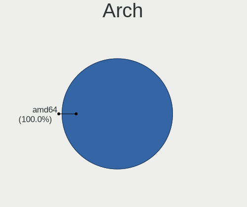

| Name  | Computers | Percent |
|-------|-----------|---------|
| amd64 | 445       | 100%    |

DE
--

Desktop Environment

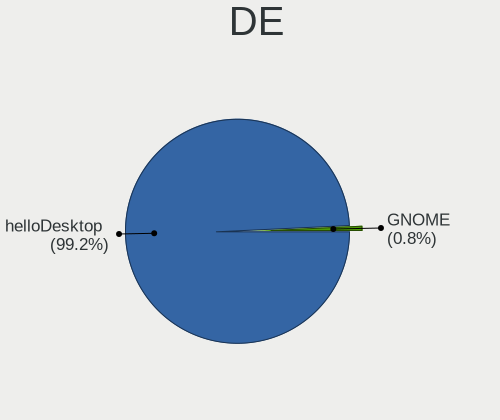

| Name         | Computers | Percent |
|--------------|-----------|---------|
| helloDesktop | 442       | 99.33%  |
| GNOME        | 3         | 0.67%   |

Display Server
--------------

X11 or Wayland

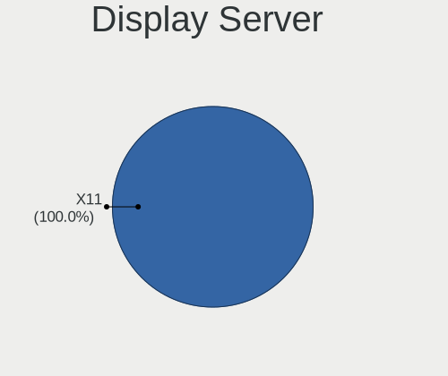

| Name | Computers | Percent |
|------|-----------|---------|
| X11  | 445       | 100%    |

Display Manager
---------------

SDDM, LightDM, etc.

| Name | Computers | Percent |
|------|-----------|---------|
| SLiM | 445       | 100%    |

OS Lang
-------

Language

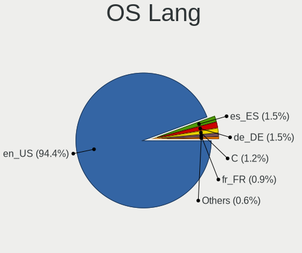

| Lang  | Computers | Percent |
|-------|-----------|---------|
| en_US | 422       | 94.62%  |
| es_ES | 8         | 1.79%   |
| de_DE | 5         | 1.12%   |
| fr_FR | 4         | 0.9%    |
| C     | 4         | 0.9%    |
| uk_UA | 1         | 0.22%   |
| tr_TR | 1         | 0.22%   |
| it_IT | 1         | 0.22%   |

Boot Mode
---------

EFI or BIOS

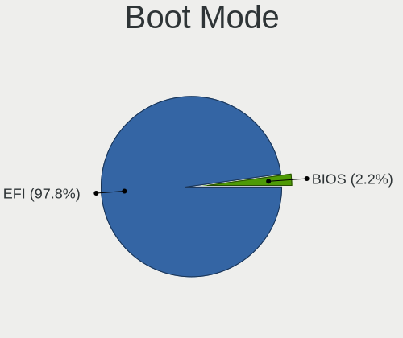

| Mode | Computers | Percent |
|------|-----------|---------|
| EFI  | 436       | 97.98%  |
| BIOS | 9         | 2.02%   |

Filesystem
----------

Type of filesystem

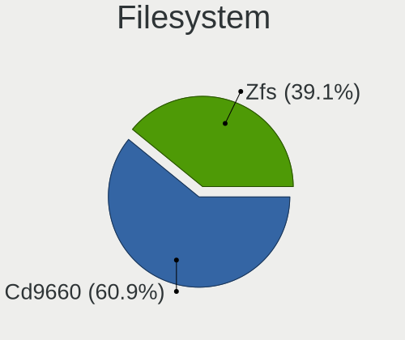

| Type   | Computers | Percent |
|--------|-----------|---------|
| Cd9660 | 255       | 56.17%  |
| Zfs    | 199       | 43.83%  |

Part. scheme
------------

Scheme of partitioning

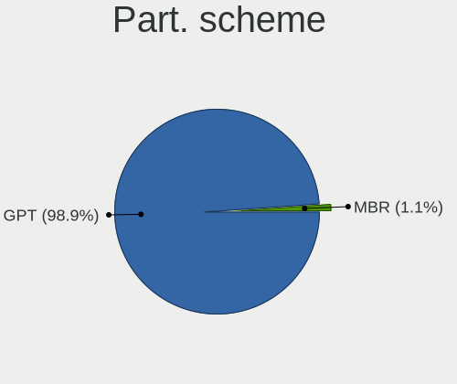

| Type | Computers | Percent |
|------|-----------|---------|
| GPT  | 440       | 98.88%  |
| MBR  | 5         | 1.12%   |

Board
-----

Vendor
------

Motherboard manufacturer

| Name                | Computers | Percent |
|---------------------|-----------|---------|
| Lenovo              | 80        | 17.98%  |
| ASUSTek Computer    | 67        | 15.06%  |
| Hewlett-Packard     | 53        | 11.91%  |
| Dell                | 46        | 10.34%  |
| Gigabyte Technology | 37        | 8.31%   |
| Apple               | 27        | 6.07%   |
| Acer                | 26        | 5.84%   |
| Intel               | 17        | 3.82%   |
| ASRock              | 16        | 3.6%    |
| MSI                 | 11        | 2.47%   |
| Toshiba             | 6         | 1.35%   |
| Samsung Electronics | 5         | 1.12%   |
| Pegatron            | 5         | 1.12%   |
| Fujitsu             | 4         | 0.9%    |
| Unknown             | 4         | 0.9%    |
| TUXEDO              | 3         | 0.67%   |
| Sony                | 3         | 0.67%   |
| Acidanthera         | 3         | 0.67%   |
| Razer               | 2         | 0.45%   |
| LG Electronics      | 2         | 0.45%   |
| HASEE Computer      | 2         | 0.45%   |
| TWINHEAD            | 1         | 0.22%   |
| T-bao               | 1         | 0.22%   |
| Supermicro          | 1         | 0.22%   |
| Shuttle             | 1         | 0.22%   |
| Quanta              | 1         | 0.22%   |
| QIYIDA              | 1         | 0.22%   |
| Positivo            | 1         | 0.22%   |
| Panasonic           | 1         | 0.22%   |
| Packard Bell        | 1         | 0.22%   |
| OEM                 | 1         | 0.22%   |
| Notebook            | 1         | 0.22%   |
| Monster             | 1         | 0.22%   |
| Medion              | 1         | 0.22%   |
| MAXSUN              | 1         | 0.22%   |
| MACHINIST           | 1         | 0.22%   |
| Koloe               | 1         | 0.22%   |
| Itautec             | 1         | 0.22%   |
| GPD                 | 1         | 0.22%   |
| Gateway             | 1         | 0.22%   |

Model
-----

Motherboard model

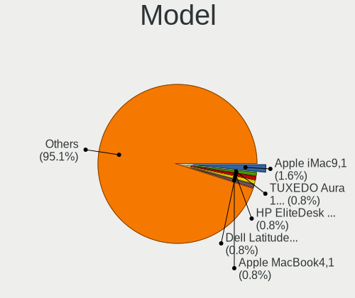

| Name                          | Computers | Percent |
|-------------------------------|-----------|---------|
| Apple iMac9,1                 | 7         | 1.57%   |
| Apple MacBook4,1              | 4         | 0.9%    |
| Unknown                       | 4         | 0.9%    |
| ASUS All Series               | 3         | 0.67%   |
| Apple MacPro5,1               | 3         | 0.67%   |
| TUXEDO Aura 15 Gen1           | 2         | 0.45%   |
| Pegatron IPM41-D3             | 2         | 0.45%   |
| Lenovo IdeaPad 110-14AST 80TQ | 2         | 0.45%   |
| Intel H61                     | 2         | 0.45%   |
| HP ProDesk 600 G2 DM          | 2         | 0.45%   |
| HP ProBook 4540s              | 2         | 0.45%   |
| HP Pavilion g6                | 2         | 0.45%   |
| HP Pavilion dv6               | 2         | 0.45%   |
| HP EliteDesk 700 G1 SFF       | 2         | 0.45%   |
| HP 2000                       | 2         | 0.45%   |
| Dell Precision Tower 5810     | 2         | 0.45%   |
| Dell Precision T1700          | 2         | 0.45%   |
| Dell Precision 7710           | 2         | 0.45%   |
| Dell OptiPlex 960             | 2         | 0.45%   |
| Dell Latitude E5470           | 2         | 0.45%   |
| Dell Latitude D630            | 2         | 0.45%   |
| ASUS TUF GAMING X570-PLUS     | 2         | 0.45%   |
| ASUS PRIME X570-P             | 2         | 0.45%   |
| ASUS PRIME A320M-K            | 2         | 0.45%   |
| ASUS P8Z77-V LX               | 2         | 0.45%   |
| ASRock X570 Phantom Gaming 4  | 2         | 0.45%   |
| Apple MacBook6,1              | 2         | 0.45%   |
| Apple MacBook5,1              | 2         | 0.45%   |
| Acidanthera iMac19,1          | 2         | 0.45%   |
| Acer V5-131                   | 2         | 0.45%   |
| Acer Aspire ES1-533           | 2         | 0.45%   |
| Acer Aspire E1-522            | 2         | 0.45%   |
| Acer Aspire 5930              | 2         | 0.45%   |
| TWINHEAD U12CT                | 1         | 0.22%   |
| TUXEDO InfinityBook13V3       | 1         | 0.22%   |
| Toshiba Satellite S55t-B      | 1         | 0.22%   |
| Toshiba Satellite P300        | 1         | 0.22%   |
| Toshiba Satellite L550        | 1         | 0.22%   |
| Toshiba Satellite C640        | 1         | 0.22%   |
| Toshiba Satellite C50-B       | 1         | 0.22%   |

Model Family
------------

Motherboard model prefix

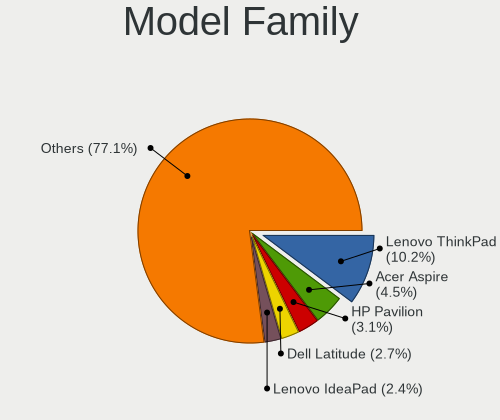

| Name               | Computers | Percent |
|--------------------|-----------|---------|
| Lenovo ThinkPad    | 46        | 10.34%  |
| Acer Aspire        | 20        | 4.49%   |
| HP Pavilion        | 14        | 3.15%   |
| Dell Latitude      | 12        | 2.7%    |
| Lenovo IdeaPad     | 10        | 2.25%   |
| Dell Inspiron      | 10        | 2.25%   |
| ASUS PRIME         | 10        | 2.25%   |
| Dell OptiPlex      | 9         | 2.02%   |
| Dell Precision     | 8         | 1.8%    |
| HP ProBook         | 7         | 1.57%   |
| HP Compaq          | 7         | 1.57%   |
| ASUS ROG           | 7         | 1.57%   |
| Apple iMac9        | 7         | 1.57%   |
| Lenovo ThinkCentre | 6         | 1.35%   |
| HP EliteDesk       | 6         | 1.35%   |
| ASUS TUF           | 6         | 1.35%   |
| Toshiba Satellite  | 5         | 1.12%   |
| HP Laptop          | 4         | 0.9%    |
| Apple MacBook4     | 4         | 0.9%    |
| Unknown            | 4         | 0.9%    |
| HP EliteBook       | 3         | 0.67%   |
| Gigabyte X570      | 3         | 0.67%   |
| Gigabyte B450      | 3         | 0.67%   |
| ASUS All           | 3         | 0.67%   |
| Apple MacPro5      | 3         | 0.67%   |
| Apple MacBook5     | 3         | 0.67%   |
| TUXEDO Aura        | 2         | 0.45%   |
| Razer Blade        | 2         | 0.45%   |
| Pegatron IPM41-D3  | 2         | 0.45%   |
| Pegatron Compaq    | 2         | 0.45%   |
| Lenovo Legion      | 2         | 0.45%   |
| Intel H61          | 2         | 0.45%   |
| HP ProDesk         | 2         | 0.45%   |
| HP 2000            | 2         | 0.45%   |
| Gigabyte Z390      | 2         | 0.45%   |
| Fujitsu LIFEBOOK   | 2         | 0.45%   |
| Fujitsu ESPRIMO    | 2         | 0.45%   |
| Dell Vostro        | 2         | 0.45%   |
| Dell PowerEdge     | 2         | 0.45%   |
| ASUS P8Z77-V       | 2         | 0.45%   |

MFG Year
--------

Motherboard manufacture year

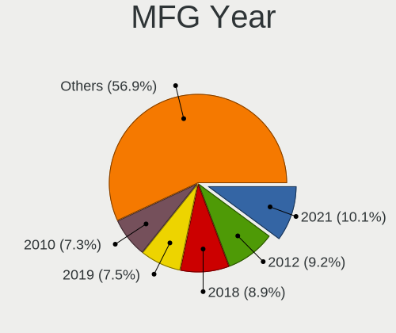

| Year    | Computers | Percent |
|---------|-----------|---------|
| 2021    | 47        | 10.56%  |
| 2012    | 41        | 9.21%   |
| 2018    | 40        | 8.99%   |
| 2019    | 35        | 7.87%   |
| 2010    | 32        | 7.19%   |
| 2016    | 30        | 6.74%   |
| 2013    | 30        | 6.74%   |
| 2014    | 29        | 6.52%   |
| 2009    | 29        | 6.52%   |
| 2020    | 26        | 5.84%   |
| 2017    | 24        | 5.39%   |
| 2015    | 23        | 5.17%   |
| 2011    | 22        | 4.94%   |
| 2008    | 17        | 3.82%   |
| 2007    | 13        | 2.92%   |
| 2022    | 4         | 0.9%    |
| 2006    | 2         | 0.45%   |
| Unknown | 1         | 0.22%   |

Form Factor
-----------

Physical design of the computer

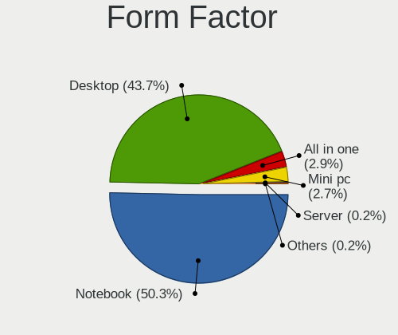

| Name        | Computers | Percent |
|-------------|-----------|---------|
| Notebook    | 223       | 50.11%  |
| Desktop     | 195       | 43.82%  |
| All in one  | 13        | 2.92%   |
| Mini pc     | 12        | 2.7%    |
| Convertible | 1         | 0.22%   |
| Server      | 1         | 0.22%   |

Coreboot
--------

Have coreboot on board

| Used | Computers | Percent |
|------|-----------|---------|
| No   | 445       | 100%    |

RAM Size
--------

Total RAM memory

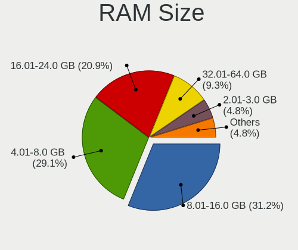

| Size in GB  | Computers | Percent |
|-------------|-----------|---------|
| 8.01-16.0   | 138       | 31.01%  |
| 4.01-8.0    | 133       | 29.89%  |
| 16.01-24.0  | 93        | 20.9%   |
| 32.01-64.0  | 40        | 8.99%   |
| 2.01-3.0    | 19        | 4.27%   |
| 64.01-256.0 | 9         | 2.02%   |
| 3.01-4.0    | 6         | 1.35%   |
| 24.01-32.0  | 4         | 0.9%    |
| 0.51-1.0    | 2         | 0.45%   |
| 1.01-2.0    | 1         | 0.22%   |

RAM Used
--------

Used RAM memory

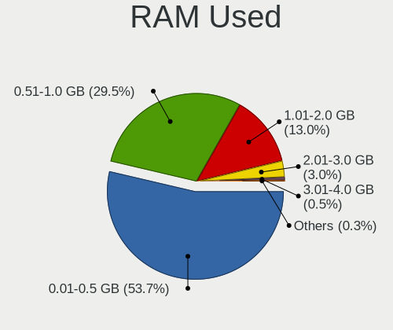

| Used GB   | Computers | Percent |
|-----------|-----------|---------|
| 0.01-0.5  | 241       | 53.91%  |
| 0.51-1.0  | 132       | 29.53%  |
| 1.01-2.0  | 58        | 12.98%  |
| 2.01-3.0  | 13        | 2.91%   |
| 3.01-4.0  | 2         | 0.45%   |
| 8.01-16.0 | 1         | 0.22%   |

Total Drives
------------

Number of drives on board

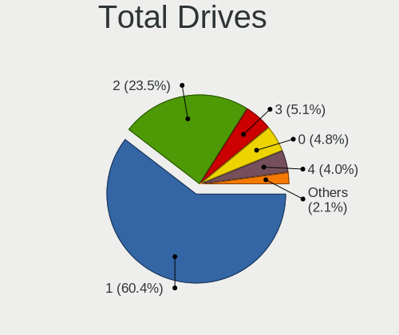

| Drives | Computers | Percent |
|--------|-----------|---------|
| 1      | 276       | 61.2%   |
| 2      | 104       | 23.06%  |
| 3      | 25        | 5.54%   |
| 0      | 21        | 4.66%   |
| 4      | 15        | 3.33%   |
| 6      | 4         | 0.89%   |
| 5      | 4         | 0.89%   |
| 9      | 1         | 0.22%   |
| 7      | 1         | 0.22%   |

Has CD-ROM
----------

Has CD-ROM on board

| Presented | Computers | Percent |
|-----------|-----------|---------|
| No        | 269       | 60.45%  |
| Yes       | 176       | 39.55%  |

Has Ethernet
------------

Has Ethernet on board

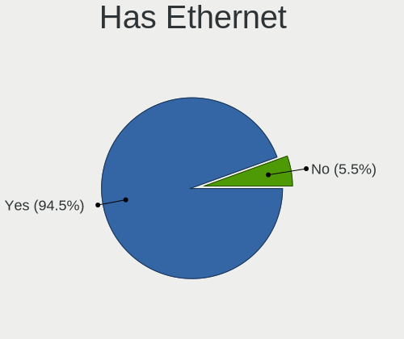

| Presented | Computers | Percent |
|-----------|-----------|---------|
| Yes       | 420       | 94.38%  |
| No        | 25        | 5.62%   |

Has WiFi
--------

Has WiFi module

| Presented | Computers | Percent |
|-----------|-----------|---------|
| Yes       | 303       | 68.09%  |
| No        | 142       | 31.91%  |

Has Bluetooth
-------------

Has Bluetooth module

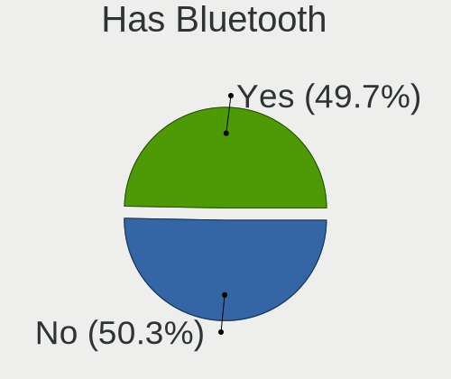

| Presented | Computers | Percent |
|-----------|-----------|---------|
| Yes       | 225       | 50.45%  |
| No        | 221       | 49.55%  |

Location
--------

Country
-------

Geographic location (country)

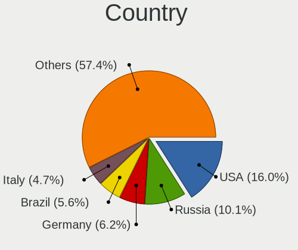

| Country     | Computers | Percent |
|-------------|-----------|---------|
| USA         | 66        | 14.83%  |
| Russia      | 42        | 9.44%   |
| Spain       | 27        | 6.07%   |
| Brazil      | 27        | 6.07%   |
| Germany     | 25        | 5.62%   |
| China       | 20        | 4.49%   |
| Italy       | 18        | 4.04%   |
| Canada      | 17        | 3.82%   |
| Poland      | 15        | 3.37%   |
| UK          | 14        | 3.15%   |
| Netherlands | 11        | 2.47%   |
| France      | 11        | 2.47%   |
| Ukraine     | 10        | 2.25%   |
| India       | 10        | 2.25%   |
| Hungary     | 10        | 2.25%   |
| Romania     | 9         | 2.02%   |
| Mexico      | 9         | 2.02%   |
| Indonesia   | 9         | 2.02%   |
| Turkey      | 6         | 1.35%   |
| Vietnam     | 5         | 1.12%   |
| Portugal    | 4         | 0.9%    |
| Peru        | 4         | 0.9%    |
| Norway      | 4         | 0.9%    |
| Denmark     | 4         | 0.9%    |
| Australia   | 4         | 0.9%    |
| Argentina   | 4         | 0.9%    |
| Venezuela   | 3         | 0.67%   |
| Sweden      | 3         | 0.67%   |
| South Korea | 3         | 0.67%   |
| Greece      | 3         | 0.67%   |
| Colombia    | 3         | 0.67%   |
| Chile       | 3         | 0.67%   |
| Taiwan      | 2         | 0.45%   |
| Switzerland | 2         | 0.45%   |
| New Zealand | 2         | 0.45%   |
| Finland     | 2         | 0.45%   |
| Egypt       | 2         | 0.45%   |
| Czechia     | 2         | 0.45%   |
| Cuba        | 2         | 0.45%   |
| Bulgaria    | 2         | 0.45%   |

City
----

Geographic location (city)

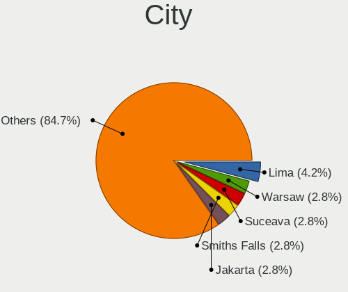

| City                          | Computers | Percent |
|-------------------------------|-----------|---------|
| Moscow                        | 7         | 1.54%   |
| St Petersburg                 | 5         | 1.1%    |
| Madrid                        | 4         | 0.88%   |
| Lima                          | 4         | 0.88%   |
| Hanoi                         | 4         | 0.88%   |
| Guangzhou                     | 4         | 0.88%   |
| Curitiba                      | 4         | 0.88%   |
| Amsterdam                     | 4         | 0.88%   |
| Warsaw                        | 3         | 0.66%   |
| Sao Paulo                     | 3         | 0.66%   |
| Rio de Janeiro                | 3         | 0.66%   |
| Kharkiv                       | 3         | 0.66%   |
| Bucharest                     | 3         | 0.66%   |
| Ankara                        | 3         | 0.66%   |
| Tromsø                       | 2         | 0.44%   |
| Tiruchi                       | 2         | 0.44%   |
| Surgut                        | 2         | 0.44%   |
| Suceava                       | 2         | 0.44%   |
| Stavropol                     | 2         | 0.44%   |
| St. Jean Baptiste             | 2         | 0.44%   |
| Smiths Falls                  | 2         | 0.44%   |
| Sherwood Park                 | 2         | 0.44%   |
| Seattle                       | 2         | 0.44%   |
| Scottsdale                    | 2         | 0.44%   |
| San Sebastián de los Reyes | 2         | 0.44%   |
| Pflugerville                  | 2         | 0.44%   |
| Perth                         | 2         | 0.44%   |
| Novosibirsk                   | 2         | 0.44%   |
| Myrtle Beach                  | 2         | 0.44%   |
| Mt. Pleasant                  | 2         | 0.44%   |
| Leatherhead                   | 2         | 0.44%   |
| Kyiv                          | 2         | 0.44%   |
| Katowice                      | 2         | 0.44%   |
| Jakarta                       | 2         | 0.44%   |
| Izhevsk                       | 2         | 0.44%   |
| Istanbul                      | 2         | 0.44%   |
| Hvidovre                      | 2         | 0.44%   |
| Havana                        | 2         | 0.44%   |
| Dreieich                      | 2         | 0.44%   |
| Dijon                         | 2         | 0.44%   |

Drives
------

Drive Vendor
------------

Hard drive vendors

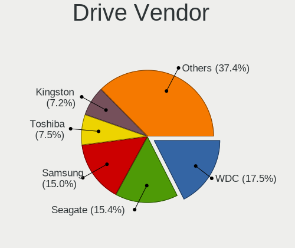

| Vendor              | Computers | Drives | Percent |
|---------------------|-----------|--------|---------|
| WDC                 | 107       | 133    | 17.43%  |
| Samsung Electronics | 100       | 125    | 16.29%  |
| Seagate             | 95        | 119    | 15.47%  |
| Toshiba             | 44        | 49     | 7.17%   |
| Kingston            | 41        | 47     | 6.68%   |
| Crucial             | 35        | 42     | 5.7%    |
| Hitachi             | 21        | 23     | 3.42%   |
| SanDisk             | 20        | 21     | 3.26%   |
| Intel               | 17        | 18     | 2.77%   |
| A-DATA Technology   | 13        | 14     | 2.12%   |
| HGST                | 9         | 9      | 1.47%   |
| Phison              | 7         | 8      | 1.14%   |
| Patriot             | 7         | 7      | 1.14%   |
| SK hynix            | 6         | 8      | 0.98%   |
| KingSpec            | 6         | 6      | 0.98%   |
| PNY                 | 5         | 5      | 0.81%   |
| Micron Technology   | 5         | 5      | 0.81%   |
| Goodram             | 5         | 6      | 0.81%   |
| Fujitsu             | 5         | 5      | 0.81%   |
| XPG                 | 4         | 4      | 0.65%   |
| Team                | 4         | 4      | 0.65%   |
| SPCC                | 4         | 5      | 0.65%   |
| Intenso             | 4         | 4      | 0.65%   |
| Corsair             | 4         | 4      | 0.65%   |
| Plextor             | 3         | 3      | 0.49%   |
| OCZ                 | 3         | 3      | 0.49%   |
| Apple               | 3         | 6      | 0.49%   |
| Zheino              | 2         | 2      | 0.33%   |
| Mushkin             | 2         | 2      | 0.33%   |
| LITEON              | 2         | 3      | 0.33%   |
| Hewlett-Packard     | 2         | 2      | 0.33%   |
| Gigabyte Technology | 2         | 3      | 0.33%   |
| China               | 2         | 2      | 0.33%   |
| Apacer              | 2         | 2      | 0.33%   |
| XrayDisk            | 1         | 1      | 0.16%   |
| V-GeN               | 1         | 1      | 0.16%   |
| Transcend           | 1         | 1      | 0.16%   |
| tigo                | 1         | 1      | 0.16%   |
| SSSTC               | 1         | 1      | 0.16%   |
| Smartbuy            | 1         | 1      | 0.16%   |

Drive Model
-----------

Hard drive models

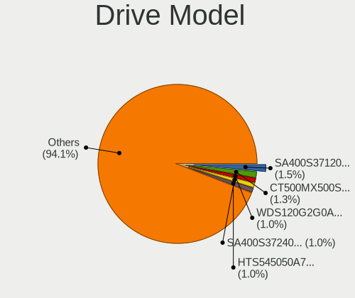

| Model                              | Computers | Percent |
|------------------------------------|-----------|---------|
| Kingston SA400S37120G 120GB        | 9         | 1.37%   |
| Crucial CT500MX500SSD1 500GB       | 9         | 1.37%   |
| Kingston SA400S37240G 240GB        | 8         | 1.22%   |
| WDC WDS120G2G0A-00JH30 120GB       | 6         | 0.91%   |
| HGST HTS545050A7E680 500GB         | 6         | 0.91%   |
| Crucial CT240BX500SSD1 240GB       | 6         | 0.91%   |
| WDC WD5000LPVX-22V0TT0 500GB       | 5         | 0.76%   |
| Toshiba MQ01ABF050 500GB           | 5         | 0.76%   |
| Seagate ST1000DM010-2EP102 1TB     | 5         | 0.76%   |
| Seagate ST1000DM003-1ER162 1TB     | 5         | 0.76%   |
| Samsung SSD 980 PRO 1TB            | 5         | 0.76%   |
| Samsung SSD 970 EVO Plus 500GB     | 5         | 0.76%   |
| Samsung SSD 860 EVO 250GB          | 5         | 0.76%   |
| Samsung SSD 850 EVO 250GB          | 5         | 0.76%   |
| XPG GAMMIX S11 Pro 256GB           | 4         | 0.61%   |
| WDC WDS240G2G0A-00JH30 240GB       | 4         | 0.61%   |
| Toshiba MQ01ABD100 1TB             | 4         | 0.61%   |
| Seagate ST1000LM024 HN-M101MBB 1TB | 4         | 0.61%   |
| Samsung SSD 860 EVO 500GB          | 4         | 0.61%   |
| Samsung SSD 860 EVO 1TB            | 4         | 0.61%   |
| Samsung SSD 850 EVO 500GB          | 4         | 0.61%   |
| Kingston SV300S37A120G 120GB       | 4         | 0.61%   |
| Crucial CT480BX500SSD1 480GB       | 4         | 0.61%   |
| Toshiba HDWD110 1TB                | 3         | 0.46%   |
| Toshiba DT01ACA100 1TB             | 3         | 0.46%   |
| Toshiba DT01ACA050 500GB           | 3         | 0.46%   |
| Seagate ST9500325AS 500GB          | 3         | 0.46%   |
| Seagate ST4000DM004-2CV104 4TB     | 3         | 0.46%   |
| Seagate ST3500418AS 500GB          | 3         | 0.46%   |
| Seagate ST320LT020-9YG142 320GB    | 3         | 0.46%   |
| Seagate ST31000528AS 1TB           | 3         | 0.46%   |
| Seagate ST2000DM008-2FR102 2TB     | 3         | 0.46%   |
| Seagate ST1000LM035-1RK172 1TB     | 3         | 0.46%   |
| Samsung SSD 970 EVO Plus 1TB       | 3         | 0.46%   |
| Samsung SSD 870 EVO 500GB          | 3         | 0.46%   |
| Samsung SSD 850 EVO 120GB          | 3         | 0.46%   |
| Samsung HD322HJ 320GB              | 3         | 0.46%   |
| PNY CS900 250GB SSD                | 3         | 0.46%   |
| Hitachi HTS541680J9SA00 80GB       | 3         | 0.46%   |
| Crucial CT120BX500SSD1 120GB       | 3         | 0.46%   |

HDD Vendor
----------

Hard disk drive vendors

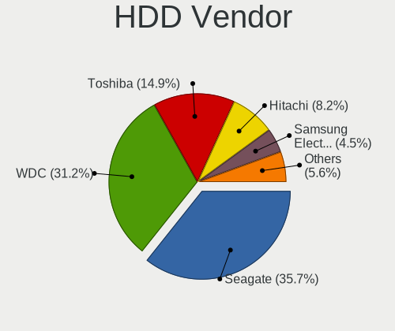

| Vendor              | Computers | Drives | Percent |
|---------------------|-----------|--------|---------|
| Seagate             | 94        | 115    | 35.47%  |
| WDC                 | 84        | 98     | 31.7%   |
| Toshiba             | 40        | 44     | 15.09%  |
| Hitachi             | 21        | 23     | 7.92%   |
| Samsung Electronics | 12        | 13     | 4.53%   |
| HGST                | 9         | 9      | 3.4%    |
| Fujitsu             | 4         | 4      | 1.51%   |
| Apple               | 1         | 1      | 0.38%   |

SSD Vendor
----------

Solid state drive vendors

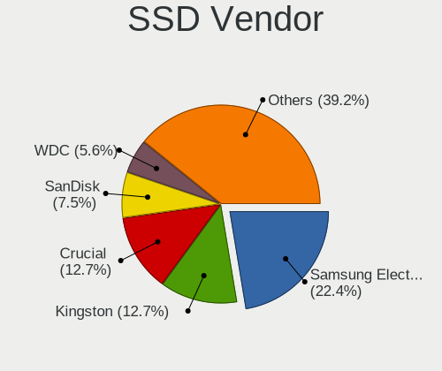

| Vendor              | Computers | Drives | Percent |
|---------------------|-----------|--------|---------|
| Samsung Electronics | 60        | 65     | 22.39%  |
| Kingston            | 34        | 38     | 12.69%  |
| Crucial             | 34        | 40     | 12.69%  |
| SanDisk             | 20        | 21     | 7.46%   |
| WDC                 | 15        | 19     | 5.6%    |
| Intel               | 12        | 12     | 4.48%   |
| A-DATA Technology   | 11        | 11     | 4.1%    |
| Patriot             | 7         | 7      | 2.61%   |
| KingSpec            | 6         | 6      | 2.24%   |
| PNY                 | 5         | 5      | 1.87%   |
| Goodram             | 5         | 6      | 1.87%   |
| SPCC                | 4         | 5      | 1.49%   |
| Intenso             | 4         | 4      | 1.49%   |
| Corsair             | 4         | 4      | 1.49%   |
| Toshiba             | 3         | 4      | 1.12%   |
| SK hynix            | 3         | 3      | 1.12%   |
| Plextor             | 3         | 3      | 1.12%   |
| OCZ                 | 3         | 3      | 1.12%   |
| Zheino              | 2         | 2      | 0.75%   |
| Team                | 2         | 2      | 0.75%   |
| LITEON              | 2         | 3      | 0.75%   |
| Hewlett-Packard     | 2         | 2      | 0.75%   |
| Gigabyte Technology | 2         | 3      | 0.75%   |
| China               | 2         | 2      | 0.75%   |
| Apple               | 2         | 5      | 0.75%   |
| Apacer              | 2         | 2      | 0.75%   |
| XrayDisk            | 1         | 1      | 0.37%   |
| V-GeN               | 1         | 1      | 0.37%   |
| Transcend           | 1         | 1      | 0.37%   |
| tigo                | 1         | 1      | 0.37%   |
| Smartbuy            | 1         | 1      | 0.37%   |
| Phison              | 1         | 1      | 0.37%   |
| Netac               | 1         | 1      | 0.37%   |
| Mushkin             | 1         | 1      | 0.37%   |
| Micron Technology   | 1         | 1      | 0.37%   |
| LITEONIT            | 1         | 1      | 0.37%   |
| Lite-On             | 1         | 1      | 0.37%   |
| Lexar               | 1         | 1      | 0.37%   |
| Leven               | 1         | 1      | 0.37%   |
| Kingchuxing         | 1         | 1      | 0.37%   |

Drive Kind
----------

HDD or SSD

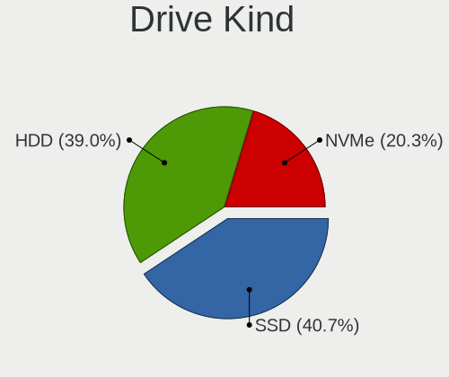

| Kind | Computers | Drives | Percent |
|------|-----------|--------|---------|
| SSD  | 230       | 296    | 41.89%  |
| HDD  | 230       | 307    | 41.89%  |
| NVMe | 89        | 119    | 16.21%  |

Drive Connector
---------------

SATA, SAS, NVMe, etc.

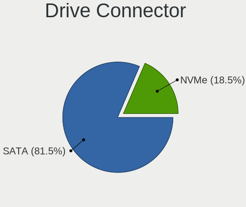

| Type | Computers | Drives | Percent |
|------|-----------|--------|---------|
| SATA | 393       | 603    | 81.54%  |
| NVMe | 89        | 119    | 18.46%  |

Drive Size
----------

Size of hard drive

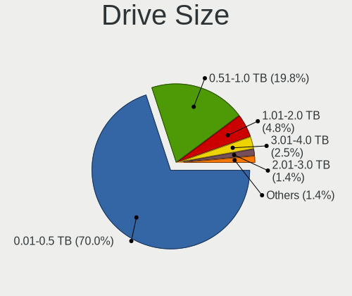

| Size in TB | Computers | Drives | Percent |
|------------|-----------|--------|---------|
| 0.01-0.5   | 329       | 436    | 70.75%  |
| 0.51-1.0   | 92        | 111    | 19.78%  |
| 1.01-2.0   | 22        | 24     | 4.73%   |
| 3.01-4.0   | 11        | 19     | 2.37%   |
| 2.01-3.0   | 5         | 6      | 1.08%   |
| 4.01-10.0  | 5         | 6      | 1.08%   |
| 10.01-20.0 | 1         | 1      | 0.22%   |

Space Total
-----------

Amount of disk space available on the file system

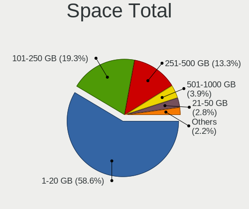

| Size in GB     | Computers | Percent |
|----------------|-----------|---------|
| 1-20           | 245       | 53.96%  |
| 101-250        | 107       | 23.57%  |
| 251-500        | 58        | 12.78%  |
| 501-1000       | 26        | 5.73%   |
| 51-100         | 9         | 1.98%   |
| 21-50          | 7         | 1.54%   |
| More than 3000 | 1         | 0.22%   |
| Unknown        | 1         | 0.22%   |

Space Used
----------

Amount of used disk space

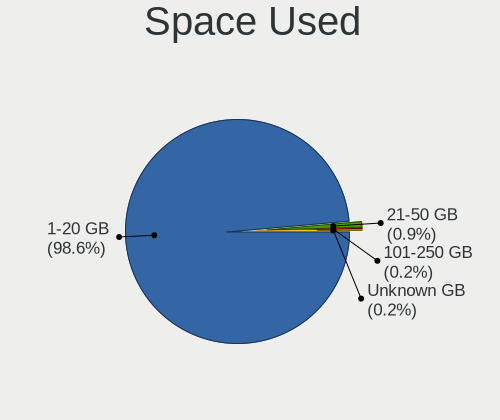

| Used GB | Computers | Percent |
|---------|-----------|---------|
| 1-20    | 439       | 98.65%  |
| 21-50   | 4         | 0.9%    |
| 101-250 | 1         | 0.22%   |
| Unknown | 1         | 0.22%   |

Malfunc. Drives
---------------

Drive models with a malfunction

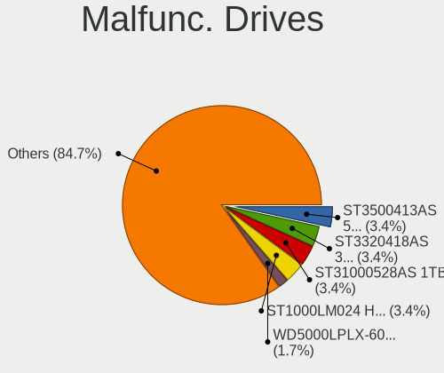

| Model                              | Computers | Drives | Percent |
|------------------------------------|-----------|--------|---------|
| Seagate ST1000LM024 HN-M101MBB 1TB | 3         | 3      | 2.52%   |
| Toshiba DT01ACA100 1TB             | 2         | 4      | 1.68%   |
| Seagate ST3500418AS 500GB          | 2         | 2      | 1.68%   |
| Seagate ST3500413AS 500GB          | 2         | 3      | 1.68%   |
| Seagate ST3320418AS 320GB          | 2         | 2      | 1.68%   |
| Seagate ST320LT020-9YG142 320GB    | 2         | 2      | 1.68%   |
| Seagate ST31000528AS 1TB           | 2         | 3      | 1.68%   |
| XrayDisk SSD 240GB                 | 1         | 1      | 0.84%   |
| WDC WD60EZRZ-00RWYB1 6TB           | 1         | 1      | 0.84%   |
| WDC WD5000LPLX-60ZNTT1 500GB       | 1         | 1      | 0.84%   |
| WDC WD5000LPCX-75VHAT0 500GB       | 1         | 1      | 0.84%   |
| WDC WD5000LPCX-60VHAT0 500GB       | 1         | 1      | 0.84%   |
| WDC WD5000BPVT-22HXZT3 500GB       | 1         | 1      | 0.84%   |
| WDC WD5000AZLX-00CL5A0 500GB       | 1         | 1      | 0.84%   |
| WDC WD5000AAKX-00ERMA0 500GB       | 1         | 1      | 0.84%   |
| WDC WD5000AAKX-001CA0 500GB        | 1         | 1      | 0.84%   |
| WDC WD5000AAKS-22A7B0 500GB        | 1         | 1      | 0.84%   |
| WDC WD400JB-00ENA0 40GB            | 1         | 1      | 0.84%   |
| WDC WD3200BPVT-80ZEST0 320GB       | 1         | 1      | 0.84%   |
| WDC WD3200BEVT-60A23T0 320GB       | 1         | 1      | 0.84%   |
| WDC WD3200BEVT-22ZCT0 320GB        | 1         | 1      | 0.84%   |
| WDC WD3200AAKS-75L9A0 320GB        | 1         | 1      | 0.84%   |
| WDC WD3200AAJS-22B4A0 320GB        | 1         | 1      | 0.84%   |
| WDC WD3200AAJS-00YZCA0 320GB       | 1         | 1      | 0.84%   |
| WDC WD20EURS-63S48Y0 2TB           | 1         | 1      | 0.84%   |
| WDC WD1600BEVT-80A23T0 160GB       | 1         | 1      | 0.84%   |
| WDC WD1600BEVT-22ZCT0 160GB        | 1         | 1      | 0.84%   |
| WDC WD1600BEKT-66F3T2 160GB        | 1         | 1      | 0.84%   |
| WDC WD1600AAJS-60Z0A0 160GB        | 1         | 1      | 0.84%   |
| WDC WD1600AAJS-40H3A0 160GB        | 1         | 1      | 0.84%   |
| WDC WD10SPZX-24Z10T0 1TB           | 1         | 1      | 0.84%   |
| WDC WD10SPZX-21Z10T0 1TB           | 1         | 1      | 0.84%   |
| WDC WD10JPVX-22JC3T0 1TB           | 1         | 1      | 0.84%   |
| WDC WD10JMVW-11AJGS2 1TB           | 1         | 1      | 0.84%   |
| WDC WD10EZEX-08M2NA0 1TB           | 1         | 1      | 0.84%   |
| WDC WD10EARS-003BB1 1TB            | 1         | 1      | 0.84%   |
| Toshiba THNSNX024GMNT 24GB         | 1         | 1      | 0.84%   |
| Toshiba MQ01UBD100 1TB             | 1         | 1      | 0.84%   |
| Toshiba MQ01ABF050 500GB           | 1         | 1      | 0.84%   |
| Toshiba MQ01ABD100 1TB             | 1         | 1      | 0.84%   |

Malfunc. Drive Vendor
---------------------

Vendors of faulty drives

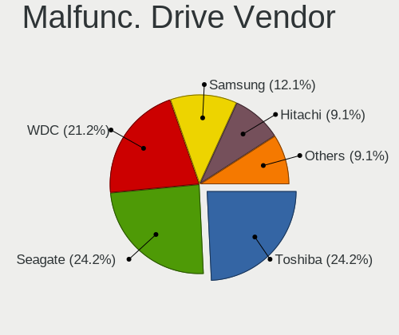

| Vendor              | Computers | Drives | Percent |
|---------------------|-----------|--------|---------|
| Seagate             | 32        | 36     | 27.59%  |
| WDC                 | 28        | 28     | 24.14%  |
| Toshiba             | 16        | 19     | 13.79%  |
| Hitachi             | 13        | 15     | 11.21%  |
| Samsung Electronics | 8         | 10     | 6.9%    |
| Kingston            | 4         | 4      | 3.45%   |
| Intel               | 2         | 2      | 1.72%   |
| HGST                | 2         | 2      | 1.72%   |
| Crucial             | 2         | 2      | 1.72%   |
| Corsair             | 2         | 2      | 1.72%   |
| XrayDisk            | 1         | 1      | 0.86%   |
| SanDisk             | 1         | 1      | 0.86%   |
| LITEON              | 1         | 1      | 0.86%   |
| KingSpec            | 1         | 1      | 0.86%   |
| Fujitsu             | 1         | 1      | 0.86%   |
| AGI                 | 1         | 1      | 0.86%   |
| A-DATA Technology   | 1         | 1      | 0.86%   |

Malfunc. HDD Vendor
-------------------

Vendors of faulty HDD drives

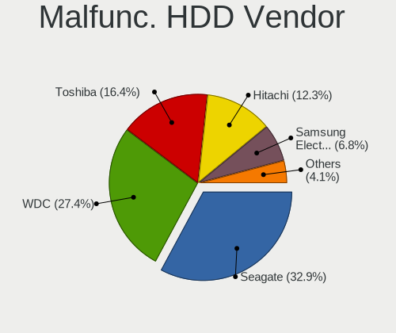

| Vendor              | Computers | Drives | Percent |
|---------------------|-----------|--------|---------|
| Seagate             | 32        | 36     | 33.33%  |
| WDC                 | 28        | 28     | 29.17%  |
| Toshiba             | 15        | 18     | 15.63%  |
| Hitachi             | 13        | 15     | 13.54%  |
| Samsung Electronics | 5         | 5      | 5.21%   |
| HGST                | 2         | 2      | 2.08%   |
| Fujitsu             | 1         | 1      | 1.04%   |

Malfunc. Drive Kind
-------------------

Kinds of faulty drives

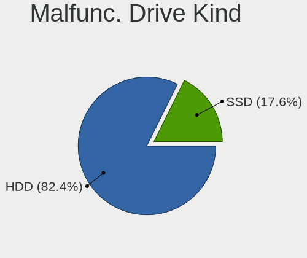

| Kind | Computers | Drives | Percent |
|------|-----------|--------|---------|
| HDD  | 87        | 105    | 80.56%  |
| SSD  | 17        | 18     | 15.74%  |
| NVMe | 4         | 4      | 3.7%    |

Failed Drives
-------------

Failed drive models

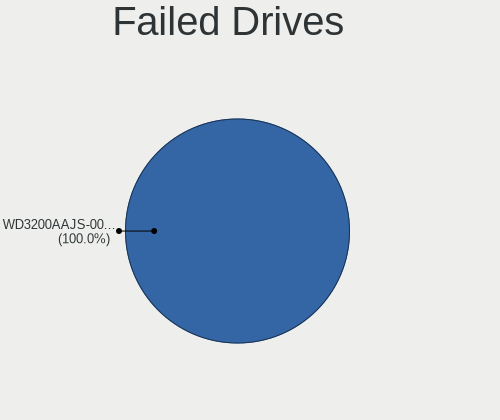

| Model                        | Computers | Drives | Percent |
|------------------------------|-----------|--------|---------|
| WDC WD3200AAJS-00YZCA0 320GB | 1         | 1      | 100%    |

Failed Drive Vendor
-------------------

Failed drive vendors

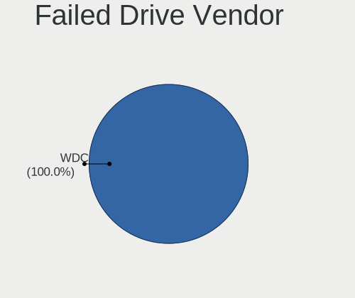

| Vendor | Computers | Drives | Percent |
|--------|-----------|--------|---------|
| WDC    | 1         | 1      | 100%    |

Drive Status
------------

Number of failed and malfunc. drives

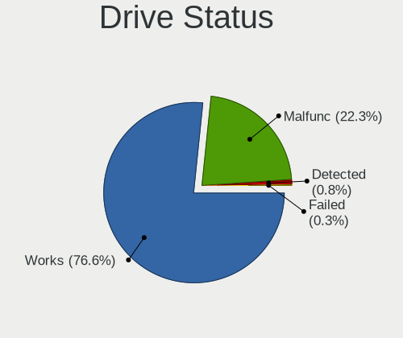

| Status   | Computers | Drives | Percent |
|----------|-----------|--------|---------|
| Works    | 354       | 588    | 76.13%  |
| Malfunc  | 105       | 127    | 22.58%  |
| Detected | 5         | 6      | 1.08%   |
| Failed   | 1         | 1      | 0.22%   |

Storage controller
------------------

Storage Vendor
--------------

Storage controller vendors

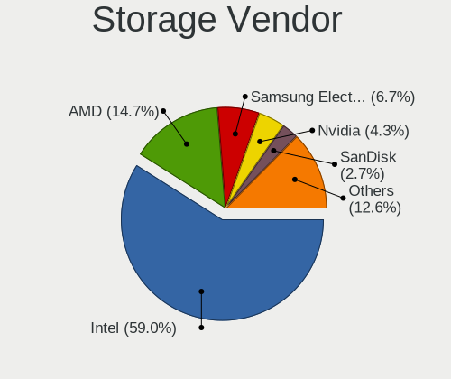

| Vendor                           | Computers | Percent |
|----------------------------------|-----------|---------|
| Intel                            | 327       | 60.67%  |
| AMD                              | 79        | 14.66%  |
| Samsung Electronics              | 38        | 7.05%   |
| Nvidia                           | 24        | 4.45%   |
| SanDisk                          | 11        | 2.04%   |
| Phison Electronics               | 7         | 1.3%    |
| Kingston Technology Company      | 6         | 1.11%   |
| ADATA Technology                 | 6         | 1.11%   |
| Silicon Motion                   | 5         | 0.93%   |
| JMicron Technology               | 5         | 0.93%   |
| Micron Technology                | 4         | 0.74%   |
| Marvell Technology Group         | 4         | 0.74%   |
| SK hynix                         | 3         | 0.56%   |
| Broadcom / LSI                   | 3         | 0.56%   |
| ASMedia Technology               | 3         | 0.56%   |
| Shenzhen Longsys Electronics     | 2         | 0.37%   |
| Seagate Technology               | 2         | 0.37%   |
| Micron/Crucial Technology        | 2         | 0.37%   |
| KIOXIA                           | 2         | 0.37%   |
| VIA Technologies                 | 1         | 0.19%   |
| Solid State Storage Technology   | 1         | 0.19%   |
| Silicon Integrated Systems [SiS] | 1         | 0.19%   |
| Realtek Semiconductor            | 1         | 0.19%   |
| Biwin Storage Technology         | 1         | 0.19%   |
| Apple                            | 1         | 0.19%   |

Storage Model
-------------

Storage controller models

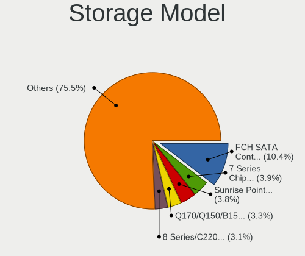

| Model                                                                            | Computers | Percent |
|----------------------------------------------------------------------------------|-----------|---------|
| AMD FCH SATA Controller [AHCI mode]                                              | 64        | 10.36%  |
| Intel 7 Series Chipset Family 6-port SATA Controller [AHCI mode]                 | 24        | 3.88%   |
| Intel Sunrise Point-LP SATA Controller [AHCI mode]                               | 23        | 3.72%   |
| Intel Q170/Q150/B150/H170/H110/Z170/CM236 Chipset SATA Controller [AHCI Mode]    | 20        | 3.24%   |
| Intel 8 Series/C220 Series Chipset Family 6-port SATA Controller 1 [AHCI mode]   | 20        | 3.24%   |
| Samsung NVMe SSD Controller SM981/PM981/PM983                                    | 18        | 2.91%   |
| Intel 82801HM/HEM (ICH8M/ICH8M-E) IDE Controller                                 | 17        | 2.75%   |
| Intel 6 Series/C200 Series Chipset Family 6 port Mobile SATA AHCI Controller     | 17        | 2.75%   |
| Intel 8 Series SATA Controller 1 [AHCI mode]                                     | 16        | 2.59%   |
| Nvidia MCP79 AHCI Controller                                                     | 15        | 2.43%   |
| Intel 82801HM/HEM (ICH8M/ICH8M-E) SATA Controller [AHCI mode]                    | 15        | 2.43%   |
| Intel Cannon Lake PCH SATA AHCI Controller                                       | 14        | 2.27%   |
| Intel 7 Series/C210 Series Chipset Family 6-port SATA Controller [AHCI mode]     | 14        | 2.27%   |
| Intel NM10/ICH7 Family SATA Controller [IDE mode]                                | 13        | 2.1%    |
| Intel 82801IBM/IEM (ICH9M/ICH9M-E) 4 port SATA Controller [AHCI mode]            | 13        | 2.1%    |
| Intel 6 Series/C200 Series Chipset Family 6 port Desktop SATA AHCI Controller    | 13        | 2.1%    |
| Intel SATA Controller [RAID mode]                                                | 10        | 1.62%   |
| Intel 82801G (ICH7 Family) IDE Controller                                        | 10        | 1.62%   |
| Intel 5 Series/3400 Series Chipset 4 port SATA AHCI Controller                   | 10        | 1.62%   |
| AMD 400 Series Chipset SATA Controller                                           | 10        | 1.62%   |
| Samsung NVMe SSD Controller SM961/PM961/SM963                                    | 9         | 1.46%   |
| Intel 5 Series/3400 Series Chipset 6 port SATA AHCI Controller                   | 9         | 1.46%   |
| Intel 200 Series PCH SATA controller [AHCI mode]                                 | 9         | 1.46%   |
| Intel Wildcat Point-LP SATA Controller [AHCI Mode]                               | 7         | 1.13%   |
| Intel 82801 Mobile SATA Controller [RAID mode]                                   | 7         | 1.13%   |
| SanDisk WD Blue SN550 NVMe SSD                                                   | 6         | 0.97%   |
| Samsung NVMe SSD Controller PM9A1/PM9A3/980PRO                                   | 6         | 0.97%   |
| Samsung NVMe SSD Controller 980                                                  | 6         | 0.97%   |
| Nvidia MCP61 SATA Controller                                                     | 6         | 0.97%   |
| Intel Atom/Celeron/Pentium Processor x5-E8000/J3xxx/N3xxx Series SATA Controller | 6         | 0.97%   |
| Intel Atom Processor E3800 Series SATA AHCI Controller                           | 6         | 0.97%   |
| Intel 82801JI (ICH10 Family) SATA AHCI Controller                                | 6         | 0.97%   |
| AMD FCH SATA Controller D                                                        | 6         | 0.97%   |
| ADATA XPG SX8200 Pro PCIe Gen3x4 M.2 2280 Solid State Drive                      | 6         | 0.97%   |
| Phison E12 NVMe Controller                                                       | 5         | 0.81%   |
| Intel Cannon Lake Mobile PCH SATA AHCI Controller                                | 5         | 0.81%   |
| AMD SB7x0/SB8x0/SB9x0 SATA Controller [AHCI mode]                                | 5         | 0.81%   |
| Micron NVMe Storage Controller                                                   | 4         | 0.65%   |
| Intel NM10/ICH7 Family SATA Controller [AHCI mode]                               | 4         | 0.65%   |
| Intel Comet Lake SATA AHCI Controller                                            | 4         | 0.65%   |

Storage Kind
------------

Kind of storage controller (IDE, SATA, NVMe, SAS, ...)

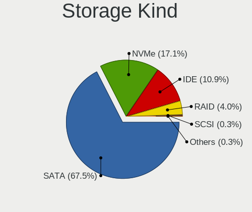

| Kind | Computers | Percent |
|------|-----------|---------|
| SATA | 375       | 67.45%  |
| NVMe | 89        | 16.01%  |
| IDE  | 67        | 12.05%  |
| RAID | 22        | 3.96%   |
| SAS  | 2         | 0.36%   |
| SCSI | 1         | 0.18%   |

Processor
---------

CPU Vendor
----------

Processor vendors

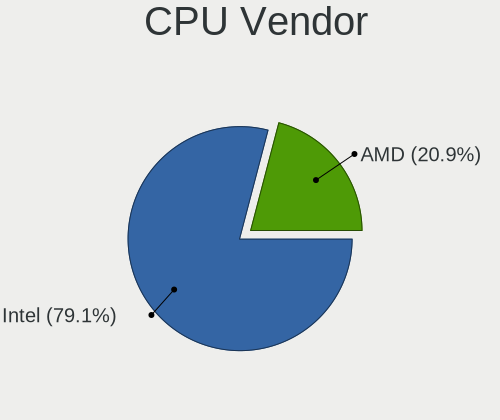

| Vendor | Computers | Percent |
|--------|-----------|---------|
| Intel  | 353       | 79.33%  |
| AMD    | 92        | 20.67%  |

CPU Model
---------

Processor models

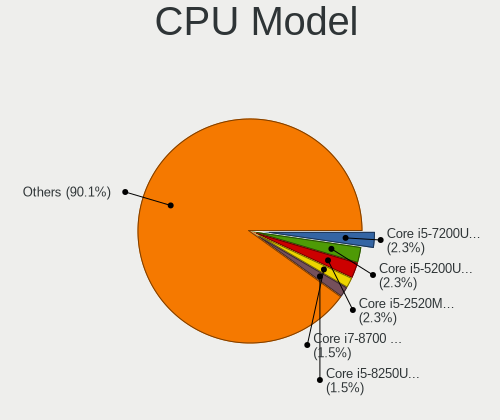

| Model                                       | Computers | Percent |
|---------------------------------------------|-----------|---------|
| Intel Core i5-2520M CPU @ 2.50GHz           | 8         | 1.8%    |
| Intel CPU Version                           | 6         | 1.35%   |
| Intel Core i5-7200U CPU @ 2.50GHz           | 5         | 1.12%   |
| Intel Core i5-6500 CPU @ 3.20GHz            | 5         | 1.12%   |
| Intel Core i5-6300U CPU @ 2.40GHz           | 5         | 1.12%   |
| AMD Ryzen 7 3700X 8-Core Processor          | 5         | 1.12%   |
| Intel Core i5-3210M CPU @ 2.50GHz           | 4         | 0.9%    |
| Intel Core i5 CPU M 520 @ 2.40GHz           | 4         | 0.9%    |
| Intel Core i3-4005U CPU @ 1.70GHz           | 4         | 0.9%    |
| Intel Core 2 Duo CPU T8300 @ 2.40GHz        | 4         | 0.9%    |
| Intel Core 2 Duo CPU P7550 @ 2.26GHz        | 4         | 0.9%    |
| Intel Core 2 Duo CPU P7350 @ 2.00GHz        | 4         | 0.9%    |
| Intel Core 2 Duo                            | 4         | 0.9%    |
| Intel Celeron CPU N3050 @ 1.60GHz           | 4         | 0.9%    |
| AMD Ryzen 5 3600 6-Core Processor           | 4         | 0.9%    |
| AMD E1-2500 APU with Radeon HD Graphics     | 4         | 0.9%    |
| Intel Core i7-8700 CPU @ 3.20GHz            | 3         | 0.67%   |
| Intel Core i7-6700 CPU @ 3.40GHz            | 3         | 0.67%   |
| Intel Core i7-3612QM CPU @ 2.10GHz          | 3         | 0.67%   |
| Intel Core i5-9400 CPU @ 2.90GHz            | 3         | 0.67%   |
| Intel Core i5-5200U CPU @ 2.20GHz           | 3         | 0.67%   |
| Intel Core i5-4590 CPU @ 3.30GHz            | 3         | 0.67%   |
| Intel Core i5-4300M CPU @ 2.60GHz           | 3         | 0.67%   |
| Intel Core i5-4210U CPU @ 1.70GHz           | 3         | 0.67%   |
| Intel Core i5-3570 CPU @ 3.40GHz            | 3         | 0.67%   |
| Intel Core i5-3470 CPU @ 3.20GHz            | 3         | 0.67%   |
| Intel Core i5-3320M CPU @ 2.60GHz           | 3         | 0.67%   |
| Intel Core i3-6006U CPU @ 2.00GHz           | 3         | 0.67%   |
| Intel Core i3-5005U CPU @ 2.00GHz           | 3         | 0.67%   |
| Intel Core i3-3110M CPU @ 2.40GHz           | 3         | 0.67%   |
| Intel Core 2 Duo CPU T8100 @ 2.10GHz        | 3         | 0.67%   |
| Intel Core 2 Duo CPU T7300 @ 2.00GHz        | 3         | 0.67%   |
| Intel Core 2 Duo CPU E8135 @ 2.66GHz        | 3         | 0.67%   |
| AMD Ryzen 7 2700X Eight-Core Processor      | 3         | 0.67%   |
| AMD Ryzen 5 3400G with Radeon Vega Graphics | 3         | 0.67%   |
| Intel Xeon CPU X3470 @ 2.93GHz              | 2         | 0.45%   |
| Intel Xeon CPU E5-2630 v3 @ 2.40GHz         | 2         | 0.45%   |
| Intel Xeon CPU E3-1270 v3 @ 3.50GHz         | 2         | 0.45%   |
| Intel Xeon CPU E3-1230 V2 @ 3.30GHz         | 2         | 0.45%   |
| Intel Pentium CPU G860 @ 3.00GHz            | 2         | 0.45%   |

CPU Model Family
----------------

Processor model prefix

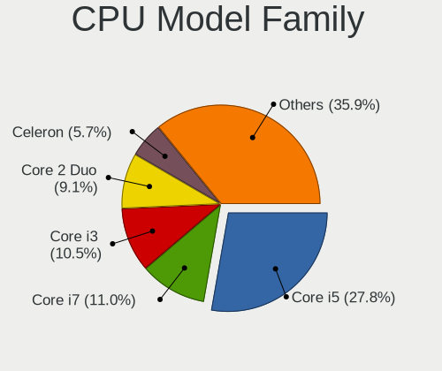

| Model                   | Computers | Percent |
|-------------------------|-----------|---------|
| Intel Core i5           | 110       | 24.72%  |
| Intel Core i7           | 52        | 11.69%  |
| Intel Core 2 Duo        | 46        | 10.34%  |
| Intel Core i3           | 41        | 9.21%   |
| Intel Xeon              | 29        | 6.52%   |
| AMD Ryzen 5             | 23        | 5.17%   |
| Intel Celeron           | 22        | 4.94%   |
| AMD Ryzen 7             | 15        | 3.37%   |
| Other                   | 12        | 2.7%    |
| Intel Pentium           | 11        | 2.47%   |
| Intel Core 2 Quad       | 9         | 2.02%   |
| Intel Pentium Dual-Core | 6         | 1.35%   |
| AMD Ryzen 3             | 6         | 1.35%   |
| AMD E1                  | 6         | 1.35%   |
| AMD A6                  | 6         | 1.35%   |
| Intel Core 2            | 4         | 0.9%    |
| Intel Atom              | 4         | 0.9%    |
| AMD Ryzen 9             | 4         | 0.9%    |
| AMD Phenom II X4        | 4         | 0.9%    |
| AMD E2                  | 3         | 0.67%   |
| AMD Athlon II X2        | 3         | 0.67%   |
| AMD A10                 | 3         | 0.67%   |
| Intel Pentium Dual      | 2         | 0.45%   |
| Intel Genuine           | 2         | 0.45%   |
| Intel Core i9           | 2         | 0.45%   |
| AMD Ryzen Threadripper  | 2         | 0.45%   |
| AMD FX                  | 2         | 0.45%   |
| AMD Athlon Dual Core    | 2         | 0.45%   |
| AMD Athlon 64 X2        | 2         | 0.45%   |
| AMD A8                  | 2         | 0.45%   |
| Intel Pentium Silver    | 1         | 0.22%   |
| Intel Pentium M         | 1         | 0.22%   |
| Intel Pentium D         | 1         | 0.22%   |
| Intel Core M            | 1         | 0.22%   |
| Intel Celeron Dual-Core | 1         | 0.22%   |
| AMD Ryzen 5 PRO         | 1         | 0.22%   |
| AMD E                   | 1         | 0.22%   |
| AMD Athlon II X4        | 1         | 0.22%   |
| AMD Athlon              | 1         | 0.22%   |
| AMD A4                  | 1         | 0.22%   |

CPU Cores
---------

Number of processor cores

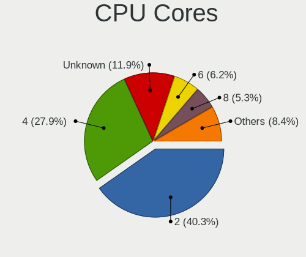

| Number  | Computers | Percent |
|---------|-----------|---------|
| 2       | 180       | 40.45%  |
| 4       | 124       | 27.87%  |
| Unknown | 54        | 12.13%  |
| 6       | 28        | 6.29%   |
| 8       | 24        | 5.39%   |
| 12      | 15        | 3.37%   |
| 16      | 11        | 2.47%   |
| 24      | 3         | 0.67%   |
| 64      | 1         | 0.22%   |
| 48      | 1         | 0.22%   |
| 32      | 1         | 0.22%   |
| 18      | 1         | 0.22%   |
| 14      | 1         | 0.22%   |
| 1       | 1         | 0.22%   |

CPU Sockets
-----------

Number of sockets

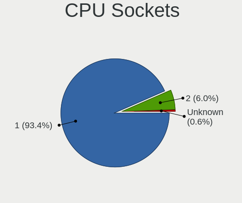

| Number  | Computers | Percent |
|---------|-----------|---------|
| 1       | 419       | 94.16%  |
| 2       | 24        | 5.39%   |
| Unknown | 2         | 0.45%   |

CPU Threads
-----------

Threads per core (Hyper-Threading)

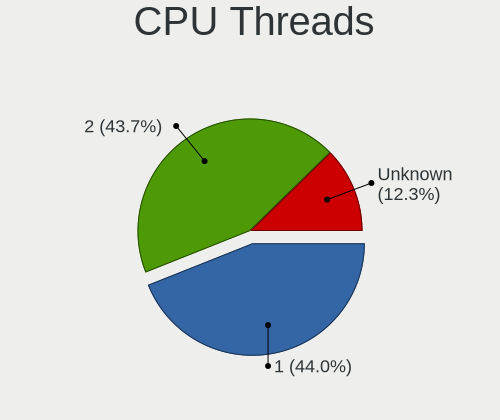

| Number  | Computers | Percent |
|---------|-----------|---------|
| 1       | 199       | 44.72%  |
| 2       | 192       | 43.15%  |
| Unknown | 54        | 12.13%  |

CPU Microarch
-------------

Microarchitecture

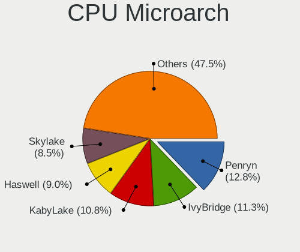

| Name          | Computers | Percent |
|---------------|-----------|---------|
| Penryn        | 54        | 12.13%  |
| KabyLake      | 50        | 11.24%  |
| IvyBridge     | 47        | 10.56%  |
| Haswell       | 47        | 10.56%  |
| Skylake       | 36        | 8.09%   |
| SandyBridge   | 31        | 6.97%   |
| Core          | 21        | 4.72%   |
| Zen 2         | 19        | 4.27%   |
| Westmere      | 18        | 4.04%   |
| Zen+          | 17        | 3.82%   |
| Silvermont    | 13        | 2.92%   |
| Zen           | 10        | 2.25%   |
| Piledriver    | 8         | 1.8%    |
| K10           | 8         | 1.8%    |
| CometLake     | 8         | 1.8%    |
| Broadwell     | 8         | 1.8%    |
| Zen 3         | 7         | 1.57%   |
| Nehalem       | 7         | 1.57%   |
| Jaguar        | 7         | 1.57%   |
| Excavator     | 5         | 1.12%   |
| K8 Hammer     | 4         | 0.9%    |
| Goldmont      | 4         | 0.9%    |
| Bonnell       | 4         | 0.9%    |
| Bobcat        | 4         | 0.9%    |
| Unknown       | 3         | 0.67%   |
| Puma          | 2         | 0.45%   |
| NetBurst      | 1         | 0.22%   |
| K10 Llano     | 1         | 0.22%   |
| Goldmont plus | 1         | 0.22%   |

Graphics
--------

GPU Vendor
----------

Vendors of graphics cards

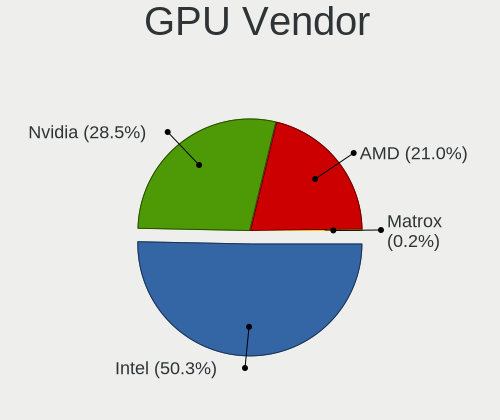

| Vendor                     | Computers | Percent |
|----------------------------|-----------|---------|
| Intel                      | 250       | 50.61%  |
| Nvidia                     | 140       | 28.34%  |
| AMD                        | 103       | 20.85%  |
| Matrox Electronics Systems | 1         | 0.2%    |

GPU Model
---------

Graphics card models

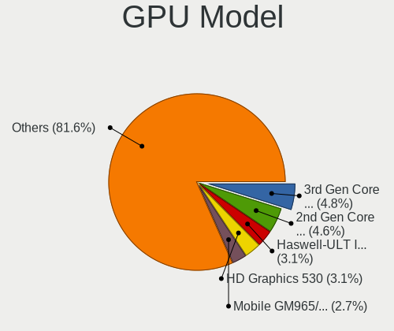

| Model                                                                                    | Computers | Percent |
|------------------------------------------------------------------------------------------|-----------|---------|
| Intel 3rd Gen Core processor Graphics Controller                                         | 25        | 4.86%   |
| Intel 2nd Generation Core Processor Family Integrated Graphics Controller                | 24        | 4.67%   |
| Intel HD Graphics 530                                                                    | 16        | 3.11%   |
| Intel Haswell-ULT Integrated Graphics Controller                                         | 16        | 3.11%   |
| Intel Mobile GM965/GL960 Integrated Graphics Controller (secondary)                      | 14        | 2.72%   |
| Intel Mobile GM965/GL960 Integrated Graphics Controller (primary)                        | 14        | 2.72%   |
| Intel Xeon E3-1200 v3/4th Gen Core Processor Integrated Graphics Controller              | 12        | 2.33%   |
| Intel Skylake GT2 [HD Graphics 520]                                                      | 12        | 2.33%   |
| Intel Core Processor Integrated Graphics Controller                                      | 12        | 2.33%   |
| Intel HD Graphics 620                                                                    | 10        | 1.95%   |
| AMD Picasso/Raven 2 [Radeon Vega Series / Radeon Vega Mobile Series]                     | 10        | 1.95%   |
| Intel Xeon E3-1200 v2/3rd Gen Core processor Graphics Controller                         | 9         | 1.75%   |
| Intel CoffeeLake-S GT2 [UHD Graphics 630]                                                | 9         | 1.75%   |
| AMD Ellesmere [Radeon RX 470/480/570/570X/580/580X/590]                                  | 9         | 1.75%   |
| Nvidia C79 [GeForce 9400]                                                                | 7         | 1.36%   |
| Intel HD Graphics 5500                                                                   | 7         | 1.36%   |
| Intel Atom/Celeron/Pentium Processor x5-E8000/J3xxx/N3xxx Integrated Graphics Controller | 7         | 1.36%   |
| Nvidia GP107 [GeForce GTX 1050 Ti]                                                       | 6         | 1.17%   |
| Nvidia C79 [GeForce 9400M]                                                               | 6         | 1.17%   |
| Intel Mobile 4 Series Chipset Integrated Graphics Controller                             | 6         | 1.17%   |
| Intel Atom Processor Z36xxx/Z37xxx Series Graphics & Display                             | 6         | 1.17%   |
| Intel 4th Gen Core Processor Integrated Graphics Controller                              | 6         | 1.17%   |
| Intel 4 Series Chipset Integrated Graphics Controller                                    | 6         | 1.17%   |
| Nvidia GK208B [GeForce GT 710]                                                           | 5         | 0.97%   |
| Intel CometLake-H GT2 [UHD Graphics]                                                     | 5         | 0.97%   |
| AMD Stoney [Radeon R2/R3/R4/R5 Graphics]                                                 | 5         | 0.97%   |
| AMD Renoir                                                                               | 5         | 0.97%   |
| AMD Raven Ridge [Radeon Vega Series / Radeon Vega Mobile Series]                         | 5         | 0.97%   |
| AMD Navi 10 [Radeon RX 5600 OEM/5600 XT / 5700/5700 XT]                                  | 5         | 0.97%   |
| Nvidia GM204 [GeForce GTX 970]                                                           | 4         | 0.78%   |
| Intel IvyBridge GT2 [HD Graphics 4000]                                                   | 4         | 0.78%   |
| Intel HD Graphics 500                                                                    | 4         | 0.78%   |
| Intel Atom Processor D4xx/D5xx/N4xx/N5xx Integrated Graphics Controller                  | 4         | 0.78%   |
| AMD RV710/M92 [Mobility Radeon HD 4530/4570/5145/530v/540v/545v]                         | 4         | 0.78%   |
| AMD Kabini [Radeon HD 8240 / R3 Series]                                                  | 4         | 0.78%   |
| Nvidia TU117M [GeForce GTX 1650 Mobile / Max-Q]                                          | 3         | 0.58%   |
| Nvidia TU117M                                                                            | 3         | 0.58%   |
| Nvidia TU117 [GeForce GTX 1650]                                                          | 3         | 0.58%   |
| Nvidia TU106M [GeForce RTX 2060 Mobile]                                                  | 3         | 0.58%   |
| Nvidia GT218 [GeForce 210]                                                               | 3         | 0.58%   |

GPU Combo
---------

Combinations of graphics cards

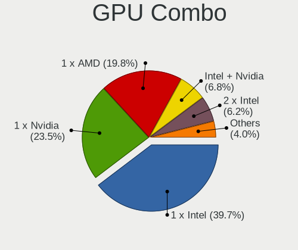

| Name           | Computers | Percent |
|----------------|-----------|---------|
| 1 x Intel      | 177       | 39.51%  |
| 1 x Nvidia     | 105       | 23.44%  |
| 1 x AMD        | 85        | 18.97%  |
| Intel + Nvidia | 31        | 6.92%   |
| 2 x Intel      | 30        | 6.7%    |
| Intel + AMD    | 12        | 2.68%   |
| AMD + Nvidia   | 4         | 0.89%   |
| 2 x AMD        | 2         | 0.45%   |
| 2 x Nvidia     | 1         | 0.22%   |
| 1 x Matrox     | 1         | 0.22%   |

GPU Driver
----------

Free vs proprietary

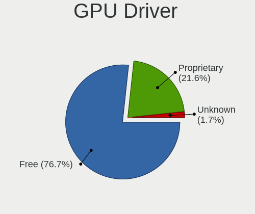

| Driver      | Computers | Percent |
|-------------|-----------|---------|
| Free        | 343       | 76.73%  |
| Proprietary | 97        | 21.7%   |
| Unknown     | 7         | 1.57%   |

GPU Memory
----------

Total video memory

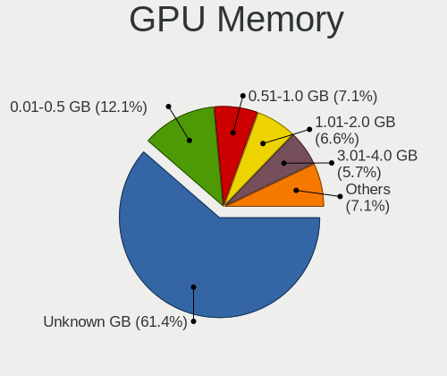

| Size in GB | Computers | Percent |
|------------|-----------|---------|
| Unknown    | 275       | 61.25%  |
| 0.01-0.5   | 55        | 12.25%  |
| 0.51-1.0   | 31        | 6.9%    |
| 1.01-2.0   | 30        | 6.68%   |
| 3.01-4.0   | 26        | 5.79%   |
| 7.01-8.0   | 17        | 3.79%   |
| 5.01-6.0   | 9         | 2%      |
| 2.01-3.0   | 4         | 0.89%   |
| 8.01-16.0  | 2         | 0.45%   |

Monitor
-------

Monitor Vendor
--------------

Monitor vendors

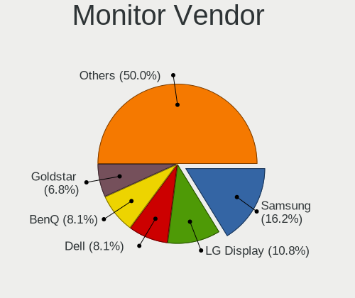

| Vendor                  | Computers | Percent |
|-------------------------|-----------|---------|
| Samsung Electronics     | 50        | 12.05%  |
| LG Display              | 42        | 10.12%  |
| AU Optronics            | 36        | 8.67%   |
| Chimei Innolux          | 33        | 7.95%   |
| Goldstar                | 26        | 6.27%   |
| Dell                    | 25        | 6.02%   |
| Lenovo                  | 24        | 5.78%   |
| BOE                     | 23        | 5.54%   |
| Apple                   | 23        | 5.54%   |
| AOC                     | 16        | 3.86%   |
| BenQ                    | 15        | 3.61%   |
| Acer                    | 13        | 3.13%   |
| Philips                 | 12        | 2.89%   |
| Hewlett-Packard         | 12        | 2.89%   |
| Ancor Communications    | 8         | 1.93%   |
| Sony                    | 5         | 1.2%    |
| Fujitsu Siemens         | 5         | 1.2%    |
| Chi Mei Optoelectronics | 5         | 1.2%    |
| ASUSTek Computer        | 5         | 1.2%    |
| ViewSonic               | 3         | 0.72%   |
| Sharp                   | 3         | 0.72%   |
| PANDA                   | 3         | 0.72%   |
| Iiyama                  | 3         | 0.72%   |
| Vestel Elektronik       | 2         | 0.48%   |
| NEC Computers           | 2         | 0.48%   |
| MSI                     | 2         | 0.48%   |
| LG Philips              | 2         | 0.48%   |
| ZL_                     | 1         | 0.24%   |
| Westinghouse            | 1         | 0.24%   |
| Toshiba                 | 1         | 0.24%   |
| SLD                     | 1         | 0.24%   |
| SGT                     | 1         | 0.24%   |
| RTK                     | 1         | 0.24%   |
| NCS                     | 1         | 0.24%   |
| Medion                  | 1         | 0.24%   |
| LTV                     | 1         | 0.24%   |
| LPL                     | 1         | 0.24%   |
| Lenovo Group Limited    | 1         | 0.24%   |
| LED                     | 1         | 0.24%   |
| InfoVision              | 1         | 0.24%   |

Monitor Model
-------------

Monitor models

| Model                                                                 | Computers | Percent |
|-----------------------------------------------------------------------|-----------|---------|
| Lenovo LCD Monitor LEN4031 1280x800 300x190mm 14.0-inch               | 5         | 1.18%   |
| Chimei Innolux LCD Monitor CMN14C9 1920x1080 310x170mm 13.9-inch      | 4         | 0.94%   |
| Samsung Electronics LCD Monitor SEC5441 1366x768 340x190mm 15.3-inch  | 3         | 0.71%   |
| Chimei Innolux LCD Monitor CMN15BF 1366x768 340x190mm 15.3-inch       | 3         | 0.71%   |
| BOE LCD Monitor BOE0698 1366x768 310x170mm 13.9-inch                  | 3         | 0.71%   |
| BenQ GW2780 BNQ78E6 1920x1080 600x340mm 27.2-inch                     | 3         | 0.71%   |
| AU Optronics LCD Monitor AUO26EC 1366x768 340x190mm 15.3-inch         | 3         | 0.71%   |
| Apple Color LCD APP9C93 1680x1050 430x270mm 20.0-inch                 | 3         | 0.71%   |
| Vestel Elektronik 32W_LCD_TV VES3700 1920x1080 710x400mm 32.1-inch    | 2         | 0.47%   |
| Samsung Electronics U28E590 SAM0C4E 3840x2160 610x350mm 27.7-inch     | 2         | 0.47%   |
| Samsung Electronics SyncMaster SAM0601 1600x900                       | 2         | 0.47%   |
| Samsung Electronics LCD Monitor SEC324C 1600x900 310x170mm 13.9-inch  | 2         | 0.47%   |
| Samsung Electronics LCD Monitor SDC4C48 1920x1080 340x190mm 15.3-inch | 2         | 0.47%   |
| Samsung Electronics C24F390 SAM0D2C 1920x1080 520x290mm 23.4-inch     | 2         | 0.47%   |
| Philips PHL 193V5 PHLC0CD 1366x768 410x230mm 18.5-inch                | 2         | 0.47%   |
| LG Display LCD Monitor LGD0459 1920x1080 380x210mm 17.1-inch          | 2         | 0.47%   |
| LG Display LCD Monitor LGD033A 1366x768 340x190mm 15.3-inch           | 2         | 0.47%   |
| LG Display LCD Monitor LGD02D8 1366x768 280x160mm 12.7-inch           | 2         | 0.47%   |
| LG Display LCD Monitor LGD0250 1366x768 350x190mm 15.7-inch           | 2         | 0.47%   |
| Lenovo LCD Monitor LEN40B0 1366x768 340x190mm 15.3-inch               | 2         | 0.47%   |
| Lenovo LCD Monitor LEN40A0 1366x768 310x170mm 13.9-inch               | 2         | 0.47%   |
| Lenovo LCD Monitor LEN4050 1280x800 330x210mm 15.4-inch               | 2         | 0.47%   |
| Lenovo LCD Monitor LEN4035 1280x800 300x190mm 14.0-inch               | 2         | 0.47%   |
| Lenovo LCD Monitor LEN4000 1024x768 250x180mm 12.1-inch               | 2         | 0.47%   |
| Goldstar LCD Monitor GSM5AB8 1920x1080 480x270mm 21.7-inch            | 2         | 0.47%   |
| Chimei Innolux LCD Monitor CMN1492 1366x768 310x170mm 13.9-inch       | 2         | 0.47%   |
| Chimei Innolux LCD Monitor CMN1490 1366x768 310x170mm 13.9-inch       | 2         | 0.47%   |
| AU Optronics LCD Monitor AUO325C 1366x768 260x140mm 11.6-inch         | 2         | 0.47%   |
| AU Optronics LCD Monitor AUO133D 1920x1080 310x170mm 13.9-inch        | 2         | 0.47%   |
| AU Optronics LCD Monitor AUO106C 1366x768 280x160mm 12.7-inch         | 2         | 0.47%   |
| ASUSTek Computer ROG XG279Q AUS278D 2560x1440 600x340mm 27.2-inch     | 2         | 0.47%   |
| Apple LCD Monitor APP9C5F 1280x800 290x180mm 13.4-inch                | 2         | 0.47%   |
| Apple Color LCD APP9C96 1920x1200 520x320mm 24.0-inch                 | 2         | 0.47%   |
| Apple Color LCD APP9C5E 1280x800 290x190mm 13.6-inch                  | 2         | 0.47%   |
| AOC 24G2W1G4 AOC2402 1920x1080 530x300mm 24.0-inch                    | 2         | 0.47%   |
| AOC 2050W AOC2050 1600x900 430x240mm 19.4-inch                        | 2         | 0.47%   |
| Ancor Communications MX27AQ ACI27A5 2560x1440 600x340mm 27.2-inch     | 2         | 0.47%   |
| Acer S240HL ACR0289 1920x1080 530x300mm 24.0-inch                     | 2         | 0.47%   |
| ZL_ zhuoyue-HDMI ZL_2716 2560x1440 600x330mm 27.0-inch                | 1         | 0.24%   |
| Westinghouse LCM-19w4 WDE1904 1440x900 410x260mm 19.1-inch            | 1         | 0.24%   |

Monitor Resolution
------------------

Monitor screen resolution

| Resolution         | Computers | Percent |
|--------------------|-----------|---------|
| 1920x1080 (FHD)    | 136       | 32.93%  |
| 1366x768 (WXGA)    | 114       | 27.6%   |
| 1280x800 (WXGA)    | 28        | 6.78%   |
| 1600x900 (HD+)     | 23        | 5.57%   |
| 2560x1440 (QHD)    | 20        | 4.84%   |
| 1280x1024 (SXGA)   | 17        | 4.12%   |
| 1680x1050 (WSXGA+) | 15        | 3.63%   |
| 1440x900 (WXGA+)   | 15        | 3.63%   |
| 3840x2160 (4K)     | 13        | 3.15%   |
| 1920x1200 (WUXGA)  | 9         | 2.18%   |
| 1024x768 (XGA)     | 6         | 1.45%   |
| 2560x1080          | 5         | 1.21%   |
| 1920x540           | 3         | 0.73%   |
| 3440x1440          | 2         | 0.48%   |
| 1360x768           | 2         | 0.48%   |
| 1024x600           | 2         | 0.48%   |
| 3200x1800 (QHD+)   | 1         | 0.24%   |
| 2560x1600          | 1         | 0.24%   |
| 1600x1200          | 1         | 0.24%   |

Monitor Diagonal
----------------

Diagonal size in inches

| Inches  | Computers | Percent |
|---------|-----------|---------|
| 15      | 87        | 20.67%  |
| 13      | 65        | 15.44%  |
| 24      | 39        | 9.26%   |
| 27      | 29        | 6.89%   |
| 19      | 27        | 6.41%   |
| 21      | 24        | 5.7%    |
| 23      | 23        | 5.46%   |
| 17      | 21        | 4.99%   |
| 12      | 18        | 4.28%   |
| 14      | 15        | 3.56%   |
| 20      | 10        | 2.38%   |
| 18      | 10        | 2.38%   |
| 31      | 9         | 2.14%   |
| 11      | 9         | 2.14%   |
| Unknown | 8         | 1.9%    |
| 34      | 4         | 0.95%   |
| 22      | 4         | 0.95%   |
| 29      | 3         | 0.71%   |
| 10      | 3         | 0.71%   |
| 42      | 2         | 0.48%   |
| 28      | 2         | 0.48%   |
| 16      | 2         | 0.48%   |
| 64      | 1         | 0.24%   |
| 54      | 1         | 0.24%   |
| 50      | 1         | 0.24%   |
| 40      | 1         | 0.24%   |
| 36      | 1         | 0.24%   |
| 33      | 1         | 0.24%   |
| 32      | 1         | 0.24%   |

Monitor Width
-------------

Physical width

| Width in mm | Computers | Percent |
|-------------|-----------|---------|
| 301-350     | 141       | 33.89%  |
| 501-600     | 85        | 20.43%  |
| 201-300     | 65        | 15.63%  |
| 401-500     | 64        | 15.38%  |
| 351-400     | 24        | 5.77%   |
| 601-700     | 16        | 3.85%   |
| Unknown     | 8         | 1.92%   |
| 701-800     | 7         | 1.68%   |
| 1001-1500   | 3         | 0.72%   |
| 901-1000    | 2         | 0.48%   |
| 801-900     | 1         | 0.24%   |

Aspect Ratio
------------

Proportional relationship between the width and the height

| Ratio   | Computers | Percent |
|---------|-----------|---------|
| 16/9    | 297       | 74.06%  |
| 16/10   | 65        | 16.21%  |
| 5/4     | 15        | 3.74%   |
| 4/3     | 8         | 2%      |
| 3/2     | 7         | 1.75%   |
| 21/9    | 7         | 1.75%   |
| Unknown | 2         | 0.5%    |

Monitor Area
------------

Area in inch²

| Area in inch² | Computers | Percent |
|----------------|-----------|---------|
| 201-250        | 76        | 18.1%   |
| 91-100         | 71        | 16.9%   |
| 81-90          | 69        | 16.43%  |
| 151-200        | 42        | 10%     |
| 301-350        | 30        | 7.14%   |
| 101-110        | 20        | 4.76%   |
| 61-70          | 19        | 4.52%   |
| 351-500        | 17        | 4.05%   |
| 141-150        | 15        | 3.57%   |
| 251-300        | 13        | 3.1%    |
| 121-130        | 11        | 2.62%   |
| 51-60          | 8         | 1.9%    |
| Unknown        | 8         | 1.9%    |
| 71-80          | 7         | 1.67%   |
| 501-1000       | 4         | 0.95%   |
| More than 1000 | 3         | 0.71%   |
| 41-50          | 3         | 0.71%   |
| 131-140        | 3         | 0.71%   |
| 111-120        | 1         | 0.24%   |

Pixel Density
-------------

Pixels per inch

| Density       | Computers | Percent |
|---------------|-----------|---------|
| 51-100        | 161       | 38.7%   |
| 101-120       | 148       | 35.58%  |
| 121-160       | 86        | 20.67%  |
| 161-240       | 9         | 2.16%   |
| Unknown       | 8         | 1.92%   |
| More than 240 | 2         | 0.48%   |
| 1-50          | 2         | 0.48%   |

Multiple Monitors
-----------------

Total monitors connected

| Total | Computers | Percent |
|-------|-----------|---------|
| 1     | 386       | 86.35%  |
| 2     | 33        | 7.38%   |
| 0     | 27        | 6.04%   |
| 3     | 1         | 0.22%   |

Network
-------

Net Controller Vendor
---------------------

Controller vendors

| Vendor                                 | Computers | Percent |
|----------------------------------------|-----------|---------|
| Realtek Semiconductor                  | 223       | 34.36%  |
| Intel                                  | 212       | 32.67%  |
| Qualcomm Atheros                       | 74        | 11.4%   |
| Broadcom                               | 60        | 9.24%   |
| Nvidia                                 | 15        | 2.31%   |
| Marvell Technology Group               | 15        | 2.31%   |
| Ralink                                 | 6         | 0.92%   |
| Ralink Technology                      | 5         | 0.77%   |
| Xiaomi                                 | 4         | 0.62%   |
| Dell                                   | 4         | 0.62%   |
| NetGear                                | 3         | 0.46%   |
| JMicron Technology                     | 3         | 0.46%   |
| Edimax Technology                      | 3         | 0.46%   |
| D-Link System                          | 3         | 0.46%   |
| TP-Link                                | 2         | 0.31%   |
| Sierra Wireless                        | 2         | 0.31%   |
| Ericsson Business Mobile Networks      | 2         | 0.31%   |
| Sony Ericsson Mobile Communications AB | 1         | 0.15%   |
| Silicon Integrated Systems [SiS]       | 1         | 0.15%   |
| Samsung Electronics                    | 1         | 0.15%   |
| OPPO Electronics                       | 1         | 0.15%   |
| OnePlus Technology (Shenzhen)          | 1         | 0.15%   |
| Napatech A/S                           | 1         | 0.15%   |
| Microchip Technology                   | 1         | 0.15%   |
| Mercucys                               | 1         | 0.15%   |
| Mellanox Technologies                  | 1         | 0.15%   |
| MediaTek                               | 1         | 0.15%   |
| Huawei Technologies                    | 1         | 0.15%   |
| Hewlett-Packard                        | 1         | 0.15%   |
| Google                                 | 1         | 0.15%   |

Net Controller Model
--------------------

Controller models

| Model                                                             | Computers | Percent |
|-------------------------------------------------------------------|-----------|---------|
| Realtek RTL8111/8168/8411 PCI Express Gigabit Ethernet Controller | 170       | 21.66%  |
| Realtek RTL810xE PCI Express Fast Ethernet controller             | 32        | 4.08%   |
| Intel 82579LM Gigabit Network Connection (Lewisville)             | 24        | 3.06%   |
| Qualcomm Atheros QCA9565 / AR9565 Wireless Network Adapter        | 22        | 2.8%    |
| Intel I211 Gigabit Network Connection                             | 16        | 2.04%   |
| Intel Ethernet Connection I217-LM                                 | 16        | 2.04%   |
| Nvidia MCP79 Ethernet                                             | 15        | 1.91%   |
| Broadcom BCM4322 802.11a/b/g/n Wireless LAN Controller            | 15        | 1.91%   |
| Intel Wireless 7260                                               | 14        | 1.78%   |
| Intel Centrino Advanced-N 6205 [Taylor Peak]                      | 14        | 1.78%   |
| Intel Wireless 8260                                               | 13        | 1.66%   |
| Intel Wireless 8265 / 8275                                        | 11        | 1.4%    |
| Intel Wi-Fi 6 AX200                                               | 11        | 1.4%    |
| Intel Ethernet Connection (2) I219-LM                             | 11        | 1.4%    |
| Realtek RTL8188EUS 802.11n Wireless Network Adapter               | 9         | 1.15%   |
| Qualcomm Atheros AR9485 Wireless Network Adapter                  | 9         | 1.15%   |
| Qualcomm Atheros AR9285 Wireless Network Adapter (PCI-Express)    | 9         | 1.15%   |
| Intel Wireless 7265                                               | 9         | 1.15%   |
| Qualcomm Atheros QCA9377 802.11ac Wireless Network Adapter        | 8         | 1.02%   |
| Intel Ethernet Connection (7) I219-V                              | 8         | 1.02%   |
| Intel PRO/Wireless 4965 AG or AGN [Kedron] Network Connection     | 7         | 0.89%   |
| Intel Ethernet Connection (2) I219-V                              | 7         | 0.89%   |
| Intel Centrino Advanced-N 6200                                    | 7         | 0.89%   |
| Realtek RTL8821CE 802.11ac PCIe Wireless Network Adapter          | 6         | 0.76%   |
| Realtek RTL8723BE PCIe Wireless Network Adapter                   | 6         | 0.76%   |
| Realtek RTL8188CUS 802.11n WLAN Adapter                           | 6         | 0.76%   |
| Intel PRO/Wireless 3945ABG [Golan] Network Connection             | 6         | 0.76%   |
| Intel Ethernet Connection I219-LM                                 | 6         | 0.76%   |
| Intel Dual Band Wireless-AC 3168NGW [Stone Peak]                  | 6         | 0.76%   |
| Intel 82577LM Gigabit Network Connection                          | 6         | 0.76%   |
| Intel 82574L Gigabit Network Connection                           | 6         | 0.76%   |
| Broadcom BCM4321 802.11a/b/g/n                                    | 6         | 0.76%   |
| Broadcom BCM4313 802.11bgn Wireless Network Adapter               | 6         | 0.76%   |
| Realtek RTL8188CE 802.11b/g/n WiFi Adapter                        | 5         | 0.64%   |
| Qualcomm Atheros AR8151 v2.0 Gigabit Ethernet                     | 5         | 0.64%   |
| Marvell Group 88E8058 PCI-E Gigabit Ethernet Controller           | 5         | 0.64%   |
| Intel WiFi Link 5100                                              | 5         | 0.64%   |
| Intel Dual Band Wireless-AC 3165 Plus Bluetooth                   | 5         | 0.64%   |
| Intel Cannon Lake PCH CNVi WiFi                                   | 5         | 0.64%   |
| Intel 82566MM Gigabit Network Connection                          | 5         | 0.64%   |

Wireless Vendor
---------------

Wireless vendors

| Vendor                | Computers | Percent |
|-----------------------|-----------|---------|
| Intel                 | 146       | 44.51%  |
| Qualcomm Atheros      | 60        | 18.29%  |
| Realtek Semiconductor | 56        | 17.07%  |
| Broadcom              | 42        | 12.8%   |
| Ralink                | 6         | 1.83%   |
| Ralink Technology     | 5         | 1.52%   |
| NetGear               | 3         | 0.91%   |
| Edimax Technology     | 3         | 0.91%   |
| TP-Link               | 2         | 0.61%   |
| Sierra Wireless       | 1         | 0.3%    |
| Mercucys              | 1         | 0.3%    |
| MediaTek              | 1         | 0.3%    |
| Dell                  | 1         | 0.3%    |
| D-Link System         | 1         | 0.3%    |

Wireless Model
--------------

Wireless models

| Model                                                                   | Computers | Percent |
|-------------------------------------------------------------------------|-----------|---------|
| Qualcomm Atheros QCA9565 / AR9565 Wireless Network Adapter              | 22        | 6.57%   |
| Broadcom BCM4322 802.11a/b/g/n Wireless LAN Controller                  | 15        | 4.48%   |
| Intel Wireless 7260                                                     | 14        | 4.18%   |
| Intel Centrino Advanced-N 6205 [Taylor Peak]                            | 14        | 4.18%   |
| Intel Wireless 8260                                                     | 13        | 3.88%   |
| Intel Wireless 8265 / 8275                                              | 11        | 3.28%   |
| Intel Wi-Fi 6 AX200                                                     | 11        | 3.28%   |
| Realtek RTL8188EUS 802.11n Wireless Network Adapter                     | 9         | 2.69%   |
| Qualcomm Atheros AR9485 Wireless Network Adapter                        | 9         | 2.69%   |
| Qualcomm Atheros AR9285 Wireless Network Adapter (PCI-Express)          | 9         | 2.69%   |
| Intel Wireless 7265                                                     | 9         | 2.69%   |
| Qualcomm Atheros QCA9377 802.11ac Wireless Network Adapter              | 8         | 2.39%   |
| Intel PRO/Wireless 4965 AG or AGN [Kedron] Network Connection           | 7         | 2.09%   |
| Intel Centrino Advanced-N 6200                                          | 7         | 2.09%   |
| Realtek RTL8821CE 802.11ac PCIe Wireless Network Adapter                | 6         | 1.79%   |
| Realtek RTL8723BE PCIe Wireless Network Adapter                         | 6         | 1.79%   |
| Realtek RTL8188CUS 802.11n WLAN Adapter                                 | 6         | 1.79%   |
| Intel PRO/Wireless 3945ABG [Golan] Network Connection                   | 6         | 1.79%   |
| Intel Dual Band Wireless-AC 3168NGW [Stone Peak]                        | 6         | 1.79%   |
| Broadcom BCM4321 802.11a/b/g/n                                          | 6         | 1.79%   |
| Broadcom BCM4313 802.11bgn Wireless Network Adapter                     | 6         | 1.79%   |
| Realtek RTL8188CE 802.11b/g/n WiFi Adapter                              | 5         | 1.49%   |
| Intel WiFi Link 5100                                                    | 5         | 1.49%   |
| Intel Dual Band Wireless-AC 3165 Plus Bluetooth                         | 5         | 1.49%   |
| Intel Cannon Lake PCH CNVi WiFi                                         | 5         | 1.49%   |
| Realtek RTL8821AE 802.11ac PCIe Wireless Network Adapter                | 4         | 1.19%   |
| Realtek RTL8723DE Wireless Network Adapter                              | 4         | 1.19%   |
| Realtek Realtek Bluetooth 4.2 Adapter                                   | 4         | 1.19%   |
| Ralink RT3290 Wireless 802.11n 1T/1R PCIe                               | 4         | 1.19%   |
| Intel Comet Lake PCH CNVi WiFi                                          | 4         | 1.19%   |
| Intel Centrino Wireless-N 1000 [Condor Peak]                            | 4         | 1.19%   |
| Broadcom BCM43224 802.11a/b/g/n                                         | 4         | 1.19%   |
| Realtek RTL8822CE 802.11ac PCIe Wireless Network Adapter                | 3         | 0.9%    |
| Realtek RTL8822BE 802.11a/b/g/n/ac WiFi adapter                         | 3         | 0.9%    |
| Ralink RT5370 Wireless Adapter                                          | 3         | 0.9%    |
| Qualcomm Atheros AR928X Wireless Network Adapter (PCI-Express)          | 3         | 0.9%    |
| Qualcomm Atheros AR9287 Wireless Network Adapter (PCI-Express)          | 3         | 0.9%    |
| Qualcomm Atheros AR242x / AR542x Wireless Network Adapter (PCI-Express) | 3         | 0.9%    |
| Intel Wireless-AC 9260                                                  | 3         | 0.9%    |
| Intel Wireless 3165                                                     | 3         | 0.9%    |

Ethernet Vendor
---------------

Ethernet vendors

| Vendor                                 | Computers | Percent |
|----------------------------------------|-----------|---------|
| Realtek Semiconductor                  | 207       | 47.59%  |
| Intel                                  | 143       | 32.87%  |
| Qualcomm Atheros                       | 21        | 4.83%   |
| Broadcom                               | 20        | 4.6%    |
| Nvidia                                 | 15        | 3.45%   |
| Marvell Technology Group               | 15        | 3.45%   |
| Xiaomi                                 | 4         | 0.92%   |
| JMicron Technology                     | 3         | 0.69%   |
| Sony Ericsson Mobile Communications AB | 1         | 0.23%   |
| Silicon Integrated Systems [SiS]       | 1         | 0.23%   |
| Samsung Electronics                    | 1         | 0.23%   |
| OPPO Electronics                       | 1         | 0.23%   |
| OnePlus Technology (Shenzhen)          | 1         | 0.23%   |
| Google                                 | 1         | 0.23%   |
| D-Link System                          | 1         | 0.23%   |

Ethernet Model
--------------

Ethernet models

| Model                                                                         | Computers | Percent |
|-------------------------------------------------------------------------------|-----------|---------|
| Realtek RTL8111/8168/8411 PCI Express Gigabit Ethernet Controller             | 170       | 38.81%  |
| Realtek RTL810xE PCI Express Fast Ethernet controller                         | 32        | 7.31%   |
| Intel 82579LM Gigabit Network Connection (Lewisville)                         | 24        | 5.48%   |
| Intel I211 Gigabit Network Connection                                         | 16        | 3.65%   |
| Intel Ethernet Connection I217-LM                                             | 16        | 3.65%   |
| Nvidia MCP79 Ethernet                                                         | 15        | 3.42%   |
| Intel Ethernet Connection (2) I219-LM                                         | 11        | 2.51%   |
| Intel Ethernet Connection (7) I219-V                                          | 8         | 1.83%   |
| Intel Ethernet Connection (2) I219-V                                          | 7         | 1.6%    |
| Intel Ethernet Connection I219-LM                                             | 6         | 1.37%   |
| Intel 82577LM Gigabit Network Connection                                      | 6         | 1.37%   |
| Intel 82574L Gigabit Network Connection                                       | 6         | 1.37%   |
| Qualcomm Atheros AR8151 v2.0 Gigabit Ethernet                                 | 5         | 1.14%   |
| Marvell Group 88E8058 PCI-E Gigabit Ethernet Controller                       | 5         | 1.14%   |
| Intel 82566MM Gigabit Network Connection                                      | 5         | 1.14%   |
| Intel Ethernet Connection I218-LM                                             | 4         | 0.91%   |
| Intel 82579V Gigabit Network Connection                                       | 4         | 0.91%   |
| Intel 82567LM-3 Gigabit Network Connection                                    | 4         | 0.91%   |
| Xiaomi Mi/Redmi series (RNDIS)                                                | 3         | 0.68%   |
| Realtek RTL-8100/8101L/8139 PCI Fast Ethernet Adapter                         | 3         | 0.68%   |
| Qualcomm Atheros QCA8171 Gigabit Ethernet                                     | 3         | 0.68%   |
| Qualcomm Atheros AR8161 Gigabit Ethernet                                      | 3         | 0.68%   |
| JMicron JMC250 PCI Express Gigabit Ethernet Controller                        | 3         | 0.68%   |
| Intel Ethernet Connection (4) I219-V                                          | 3         | 0.68%   |
| Broadcom NetLink BCM57785 Gigabit Ethernet PCIe                               | 3         | 0.68%   |
| Qualcomm Atheros QCA8172 Fast Ethernet                                        | 2         | 0.46%   |
| Qualcomm Atheros Attansic L2 Fast Ethernet                                    | 2         | 0.46%   |
| Qualcomm Atheros Attansic L1 Gigabit Ethernet                                 | 2         | 0.46%   |
| Marvell Group 88E8071 PCI-E Gigabit Ethernet Controller                       | 2         | 0.46%   |
| Marvell Group 88E8056 PCI-E Gigabit Ethernet Controller                       | 2         | 0.46%   |
| Marvell Group 88E8040 PCI-E Fast Ethernet Controller                          | 2         | 0.46%   |
| Intel I210 Gigabit Network Connection                                         | 2         | 0.46%   |
| Intel Ethernet Connection (6) I219-V                                          | 2         | 0.46%   |
| Intel Ethernet Connection (4) I219-LM                                         | 2         | 0.46%   |
| Intel Ethernet Connection (3) I218-V                                          | 2         | 0.46%   |
| Intel 82571EB/82571GB Gigabit Ethernet Controller D0/D1 (copper applications) | 2         | 0.46%   |
| Intel 82567LM Gigabit Network Connection                                      | 2         | 0.46%   |
| Intel 82566DM-2 Gigabit Network Connection                                    | 2         | 0.46%   |
| Broadcom NetXtreme BCM5761 Gigabit Ethernet PCIe                              | 2         | 0.46%   |
| Broadcom NetXtreme BCM5755M Gigabit Ethernet PCI Express                      | 2         | 0.46%   |

Net Controller Kind
-------------------

Ethernet, WiFi or modem

| Kind     | Computers | Percent |
|----------|-----------|---------|
| Ethernet | 420       | 57.14%  |
| WiFi     | 303       | 41.22%  |
| Unknown  | 8         | 1.09%   |
| Modem    | 4         | 0.54%   |

Used Controller
---------------

Currently used network controller

| Kind     | Computers | Percent |
|----------|-----------|---------|
| Ethernet | 336       | 64.99%  |
| WiFi     | 177       | 34.24%  |
| Unknown  | 3         | 0.58%   |
| Modem    | 1         | 0.19%   |

NICs
----

Total network controllers on board

| Total | Computers | Percent |
|-------|-----------|---------|
| 2     | 264       | 59.33%  |
| 1     | 161       | 36.18%  |
| 3     | 10        | 2.25%   |
| 0     | 6         | 1.35%   |
| 4     | 4         | 0.9%    |

IPv6
----

IPv6 vs IPv4

| Used | Computers | Percent |
|------|-----------|---------|
| No   | 429       | 95.55%  |
| Yes  | 20        | 4.45%   |

Bluetooth
---------

Bluetooth Vendor
----------------

Controller vendors

| Vendor                          | Computers | Percent |
|---------------------------------|-----------|---------|
| Intel                           | 87        | 38.67%  |
| Apple                           | 25        | 11.11%  |
| Realtek Semiconductor           | 20        | 8.89%   |
| Broadcom                        | 19        | 8.44%   |
| Qualcomm Atheros Communications | 18        | 8%      |
| Cambridge Silicon Radio         | 17        | 7.56%   |
| Foxconn / Hon Hai               | 8         | 3.56%   |
| Lite-On Technology              | 7         | 3.11%   |
| IMC Networks                    | 5         | 2.22%   |
| Hewlett-Packard                 | 5         | 2.22%   |
| Ralink                          | 4         | 1.78%   |
| Dell                            | 4         | 1.78%   |
| Integrated System Solution      | 2         | 0.89%   |
| ASUSTek Computer                | 2         | 0.89%   |
| TP-Link                         | 1         | 0.44%   |
| HTC (High Tech Computer)        | 1         | 0.44%   |

Bluetooth Model
---------------

Controller models

| Model                                                       | Computers | Percent |
|-------------------------------------------------------------|-----------|---------|
| Intel Bluetooth wireless interface                          | 45        | 19.82%  |
| Cambridge Silicon Radio Bluetooth Dongle (HCI mode)         | 17        | 7.49%   |
| Intel AX200 Bluetooth                                       | 11        | 4.85%   |
| Intel AX201 Bluetooth                                       | 9         | 3.96%   |
| Apple Built-in Bluetooth 2.0+EDR HCI                        | 9         | 3.96%   |
| Apple Bluetooth Host Controller                             | 9         | 3.96%   |
| Intel Bluetooth 9460/9560 Jefferson Peak (JfP)              | 8         | 3.52%   |
| Broadcom BCM2045B (BDC-2.1)                                 | 8         | 3.52%   |
| Qualcomm Atheros QCA9377 Bluetooth 4.1                      | 6         | 2.64%   |
| Intel Wireless-AC 3168 Bluetooth                            | 6         | 2.64%   |
| Realtek Bluetooth Adapter                                   | 5         | 2.2%    |
| Intel Centrino Bluetooth Wireless Transceiver               | 5         | 2.2%    |
| Broadcom BCM2045B (BDC-2) [Bluetooth Controller]            | 5         | 2.2%    |
| Apple Built-in iSight (no firmware loaded)                  | 5         | 2.2%    |
| Realtek  Bluetooth 4.2 Adapter                              | 4         | 1.76%   |
| Realtek Bluetooth 4.0 Adapter                               | 4         | 1.76%   |
| Ralink RT3290 Bluetooth                                     | 4         | 1.76%   |
| Qualcomm Atheros AR3012 Bluetooth 4.0                       | 4         | 1.76%   |
| Lite-On Atheros AR3012 Bluetooth                            | 4         | 1.76%   |
| Realtek RTL8821A Bluetooth                                  | 3         | 1.32%   |
| Qualcomm Atheros Dell Wireless 1707 Bluetooth 4.0 LE Device | 3         | 1.32%   |
| Intel Wireless-AC 9260 Bluetooth Adapter                    | 3         | 1.32%   |
| HP Bluetooth 2.0 Interface [Broadcom BCM2045]               | 3         | 1.32%   |
| Foxconn / Hon Hai Qualcomm Atheros Bluetooth 4.0            | 3         | 1.32%   |
| Foxconn / Hon Hai Bluetooth USB Module                      | 3         | 1.32%   |
| Broadcom BCM20702 Bluetooth 4.0 [ThinkPad]                  | 3         | 1.32%   |
| Realtek RTL8723B Bluetooth                                  | 2         | 0.88%   |
| Qualcomm Atheros AR9462 Bluetooth                           | 2         | 0.88%   |
| IMC Networks Realtek Bluetooth Adapter                      | 2         | 0.88%   |
| TP-Link Bluetooth 5.0 USB Adapter                           | 1         | 0.44%   |
| Realtek Wireless Bluetooth Adapter                          | 1         | 0.44%   |
| Realtek Bluetooth 4.2 Adapter                               | 1         | 0.44%   |
| Realtek Bluetooth 4.0 + High Speed Chip                     | 1         | 0.44%   |
| Qualcomm Atheros QCA61x4 Bluetooth 4.0                      | 1         | 0.44%   |
| Qualcomm Atheros AR3012 Bluetooth                           | 1         | 0.44%   |
| Qualcomm Atheros AR3011 Bluetooth (no firmware)             | 1         | 0.44%   |
| Lite-On Realtek Bluetooth Adapter                           | 1         | 0.44%   |
| Lite-On Qualcomm Atheros QCA9377 Bluetooth                  | 1         | 0.44%   |
| Lite-On Qualcomm Atheros Bluetooth                          | 1         | 0.44%   |
| Integrated System Solution KY-BT100 Bluetooth Adapter       | 1         | 0.44%   |

Sound
-----

Sound Vendor
------------

Sound card vendors

| Vendor                           | Computers | Percent |
|----------------------------------|-----------|---------|
| Intel                            | 329       | 54.92%  |
| AMD                              | 112       | 18.7%   |
| Nvidia                           | 109       | 18.2%   |
| C-Media Electronics              | 9         | 1.5%    |
| GN Netcom                        | 6         | 1%      |
| Texas Instruments                | 5         | 0.83%   |
| Logitech                         | 3         | 0.5%    |
| JMTek                            | 3         | 0.5%    |
| SteelSeries ApS                  | 2         | 0.33%   |
| Generalplus Technology           | 2         | 0.33%   |
| Focusrite-Novation               | 2         | 0.33%   |
| BEHRINGER International          | 2         | 0.33%   |
| Yamaha                           | 1         | 0.17%   |
| VIA Technologies                 | 1         | 0.17%   |
| Silicon Integrated Systems [SiS] | 1         | 0.17%   |
| Nektar                           | 1         | 0.17%   |
| Lenovo                           | 1         | 0.17%   |
| KORG                             | 1         | 0.17%   |
| Kingston Technology              | 1         | 0.17%   |
| FiiO Electronics Technology      | 1         | 0.17%   |
| DSEA A/S                         | 1         | 0.17%   |
| Creative Technology              | 1         | 0.17%   |
| Creative Labs                    | 1         | 0.17%   |
| Corsair                          | 1         | 0.17%   |
| Cambridge Silicon Radio          | 1         | 0.17%   |
| ASUSTek Computer                 | 1         | 0.17%   |
| Astro Gaming                     | 1         | 0.17%   |

Sound Model
-----------

Sound card models

| Model                                                                                             | Computers | Percent |
|---------------------------------------------------------------------------------------------------|-----------|---------|
| Intel 7 Series/C216 Chipset Family High Definition Audio Controller                               | 43        | 6.13%   |
| Intel 6 Series/C200 Series Chipset Family High Definition Audio Controller                        | 29        | 4.14%   |
| Intel Sunrise Point-LP HD Audio                                                                   | 27        | 3.85%   |
| Intel 8 Series/C220 Series Chipset High Definition Audio Controller                               | 26        | 3.71%   |
| AMD Family 17h/19h HD Audio Controller                                                            | 24        | 3.42%   |
| Intel 100 Series/C230 Series Chipset Family HD Audio Controller                                   | 22        | 3.14%   |
| Intel NM10/ICH7 Family High Definition Audio Controller                                           | 20        | 2.85%   |
| Intel Cannon Lake PCH cAVS                                                                        | 19        | 2.71%   |
| Intel 5 Series/3400 Series Chipset High Definition Audio                                          | 19        | 2.71%   |
| AMD Starship/Matisse HD Audio Controller                                                          | 19        | 2.71%   |
| AMD FCH Azalia Controller                                                                         | 19        | 2.71%   |
| Intel Xeon E3-1200 v3/4th Gen Core Processor HD Audio Controller                                  | 18        | 2.57%   |
| Intel 82801H (ICH8 Family) HD Audio Controller                                                    | 18        | 2.57%   |
| Intel Haswell-ULT HD Audio Controller                                                             | 16        | 2.28%   |
| Intel 82801I (ICH9 Family) HD Audio Controller                                                    | 16        | 2.28%   |
| Intel 8 Series HD Audio Controller                                                                | 16        | 2.28%   |
| Nvidia MCP79 High Definition Audio                                                                | 15        | 2.14%   |
| AMD Raven/Raven2/Fenghuang HDMI/DP Audio Controller                                               | 14        | 2%      |
| Nvidia GP107GL High Definition Audio Controller                                                   | 10        | 1.43%   |
| Intel 200 Series PCH HD Audio                                                                     | 10        | 1.43%   |
| AMD Family 17h (Models 00h-0fh) HD Audio Controller                                               | 10        | 1.43%   |
| AMD Kabini HDMI/DP Audio                                                                          | 9         | 1.28%   |
| AMD Ellesmere HDMI Audio [Radeon RX 470/480 / 570/580/590]                                        | 9         | 1.28%   |
| Nvidia TU107 GeForce GTX 1650 High Definition Audio Controller                                    | 8         | 1.14%   |
| Nvidia GK208 HDMI/DP Audio Controller                                                             | 8         | 1.14%   |
| Intel Broadwell-U Audio Controller                                                                | 8         | 1.14%   |
| Intel 82801JI (ICH10 Family) HD Audio Controller                                                  | 8         | 1.14%   |
| AMD SBx00 Azalia (Intel HDA)                                                                      | 8         | 1.14%   |
| AMD RV710/730 HDMI Audio [Radeon HD 4000 series]                                                  | 8         | 1.14%   |
| Nvidia TU116 High Definition Audio Controller                                                     | 7         | 1%      |
| Intel Wildcat Point-LP High Definition Audio Controller                                           | 7         | 1%      |
| Intel Atom/Celeron/Pentium Processor x5-E8000/J3xxx/N3xxx Series High Definition Audio Controller | 7         | 1%      |
| Intel Atom Processor Z36xxx/Z37xxx Series High Definition Audio Controller                        | 6         | 0.86%   |
| AMD Navi 10 HDMI Audio                                                                            | 6         | 0.86%   |
| Nvidia MCP61 High Definition Audio                                                                | 5         | 0.71%   |
| Nvidia GK107 HDMI Audio Controller                                                                | 5         | 0.71%   |
| Nvidia GF108 High Definition Audio Controller                                                     | 5         | 0.71%   |
| Intel Comet Lake PCH cAVS                                                                         | 5         | 0.71%   |
| AMD Renoir Radeon High Definition Audio Controller                                                | 5         | 0.71%   |
| AMD High Definition Audio Controller                                                              | 5         | 0.71%   |

Memory
------

Memory Vendor
-------------

Memory module vendors

| Vendor                       | Computers | Percent |
|------------------------------|-----------|---------|
| Samsung Electronics          | 88        | 17.25%  |
| Kingston                     | 87        | 17.06%  |
| SK hynix                     | 69        | 13.53%  |
| Unknown                      | 52        | 10.2%   |
| Micron Technology            | 42        | 8.24%   |
| Crucial                      | 24        | 4.71%   |
| Unknown                      | 21        | 4.12%   |
| Corsair                      | 20        | 3.92%   |
| G.Skill                      | 14        | 2.75%   |
| Ramaxel Technology           | 12        | 2.35%   |
| Nanya Technology             | 11        | 2.16%   |
| A-DATA Technology            | 10        | 1.96%   |
| Elpida                       | 8         | 1.57%   |
| Team                         | 6         | 1.18%   |
| Smart                        | 6         | 1.18%   |
| Transcend                    | 4         | 0.78%   |
| Patriot                      | 3         | 0.59%   |
| Avant                        | 3         | 0.59%   |
| Silicon Power                | 2         | 0.39%   |
| Goodram                      | 2         | 0.39%   |
| Atermiter                    | 2         | 0.39%   |
| ASint Technology             | 2         | 0.39%   |
| AMD                          | 2         | 0.39%   |
| 48spaces                     | 2         | 0.39%   |
| Unknown (D386)               | 1         | 0.2%    |
| Unknown (ABCD)               | 1         | 0.2%    |
| Unknown (8AFD)               | 1         | 0.2%    |
| Unknown (0x3D7F000000000000) | 1         | 0.2%    |
| Unknown (0x0809)             | 1         | 0.2%    |
| Unifosa                      | 1         | 0.2%    |
| TakeMS                       | 1         | 0.2%    |
| Super Talent                 | 1         | 0.2%    |
| Strontium                    | 1         | 0.2%    |
| Smart Brazil                 | 1         | 0.2%    |
| Sesame                       | 1         | 0.2%    |
| PNY                          | 1         | 0.2%    |
| Kllisre                      | 1         | 0.2%    |
| Kingmax                      | 1         | 0.2%    |
| Hikvision                    | 1         | 0.2%    |
| High Bridge                  | 1         | 0.2%    |

Memory Model
------------

Memory module models

| Model                                                   | Computers | Percent |
|---------------------------------------------------------|-----------|---------|
| Unknown                                                 | 21        | 3.8%    |
| Unknown RAM Module 2GB SODIMM DDR2 667MT/s              | 9         | 1.63%   |
| SK hynix RAM HMT451S6BFR8A-PB 4GB SODIMM DDR3 1600MT/s  | 6         | 1.08%   |
| SK hynix RAM HMT351S6CFR8C-PB 4GB SODIMM DDR3 1600MT/s  | 5         | 0.9%    |
| Samsung RAM M471B5773DH0-CH9 2GB SODIMM DDR3 1334MT/s   | 5         | 0.9%    |
| Samsung RAM M471B5273CH0-CH9 4GB SODIMM DDR3 1334MT/s   | 5         | 0.9%    |
| Kingston RAM KHX3200C16D4/8GX 8GB DIMM DDR4 3200MT/s    | 5         | 0.9%    |
| Unknown RAM Module 1GB SODIMM DDR2 667MT/s              | 4         | 0.72%   |
| Samsung RAM M471B5273DH0-CH9 4GB SODIMM DDR3 1334MT/s   | 4         | 0.72%   |
| Samsung RAM M471B5173EB0-YK0 4GB SODIMM DDR3 1600MT/s   | 4         | 0.72%   |
| Samsung RAM M471B5173DB0-YK0 4GB SODIMM DDR3 1600MT/s   | 4         | 0.72%   |
| Samsung RAM M471A5244CB0-CTD 4GB SODIMM DDR4 2667MT/s   | 4         | 0.72%   |
| Samsung RAM M471A1K43CB1-CRC 8GB SODIMM DDR4 2400MT/s   | 4         | 0.72%   |
| Micron RAM 8KTF51264HZ-1G6E1 4GB SODIMM DDR3 1600MT/s   | 4         | 0.72%   |
| Unknown RAM Module 4GB DIMM DDR3 1333MT/s               | 3         | 0.54%   |
| Unknown RAM Module 2GB DIMM DDR2                        | 3         | 0.54%   |
| Team RAM TEAMGROUP-UD4-3200 32GB DIMM DDR4 3200MT/s     | 3         | 0.54%   |
| SK hynix RAM Module 2GB SODIMM DDR3 1067MT/s            | 3         | 0.54%   |
| SK hynix RAM HYMP125S64CP8-S6 2GB SODIMM DDR2 975MT/s   | 3         | 0.54%   |
| SK hynix RAM HMT41GS6BFR8A-PB 8GB SODIMM DDR3 1600MT/s  | 3         | 0.54%   |
| SK hynix RAM HMA81GS6JJR8N-VK 8GB SODIMM DDR4 2667MT/s  | 3         | 0.54%   |
| Samsung RAM Module 4GB SODIMM DDR4 2133MT/s             | 3         | 0.54%   |
| Samsung RAM M471B5773CHS-CH9 2GB SODIMM 1333MT/s        | 3         | 0.54%   |
| Samsung RAM M471B5173QH0-YK0 4GB SODIMM DDR3 1600MT/s   | 3         | 0.54%   |
| Samsung RAM M471B1G73QH0-YK0 8GB SODIMM DDR3 1867MT/s   | 3         | 0.54%   |
| Samsung RAM M471B1G73EB0-YK0 8GB SODIMM DDR3 1600MT/s   | 3         | 0.54%   |
| Samsung RAM M378B5173QH0-CK0 4GB DIMM DDR3 1600MT/s     | 3         | 0.54%   |
| Ramaxel RAM RMT3170EB68F9W1600 4GB SODIMM DDR3 1600MT/s | 3         | 0.54%   |
| Micron RAM 18KSF51272AZ-1G4M1 4GB DIMM DDR3 1333MT/s    | 3         | 0.54%   |
| Micron RAM 16KTF51264HZ-1G6M1 4GB SODIMM DDR3 1600MT/s  | 3         | 0.54%   |
| Kingston RAM KF3200C16D4/8GX 8GB DIMM DDR4 3200MT/s     | 3         | 0.54%   |
| Crucial RAM CT102464BF160B.M16 8GB SODIMM DDR3 1600MT/s | 3         | 0.54%   |
| Corsair RAM CMK16GX4M2B3200C16 8GB DIMM DDR4 3200MT/s   | 3         | 0.54%   |
| Unknown RAM Module 8GB SODIMM DDR3 1600MT/s             | 2         | 0.36%   |
| Unknown RAM Module 4GB SODIMM DDR3                      | 2         | 0.36%   |
| Unknown RAM Module 4GB DIMM 1333MT/s                    | 2         | 0.36%   |
| Unknown RAM Module 2GB SODIMM DDR2                      | 2         | 0.36%   |
| Unknown RAM Module 2GB DIMM DDR2 667MT/s                | 2         | 0.36%   |
| Unknown RAM Module 2GB DIMM 800MT/s                     | 2         | 0.36%   |
| Unknown RAM Module 2GB DIMM 400MT/s                     | 2         | 0.36%   |

Memory Kind
-----------

Memory module kinds

| Kind    | Computers | Percent |
|---------|-----------|---------|
| DDR3    | 208       | 47.38%  |
| DDR4    | 148       | 33.71%  |
| DDR2    | 49        | 11.16%  |
| Unknown | 16        | 3.64%   |
| SDRAM   | 8         | 1.82%   |
| LPDDR4  | 3         | 0.68%   |
| LPDDR3  | 3         | 0.68%   |
| DDR     | 3         | 0.68%   |
| DRAM    | 1         | 0.23%   |

Memory Form Factor
------------------

Physical design of the memory module

| Name         | Computers | Percent |
|--------------|-----------|---------|
| SODIMM       | 249       | 57.24%  |
| DIMM         | 177       | 40.69%  |
| Row Of Chips | 4         | 0.92%   |
| Chip         | 3         | 0.69%   |
| RIMM         | 2         | 0.46%   |

Memory Size
-----------

Memory module size

| Size  | Computers | Percent |
|-------|-----------|---------|
| 4096  | 161       | 33.13%  |
| 8192  | 142       | 29.22%  |
| 2048  | 106       | 21.81%  |
| 16384 | 44        | 9.05%   |
| 1024  | 24        | 4.94%   |
| 32768 | 7         | 1.44%   |
| 512   | 2         | 0.41%   |

Memory Speed
------------

Memory module speed

| Speed   | Computers | Percent |
|---------|-----------|---------|
| 1600    | 120       | 25.32%  |
| 1333    | 55        | 11.6%   |
| 3200    | 39        | 8.23%   |
| 2667    | 38        | 8.02%   |
| 2133    | 36        | 7.59%   |
| 2400    | 31        | 6.54%   |
| 667     | 31        | 6.54%   |
| 1067    | 25        | 5.27%   |
| 1334    | 18        | 3.8%    |
| 800     | 18        | 3.8%    |
| Unknown | 15        | 3.16%   |
| 2666    | 10        | 2.11%   |
| 1867    | 10        | 2.11%   |
| 1066    | 7         | 1.48%   |
| 3600    | 4         | 0.84%   |
| 975     | 3         | 0.63%   |
| 400     | 3         | 0.63%   |
| 1866    | 2         | 0.42%   |
| 533     | 2         | 0.42%   |
| 333     | 2         | 0.42%   |
| 4267    | 1         | 0.21%   |
| 3733    | 1         | 0.21%   |
| 3400    | 1         | 0.21%   |
| 2048    | 1         | 0.21%   |
| 1200    | 1         | 0.21%   |

Printers & scanners
-------------------

Printer Vendor
--------------

Printer device vendors

| Vendor              | Computers | Percent |
|---------------------|-----------|---------|
| Brother Industries  | 2         | 50%     |
| Prolific Technology | 1         | 25%     |
| Hewlett-Packard     | 1         | 25%     |

Printer Model
-------------

Printer device models

| Model                                                                                                             | Computers | Percent |
|-------------------------------------------------------------------------------------------------------------------|-----------|---------|
| Prolific PL2305 Parallel Port                                                                                     | 1         | 25%     |
| HP HP LaserJet MFP E52645 LaserJet 0 LaserJet 0 LaserJet 1 LaserJet 1 LaserJet 2 LaserJet 2 LaserJet 3 LaserJet 3 | 1         | 25%     |
| Brother MFC-L2685DW                                                                                               | 1         | 25%     |
| Brother HL-1430 Laser Printer                                                                                     | 1         | 25%     |

Scanner Vendor
--------------

Scanner device vendors

| Vendor | Computers | Percent |
|--------|-----------|---------|
| Canon  | 1         | 100%    |

Scanner Model
-------------

Scanner device models

| Model                   | Computers | Percent |
|-------------------------|-----------|---------|
| Canon CanoScan LiDE 100 | 1         | 100%    |

Camera
------

Camera Vendor
-------------

Camera device vendors

| Vendor                                 | Computers | Percent |
|----------------------------------------|-----------|---------|
| Chicony Electronics                    | 49        | 26.34%  |
| Realtek Semiconductor                  | 15        | 8.06%   |
| Microdia                               | 14        | 7.53%   |
| IMC Networks                           | 14        | 7.53%   |
| Bison Electronics                      | 14        | 7.53%   |
| Logitech                               | 11        | 5.91%   |
| Quanta                                 | 9         | 4.84%   |
| Syntek                                 | 7         | 3.76%   |
| Suyin                                  | 7         | 3.76%   |
| Sunplus Innovation Technology          | 7         | 3.76%   |
| Lite-On Technology                     | 7         | 3.76%   |
| Z-Star Microelectronics                | 4         | 2.15%   |
| Alcor Micro                            | 4         | 2.15%   |
| Lenovo                                 | 3         | 1.61%   |
| Cheng Uei Precision Industry (Foxlink) | 3         | 1.61%   |
| Arkmicro Technologies                  | 2         | 1.08%   |
| Apple                                  | 2         | 1.08%   |
| ALi                                    | 2         | 1.08%   |
| USB Camera                             | 1         | 0.54%   |
| Silicon Motion                         | 1         | 0.54%   |
| Ricoh                                  | 1         | 0.54%   |
| Primax Electronics                     | 1         | 0.54%   |
| Luxvisions Innotech Limited            | 1         | 0.54%   |
| Importek                               | 1         | 0.54%   |
| Hewlett-Packard                        | 1         | 0.54%   |
| Genesys Logic                          | 1         | 0.54%   |
| DigiTech                               | 1         | 0.54%   |
| Creative Technology                    | 1         | 0.54%   |
| Aveo Technology                        | 1         | 0.54%   |
| ARC International                      | 1         | 0.54%   |

Camera Model
------------

Camera device models

| Model                                     | Computers | Percent |
|-------------------------------------------|-----------|---------|
| Chicony HD Webcam                         | 8         | 4.28%   |
| Chicony Integrated Camera                 | 6         | 3.21%   |
| Chicony Lenovo Integrated Camera (0.3MP)  | 5         | 2.67%   |
| Syntek Lenovo EasyCamera                  | 4         | 2.14%   |
| Realtek USB Camera                        | 4         | 2.14%   |
| Realtek Integrated_Webcam_HD              | 4         | 2.14%   |
| Lite-On Integrated Camera                 | 4         | 2.14%   |
| Bison Lenovo EasyCamera                   | 4         | 2.14%   |
| Realtek USB 2.0 PC Camera                 | 3         | 1.6%    |
| Quanta HP TrueVision HD Camera            | 3         | 1.6%    |
| Microdia Integrated_Webcam_HD             | 3         | 1.6%    |
| Microdia Integrated Webcam                | 3         | 1.6%    |
| Logitech Webcam C270                      | 3         | 1.6%    |
| IMC Networks Realtek PC Camera            | 3         | 1.6%    |
| IMC Networks Integrated Camera            | 3         | 1.6%    |
| IMC Networks EasyCamera                   | 3         | 1.6%    |
| Chicony Realtek DMFT RGB                  | 3         | 1.6%    |
| Chicony HD WebCam (Acer)                  | 3         | 1.6%    |
| Chicony EasyCamera                        | 3         | 1.6%    |
| Bison Integrated Camera                   | 3         | 1.6%    |
| Z-Star WebCam SC-03FFL11739P              | 2         | 1.07%   |
| Syntek EasyCamera                         | 2         | 1.07%   |
| Suyin Integrated_Webcam_HD                | 2         | 1.07%   |
| Suyin HD Video WebCam                     | 2         | 1.07%   |
| Sunplus HD WebCam                         | 2         | 1.07%   |
| Quanta Realtek DMFT RGB                   | 2         | 1.07%   |
| Quanta HP Webcam                          | 2         | 1.07%   |
| Microdia Sonix USB 2.0 Camera             | 2         | 1.07%   |
| Microdia Dell Laptop Integrated Webcam HD | 2         | 1.07%   |
| Lite-On HP HD Camera                      | 2         | 1.07%   |
| Lenovo Integrated Webcam [R5U877]         | 2         | 1.07%   |
| IMC Networks Integrated Webcam            | 2         | 1.07%   |
| Chicony VGA Webcam                        | 2         | 1.07%   |
| Chicony USB 2.0 Camera                    | 2         | 1.07%   |
| Chicony HP HD Webcam [Fixed]              | 2         | 1.07%   |
| Bison SunplusIT INC. Integrated Camera    | 2         | 1.07%   |
| Arkmicro USB 2.0 PC CAMERA                | 2         | 1.07%   |
| Apple FaceTime HD Camera (Built-in)       | 2         | 1.07%   |
| ALi Gateway Webcam                        | 2         | 1.07%   |
| Z-Star Webcam                             | 1         | 0.53%   |

Security
--------

Fingerprint Vendor
------------------

Fingerprint sensor vendors

| Vendor                     | Computers | Percent |
|----------------------------|-----------|---------|
| Validity Sensors           | 19        | 40.43%  |
| Upek                       | 11        | 23.4%   |
| AuthenTec                  | 8         | 17.02%  |
| STMicroelectronics         | 4         | 8.51%   |
| Shenzhen Goodix Technology | 2         | 4.26%   |
| LighTuning Technology      | 2         | 4.26%   |
| Synaptics                  | 1         | 2.13%   |

Fingerprint Model
-----------------

Fingerprint sensor models

| Model                                                  | Computers | Percent |
|--------------------------------------------------------|-----------|---------|
| Upek Biometric Touchchip/Touchstrip Fingerprint Sensor | 9         | 19.15%  |
| STMicroelectronics Fingerprint Reader                  | 4         | 8.51%   |
| Validity Sensors VFS5011 Fingerprint Reader            | 3         | 6.38%   |
| Validity Sensors VFS491                                | 3         | 6.38%   |
| Validity Sensors VFS 5011 fingerprint sensor           | 3         | 6.38%   |
| AuthenTec AES1600                                      | 3         | 6.38%   |
| Validity Sensors VFS495 Fingerprint Reader             | 2         | 4.26%   |
| Validity Sensors VFS471 Fingerprint Reader             | 2         | 4.26%   |
| Validity Sensors Synaptics WBDI                        | 2         | 4.26%   |
| Validity Sensors Fingerprint scanner                   | 2         | 4.26%   |
| Upek TCS5B Fingerprint sensor                          | 2         | 4.26%   |
| Shenzhen Goodix Fingerprint Reader                     | 2         | 4.26%   |
| AuthenTec AES2501 Fingerprint Sensor                   | 2         | 4.26%   |
| Validity Sensors VFS101 Fingerprint Reader             | 1         | 2.13%   |
| Validity Sensors Swipe Fingerprint Sensor              | 1         | 2.13%   |
| Synaptics Metallica MOH Touch Fingerprint Reader       | 1         | 2.13%   |
| LighTuning ES603 Swipe Fingerprint Sensor              | 1         | 2.13%   |
| LighTuning EgisTec Touch Fingerprint Sensor            | 1         | 2.13%   |
| AuthenTec AES2810                                      | 1         | 2.13%   |
| AuthenTec AES1660 Fingerprint Sensor                   | 1         | 2.13%   |
| AuthenTec AES1660                                      | 1         | 2.13%   |

Chipcard Vendor
---------------

Chipcard module vendors

Zero info for selected period =(

Chipcard Model
--------------

Chipcard module models

Zero info for selected period =(

Unsupported
-----------

Unsupported Devices
-------------------

Total unsupported devices on board

| Total | Computers | Percent |
|-------|-----------|---------|
| 1     | 169       | 37.72%  |
| 0     | 130       | 29.02%  |
| 2     | 99        | 22.1%   |
| 3     | 37        | 8.26%   |
| 4     | 12        | 2.68%   |
| 5     | 1         | 0.22%   |

Unsupported Device Types
------------------------

Types of unsupported devices

| Type                     | Computers | Percent |
|--------------------------|-----------|---------|
| Communication controller | 251       | 50.81%  |
| Net/wireless             | 87        | 17.61%  |
| Bluetooth                | 50        | 10.12%  |
| Fingerprint reader       | 45        | 9.11%   |
| Card reader              | 39        | 7.89%   |
| Sound                    | 8         | 1.62%   |
| Network                  | 7         | 1.42%   |
| Storage                  | 4         | 0.81%   |
| Storage/nvme             | 1         | 0.2%    |
| Net/ethernet             | 1         | 0.2%    |
| Dvb card                 | 1         | 0.2%    |

