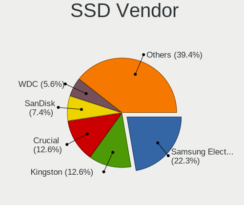
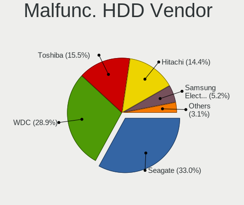
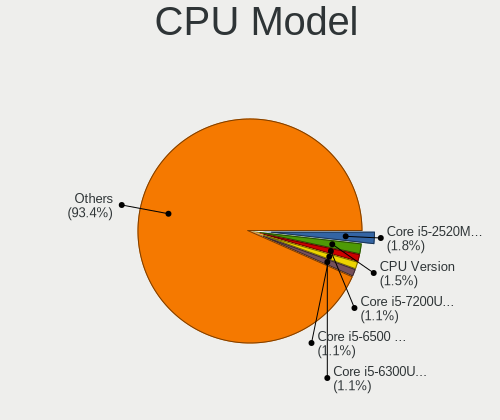
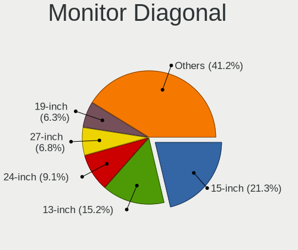
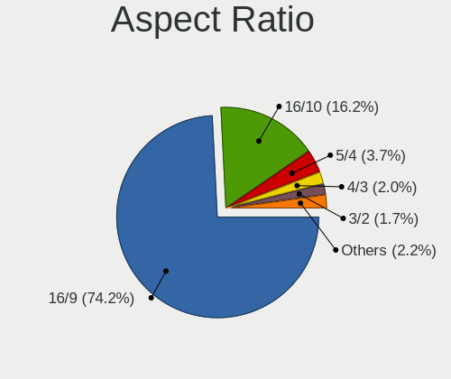
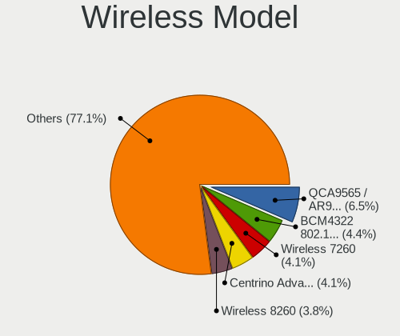
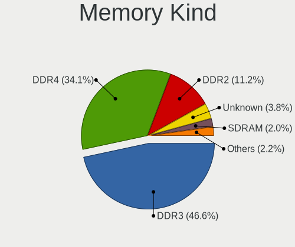

helloSystem 0.7.0 - Tested Hardware & Statistics
------------------------------------------------

A project to collect tested hardware configurations for helloSystem 0.7.0.

Anyone can contribute to this report by the [hw-probe](https://github.com/linuxhw/hw-probe/blob/master/INSTALL.BSD.md) tool:

    hw-probe -all -upload

Please submit a probe of your configuration if it's not presented on the page or is rare.

This is a report for all computer types. See also reports for [desktops](/Dist/helloSystem_0.7.0/Desktop/README.md) and [notebooks](/Dist/helloSystem_0.7.0/Notebook/README.md).

Full-feature report is available here: https://bsd-hardware.info/?view=trends

Contents
--------

* [ Test Cases ](#test-cases)

* [ System ](#system)
  - [ Arch                     ](#arch)
  - [ DE                       ](#de)
  - [ Display Server           ](#display-server)
  - [ Display Manager          ](#display-manager)
  - [ OS Lang                  ](#os-lang)
  - [ Boot Mode                ](#boot-mode)
  - [ Filesystem               ](#filesystem)
  - [ Part. scheme             ](#part-scheme)

* [ Board ](#board)
  - [ Vendor                   ](#vendor)
  - [ Model                    ](#model)
  - [ Model Family             ](#model-family)
  - [ MFG Year                 ](#mfg-year)
  - [ Form Factor              ](#form-factor)
  - [ Coreboot                 ](#coreboot)
  - [ RAM Size                 ](#ram-size)
  - [ RAM Used                 ](#ram-used)
  - [ Total Drives             ](#total-drives)
  - [ Has CD-ROM               ](#has-cd-rom)
  - [ Has Ethernet             ](#has-ethernet)
  - [ Has WiFi                 ](#has-wifi)
  - [ Has Bluetooth            ](#has-bluetooth)

* [ Location ](#location)
  - [ Country                  ](#country)
  - [ City                     ](#city)

* [ Drives ](#drives)
  - [ Drive Vendor             ](#drive-vendor)
  - [ Drive Model              ](#drive-model)
  - [ HDD Vendor               ](#hdd-vendor)
  - [ SSD Vendor               ](#ssd-vendor)
  - [ Drive Kind               ](#drive-kind)
  - [ Drive Connector          ](#drive-connector)
  - [ Drive Size               ](#drive-size)
  - [ Space Total              ](#space-total)
  - [ Space Used               ](#space-used)
  - [ Malfunc. Drives          ](#malfunc-drives)
  - [ Malfunc. Drive Vendor    ](#malfunc-drive-vendor)
  - [ Malfunc. HDD Vendor      ](#malfunc-hdd-vendor)
  - [ Malfunc. Drive Kind      ](#malfunc-drive-kind)
  - [ Failed Drives            ](#failed-drives)
  - [ Failed Drive Vendor      ](#failed-drive-vendor)
  - [ Drive Status             ](#drive-status)

* [ Storage controller ](#storage-controller)
  - [ Storage Vendor           ](#storage-vendor)
  - [ Storage Model            ](#storage-model)
  - [ Storage Kind             ](#storage-kind)

* [ Processor ](#processor)
  - [ CPU Vendor               ](#cpu-vendor)
  - [ CPU Model                ](#cpu-model)
  - [ CPU Model Family         ](#cpu-model-family)
  - [ CPU Cores                ](#cpu-cores)
  - [ CPU Sockets              ](#cpu-sockets)
  - [ CPU Threads              ](#cpu-threads)
  - [ CPU Microarch            ](#cpu-microarch)

* [ Graphics ](#graphics)
  - [ GPU Vendor               ](#gpu-vendor)
  - [ GPU Model                ](#gpu-model)
  - [ GPU Combo                ](#gpu-combo)
  - [ GPU Driver               ](#gpu-driver)
  - [ GPU Memory               ](#gpu-memory)

* [ Monitor ](#monitor)
  - [ Monitor Vendor           ](#monitor-vendor)
  - [ Monitor Model            ](#monitor-model)
  - [ Monitor Resolution       ](#monitor-resolution)
  - [ Monitor Diagonal         ](#monitor-diagonal)
  - [ Monitor Width            ](#monitor-width)
  - [ Aspect Ratio             ](#aspect-ratio)
  - [ Monitor Area             ](#monitor-area)
  - [ Pixel Density            ](#pixel-density)
  - [ Multiple Monitors        ](#multiple-monitors)

* [ Network ](#network)
  - [ Net Controller Vendor    ](#net-controller-vendor)
  - [ Net Controller Model     ](#net-controller-model)
  - [ Wireless Vendor          ](#wireless-vendor)
  - [ Wireless Model           ](#wireless-model)
  - [ Ethernet Vendor          ](#ethernet-vendor)
  - [ Ethernet Model           ](#ethernet-model)
  - [ Net Controller Kind      ](#net-controller-kind)
  - [ Used Controller          ](#used-controller)
  - [ NICs                     ](#nics)
  - [ IPv6                     ](#ipv6)

* [ Bluetooth ](#bluetooth)
  - [ Bluetooth Vendor         ](#bluetooth-vendor)
  - [ Bluetooth Model          ](#bluetooth-model)

* [ Sound ](#sound)
  - [ Sound Vendor             ](#sound-vendor)
  - [ Sound Model              ](#sound-model)

* [ Memory ](#memory)
  - [ Memory Vendor            ](#memory-vendor)
  - [ Memory Model             ](#memory-model)
  - [ Memory Kind              ](#memory-kind)
  - [ Memory Form Factor       ](#memory-form-factor)
  - [ Memory Size              ](#memory-size)
  - [ Memory Speed             ](#memory-speed)

* [ Printers & scanners ](#printers--scanners)
  - [ Printer Vendor           ](#printer-vendor)
  - [ Printer Model            ](#printer-model)
  - [ Scanner Vendor           ](#scanner-vendor)
  - [ Scanner Model            ](#scanner-model)

* [ Camera ](#camera)
  - [ Camera Vendor            ](#camera-vendor)
  - [ Camera Model             ](#camera-model)

* [ Security ](#security)
  - [ Fingerprint Vendor       ](#fingerprint-vendor)
  - [ Fingerprint Model        ](#fingerprint-model)
  - [ Chipcard Vendor          ](#chipcard-vendor)
  - [ Chipcard Model           ](#chipcard-model)

* [ Unsupported ](#unsupported)
  - [ Unsupported Devices      ](#unsupported-devices)
  - [ Unsupported Device Types ](#unsupported-device-types)

Test Cases
----------

| Vendor        | Model                       | Form-Factor | Probe                                                     | Date         |
|---------------|-----------------------------|-------------|-----------------------------------------------------------|--------------|
| ASUSTek       | P5P43TD PRO                 | Desktop     | [5999e0ebfb](https://bsd-hardware.info/?probe=5999e0ebfb) | Jan 31, 2022 |
| Lenovo        | ThinkPad T510 4384AJ6       | Notebook    | [70a56029e7](https://bsd-hardware.info/?probe=70a56029e7) | Jan 31, 2022 |
| Intel         | H81                         | Desktop     | [c2f3025900](https://bsd-hardware.info/?probe=c2f3025900) | Jan 31, 2022 |
| HP            | Laptop 15-rb0xx             | Notebook    | [8e9a6cff62](https://bsd-hardware.info/?probe=8e9a6cff62) | Jan 31, 2022 |
| Pegatron      | 2A99h                       | Desktop     | [e34b6118a2](https://bsd-hardware.info/?probe=e34b6118a2) | Jan 30, 2022 |
| Fujitsu       | D3161-A1 S26361-D3161-A1    | Desktop     | [58ea01e4e6](https://bsd-hardware.info/?probe=58ea01e4e6) | Jan 29, 2022 |
| Apple         | MacBook4,1                  | Notebook    | [e89404ebed](https://bsd-hardware.info/?probe=e89404ebed) | Jan 29, 2022 |
| Samsung       | N150P/N210P/N220P           | Notebook    | [901a483718](https://bsd-hardware.info/?probe=901a483718) | Jan 29, 2022 |
| Intel         | DH77EB AAG39073-400         | Desktop     | [bfe6ef301b](https://bsd-hardware.info/?probe=bfe6ef301b) | Jan 29, 2022 |
| Apple         | MacBook5,2                  | Notebook    | [ee6e794728](https://bsd-hardware.info/?probe=ee6e794728) | Jan 29, 2022 |
| Acer          | Aspire 5930                 | Notebook    | [754db09c98](https://bsd-hardware.info/?probe=754db09c98) | Jan 28, 2022 |
| ASUSTek       | ASUS TUF Gaming A15 FA50... | Notebook    | [11bbfce5d4](https://bsd-hardware.info/?probe=11bbfce5d4) | Jan 27, 2022 |
| ASUSTek       | P5GC-MX                     | Desktop     | [372749f9d7](https://bsd-hardware.info/?probe=372749f9d7) | Jan 27, 2022 |
| Unknown       | Unknown                     | Desktop     | [a9d799ca71](https://bsd-hardware.info/?probe=a9d799ca71) | Jan 27, 2022 |
| Dell          | Latitude 7280               | Notebook    | [089b61bb38](https://bsd-hardware.info/?probe=089b61bb38) | Jan 27, 2022 |
| ASUSTek       | P5B SE                      | Desktop     | [f97fba19c1](https://bsd-hardware.info/?probe=f97fba19c1) | Jan 26, 2022 |
| Apple         | Mac-DB15BD556843C820 iMa... | All in one  | [2506316700](https://bsd-hardware.info/?probe=2506316700) | Jan 26, 2022 |
| Lenovo        | IdeaPad L340-17IRH Gamin... | Notebook    | [b1d702812e](https://bsd-hardware.info/?probe=b1d702812e) | Jan 26, 2022 |
| Fujitsu       | D3161-A1 S26361-D3161-A1    | Desktop     | [9f0a000ceb](https://bsd-hardware.info/?probe=9f0a000ceb) | Jan 25, 2022 |
| MSI           | GE75 Raider 10SFS           | Notebook    | [306f312c47](https://bsd-hardware.info/?probe=306f312c47) | Jan 25, 2022 |
| ASUSTek       | P5B SE                      | Desktop     | [e3332e7b94](https://bsd-hardware.info/?probe=e3332e7b94) | Jan 25, 2022 |
| ASRock        | B460M Pro4                  | Desktop     | [107a1e59f5](https://bsd-hardware.info/?probe=107a1e59f5) | Jan 25, 2022 |
| ASRock        | A300M-STX                   | Desktop     | [8edf072b67](https://bsd-hardware.info/?probe=8edf072b67) | Jan 25, 2022 |
| ASUSTek       | BM6835_BM6635_BP6335        | Desktop     | [73562aa169](https://bsd-hardware.info/?probe=73562aa169) | Jan 25, 2022 |
| ASUSTek       | P8H61-M LX3 PLUS R2.0       | Desktop     | [df08e2e8f0](https://bsd-hardware.info/?probe=df08e2e8f0) | Jan 24, 2022 |
| HP            | Laptop 15-bw0xx             | Notebook    | [1c8f50f7eb](https://bsd-hardware.info/?probe=1c8f50f7eb) | Jan 24, 2022 |
| ASUSTek       | P7H55-M                     | Desktop     | [fb73c2f7dc](https://bsd-hardware.info/?probe=fb73c2f7dc) | Jan 23, 2022 |
| HP            | 1998                        | Desktop     | [b59dbcdc9c](https://bsd-hardware.info/?probe=b59dbcdc9c) | Jan 23, 2022 |
| HP            | Pavilion Gaming Laptop 1... | Notebook    | [7859f220b9](https://bsd-hardware.info/?probe=7859f220b9) | Jan 22, 2022 |
| Acer          | Aspire ES1-311              | Notebook    | [83addddaa5](https://bsd-hardware.info/?probe=83addddaa5) | Jan 22, 2022 |
| Dell          | Latitude E6540              | Notebook    | [529768f8c8](https://bsd-hardware.info/?probe=529768f8c8) | Jan 21, 2022 |
| ASUSTek       | ROG STRIX B450-F GAMING     | Desktop     | [670e41ed41](https://bsd-hardware.info/?probe=670e41ed41) | Jan 21, 2022 |
| MSI           | PRO Z690-A WIFI DDR4        | Desktop     | [04abd226f3](https://bsd-hardware.info/?probe=04abd226f3) | Jan 21, 2022 |
| HP            | EliteBook 2560p             | Notebook    | [4d04ececbb](https://bsd-hardware.info/?probe=4d04ececbb) | Jan 19, 2022 |
| ASUSTek       | Maximus VIII HERO           | Desktop     | [a780a7bab2](https://bsd-hardware.info/?probe=a780a7bab2) | Jan 18, 2022 |
| Lenovo        | Legion Y540-15IRH 81SX      | Notebook    | [384d2f888b](https://bsd-hardware.info/?probe=384d2f888b) | Jan 18, 2022 |
| Acer          | V5-131                      | Notebook    | [ff427cb0c9](https://bsd-hardware.info/?probe=ff427cb0c9) | Jan 18, 2022 |
| Gateway       | NE56R                       | Notebook    | [a5aa8aa49a](https://bsd-hardware.info/?probe=a5aa8aa49a) | Jan 18, 2022 |
| ASUSTek       | TUF GAMING X570-PLUS        | Desktop     | [9cd2758a5f](https://bsd-hardware.info/?probe=9cd2758a5f) | Jan 18, 2022 |
| Lenovo        | ThinkPad T410 2522E38       | Notebook    | [2dbb2679f1](https://bsd-hardware.info/?probe=2dbb2679f1) | Jan 17, 2022 |
| Dell          | Latitude E5430 non-vPro     | Notebook    | [e795c7ec91](https://bsd-hardware.info/?probe=e795c7ec91) | Jan 17, 2022 |
| Lenovo        | ThinkPad T440 20B7000PHV    | Notebook    | [9584ae69fa](https://bsd-hardware.info/?probe=9584ae69fa) | Jan 16, 2022 |
| Lenovo        | ThinkPad R61 8935WCS        | Notebook    | [9cc0f26f6f](https://bsd-hardware.info/?probe=9cc0f26f6f) | Jan 16, 2022 |
| ASUSTek       | PRIME X570-P                | Desktop     | [3dead218e1](https://bsd-hardware.info/?probe=3dead218e1) | Jan 16, 2022 |
| Gigabyte      | B365 HD3                    | Desktop     | [62fc48bd99](https://bsd-hardware.info/?probe=62fc48bd99) | Jan 15, 2022 |
| Dell          | 0XCR8D A03                  | Desktop     | [48e9447b37](https://bsd-hardware.info/?probe=48e9447b37) | Jan 15, 2022 |
| ASUSTek       | ROG STRIX Z390-E GAMING     | Desktop     | [d377e06101](https://bsd-hardware.info/?probe=d377e06101) | Jan 15, 2022 |
| Lenovo        | ThinkPad X220 Tablet 429... | Notebook    | [5a585443b2](https://bsd-hardware.info/?probe=5a585443b2) | Jan 15, 2022 |
| Acer          | V5-131                      | Notebook    | [e4d0f66ff8](https://bsd-hardware.info/?probe=e4d0f66ff8) | Jan 13, 2022 |
| Gigabyte      | Z77N-WIFI                   | Desktop     | [459bb6486d](https://bsd-hardware.info/?probe=459bb6486d) | Jan 13, 2022 |
| Acer          | Aspire ES1-533              | Notebook    | [a9d2458de5](https://bsd-hardware.info/?probe=a9d2458de5) | Jan 13, 2022 |
| Acer          | Aspire E5-476G              | Notebook    | [2a8624ee35](https://bsd-hardware.info/?probe=2a8624ee35) | Jan 10, 2022 |
| ASUSTek       | P8Z68-M PRO                 | Desktop     | [a0885f4f44](https://bsd-hardware.info/?probe=a0885f4f44) | Jan 10, 2022 |
| HP            | 8169                        | Desktop     | [85e0cf058c](https://bsd-hardware.info/?probe=85e0cf058c) | Jan 10, 2022 |
| Lenovo        | ThinkPad L450 20DSS1S402    | Notebook    | [3c27c8bf31](https://bsd-hardware.info/?probe=3c27c8bf31) | Jan 09, 2022 |
| Dell          | Latitude E6530              | Notebook    | [0fa21bcf23](https://bsd-hardware.info/?probe=0fa21bcf23) | Jan 09, 2022 |
| Dell          | Inspiron 3505               | Notebook    | [8d4b342fda](https://bsd-hardware.info/?probe=8d4b342fda) | Jan 08, 2022 |
| Dell          | Inspiron 3505               | Notebook    | [8cbe3d4581](https://bsd-hardware.info/?probe=8cbe3d4581) | Jan 08, 2022 |
| Lenovo        | ThinkPad X1 Carbon 5th 2... | Notebook    | [7aea2ccaa7](https://bsd-hardware.info/?probe=7aea2ccaa7) | Jan 08, 2022 |
| Lenovo        | ThinkPad E15 20RD0011MX     | Notebook    | [0fa4700d17](https://bsd-hardware.info/?probe=0fa4700d17) | Jan 07, 2022 |
| HP            | Laptop 14-dk0xxx            | Notebook    | [e7b40f6e3b](https://bsd-hardware.info/?probe=e7b40f6e3b) | Jan 06, 2022 |
| ASUSTek       | GA35DX                      | Desktop     | [eccb947ae4](https://bsd-hardware.info/?probe=eccb947ae4) | Jan 05, 2022 |
| Notebook      | N15_17RD                    | Notebook    | [47c30b962d](https://bsd-hardware.info/?probe=47c30b962d) | Jan 05, 2022 |
| Lenovo        | ThinkPad L450 20DSS1S402    | Notebook    | [bf95cdeb53](https://bsd-hardware.info/?probe=bf95cdeb53) | Jan 04, 2022 |
| Unknown       | G31T-M7                     | Desktop     | [ed7d80e01a](https://bsd-hardware.info/?probe=ed7d80e01a) | Jan 03, 2022 |
| Dell          | Latitude 7380               | Notebook    | [590b374836](https://bsd-hardware.info/?probe=590b374836) | Jan 02, 2022 |
| Dell          | Latitude E6540              | Notebook    | [f5a43a9f8b](https://bsd-hardware.info/?probe=f5a43a9f8b) | Jan 02, 2022 |
| Apple         | Mac-F2208EC8                | Mini pc     | [4979175779](https://bsd-hardware.info/?probe=4979175779) | Jan 01, 2022 |
| Lenovo        | ThinkPad X220 4293AF4       | Notebook    | [8c7992e557](https://bsd-hardware.info/?probe=8c7992e557) | Jan 01, 2022 |
| ASUSTek       | TUF GAMING X570-PLUS        | Desktop     | [a671e3eb04](https://bsd-hardware.info/?probe=a671e3eb04) | Dec 31, 2021 |
| Dell          | Latitude E6540              | Notebook    | [97d152656e](https://bsd-hardware.info/?probe=97d152656e) | Dec 31, 2021 |
| HP            | ProBook 655 G1              | Notebook    | [da312d7c14](https://bsd-hardware.info/?probe=da312d7c14) | Dec 30, 2021 |
| Acer          | Aspire 5742G                | Notebook    | [b77a4ee97c](https://bsd-hardware.info/?probe=b77a4ee97c) | Dec 30, 2021 |
| ASUSTek       | S550CA                      | Notebook    | [1263a5fb37](https://bsd-hardware.info/?probe=1263a5fb37) | Dec 29, 2021 |
| Lenovo        | ThinkPad E580 20KS005BRI    | Notebook    | [b533989df5](https://bsd-hardware.info/?probe=b533989df5) | Dec 29, 2021 |
| ASRock        | X570 Phantom Gaming 4       | Desktop     | [15211db056](https://bsd-hardware.info/?probe=15211db056) | Dec 28, 2021 |
| Dell          | Inspiron 3521               | Notebook    | [b246d110af](https://bsd-hardware.info/?probe=b246d110af) | Dec 28, 2021 |
| Dell          | 0200DY A01                  | Desktop     | [fb37dcbb93](https://bsd-hardware.info/?probe=fb37dcbb93) | Dec 28, 2021 |
| Intel         | NUC8BEB J72693-306          | Mini pc     | [07221fc111](https://bsd-hardware.info/?probe=07221fc111) | Dec 28, 2021 |
| Pegatron      | IPM41-D3                    | Desktop     | [6829928dad](https://bsd-hardware.info/?probe=6829928dad) | Dec 28, 2021 |
| Dell          | 0H9KW5 A00                  | Desktop     | [e962ca25b3](https://bsd-hardware.info/?probe=e962ca25b3) | Dec 28, 2021 |
| Lenovo        | ThinkPad T460 20FMS75800    | Notebook    | [5f17e74f2f](https://bsd-hardware.info/?probe=5f17e74f2f) | Dec 27, 2021 |
| Gigabyte      | 970A-DS3P                   | Desktop     | [0918f0a5b9](https://bsd-hardware.info/?probe=0918f0a5b9) | Dec 25, 2021 |
| ASUSTek       | PRIME B350M-A               | Desktop     | [b0aa3885bb](https://bsd-hardware.info/?probe=b0aa3885bb) | Dec 25, 2021 |
| ASUSTek       | Z170-P                      | Desktop     | [bde74629f9](https://bsd-hardware.info/?probe=bde74629f9) | Dec 25, 2021 |
| Acer          | Aspire 5742G                | Notebook    | [b650885b00](https://bsd-hardware.info/?probe=b650885b00) | Dec 24, 2021 |
| Apple         | Mac-F2218EA9                | All in one  | [ea002bb42a](https://bsd-hardware.info/?probe=ea002bb42a) | Dec 24, 2021 |
| Acer          | TravelMate 5760G            | Notebook    | [46204b90d0](https://bsd-hardware.info/?probe=46204b90d0) | Dec 24, 2021 |
| ASUSTek       | TUF GAMING X570-PLUS        | Desktop     | [8ac48ba9c3](https://bsd-hardware.info/?probe=8ac48ba9c3) | Dec 23, 2021 |
| Lenovo        | ThinkPad SL510 2847R96      | Notebook    | [b0a9802877](https://bsd-hardware.info/?probe=b0a9802877) | Dec 22, 2021 |
| Lenovo        | ThinkPad T410 2537EA8       | Notebook    | [8b457cd635](https://bsd-hardware.info/?probe=8b457cd635) | Dec 22, 2021 |
| Gigabyte      | E3000N                      | Desktop     | [eb0ba1b296](https://bsd-hardware.info/?probe=eb0ba1b296) | Dec 22, 2021 |
| Lenovo        | ThinkPad X250 20CLS1WP01    | Notebook    | [87bc0b8924](https://bsd-hardware.info/?probe=87bc0b8924) | Dec 22, 2021 |
| Toshiba       | Satellite C50-B             | Notebook    | [6b03a2c4c2](https://bsd-hardware.info/?probe=6b03a2c4c2) | Dec 22, 2021 |
| ASUSTek       | ROG STRIX Z370-E GAMING     | Desktop     | [936afa4de3](https://bsd-hardware.info/?probe=936afa4de3) | Dec 21, 2021 |
| Samsung       | 305E4A/305E5A/305E7A        | Notebook    | [5188a12b26](https://bsd-hardware.info/?probe=5188a12b26) | Dec 21, 2021 |
| Intel         | NUC10i7FNB K61360-304       | Mini pc     | [839eed529d](https://bsd-hardware.info/?probe=839eed529d) | Dec 21, 2021 |
| ASUSTek       | PRIME A320M-K               | Desktop     | [42599b554e](https://bsd-hardware.info/?probe=42599b554e) | Dec 21, 2021 |
| Lenovo        | ThinkPad X270 W10DG 20K5... | Notebook    | [2e1c585715](https://bsd-hardware.info/?probe=2e1c585715) | Dec 21, 2021 |
| Acidanther... | Mac-AA95B1DDAB278B95 iMa... | All in one  | [73076dd5de](https://bsd-hardware.info/?probe=73076dd5de) | Dec 21, 2021 |
| Gigabyte      | X58A-UD5                    | Desktop     | [62b94dd372](https://bsd-hardware.info/?probe=62b94dd372) | Dec 21, 2021 |
| ASUSTek       | ROG STRIX X570-E GAMING     | Desktop     | [5cc62c68f9](https://bsd-hardware.info/?probe=5cc62c68f9) | Dec 21, 2021 |
| Gigabyte      | H170-D3HP-CF                | Desktop     | [a490614a39](https://bsd-hardware.info/?probe=a490614a39) | Dec 21, 2021 |
| ASRock        | H110M-DGS                   | Desktop     | [40c4553adb](https://bsd-hardware.info/?probe=40c4553adb) | Dec 21, 2021 |
| HP            | Pavilion Gaming Laptop 1... | Notebook    | [4c22212c20](https://bsd-hardware.info/?probe=4c22212c20) | Dec 20, 2021 |
| HP            | Pavilion Gaming Laptop 1... | Notebook    | [1a193c7bf9](https://bsd-hardware.info/?probe=1a193c7bf9) | Dec 20, 2021 |
| Toshiba       | Satellite L550              | Notebook    | [977298a601](https://bsd-hardware.info/?probe=977298a601) | Dec 20, 2021 |
| ASUSTek       | N56VB                       | Notebook    | [f53b3fba5c](https://bsd-hardware.info/?probe=f53b3fba5c) | Dec 20, 2021 |
| HP            | 15 Notebook PC              | Notebook    | [1e888f2278](https://bsd-hardware.info/?probe=1e888f2278) | Dec 20, 2021 |
| ASUSTek       | P5VD2-VM                    | Desktop     | [7e8f3cf783](https://bsd-hardware.info/?probe=7e8f3cf783) | Dec 20, 2021 |
| ASUSTek       | Q170M-C                     | Desktop     | [7f9e35a31c](https://bsd-hardware.info/?probe=7f9e35a31c) | Dec 20, 2021 |
| Dell          | 0TDG4V A00                  | Desktop     | [3ce808c135](https://bsd-hardware.info/?probe=3ce808c135) | Dec 20, 2021 |
| Dell          | 0TDG4V A00                  | Desktop     | [5292ad64ef](https://bsd-hardware.info/?probe=5292ad64ef) | Dec 20, 2021 |
| Lenovo        | IdeaPad 510-15IKB 80SV      | Notebook    | [6321f4bd3a](https://bsd-hardware.info/?probe=6321f4bd3a) | Dec 20, 2021 |
| ASUSTek       | P8Z77-V LX                  | Desktop     | [3c71a8ba4e](https://bsd-hardware.info/?probe=3c71a8ba4e) | Dec 20, 2021 |
| Dell          | Latitude E5470              | Notebook    | [18470afd9d](https://bsd-hardware.info/?probe=18470afd9d) | Dec 19, 2021 |
| Apple         | Mac-F2218EA9                | All in one  | [510b7cb091](https://bsd-hardware.info/?probe=510b7cb091) | Dec 19, 2021 |
| MSI           | X370 SLI PLUS               | Desktop     | [73853f1fc2](https://bsd-hardware.info/?probe=73853f1fc2) | Dec 19, 2021 |
| Quanta        | 2AC7 011                    | Desktop     | [1a831a1d34](https://bsd-hardware.info/?probe=1a831a1d34) | Dec 18, 2021 |
| Apple         | Mac-F22C86C8                | Mini pc     | [7daf32eb4f](https://bsd-hardware.info/?probe=7daf32eb4f) | Dec 17, 2021 |
| Gigabyte      | Z77X-UD3H                   | Desktop     | [759ce775c9](https://bsd-hardware.info/?probe=759ce775c9) | Dec 15, 2021 |
| ASUSTek       | TUF GAMING X570-PLUS        | Desktop     | [32d20b9b8e](https://bsd-hardware.info/?probe=32d20b9b8e) | Dec 14, 2021 |
| HP            | ZBook Studio G4             | Notebook    | [cdc6f54d97](https://bsd-hardware.info/?probe=cdc6f54d97) | Dec 14, 2021 |
| HP            | 843B                        | Desktop     | [f0d279747f](https://bsd-hardware.info/?probe=f0d279747f) | Dec 13, 2021 |
| HP            | 843B                        | Desktop     | [56400d3999](https://bsd-hardware.info/?probe=56400d3999) | Dec 13, 2021 |
| ASUSTek       | PRIME B450M-A               | Desktop     | [aea4a33dee](https://bsd-hardware.info/?probe=aea4a33dee) | Dec 13, 2021 |
| Gigabyte      | H270M-DS3H-CF               | Desktop     | [50fba6deda](https://bsd-hardware.info/?probe=50fba6deda) | Dec 11, 2021 |
| Gigabyte      | B450 I AORUS PRO WIFI-CF    | Desktop     | [6a1100cfdb](https://bsd-hardware.info/?probe=6a1100cfdb) | Dec 11, 2021 |
| Acer          | RevoOne RL85                | Desktop     | [a1e32de7da](https://bsd-hardware.info/?probe=a1e32de7da) | Dec 10, 2021 |
| Gigabyte      | B450 I AORUS PRO WIFI-CF    | Desktop     | [b900b364f6](https://bsd-hardware.info/?probe=b900b364f6) | Dec 10, 2021 |
| Dell          | 0YF8P5 A00                  | Desktop     | [0f03a66475](https://bsd-hardware.info/?probe=0f03a66475) | Dec 09, 2021 |
| Dell          | 0YF8P5 A00                  | Desktop     | [83b36f7c3d](https://bsd-hardware.info/?probe=83b36f7c3d) | Dec 09, 2021 |
| Gigabyte      | H270M-DS3H-CF               | Desktop     | [a084ff48c2](https://bsd-hardware.info/?probe=a084ff48c2) | Dec 09, 2021 |
| Gigabyte      | H270M-DS3H-CF               | Desktop     | [17b557d792](https://bsd-hardware.info/?probe=17b557d792) | Dec 08, 2021 |
| Apple         | MacBookAir1,1               | Notebook    | [61c7028e83](https://bsd-hardware.info/?probe=61c7028e83) | Dec 07, 2021 |
| ASUSTek       | X540LA                      | Notebook    | [fa809be73f](https://bsd-hardware.info/?probe=fa809be73f) | Dec 04, 2021 |
| ASUSTek       | X540LA                      | Notebook    | [cf5fd87781](https://bsd-hardware.info/?probe=cf5fd87781) | Dec 04, 2021 |
| Acer          | Swift SF314-52              | Notebook    | [e3ece211a0](https://bsd-hardware.info/?probe=e3ece211a0) | Dec 03, 2021 |
| Gigabyte      | X570 AORUS ELITE            | Desktop     | [8cfe11fe93](https://bsd-hardware.info/?probe=8cfe11fe93) | Nov 30, 2021 |
| HP            | 843B                        | Desktop     | [376e006a40](https://bsd-hardware.info/?probe=376e006a40) | Nov 30, 2021 |
| Intel         | DG41TY AAE47335-300         | Desktop     | [dd357bcaa5](https://bsd-hardware.info/?probe=dd357bcaa5) | Nov 30, 2021 |
| HP            | 843B                        | Desktop     | [404224439d](https://bsd-hardware.info/?probe=404224439d) | Nov 29, 2021 |
| HP            | 843B                        | Desktop     | [a8ac0e9efb](https://bsd-hardware.info/?probe=a8ac0e9efb) | Nov 29, 2021 |
| Toshiba       | Satellite S55t-B            | Notebook    | [f6983391aa](https://bsd-hardware.info/?probe=f6983391aa) | Nov 28, 2021 |
| HP            | 1825                        | Desktop     | [32f07d2ba3](https://bsd-hardware.info/?probe=32f07d2ba3) | Nov 28, 2021 |
| Lenovo        | ThinkPad X240 20AMS2QDOC    | Notebook    | [66cfdd2419](https://bsd-hardware.info/?probe=66cfdd2419) | Nov 27, 2021 |
| Gigabyte      | B450 I AORUS PRO WIFI-CF    | Desktop     | [4cd5e5166a](https://bsd-hardware.info/?probe=4cd5e5166a) | Nov 27, 2021 |
| Apple         | Mac-F2218FA9                | All in one  | [7154bea350](https://bsd-hardware.info/?probe=7154bea350) | Nov 27, 2021 |
| ASRock        | 775i945GZ                   | Desktop     | [16fc4ee10d](https://bsd-hardware.info/?probe=16fc4ee10d) | Nov 26, 2021 |
| Lenovo        | V310-14IKB 80T2             | Notebook    | [f5421b8fe0](https://bsd-hardware.info/?probe=f5421b8fe0) | Nov 23, 2021 |
| Apple         | Mac-F2218FA9                | All in one  | [1802f6c891](https://bsd-hardware.info/?probe=1802f6c891) | Nov 21, 2021 |
| Toshiba       | Satellite C640              | Notebook    | [2d60f00479](https://bsd-hardware.info/?probe=2d60f00479) | Nov 17, 2021 |
| Toshiba       | Satellite C640              | Notebook    | [89a9551487](https://bsd-hardware.info/?probe=89a9551487) | Nov 17, 2021 |
| Lenovo        | ThinkPad T60 1951FEG        | Notebook    | [e2d5391a1a](https://bsd-hardware.info/?probe=e2d5391a1a) | Nov 14, 2021 |
| ASUSTek       | K52Jc                       | Notebook    | [92b975763f](https://bsd-hardware.info/?probe=92b975763f) | Nov 08, 2021 |
| HP            | 844C                        | Desktop     | [fb7d8eaf5d](https://bsd-hardware.info/?probe=fb7d8eaf5d) | Nov 06, 2021 |
| Unknown       | X79                         | Desktop     | [ef88cbc606](https://bsd-hardware.info/?probe=ef88cbc606) | Nov 05, 2021 |
| Apple         | MacBookAir5,1               | Notebook    | [10d629e1a0](https://bsd-hardware.info/?probe=10d629e1a0) | Nov 04, 2021 |
| HP            | 843B                        | Desktop     | [9761f29b5e](https://bsd-hardware.info/?probe=9761f29b5e) | Oct 25, 2021 |
| HP            | Pavilion Gaming Laptop 1... | Notebook    | [3c64328fbe](https://bsd-hardware.info/?probe=3c64328fbe) | Oct 13, 2021 |
| Acer          | Aspire TC-780               | Desktop     | [3ce8481842](https://bsd-hardware.info/?probe=3ce8481842) | Oct 10, 2021 |

System
------

Arch
----

OS architecture (x86_64, i586, etc.)

| Name  | Computers | Percent |
|-------|-----------|---------|
| amd64 | 131       | 100%    |

DE
--

Desktop Environment

| Name         | Computers | Percent |
|--------------|-----------|---------|
| helloDesktop | 130       | 99.24%  |
| GNOME        | 1         | 0.76%   |

Display Server
--------------

X11 or Wayland

| Name | Computers | Percent |
|------|-----------|---------|
| X11  | 131       | 100%    |

Display Manager
---------------

SDDM, LightDM, etc.

| Name | Computers | Percent |
|------|-----------|---------|
| SLiM | 131       | 100%    |

OS Lang
-------

Language

| Lang  | Computers | Percent |
|-------|-----------|---------|
| en_US | 125       | 95.42%  |
| de_DE | 4         | 3.05%   |
| fr_FR | 1         | 0.76%   |
| C     | 1         | 0.76%   |

Boot Mode
---------

EFI or BIOS

| Mode | Computers | Percent |
|------|-----------|---------|
| EFI  | 126       | 96.18%  |
| BIOS | 5         | 3.82%   |

Filesystem
----------

Type of filesystem

| Type   | Computers | Percent |
|--------|-----------|---------|
| Cd9660 | 81        | 60.9%   |
| Zfs    | 52        | 39.1%   |

Part. scheme
------------

Scheme of partitioning

| Type | Computers | Percent |
|------|-----------|---------|
| GPT  | 128       | 97.71%  |
| MBR  | 3         | 2.29%   |

Board
-----

Vendor
------

Motherboard manufacturer

| Name                | Computers | Percent |
|---------------------|-----------|---------|
| ASUSTek Computer    | 28        | 21.37%  |
| Lenovo              | 21        | 16.03%  |
| Hewlett-Packard     | 14        | 10.69%  |
| Dell                | 13        | 9.92%   |
| Gigabyte Technology | 10        | 7.63%   |
| Apple               | 9         | 6.87%   |
| Acer                | 9         | 6.87%   |
| Intel               | 5         | 3.82%   |
| ASRock              | 5         | 3.82%   |
| Toshiba             | 4         | 3.05%   |
| Samsung Electronics | 2         | 1.53%   |
| Pegatron            | 2         | 1.53%   |
| MSI                 | 2         | 1.53%   |
| Unknown             | 2         | 1.53%   |
| Quanta              | 1         | 0.76%   |
| Notebook            | 1         | 0.76%   |
| Gateway             | 1         | 0.76%   |
| Fujitsu             | 1         | 0.76%   |
| Acidanthera         | 1         | 0.76%   |

Model
-----

Motherboard model

| Name                                     | Computers | Percent |
|------------------------------------------|-----------|---------|
| ASUS TUF GAMING X570-PLUS                | 2         | 1.53%   |
| Apple iMac9,1                            | 2         | 1.53%   |
| Unknown                                  | 2         | 1.53%   |
| Toshiba Satellite S55t-B                 | 1         | 0.76%   |
| Toshiba Satellite L550                   | 1         | 0.76%   |
| Toshiba Satellite C640                   | 1         | 0.76%   |
| Toshiba Satellite C50-B                  | 1         | 0.76%   |
| Samsung N150P/N210P/N220P                | 1         | 0.76%   |
| Samsung 305E4A/305E5A/305E7A             | 1         | 0.76%   |
| Quanta 120-1135                          | 1         | 0.76%   |
| Pegatron IPM41-D3                        | 1         | 0.76%   |
| Pegatron Compaq 505B Microtower PC       | 1         | 0.76%   |
| Notebook N15_17RD                        | 1         | 0.76%   |
| MSI MS-7D25                              | 1         | 0.76%   |
| MSI MS-7A33                              | 1         | 0.76%   |
| Lenovo V310-14IKB 80T2                   | 1         | 0.76%   |
| Lenovo ThinkPad X270 W10DG 20K5S0BM01    | 1         | 0.76%   |
| Lenovo ThinkPad X250 20CLS1WP01          | 1         | 0.76%   |
| Lenovo ThinkPad X240 20AMS2QDOC          | 1         | 0.76%   |
| Lenovo ThinkPad X220 Tablet 42962WU      | 1         | 0.76%   |
| Lenovo ThinkPad X220 4293AF4             | 1         | 0.76%   |
| Lenovo ThinkPad X1 Carbon 5th 20HRS04C00 | 1         | 0.76%   |
| Lenovo ThinkPad T60 1951FEG              | 1         | 0.76%   |
| Lenovo ThinkPad T510 4384AJ6             | 1         | 0.76%   |
| Lenovo ThinkPad T460 20FMS75800          | 1         | 0.76%   |
| Lenovo ThinkPad T440 20B7000PHV          | 1         | 0.76%   |
| Lenovo ThinkPad T410 2537EA8             | 1         | 0.76%   |
| Lenovo ThinkPad T410 2522E38             | 1         | 0.76%   |
| Lenovo ThinkPad SL510 2847R96            | 1         | 0.76%   |
| Lenovo ThinkPad R61 8935WCS              | 1         | 0.76%   |
| Lenovo ThinkPad L450 20DSS1S402          | 1         | 0.76%   |
| Lenovo ThinkPad E580 20KS005BRI          | 1         | 0.76%   |
| Lenovo ThinkPad E15 20RD0011MX           | 1         | 0.76%   |
| Lenovo Legion Y540-15IRH 81SX            | 1         | 0.76%   |
| Lenovo IdeaPad L340-17IRH Gaming 81LL    | 1         | 0.76%   |
| Lenovo IdeaPad 510-15IKB 80SV            | 1         | 0.76%   |
| Intel NUC8i3BEH                          | 1         | 0.76%   |
| Intel NUC10i7FNH                         | 1         | 0.76%   |
| Intel H81                                | 1         | 0.76%   |
| Intel DH77EB AAG39073-400                | 1         | 0.76%   |
| Intel DG41TY AAE47335-300                | 1         | 0.76%   |
| HP ZBook Studio G4                       | 1         | 0.76%   |
| HP ProDesk 600 G2 DM                     | 1         | 0.76%   |
| HP ProBook 655 G1                        | 1         | 0.76%   |
| HP Pavilion Gaming Laptop 16-a0xxx       | 1         | 0.76%   |
| HP Pavilion Gaming Laptop 15-ec2xxx      | 1         | 0.76%   |
| HP Pavilion Gaming Desktop 690-00xx      | 1         | 0.76%   |
| HP Laptop 15-rb0xx                       | 1         | 0.76%   |
| HP Laptop 15-bw0xx                       | 1         | 0.76%   |
| HP Laptop 14-dk0xxx                      | 1         | 0.76%   |
| HP EliteDesk 800 G1 DM                   | 1         | 0.76%   |
| HP EliteDesk 700 G1 SFF                  | 1         | 0.76%   |
| HP EliteBook 2560p                       | 1         | 0.76%   |
| HP 844C                                  | 1         | 0.76%   |
| HP 15 Notebook PC                        | 1         | 0.76%   |
| Gigabyte Z77X-UD3H                       | 1         | 0.76%   |
| Gigabyte Z77N-WIFI                       | 1         | 0.76%   |
| Gigabyte X58A-UD5                        | 1         | 0.76%   |
| Gigabyte X570 AORUS ELITE                | 1         | 0.76%   |
| Gigabyte H270M-DS3H                      | 1         | 0.76%   |

Model Family
------------

Motherboard model prefix

| Name                | Computers | Percent |
|---------------------|-----------|---------|
| Lenovo ThinkPad     | 17        | 12.98%  |
| Dell Latitude       | 6         | 4.58%   |
| ASUS ROG            | 5         | 3.82%   |
| Acer Aspire         | 5         | 3.82%   |
| Toshiba Satellite   | 4         | 3.05%   |
| ASUS PRIME          | 4         | 3.05%   |
| HP Pavilion         | 3         | 2.29%   |
| HP Laptop           | 3         | 2.29%   |
| Dell Inspiron       | 3         | 2.29%   |
| Lenovo IdeaPad      | 2         | 1.53%   |
| HP EliteDesk        | 2         | 1.53%   |
| Dell OptiPlex       | 2         | 1.53%   |
| ASUS TUF            | 2         | 1.53%   |
| Apple iMac9         | 2         | 1.53%   |
| Unknown             | 2         | 1.53%   |
| Samsung N150P       | 1         | 0.76%   |
| Samsung 305E4A      | 1         | 0.76%   |
| Quanta 120-1135     | 1         | 0.76%   |
| Pegatron IPM41-D3   | 1         | 0.76%   |
| Pegatron Compaq     | 1         | 0.76%   |
| Notebook N15        | 1         | 0.76%   |
| MSI MS-7D25         | 1         | 0.76%   |
| MSI MS-7A33         | 1         | 0.76%   |
| Lenovo V310-14IKB   | 1         | 0.76%   |
| Lenovo Legion       | 1         | 0.76%   |
| Intel NUC8i3BEH     | 1         | 0.76%   |
| Intel NUC10i7FNH    | 1         | 0.76%   |
| Intel H81           | 1         | 0.76%   |
| Intel DH77EB        | 1         | 0.76%   |
| Intel DG41TY        | 1         | 0.76%   |
| HP ZBook            | 1         | 0.76%   |
| HP ProDesk          | 1         | 0.76%   |
| HP ProBook          | 1         | 0.76%   |
| HP EliteBook        | 1         | 0.76%   |
| HP 844C             | 1         | 0.76%   |
| HP 15               | 1         | 0.76%   |
| Gigabyte Z77X-UD3H  | 1         | 0.76%   |
| Gigabyte Z77N-WIFI  | 1         | 0.76%   |
| Gigabyte X58A-UD5   | 1         | 0.76%   |
| Gigabyte X570       | 1         | 0.76%   |
| Gigabyte H270M-DS3H | 1         | 0.76%   |
| Gigabyte H170-D3HP  | 1         | 0.76%   |
| Gigabyte E3000N     | 1         | 0.76%   |
| Gigabyte B450       | 1         | 0.76%   |
| Gigabyte B365       | 1         | 0.76%   |
| Gigabyte 970A-DS3P  | 1         | 0.76%   |
| Gateway NE56R       | 1         | 0.76%   |
| Fujitsu ESPRIMO     | 1         | 0.76%   |
| Dell Vostro         | 1         | 0.76%   |
| Dell Precision      | 1         | 0.76%   |
| ASUS Z170-P         | 1         | 0.76%   |
| ASUS X540LA         | 1         | 0.76%   |
| ASUS S550CA         | 1         | 0.76%   |
| ASUS Q170M-C        | 1         | 0.76%   |
| ASUS P8Z77-V        | 1         | 0.76%   |
| ASUS P8Z68-M        | 1         | 0.76%   |
| ASUS P8H61-M        | 1         | 0.76%   |
| ASUS P7H55-M        | 1         | 0.76%   |
| ASUS P5VD2-VM       | 1         | 0.76%   |
| ASUS P5P43TD        | 1         | 0.76%   |

MFG Year
--------

Motherboard manufacture year

| Year | Computers | Percent |
|------|-----------|---------|
| 2021 | 21        | 16.03%  |
| 2017 | 12        | 9.16%   |
| 2019 | 11        | 8.4%    |
| 2010 | 11        | 8.4%    |
| 2018 | 10        | 7.63%   |
| 2013 | 10        | 7.63%   |
| 2015 | 9         | 6.87%   |
| 2020 | 7         | 5.34%   |
| 2014 | 7         | 5.34%   |
| 2012 | 7         | 5.34%   |
| 2016 | 6         | 4.58%   |
| 2009 | 6         | 4.58%   |
| 2011 | 5         | 3.82%   |
| 2008 | 4         | 3.05%   |
| 2007 | 4         | 3.05%   |
| 2006 | 1         | 0.76%   |

Form Factor
-----------

Physical design of the computer

| Name       | Computers | Percent |
|------------|-----------|---------|
| Notebook   | 63        | 48.09%  |
| Desktop    | 60        | 45.8%   |
| Mini pc    | 4         | 3.05%   |
| All in one | 4         | 3.05%   |

Coreboot
--------

Have coreboot on board

| Used | Computers | Percent |
|------|-----------|---------|
| No   | 131       | 100%    |

RAM Size
--------

Total RAM memory

| Size in GB  | Computers | Percent |
|-------------|-----------|---------|
| 8.01-16.0   | 36        | 27.48%  |
| 4.01-8.0    | 35        | 26.72%  |
| 16.01-24.0  | 32        | 24.43%  |
| 32.01-64.0  | 16        | 12.21%  |
| 2.01-3.0    | 7         | 5.34%   |
| 64.01-256.0 | 2         | 1.53%   |
| 3.01-4.0    | 1         | 0.76%   |
| 24.01-32.0  | 1         | 0.76%   |
| 0.51-1.0    | 1         | 0.76%   |

RAM Used
--------

Used RAM memory

| Used GB   | Computers | Percent |
|-----------|-----------|---------|
| 0.01-0.5  | 68        | 51.52%  |
| 0.51-1.0  | 36        | 27.27%  |
| 1.01-2.0  | 21        | 15.91%  |
| 2.01-3.0  | 5         | 3.79%   |
| 3.01-4.0  | 1         | 0.76%   |
| 8.01-16.0 | 1         | 0.76%   |

Total Drives
------------

Number of drives on board

| Drives | Computers | Percent |
|--------|-----------|---------|
| 1      | 70        | 53.03%  |
| 2      | 37        | 28.03%  |
| 3      | 9         | 6.82%   |
| 0      | 6         | 4.55%   |
| 4      | 5         | 3.79%   |
| 5      | 3         | 2.27%   |
| 6      | 2         | 1.52%   |

Has CD-ROM
----------

Has CD-ROM on board

| Presented | Computers | Percent |
|-----------|-----------|---------|
| No        | 79        | 60.31%  |
| Yes       | 52        | 39.69%  |

Has Ethernet
------------

Has Ethernet on board

| Presented | Computers | Percent |
|-----------|-----------|---------|
| Yes       | 126       | 96.18%  |
| No        | 5         | 3.82%   |

Has WiFi
--------

Has WiFi module

| Presented | Computers | Percent |
|-----------|-----------|---------|
| Yes       | 91        | 69.47%  |
| No        | 40        | 30.53%  |

Has Bluetooth
-------------

Has Bluetooth module

| Presented | Computers | Percent |
|-----------|-----------|---------|
| Yes       | 76        | 58.02%  |
| No        | 55        | 41.98%  |

Location
--------

Country
-------

Geographic location (country)

| Country     | Computers | Percent |
|-------------|-----------|---------|
| USA         | 18        | 13.74%  |
| Russia      | 16        | 12.21%  |
| Germany     | 10        | 7.63%   |
| Romania     | 6         | 4.58%   |
| Poland      | 6         | 4.58%   |
| France      | 6         | 4.58%   |
| Canada      | 6         | 4.58%   |
| Hungary     | 5         | 3.82%   |
| Brazil      | 5         | 3.82%   |
| Ukraine     | 4         | 3.05%   |
| UK          | 4         | 3.05%   |
| India       | 4         | 3.05%   |
| Vietnam     | 3         | 2.29%   |
| Spain       | 3         | 2.29%   |
| Peru        | 3         | 2.29%   |
| Netherlands | 3         | 2.29%   |
| Denmark     | 3         | 2.29%   |
| Norway      | 2         | 1.53%   |
| Mexico      | 2         | 1.53%   |
| Italy       | 2         | 1.53%   |
| Indonesia   | 2         | 1.53%   |
| Australia   | 2         | 1.53%   |
| Turkey      | 1         | 0.76%   |
| Taiwan      | 1         | 0.76%   |
| Sweden      | 1         | 0.76%   |
| Portugal    | 1         | 0.76%   |
| Philippines | 1         | 0.76%   |
| Malaysia    | 1         | 0.76%   |
| Lithuania   | 1         | 0.76%   |
| Kazakhstan  | 1         | 0.76%   |
| Georgia     | 1         | 0.76%   |
| Finland     | 1         | 0.76%   |
| Cuba        | 1         | 0.76%   |
| China       | 1         | 0.76%   |
| Chile       | 1         | 0.76%   |
| Bulgaria    | 1         | 0.76%   |
| Austria     | 1         | 0.76%   |
| Argentina   | 1         | 0.76%   |

City
----

Geographic location (city)

| City                  | Computers | Percent |
|-----------------------|-----------|---------|
| Warsaw                | 3         | 2.26%   |
| Lima                  | 3         | 2.26%   |
| Hanoi                 | 3         | 2.26%   |
| Tiruchi               | 2         | 1.5%    |
| Surgut                | 2         | 1.5%    |
| Suceava               | 2         | 1.5%    |
| St Petersburg         | 2         | 1.5%    |
| Smiths Falls          | 2         | 1.5%    |
| Rio de Janeiro        | 2         | 1.5%    |
| Pflugerville          | 2         | 1.5%    |
| Moscow                | 2         | 1.5%    |
| Leatherhead           | 2         | 1.5%    |
| Jakarta               | 2         | 1.5%    |
| Dreieich              | 2         | 1.5%    |
| Dijon                 | 2         | 1.5%    |
| Coria del R?­o        | 2         | 1.5%    |
| Bucharest             | 2         | 1.5%    |
| Barnaul               | 2         | 1.5%    |
| Amsterdam             | 2         | 1.5%    |
| Zaporizhzhya          | 1         | 0.75%   |
| Zapopan               | 1         | 0.75%   |
| Yunlin                | 1         | 0.75%   |
| Yaphank               | 1         | 0.75%   |
| Vilnius               | 1         | 0.75%   |
| V?¤ster??s            | 1         | 0.75%   |
| Ugarchin              | 1         | 0.75%   |
| Torokszentmiklos      | 1         | 0.75%   |
| Szeged                | 1         | 0.75%   |
| Sz?©kesfeh?©rv??r     | 1         | 0.75%   |
| Stavropol             | 1         | 0.75%   |
| Spalice               | 1         | 0.75%   |
| Shah Alam             | 1         | 0.75%   |
| Sevastopol            | 1         | 0.75%   |
| Seattle               | 1         | 0.75%   |
| Santa Maria           | 1         | 0.75%   |
| San Luis Potos?­ City | 1         | 0.75%   |
| San Antonio           | 1         | 0.75%   |
| Riverton              | 1         | 0.75%   |
| Renfrew               | 1         | 0.75%   |
| Qu?©bec               | 1         | 0.75%   |
| Pruszcz Gdanski       | 1         | 0.75%   |
| Potsdam               | 1         | 0.75%   |
| Patterson             | 1         | 0.75%   |
| Paso Robles           | 1         | 0.75%   |
| Ourense               | 1         | 0.75%   |
| Oldenburg             | 1         | 0.75%   |
| Odense                | 1         | 0.75%   |
| Novosibirsk           | 1         | 0.75%   |
| New Delhi             | 1         | 0.75%   |
| Nesttun               | 1         | 0.75%   |
| Myski                 | 1         | 0.75%   |
| Myrtle Beach          | 1         | 0.75%   |
| Mt. Pleasant          | 1         | 0.75%   |
| Montreal              | 1         | 0.75%   |
| Mendoza               | 1         | 0.75%   |
| Melbourne             | 1         | 0.75%   |
| Maglod                | 1         | 0.75%   |
| Mage                  | 1         | 0.75%   |
| Luton                 | 1         | 0.75%   |
| Longfield             | 1         | 0.75%   |

Drives
------

Drive Vendor
------------

Hard drive vendors

| Vendor              | Computers | Drives | Percent |
|---------------------|-----------|--------|---------|
| WDC                 | 35        | 40     | 17.59%  |
| Samsung Electronics | 30        | 35     | 15.08%  |
| Seagate             | 27        | 36     | 13.57%  |
| Toshiba             | 17        | 19     | 8.54%   |
| Kingston            | 16        | 17     | 8.04%   |
| Crucial             | 10        | 15     | 5.03%   |
| Intel               | 8         | 9      | 4.02%   |
| SanDisk             | 6         | 6      | 3.02%   |
| SK Hynix            | 5         | 7      | 2.51%   |
| Hitachi             | 5         | 5      | 2.51%   |
| HGST                | 5         | 5      | 2.51%   |
| A-DATA Technology   | 5         | 5      | 2.51%   |
| GOODRAM             | 3         | 3      | 1.51%   |
| XPG                 | 2         | 2      | 1.01%   |
| Patriot             | 2         | 2      | 1.01%   |
| OCZ                 | 2         | 2      | 1.01%   |
| KingSpec            | 2         | 2      | 1.01%   |
| Gigabyte Technology | 2         | 3      | 1.01%   |
| Apple               | 2         | 2      | 1.01%   |
| Apacer              | 2         | 2      | 1.01%   |
| Transcend           | 1         | 1      | 0.5%    |
| SPCC                | 1         | 1      | 0.5%    |
| PLEXTOR             | 1         | 1      | 0.5%    |
| Phison              | 1         | 1      | 0.5%    |
| Mushkin             | 1         | 1      | 0.5%    |
| Micron Technology   | 1         | 1      | 0.5%    |
| Lite-On             | 1         | 1      | 0.5%    |
| Integral            | 1         | 1      | 0.5%    |
| Hewlett-Packard     | 1         | 1      | 0.5%    |
| Fujitsu             | 1         | 1      | 0.5%    |
| Corsair             | 1         | 1      | 0.5%    |
| China               | 1         | 1      | 0.5%    |
| AGI                 | 1         | 1      | 0.5%    |

Drive Model
-----------

Hard drive models

| Model                                   | Computers | Percent |
|-----------------------------------------|-----------|---------|
| Kingston SA400S37120G 120GB             | 7         | 3.24%   |
| Crucial CT500MX500SSD1 500GB            | 6         | 2.78%   |
| HGST HTS545050A7E680 500GB              | 4         | 1.85%   |
| WDC WD5000LPVX-22V0TT0 500GB            | 3         | 1.39%   |
| Toshiba MQ01ABF050 500GB                | 3         | 1.39%   |
| Seagate ST2000DM008-2FR102 2TB          | 3         | 1.39%   |
| Samsung SSD 850 EVO 250GB               | 3         | 1.39%   |
| XPG GAMMIX S11 Pro 1TB                  | 2         | 0.93%   |
| WDC WDS500G2B0C-00PXH0 500GB            | 2         | 0.93%   |
| WDC WDS240G2G0A-00JH30 240GB            | 2         | 0.93%   |
| WDC WDS120G2G0A-00JH30 120GB            | 2         | 0.93%   |
| WDC WD5000LPCX-60VHAT0 500GB            | 2         | 0.93%   |
| SK Hynix BC501 HFM128GDJTNG-8310A 128GB | 2         | 0.93%   |
| Seagate ST4000DM004-2CV104 4TB          | 2         | 0.93%   |
| Seagate ST1000DM010-2EP102 1TB          | 2         | 0.93%   |
| Samsung SSD 980 PRO 1TB                 | 2         | 0.93%   |
| Samsung SSD 970 EVO Plus 1TB            | 2         | 0.93%   |
| Samsung SSD 970 EVO 250GB               | 2         | 0.93%   |
| Samsung SSD 860 EVO 500GB               | 2         | 0.93%   |
| Samsung SSD 860 EVO 1TB                 | 2         | 0.93%   |
| Samsung Portable SSD T5 500GB           | 2         | 0.93%   |
| Samsung MZVLW256HEHP-000L7 256GB        | 2         | 0.93%   |
| Kingston SA400S37240G 240GB             | 2         | 0.93%   |
| Hitachi HTS541680J9SA00 80GB            | 2         | 0.93%   |
| WDC WDS500G2B0A-00SM50 500GB            | 1         | 0.46%   |
| WDC WDS250G1B0A-00H9H0 250GB            | 1         | 0.46%   |
| WDC WDS100T3X0C-00SJG0 1TB              | 1         | 0.46%   |
| WDC WDS100T2B0A-00SM50 1TB              | 1         | 0.46%   |
| WDC WDBNCE5000PNC 500GB                 | 1         | 0.46%   |
| WDC WDBA3V0010BNC-WRSN 1TB              | 1         | 0.46%   |
| WDC WD5000LPLX-60ZNTT1 500GB            | 1         | 0.46%   |
| WDC WD5000BPVT-22HXZT3 500GB            | 1         | 0.46%   |
| WDC WD5000BPKX-22HPJT0 500GB            | 1         | 0.46%   |
| WDC WD5000AAKS-22A7B0 500GB             | 1         | 0.46%   |
| WDC WD40EZRZ-00GXCB0 4TB                | 1         | 0.46%   |
| WDC WD4004FZWX-00GBGB0 4TB              | 1         | 0.46%   |
| WDC WD3200BEVT-22ZCT0 320GB             | 1         | 0.46%   |
| WDC WD3003FZEX-00Z4SA0 3TB              | 1         | 0.46%   |
| WDC WD2500AAKX-073CA1 250GB             | 1         | 0.46%   |
| WDC WD1600BEVT-80A23T0 160GB            | 1         | 0.46%   |
| WDC WD1600BEVT-22ZCT0 160GB             | 1         | 0.46%   |
| WDC WD1200BEVS-07RST0 120GB             | 1         | 0.46%   |
| WDC WD10SPZX-22Z10T1 1TB                | 1         | 0.46%   |
| WDC WD10SPZX-22Z10T0 1TB                | 1         | 0.46%   |
| WDC WD10SDZW-11UMGS0 1TB                | 1         | 0.46%   |
| WDC WD10JPCX-24UE4T0 1TB                | 1         | 0.46%   |
| WDC WD10EZEX-60ZF5A0 1TB                | 1         | 0.46%   |
| WDC WD10EZEX-60WN4A0 1TB                | 1         | 0.46%   |
| WDC WD10EZEX-00KUWA0 1TB                | 1         | 0.46%   |
| WDC PC SN530 SDBPNPZ-512G-1002 512GB    | 1         | 0.46%   |
| WDC PC SN530 NVMe 256GB                 | 1         | 0.46%   |
| Transcend TS240GMTS420S 240GB           | 1         | 0.46%   |
| Toshiba THNSNX024GMNT 24GB              | 1         | 0.46%   |
| Toshiba MQ01ABD100 1TB                  | 1         | 0.46%   |
| Toshiba MQ01ABD075 752GB                | 1         | 0.46%   |
| Toshiba MK8034GSX 80GB                  | 1         | 0.46%   |
| Toshiba MK3265GSXN 320GB                | 1         | 0.46%   |
| Toshiba MK3261GSYN 320GB                | 1         | 0.46%   |
| Toshiba MK3255GSXF 320GB                | 1         | 0.46%   |
| Toshiba MK1655GSX 160GB                 | 1         | 0.46%   |

HDD Vendor
----------

Hard disk drive vendors

| Vendor              | Computers | Drives | Percent |
|---------------------|-----------|--------|---------|
| Seagate             | 26        | 35     | 33.33%  |
| WDC                 | 22        | 24     | 28.21%  |
| Toshiba             | 15        | 17     | 19.23%  |
| Hitachi             | 5         | 5      | 6.41%   |
| HGST                | 5         | 5      | 6.41%   |
| Samsung Electronics | 3         | 3      | 3.85%   |
| Fujitsu             | 1         | 1      | 1.28%   |
| Apple               | 1         | 1      | 1.28%   |

SSD Vendor
----------

Solid state drive vendors

| Vendor              | Computers | Drives | Percent |
|---------------------|-----------|--------|---------|
| Samsung Electronics | 18        | 18     | 20.45%  |
| Kingston            | 13        | 13     | 14.77%  |
| Crucial             | 10        | 14     | 11.36%  |
| WDC                 | 7         | 10     | 7.95%   |
| SanDisk             | 6         | 6      | 6.82%   |
| Intel               | 5         | 5      | 5.68%   |
| A-DATA Technology   | 4         | 4      | 4.55%   |
| GOODRAM             | 3         | 3      | 3.41%   |
| SK Hynix            | 2         | 2      | 2.27%   |
| Patriot             | 2         | 2      | 2.27%   |
| OCZ                 | 2         | 2      | 2.27%   |
| KingSpec            | 2         | 2      | 2.27%   |
| Gigabyte Technology | 2         | 3      | 2.27%   |
| Apacer              | 2         | 2      | 2.27%   |
| Transcend           | 1         | 1      | 1.14%   |
| Toshiba             | 1         | 1      | 1.14%   |
| SPCC                | 1         | 1      | 1.14%   |
| PLEXTOR             | 1         | 1      | 1.14%   |
| Lite-On             | 1         | 1      | 1.14%   |
| Integral            | 1         | 1      | 1.14%   |
| Hewlett-Packard     | 1         | 1      | 1.14%   |
| Corsair             | 1         | 1      | 1.14%   |
| China               | 1         | 1      | 1.14%   |
| Apple               | 1         | 1      | 1.14%   |

Drive Kind
----------

HDD or SSD

| Kind | Computers | Drives | Percent |
|------|-----------|--------|---------|
| SSD  | 72        | 96     | 40.68%  |
| HDD  | 69        | 91     | 38.98%  |
| NVMe | 36        | 43     | 20.34%  |

Drive Connector
---------------

SATA, SAS, NVMe, etc.

| Type | Computers | Drives | Percent |
|------|-----------|--------|---------|
| SATA | 113       | 187    | 75.84%  |
| NVMe | 36        | 43     | 24.16%  |

Drive Size
----------

Size of hard drive

| Size in TB | Computers | Drives | Percent |
|------------|-----------|--------|---------|
| 0.01-0.5   | 94        | 130    | 67.14%  |
| 0.51-1.0   | 28        | 33     | 20%     |
| 1.01-2.0   | 11        | 12     | 7.86%   |
| 3.01-4.0   | 4         | 8      | 2.86%   |
| 2.01-3.0   | 2         | 3      | 1.43%   |
| 4.01-10.0  | 1         | 1      | 0.71%   |

Space Total
-----------

Amount of disk space available on the file system

| Size in GB | Computers | Percent |
|------------|-----------|---------|
| 1-20       | 82        | 62.12%  |
| 101-250    | 20        | 15.15%  |
| 251-500    | 18        | 13.64%  |
| 501-1000   | 6         | 4.55%   |
| 21-50      | 3         | 2.27%   |
| 51-100     | 3         | 2.27%   |

Space Used
----------

Amount of used disk space

| Used GB | Computers | Percent |
|---------|-----------|---------|
| 1-20    | 131       | 100%    |

Malfunc. Drives
---------------

Drive models with a malfunction

| Model                               | Computers | Drives | Percent |
|-------------------------------------|-----------|--------|---------|
| WDC WD5000LPLX-60ZNTT1 500GB        | 1         | 1      | 3.03%   |
| WDC WD5000LPCX-60VHAT0 500GB        | 1         | 1      | 3.03%   |
| WDC WD5000BPVT-22HXZT3 500GB        | 1         | 1      | 3.03%   |
| WDC WD5000AAKS-22A7B0 500GB         | 1         | 1      | 3.03%   |
| WDC WD3200BEVT-22ZCT0 320GB         | 1         | 1      | 3.03%   |
| WDC WD1600BEVT-80A23T0 160GB        | 1         | 1      | 3.03%   |
| WDC WD1600BEVT-22ZCT0 160GB         | 1         | 1      | 3.03%   |
| Toshiba THNSNX024GMNT 24GB          | 1         | 1      | 3.03%   |
| Toshiba MQ01ABF050 500GB            | 1         | 1      | 3.03%   |
| Toshiba MQ01ABD100 1TB              | 1         | 1      | 3.03%   |
| Toshiba MQ01ABD075 752GB            | 1         | 1      | 3.03%   |
| Toshiba MK8034GSX 80GB              | 1         | 1      | 3.03%   |
| Toshiba MK3265GSXN 320GB            | 1         | 1      | 3.03%   |
| Toshiba MK3261GSYN 320GB            | 1         | 1      | 3.03%   |
| Toshiba DT01ACA100 1TB              | 1         | 3      | 3.03%   |
| Seagate ST9640320AS 640GB           | 1         | 1      | 3.03%   |
| Seagate ST9320423AS 320GB           | 1         | 1      | 3.03%   |
| Seagate ST380211AS 80GB             | 1         | 1      | 3.03%   |
| Seagate ST3500413AS 500GB           | 1         | 1      | 3.03%   |
| Seagate ST3320418AS 320GB           | 1         | 1      | 3.03%   |
| Seagate ST320LT007-9ZV142 320GB     | 1         | 1      | 3.03%   |
| Seagate ST31000528AS 1TB            | 1         | 1      | 3.03%   |
| Seagate ST1000LM024 HN-M101MBB 1TB  | 1         | 1      | 3.03%   |
| Samsung Electronics SSD 870 EVO 1TB | 1         | 1      | 3.03%   |
| Samsung Electronics SSD 860 EVO 1TB | 1         | 1      | 3.03%   |
| Samsung Electronics HS082HB 80GB    | 1         | 1      | 3.03%   |
| Samsung Electronics HD322HJ 320GB   | 1         | 1      | 3.03%   |
| Hitachi HTS543232L9SA02 320GB       | 1         | 1      | 3.03%   |
| Hitachi HTS541680J9SA00 80GB        | 1         | 1      | 3.03%   |
| Hitachi HDT721064SLA360 640GB       | 1         | 1      | 3.03%   |
| HGST HTS545050A7E680 500GB          | 1         | 1      | 3.03%   |
| Crucial CT240M500SSD1 240GB         | 1         | 1      | 3.03%   |
| AGI AGI512G16AI198 512GB            | 1         | 1      | 3.03%   |

Malfunc. Drive Vendor
---------------------

Vendors of faulty drives

| Vendor              | Computers | Drives | Percent |
|---------------------|-----------|--------|---------|
| Toshiba             | 8         | 10     | 24.24%  |
| Seagate             | 8         | 8      | 24.24%  |
| WDC                 | 7         | 7      | 21.21%  |
| Samsung Electronics | 4         | 4      | 12.12%  |
| Hitachi             | 3         | 3      | 9.09%   |
| HGST                | 1         | 1      | 3.03%   |
| Crucial             | 1         | 1      | 3.03%   |
| AGI                 | 1         | 1      | 3.03%   |

Malfunc. HDD Vendor
-------------------

Vendors of faulty HDD drives

| Vendor              | Computers | Drives | Percent |
|---------------------|-----------|--------|---------|
| Seagate             | 8         | 8      | 28.57%  |
| WDC                 | 7         | 7      | 25%     |
| Toshiba             | 7         | 9      | 25%     |
| Hitachi             | 3         | 3      | 10.71%  |
| Samsung Electronics | 2         | 2      | 7.14%   |
| HGST                | 1         | 1      | 3.57%   |

Malfunc. Drive Kind
-------------------

Kinds of faulty drives

| Kind | Computers | Drives | Percent |
|------|-----------|--------|---------|
| HDD  | 27        | 30     | 84.38%  |
| SSD  | 4         | 4      | 12.5%   |
| NVMe | 1         | 1      | 3.13%   |

Failed Drives
-------------

Failed drive models

Zero info for selected period =(

Failed Drive Vendor
-------------------

Failed drive vendors

Zero info for selected period =(

Drive Status
------------

Number of failed and malfunc. drives

| Status   | Computers | Drives | Percent |
|----------|-----------|--------|---------|
| Works    | 105       | 193    | 75.54%  |
| Malfunc  | 32        | 35     | 23.02%  |
| Detected | 2         | 2      | 1.44%   |

Storage controller
------------------

Storage Vendor
--------------

Storage controller vendors

| Vendor                      | Computers | Percent |
|-----------------------------|-----------|---------|
| Intel                       | 98        | 57.99%  |
| AMD                         | 22        | 13.02%  |
| Samsung Electronics         | 12        | 7.1%    |
| Sandisk                     | 6         | 3.55%   |
| Nvidia                      | 6         | 3.55%   |
| SK Hynix                    | 3         | 1.78%   |
| Kingston Technology Company | 3         | 1.78%   |
| JMicron Technology          | 3         | 1.78%   |
| ADATA Technology            | 3         | 1.78%   |
| Silicon Motion              | 2         | 1.18%   |
| Marvell Technology Group    | 2         | 1.18%   |
| ASMedia Technology          | 2         | 1.18%   |
| VIA Technologies            | 1         | 0.59%   |
| Seagate Technology          | 1         | 0.59%   |
| Phison Electronics          | 1         | 0.59%   |
| Micron/Crucial Technology   | 1         | 0.59%   |
| Micron Technology           | 1         | 0.59%   |
| KIOXIA                      | 1         | 0.59%   |
| Apple                       | 1         | 0.59%   |

Storage Model
-------------

Storage controller models

| Model                                                                          | Computers | Percent |
|--------------------------------------------------------------------------------|-----------|---------|
| AMD FCH SATA Controller [AHCI mode]                                            | 20        | 10.58%  |
| Intel Q170/Q150/B150/H170/H110/Z170/CM236 Chipset SATA Controller [AHCI Mode]  | 9         | 4.76%   |
| Intel Sunrise Point-LP SATA Controller [AHCI mode]                             | 8         | 4.23%   |
| Intel 7 Series Chipset Family 6-port SATA Controller [AHCI mode]               | 7         | 3.7%    |
| Samsung NVMe SSD Controller SM981/PM981/PM983                                  | 6         | 3.17%   |
| Intel 7 Series/C210 Series Chipset Family 6-port SATA Controller [AHCI mode]   | 6         | 3.17%   |
| Intel NM10/ICH7 Family SATA Controller [IDE mode]                              | 5         | 2.65%   |
| Intel 82801G (ICH7 Family) IDE Controller                                      | 5         | 2.65%   |
| Intel 8 Series/C220 Series Chipset Family 6-port SATA Controller 1 [AHCI mode] | 5         | 2.65%   |
| Sandisk WD Blue SN550 NVMe SSD                                                 | 4         | 2.12%   |
| Nvidia MCP79 AHCI Controller                                                   | 4         | 2.12%   |
| Intel Cannon Lake PCH SATA AHCI Controller                                     | 4         | 2.12%   |
| Intel 82801HM/HEM (ICH8M/ICH8M-E) IDE Controller                               | 4         | 2.12%   |
| Intel 6 Series/C200 Series Chipset Family 6 port Mobile SATA AHCI Controller   | 4         | 2.12%   |
| Intel 5 Series/3400 Series Chipset 6 port SATA AHCI Controller                 | 4         | 2.12%   |
| Intel 5 Series/3400 Series Chipset 4 port SATA AHCI Controller                 | 4         | 2.12%   |
| Samsung NVMe SSD Controller SM961/PM961/SM963                                  | 3         | 1.59%   |
| Intel Wildcat Point-LP SATA Controller [AHCI Mode]                             | 3         | 1.59%   |
| Intel 82801HM/HEM (ICH8M/ICH8M-E) SATA Controller [AHCI mode]                  | 3         | 1.59%   |
| Intel 82801 Mobile SATA Controller [RAID mode]                                 | 3         | 1.59%   |
| Intel 8 Series SATA Controller 1 [AHCI mode]                                   | 3         | 1.59%   |
| ADATA XPG SX8200 Pro PCIe Gen3x4 M.2 2280 Solid State Drive                    | 3         | 1.59%   |
| Unknown                                                                        | 3         | 1.59%   |
| SK Hynix BC501 NVMe Solid State Drive                                          | 2         | 1.06%   |
| Samsung NVMe SSD Controller PM9A1/PM9A3/980PRO                                 | 2         | 1.06%   |
| Samsung NVMe SSD Controller 980                                                | 2         | 1.06%   |
| JMicron JMB363 SATA/IDE Controller                                             | 2         | 1.06%   |
| Intel SATA Controller [RAID mode]                                              | 2         | 1.06%   |
| Intel Comet Lake SATA AHCI Controller                                          | 2         | 1.06%   |
| Intel Cannon Lake Mobile PCH SATA AHCI Controller                              | 2         | 1.06%   |
| Intel Atom Processor E3800 Series SATA AHCI Controller                         | 2         | 1.06%   |
| Intel 82801IBM/IEM (ICH9M/ICH9M-E) 4 port SATA Controller [AHCI mode]          | 2         | 1.06%   |
| Intel 6 Series/C200 Series Chipset Family 6 port Desktop SATA AHCI Controller  | 2         | 1.06%   |
| Intel 200 Series PCH SATA controller [AHCI mode]                               | 2         | 1.06%   |
| ASMedia ASM1062 Serial ATA Controller                                          | 2         | 1.06%   |
| AMD SB7x0/SB8x0/SB9x0 SATA Controller [AHCI mode]                              | 2         | 1.06%   |
| AMD 400 Series Chipset SATA Controller                                         | 2         | 1.06%   |
| VIA VT82C586A/B/VT82C686/A/B/VT823x/A/C PIPC Bus Master IDE                    | 1         | 0.53%   |
| VIA VT8237A SATA 2-Port Controller                                             | 1         | 0.53%   |
| SK Hynix Gold P31 SSD                                                          | 1         | 0.53%   |
| Silicon Motion SM2263EN/SM2263XT SSD Controller                                | 1         | 0.53%   |
| Silicon Motion SM2262/SM2262EN SSD Controller                                  | 1         | 0.53%   |
| Seagate FireCuda 510 SSD                                                       | 1         | 0.53%   |
| Sandisk WD Black 2018/SN750 / PC SN720 NVMe SSD                                | 1         | 0.53%   |
| Sandisk unknown                                                                | 1         | 0.53%   |
| Phison E12 NVMe Controller                                                     | 1         | 0.53%   |
| Nvidia MCP89 SATA Controller (AHCI mode)                                       | 1         | 0.53%   |
| Nvidia MCP61 SATA Controller                                                   | 1         | 0.53%   |
| Micron/Crucial P2 NVMe PCIe SSD                                                | 1         | 0.53%   |
| Marvell Group 88SE9172 SATA 6Gb/s Controller                                   | 1         | 0.53%   |
| Marvell Group 88SE9128 PCIe SATA 6 Gb/s RAID controller                        | 1         | 0.53%   |
| KIOXIA unknown                                                                 | 1         | 0.53%   |
| Kingston Company U-SNS8154P3 NVMe SSD                                          | 1         | 0.53%   |
| Kingston Company A2000 NVMe SSD                                                | 1         | 0.53%   |
| JMicron JMB361 AHCI/IDE                                                        | 1         | 0.53%   |
| Intel SSD Pro 7600p/760p/E 6100p Series                                        | 1         | 0.53%   |
| Intel SSD 660P Series                                                          | 1         | 0.53%   |
| Intel NM10/ICH7 Family SATA Controller [AHCI mode]                             | 1         | 0.53%   |
| Intel HM170/QM170 Chipset SATA Controller [AHCI Mode]                          | 1         | 0.53%   |
| Intel Celeron N3350/Pentium N4200/Atom E3900 Series SATA AHCI Controller       | 1         | 0.53%   |

Storage Kind
------------

Kind of storage controller (IDE, SATA, NVMe, SAS, ...)

| Kind | Computers | Percent |
|------|-----------|---------|
| SATA | 110       | 65.87%  |
| NVMe | 37        | 22.16%  |
| IDE  | 15        | 8.98%   |
| RAID | 5         | 2.99%   |

Processor
---------

CPU Vendor
----------

Processor vendors

| Vendor | Computers | Percent |
|--------|-----------|---------|
| Intel  | 105       | 80.15%  |
| AMD    | 26        | 19.85%  |

CPU Model
---------

Processor models

| Model                                       | Computers | Percent |
|---------------------------------------------|-----------|---------|
| Intel Core i5-7200U CPU @ 2.50GHz           | 3         | 2.29%   |
| Intel Core i5-5200U CPU @ 2.20GHz           | 3         | 2.29%   |
| Intel Core i5-2520M CPU @ 2.50GHz           | 3         | 2.29%   |
| Intel CPU Version                           | 2         | 1.53%   |
| Intel Core i7-8700 CPU @ 3.20GHz            | 2         | 1.53%   |
| Intel Core i5-8250U CPU @ 1.60GHz           | 2         | 1.53%   |
| Intel Core i5-6500 CPU @ 3.20GHz            | 2         | 1.53%   |
| Intel Core i5-6300U CPU @ 2.40GHz           | 2         | 1.53%   |
| Intel Core i5-3210M CPU @ 2.50GHz           | 2         | 1.53%   |
| Intel Core i5 CPU M 520 @ 2.40GHz           | 2         | 1.53%   |
| AMD Ryzen 7 5800X 8-Core Processor          | 2         | 1.53%   |
| AMD Ryzen 5 3600X 6-Core Processor          | 2         | 1.53%   |
| AMD Ryzen 5 3400G with Radeon Vega Graphics | 2         | 1.53%   |
| Intel Xeon CPU X3470 @ 2.93GHz              | 1         | 0.76%   |
| Intel Xeon CPU E31245 @ 3.30GHz             | 1         | 0.76%   |
| Intel Xeon CPU E3-1265L V2 @ 2.50GHz        | 1         | 0.76%   |
| Intel Xeon CPU E3-1230 V2 @ 3.30GHz         | 1         | 0.76%   |
| Intel Pentium Dual-Core CPU E6700 @ 3.20GHz | 1         | 0.76%   |
| Intel Pentium Dual-Core CPU E6500 @ 2.93GHz | 1         | 0.76%   |
| Intel Pentium Dual-Core CPU E5500 @ 2.80GHz | 1         | 0.76%   |
| Intel Pentium Dual CPU E2180 @ 2.00GHz      | 1         | 0.76%   |
| Intel Pentium CPU N3540 @ 2.16GHz           | 1         | 0.76%   |
| Intel Pentium CPU N3530 @ 2.16GHz           | 1         | 0.76%   |
| Intel Core i9-9900 CPU @ 3.10GHz            | 1         | 0.76%   |
| Intel Core i7-9750HF CPU @ 2.60GHz          | 1         | 0.76%   |
| Intel Core i7-8700K CPU @ 3.70GHz           | 1         | 0.76%   |
| Intel Core i7-8550U CPU @ 1.80GHz           | 1         | 0.76%   |
| Intel Core i7-7700 CPU @ 3.60GHz            | 1         | 0.76%   |
| Intel Core i7-7600U CPU @ 2.80GHz           | 1         | 0.76%   |
| Intel Core i7-6700T CPU @ 2.80GHz           | 1         | 0.76%   |
| Intel Core i7-6700HQ CPU @ 2.60GHz          | 1         | 0.76%   |
| Intel Core i7-6700 CPU @ 3.40GHz            | 1         | 0.76%   |
| Intel Core i7-6600U CPU @ 2.60GHz           | 1         | 0.76%   |
| Intel Core i7-4810MQ CPU @ 2.80GHz          | 1         | 0.76%   |
| Intel Core i7-4770 CPU @ 3.40GHz            | 1         | 0.76%   |
| Intel Core i7-4600U CPU @ 2.10GHz           | 1         | 0.76%   |
| Intel Core i7-3770 CPU @ 3.40GHz            | 1         | 0.76%   |
| Intel Core i7-3630QM CPU @ 2.40GHz          | 1         | 0.76%   |
| Intel Core i7-10710U CPU @ 1.10GHz          | 1         | 0.76%   |
| Intel Core i7-10510U CPU @ 1.80GHz          | 1         | 0.76%   |
| Intel Core i7 CPU                           | 1         | 0.76%   |
| Intel Core i5-9400 CPU @ 2.90GHz            | 1         | 0.76%   |
| Intel Core i5-9300H CPU @ 2.40GHz           | 1         | 0.76%   |
| Intel Core i5-8400 CPU @ 2.80GHz            | 1         | 0.76%   |
| Intel Core i5-7300U CPU @ 2.60GHz           | 1         | 0.76%   |
| Intel Core i5-7300HQ CPU @ 2.50GHz          | 1         | 0.76%   |
| Intel Core i5-6600K CPU @ 3.50GHz           | 1         | 0.76%   |
| Intel Core i5-6400 CPU @ 2.70GHz            | 1         | 0.76%   |
| Intel Core i5-4590T CPU @ 2.00GHz           | 1         | 0.76%   |
| Intel Core i5-4590 CPU @ 3.30GHz            | 1         | 0.76%   |
| Intel Core i5-4570 CPU @ 3.20GHz            | 1         | 0.76%   |
| Intel Core i5-4300U CPU @ 1.90GHz           | 1         | 0.76%   |
| Intel Core i5-3570 CPU @ 3.40GHz            | 1         | 0.76%   |
| Intel Core i5-3475S CPU @ 2.90GHz           | 1         | 0.76%   |
| Intel Core i5-3450 CPU @ 3.10GHz            | 1         | 0.76%   |
| Intel Core i5-3317U CPU @ 1.70GHz           | 1         | 0.76%   |
| Intel Core i5-2405S CPU @ 2.50GHz           | 1         | 0.76%   |
| Intel Core i5-10500 CPU @ 3.10GHz           | 1         | 0.76%   |
| Intel Core i5-10300H CPU @ 2.50GHz          | 1         | 0.76%   |
| Intel Core i5 CPU M 560 @ 2.67GHz           | 1         | 0.76%   |

CPU Model Family
----------------

Processor model prefix

| Model                   | Computers | Percent |
|-------------------------|-----------|---------|
| Intel Core i5           | 38        | 29.01%  |
| Intel Core i7           | 19        | 14.5%   |
| Intel Core i3           | 13        | 9.92%   |
| Intel Core 2 Duo        | 11        | 8.4%    |
| AMD Ryzen 5             | 10        | 7.63%   |
| AMD Ryzen 7             | 5         | 3.82%   |
| Other                   | 4         | 3.05%   |
| Intel Xeon              | 4         | 3.05%   |
| Intel Celeron           | 4         | 3.05%   |
| Intel Pentium Dual-Core | 3         | 2.29%   |
| Intel Pentium           | 2         | 1.53%   |
| Intel Core 2            | 2         | 1.53%   |
| Intel Atom              | 2         | 1.53%   |
| AMD Ryzen 9             | 2         | 1.53%   |
| AMD E2                  | 2         | 1.53%   |
| AMD A6                  | 2         | 1.53%   |
| Intel Pentium Dual      | 1         | 0.76%   |
| Intel Core i9           | 1         | 0.76%   |
| Intel Core 2 Quad       | 1         | 0.76%   |
| AMD Ryzen 3             | 1         | 0.76%   |
| AMD FX                  | 1         | 0.76%   |
| AMD E                   | 1         | 0.76%   |
| AMD Athlon II X2        | 1         | 0.76%   |
| AMD A10                 | 1         | 0.76%   |

CPU Cores
---------

Number of processor cores

| Number  | Computers | Percent |
|---------|-----------|---------|
| 2       | 51        | 38.93%  |
| 4       | 36        | 27.48%  |
| Unknown | 15        | 11.45%  |
| 6       | 10        | 7.63%   |
| 12      | 6         | 4.58%   |
| 8       | 6         | 4.58%   |
| 16      | 4         | 3.05%   |
| 24      | 2         | 1.53%   |
| 14      | 1         | 0.76%   |

CPU Sockets
-----------

Number of sockets

| Number  | Computers | Percent |
|---------|-----------|---------|
| 1       | 123       | 93.89%  |
| 2       | 7         | 5.34%   |
| Unknown | 1         | 0.76%   |

CPU Threads
-----------

Threads per core (Hyper-Threading)

| Number  | Computers | Percent |
|---------|-----------|---------|
| 2       | 64        | 48.85%  |
| 1       | 52        | 39.69%  |
| Unknown | 15        | 11.45%  |

CPU Microarch
-------------

Microarchitecture

| Name        | Computers | Percent |
|-------------|-----------|---------|
| KabyLake    | 20        | 15.27%  |
| Penryn      | 15        | 11.45%  |
| IvyBridge   | 13        | 9.92%   |
| Skylake     | 12        | 9.16%   |
| Haswell     | 9         | 6.87%   |
| Westmere    | 7         | 5.34%   |
| SandyBridge | 7         | 5.34%   |
| Zen+        | 5         | 3.82%   |
| Zen 3       | 5         | 3.82%   |
| Zen 2       | 5         | 3.82%   |
| Core        | 5         | 3.82%   |
| Broadwell   | 4         | 3.05%   |
| Zen         | 3         | 2.29%   |
| Silvermont  | 3         | 2.29%   |
| CometLake   | 3         | 2.29%   |
| Piledriver  | 2         | 1.53%   |
| Nehalem     | 2         | 1.53%   |
| Excavator   | 2         | 1.53%   |
| Bonnell     | 2         | 1.53%   |
| Unknown     | 2         | 1.53%   |
| K10 Llano   | 1         | 0.76%   |
| K10         | 1         | 0.76%   |
| Jaguar      | 1         | 0.76%   |
| Goldmont    | 1         | 0.76%   |
| Bobcat      | 1         | 0.76%   |

Graphics
--------

GPU Vendor
----------

Vendors of graphics cards

| Vendor | Computers | Percent |
|--------|-----------|---------|
| Intel  | 76        | 52.05%  |
| Nvidia | 42        | 28.77%  |
| AMD    | 28        | 19.18%  |

GPU Model
---------

Graphics card models

| Model                                                                       | Computers | Percent |
|-----------------------------------------------------------------------------|-----------|---------|
| Intel 3rd Gen Core processor Graphics Controller                            | 7         | 4.67%   |
| Intel 2nd Generation Core Processor Family Integrated Graphics Controller   | 6         | 4%      |
| Intel HD Graphics 620                                                       | 5         | 3.33%   |
| Intel HD Graphics 530                                                       | 5         | 3.33%   |
| Intel Core Processor Integrated Graphics Controller                         | 5         | 3.33%   |
| Intel Xeon E3-1200 v3/4th Gen Core Processor Integrated Graphics Controller | 4         | 2.67%   |
| Intel HD Graphics 5500                                                      | 4         | 2.67%   |
| AMD Picasso/Raven 2 [Radeon Vega Series / Radeon Vega Mobile Series]        | 4         | 2.67%   |
| Nvidia GM204 [GeForce GTX 970]                                              | 3         | 2%      |
| Intel UHD Graphics 620                                                      | 3         | 2%      |
| Intel Skylake GT2 [HD Graphics 520]                                         | 3         | 2%      |
| Intel Mobile GM965/GL960 Integrated Graphics Controller (secondary)         | 3         | 2%      |
| Intel Mobile GM965/GL960 Integrated Graphics Controller (primary)           | 3         | 2%      |
| Intel Haswell-ULT Integrated Graphics Controller                            | 3         | 2%      |
| AMD Navi 10 [Radeon RX 5600 OEM/5600 XT / 5700/5700 XT]                     | 3         | 2%      |
| Nvidia TU117M                                                               | 2         | 1.33%   |
| Nvidia TU116M [GeForce GTX 1660 Ti Mobile]                                  | 2         | 1.33%   |
| Nvidia GP107 [GeForce GTX 1050 Ti]                                          | 2         | 1.33%   |
| Nvidia GK208B [GeForce GT 710]                                              | 2         | 1.33%   |
| Nvidia C79 [GeForce 9400]                                                   | 2         | 1.33%   |
| Intel IvyBridge GT2 [HD Graphics 4000]                                      | 2         | 1.33%   |
| Intel HD Graphics 630                                                       | 2         | 1.33%   |
| Intel CoffeeLake-S GT2 [UHD Graphics 630]                                   | 2         | 1.33%   |
| Intel Atom Processor Z36xxx/Z37xxx Series Graphics & Display                | 2         | 1.33%   |
| Intel Atom Processor D4xx/D5xx/N4xx/N5xx Integrated Graphics Controller     | 2         | 1.33%   |
| Intel 4 Series Chipset Integrated Graphics Controller                       | 2         | 1.33%   |
| AMD Stoney [Radeon R2/R3/R4/R5 Graphics]                                    | 2         | 1.33%   |
| AMD Lexa PRO [Radeon 540/540X/550/550X / RX 540X/550/550X]                  | 2         | 1.33%   |
| AMD Ellesmere [Radeon RX 470/480/570/570X/580/580X/590]                     | 2         | 1.33%   |
| AMD Cezanne                                                                 | 2         | 1.33%   |
| Nvidia TU117M [GeForce GTX 1650 Mobile / Max-Q]                             | 1         | 0.67%   |
| Nvidia TU116 [GeForce GTX 1650 SUPER]                                       | 1         | 0.67%   |
| Nvidia MCP89 [GeForce 320M]                                                 | 1         | 0.67%   |
| Nvidia GP108M [GeForce MX150]                                               | 1         | 0.67%   |
| Nvidia GP107 [GeForce GTX 1050]                                             | 1         | 0.67%   |
| Nvidia GP106 [GeForce GTX 1060 6GB]                                         | 1         | 0.67%   |
| Nvidia GP104 [GeForce GTX 1080]                                             | 1         | 0.67%   |
| Nvidia GP104 [GeForce GTX 1070 Ti]                                          | 1         | 0.67%   |
| Nvidia GM206 [GeForce GTX 950]                                              | 1         | 0.67%   |
| Nvidia GM108M [GeForce 940MX]                                               | 1         | 0.67%   |
| Nvidia GM107M [GeForce GTX 960M]                                            | 1         | 0.67%   |
| Nvidia GM107 [GeForce GTX 750]                                              | 1         | 0.67%   |
| Nvidia GK208B [GeForce GT 730]                                              | 1         | 0.67%   |
| Nvidia GK107M [GeForce GT 740M]                                             | 1         | 0.67%   |
| Nvidia GK104 [GeForce GTX 760]                                              | 1         | 0.67%   |
| Nvidia GF119M [GeForce GT 520M]                                             | 1         | 0.67%   |
| Nvidia GF116 [GeForce GTX 550 Ti]                                           | 1         | 0.67%   |
| Nvidia GF108M [GeForce GT 420M]                                             | 1         | 0.67%   |
| Nvidia GF108GLM [NVS 5200M]                                                 | 1         | 0.67%   |
| Nvidia GA106 [GeForce RTX 3060 Lite Hash Rate]                              | 1         | 0.67%   |
| Nvidia GA104 [GeForce RTX 3070]                                             | 1         | 0.67%   |
| Nvidia GA104 [GeForce RTX 3070 Lite Hash Rate]                              | 1         | 0.67%   |
| Nvidia GA102 [GeForce RTX 3080]                                             | 1         | 0.67%   |
| Nvidia G96CM [GeForce 9600M GT]                                             | 1         | 0.67%   |
| Nvidia G94 [GeForce 9600 GT]                                                | 1         | 0.67%   |
| Nvidia G86 [GeForce 8500 GT]                                                | 1         | 0.67%   |
| Nvidia G72 [GeForce 7300 LE]                                                | 1         | 0.67%   |
| Nvidia C79 [GeForce 9400M G]                                                | 1         | 0.67%   |
| Nvidia C61 [GeForce 6150SE nForce 430]                                      | 1         | 0.67%   |
| Intel Xeon E3-1200 v2/3rd Gen Core processor Graphics Controller            | 1         | 0.67%   |

GPU Combo
---------

Combinations of graphics cards

| Name           | Computers | Percent |
|----------------|-----------|---------|
| 1 x Intel      | 55        | 41.98%  |
| 1 x Nvidia     | 31        | 23.66%  |
| 1 x AMD        | 22        | 16.79%  |
| Intel + Nvidia | 9         | 6.87%   |
| 2 x Intel      | 8         | 6.11%   |
| Intel + AMD    | 4         | 3.05%   |
| AMD + Nvidia   | 2         | 1.53%   |

GPU Driver
----------

Free vs proprietary

| Driver      | Computers | Percent |
|-------------|-----------|---------|
| Free        | 102       | 77.27%  |
| Proprietary | 27        | 20.45%  |
| Unknown     | 3         | 2.27%   |

GPU Memory
----------

Total video memory

| Size in GB | Computers | Percent |
|------------|-----------|---------|
| Unknown    | 86        | 65.15%  |
| 1.01-2.0   | 12        | 9.09%   |
| 0.01-0.5   | 10        | 7.58%   |
| 3.01-4.0   | 9         | 6.82%   |
| 0.51-1.0   | 7         | 5.3%    |
| 7.01-8.0   | 6         | 4.55%   |
| 5.01-6.0   | 2         | 1.52%   |

Monitor
-------

Monitor Vendor
--------------

Monitor vendors

| Vendor                  | Computers | Percent |
|-------------------------|-----------|---------|
| Samsung Electronics     | 20        | 15.27%  |
| LG Display              | 12        | 9.16%   |
| BOE                     | 11        | 8.4%    |
| BenQ                    | 11        | 8.4%    |
| AU Optronics            | 10        | 7.63%   |
| Lenovo                  | 8         | 6.11%   |
| Chimei Innolux          | 8         | 6.11%   |
| Goldstar                | 7         | 5.34%   |
| Dell                    | 7         | 5.34%   |
| Apple                   | 7         | 5.34%   |
| AOC                     | 7         | 5.34%   |
| Hewlett-Packard         | 5         | 3.82%   |
| Philips                 | 3         | 2.29%   |
| Ancor Communications    | 3         | 2.29%   |
| Acer                    | 3         | 2.29%   |
| Sony                    | 2         | 1.53%   |
| SGT                     | 1         | 0.76%   |
| NEC Computers           | 1         | 0.76%   |
| Medion                  | 1         | 0.76%   |
| LED                     | 1         | 0.76%   |
| Iiyama                  | 1         | 0.76%   |
| Chi Mei Optoelectronics | 1         | 0.76%   |
| ASUSTek Computer        | 1         | 0.76%   |

Monitor Model
-------------

Monitor models

| Model                                                                  | Computers | Percent |
|------------------------------------------------------------------------|-----------|---------|
| Lenovo LCD Monitor LEN40B0 1366x768 340x190mm 15.3-inch                | 2         | 1.48%   |
| BenQ GW2780 BNQ78E6 1920x1080 600x340mm 27.2-inch                      | 2         | 1.48%   |
| Sony TV SNYEE01 1920x1080                                              | 1         | 0.74%   |
| Sony SDM-S75D/F/N SNY3800 1280x1024 340x270mm 17.1-inch                | 1         | 0.74%   |
| SGT YSD SGT1700 1280x1024 380x210mm 17.1-inch                          | 1         | 0.74%   |
| Samsung Electronics U28E590 SAM0C4E 3840x2160 610x350mm 27.7-inch      | 1         | 0.74%   |
| Samsung Electronics T24E390 SAM0C20 1920x1080 520x290mm 23.4-inch      | 1         | 0.74%   |
| Samsung Electronics SyncMaster SAM05FF 1600x900 440x250mm 19.9-inch    | 1         | 0.74%   |
| Samsung Electronics SyncMaster SAM05C5 1920x1080                       | 1         | 0.74%   |
| Samsung Electronics SyncMaster SAM0373 1680x1050 440x300mm 21.0-inch   | 1         | 0.74%   |
| Samsung Electronics SyncMaster SAM027D 1680x1050 430x270mm 20.0-inch   | 1         | 0.74%   |
| Samsung Electronics SMBX2250 SAM071B 1920x1080 480x270mm 21.7-inch     | 1         | 0.74%   |
| Samsung Electronics S27C350 SAM0A3E 1920x1080 600x340mm 27.2-inch      | 1         | 0.74%   |
| Samsung Electronics S24F350 SAM0D20 1920x1080 520x290mm 23.4-inch      | 1         | 0.74%   |
| Samsung Electronics S24D390 SAM0B65 1920x1080 520x290mm 23.4-inch      | 1         | 0.74%   |
| Samsung Electronics S19D300 SAM0B34 1366x768 410x230mm 18.5-inch       | 1         | 0.74%   |
| Samsung Electronics LCD Monitor SEC384A 1366x768 340x190mm 15.3-inch   | 1         | 0.74%   |
| Samsung Electronics LCD Monitor SEC334A 1366x768 340x190mm 15.3-inch   | 1         | 0.74%   |
| Samsung Electronics LCD Monitor SEC314C 1920x1080 340x190mm 15.3-inch  | 1         | 0.74%   |
| Samsung Electronics LCD Monitor SEC3052 1024x600 220x130mm 10.1-inch   | 1         | 0.74%   |
| Samsung Electronics LCD Monitor SEC3047 1366x768 280x160mm 12.7-inch   | 1         | 0.74%   |
| Samsung Electronics LCD Monitor SDC4C48 1920x1080 340x190mm 15.3-inch  | 1         | 0.74%   |
| Samsung Electronics LCD Monitor SDC4347 1366x768 340x190mm 15.3-inch   | 1         | 0.74%   |
| Samsung Electronics LCD Monitor SAM0DF7 3840x2160 1020x570mm 46.0-inch | 1         | 0.74%   |
| Samsung Electronics LCD Monitor SAM0AC6 1920x1080 1110x620mm 50.1-inch | 1         | 0.74%   |
| Samsung Electronics LC24RG50 SAM0F90 1920x1080 530x300mm 24.0-inch     | 1         | 0.74%   |
| Samsung Electronics C32F391 SAM0D34 1920x1080 700x390mm 31.5-inch      | 1         | 0.74%   |
| Samsung Electronics C24F390 SAM0D2C 1920x1080 520x290mm 23.4-inch      | 1         | 0.74%   |
| Philips PHL 278E1 PHLC217 3840x2160 600x340mm 27.2-inch                | 1         | 0.74%   |
| Philips PHL 193V5 PHLC0CD 1366x768 410x230mm 18.5-inch                 | 1         | 0.74%   |
| Philips 248CLH PHLC088 1920x1080 520x290mm 23.4-inch                   | 1         | 0.74%   |
| NEC Computers LCD1770VX NEC6696 1280x1024 340x270mm 17.1-inch          | 1         | 0.74%   |
| Medion MD 20160 MED3625 1920x1080 520x290mm 23.4-inch                  | 1         | 0.74%   |
| LG Display LCD Monitor LGD059B 1920x1080 290x170mm 13.2-inch           | 1         | 0.74%   |
| LG Display LCD Monitor LGD0521 1920x1080 310x170mm 13.9-inch           | 1         | 0.74%   |
| LG Display LCD Monitor LGD0470 1920x1080 350x190mm 15.7-inch           | 1         | 0.74%   |
| LG Display LCD Monitor LGD046C 1920x1080 380x210mm 17.1-inch           | 1         | 0.74%   |
| LG Display LCD Monitor LGD0465 1366x768 340x190mm 15.3-inch            | 1         | 0.74%   |
| LG Display LCD Monitor LGD03CD 1366x768 280x160mm 12.7-inch            | 1         | 0.74%   |
| LG Display LCD Monitor LGD03AB 1366x768 340x190mm 15.3-inch            | 1         | 0.74%   |
| LG Display LCD Monitor LGD032C 1920x1080 340x190mm 15.3-inch           | 1         | 0.74%   |
| LG Display LCD Monitor LGD02D8 1366x768 280x160mm 12.7-inch            | 1         | 0.74%   |
| LG Display LCD Monitor LGD029B 1366x768 310x170mm 13.9-inch            | 1         | 0.74%   |
| LG Display LCD Monitor LGD0250 1366x768 350x190mm 15.7-inch            | 1         | 0.74%   |
| LG Display LCD Monitor LGD01CA 1600x900 380x210mm 17.1-inch            | 1         | 0.74%   |
| Lenovo LEN T24i-20 LEN61F7 1920x1080 530x300mm 24.0-inch               | 1         | 0.74%   |
| Lenovo LEN P27q-10 LEN61A8 2560x1440 600x340mm 27.2-inch               | 1         | 0.74%   |
| Lenovo LCD Monitor LEN40BA 1920x1080 340x190mm 15.3-inch               | 1         | 0.74%   |
| Lenovo LCD Monitor LEN4050 1280x800 330x210mm 15.4-inch                | 1         | 0.74%   |
| Lenovo LCD Monitor LEN4040 1024x768 300x230mm 14.9-inch                | 1         | 0.74%   |
| Lenovo LCD Monitor LEN4036 1440x900 300x190mm 14.0-inch                | 1         | 0.74%   |
| Lenovo LCD Monitor LEN4035 1280x800 300x190mm 14.0-inch                | 1         | 0.74%   |
| LED LCD Monitor LED2345 1920x1080 890x500mm 40.2-inch                  | 1         | 0.74%   |
| Iiyama PLE2407HDS IVM560D 1920x1080 520x300mm 23.6-inch                | 1         | 0.74%   |
| Hewlett-Packard Z24n G2 HPN3485 1920x1200 520x320mm 24.0-inch          | 1         | 0.74%   |
| Hewlett-Packard LCD Monitor HWP4218 1600x900 440x250mm 19.9-inch       | 1         | 0.74%   |
| Hewlett-Packard LCD Monitor HPN3425 1920x1080 540x300mm 24.3-inch      | 1         | 0.74%   |
| Hewlett-Packard 27f HPN354A 1920x1080 600x340mm 27.2-inch              | 1         | 0.74%   |
| Hewlett-Packard 24fw HPN3545 1920x1080 530x300mm 24.0-inch             | 1         | 0.74%   |
| Goldstar W1942 GSM4B6F 1440x900 410x260mm 19.1-inch                    | 1         | 0.74%   |

Monitor Resolution
------------------

Monitor screen resolution

| Resolution         | Computers | Percent |
|--------------------|-----------|---------|
| 1920x1080 (FHD)    | 51        | 39.84%  |
| 1366x768 (WXGA)    | 30        | 23.44%  |
| 3840x2160 (4K)     | 7         | 5.47%   |
| 2560x1440 (QHD)    | 7         | 5.47%   |
| 1920x1200 (WUXGA)  | 6         | 4.69%   |
| 1600x900 (HD+)     | 6         | 4.69%   |
| 1280x800 (WXGA)    | 6         | 4.69%   |
| 1280x1024 (SXGA)   | 6         | 4.69%   |
| 1680x1050 (WSXGA+) | 4         | 3.13%   |
| 1440x900 (WXGA+)   | 2         | 1.56%   |
| 3440x1440          | 1         | 0.78%   |
| 1024x768 (XGA)     | 1         | 0.78%   |
| 1024x600           | 1         | 0.78%   |

Monitor Diagonal
----------------

Diagonal size in inches

| Inches  | Computers | Percent |
|---------|-----------|---------|
| 15      | 27        | 20.15%  |
| 24      | 18        | 13.43%  |
| 13      | 16        | 11.94%  |
| 27      | 13        | 9.7%    |
| 23      | 9         | 6.72%   |
| 21      | 8         | 5.97%   |
| 17      | 7         | 5.22%   |
| 12      | 7         | 5.22%   |
| 19      | 6         | 4.48%   |
| 31      | 4         | 2.99%   |
| 18      | 3         | 2.24%   |
| 14      | 3         | 2.24%   |
| 20      | 2         | 1.49%   |
| 16      | 2         | 1.49%   |
| 11      | 2         | 1.49%   |
| Unknown | 2         | 1.49%   |
| 54      | 1         | 0.75%   |
| 50      | 1         | 0.75%   |
| 40      | 1         | 0.75%   |
| 34      | 1         | 0.75%   |
| 10      | 1         | 0.75%   |

Monitor Width
-------------

Physical width

| Width in mm | Computers | Percent |
|-------------|-----------|---------|
| 301-350     | 42        | 32.31%  |
| 501-600     | 36        | 27.69%  |
| 201-300     | 18        | 13.85%  |
| 401-500     | 16        | 12.31%  |
| 351-400     | 7         | 5.38%   |
| 601-700     | 5         | 3.85%   |
| 1001-1500   | 2         | 1.54%   |
| Unknown     | 2         | 1.54%   |
| 801-900     | 1         | 0.77%   |
| 701-800     | 1         | 0.77%   |

Aspect Ratio
------------

Proportional relationship between the width and the height

| Ratio | Computers | Percent |
|-------|-----------|---------|
| 16/9  | 96        | 79.34%  |
| 16/10 | 15        | 12.4%   |
| 5/4   | 4         | 3.31%   |
| 3/2   | 3         | 2.48%   |
| 4/3   | 2         | 1.65%   |
| 21/9  | 1         | 0.83%   |

Monitor Area
------------

Area in inch²

| Area in inch² | Computers | Percent |
|----------------|-----------|---------|
| 201-250        | 26        | 19.55%  |
| 91-100         | 23        | 17.29%  |
| 81-90          | 16        | 12.03%  |
| 301-350        | 13        | 9.77%   |
| 151-200        | 9         | 6.77%   |
| 251-300        | 8         | 6.02%   |
| 61-70          | 7         | 5.26%   |
| 351-500        | 5         | 3.76%   |
| 141-150        | 5         | 3.76%   |
| 121-130        | 5         | 3.76%   |
| 101-110        | 5         | 3.76%   |
| More than 1000 | 2         | 1.5%    |
| 71-80          | 2         | 1.5%    |
| 51-60          | 2         | 1.5%    |
| Unknown        | 2         | 1.5%    |
| 41-50          | 1         | 0.75%   |
| 111-120        | 1         | 0.75%   |
| 501-1000       | 1         | 0.75%   |

Pixel Density
-------------

Pixels per inch

| Density | Computers | Percent |
|---------|-----------|---------|
| 51-100  | 52        | 39.1%   |
| 101-120 | 40        | 30.08%  |
| 121-160 | 33        | 24.81%  |
| 161-240 | 5         | 3.76%   |
| Unknown | 2         | 1.5%    |
| 1-50    | 1         | 0.75%   |

Multiple Monitors
-----------------

Total monitors connected

| Total | Computers | Percent |
|-------|-----------|---------|
| 1     | 106       | 79.7%   |
| 2     | 16        | 12.03%  |
| 0     | 10        | 7.52%   |
| 3     | 1         | 0.75%   |

Network
-------

Net Controller Vendor
---------------------

Controller vendors

| Vendor                            | Computers | Percent |
|-----------------------------------|-----------|---------|
| Realtek Semiconductor             | 65        | 34.57%  |
| Intel                             | 63        | 33.51%  |
| Broadcom                          | 21        | 11.17%  |
| Qualcomm Atheros                  | 20        | 10.64%  |
| Nvidia                            | 4         | 2.13%   |
| Marvell Technology Group          | 3         | 1.6%    |
| NetGear                           | 2         | 1.06%   |
| TP-Link                           | 1         | 0.53%   |
| Sierra Wireless                   | 1         | 0.53%   |
| Ralink Technology                 | 1         | 0.53%   |
| Ralink                            | 1         | 0.53%   |
| Microchip Technology              | 1         | 0.53%   |
| JMicron Technology                | 1         | 0.53%   |
| Google                            | 1         | 0.53%   |
| Ericsson Business Mobile Networks | 1         | 0.53%   |
| Dell                              | 1         | 0.53%   |
| D-Link System                     | 1         | 0.53%   |

Net Controller Model
--------------------

Controller models

| Model                                                             | Computers | Percent |
|-------------------------------------------------------------------|-----------|---------|
| Realtek RTL8111/8168/8411 PCI Express Gigabit Ethernet Controller | 49        | 21.12%  |
| Realtek RTL810xE PCI Express Fast Ethernet controller             | 8         | 3.45%   |
| Intel I211 Gigabit Network Connection                             | 6         | 2.59%   |
| Qualcomm Atheros QCA9565 / AR9565 Wireless Network Adapter        | 5         | 2.16%   |
| Intel Ethernet Connection I217-LM                                 | 5         | 2.16%   |
| Qualcomm Atheros AR9485 Wireless Network Adapter                  | 4         | 1.72%   |
| Nvidia MCP79 Ethernet                                             | 4         | 1.72%   |
| Intel Wireless 8260                                               | 4         | 1.72%   |
| Intel Wireless 7265                                               | 4         | 1.72%   |
| Intel Wi-Fi 6 AX200                                               | 4         | 1.72%   |
| Intel 82579LM Gigabit Network Connection (Lewisville)             | 4         | 1.72%   |
| Realtek RTL8822BE 802.11a/b/g/n/ac WiFi adapter                   | 3         | 1.29%   |
| Realtek RTL8821CE 802.11ac PCIe Wireless Network Adapter          | 3         | 1.29%   |
| Qualcomm Atheros AR9285 Wireless Network Adapter (PCI-Express)    | 3         | 1.29%   |
| Intel Wireless 8265 / 8275                                        | 3         | 1.29%   |
| Intel Wireless 7260                                               | 3         | 1.29%   |
| Intel Ethernet Connection I219-LM                                 | 3         | 1.29%   |
| Intel Ethernet Connection (2) I219-V                              | 3         | 1.29%   |
| Intel Ethernet Connection (2) I219-LM                             | 3         | 1.29%   |
| Intel Centrino Advanced-N 6205 [Taylor Peak]                      | 3         | 1.29%   |
| Intel Centrino Advanced-N 6200                                    | 3         | 1.29%   |
| Intel 82579V Gigabit Network Connection                           | 3         | 1.29%   |
| Intel 82577LM Gigabit Network Connection                          | 3         | 1.29%   |
| Broadcom BCM4322 802.11a/b/g/n Wireless LAN Controller            | 3         | 1.29%   |
| Broadcom BCM4321 802.11a/b/g/n                                    | 3         | 1.29%   |
| Realtek RTL8723DE Wireless Network Adapter                        | 2         | 0.86%   |
| Realtek RTL8188EUS 802.11n Wireless Network Adapter               | 2         | 0.86%   |
| Realtek RTL-8100/8101L/8139 PCI Fast Ethernet Adapter             | 2         | 0.86%   |
| Realtek Realtek Bluetooth 4.2 Adapter                             | 2         | 0.86%   |
| Qualcomm Atheros QCA9377 802.11ac Wireless Network Adapter        | 2         | 0.86%   |
| Qualcomm Atheros AR8161 Gigabit Ethernet                          | 2         | 0.86%   |
| Intel Wireless-AC 9260                                            | 2         | 0.86%   |
| Intel WiFi Link 5100                                              | 2         | 0.86%   |
| Intel PRO/Wireless 3945ABG [Golan] Network Connection             | 2         | 0.86%   |
| Intel Ethernet Connection I218-LM                                 | 2         | 0.86%   |
| Intel Dual Band Wireless-AC 3165 Plus Bluetooth                   | 2         | 0.86%   |
| Intel Comet Lake PCH-LP CNVi WiFi                                 | 2         | 0.86%   |
| Intel Centrino Ultimate-N 6300                                    | 2         | 0.86%   |
| Intel Cannon Lake PCH CNVi WiFi                                   | 2         | 0.86%   |
| Broadcom NetXtreme BCM5761 Gigabit Ethernet PCIe                  | 2         | 0.86%   |
| Broadcom NetLink BCM57785 Gigabit Ethernet PCIe                   | 2         | 0.86%   |
| Broadcom BCM43224 802.11a/b/g/n                                   | 2         | 0.86%   |
| Broadcom BCM4313 802.11bgn Wireless Network Adapter               | 2         | 0.86%   |
| TP-Link Archer T2U PLUS [RTL8821AU]                               | 1         | 0.43%   |
| Sierra Wireless Sierra Wireless EM7345 4G LTE                     | 1         | 0.43%   |
| Realtek RTL8852AE 802.11ax PCIe Wireless Network Adapter          | 1         | 0.43%   |
| Realtek RTL8822CE 802.11ac PCIe Wireless Network Adapter          | 1         | 0.43%   |
| Realtek RTL8821AE 802.11ac PCIe Wireless Network Adapter          | 1         | 0.43%   |
| Realtek RTL8192CU 802.11n WLAN Adapter                            | 1         | 0.43%   |
| Realtek RTL8188EE Wireless Network Adapter                        | 1         | 0.43%   |
| Realtek RTL8188CUS 802.11n WLAN Adapter                           | 1         | 0.43%   |
| Realtek RTL-8110SC/8169SC Gigabit Ethernet                        | 1         | 0.43%   |
| Ralink RT2870/RT3070 Wireless Adapter                             | 1         | 0.43%   |
| Ralink RT2500 Wireless 802.11bg                                   | 1         | 0.43%   |
| Qualcomm Atheros Attansic L2 Fast Ethernet                        | 1         | 0.43%   |
| Qualcomm Atheros Attansic L1 Gigabit Ethernet                     | 1         | 0.43%   |
| Qualcomm Atheros AR9287 Wireless Network Adapter (PCI-Express)    | 1         | 0.43%   |
| Qualcomm Atheros AR8152 v1.1 Fast Ethernet                        | 1         | 0.43%   |
| Qualcomm Atheros AR8151 v2.0 Gigabit Ethernet                     | 1         | 0.43%   |
| Qualcomm Atheros AR8121/AR8113/AR8114 Gigabit or Fast Ethernet    | 1         | 0.43%   |

Wireless Vendor
---------------

Wireless vendors

| Vendor                | Computers | Percent |
|-----------------------|-----------|---------|
| Intel                 | 45        | 46.39%  |
| Realtek Semiconductor | 15        | 15.46%  |
| Qualcomm Atheros      | 15        | 15.46%  |
| Broadcom              | 15        | 15.46%  |
| NetGear               | 2         | 2.06%   |
| TP-Link               | 1         | 1.03%   |
| Sierra Wireless       | 1         | 1.03%   |
| Ralink Technology     | 1         | 1.03%   |
| Ralink                | 1         | 1.03%   |
| Dell                  | 1         | 1.03%   |

Wireless Model
--------------

Wireless models

| Model                                                            | Computers | Percent |
|------------------------------------------------------------------|-----------|---------|
| Qualcomm Atheros QCA9565 / AR9565 Wireless Network Adapter       | 5         | 5%      |
| Qualcomm Atheros AR9485 Wireless Network Adapter                 | 4         | 4%      |
| Intel Wireless 8260                                              | 4         | 4%      |
| Intel Wireless 7265                                              | 4         | 4%      |
| Intel Wi-Fi 6 AX200                                              | 4         | 4%      |
| Realtek RTL8822BE 802.11a/b/g/n/ac WiFi adapter                  | 3         | 3%      |
| Realtek RTL8821CE 802.11ac PCIe Wireless Network Adapter         | 3         | 3%      |
| Qualcomm Atheros AR9285 Wireless Network Adapter (PCI-Express)   | 3         | 3%      |
| Intel Wireless 8265 / 8275                                       | 3         | 3%      |
| Intel Wireless 7260                                              | 3         | 3%      |
| Intel Centrino Advanced-N 6205 [Taylor Peak]                     | 3         | 3%      |
| Intel Centrino Advanced-N 6200                                   | 3         | 3%      |
| Broadcom BCM4322 802.11a/b/g/n Wireless LAN Controller           | 3         | 3%      |
| Broadcom BCM4321 802.11a/b/g/n                                   | 3         | 3%      |
| Realtek RTL8723DE Wireless Network Adapter                       | 2         | 2%      |
| Realtek RTL8188EUS 802.11n Wireless Network Adapter              | 2         | 2%      |
| Realtek Realtek Bluetooth 4.2 Adapter                            | 2         | 2%      |
| Qualcomm Atheros QCA9377 802.11ac Wireless Network Adapter       | 2         | 2%      |
| Intel Wireless-AC 9260                                           | 2         | 2%      |
| Intel WiFi Link 5100                                             | 2         | 2%      |
| Intel PRO/Wireless 3945ABG [Golan] Network Connection            | 2         | 2%      |
| Intel Dual Band Wireless-AC 3165 Plus Bluetooth                  | 2         | 2%      |
| Intel Comet Lake PCH-LP CNVi WiFi                                | 2         | 2%      |
| Intel Centrino Ultimate-N 6300                                   | 2         | 2%      |
| Intel Cannon Lake PCH CNVi WiFi                                  | 2         | 2%      |
| Broadcom BCM43224 802.11a/b/g/n                                  | 2         | 2%      |
| Broadcom BCM4313 802.11bgn Wireless Network Adapter              | 2         | 2%      |
| TP-Link Archer T2U PLUS [RTL8821AU]                              | 1         | 1%      |
| Sierra Wireless Sierra Wireless EM7345 4G LTE                    | 1         | 1%      |
| Realtek RTL8852AE 802.11ax PCIe Wireless Network Adapter         | 1         | 1%      |
| Realtek RTL8822CE 802.11ac PCIe Wireless Network Adapter         | 1         | 1%      |
| Realtek RTL8821AE 802.11ac PCIe Wireless Network Adapter         | 1         | 1%      |
| Realtek RTL8192CU 802.11n WLAN Adapter                           | 1         | 1%      |
| Realtek RTL8188EE Wireless Network Adapter                       | 1         | 1%      |
| Realtek RTL8188CUS 802.11n WLAN Adapter                          | 1         | 1%      |
| Ralink RT2870/RT3070 Wireless Adapter                            | 1         | 1%      |
| Ralink RT2500 Wireless 802.11bg                                  | 1         | 1%      |
| Qualcomm Atheros AR9287 Wireless Network Adapter (PCI-Express)   | 1         | 1%      |
| NetGear WN111(v2) RangeMax Next Wireless [Atheros AR9170+AR9101] | 1         | 1%      |
| NetGear A6100 AC600 DB Wireless Adapter [Realtek RTL8811AU]      | 1         | 1%      |
| Intel Wireless 3165                                              | 1         | 1%      |
| Intel Wireless 3160                                              | 1         | 1%      |
| Intel Dual Band Wireless-AC 3168NGW [Stone Peak]                 | 1         | 1%      |
| Intel Centrino Wireless-N 2230                                   | 1         | 1%      |
| Intel Centrino Wireless-N 1000 [Condor Peak]                     | 1         | 1%      |
| Intel Cannon Point-LP CNVi [Wireless-AC]                         | 1         | 1%      |
| Intel Alder Lake-S PCH CNVi WiFi                                 | 1         | 1%      |
| Dell Hub of E-Port Replicator                                    | 1         | 1%      |
| Broadcom BCM43602 802.11ac Wireless LAN SoC                      | 1         | 1%      |
| Broadcom BCM4360 802.11ac Wireless Network Adapter               | 1         | 1%      |
| Broadcom BCM43228 802.11a/b/g/n                                  | 1         | 1%      |
| Broadcom BCM43227 802.11b/g/n                                    | 1         | 1%      |
| Broadcom BCM43142 802.11b/g/n                                    | 1         | 1%      |

Ethernet Vendor
---------------

Ethernet vendors

| Vendor                   | Computers | Percent |
|--------------------------|-----------|---------|
| Realtek Semiconductor    | 60        | 46.51%  |
| Intel                    | 45        | 34.88%  |
| Broadcom                 | 8         | 6.2%    |
| Qualcomm Atheros         | 7         | 5.43%   |
| Nvidia                   | 4         | 3.1%    |
| Marvell Technology Group | 3         | 2.33%   |
| JMicron Technology       | 1         | 0.78%   |
| Google                   | 1         | 0.78%   |

Ethernet Model
--------------

Ethernet models

| Model                                                                         | Computers | Percent |
|-------------------------------------------------------------------------------|-----------|---------|
| Realtek RTL8111/8168/8411 PCI Express Gigabit Ethernet Controller             | 49        | 37.98%  |
| Realtek RTL810xE PCI Express Fast Ethernet controller                         | 8         | 6.2%    |
| Intel I211 Gigabit Network Connection                                         | 6         | 4.65%   |
| Intel Ethernet Connection I217-LM                                             | 5         | 3.88%   |
| Nvidia MCP79 Ethernet                                                         | 4         | 3.1%    |
| Intel 82579LM Gigabit Network Connection (Lewisville)                         | 4         | 3.1%    |
| Intel Ethernet Connection I219-LM                                             | 3         | 2.33%   |
| Intel Ethernet Connection (2) I219-V                                          | 3         | 2.33%   |
| Intel Ethernet Connection (2) I219-LM                                         | 3         | 2.33%   |
| Intel 82579V Gigabit Network Connection                                       | 3         | 2.33%   |
| Intel 82577LM Gigabit Network Connection                                      | 3         | 2.33%   |
| Realtek RTL-8100/8101L/8139 PCI Fast Ethernet Adapter                         | 2         | 1.55%   |
| Qualcomm Atheros AR8161 Gigabit Ethernet                                      | 2         | 1.55%   |
| Intel Ethernet Connection I218-LM                                             | 2         | 1.55%   |
| Broadcom NetXtreme BCM5761 Gigabit Ethernet PCIe                              | 2         | 1.55%   |
| Broadcom NetLink BCM57785 Gigabit Ethernet PCIe                               | 2         | 1.55%   |
| Realtek RTL-8110SC/8169SC Gigabit Ethernet                                    | 1         | 0.78%   |
| Qualcomm Atheros Attansic L2 Fast Ethernet                                    | 1         | 0.78%   |
| Qualcomm Atheros Attansic L1 Gigabit Ethernet                                 | 1         | 0.78%   |
| Qualcomm Atheros AR8152 v1.1 Fast Ethernet                                    | 1         | 0.78%   |
| Qualcomm Atheros AR8151 v2.0 Gigabit Ethernet                                 | 1         | 0.78%   |
| Qualcomm Atheros AR8121/AR8113/AR8114 Gigabit or Fast Ethernet                | 1         | 0.78%   |
| Marvell Group 88E8071 PCI-E Gigabit Ethernet Controller                       | 1         | 0.78%   |
| Marvell Group 88E8058 PCI-E Gigabit Ethernet Controller                       | 1         | 0.78%   |
| Marvell Group 88E8040 PCI-E Fast Ethernet Controller                          | 1         | 0.78%   |
| JMicron JMC250 PCI Express Gigabit Ethernet Controller                        | 1         | 0.78%   |
| Intel I210 Gigabit Network Connection                                         | 1         | 0.78%   |
| Intel Ethernet Controller I225-V                                              | 1         | 0.78%   |
| Intel Ethernet Connection (7) I219-V                                          | 1         | 0.78%   |
| Intel Ethernet Connection (6) I219-V                                          | 1         | 0.78%   |
| Intel Ethernet Connection (4) I219-V                                          | 1         | 0.78%   |
| Intel Ethernet Connection (4) I219-LM                                         | 1         | 0.78%   |
| Intel Ethernet Connection (3) I218-V                                          | 1         | 0.78%   |
| Intel Ethernet Connection (3) I218-LM                                         | 1         | 0.78%   |
| Intel Ethernet Connection (12) I219-V                                         | 1         | 0.78%   |
| Intel Ethernet Connection (10) I219-V                                         | 1         | 0.78%   |
| Intel 82573L Gigabit Ethernet Controller                                      | 1         | 0.78%   |
| Intel 82571EB/82571GB Gigabit Ethernet Controller D0/D1 (copper applications) | 1         | 0.78%   |
| Intel 82567LM-3 Gigabit Network Connection                                    | 1         | 0.78%   |
| Google Nexus/Pixel Device (tether)                                            | 1         | 0.78%   |
| Broadcom NetXtreme BCM57766 Gigabit Ethernet PCIe                             | 1         | 0.78%   |
| Broadcom NetXtreme BCM57765 Gigabit Ethernet PCIe                             | 1         | 0.78%   |
| Broadcom NetLink BCM5787M Gigabit Ethernet PCI Express                        | 1         | 0.78%   |
| Broadcom NetLink BCM57780 Gigabit Ethernet PCIe                               | 1         | 0.78%   |

Net Controller Kind
-------------------

Ethernet, WiFi or modem

| Kind     | Computers | Percent |
|----------|-----------|---------|
| Ethernet | 126       | 57.27%  |
| WiFi     | 91        | 41.36%  |
| Unknown  | 2         | 0.91%   |
| Modem    | 1         | 0.45%   |

Used Controller
---------------

Currently used network controller

| Kind     | Computers | Percent |
|----------|-----------|---------|
| Ethernet | 123       | 64.06%  |
| WiFi     | 67        | 34.9%   |
| Unknown  | 2         | 1.04%   |

NICs
----

Total network controllers on board

| Total | Computers | Percent |
|-------|-----------|---------|
| 2     | 79        | 60.31%  |
| 1     | 46        | 35.11%  |
| 3     | 3         | 2.29%   |
| 4     | 2         | 1.53%   |
| 0     | 1         | 0.76%   |

IPv6
----

IPv6 vs IPv4

| Used | Computers | Percent |
|------|-----------|---------|
| No   | 123       | 93.89%  |
| Yes  | 8         | 6.11%   |

Bluetooth
---------

Bluetooth Vendor
----------------

Controller vendors

| Vendor                          | Computers | Percent |
|---------------------------------|-----------|---------|
| Intel                           | 31        | 40.79%  |
| Apple                           | 10        | 13.16%  |
| Broadcom                        | 7         | 9.21%   |
| Cambridge Silicon Radio         | 6         | 7.89%   |
| Realtek Semiconductor           | 5         | 6.58%   |
| Qualcomm Atheros Communications | 5         | 6.58%   |
| IMC Networks                    | 4         | 5.26%   |
| Lite-On Technology              | 2         | 2.63%   |
| Integrated System Solution      | 1         | 1.32%   |
| HTC (High Tech Computer)        | 1         | 1.32%   |
| Hewlett-Packard                 | 1         | 1.32%   |
| Foxconn / Hon Hai               | 1         | 1.32%   |
| Dell                            | 1         | 1.32%   |
| ASUSTek Computer                | 1         | 1.32%   |

Bluetooth Model
---------------

Controller models

| Model                                                                | Computers | Percent |
|----------------------------------------------------------------------|-----------|---------|
| Intel Bluetooth wireless interface                                   | 16        | 20.51%  |
| Cambridge Silicon Radio Bluetooth Dongle (HCI mode)                  | 6         | 7.69%   |
| Realtek  Bluetooth 4.2 Adapter                                       | 4         | 5.13%   |
| Intel AX201 Bluetooth                                                | 4         | 5.13%   |
| Intel AX200 Bluetooth                                                | 4         | 5.13%   |
| Broadcom BCM2045B (BDC-2.1)                                          | 4         | 5.13%   |
| Apple Built-in Bluetooth 2.0+EDR HCI                                 | 4         | 5.13%   |
| Intel Bluetooth 9460/9560 Jefferson Peak (JfP)                       | 3         | 3.85%   |
| Realtek Bluetooth Radio                                              | 2         | 2.56%   |
| Qualcomm Atheros  QCA9377 Bluetooth 4.1                              | 2         | 2.56%   |
| Intel Wireless-AC 9260 Bluetooth Adapter                             | 2         | 2.56%   |
| Apple Built-in iSight (no firmware loaded)                           | 2         | 2.56%   |
| Apple Apple Broadcom Built-in Bluetooth                              | 2         | 2.56%   |
| Qualcomm Atheros Dell Wireless 1707 Bluetooth 4.0 LE Device          | 1         | 1.28%   |
| Qualcomm Atheros AR3012 Bluetooth 4.0                                | 1         | 1.28%   |
| Qualcomm Atheros AR3011 Bluetooth (no firmware)                      | 1         | 1.28%   |
| Lite-On Realtek Bluetooth Adapter                                    | 1         | 1.28%   |
| Lite-On Atheros AR3012 Bluetooth                                     | 1         | 1.28%   |
| Intel Wireless-AC 3168 Bluetooth                                     | 1         | 1.28%   |
| Intel Centrino Bluetooth Wireless Transceiver                        | 1         | 1.28%   |
| Integrated System Solution KY-BT100 Bluetooth Adapter                | 1         | 1.28%   |
| IMC Networks Realtek Bluetooth Adapter                               | 1         | 1.28%   |
| IMC Networks Realtek Bluetooth 4.0 Adapter                           | 1         | 1.28%   |
| IMC Networks Qualcomm Atheros Bluetooth 4.0 + HS                     | 1         | 1.28%   |
| IMC Networks Atheros AR3012 Bluetooth 4.0 Adapter                    | 1         | 1.28%   |
| HTC (High Tech Computer) Vive Hub Bluetooth 4.1 (Broadcom BCM920703) | 1         | 1.28%   |
| HP Broadcom 2070 Bluetooth Combo                                     | 1         | 1.28%   |
| Foxconn / Hon Hai Qualcomm Atheros Bluetooth 4.0                     | 1         | 1.28%   |
| Dell Dell Wireless 380 Bluetooth 4.0 Module                          | 1         | 1.28%   |
| Broadcom Broadcom BCM2070 Bluetooth 2.1+EDR USB Device               | 1         | 1.28%   |
| Broadcom BCM43142 Bluetooth 4.0                                      | 1         | 1.28%   |
| Broadcom BCM2045B (BDC-2) [Bluetooth Controller]                     | 1         | 1.28%   |
| ASUS Bluetooth Controller                                            | 1         | 1.28%   |
| Apple Broadcom Bluetooth 2.1 module                                  | 1         | 1.28%   |
| Apple Bluetooth USB Host Controller                                  | 1         | 1.28%   |
| Apple Bluetooth Host Controller                                      | 1         | 1.28%   |

Sound
-----

Sound Vendor
------------

Sound card vendors

| Vendor                    | Computers | Percent |
|---------------------------|-----------|---------|
| Intel                     | 97        | 52.72%  |
| Nvidia                    | 33        | 17.93%  |
| AMD                       | 31        | 16.85%  |
| GN Netcom                 | 5         | 2.72%   |
| C-Media Electronics       | 5         | 2.72%   |
| Texas Instruments         | 2         | 1.09%   |
| Logitech                  | 2         | 1.09%   |
| Yamaha                    | 1         | 0.54%   |
| VIA Technologies          | 1         | 0.54%   |
| SteelSeries ApS           | 1         | 0.54%   |
| Sennheiser Communications | 1         | 0.54%   |
| Nektar                    | 1         | 0.54%   |
| KORG                      | 1         | 0.54%   |
| Kingston Technology       | 1         | 0.54%   |
| JMTek                     | 1         | 0.54%   |
| Creative Labs             | 1         | 0.54%   |

Sound Model
-----------

Sound card models

| Model                                                                      | Computers | Percent |
|----------------------------------------------------------------------------|-----------|---------|
| Intel 7 Series/C216 Chipset Family High Definition Audio Controller        | 14        | 6.57%   |
| Intel Sunrise Point-LP HD Audio                                            | 11        | 5.16%   |
| Intel 100 Series/C230 Series Chipset Family HD Audio Controller            | 9         | 4.23%   |
| Intel 5 Series/3400 Series Chipset High Definition Audio                   | 8         | 3.76%   |
| AMD Family 17h (Models 10h-1fh) HD Audio Controller                        | 8         | 3.76%   |
| Intel NM10/ICH7 Family High Definition Audio Controller                    | 7         | 3.29%   |
| AMD Starship/Matisse HD Audio Controller                                   | 7         | 3.29%   |
| Intel Xeon E3-1200 v3/4th Gen Core Processor HD Audio Controller           | 6         | 2.82%   |
| Intel 8 Series/C220 Series Chipset High Definition Audio Controller        | 6         | 2.82%   |
| Intel 6 Series/C200 Series Chipset Family High Definition Audio Controller | 6         | 2.82%   |
| Intel Cannon Lake PCH cAVS                                                 | 5         | 2.35%   |
| AMD Raven/Raven2/Fenghuang HDMI/DP Audio Controller                        | 5         | 2.35%   |
| Nvidia MCP79 High Definition Audio                                         | 4         | 1.88%   |
| Intel Wildcat Point-LP High Definition Audio Controller                    | 4         | 1.88%   |
| Intel Broadwell-U Audio Controller                                         | 4         | 1.88%   |
| Intel 82801H (ICH8 Family) HD Audio Controller                             | 4         | 1.88%   |
| Nvidia TU116 High Definition Audio Controller                              | 3         | 1.41%   |
| Nvidia TU107 GeForce GTX 1650 High Definition Audio Controller             | 3         | 1.41%   |
| Nvidia GP107GL High Definition Audio Controller                            | 3         | 1.41%   |
| Nvidia GM204 High Definition Audio Controller                              | 3         | 1.41%   |
| Nvidia GK208 HDMI/DP Audio Controller                                      | 3         | 1.41%   |
| Intel Haswell-ULT HD Audio Controller                                      | 3         | 1.41%   |
| Intel 8 Series HD Audio Controller                                         | 3         | 1.41%   |
| Intel 200 Series PCH HD Audio                                              | 3         | 1.41%   |
| AMD Navi 10 HDMI Audio                                                     | 3         | 1.41%   |
| AMD FCH Azalia Controller                                                  | 3         | 1.41%   |
| AMD Family 17h (Models 00h-0fh) HD Audio Controller                        | 3         | 1.41%   |
| Nvidia GP104 High Definition Audio Controller                              | 2         | 0.94%   |
| Nvidia GA104 High Definition Audio Controller                              | 2         | 0.94%   |
| Intel Comet Lake PCH-LP cAVS                                               | 2         | 0.94%   |
| Intel Atom Processor Z36xxx/Z37xxx Series High Definition Audio Controller | 2         | 0.94%   |
| Intel 82801JI (ICH10 Family) HD Audio Controller                           | 2         | 0.94%   |
| Intel 82801I (ICH9 Family) HD Audio Controller                             | 2         | 0.94%   |
| GN Netcom Jabra SPEAK 510 USB                                              | 2         | 0.94%   |
| C-Media Electronics CMI8788 [Oxygen HD Audio]                              | 2         | 0.94%   |
| AMD SBx00 Azalia (Intel HDA)                                               | 2         | 0.94%   |
| AMD Renoir Radeon High Definition Audio Controller                         | 2         | 0.94%   |
| AMD High Definition Audio Controller                                       | 2         | 0.94%   |
| AMD Family 15h (Models 60h-6fh) Audio Controller                           | 2         | 0.94%   |
| AMD Ellesmere HDMI Audio [Radeon RX 470/480 / 570/580/590]                 | 2         | 0.94%   |
| Yamaha Steinberg UR12                                                      | 1         | 0.47%   |
| VIA Technologies VX900/VT8xxx High Definition Audio Controller             | 1         | 0.47%   |
| Texas Instruments PCM2902 Audio Codec                                      | 1         | 0.47%   |
| Texas Instruments PCM2900 Audio Codec                                      | 1         | 0.47%   |
| SteelSeries ApS SteelSeries Arctis 5 Arctis 5 Chat Arctis 5 Game           | 1         | 0.47%   |
| Sennheiser Communications Sennheiser 3D G4ME1                              | 1         | 0.47%   |
| Nvidia MCP89 High Definition Audio                                         | 1         | 0.47%   |
| Nvidia MCP61 High Definition Audio                                         | 1         | 0.47%   |
| Nvidia GP106 High Definition Audio Controller                              | 1         | 0.47%   |
| Nvidia GM206 High Definition Audio Controller                              | 1         | 0.47%   |
| Nvidia GM107 High Definition Audio Controller [GeForce 940MX]              | 1         | 0.47%   |
| Nvidia GK104 HDMI Audio Controller                                         | 1         | 0.47%   |
| Nvidia GF116 High Definition Audio Controller                              | 1         | 0.47%   |
| Nvidia GF108 High Definition Audio Controller                              | 1         | 0.47%   |
| Nvidia GA102 High Definition Audio Controller                              | 1         | 0.47%   |
| Nektar Impact GX61                                                         | 1         | 0.47%   |
| Logitech Headset H390                                                      | 1         | 0.47%   |
| Logitech HD Webcam C510                                                    | 1         | 0.47%   |
| KORG microKEY-25                                                           | 1         | 0.47%   |
| Kingston Technology HyperX QuadCast                                        | 1         | 0.47%   |

Memory
------

Memory Vendor
-------------

Memory module vendors

| Vendor              | Computers | Percent |
|---------------------|-----------|---------|
| Samsung Electronics | 30        | 20.55%  |
| Kingston            | 20        | 13.7%   |
| Unknown             | 18        | 12.33%  |
| SK Hynix            | 17        | 11.64%  |
| Micron Technology   | 8         | 5.48%   |
| Crucial             | 8         | 5.48%   |
| Corsair             | 8         | 5.48%   |
| G.Skill             | 7         | 4.79%   |
| Ramaxel Technology  | 5         | 3.42%   |
| Team                | 3         | 2.05%   |
| Unknown             | 3         | 2.05%   |
| Nanya Technology    | 2         | 1.37%   |
| Elpida              | 2         | 1.37%   |
| AMD                 | 2         | 1.37%   |
| A-DATA Technology   | 2         | 1.37%   |
| Unifosa             | 1         | 0.68%   |
| Smart               | 1         | 0.68%   |
| Silicon Power       | 1         | 0.68%   |
| Patriot             | 1         | 0.68%   |
| Kingmax             | 1         | 0.68%   |
| Hikvision           | 1         | 0.68%   |
| GOODRAM             | 1         | 0.68%   |
| Goldkey             | 1         | 0.68%   |
| Avant               | 1         | 0.68%   |
| Atermiter           | 1         | 0.68%   |
| 48spaces            | 1         | 0.68%   |

Memory Model
------------

Memory module models

| Model                                                            | Computers | Percent |
|------------------------------------------------------------------|-----------|---------|
| Samsung RAM M471B5173EB0-YK0 4GB SODIMM DDR3 1600MT/s            | 4         | 2.61%   |
| Unknown RAM Module 2GB SODIMM DDR2 667MT/s                       | 3         | 1.96%   |
| Unknown                                                          | 3         | 1.96%   |
| Unknown RAM Module 1GB DIMM SDRAM                                | 2         | 1.31%   |
| Samsung RAM M471B5773DH0-CH9 2GB SODIMM DDR3 1334MT/s            | 2         | 1.31%   |
| Samsung RAM M471B5773CHS-CH9 2GB SODIMM 1333MT/s                 | 2         | 1.31%   |
| Samsung RAM M471B5273CH0-CH9 4GB SODIMM DDR3 1334MT/s            | 2         | 1.31%   |
| Samsung RAM M471A5244CB0-CTD 4GB SODIMM DDR4 2667MT/s            | 2         | 1.31%   |
| Ramaxel RAM RMSA3300ME78HBF-2666 16GB SODIMM DDR4 2667MT/s       | 2         | 1.31%   |
| Unknown RAM Module 8GB DIMM DDR3 1600MT/s                        | 1         | 0.65%   |
| Unknown RAM Module 4GB SODIMM DDR3 800MT/s                       | 1         | 0.65%   |
| Unknown RAM Module 4GB SODIMM DDR3 1333MT/s                      | 1         | 0.65%   |
| Unknown RAM Module 4GB DIMM DDR3 1333MT/s                        | 1         | 0.65%   |
| Unknown RAM Module 2GB SODIMM DDR2                               | 1         | 0.65%   |
| Unknown RAM Module 2GB DIMM SDRAM 533MT/s                        | 1         | 0.65%   |
| Unknown RAM Module 2GB DIMM DDR2 667MT/s                         | 1         | 0.65%   |
| Unknown RAM Module 2GB DIMM DDR2                                 | 1         | 0.65%   |
| Unknown RAM Module 2GB DIMM DDR 1333MT/s                         | 1         | 0.65%   |
| Unknown RAM Module 2GB DIMM 400MT/s                              | 1         | 0.65%   |
| Unknown RAM Module 1GB SODIMM DDR2 667MT/s                       | 1         | 0.65%   |
| Unknown RAM Module 1GB DIMM DDR2 667MT/s                         | 1         | 0.65%   |
| Unknown RAM Module 1GB DIMM DDR2 333MT/s                         | 1         | 0.65%   |
| Unifosa RAM GU512303EP0202 2GB DIMM DDR3 1333MT/s                | 1         | 0.65%   |
| Team RAM TEAMGROUP-UD4-3200 16GB DIMM DDR4 3200MT/s              | 1         | 0.65%   |
| Team RAM TEAMGROUP-UD4-2133 8GB DIMM DDR4 2133MT/s               | 1         | 0.65%   |
| Team RAM TEAMGROUP-UD3-1600 8GB DIMM DDR3 1600MT/s               | 1         | 0.65%   |
| Smart RAM SH564568FH8NZPHSCR 2GB SODIMM DDR3 1334MT/s            | 1         | 0.65%   |
| Smart RAM SH564568FH8NWPHSFR 2GB SODIMM DDR3 1333MT/s            | 1         | 0.65%   |
| SK Hynix RAM Module 4GB SODIMM DDR3 1867MT/s                     | 1         | 0.65%   |
| SK Hynix RAM Module 4GB SODIMM DDR3 1600MT/s                     | 1         | 0.65%   |
| SK Hynix RAM Module 2GB SODIMM DDR3 1600MT/s                     | 1         | 0.65%   |
| SK Hynix RAM Module 2GB SODIMM DDR3 1067MT/s                     | 1         | 0.65%   |
| SK Hynix RAM Module 1GB SODIMM DDR3 1067MT/s                     | 1         | 0.65%   |
| SK Hynix RAM HMT451S6BFR8A-PB 4GB SODIMM DDR3 1600MT/s           | 1         | 0.65%   |
| SK Hynix RAM HMT451S6BCFR8A-PB 4GB DIMM DDR3 1600MT/s            | 1         | 0.65%   |
| SK Hynix RAM HMT41GS6BFR8A-PB 8GB SODIMM DDR3 1600MT/s           | 1         | 0.65%   |
| SK Hynix RAM HMT351S6EFR8A-PB 4GB SODIMM DDR3 1600MT/s           | 1         | 0.65%   |
| SK Hynix RAM HMT351S6CFR8C-PB 4GB SODIMM DDR3 1600MT/s           | 1         | 0.65%   |
| SK Hynix RAM HMAA1GU6CJR6N-XN 8GB DIMM DDR4 3200MT/s             | 1         | 0.65%   |
| SK Hynix RAM HMAA1GS6CJR6N-XN 8GB SODIMM DDR4 3200MT/s           | 1         | 0.65%   |
| SK Hynix RAM HMA82GS6AFR8N-UH 16GB SODIMM DDR4 2400MT/s          | 1         | 0.65%   |
| SK Hynix RAM HMA81GU6DJR8N-XN 8GB DIMM DDR4 3200MT/s             | 1         | 0.65%   |
| SK Hynix RAM HMA81GS6JJR8N-VK 8GB SODIMM DDR4 2667MT/s           | 1         | 0.65%   |
| SK Hynix RAM HMA81GS6CJR8N-VK 8GB SODIMM DDR4 2667MT/s           | 1         | 0.65%   |
| SK Hynix RAM H9CCNNNBJTALAR-NUD 4GB Row Of Chips LPDDR3 1867MT/s | 1         | 0.65%   |
| Silicon Power RAM SP008GBSFU240B02 8GB SODIMM DDR4 2400MT/s      | 1         | 0.65%   |
| Samsung RAM Module 8GB SODIMM DDR4 2400MT/s                      | 1         | 0.65%   |
| Samsung RAM Module 4GB SODIMM DDR4 2133MT/s                      | 1         | 0.65%   |
| Samsung RAM M471B5674QH0-YK0 2GB SODIMM DDR3 1600MT/s            | 1         | 0.65%   |
| Samsung RAM M471B5273EB0-CK0 4GB SODIMM DDR3 1600MT/s            | 1         | 0.65%   |
| Samsung RAM M471B5273DH0-CH9 4GB SODIMM DDR3 1334MT/s            | 1         | 0.65%   |
| Samsung RAM M471B5273DH0-CH9 4GB DIMM DDR3 1333MT/s              | 1         | 0.65%   |
| Samsung RAM M471B5273CM0-CH9 4GB SODIMM DDR3 1333MT/s            | 1         | 0.65%   |
| Samsung RAM M471B5273CH0-YK0 4GB SODIMM DDR3 1600MT/s            | 1         | 0.65%   |
| Samsung RAM M471B5173QH0-YK0 4GB SODIMM DDR3 1600MT/s            | 1         | 0.65%   |
| Samsung RAM M471B5173DB0-YK0 4GB SODIMM DDR3 1600MT/s            | 1         | 0.65%   |
| Samsung RAM M471B5173BH0-CK0 4GB SODIMM DDR3 1600MT/s            | 1         | 0.65%   |
| Samsung RAM M471B1G73EB0-YK0 8GB SODIMM DDR3 1600MT/s            | 1         | 0.65%   |
| Samsung RAM M471B1G73DB0-YK0 8GB SODIMM DDR3 1600MT/s            | 1         | 0.65%   |
| Samsung RAM M471A5644EB0-CRC 2GB SODIMM DDR4 2400MT/s            | 1         | 0.65%   |

Memory Kind
-----------

Memory module kinds

| Kind    | Computers | Percent |
|---------|-----------|---------|
| DDR3    | 57        | 44.88%  |
| DDR4    | 52        | 40.94%  |
| DDR2    | 11        | 8.66%   |
| SDRAM   | 3         | 2.36%   |
| Unknown | 2         | 1.57%   |
| LPDDR3  | 1         | 0.79%   |
| DDR     | 1         | 0.79%   |

Memory Form Factor
------------------

Physical design of the memory module

| Name         | Computers | Percent |
|--------------|-----------|---------|
| SODIMM       | 73        | 57.48%  |
| DIMM         | 53        | 41.73%  |
| Row Of Chips | 1         | 0.79%   |

Memory Size
-----------

Memory module size

| Size  | Computers | Percent |
|-------|-----------|---------|
| 4096  | 42        | 30.43%  |
| 8192  | 39        | 28.26%  |
| 2048  | 27        | 19.57%  |
| 16384 | 20        | 14.49%  |
| 1024  | 8         | 5.8%    |
| 32768 | 2         | 1.45%   |

Memory Speed
------------

Memory module speed

| Speed   | Computers | Percent |
|---------|-----------|---------|
| 1600    | 31        | 22.96%  |
| 2667    | 12        | 8.89%   |
| 2400    | 12        | 8.89%   |
| 2133    | 12        | 8.89%   |
| 1333    | 12        | 8.89%   |
| 3200    | 11        | 8.15%   |
| 1334    | 7         | 5.19%   |
| 1067    | 7         | 5.19%   |
| 667     | 7         | 5.19%   |
| 2666    | 6         | 4.44%   |
| 1867    | 4         | 2.96%   |
| Unknown | 4         | 2.96%   |
| 800     | 3         | 2.22%   |
| 1066    | 2         | 1.48%   |
| 3733    | 1         | 0.74%   |
| 3600    | 1         | 0.74%   |
| 533     | 1         | 0.74%   |
| 400     | 1         | 0.74%   |
| 333     | 1         | 0.74%   |

Printers & scanners
-------------------

Printer Vendor
--------------

Printer device vendors

| Vendor              | Computers | Percent |
|---------------------|-----------|---------|
| Prolific Technology | 1         | 50%     |
| Brother Industries  | 1         | 50%     |

Printer Model
-------------

Printer device models

| Model                         | Computers | Percent |
|-------------------------------|-----------|---------|
| Prolific PL2305 Parallel Port | 1         | 50%     |
| Brother HL-1430 Laser Printer | 1         | 50%     |

Scanner Vendor
--------------

Scanner device vendors

Zero info for selected period =(

Scanner Model
-------------

Scanner device models

Zero info for selected period =(

Camera
------

Camera Vendor
-------------

Camera device vendors

| Vendor                                 | Computers | Percent |
|----------------------------------------|-----------|---------|
| Chicony Electronics                    | 15        | 25.86%  |
| Quanta                                 | 5         | 8.62%   |
| IMC Networks                           | 5         | 8.62%   |
| Realtek Semiconductor                  | 4         | 6.9%    |
| Lite-On Technology                     | 4         | 6.9%    |
| Sunplus Innovation Technology          | 3         | 5.17%   |
| Z-Star Microelectronics                | 2         | 3.45%   |
| Suyin                                  | 2         | 3.45%   |
| Microdia                               | 2         | 3.45%   |
| Logitech                               | 2         | 3.45%   |
| Lenovo                                 | 2         | 3.45%   |
| Apple                                  | 2         | 3.45%   |
| Alcor Micro                            | 2         | 3.45%   |
| Acer                                   | 2         | 3.45%   |
| Luxvisions Innotech Limited            | 1         | 1.72%   |
| Importek                               | 1         | 1.72%   |
| Hewlett-Packard                        | 1         | 1.72%   |
| Cheng Uei Precision Industry (Foxlink) | 1         | 1.72%   |
| Arkmicro Technologies                  | 1         | 1.72%   |
| ARC International                      | 1         | 1.72%   |

Camera Model
------------

Camera device models

| Model                                               | Computers | Percent |
|-----------------------------------------------------|-----------|---------|
| Realtek Realtek USB2.0 PC Camera                    | 2         | 3.45%   |
| Quanta HP TrueVision HD Camera                      | 2         | 3.45%   |
| Lite-On Integrated Camera                           | 2         | 3.45%   |
| Chicony Lenovo Integrated Camera (0.3MP)            | 2         | 3.45%   |
| Chicony HD WebCam                                   | 2         | 3.45%   |
| Chicony EasyCamera                                  | 2         | 3.45%   |
| Apple FaceTime HD Camera (Built-in)                 | 2         | 3.45%   |
| Z-Star WebCam SC-03FFL11739P                        | 1         | 1.72%   |
| Z-Star Webcam                                       | 1         | 1.72%   |
| Suyin Integrated_Webcam_HD                          | 1         | 1.72%   |
| Suyin HD Video WebCam                               | 1         | 1.72%   |
| Sunplus Integrated_Webcam_HD                        | 1         | 1.72%   |
| Sunplus Integrated Camera                           | 1         | 1.72%   |
| Sunplus HP Universal Camera                         | 1         | 1.72%   |
| Realtek USB Camera                                  | 1         | 1.72%   |
| Realtek HD WebCam                                   | 1         | 1.72%   |
| Quanta Realtek DMFT - RGB                           | 1         | 1.72%   |
| Quanta HP Webcam                                    | 1         | 1.72%   |
| Quanta HD WebCam                                    | 1         | 1.72%   |
| Microdia Integrated_Webcam_HD                       | 1         | 1.72%   |
| Microdia Integrated Webcam                          | 1         | 1.72%   |
| Luxvisions Innotech Limited HP TrueVision HD Camera | 1         | 1.72%   |
| Logitech Webcam C930e                               | 1         | 1.72%   |
| Logitech Webcam C310                                | 1         | 1.72%   |
| Lite-On TOSHIBA Web Camera - HD                     | 1         | 1.72%   |
| Lite-On HP HD Camera                                | 1         | 1.72%   |
| Lenovo Integrated Webcam [R5U877]                   | 1         | 1.72%   |
| Lenovo Integrated Webcam                            | 1         | 1.72%   |
| Importek TOSHIBA Web Camera                         | 1         | 1.72%   |
| IMC Networks XHC Camera                             | 1         | 1.72%   |
| IMC Networks USB2.0 HD UVC WebCam                   | 1         | 1.72%   |
| IMC Networks SunplusIT Integrated Camera            | 1         | 1.72%   |
| IMC Networks Integrated Camera                      | 1         | 1.72%   |
| IMC Networks EasyCamera                             | 1         | 1.72%   |
| HP Realtek PC Camera                                | 1         | 1.72%   |
| Chicony UVC 1.00 device HD UVC WebCam               | 1         | 1.72%   |
| Chicony USB2.0 VGA UVC WebCam                       | 1         | 1.72%   |
| Chicony USB 2.0 VGA UVC WebCam                      | 1         | 1.72%   |
| Chicony TOSHIBA Web Camera - HD                     | 1         | 1.72%   |
| Chicony Integrated Camera                           | 1         | 1.72%   |
| Chicony HP Webcam                                   | 1         | 1.72%   |
| Chicony HP 0.3MP Webcam                             | 1         | 1.72%   |
| Chicony Chicony USB 2.0 Camera                      | 1         | 1.72%   |
| Chicony 1.3M Webcam                                 | 1         | 1.72%   |
| Cheng Uei Precision Industry (Foxlink) HP HD Webcam | 1         | 1.72%   |
| Arkmicro USB2.0 PC CAMERA                           | 1         | 1.72%   |
| ARC International Camera                            | 1         | 1.72%   |
| Alcor Micro HD WebCam                               | 1         | 1.72%   |
| Alcor Micro Acer Integrated Webcam                  | 1         | 1.72%   |
| Acer ThinkPad P50 Integrated Camera                 | 1         | 1.72%   |
| Acer SunplusIT INC. Integrated Camera               | 1         | 1.72%   |

Security
--------

Fingerprint Vendor
------------------

Fingerprint sensor vendors

| Vendor                | Computers | Percent |
|-----------------------|-----------|---------|
| Validity Sensors      | 5         | 38.46%  |
| Upek                  | 3         | 23.08%  |
| LighTuning Technology | 2         | 15.38%  |
| Synaptics             | 1         | 7.69%   |
| STMicroelectronics    | 1         | 7.69%   |
| AuthenTec             | 1         | 7.69%   |

Fingerprint Model
-----------------

Fingerprint sensor models

| Model                                                  | Computers | Percent |
|--------------------------------------------------------|-----------|---------|
| Upek Biometric Touchchip/Touchstrip Fingerprint Sensor | 3         | 23.08%  |
| Validity Sensors Synaptics WBDI                        | 2         | 15.38%  |
| Validity Sensors VFS5011 Fingerprint Reader            | 1         | 7.69%   |
| Validity Sensors VFS495 Fingerprint Reader             | 1         | 7.69%   |
| Validity Sensors VFS 5011 fingerprint sensor           | 1         | 7.69%   |
| Synaptics Metallica MOH Touch Fingerprint Reader       | 1         | 7.69%   |
| STMicroelectronics Fingerprint Reader                  | 1         | 7.69%   |
| LighTuning ES603 Swipe Fingerprint Sensor              | 1         | 7.69%   |
| LighTuning EgisTec Touch Fingerprint Sensor            | 1         | 7.69%   |
| AuthenTec AES1600                                      | 1         | 7.69%   |

Chipcard Vendor
---------------

Chipcard module vendors

Zero info for selected period =(

Chipcard Model
--------------

Chipcard module models

Zero info for selected period =(

Unsupported
-----------

Unsupported Devices
-------------------

Total unsupported devices on board

| Total | Computers | Percent |
|-------|-----------|---------|
| 1     | 50        | 37.88%  |
| 0     | 33        | 25%     |
| 2     | 29        | 21.97%  |
| 3     | 13        | 9.85%   |
| 4     | 7         | 5.3%    |

Unsupported Device Types
------------------------

Types of unsupported devices

| Type                     | Computers | Percent |
|--------------------------|-----------|---------|
| Communication controller | 80        | 50.63%  |
| Net/wireless             | 31        | 19.62%  |
| Bluetooth                | 18        | 11.39%  |
| Fingerprint reader       | 13        | 8.23%   |
| Card reader              | 9         | 5.7%    |
| Sound                    | 4         | 2.53%   |
| Storage/nvme             | 1         | 0.63%   |
| Network                  | 1         | 0.63%   |
| Net/ethernet             | 1         | 0.63%   |

