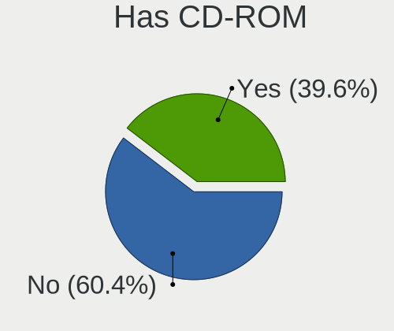
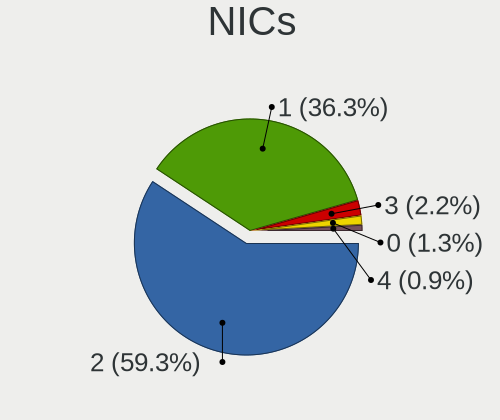

helloSystem 0.7.0 - Tested Hardware & Statistics
------------------------------------------------

A project to collect tested hardware configurations for helloSystem 0.7.0.

Anyone can contribute to this report by the [hw-probe](https://github.com/linuxhw/hw-probe/blob/master/INSTALL.BSD.md) tool:

    hw-probe -all -upload

Please submit a probe of your configuration if it's not presented on the page or is rare.

This is a report for all computer types. See also reports for [desktops](/Dist/helloSystem_0.7.0/Desktop/README.md) and [notebooks](/Dist/helloSystem_0.7.0/Notebook/README.md).

Full-feature report is available here: https://bsd-hardware.info/?view=trends

Contents
--------

* [ Test Cases ](#test-cases)

* [ System ](#system)
  - [ Arch                     ](#arch)
  - [ DE                       ](#de)
  - [ Display Server           ](#display-server)
  - [ Display Manager          ](#display-manager)
  - [ OS Lang                  ](#os-lang)
  - [ Boot Mode                ](#boot-mode)
  - [ Filesystem               ](#filesystem)
  - [ Part. scheme             ](#part-scheme)

* [ Board ](#board)
  - [ Vendor                   ](#vendor)
  - [ Model                    ](#model)
  - [ Model Family             ](#model-family)
  - [ MFG Year                 ](#mfg-year)
  - [ Form Factor              ](#form-factor)
  - [ Coreboot                 ](#coreboot)
  - [ RAM Size                 ](#ram-size)
  - [ RAM Used                 ](#ram-used)
  - [ Total Drives             ](#total-drives)
  - [ Has CD-ROM               ](#has-cd-rom)
  - [ Has Ethernet             ](#has-ethernet)
  - [ Has WiFi                 ](#has-wifi)
  - [ Has Bluetooth            ](#has-bluetooth)

* [ Location ](#location)
  - [ Country                  ](#country)
  - [ City                     ](#city)

* [ Drives ](#drives)
  - [ Drive Vendor             ](#drive-vendor)
  - [ Drive Model              ](#drive-model)
  - [ HDD Vendor               ](#hdd-vendor)
  - [ SSD Vendor               ](#ssd-vendor)
  - [ Drive Kind               ](#drive-kind)
  - [ Drive Connector          ](#drive-connector)
  - [ Drive Size               ](#drive-size)
  - [ Space Total              ](#space-total)
  - [ Space Used               ](#space-used)
  - [ Malfunc. Drives          ](#malfunc-drives)
  - [ Malfunc. Drive Vendor    ](#malfunc-drive-vendor)
  - [ Malfunc. HDD Vendor      ](#malfunc-hdd-vendor)
  - [ Malfunc. Drive Kind      ](#malfunc-drive-kind)
  - [ Failed Drives            ](#failed-drives)
  - [ Failed Drive Vendor      ](#failed-drive-vendor)
  - [ Drive Status             ](#drive-status)

* [ Storage controller ](#storage-controller)
  - [ Storage Vendor           ](#storage-vendor)
  - [ Storage Model            ](#storage-model)
  - [ Storage Kind             ](#storage-kind)

* [ Processor ](#processor)
  - [ CPU Vendor               ](#cpu-vendor)
  - [ CPU Model                ](#cpu-model)
  - [ CPU Model Family         ](#cpu-model-family)
  - [ CPU Cores                ](#cpu-cores)
  - [ CPU Sockets              ](#cpu-sockets)
  - [ CPU Threads              ](#cpu-threads)
  - [ CPU Microarch            ](#cpu-microarch)

* [ Graphics ](#graphics)
  - [ GPU Vendor               ](#gpu-vendor)
  - [ GPU Model                ](#gpu-model)
  - [ GPU Combo                ](#gpu-combo)
  - [ GPU Driver               ](#gpu-driver)
  - [ GPU Memory               ](#gpu-memory)

* [ Monitor ](#monitor)
  - [ Monitor Vendor           ](#monitor-vendor)
  - [ Monitor Model            ](#monitor-model)
  - [ Monitor Resolution       ](#monitor-resolution)
  - [ Monitor Diagonal         ](#monitor-diagonal)
  - [ Monitor Width            ](#monitor-width)
  - [ Aspect Ratio             ](#aspect-ratio)
  - [ Monitor Area             ](#monitor-area)
  - [ Pixel Density            ](#pixel-density)
  - [ Multiple Monitors        ](#multiple-monitors)

* [ Network ](#network)
  - [ Net Controller Vendor    ](#net-controller-vendor)
  - [ Net Controller Model     ](#net-controller-model)
  - [ Wireless Vendor          ](#wireless-vendor)
  - [ Wireless Model           ](#wireless-model)
  - [ Ethernet Vendor          ](#ethernet-vendor)
  - [ Ethernet Model           ](#ethernet-model)
  - [ Net Controller Kind      ](#net-controller-kind)
  - [ Used Controller          ](#used-controller)
  - [ NICs                     ](#nics)
  - [ IPv6                     ](#ipv6)

* [ Bluetooth ](#bluetooth)
  - [ Bluetooth Vendor         ](#bluetooth-vendor)
  - [ Bluetooth Model          ](#bluetooth-model)

* [ Sound ](#sound)
  - [ Sound Vendor             ](#sound-vendor)
  - [ Sound Model              ](#sound-model)

* [ Memory ](#memory)
  - [ Memory Vendor            ](#memory-vendor)
  - [ Memory Model             ](#memory-model)
  - [ Memory Kind              ](#memory-kind)
  - [ Memory Form Factor       ](#memory-form-factor)
  - [ Memory Size              ](#memory-size)
  - [ Memory Speed             ](#memory-speed)

* [ Printers & scanners ](#printers--scanners)
  - [ Printer Vendor           ](#printer-vendor)
  - [ Printer Model            ](#printer-model)
  - [ Scanner Vendor           ](#scanner-vendor)
  - [ Scanner Model            ](#scanner-model)

* [ Camera ](#camera)
  - [ Camera Vendor            ](#camera-vendor)
  - [ Camera Model             ](#camera-model)

* [ Security ](#security)
  - [ Fingerprint Vendor       ](#fingerprint-vendor)
  - [ Fingerprint Model        ](#fingerprint-model)
  - [ Chipcard Vendor          ](#chipcard-vendor)
  - [ Chipcard Model           ](#chipcard-model)

* [ Unsupported ](#unsupported)
  - [ Unsupported Devices      ](#unsupported-devices)
  - [ Unsupported Device Types ](#unsupported-device-types)

Test Cases
----------

| Vendor        | Model                       | Form-Factor | Probe                                                     | Date         |
|---------------|-----------------------------|-------------|-----------------------------------------------------------|--------------|
| ASUSTek       | TUF GAMING X570-PLUS        | Desktop     | [a671e3eb04](https://bsd-hardware.info/?probe=a671e3eb04) | Dec 31, 2021 |
| Dell          | Latitude E6540              | Notebook    | [97d152656e](https://bsd-hardware.info/?probe=97d152656e) | Dec 31, 2021 |
| HP            | ProBook 655 G1              | Notebook    | [da312d7c14](https://bsd-hardware.info/?probe=da312d7c14) | Dec 30, 2021 |
| Acer          | Aspire 5742G                | Notebook    | [b77a4ee97c](https://bsd-hardware.info/?probe=b77a4ee97c) | Dec 30, 2021 |
| ASUSTek       | S550CA                      | Notebook    | [1263a5fb37](https://bsd-hardware.info/?probe=1263a5fb37) | Dec 29, 2021 |
| Lenovo        | ThinkPad E580 20KS005BRI    | Notebook    | [b533989df5](https://bsd-hardware.info/?probe=b533989df5) | Dec 29, 2021 |
| ASRock        | X570 Phantom Gaming 4       | Desktop     | [15211db056](https://bsd-hardware.info/?probe=15211db056) | Dec 28, 2021 |
| Dell          | Inspiron 3521               | Notebook    | [b246d110af](https://bsd-hardware.info/?probe=b246d110af) | Dec 28, 2021 |
| Dell          | 0200DY A01                  | Desktop     | [fb37dcbb93](https://bsd-hardware.info/?probe=fb37dcbb93) | Dec 28, 2021 |
| Intel         | NUC8BEB J72693-306          | Mini pc     | [07221fc111](https://bsd-hardware.info/?probe=07221fc111) | Dec 28, 2021 |
| Pegatron      | IPM41-D3                    | Desktop     | [6829928dad](https://bsd-hardware.info/?probe=6829928dad) | Dec 28, 2021 |
| Dell          | 0H9KW5 A00                  | Desktop     | [e962ca25b3](https://bsd-hardware.info/?probe=e962ca25b3) | Dec 28, 2021 |
| Lenovo        | ThinkPad T460 20FMS75800    | Notebook    | [5f17e74f2f](https://bsd-hardware.info/?probe=5f17e74f2f) | Dec 27, 2021 |
| Gigabyte      | 970A-DS3P                   | Desktop     | [0918f0a5b9](https://bsd-hardware.info/?probe=0918f0a5b9) | Dec 25, 2021 |
| ASUSTek       | PRIME B350M-A               | Desktop     | [b0aa3885bb](https://bsd-hardware.info/?probe=b0aa3885bb) | Dec 25, 2021 |
| ASUSTek       | Z170-P                      | Desktop     | [bde74629f9](https://bsd-hardware.info/?probe=bde74629f9) | Dec 25, 2021 |
| Acer          | Aspire 5742G                | Notebook    | [b650885b00](https://bsd-hardware.info/?probe=b650885b00) | Dec 24, 2021 |
| Apple         | Mac-F2218EA9                | All in one  | [ea002bb42a](https://bsd-hardware.info/?probe=ea002bb42a) | Dec 24, 2021 |
| Acer          | TravelMate 5760G            | Notebook    | [46204b90d0](https://bsd-hardware.info/?probe=46204b90d0) | Dec 24, 2021 |
| ASUSTek       | TUF GAMING X570-PLUS        | Desktop     | [8ac48ba9c3](https://bsd-hardware.info/?probe=8ac48ba9c3) | Dec 23, 2021 |
| Lenovo        | ThinkPad SL510 2847R96      | Notebook    | [b0a9802877](https://bsd-hardware.info/?probe=b0a9802877) | Dec 22, 2021 |
| Lenovo        | ThinkPad T410 2537EA8       | Notebook    | [8b457cd635](https://bsd-hardware.info/?probe=8b457cd635) | Dec 22, 2021 |
| Gigabyte      | E3000N                      | Desktop     | [eb0ba1b296](https://bsd-hardware.info/?probe=eb0ba1b296) | Dec 22, 2021 |
| Lenovo        | ThinkPad X250 20CLS1WP01    | Notebook    | [87bc0b8924](https://bsd-hardware.info/?probe=87bc0b8924) | Dec 22, 2021 |
| Toshiba       | Satellite C50-B             | Notebook    | [6b03a2c4c2](https://bsd-hardware.info/?probe=6b03a2c4c2) | Dec 22, 2021 |
| ASUSTek       | ROG STRIX Z370-E GAMING     | Desktop     | [936afa4de3](https://bsd-hardware.info/?probe=936afa4de3) | Dec 21, 2021 |
| Samsung       | 305E4A/305E5A/305E7A        | Notebook    | [5188a12b26](https://bsd-hardware.info/?probe=5188a12b26) | Dec 21, 2021 |
| Intel         | NUC10i7FNB K61360-304       | Mini pc     | [839eed529d](https://bsd-hardware.info/?probe=839eed529d) | Dec 21, 2021 |
| ASUSTek       | PRIME A320M-K               | Desktop     | [42599b554e](https://bsd-hardware.info/?probe=42599b554e) | Dec 21, 2021 |
| Lenovo        | ThinkPad X270 W10DG 20K5... | Notebook    | [2e1c585715](https://bsd-hardware.info/?probe=2e1c585715) | Dec 21, 2021 |
| Acidanther... | Mac-AA95B1DDAB278B95 iMa... | All in one  | [73076dd5de](https://bsd-hardware.info/?probe=73076dd5de) | Dec 21, 2021 |
| Gigabyte      | X58A-UD5                    | Desktop     | [62b94dd372](https://bsd-hardware.info/?probe=62b94dd372) | Dec 21, 2021 |
| ASUSTek       | ROG STRIX X570-E GAMING     | Desktop     | [5cc62c68f9](https://bsd-hardware.info/?probe=5cc62c68f9) | Dec 21, 2021 |
| Gigabyte      | H170-D3HP-CF                | Desktop     | [a490614a39](https://bsd-hardware.info/?probe=a490614a39) | Dec 21, 2021 |
| ASRock        | H110M-DGS                   | Desktop     | [40c4553adb](https://bsd-hardware.info/?probe=40c4553adb) | Dec 21, 2021 |
| HP            | Pavilion Gaming Laptop 1... | Notebook    | [4c22212c20](https://bsd-hardware.info/?probe=4c22212c20) | Dec 20, 2021 |
| HP            | Pavilion Gaming Laptop 1... | Notebook    | [1a193c7bf9](https://bsd-hardware.info/?probe=1a193c7bf9) | Dec 20, 2021 |
| Toshiba       | Satellite L550              | Notebook    | [977298a601](https://bsd-hardware.info/?probe=977298a601) | Dec 20, 2021 |
| ASUSTek       | N56VB                       | Notebook    | [f53b3fba5c](https://bsd-hardware.info/?probe=f53b3fba5c) | Dec 20, 2021 |
| HP            | 15 Notebook PC              | Notebook    | [1e888f2278](https://bsd-hardware.info/?probe=1e888f2278) | Dec 20, 2021 |
| ASUSTek       | P5VD2-VM                    | Desktop     | [7e8f3cf783](https://bsd-hardware.info/?probe=7e8f3cf783) | Dec 20, 2021 |
| ASUSTek       | Q170M-C                     | Desktop     | [7f9e35a31c](https://bsd-hardware.info/?probe=7f9e35a31c) | Dec 20, 2021 |
| Dell          | 0TDG4V A00                  | Desktop     | [3ce808c135](https://bsd-hardware.info/?probe=3ce808c135) | Dec 20, 2021 |
| Dell          | 0TDG4V A00                  | Desktop     | [5292ad64ef](https://bsd-hardware.info/?probe=5292ad64ef) | Dec 20, 2021 |
| Lenovo        | IdeaPad 510-15IKB 80SV      | Notebook    | [6321f4bd3a](https://bsd-hardware.info/?probe=6321f4bd3a) | Dec 20, 2021 |
| ASUSTek       | P8Z77-V LX                  | Desktop     | [3c71a8ba4e](https://bsd-hardware.info/?probe=3c71a8ba4e) | Dec 20, 2021 |
| Dell          | Latitude E5470              | Notebook    | [18470afd9d](https://bsd-hardware.info/?probe=18470afd9d) | Dec 19, 2021 |
| Apple         | Mac-F2218EA9                | All in one  | [510b7cb091](https://bsd-hardware.info/?probe=510b7cb091) | Dec 19, 2021 |
| MSI           | X370 SLI PLUS               | Desktop     | [73853f1fc2](https://bsd-hardware.info/?probe=73853f1fc2) | Dec 19, 2021 |
| Quanta        | 2AC7 011                    | Desktop     | [1a831a1d34](https://bsd-hardware.info/?probe=1a831a1d34) | Dec 18, 2021 |
| Apple         | Mac-F22C86C8                | Mini pc     | [7daf32eb4f](https://bsd-hardware.info/?probe=7daf32eb4f) | Dec 17, 2021 |
| Gigabyte      | Z77X-UD3H                   | Desktop     | [759ce775c9](https://bsd-hardware.info/?probe=759ce775c9) | Dec 15, 2021 |
| ASUSTek       | TUF GAMING X570-PLUS        | Desktop     | [32d20b9b8e](https://bsd-hardware.info/?probe=32d20b9b8e) | Dec 14, 2021 |
| HP            | ZBook Studio G4             | Notebook    | [cdc6f54d97](https://bsd-hardware.info/?probe=cdc6f54d97) | Dec 14, 2021 |
| HP            | 843B                        | Desktop     | [f0d279747f](https://bsd-hardware.info/?probe=f0d279747f) | Dec 13, 2021 |
| HP            | 843B                        | Desktop     | [56400d3999](https://bsd-hardware.info/?probe=56400d3999) | Dec 13, 2021 |
| ASUSTek       | PRIME B450M-A               | Desktop     | [aea4a33dee](https://bsd-hardware.info/?probe=aea4a33dee) | Dec 13, 2021 |
| Gigabyte      | H270M-DS3H-CF               | Desktop     | [50fba6deda](https://bsd-hardware.info/?probe=50fba6deda) | Dec 11, 2021 |
| Gigabyte      | B450 I AORUS PRO WIFI-CF    | Desktop     | [6a1100cfdb](https://bsd-hardware.info/?probe=6a1100cfdb) | Dec 11, 2021 |
| Acer          | RevoOne RL85                | Desktop     | [a1e32de7da](https://bsd-hardware.info/?probe=a1e32de7da) | Dec 10, 2021 |
| Gigabyte      | B450 I AORUS PRO WIFI-CF    | Desktop     | [b900b364f6](https://bsd-hardware.info/?probe=b900b364f6) | Dec 10, 2021 |
| Dell          | 0YF8P5 A00                  | Desktop     | [0f03a66475](https://bsd-hardware.info/?probe=0f03a66475) | Dec 09, 2021 |
| Dell          | 0YF8P5 A00                  | Desktop     | [83b36f7c3d](https://bsd-hardware.info/?probe=83b36f7c3d) | Dec 09, 2021 |
| Gigabyte      | H270M-DS3H-CF               | Desktop     | [a084ff48c2](https://bsd-hardware.info/?probe=a084ff48c2) | Dec 09, 2021 |
| Gigabyte      | H270M-DS3H-CF               | Desktop     | [17b557d792](https://bsd-hardware.info/?probe=17b557d792) | Dec 08, 2021 |
| Apple         | MacBookAir1,1               | Notebook    | [61c7028e83](https://bsd-hardware.info/?probe=61c7028e83) | Dec 07, 2021 |
| ASUSTek       | X540LA                      | Notebook    | [fa809be73f](https://bsd-hardware.info/?probe=fa809be73f) | Dec 04, 2021 |
| ASUSTek       | X540LA                      | Notebook    | [cf5fd87781](https://bsd-hardware.info/?probe=cf5fd87781) | Dec 04, 2021 |
| Acer          | Swift SF314-52              | Notebook    | [e3ece211a0](https://bsd-hardware.info/?probe=e3ece211a0) | Dec 03, 2021 |
| Gigabyte      | X570 AORUS ELITE            | Desktop     | [8cfe11fe93](https://bsd-hardware.info/?probe=8cfe11fe93) | Nov 30, 2021 |
| HP            | 843B                        | Desktop     | [376e006a40](https://bsd-hardware.info/?probe=376e006a40) | Nov 30, 2021 |
| Intel         | DG41TY AAE47335-300         | Desktop     | [dd357bcaa5](https://bsd-hardware.info/?probe=dd357bcaa5) | Nov 30, 2021 |
| HP            | 843B                        | Desktop     | [404224439d](https://bsd-hardware.info/?probe=404224439d) | Nov 29, 2021 |
| HP            | 843B                        | Desktop     | [a8ac0e9efb](https://bsd-hardware.info/?probe=a8ac0e9efb) | Nov 29, 2021 |
| Toshiba       | Satellite S55t-B            | Notebook    | [f6983391aa](https://bsd-hardware.info/?probe=f6983391aa) | Nov 28, 2021 |
| HP            | 1825                        | Desktop     | [32f07d2ba3](https://bsd-hardware.info/?probe=32f07d2ba3) | Nov 28, 2021 |
| Lenovo        | ThinkPad X240 20AMS2QDOC    | Notebook    | [66cfdd2419](https://bsd-hardware.info/?probe=66cfdd2419) | Nov 27, 2021 |
| Gigabyte      | B450 I AORUS PRO WIFI-CF    | Desktop     | [4cd5e5166a](https://bsd-hardware.info/?probe=4cd5e5166a) | Nov 27, 2021 |
| Apple         | Mac-F2218FA9                | All in one  | [7154bea350](https://bsd-hardware.info/?probe=7154bea350) | Nov 27, 2021 |
| ASRock        | 775i945GZ                   | Desktop     | [16fc4ee10d](https://bsd-hardware.info/?probe=16fc4ee10d) | Nov 26, 2021 |
| Lenovo        | V310-14IKB 80T2             | Notebook    | [f5421b8fe0](https://bsd-hardware.info/?probe=f5421b8fe0) | Nov 23, 2021 |
| Apple         | Mac-F2218FA9                | All in one  | [1802f6c891](https://bsd-hardware.info/?probe=1802f6c891) | Nov 21, 2021 |
| Toshiba       | Satellite C640              | Notebook    | [2d60f00479](https://bsd-hardware.info/?probe=2d60f00479) | Nov 17, 2021 |
| Toshiba       | Satellite C640              | Notebook    | [89a9551487](https://bsd-hardware.info/?probe=89a9551487) | Nov 17, 2021 |
| Lenovo        | ThinkPad T60 1951FEG        | Notebook    | [e2d5391a1a](https://bsd-hardware.info/?probe=e2d5391a1a) | Nov 14, 2021 |
| ASUSTek       | K52Jc                       | Notebook    | [92b975763f](https://bsd-hardware.info/?probe=92b975763f) | Nov 08, 2021 |
| HP            | 844C                        | Desktop     | [fb7d8eaf5d](https://bsd-hardware.info/?probe=fb7d8eaf5d) | Nov 06, 2021 |
| Unknown       | X79                         | Desktop     | [ef88cbc606](https://bsd-hardware.info/?probe=ef88cbc606) | Nov 05, 2021 |
| Apple         | MacBookAir5,1               | Notebook    | [10d629e1a0](https://bsd-hardware.info/?probe=10d629e1a0) | Nov 04, 2021 |
| HP            | 843B                        | Desktop     | [9761f29b5e](https://bsd-hardware.info/?probe=9761f29b5e) | Oct 25, 2021 |
| HP            | Pavilion Gaming Laptop 1... | Notebook    | [3c64328fbe](https://bsd-hardware.info/?probe=3c64328fbe) | Oct 13, 2021 |
| Acer          | Aspire TC-780               | Desktop     | [3ce8481842](https://bsd-hardware.info/?probe=3ce8481842) | Oct 10, 2021 |

System
------

Arch
----

OS architecture (x86_64, i586, etc.)

| Name  | Computers | Percent |
|-------|-----------|---------|
| amd64 | 71        | 100%    |

DE
--

Desktop Environment

| Name         | Computers | Percent |
|--------------|-----------|---------|
| helloDesktop | 70        | 98.59%  |
| GNOME        | 1         | 1.41%   |

Display Server
--------------

X11 or Wayland

| Name | Computers | Percent |
|------|-----------|---------|
| X11  | 71        | 100%    |

Display Manager
---------------

SDDM, LightDM, etc.

| Name | Computers | Percent |
|------|-----------|---------|
| SLiM | 71        | 100%    |

OS Lang
-------

Language

| Lang  | Computers | Percent |
|-------|-----------|---------|
| en_US | 68        | 95.77%  |
| de_DE | 3         | 4.23%   |

Boot Mode
---------

EFI or BIOS

| Mode | Computers | Percent |
|------|-----------|---------|
| EFI  | 68        | 95.77%  |
| BIOS | 3         | 4.23%   |

Filesystem
----------

Type of filesystem

| Type   | Computers | Percent |
|--------|-----------|---------|
| Cd9660 | 46        | 63.89%  |
| Zfs    | 26        | 36.11%  |

Part. scheme
------------

Scheme of partitioning

| Type | Computers | Percent |
|------|-----------|---------|
| GPT  | 70        | 98.59%  |
| MBR  | 1         | 1.41%   |

Board
-----

Vendor
------

Motherboard manufacturer

| Name                | Computers | Percent |
|---------------------|-----------|---------|
| ASUSTek Computer    | 14        | 19.72%  |
| Lenovo              | 10        | 14.08%  |
| Hewlett-Packard     | 8         | 11.27%  |
| Gigabyte Technology | 8         | 11.27%  |
| Dell                | 7         | 9.86%   |
| Apple               | 5         | 7.04%   |
| Toshiba             | 4         | 5.63%   |
| Acer                | 4         | 5.63%   |
| Intel               | 3         | 4.23%   |
| ASRock              | 3         | 4.23%   |
| Samsung Electronics | 1         | 1.41%   |
| Quanta              | 1         | 1.41%   |
| Pegatron            | 1         | 1.41%   |
| MSI                 | 1         | 1.41%   |
| Acidanthera         | 1         | 1.41%   |

Model
-----

Motherboard model

| Name                                  | Computers | Percent |
|---------------------------------------|-----------|---------|
| Apple iMac9,1                         | 2         | 2.82%   |
| Toshiba Satellite S55t-B              | 1         | 1.41%   |
| Toshiba Satellite L550                | 1         | 1.41%   |
| Toshiba Satellite C640                | 1         | 1.41%   |
| Toshiba Satellite C50-B               | 1         | 1.41%   |
| Samsung 305E4A/305E5A/305E7A          | 1         | 1.41%   |
| Quanta 120-1135                       | 1         | 1.41%   |
| Pegatron IPM41-D3                     | 1         | 1.41%   |
| MSI MS-7A33                           | 1         | 1.41%   |
| Lenovo V310-14IKB 80T2                | 1         | 1.41%   |
| Lenovo ThinkPad X270 W10DG 20K5S0BM01 | 1         | 1.41%   |
| Lenovo ThinkPad X250 20CLS1WP01       | 1         | 1.41%   |
| Lenovo ThinkPad X240 20AMS2QDOC       | 1         | 1.41%   |
| Lenovo ThinkPad T60 1951FEG           | 1         | 1.41%   |
| Lenovo ThinkPad T460 20FMS75800       | 1         | 1.41%   |
| Lenovo ThinkPad T410 2537EA8          | 1         | 1.41%   |
| Lenovo ThinkPad SL510 2847R96         | 1         | 1.41%   |
| Lenovo ThinkPad E580 20KS005BRI       | 1         | 1.41%   |
| Lenovo IdeaPad 510-15IKB 80SV         | 1         | 1.41%   |
| Intel NUC8i3BEH                       | 1         | 1.41%   |
| Intel NUC10i7FNH                      | 1         | 1.41%   |
| Intel DG41TY AAE47335-300             | 1         | 1.41%   |
| HP ZBook Studio G4                    | 1         | 1.41%   |
| HP ProBook 655 G1                     | 1         | 1.41%   |
| HP Pavilion Gaming Laptop 16-a0xxx    | 1         | 1.41%   |
| HP Pavilion Gaming Laptop 15-ec2xxx   | 1         | 1.41%   |
| HP Pavilion Gaming Desktop 690-00xx   | 1         | 1.41%   |
| HP EliteDesk 800 G1 DM                | 1         | 1.41%   |
| HP 844C                               | 1         | 1.41%   |
| HP 15 Notebook PC                     | 1         | 1.41%   |
| Gigabyte Z77X-UD3H                    | 1         | 1.41%   |
| Gigabyte X58A-UD5                     | 1         | 1.41%   |
| Gigabyte X570 AORUS ELITE             | 1         | 1.41%   |
| Gigabyte H270M-DS3H                   | 1         | 1.41%   |
| Gigabyte H170-D3HP                    | 1         | 1.41%   |
| Gigabyte E3000N                       | 1         | 1.41%   |
| Gigabyte B450 I AORUS PRO WIFI        | 1         | 1.41%   |
| Gigabyte 970A-DS3P                    | 1         | 1.41%   |
| Dell Vostro 3667                      | 1         | 1.41%   |
| Dell Precision T1700                  | 1         | 1.41%   |
| Dell OptiPlex 780                     | 1         | 1.41%   |
| Dell Latitude E6540                   | 1         | 1.41%   |
| Dell Latitude E5470                   | 1         | 1.41%   |
| Dell Inspiron 3891                    | 1         | 1.41%   |
| Dell Inspiron 3521                    | 1         | 1.41%   |
| ASUS Z170-P                           | 1         | 1.41%   |
| ASUS X540LA                           | 1         | 1.41%   |
| ASUS TUF GAMING X570-PLUS             | 1         | 1.41%   |
| ASUS S550CA                           | 1         | 1.41%   |
| ASUS ROG STRIX Z370-E GAMING          | 1         | 1.41%   |
| ASUS ROG STRIX X570-E GAMING          | 1         | 1.41%   |
| ASUS Q170M-C                          | 1         | 1.41%   |
| ASUS PRIME B450M-A                    | 1         | 1.41%   |
| ASUS PRIME B350M-A                    | 1         | 1.41%   |
| ASUS PRIME A320M-K                    | 1         | 1.41%   |
| ASUS P8Z77-V LX                       | 1         | 1.41%   |
| ASUS P5VD2-VM                         | 1         | 1.41%   |
| ASUS N56VB                            | 1         | 1.41%   |
| ASUS K52Jc                            | 1         | 1.41%   |
| ASRock X570 Phantom Gaming 4          | 1         | 1.41%   |

Model Family
------------

Motherboard model prefix

| Name                | Computers | Percent |
|---------------------|-----------|---------|
| Lenovo ThinkPad     | 8         | 11.27%  |
| Toshiba Satellite   | 4         | 5.63%   |
| HP Pavilion         | 3         | 4.23%   |
| ASUS PRIME          | 3         | 4.23%   |
| Dell Latitude       | 2         | 2.82%   |
| Dell Inspiron       | 2         | 2.82%   |
| ASUS ROG            | 2         | 2.82%   |
| Apple iMac9         | 2         | 2.82%   |
| Samsung 305E4A      | 1         | 1.41%   |
| Quanta 120-1135     | 1         | 1.41%   |
| Pegatron IPM41-D3   | 1         | 1.41%   |
| MSI MS-7A33         | 1         | 1.41%   |
| Lenovo V310-14IKB   | 1         | 1.41%   |
| Lenovo IdeaPad      | 1         | 1.41%   |
| Intel NUC8i3BEH     | 1         | 1.41%   |
| Intel NUC10i7FNH    | 1         | 1.41%   |
| Intel DG41TY        | 1         | 1.41%   |
| HP ZBook            | 1         | 1.41%   |
| HP ProBook          | 1         | 1.41%   |
| HP EliteDesk        | 1         | 1.41%   |
| HP 844C             | 1         | 1.41%   |
| HP 15               | 1         | 1.41%   |
| Gigabyte Z77X-UD3H  | 1         | 1.41%   |
| Gigabyte X58A-UD5   | 1         | 1.41%   |
| Gigabyte X570       | 1         | 1.41%   |
| Gigabyte H270M-DS3H | 1         | 1.41%   |
| Gigabyte H170-D3HP  | 1         | 1.41%   |
| Gigabyte E3000N     | 1         | 1.41%   |
| Gigabyte B450       | 1         | 1.41%   |
| Gigabyte 970A-DS3P  | 1         | 1.41%   |
| Dell Vostro         | 1         | 1.41%   |
| Dell Precision      | 1         | 1.41%   |
| Dell OptiPlex       | 1         | 1.41%   |
| ASUS Z170-P         | 1         | 1.41%   |
| ASUS X540LA         | 1         | 1.41%   |
| ASUS TUF            | 1         | 1.41%   |
| ASUS S550CA         | 1         | 1.41%   |
| ASUS Q170M-C        | 1         | 1.41%   |
| ASUS P8Z77-V        | 1         | 1.41%   |
| ASUS P5VD2-VM       | 1         | 1.41%   |
| ASUS N56VB          | 1         | 1.41%   |
| ASUS K52Jc          | 1         | 1.41%   |
| ASRock X570         | 1         | 1.41%   |
| ASRock H110M-DGS    | 1         | 1.41%   |
| ASRock 775i945GZ    | 1         | 1.41%   |
| Apple Macmini3      | 1         | 1.41%   |
| Apple MacBookAir5   | 1         | 1.41%   |
| Apple MacBookAir1   | 1         | 1.41%   |
| Acidanthera iMac19  | 1         | 1.41%   |
| Acer TravelMate     | 1         | 1.41%   |
| Acer Swift          | 1         | 1.41%   |
| Acer RevoOne        | 1         | 1.41%   |
| Acer Aspire         | 1         | 1.41%   |

MFG Year
--------

Motherboard manufacture year

| Year | Computers | Percent |
|------|-----------|---------|
| 2021 | 18        | 25.35%  |
| 2020 | 6         | 8.45%   |
| 2018 | 6         | 8.45%   |
| 2017 | 5         | 7.04%   |
| 2010 | 5         | 7.04%   |
| 2015 | 4         | 5.63%   |
| 2013 | 4         | 5.63%   |
| 2012 | 4         | 5.63%   |
| 2011 | 4         | 5.63%   |
| 2019 | 3         | 4.23%   |
| 2016 | 3         | 4.23%   |
| 2009 | 3         | 4.23%   |
| 2014 | 2         | 2.82%   |
| 2007 | 2         | 2.82%   |
| 2008 | 1         | 1.41%   |
| 2006 | 1         | 1.41%   |

Form Factor
-----------

Physical design of the computer

| Name       | Computers | Percent |
|------------|-----------|---------|
| Desktop    | 33        | 46.48%  |
| Notebook   | 32        | 45.07%  |
| Mini pc    | 3         | 4.23%   |
| All in one | 3         | 4.23%   |

Coreboot
--------

Have coreboot on board

| Used | Computers | Percent |
|------|-----------|---------|
| No   | 71        | 100%    |

RAM Size
--------

Total RAM memory

| Size in GB  | Computers | Percent |
|-------------|-----------|---------|
| 4.01-8.0    | 21        | 29.58%  |
| 8.01-16.0   | 17        | 23.94%  |
| 16.01-24.0  | 16        | 22.54%  |
| 32.01-64.0  | 9         | 12.68%  |
| 2.01-3.0    | 4         | 5.63%   |
| 3.01-4.0    | 1         | 1.41%   |
| 24.01-32.0  | 1         | 1.41%   |
| 64.01-256.0 | 1         | 1.41%   |
| 0.51-1.0    | 1         | 1.41%   |

RAM Used
--------

Used RAM memory

| Used GB   | Computers | Percent |
|-----------|-----------|---------|
| 0.01-0.5  | 37        | 51.39%  |
| 0.51-1.0  | 20        | 27.78%  |
| 1.01-2.0  | 11        | 15.28%  |
| 2.01-3.0  | 2         | 2.78%   |
| 3.01-4.0  | 1         | 1.39%   |
| 8.01-16.0 | 1         | 1.39%   |

Total Drives
------------

Number of drives on board

| Drives | Computers | Percent |
|--------|-----------|---------|
| 1      | 37        | 52.11%  |
| 2      | 18        | 25.35%  |
| 3      | 6         | 8.45%   |
| 0      | 4         | 5.63%   |
| 4      | 3         | 4.23%   |
| 5      | 2         | 2.82%   |
| 6      | 1         | 1.41%   |

Has CD-ROM
----------

Has CD-ROM on board

| Presented | Computers | Percent |
|-----------|-----------|---------|
| No        | 39        | 54.93%  |
| Yes       | 32        | 45.07%  |

Has Ethernet
------------

Has Ethernet on board

| Presented | Computers | Percent |
|-----------|-----------|---------|
| Yes       | 68        | 95.77%  |
| No        | 3         | 4.23%   |

Has WiFi
--------

Has WiFi module

| Presented | Computers | Percent |
|-----------|-----------|---------|
| Yes       | 52        | 73.24%  |
| No        | 19        | 26.76%  |

Has Bluetooth
-------------

Has Bluetooth module

| Presented | Computers | Percent |
|-----------|-----------|---------|
| Yes       | 40        | 56.34%  |
| No        | 31        | 43.66%  |

Location
--------

Country
-------

Geographic location (country)

| Country     | Computers | Percent |
|-------------|-----------|---------|
| USA         | 11        | 15.49%  |
| Germany     | 7         | 9.86%   |
| Russia      | 6         | 8.45%   |
| Romania     | 5         | 7.04%   |
| Canada      | 5         | 7.04%   |
| Ukraine     | 3         | 4.23%   |
| Poland      | 3         | 4.23%   |
| Peru        | 3         | 4.23%   |
| Hungary     | 3         | 4.23%   |
| France      | 3         | 4.23%   |
| Denmark     | 3         | 4.23%   |
| Vietnam     | 2         | 2.82%   |
| Norway      | 2         | 2.82%   |
| Netherlands | 2         | 2.82%   |
| Indonesia   | 2         | 2.82%   |
| Brazil      | 2         | 2.82%   |
| UK          | 1         | 1.41%   |
| Taiwan      | 1         | 1.41%   |
| Sweden      | 1         | 1.41%   |
| Spain       | 1         | 1.41%   |
| Philippines | 1         | 1.41%   |
| Italy       | 1         | 1.41%   |
| India       | 1         | 1.41%   |
| China       | 1         | 1.41%   |
| Bulgaria    | 1         | 1.41%   |

City
----

Geographic location (city)

| City              | Computers | Percent |
|-------------------|-----------|---------|
| Lima              | 3         | 4.17%   |
| Warsaw            | 2         | 2.78%   |
| Suceava           | 2         | 2.78%   |
| Smiths Falls      | 2         | 2.78%   |
| Jakarta           | 2         | 2.78%   |
| Hanoi             | 2         | 2.78%   |
| Bucharest         | 2         | 2.78%   |
| Zaporizhzhya      | 1         | 1.39%   |
| Yunlin            | 1         | 1.39%   |
| V?¤ster??s        | 1         | 1.39%   |
| Ugarchin          | 1         | 1.39%   |
| Torokszentmiklos  | 1         | 1.39%   |
| Szeged            | 1         | 1.39%   |
| Sz?©kesfeh?©rv??r | 1         | 1.39%   |
| Surgut            | 1         | 1.39%   |
| St Petersburg     | 1         | 1.39%   |
| Sevastopol        | 1         | 1.39%   |
| Seattle           | 1         | 1.39%   |
| Santa Maria       | 1         | 1.39%   |
| San Antonio       | 1         | 1.39%   |
| Renfrew           | 1         | 1.39%   |
| Qu?©bec           | 1         | 1.39%   |
| Pruszcz Gdanski   | 1         | 1.39%   |
| Patterson         | 1         | 1.39%   |
| Paso Robles       | 1         | 1.39%   |
| Ourense           | 1         | 1.39%   |
| Oldenburg         | 1         | 1.39%   |
| Odense            | 1         | 1.39%   |
| Novosibirsk       | 1         | 1.39%   |
| New Delhi         | 1         | 1.39%   |
| Nesttun           | 1         | 1.39%   |
| Myski             | 1         | 1.39%   |
| Moscow            | 1         | 1.39%   |
| Montreal          | 1         | 1.39%   |
| Longfield         | 1         | 1.39%   |
| Lehrte            | 1         | 1.39%   |
| Katowice          | 1         | 1.39%   |
| Hvidovre          | 1         | 1.39%   |
| Hoogeveen         | 1         | 1.39%   |
| Hicksville        | 1         | 1.39%   |
| Hayfork           | 1         | 1.39%   |
| Hangzhou          | 1         | 1.39%   |
| Hackettstown      | 1         | 1.39%   |
| Front Royal       | 1         | 1.39%   |
| Follonica         | 1         | 1.39%   |
| Escondido         | 1         | 1.39%   |
| Esbjerg           | 1         | 1.39%   |
| Dreieich          | 1         | 1.39%   |
| Donauw?¶rth       | 1         | 1.39%   |
| Dijon             | 1         | 1.39%   |
| Detmold           | 1         | 1.39%   |
| D??sseldorf       | 1         | 1.39%   |
| Curitiba          | 1         | 1.39%   |
| Collierville      | 1         | 1.39%   |
| Cluj-Napoca       | 1         | 1.39%   |
| Chelyabinsk       | 1         | 1.39%   |
| Chamb?©ry         | 1         | 1.39%   |
| Belogorodka       | 1         | 1.39%   |
| Balestrand        | 1         | 1.39%   |
| Bad Nauheim       | 1         | 1.39%   |

Drives
------

Drive Vendor
------------

Hard drive vendors

| Vendor              | Computers | Drives | Percent |
|---------------------|-----------|--------|---------|
| WDC                 | 18        | 21     | 16.36%  |
| Samsung Electronics | 18        | 21     | 16.36%  |
| Seagate             | 17        | 25     | 15.45%  |
| Kingston            | 10        | 10     | 9.09%   |
| Toshiba             | 9         | 11     | 8.18%   |
| Intel               | 5         | 6      | 4.55%   |
| SK Hynix            | 4         | 6      | 3.64%   |
| SanDisk             | 4         | 4      | 3.64%   |
| Hitachi             | 4         | 4      | 3.64%   |
| Crucial             | 4         | 4      | 3.64%   |
| HGST                | 3         | 3      | 2.73%   |
| A-DATA Technology   | 3         | 3      | 2.73%   |
| XPG                 | 2         | 2      | 1.82%   |
| Transcend           | 1         | 1      | 0.91%   |
| Phison              | 1         | 1      | 0.91%   |
| OCZ                 | 1         | 1      | 0.91%   |
| KingSpec            | 1         | 1      | 0.91%   |
| Integral            | 1         | 1      | 0.91%   |
| Hewlett-Packard     | 1         | 1      | 0.91%   |
| GOODRAM             | 1         | 1      | 0.91%   |
| China               | 1         | 1      | 0.91%   |
| Apple               | 1         | 1      | 0.91%   |

Drive Model
-----------

Hard drive models

| Model                                        | Computers | Percent |
|----------------------------------------------|-----------|---------|
| Kingston SA400S37120G 120GB                  | 5         | 4.2%    |
| Samsung SSD 850 EVO 250GB                    | 3         | 2.52%   |
| XPG GAMMIX S11 Pro 1TB                       | 2         | 1.68%   |
| Toshiba MQ01ABF050 500GB                     | 2         | 1.68%   |
| Seagate ST4000DM004-2CV104 4TB               | 2         | 1.68%   |
| Seagate ST1000DM010-2EP102 1TB               | 2         | 1.68%   |
| Samsung SSD 970 EVO 250GB                    | 2         | 1.68%   |
| Hitachi HTS541680J9SA00 80GB                 | 2         | 1.68%   |
| HGST HTS545050A7E680 500GB                   | 2         | 1.68%   |
| Crucial CT500MX500SSD1 500GB                 | 2         | 1.68%   |
| WDC WDS500G2B0A-00SM50 500GB                 | 1         | 0.84%   |
| WDC WDS250G1B0A-00H9H0 250GB                 | 1         | 0.84%   |
| WDC WDS240G2G0A-00JH30 240GB                 | 1         | 0.84%   |
| WDC WDS120G2G0A-00JH30 120GB                 | 1         | 0.84%   |
| WDC WDS100T3X0C-00SJG0 1TB                   | 1         | 0.84%   |
| WDC WDS100T2B0A-00SM50 1TB                   | 1         | 0.84%   |
| WDC WDBNCE5000PNC 500GB                      | 1         | 0.84%   |
| WDC WD5000LPVX-22V0TT0 500GB                 | 1         | 0.84%   |
| WDC WD5000LPLX-60ZNTT1 500GB                 | 1         | 0.84%   |
| WDC WD5000BPVT-22HXZT3 500GB                 | 1         | 0.84%   |
| WDC WD5000BPKX-22HPJT0 500GB                 | 1         | 0.84%   |
| WDC WD40EZRZ-00GXCB0 4TB                     | 1         | 0.84%   |
| WDC WD3003FZEX-00Z4SA0 3TB                   | 1         | 0.84%   |
| WDC WD1200BEVS-07RST0 120GB                  | 1         | 0.84%   |
| WDC WD10SPZX-22Z10T0 1TB                     | 1         | 0.84%   |
| WDC WD10SDZW-11UMGS0 1TB                     | 1         | 0.84%   |
| WDC WD10JPCX-24UE4T0 1TB                     | 1         | 0.84%   |
| WDC WD10EZEX-60WN4A0 1TB                     | 1         | 0.84%   |
| WDC WD10EZEX-00KUWA0 1TB                     | 1         | 0.84%   |
| Transcend TS240GMTS420S 240GB                | 1         | 0.84%   |
| Toshiba MQ01ABD100 1TB                       | 1         | 0.84%   |
| Toshiba MQ01ABD075 752GB                     | 1         | 0.84%   |
| Toshiba MK3265GSXN 320GB                     | 1         | 0.84%   |
| Toshiba HDWE160 6TB                          | 1         | 0.84%   |
| Toshiba HDWD110 1TB                          | 1         | 0.84%   |
| Toshiba DT01ACA100 1TB                       | 1         | 0.84%   |
| Toshiba DT01ACA050 500GB                     | 1         | 0.84%   |
| SK Hynix SHGS31-1000GS-2 1TB                 | 1         | 0.84%   |
| SK Hynix HFS256G39TND-N210A 256GB            | 1         | 0.84%   |
| SK Hynix BC711 NVMe 256GB                    | 1         | 0.84%   |
| SK Hynix BC501 HFM128GDJTNG-8310A 128GB      | 1         | 0.84%   |
| Seagate ST980813AS 80GB                      | 1         | 0.84%   |
| Seagate ST9640320AS 640GB                    | 1         | 0.84%   |
| Seagate ST9320423AS 320GB                    | 1         | 0.84%   |
| Seagate ST4000NC001-1FS168 4TB               | 1         | 0.84%   |
| Seagate ST4000NC000-1FR168 4TB               | 1         | 0.84%   |
| Seagate ST3500413AS 500GB                    | 1         | 0.84%   |
| Seagate ST3400633AS 400GB                    | 1         | 0.84%   |
| Seagate ST32000641AS 2TB                     | 1         | 0.84%   |
| Seagate ST3000DM008-2DM166 3TB               | 1         | 0.84%   |
| Seagate ST3000DM001-1CH166 3TB               | 1         | 0.84%   |
| Seagate ST2000LX001-1RG174 2TB               | 1         | 0.84%   |
| Seagate ST2000DM008-2FR102 2TB               | 1         | 0.84%   |
| Seagate ST2000DM006-2DM164 2TB               | 1         | 0.84%   |
| Seagate ST2000DM001-1ER164 2TB               | 1         | 0.84%   |
| Seagate ST2000DL003-9VT166 2TB               | 1         | 0.84%   |
| Seagate ST1000LM035-1RK172 1TB               | 1         | 0.84%   |
| Seagate ST1000DM003-1ER162 1TB               | 1         | 0.84%   |
| Seagate BarraCuda 510 SSD ZP512CM30011 512GB | 1         | 0.84%   |
| SanDisk SDSSDH3 512G                         | 1         | 0.84%   |

HDD Vendor
----------

Hard disk drive vendors

| Vendor              | Computers | Drives | Percent |
|---------------------|-----------|--------|---------|
| Seagate             | 16        | 24     | 35.56%  |
| WDC                 | 12        | 12     | 26.67%  |
| Toshiba             | 9         | 11     | 20%     |
| Hitachi             | 4         | 4      | 8.89%   |
| HGST                | 3         | 3      | 6.67%   |
| Samsung Electronics | 1         | 1      | 2.22%   |

SSD Vendor
----------

Solid state drive vendors

| Vendor              | Computers | Drives | Percent |
|---------------------|-----------|--------|---------|
| Samsung Electronics | 11        | 11     | 22.92%  |
| Kingston            | 7         | 7      | 14.58%  |
| WDC                 | 5         | 8      | 10.42%  |
| SanDisk             | 4         | 4      | 8.33%   |
| Intel               | 4         | 4      | 8.33%   |
| Crucial             | 4         | 4      | 8.33%   |
| A-DATA Technology   | 3         | 3      | 6.25%   |
| SK Hynix            | 2         | 2      | 4.17%   |
| Transcend           | 1         | 1      | 2.08%   |
| OCZ                 | 1         | 1      | 2.08%   |
| KingSpec            | 1         | 1      | 2.08%   |
| Integral            | 1         | 1      | 2.08%   |
| Hewlett-Packard     | 1         | 1      | 2.08%   |
| GOODRAM             | 1         | 1      | 2.08%   |
| China               | 1         | 1      | 2.08%   |
| Apple               | 1         | 1      | 2.08%   |

Drive Kind
----------

HDD or SSD

| Kind | Computers | Drives | Percent |
|------|-----------|--------|---------|
| HDD  | 39        | 55     | 41.05%  |
| SSD  | 38        | 51     | 40%     |
| NVMe | 18        | 23     | 18.95%  |

Drive Connector
---------------

SATA, SAS, NVMe, etc.

| Type | Computers | Drives | Percent |
|------|-----------|--------|---------|
| SATA | 62        | 106    | 77.5%   |
| NVMe | 18        | 23     | 22.5%   |

Drive Size
----------

Size of hard drive

| Size in TB | Computers | Drives | Percent |
|------------|-----------|--------|---------|
| 0.01-0.5   | 48        | 63     | 59.26%  |
| 0.51-1.0   | 20        | 24     | 24.69%  |
| 1.01-2.0   | 7         | 8      | 8.64%   |
| 3.01-4.0   | 3         | 7      | 3.7%    |
| 2.01-3.0   | 2         | 3      | 2.47%   |
| 4.01-10.0  | 1         | 1      | 1.23%   |

Space Total
-----------

Amount of disk space available on the file system

| Size in GB | Computers | Percent |
|------------|-----------|---------|
| 1-20       | 47        | 66.2%   |
| 251-500    | 9         | 12.68%  |
| 101-250    | 6         | 8.45%   |
| 501-1000   | 4         | 5.63%   |
| 21-50      | 3         | 4.23%   |
| 51-100     | 2         | 2.82%   |

Space Used
----------

Amount of used disk space

| Used GB | Computers | Percent |
|---------|-----------|---------|
| 1-20    | 71        | 100%    |

Malfunc. Drives
---------------

Drive models with a malfunction

| Model                               | Computers | Drives | Percent |
|-------------------------------------|-----------|--------|---------|
| WDC WD5000LPLX-60ZNTT1 500GB        | 1         | 1      | 5.88%   |
| WDC WD5000BPVT-22HXZT3 500GB        | 1         | 1      | 5.88%   |
| Toshiba MQ01ABD100 1TB              | 1         | 1      | 5.88%   |
| Toshiba MQ01ABD075 752GB            | 1         | 1      | 5.88%   |
| Toshiba MK3265GSXN 320GB            | 1         | 1      | 5.88%   |
| Toshiba DT01ACA100 1TB              | 1         | 3      | 5.88%   |
| Seagate ST9640320AS 640GB           | 1         | 1      | 5.88%   |
| Seagate ST9320423AS 320GB           | 1         | 1      | 5.88%   |
| Seagate ST3500413AS 500GB           | 1         | 1      | 5.88%   |
| Samsung Electronics SSD 870 EVO 1TB | 1         | 1      | 5.88%   |
| Samsung Electronics SSD 860 EVO 1TB | 1         | 1      | 5.88%   |
| Samsung Electronics HS082HB 80GB    | 1         | 1      | 5.88%   |
| Hitachi HTS543232L9SA02 320GB       | 1         | 1      | 5.88%   |
| Hitachi HTS541680J9SA00 80GB        | 1         | 1      | 5.88%   |
| Hitachi HDT721064SLA360 640GB       | 1         | 1      | 5.88%   |
| HGST HTS545050A7E680 500GB          | 1         | 1      | 5.88%   |
| Crucial CT240M500SSD1 240GB         | 1         | 1      | 5.88%   |

Malfunc. Drive Vendor
---------------------

Vendors of faulty drives

| Vendor              | Computers | Drives | Percent |
|---------------------|-----------|--------|---------|
| Toshiba             | 4         | 6      | 23.53%  |
| Seagate             | 3         | 3      | 17.65%  |
| Samsung Electronics | 3         | 3      | 17.65%  |
| Hitachi             | 3         | 3      | 17.65%  |
| WDC                 | 2         | 2      | 11.76%  |
| HGST                | 1         | 1      | 5.88%   |
| Crucial             | 1         | 1      | 5.88%   |

Malfunc. HDD Vendor
-------------------

Vendors of faulty HDD drives

| Vendor              | Computers | Drives | Percent |
|---------------------|-----------|--------|---------|
| Toshiba             | 4         | 6      | 28.57%  |
| Seagate             | 3         | 3      | 21.43%  |
| Hitachi             | 3         | 3      | 21.43%  |
| WDC                 | 2         | 2      | 14.29%  |
| Samsung Electronics | 1         | 1      | 7.14%   |
| HGST                | 1         | 1      | 7.14%   |

Malfunc. Drive Kind
-------------------

Kinds of faulty drives

| Kind | Computers | Drives | Percent |
|------|-----------|--------|---------|
| HDD  | 14        | 16     | 82.35%  |
| SSD  | 3         | 3      | 17.65%  |

Failed Drives
-------------

Failed drive models

Zero info for selected period =(

Failed Drive Vendor
-------------------

Failed drive vendors

Zero info for selected period =(

Drive Status
------------

Number of failed and malfunc. drives

| Status   | Computers | Drives | Percent |
|----------|-----------|--------|---------|
| Works    | 55        | 109    | 75.34%  |
| Malfunc  | 17        | 19     | 23.29%  |
| Detected | 1         | 1      | 1.37%   |

Storage controller
------------------

Storage Vendor
--------------

Storage controller vendors

| Vendor                      | Computers | Percent |
|-----------------------------|-----------|---------|
| Intel                       | 51        | 56.67%  |
| AMD                         | 15        | 16.67%  |
| Samsung Electronics         | 7         | 7.78%   |
| Nvidia                      | 3         | 3.33%   |
| Kingston Technology Company | 3         | 3.33%   |
| SK Hynix                    | 2         | 2.22%   |
| Marvell Technology Group    | 2         | 2.22%   |
| ADATA Technology            | 2         | 2.22%   |
| VIA Technologies            | 1         | 1.11%   |
| Seagate Technology          | 1         | 1.11%   |
| Sandisk                     | 1         | 1.11%   |
| Phison Electronics          | 1         | 1.11%   |
| JMicron Technology          | 1         | 1.11%   |

Storage Model
-------------

Storage controller models

| Model                                                                            | Computers | Percent |
|----------------------------------------------------------------------------------|-----------|---------|
| AMD FCH SATA Controller [AHCI mode]                                              | 13        | 12.5%   |
| Intel Sunrise Point-LP SATA Controller [AHCI mode]                               | 6         | 5.77%   |
| Intel Q170/Q150/B150/H170/H110/Z170/CM236 Chipset SATA Controller [AHCI Mode]    | 6         | 5.77%   |
| Samsung NVMe SSD Controller SM981/PM981/PM983                                    | 4         | 3.85%   |
| Intel 7 Series Chipset Family 6-port SATA Controller [AHCI mode]                 | 4         | 3.85%   |
| Intel 5 Series/3400 Series Chipset 4 port SATA AHCI Controller                   | 4         | 3.85%   |
| Nvidia MCP79 AHCI Controller                                                     | 3         | 2.88%   |
| Intel NM10/ICH7 Family SATA Controller [IDE mode]                                | 3         | 2.88%   |
| Intel Cannon Lake PCH SATA AHCI Controller                                       | 3         | 2.88%   |
| Intel 82801G (ICH7 Family) IDE Controller                                        | 3         | 2.88%   |
| Intel 8 Series/C220 Series Chipset Family 6-port SATA Controller 1 [AHCI mode]   | 3         | 2.88%   |
| Samsung NVMe SSD Controller SM961/PM961/SM963                                    | 2         | 1.92%   |
| Intel Wildcat Point-LP SATA Controller [AHCI Mode]                               | 2         | 1.92%   |
| Intel 82801 Mobile SATA Controller [RAID mode]                                   | 2         | 1.92%   |
| Intel 8 Series SATA Controller 1 [AHCI mode]                                     | 2         | 1.92%   |
| Intel 7 Series/C210 Series Chipset Family 6-port SATA Controller [AHCI mode]     | 2         | 1.92%   |
| AMD SB7x0/SB8x0/SB9x0 SATA Controller [AHCI mode]                                | 2         | 1.92%   |
| AMD 400 Series Chipset SATA Controller                                           | 2         | 1.92%   |
| ADATA XPG SX8200 Pro PCIe Gen3x4 M.2 2280 Solid State Drive                      | 2         | 1.92%   |
| Unknown                                                                          | 2         | 1.92%   |
| VIA VT82C586A/B/VT82C686/A/B/VT823x/A/C PIPC Bus Master IDE                      | 1         | 0.96%   |
| VIA VT8237A SATA 2-Port Controller                                               | 1         | 0.96%   |
| SK Hynix Gold P31 SSD                                                            | 1         | 0.96%   |
| SK Hynix BC501 NVMe Solid State Drive                                            | 1         | 0.96%   |
| Seagate FireCuda 510 SSD                                                         | 1         | 0.96%   |
| Sandisk WD Black 2018/SN750 / PC SN720 NVMe SSD                                  | 1         | 0.96%   |
| Samsung NVMe SSD Controller PM9A1/PM9A3/980PRO                                   | 1         | 0.96%   |
| Samsung NVMe SSD Controller 980                                                  | 1         | 0.96%   |
| Phison E12 NVMe Controller                                                       | 1         | 0.96%   |
| Marvell Group 88SE9172 SATA 6Gb/s Controller                                     | 1         | 0.96%   |
| Marvell Group 88SE9128 PCIe SATA 6 Gb/s RAID controller                          | 1         | 0.96%   |
| Kingston Company U-SNS8154P3 NVMe SSD                                            | 1         | 0.96%   |
| Kingston Company A2000 NVMe SSD                                                  | 1         | 0.96%   |
| JMicron JMB363 SATA/IDE Controller                                               | 1         | 0.96%   |
| Intel SATA Controller [RAID mode]                                                | 1         | 0.96%   |
| Intel Comet Lake SATA AHCI Controller                                            | 1         | 0.96%   |
| Intel Cannon Point-LP SATA Controller [AHCI Mode]                                | 1         | 0.96%   |
| Intel Atom/Celeron/Pentium Processor x5-E8000/J3xxx/N3xxx Series SATA Controller | 1         | 0.96%   |
| Intel Atom Processor E3800 Series SATA AHCI Controller                           | 1         | 0.96%   |
| Intel 82801JI (ICH10 Family) SATA AHCI Controller                                | 1         | 0.96%   |
| Intel 82801JD/DO (ICH10 Family) 4-port SATA IDE Controller                       | 1         | 0.96%   |
| Intel 82801JD/DO (ICH10 Family) 2-port SATA IDE Controller                       | 1         | 0.96%   |
| Intel 82801IBM/IEM (ICH9M/ICH9M-E) 4 port SATA Controller [AHCI mode]            | 1         | 0.96%   |
| Intel 82801HM/HEM (ICH8M/ICH8M-E) SATA Controller [AHCI mode]                    | 1         | 0.96%   |
| Intel 82801HM/HEM (ICH8M/ICH8M-E) IDE Controller                                 | 1         | 0.96%   |
| Intel 82801GBM/GHM (ICH7-M Family) SATA Controller [AHCI mode]                   | 1         | 0.96%   |
| Intel 6 Series/C200 Series Chipset Family 6 port Mobile SATA AHCI Controller     | 1         | 0.96%   |
| Intel 500 Series Chipset Family SATA AHCI Controller                             | 1         | 0.96%   |
| Intel 5 Series/3400 Series Chipset 6 port SATA AHCI Controller                   | 1         | 0.96%   |
| Intel 4 Series Chipset PT IDER Controller                                        | 1         | 0.96%   |
| Intel 200 Series PCH SATA controller [AHCI mode]                                 | 1         | 0.96%   |
| AMD X370 Series Chipset SATA Controller                                          | 1         | 0.96%   |
| AMD FCH SATA Controller D                                                        | 1         | 0.96%   |
| AMD 300 Series Chipset SATA Controller                                           | 1         | 0.96%   |

Storage Kind
------------

Kind of storage controller (IDE, SATA, NVMe, SAS, ...)

| Kind | Computers | Percent |
|------|-----------|---------|
| SATA | 62        | 68.89%  |
| NVMe | 18        | 20%     |
| IDE  | 7         | 7.78%   |
| RAID | 3         | 3.33%   |

Processor
---------

CPU Vendor
----------

Processor vendors

| Vendor | Computers | Percent |
|--------|-----------|---------|
| Intel  | 56        | 78.87%  |
| AMD    | 15        | 21.13%  |

CPU Model
---------

Processor models

| Model                                       | Computers | Percent |
|---------------------------------------------|-----------|---------|
| Intel Core i5-7200U CPU @ 2.50GHz           | 2         | 2.82%   |
| Intel Core i5-6300U CPU @ 2.40GHz           | 2         | 2.82%   |
| Intel Core i5-5200U CPU @ 2.20GHz           | 2         | 2.82%   |
| Intel Xeon CPU E3-1230 V2 @ 3.30GHz         | 1         | 1.41%   |
| Intel Pentium Dual-Core CPU E6700 @ 3.20GHz | 1         | 1.41%   |
| Intel Pentium CPU N3530 @ 2.16GHz           | 1         | 1.41%   |
| Intel CPU Version                           | 1         | 1.41%   |
| Intel Core i7-8700K CPU @ 3.70GHz           | 1         | 1.41%   |
| Intel Core i7-8700 CPU @ 3.20GHz            | 1         | 1.41%   |
| Intel Core i7-8550U CPU @ 1.80GHz           | 1         | 1.41%   |
| Intel Core i7-7700 CPU @ 3.60GHz            | 1         | 1.41%   |
| Intel Core i7-6700 CPU @ 3.40GHz            | 1         | 1.41%   |
| Intel Core i7-6600U CPU @ 2.60GHz           | 1         | 1.41%   |
| Intel Core i7-4810MQ CPU @ 2.80GHz          | 1         | 1.41%   |
| Intel Core i7-4770 CPU @ 3.40GHz            | 1         | 1.41%   |
| Intel Core i7-4600U CPU @ 2.10GHz           | 1         | 1.41%   |
| Intel Core i7-3630QM CPU @ 2.40GHz          | 1         | 1.41%   |
| Intel Core i7-10710U CPU @ 1.10GHz          | 1         | 1.41%   |
| Intel Core i7 CPU                           | 1         | 1.41%   |
| Intel Core i5-9400 CPU @ 2.90GHz            | 1         | 1.41%   |
| Intel Core i5-8400 CPU @ 2.80GHz            | 1         | 1.41%   |
| Intel Core i5-8250U CPU @ 1.60GHz           | 1         | 1.41%   |
| Intel Core i5-7300HQ CPU @ 2.50GHz          | 1         | 1.41%   |
| Intel Core i5-6500 CPU @ 3.20GHz            | 1         | 1.41%   |
| Intel Core i5-6400 CPU @ 2.70GHz            | 1         | 1.41%   |
| Intel Core i5-4590T CPU @ 2.00GHz           | 1         | 1.41%   |
| Intel Core i5-3475S CPU @ 2.90GHz           | 1         | 1.41%   |
| Intel Core i5-3317U CPU @ 1.70GHz           | 1         | 1.41%   |
| Intel Core i5-10300H CPU @ 2.50GHz          | 1         | 1.41%   |
| Intel Core i5 CPU M 520 @ 2.40GHz           | 1         | 1.41%   |
| Intel Core i3-8109U CPU @ 3.00GHz           | 1         | 1.41%   |
| Intel Core i3-6320 CPU @ 3.90GHz            | 1         | 1.41%   |
| Intel Core i3-6300 CPU @ 3.80GHz            | 1         | 1.41%   |
| Intel Core i3-5010U CPU @ 2.10GHz           | 1         | 1.41%   |
| Intel Core i3-4005U CPU @ 1.70GHz           | 1         | 1.41%   |
| Intel Core i3-3227U CPU @ 1.90GHz           | 1         | 1.41%   |
| Intel Core i3-3217U CPU @ 1.80GHz           | 1         | 1.41%   |
| Intel Core i3-2330M CPU @ 2.20GHz           | 1         | 1.41%   |
| Intel Core i3 CPU M 390 @ 2.67GHz           | 1         | 1.41%   |
| Intel Core i3 CPU M 370 @ 2.40GHz           | 1         | 1.41%   |
| Intel Core i3 CPU M 350 @ 2.27GH            | 1         | 1.41%   |
| Intel Core i3 CPU M 330 @ 2.13GHz           | 1         | 1.41%   |
| Intel Core 2 Duo CPU P7500 @ 1.60GHz        | 1         | 1.41%   |
| Intel Core 2 Duo CPU P7350 @ 2.00GHz        | 1         | 1.41%   |
| Intel Core 2 Duo CPU E8335 @ 2.93GHz        | 1         | 1.41%   |
| Intel Core 2 Duo CPU E8135 @ 2.66GHz        | 1         | 1.41%   |
| Intel Core 2 Duo CPU E7500 @ 2.93GHz        | 1         | 1.41%   |
| Intel Core 2 Duo CPU E4700 @ 2.60GHz        | 1         | 1.41%   |
| Intel Core 2 Duo                            | 1         | 1.41%   |
| Intel Core 2 CPU 4300 @ 1.80GHz             | 1         | 1.41%   |
| Intel Core 2 CPU                            | 1         | 1.41%   |
| Intel Celeron CPU N3050 @ 1.60GHz           | 1         | 1.41%   |
| Intel 11th Gen Core i5-11400 @ 2.60GHz      | 1         | 1.41%   |
| AMD Ryzen 9 5900X 12-Core Processor         | 1         | 1.41%   |
| AMD Ryzen 9 3900X 12-Core Processor         | 1         | 1.41%   |
| AMD Ryzen 7 5800X 8-Core Processor          | 1         | 1.41%   |
| AMD Ryzen 7 5700G with Radeon Graphics      | 1         | 1.41%   |
| AMD Ryzen 7 1800X Eight-Core Processor      | 1         | 1.41%   |
| AMD Ryzen 5 5600H with Radeon Graphics      | 1         | 1.41%   |
| AMD Ryzen 5 3600X 6-Core Processor          | 1         | 1.41%   |

CPU Model Family
----------------

Processor model prefix

| Model                   | Computers | Percent |
|-------------------------|-----------|---------|
| Intel Core i5           | 17        | 23.94%  |
| Intel Core i7           | 12        | 16.9%   |
| Intel Core i3           | 12        | 16.9%   |
| Intel Core 2 Duo        | 7         | 9.86%   |
| AMD Ryzen 5             | 5         | 7.04%   |
| AMD Ryzen 7             | 3         | 4.23%   |
| Other                   | 2         | 2.82%   |
| Intel Core 2            | 2         | 2.82%   |
| AMD Ryzen 9             | 2         | 2.82%   |
| Intel Xeon              | 1         | 1.41%   |
| Intel Pentium Dual-Core | 1         | 1.41%   |
| Intel Pentium           | 1         | 1.41%   |
| Intel Celeron           | 1         | 1.41%   |
| AMD FX                  | 1         | 1.41%   |
| AMD E2                  | 1         | 1.41%   |
| AMD E                   | 1         | 1.41%   |
| AMD A6                  | 1         | 1.41%   |
| AMD A10                 | 1         | 1.41%   |

CPU Cores
---------

Number of processor cores

| Number  | Computers | Percent |
|---------|-----------|---------|
| 2       | 28        | 39.44%  |
| 4       | 18        | 25.35%  |
| Unknown | 8         | 11.27%  |
| 6       | 7         | 9.86%   |
| 12      | 3         | 4.23%   |
| 24      | 2         | 2.82%   |
| 16      | 2         | 2.82%   |
| 8       | 2         | 2.82%   |
| 14      | 1         | 1.41%   |

CPU Sockets
-----------

Number of sockets

| Number | Computers | Percent |
|--------|-----------|---------|
| 1      | 67        | 94.37%  |
| 2      | 4         | 5.63%   |

CPU Threads
-----------

Threads per core (Hyper-Threading)

| Number  | Computers | Percent |
|---------|-----------|---------|
| 2       | 36        | 50.7%   |
| 1       | 27        | 38.03%  |
| Unknown | 8         | 11.27%  |

CPU Microarch
-------------

Microarchitecture

| Name        | Computers | Percent |
|-------------|-----------|---------|
| KabyLake    | 11        | 15.49%  |
| Skylake     | 8         | 11.27%  |
| Penryn      | 7         | 9.86%   |
| IvyBridge   | 6         | 8.45%   |
| Westmere    | 5         | 7.04%   |
| Haswell     | 5         | 7.04%   |
| Zen 3       | 4         | 5.63%   |
| Core        | 4         | 5.63%   |
| Zen         | 3         | 4.23%   |
| Broadwell   | 3         | 4.23%   |
| Zen 2       | 2         | 2.82%   |
| Silvermont  | 2         | 2.82%   |
| Piledriver  | 2         | 2.82%   |
| CometLake   | 2         | 2.82%   |
| Zen+        | 1         | 1.41%   |
| SandyBridge | 1         | 1.41%   |
| Nehalem     | 1         | 1.41%   |
| K10 Llano   | 1         | 1.41%   |
| Jaguar      | 1         | 1.41%   |
| Bobcat      | 1         | 1.41%   |
| Unknown     | 1         | 1.41%   |

Graphics
--------

GPU Vendor
----------

Vendors of graphics cards

| Vendor | Computers | Percent |
|--------|-----------|---------|
| Intel  | 41        | 51.25%  |
| Nvidia | 23        | 28.75%  |
| AMD    | 16        | 20%     |

GPU Model
---------

Graphics card models

| Model                                                                                    | Computers | Percent |
|------------------------------------------------------------------------------------------|-----------|---------|
| Intel 3rd Gen Core processor Graphics Controller                                         | 4         | 4.88%   |
| Intel Skylake GT2 [HD Graphics 520]                                                      | 3         | 3.66%   |
| Intel HD Graphics 5500                                                                   | 3         | 3.66%   |
| Intel HD Graphics 530                                                                    | 3         | 3.66%   |
| Intel Core Processor Integrated Graphics Controller                                      | 3         | 3.66%   |
| Nvidia GP107 [GeForce GTX 1050 Ti]                                                       | 2         | 2.44%   |
| Nvidia C79 [GeForce 9400]                                                                | 2         | 2.44%   |
| Intel Xeon E3-1200 v3/4th Gen Core Processor Integrated Graphics Controller              | 2         | 2.44%   |
| Intel UHD Graphics 620                                                                   | 2         | 2.44%   |
| Intel HD Graphics 630                                                                    | 2         | 2.44%   |
| Intel HD Graphics 620                                                                    | 2         | 2.44%   |
| Intel Haswell-ULT Integrated Graphics Controller                                         | 2         | 2.44%   |
| Intel 4 Series Chipset Integrated Graphics Controller                                    | 2         | 2.44%   |
| AMD Cezanne                                                                              | 2         | 2.44%   |
| Nvidia TU117M                                                                            | 1         | 1.22%   |
| Nvidia TU116M [GeForce GTX 1660 Ti Mobile]                                               | 1         | 1.22%   |
| Nvidia GP107 [GeForce GTX 1050]                                                          | 1         | 1.22%   |
| Nvidia GP106 [GeForce GTX 1060 6GB]                                                      | 1         | 1.22%   |
| Nvidia GP104 [GeForce GTX 1080]                                                          | 1         | 1.22%   |
| Nvidia GP104 [GeForce GTX 1070 Ti]                                                       | 1         | 1.22%   |
| Nvidia GM206 [GeForce GTX 950]                                                           | 1         | 1.22%   |
| Nvidia GM204 [GeForce GTX 970]                                                           | 1         | 1.22%   |
| Nvidia GM108M [GeForce 940MX]                                                            | 1         | 1.22%   |
| Nvidia GM107 [GeForce GTX 750]                                                           | 1         | 1.22%   |
| Nvidia GK208B [GeForce GT 710]                                                           | 1         | 1.22%   |
| Nvidia GK107M [GeForce GT 740M]                                                          | 1         | 1.22%   |
| Nvidia GK104 [GeForce GTX 760]                                                           | 1         | 1.22%   |
| Nvidia GF119M [GeForce GT 520M]                                                          | 1         | 1.22%   |
| Nvidia GF108M [GeForce GT 420M]                                                          | 1         | 1.22%   |
| Nvidia GA104 [GeForce RTX 3070 Lite Hash Rate]                                           | 1         | 1.22%   |
| Nvidia G94 [GeForce 9600 GT]                                                             | 1         | 1.22%   |
| Nvidia G86 [GeForce 8500 GT]                                                             | 1         | 1.22%   |
| Nvidia G72 [GeForce 7300 LE]                                                             | 1         | 1.22%   |
| Intel RocketLake-S GT1 [UHD Graphics 730]                                                | 1         | 1.22%   |
| Intel Mobile GM965/GL960 Integrated Graphics Controller (secondary)                      | 1         | 1.22%   |
| Intel Mobile GM965/GL960 Integrated Graphics Controller (primary)                        | 1         | 1.22%   |
| Intel Mobile 945GM/GMS/GME, 943/940GML Express Integrated Graphics Controller            | 1         | 1.22%   |
| Intel Mobile 945GM/GMS, 943/940GML Express Integrated Graphics Controller                | 1         | 1.22%   |
| Intel Mobile 4 Series Chipset Integrated Graphics Controller                             | 1         | 1.22%   |
| Intel IvyBridge GT2 [HD Graphics 4000]                                                   | 1         | 1.22%   |
| Intel CometLake-H GT2 [UHD Graphics]                                                     | 1         | 1.22%   |
| Intel Comet Lake UHD Graphics                                                            | 1         | 1.22%   |
| Intel CoffeeLake-U GT3e [Iris Plus Graphics 655]                                         | 1         | 1.22%   |
| Intel CoffeeLake-S GT2 [UHD Graphics 630]                                                | 1         | 1.22%   |
| Intel Atom/Celeron/Pentium Processor x5-E8000/J3xxx/N3xxx Integrated Graphics Controller | 1         | 1.22%   |
| Intel Atom Processor Z36xxx/Z37xxx Series Graphics & Display                             | 1         | 1.22%   |
| Intel 4th Gen Core Processor Integrated Graphics Controller                              | 1         | 1.22%   |
| Intel 2nd Generation Core Processor Family Integrated Graphics Controller                | 1         | 1.22%   |
| AMD Wrestler [Radeon HD 6320]                                                            | 1         | 1.22%   |
| AMD Turks XT [Radeon HD 6670/7670]                                                       | 1         | 1.22%   |
| AMD Topaz XT [Radeon R7 M260/M265 / M340/M360 / M440/M445 / 530/535 / 620/625 Mobile]    | 1         | 1.22%   |
| AMD Sumo [Radeon HD 6520G]                                                               | 1         | 1.22%   |
| AMD RV730/M96 [Mobility Radeon HD 4650/5165]                                             | 1         | 1.22%   |
| AMD Richland [Radeon HD 8650G]                                                           | 1         | 1.22%   |
| AMD Redwood XT [Radeon HD 5670/5690/5730]                                                | 1         | 1.22%   |
| AMD Raven Ridge [Radeon Vega Series / Radeon Vega Mobile Series]                         | 1         | 1.22%   |
| AMD Picasso/Raven 2 [Radeon Vega Series / Radeon Vega Mobile Series]                     | 1         | 1.22%   |
| AMD Navi 10 [Radeon RX 5600 OEM/5600 XT / 5700/5700 XT]                                  | 1         | 1.22%   |
| AMD Mars XTX [Radeon HD 8790M]                                                           | 1         | 1.22%   |
| AMD Lexa PRO [Radeon 540/540X/550/550X / RX 540X/550/550X]                               | 1         | 1.22%   |

GPU Combo
---------

Combinations of graphics cards

| Name           | Computers | Percent |
|----------------|-----------|---------|
| 1 x Intel      | 29        | 40.85%  |
| 1 x Nvidia     | 17        | 23.94%  |
| 1 x AMD        | 12        | 16.9%   |
| Intel + Nvidia | 5         | 7.04%   |
| 2 x Intel      | 4         | 5.63%   |
| Intel + AMD    | 3         | 4.23%   |
| AMD + Nvidia   | 1         | 1.41%   |

GPU Driver
----------

Free vs proprietary

| Driver      | Computers | Percent |
|-------------|-----------|---------|
| Free        | 54        | 75%     |
| Proprietary | 16        | 22.22%  |
| Unknown     | 2         | 2.78%   |

GPU Memory
----------

Total video memory

| Size in GB | Computers | Percent |
|------------|-----------|---------|
| Unknown    | 46        | 63.89%  |
| 0.01-0.5   | 7         | 9.72%   |
| 1.01-2.0   | 6         | 8.33%   |
| 3.01-4.0   | 5         | 6.94%   |
| 0.51-1.0   | 4         | 5.56%   |
| 7.01-8.0   | 3         | 4.17%   |
| 5.01-6.0   | 1         | 1.39%   |

Monitor
-------

Monitor Vendor
--------------

Monitor vendors

| Vendor                  | Computers | Percent |
|-------------------------|-----------|---------|
| Samsung Electronics     | 12        | 16.22%  |
| LG Display              | 8         | 10.81%  |
| Dell                    | 6         | 8.11%   |
| BenQ                    | 6         | 8.11%   |
| Goldstar                | 5         | 6.76%   |
| Chimei Innolux          | 5         | 6.76%   |
| BOE                     | 5         | 6.76%   |
| AOC                     | 5         | 6.76%   |
| Lenovo                  | 4         | 5.41%   |
| Hewlett-Packard         | 4         | 5.41%   |
| Apple                   | 4         | 5.41%   |
| AU Optronics            | 2         | 2.7%    |
| Ancor Communications    | 2         | 2.7%    |
| Philips                 | 1         | 1.35%   |
| NEC Computers           | 1         | 1.35%   |
| Medion                  | 1         | 1.35%   |
| Iiyama                  | 1         | 1.35%   |
| Chi Mei Optoelectronics | 1         | 1.35%   |
| Acer                    | 1         | 1.35%   |

Monitor Model
-------------

Monitor models

| Model                                                                    | Computers | Percent |
|--------------------------------------------------------------------------|-----------|---------|
| BenQ GW2780 BNQ78E6 1920x1080 600x340mm 27.2-inch                        | 2         | 2.67%   |
| Samsung Electronics U28E590 SAM0C4E 3840x2160 610x350mm 27.7-inch        | 1         | 1.33%   |
| Samsung Electronics T24E390 SAM0C20 1920x1080 520x290mm 23.4-inch        | 1         | 1.33%   |
| Samsung Electronics SyncMaster SAM05FF 1600x900 440x250mm 19.9-inch      | 1         | 1.33%   |
| Samsung Electronics SyncMaster SAM05C5 1920x1080                         | 1         | 1.33%   |
| Samsung Electronics SyncMaster SAM027D 1680x1050 430x270mm 20.0-inch     | 1         | 1.33%   |
| Samsung Electronics SMBX2250 SAM071B 1920x1080 480x270mm 21.7-inch       | 1         | 1.33%   |
| Samsung Electronics S24F350 SAM0D20 1920x1080 520x290mm 23.4-inch        | 1         | 1.33%   |
| Samsung Electronics S24D390 SAM0B65 1920x1080 520x290mm 23.4-inch        | 1         | 1.33%   |
| Samsung Electronics LCD Monitor SEC384A 1366x768 340x190mm 15.3-inch     | 1         | 1.33%   |
| Samsung Electronics LCD Monitor SEC334A 1366x768 340x190mm 15.3-inch     | 1         | 1.33%   |
| Samsung Electronics LCD Monitor SEC314C 1920x1080 340x190mm 15.3-inch    | 1         | 1.33%   |
| Samsung Electronics LCD Monitor SDC4C48 1920x1080 240x130mm 10.7-inch    | 1         | 1.33%   |
| Samsung Electronics LCD Monitor SDC4347 1366x768 340x190mm 15.3-inch     | 1         | 1.33%   |
| Philips PHL 278E1 PHLC217 3840x2160 600x340mm 27.2-inch                  | 1         | 1.33%   |
| NEC Computers LCD1770VX NEC6696 1280x1024 340x270mm 17.1-inch            | 1         | 1.33%   |
| Medion MD 20160 MED3625 1920x1080 520x290mm 23.4-inch                    | 1         | 1.33%   |
| LG Display LCD Monitor LGD0521 1920x1080 310x170mm 13.9-inch             | 1         | 1.33%   |
| LG Display LCD Monitor LGD0470 1920x1080 350x190mm 15.7-inch             | 1         | 1.33%   |
| LG Display LCD Monitor LGD0465 1366x768 340x190mm 15.3-inch              | 1         | 1.33%   |
| LG Display LCD Monitor LGD03CD 1366x768 280x160mm 12.7-inch              | 1         | 1.33%   |
| LG Display LCD Monitor LGD03AB 1366x768 340x190mm 15.3-inch              | 1         | 1.33%   |
| LG Display LCD Monitor LGD029B 1366x768 310x170mm 13.9-inch              | 1         | 1.33%   |
| LG Display LCD Monitor LGD0250 1366x768 350x190mm 15.7-inch              | 1         | 1.33%   |
| LG Display LCD Monitor LGD01CA 1600x900 380x210mm 17.1-inch              | 1         | 1.33%   |
| Lenovo LEN P27q-10 LEN61A8 2560x1440 600x340mm 27.2-inch                 | 1         | 1.33%   |
| Lenovo LCD Monitor LEN40B0 1366x768 340x190mm 15.3-inch                  | 1         | 1.33%   |
| Lenovo LCD Monitor LEN4040 1024x768 300x230mm 14.9-inch                  | 1         | 1.33%   |
| Lenovo LCD Monitor LEN4035 1280x800 300x190mm 14.0-inch                  | 1         | 1.33%   |
| Iiyama PLE2407HDS IVM560D 1920x1080 520x300mm 23.6-inch                  | 1         | 1.33%   |
| Hewlett-Packard Z24n G2 HPN3485 1920x1200 520x320mm 24.0-inch            | 1         | 1.33%   |
| Hewlett-Packard LCD Monitor HWP4218 1600x900 440x250mm 19.9-inch         | 1         | 1.33%   |
| Hewlett-Packard LCD Monitor HPN3425 1920x1080 540x300mm 24.3-inch        | 1         | 1.33%   |
| Hewlett-Packard 24fw HPN3545 1920x1080 530x300mm 24.0-inch               | 1         | 1.33%   |
| Goldstar M2280D GSM57B9 1920x1080 480x270mm 21.7-inch                    | 1         | 1.33%   |
| Goldstar LG HDR 4K GSM7706 3840x2160 600x340mm 27.2-inch                 | 1         | 1.33%   |
| Goldstar LCD Monitor GSM5AB8 1920x1080 480x270mm 21.7-inch               | 1         | 1.33%   |
| Goldstar 700E GSM4317 1280x1024 330x250mm 16.3-inch                      | 1         | 1.33%   |
| Goldstar 19MB35 GSM4C23 1280x1024 380x300mm 19.1-inch                    | 1         | 1.33%   |
| Dell U3415W DELA0A6 3440x1440 800x330mm 34.1-inch                        | 1         | 1.33%   |
| Dell U2713HM DEL407E 2560x1440 600x340mm 27.2-inch                       | 1         | 1.33%   |
| Dell U2515H DELD06F 2560x1440 550x310mm 24.9-inch                        | 1         | 1.33%   |
| Dell U2415 DELA0BA 1920x1200 520x320mm 24.0-inch                         | 1         | 1.33%   |
| Dell U2412M DELA07B 1920x1200 520x320mm 24.0-inch                        | 1         | 1.33%   |
| Dell P2311H DEL4067 1920x1080 510x290mm 23.1-inch                        | 1         | 1.33%   |
| Chimei Innolux LCD Monitor CMN1602 1920x1080 360x200mm 16.2-inch         | 1         | 1.33%   |
| Chimei Innolux LCD Monitor CMN15CA 1366x768 340x190mm 15.3-inch          | 1         | 1.33%   |
| Chimei Innolux LCD Monitor CMN15C0 1920x1080 340x190mm 15.3-inch         | 1         | 1.33%   |
| Chimei Innolux LCD Monitor CMN14C9 1920x1080 310x170mm 13.9-inch         | 1         | 1.33%   |
| Chimei Innolux LCD Monitor CMN14A7 1920x1080 310x170mm 13.9-inch         | 1         | 1.33%   |
| Chi Mei Optoelectronics LCD Monitor CMO1593 1366x768 340x190mm 15.3-inch | 1         | 1.33%   |
| BOE LCD Monitor BOE06FF 1920x1080 340x190mm 15.3-inch                    | 1         | 1.33%   |
| BOE LCD Monitor BOE06CE 1366x768 280x160mm 12.7-inch                     | 1         | 1.33%   |
| BOE LCD Monitor BOE0662 1366x768 340x190mm 15.3-inch                     | 1         | 1.33%   |
| BOE LCD Monitor BOE065E 1920x1080 340x190mm 15.3-inch                    | 1         | 1.33%   |
| BOE LCD Monitor BOE0653 1920x1080 310x170mm 13.9-inch                    | 1         | 1.33%   |
| BenQ GW2260 BNQ78C4 1920x1080 480x270mm 21.7-inch                        | 1         | 1.33%   |
| BenQ GL2460 BNQ78CE 1920x1080 530x300mm 24.0-inch                        | 1         | 1.33%   |
| BenQ EW3270U BNQ7950 3840x2160 700x390mm 31.5-inch                       | 1         | 1.33%   |
| BenQ EW2440L BNQ7938 1920x1080 530x300mm 24.0-inch                       | 1         | 1.33%   |

Monitor Resolution
------------------

Monitor screen resolution

| Resolution         | Computers | Percent |
|--------------------|-----------|---------|
| 1920x1080 (FHD)    | 30        | 41.67%  |
| 1366x768 (WXGA)    | 15        | 20.83%  |
| 2560x1440 (QHD)    | 5         | 6.94%   |
| 1920x1200 (WUXGA)  | 5         | 6.94%   |
| 3840x2160 (4K)     | 4         | 5.56%   |
| 1680x1050 (WSXGA+) | 3         | 4.17%   |
| 1600x900 (HD+)     | 3         | 4.17%   |
| 1280x1024 (SXGA)   | 3         | 4.17%   |
| 1280x800 (WXGA)    | 2         | 2.78%   |
| 3440x1440          | 1         | 1.39%   |
| 1024x768 (XGA)     | 1         | 1.39%   |

Monitor Diagonal
----------------

Diagonal size in inches

| Inches  | Computers | Percent |
|---------|-----------|---------|
| 15      | 17        | 22.67%  |
| 24      | 12        | 16%     |
| 27      | 8         | 10.67%  |
| 23      | 7         | 9.33%   |
| 13      | 6         | 8%      |
| 21      | 5         | 6.67%   |
| 19      | 3         | 4%      |
| 12      | 3         | 4%      |
| 31      | 2         | 2.67%   |
| 20      | 2         | 2.67%   |
| 17      | 2         | 2.67%   |
| 16      | 2         | 2.67%   |
| 14      | 2         | 2.67%   |
| 34      | 1         | 1.33%   |
| 18      | 1         | 1.33%   |
| 11      | 1         | 1.33%   |
| Unknown | 1         | 1.33%   |

Monitor Width
-------------

Physical width

| Width in mm | Computers | Percent |
|-------------|-----------|---------|
| 301-350     | 24        | 33.8%   |
| 501-600     | 23        | 32.39%  |
| 401-500     | 8         | 11.27%  |
| 201-300     | 7         | 9.86%   |
| 351-400     | 4         | 5.63%   |
| 601-700     | 3         | 4.23%   |
| 701-800     | 1         | 1.41%   |
| Unknown     | 1         | 1.41%   |

Aspect Ratio
------------

Proportional relationship between the width and the height

| Ratio | Computers | Percent |
|-------|-----------|---------|
| 16/9  | 53        | 77.94%  |
| 16/10 | 9         | 13.24%  |
| 5/4   | 2         | 2.94%   |
| 4/3   | 2         | 2.94%   |
| 3/2   | 1         | 1.47%   |
| 21/9  | 1         | 1.47%   |

Monitor Area
------------

Area in inch²

| Area in inch² | Computers | Percent |
|----------------|-----------|---------|
| 201-250        | 16        | 21.62%  |
| 91-100         | 15        | 20.27%  |
| 301-350        | 8         | 10.81%  |
| 81-90          | 7         | 9.46%   |
| 251-300        | 7         | 9.46%   |
| 151-200        | 6         | 8.11%   |
| 61-70          | 3         | 4.05%   |
| 351-500        | 3         | 4.05%   |
| 101-110        | 3         | 4.05%   |
| 121-130        | 2         | 2.7%    |
| 51-60          | 1         | 1.35%   |
| 141-150        | 1         | 1.35%   |
| 111-120        | 1         | 1.35%   |
| Unknown        | 1         | 1.35%   |

Pixel Density
-------------

Pixels per inch

| Density | Computers | Percent |
|---------|-----------|---------|
| 51-100  | 29        | 38.67%  |
| 101-120 | 26        | 34.67%  |
| 121-160 | 16        | 21.33%  |
| 161-240 | 3         | 4%      |
| Unknown | 1         | 1.33%   |

Multiple Monitors
-----------------

Total monitors connected

| Total | Computers | Percent |
|-------|-----------|---------|
| 1     | 59        | 81.94%  |
| 2     | 9         | 12.5%   |
| 0     | 4         | 5.56%   |

Network
-------

Net Controller Vendor
---------------------

Controller vendors

| Vendor                | Computers | Percent |
|-----------------------|-----------|---------|
| Realtek Semiconductor | 41        | 39.81%  |
| Intel                 | 30        | 29.13%  |
| Qualcomm Atheros      | 13        | 12.62%  |
| Broadcom              | 11        | 10.68%  |
| Nvidia                | 3         | 2.91%   |
| Ralink                | 1         | 0.97%   |
| NetGear               | 1         | 0.97%   |
| JMicron Technology    | 1         | 0.97%   |
| Google                | 1         | 0.97%   |
| Dell                  | 1         | 0.97%   |

Net Controller Model
--------------------

Controller models

| Model                                                                         | Computers | Percent |
|-------------------------------------------------------------------------------|-----------|---------|
| Realtek RTL8111/8168/8411 PCI Express Gigabit Ethernet Controller             | 29        | 23.02%  |
| Realtek RTL810xE PCI Express Fast Ethernet controller                         | 6         | 4.76%   |
| Intel Wi-Fi 6 AX200                                                           | 4         | 3.17%   |
| Intel I211 Gigabit Network Connection                                         | 4         | 3.17%   |
| Realtek RTL8822BE 802.11a/b/g/n/ac WiFi adapter                               | 3         | 2.38%   |
| Qualcomm Atheros QCA9565 / AR9565 Wireless Network Adapter                    | 3         | 2.38%   |
| Qualcomm Atheros AR9485 Wireless Network Adapter                              | 3         | 2.38%   |
| Qualcomm Atheros AR9285 Wireless Network Adapter (PCI-Express)                | 3         | 2.38%   |
| Nvidia MCP79 Ethernet                                                         | 3         | 2.38%   |
| Intel Wireless 8260                                                           | 3         | 2.38%   |
| Intel Ethernet Connection I219-LM                                             | 3         | 2.38%   |
| Intel Ethernet Connection I217-LM                                             | 3         | 2.38%   |
| Realtek RTL8188EUS 802.11n Wireless Network Adapter                           | 2         | 1.59%   |
| Qualcomm Atheros AR8161 Gigabit Ethernet                                      | 2         | 1.59%   |
| Intel Wireless 7265                                                           | 2         | 1.59%   |
| Intel Wireless 7260                                                           | 2         | 1.59%   |
| Intel Ethernet Connection (2) I219-V                                          | 2         | 1.59%   |
| Intel Ethernet Connection (2) I219-LM                                         | 2         | 1.59%   |
| Intel Dual Band Wireless-AC 3165 Plus Bluetooth                               | 2         | 1.59%   |
| Broadcom BCM4322 802.11a/b/g/n Wireless LAN Controller                        | 2         | 1.59%   |
| Broadcom BCM4321 802.11a/b/g/n                                                | 2         | 1.59%   |
| Realtek RTL8821CE 802.11ac PCIe Wireless Network Adapter                      | 1         | 0.79%   |
| Realtek RTL8821AE 802.11ac PCIe Wireless Network Adapter                      | 1         | 0.79%   |
| Realtek RTL8192CU 802.11n WLAN Adapter                                        | 1         | 0.79%   |
| Realtek RTL8188EE Wireless Network Adapter                                    | 1         | 0.79%   |
| Realtek RTL8188CUS 802.11n WLAN Adapter                                       | 1         | 0.79%   |
| Realtek RTL-8110SC/8169SC Gigabit Ethernet                                    | 1         | 0.79%   |
| Realtek RTL-8100/8101L/8139 PCI Fast Ethernet Adapter                         | 1         | 0.79%   |
| Ralink RT2500 Wireless 802.11bg                                               | 1         | 0.79%   |
| Qualcomm Atheros QCA9377 802.11ac Wireless Network Adapter                    | 1         | 0.79%   |
| Qualcomm Atheros AR9287 Wireless Network Adapter (PCI-Express)                | 1         | 0.79%   |
| Qualcomm Atheros AR8152 v1.1 Fast Ethernet                                    | 1         | 0.79%   |
| Qualcomm Atheros AR8151 v2.0 Gigabit Ethernet                                 | 1         | 0.79%   |
| NetGear A6100 AC600 DB Wireless Adapter [Realtek RTL8811AU]                   | 1         | 0.79%   |
| JMicron JMC250 PCI Express Gigabit Ethernet Controller                        | 1         | 0.79%   |
| Intel Wireless-AC 9260                                                        | 1         | 0.79%   |
| Intel Wireless 3165                                                           | 1         | 0.79%   |
| Intel Wireless 3160                                                           | 1         | 0.79%   |
| Intel PRO/Wireless 3945ABG [Golan] Network Connection                         | 1         | 0.79%   |
| Intel I210 Gigabit Network Connection                                         | 1         | 0.79%   |
| Intel Ethernet Connection I218-LM                                             | 1         | 0.79%   |
| Intel Ethernet Connection (6) I219-V                                          | 1         | 0.79%   |
| Intel Ethernet Connection (3) I218-LM                                         | 1         | 0.79%   |
| Intel Ethernet Connection (10) I219-V                                         | 1         | 0.79%   |
| Intel Comet Lake PCH-LP CNVi WiFi                                             | 1         | 0.79%   |
| Intel Centrino Wireless-N 1000 [Condor Peak]                                  | 1         | 0.79%   |
| Intel Centrino Ultimate-N 6300                                                | 1         | 0.79%   |
| Intel Centrino Advanced-N 6200                                                | 1         | 0.79%   |
| Intel Cannon Point-LP CNVi [Wireless-AC]                                      | 1         | 0.79%   |
| Intel 82577LM Gigabit Network Connection                                      | 1         | 0.79%   |
| Intel 82573L Gigabit Ethernet Controller                                      | 1         | 0.79%   |
| Intel 82571EB/82571GB Gigabit Ethernet Controller D0/D1 (copper applications) | 1         | 0.79%   |
| Intel 82567LM-3 Gigabit Network Connection                                    | 1         | 0.79%   |
| Google Nexus/Pixel Device (tether)                                            | 1         | 0.79%   |
| Dell Hub of E-Port Replicator                                                 | 1         | 0.79%   |
| Broadcom NetXtreme BCM5761 Gigabit Ethernet PCIe                              | 1         | 0.79%   |
| Broadcom NetLink BCM57780 Gigabit Ethernet PCIe                               | 1         | 0.79%   |
| Broadcom BCM4360 802.11ac Wireless Network Adapter                            | 1         | 0.79%   |
| Broadcom BCM43228 802.11a/b/g/n                                               | 1         | 0.79%   |
| Broadcom BCM43227 802.11b/g/n                                                 | 1         | 0.79%   |

Wireless Vendor
---------------

Wireless vendors

| Vendor                | Computers | Percent |
|-----------------------|-----------|---------|
| Intel                 | 22        | 40%     |
| Qualcomm Atheros      | 11        | 20%     |
| Realtek Semiconductor | 10        | 18.18%  |
| Broadcom              | 9         | 16.36%  |
| Ralink                | 1         | 1.82%   |
| NetGear               | 1         | 1.82%   |
| Dell                  | 1         | 1.82%   |

Wireless Model
--------------

Wireless models

| Model                                                          | Computers | Percent |
|----------------------------------------------------------------|-----------|---------|
| Intel Wi-Fi 6 AX200                                            | 4         | 7.27%   |
| Realtek RTL8822BE 802.11a/b/g/n/ac WiFi adapter                | 3         | 5.45%   |
| Qualcomm Atheros QCA9565 / AR9565 Wireless Network Adapter     | 3         | 5.45%   |
| Qualcomm Atheros AR9485 Wireless Network Adapter               | 3         | 5.45%   |
| Qualcomm Atheros AR9285 Wireless Network Adapter (PCI-Express) | 3         | 5.45%   |
| Intel Wireless 8260                                            | 3         | 5.45%   |
| Realtek RTL8188EUS 802.11n Wireless Network Adapter            | 2         | 3.64%   |
| Intel Wireless 7265                                            | 2         | 3.64%   |
| Intel Wireless 7260                                            | 2         | 3.64%   |
| Intel Dual Band Wireless-AC 3165 Plus Bluetooth                | 2         | 3.64%   |
| Broadcom BCM4322 802.11a/b/g/n Wireless LAN Controller         | 2         | 3.64%   |
| Broadcom BCM4321 802.11a/b/g/n                                 | 2         | 3.64%   |
| Realtek RTL8821CE 802.11ac PCIe Wireless Network Adapter       | 1         | 1.82%   |
| Realtek RTL8821AE 802.11ac PCIe Wireless Network Adapter       | 1         | 1.82%   |
| Realtek RTL8192CU 802.11n WLAN Adapter                         | 1         | 1.82%   |
| Realtek RTL8188EE Wireless Network Adapter                     | 1         | 1.82%   |
| Realtek RTL8188CUS 802.11n WLAN Adapter                        | 1         | 1.82%   |
| Ralink RT2500 Wireless 802.11bg                                | 1         | 1.82%   |
| Qualcomm Atheros QCA9377 802.11ac Wireless Network Adapter     | 1         | 1.82%   |
| Qualcomm Atheros AR9287 Wireless Network Adapter (PCI-Express) | 1         | 1.82%   |
| NetGear A6100 AC600 DB Wireless Adapter [Realtek RTL8811AU]    | 1         | 1.82%   |
| Intel Wireless-AC 9260                                         | 1         | 1.82%   |
| Intel Wireless 3165                                            | 1         | 1.82%   |
| Intel Wireless 3160                                            | 1         | 1.82%   |
| Intel PRO/Wireless 3945ABG [Golan] Network Connection          | 1         | 1.82%   |
| Intel Comet Lake PCH-LP CNVi WiFi                              | 1         | 1.82%   |
| Intel Centrino Wireless-N 1000 [Condor Peak]                   | 1         | 1.82%   |
| Intel Centrino Ultimate-N 6300                                 | 1         | 1.82%   |
| Intel Centrino Advanced-N 6200                                 | 1         | 1.82%   |
| Intel Cannon Point-LP CNVi [Wireless-AC]                       | 1         | 1.82%   |
| Dell Hub of E-Port Replicator                                  | 1         | 1.82%   |
| Broadcom BCM4360 802.11ac Wireless Network Adapter             | 1         | 1.82%   |
| Broadcom BCM43228 802.11a/b/g/n                                | 1         | 1.82%   |
| Broadcom BCM43227 802.11b/g/n                                  | 1         | 1.82%   |
| Broadcom BCM43224 802.11a/b/g/n                                | 1         | 1.82%   |
| Broadcom BCM43142 802.11b/g/n                                  | 1         | 1.82%   |

Ethernet Vendor
---------------

Ethernet vendors

| Vendor                | Computers | Percent |
|-----------------------|-----------|---------|
| Realtek Semiconductor | 37        | 52.11%  |
| Intel                 | 23        | 32.39%  |
| Qualcomm Atheros      | 4         | 5.63%   |
| Nvidia                | 3         | 4.23%   |
| Broadcom              | 2         | 2.82%   |
| JMicron Technology    | 1         | 1.41%   |
| Google                | 1         | 1.41%   |

Ethernet Model
--------------

Ethernet models

| Model                                                                         | Computers | Percent |
|-------------------------------------------------------------------------------|-----------|---------|
| Realtek RTL8111/8168/8411 PCI Express Gigabit Ethernet Controller             | 29        | 40.85%  |
| Realtek RTL810xE PCI Express Fast Ethernet controller                         | 6         | 8.45%   |
| Intel I211 Gigabit Network Connection                                         | 4         | 5.63%   |
| Nvidia MCP79 Ethernet                                                         | 3         | 4.23%   |
| Intel Ethernet Connection I219-LM                                             | 3         | 4.23%   |
| Intel Ethernet Connection I217-LM                                             | 3         | 4.23%   |
| Qualcomm Atheros AR8161 Gigabit Ethernet                                      | 2         | 2.82%   |
| Intel Ethernet Connection (2) I219-V                                          | 2         | 2.82%   |
| Intel Ethernet Connection (2) I219-LM                                         | 2         | 2.82%   |
| Realtek RTL-8110SC/8169SC Gigabit Ethernet                                    | 1         | 1.41%   |
| Realtek RTL-8100/8101L/8139 PCI Fast Ethernet Adapter                         | 1         | 1.41%   |
| Qualcomm Atheros AR8152 v1.1 Fast Ethernet                                    | 1         | 1.41%   |
| Qualcomm Atheros AR8151 v2.0 Gigabit Ethernet                                 | 1         | 1.41%   |
| JMicron JMC250 PCI Express Gigabit Ethernet Controller                        | 1         | 1.41%   |
| Intel I210 Gigabit Network Connection                                         | 1         | 1.41%   |
| Intel Ethernet Connection I218-LM                                             | 1         | 1.41%   |
| Intel Ethernet Connection (6) I219-V                                          | 1         | 1.41%   |
| Intel Ethernet Connection (3) I218-LM                                         | 1         | 1.41%   |
| Intel Ethernet Connection (10) I219-V                                         | 1         | 1.41%   |
| Intel 82577LM Gigabit Network Connection                                      | 1         | 1.41%   |
| Intel 82573L Gigabit Ethernet Controller                                      | 1         | 1.41%   |
| Intel 82571EB/82571GB Gigabit Ethernet Controller D0/D1 (copper applications) | 1         | 1.41%   |
| Intel 82567LM-3 Gigabit Network Connection                                    | 1         | 1.41%   |
| Google Nexus/Pixel Device (tether)                                            | 1         | 1.41%   |
| Broadcom NetXtreme BCM5761 Gigabit Ethernet PCIe                              | 1         | 1.41%   |
| Broadcom NetLink BCM57780 Gigabit Ethernet PCIe                               | 1         | 1.41%   |

Net Controller Kind
-------------------

Ethernet, WiFi or modem

| Kind     | Computers | Percent |
|----------|-----------|---------|
| Ethernet | 68        | 56.67%  |
| WiFi     | 52        | 43.33%  |

Used Controller
---------------

Currently used network controller

| Kind     | Computers | Percent |
|----------|-----------|---------|
| Ethernet | 67        | 65.05%  |
| WiFi     | 36        | 34.95%  |

NICs
----

Total network controllers on board

| Total | Computers | Percent |
|-------|-----------|---------|
| 2     | 43        | 60.56%  |
| 1     | 25        | 35.21%  |
| 3     | 2         | 2.82%   |
| 4     | 1         | 1.41%   |

IPv6
----

IPv6 vs IPv4

| Used | Computers | Percent |
|------|-----------|---------|
| No   | 66        | 92.96%  |
| Yes  | 5         | 7.04%   |

Bluetooth
---------

Bluetooth Vendor
----------------

Controller vendors

| Vendor                          | Computers | Percent |
|---------------------------------|-----------|---------|
| Intel                           | 17        | 42.5%   |
| Apple                           | 6         | 15%     |
| Qualcomm Atheros Communications | 4         | 10%     |
| Realtek Semiconductor           | 3         | 7.5%    |
| IMC Networks                    | 3         | 7.5%    |
| Broadcom                        | 3         | 7.5%    |
| Cambridge Silicon Radio         | 2         | 5%      |
| Integrated System Solution      | 1         | 2.5%    |
| ASUSTek Computer                | 1         | 2.5%    |

Bluetooth Model
---------------

Controller models

| Model                                                       | Computers | Percent |
|-------------------------------------------------------------|-----------|---------|
| Intel Bluetooth wireless interface                          | 9         | 22.5%   |
| Intel AX200 Bluetooth                                       | 4         | 10%     |
| Realtek  Bluetooth 4.2 Adapter                              | 3         | 7.5%    |
| Apple Built-in Bluetooth 2.0+EDR HCI                        | 3         | 7.5%    |
| Intel AX201 Bluetooth                                       | 2         | 5%      |
| Cambridge Silicon Radio Bluetooth Dongle (HCI mode)         | 2         | 5%      |
| Qualcomm Atheros  QCA9377 Bluetooth 4.1                     | 1         | 2.5%    |
| Qualcomm Atheros Dell Wireless 1707 Bluetooth 4.0 LE Device | 1         | 2.5%    |
| Qualcomm Atheros AR3012 Bluetooth 4.0                       | 1         | 2.5%    |
| Qualcomm Atheros AR3011 Bluetooth (no firmware)             | 1         | 2.5%    |
| Intel Wireless-AC 9260 Bluetooth Adapter                    | 1         | 2.5%    |
| Intel Bluetooth 9460/9560 Jefferson Peak (JfP)              | 1         | 2.5%    |
| Integrated System Solution KY-BT100 Bluetooth Adapter       | 1         | 2.5%    |
| IMC Networks Realtek Bluetooth 4.0 Adapter                  | 1         | 2.5%    |
| IMC Networks Qualcomm Atheros Bluetooth 4.0 + HS            | 1         | 2.5%    |
| IMC Networks Atheros AR3012 Bluetooth 4.0 Adapter           | 1         | 2.5%    |
| Broadcom BCM43142 Bluetooth 4.0                             | 1         | 2.5%    |
| Broadcom BCM2045B (BDC-2.1)                                 | 1         | 2.5%    |
| Broadcom BCM2045B (BDC-2) [Bluetooth Controller]            | 1         | 2.5%    |
| ASUS Bluetooth Controller                                   | 1         | 2.5%    |
| Apple Broadcom Bluetooth 2.1 module                         | 1         | 2.5%    |
| Apple Bluetooth USB Host Controller                         | 1         | 2.5%    |
| Apple Apple Broadcom Built-in Bluetooth                     | 1         | 2.5%    |

Sound
-----

Sound Vendor
------------

Sound card vendors

| Vendor                    | Computers | Percent |
|---------------------------|-----------|---------|
| Intel                     | 52        | 50%     |
| AMD                       | 19        | 18.27%  |
| Nvidia                    | 18        | 17.31%  |
| C-Media Electronics       | 4         | 3.85%   |
| GN Netcom                 | 3         | 2.88%   |
| Yamaha                    | 1         | 0.96%   |
| VIA Technologies          | 1         | 0.96%   |
| Texas Instruments         | 1         | 0.96%   |
| Sennheiser Communications | 1         | 0.96%   |
| Nektar                    | 1         | 0.96%   |
| Logitech                  | 1         | 0.96%   |
| JMTek                     | 1         | 0.96%   |
| Creative Labs             | 1         | 0.96%   |

Sound Model
-----------

Sound card models

| Model                                                                                             | Computers | Percent |
|---------------------------------------------------------------------------------------------------|-----------|---------|
| Intel Sunrise Point-LP HD Audio                                                                   | 7         | 5.88%   |
| Intel 7 Series/C216 Chipset Family High Definition Audio Controller                               | 6         | 5.04%   |
| Intel 5 Series/3400 Series Chipset High Definition Audio                                          | 5         | 4.2%    |
| Intel 100 Series/C230 Series Chipset Family HD Audio Controller                                   | 5         | 4.2%    |
| Intel NM10/ICH7 Family High Definition Audio Controller                                           | 4         | 3.36%   |
| AMD Starship/Matisse HD Audio Controller                                                          | 4         | 3.36%   |
| AMD Family 17h (Models 10h-1fh) HD Audio Controller                                               | 4         | 3.36%   |
| Nvidia MCP79 High Definition Audio                                                                | 3         | 2.52%   |
| Nvidia GP107GL High Definition Audio Controller                                                   | 3         | 2.52%   |
| Intel Xeon E3-1200 v3/4th Gen Core Processor HD Audio Controller                                  | 3         | 2.52%   |
| Intel Wildcat Point-LP High Definition Audio Controller                                           | 3         | 2.52%   |
| Intel Cannon Lake PCH cAVS                                                                        | 3         | 2.52%   |
| Intel Broadwell-U Audio Controller                                                                | 3         | 2.52%   |
| Intel 8 Series/C220 Series Chipset High Definition Audio Controller                               | 3         | 2.52%   |
| AMD FCH Azalia Controller                                                                         | 3         | 2.52%   |
| Nvidia GP104 High Definition Audio Controller                                                     | 2         | 1.68%   |
| Intel Haswell-ULT HD Audio Controller                                                             | 2         | 1.68%   |
| Intel 8 Series HD Audio Controller                                                                | 2         | 1.68%   |
| Intel 200 Series PCH HD Audio                                                                     | 2         | 1.68%   |
| AMD SBx00 Azalia (Intel HDA)                                                                      | 2         | 1.68%   |
| AMD Raven/Raven2/Fenghuang HDMI/DP Audio Controller                                               | 2         | 1.68%   |
| AMD Family 17h (Models 00h-0fh) HD Audio Controller                                               | 2         | 1.68%   |
| Yamaha Steinberg UR12                                                                             | 1         | 0.84%   |
| VIA Technologies VX900/VT8xxx High Definition Audio Controller                                    | 1         | 0.84%   |
| Texas Instruments PCM2900 Audio Codec                                                             | 1         | 0.84%   |
| Sennheiser Communications Sennheiser 3D G4ME1                                                     | 1         | 0.84%   |
| Nvidia TU116 High Definition Audio Controller                                                     | 1         | 0.84%   |
| Nvidia TU107 GeForce GTX 1650 High Definition Audio Controller                                    | 1         | 0.84%   |
| Nvidia GP106 High Definition Audio Controller                                                     | 1         | 0.84%   |
| Nvidia GM206 High Definition Audio Controller                                                     | 1         | 0.84%   |
| Nvidia GM204 High Definition Audio Controller                                                     | 1         | 0.84%   |
| Nvidia GM107 High Definition Audio Controller [GeForce 940MX]                                     | 1         | 0.84%   |
| Nvidia GK208 HDMI/DP Audio Controller                                                             | 1         | 0.84%   |
| Nvidia GK104 HDMI Audio Controller                                                                | 1         | 0.84%   |
| Nvidia GF108 High Definition Audio Controller                                                     | 1         | 0.84%   |
| Nvidia GA104 High Definition Audio Controller                                                     | 1         | 0.84%   |
| Nektar Impact GX61                                                                                | 1         | 0.84%   |
| Logitech HD Webcam C510                                                                           | 1         | 0.84%   |
| JMTek USB PnP Audio Device                                                                        | 1         | 0.84%   |
| Intel Tiger Lake-H HD Audio Controller                                                            | 1         | 0.84%   |
| Intel Comet Lake PCH-LP cAVS                                                                      | 1         | 0.84%   |
| Intel Comet Lake PCH cAVS                                                                         | 1         | 0.84%   |
| Intel CM238 HD Audio Controller                                                                   | 1         | 0.84%   |
| Intel Cannon Point-LP High Definition Audio Controller                                            | 1         | 0.84%   |
| Intel Atom/Celeron/Pentium Processor x5-E8000/J3xxx/N3xxx Series High Definition Audio Controller | 1         | 0.84%   |
| Intel Atom Processor Z36xxx/Z37xxx Series High Definition Audio Controller                        | 1         | 0.84%   |
| Intel 82801JI (ICH10 Family) HD Audio Controller                                                  | 1         | 0.84%   |
| Intel 82801JD/DO (ICH10 Family) HD Audio Controller                                               | 1         | 0.84%   |
| Intel 82801I (ICH9 Family) HD Audio Controller                                                    | 1         | 0.84%   |
| Intel 82801H (ICH8 Family) HD Audio Controller                                                    | 1         | 0.84%   |
| Intel 6 Series/C200 Series Chipset Family High Definition Audio Controller                        | 1         | 0.84%   |
| GN Netcom Jabra UC VOICE 150a MS                                                                  | 1         | 0.84%   |
| GN Netcom Jabra Speak 710                                                                         | 1         | 0.84%   |
| GN Netcom Jabra SPEAK 510 USB                                                                     | 1         | 0.84%   |
| Creative Labs Sound Core3D [Sound Blaster Recon3D / Z-Series]                                     | 1         | 0.84%   |
| C-Media Electronics Digital Hifi Audio Digital Hifi Audio SPDIFs                                  | 1         | 0.84%   |
| C-Media Electronics CMI8788 [Oxygen HD Audio]                                                     | 1         | 0.84%   |
| C-Media Electronics Cmedia Audio                                                                  | 1         | 0.84%   |
| C-Media Electronics Audio Adapter (Unitek Y-247A)                                                 | 1         | 0.84%   |
| AMD Turks HDMI Audio [Radeon HD 6500/6600 / 6700M Series]                                         | 1         | 0.84%   |

Memory
------

Memory Vendor
-------------

Memory module vendors

| Vendor              | Computers | Percent |
|---------------------|-----------|---------|
| Samsung Electronics | 18        | 22.22%  |
| Kingston            | 12        | 14.81%  |
| SK Hynix            | 9         | 11.11%  |
| Unknown             | 8         | 9.88%   |
| Crucial             | 6         | 7.41%   |
| Corsair             | 5         | 6.17%   |
| Micron Technology   | 4         | 4.94%   |
| G.Skill             | 4         | 4.94%   |
| Team                | 2         | 2.47%   |
| Ramaxel Technology  | 2         | 2.47%   |
| AMD                 | 2         | 2.47%   |
| Unifosa             | 1         | 1.23%   |
| Nanya Technology    | 1         | 1.23%   |
| Kingmax             | 1         | 1.23%   |
| GOODRAM             | 1         | 1.23%   |
| Goldkey             | 1         | 1.23%   |
| Elpida              | 1         | 1.23%   |
| Avant               | 1         | 1.23%   |
| A-DATA Technology   | 1         | 1.23%   |
| Unknown             | 1         | 1.23%   |

Memory Model
------------

Memory module models

| Model                                                    | Computers | Percent |
|----------------------------------------------------------|-----------|---------|
| Samsung RAM M471B5773DH0-CH9 2GB SODIMM 1334MT/s         | 2         | 2.33%   |
| Samsung RAM M471B5773CHS-CH9 2GB SODIMM 1333MT/s         | 2         | 2.33%   |
| Samsung RAM M471B5173EB0-YK0 4GB SODIMM DDR3 1600MT/s    | 2         | 2.33%   |
| Unknown RAM Module 4GB DIMM DDR3 1333MT/s                | 1         | 1.16%   |
| Unknown RAM Module 2GB SODIMM DDR2                       | 1         | 1.16%   |
| Unknown RAM Module 2GB DIMM DDR2 667MT/s                 | 1         | 1.16%   |
| Unknown RAM Module 2GB DIMM DDR2                         | 1         | 1.16%   |
| Unknown RAM Module 2GB DIMM 400MT/s                      | 1         | 1.16%   |
| Unknown RAM Module 1GB SODIMM DDR2 667MT/s               | 1         | 1.16%   |
| Unknown RAM Module 1GB DIMM SDRAM                        | 1         | 1.16%   |
| Unknown RAM Module 1GB DIMM DDR2 667MT/s                 | 1         | 1.16%   |
| Unifosa RAM GU512303EP0202 2GB DIMM DDR3 1333MT/s        | 1         | 1.16%   |
| Team RAM TEAMGROUP-UD4-3200 16GB DIMM DDR4 3200MT/s      | 1         | 1.16%   |
| Team RAM TEAMGROUP-UD4-2133 8GB DIMM DDR4 2133MT/s       | 1         | 1.16%   |
| SK Hynix RAM Module 4GB SODIMM DDR3 1600MT/s             | 1         | 1.16%   |
| SK Hynix RAM Module 2GB SODIMM DDR3 1600MT/s             | 1         | 1.16%   |
| SK Hynix RAM Module 2GB SODIMM DDR3 1067MT/s             | 1         | 1.16%   |
| SK Hynix RAM Module 1GB SODIMM DDR3 1067MT/s             | 1         | 1.16%   |
| SK Hynix RAM HMT41GS6BFR8A-PB 8GB SODIMM DDR3 1600MT/s   | 1         | 1.16%   |
| SK Hynix RAM HMT351S6EFR8A-PB 4GB SODIMM DDR3 1600MT/s   | 1         | 1.16%   |
| SK Hynix RAM HMAA1GU6CJR6N-XN 8GB DIMM DDR4 3200MT/s     | 1         | 1.16%   |
| SK Hynix RAM HMA81GS6JJR8N-VK 8GB SODIMM DDR4 2667MT/s   | 1         | 1.16%   |
| SK Hynix RAM HMA81GS6CJR8N-VK 8GB SODIMM DDR4 2667MT/s   | 1         | 1.16%   |
| Samsung RAM Module 8GB SODIMM DDR4 2400MT/s              | 1         | 1.16%   |
| Samsung RAM M471B5674QH0-YK0 2GB SODIMM DDR3 1600MT/s    | 1         | 1.16%   |
| Samsung RAM M471B5273DH0-CH9 4GB DIMM DDR3 1333MT/s      | 1         | 1.16%   |
| Samsung RAM M471B5273CM0-CH9 4GB SODIMM DDR3 1333MT/s    | 1         | 1.16%   |
| Samsung RAM M471B5273CH0-YK0 4GB SODIMM DDR3 1600MT/s    | 1         | 1.16%   |
| Samsung RAM M471B5173QH0-YK0 4GB SODIMM DDR3 1600MT/s    | 1         | 1.16%   |
| Samsung RAM M471B5173BH0-CK0 4GB SODIMM DDR3 1600MT/s    | 1         | 1.16%   |
| Samsung RAM M471B1G73EB0-YK0 8GB SODIMM DDR3 1600MT/s    | 1         | 1.16%   |
| Samsung RAM M471B1G73DB0-YK0 8GB SODIMM DDR3 1600MT/s    | 1         | 1.16%   |
| Samsung RAM M471A5644EB0-CRC 2GB SODIMM DDR4 2400MT/s    | 1         | 1.16%   |
| Samsung RAM M471A5244BB0-CPB 4GB SODIMM DDR4 2133MT/s    | 1         | 1.16%   |
| Samsung RAM M471A2K43CB1-CTD 16GB SODIMM DDR4 2667MT/s   | 1         | 1.16%   |
| Samsung RAM M471A1K43CB1-CRC 8GB SODIMM DDR4 2400MT/s    | 1         | 1.16%   |
| Samsung RAM M471A1K43BB0-CPB 8GB SODIMM DDR4 2133MT/s    | 1         | 1.16%   |
| Samsung RAM M378A5244CB0-CRC 4GB DIMM DDR4 2666MT/s      | 1         | 1.16%   |
| Ramaxel RAM RMT3190ME76F8F1600 2GB SODIMM DDR3 1067MT/s  | 1         | 1.16%   |
| Ramaxel RAM RMT1970ED48E8F1066 2GB SODIMM DDR3 1066MT/s  | 1         | 1.16%   |
| Nanya RAM NT2GC64B88B0NS-CG 2GB SODIMM DDR3 1334MT/s     | 1         | 1.16%   |
| Micron RAM 4ATF51264AZ-3G2J1 4GB DIMM DDR4 3200MT/s      | 1         | 1.16%   |
| Micron RAM 4ATF1G64HZ-3G2E2 8GB SODIMM DDR4 3200MT/s     | 1         | 1.16%   |
| Micron RAM 16KTF1G64HZ-1G6P1 8GB SODIMM DDR3 1600MT/s    | 1         | 1.16%   |
| Micron RAM 16KTF1G64HZ-1G6N1 8GB SODIMM DDR3 1600MT/s    | 1         | 1.16%   |
| Kingston RAM TSB16D3LS1KFG/4G 4GB SODIMM DDR3 1600MT/s   | 1         | 1.16%   |
| Kingston RAM TSB1066D3S7ELF/2G 2GB SODIMM DDR3 1067MT/s  | 1         | 1.16%   |
| Kingston RAM Module 8GB DIMM DDR4 2666MT/s               | 1         | 1.16%   |
| Kingston RAM KHX3200C16D4/16GX 16GB DIMM DDR4 3200MT/s   | 1         | 1.16%   |
| Kingston RAM KHX2666C16/16G 16GB DIMM DDR4 2666MT/s      | 1         | 1.16%   |
| Kingston RAM KHX2133C14D4/4G 4GB DIMM DDR4 2133MT/s      | 1         | 1.16%   |
| Kingston RAM KHX2133C14/8G 8GB DIMM DDR4 2133MT/s        | 1         | 1.16%   |
| Kingston RAM KHX1866C10D3/4G 4GB DIMM DDR3 1867MT/s      | 1         | 1.16%   |
| Kingston RAM ASU1333D3S9DR8/2G 2GB SODIMM DDR3 1333MT/s  | 1         | 1.16%   |
| Kingston RAM ACR256X64D3S1066C7 2GB SODIMM DDR3 1067MT/s | 1         | 1.16%   |
| Kingston RAM ACR128X64D3S1333C9 1GB SODIMM DDR3 1333MT/s | 1         | 1.16%   |
| Kingston RAM 99U5594-001.A00LF 2GB SODIMM DDR3 1067MT/s  | 1         | 1.16%   |
| Kingston RAM 9905630-033.A00G 16GB SODIMM DDR4 2133MT/s  | 1         | 1.16%   |
| Kingmax RAM FSFE85F-C8HS9 2GB SODIMM DDR3 1067MT/s       | 1         | 1.16%   |
| GOODRAM RAM GR2666D464L19S/8G 8GB DIMM DDR4 2400MT/s     | 1         | 1.16%   |

Memory Kind
-----------

Memory module kinds

| Kind    | Computers | Percent |
|---------|-----------|---------|
| DDR3    | 32        | 46.38%  |
| DDR4    | 30        | 43.48%  |
| DDR2    | 5         | 7.25%   |
| SDRAM   | 1         | 1.45%   |
| Unknown | 1         | 1.45%   |

Memory Form Factor
------------------

Physical design of the memory module

| Name   | Computers | Percent |
|--------|-----------|---------|
| SODIMM | 39        | 56.52%  |
| DIMM   | 30        | 43.48%  |

Memory Size
-----------

Memory module size

| Size  | Computers | Percent |
|-------|-----------|---------|
| 8192  | 25        | 32.47%  |
| 4096  | 19        | 24.68%  |
| 2048  | 17        | 22.08%  |
| 16384 | 10        | 12.99%  |
| 1024  | 5         | 6.49%   |
| 32768 | 1         | 1.3%    |

Memory Speed
------------

Memory module speed

| Speed   | Computers | Percent |
|---------|-----------|---------|
| 1600    | 17        | 22.97%  |
| 2133    | 10        | 13.51%  |
| 2400    | 7         | 9.46%   |
| 1333    | 6         | 8.11%   |
| 1067    | 6         | 8.11%   |
| 3200    | 5         | 6.76%   |
| 2666    | 5         | 6.76%   |
| 2667    | 4         | 5.41%   |
| 1334    | 3         | 4.05%   |
| 667     | 3         | 4.05%   |
| Unknown | 3         | 4.05%   |
| 3600    | 1         | 1.35%   |
| 1867    | 1         | 1.35%   |
| 1066    | 1         | 1.35%   |
| 800     | 1         | 1.35%   |
| 400     | 1         | 1.35%   |

Printers & scanners
-------------------

Printer Vendor
--------------

Printer device vendors

| Vendor              | Computers | Percent |
|---------------------|-----------|---------|
| Prolific Technology | 1         | 50%     |
| Brother Industries  | 1         | 50%     |

Printer Model
-------------

Printer device models

| Model                         | Computers | Percent |
|-------------------------------|-----------|---------|
| Prolific PL2305 Parallel Port | 1         | 50%     |
| Brother HL-1430 Laser Printer | 1         | 50%     |

Scanner Vendor
--------------

Scanner device vendors

Zero info for selected period =(

Scanner Model
-------------

Scanner device models

Zero info for selected period =(

Camera
------

Camera Vendor
-------------

Camera device vendors

| Vendor                                 | Computers | Percent |
|----------------------------------------|-----------|---------|
| Chicony Electronics                    | 10        | 31.25%  |
| Lite-On Technology                     | 3         | 9.38%   |
| Quanta                                 | 2         | 6.25%   |
| Lenovo                                 | 2         | 6.25%   |
| Z-Star Microelectronics                | 1         | 3.13%   |
| Suyin                                  | 1         | 3.13%   |
| Sunplus Innovation Technology          | 1         | 3.13%   |
| Realtek Semiconductor                  | 1         | 3.13%   |
| Microdia                               | 1         | 3.13%   |
| Luxvisions Innotech Limited            | 1         | 3.13%   |
| Logitech                               | 1         | 3.13%   |
| Importek                               | 1         | 3.13%   |
| IMC Networks                           | 1         | 3.13%   |
| Hewlett-Packard                        | 1         | 3.13%   |
| Cheng Uei Precision Industry (Foxlink) | 1         | 3.13%   |
| ARC International                      | 1         | 3.13%   |
| Apple                                  | 1         | 3.13%   |
| Alcor Micro                            | 1         | 3.13%   |
| Acer                                   | 1         | 3.13%   |

Camera Model
------------

Camera device models

| Model                                               | Computers | Percent |
|-----------------------------------------------------|-----------|---------|
| Chicony EasyCamera                                  | 2         | 6.25%   |
| Z-Star WebCam SC-03FFL11739P                        | 1         | 3.13%   |
| Suyin Integrated_Webcam_HD                          | 1         | 3.13%   |
| Sunplus Integrated_Webcam_HD                        | 1         | 3.13%   |
| Realtek USB Camera                                  | 1         | 3.13%   |
| Quanta HP Webcam                                    | 1         | 3.13%   |
| Quanta HP TrueVision HD Camera                      | 1         | 3.13%   |
| Microdia Integrated Webcam                          | 1         | 3.13%   |
| Luxvisions Innotech Limited HP TrueVision HD Camera | 1         | 3.13%   |
| Logitech Webcam C930e                               | 1         | 3.13%   |
| Lite-On TOSHIBA Web Camera - HD                     | 1         | 3.13%   |
| Lite-On Integrated Camera                           | 1         | 3.13%   |
| Lite-On HP HD Camera                                | 1         | 3.13%   |
| Lenovo Integrated Webcam [R5U877]                   | 1         | 3.13%   |
| Lenovo Integrated Webcam                            | 1         | 3.13%   |
| Importek TOSHIBA Web Camera                         | 1         | 3.13%   |
| IMC Networks EasyCamera                             | 1         | 3.13%   |
| HP Realtek PC Camera                                | 1         | 3.13%   |
| Chicony UVC 1.00 device HD UVC WebCam               | 1         | 3.13%   |
| Chicony USB2.0 VGA UVC WebCam                       | 1         | 3.13%   |
| Chicony USB 2.0 VGA UVC WebCam                      | 1         | 3.13%   |
| Chicony TOSHIBA Web Camera - HD                     | 1         | 3.13%   |
| Chicony HP 0.3MP Webcam                             | 1         | 3.13%   |
| Chicony HD WebCam                                   | 1         | 3.13%   |
| Chicony Chicony USB 2.0 Camera                      | 1         | 3.13%   |
| Chicony 1.3M Webcam                                 | 1         | 3.13%   |
| Cheng Uei Precision Industry (Foxlink) HP HD Webcam | 1         | 3.13%   |
| ARC International Camera                            | 1         | 3.13%   |
| Apple FaceTime HD Camera (Built-in)                 | 1         | 3.13%   |
| Alcor Micro Acer Integrated Webcam                  | 1         | 3.13%   |
| Acer ThinkPad P50 Integrated Camera                 | 1         | 3.13%   |

Security
--------

Fingerprint Vendor
------------------

Fingerprint sensor vendors

| Vendor                | Computers | Percent |
|-----------------------|-----------|---------|
| Validity Sensors      | 4         | 50%     |
| Upek                  | 1         | 12.5%   |
| Synaptics             | 1         | 12.5%   |
| STMicroelectronics    | 1         | 12.5%   |
| LighTuning Technology | 1         | 12.5%   |

Fingerprint Model
-----------------

Fingerprint sensor models

| Model                                                  | Computers | Percent |
|--------------------------------------------------------|-----------|---------|
| Validity Sensors VFS5011 Fingerprint Reader            | 1         | 12.5%   |
| Validity Sensors VFS495 Fingerprint Reader             | 1         | 12.5%   |
| Validity Sensors VFS 5011 fingerprint sensor           | 1         | 12.5%   |
| Validity Sensors Synaptics WBDI                        | 1         | 12.5%   |
| Upek Biometric Touchchip/Touchstrip Fingerprint Sensor | 1         | 12.5%   |
| Synaptics Metallica MOH Touch Fingerprint Reader       | 1         | 12.5%   |
| STMicroelectronics Fingerprint Reader                  | 1         | 12.5%   |
| LighTuning EgisTec Touch Fingerprint Sensor            | 1         | 12.5%   |

Chipcard Vendor
---------------

Chipcard module vendors

Zero info for selected period =(

Chipcard Model
--------------

Chipcard module models

Zero info for selected period =(

Unsupported
-----------

Unsupported Devices
-------------------

Total unsupported devices on board

| Total | Computers | Percent |
|-------|-----------|---------|
| 1     | 22        | 30.99%  |
| 0     | 20        | 28.17%  |
| 2     | 17        | 23.94%  |
| 3     | 8         | 11.27%  |
| 4     | 4         | 5.63%   |

Unsupported Device Types
------------------------

Types of unsupported devices

| Type                     | Computers | Percent |
|--------------------------|-----------|---------|
| Communication controller | 43        | 50.59%  |
| Net/wireless             | 17        | 20%     |
| Fingerprint reader       | 8         | 9.41%   |
| Bluetooth                | 8         | 9.41%   |
| Card reader              | 6         | 7.06%   |
| Sound                    | 2         | 2.35%   |
| Network                  | 1         | 1.18%   |

