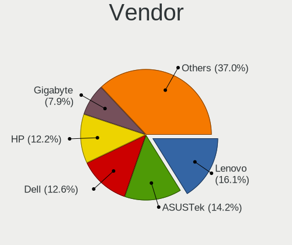
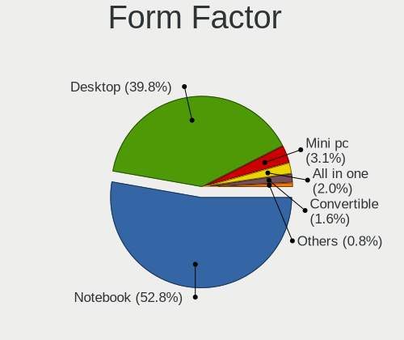
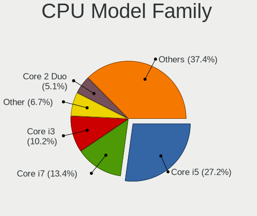
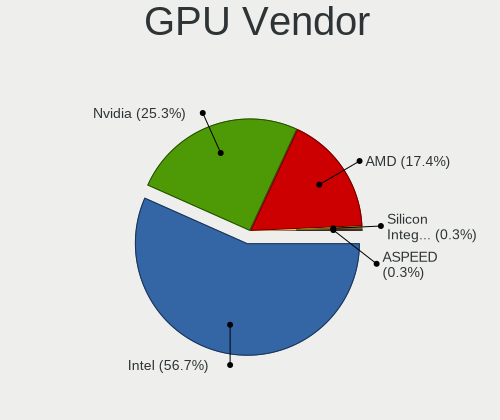
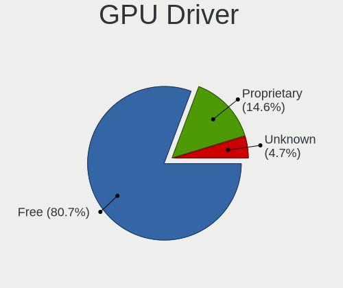
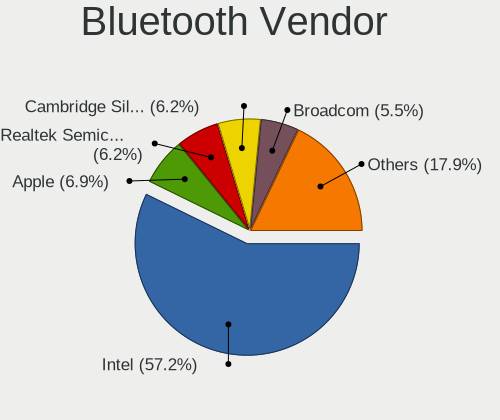
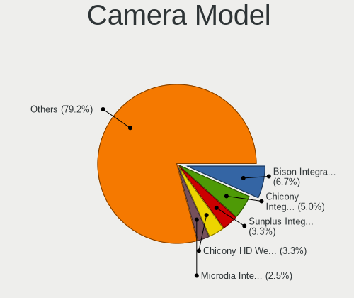
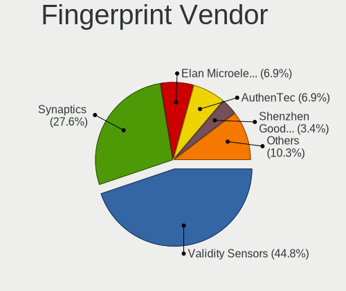

helloSystem 0.8.0 - Tested Hardware & Statistics
------------------------------------------------

A project to collect tested hardware configurations for helloSystem 0.8.0.

Anyone can contribute to this report by the [hw-probe](https://github.com/linuxhw/hw-probe/blob/master/INSTALL.BSD.md) tool:

    hw-probe -all -upload

Please contribute! Especially if your hardware is rare.

This is a report for all computer types. See also reports for [desktops](/Dist/helloSystem_0.8.0/Desktop/README.md) and [notebooks](/Dist/helloSystem_0.8.0/Notebook/README.md).

Contents
--------

* [ Test Cases ](#test-cases)

* [ System ](#system)
  - [ Arch                     ](#arch)
  - [ DE                       ](#de)
  - [ Display Server           ](#display-server)
  - [ Display Manager          ](#display-manager)
  - [ OS Lang                  ](#os-lang)
  - [ Boot Mode                ](#boot-mode)
  - [ Filesystem               ](#filesystem)
  - [ Part. scheme             ](#part-scheme)

* [ Board ](#board)
  - [ Vendor                   ](#vendor)
  - [ Model                    ](#model)
  - [ Model Family             ](#model-family)
  - [ MFG Year                 ](#mfg-year)
  - [ Form Factor              ](#form-factor)
  - [ Coreboot                 ](#coreboot)
  - [ RAM Size                 ](#ram-size)
  - [ RAM Used                 ](#ram-used)
  - [ Total Drives             ](#total-drives)
  - [ Has CD-ROM               ](#has-cd-rom)
  - [ Has Ethernet             ](#has-ethernet)
  - [ Has WiFi                 ](#has-wifi)
  - [ Has Bluetooth            ](#has-bluetooth)

* [ Location ](#location)
  - [ Country                  ](#country)
  - [ City                     ](#city)

* [ Drives ](#drives)
  - [ Drive Vendor             ](#drive-vendor)
  - [ Drive Model              ](#drive-model)
  - [ HDD Vendor               ](#hdd-vendor)
  - [ SSD Vendor               ](#ssd-vendor)
  - [ Drive Kind               ](#drive-kind)
  - [ Drive Connector          ](#drive-connector)
  - [ Drive Size               ](#drive-size)
  - [ Space Total              ](#space-total)
  - [ Space Used               ](#space-used)
  - [ Malfunc. Drives          ](#malfunc-drives)
  - [ Malfunc. Drive Vendor    ](#malfunc-drive-vendor)
  - [ Malfunc. HDD Vendor      ](#malfunc-hdd-vendor)
  - [ Malfunc. Drive Kind      ](#malfunc-drive-kind)
  - [ Failed Drives            ](#failed-drives)
  - [ Failed Drive Vendor      ](#failed-drive-vendor)
  - [ Drive Status             ](#drive-status)

* [ Storage controller ](#storage-controller)
  - [ Storage Vendor           ](#storage-vendor)
  - [ Storage Model            ](#storage-model)
  - [ Storage Kind             ](#storage-kind)

* [ Processor ](#processor)
  - [ CPU Vendor               ](#cpu-vendor)
  - [ CPU Model                ](#cpu-model)
  - [ CPU Model Family         ](#cpu-model-family)
  - [ CPU Cores                ](#cpu-cores)
  - [ CPU Sockets              ](#cpu-sockets)
  - [ CPU Threads              ](#cpu-threads)
  - [ CPU Microarch            ](#cpu-microarch)

* [ Graphics ](#graphics)
  - [ GPU Vendor               ](#gpu-vendor)
  - [ GPU Model                ](#gpu-model)
  - [ GPU Combo                ](#gpu-combo)
  - [ GPU Driver               ](#gpu-driver)
  - [ GPU Memory               ](#gpu-memory)

* [ Monitor ](#monitor)
  - [ Monitor Vendor           ](#monitor-vendor)
  - [ Monitor Model            ](#monitor-model)
  - [ Monitor Resolution       ](#monitor-resolution)
  - [ Monitor Diagonal         ](#monitor-diagonal)
  - [ Monitor Width            ](#monitor-width)
  - [ Aspect Ratio             ](#aspect-ratio)
  - [ Monitor Area             ](#monitor-area)
  - [ Pixel Density            ](#pixel-density)
  - [ Multiple Monitors        ](#multiple-monitors)

* [ Network ](#network)
  - [ Net Controller Vendor    ](#net-controller-vendor)
  - [ Net Controller Model     ](#net-controller-model)
  - [ Wireless Vendor          ](#wireless-vendor)
  - [ Wireless Model           ](#wireless-model)
  - [ Ethernet Vendor          ](#ethernet-vendor)
  - [ Ethernet Model           ](#ethernet-model)
  - [ Net Controller Kind      ](#net-controller-kind)
  - [ Used Controller          ](#used-controller)
  - [ NICs                     ](#nics)
  - [ IPv6                     ](#ipv6)

* [ Bluetooth ](#bluetooth)
  - [ Bluetooth Vendor         ](#bluetooth-vendor)
  - [ Bluetooth Model          ](#bluetooth-model)

* [ Sound ](#sound)
  - [ Sound Vendor             ](#sound-vendor)
  - [ Sound Model              ](#sound-model)

* [ Memory ](#memory)
  - [ Memory Vendor            ](#memory-vendor)
  - [ Memory Model             ](#memory-model)
  - [ Memory Kind              ](#memory-kind)
  - [ Memory Form Factor       ](#memory-form-factor)
  - [ Memory Size              ](#memory-size)
  - [ Memory Speed             ](#memory-speed)

* [ Printers & scanners ](#printers--scanners)
  - [ Printer Vendor           ](#printer-vendor)
  - [ Printer Model            ](#printer-model)
  - [ Scanner Vendor           ](#scanner-vendor)
  - [ Scanner Model            ](#scanner-model)

* [ Camera ](#camera)
  - [ Camera Vendor            ](#camera-vendor)
  - [ Camera Model             ](#camera-model)

* [ Security ](#security)
  - [ Fingerprint Vendor       ](#fingerprint-vendor)
  - [ Fingerprint Model        ](#fingerprint-model)
  - [ Chipcard Vendor          ](#chipcard-vendor)
  - [ Chipcard Model           ](#chipcard-model)

* [ Unsupported ](#unsupported)
  - [ Unsupported Devices      ](#unsupported-devices)
  - [ Unsupported Device Types ](#unsupported-device-types)

Test Cases
----------

Total: 305

| Vendor        | Model                       | Form-Factor | Probe                                                     | Date         |
|---------------|-----------------------------|-------------|-----------------------------------------------------------|--------------|
| Gigabyte      | G41M-ES2L                   | Desktop     | [30c58f7403](https://bsd-hardware.info/?probe=30c58f7403) | Aug 15, 2023 |
| Lenovo        | ThinkPad X220 4286CTO       | Notebook    | [2db86b4dff](https://bsd-hardware.info/?probe=2db86b4dff) | Aug 11, 2023 |
| ASUSTek       | P5B SE                      | Desktop     | [6361457008](https://bsd-hardware.info/?probe=6361457008) | Jul 27, 2023 |
| Dell          | 04YP6J A01                  | Desktop     | [f474b9f986](https://bsd-hardware.info/?probe=f474b9f986) | Jul 16, 2023 |
| Lenovo        | Kabini CRB 31900058 STD     | Desktop     | [127f92759b](https://bsd-hardware.info/?probe=127f92759b) | Jun 26, 2023 |
| HP            | ZBook 15 G3                 | Notebook    | [4965fc4251](https://bsd-hardware.info/?probe=4965fc4251) | May 21, 2023 |
| Dell          | 0PC5F7 A02                  | Desktop     | [b22c9a0cdf](https://bsd-hardware.info/?probe=b22c9a0cdf) | May 13, 2023 |
| ASUSTek       | ROG STRIX B550-F GAMING     | Desktop     | [3f089673e0](https://bsd-hardware.info/?probe=3f089673e0) | May 01, 2023 |
| ASUSTek       | ROG STRIX B550-F GAMING     | Desktop     | [396d7f268c](https://bsd-hardware.info/?probe=396d7f268c) | May 01, 2023 |
| Intel         | NUC7i3DNB J57625-512        | Mini pc     | [50836a160a](https://bsd-hardware.info/?probe=50836a160a) | Apr 30, 2023 |
| NCR           | Richmond BIOS.6.0           | Desktop     | [e41e1e5c70](https://bsd-hardware.info/?probe=e41e1e5c70) | Apr 28, 2023 |
| ASUSTek       | ROG CROSSHAIR VIII HERO     | Desktop     | [cf0771c3a2](https://bsd-hardware.info/?probe=cf0771c3a2) | Apr 25, 2023 |
| Intel         | NUC7i3DNB J57625-512        | Mini pc     | [a9c8c58abc](https://bsd-hardware.info/?probe=a9c8c58abc) | Apr 16, 2023 |
| Acer          | Aspire 5745DG               | Notebook    | [2b8bf9802e](https://bsd-hardware.info/?probe=2b8bf9802e) | Mar 31, 2023 |
| MECHREVO S... | S1 Series                   | Notebook    | [58ae2c4605](https://bsd-hardware.info/?probe=58ae2c4605) | Mar 19, 2023 |
| Apple         | MacBookAir1,1               | Notebook    | [2142f08b3f](https://bsd-hardware.info/?probe=2142f08b3f) | Mar 12, 2023 |
| Lenovo        | ThinkPad X230 23252G8       | Notebook    | [2ff46d6b7c](https://bsd-hardware.info/?probe=2ff46d6b7c) | Mar 10, 2023 |
| Clevo         | W240EL/W250ELQ/W270ELQ      | Notebook    | [aafc670aa7](https://bsd-hardware.info/?probe=aafc670aa7) | Mar 08, 2023 |
| Lenovo        | SHARKBAY SDK0E50510 WIN     | Desktop     | [d05a143723](https://bsd-hardware.info/?probe=d05a143723) | Mar 08, 2023 |
| Lenovo        | ThinkPad X1 Carbon 3444F... | Notebook    | [1a31b27b2a](https://bsd-hardware.info/?probe=1a31b27b2a) | Mar 08, 2023 |
| Lenovo        | G400s 20244                 | Notebook    | [215f16c5d9](https://bsd-hardware.info/?probe=215f16c5d9) | Mar 05, 2023 |
| Gigabyte      | X570 UD                     | Desktop     | [13e4d3ce10](https://bsd-hardware.info/?probe=13e4d3ce10) | Mar 05, 2023 |
| Lenovo        | IdeaPad 310-14IKB 80TU      | Notebook    | [8037475831](https://bsd-hardware.info/?probe=8037475831) | Mar 05, 2023 |
| Acer          | TravelMate TX50-G2          | Notebook    | [81ab6d240f](https://bsd-hardware.info/?probe=81ab6d240f) | Mar 05, 2023 |
| ASUSTek       | PRIME A320M-E               | Desktop     | [ca70bceb83](https://bsd-hardware.info/?probe=ca70bceb83) | Mar 05, 2023 |
| ASUSTek       | P7H55                       | Desktop     | [3c78171104](https://bsd-hardware.info/?probe=3c78171104) | Mar 04, 2023 |
| ASUSTek       | P7H55                       | Desktop     | [5ce8dbf5f3](https://bsd-hardware.info/?probe=5ce8dbf5f3) | Mar 04, 2023 |
| HP            | G62                         | Notebook    | [18487b3ab2](https://bsd-hardware.info/?probe=18487b3ab2) | Mar 02, 2023 |
| Sony          | SVE1511C5E                  | Notebook    | [0e972db389](https://bsd-hardware.info/?probe=0e972db389) | Mar 02, 2023 |
| Gigabyte      | GA-78LMT-S2P                | Desktop     | [5eb87a21db](https://bsd-hardware.info/?probe=5eb87a21db) | Mar 01, 2023 |
| Sony          | SVE1511C5E                  | Notebook    | [6aa87871c2](https://bsd-hardware.info/?probe=6aa87871c2) | Mar 01, 2023 |
| Lenovo        | IdeaPadFlex 5 14ITL05 82... | Convertible | [a919e85270](https://bsd-hardware.info/?probe=a919e85270) | Feb 28, 2023 |
| Notebook      | N2x0WU                      | Notebook    | [9545f36dee](https://bsd-hardware.info/?probe=9545f36dee) | Feb 27, 2023 |
| ASUSTek       | VivoBook_ASUSLaptop X509... | Notebook    | [115bd3bc38](https://bsd-hardware.info/?probe=115bd3bc38) | Feb 26, 2023 |
| Fujitsu       | D3009-A1 S26361-D3009-A1    | Desktop     | [66739867ed](https://bsd-hardware.info/?probe=66739867ed) | Feb 26, 2023 |
| Lenovo        | ThinkPad P51 20HH001RMX     | Notebook    | [59e609fbb2](https://bsd-hardware.info/?probe=59e609fbb2) | Feb 26, 2023 |
| Intel         | NUC11PABi5 K90634-305       | Mini pc     | [33330ade31](https://bsd-hardware.info/?probe=33330ade31) | Feb 25, 2023 |
| Samsung       | 270E5K/270E5Q/271E5K/257... | Notebook    | [45549e4faf](https://bsd-hardware.info/?probe=45549e4faf) | Feb 25, 2023 |
| ASUSTek       | ROG STRIX Z390-E GAMING     | Desktop     | [be81f2675f](https://bsd-hardware.info/?probe=be81f2675f) | Feb 25, 2023 |
| Toshiba       | dynabook R63/P              | Notebook    | [c41c3adfa4](https://bsd-hardware.info/?probe=c41c3adfa4) | Feb 25, 2023 |
| Lenovo        | ThinkPad X1 Carbon 2nd 2... | Notebook    | [b3e56e9656](https://bsd-hardware.info/?probe=b3e56e9656) | Feb 25, 2023 |
| ASRock        | X470 Gaming K4              | Desktop     | [fbff29a62a](https://bsd-hardware.info/?probe=fbff29a62a) | Feb 25, 2023 |
| Dell          | Latitude 5591               | Notebook    | [fb33d7a0c4](https://bsd-hardware.info/?probe=fb33d7a0c4) | Feb 25, 2023 |
| HP            | EliteBook 840 G1            | Notebook    | [0480ce43f2](https://bsd-hardware.info/?probe=0480ce43f2) | Feb 24, 2023 |
| Lenovo        | SHARKBAY SDK0E50510 WIN     | Desktop     | [31122bd298](https://bsd-hardware.info/?probe=31122bd298) | Feb 24, 2023 |
| HP            | EliteBook 840 G1            | Notebook    | [77c17e4a2f](https://bsd-hardware.info/?probe=77c17e4a2f) | Feb 22, 2023 |
| Lenovo        | IdeaPad 3 14IML05 81WA      | Notebook    | [d04d402809](https://bsd-hardware.info/?probe=d04d402809) | Feb 21, 2023 |
| Gigabyte      | A320M-H-CF                  | Desktop     | [02970305db](https://bsd-hardware.info/?probe=02970305db) | Feb 21, 2023 |
| Lenovo        | ThinkPad L450 20DSS1S402    | Notebook    | [06e5309c55](https://bsd-hardware.info/?probe=06e5309c55) | Feb 20, 2023 |
| Lenovo        | ThinkPad T410 2537B94       | Notebook    | [9f9cb3e201](https://bsd-hardware.info/?probe=9f9cb3e201) | Feb 19, 2023 |
| Acer          | Aspire E1-421               | Notebook    | [db00abb833](https://bsd-hardware.info/?probe=db00abb833) | Feb 19, 2023 |
| Fujitsu Si... | ESPRIMO Mobile V5535        | Notebook    | [92bca4d026](https://bsd-hardware.info/?probe=92bca4d026) | Feb 19, 2023 |
| Lenovo        | G400s 20244                 | Notebook    | [f2c258a0ae](https://bsd-hardware.info/?probe=f2c258a0ae) | Feb 19, 2023 |
| Gigabyte      | GB-BSi3A-6100               | Notebook    | [e7ef795b9b](https://bsd-hardware.info/?probe=e7ef795b9b) | Feb 19, 2023 |
| Gigabyte      | GB-BSi3A-6100               | Notebook    | [cd2273037f](https://bsd-hardware.info/?probe=cd2273037f) | Feb 19, 2023 |
| Dell          | Inspiron 5767               | Notebook    | [39b4581223](https://bsd-hardware.info/?probe=39b4581223) | Feb 18, 2023 |
| Lenovo        | ThinkPad T61p 6457UN2       | Notebook    | [67b2e8db2b](https://bsd-hardware.info/?probe=67b2e8db2b) | Feb 18, 2023 |
| Dell          | Inspiron 5767               | Notebook    | [fd58d235b3](https://bsd-hardware.info/?probe=fd58d235b3) | Feb 18, 2023 |
| Lenovo        | ThinkPad T61p 6457UN2       | Notebook    | [f7646f9d7f](https://bsd-hardware.info/?probe=f7646f9d7f) | Feb 18, 2023 |
| Gigabyte      | B450M AORUS ELITE           | Desktop     | [6af537ff20](https://bsd-hardware.info/?probe=6af537ff20) | Feb 18, 2023 |
| ASUSTek       | PRIME H310M-C R2.0          | Desktop     | [9761fb446b](https://bsd-hardware.info/?probe=9761fb446b) | Feb 18, 2023 |
| ASRock        | A320M-DGS                   | Desktop     | [032d7f0c91](https://bsd-hardware.info/?probe=032d7f0c91) | Feb 17, 2023 |
| Google        | Lulu                        | Notebook    | [cf598483cf](https://bsd-hardware.info/?probe=cf598483cf) | Feb 17, 2023 |
| Unknown       | CMB-A9SC2                   | Server      | [6d3e23081c](https://bsd-hardware.info/?probe=6d3e23081c) | Feb 17, 2023 |
| ASUSTek       | P8Z68-V LX                  | Desktop     | [99ede66a89](https://bsd-hardware.info/?probe=99ede66a89) | Feb 16, 2023 |
| ASUSTek       | PRIME A320M-K               | Desktop     | [35aa7d7f04](https://bsd-hardware.info/?probe=35aa7d7f04) | Feb 15, 2023 |
| HP            | OMEN by Gaming Laptop 16... | Notebook    | [00142b4e4c](https://bsd-hardware.info/?probe=00142b4e4c) | Feb 14, 2023 |
| MECHREVO S... | S1 Series                   | Notebook    | [26c3b9bf4f](https://bsd-hardware.info/?probe=26c3b9bf4f) | Feb 14, 2023 |
| MECHREVO S... | S1 Series                   | Notebook    | [1d948a1a23](https://bsd-hardware.info/?probe=1d948a1a23) | Feb 14, 2023 |
| Dell          | 0D28YY A03                  | Desktop     | [b8dc69069d](https://bsd-hardware.info/?probe=b8dc69069d) | Feb 12, 2023 |
| HP            | Pavilion x360 2-in-1 Lap... | Convertible | [6cd6b15a60](https://bsd-hardware.info/?probe=6cd6b15a60) | Feb 12, 2023 |
| Intel         | NUC11TNBi5 M11904-404       | Mini pc     | [ba1b9f0010](https://bsd-hardware.info/?probe=ba1b9f0010) | Feb 12, 2023 |
| Intel         | NUC7i5BNB J31144-305        | Mini pc     | [60f03e1dec](https://bsd-hardware.info/?probe=60f03e1dec) | Feb 12, 2023 |
| Dell          | 0PU052                      | Desktop     | [03bcc500c0](https://bsd-hardware.info/?probe=03bcc500c0) | Feb 12, 2023 |
| Dell          | 0PU052                      | Desktop     | [035408150f](https://bsd-hardware.info/?probe=035408150f) | Feb 11, 2023 |
| ASUSTek       | P8Z68-V                     | Desktop     | [74ebc950e2](https://bsd-hardware.info/?probe=74ebc950e2) | Feb 11, 2023 |
| ASRock        | H61M/U3S3                   | Desktop     | [48c80bbb1f](https://bsd-hardware.info/?probe=48c80bbb1f) | Feb 11, 2023 |
| HP            | 83EE                        | Desktop     | [cf914f58eb](https://bsd-hardware.info/?probe=cf914f58eb) | Feb 10, 2023 |
| ASRock        | A770DE+                     | Desktop     | [cf1c018ede](https://bsd-hardware.info/?probe=cf1c018ede) | Feb 10, 2023 |
| MSI           | GF76 12UE                   | Notebook    | [371f734e07](https://bsd-hardware.info/?probe=371f734e07) | Feb 10, 2023 |
| Apple         | Mac-4B682C642B45593E iMa... | All in one  | [367edc6620](https://bsd-hardware.info/?probe=367edc6620) | Feb 10, 2023 |
| Lenovo        | MAHOBAY NOK                 | Desktop     | [d6be869761](https://bsd-hardware.info/?probe=d6be869761) | Feb 09, 2023 |
| Apple         | Mac-4B682C642B45593E iMa... | All in one  | [1d8b9a30c5](https://bsd-hardware.info/?probe=1d8b9a30c5) | Feb 09, 2023 |
| AZW           | GTR V01                     | Mini pc     | [0cfac4d34d](https://bsd-hardware.info/?probe=0cfac4d34d) | Feb 09, 2023 |
| Sony          | SVF1421E4E                  | Notebook    | [d0a9e97993](https://bsd-hardware.info/?probe=d0a9e97993) | Feb 09, 2023 |
| Biostar       | TA970                       | Desktop     | [8c1a7aedf1](https://bsd-hardware.info/?probe=8c1a7aedf1) | Feb 09, 2023 |
| HP            | Laptop 14-df0xxx            | Notebook    | [1dc503f21d](https://bsd-hardware.info/?probe=1dc503f21d) | Feb 09, 2023 |
| Acer          | Aspire 4739Z                | Notebook    | [1e97a0b938](https://bsd-hardware.info/?probe=1e97a0b938) | Feb 09, 2023 |
| Intel         | NUC10i7FNB K61360-304       | Mini pc     | [5c2047356d](https://bsd-hardware.info/?probe=5c2047356d) | Feb 08, 2023 |
| ASUSTek       | N76VZ                       | Notebook    | [3b7e2ee70b](https://bsd-hardware.info/?probe=3b7e2ee70b) | Feb 08, 2023 |
| ASUSTek       | M5A78L-M LX3                | Desktop     | [9af803f850](https://bsd-hardware.info/?probe=9af803f850) | Feb 08, 2023 |
| ASUSTek       | K84L                        | Notebook    | [d58c178c51](https://bsd-hardware.info/?probe=d58c178c51) | Feb 08, 2023 |
| HP            | Notebook                    | Notebook    | [507e85c092](https://bsd-hardware.info/?probe=507e85c092) | Feb 08, 2023 |
| ASUSTek       | 1201N                       | Notebook    | [3f44d6ed3f](https://bsd-hardware.info/?probe=3f44d6ed3f) | Feb 08, 2023 |
| MSI           | Z97 GAMING 3                | Desktop     | [bbe7b327fd](https://bsd-hardware.info/?probe=bbe7b327fd) | Feb 06, 2023 |
| Lenovo        | IdeaPad 3 15IML05 82BS      | Notebook    | [3345f50844](https://bsd-hardware.info/?probe=3345f50844) | Feb 06, 2023 |
| HP            | Notebook                    | Notebook    | [8d8e5c294a](https://bsd-hardware.info/?probe=8d8e5c294a) | Feb 06, 2023 |
| AOpen         | D1007 0BBA                  | Desktop     | [0873652381](https://bsd-hardware.info/?probe=0873652381) | Feb 06, 2023 |
| SLIMBOOK      | PROX-AMD5                   | Notebook    | [8083410c50](https://bsd-hardware.info/?probe=8083410c50) | Feb 06, 2023 |
| ASUSTek       | P8Z77-M                     | Desktop     | [627bdfafb7](https://bsd-hardware.info/?probe=627bdfafb7) | Feb 06, 2023 |
| Lenovo        | ThinkPad P15 Gen 2i 20YQ... | Notebook    | [78a978a8d4](https://bsd-hardware.info/?probe=78a978a8d4) | Feb 06, 2023 |
| Biostar       | H61MLV3                     | Desktop     | [dee9a22461](https://bsd-hardware.info/?probe=dee9a22461) | Feb 06, 2023 |
| Lenovo        | ThinkPad X380 Yoga 20LH0... | Convertible | [27702234cc](https://bsd-hardware.info/?probe=27702234cc) | Feb 06, 2023 |
| MSI           | MPG X570 GAMING PLUS        | Desktop     | [c04d9caf55](https://bsd-hardware.info/?probe=c04d9caf55) | Feb 06, 2023 |
| Lenovo        | ThinkPad X1 Carbon 3448A... | Notebook    | [80f8e59cab](https://bsd-hardware.info/?probe=80f8e59cab) | Feb 05, 2023 |
| Gigabyte      | H510M S2H V2                | Desktop     | [85628154a2](https://bsd-hardware.info/?probe=85628154a2) | Feb 05, 2023 |
| HP            | 2000                        | Notebook    | [7c997ce022](https://bsd-hardware.info/?probe=7c997ce022) | Feb 05, 2023 |
| Lenovo        | IdeaPad 3 15ITL6 82H8       | Notebook    | [c771b7daf4](https://bsd-hardware.info/?probe=c771b7daf4) | Feb 05, 2023 |
| Notebook      | NV4XMB,ME,MZ                | Notebook    | [8a2bba8635](https://bsd-hardware.info/?probe=8a2bba8635) | Feb 05, 2023 |
| Dell          | 0PC5F7 A02                  | Desktop     | [5512097fd0](https://bsd-hardware.info/?probe=5512097fd0) | Feb 05, 2023 |
| Lenovo        | B50-80 80EW                 | Notebook    | [97da411601](https://bsd-hardware.info/?probe=97da411601) | Feb 04, 2023 |
| Lenovo        | B50-80 80EW                 | Notebook    | [a8ec146fc6](https://bsd-hardware.info/?probe=a8ec146fc6) | Feb 04, 2023 |
| Lenovo        | ThinkPad T520 4243F39       | Notebook    | [c0a6490fc8](https://bsd-hardware.info/?probe=c0a6490fc8) | Feb 03, 2023 |
| ASUSTek       | PRIME B450M-A               | Desktop     | [7c56590eaa](https://bsd-hardware.info/?probe=7c56590eaa) | Feb 03, 2023 |
| Lenovo        | SKYBAY 31900002 WIN 1801... | All in one  | [725797b27e](https://bsd-hardware.info/?probe=725797b27e) | Feb 02, 2023 |
| Unknown       | Unknown                     | Notebook    | [a7d54d41c8](https://bsd-hardware.info/?probe=a7d54d41c8) | Feb 02, 2023 |
| Gigabyte      | F2A88XM-D3H                 | Desktop     | [fa88a5ce31](https://bsd-hardware.info/?probe=fa88a5ce31) | Feb 02, 2023 |
| HP            | Mini 210-1000               | Notebook    | [eaabd2a89d](https://bsd-hardware.info/?probe=eaabd2a89d) | Feb 02, 2023 |
| HP            | ENVY TS m6 Sleekbook        | Notebook    | [402494618a](https://bsd-hardware.info/?probe=402494618a) | Feb 01, 2023 |
| HP            | ENVY TS m6 Sleekbook        | Notebook    | [63d90da096](https://bsd-hardware.info/?probe=63d90da096) | Feb 01, 2023 |
| MSI           | Modern 15 A5M               | Notebook    | [afda1bcf60](https://bsd-hardware.info/?probe=afda1bcf60) | Jan 31, 2023 |
| HP            | EliteBook 8440p             | Notebook    | [d732f4d6c4](https://bsd-hardware.info/?probe=d732f4d6c4) | Jan 31, 2023 |
| HP            | 1496                        | Desktop     | [fae90baa23](https://bsd-hardware.info/?probe=fae90baa23) | Jan 31, 2023 |
| MSI           | Modern 15 A5M               | Notebook    | [26d140b290](https://bsd-hardware.info/?probe=26d140b290) | Jan 31, 2023 |
| Dell          | 0F373D A00                  | Desktop     | [cd4202e58b](https://bsd-hardware.info/?probe=cd4202e58b) | Jan 30, 2023 |
| Dell          | Precision 5540              | Notebook    | [de7ac2f8d1](https://bsd-hardware.info/?probe=de7ac2f8d1) | Jan 30, 2023 |
| Apple         | MacBookAir5,1               | Notebook    | [eeed92ab62](https://bsd-hardware.info/?probe=eeed92ab62) | Jan 29, 2023 |
| Lenovo        | ThinkPad X1 Carbon 3448A... | Notebook    | [6da773c078](https://bsd-hardware.info/?probe=6da773c078) | Jan 29, 2023 |
| Unknown       | TJ41G-A80 v2 Series         | All in one  | [c44ac785cc](https://bsd-hardware.info/?probe=c44ac785cc) | Jan 29, 2023 |
| Unknown       | TJ41G-A80 v2 Series         | All in one  | [a5bc81b507](https://bsd-hardware.info/?probe=a5bc81b507) | Jan 29, 2023 |
| Packard Be... | DOT S                       | Notebook    | [09a2057767](https://bsd-hardware.info/?probe=09a2057767) | Jan 28, 2023 |
| Razer         | Blade Stealth               | Notebook    | [14760d0c64](https://bsd-hardware.info/?probe=14760d0c64) | Jan 28, 2023 |
| ASUSTek       | M4A89TD PRO USB3            | Desktop     | [1328d01296](https://bsd-hardware.info/?probe=1328d01296) | Jan 28, 2023 |
| Lenovo        | ThinkPad E585 20KV0010US    | Notebook    | [9cfe2dd858](https://bsd-hardware.info/?probe=9cfe2dd858) | Jan 28, 2023 |
| Dell          | Latitude 5400               | Notebook    | [a266199ace](https://bsd-hardware.info/?probe=a266199ace) | Jan 27, 2023 |
| Gigabyte      | GA-MA770T-UD3               | Desktop     | [6b63a16799](https://bsd-hardware.info/?probe=6b63a16799) | Jan 26, 2023 |
| Gigabyte      | B360M D2V                   | Desktop     | [6685066b6e](https://bsd-hardware.info/?probe=6685066b6e) | Jan 26, 2023 |
| ASUSTek       | H81M-D R2.0                 | Desktop     | [07982549ac](https://bsd-hardware.info/?probe=07982549ac) | Jan 26, 2023 |
| Gigabyte      | H61M-S2PV                   | Desktop     | [9a307961ed](https://bsd-hardware.info/?probe=9a307961ed) | Jan 26, 2023 |
| Google        | Cave                        | Notebook    | [76ac12f1e2](https://bsd-hardware.info/?probe=76ac12f1e2) | Jan 25, 2023 |
| ASUSTek       | PRIME H310M-K               | Desktop     | [1c97950ce9](https://bsd-hardware.info/?probe=1c97950ce9) | Jan 25, 2023 |
| Lenovo        | ThinkPad X1 Tablet 20GHS... | Tablet      | [cd05b84425](https://bsd-hardware.info/?probe=cd05b84425) | Jan 25, 2023 |
| HP            | EliteBook 2560p             | Notebook    | [80c808de34](https://bsd-hardware.info/?probe=80c808de34) | Jan 25, 2023 |
| Timi          | TM1607                      | Notebook    | [57113d2886](https://bsd-hardware.info/?probe=57113d2886) | Jan 25, 2023 |
| HP            | 802E                        | Desktop     | [1f3bf517af](https://bsd-hardware.info/?probe=1f3bf517af) | Jan 25, 2023 |
| Lenovo        | G500 20236                  | Notebook    | [081d22fbe2](https://bsd-hardware.info/?probe=081d22fbe2) | Jan 24, 2023 |
| Lenovo        | G500 20236                  | Notebook    | [a35053ad38](https://bsd-hardware.info/?probe=a35053ad38) | Jan 24, 2023 |
| Google        | Panther                     | Desktop     | [73d3147166](https://bsd-hardware.info/?probe=73d3147166) | Jan 24, 2023 |
| MSI           | PS63 Modern 8M              | Notebook    | [f740e313e5](https://bsd-hardware.info/?probe=f740e313e5) | Jan 24, 2023 |
| Timi          | TM1607                      | Notebook    | [27db14fdbd](https://bsd-hardware.info/?probe=27db14fdbd) | Jan 24, 2023 |
| Fujitsu       | LIFEBOOK S935               | Notebook    | [5c07c1a47e](https://bsd-hardware.info/?probe=5c07c1a47e) | Jan 24, 2023 |
| Dell          | Latitude 3540               | Notebook    | [a180a149f5](https://bsd-hardware.info/?probe=a180a149f5) | Jan 24, 2023 |
| Dell          | 0DFRFW A01                  | Desktop     | [23415b954f](https://bsd-hardware.info/?probe=23415b954f) | Jan 24, 2023 |
| Dell          | Latitude 5580               | Notebook    | [90cd22ad55](https://bsd-hardware.info/?probe=90cd22ad55) | Jan 24, 2023 |
| HP            | 1495                        | Desktop     | [69faf0563a](https://bsd-hardware.info/?probe=69faf0563a) | Jan 24, 2023 |
| Toshiba       | PORTEGE Z930                | Notebook    | [476203ee86](https://bsd-hardware.info/?probe=476203ee86) | Jan 23, 2023 |
| Apple         | MacBookPro9,2               | Notebook    | [aaccb6df1a](https://bsd-hardware.info/?probe=aaccb6df1a) | Jan 23, 2023 |
| Toshiba       | PORTEGE Z930                | Notebook    | [4af2cc1909](https://bsd-hardware.info/?probe=4af2cc1909) | Jan 23, 2023 |
| Gigabyte      | GA-990X-Gaming SLI-CF       | Desktop     | [9cd4d2810a](https://bsd-hardware.info/?probe=9cd4d2810a) | Jan 23, 2023 |
| ASUSTek       | K50IN                       | Notebook    | [6f7a8f3338](https://bsd-hardware.info/?probe=6f7a8f3338) | Jan 23, 2023 |
| Lenovo        | ThinkPad W541 20EF000NUS    | Notebook    | [200a92d510](https://bsd-hardware.info/?probe=200a92d510) | Jan 23, 2023 |
| Star Labs     | StarBook                    | Notebook    | [d222f381b0](https://bsd-hardware.info/?probe=d222f381b0) | Jan 23, 2023 |
| Star Labs     | StarBook                    | Notebook    | [045d4bb6e8](https://bsd-hardware.info/?probe=045d4bb6e8) | Jan 23, 2023 |
| ASRock        | Z390 Pro4                   | Desktop     | [b9d64a7496](https://bsd-hardware.info/?probe=b9d64a7496) | Jan 23, 2023 |
| Gigabyte      | X570 AORUS PRO              | Desktop     | [6cf4f6761e](https://bsd-hardware.info/?probe=6cf4f6761e) | Jan 23, 2023 |
| Gigabyte      | A520M S2H                   | Desktop     | [803a152afc](https://bsd-hardware.info/?probe=803a152afc) | Jan 23, 2023 |
| ASUSTek       | PRIME A320M-K               | Desktop     | [cdad2f0001](https://bsd-hardware.info/?probe=cdad2f0001) | Jan 23, 2023 |
| Dell          | Inspiron 15-7568            | Notebook    | [44e36adfa4](https://bsd-hardware.info/?probe=44e36adfa4) | Jan 23, 2023 |
| ASUSTek       | J1800I-C                    | Desktop     | [27ea626000](https://bsd-hardware.info/?probe=27ea626000) | Jan 23, 2023 |
| ASUSTek       | J1800I-C                    | Desktop     | [abc17c6fc6](https://bsd-hardware.info/?probe=abc17c6fc6) | Jan 23, 2023 |
| MSI           | B450M MORTAR MAX            | Desktop     | [840145eb80](https://bsd-hardware.info/?probe=840145eb80) | Jan 23, 2023 |
| Dell          | Inspiron 3442               | Notebook    | [8b137bca84](https://bsd-hardware.info/?probe=8b137bca84) | Jan 23, 2023 |
| Timi          | TM1607                      | Notebook    | [7636a0ef8f](https://bsd-hardware.info/?probe=7636a0ef8f) | Jan 23, 2023 |
| Timi          | TM1607                      | Notebook    | [1ca46404a1](https://bsd-hardware.info/?probe=1ca46404a1) | Jan 23, 2023 |
| Samsung       | 340XAA/350XAA/550XAA        | Notebook    | [881e97e41c](https://bsd-hardware.info/?probe=881e97e41c) | Jan 23, 2023 |
| ASUSTek       | X99-A/USB                   | Desktop     | [006553f965](https://bsd-hardware.info/?probe=006553f965) | Jan 23, 2023 |
| Gigabyte      | H81M-H                      | Desktop     | [4b3a05fc2a](https://bsd-hardware.info/?probe=4b3a05fc2a) | Jan 22, 2023 |
| ASUSTek       | P5KPL-AM SE                 | Desktop     | [6dc0fddda1](https://bsd-hardware.info/?probe=6dc0fddda1) | Jan 22, 2023 |
| Acer          | Aspire ES1-533              | Notebook    | [d2652b76cf](https://bsd-hardware.info/?probe=d2652b76cf) | Jan 22, 2023 |
| ASUSTek       | Q405UA                      | Convertible | [6662cab62d](https://bsd-hardware.info/?probe=6662cab62d) | Jan 22, 2023 |
| ASUSTek       | Q405UA                      | Convertible | [2b94c3efae](https://bsd-hardware.info/?probe=2b94c3efae) | Jan 22, 2023 |
| Dell          | 03KWTV A02                  | Desktop     | [28088f7e94](https://bsd-hardware.info/?probe=28088f7e94) | Jan 22, 2023 |
| Lenovo        | ThinkPad P50 20EN0041MX     | Notebook    | [c27f1f53f2](https://bsd-hardware.info/?probe=c27f1f53f2) | Jan 22, 2023 |
| HP            | Laptop 15-bs0xx             | Notebook    | [7bd5f0c2e9](https://bsd-hardware.info/?probe=7bd5f0c2e9) | Jan 22, 2023 |
| Panasonic     | CF-C1BWFAZ1M                | Notebook    | [d129d929ac](https://bsd-hardware.info/?probe=d129d929ac) | Jan 22, 2023 |
| Lenovo        | ThinkPad P51 20HH001RMX     | Notebook    | [ab38c51298](https://bsd-hardware.info/?probe=ab38c51298) | Jan 22, 2023 |
| Gigabyte      | H270M-DS3H-CF               | Desktop     | [d0e2e85346](https://bsd-hardware.info/?probe=d0e2e85346) | Jan 17, 2023 |
| HP            | ZBook 15 G4                 | Notebook    | [e98d329586](https://bsd-hardware.info/?probe=e98d329586) | Jan 15, 2023 |
| HP            | ZBook 15 G4                 | Notebook    | [86875f01c2](https://bsd-hardware.info/?probe=86875f01c2) | Jan 15, 2023 |
| Lenovo        | ThinkPad P15v Gen 2i 21A... | Notebook    | [035f9afc5d](https://bsd-hardware.info/?probe=035f9afc5d) | Jan 14, 2023 |
| Lenovo        | ThinkPad P15v Gen 2i 21A... | Notebook    | [9ded9cc6ec](https://bsd-hardware.info/?probe=9ded9cc6ec) | Jan 14, 2023 |
| Razer         | Blade Stealth               | Notebook    | [2464314a65](https://bsd-hardware.info/?probe=2464314a65) | Jan 11, 2023 |
| Gigabyte      | G1.Sniper A88X-CF           | Desktop     | [2372c973c8](https://bsd-hardware.info/?probe=2372c973c8) | Jan 11, 2023 |
| Dell          | 0K240Y A02                  | Desktop     | [379b59f079](https://bsd-hardware.info/?probe=379b59f079) | Jan 05, 2023 |
| Lenovo        | ThinkPad T61 64644YG        | Notebook    | [0657433463](https://bsd-hardware.info/?probe=0657433463) | Jan 03, 2023 |
| Apple         | MacBookAir5,1               | Notebook    | [0d398d5c59](https://bsd-hardware.info/?probe=0d398d5c59) | Dec 27, 2022 |
| Gigabyte      | X399 AORUS Gaming 7         | Desktop     | [1769da5143](https://bsd-hardware.info/?probe=1769da5143) | Dec 25, 2022 |
| Lenovo        | ThinkPad X1 Extreme Gen ... | Notebook    | [d19db2828c](https://bsd-hardware.info/?probe=d19db2828c) | Dec 16, 2022 |
| ASUSTek       | CM1530                      | Desktop     | [902c77b5dc](https://bsd-hardware.info/?probe=902c77b5dc) | Dec 06, 2022 |
| Dell          | Latitude 5590               | Notebook    | [0a17f04eba](https://bsd-hardware.info/?probe=0a17f04eba) | Dec 02, 2022 |
| Toshiba       | TECRA Z40-C-12Z             | Notebook    | [149e5c3de3](https://bsd-hardware.info/?probe=149e5c3de3) | Nov 28, 2022 |
| ASUSTek       | PRIME Z390M-PLUS            | Desktop     | [7329e04c22](https://bsd-hardware.info/?probe=7329e04c22) | Nov 27, 2022 |
| Dell          | 0M017G A00                  | Desktop     | [3acaad9a7d](https://bsd-hardware.info/?probe=3acaad9a7d) | Nov 26, 2022 |
| Dell          | 009Y81 A01                  | All in one  | [75132e6886](https://bsd-hardware.info/?probe=75132e6886) | Nov 25, 2022 |
| Gigabyte      | P61-USB3-B3                 | Desktop     | [1ec1683acd](https://bsd-hardware.info/?probe=1ec1683acd) | Nov 21, 2022 |
| Gigabyte      | P61-USB3-B3                 | Desktop     | [5f442f0c65](https://bsd-hardware.info/?probe=5f442f0c65) | Nov 21, 2022 |
| Gigabyte      | H61M-S1                     | Desktop     | [2b851dbbc1](https://bsd-hardware.info/?probe=2b851dbbc1) | Nov 21, 2022 |
| Gigabyte      | 970A-D3P                    | Desktop     | [cced487ec5](https://bsd-hardware.info/?probe=cced487ec5) | Nov 21, 2022 |
| Gigabyte      | 970A-D3P                    | Desktop     | [c28a22ecb5](https://bsd-hardware.info/?probe=c28a22ecb5) | Nov 21, 2022 |
| ASUSTek       | P5KPL-VM-TWPC               | Desktop     | [6a5ff282a7](https://bsd-hardware.info/?probe=6a5ff282a7) | Nov 21, 2022 |
| Acer          | Aspire 5251                 | Notebook    | [046bc722cb](https://bsd-hardware.info/?probe=046bc722cb) | Nov 16, 2022 |
| HP            | 1998                        | Desktop     | [9239fe7437](https://bsd-hardware.info/?probe=9239fe7437) | Nov 15, 2022 |
| Dell          | Inspiron 3421               | Notebook    | [5c37012f33](https://bsd-hardware.info/?probe=5c37012f33) | Nov 10, 2022 |
| Gigabyte      | H270M-DS3H-CF               | Desktop     | [5784d8bed6](https://bsd-hardware.info/?probe=5784d8bed6) | Nov 04, 2022 |
| HP            | Pavilion g6                 | Notebook    | [c4e84b8104](https://bsd-hardware.info/?probe=c4e84b8104) | Oct 30, 2022 |
| Lenovo        | 3106 SDK0J40705 WIN 3425... | Desktop     | [d20bfb6d64](https://bsd-hardware.info/?probe=d20bfb6d64) | Oct 30, 2022 |
| HP            | 843B                        | Desktop     | [d7d572f9ad](https://bsd-hardware.info/?probe=d7d572f9ad) | Oct 29, 2022 |
| Intel         | NUC8BEB J72688-306          | Mini pc     | [17f444775b](https://bsd-hardware.info/?probe=17f444775b) | Oct 28, 2022 |
| HP            | 843B                        | Desktop     | [9ea2590610](https://bsd-hardware.info/?probe=9ea2590610) | Oct 23, 2022 |
| Google        | Edgar                       | Notebook    | [318a750368](https://bsd-hardware.info/?probe=318a750368) | Oct 22, 2022 |
| MSI           | B450M PRO-VDH PLUS          | Desktop     | [54e4202bc7](https://bsd-hardware.info/?probe=54e4202bc7) | Oct 21, 2022 |
| MSI           | PS63 Modern 8M              | Notebook    | [949e472db5](https://bsd-hardware.info/?probe=949e472db5) | Oct 19, 2022 |
| HP            | 86FC MVB                    | Desktop     | [56453b00c8](https://bsd-hardware.info/?probe=56453b00c8) | Oct 08, 2022 |
| HP            | 86FC MVB                    | Desktop     | [c542b16d75](https://bsd-hardware.info/?probe=c542b16d75) | Oct 08, 2022 |
| TUXEDO        | Aura 15 Gen1                | Notebook    | [a49ac2701d](https://bsd-hardware.info/?probe=a49ac2701d) | Oct 02, 2022 |
| Dell          | 0T10XW A01                  | Desktop     | [c2ff0bc0b9](https://bsd-hardware.info/?probe=c2ff0bc0b9) | Sep 30, 2022 |
| Kraftway      | KW10T                       | Notebook    | [db27da2e88](https://bsd-hardware.info/?probe=db27da2e88) | Sep 29, 2022 |
| Lenovo        | ThinkPad X250 20CLS1WP01    | Notebook    | [1b75ee6295](https://bsd-hardware.info/?probe=1b75ee6295) | Sep 19, 2022 |
| Apple         | MacBook5,2                  | Notebook    | [79503c0635](https://bsd-hardware.info/?probe=79503c0635) | Sep 10, 2022 |
| Apple         | MacBook5,2                  | Notebook    | [9c7a64970c](https://bsd-hardware.info/?probe=9c7a64970c) | Sep 10, 2022 |
| Dell          | Latitude E5550              | Notebook    | [867e56fb52](https://bsd-hardware.info/?probe=867e56fb52) | Sep 01, 2022 |
| ASRock        | ConRoeXFire-eSATA2          | Desktop     | [caf005ed95](https://bsd-hardware.info/?probe=caf005ed95) | Sep 01, 2022 |
| Lenovo        | ThinkPad T420 4178A72       | Notebook    | [18a105546b](https://bsd-hardware.info/?probe=18a105546b) | Aug 29, 2022 |
| Lenovo        | ThinkPad T420 4178A72       | Notebook    | [1433351032](https://bsd-hardware.info/?probe=1433351032) | Aug 29, 2022 |
| ASUSTek       | ROG STRIX B550-I GAMING     | Desktop     | [079adb24f8](https://bsd-hardware.info/?probe=079adb24f8) | Aug 28, 2022 |
| Toshiba       | Satellite S55t-B            | Notebook    | [df9971d3aa](https://bsd-hardware.info/?probe=df9971d3aa) | Aug 27, 2022 |
| ASUSTek       | VivoBook 15_ASUS Laptop ... | Notebook    | [2c7586b0ed](https://bsd-hardware.info/?probe=2c7586b0ed) | Aug 25, 2022 |
| Intel         | NUC8BEB J72688-304          | Mini pc     | [3de3724488](https://bsd-hardware.info/?probe=3de3724488) | Aug 12, 2022 |
| TUXEDO        | Pulse 14 Gen1               | Notebook    | [5edf8a1bef](https://bsd-hardware.info/?probe=5edf8a1bef) | Aug 09, 2022 |
| ASUSTek       | F6A                         | Notebook    | [6626d18284](https://bsd-hardware.info/?probe=6626d18284) | Aug 08, 2022 |
| ASUSTek       | P5QL-ASUS-SE                | Desktop     | [50a0d392e7](https://bsd-hardware.info/?probe=50a0d392e7) | Aug 06, 2022 |
| ASUSTek       | K30AM-J                     | Desktop     | [470ced8f30](https://bsd-hardware.info/?probe=470ced8f30) | Aug 05, 2022 |
| HP            | 250 G6 Notebook PC          | Notebook    | [511d057c70](https://bsd-hardware.info/?probe=511d057c70) | Jul 27, 2022 |
| HP            | OMEN by Laptop              | Notebook    | [25e43be096](https://bsd-hardware.info/?probe=25e43be096) | Jul 17, 2022 |
| MSI           | MPG X570 GAMING PLUS        | Desktop     | [a80b1c4f3c](https://bsd-hardware.info/?probe=a80b1c4f3c) | Jul 17, 2022 |
| HP            | 1998                        | Desktop     | [e4fda48283](https://bsd-hardware.info/?probe=e4fda48283) | Jul 15, 2022 |
| Dell          | Latitude E5450              | Notebook    | [5f1183ab0b](https://bsd-hardware.info/?probe=5f1183ab0b) | Jul 14, 2022 |
| Dell          | Latitude E5450              | Notebook    | [1080ed5654](https://bsd-hardware.info/?probe=1080ed5654) | Jul 14, 2022 |
| Acer          | Aspire E5-571G              | Notebook    | [56fae2295e](https://bsd-hardware.info/?probe=56fae2295e) | Jul 08, 2022 |
| HP            | 250 G6 Notebook PC          | Notebook    | [bbe1d21883](https://bsd-hardware.info/?probe=bbe1d21883) | Jul 07, 2022 |
| Pegatron      | IPM41-D3                    | Desktop     | [8b2af1b843](https://bsd-hardware.info/?probe=8b2af1b843) | Jul 06, 2022 |
| Biostar       | G41D3C                      | Desktop     | [118bd083bf](https://bsd-hardware.info/?probe=118bd083bf) | Jul 01, 2022 |
| Dell          | Inspiron 15-3552            | Notebook    | [8cdc3bd7ab](https://bsd-hardware.info/?probe=8cdc3bd7ab) | Jul 01, 2022 |
| Apple         | MacBook6,1                  | Notebook    | [a6d3cf9a30](https://bsd-hardware.info/?probe=a6d3cf9a30) | Jun 20, 2022 |
| Acer          | Aspire A315-34              | Notebook    | [90927fa85a](https://bsd-hardware.info/?probe=90927fa85a) | Jun 20, 2022 |
| HP            | Unknown                     | Notebook    | [11ef8f9a92](https://bsd-hardware.info/?probe=11ef8f9a92) | Jun 19, 2022 |
| Lenovo        | ThinkPad X250 20CLS23500    | Notebook    | [6a8b44bc47](https://bsd-hardware.info/?probe=6a8b44bc47) | Jun 03, 2022 |
| Lenovo        | IdeaPad 3 15IGL05 82BU      | Notebook    | [6a6450f264](https://bsd-hardware.info/?probe=6a6450f264) | May 30, 2022 |
| Timi          | TM1701                      | Notebook    | [a28220d11f](https://bsd-hardware.info/?probe=a28220d11f) | May 22, 2022 |
| Dell          | Studio 1747                 | Notebook    | [7ae292b282](https://bsd-hardware.info/?probe=7ae292b282) | May 21, 2022 |
| TUXEDO        | Aura 15 Gen1                | Notebook    | [20814a930a](https://bsd-hardware.info/?probe=20814a930a) | May 18, 2022 |
| ASUSTek       | K30AM-J                     | Desktop     | [f4352f7897](https://bsd-hardware.info/?probe=f4352f7897) | May 16, 2022 |
| Packard Be... | EasyNote_MX52-B-071         | Notebook    | [277c9e0a0a](https://bsd-hardware.info/?probe=277c9e0a0a) | May 08, 2022 |
| Dell          | Inspiron 5559               | Notebook    | [a7111b84cb](https://bsd-hardware.info/?probe=a7111b84cb) | May 08, 2022 |
| Lenovo        | ThinkPad X270 W10DG 20K5... | Notebook    | [f02e4345ff](https://bsd-hardware.info/?probe=f02e4345ff) | Apr 30, 2022 |
| Apple         | MacBookPro5,5               | Notebook    | [4b5603b38b](https://bsd-hardware.info/?probe=4b5603b38b) | Apr 29, 2022 |
| ASUSTek       | 1001PX                      | Notebook    | [b47a498f2e](https://bsd-hardware.info/?probe=b47a498f2e) | Apr 08, 2022 |
| Dell          | Latitude E5470              | Notebook    | [a7d087a428](https://bsd-hardware.info/?probe=a7d087a428) | Apr 05, 2022 |
| Sony          | VGN-AW21S_B                 | Notebook    | [11edcb4e82](https://bsd-hardware.info/?probe=11edcb4e82) | Apr 03, 2022 |
| Lenovo        | 30D9 SDK0J40705 WIN 3425... | Desktop     | [964ceb3616](https://bsd-hardware.info/?probe=964ceb3616) | Apr 03, 2022 |
| PCSTICK       | Unknown                     | Notebook    | [6f9f24b262](https://bsd-hardware.info/?probe=6f9f24b262) | Mar 29, 2022 |
| Dell          | Latitude E6540              | Notebook    | [41e5f63a69](https://bsd-hardware.info/?probe=41e5f63a69) | Mar 26, 2022 |
| ASUSTek       | UX31E                       | Notebook    | [93655cdd83](https://bsd-hardware.info/?probe=93655cdd83) | Mar 21, 2022 |
| HP            | EliteBook 850 G3            | Notebook    | [1ae8321767](https://bsd-hardware.info/?probe=1ae8321767) | Mar 20, 2022 |
| Gateway       | NE56R                       | Notebook    | [87d177b9da](https://bsd-hardware.info/?probe=87d177b9da) | Mar 20, 2022 |
| MSI           | B350M BAZOOKA               | Desktop     | [bac8d0bdb7](https://bsd-hardware.info/?probe=bac8d0bdb7) | Mar 11, 2022 |
| HUAWEI        | BOD-WXX9                    | Notebook    | [65454bcc92](https://bsd-hardware.info/?probe=65454bcc92) | Mar 06, 2022 |
| ASRock        | G41C-VS                     | Desktop     | [a9a1b1a493](https://bsd-hardware.info/?probe=a9a1b1a493) | Mar 03, 2022 |
| Intel         | DN2800MT AAG23738-600       | Desktop     | [8ecf2d023f](https://bsd-hardware.info/?probe=8ecf2d023f) | Mar 02, 2022 |
| Acer          | V5-131                      | Notebook    | [076ca78b3f](https://bsd-hardware.info/?probe=076ca78b3f) | Feb 25, 2022 |
| Dell          | Latitude 7480               | Notebook    | [8a0388b49d](https://bsd-hardware.info/?probe=8a0388b49d) | Feb 23, 2022 |
| PCSTICK       | Unknown                     | Notebook    | [b76b5c9670](https://bsd-hardware.info/?probe=b76b5c9670) | Feb 21, 2022 |
| ASUSTek       | 1001PX                      | Notebook    | [d171d1ec99](https://bsd-hardware.info/?probe=d171d1ec99) | Feb 17, 2022 |
| Lenovo        | Legion 5 15ARH05 82B5       | Notebook    | [1a13b7bfd1](https://bsd-hardware.info/?probe=1a13b7bfd1) | Feb 16, 2022 |
| ASUSTek       | TUF GAMING X570-PLUS        | Desktop     | [64999a24c1](https://bsd-hardware.info/?probe=64999a24c1) | Feb 16, 2022 |
| Acer          | Aspire 5750G                | Notebook    | [bd22fc8a49](https://bsd-hardware.info/?probe=bd22fc8a49) | Feb 15, 2022 |
| AMD           | X64                         | Desktop     | [e5a9ff1138](https://bsd-hardware.info/?probe=e5a9ff1138) | Feb 15, 2022 |
| Timi          | RedmiBook Pro 15            | Notebook    | [7716f59380](https://bsd-hardware.info/?probe=7716f59380) | Feb 14, 2022 |
| Timi          | RedmiBook Pro 15            | Notebook    | [fdd0ab95ed](https://bsd-hardware.info/?probe=fdd0ab95ed) | Feb 14, 2022 |
| Lenovo        | SHARKBAY SDK0E50510 WIN     | Desktop     | [eddeb5c246](https://bsd-hardware.info/?probe=eddeb5c246) | Feb 13, 2022 |
| Apple         | MacBook5,2                  | Notebook    | [29756c2371](https://bsd-hardware.info/?probe=29756c2371) | Feb 13, 2022 |
| MACHINIST     | X99-k9 V2.0                 | Desktop     | [0a36d71db1](https://bsd-hardware.info/?probe=0a36d71db1) | Feb 10, 2022 |
| Sony          | VPCEB1J1E                   | Notebook    | [9151a22f13](https://bsd-hardware.info/?probe=9151a22f13) | Jan 30, 2022 |
| Pegatron      | IPPPV-D3G                   | Desktop     | [d5e44ccf6b](https://bsd-hardware.info/?probe=d5e44ccf6b) | Jan 28, 2022 |
| Intel         | MAHOBAY                     | Desktop     | [2036093b68](https://bsd-hardware.info/?probe=2036093b68) | Jan 25, 2022 |
| HP            | 8648                        | Desktop     | [b0adf55067](https://bsd-hardware.info/?probe=b0adf55067) | Jan 23, 2022 |
| Dell          | 0593VH A00                  | Desktop     | [484d14dbef](https://bsd-hardware.info/?probe=484d14dbef) | Jan 22, 2022 |
| ASRock        | B365M Pro4                  | Desktop     | [8449bd20c1](https://bsd-hardware.info/?probe=8449bd20c1) | Jan 18, 2022 |
| Dell          | 0YF8P5 A00                  | Desktop     | [913b2a7483](https://bsd-hardware.info/?probe=913b2a7483) | Jan 18, 2022 |
| Dell          | 0X4N41 A01                  | Desktop     | [87000234dc](https://bsd-hardware.info/?probe=87000234dc) | Jan 11, 2022 |
| Lenovo        | ThinkPad T440 20B7A0B7MS    | Notebook    | [be30041f4e](https://bsd-hardware.info/?probe=be30041f4e) | Jan 10, 2022 |
| Apple         | Mac-F2218EA9                | All in one  | [5de4d8c93e](https://bsd-hardware.info/?probe=5de4d8c93e) | Jan 09, 2022 |
| Lenovo        | G480 20149                  | Notebook    | [adc6b44cc8](https://bsd-hardware.info/?probe=adc6b44cc8) | Jan 09, 2022 |
| Apple         | Mac-F2218EA9                | All in one  | [7c49bc84a7](https://bsd-hardware.info/?probe=7c49bc84a7) | Jan 08, 2022 |
| HP            | EliteBook 820 G1            | Notebook    | [362940acbb](https://bsd-hardware.info/?probe=362940acbb) | Jan 03, 2022 |

System
------

Arch
----

OS architecture (x86_64, i586, etc.)

| Name  | Computers | Percent |
|-------|-----------|---------|
| amd64 | 254       | 100%    |

DE
--

Desktop Environment

| Name         | Computers | Percent |
|--------------|-----------|---------|
| helloDesktop | 245       | 96.46%  |
| GNOME        | 3         | 1.18%   |
| KDE5         | 2         | 0.79%   |
| XFCE         | 1         | 0.39%   |
| Window Maker | 1         | 0.39%   |
| IceWM        | 1         | 0.39%   |
| Cinnamon     | 1         | 0.39%   |

Display Server
--------------

X11 or Wayland

| Name | Computers | Percent |
|------|-----------|---------|
| X11  | 254       | 100%    |

Display Manager
---------------

SDDM, LightDM, etc.

| Name | Computers | Percent |
|------|-----------|---------|
| SLiM | 253       | 99.61%  |
| GDM  | 1         | 0.39%   |

OS Lang
-------

Language

| Lang  | Computers | Percent |
|-------|-----------|---------|
| en_US | 92        | 35.66%  |
| en    | 91        | 35.27%  |
| fr    | 16        | 6.2%    |
| ru    | 12        | 4.65%   |
| es    | 9         | 3.49%   |
| pt    | 8         | 3.1%    |
| de    | 7         | 2.71%   |
| es_ES | 4         | 1.55%   |
| zh_CN | 3         | 1.16%   |
| it    | 3         | 1.16%   |
| de_DE | 3         | 1.16%   |
| pl    | 2         | 0.78%   |
| nl    | 2         | 0.78%   |
| en_GB | 2         | 0.78%   |
| zh_TW | 1         | 0.39%   |
| sv    | 1         | 0.39%   |
| ru_RU | 1         | 0.39%   |
| ko    | 1         | 0.39%   |

Boot Mode
---------

EFI or BIOS

| Mode | Computers | Percent |
|------|-----------|---------|
| EFI  | 252       | 99.21%  |
| BIOS | 2         | 0.79%   |

Filesystem
----------

Type of filesystem

| Type   | Computers | Percent |
|--------|-----------|---------|
| Cd9660 | 163       | 63.42%  |
| Zfs    | 93        | 36.19%  |
| Ufs    | 1         | 0.39%   |

Part. scheme
------------

Scheme of partitioning

| Type | Computers | Percent |
|------|-----------|---------|
| GPT  | 252       | 99.21%  |
| MBR  | 2         | 0.79%   |

Board
-----

Vendor
------

Motherboard manufacturer

| Name                | Computers | Percent |
|---------------------|-----------|---------|
| Lenovo              | 41        | 16.14%  |
| ASUSTek Computer    | 36        | 14.17%  |
| Dell                | 32        | 12.6%   |
| Hewlett-Packard     | 31        | 12.2%   |
| Gigabyte Technology | 20        | 7.87%   |
| MSI                 | 10        | 3.94%   |
| Intel               | 9         | 3.54%   |
| Apple               | 9         | 3.54%   |
| Acer                | 9         | 3.54%   |
| ASRock              | 8         | 3.15%   |
| Toshiba             | 4         | 1.57%   |
| Sony                | 4         | 1.57%   |
| Google              | 4         | 1.57%   |
| Timi                | 3         | 1.18%   |
| Biostar             | 3         | 1.18%   |
| Unknown             | 3         | 1.18%   |
| TUXEDO              | 2         | 0.79%   |
| Samsung Electronics | 2         | 0.79%   |
| Pegatron            | 2         | 0.79%   |
| Packard Bell        | 2         | 0.79%   |
| Notebook            | 2         | 0.79%   |
| MECHREVO S1 Series  | 2         | 0.79%   |
| Fujitsu             | 2         | 0.79%   |
| Star Labs           | 1         | 0.39%   |
| SLIMBOOK            | 1         | 0.39%   |
| PCSTICK             | 1         | 0.39%   |
| Panasonic           | 1         | 0.39%   |
| NCR                 | 1         | 0.39%   |
| MACHINIST           | 1         | 0.39%   |
| Kraftway            | 1         | 0.39%   |
| HUAWEI              | 1         | 0.39%   |
| Gateway             | 1         | 0.39%   |
| Fujitsu Siemens     | 1         | 0.39%   |
| Clevo               | 1         | 0.39%   |
| AZW                 | 1         | 0.39%   |
| AOpen               | 1         | 0.39%   |
| AMD                 | 1         | 0.39%   |

Model
-----

Motherboard model

| Name                                | Computers | Percent |
|-------------------------------------|-----------|---------|
| Unknown                             | 5         | 1.97%   |
| ASUS All Series                     | 3         | 1.18%   |
| MSI PS63 Modern 8M                  | 2         | 0.79%   |
| MSI MS-7C37                         | 2         | 0.79%   |
| MSI MS-7A38                         | 2         | 0.79%   |
| MECHREVO S1 Series S1 Series        | 2         | 0.79%   |
| HP Notebook                         | 2         | 0.79%   |
| HP 250 G6 Notebook PC               | 2         | 0.79%   |
| Apple MacBookAir5,1                 | 2         | 0.79%   |
| Apple MacBook5,2                    | 2         | 0.79%   |
| TUXEDO Pulse 14 Gen1                | 1         | 0.39%   |
| TUXEDO Aura 15 Gen1                 | 1         | 0.39%   |
| Toshiba TECRA Z40-C-12Z             | 1         | 0.39%   |
| Toshiba Satellite S55t-B            | 1         | 0.39%   |
| Toshiba PORTEGE Z930                | 1         | 0.39%   |
| Toshiba dynabook R63/P              | 1         | 0.39%   |
| Timi TM1701                         | 1         | 0.39%   |
| Timi TM1607                         | 1         | 0.39%   |
| Timi RedmiBook Pro 15               | 1         | 0.39%   |
| Star Labs StarBook                  | 1         | 0.39%   |
| Sony VPCEB1J1E                      | 1         | 0.39%   |
| Sony VGN-AW21S_B                    | 1         | 0.39%   |
| Sony SVF1421E4E                     | 1         | 0.39%   |
| Sony SVE1511C5E                     | 1         | 0.39%   |
| SLIMBOOK PROX-AMD5                  | 1         | 0.39%   |
| Samsung 340XAA/350XAA/550XAA        | 1         | 0.39%   |
| Samsung 270E5K/270E5Q/271E5K/2570EK | 1         | 0.39%   |
| Pegatron IPPPV-D3G                  | 1         | 0.39%   |
| Pegatron IPM41-D3                   | 1         | 0.39%   |
| Panasonic CF-C1BWFAZ1M              | 1         | 0.39%   |
| Packard Bell EasyNote_MX52-B-071    | 1         | 0.39%   |
| Packard Bell DOT S                  | 1         | 0.39%   |
| Notebook NV4XMB,ME,MZ               | 1         | 0.39%   |
| Notebook N2x0WU                     | 1         | 0.39%   |
| NCR 7703-1515-8801                  | 1         | 0.39%   |
| MSI MS-7B89                         | 1         | 0.39%   |
| MSI MS-7918                         | 1         | 0.39%   |
| MSI Modern 15 A5M                   | 1         | 0.39%   |
| MSI GF76 12UE                       | 1         | 0.39%   |
| MACHINIST X99-k9 V2.0               | 1         | 0.39%   |

Model Family
------------

Motherboard model prefix

| Name                  | Computers | Percent |
|-----------------------|-----------|---------|
| Lenovo ThinkPad       | 22        | 8.66%   |
| Dell Latitude         | 10        | 3.94%   |
| Dell OptiPlex         | 9         | 3.54%   |
| Dell Inspiron         | 8         | 3.15%   |
| Acer Aspire           | 8         | 3.15%   |
| Lenovo ThinkCentre    | 6         | 2.36%   |
| Lenovo IdeaPad        | 5         | 1.97%   |
| HP EliteBook          | 5         | 1.97%   |
| ASUS PRIME            | 5         | 1.97%   |
| Unknown               | 5         | 1.97%   |
| ASUS ROG              | 4         | 1.57%   |
| HP Pavilion           | 3         | 1.18%   |
| Dell Precision        | 3         | 1.18%   |
| ASUS All              | 3         | 1.18%   |
| MSI PS63              | 2         | 0.79%   |
| MSI MS-7C37           | 2         | 0.79%   |
| MSI MS-7A38           | 2         | 0.79%   |
| MECHREVO S1 Series S1 | 2         | 0.79%   |
| HP ZBook              | 2         | 0.79%   |
| HP OMEN               | 2         | 0.79%   |
| HP Notebook           | 2         | 0.79%   |
| HP Laptop             | 2         | 0.79%   |
| HP EliteDesk          | 2         | 0.79%   |
| HP Compaq             | 2         | 0.79%   |
| HP 250                | 2         | 0.79%   |
| Gigabyte X570         | 2         | 0.79%   |
| Dell Studio           | 2         | 0.79%   |
| ASUS VivoBook         | 2         | 0.79%   |
| ASUS P8Z68-V          | 2         | 0.79%   |
| Apple MacBookAir5     | 2         | 0.79%   |
| Apple MacBook5        | 2         | 0.79%   |
| TUXEDO Pulse          | 1         | 0.39%   |
| TUXEDO Aura           | 1         | 0.39%   |
| Toshiba TECRA         | 1         | 0.39%   |
| Toshiba Satellite     | 1         | 0.39%   |
| Toshiba PORTEGE       | 1         | 0.39%   |
| Toshiba dynabook      | 1         | 0.39%   |
| Timi TM1701           | 1         | 0.39%   |
| Timi TM1607           | 1         | 0.39%   |
| Timi RedmiBook        | 1         | 0.39%   |

MFG Year
--------

Motherboard manufacture year

| Year    | Computers | Percent |
|---------|-----------|---------|
| 2020    | 25        | 9.84%   |
| 2019    | 24        | 9.45%   |
| 2022    | 23        | 9.06%   |
| 2018    | 22        | 8.66%   |
| 2013    | 19        | 7.48%   |
| 2012    | 19        | 7.48%   |
| 2011    | 18        | 7.09%   |
| 2021    | 17        | 6.69%   |
| 2015    | 16        | 6.3%    |
| 2014    | 14        | 5.51%   |
| 2010    | 14        | 5.51%   |
| 2017    | 12        | 4.72%   |
| 2016    | 12        | 4.72%   |
| 2009    | 8         | 3.15%   |
| 2008    | 6         | 2.36%   |
| 2023    | 2         | 0.79%   |
| 2007    | 2         | 0.79%   |
| Unknown | 1         | 0.39%   |

Form Factor
-----------

Physical design of the computer

| Name        | Computers | Percent |
|-------------|-----------|---------|
| Notebook    | 134       | 52.76%  |
| Desktop     | 101       | 39.76%  |
| Mini pc     | 8         | 3.15%   |
| All in one  | 5         | 1.97%   |
| Convertible | 4         | 1.57%   |
| Tablet      | 1         | 0.39%   |
| Server      | 1         | 0.39%   |

Coreboot
--------

Have coreboot on board

| Used | Computers | Percent |
|------|-----------|---------|
| No   | 249       | 98.03%  |
| Yes  | 5         | 1.97%   |

RAM Size
--------

Total RAM memory

| Size in GB  | Computers | Percent |
|-------------|-----------|---------|
| 8.01-16.0   | 87        | 34.25%  |
| 4.01-8.0    | 65        | 25.59%  |
| 16.01-24.0  | 59        | 23.23%  |
| 32.01-64.0  | 14        | 5.51%   |
| 2.01-3.0    | 12        | 4.72%   |
| 64.01-256.0 | 10        | 3.94%   |
| 3.01-4.0    | 3         | 1.18%   |
| 24.01-32.0  | 3         | 1.18%   |
| 0.51-1.0    | 1         | 0.39%   |

RAM Used
--------

Used RAM memory

| Used GB   | Computers | Percent |
|-----------|-----------|---------|
| 0.01-0.5  | 135       | 53.15%  |
| 0.51-1.0  | 74        | 29.13%  |
| 1.01-2.0  | 32        | 12.6%   |
| 2.01-3.0  | 9         | 3.54%   |
| 4.01-8.0  | 2         | 0.79%   |
| 3.01-4.0  | 1         | 0.39%   |
| 8.01-16.0 | 1         | 0.39%   |

Total Drives
------------

Number of drives on board

| Drives | Computers | Percent |
|--------|-----------|---------|
| 1      | 161       | 62.65%  |
| 2      | 55        | 21.4%   |
| 3      | 15        | 5.84%   |
| 0      | 13        | 5.06%   |
| 5      | 5         | 1.95%   |
| 4      | 5         | 1.95%   |
| 6      | 2         | 0.78%   |
| 10     | 1         | 0.39%   |

Has CD-ROM
----------

Has CD-ROM on board

| Presented | Computers | Percent |
|-----------|-----------|---------|
| No        | 176       | 69.29%  |
| Yes       | 78        | 30.71%  |

Has Ethernet
------------

Has Ethernet on board

| Presented | Computers | Percent |
|-----------|-----------|---------|
| Yes       | 220       | 86.61%  |
| No        | 34        | 13.39%  |

Has WiFi
--------

Has WiFi module

| Presented | Computers | Percent |
|-----------|-----------|---------|
| Yes       | 184       | 72.16%  |
| No        | 71        | 27.84%  |

Has Bluetooth
-------------

Has Bluetooth module

| Presented | Computers | Percent |
|-----------|-----------|---------|
| Yes       | 143       | 56.3%   |
| No        | 111       | 43.7%   |

Location
--------

Country
-------

Geographic location (country)

| Country      | Computers | Percent |
|--------------|-----------|---------|
| USA          | 48        | 18.9%   |
| Russia       | 24        | 9.45%   |
| Germany      | 20        | 7.87%   |
| Brazil       | 17        | 6.69%   |
| Spain        | 13        | 5.12%   |
| China        | 10        | 3.94%   |
| Indonesia    | 8         | 3.15%   |
| Canada       | 8         | 3.15%   |
| Italy        | 7         | 2.76%   |
| France       | 7         | 2.76%   |
| UK           | 6         | 2.36%   |
| Taiwan       | 6         | 2.36%   |
| Poland       | 5         | 1.97%   |
| Hungary      | 5         | 1.97%   |
| Belgium      | 5         | 1.97%   |
| Portugal     | 4         | 1.57%   |
| Norway       | 4         | 1.57%   |
| Netherlands  | 4         | 1.57%   |
| Mexico       | 4         | 1.57%   |
| Ukraine      | 3         | 1.18%   |
| Sweden       | 3         | 1.18%   |
| Ireland      | 3         | 1.18%   |
| India        | 3         | 1.18%   |
| Argentina    | 3         | 1.18%   |
| Thailand     | 2         | 0.79%   |
| Romania      | 2         | 0.79%   |
| Peru         | 2         | 0.79%   |
| Greece       | 2         | 0.79%   |
| Czechia      | 2         | 0.79%   |
| Bulgaria     | 2         | 0.79%   |
| Australia    | 2         | 0.79%   |
| Venezuela    | 1         | 0.39%   |
| Uruguay      | 1         | 0.39%   |
| UAE          | 1         | 0.39%   |
| South Korea  | 1         | 0.39%   |
| South Africa | 1         | 0.39%   |
| Slovenia     | 1         | 0.39%   |
| Slovakia     | 1         | 0.39%   |
| Serbia       | 1         | 0.39%   |
| Panama       | 1         | 0.39%   |

City
----

Geographic location (city)

| City                  | Computers | Percent |
|-----------------------|-----------|---------|
| Moscow                | 8         | 3.13%   |
| Aquan                 | 4         | 1.56%   |
| Valencia              | 3         | 1.17%   |
| Munich                | 3         | 1.17%   |
| Jakarta               | 3         | 1.17%   |
| Hangzhou              | 3         | 1.17%   |
| Berlin                | 3         | 1.17%   |
| Yekaterinburg         | 2         | 0.78%   |
| Voronezh              | 2         | 0.78%   |
| Volgograd             | 2         | 0.78%   |
| Temple                | 2         | 0.78%   |
| Spartanburg           | 2         | 0.78%   |
| Seville               | 2         | 0.78%   |
| Saratov               | 2         | 0.78%   |
| Sao Paulo             | 2         | 0.78%   |
| Qubec               | 2         | 0.78%   |
| Perm                  | 2         | 0.78%   |
| New York              | 2         | 0.78%   |
| Manchester            | 2         | 0.78%   |
| Logroo            | 2         | 0.78%   |
| Lima                  | 2         | 0.78%   |
| Glendale              | 2         | 0.78%   |
| Gistel                | 2         | 0.78%   |
| Dublin                | 2         | 0.78%   |
| Dover                 | 2         | 0.78%   |
| Bogor                 | 2         | 0.78%   |
| Blomberg              | 2         | 0.78%   |
| Bad Nauheim           | 2         | 0.78%   |
| Zwolle                | 1         | 0.39%   |
| Zhengzhou             | 1         | 0.39%   |
| Zaragoza              | 1         | 0.39%   |
| Yuzhong Chengguanzhen | 1         | 0.39%   |
| Yunlin                | 1         | 0.39%   |
| Yala                  | 1         | 0.39%   |
| Wroclaw               | 1         | 0.39%   |
| Winnipeg              | 1         | 0.39%   |
| Willingboro           | 1         | 0.39%   |
| Weifang               | 1         | 0.39%   |
| Warendorf             | 1         | 0.39%   |
| Vladivostok           | 1         | 0.39%   |

Drives
------

Drive Vendor
------------

Hard drive vendors

| Vendor              | Computers | Drives | Percent |
|---------------------|-----------|--------|---------|
| Samsung Electronics | 51        | 65     | 14.96%  |
| WDC                 | 47        | 58     | 13.78%  |
| Seagate             | 47        | 51     | 13.78%  |
| Kingston            | 27        | 29     | 7.92%   |
| Toshiba             | 24        | 25     | 7.04%   |
| Hitachi             | 20        | 23     | 5.87%   |
| Crucial             | 14        | 16     | 4.11%   |
| SanDisk             | 12        | 13     | 3.52%   |
| A-DATA Technology   | 10        | 11     | 2.93%   |
| Intel               | 9         | 10     | 2.64%   |
| SK hynix            | 6         | 6      | 1.76%   |
| PNY                 | 4         | 4      | 1.17%   |
| Patriot             | 4         | 4      | 1.17%   |
| Transcend           | 3         | 3      | 0.88%   |
| SPCC                | 3         | 8      | 0.88%   |
| OCZ                 | 3         | 3      | 0.88%   |
| Micron Technology   | 3         | 3      | 0.88%   |
| KIOXIA              | 3         | 3      | 0.88%   |
| HGST                | 3         | 4      | 0.88%   |
| FORESEE             | 3         | 3      | 0.88%   |
| Apple               | 3         | 3      | 0.88%   |
| XrayDisk            | 2         | 2      | 0.59%   |
| SSSTC               | 2         | 2      | 0.59%   |
| Silicon Motion      | 2         | 2      | 0.59%   |
| Lexar               | 2         | 3      | 0.59%   |
| KingSpec            | 2         | 2      | 0.59%   |
| Intenso             | 2         | 2      | 0.59%   |
| Hewlett-Packard     | 2         | 2      | 0.59%   |
| GOODRAM             | 2         | 2      | 0.59%   |
| Gigabyte Technology | 2         | 2      | 0.59%   |
| Fujitsu             | 2         | 2      | 0.59%   |
| China               | 2         | 2      | 0.59%   |
| Verbatim            | 1         | 2      | 0.29%   |
| Team                | 1         | 1      | 0.29%   |
| Star Drive          | 1         | 1      | 0.29%   |
| Reletech            | 1         | 1      | 0.29%   |
| Plextor             | 1         | 1      | 0.29%   |
| Pioneer             | 1         | 1      | 0.29%   |
| Phison              | 1         | 1      | 0.29%   |
| OWC                 | 1         | 1      | 0.29%   |

Drive Model
-----------

Hard drive models

| Model                              | Computers | Percent |
|------------------------------------|-----------|---------|
| Seagate ST500DM002-1BD142 500GB    | 5         | 1.35%   |
| Seagate ST1000LM035-1RK172 1TB     | 5         | 1.35%   |
| Samsung SSD 860 EVO 1TB            | 5         | 1.35%   |
| Kingston SA400S37120G 120GB        | 5         | 1.35%   |
| Samsung SSD 970 EVO Plus 250GB     | 4         | 1.08%   |
| Samsung SSD 860 EVO 500GB          | 4         | 1.08%   |
| Kingston SA400S37240G 240GB        | 4         | 1.08%   |
| Toshiba MQ01ABF050 500GB           | 3         | 0.81%   |
| Seagate ST1000LM024 HN-M101MBB 1TB | 3         | 0.81%   |
| Samsung SSD 980 PRO 1TB            | 3         | 0.81%   |
| Samsung SSD 860 PRO 512GB          | 3         | 0.81%   |
| WDC WDS500G2B0A 500GB              | 2         | 0.54%   |
| WDC WDS120G2G0A-00JH30 120GB       | 2         | 0.54%   |
| WDC WD5000LPCX-60VHAT0 500GB       | 2         | 0.54%   |
| WDC WD10SPZX-35Z10T0 1TB           | 2         | 0.54%   |
| WDC WD10JPVX-22JC3T0 1TB           | 2         | 0.54%   |
| Toshiba MQ01ABD100 1TB             | 2         | 0.54%   |
| Toshiba MQ01ABD050 500GB           | 2         | 0.54%   |
| Toshiba HDWD110 1TB                | 2         | 0.54%   |
| SK hynix BC711 NVMe 256GB          | 2         | 0.54%   |
| Seagate ST3500418AS 500GB          | 2         | 0.54%   |
| Seagate ST3250310AS 250GB          | 2         | 0.54%   |
| Seagate ST2000LM007-1R8174 2TB     | 2         | 0.54%   |
| Seagate ST2000DM008-2FR102 2TB     | 2         | 0.54%   |
| Seagate ST1000DM010-2EP102 1TB     | 2         | 0.54%   |
| Samsung SSD 980 1TB                | 2         | 0.54%   |
| Samsung SSD 970 EVO Plus 500GB     | 2         | 0.54%   |
| Samsung SSD 970 EVO 250GB          | 2         | 0.54%   |
| Samsung SSD 870 EVO 500GB          | 2         | 0.54%   |
| Samsung SSD 850 EVO 250GB          | 2         | 0.54%   |
| Samsung MZNTY128HDHP-00000 128GB   | 2         | 0.54%   |
| Samsung HD322HJ 320GB              | 2         | 0.54%   |
| PNY CS900 240GB SSD                | 2         | 0.54%   |
| Patriot Burst 120GB                | 2         | 0.54%   |
| OCZ AGILITY3 120GB                 | 2         | 0.54%   |
| Kingston SV300S37A120G 120GB       | 2         | 0.54%   |
| Kingston SUV400S37240G 240GB       | 2         | 0.54%   |
| Kingston SNV2S500G 500GB           | 2         | 0.54%   |
| Hitachi HTS545050A7E380 500GB      | 2         | 0.54%   |
| Hitachi HDS721616PLA380 160GB      | 2         | 0.54%   |

HDD Vendor
----------

Hard disk drive vendors

| Vendor              | Computers | Drives | Percent |
|---------------------|-----------|--------|---------|
| Seagate             | 47        | 51     | 35.07%  |
| WDC                 | 35        | 42     | 26.12%  |
| Hitachi             | 20        | 23     | 14.93%  |
| Toshiba             | 15        | 16     | 11.19%  |
| Samsung Electronics | 9         | 9      | 6.72%   |
| HGST                | 3         | 4      | 2.24%   |
| Maxtor              | 1         | 1      | 0.75%   |
| Hewlett-Packard     | 1         | 1      | 0.75%   |
| Fujitsu             | 1         | 1      | 0.75%   |
| CLOVER              | 1         | 1      | 0.75%   |
| Apple               | 1         | 1      | 0.75%   |

SSD Vendor
----------

Solid state drive vendors

| Vendor              | Computers | Drives | Percent |
|---------------------|-----------|--------|---------|
| Samsung Electronics | 26        | 31     | 17.57%  |
| Kingston            | 20        | 21     | 13.51%  |
| SanDisk             | 12        | 13     | 8.11%   |
| Crucial             | 11        | 13     | 7.43%   |
| WDC                 | 9         | 10     | 6.08%   |
| A-DATA Technology   | 8         | 9      | 5.41%   |
| Toshiba             | 7         | 7      | 4.73%   |
| Intel               | 6         | 7      | 4.05%   |
| PNY                 | 4         | 4      | 2.7%    |
| Patriot             | 4         | 4      | 2.7%    |
| Transcend           | 3         | 3      | 2.03%   |
| SPCC                | 3         | 8      | 2.03%   |
| OCZ                 | 3         | 3      | 2.03%   |
| XrayDisk            | 2         | 2      | 1.35%   |
| Micron Technology   | 2         | 2      | 1.35%   |
| KingSpec            | 2         | 2      | 1.35%   |
| Intenso             | 2         | 2      | 1.35%   |
| GOODRAM             | 2         | 2      | 1.35%   |
| China               | 2         | 2      | 1.35%   |
| Apple               | 2         | 2      | 1.35%   |
| Verbatim            | 1         | 2      | 0.68%   |
| Team                | 1         | 1      | 0.68%   |
| SK hynix            | 1         | 1      | 0.68%   |
| Silicon Motion      | 1         | 1      | 0.68%   |
| Plextor             | 1         | 1      | 0.68%   |
| Pioneer             | 1         | 1      | 0.68%   |
| OWC                 | 1         | 1      | 0.68%   |
| MyDigitalSSD        | 1         | 1      | 0.68%   |
| Mushkin             | 1         | 4      | 0.68%   |
| MidasForce          | 1         | 1      | 0.68%   |
| Lexar               | 1         | 1      | 0.68%   |
| Hewlett-Packard     | 1         | 1      | 0.68%   |
| Gigabyte Technology | 1         | 1      | 0.68%   |
| Fujitsu             | 1         | 1      | 0.68%   |
| FORESEE             | 1         | 1      | 0.68%   |
| Fanxiang            | 1         | 1      | 0.68%   |
| Emtec               | 1         | 1      | 0.68%   |
| Dogfish             | 1         | 1      | 0.68%   |

Drive Kind
----------

HDD or SSD

| Kind | Computers | Drives | Percent |
|------|-----------|--------|---------|
| SSD  | 124       | 169    | 41.33%  |
| HDD  | 112       | 150    | 37.33%  |
| NVMe | 64        | 73     | 21.33%  |

Drive Connector
---------------

SATA, SAS, NVMe, etc.

| Type | Computers | Drives | Percent |
|------|-----------|--------|---------|
| SATA | 207       | 319    | 76.38%  |
| NVMe | 64        | 73     | 23.62%  |

Drive Size
----------

Size of hard drive

| Size in TB | Computers | Drives | Percent |
|------------|-----------|--------|---------|
| 0.01-0.5   | 171       | 229    | 70.66%  |
| 0.51-1.0   | 48        | 55     | 19.83%  |
| 1.01-2.0   | 16        | 26     | 6.61%   |
| 3.01-4.0   | 4         | 5      | 1.65%   |
| 4.01-10.0  | 2         | 2      | 0.83%   |
| 2.01-3.0   | 1         | 2      | 0.41%   |

Space Total
-----------

Amount of disk space available on the file system

| Size in GB | Computers | Percent |
|------------|-----------|---------|
| 1-20       | 146       | 57.03%  |
| 101-250    | 51        | 19.92%  |
| 251-500    | 28        | 10.94%  |
| 501-1000   | 14        | 5.47%   |
| 21-50      | 6         | 2.34%   |
| 51-100     | 6         | 2.34%   |
| 1001-2000  | 4         | 1.56%   |
| Unknown    | 1         | 0.39%   |

Space Used
----------

Amount of used disk space

| Used GB  | Computers | Percent |
|----------|-----------|---------|
| 1-20     | 248       | 96.88%  |
| 101-250  | 4         | 1.56%   |
| 21-50    | 1         | 0.39%   |
| 501-1000 | 1         | 0.39%   |
| 51-100   | 1         | 0.39%   |
| Unknown  | 1         | 0.39%   |

Malfunc. Drives
---------------

Drive models with a malfunction

| Model                                        | Computers | Drives | Percent |
|----------------------------------------------|-----------|--------|---------|
| Seagate ST500DM002-1BD142 500GB              | 3         | 3      | 5.26%   |
| WDC WD5000LPCX-60VHAT0 500GB                 | 2         | 2      | 3.51%   |
| Toshiba MQ01ABD100 1TB                       | 2         | 2      | 3.51%   |
| Hitachi HTS545050A7E380 500GB                | 2         | 2      | 3.51%   |
| WDC WD5000AVVS-63H0B1 500GB                  | 1         | 1      | 1.75%   |
| WDC WD2500BEVT-35A23T0 250GB                 | 1         | 1      | 1.75%   |
| WDC WD10EZRZ-00HTKB0 1TB                     | 1         | 1      | 1.75%   |
| WDC WD10EADS-65M2BX 1TB                      | 1         | 1      | 1.75%   |
| WDC WD10EACS-00D6B1 1TB                      | 1         | 2      | 1.75%   |
| Toshiba MQ04ABF100 1TB                       | 1         | 1      | 1.75%   |
| Toshiba MQ01ABF050 500GB                     | 1         | 1      | 1.75%   |
| Toshiba MK8034GSX 80GB                       | 1         | 1      | 1.75%   |
| Toshiba MK3261GSYN 320GB                     | 1         | 1      | 1.75%   |
| Toshiba MK1255GSX H 120GB                    | 1         | 1      | 1.75%   |
| Seagate ST9500325AS 500GB                    | 1         | 1      | 1.75%   |
| Seagate ST9160821AS 160GB                    | 1         | 1      | 1.75%   |
| Seagate ST9160412AS 160GB                    | 1         | 1      | 1.75%   |
| Seagate ST500LT012-9WS142 500GB              | 1         | 1      | 1.75%   |
| Seagate ST500LM021-1KJ152 500GB              | 1         | 1      | 1.75%   |
| Seagate ST500LM000-1EJ162 500GB              | 1         | 1      | 1.75%   |
| Seagate ST3500418AS 500GB                    | 1         | 1      | 1.75%   |
| Seagate ST320LT014-9YK142 320GB              | 1         | 1      | 1.75%   |
| Seagate ST320LT012-9WS14C 320GB              | 1         | 1      | 1.75%   |
| Seagate ST1000LM024 HN-M101MBB 1TB           | 1         | 1      | 1.75%   |
| Seagate ST1000DM010-2EP102 1TB               | 1         | 1      | 1.75%   |
| SanDisk SSD PLUS 240GB                       | 1         | 1      | 1.75%   |
| Samsung Electronics SSD 970 EVO 2TB          | 1         | 1      | 1.75%   |
| Samsung Electronics SSD 870 EVO 500GB        | 1         | 1      | 1.75%   |
| Samsung Electronics SSD 860 EVO 1TB          | 1         | 1      | 1.75%   |
| Samsung Electronics MZMPA128HMFU-000H1 128GB | 1         | 1      | 1.75%   |
| Samsung Electronics HS08XJC 80GB             | 1         | 1      | 1.75%   |
| Samsung Electronics HD501LJ 500GB            | 1         | 1      | 1.75%   |
| Samsung Electronics HD322HJ 320GB            | 1         | 1      | 1.75%   |
| Pioneer APS-SL3N-240 240GB                   | 1         | 1      | 1.75%   |
| OCZ VERTEX3 240GB                            | 1         | 1      | 1.75%   |
| MidasForce SSD 120GB                         | 1         | 1      | 1.75%   |
| Maxtor 6Y120M0 122GB                         | 1         | 1      | 1.75%   |
| Kingston SUV400S37240G 240GB                 | 1         | 1      | 1.75%   |
| Kingston SUV400S37120G 120GB                 | 1         | 1      | 1.75%   |
| Hitachi HTS727550A9E364 500GB                | 1         | 1      | 1.75%   |

Malfunc. Drive Vendor
---------------------

Vendors of faulty drives

| Vendor              | Computers | Drives | Percent |
|---------------------|-----------|--------|---------|
| Seagate             | 14        | 14     | 25%     |
| Hitachi             | 9         | 9      | 16.07%  |
| WDC                 | 7         | 8      | 12.5%   |
| Toshiba             | 7         | 7      | 12.5%   |
| Samsung Electronics | 6         | 7      | 10.71%  |
| Kingston            | 2         | 2      | 3.57%   |
| HGST                | 2         | 2      | 3.57%   |
| SanDisk             | 1         | 1      | 1.79%   |
| Pioneer             | 1         | 1      | 1.79%   |
| OCZ                 | 1         | 1      | 1.79%   |
| MidasForce          | 1         | 1      | 1.79%   |
| Maxtor              | 1         | 1      | 1.79%   |
| Fujitsu             | 1         | 1      | 1.79%   |
| Crucial             | 1         | 1      | 1.79%   |
| Apple               | 1         | 1      | 1.79%   |
| A-DATA Technology   | 1         | 1      | 1.79%   |

Malfunc. HDD Vendor
-------------------

Vendors of faulty HDD drives

| Vendor              | Computers | Drives | Percent |
|---------------------|-----------|--------|---------|
| Seagate             | 14        | 14     | 31.11%  |
| Hitachi             | 9         | 9      | 20%     |
| WDC                 | 7         | 8      | 15.56%  |
| Toshiba             | 7         | 7      | 15.56%  |
| Samsung Electronics | 3         | 3      | 6.67%   |
| HGST                | 2         | 2      | 4.44%   |
| Maxtor              | 1         | 1      | 2.22%   |
| Fujitsu             | 1         | 1      | 2.22%   |
| Apple               | 1         | 1      | 2.22%   |

Malfunc. Drive Kind
-------------------

Kinds of faulty drives

| Kind | Computers | Drives | Percent |
|------|-----------|--------|---------|
| HDD  | 43        | 46     | 78.18%  |
| SSD  | 11        | 11     | 20%     |
| NVMe | 1         | 1      | 1.82%   |

Failed Drives
-------------

Failed drive models

| Model                           | Computers | Drives | Percent |
|---------------------------------|-----------|--------|---------|
| Seagate ST3250310AS 250GB       | 1         | 1      | 33.33%  |
| SanDisk pSSD 16GB               | 1         | 1      | 33.33%  |
| Samsung Electronics HD103SJ 1TB | 1         | 1      | 33.33%  |

Failed Drive Vendor
-------------------

Failed drive vendors

| Vendor              | Computers | Drives | Percent |
|---------------------|-----------|--------|---------|
| Seagate             | 1         | 1      | 33.33%  |
| SanDisk             | 1         | 1      | 33.33%  |
| Samsung Electronics | 1         | 1      | 33.33%  |

Drive Status
------------

Number of failed and malfunc. drives

| Status   | Computers | Drives | Percent |
|----------|-----------|--------|---------|
| Works    | 201       | 318    | 76.72%  |
| Malfunc  | 51        | 58     | 19.47%  |
| Detected | 7         | 13     | 2.67%   |
| Failed   | 3         | 3      | 1.15%   |

Storage controller
------------------

Storage Vendor
--------------

Storage controller vendors

| Vendor                           | Computers | Percent |
|----------------------------------|-----------|---------|
| Intel                            | 183       | 57.55%  |
| AMD                              | 43        | 13.52%  |
| Samsung Electronics              | 22        | 6.92%   |
| SanDisk                          | 10        | 3.14%   |
| Kingston Technology Company      | 8         | 2.52%   |
| Nvidia                           | 6         | 1.89%   |
| JMicron Technology               | 6         | 1.89%   |
| Phison Electronics               | 5         | 1.57%   |
| SK hynix                         | 4         | 1.26%   |
| ASMedia Technology               | 4         | 1.26%   |
| Silicon Motion                   | 3         | 0.94%   |
| Realtek Semiconductor            | 3         | 0.94%   |
| Micron/Crucial Technology        | 3         | 0.94%   |
| Marvell Technology Group         | 3         | 0.94%   |
| Toshiba                          | 2         | 0.63%   |
| Solid State Storage Technology   | 2         | 0.63%   |
| Shenzhen Longsys Electronics     | 2         | 0.63%   |
| KIOXIA                           | 2         | 0.63%   |
| VIA Technologies                 | 1         | 0.31%   |
| Silicon Integrated Systems [SiS] | 1         | 0.31%   |
| Micron Technology                | 1         | 0.31%   |
| Lite-On IT Corp. / Plextor       | 1         | 0.31%   |
| Lenovo                           | 1         | 0.31%   |
| Broadcom / LSI                   | 1         | 0.31%   |
| Adaptec                          | 1         | 0.31%   |

Storage Model
-------------

Storage controller models

| Model                                                                                   | Computers | Percent |
|-----------------------------------------------------------------------------------------|-----------|---------|
| AMD FCH SATA Controller [AHCI mode]                                                     | 25        | 6.85%   |
| Intel Sunrise Point-LP SATA Controller [AHCI mode]                                      | 22        | 6.03%   |
| Intel 7 Series Chipset Family 6-port SATA Controller [AHCI mode]                        | 17        | 4.66%   |
| Samsung NVMe SSD Controller SM981/PM981/PM983                                           | 12        | 3.29%   |
| Intel Wildcat Point-LP SATA Controller [AHCI Mode]                                      | 11        | 3.01%   |
| Intel 8 Series/C220 Series Chipset Family 6-port SATA Controller 1 [AHCI mode]          | 9         | 2.47%   |
| Intel 6 Series/C200 Series Chipset Family 6 port Desktop SATA AHCI Controller           | 9         | 2.47%   |
| Intel Q170/Q150/B150/H170/H110/Z170/CM236 Chipset SATA Controller [AHCI Mode]           | 8         | 2.19%   |
| Intel Cannon Lake PCH SATA AHCI Controller                                              | 8         | 2.19%   |
| Intel 8 Series SATA Controller 1 [AHCI mode]                                            | 8         | 2.19%   |
| Intel 6 Series/C200 Series Chipset Family 6 port Mobile SATA AHCI Controller            | 8         | 2.19%   |
| AMD SB7x0/SB8x0/SB9x0 IDE Controller                                                    | 7         | 1.92%   |
| Intel NM10/ICH7 Family SATA Controller [IDE mode]                                       | 6         | 1.64%   |
| Intel NM10/ICH7 Family SATA Controller [AHCI mode]                                      | 6         | 1.64%   |
| AMD SB7x0/SB8x0/SB9x0 SATA Controller [IDE mode]                                        | 6         | 1.64%   |
| Nvidia MCP79 AHCI Controller                                                            | 5         | 1.37%   |
| Intel Cannon Point-LP SATA Controller [AHCI Mode]                                       | 5         | 1.37%   |
| Intel 82801G (ICH7 Family) IDE Controller                                               | 5         | 1.37%   |
| Intel 6 Series/C200 Series Chipset Family Desktop SATA Controller (IDE mode, ports 4-5) | 5         | 1.37%   |
| Intel 6 Series/C200 Series Chipset Family Desktop SATA Controller (IDE mode, ports 0-3) | 5         | 1.37%   |
| AMD 400 Series Chipset SATA Controller                                                  | 5         | 1.37%   |
| Samsung NVMe SSD Controller PM9A1/PM9A3/980PRO                                          | 4         | 1.1%    |
| Samsung NVMe SSD Controller 980 (DRAM-less)                                             | 4         | 1.1%    |
| Intel SATA Controller [RAID mode]                                                       | 4         | 1.1%    |
| Intel Comet Lake SATA AHCI Controller                                                   | 4         | 1.1%    |
| Intel Celeron/Pentium Silver Processor SATA Controller                                  | 4         | 1.1%    |
| Intel 82801 Mobile SATA Controller [RAID mode]                                          | 4         | 1.1%    |
| Intel 5 Series/3400 Series Chipset 6 port SATA AHCI Controller                          | 4         | 1.1%    |
| Intel 200 Series PCH SATA controller [AHCI mode]                                        | 4         | 1.1%    |
| AMD FCH SATA Controller D                                                               | 4         | 1.1%    |
| Silicon Motion SM2263EN/SM2263XT (DRAM-less) NVMe SSD Controllers                       | 3         | 0.82%   |
| SanDisk Extreme Pro / WD Black 2018/SN750/PC SN720 NVMe SSD                             | 3         | 0.82%   |
| Samsung NVMe SSD Controller SM961/PM961/SM963                                           | 3         | 0.82%   |
| Micron/Crucial P2 [Nick P2] / P3 / P3 Plus NVMe PCIe SSD (DRAM-less)                    | 3         | 0.82%   |
| Intel Tiger Lake-LP SATA Controller                                                     | 3         | 0.82%   |
| Intel Atom Processor E3800 Series SATA AHCI Controller                                  | 3         | 0.82%   |
| Intel 500 Series Chipset Family SATA AHCI Controller                                    | 3         | 0.82%   |
| Intel 5 Series/3400 Series Chipset 4 port SATA AHCI Controller                          | 3         | 0.82%   |
| ASMedia ASM1061/ASM1062 Serial ATA Controller                                           | 3         | 0.82%   |
| AMD SB7x0/SB8x0/SB9x0 SATA Controller [AHCI mode]                                       | 3         | 0.82%   |

Storage Kind
------------

Kind of storage controller (IDE, SATA, NVMe, SAS, ...)

| Kind | Computers | Percent |
|------|-----------|---------|
| SATA | 197       | 62.74%  |
| NVMe | 67        | 21.34%  |
| IDE  | 39        | 12.42%  |
| RAID | 10        | 3.18%   |
| SCSI | 1         | 0.32%   |

Processor
---------

CPU Vendor
----------

Processor vendors

| Vendor | Computers | Percent |
|--------|-----------|---------|
| Intel  | 208       | 81.89%  |
| AMD    | 46        | 18.11%  |

CPU Model
---------

Processor models

| Model                                   | Computers | Percent |
|-----------------------------------------|-----------|---------|
| Intel Core i5-8250U CPU @ 1.60GHz       | 5         | 1.97%   |
| Intel Core i5-5200U CPU @ 2.20GHz       | 5         | 1.97%   |
| Intel Core i5-7200U CPU @ 2.50GHz       | 4         | 1.57%   |
| Intel Core i5-5300U CPU @ 2.30GHz       | 4         | 1.57%   |
| Intel 11th Gen Core i5-1135G7 @ 2.40GHz | 4         | 1.57%   |
| Intel Core i5-3470 CPU @ 3.20GHz        | 3         | 1.18%   |
| Intel Core i5-2520M CPU @ 2.50GHz       | 3         | 1.18%   |
| Intel Core i3-8100 CPU @ 3.60GHz        | 3         | 1.18%   |
| Intel Core 2 Duo                        | 3         | 1.18%   |
| Intel Pentium CPU P6200 @ 2.13GHz       | 2         | 0.79%   |
| Intel Core i7-8650U CPU @ 1.90GHz       | 2         | 0.79%   |
| Intel Core i7-8565U CPU @ 1.80GHz       | 2         | 0.79%   |
| Intel Core i7-8559U CPU @ 2.70GHz       | 2         | 0.79%   |
| Intel Core i7-7820HQ CPU @ 2.90GHz      | 2         | 0.79%   |
| Intel Core i7-6600U CPU @ 2.60GHz       | 2         | 0.79%   |
| Intel Core i7-4810MQ CPU @ 2.80GHz      | 2         | 0.79%   |
| Intel Core i7-4770 CPU @ 3.40GHz        | 2         | 0.79%   |
| Intel Core i7-3667U CPU @ 2.00GHz       | 2         | 0.79%   |
| Intel Core i7-2620M CPU @ 2.70GHz       | 2         | 0.79%   |
| Intel Core i5-6440HQ CPU @ 2.60GHz      | 2         | 0.79%   |
| Intel Core i5-6200U CPU @ 2.30GHz       | 2         | 0.79%   |
| Intel Core i5-4210U CPU @ 1.70GHz       | 2         | 0.79%   |
| Intel Core i5-4200U CPU @ 1.60GHz       | 2         | 0.79%   |
| Intel Core i5-3317U CPU @ 1.70GHz       | 2         | 0.79%   |
| Intel Core i3-7100U CPU @ 2.40GHz       | 2         | 0.79%   |
| Intel Core i3-4130 CPU @ 3.40GHz        | 2         | 0.79%   |
| Intel Core 2 Duo CPU P7450 @ 2.13GHz    | 2         | 0.79%   |
| Intel Celeron CPU J1800 @ 2.41GHz       | 2         | 0.79%   |
| Intel Celeron CPU B830 @ 1.80GHz        | 2         | 0.79%   |
| Intel Atom CPU N450 @ 1.66GHz           | 2         | 0.79%   |
| Intel 12th Gen Core i7-12700H           | 2         | 0.79%   |
| Intel 11th Gen Core i7-11800H @ 2.30GHz | 2         | 0.79%   |
| AMD Ryzen 7 4800H with Radeon Graphics  | 2         | 0.79%   |
| AMD Ryzen 5 5600G with Radeon Graphics  | 2         | 0.79%   |
| AMD Ryzen 5 2600 Six-Core Processor     | 2         | 0.79%   |
| AMD Phenom II X4 945 Processor          | 2         | 0.79%   |
| Intel Xeon CPU E5462 @ 2.80GHz          | 1         | 0.39%   |
| Intel Xeon CPU E5-2630L v4 @ 1.80GHz    | 1         | 0.39%   |
| Intel Xeon CPU E5-1650 v3 @ 3.50GHz     | 1         | 0.39%   |
| Intel Xeon CPU E3-1505M v5 @ 2.80GHz    | 1         | 0.39%   |

CPU Model Family
----------------

Processor model prefix

| Model                   | Computers | Percent |
|-------------------------|-----------|---------|
| Intel Core i5           | 69        | 27.17%  |
| Intel Core i7           | 34        | 13.39%  |
| Intel Core i3           | 26        | 10.24%  |
| Other                   | 17        | 6.69%   |
| Intel Core 2 Duo        | 13        | 5.12%   |
| Intel Pentium           | 11        | 4.33%   |
| Intel Celeron           | 11        | 4.33%   |
| Intel Atom              | 8         | 3.15%   |
| AMD Ryzen 7             | 8         | 3.15%   |
| AMD Ryzen 5             | 8         | 3.15%   |
| Intel Xeon              | 6         | 2.36%   |
| Intel Pentium Dual-Core | 6         | 2.36%   |
| AMD Phenom II X4        | 5         | 1.97%   |
| AMD Ryzen 9             | 4         | 1.57%   |
| AMD Ryzen 3             | 4         | 1.57%   |
| AMD FX                  | 3         | 1.18%   |
| Intel Pentium Silver    | 2         | 0.79%   |
| Intel Core m3           | 2         | 0.79%   |
| AMD E1                  | 2         | 0.79%   |
| AMD A8                  | 2         | 0.79%   |
| AMD A10                 | 2         | 0.79%   |
| Intel Core m7           | 1         | 0.39%   |
| Intel Core i9           | 1         | 0.39%   |
| Intel Core 2 Quad       | 1         | 0.39%   |
| Intel Core 2            | 1         | 0.39%   |
| AMD V120                | 1         | 0.39%   |
| AMD Ryzen Threadripper  | 1         | 0.39%   |
| AMD Ryzen 5 PRO         | 1         | 0.39%   |
| AMD Ryzen 3 PRO         | 1         | 0.39%   |
| AMD Athlon II X4        | 1         | 0.39%   |
| AMD Athlon 64 X2        | 1         | 0.39%   |
| AMD Athlon              | 1         | 0.39%   |

CPU Cores
---------

Number of processor cores

| Number  | Computers | Percent |
|---------|-----------|---------|
| 2       | 109       | 42.91%  |
| 4       | 81        | 31.89%  |
| 6       | 14        | 5.51%   |
| Unknown | 12        | 4.72%   |
| 8       | 11        | 4.33%   |
| 16      | 10        | 3.94%   |
| 12      | 6         | 2.36%   |
| 1       | 5         | 1.97%   |
| 10      | 3         | 1.18%   |
| 24      | 2         | 0.79%   |
| 32      | 1         | 0.39%   |

CPU Sockets
-----------

Number of sockets

| Number | Computers | Percent |
|--------|-----------|---------|
| 1      | 249       | 98.03%  |
| 2      | 5         | 1.97%   |

CPU Threads
-----------

Threads per core (Hyper-Threading)

| Number  | Computers | Percent |
|---------|-----------|---------|
| 2       | 132       | 51.97%  |
| 1       | 109       | 42.91%  |
| Unknown | 13        | 5.12%   |

CPU Microarch
-------------

Microarchitecture

| Name          | Computers | Percent |
|---------------|-----------|---------|
| KabyLake      | 42        | 16.54%  |
| SandyBridge   | 24        | 9.45%   |
| Haswell       | 22        | 8.66%   |
| Skylake       | 20        | 7.87%   |
| IvyBridge     | 18        | 7.09%   |
| Penryn        | 17        | 6.69%   |
| Broadwell     | 13        | 5.12%   |
| Unknown       | 10        | 3.94%   |
| Westmere      | 8         | 3.15%   |
| Zen 3         | 7         | 2.76%   |
| Zen 2         | 7         | 2.76%   |
| TigerLake     | 7         | 2.76%   |
| K10           | 7         | 2.76%   |
| Zen+          | 6         | 2.36%   |
| Zen           | 6         | 2.36%   |
| Silvermont    | 6         | 2.36%   |
| Core          | 6         | 2.36%   |
| Bonnell       | 6         | 2.36%   |
| Piledriver    | 5         | 1.97%   |
| Goldmont plus | 5         | 1.97%   |
| CometLake     | 4         | 1.57%   |
| Steamroller   | 1         | 0.39%   |
| Nehalem       | 1         | 0.39%   |
| K8 Hammer     | 1         | 0.39%   |
| Jaguar        | 1         | 0.39%   |
| IceLake       | 1         | 0.39%   |
| Goldmont      | 1         | 0.39%   |
| Excavator     | 1         | 0.39%   |
| Bobcat        | 1         | 0.39%   |

Graphics
--------

GPU Vendor
----------

Vendors of graphics cards

| Vendor                           | Computers | Percent |
|----------------------------------|-----------|---------|
| Intel                            | 166       | 56.66%  |
| Nvidia                           | 74        | 25.26%  |
| AMD                              | 51        | 17.41%  |
| Silicon Integrated Systems [SiS] | 1         | 0.34%   |
| ASPEED Technology                | 1         | 0.34%   |

GPU Model
---------

Graphics card models

| Model                                                                         | Computers | Percent |
|-------------------------------------------------------------------------------|-----------|---------|
| Intel 2nd Generation Core Processor Family Integrated Graphics Controller     | 20        | 6.8%    |
| Intel HD Graphics 5500                                                        | 12        | 4.08%   |
| Intel 3rd Gen Core processor Graphics Controller                              | 11        | 3.74%   |
| Intel UHD Graphics 620                                                        | 8         | 2.72%   |
| Intel Skylake GT2 [HD Graphics 520]                                           | 8         | 2.72%   |
| Intel HD Graphics 620                                                         | 8         | 2.72%   |
| Intel Haswell-ULT Integrated Graphics Controller                              | 8         | 2.72%   |
| Intel Xeon E3-1200 v3/4th Gen Core Processor Integrated Graphics Controller   | 7         | 2.38%   |
| Intel HD Graphics 530                                                         | 7         | 2.38%   |
| Intel TigerLake-LP GT2 [Iris Xe Graphics]                                     | 6         | 2.04%   |
| Intel Core Processor Integrated Graphics Controller                           | 5         | 1.7%    |
| AMD Ellesmere [Radeon RX 470/480/570/570X/580/580X/590]                       | 5         | 1.7%    |
| Intel Xeon E3-1200 v2/3rd Gen Core processor Graphics Controller              | 4         | 1.36%   |
| Intel Atom Processor Z36xxx/Z37xxx Series Graphics & Display                  | 4         | 1.36%   |
| AMD Sun XT [Radeon HD 8670A/8670M/8690M / R5 M330 / M430 / Radeon 520 Mobile] | 4         | 1.36%   |
| AMD Raven Ridge [Radeon Vega Series / Radeon Vega Mobile Series]              | 4         | 1.36%   |
| Nvidia GP108M [GeForce MX150]                                                 | 3         | 1.02%   |
| Nvidia GP107 [GeForce GTX 1050 Ti]                                            | 3         | 1.02%   |
| Nvidia GF117M [GeForce 610M/710M/810M/820M / GT 620M/625M/630M/720M]          | 3         | 1.02%   |
| Intel WhiskeyLake-U GT2 [UHD Graphics 620]                                    | 3         | 1.02%   |
| Intel TigerLake-H GT1 [UHD Graphics]                                          | 3         | 1.02%   |
| Intel HD Graphics 630                                                         | 3         | 1.02%   |
| Intel GeminiLake [UHD Graphics 600]                                           | 3         | 1.02%   |
| Intel CoffeeLake-S GT2 [UHD Graphics 630]                                     | 3         | 1.02%   |
| Intel Atom Processor D4xx/D5xx/N4xx/N5xx Integrated Graphics Controller       | 3         | 1.02%   |
| Intel Alder Lake-P GT2 [Iris Xe Graphics]                                     | 3         | 1.02%   |
| Intel 4th Generation Core Processor Family Integrated Graphics Controller     | 3         | 1.02%   |
| AMD Renoir [Radeon RX Vega 6 (Ryzen 4000/5000 Mobile Series)]                 | 3         | 1.02%   |
| AMD Picasso/Raven 2 [Radeon Vega Series / Radeon Vega Mobile Series]          | 3         | 1.02%   |
| AMD Cezanne [Radeon Vega Series / Radeon Vega Mobile Series]                  | 3         | 1.02%   |
| Nvidia TU117M [GeForce GTX 1650 Mobile / Max-Q]                               | 2         | 0.68%   |
| Nvidia TU117 [GeForce GTX 1650]                                               | 2         | 0.68%   |
| Nvidia TU116 [GeForce GTX 1660]                                               | 2         | 0.68%   |
| Nvidia TU116 [GeForce GTX 1660 Ti]                                            | 2         | 0.68%   |
| Nvidia TU116 [GeForce GTX 1660 SUPER]                                         | 2         | 0.68%   |
| Nvidia GT218 [GeForce 210]                                                    | 2         | 0.68%   |
| Nvidia GP108 [GeForce GT 1030]                                                | 2         | 0.68%   |
| Nvidia GM206GLM [Quadro M2200 Mobile]                                         | 2         | 0.68%   |
| Nvidia GM206 [GeForce GTX 950]                                                | 2         | 0.68%   |
| Nvidia GM107GLM [Quadro M2000M]                                               | 2         | 0.68%   |

GPU Combo
---------

Combinations of graphics cards

| Name           | Computers | Percent |
|----------------|-----------|---------|
| 1 x Intel      | 123       | 48.43%  |
| 1 x Nvidia     | 47        | 18.5%   |
| 1 x AMD        | 38        | 14.96%  |
| Intel + Nvidia | 26        | 10.24%  |
| Intel + AMD    | 11        | 4.33%   |
| 2 x Intel      | 6         | 2.36%   |
| 1 x SiS        | 1         | 0.39%   |
| AMD + Nvidia   | 1         | 0.39%   |
| AMD + ASPEED   | 1         | 0.39%   |

GPU Driver
----------

Free vs proprietary

| Driver      | Computers | Percent |
|-------------|-----------|---------|
| Free        | 205       | 80.71%  |
| Proprietary | 37        | 14.57%  |
| Unknown     | 12        | 4.72%   |

GPU Memory
----------

Total video memory

| Size in GB | Computers | Percent |
|------------|-----------|---------|
| Unknown    | 195       | 76.77%  |
| 0.01-0.5   | 16        | 6.3%    |
| 1.01-2.0   | 13        | 5.12%   |
| 0.51-1.0   | 11        | 4.33%   |
| 3.01-4.0   | 9         | 3.54%   |
| 5.01-6.0   | 6         | 2.36%   |
| 7.01-8.0   | 3         | 1.18%   |
| 8.01-16.0  | 1         | 0.39%   |

Monitor
-------

Monitor Vendor
--------------

Monitor vendors

| Vendor                  | Computers | Percent |
|-------------------------|-----------|---------|
| LG Display              | 18        | 12%     |
| AU Optronics            | 16        | 10.67%  |
| Samsung Electronics     | 12        | 8%      |
| BOE                     | 11        | 7.33%   |
| Chimei Innolux          | 10        | 6.67%   |
| Acer                    | 9         | 6%      |
| Goldstar                | 8         | 5.33%   |
| Dell                    | 8         | 5.33%   |
| Apple                   | 8         | 5.33%   |
| Hewlett-Packard         | 6         | 4%      |
| Philips                 | 4         | 2.67%   |
| BenQ                    | 4         | 2.67%   |
| AOC                     | 4         | 2.67%   |
| Sharp                   | 3         | 2%      |
| MSI                     | 3         | 2%      |
| LG Electronics          | 2         | 1.33%   |
| Iiyama                  | 2         | 1.33%   |
| Chi Mei Optoelectronics | 2         | 1.33%   |
| Vizio                   | 1         | 0.67%   |
| ViewSonic               | 1         | 0.67%   |
| Toshiba                 | 1         | 0.67%   |
| TMX                     | 1         | 0.67%   |
| RS                      | 1         | 0.67%   |
| Nvidia                  | 1         | 0.67%   |
| NEC Computers           | 1         | 0.67%   |
| LG Philips              | 1         | 0.67%   |
| Lenovo Group Limited    | 1         | 0.67%   |
| Insignia                | 1         | 0.67%   |
| Idek Iiyama             | 1         | 0.67%   |
| HannStar                | 1         | 0.67%   |
| Fujitsu Siemens         | 1         | 0.67%   |
| CVT                     | 1         | 0.67%   |
| CPT                     | 1         | 0.67%   |
| cPATH                   | 1         | 0.67%   |
| CHD                     | 1         | 0.67%   |
| ASUSTek Computer        | 1         | 0.67%   |
| Ancor Communications    | 1         | 0.67%   |
| Unknown                 | 1         | 0.67%   |

Monitor Model
-------------

Monitor models

| Model                                                                 | Computers | Percent |
|-----------------------------------------------------------------------|-----------|---------|
| Samsung Electronics LCD Monitor SEC4149 1366x768 280x170mm 12.9-inch  | 2         | 1.32%   |
| MSI G32C4 MSI3DA6 1920x1080 700x390mm 31.5-inch                       | 2         | 1.32%   |
| LG Display LCD Monitor LGD0484 1366x768 340x190mm 15.3-inch           | 2         | 1.32%   |
| LG Display LCD Monitor LGD046F 1920x1080 350x190mm 15.7-inch          | 2         | 1.32%   |
| Goldstar LG ULTRAWIDE GSM5AFB 2560x1080 800x340mm 34.2-inch           | 2         | 1.32%   |
| Chimei Innolux LCD Monitor CMN15E8 1920x1080 340x190mm 15.3-inch      | 2         | 1.32%   |
| Chimei Innolux LCD Monitor CMN15E6 1366x768 340x190mm 15.3-inch       | 2         | 1.32%   |
| AU Optronics LCD Monitor AUO71EC 1366x768 340x190mm 15.3-inch         | 2         | 1.32%   |
| AU Optronics LCD Monitor AUO226D 1920x1080 280x160mm 12.7-inch        | 2         | 1.32%   |
| Apple Color LCD APP9CF3 1366x768 260x140mm 11.6-inch                  | 2         | 1.32%   |
| Apple Color LCD APP9C5C 1280x800 290x180mm 13.4-inch                  | 2         | 1.32%   |
| Acer G227HQL ACR03DE 1920x1080 480x270mm 21.7-inch                    | 2         | 1.32%   |
| Vizio D43-D2 VIZ1004 1920x1080 930x520mm 41.9-inch                    | 1         | 0.66%   |
| ViewSonic VA2710-FHD VSCA736 1920x1080 600x340mm 27.2-inch            | 1         | 0.66%   |
| Toshiba TV TSB0110 1920x1080 1110x620mm 50.1-inch                     | 1         | 0.66%   |
| TMX LCD Monitor TMX1560 3200x2000 340x210mm 15.7-inch                 | 1         | 0.66%   |
| Sharp LQ133M1JW01 SHP141B 1920x1080 290x170mm 13.2-inch               | 1         | 0.66%   |
| Sharp LCD Monitor SHP14B9 3840x2160 340x190mm 15.3-inch               | 1         | 0.66%   |
| Sharp LCD Monitor SHP143A 3840x2160 350x190mm 15.7-inch               | 1         | 0.66%   |
| Samsung Electronics SyncMaster SAM0601 1600x900                       | 1         | 0.66%   |
| Samsung Electronics SyncMaster SAM05FF 1600x900 440x250mm 19.9-inch   | 1         | 0.66%   |
| Samsung Electronics SyncMaster SAM05C5 1920x1080                      | 1         | 0.66%   |
| Samsung Electronics SMT22A300 SAM087B 1920x1080 480x270mm 21.7-inch   | 1         | 0.66%   |
| Samsung Electronics SMS23A550H SAM07C9 1920x1080 510x290mm 23.1-inch  | 1         | 0.66%   |
| Samsung Electronics S27H85x SAM0E0F 2560x1440 600x340mm 27.2-inch     | 1         | 0.66%   |
| Samsung Electronics LCD Monitor SDC4C48 1920x1080 340x190mm 15.3-inch | 1         | 0.66%   |
| Samsung Electronics LCD Monitor SDC4C46 3840x2160 340x190mm 15.3-inch | 1         | 0.66%   |
| Samsung Electronics LCD Monitor SDC4244 2160x1440 250x170mm 11.9-inch | 1         | 0.66%   |
| Samsung Electronics LCD Monitor SAM0C26 1920x1080 700x390mm 31.5-inch | 1         | 0.66%   |
| Samsung Electronics LCD Monitor SAM0902 1920x1080 890x500mm 40.2-inch | 1         | 0.66%   |
| RS LM-1702 BTC1702 1280x1024 340x270mm 17.1-inch                      | 1         | 0.66%   |
| Philips PHL 223V5 PHLC0CF 1920x1080 480x270mm 21.7-inch               | 1         | 0.66%   |
| Philips LCD Monitor PHL0868 1680x1050 470x290mm 21.7-inch             | 1         | 0.66%   |
| Philips LCD Monitor PHL 243V7 3840x1080                               | 1         | 0.66%   |
| Philips 237EQPH PHLC091 1920x1080 510x290mm 23.1-inch                 | 1         | 0.66%   |
| Nvidia LCD Monitor NVD0200 1920x1080 320x180mm 14.5-inch              | 1         | 0.66%   |
| NEC Computers LCD175VXM+ NEC66C0 1280x1024 340x270mm 17.1-inch        | 1         | 0.66%   |
| MSI MAG342CQRV MSI3DB6 3440x1440 790x330mm 33.7-inch                  | 1         | 0.66%   |
| LG Philips LCD Monitor LPLE300 1280x800 330x210mm 15.4-inch           | 1         | 0.66%   |
| LG Electronics LCD Monitor LG TV 1920x1080                            | 1         | 0.66%   |

Monitor Resolution
------------------

Monitor screen resolution

| Resolution         | Computers | Percent |
|--------------------|-----------|---------|
| 1920x1080 (FHD)    | 68        | 46.26%  |
| 1366x768 (WXGA)    | 30        | 20.41%  |
| 1680x1050 (WSXGA+) | 7         | 4.76%   |
| 1600x900 (HD+)     | 7         | 4.76%   |
| 2560x1440 (QHD)    | 6         | 4.08%   |
| 1280x800 (WXGA)    | 6         | 4.08%   |
| 1280x1024 (SXGA)   | 4         | 2.72%   |
| 3840x2160 (4K)     | 3         | 2.04%   |
| 2560x1080          | 3         | 2.04%   |
| 3440x1440          | 2         | 1.36%   |
| 1440x900 (WXGA+)   | 2         | 1.36%   |
| 1024x600           | 2         | 1.36%   |
| 3840x2400          | 1         | 0.68%   |
| 3840x1080          | 1         | 0.68%   |
| 3520x1080          | 1         | 0.68%   |
| 3200x2000          | 1         | 0.68%   |
| 2160x1440          | 1         | 0.68%   |
| 1920x1200 (WUXGA)  | 1         | 0.68%   |
| Unknown            | 1         | 0.68%   |

Monitor Diagonal
----------------

Diagonal size in inches

| Inches  | Computers | Percent |
|---------|-----------|---------|
| 15      | 41        | 27.33%  |
| 13      | 20        | 13.33%  |
| Unknown | 11        | 7.33%   |
| 23      | 9         | 6%      |
| 12      | 9         | 6%      |
| 21      | 8         | 5.33%   |
| 24      | 7         | 4.67%   |
| 31      | 6         | 4%      |
| 19      | 6         | 4%      |
| 27      | 5         | 3.33%   |
| 34      | 4         | 2.67%   |
| 17      | 4         | 2.67%   |
| 22      | 3         | 2%      |
| 11      | 3         | 2%      |
| 20      | 2         | 1.33%   |
| 18      | 2         | 1.33%   |
| 14      | 2         | 1.33%   |
| 10      | 2         | 1.33%   |
| 50      | 1         | 0.67%   |
| 41      | 1         | 0.67%   |
| 40      | 1         | 0.67%   |
| 33      | 1         | 0.67%   |
| 26      | 1         | 0.67%   |
| 9       | 1         | 0.67%   |

Monitor Width
-------------

Physical width

| Width in mm | Computers | Percent |
|-------------|-----------|---------|
| 301-350     | 57        | 38%     |
| 201-300     | 24        | 16%     |
| 501-600     | 22        | 14.67%  |
| 401-500     | 20        | 13.33%  |
| Unknown     | 11        | 7.33%   |
| 601-700     | 6         | 4%      |
| 701-800     | 5         | 3.33%   |
| 351-400     | 2         | 1.33%   |
| 801-900     | 1         | 0.67%   |
| 1001-1500   | 1         | 0.67%   |
| 901-1000    | 1         | 0.67%   |

Aspect Ratio
------------

Proportional relationship between the width and the height

| Ratio   | Computers | Percent |
|---------|-----------|---------|
| 16/9    | 105       | 72.41%  |
| 16/10   | 20        | 13.79%  |
| Unknown | 9         | 6.21%   |
| 21/9    | 5         | 3.45%   |
| 5/4     | 4         | 2.76%   |
| 4/3     | 1         | 0.69%   |
| 3/2     | 1         | 0.69%   |

Monitor Area
------------

Area in inch

| Area in inch | Computers | Percent |
|----------------|-----------|---------|
| 91-100         | 33        | 22%     |
| 201-250        | 25        | 16.67%  |
| 81-90          | 18        | 12%     |
| 351-500        | 11        | 7.33%   |
| Unknown        | 11        | 7.33%   |
| 61-70          | 8         | 5.33%   |
| 151-200        | 8         | 5.33%   |
| 101-110        | 7         | 4.67%   |
| 301-350        | 6         | 4%      |
| 71-80          | 5         | 3.33%   |
| 141-150        | 5         | 3.33%   |
| 41-50          | 3         | 2%      |
| 51-60          | 2         | 1.33%   |
| 251-300        | 2         | 1.33%   |
| 111-120        | 2         | 1.33%   |
| 501-1000       | 2         | 1.33%   |
| More than 1000 | 1         | 0.67%   |
| 121-130        | 1         | 0.67%   |

Pixel Density
-------------

Pixels per inch

| Density       | Computers | Percent |
|---------------|-----------|---------|
| 51-100        | 48        | 32.21%  |
| 121-160       | 38        | 25.5%   |
| 101-120       | 38        | 25.5%   |
| Unknown       | 11        | 7.38%   |
| 161-240       | 9         | 6.04%   |
| More than 240 | 4         | 2.68%   |
| 1-50          | 1         | 0.67%   |

Multiple Monitors
-----------------

Total monitors connected

| Total | Computers | Percent |
|-------|-----------|---------|
| 1     | 215       | 84.65%  |
| 0     | 28        | 11.02%  |
| 2     | 11        | 4.33%   |

Network
-------

Net Controller Vendor
---------------------

Controller vendors

| Vendor                           | Computers | Percent |
|----------------------------------|-----------|---------|
| Intel                            | 140       | 38.89%  |
| Realtek Semiconductor            | 119       | 33.06%  |
| Qualcomm Atheros                 | 42        | 11.67%  |
| Broadcom                         | 22        | 6.11%   |
| Ralink Technology                | 4         | 1.11%   |
| Ralink                           | 4         | 1.11%   |
| Nvidia                           | 4         | 1.11%   |
| Sierra Wireless                  | 3         | 0.83%   |
| Google                           | 3         | 0.83%   |
| TP-Link                          | 2         | 0.56%   |
| Samsung Electronics              | 2         | 0.56%   |
| Marvell Technology Group         | 2         | 0.56%   |
| Edimax Technology                | 2         | 0.56%   |
| Silicon Integrated Systems [SiS] | 1         | 0.28%   |
| OPPO Electronics                 | 1         | 0.28%   |
| NetGear                          | 1         | 0.28%   |
| MediaTek                         | 1         | 0.28%   |
| IMC Networks                     | 1         | 0.28%   |
| Huawei Technologies              | 1         | 0.28%   |
| D-Link System                    | 1         | 0.28%   |
| D-Link                           | 1         | 0.28%   |
| BUFFALO                          | 1         | 0.28%   |
| Belkin Components                | 1         | 0.28%   |
| ASUSTek Computer                 | 1         | 0.28%   |

Net Controller Model
--------------------

Controller models

| Model                                                                  | Computers | Percent |
|------------------------------------------------------------------------|-----------|---------|
| Realtek RTL8111/8168/8211/8411 PCI Express Gigabit Ethernet Controller | 86        | 19.91%  |
| Realtek RTL810xE PCI Express Fast Ethernet controller                  | 16        | 3.7%    |
| Intel Wireless 8265 / 8275                                             | 15        | 3.47%   |
| Qualcomm Atheros AR9485 Wireless Network Adapter                       | 13        | 3.01%   |
| Intel 82579LM Gigabit Network Connection (Lewisville)                  | 13        | 3.01%   |
| Intel Wireless 7265                                                    | 11        | 2.55%   |
| Intel Ethernet Connection I217-LM                                      | 9         | 2.08%   |
| Intel Wi-Fi 6 AX200                                                    | 8         | 1.85%   |
| Realtek RTL8188EUS 802.11n Wireless Network Adapter                    | 7         | 1.62%   |
| Intel Wireless 8260                                                    | 7         | 1.62%   |
| Qualcomm Atheros AR9285 Wireless Network Adapter (PCI-Express)         | 6         | 1.39%   |
| Intel Wireless 7260                                                    | 6         | 1.39%   |
| Intel Wi-Fi 6E(802.11ax) AX210/AX1675* 2x2 [Typhoon Peak]              | 6         | 1.39%   |
| Intel Wi-Fi 6 AX201                                                    | 6         | 1.39%   |
| Intel Ethernet Connection (2) I219-LM                                  | 6         | 1.39%   |
| Intel Centrino Advanced-N 6205 [Taylor Peak]                           | 6         | 1.39%   |
| Realtek RTL8188CUS 802.11n WLAN Adapter                                | 5         | 1.16%   |
| Intel Wireless 3165                                                    | 5         | 1.16%   |
| Intel Dual Band Wireless-AC 3168NGW [Stone Peak]                       | 5         | 1.16%   |
| Intel 82574L Gigabit Network Connection                                | 5         | 1.16%   |
| Realtek RTL8821CE 802.11ac PCIe Wireless Network Adapter               | 4         | 0.93%   |
| Qualcomm Atheros QCA9377 802.11ac Wireless Network Adapter             | 4         | 0.93%   |
| Nvidia MCP79 Ethernet                                                  | 4         | 0.93%   |
| Intel I211 Gigabit Network Connection                                  | 4         | 0.93%   |
| Intel Ethernet Controller I225-V                                       | 4         | 0.93%   |
| Intel Ethernet Connection I219-LM                                      | 4         | 0.93%   |
| Intel Ethernet Connection (3) I218-LM                                  | 4         | 0.93%   |
| Intel Cannon Point-LP CNVi [Wireless-AC]                               | 4         | 0.93%   |
| Broadcom BCM4322 802.11a/b/g/n Wireless LAN Controller                 | 4         | 0.93%   |
| Broadcom BCM43142 802.11b/g/n                                          | 4         | 0.93%   |
| Realtek RTL8723BE PCIe Wireless Network Adapter                        | 3         | 0.69%   |
| Ralink RT5370 Wireless Adapter                                         | 3         | 0.69%   |
| Qualcomm Atheros QCA9565 / AR9565 Wireless Network Adapter             | 3         | 0.69%   |
| Qualcomm Atheros AR8132 Fast Ethernet                                  | 3         | 0.69%   |
| Intel Ethernet Connection I218-LM                                      | 3         | 0.69%   |
| Intel Ethernet Connection (7) I219-V                                   | 3         | 0.69%   |
| Intel Ethernet Connection (4) I219-LM                                  | 3         | 0.69%   |
| Intel Comet Lake PCH-LP CNVi WiFi                                      | 3         | 0.69%   |
| Intel 82577LM Gigabit Network Connection                               | 3         | 0.69%   |
| Broadcom BCM43224 802.11a/b/g/n                                        | 3         | 0.69%   |

Wireless Vendor
---------------

Wireless vendors

| Vendor                | Computers | Percent |
|-----------------------|-----------|---------|
| Intel                 | 101       | 49.75%  |
| Qualcomm Atheros      | 33        | 16.26%  |
| Realtek Semiconductor | 27        | 13.3%   |
| Broadcom              | 19        | 9.36%   |
| Ralink Technology     | 4         | 1.97%   |
| Ralink                | 4         | 1.97%   |
| Sierra Wireless       | 3         | 1.48%   |
| TP-Link               | 2         | 0.99%   |
| Edimax Technology     | 2         | 0.99%   |
| NetGear               | 1         | 0.49%   |
| MediaTek              | 1         | 0.49%   |
| IMC Networks          | 1         | 0.49%   |
| D-Link System         | 1         | 0.49%   |
| D-Link                | 1         | 0.49%   |
| BUFFALO               | 1         | 0.49%   |
| Belkin Components     | 1         | 0.49%   |
| ASUSTek Computer      | 1         | 0.49%   |

Wireless Model
--------------

Wireless models

| Model                                                          | Computers | Percent |
|----------------------------------------------------------------|-----------|---------|
| Intel Wireless 8265 / 8275                                     | 15        | 7.32%   |
| Qualcomm Atheros AR9485 Wireless Network Adapter               | 13        | 6.34%   |
| Intel Wireless 7265                                            | 11        | 5.37%   |
| Intel Wi-Fi 6 AX200                                            | 8         | 3.9%    |
| Realtek RTL8188EUS 802.11n Wireless Network Adapter            | 7         | 3.41%   |
| Intel Wireless 8260                                            | 7         | 3.41%   |
| Qualcomm Atheros AR9285 Wireless Network Adapter (PCI-Express) | 6         | 2.93%   |
| Intel Wireless 7260                                            | 6         | 2.93%   |
| Intel Wi-Fi 6E(802.11ax) AX210/AX1675* 2x2 [Typhoon Peak]      | 6         | 2.93%   |
| Intel Wi-Fi 6 AX201                                            | 6         | 2.93%   |
| Intel Centrino Advanced-N 6205 [Taylor Peak]                   | 6         | 2.93%   |
| Realtek RTL8188CUS 802.11n WLAN Adapter                        | 5         | 2.44%   |
| Intel Wireless 3165                                            | 5         | 2.44%   |
| Intel Dual Band Wireless-AC 3168NGW [Stone Peak]               | 5         | 2.44%   |
| Realtek RTL8821CE 802.11ac PCIe Wireless Network Adapter       | 4         | 1.95%   |
| Qualcomm Atheros QCA9377 802.11ac Wireless Network Adapter     | 4         | 1.95%   |
| Intel Cannon Point-LP CNVi [Wireless-AC]                       | 4         | 1.95%   |
| Broadcom BCM4322 802.11a/b/g/n Wireless LAN Controller         | 4         | 1.95%   |
| Broadcom BCM43142 802.11b/g/n                                  | 4         | 1.95%   |
| Realtek RTL8723BE PCIe Wireless Network Adapter                | 3         | 1.46%   |
| Ralink RT5370 Wireless Adapter                                 | 3         | 1.46%   |
| Qualcomm Atheros QCA9565 / AR9565 Wireless Network Adapter     | 3         | 1.46%   |
| Intel Comet Lake PCH-LP CNVi WiFi                              | 3         | 1.46%   |
| Broadcom BCM43224 802.11a/b/g/n                                | 3         | 1.46%   |
| Sierra Wireless EM7455                                         | 2         | 0.98%   |
| Realtek RTL8192EE PCIe Wireless Network Adapter                | 2         | 0.98%   |
| Ralink RT3290 Wireless 802.11n 1T/1R PCIe                      | 2         | 0.98%   |
| Intel Wireless 3160                                            | 2         | 0.98%   |
| Intel WiFi Link 5100                                           | 2         | 0.98%   |
| Intel Tiger Lake PCH CNVi WiFi                                 | 2         | 0.98%   |
| Intel Cannon Lake PCH CNVi WiFi                                | 2         | 0.98%   |
| Intel Alder Lake-P PCH CNVi WiFi                               | 2         | 0.98%   |
| Broadcom BCM4313 802.11bgn Wireless Network Adapter            | 2         | 0.98%   |
| TP-Link TL-WN722N v2/v3 [Realtek RTL8188EUS]                   | 1         | 0.49%   |
| TP-Link Archer T2U PLUS [RTL8821AU]                            | 1         | 0.49%   |
| Sierra Wireless EM7345 4G LTE                                  | 1         | 0.49%   |
| Realtek RTL8821AE 802.11ac PCIe Wireless Network Adapter       | 1         | 0.49%   |
| Realtek RTL8723AE PCIe Wireless Network Adapter                | 1         | 0.49%   |
| Realtek RTL8192CU 802.11n WLAN Adapter                         | 1         | 0.49%   |
| Realtek RTL8188SU 802.11n WLAN Adapter                         | 1         | 0.49%   |

Ethernet Vendor
---------------

Ethernet vendors

| Vendor                           | Computers | Percent |
|----------------------------------|-----------|---------|
| Realtek Semiconductor            | 105       | 47.3%   |
| Intel                            | 83        | 37.39%  |
| Qualcomm Atheros                 | 17        | 7.66%   |
| Broadcom                         | 5         | 2.25%   |
| Nvidia                           | 4         | 1.8%    |
| Samsung Electronics              | 2         | 0.9%    |
| Marvell Technology Group         | 2         | 0.9%    |
| Google                           | 2         | 0.9%    |
| Silicon Integrated Systems [SiS] | 1         | 0.45%   |
| OPPO Electronics                 | 1         | 0.45%   |

Ethernet Model
--------------

Ethernet models

| Model                                                                          | Computers | Percent |
|--------------------------------------------------------------------------------|-----------|---------|
| Realtek RTL8111/8168/8211/8411 PCI Express Gigabit Ethernet Controller         | 86        | 38.22%  |
| Realtek RTL810xE PCI Express Fast Ethernet controller                          | 16        | 7.11%   |
| Intel 82579LM Gigabit Network Connection (Lewisville)                          | 13        | 5.78%   |
| Intel Ethernet Connection I217-LM                                              | 9         | 4%      |
| Intel Ethernet Connection (2) I219-LM                                          | 6         | 2.67%   |
| Intel 82574L Gigabit Network Connection                                        | 5         | 2.22%   |
| Nvidia MCP79 Ethernet                                                          | 4         | 1.78%   |
| Intel I211 Gigabit Network Connection                                          | 4         | 1.78%   |
| Intel Ethernet Controller I225-V                                               | 4         | 1.78%   |
| Intel Ethernet Connection I219-LM                                              | 4         | 1.78%   |
| Intel Ethernet Connection (3) I218-LM                                          | 4         | 1.78%   |
| Qualcomm Atheros AR8132 Fast Ethernet                                          | 3         | 1.33%   |
| Intel Ethernet Connection I218-LM                                              | 3         | 1.33%   |
| Intel Ethernet Connection (7) I219-V                                           | 3         | 1.33%   |
| Intel Ethernet Connection (4) I219-LM                                          | 3         | 1.33%   |
| Intel 82577LM Gigabit Network Connection                                       | 3         | 1.33%   |
| Samsung GT-I9070 (network tethering, USB debugging enabled)                    | 2         | 0.89%   |
| Realtek RTL8125 2.5GbE Controller                                              | 2         | 0.89%   |
| Realtek RTL-8100/8101L/8139 PCI Fast Ethernet Adapter                          | 2         | 0.89%   |
| Qualcomm Atheros QCA8172 Fast Ethernet                                         | 2         | 0.89%   |
| Qualcomm Atheros Attansic L1 Gigabit Ethernet                                  | 2         | 0.89%   |
| Qualcomm Atheros AR8152 v2.0 Fast Ethernet                                     | 2         | 0.89%   |
| Qualcomm Atheros AR8151 v2.0 Gigabit Ethernet                                  | 2         | 0.89%   |
| Intel Ethernet Connection (7) I219-LM                                          | 2         | 0.89%   |
| Intel Ethernet Connection (6) I219-V                                           | 2         | 0.89%   |
| Intel Ethernet Connection (5) I219-LM                                          | 2         | 0.89%   |
| Intel Ethernet Connection (3) I218-V                                           | 2         | 0.89%   |
| Intel Ethernet Connection (14) I219-LM                                         | 2         | 0.89%   |
| Intel 82567LM-3 Gigabit Network Connection                                     | 2         | 0.89%   |
| Google Nexus/Pixel Device (tether)                                             | 2         | 0.89%   |
| Broadcom NetLink BCM57785 Gigabit Ethernet PCIe                                | 2         | 0.89%   |
| Silicon Integrated Systems [SiS] 191 Gigabit Ethernet Adapter                  | 1         | 0.44%   |
| Qualcomm Atheros QCA8171 Gigabit Ethernet                                      | 1         | 0.44%   |
| Qualcomm Atheros Killer E2500 Gigabit Ethernet Controller                      | 1         | 0.44%   |
| Qualcomm Atheros Killer E220x Gigabit Ethernet Controller                      | 1         | 0.44%   |
| Qualcomm Atheros AR8162 Fast Ethernet                                          | 1         | 0.44%   |
| Qualcomm Atheros AR8161 Gigabit Ethernet                                       | 1         | 0.44%   |
| Qualcomm Atheros AR8151 v1.0 Gigabit Ethernet                                  | 1         | 0.44%   |
| OPPO WAIPIO-MTP _SN:2EE444D0 RNDIS Control RNDIS Ethernet Data                 | 1         | 0.44%   |
| Marvell Group Yukon Optima 88E8059 [PCIe Gigabit Ethernet Controller with AVB] | 1         | 0.44%   |

Net Controller Kind
-------------------

Ethernet, WiFi or modem

| Kind     | Computers | Percent |
|----------|-----------|---------|
| Ethernet | 220       | 54.32%  |
| WiFi     | 183       | 45.19%  |
| Modem    | 1         | 0.25%   |
| Unknown  | 1         | 0.25%   |

Used Controller
---------------

Currently used network controller

| Kind     | Computers | Percent |
|----------|-----------|---------|
| Ethernet | 154       | 63.9%   |
| WiFi     | 87        | 36.1%   |

NICs
----

Total network controllers on board

| Total | Computers | Percent |
|-------|-----------|---------|
| 2     | 138       | 54.33%  |
| 1     | 112       | 44.09%  |
| 3     | 2         | 0.79%   |
| 0     | 2         | 0.79%   |

IPv6
----

IPv6 vs IPv4

| Used | Computers | Percent |
|------|-----------|---------|
| No   | 239       | 94.09%  |
| Yes  | 15        | 5.91%   |

Bluetooth
---------

Bluetooth Vendor
----------------

Controller vendors

| Vendor                          | Computers | Percent |
|---------------------------------|-----------|---------|
| Intel                           | 83        | 57.24%  |
| Apple                           | 10        | 6.9%    |
| Realtek Semiconductor           | 9         | 6.21%   |
| Cambridge Silicon Radio         | 9         | 6.21%   |
| Broadcom                        | 8         | 5.52%   |
| Qualcomm Atheros Communications | 5         | 3.45%   |
| IMC Networks                    | 4         | 2.76%   |
| ASUSTek Computer                | 3         | 2.07%   |
| Ralink                          | 2         | 1.38%   |
| Lite-On Technology              | 2         | 1.38%   |
| Hewlett-Packard                 | 2         | 1.38%   |
| Foxconn / Hon Hai               | 2         | 1.38%   |
| Alps Electric                   | 2         | 1.38%   |
| Toshiba                         | 1         | 0.69%   |
| Silicon Wave                    | 1         | 0.69%   |
| MediaTek                        | 1         | 0.69%   |
| Integrated System Solution      | 1         | 0.69%   |

Bluetooth Model
---------------

Controller models

| Model                                                       | Computers | Percent |
|-------------------------------------------------------------|-----------|---------|
| Intel Bluetooth wireless interface                          | 42        | 28.57%  |
| Intel Bluetooth 9460/9560 Jefferson Peak (JfP)              | 11        | 7.48%   |
| Intel AX201 Bluetooth                                       | 9         | 6.12%   |
| Cambridge Silicon Radio Bluetooth Dongle (HCI mode)         | 9         | 6.12%   |
| Intel AX200 Bluetooth                                       | 7         | 4.76%   |
| Intel AX210 Bluetooth                                       | 6         | 4.08%   |
| Intel Wireless-AC 3168 Bluetooth                            | 5         | 3.4%    |
| Apple Built-in Bluetooth 2.0+EDR HCI                        | 5         | 3.4%    |
| Realtek  Bluetooth 4.2 Adapter                              | 3         | 2.04%   |
| Broadcom BCM20702 Bluetooth 4.0 [ThinkPad]                  | 3         | 2.04%   |
| Ralink RT3290 Bluetooth                                     | 2         | 1.36%   |
| Qualcomm Atheros QCA9377 Bluetooth 4.1                      | 2         | 1.36%   |
| HP Broadcom 2070 Bluetooth Combo                            | 2         | 1.36%   |
| Broadcom BCM2045B (BDC-2.1)                                 | 2         | 1.36%   |
| Apple Built-in iSight (no firmware loaded)                  | 2         | 1.36%   |
| Apple Broadcom Built-in Bluetooth                           | 2         | 1.36%   |
| Apple Bluetooth Host Controller                             | 2         | 1.36%   |
| Toshiba Bluetooth V4.0 Module (BCM43142Y)                   | 1         | 0.68%   |
| Silicon Wave Bluetooth Wireless Adapter                     | 1         | 0.68%   |
| Realtek RTL8821A Bluetooth                                  | 1         | 0.68%   |
| Realtek RTL8723B Bluetooth                                  | 1         | 0.68%   |
| Realtek RTL8723A Bluetooth                                  | 1         | 0.68%   |
| Realtek Dell Wireless 1801 Bluetooth 4.0 LE                 | 1         | 0.68%   |
| Realtek Bluetooth Adapter                                   | 1         | 0.68%   |
| Realtek Bluetooth 4.0 Adapter                               | 1         | 0.68%   |
| Qualcomm Atheros Dell Wireless 1703 Bluetooth               | 1         | 0.68%   |
| Qualcomm Atheros AR9462 Bluetooth                           | 1         | 0.68%   |
| Qualcomm Atheros AR3012 Bluetooth 4.0                       | 1         | 0.68%   |
| MediaTek RZ608 Bluetooth Adapter                            | 1         | 0.68%   |
| Lite-On Qualcomm Atheros QCA9377 Bluetooth                  | 1         | 0.68%   |
| Lite-On Atheros AR3012 Bluetooth                            | 1         | 0.68%   |
| Intel Wireless-AC 9260 Bluetooth Adapter                    | 1         | 0.68%   |
| Intel Centrino Bluetooth Wireless Transceiver               | 1         | 0.68%   |
| Intel AX211 Bluetooth                                       | 1         | 0.68%   |
| Integrated System Solution Bluetooth Device                 | 1         | 0.68%   |
| IMC Networks Realtek Bluetooth Adapter                      | 1         | 0.68%   |
| IMC Networks Qualcomm Atheros AR9462 Bluetooth 4.0 + HS     | 1         | 0.68%   |
| IMC Networks Atheros AR3012 Bluetooth 4.0 Adapter           | 1         | 0.68%   |
| IMC Networks Asus Integrated Bluetooth module [AR3011]      | 1         | 0.68%   |
| Foxconn / Hon Hai Qualcomm Atheros AR3012 Bluetooth Adapter | 1         | 0.68%   |

Sound
-----

Sound Vendor
------------

Sound card vendors

| Vendor                           | Computers | Percent |
|----------------------------------|-----------|---------|
| Intel                            | 195       | 60.56%  |
| AMD                              | 55        | 17.08%  |
| Nvidia                           | 46        | 14.29%  |
| C-Media Electronics              | 8         | 2.48%   |
| Texas Instruments                | 2         | 0.62%   |
| Logitech                         | 2         | 0.62%   |
| Google                           | 2         | 0.62%   |
| GN Netcom                        | 2         | 0.62%   |
| Yamaha                           | 1         | 0.31%   |
| XMOS                             | 1         | 0.31%   |
| VIA Technologies                 | 1         | 0.31%   |
| Silicon Integrated Systems [SiS] | 1         | 0.31%   |
| RME                              | 1         | 0.31%   |
| Razer USA                        | 1         | 0.31%   |
| Kingston Technology              | 1         | 0.31%   |
| Generalplus Technology           | 1         | 0.31%   |
| Creative Technology              | 1         | 0.31%   |
| ASUSTek Computer                 | 1         | 0.31%   |

Sound Model
-----------

Sound card models

| Model                                                                      | Computers | Percent |
|----------------------------------------------------------------------------|-----------|---------|
| Intel Sunrise Point-LP HD Audio                                            | 30        | 7.79%   |
| Intel 7 Series/C216 Chipset Family High Definition Audio Controller        | 19        | 4.94%   |
| Intel 6 Series/C200 Series Chipset Family High Definition Audio Controller | 19        | 4.94%   |
| AMD Family 17h/19h HD Audio Controller                                     | 17        | 4.42%   |
| Intel Wildcat Point-LP High Definition Audio Controller                    | 12        | 3.12%   |
| Intel NM10/ICH7 Family High Definition Audio Controller                    | 12        | 3.12%   |
| Intel Broadwell-U Audio Controller                                         | 12        | 3.12%   |
| Intel Xeon E3-1200 v3/4th Gen Core Processor HD Audio Controller           | 11        | 2.86%   |
| Intel 8 Series/C220 Series Chipset High Definition Audio Controller        | 11        | 2.86%   |
| Intel Cannon Lake PCH cAVS                                                 | 10        | 2.6%    |
| Intel 5 Series/3400 Series Chipset High Definition Audio                   | 9         | 2.34%   |
| Intel 8 Series HD Audio Controller                                         | 8         | 2.08%   |
| AMD SBx00 Azalia (Intel HDA)                                               | 8         | 2.08%   |
| AMD Renoir Radeon High Definition Audio Controller                         | 8         | 2.08%   |
| Intel Tiger Lake-LP Smart Sound Technology Audio Controller                | 7         | 1.82%   |
| Intel Haswell-ULT HD Audio Controller                                      | 7         | 1.82%   |
| Intel 100 Series/C230 Series Chipset Family HD Audio Controller            | 7         | 1.82%   |
| AMD Starship/Matisse HD Audio Controller                                   | 7         | 1.82%   |
| AMD Raven/Raven2/Fenghuang HDMI/DP Audio Controller                        | 7         | 1.82%   |
| AMD FCH Azalia Controller                                                  | 7         | 1.82%   |
| Nvidia TU116 High Definition Audio Controller                              | 6         | 1.56%   |
| Nvidia MCP79 High Definition Audio                                         | 6         | 1.56%   |
| Intel Celeron/Pentium Silver Processor High Definition Audio               | 5         | 1.3%    |
| Intel Cannon Point-LP High Definition Audio Controller                     | 5         | 1.3%    |
| AMD Ellesmere HDMI Audio [Radeon RX 470/480 / 570/580/590]                 | 5         | 1.3%    |
| Nvidia TU107 GeForce GTX 1650 High Definition Audio Controller             | 4         | 1.04%   |
| Nvidia High Definition Audio Controller                                    | 4         | 1.04%   |
| Intel Tiger Lake-H HD Audio Controller                                     | 4         | 1.04%   |
| Intel 200 Series PCH HD Audio                                              | 4         | 1.04%   |
| AMD Family 17h (Models 00h-0fh) HD Audio Controller                        | 4         | 1.04%   |
| Nvidia GP107GL High Definition Audio Controller                            | 3         | 0.78%   |
| Nvidia GM206 High Definition Audio Controller                              | 3         | 0.78%   |
| Nvidia GK208 HDMI/DP Audio Controller                                      | 3         | 0.78%   |
| Nvidia GF108 High Definition Audio Controller                              | 3         | 0.78%   |
| Intel Comet Lake PCH-LP cAVS                                               | 3         | 0.78%   |
| Intel CM238 HD Audio Controller                                            | 3         | 0.78%   |
| Intel C610/X99 series chipset HD Audio Controller                          | 3         | 0.78%   |
| Intel Atom Processor Z36xxx/Z37xxx Series High Definition Audio Controller | 3         | 0.78%   |
| Intel Alder Lake PCH-P High Definition Audio Controller                    | 3         | 0.78%   |
| Intel 82801I (ICH9 Family) HD Audio Controller                             | 3         | 0.78%   |

Memory
------

Memory Vendor
-------------

Memory module vendors

| Vendor              | Computers | Percent |
|---------------------|-----------|---------|
| Samsung Electronics | 61        | 19.81%  |
| SK hynix            | 48        | 15.58%  |
| Kingston            | 38        | 12.34%  |
| Unknown             | 34        | 11.04%  |
| Micron Technology   | 29        | 9.42%   |
| Crucial             | 17        | 5.52%   |
| G.Skill             | 11        | 3.57%   |
| Unknown             | 10        | 3.25%   |
| Ramaxel Technology  | 6         | 1.95%   |
| A-DATA Technology   | 6         | 1.95%   |
| Transcend           | 5         | 1.62%   |
| Smart               | 5         | 1.62%   |
| Elpida              | 5         | 1.62%   |
| Team                | 4         | 1.3%    |
| Patriot             | 4         | 1.3%    |
| Nanya Technology    | 4         | 1.3%    |
| Corsair             | 3         | 0.97%   |
| Teikon              | 2         | 0.65%   |
| Smart Brazil        | 2         | 0.65%   |
| PNY                 | 2         | 0.65%   |
| GOODRAM             | 2         | 0.65%   |
| GeIL                | 2         | 0.65%   |
| Unknown (ABCD)      | 1         | 0.32%   |
| SHARETRONIC         | 1         | 0.32%   |
| Sesame              | 1         | 0.32%   |
| Nayna               | 1         | 0.32%   |
| High Bridge         | 1         | 0.32%   |
| GSkill              | 1         | 0.32%   |
| GLOWAY              | 1         | 0.32%   |
| Essencore           | 1         | 0.32%   |

Memory Model
------------

Memory module models

| Model                                                  | Computers | Percent |
|--------------------------------------------------------|-----------|---------|
| Unknown                                                | 10        | 2.99%   |
| Samsung RAM M471B5173QH0-YK0 4GB SODIMM DDR3 1600MT/s  | 8         | 2.4%    |
| Unknown RAM Module 2GB DIMM DDR2 800MT/s               | 4         | 1.2%    |
| SK hynix RAM HMA81GS6AFR8N-UH 8GB SODIMM DDR4 2400MT/s | 4         | 1.2%    |
| Samsung RAM M471A1K43CB1-CRC 8GB SODIMM DDR4 2667MT/s  | 4         | 1.2%    |
| Micron RAM 16ATF2G64HZ-2G6E1 16GB SODIMM DDR4 2667MT/s | 4         | 1.2%    |
| Unknown RAM Module 2GB SODIMM DDR3                     | 3         | 0.9%    |
| Unknown RAM Module 2GB DIMM 1333MT/s                   | 3         | 0.9%    |
| SK hynix RAM Module 2GB SODIMM DDR3 1600MT/s           | 3         | 0.9%    |
| SK hynix RAM HMT451S6BFR8A-PB 4GB SODIMM DDR3 1600MT/s | 3         | 0.9%    |
| SK hynix RAM HMT351S6CFR8C-PB 4GB SODIMM DDR3 1600MT/s | 3         | 0.9%    |
| Unknown RAM Module 4GB SODIMM DDR3 1333MT/s            | 2         | 0.6%    |
| Unknown RAM Module 4GB SODIMM DDR3                     | 2         | 0.6%    |
| Unknown RAM Module 4GB DIMM 1333MT/s                   | 2         | 0.6%    |
| Unknown RAM Module 2GB SODIMM DDR3 1333MT/s            | 2         | 0.6%    |
| Unknown RAM Module 2GB SODIMM DDR2 667MT/s             | 2         | 0.6%    |
| Unknown RAM Module 1GB SODIMM DDR2 667MT/s             | 2         | 0.6%    |
| Unknown RAM Module 1GB DIMM SDRAM                      | 2         | 0.6%    |
| Transcend RAM JM1333KLN-4G 4GB DIMM DDR3 1333MT/s      | 2         | 0.6%    |
| Team RAM TEAMGROUP-UD4-3200 8GB DIMM DDR4 3200MT/s     | 2         | 0.6%    |
| Smart RAM SH564128FJ8NWRNSQR 4GB SODIMM DDR3 1600MT/s  | 2         | 0.6%    |
| SK hynix RAM HMT451S6AFR8A-PB 4GB SODIMM DDR3 1600MT/s | 2         | 0.6%    |
| SK hynix RAM HMT41GU6BFR8A-PB 8GB DIMM DDR3 1600MT/s   | 2         | 0.6%    |
| SK hynix RAM HMA851S6AFR6N-UH 4GB SODIMM DDR4 2400MT/s | 2         | 0.6%    |
| SK hynix RAM HMA81GS6CJR8N-VK 8GB SODIMM DDR4 2667MT/s | 2         | 0.6%    |
| Samsung RAM Module 8GB SODIMM DDR4 2133MT/s            | 2         | 0.6%    |
| Samsung RAM M471B5273CH0-CH9 4GB SODIMM DDR3 1334MT/s  | 2         | 0.6%    |
| Samsung RAM M471B5173EB0-YK0 4GB SODIMM DDR3 1600MT/s  | 2         | 0.6%    |
| Samsung RAM M471A5244CB0-CWE 4GB SODIMM DDR4 3200MT/s  | 2         | 0.6%    |
| Samsung RAM M471A5244CB0-CTD 4GB SODIMM DDR4 2667MT/s  | 2         | 0.6%    |
| Samsung RAM M471A1K43EB1-CWE 16GB SODIMM DDR4 3200MT/s | 2         | 0.6%    |
| Samsung RAM M471A1K43BB1-CRC 8GB SODIMM DDR4 2400MT/s  | 2         | 0.6%    |
| Samsung RAM M378B5173QH0-CK0 4GB DIMM DDR3 1600MT/s    | 2         | 0.6%    |
| Micron RAM 4ATF51264HZ-2G6E1 4GB SODIMM DDR4 2667MT/s  | 2         | 0.6%    |
| Kingston RAM KHX1600C10D3/ 4GB DIMM DDR3 1866MT/s      | 2         | 0.6%    |
| Kingston RAM 99U5702-095.A00G 8GB DIMM DDR4 3200MT/s   | 2         | 0.6%    |
| GOODRAM RAM GR2400D464L17S/8G 8GB DIMM DDR4 2400MT/s   | 2         | 0.6%    |
| Unknown RAM Module 8GB SODIMM DDR3 1600MT/s            | 1         | 0.3%    |
| Unknown RAM Module 4GB DIMM SDRAM                      | 1         | 0.3%    |
| Unknown RAM Module 4GB DIMM DDR3 1333MT/s              | 1         | 0.3%    |

Memory Kind
-----------

Memory module kinds

| Kind    | Computers | Percent |
|---------|-----------|---------|
| DDR4    | 109       | 43.08%  |
| DDR3    | 107       | 42.29%  |
| DDR2    | 17        | 6.72%   |
| SDRAM   | 7         | 2.77%   |
| Unknown | 6         | 2.37%   |
| LPDDR3  | 3         | 1.19%   |
| LPDDR4  | 1         | 0.4%    |
| DRAM    | 1         | 0.4%    |
| DDR5    | 1         | 0.4%    |
| DDR     | 1         | 0.4%    |

Memory Form Factor
------------------

Physical design of the memory module

| Name         | Computers | Percent |
|--------------|-----------|---------|
| SODIMM       | 145       | 56.42%  |
| DIMM         | 97        | 37.74%  |
| Row Of Chips | 7         | 2.72%   |
| Chip         | 4         | 1.56%   |
| Unknown      | 3         | 1.17%   |
| RIMM         | 1         | 0.39%   |

Memory Size
-----------

Memory module size

| Size  | Computers | Percent |
|-------|-----------|---------|
| 4096  | 100       | 34.72%  |
| 8192  | 81        | 28.13%  |
| 2048  | 57        | 19.79%  |
| 16384 | 35        | 12.15%  |
| 1024  | 9         | 3.13%   |
| 32768 | 6         | 2.08%   |

Memory Speed
------------

Memory module speed

| Speed   | Computers | Percent |
|---------|-----------|---------|
| 1600    | 61        | 22.43%  |
| 1333    | 35        | 12.87%  |
| 2400    | 34        | 12.5%   |
| 3200    | 31        | 11.4%   |
| 2667    | 26        | 9.56%   |
| 2133    | 21        | 7.72%   |
| 800     | 11        | 4.04%   |
| Unknown | 9         | 3.31%   |
| 667     | 8         | 2.94%   |
| 1334    | 6         | 2.21%   |
| 2666    | 5         | 1.84%   |
| 1867    | 5         | 1.84%   |
| 1067    | 5         | 1.84%   |
| 2933    | 3         | 1.1%    |
| 1066    | 3         | 1.1%    |
| 2048    | 2         | 0.74%   |
| 1866    | 2         | 0.74%   |
| 4800    | 1         | 0.37%   |
| 3000    | 1         | 0.37%   |
| 2866    | 1         | 0.37%   |
| 400     | 1         | 0.37%   |
| 333     | 1         | 0.37%   |

Printers & scanners
-------------------

Printer Vendor
--------------

Printer device vendors

Zero info for selected period =(

Printer Model
-------------

Printer device models

Zero info for selected period =(

Scanner Vendor
--------------

Scanner device vendors

| Vendor | Computers | Percent |
|--------|-----------|---------|
| Canon  | 1         | 100%    |

Scanner Model
-------------

Scanner device models

| Model                   | Computers | Percent |
|-------------------------|-----------|---------|
| Canon CanoScan LiDE 220 | 1         | 100%    |

Camera
------

Camera Vendor
-------------

Camera device vendors

| Vendor                                 | Computers | Percent |
|----------------------------------------|-----------|---------|
| Chicony Electronics                    | 31        | 25.83%  |
| Bison Electronics                      | 14        | 11.67%  |
| Sunplus Innovation Technology          | 12        | 10%     |
| Microdia                               | 12        | 10%     |
| IMC Networks                           | 11        | 9.17%   |
| Realtek Semiconductor                  | 9         | 7.5%    |
| Suyin                                  | 4         | 3.33%   |
| Apple                                  | 4         | 3.33%   |
| Luxvisions Innotech Limited            | 3         | 2.5%    |
| Logitech                               | 3         | 2.5%    |
| Alcor Micro                            | 3         | 2.5%    |
| Z-Star Microelectronics                | 2         | 1.67%   |
| Syntek                                 | 2         | 1.67%   |
| Silicon Motion                         | 2         | 1.67%   |
| Unknown                                | 1         | 0.83%   |
| Lite-On Technology                     | 1         | 0.83%   |
| Lenovo                                 | 1         | 0.83%   |
| Genesys Logic                          | 1         | 0.83%   |
| Cheng Uei Precision Industry (Foxlink) | 1         | 0.83%   |
| Arkmicro Technologies                  | 1         | 0.83%   |
| ARC International                      | 1         | 0.83%   |
| ALi                                    | 1         | 0.83%   |

Camera Model
------------

Camera device models

| Model                                                       | Computers | Percent |
|-------------------------------------------------------------|-----------|---------|
| Bison Integrated Camera                                     | 8         | 6.67%   |
| Chicony Integrated Camera                                   | 6         | 5%      |
| Sunplus Integrated_Webcam_HD                                | 4         | 3.33%   |
| Chicony HD WebCam                                           | 4         | 3.33%   |
| Microdia Integrated_Webcam_HD                               | 3         | 2.5%    |
| IMC Networks Integrated Camera                              | 3         | 2.5%    |
| Apple FaceTime HD Camera (Built-in)                         | 3         | 2.5%    |
| Suyin Integrated_Webcam_HD                                  | 2         | 1.67%   |
| Sunplus USB 2.0 Camera                                      | 2         | 1.67%   |
| Realtek USB 2.0 PC Camera                                   | 2         | 1.67%   |
| Microdia Dell Laptop Integrated Webcam HD                   | 2         | 1.67%   |
| Luxvisions Innotech Limited Integrated Camera               | 2         | 1.67%   |
| Logitech HD Pro Webcam C920                                 | 2         | 1.67%   |
| IMC Networks USB 2.0 UVC VGA WebCam                         | 2         | 1.67%   |
| IMC Networks Realtek DMFT RGB                               | 2         | 1.67%   |
| Chicony XiaoMi USB 2.0 Webcam                               | 2         | 1.67%   |
| Chicony Realtek DMFT RGB                                    | 2         | 1.67%   |
| Chicony Lenovo EasyCamera                                   | 2         | 1.67%   |
| Chicony HP HD Webcam [Fixed]                                | 2         | 1.67%   |
| Bison HD Webcam                                             | 2         | 1.67%   |
| Z-Star Venus USB2.0 Camera                                  | 1         | 0.83%   |
| Z-Star DataMax USB 2.0 Camera                               | 1         | 0.83%   |
| Unknown Realtek PC Camera                                   | 1         | 0.83%   |
| Syntek Syntek 0.3MPixel USB 2.0 UVC PC Camera               | 1         | 0.83%   |
| Syntek Integrated Camera                                    | 1         | 0.83%   |
| Suyin WebCam                                                | 1         | 0.83%   |
| Suyin 1.3M WebCam (notebook emachines E730, Acer sub-brand) | 1         | 0.83%   |
| Sunplus XiaoMi USB 2.0 Webcam                               | 1         | 0.83%   |
| Sunplus Integrated_Webcam_FHD                               | 1         | 0.83%   |
| Sunplus Integrated Camera                                   | 1         | 0.83%   |
| Sunplus HP HD Webcam [Fixed]                                | 1         | 0.83%   |
| Sunplus HD WebCam                                           | 1         | 0.83%   |
| Sunplus Asus Webcam                                         | 1         | 0.83%   |
| Silicon Motion Realtek DMFT RGB                             | 1         | 0.83%   |
| Silicon Motion HP Webcam-50                                 | 1         | 0.83%   |
| Realtek PC Camera                                           | 1         | 0.83%   |
| Realtek Integrated_Webcam_HD                                | 1         | 0.83%   |
| Realtek Integrated Webcam HD                                | 1         | 0.83%   |
| Realtek HP HD Webcam [Fixed]                                | 1         | 0.83%   |
| Realtek HD WebCam                                           | 1         | 0.83%   |

Security
--------

Fingerprint Vendor
------------------

Fingerprint sensor vendors

| Vendor                     | Computers | Percent |
|----------------------------|-----------|---------|
| Validity Sensors           | 13        | 44.83%  |
| Synaptics                  | 8         | 27.59%  |
| Elan Microelectronics      | 2         | 6.9%    |
| AuthenTec                  | 2         | 6.9%    |
| STMicroelectronics         | 1         | 3.45%   |
| Shenzhen Goodix Technology | 1         | 3.45%   |
| LighTuning Technology      | 1         | 3.45%   |
| Broadcom                   | 1         | 3.45%   |

Fingerprint Model
-----------------

Fingerprint sensor models

| Model                                                                        | Computers | Percent |
|------------------------------------------------------------------------------|-----------|---------|
| Validity Sensors VFS495 Fingerprint Reader                                   | 4         | 13.79%  |
| Synaptics WBDI Fingerprint Reader USB 086                                    | 4         | 13.79%  |
| Validity Sensors Synaptics WBDI                                              | 3         | 10.34%  |
| Validity Sensors VFS 5011 fingerprint sensor                                 | 2         | 6.9%    |
| Synaptics Prometheus MIS Touch Fingerprint Reader                            | 2         | 6.9%    |
| Elan Fingerprint Sensor                                                      | 2         | 6.9%    |
| Validity Sensors VFS7500 Touch Fingerprint Sensor                            | 1         | 3.45%   |
| Validity Sensors VFS5011 Fingerprint Reader                                  | 1         | 3.45%   |
| Validity Sensors VFS471 Fingerprint Reader                                   | 1         | 3.45%   |
| Validity Sensors VFS Fingerprint sensor                                      | 1         | 3.45%   |
| Synaptics WBDI                                                               | 1         | 3.45%   |
| Synaptics UWP WBDI Device                                                    | 1         | 3.45%   |
| STMicroelectronics Fingerprint Reader                                        | 1         | 3.45%   |
| Shenzhen Goodix Fingerprint Reader                                           | 1         | 3.45%   |
| LighTuning Fingerprint Sensor                                                | 1         | 3.45%   |
| Broadcom BCM5880 Secure Applications Processor with fingerprint swipe sensor | 1         | 3.45%   |
| AuthenTec AES1660                                                            | 1         | 3.45%   |
| AuthenTec AES1600                                                            | 1         | 3.45%   |

Chipcard Vendor
---------------

Chipcard module vendors

Zero info for selected period =(

Chipcard Model
--------------

Chipcard module models

Zero info for selected period =(

Unsupported
-----------

Unsupported Devices
-------------------

Total unsupported devices on board

| Total | Computers | Percent |
|-------|-----------|---------|
| 1     | 97        | 38.19%  |
| 0     | 62        | 24.41%  |
| 2     | 59        | 23.23%  |
| 3     | 28        | 11.02%  |
| 4     | 6         | 2.36%   |
| 5     | 2         | 0.79%   |

Unsupported Device Types
------------------------

Types of unsupported devices

| Type                     | Computers | Percent |
|--------------------------|-----------|---------|
| Communication controller | 167       | 53.02%  |
| Bluetooth                | 39        | 12.38%  |
| Net/wireless             | 33        | 10.48%  |
| Card reader              | 31        | 9.84%   |
| Fingerprint reader       | 28        | 8.89%   |
| Sound                    | 10        | 3.17%   |
| Network                  | 4         | 1.27%   |
| Storage/raid             | 1         | 0.32%   |
| Storage                  | 1         | 0.32%   |
| Net/ethernet             | 1         | 0.32%   |

