helloSystem 0.8.0 - Tested Hardware & Statistics (Desktops)
-----------------------------------------------------------

A project to collect tested hardware configurations for helloSystem 0.8.0.

Anyone can contribute to this report by the [hw-probe](https://github.com/linuxhw/hw-probe/blob/master/INSTALL.BSD.md) tool:

    hw-probe -all -upload

Please contribute! Especially if your hardware is rare.

Contents
--------

* [ Test Cases ](#test-cases)

* [ System ](#system)
  - [ Arch                     ](#arch)
  - [ DE                       ](#de)
  - [ Display Server           ](#display-server)
  - [ Display Manager          ](#display-manager)
  - [ OS Lang                  ](#os-lang)
  - [ Boot Mode                ](#boot-mode)
  - [ Filesystem               ](#filesystem)
  - [ Part. scheme             ](#part-scheme)

* [ Board ](#board)
  - [ Vendor                   ](#vendor)
  - [ Model                    ](#model)
  - [ Model Family             ](#model-family)
  - [ MFG Year                 ](#mfg-year)
  - [ Form Factor              ](#form-factor)
  - [ Coreboot                 ](#coreboot)
  - [ RAM Size                 ](#ram-size)
  - [ RAM Used                 ](#ram-used)
  - [ Total Drives             ](#total-drives)
  - [ Has CD-ROM               ](#has-cd-rom)
  - [ Has Ethernet             ](#has-ethernet)
  - [ Has WiFi                 ](#has-wifi)
  - [ Has Bluetooth            ](#has-bluetooth)

* [ Location ](#location)
  - [ Country                  ](#country)
  - [ City                     ](#city)

* [ Drives ](#drives)
  - [ Drive Vendor             ](#drive-vendor)
  - [ Drive Model              ](#drive-model)
  - [ HDD Vendor               ](#hdd-vendor)
  - [ SSD Vendor               ](#ssd-vendor)
  - [ Drive Kind               ](#drive-kind)
  - [ Drive Connector          ](#drive-connector)
  - [ Drive Size               ](#drive-size)
  - [ Space Total              ](#space-total)
  - [ Space Used               ](#space-used)
  - [ Malfunc. Drives          ](#malfunc-drives)
  - [ Malfunc. Drive Vendor    ](#malfunc-drive-vendor)
  - [ Malfunc. HDD Vendor      ](#malfunc-hdd-vendor)
  - [ Malfunc. Drive Kind      ](#malfunc-drive-kind)
  - [ Failed Drives            ](#failed-drives)
  - [ Failed Drive Vendor      ](#failed-drive-vendor)
  - [ Drive Status             ](#drive-status)

* [ Storage controller ](#storage-controller)
  - [ Storage Vendor           ](#storage-vendor)
  - [ Storage Model            ](#storage-model)
  - [ Storage Kind             ](#storage-kind)

* [ Processor ](#processor)
  - [ CPU Vendor               ](#cpu-vendor)
  - [ CPU Model                ](#cpu-model)
  - [ CPU Model Family         ](#cpu-model-family)
  - [ CPU Cores                ](#cpu-cores)
  - [ CPU Sockets              ](#cpu-sockets)
  - [ CPU Threads              ](#cpu-threads)
  - [ CPU Microarch            ](#cpu-microarch)

* [ Graphics ](#graphics)
  - [ GPU Vendor               ](#gpu-vendor)
  - [ GPU Model                ](#gpu-model)
  - [ GPU Combo                ](#gpu-combo)
  - [ GPU Driver               ](#gpu-driver)
  - [ GPU Memory               ](#gpu-memory)

* [ Monitor ](#monitor)
  - [ Monitor Vendor           ](#monitor-vendor)
  - [ Monitor Model            ](#monitor-model)
  - [ Monitor Resolution       ](#monitor-resolution)
  - [ Monitor Diagonal         ](#monitor-diagonal)
  - [ Monitor Width            ](#monitor-width)
  - [ Aspect Ratio             ](#aspect-ratio)
  - [ Monitor Area             ](#monitor-area)
  - [ Pixel Density            ](#pixel-density)
  - [ Multiple Monitors        ](#multiple-monitors)

* [ Network ](#network)
  - [ Net Controller Vendor    ](#net-controller-vendor)
  - [ Net Controller Model     ](#net-controller-model)
  - [ Wireless Vendor          ](#wireless-vendor)
  - [ Wireless Model           ](#wireless-model)
  - [ Ethernet Vendor          ](#ethernet-vendor)
  - [ Ethernet Model           ](#ethernet-model)
  - [ Net Controller Kind      ](#net-controller-kind)
  - [ Used Controller          ](#used-controller)
  - [ NICs                     ](#nics)
  - [ IPv6                     ](#ipv6)

* [ Bluetooth ](#bluetooth)
  - [ Bluetooth Vendor         ](#bluetooth-vendor)
  - [ Bluetooth Model          ](#bluetooth-model)

* [ Sound ](#sound)
  - [ Sound Vendor             ](#sound-vendor)
  - [ Sound Model              ](#sound-model)

* [ Memory ](#memory)
  - [ Memory Vendor            ](#memory-vendor)
  - [ Memory Model             ](#memory-model)
  - [ Memory Kind              ](#memory-kind)
  - [ Memory Form Factor       ](#memory-form-factor)
  - [ Memory Size              ](#memory-size)
  - [ Memory Speed             ](#memory-speed)

* [ Printers & scanners ](#printers--scanners)
  - [ Printer Vendor           ](#printer-vendor)
  - [ Printer Model            ](#printer-model)
  - [ Scanner Vendor           ](#scanner-vendor)
  - [ Scanner Model            ](#scanner-model)

* [ Camera ](#camera)
  - [ Camera Vendor            ](#camera-vendor)
  - [ Camera Model             ](#camera-model)

* [ Security ](#security)
  - [ Fingerprint Vendor       ](#fingerprint-vendor)
  - [ Fingerprint Model        ](#fingerprint-model)
  - [ Chipcard Vendor          ](#chipcard-vendor)
  - [ Chipcard Model           ](#chipcard-model)

* [ Unsupported ](#unsupported)
  - [ Unsupported Devices      ](#unsupported-devices)
  - [ Unsupported Device Types ](#unsupported-device-types)

Test Cases
----------

Total: 25

| Vendor    | Model                       | Probe                                                     | Date         |
|-----------|-----------------------------|-----------------------------------------------------------|--------------|
| Dell      | 0T10XW A01                  | [c2ff0bc0b9](https://bsd-hardware.info/?probe=c2ff0bc0b9) | Sep 30, 2022 |
| ASRock    | ConRoeXFire-eSATA2          | [caf005ed95](https://bsd-hardware.info/?probe=caf005ed95) | Sep 01, 2022 |
| ASUSTek   | ROG STRIX B550-I GAMING     | [079adb24f8](https://bsd-hardware.info/?probe=079adb24f8) | Aug 28, 2022 |
| ASUSTek   | P5QL-ASUS-SE                | [50a0d392e7](https://bsd-hardware.info/?probe=50a0d392e7) | Aug 06, 2022 |
| ASUSTek   | K30AM-J                     | [470ced8f30](https://bsd-hardware.info/?probe=470ced8f30) | Aug 05, 2022 |
| MSI       | MPG X570 GAMING PLUS        | [a80b1c4f3c](https://bsd-hardware.info/?probe=a80b1c4f3c) | Jul 17, 2022 |
| HP        | 1998                        | [e4fda48283](https://bsd-hardware.info/?probe=e4fda48283) | Jul 15, 2022 |
| Pegatron  | IPM41-D3                    | [8b2af1b843](https://bsd-hardware.info/?probe=8b2af1b843) | Jul 06, 2022 |
| Biostar   | G41D3C                      | [118bd083bf](https://bsd-hardware.info/?probe=118bd083bf) | Jul 01, 2022 |
| ASUSTek   | K30AM-J                     | [f4352f7897](https://bsd-hardware.info/?probe=f4352f7897) | May 16, 2022 |
| Lenovo    | 30D9 SDK0J40705 WIN 3425... | [964ceb3616](https://bsd-hardware.info/?probe=964ceb3616) | Apr 03, 2022 |
| MSI       | B350M BAZOOKA               | [bac8d0bdb7](https://bsd-hardware.info/?probe=bac8d0bdb7) | Mar 11, 2022 |
| ASRock    | G41C-VS                     | [a9a1b1a493](https://bsd-hardware.info/?probe=a9a1b1a493) | Mar 03, 2022 |
| Intel     | DN2800MT AAG23738-600       | [8ecf2d023f](https://bsd-hardware.info/?probe=8ecf2d023f) | Mar 02, 2022 |
| ASUSTek   | TUF GAMING X570-PLUS        | [64999a24c1](https://bsd-hardware.info/?probe=64999a24c1) | Feb 16, 2022 |
| AMD       | X64                         | [e5a9ff1138](https://bsd-hardware.info/?probe=e5a9ff1138) | Feb 15, 2022 |
| Lenovo    | SHARKBAY SDK0E50510 WIN     | [eddeb5c246](https://bsd-hardware.info/?probe=eddeb5c246) | Feb 13, 2022 |
| MACHINIST | X99-k9 V2.0                 | [0a36d71db1](https://bsd-hardware.info/?probe=0a36d71db1) | Feb 10, 2022 |
| Pegatron  | IPPPV-D3G                   | [d5e44ccf6b](https://bsd-hardware.info/?probe=d5e44ccf6b) | Jan 28, 2022 |
| Intel     | MAHOBAY                     | [2036093b68](https://bsd-hardware.info/?probe=2036093b68) | Jan 25, 2022 |
| HP        | 8648                        | [b0adf55067](https://bsd-hardware.info/?probe=b0adf55067) | Jan 23, 2022 |
| Dell      | 0593VH A00                  | [484d14dbef](https://bsd-hardware.info/?probe=484d14dbef) | Jan 22, 2022 |
| ASRock    | B365M Pro4                  | [8449bd20c1](https://bsd-hardware.info/?probe=8449bd20c1) | Jan 18, 2022 |
| Dell      | 0YF8P5 A00                  | [913b2a7483](https://bsd-hardware.info/?probe=913b2a7483) | Jan 18, 2022 |
| Dell      | 0X4N41 A01                  | [87000234dc](https://bsd-hardware.info/?probe=87000234dc) | Jan 11, 2022 |

System
------

Arch
----

OS architecture (x86_64, i586, etc.)

| Name  | Desktops | Percent |
|-------|----------|---------|
| amd64 | 24       | 100%    |

DE
--

Desktop Environment

| Name         | Desktops | Percent |
|--------------|----------|---------|
| helloDesktop | 24       | 100%    |

Display Server
--------------

X11 or Wayland

| Name | Desktops | Percent |
|------|----------|---------|
| X11  | 24       | 100%    |

Display Manager
---------------

SDDM, LightDM, etc.

| Name | Desktops | Percent |
|------|----------|---------|
| SLiM | 24       | 100%    |

OS Lang
-------

Language

| Lang  | Desktops | Percent |
|-------|----------|---------|
| en_US | 24       | 100%    |

Boot Mode
---------

EFI or BIOS

| Mode | Desktops | Percent |
|------|----------|---------|
| EFI  | 23       | 95.83%  |
| BIOS | 1        | 4.17%   |

Filesystem
----------

Type of filesystem

| Type   | Desktops | Percent |
|--------|----------|---------|
| Cd9660 | 15       | 60%     |
| Zfs    | 10       | 40%     |

Part. scheme
------------

Scheme of partitioning

| Type | Desktops | Percent |
|------|----------|---------|
| GPT  | 23       | 95.83%  |
| MBR  | 1        | 4.17%   |

Board
-----

Vendor
------

Motherboard manufacturer

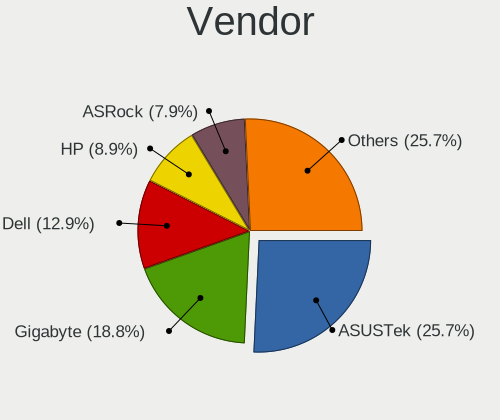

| Name             | Desktops | Percent |
|------------------|----------|---------|
| Dell             | 4        | 16.67%  |
| ASUSTek Computer | 4        | 16.67%  |
| ASRock           | 3        | 12.5%   |
| Pegatron         | 2        | 8.33%   |
| MSI              | 2        | 8.33%   |
| Lenovo           | 2        | 8.33%   |
| Intel            | 2        | 8.33%   |
| Hewlett-Packard  | 2        | 8.33%   |
| MACHINIST        | 1        | 4.17%   |
| Biostar          | 1        | 4.17%   |
| AMD              | 1        | 4.17%   |

Model
-----

Motherboard model

| Name                               | Desktops | Percent |
|------------------------------------|----------|---------|
| Pegatron IPPPV-D3G                 | 1        | 4.17%   |
| Pegatron IPM41-D3                  | 1        | 4.17%   |
| MSI MS-7C37                        | 1        | 4.17%   |
| MSI MS-7A38                        | 1        | 4.17%   |
| MACHINIST X99-k9 V2.0              | 1        | 4.17%   |
| Lenovo ThinkCentre M93p 10AAA0WGUK | 1        | 4.17%   |
| Lenovo ThinkCentre M700 10GS       | 1        | 4.17%   |
| Intel MAHOBAY                      | 1        | 4.17%   |
| Intel DN2800MT AAG23738-600        | 1        | 4.17%   |
| HP Slim Desktop S01-aF1xxx         | 1        | 4.17%   |
| HP EliteDesk 800 G1 SFF            | 1        | 4.17%   |
| Dell Precision 3440                | 1        | 4.17%   |
| Dell OptiPlex 3010                 | 1        | 4.17%   |
| Dell Inspiron 3891                 | 1        | 4.17%   |
| Dell Inspiron 3656                 | 1        | 4.17%   |
| Biostar G41D3C                     | 1        | 4.17%   |
| ASUS TUF GAMING X570-PLUS          | 1        | 4.17%   |
| ASUS ROG STRIX B550-I GAMING       | 1        | 4.17%   |
| ASUS P5QL-ASUS-SE                  | 1        | 4.17%   |
| ASUS K30AM-J                       | 1        | 4.17%   |
| ASRock G41C-VS                     | 1        | 4.17%   |
| ASRock ConRoeXFire-eSATA2          | 1        | 4.17%   |
| ASRock B365M Pro4                  | 1        | 4.17%   |
| AMD X64                            | 1        | 4.17%   |

Model Family
------------

Motherboard model prefix

| Name                      | Desktops | Percent |
|---------------------------|----------|---------|
| Lenovo ThinkCentre        | 2        | 8.33%   |
| Dell Inspiron             | 2        | 8.33%   |
| Pegatron IPPPV-D3G        | 1        | 4.17%   |
| Pegatron IPM41-D3         | 1        | 4.17%   |
| MSI MS-7C37               | 1        | 4.17%   |
| MSI MS-7A38               | 1        | 4.17%   |
| MACHINIST X99-k9          | 1        | 4.17%   |
| Intel MAHOBAY             | 1        | 4.17%   |
| Intel DN2800MT            | 1        | 4.17%   |
| HP Slim                   | 1        | 4.17%   |
| HP EliteDesk              | 1        | 4.17%   |
| Dell Precision            | 1        | 4.17%   |
| Dell OptiPlex             | 1        | 4.17%   |
| Biostar G41D3C            | 1        | 4.17%   |
| ASUS TUF                  | 1        | 4.17%   |
| ASUS ROG                  | 1        | 4.17%   |
| ASUS P5QL-ASUS-SE         | 1        | 4.17%   |
| ASUS K30AM-J              | 1        | 4.17%   |
| ASRock G41C-VS            | 1        | 4.17%   |
| ASRock ConRoeXFire-eSATA2 | 1        | 4.17%   |
| ASRock B365M              | 1        | 4.17%   |
| AMD X64                   | 1        | 4.17%   |

MFG Year
--------

Motherboard manufacture year

| Year | Desktops | Percent |
|------|----------|---------|
| 2021 | 4        | 16.67%  |
| 2020 | 3        | 12.5%   |
| 2010 | 3        | 12.5%   |
| 2019 | 2        | 8.33%   |
| 2015 | 2        | 8.33%   |
| 2014 | 2        | 8.33%   |
| 2013 | 2        | 8.33%   |
| 2011 | 2        | 8.33%   |
| 2009 | 2        | 8.33%   |
| 2018 | 1        | 4.17%   |
| 2012 | 1        | 4.17%   |

Form Factor
-----------

Physical design of the computer

| Name    | Desktops | Percent |
|---------|----------|---------|
| Desktop | 24       | 100%    |

Coreboot
--------

Have coreboot on board

| Used | Desktops | Percent |
|------|----------|---------|
| No   | 24       | 100%    |

RAM Size
--------

Total RAM memory

| Size in GB | Desktops | Percent |
|------------|----------|---------|
| 16.01-24.0 | 8        | 33.33%  |
| 4.01-8.0   | 7        | 29.17%  |
| 8.01-16.0  | 4        | 16.67%  |
| 2.01-3.0   | 3        | 12.5%   |
| 32.01-64.0 | 2        | 8.33%   |

RAM Used
--------

Used RAM memory

| Used GB  | Desktops | Percent |
|----------|----------|---------|
| 0.01-0.5 | 9        | 37.5%   |
| 0.51-1.0 | 8        | 33.33%  |
| 1.01-2.0 | 5        | 20.83%  |
| 4.01-8.0 | 1        | 4.17%   |
| 2.01-3.0 | 1        | 4.17%   |

Total Drives
------------

Number of drives on board

| Drives | Desktops | Percent |
|--------|----------|---------|
| 1      | 13       | 52%     |
| 2      | 7        | 28%     |
| 3      | 2        | 8%      |
| 6      | 1        | 4%      |
| 5      | 1        | 4%      |
| 4      | 1        | 4%      |

Has CD-ROM
----------

Has CD-ROM on board

| Presented | Desktops | Percent |
|-----------|----------|---------|
| No        | 18       | 75%     |
| Yes       | 6        | 25%     |

Has Ethernet
------------

Has Ethernet on board

| Presented | Desktops | Percent |
|-----------|----------|---------|
| Yes       | 24       | 100%    |

Has WiFi
--------

Has WiFi module

| Presented | Desktops | Percent |
|-----------|----------|---------|
| No        | 14       | 56%     |
| Yes       | 11       | 44%     |

Has Bluetooth
-------------

Has Bluetooth module

| Presented | Desktops | Percent |
|-----------|----------|---------|
| No        | 16       | 66.67%  |
| Yes       | 8        | 33.33%  |

Location
--------

Country
-------

Geographic location (country)

| Country      | Desktops | Percent |
|--------------|----------|---------|
| Russia       | 5        | 20.83%  |
| USA          | 3        | 12.5%   |
| Spain        | 2        | 8.33%   |
| Poland       | 2        | 8.33%   |
| France       | 2        | 8.33%   |
| Brazil       | 2        | 8.33%   |
| UK           | 1        | 4.17%   |
| South Africa | 1        | 4.17%   |
| Serbia       | 1        | 4.17%   |
| Norway       | 1        | 4.17%   |
| Mexico       | 1        | 4.17%   |
| India        | 1        | 4.17%   |
| Germany      | 1        | 4.17%   |
| Canada       | 1        | 4.17%   |

City
----

Geographic location (city)

| City                | Desktops | Percent |
|---------------------|----------|---------|
| Volgograd           | 2        | 8%      |
| Moscow              | 2        | 8%      |
| Voronezh            | 1        | 4%      |
| Surrey              | 1        | 4%      |
| Southminster        | 1        | 4%      |
| Salisbury           | 1        | 4%      |
| Reinsvoll           | 1        | 4%      |
| Munich              | 1        | 4%      |
| Monterrey           | 1        | 4%      |
| Medford             | 1        | 4%      |
| Logroño          | 1        | 4%      |
| Katowice            | 1        | 4%      |
| Jedlicze            | 1        | 4%      |
| Guadalupe           | 1        | 4%      |
| Escondido           | 1        | 4%      |
| Curitiba            | 1        | 4%      |
| Cournon-d'Auvergne  | 1        | 4%      |
| Chennai             | 1        | 4%      |
| Chatou              | 1        | 4%      |
| Brasília           | 1        | 4%      |
| Bloemfontein        | 1        | 4%      |
| Belgrade            | 1        | 4%      |
| Alcalá de Guadaira | 1        | 4%      |

Drives
------

Drive Vendor
------------

Hard drive vendors

| Vendor              | Desktops | Drives | Percent |
|---------------------|----------|--------|---------|
| Seagate             | 9        | 12     | 21.95%  |
| Samsung Electronics | 5        | 5      | 12.2%   |
| Hitachi             | 5        | 5      | 12.2%   |
| Toshiba             | 4        | 4      | 9.76%   |
| WDC                 | 3        | 5      | 7.32%   |
| Kingston            | 3        | 3      | 7.32%   |
| SPCC                | 2        | 2      | 4.88%   |
| SK hynix            | 1        | 1      | 2.44%   |
| SanDisk             | 1        | 2      | 2.44%   |
| OCZ                 | 1        | 1      | 2.44%   |
| Lexar               | 1        | 2      | 2.44%   |
| LDLC                | 1        | 1      | 2.44%   |
| KingSpec            | 1        | 1      | 2.44%   |
| Intenso             | 1        | 1      | 2.44%   |
| Gigabyte Technology | 1        | 1      | 2.44%   |
| Crucial             | 1        | 1      | 2.44%   |
| Corsair             | 1        | 1      | 2.44%   |

Drive Model
-----------

Hard drive models

| Model                            | Desktops | Percent |
|----------------------------------|----------|---------|
| Toshiba MQ01ABD050 500GB         | 2        | 4.26%   |
| WDC WDS500G2X0C-00L350 500GB     | 1        | 2.13%   |
| WDC WDS500G2B0A 500GB            | 1        | 2.13%   |
| WDC WD5000AVVS-63H0B1 500GB      | 1        | 2.13%   |
| WDC WD3003FZEX-00Z4SA0 3TB       | 1        | 2.13%   |
| WDC WD20EFRX-68EUZN0 2TB         | 1        | 2.13%   |
| Toshiba TR200 480GB              | 1        | 2.13%   |
| Toshiba DT01ACA100 1TB           | 1        | 2.13%   |
| SPCC Solid State Disk 56GB       | 1        | 2.13%   |
| SPCC Solid State Disk 512GB      | 1        | 2.13%   |
| SK hynix BC711 NVMe 256GB        | 1        | 2.13%   |
| Seagate ST9120821AS 118GB        | 1        | 2.13%   |
| Seagate ST4000DM004-2CV104 4TB   | 1        | 2.13%   |
| Seagate ST3250310AS 250GB        | 1        | 2.13%   |
| Seagate ST3160811AS 160GB        | 1        | 2.13%   |
| Seagate ST3000DM001-1CH166 3TB   | 1        | 2.13%   |
| Seagate ST250LT003-9YG14C 250GB  | 1        | 2.13%   |
| Seagate ST2000DM008-2FR102 2TB   | 1        | 2.13%   |
| Seagate ST2000DL003-9VT166 2TB   | 1        | 2.13%   |
| Seagate ST1000VX001-1Z4102 1TB   | 1        | 2.13%   |
| Seagate ST1000LM035-1RK172 1TB   | 1        | 2.13%   |
| Seagate ST1000DM010-2EP102 1TB   | 1        | 2.13%   |
| Seagate ST1000DM003-1ER162 1TB   | 1        | 2.13%   |
| SanDisk SDSA5GK-016G-1006 16GB   | 1        | 2.13%   |
| Samsung SSD 860 PRO 512GB        | 1        | 2.13%   |
| Samsung SSD 860 EVO 250GB        | 1        | 2.13%   |
| Samsung SP0812C 80GB             | 1        | 2.13%   |
| Samsung MZVLQ512HALU-000H1 512GB | 1        | 2.13%   |
| Samsung HD501LJ 500GB            | 1        | 2.13%   |
| OCZ VERTEX3 240GB                | 1        | 2.13%   |
| Lexar 256GB SSD                  | 1        | 2.13%   |
| Lexar 250GB SSD                  | 1        | 2.13%   |
| LDLC F8+M.2 240 240GB            | 1        | 2.13%   |
| Kingston SV300S37A120G 120GB     | 1        | 2.13%   |
| Kingston SA2000M8500G 500GB      | 1        | 2.13%   |
| Kingston OM8SBP3512K-AH 512GB    | 1        | 2.13%   |
| KingSpec NT-512 512GB            | 1        | 2.13%   |
| Intenso SSD Sata III 128GB       | 1        | 2.13%   |
| Hitachi HTS545050A7E380 500GB    | 1        | 2.13%   |
| Hitachi HTS541680J9SA00 80GB     | 1        | 2.13%   |

HDD Vendor
----------

Hard disk drive vendors

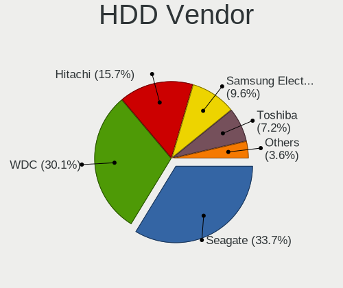

| Vendor              | Desktops | Drives | Percent |
|---------------------|----------|--------|---------|
| Seagate             | 9        | 12     | 40.91%  |
| Hitachi             | 5        | 5      | 22.73%  |
| WDC                 | 3        | 3      | 13.64%  |
| Toshiba             | 3        | 3      | 13.64%  |
| Samsung Electronics | 2        | 2      | 9.09%   |

SSD Vendor
----------

Solid state drive vendors

| Vendor              | Desktops | Drives | Percent |
|---------------------|----------|--------|---------|
| SPCC                | 2        | 2      | 15.38%  |
| Samsung Electronics | 2        | 2      | 15.38%  |
| WDC                 | 1        | 1      | 7.69%   |
| Toshiba             | 1        | 1      | 7.69%   |
| SanDisk             | 1        | 2      | 7.69%   |
| OCZ                 | 1        | 1      | 7.69%   |
| Lexar               | 1        | 1      | 7.69%   |
| Kingston            | 1        | 1      | 7.69%   |
| KingSpec            | 1        | 1      | 7.69%   |
| Intenso             | 1        | 1      | 7.69%   |
| Gigabyte Technology | 1        | 1      | 7.69%   |

Drive Kind
----------

HDD or SSD

| Kind | Desktops | Drives | Percent |
|------|----------|--------|---------|
| HDD  | 17       | 25     | 45.95%  |
| SSD  | 12       | 14     | 32.43%  |
| NVMe | 8        | 9      | 21.62%  |

Drive Connector
---------------

SATA, SAS, NVMe, etc.

| Type | Desktops | Drives | Percent |
|------|----------|--------|---------|
| SATA | 23       | 39     | 74.19%  |
| NVMe | 8        | 9      | 25.81%  |

Drive Size
----------

Size of hard drive

| Size in TB | Desktops | Drives | Percent |
|------------|----------|--------|---------|
| 0.01-0.5   | 17       | 25     | 58.62%  |
| 0.51-1.0   | 7        | 8      | 24.14%  |
| 1.01-2.0   | 3        | 3      | 10.34%  |
| 3.01-4.0   | 1        | 1      | 3.45%   |
| 2.01-3.0   | 1        | 2      | 3.45%   |

Space Total
-----------

Amount of disk space available on the file system

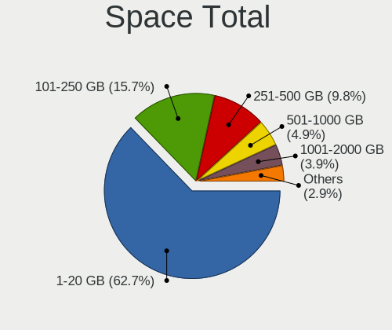

| Size in GB | Desktops | Percent |
|------------|----------|---------|
| 1-20       | 13       | 54.17%  |
| 251-500    | 5        | 20.83%  |
| 101-250    | 3        | 12.5%   |
| 1001-2000  | 2        | 8.33%   |
| 51-100     | 1        | 4.17%   |

Space Used
----------

Amount of used disk space

| Used GB  | Desktops | Percent |
|----------|----------|---------|
| 1-20     | 22       | 91.67%  |
| 101-250  | 1        | 4.17%   |
| 501-1000 | 1        | 4.17%   |

Malfunc. Drives
---------------

Drive models with a malfunction

| Model                             | Desktops | Drives | Percent |
|-----------------------------------|----------|--------|---------|
| WDC WD5000AVVS-63H0B1 500GB       | 1        | 1      | 20%     |
| Samsung Electronics HD501LJ 500GB | 1        | 1      | 20%     |
| OCZ VERTEX3 240GB                 | 1        | 1      | 20%     |
| Hitachi HTS545050A7E380 500GB     | 1        | 1      | 20%     |
| Hitachi HTS541680J9SA00 80GB      | 1        | 1      | 20%     |

Malfunc. Drive Vendor
---------------------

Vendors of faulty drives

| Vendor              | Desktops | Drives | Percent |
|---------------------|----------|--------|---------|
| Hitachi             | 2        | 2      | 40%     |
| WDC                 | 1        | 1      | 20%     |
| Samsung Electronics | 1        | 1      | 20%     |
| OCZ                 | 1        | 1      | 20%     |

Malfunc. HDD Vendor
-------------------

Vendors of faulty HDD drives

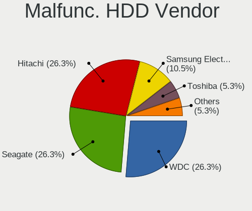

| Vendor              | Desktops | Drives | Percent |
|---------------------|----------|--------|---------|
| Hitachi             | 2        | 2      | 50%     |
| WDC                 | 1        | 1      | 25%     |
| Samsung Electronics | 1        | 1      | 25%     |

Malfunc. Drive Kind
-------------------

Kinds of faulty drives

| Kind | Desktops | Drives | Percent |
|------|----------|--------|---------|
| HDD  | 4        | 4      | 80%     |
| SSD  | 1        | 1      | 20%     |

Failed Drives
-------------

Failed drive models

Zero info for selected period =(

Failed Drive Vendor
-------------------

Failed drive vendors

Zero info for selected period =(

Drive Status
------------

Number of failed and malfunc. drives

| Status   | Desktops | Drives | Percent |
|----------|----------|--------|---------|
| Works    | 20       | 38     | 76.92%  |
| Malfunc  | 4        | 5      | 15.38%  |
| Detected | 2        | 5      | 7.69%   |

Storage controller
------------------

Storage Vendor
--------------

Storage controller vendors

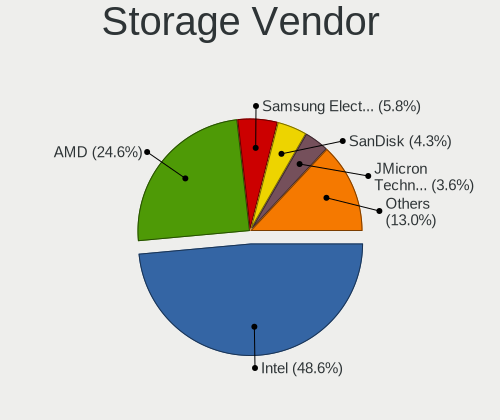

| Vendor                       | Desktops | Percent |
|------------------------------|----------|---------|
| Intel                        | 18       | 50%     |
| AMD                          | 6        | 16.67%  |
| Kingston Technology Company  | 2        | 5.56%   |
| SK hynix                     | 1        | 2.78%   |
| Silicon Motion               | 1        | 2.78%   |
| Shenzhen Longsys Electronics | 1        | 2.78%   |
| SanDisk                      | 1        | 2.78%   |
| Samsung Electronics          | 1        | 2.78%   |
| Phison Electronics           | 1        | 2.78%   |
| Micron/Crucial Technology    | 1        | 2.78%   |
| Marvell Technology Group     | 1        | 2.78%   |
| JMicron Technology           | 1        | 2.78%   |
| ASMedia Technology           | 1        | 2.78%   |

Storage Model
-------------

Storage controller models

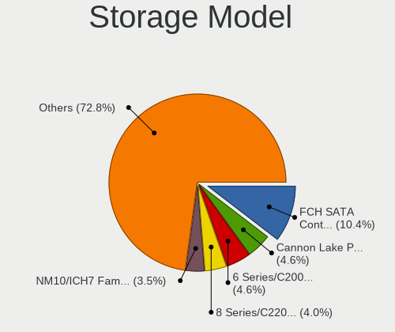

| Model                                                                          | Desktops | Percent |
|--------------------------------------------------------------------------------|----------|---------|
| AMD FCH SATA Controller [AHCI mode]                                            | 4        | 9.76%   |
| Intel NM10/ICH7 Family SATA Controller [IDE mode]                              | 3        | 7.32%   |
| Intel NM10/ICH7 Family SATA Controller [AHCI mode]                             | 3        | 7.32%   |
| Intel 82801G (ICH7 Family) IDE Controller                                      | 3        | 7.32%   |
| Intel 6 Series/C200 Series Chipset Family 6 port Desktop SATA AHCI Controller  | 2        | 4.88%   |
| SK hynix Gold P31 SSD                                                          | 1        | 2.44%   |
| Silicon Motion SM2263EN/SM2263XT SSD Controller                                | 1        | 2.44%   |
| Shenzhen Longsys SM2263EN/SM2263XT-based OEM SSD                               | 1        | 2.44%   |
| SanDisk WD Black 2018/SN750 / PC SN720 NVMe SSD                                | 1        | 2.44%   |
| Samsung NVMe SSD Controller 980                                                | 1        | 2.44%   |
| Phison E12 NVMe Controller                                                     | 1        | 2.44%   |
| Micron/Crucial P2 NVMe PCIe SSD                                                | 1        | 2.44%   |
| Marvell Group 88SE9235 PCIe 2.0 x2 4-port SATA 6 Gb/s Controller               | 1        | 2.44%   |
| Kingston Company A2000 NVMe SSD                                                | 1        | 2.44%   |
| JMicron JMB368 IDE controller                                                  | 1        | 2.44%   |
| Intel Q170/Q150/B150/H170/H110/Z170/CM236 Chipset SATA Controller [AHCI Mode]  | 1        | 2.44%   |
| Intel Comet Lake SATA AHCI Controller                                          | 1        | 2.44%   |
| Intel Celeron/Pentium Silver Processor SATA Controller                         | 1        | 2.44%   |
| Intel C610/X99 series chipset sSATA Controller [AHCI mode]                     | 1        | 2.44%   |
| Intel Atom Processor E3800 Series SATA AHCI Controller                         | 1        | 2.44%   |
| Intel 82801JI (ICH10 Family) SATA AHCI Controller                              | 1        | 2.44%   |
| Intel 8 Series/C220 Series Chipset Family 6-port SATA Controller 1 [AHCI mode] | 1        | 2.44%   |
| Intel 8 Series/C220 Series Chipset Family 4-port SATA Controller 1 [IDE mode]  | 1        | 2.44%   |
| Intel 500 Series Chipset Family SATA AHCI Controller                           | 1        | 2.44%   |
| Intel 200 Series PCH SATA controller [AHCI mode]                               | 1        | 2.44%   |
| ASMedia ASM1062 Serial ATA Controller                                          | 1        | 2.44%   |
| AMD FCH SATA Controller [IDE mode]                                             | 1        | 2.44%   |
| AMD FCH IDE Controller                                                         | 1        | 2.44%   |
| AMD 500 Series Chipset SATA Controller                                         | 1        | 2.44%   |
| AMD 300 Series Chipset SATA Controller                                         | 1        | 2.44%   |
| Unknown                                                                        | 1        | 2.44%   |

Storage Kind
------------

Kind of storage controller (IDE, SATA, NVMe, SAS, ...)

| Kind | Desktops | Percent |
|------|----------|---------|
| SATA | 19       | 54.29%  |
| NVMe | 8        | 22.86%  |
| IDE  | 8        | 22.86%  |

Processor
---------

CPU Vendor
----------

Processor vendors

| Vendor | Desktops | Percent |
|--------|----------|---------|
| Intel  | 18       | 75%     |
| AMD    | 6        | 25%     |

CPU Model
---------

Processor models

| Model                                          | Desktops | Percent |
|------------------------------------------------|----------|---------|
| Intel Xeon CPU E5-2630L v4 @ 1.80GHz           | 1        | 4.17%   |
| Intel Pentium Silver J5040 CPU @ 2.00GHz       | 1        | 4.17%   |
| Intel Pentium Dual-Core CPU E6700 @ 3.20GHz    | 1        | 4.17%   |
| Intel Pentium Dual-Core CPU E5700 @ 3.00GHz    | 1        | 4.17%   |
| Intel Pentium Dual-Core CPU E5400 @ 2.70GHz    | 1        | 4.17%   |
| Intel Pentium Dual-Core CPU E5200 @ 2.50GHz    | 1        | 4.17%   |
| Intel Pentium CPU G4400 @ 3.30GHz              | 1        | 4.17%   |
| Intel Core i7-9700 CPU @ 3.00GHz               | 1        | 4.17%   |
| Intel Core i7-4790 CPU @ 3.60GHz               | 1        | 4.17%   |
| Intel Core i5-4570T CPU @ 2.90GHz              | 1        | 4.17%   |
| Intel Core i5-3470 CPU @ 3.20GHz               | 1        | 4.17%   |
| Intel Core i3-3220 CPU @ 3.30GHz               | 1        | 4.17%   |
| Intel Core i3-10100 CPU @ 3.60GHz              | 1        | 4.17%   |
| Intel Core 2 Quad CPU Q6600 @ 2.40GHz          | 1        | 4.17%   |
| Intel Celeron CPU J1800 @ 2.41GHz              | 1        | 4.17%   |
| Intel Atom CPU N2800 @ 1.86GHz                 | 1        | 4.17%   |
| Intel Atom CPU D425 @ 1.80GHz                  | 1        | 4.17%   |
| Intel 11th Gen Core i5-11400 @ 2.60GHz         | 1        | 4.17%   |
| AMD Ryzen 9 3900X 12-Core Processor            | 1        | 4.17%   |
| AMD Ryzen 5 5600G with Radeon Graphics         | 1        | 4.17%   |
| AMD Ryzen 5 3600X 6-Core Processor             | 1        | 4.17%   |
| AMD Ryzen 5 2400G with Radeon Vega Graphics    | 1        | 4.17%   |
| AMD RX-8120 Processor                          | 1        | 4.17%   |
| AMD FX-8800P Radeon R7, 12 Compute Cores 4C+8G | 1        | 4.17%   |

CPU Model Family
----------------

Processor model prefix

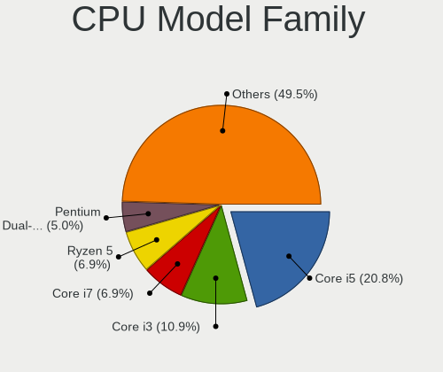

| Model                   | Desktops | Percent |
|-------------------------|----------|---------|
| Intel Pentium Dual-Core | 4        | 16.67%  |
| AMD Ryzen 5             | 3        | 12.5%   |
| Other                   | 2        | 8.33%   |
| Intel Core i7           | 2        | 8.33%   |
| Intel Core i5           | 2        | 8.33%   |
| Intel Core i3           | 2        | 8.33%   |
| Intel Atom              | 2        | 8.33%   |
| Intel Xeon              | 1        | 4.17%   |
| Intel Pentium Silver    | 1        | 4.17%   |
| Intel Pentium           | 1        | 4.17%   |
| Intel Core 2 Quad       | 1        | 4.17%   |
| Intel Celeron           | 1        | 4.17%   |
| AMD Ryzen 9             | 1        | 4.17%   |
| AMD FX                  | 1        | 4.17%   |

CPU Cores
---------

Number of processor cores

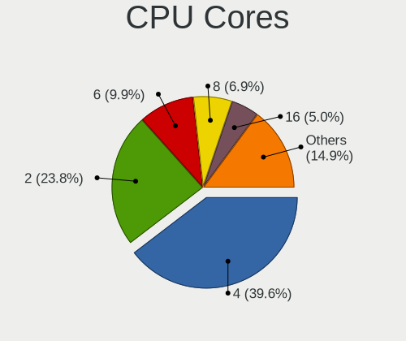

| Number  | Desktops | Percent |
|---------|----------|---------|
| 2       | 8        | 33.33%  |
| 4       | 6        | 25%     |
| 8       | 3        | 12.5%   |
| 12      | 2        | 8.33%   |
| 24      | 1        | 4.17%   |
| 10      | 1        | 4.17%   |
| 6       | 1        | 4.17%   |
| 1       | 1        | 4.17%   |
| Unknown | 1        | 4.17%   |

CPU Sockets
-----------

Number of sockets

| Number | Desktops | Percent |
|--------|----------|---------|
| 1      | 24       | 100%    |

CPU Threads
-----------

Threads per core (Hyper-Threading)

| Number  | Desktops | Percent |
|---------|----------|---------|
| 1       | 16       | 66.67%  |
| 2       | 7        | 29.17%  |
| Unknown | 1        | 4.17%   |

CPU Microarch
-------------

Microarchitecture

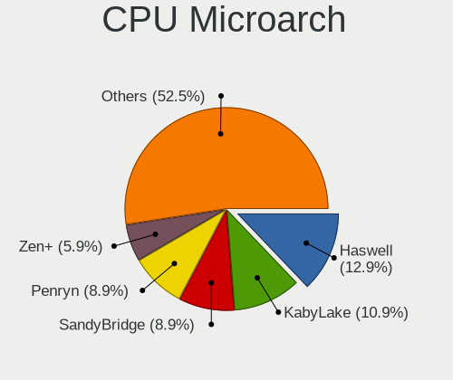

| Name          | Desktops | Percent |
|---------------|----------|---------|
| Penryn        | 4        | 16.67%  |
| Zen 2         | 2        | 8.33%   |
| IvyBridge     | 2        | 8.33%   |
| Haswell       | 2        | 8.33%   |
| Bonnell       | 2        | 8.33%   |
| Unknown       | 2        | 8.33%   |
| Zen 3         | 1        | 4.17%   |
| Zen           | 1        | 4.17%   |
| Skylake       | 1        | 4.17%   |
| Silvermont    | 1        | 4.17%   |
| KabyLake      | 1        | 4.17%   |
| Goldmont plus | 1        | 4.17%   |
| Excavator     | 1        | 4.17%   |
| Core          | 1        | 4.17%   |
| CometLake     | 1        | 4.17%   |
| Broadwell     | 1        | 4.17%   |

Graphics
--------

GPU Vendor
----------

Vendors of graphics cards

| Vendor | Desktops | Percent |
|--------|----------|---------|
| Intel  | 12       | 48%     |
| Nvidia | 7        | 28%     |
| AMD    | 6        | 24%     |

GPU Model
---------

Graphics card models

| Model                                                                       | Desktops | Percent |
|-----------------------------------------------------------------------------|----------|---------|
| Intel Xeon E3-1200 v3/4th Gen Core Processor Integrated Graphics Controller | 2        | 8%      |
| Intel Xeon E3-1200 v2/3rd Gen Core processor Graphics Controller            | 2        | 8%      |
| Nvidia TU116 [GeForce GTX 1660]                                             | 1        | 4%      |
| Nvidia TU116 [GeForce GTX 1660 Ti]                                          | 1        | 4%      |
| Nvidia GT218 [GeForce 210]                                                  | 1        | 4%      |
| Nvidia GM206 [GeForce GTX 950]                                              | 1        | 4%      |
| Nvidia GK104 [GeForce GTX 760]                                              | 1        | 4%      |
| Nvidia G84 [GeForce 8600 GTS]                                               | 1        | 4%      |
| Nvidia G73 [GeForce 7600 GS]                                                | 1        | 4%      |
| Intel RocketLake-S GT1 [UHD Graphics 730]                                   | 1        | 4%      |
| Intel HD Graphics 510                                                       | 1        | 4%      |
| Intel GeminiLake [UHD Graphics 605]                                         | 1        | 4%      |
| Intel CometLake-S GT2 [UHD Graphics 630]                                    | 1        | 4%      |
| Intel Atom Processor Z36xxx/Z37xxx Series Graphics & Display                | 1        | 4%      |
| Intel Atom Processor D4xx/D5xx/N4xx/N5xx Integrated Graphics Controller     | 1        | 4%      |
| Intel Atom Processor D2xxx/N2xxx Integrated Graphics Controller             | 1        | 4%      |
| Intel 4 Series Chipset Integrated Graphics Controller                       | 1        | 4%      |
| AMD Tobago PRO [Radeon R7 360 / R9 360 OEM]                                 | 1        | 4%      |
| AMD Navi 10 [Radeon RX 5600 OEM/5600 XT / 5700/5700 XT]                     | 1        | 4%      |
| AMD Kryptos [Radeon RX 350]                                                 | 1        | 4%      |
| AMD Ellesmere [Radeon RX 470/480/570/570X/580/580X/590]                     | 1        | 4%      |
| AMD Cezanne                                                                 | 1        | 4%      |
| AMD Cedar [Radeon HD 5000/6000/7350/8350 Series]                            | 1        | 4%      |

GPU Combo
---------

Combinations of graphics cards

| Name        | Desktops | Percent |
|-------------|----------|---------|
| 1 x Intel   | 10       | 41.67%  |
| 1 x Nvidia  | 7        | 29.17%  |
| 1 x AMD     | 5        | 20.83%  |
| 2 x Intel   | 1        | 4.17%   |
| Intel + AMD | 1        | 4.17%   |

GPU Driver
----------

Free vs proprietary

| Driver      | Desktops | Percent |
|-------------|----------|---------|
| Free        | 15       | 62.5%   |
| Proprietary | 6        | 25%     |
| Unknown     | 3        | 12.5%   |

GPU Memory
----------

Total video memory

| Size in GB | Desktops | Percent |
|------------|----------|---------|
| Unknown    | 14       | 58.33%  |
| 1.01-2.0   | 3        | 12.5%   |
| 5.01-6.0   | 2        | 8.33%   |
| 3.01-4.0   | 2        | 8.33%   |
| 7.01-8.0   | 1        | 4.17%   |
| 0.51-1.0   | 1        | 4.17%   |
| 0.01-0.5   | 1        | 4.17%   |

Monitor
-------

Monitor Vendor
--------------

Monitor vendors

| Vendor              | Desktops | Percent |
|---------------------|----------|---------|
| Goldstar            | 3        | 16.67%  |
| Dell                | 3        | 16.67%  |
| Samsung Electronics | 2        | 11.11%  |
| AOC                 | 2        | 11.11%  |
| Vizio               | 1        | 5.56%   |
| Toshiba             | 1        | 5.56%   |
| Philips             | 1        | 5.56%   |
| MSI                 | 1        | 5.56%   |
| Insignia            | 1        | 5.56%   |
| Iiyama              | 1        | 5.56%   |
| Hewlett-Packard     | 1        | 5.56%   |
| Acer                | 1        | 5.56%   |

Monitor Model
-------------

Monitor models

| Model                                                                | Desktops | Percent |
|----------------------------------------------------------------------|----------|---------|
| Vizio D43-D2 VIZ1004 1920x1080 930x520mm 41.9-inch                   | 1        | 5.26%   |
| Toshiba TV TSB0110 1920x1080 1110x620mm 50.1-inch                    | 1        | 5.26%   |
| Samsung Electronics SyncMaster SAM0601 1600x900                      | 1        | 5.26%   |
| Samsung Electronics SyncMaster SAM05FF 1600x900 440x250mm 19.9-inch  | 1        | 5.26%   |
| Samsung Electronics SMS23A550H SAM07C9 1920x1080 510x290mm 23.1-inch | 1        | 5.26%   |
| Philips PHL 223V5 PHLC0CF 1920x1080 480x270mm 21.7-inch              | 1        | 5.26%   |
| MSI MAG342CQRV MSI3DB6 3440x1440 790x330mm 33.7-inch                 | 1        | 5.26%   |
| Insignia 32DR310NA17 BBY3253 1680x1050 700x390mm 31.5-inch           | 1        | 5.26%   |
| Iiyama PLE2407HDS IVM560D 1920x1080 520x300mm 23.6-inch              | 1        | 5.26%   |
| Hewlett-Packard 27xi HWP3038 1920x1080 600x340mm 27.2-inch           | 1        | 5.26%   |
| Goldstar LG ULTRAWIDE GSM5AE2 3440x1440 800x340mm 34.2-inch          | 1        | 5.26%   |
| Goldstar L1918S GSM4B31 1280x1024 380x300mm 19.1-inch                | 1        | 5.26%   |
| Goldstar 2D FHD LG TV GSM59C6 1920x1080 510x290mm 23.1-inch          | 1        | 5.26%   |
| Dell S2316H DELD07E 1920x1080 510x290mm 23.1-inch                    | 1        | 5.26%   |
| Dell E2216HV DELF06F 1920x1080 480x270mm 21.7-inch                   | 1        | 5.26%   |
| Dell D1918H DEL2005 1366x768 410x230mm 18.5-inch                     | 1        | 5.26%   |
| AOC Q2577W AOC2577 2560x1440 550x310mm 24.9-inch                     | 1        | 5.26%   |
| AOC 2481W AOC2481 1920x1080 530x300mm 24.0-inch                      | 1        | 5.26%   |
| Acer GN246HL ACR02FA 1920x1080 530x300mm 24.0-inch                   | 1        | 5.26%   |

Monitor Resolution
------------------

Monitor screen resolution

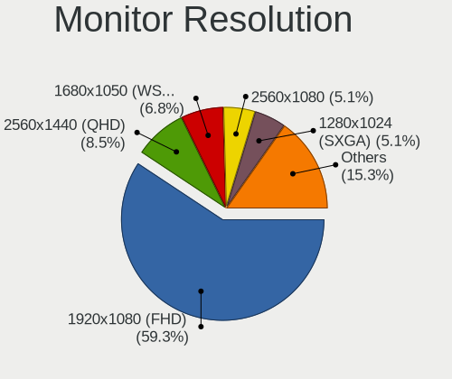

| Resolution         | Desktops | Percent |
|--------------------|----------|---------|
| 1920x1080 (FHD)    | 11       | 61.11%  |
| 3440x1440          | 2        | 11.11%  |
| 2560x1440 (QHD)    | 1        | 5.56%   |
| 1680x1050 (WSXGA+) | 1        | 5.56%   |
| 1600x900 (HD+)     | 1        | 5.56%   |
| 1366x768 (WXGA)    | 1        | 5.56%   |
| 1280x1024 (SXGA)   | 1        | 5.56%   |

Monitor Diagonal
----------------

Diagonal size in inches

| Inches  | Desktops | Percent |
|---------|----------|---------|
| 23      | 4        | 21.05%  |
| 24      | 3        | 15.79%  |
| 21      | 2        | 10.53%  |
| 19      | 2        | 10.53%  |
| 50      | 1        | 5.26%   |
| 41      | 1        | 5.26%   |
| 34      | 1        | 5.26%   |
| 33      | 1        | 5.26%   |
| 31      | 1        | 5.26%   |
| 27      | 1        | 5.26%   |
| 18      | 1        | 5.26%   |
| Unknown | 1        | 5.26%   |

Monitor Width
-------------

Physical width

| Width in mm | Desktops | Percent |
|-------------|----------|---------|
| 501-600     | 8        | 42.11%  |
| 401-500     | 4        | 21.05%  |
| 701-800     | 2        | 10.53%  |
| 601-700     | 1        | 5.26%   |
| 351-400     | 1        | 5.26%   |
| 1001-1500   | 1        | 5.26%   |
| 901-1000    | 1        | 5.26%   |
| Unknown     | 1        | 5.26%   |

Aspect Ratio
------------

Proportional relationship between the width and the height

| Ratio | Desktops | Percent |
|-------|----------|---------|
| 16/9  | 15       | 83.33%  |
| 21/9  | 2        | 11.11%  |
| 5/4   | 1        | 5.56%   |

Monitor Area
------------

Area in inch²

| Area in inch² | Desktops | Percent |
|----------------|----------|---------|
| 201-250        | 8        | 42.11%  |
| 351-500        | 3        | 15.79%  |
| 151-200        | 2        | 10.53%  |
| More than 1000 | 1        | 5.26%   |
| 301-350        | 1        | 5.26%   |
| 251-300        | 1        | 5.26%   |
| 141-150        | 1        | 5.26%   |
| 501-1000       | 1        | 5.26%   |
| Unknown        | 1        | 5.26%   |

Pixel Density
-------------

Pixels per inch

| Density | Desktops | Percent |
|---------|----------|---------|
| 51-100  | 12       | 63.16%  |
| 101-120 | 5        | 26.32%  |
| 1-50    | 1        | 5.26%   |
| Unknown | 1        | 5.26%   |

Multiple Monitors
-----------------

Total monitors connected

| Total | Desktops | Percent |
|-------|----------|---------|
| 1     | 18       | 75%     |
| 0     | 5        | 20.83%  |
| 2     | 1        | 4.17%   |

Network
-------

Net Controller Vendor
---------------------

Controller vendors

| Vendor                | Desktops | Percent |
|-----------------------|----------|---------|
| Realtek Semiconductor | 15       | 48.39%  |
| Intel                 | 9        | 29.03%  |
| Qualcomm Atheros      | 2        | 6.45%   |
| Ralink Technology     | 1        | 3.23%   |
| IMC Networks          | 1        | 3.23%   |
| Edimax Technology     | 1        | 3.23%   |
| Broadcom              | 1        | 3.23%   |
| ASUSTek Computer      | 1        | 3.23%   |

Net Controller Model
--------------------

Controller models

| Model                                                                       | Desktops | Percent |
|-----------------------------------------------------------------------------|----------|---------|
| Realtek RTL8111/8168/8411 PCI Express Gigabit Ethernet Controller           | 15       | 41.67%  |
| Intel Wi-Fi 6 AX200                                                         | 2        | 5.56%   |
| Intel Ethernet Connection I217-LM                                           | 2        | 5.56%   |
| Intel 82574L Gigabit Network Connection                                     | 2        | 5.56%   |
| Realtek RTL8821CE 802.11ac PCIe Wireless Network Adapter                    | 1        | 2.78%   |
| Realtek RTL8723BE PCIe Wireless Network Adapter                             | 1        | 2.78%   |
| Realtek RTL8188CUS 802.11n WLAN Adapter                                     | 1        | 2.78%   |
| Ralink RT5370 Wireless Adapter                                              | 1        | 2.78%   |
| Qualcomm Atheros AR8152 v2.0 Fast Ethernet                                  | 1        | 2.78%   |
| Qualcomm Atheros AR8132 Fast Ethernet                                       | 1        | 2.78%   |
| Intel Wireless 8265 / 8275                                                  | 1        | 2.78%   |
| Intel Ethernet Controller I225-V                                            | 1        | 2.78%   |
| Intel Ethernet Connection (2) I219-V                                        | 1        | 2.78%   |
| Intel Ethernet Connection (11) I219-LM                                      | 1        | 2.78%   |
| Intel 82579LM Gigabit Network Connection (Lewisville)                       | 1        | 2.78%   |
| IMC Networks Realtek RTL8191SU Wireless LAN 802.11n USB 2.0 Network Adapter | 1        | 2.78%   |
| Edimax EW-7612UAn V2 802.11n Wireless Adapter [Realtek RTL8192CU]           | 1        | 2.78%   |
| Broadcom BCM4360 802.11ac Wireless Network Adapter                          | 1        | 2.78%   |
| ASUS N10 Nano 802.11n Network Adapter [Realtek RTL8192CU]                   | 1        | 2.78%   |

Wireless Vendor
---------------

Wireless vendors

| Vendor                | Desktops | Percent |
|-----------------------|----------|---------|
| Realtek Semiconductor | 3        | 27.27%  |
| Intel                 | 3        | 27.27%  |
| Ralink Technology     | 1        | 9.09%   |
| IMC Networks          | 1        | 9.09%   |
| Edimax Technology     | 1        | 9.09%   |
| Broadcom              | 1        | 9.09%   |
| ASUSTek Computer      | 1        | 9.09%   |

Wireless Model
--------------

Wireless models

| Model                                                                       | Desktops | Percent |
|-----------------------------------------------------------------------------|----------|---------|
| Intel Wi-Fi 6 AX200                                                         | 2        | 18.18%  |
| Realtek RTL8821CE 802.11ac PCIe Wireless Network Adapter                    | 1        | 9.09%   |
| Realtek RTL8723BE PCIe Wireless Network Adapter                             | 1        | 9.09%   |
| Realtek RTL8188CUS 802.11n WLAN Adapter                                     | 1        | 9.09%   |
| Ralink RT5370 Wireless Adapter                                              | 1        | 9.09%   |
| Intel Wireless 8265 / 8275                                                  | 1        | 9.09%   |
| IMC Networks Realtek RTL8191SU Wireless LAN 802.11n USB 2.0 Network Adapter | 1        | 9.09%   |
| Edimax EW-7612UAn V2 802.11n Wireless Adapter [Realtek RTL8192CU]           | 1        | 9.09%   |
| Broadcom BCM4360 802.11ac Wireless Network Adapter                          | 1        | 9.09%   |
| ASUS N10 Nano 802.11n Network Adapter [Realtek RTL8192CU]                   | 1        | 9.09%   |

Ethernet Vendor
---------------

Ethernet vendors

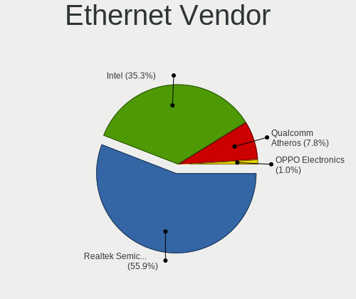

| Vendor                | Desktops | Percent |
|-----------------------|----------|---------|
| Realtek Semiconductor | 15       | 62.5%   |
| Intel                 | 7        | 29.17%  |
| Qualcomm Atheros      | 2        | 8.33%   |

Ethernet Model
--------------

Ethernet models

| Model                                                             | Desktops | Percent |
|-------------------------------------------------------------------|----------|---------|
| Realtek RTL8111/8168/8411 PCI Express Gigabit Ethernet Controller | 15       | 60%     |
| Intel Ethernet Connection I217-LM                                 | 2        | 8%      |
| Intel 82574L Gigabit Network Connection                           | 2        | 8%      |
| Qualcomm Atheros AR8152 v2.0 Fast Ethernet                        | 1        | 4%      |
| Qualcomm Atheros AR8132 Fast Ethernet                             | 1        | 4%      |
| Intel Ethernet Controller I225-V                                  | 1        | 4%      |
| Intel Ethernet Connection (2) I219-V                              | 1        | 4%      |
| Intel Ethernet Connection (11) I219-LM                            | 1        | 4%      |
| Intel 82579LM Gigabit Network Connection (Lewisville)             | 1        | 4%      |

Net Controller Kind
-------------------

Ethernet, WiFi or modem

| Kind     | Desktops | Percent |
|----------|----------|---------|
| Ethernet | 24       | 70.59%  |
| WiFi     | 10       | 29.41%  |

Used Controller
---------------

Currently used network controller

| Kind     | Desktops | Percent |
|----------|----------|---------|
| Ethernet | 22       | 91.67%  |
| WiFi     | 2        | 8.33%   |

NICs
----

Total network controllers on board

| Total | Desktops | Percent |
|-------|----------|---------|
| 1     | 17       | 70.83%  |
| 2     | 7        | 29.17%  |

IPv6
----

IPv6 vs IPv4

| Used | Desktops | Percent |
|------|----------|---------|
| No   | 23       | 95.83%  |
| Yes  | 1        | 4.17%   |

Bluetooth
---------

Bluetooth Vendor
----------------

Controller vendors

| Vendor                  | Desktops | Percent |
|-------------------------|----------|---------|
| Intel                   | 3        | 37.5%   |
| Realtek Semiconductor   | 2        | 25%     |
| Cambridge Silicon Radio | 1        | 12.5%   |
| Bluetooth Device        | 1        | 12.5%   |
| Apple                   | 1        | 12.5%   |

Bluetooth Model
---------------

Controller models

| Model                                                    | Desktops | Percent |
|----------------------------------------------------------|----------|---------|
| Intel AX200 Bluetooth                                    | 2        | 25%     |
| Realtek  Bluetooth 4.2 Adapter                           | 1        | 12.5%   |
| Realtek Dell Wireless 1801 Bluetooth 4.0 LE              | 1        | 12.5%   |
| Intel Bluetooth wireless interface                       | 1        | 12.5%   |
| Cambridge Silicon Radio Bluetooth Dongle (HCI mode)      | 1        | 12.5%   |
| Bluetooth Device Silicon Wave Bluetooth Wireless Adapter | 1        | 12.5%   |
| Apple Apple Broadcom Built-in Bluetooth                  | 1        | 12.5%   |

Sound
-----

Sound Vendor
------------

Sound card vendors

| Vendor              | Desktops | Percent |
|---------------------|----------|---------|
| Intel               | 17       | 50%     |
| AMD                 | 8        | 23.53%  |
| Nvidia              | 5        | 14.71%  |
| C-Media Electronics | 2        | 5.88%   |
| Yamaha              | 1        | 2.94%   |
| Creative Technology | 1        | 2.94%   |

Sound Model
-----------

Sound card models

| Model                                                                      | Desktops | Percent |
|----------------------------------------------------------------------------|----------|---------|
| Intel NM10/ICH7 Family High Definition Audio Controller                    | 6        | 15%     |
| Nvidia TU116 High Definition Audio Controller                              | 2        | 5%      |
| Intel Xeon E3-1200 v3/4th Gen Core Processor HD Audio Controller           | 2        | 5%      |
| Intel 8 Series/C220 Series Chipset High Definition Audio Controller        | 2        | 5%      |
| Intel 6 Series/C200 Series Chipset Family High Definition Audio Controller | 2        | 5%      |
| AMD Starship/Matisse HD Audio Controller                                   | 2        | 5%      |
| AMD Family 17h/19h HD Audio Controller                                     | 2        | 5%      |
| Yamaha Steinberg UR22mkII                                                  | 1        | 2.5%    |
| Nvidia High Definition Audio Controller                                    | 1        | 2.5%    |
| Nvidia GM206 High Definition Audio Controller                              | 1        | 2.5%    |
| Nvidia GK104 HDMI Audio Controller                                         | 1        | 2.5%    |
| Intel Tiger Lake-H HD Audio Controller                                     | 1        | 2.5%    |
| Intel Celeron/Pentium Silver Processor High Definition Audio               | 1        | 2.5%    |
| Intel C610/X99 series chipset HD Audio Controller                          | 1        | 2.5%    |
| Intel Atom Processor Z36xxx/Z37xxx Series High Definition Audio Controller | 1        | 2.5%    |
| Intel 82801JI (ICH10 Family) HD Audio Controller                           | 1        | 2.5%    |
| Intel 200 Series PCH HD Audio                                              | 1        | 2.5%    |
| Intel 100 Series/C230 Series Chipset Family HD Audio Controller            | 1        | 2.5%    |
| Creative Technology Sound BlasterX G1                                      | 1        | 2.5%    |
| C-Media Electronics CMI8788 [Oxygen HD Audio]                              | 1        | 2.5%    |
| C-Media Electronics Cmedia Audio                                           | 1        | 2.5%    |
| AMD Tobago HDMI Audio [Radeon R7 360 / R9 360 OEM]                         | 1        | 2.5%    |
| AMD Renoir Radeon High Definition Audio Controller                         | 1        | 2.5%    |
| AMD Navi 10 HDMI Audio                                                     | 1        | 2.5%    |
| AMD FCH Azalia Controller                                                  | 1        | 2.5%    |
| AMD Family 15h (Models 60h-6fh) Audio Controller                           | 1        | 2.5%    |
| AMD Ellesmere HDMI Audio [Radeon RX 470/480 / 570/580/590]                 | 1        | 2.5%    |
| AMD Cedar HDMI Audio [Radeon HD 5400/6300/7300 Series]                     | 1        | 2.5%    |
| Unknown                                                                    | 1        | 2.5%    |

Memory
------

Memory Vendor
-------------

Memory module vendors

| Vendor              | Desktops | Percent |
|---------------------|----------|---------|
| Unknown             | 7        | 22.58%  |
| SK hynix            | 5        | 16.13%  |
| Kingston            | 4        | 12.9%   |
| Crucial             | 4        | 12.9%   |
| Micron Technology   | 3        | 9.68%   |
| Samsung Electronics | 2        | 6.45%   |
| Unknown             | 2        | 6.45%   |
| Transcend           | 1        | 3.23%   |
| Ramaxel Technology  | 1        | 3.23%   |
| Patriot             | 1        | 3.23%   |
| Corsair             | 1        | 3.23%   |

Memory Model
------------

Memory module models

| Model                                                   | Desktops | Percent |
|---------------------------------------------------------|----------|---------|
| Unknown RAM Module 1GB DIMM SDRAM                       | 2        | 5.88%   |
| SK hynix RAM HMT41GU6BFR8A-PB 8GB DIMM DDR3 1600MT/s    | 2        | 5.88%   |
| Unknown                                                 | 2        | 5.88%   |
| Unknown RAM Module 4GB SODIMM DDR3 1333MT/s             | 1        | 2.94%   |
| Unknown RAM Module 4GB DIMM SDRAM                       | 1        | 2.94%   |
| Unknown RAM Module 2GB DIMM SDRAM                       | 1        | 2.94%   |
| Unknown RAM Module 2GB DIMM DDR3 1066MT/s               | 1        | 2.94%   |
| Unknown RAM Module 2GB DIMM DDR2 800MT/s                | 1        | 2.94%   |
| Unknown RAM Module 2GB DIMM DDR2                        | 1        | 2.94%   |
| Transcend RAM TS256MSK64V3N 2GB SODIMM DDR3 1333MT/s    | 1        | 2.94%   |
| SK hynix RAM HMT451U6AFR8C-PB 4GB DIMM DDR3 1600MT/s    | 1        | 2.94%   |
| SK hynix RAM HMAA1GU6CJR6N-XN 8GB DIMM DDR4 3200MT/s    | 1        | 2.94%   |
| SK hynix RAM HMA81GU6DJR8N-XN 8GB DIMM DDR4 3200MT/s    | 1        | 2.94%   |
| Samsung RAM Module 8GB SODIMM DDR4 2400MT/s             | 1        | 2.94%   |
| Samsung RAM M471B5173QH0-YK0 4GB SODIMM DDR3 1600MT/s   | 1        | 2.94%   |
| Ramaxel RAM RMT3170EB68F9W1600 4GB DIMM DDR3 1600MT/s   | 1        | 2.94%   |
| Patriot RAM PSD48G240081 8GB DIMM DDR4 3200MT/s         | 1        | 2.94%   |
| Micron RAM CT102464BF160B.M16 8GB SODIMM DDR3 1600MT/s  | 1        | 2.94%   |
| Micron RAM 8JTF51264AZ-1G6E1 4GB DIMM DDR3 1600MT/s     | 1        | 2.94%   |
| Micron RAM 4ATF51264AZ-3G2J1 4GB DIMM DDR4 3200MT/s     | 1        | 2.94%   |
| Kingston RAM KHX3200C18D4/16G 16GB DIMM DDR4 3200MT/s   | 1        | 2.94%   |
| Kingston RAM KHX2666C13/16GX 16GB DIMM DDR4 2667MT/s    | 1        | 2.94%   |
| Kingston RAM KHX1600C9D3/4GX 4GB DIMM DDR3 1600MT/s     | 1        | 2.94%   |
| Kingston RAM 99U5702-095.A00G 8GB DIMM DDR4 2667MT/s    | 1        | 2.94%   |
| Crucial RAM CT8G4DFD8213.C16FAR1 8GB DIMM DDR4 2133MT/s | 1        | 2.94%   |
| Crucial RAM CT4G4DFS824A.C8FBD2 4GB DIMM DDR4 2133MT/s  | 1        | 2.94%   |
| Crucial RAM CT16G4DFRA266.C8FE 16GB DIMM DDR4 2667MT/s  | 1        | 2.94%   |
| Crucial RAM CB8GU2666.C8JT 8GB DIMM DDR4 2667MT/s       | 1        | 2.94%   |
| Crucial RAM BL8G32C16U4BL.M8FE 8GB DIMM DDR4 2667MT/s   | 1        | 2.94%   |
| Crucial RAM BL8G30C15U4B.M8FE 8GB DIMM DDR4 2666MT/s    | 1        | 2.94%   |
| Corsair RAM CMV4GX4M1A2133C15 4GB DIMM DDR4 2133MT/s    | 1        | 2.94%   |

Memory Kind
-----------

Memory module kinds

| Kind  | Desktops | Percent |
|-------|----------|---------|
| DDR4  | 10       | 41.67%  |
| DDR3  | 9        | 37.5%   |
| SDRAM | 3        | 12.5%   |
| DDR2  | 2        | 8.33%   |

Memory Form Factor
------------------

Physical design of the memory module

| Name   | Desktops | Percent |
|--------|----------|---------|
| DIMM   | 21       | 87.5%   |
| SODIMM | 3        | 12.5%   |

Memory Size
-----------

Memory module size

| Size  | Desktops | Percent |
|-------|----------|---------|
| 4096  | 11       | 34.38%  |
| 8192  | 10       | 31.25%  |
| 2048  | 6        | 18.75%  |
| 16384 | 3        | 9.38%   |
| 1024  | 2        | 6.25%   |

Memory Speed
------------

Memory module speed

| Speed   | Desktops | Percent |
|---------|----------|---------|
| 1600    | 6        | 23.08%  |
| 3200    | 4        | 15.38%  |
| 2667    | 4        | 15.38%  |
| Unknown | 4        | 15.38%  |
| 2133    | 2        | 7.69%   |
| 800     | 2        | 7.69%   |
| 2666    | 1        | 3.85%   |
| 2400    | 1        | 3.85%   |
| 1333    | 1        | 3.85%   |
| 1066    | 1        | 3.85%   |

Printers & scanners
-------------------

Printer Vendor
--------------

Printer device vendors

Zero info for selected period =(

Printer Model
-------------

Printer device models

Zero info for selected period =(

Scanner Vendor
--------------

Scanner device vendors

Zero info for selected period =(

Scanner Model
-------------

Scanner device models

Zero info for selected period =(

Camera
------

Camera Vendor
-------------

Camera device vendors

| Vendor                  | Desktops | Percent |
|-------------------------|----------|---------|
| Z-Star Microelectronics | 1        | 33.33%  |
| Logitech                | 1        | 33.33%  |
| Arkmicro Technologies   | 1        | 33.33%  |

Camera Model
------------

Camera device models

| Model                       | Desktops | Percent |
|-----------------------------|----------|---------|
| Z-Star Venus USB2.0 Camera  | 1        | 33.33%  |
| Logitech HD Pro Webcam C920 | 1        | 33.33%  |
| Arkmicro Webcam Carrefour   | 1        | 33.33%  |

Security
--------

Fingerprint Vendor
------------------

Fingerprint sensor vendors

Zero info for selected period =(

Fingerprint Model
-----------------

Fingerprint sensor models

Zero info for selected period =(

Chipcard Vendor
---------------

Chipcard module vendors

Zero info for selected period =(

Chipcard Model
--------------

Chipcard module models

Zero info for selected period =(

Unsupported
-----------

Unsupported Devices
-------------------

Total unsupported devices on board

| Total | Desktops | Percent |
|-------|----------|---------|
| 0     | 11       | 45.83%  |
| 1     | 10       | 41.67%  |
| 2     | 3        | 12.5%   |

Unsupported Device Types
------------------------

Types of unsupported devices

| Type                     | Desktops | Percent |
|--------------------------|----------|---------|
| Communication controller | 8        | 50%     |
| Net/wireless             | 5        | 31.25%  |
| Sound                    | 1        | 6.25%   |
| Card reader              | 1        | 6.25%   |
| Bluetooth                | 1        | 6.25%   |

