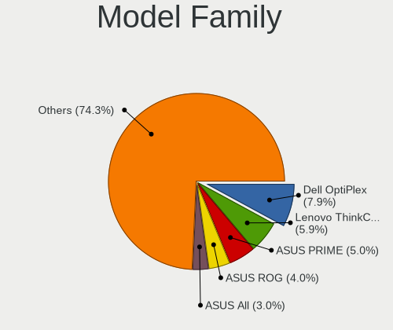
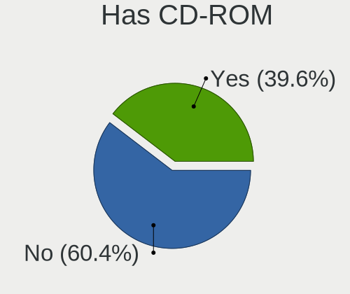
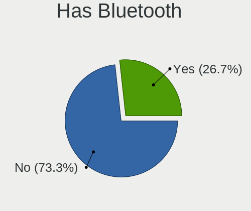
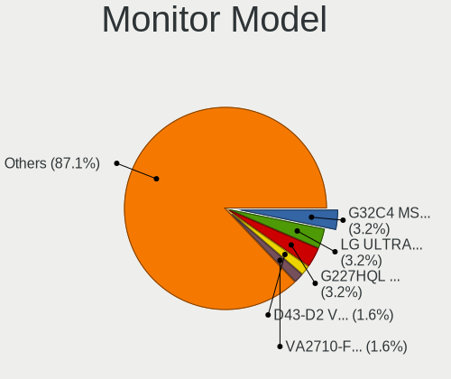
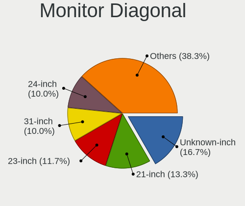
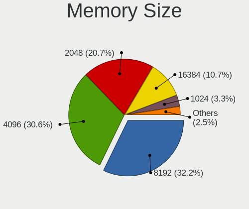
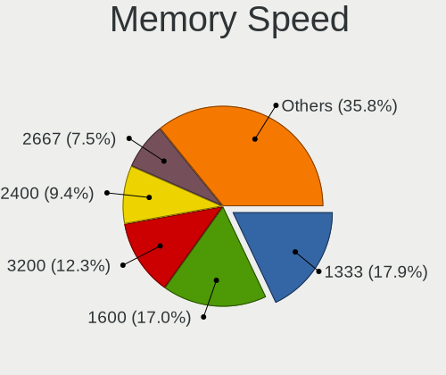
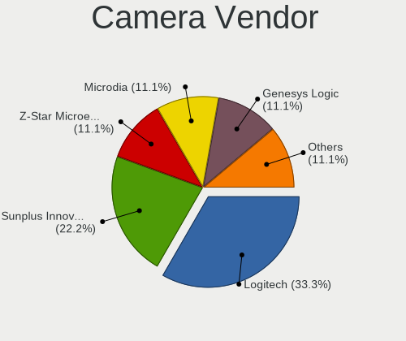

helloSystem 0.8.0 - Tested Hardware & Statistics (Desktops)
-----------------------------------------------------------

A project to collect tested hardware configurations for helloSystem 0.8.0.

Anyone can contribute to this report by the [hw-probe](https://github.com/linuxhw/hw-probe/blob/master/INSTALL.BSD.md) tool:

    hw-probe -all -upload

Please contribute! Especially if your hardware is rare.

Contents
--------

* [ Test Cases ](#test-cases)

* [ System ](#system)
  - [ Arch                     ](#arch)
  - [ DE                       ](#de)
  - [ Display Server           ](#display-server)
  - [ Display Manager          ](#display-manager)
  - [ OS Lang                  ](#os-lang)
  - [ Boot Mode                ](#boot-mode)
  - [ Filesystem               ](#filesystem)
  - [ Part. scheme             ](#part-scheme)

* [ Board ](#board)
  - [ Vendor                   ](#vendor)
  - [ Model                    ](#model)
  - [ Model Family             ](#model-family)
  - [ MFG Year                 ](#mfg-year)
  - [ Form Factor              ](#form-factor)
  - [ Coreboot                 ](#coreboot)
  - [ RAM Size                 ](#ram-size)
  - [ RAM Used                 ](#ram-used)
  - [ Total Drives             ](#total-drives)
  - [ Has CD-ROM               ](#has-cd-rom)
  - [ Has Ethernet             ](#has-ethernet)
  - [ Has WiFi                 ](#has-wifi)
  - [ Has Bluetooth            ](#has-bluetooth)

* [ Location ](#location)
  - [ Country                  ](#country)
  - [ City                     ](#city)

* [ Drives ](#drives)
  - [ Drive Vendor             ](#drive-vendor)
  - [ Drive Model              ](#drive-model)
  - [ HDD Vendor               ](#hdd-vendor)
  - [ SSD Vendor               ](#ssd-vendor)
  - [ Drive Kind               ](#drive-kind)
  - [ Drive Connector          ](#drive-connector)
  - [ Drive Size               ](#drive-size)
  - [ Space Total              ](#space-total)
  - [ Space Used               ](#space-used)
  - [ Malfunc. Drives          ](#malfunc-drives)
  - [ Malfunc. Drive Vendor    ](#malfunc-drive-vendor)
  - [ Malfunc. HDD Vendor      ](#malfunc-hdd-vendor)
  - [ Malfunc. Drive Kind      ](#malfunc-drive-kind)
  - [ Failed Drives            ](#failed-drives)
  - [ Failed Drive Vendor      ](#failed-drive-vendor)
  - [ Drive Status             ](#drive-status)

* [ Storage controller ](#storage-controller)
  - [ Storage Vendor           ](#storage-vendor)
  - [ Storage Model            ](#storage-model)
  - [ Storage Kind             ](#storage-kind)

* [ Processor ](#processor)
  - [ CPU Vendor               ](#cpu-vendor)
  - [ CPU Model                ](#cpu-model)
  - [ CPU Model Family         ](#cpu-model-family)
  - [ CPU Cores                ](#cpu-cores)
  - [ CPU Sockets              ](#cpu-sockets)
  - [ CPU Threads              ](#cpu-threads)
  - [ CPU Microarch            ](#cpu-microarch)

* [ Graphics ](#graphics)
  - [ GPU Vendor               ](#gpu-vendor)
  - [ GPU Model                ](#gpu-model)
  - [ GPU Combo                ](#gpu-combo)
  - [ GPU Driver               ](#gpu-driver)
  - [ GPU Memory               ](#gpu-memory)

* [ Monitor ](#monitor)
  - [ Monitor Vendor           ](#monitor-vendor)
  - [ Monitor Model            ](#monitor-model)
  - [ Monitor Resolution       ](#monitor-resolution)
  - [ Monitor Diagonal         ](#monitor-diagonal)
  - [ Monitor Width            ](#monitor-width)
  - [ Aspect Ratio             ](#aspect-ratio)
  - [ Monitor Area             ](#monitor-area)
  - [ Pixel Density            ](#pixel-density)
  - [ Multiple Monitors        ](#multiple-monitors)

* [ Network ](#network)
  - [ Net Controller Vendor    ](#net-controller-vendor)
  - [ Net Controller Model     ](#net-controller-model)
  - [ Wireless Vendor          ](#wireless-vendor)
  - [ Wireless Model           ](#wireless-model)
  - [ Ethernet Vendor          ](#ethernet-vendor)
  - [ Ethernet Model           ](#ethernet-model)
  - [ Net Controller Kind      ](#net-controller-kind)
  - [ Used Controller          ](#used-controller)
  - [ NICs                     ](#nics)
  - [ IPv6                     ](#ipv6)

* [ Bluetooth ](#bluetooth)
  - [ Bluetooth Vendor         ](#bluetooth-vendor)
  - [ Bluetooth Model          ](#bluetooth-model)

* [ Sound ](#sound)
  - [ Sound Vendor             ](#sound-vendor)
  - [ Sound Model              ](#sound-model)

* [ Memory ](#memory)
  - [ Memory Vendor            ](#memory-vendor)
  - [ Memory Model             ](#memory-model)
  - [ Memory Kind              ](#memory-kind)
  - [ Memory Form Factor       ](#memory-form-factor)
  - [ Memory Size              ](#memory-size)
  - [ Memory Speed             ](#memory-speed)

* [ Printers & scanners ](#printers--scanners)
  - [ Printer Vendor           ](#printer-vendor)
  - [ Printer Model            ](#printer-model)
  - [ Scanner Vendor           ](#scanner-vendor)
  - [ Scanner Model            ](#scanner-model)

* [ Camera ](#camera)
  - [ Camera Vendor            ](#camera-vendor)
  - [ Camera Model             ](#camera-model)

* [ Security ](#security)
  - [ Fingerprint Vendor       ](#fingerprint-vendor)
  - [ Fingerprint Model        ](#fingerprint-model)
  - [ Chipcard Vendor          ](#chipcard-vendor)
  - [ Chipcard Model           ](#chipcard-model)

* [ Unsupported ](#unsupported)
  - [ Unsupported Devices      ](#unsupported-devices)
  - [ Unsupported Device Types ](#unsupported-device-types)

Test Cases
----------

Total: 43

| Vendor    | Model                       | Probe                                                     | Date         |
|-----------|-----------------------------|-----------------------------------------------------------|--------------|
| Gigabyte  | X399 AORUS Gaming 7         | [1769da5143](https://bsd-hardware.info/?probe=1769da5143) | Dec 25, 2022 |
| ASUSTek   | CM1530                      | [902c77b5dc](https://bsd-hardware.info/?probe=902c77b5dc) | Dec 06, 2022 |
| ASUSTek   | PRIME Z390M-PLUS            | [7329e04c22](https://bsd-hardware.info/?probe=7329e04c22) | Nov 27, 2022 |
| Dell      | 0M017G A00                  | [3acaad9a7d](https://bsd-hardware.info/?probe=3acaad9a7d) | Nov 26, 2022 |
| Gigabyte  | P61-USB3-B3                 | [1ec1683acd](https://bsd-hardware.info/?probe=1ec1683acd) | Nov 21, 2022 |
| Gigabyte  | P61-USB3-B3                 | [5f442f0c65](https://bsd-hardware.info/?probe=5f442f0c65) | Nov 21, 2022 |
| Gigabyte  | H61M-S1                     | [2b851dbbc1](https://bsd-hardware.info/?probe=2b851dbbc1) | Nov 21, 2022 |
| Gigabyte  | 970A-D3P                    | [cced487ec5](https://bsd-hardware.info/?probe=cced487ec5) | Nov 21, 2022 |
| Gigabyte  | 970A-D3P                    | [c28a22ecb5](https://bsd-hardware.info/?probe=c28a22ecb5) | Nov 21, 2022 |
| ASUSTek   | P5KPL-VM-TWPC               | [6a5ff282a7](https://bsd-hardware.info/?probe=6a5ff282a7) | Nov 21, 2022 |
| HP        | 1998                        | [9239fe7437](https://bsd-hardware.info/?probe=9239fe7437) | Nov 15, 2022 |
| Gigabyte  | H270M-DS3H-CF               | [5784d8bed6](https://bsd-hardware.info/?probe=5784d8bed6) | Nov 04, 2022 |
| Lenovo    | 3106 SDK0J40705 WIN 3425... | [d20bfb6d64](https://bsd-hardware.info/?probe=d20bfb6d64) | Oct 30, 2022 |
| HP        | 843B                        | [d7d572f9ad](https://bsd-hardware.info/?probe=d7d572f9ad) | Oct 29, 2022 |
| HP        | 843B                        | [9ea2590610](https://bsd-hardware.info/?probe=9ea2590610) | Oct 23, 2022 |
| MSI       | B450M PRO-VDH PLUS          | [54e4202bc7](https://bsd-hardware.info/?probe=54e4202bc7) | Oct 21, 2022 |
| HP        | 86FC MVB                    | [56453b00c8](https://bsd-hardware.info/?probe=56453b00c8) | Oct 08, 2022 |
| HP        | 86FC MVB                    | [c542b16d75](https://bsd-hardware.info/?probe=c542b16d75) | Oct 08, 2022 |
| Dell      | 0T10XW A01                  | [c2ff0bc0b9](https://bsd-hardware.info/?probe=c2ff0bc0b9) | Sep 30, 2022 |
| ASRock    | ConRoeXFire-eSATA2          | [caf005ed95](https://bsd-hardware.info/?probe=caf005ed95) | Sep 01, 2022 |
| ASUSTek   | ROG STRIX B550-I GAMING     | [079adb24f8](https://bsd-hardware.info/?probe=079adb24f8) | Aug 28, 2022 |
| ASUSTek   | P5QL-ASUS-SE                | [50a0d392e7](https://bsd-hardware.info/?probe=50a0d392e7) | Aug 06, 2022 |
| ASUSTek   | K30AM-J                     | [470ced8f30](https://bsd-hardware.info/?probe=470ced8f30) | Aug 05, 2022 |
| MSI       | MPG X570 GAMING PLUS        | [a80b1c4f3c](https://bsd-hardware.info/?probe=a80b1c4f3c) | Jul 17, 2022 |
| HP        | 1998                        | [e4fda48283](https://bsd-hardware.info/?probe=e4fda48283) | Jul 15, 2022 |
| Pegatron  | IPM41-D3                    | [8b2af1b843](https://bsd-hardware.info/?probe=8b2af1b843) | Jul 06, 2022 |
| Biostar   | G41D3C                      | [118bd083bf](https://bsd-hardware.info/?probe=118bd083bf) | Jul 01, 2022 |
| ASUSTek   | K30AM-J                     | [f4352f7897](https://bsd-hardware.info/?probe=f4352f7897) | May 16, 2022 |
| Lenovo    | 30D9 SDK0J40705 WIN 3425... | [964ceb3616](https://bsd-hardware.info/?probe=964ceb3616) | Apr 03, 2022 |
| MSI       | B350M BAZOOKA               | [bac8d0bdb7](https://bsd-hardware.info/?probe=bac8d0bdb7) | Mar 11, 2022 |
| ASRock    | G41C-VS                     | [a9a1b1a493](https://bsd-hardware.info/?probe=a9a1b1a493) | Mar 03, 2022 |
| Intel     | DN2800MT AAG23738-600       | [8ecf2d023f](https://bsd-hardware.info/?probe=8ecf2d023f) | Mar 02, 2022 |
| ASUSTek   | TUF GAMING X570-PLUS        | [64999a24c1](https://bsd-hardware.info/?probe=64999a24c1) | Feb 16, 2022 |
| AMD       | X64                         | [e5a9ff1138](https://bsd-hardware.info/?probe=e5a9ff1138) | Feb 15, 2022 |
| Lenovo    | SHARKBAY SDK0E50510 WIN     | [eddeb5c246](https://bsd-hardware.info/?probe=eddeb5c246) | Feb 13, 2022 |
| MACHINIST | X99-k9 V2.0                 | [0a36d71db1](https://bsd-hardware.info/?probe=0a36d71db1) | Feb 10, 2022 |
| Pegatron  | IPPPV-D3G                   | [d5e44ccf6b](https://bsd-hardware.info/?probe=d5e44ccf6b) | Jan 28, 2022 |
| Intel     | MAHOBAY                     | [2036093b68](https://bsd-hardware.info/?probe=2036093b68) | Jan 25, 2022 |
| HP        | 8648                        | [b0adf55067](https://bsd-hardware.info/?probe=b0adf55067) | Jan 23, 2022 |
| Dell      | 0593VH A00                  | [484d14dbef](https://bsd-hardware.info/?probe=484d14dbef) | Jan 22, 2022 |
| ASRock    | B365M Pro4                  | [8449bd20c1](https://bsd-hardware.info/?probe=8449bd20c1) | Jan 18, 2022 |
| Dell      | 0YF8P5 A00                  | [913b2a7483](https://bsd-hardware.info/?probe=913b2a7483) | Jan 18, 2022 |
| Dell      | 0X4N41 A01                  | [87000234dc](https://bsd-hardware.info/?probe=87000234dc) | Jan 11, 2022 |

System
------

Arch
----

OS architecture (x86_64, i586, etc.)

| Name  | Desktops | Percent |
|-------|----------|---------|
| amd64 | 38       | 100%    |

DE
--

Desktop Environment

| Name         | Desktops | Percent |
|--------------|----------|---------|
| helloDesktop | 38       | 100%    |

Display Server
--------------

X11 or Wayland

| Name | Desktops | Percent |
|------|----------|---------|
| X11  | 38       | 100%    |

Display Manager
---------------

SDDM, LightDM, etc.

| Name | Desktops | Percent |
|------|----------|---------|
| SLiM | 38       | 100%    |

OS Lang
-------

Language

| Lang  | Desktops | Percent |
|-------|----------|---------|
| en_US | 36       | 94.74%  |
| zh_TW | 1        | 2.63%   |
| fr    | 1        | 2.63%   |

Boot Mode
---------

EFI or BIOS

| Mode | Desktops | Percent |
|------|----------|---------|
| EFI  | 37       | 97.37%  |
| BIOS | 1        | 2.63%   |

Filesystem
----------

Type of filesystem

| Type   | Desktops | Percent |
|--------|----------|---------|
| Cd9660 | 25       | 64.1%   |
| Zfs    | 14       | 35.9%   |

Part. scheme
------------

Scheme of partitioning

| Type | Desktops | Percent |
|------|----------|---------|
| GPT  | 37       | 97.37%  |
| MBR  | 1        | 2.63%   |

Board
-----

Vendor
------

Motherboard manufacturer

| Name                | Desktops | Percent |
|---------------------|----------|---------|
| ASUSTek Computer    | 7        | 18.42%  |
| Hewlett-Packard     | 5        | 13.16%  |
| Gigabyte Technology | 5        | 13.16%  |
| Dell                | 5        | 13.16%  |
| MSI                 | 3        | 7.89%   |
| Lenovo              | 3        | 7.89%   |
| ASRock              | 3        | 7.89%   |
| Pegatron            | 2        | 5.26%   |
| Intel               | 2        | 5.26%   |
| MACHINIST           | 1        | 2.63%   |
| Biostar             | 1        | 2.63%   |
| AMD                 | 1        | 2.63%   |

Model
-----

Motherboard model

| Name                                | Desktops | Percent |
|-------------------------------------|----------|---------|
| MSI MS-7A38                         | 2        | 5.26%   |
| Pegatron IPPPV-D3G                  | 1        | 2.63%   |
| Pegatron IPM41-D3                   | 1        | 2.63%   |
| MSI MS-7C37                         | 1        | 2.63%   |
| MACHINIST X99-k9 V2.0               | 1        | 2.63%   |
| Lenovo ThinkCentre M93p 10AAA0WGUK  | 1        | 2.63%   |
| Lenovo ThinkCentre M910s 10MK0039US | 1        | 2.63%   |
| Lenovo ThinkCentre M700 10GS        | 1        | 2.63%   |
| Intel MAHOBAY                       | 1        | 2.63%   |
| Intel DN2800MT AAG23738-600         | 1        | 2.63%   |
| HP Slim Desktop S01-aF1xxx          | 1        | 2.63%   |
| HP Pavilion Desktop 590-p0xxx       | 1        | 2.63%   |
| HP EliteDesk 800 G1 SFF             | 1        | 2.63%   |
| HP EliteDesk 700 G1 SFF             | 1        | 2.63%   |
| HP Desktop Pro A G3                 | 1        | 2.63%   |
| Gigabyte X399 AORUS Gaming 7        | 1        | 2.63%   |
| Gigabyte P61-USB3-B3                | 1        | 2.63%   |
| Gigabyte H61M-S1                    | 1        | 2.63%   |
| Gigabyte H270M-DS3H                 | 1        | 2.63%   |
| Gigabyte 970A-D3P                   | 1        | 2.63%   |
| Dell Studio 540                     | 1        | 2.63%   |
| Dell Precision 3440                 | 1        | 2.63%   |
| Dell OptiPlex 3010                  | 1        | 2.63%   |
| Dell Inspiron 3891                  | 1        | 2.63%   |
| Dell Inspiron 3656                  | 1        | 2.63%   |
| Biostar G41D3C                      | 1        | 2.63%   |
| ASUS TUF GAMING X570-PLUS           | 1        | 2.63%   |
| ASUS ROG STRIX B550-I GAMING        | 1        | 2.63%   |
| ASUS PRIME Z390M-PLUS               | 1        | 2.63%   |
| ASUS P5QL-ASUS-SE                   | 1        | 2.63%   |
| ASUS P5KPL-VM-TWPC                  | 1        | 2.63%   |
| ASUS K30AM-J                        | 1        | 2.63%   |
| ASUS CM1530                         | 1        | 2.63%   |
| ASRock G41C-VS                      | 1        | 2.63%   |
| ASRock ConRoeXFire-eSATA2           | 1        | 2.63%   |
| ASRock B365M Pro4                   | 1        | 2.63%   |
| AMD X64                             | 1        | 2.63%   |

Model Family
------------

Motherboard model prefix

| Name                      | Desktops | Percent |
|---------------------------|----------|---------|
| Lenovo ThinkCentre        | 3        | 7.89%   |
| MSI MS-7A38               | 2        | 5.26%   |
| HP EliteDesk              | 2        | 5.26%   |
| Dell Inspiron             | 2        | 5.26%   |
| Pegatron IPPPV-D3G        | 1        | 2.63%   |
| Pegatron IPM41-D3         | 1        | 2.63%   |
| MSI MS-7C37               | 1        | 2.63%   |
| MACHINIST X99-k9          | 1        | 2.63%   |
| Intel MAHOBAY             | 1        | 2.63%   |
| Intel DN2800MT            | 1        | 2.63%   |
| HP Slim                   | 1        | 2.63%   |
| HP Pavilion               | 1        | 2.63%   |
| HP Desktop                | 1        | 2.63%   |
| Gigabyte X399             | 1        | 2.63%   |
| Gigabyte P61-USB3-B3      | 1        | 2.63%   |
| Gigabyte H61M-S1          | 1        | 2.63%   |
| Gigabyte H270M-DS3H       | 1        | 2.63%   |
| Gigabyte 970A-D3P         | 1        | 2.63%   |
| Dell Studio               | 1        | 2.63%   |
| Dell Precision            | 1        | 2.63%   |
| Dell OptiPlex             | 1        | 2.63%   |
| Biostar G41D3C            | 1        | 2.63%   |
| ASUS TUF                  | 1        | 2.63%   |
| ASUS ROG                  | 1        | 2.63%   |
| ASUS PRIME                | 1        | 2.63%   |
| ASUS P5QL-ASUS-SE         | 1        | 2.63%   |
| ASUS P5KPL-VM-TWPC        | 1        | 2.63%   |
| ASUS K30AM-J              | 1        | 2.63%   |
| ASUS CM1530               | 1        | 2.63%   |
| ASRock G41C-VS            | 1        | 2.63%   |
| ASRock ConRoeXFire-eSATA2 | 1        | 2.63%   |
| ASRock B365M              | 1        | 2.63%   |
| AMD X64                   | 1        | 2.63%   |

MFG Year
--------

Motherboard manufacture year

| Year | Desktops | Percent |
|------|----------|---------|
| 2021 | 4        | 10.53%  |
| 2019 | 4        | 10.53%  |
| 2013 | 4        | 10.53%  |
| 2020 | 3        | 7.89%   |
| 2018 | 3        | 7.89%   |
| 2014 | 3        | 7.89%   |
| 2011 | 3        | 7.89%   |
| 2010 | 3        | 7.89%   |
| 2022 | 2        | 5.26%   |
| 2015 | 2        | 5.26%   |
| 2012 | 2        | 5.26%   |
| 2009 | 2        | 5.26%   |
| 2008 | 2        | 5.26%   |
| 2017 | 1        | 2.63%   |

Form Factor
-----------

Physical design of the computer

| Name    | Desktops | Percent |
|---------|----------|---------|
| Desktop | 38       | 100%    |

Coreboot
--------

Have coreboot on board

| Used | Desktops | Percent |
|------|----------|---------|
| No   | 38       | 100%    |

RAM Size
--------

Total RAM memory

| Size in GB  | Desktops | Percent |
|-------------|----------|---------|
| 16.01-24.0  | 11       | 28.95%  |
| 4.01-8.0    | 10       | 26.32%  |
| 8.01-16.0   | 9        | 23.68%  |
| 32.01-64.0  | 3        | 7.89%   |
| 2.01-3.0    | 3        | 7.89%   |
| 24.01-32.0  | 1        | 2.63%   |
| 64.01-256.0 | 1        | 2.63%   |

RAM Used
--------

Used RAM memory

| Used GB  | Desktops | Percent |
|----------|----------|---------|
| 0.01-0.5 | 15       | 39.47%  |
| 0.51-1.0 | 13       | 34.21%  |
| 1.01-2.0 | 8        | 21.05%  |
| 4.01-8.0 | 1        | 2.63%   |
| 2.01-3.0 | 1        | 2.63%   |

Total Drives
------------

Number of drives on board

| Drives | Desktops | Percent |
|--------|----------|---------|
| 1      | 22       | 56.41%  |
| 2      | 9        | 23.08%  |
| 3      | 3        | 7.69%   |
| 5      | 2        | 5.13%   |
| 6      | 1        | 2.56%   |
| 4      | 1        | 2.56%   |
| 0      | 1        | 2.56%   |

Has CD-ROM
----------

Has CD-ROM on board

| Presented | Desktops | Percent |
|-----------|----------|---------|
| No        | 25       | 65.79%  |
| Yes       | 13       | 34.21%  |

Has Ethernet
------------

Has Ethernet on board

| Presented | Desktops | Percent |
|-----------|----------|---------|
| Yes       | 38       | 100%    |

Has WiFi
--------

Has WiFi module

| Presented | Desktops | Percent |
|-----------|----------|---------|
| No        | 25       | 64.1%   |
| Yes       | 14       | 35.9%   |

Has Bluetooth
-------------

Has Bluetooth module

| Presented | Desktops | Percent |
|-----------|----------|---------|
| No        | 27       | 71.05%  |
| Yes       | 11       | 28.95%  |

Location
--------

Country
-------

Geographic location (country)

| Country      | Desktops | Percent |
|--------------|----------|---------|
| USA          | 7        | 18.42%  |
| Taiwan       | 5        | 13.16%  |
| Russia       | 5        | 13.16%  |
| Spain        | 3        | 7.89%   |
| Brazil       | 3        | 7.89%   |
| Poland       | 2        | 5.26%   |
| Italy        | 2        | 5.26%   |
| France       | 2        | 5.26%   |
| UK           | 1        | 2.63%   |
| South Africa | 1        | 2.63%   |
| Serbia       | 1        | 2.63%   |
| Norway       | 1        | 2.63%   |
| Mexico       | 1        | 2.63%   |
| India        | 1        | 2.63%   |
| Germany      | 1        | 2.63%   |
| China        | 1        | 2.63%   |
| Canada       | 1        | 2.63%   |

City
----

Geographic location (city)

| City                | Desktops | Percent |
|---------------------|----------|---------|
| Aquan               | 4        | 10.26%  |
| Volgograd           | 2        | 5.13%   |
| Temple              | 2        | 5.13%   |
| Moscow              | 2        | 5.13%   |
| Zhengzhou           | 1        | 2.56%   |
| Willingboro         | 1        | 2.56%   |
| Voronezh            | 1        | 2.56%   |
| Trieste             | 1        | 2.56%   |
| Surrey              | 1        | 2.56%   |
| Southminster        | 1        | 2.56%   |
| Seville             | 1        | 2.56%   |
| Salisbury           | 1        | 2.56%   |
| Rosignano Marittimo | 1        | 2.56%   |
| Reinsvoll           | 1        | 2.56%   |
| Munich              | 1        | 2.56%   |
| Monterrey           | 1        | 2.56%   |
| Medford             | 1        | 2.56%   |
| Londrina            | 1        | 2.56%   |
| Logroño          | 1        | 2.56%   |
| Katowice            | 1        | 2.56%   |
| Jedlicze            | 1        | 2.56%   |
| Guadalupe           | 1        | 2.56%   |
| Escondido           | 1        | 2.56%   |
| Dayuan              | 1        | 2.56%   |
| Curitiba            | 1        | 2.56%   |
| Cournon-d'Auvergne  | 1        | 2.56%   |
| Chennai             | 1        | 2.56%   |
| Chatou              | 1        | 2.56%   |
| Brasília           | 1        | 2.56%   |
| Bloemfontein        | 1        | 2.56%   |
| Belgrade            | 1        | 2.56%   |
| Austin              | 1        | 2.56%   |
| Alcalá de Guadaira | 1        | 2.56%   |

Drives
------

Drive Vendor
------------

Hard drive vendors

| Vendor              | Desktops | Drives | Percent |
|---------------------|----------|--------|---------|
| Seagate             | 12       | 15     | 19.67%  |
| WDC                 | 8        | 10     | 13.11%  |
| Samsung Electronics | 8        | 9      | 13.11%  |
| Hitachi             | 7        | 7      | 11.48%  |
| Toshiba             | 5        | 5      | 8.2%    |
| Kingston            | 3        | 3      | 4.92%   |
| SPCC                | 2        | 2      | 3.28%   |
| PNY                 | 2        | 2      | 3.28%   |
| Crucial             | 2        | 2      | 3.28%   |
| SK hynix            | 1        | 1      | 1.64%   |
| SanDisk             | 1        | 2      | 1.64%   |
| OCZ                 | 1        | 1      | 1.64%   |
| Lexar               | 1        | 2      | 1.64%   |
| LDLC                | 1        | 1      | 1.64%   |
| KingSpec            | 1        | 1      | 1.64%   |
| Intenso             | 1        | 1      | 1.64%   |
| Hewlett-Packard     | 1        | 1      | 1.64%   |
| Gigabyte Technology | 1        | 1      | 1.64%   |
| Emtec               | 1        | 1      | 1.64%   |
| Corsair             | 1        | 1      | 1.64%   |
| A-DATA Technology   | 1        | 1      | 1.64%   |

Drive Model
-----------

Hard drive models

| Model                           | Desktops | Percent |
|---------------------------------|----------|---------|
| Toshiba MQ01ABD050 500GB        | 2        | 2.94%   |
| Hitachi HDS721616PLA380 160GB   | 2        | 2.94%   |
| WDC WDS500G2X0C-00L350 500GB    | 1        | 1.47%   |
| WDC WDS500G2B0A 500GB           | 1        | 1.47%   |
| WDC WDS500G1B0C-00S6U0 500GB    | 1        | 1.47%   |
| WDC WD5000LPLX-08ZNTT0 500GB    | 1        | 1.47%   |
| WDC WD5000AZLX-60K2TA1 500GB    | 1        | 1.47%   |
| WDC WD5000AVVS-63H0B1 500GB     | 1        | 1.47%   |
| WDC WD5000AAKS-00YGA0 500GB     | 1        | 1.47%   |
| WDC WD3003FZEX-00Z4SA0 3TB      | 1        | 1.47%   |
| WDC WD2500BEVT-75A23T0 250GB    | 1        | 1.47%   |
| WDC WD20EFRX-68EUZN0 2TB        | 1        | 1.47%   |
| Toshiba TR200 480GB             | 1        | 1.47%   |
| Toshiba Q300 240GB              | 1        | 1.47%   |
| Toshiba DT01ACA100 1TB          | 1        | 1.47%   |
| SPCC Solid State Disk 56GB      | 1        | 1.47%   |
| SPCC Solid State Disk 512GB     | 1        | 1.47%   |
| SK hynix BC711 NVMe 256GB       | 1        | 1.47%   |
| Seagate ST9120821AS 118GB       | 1        | 1.47%   |
| Seagate ST500DM002-1BD142 500GB | 1        | 1.47%   |
| Seagate ST4000DM004-2CV104 4TB  | 1        | 1.47%   |
| Seagate ST3250310AS 250GB       | 1        | 1.47%   |
| Seagate ST3160811AS 160GB       | 1        | 1.47%   |
| Seagate ST3000DM001-1CH166 3TB  | 1        | 1.47%   |
| Seagate ST250LT003-9YG14C 250GB | 1        | 1.47%   |
| Seagate ST2000LX001-1RG174 2TB  | 1        | 1.47%   |
| Seagate ST2000DM008-2FR102 2TB  | 1        | 1.47%   |
| Seagate ST2000DL003-9VT166 2TB  | 1        | 1.47%   |
| Seagate ST1000VX001-1Z4102 1TB  | 1        | 1.47%   |
| Seagate ST1000LM035-1RK172 1TB  | 1        | 1.47%   |
| Seagate ST1000DM010-2EP102 1TB  | 1        | 1.47%   |
| Seagate ST1000DM003-9YN162 1TB  | 1        | 1.47%   |
| Seagate ST1000DM003-1ER162 1TB  | 1        | 1.47%   |
| SanDisk SDSA5GK-016G-1006 16GB  | 1        | 1.47%   |
| Samsung SSD 980 PRO 1TB         | 1        | 1.47%   |
| Samsung SSD 970 EVO Plus 500GB  | 1        | 1.47%   |
| Samsung SSD 970 EVO 250GB       | 1        | 1.47%   |
| Samsung SSD 860 PRO 512GB       | 1        | 1.47%   |
| Samsung SSD 860 EVO 250GB       | 1        | 1.47%   |
| Samsung SP0812C 80GB            | 1        | 1.47%   |

HDD Vendor
----------

Hard disk drive vendors

| Vendor              | Desktops | Drives | Percent |
|---------------------|----------|--------|---------|
| Seagate             | 12       | 15     | 37.5%   |
| WDC                 | 7        | 7      | 21.88%  |
| Hitachi             | 7        | 7      | 21.88%  |
| Toshiba             | 3        | 3      | 9.38%   |
| Samsung Electronics | 2        | 2      | 6.25%   |
| Hewlett-Packard     | 1        | 1      | 3.13%   |

SSD Vendor
----------

Solid state drive vendors

| Vendor              | Desktops | Drives | Percent |
|---------------------|----------|--------|---------|
| Samsung Electronics | 3        | 3      | 15%     |
| Toshiba             | 2        | 2      | 10%     |
| SPCC                | 2        | 2      | 10%     |
| PNY                 | 2        | 2      | 10%     |
| WDC                 | 1        | 1      | 5%      |
| SanDisk             | 1        | 2      | 5%      |
| OCZ                 | 1        | 1      | 5%      |
| Lexar               | 1        | 1      | 5%      |
| Kingston            | 1        | 1      | 5%      |
| KingSpec            | 1        | 1      | 5%      |
| Intenso             | 1        | 1      | 5%      |
| Gigabyte Technology | 1        | 1      | 5%      |
| Emtec               | 1        | 1      | 5%      |
| Crucial             | 1        | 1      | 5%      |
| A-DATA Technology   | 1        | 1      | 5%      |

Drive Kind
----------

HDD or SSD

| Kind | Desktops | Drives | Percent |
|------|----------|--------|---------|
| HDD  | 26       | 35     | 49.06%  |
| SSD  | 16       | 21     | 30.19%  |
| NVMe | 11       | 13     | 20.75%  |

Drive Connector
---------------

SATA, SAS, NVMe, etc.

| Type | Desktops | Drives | Percent |
|------|----------|--------|---------|
| SATA | 36       | 56     | 76.6%   |
| NVMe | 11       | 13     | 23.4%   |

Drive Size
----------

Size of hard drive

| Size in TB | Desktops | Drives | Percent |
|------------|----------|--------|---------|
| 0.01-0.5   | 27       | 39     | 64.29%  |
| 0.51-1.0   | 8        | 9      | 19.05%  |
| 1.01-2.0   | 5        | 5      | 11.9%   |
| 3.01-4.0   | 1        | 1      | 2.38%   |
| 2.01-3.0   | 1        | 2      | 2.38%   |

Space Total
-----------

Amount of disk space available on the file system

| Size in GB | Desktops | Percent |
|------------|----------|---------|
| 1-20       | 23       | 60.53%  |
| 251-500    | 6        | 15.79%  |
| 101-250    | 5        | 13.16%  |
| 1001-2000  | 2        | 5.26%   |
| 501-1000   | 1        | 2.63%   |
| 51-100     | 1        | 2.63%   |

Space Used
----------

Amount of used disk space

| Used GB  | Desktops | Percent |
|----------|----------|---------|
| 1-20     | 36       | 94.74%  |
| 101-250  | 1        | 2.63%   |
| 501-1000 | 1        | 2.63%   |

Malfunc. Drives
---------------

Drive models with a malfunction

| Model                             | Desktops | Drives | Percent |
|-----------------------------------|----------|--------|---------|
| WDC WD5000AVVS-63H0B1 500GB       | 1        | 1      | 14.29%  |
| Seagate ST500DM002-1BD142 500GB   | 1        | 1      | 14.29%  |
| Samsung Electronics HD501LJ 500GB | 1        | 1      | 14.29%  |
| OCZ VERTEX3 240GB                 | 1        | 1      | 14.29%  |
| Hitachi HTS545050A7E380 500GB     | 1        | 1      | 14.29%  |
| Hitachi HTS541680J9SA00 80GB      | 1        | 1      | 14.29%  |
| Hitachi HDS721616PLA380 160GB     | 1        | 1      | 14.29%  |

Malfunc. Drive Vendor
---------------------

Vendors of faulty drives

| Vendor              | Desktops | Drives | Percent |
|---------------------|----------|--------|---------|
| Hitachi             | 3        | 3      | 42.86%  |
| WDC                 | 1        | 1      | 14.29%  |
| Seagate             | 1        | 1      | 14.29%  |
| Samsung Electronics | 1        | 1      | 14.29%  |
| OCZ                 | 1        | 1      | 14.29%  |

Malfunc. HDD Vendor
-------------------

Vendors of faulty HDD drives

| Vendor              | Desktops | Drives | Percent |
|---------------------|----------|--------|---------|
| Hitachi             | 3        | 3      | 50%     |
| WDC                 | 1        | 1      | 16.67%  |
| Seagate             | 1        | 1      | 16.67%  |
| Samsung Electronics | 1        | 1      | 16.67%  |

Malfunc. Drive Kind
-------------------

Kinds of faulty drives

| Kind | Desktops | Drives | Percent |
|------|----------|--------|---------|
| HDD  | 6        | 6      | 85.71%  |
| SSD  | 1        | 1      | 14.29%  |

Failed Drives
-------------

Failed drive models

Zero info for selected period =(

Failed Drive Vendor
-------------------

Failed drive vendors

Zero info for selected period =(

Drive Status
------------

Number of failed and malfunc. drives

| Status   | Desktops | Drives | Percent |
|----------|----------|--------|---------|
| Works    | 31       | 56     | 77.5%   |
| Malfunc  | 6        | 7      | 15%     |
| Detected | 3        | 6      | 7.5%    |

Storage controller
------------------

Storage Vendor
--------------

Storage controller vendors

| Vendor                       | Desktops | Percent |
|------------------------------|----------|---------|
| Intel                        | 27       | 50%     |
| AMD                          | 11       | 20.37%  |
| Samsung Electronics          | 3        | 5.56%   |
| SanDisk                      | 2        | 3.7%    |
| Kingston Technology Company  | 2        | 3.7%    |
| JMicron Technology           | 2        | 3.7%    |
| SK hynix                     | 1        | 1.85%   |
| Silicon Motion               | 1        | 1.85%   |
| Shenzhen Longsys Electronics | 1        | 1.85%   |
| Phison Electronics           | 1        | 1.85%   |
| Micron/Crucial Technology    | 1        | 1.85%   |
| Marvell Technology Group     | 1        | 1.85%   |
| ASMedia Technology           | 1        | 1.85%   |

Storage Model
-------------

Storage controller models

| Model                                                                                   | Desktops | Percent |
|-----------------------------------------------------------------------------------------|----------|---------|
| AMD FCH SATA Controller [AHCI mode]                                                     | 7        | 10.45%  |
| Intel NM10/ICH7 Family SATA Controller [IDE mode]                                       | 4        | 5.97%   |
| Intel 82801G (ICH7 Family) IDE Controller                                               | 4        | 5.97%   |
| Intel NM10/ICH7 Family SATA Controller [AHCI mode]                                      | 3        | 4.48%   |
| Intel 200 Series PCH SATA controller [AHCI mode]                                        | 3        | 4.48%   |
| Intel Cannon Lake PCH SATA AHCI Controller                                              | 2        | 2.99%   |
| Intel 8 Series/C220 Series Chipset Family 6-port SATA Controller 1 [AHCI mode]          | 2        | 2.99%   |
| Intel 6 Series/C200 Series Chipset Family Desktop SATA Controller (IDE mode, ports 4-5) | 2        | 2.99%   |
| Intel 6 Series/C200 Series Chipset Family Desktop SATA Controller (IDE mode, ports 0-3) | 2        | 2.99%   |
| Intel 6 Series/C200 Series Chipset Family 6 port Desktop SATA AHCI Controller           | 2        | 2.99%   |
| AMD SB7x0/SB8x0/SB9x0 SATA Controller [IDE mode]                                        | 2        | 2.99%   |
| AMD SB7x0/SB8x0/SB9x0 IDE Controller                                                    | 2        | 2.99%   |
| SK hynix Gold P31/PC711 NVMe Solid State Drive                                          | 1        | 1.49%   |
| Silicon Motion SM2263EN/SM2263XT SSD Controller                                         | 1        | 1.49%   |
| Shenzhen Longsys SM2263EN/SM2263XT-based OEM SSD                                        | 1        | 1.49%   |
| SanDisk WD Blue SN500 / PC SN520 NVMe SSD                                               | 1        | 1.49%   |
| SanDisk WD Black 2018/SN750 / PC SN720 NVMe SSD                                         | 1        | 1.49%   |
| Samsung NVMe SSD Controller SM981/PM981/PM983                                           | 1        | 1.49%   |
| Samsung NVMe SSD Controller PM9A1/PM9A3/980PRO                                          | 1        | 1.49%   |
| Samsung NVMe SSD Controller 980                                                         | 1        | 1.49%   |
| Phison E12 NVMe Controller                                                              | 1        | 1.49%   |
| Micron/Crucial P2 NVMe PCIe SSD                                                         | 1        | 1.49%   |
| Marvell Group 88SE9235 PCIe 2.0 x2 4-port SATA 6 Gb/s Controller                        | 1        | 1.49%   |
| Kingston Company A2000 NVMe SSD                                                         | 1        | 1.49%   |
| JMicron JMB368 IDE controller                                                           | 1        | 1.49%   |
| JMicron JMB363 SATA/IDE Controller                                                      | 1        | 1.49%   |
| Intel Q170/Q150/B150/H170/H110/Z170/CM236 Chipset SATA Controller [AHCI Mode]           | 1        | 1.49%   |
| Intel Comet Lake SATA AHCI Controller                                                   | 1        | 1.49%   |
| Intel Celeron/Pentium Silver Processor SATA Controller                                  | 1        | 1.49%   |
| Intel C610/X99 series chipset sSATA Controller [AHCI mode]                              | 1        | 1.49%   |
| Intel Atom Processor E3800 Series SATA AHCI Controller                                  | 1        | 1.49%   |
| Intel 82801JI (ICH10 Family) SATA AHCI Controller                                       | 1        | 1.49%   |
| Intel 82801JI (ICH10 Family) 4 port SATA IDE Controller #1                              | 1        | 1.49%   |
| Intel 82801JI (ICH10 Family) 2 port SATA IDE Controller #2                              | 1        | 1.49%   |
| Intel 8 Series/C220 Series Chipset Family 4-port SATA Controller 1 [IDE mode]           | 1        | 1.49%   |
| Intel 500 Series Chipset Family SATA AHCI Controller                                    | 1        | 1.49%   |
| ASMedia ASM1062 Serial ATA Controller                                                   | 1        | 1.49%   |
| AMD X399 Series Chipset SATA Controller                                                 | 1        | 1.49%   |
| AMD FCH SATA Controller [IDE mode]                                                      | 1        | 1.49%   |
| AMD FCH IDE Controller                                                                  | 1        | 1.49%   |

Storage Kind
------------

Kind of storage controller (IDE, SATA, NVMe, SAS, ...)

| Kind | Desktops | Percent |
|------|----------|---------|
| SATA | 27       | 51.92%  |
| IDE  | 14       | 26.92%  |
| NVMe | 11       | 21.15%  |

Processor
---------

CPU Vendor
----------

Processor vendors

| Vendor | Desktops | Percent |
|--------|----------|---------|
| Intel  | 27       | 71.05%  |
| AMD    | 11       | 28.95%  |

CPU Model
---------

Processor models

| Model                                           | Desktops | Percent |
|-------------------------------------------------|----------|---------|
| Intel Core i5-3470 CPU @ 3.20GHz                | 2        | 5.26%   |
| Intel Xeon CPU E5-2630L v4 @ 1.80GHz            | 1        | 2.63%   |
| Intel Pentium Silver J5040 CPU @ 2.00GHz        | 1        | 2.63%   |
| Intel Pentium Dual-Core CPU E6700 @ 3.20GHz     | 1        | 2.63%   |
| Intel Pentium Dual-Core CPU E5700 @ 3.00GHz     | 1        | 2.63%   |
| Intel Pentium Dual-Core CPU E5400 @ 2.70GHz     | 1        | 2.63%   |
| Intel Pentium Dual-Core CPU E5200 @ 2.50GHz     | 1        | 2.63%   |
| Intel Pentium CPU G4400 @ 3.30GHz               | 1        | 2.63%   |
| Intel Core i7-9700 CPU @ 3.00GHz                | 1        | 2.63%   |
| Intel Core i7-7700 CPU @ 3.60GHz                | 1        | 2.63%   |
| Intel Core i7-4790 CPU @ 3.60GHz                | 1        | 2.63%   |
| Intel Core i5-9400 CPU @ 2.90GHz                | 1        | 2.63%   |
| Intel Core i5-6500 CPU @ 3.20GHz                | 1        | 2.63%   |
| Intel Core i5-4590 CPU @ 3.30GHz                | 1        | 2.63%   |
| Intel Core i5-4570T CPU @ 2.90GHz               | 1        | 2.63%   |
| Intel Core i3-8100 CPU @ 3.60GHz                | 1        | 2.63%   |
| Intel Core i3-3220 CPU @ 3.30GHz                | 1        | 2.63%   |
| Intel Core i3-2120 CPU                          | 1        | 2.63%   |
| Intel Core i3-10100 CPU @ 3.60GHz               | 1        | 2.63%   |
| Intel Core 2 Quad CPU Q6600 @ 2.40GHz           | 1        | 2.63%   |
| Intel Core 2 Duo CPU E8400 @ 3.00GHz            | 1        | 2.63%   |
| Intel Core 2 CPU 6600 @ 2.40GHz                 | 1        | 2.63%   |
| Intel Celeron CPU J1800 @ 2.41GHz               | 1        | 2.63%   |
| Intel Atom CPU N2800 @ 1.86GHz                  | 1        | 2.63%   |
| Intel Atom CPU D425 @ 1.80GHz                   | 1        | 2.63%   |
| Intel 11th Gen Core i5-11400 @ 2.60GHz          | 1        | 2.63%   |
| AMD Ryzen Threadripper 1900X 8-Core Processor   | 1        | 2.63%   |
| AMD Ryzen 9 3900X 12-Core Processor             | 1        | 2.63%   |
| AMD Ryzen 5 PRO 3400G with Radeon Vega Graphics | 1        | 2.63%   |
| AMD Ryzen 5 5600G with Radeon Graphics          | 1        | 2.63%   |
| AMD Ryzen 5 3600X 6-Core Processor              | 1        | 2.63%   |
| AMD Ryzen 5 2600 Six-Core Processor             | 1        | 2.63%   |
| AMD Ryzen 5 2400G with Radeon Vega Graphics     | 1        | 2.63%   |
| AMD RX-8120 Processor                           | 1        | 2.63%   |
| AMD Phenom II X4 970 Processor                  | 1        | 2.63%   |
| AMD FX-8800P Radeon R7, 12 Compute Cores 4C+8G  | 1        | 2.63%   |
| AMD Athlon II X4 645 Processor                  | 1        | 2.63%   |

CPU Model Family
----------------

Processor model prefix

| Model                   | Desktops | Percent |
|-------------------------|----------|---------|
| Intel Core i5           | 6        | 15.79%  |
| Intel Pentium Dual-Core | 4        | 10.53%  |
| Intel Core i3           | 4        | 10.53%  |
| AMD Ryzen 5             | 4        | 10.53%  |
| Intel Core i7           | 3        | 7.89%   |
| Other                   | 2        | 5.26%   |
| Intel Atom              | 2        | 5.26%   |
| Intel Xeon              | 1        | 2.63%   |
| Intel Pentium Silver    | 1        | 2.63%   |
| Intel Pentium           | 1        | 2.63%   |
| Intel Core 2 Quad       | 1        | 2.63%   |
| Intel Core 2 Duo        | 1        | 2.63%   |
| Intel Core 2            | 1        | 2.63%   |
| Intel Celeron           | 1        | 2.63%   |
| AMD Ryzen Threadripper  | 1        | 2.63%   |
| AMD Ryzen 9             | 1        | 2.63%   |
| AMD Ryzen 5 PRO         | 1        | 2.63%   |
| AMD Phenom II X4        | 1        | 2.63%   |
| AMD FX                  | 1        | 2.63%   |
| AMD Athlon II X4        | 1        | 2.63%   |

CPU Cores
---------

Number of processor cores

| Number  | Desktops | Percent |
|---------|----------|---------|
| 4       | 13       | 34.21%  |
| 2       | 10       | 26.32%  |
| 8       | 4        | 10.53%  |
| 12      | 3        | 7.89%   |
| 6       | 2        | 5.26%   |
| Unknown | 2        | 5.26%   |
| 24      | 1        | 2.63%   |
| 16      | 1        | 2.63%   |
| 10      | 1        | 2.63%   |
| 1       | 1        | 2.63%   |

CPU Sockets
-----------

Number of sockets

| Number | Desktops | Percent |
|--------|----------|---------|
| 1      | 38       | 100%    |

CPU Threads
-----------

Threads per core (Hyper-Threading)

| Number  | Desktops | Percent |
|---------|----------|---------|
| 1       | 27       | 71.05%  |
| 2       | 9        | 23.68%  |
| Unknown | 2        | 5.26%   |

CPU Microarch
-------------

Microarchitecture

| Name          | Desktops | Percent |
|---------------|----------|---------|
| Penryn        | 5        | 13.16%  |
| KabyLake      | 4        | 10.53%  |
| IvyBridge     | 3        | 7.89%   |
| Haswell       | 3        | 7.89%   |
| Zen+          | 2        | 5.26%   |
| Zen 2         | 2        | 5.26%   |
| Zen           | 2        | 5.26%   |
| Skylake       | 2        | 5.26%   |
| K10           | 2        | 5.26%   |
| Core          | 2        | 5.26%   |
| Bonnell       | 2        | 5.26%   |
| Unknown       | 2        | 5.26%   |
| Zen 3         | 1        | 2.63%   |
| Silvermont    | 1        | 2.63%   |
| SandyBridge   | 1        | 2.63%   |
| Goldmont plus | 1        | 2.63%   |
| Excavator     | 1        | 2.63%   |
| CometLake     | 1        | 2.63%   |
| Broadwell     | 1        | 2.63%   |

Graphics
--------

GPU Vendor
----------

Vendors of graphics cards

| Vendor | Desktops | Percent |
|--------|----------|---------|
| Nvidia | 16       | 41.03%  |
| Intel  | 15       | 38.46%  |
| AMD    | 8        | 20.51%  |

GPU Model
---------

Graphics card models

| Model                                                                       | Desktops | Percent |
|-----------------------------------------------------------------------------|----------|---------|
| Intel Xeon E3-1200 v3/4th Gen Core Processor Integrated Graphics Controller | 3        | 7.69%   |
| Nvidia TU116 [GeForce GTX 1660]                                             | 2        | 5.13%   |
| Nvidia TU116 [GeForce GTX 1660 Ti]                                          | 2        | 5.13%   |
| Intel Xeon E3-1200 v2/3rd Gen Core processor Graphics Controller            | 2        | 5.13%   |
| Nvidia TU116 [GeForce GTX 1660 SUPER]                                       | 1        | 2.56%   |
| Nvidia GT218 [GeForce 210]                                                  | 1        | 2.56%   |
| Nvidia GT215 [GeForce GT 240]                                               | 1        | 2.56%   |
| Nvidia GP108 [GeForce GT 1030]                                              | 1        | 2.56%   |
| Nvidia GM206 [GeForce GTX 950]                                              | 1        | 2.56%   |
| Nvidia GK104 [GeForce GTX 760]                                              | 1        | 2.56%   |
| Nvidia GF119 [GeForce GT 620 OEM]                                           | 1        | 2.56%   |
| Nvidia GF108 [GeForce GT 630]                                               | 1        | 2.56%   |
| Nvidia GF108 [GeForce GT 440]                                               | 1        | 2.56%   |
| Nvidia G96C [GeForce 9500 GT]                                               | 1        | 2.56%   |
| Nvidia G84 [GeForce 8600 GTS]                                               | 1        | 2.56%   |
| Nvidia G73 [GeForce 7600 GS]                                                | 1        | 2.56%   |
| Intel RocketLake-S GT1 [UHD Graphics 730]                                   | 1        | 2.56%   |
| Intel HD Graphics 630                                                       | 1        | 2.56%   |
| Intel HD Graphics 530                                                       | 1        | 2.56%   |
| Intel HD Graphics 510                                                       | 1        | 2.56%   |
| Intel GeminiLake [UHD Graphics 605]                                         | 1        | 2.56%   |
| Intel CometLake-S GT2 [UHD Graphics 630]                                    | 1        | 2.56%   |
| Intel Atom Processor Z36xxx/Z37xxx Series Graphics & Display                | 1        | 2.56%   |
| Intel Atom Processor D4xx/D5xx/N4xx/N5xx Integrated Graphics Controller     | 1        | 2.56%   |
| Intel Atom Processor D2xxx/N2xxx Integrated Graphics Controller             | 1        | 2.56%   |
| Intel 4 Series Chipset Integrated Graphics Controller                       | 1        | 2.56%   |
| AMD Tobago PRO [Radeon R7 360 / R9 360 OEM]                                 | 1        | 2.56%   |
| AMD RS780L [Radeon 3000]                                                    | 1        | 2.56%   |
| AMD Picasso/Raven 2 [Radeon Vega Series / Radeon Vega Mobile Series]        | 1        | 2.56%   |
| AMD Navi 10 [Radeon RX 5600 OEM/5600 XT / 5700/5700 XT]                     | 1        | 2.56%   |
| AMD Kryptos [Radeon RX 350]                                                 | 1        | 2.56%   |
| AMD Ellesmere [Radeon RX 470/480/570/570X/580/580X/590]                     | 1        | 2.56%   |
| AMD Cezanne [Radeon Vega Series / Radeon Vega Mobile Series]                | 1        | 2.56%   |
| AMD Cedar [Radeon HD 5000/6000/7350/8350 Series]                            | 1        | 2.56%   |

GPU Combo
---------

Combinations of graphics cards

| Name        | Desktops | Percent |
|-------------|----------|---------|
| 1 x Nvidia  | 16       | 42.11%  |
| 1 x Intel   | 13       | 34.21%  |
| 1 x AMD     | 7        | 18.42%  |
| 2 x Intel   | 1        | 2.63%   |
| Intel + AMD | 1        | 2.63%   |

GPU Driver
----------

Free vs proprietary

| Driver      | Desktops | Percent |
|-------------|----------|---------|
| Free        | 22       | 57.89%  |
| Proprietary | 13       | 34.21%  |
| Unknown     | 3        | 7.89%   |

GPU Memory
----------

Total video memory

| Size in GB | Desktops | Percent |
|------------|----------|---------|
| Unknown    | 20       | 52.63%  |
| 5.01-6.0   | 5        | 13.16%  |
| 1.01-2.0   | 5        | 13.16%  |
| 0.51-1.0   | 3        | 7.89%   |
| 3.01-4.0   | 2        | 5.26%   |
| 0.01-0.5   | 2        | 5.26%   |
| 7.01-8.0   | 1        | 2.63%   |

Monitor
-------

Monitor Vendor
--------------

Monitor vendors

| Vendor              | Desktops | Percent |
|---------------------|----------|---------|
| Samsung Electronics | 4        | 14.29%  |
| Goldstar            | 4        | 14.29%  |
| Dell                | 4        | 14.29%  |
| Acer                | 4        | 14.29%  |
| MSI                 | 3        | 10.71%  |
| Hewlett-Packard     | 2        | 7.14%   |
| AOC                 | 2        | 7.14%   |
| Vizio               | 1        | 3.57%   |
| Toshiba             | 1        | 3.57%   |
| Philips             | 1        | 3.57%   |
| Insignia            | 1        | 3.57%   |
| Iiyama              | 1        | 3.57%   |

Monitor Model
-------------

Monitor models

| Model                                                                 | Desktops | Percent |
|-----------------------------------------------------------------------|----------|---------|
| MSI G32C4 MSI3DA6 1920x1080 700x390mm 31.5-inch                       | 2        | 6.9%    |
| Acer G227HQL ACR03DE 1920x1080 480x270mm 21.7-inch                    | 2        | 6.9%    |
| Vizio D43-D2 VIZ1004 1920x1080 930x520mm 41.9-inch                    | 1        | 3.45%   |
| Toshiba TV TSB0110 1920x1080 1110x620mm 50.1-inch                     | 1        | 3.45%   |
| Samsung Electronics SyncMaster SAM0601 1600x900                       | 1        | 3.45%   |
| Samsung Electronics SyncMaster SAM05FF 1600x900 440x250mm 19.9-inch   | 1        | 3.45%   |
| Samsung Electronics SyncMaster SAM05C5 1920x1080                      | 1        | 3.45%   |
| Samsung Electronics SMS23A550H SAM07C9 1920x1080 510x290mm 23.1-inch  | 1        | 3.45%   |
| Samsung Electronics LCD Monitor SAM0C26 1920x1080 700x390mm 31.5-inch | 1        | 3.45%   |
| Philips PHL 223V5 PHLC0CF 1920x1080 480x270mm 21.7-inch               | 1        | 3.45%   |
| MSI MAG342CQRV MSI3DB6 3440x1440 790x330mm 33.7-inch                  | 1        | 3.45%   |
| Insignia 32DR310NA17 BBY3253 1680x1050 700x390mm 31.5-inch            | 1        | 3.45%   |
| Iiyama PLE2407HDS IVM560D 1920x1080 520x300mm 23.6-inch               | 1        | 3.45%   |
| Hewlett-Packard LCD Monitor HPN351A 1920x1080 700x390mm 31.5-inch     | 1        | 3.45%   |
| Hewlett-Packard 27xi HWP3038 1920x1080 600x340mm 27.2-inch            | 1        | 3.45%   |
| Goldstar LG ULTRAWIDE GSM5AE2 3440x1440 800x340mm 34.2-inch           | 1        | 3.45%   |
| Goldstar L1918S GSM4B31 1280x1024 380x300mm 19.1-inch                 | 1        | 3.45%   |
| Goldstar 2D FHD LG TV GSM59C6 1920x1080 510x290mm 23.1-inch           | 1        | 3.45%   |
| Goldstar 22MP55 GSM5A24 1920x1080 480x270mm 21.7-inch                 | 1        | 3.45%   |
| Dell S2316H DELD07E 1920x1080 510x290mm 23.1-inch                     | 1        | 3.45%   |
| Dell E228WFP DELD015 1680x1050 470x300mm 22.0-inch                    | 1        | 3.45%   |
| Dell E2216HV DELF06F 1920x1080 480x270mm 21.7-inch                    | 1        | 3.45%   |
| Dell D1918H DEL2005 1366x768 410x230mm 18.5-inch                      | 1        | 3.45%   |
| AOC Q2577W AOC2577 2560x1440 550x310mm 24.9-inch                      | 1        | 3.45%   |
| AOC 2481W AOC2481 1920x1080 530x300mm 24.0-inch                       | 1        | 3.45%   |
| Acer GN246HL ACR02FA 1920x1080 530x300mm 24.0-inch                    | 1        | 3.45%   |
| Acer B276HL ACR0332 1920x1080 600x340mm 27.2-inch                     | 1        | 3.45%   |

Monitor Resolution
------------------

Monitor screen resolution

| Resolution         | Desktops | Percent |
|--------------------|----------|---------|
| 1920x1080 (FHD)    | 19       | 70.37%  |
| 3440x1440          | 2        | 7.41%   |
| 1680x1050 (WSXGA+) | 2        | 7.41%   |
| 2560x1440 (QHD)    | 1        | 3.7%    |
| 1600x900 (HD+)     | 1        | 3.7%    |
| 1366x768 (WXGA)    | 1        | 3.7%    |
| 1280x1024 (SXGA)   | 1        | 3.7%    |

Monitor Diagonal
----------------

Diagonal size in inches

| Inches  | Desktops | Percent |
|---------|----------|---------|
| 31      | 5        | 17.24%  |
| 21      | 5        | 17.24%  |
| 23      | 4        | 13.79%  |
| 24      | 3        | 10.34%  |
| 27      | 2        | 6.9%    |
| 19      | 2        | 6.9%    |
| Unknown | 2        | 6.9%    |
| 50      | 1        | 3.45%   |
| 41      | 1        | 3.45%   |
| 34      | 1        | 3.45%   |
| 33      | 1        | 3.45%   |
| 22      | 1        | 3.45%   |
| 18      | 1        | 3.45%   |

Monitor Width
-------------

Physical width

| Width in mm | Desktops | Percent |
|-------------|----------|---------|
| 501-600     | 9        | 31.03%  |
| 401-500     | 8        | 27.59%  |
| 601-700     | 5        | 17.24%  |
| 701-800     | 2        | 6.9%    |
| Unknown     | 2        | 6.9%    |
| 351-400     | 1        | 3.45%   |
| 1001-1500   | 1        | 3.45%   |
| 901-1000    | 1        | 3.45%   |

Aspect Ratio
------------

Proportional relationship between the width and the height

| Ratio | Desktops | Percent |
|-------|----------|---------|
| 16/9  | 23       | 85.19%  |
| 21/9  | 2        | 7.41%   |
| 5/4   | 1        | 3.7%    |
| 16/10 | 1        | 3.7%    |

Monitor Area
------------

Area in inch²

| Area in inch² | Desktops | Percent |
|----------------|----------|---------|
| 201-250        | 12       | 41.38%  |
| 351-500        | 7        | 24.14%  |
| 301-350        | 2        | 6.9%    |
| 151-200        | 2        | 6.9%    |
| Unknown        | 2        | 6.9%    |
| More than 1000 | 1        | 3.45%   |
| 251-300        | 1        | 3.45%   |
| 141-150        | 1        | 3.45%   |
| 501-1000       | 1        | 3.45%   |

Pixel Density
-------------

Pixels per inch

| Density | Desktops | Percent |
|---------|----------|---------|
| 51-100  | 17       | 60.71%  |
| 101-120 | 8        | 28.57%  |
| Unknown | 2        | 7.14%   |
| 1-50    | 1        | 3.57%   |

Multiple Monitors
-----------------

Total monitors connected

| Total | Desktops | Percent |
|-------|----------|---------|
| 1     | 28       | 73.68%  |
| 0     | 8        | 21.05%  |
| 2     | 2        | 5.26%   |

Network
-------

Net Controller Vendor
---------------------

Controller vendors

| Vendor                | Desktops | Percent |
|-----------------------|----------|---------|
| Realtek Semiconductor | 24       | 51.06%  |
| Intel                 | 13       | 27.66%  |
| Qualcomm Atheros      | 5        | 10.64%  |
| Ralink Technology     | 1        | 2.13%   |
| IMC Networks          | 1        | 2.13%   |
| Edimax Technology     | 1        | 2.13%   |
| Broadcom              | 1        | 2.13%   |
| ASUSTek Computer      | 1        | 2.13%   |

Net Controller Model
--------------------

Controller models

| Model                                                                       | Desktops | Percent |
|-----------------------------------------------------------------------------|----------|---------|
| Realtek RTL8111/8168/8411 PCI Express Gigabit Ethernet Controller           | 24       | 45.28%  |
| Intel Ethernet Connection I217-LM                                           | 3        | 5.66%   |
| Realtek RTL8821CE 802.11ac PCIe Wireless Network Adapter                    | 2        | 3.77%   |
| Intel Wireless 8265 / 8275                                                  | 2        | 3.77%   |
| Intel Wi-Fi 6 AX200                                                         | 2        | 3.77%   |
| Intel 82574L Gigabit Network Connection                                     | 2        | 3.77%   |
| Realtek RTL8723BE PCIe Wireless Network Adapter                             | 1        | 1.89%   |
| Realtek RTL8188CUS 802.11n WLAN Adapter                                     | 1        | 1.89%   |
| Ralink RT5370 Wireless Adapter                                              | 1        | 1.89%   |
| Qualcomm Atheros Killer E2500 Gigabit Ethernet Controller                   | 1        | 1.89%   |
| Qualcomm Atheros Attansic L1 Gigabit Ethernet                               | 1        | 1.89%   |
| Qualcomm Atheros AR928X Wireless Network Adapter (PCI-Express)              | 1        | 1.89%   |
| Qualcomm Atheros AR8152 v2.0 Fast Ethernet                                  | 1        | 1.89%   |
| Qualcomm Atheros AR8132 Fast Ethernet                                       | 1        | 1.89%   |
| Intel Ethernet Controller I225-V                                            | 1        | 1.89%   |
| Intel Ethernet Connection (7) I219-V                                        | 1        | 1.89%   |
| Intel Ethernet Connection (2) I219-V                                        | 1        | 1.89%   |
| Intel Ethernet Connection (2) I219-LM                                       | 1        | 1.89%   |
| Intel Ethernet Connection (11) I219-LM                                      | 1        | 1.89%   |
| Intel 82579LM Gigabit Network Connection (Lewisville)                       | 1        | 1.89%   |
| IMC Networks Realtek RTL8191SU Wireless LAN 802.11n USB 2.0 Network Adapter | 1        | 1.89%   |
| Edimax EW-7612UAn V2 802.11n Wireless Adapter [Realtek RTL8192CU]           | 1        | 1.89%   |
| Broadcom BCM4360 802.11ac Wireless Network Adapter                          | 1        | 1.89%   |
| ASUS N10 Nano 802.11n Network Adapter [Realtek RTL8192CU]                   | 1        | 1.89%   |

Wireless Vendor
---------------

Wireless vendors

| Vendor                | Desktops | Percent |
|-----------------------|----------|---------|
| Realtek Semiconductor | 4        | 28.57%  |
| Intel                 | 4        | 28.57%  |
| Ralink Technology     | 1        | 7.14%   |
| Qualcomm Atheros      | 1        | 7.14%   |
| IMC Networks          | 1        | 7.14%   |
| Edimax Technology     | 1        | 7.14%   |
| Broadcom              | 1        | 7.14%   |
| ASUSTek Computer      | 1        | 7.14%   |

Wireless Model
--------------

Wireless models

| Model                                                                       | Desktops | Percent |
|-----------------------------------------------------------------------------|----------|---------|
| Realtek RTL8821CE 802.11ac PCIe Wireless Network Adapter                    | 2        | 14.29%  |
| Intel Wireless 8265 / 8275                                                  | 2        | 14.29%  |
| Intel Wi-Fi 6 AX200                                                         | 2        | 14.29%  |
| Realtek RTL8723BE PCIe Wireless Network Adapter                             | 1        | 7.14%   |
| Realtek RTL8188CUS 802.11n WLAN Adapter                                     | 1        | 7.14%   |
| Ralink RT5370 Wireless Adapter                                              | 1        | 7.14%   |
| Qualcomm Atheros AR928X Wireless Network Adapter (PCI-Express)              | 1        | 7.14%   |
| IMC Networks Realtek RTL8191SU Wireless LAN 802.11n USB 2.0 Network Adapter | 1        | 7.14%   |
| Edimax EW-7612UAn V2 802.11n Wireless Adapter [Realtek RTL8192CU]           | 1        | 7.14%   |
| Broadcom BCM4360 802.11ac Wireless Network Adapter                          | 1        | 7.14%   |
| ASUS N10 Nano 802.11n Network Adapter [Realtek RTL8192CU]                   | 1        | 7.14%   |

Ethernet Vendor
---------------

Ethernet vendors

| Vendor                | Desktops | Percent |
|-----------------------|----------|---------|
| Realtek Semiconductor | 24       | 63.16%  |
| Intel                 | 10       | 26.32%  |
| Qualcomm Atheros      | 4        | 10.53%  |

Ethernet Model
--------------

Ethernet models

| Model                                                             | Desktops | Percent |
|-------------------------------------------------------------------|----------|---------|
| Realtek RTL8111/8168/8411 PCI Express Gigabit Ethernet Controller | 24       | 61.54%  |
| Intel Ethernet Connection I217-LM                                 | 3        | 7.69%   |
| Intel 82574L Gigabit Network Connection                           | 2        | 5.13%   |
| Qualcomm Atheros Killer E2500 Gigabit Ethernet Controller         | 1        | 2.56%   |
| Qualcomm Atheros Attansic L1 Gigabit Ethernet                     | 1        | 2.56%   |
| Qualcomm Atheros AR8152 v2.0 Fast Ethernet                        | 1        | 2.56%   |
| Qualcomm Atheros AR8132 Fast Ethernet                             | 1        | 2.56%   |
| Intel Ethernet Controller I225-V                                  | 1        | 2.56%   |
| Intel Ethernet Connection (7) I219-V                              | 1        | 2.56%   |
| Intel Ethernet Connection (2) I219-V                              | 1        | 2.56%   |
| Intel Ethernet Connection (2) I219-LM                             | 1        | 2.56%   |
| Intel Ethernet Connection (11) I219-LM                            | 1        | 2.56%   |
| Intel 82579LM Gigabit Network Connection (Lewisville)             | 1        | 2.56%   |

Net Controller Kind
-------------------

Ethernet, WiFi or modem

| Kind     | Desktops | Percent |
|----------|----------|---------|
| Ethernet | 38       | 74.51%  |
| WiFi     | 13       | 25.49%  |

Used Controller
---------------

Currently used network controller

| Kind     | Desktops | Percent |
|----------|----------|---------|
| Ethernet | 35       | 92.11%  |
| WiFi     | 3        | 7.89%   |

NICs
----

Total network controllers on board

| Total | Desktops | Percent |
|-------|----------|---------|
| 1     | 28       | 73.68%  |
| 2     | 10       | 26.32%  |

IPv6
----

IPv6 vs IPv4

| Used | Desktops | Percent |
|------|----------|---------|
| No   | 37       | 97.37%  |
| Yes  | 1        | 2.63%   |

Bluetooth
---------

Bluetooth Vendor
----------------

Controller vendors

| Vendor                     | Desktops | Percent |
|----------------------------|----------|---------|
| Intel                      | 4        | 36.36%  |
| Realtek Semiconductor      | 3        | 27.27%  |
| Integrated System Solution | 1        | 9.09%   |
| Cambridge Silicon Radio    | 1        | 9.09%   |
| Bluetooth Device           | 1        | 9.09%   |
| Apple                      | 1        | 9.09%   |

Bluetooth Model
---------------

Controller models

| Model                                                    | Desktops | Percent |
|----------------------------------------------------------|----------|---------|
| Realtek  Bluetooth 4.2 Adapter                           | 2        | 18.18%  |
| Intel Bluetooth wireless interface                       | 2        | 18.18%  |
| Intel AX200 Bluetooth                                    | 2        | 18.18%  |
| Realtek Dell Wireless 1801 Bluetooth 4.0 LE              | 1        | 9.09%   |
| Integrated System Solution Bluetooth Device              | 1        | 9.09%   |
| Cambridge Silicon Radio Bluetooth Dongle (HCI mode)      | 1        | 9.09%   |
| Bluetooth Device Silicon Wave Bluetooth Wireless Adapter | 1        | 9.09%   |
| Apple Apple Broadcom Built-in Bluetooth                  | 1        | 9.09%   |

Sound
-----

Sound Vendor
------------

Sound card vendors

| Vendor              | Desktops | Percent |
|---------------------|----------|---------|
| Intel               | 26       | 43.33%  |
| Nvidia              | 13       | 21.67%  |
| AMD                 | 13       | 21.67%  |
| C-Media Electronics | 3        | 5%      |
| Google              | 2        | 3.33%   |
| Yamaha              | 1        | 1.67%   |
| Logitech            | 1        | 1.67%   |
| Creative Technology | 1        | 1.67%   |

Sound Model
-----------

Sound card models

| Model                                                                      | Desktops | Percent |
|----------------------------------------------------------------------------|----------|---------|
| Intel NM10/ICH7 Family High Definition Audio Controller                    | 7        | 10.14%  |
| Nvidia TU116 High Definition Audio Controller                              | 5        | 7.25%   |
| Intel 6 Series/C200 Series Chipset Family High Definition Audio Controller | 4        | 5.8%    |
| Intel Xeon E3-1200 v3/4th Gen Core Processor HD Audio Controller           | 3        | 4.35%   |
| Intel 8 Series/C220 Series Chipset High Definition Audio Controller        | 3        | 4.35%   |
| Intel 200 Series PCH HD Audio                                              | 3        | 4.35%   |
| AMD Family 17h/19h HD Audio Controller                                     | 3        | 4.35%   |
| Nvidia High Definition Audio Controller                                    | 2        | 2.9%    |
| Nvidia GF108 High Definition Audio Controller                              | 2        | 2.9%    |
| Intel Cannon Lake PCH cAVS                                                 | 2        | 2.9%    |
| Intel 82801JI (ICH10 Family) HD Audio Controller                           | 2        | 2.9%    |
| Google Pixel earbuds                                                       | 2        | 2.9%    |
| AMD Starship/Matisse HD Audio Controller                                   | 2        | 2.9%    |
| AMD SBx00 Azalia (Intel HDA)                                               | 2        | 2.9%    |
| AMD Family 17h (Models 00h-0fh) HD Audio Controller                        | 2        | 2.9%    |
| Yamaha Steinberg UR22mkII                                                  | 1        | 1.45%   |
| Nvidia GP108 High Definition Audio Controller                              | 1        | 1.45%   |
| Nvidia GM206 High Definition Audio Controller                              | 1        | 1.45%   |
| Nvidia GK104 HDMI Audio Controller                                         | 1        | 1.45%   |
| Nvidia GF119 HDMI Audio Controller                                         | 1        | 1.45%   |
| Logitech HD Webcam C510                                                    | 1        | 1.45%   |
| Intel Tiger Lake-H HD Audio Controller                                     | 1        | 1.45%   |
| Intel Celeron/Pentium Silver Processor High Definition Audio               | 1        | 1.45%   |
| Intel C610/X99 series chipset HD Audio Controller                          | 1        | 1.45%   |
| Intel Atom Processor Z36xxx/Z37xxx Series High Definition Audio Controller | 1        | 1.45%   |
| Intel 100 Series/C230 Series Chipset Family HD Audio Controller            | 1        | 1.45%   |
| Creative Technology Sound BlasterX G1                                      | 1        | 1.45%   |
| C-Media Electronics CMI8788 [Oxygen HD Audio]                              | 1        | 1.45%   |
| C-Media Electronics Cmedia Audio                                           | 1        | 1.45%   |
| C-Media Electronics Audio Adapter (Unitek Y-247A)                          | 1        | 1.45%   |
| AMD Tobago HDMI Audio [Radeon R7 360 / R9 360 OEM]                         | 1        | 1.45%   |
| AMD RS780 HDMI Audio [Radeon 3000/3100 / HD 3200/3300]                     | 1        | 1.45%   |
| AMD Renoir Radeon High Definition Audio Controller                         | 1        | 1.45%   |
| AMD Raven/Raven2/Fenghuang HDMI/DP Audio Controller                        | 1        | 1.45%   |
| AMD Navi 10 HDMI Audio                                                     | 1        | 1.45%   |
| AMD FCH Azalia Controller                                                  | 1        | 1.45%   |
| AMD Family 15h (Models 60h-6fh) Audio Controller                           | 1        | 1.45%   |
| AMD Ellesmere HDMI Audio [Radeon RX 470/480 / 570/580/590]                 | 1        | 1.45%   |
| AMD Cedar HDMI Audio [Radeon HD 5400/6300/7300 Series]                     | 1        | 1.45%   |
| Unknown                                                                    | 1        | 1.45%   |

Memory
------

Memory Vendor
-------------

Memory module vendors

| Vendor              | Desktops | Percent |
|---------------------|----------|---------|
| Unknown             | 10       | 19.61%  |
| Kingston            | 7        | 13.73%  |
| SK hynix            | 6        | 11.76%  |
| Samsung Electronics | 5        | 9.8%    |
| Micron Technology   | 5        | 9.8%    |
| Crucial             | 5        | 9.8%    |
| Transcend           | 3        | 5.88%   |
| Corsair             | 2        | 3.92%   |
| Unknown             | 2        | 3.92%   |
| Team                | 1        | 1.96%   |
| Ramaxel Technology  | 1        | 1.96%   |
| Patriot             | 1        | 1.96%   |
| Nanya Technology    | 1        | 1.96%   |
| GLOWAY              | 1        | 1.96%   |
| A-DATA Technology   | 1        | 1.96%   |

Memory Model
------------

Memory module models

| Model                                                  | Desktops | Percent |
|--------------------------------------------------------|----------|---------|
| Unknown RAM Module 2GB DIMM DDR2 800MT/s               | 2        | 3.39%   |
| Unknown RAM Module 1GB DIMM SDRAM                      | 2        | 3.39%   |
| Transcend RAM JM1333KLN-4G 4GB DIMM DDR3 1333MT/s      | 2        | 3.39%   |
| SK hynix RAM HMT41GU6BFR8A-PB 8GB DIMM DDR3 1600MT/s   | 2        | 3.39%   |
| Kingston RAM 99U5702-095.A00G 8GB DIMM DDR4 3200MT/s   | 2        | 3.39%   |
| Unknown                                                | 2        | 3.39%   |
| Unknown RAM Module 4GB SODIMM DDR3 1333MT/s            | 1        | 1.69%   |
| Unknown RAM Module 4GB DIMM SDRAM                      | 1        | 1.69%   |
| Unknown RAM Module 4GB DIMM 1600MT/s                   | 1        | 1.69%   |
| Unknown RAM Module 4GB DIMM 1333MT/s                   | 1        | 1.69%   |
| Unknown RAM Module 2GB DIMM SDRAM                      | 1        | 1.69%   |
| Unknown RAM Module 2GB DIMM DDR3 1066MT/s              | 1        | 1.69%   |
| Unknown RAM Module 2GB DIMM DDR2                       | 1        | 1.69%   |
| Unknown RAM Module 2GB DIMM 1333MT/s                   | 1        | 1.69%   |
| Transcend RAM TS256MSK64V3N 2GB SODIMM DDR3 1333MT/s   | 1        | 1.69%   |
| Transcend RAM JM1333KLH-8G 8GB DIMM DDR3 1333MT/s      | 1        | 1.69%   |
| Team RAM Elite-13 4GB DIMM DDR3 667MT/s                | 1        | 1.69%   |
| Team RAM Elite-1 2GB DIMM DDR3 667MT/s                 | 1        | 1.69%   |
| SK hynix RAM HMT451U6AFR8C-PB 4GB DIMM DDR3 1600MT/s   | 1        | 1.69%   |
| SK hynix RAM HMAA1GU6CJR6N-XN 8GB DIMM DDR4 3200MT/s   | 1        | 1.69%   |
| SK hynix RAM HMA81GU6DJR8N-XN 8GB DIMM DDR4 3200MT/s   | 1        | 1.69%   |
| SK hynix RAM HMA81GU6AFR8N-UH 8GB DIMM DDR4 2400MT/s   | 1        | 1.69%   |
| Samsung RAM Module 8GB SODIMM DDR4 2400MT/s            | 1        | 1.69%   |
| Samsung RAM Module 4GB DIMM DDR4 2400MT/s              | 1        | 1.69%   |
| Samsung RAM M471B5173QH0-YK0 4GB SODIMM DDR3 1600MT/s  | 1        | 1.69%   |
| Samsung RAM M378B5773DH0-CH9 2GB DIMM DDR3 1333MT/s    | 1        | 1.69%   |
| Samsung RAM M378A5143DB0-CPB 4GB DIMM DDR4 2133MT/s    | 1        | 1.69%   |
| Ramaxel RAM RMT3170EB68F9W1600 4GB DIMM DDR3 1600MT/s  | 1        | 1.69%   |
| Patriot RAM PSD48G240081 8GB DIMM DDR4 3200MT/s        | 1        | 1.69%   |
| Nanya RAM NT2GC64B88B0NF-CG 2GB DIMM DDR3 1333MT/s     | 1        | 1.69%   |
| Micron RAM Module 8GB DIMM DDR4 2400MT/s               | 1        | 1.69%   |
| Micron RAM CT102464BF160B.M16 8GB SODIMM DDR3 1600MT/s | 1        | 1.69%   |
| Micron RAM 8JTF51264AZ-1G6E1 4GB DIMM DDR3 1600MT/s    | 1        | 1.69%   |
| Micron RAM 4ATF51264AZ-3G2J1 4GB DIMM DDR4 3200MT/s    | 1        | 1.69%   |
| Micron RAM 18KSF51272AZ-1G4M1 4GB DIMM DDR3 1333MT/s   | 1        | 1.69%   |
| Kingston RAM KHX3200C18D4/16G 16GB DIMM DDR4 3200MT/s  | 1        | 1.69%   |
| Kingston RAM KHX3200C16D4/8GX 8GB DIMM DDR4 3200MT/s   | 1        | 1.69%   |
| Kingston RAM KHX3000C15D4/8GX 8GB DIMM DDR4 2933MT/s   | 1        | 1.69%   |
| Kingston RAM KHX2666C13/16GX 16GB DIMM DDR4 2667MT/s   | 1        | 1.69%   |
| Kingston RAM KHX1600C9D3/4GX 4GB DIMM DDR3 1600MT/s    | 1        | 1.69%   |

Memory Kind
-----------

Memory module kinds

| Kind    | Desktops | Percent |
|---------|----------|---------|
| DDR4    | 17       | 44.74%  |
| DDR3    | 12       | 31.58%  |
| DDR2    | 4        | 10.53%  |
| SDRAM   | 3        | 7.89%   |
| Unknown | 2        | 5.26%   |

Memory Form Factor
------------------

Physical design of the memory module

| Name   | Desktops | Percent |
|--------|----------|---------|
| DIMM   | 35       | 92.11%  |
| SODIMM | 3        | 7.89%   |

Memory Size
-----------

Memory module size

| Size  | Desktops | Percent |
|-------|----------|---------|
| 4096  | 19       | 35.85%  |
| 8192  | 15       | 28.3%   |
| 2048  | 11       | 20.75%  |
| 16384 | 6        | 11.32%  |
| 1024  | 2        | 3.77%   |

Memory Speed
------------

Memory module speed

| Speed   | Desktops | Percent |
|---------|----------|---------|
| 1600    | 7        | 17.07%  |
| 3200    | 5        | 12.2%   |
| 1333    | 5        | 12.2%   |
| 2400    | 4        | 9.76%   |
| 800     | 4        | 9.76%   |
| Unknown | 4        | 9.76%   |
| 2667    | 3        | 7.32%   |
| 2666    | 3        | 7.32%   |
| 2133    | 3        | 7.32%   |
| 2933    | 1        | 2.44%   |
| 1066    | 1        | 2.44%   |
| 667     | 1        | 2.44%   |

Printers & scanners
-------------------

Printer Vendor
--------------

Printer device vendors

Zero info for selected period =(

Printer Model
-------------

Printer device models

Zero info for selected period =(

Scanner Vendor
--------------

Scanner device vendors

Zero info for selected period =(

Scanner Model
-------------

Scanner device models

Zero info for selected period =(

Camera
------

Camera Vendor
-------------

Camera device vendors

| Vendor                  | Desktops | Percent |
|-------------------------|----------|---------|
| Z-Star Microelectronics | 1        | 20%     |
| Microdia                | 1        | 20%     |
| Logitech                | 1        | 20%     |
| Genesys Logic           | 1        | 20%     |
| Arkmicro Technologies   | 1        | 20%     |

Camera Model
------------

Camera device models

| Model                            | Desktops | Percent |
|----------------------------------|----------|---------|
| Z-Star Venus USB2.0 Camera       | 1        | 20%     |
| Microdia Camera                  | 1        | 20%     |
| Logitech HD Pro Webcam C920      | 1        | 20%     |
| Genesys Logic Digital Microscope | 1        | 20%     |
| Arkmicro Webcam Carrefour        | 1        | 20%     |

Security
--------

Fingerprint Vendor
------------------

Fingerprint sensor vendors

Zero info for selected period =(

Fingerprint Model
-----------------

Fingerprint sensor models

Zero info for selected period =(

Chipcard Vendor
---------------

Chipcard module vendors

Zero info for selected period =(

Chipcard Model
--------------

Chipcard module models

Zero info for selected period =(

Unsupported
-----------

Unsupported Devices
-------------------

Total unsupported devices on board

| Total | Desktops | Percent |
|-------|----------|---------|
| 0     | 18       | 47.37%  |
| 1     | 16       | 42.11%  |
| 2     | 3        | 7.89%   |
| 3     | 1        | 2.63%   |

Unsupported Device Types
------------------------

Types of unsupported devices

| Type                     | Desktops | Percent |
|--------------------------|----------|---------|
| Communication controller | 15       | 62.5%   |
| Net/wireless             | 6        | 25%     |
| Sound                    | 1        | 4.17%   |
| Card reader              | 1        | 4.17%   |
| Bluetooth                | 1        | 4.17%   |

