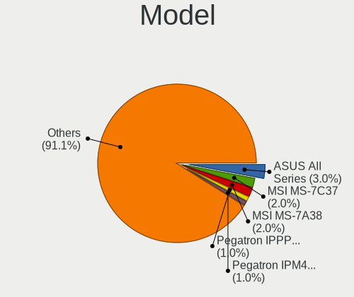
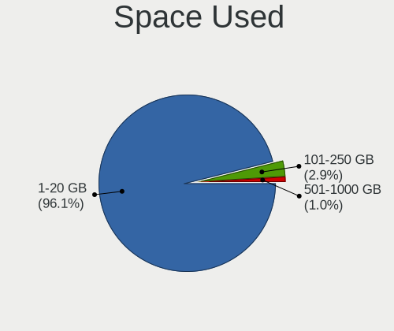
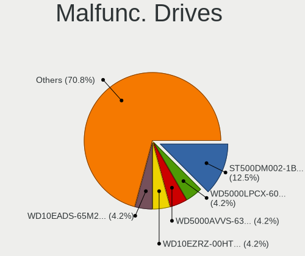
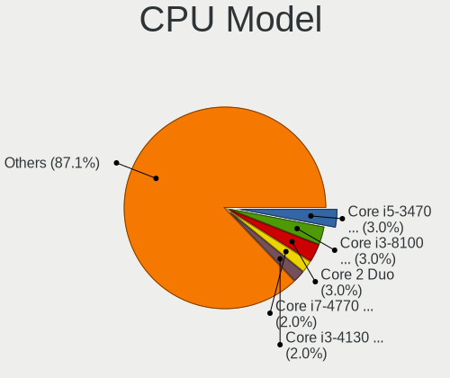
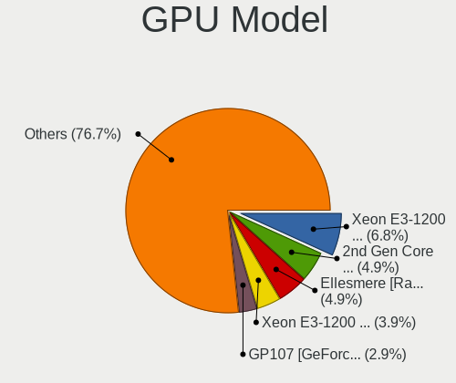
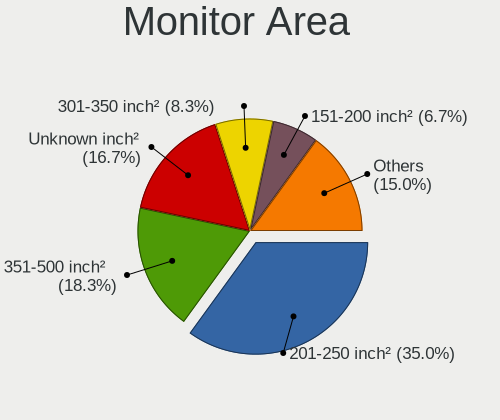
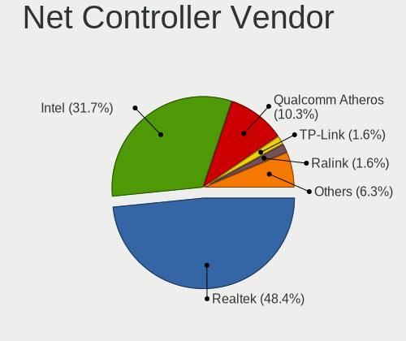

helloSystem 0.8.0 - Tested Hardware & Statistics (Desktops)
-----------------------------------------------------------

A project to collect tested hardware configurations for helloSystem 0.8.0.

Anyone can contribute to this report by the [hw-probe](https://github.com/linuxhw/hw-probe/blob/master/INSTALL.BSD.md) tool:

    hw-probe -all -upload

Please contribute! Especially if your hardware is rare.

Contents
--------

* [ Test Cases ](#test-cases)

* [ System ](#system)
  - [ Arch                     ](#arch)
  - [ DE                       ](#de)
  - [ Display Server           ](#display-server)
  - [ Display Manager          ](#display-manager)
  - [ OS Lang                  ](#os-lang)
  - [ Boot Mode                ](#boot-mode)
  - [ Filesystem               ](#filesystem)
  - [ Part. scheme             ](#part-scheme)

* [ Board ](#board)
  - [ Vendor                   ](#vendor)
  - [ Model                    ](#model)
  - [ Model Family             ](#model-family)
  - [ MFG Year                 ](#mfg-year)
  - [ Form Factor              ](#form-factor)
  - [ Coreboot                 ](#coreboot)
  - [ RAM Size                 ](#ram-size)
  - [ RAM Used                 ](#ram-used)
  - [ Total Drives             ](#total-drives)
  - [ Has CD-ROM               ](#has-cd-rom)
  - [ Has Ethernet             ](#has-ethernet)
  - [ Has WiFi                 ](#has-wifi)
  - [ Has Bluetooth            ](#has-bluetooth)

* [ Location ](#location)
  - [ Country                  ](#country)
  - [ City                     ](#city)

* [ Drives ](#drives)
  - [ Drive Vendor             ](#drive-vendor)
  - [ Drive Model              ](#drive-model)
  - [ HDD Vendor               ](#hdd-vendor)
  - [ SSD Vendor               ](#ssd-vendor)
  - [ Drive Kind               ](#drive-kind)
  - [ Drive Connector          ](#drive-connector)
  - [ Drive Size               ](#drive-size)
  - [ Space Total              ](#space-total)
  - [ Space Used               ](#space-used)
  - [ Malfunc. Drives          ](#malfunc-drives)
  - [ Malfunc. Drive Vendor    ](#malfunc-drive-vendor)
  - [ Malfunc. HDD Vendor      ](#malfunc-hdd-vendor)
  - [ Malfunc. Drive Kind      ](#malfunc-drive-kind)
  - [ Failed Drives            ](#failed-drives)
  - [ Failed Drive Vendor      ](#failed-drive-vendor)
  - [ Drive Status             ](#drive-status)

* [ Storage controller ](#storage-controller)
  - [ Storage Vendor           ](#storage-vendor)
  - [ Storage Model            ](#storage-model)
  - [ Storage Kind             ](#storage-kind)

* [ Processor ](#processor)
  - [ CPU Vendor               ](#cpu-vendor)
  - [ CPU Model                ](#cpu-model)
  - [ CPU Model Family         ](#cpu-model-family)
  - [ CPU Cores                ](#cpu-cores)
  - [ CPU Sockets              ](#cpu-sockets)
  - [ CPU Threads              ](#cpu-threads)
  - [ CPU Microarch            ](#cpu-microarch)

* [ Graphics ](#graphics)
  - [ GPU Vendor               ](#gpu-vendor)
  - [ GPU Model                ](#gpu-model)
  - [ GPU Combo                ](#gpu-combo)
  - [ GPU Driver               ](#gpu-driver)
  - [ GPU Memory               ](#gpu-memory)

* [ Monitor ](#monitor)
  - [ Monitor Vendor           ](#monitor-vendor)
  - [ Monitor Model            ](#monitor-model)
  - [ Monitor Resolution       ](#monitor-resolution)
  - [ Monitor Diagonal         ](#monitor-diagonal)
  - [ Monitor Width            ](#monitor-width)
  - [ Aspect Ratio             ](#aspect-ratio)
  - [ Monitor Area             ](#monitor-area)
  - [ Pixel Density            ](#pixel-density)
  - [ Multiple Monitors        ](#multiple-monitors)

* [ Network ](#network)
  - [ Net Controller Vendor    ](#net-controller-vendor)
  - [ Net Controller Model     ](#net-controller-model)
  - [ Wireless Vendor          ](#wireless-vendor)
  - [ Wireless Model           ](#wireless-model)
  - [ Ethernet Vendor          ](#ethernet-vendor)
  - [ Ethernet Model           ](#ethernet-model)
  - [ Net Controller Kind      ](#net-controller-kind)
  - [ Used Controller          ](#used-controller)
  - [ NICs                     ](#nics)
  - [ IPv6                     ](#ipv6)

* [ Bluetooth ](#bluetooth)
  - [ Bluetooth Vendor         ](#bluetooth-vendor)
  - [ Bluetooth Model          ](#bluetooth-model)

* [ Sound ](#sound)
  - [ Sound Vendor             ](#sound-vendor)
  - [ Sound Model              ](#sound-model)

* [ Memory ](#memory)
  - [ Memory Vendor            ](#memory-vendor)
  - [ Memory Model             ](#memory-model)
  - [ Memory Kind              ](#memory-kind)
  - [ Memory Form Factor       ](#memory-form-factor)
  - [ Memory Size              ](#memory-size)
  - [ Memory Speed             ](#memory-speed)

* [ Printers & scanners ](#printers--scanners)
  - [ Printer Vendor           ](#printer-vendor)
  - [ Printer Model            ](#printer-model)
  - [ Scanner Vendor           ](#scanner-vendor)
  - [ Scanner Model            ](#scanner-model)

* [ Camera ](#camera)
  - [ Camera Vendor            ](#camera-vendor)
  - [ Camera Model             ](#camera-model)

* [ Security ](#security)
  - [ Fingerprint Vendor       ](#fingerprint-vendor)
  - [ Fingerprint Model        ](#fingerprint-model)
  - [ Chipcard Vendor          ](#chipcard-vendor)
  - [ Chipcard Model           ](#chipcard-model)

* [ Unsupported ](#unsupported)
  - [ Unsupported Devices      ](#unsupported-devices)
  - [ Unsupported Device Types ](#unsupported-device-types)

Test Cases
----------

Total: 109

| Vendor    | Model                       | Probe                                                     | Date         |
|-----------|-----------------------------|-----------------------------------------------------------|--------------|
| ASUSTek   | ROG STRIX B550-F GAMING     | [3f089673e0](https://bsd-hardware.info/?probe=3f089673e0) | May 01, 2023 |
| ASUSTek   | ROG STRIX B550-F GAMING     | [396d7f268c](https://bsd-hardware.info/?probe=396d7f268c) | May 01, 2023 |
| NCR       | Richmond BIOS.6.0           | [e41e1e5c70](https://bsd-hardware.info/?probe=e41e1e5c70) | Apr 28, 2023 |
| ASUSTek   | ROG CROSSHAIR VIII HERO     | [cf0771c3a2](https://bsd-hardware.info/?probe=cf0771c3a2) | Apr 25, 2023 |
| Lenovo    | SHARKBAY SDK0E50510 WIN     | [d05a143723](https://bsd-hardware.info/?probe=d05a143723) | Mar 08, 2023 |
| Gigabyte  | X570 UD                     | [13e4d3ce10](https://bsd-hardware.info/?probe=13e4d3ce10) | Mar 05, 2023 |
| ASUSTek   | PRIME A320M-E               | [ca70bceb83](https://bsd-hardware.info/?probe=ca70bceb83) | Mar 05, 2023 |
| ASUSTek   | P7H55                       | [3c78171104](https://bsd-hardware.info/?probe=3c78171104) | Mar 04, 2023 |
| ASUSTek   | P7H55                       | [5ce8dbf5f3](https://bsd-hardware.info/?probe=5ce8dbf5f3) | Mar 04, 2023 |
| Gigabyte  | GA-78LMT-S2P                | [5eb87a21db](https://bsd-hardware.info/?probe=5eb87a21db) | Mar 01, 2023 |
| Fujitsu   | D3009-A1 S26361-D3009-A1    | [66739867ed](https://bsd-hardware.info/?probe=66739867ed) | Feb 26, 2023 |
| ASUSTek   | ROG STRIX Z390-E GAMING     | [be81f2675f](https://bsd-hardware.info/?probe=be81f2675f) | Feb 25, 2023 |
| ASRock    | X470 Gaming K4              | [fbff29a62a](https://bsd-hardware.info/?probe=fbff29a62a) | Feb 25, 2023 |
| Lenovo    | SHARKBAY SDK0E50510 WIN     | [31122bd298](https://bsd-hardware.info/?probe=31122bd298) | Feb 24, 2023 |
| Gigabyte  | A320M-H-CF                  | [02970305db](https://bsd-hardware.info/?probe=02970305db) | Feb 21, 2023 |
| Gigabyte  | B450M AORUS ELITE           | [6af537ff20](https://bsd-hardware.info/?probe=6af537ff20) | Feb 18, 2023 |
| ASUSTek   | PRIME H310M-C R2.0          | [9761fb446b](https://bsd-hardware.info/?probe=9761fb446b) | Feb 18, 2023 |
| ASRock    | A320M-DGS                   | [032d7f0c91](https://bsd-hardware.info/?probe=032d7f0c91) | Feb 17, 2023 |
| ASUSTek   | P8Z68-V LX                  | [99ede66a89](https://bsd-hardware.info/?probe=99ede66a89) | Feb 16, 2023 |
| ASUSTek   | PRIME A320M-K               | [35aa7d7f04](https://bsd-hardware.info/?probe=35aa7d7f04) | Feb 15, 2023 |
| Dell      | 0D28YY A03                  | [b8dc69069d](https://bsd-hardware.info/?probe=b8dc69069d) | Feb 12, 2023 |
| Dell      | 0PU052                      | [03bcc500c0](https://bsd-hardware.info/?probe=03bcc500c0) | Feb 12, 2023 |
| Dell      | 0PU052                      | [035408150f](https://bsd-hardware.info/?probe=035408150f) | Feb 11, 2023 |
| ASUSTek   | P8Z68-V                     | [74ebc950e2](https://bsd-hardware.info/?probe=74ebc950e2) | Feb 11, 2023 |
| ASRock    | H61M/U3S3                   | [48c80bbb1f](https://bsd-hardware.info/?probe=48c80bbb1f) | Feb 11, 2023 |
| HP        | 83EE                        | [cf914f58eb](https://bsd-hardware.info/?probe=cf914f58eb) | Feb 10, 2023 |
| ASRock    | A770DE+                     | [cf1c018ede](https://bsd-hardware.info/?probe=cf1c018ede) | Feb 10, 2023 |
| Lenovo    | MAHOBAY NOK                 | [d6be869761](https://bsd-hardware.info/?probe=d6be869761) | Feb 09, 2023 |
| Biostar   | TA970                       | [8c1a7aedf1](https://bsd-hardware.info/?probe=8c1a7aedf1) | Feb 09, 2023 |
| ASUSTek   | M5A78L-M LX3                | [9af803f850](https://bsd-hardware.info/?probe=9af803f850) | Feb 08, 2023 |
| MSI       | Z97 GAMING 3                | [bbe7b327fd](https://bsd-hardware.info/?probe=bbe7b327fd) | Feb 06, 2023 |
| AOpen     | D1007 0BBA                  | [0873652381](https://bsd-hardware.info/?probe=0873652381) | Feb 06, 2023 |
| ASUSTek   | P8Z77-M                     | [627bdfafb7](https://bsd-hardware.info/?probe=627bdfafb7) | Feb 06, 2023 |
| Biostar   | H61MLV3                     | [dee9a22461](https://bsd-hardware.info/?probe=dee9a22461) | Feb 06, 2023 |
| MSI       | MPG X570 GAMING PLUS        | [c04d9caf55](https://bsd-hardware.info/?probe=c04d9caf55) | Feb 06, 2023 |
| Gigabyte  | H510M S2H V2                | [85628154a2](https://bsd-hardware.info/?probe=85628154a2) | Feb 05, 2023 |
| Dell      | 0PC5F7 A02                  | [5512097fd0](https://bsd-hardware.info/?probe=5512097fd0) | Feb 05, 2023 |
| ASUSTek   | PRIME B450M-A               | [7c56590eaa](https://bsd-hardware.info/?probe=7c56590eaa) | Feb 03, 2023 |
| Gigabyte  | F2A88XM-D3H                 | [fa88a5ce31](https://bsd-hardware.info/?probe=fa88a5ce31) | Feb 02, 2023 |
| HP        | 1496                        | [fae90baa23](https://bsd-hardware.info/?probe=fae90baa23) | Jan 31, 2023 |
| Dell      | 0F373D A00                  | [cd4202e58b](https://bsd-hardware.info/?probe=cd4202e58b) | Jan 30, 2023 |
| ASUSTek   | M4A89TD PRO USB3            | [1328d01296](https://bsd-hardware.info/?probe=1328d01296) | Jan 28, 2023 |
| Gigabyte  | GA-MA770T-UD3               | [6b63a16799](https://bsd-hardware.info/?probe=6b63a16799) | Jan 26, 2023 |
| Gigabyte  | B360M D2V                   | [6685066b6e](https://bsd-hardware.info/?probe=6685066b6e) | Jan 26, 2023 |
| ASUSTek   | H81M-D R2.0                 | [07982549ac](https://bsd-hardware.info/?probe=07982549ac) | Jan 26, 2023 |
| Gigabyte  | H61M-S2PV                   | [9a307961ed](https://bsd-hardware.info/?probe=9a307961ed) | Jan 26, 2023 |
| ASUSTek   | PRIME H310M-K               | [1c97950ce9](https://bsd-hardware.info/?probe=1c97950ce9) | Jan 25, 2023 |
| HP        | 802E                        | [1f3bf517af](https://bsd-hardware.info/?probe=1f3bf517af) | Jan 25, 2023 |
| Google    | Panther                     | [73d3147166](https://bsd-hardware.info/?probe=73d3147166) | Jan 24, 2023 |
| Dell      | 0DFRFW A01                  | [23415b954f](https://bsd-hardware.info/?probe=23415b954f) | Jan 24, 2023 |
| HP        | 1495                        | [69faf0563a](https://bsd-hardware.info/?probe=69faf0563a) | Jan 24, 2023 |
| Gigabyte  | GA-990X-Gaming SLI-CF       | [9cd4d2810a](https://bsd-hardware.info/?probe=9cd4d2810a) | Jan 23, 2023 |
| ASRock    | Z390 Pro4                   | [b9d64a7496](https://bsd-hardware.info/?probe=b9d64a7496) | Jan 23, 2023 |
| Gigabyte  | X570 AORUS PRO              | [6cf4f6761e](https://bsd-hardware.info/?probe=6cf4f6761e) | Jan 23, 2023 |
| Gigabyte  | A520M S2H                   | [803a152afc](https://bsd-hardware.info/?probe=803a152afc) | Jan 23, 2023 |
| ASUSTek   | PRIME A320M-K               | [cdad2f0001](https://bsd-hardware.info/?probe=cdad2f0001) | Jan 23, 2023 |
| ASUSTek   | J1800I-C                    | [27ea626000](https://bsd-hardware.info/?probe=27ea626000) | Jan 23, 2023 |
| ASUSTek   | J1800I-C                    | [abc17c6fc6](https://bsd-hardware.info/?probe=abc17c6fc6) | Jan 23, 2023 |
| MSI       | B450M MORTAR MAX            | [840145eb80](https://bsd-hardware.info/?probe=840145eb80) | Jan 23, 2023 |
| ASUSTek   | X99-A/USB                   | [006553f965](https://bsd-hardware.info/?probe=006553f965) | Jan 23, 2023 |
| Gigabyte  | H81M-H                      | [4b3a05fc2a](https://bsd-hardware.info/?probe=4b3a05fc2a) | Jan 22, 2023 |
| ASUSTek   | P5KPL-AM SE                 | [6dc0fddda1](https://bsd-hardware.info/?probe=6dc0fddda1) | Jan 22, 2023 |
| Dell      | 03KWTV A02                  | [28088f7e94](https://bsd-hardware.info/?probe=28088f7e94) | Jan 22, 2023 |
| Gigabyte  | H270M-DS3H-CF               | [d0e2e85346](https://bsd-hardware.info/?probe=d0e2e85346) | Jan 17, 2023 |
| Gigabyte  | G1.Sniper A88X-CF           | [2372c973c8](https://bsd-hardware.info/?probe=2372c973c8) | Jan 11, 2023 |
| Dell      | 0K240Y A02                  | [379b59f079](https://bsd-hardware.info/?probe=379b59f079) | Jan 05, 2023 |
| Gigabyte  | X399 AORUS Gaming 7         | [1769da5143](https://bsd-hardware.info/?probe=1769da5143) | Dec 25, 2022 |
| ASUSTek   | CM1530                      | [902c77b5dc](https://bsd-hardware.info/?probe=902c77b5dc) | Dec 06, 2022 |
| ASUSTek   | PRIME Z390M-PLUS            | [7329e04c22](https://bsd-hardware.info/?probe=7329e04c22) | Nov 27, 2022 |
| Dell      | 0M017G A00                  | [3acaad9a7d](https://bsd-hardware.info/?probe=3acaad9a7d) | Nov 26, 2022 |
| Gigabyte  | P61-USB3-B3                 | [1ec1683acd](https://bsd-hardware.info/?probe=1ec1683acd) | Nov 21, 2022 |
| Gigabyte  | P61-USB3-B3                 | [5f442f0c65](https://bsd-hardware.info/?probe=5f442f0c65) | Nov 21, 2022 |
| Gigabyte  | H61M-S1                     | [2b851dbbc1](https://bsd-hardware.info/?probe=2b851dbbc1) | Nov 21, 2022 |
| Gigabyte  | 970A-D3P                    | [cced487ec5](https://bsd-hardware.info/?probe=cced487ec5) | Nov 21, 2022 |
| Gigabyte  | 970A-D3P                    | [c28a22ecb5](https://bsd-hardware.info/?probe=c28a22ecb5) | Nov 21, 2022 |
| ASUSTek   | P5KPL-VM-TWPC               | [6a5ff282a7](https://bsd-hardware.info/?probe=6a5ff282a7) | Nov 21, 2022 |
| HP        | 1998                        | [9239fe7437](https://bsd-hardware.info/?probe=9239fe7437) | Nov 15, 2022 |
| Gigabyte  | H270M-DS3H-CF               | [5784d8bed6](https://bsd-hardware.info/?probe=5784d8bed6) | Nov 04, 2022 |
| Lenovo    | 3106 SDK0J40705 WIN 3425... | [d20bfb6d64](https://bsd-hardware.info/?probe=d20bfb6d64) | Oct 30, 2022 |
| HP        | 843B                        | [d7d572f9ad](https://bsd-hardware.info/?probe=d7d572f9ad) | Oct 29, 2022 |
| HP        | 843B                        | [9ea2590610](https://bsd-hardware.info/?probe=9ea2590610) | Oct 23, 2022 |
| MSI       | B450M PRO-VDH PLUS          | [54e4202bc7](https://bsd-hardware.info/?probe=54e4202bc7) | Oct 21, 2022 |
| HP        | 86FC MVB                    | [56453b00c8](https://bsd-hardware.info/?probe=56453b00c8) | Oct 08, 2022 |
| HP        | 86FC MVB                    | [c542b16d75](https://bsd-hardware.info/?probe=c542b16d75) | Oct 08, 2022 |
| Dell      | 0T10XW A01                  | [c2ff0bc0b9](https://bsd-hardware.info/?probe=c2ff0bc0b9) | Sep 30, 2022 |
| ASRock    | ConRoeXFire-eSATA2          | [caf005ed95](https://bsd-hardware.info/?probe=caf005ed95) | Sep 01, 2022 |
| ASUSTek   | ROG STRIX B550-I GAMING     | [079adb24f8](https://bsd-hardware.info/?probe=079adb24f8) | Aug 28, 2022 |
| ASUSTek   | P5QL-ASUS-SE                | [50a0d392e7](https://bsd-hardware.info/?probe=50a0d392e7) | Aug 06, 2022 |
| ASUSTek   | K30AM-J                     | [470ced8f30](https://bsd-hardware.info/?probe=470ced8f30) | Aug 05, 2022 |
| MSI       | MPG X570 GAMING PLUS        | [a80b1c4f3c](https://bsd-hardware.info/?probe=a80b1c4f3c) | Jul 17, 2022 |
| HP        | 1998                        | [e4fda48283](https://bsd-hardware.info/?probe=e4fda48283) | Jul 15, 2022 |
| Pegatron  | IPM41-D3                    | [8b2af1b843](https://bsd-hardware.info/?probe=8b2af1b843) | Jul 06, 2022 |
| Biostar   | G41D3C                      | [118bd083bf](https://bsd-hardware.info/?probe=118bd083bf) | Jul 01, 2022 |
| ASUSTek   | K30AM-J                     | [f4352f7897](https://bsd-hardware.info/?probe=f4352f7897) | May 16, 2022 |
| Lenovo    | 30D9 SDK0J40705 WIN 3425... | [964ceb3616](https://bsd-hardware.info/?probe=964ceb3616) | Apr 03, 2022 |
| MSI       | B350M BAZOOKA               | [bac8d0bdb7](https://bsd-hardware.info/?probe=bac8d0bdb7) | Mar 11, 2022 |
| ASRock    | G41C-VS                     | [a9a1b1a493](https://bsd-hardware.info/?probe=a9a1b1a493) | Mar 03, 2022 |
| Intel     | DN2800MT AAG23738-600       | [8ecf2d023f](https://bsd-hardware.info/?probe=8ecf2d023f) | Mar 02, 2022 |
| ASUSTek   | TUF GAMING X570-PLUS        | [64999a24c1](https://bsd-hardware.info/?probe=64999a24c1) | Feb 16, 2022 |
| AMD       | X64                         | [e5a9ff1138](https://bsd-hardware.info/?probe=e5a9ff1138) | Feb 15, 2022 |
| Lenovo    | SHARKBAY SDK0E50510 WIN     | [eddeb5c246](https://bsd-hardware.info/?probe=eddeb5c246) | Feb 13, 2022 |
| MACHINIST | X99-k9 V2.0                 | [0a36d71db1](https://bsd-hardware.info/?probe=0a36d71db1) | Feb 10, 2022 |
| Pegatron  | IPPPV-D3G                   | [d5e44ccf6b](https://bsd-hardware.info/?probe=d5e44ccf6b) | Jan 28, 2022 |
| Intel     | MAHOBAY                     | [2036093b68](https://bsd-hardware.info/?probe=2036093b68) | Jan 25, 2022 |
| HP        | 8648                        | [b0adf55067](https://bsd-hardware.info/?probe=b0adf55067) | Jan 23, 2022 |
| Dell      | 0593VH A00                  | [484d14dbef](https://bsd-hardware.info/?probe=484d14dbef) | Jan 22, 2022 |
| ASRock    | B365M Pro4                  | [8449bd20c1](https://bsd-hardware.info/?probe=8449bd20c1) | Jan 18, 2022 |
| Dell      | 0YF8P5 A00                  | [913b2a7483](https://bsd-hardware.info/?probe=913b2a7483) | Jan 18, 2022 |
| Dell      | 0X4N41 A01                  | [87000234dc](https://bsd-hardware.info/?probe=87000234dc) | Jan 11, 2022 |

System
------

Arch
----

OS architecture (x86_64, i586, etc.)

| Name  | Desktops | Percent |
|-------|----------|---------|
| amd64 | 97       | 100%    |

DE
--

Desktop Environment

| Name         | Desktops | Percent |
|--------------|----------|---------|
| helloDesktop | 96       | 98.97%  |
| KDE5         | 1        | 1.03%   |

Display Server
--------------

X11 or Wayland

| Name | Desktops | Percent |
|------|----------|---------|
| X11  | 97       | 100%    |

Display Manager
---------------

SDDM, LightDM, etc.

| Name | Desktops | Percent |
|------|----------|---------|
| SLiM | 97       | 100%    |

OS Lang
-------

Language

| Lang  | Desktops | Percent |
|-------|----------|---------|
| en_US | 37       | 37.37%  |
| en    | 30       | 30.3%   |
| fr    | 10       | 10.1%   |
| ru    | 6        | 6.06%   |
| es    | 4        | 4.04%   |
| pt    | 3        | 3.03%   |
| en_GB | 2        | 2.02%   |
| zh_TW | 1        | 1.01%   |
| pl    | 1        | 1.01%   |
| nl    | 1        | 1.01%   |
| it    | 1        | 1.01%   |
| es_ES | 1        | 1.01%   |
| de_DE | 1        | 1.01%   |
| de    | 1        | 1.01%   |

Boot Mode
---------

EFI or BIOS

| Mode | Desktops | Percent |
|------|----------|---------|
| EFI  | 96       | 98.97%  |
| BIOS | 1        | 1.03%   |

Filesystem
----------

Type of filesystem

| Type   | Desktops | Percent |
|--------|----------|---------|
| Cd9660 | 66       | 67.35%  |
| Zfs    | 32       | 32.65%  |

Part. scheme
------------

Scheme of partitioning

| Type | Desktops | Percent |
|------|----------|---------|
| GPT  | 96       | 98.97%  |
| MBR  | 1        | 1.03%   |

Board
-----

Vendor
------

Motherboard manufacturer

| Name                | Desktops | Percent |
|---------------------|----------|---------|
| ASUSTek Computer    | 25       | 25.77%  |
| Gigabyte Technology | 18       | 18.56%  |
| Dell                | 12       | 12.37%  |
| Hewlett-Packard     | 9        | 9.28%   |
| ASRock              | 8        | 8.25%   |
| MSI                 | 6        | 6.19%   |
| Lenovo              | 6        | 6.19%   |
| Biostar             | 3        | 3.09%   |
| Pegatron            | 2        | 2.06%   |
| Intel               | 2        | 2.06%   |
| NCR                 | 1        | 1.03%   |
| MACHINIST           | 1        | 1.03%   |
| Google              | 1        | 1.03%   |
| Fujitsu             | 1        | 1.03%   |
| AOpen               | 1        | 1.03%   |
| AMD                 | 1        | 1.03%   |

Model
-----

Motherboard model

| Name                                | Desktops | Percent |
|-------------------------------------|----------|---------|
| ASUS All Series                     | 3        | 3.09%   |
| MSI MS-7C37                         | 2        | 2.06%   |
| MSI MS-7A38                         | 2        | 2.06%   |
| Pegatron IPPPV-D3G                  | 1        | 1.03%   |
| Pegatron IPM41-D3                   | 1        | 1.03%   |
| NCR 7703-1515-8801                  | 1        | 1.03%   |
| MSI MS-7B89                         | 1        | 1.03%   |
| MSI MS-7918                         | 1        | 1.03%   |
| MACHINIST X99-k9 V2.0               | 1        | 1.03%   |
| Lenovo ThinkCentre M93p 10AB004DUS  | 1        | 1.03%   |
| Lenovo ThinkCentre M93p 10AAA0WGUK  | 1        | 1.03%   |
| Lenovo ThinkCentre M910s 10MK0039US | 1        | 1.03%   |
| Lenovo ThinkCentre M83 10AHA0X9LS   | 1        | 1.03%   |
| Lenovo ThinkCentre M82 2929AZ6      | 1        | 1.03%   |
| Lenovo ThinkCentre M700 10GS        | 1        | 1.03%   |
| Intel MAHOBAY                       | 1        | 1.03%   |
| Intel DN2800MT AAG23738-600         | 1        | 1.03%   |
| HP Z240 SFF Workstation             | 1        | 1.03%   |
| HP Slim Desktop S01-aF1xxx          | 1        | 1.03%   |
| HP ProDesk 600 G4 SFF               | 1        | 1.03%   |
| HP Pavilion Desktop 590-p0xxx       | 1        | 1.03%   |
| HP EliteDesk 800 G1 SFF             | 1        | 1.03%   |
| HP EliteDesk 700 G1 SFF             | 1        | 1.03%   |
| HP Desktop Pro A G3                 | 1        | 1.03%   |
| HP Compaq 8200 Elite USDT PC        | 1        | 1.03%   |
| HP Compaq 8200 Elite SFF PC         | 1        | 1.03%   |
| Google Panther                      | 1        | 1.03%   |
| Gigabyte X570 UD                    | 1        | 1.03%   |
| Gigabyte X570 AORUS PRO             | 1        | 1.03%   |
| Gigabyte X399 AORUS Gaming 7        | 1        | 1.03%   |
| Gigabyte P61-USB3-B3                | 1        | 1.03%   |
| Gigabyte H81M-H                     | 1        | 1.03%   |
| Gigabyte H61M-S2PV                  | 1        | 1.03%   |
| Gigabyte H61M-S1                    | 1        | 1.03%   |
| Gigabyte H510M S2H V2               | 1        | 1.03%   |
| Gigabyte H270M-DS3H                 | 1        | 1.03%   |
| Gigabyte GA-MA770T-UD3              | 1        | 1.03%   |
| Gigabyte GA-990X-Gaming SLI-CF      | 1        | 1.03%   |
| Gigabyte G1.Sniper A88X-CF          | 1        | 1.03%   |
| Gigabyte F2A88XM-D3H                | 1        | 1.03%   |

Model Family
------------

Motherboard model prefix

| Name                    | Desktops | Percent |
|-------------------------|----------|---------|
| Dell OptiPlex           | 7        | 7.22%   |
| Lenovo ThinkCentre      | 6        | 6.19%   |
| ASUS PRIME              | 5        | 5.15%   |
| ASUS ROG                | 4        | 4.12%   |
| ASUS All                | 3        | 3.09%   |
| MSI MS-7C37             | 2        | 2.06%   |
| MSI MS-7A38             | 2        | 2.06%   |
| HP EliteDesk            | 2        | 2.06%   |
| HP Compaq               | 2        | 2.06%   |
| Gigabyte X570           | 2        | 2.06%   |
| Dell Precision          | 2        | 2.06%   |
| Dell Inspiron           | 2        | 2.06%   |
| ASUS P8Z68-V            | 2        | 2.06%   |
| Pegatron IPPPV-D3G      | 1        | 1.03%   |
| Pegatron IPM41-D3       | 1        | 1.03%   |
| NCR 7703-1515-8801      | 1        | 1.03%   |
| MSI MS-7B89             | 1        | 1.03%   |
| MSI MS-7918             | 1        | 1.03%   |
| MACHINIST X99-k9        | 1        | 1.03%   |
| Intel MAHOBAY           | 1        | 1.03%   |
| Intel DN2800MT          | 1        | 1.03%   |
| HP Z240                 | 1        | 1.03%   |
| HP Slim                 | 1        | 1.03%   |
| HP ProDesk              | 1        | 1.03%   |
| HP Pavilion             | 1        | 1.03%   |
| HP Desktop              | 1        | 1.03%   |
| Google Panther          | 1        | 1.03%   |
| Gigabyte X399           | 1        | 1.03%   |
| Gigabyte P61-USB3-B3    | 1        | 1.03%   |
| Gigabyte H81M-H         | 1        | 1.03%   |
| Gigabyte H61M-S2PV      | 1        | 1.03%   |
| Gigabyte H61M-S1        | 1        | 1.03%   |
| Gigabyte H510M          | 1        | 1.03%   |
| Gigabyte H270M-DS3H     | 1        | 1.03%   |
| Gigabyte GA-MA770T-UD3  | 1        | 1.03%   |
| Gigabyte GA-990X-Gaming | 1        | 1.03%   |
| Gigabyte G1.Sniper      | 1        | 1.03%   |
| Gigabyte F2A88XM-D3H    | 1        | 1.03%   |
| Gigabyte B450M          | 1        | 1.03%   |
| Gigabyte B360M-D2V      | 1        | 1.03%   |

MFG Year
--------

Motherboard manufacture year

| Year | Desktops | Percent |
|------|----------|---------|
| 2019 | 12       | 12.37%  |
| 2018 | 12       | 12.37%  |
| 2020 | 8        | 8.25%   |
| 2013 | 8        | 8.25%   |
| 2012 | 8        | 8.25%   |
| 2021 | 7        | 7.22%   |
| 2015 | 7        | 7.22%   |
| 2014 | 7        | 7.22%   |
| 2011 | 7        | 7.22%   |
| 2010 | 7        | 7.22%   |
| 2022 | 6        | 6.19%   |
| 2017 | 2        | 2.06%   |
| 2016 | 2        | 2.06%   |
| 2009 | 2        | 2.06%   |
| 2008 | 2        | 2.06%   |

Form Factor
-----------

Physical design of the computer

| Name    | Desktops | Percent |
|---------|----------|---------|
| Desktop | 97       | 100%    |

Coreboot
--------

Have coreboot on board

| Used | Desktops | Percent |
|------|----------|---------|
| No   | 96       | 98.97%  |
| Yes  | 1        | 1.03%   |

RAM Size
--------

Total RAM memory

| Size in GB  | Desktops | Percent |
|-------------|----------|---------|
| 8.01-16.0   | 30       | 30.93%  |
| 16.01-24.0  | 28       | 28.87%  |
| 4.01-8.0    | 19       | 19.59%  |
| 32.01-64.0  | 7        | 7.22%   |
| 64.01-256.0 | 6        | 6.19%   |
| 2.01-3.0    | 5        | 5.15%   |
| 24.01-32.0  | 1        | 1.03%   |
| 0.51-1.0    | 1        | 1.03%   |

RAM Used
--------

Used RAM memory

| Used GB   | Desktops | Percent |
|-----------|----------|---------|
| 0.01-0.5  | 43       | 44.33%  |
| 0.51-1.0  | 28       | 28.87%  |
| 1.01-2.0  | 18       | 18.56%  |
| 2.01-3.0  | 5        | 5.15%   |
| 4.01-8.0  | 1        | 1.03%   |
| 3.01-4.0  | 1        | 1.03%   |
| 8.01-16.0 | 1        | 1.03%   |

Total Drives
------------

Number of drives on board

| Drives | Desktops | Percent |
|--------|----------|---------|
| 1      | 48       | 48.48%  |
| 2      | 23       | 23.23%  |
| 3      | 12       | 12.12%  |
| 5      | 5        | 5.05%   |
| 4      | 5        | 5.05%   |
| 0      | 3        | 3.03%   |
| 6      | 2        | 2.02%   |
| 10     | 1        | 1.01%   |

Has CD-ROM
----------

Has CD-ROM on board

| Presented | Desktops | Percent |
|-----------|----------|---------|
| No        | 60       | 61.86%  |
| Yes       | 37       | 38.14%  |

Has Ethernet
------------

Has Ethernet on board

| Presented | Desktops | Percent |
|-----------|----------|---------|
| Yes       | 97       | 100%    |

Has WiFi
--------

Has WiFi module

| Presented | Desktops | Percent |
|-----------|----------|---------|
| No        | 64       | 65.31%  |
| Yes       | 34       | 34.69%  |

Has Bluetooth
-------------

Has Bluetooth module

| Presented | Desktops | Percent |
|-----------|----------|---------|
| No        | 70       | 72.16%  |
| Yes       | 27       | 27.84%  |

Location
--------

Country
-------

Geographic location (country)

| Country      | Desktops | Percent |
|--------------|----------|---------|
| USA          | 21       | 21.65%  |
| Russia       | 14       | 14.43%  |
| Brazil       | 7        | 7.22%   |
| Spain        | 6        | 6.19%   |
| Germany      | 6        | 6.19%   |
| Taiwan       | 5        | 5.15%   |
| UK           | 4        | 4.12%   |
| Poland       | 3        | 3.09%   |
| Italy        | 3        | 3.09%   |
| Canada       | 3        | 3.09%   |
| Portugal     | 2        | 2.06%   |
| Mexico       | 2        | 2.06%   |
| Indonesia    | 2        | 2.06%   |
| India        | 2        | 2.06%   |
| France       | 2        | 2.06%   |
| Belgium      | 2        | 2.06%   |
| Australia    | 2        | 2.06%   |
| Thailand     | 1        | 1.03%   |
| South Africa | 1        | 1.03%   |
| Serbia       | 1        | 1.03%   |
| Peru         | 1        | 1.03%   |
| Norway       | 1        | 1.03%   |
| Japan        | 1        | 1.03%   |
| Hungary      | 1        | 1.03%   |
| Colombia     | 1        | 1.03%   |
| China        | 1        | 1.03%   |
| Bulgaria     | 1        | 1.03%   |
| Argentina    | 1        | 1.03%   |

City
----

Geographic location (city)

| City                   | Desktops | Percent |
|------------------------|----------|---------|
| Moscow                 | 4        | 4.04%   |
| Aquan                  | 4        | 4.04%   |
| Yekaterinburg          | 2        | 2.02%   |
| Voronezh               | 2        | 2.02%   |
| Volgograd              | 2        | 2.02%   |
| Temple                 | 2        | 2.02%   |
| Saratov                | 2        | 2.02%   |
| Manchester             | 2        | 2.02%   |
| Gistel                 | 2        | 2.02%   |
| Zhengzhou              | 1        | 1.01%   |
| Yala                   | 1        | 1.01%   |
| Winnipeg               | 1        | 1.01%   |
| Willingboro            | 1        | 1.01%   |
| Veliko Tarnovo         | 1        | 1.01%   |
| Valledupar             | 1        | 1.01%   |
| Valencia               | 1        | 1.01%   |
| Trieste                | 1        | 1.01%   |
| Trebujena              | 1        | 1.01%   |
| Tasikmalaya            | 1        | 1.01%   |
| Tallahassee            | 1        | 1.01%   |
| Szigetszentmiklos      | 1        | 1.01%   |
| Surrey                 | 1        | 1.01%   |
| Sumaré                | 1        | 1.01%   |
| Spartanburg            | 1        | 1.01%   |
| Southminster           | 1        | 1.01%   |
| Seville                | 1        | 1.01%   |
| Sao Domingos das Dores | 1        | 1.01%   |
| Salisbury              | 1        | 1.01%   |
| Salem                  | 1        | 1.01%   |
| Rosignano Marittimo    | 1        | 1.01%   |
| Richardson             | 1        | 1.01%   |
| Rhinelander            | 1        | 1.01%   |
| Remshalden             | 1        | 1.01%   |
| Reinsvoll              | 1        | 1.01%   |
| Recklinghausen         | 1        | 1.01%   |
| Québec                | 1        | 1.01%   |
| Portland               | 1        | 1.01%   |
| Pieve a Nievole        | 1        | 1.01%   |
| Palembang              | 1        | 1.01%   |
| Osasco                 | 1        | 1.01%   |

Drives
------

Drive Vendor
------------

Hard drive vendors

| Vendor              | Desktops | Drives | Percent |
|---------------------|----------|--------|---------|
| WDC                 | 29       | 39     | 18.35%  |
| Seagate             | 27       | 30     | 17.09%  |
| Samsung Electronics | 24       | 33     | 15.19%  |
| Hitachi             | 12       | 15     | 7.59%   |
| Toshiba             | 9        | 10     | 5.7%    |
| Kingston            | 9        | 10     | 5.7%    |
| Crucial             | 7        | 9      | 4.43%   |
| A-DATA Technology   | 6        | 7      | 3.8%    |
| SanDisk             | 5        | 6      | 3.16%   |
| SPCC                | 3        | 8      | 1.9%    |
| PNY                 | 2        | 2      | 1.27%   |
| Patriot             | 2        | 2      | 1.27%   |
| Lexar               | 2        | 3      | 1.27%   |
| Hewlett-Packard     | 2        | 2      | 1.27%   |
| XrayDisk            | 1        | 1      | 0.63%   |
| Transcend           | 1        | 1      | 0.63%   |
| SK hynix            | 1        | 1      | 0.63%   |
| Silicon Motion      | 1        | 1      | 0.63%   |
| Reletech            | 1        | 1      | 0.63%   |
| Plextor             | 1        | 1      | 0.63%   |
| Pioneer             | 1        | 1      | 0.63%   |
| OCZ                 | 1        | 1      | 0.63%   |
| Mushkin             | 1        | 4      | 0.63%   |
| MidasForce          | 1        | 1      | 0.63%   |
| Micron Technology   | 1        | 1      | 0.63%   |
| LDLC                | 1        | 1      | 0.63%   |
| KingSpec            | 1        | 1      | 0.63%   |
| Intenso             | 1        | 1      | 0.63%   |
| Gigabyte Technology | 1        | 1      | 0.63%   |
| Fanxiang            | 1        | 1      | 0.63%   |
| Emtec               | 1        | 1      | 0.63%   |
| Corsair             | 1        | 1      | 0.63%   |
| China               | 1        | 1      | 0.63%   |

Drive Model
-----------

Hard drive models

| Model                           | Desktops | Percent |
|---------------------------------|----------|---------|
| Seagate ST500DM002-1BD142 500GB | 4        | 2.2%    |
| Samsung SSD 860 EVO 1TB         | 3        | 1.65%   |
| WDC WDS120G2G0A-00JH30 120GB    | 2        | 1.1%    |
| Toshiba MQ01ABD050 500GB        | 2        | 1.1%    |
| Toshiba HDWD110 1TB             | 2        | 1.1%    |
| Seagate ST3500418AS 500GB       | 2        | 1.1%    |
| Seagate ST3250310AS 250GB       | 2        | 1.1%    |
| Seagate ST2000LM007-1R8174 2TB  | 2        | 1.1%    |
| Seagate ST2000DM008-2FR102 2TB  | 2        | 1.1%    |
| Seagate ST1000DM010-2EP102 1TB  | 2        | 1.1%    |
| Samsung SSD 980 PRO 1TB         | 2        | 1.1%    |
| Samsung SSD 860 PRO 512GB       | 2        | 1.1%    |
| Samsung SSD 860 EVO 500GB       | 2        | 1.1%    |
| Samsung HD322HJ 320GB           | 2        | 1.1%    |
| Kingston SA400S37240G 240GB     | 2        | 1.1%    |
| Hitachi HDS721616PLA380 160GB   | 2        | 1.1%    |
| A-DATA SU800 256GB              | 2        | 1.1%    |
| XrayDisk SSD 256GB              | 1        | 0.55%   |
| WDC WDS500G3XHC-00SJG0 500GB    | 1        | 0.55%   |
| WDC WDS500G2X0C-00L350 500GB    | 1        | 0.55%   |
| WDC WDS500G2B0A 500GB           | 1        | 0.55%   |
| WDC WDS500G1B0C-00S6U0 500GB    | 1        | 0.55%   |
| WDC WDS120G2G0B-00EPW0 120GB    | 1        | 0.55%   |
| WDC WD80EFAX-68KNBN0 8TB        | 1        | 0.55%   |
| WDC WD50NPZZ-00A9JT0 5TB        | 1        | 0.55%   |
| WDC WD5000LPLX-08ZNTT0 500GB    | 1        | 0.55%   |
| WDC WD5000LPCX-60VHAT0 500GB    | 1        | 0.55%   |
| WDC WD5000AZLX-60K2TA1 500GB    | 1        | 0.55%   |
| WDC WD5000AVVS-63H0B1 500GB     | 1        | 0.55%   |
| WDC WD5000AAKX-00U6AA0 500GB    | 1        | 0.55%   |
| WDC WD5000AAKS-00YGA0 500GB     | 1        | 0.55%   |
| WDC WD40EFRX-68WT0N0 4TB        | 1        | 0.55%   |
| WDC WD3200BPVT-75JJ5T0 320GB    | 1        | 0.55%   |
| WDC WD3200BEVT-00ZCT0 320GB     | 1        | 0.55%   |
| WDC WD3200AAKS-75L9A0 320GB     | 1        | 0.55%   |
| WDC WD3003FZEX-00Z4SA0 3TB      | 1        | 0.55%   |
| WDC WD2500BEVT-75A23T0 250GB    | 1        | 0.55%   |
| WDC WD20EZAZ-22L9GB0 2TB        | 1        | 0.55%   |
| WDC WD20EFRX-68EUZN0 2TB        | 1        | 0.55%   |
| WDC WD20EARS-00MVWB0 2TB        | 1        | 0.55%   |

HDD Vendor
----------

Hard disk drive vendors

| Vendor              | Desktops | Drives | Percent |
|---------------------|----------|--------|---------|
| Seagate             | 27       | 30     | 34.62%  |
| WDC                 | 24       | 30     | 30.77%  |
| Hitachi             | 12       | 15     | 15.38%  |
| Samsung Electronics | 8        | 8      | 10.26%  |
| Toshiba             | 6        | 7      | 7.69%   |
| Hewlett-Packard     | 1        | 1      | 1.28%   |

SSD Vendor
----------

Solid state drive vendors

| Vendor              | Desktops | Drives | Percent |
|---------------------|----------|--------|---------|
| Samsung Electronics | 11       | 16     | 16.92%  |
| Kingston            | 7        | 8      | 10.77%  |
| Crucial             | 6        | 8      | 9.23%   |
| A-DATA Technology   | 6        | 7      | 9.23%   |
| SanDisk             | 5        | 6      | 7.69%   |
| WDC                 | 4        | 5      | 6.15%   |
| Toshiba             | 3        | 3      | 4.62%   |
| SPCC                | 3        | 8      | 4.62%   |
| PNY                 | 2        | 2      | 3.08%   |
| Patriot             | 2        | 2      | 3.08%   |
| XrayDisk            | 1        | 1      | 1.54%   |
| Transcend           | 1        | 1      | 1.54%   |
| Plextor             | 1        | 1      | 1.54%   |
| Pioneer             | 1        | 1      | 1.54%   |
| OCZ                 | 1        | 1      | 1.54%   |
| Mushkin             | 1        | 4      | 1.54%   |
| MidasForce          | 1        | 1      | 1.54%   |
| Micron Technology   | 1        | 1      | 1.54%   |
| Lexar               | 1        | 1      | 1.54%   |
| KingSpec            | 1        | 1      | 1.54%   |
| Intenso             | 1        | 1      | 1.54%   |
| Hewlett-Packard     | 1        | 1      | 1.54%   |
| Gigabyte Technology | 1        | 1      | 1.54%   |
| Fanxiang            | 1        | 1      | 1.54%   |
| Emtec               | 1        | 1      | 1.54%   |
| China               | 1        | 1      | 1.54%   |

Drive Kind
----------

HDD or SSD

| Kind | Desktops | Drives | Percent |
|------|----------|--------|---------|
| HDD  | 61       | 91     | 46.56%  |
| SSD  | 50       | 84     | 38.17%  |
| NVMe | 20       | 23     | 15.27%  |

Drive Connector
---------------

SATA, SAS, NVMe, etc.

| Type | Desktops | Drives | Percent |
|------|----------|--------|---------|
| SATA | 90       | 175    | 81.82%  |
| NVMe | 20       | 23     | 18.18%  |

Drive Size
----------

Size of hard drive

| Size in TB | Desktops | Drives | Percent |
|------------|----------|--------|---------|
| 0.01-0.5   | 74       | 110    | 61.16%  |
| 0.51-1.0   | 26       | 32     | 21.49%  |
| 1.01-2.0   | 14       | 19     | 11.57%  |
| 3.01-4.0   | 3        | 4      | 2.48%   |
| 2.01-3.0   | 2        | 8      | 1.65%   |
| 4.01-10.0  | 2        | 2      | 1.65%   |

Space Total
-----------

Amount of disk space available on the file system

| Size in GB | Desktops | Percent |
|------------|----------|---------|
| 1-20       | 61       | 62.24%  |
| 101-250    | 15       | 15.31%  |
| 251-500    | 10       | 10.2%   |
| 501-1000   | 5        | 5.1%    |
| 1001-2000  | 4        | 4.08%   |
| 51-100     | 2        | 2.04%   |
| 21-50      | 1        | 1.02%   |

Space Used
----------

Amount of used disk space

| Used GB  | Desktops | Percent |
|----------|----------|---------|
| 1-20     | 94       | 95.92%  |
| 101-250  | 3        | 3.06%   |
| 501-1000 | 1        | 1.02%   |

Malfunc. Drives
---------------

Drive models with a malfunction

| Model                             | Desktops | Drives | Percent |
|-----------------------------------|----------|--------|---------|
| Seagate ST500DM002-1BD142 500GB   | 3        | 3      | 13.64%  |
| WDC WD5000LPCX-60VHAT0 500GB      | 1        | 1      | 4.55%   |
| WDC WD5000AVVS-63H0B1 500GB       | 1        | 1      | 4.55%   |
| WDC WD10EZRZ-00HTKB0 1TB          | 1        | 1      | 4.55%   |
| WDC WD10EADS-65M2BX 1TB           | 1        | 1      | 4.55%   |
| WDC WD10EACS-00D6B1 1TB           | 1        | 2      | 4.55%   |
| Toshiba MK1255GSX H 120GB         | 1        | 1      | 4.55%   |
| Seagate ST3500418AS 500GB         | 1        | 1      | 4.55%   |
| Seagate ST1000DM010-2EP102 1TB    | 1        | 1      | 4.55%   |
| Samsung Electronics HD501LJ 500GB | 1        | 1      | 4.55%   |
| Samsung Electronics HD322HJ 320GB | 1        | 1      | 4.55%   |
| Pioneer APS-SL3N-240 240GB        | 1        | 1      | 4.55%   |
| OCZ VERTEX3 240GB                 | 1        | 1      | 4.55%   |
| MidasForce SSD 120GB              | 1        | 1      | 4.55%   |
| Hitachi HTS545050A7E380 500GB     | 1        | 1      | 4.55%   |
| Hitachi HTS541680J9SA00 80GB      | 1        | 1      | 4.55%   |
| Hitachi HDT721010SLA360 1TB       | 1        | 1      | 4.55%   |
| Hitachi HDS721616PLA380 160GB     | 1        | 1      | 4.55%   |
| Crucial CT1050MX300SSD1 1TB       | 1        | 1      | 4.55%   |
| A-DATA Technology SU800 256GB     | 1        | 1      | 4.55%   |

Malfunc. Drive Vendor
---------------------

Vendors of faulty drives

| Vendor              | Desktops | Drives | Percent |
|---------------------|----------|--------|---------|
| WDC                 | 5        | 6      | 22.73%  |
| Seagate             | 5        | 5      | 22.73%  |
| Hitachi             | 4        | 4      | 18.18%  |
| Samsung Electronics | 2        | 2      | 9.09%   |
| Toshiba             | 1        | 1      | 4.55%   |
| Pioneer             | 1        | 1      | 4.55%   |
| OCZ                 | 1        | 1      | 4.55%   |
| MidasForce          | 1        | 1      | 4.55%   |
| Crucial             | 1        | 1      | 4.55%   |
| A-DATA Technology   | 1        | 1      | 4.55%   |

Malfunc. HDD Vendor
-------------------

Vendors of faulty HDD drives

| Vendor              | Desktops | Drives | Percent |
|---------------------|----------|--------|---------|
| WDC                 | 5        | 6      | 29.41%  |
| Seagate             | 5        | 5      | 29.41%  |
| Hitachi             | 4        | 4      | 23.53%  |
| Samsung Electronics | 2        | 2      | 11.76%  |
| Toshiba             | 1        | 1      | 5.88%   |

Malfunc. Drive Kind
-------------------

Kinds of faulty drives

| Kind | Desktops | Drives | Percent |
|------|----------|--------|---------|
| HDD  | 17       | 18     | 77.27%  |
| SSD  | 5        | 5      | 22.73%  |

Failed Drives
-------------

Failed drive models

| Model                           | Desktops | Drives | Percent |
|---------------------------------|----------|--------|---------|
| Seagate ST3250310AS 250GB       | 1        | 1      | 50%     |
| Samsung Electronics HD103SJ 1TB | 1        | 1      | 50%     |

Failed Drive Vendor
-------------------

Failed drive vendors

| Vendor              | Desktops | Drives | Percent |
|---------------------|----------|--------|---------|
| Seagate             | 1        | 1      | 50%     |
| Samsung Electronics | 1        | 1      | 50%     |

Drive Status
------------

Number of failed and malfunc. drives

| Status   | Desktops | Drives | Percent |
|----------|----------|--------|---------|
| Works    | 77       | 160    | 72.64%  |
| Malfunc  | 20       | 23     | 18.87%  |
| Detected | 7        | 13     | 6.6%    |
| Failed   | 2        | 2      | 1.89%   |

Storage controller
------------------

Storage Vendor
--------------

Storage controller vendors

| Vendor                       | Desktops | Percent |
|------------------------------|----------|---------|
| Intel                        | 64       | 48.12%  |
| AMD                          | 33       | 24.81%  |
| Samsung Electronics          | 8        | 6.02%   |
| SanDisk                      | 6        | 4.51%   |
| JMicron Technology           | 4        | 3.01%   |
| ASMedia Technology           | 4        | 3.01%   |
| Silicon Motion               | 2        | 1.5%    |
| Shenzhen Longsys Electronics | 2        | 1.5%    |
| Phison Electronics           | 2        | 1.5%    |
| Kingston Technology Company  | 2        | 1.5%    |
| VIA Technologies             | 1        | 0.75%   |
| SK hynix                     | 1        | 0.75%   |
| Realtek Semiconductor        | 1        | 0.75%   |
| Micron/Crucial Technology    | 1        | 0.75%   |
| Marvell Technology Group     | 1        | 0.75%   |
| Lite-On IT Corp. / Plextor   | 1        | 0.75%   |

Storage Model
-------------

Storage controller models

| Model                                                                                   | Desktops | Percent |
|-----------------------------------------------------------------------------------------|----------|---------|
| AMD FCH SATA Controller [AHCI mode]                                                     | 18       | 10.78%  |
| Intel Cannon Lake PCH SATA AHCI Controller                                              | 8        | 4.79%   |
| Intel 6 Series/C200 Series Chipset Family 6 port Desktop SATA AHCI Controller           | 8        | 4.79%   |
| Intel 8 Series/C220 Series Chipset Family 6-port SATA Controller 1 [AHCI mode]          | 6        | 3.59%   |
| AMD SB7x0/SB8x0/SB9x0 SATA Controller [IDE mode]                                        | 6        | 3.59%   |
| AMD SB7x0/SB8x0/SB9x0 IDE Controller                                                    | 6        | 3.59%   |
| Samsung NVMe SSD Controller SM981/PM981/PM983                                           | 5        | 2.99%   |
| Intel NM10/ICH7 Family SATA Controller [IDE mode]                                       | 5        | 2.99%   |
| Intel 82801G (ICH7 Family) IDE Controller                                               | 5        | 2.99%   |
| Intel 6 Series/C200 Series Chipset Family Desktop SATA Controller (IDE mode, ports 4-5) | 5        | 2.99%   |
| Intel 6 Series/C200 Series Chipset Family Desktop SATA Controller (IDE mode, ports 0-3) | 5        | 2.99%   |
| AMD 400 Series Chipset SATA Controller                                                  | 5        | 2.99%   |
| Intel 200 Series PCH SATA controller [AHCI mode]                                        | 4        | 2.4%    |
| AMD FCH SATA Controller D                                                               | 4        | 2.4%    |
| Intel Q170/Q150/B150/H170/H110/Z170/CM236 Chipset SATA Controller [AHCI Mode]           | 3        | 1.8%    |
| Intel NM10/ICH7 Family SATA Controller [AHCI mode]                                      | 3        | 1.8%    |
| ASMedia ASM1062 Serial ATA Controller                                                   | 3        | 1.8%    |
| AMD 500 Series Chipset SATA Controller                                                  | 3        | 1.8%    |
| Silicon Motion SM2263EN/SM2263XT SSD Controller                                         | 2        | 1.2%    |
| SanDisk WD Blue SN500 / PC SN520 NVMe SSD                                               | 2        | 1.2%    |
| Sandisk WD Black SN770 NVMe SSD                                                         | 2        | 1.2%    |
| SanDisk WD Black 2018/SN750 / PC SN720 NVMe SSD                                         | 2        | 1.2%    |
| Samsung NVMe SSD Controller PM9A1/PM9A3/980PRO                                          | 2        | 1.2%    |
| Intel SATA Controller [RAID mode]                                                       | 2        | 1.2%    |
| Intel C610/X99 series chipset sSATA Controller [AHCI mode]                              | 2        | 1.2%    |
| Intel C610/X99 series chipset 6-Port SATA Controller [AHCI mode]                        | 2        | 1.2%    |
| Intel Atom Processor E3800 Series SATA AHCI Controller                                  | 2        | 1.2%    |
| Intel 7 Series/C210 Series Chipset Family 6-port SATA Controller [AHCI mode]            | 2        | 1.2%    |
| Intel 500 Series Chipset Family SATA AHCI Controller                                    | 2        | 1.2%    |
| Intel 4 Series Chipset PT IDER Controller                                               | 2        | 1.2%    |
| AMD SB7x0/SB8x0/SB9x0 SATA Controller [AHCI mode]                                       | 2        | 1.2%    |
| Unknown                                                                                 | 2        | 1.2%    |
| VIA VT6415 PATA IDE Host Controller                                                     | 1        | 0.6%    |
| SK hynix Gold P31/PC711 NVMe Solid State Drive                                          | 1        | 0.6%    |
| Shenzhen Longsys SM2263EN/SM2263XT-based OEM SSD                                        | 1        | 0.6%    |
| Samsung NVMe SSD Controller 980                                                         | 1        | 0.6%    |
| Realtek NVMe Controller                                                                 | 1        | 0.6%    |
| Phison E16 PCIe4 NVMe Controller                                                        | 1        | 0.6%    |
| Phison E12 NVMe Controller                                                              | 1        | 0.6%    |
| Micron/Crucial P2 NVMe PCIe SSD                                                         | 1        | 0.6%    |

Storage Kind
------------

Kind of storage controller (IDE, SATA, NVMe, SAS, ...)

| Kind | Desktops | Percent |
|------|----------|---------|
| SATA | 75       | 58.59%  |
| IDE  | 27       | 21.09%  |
| NVMe | 23       | 17.97%  |
| RAID | 3        | 2.34%   |

Processor
---------

CPU Vendor
----------

Processor vendors

| Vendor | Desktops | Percent |
|--------|----------|---------|
| Intel  | 64       | 65.98%  |
| AMD    | 33       | 34.02%  |

CPU Model
---------

Processor models

| Model                                       | Desktops | Percent |
|---------------------------------------------|----------|---------|
| Intel Core i5-3470 CPU @ 3.20GHz            | 3        | 3.09%   |
| Intel Core i3-8100 CPU @ 3.60GHz            | 3        | 3.09%   |
| Intel Core 2 Duo                            | 3        | 3.09%   |
| Intel Core i7-4770 CPU @ 3.40GHz            | 2        | 2.06%   |
| Intel Celeron CPU J1800 @ 2.41GHz           | 2        | 2.06%   |
| AMD Ryzen 5 5600G with Radeon Graphics      | 2        | 2.06%   |
| AMD Ryzen 5 2600 Six-Core Processor         | 2        | 2.06%   |
| AMD Phenom II X4 945 Processor              | 2        | 2.06%   |
| Intel Xeon CPU E5462 @ 2.80GHz              | 1        | 1.03%   |
| Intel Xeon CPU E5-2630L v4 @ 1.80GHz        | 1        | 1.03%   |
| Intel Xeon CPU E5-1650 v3 @ 3.50GHz         | 1        | 1.03%   |
| Intel Xeon CPU E3-1225 v5 @ 3.30GHz         | 1        | 1.03%   |
| Intel Pentium Silver J5040 CPU @ 2.00GHz    | 1        | 1.03%   |
| Intel Pentium Dual-Core CPU E6700 @ 3.20GHz | 1        | 1.03%   |
| Intel Pentium Dual-Core CPU E5700 @ 3.00GHz | 1        | 1.03%   |
| Intel Pentium Dual-Core CPU E5400 @ 2.70GHz | 1        | 1.03%   |
| Intel Pentium Dual-Core CPU E5200 @ 2.50GHz | 1        | 1.03%   |
| Intel Pentium CPU G620 @ 2.60GHz            | 1        | 1.03%   |
| Intel Pentium CPU G4400 @ 3.30GHz           | 1        | 1.03%   |
| Intel Pentium CPU G2020 @ 2.90GHz           | 1        | 1.03%   |
| Intel Core i9-9900KS CPU @ 4.00GHz          | 1        | 1.03%   |
| Intel Core i7-9700 CPU @ 3.00GHz            | 1        | 1.03%   |
| Intel Core i7-7700 CPU @ 3.60GHz            | 1        | 1.03%   |
| Intel Core i7-5820K CPU @ 3.30GHz           | 1        | 1.03%   |
| Intel Core i7-4790 CPU @ 3.60GHz            | 1        | 1.03%   |
| Intel Core i7-2600 CPU @ 3.40GHz            | 1        | 1.03%   |
| Intel Core i5-9400F CPU @ 2.90GHz           | 1        | 1.03%   |
| Intel Core i5-9400 CPU @ 2.90GHz            | 1        | 1.03%   |
| Intel Core i5-8500T CPU @ 2.10GHz           | 1        | 1.03%   |
| Intel Core i5-8500 CPU @ 3.00GHz            | 1        | 1.03%   |
| Intel Core i5-8400 CPU @ 2.80GHz            | 1        | 1.03%   |
| Intel Core i5-6500TE CPU @ 2.30GHz          | 1        | 1.03%   |
| Intel Core i5-6500 CPU @ 3.20GHz            | 1        | 1.03%   |
| Intel Core i5-4670 CPU @ 3.40GHz            | 1        | 1.03%   |
| Intel Core i5-4590T CPU @ 2.00GHz           | 1        | 1.03%   |
| Intel Core i5-4590 CPU @ 3.30GHz            | 1        | 1.03%   |
| Intel Core i5-4570T CPU @ 2.90GHz           | 1        | 1.03%   |
| Intel Core i5-3570 CPU @ 3.40GHz            | 1        | 1.03%   |
| Intel Core i5-2500K CPU @ 3.30GHz           | 1        | 1.03%   |
| Intel Core i5-2500 CPU @ 3.30GHz            | 1        | 1.03%   |

CPU Model Family
----------------

Processor model prefix

| Model                   | Desktops | Percent |
|-------------------------|----------|---------|
| Intel Core i5           | 21       | 21.65%  |
| Intel Core i3           | 10       | 10.31%  |
| Intel Core i7           | 7        | 7.22%   |
| AMD Ryzen 5             | 7        | 7.22%   |
| AMD Phenom II X4        | 5        | 5.15%   |
| Intel Xeon              | 4        | 4.12%   |
| Intel Pentium Dual-Core | 4        | 4.12%   |
| Intel Core 2 Duo        | 4        | 4.12%   |
| Intel Celeron           | 4        | 4.12%   |
| AMD Ryzen 7             | 4        | 4.12%   |
| Intel Pentium           | 3        | 3.09%   |
| AMD Ryzen 9             | 3        | 3.09%   |
| AMD Ryzen 3             | 3        | 3.09%   |
| AMD FX                  | 3        | 3.09%   |
| Other                   | 2        | 2.06%   |
| Intel Atom              | 2        | 2.06%   |
| Intel Pentium Silver    | 1        | 1.03%   |
| Intel Core i9           | 1        | 1.03%   |
| Intel Core 2 Quad       | 1        | 1.03%   |
| Intel Core 2            | 1        | 1.03%   |
| AMD Ryzen Threadripper  | 1        | 1.03%   |
| AMD Ryzen 5 PRO         | 1        | 1.03%   |
| AMD Ryzen 3 PRO         | 1        | 1.03%   |
| AMD Athlon II X4        | 1        | 1.03%   |
| AMD Athlon              | 1        | 1.03%   |
| AMD A8                  | 1        | 1.03%   |
| AMD A10                 | 1        | 1.03%   |

CPU Cores
---------

Number of processor cores

| Number  | Desktops | Percent |
|---------|----------|---------|
| 4       | 40       | 41.24%  |
| 2       | 22       | 22.68%  |
| 6       | 10       | 10.31%  |
| 8       | 7        | 7.22%   |
| 16      | 5        | 5.15%   |
| 12      | 5        | 5.15%   |
| Unknown | 3        | 3.09%   |
| 24      | 2        | 2.06%   |
| 32      | 1        | 1.03%   |
| 10      | 1        | 1.03%   |
| 1       | 1        | 1.03%   |

CPU Sockets
-----------

Number of sockets

| Number | Desktops | Percent |
|--------|----------|---------|
| 1      | 97       | 100%    |

CPU Threads
-----------

Threads per core (Hyper-Threading)

| Number  | Desktops | Percent |
|---------|----------|---------|
| 1       | 74       | 76.29%  |
| 2       | 20       | 20.62%  |
| Unknown | 3        | 3.09%   |

CPU Microarch
-------------

Microarchitecture

| Name          | Desktops | Percent |
|---------------|----------|---------|
| Haswell       | 12       | 12.37%  |
| KabyLake      | 11       | 11.34%  |
| SandyBridge   | 9        | 9.28%   |
| Penryn        | 7        | 7.22%   |
| Zen+          | 6        | 6.19%   |
| Zen 3         | 6        | 6.19%   |
| K10           | 6        | 6.19%   |
| IvyBridge     | 6        | 6.19%   |
| Zen           | 5        | 5.15%   |
| Zen 2         | 4        | 4.12%   |
| Skylake       | 4        | 4.12%   |
| Core          | 4        | 4.12%   |
| Piledriver    | 3        | 3.09%   |
| Westmere      | 2        | 2.06%   |
| Silvermont    | 2        | 2.06%   |
| CometLake     | 2        | 2.06%   |
| Bonnell       | 2        | 2.06%   |
| Unknown       | 2        | 2.06%   |
| Steamroller   | 1        | 1.03%   |
| Goldmont plus | 1        | 1.03%   |
| Excavator     | 1        | 1.03%   |
| Broadwell     | 1        | 1.03%   |

Graphics
--------

GPU Vendor
----------

Vendors of graphics cards

| Vendor | Desktops | Percent |
|--------|----------|---------|
| Nvidia | 37       | 37.37%  |
| Intel  | 37       | 37.37%  |
| AMD    | 25       | 25.25%  |

GPU Model
---------

Graphics card models

| Model                                                                       | Desktops | Percent |
|-----------------------------------------------------------------------------|----------|---------|
| Intel Xeon E3-1200 v3/4th Gen Core Processor Integrated Graphics Controller | 7        | 7.07%   |
| Intel 2nd Generation Core Processor Family Integrated Graphics Controller   | 5        | 5.05%   |
| AMD Ellesmere [Radeon RX 470/480/570/570X/580/580X/590]                     | 5        | 5.05%   |
| Intel Xeon E3-1200 v2/3rd Gen Core processor Graphics Controller            | 4        | 4.04%   |
| Nvidia GP107 [GeForce GTX 1050 Ti]                                          | 3        | 3.03%   |
| Intel CoffeeLake-S GT2 [UHD Graphics 630]                                   | 3        | 3.03%   |
| AMD Raven Ridge [Radeon Vega Series / Radeon Vega Mobile Series]            | 3        | 3.03%   |
| AMD Picasso/Raven 2 [Radeon Vega Series / Radeon Vega Mobile Series]        | 3        | 3.03%   |
| Nvidia TU117 [GeForce GTX 1650]                                             | 2        | 2.02%   |
| Nvidia TU116 [GeForce GTX 1660]                                             | 2        | 2.02%   |
| Nvidia TU116 [GeForce GTX 1660 Ti]                                          | 2        | 2.02%   |
| Nvidia TU116 [GeForce GTX 1660 SUPER]                                       | 2        | 2.02%   |
| Nvidia GT218 [GeForce 210]                                                  | 2        | 2.02%   |
| Nvidia GP108 [GeForce GT 1030]                                              | 2        | 2.02%   |
| Nvidia GM206 [GeForce GTX 950]                                              | 2        | 2.02%   |
| Nvidia GK208B [GeForce GT 710]                                              | 2        | 2.02%   |
| Intel HD Graphics 530                                                       | 2        | 2.02%   |
| Intel Atom Processor Z36xxx/Z37xxx Series Graphics & Display                | 2        | 2.02%   |
| Intel 4th Generation Core Processor Family Integrated Graphics Controller   | 2        | 2.02%   |
| Intel 4 Series Chipset Integrated Graphics Controller                       | 2        | 2.02%   |
| AMD Cezanne [Radeon Vega Series / Radeon Vega Mobile Series]                | 2        | 2.02%   |
| AMD Cedar [Radeon HD 5000/6000/7350/8350 Series]                            | 2        | 2.02%   |
| Nvidia TU102 [GeForce RTX 2080 Ti Rev. A]                                   | 1        | 1.01%   |
| Nvidia GT215 [GeForce GT 240]                                               | 1        | 1.01%   |
| Nvidia GP104 [GeForce GTX 1070]                                             | 1        | 1.01%   |
| Nvidia GM206 [GeForce GTX 960]                                              | 1        | 1.01%   |
| Nvidia GM107GL [Quadro K620]                                                | 1        | 1.01%   |
| Nvidia GM107GL [Quadro K1200]                                               | 1        | 1.01%   |
| Nvidia GK208B [GeForce GT 730]                                              | 1        | 1.01%   |
| Nvidia GK106 [GeForce GTX 660]                                              | 1        | 1.01%   |
| Nvidia GK104 [GeForce GTX 760]                                              | 1        | 1.01%   |
| Nvidia GF119 [GeForce GT 625 OEM]                                           | 1        | 1.01%   |
| Nvidia GF119 [GeForce GT 620 OEM]                                           | 1        | 1.01%   |
| Nvidia GF108 [GeForce GT 630]                                               | 1        | 1.01%   |
| Nvidia GF108 [GeForce GT 440]                                               | 1        | 1.01%   |
| Nvidia GF106GL [Quadro 2000]                                                | 1        | 1.01%   |
| Nvidia G96C [GeForce 9500 GT]                                               | 1        | 1.01%   |
| Nvidia G84GL [Quadro FX 570]                                                | 1        | 1.01%   |
| Nvidia G84 [GeForce 8600 GTS]                                               | 1        | 1.01%   |
| Nvidia G73 [GeForce 7600 GS]                                                | 1        | 1.01%   |

GPU Combo
---------

Combinations of graphics cards

| Name        | Desktops | Percent |
|-------------|----------|---------|
| 1 x Nvidia  | 37       | 38.14%  |
| 1 x Intel   | 33       | 34.02%  |
| 1 x AMD     | 23       | 23.71%  |
| 2 x Intel   | 2        | 2.06%   |
| Intel + AMD | 2        | 2.06%   |

GPU Driver
----------

Free vs proprietary

| Driver      | Desktops | Percent |
|-------------|----------|---------|
| Free        | 64       | 65.98%  |
| Proprietary | 29       | 29.9%   |
| Unknown     | 4        | 4.12%   |

GPU Memory
----------

Total video memory

| Size in GB | Desktops | Percent |
|------------|----------|---------|
| Unknown    | 53       | 54.64%  |
| 1.01-2.0   | 12       | 12.37%  |
| 3.01-4.0   | 9        | 9.28%   |
| 0.51-1.0   | 8        | 8.25%   |
| 5.01-6.0   | 6        | 6.19%   |
| 0.01-0.5   | 5        | 5.15%   |
| 7.01-8.0   | 3        | 3.09%   |
| 8.01-16.0  | 1        | 1.03%   |

Monitor
-------

Monitor Vendor
--------------

Monitor vendors

| Vendor               | Desktops | Percent |
|----------------------|----------|---------|
| Goldstar             | 8        | 14.55%  |
| Acer                 | 7        | 12.73%  |
| Samsung Electronics  | 6        | 10.91%  |
| Dell                 | 6        | 10.91%  |
| Hewlett-Packard      | 5        | 9.09%   |
| Philips              | 3        | 5.45%   |
| MSI                  | 3        | 5.45%   |
| LG Electronics       | 2        | 3.64%   |
| BenQ                 | 2        | 3.64%   |
| AOC                  | 2        | 3.64%   |
| Vizio                | 1        | 1.82%   |
| ViewSonic            | 1        | 1.82%   |
| Toshiba              | 1        | 1.82%   |
| NEC Computers        | 1        | 1.82%   |
| Lenovo Group Limited | 1        | 1.82%   |
| Insignia             | 1        | 1.82%   |
| Iiyama               | 1        | 1.82%   |
| Idek Iiyama          | 1        | 1.82%   |
| CHD                  | 1        | 1.82%   |
| ASUSTek Computer     | 1        | 1.82%   |
| Unknown              | 1        | 1.82%   |

Monitor Model
-------------

Monitor models

| Model                                                                 | Desktops | Percent |
|-----------------------------------------------------------------------|----------|---------|
| MSI G32C4 MSI3DA6 1920x1080 700x390mm 31.5-inch                       | 2        | 3.51%   |
| Goldstar LG ULTRAWIDE GSM5AFB 2560x1080 800x340mm 34.2-inch           | 2        | 3.51%   |
| Acer G227HQL ACR03DE 1920x1080 480x270mm 21.7-inch                    | 2        | 3.51%   |
| Vizio D43-D2 VIZ1004 1920x1080 930x520mm 41.9-inch                    | 1        | 1.75%   |
| ViewSonic VA2710-FHD VSCA736 1920x1080 600x340mm 27.2-inch            | 1        | 1.75%   |
| Toshiba TV TSB0110 1920x1080 1110x620mm 50.1-inch                     | 1        | 1.75%   |
| Samsung Electronics SyncMaster SAM0601 1600x900                       | 1        | 1.75%   |
| Samsung Electronics SyncMaster SAM05FF 1600x900 440x250mm 19.9-inch   | 1        | 1.75%   |
| Samsung Electronics SyncMaster SAM05C5 1920x1080                      | 1        | 1.75%   |
| Samsung Electronics SMT22A300 SAM087B 1920x1080 480x270mm 21.7-inch   | 1        | 1.75%   |
| Samsung Electronics SMS23A550H SAM07C9 1920x1080 510x290mm 23.1-inch  | 1        | 1.75%   |
| Samsung Electronics S27H85x SAM0E0F 2560x1440 600x340mm 27.2-inch     | 1        | 1.75%   |
| Samsung Electronics LCD Monitor SAM0C26 1920x1080 700x390mm 31.5-inch | 1        | 1.75%   |
| Philips PHL 223V5 PHLC0CF 1920x1080 480x270mm 21.7-inch               | 1        | 1.75%   |
| Philips LCD Monitor PHL0868 1680x1050 470x290mm 21.7-inch             | 1        | 1.75%   |
| Philips LCD Monitor PHL 243V7 3840x1080                               | 1        | 1.75%   |
| NEC Computers LCD175VXM+ NEC66C0 1280x1024 340x270mm 17.1-inch        | 1        | 1.75%   |
| MSI MAG342CQRV MSI3DB6 3440x1440 790x330mm 33.7-inch                  | 1        | 1.75%   |
| LG Electronics LCD Monitor LG TV 1920x1080                            | 1        | 1.75%   |
| LG Electronics LCD Monitor E2441 3840x1080                            | 1        | 1.75%   |
| Lenovo Group Limited LCD Monitor C24-25 1920x1080                     | 1        | 1.75%   |
| Insignia 32DR310NA17 BBY3253 1680x1050 700x390mm 31.5-inch            | 1        | 1.75%   |
| Iiyama PLE2407HDS IVM560D 1920x1080 520x300mm 23.6-inch               | 1        | 1.75%   |
| Idek Iiyama LCD Monitor PL3270Q 2560x1440                             | 1        | 1.75%   |
| Hewlett-Packard LCD Monitor HPN351A 1920x1080 700x390mm 31.5-inch     | 1        | 1.75%   |
| Hewlett-Packard LA2306 HWP294A 1920x1080 510x290mm 23.1-inch          | 1        | 1.75%   |
| Hewlett-Packard 27xi HWP3038 1920x1080 600x340mm 27.2-inch            | 1        | 1.75%   |
| Hewlett-Packard 27w HPN3494 1920x1080 600x340mm 27.2-inch             | 1        | 1.75%   |
| Hewlett-Packard 24y HPN3504 1920x1080 530x300mm 24.0-inch             | 1        | 1.75%   |
| Goldstar W1934 GSM4B7A 1440x900 410x260mm 19.1-inch                   | 1        | 1.75%   |
| Goldstar LG ULTRAWIDE GSM5AE2 3440x1440 800x340mm 34.2-inch           | 1        | 1.75%   |
| Goldstar LG HDR WFHD GSM5BA0 2560x1080 800x340mm 34.2-inch            | 1        | 1.75%   |
| Goldstar L1918S GSM4B31 1280x1024 380x300mm 19.1-inch                 | 1        | 1.75%   |
| Goldstar E2240 GSM57A4 1920x1080 480x270mm 21.7-inch                  | 1        | 1.75%   |
| Goldstar 2D FHD LG TV GSM59C6 1920x1080 510x290mm 23.1-inch           | 1        | 1.75%   |
| Goldstar 22MP55 GSM5A24 1920x1080 480x270mm 21.7-inch                 | 1        | 1.75%   |
| Dell S2316H DELD07E 1920x1080 510x290mm 23.1-inch                     | 1        | 1.75%   |
| Dell LCD Monitor LNK0001 1920x1080 300x230mm 14.9-inch                | 1        | 1.75%   |
| Dell LCD Monitor E2014H                                               | 1        | 1.75%   |
| Dell E228WFP DELD015 1680x1050 470x300mm 22.0-inch                    | 1        | 1.75%   |

Monitor Resolution
------------------

Monitor screen resolution

| Resolution         | Desktops | Percent |
|--------------------|----------|---------|
| 1920x1080 (FHD)    | 33       | 61.11%  |
| 2560x1440 (QHD)    | 5        | 9.26%   |
| 2560x1080          | 3        | 5.56%   |
| 1680x1050 (WSXGA+) | 3        | 5.56%   |
| 3440x1440          | 2        | 3.7%    |
| 1280x1024 (SXGA)   | 2        | 3.7%    |
| 3840x1080          | 1        | 1.85%   |
| 3520x1080          | 1        | 1.85%   |
| 1600x900 (HD+)     | 1        | 1.85%   |
| 1440x900 (WXGA+)   | 1        | 1.85%   |
| 1366x768 (WXGA)    | 1        | 1.85%   |
| Unknown            | 1        | 1.85%   |

Monitor Diagonal
----------------

Diagonal size in inches

| Inches  | Desktops | Percent |
|---------|----------|---------|
| Unknown | 10       | 18.18%  |
| 21      | 8        | 14.55%  |
| 31      | 6        | 10.91%  |
| 24      | 6        | 10.91%  |
| 23      | 6        | 10.91%  |
| 27      | 5        | 9.09%   |
| 34      | 4        | 7.27%   |
| 19      | 3        | 5.45%   |
| 50      | 1        | 1.82%   |
| 41      | 1        | 1.82%   |
| 33      | 1        | 1.82%   |
| 22      | 1        | 1.82%   |
| 18      | 1        | 1.82%   |
| 17      | 1        | 1.82%   |
| 14      | 1        | 1.82%   |

Monitor Width
-------------

Physical width

| Width in mm | Desktops | Percent |
|-------------|----------|---------|
| 501-600     | 17       | 30.91%  |
| 401-500     | 12       | 21.82%  |
| Unknown     | 10       | 18.18%  |
| 601-700     | 6        | 10.91%  |
| 701-800     | 5        | 9.09%   |
| 351-400     | 1        | 1.82%   |
| 301-350     | 1        | 1.82%   |
| 201-300     | 1        | 1.82%   |
| 1001-1500   | 1        | 1.82%   |
| 901-1000    | 1        | 1.82%   |

Aspect Ratio
------------

Proportional relationship between the width and the height

| Ratio   | Desktops | Percent |
|---------|----------|---------|
| 16/9    | 33       | 62.26%  |
| Unknown | 8        | 15.09%  |
| 21/9    | 5        | 9.43%   |
| 16/10   | 4        | 7.55%   |
| 5/4     | 2        | 3.77%   |
| 4/3     | 1        | 1.89%   |

Monitor Area
------------

Area in inch²

| Area in inch² | Desktops | Percent |
|----------------|----------|---------|
| 201-250        | 19       | 34.55%  |
| 351-500        | 11       | 20%     |
| Unknown        | 10       | 18.18%  |
| 301-350        | 5        | 9.09%   |
| 151-200        | 3        | 5.45%   |
| 251-300        | 2        | 3.64%   |
| 141-150        | 2        | 3.64%   |
| More than 1000 | 1        | 1.82%   |
| 101-110        | 1        | 1.82%   |
| 501-1000       | 1        | 1.82%   |

Pixel Density
-------------

Pixels per inch

| Density | Desktops | Percent |
|---------|----------|---------|
| 51-100  | 31       | 57.41%  |
| 101-120 | 11       | 20.37%  |
| Unknown | 10       | 18.52%  |
| 1-50    | 1        | 1.85%   |
| 121-160 | 1        | 1.85%   |

Multiple Monitors
-----------------

Total monitors connected

| Total | Desktops | Percent |
|-------|----------|---------|
| 1     | 74       | 76.29%  |
| 0     | 18       | 18.56%  |
| 2     | 5        | 5.15%   |

Network
-------

Net Controller Vendor
---------------------

Controller vendors

| Vendor                | Desktops | Percent |
|-----------------------|----------|---------|
| Realtek Semiconductor | 58       | 47.54%  |
| Intel                 | 40       | 32.79%  |
| Qualcomm Atheros      | 12       | 9.84%   |
| TP-Link               | 2        | 1.64%   |
| Ralink Technology     | 2        | 1.64%   |
| Edimax Technology     | 2        | 1.64%   |
| Ralink                | 1        | 0.82%   |
| OPPO Electronics      | 1        | 0.82%   |
| IMC Networks          | 1        | 0.82%   |
| Broadcom              | 1        | 0.82%   |
| Belkin Components     | 1        | 0.82%   |
| ASUSTek Computer      | 1        | 0.82%   |

Net Controller Model
--------------------

Controller models

| Model                                                             | Desktops | Percent |
|-------------------------------------------------------------------|----------|---------|
| Realtek RTL8111/8168/8411 PCI Express Gigabit Ethernet Controller | 52       | 37.68%  |
| Intel Ethernet Connection I217-LM                                 | 7        | 5.07%   |
| Intel 82579LM Gigabit Network Connection (Lewisville)             | 6        | 4.35%   |
| Intel I211 Gigabit Network Connection                             | 4        | 2.9%    |
| Intel 82574L Gigabit Network Connection                           | 4        | 2.9%    |
| Intel Wi-Fi 6 AX200                                               | 3        | 2.17%   |
| Intel Ethernet Connection (7) I219-V                              | 3        | 2.17%   |
| Intel Ethernet Connection (2) I219-LM                             | 3        | 2.17%   |
| Realtek RTL8821CE 802.11ac PCIe Wireless Network Adapter          | 2        | 1.45%   |
| Realtek RTL8192EE PCIe Wireless Network Adapter                   | 2        | 1.45%   |
| Realtek RTL8188EUS 802.11n Wireless Network Adapter               | 2        | 1.45%   |
| Realtek RTL8188CUS 802.11n WLAN Adapter                           | 2        | 1.45%   |
| Realtek RTL810xE PCI Express Fast Ethernet controller             | 2        | 1.45%   |
| Ralink RT5370 Wireless Adapter                                    | 2        | 1.45%   |
| Intel Wireless 8265 / 8275                                        | 2        | 1.45%   |
| Intel Ethernet Controller I225-V                                  | 2        | 1.45%   |
| Intel 82567LM-3 Gigabit Network Connection                        | 2        | 1.45%   |
| TP-Link TL-WN722N v2/v3 [Realtek RTL8188EUS]                      | 1        | 0.72%   |
| TP-Link Archer T2U PLUS [RTL8821AU]                               | 1        | 0.72%   |
| Realtek RTL8723BE PCIe Wireless Network Adapter                   | 1        | 0.72%   |
| Realtek RTL8192CU 802.11n WLAN Adapter                            | 1        | 0.72%   |
| Realtek RTL8125 2.5GbE Controller                                 | 1        | 0.72%   |
| Realtek RTL-8100/8101L/8139 PCI Fast Ethernet Adapter             | 1        | 0.72%   |
| Ralink RT3290 Wireless 802.11n 1T/1R PCIe                         | 1        | 0.72%   |
| Qualcomm Atheros QCA9377 802.11ac Wireless Network Adapter        | 1        | 0.72%   |
| Qualcomm Atheros QCA8171 Gigabit Ethernet                         | 1        | 0.72%   |
| Qualcomm Atheros Killer E2500 Gigabit Ethernet Controller         | 1        | 0.72%   |
| Qualcomm Atheros Killer E220x Gigabit Ethernet Controller         | 1        | 0.72%   |
| Qualcomm Atheros Attansic L1 Gigabit Ethernet                     | 1        | 0.72%   |
| Qualcomm Atheros AR9485 Wireless Network Adapter                  | 1        | 0.72%   |
| Qualcomm Atheros AR9462 Wireless Network Adapter                  | 1        | 0.72%   |
| Qualcomm Atheros AR928X Wireless Network Adapter (PCI-Express)    | 1        | 0.72%   |
| Qualcomm Atheros AR9285 Wireless Network Adapter (PCI-Express)    | 1        | 0.72%   |
| Qualcomm Atheros AR9227 Wireless Network Adapter                  | 1        | 0.72%   |
| Qualcomm Atheros AR8152 v2.0 Fast Ethernet                        | 1        | 0.72%   |
| Qualcomm Atheros AR8151 v2.0 Gigabit Ethernet                     | 1        | 0.72%   |
| Qualcomm Atheros AR8132 Fast Ethernet                             | 1        | 0.72%   |
| OPPO CPH1909 RNDIS Control RNDIS Ethernet Data                    | 1        | 0.72%   |
| Intel Wireless 8260                                               | 1        | 0.72%   |
| Intel Wireless 7260                                               | 1        | 0.72%   |

Wireless Vendor
---------------

Wireless vendors

| Vendor                | Desktops | Percent |
|-----------------------|----------|---------|
| Realtek Semiconductor | 10       | 27.78%  |
| Intel                 | 9        | 25%     |
| Qualcomm Atheros      | 6        | 16.67%  |
| TP-Link               | 2        | 5.56%   |
| Ralink Technology     | 2        | 5.56%   |
| Edimax Technology     | 2        | 5.56%   |
| Ralink                | 1        | 2.78%   |
| IMC Networks          | 1        | 2.78%   |
| Broadcom              | 1        | 2.78%   |
| Belkin Components     | 1        | 2.78%   |
| ASUSTek Computer      | 1        | 2.78%   |

Wireless Model
--------------

Wireless models

| Model                                                                       | Desktops | Percent |
|-----------------------------------------------------------------------------|----------|---------|
| Intel Wi-Fi 6 AX200                                                         | 3        | 8.33%   |
| Realtek RTL8821CE 802.11ac PCIe Wireless Network Adapter                    | 2        | 5.56%   |
| Realtek RTL8192EE PCIe Wireless Network Adapter                             | 2        | 5.56%   |
| Realtek RTL8188EUS 802.11n Wireless Network Adapter                         | 2        | 5.56%   |
| Realtek RTL8188CUS 802.11n WLAN Adapter                                     | 2        | 5.56%   |
| Ralink RT5370 Wireless Adapter                                              | 2        | 5.56%   |
| Intel Wireless 8265 / 8275                                                  | 2        | 5.56%   |
| TP-Link TL-WN722N v2/v3 [Realtek RTL8188EUS]                                | 1        | 2.78%   |
| TP-Link Archer T2U PLUS [RTL8821AU]                                         | 1        | 2.78%   |
| Realtek RTL8723BE PCIe Wireless Network Adapter                             | 1        | 2.78%   |
| Realtek RTL8192CU 802.11n WLAN Adapter                                      | 1        | 2.78%   |
| Ralink RT3290 Wireless 802.11n 1T/1R PCIe                                   | 1        | 2.78%   |
| Qualcomm Atheros QCA9377 802.11ac Wireless Network Adapter                  | 1        | 2.78%   |
| Qualcomm Atheros AR9485 Wireless Network Adapter                            | 1        | 2.78%   |
| Qualcomm Atheros AR9462 Wireless Network Adapter                            | 1        | 2.78%   |
| Qualcomm Atheros AR928X Wireless Network Adapter (PCI-Express)              | 1        | 2.78%   |
| Qualcomm Atheros AR9285 Wireless Network Adapter (PCI-Express)              | 1        | 2.78%   |
| Qualcomm Atheros AR9227 Wireless Network Adapter                            | 1        | 2.78%   |
| Intel Wireless 8260                                                         | 1        | 2.78%   |
| Intel Wireless 7260                                                         | 1        | 2.78%   |
| Intel Wi-Fi 6 AX210/AX211/AX411 160MHz                                      | 1        | 2.78%   |
| Intel Cannon Lake PCH CNVi WiFi                                             | 1        | 2.78%   |
| IMC Networks Realtek RTL8191SU Wireless LAN 802.11n USB 2.0 Network Adapter | 1        | 2.78%   |
| Edimax EW-7811Un 802.11n Wireless Adapter [Realtek RTL8188CUS]              | 1        | 2.78%   |
| Edimax EW-7612UAn V2 802.11n Wireless Adapter [Realtek RTL8192CU]           | 1        | 2.78%   |
| Broadcom BCM4360 802.11ac Wireless Network Adapter                          | 1        | 2.78%   |
| Belkin Components F5D7050 Wireless G Adapter v4000 [Zydas ZD1211B]          | 1        | 2.78%   |
| ASUS N10 Nano 802.11n Network Adapter [Realtek RTL8192CU]                   | 1        | 2.78%   |

Ethernet Vendor
---------------

Ethernet vendors

| Vendor                | Desktops | Percent |
|-----------------------|----------|---------|
| Realtek Semiconductor | 55       | 55.56%  |
| Intel                 | 36       | 36.36%  |
| Qualcomm Atheros      | 7        | 7.07%   |
| OPPO Electronics      | 1        | 1.01%   |

Ethernet Model
--------------

Ethernet models

| Model                                                             | Desktops | Percent |
|-------------------------------------------------------------------|----------|---------|
| Realtek RTL8111/8168/8411 PCI Express Gigabit Ethernet Controller | 52       | 50.98%  |
| Intel Ethernet Connection I217-LM                                 | 7        | 6.86%   |
| Intel 82579LM Gigabit Network Connection (Lewisville)             | 6        | 5.88%   |
| Intel I211 Gigabit Network Connection                             | 4        | 3.92%   |
| Intel 82574L Gigabit Network Connection                           | 4        | 3.92%   |
| Intel Ethernet Connection (7) I219-V                              | 3        | 2.94%   |
| Intel Ethernet Connection (2) I219-LM                             | 3        | 2.94%   |
| Realtek RTL810xE PCI Express Fast Ethernet controller             | 2        | 1.96%   |
| Intel Ethernet Controller I225-V                                  | 2        | 1.96%   |
| Intel 82567LM-3 Gigabit Network Connection                        | 2        | 1.96%   |
| Realtek RTL8125 2.5GbE Controller                                 | 1        | 0.98%   |
| Realtek RTL-8100/8101L/8139 PCI Fast Ethernet Adapter             | 1        | 0.98%   |
| Qualcomm Atheros QCA8171 Gigabit Ethernet                         | 1        | 0.98%   |
| Qualcomm Atheros Killer E2500 Gigabit Ethernet Controller         | 1        | 0.98%   |
| Qualcomm Atheros Killer E220x Gigabit Ethernet Controller         | 1        | 0.98%   |
| Qualcomm Atheros Attansic L1 Gigabit Ethernet                     | 1        | 0.98%   |
| Qualcomm Atheros AR8152 v2.0 Fast Ethernet                        | 1        | 0.98%   |
| Qualcomm Atheros AR8151 v2.0 Gigabit Ethernet                     | 1        | 0.98%   |
| Qualcomm Atheros AR8132 Fast Ethernet                             | 1        | 0.98%   |
| OPPO CPH1909 RNDIS Control RNDIS Ethernet Data                    | 1        | 0.98%   |
| Intel Ethernet Connection (7) I219-LM                             | 1        | 0.98%   |
| Intel Ethernet Connection (2) I219-V                              | 1        | 0.98%   |
| Intel Ethernet Connection (2) I218-V                              | 1        | 0.98%   |
| Intel Ethernet Connection (11) I219-LM                            | 1        | 0.98%   |
| Intel 82579V Gigabit Network Connection                           | 1        | 0.98%   |
| Intel 82577LM Gigabit Network Connection                          | 1        | 0.98%   |
| Intel 82566DM-2 Gigabit Network Connection                        | 1        | 0.98%   |

Net Controller Kind
-------------------

Ethernet, WiFi or modem

| Kind     | Desktops | Percent |
|----------|----------|---------|
| Ethernet | 97       | 74.62%  |
| WiFi     | 33       | 25.38%  |

Used Controller
---------------

Currently used network controller

| Kind     | Desktops | Percent |
|----------|----------|---------|
| Ethernet | 85       | 93.41%  |
| WiFi     | 6        | 6.59%   |

NICs
----

Total network controllers on board

| Total | Desktops | Percent |
|-------|----------|---------|
| 1     | 72       | 74.23%  |
| 2     | 24       | 24.74%  |
| 3     | 1        | 1.03%   |

IPv6
----

IPv6 vs IPv4

| Used | Desktops | Percent |
|------|----------|---------|
| No   | 96       | 98.97%  |
| Yes  | 1        | 1.03%   |

Bluetooth
---------

Bluetooth Vendor
----------------

Controller vendors

| Vendor                     | Desktops | Percent |
|----------------------------|----------|---------|
| Intel                      | 9        | 33.33%  |
| Cambridge Silicon Radio    | 8        | 29.63%  |
| Realtek Semiconductor      | 4        | 14.81%  |
| Silicon Wave               | 1        | 3.7%    |
| Ralink                     | 1        | 3.7%    |
| Integrated System Solution | 1        | 3.7%    |
| IMC Networks               | 1        | 3.7%    |
| ASUSTek Computer           | 1        | 3.7%    |
| Apple                      | 1        | 3.7%    |

Bluetooth Model
---------------

Controller models

| Model                                                   | Desktops | Percent |
|---------------------------------------------------------|----------|---------|
| Cambridge Silicon Radio Bluetooth Dongle (HCI mode)     | 8        | 29.63%  |
| Intel Bluetooth wireless interface                      | 4        | 14.81%  |
| Intel AX200 Bluetooth                                   | 3        | 11.11%  |
| Realtek  Bluetooth 4.2 Adapter                          | 2        | 7.41%   |
| Silicon Wave Bluetooth Wireless Adapter                 | 1        | 3.7%    |
| Realtek Dell Wireless 1801 Bluetooth 4.0 LE             | 1        | 3.7%    |
| Realtek Bluetooth Adapter                               | 1        | 3.7%    |
| Ralink RT3290 Bluetooth                                 | 1        | 3.7%    |
| Intel Bluetooth 9460/9560 Jefferson Peak (JfP)          | 1        | 3.7%    |
| Intel AX210 Bluetooth                                   | 1        | 3.7%    |
| Integrated System Solution Bluetooth Device             | 1        | 3.7%    |
| IMC Networks Qualcomm Atheros AR9462 Bluetooth 4.0 + HS | 1        | 3.7%    |
| ASUS Broadcom BCM20702A0 Bluetooth                      | 1        | 3.7%    |
| Apple Bluetooth Host Controller                         | 1        | 3.7%    |

Sound
-----

Sound Vendor
------------

Sound card vendors

| Vendor                 | Desktops | Percent |
|------------------------|----------|---------|
| Intel                  | 60       | 40.27%  |
| AMD                    | 37       | 24.83%  |
| Nvidia                 | 33       | 22.15%  |
| C-Media Electronics    | 6        | 4.03%   |
| Texas Instruments      | 2        | 1.34%   |
| Logitech               | 2        | 1.34%   |
| Google                 | 2        | 1.34%   |
| Yamaha                 | 1        | 0.67%   |
| VIA Technologies       | 1        | 0.67%   |
| RME                    | 1        | 0.67%   |
| Razer USA              | 1        | 0.67%   |
| Generalplus Technology | 1        | 0.67%   |
| Creative Technology    | 1        | 0.67%   |
| ASUSTek Computer       | 1        | 0.67%   |

Sound Model
-----------

Sound card models

| Model                                                                       | Desktops | Percent |
|-----------------------------------------------------------------------------|----------|---------|
| Intel 6 Series/C200 Series Chipset Family High Definition Audio Controller  | 10       | 5.62%   |
| AMD Family 17h/19h HD Audio Controller                                      | 10       | 5.62%   |
| Intel Xeon E3-1200 v3/4th Gen Core Processor HD Audio Controller            | 8        | 4.49%   |
| Intel NM10/ICH7 Family High Definition Audio Controller                     | 8        | 4.49%   |
| Intel Cannon Lake PCH cAVS                                                  | 8        | 4.49%   |
| Intel 8 Series/C220 Series Chipset High Definition Audio Controller         | 8        | 4.49%   |
| AMD Starship/Matisse HD Audio Controller                                    | 7        | 3.93%   |
| Nvidia TU116 High Definition Audio Controller                               | 6        | 3.37%   |
| AMD SBx00 Azalia (Intel HDA)                                                | 6        | 3.37%   |
| AMD Raven/Raven2/Fenghuang HDMI/DP Audio Controller                         | 6        | 3.37%   |
| AMD Ellesmere HDMI Audio [Radeon RX 470/480 / 570/580/590]                  | 5        | 2.81%   |
| Intel 200 Series PCH HD Audio                                               | 4        | 2.25%   |
| AMD Family 17h (Models 00h-0fh) HD Audio Controller                         | 4        | 2.25%   |
| Nvidia High Definition Audio Controller                                     | 3        | 1.69%   |
| Nvidia GP107GL High Definition Audio Controller                             | 3        | 1.69%   |
| Nvidia GM206 High Definition Audio Controller                               | 3        | 1.69%   |
| Nvidia GK208 HDMI/DP Audio Controller                                       | 3        | 1.69%   |
| Intel C610/X99 series chipset HD Audio Controller                           | 3        | 1.69%   |
| AMD Renoir Radeon High Definition Audio Controller                          | 3        | 1.69%   |
| AMD FCH Azalia Controller                                                   | 3        | 1.69%   |
| Nvidia TU107 GeForce GTX 1650 High Definition Audio Controller              | 2        | 1.12%   |
| Nvidia GP108 High Definition Audio Controller                               | 2        | 1.12%   |
| Nvidia GM107 High Definition Audio Controller [GeForce 940MX]               | 2        | 1.12%   |
| Nvidia GF119 HDMI Audio Controller                                          | 2        | 1.12%   |
| Nvidia GF108 High Definition Audio Controller                               | 2        | 1.12%   |
| Logitech HD Webcam C510                                                     | 2        | 1.12%   |
| Intel Atom Processor Z36xxx/Z37xxx Series High Definition Audio Controller  | 2        | 1.12%   |
| Intel 82801JI (ICH10 Family) HD Audio Controller                            | 2        | 1.12%   |
| Intel 82801JD/DO (ICH10 Family) HD Audio Controller                         | 2        | 1.12%   |
| Intel 7 Series/C216 Chipset Family High Definition Audio Controller         | 2        | 1.12%   |
| Intel 5 Series/3400 Series Chipset High Definition Audio                    | 2        | 1.12%   |
| Intel 100 Series/C230 Series Chipset Family HD Audio Controller             | 2        | 1.12%   |
| Google Pixel earbuds                                                        | 2        | 1.12%   |
| C-Media Electronics CMI8788 [Oxygen HD Audio]                               | 2        | 1.12%   |
| AMD Cedar HDMI Audio [Radeon HD 5400/6300/7300 Series]                      | 2        | 1.12%   |
| Yamaha Steinberg UR22mkII                                                   | 1        | 0.56%   |
| VIA Technologies VT1720/24 [Envy24PT/HT] PCI Multi-Channel Audio Controller | 1        | 0.56%   |
| Texas Instruments PCM2900C Audio CODEC                                      | 1        | 0.56%   |
| Texas Instruments PCM2704 16-bit stereo audio DAC                           | 1        | 0.56%   |
| RME Babyface Pro (Class Compliant Mode)                                     | 1        | 0.56%   |

Memory
------

Memory Vendor
-------------

Memory module vendors

| Vendor              | Desktops | Percent |
|---------------------|----------|---------|
| Kingston            | 24       | 19.05%  |
| Unknown             | 18       | 14.29%  |
| SK hynix            | 13       | 10.32%  |
| Samsung Electronics | 13       | 10.32%  |
| Crucial             | 11       | 8.73%   |
| Micron Technology   | 9        | 7.14%   |
| Unknown             | 7        | 5.56%   |
| G.Skill             | 6        | 4.76%   |
| Ramaxel Technology  | 4        | 3.17%   |
| Patriot             | 4        | 3.17%   |
| Transcend           | 3        | 2.38%   |
| Team                | 3        | 2.38%   |
| Corsair             | 3        | 2.38%   |
| GOODRAM             | 2        | 1.59%   |
| PNY                 | 1        | 0.79%   |
| Nanya Technology    | 1        | 0.79%   |
| GLOWAY              | 1        | 0.79%   |
| GeIL                | 1        | 0.79%   |
| Elpida              | 1        | 0.79%   |
| A-DATA Technology   | 1        | 0.79%   |

Memory Model
------------

Memory module models

| Model                                                 | Desktops | Percent |
|-------------------------------------------------------|----------|---------|
| Unknown                                               | 7        | 5.07%   |
| Unknown RAM Module 2GB DIMM DDR2 800MT/s              | 4        | 2.9%    |
| Unknown RAM Module 2GB DIMM 1333MT/s                  | 3        | 2.17%   |
| Unknown RAM Module 4GB DIMM 1333MT/s                  | 2        | 1.45%   |
| Unknown RAM Module 1GB DIMM SDRAM                     | 2        | 1.45%   |
| Transcend RAM JM1333KLN-4G 4GB DIMM DDR3 1333MT/s     | 2        | 1.45%   |
| SK hynix RAM HMT41GU6BFR8A-PB 8GB DIMM DDR3 1600MT/s  | 2        | 1.45%   |
| Kingston RAM KHX1600C10D3/ 8GB DIMM DDR3 1866MT/s     | 2        | 1.45%   |
| Kingston RAM 99U5702-095.A00G 8GB DIMM DDR4 3200MT/s  | 2        | 1.45%   |
| GOODRAM RAM GR2400D464L17S/8G 8GB DIMM DDR4 2400MT/s  | 2        | 1.45%   |
| Unknown RAM Module 4GB SODIMM DDR3 1333MT/s           | 1        | 0.72%   |
| Unknown RAM Module 4GB DIMM SDRAM                     | 1        | 0.72%   |
| Unknown RAM Module 4GB DIMM DDR3 1333MT/s             | 1        | 0.72%   |
| Unknown RAM Module 4GB DIMM 1600MT/s                  | 1        | 0.72%   |
| Unknown RAM Module 2GB DIMM SDRAM                     | 1        | 0.72%   |
| Unknown RAM Module 2GB DIMM DDR3 1333MT/s             | 1        | 0.72%   |
| Unknown RAM Module 2GB DIMM DDR3 1066MT/s             | 1        | 0.72%   |
| Unknown RAM Module 2GB DIMM DDR2                      | 1        | 0.72%   |
| Unknown RAM Module 2GB DIMM DDR 1333MT/s              | 1        | 0.72%   |
| Unknown RAM Module 1GB DIMM DDR2 400MT/s              | 1        | 0.72%   |
| Transcend RAM TS256MSK64V3N 2GB SODIMM DDR3 1333MT/s  | 1        | 0.72%   |
| Transcend RAM JM1333KLH-8G 8GB DIMM DDR3 1333MT/s     | 1        | 0.72%   |
| Team RAM TEAMGROUP-UD4-3200 32GB DIMM DDR4 3200MT/s   | 1        | 0.72%   |
| Team RAM TEAMGROUP-UD4-3200 16GB DIMM DDR4 3200MT/s   | 1        | 0.72%   |
| Team RAM Elite-13 4GB DIMM DDR3 667MT/s               | 1        | 0.72%   |
| Team RAM Elite-1 2GB DIMM DDR3 667MT/s                | 1        | 0.72%   |
| SK hynix RAM Module 8GB DIMM DDR4 2667MT/s            | 1        | 0.72%   |
| SK hynix RAM Module 4GB SODIMM DDR3 1333MT/s          | 1        | 0.72%   |
| SK hynix RAM Module 4GB DIMM DDR4 2133MT/s            | 1        | 0.72%   |
| SK hynix RAM Module 2GB DIMM DDR3 1066MT/s            | 1        | 0.72%   |
| SK hynix RAM HMT451U6BFR8C-PB 4GB DIMM DDR3 1600MT/s  | 1        | 0.72%   |
| SK hynix RAM HMT451U6AFR8C-PB 4GB DIMM DDR3 1600MT/s  | 1        | 0.72%   |
| SK hynix RAM HMT125U7TFR8C-H9 2GB DIMM DDR3 1067MT/s  | 1        | 0.72%   |
| SK hynix RAM HMAA1GU6CJR6N-XN 8GB DIMM DDR4 3200MT/s  | 1        | 0.72%   |
| SK hynix RAM HMA81GU6DJR8N-XN 8GB DIMM DDR4 3200MT/s  | 1        | 0.72%   |
| SK hynix RAM HMA81GU6AFR8N-UH 8GB DIMM DDR4 2400MT/s  | 1        | 0.72%   |
| SK hynix RAM HMA42GR7AFR4N-TF 16GB RIMM DDR4 2133MT/s | 1        | 0.72%   |
| Samsung RAM Module 8GB SODIMM DDR4 2400MT/s           | 1        | 0.72%   |
| Samsung RAM Module 8GB DIMM DDR3 1333MT/s             | 1        | 0.72%   |
| Samsung RAM Module 4GB SODIMM DDR3 1333MT/s           | 1        | 0.72%   |

Memory Kind
-----------

Memory module kinds

| Kind    | Desktops | Percent |
|---------|----------|---------|
| DDR4    | 43       | 43.88%  |
| DDR3    | 38       | 38.78%  |
| DDR2    | 8        | 8.16%   |
| SDRAM   | 4        | 4.08%   |
| Unknown | 4        | 4.08%   |
| DDR     | 1        | 1.02%   |

Memory Form Factor
------------------

Physical design of the memory module

| Name   | Desktops | Percent |
|--------|----------|---------|
| DIMM   | 88       | 90.72%  |
| SODIMM | 8        | 8.25%   |
| RIMM   | 1        | 1.03%   |

Memory Size
-----------

Memory module size

| Size  | Desktops | Percent |
|-------|----------|---------|
| 8192  | 39       | 33.33%  |
| 4096  | 35       | 29.91%  |
| 2048  | 24       | 20.51%  |
| 16384 | 13       | 11.11%  |
| 32768 | 3        | 2.56%   |
| 1024  | 3        | 2.56%   |

Memory Speed
------------

Memory module speed

| Speed   | Desktops | Percent |
|---------|----------|---------|
| 1333    | 19       | 18.63%  |
| 1600    | 16       | 15.69%  |
| 3200    | 12       | 11.76%  |
| 2400    | 10       | 9.8%    |
| 2667    | 8        | 7.84%   |
| 2133    | 7        | 6.86%   |
| 800     | 7        | 6.86%   |
| 2666    | 6        | 5.88%   |
| Unknown | 4        | 3.92%   |
| 2933    | 2        | 1.96%   |
| 1866    | 2        | 1.96%   |
| 1066    | 2        | 1.96%   |
| 667     | 2        | 1.96%   |
| 3000    | 1        | 0.98%   |
| 2866    | 1        | 0.98%   |
| 1867    | 1        | 0.98%   |
| 1067    | 1        | 0.98%   |
| 400     | 1        | 0.98%   |

Printers & scanners
-------------------

Printer Vendor
--------------

Printer device vendors

Zero info for selected period =(

Printer Model
-------------

Printer device models

Zero info for selected period =(

Scanner Vendor
--------------

Scanner device vendors

| Vendor | Desktops | Percent |
|--------|----------|---------|
| Canon  | 1        | 100%    |

Scanner Model
-------------

Scanner device models

| Model                   | Desktops | Percent |
|-------------------------|----------|---------|
| Canon CanoScan LiDE 220 | 1        | 100%    |

Camera
------

Camera Vendor
-------------

Camera device vendors

| Vendor                        | Desktops | Percent |
|-------------------------------|----------|---------|
| Sunplus Innovation Technology | 2        | 25%     |
| Logitech                      | 2        | 25%     |
| Z-Star Microelectronics       | 1        | 12.5%   |
| Microdia                      | 1        | 12.5%   |
| Genesys Logic                 | 1        | 12.5%   |
| Arkmicro Technologies         | 1        | 12.5%   |

Camera Model
------------

Camera device models

| Model                            | Desktops | Percent |
|----------------------------------|----------|---------|
| Sunplus USB 2.0 Camera           | 2        | 25%     |
| Logitech HD Pro Webcam C920      | 2        | 25%     |
| Z-Star Venus USB2.0 Camera       | 1        | 12.5%   |
| Microdia Camera                  | 1        | 12.5%   |
| Genesys Logic Digital Microscope | 1        | 12.5%   |
| Arkmicro Webcam Carrefour        | 1        | 12.5%   |

Security
--------

Fingerprint Vendor
------------------

Fingerprint sensor vendors

Zero info for selected period =(

Fingerprint Model
-----------------

Fingerprint sensor models

Zero info for selected period =(

Chipcard Vendor
---------------

Chipcard module vendors

Zero info for selected period =(

Chipcard Model
--------------

Chipcard module models

Zero info for selected period =(

Unsupported
-----------

Unsupported Devices
-------------------

Total unsupported devices on board

| Total | Desktops | Percent |
|-------|----------|---------|
| 1     | 44       | 45.36%  |
| 0     | 40       | 41.24%  |
| 2     | 11       | 11.34%  |
| 3     | 2        | 2.06%   |

Unsupported Device Types
------------------------

Types of unsupported devices

| Type                     | Desktops | Percent |
|--------------------------|----------|---------|
| Communication controller | 48       | 70.59%  |
| Net/wireless             | 10       | 14.71%  |
| Bluetooth                | 4        | 5.88%   |
| Sound                    | 3        | 4.41%   |
| Storage/raid             | 1        | 1.47%   |
| Network                  | 1        | 1.47%   |
| Card reader              | 1        | 1.47%   |

