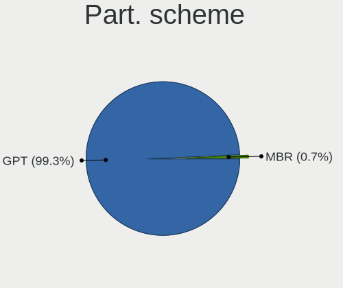
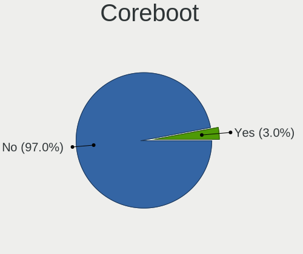
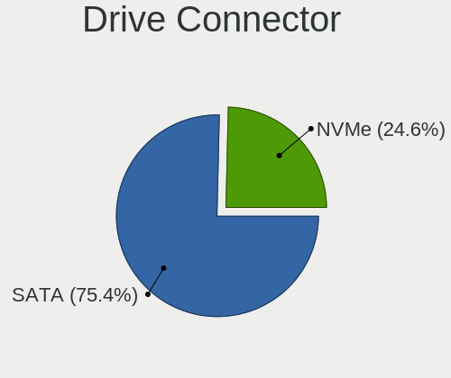
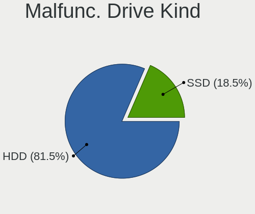
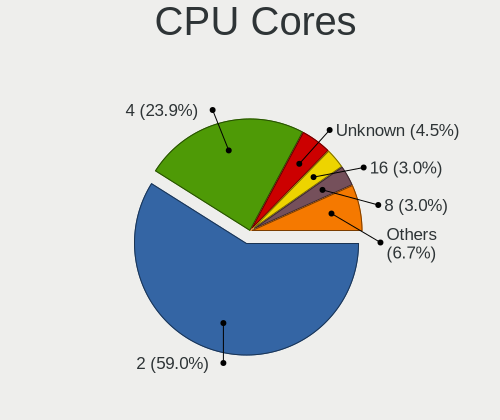
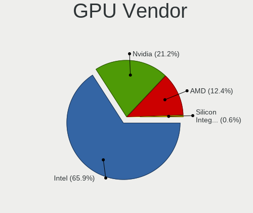
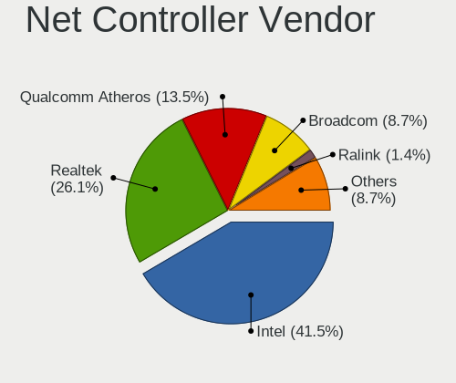
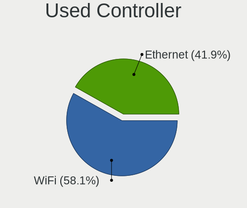
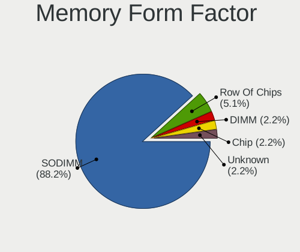

helloSystem 0.8.0 - Tested Hardware & Statistics (Notebooks)
------------------------------------------------------------

A project to collect tested hardware configurations for helloSystem 0.8.0.

Anyone can contribute to this report by the [hw-probe](https://github.com/linuxhw/hw-probe/blob/master/INSTALL.BSD.md) tool:

    hw-probe -all -upload

Please contribute! Especially if your hardware is rare.

Contents
--------

* [ Test Cases ](#test-cases)

* [ System ](#system)
  - [ Arch                     ](#arch)
  - [ DE                       ](#de)
  - [ Display Server           ](#display-server)
  - [ Display Manager          ](#display-manager)
  - [ OS Lang                  ](#os-lang)
  - [ Boot Mode                ](#boot-mode)
  - [ Filesystem               ](#filesystem)
  - [ Part. scheme             ](#part-scheme)

* [ Board ](#board)
  - [ Vendor                   ](#vendor)
  - [ Model                    ](#model)
  - [ Model Family             ](#model-family)
  - [ MFG Year                 ](#mfg-year)
  - [ Form Factor              ](#form-factor)
  - [ Coreboot                 ](#coreboot)
  - [ RAM Size                 ](#ram-size)
  - [ RAM Used                 ](#ram-used)
  - [ Total Drives             ](#total-drives)
  - [ Has CD-ROM               ](#has-cd-rom)
  - [ Has Ethernet             ](#has-ethernet)
  - [ Has WiFi                 ](#has-wifi)
  - [ Has Bluetooth            ](#has-bluetooth)

* [ Location ](#location)
  - [ Country                  ](#country)
  - [ City                     ](#city)

* [ Drives ](#drives)
  - [ Drive Vendor             ](#drive-vendor)
  - [ Drive Model              ](#drive-model)
  - [ HDD Vendor               ](#hdd-vendor)
  - [ SSD Vendor               ](#ssd-vendor)
  - [ Drive Kind               ](#drive-kind)
  - [ Drive Connector          ](#drive-connector)
  - [ Drive Size               ](#drive-size)
  - [ Space Total              ](#space-total)
  - [ Space Used               ](#space-used)
  - [ Malfunc. Drives          ](#malfunc-drives)
  - [ Malfunc. Drive Vendor    ](#malfunc-drive-vendor)
  - [ Malfunc. HDD Vendor      ](#malfunc-hdd-vendor)
  - [ Malfunc. Drive Kind      ](#malfunc-drive-kind)
  - [ Failed Drives            ](#failed-drives)
  - [ Failed Drive Vendor      ](#failed-drive-vendor)
  - [ Drive Status             ](#drive-status)

* [ Storage controller ](#storage-controller)
  - [ Storage Vendor           ](#storage-vendor)
  - [ Storage Model            ](#storage-model)
  - [ Storage Kind             ](#storage-kind)

* [ Processor ](#processor)
  - [ CPU Vendor               ](#cpu-vendor)
  - [ CPU Model                ](#cpu-model)
  - [ CPU Model Family         ](#cpu-model-family)
  - [ CPU Cores                ](#cpu-cores)
  - [ CPU Sockets              ](#cpu-sockets)
  - [ CPU Threads              ](#cpu-threads)
  - [ CPU Microarch            ](#cpu-microarch)

* [ Graphics ](#graphics)
  - [ GPU Vendor               ](#gpu-vendor)
  - [ GPU Model                ](#gpu-model)
  - [ GPU Combo                ](#gpu-combo)
  - [ GPU Driver               ](#gpu-driver)
  - [ GPU Memory               ](#gpu-memory)

* [ Monitor ](#monitor)
  - [ Monitor Vendor           ](#monitor-vendor)
  - [ Monitor Model            ](#monitor-model)
  - [ Monitor Resolution       ](#monitor-resolution)
  - [ Monitor Diagonal         ](#monitor-diagonal)
  - [ Monitor Width            ](#monitor-width)
  - [ Aspect Ratio             ](#aspect-ratio)
  - [ Monitor Area             ](#monitor-area)
  - [ Pixel Density            ](#pixel-density)
  - [ Multiple Monitors        ](#multiple-monitors)

* [ Network ](#network)
  - [ Net Controller Vendor    ](#net-controller-vendor)
  - [ Net Controller Model     ](#net-controller-model)
  - [ Wireless Vendor          ](#wireless-vendor)
  - [ Wireless Model           ](#wireless-model)
  - [ Ethernet Vendor          ](#ethernet-vendor)
  - [ Ethernet Model           ](#ethernet-model)
  - [ Net Controller Kind      ](#net-controller-kind)
  - [ Used Controller          ](#used-controller)
  - [ NICs                     ](#nics)
  - [ IPv6                     ](#ipv6)

* [ Bluetooth ](#bluetooth)
  - [ Bluetooth Vendor         ](#bluetooth-vendor)
  - [ Bluetooth Model          ](#bluetooth-model)

* [ Sound ](#sound)
  - [ Sound Vendor             ](#sound-vendor)
  - [ Sound Model              ](#sound-model)

* [ Memory ](#memory)
  - [ Memory Vendor            ](#memory-vendor)
  - [ Memory Model             ](#memory-model)
  - [ Memory Kind              ](#memory-kind)
  - [ Memory Form Factor       ](#memory-form-factor)
  - [ Memory Size              ](#memory-size)
  - [ Memory Speed             ](#memory-speed)

* [ Printers & scanners ](#printers--scanners)
  - [ Printer Vendor           ](#printer-vendor)
  - [ Printer Model            ](#printer-model)
  - [ Scanner Vendor           ](#scanner-vendor)
  - [ Scanner Model            ](#scanner-model)

* [ Camera ](#camera)
  - [ Camera Vendor            ](#camera-vendor)
  - [ Camera Model             ](#camera-model)

* [ Security ](#security)
  - [ Fingerprint Vendor       ](#fingerprint-vendor)
  - [ Fingerprint Model        ](#fingerprint-model)
  - [ Chipcard Vendor          ](#chipcard-vendor)
  - [ Chipcard Model           ](#chipcard-model)

* [ Unsupported ](#unsupported)
  - [ Unsupported Devices      ](#unsupported-devices)
  - [ Unsupported Device Types ](#unsupported-device-types)

Test Cases
----------

Total: 77

| Vendor        | Model                       | Probe                                                     | Date         |
|---------------|-----------------------------|-----------------------------------------------------------|--------------|
| Dell          | Inspiron 3442               | [8b137bca84](https://bsd-hardware.info/?probe=8b137bca84) | Jan 23, 2023 |
| Timi          | TM1607                      | [7636a0ef8f](https://bsd-hardware.info/?probe=7636a0ef8f) | Jan 23, 2023 |
| Timi          | TM1607                      | [1ca46404a1](https://bsd-hardware.info/?probe=1ca46404a1) | Jan 23, 2023 |
| Samsung       | 340XAA/350XAA/550XAA        | [881e97e41c](https://bsd-hardware.info/?probe=881e97e41c) | Jan 23, 2023 |
| Acer          | Aspire ES1-533              | [d2652b76cf](https://bsd-hardware.info/?probe=d2652b76cf) | Jan 22, 2023 |
| Lenovo        | ThinkPad P50 20EN0041MX     | [c27f1f53f2](https://bsd-hardware.info/?probe=c27f1f53f2) | Jan 22, 2023 |
| HP            | Laptop 15-bs0xx             | [7bd5f0c2e9](https://bsd-hardware.info/?probe=7bd5f0c2e9) | Jan 22, 2023 |
| Panasonic     | CF-C1BWFAZ1M                | [d129d929ac](https://bsd-hardware.info/?probe=d129d929ac) | Jan 22, 2023 |
| Lenovo        | ThinkPad P51 20HH001RMX     | [ab38c51298](https://bsd-hardware.info/?probe=ab38c51298) | Jan 22, 2023 |
| HP            | ZBook 15 G4                 | [e98d329586](https://bsd-hardware.info/?probe=e98d329586) | Jan 15, 2023 |
| HP            | ZBook 15 G4                 | [86875f01c2](https://bsd-hardware.info/?probe=86875f01c2) | Jan 15, 2023 |
| Lenovo        | ThinkPad P15v Gen 2i 21A... | [035f9afc5d](https://bsd-hardware.info/?probe=035f9afc5d) | Jan 14, 2023 |
| Lenovo        | ThinkPad P15v Gen 2i 21A... | [9ded9cc6ec](https://bsd-hardware.info/?probe=9ded9cc6ec) | Jan 14, 2023 |
| Razer         | Blade Stealth               | [2464314a65](https://bsd-hardware.info/?probe=2464314a65) | Jan 11, 2023 |
| Lenovo        | ThinkPad T61 64644YG        | [0657433463](https://bsd-hardware.info/?probe=0657433463) | Jan 03, 2023 |
| Apple         | MacBookAir5,1               | [0d398d5c59](https://bsd-hardware.info/?probe=0d398d5c59) | Dec 27, 2022 |
| Lenovo        | ThinkPad X1 Extreme Gen ... | [d19db2828c](https://bsd-hardware.info/?probe=d19db2828c) | Dec 16, 2022 |
| Dell          | Latitude 5590               | [0a17f04eba](https://bsd-hardware.info/?probe=0a17f04eba) | Dec 02, 2022 |
| Toshiba       | TECRA Z40-C-12Z             | [149e5c3de3](https://bsd-hardware.info/?probe=149e5c3de3) | Nov 28, 2022 |
| Acer          | Aspire 5251                 | [046bc722cb](https://bsd-hardware.info/?probe=046bc722cb) | Nov 16, 2022 |
| Dell          | Inspiron 3421               | [5c37012f33](https://bsd-hardware.info/?probe=5c37012f33) | Nov 10, 2022 |
| HP            | Pavilion g6                 | [c4e84b8104](https://bsd-hardware.info/?probe=c4e84b8104) | Oct 30, 2022 |
| Google        | Edgar                       | [318a750368](https://bsd-hardware.info/?probe=318a750368) | Oct 22, 2022 |
| MSI           | PS63 Modern 8M              | [949e472db5](https://bsd-hardware.info/?probe=949e472db5) | Oct 19, 2022 |
| TUXEDO        | Aura 15 Gen1                | [a49ac2701d](https://bsd-hardware.info/?probe=a49ac2701d) | Oct 02, 2022 |
| Kraftway      | KW10T                       | [db27da2e88](https://bsd-hardware.info/?probe=db27da2e88) | Sep 29, 2022 |
| Lenovo        | ThinkPad X250 20CLS1WP01    | [1b75ee6295](https://bsd-hardware.info/?probe=1b75ee6295) | Sep 19, 2022 |
| Apple         | MacBook5,2                  | [79503c0635](https://bsd-hardware.info/?probe=79503c0635) | Sep 10, 2022 |
| Apple         | MacBook5,2                  | [9c7a64970c](https://bsd-hardware.info/?probe=9c7a64970c) | Sep 10, 2022 |
| Dell          | Latitude E5550              | [867e56fb52](https://bsd-hardware.info/?probe=867e56fb52) | Sep 01, 2022 |
| Lenovo        | ThinkPad T420 4178A72       | [18a105546b](https://bsd-hardware.info/?probe=18a105546b) | Aug 29, 2022 |
| Lenovo        | ThinkPad T420 4178A72       | [1433351032](https://bsd-hardware.info/?probe=1433351032) | Aug 29, 2022 |
| Toshiba       | Satellite S55t-B            | [df9971d3aa](https://bsd-hardware.info/?probe=df9971d3aa) | Aug 27, 2022 |
| ASUSTek       | VivoBook 15_ASUS Laptop ... | [2c7586b0ed](https://bsd-hardware.info/?probe=2c7586b0ed) | Aug 25, 2022 |
| TUXEDO        | Pulse 14 Gen1               | [5edf8a1bef](https://bsd-hardware.info/?probe=5edf8a1bef) | Aug 09, 2022 |
| ASUSTek       | F6A                         | [6626d18284](https://bsd-hardware.info/?probe=6626d18284) | Aug 08, 2022 |
| HP            | 250 G6 Notebook PC          | [511d057c70](https://bsd-hardware.info/?probe=511d057c70) | Jul 27, 2022 |
| HP            | OMEN by Laptop              | [25e43be096](https://bsd-hardware.info/?probe=25e43be096) | Jul 17, 2022 |
| Dell          | Latitude E5450              | [5f1183ab0b](https://bsd-hardware.info/?probe=5f1183ab0b) | Jul 14, 2022 |
| Dell          | Latitude E5450              | [1080ed5654](https://bsd-hardware.info/?probe=1080ed5654) | Jul 14, 2022 |
| Acer          | Aspire E5-571G              | [56fae2295e](https://bsd-hardware.info/?probe=56fae2295e) | Jul 08, 2022 |
| HP            | 250 G6 Notebook PC          | [bbe1d21883](https://bsd-hardware.info/?probe=bbe1d21883) | Jul 07, 2022 |
| Dell          | Inspiron 15-3552            | [8cdc3bd7ab](https://bsd-hardware.info/?probe=8cdc3bd7ab) | Jul 01, 2022 |
| Apple         | MacBook6,1                  | [a6d3cf9a30](https://bsd-hardware.info/?probe=a6d3cf9a30) | Jun 20, 2022 |
| Acer          | Aspire A315-34              | [90927fa85a](https://bsd-hardware.info/?probe=90927fa85a) | Jun 20, 2022 |
| HP            | Unknown                     | [11ef8f9a92](https://bsd-hardware.info/?probe=11ef8f9a92) | Jun 19, 2022 |
| Lenovo        | ThinkPad X250 20CLS23500    | [6a8b44bc47](https://bsd-hardware.info/?probe=6a8b44bc47) | Jun 03, 2022 |
| Lenovo        | IdeaPad 3 15IGL05 82BU      | [6a6450f264](https://bsd-hardware.info/?probe=6a6450f264) | May 30, 2022 |
| Timi          | TM1701                      | [a28220d11f](https://bsd-hardware.info/?probe=a28220d11f) | May 22, 2022 |
| Dell          | Studio 1747                 | [7ae292b282](https://bsd-hardware.info/?probe=7ae292b282) | May 21, 2022 |
| TUXEDO        | Aura 15 Gen1                | [20814a930a](https://bsd-hardware.info/?probe=20814a930a) | May 18, 2022 |
| Packard Be... | EasyNote_MX52-B-071         | [277c9e0a0a](https://bsd-hardware.info/?probe=277c9e0a0a) | May 08, 2022 |
| Dell          | Inspiron 5559               | [a7111b84cb](https://bsd-hardware.info/?probe=a7111b84cb) | May 08, 2022 |
| Lenovo        | ThinkPad X270 W10DG 20K5... | [f02e4345ff](https://bsd-hardware.info/?probe=f02e4345ff) | Apr 30, 2022 |
| Apple         | MacBookPro5,5               | [4b5603b38b](https://bsd-hardware.info/?probe=4b5603b38b) | Apr 29, 2022 |
| ASUSTek       | 1001PX                      | [b47a498f2e](https://bsd-hardware.info/?probe=b47a498f2e) | Apr 08, 2022 |
| Dell          | Latitude E5470              | [a7d087a428](https://bsd-hardware.info/?probe=a7d087a428) | Apr 05, 2022 |
| Sony          | VGN-AW21S_B                 | [11edcb4e82](https://bsd-hardware.info/?probe=11edcb4e82) | Apr 03, 2022 |
| PCSTICK       | Unknown                     | [6f9f24b262](https://bsd-hardware.info/?probe=6f9f24b262) | Mar 29, 2022 |
| Dell          | Latitude E6540              | [41e5f63a69](https://bsd-hardware.info/?probe=41e5f63a69) | Mar 26, 2022 |
| ASUSTek       | UX31E                       | [93655cdd83](https://bsd-hardware.info/?probe=93655cdd83) | Mar 21, 2022 |
| HP            | EliteBook 850 G3            | [1ae8321767](https://bsd-hardware.info/?probe=1ae8321767) | Mar 20, 2022 |
| Gateway       | NE56R                       | [87d177b9da](https://bsd-hardware.info/?probe=87d177b9da) | Mar 20, 2022 |
| HUAWEI        | BOD-WXX9                    | [65454bcc92](https://bsd-hardware.info/?probe=65454bcc92) | Mar 06, 2022 |
| Acer          | V5-131                      | [076ca78b3f](https://bsd-hardware.info/?probe=076ca78b3f) | Feb 25, 2022 |
| Dell          | Latitude 7480               | [8a0388b49d](https://bsd-hardware.info/?probe=8a0388b49d) | Feb 23, 2022 |
| PCSTICK       | Unknown                     | [b76b5c9670](https://bsd-hardware.info/?probe=b76b5c9670) | Feb 21, 2022 |
| ASUSTek       | 1001PX                      | [d171d1ec99](https://bsd-hardware.info/?probe=d171d1ec99) | Feb 17, 2022 |
| Lenovo        | Legion 5 15ARH05 82B5       | [1a13b7bfd1](https://bsd-hardware.info/?probe=1a13b7bfd1) | Feb 16, 2022 |
| Acer          | Aspire 5750G                | [bd22fc8a49](https://bsd-hardware.info/?probe=bd22fc8a49) | Feb 15, 2022 |
| Timi          | RedmiBook Pro 15            | [7716f59380](https://bsd-hardware.info/?probe=7716f59380) | Feb 14, 2022 |
| Timi          | RedmiBook Pro 15            | [fdd0ab95ed](https://bsd-hardware.info/?probe=fdd0ab95ed) | Feb 14, 2022 |
| Apple         | MacBook5,2                  | [29756c2371](https://bsd-hardware.info/?probe=29756c2371) | Feb 13, 2022 |
| Sony          | VPCEB1J1E                   | [9151a22f13](https://bsd-hardware.info/?probe=9151a22f13) | Jan 30, 2022 |
| Lenovo        | ThinkPad T440 20B7A0B7MS    | [be30041f4e](https://bsd-hardware.info/?probe=be30041f4e) | Jan 10, 2022 |
| Lenovo        | G480 20149                  | [adc6b44cc8](https://bsd-hardware.info/?probe=adc6b44cc8) | Jan 09, 2022 |
| HP            | EliteBook 820 G1            | [362940acbb](https://bsd-hardware.info/?probe=362940acbb) | Jan 03, 2022 |

System
------

Arch
----

OS architecture (x86_64, i586, etc.)

| Name  | Notebooks | Percent |
|-------|-----------|---------|
| amd64 | 64        | 100%    |

DE
--

Desktop Environment

| Name         | Notebooks | Percent |
|--------------|-----------|---------|
| helloDesktop | 60        | 93.75%  |
| GNOME        | 2         | 3.13%   |
| Window Maker | 1         | 1.56%   |
| Cinnamon     | 1         | 1.56%   |

Display Server
--------------

X11 or Wayland

| Name | Notebooks | Percent |
|------|-----------|---------|
| X11  | 64        | 100%    |

Display Manager
---------------

SDDM, LightDM, etc.

| Name | Notebooks | Percent |
|------|-----------|---------|
| SLiM | 63        | 98.44%  |
| GDM  | 1         | 1.56%   |

OS Lang
-------

Language

| Lang  | Notebooks | Percent |
|-------|-----------|---------|
| en_US | 49        | 76.56%  |
| en    | 6         | 9.38%   |
| ru    | 2         | 3.13%   |
| es    | 2         | 3.13%   |
| de    | 2         | 3.13%   |
| ru_RU | 1         | 1.56%   |
| pt    | 1         | 1.56%   |
| es_ES | 1         | 1.56%   |

Boot Mode
---------

EFI or BIOS

| Mode | Notebooks | Percent |
|------|-----------|---------|
| EFI  | 64        | 100%    |

Filesystem
----------

Type of filesystem

| Type   | Notebooks | Percent |
|--------|-----------|---------|
| Cd9660 | 43        | 67.19%  |
| Zfs    | 21        | 32.81%  |

Part. scheme
------------

Scheme of partitioning

| Type | Notebooks | Percent |
|------|-----------|---------|
| GPT  | 64        | 100%    |

Board
-----

Vendor
------

Motherboard manufacturer

| Name                | Notebooks | Percent |
|---------------------|-----------|---------|
| Lenovo              | 12        | 18.75%  |
| Dell                | 11        | 17.19%  |
| Hewlett-Packard     | 9         | 14.06%  |
| Acer                | 5         | 7.81%   |
| ASUSTek Computer    | 4         | 6.25%   |
| Apple               | 4         | 6.25%   |
| Timi                | 3         | 4.69%   |
| TUXEDO              | 2         | 3.13%   |
| Toshiba             | 2         | 3.13%   |
| Sony                | 2         | 3.13%   |
| Samsung Electronics | 1         | 1.56%   |
| Razer               | 1         | 1.56%   |
| PCSTICK             | 1         | 1.56%   |
| Panasonic           | 1         | 1.56%   |
| Packard Bell        | 1         | 1.56%   |
| MSI                 | 1         | 1.56%   |
| Kraftway            | 1         | 1.56%   |
| HUAWEI              | 1         | 1.56%   |
| Google              | 1         | 1.56%   |
| Gateway             | 1         | 1.56%   |

Model
-----

Motherboard model

| Name                                         | Notebooks | Percent |
|----------------------------------------------|-----------|---------|
| HP 250 G6 Notebook PC                        | 2         | 3.13%   |
| Apple MacBook5,2                             | 2         | 3.13%   |
| Unknown                                      | 2         | 3.13%   |
| TUXEDO Pulse 14 Gen1                         | 1         | 1.56%   |
| TUXEDO Aura 15 Gen1                          | 1         | 1.56%   |
| Toshiba TECRA Z40-C-12Z                      | 1         | 1.56%   |
| Toshiba Satellite S55t-B                     | 1         | 1.56%   |
| Timi TM1701                                  | 1         | 1.56%   |
| Timi TM1607                                  | 1         | 1.56%   |
| Timi RedmiBook Pro 15                        | 1         | 1.56%   |
| Sony VPCEB1J1E                               | 1         | 1.56%   |
| Sony VGN-AW21S_B                             | 1         | 1.56%   |
| Samsung 340XAA/350XAA/550XAA                 | 1         | 1.56%   |
| Razer Blade Stealth                          | 1         | 1.56%   |
| Panasonic CF-C1BWFAZ1M                       | 1         | 1.56%   |
| Packard Bell EasyNote_MX52-B-071             | 1         | 1.56%   |
| MSI PS63 Modern 8M                           | 1         | 1.56%   |
| Lenovo ThinkPad X270 W10DG 20K5S0BB00        | 1         | 1.56%   |
| Lenovo ThinkPad X250 20CLS23500              | 1         | 1.56%   |
| Lenovo ThinkPad X250 20CLS1WP01              | 1         | 1.56%   |
| Lenovo ThinkPad X1 Extreme Gen 4i 20Y5001DMX | 1         | 1.56%   |
| Lenovo ThinkPad T440 20B7A0B7MS              | 1         | 1.56%   |
| Lenovo ThinkPad T420 4178A72                 | 1         | 1.56%   |
| Lenovo ThinkPad P51 20HH001RMX               | 1         | 1.56%   |
| Lenovo ThinkPad P50 20EN0041MX               | 1         | 1.56%   |
| Lenovo ThinkPad P15v Gen 2i 21AAS28T00       | 1         | 1.56%   |
| Lenovo Legion 5 15ARH05 82B5                 | 1         | 1.56%   |
| Lenovo IdeaPad 3 15IGL05 82BU                | 1         | 1.56%   |
| Lenovo G480 20149                            | 1         | 1.56%   |
| Kraftway KW10T                               | 1         | 1.56%   |
| HUAWEI BOD-WXX9                              | 1         | 1.56%   |
| HP ZBook 15 G4                               | 1         | 1.56%   |
| HP Pavilion g6                               | 1         | 1.56%   |
| HP OMEN by Laptop                            | 1         | 1.56%   |
| HP Laptop 15-bs0xx                           | 1         | 1.56%   |
| HP EliteBook 850 G3                          | 1         | 1.56%   |
| HP EliteBook 820 G1                          | 1         | 1.56%   |
| Google Edgar                                 | 1         | 1.56%   |
| Gateway NE56R                                | 1         | 1.56%   |
| Dell Studio 1747                             | 1         | 1.56%   |

Model Family
------------

Motherboard model prefix

| Name                   | Notebooks | Percent |
|------------------------|-----------|---------|
| Lenovo ThinkPad        | 9         | 14.06%  |
| Dell Latitude          | 6         | 9.38%   |
| Acer Aspire            | 5         | 7.81%   |
| Dell Inspiron          | 4         | 6.25%   |
| HP EliteBook           | 2         | 3.13%   |
| HP 250                 | 2         | 3.13%   |
| Apple MacBook5         | 2         | 3.13%   |
| Unknown                | 2         | 3.13%   |
| TUXEDO Pulse           | 1         | 1.56%   |
| TUXEDO Aura            | 1         | 1.56%   |
| Toshiba TECRA          | 1         | 1.56%   |
| Toshiba Satellite      | 1         | 1.56%   |
| Timi TM1701            | 1         | 1.56%   |
| Timi TM1607            | 1         | 1.56%   |
| Timi RedmiBook         | 1         | 1.56%   |
| Sony VPCEB1J1E         | 1         | 1.56%   |
| Sony VGN-AW21S         | 1         | 1.56%   |
| Samsung 340XAA         | 1         | 1.56%   |
| Razer Blade            | 1         | 1.56%   |
| Panasonic CF-C1BWFAZ1M | 1         | 1.56%   |
| Packard Bell EasyNote  | 1         | 1.56%   |
| MSI PS63               | 1         | 1.56%   |
| Lenovo Legion          | 1         | 1.56%   |
| Lenovo IdeaPad         | 1         | 1.56%   |
| Lenovo G480            | 1         | 1.56%   |
| Kraftway KW10T         | 1         | 1.56%   |
| HUAWEI BOD-WXX9        | 1         | 1.56%   |
| HP ZBook               | 1         | 1.56%   |
| HP Pavilion            | 1         | 1.56%   |
| HP OMEN                | 1         | 1.56%   |
| HP Laptop              | 1         | 1.56%   |
| Google Edgar           | 1         | 1.56%   |
| Gateway NE56R          | 1         | 1.56%   |
| Dell Studio            | 1         | 1.56%   |
| ASUS VivoBook          | 1         | 1.56%   |
| ASUS UX31E             | 1         | 1.56%   |
| ASUS F6A               | 1         | 1.56%   |
| ASUS 1001PX            | 1         | 1.56%   |
| Apple MacBookAir5      | 1         | 1.56%   |
| Apple MacBook6         | 1         | 1.56%   |

MFG Year
--------

Motherboard manufacture year

| Year | Notebooks | Percent |
|------|-----------|---------|
| 2020 | 8         | 12.5%   |
| 2019 | 8         | 12.5%   |
| 2022 | 5         | 7.81%   |
| 2018 | 5         | 7.81%   |
| 2017 | 5         | 7.81%   |
| 2016 | 4         | 6.25%   |
| 2015 | 4         | 6.25%   |
| 2014 | 4         | 6.25%   |
| 2012 | 4         | 6.25%   |
| 2009 | 4         | 6.25%   |
| 2021 | 3         | 4.69%   |
| 2011 | 3         | 4.69%   |
| 2010 | 3         | 4.69%   |
| 2013 | 2         | 3.13%   |
| 2008 | 1         | 1.56%   |
| 2007 | 1         | 1.56%   |

Form Factor
-----------

Physical design of the computer

| Name     | Notebooks | Percent |
|----------|-----------|---------|
| Notebook | 64        | 100%    |

Coreboot
--------

Have coreboot on board

| Used | Notebooks | Percent |
|------|-----------|---------|
| No   | 63        | 98.44%  |
| Yes  | 1         | 1.56%   |

RAM Size
--------

Total RAM memory

| Size in GB  | Notebooks | Percent |
|-------------|-----------|---------|
| 4.01-8.0    | 21        | 32.81%  |
| 8.01-16.0   | 21        | 32.81%  |
| 16.01-24.0  | 13        | 20.31%  |
| 32.01-64.0  | 4         | 6.25%   |
| 2.01-3.0    | 3         | 4.69%   |
| 3.01-4.0    | 1         | 1.56%   |
| 64.01-256.0 | 1         | 1.56%   |

RAM Used
--------

Used RAM memory

| Used GB  | Notebooks | Percent |
|----------|-----------|---------|
| 0.01-0.5 | 42        | 65.63%  |
| 0.51-1.0 | 15        | 23.44%  |
| 1.01-2.0 | 6         | 9.38%   |
| 2.01-3.0 | 1         | 1.56%   |

Total Drives
------------

Number of drives on board

| Drives | Notebooks | Percent |
|--------|-----------|---------|
| 1      | 45        | 70.31%  |
| 2      | 13        | 20.31%  |
| 0      | 5         | 7.81%   |
| 3      | 1         | 1.56%   |

Has CD-ROM
----------

Has CD-ROM on board

| Presented | Notebooks | Percent |
|-----------|-----------|---------|
| No        | 46        | 71.88%  |
| Yes       | 18        | 28.13%  |

Has Ethernet
------------

Has Ethernet on board

| Presented | Notebooks | Percent |
|-----------|-----------|---------|
| Yes       | 50        | 78.13%  |
| No        | 14        | 21.88%  |

Has WiFi
--------

Has WiFi module

| Presented | Notebooks | Percent |
|-----------|-----------|---------|
| Yes       | 62        | 96.88%  |
| No        | 2         | 3.13%   |

Has Bluetooth
-------------

Has Bluetooth module

| Presented | Notebooks | Percent |
|-----------|-----------|---------|
| Yes       | 46        | 71.88%  |
| No        | 18        | 28.13%  |

Location
--------

Country
-------

Geographic location (country)

| Country                | Notebooks | Percent |
|------------------------|-----------|---------|
| Russia                 | 8         | 12.5%   |
| Germany                | 7         | 10.94%  |
| USA                    | 6         | 9.38%   |
| Brazil                 | 4         | 6.25%   |
| Ukraine                | 3         | 4.69%   |
| Spain                  | 3         | 4.69%   |
| China                  | 3         | 4.69%   |
| UK                     | 2         | 3.13%   |
| Mexico                 | 2         | 3.13%   |
| Italy                  | 2         | 3.13%   |
| Hungary                | 2         | 3.13%   |
| Canada                 | 2         | 3.13%   |
| Argentina              | 2         | 3.13%   |
| Venezuela              | 1         | 1.56%   |
| Uruguay                | 1         | 1.56%   |
| UAE                    | 1         | 1.56%   |
| Taiwan                 | 1         | 1.56%   |
| Sweden                 | 1         | 1.56%   |
| Slovenia               | 1         | 1.56%   |
| Slovakia               | 1         | 1.56%   |
| Romania                | 1         | 1.56%   |
| Portugal               | 1         | 1.56%   |
| Poland                 | 1         | 1.56%   |
| Peru                   | 1         | 1.56%   |
| Panama                 | 1         | 1.56%   |
| Norway                 | 1         | 1.56%   |
| Georgia                | 1         | 1.56%   |
| France                 | 1         | 1.56%   |
| Bosnia and Herzegovina | 1         | 1.56%   |
| Belarus                | 1         | 1.56%   |
| Albania                | 1         | 1.56%   |

City
----

Geographic location (city)

| City                 | Notebooks | Percent |
|----------------------|-----------|---------|
| Moscow               | 3         | 4.69%   |
| Berlin               | 2         | 3.13%   |
| Yunlin               | 1         | 1.56%   |
| Weifang              | 1         | 1.56%   |
| Warendorf            | 1         | 1.56%   |
| Vladivostok          | 1         | 1.56%   |
| Vidnoye              | 1         | 1.56%   |
| Vancouver            | 1         | 1.56%   |
| Valladolid           | 1         | 1.56%   |
| Ufa                  | 1         | 1.56%   |
| Szeged               | 1         | 1.56%   |
| Sayago               | 1         | 1.56%   |
| Sarajevo             | 1         | 1.56%   |
| Sao Paulo            | 1         | 1.56%   |
| San Carlos del Zulia | 1         | 1.56%   |
| Rio das Ostras       | 1         | 1.56%   |
| Rho                  | 1         | 1.56%   |
| Redondela            | 1         | 1.56%   |
| Porto                | 1         | 1.56%   |
| Perm                 | 1         | 1.56%   |
| Panama City          | 1         | 1.56%   |
| Ottawa               | 1         | 1.56%   |
| Ostrołęka          | 1         | 1.56%   |
| Orizaba              | 1         | 1.56%   |
| Odessa               | 1         | 1.56%   |
| Oakdale              | 1         | 1.56%   |
| Nesttun              | 1         | 1.56%   |
| Nanticoke            | 1         | 1.56%   |
| Munich               | 1         | 1.56%   |
| Mirepeix             | 1         | 1.56%   |
| Minsk                | 1         | 1.56%   |
| Mexico City          | 1         | 1.56%   |
| Mendoza              | 1         | 1.56%   |
| Maracanau            | 1         | 1.56%   |
| Logroño           | 1         | 1.56%   |
| Linyi                | 1         | 1.56%   |
| Lima                 | 1         | 1.56%   |
| Lanzhou              | 1         | 1.56%   |
| Kyiv                 | 1         | 1.56%   |
| Kresnice             | 1         | 1.56%   |

Drives
------

Drive Vendor
------------

Hard drive vendors

| Vendor              | Notebooks | Drives | Percent |
|---------------------|-----------|--------|---------|
| Seagate             | 11        | 11     | 15.07%  |
| Samsung Electronics | 11        | 13     | 15.07%  |
| WDC                 | 8         | 8      | 10.96%  |
| Kingston            | 6         | 6      | 8.22%   |
| Toshiba             | 5         | 5      | 6.85%   |
| Intel               | 4         | 4      | 5.48%   |
| Hitachi             | 4         | 4      | 5.48%   |
| SK hynix            | 3         | 3      | 4.11%   |
| SanDisk             | 3         | 3      | 4.11%   |
| Patriot             | 2         | 2      | 2.74%   |
| KIOXIA              | 2         | 2      | 2.74%   |
| Fujitsu             | 2         | 2      | 2.74%   |
| A-DATA Technology   | 2         | 2      | 2.74%   |
| Verbatim            | 1         | 1      | 1.37%   |
| Transcend           | 1         | 1      | 1.37%   |
| SSSTC               | 1         | 1      | 1.37%   |
| PNY                 | 1         | 1      | 1.37%   |
| OCZ                 | 1         | 1      | 1.37%   |
| Lenovo              | 1         | 1      | 1.37%   |
| KingSpec            | 1         | 1      | 1.37%   |
| GOODRAM             | 1         | 1      | 1.37%   |
| FORESEE             | 1         | 1      | 1.37%   |
| Apple               | 1         | 1      | 1.37%   |

Drive Model
-----------

Hard drive models

| Model                                     | Notebooks | Percent |
|-------------------------------------------|-----------|---------|
| Seagate ST1000LM035-1RK172 1TB            | 3         | 4%      |
| Seagate ST1000LM024 HN-M101MBB 1TB        | 3         | 4%      |
| Toshiba MQ01ABF050 500GB                  | 2         | 2.67%   |
| Patriot Burst 120GB                       | 2         | 2.67%   |
| WDC WDS240G2G0B-00EPW0 240GB              | 1         | 1.33%   |
| WDC WDS100T2B0A-00SM50 1TB                | 1         | 1.33%   |
| WDC WDBNCE5000PNC 500GB                   | 1         | 1.33%   |
| WDC WD5000LPCX-60VHAT0 500GB              | 1         | 1.33%   |
| WDC WD10SPZX-35Z10T0 1TB                  | 1         | 1.33%   |
| WDC WD10JPVX-75JC3T0 1TB                  | 1         | 1.33%   |
| WDC WD10JPVX-22JC3T0 1TB                  | 1         | 1.33%   |
| WDC PC SN530 SDBPNPZ-512G-1027 512GB      | 1         | 1.33%   |
| Verbatim Vi550 S3 SSD 512GB               | 1         | 1.33%   |
| Transcend TS120GMTS420S 120GB             | 1         | 1.33%   |
| Toshiba MQ01ABD100 1TB                    | 1         | 1.33%   |
| Toshiba MK8034GSX 80GB                    | 1         | 1.33%   |
| Toshiba KSG60ZMV256G 256GB                | 1         | 1.33%   |
| SSSTC CL1-4D128 128GB                     | 1         | 1.33%   |
| SK hynix SKHynix_HFM512GDHTNI-87A0B 512GB | 1         | 1.33%   |
| SK hynix SC311 SATA 256GB                 | 1         | 1.33%   |
| SK hynix BC711 NVMe 512GB                 | 1         | 1.33%   |
| Seagate ST9500420AS 500GB                 | 1         | 1.33%   |
| Seagate ST9160821AS 160GB                 | 1         | 1.33%   |
| Seagate ST500LT012-9WS142 500GB           | 1         | 1.33%   |
| Seagate ST500LT012-1DG142 500GB           | 1         | 1.33%   |
| Seagate ST320LT014-9YK142 320GB           | 1         | 1.33%   |
| SanDisk X400 M.2 2280 128GB               | 1         | 1.33%   |
| SanDisk SSD PLUS 120GB                    | 1         | 1.33%   |
| SanDisk SD9TN8W256G1001 256GB             | 1         | 1.33%   |
| Samsung SSD 980 1TB                       | 1         | 1.33%   |
| Samsung SSD 970 EVO Plus 250GB            | 1         | 1.33%   |
| Samsung SSD 970 EVO 250GB                 | 1         | 1.33%   |
| Samsung SSD 870 EVO 2TB                   | 1         | 1.33%   |
| Samsung SSD 860 PRO 512GB                 | 1         | 1.33%   |
| Samsung SSD 860 EVO 500GB                 | 1         | 1.33%   |
| Samsung SSD 850 EVO 250GB                 | 1         | 1.33%   |
| Samsung SSD 850 EVO 120GB                 | 1         | 1.33%   |
| Samsung MZVLW512HMJP-00000 512GB          | 1         | 1.33%   |
| Samsung MZVLW256HEHP-000L7 256GB          | 1         | 1.33%   |
| Samsung MZVLB512HAJQ-000L7 512GB          | 1         | 1.33%   |

HDD Vendor
----------

Hard disk drive vendors

| Vendor  | Notebooks | Drives | Percent |
|---------|-----------|--------|---------|
| Seagate | 11        | 11     | 45.83%  |
| WDC     | 4         | 4      | 16.67%  |
| Toshiba | 4         | 4      | 16.67%  |
| Hitachi | 4         | 4      | 16.67%  |
| Fujitsu | 1         | 1      | 4.17%   |

SSD Vendor
----------

Solid state drive vendors

| Vendor              | Notebooks | Drives | Percent |
|---------------------|-----------|--------|---------|
| Samsung Electronics | 7         | 7      | 19.44%  |
| Kingston            | 5         | 5      | 13.89%  |
| Intel               | 4         | 4      | 11.11%  |
| WDC                 | 3         | 3      | 8.33%   |
| SanDisk             | 3         | 3      | 8.33%   |
| Patriot             | 2         | 2      | 5.56%   |
| Verbatim            | 1         | 1      | 2.78%   |
| Transcend           | 1         | 1      | 2.78%   |
| Toshiba             | 1         | 1      | 2.78%   |
| SK hynix            | 1         | 1      | 2.78%   |
| PNY                 | 1         | 1      | 2.78%   |
| OCZ                 | 1         | 1      | 2.78%   |
| KingSpec            | 1         | 1      | 2.78%   |
| GOODRAM             | 1         | 1      | 2.78%   |
| Fujitsu             | 1         | 1      | 2.78%   |
| FORESEE             | 1         | 1      | 2.78%   |
| Apple               | 1         | 1      | 2.78%   |
| A-DATA Technology   | 1         | 1      | 2.78%   |

Drive Kind
----------

HDD or SSD

| Kind | Notebooks | Drives | Percent |
|------|-----------|--------|---------|
| SSD  | 32        | 36     | 47.76%  |
| HDD  | 20        | 24     | 29.85%  |
| NVMe | 15        | 15     | 22.39%  |

Drive Connector
---------------

SATA, SAS, NVMe, etc.

| Type | Notebooks | Drives | Percent |
|------|-----------|--------|---------|
| SATA | 49        | 60     | 76.56%  |
| NVMe | 15        | 15     | 23.44%  |

Drive Size
----------

Size of hard drive

| Size in TB | Notebooks | Drives | Percent |
|------------|-----------|--------|---------|
| 0.01-0.5   | 38        | 46     | 74.51%  |
| 0.51-1.0   | 12        | 13     | 23.53%  |
| 1.01-2.0   | 1         | 1      | 1.96%   |

Space Total
-----------

Amount of disk space available on the file system

| Size in GB | Notebooks | Percent |
|------------|-----------|---------|
| 1-20       | 38        | 59.38%  |
| 101-250    | 11        | 17.19%  |
| 251-500    | 7         | 10.94%  |
| 501-1000   | 6         | 9.38%   |
| 21-50      | 1         | 1.56%   |
| Unknown    | 1         | 1.56%   |

Space Used
----------

Amount of used disk space

| Used GB | Notebooks | Percent |
|---------|-----------|---------|
| 1-20    | 60        | 93.75%  |
| 21-50   | 1         | 1.56%   |
| 101-250 | 1         | 1.56%   |
| 51-100  | 1         | 1.56%   |
| Unknown | 1         | 1.56%   |

Malfunc. Drives
---------------

Drive models with a malfunction

| Model                                        | Notebooks | Drives | Percent |
|----------------------------------------------|-----------|--------|---------|
| WDC WD5000LPCX-60VHAT0 500GB                 | 1         | 1      | 7.69%   |
| Toshiba MQ01ABF050 500GB                     | 1         | 1      | 7.69%   |
| Toshiba MQ01ABD100 1TB                       | 1         | 1      | 7.69%   |
| Toshiba MK8034GSX 80GB                       | 1         | 1      | 7.69%   |
| Seagate ST9160821AS 160GB                    | 1         | 1      | 7.69%   |
| Seagate ST500LT012-9WS142 500GB              | 1         | 1      | 7.69%   |
| Seagate ST320LT014-9YK142 320GB              | 1         | 1      | 7.69%   |
| Seagate ST1000LM024 HN-M101MBB 1TB           | 1         | 1      | 7.69%   |
| Samsung Electronics MZMPA128HMFU-000H1 128GB | 1         | 1      | 7.69%   |
| Hitachi HTS727550A9E364 500GB                | 1         | 1      | 7.69%   |
| Hitachi HTS545025B9SA02 250GB                | 1         | 1      | 7.69%   |
| Hitachi HTS541612J9SA00 120GB                | 1         | 1      | 7.69%   |
| Fujitsu MHZ2160BH FFS G1 160GB               | 1         | 1      | 7.69%   |

Malfunc. Drive Vendor
---------------------

Vendors of faulty drives

| Vendor              | Notebooks | Drives | Percent |
|---------------------|-----------|--------|---------|
| Seagate             | 4         | 4      | 30.77%  |
| Toshiba             | 3         | 3      | 23.08%  |
| Hitachi             | 3         | 3      | 23.08%  |
| WDC                 | 1         | 1      | 7.69%   |
| Samsung Electronics | 1         | 1      | 7.69%   |
| Fujitsu             | 1         | 1      | 7.69%   |

Malfunc. HDD Vendor
-------------------

Vendors of faulty HDD drives

| Vendor  | Notebooks | Drives | Percent |
|---------|-----------|--------|---------|
| Seagate | 4         | 4      | 33.33%  |
| Toshiba | 3         | 3      | 25%     |
| Hitachi | 3         | 3      | 25%     |
| WDC     | 1         | 1      | 8.33%   |
| Fujitsu | 1         | 1      | 8.33%   |

Malfunc. Drive Kind
-------------------

Kinds of faulty drives

| Kind | Notebooks | Drives | Percent |
|------|-----------|--------|---------|
| HDD  | 10        | 12     | 90.91%  |
| SSD  | 1         | 1      | 9.09%   |

Failed Drives
-------------

Failed drive models

Zero info for selected period =(

Failed Drive Vendor
-------------------

Failed drive vendors

Zero info for selected period =(

Drive Status
------------

Number of failed and malfunc. drives

| Status  | Notebooks | Drives | Percent |
|---------|-----------|--------|---------|
| Works   | 51        | 62     | 83.61%  |
| Malfunc | 10        | 13     | 16.39%  |

Storage controller
------------------

Storage Vendor
--------------

Storage controller vendors

| Vendor                         | Notebooks | Percent |
|--------------------------------|-----------|---------|
| Intel                          | 46        | 64.79%  |
| Samsung Electronics            | 6         | 8.45%   |
| AMD                            | 5         | 7.04%   |
| Nvidia                         | 3         | 4.23%   |
| SK hynix                       | 2         | 2.82%   |
| SanDisk                        | 2         | 2.82%   |
| KIOXIA                         | 2         | 2.82%   |
| Solid State Storage Technology | 1         | 1.41%   |
| Realtek Semiconductor          | 1         | 1.41%   |
| Lenovo                         | 1         | 1.41%   |
| Kingston Technology Company    | 1         | 1.41%   |
| JMicron Technology             | 1         | 1.41%   |

Storage Model
-------------

Storage controller models

| Model                                                                            | Notebooks | Percent |
|----------------------------------------------------------------------------------|-----------|---------|
| Intel Sunrise Point-LP SATA Controller [AHCI mode]                               | 10        | 13.7%   |
| Intel Wildcat Point-LP SATA Controller [AHCI Mode]                               | 5         | 6.85%   |
| Intel 6 Series/C200 Series Chipset Family 6 port Mobile SATA AHCI Controller     | 5         | 6.85%   |
| Intel 7 Series Chipset Family 6-port SATA Controller [AHCI mode]                 | 4         | 5.48%   |
| Unknown                                                                          | 4         | 5.48%   |
| Samsung NVMe SSD Controller SM981/PM981/PM983                                    | 3         | 4.11%   |
| Nvidia MCP79 AHCI Controller                                                     | 3         | 4.11%   |
| Intel 8 Series SATA Controller 1 [AHCI mode]                                     | 3         | 4.11%   |
| AMD FCH SATA Controller [AHCI mode]                                              | 3         | 4.11%   |
| Samsung NVMe SSD Controller SM961/PM961/SM963                                    | 2         | 2.74%   |
| Intel SATA Controller [RAID mode]                                                | 2         | 2.74%   |
| Intel Q170/Q150/B150/H170/H110/Z170/CM236 Chipset SATA Controller [AHCI Mode]    | 2         | 2.74%   |
| Intel Celeron/Pentium Silver Processor SATA Controller                           | 2         | 2.74%   |
| Intel 82801IBM/IEM (ICH9M/ICH9M-E) 4 port SATA Controller [AHCI mode]            | 2         | 2.74%   |
| Intel 82801 Mobile SATA Controller [RAID mode]                                   | 2         | 2.74%   |
| SK hynix Gold P31/PC711 NVMe Solid State Drive                                   | 1         | 1.37%   |
| SK hynix BC511                                                                   | 1         | 1.37%   |
| SanDisk WD PC SN810 / Black SN850 NVMe SSD                                       | 1         | 1.37%   |
| SanDisk WD Blue SN550 NVMe SSD                                                   | 1         | 1.37%   |
| Samsung NVMe SSD Controller 980                                                  | 1         | 1.37%   |
| Lenovo unknown                                                                   | 1         | 1.37%   |
| KIOXIA NVMe SSD Controller BG4                                                   | 1         | 1.37%   |
| JMicron JMB368 IDE controller                                                    | 1         | 1.37%   |
| Intel NM10/ICH7 Family SATA Controller [AHCI mode]                               | 1         | 1.37%   |
| Intel HM170/QM170 Chipset SATA Controller [AHCI Mode]                            | 1         | 1.37%   |
| Intel Celeron N3350/Pentium N4200/Atom E3900 Series SATA AHCI Controller         | 1         | 1.37%   |
| Intel Cannon Point-LP SATA Controller [AHCI Mode]                                | 1         | 1.37%   |
| Intel Atom/Celeron/Pentium Processor x5-E8000/J3xxx/N3xxx Series SATA Controller | 1         | 1.37%   |
| Intel Atom Processor E3800 Series SATA AHCI Controller                           | 1         | 1.37%   |
| Intel 8 Series/C220 Series Chipset Family 6-port SATA Controller 1 [AHCI mode]   | 1         | 1.37%   |
| Intel 5 Series/3400 Series Chipset 6 port SATA AHCI Controller                   | 1         | 1.37%   |
| Intel 5 Series/3400 Series Chipset 4 port SATA AHCI Controller                   | 1         | 1.37%   |
| AMD SB7x0/SB8x0/SB9x0 SATA Controller [AHCI mode]                                | 1         | 1.37%   |
| AMD SB7x0/SB8x0/SB9x0 IDE Controller                                             | 1         | 1.37%   |
| AMD SB600 Non-Raid-5 SATA                                                        | 1         | 1.37%   |
| AMD SB600 IDE                                                                    | 1         | 1.37%   |

Storage Kind
------------

Kind of storage controller (IDE, SATA, NVMe, SAS, ...)

| Kind | Notebooks | Percent |
|------|-----------|---------|
| SATA | 49        | 69.01%  |
| NVMe | 15        | 21.13%  |
| RAID | 4         | 5.63%   |
| IDE  | 3         | 4.23%   |

Processor
---------

CPU Vendor
----------

Processor vendors

| Vendor | Notebooks | Percent |
|--------|-----------|---------|
| Intel  | 58        | 90.63%  |
| AMD    | 6         | 9.38%   |

CPU Model
---------

Processor models

| Model                                    | Notebooks | Percent |
|------------------------------------------|-----------|---------|
| Intel Core i7-7820HQ CPU @ 2.90GHz       | 2         | 3.13%   |
| Intel Core i7-6600U CPU @ 2.60GHz        | 2         | 3.13%   |
| Intel Core i5-7200U CPU @ 2.50GHz        | 2         | 3.13%   |
| Intel Core i5-6200U CPU @ 2.30GHz        | 2         | 3.13%   |
| Intel Core i5-5300U CPU @ 2.30GHz        | 2         | 3.13%   |
| Intel Core i5-5200U CPU @ 2.20GHz        | 2         | 3.13%   |
| Intel Core i5-2520M CPU @ 2.50GHz        | 2         | 3.13%   |
| Intel Core 2 Duo CPU P7450 @ 2.13GHz     | 2         | 3.13%   |
| AMD Ryzen 7 4800H with Radeon Graphics   | 2         | 3.13%   |
| Intel Xeon CPU E3-1505M v5 @ 2.80GHz     | 1         | 1.56%   |
| Intel Pentium Silver N5000 CPU @ 1.10GHz | 1         | 1.56%   |
| Intel Pentium CPU N4200 @ 1.10GHz        | 1         | 1.56%   |
| Intel Pentium CPU N3700 @ 1.60GHz        | 1         | 1.56%   |
| Intel Pentium CPU 4417U @ 2.30GHz        | 1         | 1.56%   |
| Intel CPU Version                        | 1         | 1.56%   |
| Intel Core m3-7Y30 CPU @ 1.00GHz         | 1         | 1.56%   |
| Intel Core i7-8650U CPU @ 1.90GHz        | 1         | 1.56%   |
| Intel Core i7-8565U CPU @ 1.80GHz        | 1         | 1.56%   |
| Intel Core i7-8550U CPU @ 1.80GHz        | 1         | 1.56%   |
| Intel Core i7-7500U CPU @ 2.70GHz        | 1         | 1.56%   |
| Intel Core i7-5500U CPU @ 2.40GHz        | 1         | 1.56%   |
| Intel Core i7-4810MQ CPU @ 2.80GHz       | 1         | 1.56%   |
| Intel Core i7-2677M CPU @ 1.80GHz        | 1         | 1.56%   |
| Intel Core i7-2620M CPU @ 2.70GHz        | 1         | 1.56%   |
| Intel Core i5-8250U CPU @ 1.60GHz        | 1         | 1.56%   |
| Intel Core i5-6440HQ CPU @ 2.60GHz       | 1         | 1.56%   |
| Intel Core i5-6300U CPU @ 2.40GHz        | 1         | 1.56%   |
| Intel Core i5-6300HQ CPU @ 2.30GHz       | 1         | 1.56%   |
| Intel Core i5-4310U CPU @ 2.00GHz        | 1         | 1.56%   |
| Intel Core i5-4300U CPU @ 1.90GHz        | 1         | 1.56%   |
| Intel Core i5-4210U CPU @ 1.70GHz        | 1         | 1.56%   |
| Intel Core i5-3317U CPU @ 1.70GHz        | 1         | 1.56%   |
| Intel Core i5-2540M CPU @ 2.60GHz        | 1         | 1.56%   |
| Intel Core i3-7020U CPU @ 2.30GHz        | 1         | 1.56%   |
| Intel Core i3-5010U CPU @ 2.10GHz        | 1         | 1.56%   |
| Intel Core i3-3217U CPU @ 1.80GHz        | 1         | 1.56%   |
| Intel Core i3-2350M CPU @ 2.30GHz        | 1         | 1.56%   |
| Intel Core i3 CPU M 330 @ 2.13GHz        | 1         | 1.56%   |
| Intel Core 2 Duo CPU P8600 @ 2.40GHz     | 1         | 1.56%   |
| Intel Core 2 Duo CPU P8400 @ 2.26GHz     | 1         | 1.56%   |

CPU Model Family
----------------

Processor model prefix

| Model                | Notebooks | Percent |
|----------------------|-----------|---------|
| Intel Core i5        | 19        | 29.69%  |
| Intel Core i7        | 12        | 18.75%  |
| Other                | 5         | 7.81%   |
| Intel Core i3        | 5         | 7.81%   |
| Intel Core 2 Duo     | 5         | 7.81%   |
| Intel Pentium        | 3         | 4.69%   |
| Intel Celeron        | 3         | 4.69%   |
| Intel Atom           | 3         | 4.69%   |
| AMD Ryzen 7          | 3         | 4.69%   |
| Intel Xeon           | 1         | 1.56%   |
| Intel Pentium Silver | 1         | 1.56%   |
| Intel Core m3        | 1         | 1.56%   |
| AMD V120             | 1         | 1.56%   |
| AMD Athlon 64 X2     | 1         | 1.56%   |
| AMD A8               | 1         | 1.56%   |

CPU Cores
---------

Number of processor cores

| Number  | Notebooks | Percent |
|---------|-----------|---------|
| 2       | 34        | 53.13%  |
| 4       | 19        | 29.69%  |
| Unknown | 4         | 6.25%   |
| 8       | 3         | 4.69%   |
| 16      | 2         | 3.13%   |
| 1       | 2         | 3.13%   |

CPU Sockets
-----------

Number of sockets

| Number | Notebooks | Percent |
|--------|-----------|---------|
| 1      | 61        | 95.31%  |
| 2      | 3         | 4.69%   |

CPU Threads
-----------

Threads per core (Hyper-Threading)

| Number  | Notebooks | Percent |
|---------|-----------|---------|
| 2       | 43        | 67.19%  |
| 1       | 17        | 26.56%  |
| Unknown | 4         | 6.25%   |

CPU Microarch
-------------

Microarchitecture

| Name          | Notebooks | Percent |
|---------------|-----------|---------|
| KabyLake      | 12        | 18.75%  |
| Skylake       | 8         | 12.5%   |
| SandyBridge   | 7         | 10.94%  |
| Broadwell     | 6         | 9.38%   |
| Penryn        | 5         | 7.81%   |
| Silvermont    | 4         | 6.25%   |
| Haswell       | 4         | 6.25%   |
| Zen 2         | 3         | 4.69%   |
| TigerLake     | 2         | 3.13%   |
| IvyBridge     | 2         | 3.13%   |
| Goldmont plus | 2         | 3.13%   |
| Unknown       | 2         | 3.13%   |
| Westmere      | 1         | 1.56%   |
| Piledriver    | 1         | 1.56%   |
| Nehalem       | 1         | 1.56%   |
| K8 Hammer     | 1         | 1.56%   |
| K10           | 1         | 1.56%   |
| Goldmont      | 1         | 1.56%   |
| Bonnell       | 1         | 1.56%   |

Graphics
--------

GPU Vendor
----------

Vendors of graphics cards

| Vendor | Notebooks | Percent |
|--------|-----------|---------|
| Intel  | 53        | 64.63%  |
| Nvidia | 18        | 21.95%  |
| AMD    | 11        | 13.41%  |

GPU Model
---------

Graphics card models

| Model                                                                                    | Notebooks | Percent |
|------------------------------------------------------------------------------------------|-----------|---------|
| Intel 2nd Generation Core Processor Family Integrated Graphics Controller                | 7         | 8.54%   |
| Intel HD Graphics 5500                                                                   | 6         | 7.32%   |
| Intel Skylake GT2 [HD Graphics 520]                                                      | 5         | 6.1%    |
| Intel HD Graphics 620                                                                    | 4         | 4.88%   |
| Intel UHD Graphics 620                                                                   | 3         | 3.66%   |
| Intel Haswell-ULT Integrated Graphics Controller                                         | 3         | 3.66%   |
| AMD Renoir                                                                               | 3         | 3.66%   |
| Nvidia GM206GLM [Quadro M2200 Mobile]                                                    | 2         | 2.44%   |
| Nvidia GF117M [GeForce 610M/710M/810M/820M / GT 620M/625M/630M/720M]                     | 2         | 2.44%   |
| Nvidia C79 [GeForce 9400M G]                                                             | 2         | 2.44%   |
| Intel TigerLake-LP GT2 [Iris Xe Graphics]                                                | 2         | 2.44%   |
| Intel TigerLake-H GT1 [UHD Graphics]                                                     | 2         | 2.44%   |
| Intel HD Graphics 630                                                                    | 2         | 2.44%   |
| Intel HD Graphics 530                                                                    | 2         | 2.44%   |
| Intel Atom/Celeron/Pentium Processor x5-E8000/J3xxx/N3xxx Integrated Graphics Controller | 2         | 2.44%   |
| Intel Atom Processor Z36xxx/Z37xxx Series Graphics & Display                             | 2         | 2.44%   |
| Intel 3rd Gen Core processor Graphics Controller                                         | 2         | 2.44%   |
| AMD Sun XT [Radeon HD 8670A/8670M/8690M / R5 M330 / M430 / Radeon 520 Mobile]            | 2         | 2.44%   |
| Nvidia TU117M [GeForce MX450]                                                            | 1         | 1.22%   |
| Nvidia TU117M                                                                            | 1         | 1.22%   |
| Nvidia GP108M [GeForce MX150]                                                            | 1         | 1.22%   |
| Nvidia GM108M [GeForce MX110]                                                            | 1         | 1.22%   |
| Nvidia GM107M [GeForce GTX 950M]                                                         | 1         | 1.22%   |
| Nvidia GM107GLM [Quadro M2000M]                                                          | 1         | 1.22%   |
| Nvidia GF119M [Quadro NVS 4200M]                                                         | 1         | 1.22%   |
| Nvidia GF108M [GeForce 610M]                                                             | 1         | 1.22%   |
| Nvidia GA107M [GeForce RTX 3050 Ti Mobile]                                               | 1         | 1.22%   |
| Nvidia GA107GLM [RTX A2000 Mobile]                                                       | 1         | 1.22%   |
| Nvidia G96CM [GeForce 9600M GT]                                                          | 1         | 1.22%   |
| Nvidia C79 [GeForce 9400M]                                                               | 1         | 1.22%   |
| Intel WhiskeyLake-U GT2 [UHD Graphics 620]                                               | 1         | 1.22%   |
| Intel Mobile 4 Series Chipset Integrated Graphics Controller                             | 1         | 1.22%   |
| Intel HD Graphics P530                                                                   | 1         | 1.22%   |
| Intel HD Graphics 615                                                                    | 1         | 1.22%   |
| Intel HD Graphics 610                                                                    | 1         | 1.22%   |
| Intel GeminiLake [UHD Graphics 605]                                                      | 1         | 1.22%   |
| Intel GeminiLake [UHD Graphics 600]                                                      | 1         | 1.22%   |
| Intel Core Processor Integrated Graphics Controller                                      | 1         | 1.22%   |
| Intel Atom Processor D4xx/D5xx/N4xx/N5xx Integrated Graphics Controller                  | 1         | 1.22%   |
| Intel Apollo Lake [HD Graphics 505]                                                      | 1         | 1.22%   |

GPU Combo
---------

Combinations of graphics cards

| Name           | Notebooks | Percent |
|----------------|-----------|---------|
| 1 x Intel      | 34        | 53.13%  |
| Intel + Nvidia | 13        | 20.31%  |
| 1 x AMD        | 6         | 9.38%   |
| 1 x Nvidia     | 4         | 6.25%   |
| Intel + AMD    | 4         | 6.25%   |
| 2 x Intel      | 2         | 3.13%   |
| AMD + Nvidia   | 1         | 1.56%   |

GPU Driver
----------

Free vs proprietary

| Driver      | Notebooks | Percent |
|-------------|-----------|---------|
| Free        | 57        | 89.06%  |
| Proprietary | 4         | 6.25%   |
| Unknown     | 3         | 4.69%   |

GPU Memory
----------

Total video memory

| Size in GB | Notebooks | Percent |
|------------|-----------|---------|
| Unknown    | 57        | 89.06%  |
| 0.01-0.5   | 7         | 10.94%  |

Monitor
-------

Monitor Vendor
--------------

Monitor vendors

| Vendor               | Notebooks | Percent |
|----------------------|-----------|---------|
| LG Display           | 14        | 22.95%  |
| AU Optronics         | 11        | 18.03%  |
| BOE                  | 10        | 16.39%  |
| Chimei Innolux       | 7         | 11.48%  |
| Apple                | 5         | 8.2%    |
| Sharp                | 2         | 3.28%   |
| Samsung Electronics  | 2         | 3.28%   |
| TMX                  | 1         | 1.64%   |
| Nvidia               | 1         | 1.64%   |
| LG Philips           | 1         | 1.64%   |
| Hewlett-Packard      | 1         | 1.64%   |
| HannStar             | 1         | 1.64%   |
| Fujitsu Siemens      | 1         | 1.64%   |
| Dell                 | 1         | 1.64%   |
| CPT                  | 1         | 1.64%   |
| BenQ                 | 1         | 1.64%   |
| Ancor Communications | 1         | 1.64%   |

Monitor Model
-------------

Monitor models

| Model                                                                 | Notebooks | Percent |
|-----------------------------------------------------------------------|-----------|---------|
| LG Display LCD Monitor LGD0484 1366x768 340x190mm 15.3-inch           | 2         | 3.28%   |
| AU Optronics LCD Monitor AUO71EC 1366x768 340x190mm 15.3-inch         | 2         | 3.28%   |
| Apple Color LCD APP9C5C 1280x800 290x180mm 13.4-inch                  | 2         | 3.28%   |
| TMX LCD Monitor TMX1560 3200x2000 340x210mm 15.7-inch                 | 1         | 1.64%   |
| Sharp LCD Monitor SHP144D 3840x2160 280x160mm 12.7-inch               | 1         | 1.64%   |
| Sharp LCD Monitor SHP143A 3840x2160 350x190mm 15.7-inch               | 1         | 1.64%   |
| Samsung Electronics LCD Monitor SEC4149 1366x768 280x170mm 12.9-inch  | 1         | 1.64%   |
| Samsung Electronics LCD Monitor SDC4C48 1920x1080 340x190mm 15.3-inch | 1         | 1.64%   |
| Nvidia LCD Monitor NVD0200 1920x1080 320x180mm 14.5-inch              | 1         | 1.64%   |
| LG Philips LCD Monitor LPLE300 1280x800 330x210mm 15.4-inch           | 1         | 1.64%   |
| LG Display LCD Monitor LGD06AA 3840x2400 340x210mm 15.7-inch          | 1         | 1.64%   |
| LG Display LCD Monitor LGD057E 1920x1080 340x190mm 15.3-inch          | 1         | 1.64%   |
| LG Display LCD Monitor LGD0569 1920x1080 310x170mm 13.9-inch          | 1         | 1.64%   |
| LG Display LCD Monitor LGD0532 1920x1080 340x190mm 15.3-inch          | 1         | 1.64%   |
| LG Display LCD Monitor LGD0470 1920x1080 350x190mm 15.7-inch          | 1         | 1.64%   |
| LG Display LCD Monitor LGD046F 1920x1080 340x190mm 15.3-inch          | 1         | 1.64%   |
| LG Display LCD Monitor LGD0435 1600x900 310x170mm 13.9-inch           | 1         | 1.64%   |
| LG Display LCD Monitor LGD03EE 1366x768 280x160mm 12.7-inch           | 1         | 1.64%   |
| LG Display LCD Monitor LGD03B7 1366x768 310x170mm 13.9-inch           | 1         | 1.64%   |
| LG Display LCD Monitor LGD0384 1366x768 340x190mm 15.3-inch           | 1         | 1.64%   |
| LG Display LCD Monitor LGD02DC 1366x768 340x190mm 15.3-inch           | 1         | 1.64%   |
| LG Display LCD Monitor LGD021D 1600x900 380x210mm 17.1-inch           | 1         | 1.64%   |
| Hewlett-Packard LCD Monitor HWP26A4 1440x900 410x260mm 19.1-inch      | 1         | 1.64%   |
| HannStar LCD Monitor HSD03E9 1024x600 220x130mm 10.1-inch             | 1         | 1.64%   |
| Fujitsu Siemens XE17-4 FUS0674 1280x1024 340x270mm 17.1-inch          | 1         | 1.64%   |
| Dell P2412H DELA07D 1920x1080 530x300mm 24.0-inch                     | 1         | 1.64%   |
| CPT LCD Monitor COR17DB 1600x900 290x160mm 13.0-inch                  | 1         | 1.64%   |
| Chimei Innolux LCD Monitor CMN15E8 1920x1080 340x190mm 15.3-inch      | 1         | 1.64%   |
| Chimei Innolux LCD Monitor CMN15E6 1366x768 340x190mm 15.3-inch       | 1         | 1.64%   |
| Chimei Innolux LCD Monitor CMN15E3 1920x1080 340x190mm 15.3-inch      | 1         | 1.64%   |
| Chimei Innolux LCD Monitor CMN15D7 1920x1080 340x190mm 15.3-inch      | 1         | 1.64%   |
| Chimei Innolux LCD Monitor CMN152A 2560x1440 340x190mm 15.3-inch      | 1         | 1.64%   |
| Chimei Innolux LCD Monitor CMN14D5 1920x1080 310x170mm 13.9-inch      | 1         | 1.64%   |
| Chimei Innolux LCD Monitor CMN1470 1366x768 300x170mm 13.6-inch       | 1         | 1.64%   |
| BOE LCD Monitor BOE08E2 1920x1080 340x190mm 15.3-inch                 | 1         | 1.64%   |
| BOE LCD Monitor BOE0872 1920x1080 340x190mm 15.3-inch                 | 1         | 1.64%   |
| BOE LCD Monitor BOE0747 1920x1080 340x190mm 15.3-inch                 | 1         | 1.64%   |
| BOE LCD Monitor BOE06EE 1920x1080 310x170mm 13.9-inch                 | 1         | 1.64%   |
| BOE LCD Monitor BOE06CE 1366x768 280x160mm 12.7-inch                  | 1         | 1.64%   |
| BOE LCD Monitor BOE06A4 1366x768 340x190mm 15.3-inch                  | 1         | 1.64%   |

Monitor Resolution
------------------

Monitor screen resolution

| Resolution         | Notebooks | Percent |
|--------------------|-----------|---------|
| 1366x768 (WXGA)    | 21        | 35%     |
| 1920x1080 (FHD)    | 20        | 33.33%  |
| 1280x800 (WXGA)    | 5         | 8.33%   |
| 1600x900 (HD+)     | 4         | 6.67%   |
| 3840x2160 (4K)     | 2         | 3.33%   |
| 3840x2400          | 1         | 1.67%   |
| 3200x2000          | 1         | 1.67%   |
| 2560x1440 (QHD)    | 1         | 1.67%   |
| 1920x1200 (WUXGA)  | 1         | 1.67%   |
| 1680x1050 (WSXGA+) | 1         | 1.67%   |
| 1440x900 (WXGA+)   | 1         | 1.67%   |
| 1280x1024 (SXGA)   | 1         | 1.67%   |
| 1024x600           | 1         | 1.67%   |

Monitor Diagonal
----------------

Diagonal size in inches

| Inches | Notebooks | Percent |
|--------|-----------|---------|
| 15     | 30        | 49.18%  |
| 13     | 15        | 24.59%  |
| 12     | 7         | 11.48%  |
| 17     | 2         | 3.28%   |
| 10     | 2         | 3.28%   |
| 24     | 1         | 1.64%   |
| 20     | 1         | 1.64%   |
| 19     | 1         | 1.64%   |
| 14     | 1         | 1.64%   |
| 11     | 1         | 1.64%   |

Monitor Width
-------------

Physical width

| Width in mm | Notebooks | Percent |
|-------------|-----------|---------|
| 301-350     | 41        | 67.21%  |
| 201-300     | 16        | 26.23%  |
| 401-500     | 2         | 3.28%   |
| 501-600     | 1         | 1.64%   |
| 351-400     | 1         | 1.64%   |

Aspect Ratio
------------

Proportional relationship between the width and the height

| Ratio | Notebooks | Percent |
|-------|-----------|---------|
| 16/9  | 48        | 80%     |
| 16/10 | 11        | 18.33%  |
| 5/4   | 1         | 1.67%   |

Monitor Area
------------

Area in inch²

| Area in inch² | Notebooks | Percent |
|----------------|-----------|---------|
| 91-100         | 24        | 39.34%  |
| 81-90          | 14        | 22.95%  |
| 61-70          | 6         | 9.84%   |
| 101-110        | 4         | 6.56%   |
| 71-80          | 3         | 4.92%   |
| 41-50          | 2         | 3.28%   |
| 151-200        | 2         | 3.28%   |
| 111-120        | 2         | 3.28%   |
| 51-60          | 1         | 1.64%   |
| 201-250        | 1         | 1.64%   |
| 141-150        | 1         | 1.64%   |
| 121-130        | 1         | 1.64%   |

Pixel Density
-------------

Pixels per inch

| Density       | Notebooks | Percent |
|---------------|-----------|---------|
| 121-160       | 24        | 39.34%  |
| 101-120       | 23        | 37.7%   |
| 161-240       | 6         | 9.84%   |
| 51-100        | 5         | 8.2%    |
| More than 240 | 3         | 4.92%   |

Multiple Monitors
-----------------

Total monitors connected

| Total | Notebooks | Percent |
|-------|-----------|---------|
| 1     | 60        | 93.75%  |
| 2     | 2         | 3.13%   |
| 0     | 2         | 3.13%   |

Network
-------

Net Controller Vendor
---------------------

Controller vendors

| Vendor                   | Notebooks | Percent |
|--------------------------|-----------|---------|
| Intel                    | 43        | 43.43%  |
| Realtek Semiconductor    | 22        | 22.22%  |
| Qualcomm Atheros         | 13        | 13.13%  |
| Broadcom                 | 9         | 9.09%   |
| Nvidia                   | 3         | 3.03%   |
| Marvell Technology Group | 2         | 2.02%   |
| Sierra Wireless          | 1         | 1.01%   |
| Samsung Electronics      | 1         | 1.01%   |
| Ralink Technology        | 1         | 1.01%   |
| Ralink                   | 1         | 1.01%   |
| Huawei Technologies      | 1         | 1.01%   |
| Google                   | 1         | 1.01%   |
| D-Link System            | 1         | 1.01%   |

Net Controller Model
--------------------

Controller models

| Model                                                                          | Notebooks | Percent |
|--------------------------------------------------------------------------------|-----------|---------|
| Realtek RTL8111/8168/8411 PCI Express Gigabit Ethernet Controller              | 13        | 11.11%  |
| Intel Wireless 8265 / 8275                                                     | 7         | 5.98%   |
| Intel Wireless 7265                                                            | 7         | 5.98%   |
| Qualcomm Atheros AR9485 Wireless Network Adapter                               | 6         | 5.13%   |
| Realtek RTL810xE PCI Express Fast Ethernet controller                          | 5         | 4.27%   |
| Intel Wireless 8260                                                            | 4         | 3.42%   |
| Nvidia MCP79 Ethernet                                                          | 3         | 2.56%   |
| Intel Wi-Fi 6 AX200                                                            | 3         | 2.56%   |
| Intel Ethernet Connection (3) I218-LM                                          | 3         | 2.56%   |
| Intel Ethernet Connection (2) I219-LM                                          | 3         | 2.56%   |
| Intel Dual Band Wireless-AC 3168NGW [Stone Peak]                               | 3         | 2.56%   |
| Intel 82579LM Gigabit Network Connection (Lewisville)                          | 3         | 2.56%   |
| Qualcomm Atheros QCA9377 802.11ac Wireless Network Adapter                     | 2         | 1.71%   |
| Qualcomm Atheros AR9285 Wireless Network Adapter (PCI-Express)                 | 2         | 1.71%   |
| Intel Wireless 7260                                                            | 2         | 1.71%   |
| Intel Wireless 3160                                                            | 2         | 1.71%   |
| Intel WiFi Link 5100                                                           | 2         | 1.71%   |
| Intel Wi-Fi 6 AX201                                                            | 2         | 1.71%   |
| Intel Ethernet Connection I219-LM                                              | 2         | 1.71%   |
| Intel Ethernet Connection I218-LM                                              | 2         | 1.71%   |
| Intel Ethernet Connection (4) I219-LM                                          | 2         | 1.71%   |
| Intel Centrino Advanced-N 6205 [Taylor Peak]                                   | 2         | 1.71%   |
| Broadcom NetLink BCM57785 Gigabit Ethernet PCIe                                | 2         | 1.71%   |
| Broadcom BCM43224 802.11a/b/g/n                                                | 2         | 1.71%   |
| Broadcom BCM4322 802.11a/b/g/n Wireless LAN Controller                         | 2         | 1.71%   |
| Sierra Wireless EM7455                                                         | 1         | 0.85%   |
| Samsung GT-I9070 (network tethering, USB debugging enabled)                    | 1         | 0.85%   |
| Realtek RTL8821CE 802.11ac PCIe Wireless Network Adapter                       | 1         | 0.85%   |
| Realtek RTL8188CUS 802.11n WLAN Adapter                                        | 1         | 0.85%   |
| Realtek RTL8188CE 802.11b/g/n WiFi Adapter                                     | 1         | 0.85%   |
| Realtek RTL-8100/8101L/8139 PCI Fast Ethernet Adapter                          | 1         | 0.85%   |
| Ralink RT2870/RT3070 Wireless Adapter                                          | 1         | 0.85%   |
| Ralink RT5390 Wireless 802.11n 1T/1R PCIe                                      | 1         | 0.85%   |
| Qualcomm Atheros QCA9565 / AR9565 Wireless Network Adapter                     | 1         | 0.85%   |
| Qualcomm Atheros AR8162 Fast Ethernet                                          | 1         | 0.85%   |
| Qualcomm Atheros AR8132 Fast Ethernet                                          | 1         | 0.85%   |
| Qualcomm Atheros AR5212 802.11abg NIC                                          | 1         | 0.85%   |
| Qualcomm Atheros AR242x / AR542x Wireless Network Adapter (PCI-Express)        | 1         | 0.85%   |
| Marvell Group Yukon Optima 88E8059 [PCIe Gigabit Ethernet Controller with AVB] | 1         | 0.85%   |
| Marvell Group 88E8055 PCI-E Gigabit Ethernet Controller                        | 1         | 0.85%   |

Wireless Vendor
---------------

Wireless vendors

| Vendor                | Notebooks | Percent |
|-----------------------|-----------|---------|
| Intel                 | 40        | 60.61%  |
| Qualcomm Atheros      | 13        | 19.7%   |
| Broadcom              | 6         | 9.09%   |
| Realtek Semiconductor | 3         | 4.55%   |
| Sierra Wireless       | 1         | 1.52%   |
| Ralink Technology     | 1         | 1.52%   |
| Ralink                | 1         | 1.52%   |
| D-Link System         | 1         | 1.52%   |

Wireless Model
--------------

Wireless models

| Model                                                                   | Notebooks | Percent |
|-------------------------------------------------------------------------|-----------|---------|
| Intel Wireless 8265 / 8275                                              | 7         | 10.61%  |
| Intel Wireless 7265                                                     | 7         | 10.61%  |
| Qualcomm Atheros AR9485 Wireless Network Adapter                        | 6         | 9.09%   |
| Intel Wireless 8260                                                     | 4         | 6.06%   |
| Intel Wi-Fi 6 AX200                                                     | 3         | 4.55%   |
| Intel Dual Band Wireless-AC 3168NGW [Stone Peak]                        | 3         | 4.55%   |
| Qualcomm Atheros QCA9377 802.11ac Wireless Network Adapter              | 2         | 3.03%   |
| Qualcomm Atheros AR9285 Wireless Network Adapter (PCI-Express)          | 2         | 3.03%   |
| Intel Wireless 7260                                                     | 2         | 3.03%   |
| Intel Wireless 3160                                                     | 2         | 3.03%   |
| Intel WiFi Link 5100                                                    | 2         | 3.03%   |
| Intel Wi-Fi 6 AX201                                                     | 2         | 3.03%   |
| Intel Centrino Advanced-N 6205 [Taylor Peak]                            | 2         | 3.03%   |
| Broadcom BCM43224 802.11a/b/g/n                                         | 2         | 3.03%   |
| Broadcom BCM4322 802.11a/b/g/n Wireless LAN Controller                  | 2         | 3.03%   |
| Sierra Wireless EM7455                                                  | 1         | 1.52%   |
| Realtek RTL8821CE 802.11ac PCIe Wireless Network Adapter                | 1         | 1.52%   |
| Realtek RTL8188CUS 802.11n WLAN Adapter                                 | 1         | 1.52%   |
| Realtek RTL8188CE 802.11b/g/n WiFi Adapter                              | 1         | 1.52%   |
| Ralink RT2870/RT3070 Wireless Adapter                                   | 1         | 1.52%   |
| Ralink RT5390 Wireless 802.11n 1T/1R PCIe                               | 1         | 1.52%   |
| Qualcomm Atheros QCA9565 / AR9565 Wireless Network Adapter              | 1         | 1.52%   |
| Qualcomm Atheros AR5212 802.11abg NIC                                   | 1         | 1.52%   |
| Qualcomm Atheros AR242x / AR542x Wireless Network Adapter (PCI-Express) | 1         | 1.52%   |
| Intel Wireless 3165                                                     | 1         | 1.52%   |
| Intel Wi-Fi 6 AX210/AX211/AX411 160MHz                                  | 1         | 1.52%   |
| Intel Tiger Lake PCH CNVi WiFi                                          | 1         | 1.52%   |
| Intel Gemini Lake PCH CNVi WiFi                                         | 1         | 1.52%   |
| Intel Centrino Ultimate-N 6300                                          | 1         | 1.52%   |
| Intel Cannon Point-LP CNVi [Wireless-AC]                                | 1         | 1.52%   |
| D-Link System DWA-125 Wireless N 150 Adapter(rev.A1) [Ralink RT3070]    | 1         | 1.52%   |
| Broadcom BCM43142 802.11b/g/n                                           | 1         | 1.52%   |
| Broadcom BCM4313 802.11bgn Wireless Network Adapter                     | 1         | 1.52%   |

Ethernet Vendor
---------------

Ethernet vendors

| Vendor                   | Notebooks | Percent |
|--------------------------|-----------|---------|
| Realtek Semiconductor    | 19        | 38%     |
| Intel                    | 19        | 38%     |
| Nvidia                   | 3         | 6%      |
| Broadcom                 | 3         | 6%      |
| Qualcomm Atheros         | 2         | 4%      |
| Marvell Technology Group | 2         | 4%      |
| Samsung Electronics      | 1         | 2%      |
| Google                   | 1         | 2%      |

Ethernet Model
--------------

Ethernet models

| Model                                                                          | Notebooks | Percent |
|--------------------------------------------------------------------------------|-----------|---------|
| Realtek RTL8111/8168/8411 PCI Express Gigabit Ethernet Controller              | 13        | 26%     |
| Realtek RTL810xE PCI Express Fast Ethernet controller                          | 5         | 10%     |
| Nvidia MCP79 Ethernet                                                          | 3         | 6%      |
| Intel Ethernet Connection (3) I218-LM                                          | 3         | 6%      |
| Intel Ethernet Connection (2) I219-LM                                          | 3         | 6%      |
| Intel 82579LM Gigabit Network Connection (Lewisville)                          | 3         | 6%      |
| Intel Ethernet Connection I219-LM                                              | 2         | 4%      |
| Intel Ethernet Connection I218-LM                                              | 2         | 4%      |
| Intel Ethernet Connection (4) I219-LM                                          | 2         | 4%      |
| Broadcom NetLink BCM57785 Gigabit Ethernet PCIe                                | 2         | 4%      |
| Samsung GT-I9070 (network tethering, USB debugging enabled)                    | 1         | 2%      |
| Realtek RTL-8100/8101L/8139 PCI Fast Ethernet Adapter                          | 1         | 2%      |
| Qualcomm Atheros AR8162 Fast Ethernet                                          | 1         | 2%      |
| Qualcomm Atheros AR8132 Fast Ethernet                                          | 1         | 2%      |
| Marvell Group Yukon Optima 88E8059 [PCIe Gigabit Ethernet Controller with AVB] | 1         | 2%      |
| Marvell Group 88E8055 PCI-E Gigabit Ethernet Controller                        | 1         | 2%      |
| Intel Ethernet Connection I219-V                                               | 1         | 2%      |
| Intel Ethernet Connection I217-LM                                              | 1         | 2%      |
| Intel Ethernet Connection (5) I219-LM                                          | 1         | 2%      |
| Intel Ethernet Connection (14) I219-LM                                         | 1         | 2%      |
| Google Nexus/Pixel Device (tether)                                             | 1         | 2%      |
| Broadcom NetLink BCM57780 Gigabit Ethernet PCIe                                | 1         | 2%      |

Net Controller Kind
-------------------

Ethernet, WiFi or modem

| Kind     | Notebooks | Percent |
|----------|-----------|---------|
| WiFi     | 62        | 54.87%  |
| Ethernet | 50        | 44.25%  |
| Modem    | 1         | 0.88%   |

Used Controller
---------------

Currently used network controller

| Kind     | Notebooks | Percent |
|----------|-----------|---------|
| WiFi     | 39        | 59.09%  |
| Ethernet | 27        | 40.91%  |

NICs
----

Total network controllers on board

| Total | Notebooks | Percent |
|-------|-----------|---------|
| 2     | 47        | 73.44%  |
| 1     | 16        | 25%     |
| 0     | 1         | 1.56%   |

IPv6
----

IPv6 vs IPv4

| Used | Notebooks | Percent |
|------|-----------|---------|
| No   | 58        | 90.63%  |
| Yes  | 6         | 9.38%   |

Bluetooth
---------

Bluetooth Vendor
----------------

Controller vendors

| Vendor                          | Notebooks | Percent |
|---------------------------------|-----------|---------|
| Intel                           | 30        | 63.83%  |
| Apple                           | 4         | 8.51%   |
| Qualcomm Atheros Communications | 2         | 4.26%   |
| Lite-On Technology              | 2         | 4.26%   |
| IMC Networks                    | 2         | 4.26%   |
| Broadcom                        | 2         | 4.26%   |
| Alps Electric                   | 2         | 4.26%   |
| Hewlett-Packard                 | 1         | 2.13%   |
| Cambridge Silicon Radio         | 1         | 2.13%   |
| ASUSTek Computer                | 1         | 2.13%   |

Bluetooth Model
---------------

Controller models

| Model                                               | Notebooks | Percent |
|-----------------------------------------------------|-----------|---------|
| Intel Bluetooth wireless interface                  | 19        | 38.78%  |
| Intel Wireless-AC 3168 Bluetooth                    | 3         | 6.12%   |
| Intel AX201 Bluetooth                               | 3         | 6.12%   |
| Apple Built-in Bluetooth 2.0+EDR HCI                | 3         | 6.12%   |
| Intel Bluetooth 9460/9560 Jefferson Peak (JfP)      | 2         | 4.08%   |
| Intel AX200 Bluetooth                               | 2         | 4.08%   |
| Apple Built-in iSight (no firmware loaded)          | 2         | 4.08%   |
| Qualcomm Atheros  QCA9377 Bluetooth 4.1             | 1         | 2.04%   |
| Qualcomm Atheros Dell Wireless 1703 Bluetooth       | 1         | 2.04%   |
| Lite-On Qualcomm Atheros QCA9377 Bluetooth          | 1         | 2.04%   |
| Lite-On Atheros AR3012 Bluetooth                    | 1         | 2.04%   |
| Intel AX210 Bluetooth                               | 1         | 2.04%   |
| IMC Networks Realtek Bluetooth Adapter              | 1         | 2.04%   |
| IMC Networks Atheros AR3012 Bluetooth 4.0 Adapter   | 1         | 2.04%   |
| HP Broadcom 2070 Bluetooth Combo                    | 1         | 2.04%   |
| Cambridge Silicon Radio Bluetooth Dongle (HCI mode) | 1         | 2.04%   |
| Broadcom BCM43142 Bluetooth 4.0                     | 1         | 2.04%   |
| Broadcom BCM2045B (BDC-2.1)                         | 1         | 2.04%   |
| ASUS BT-253 Bluetooth Adapter                       | 1         | 2.04%   |
| Apple Bluetooth Host Controller                     | 1         | 2.04%   |
| Alps Electric UGTZ4 Bluetooth                       | 1         | 2.04%   |
| Alps Electric BCM2046 Bluetooth Device              | 1         | 2.04%   |

Sound
-----

Sound Vendor
------------

Sound card vendors

| Vendor              | Notebooks | Percent |
|---------------------|-----------|---------|
| Intel               | 54        | 77.14%  |
| AMD                 | 7         | 10%     |
| Nvidia              | 5         | 7.14%   |
| XMOS                | 1         | 1.43%   |
| Kingston Technology | 1         | 1.43%   |
| GN Netcom           | 1         | 1.43%   |
| C-Media Electronics | 1         | 1.43%   |

Sound Model
-----------

Sound card models

| Model                                                                                             | Notebooks | Percent |
|---------------------------------------------------------------------------------------------------|-----------|---------|
| Intel Sunrise Point-LP HD Audio                                                                   | 14        | 16.67%  |
| Intel Wildcat Point-LP High Definition Audio Controller                                           | 6         | 7.14%   |
| Intel Broadwell-U Audio Controller                                                                | 6         | 7.14%   |
| Intel 6 Series/C200 Series Chipset Family High Definition Audio Controller                        | 5         | 5.95%   |
| Intel 7 Series/C216 Chipset Family High Definition Audio Controller                               | 4         | 4.76%   |
| Nvidia MCP79 High Definition Audio                                                                | 3         | 3.57%   |
| Intel Haswell-ULT HD Audio Controller                                                             | 3         | 3.57%   |
| Intel 8 Series HD Audio Controller                                                                | 3         | 3.57%   |
| Intel 100 Series/C230 Series Chipset Family HD Audio Controller                                   | 3         | 3.57%   |
| AMD Family 17h/19h HD Audio Controller                                                            | 3         | 3.57%   |
| Intel Tiger Lake-LP Smart Sound Technology Audio Controller                                       | 2         | 2.38%   |
| Intel Tiger Lake-H HD Audio Controller                                                            | 2         | 2.38%   |
| Intel CM238 HD Audio Controller                                                                   | 2         | 2.38%   |
| Intel Celeron/Pentium Silver Processor High Definition Audio                                      | 2         | 2.38%   |
| Intel Atom/Celeron/Pentium Processor x5-E8000/J3xxx/N3xxx Series High Definition Audio Controller | 2         | 2.38%   |
| Intel 82801I (ICH9 Family) HD Audio Controller                                                    | 2         | 2.38%   |
| Intel 5 Series/3400 Series Chipset High Definition Audio                                          | 2         | 2.38%   |
| AMD SBx00 Azalia (Intel HDA)                                                                      | 2         | 2.38%   |
| AMD Renoir Radeon High Definition Audio Controller                                                | 2         | 2.38%   |
| XMOS iFi (by AMR) HD USB Audio                                                                    | 1         | 1.19%   |
| Nvidia TU107 GeForce GTX 1650 High Definition Audio Controller                                    | 1         | 1.19%   |
| Kingston Technology HyperX 7.1 Audio                                                              | 1         | 1.19%   |
| Intel Xeon E3-1200 v3/4th Gen Core Processor HD Audio Controller                                  | 1         | 1.19%   |
| Intel NM10/ICH7 Family High Definition Audio Controller                                           | 1         | 1.19%   |
| Intel Celeron N3350/Pentium N4200/Atom E3900 Series Audio Cluster                                 | 1         | 1.19%   |
| Intel Cannon Point-LP High Definition Audio Controller                                            | 1         | 1.19%   |
| Intel Atom Processor Z36xxx/Z37xxx Series High Definition Audio Controller                        | 1         | 1.19%   |
| Intel 8 Series/C220 Series Chipset High Definition Audio Controller                               | 1         | 1.19%   |
| GN Netcom Jabra EVOLVE 20                                                                         | 1         | 1.19%   |
| C-Media Electronics Audio Adapter (Unitek Y-247A)                                                 | 1         | 1.19%   |
| AMD Trinity HDMI Audio Controller                                                                 | 1         | 1.19%   |
| AMD RV710/730 HDMI Audio [Radeon HD 4000 series]                                                  | 1         | 1.19%   |
| AMD RS880 HDMI Audio [Radeon HD 4200 Series]                                                      | 1         | 1.19%   |
| AMD FCH Azalia Controller                                                                         | 1         | 1.19%   |
| Unknown                                                                                           | 1         | 1.19%   |

Memory
------

Memory Vendor
-------------

Memory module vendors

| Vendor              | Notebooks | Percent |
|---------------------|-----------|---------|
| SK hynix            | 17        | 23.29%  |
| Samsung Electronics | 17        | 23.29%  |
| Unknown             | 8         | 10.96%  |
| Micron Technology   | 7         | 9.59%   |
| Kingston            | 6         | 8.22%   |
| Smart               | 3         | 4.11%   |
| Nanya Technology    | 2         | 2.74%   |
| G.Skill             | 2         | 2.74%   |
| A-DATA Technology   | 2         | 2.74%   |
| Transcend           | 1         | 1.37%   |
| Teikon              | 1         | 1.37%   |
| Smart Brazil        | 1         | 1.37%   |
| Ramaxel Technology  | 1         | 1.37%   |
| PNY                 | 1         | 1.37%   |
| GeIL                | 1         | 1.37%   |
| Elpida              | 1         | 1.37%   |
| Crucial             | 1         | 1.37%   |
| Unknown             | 1         | 1.37%   |

Memory Model
------------

Memory module models

| Model                                                           | Notebooks | Percent |
|-----------------------------------------------------------------|-----------|---------|
| SK hynix RAM HMT451S6BFR8A-PB 4GB SODIMM DDR3 1600MT/s          | 3         | 3.95%   |
| Unknown RAM Module 2GB SODIMM DDR3 1333MT/s                     | 2         | 2.63%   |
| SK hynix RAM HMA851S6AFR6N-UH 4GB SODIMM DDR4 2400MT/s          | 2         | 2.63%   |
| SK hynix RAM HMA81GS6AFR8N-UH 8GB SODIMM DDR4 2400MT/s          | 2         | 2.63%   |
| Samsung RAM M471B5173QH0-YK0 4GB SODIMM DDR3 1600MT/s           | 2         | 2.63%   |
| Samsung RAM M471A1K43BB1-CRC 8GB SODIMM DDR4 2400MT/s           | 2         | 2.63%   |
| Unknown RAM Module 4GB DIMM DDR3 1067MT/s                       | 1         | 1.32%   |
| Unknown RAM Module 2GB SODIMM DDR3 1067MT/s                     | 1         | 1.32%   |
| Unknown RAM Module 2GB SODIMM DDR3                              | 1         | 1.32%   |
| Unknown RAM Module 2GB SODIMM DDR2 800MT/s                      | 1         | 1.32%   |
| Unknown RAM Module 2GB SODIMM DDR2 667MT/s                      | 1         | 1.32%   |
| Unknown RAM Module 2GB SODIMM DDR2                              | 1         | 1.32%   |
| Unknown RAM Module 1GB SODIMM DDR2 800MT/s                      | 1         | 1.32%   |
| Transcend RAM TS4GSH64V2E3 32GB SODIMM DDR4 3200MT/s            | 1         | 1.32%   |
| Teikon RAM TML251S6EFR8A-PBHC 4GB SODIMM DDR3 1600MT/s          | 1         | 1.32%   |
| Smart RAM SH564568FH8NZPHSCR 2GB SODIMM DDR3 1334MT/s           | 1         | 1.32%   |
| Smart RAM SH564568FH8NWPHSFR 2GB SODIMM DDR3 1333MT/s           | 1         | 1.32%   |
| Smart RAM SH564128FJ8NWRNSQR 4GB SODIMM DDR3 1600MT/s           | 1         | 1.32%   |
| Smart RAM SF4641G8CK8IEGKSBG 8GB SODIMM DDR4 2400MT/s           | 1         | 1.32%   |
| Smart Brazil RAM Module 4GB Row Of Chips DDR4 2400MT/s          | 1         | 1.32%   |
| SK hynix RAM Module 4GB SODIMM DDR4 2400MT/s                    | 1         | 1.32%   |
| SK hynix RAM Module 2GB SODIMM DDR3 1600MT/s                    | 1         | 1.32%   |
| SK hynix RAM Module 16GB SODIMM DDR4 2133MT/s                   | 1         | 1.32%   |
| SK hynix RAM HMT451S6AFR8A-PB 4GB SODIMM DDR3 1600MT/s          | 1         | 1.32%   |
| SK hynix RAM HMT41GS6BFR8A-PB 8GB SODIMM DDR3 1600MT/s          | 1         | 1.32%   |
| SK hynix RAM HMT351S6EFR8C-PB 4GB SODIMM DDR3 1600MT/s          | 1         | 1.32%   |
| SK hynix RAM HMT351S6EFR8A-PB 4GB SODIMM DDR3 1600MT/s          | 1         | 1.32%   |
| SK hynix RAM HMA851S6AFR6N-TF 4GB SODIMM DDR4 2133MT/s          | 1         | 1.32%   |
| SK hynix RAM HMA81GS6CJR8N-VK 8GB SODIMM DDR4 2667MT/s          | 1         | 1.32%   |
| SK hynix RAM H9CCNNN8JTBLAR-NUD 2GB LPDDR3 1600MT/s             | 1         | 1.32%   |
| SK hynix RAM 9CCNNNBKTMLBR-NUD 2GB Row Of Chips LPDDR3 1867MT/s | 1         | 1.32%   |
| Samsung RAM Module 8GB SODIMM DDR4 2133MT/s                     | 1         | 1.32%   |
| Samsung RAM M474A1G43EB1-CPB 8GB DIMM DDR4 2133MT/s             | 1         | 1.32%   |
| Samsung RAM M471B5273CH0-CH9 4GB SODIMM DDR3 1334MT/s           | 1         | 1.32%   |
| Samsung RAM M471B5173EB0-YK0 4GB SODIMM DDR3 1600MT/s           | 1         | 1.32%   |
| Samsung RAM M471B1G73EB0-YK0 8GB SODIMM DDR3 1600MT/s           | 1         | 1.32%   |
| Samsung RAM M471A5244CB0-CTD 4GB SODIMM DDR4 2667MT/s           | 1         | 1.32%   |
| Samsung RAM M471A2K43DB1-CWE 16GB SODIMM DDR4 3200MT/s          | 1         | 1.32%   |
| Samsung RAM M471A2K43CB1-CTD 16GB SODIMM DDR4 2667MT/s          | 1         | 1.32%   |
| Samsung RAM M471A2K43CB1-CRC 16GB SODIMM DDR4 2400MT/s          | 1         | 1.32%   |

Memory Kind
-----------

Memory module kinds

| Kind   | Notebooks | Percent |
|--------|-----------|---------|
| DDR3   | 29        | 46.03%  |
| DDR4   | 25        | 39.68%  |
| DDR2   | 6         | 9.52%   |
| LPDDR3 | 3         | 4.76%   |

Memory Form Factor
------------------

Physical design of the memory module

| Name         | Notebooks | Percent |
|--------------|-----------|---------|
| SODIMM       | 55        | 87.3%   |
| Row Of Chips | 5         | 7.94%   |
| DIMM         | 2         | 3.17%   |
| Unknown      | 1         | 1.59%   |

Memory Size
-----------

Memory module size

| Size  | Notebooks | Percent |
|-------|-----------|---------|
| 4096  | 23        | 35.38%  |
| 2048  | 16        | 24.62%  |
| 8192  | 15        | 23.08%  |
| 16384 | 9         | 13.85%  |
| 32768 | 1         | 1.54%   |
| 1024  | 1         | 1.54%   |

Memory Speed
------------

Memory module speed

| Speed   | Notebooks | Percent |
|---------|-----------|---------|
| 1600    | 20        | 28.99%  |
| 2400    | 11        | 15.94%  |
| 1333    | 8         | 11.59%  |
| 2667    | 6         | 8.7%    |
| 2133    | 6         | 8.7%    |
| 3200    | 5         | 7.25%   |
| 1867    | 2         | 2.9%    |
| 1334    | 2         | 2.9%    |
| 1067    | 2         | 2.9%    |
| 800     | 2         | 2.9%    |
| 667     | 2         | 2.9%    |
| Unknown | 2         | 2.9%    |
| 333     | 1         | 1.45%   |

Printers & scanners
-------------------

Printer Vendor
--------------

Printer device vendors

Zero info for selected period =(

Printer Model
-------------

Printer device models

Zero info for selected period =(

Scanner Vendor
--------------

Scanner device vendors

Zero info for selected period =(

Scanner Model
-------------

Scanner device models

Zero info for selected period =(

Camera
------

Camera Vendor
-------------

Camera device vendors

| Vendor                                 | Notebooks | Percent |
|----------------------------------------|-----------|---------|
| Chicony Electronics                    | 15        | 29.41%  |
| Microdia                               | 8         | 15.69%  |
| Realtek Semiconductor                  | 6         | 11.76%  |
| IMC Networks                           | 6         | 11.76%  |
| Sunplus Innovation Technology          | 4         | 7.84%   |
| Syntek                                 | 2         | 3.92%   |
| Suyin                                  | 2         | 3.92%   |
| Z-Star Microelectronics                | 1         | 1.96%   |
| Silicon Motion                         | 1         | 1.96%   |
| Luxvisions Innotech Limited            | 1         | 1.96%   |
| Lite-On Technology                     | 1         | 1.96%   |
| Cheng Uei Precision Industry (Foxlink) | 1         | 1.96%   |
| Apple                                  | 1         | 1.96%   |
| Alcor Micro                            | 1         | 1.96%   |
| Acer                                   | 1         | 1.96%   |

Camera Model
------------

Camera device models

| Model                                                       | Notebooks | Percent |
|-------------------------------------------------------------|-----------|---------|
| Chicony Integrated Camera                                   | 4         | 7.84%   |
| Microdia Integrated_Webcam_HD                               | 3         | 5.88%   |
| Chicony HD Webcam                                           | 3         | 5.88%   |
| Sunplus Integrated_Webcam_HD                                | 2         | 3.92%   |
| Realtek Realtek USB2.0 PC Camera                            | 2         | 3.92%   |
| IMC Networks USB2.0 UVC VGA WebCam                          | 2         | 3.92%   |
| Chicony XiaoMi USB 2.0 Webcam                               | 2         | 3.92%   |
| Z-Star DataMax USB2.0 Camera                                | 1         | 1.96%   |
| Syntek Syntek 0.3MPixel USB 2.0 UVC PC Camera               | 1         | 1.96%   |
| Syntek Integrated Camera                                    | 1         | 1.96%   |
| Suyin Integrated_Webcam_HD                                  | 1         | 1.96%   |
| Suyin 1.3M WebCam (notebook emachines E730, Acer sub-brand) | 1         | 1.96%   |
| Sunplus XiaoMi USB 2.0 Webcam                               | 1         | 1.96%   |
| Sunplus HP HD Webcam [Fixed]                                | 1         | 1.96%   |
| Silicon Motion Web Camera                                   | 1         | 1.96%   |
| Realtek USB Camera                                          | 1         | 1.96%   |
| Realtek Integrated_Webcam_HD                                | 1         | 1.96%   |
| Realtek HD WebCam                                           | 1         | 1.96%   |
| Realtek Acer 640 x 480 laptop camera                        | 1         | 1.96%   |
| Microdia Webcam                                             | 1         | 1.96%   |
| Microdia Laptop_Integrated_Webcam_HD                        | 1         | 1.96%   |
| Microdia Laptop_Integrated_Webcam_2M                        | 1         | 1.96%   |
| Microdia Integrated Webcam HD                               | 1         | 1.96%   |
| Microdia Dell Laptop Integrated Webcam HD                   | 1         | 1.96%   |
| Luxvisions Innotech Limited Integrated Camera               | 1         | 1.96%   |
| Lite-On HP HD Webcam [Fixed]                                | 1         | 1.96%   |
| IMC Networks USB2.0 VGA UVC WebCam                          | 1         | 1.96%   |
| IMC Networks Integrated RGB Camera                          | 1         | 1.96%   |
| IMC Networks Integrated Camera                              | 1         | 1.96%   |
| IMC Networks HD Camera                                      | 1         | 1.96%   |
| Chicony VGA WebCam                                          | 1         | 1.96%   |
| Chicony TOSHIBA Web Camera - HD                             | 1         | 1.96%   |
| Chicony TOSHIBA Web Camera - FHD                            | 1         | 1.96%   |
| Chicony Realtek DMFT - RGB                                  | 1         | 1.96%   |
| Chicony Lenovo EasyCamera                                   | 1         | 1.96%   |
| Chicony 1.3M UVC Webcam                                     | 1         | 1.96%   |
| Cheng Uei Precision Industry (Foxlink) HP Universal Camera  | 1         | 1.96%   |
| Apple FaceTime HD Camera (Built-in)                         | 1         | 1.96%   |
| Alcor Micro Acer Integrated Webcam                          | 1         | 1.96%   |
| Acer Integrated Camera                                      | 1         | 1.96%   |

Security
--------

Fingerprint Vendor
------------------

Fingerprint sensor vendors

| Vendor           | Notebooks | Percent |
|------------------|-----------|---------|
| Validity Sensors | 7         | 63.64%  |
| Synaptics        | 2         | 18.18%  |
| Broadcom         | 1         | 9.09%   |
| AuthenTec        | 1         | 9.09%   |

Fingerprint Model
-----------------

Fingerprint sensor models

| Model                                                                        | Notebooks | Percent |
|------------------------------------------------------------------------------|-----------|---------|
| Validity Sensors VFS495 Fingerprint Reader                                   | 3         | 27.27%  |
| Validity Sensors Synaptics WBDI                                              | 2         | 18.18%  |
| Validity Sensors VFS7500 Touch Fingerprint Sensor                            | 1         | 9.09%   |
| Validity Sensors VFS Fingerprint sensor                                      | 1         | 9.09%   |
| Synaptics Prometheus MIS Touch Fingerprint Reader                            | 1         | 9.09%   |
| Broadcom BCM5880 Secure Applications Processor with fingerprint swipe sensor | 1         | 9.09%   |
| AuthenTec AES1600                                                            | 1         | 9.09%   |
| Unknown                                                                      | 1         | 9.09%   |

Chipcard Vendor
---------------

Chipcard module vendors

Zero info for selected period =(

Chipcard Model
--------------

Chipcard module models

Zero info for selected period =(

Unsupported
-----------

Unsupported Devices
-------------------

Total unsupported devices on board

| Total | Notebooks | Percent |
|-------|-----------|---------|
| 1     | 23        | 35.94%  |
| 2     | 17        | 26.56%  |
| 3     | 12        | 18.75%  |
| 0     | 8         | 12.5%   |
| 4     | 3         | 4.69%   |
| 5     | 1         | 1.56%   |

Unsupported Device Types
------------------------

Types of unsupported devices

| Type                     | Notebooks | Percent |
|--------------------------|-----------|---------|
| Communication controller | 45        | 42.45%  |
| Bluetooth                | 24        | 22.64%  |
| Card reader              | 12        | 11.32%  |
| Fingerprint reader       | 11        | 10.38%  |
| Net/wireless             | 8         | 7.55%   |
| Sound                    | 3         | 2.83%   |
| Network                  | 2         | 1.89%   |
| Storage                  | 1         | 0.94%   |

