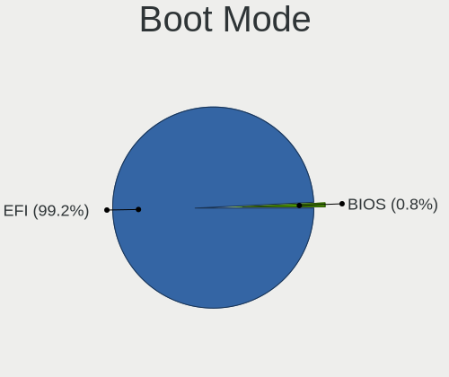
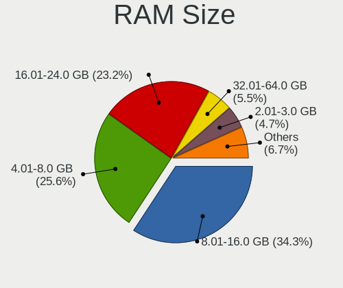
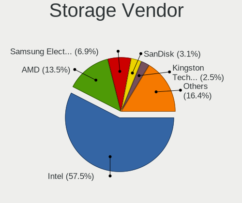
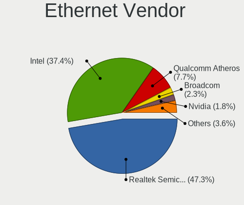
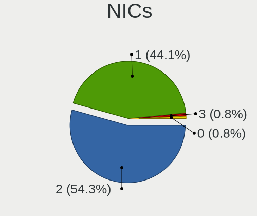
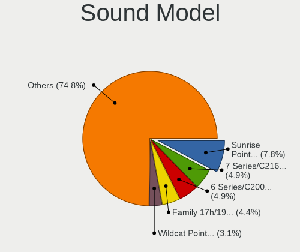
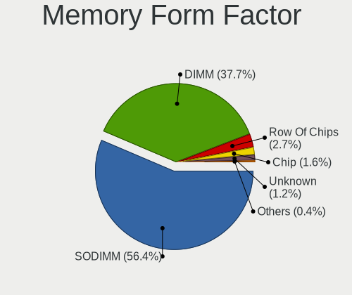

helloSystem 0.8.0 - Tested Hardware & Statistics
------------------------------------------------

A project to collect tested hardware configurations for helloSystem 0.8.0.

Anyone can contribute to this report by the [hw-probe](https://github.com/linuxhw/hw-probe/blob/master/INSTALL.BSD.md) tool:

    hw-probe -all -upload

Please contribute! Especially if your hardware is rare.

This is a report for all computer types. See also reports for [desktops](/Dist/helloSystem_0.8.0/Desktop/README.md) and [notebooks](/Dist/helloSystem_0.8.0/Notebook/README.md).

Contents
--------

* [ Test Cases ](#test-cases)

* [ System ](#system)
  - [ Arch                     ](#arch)
  - [ DE                       ](#de)
  - [ Display Server           ](#display-server)
  - [ Display Manager          ](#display-manager)
  - [ OS Lang                  ](#os-lang)
  - [ Boot Mode                ](#boot-mode)
  - [ Filesystem               ](#filesystem)
  - [ Part. scheme             ](#part-scheme)

* [ Board ](#board)
  - [ Vendor                   ](#vendor)
  - [ Model                    ](#model)
  - [ Model Family             ](#model-family)
  - [ MFG Year                 ](#mfg-year)
  - [ Form Factor              ](#form-factor)
  - [ Coreboot                 ](#coreboot)
  - [ RAM Size                 ](#ram-size)
  - [ RAM Used                 ](#ram-used)
  - [ Total Drives             ](#total-drives)
  - [ Has CD-ROM               ](#has-cd-rom)
  - [ Has Ethernet             ](#has-ethernet)
  - [ Has WiFi                 ](#has-wifi)
  - [ Has Bluetooth            ](#has-bluetooth)

* [ Location ](#location)
  - [ Country                  ](#country)
  - [ City                     ](#city)

* [ Drives ](#drives)
  - [ Drive Vendor             ](#drive-vendor)
  - [ Drive Model              ](#drive-model)
  - [ HDD Vendor               ](#hdd-vendor)
  - [ SSD Vendor               ](#ssd-vendor)
  - [ Drive Kind               ](#drive-kind)
  - [ Drive Connector          ](#drive-connector)
  - [ Drive Size               ](#drive-size)
  - [ Space Total              ](#space-total)
  - [ Space Used               ](#space-used)
  - [ Malfunc. Drives          ](#malfunc-drives)
  - [ Malfunc. Drive Vendor    ](#malfunc-drive-vendor)
  - [ Malfunc. HDD Vendor      ](#malfunc-hdd-vendor)
  - [ Malfunc. Drive Kind      ](#malfunc-drive-kind)
  - [ Failed Drives            ](#failed-drives)
  - [ Failed Drive Vendor      ](#failed-drive-vendor)
  - [ Drive Status             ](#drive-status)

* [ Storage controller ](#storage-controller)
  - [ Storage Vendor           ](#storage-vendor)
  - [ Storage Model            ](#storage-model)
  - [ Storage Kind             ](#storage-kind)

* [ Processor ](#processor)
  - [ CPU Vendor               ](#cpu-vendor)
  - [ CPU Model                ](#cpu-model)
  - [ CPU Model Family         ](#cpu-model-family)
  - [ CPU Cores                ](#cpu-cores)
  - [ CPU Sockets              ](#cpu-sockets)
  - [ CPU Threads              ](#cpu-threads)
  - [ CPU Microarch            ](#cpu-microarch)

* [ Graphics ](#graphics)
  - [ GPU Vendor               ](#gpu-vendor)
  - [ GPU Model                ](#gpu-model)
  - [ GPU Combo                ](#gpu-combo)
  - [ GPU Driver               ](#gpu-driver)
  - [ GPU Memory               ](#gpu-memory)

* [ Monitor ](#monitor)
  - [ Monitor Vendor           ](#monitor-vendor)
  - [ Monitor Model            ](#monitor-model)
  - [ Monitor Resolution       ](#monitor-resolution)
  - [ Monitor Diagonal         ](#monitor-diagonal)
  - [ Monitor Width            ](#monitor-width)
  - [ Aspect Ratio             ](#aspect-ratio)
  - [ Monitor Area             ](#monitor-area)
  - [ Pixel Density            ](#pixel-density)
  - [ Multiple Monitors        ](#multiple-monitors)

* [ Network ](#network)
  - [ Net Controller Vendor    ](#net-controller-vendor)
  - [ Net Controller Model     ](#net-controller-model)
  - [ Wireless Vendor          ](#wireless-vendor)
  - [ Wireless Model           ](#wireless-model)
  - [ Ethernet Vendor          ](#ethernet-vendor)
  - [ Ethernet Model           ](#ethernet-model)
  - [ Net Controller Kind      ](#net-controller-kind)
  - [ Used Controller          ](#used-controller)
  - [ NICs                     ](#nics)
  - [ IPv6                     ](#ipv6)

* [ Bluetooth ](#bluetooth)
  - [ Bluetooth Vendor         ](#bluetooth-vendor)
  - [ Bluetooth Model          ](#bluetooth-model)

* [ Sound ](#sound)
  - [ Sound Vendor             ](#sound-vendor)
  - [ Sound Model              ](#sound-model)

* [ Memory ](#memory)
  - [ Memory Vendor            ](#memory-vendor)
  - [ Memory Model             ](#memory-model)
  - [ Memory Kind              ](#memory-kind)
  - [ Memory Form Factor       ](#memory-form-factor)
  - [ Memory Size              ](#memory-size)
  - [ Memory Speed             ](#memory-speed)

* [ Printers & scanners ](#printers--scanners)
  - [ Printer Vendor           ](#printer-vendor)
  - [ Printer Model            ](#printer-model)
  - [ Scanner Vendor           ](#scanner-vendor)
  - [ Scanner Model            ](#scanner-model)

* [ Camera ](#camera)
  - [ Camera Vendor            ](#camera-vendor)
  - [ Camera Model             ](#camera-model)

* [ Security ](#security)
  - [ Fingerprint Vendor       ](#fingerprint-vendor)
  - [ Fingerprint Model        ](#fingerprint-model)
  - [ Chipcard Vendor          ](#chipcard-vendor)
  - [ Chipcard Model           ](#chipcard-model)

* [ Unsupported ](#unsupported)
  - [ Unsupported Devices      ](#unsupported-devices)
  - [ Unsupported Device Types ](#unsupported-device-types)

Test Cases
----------

Total: 135

| Vendor        | Model                       | Form-Factor | Probe                                                     | Date         |
|---------------|-----------------------------|-------------|-----------------------------------------------------------|--------------|
| MSI           | B450M MORTAR MAX            | Desktop     | [840145eb80](https://bsd-hardware.info/?probe=840145eb80) | Jan 23, 2023 |
| Dell          | Inspiron 3442               | Notebook    | [8b137bca84](https://bsd-hardware.info/?probe=8b137bca84) | Jan 23, 2023 |
| Timi          | TM1607                      | Notebook    | [7636a0ef8f](https://bsd-hardware.info/?probe=7636a0ef8f) | Jan 23, 2023 |
| Timi          | TM1607                      | Notebook    | [1ca46404a1](https://bsd-hardware.info/?probe=1ca46404a1) | Jan 23, 2023 |
| Samsung       | 340XAA/350XAA/550XAA        | Notebook    | [881e97e41c](https://bsd-hardware.info/?probe=881e97e41c) | Jan 23, 2023 |
| ASUSTek       | X99-A/USB                   | Desktop     | [006553f965](https://bsd-hardware.info/?probe=006553f965) | Jan 23, 2023 |
| Gigabyte      | H81M-H                      | Desktop     | [4b3a05fc2a](https://bsd-hardware.info/?probe=4b3a05fc2a) | Jan 22, 2023 |
| ASUSTek       | P5KPL-AM SE                 | Desktop     | [6dc0fddda1](https://bsd-hardware.info/?probe=6dc0fddda1) | Jan 22, 2023 |
| Acer          | Aspire ES1-533              | Notebook    | [d2652b76cf](https://bsd-hardware.info/?probe=d2652b76cf) | Jan 22, 2023 |
| ASUSTek       | Q405UA                      | Convertible | [6662cab62d](https://bsd-hardware.info/?probe=6662cab62d) | Jan 22, 2023 |
| ASUSTek       | Q405UA                      | Convertible | [2b94c3efae](https://bsd-hardware.info/?probe=2b94c3efae) | Jan 22, 2023 |
| Dell          | 03KWTV A02                  | Desktop     | [28088f7e94](https://bsd-hardware.info/?probe=28088f7e94) | Jan 22, 2023 |
| Lenovo        | ThinkPad P50 20EN0041MX     | Notebook    | [c27f1f53f2](https://bsd-hardware.info/?probe=c27f1f53f2) | Jan 22, 2023 |
| HP            | Laptop 15-bs0xx             | Notebook    | [7bd5f0c2e9](https://bsd-hardware.info/?probe=7bd5f0c2e9) | Jan 22, 2023 |
| Panasonic     | CF-C1BWFAZ1M                | Notebook    | [d129d929ac](https://bsd-hardware.info/?probe=d129d929ac) | Jan 22, 2023 |
| Lenovo        | ThinkPad P51 20HH001RMX     | Notebook    | [ab38c51298](https://bsd-hardware.info/?probe=ab38c51298) | Jan 22, 2023 |
| Gigabyte      | H270M-DS3H-CF               | Desktop     | [d0e2e85346](https://bsd-hardware.info/?probe=d0e2e85346) | Jan 17, 2023 |
| HP            | ZBook 15 G4                 | Notebook    | [e98d329586](https://bsd-hardware.info/?probe=e98d329586) | Jan 15, 2023 |
| HP            | ZBook 15 G4                 | Notebook    | [86875f01c2](https://bsd-hardware.info/?probe=86875f01c2) | Jan 15, 2023 |
| Lenovo        | ThinkPad P15v Gen 2i 21A... | Notebook    | [035f9afc5d](https://bsd-hardware.info/?probe=035f9afc5d) | Jan 14, 2023 |
| Lenovo        | ThinkPad P15v Gen 2i 21A... | Notebook    | [9ded9cc6ec](https://bsd-hardware.info/?probe=9ded9cc6ec) | Jan 14, 2023 |
| Razer         | Blade Stealth               | Notebook    | [2464314a65](https://bsd-hardware.info/?probe=2464314a65) | Jan 11, 2023 |
| Gigabyte      | G1.Sniper A88X-CF           | Desktop     | [2372c973c8](https://bsd-hardware.info/?probe=2372c973c8) | Jan 11, 2023 |
| Dell          | 0K240Y A02                  | Desktop     | [379b59f079](https://bsd-hardware.info/?probe=379b59f079) | Jan 05, 2023 |
| Lenovo        | ThinkPad T61 64644YG        | Notebook    | [0657433463](https://bsd-hardware.info/?probe=0657433463) | Jan 03, 2023 |
| Apple         | MacBookAir5,1               | Notebook    | [0d398d5c59](https://bsd-hardware.info/?probe=0d398d5c59) | Dec 27, 2022 |
| Gigabyte      | X399 AORUS Gaming 7         | Desktop     | [1769da5143](https://bsd-hardware.info/?probe=1769da5143) | Dec 25, 2022 |
| Lenovo        | ThinkPad X1 Extreme Gen ... | Notebook    | [d19db2828c](https://bsd-hardware.info/?probe=d19db2828c) | Dec 16, 2022 |
| ASUSTek       | CM1530                      | Desktop     | [902c77b5dc](https://bsd-hardware.info/?probe=902c77b5dc) | Dec 06, 2022 |
| Dell          | Latitude 5590               | Notebook    | [0a17f04eba](https://bsd-hardware.info/?probe=0a17f04eba) | Dec 02, 2022 |
| Toshiba       | TECRA Z40-C-12Z             | Notebook    | [149e5c3de3](https://bsd-hardware.info/?probe=149e5c3de3) | Nov 28, 2022 |
| ASUSTek       | PRIME Z390M-PLUS            | Desktop     | [7329e04c22](https://bsd-hardware.info/?probe=7329e04c22) | Nov 27, 2022 |
| Dell          | 0M017G A00                  | Desktop     | [3acaad9a7d](https://bsd-hardware.info/?probe=3acaad9a7d) | Nov 26, 2022 |
| Dell          | 009Y81 A01                  | All in one  | [75132e6886](https://bsd-hardware.info/?probe=75132e6886) | Nov 25, 2022 |
| Gigabyte      | P61-USB3-B3                 | Desktop     | [1ec1683acd](https://bsd-hardware.info/?probe=1ec1683acd) | Nov 21, 2022 |
| Gigabyte      | P61-USB3-B3                 | Desktop     | [5f442f0c65](https://bsd-hardware.info/?probe=5f442f0c65) | Nov 21, 2022 |
| Gigabyte      | H61M-S1                     | Desktop     | [2b851dbbc1](https://bsd-hardware.info/?probe=2b851dbbc1) | Nov 21, 2022 |
| Gigabyte      | 970A-D3P                    | Desktop     | [cced487ec5](https://bsd-hardware.info/?probe=cced487ec5) | Nov 21, 2022 |
| Gigabyte      | 970A-D3P                    | Desktop     | [c28a22ecb5](https://bsd-hardware.info/?probe=c28a22ecb5) | Nov 21, 2022 |
| ASUSTek       | P5KPL-VM-TWPC               | Desktop     | [6a5ff282a7](https://bsd-hardware.info/?probe=6a5ff282a7) | Nov 21, 2022 |
| Acer          | Aspire 5251                 | Notebook    | [046bc722cb](https://bsd-hardware.info/?probe=046bc722cb) | Nov 16, 2022 |
| HP            | 1998                        | Desktop     | [9239fe7437](https://bsd-hardware.info/?probe=9239fe7437) | Nov 15, 2022 |
| Dell          | Inspiron 3421               | Notebook    | [5c37012f33](https://bsd-hardware.info/?probe=5c37012f33) | Nov 10, 2022 |
| Gigabyte      | H270M-DS3H-CF               | Desktop     | [5784d8bed6](https://bsd-hardware.info/?probe=5784d8bed6) | Nov 04, 2022 |
| HP            | Pavilion g6                 | Notebook    | [c4e84b8104](https://bsd-hardware.info/?probe=c4e84b8104) | Oct 30, 2022 |
| Lenovo        | 3106 SDK0J40705 WIN 3425... | Desktop     | [d20bfb6d64](https://bsd-hardware.info/?probe=d20bfb6d64) | Oct 30, 2022 |
| HP            | 843B                        | Desktop     | [d7d572f9ad](https://bsd-hardware.info/?probe=d7d572f9ad) | Oct 29, 2022 |
| Intel         | NUC8BEB J72688-306          | Mini pc     | [17f444775b](https://bsd-hardware.info/?probe=17f444775b) | Oct 28, 2022 |
| HP            | 843B                        | Desktop     | [9ea2590610](https://bsd-hardware.info/?probe=9ea2590610) | Oct 23, 2022 |
| Google        | Edgar                       | Notebook    | [318a750368](https://bsd-hardware.info/?probe=318a750368) | Oct 22, 2022 |
| MSI           | B450M PRO-VDH PLUS          | Desktop     | [54e4202bc7](https://bsd-hardware.info/?probe=54e4202bc7) | Oct 21, 2022 |
| MSI           | PS63 Modern 8M              | Notebook    | [949e472db5](https://bsd-hardware.info/?probe=949e472db5) | Oct 19, 2022 |
| HP            | 86FC MVB                    | Desktop     | [56453b00c8](https://bsd-hardware.info/?probe=56453b00c8) | Oct 08, 2022 |
| HP            | 86FC MVB                    | Desktop     | [c542b16d75](https://bsd-hardware.info/?probe=c542b16d75) | Oct 08, 2022 |
| TUXEDO        | Aura 15 Gen1                | Notebook    | [a49ac2701d](https://bsd-hardware.info/?probe=a49ac2701d) | Oct 02, 2022 |
| Dell          | 0T10XW A01                  | Desktop     | [c2ff0bc0b9](https://bsd-hardware.info/?probe=c2ff0bc0b9) | Sep 30, 2022 |
| Kraftway      | KW10T                       | Notebook    | [db27da2e88](https://bsd-hardware.info/?probe=db27da2e88) | Sep 29, 2022 |
| Lenovo        | ThinkPad X250 20CLS1WP01    | Notebook    | [1b75ee6295](https://bsd-hardware.info/?probe=1b75ee6295) | Sep 19, 2022 |
| Apple         | MacBook5,2                  | Notebook    | [79503c0635](https://bsd-hardware.info/?probe=79503c0635) | Sep 10, 2022 |
| Apple         | MacBook5,2                  | Notebook    | [9c7a64970c](https://bsd-hardware.info/?probe=9c7a64970c) | Sep 10, 2022 |
| Dell          | Latitude E5550              | Notebook    | [867e56fb52](https://bsd-hardware.info/?probe=867e56fb52) | Sep 01, 2022 |
| ASRock        | ConRoeXFire-eSATA2          | Desktop     | [caf005ed95](https://bsd-hardware.info/?probe=caf005ed95) | Sep 01, 2022 |
| Lenovo        | ThinkPad T420 4178A72       | Notebook    | [18a105546b](https://bsd-hardware.info/?probe=18a105546b) | Aug 29, 2022 |
| Lenovo        | ThinkPad T420 4178A72       | Notebook    | [1433351032](https://bsd-hardware.info/?probe=1433351032) | Aug 29, 2022 |
| ASUSTek       | ROG STRIX B550-I GAMING     | Desktop     | [079adb24f8](https://bsd-hardware.info/?probe=079adb24f8) | Aug 28, 2022 |
| Toshiba       | Satellite S55t-B            | Notebook    | [df9971d3aa](https://bsd-hardware.info/?probe=df9971d3aa) | Aug 27, 2022 |
| ASUSTek       | VivoBook 15_ASUS Laptop ... | Notebook    | [2c7586b0ed](https://bsd-hardware.info/?probe=2c7586b0ed) | Aug 25, 2022 |
| Intel         | NUC8BEB J72688-304          | Mini pc     | [3de3724488](https://bsd-hardware.info/?probe=3de3724488) | Aug 12, 2022 |
| TUXEDO        | Pulse 14 Gen1               | Notebook    | [5edf8a1bef](https://bsd-hardware.info/?probe=5edf8a1bef) | Aug 09, 2022 |
| ASUSTek       | F6A                         | Notebook    | [6626d18284](https://bsd-hardware.info/?probe=6626d18284) | Aug 08, 2022 |
| ASUSTek       | P5QL-ASUS-SE                | Desktop     | [50a0d392e7](https://bsd-hardware.info/?probe=50a0d392e7) | Aug 06, 2022 |
| ASUSTek       | K30AM-J                     | Desktop     | [470ced8f30](https://bsd-hardware.info/?probe=470ced8f30) | Aug 05, 2022 |
| HP            | 250 G6 Notebook PC          | Notebook    | [511d057c70](https://bsd-hardware.info/?probe=511d057c70) | Jul 27, 2022 |
| HP            | OMEN by Laptop              | Notebook    | [25e43be096](https://bsd-hardware.info/?probe=25e43be096) | Jul 17, 2022 |
| MSI           | MPG X570 GAMING PLUS        | Desktop     | [a80b1c4f3c](https://bsd-hardware.info/?probe=a80b1c4f3c) | Jul 17, 2022 |
| HP            | 1998                        | Desktop     | [e4fda48283](https://bsd-hardware.info/?probe=e4fda48283) | Jul 15, 2022 |
| Dell          | Latitude E5450              | Notebook    | [5f1183ab0b](https://bsd-hardware.info/?probe=5f1183ab0b) | Jul 14, 2022 |
| Dell          | Latitude E5450              | Notebook    | [1080ed5654](https://bsd-hardware.info/?probe=1080ed5654) | Jul 14, 2022 |
| Acer          | Aspire E5-571G              | Notebook    | [56fae2295e](https://bsd-hardware.info/?probe=56fae2295e) | Jul 08, 2022 |
| HP            | 250 G6 Notebook PC          | Notebook    | [bbe1d21883](https://bsd-hardware.info/?probe=bbe1d21883) | Jul 07, 2022 |
| Pegatron      | IPM41-D3                    | Desktop     | [8b2af1b843](https://bsd-hardware.info/?probe=8b2af1b843) | Jul 06, 2022 |
| Biostar       | G41D3C                      | Desktop     | [118bd083bf](https://bsd-hardware.info/?probe=118bd083bf) | Jul 01, 2022 |
| Dell          | Inspiron 15-3552            | Notebook    | [8cdc3bd7ab](https://bsd-hardware.info/?probe=8cdc3bd7ab) | Jul 01, 2022 |
| Apple         | MacBook6,1                  | Notebook    | [a6d3cf9a30](https://bsd-hardware.info/?probe=a6d3cf9a30) | Jun 20, 2022 |
| Acer          | Aspire A315-34              | Notebook    | [90927fa85a](https://bsd-hardware.info/?probe=90927fa85a) | Jun 20, 2022 |
| HP            | Unknown                     | Notebook    | [11ef8f9a92](https://bsd-hardware.info/?probe=11ef8f9a92) | Jun 19, 2022 |
| Lenovo        | ThinkPad X250 20CLS23500    | Notebook    | [6a8b44bc47](https://bsd-hardware.info/?probe=6a8b44bc47) | Jun 03, 2022 |
| Lenovo        | IdeaPad 3 15IGL05 82BU      | Notebook    | [6a6450f264](https://bsd-hardware.info/?probe=6a6450f264) | May 30, 2022 |
| Timi          | TM1701                      | Notebook    | [a28220d11f](https://bsd-hardware.info/?probe=a28220d11f) | May 22, 2022 |
| Dell          | Studio 1747                 | Notebook    | [7ae292b282](https://bsd-hardware.info/?probe=7ae292b282) | May 21, 2022 |
| TUXEDO        | Aura 15 Gen1                | Notebook    | [20814a930a](https://bsd-hardware.info/?probe=20814a930a) | May 18, 2022 |
| ASUSTek       | K30AM-J                     | Desktop     | [f4352f7897](https://bsd-hardware.info/?probe=f4352f7897) | May 16, 2022 |
| Packard Be... | EasyNote_MX52-B-071         | Notebook    | [277c9e0a0a](https://bsd-hardware.info/?probe=277c9e0a0a) | May 08, 2022 |
| Dell          | Inspiron 5559               | Notebook    | [a7111b84cb](https://bsd-hardware.info/?probe=a7111b84cb) | May 08, 2022 |
| Lenovo        | ThinkPad X270 W10DG 20K5... | Notebook    | [f02e4345ff](https://bsd-hardware.info/?probe=f02e4345ff) | Apr 30, 2022 |
| Apple         | MacBookPro5,5               | Notebook    | [4b5603b38b](https://bsd-hardware.info/?probe=4b5603b38b) | Apr 29, 2022 |
| ASUSTek       | 1001PX                      | Notebook    | [b47a498f2e](https://bsd-hardware.info/?probe=b47a498f2e) | Apr 08, 2022 |
| Dell          | Latitude E5470              | Notebook    | [a7d087a428](https://bsd-hardware.info/?probe=a7d087a428) | Apr 05, 2022 |
| Sony          | VGN-AW21S_B                 | Notebook    | [11edcb4e82](https://bsd-hardware.info/?probe=11edcb4e82) | Apr 03, 2022 |
| Lenovo        | 30D9 SDK0J40705 WIN 3425... | Desktop     | [964ceb3616](https://bsd-hardware.info/?probe=964ceb3616) | Apr 03, 2022 |
| PCSTICK       | Unknown                     | Notebook    | [6f9f24b262](https://bsd-hardware.info/?probe=6f9f24b262) | Mar 29, 2022 |
| Dell          | Latitude E6540              | Notebook    | [41e5f63a69](https://bsd-hardware.info/?probe=41e5f63a69) | Mar 26, 2022 |
| ASUSTek       | UX31E                       | Notebook    | [93655cdd83](https://bsd-hardware.info/?probe=93655cdd83) | Mar 21, 2022 |
| HP            | EliteBook 850 G3            | Notebook    | [1ae8321767](https://bsd-hardware.info/?probe=1ae8321767) | Mar 20, 2022 |
| Gateway       | NE56R                       | Notebook    | [87d177b9da](https://bsd-hardware.info/?probe=87d177b9da) | Mar 20, 2022 |
| MSI           | B350M BAZOOKA               | Desktop     | [bac8d0bdb7](https://bsd-hardware.info/?probe=bac8d0bdb7) | Mar 11, 2022 |
| HUAWEI        | BOD-WXX9                    | Notebook    | [65454bcc92](https://bsd-hardware.info/?probe=65454bcc92) | Mar 06, 2022 |
| ASRock        | G41C-VS                     | Desktop     | [a9a1b1a493](https://bsd-hardware.info/?probe=a9a1b1a493) | Mar 03, 2022 |
| Intel         | DN2800MT AAG23738-600       | Desktop     | [8ecf2d023f](https://bsd-hardware.info/?probe=8ecf2d023f) | Mar 02, 2022 |
| Acer          | V5-131                      | Notebook    | [076ca78b3f](https://bsd-hardware.info/?probe=076ca78b3f) | Feb 25, 2022 |
| Dell          | Latitude 7480               | Notebook    | [8a0388b49d](https://bsd-hardware.info/?probe=8a0388b49d) | Feb 23, 2022 |
| PCSTICK       | Unknown                     | Notebook    | [b76b5c9670](https://bsd-hardware.info/?probe=b76b5c9670) | Feb 21, 2022 |
| ASUSTek       | 1001PX                      | Notebook    | [d171d1ec99](https://bsd-hardware.info/?probe=d171d1ec99) | Feb 17, 2022 |
| Lenovo        | Legion 5 15ARH05 82B5       | Notebook    | [1a13b7bfd1](https://bsd-hardware.info/?probe=1a13b7bfd1) | Feb 16, 2022 |
| ASUSTek       | TUF GAMING X570-PLUS        | Desktop     | [64999a24c1](https://bsd-hardware.info/?probe=64999a24c1) | Feb 16, 2022 |
| Acer          | Aspire 5750G                | Notebook    | [bd22fc8a49](https://bsd-hardware.info/?probe=bd22fc8a49) | Feb 15, 2022 |
| AMD           | X64                         | Desktop     | [e5a9ff1138](https://bsd-hardware.info/?probe=e5a9ff1138) | Feb 15, 2022 |
| Timi          | RedmiBook Pro 15            | Notebook    | [7716f59380](https://bsd-hardware.info/?probe=7716f59380) | Feb 14, 2022 |
| Timi          | RedmiBook Pro 15            | Notebook    | [fdd0ab95ed](https://bsd-hardware.info/?probe=fdd0ab95ed) | Feb 14, 2022 |
| Lenovo        | SHARKBAY SDK0E50510 WIN     | Desktop     | [eddeb5c246](https://bsd-hardware.info/?probe=eddeb5c246) | Feb 13, 2022 |
| Apple         | MacBook5,2                  | Notebook    | [29756c2371](https://bsd-hardware.info/?probe=29756c2371) | Feb 13, 2022 |
| MACHINIST     | X99-k9 V2.0                 | Desktop     | [0a36d71db1](https://bsd-hardware.info/?probe=0a36d71db1) | Feb 10, 2022 |
| Sony          | VPCEB1J1E                   | Notebook    | [9151a22f13](https://bsd-hardware.info/?probe=9151a22f13) | Jan 30, 2022 |
| Pegatron      | IPPPV-D3G                   | Desktop     | [d5e44ccf6b](https://bsd-hardware.info/?probe=d5e44ccf6b) | Jan 28, 2022 |
| Intel         | MAHOBAY                     | Desktop     | [2036093b68](https://bsd-hardware.info/?probe=2036093b68) | Jan 25, 2022 |
| HP            | 8648                        | Desktop     | [b0adf55067](https://bsd-hardware.info/?probe=b0adf55067) | Jan 23, 2022 |
| Dell          | 0593VH A00                  | Desktop     | [484d14dbef](https://bsd-hardware.info/?probe=484d14dbef) | Jan 22, 2022 |
| ASRock        | B365M Pro4                  | Desktop     | [8449bd20c1](https://bsd-hardware.info/?probe=8449bd20c1) | Jan 18, 2022 |
| Dell          | 0YF8P5 A00                  | Desktop     | [913b2a7483](https://bsd-hardware.info/?probe=913b2a7483) | Jan 18, 2022 |
| Dell          | 0X4N41 A01                  | Desktop     | [87000234dc](https://bsd-hardware.info/?probe=87000234dc) | Jan 11, 2022 |
| Lenovo        | ThinkPad T440 20B7A0B7MS    | Notebook    | [be30041f4e](https://bsd-hardware.info/?probe=be30041f4e) | Jan 10, 2022 |
| Apple         | Mac-F2218EA9                | All in one  | [5de4d8c93e](https://bsd-hardware.info/?probe=5de4d8c93e) | Jan 09, 2022 |
| Lenovo        | G480 20149                  | Notebook    | [adc6b44cc8](https://bsd-hardware.info/?probe=adc6b44cc8) | Jan 09, 2022 |
| Apple         | Mac-F2218EA9                | All in one  | [7c49bc84a7](https://bsd-hardware.info/?probe=7c49bc84a7) | Jan 08, 2022 |
| HP            | EliteBook 820 G1            | Notebook    | [362940acbb](https://bsd-hardware.info/?probe=362940acbb) | Jan 03, 2022 |

System
------

Arch
----

OS architecture (x86_64, i586, etc.)

| Name  | Computers | Percent |
|-------|-----------|---------|
| amd64 | 114       | 100%    |

DE
--

Desktop Environment

| Name         | Computers | Percent |
|--------------|-----------|---------|
| helloDesktop | 110       | 96.49%  |
| GNOME        | 2         | 1.75%   |
| Window Maker | 1         | 0.88%   |
| Cinnamon     | 1         | 0.88%   |

Display Server
--------------

X11 or Wayland

| Name | Computers | Percent |
|------|-----------|---------|
| X11  | 114       | 100%    |

Display Manager
---------------

SDDM, LightDM, etc.

| Name | Computers | Percent |
|------|-----------|---------|
| SLiM | 113       | 99.12%  |
| GDM  | 1         | 0.88%   |

OS Lang
-------

Language

| Lang  | Computers | Percent |
|-------|-----------|---------|
| en_US | 88        | 76.52%  |
| en    | 12        | 10.43%  |
| ru    | 3         | 2.61%   |
| es    | 3         | 2.61%   |
| pt    | 2         | 1.74%   |
| de    | 2         | 1.74%   |
| zh_TW | 1         | 0.87%   |
| ru_RU | 1         | 0.87%   |
| fr    | 1         | 0.87%   |
| es_ES | 1         | 0.87%   |
| de_DE | 1         | 0.87%   |

Boot Mode
---------

EFI or BIOS

| Mode | Computers | Percent |
|------|-----------|---------|
| EFI  | 113       | 99.12%  |
| BIOS | 1         | 0.88%   |

Filesystem
----------

Type of filesystem

| Type   | Computers | Percent |
|--------|-----------|---------|
| Cd9660 | 78        | 67.83%  |
| Zfs    | 37        | 32.17%  |

Part. scheme
------------

Scheme of partitioning

| Type | Computers | Percent |
|------|-----------|---------|
| GPT  | 113       | 99.12%  |
| MBR  | 1         | 0.88%   |

Board
-----

Vendor
------

Motherboard manufacturer

| Name                | Computers | Percent |
|---------------------|-----------|---------|
| Dell                | 19        | 16.67%  |
| Lenovo              | 15        | 13.16%  |
| Hewlett-Packard     | 14        | 12.28%  |
| ASUSTek Computer    | 14        | 12.28%  |
| Gigabyte Technology | 7         | 6.14%   |
| MSI                 | 5         | 4.39%   |
| Apple               | 5         | 4.39%   |
| Acer                | 5         | 4.39%   |
| Intel               | 4         | 3.51%   |
| Timi                | 3         | 2.63%   |
| ASRock              | 3         | 2.63%   |
| TUXEDO              | 2         | 1.75%   |
| Toshiba             | 2         | 1.75%   |
| Sony                | 2         | 1.75%   |
| Pegatron            | 2         | 1.75%   |
| Samsung Electronics | 1         | 0.88%   |
| Razer               | 1         | 0.88%   |
| PCSTICK             | 1         | 0.88%   |
| Panasonic           | 1         | 0.88%   |
| Packard Bell        | 1         | 0.88%   |
| MACHINIST           | 1         | 0.88%   |
| Kraftway            | 1         | 0.88%   |
| HUAWEI              | 1         | 0.88%   |
| Google              | 1         | 0.88%   |
| Gateway             | 1         | 0.88%   |
| Biostar             | 1         | 0.88%   |
| AMD                 | 1         | 0.88%   |

Model
-----

Motherboard model

| Name                                         | Computers | Percent |
|----------------------------------------------|-----------|---------|
| MSI MS-7A38                                  | 2         | 1.75%   |
| HP 250 G6 Notebook PC                        | 2         | 1.75%   |
| Apple MacBook5,2                             | 2         | 1.75%   |
| Unknown                                      | 2         | 1.75%   |
| TUXEDO Pulse 14 Gen1                         | 1         | 0.88%   |
| TUXEDO Aura 15 Gen1                          | 1         | 0.88%   |
| Toshiba TECRA Z40-C-12Z                      | 1         | 0.88%   |
| Toshiba Satellite S55t-B                     | 1         | 0.88%   |
| Timi TM1701                                  | 1         | 0.88%   |
| Timi TM1607                                  | 1         | 0.88%   |
| Timi RedmiBook Pro 15                        | 1         | 0.88%   |
| Sony VPCEB1J1E                               | 1         | 0.88%   |
| Sony VGN-AW21S_B                             | 1         | 0.88%   |
| Samsung 340XAA/350XAA/550XAA                 | 1         | 0.88%   |
| Razer Blade Stealth                          | 1         | 0.88%   |
| Pegatron IPPPV-D3G                           | 1         | 0.88%   |
| Pegatron IPM41-D3                            | 1         | 0.88%   |
| Panasonic CF-C1BWFAZ1M                       | 1         | 0.88%   |
| Packard Bell EasyNote_MX52-B-071             | 1         | 0.88%   |
| MSI PS63 Modern 8M                           | 1         | 0.88%   |
| MSI MS-7C37                                  | 1         | 0.88%   |
| MSI MS-7B89                                  | 1         | 0.88%   |
| MACHINIST X99-k9 V2.0                        | 1         | 0.88%   |
| Lenovo ThinkPad X270 W10DG 20K5S0BB00        | 1         | 0.88%   |
| Lenovo ThinkPad X250 20CLS23500              | 1         | 0.88%   |
| Lenovo ThinkPad X250 20CLS1WP01              | 1         | 0.88%   |
| Lenovo ThinkPad X1 Extreme Gen 4i 20Y5001DMX | 1         | 0.88%   |
| Lenovo ThinkPad T440 20B7A0B7MS              | 1         | 0.88%   |
| Lenovo ThinkPad T420 4178A72                 | 1         | 0.88%   |
| Lenovo ThinkPad P51 20HH001RMX               | 1         | 0.88%   |
| Lenovo ThinkPad P50 20EN0041MX               | 1         | 0.88%   |
| Lenovo ThinkPad P15v Gen 2i 21AAS28T00       | 1         | 0.88%   |
| Lenovo ThinkCentre M93p 10AAA0WGUK           | 1         | 0.88%   |
| Lenovo ThinkCentre M910s 10MK0039US          | 1         | 0.88%   |
| Lenovo ThinkCentre M700 10GS                 | 1         | 0.88%   |
| Lenovo Legion 5 15ARH05 82B5                 | 1         | 0.88%   |
| Lenovo IdeaPad 3 15IGL05 82BU                | 1         | 0.88%   |
| Lenovo G480 20149                            | 1         | 0.88%   |
| Kraftway KW10T                               | 1         | 0.88%   |
| Intel NUC8i7BEK                              | 1         | 0.88%   |

Model Family
------------

Motherboard model prefix

| Name                   | Computers | Percent |
|------------------------|-----------|---------|
| Lenovo ThinkPad        | 9         | 7.89%   |
| Dell Latitude          | 6         | 5.26%   |
| Dell Inspiron          | 6         | 5.26%   |
| Acer Aspire            | 5         | 4.39%   |
| Lenovo ThinkCentre     | 3         | 2.63%   |
| Dell OptiPlex          | 3         | 2.63%   |
| MSI MS-7A38            | 2         | 1.75%   |
| HP Pavilion            | 2         | 1.75%   |
| HP EliteDesk           | 2         | 1.75%   |
| HP EliteBook           | 2         | 1.75%   |
| HP 250                 | 2         | 1.75%   |
| Dell Studio            | 2         | 1.75%   |
| Dell Precision         | 2         | 1.75%   |
| Apple MacBook5         | 2         | 1.75%   |
| Unknown                | 2         | 1.75%   |
| TUXEDO Pulse           | 1         | 0.88%   |
| TUXEDO Aura            | 1         | 0.88%   |
| Toshiba TECRA          | 1         | 0.88%   |
| Toshiba Satellite      | 1         | 0.88%   |
| Timi TM1701            | 1         | 0.88%   |
| Timi TM1607            | 1         | 0.88%   |
| Timi RedmiBook         | 1         | 0.88%   |
| Sony VPCEB1J1E         | 1         | 0.88%   |
| Sony VGN-AW21S         | 1         | 0.88%   |
| Samsung 340XAA         | 1         | 0.88%   |
| Razer Blade            | 1         | 0.88%   |
| Pegatron IPPPV-D3G     | 1         | 0.88%   |
| Pegatron IPM41-D3      | 1         | 0.88%   |
| Panasonic CF-C1BWFAZ1M | 1         | 0.88%   |
| Packard Bell EasyNote  | 1         | 0.88%   |
| MSI PS63               | 1         | 0.88%   |
| MSI MS-7C37            | 1         | 0.88%   |
| MSI MS-7B89            | 1         | 0.88%   |
| MACHINIST X99-k9       | 1         | 0.88%   |
| Lenovo Legion          | 1         | 0.88%   |
| Lenovo IdeaPad         | 1         | 0.88%   |
| Lenovo G480            | 1         | 0.88%   |
| Kraftway KW10T         | 1         | 0.88%   |
| Intel NUC8i7BEK        | 1         | 0.88%   |
| Intel NUC8i7BEH        | 1         | 0.88%   |

MFG Year
--------

Motherboard manufacture year

| Year | Computers | Percent |
|------|-----------|---------|
| 2019 | 15        | 13.16%  |
| 2020 | 12        | 10.53%  |
| 2022 | 9         | 7.89%   |
| 2018 | 9         | 7.89%   |
| 2021 | 8         | 7.02%   |
| 2015 | 8         | 7.02%   |
| 2014 | 7         | 6.14%   |
| 2010 | 7         | 6.14%   |
| 2009 | 7         | 6.14%   |
| 2017 | 6         | 5.26%   |
| 2013 | 6         | 5.26%   |
| 2012 | 6         | 5.26%   |
| 2011 | 6         | 5.26%   |
| 2016 | 4         | 3.51%   |
| 2008 | 3         | 2.63%   |
| 2007 | 1         | 0.88%   |

Form Factor
-----------

Physical design of the computer

| Name        | Computers | Percent |
|-------------|-----------|---------|
| Notebook    | 64        | 56.14%  |
| Desktop     | 45        | 39.47%  |
| Mini pc     | 2         | 1.75%   |
| All in one  | 2         | 1.75%   |
| Convertible | 1         | 0.88%   |

Coreboot
--------

Have coreboot on board

| Used | Computers | Percent |
|------|-----------|---------|
| No   | 113       | 99.12%  |
| Yes  | 1         | 0.88%   |

RAM Size
--------

Total RAM memory

| Size in GB  | Computers | Percent |
|-------------|-----------|---------|
| 4.01-8.0    | 33        | 28.95%  |
| 8.01-16.0   | 32        | 28.07%  |
| 16.01-24.0  | 31        | 27.19%  |
| 32.01-64.0  | 7         | 6.14%   |
| 2.01-3.0    | 6         | 5.26%   |
| 64.01-256.0 | 3         | 2.63%   |
| 3.01-4.0    | 1         | 0.88%   |
| 24.01-32.0  | 1         | 0.88%   |

RAM Used
--------

Used RAM memory

| Used GB  | Computers | Percent |
|----------|-----------|---------|
| 0.01-0.5 | 60        | 52.63%  |
| 0.51-1.0 | 35        | 30.7%   |
| 1.01-2.0 | 14        | 12.28%  |
| 2.01-3.0 | 4         | 3.51%   |
| 4.01-8.0 | 1         | 0.88%   |

Total Drives
------------

Number of drives on board

| Drives | Computers | Percent |
|--------|-----------|---------|
| 1      | 74        | 64.35%  |
| 2      | 24        | 20.87%  |
| 3      | 7         | 6.09%   |
| 0      | 6         | 5.22%   |
| 5      | 2         | 1.74%   |
| 6      | 1         | 0.87%   |
| 4      | 1         | 0.87%   |

Has CD-ROM
----------

Has CD-ROM on board

| Presented | Computers | Percent |
|-----------|-----------|---------|
| No        | 81        | 71.05%  |
| Yes       | 33        | 28.95%  |

Has Ethernet
------------

Has Ethernet on board

| Presented | Computers | Percent |
|-----------|-----------|---------|
| Yes       | 99        | 86.84%  |
| No        | 15        | 13.16%  |

Has WiFi
--------

Has WiFi module

| Presented | Computers | Percent |
|-----------|-----------|---------|
| Yes       | 82        | 71.3%   |
| No        | 33        | 28.7%   |

Has Bluetooth
-------------

Has Bluetooth module

| Presented | Computers | Percent |
|-----------|-----------|---------|
| Yes       | 61        | 53.51%  |
| No        | 53        | 46.49%  |

Location
--------

Country
-------

Geographic location (country)

| Country                | Computers | Percent |
|------------------------|-----------|---------|
| USA                    | 15        | 13.16%  |
| Russia                 | 14        | 12.28%  |
| Germany                | 10        | 8.77%   |
| Brazil                 | 8         | 7.02%   |
| Taiwan                 | 6         | 5.26%   |
| Spain                  | 6         | 5.26%   |
| China                  | 5         | 4.39%   |
| UK                     | 4         | 3.51%   |
| Italy                  | 4         | 3.51%   |
| Canada                 | 4         | 3.51%   |
| Ukraine                | 3         | 2.63%   |
| Poland                 | 3         | 2.63%   |
| Mexico                 | 3         | 2.63%   |
| France                 | 3         | 2.63%   |
| Argentina              | 3         | 2.63%   |
| Norway                 | 2         | 1.75%   |
| Hungary                | 2         | 1.75%   |
| Venezuela              | 1         | 0.88%   |
| Uruguay                | 1         | 0.88%   |
| UAE                    | 1         | 0.88%   |
| Sweden                 | 1         | 0.88%   |
| South Africa           | 1         | 0.88%   |
| Slovenia               | 1         | 0.88%   |
| Slovakia               | 1         | 0.88%   |
| Serbia                 | 1         | 0.88%   |
| Romania                | 1         | 0.88%   |
| Portugal               | 1         | 0.88%   |
| Peru                   | 1         | 0.88%   |
| Panama                 | 1         | 0.88%   |
| Nepal                  | 1         | 0.88%   |
| India                  | 1         | 0.88%   |
| Greece                 | 1         | 0.88%   |
| Georgia                | 1         | 0.88%   |
| Bosnia and Herzegovina | 1         | 0.88%   |
| Belarus                | 1         | 0.88%   |
| Albania                | 1         | 0.88%   |

City
----

Geographic location (city)

| City                 | Computers | Percent |
|----------------------|-----------|---------|
| Moscow               | 5         | 4.31%   |
| Aquan                | 4         | 3.45%   |
| Volgograd            | 2         | 1.72%   |
| Temple               | 2         | 1.72%   |
| Munich               | 2         | 1.72%   |
| Logroño           | 2         | 1.72%   |
| Berlin               | 2         | 1.72%   |
| Zhengzhou            | 1         | 0.86%   |
| Yunlin               | 1         | 0.86%   |
| Yekaterinburg        | 1         | 0.86%   |
| Winnipeg             | 1         | 0.86%   |
| Willingboro          | 1         | 0.86%   |
| Weifang              | 1         | 0.86%   |
| Warendorf            | 1         | 0.86%   |
| Voronezh             | 1         | 0.86%   |
| Vladivostok          | 1         | 0.86%   |
| Vidnoye              | 1         | 0.86%   |
| Vancouver            | 1         | 0.86%   |
| Valladolid           | 1         | 0.86%   |
| Ufa                  | 1         | 0.86%   |
| Trieste              | 1         | 0.86%   |
| Szeged               | 1         | 0.86%   |
| Surrey               | 1         | 0.86%   |
| Southminster         | 1         | 0.86%   |
| Seville              | 1         | 0.86%   |
| Sayago               | 1         | 0.86%   |
| Sarajevo             | 1         | 0.86%   |
| Sao Paulo            | 1         | 0.86%   |
| San Carlos del Zulia | 1         | 0.86%   |
| Salisbury            | 1         | 0.86%   |
| Rosignano Marittimo  | 1         | 0.86%   |
| Rio das Ostras       | 1         | 0.86%   |
| Richardson           | 1         | 0.86%   |
| Rho                  | 1         | 0.86%   |
| Reinsvoll            | 1         | 0.86%   |
| Redondela            | 1         | 0.86%   |
| Porto                | 1         | 0.86%   |
| Pieve a Nievole      | 1         | 0.86%   |
| Perm                 | 1         | 0.86%   |
| Panama City          | 1         | 0.86%   |

Drives
------

Drive Vendor
------------

Hard drive vendors

| Vendor              | Computers | Drives | Percent |
|---------------------|-----------|--------|---------|
| Seagate             | 23        | 26     | 15.13%  |
| Samsung Electronics | 21        | 25     | 13.82%  |
| WDC                 | 19        | 22     | 12.5%   |
| Kingston            | 14        | 14     | 9.21%   |
| Hitachi             | 11        | 11     | 7.24%   |
| Toshiba             | 10        | 10     | 6.58%   |
| SanDisk             | 5         | 6      | 3.29%   |
| Intel               | 5         | 5      | 3.29%   |
| SK hynix            | 4         | 4      | 2.63%   |
| Patriot             | 4         | 4      | 2.63%   |
| PNY                 | 3         | 3      | 1.97%   |
| KIOXIA              | 3         | 3      | 1.97%   |
| Crucial             | 3         | 4      | 1.97%   |
| A-DATA Technology   | 3         | 3      | 1.97%   |
| SPCC                | 2         | 2      | 1.32%   |
| OCZ                 | 2         | 2      | 1.32%   |
| KingSpec            | 2         | 2      | 1.32%   |
| Fujitsu             | 2         | 2      | 1.32%   |
| XrayDisk            | 1         | 1      | 0.66%   |
| Verbatim            | 1         | 1      | 0.66%   |
| Transcend           | 1         | 1      | 0.66%   |
| SSSTC               | 1         | 1      | 0.66%   |
| Silicon Motion      | 1         | 1      | 0.66%   |
| Lexar               | 1         | 2      | 0.66%   |
| Lenovo              | 1         | 1      | 0.66%   |
| LDLC                | 1         | 1      | 0.66%   |
| Intenso             | 1         | 1      | 0.66%   |
| Hewlett-Packard     | 1         | 1      | 0.66%   |
| GOODRAM             | 1         | 1      | 0.66%   |
| Gigabyte Technology | 1         | 1      | 0.66%   |
| FORESEE             | 1         | 1      | 0.66%   |
| Emtec               | 1         | 1      | 0.66%   |
| Corsair             | 1         | 1      | 0.66%   |
| Apple               | 1         | 1      | 0.66%   |

Drive Model
-----------

Hard drive models

| Model                                | Computers | Percent |
|--------------------------------------|-----------|---------|
| Seagate ST1000LM035-1RK172 1TB       | 4         | 2.45%   |
| Seagate ST1000LM024 HN-M101MBB 1TB   | 3         | 1.84%   |
| Kingston SA400S37120G 120GB          | 3         | 1.84%   |
| WDC WD10JPVX-22JC3T0 1TB             | 2         | 1.23%   |
| Toshiba MQ01ABF050 500GB             | 2         | 1.23%   |
| Toshiba MQ01ABD050 500GB             | 2         | 1.23%   |
| Samsung SSD 970 EVO 250GB            | 2         | 1.23%   |
| Samsung SSD 860 PRO 512GB            | 2         | 1.23%   |
| Samsung SSD 860 EVO 1TB              | 2         | 1.23%   |
| Patriot Burst 120GB                  | 2         | 1.23%   |
| Kingston SV300S37A120G 120GB         | 2         | 1.23%   |
| Hitachi HDS721616PLA380 160GB        | 2         | 1.23%   |
| XrayDisk SSD 256GB                   | 1         | 0.61%   |
| WDC WDS500G2X0C-00L350 500GB         | 1         | 0.61%   |
| WDC WDS500G2B0A 500GB                | 1         | 0.61%   |
| WDC WDS500G1B0C-00S6U0 500GB         | 1         | 0.61%   |
| WDC WDS240G2G0B-00EPW0 240GB         | 1         | 0.61%   |
| WDC WDS100T2B0A-00SM50 1TB           | 1         | 0.61%   |
| WDC WDBNCE5000PNC 500GB              | 1         | 0.61%   |
| WDC WD5000LPLX-08ZNTT0 500GB         | 1         | 0.61%   |
| WDC WD5000LPCX-60VHAT0 500GB         | 1         | 0.61%   |
| WDC WD5000AZLX-60K2TA1 500GB         | 1         | 0.61%   |
| WDC WD5000AVVS-63H0B1 500GB          | 1         | 0.61%   |
| WDC WD5000AAKS-00YGA0 500GB          | 1         | 0.61%   |
| WDC WD40NPZZ-00A9JT0 4TB             | 1         | 0.61%   |
| WDC WD3003FZEX-00Z4SA0 3TB           | 1         | 0.61%   |
| WDC WD2500BEVT-75A23T0 250GB         | 1         | 0.61%   |
| WDC WD20EZAZ-22L9GB0 2TB             | 1         | 0.61%   |
| WDC WD20EFRX-68EUZN0 2TB             | 1         | 0.61%   |
| WDC WD10SPZX-35Z10T0 1TB             | 1         | 0.61%   |
| WDC WD10JPVX-75JC3T0 1TB             | 1         | 0.61%   |
| WDC WD10EZEX-08WN4A0 1TB             | 1         | 0.61%   |
| WDC PC SN530 SDBPNPZ-512G-1027 512GB | 1         | 0.61%   |
| Verbatim Vi550 S3 SSD 512GB          | 1         | 0.61%   |
| Transcend TS120GMTS420S 120GB        | 1         | 0.61%   |
| Toshiba TR200 480GB                  | 1         | 0.61%   |
| Toshiba Q300 240GB                   | 1         | 0.61%   |
| Toshiba MQ01ABD100 1TB               | 1         | 0.61%   |
| Toshiba MK8034GSX 80GB               | 1         | 0.61%   |
| Toshiba KSG60ZMV256G 256GB           | 1         | 0.61%   |

HDD Vendor
----------

Hard disk drive vendors

| Vendor              | Computers | Drives | Percent |
|---------------------|-----------|--------|---------|
| Seagate             | 23        | 26     | 38.98%  |
| WDC                 | 14        | 15     | 23.73%  |
| Hitachi             | 11        | 11     | 18.64%  |
| Toshiba             | 7         | 7      | 11.86%  |
| Samsung Electronics | 2         | 2      | 3.39%   |
| Hewlett-Packard     | 1         | 1      | 1.69%   |
| Fujitsu             | 1         | 1      | 1.69%   |

SSD Vendor
----------

Solid state drive vendors

| Vendor              | Computers | Drives | Percent |
|---------------------|-----------|--------|---------|
| Samsung Electronics | 12        | 13     | 17.65%  |
| Kingston            | 11        | 11     | 16.18%  |
| SanDisk             | 5         | 6      | 7.35%   |
| WDC                 | 4         | 4      | 5.88%   |
| Patriot             | 4         | 4      | 5.88%   |
| Intel               | 4         | 4      | 5.88%   |
| Toshiba             | 3         | 3      | 4.41%   |
| PNY                 | 3         | 3      | 4.41%   |
| SPCC                | 2         | 2      | 2.94%   |
| OCZ                 | 2         | 2      | 2.94%   |
| KingSpec            | 2         | 2      | 2.94%   |
| Crucial             | 2         | 3      | 2.94%   |
| A-DATA Technology   | 2         | 2      | 2.94%   |
| XrayDisk            | 1         | 1      | 1.47%   |
| Verbatim            | 1         | 1      | 1.47%   |
| Transcend           | 1         | 1      | 1.47%   |
| SK hynix            | 1         | 1      | 1.47%   |
| Lexar               | 1         | 1      | 1.47%   |
| Intenso             | 1         | 1      | 1.47%   |
| GOODRAM             | 1         | 1      | 1.47%   |
| Gigabyte Technology | 1         | 1      | 1.47%   |
| Fujitsu             | 1         | 1      | 1.47%   |
| FORESEE             | 1         | 1      | 1.47%   |
| Emtec               | 1         | 1      | 1.47%   |
| Apple               | 1         | 1      | 1.47%   |

Drive Kind
----------

HDD or SSD

| Kind | Computers | Drives | Percent |
|------|-----------|--------|---------|
| SSD  | 57        | 71     | 42.22%  |
| HDD  | 49        | 63     | 36.3%   |
| NVMe | 29        | 31     | 21.48%  |

Drive Connector
---------------

SATA, SAS, NVMe, etc.

| Type | Computers | Drives | Percent |
|------|-----------|--------|---------|
| SATA | 95        | 134    | 76.61%  |
| NVMe | 29        | 31     | 23.39%  |

Drive Size
----------

Size of hard drive

| Size in TB | Computers | Drives | Percent |
|------------|-----------|--------|---------|
| 0.01-0.5   | 72        | 95     | 67.92%  |
| 0.51-1.0   | 24        | 27     | 22.64%  |
| 1.01-2.0   | 7         | 8      | 6.6%    |
| 3.01-4.0   | 2         | 2      | 1.89%   |
| 2.01-3.0   | 1         | 2      | 0.94%   |

Space Total
-----------

Amount of disk space available on the file system

| Size in GB | Computers | Percent |
|------------|-----------|---------|
| 1-20       | 69        | 60.53%  |
| 101-250    | 19        | 16.67%  |
| 251-500    | 14        | 12.28%  |
| 501-1000   | 7         | 6.14%   |
| 1001-2000  | 2         | 1.75%   |
| 21-50      | 1         | 0.88%   |
| 51-100     | 1         | 0.88%   |
| Unknown    | 1         | 0.88%   |

Space Used
----------

Amount of used disk space

| Used GB  | Computers | Percent |
|----------|-----------|---------|
| 1-20     | 107       | 93.86%  |
| 101-250  | 3         | 2.63%   |
| 21-50    | 1         | 0.88%   |
| 501-1000 | 1         | 0.88%   |
| 51-100   | 1         | 0.88%   |
| Unknown  | 1         | 0.88%   |

Malfunc. Drives
---------------

Drive models with a malfunction

| Model                                        | Computers | Drives | Percent |
|----------------------------------------------|-----------|--------|---------|
| WDC WD5000LPCX-60VHAT0 500GB                 | 1         | 1      | 5%      |
| WDC WD5000AVVS-63H0B1 500GB                  | 1         | 1      | 5%      |
| Toshiba MQ01ABF050 500GB                     | 1         | 1      | 5%      |
| Toshiba MQ01ABD100 1TB                       | 1         | 1      | 5%      |
| Toshiba MK8034GSX 80GB                       | 1         | 1      | 5%      |
| Seagate ST9160821AS 160GB                    | 1         | 1      | 5%      |
| Seagate ST500LT012-9WS142 500GB              | 1         | 1      | 5%      |
| Seagate ST500DM002-1BD142 500GB              | 1         | 1      | 5%      |
| Seagate ST320LT014-9YK142 320GB              | 1         | 1      | 5%      |
| Seagate ST1000LM024 HN-M101MBB 1TB           | 1         | 1      | 5%      |
| Samsung Electronics MZMPA128HMFU-000H1 128GB | 1         | 1      | 5%      |
| Samsung Electronics HD501LJ 500GB            | 1         | 1      | 5%      |
| OCZ VERTEX3 240GB                            | 1         | 1      | 5%      |
| Hitachi HTS727550A9E364 500GB                | 1         | 1      | 5%      |
| Hitachi HTS545050A7E380 500GB                | 1         | 1      | 5%      |
| Hitachi HTS545025B9SA02 250GB                | 1         | 1      | 5%      |
| Hitachi HTS541680J9SA00 80GB                 | 1         | 1      | 5%      |
| Hitachi HTS541612J9SA00 120GB                | 1         | 1      | 5%      |
| Hitachi HDS721616PLA380 160GB                | 1         | 1      | 5%      |
| Fujitsu MHZ2160BH FFS G1 160GB               | 1         | 1      | 5%      |

Malfunc. Drive Vendor
---------------------

Vendors of faulty drives

| Vendor              | Computers | Drives | Percent |
|---------------------|-----------|--------|---------|
| Hitachi             | 6         | 6      | 30%     |
| Seagate             | 5         | 5      | 25%     |
| Toshiba             | 3         | 3      | 15%     |
| WDC                 | 2         | 2      | 10%     |
| Samsung Electronics | 2         | 2      | 10%     |
| OCZ                 | 1         | 1      | 5%      |
| Fujitsu             | 1         | 1      | 5%      |

Malfunc. HDD Vendor
-------------------

Vendors of faulty HDD drives

| Vendor              | Computers | Drives | Percent |
|---------------------|-----------|--------|---------|
| Hitachi             | 6         | 6      | 33.33%  |
| Seagate             | 5         | 5      | 27.78%  |
| Toshiba             | 3         | 3      | 16.67%  |
| WDC                 | 2         | 2      | 11.11%  |
| Samsung Electronics | 1         | 1      | 5.56%   |
| Fujitsu             | 1         | 1      | 5.56%   |

Malfunc. Drive Kind
-------------------

Kinds of faulty drives

| Kind | Computers | Drives | Percent |
|------|-----------|--------|---------|
| HDD  | 16        | 18     | 88.89%  |
| SSD  | 2         | 2      | 11.11%  |

Failed Drives
-------------

Failed drive models

Zero info for selected period =(

Failed Drive Vendor
-------------------

Failed drive vendors

Zero info for selected period =(

Drive Status
------------

Number of failed and malfunc. drives

| Status   | Computers | Drives | Percent |
|----------|-----------|--------|---------|
| Works    | 94        | 139    | 83.19%  |
| Malfunc  | 16        | 20     | 14.16%  |
| Detected | 3         | 6      | 2.65%   |

Storage controller
------------------

Storage Vendor
--------------

Storage controller vendors

| Vendor                         | Computers | Percent |
|--------------------------------|-----------|---------|
| Intel                          | 82        | 58.99%  |
| AMD                            | 18        | 12.95%  |
| Samsung Electronics            | 9         | 6.47%   |
| SanDisk                        | 4         | 2.88%   |
| Nvidia                         | 4         | 2.88%   |
| SK hynix                       | 3         | 2.16%   |
| Kingston Technology Company    | 3         | 2.16%   |
| JMicron Technology             | 3         | 2.16%   |
| Silicon Motion                 | 2         | 1.44%   |
| KIOXIA                         | 2         | 1.44%   |
| Toshiba                        | 1         | 0.72%   |
| Solid State Storage Technology | 1         | 0.72%   |
| Shenzhen Longsys Electronics   | 1         | 0.72%   |
| Realtek Semiconductor          | 1         | 0.72%   |
| Phison Electronics             | 1         | 0.72%   |
| Micron/Crucial Technology      | 1         | 0.72%   |
| Marvell Technology Group       | 1         | 0.72%   |
| Lenovo                         | 1         | 0.72%   |
| ASMedia Technology             | 1         | 0.72%   |

Storage Model
-------------

Storage controller models

| Model                                                                                   | Computers | Percent |
|-----------------------------------------------------------------------------------------|-----------|---------|
| Intel Sunrise Point-LP SATA Controller [AHCI mode]                                      | 11        | 6.96%   |
| AMD FCH SATA Controller [AHCI mode]                                                     | 11        | 6.96%   |
| Intel Wildcat Point-LP SATA Controller [AHCI Mode]                                      | 5         | 3.16%   |
| Intel NM10/ICH7 Family SATA Controller [IDE mode]                                       | 5         | 3.16%   |
| Intel 82801G (ICH7 Family) IDE Controller                                               | 5         | 3.16%   |
| Intel 6 Series/C200 Series Chipset Family 6 port Mobile SATA AHCI Controller            | 5         | 3.16%   |
| Unknown                                                                                 | 5         | 3.16%   |
| Samsung NVMe SSD Controller SM981/PM981/PM983                                           | 4         | 2.53%   |
| Nvidia MCP79 AHCI Controller                                                            | 4         | 2.53%   |
| Intel NM10/ICH7 Family SATA Controller [AHCI mode]                                      | 4         | 2.53%   |
| Intel 8 Series/C220 Series Chipset Family 6-port SATA Controller 1 [AHCI mode]          | 4         | 2.53%   |
| Intel 7 Series Chipset Family 6-port SATA Controller [AHCI mode]                        | 4         | 2.53%   |
| Intel SATA Controller [RAID mode]                                                       | 3         | 1.9%    |
| Intel Q170/Q150/B150/H170/H110/Z170/CM236 Chipset SATA Controller [AHCI Mode]           | 3         | 1.9%    |
| Intel Celeron/Pentium Silver Processor SATA Controller                                  | 3         | 1.9%    |
| Intel Cannon Point-LP SATA Controller [AHCI Mode]                                       | 3         | 1.9%    |
| Intel Cannon Lake PCH SATA AHCI Controller                                              | 3         | 1.9%    |
| Intel 8 Series SATA Controller 1 [AHCI mode]                                            | 3         | 1.9%    |
| Intel 200 Series PCH SATA controller [AHCI mode]                                        | 3         | 1.9%    |
| AMD SB7x0/SB8x0/SB9x0 IDE Controller                                                    | 3         | 1.9%    |
| SK hynix Gold P31/PC711 NVMe Solid State Drive                                          | 2         | 1.27%   |
| Silicon Motion SM2263EN/SM2263XT SSD Controller                                         | 2         | 1.27%   |
| Samsung NVMe SSD Controller SM961/PM961/SM963                                           | 2         | 1.27%   |
| Samsung NVMe SSD Controller 980                                                         | 2         | 1.27%   |
| JMicron JMB368 IDE controller                                                           | 2         | 1.27%   |
| Intel C610/X99 series chipset sSATA Controller [AHCI mode]                              | 2         | 1.27%   |
| Intel C610/X99 series chipset 6-Port SATA Controller [AHCI mode]                        | 2         | 1.27%   |
| Intel Atom Processor E3800 Series SATA AHCI Controller                                  | 2         | 1.27%   |
| Intel 82801IBM/IEM (ICH9M/ICH9M-E) 4 port SATA Controller [AHCI mode]                   | 2         | 1.27%   |
| Intel 82801 Mobile SATA Controller [RAID mode]                                          | 2         | 1.27%   |
| Intel 6 Series/C200 Series Chipset Family Desktop SATA Controller (IDE mode, ports 4-5) | 2         | 1.27%   |
| Intel 6 Series/C200 Series Chipset Family Desktop SATA Controller (IDE mode, ports 0-3) | 2         | 1.27%   |
| Intel 6 Series/C200 Series Chipset Family 6 port Desktop SATA AHCI Controller           | 2         | 1.27%   |
| Intel 500 Series Chipset Family SATA AHCI Controller                                    | 2         | 1.27%   |
| AMD SB7x0/SB8x0/SB9x0 SATA Controller [IDE mode]                                        | 2         | 1.27%   |
| AMD 400 Series Chipset SATA Controller                                                  | 2         | 1.27%   |
| Toshiba XG6 NVMe SSD Controller                                                         | 1         | 0.63%   |
| SK hynix BC511                                                                          | 1         | 0.63%   |
| Shenzhen Longsys SM2263EN/SM2263XT-based OEM SSD                                        | 1         | 0.63%   |
| SanDisk WD PC SN810 / Black SN850 NVMe SSD                                              | 1         | 0.63%   |

Storage Kind
------------

Kind of storage controller (IDE, SATA, NVMe, SAS, ...)

| Kind | Computers | Percent |
|------|-----------|---------|
| SATA | 87        | 62.59%  |
| NVMe | 29        | 20.86%  |
| IDE  | 18        | 12.95%  |
| RAID | 5         | 3.6%    |

Processor
---------

CPU Vendor
----------

Processor vendors

| Vendor | Computers | Percent |
|--------|-----------|---------|
| Intel  | 95        | 83.33%  |
| AMD    | 19        | 16.67%  |

CPU Model
---------

Processor models

| Model                                       | Computers | Percent |
|---------------------------------------------|-----------|---------|
| Intel Core i7-8559U CPU @ 2.70GHz           | 2         | 1.75%   |
| Intel Core i7-7820HQ CPU @ 2.90GHz          | 2         | 1.75%   |
| Intel Core i7-6600U CPU @ 2.60GHz           | 2         | 1.75%   |
| Intel Core i5-8250U CPU @ 1.60GHz           | 2         | 1.75%   |
| Intel Core i5-7200U CPU @ 2.50GHz           | 2         | 1.75%   |
| Intel Core i5-6200U CPU @ 2.30GHz           | 2         | 1.75%   |
| Intel Core i5-5300U CPU @ 2.30GHz           | 2         | 1.75%   |
| Intel Core i5-5200U CPU @ 2.20GHz           | 2         | 1.75%   |
| Intel Core i5-3470 CPU @ 3.20GHz            | 2         | 1.75%   |
| Intel Core i5-2520M CPU @ 2.50GHz           | 2         | 1.75%   |
| Intel Core 2 Duo CPU P7450 @ 2.13GHz        | 2         | 1.75%   |
| AMD Ryzen 7 4800H with Radeon Graphics      | 2         | 1.75%   |
| Intel Xeon CPU E5462 @ 2.80GHz              | 1         | 0.88%   |
| Intel Xeon CPU E5-2630L v4 @ 1.80GHz        | 1         | 0.88%   |
| Intel Xeon CPU E5-1650 v3 @ 3.50GHz         | 1         | 0.88%   |
| Intel Xeon CPU E3-1505M v5 @ 2.80GHz        | 1         | 0.88%   |
| Intel Pentium Silver N5000 CPU @ 1.10GHz    | 1         | 0.88%   |
| Intel Pentium Silver J5040 CPU @ 2.00GHz    | 1         | 0.88%   |
| Intel Pentium Dual-Core CPU E6700 @ 3.20GHz | 1         | 0.88%   |
| Intel Pentium Dual-Core CPU E5700 @ 3.00GHz | 1         | 0.88%   |
| Intel Pentium Dual-Core CPU E5400 @ 2.70GHz | 1         | 0.88%   |
| Intel Pentium Dual-Core CPU E5200 @ 2.50GHz | 1         | 0.88%   |
| Intel Pentium CPU N4200 @ 1.10GHz           | 1         | 0.88%   |
| Intel Pentium CPU N3700 @ 1.60GHz           | 1         | 0.88%   |
| Intel Pentium CPU G4400 @ 3.30GHz           | 1         | 0.88%   |
| Intel Pentium CPU 4417U @ 2.30GHz           | 1         | 0.88%   |
| Intel CPU Version                           | 1         | 0.88%   |
| Intel Core m3-7Y30 CPU @ 1.00GHz            | 1         | 0.88%   |
| Intel Core i7-9700 CPU @ 3.00GHz            | 1         | 0.88%   |
| Intel Core i7-8650U CPU @ 1.90GHz           | 1         | 0.88%   |
| Intel Core i7-8565U CPU @ 1.80GHz           | 1         | 0.88%   |
| Intel Core i7-8550U CPU @ 1.80GHz           | 1         | 0.88%   |
| Intel Core i7-7700 CPU @ 3.60GHz            | 1         | 0.88%   |
| Intel Core i7-7500U CPU @ 2.70GHz           | 1         | 0.88%   |
| Intel Core i7-5820K CPU @ 3.30GHz           | 1         | 0.88%   |
| Intel Core i7-5500U CPU @ 2.40GHz           | 1         | 0.88%   |
| Intel Core i7-4810MQ CPU @ 2.80GHz          | 1         | 0.88%   |
| Intel Core i7-4790 CPU @ 3.60GHz            | 1         | 0.88%   |
| Intel Core i7-2677M CPU @ 1.80GHz           | 1         | 0.88%   |
| Intel Core i7-2620M CPU @ 2.70GHz           | 1         | 0.88%   |

CPU Model Family
----------------

Processor model prefix

| Model                   | Computers | Percent |
|-------------------------|-----------|---------|
| Intel Core i5           | 28        | 24.56%  |
| Intel Core i7           | 18        | 15.79%  |
| Intel Core i3           | 10        | 8.77%   |
| Other                   | 7         | 6.14%   |
| Intel Core 2 Duo        | 7         | 6.14%   |
| Intel Atom              | 5         | 4.39%   |
| Intel Xeon              | 4         | 3.51%   |
| Intel Pentium Dual-Core | 4         | 3.51%   |
| Intel Pentium           | 4         | 3.51%   |
| Intel Celeron           | 4         | 3.51%   |
| AMD Ryzen 5             | 4         | 3.51%   |
| AMD Ryzen 7             | 3         | 2.63%   |
| Intel Pentium Silver    | 2         | 1.75%   |
| Intel Core m3           | 1         | 0.88%   |
| Intel Core 2 Quad       | 1         | 0.88%   |
| Intel Core 2            | 1         | 0.88%   |
| AMD V120                | 1         | 0.88%   |
| AMD Ryzen Threadripper  | 1         | 0.88%   |
| AMD Ryzen 9             | 1         | 0.88%   |
| AMD Ryzen 5 PRO         | 1         | 0.88%   |
| AMD Ryzen 3             | 1         | 0.88%   |
| AMD Phenom II X4        | 1         | 0.88%   |
| AMD FX                  | 1         | 0.88%   |
| AMD Athlon II X4        | 1         | 0.88%   |
| AMD Athlon 64 X2        | 1         | 0.88%   |
| AMD A8                  | 1         | 0.88%   |
| AMD A10                 | 1         | 0.88%   |

CPU Cores
---------

Number of processor cores

| Number  | Computers | Percent |
|---------|-----------|---------|
| 2       | 45        | 39.47%  |
| 4       | 37        | 32.46%  |
| Unknown | 8         | 7.02%   |
| 8       | 7         | 6.14%   |
| 6       | 6         | 5.26%   |
| 16      | 3         | 2.63%   |
| 12      | 3         | 2.63%   |
| 1       | 3         | 2.63%   |
| 24      | 1         | 0.88%   |
| 10      | 1         | 0.88%   |

CPU Sockets
-----------

Number of sockets

| Number | Computers | Percent |
|--------|-----------|---------|
| 1      | 110       | 96.49%  |
| 2      | 4         | 3.51%   |

CPU Threads
-----------

Threads per core (Hyper-Threading)

| Number  | Computers | Percent |
|---------|-----------|---------|
| 2       | 59        | 51.75%  |
| 1       | 47        | 41.23%  |
| Unknown | 8         | 7.02%   |

CPU Microarch
-------------

Microarchitecture

| Name          | Computers | Percent |
|---------------|-----------|---------|
| KabyLake      | 20        | 17.54%  |
| Penryn        | 12        | 10.53%  |
| Skylake       | 10        | 8.77%   |
| Haswell       | 10        | 8.77%   |
| SandyBridge   | 8         | 7.02%   |
| Broadwell     | 7         | 6.14%   |
| Zen 2         | 5         | 4.39%   |
| Silvermont    | 5         | 4.39%   |
| IvyBridge     | 5         | 4.39%   |
| Unknown       | 4         | 3.51%   |
| Zen           | 3         | 2.63%   |
| K10           | 3         | 2.63%   |
| Goldmont plus | 3         | 2.63%   |
| Bonnell       | 3         | 2.63%   |
| Zen+          | 2         | 1.75%   |
| TigerLake     | 2         | 1.75%   |
| Piledriver    | 2         | 1.75%   |
| Core          | 2         | 1.75%   |
| CometLake     | 2         | 1.75%   |
| Zen 3         | 1         | 0.88%   |
| Westmere      | 1         | 0.88%   |
| Nehalem       | 1         | 0.88%   |
| K8 Hammer     | 1         | 0.88%   |
| Goldmont      | 1         | 0.88%   |
| Excavator     | 1         | 0.88%   |

Graphics
--------

GPU Vendor
----------

Vendors of graphics cards

| Vendor | Computers | Percent |
|--------|-----------|---------|
| Intel  | 74        | 55.22%  |
| Nvidia | 38        | 28.36%  |
| AMD    | 22        | 16.42%  |

GPU Model
---------

Graphics card models

| Model                                                                                    | Computers | Percent |
|------------------------------------------------------------------------------------------|-----------|---------|
| Intel 2nd Generation Core Processor Family Integrated Graphics Controller                | 7         | 5.22%   |
| Intel HD Graphics 5500                                                                   | 6         | 4.48%   |
| Intel Skylake GT2 [HD Graphics 520]                                                      | 5         | 3.73%   |
| Intel UHD Graphics 620                                                                   | 4         | 2.99%   |
| Intel HD Graphics 620                                                                    | 4         | 2.99%   |
| Intel Xeon E3-1200 v3/4th Gen Core Processor Integrated Graphics Controller              | 3         | 2.24%   |
| Intel HD Graphics 630                                                                    | 3         | 2.24%   |
| Intel HD Graphics 530                                                                    | 3         | 2.24%   |
| Intel Haswell-ULT Integrated Graphics Controller                                         | 3         | 2.24%   |
| Intel Atom Processor Z36xxx/Z37xxx Series Graphics & Display                             | 3         | 2.24%   |
| AMD Renoir                                                                               | 3         | 2.24%   |
| Nvidia TU116 [GeForce GTX 1660]                                                          | 2         | 1.49%   |
| Nvidia TU116 [GeForce GTX 1660 Ti]                                                       | 2         | 1.49%   |
| Nvidia GM206GLM [Quadro M2200 Mobile]                                                    | 2         | 1.49%   |
| Nvidia GF117M [GeForce 610M/710M/810M/820M / GT 620M/625M/630M/720M]                     | 2         | 1.49%   |
| Nvidia C79 [GeForce 9400M G]                                                             | 2         | 1.49%   |
| Intel Xeon E3-1200 v2/3rd Gen Core processor Graphics Controller                         | 2         | 1.49%   |
| Intel TigerLake-LP GT2 [Iris Xe Graphics]                                                | 2         | 1.49%   |
| Intel TigerLake-H GT1 [UHD Graphics]                                                     | 2         | 1.49%   |
| Intel GeminiLake [UHD Graphics 605]                                                      | 2         | 1.49%   |
| Intel CometLake-S GT2 [UHD Graphics 630]                                                 | 2         | 1.49%   |
| Intel CoffeeLake-U GT3e [Iris Plus Graphics 655]                                         | 2         | 1.49%   |
| Intel Atom/Celeron/Pentium Processor x5-E8000/J3xxx/N3xxx Integrated Graphics Controller | 2         | 1.49%   |
| Intel Atom Processor D4xx/D5xx/N4xx/N5xx Integrated Graphics Controller                  | 2         | 1.49%   |
| Intel 3rd Gen Core processor Graphics Controller                                         | 2         | 1.49%   |
| AMD Sun XT [Radeon HD 8670A/8670M/8690M / R5 M330 / M430 / Radeon 520 Mobile]            | 2         | 1.49%   |
| AMD Cedar [Radeon HD 5000/6000/7350/8350 Series]                                         | 2         | 1.49%   |
| Nvidia TU117M [GeForce MX450]                                                            | 1         | 0.75%   |
| Nvidia TU117M                                                                            | 1         | 0.75%   |
| Nvidia TU116 [GeForce GTX 1660 SUPER]                                                    | 1         | 0.75%   |
| Nvidia GT218 [GeForce 210]                                                               | 1         | 0.75%   |
| Nvidia GT215 [GeForce GT 240]                                                            | 1         | 0.75%   |
| Nvidia GP108M [GeForce MX150]                                                            | 1         | 0.75%   |
| Nvidia GP108 [GeForce GT 1030]                                                           | 1         | 0.75%   |
| Nvidia GM206 [GeForce GTX 950]                                                           | 1         | 0.75%   |
| Nvidia GM108M [GeForce MX110]                                                            | 1         | 0.75%   |
| Nvidia GM107M [GeForce GTX 950M]                                                         | 1         | 0.75%   |
| Nvidia GM107GLM [Quadro M2000M]                                                          | 1         | 0.75%   |
| Nvidia GM107GL [Quadro K620]                                                             | 1         | 0.75%   |
| Nvidia GK208B [GeForce GT 710]                                                           | 1         | 0.75%   |

GPU Combo
---------

Combinations of graphics cards

| Name           | Computers | Percent |
|----------------|-----------|---------|
| 1 x Intel      | 52        | 45.61%  |
| 1 x Nvidia     | 24        | 21.05%  |
| 1 x AMD        | 15        | 13.16%  |
| Intel + Nvidia | 13        | 11.4%   |
| Intel + AMD    | 6         | 5.26%   |
| 2 x Intel      | 3         | 2.63%   |
| AMD + Nvidia   | 1         | 0.88%   |

GPU Driver
----------

Free vs proprietary

| Driver      | Computers | Percent |
|-------------|-----------|---------|
| Free        | 88        | 77.19%  |
| Proprietary | 19        | 16.67%  |
| Unknown     | 7         | 6.14%   |

GPU Memory
----------

Total video memory

| Size in GB | Computers | Percent |
|------------|-----------|---------|
| Unknown    | 85        | 74.56%  |
| 0.01-0.5   | 10        | 8.77%   |
| 1.01-2.0   | 7         | 6.14%   |
| 5.01-6.0   | 5         | 4.39%   |
| 0.51-1.0   | 4         | 3.51%   |
| 3.01-4.0   | 2         | 1.75%   |
| 7.01-8.0   | 1         | 0.88%   |

Monitor
-------

Monitor Vendor
--------------

Monitor vendors

| Vendor               | Computers | Percent |
|----------------------|-----------|---------|
| LG Display           | 14        | 14.29%  |
| AU Optronics         | 12        | 12.24%  |
| BOE                  | 10        | 10.2%   |
| Samsung Electronics  | 7         | 7.14%   |
| Dell                 | 7         | 7.14%   |
| Chimei Innolux       | 7         | 7.14%   |
| Apple                | 6         | 6.12%   |
| Goldstar             | 5         | 5.1%    |
| Acer                 | 4         | 4.08%   |
| MSI                  | 3         | 3.06%   |
| Hewlett-Packard      | 3         | 3.06%   |
| BenQ                 | 3         | 3.06%   |
| Sharp                | 2         | 2.04%   |
| Philips              | 2         | 2.04%   |
| AOC                  | 2         | 2.04%   |
| Vizio                | 1         | 1.02%   |
| Toshiba              | 1         | 1.02%   |
| TMX                  | 1         | 1.02%   |
| Nvidia               | 1         | 1.02%   |
| LG Philips           | 1         | 1.02%   |
| Insignia             | 1         | 1.02%   |
| Iiyama               | 1         | 1.02%   |
| HannStar             | 1         | 1.02%   |
| Fujitsu Siemens      | 1         | 1.02%   |
| CPT                  | 1         | 1.02%   |
| Ancor Communications | 1         | 1.02%   |

Monitor Model
-------------

Monitor models

| Model                                                                 | Computers | Percent |
|-----------------------------------------------------------------------|-----------|---------|
| MSI G32C4 MSI3DA6 1920x1080 700x390mm 31.5-inch                       | 2         | 2%      |
| LG Display LCD Monitor LGD0484 1366x768 340x190mm 15.3-inch           | 2         | 2%      |
| AU Optronics LCD Monitor AUO71EC 1366x768 340x190mm 15.3-inch         | 2         | 2%      |
| Apple Color LCD APP9C5C 1280x800 290x180mm 13.4-inch                  | 2         | 2%      |
| Acer G227HQL ACR03DE 1920x1080 480x270mm 21.7-inch                    | 2         | 2%      |
| Vizio D43-D2 VIZ1004 1920x1080 930x520mm 41.9-inch                    | 1         | 1%      |
| Toshiba TV TSB0110 1920x1080 1110x620mm 50.1-inch                     | 1         | 1%      |
| TMX LCD Monitor TMX1560 3200x2000 340x210mm 15.7-inch                 | 1         | 1%      |
| Sharp LCD Monitor SHP144D 3840x2160 280x160mm 12.7-inch               | 1         | 1%      |
| Sharp LCD Monitor SHP143A 3840x2160 350x190mm 15.7-inch               | 1         | 1%      |
| Samsung Electronics SyncMaster SAM0601 1600x900                       | 1         | 1%      |
| Samsung Electronics SyncMaster SAM05FF 1600x900 440x250mm 19.9-inch   | 1         | 1%      |
| Samsung Electronics SyncMaster SAM05C5 1920x1080                      | 1         | 1%      |
| Samsung Electronics SMT22A300 SAM087B 1920x1080 480x270mm 21.7-inch   | 1         | 1%      |
| Samsung Electronics SMS23A550H SAM07C9 1920x1080 510x290mm 23.1-inch  | 1         | 1%      |
| Samsung Electronics LCD Monitor SEC4149 1366x768 280x170mm 12.9-inch  | 1         | 1%      |
| Samsung Electronics LCD Monitor SDC4C48 1920x1080 340x190mm 15.3-inch | 1         | 1%      |
| Samsung Electronics LCD Monitor SAM0C26 1920x1080 700x390mm 31.5-inch | 1         | 1%      |
| Philips PHL 223V5 PHLC0CF 1920x1080 480x270mm 21.7-inch               | 1         | 1%      |
| Philips 237EQPH PHLC091 1920x1080 510x290mm 23.1-inch                 | 1         | 1%      |
| Nvidia LCD Monitor NVD0200 1920x1080 320x180mm 14.5-inch              | 1         | 1%      |
| MSI MAG342CQRV MSI3DB6 3440x1440 790x330mm 33.7-inch                  | 1         | 1%      |
| LG Philips LCD Monitor LPLE300 1280x800 330x210mm 15.4-inch           | 1         | 1%      |
| LG Display LCD Monitor LGD06AA 3840x2400 340x210mm 15.7-inch          | 1         | 1%      |
| LG Display LCD Monitor LGD057E 1920x1080 340x190mm 15.3-inch          | 1         | 1%      |
| LG Display LCD Monitor LGD0569 1920x1080 310x170mm 13.9-inch          | 1         | 1%      |
| LG Display LCD Monitor LGD0532 1920x1080 340x190mm 15.3-inch          | 1         | 1%      |
| LG Display LCD Monitor LGD0470 1920x1080 350x190mm 15.7-inch          | 1         | 1%      |
| LG Display LCD Monitor LGD046F 1920x1080 340x190mm 15.3-inch          | 1         | 1%      |
| LG Display LCD Monitor LGD0435 1600x900 310x170mm 13.9-inch           | 1         | 1%      |
| LG Display LCD Monitor LGD03EE 1366x768 280x160mm 12.7-inch           | 1         | 1%      |
| LG Display LCD Monitor LGD03B7 1366x768 310x170mm 13.9-inch           | 1         | 1%      |
| LG Display LCD Monitor LGD0384 1366x768 340x190mm 15.3-inch           | 1         | 1%      |
| LG Display LCD Monitor LGD02DC 1366x768 340x190mm 15.3-inch           | 1         | 1%      |
| LG Display LCD Monitor LGD021D 1600x900 380x210mm 17.1-inch           | 1         | 1%      |
| Insignia 32DR310NA17 BBY3253 1680x1050 700x390mm 31.5-inch            | 1         | 1%      |
| Iiyama PLE2407HDS IVM560D 1920x1080 520x300mm 23.6-inch               | 1         | 1%      |
| Hewlett-Packard LCD Monitor HWP26A4 1440x900 410x260mm 19.1-inch      | 1         | 1%      |
| Hewlett-Packard LCD Monitor HPN351A 1920x1080 700x390mm 31.5-inch     | 1         | 1%      |
| Hewlett-Packard 27xi HWP3038 1920x1080 600x340mm 27.2-inch            | 1         | 1%      |

Monitor Resolution
------------------

Monitor screen resolution

| Resolution         | Computers | Percent |
|--------------------|-----------|---------|
| 1920x1080 (FHD)    | 46        | 47.42%  |
| 1366x768 (WXGA)    | 22        | 22.68%  |
| 1680x1050 (WSXGA+) | 5         | 5.15%   |
| 1600x900 (HD+)     | 5         | 5.15%   |
| 1280x800 (WXGA)    | 5         | 5.15%   |
| 3840x2160 (4K)     | 2         | 2.06%   |
| 3440x1440          | 2         | 2.06%   |
| 2560x1440 (QHD)    | 2         | 2.06%   |
| 1280x1024 (SXGA)   | 2         | 2.06%   |
| 3840x2400          | 1         | 1.03%   |
| 3200x2000          | 1         | 1.03%   |
| 2560x1080          | 1         | 1.03%   |
| 1920x1200 (WUXGA)  | 1         | 1.03%   |
| 1440x900 (WXGA+)   | 1         | 1.03%   |
| 1024x600           | 1         | 1.03%   |

Monitor Diagonal
----------------

Diagonal size in inches

| Inches  | Computers | Percent |
|---------|-----------|---------|
| 15      | 30        | 30%     |
| 13      | 16        | 16%     |
| 21      | 7         | 7%      |
| 12      | 7         | 7%      |
| 23      | 6         | 6%      |
| 31      | 5         | 5%      |
| 24      | 5         | 5%      |
| 19      | 3         | 3%      |
| 34      | 2         | 2%      |
| 27      | 2         | 2%      |
| 22      | 2         | 2%      |
| 20      | 2         | 2%      |
| 17      | 2         | 2%      |
| 14      | 2         | 2%      |
| 10      | 2         | 2%      |
| Unknown | 2         | 2%      |
| 50      | 1         | 1%      |
| 41      | 1         | 1%      |
| 33      | 1         | 1%      |
| 18      | 1         | 1%      |
| 11      | 1         | 1%      |

Monitor Width
-------------

Physical width

| Width in mm | Computers | Percent |
|-------------|-----------|---------|
| 301-350     | 42        | 42%     |
| 201-300     | 17        | 17%     |
| 401-500     | 14        | 14%     |
| 501-600     | 13        | 13%     |
| 601-700     | 5         | 5%      |
| 701-800     | 3         | 3%      |
| 351-400     | 2         | 2%      |
| Unknown     | 2         | 2%      |
| 1001-1500   | 1         | 1%      |
| 901-1000    | 1         | 1%      |

Aspect Ratio
------------

Proportional relationship between the width and the height

| Ratio | Computers | Percent |
|-------|-----------|---------|
| 16/9  | 77        | 79.38%  |
| 16/10 | 14        | 14.43%  |
| 21/9  | 3         | 3.09%   |
| 5/4   | 2         | 2.06%   |
| 4/3   | 1         | 1.03%   |

Monitor Area
------------

Area in inch²

| Area in inch² | Computers | Percent |
|----------------|-----------|---------|
| 91-100         | 24        | 24%     |
| 201-250        | 19        | 19%     |
| 81-90          | 15        | 15%     |
| 351-500        | 8         | 8%      |
| 61-70          | 6         | 6%      |
| 151-200        | 5         | 5%      |
| 101-110        | 5         | 5%      |
| 71-80          | 3         | 3%      |
| 41-50          | 2         | 2%      |
| 301-350        | 2         | 2%      |
| 141-150        | 2         | 2%      |
| 111-120        | 2         | 2%      |
| Unknown        | 2         | 2%      |
| More than 1000 | 1         | 1%      |
| 51-60          | 1         | 1%      |
| 251-300        | 1         | 1%      |
| 121-130        | 1         | 1%      |
| 501-1000       | 1         | 1%      |

Pixel Density
-------------

Pixels per inch

| Density       | Computers | Percent |
|---------------|-----------|---------|
| 101-120       | 33        | 33.33%  |
| 51-100        | 28        | 28.28%  |
| 121-160       | 26        | 26.26%  |
| 161-240       | 6         | 6.06%   |
| More than 240 | 3         | 3.03%   |
| Unknown       | 2         | 2.02%   |
| 1-50          | 1         | 1.01%   |

Multiple Monitors
-----------------

Total monitors connected

| Total | Computers | Percent |
|-------|-----------|---------|
| 1     | 97        | 85.09%  |
| 0     | 12        | 10.53%  |
| 2     | 5         | 4.39%   |

Network
-------

Net Controller Vendor
---------------------

Controller vendors

| Vendor                   | Computers | Percent |
|--------------------------|-----------|---------|
| Intel                    | 62        | 38.51%  |
| Realtek Semiconductor    | 50        | 31.06%  |
| Qualcomm Atheros         | 20        | 12.42%  |
| Broadcom                 | 11        | 6.83%   |
| Nvidia                   | 4         | 2.48%   |
| Ralink Technology        | 2         | 1.24%   |
| Marvell Technology Group | 2         | 1.24%   |
| Sierra Wireless          | 1         | 0.62%   |
| Samsung Electronics      | 1         | 0.62%   |
| Ralink                   | 1         | 0.62%   |
| OPPO Electronics         | 1         | 0.62%   |
| IMC Networks             | 1         | 0.62%   |
| Huawei Technologies      | 1         | 0.62%   |
| Google                   | 1         | 0.62%   |
| Edimax Technology        | 1         | 0.62%   |
| D-Link System            | 1         | 0.62%   |
| ASUSTek Computer         | 1         | 0.62%   |

Net Controller Model
--------------------

Controller models

| Model                                                             | Computers | Percent |
|-------------------------------------------------------------------|-----------|---------|
| Realtek RTL8111/8168/8411 PCI Express Gigabit Ethernet Controller | 40        | 21.39%  |
| Intel Wireless 8265 / 8275                                        | 10        | 5.35%   |
| Intel Wireless 7265                                               | 7         | 3.74%   |
| Realtek RTL810xE PCI Express Fast Ethernet controller             | 6         | 3.21%   |
| Qualcomm Atheros AR9485 Wireless Network Adapter                  | 6         | 3.21%   |
| Intel Wi-Fi 6 AX200                                               | 5         | 2.67%   |
| Intel Ethernet Connection I217-LM                                 | 5         | 2.67%   |
| Nvidia MCP79 Ethernet                                             | 4         | 2.14%   |
| Intel Wireless 8260                                               | 4         | 2.14%   |
| Intel Ethernet Connection (2) I219-LM                             | 4         | 2.14%   |
| Intel 82579LM Gigabit Network Connection (Lewisville)             | 4         | 2.14%   |
| Realtek RTL8821CE 802.11ac PCIe Wireless Network Adapter          | 3         | 1.6%    |
| Qualcomm Atheros QCA9377 802.11ac Wireless Network Adapter        | 3         | 1.6%    |
| Qualcomm Atheros AR9285 Wireless Network Adapter (PCI-Express)    | 3         | 1.6%    |
| Intel Ethernet Connection (3) I218-LM                             | 3         | 1.6%    |
| Intel Dual Band Wireless-AC 3168NGW [Stone Peak]                  | 3         | 1.6%    |
| Broadcom BCM4322 802.11a/b/g/n Wireless LAN Controller            | 3         | 1.6%    |
| Realtek RTL8188CUS 802.11n WLAN Adapter                           | 2         | 1.07%   |
| Qualcomm Atheros AR8132 Fast Ethernet                             | 2         | 1.07%   |
| Intel Wireless 7260                                               | 2         | 1.07%   |
| Intel Wireless 3160                                               | 2         | 1.07%   |
| Intel WiFi Link 5100                                              | 2         | 1.07%   |
| Intel Wi-Fi 6 AX201                                               | 2         | 1.07%   |
| Intel Tiger Lake PCH CNVi WiFi                                    | 2         | 1.07%   |
| Intel Ethernet Connection I219-LM                                 | 2         | 1.07%   |
| Intel Ethernet Connection I218-LM                                 | 2         | 1.07%   |
| Intel Ethernet Connection (6) I219-V                              | 2         | 1.07%   |
| Intel Ethernet Connection (4) I219-LM                             | 2         | 1.07%   |
| Intel Ethernet Connection (14) I219-LM                            | 2         | 1.07%   |
| Intel Centrino Advanced-N 6205 [Taylor Peak]                      | 2         | 1.07%   |
| Intel Cannon Point-LP CNVi [Wireless-AC]                          | 2         | 1.07%   |
| Intel 82574L Gigabit Network Connection                           | 2         | 1.07%   |
| Broadcom NetLink BCM57785 Gigabit Ethernet PCIe                   | 2         | 1.07%   |
| Broadcom BCM43224 802.11a/b/g/n                                   | 2         | 1.07%   |
| Sierra Wireless EM7455                                            | 1         | 0.53%   |
| Samsung GT-I9070 (network tethering, USB debugging enabled)       | 1         | 0.53%   |
| Realtek RTL8723BE PCIe Wireless Network Adapter                   | 1         | 0.53%   |
| Realtek RTL8188CE 802.11b/g/n WiFi Adapter                        | 1         | 0.53%   |
| Realtek RTL-8100/8101L/8139 PCI Fast Ethernet Adapter             | 1         | 0.53%   |
| Ralink RT5370 Wireless Adapter                                    | 1         | 0.53%   |

Wireless Vendor
---------------

Wireless vendors

| Vendor                | Computers | Percent |
|-----------------------|-----------|---------|
| Intel                 | 47        | 54.65%  |
| Qualcomm Atheros      | 16        | 18.6%   |
| Broadcom              | 8         | 9.3%    |
| Realtek Semiconductor | 7         | 8.14%   |
| Ralink Technology     | 2         | 2.33%   |
| Sierra Wireless       | 1         | 1.16%   |
| Ralink                | 1         | 1.16%   |
| IMC Networks          | 1         | 1.16%   |
| Edimax Technology     | 1         | 1.16%   |
| D-Link System         | 1         | 1.16%   |
| ASUSTek Computer      | 1         | 1.16%   |

Wireless Model
--------------

Wireless models

| Model                                                                       | Computers | Percent |
|-----------------------------------------------------------------------------|-----------|---------|
| Intel Wireless 8265 / 8275                                                  | 10        | 11.63%  |
| Intel Wireless 7265                                                         | 7         | 8.14%   |
| Qualcomm Atheros AR9485 Wireless Network Adapter                            | 6         | 6.98%   |
| Intel Wi-Fi 6 AX200                                                         | 5         | 5.81%   |
| Intel Wireless 8260                                                         | 4         | 4.65%   |
| Realtek RTL8821CE 802.11ac PCIe Wireless Network Adapter                    | 3         | 3.49%   |
| Qualcomm Atheros QCA9377 802.11ac Wireless Network Adapter                  | 3         | 3.49%   |
| Qualcomm Atheros AR9285 Wireless Network Adapter (PCI-Express)              | 3         | 3.49%   |
| Intel Dual Band Wireless-AC 3168NGW [Stone Peak]                            | 3         | 3.49%   |
| Broadcom BCM4322 802.11a/b/g/n Wireless LAN Controller                      | 3         | 3.49%   |
| Realtek RTL8188CUS 802.11n WLAN Adapter                                     | 2         | 2.33%   |
| Intel Wireless 7260                                                         | 2         | 2.33%   |
| Intel Wireless 3160                                                         | 2         | 2.33%   |
| Intel WiFi Link 5100                                                        | 2         | 2.33%   |
| Intel Wi-Fi 6 AX201                                                         | 2         | 2.33%   |
| Intel Tiger Lake PCH CNVi WiFi                                              | 2         | 2.33%   |
| Intel Centrino Advanced-N 6205 [Taylor Peak]                                | 2         | 2.33%   |
| Intel Cannon Point-LP CNVi [Wireless-AC]                                    | 2         | 2.33%   |
| Broadcom BCM43224 802.11a/b/g/n                                             | 2         | 2.33%   |
| Sierra Wireless EM7455                                                      | 1         | 1.16%   |
| Realtek RTL8723BE PCIe Wireless Network Adapter                             | 1         | 1.16%   |
| Realtek RTL8188CE 802.11b/g/n WiFi Adapter                                  | 1         | 1.16%   |
| Ralink RT5370 Wireless Adapter                                              | 1         | 1.16%   |
| Ralink RT2870/RT3070 Wireless Adapter                                       | 1         | 1.16%   |
| Ralink RT5390 Wireless 802.11n 1T/1R PCIe                                   | 1         | 1.16%   |
| Qualcomm Atheros QCA9565 / AR9565 Wireless Network Adapter                  | 1         | 1.16%   |
| Qualcomm Atheros AR928X Wireless Network Adapter (PCI-Express)              | 1         | 1.16%   |
| Qualcomm Atheros AR5212 802.11abg NIC                                       | 1         | 1.16%   |
| Qualcomm Atheros AR242x / AR542x Wireless Network Adapter (PCI-Express)     | 1         | 1.16%   |
| Intel Wireless 3165                                                         | 1         | 1.16%   |
| Intel Wi-Fi 6 AX210/AX211/AX411 160MHz                                      | 1         | 1.16%   |
| Intel Gemini Lake PCH CNVi WiFi                                             | 1         | 1.16%   |
| Intel Centrino Ultimate-N 6300                                              | 1         | 1.16%   |
| IMC Networks Realtek RTL8191SU Wireless LAN 802.11n USB 2.0 Network Adapter | 1         | 1.16%   |
| Edimax EW-7612UAn V2 802.11n Wireless Adapter [Realtek RTL8192CU]           | 1         | 1.16%   |
| D-Link System DWA-125 Wireless N 150 Adapter(rev.A1) [Ralink RT3070]        | 1         | 1.16%   |
| Broadcom BCM4360 802.11ac Wireless Network Adapter                          | 1         | 1.16%   |
| Broadcom BCM43142 802.11b/g/n                                               | 1         | 1.16%   |
| Broadcom BCM4313 802.11bgn Wireless Network Adapter                         | 1         | 1.16%   |
| ASUS N10 Nano 802.11n Network Adapter [Realtek RTL8192CU]                   | 1         | 1.16%   |

Ethernet Vendor
---------------

Ethernet vendors

| Vendor                   | Computers | Percent |
|--------------------------|-----------|---------|
| Realtek Semiconductor    | 47        | 47.47%  |
| Intel                    | 34        | 34.34%  |
| Qualcomm Atheros         | 6         | 6.06%   |
| Nvidia                   | 4         | 4.04%   |
| Broadcom                 | 3         | 3.03%   |
| Marvell Technology Group | 2         | 2.02%   |
| Samsung Electronics      | 1         | 1.01%   |
| OPPO Electronics         | 1         | 1.01%   |
| Google                   | 1         | 1.01%   |

Ethernet Model
--------------

Ethernet models

| Model                                                                          | Computers | Percent |
|--------------------------------------------------------------------------------|-----------|---------|
| Realtek RTL8111/8168/8411 PCI Express Gigabit Ethernet Controller              | 40        | 40%     |
| Realtek RTL810xE PCI Express Fast Ethernet controller                          | 6         | 6%      |
| Intel Ethernet Connection I217-LM                                              | 5         | 5%      |
| Nvidia MCP79 Ethernet                                                          | 4         | 4%      |
| Intel Ethernet Connection (2) I219-LM                                          | 4         | 4%      |
| Intel 82579LM Gigabit Network Connection (Lewisville)                          | 4         | 4%      |
| Intel Ethernet Connection (3) I218-LM                                          | 3         | 3%      |
| Qualcomm Atheros AR8132 Fast Ethernet                                          | 2         | 2%      |
| Intel Ethernet Connection I219-LM                                              | 2         | 2%      |
| Intel Ethernet Connection I218-LM                                              | 2         | 2%      |
| Intel Ethernet Connection (6) I219-V                                           | 2         | 2%      |
| Intel Ethernet Connection (4) I219-LM                                          | 2         | 2%      |
| Intel Ethernet Connection (14) I219-LM                                         | 2         | 2%      |
| Intel 82574L Gigabit Network Connection                                        | 2         | 2%      |
| Broadcom NetLink BCM57785 Gigabit Ethernet PCIe                                | 2         | 2%      |
| Samsung GT-I9070 (network tethering, USB debugging enabled)                    | 1         | 1%      |
| Realtek RTL-8100/8101L/8139 PCI Fast Ethernet Adapter                          | 1         | 1%      |
| Qualcomm Atheros Killer E2500 Gigabit Ethernet Controller                      | 1         | 1%      |
| Qualcomm Atheros Attansic L1 Gigabit Ethernet                                  | 1         | 1%      |
| Qualcomm Atheros AR8162 Fast Ethernet                                          | 1         | 1%      |
| Qualcomm Atheros AR8152 v2.0 Fast Ethernet                                     | 1         | 1%      |
| OPPO CPH1909 RNDIS Control RNDIS Ethernet Data                                 | 1         | 1%      |
| Marvell Group Yukon Optima 88E8059 [PCIe Gigabit Ethernet Controller with AVB] | 1         | 1%      |
| Marvell Group 88E8055 PCI-E Gigabit Ethernet Controller                        | 1         | 1%      |
| Intel Ethernet Controller I225-V                                               | 1         | 1%      |
| Intel Ethernet Connection I219-V                                               | 1         | 1%      |
| Intel Ethernet Connection (7) I219-V                                           | 1         | 1%      |
| Intel Ethernet Connection (5) I219-LM                                          | 1         | 1%      |
| Intel Ethernet Connection (2) I219-V                                           | 1         | 1%      |
| Intel Ethernet Connection (2) I218-V                                           | 1         | 1%      |
| Intel Ethernet Connection (11) I219-LM                                         | 1         | 1%      |
| Google Nexus/Pixel Device (tether)                                             | 1         | 1%      |
| Broadcom NetLink BCM57780 Gigabit Ethernet PCIe                                | 1         | 1%      |

Net Controller Kind
-------------------

Ethernet, WiFi or modem

| Kind     | Computers | Percent |
|----------|-----------|---------|
| Ethernet | 99        | 54.7%   |
| WiFi     | 81        | 44.75%  |
| Modem    | 1         | 0.55%   |

Used Controller
---------------

Currently used network controller

| Kind     | Computers | Percent |
|----------|-----------|---------|
| Ethernet | 72        | 62.07%  |
| WiFi     | 44        | 37.93%  |

NICs
----

Total network controllers on board

| Total | Computers | Percent |
|-------|-----------|---------|
| 2     | 61        | 53.51%  |
| 1     | 52        | 45.61%  |
| 0     | 1         | 0.88%   |

IPv6
----

IPv6 vs IPv4

| Used | Computers | Percent |
|------|-----------|---------|
| No   | 107       | 93.86%  |
| Yes  | 7         | 6.14%   |

Bluetooth
---------

Bluetooth Vendor
----------------

Controller vendors

| Vendor                          | Computers | Percent |
|---------------------------------|-----------|---------|
| Intel                           | 37        | 59.68%  |
| Apple                           | 6         | 9.68%   |
| Realtek Semiconductor           | 3         | 4.84%   |
| Qualcomm Atheros Communications | 2         | 3.23%   |
| Lite-On Technology              | 2         | 3.23%   |
| IMC Networks                    | 2         | 3.23%   |
| Cambridge Silicon Radio         | 2         | 3.23%   |
| Broadcom                        | 2         | 3.23%   |
| Alps Electric                   | 2         | 3.23%   |
| Integrated System Solution      | 1         | 1.61%   |
| Hewlett-Packard                 | 1         | 1.61%   |
| Bluetooth Device                | 1         | 1.61%   |
| ASUSTek Computer                | 1         | 1.61%   |

Bluetooth Model
---------------

Controller models

| Model                                                    | Computers | Percent |
|----------------------------------------------------------|-----------|---------|
| Intel Bluetooth wireless interface                       | 22        | 34.38%  |
| Intel AX201 Bluetooth                                    | 4         | 6.25%   |
| Intel AX200 Bluetooth                                    | 4         | 6.25%   |
| Apple Built-in Bluetooth 2.0+EDR HCI                     | 4         | 6.25%   |
| Intel Wireless-AC 3168 Bluetooth                         | 3         | 4.69%   |
| Intel Bluetooth 9460/9560 Jefferson Peak (JfP)           | 3         | 4.69%   |
| Realtek  Bluetooth 4.2 Adapter                           | 2         | 3.13%   |
| Cambridge Silicon Radio Bluetooth Dongle (HCI mode)      | 2         | 3.13%   |
| Apple Built-in iSight (no firmware loaded)               | 2         | 3.13%   |
| Realtek Dell Wireless 1801 Bluetooth 4.0 LE              | 1         | 1.56%   |
| Qualcomm Atheros  QCA9377 Bluetooth 4.1                  | 1         | 1.56%   |
| Qualcomm Atheros Dell Wireless 1703 Bluetooth            | 1         | 1.56%   |
| Lite-On Qualcomm Atheros QCA9377 Bluetooth               | 1         | 1.56%   |
| Lite-On Atheros AR3012 Bluetooth                         | 1         | 1.56%   |
| Intel AX210 Bluetooth                                    | 1         | 1.56%   |
| Integrated System Solution Bluetooth Device              | 1         | 1.56%   |
| IMC Networks Realtek Bluetooth Adapter                   | 1         | 1.56%   |
| IMC Networks Atheros AR3012 Bluetooth 4.0 Adapter        | 1         | 1.56%   |
| HP Broadcom 2070 Bluetooth Combo                         | 1         | 1.56%   |
| Broadcom BCM43142 Bluetooth 4.0                          | 1         | 1.56%   |
| Broadcom BCM2045B (BDC-2.1)                              | 1         | 1.56%   |
| Bluetooth Device Silicon Wave Bluetooth Wireless Adapter | 1         | 1.56%   |
| ASUS BT-253 Bluetooth Adapter                            | 1         | 1.56%   |
| Apple Bluetooth Host Controller                          | 1         | 1.56%   |
| Apple Apple Broadcom Built-in Bluetooth                  | 1         | 1.56%   |
| Alps Electric UGTZ4 Bluetooth                            | 1         | 1.56%   |
| Alps Electric BCM2046 Bluetooth Device                   | 1         | 1.56%   |

Sound
-----

Sound Vendor
------------

Sound card vendors

| Vendor              | Computers | Percent |
|---------------------|-----------|---------|
| Intel               | 89        | 60.14%  |
| AMD                 | 24        | 16.22%  |
| Nvidia              | 22        | 14.86%  |
| C-Media Electronics | 5         | 3.38%   |
| Google              | 2         | 1.35%   |
| Yamaha              | 1         | 0.68%   |
| XMOS                | 1         | 0.68%   |
| Logitech            | 1         | 0.68%   |
| Kingston Technology | 1         | 0.68%   |
| GN Netcom           | 1         | 0.68%   |
| Creative Technology | 1         | 0.68%   |

Sound Model
-----------

Sound card models

| Model                                                                                             | Computers | Percent |
|---------------------------------------------------------------------------------------------------|-----------|---------|
| Intel Sunrise Point-LP HD Audio                                                                   | 15        | 8.67%   |
| Intel NM10/ICH7 Family High Definition Audio Controller                                           | 9         | 5.2%    |
| Intel 6 Series/C200 Series Chipset Family High Definition Audio Controller                        | 9         | 5.2%    |
| AMD Family 17h/19h HD Audio Controller                                                            | 7         | 4.05%   |
| Intel Wildcat Point-LP High Definition Audio Controller                                           | 6         | 3.47%   |
| Intel Broadwell-U Audio Controller                                                                | 6         | 3.47%   |
| Nvidia TU116 High Definition Audio Controller                                                     | 5         | 2.89%   |
| Intel Xeon E3-1200 v3/4th Gen Core Processor HD Audio Controller                                  | 5         | 2.89%   |
| Intel 8 Series/C220 Series Chipset High Definition Audio Controller                               | 5         | 2.89%   |
| Nvidia MCP79 High Definition Audio                                                                | 4         | 2.31%   |
| Intel 7 Series/C216 Chipset Family High Definition Audio Controller                               | 4         | 2.31%   |
| Intel 100 Series/C230 Series Chipset Family HD Audio Controller                                   | 4         | 2.31%   |
| AMD SBx00 Azalia (Intel HDA)                                                                      | 4         | 2.31%   |
| Intel Tiger Lake-H HD Audio Controller                                                            | 3         | 1.73%   |
| Intel Haswell-ULT HD Audio Controller                                                             | 3         | 1.73%   |
| Intel Celeron/Pentium Silver Processor High Definition Audio                                      | 3         | 1.73%   |
| Intel Cannon Point-LP High Definition Audio Controller                                            | 3         | 1.73%   |
| Intel Cannon Lake PCH cAVS                                                                        | 3         | 1.73%   |
| Intel C610/X99 series chipset HD Audio Controller                                                 | 3         | 1.73%   |
| Intel 8 Series HD Audio Controller                                                                | 3         | 1.73%   |
| Intel 200 Series PCH HD Audio                                                                     | 3         | 1.73%   |
| AMD Renoir Radeon High Definition Audio Controller                                                | 3         | 1.73%   |
| AMD FCH Azalia Controller                                                                         | 3         | 1.73%   |
| Unknown                                                                                           | 3         | 1.73%   |
| Nvidia High Definition Audio Controller                                                           | 2         | 1.16%   |
| Nvidia GF108 High Definition Audio Controller                                                     | 2         | 1.16%   |
| Intel Tiger Lake-LP Smart Sound Technology Audio Controller                                       | 2         | 1.16%   |
| Intel CM238 HD Audio Controller                                                                   | 2         | 1.16%   |
| Intel Atom/Celeron/Pentium Processor x5-E8000/J3xxx/N3xxx Series High Definition Audio Controller | 2         | 1.16%   |
| Intel Atom Processor Z36xxx/Z37xxx Series High Definition Audio Controller                        | 2         | 1.16%   |
| Intel 82801JI (ICH10 Family) HD Audio Controller                                                  | 2         | 1.16%   |
| Intel 82801I (ICH9 Family) HD Audio Controller                                                    | 2         | 1.16%   |
| Intel 5 Series/3400 Series Chipset High Definition Audio                                          | 2         | 1.16%   |
| Google Pixel earbuds                                                                              | 2         | 1.16%   |
| C-Media Electronics Audio Adapter (Unitek Y-247A)                                                 | 2         | 1.16%   |
| AMD Starship/Matisse HD Audio Controller                                                          | 2         | 1.16%   |
| AMD Raven/Raven2/Fenghuang HDMI/DP Audio Controller                                               | 2         | 1.16%   |
| AMD Family 17h (Models 00h-0fh) HD Audio Controller                                               | 2         | 1.16%   |
| AMD Cedar HDMI Audio [Radeon HD 5400/6300/7300 Series]                                            | 2         | 1.16%   |
| Yamaha Steinberg UR22mkII                                                                         | 1         | 0.58%   |

Memory
------

Memory Vendor
-------------

Memory module vendors

| Vendor              | Computers | Percent |
|---------------------|-----------|---------|
| SK hynix            | 26        | 19.12%  |
| Samsung Electronics | 22        | 16.18%  |
| Unknown             | 19        | 13.97%  |
| Kingston            | 16        | 11.76%  |
| Micron Technology   | 14        | 10.29%  |
| Crucial             | 7         | 5.15%   |
| Transcend           | 4         | 2.94%   |
| Unknown             | 4         | 2.94%   |
| Smart               | 3         | 2.21%   |
| Nanya Technology    | 3         | 2.21%   |
| G.Skill             | 3         | 2.21%   |
| A-DATA Technology   | 3         | 2.21%   |
| Ramaxel Technology  | 2         | 1.47%   |
| Corsair             | 2         | 1.47%   |
| Teikon              | 1         | 0.74%   |
| Team                | 1         | 0.74%   |
| Smart Brazil        | 1         | 0.74%   |
| PNY                 | 1         | 0.74%   |
| Patriot             | 1         | 0.74%   |
| GLOWAY              | 1         | 0.74%   |
| GeIL                | 1         | 0.74%   |
| Elpida              | 1         | 0.74%   |

Memory Model
------------

Memory module models

| Model                                                  | Computers | Percent |
|--------------------------------------------------------|-----------|---------|
| Unknown                                                | 4         | 2.68%   |
| Unknown RAM Module 2GB DIMM DDR2 800MT/s               | 3         | 2.01%   |
| SK hynix RAM HMT451S6BFR8A-PB 4GB SODIMM DDR3 1600MT/s | 3         | 2.01%   |
| Samsung RAM M471B5173QH0-YK0 4GB SODIMM DDR3 1600MT/s  | 3         | 2.01%   |
| Unknown RAM Module 2GB SODIMM DDR3 1333MT/s            | 2         | 1.34%   |
| Unknown RAM Module 1GB DIMM SDRAM                      | 2         | 1.34%   |
| Transcend RAM JM1333KLN-4G 4GB DIMM DDR3 1333MT/s      | 2         | 1.34%   |
| SK hynix RAM HMT41GU6BFR8A-PB 8GB DIMM DDR3 1600MT/s   | 2         | 1.34%   |
| SK hynix RAM HMA851S6AFR6N-UH 4GB SODIMM DDR4 2400MT/s | 2         | 1.34%   |
| SK hynix RAM HMA81GS6AFR8N-UH 8GB SODIMM DDR4 2400MT/s | 2         | 1.34%   |
| Samsung RAM M471A1K43BB1-CRC 8GB SODIMM DDR4 2400MT/s  | 2         | 1.34%   |
| Kingston RAM 99U5702-095.A00G 8GB DIMM DDR4 3200MT/s   | 2         | 1.34%   |
| Unknown RAM Module 4GB SODIMM DDR3 1333MT/s            | 1         | 0.67%   |
| Unknown RAM Module 4GB DIMM SDRAM                      | 1         | 0.67%   |
| Unknown RAM Module 4GB DIMM DDR3 1067MT/s              | 1         | 0.67%   |
| Unknown RAM Module 4GB DIMM 1600MT/s                   | 1         | 0.67%   |
| Unknown RAM Module 4GB DIMM 1333MT/s                   | 1         | 0.67%   |
| Unknown RAM Module 2GB SODIMM DDR3 1067MT/s            | 1         | 0.67%   |
| Unknown RAM Module 2GB SODIMM DDR3                     | 1         | 0.67%   |
| Unknown RAM Module 2GB SODIMM DDR2 800MT/s             | 1         | 0.67%   |
| Unknown RAM Module 2GB SODIMM DDR2 667MT/s             | 1         | 0.67%   |
| Unknown RAM Module 2GB SODIMM DDR2                     | 1         | 0.67%   |
| Unknown RAM Module 2GB DIMM SDRAM                      | 1         | 0.67%   |
| Unknown RAM Module 2GB DIMM DDR3 1066MT/s              | 1         | 0.67%   |
| Unknown RAM Module 2GB DIMM DDR2                       | 1         | 0.67%   |
| Unknown RAM Module 2GB DIMM 1333MT/s                   | 1         | 0.67%   |
| Unknown RAM Module 1GB SODIMM DDR2 800MT/s             | 1         | 0.67%   |
| Transcend RAM TS4GSH64V2E3 32GB SODIMM DDR4 3200MT/s   | 1         | 0.67%   |
| Transcend RAM TS256MSK64V3N 2GB SODIMM DDR3 1333MT/s   | 1         | 0.67%   |
| Transcend RAM JM1333KLH-8G 8GB DIMM DDR3 1333MT/s      | 1         | 0.67%   |
| Teikon RAM TML251S6EFR8A-PBHC 4GB SODIMM DDR3 1600MT/s | 1         | 0.67%   |
| Team RAM Elite-13 4GB DIMM DDR3 667MT/s                | 1         | 0.67%   |
| Team RAM Elite-1 2GB DIMM DDR3 667MT/s                 | 1         | 0.67%   |
| Smart RAM SH564568FH8NZPHSCR 2GB SODIMM DDR3 1334MT/s  | 1         | 0.67%   |
| Smart RAM SH564568FH8NWPHSFR 2GB SODIMM DDR3 1333MT/s  | 1         | 0.67%   |
| Smart RAM SH564128FJ8NWRNSQR 4GB SODIMM DDR3 1600MT/s  | 1         | 0.67%   |
| Smart RAM SF4641G8CK8IEGKSBG 8GB SODIMM DDR4 2400MT/s  | 1         | 0.67%   |
| Smart Brazil RAM Module 4GB Row Of Chips DDR4 2400MT/s | 1         | 0.67%   |
| SK hynix RAM Module 4GB SODIMM DDR4 2400MT/s           | 1         | 0.67%   |
| SK hynix RAM Module 2GB SODIMM DDR3 1600MT/s           | 1         | 0.67%   |

Memory Kind
-----------

Memory module kinds

| Kind    | Computers | Percent |
|---------|-----------|---------|
| DDR4    | 50        | 44.25%  |
| DDR3    | 44        | 38.94%  |
| DDR2    | 11        | 9.73%   |
| SDRAM   | 3         | 2.65%   |
| LPDDR3  | 3         | 2.65%   |
| Unknown | 2         | 1.77%   |

Memory Form Factor
------------------

Physical design of the memory module

| Name         | Computers | Percent |
|--------------|-----------|---------|
| SODIMM       | 64        | 56.64%  |
| DIMM         | 42        | 37.17%  |
| Row Of Chips | 5         | 4.42%   |
| RIMM         | 1         | 0.88%   |
| Unknown      | 1         | 0.88%   |

Memory Size
-----------

Memory module size

| Size  | Computers | Percent |
|-------|-----------|---------|
| 4096  | 42        | 32.31%  |
| 8192  | 38        | 29.23%  |
| 2048  | 29        | 22.31%  |
| 16384 | 17        | 13.08%  |
| 1024  | 3         | 2.31%   |
| 32768 | 1         | 0.77%   |

Memory Speed
------------

Memory module speed

| Speed   | Computers | Percent |
|---------|-----------|---------|
| 1600    | 29        | 23.58%  |
| 2400    | 18        | 14.63%  |
| 1333    | 13        | 10.57%  |
| 2133    | 12        | 9.76%   |
| 3200    | 11        | 8.94%   |
| 2667    | 10        | 8.13%   |
| 800     | 7         | 5.69%   |
| Unknown | 6         | 4.88%   |
| 2666    | 3         | 2.44%   |
| 1067    | 3         | 2.44%   |
| 667     | 3         | 2.44%   |
| 2933    | 2         | 1.63%   |
| 1867    | 2         | 1.63%   |
| 1334    | 2         | 1.63%   |
| 1066    | 1         | 0.81%   |
| 333     | 1         | 0.81%   |

Printers & scanners
-------------------

Printer Vendor
--------------

Printer device vendors

Zero info for selected period =(

Printer Model
-------------

Printer device models

Zero info for selected period =(

Scanner Vendor
--------------

Scanner device vendors

Zero info for selected period =(

Scanner Model
-------------

Scanner device models

Zero info for selected period =(

Camera
------

Camera Vendor
-------------

Camera device vendors

| Vendor                                 | Computers | Percent |
|----------------------------------------|-----------|---------|
| Chicony Electronics                    | 15        | 25.86%  |
| Microdia                               | 9         | 15.52%  |
| IMC Networks                           | 7         | 12.07%  |
| Realtek Semiconductor                  | 6         | 10.34%  |
| Sunplus Innovation Technology          | 5         | 8.62%   |
| Z-Star Microelectronics                | 2         | 3.45%   |
| Syntek                                 | 2         | 3.45%   |
| Suyin                                  | 2         | 3.45%   |
| Silicon Motion                         | 1         | 1.72%   |
| Luxvisions Innotech Limited            | 1         | 1.72%   |
| Logitech                               | 1         | 1.72%   |
| Lite-On Technology                     | 1         | 1.72%   |
| Genesys Logic                          | 1         | 1.72%   |
| Cheng Uei Precision Industry (Foxlink) | 1         | 1.72%   |
| Arkmicro Technologies                  | 1         | 1.72%   |
| Apple                                  | 1         | 1.72%   |
| Alcor Micro                            | 1         | 1.72%   |
| Acer                                   | 1         | 1.72%   |

Camera Model
------------

Camera device models

| Model                                                       | Computers | Percent |
|-------------------------------------------------------------|-----------|---------|
| Chicony Integrated Camera                                   | 4         | 6.9%    |
| Microdia Integrated_Webcam_HD                               | 3         | 5.17%   |
| Chicony HD Webcam                                           | 3         | 5.17%   |
| Sunplus Integrated_Webcam_HD                                | 2         | 3.45%   |
| Realtek Realtek USB2.0 PC Camera                            | 2         | 3.45%   |
| IMC Networks USB2.0 UVC VGA WebCam                          | 2         | 3.45%   |
| Chicony XiaoMi USB 2.0 Webcam                               | 2         | 3.45%   |
| Z-Star Venus USB2.0 Camera                                  | 1         | 1.72%   |
| Z-Star DataMax USB2.0 Camera                                | 1         | 1.72%   |
| Syntek Syntek 0.3MPixel USB 2.0 UVC PC Camera               | 1         | 1.72%   |
| Syntek Integrated Camera                                    | 1         | 1.72%   |
| Suyin Integrated_Webcam_HD                                  | 1         | 1.72%   |
| Suyin 1.3M WebCam (notebook emachines E730, Acer sub-brand) | 1         | 1.72%   |
| Sunplus XiaoMi USB 2.0 Webcam                               | 1         | 1.72%   |
| Sunplus Integrated_Webcam_FHD                               | 1         | 1.72%   |
| Sunplus HP HD Webcam [Fixed]                                | 1         | 1.72%   |
| Silicon Motion Web Camera                                   | 1         | 1.72%   |
| Realtek USB Camera                                          | 1         | 1.72%   |
| Realtek Integrated_Webcam_HD                                | 1         | 1.72%   |
| Realtek HD WebCam                                           | 1         | 1.72%   |
| Realtek Acer 640 x 480 laptop camera                        | 1         | 1.72%   |
| Microdia Webcam                                             | 1         | 1.72%   |
| Microdia Laptop_Integrated_Webcam_HD                        | 1         | 1.72%   |
| Microdia Laptop_Integrated_Webcam_2M                        | 1         | 1.72%   |
| Microdia Integrated Webcam HD                               | 1         | 1.72%   |
| Microdia Dell Laptop Integrated Webcam HD                   | 1         | 1.72%   |
| Microdia Camera                                             | 1         | 1.72%   |
| Luxvisions Innotech Limited Integrated Camera               | 1         | 1.72%   |
| Logitech HD Pro Webcam C920                                 | 1         | 1.72%   |
| Lite-On HP HD Webcam [Fixed]                                | 1         | 1.72%   |
| IMC Networks USB2.0 VGA UVC WebCam                          | 1         | 1.72%   |
| IMC Networks USB2.0 HD UVC WebCam                           | 1         | 1.72%   |
| IMC Networks Integrated RGB Camera                          | 1         | 1.72%   |
| IMC Networks Integrated Camera                              | 1         | 1.72%   |
| IMC Networks HD Camera                                      | 1         | 1.72%   |
| Genesys Logic Digital Microscope                            | 1         | 1.72%   |
| Chicony VGA WebCam                                          | 1         | 1.72%   |
| Chicony TOSHIBA Web Camera - HD                             | 1         | 1.72%   |
| Chicony TOSHIBA Web Camera - FHD                            | 1         | 1.72%   |
| Chicony Realtek DMFT - RGB                                  | 1         | 1.72%   |

Security
--------

Fingerprint Vendor
------------------

Fingerprint sensor vendors

| Vendor           | Computers | Percent |
|------------------|-----------|---------|
| Validity Sensors | 7         | 63.64%  |
| Synaptics        | 2         | 18.18%  |
| Broadcom         | 1         | 9.09%   |
| AuthenTec        | 1         | 9.09%   |

Fingerprint Model
-----------------

Fingerprint sensor models

| Model                                                                        | Computers | Percent |
|------------------------------------------------------------------------------|-----------|---------|
| Validity Sensors VFS495 Fingerprint Reader                                   | 3         | 27.27%  |
| Validity Sensors Synaptics WBDI                                              | 2         | 18.18%  |
| Validity Sensors VFS7500 Touch Fingerprint Sensor                            | 1         | 9.09%   |
| Validity Sensors VFS Fingerprint sensor                                      | 1         | 9.09%   |
| Synaptics Prometheus MIS Touch Fingerprint Reader                            | 1         | 9.09%   |
| Broadcom BCM5880 Secure Applications Processor with fingerprint swipe sensor | 1         | 9.09%   |
| AuthenTec AES1600                                                            | 1         | 9.09%   |
| Unknown                                                                      | 1         | 9.09%   |

Chipcard Vendor
---------------

Chipcard module vendors

Zero info for selected period =(

Chipcard Model
--------------

Chipcard module models

Zero info for selected period =(

Unsupported
-----------

Unsupported Devices
-------------------

Total unsupported devices on board

| Total | Computers | Percent |
|-------|-----------|---------|
| 1     | 45        | 39.47%  |
| 0     | 30        | 26.32%  |
| 2     | 22        | 19.3%   |
| 3     | 13        | 11.4%   |
| 4     | 3         | 2.63%   |
| 5     | 1         | 0.88%   |

Unsupported Device Types
------------------------

Types of unsupported devices

| Type                     | Computers | Percent |
|--------------------------|-----------|---------|
| Communication controller | 68        | 48.57%  |
| Bluetooth                | 25        | 17.86%  |
| Net/wireless             | 15        | 10.71%  |
| Card reader              | 14        | 10%     |
| Fingerprint reader       | 11        | 7.86%   |
| Sound                    | 4         | 2.86%   |
| Network                  | 2         | 1.43%   |
| Storage                  | 1         | 0.71%   |

