helloSystem 0.8.1 - Tested Hardware & Statistics
------------------------------------------------

A project to collect tested hardware configurations for helloSystem 0.8.1.

Anyone can contribute to this report by the [hw-probe](https://github.com/linuxhw/hw-probe/blob/master/INSTALL.BSD.md) tool:

    hw-probe -all -upload

Please contribute! Especially if your hardware is rare.

This is a report for all computer types. See also reports for [desktops](/Dist/helloSystem_0.8.1/Desktop/README.md) and [notebooks](/Dist/helloSystem_0.8.1/Notebook/README.md).

Contents
--------

* [ Test Cases ](#test-cases)

* [ System ](#system)
  - [ Arch                     ](#arch)
  - [ DE                       ](#de)
  - [ Display Server           ](#display-server)
  - [ Display Manager          ](#display-manager)
  - [ OS Lang                  ](#os-lang)
  - [ Boot Mode                ](#boot-mode)
  - [ Filesystem               ](#filesystem)
  - [ Part. scheme             ](#part-scheme)

* [ Board ](#board)
  - [ Vendor                   ](#vendor)
  - [ Model                    ](#model)
  - [ Model Family             ](#model-family)
  - [ MFG Year                 ](#mfg-year)
  - [ Form Factor              ](#form-factor)
  - [ Coreboot                 ](#coreboot)
  - [ RAM Size                 ](#ram-size)
  - [ RAM Used                 ](#ram-used)
  - [ Total Drives             ](#total-drives)
  - [ Has CD-ROM               ](#has-cd-rom)
  - [ Has Ethernet             ](#has-ethernet)
  - [ Has WiFi                 ](#has-wifi)
  - [ Has Bluetooth            ](#has-bluetooth)

* [ Location ](#location)
  - [ Country                  ](#country)
  - [ City                     ](#city)

* [ Drives ](#drives)
  - [ Drive Vendor             ](#drive-vendor)
  - [ Drive Model              ](#drive-model)
  - [ HDD Vendor               ](#hdd-vendor)
  - [ SSD Vendor               ](#ssd-vendor)
  - [ Drive Kind               ](#drive-kind)
  - [ Drive Connector          ](#drive-connector)
  - [ Drive Size               ](#drive-size)
  - [ Space Total              ](#space-total)
  - [ Space Used               ](#space-used)
  - [ Malfunc. Drives          ](#malfunc-drives)
  - [ Malfunc. Drive Vendor    ](#malfunc-drive-vendor)
  - [ Malfunc. HDD Vendor      ](#malfunc-hdd-vendor)
  - [ Malfunc. Drive Kind      ](#malfunc-drive-kind)
  - [ Failed Drives            ](#failed-drives)
  - [ Failed Drive Vendor      ](#failed-drive-vendor)
  - [ Drive Status             ](#drive-status)

* [ Storage controller ](#storage-controller)
  - [ Storage Vendor           ](#storage-vendor)
  - [ Storage Model            ](#storage-model)
  - [ Storage Kind             ](#storage-kind)

* [ Processor ](#processor)
  - [ CPU Vendor               ](#cpu-vendor)
  - [ CPU Model                ](#cpu-model)
  - [ CPU Model Family         ](#cpu-model-family)
  - [ CPU Cores                ](#cpu-cores)
  - [ CPU Sockets              ](#cpu-sockets)
  - [ CPU Threads              ](#cpu-threads)
  - [ CPU Microarch            ](#cpu-microarch)

* [ Graphics ](#graphics)
  - [ GPU Vendor               ](#gpu-vendor)
  - [ GPU Model                ](#gpu-model)
  - [ GPU Combo                ](#gpu-combo)
  - [ GPU Driver               ](#gpu-driver)
  - [ GPU Memory               ](#gpu-memory)

* [ Monitor ](#monitor)
  - [ Monitor Vendor           ](#monitor-vendor)
  - [ Monitor Model            ](#monitor-model)
  - [ Monitor Resolution       ](#monitor-resolution)
  - [ Monitor Diagonal         ](#monitor-diagonal)
  - [ Monitor Width            ](#monitor-width)
  - [ Aspect Ratio             ](#aspect-ratio)
  - [ Monitor Area             ](#monitor-area)
  - [ Pixel Density            ](#pixel-density)
  - [ Multiple Monitors        ](#multiple-monitors)

* [ Network ](#network)
  - [ Net Controller Vendor    ](#net-controller-vendor)
  - [ Net Controller Model     ](#net-controller-model)
  - [ Wireless Vendor          ](#wireless-vendor)
  - [ Wireless Model           ](#wireless-model)
  - [ Ethernet Vendor          ](#ethernet-vendor)
  - [ Ethernet Model           ](#ethernet-model)
  - [ Net Controller Kind      ](#net-controller-kind)
  - [ Used Controller          ](#used-controller)
  - [ NICs                     ](#nics)
  - [ IPv6                     ](#ipv6)

* [ Bluetooth ](#bluetooth)
  - [ Bluetooth Vendor         ](#bluetooth-vendor)
  - [ Bluetooth Model          ](#bluetooth-model)

* [ Sound ](#sound)
  - [ Sound Vendor             ](#sound-vendor)
  - [ Sound Model              ](#sound-model)

* [ Memory ](#memory)
  - [ Memory Vendor            ](#memory-vendor)
  - [ Memory Model             ](#memory-model)
  - [ Memory Kind              ](#memory-kind)
  - [ Memory Form Factor       ](#memory-form-factor)
  - [ Memory Size              ](#memory-size)
  - [ Memory Speed             ](#memory-speed)

* [ Printers & scanners ](#printers--scanners)
  - [ Printer Vendor           ](#printer-vendor)
  - [ Printer Model            ](#printer-model)
  - [ Scanner Vendor           ](#scanner-vendor)
  - [ Scanner Model            ](#scanner-model)

* [ Camera ](#camera)
  - [ Camera Vendor            ](#camera-vendor)
  - [ Camera Model             ](#camera-model)

* [ Security ](#security)
  - [ Fingerprint Vendor       ](#fingerprint-vendor)
  - [ Fingerprint Model        ](#fingerprint-model)
  - [ Chipcard Vendor          ](#chipcard-vendor)
  - [ Chipcard Model           ](#chipcard-model)

* [ Unsupported ](#unsupported)
  - [ Unsupported Devices      ](#unsupported-devices)
  - [ Unsupported Device Types ](#unsupported-device-types)

Test Cases
----------

Total: 685

| Vendor        | Model                       | Form-Factor | Probe                                                     | Date         |
|---------------|-----------------------------|-------------|-----------------------------------------------------------|--------------|
| Lenovo        | IdeaPad S145-15API 81V7     | Notebook    | [4bd0423b13](https://bsd-hardware.info/?probe=4bd0423b13) | Jan 05, 2025 |
| Dell          | 0MGK50 A02                  | Desktop     | [fe0b9484f5](https://bsd-hardware.info/?probe=fe0b9484f5) | Jan 05, 2025 |
| HP            | EliteBook 840 G3            | Notebook    | [5e09879203](https://bsd-hardware.info/?probe=5e09879203) | Jan 03, 2025 |
| Dell          | Latitude E7250              | Notebook    | [dbff7c2ebb](https://bsd-hardware.info/?probe=dbff7c2ebb) | Jan 02, 2025 |
| Lenovo        | V15-ADA 82C7                | Notebook    | [62c66a5499](https://bsd-hardware.info/?probe=62c66a5499) | Dec 29, 2024 |
| Lenovo        | V15-ADA 82C7                | Notebook    | [67ea149c61](https://bsd-hardware.info/?probe=67ea149c61) | Dec 29, 2024 |
| Dell          | Inspiron 3458               | Notebook    | [c90d1d5857](https://bsd-hardware.info/?probe=c90d1d5857) | Dec 24, 2024 |
| HP            | 2000                        | Notebook    | [0705a401f8](https://bsd-hardware.info/?probe=0705a401f8) | Dec 16, 2024 |
| MSI           | ZH77A-G43                   | Desktop     | [f000f3f0cc](https://bsd-hardware.info/?probe=f000f3f0cc) | Dec 16, 2024 |
| HP            | ProBook 4430s               | Notebook    | [45102636ac](https://bsd-hardware.info/?probe=45102636ac) | Dec 16, 2024 |
| ASUSTek       | PRIME B550M-K               | Desktop     | [52f3e1cf1a](https://bsd-hardware.info/?probe=52f3e1cf1a) | Dec 09, 2024 |
| ASUSTek       | PRIME H510M-R               | Desktop     | [772e88509f](https://bsd-hardware.info/?probe=772e88509f) | Dec 04, 2024 |
| MSI           | Z97 GAMING 3                | Desktop     | [9cd14a585d](https://bsd-hardware.info/?probe=9cd14a585d) | Dec 04, 2024 |
| HP            | 339A                        | Desktop     | [3c450d9163](https://bsd-hardware.info/?probe=3c450d9163) | Dec 04, 2024 |
| HP            | Victus by Laptop 16-d0xx... | Notebook    | [196fb6634a](https://bsd-hardware.info/?probe=196fb6634a) | Dec 03, 2024 |
| ASUSTek       | PRIME B450M-A II            | Desktop     | [1a6e076d9f](https://bsd-hardware.info/?probe=1a6e076d9f) | Dec 02, 2024 |
| HP            | 3048h                       | Desktop     | [36a9b2f835](https://bsd-hardware.info/?probe=36a9b2f835) | Nov 29, 2024 |
| Intel         | NUC5i3RYB K23918-501        | Mini pc     | [41e7363228](https://bsd-hardware.info/?probe=41e7363228) | Nov 25, 2024 |
| Inventec      | D CLASS A02                 | Desktop     | [dd77e68b2d](https://bsd-hardware.info/?probe=dd77e68b2d) | Nov 24, 2024 |
| Fujitsu       | LIFEBOOK T730               | Notebook    | [577dc596e5](https://bsd-hardware.info/?probe=577dc596e5) | Nov 23, 2024 |
| Fujitsu       | LIFEBOOK T730               | Notebook    | [b5cfe0c0b2](https://bsd-hardware.info/?probe=b5cfe0c0b2) | Nov 23, 2024 |
| Lenovo        | 30C9 SDK0J40705 WIN 3425... | Desktop     | [80514ce1ec](https://bsd-hardware.info/?probe=80514ce1ec) | Nov 22, 2024 |
| MSI           | PRO H610M-B DDR4            | Desktop     | [ed161aa339](https://bsd-hardware.info/?probe=ed161aa339) | Nov 21, 2024 |
| Dell          | Vostro 3400                 | Notebook    | [65071f6e52](https://bsd-hardware.info/?probe=65071f6e52) | Nov 18, 2024 |
| Biostar       | A68N-5200                   | Desktop     | [c0e81ef062](https://bsd-hardware.info/?probe=c0e81ef062) | Nov 13, 2024 |
| ASUSTek       | K54C                        | Notebook    | [4f0c073344](https://bsd-hardware.info/?probe=4f0c073344) | Nov 12, 2024 |
| ASUSTek       | VivoBook S13 X330FA_S330... | Notebook    | [4bcf1051ee](https://bsd-hardware.info/?probe=4bcf1051ee) | Nov 09, 2024 |
| ASUSTek       | GL752VW                     | Notebook    | [efc1d86951](https://bsd-hardware.info/?probe=efc1d86951) | Nov 02, 2024 |
| Lenovo        | ThinkPad X280 20KES2VQ00    | Notebook    | [d864971168](https://bsd-hardware.info/?probe=d864971168) | Oct 30, 2024 |
| HP            | Pavilion Notebook           | Notebook    | [4609004e3e](https://bsd-hardware.info/?probe=4609004e3e) | Oct 30, 2024 |
| ASUSTek       | X453SA                      | Notebook    | [51933883d6](https://bsd-hardware.info/?probe=51933883d6) | Oct 29, 2024 |
| Lenovo        | ThinkPad E470 20H1002FLM    | Notebook    | [d11900e726](https://bsd-hardware.info/?probe=d11900e726) | Oct 25, 2024 |
| HP            | 829A                        | Mini pc     | [562f878b39](https://bsd-hardware.info/?probe=562f878b39) | Oct 25, 2024 |
| Lenovo        | ThinkPad X201T 3093A79      | Notebook    | [9f1d2db1a6](https://bsd-hardware.info/?probe=9f1d2db1a6) | Oct 25, 2024 |
| ASUSTek       | X99-A/USB                   | Desktop     | [92261cfa8a](https://bsd-hardware.info/?probe=92261cfa8a) | Oct 24, 2024 |
| Lenovo        | ThinkPad Edge E545 20B20... | Notebook    | [934ff561a5](https://bsd-hardware.info/?probe=934ff561a5) | Oct 20, 2024 |
| Lenovo        | ThinkPad W530 24491A0       | Notebook    | [6c6e16db1a](https://bsd-hardware.info/?probe=6c6e16db1a) | Oct 19, 2024 |
| HP            | ProLiant BL460c G7          | Server      | [efbbeb4731](https://bsd-hardware.info/?probe=efbbeb4731) | Oct 18, 2024 |
| ASUSTek       | PRIME Z590-A                | Desktop     | [f9dd56fa54](https://bsd-hardware.info/?probe=f9dd56fa54) | Oct 12, 2024 |
| Dell          | 00V62H A00                  | Desktop     | [87e3fa093a](https://bsd-hardware.info/?probe=87e3fa093a) | Oct 09, 2024 |
| Lenovo        | ThinkPad W530 24491A0       | Notebook    | [37cb237ce2](https://bsd-hardware.info/?probe=37cb237ce2) | Oct 07, 2024 |
| HP            | 255 15.6 inch G9 Noteboo... | Notebook    | [370c96e120](https://bsd-hardware.info/?probe=370c96e120) | Oct 02, 2024 |
| HP            | 255 15.6 inch G9 Noteboo... | Notebook    | [71dbda24c3](https://bsd-hardware.info/?probe=71dbda24c3) | Oct 02, 2024 |
| HP            | 255 15.6 inch G9 Noteboo... | Notebook    | [4713dcbd2c](https://bsd-hardware.info/?probe=4713dcbd2c) | Oct 02, 2024 |
| Sony          | VGN-FZ19VN                  | Notebook    | [a5e398c41f](https://bsd-hardware.info/?probe=a5e398c41f) | Sep 28, 2024 |
| Acer          | Aspire 4820                 | Notebook    | [2ba56db0c4](https://bsd-hardware.info/?probe=2ba56db0c4) | Sep 26, 2024 |
| Dell          | 03NVJ6 A01                  | Desktop     | [ebf63c5ffd](https://bsd-hardware.info/?probe=ebf63c5ffd) | Sep 22, 2024 |
| Apple         | MacBook6,1                  | Notebook    | [6b5e02a63b](https://bsd-hardware.info/?probe=6b5e02a63b) | Sep 22, 2024 |
| Dell          | Latitude E6440              | Notebook    | [cfabb27e7a](https://bsd-hardware.info/?probe=cfabb27e7a) | Sep 21, 2024 |
| Dell          | Latitude E6540              | Notebook    | [e8bdb7007b](https://bsd-hardware.info/?probe=e8bdb7007b) | Sep 19, 2024 |
| Supermicro    | X10DAi                      | Desktop     | [11f1473c17](https://bsd-hardware.info/?probe=11f1473c17) | Sep 17, 2024 |
| MSI           | Z170I GAMING PRO AC         | Desktop     | [373dba44f0](https://bsd-hardware.info/?probe=373dba44f0) | Sep 13, 2024 |
| Dell          | Latitude E7440              | Notebook    | [0e95a909ad](https://bsd-hardware.info/?probe=0e95a909ad) | Sep 11, 2024 |
| HP            | Mini 210-1000               | Notebook    | [5271409065](https://bsd-hardware.info/?probe=5271409065) | Sep 11, 2024 |
| MSI           | H81M-P33                    | Desktop     | [677cd5d559](https://bsd-hardware.info/?probe=677cd5d559) | Sep 10, 2024 |
| Gigabyte      | Z97X-Gaming 3               | Desktop     | [0e601e6efb](https://bsd-hardware.info/?probe=0e601e6efb) | Sep 09, 2024 |
| Lenovo        | IdeaPad 100S-14IBR 80R9     | Notebook    | [2fd4b148bb](https://bsd-hardware.info/?probe=2fd4b148bb) | Sep 06, 2024 |
| HP            | Stream Notebook             | Notebook    | [7d427180ae](https://bsd-hardware.info/?probe=7d427180ae) | Aug 30, 2024 |
| Samsung       | 530U3C/530U4C/532U3C        | Notebook    | [d5e4a58748](https://bsd-hardware.info/?probe=d5e4a58748) | Aug 27, 2024 |
| ASRock        | 970 Pro3 R2.0               | Desktop     | [2d6cb49646](https://bsd-hardware.info/?probe=2d6cb49646) | Aug 23, 2024 |
| ASRock        | A320M-ITX                   | Desktop     | [73f83a9526](https://bsd-hardware.info/?probe=73f83a9526) | Aug 22, 2024 |
| Lenovo        | Yoga 300-11IBR 80M1         | Notebook    | [d74ebfd0d0](https://bsd-hardware.info/?probe=d74ebfd0d0) | Aug 19, 2024 |
| Gigabyte      | GA-78LMT-USB3 x.x           | Desktop     | [e7df8e47f0](https://bsd-hardware.info/?probe=e7df8e47f0) | Aug 17, 2024 |
| Intelbras     | S41ILx                      | Notebook    | [85e9cf50b4](https://bsd-hardware.info/?probe=85e9cf50b4) | Aug 16, 2024 |
| ASUSTek       | 1215N                       | Notebook    | [0970f34b42](https://bsd-hardware.info/?probe=0970f34b42) | Aug 15, 2024 |
| Fujitsu       | D3601-A1 S26361-D3601-A1    | Desktop     | [38f29aa721](https://bsd-hardware.info/?probe=38f29aa721) | Aug 14, 2024 |
| HP            | ProBook 640 G2              | Notebook    | [fa5e1f0cae](https://bsd-hardware.info/?probe=fa5e1f0cae) | Aug 11, 2024 |
| Lenovo        | 3098 SDK0E50510 PRO or W... | Desktop     | [49322a0f1b](https://bsd-hardware.info/?probe=49322a0f1b) | Aug 10, 2024 |
| Lenovo        | ThinkPad X270 20HMA04EJP    | Notebook    | [d515224367](https://bsd-hardware.info/?probe=d515224367) | Aug 09, 2024 |
| Lenovo        | ThinkPad T520 4243FS9       | Notebook    | [664d48690e](https://bsd-hardware.info/?probe=664d48690e) | Aug 08, 2024 |
| Fujitsu       | CELSIUS H710                | Notebook    | [dc35b855e5](https://bsd-hardware.info/?probe=dc35b855e5) | Jul 31, 2024 |
| ASRock        | B450M-HDV R4.0              | Desktop     | [cd3e80c5af](https://bsd-hardware.info/?probe=cd3e80c5af) | Jul 28, 2024 |
| ASRock        | H67DE                       | Desktop     | [cd6ed79756](https://bsd-hardware.info/?probe=cd6ed79756) | Jul 26, 2024 |
| ASUSTek       | M5A78L-M/USB3               | Desktop     | [153f0e6cfb](https://bsd-hardware.info/?probe=153f0e6cfb) | Jul 25, 2024 |
| Dell          | Latitude 3410               | Notebook    | [c5b69d8cf7](https://bsd-hardware.info/?probe=c5b69d8cf7) | Jul 23, 2024 |
| HP            | Pavilion g6                 | Notebook    | [19ddfa696d](https://bsd-hardware.info/?probe=19ddfa696d) | Jul 20, 2024 |
| HP            | Pavilion Gaming Laptop 1... | Notebook    | [b66947b74a](https://bsd-hardware.info/?probe=b66947b74a) | Jul 16, 2024 |
| Lenovo        | ThinkPad X200 7459WT6       | Notebook    | [fa49267388](https://bsd-hardware.info/?probe=fa49267388) | Jul 13, 2024 |
| HP            | 18E7                        | Desktop     | [23520b25c4](https://bsd-hardware.info/?probe=23520b25c4) | Jul 12, 2024 |
| HP            | EliteBook 820 G1            | Notebook    | [0de2223643](https://bsd-hardware.info/?probe=0de2223643) | Jul 11, 2024 |
| Lenovo        | ThinkPad Yoga 11e 4th Ge... | Convertible | [35b96c6c77](https://bsd-hardware.info/?probe=35b96c6c77) | Jul 11, 2024 |
| Lenovo        | IdeaPad 3 15ALC6 82KU       | Notebook    | [0529ba7873](https://bsd-hardware.info/?probe=0529ba7873) | Jul 09, 2024 |
| Unknown       | NF-MCP61                    | Desktop     | [74d9784221](https://bsd-hardware.info/?probe=74d9784221) | Jul 06, 2024 |
| Lenovo        | ThinkPad X230 2325SCM       | Notebook    | [8406cad5be](https://bsd-hardware.info/?probe=8406cad5be) | Jul 06, 2024 |
| Unknown       | NF-MCP61                    | Desktop     | [b2f074d817](https://bsd-hardware.info/?probe=b2f074d817) | Jul 06, 2024 |
| Lenovo        | M30-70 20446                | Notebook    | [fd24cae390](https://bsd-hardware.info/?probe=fd24cae390) | Jun 26, 2024 |
| Lenovo        | M30-70 20446                | Notebook    | [e9a1a61239](https://bsd-hardware.info/?probe=e9a1a61239) | Jun 26, 2024 |
| Lenovo        | M30-70 20446                | Notebook    | [babc2efc9e](https://bsd-hardware.info/?probe=babc2efc9e) | Jun 26, 2024 |
| Lenovo        | M30-70 20446                | Notebook    | [0251872176](https://bsd-hardware.info/?probe=0251872176) | Jun 26, 2024 |
| Gigabyte      | Z590 VISION G               | Desktop     | [39bb67c433](https://bsd-hardware.info/?probe=39bb67c433) | Jun 25, 2024 |
| HP            | Pavilion dv6500             | Notebook    | [49f31626da](https://bsd-hardware.info/?probe=49f31626da) | Jun 16, 2024 |
| Dell          | Latitude E6410              | Notebook    | [30f7b05dcf](https://bsd-hardware.info/?probe=30f7b05dcf) | Jun 15, 2024 |
| Gigabyte      | H410M S2H V3                | Desktop     | [38e99138bb](https://bsd-hardware.info/?probe=38e99138bb) | Jun 12, 2024 |
| Framework     | Laptop                      | Notebook    | [f43baabeee](https://bsd-hardware.info/?probe=f43baabeee) | Jun 12, 2024 |
| Fujitsu       | CELSIUS H710                | Notebook    | [93308d8e8e](https://bsd-hardware.info/?probe=93308d8e8e) | Jun 11, 2024 |
| Notebook      | W740SU                      | Notebook    | [31be7db967](https://bsd-hardware.info/?probe=31be7db967) | Jun 09, 2024 |
| Fujitsu       | LIFEBOOK E751               | Notebook    | [c4e275f1a2](https://bsd-hardware.info/?probe=c4e275f1a2) | Jun 08, 2024 |
| Dell          | 0PU052                      | Desktop     | [ed6212c9ae](https://bsd-hardware.info/?probe=ed6212c9ae) | Jun 07, 2024 |
| Gigabyte      | 945GCM-S2L                  | Desktop     | [7e175ff9bd](https://bsd-hardware.info/?probe=7e175ff9bd) | Jun 06, 2024 |
| ASUSTek       | X555LAB                     | Notebook    | [20959ef447](https://bsd-hardware.info/?probe=20959ef447) | Jun 05, 2024 |
| ASUSTek       | X555UJ                      | Notebook    | [df9f681ce9](https://bsd-hardware.info/?probe=df9f681ce9) | Jun 05, 2024 |
| Toshiba       | Satellite C800D             | Notebook    | [3b26adb52f](https://bsd-hardware.info/?probe=3b26adb52f) | Jun 05, 2024 |
| Sony          | SVF1521G6EW                 | Notebook    | [b977d6f1e0](https://bsd-hardware.info/?probe=b977d6f1e0) | Jun 02, 2024 |
| Dell          | 03F1TC A00                  | Desktop     | [dbfad2d18f](https://bsd-hardware.info/?probe=dbfad2d18f) | Jun 02, 2024 |
| ASUSTek       | CROSSHAIR VI HERO           | Desktop     | [51df4f57c5](https://bsd-hardware.info/?probe=51df4f57c5) | Jun 02, 2024 |
| HP            | Laptop 14s-dy5xxx           | Notebook    | [76d2f8d955](https://bsd-hardware.info/?probe=76d2f8d955) | May 28, 2024 |
| HP            | 21D0                        | Desktop     | [907ca67edb](https://bsd-hardware.info/?probe=907ca67edb) | May 27, 2024 |
| ASUSTek       | N50Vc                       | Notebook    | [69d37366c1](https://bsd-hardware.info/?probe=69d37366c1) | May 27, 2024 |
| HP            | Compaq Presario CQ71        | Notebook    | [ddf13477d5](https://bsd-hardware.info/?probe=ddf13477d5) | May 24, 2024 |
| Thomson       | N15C                        | Notebook    | [45c095d0c8](https://bsd-hardware.info/?probe=45c095d0c8) | May 23, 2024 |
| HP            | OMEN by Laptop              | Notebook    | [7148244e3e](https://bsd-hardware.info/?probe=7148244e3e) | May 21, 2024 |
| HP            | Compaq Presario CQ71        | Notebook    | [7646daa3c0](https://bsd-hardware.info/?probe=7646daa3c0) | May 19, 2024 |
| ASRock        | G41M-S3                     | Desktop     | [aeef672c4b](https://bsd-hardware.info/?probe=aeef672c4b) | May 17, 2024 |
| HP            | 83E1                        | Desktop     | [2227565c4c](https://bsd-hardware.info/?probe=2227565c4c) | May 15, 2024 |
| ASUSTek       | H110M-R                     | Desktop     | [26808aa91f](https://bsd-hardware.info/?probe=26808aa91f) | May 15, 2024 |
| ASUSTek       | H110M-R                     | Desktop     | [2a3fed3377](https://bsd-hardware.info/?probe=2a3fed3377) | May 15, 2024 |
| Acer          | Aspire XC-603               | Desktop     | [0d17afb0ea](https://bsd-hardware.info/?probe=0d17afb0ea) | May 13, 2024 |
| Pegatron      | 2A6C                        | Desktop     | [c133f11fe6](https://bsd-hardware.info/?probe=c133f11fe6) | May 11, 2024 |
| Lenovo        | ThinkPad T530 2394EE9       | Notebook    | [9bc81955aa](https://bsd-hardware.info/?probe=9bc81955aa) | May 08, 2024 |
| Lenovo        | ThinkPad T530 2394EE9       | Notebook    | [651bd2de24](https://bsd-hardware.info/?probe=651bd2de24) | May 08, 2024 |
| Acer          | Aspire R3-131T              | Notebook    | [dec4102ec0](https://bsd-hardware.info/?probe=dec4102ec0) | May 07, 2024 |
| Dell          | 0DFRFW A01                  | Desktop     | [4532391ffd](https://bsd-hardware.info/?probe=4532391ffd) | May 06, 2024 |
| Unknown       | DH61BR G32662-203           | Desktop     | [f9ebf93574](https://bsd-hardware.info/?probe=f9ebf93574) | May 06, 2024 |
| Lenovo        | ThinkPad L420 7827W27       | Notebook    | [5231c79a27](https://bsd-hardware.info/?probe=5231c79a27) | May 05, 2024 |
| Apple         | MacBook4,1                  | Notebook    | [5916d9274d](https://bsd-hardware.info/?probe=5916d9274d) | May 05, 2024 |
| Lenovo        | ThinkPad X1 Yoga 2nd 20J... | Convertible | [d87059c342](https://bsd-hardware.info/?probe=d87059c342) | May 04, 2024 |
| Lenovo        | ThinkPad X1 Yoga 2nd 20J... | Convertible | [35ab248dd4](https://bsd-hardware.info/?probe=35ab248dd4) | May 04, 2024 |
| Shenzhen M... | PHBRC                       | Mini pc     | [f657134100](https://bsd-hardware.info/?probe=f657134100) | Apr 30, 2024 |
| ASUSTek       | P5N32-E SLI                 | Desktop     | [52ac87d342](https://bsd-hardware.info/?probe=52ac87d342) | Apr 27, 2024 |
| Lenovo        | B51-30 80LK                 | Notebook    | [c1435ee19d](https://bsd-hardware.info/?probe=c1435ee19d) | Apr 21, 2024 |
| HP            | OMEN by Laptop              | Notebook    | [e2bce481c8](https://bsd-hardware.info/?probe=e2bce481c8) | Apr 21, 2024 |
| Dell          | 0NW6H5 A00                  | Desktop     | [256e25b666](https://bsd-hardware.info/?probe=256e25b666) | Apr 16, 2024 |
| Samsung       | 340XAA/350XAA/550XAA        | Notebook    | [0de254980a](https://bsd-hardware.info/?probe=0de254980a) | Apr 16, 2024 |
| ASUSTek       | VivoBook S14 X430UA         | Notebook    | [12764b3dba](https://bsd-hardware.info/?probe=12764b3dba) | Apr 14, 2024 |
| ASUSTek       | N76VZ                       | Notebook    | [c1af06bf99](https://bsd-hardware.info/?probe=c1af06bf99) | Apr 12, 2024 |
| Dell          | Latitude E5530 non-vPro     | Notebook    | [227f0ffb18](https://bsd-hardware.info/?probe=227f0ffb18) | Apr 09, 2024 |
| Gigabyte      | B85M-D3H                    | Desktop     | [3f85beaa54](https://bsd-hardware.info/?probe=3f85beaa54) | Apr 05, 2024 |
| F-Plus Mob... | FLAPTOP r                   | Notebook    | [21768f1b7a](https://bsd-hardware.info/?probe=21768f1b7a) | Apr 04, 2024 |
| Lenovo        | ThinkPad W530 2447GH2       | Notebook    | [0cb3f41765](https://bsd-hardware.info/?probe=0cb3f41765) | Apr 01, 2024 |
| Gigabyte      | H55M-USB3                   | Desktop     | [748ef69c9f](https://bsd-hardware.info/?probe=748ef69c9f) | Mar 25, 2024 |
| Lenovo        | G510 20238                  | Notebook    | [faf771068a](https://bsd-hardware.info/?probe=faf771068a) | Mar 25, 2024 |
| ASUSTek       | ASUS TUF Gaming F15 FX50... | Notebook    | [25a92fc367](https://bsd-hardware.info/?probe=25a92fc367) | Mar 22, 2024 |
| HP            | 2B34                        | Desktop     | [850e6bf958](https://bsd-hardware.info/?probe=850e6bf958) | Mar 20, 2024 |
| ASUSTek       | X550CA                      | Notebook    | [ff92192d22](https://bsd-hardware.info/?probe=ff92192d22) | Mar 19, 2024 |
| HP            | 21D0                        | Desktop     | [7ca5d182a1](https://bsd-hardware.info/?probe=7ca5d182a1) | Mar 16, 2024 |
| HC Technol... | HCAR5000-MI                 | Desktop     | [2e83945861](https://bsd-hardware.info/?probe=2e83945861) | Mar 16, 2024 |
| Lenovo        | G580 20150                  | Notebook    | [1a072e681a](https://bsd-hardware.info/?probe=1a072e681a) | Mar 15, 2024 |
| HP            | dx2480 MT(FN868PA)          | Desktop     | [d700a91a81](https://bsd-hardware.info/?probe=d700a91a81) | Mar 14, 2024 |
| HP            | 21D0                        | Desktop     | [69b7737f88](https://bsd-hardware.info/?probe=69b7737f88) | Mar 12, 2024 |
| Gigabyte      | B550 GAMING X V2            | Desktop     | [6741cefeb7](https://bsd-hardware.info/?probe=6741cefeb7) | Mar 12, 2024 |
| ASUSTek       | PRIME J3355I-C              | Desktop     | [0b1cea4778](https://bsd-hardware.info/?probe=0b1cea4778) | Mar 12, 2024 |
| Dell          | Latitude E6220              | Notebook    | [5a42aa442f](https://bsd-hardware.info/?probe=5a42aa442f) | Mar 09, 2024 |
| Maibenben     | MaiBook X series            | Notebook    | [2a58491971](https://bsd-hardware.info/?probe=2a58491971) | Mar 03, 2024 |
| Lenovo        | IdeaPad Y700-17ISK 80Q0     | Notebook    | [3653895b8e](https://bsd-hardware.info/?probe=3653895b8e) | Mar 03, 2024 |
| Dell          | 07F37C A00                  | Desktop     | [53928dbf53](https://bsd-hardware.info/?probe=53928dbf53) | Mar 03, 2024 |
| Acer          | Aspire A715-75G             | Notebook    | [415aa43c5c](https://bsd-hardware.info/?probe=415aa43c5c) | Mar 02, 2024 |
| Gigabyte      | H81M-D3H                    | Desktop     | [798bfe44fe](https://bsd-hardware.info/?probe=798bfe44fe) | Feb 29, 2024 |
| Gigabyte      | P35-DS3                     | Desktop     | [d877d925e1](https://bsd-hardware.info/?probe=d877d925e1) | Feb 28, 2024 |
| Itautec       | Infoway                     | Notebook    | [35399f6e75](https://bsd-hardware.info/?probe=35399f6e75) | Feb 28, 2024 |
| Trigkey       | S5 V2.0                     | Mini pc     | [ec927cc965](https://bsd-hardware.info/?probe=ec927cc965) | Feb 27, 2024 |
| Gigabyte      | P35-DS3                     | Desktop     | [dd8beb7c03](https://bsd-hardware.info/?probe=dd8beb7c03) | Feb 27, 2024 |
| Lenovo        | ThinkPad X220 4290KV8       | Notebook    | [9bc55d7f8a](https://bsd-hardware.info/?probe=9bc55d7f8a) | Feb 23, 2024 |
| Lenovo        | XiaoXinAir 14+ ACN 2021 ... | Notebook    | [5702ec8e8e](https://bsd-hardware.info/?probe=5702ec8e8e) | Feb 22, 2024 |
| Lenovo        | ThinkPad T480 20L6SDA400    | Notebook    | [4934e88205](https://bsd-hardware.info/?probe=4934e88205) | Feb 07, 2024 |
| Lenovo        | 30FD SDK0J40705 WIN 3425... | Desktop     | [87313cc66c](https://bsd-hardware.info/?probe=87313cc66c) | Feb 07, 2024 |
| Intel         | STK1AW32SC H91596-303       | Desktop     | [14fcea4fb9](https://bsd-hardware.info/?probe=14fcea4fb9) | Feb 06, 2024 |
| ASUSTek       | K52F                        | Notebook    | [bc31c4707c](https://bsd-hardware.info/?probe=bc31c4707c) | Feb 04, 2024 |
| Panasonic     | CF-52PGNBX2M                | Notebook    | [401aeae642](https://bsd-hardware.info/?probe=401aeae642) | Feb 03, 2024 |
| ASUSTek       | K52F                        | Notebook    | [9022031518](https://bsd-hardware.info/?probe=9022031518) | Feb 03, 2024 |
| ASUSTek       | Z97M-PLUS/BR                | Desktop     | [cb6b8e5aef](https://bsd-hardware.info/?probe=cb6b8e5aef) | Feb 02, 2024 |
| ASUSTek       | P5E3 PRO                    | Desktop     | [354299e930](https://bsd-hardware.info/?probe=354299e930) | Feb 01, 2024 |
| ASUSTek       | A68HM-K                     | Desktop     | [f321ac1114](https://bsd-hardware.info/?probe=f321ac1114) | Jan 31, 2024 |
| Lenovo        | ThinkPad T460 20FMS1VA1D    | Notebook    | [03d11c45e9](https://bsd-hardware.info/?probe=03d11c45e9) | Jan 28, 2024 |
| HP            | Pavilion x360 2-in-1 Lap... | Convertible | [f0db40d2f4](https://bsd-hardware.info/?probe=f0db40d2f4) | Jan 24, 2024 |
| Dell          | Precision M4700             | Notebook    | [05a9a26c16](https://bsd-hardware.info/?probe=05a9a26c16) | Jan 24, 2024 |
| Acer          | Nitro AN515-54              | Notebook    | [28539d7eb4](https://bsd-hardware.info/?probe=28539d7eb4) | Jan 24, 2024 |
| Acer          | TravelMate B115-M           | Notebook    | [d7a78aa2cf](https://bsd-hardware.info/?probe=d7a78aa2cf) | Jan 22, 2024 |
| Apple         | MacBookAir4,1               | Notebook    | [f51a396e5e](https://bsd-hardware.info/?probe=f51a396e5e) | Jan 21, 2024 |
| Dell          | Latitude 7480               | Notebook    | [d9b4d836e7](https://bsd-hardware.info/?probe=d9b4d836e7) | Jan 17, 2024 |
| HP            | Mini 210-1000               | Notebook    | [f25c646418](https://bsd-hardware.info/?probe=f25c646418) | Jan 16, 2024 |
| ASUSTek       | TUF Gaming B560-PLUS WIF... | Desktop     | [5642aa5018](https://bsd-hardware.info/?probe=5642aa5018) | Jan 16, 2024 |
| HP            | Mini 210-1000               | Notebook    | [fb086c3baa](https://bsd-hardware.info/?probe=fb086c3baa) | Jan 15, 2024 |
| HP            | Pavilion x360 2-in-1 Lap... | Convertible | [b56a8b041a](https://bsd-hardware.info/?probe=b56a8b041a) | Jan 14, 2024 |
| Apple         | MacBookAir4,1               | Notebook    | [b9653bc7d3](https://bsd-hardware.info/?probe=b9653bc7d3) | Jan 14, 2024 |
| ASRock        | AB350 Pro4                  | Desktop     | [b2f960c437](https://bsd-hardware.info/?probe=b2f960c437) | Jan 11, 2024 |
| Unknown       | Unknown                     | Desktop     | [514b270501](https://bsd-hardware.info/?probe=514b270501) | Jan 10, 2024 |
| Dell          | Inspiron 14-3452            | Notebook    | [47ac3f7eaa](https://bsd-hardware.info/?probe=47ac3f7eaa) | Jan 09, 2024 |
| HP            | Compaq 6510b (GM108UC#AB... | Notebook    | [7ed7da2383](https://bsd-hardware.info/?probe=7ed7da2383) | Jan 08, 2024 |
| ASUSTek       | X551MA                      | Notebook    | [91eda59c82](https://bsd-hardware.info/?probe=91eda59c82) | Jan 06, 2024 |
| Roqos         | Core RC10                   | Desktop     | [7561797db6](https://bsd-hardware.info/?probe=7561797db6) | Jan 06, 2024 |
| Unknown       | Unknown                     | Desktop     | [9fed9e1dd9](https://bsd-hardware.info/?probe=9fed9e1dd9) | Jan 04, 2024 |
| Lenovo        | ThinkPad X250 20CMS01M00    | Notebook    | [1f52525bb9](https://bsd-hardware.info/?probe=1f52525bb9) | Jan 04, 2024 |
| Lenovo        | SHARKBAY 0B98401 WIN        | Desktop     | [4b0c5d65b0](https://bsd-hardware.info/?probe=4b0c5d65b0) | Jan 02, 2024 |
| Samsung       | R510/P510                   | Notebook    | [920e7e2d14](https://bsd-hardware.info/?probe=920e7e2d14) | Dec 31, 2023 |
| MSI           | Z270-A PRO                  | Desktop     | [2f2f406aa3](https://bsd-hardware.info/?probe=2f2f406aa3) | Dec 31, 2023 |
| Dell          | Vostro V130                 | Notebook    | [44e78243c2](https://bsd-hardware.info/?probe=44e78243c2) | Dec 30, 2023 |
| MSI           | MPG Z690 CARBON WIFI        | Desktop     | [0e31087126](https://bsd-hardware.info/?probe=0e31087126) | Dec 30, 2023 |
| Lenovo        | ThinkPad X131e 33672T9      | Notebook    | [93f964da45](https://bsd-hardware.info/?probe=93f964da45) | Dec 25, 2023 |
| eMachines     | eM350                       | Notebook    | [00d1d0c359](https://bsd-hardware.info/?probe=00d1d0c359) | Dec 23, 2023 |
| Gigabyte      | B550 GAMING X V2            | Desktop     | [2ba0ee6609](https://bsd-hardware.info/?probe=2ba0ee6609) | Dec 21, 2023 |
| Intel         | NUC11ATBPE M49844-303       | Mini pc     | [1e083d16ac](https://bsd-hardware.info/?probe=1e083d16ac) | Dec 21, 2023 |
| HP            | 212B                        | Desktop     | [d110ce488b](https://bsd-hardware.info/?probe=d110ce488b) | Dec 18, 2023 |
| Lenovo        | ThinkPad X220 4291H77       | Notebook    | [2fe3ff7e06](https://bsd-hardware.info/?probe=2fe3ff7e06) | Dec 18, 2023 |
| ASUSTek       | P8Z77-V PRO                 | Desktop     | [ba2cad0d55](https://bsd-hardware.info/?probe=ba2cad0d55) | Dec 18, 2023 |
| HP            | 212B                        | Desktop     | [1737c1241b](https://bsd-hardware.info/?probe=1737c1241b) | Dec 16, 2023 |
| Acer          | V5-131                      | Notebook    | [76e88ee5df](https://bsd-hardware.info/?probe=76e88ee5df) | Dec 14, 2023 |
| ASUSTek       | VivoBook_ASUSLaptop M650... | Notebook    | [7a1ab6fd47](https://bsd-hardware.info/?probe=7a1ab6fd47) | Dec 06, 2023 |
| ASUSTek       | H81M-C                      | Desktop     | [177ffa702e](https://bsd-hardware.info/?probe=177ffa702e) | Dec 03, 2023 |
| Lenovo        | ThinkCentre M70e 0828W17    | Desktop     | [02c7f33254](https://bsd-hardware.info/?probe=02c7f33254) | Dec 03, 2023 |
| Intel         | H81U                        | Notebook    | [b74cca91df](https://bsd-hardware.info/?probe=b74cca91df) | Dec 01, 2023 |
| Samsung       | N150P/N210P/N220P           | Notebook    | [b394563830](https://bsd-hardware.info/?probe=b394563830) | Nov 30, 2023 |
| Lenovo        | Yoga 2 Pro 20266            | Notebook    | [1096dc8160](https://bsd-hardware.info/?probe=1096dc8160) | Nov 27, 2023 |
| Lenovo        | Yoga 2 Pro 20266            | Notebook    | [1bfc57a019](https://bsd-hardware.info/?probe=1bfc57a019) | Nov 27, 2023 |
| Lenovo        | IdeaPad S145-14AST 81ST     | Notebook    | [a44d6afa76](https://bsd-hardware.info/?probe=a44d6afa76) | Nov 24, 2023 |
| Lenovo        | IdeaPad S145-14AST 81ST     | Notebook    | [b67644f2b3](https://bsd-hardware.info/?probe=b67644f2b3) | Nov 24, 2023 |
| Fujitsu       | D3313-A1 S26361-D3313-A1    | Desktop     | [9f6d0c8539](https://bsd-hardware.info/?probe=9f6d0c8539) | Nov 22, 2023 |
| Acer          | Aspire E5-574               | Notebook    | [a4eded7a52](https://bsd-hardware.info/?probe=a4eded7a52) | Nov 22, 2023 |
| HP            | Laptop 14-fq0xxx            | Notebook    | [4c5aa5c3ea](https://bsd-hardware.info/?probe=4c5aa5c3ea) | Nov 22, 2023 |
| Apple         | Mac-00BE6ED71E35EB86 iMa... | All in one  | [797f393ce0](https://bsd-hardware.info/?probe=797f393ce0) | Nov 19, 2023 |
| Gigabyte      | Z68X-UD5-B3                 | Desktop     | [f8fcca51ca](https://bsd-hardware.info/?probe=f8fcca51ca) | Nov 19, 2023 |
| Lenovo        | ThinkPad X230 2320A5U       | Notebook    | [48f8b6a93a](https://bsd-hardware.info/?probe=48f8b6a93a) | Nov 16, 2023 |
| ASUSTek       | P8Z77-V PRO                 | Desktop     | [e28d22b5ed](https://bsd-hardware.info/?probe=e28d22b5ed) | Nov 16, 2023 |
| Lenovo        | NOK                         | Desktop     | [52593923f0](https://bsd-hardware.info/?probe=52593923f0) | Nov 13, 2023 |
| Dell          | Inspiron 15 7000 Gaming     | Notebook    | [b85df96058](https://bsd-hardware.info/?probe=b85df96058) | Nov 11, 2023 |
| Lenovo        | ThinkPad E14 20RA0016RT     | Notebook    | [83b87dac52](https://bsd-hardware.info/?probe=83b87dac52) | Nov 10, 2023 |
| Gateway       | NV79                        | Notebook    | [2a7dd49956](https://bsd-hardware.info/?probe=2a7dd49956) | Nov 09, 2023 |
| HP            | 3031h                       | Desktop     | [a38d555974](https://bsd-hardware.info/?probe=a38d555974) | Nov 06, 2023 |
| Gigabyte      | B450M AORUS ELITE           | Desktop     | [e49d3f40b6](https://bsd-hardware.info/?probe=e49d3f40b6) | Nov 05, 2023 |
| Lenovo        | Z50-70 20354                | Notebook    | [641e875b3b](https://bsd-hardware.info/?probe=641e875b3b) | Nov 04, 2023 |
| Gigabyte      | B450M H                     | Desktop     | [69b57fab79](https://bsd-hardware.info/?probe=69b57fab79) | Nov 02, 2023 |
| HP            | 18E7                        | Desktop     | [a5bf30aeac](https://bsd-hardware.info/?probe=a5bf30aeac) | Nov 02, 2023 |
| Shuttle       | NC10U                       | Desktop     | [8a3fd4b3ee](https://bsd-hardware.info/?probe=8a3fd4b3ee) | Nov 01, 2023 |
| ASUSTek       | PRIME B250M-A               | Desktop     | [0caf100d71](https://bsd-hardware.info/?probe=0caf100d71) | Oct 30, 2023 |
| TUXEDO        | Aura 15 Gen1                | Notebook    | [7a6b4537f3](https://bsd-hardware.info/?probe=7a6b4537f3) | Oct 29, 2023 |
| Lenovo        | Z50-70 20354                | Notebook    | [f3d9534b2d](https://bsd-hardware.info/?probe=f3d9534b2d) | Oct 28, 2023 |
| Lenovo        | ThinkPad T520 42405FG       | Notebook    | [e6aca7e0c8](https://bsd-hardware.info/?probe=e6aca7e0c8) | Oct 28, 2023 |
| Gigabyte      | Z170-D3H-CF                 | Desktop     | [3d6569cef5](https://bsd-hardware.info/?probe=3d6569cef5) | Oct 26, 2023 |
| Toshiba       | Unknown                     | Notebook    | [de44a16738](https://bsd-hardware.info/?probe=de44a16738) | Oct 24, 2023 |
| Gigabyte      | Z170-D3H-CF                 | Desktop     | [193c3e5732](https://bsd-hardware.info/?probe=193c3e5732) | Oct 22, 2023 |
| Acer          | Aspire 5336                 | Notebook    | [ebfed0efbc](https://bsd-hardware.info/?probe=ebfed0efbc) | Oct 18, 2023 |
| Apple         | MacBook5,2                  | Notebook    | [5f364ec930](https://bsd-hardware.info/?probe=5f364ec930) | Oct 17, 2023 |
| Dell          | Latitude 3440               | Notebook    | [3e6826570c](https://bsd-hardware.info/?probe=3e6826570c) | Oct 16, 2023 |
| Lenovo        | ThinkPad T480 20L5000UUS    | Notebook    | [20fe904881](https://bsd-hardware.info/?probe=20fe904881) | Oct 15, 2023 |
| Acer          | Aspire ES1-571              | Notebook    | [f3036a27e5](https://bsd-hardware.info/?probe=f3036a27e5) | Oct 13, 2023 |
| Gigabyte      | Z370 AORUS Gaming 7         | Desktop     | [bb82c13e39](https://bsd-hardware.info/?probe=bb82c13e39) | Oct 12, 2023 |
| Apple         | MacBook5,1                  | Notebook    | [518658e176](https://bsd-hardware.info/?probe=518658e176) | Oct 11, 2023 |
| Apple         | MacBookPro9,2               | Notebook    | [c88d8880ea](https://bsd-hardware.info/?probe=c88d8880ea) | Oct 11, 2023 |
| HP            | 1497                        | Desktop     | [9ffee4ae55](https://bsd-hardware.info/?probe=9ffee4ae55) | Oct 09, 2023 |
| Gigabyte      | B250M-D3H-CF                | Desktop     | [02d64d7433](https://bsd-hardware.info/?probe=02d64d7433) | Oct 08, 2023 |
| Lenovo        | IdeaPad 3 17ITL6 82H9       | Notebook    | [5be3eb1296](https://bsd-hardware.info/?probe=5be3eb1296) | Oct 08, 2023 |
| Lenovo        | ThinkPad E14 Gen 2 20TA0... | Notebook    | [c646a3b663](https://bsd-hardware.info/?probe=c646a3b663) | Oct 07, 2023 |
| ASUSTek       | M5A78L-M/USB3               | Desktop     | [c25c930afa](https://bsd-hardware.info/?probe=c25c930afa) | Oct 05, 2023 |
| ASUSTek       | K73E                        | Notebook    | [ce5fcbdc3e](https://bsd-hardware.info/?probe=ce5fcbdc3e) | Oct 04, 2023 |
| ASUSTek       | PRIME B560-PLUS AC-HES      | Desktop     | [471133280c](https://bsd-hardware.info/?probe=471133280c) | Oct 03, 2023 |
| Lenovo        | ThinkCentre M81 5049D7G     | Desktop     | [60de9490a9](https://bsd-hardware.info/?probe=60de9490a9) | Sep 29, 2023 |
| Lenovo        | ThinkPad E14 Gen 2 20T60... | Notebook    | [5cd50ed5b5](https://bsd-hardware.info/?probe=5cd50ed5b5) | Sep 24, 2023 |
| ASUSTek       | Z170-A                      | Desktop     | [3802fe676c](https://bsd-hardware.info/?probe=3802fe676c) | Sep 23, 2023 |
| HP            | 18E8                        | Desktop     | [7a96c7f43a](https://bsd-hardware.info/?probe=7a96c7f43a) | Sep 21, 2023 |
| Lenovo        | IdeaPad 1 14IGL7 82V6       | Notebook    | [8a3d3b3d0d](https://bsd-hardware.info/?probe=8a3d3b3d0d) | Sep 21, 2023 |
| HP            | 83F3                        | Desktop     | [4d1df66f57](https://bsd-hardware.info/?probe=4d1df66f57) | Sep 20, 2023 |
| Dell          | 0VRWRC A01                  | Desktop     | [6c85a42e64](https://bsd-hardware.info/?probe=6c85a42e64) | Sep 19, 2023 |
| ASRock        | B450 Pro4                   | Desktop     | [211b0f3e9c](https://bsd-hardware.info/?probe=211b0f3e9c) | Sep 19, 2023 |
| AZW           | U59                         | Desktop     | [ae0d8568d1](https://bsd-hardware.info/?probe=ae0d8568d1) | Sep 15, 2023 |
| Lenovo        | ThinkPad Edge E531 68852... | Notebook    | [cc3bef6a45](https://bsd-hardware.info/?probe=cc3bef6a45) | Sep 15, 2023 |
| AZW           | U59                         | Desktop     | [7e094459f9](https://bsd-hardware.info/?probe=7e094459f9) | Sep 14, 2023 |
| Dell          | 04YP6J A02                  | Desktop     | [0933e1164a](https://bsd-hardware.info/?probe=0933e1164a) | Sep 13, 2023 |
| OEGStone      | doceo 510                   | Notebook    | [9f3b47e30f](https://bsd-hardware.info/?probe=9f3b47e30f) | Sep 13, 2023 |
| Lenovo        | 3140 NOK                    | Desktop     | [945ad170d7](https://bsd-hardware.info/?probe=945ad170d7) | Sep 10, 2023 |
| Lenovo        | 3140 NOK                    | Desktop     | [3f9dcefb8e](https://bsd-hardware.info/?probe=3f9dcefb8e) | Sep 10, 2023 |
| HP            | OMEN by Laptop              | Notebook    | [f0fc4f47b8](https://bsd-hardware.info/?probe=f0fc4f47b8) | Sep 10, 2023 |
| Lenovo        | ThinkPad SL 2746N8G         | Notebook    | [07eda65608](https://bsd-hardware.info/?probe=07eda65608) | Sep 09, 2023 |
| Lenovo        | IdeaPad 100-14IBY 80MH      | Notebook    | [1d5aff2e2a](https://bsd-hardware.info/?probe=1d5aff2e2a) | Sep 08, 2023 |
| MSI           | X570-A PRO                  | Desktop     | [e3d8f34f08](https://bsd-hardware.info/?probe=e3d8f34f08) | Sep 08, 2023 |
| HP            | Pavilion g7                 | Notebook    | [4870da3b0e](https://bsd-hardware.info/?probe=4870da3b0e) | Sep 07, 2023 |
| Lenovo        | ThinkPad X240 20AMA1Y3UK    | Notebook    | [8277297743](https://bsd-hardware.info/?probe=8277297743) | Sep 05, 2023 |
| HP            | G62                         | Notebook    | [b4777b6ba5](https://bsd-hardware.info/?probe=b4777b6ba5) | Sep 04, 2023 |
| Toshiba       | QOSMIO X775                 | Notebook    | [d92a05ab1d](https://bsd-hardware.info/?probe=d92a05ab1d) | Sep 04, 2023 |
| Samsung       | 270E5J/2570EJ               | Notebook    | [3feb685296](https://bsd-hardware.info/?probe=3feb685296) | Sep 03, 2023 |
| Fujitsu       | LIFEBOOK S935               | Notebook    | [a6cfe011fe](https://bsd-hardware.info/?probe=a6cfe011fe) | Sep 02, 2023 |
| MSI           | Z390-A PRO                  | Desktop     | [57925dc8bb](https://bsd-hardware.info/?probe=57925dc8bb) | Sep 02, 2023 |
| Dell          | 0YXT71 A02                  | Desktop     | [b887caabe7](https://bsd-hardware.info/?probe=b887caabe7) | Aug 31, 2023 |
| HP            | 2000                        | Notebook    | [6d9c442ae6](https://bsd-hardware.info/?probe=6d9c442ae6) | Aug 31, 2023 |
| Lenovo        | IdeaPad Gaming 3 15IHU6 ... | Notebook    | [a308c3a87b](https://bsd-hardware.info/?probe=a308c3a87b) | Aug 31, 2023 |
| HP            | Pavilion dv3500             | Notebook    | [0c3f84b285](https://bsd-hardware.info/?probe=0c3f84b285) | Aug 29, 2023 |
| Lenovo        | IdeaPad 110S-11IBR 80WG     | Notebook    | [e74ef1d37c](https://bsd-hardware.info/?probe=e74ef1d37c) | Aug 29, 2023 |
| ASUSTek       | ROG STRIX B450-I GAMING     | Desktop     | [3dab6f4044](https://bsd-hardware.info/?probe=3dab6f4044) | Aug 28, 2023 |
| MSI           | H110M PRO-VD                | Desktop     | [dcbd4ebf8f](https://bsd-hardware.info/?probe=dcbd4ebf8f) | Aug 27, 2023 |
| NVN-ED01      | Unknown                     | Notebook    | [dba43e889a](https://bsd-hardware.info/?probe=dba43e889a) | Aug 25, 2023 |
| AZW           | U59                         | Desktop     | [e08540ab36](https://bsd-hardware.info/?probe=e08540ab36) | Aug 25, 2023 |
| Lenovo        | ThinkPad P50 20EN0009MS     | Notebook    | [4b3fcfa17e](https://bsd-hardware.info/?probe=4b3fcfa17e) | Aug 25, 2023 |
| ASUSTek       | S500CA                      | Notebook    | [019366a664](https://bsd-hardware.info/?probe=019366a664) | Aug 25, 2023 |
| MSI           | MAG B460M BAZOOKA           | Desktop     | [7cf9279c14](https://bsd-hardware.info/?probe=7cf9279c14) | Aug 22, 2023 |
| HP            | 82A5                        | Mini pc     | [4b56141a3b](https://bsd-hardware.info/?probe=4b56141a3b) | Aug 21, 2023 |
| Lenovo        | ThinkPad T450 20BUS0370P    | Notebook    | [5fefc051e1](https://bsd-hardware.info/?probe=5fefc051e1) | Aug 20, 2023 |
| Gigabyte      | GA-880GA-UD3H               | Desktop     | [35eb7df9a7](https://bsd-hardware.info/?probe=35eb7df9a7) | Aug 20, 2023 |
| Gigabyte      | B550 AORUS ELITE V2         | Desktop     | [7e1d475356](https://bsd-hardware.info/?probe=7e1d475356) | Aug 18, 2023 |
| MSI           | MPG Z390 GAMING PRO CARB... | Desktop     | [df095be4ba](https://bsd-hardware.info/?probe=df095be4ba) | Aug 18, 2023 |
| Daten Tecn... | DH110MXV                    | Desktop     | [bdd9c72e7c](https://bsd-hardware.info/?probe=bdd9c72e7c) | Aug 18, 2023 |
| ASRock        | B450 Pro4                   | Desktop     | [c12a76c083](https://bsd-hardware.info/?probe=c12a76c083) | Aug 16, 2023 |
| ASUSTek       | X553MA                      | Notebook    | [7334765d8a](https://bsd-hardware.info/?probe=7334765d8a) | Aug 16, 2023 |
| ASUSTek       | GL753VD                     | Notebook    | [8ccbffdd73](https://bsd-hardware.info/?probe=8ccbffdd73) | Aug 15, 2023 |
| ASUSTek       | P5G41T-M LX2/BR             | Desktop     | [f25db83457](https://bsd-hardware.info/?probe=f25db83457) | Aug 15, 2023 |
| Lenovo        | ThinkPad X200 7458WNZ       | Notebook    | [3ac1d60240](https://bsd-hardware.info/?probe=3ac1d60240) | Aug 12, 2023 |
| Lenovo        | ThinkPad T60 1951CZ1        | Notebook    | [46766bc381](https://bsd-hardware.info/?probe=46766bc381) | Aug 11, 2023 |
| Intel         | JSL MRD                     | Desktop     | [ca7024f423](https://bsd-hardware.info/?probe=ca7024f423) | Aug 10, 2023 |
| Acer          | Aspire V3-371               | Notebook    | [21c262aadb](https://bsd-hardware.info/?probe=21c262aadb) | Aug 09, 2023 |
| Acer          | Aspire V3-371               | Notebook    | [68bceee682](https://bsd-hardware.info/?probe=68bceee682) | Aug 09, 2023 |
| HP            | 82C0                        | Mini pc     | [124e7b14df](https://bsd-hardware.info/?probe=124e7b14df) | Aug 07, 2023 |
| Intel         | H81                         | Desktop     | [80f40918ce](https://bsd-hardware.info/?probe=80f40918ce) | Aug 07, 2023 |
| Lenovo        | ThinkPad X1 Carbon 2nd 2... | Notebook    | [9c01814bdc](https://bsd-hardware.info/?probe=9c01814bdc) | Aug 07, 2023 |
| HP            | 0AACh                       | Desktop     | [5997b1de3e](https://bsd-hardware.info/?probe=5997b1de3e) | Aug 06, 2023 |
| ASUSTek       | PRIME B450-PLUS             | Desktop     | [d3fac2e3fe](https://bsd-hardware.info/?probe=d3fac2e3fe) | Aug 06, 2023 |
| ASUSTek       | M4A88TD-M/USB3              | Desktop     | [ce95634a53](https://bsd-hardware.info/?probe=ce95634a53) | Aug 06, 2023 |
| Compaq        | Presario CQ-17              | Notebook    | [f97feb2db0](https://bsd-hardware.info/?probe=f97feb2db0) | Aug 04, 2023 |
| ASUSTek       | P5QL PRO                    | Desktop     | [dccefef8eb](https://bsd-hardware.info/?probe=dccefef8eb) | Aug 04, 2023 |
| HP            | 82C0                        | Mini pc     | [6fa14d3439](https://bsd-hardware.info/?probe=6fa14d3439) | Aug 03, 2023 |
| HP            | EliteBook 840 G5            | Notebook    | [6496fe0cfe](https://bsd-hardware.info/?probe=6496fe0cfe) | Aug 03, 2023 |
| Gigabyte      | Z170-HD3 DDR3-CF            | Desktop     | [f66f032ffe](https://bsd-hardware.info/?probe=f66f032ffe) | Aug 01, 2023 |
| Lenovo        | IdeaPad S210 Touch 20257    | Notebook    | [1e372622c1](https://bsd-hardware.info/?probe=1e372622c1) | Jul 31, 2023 |
| Lenovo        | ThinkPad X270 20HNA04GCD    | Notebook    | [6547f4a73b](https://bsd-hardware.info/?probe=6547f4a73b) | Jul 31, 2023 |
| Lenovo        | ThinkPad X230 23202DG       | Notebook    | [f8ade878ce](https://bsd-hardware.info/?probe=f8ade878ce) | Jul 30, 2023 |
| HP            | Notebook                    | Notebook    | [360790274a](https://bsd-hardware.info/?probe=360790274a) | Jul 29, 2023 |
| Apple         | MacBookPro9,2               | Notebook    | [53e133857b](https://bsd-hardware.info/?probe=53e133857b) | Jul 29, 2023 |
| HP            | Pavilion g6                 | Notebook    | [bdd2349f1c](https://bsd-hardware.info/?probe=bdd2349f1c) | Jul 28, 2023 |
| HP            | 83E1                        | Desktop     | [b211795736](https://bsd-hardware.info/?probe=b211795736) | Jul 27, 2023 |
| Dell          | Latitude 5480               | Notebook    | [e1521ed9d2](https://bsd-hardware.info/?probe=e1521ed9d2) | Jul 26, 2023 |
| HP            | 339A                        | Desktop     | [b770568bae](https://bsd-hardware.info/?probe=b770568bae) | Jul 25, 2023 |
| Lenovo        | IdeaPad 5 15ALC05 82LN      | Notebook    | [60dac781b2](https://bsd-hardware.info/?probe=60dac781b2) | Jul 24, 2023 |
| ASRock        | H61M-VG3                    | Desktop     | [5cebf2275e](https://bsd-hardware.info/?probe=5cebf2275e) | Jul 24, 2023 |
| ASUSTek       | P5QL PRO                    | Desktop     | [b51bcdf3a5](https://bsd-hardware.info/?probe=b51bcdf3a5) | Jul 20, 2023 |
| Acer          | Aspire 4736Z                | Notebook    | [bccf97f694](https://bsd-hardware.info/?probe=bccf97f694) | Jul 20, 2023 |
| ASUSTek       | 1015PX                      | Notebook    | [dc06c76cf9](https://bsd-hardware.info/?probe=dc06c76cf9) | Jul 19, 2023 |
| Lenovo        | Legion 5 15IMH05 82AU       | Notebook    | [5fcffa5bd6](https://bsd-hardware.info/?probe=5fcffa5bd6) | Jul 19, 2023 |
| HP            | 81C5 MVB                    | Desktop     | [1a4fbc384d](https://bsd-hardware.info/?probe=1a4fbc384d) | Jul 19, 2023 |
| ASUSTek       | K42Jr                       | Notebook    | [256168572a](https://bsd-hardware.info/?probe=256168572a) | Jul 18, 2023 |
| Samsung       | RC530/RC730                 | Notebook    | [b76e5e8a87](https://bsd-hardware.info/?probe=b76e5e8a87) | Jul 17, 2023 |
| Apple         | Mac-F221BEC8                | Desktop     | [3a5b0b3193](https://bsd-hardware.info/?probe=3a5b0b3193) | Jul 17, 2023 |
| Lenovo        | ThinkPad R14 Gen 4 21E5A... | Notebook    | [e0fc7135e5](https://bsd-hardware.info/?probe=e0fc7135e5) | Jul 15, 2023 |
| ECS           | H61H2-M17                   | Desktop     | [aa4679bee7](https://bsd-hardware.info/?probe=aa4679bee7) | Jul 14, 2023 |
| ASRock        | H61M-GS                     | Desktop     | [502952e73f](https://bsd-hardware.info/?probe=502952e73f) | Jul 11, 2023 |
| ASUSTek       | X541UVK                     | Notebook    | [17f58b70e4](https://bsd-hardware.info/?probe=17f58b70e4) | Jul 10, 2023 |
| ASRock        | A300M-STX                   | Desktop     | [5d896a607e](https://bsd-hardware.info/?probe=5d896a607e) | Jul 06, 2023 |
| HP            | Compaq Presario CQ61        | Notebook    | [d070292855](https://bsd-hardware.info/?probe=d070292855) | Jul 03, 2023 |
| Fujitsu       | D3161-A1 S26361-D3161-A1    | Desktop     | [2053dbb697](https://bsd-hardware.info/?probe=2053dbb697) | Jul 03, 2023 |
| Lenovo        | ThinkPad T60 20076PU        | Notebook    | [cb47bfef12](https://bsd-hardware.info/?probe=cb47bfef12) | Jun 30, 2023 |
| HP            | 8055                        | Desktop     | [94df572de4](https://bsd-hardware.info/?probe=94df572de4) | Jun 29, 2023 |
| ASUSTek       | M2A-VM                      | Desktop     | [2d5a9bba42](https://bsd-hardware.info/?probe=2d5a9bba42) | Jun 28, 2023 |
| HP            | EliteBook 840 G3            | Notebook    | [17834256ca](https://bsd-hardware.info/?probe=17834256ca) | Jun 28, 2023 |
| Dell          | Latitude E4310              | Notebook    | [9cdd4909fe](https://bsd-hardware.info/?probe=9cdd4909fe) | Jun 24, 2023 |
| HP            | Laptop 15-ra0xx             | Notebook    | [8c31502b68](https://bsd-hardware.info/?probe=8c31502b68) | Jun 24, 2023 |
| HP            | EliteBook 750 G1            | Notebook    | [aba91c70d1](https://bsd-hardware.info/?probe=aba91c70d1) | Jun 24, 2023 |
| Dell          | Latitude 5490               | Notebook    | [b638c1b2b1](https://bsd-hardware.info/?probe=b638c1b2b1) | Jun 23, 2023 |
| ASUSTek       | ROG Maximus X HERO          | Desktop     | [2dfabb3a28](https://bsd-hardware.info/?probe=2dfabb3a28) | Jun 23, 2023 |
| ASUSTek       | ROG Maximus X HERO          | Desktop     | [b63efe1bc2](https://bsd-hardware.info/?probe=b63efe1bc2) | Jun 23, 2023 |
| LG Electro... | R590-K.AAA9BT               | Desktop     | [5c3ab65e8e](https://bsd-hardware.info/?probe=5c3ab65e8e) | Jun 23, 2023 |
| Acer          | Aspire 5749                 | Notebook    | [75ad2ddb6f](https://bsd-hardware.info/?probe=75ad2ddb6f) | Jun 22, 2023 |
| ASUSTek       | PRIME B350M-A               | Desktop     | [29545a1054](https://bsd-hardware.info/?probe=29545a1054) | Jun 21, 2023 |
| Acer          | Aspire 5749                 | Notebook    | [1e91633580](https://bsd-hardware.info/?probe=1e91633580) | Jun 20, 2023 |
| HP            | Pavilion 15                 | Notebook    | [9ba6acdb4b](https://bsd-hardware.info/?probe=9ba6acdb4b) | Jun 18, 2023 |
| HP            | Stream Laptop 14-ds0xxx     | Notebook    | [81bbc73e72](https://bsd-hardware.info/?probe=81bbc73e72) | Jun 18, 2023 |
| ASUSTek       | P7P55D LE                   | Desktop     | [ea97ade85d](https://bsd-hardware.info/?probe=ea97ade85d) | Jun 17, 2023 |
| HUAWEI        | BOHB-WAX9                   | Notebook    | [d8079e6155](https://bsd-hardware.info/?probe=d8079e6155) | Jun 16, 2023 |
| MSI           | GE63 Raider RGB 8RE         | Notebook    | [ecdb80adc0](https://bsd-hardware.info/?probe=ecdb80adc0) | Jun 14, 2023 |
| HP            | Compaq 6830s                | Notebook    | [1a06917a0f](https://bsd-hardware.info/?probe=1a06917a0f) | Jun 14, 2023 |
| Lenovo        | IdeaPad 310-15IKB 80TV      | Notebook    | [76809610f9](https://bsd-hardware.info/?probe=76809610f9) | Jun 13, 2023 |
| Lenovo        | ThinkPad T440p 20AWS1CH0... | Notebook    | [b532f1ce9c](https://bsd-hardware.info/?probe=b532f1ce9c) | Jun 13, 2023 |
| Samsung       | R530/R730/R540              | Notebook    | [b007264caa](https://bsd-hardware.info/?probe=b007264caa) | Jun 11, 2023 |
| Dell          | 0X9X1W A00                  | Desktop     | [64825f4f71](https://bsd-hardware.info/?probe=64825f4f71) | Jun 08, 2023 |
| Dell          | 0X9X1W A00                  | Desktop     | [c9d8d9a491](https://bsd-hardware.info/?probe=c9d8d9a491) | Jun 08, 2023 |
| Lenovo        | S10-3                       | Notebook    | [f874a66e78](https://bsd-hardware.info/?probe=f874a66e78) | Jun 05, 2023 |
| Lenovo        | S10-3                       | Notebook    | [b76483ab8b](https://bsd-hardware.info/?probe=b76483ab8b) | Jun 05, 2023 |
| HP            | Pavilion Laptop 15-eh1xx... | Notebook    | [e1a7d29d74](https://bsd-hardware.info/?probe=e1a7d29d74) | Jun 04, 2023 |
| HP            | Pavilion Laptop 15-eh1xx... | Notebook    | [d0d9de7cf3](https://bsd-hardware.info/?probe=d0d9de7cf3) | Jun 04, 2023 |
| Dell          | 0TKM9Y A00                  | Mini pc     | [fdd78a8f45](https://bsd-hardware.info/?probe=fdd78a8f45) | Jun 03, 2023 |
| Dell          | 0WR7PY A03                  | Desktop     | [c8496622be](https://bsd-hardware.info/?probe=c8496622be) | Jun 03, 2023 |
| Dell          | 0WR7PY A03                  | Desktop     | [b9f7e3e209](https://bsd-hardware.info/?probe=b9f7e3e209) | Jun 03, 2023 |
| Panasonic     | CF-NX1GDHYS                 | Notebook    | [fb1f293997](https://bsd-hardware.info/?probe=fb1f293997) | Jun 02, 2023 |
| HP            | Pavilion Notebook           | Notebook    | [1bb0436fe5](https://bsd-hardware.info/?probe=1bb0436fe5) | May 30, 2023 |
| Intel         | H81                         | Desktop     | [e0e15704fc](https://bsd-hardware.info/?probe=e0e15704fc) | May 29, 2023 |
| Apple         | MacBookPro10,2              | Notebook    | [c274e2c9db](https://bsd-hardware.info/?probe=c274e2c9db) | May 29, 2023 |
| HP            | 21D0                        | Desktop     | [4a10865d28](https://bsd-hardware.info/?probe=4a10865d28) | May 28, 2023 |
| HP            | 21D0                        | Desktop     | [e3d20826b3](https://bsd-hardware.info/?probe=e3d20826b3) | May 28, 2023 |
| Fujitsu       | Unknown                     | Notebook    | [3b5c9ab914](https://bsd-hardware.info/?probe=3b5c9ab914) | May 27, 2023 |
| Gigabyte      | X58A-UD3R                   | Desktop     | [1d43f61471](https://bsd-hardware.info/?probe=1d43f61471) | May 27, 2023 |
| Unknown       | 1.0                         | Desktop     | [12d6c7934e](https://bsd-hardware.info/?probe=12d6c7934e) | May 27, 2023 |
| ASUSTek       | PRIME H510M-K               | Desktop     | [53a2d5356d](https://bsd-hardware.info/?probe=53a2d5356d) | May 26, 2023 |
| HP            | x360 310 G2 PC              | Convertible | [05bd720b57](https://bsd-hardware.info/?probe=05bd720b57) | May 26, 2023 |
| Timi          | TM1701                      | Notebook    | [1dd768a721](https://bsd-hardware.info/?probe=1dd768a721) | May 25, 2023 |
| ASUSTek       | ROG STRIX B550-F GAMING     | Desktop     | [a0bff43f5c](https://bsd-hardware.info/?probe=a0bff43f5c) | May 23, 2023 |
| AZW           | GK55                        | Desktop     | [ef90c15915](https://bsd-hardware.info/?probe=ef90c15915) | May 23, 2023 |
| ASUSTek       | K42Jc                       | Notebook    | [3da2928a08](https://bsd-hardware.info/?probe=3da2928a08) | May 23, 2023 |
| Google        | Sentry                      | Notebook    | [107124dd66](https://bsd-hardware.info/?probe=107124dd66) | May 22, 2023 |
| ASRock        | Z68 Pro3 Gen3               | Desktop     | [0a03cd86a0](https://bsd-hardware.info/?probe=0a03cd86a0) | May 21, 2023 |
| Sony          | VPCEG15FB                   | Notebook    | [8777493861](https://bsd-hardware.info/?probe=8777493861) | May 21, 2023 |
| HP            | Pavilion Notebook           | Notebook    | [41ce3c5d11](https://bsd-hardware.info/?probe=41ce3c5d11) | May 21, 2023 |
| ASUSTek       | Z87M-PLUS                   | Desktop     | [58da7daed7](https://bsd-hardware.info/?probe=58da7daed7) | May 20, 2023 |
| Packard Be... | EasyNote LJ65               | Notebook    | [36d3e7aaf7](https://bsd-hardware.info/?probe=36d3e7aaf7) | May 19, 2023 |
| ASUSTek       | PRIME A320M-K               | Desktop     | [8f3c5de741](https://bsd-hardware.info/?probe=8f3c5de741) | May 19, 2023 |
| Gigabyte      | Z490 VISION G               | Desktop     | [976e31bfbc](https://bsd-hardware.info/?probe=976e31bfbc) | May 16, 2023 |
| Gigabyte      | Z490 VISION G               | Desktop     | [8eeec83a4e](https://bsd-hardware.info/?probe=8eeec83a4e) | May 16, 2023 |
| ASUSTek       | PRIME A520M-K               | Desktop     | [bda308bc8c](https://bsd-hardware.info/?probe=bda308bc8c) | May 14, 2023 |
| Sony          | SVF14A15CBB                 | Notebook    | [4ada2dca25](https://bsd-hardware.info/?probe=4ada2dca25) | May 14, 2023 |
| Lenovo        | B570e HuronRiver Platfor... | Notebook    | [256915976d](https://bsd-hardware.info/?probe=256915976d) | May 12, 2023 |
| Dell          | 0WN7Y6 A01                  | Desktop     | [a232411c74](https://bsd-hardware.info/?probe=a232411c74) | May 12, 2023 |
| TUXEDO        | Aura 15 Gen1                | Notebook    | [3d889e8b9b](https://bsd-hardware.info/?probe=3d889e8b9b) | May 11, 2023 |
| Intel         | NUC6i5SYB H81131-503        | Mini pc     | [4eea72e4a6](https://bsd-hardware.info/?probe=4eea72e4a6) | May 11, 2023 |
| ASUSTek       | PRIME B450M-K II            | Desktop     | [fe053db6c7](https://bsd-hardware.info/?probe=fe053db6c7) | May 10, 2023 |
| ASUSTek       | PRIME B450M-K II            | Desktop     | [16ca4a2aa0](https://bsd-hardware.info/?probe=16ca4a2aa0) | May 10, 2023 |
| ASRock        | Q1900M                      | Desktop     | [c779034e79](https://bsd-hardware.info/?probe=c779034e79) | May 09, 2023 |
| Apple         | MacBook5,1                  | Notebook    | [da07885adb](https://bsd-hardware.info/?probe=da07885adb) | May 09, 2023 |
| HP            | Laptop 14-bs0xx             | Notebook    | [98ea66d6e8](https://bsd-hardware.info/?probe=98ea66d6e8) | May 07, 2023 |
| Dell          | 07F37C A00                  | Desktop     | [a23a95f97a](https://bsd-hardware.info/?probe=a23a95f97a) | May 07, 2023 |
| ASRock        | J4125-ITX                   | Desktop     | [6e34c8b22a](https://bsd-hardware.info/?probe=6e34c8b22a) | May 05, 2023 |
| Intel         | DH87RL AAG74240-400         | Desktop     | [7833b60865](https://bsd-hardware.info/?probe=7833b60865) | May 05, 2023 |
| Dell          | 0252PH A04                  | Desktop     | [0cc9ef6521](https://bsd-hardware.info/?probe=0cc9ef6521) | May 03, 2023 |
| Dell          | 0252PH A04                  | Desktop     | [acaf59c3d5](https://bsd-hardware.info/?probe=acaf59c3d5) | May 03, 2023 |
| Lenovo        | Flex 2-15 20405             | Notebook    | [3773da7851](https://bsd-hardware.info/?probe=3773da7851) | May 03, 2023 |
| HP            | Compaq Presario CQ50        | Notebook    | [f296048a29](https://bsd-hardware.info/?probe=f296048a29) | May 03, 2023 |
| HP            | 82B4                        | Desktop     | [244817e203](https://bsd-hardware.info/?probe=244817e203) | May 02, 2023 |
| Apple         | MacBook5,1                  | Notebook    | [a5a1ca2ee6](https://bsd-hardware.info/?probe=a5a1ca2ee6) | May 02, 2023 |
| Microsoft     | Surface Pro 7               | Tablet      | [e4e2bba5fb](https://bsd-hardware.info/?probe=e4e2bba5fb) | May 02, 2023 |
| ASUSTek       | PRIME B250M-A               | Desktop     | [270284972d](https://bsd-hardware.info/?probe=270284972d) | Apr 29, 2023 |
| Apple         | MacBook5,1                  | Notebook    | [52174cc0ba](https://bsd-hardware.info/?probe=52174cc0ba) | Apr 27, 2023 |
| Dell          | 0252PH A04                  | Desktop     | [f497e66dec](https://bsd-hardware.info/?probe=f497e66dec) | Apr 27, 2023 |
| Acer          | Spin SP314-21               | Convertible | [f5debc3ef8](https://bsd-hardware.info/?probe=f5debc3ef8) | Apr 27, 2023 |
| HP            | 8056                        | Desktop     | [44fb168511](https://bsd-hardware.info/?probe=44fb168511) | Apr 26, 2023 |
| Apple         | MacBook5,1                  | Notebook    | [4c7f33d6a9](https://bsd-hardware.info/?probe=4c7f33d6a9) | Apr 25, 2023 |
| Lenovo        | ThinkPad X270 20HMS06Q1D    | Notebook    | [2df7c991f0](https://bsd-hardware.info/?probe=2df7c991f0) | Apr 23, 2023 |
| Lenovo        | G500 20236                  | Notebook    | [e7387bfd6e](https://bsd-hardware.info/?probe=e7387bfd6e) | Apr 23, 2023 |
| Dell          | Inspiron 3421               | Notebook    | [ef4870410f](https://bsd-hardware.info/?probe=ef4870410f) | Apr 23, 2023 |
| Lenovo        | Yoga Slim 7 14ITL05 82A3    | Notebook    | [93b498fb0c](https://bsd-hardware.info/?probe=93b498fb0c) | Apr 21, 2023 |
| Packard Be... | DOT SE                      | Notebook    | [f456e964db](https://bsd-hardware.info/?probe=f456e964db) | Apr 19, 2023 |
| Dell          | Latitude 7410               | Notebook    | [d5c047907d](https://bsd-hardware.info/?probe=d5c047907d) | Apr 19, 2023 |
| Dell          | 0VTC0D A02                  | Desktop     | [a807892254](https://bsd-hardware.info/?probe=a807892254) | Apr 19, 2023 |
| Acer          | Acadia V1.44                | Desktop     | [97bda17afa](https://bsd-hardware.info/?probe=97bda17afa) | Apr 19, 2023 |
| Acer          | V5-131                      | Notebook    | [4c2332c3b8](https://bsd-hardware.info/?probe=4c2332c3b8) | Apr 19, 2023 |
| Gigabyte      | H61M-S2PH                   | Desktop     | [024173445b](https://bsd-hardware.info/?probe=024173445b) | Apr 18, 2023 |
| Acer          | Spin SP314-21               | Convertible | [820e7da3c8](https://bsd-hardware.info/?probe=820e7da3c8) | Apr 18, 2023 |
| Medion        | E15302                      | Notebook    | [f47f32e1cc](https://bsd-hardware.info/?probe=f47f32e1cc) | Apr 17, 2023 |
| Gigabyte      | A520M DS3H AC               | Desktop     | [16021ac5b5](https://bsd-hardware.info/?probe=16021ac5b5) | Apr 17, 2023 |
| Toshiba       | PORTEGE R700                | Notebook    | [8b196955ac](https://bsd-hardware.info/?probe=8b196955ac) | Apr 15, 2023 |
| Pegatron      | 2A72h                       | Desktop     | [142340aed4](https://bsd-hardware.info/?probe=142340aed4) | Apr 15, 2023 |
| Apple         | MacBook3,1                  | Notebook    | [74986a169a](https://bsd-hardware.info/?probe=74986a169a) | Apr 15, 2023 |
| ASUSTek       | PRIME B550M-A WIFI II       | Desktop     | [8e77aee0e0](https://bsd-hardware.info/?probe=8e77aee0e0) | Apr 14, 2023 |
| HP            | 3397                        | Desktop     | [cf2d152bee](https://bsd-hardware.info/?probe=cf2d152bee) | Apr 13, 2023 |
| Google        | Terra                       | Notebook    | [ef1619f65f](https://bsd-hardware.info/?probe=ef1619f65f) | Apr 13, 2023 |
| Google        | Terra                       | Notebook    | [bf598bc5bf](https://bsd-hardware.info/?probe=bf598bc5bf) | Apr 13, 2023 |
| ASUSTek       | PRIME B550M-A WIFI II       | Desktop     | [e6c9c37b02](https://bsd-hardware.info/?probe=e6c9c37b02) | Apr 13, 2023 |
| Gigabyte      | H81M-S2PH                   | Desktop     | [b7ec959c9f](https://bsd-hardware.info/?probe=b7ec959c9f) | Apr 13, 2023 |
| Samsung       | 370E4K                      | Notebook    | [c363d008bf](https://bsd-hardware.info/?probe=c363d008bf) | Apr 13, 2023 |
| Lenovo        | ThinkPad L540 20AUA34DJP    | Notebook    | [c7e40ee8ea](https://bsd-hardware.info/?probe=c7e40ee8ea) | Apr 12, 2023 |
| Acer          | Spin SP314-21               | Convertible | [a5ee042606](https://bsd-hardware.info/?probe=a5ee042606) | Apr 12, 2023 |
| ASUSTek       | PRIME B250M-A               | Desktop     | [0747d0a699](https://bsd-hardware.info/?probe=0747d0a699) | Apr 11, 2023 |
| Lenovo        | ThinkPad L15 Gen 2 20X3C... | Notebook    | [0249b4e73f](https://bsd-hardware.info/?probe=0249b4e73f) | Apr 11, 2023 |
| Lenovo        | ThinkPad L540 20AUA34DJP    | Notebook    | [52aac5fc6f](https://bsd-hardware.info/?probe=52aac5fc6f) | Apr 11, 2023 |
| Gigabyte      | M52L-S3P                    | Desktop     | [3a6baf7f2d](https://bsd-hardware.info/?probe=3a6baf7f2d) | Apr 09, 2023 |
| Gigabyte      | B250M-Gaming 3-CF           | Desktop     | [592e08cdd2](https://bsd-hardware.info/?probe=592e08cdd2) | Apr 09, 2023 |
| Lenovo        | ThinkPad X1 Carbon 34487... | Notebook    | [cec90ddd1b](https://bsd-hardware.info/?probe=cec90ddd1b) | Apr 08, 2023 |
| Lenovo        | Legion 5 Pro 16ACH6H 82J... | Notebook    | [f3ac765863](https://bsd-hardware.info/?probe=f3ac765863) | Apr 08, 2023 |
| Dell          | XPS 13 9343                 | Notebook    | [8354aed46e](https://bsd-hardware.info/?probe=8354aed46e) | Apr 07, 2023 |
| Acer          | Veriton M6620G              | Desktop     | [13f7e5c23b](https://bsd-hardware.info/?probe=13f7e5c23b) | Apr 07, 2023 |
| Fujitsu       | CELSIUS H920                | Notebook    | [0551eecbcc](https://bsd-hardware.info/?probe=0551eecbcc) | Apr 06, 2023 |
| Acer          | Aspire 5250                 | Notebook    | [385751dbc3](https://bsd-hardware.info/?probe=385751dbc3) | Apr 06, 2023 |
| Lenovo        | Tilapia CRB                 | Desktop     | [977f089665](https://bsd-hardware.info/?probe=977f089665) | Apr 05, 2023 |
| Gigabyte      | B360M D2V                   | Desktop     | [6429eebbaa](https://bsd-hardware.info/?probe=6429eebbaa) | Apr 05, 2023 |
| Google        | Wolf                        | Notebook    | [2546416afd](https://bsd-hardware.info/?probe=2546416afd) | Apr 05, 2023 |
| HP            | Laptop 15-bw0xx             | Notebook    | [93ea83eef5](https://bsd-hardware.info/?probe=93ea83eef5) | Apr 03, 2023 |
| Lenovo        | G570 20079                  | Notebook    | [76cc1653c3](https://bsd-hardware.info/?probe=76cc1653c3) | Apr 03, 2023 |
| ASUSTek       | ROG STRIX Z590-F GAMING ... | Desktop     | [92d0571176](https://bsd-hardware.info/?probe=92d0571176) | Apr 03, 2023 |
| Gigabyte      | B450M DS3H V2               | Desktop     | [096620cfac](https://bsd-hardware.info/?probe=096620cfac) | Apr 03, 2023 |
| Lenovo        | ThinkBook 14-IML 20RV       | Notebook    | [48b0a1024e](https://bsd-hardware.info/?probe=48b0a1024e) | Apr 02, 2023 |
| ASUSTek       | ROG STRIX Z590-F GAMING ... | Desktop     | [760a744b91](https://bsd-hardware.info/?probe=760a744b91) | Apr 02, 2023 |
| ASUSTek       | X58C                        | Notebook    | [dad28a9d36](https://bsd-hardware.info/?probe=dad28a9d36) | Apr 01, 2023 |
| Fujitsu       | CELSIUS H920                | Notebook    | [e6300dc691](https://bsd-hardware.info/?probe=e6300dc691) | Mar 31, 2023 |
| ASUSTek       | ROG STRIX B450-F GAMING     | Desktop     | [bcaaed4d6d](https://bsd-hardware.info/?probe=bcaaed4d6d) | Mar 31, 2023 |
| DNS           | W9x0LU                      | Notebook    | [6539659387](https://bsd-hardware.info/?probe=6539659387) | Mar 31, 2023 |
| Lenovo        | ThinkPad X220 4290DK6       | Notebook    | [96c83a2846](https://bsd-hardware.info/?probe=96c83a2846) | Mar 31, 2023 |
| Gigabyte      | GA-880GM-USB3               | Desktop     | [a9bc1579c1](https://bsd-hardware.info/?probe=a9bc1579c1) | Mar 31, 2023 |
| Lenovo        | 30D0 SDK0J40697 WIN 3305... | Desktop     | [bde9fd671b](https://bsd-hardware.info/?probe=bde9fd671b) | Mar 30, 2023 |
| Fujitsu       | D3061-A1 S26361-D3061-A1    | Desktop     | [ca6badc637](https://bsd-hardware.info/?probe=ca6badc637) | Mar 30, 2023 |
| Intel         | Intel                       | Notebook    | [75e9733afd](https://bsd-hardware.info/?probe=75e9733afd) | Mar 30, 2023 |
| Dell          | Inspiron 3195               | Convertible | [2afbb563b7](https://bsd-hardware.info/?probe=2afbb563b7) | Mar 30, 2023 |
| Gigabyte      | H81M-DS2V                   | Desktop     | [a69c208286](https://bsd-hardware.info/?probe=a69c208286) | Mar 30, 2023 |
| Toshiba       | Satellite L675D             | Notebook    | [0bf578daec](https://bsd-hardware.info/?probe=0bf578daec) | Mar 30, 2023 |
| ASUSTek       | VivoBook_ASUS Laptop X50... | Notebook    | [ff14982ad9](https://bsd-hardware.info/?probe=ff14982ad9) | Mar 29, 2023 |
| Dell          | Latitude 5590               | Notebook    | [7e87d436df](https://bsd-hardware.info/?probe=7e87d436df) | Mar 29, 2023 |
| Fujitsu       | D3049-A1 S26361-D3049-A1... | Server      | [0eb67759f0](https://bsd-hardware.info/?probe=0eb67759f0) | Mar 29, 2023 |
| Lenovo        | ThinkPad T540p 20BFS10W0... | Notebook    | [30c5fc2625](https://bsd-hardware.info/?probe=30c5fc2625) | Mar 29, 2023 |
| Dell          | 0T1D10 A01                  | Desktop     | [2f5592023f](https://bsd-hardware.info/?probe=2f5592023f) | Mar 29, 2023 |
| Dell          | 0T1D10 A01                  | Desktop     | [6316b108be](https://bsd-hardware.info/?probe=6316b108be) | Mar 29, 2023 |
| Irbis         | NB78                        | Notebook    | [471efbc788](https://bsd-hardware.info/?probe=471efbc788) | Mar 29, 2023 |
| Lenovo        | Yoga Slim 7 Pro 14ACH5 8... | Notebook    | [f4e450fed1](https://bsd-hardware.info/?probe=f4e450fed1) | Mar 29, 2023 |
| Lenovo        | IdeaPad 320-15ISK 80XH      | Notebook    | [dddf27cde4](https://bsd-hardware.info/?probe=dddf27cde4) | Mar 28, 2023 |
| Lenovo        | IdeaPad 320-15ISK 80XH      | Notebook    | [c2ba6aca7d](https://bsd-hardware.info/?probe=c2ba6aca7d) | Mar 28, 2023 |
| BESSTAR Te... | UM700                       | Desktop     | [78ee14c1a5](https://bsd-hardware.info/?probe=78ee14c1a5) | Mar 28, 2023 |
| Lenovo        | IdeaPad Gaming 3 15ACH6 ... | Notebook    | [fb4eec9c34](https://bsd-hardware.info/?probe=fb4eec9c34) | Mar 27, 2023 |
| ASRock        | H61M-HVS                    | Desktop     | [98777ba333](https://bsd-hardware.info/?probe=98777ba333) | Mar 27, 2023 |
| HP            | Pavilion dv6                | Notebook    | [ce2cc6852d](https://bsd-hardware.info/?probe=ce2cc6852d) | Mar 27, 2023 |
| Dell          | Inspiron 7437               | Notebook    | [2c4de59558](https://bsd-hardware.info/?probe=2c4de59558) | Mar 27, 2023 |
| Lenovo        | IdeaPad S210 20256          | Notebook    | [2e22ee87c3](https://bsd-hardware.info/?probe=2e22ee87c3) | Mar 27, 2023 |
| Lenovo        | ThinkPad T430 2349G5P       | Notebook    | [9ea67d3893](https://bsd-hardware.info/?probe=9ea67d3893) | Mar 27, 2023 |
| Dell          | Latitude 5420               | Notebook    | [4e22bbc131](https://bsd-hardware.info/?probe=4e22bbc131) | Mar 26, 2023 |
| MSI           | 870-G45                     | Desktop     | [19cbb6e0f3](https://bsd-hardware.info/?probe=19cbb6e0f3) | Mar 26, 2023 |
| LG Electro... | E500-L.A2M4A2               | Notebook    | [8dab794233](https://bsd-hardware.info/?probe=8dab794233) | Mar 26, 2023 |
| Gigabyte      | F2A85X-UP4                  | Desktop     | [97d37b6e2f](https://bsd-hardware.info/?probe=97d37b6e2f) | Mar 25, 2023 |
| Samsung       | R468/R418                   | Notebook    | [f620a5c6ec](https://bsd-hardware.info/?probe=f620a5c6ec) | Mar 25, 2023 |
| Lenovo        | ThinkPad X220 4291AN9       | Notebook    | [1646bb53ab](https://bsd-hardware.info/?probe=1646bb53ab) | Mar 25, 2023 |
| Apple         | Mac-F22C86C8                | Mini pc     | [7945f26073](https://bsd-hardware.info/?probe=7945f26073) | Mar 25, 2023 |
| Lenovo        | ThinkPad T470 W10DG 20JN... | Notebook    | [7df625b1df](https://bsd-hardware.info/?probe=7df625b1df) | Mar 25, 2023 |
| MSI           | 870-G45                     | Desktop     | [14e990c885](https://bsd-hardware.info/?probe=14e990c885) | Mar 25, 2023 |
| Gigabyte      | F2A85X-UP4                  | Desktop     | [c0b8eb494e](https://bsd-hardware.info/?probe=c0b8eb494e) | Mar 25, 2023 |
| ASUSTek       | P5K SE                      | Desktop     | [646eff3292](https://bsd-hardware.info/?probe=646eff3292) | Mar 25, 2023 |
| Lenovo        | ThinkPad X230 Tablet 343... | Notebook    | [8e798ca6ef](https://bsd-hardware.info/?probe=8e798ca6ef) | Mar 25, 2023 |
| Lenovo        | ThinkPad W541 20EF000NUS    | Notebook    | [34b156c20c](https://bsd-hardware.info/?probe=34b156c20c) | Mar 24, 2023 |
| HP            | 8055                        | Desktop     | [03930fa6c3](https://bsd-hardware.info/?probe=03930fa6c3) | Mar 24, 2023 |
| HP            | 8350                        | Desktop     | [46dedb22a0](https://bsd-hardware.info/?probe=46dedb22a0) | Mar 24, 2023 |
| Dell          | Latitude 5500               | Notebook    | [8db518ef3d](https://bsd-hardware.info/?probe=8db518ef3d) | Mar 24, 2023 |
| Unknown       | Unknown                     | Desktop     | [a66dffcb5c](https://bsd-hardware.info/?probe=a66dffcb5c) | Mar 23, 2023 |
| Intel         | DB85FL AAG89861-203         | Desktop     | [ff97717798](https://bsd-hardware.info/?probe=ff97717798) | Mar 23, 2023 |
| Gigabyte      | H81M-H                      | Desktop     | [e7cadcdae1](https://bsd-hardware.info/?probe=e7cadcdae1) | Mar 23, 2023 |
| Acer          | Revo 70                     | Desktop     | [50d93bea69](https://bsd-hardware.info/?probe=50d93bea69) | Mar 23, 2023 |
| Sony          | VAIO                        | All in one  | [ef7c622d8d](https://bsd-hardware.info/?probe=ef7c622d8d) | Mar 23, 2023 |
| Sony          | VAIO                        | All in one  | [ededfcfd39](https://bsd-hardware.info/?probe=ededfcfd39) | Mar 23, 2023 |
| Lenovo        | ThinkPad T61 7658CTO        | Notebook    | [f00e571f76](https://bsd-hardware.info/?probe=f00e571f76) | Mar 23, 2023 |
| Unknown       | T360D11                     | Desktop     | [d4d69405c5](https://bsd-hardware.info/?probe=d4d69405c5) | Mar 23, 2023 |
| T-bao         | MINI PC V1.0                | Desktop     | [eb2bc1cd51](https://bsd-hardware.info/?probe=eb2bc1cd51) | Mar 23, 2023 |
| Dell          | 0WWJRX A00                  | Desktop     | [b016b1fb3c](https://bsd-hardware.info/?probe=b016b1fb3c) | Mar 22, 2023 |
| Lenovo        | ThinkPad T430s 2356CV6      | Notebook    | [d9efc1e30b](https://bsd-hardware.info/?probe=d9efc1e30b) | Mar 22, 2023 |
| ASUSTek       | X71Vn                       | Notebook    | [6e96ea55ee](https://bsd-hardware.info/?probe=6e96ea55ee) | Mar 22, 2023 |
| Gigabyte      | F2A55-DS3                   | Desktop     | [ce8775fbe5](https://bsd-hardware.info/?probe=ce8775fbe5) | Mar 22, 2023 |
| Biostar       | H61MGC                      | Desktop     | [94e565457c](https://bsd-hardware.info/?probe=94e565457c) | Mar 22, 2023 |
| ASUSTek       | M4A88TD-V EVO/USB3          | Desktop     | [c486bbb209](https://bsd-hardware.info/?probe=c486bbb209) | Mar 22, 2023 |
| ASUSTek       | M5A97 R2.0                  | Desktop     | [840a902d2b](https://bsd-hardware.info/?probe=840a902d2b) | Mar 22, 2023 |
| Foxconn       | M61PMV FAB                  | Desktop     | [197d75cbaa](https://bsd-hardware.info/?probe=197d75cbaa) | Mar 21, 2023 |
| Lenovo        | Yoga Slim 7 Pro 14ACH5 8... | Notebook    | [136a6641be](https://bsd-hardware.info/?probe=136a6641be) | Mar 21, 2023 |
| Fujitsu Si... | D2824-A1 S26361-D2824-A1    | Desktop     | [bcada44b09](https://bsd-hardware.info/?probe=bcada44b09) | Mar 21, 2023 |
| Intel         | X99                         | Desktop     | [a74c2b96ff](https://bsd-hardware.info/?probe=a74c2b96ff) | Mar 21, 2023 |
| Dell          | 0GM819                      | Desktop     | [9d5996dd7a](https://bsd-hardware.info/?probe=9d5996dd7a) | Mar 21, 2023 |
| Lenovo        | ThinkPad X230 232578G       | Notebook    | [edf47cb2d4](https://bsd-hardware.info/?probe=edf47cb2d4) | Mar 21, 2023 |
| Lenovo        | ThinkPad T61 7659CA1        | Notebook    | [bba228ddc9](https://bsd-hardware.info/?probe=bba228ddc9) | Mar 20, 2023 |
| HP            | 8054                        | Desktop     | [6e5a18f346](https://bsd-hardware.info/?probe=6e5a18f346) | Mar 20, 2023 |
| Lenovo        | 30BC SDK0J40705 WIN 3425... | Desktop     | [33b600b436](https://bsd-hardware.info/?probe=33b600b436) | Mar 20, 2023 |
| Lenovo        | G500 20236                  | Notebook    | [55dc82af1c](https://bsd-hardware.info/?probe=55dc82af1c) | Mar 20, 2023 |
| ASUSTek       | PRIME B350-PLUS             | Desktop     | [8d0e6be5da](https://bsd-hardware.info/?probe=8d0e6be5da) | Mar 20, 2023 |
| ASUSTek       | 1015PX                      | Notebook    | [d6c1199165](https://bsd-hardware.info/?probe=d6c1199165) | Mar 20, 2023 |
| Dell          | 0GM819                      | Desktop     | [da7c02c542](https://bsd-hardware.info/?probe=da7c02c542) | Mar 20, 2023 |
| ASUSTek       | TUF Gaming B550M-PLUS       | Desktop     | [c07b0a75e5](https://bsd-hardware.info/?probe=c07b0a75e5) | Mar 20, 2023 |
| ASUSTek       | TUF Gaming B550M-PLUS       | Desktop     | [71d2b7317c](https://bsd-hardware.info/?probe=71d2b7317c) | Mar 19, 2023 |
| ASRock        | H61M-DGS                    | Desktop     | [36348fa16f](https://bsd-hardware.info/?probe=36348fa16f) | Mar 19, 2023 |
| Apple         | MacBookPro5,1               | Notebook    | [9e300b5797](https://bsd-hardware.info/?probe=9e300b5797) | Mar 19, 2023 |
| Toshiba       | Satellite P300              | Notebook    | [81b7ca608e](https://bsd-hardware.info/?probe=81b7ca608e) | Mar 19, 2023 |
| Lenovo        | ThinkPad T520 4242PN3       | Notebook    | [3ea33f0cad](https://bsd-hardware.info/?probe=3ea33f0cad) | Mar 19, 2023 |
| Lenovo        | ThinkPad T470 W10DG 20JN... | Notebook    | [e35600705f](https://bsd-hardware.info/?probe=e35600705f) | Mar 19, 2023 |
| Lenovo        | ThinkPad L380 Yoga 20M8S... | Convertible | [40a4d98b9c](https://bsd-hardware.info/?probe=40a4d98b9c) | Mar 19, 2023 |
| Samsung       | R520/R522/R620              | Notebook    | [096d52b83d](https://bsd-hardware.info/?probe=096d52b83d) | Mar 18, 2023 |
| Lenovo        | IdeaPad 330-15IKB 81DE      | Notebook    | [be9a45f529](https://bsd-hardware.info/?probe=be9a45f529) | Mar 18, 2023 |
| ASUSTek       | PRIME B350-PLUS             | Desktop     | [acc1970543](https://bsd-hardware.info/?probe=acc1970543) | Mar 18, 2023 |
| Lenovo        | IdeaPad 330-15IKB 81DE      | Notebook    | [a365a5b411](https://bsd-hardware.info/?probe=a365a5b411) | Mar 18, 2023 |
| Apple         | MacBook4,1                  | Notebook    | [6f2790802d](https://bsd-hardware.info/?probe=6f2790802d) | Mar 18, 2023 |
| ASUSTek       | P6X58D-E                    | Desktop     | [ec05209185](https://bsd-hardware.info/?probe=ec05209185) | Mar 18, 2023 |
| Fujitsu       | LIFEBOOK AH530              | Notebook    | [50a5ed6b41](https://bsd-hardware.info/?probe=50a5ed6b41) | Mar 18, 2023 |
| IGEL Techn... | M350C                       | Notebook    | [a04efafd2e](https://bsd-hardware.info/?probe=a04efafd2e) | Mar 18, 2023 |
| HP            | Pavilion dv5                | Notebook    | [113fe74799](https://bsd-hardware.info/?probe=113fe74799) | Mar 18, 2023 |
| Gigabyte      | H110M-H-CF                  | Desktop     | [29b3a70374](https://bsd-hardware.info/?probe=29b3a70374) | Mar 18, 2023 |
| Unknown       | Unknown                     | Desktop     | [dd8a64237a](https://bsd-hardware.info/?probe=dd8a64237a) | Mar 18, 2023 |
| HP            | EliteBook 850 G2            | Notebook    | [653dbe54a4](https://bsd-hardware.info/?probe=653dbe54a4) | Mar 18, 2023 |
| ASUSTek       | TUF Gaming X570-PLUS        | Desktop     | [2ceda5b586](https://bsd-hardware.info/?probe=2ceda5b586) | Mar 17, 2023 |
| Lenovo        | ThinkPad T440p              | Notebook    | [575123c3ac](https://bsd-hardware.info/?probe=575123c3ac) | Mar 17, 2023 |
| Dell          | Inspiron 3442               | Notebook    | [cbb9f6bfbb](https://bsd-hardware.info/?probe=cbb9f6bfbb) | Mar 17, 2023 |
| ASUSTek       | ROG STRIX B450-F GAMING ... | Desktop     | [74cf75116d](https://bsd-hardware.info/?probe=74cf75116d) | Mar 17, 2023 |
| ASUSTek       | TUF B360M-PLUS GAMING       | Desktop     | [ebbd75883c](https://bsd-hardware.info/?probe=ebbd75883c) | Mar 17, 2023 |
| Dell          | Latitude E5570              | Notebook    | [8b9aa95420](https://bsd-hardware.info/?probe=8b9aa95420) | Mar 17, 2023 |
| Toshiba       | Satellite L40               | Notebook    | [2297dcb7e7](https://bsd-hardware.info/?probe=2297dcb7e7) | Mar 17, 2023 |
| Dell          | Latitude E5570              | Notebook    | [937a7c9385](https://bsd-hardware.info/?probe=937a7c9385) | Mar 17, 2023 |
| Unknown       | SKYBAY                      | Desktop     | [7399558d80](https://bsd-hardware.info/?probe=7399558d80) | Mar 17, 2023 |
| Unknown       | SKYBAY                      | Desktop     | [3fb2d0d992](https://bsd-hardware.info/?probe=3fb2d0d992) | Mar 17, 2023 |
| Lenovo        | ThinkPad X201 36801T6       | Notebook    | [decaf0c347](https://bsd-hardware.info/?probe=decaf0c347) | Mar 17, 2023 |
| HP            | 1632                        | Desktop     | [8f3bb99bb4](https://bsd-hardware.info/?probe=8f3bb99bb4) | Mar 17, 2023 |
| Lenovo        | ThinkPad X61s 7667WQS       | Notebook    | [f1351003d1](https://bsd-hardware.info/?probe=f1351003d1) | Mar 17, 2023 |
| Dell          | Inspiron 5557               | Notebook    | [ff199c6d21](https://bsd-hardware.info/?probe=ff199c6d21) | Mar 16, 2023 |
| HP            | Unknown                     | Notebook    | [0b79535c7f](https://bsd-hardware.info/?probe=0b79535c7f) | Mar 16, 2023 |
| Gigabyte      | F2A68HM-HD2                 | Desktop     | [da2b96de55](https://bsd-hardware.info/?probe=da2b96de55) | Mar 16, 2023 |
| Gigabyte      | Z87X-UD4H-CF                | Desktop     | [0bae1528b9](https://bsd-hardware.info/?probe=0bae1528b9) | Mar 16, 2023 |
| ASUSTek       | PRIME B660M-A D4            | Desktop     | [eb6b70b310](https://bsd-hardware.info/?probe=eb6b70b310) | Mar 16, 2023 |
| Intel         | NUC7i5BNB J31144-310        | Mini pc     | [c1c53bb88b](https://bsd-hardware.info/?probe=c1c53bb88b) | Mar 16, 2023 |
| Lenovo        | SHARKBAY NOK                | Desktop     | [f14a448799](https://bsd-hardware.info/?probe=f14a448799) | Mar 16, 2023 |
| ASUSTek       | PRIME B660M-A WIFI D4       | Desktop     | [44c7f21a07](https://bsd-hardware.info/?probe=44c7f21a07) | Mar 16, 2023 |
| Gigabyte      | B450M S2H                   | Desktop     | [dfa4f43317](https://bsd-hardware.info/?probe=dfa4f43317) | Mar 15, 2023 |
| Samsung       | 305E4A/305E5A/305E7A        | Notebook    | [564b1ccce1](https://bsd-hardware.info/?probe=564b1ccce1) | Mar 15, 2023 |
| Gigabyte      | H61M-S2P-B3                 | Desktop     | [864a4017cb](https://bsd-hardware.info/?probe=864a4017cb) | Mar 15, 2023 |
| HP            | 3398                        | Desktop     | [b14de43688](https://bsd-hardware.info/?probe=b14de43688) | Mar 15, 2023 |
| Acer          | Aspire E5-571G              | Notebook    | [ca34dac813](https://bsd-hardware.info/?probe=ca34dac813) | Mar 15, 2023 |
| Samsung       | 275E4E/275E5E               | Notebook    | [dd4f7ef594](https://bsd-hardware.info/?probe=dd4f7ef594) | Mar 15, 2023 |
| HP            | 81B7                        | All in one  | [fa5eb6a694](https://bsd-hardware.info/?probe=fa5eb6a694) | Mar 15, 2023 |
| HP            | Pavilion TS Sleekbook 14    | Notebook    | [d57e5b1b88](https://bsd-hardware.info/?probe=d57e5b1b88) | Mar 15, 2023 |
| ASUSTek       | ROG STRIX B560-F GAMING ... | Desktop     | [c4798050c6](https://bsd-hardware.info/?probe=c4798050c6) | Mar 15, 2023 |
| ASUSTek       | Pro B550M-C                 | Desktop     | [a0e38ad11b](https://bsd-hardware.info/?probe=a0e38ad11b) | Mar 14, 2023 |
| Dell          | 00V62H A00                  | Desktop     | [ecb9b5d004](https://bsd-hardware.info/?probe=ecb9b5d004) | Mar 14, 2023 |
| Intel         | NUC8BEB J72692-308          | Mini pc     | [25256b1698](https://bsd-hardware.info/?probe=25256b1698) | Mar 14, 2023 |
| Lenovo        | ThinkPad X270 W10DG 20K5... | Notebook    | [89a5ee25f9](https://bsd-hardware.info/?probe=89a5ee25f9) | Mar 14, 2023 |
| Acer          | TravelMate P249-G2-M        | Notebook    | [090f37a821](https://bsd-hardware.info/?probe=090f37a821) | Mar 14, 2023 |
| Foxconn       | H61M/H61M-S                 | Desktop     | [865fbff42a](https://bsd-hardware.info/?probe=865fbff42a) | Mar 14, 2023 |
| Fujitsu Si... | D2804-A1 S26361-D2804-A1    | Desktop     | [34c4bab715](https://bsd-hardware.info/?probe=34c4bab715) | Mar 14, 2023 |
| MSI           | 0A48                        | Desktop     | [815f019a8c](https://bsd-hardware.info/?probe=815f019a8c) | Mar 14, 2023 |
| Dell          | Latitude D630               | Notebook    | [da1fa73418](https://bsd-hardware.info/?probe=da1fa73418) | Mar 14, 2023 |
| HP            | Laptop 14-bs0xx             | Notebook    | [cd76713b75](https://bsd-hardware.info/?probe=cd76713b75) | Mar 14, 2023 |
| Dynabook E... | Satellite Pro E10-G-101     | Notebook    | [c58a37ef03](https://bsd-hardware.info/?probe=c58a37ef03) | Mar 14, 2023 |
| Lenovo        | NO DPK                      | Desktop     | [8a38ed8d33](https://bsd-hardware.info/?probe=8a38ed8d33) | Mar 14, 2023 |
| ASUSTek       | B85M-G                      | Desktop     | [6401dd52d2](https://bsd-hardware.info/?probe=6401dd52d2) | Mar 14, 2023 |
| AZW           | U59                         | Desktop     | [5a6ef3fb8d](https://bsd-hardware.info/?probe=5a6ef3fb8d) | Mar 14, 2023 |
| Lenovo        | ThinkPad X1 Carbon 3448A... | Notebook    | [eaaf0fc8c7](https://bsd-hardware.info/?probe=eaaf0fc8c7) | Mar 14, 2023 |
| Toshiba       | Satellite L50-B             | Notebook    | [7052b38ba8](https://bsd-hardware.info/?probe=7052b38ba8) | Mar 14, 2023 |
| Lenovo        | ThinkCentre M58p 6138DK1    | Desktop     | [293de8b0fd](https://bsd-hardware.info/?probe=293de8b0fd) | Mar 14, 2023 |
| Lenovo        | ThinkPad L450 20DSS1S402    | Notebook    | [b4893ae18f](https://bsd-hardware.info/?probe=b4893ae18f) | Mar 14, 2023 |
| Toshiba       | Satellite A200              | Notebook    | [c49985d00b](https://bsd-hardware.info/?probe=c49985d00b) | Mar 13, 2023 |
| Lenovo        | ThinkPad P51 20HH001RMX     | Notebook    | [d9d7368322](https://bsd-hardware.info/?probe=d9d7368322) | Mar 13, 2023 |
| Google        | Panther                     | Desktop     | [3577da7e53](https://bsd-hardware.info/?probe=3577da7e53) | Mar 13, 2023 |
| Dell          | 01TN68 A02                  | Desktop     | [cb6c76df00](https://bsd-hardware.info/?probe=cb6c76df00) | Mar 13, 2023 |
| Lenovo        | 3102 SDK0J40697 WIN 3305... | Desktop     | [b337baf50e](https://bsd-hardware.info/?probe=b337baf50e) | Mar 13, 2023 |
| Samsung       | R468/R418                   | Notebook    | [af44a29d38](https://bsd-hardware.info/?probe=af44a29d38) | Mar 13, 2023 |
| Dell          | Inspiron 7520               | Notebook    | [8b259d99ec](https://bsd-hardware.info/?probe=8b259d99ec) | Mar 13, 2023 |
| Gigabyte      | B365M H                     | Desktop     | [7acb7cb65f](https://bsd-hardware.info/?probe=7acb7cb65f) | Mar 13, 2023 |
| ASUSTek       | PRIME H310M-A R2.0          | Desktop     | [e96ecce822](https://bsd-hardware.info/?probe=e96ecce822) | Mar 13, 2023 |
| HP            | 8056                        | Desktop     | [164b3e5c3f](https://bsd-hardware.info/?probe=164b3e5c3f) | Mar 13, 2023 |
| T-bao         | MINI PC                     | Desktop     | [d4440566b0](https://bsd-hardware.info/?probe=d4440566b0) | Mar 13, 2023 |
| Gigabyte      | G31M-S2L                    | Desktop     | [d210b12607](https://bsd-hardware.info/?probe=d210b12607) | Mar 13, 2023 |
| Lenovo        | ThinkPad X220 4286CTO       | Notebook    | [5ce3dfe4a2](https://bsd-hardware.info/?probe=5ce3dfe4a2) | Mar 13, 2023 |
| Gigabyte      | H110M-S2-CF                 | Desktop     | [6afb777789](https://bsd-hardware.info/?probe=6afb777789) | Mar 13, 2023 |
| Lenovo        | ThinkPad X200 74591P0       | Notebook    | [882cc7fc62](https://bsd-hardware.info/?probe=882cc7fc62) | Mar 13, 2023 |
| ASUSTek       | G74Sx                       | Notebook    | [6b7cf8fcac](https://bsd-hardware.info/?probe=6b7cf8fcac) | Mar 13, 2023 |
| Toshiba       | Satellite C845              | Notebook    | [0b680543b7](https://bsd-hardware.info/?probe=0b680543b7) | Mar 13, 2023 |
| Sony          | VGN-FZ19VN                  | Notebook    | [73809d943a](https://bsd-hardware.info/?probe=73809d943a) | Mar 13, 2023 |
| Dell          | 0W0CHX A00                  | Desktop     | [85a9fddd44](https://bsd-hardware.info/?probe=85a9fddd44) | Mar 12, 2023 |
| Intel         | NUC7i5BNB J31144-310        | Mini pc     | [de20e463ea](https://bsd-hardware.info/?probe=de20e463ea) | Mar 12, 2023 |
| MSI           | H310M PRO-VDH PLUS          | Desktop     | [0eeb0661dd](https://bsd-hardware.info/?probe=0eeb0661dd) | Mar 12, 2023 |
| Fujitsu       | LIFEBOOK E736               | Notebook    | [1040a34321](https://bsd-hardware.info/?probe=1040a34321) | Mar 12, 2023 |
| HP            | Laptop 14-bs1xx             | Notebook    | [99446c8dd0](https://bsd-hardware.info/?probe=99446c8dd0) | Mar 12, 2023 |
| Dell          | 0WMJ54 A01                  | Desktop     | [7949f20162](https://bsd-hardware.info/?probe=7949f20162) | Mar 12, 2023 |
| MSI           | B450-A PRO                  | Desktop     | [b2d29a5bbc](https://bsd-hardware.info/?probe=b2d29a5bbc) | Mar 12, 2023 |
| Gigabyte      | H61M-DS2 x.x                | Desktop     | [a39b128f44](https://bsd-hardware.info/?probe=a39b128f44) | Mar 12, 2023 |
| Lenovo        | ThinkPad X200 2024AY7       | Notebook    | [bb432faf36](https://bsd-hardware.info/?probe=bb432faf36) | Mar 12, 2023 |
| Lenovo        | ZIUS6                       | Notebook    | [d387825f01](https://bsd-hardware.info/?probe=d387825f01) | Mar 12, 2023 |
| Gigabyte      | B250M-DS3H-CF               | Desktop     | [34afe9e044](https://bsd-hardware.info/?probe=34afe9e044) | Mar 12, 2023 |
| Axiomtek      | IMB211                      | Desktop     | [aebf680e82](https://bsd-hardware.info/?probe=aebf680e82) | Mar 12, 2023 |
| Dell          | Latitude E6330              | Notebook    | [5c60cd3d04](https://bsd-hardware.info/?probe=5c60cd3d04) | Mar 12, 2023 |
| Axiomtek      | IMB211                      | Desktop     | [6c50fda85b](https://bsd-hardware.info/?probe=6c50fda85b) | Mar 12, 2023 |
| Lenovo        | ThinkPad T440p              | Notebook    | [6d372db804](https://bsd-hardware.info/?probe=6d372db804) | Mar 12, 2023 |
| Samsung       | 305E4A/305E5A/305E7A        | Notebook    | [5bcd236c4a](https://bsd-hardware.info/?probe=5bcd236c4a) | Mar 12, 2023 |
| ASUSTek       | A8N-E                       | Desktop     | [5fc3d86bac](https://bsd-hardware.info/?probe=5fc3d86bac) | Mar 12, 2023 |
| MSI           | H61M-E22                    | Desktop     | [227c78f3c1](https://bsd-hardware.info/?probe=227c78f3c1) | Mar 12, 2023 |
| ASRock        | Q1900M                      | Desktop     | [5d0f6c2276](https://bsd-hardware.info/?probe=5d0f6c2276) | Mar 12, 2023 |
| HP            | 8768 A                      | Desktop     | [5ab1dadbab](https://bsd-hardware.info/?probe=5ab1dadbab) | Mar 12, 2023 |
| Lenovo        | SHARKBAY NOK                | Desktop     | [ad604088a2](https://bsd-hardware.info/?probe=ad604088a2) | Mar 12, 2023 |
| Acer          | Nitro AN515-54              | Notebook    | [6e97a003ec](https://bsd-hardware.info/?probe=6e97a003ec) | Mar 12, 2023 |
| Acer          | Veriton N2620G              | Desktop     | [fa57448331](https://bsd-hardware.info/?probe=fa57448331) | Mar 12, 2023 |
| MSI           | A320M-A PRO                 | Desktop     | [593f6ff02d](https://bsd-hardware.info/?probe=593f6ff02d) | Mar 12, 2023 |
| Acer          | Swift SF314-42              | Notebook    | [aa89c48cb7](https://bsd-hardware.info/?probe=aa89c48cb7) | Mar 12, 2023 |
| MSI           | B550M PRO-VDH WIFI          | Desktop     | [ededc04017](https://bsd-hardware.info/?probe=ededc04017) | Mar 12, 2023 |
| ASUSTek       | ROG STRIX B550-F GAMING     | Desktop     | [37ee7b4f47](https://bsd-hardware.info/?probe=37ee7b4f47) | Mar 12, 2023 |
| Fujitsu       | JIM86YD                     | Desktop     | [7a69b91093](https://bsd-hardware.info/?probe=7a69b91093) | Mar 12, 2023 |
| MSI           | H61M-P31/W8                 | Desktop     | [5ae8ebe3cd](https://bsd-hardware.info/?probe=5ae8ebe3cd) | Mar 11, 2023 |
| HP            | 843B                        | Desktop     | [c1886bcd29](https://bsd-hardware.info/?probe=c1886bcd29) | Mar 11, 2023 |
| HP            | Laptop 15-bs1xx             | Notebook    | [1df045ffd0](https://bsd-hardware.info/?probe=1df045ffd0) | Mar 11, 2023 |
| Lenovo        | ThinkPad T460s 20FAS2BR0... | Notebook    | [56fa0d4656](https://bsd-hardware.info/?probe=56fa0d4656) | Mar 11, 2023 |
| Dell          | Latitude E5450              | Notebook    | [4bb2040221](https://bsd-hardware.info/?probe=4bb2040221) | Mar 11, 2023 |
| HP            | 3398                        | Desktop     | [20bcb682d8](https://bsd-hardware.info/?probe=20bcb682d8) | Mar 11, 2023 |
| ASUSTek       | P8Z68-V                     | Desktop     | [3d8ef63e18](https://bsd-hardware.info/?probe=3d8ef63e18) | Mar 11, 2023 |
| Lenovo        | ThinkPad L590 20Q7U04602    | Notebook    | [64a11e18da](https://bsd-hardware.info/?probe=64a11e18da) | Mar 11, 2023 |
| ASUSTek       | 1201N                       | Notebook    | [5dc595eb79](https://bsd-hardware.info/?probe=5dc595eb79) | Mar 05, 2023 |
| ASUSTek       | 1201N                       | Notebook    | [daa787f637](https://bsd-hardware.info/?probe=daa787f637) | Mar 05, 2023 |
| HP            | EliteBook 2730p             | Notebook    | [3c404c9d20](https://bsd-hardware.info/?probe=3c404c9d20) | Mar 05, 2023 |
| Dell          | Inspiron 15 3515            | Notebook    | [b480a98b22](https://bsd-hardware.info/?probe=b480a98b22) | Feb 26, 2023 |
| ASUSTek       | VivoBook_ASUSLaptop E410... | Notebook    | [95c66df5a4](https://bsd-hardware.info/?probe=95c66df5a4) | Feb 24, 2023 |
| Plaisio       | Turbo X                     | Notebook    | [e0a8a02bb9](https://bsd-hardware.info/?probe=e0a8a02bb9) | Feb 23, 2023 |
| Dell          | 0C27VV A02                  | Desktop     | [5899533edd](https://bsd-hardware.info/?probe=5899533edd) | Feb 23, 2023 |
| Intel         | DG41TY AAE47335-300         | Desktop     | [7c1727d55a](https://bsd-hardware.info/?probe=7c1727d55a) | Feb 22, 2023 |
| Dell          | 0C27VV A02                  | Desktop     | [a10df954b7](https://bsd-hardware.info/?probe=a10df954b7) | Feb 22, 2023 |
| Huanan        | X99-TF GAMING V3.0          | Desktop     | [59db63fd9d](https://bsd-hardware.info/?probe=59db63fd9d) | Feb 22, 2023 |
| Huanan        | X99-TF GAMING V3.0          | Desktop     | [50dce9bf96](https://bsd-hardware.info/?probe=50dce9bf96) | Feb 19, 2023 |
| Lenovo        | ThinkPad T520 4243F39       | Notebook    | [d8ba5b3157](https://bsd-hardware.info/?probe=d8ba5b3157) | Feb 19, 2023 |
| Lenovo        | ThinkPad T520 4243F39       | Notebook    | [820596f359](https://bsd-hardware.info/?probe=820596f359) | Feb 18, 2023 |
| Lenovo        | ThinkPad T430u 33522D5      | Notebook    | [d5bbbb8cbe](https://bsd-hardware.info/?probe=d5bbbb8cbe) | Feb 17, 2023 |
| Gigabyte      | H81M-H                      | Desktop     | [8820014583](https://bsd-hardware.info/?probe=8820014583) | Feb 15, 2023 |
| Gigabyte      | H81M-H                      | Desktop     | [592ca6bab5](https://bsd-hardware.info/?probe=592ca6bab5) | Feb 15, 2023 |
| Lenovo        | ThinkPad T520 4243F39       | Notebook    | [9137c7933c](https://bsd-hardware.info/?probe=9137c7933c) | Feb 13, 2023 |

...

See full list of test cases in the file [Test_Cases.md](</Dist/helloSystem_0.8.1/All/Test_Cases.md>).

System
------

Arch
----

OS architecture (x86_64, i586, etc.)

| Name  | Computers | Percent |
|-------|-----------|---------|
| amd64 | 577       | 100%    |

DE
--

Desktop Environment

| Name         | Computers | Percent |
|--------------|-----------|---------|
| helloDesktop | 572       | 99.13%  |
| GNOME        | 2         | 0.35%   |
| TWM          | 1         | 0.17%   |
| KDE5         | 1         | 0.17%   |
| JWM          | 1         | 0.17%   |

Display Server
--------------

X11 or Wayland

| Name | Computers | Percent |
|------|-----------|---------|
| X11  | 577       | 100%    |

Display Manager
---------------

SDDM, LightDM, etc.

| Name | Computers | Percent |
|------|-----------|---------|
| SLiM | 577       | 99.83%  |
| SDDM | 1         | 0.17%   |

OS Lang
-------

Language

| Lang    | Computers | Percent |
|---------|-----------|---------|
| en_US   | 263       | 45.11%  |
| fr_FR   | 117       | 20.07%  |
| ru_RU   | 41        | 7.03%   |
| de_DE   | 34        | 5.83%   |
| Unknown | 28        | 4.8%    |
| es_ES   | 27        | 4.63%   |
| pt_BR   | 15        | 2.57%   |
| it_IT   | 15        | 2.57%   |
| pl_PL   | 13        | 2.23%   |
| zh_CN   | 5         | 0.86%   |
| nl_NL   | 5         | 0.86%   |
| jp_JP   | 3         | 0.51%   |
| fi_FI   | 3         | 0.51%   |
| tr_TR   | 2         | 0.34%   |
| pt_PT   | 2         | 0.34%   |
| ko_KR   | 2         | 0.34%   |
| en_GB   | 2         | 0.34%   |
| pt      | 1         | 0.17%   |
| fr      | 1         | 0.17%   |
| fi_DK   | 1         | 0.17%   |
| es      | 1         | 0.17%   |
| en      | 1         | 0.17%   |
| C       | 1         | 0.17%   |

Boot Mode
---------

EFI or BIOS

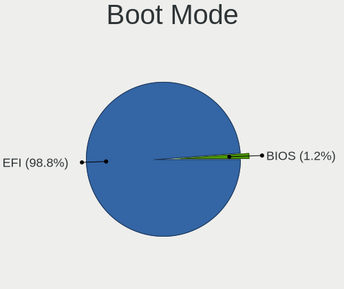

| Mode | Computers | Percent |
|------|-----------|---------|
| EFI  | 570       | 98.79%  |
| BIOS | 7         | 1.21%   |

Filesystem
----------

Type of filesystem

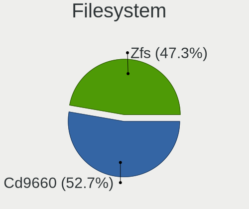

| Type   | Computers | Percent |
|--------|-----------|---------|
| Cd9660 | 308       | 52.74%  |
| Zfs    | 276       | 47.26%  |

Part. scheme
------------

Scheme of partitioning

| Type | Computers | Percent |
|------|-----------|---------|
| GPT  | 570       | 98.79%  |
| MBR  | 7         | 1.21%   |

Board
-----

Vendor
------

Motherboard manufacturer

| Name                                 | Computers | Percent |
|--------------------------------------|-----------|---------|
| Lenovo                               | 119       | 20.62%  |
| ASUSTek Computer                     | 85        | 14.73%  |
| Hewlett-Packard                      | 82        | 14.21%  |
| Dell                                 | 60        | 10.4%   |
| Gigabyte Technology                  | 41        | 7.11%   |
| Acer                                 | 22        | 3.81%   |
| MSI                                  | 21        | 3.64%   |
| Intel                                | 15        | 2.6%    |
| ASRock                               | 15        | 2.6%    |
| Apple                                | 15        | 2.6%    |
| Fujitsu                              | 14        | 2.43%   |
| Samsung Electronics                  | 11        | 1.91%   |
| Toshiba                              | 10        | 1.73%   |
| Unknown                              | 8         | 1.39%   |
| Sony                                 | 5         | 0.87%   |
| Google                               | 4         | 0.69%   |
| T-bao                                | 2         | 0.35%   |
| Pegatron                             | 2         | 0.35%   |
| Panasonic                            | 2         | 0.35%   |
| Packard Bell                         | 2         | 0.35%   |
| LG Electronics                       | 2         | 0.35%   |
| Fujitsu Siemens                      | 2         | 0.35%   |
| Foxconn                              | 2         | 0.35%   |
| Biostar                              | 2         | 0.35%   |
| AZW                                  | 2         | 0.35%   |
| TUXEDO                               | 1         | 0.17%   |
| Trigkey                              | 1         | 0.17%   |
| Timi                                 | 1         | 0.17%   |
| Thomson                              | 1         | 0.17%   |
| Supermicro                           | 1         | 0.17%   |
| Shuttle                              | 1         | 0.17%   |
| Shenzhen Meigao Electronic Equipment | 1         | 0.17%   |
| Plaisio                              | 1         | 0.17%   |
| OEGStone                             | 1         | 0.17%   |
| NVN-ED01                             | 1         | 0.17%   |
| Notebook                             | 1         | 0.17%   |
| Microsoft                            | 1         | 0.17%   |
| Medion                               | 1         | 0.17%   |
| Maibenben                            | 1         | 0.17%   |
| Itautec                              | 1         | 0.17%   |

Model
-----

Motherboard model

| Name                            | Computers | Percent |
|---------------------------------|-----------|---------|
| Unknown                         | 12        | 2.08%   |
| ASUS All Series                 | 5         | 0.87%   |
| HP ProDesk 600 G1 DM            | 3         | 0.52%   |
| Dell OptiPlex 780               | 3         | 0.52%   |
| ASUS PRIME B250M-A              | 3         | 0.52%   |
| T-bao MINI PC                   | 2         | 0.35%   |
| MSI MS-7788                     | 2         | 0.35%   |
| Intel H81                       | 2         | 0.35%   |
| HP Pavilion Notebook            | 2         | 0.35%   |
| HP Pavilion g6                  | 2         | 0.35%   |
| HP Laptop 14-bs0xx              | 2         | 0.35%   |
| HP EliteDesk 800 G2 DM 35W      | 2         | 0.35%   |
| HP EliteBook 840 G3             | 2         | 0.35%   |
| HP Compaq Elite 8300 USDT       | 2         | 0.35%   |
| HP 255 15.6 inch G9 Notebook PC | 2         | 0.35%   |
| HP 2000                         | 2         | 0.35%   |
| Gigabyte B550 GAMING X V2       | 2         | 0.35%   |
| Dell OptiPlex 9020              | 2         | 0.35%   |
| Dell OptiPlex 755               | 2         | 0.35%   |
| Dell OptiPlex 7010              | 2         | 0.35%   |
| Dell OptiPlex 3020              | 2         | 0.35%   |
| ASUS ROG STRIX B550-F GAMING    | 2         | 0.35%   |
| ASUS M5A78L-M/USB3              | 2         | 0.35%   |
| Apple MacBookPro9,2             | 2         | 0.35%   |
| Apple MacBook5,1                | 2         | 0.35%   |
| Apple MacBook4,1                | 2         | 0.35%   |
| Acer Spin SP314-21              | 2         | 0.35%   |
| TUXEDO Aura 15 Gen1             | 1         | 0.17%   |
| Trigkey S5                      | 1         | 0.17%   |
| Toshiba Satellite P300          | 1         | 0.17%   |
| Toshiba Satellite L675D         | 1         | 0.17%   |
| Toshiba Satellite L50-B         | 1         | 0.17%   |
| Toshiba Satellite L40           | 1         | 0.17%   |
| Toshiba Satellite C845          | 1         | 0.17%   |
| Toshiba Satellite C800D         | 1         | 0.17%   |
| Toshiba Satellite A200          | 1         | 0.17%   |
| Toshiba QOSMIO X775             | 1         | 0.17%   |
| Toshiba PORTEGE R700            | 1         | 0.17%   |
| Timi TM1701                     | 1         | 0.17%   |
| Thomson N15C                    | 1         | 0.17%   |

Model Family
------------

Motherboard model prefix

| Name                    | Computers | Percent |
|-------------------------|-----------|---------|
| Lenovo ThinkPad         | 68        | 11.79%  |
| Dell Latitude           | 21        | 3.64%   |
| ASUS PRIME              | 19        | 3.29%   |
| Lenovo IdeaPad          | 17        | 2.95%   |
| Dell OptiPlex           | 17        | 2.95%   |
| HP Pavilion             | 15        | 2.6%    |
| Lenovo ThinkCentre      | 14        | 2.43%   |
| HP Compaq               | 14        | 2.43%   |
| Dell Inspiron           | 12        | 2.08%   |
| Acer Aspire             | 12        | 2.08%   |
| Unknown                 | 12        | 2.08%   |
| HP ProDesk              | 8         | 1.39%   |
| HP Laptop               | 8         | 1.39%   |
| ASUS ROG                | 8         | 1.39%   |
| Toshiba Satellite       | 7         | 1.21%   |
| HP EliteDesk            | 6         | 1.04%   |
| HP EliteBook            | 6         | 1.04%   |
| Fujitsu LIFEBOOK        | 5         | 0.87%   |
| ASUS VivoBook           | 5         | 0.87%   |
| ASUS All                | 5         | 0.87%   |
| Gigabyte B450M          | 4         | 0.69%   |
| Dell Vostro             | 4         | 0.69%   |
| Dell Precision          | 4         | 0.69%   |
| Lenovo Yoga             | 3         | 0.52%   |
| Gigabyte B550           | 3         | 0.52%   |
| Fujitsu ESPRIMO         | 3         | 0.52%   |
| ASUS TUF                | 3         | 0.52%   |
| Apple MacBook5          | 3         | 0.52%   |
| T-bao MINI              | 2         | 0.35%   |
| MSI MS-7788             | 2         | 0.35%   |
| Lenovo Legion           | 2         | 0.35%   |
| Intel H81               | 2         | 0.35%   |
| HP Stream               | 2         | 0.35%   |
| HP ProBook              | 2         | 0.35%   |
| HP 255                  | 2         | 0.35%   |
| HP 2000                 | 2         | 0.35%   |
| Fujitsu Siemens ESPRIMO | 2         | 0.35%   |
| Fujitsu CELSIUS         | 2         | 0.35%   |
| ASUS M5A78L-M           | 2         | 0.35%   |
| Apple MacBookPro9       | 2         | 0.35%   |

MFG Year
--------

Motherboard manufacture year

| Year    | Computers | Percent |
|---------|-----------|---------|
| 2011    | 48        | 8.32%   |
| 2012    | 47        | 8.15%   |
| 2022    | 46        | 7.97%   |
| 2020    | 46        | 7.97%   |
| 2013    | 43        | 7.45%   |
| 2021    | 40        | 6.93%   |
| 2019    | 37        | 6.41%   |
| 2010    | 34        | 5.89%   |
| 2016    | 33        | 5.72%   |
| 2017    | 32        | 5.55%   |
| 2014    | 32        | 5.55%   |
| 2018    | 28        | 4.85%   |
| 2009    | 27        | 4.68%   |
| 2015    | 24        | 4.16%   |
| 2023    | 22        | 3.81%   |
| 2008    | 21        | 3.64%   |
| 2007    | 9         | 1.56%   |
| 2006    | 4         | 0.69%   |
| 2024    | 3         | 0.52%   |
| Unknown | 1         | 0.17%   |

Form Factor
-----------

Physical design of the computer

| Name        | Computers | Percent |
|-------------|-----------|---------|
| Notebook    | 299       | 51.82%  |
| Desktop     | 253       | 43.85%  |
| Mini pc     | 11        | 1.91%   |
| Convertible | 8         | 1.39%   |
| All in one  | 3         | 0.52%   |
| Server      | 2         | 0.35%   |
| Tablet      | 1         | 0.17%   |

Coreboot
--------

Have coreboot on board

| Used | Computers | Percent |
|------|-----------|---------|
| No   | 571       | 98.96%  |
| Yes  | 6         | 1.04%   |

RAM Size
--------

Total RAM memory

| Size in GB  | Computers | Percent |
|-------------|-----------|---------|
| 8.01-16.0   | 201       | 34.72%  |
| 16.01-24.0  | 142       | 24.53%  |
| 4.01-8.0    | 141       | 24.35%  |
| 32.01-64.0  | 39        | 6.74%   |
| 2.01-3.0    | 28        | 4.84%   |
| 64.01-256.0 | 12        | 2.07%   |
| 3.01-4.0    | 11        | 1.9%    |
| 24.01-32.0  | 4         | 0.69%   |
| 0.51-1.0    | 1         | 0.17%   |

RAM Used
--------

Used RAM memory

| Used GB   | Computers | Percent |
|-----------|-----------|---------|
| 0.01-0.5  | 310       | 53.45%  |
| 0.51-1.0  | 181       | 31.21%  |
| 1.01-2.0  | 63        | 10.86%  |
| 2.01-3.0  | 20        | 3.45%   |
| 3.01-4.0  | 3         | 0.52%   |
| 4.01-8.0  | 2         | 0.34%   |
| 8.01-16.0 | 1         | 0.17%   |

Total Drives
------------

Number of drives on board

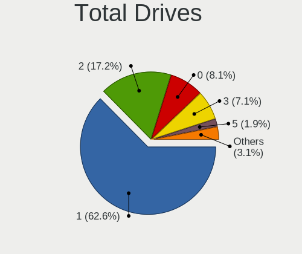

| Drives | Computers | Percent |
|--------|-----------|---------|
| 1      | 363       | 62.59%  |
| 2      | 100       | 17.24%  |
| 0      | 47        | 8.1%    |
| 3      | 41        | 7.07%   |
| 5      | 11        | 1.9%    |
| 4      | 11        | 1.9%    |
| 9      | 2         | 0.34%   |
| 6      | 2         | 0.34%   |
| 13     | 1         | 0.17%   |
| 8      | 1         | 0.17%   |
| 7      | 1         | 0.17%   |

Has CD-ROM
----------

Has CD-ROM on board

| Presented | Computers | Percent |
|-----------|-----------|---------|
| No        | 375       | 64.99%  |
| Yes       | 202       | 35.01%  |

Has Ethernet
------------

Has Ethernet on board

| Presented | Computers | Percent |
|-----------|-----------|---------|
| Yes       | 526       | 91.16%  |
| No        | 51        | 8.84%   |

Has WiFi
--------

Has WiFi module

| Presented | Computers | Percent |
|-----------|-----------|---------|
| Yes       | 383       | 66.26%  |
| No        | 195       | 33.74%  |

Has Bluetooth
-------------

Has Bluetooth module

| Presented | Computers | Percent |
|-----------|-----------|---------|
| Yes       | 298       | 51.56%  |
| No        | 280       | 48.44%  |

Location
--------

Country
-------

Geographic location (country)

| Country     | Computers | Percent |
|-------------|-----------|---------|
| USA         | 94        | 16.29%  |
| Russia      | 57        | 9.88%   |
| Germany     | 41        | 7.11%   |
| Brazil      | 32        | 5.55%   |
| Poland      | 30        | 5.2%    |
| Spain       | 24        | 4.16%   |
| Italy       | 22        | 3.81%   |
| France      | 21        | 3.64%   |
| UK          | 17        | 2.95%   |
| Indonesia   | 16        | 2.77%   |
| Canada      | 16        | 2.77%   |
| India       | 15        | 2.6%    |
| Hungary     | 12        | 2.08%   |
| China       | 12        | 2.08%   |
| Australia   | 11        | 1.91%   |
| Turkey      | 10        | 1.73%   |
| Netherlands | 10        | 1.73%   |
| Mexico      | 10        | 1.73%   |
| Romania     | 9         | 1.56%   |
| Belgium     | 8         | 1.39%   |
| Serbia      | 7         | 1.21%   |
| Ukraine     | 6         | 1.04%   |
| Finland     | 6         | 1.04%   |
| Bulgaria    | 6         | 1.04%   |
| Portugal    | 5         | 0.87%   |
| Switzerland | 4         | 0.69%   |
| South Korea | 4         | 0.69%   |
| Japan       | 4         | 0.69%   |
| Argentina   | 4         | 0.69%   |
| Sweden      | 3         | 0.52%   |
| Peru        | 3         | 0.52%   |
| Lithuania   | 3         | 0.52%   |
| Israel      | 3         | 0.52%   |
| Estonia     | 3         | 0.52%   |
| Czechia     | 3         | 0.52%   |
| Chile       | 3         | 0.52%   |
| Slovenia    | 2         | 0.35%   |
| Kazakhstan  | 2         | 0.35%   |
| Ireland     | 2         | 0.35%   |
| Greece      | 2         | 0.35%   |

City
----

Geographic location (city)

| City               | Computers | Percent |
|--------------------|-----------|---------|
| St Petersburg      | 12        | 2.04%   |
| Berlin             | 8         | 1.36%   |
| Sao Paulo          | 7         | 1.19%   |
| Moscow             | 7         | 1.19%   |
| Sydney             | 6         | 1.02%   |
| Kochi              | 5         | 0.85%   |
| Wroclaw            | 4         | 0.68%   |
| St. Jean Baptiste  | 4         | 0.68%   |
| Madrid             | 4         | 0.68%   |
| Istanbul           | 4         | 0.68%   |
| Budapest           | 4         | 0.68%   |
| Warsaw             | 3         | 0.51%   |
| Sofia              | 3         | 0.51%   |
| Santiago           | 3         | 0.51%   |
| Sanford            | 3         | 0.51%   |
| Paris              | 3         | 0.51%   |
| Newburgh           | 3         | 0.51%   |
| Montreal           | 3         | 0.51%   |
| Milan              | 3         | 0.51%   |
| Krakow             | 3         | 0.51%   |
| Brooklyn           | 3         | 0.51%   |
| Brisbane           | 3         | 0.51%   |
| Belgrade           | 3         | 0.51%   |
| Ankara             | 3         | 0.51%   |
| Zurich             | 2         | 0.34%   |
| Yogyakarta         | 2         | 0.34%   |
| Woodbridge         | 2         | 0.34%   |
| Vilnius            | 2         | 0.34%   |
| Vienna             | 2         | 0.34%   |
| Vantaa             | 2         | 0.34%   |
| Valga              | 2         | 0.34%   |
| Valencia           | 2         | 0.34%   |
| Surabaya           | 2         | 0.34%   |
| Stuttgart          | 2         | 0.34%   |
| St Albans          | 2         | 0.34%   |
| Shenzhen           | 2         | 0.34%   |
| Shanghai           | 2         | 0.34%   |
| Santo Domingo Este | 2         | 0.34%   |
| Peterborough       | 2         | 0.34%   |
| Perm               | 2         | 0.34%   |

Drives
------

Drive Vendor
------------

Hard drive vendors

| Vendor              | Computers | Drives | Percent |
|---------------------|-----------|--------|---------|
| Samsung Electronics | 108       | 136    | 14.44%  |
| WDC                 | 101       | 144    | 13.5%   |
| Seagate             | 95        | 127    | 12.7%   |
| Kingston            | 65        | 66     | 8.69%   |
| Toshiba             | 49        | 57     | 6.55%   |
| SanDisk             | 34        | 34     | 4.55%   |
| Crucial             | 32        | 39     | 4.28%   |
| Hitachi             | 30        | 33     | 4.01%   |
| A-DATA Technology   | 21        | 22     | 2.81%   |
| Intel               | 15        | 16     | 2.01%   |
| Transcend           | 12        | 12     | 1.6%    |
| Micron Technology   | 12        | 13     | 1.6%    |
| HGST                | 12        | 15     | 1.6%    |
| SK hynix            | 10        | 10     | 1.34%   |
| China               | 10        | 11     | 1.34%   |
| Patriot             | 9         | 9      | 1.2%    |
| SPCC                | 8         | 9      | 1.07%   |
| Gigabyte Technology | 6         | 7      | 0.8%    |
| PNY                 | 5         | 5      | 0.67%   |
| Maxtor              | 5         | 5      | 0.67%   |
| KingSpec            | 5         | 5      | 0.67%   |
| GOODRAM             | 5         | 5      | 0.67%   |
| Apple               | 5         | 5      | 0.67%   |
| Team                | 4         | 4      | 0.53%   |
| Lexar               | 4         | 4      | 0.53%   |
| Intenso             | 4         | 4      | 0.53%   |
| Dogfish             | 4         | 4      | 0.53%   |
| Silicon Motion      | 3         | 3      | 0.4%    |
| OCZ                 | 3         | 3      | 0.4%    |
| Netac               | 3         | 3      | 0.4%    |
| KIOXIA              | 3         | 3      | 0.4%    |
| Fujitsu             | 3         | 4      | 0.4%    |
| Apacer              | 3         | 3      | 0.4%    |
| AMD                 | 3         | 3      | 0.4%    |
| XPG                 | 2         | 3      | 0.27%   |
| Verbatim            | 2         | 2      | 0.27%   |
| Vaseky              | 2         | 2      | 0.27%   |
| Phison              | 2         | 2      | 0.27%   |
| MidasForce          | 2         | 2      | 0.27%   |
| LITEONIT            | 2         | 2      | 0.27%   |

Drive Model
-----------

Hard drive models

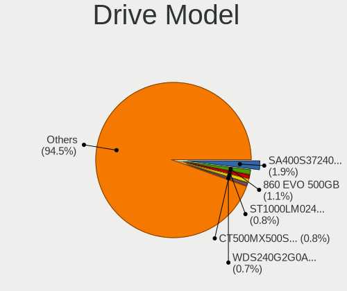

| Model                              | Computers | Percent |
|------------------------------------|-----------|---------|
| Kingston SA400S37240G 240GB        | 16        | 1.94%   |
| Samsung SSD 860 EVO 500GB          | 9         | 1.09%   |
| Seagate ST1000LM024 HN-M101MBB 1TB | 7         | 0.85%   |
| Crucial CT500MX500SSD1 500GB       | 7         | 0.85%   |
| WDC WDS240G2G0A-00JH30 240GB       | 6         | 0.73%   |
| Seagate ST500DM002-1BD142 500GB    | 6         | 0.73%   |
| Samsung SSD 850 EVO 250GB          | 6         | 0.73%   |
| Toshiba MQ01ABF050 500GB           | 5         | 0.61%   |
| Seagate ST3500418AS 500GB          | 5         | 0.61%   |
| Seagate ST1000DM010-2EP102 1TB     | 5         | 0.61%   |
| Kingston SA400S37120G 120GB        | 5         | 0.61%   |
| Crucial CT240BX500SSD1 240GB       | 5         | 0.61%   |
| Toshiba DT01ACA100 1TB             | 4         | 0.49%   |
| Samsung SSD 980 1TB                | 4         | 0.49%   |
| Samsung SSD 870 EVO 500GB          | 4         | 0.49%   |
| Crucial CT480BX500SSD1 480GB       | 4         | 0.49%   |
| A-DATA SU650 120GB                 | 4         | 0.49%   |
| WDC WDS500G2B0A-00SM50 500GB       | 3         | 0.36%   |
| WDC WDS120G2G0A-00JH30 120GB       | 3         | 0.36%   |
| WDC WD20EFRX-68EUZN0 2TB           | 3         | 0.36%   |
| WDC WD10EZEX-60WN4A0 1TB           | 3         | 0.36%   |
| WDC WD10EZEX-08WN4A0 1TB           | 3         | 0.36%   |
| Transcend TS120GSSD220S 120GB      | 3         | 0.36%   |
| Toshiba HDWD110 1TB                | 3         | 0.36%   |
| SPCC Solid State Disk 128GB        | 3         | 0.36%   |
| Seagate ST9500325AS 500GB          | 3         | 0.36%   |
| Seagate ST9250410AS 250GB          | 3         | 0.36%   |
| Seagate ST500LT012-1DG142 500GB    | 3         | 0.36%   |
| Seagate ST380815AS 80GB            | 3         | 0.36%   |
| Seagate ST2000DM008-2FR102 2TB     | 3         | 0.36%   |
| SanDisk SSD PLUS 120GB             | 3         | 0.36%   |
| Samsung SSD 980 500GB              | 3         | 0.36%   |
| Samsung SSD 970 EVO Plus 500GB     | 3         | 0.36%   |
| Samsung SSD 970 EVO Plus 1TB       | 3         | 0.36%   |
| Samsung SSD 860 EVO 250GB          | 3         | 0.36%   |
| Samsung SSD 860 EVO 1TB            | 3         | 0.36%   |
| Kingston SV300S37A240G 240GB       | 3         | 0.36%   |
| Kingston SV300S37A120G 120GB       | 3         | 0.36%   |
| Kingston SUV400S37240G 240GB       | 3         | 0.36%   |
| Kingston SNV2S1000G 1TB            | 3         | 0.36%   |

HDD Vendor
----------

Hard disk drive vendors

| Vendor              | Computers | Drives | Percent |
|---------------------|-----------|--------|---------|
| Seagate             | 94        | 126    | 33.33%  |
| WDC                 | 76        | 110    | 26.95%  |
| Toshiba             | 43        | 49     | 15.25%  |
| Hitachi             | 30        | 33     | 10.64%  |
| Samsung Electronics | 14        | 17     | 4.96%   |
| HGST                | 12        | 15     | 4.26%   |
| Maxtor              | 5         | 5      | 1.77%   |
| Fujitsu             | 3         | 4      | 1.06%   |
| Apple               | 3         | 3      | 1.06%   |
| QUANTUM             | 1         | 1      | 0.35%   |
| Hewlett-Packard     | 1         | 2      | 0.35%   |

SSD Vendor
----------

Solid state drive vendors

| Vendor              | Computers | Drives | Percent |
|---------------------|-----------|--------|---------|
| Samsung Electronics | 54        | 64     | 15.84%  |
| Kingston            | 50        | 51     | 14.66%  |
| SanDisk             | 34        | 34     | 9.97%   |
| Crucial             | 27        | 32     | 7.92%   |
| WDC                 | 19        | 20     | 5.57%   |
| A-DATA Technology   | 14        | 14     | 4.11%   |
| Transcend           | 10        | 10     | 2.93%   |
| Intel               | 10        | 10     | 2.93%   |
| China               | 10        | 11     | 2.93%   |
| SPCC                | 7         | 8      | 2.05%   |
| Patriot             | 7         | 7      | 2.05%   |
| Micron Technology   | 7         | 7      | 2.05%   |
| Toshiba             | 5         | 7      | 1.47%   |
| PNY                 | 5         | 5      | 1.47%   |
| KingSpec            | 5         | 5      | 1.47%   |
| GOODRAM             | 5         | 5      | 1.47%   |
| Intenso             | 4         | 4      | 1.17%   |
| Gigabyte Technology | 4         | 5      | 1.17%   |
| Dogfish             | 4         | 4      | 1.17%   |
| Team                | 3         | 3      | 0.88%   |
| OCZ                 | 3         | 3      | 0.88%   |
| Apacer              | 3         | 3      | 0.88%   |
| Verbatim            | 2         | 2      | 0.59%   |
| Vaseky              | 2         | 2      | 0.59%   |
| MidasForce          | 2         | 2      | 0.59%   |
| LITEONIT            | 2         | 2      | 0.59%   |
| Lexar               | 2         | 2      | 0.59%   |
| KIOXIA-EXCERIA      | 2         | 2      | 0.59%   |
| faspeed             | 2         | 2      | 0.59%   |
| Fanxiang            | 2         | 2      | 0.59%   |
| Biostar             | 2         | 2      | 0.59%   |
| BHT                 | 2         | 2      | 0.59%   |
| Apple               | 2         | 2      | 0.59%   |
| XUM                 | 1         | 1      | 0.29%   |
| XrayDisk            | 1         | 1      | 0.29%   |
| WALRAM              | 1         | 1      | 0.29%   |
| V-GeN               | 1         | 1      | 0.29%   |
| TAMMUZ              | 1         | 1      | 0.29%   |
| T-FORCE             | 1         | 1      | 0.29%   |
| SUNEAST             | 1         | 1      | 0.29%   |

Drive Kind
----------

HDD or SSD

| Kind | Computers | Drives | Percent |
|------|-----------|--------|---------|
| SSD  | 291       | 363    | 43.24%  |
| HDD  | 252       | 365    | 37.44%  |
| NVMe | 130       | 154    | 19.32%  |

Drive Connector
---------------

SATA, SAS, NVMe, etc.

| Type | Computers | Drives | Percent |
|------|-----------|--------|---------|
| SATA | 470       | 728    | 78.33%  |
| NVMe | 130       | 154    | 21.67%  |

Drive Size
----------

Size of hard drive

| Size in TB | Computers | Drives | Percent |
|------------|-----------|--------|---------|
| 0.01-0.5   | 405       | 520    | 73.91%  |
| 0.51-1.0   | 96        | 121    | 17.52%  |
| 1.01-2.0   | 28        | 52     | 5.11%   |
| 3.01-4.0   | 9         | 13     | 1.64%   |
| 4.01-10.0  | 5         | 14     | 0.91%   |
| 2.01-3.0   | 4         | 7      | 0.73%   |
| 10.01-20.0 | 1         | 1      | 0.18%   |

Space Total
-----------

Amount of disk space available on the file system

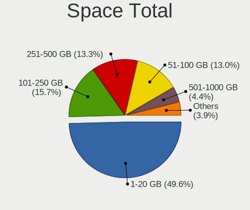

| Size in GB | Computers | Percent |
|------------|-----------|---------|
| 1-20       | 290       | 49.57%  |
| 101-250    | 92        | 15.73%  |
| 251-500    | 78        | 13.33%  |
| 51-100     | 76        | 12.99%  |
| 501-1000   | 26        | 4.44%   |
| 21-50      | 16        | 2.74%   |
| 1001-2000  | 4         | 0.68%   |
| Unknown    | 3         | 0.51%   |

Space Used
----------

Amount of used disk space

| Used GB | Computers | Percent |
|---------|-----------|---------|
| 1-20    | 567       | 98.27%  |
| 21-50   | 3         | 0.52%   |
| 101-250 | 3         | 0.52%   |
| Unknown | 3         | 0.52%   |
| 251-500 | 1         | 0.17%   |

Malfunc. Drives
---------------

Drive models with a malfunction

| Model                              | Computers | Drives | Percent |
|------------------------------------|-----------|--------|---------|
| Seagate ST9500325AS 500GB          | 3         | 3      | 2.19%   |
| Seagate ST1000LM024 HN-M101MBB 1TB | 3         | 4      | 2.19%   |
| Toshiba MQ01ABF050 500GB           | 2         | 2      | 1.46%   |
| Toshiba MK3261GSY 320GB            | 2         | 2      | 1.46%   |
| Toshiba MK3259GSXP 320GB           | 2         | 2      | 1.46%   |
| Seagate ST9160827AS 160GB          | 2         | 2      | 1.46%   |
| Seagate ST500LM000-1EJ162 500GB    | 2         | 2      | 1.46%   |
| Seagate ST3500418AS 500GB          | 2         | 2      | 1.46%   |
| Seagate ST3320620AS 320GB          | 2         | 2      | 1.46%   |
| Hitachi HTS542525K9A300 250GB      | 2         | 2      | 1.46%   |
| HGST HTS725050A7E630 500GB         | 2         | 2      | 1.46%   |
| Crucial CT500MX500SSD1 500GB       | 2         | 3      | 1.46%   |
| WDC WDS480G2G0A-00JH30 480GB       | 1         | 1      | 0.73%   |
| WDC WDS240G2G0A-00JH30 240GB       | 1         | 1      | 0.73%   |
| WDC WD800JD-75MSA3 80GB            | 1         | 1      | 0.73%   |
| WDC WD6400BPVT-22HXZT3 640GB       | 1         | 1      | 0.73%   |
| WDC WD5000LPVX-22V0TT0 500GB       | 1         | 1      | 0.73%   |
| WDC WD5000BPVT-00HXZT1 500GB       | 1         | 1      | 0.73%   |
| WDC WD5000AAKX-08U6AA0 500GB       | 1         | 1      | 0.73%   |
| WDC WD5000AAKX-00ERMA0 500GB       | 1         | 1      | 0.73%   |
| WDC WD5000AAKS-08V0A0 500GB        | 1         | 1      | 0.73%   |
| WDC WD3200BPVT-80ZEST0 320GB       | 1         | 1      | 0.73%   |
| WDC WD30PURZ-85AKKY0 3TB           | 1         | 1      | 0.73%   |
| WDC WD30EFRX-68EUZN0 3TB           | 1         | 1      | 0.73%   |
| WDC WD2500BEVT-22ZCT0 250GB        | 1         | 1      | 0.73%   |
| WDC WD20EZRX-00D8PB0 2TB           | 1         | 1      | 0.73%   |
| WDC WD20EARS-00MVWB0 2TB           | 1         | 1      | 0.73%   |
| WDC WD20EADS-00W4B0 2TB            | 1         | 1      | 0.73%   |
| WDC WD1600YS-01SHB1 164GB          | 1         | 1      | 0.73%   |
| WDC WD1600AAJS-60Z0A0 160GB        | 1         | 1      | 0.73%   |
| WDC WD15EARS-00Z5B1 1.5TB          | 1         | 1      | 0.73%   |
| WDC WD10JPVX-60JC3T1 1TB           | 1         | 1      | 0.73%   |
| WDC WD10JPVX-60JC3T0 1TB           | 1         | 1      | 0.73%   |
| WDC WD10EZRX-00A8LB0 1TB           | 1         | 1      | 0.73%   |
| WDC WD10EZEX-60WN4A0 1TB           | 1         | 1      | 0.73%   |
| WDC WD10EZEX-60M2NA0 1TB           | 1         | 1      | 0.73%   |
| WDC WD10EARS-00MVWB0 1TB           | 1         | 1      | 0.73%   |
| WDC WD10EARS-003BB1 1TB            | 1         | 1      | 0.73%   |
| WDC WD10EADS-11M2B2 1TB            | 1         | 1      | 0.73%   |
| Transcend TS120GSSD220S 120GB      | 1         | 1      | 0.73%   |

Malfunc. Drive Vendor
---------------------

Vendors of faulty drives

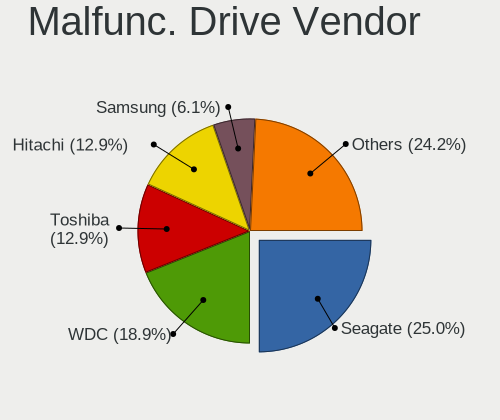

| Vendor              | Computers | Drives | Percent |
|---------------------|-----------|--------|---------|
| Seagate             | 33        | 38     | 25%     |
| WDC                 | 25        | 27     | 18.94%  |
| Toshiba             | 17        | 17     | 12.88%  |
| Hitachi             | 17        | 17     | 12.88%  |
| Samsung Electronics | 8         | 9      | 6.06%   |
| HGST                | 6         | 7      | 4.55%   |
| Crucial             | 5         | 6      | 3.79%   |
| Micron Technology   | 3         | 3      | 2.27%   |
| Maxtor              | 3         | 3      | 2.27%   |
| Kingston            | 3         | 3      | 2.27%   |
| SK hynix            | 2         | 2      | 1.52%   |
| Intel               | 2         | 2      | 1.52%   |
| Transcend           | 1         | 1      | 0.76%   |
| SSSTC               | 1         | 1      | 0.76%   |
| Silicon Motion      | 1         | 1      | 0.76%   |
| OCZ                 | 1         | 1      | 0.76%   |
| faspeed             | 1         | 1      | 0.76%   |
| China               | 1         | 1      | 0.76%   |
| Apple               | 1         | 1      | 0.76%   |
| A-DATA Technology   | 1         | 1      | 0.76%   |

Malfunc. HDD Vendor
-------------------

Vendors of faulty HDD drives

| Vendor              | Computers | Drives | Percent |
|---------------------|-----------|--------|---------|
| Seagate             | 33        | 38     | 31.73%  |
| WDC                 | 23        | 25     | 22.12%  |
| Toshiba             | 17        | 17     | 16.35%  |
| Hitachi             | 17        | 17     | 16.35%  |
| HGST                | 6         | 7      | 5.77%   |
| Samsung Electronics | 5         | 6      | 4.81%   |
| Maxtor              | 3         | 3      | 2.88%   |

Malfunc. Drive Kind
-------------------

Kinds of faulty drives

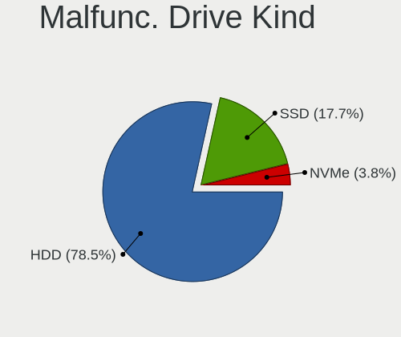

| Kind | Computers | Drives | Percent |
|------|-----------|--------|---------|
| HDD  | 102       | 113    | 78.46%  |
| SSD  | 23        | 24     | 17.69%  |
| NVMe | 5         | 5      | 3.85%   |

Failed Drives
-------------

Failed drive models

| Model                             | Computers | Drives | Percent |
|-----------------------------------|-----------|--------|---------|
| WDC WD7501AALS-00J7B0 752GB       | 1         | 1      | 16.67%  |
| WDC WD1600BEVT-22ZCT0 160GB       | 1         | 1      | 16.67%  |
| SanDisk pSSD 16GB                 | 1         | 1      | 16.67%  |
| Samsung Electronics HM500JJ 500GB | 1         | 1      | 16.67%  |
| Samsung Electronics HD103SJ 1TB   | 1         | 1      | 16.67%  |
| Hitachi HDS721032CLA362 320GB     | 1         | 1      | 16.67%  |

Failed Drive Vendor
-------------------

Failed drive vendors

| Vendor              | Computers | Drives | Percent |
|---------------------|-----------|--------|---------|
| WDC                 | 2         | 2      | 33.33%  |
| Samsung Electronics | 2         | 2      | 33.33%  |
| SanDisk             | 1         | 1      | 16.67%  |
| Hitachi             | 1         | 1      | 16.67%  |

Drive Status
------------

Number of failed and malfunc. drives

| Status   | Computers | Drives | Percent |
|----------|-----------|--------|---------|
| Works    | 434       | 712    | 74.44%  |
| Malfunc  | 128       | 142    | 21.96%  |
| Detected | 15        | 22     | 2.57%   |
| Failed   | 6         | 6      | 1.03%   |

Storage controller
------------------

Storage Vendor
--------------

Storage controller vendors

| Vendor                                  | Computers | Percent |
|-----------------------------------------|-----------|---------|
| Intel                                   | 435       | 62.05%  |
| AMD                                     | 85        | 12.13%  |
| Samsung Electronics                     | 46        | 6.56%   |
| SanDisk                                 | 19        | 2.71%   |
| Nvidia                                  | 15        | 2.14%   |
| Kingston Technology Company             | 15        | 2.14%   |
| Silicon Motion                          | 12        | 1.71%   |
| SK hynix                                | 9         | 1.28%   |
| ASMedia Technology                      | 9         | 1.28%   |
| Marvell Technology Group                | 7         | 1%      |
| Phison Electronics                      | 6         | 0.86%   |
| Micron/Crucial Technology               | 6         | 0.86%   |
| Micron Technology                       | 5         | 0.71%   |
| JMicron Technology                      | 5         | 0.71%   |
| ADATA Technology                        | 5         | 0.71%   |
| Realtek Semiconductor                   | 4         | 0.57%   |
| MAXIO Technology (Hangzhou)             | 3         | 0.43%   |
| KIOXIA                                  | 3         | 0.43%   |
| VIA Technologies                        | 2         | 0.29%   |
| Toshiba                                 | 1         | 0.14%   |
| Silicon Integrated Systems [SiS]        | 1         | 0.14%   |
| Shenzhen Unionmemory Information System | 1         | 0.14%   |
| Shenzhen Longsys Electronics            | 1         | 0.14%   |
| Seagate Technology                      | 1         | 0.14%   |
| OCZ Technology Group                    | 1         | 0.14%   |
| Hosin Global Electronics                | 1         | 0.14%   |
| Hewlett-Packard                         | 1         | 0.14%   |
| Broadcom / LSI                          | 1         | 0.14%   |
| Areca Technology                        | 1         | 0.14%   |

Storage Model
-------------

Storage controller models

| Model                                                                                   | Computers | Percent |
|-----------------------------------------------------------------------------------------|-----------|---------|
| AMD FCH SATA Controller [AHCI mode]                                                     | 47        | 5.81%   |
| Intel 8 Series/C220 Series Chipset Family 6-port SATA Controller 1 [AHCI mode]          | 39        | 4.82%   |
| Intel 7 Series Chipset Family 6-port SATA Controller [AHCI mode]                        | 38        | 4.7%    |
| Intel Sunrise Point-LP SATA Controller [AHCI mode]                                      | 31        | 3.83%   |
| Intel 6 Series/C200 Series Chipset Family 6 port Mobile SATA AHCI Controller            | 24        | 2.97%   |
| Samsung NVMe SSD Controller SM981/PM981/PM983                                           | 23        | 2.84%   |
| Intel Q170/Q150/B150/H170/H110/Z170/CM236 Chipset SATA Controller [AHCI Mode]           | 23        | 2.84%   |
| Intel 82801IBM/IEM (ICH9M/ICH9M-E) 4 port SATA Controller [AHCI mode]                   | 20        | 2.47%   |
| Intel 8 Series SATA Controller 1 [AHCI mode]                                            | 16        | 1.98%   |
| Intel 6 Series/C200 Series Chipset Family 6 port Desktop SATA AHCI Controller           | 16        | 1.98%   |
| Intel 200 Series PCH SATA controller [AHCI mode]                                        | 16        | 1.98%   |
| Intel 5 Series/3400 Series Chipset 4 port SATA AHCI Controller                          | 14        | 1.73%   |
| Intel 82801 Mobile SATA Controller [RAID mode]                                          | 13        | 1.61%   |
| AMD 400 Series Chipset SATA Controller                                                  | 13        | 1.61%   |
| Samsung NVMe SSD Controller 980 (DRAM-less)                                             | 12        | 1.48%   |
| AMD 500 Series Chipset SATA Controller                                                  | 12        | 1.48%   |
| Intel Atom/Celeron/Pentium Processor x5-E8000/J3xxx/N3xxx Series SATA Controller        | 11        | 1.36%   |
| Intel 82801HM/HEM (ICH8M/ICH8M-E) IDE Controller                                        | 11        | 1.36%   |
| Intel 7 Series/C210 Series Chipset Family 6-port SATA Controller [AHCI mode]            | 11        | 1.36%   |
| Silicon Motion SM2263EN/SM2263XT (DRAM-less) NVMe SSD Controllers                       | 10        | 1.24%   |
| Intel Wildcat Point-LP SATA Controller [AHCI Mode]                                      | 10        | 1.24%   |
| Intel Cannon Lake PCH SATA AHCI Controller                                              | 10        | 1.24%   |
| Intel 82801HM/HEM (ICH8M/ICH8M-E) SATA Controller [AHCI mode]                           | 10        | 1.24%   |
| AMD SB7x0/SB8x0/SB9x0 IDE Controller                                                    | 10        | 1.24%   |
| Intel NM10/ICH7 Family SATA Controller [AHCI mode]                                      | 8         | 0.99%   |
| Intel Celeron/Pentium Silver Processor SATA Controller                                  | 8         | 0.99%   |
| Intel 82801G (ICH7 Family) IDE Controller                                               | 8         | 0.99%   |
| Intel 6 Series/C200 Series Chipset Family Desktop SATA Controller (IDE mode, ports 4-5) | 8         | 0.99%   |
| Intel 6 Series/C200 Series Chipset Family Desktop SATA Controller (IDE mode, ports 0-3) | 8         | 0.99%   |
| Intel 500 Series Chipset Family SATA AHCI Controller                                    | 8         | 0.99%   |
| Intel 5 Series/3400 Series Chipset 6 port SATA AHCI Controller                          | 8         | 0.99%   |
| Intel 4 Series Chipset PT IDER Controller                                               | 8         | 0.99%   |
| AMD SB7x0/SB8x0/SB9x0 SATA Controller [IDE mode]                                        | 8         | 0.99%   |
| Nvidia MCP79 AHCI Controller                                                            | 7         | 0.87%   |
| Intel Volume Management Device NVMe RAID Controller                                     | 7         | 0.87%   |
| Intel NM10/ICH7 Family SATA Controller [IDE mode]                                       | 7         | 0.87%   |
| Intel Atom Processor E3800 Series SATA AHCI Controller                                  | 7         | 0.87%   |
| ASMedia ASM1061/ASM1062 Serial ATA Controller                                           | 7         | 0.87%   |
| AMD SB7x0/SB8x0/SB9x0 SATA Controller [AHCI mode]                                       | 7         | 0.87%   |
| Samsung NVMe SSD Controller SM961/PM961/SM963                                           | 6         | 0.74%   |

Storage Kind
------------

Kind of storage controller (IDE, SATA, NVMe, SAS, ...)

| Kind | Computers | Percent |
|------|-----------|---------|
| SATA | 458       | 65.06%  |
| NVMe | 130       | 18.47%  |
| IDE  | 85        | 12.07%  |
| RAID | 29        | 4.12%   |
| SAS  | 1         | 0.14%   |
| SCSI | 1         | 0.14%   |

Processor
---------

CPU Vendor
----------

Processor vendors

| Vendor | Computers | Percent |
|--------|-----------|---------|
| Intel  | 473       | 81.98%  |
| AMD    | 104       | 18.02%  |

CPU Model
---------

Processor models

| Model                                       | Computers | Percent |
|---------------------------------------------|-----------|---------|
| Intel Core i5-6500 CPU @ 3.20GHz            | 8         | 1.39%   |
| Intel Core i5-6300U CPU @ 2.40GHz           | 8         | 1.39%   |
| Intel CPU Version                           | 7         | 1.21%   |
| Intel Core i5-2520M CPU @ 2.50GHz           | 6         | 1.04%   |
| Intel Celeron CPU N3060 @ 1.60GHz           | 6         | 1.04%   |
| Intel Core i7-8550U CPU @ 1.80GHz           | 5         | 0.87%   |
| Intel Core i5-7300U CPU @ 2.60GHz           | 5         | 0.87%   |
| Intel Core i5-7200U CPU @ 2.50GHz           | 5         | 0.87%   |
| Intel Core i3-7100 CPU @ 3.90GHz            | 5         | 0.87%   |
| Intel Core 2 Duo CPU P7350 @ 2.00GHz        | 5         | 0.87%   |
| Intel Core 2 Duo                            | 5         | 0.87%   |
| Intel Celeron CPU N3050 @ 1.60GHz           | 5         | 0.87%   |
| AMD Ryzen 5 5600X 6-Core Processor          | 5         | 0.87%   |
| Intel Core i7-3770 CPU @ 3.40GHz            | 4         | 0.69%   |
| Intel Core i7-3520M CPU @ 2.90GHz           | 4         | 0.69%   |
| Intel Core i5-7400 CPU @ 3.00GHz            | 4         | 0.69%   |
| Intel Core i5-5200U CPU @ 2.20GHz           | 4         | 0.69%   |
| Intel Core i5-3320M CPU @ 2.60GHz           | 4         | 0.69%   |
| AMD Ryzen 5 3400G with Radeon Vega Graphics | 4         | 0.69%   |
| Intel Core i7-8700 CPU @ 3.20GHz            | 3         | 0.52%   |
| Intel Core i7-5500U CPU @ 2.40GHz           | 3         | 0.52%   |
| Intel Core i7-3720QM CPU @ 2.60GHz          | 3         | 0.52%   |
| Intel Core i7-2670QM CPU @ 2.20GHz          | 3         | 0.52%   |
| Intel Core i5-8250U CPU @ 1.60GHz           | 3         | 0.52%   |
| Intel Core i5-6500T CPU @ 2.50GHz           | 3         | 0.52%   |
| Intel Core i5-4570 CPU @ 3.20GHz            | 3         | 0.52%   |
| Intel Core i5-4460 CPU @ 3.20GHz            | 3         | 0.52%   |
| Intel Core i5-4210U CPU @ 1.70GHz           | 3         | 0.52%   |
| Intel Core i5-3337U CPU @ 1.80GHz           | 3         | 0.52%   |
| Intel Core i5-3210M CPU @ 2.50GHz           | 3         | 0.52%   |
| Intel Core i5-2540M CPU @ 2.60GHz           | 3         | 0.52%   |
| Intel Core i5-2410M CPU @ 2.30GHz           | 3         | 0.52%   |
| Intel Core i5-2400 CPU @ 3.10GHz            | 3         | 0.52%   |
| Intel Core i5-10210U CPU @ 1.60GHz          | 3         | 0.52%   |
| Intel Core i3-9100 CPU @ 3.60GHz            | 3         | 0.52%   |
| Intel Core i3-5005U CPU @ 2.00GHz           | 3         | 0.52%   |
| Intel Core i3-4160 CPU @ 3.60GHz            | 3         | 0.52%   |
| Intel Core i3-4130 CPU @ 3.40GHz            | 3         | 0.52%   |
| Intel Core i3-3220 CPU @ 3.30GHz            | 3         | 0.52%   |
| Intel Core i3-2100 CPU @ 3.10GHz            | 3         | 0.52%   |

CPU Model Family
----------------

Processor model prefix

| Model                   | Computers | Percent |
|-------------------------|-----------|---------|
| Intel Core i5           | 140       | 24.26%  |
| Intel Core i7           | 85        | 14.73%  |
| Intel Core i3           | 59        | 10.23%  |
| Intel Celeron           | 47        | 8.15%   |
| Intel Core 2 Duo        | 41        | 7.11%   |
| Other                   | 33        | 5.72%   |
| AMD Ryzen 5             | 28        | 4.85%   |
| AMD Ryzen 7             | 19        | 3.29%   |
| Intel Pentium           | 18        | 3.12%   |
| Intel Xeon              | 16        | 2.77%   |
| AMD Ryzen 3             | 10        | 1.73%   |
| Intel Atom              | 9         | 1.56%   |
| Intel Pentium Dual-Core | 7         | 1.21%   |
| AMD Athlon II X2        | 5         | 0.87%   |
| AMD A6                  | 4         | 0.69%   |
| Intel Pentium Silver    | 3         | 0.52%   |
| Intel Genuine           | 3         | 0.52%   |
| Intel Core 2 Quad       | 3         | 0.52%   |
| Intel Core 2            | 3         | 0.52%   |
| AMD Phenom II X4        | 3         | 0.52%   |
| AMD FX                  | 3         | 0.52%   |
| AMD E                   | 3         | 0.52%   |
| AMD Athlon              | 3         | 0.52%   |
| AMD A4                  | 3         | 0.52%   |
| Intel Pentium Gold      | 2         | 0.35%   |
| Intel Pentium Dual      | 2         | 0.35%   |
| Intel Core i9           | 2         | 0.35%   |
| AMD Phenom II X6        | 2         | 0.35%   |
| AMD E1                  | 2         | 0.35%   |
| AMD A10                 | 2         | 0.35%   |
| Intel Pentium 4         | 1         | 0.17%   |
| Intel Celeron Dual-Core | 1         | 0.17%   |
| Intel Celeron D         | 1         | 0.17%   |
| AMD Ryzen Embedded      | 1         | 0.17%   |
| AMD Ryzen 9             | 1         | 0.17%   |
| AMD Ryzen 3 PRO         | 1         | 0.17%   |
| AMD PRO A10             | 1         | 0.17%   |
| AMD Phenom II X2        | 1         | 0.17%   |
| AMD Phenom II           | 1         | 0.17%   |
| AMD GX                  | 1         | 0.17%   |

CPU Cores
---------

Number of processor cores

| Number  | Computers | Percent |
|---------|-----------|---------|
| 2       | 253       | 43.85%  |
| 4       | 183       | 31.72%  |
| Unknown | 42        | 7.28%   |
| 6       | 29        | 5.03%   |
| 12      | 24        | 4.16%   |
| 8       | 18        | 3.12%   |
| 16      | 16        | 2.77%   |
| 1       | 8         | 1.39%   |
| 10      | 2         | 0.35%   |
| 24      | 1         | 0.17%   |
| 14      | 1         | 0.17%   |

CPU Sockets
-----------

Number of sockets

| Number  | Computers | Percent |
|---------|-----------|---------|
| 1       | 563       | 97.57%  |
| 2       | 13        | 2.25%   |
| Unknown | 1         | 0.17%   |

CPU Threads
-----------

Threads per core (Hyper-Threading)

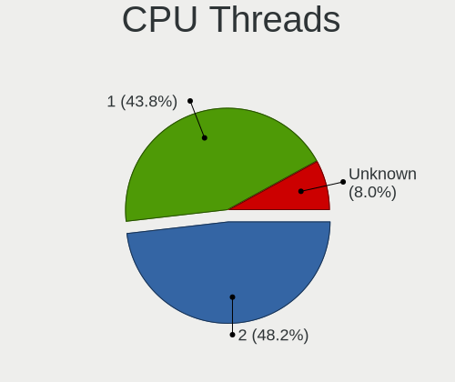

| Number  | Computers | Percent |
|---------|-----------|---------|
| 2       | 278       | 48.18%  |
| 1       | 253       | 43.85%  |
| Unknown | 46        | 7.97%   |

CPU Microarch
-------------

Microarchitecture

| Name          | Computers | Percent |
|---------------|-----------|---------|
| KabyLake      | 72        | 12.48%  |
| Haswell       | 65        | 11.27%  |
| IvyBridge     | 54        | 9.36%   |
| SandyBridge   | 49        | 8.49%   |
| Penryn        | 44        | 7.63%   |
| Skylake       | 40        | 6.93%   |
| Core          | 25        | 4.33%   |
| Zen 3         | 23        | 3.99%   |
| Westmere      | 23        | 3.99%   |
| Silvermont    | 23        | 3.99%   |
| Unknown       | 23        | 3.99%   |
| Zen+          | 20        | 3.47%   |
| Broadwell     | 15        | 2.6%    |
| K10           | 14        | 2.43%   |
| Zen           | 9         | 1.56%   |
| CometLake     | 9         | 1.56%   |
| Bonnell       | 9         | 1.56%   |
| TigerLake     | 8         | 1.39%   |
| Piledriver    | 8         | 1.39%   |
| Goldmont plus | 8         | 1.39%   |
| Zen 2         | 7         | 1.21%   |
| Bobcat        | 7         | 1.21%   |
| Nehalem       | 5         | 0.87%   |
| Excavator     | 5         | 0.87%   |
| Goldmont      | 4         | 0.69%   |
| K8 Hammer     | 2         | 0.35%   |
| Jaguar        | 2         | 0.35%   |
| NetBurst      | 1         | 0.17%   |
| K10 Llano     | 1         | 0.17%   |
| IceLake       | 1         | 0.17%   |
| Bulldozer     | 1         | 0.17%   |

Graphics
--------

GPU Vendor
----------

Vendors of graphics cards

| Vendor                           | Computers | Percent |
|----------------------------------|-----------|---------|
| Intel                            | 373       | 57.3%   |
| Nvidia                           | 138       | 21.2%   |
| AMD                              | 137       | 21.04%  |
| Matrox Electronics Systems       | 2         | 0.31%   |
| Silicon Integrated Systems [SiS] | 1         | 0.15%   |

GPU Model
---------

Graphics card models

| Model                                                                                    | Computers | Percent |
|------------------------------------------------------------------------------------------|-----------|---------|
| Intel 2nd Generation Core Processor Family Integrated Graphics Controller                | 40        | 5.99%   |
| Intel 3rd Gen Core processor Graphics Controller                                         | 32        | 4.79%   |
| Intel Xeon E3-1200 v3/4th Gen Core Processor Integrated Graphics Controller              | 22        | 3.29%   |
| Intel Core Processor Integrated Graphics Controller                                      | 18        | 2.69%   |
| Intel HD Graphics 530                                                                    | 17        | 2.54%   |
| Intel Haswell-ULT Integrated Graphics Controller                                         | 17        | 2.54%   |
| Intel Atom/Celeron/Pentium Processor x5-E8000/J3xxx/N3xxx Integrated Graphics Controller | 16        | 2.4%    |
| AMD Picasso/Raven 2 [Radeon Vega Series / Radeon Vega Mobile Series]                     | 16        | 2.4%    |
| Intel HD Graphics 630                                                                    | 15        | 2.25%   |
| Intel Mobile 4 Series Chipset Integrated Graphics Controller                             | 14        | 2.1%    |
| Intel UHD Graphics 620                                                                   | 13        | 1.95%   |
| Intel HD Graphics 5500                                                                   | 13        | 1.95%   |
| Intel Skylake GT2 [HD Graphics 520]                                                      | 12        | 1.8%    |
| Intel Mobile GM965/GL960 Integrated Graphics Controller (secondary)                      | 12        | 1.8%    |
| Intel Mobile GM965/GL960 Integrated Graphics Controller (primary)                        | 12        | 1.8%    |
| Intel HD Graphics 620                                                                    | 12        | 1.8%    |
| AMD Ellesmere [Radeon RX 470/480/570/570X/580/580X/590]                                  | 10        | 1.5%    |
| Intel 4th Gen Core Processor Integrated Graphics Controller                              | 9         | 1.35%   |
| Intel Xeon E3-1200 v2/3rd Gen Core processor Graphics Controller                         | 8         | 1.2%    |
| Intel Atom Processor D4xx/D5xx/N4xx/N5xx Integrated Graphics Controller                  | 8         | 1.2%    |
| AMD Cezanne [Radeon Vega Series / Radeon Vega Mobile Series]                             | 8         | 1.2%    |
| Intel CoffeeLake-S GT2 [UHD Graphics 630]                                                | 7         | 1.05%   |
| Intel 4th Generation Core Processor Family Integrated Graphics Controller                | 7         | 1.05%   |
| Intel 4 Series Chipset Integrated Graphics Controller                                    | 7         | 1.05%   |
| AMD Lexa PRO [Radeon 540/540X/550/550X / RX 540X/550/550X]                               | 7         | 1.05%   |
| Nvidia GP107 [GeForce GTX 1050 Ti]                                                       | 6         | 0.9%    |
| Intel TigerLake-LP GT2 [Iris Xe Graphics]                                                | 6         | 0.9%    |
| Intel GeminiLake [UHD Graphics 600]                                                      | 6         | 0.9%    |
| Intel Atom Processor Z36xxx/Z37xxx Series Graphics & Display                             | 6         | 0.9%    |
| Intel CometLake-U GT2 [UHD Graphics]                                                     | 5         | 0.75%   |
| Intel CoffeeLake-H GT2 [UHD Graphics 630]                                                | 5         | 0.75%   |
| AMD Renoir [Radeon Vega Series / Radeon Vega Mobile Series]                              | 5         | 0.75%   |
| AMD Raven Ridge [Radeon Vega Series / Radeon Vega Mobile Series]                         | 5         | 0.75%   |
| Nvidia TU117M [GeForce GTX 1650 Mobile / Max-Q]                                          | 4         | 0.6%    |
| Nvidia GK208B [GeForce GT 710]                                                           | 4         | 0.6%    |
| Nvidia GF119 [GeForce GT 610]                                                            | 4         | 0.6%    |
| Nvidia C79 [GeForce 9400M]                                                               | 4         | 0.6%    |
| Intel HD Graphics 500                                                                    | 4         | 0.6%    |
| AMD Stoney [Radeon R2/R3/R4/R5 Graphics]                                                 | 4         | 0.6%    |
| AMD Lucienne                                                                             | 4         | 0.6%    |

GPU Combo
---------

Combinations of graphics cards

| Name                     | Computers | Percent |
|--------------------------|-----------|---------|
| 1 x Intel                | 266       | 45.86%  |
| 1 x AMD                  | 110       | 18.97%  |
| 1 x Nvidia               | 84        | 14.48%  |
| Intel + Nvidia           | 46        | 7.93%   |
| 2 x Intel                | 40        | 6.9%    |
| Intel + AMD              | 20        | 3.45%   |
| AMD + Nvidia             | 5         | 0.86%   |
| 2 x AMD                  | 2         | 0.34%   |
| 1 x Matrox               | 2         | 0.34%   |
| Other                    | 1         | 0.17%   |
| 2 x Nvidia               | 1         | 0.17%   |
| 2 x Intel + 1 x Nvidia   | 1         | 0.17%   |
| 1 x SiS                  | 1         | 0.17%   |
| Intel + AMD + 1 x Nvidia | 1         | 0.17%   |

GPU Driver
----------

Free vs proprietary

| Driver      | Computers | Percent |
|-------------|-----------|---------|
| Free        | 493       | 85.15%  |
| Proprietary | 65        | 11.23%  |
| Unknown     | 21        | 3.63%   |

GPU Memory
----------

Total video memory

| Size in GB | Computers | Percent |
|------------|-----------|---------|
| Unknown    | 456       | 78.49%  |
| 0.01-0.5   | 30        | 5.16%   |
| 1.01-2.0   | 25        | 4.3%    |
| 3.01-4.0   | 24        | 4.13%   |
| 0.51-1.0   | 22        | 3.79%   |
| 7.01-8.0   | 10        | 1.72%   |
| 5.01-6.0   | 8         | 1.38%   |
| 2.01-3.0   | 3         | 0.52%   |
| 8.01-16.0  | 3         | 0.52%   |

Monitor
-------

Monitor Vendor
--------------

Monitor vendors

| Vendor                  | Computers | Percent |
|-------------------------|-----------|---------|
| AU Optronics            | 47        | 14.2%   |
| Samsung Electronics     | 36        | 10.88%  |
| LG Display              | 29        | 8.76%   |
| Chimei Innolux          | 25        | 7.55%   |
| BOE                     | 20        | 6.04%   |
| Dell                    | 19        | 5.74%   |
| Acer                    | 18        | 5.44%   |
| Goldstar                | 15        | 4.53%   |
| Lenovo                  | 12        | 3.63%   |
| Hewlett-Packard         | 12        | 3.63%   |
| BenQ                    | 9         | 2.72%   |
| Ancor Communications    | 8         | 2.42%   |
| Philips                 | 7         | 2.11%   |
| Chi Mei Optoelectronics | 6         | 1.81%   |
| Apple                   | 6         | 1.81%   |
| AOC                     | 6         | 1.81%   |
| InfoVision              | 5         | 1.51%   |
| ASUSTek Computer        | 5         | 1.51%   |
| Unknown                 | 3         | 0.91%   |
| ViewSonic               | 2         | 0.6%    |
| Sharp                   | 2         | 0.6%    |
| SAC                     | 2         | 0.6%    |
| ONN                     | 2         | 0.6%    |
| LG Electronics          | 2         | 0.6%    |
| Fujitsu Siemens         | 2         | 0.6%    |
| Vizio                   | 1         | 0.3%    |
| UGD                     | 1         | 0.3%    |
| Toshiba                 | 1         | 0.3%    |
| Semp Toshiba            | 1         | 0.3%    |
| Quanta Display          | 1         | 0.3%    |
| PKB                     | 1         | 0.3%    |
| PANDA                   | 1         | 0.3%    |
| Nvidia                  | 1         | 0.3%    |
| NEC Computers           | 1         | 0.3%    |
| MTD                     | 1         | 0.3%    |
| MStar                   | 1         | 0.3%    |
| MSI                     | 1         | 0.3%    |
| Microstep               | 1         | 0.3%    |
| Mi                      | 1         | 0.3%    |
| Medion                  | 1         | 0.3%    |

Monitor Model
-------------

Monitor models

| Model                                                                    | Computers | Percent |
|--------------------------------------------------------------------------|-----------|---------|
| AU Optronics LCD Monitor AUO106C 1366x768 280x160mm 12.7-inch            | 6         | 1.81%   |
| Samsung Electronics LCD Monitor SEC3245 1366x768 340x190mm 15.3-inch     | 3         | 0.91%   |
| LG Display LCD Monitor LGD033A 1366x768 340x190mm 15.3-inch              | 3         | 0.91%   |
| Unknown                                                                  | 3         | 0.91%   |
| Samsung Electronics LCD Monitor SEC3047 1366x768 280x160mm 12.7-inch     | 2         | 0.6%    |
| SAC LED MONITOR SAC952D 1920x1080 600x340mm 27.2-inch                    | 2         | 0.6%    |
| ONN 100002487 ONN0101 1920x1080 520x320mm 24.0-inch                      | 2         | 0.6%    |
| LG Display LCD Monitor LGD032C 1920x1080 340x190mm 15.3-inch             | 2         | 0.6%    |
| LG Display LCD Monitor LGD02DC 1366x768 340x190mm 15.3-inch              | 2         | 0.6%    |
| Lenovo LCD Monitor LEN4022 1400x1050 290x210mm 14.1-inch                 | 2         | 0.6%    |
| Lenovo LCD Monitor LEN4010 1280x800 260x160mm 12.0-inch                  | 2         | 0.6%    |
| Goldstar W1934 GSM4B7A 1440x900 410x260mm 19.1-inch                      | 2         | 0.6%    |
| Chi Mei Optoelectronics LCD Monitor CMO15A2 1366x768 340x190mm 15.3-inch | 2         | 0.6%    |
| AU Optronics LCD Monitor AUO81EC 1366x768 340x190mm 15.3-inch            | 2         | 0.6%    |
| AU Optronics LCD Monitor AUO723C 1366x768 310x170mm 13.9-inch            | 2         | 0.6%    |
| AU Optronics LCD Monitor AUO403D 1920x1080 310x170mm 13.9-inch           | 2         | 0.6%    |
| AU Optronics LCD Monitor AUO2D3C 1366x768 310x170mm 13.9-inch            | 2         | 0.6%    |
| AU Optronics LCD Monitor AUO22EC 1366x768 340x190mm 15.3-inch            | 2         | 0.6%    |
| Ancor Communications ASUS PB238 ACI23A2 1920x1080 510x290mm 23.1-inch    | 2         | 0.6%    |
| Acer G276HL ACR0300 1920x1080 600x340mm 27.2-inch                        | 2         | 0.6%    |
| Vizio E321VL VIZ0083 1366x768 700x400mm 31.7-inch                        | 1         | 0.3%    |
| ViewSonic VA2719-2K VSC6B34 2560x1440 600x340mm 27.2-inch                | 1         | 0.3%    |
| ViewSonic TD2220 VSC052C 1920x1080 480x270mm 21.7-inch                   | 1         | 0.3%    |
| UGD Artist13.3pro UGD1302 1920x1080 290x160mm 13.0-inch                  | 1         | 0.3%    |
| Toshiba TV TSB0108 1360x768 890x500mm 40.2-inch                          | 1         | 0.3%    |
| Sharp LQ133M1JW01 SHP141B 1920x1080 290x170mm 13.2-inch                  | 1         | 0.3%    |
| Sharp LCD Monitor SHP143B 3840x2160 350x190mm 15.7-inch                  | 1         | 0.3%    |
| Semp Toshiba MLE1951 STI1951 1366x768 410x230mm 18.5-inch                | 1         | 0.3%    |
| Samsung Electronics SyncMaster SAM05FB 1920x1080 510x290mm 23.1-inch     | 1         | 0.3%    |
| Samsung Electronics SyncMaster SAM058F 1920x1080 480x270mm 21.7-inch     | 1         | 0.3%    |
| Samsung Electronics SyncMaster SAM058D 1600x900 440x250mm 19.9-inch      | 1         | 0.3%    |
| Samsung Electronics SyncMaster SAM0523 1920x1080 480x270mm 21.7-inch     | 1         | 0.3%    |
| Samsung Electronics SyncMaster SAM050B 1920x1080 480x270mm 21.7-inch     | 1         | 0.3%    |
| Samsung Electronics SyncMaster SAM030D 1680x1050 470x300mm 22.0-inch     | 1         | 0.3%    |
| Samsung Electronics SyncMaster SAM027E 1680x1050 470x300mm 22.0-inch     | 1         | 0.3%    |
| Samsung Electronics SMS27A850 SAM083D 2560x1440 520x320mm 24.0-inch      | 1         | 0.3%    |
| Samsung Electronics S27R35x SAM1053 1920x1080 600x340mm 27.2-inch        | 1         | 0.3%    |
| Samsung Electronics S27F350 SAM0D22 1920x1080 600x340mm 27.2-inch        | 1         | 0.3%    |
| Samsung Electronics S24E450 SAM0C80 1920x1080 520x290mm 23.4-inch        | 1         | 0.3%    |
| Samsung Electronics S24C350 SAM0A3A 1920x1080 530x300mm 24.0-inch        | 1         | 0.3%    |

Monitor Resolution
------------------

Monitor screen resolution

| Resolution         | Computers | Percent |
|--------------------|-----------|---------|
| 1920x1080 (FHD)    | 141       | 43.12%  |
| 1366x768 (WXGA)    | 99        | 30.28%  |
| 2560x1440 (QHD)    | 13        | 3.98%   |
| 1600x900 (HD+)     | 13        | 3.98%   |
| 1280x800 (WXGA)    | 11        | 3.36%   |
| 1280x1024 (SXGA)   | 9         | 2.75%   |
| 3840x2160 (4K)     | 5         | 1.53%   |
| 1680x1050 (WSXGA+) | 5         | 1.53%   |
| 1440x900 (WXGA+)   | 4         | 1.22%   |
| 1024x600           | 4         | 1.22%   |
| 2560x1600          | 3         | 0.92%   |
| 1920x1200 (WUXGA)  | 3         | 0.92%   |
| 2560x1080          | 2         | 0.61%   |
| 1400x1050          | 2         | 0.61%   |
| 1024x768 (XGA)     | 2         | 0.61%   |
| Unknown            | 2         | 0.61%   |
| 5760x2160          | 1         | 0.31%   |
| 3840x1080          | 1         | 0.31%   |
| 3200x1800 (QHD+)   | 1         | 0.31%   |
| 2736x1824          | 1         | 0.31%   |
| 2256x1504          | 1         | 0.31%   |
| 2240x1400          | 1         | 0.31%   |
| 1920x540           | 1         | 0.31%   |
| 1600x1200          | 1         | 0.31%   |
| 1360x768           | 1         | 0.31%   |

Monitor Diagonal
----------------

Diagonal size in inches

| Inches  | Computers | Percent |
|---------|-----------|---------|
| 15      | 62        | 18.9%   |
| 13      | 54        | 16.46%  |
| 21      | 31        | 9.45%   |
| 24      | 25        | 7.62%   |
| 27      | 23        | 7.01%   |
| Unknown | 20        | 6.1%    |
| 12      | 19        | 5.79%   |
| 23      | 16        | 4.88%   |
| 17      | 14        | 4.27%   |
| 19      | 12        | 3.66%   |
| 18      | 11        | 3.35%   |
| 14      | 10        | 3.05%   |
| 11      | 10        | 3.05%   |
| 31      | 5         | 1.52%   |
| 22      | 3         | 0.91%   |
| 20      | 3         | 0.91%   |
| 10      | 3         | 0.91%   |
| 52      | 1         | 0.3%    |
| 40      | 1         | 0.3%    |
| 34      | 1         | 0.3%    |
| 29      | 1         | 0.3%    |
| 28      | 1         | 0.3%    |
| 16      | 1         | 0.3%    |
| 9       | 1         | 0.3%    |

Monitor Width
-------------

Physical width

| Width in mm | Computers | Percent |
|-------------|-----------|---------|
| 301-350     | 104       | 31.71%  |
| 501-600     | 63        | 19.21%  |
| 201-300     | 55        | 16.77%  |
| 401-500     | 53        | 16.16%  |
| 351-400     | 22        | 6.71%   |
| Unknown     | 20        | 6.1%    |
| 601-700     | 8         | 2.44%   |
| 801-900     | 1         | 0.3%    |
| 701-800     | 1         | 0.3%    |
| 1001-1500   | 1         | 0.3%    |

Aspect Ratio
------------

Proportional relationship between the width and the height

| Ratio   | Computers | Percent |
|---------|-----------|---------|
| 16/9    | 253       | 79.31%  |
| 16/10   | 30        | 9.4%    |
| Unknown | 19        | 5.96%   |
| 5/4     | 5         | 1.57%   |
| 4/3     | 5         | 1.57%   |
| 3/2     | 3         | 0.94%   |
| 6/5     | 2         | 0.63%   |
| 21/9    | 2         | 0.63%   |

Monitor Area
------------

Area in inch

| Area in inch | Computers | Percent |
|----------------|-----------|---------|
| 201-250        | 65        | 19.82%  |
| 91-100         | 50        | 15.24%  |
| 81-90          | 49        | 14.94%  |
| 301-350        | 23        | 7.01%   |
| Unknown        | 20        | 6.1%    |
| 61-70          | 19        | 5.79%   |
| 151-200        | 19        | 5.79%   |
| 101-110        | 16        | 4.88%   |
| 121-130        | 13        | 3.96%   |
| 71-80          | 10        | 3.05%   |
| 51-60          | 10        | 3.05%   |
| 141-150        | 10        | 3.05%   |
| 251-300        | 8         | 2.44%   |
| 351-500        | 7         | 2.13%   |
| 41-50          | 4         | 1.22%   |
| 111-120        | 2         | 0.61%   |
| More than 1000 | 1         | 0.3%    |
| 131-140        | 1         | 0.3%    |
| 501-1000       | 1         | 0.3%    |

Pixel Density
-------------

Pixels per inch

| Density       | Computers | Percent |
|---------------|-----------|---------|
| 101-120       | 104       | 31.8%   |
| 51-100        | 99        | 30.28%  |
| 121-160       | 90        | 27.52%  |
| Unknown       | 20        | 6.12%   |
| 161-240       | 7         | 2.14%   |
| 1-50          | 4         | 1.22%   |
| More than 240 | 3         | 0.92%   |

Multiple Monitors
-----------------

Total monitors connected

| Total | Computers | Percent |
|-------|-----------|---------|
| 1     | 486       | 84.08%  |
| 0     | 71        | 12.28%  |
| 2     | 21        | 3.63%   |

Network
-------

Net Controller Vendor
---------------------

Controller vendors

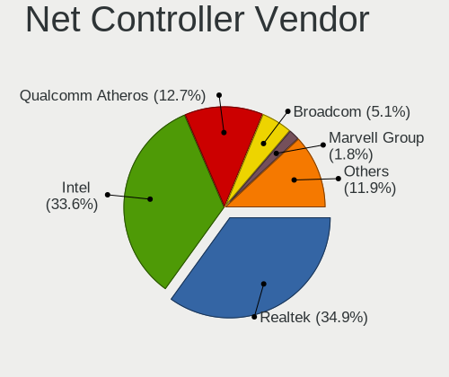

| Vendor                                 | Computers | Percent |
|----------------------------------------|-----------|---------|
| Realtek Semiconductor                  | 290       | 34.94%  |
| Intel                                  | 279       | 33.61%  |
| Qualcomm Atheros                       | 105       | 12.65%  |
| Broadcom                               | 42        | 5.06%   |
| Marvell Technology Group               | 15        | 1.81%   |
| Samsung Electronics                    | 12        | 1.45%   |
| Ralink Technology                      | 8         | 0.96%   |
| TP-Link                                | 7         | 0.84%   |
| Ralink                                 | 7         | 0.84%   |
| Nvidia                                 | 7         | 0.84%   |
| MediaTek                               | 7         | 0.84%   |
| Xiaomi                                 | 5         | 0.6%    |
| Sierra Wireless                        | 5         | 0.6%    |
| Qualcomm                               | 4         | 0.48%   |
| JMicron Technology                     | 4         | 0.48%   |
| Ericsson Business Mobile Networks      | 4         | 0.48%   |
| Edimax Technology                      | 4         | 0.48%   |
| D-Link                                 | 3         | 0.36%   |
| OPPO Electronics                       | 2         | 0.24%   |
| Huawei Technologies                    | 2         | 0.24%   |
| Google                                 | 2         | 0.24%   |
| Dell                                   | 2         | 0.24%   |
| ASUSTek Computer                       | 2         | 0.24%   |
| T & A Mobile Phones                    | 1         | 0.12%   |
| Silicon Integrated Systems [SiS]       | 1         | 0.12%   |
| National Semiconductor                 | 1         | 0.12%   |
| Motorola PCS                           | 1         | 0.12%   |
| Hewlett-Packard                        | 1         | 0.12%   |
| Fujitsu Connected Technologies Limited | 1         | 0.12%   |
| Emulex                                 | 1         | 0.12%   |
| D-Link System                          | 1         | 0.12%   |
| BUFFALO                                | 1         | 0.12%   |
| Atheros                                | 1         | 0.12%   |
| Arduino SA                             | 1         | 0.12%   |
| Accton Technology                      | 1         | 0.12%   |

Net Controller Model
--------------------

Controller models

| Model                                                                   | Computers | Percent |
|-------------------------------------------------------------------------|-----------|---------|
| Realtek RTL8111/8168/8211/8411 PCI Express Gigabit Ethernet Controller  | 210       | 21.19%  |
| Realtek RTL810xE PCI Express Fast Ethernet controller                   | 40        | 4.04%   |
| Intel 82579LM Gigabit Network Connection (Lewisville)                   | 40        | 4.04%   |
| Qualcomm Atheros AR9285 Wireless Network Adapter (PCI-Express)          | 22        | 2.22%   |
| Intel Wireless 8265 / 8275                                              | 19        | 1.92%   |
| Intel Centrino Advanced-N 6205 [Taylor Peak]                            | 19        | 1.92%   |
| Qualcomm Atheros AR9485 Wireless Network Adapter                        | 16        | 1.61%   |
| Intel Ethernet Connection I217-LM                                       | 16        | 1.61%   |
| Qualcomm Atheros QCA9565 / AR9565 Wireless Network Adapter              | 15        | 1.51%   |
| Intel Wireless 8260                                                     | 14        | 1.41%   |
| Intel Wireless 7265                                                     | 14        | 1.41%   |
| Intel Wireless 7260                                                     | 13        | 1.31%   |
| Realtek RTL8188EUS 802.11n Wireless Network Adapter                     | 12        | 1.21%   |
| Intel Wireless 3165                                                     | 12        | 1.21%   |
| Broadcom BCM4313 802.11bgn Wireless Network Adapter                     | 11        | 1.11%   |
| Intel Ethernet Controller I225-V                                        | 10        | 1.01%   |
| Intel Ethernet Connection (2) I219-LM                                   | 10        | 1.01%   |
| Samsung Galaxy series, misc. (tethering mode)                           | 9         | 0.91%   |
| Realtek RTL8821CE 802.11ac PCIe Wireless Network Adapter                | 9         | 0.91%   |
| Intel Ethernet Connection I219-LM                                       | 9         | 0.91%   |
| Qualcomm Atheros AR8152 v2.0 Fast Ethernet                              | 8         | 0.81%   |
| Intel Wi-Fi 6 AX200                                                     | 8         | 0.81%   |
| Intel Ethernet Connection (4) I219-LM                                   | 8         | 0.81%   |
| Intel 82579V Gigabit Network Connection                                 | 8         | 0.81%   |
| Realtek RTL8822CE 802.11ac PCIe Wireless Network Adapter                | 7         | 0.71%   |
| Qualcomm Atheros AR9462 Wireless Network Adapter                        | 7         | 0.71%   |
| Nvidia MCP79 Ethernet                                                   | 7         | 0.71%   |
| Intel Ethernet Connection I217-V                                        | 7         | 0.71%   |
| Intel 82577LM Gigabit Network Connection                                | 7         | 0.71%   |
| Realtek RTL8723BE PCIe Wireless Network Adapter                         | 6         | 0.61%   |
| Qualcomm Atheros AR242x / AR542x Wireless Network Adapter (PCI-Express) | 6         | 0.61%   |
| Intel Wi-Fi 6 AX201                                                     | 6         | 0.61%   |
| Intel I211 Gigabit Network Connection                                   | 6         | 0.61%   |
| Intel Dual Band Wireless-AC 3168NGW [Stone Peak]                        | 6         | 0.61%   |
| Intel 82567LM-3 Gigabit Network Connection                              | 6         | 0.61%   |
| Broadcom BCM4322 802.11a/b/g/n Wireless LAN Controller                  | 6         | 0.61%   |
| Realtek RTL-8100/8101L/8139 PCI Fast Ethernet Adapter                   | 5         | 0.5%    |
| Qualcomm Atheros AR8151 v2.0 Gigabit Ethernet                           | 5         | 0.5%    |
| Intel PRO/Wireless 5100 AGN [Shiloh] Network Connection                 | 5         | 0.5%    |
| Intel Ethernet Connection (4) I219-V                                    | 5         | 0.5%    |

Wireless Vendor
---------------

Wireless vendors

| Vendor                | Computers | Percent |
|-----------------------|-----------|---------|
| Intel                 | 183       | 44.2%   |
| Qualcomm Atheros      | 85        | 20.53%  |
| Realtek Semiconductor | 65        | 15.7%   |
| Broadcom              | 36        | 8.7%    |
| Ralink Technology     | 8         | 1.93%   |
| TP-Link               | 7         | 1.69%   |
| Ralink                | 7         | 1.69%   |
| MediaTek              | 5         | 1.21%   |
| Edimax Technology     | 4         | 0.97%   |
| Sierra Wireless       | 3         | 0.72%   |
| D-Link                | 3         | 0.72%   |
| Dell                  | 2         | 0.48%   |
| ASUSTek Computer      | 2         | 0.48%   |
| D-Link System         | 1         | 0.24%   |
| BUFFALO               | 1         | 0.24%   |
| Atheros               | 1         | 0.24%   |
| Accton Technology     | 1         | 0.24%   |

Wireless Model
--------------

Wireless models

| Model                                                                   | Computers | Percent |
|-------------------------------------------------------------------------|-----------|---------|
| Qualcomm Atheros AR9285 Wireless Network Adapter (PCI-Express)          | 22        | 5.25%   |
| Intel Wireless 8265 / 8275                                              | 19        | 4.53%   |
| Intel Centrino Advanced-N 6205 [Taylor Peak]                            | 19        | 4.53%   |
| Qualcomm Atheros AR9485 Wireless Network Adapter                        | 16        | 3.82%   |
| Qualcomm Atheros QCA9565 / AR9565 Wireless Network Adapter              | 15        | 3.58%   |
| Intel Wireless 8260                                                     | 14        | 3.34%   |
| Intel Wireless 7265                                                     | 14        | 3.34%   |
| Intel Wireless 7260                                                     | 13        | 3.1%    |
| Realtek RTL8188EUS 802.11n Wireless Network Adapter                     | 12        | 2.86%   |
| Intel Wireless 3165                                                     | 12        | 2.86%   |
| Broadcom BCM4313 802.11bgn Wireless Network Adapter                     | 11        | 2.63%   |
| Realtek RTL8821CE 802.11ac PCIe Wireless Network Adapter                | 9         | 2.15%   |
| Intel Wi-Fi 6 AX200                                                     | 8         | 1.91%   |
| Realtek RTL8822CE 802.11ac PCIe Wireless Network Adapter                | 7         | 1.67%   |
| Qualcomm Atheros AR9462 Wireless Network Adapter                        | 7         | 1.67%   |
| Realtek RTL8723BE PCIe Wireless Network Adapter                         | 6         | 1.43%   |
| Qualcomm Atheros AR242x / AR542x Wireless Network Adapter (PCI-Express) | 6         | 1.43%   |
| Intel Wi-Fi 6 AX201                                                     | 6         | 1.43%   |
| Intel Dual Band Wireless-AC 3168NGW [Stone Peak]                        | 6         | 1.43%   |
| Broadcom BCM4322 802.11a/b/g/n Wireless LAN Controller                  | 6         | 1.43%   |
| Intel PRO/Wireless 5100 AGN [Shiloh] Network Connection                 | 5         | 1.19%   |
| Intel Comet Lake PCH-LP CNVi WiFi                                       | 5         | 1.19%   |
| Intel Cannon Lake PCH CNVi WiFi                                         | 5         | 1.19%   |
| Realtek RTL8188CE 802.11b/g/n WiFi Adapter                              | 4         | 0.95%   |
| Qualcomm Atheros QCA9377 802.11ac Wireless Network Adapter              | 4         | 0.95%   |
| Qualcomm Atheros QCA6174 802.11ac Wireless Network Adapter              | 4         | 0.95%   |
| Qualcomm Atheros AR928X Wireless Network Adapter (PCI-Express)          | 4         | 0.95%   |
| Qualcomm Atheros AR9287 Wireless Network Adapter (PCI-Express)          | 4         | 0.95%   |
| MediaTek MT7921 802.11ax PCI Express Wireless Network Adapter           | 4         | 0.95%   |
| Intel Wireless 3160                                                     | 4         | 0.95%   |
| Intel Wi-Fi 6E(802.11ax) AX210/AX1675* 2x2 [Typhoon Peak]               | 4         | 0.95%   |
| Intel PRO/Wireless 4965 AG or AGN [Kedron] Network Connection           | 4         | 0.95%   |
| Intel PRO/Wireless 3945ABG [Golan] Network Connection                   | 4         | 0.95%   |
| Intel Centrino Wireless-N 2230                                          | 4         | 0.95%   |
| Intel Centrino Wireless-N 1000 [Condor Peak]                            | 4         | 0.95%   |
| Intel Centrino Advanced-N 6235                                          | 4         | 0.95%   |
| Intel Centrino Advanced-N 6200                                          | 4         | 0.95%   |
| Broadcom BCM4331 802.11a/b/g/n                                          | 4         | 0.95%   |
| Broadcom BCM4321 802.11a/b/g/n                                          | 4         | 0.95%   |
| TP-Link TL-WN722N v2/v3 [Realtek RTL8188EUS]                            | 3         | 0.72%   |

Ethernet Vendor
---------------

Ethernet vendors

| Vendor                                 | Computers | Percent |
|----------------------------------------|-----------|---------|
| Realtek Semiconductor                  | 258       | 46.74%  |
| Intel                                  | 192       | 34.78%  |
| Qualcomm Atheros                       | 31        | 5.62%   |
| Marvell Technology Group               | 15        | 2.72%   |
| Samsung Electronics                    | 12        | 2.17%   |
| Broadcom                               | 12        | 2.17%   |
| Nvidia                                 | 7         | 1.27%   |
| Xiaomi                                 | 5         | 0.91%   |
| Qualcomm                               | 4         | 0.72%   |
| JMicron Technology                     | 4         | 0.72%   |
| OPPO Electronics                       | 2         | 0.36%   |
| MediaTek                               | 2         | 0.36%   |
| Huawei Technologies                    | 2         | 0.36%   |
| T & A Mobile Phones                    | 1         | 0.18%   |
| Silicon Integrated Systems [SiS]       | 1         | 0.18%   |
| National Semiconductor                 | 1         | 0.18%   |
| Motorola PCS                           | 1         | 0.18%   |
| Fujitsu Connected Technologies Limited | 1         | 0.18%   |
| Emulex                                 | 1         | 0.18%   |

Ethernet Model
--------------

Ethernet models

| Model                                                                  | Computers | Percent |
|------------------------------------------------------------------------|-----------|---------|
| Realtek RTL8111/8168/8211/8411 PCI Express Gigabit Ethernet Controller | 210       | 37.57%  |
| Realtek RTL810xE PCI Express Fast Ethernet controller                  | 40        | 7.16%   |
| Intel 82579LM Gigabit Network Connection (Lewisville)                  | 40        | 7.16%   |
| Intel Ethernet Connection I217-LM                                      | 16        | 2.86%   |
| Intel Ethernet Controller I225-V                                       | 10        | 1.79%   |
| Intel Ethernet Connection (2) I219-LM                                  | 10        | 1.79%   |
| Samsung Galaxy series, misc. (tethering mode)                          | 9         | 1.61%   |
| Intel Ethernet Connection I219-LM                                      | 9         | 1.61%   |
| Qualcomm Atheros AR8152 v2.0 Fast Ethernet                             | 8         | 1.43%   |
| Intel Ethernet Connection (4) I219-LM                                  | 8         | 1.43%   |
| Intel 82579V Gigabit Network Connection                                | 8         | 1.43%   |
| Nvidia MCP79 Ethernet                                                  | 7         | 1.25%   |
| Intel Ethernet Connection I217-V                                       | 7         | 1.25%   |
| Intel 82577LM Gigabit Network Connection                               | 7         | 1.25%   |
| Intel I211 Gigabit Network Connection                                  | 6         | 1.07%   |
| Intel 82567LM-3 Gigabit Network Connection                             | 6         | 1.07%   |
| Realtek RTL-8100/8101L/8139 PCI Fast Ethernet Adapter                  | 5         | 0.89%   |
| Qualcomm Atheros AR8151 v2.0 Gigabit Ethernet                          | 5         | 0.89%   |
| Intel Ethernet Connection (4) I219-V                                   | 5         | 0.89%   |
| Intel Ethernet Connection (3) I218-LM                                  | 5         | 0.89%   |
| Intel 82567LM Gigabit Network Connection                               | 5         | 0.89%   |
| Xiaomi Mi/Redmi series (RNDIS)                                         | 4         | 0.72%   |
| JMicron JMC250 PCI Express Gigabit Ethernet Controller                 | 4         | 0.72%   |
| Intel Ethernet Connection (7) I219-V                                   | 4         | 0.72%   |
| Intel Ethernet Connection (5) I219-LM                                  | 4         | 0.72%   |
| Intel Ethernet Connection (2) I219-V                                   | 4         | 0.72%   |
| Intel 82574L Gigabit Network Connection                                | 4         | 0.72%   |
| Samsung GT-I9070 (network tethering, USB debugging enabled)            | 3         | 0.54%   |
| Realtek RTL8125 2.5GbE Controller                                      | 3         | 0.54%   |
| Marvell Group 88E8058 PCI-E Gigabit Ethernet Controller                | 3         | 0.54%   |
| Marvell Group 88E8057 PCI-E Gigabit Ethernet Controller                | 3         | 0.54%   |
| Intel I210 Gigabit Network Connection                                  | 3         | 0.54%   |
| Intel Ethernet Connection I218-LM                                      | 3         | 0.54%   |
| Intel Ethernet Connection (17) I219-V                                  | 3         | 0.54%   |
| Intel Ethernet Connection (14) I219-V                                  | 3         | 0.54%   |
| Intel 82566MM Gigabit Network Connection                               | 3         | 0.54%   |
| Intel 82566DM-2 Gigabit Network Connection                             | 3         | 0.54%   |
| Realtek RTL8111/8168/8411 PCI Express Gigabit Ethernet Controller      | 2         | 0.36%   |
| Qualcomm FP3                                                           | 2         | 0.36%   |
| Qualcomm Atheros QCA8172 Fast Ethernet                                 | 2         | 0.36%   |

Net Controller Kind
-------------------

Ethernet, WiFi or modem

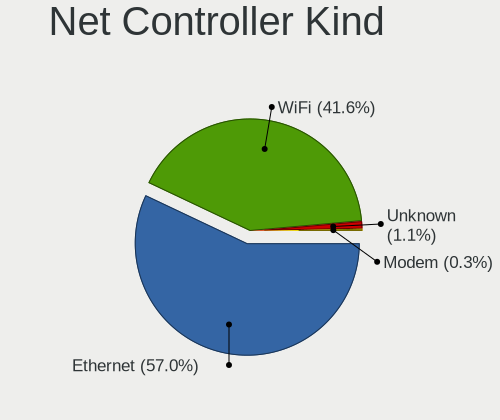

| Kind     | Computers | Percent |
|----------|-----------|---------|
| Ethernet | 527       | 57.03%  |
| WiFi     | 384       | 41.56%  |
| Unknown  | 10        | 1.08%   |
| Modem    | 3         | 0.32%   |

Used Controller
---------------

Currently used network controller

| Kind     | Computers | Percent |
|----------|-----------|---------|
| Ethernet | 343       | 67.39%  |
| WiFi     | 166       | 32.61%  |

NICs
----

Total network controllers on board

| Total | Computers | Percent |
|-------|-----------|---------|
| 2     | 318       | 55.02%  |
| 1     | 240       | 41.52%  |
| 0     | 11        | 1.9%    |
| 3     | 8         | 1.38%   |
| 4     | 1         | 0.17%   |

IPv6
----

IPv6 vs IPv4

| Used | Computers | Percent |
|------|-----------|---------|
| No   | 547       | 94.15%  |
| Yes  | 34        | 5.85%   |

Bluetooth
---------

Bluetooth Vendor
----------------

Controller vendors

| Vendor                          | Computers | Percent |
|---------------------------------|-----------|---------|
| Intel                           | 128       | 42.24%  |
| Realtek Semiconductor           | 33        | 10.89%  |
| Broadcom                        | 29        | 9.57%   |
| Qualcomm Atheros Communications | 25        | 8.25%   |
| Apple                           | 16        | 5.28%   |
| Cambridge Silicon Radio         | 14        | 4.62%   |
| Foxconn / Hon Hai               | 12        | 3.96%   |
| IMC Networks                    | 11        | 3.63%   |
| Lite-On Technology              | 7         | 2.31%   |
| ASUSTek Computer                | 7         | 2.31%   |
| Hewlett-Packard                 | 5         | 1.65%   |
| TP-Link                         | 4         | 1.32%   |
| Dell                            | 4         | 1.32%   |
| Askey Computer                  | 2         | 0.66%   |
| Toshiba                         | 1         | 0.33%   |
| Primax Electronics              | 1         | 0.33%   |
| MediaTek                        | 1         | 0.33%   |
| Fujitsu                         | 1         | 0.33%   |
| Belkin Components               | 1         | 0.33%   |
| Alps Electric                   | 1         | 0.33%   |

Bluetooth Model
---------------

Controller models

| Model                                                       | Computers | Percent |
|-------------------------------------------------------------|-----------|---------|
| Intel Bluetooth wireless interface                          | 76        | 25%     |
| Intel AX201 Bluetooth                                       | 14        | 4.61%   |
| Cambridge Silicon Radio Bluetooth Dongle (HCI mode)         | 14        | 4.61%   |
| Realtek Bluetooth Adapter                                   | 12        | 3.95%   |
| Intel Bluetooth 9460/9560 Jefferson Peak (JfP)              | 12        | 3.95%   |
| Qualcomm Atheros AR3012 Bluetooth 4.0                       | 10        | 3.29%   |
| Broadcom BCM20702 Bluetooth 4.0 [ThinkPad]                  | 8         | 2.63%   |
| Realtek Bluetooth 4.2 Adapter                               | 7         | 2.3%    |
| Intel Centrino Bluetooth Wireless Transceiver               | 7         | 2.3%    |
| Intel AX200 Bluetooth                                       | 7         | 2.3%    |
| Intel Wireless-AC 3168 Bluetooth                            | 6         | 1.97%   |
| Apple Bluetooth Host Controller                             | 6         | 1.97%   |
| Broadcom BCM2045B (BDC-2.1)                                 | 5         | 1.64%   |
| TP-Link Bluetooth 5.0 USB Adapter                           | 4         | 1.32%   |
| Qualcomm Atheros QCA9377 Bluetooth 4.1                      | 4         | 1.32%   |
| Intel AX210 Bluetooth                                       | 4         | 1.32%   |
| HP Bluetooth 2.0 Interface [Broadcom BCM2045]               | 4         | 1.32%   |
| Broadcom BCM2045B (BDC-2.1) [Bluetooth Controller]          | 4         | 1.32%   |
| Apple Built-in iSight (no firmware loaded)                  | 4         | 1.32%   |
| Realtek  Bluetooth 4.2 Adapter                              | 3         | 0.99%   |
| Lite-On Bluetooth USB Module                                | 3         | 0.99%   |
| Foxconn / Hon Hai Broadcom BCM20702 Bluetooth USB Device    | 3         | 0.99%   |
| Broadcom BCM2045B (BDC-2) [Bluetooth Controller]            | 3         | 0.99%   |
| ASUS BT-270 Bluetooth Adapter                               | 3         | 0.99%   |
| Apple Built-in Bluetooth 2.0+EDR HCI                        | 3         | 0.99%   |
| Apple Broadcom Built-in Bluetooth                           | 3         | 0.99%   |
| Realtek Wireless Bluetooth Adapter                          | 2         | 0.66%   |
| Realtek RTL8821A Bluetooth                                  | 2         | 0.66%   |
| Realtek Bluetooth 5.1 Adapter                               | 2         | 0.66%   |
| Realtek Bluetooth 4.0 Adapter                               | 2         | 0.66%   |
| Qualcomm Atheros Dell Wireless 1707 Bluetooth 4.0 LE Device | 2         | 0.66%   |
| Qualcomm Atheros AR9462 Bluetooth                           | 2         | 0.66%   |
| Qualcomm Atheros AR3011 Bluetooth                           | 2         | 0.66%   |
| Lite-On Atheros AR3012 Bluetooth                            | 2         | 0.66%   |
| IMC Networks MediaTek Bluetooth Adapter                     | 2         | 0.66%   |
| IMC Networks Bluetooth module                               | 2         | 0.66%   |
| Foxconn / Hon Hai MediaTek Bluetooth Adapter                | 2         | 0.66%   |
| Foxconn / Hon Hai Broadcom Bluetooth 2.1 Device             | 2         | 0.66%   |
| Dell DW375 Bluetooth Module                                 | 2         | 0.66%   |
| Dell Dell Wireless 380 Bluetooth 4.0 Module                 | 2         | 0.66%   |

Sound
-----

Sound Vendor
------------

Sound card vendors

| Vendor                            | Computers | Percent |
|-----------------------------------|-----------|---------|
| Intel                             | 452       | 60.03%  |
| AMD                               | 144       | 19.12%  |
| Nvidia                            | 91        | 12.08%  |
| C-Media Electronics               | 20        | 2.66%   |
| Texas Instruments                 | 6         | 0.8%    |
| Creative Labs                     | 4         | 0.53%   |
| Realtek Semiconductor             | 3         | 0.4%    |
| JMTek                             | 3         | 0.4%    |
| SteelSeries ApS                   | 2         | 0.27%   |
| Generalplus Technology            | 2         | 0.27%   |
| Unknown                           | 2         | 0.27%   |
| Yamaha                            | 1         | 0.13%   |
| Superlux digit                    | 1         | 0.13%   |
| Sony                              | 1         | 0.13%   |
| Silicon Integrated Systems [SiS]  | 1         | 0.13%   |
| RODE Microphones                  | 1         | 0.13%   |
| Razer USA                         | 1         | 0.13%   |
| Phison Electronics                | 1         | 0.13%   |
| OPPO Electronics                  | 1         | 0.13%   |
| Nektar                            | 1         | 0.13%   |
| Microsoft                         | 1         | 0.13%   |
| Micro Star International          | 1         | 0.13%   |
| M-Audio                           | 1         | 0.13%   |
| KTMicro                           | 1         | 0.13%   |
| Hewlett-Packard                   | 1         | 0.13%   |
| HECATE G2 GAMING HEADSET          | 1         | 0.13%   |
| Harman                            | 1         | 0.13%   |
| GN Netcom                         | 1         | 0.13%   |
| GEMBIRD                           | 1         | 0.13%   |
| Elitegroup Computer Systems (ECS) | 1         | 0.13%   |
| Edifier Technology                | 1         | 0.13%   |
| Creative Technology               | 1         | 0.13%   |
| Conexant Systems                  | 1         | 0.13%   |
| Cambridge Silicon Radio           | 1         | 0.13%   |
| Apogee Electronics                | 1         | 0.13%   |

Sound Model
-----------

Sound card models

| Model                                                                                             | Computers | Percent |
|---------------------------------------------------------------------------------------------------|-----------|---------|
| Intel 7 Series/C216 Chipset Family High Definition Audio Controller                               | 51        | 5.69%   |
| Intel 6 Series/C200 Series Chipset Family High Definition Audio Controller                        | 48        | 5.35%   |
| AMD Family 17h/19h/1ah HD Audio Controller                                                        | 42        | 4.68%   |
| Intel Sunrise Point-LP HD Audio                                                                   | 41        | 4.57%   |
| Intel 8 Series/C220 Series Chipset High Definition Audio Controller                               | 41        | 4.57%   |
| Intel Xeon E3-1200 v3/4th Gen Core Processor HD Audio Controller                                  | 36        | 4.01%   |
| Intel 82801I (ICH9 Family) HD Audio Controller                                                    | 28        | 3.12%   |
| Intel 5 Series/3400 Series Chipset High Definition Audio                                          | 24        | 2.68%   |
| Intel 100 Series/C230 Series Chipset Family HD Audio Controller                                   | 23        | 2.56%   |
| AMD Raven/Raven2/Fenghuang HDMI/DP Audio Controller                                               | 21        | 2.34%   |
| Intel 200 Series PCH HD Audio                                                                     | 19        | 2.12%   |
| Intel NM10/ICH7 Family High Definition Audio Controller                                           | 17        | 1.9%    |
| Intel 8 Series HD Audio Controller                                                                | 17        | 1.9%    |
| AMD Renoir Radeon High Definition Audio Controller                                                | 17        | 1.9%    |
| Intel Haswell-ULT HD Audio Controller                                                             | 16        | 1.78%   |
| Intel Atom/Celeron/Pentium Processor x5-E8000/J3xxx/N3xxx Series High Definition Audio Controller | 15        | 1.67%   |
| AMD SBx00 Azalia (Intel HDA)                                                                      | 15        | 1.67%   |
| Intel Cannon Lake PCH cAVS                                                                        | 14        | 1.56%   |
| Intel 82801H (ICH8 Family) HD Audio Controller                                                    | 14        | 1.56%   |
| AMD Starship/Matisse HD Audio Controller                                                          | 14        | 1.56%   |
| Intel Broadwell-U Audio Controller                                                                | 13        | 1.45%   |
| AMD FCH Azalia Controller                                                                         | 13        | 1.45%   |
| Intel Wildcat Point-LP High Definition Audio Controller                                           | 12        | 1.34%   |
| AMD Oland/Hainan/Cape Verde/Pitcairn HDMI Audio [Radeon HD 7000 Series]                           | 11        | 1.23%   |
| AMD Ellesmere HDMI Audio [Radeon RX 470/480 / 570/580/590]                                        | 11        | 1.23%   |
| AMD Baffin HDMI/DP Audio [Radeon RX 550 640SP / RX 560/560X]                                      | 10        | 1.11%   |
| C-Media Electronics Audio Adapter (Unitek Y-247A)                                                 | 9         | 1%      |
| Nvidia MCP79 High Definition Audio                                                                | 8         | 0.89%   |
| Intel Tiger Lake-LP Smart Sound Technology Audio Controller                                       | 8         | 0.89%   |
| Intel Celeron/Pentium Silver Processor High Definition Audio                                      | 8         | 0.89%   |
| Nvidia GK208 HDMI/DP Audio Controller                                                             | 7         | 0.78%   |
| Intel Atom Processor Z36xxx/Z37xxx Series High Definition Audio Controller                        | 7         | 0.78%   |
| Intel 82801JD/DO (ICH10 Family) HD Audio Controller                                               | 7         | 0.78%   |
| AMD Family 17h (Models 00h-0fh) HD Audio Controller                                               | 7         | 0.78%   |
| Nvidia High Definition Audio Controller                                                           | 6         | 0.67%   |
| Nvidia GP107GL High Definition Audio Controller                                                   | 6         | 0.67%   |
| Nvidia GK107 HDMI Audio Controller                                                                | 6         | 0.67%   |
| Intel Tiger Lake-H HD Audio Controller                                                            | 6         | 0.67%   |
| AMD Navi 21/23 HDMI/DP Audio Controller                                                           | 6         | 0.67%   |
| Nvidia TU116 High Definition Audio Controller                                                     | 5         | 0.56%   |

Memory
------

Memory Vendor
-------------

Memory module vendors

| Vendor                       | Computers | Percent |
|------------------------------|-----------|---------|
| Samsung Electronics          | 137       | 20.3%   |
| SK hynix                     | 97        | 14.37%  |
| Kingston                     | 73        | 10.81%  |
| Unknown                      | 65        | 9.63%   |
| Micron Technology            | 60        | 8.89%   |
| Crucial                      | 39        | 5.78%   |
| Corsair                      | 30        | 4.44%   |
| Unknown                      | 28        | 4.15%   |
| G.Skill                      | 18        | 2.67%   |
| A-DATA Technology            | 14        | 2.07%   |
| Nanya Technology             | 13        | 1.93%   |
| Elpida                       | 13        | 1.93%   |
| Ramaxel Technology           | 12        | 1.78%   |
| Patriot                      | 7         | 1.04%   |
| Unknown (ABCD)               | 6         | 0.89%   |
| Transcend                    | 6         | 0.89%   |
| Smart                        | 5         | 0.74%   |
| Team                         | 4         | 0.59%   |
| GOODRAM                      | 4         | 0.59%   |
| Apacer                       | 4         | 0.59%   |
| SHARETRONIC                  | 3         | 0.44%   |
| ASint Technology             | 3         | 0.44%   |
| Silicon Power                | 2         | 0.3%    |
| Multilaser                   | 2         | 0.3%    |
| Lexar                        | 2         | 0.3%    |
| Kingmax                      | 2         | 0.3%    |
| GeIL                         | 2         | 0.3%    |
| Atermiter                    | 2         | 0.3%    |
| AMD                          | 2         | 0.3%    |
| Unknown (8A02)               | 1         | 0.15%   |
| Unknown (0x7FFF)             | 1         | 0.15%   |
| Toshiba                      | 1         | 0.15%   |
| Teikon                       | 1         | 0.15%   |
| Swissbit                     | 1         | 0.15%   |
| Smart Brazil                 | 1         | 0.15%   |
| SemsoTai                     | 1         | 0.15%   |
| Qumo                         | 1         | 0.15%   |
| Qimonda                      | 1         | 0.15%   |
| PUSKILL                      | 1         | 0.15%   |
| Patriot Memory (PDP Systems) | 1         | 0.15%   |

Memory Model
------------

Memory module models

| Model                                                            | Computers | Percent |
|------------------------------------------------------------------|-----------|---------|
| Unknown                                                          | 28        | 3.9%    |
| Samsung RAM M471B5173QH0-YK0 4GB SODIMM DDR3 1600MT/s            | 9         | 1.25%   |
| Unknown RAM Module 2GB SODIMM DDR2 667MT/s                       | 8         | 1.11%   |
| SK hynix RAM HMT451S6BFR8A-PB 4GB SODIMM DDR3 1600MT/s           | 7         | 0.97%   |
| Samsung RAM M471A1K43CB1-CRC 8GB SODIMM DDR4 2667MT/s            | 7         | 0.97%   |
| SK hynix RAM HMA81GS6AFR8N-UH 8GB SODIMM DDR4 2400MT/s           | 6         | 0.84%   |
| Samsung RAM M471B5173EB0-YK0 4GB SODIMM DDR3 1600MT/s            | 6         | 0.84%   |
| Unknown RAM Module 4GB DIMM 1333MT/s                             | 5         | 0.7%    |
| Samsung RAM M471B5173DB0-YK0 4GB SODIMM DDR3 1600MT/s            | 5         | 0.7%    |
| Corsair RAM CMK16GX4M2B3200C16 8GB DIMM DDR4 3200MT/s            | 5         | 0.7%    |
| Unknown RAM Module 8GB SODIMM DDR3 1600MT/s                      | 4         | 0.56%   |
| Unknown RAM Module 2GB SODIMM DDR2                               | 4         | 0.56%   |
| Unknown RAM Module 1GB SODIMM DDR2                               | 4         | 0.56%   |
| Unknown (ABCD) RAM 123456789012345678 4GB SODIMM LPDDR4 2400MT/s | 4         | 0.56%   |
| SK hynix RAM HMT41GS6BFR8A-PB 8GB SODIMM DDR3 1600MT/s           | 4         | 0.56%   |
| Samsung RAM Module 8GB SODIMM DDR4 2133MT/s                      | 4         | 0.56%   |
| Samsung RAM M471B5673FH0-CF8 2GB SODIMM DDR3 1067MT/s            | 4         | 0.56%   |
| Samsung RAM M471B5273CH0-CH9 4GB SODIMM DDR3 1334MT/s            | 4         | 0.56%   |
| Samsung RAM M471B1G73DB0-YK0 8GB SODIMM DDR3 1600MT/s            | 4         | 0.56%   |
| Samsung RAM M471A5244CB0-CRC 4GB SODIMM DDR4 2400MT/s            | 4         | 0.56%   |
| Samsung RAM M471A1K43BB1-CRC 8GB SODIMM DDR4 2400MT/s            | 4         | 0.56%   |
| Micron RAM 8KTF51264HZ-1G6E1 4GB SODIMM DDR3 1600MT/s            | 4         | 0.56%   |
| Kingston RAM KHX1600C10D3/8G 8GB DIMM DDR3 1600MT/s              | 4         | 0.56%   |
| Unknown RAM Module 4GB DIMM DDR3 1333MT/s                        | 3         | 0.42%   |
| Unknown RAM Module 2GB DIMM DDR2 800MT/s                         | 3         | 0.42%   |
| Unknown RAM Module 2GB DIMM 800MT/s                              | 3         | 0.42%   |
| Unknown RAM Module 2GB DIMM 1333MT/s                             | 3         | 0.42%   |
| Unknown RAM Module 1GB SODIMM DDR2 667MT/s                       | 3         | 0.42%   |
| SK hynix RAM HMT41GS6AFR8A-PB 8GB SODIMM DDR3 1600MT/s           | 3         | 0.42%   |
| SK hynix RAM HMT351S6CFR8C-PB 4GB SODIMM DDR3 1600MT/s           | 3         | 0.42%   |
| SK hynix RAM HMT351S6CFR8C-H9 4GB SODIMM DDR3 1334MT/s           | 3         | 0.42%   |
| Samsung RAM M471B5273DH0-CH9 4GB SODIMM DDR3 1334MT/s            | 3         | 0.42%   |
| Samsung RAM M378B5773DH0-CH9 2GB DIMM DDR3 1333MT/s              | 3         | 0.42%   |
| Micron RAM 8JTF51264AZ-1G6E1 4GB DIMM DDR3 1600MT/s              | 3         | 0.42%   |
| Kingston RAM KF3200C16D4/8GX 8GB DIMM DDR4 3200MT/s              | 3         | 0.42%   |
| Crucial RAM CT102464BF160B.M16 8GB SODIMM DDR3 1600MT/s          | 3         | 0.42%   |
| Crucial RAM CT102464BF160B.C16 8GB SODIMM DDR3 1600MT/s          | 3         | 0.42%   |
| A-DATA RAM DDR4 3200 8GB DIMM DDR4 3200MT/s                      | 3         | 0.42%   |
| Unknown RAM Module 4GB SODIMM DDR3 1067MT/s                      | 2         | 0.28%   |
| Unknown RAM Module 4GB SODIMM DDR3                               | 2         | 0.28%   |

Memory Kind
-----------

Memory module kinds

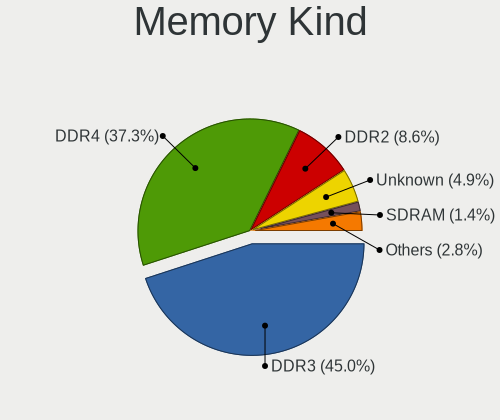

| Kind    | Computers | Percent |
|---------|-----------|---------|
| DDR3    | 256       | 44.99%  |
| DDR4    | 212       | 37.26%  |
| DDR2    | 49        | 8.61%   |
| Unknown | 28        | 4.92%   |
| SDRAM   | 8         | 1.41%   |
| LPDDR4  | 8         | 1.41%   |
| LPDDR3  | 4         | 0.7%    |
| DDR     | 2         | 0.35%   |
| LPDDR5  | 1         | 0.18%   |
| DDR5    | 1         | 0.18%   |

Memory Form Factor
------------------

Physical design of the memory module

| Name         | Computers | Percent |
|--------------|-----------|---------|
| SODIMM       | 329       | 57.62%  |
| DIMM         | 219       | 38.35%  |
| Row Of Chips | 15        | 2.63%   |
| Chip         | 4         | 0.7%    |
| Unknown      | 4         | 0.7%    |

Memory Size
-----------

Memory module size

| Size  | Computers | Percent |
|-------|-----------|---------|
| 8192  | 219       | 34.38%  |
| 4096  | 198       | 31.08%  |
| 2048  | 123       | 19.31%  |
| 16384 | 56        | 8.79%   |
| 1024  | 32        | 5.02%   |
| 32768 | 9         | 1.41%   |

Memory Speed
------------

Memory module speed

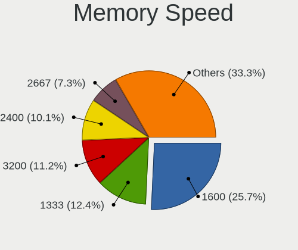

| Speed   | Computers | Percent |
|---------|-----------|---------|
| 1600    | 156       | 25.74%  |
| 1333    | 75        | 12.38%  |
| 3200    | 68        | 11.22%  |
| 2400    | 61        | 10.07%  |
| 2667    | 44        | 7.26%   |
| 2133    | 39        | 6.44%   |
| 667     | 35        | 5.78%   |
| 800     | 25        | 4.13%   |
| 1067    | 21        | 3.47%   |
| 1334    | 18        | 2.97%   |
| Unknown | 15        | 2.48%   |
| 1867    | 8         | 1.32%   |
| 1066    | 7         | 1.16%   |
| 3600    | 5         | 0.83%   |
| 2666    | 5         | 0.83%   |
| 3733    | 4         | 0.66%   |
| 3000    | 3         | 0.5%    |
| 6400    | 2         | 0.33%   |
| 2048    | 2         | 0.33%   |
| 1866    | 2         | 0.33%   |
| 533     | 2         | 0.33%   |
| 400     | 2         | 0.33%   |
| 4400    | 1         | 0.17%   |
| 4000    | 1         | 0.17%   |
| 3333    | 1         | 0.17%   |
| 2933    | 1         | 0.17%   |
| 1639    | 1         | 0.17%   |
| 1200    | 1         | 0.17%   |
| 975     | 1         | 0.17%   |

Printers & scanners
-------------------

Printer Vendor
--------------

Printer device vendors

| Vendor             | Computers | Percent |
|--------------------|-----------|---------|
| Brother Industries | 4         | 66.67%  |
| Hewlett-Packard    | 2         | 33.33%  |

Printer Model
-------------

Printer device models

| Model                      | Computers | Percent |
|----------------------------|-----------|---------|
| HP LaserJet 3390           | 1         | 16.67%  |
| HP LaserJet 1020           | 1         | 16.67%  |
| Brother HL-L3270CDW series | 1         | 16.67%  |
| Brother HL-L2300D series   | 1         | 16.67%  |
| Brother DCP-J152W          | 1         | 16.67%  |
| Brother DCP-9015CDW        | 1         | 16.67%  |

Scanner Vendor
--------------

Scanner device vendors

| Vendor      | Computers | Percent |
|-------------|-----------|---------|
| Canon       | 2         | 66.67%  |
| Seiko Epson | 1         | 33.33%  |

Scanner Model
-------------

Scanner device models

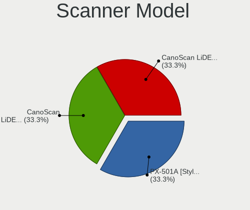

| Model                              | Computers | Percent |
|------------------------------------|-----------|---------|
| Seiko Epson PX-501A [Stylus NX400] | 1         | 33.33%  |
| Canon CanoScan LiDE 700F           | 1         | 33.33%  |
| Canon CanoScan LiDE 120            | 1         | 33.33%  |

Camera
------

Camera Vendor
-------------

Camera device vendors

| Vendor                                 | Computers | Percent |
|----------------------------------------|-----------|---------|
| Chicony Electronics                    | 61        | 24.5%   |
| Bison Electronics                      | 32        | 12.85%  |
| Microdia                               | 20        | 8.03%   |
| Sunplus Innovation Technology          | 15        | 6.02%   |
| IMC Networks                           | 15        | 6.02%   |
| Realtek Semiconductor                  | 13        | 5.22%   |
| Syntek                                 | 10        | 4.02%   |
| Suyin                                  | 8         | 3.21%   |
| Quanta                                 | 8         | 3.21%   |
| Logitech                               | 8         | 3.21%   |
| Cheng Uei Precision Industry (Foxlink) | 8         | 3.21%   |
| Lite-On Technology                     | 7         | 2.81%   |
| Silicon Motion                         | 6         | 2.41%   |
| Lenovo                                 | 5         | 2.01%   |
| Apple                                  | 5         | 2.01%   |
| Alcor Micro                            | 5         | 2.01%   |
| Z-Star Microelectronics                | 3         | 1.2%    |
| ALi                                    | 3         | 1.2%    |
| Supreme Electronics                    | 2         | 0.8%    |
| Luxvisions Innotech Limited            | 2         | 0.8%    |
| Importek                               | 2         | 0.8%    |
| GEMBIRD                                | 2         | 0.8%    |
| Y Media                                | 1         | 0.4%    |
| Trust                                  | 1         | 0.4%    |
| SHENZHEN AONI ELECTRONIC               | 1         | 0.4%    |
| Jiangxi Shinetech Optical              | 1         | 0.4%    |
| Intel                                  | 1         | 0.4%    |
| Genesys Logic                          | 1         | 0.4%    |
| DigiTech                               | 1         | 0.4%    |
| Cubeternet                             | 1         | 0.4%    |
| Unknown                                | 1         | 0.4%    |

Camera Model
------------

Camera device models

| Model                                                       | Computers | Percent |
|-------------------------------------------------------------|-----------|---------|
| Chicony Integrated Camera                                   | 19        | 7.6%    |
| Microdia Integrated_Webcam_HD                               | 10        | 4%      |
| Bison Integrated Camera                                     | 10        | 4%      |
| Chicony Lenovo Integrated Camera (0.3MP)                    | 7         | 2.8%    |
| Sunplus Integrated_Webcam_HD                                | 5         | 2%      |
| Bison ThinkPad Integrated Camera                            | 5         | 2%      |
| Bison Lenovo EasyCamera                                     | 5         | 2%      |
| Syntek Lenovo EasyCamera                                    | 4         | 1.6%    |
| Realtek Integrated_Webcam_HD                                | 4         | 1.6%    |
| Lite-On Integrated Camera                                   | 4         | 1.6%    |
| Chicony FJ Camera                                           | 4         | 1.6%    |
| Syntek Integrated Camera                                    | 3         | 1.2%    |
| Suyin Acer/HP Integrated Webcam [CN0314]                    | 3         | 1.2%    |
| Logitech Webcam C270                                        | 3         | 1.2%    |
| Lenovo Integrated Webcam                                    | 3         | 1.2%    |
| IMC Networks UVC VGA Webcam                                 | 3         | 1.2%    |
| IMC Networks Integrated Webcam                              | 3         | 1.2%    |
| Chicony USB2.0 HD UVC WebCam                                | 3         | 1.2%    |
| Chicony Lenovo EasyCamera                                   | 3         | 1.2%    |
| Cheng Uei Precision Industry (Foxlink) Realtek DMFT RGB     | 3         | 1.2%    |
| Bison SunplusIT Integrated Camera                           | 3         | 1.2%    |
| Syntek EasyCamera                                           | 2         | 0.8%    |
| Suyin 1.3M WebCam (notebook emachines E730, Acer sub-brand) | 2         | 0.8%    |
| Sunplus HP TrueVision HD Camera                             | 2         | 0.8%    |
| Sunplus HP HD Webcam [Fixed]                                | 2         | 0.8%    |
| Realtek USB2.0 VGA UVC WebCam                               | 2         | 0.8%    |
| Realtek USB Camera                                          | 2         | 0.8%    |
| Quanta HP TrueVision HD Camera                              | 2         | 0.8%    |
| Microdia USB  Live camera                                   | 2         | 0.8%    |
| Microdia Integrated Webcam                                  | 2         | 0.8%    |
| Logitech HD Pro Webcam C920                                 | 2         | 0.8%    |
| Logitech BRIO Ultra HD Webcam                               | 2         | 0.8%    |
| Lite-On HP Universal Camera                                 | 2         | 0.8%    |
| Lenovo Integrated Camera                                    | 2         | 0.8%    |
| IMC Networks USB2.0 HD UVC WebCam                           | 2         | 0.8%    |
| IMC Networks Integrated Camera                              | 2         | 0.8%    |
| IMC Networks EasyCamera                                     | 2         | 0.8%    |
| Chicony USB 2.0 Camera                                      | 2         | 0.8%    |
| Chicony Integrated Camera [ThinkPad]                        | 2         | 0.8%    |
| Chicony HP Wide Vision HD Camera                            | 2         | 0.8%    |

Security
--------

Fingerprint Vendor
------------------

Fingerprint sensor vendors

| Vendor                     | Computers | Percent |
|----------------------------|-----------|---------|
| Validity Sensors           | 19        | 41.3%   |
| AuthenTec                  | 8         | 17.39%  |
| Upek                       | 6         | 13.04%  |
| Elan Microelectronics      | 5         | 10.87%  |
| Broadcom                   | 2         | 4.35%   |
| Synaptics                  | 1         | 2.17%   |
| STMicroelectronics         | 1         | 2.17%   |
| Shenzhen Goodix Technology | 1         | 2.17%   |
| LighTuning Technology      | 1         | 2.17%   |
| FocalTech Systems          | 1         | 2.17%   |
| Fingerprint Cards          | 1         | 2.17%   |

Fingerprint Model
-----------------

Fingerprint sensor models

| Model                                                                             | Computers | Percent |
|-----------------------------------------------------------------------------------|-----------|---------|
| Upek Biometric Touchchip/Touchstrip Fingerprint Sensor                            | 6         | 13.04%  |
| Validity Sensors VFS 5011 fingerprint sensor                                      | 5         | 10.87%  |
| Validity Sensors Synaptics WBDI                                                   | 5         | 10.87%  |
| Elan Fingerprint Sensor                                                           | 4         | 8.7%    |
| Validity Sensors VFS5011 Fingerprint Reader                                       | 3         | 6.52%   |
| Validity Sensors VFS495 Fingerprint Reader                                        | 2         | 4.35%   |
| Broadcom BCM5880 Secure Applications Processor with fingerprint swipe sensor      | 2         | 4.35%   |
| AuthenTec AES2810                                                                 | 2         | 4.35%   |
| AuthenTec AES2660                                                                 | 2         | 4.35%   |
| AuthenTec AES2501 Fingerprint Sensor                                              | 2         | 4.35%   |
| Validity Sensors VFS7500 Touch Fingerprint Sensor                                 | 1         | 2.17%   |
| Validity Sensors VFS101 Fingerprint Reader                                        | 1         | 2.17%   |
| Validity Sensors Swipe Fingerprint Sensor                                         | 1         | 2.17%   |
| Validity Sensors Fingerprint scanner                                              | 1         | 2.17%   |
| Synaptics Metallica MIS Touch Fingerprint Reader                                  | 1         | 2.17%   |
| STMicroelectronics Fingerprint Reader                                             | 1         | 2.17%   |
| Shenzhen Goodix Fingerprint Reader SGX                                            | 1         | 2.17%   |
| LighTuning EgisTec Touch Fingerprint Sensor                                       | 1         | 2.17%   |
| FocalTech Systems FocalTech Fingerprint Device Realtek USB2.0 Finger Print Bridge | 1         | 2.17%   |
| Fingerprint Cards FPC Fingerprint Reader                                          | 1         | 2.17%   |
| Elan WBF Fingerprint Sensor                                                       | 1         | 2.17%   |
| AuthenTec AES2550 Fingerprint Sensor                                              | 1         | 2.17%   |
| AuthenTec AES1660                                                                 | 1         | 2.17%   |

Chipcard Vendor
---------------

Chipcard module vendors

Zero info for selected period =(

Chipcard Model
--------------

Chipcard module models

Zero info for selected period =(

Unsupported
-----------

Unsupported Devices
-------------------

Total unsupported devices on board

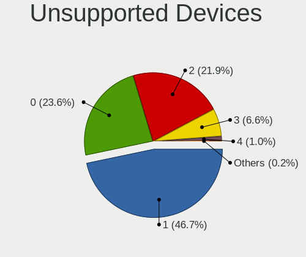

| Total | Computers | Percent |
|-------|-----------|---------|
| 1     | 271       | 46.72%  |
| 0     | 137       | 23.62%  |
| 2     | 127       | 21.9%   |
| 3     | 38        | 6.55%   |
| 4     | 6         | 1.03%   |
| 5     | 1         | 0.17%   |

Unsupported Device Types
------------------------

Types of unsupported devices

| Type                     | Computers | Percent |
|--------------------------|-----------|---------|
| Communication controller | 369       | 60%     |
| Net/wireless             | 85        | 13.82%  |
| Fingerprint reader       | 46        | 7.48%   |
| Card reader              | 40        | 6.5%    |
| Bluetooth                | 34        | 5.53%   |
| Sound                    | 24        | 3.9%    |
| Storage                  | 7         | 1.14%   |
| Network                  | 4         | 0.65%   |
| Net/ethernet             | 4         | 0.65%   |
| Storage/raid             | 1         | 0.16%   |
| Dvb card                 | 1         | 0.16%   |

