helloSystem 0.8.1 - Tested Hardware & Statistics (Desktops)
-----------------------------------------------------------

A project to collect tested hardware configurations for helloSystem 0.8.1.

Anyone can contribute to this report by the [hw-probe](https://github.com/linuxhw/hw-probe/blob/master/INSTALL.BSD.md) tool:

    hw-probe -all -upload

Please contribute! Especially if your hardware is rare.

Contents
--------

* [ Test Cases ](#test-cases)

* [ System ](#system)
  - [ Arch                     ](#arch)
  - [ DE                       ](#de)
  - [ Display Server           ](#display-server)
  - [ Display Manager          ](#display-manager)
  - [ OS Lang                  ](#os-lang)
  - [ Boot Mode                ](#boot-mode)
  - [ Filesystem               ](#filesystem)
  - [ Part. scheme             ](#part-scheme)

* [ Board ](#board)
  - [ Vendor                   ](#vendor)
  - [ Model                    ](#model)
  - [ Model Family             ](#model-family)
  - [ MFG Year                 ](#mfg-year)
  - [ Form Factor              ](#form-factor)
  - [ Coreboot                 ](#coreboot)
  - [ RAM Size                 ](#ram-size)
  - [ RAM Used                 ](#ram-used)
  - [ Total Drives             ](#total-drives)
  - [ Has CD-ROM               ](#has-cd-rom)
  - [ Has Ethernet             ](#has-ethernet)
  - [ Has WiFi                 ](#has-wifi)
  - [ Has Bluetooth            ](#has-bluetooth)

* [ Location ](#location)
  - [ Country                  ](#country)
  - [ City                     ](#city)

* [ Drives ](#drives)
  - [ Drive Vendor             ](#drive-vendor)
  - [ Drive Model              ](#drive-model)
  - [ HDD Vendor               ](#hdd-vendor)
  - [ SSD Vendor               ](#ssd-vendor)
  - [ Drive Kind               ](#drive-kind)
  - [ Drive Connector          ](#drive-connector)
  - [ Drive Size               ](#drive-size)
  - [ Space Total              ](#space-total)
  - [ Space Used               ](#space-used)
  - [ Malfunc. Drives          ](#malfunc-drives)
  - [ Malfunc. Drive Vendor    ](#malfunc-drive-vendor)
  - [ Malfunc. HDD Vendor      ](#malfunc-hdd-vendor)
  - [ Malfunc. Drive Kind      ](#malfunc-drive-kind)
  - [ Failed Drives            ](#failed-drives)
  - [ Failed Drive Vendor      ](#failed-drive-vendor)
  - [ Drive Status             ](#drive-status)

* [ Storage controller ](#storage-controller)
  - [ Storage Vendor           ](#storage-vendor)
  - [ Storage Model            ](#storage-model)
  - [ Storage Kind             ](#storage-kind)

* [ Processor ](#processor)
  - [ CPU Vendor               ](#cpu-vendor)
  - [ CPU Model                ](#cpu-model)
  - [ CPU Model Family         ](#cpu-model-family)
  - [ CPU Cores                ](#cpu-cores)
  - [ CPU Sockets              ](#cpu-sockets)
  - [ CPU Threads              ](#cpu-threads)
  - [ CPU Microarch            ](#cpu-microarch)

* [ Graphics ](#graphics)
  - [ GPU Vendor               ](#gpu-vendor)
  - [ GPU Model                ](#gpu-model)
  - [ GPU Combo                ](#gpu-combo)
  - [ GPU Driver               ](#gpu-driver)
  - [ GPU Memory               ](#gpu-memory)

* [ Monitor ](#monitor)
  - [ Monitor Vendor           ](#monitor-vendor)
  - [ Monitor Model            ](#monitor-model)
  - [ Monitor Resolution       ](#monitor-resolution)
  - [ Monitor Diagonal         ](#monitor-diagonal)
  - [ Monitor Width            ](#monitor-width)
  - [ Aspect Ratio             ](#aspect-ratio)
  - [ Monitor Area             ](#monitor-area)
  - [ Pixel Density            ](#pixel-density)
  - [ Multiple Monitors        ](#multiple-monitors)

* [ Network ](#network)
  - [ Net Controller Vendor    ](#net-controller-vendor)
  - [ Net Controller Model     ](#net-controller-model)
  - [ Wireless Vendor          ](#wireless-vendor)
  - [ Wireless Model           ](#wireless-model)
  - [ Ethernet Vendor          ](#ethernet-vendor)
  - [ Ethernet Model           ](#ethernet-model)
  - [ Net Controller Kind      ](#net-controller-kind)
  - [ Used Controller          ](#used-controller)
  - [ NICs                     ](#nics)
  - [ IPv6                     ](#ipv6)

* [ Bluetooth ](#bluetooth)
  - [ Bluetooth Vendor         ](#bluetooth-vendor)
  - [ Bluetooth Model          ](#bluetooth-model)

* [ Sound ](#sound)
  - [ Sound Vendor             ](#sound-vendor)
  - [ Sound Model              ](#sound-model)

* [ Memory ](#memory)
  - [ Memory Vendor            ](#memory-vendor)
  - [ Memory Model             ](#memory-model)
  - [ Memory Kind              ](#memory-kind)
  - [ Memory Form Factor       ](#memory-form-factor)
  - [ Memory Size              ](#memory-size)
  - [ Memory Speed             ](#memory-speed)

* [ Printers & scanners ](#printers--scanners)
  - [ Printer Vendor           ](#printer-vendor)
  - [ Printer Model            ](#printer-model)
  - [ Scanner Vendor           ](#scanner-vendor)
  - [ Scanner Model            ](#scanner-model)

* [ Camera ](#camera)
  - [ Camera Vendor            ](#camera-vendor)
  - [ Camera Model             ](#camera-model)

* [ Security ](#security)
  - [ Fingerprint Vendor       ](#fingerprint-vendor)
  - [ Fingerprint Model        ](#fingerprint-model)
  - [ Chipcard Vendor          ](#chipcard-vendor)
  - [ Chipcard Model           ](#chipcard-model)

* [ Unsupported ](#unsupported)
  - [ Unsupported Devices      ](#unsupported-devices)
  - [ Unsupported Device Types ](#unsupported-device-types)

Test Cases
----------

Total: 357

| Vendor        | Model                       | Probe                                                     | Date         |
|---------------|-----------------------------|-----------------------------------------------------------|--------------|
| Acer          | Veriton M4640G              | [68d5608ce0](https://bsd-hardware.info/?probe=68d5608ce0) | Dec 28, 2025 |
| Dell          | 0C2XKD A01                  | [c6b89f8ff2](https://bsd-hardware.info/?probe=c6b89f8ff2) | Dec 26, 2025 |
| Dell          | 0C2XKD A01                  | [d80978dff4](https://bsd-hardware.info/?probe=d80978dff4) | Dec 26, 2025 |
| Intel         | D2700DC AAG32420-602        | [bfe77052ce](https://bsd-hardware.info/?probe=bfe77052ce) | Dec 24, 2025 |
| Intel         | D2700DC AAG32420-602        | [4eddac7476](https://bsd-hardware.info/?probe=4eddac7476) | Dec 24, 2025 |
| Wincor Nix... | M2.0-H110-uATX Motherboa... | [fac59b87e0](https://bsd-hardware.info/?probe=fac59b87e0) | Dec 20, 2025 |
| MSI           | MPG Z690 EDGE WIFI DDR4     | [9b828c62b9](https://bsd-hardware.info/?probe=9b828c62b9) | Dec 09, 2025 |
| MSI           | MAG B550 TOMAHAWK           | [daba7c50d1](https://bsd-hardware.info/?probe=daba7c50d1) | Nov 30, 2025 |
| OEM           | A55                         | [4ed41d1482](https://bsd-hardware.info/?probe=4ed41d1482) | Nov 08, 2025 |
| Gigabyte      | Z87-HD3                     | [2bf937d238](https://bsd-hardware.info/?probe=2bf937d238) | Oct 06, 2025 |
| Gigabyte      | Z87-HD3                     | [72832870f1](https://bsd-hardware.info/?probe=72832870f1) | Oct 05, 2025 |
| Dell          | 0VHWTR A02                  | [5fdcd943d0](https://bsd-hardware.info/?probe=5fdcd943d0) | Sep 27, 2025 |
| ASUSTek       | PRIME B760-PLUS D4          | [ad3a399271](https://bsd-hardware.info/?probe=ad3a399271) | Sep 23, 2025 |
| MSI           | H61M-P20                    | [9b958d5198](https://bsd-hardware.info/?probe=9b958d5198) | Sep 03, 2025 |
| MSI           | H110M PRO-D                 | [adbd16553c](https://bsd-hardware.info/?probe=adbd16553c) | Aug 25, 2025 |
| Gigabyte      | B550M AORUS ELITE           | [c96eeef217](https://bsd-hardware.info/?probe=c96eeef217) | Aug 10, 2025 |
| Dell          | 00V62H A01                  | [7241760f68](https://bsd-hardware.info/?probe=7241760f68) | Aug 06, 2025 |
| ASRock        | G31M-S                      | [12fcbed6de](https://bsd-hardware.info/?probe=12fcbed6de) | Jul 28, 2025 |
| Dell          | 0JR269                      | [3321bb9549](https://bsd-hardware.info/?probe=3321bb9549) | Jul 27, 2025 |
| ECS           | H61H2-M2                    | [6719fff345](https://bsd-hardware.info/?probe=6719fff345) | Jul 21, 2025 |
| HP            | 339A                        | [5070cc1462](https://bsd-hardware.info/?probe=5070cc1462) | Jul 05, 2025 |
| ASUSTek       | TUF Gaming B450-PLUS II     | [d294b6b6e8](https://bsd-hardware.info/?probe=d294b6b6e8) | Jun 22, 2025 |
| MSI           | B360-A PRO                  | [254e1d0afb](https://bsd-hardware.info/?probe=254e1d0afb) | Jun 18, 2025 |
| Fujitsu       | D3233-A1 S26361-D3233-A1    | [898be8e5a3](https://bsd-hardware.info/?probe=898be8e5a3) | Jun 16, 2025 |
| Lenovo        | ThinkCentre M90P 5852W3Z    | [1d5a2636c1](https://bsd-hardware.info/?probe=1d5a2636c1) | Jun 10, 2025 |
| Apple         | Mac-F221BEC8                | [fcc4268d97](https://bsd-hardware.info/?probe=fcc4268d97) | Jun 07, 2025 |
| Lenovo        | 3111 NOK                    | [db76e8ef46](https://bsd-hardware.info/?probe=db76e8ef46) | Jun 02, 2025 |
| Biostar       | G41D3+                      | [ac29c6c800](https://bsd-hardware.info/?probe=ac29c6c800) | May 11, 2025 |
| HP            | 83E1                        | [6593b9ba45](https://bsd-hardware.info/?probe=6593b9ba45) | May 07, 2025 |
| MSI           | H81M-P33                    | [f7da68ace2](https://bsd-hardware.info/?probe=f7da68ace2) | May 02, 2025 |
| HP            | 8054                        | [c673cd93c9](https://bsd-hardware.info/?probe=c673cd93c9) | Apr 26, 2025 |
| Lenovo        | 3140 NOK                    | [f18a7b323a](https://bsd-hardware.info/?probe=f18a7b323a) | Apr 19, 2025 |
| HP            | 3048h                       | [50ea8ce3bf](https://bsd-hardware.info/?probe=50ea8ce3bf) | Apr 19, 2025 |
| ASUSTek       | H110S1                      | [346a714c34](https://bsd-hardware.info/?probe=346a714c34) | Apr 15, 2025 |
| HP            | 8054                        | [94ecf4c8f2](https://bsd-hardware.info/?probe=94ecf4c8f2) | Apr 13, 2025 |
| Apple         | Mac-F221BEC8                | [b6f2a7e854](https://bsd-hardware.info/?probe=b6f2a7e854) | Apr 10, 2025 |
| Intel         | X99H                        | [e88d5ce2d4](https://bsd-hardware.info/?probe=e88d5ce2d4) | Mar 30, 2025 |
| HP            | 821D                        | [82728a8821](https://bsd-hardware.info/?probe=82728a8821) | Mar 27, 2025 |
| Inspur        | Computer All in one PC V... | [f5a5e2e41d](https://bsd-hardware.info/?probe=f5a5e2e41d) | Mar 25, 2025 |
| HP            | 8054                        | [cf2a967451](https://bsd-hardware.info/?probe=cf2a967451) | Mar 21, 2025 |
| Lenovo        | 1059 NOK                    | [46bfc09fb9](https://bsd-hardware.info/?probe=46bfc09fb9) | Mar 14, 2025 |
| MSI           | H110M PRO-D                 | [e227ad771a](https://bsd-hardware.info/?probe=e227ad771a) | Mar 12, 2025 |
| Unknown       | Unknown                     | [15fbd064b1](https://bsd-hardware.info/?probe=15fbd064b1) | Mar 11, 2025 |
| HP            | 1998                        | [7a5a4bfcd9](https://bsd-hardware.info/?probe=7a5a4bfcd9) | Mar 10, 2025 |
| Gigabyte      | H510M H                     | [0eadce332a](https://bsd-hardware.info/?probe=0eadce332a) | Mar 08, 2025 |
| ASUSTek       | B85M-G                      | [d374326c41](https://bsd-hardware.info/?probe=d374326c41) | Mar 04, 2025 |
| ASRock        | X570 Phantom Gaming 4S      | [b65c14dee7](https://bsd-hardware.info/?probe=b65c14dee7) | Feb 28, 2025 |
| MSI           | H81M-P33                    | [2061990247](https://bsd-hardware.info/?probe=2061990247) | Feb 26, 2025 |
| Apple         | Mac-F221BEC8                | [93bbedb57b](https://bsd-hardware.info/?probe=93bbedb57b) | Feb 24, 2025 |
| Dell          | 0200DY A02                  | [03b22828e3](https://bsd-hardware.info/?probe=03b22828e3) | Feb 23, 2025 |
| Lenovo        | 1059 NOK                    | [e88b2e7e02](https://bsd-hardware.info/?probe=e88b2e7e02) | Feb 22, 2025 |
| Intel         | DP55WB AAE64798-204         | [96b24e9a7b](https://bsd-hardware.info/?probe=96b24e9a7b) | Feb 21, 2025 |
| Gigabyte      | GA-78LMT-USB3 SEx           | [b774062e9a](https://bsd-hardware.info/?probe=b774062e9a) | Feb 18, 2025 |
| Lenovo        | Bantry CRB NOK              | [efde8f3eb0](https://bsd-hardware.info/?probe=efde8f3eb0) | Feb 12, 2025 |
| RDW           | MB-B450M V.1                | [4c21fc3ee1](https://bsd-hardware.info/?probe=4c21fc3ee1) | Feb 10, 2025 |
| ZOTAC         | H67ITX-C-E                  | [03f7293660](https://bsd-hardware.info/?probe=03f7293660) | Feb 09, 2025 |
| ASRock        | H61M-VS3                    | [093dd39a95](https://bsd-hardware.info/?probe=093dd39a95) | Feb 04, 2025 |
| Lenovo        | Bantry CRB NOK              | [7d16893e16](https://bsd-hardware.info/?probe=7d16893e16) | Jan 26, 2025 |
| Dell          | 0WVYMC A00                  | [18626d6a8b](https://bsd-hardware.info/?probe=18626d6a8b) | Jan 10, 2025 |
| Dell          | 0MGK50 A02                  | [fe0b9484f5](https://bsd-hardware.info/?probe=fe0b9484f5) | Jan 05, 2025 |
| MSI           | ZH77A-G43                   | [f000f3f0cc](https://bsd-hardware.info/?probe=f000f3f0cc) | Dec 16, 2024 |
| ASUSTek       | PRIME B550M-K               | [52f3e1cf1a](https://bsd-hardware.info/?probe=52f3e1cf1a) | Dec 09, 2024 |
| ASUSTek       | PRIME H510M-R               | [772e88509f](https://bsd-hardware.info/?probe=772e88509f) | Dec 04, 2024 |
| MSI           | Z97 GAMING 3                | [9cd14a585d](https://bsd-hardware.info/?probe=9cd14a585d) | Dec 04, 2024 |
| HP            | 339A                        | [3c450d9163](https://bsd-hardware.info/?probe=3c450d9163) | Dec 04, 2024 |
| ASUSTek       | PRIME B450M-A II            | [1a6e076d9f](https://bsd-hardware.info/?probe=1a6e076d9f) | Dec 02, 2024 |
| HP            | 3048h                       | [36a9b2f835](https://bsd-hardware.info/?probe=36a9b2f835) | Nov 29, 2024 |
| Inventec      | D CLASS A02                 | [dd77e68b2d](https://bsd-hardware.info/?probe=dd77e68b2d) | Nov 24, 2024 |
| Lenovo        | 30C9 SDK0J40705 WIN 3425... | [80514ce1ec](https://bsd-hardware.info/?probe=80514ce1ec) | Nov 22, 2024 |
| MSI           | PRO H610M-B DDR4            | [ed161aa339](https://bsd-hardware.info/?probe=ed161aa339) | Nov 21, 2024 |
| Biostar       | A68N-5200                   | [c0e81ef062](https://bsd-hardware.info/?probe=c0e81ef062) | Nov 13, 2024 |
| ASUSTek       | X99-A/USB                   | [92261cfa8a](https://bsd-hardware.info/?probe=92261cfa8a) | Oct 24, 2024 |
| ASUSTek       | PRIME Z590-A                | [f9dd56fa54](https://bsd-hardware.info/?probe=f9dd56fa54) | Oct 12, 2024 |
| Dell          | 00V62H A00                  | [87e3fa093a](https://bsd-hardware.info/?probe=87e3fa093a) | Oct 09, 2024 |
| Dell          | 03NVJ6 A01                  | [ebf63c5ffd](https://bsd-hardware.info/?probe=ebf63c5ffd) | Sep 22, 2024 |
| Supermicro    | X10DAi                      | [11f1473c17](https://bsd-hardware.info/?probe=11f1473c17) | Sep 17, 2024 |
| MSI           | Z170I GAMING PRO AC         | [373dba44f0](https://bsd-hardware.info/?probe=373dba44f0) | Sep 13, 2024 |
| MSI           | H81M-P33                    | [677cd5d559](https://bsd-hardware.info/?probe=677cd5d559) | Sep 10, 2024 |
| Gigabyte      | Z97X-Gaming 3               | [0e601e6efb](https://bsd-hardware.info/?probe=0e601e6efb) | Sep 09, 2024 |
| ASRock        | 970 Pro3 R2.0               | [2d6cb49646](https://bsd-hardware.info/?probe=2d6cb49646) | Aug 23, 2024 |
| ASRock        | A320M-ITX                   | [73f83a9526](https://bsd-hardware.info/?probe=73f83a9526) | Aug 22, 2024 |
| Gigabyte      | GA-78LMT-USB3 x.x           | [e7df8e47f0](https://bsd-hardware.info/?probe=e7df8e47f0) | Aug 17, 2024 |
| Fujitsu       | D3601-A1 S26361-D3601-A1    | [38f29aa721](https://bsd-hardware.info/?probe=38f29aa721) | Aug 14, 2024 |
| Lenovo        | 3098 SDK0E50510 PRO or W... | [49322a0f1b](https://bsd-hardware.info/?probe=49322a0f1b) | Aug 10, 2024 |
| ASRock        | B450M-HDV R4.0              | [cd3e80c5af](https://bsd-hardware.info/?probe=cd3e80c5af) | Jul 28, 2024 |
| ASRock        | H67DE                       | [cd6ed79756](https://bsd-hardware.info/?probe=cd6ed79756) | Jul 26, 2024 |
| ASUSTek       | M5A78L-M/USB3               | [153f0e6cfb](https://bsd-hardware.info/?probe=153f0e6cfb) | Jul 25, 2024 |
| HP            | 18E7                        | [23520b25c4](https://bsd-hardware.info/?probe=23520b25c4) | Jul 12, 2024 |
| Unknown       | NF-MCP61                    | [74d9784221](https://bsd-hardware.info/?probe=74d9784221) | Jul 06, 2024 |
| Unknown       | NF-MCP61                    | [b2f074d817](https://bsd-hardware.info/?probe=b2f074d817) | Jul 06, 2024 |
| Gigabyte      | Z590 VISION G               | [39bb67c433](https://bsd-hardware.info/?probe=39bb67c433) | Jun 25, 2024 |
| Gigabyte      | H410M S2H V3                | [38e99138bb](https://bsd-hardware.info/?probe=38e99138bb) | Jun 12, 2024 |
| Dell          | 0PU052                      | [ed6212c9ae](https://bsd-hardware.info/?probe=ed6212c9ae) | Jun 07, 2024 |
| Gigabyte      | 945GCM-S2L                  | [7e175ff9bd](https://bsd-hardware.info/?probe=7e175ff9bd) | Jun 06, 2024 |
| Dell          | 03F1TC A00                  | [dbfad2d18f](https://bsd-hardware.info/?probe=dbfad2d18f) | Jun 02, 2024 |
| ASUSTek       | CROSSHAIR VI HERO           | [51df4f57c5](https://bsd-hardware.info/?probe=51df4f57c5) | Jun 02, 2024 |
| HP            | 21D0                        | [907ca67edb](https://bsd-hardware.info/?probe=907ca67edb) | May 27, 2024 |
| ASRock        | G41M-S3                     | [aeef672c4b](https://bsd-hardware.info/?probe=aeef672c4b) | May 17, 2024 |
| HP            | 83E1                        | [2227565c4c](https://bsd-hardware.info/?probe=2227565c4c) | May 15, 2024 |
| ASUSTek       | H110M-R                     | [26808aa91f](https://bsd-hardware.info/?probe=26808aa91f) | May 15, 2024 |
| ASUSTek       | H110M-R                     | [2a3fed3377](https://bsd-hardware.info/?probe=2a3fed3377) | May 15, 2024 |
| Acer          | Aspire XC-603               | [0d17afb0ea](https://bsd-hardware.info/?probe=0d17afb0ea) | May 13, 2024 |
| Pegatron      | 2A6C                        | [c133f11fe6](https://bsd-hardware.info/?probe=c133f11fe6) | May 11, 2024 |
| Dell          | 0DFRFW A01                  | [4532391ffd](https://bsd-hardware.info/?probe=4532391ffd) | May 06, 2024 |
| Unknown       | DH61BR G32662-203           | [f9ebf93574](https://bsd-hardware.info/?probe=f9ebf93574) | May 06, 2024 |
| ASUSTek       | P5N32-E SLI                 | [52ac87d342](https://bsd-hardware.info/?probe=52ac87d342) | Apr 27, 2024 |
| Dell          | 0NW6H5 A00                  | [256e25b666](https://bsd-hardware.info/?probe=256e25b666) | Apr 16, 2024 |
| Gigabyte      | B85M-D3H                    | [3f85beaa54](https://bsd-hardware.info/?probe=3f85beaa54) | Apr 05, 2024 |
| Gigabyte      | H55M-USB3                   | [748ef69c9f](https://bsd-hardware.info/?probe=748ef69c9f) | Mar 25, 2024 |
| HP            | 2B34                        | [850e6bf958](https://bsd-hardware.info/?probe=850e6bf958) | Mar 20, 2024 |
| HP            | 21D0                        | [7ca5d182a1](https://bsd-hardware.info/?probe=7ca5d182a1) | Mar 16, 2024 |
| HC Technol... | HCAR5000-MI                 | [2e83945861](https://bsd-hardware.info/?probe=2e83945861) | Mar 16, 2024 |
| HP            | dx2480 MT(FN868PA)          | [d700a91a81](https://bsd-hardware.info/?probe=d700a91a81) | Mar 14, 2024 |
| HP            | 21D0                        | [69b7737f88](https://bsd-hardware.info/?probe=69b7737f88) | Mar 12, 2024 |
| Gigabyte      | B550 GAMING X V2            | [6741cefeb7](https://bsd-hardware.info/?probe=6741cefeb7) | Mar 12, 2024 |
| ASUSTek       | PRIME J3355I-C              | [0b1cea4778](https://bsd-hardware.info/?probe=0b1cea4778) | Mar 12, 2024 |
| Dell          | 07F37C A00                  | [53928dbf53](https://bsd-hardware.info/?probe=53928dbf53) | Mar 03, 2024 |
| Gigabyte      | H81M-D3H                    | [798bfe44fe](https://bsd-hardware.info/?probe=798bfe44fe) | Feb 29, 2024 |
| Gigabyte      | P35-DS3                     | [d877d925e1](https://bsd-hardware.info/?probe=d877d925e1) | Feb 28, 2024 |
| Gigabyte      | P35-DS3                     | [dd8beb7c03](https://bsd-hardware.info/?probe=dd8beb7c03) | Feb 27, 2024 |
| Lenovo        | 30FD SDK0J40705 WIN 3425... | [87313cc66c](https://bsd-hardware.info/?probe=87313cc66c) | Feb 07, 2024 |
| Intel         | STK1AW32SC H91596-303       | [14fcea4fb9](https://bsd-hardware.info/?probe=14fcea4fb9) | Feb 06, 2024 |
| ASUSTek       | Z97M-PLUS/BR                | [cb6b8e5aef](https://bsd-hardware.info/?probe=cb6b8e5aef) | Feb 02, 2024 |
| ASUSTek       | P5E3 PRO                    | [354299e930](https://bsd-hardware.info/?probe=354299e930) | Feb 01, 2024 |
| ASUSTek       | A68HM-K                     | [f321ac1114](https://bsd-hardware.info/?probe=f321ac1114) | Jan 31, 2024 |
| ASUSTek       | TUF Gaming B560-PLUS WIF... | [5642aa5018](https://bsd-hardware.info/?probe=5642aa5018) | Jan 16, 2024 |
| ASRock        | AB350 Pro4                  | [b2f960c437](https://bsd-hardware.info/?probe=b2f960c437) | Jan 11, 2024 |
| Unknown       | Unknown                     | [514b270501](https://bsd-hardware.info/?probe=514b270501) | Jan 10, 2024 |
| Roqos         | Core RC10                   | [7561797db6](https://bsd-hardware.info/?probe=7561797db6) | Jan 06, 2024 |
| Unknown       | Unknown                     | [9fed9e1dd9](https://bsd-hardware.info/?probe=9fed9e1dd9) | Jan 04, 2024 |
| Lenovo        | SHARKBAY 0B98401 WIN        | [4b0c5d65b0](https://bsd-hardware.info/?probe=4b0c5d65b0) | Jan 02, 2024 |
| MSI           | Z270-A PRO                  | [2f2f406aa3](https://bsd-hardware.info/?probe=2f2f406aa3) | Dec 31, 2023 |
| MSI           | MPG Z690 CARBON WIFI        | [0e31087126](https://bsd-hardware.info/?probe=0e31087126) | Dec 30, 2023 |
| Gigabyte      | B550 GAMING X V2            | [2ba0ee6609](https://bsd-hardware.info/?probe=2ba0ee6609) | Dec 21, 2023 |
| HP            | 212B                        | [d110ce488b](https://bsd-hardware.info/?probe=d110ce488b) | Dec 18, 2023 |
| ASUSTek       | P8Z77-V PRO                 | [ba2cad0d55](https://bsd-hardware.info/?probe=ba2cad0d55) | Dec 18, 2023 |
| HP            | 212B                        | [1737c1241b](https://bsd-hardware.info/?probe=1737c1241b) | Dec 16, 2023 |
| ASUSTek       | H81M-C                      | [177ffa702e](https://bsd-hardware.info/?probe=177ffa702e) | Dec 03, 2023 |
| Lenovo        | ThinkCentre M70e 0828W17    | [02c7f33254](https://bsd-hardware.info/?probe=02c7f33254) | Dec 03, 2023 |
| Fujitsu       | D3313-A1 S26361-D3313-A1    | [9f6d0c8539](https://bsd-hardware.info/?probe=9f6d0c8539) | Nov 22, 2023 |
| Gigabyte      | Z68X-UD5-B3                 | [f8fcca51ca](https://bsd-hardware.info/?probe=f8fcca51ca) | Nov 19, 2023 |
| ASUSTek       | P8Z77-V PRO                 | [e28d22b5ed](https://bsd-hardware.info/?probe=e28d22b5ed) | Nov 16, 2023 |
| Lenovo        | NOK                         | [52593923f0](https://bsd-hardware.info/?probe=52593923f0) | Nov 13, 2023 |
| HP            | 3031h                       | [a38d555974](https://bsd-hardware.info/?probe=a38d555974) | Nov 06, 2023 |
| Gigabyte      | B450M AORUS ELITE           | [e49d3f40b6](https://bsd-hardware.info/?probe=e49d3f40b6) | Nov 05, 2023 |
| Gigabyte      | B450M H                     | [69b57fab79](https://bsd-hardware.info/?probe=69b57fab79) | Nov 02, 2023 |
| HP            | 18E7                        | [a5bf30aeac](https://bsd-hardware.info/?probe=a5bf30aeac) | Nov 02, 2023 |
| Shuttle       | NC10U                       | [8a3fd4b3ee](https://bsd-hardware.info/?probe=8a3fd4b3ee) | Nov 01, 2023 |
| ASUSTek       | PRIME B250M-A               | [0caf100d71](https://bsd-hardware.info/?probe=0caf100d71) | Oct 30, 2023 |
| Gigabyte      | Z170-D3H-CF                 | [3d6569cef5](https://bsd-hardware.info/?probe=3d6569cef5) | Oct 26, 2023 |
| Gigabyte      | Z170-D3H-CF                 | [193c3e5732](https://bsd-hardware.info/?probe=193c3e5732) | Oct 22, 2023 |
| Gigabyte      | Z370 AORUS Gaming 7         | [bb82c13e39](https://bsd-hardware.info/?probe=bb82c13e39) | Oct 12, 2023 |
| HP            | 1497                        | [9ffee4ae55](https://bsd-hardware.info/?probe=9ffee4ae55) | Oct 09, 2023 |
| Gigabyte      | B250M-D3H-CF                | [02d64d7433](https://bsd-hardware.info/?probe=02d64d7433) | Oct 08, 2023 |
| ASUSTek       | M5A78L-M/USB3               | [c25c930afa](https://bsd-hardware.info/?probe=c25c930afa) | Oct 05, 2023 |
| ASUSTek       | PRIME B560-PLUS AC-HES      | [471133280c](https://bsd-hardware.info/?probe=471133280c) | Oct 03, 2023 |
| Lenovo        | ThinkCentre M81 5049D7G     | [60de9490a9](https://bsd-hardware.info/?probe=60de9490a9) | Sep 29, 2023 |
| ASUSTek       | Z170-A                      | [3802fe676c](https://bsd-hardware.info/?probe=3802fe676c) | Sep 23, 2023 |
| HP            | 18E8                        | [7a96c7f43a](https://bsd-hardware.info/?probe=7a96c7f43a) | Sep 21, 2023 |
| HP            | 83F3                        | [4d1df66f57](https://bsd-hardware.info/?probe=4d1df66f57) | Sep 20, 2023 |
| Dell          | 0VRWRC A01                  | [6c85a42e64](https://bsd-hardware.info/?probe=6c85a42e64) | Sep 19, 2023 |
| ASRock        | B450 Pro4                   | [211b0f3e9c](https://bsd-hardware.info/?probe=211b0f3e9c) | Sep 19, 2023 |
| AZW           | U59                         | [ae0d8568d1](https://bsd-hardware.info/?probe=ae0d8568d1) | Sep 15, 2023 |
| AZW           | U59                         | [7e094459f9](https://bsd-hardware.info/?probe=7e094459f9) | Sep 14, 2023 |
| Dell          | 04YP6J A02                  | [0933e1164a](https://bsd-hardware.info/?probe=0933e1164a) | Sep 13, 2023 |
| Lenovo        | 3140 NOK                    | [945ad170d7](https://bsd-hardware.info/?probe=945ad170d7) | Sep 10, 2023 |
| Lenovo        | 3140 NOK                    | [3f9dcefb8e](https://bsd-hardware.info/?probe=3f9dcefb8e) | Sep 10, 2023 |
| MSI           | X570-A PRO                  | [e3d8f34f08](https://bsd-hardware.info/?probe=e3d8f34f08) | Sep 08, 2023 |
| MSI           | Z390-A PRO                  | [57925dc8bb](https://bsd-hardware.info/?probe=57925dc8bb) | Sep 02, 2023 |
| Dell          | 0YXT71 A02                  | [b887caabe7](https://bsd-hardware.info/?probe=b887caabe7) | Aug 31, 2023 |
| ASUSTek       | ROG STRIX B450-I GAMING     | [3dab6f4044](https://bsd-hardware.info/?probe=3dab6f4044) | Aug 28, 2023 |
| MSI           | H110M PRO-VD                | [dcbd4ebf8f](https://bsd-hardware.info/?probe=dcbd4ebf8f) | Aug 27, 2023 |
| AZW           | U59                         | [e08540ab36](https://bsd-hardware.info/?probe=e08540ab36) | Aug 25, 2023 |
| MSI           | MAG B460M BAZOOKA           | [7cf9279c14](https://bsd-hardware.info/?probe=7cf9279c14) | Aug 22, 2023 |
| Gigabyte      | GA-880GA-UD3H               | [35eb7df9a7](https://bsd-hardware.info/?probe=35eb7df9a7) | Aug 20, 2023 |
| Gigabyte      | B550 AORUS ELITE V2         | [7e1d475356](https://bsd-hardware.info/?probe=7e1d475356) | Aug 18, 2023 |
| MSI           | MPG Z390 GAMING PRO CARB... | [df095be4ba](https://bsd-hardware.info/?probe=df095be4ba) | Aug 18, 2023 |
| Daten Tecn... | DH110MXV                    | [bdd9c72e7c](https://bsd-hardware.info/?probe=bdd9c72e7c) | Aug 18, 2023 |
| ASRock        | B450 Pro4                   | [c12a76c083](https://bsd-hardware.info/?probe=c12a76c083) | Aug 16, 2023 |
| ASUSTek       | P5G41T-M LX2/BR             | [f25db83457](https://bsd-hardware.info/?probe=f25db83457) | Aug 15, 2023 |
| Intel         | JSL MRD                     | [ca7024f423](https://bsd-hardware.info/?probe=ca7024f423) | Aug 10, 2023 |
| Intel         | H81                         | [80f40918ce](https://bsd-hardware.info/?probe=80f40918ce) | Aug 07, 2023 |
| HP            | 0AACh                       | [5997b1de3e](https://bsd-hardware.info/?probe=5997b1de3e) | Aug 06, 2023 |
| ASUSTek       | PRIME B450-PLUS             | [d3fac2e3fe](https://bsd-hardware.info/?probe=d3fac2e3fe) | Aug 06, 2023 |
| ASUSTek       | M4A88TD-M/USB3              | [ce95634a53](https://bsd-hardware.info/?probe=ce95634a53) | Aug 06, 2023 |
| ASUSTek       | P5QL PRO                    | [dccefef8eb](https://bsd-hardware.info/?probe=dccefef8eb) | Aug 04, 2023 |
| Gigabyte      | Z170-HD3 DDR3-CF            | [f66f032ffe](https://bsd-hardware.info/?probe=f66f032ffe) | Aug 01, 2023 |
| HP            | 83E1                        | [b211795736](https://bsd-hardware.info/?probe=b211795736) | Jul 27, 2023 |
| HP            | 339A                        | [b770568bae](https://bsd-hardware.info/?probe=b770568bae) | Jul 25, 2023 |
| ASRock        | H61M-VG3                    | [5cebf2275e](https://bsd-hardware.info/?probe=5cebf2275e) | Jul 24, 2023 |
| ASUSTek       | P5QL PRO                    | [b51bcdf3a5](https://bsd-hardware.info/?probe=b51bcdf3a5) | Jul 20, 2023 |
| HP            | 81C5 MVB                    | [1a4fbc384d](https://bsd-hardware.info/?probe=1a4fbc384d) | Jul 19, 2023 |
| Apple         | Mac-F221BEC8                | [3a5b0b3193](https://bsd-hardware.info/?probe=3a5b0b3193) | Jul 17, 2023 |
| ECS           | H61H2-M17                   | [aa4679bee7](https://bsd-hardware.info/?probe=aa4679bee7) | Jul 14, 2023 |
| ASRock        | H61M-GS                     | [502952e73f](https://bsd-hardware.info/?probe=502952e73f) | Jul 11, 2023 |
| ASRock        | A300M-STX                   | [5d896a607e](https://bsd-hardware.info/?probe=5d896a607e) | Jul 06, 2023 |
| Fujitsu       | D3161-A1 S26361-D3161-A1    | [2053dbb697](https://bsd-hardware.info/?probe=2053dbb697) | Jul 03, 2023 |
| HP            | 8055                        | [94df572de4](https://bsd-hardware.info/?probe=94df572de4) | Jun 29, 2023 |
| ASUSTek       | M2A-VM                      | [2d5a9bba42](https://bsd-hardware.info/?probe=2d5a9bba42) | Jun 28, 2023 |
| ASUSTek       | ROG Maximus X HERO          | [2dfabb3a28](https://bsd-hardware.info/?probe=2dfabb3a28) | Jun 23, 2023 |
| ASUSTek       | ROG Maximus X HERO          | [b63efe1bc2](https://bsd-hardware.info/?probe=b63efe1bc2) | Jun 23, 2023 |
| LG Electro... | R590-K.AAA9BT               | [5c3ab65e8e](https://bsd-hardware.info/?probe=5c3ab65e8e) | Jun 23, 2023 |
| ASUSTek       | PRIME B350M-A               | [29545a1054](https://bsd-hardware.info/?probe=29545a1054) | Jun 21, 2023 |
| ASUSTek       | P7P55D LE                   | [ea97ade85d](https://bsd-hardware.info/?probe=ea97ade85d) | Jun 17, 2023 |
| Dell          | 0X9X1W A00                  | [64825f4f71](https://bsd-hardware.info/?probe=64825f4f71) | Jun 08, 2023 |
| Dell          | 0X9X1W A00                  | [c9d8d9a491](https://bsd-hardware.info/?probe=c9d8d9a491) | Jun 08, 2023 |
| Dell          | 0WR7PY A03                  | [c8496622be](https://bsd-hardware.info/?probe=c8496622be) | Jun 03, 2023 |
| Dell          | 0WR7PY A03                  | [b9f7e3e209](https://bsd-hardware.info/?probe=b9f7e3e209) | Jun 03, 2023 |
| Intel         | H81                         | [e0e15704fc](https://bsd-hardware.info/?probe=e0e15704fc) | May 29, 2023 |
| HP            | 21D0                        | [4a10865d28](https://bsd-hardware.info/?probe=4a10865d28) | May 28, 2023 |
| HP            | 21D0                        | [e3d20826b3](https://bsd-hardware.info/?probe=e3d20826b3) | May 28, 2023 |
| Gigabyte      | X58A-UD3R                   | [1d43f61471](https://bsd-hardware.info/?probe=1d43f61471) | May 27, 2023 |
| Unknown       | 1.0                         | [12d6c7934e](https://bsd-hardware.info/?probe=12d6c7934e) | May 27, 2023 |
| ASUSTek       | PRIME H510M-K               | [53a2d5356d](https://bsd-hardware.info/?probe=53a2d5356d) | May 26, 2023 |
| ASUSTek       | ROG STRIX B550-F GAMING     | [a0bff43f5c](https://bsd-hardware.info/?probe=a0bff43f5c) | May 23, 2023 |
| AZW           | GK55                        | [ef90c15915](https://bsd-hardware.info/?probe=ef90c15915) | May 23, 2023 |
| ASRock        | Z68 Pro3 Gen3               | [0a03cd86a0](https://bsd-hardware.info/?probe=0a03cd86a0) | May 21, 2023 |
| ASUSTek       | Z87M-PLUS                   | [58da7daed7](https://bsd-hardware.info/?probe=58da7daed7) | May 20, 2023 |
| ASUSTek       | PRIME A320M-K               | [8f3c5de741](https://bsd-hardware.info/?probe=8f3c5de741) | May 19, 2023 |
| Gigabyte      | Z490 VISION G               | [976e31bfbc](https://bsd-hardware.info/?probe=976e31bfbc) | May 16, 2023 |
| Gigabyte      | Z490 VISION G               | [8eeec83a4e](https://bsd-hardware.info/?probe=8eeec83a4e) | May 16, 2023 |
| ASUSTek       | PRIME A520M-K               | [bda308bc8c](https://bsd-hardware.info/?probe=bda308bc8c) | May 14, 2023 |
| Dell          | 0WN7Y6 A01                  | [a232411c74](https://bsd-hardware.info/?probe=a232411c74) | May 12, 2023 |
| ASUSTek       | PRIME B450M-K II            | [fe053db6c7](https://bsd-hardware.info/?probe=fe053db6c7) | May 10, 2023 |
| ASUSTek       | PRIME B450M-K II            | [16ca4a2aa0](https://bsd-hardware.info/?probe=16ca4a2aa0) | May 10, 2023 |
| ASRock        | Q1900M                      | [c779034e79](https://bsd-hardware.info/?probe=c779034e79) | May 09, 2023 |
| Dell          | 07F37C A00                  | [a23a95f97a](https://bsd-hardware.info/?probe=a23a95f97a) | May 07, 2023 |
| ASRock        | J4125-ITX                   | [6e34c8b22a](https://bsd-hardware.info/?probe=6e34c8b22a) | May 05, 2023 |
| Intel         | DH87RL AAG74240-400         | [7833b60865](https://bsd-hardware.info/?probe=7833b60865) | May 05, 2023 |
| Dell          | 0252PH A04                  | [0cc9ef6521](https://bsd-hardware.info/?probe=0cc9ef6521) | May 03, 2023 |
| Dell          | 0252PH A04                  | [acaf59c3d5](https://bsd-hardware.info/?probe=acaf59c3d5) | May 03, 2023 |
| HP            | 82B4                        | [244817e203](https://bsd-hardware.info/?probe=244817e203) | May 02, 2023 |
| ASUSTek       | PRIME B250M-A               | [270284972d](https://bsd-hardware.info/?probe=270284972d) | Apr 29, 2023 |
| Dell          | 0252PH A04                  | [f497e66dec](https://bsd-hardware.info/?probe=f497e66dec) | Apr 27, 2023 |
| HP            | 8056                        | [44fb168511](https://bsd-hardware.info/?probe=44fb168511) | Apr 26, 2023 |
| Dell          | 0VTC0D A02                  | [a807892254](https://bsd-hardware.info/?probe=a807892254) | Apr 19, 2023 |
| Acer          | Acadia V1.44                | [97bda17afa](https://bsd-hardware.info/?probe=97bda17afa) | Apr 19, 2023 |
| Gigabyte      | H61M-S2PH                   | [024173445b](https://bsd-hardware.info/?probe=024173445b) | Apr 18, 2023 |
| Gigabyte      | A520M DS3H AC               | [16021ac5b5](https://bsd-hardware.info/?probe=16021ac5b5) | Apr 17, 2023 |
| Pegatron      | 2A72h                       | [142340aed4](https://bsd-hardware.info/?probe=142340aed4) | Apr 15, 2023 |
| ASUSTek       | PRIME B550M-A WIFI II       | [8e77aee0e0](https://bsd-hardware.info/?probe=8e77aee0e0) | Apr 14, 2023 |
| HP            | 3397                        | [cf2d152bee](https://bsd-hardware.info/?probe=cf2d152bee) | Apr 13, 2023 |
| ASUSTek       | PRIME B550M-A WIFI II       | [e6c9c37b02](https://bsd-hardware.info/?probe=e6c9c37b02) | Apr 13, 2023 |
| Gigabyte      | H81M-S2PH                   | [b7ec959c9f](https://bsd-hardware.info/?probe=b7ec959c9f) | Apr 13, 2023 |
| ASUSTek       | PRIME B250M-A               | [0747d0a699](https://bsd-hardware.info/?probe=0747d0a699) | Apr 11, 2023 |
| Gigabyte      | M52L-S3P                    | [3a6baf7f2d](https://bsd-hardware.info/?probe=3a6baf7f2d) | Apr 09, 2023 |
| Gigabyte      | B250M-Gaming 3-CF           | [592e08cdd2](https://bsd-hardware.info/?probe=592e08cdd2) | Apr 09, 2023 |
| Acer          | Veriton M6620G              | [13f7e5c23b](https://bsd-hardware.info/?probe=13f7e5c23b) | Apr 07, 2023 |
| Lenovo        | Tilapia CRB                 | [977f089665](https://bsd-hardware.info/?probe=977f089665) | Apr 05, 2023 |
| Gigabyte      | B360M D2V                   | [6429eebbaa](https://bsd-hardware.info/?probe=6429eebbaa) | Apr 05, 2023 |
| ASUSTek       | ROG STRIX Z590-F GAMING ... | [92d0571176](https://bsd-hardware.info/?probe=92d0571176) | Apr 03, 2023 |
| Gigabyte      | B450M DS3H V2               | [096620cfac](https://bsd-hardware.info/?probe=096620cfac) | Apr 03, 2023 |
| ASUSTek       | ROG STRIX Z590-F GAMING ... | [760a744b91](https://bsd-hardware.info/?probe=760a744b91) | Apr 02, 2023 |
| ASUSTek       | ROG STRIX B450-F GAMING     | [bcaaed4d6d](https://bsd-hardware.info/?probe=bcaaed4d6d) | Mar 31, 2023 |
| Gigabyte      | GA-880GM-USB3               | [a9bc1579c1](https://bsd-hardware.info/?probe=a9bc1579c1) | Mar 31, 2023 |
| Lenovo        | 30D0 SDK0J40697 WIN 3305... | [bde9fd671b](https://bsd-hardware.info/?probe=bde9fd671b) | Mar 30, 2023 |
| Fujitsu       | D3061-A1 S26361-D3061-A1    | [ca6badc637](https://bsd-hardware.info/?probe=ca6badc637) | Mar 30, 2023 |
| Gigabyte      | H81M-DS2V                   | [a69c208286](https://bsd-hardware.info/?probe=a69c208286) | Mar 30, 2023 |
| Dell          | 0T1D10 A01                  | [2f5592023f](https://bsd-hardware.info/?probe=2f5592023f) | Mar 29, 2023 |
| Dell          | 0T1D10 A01                  | [6316b108be](https://bsd-hardware.info/?probe=6316b108be) | Mar 29, 2023 |
| BESSTAR Te... | UM700                       | [78ee14c1a5](https://bsd-hardware.info/?probe=78ee14c1a5) | Mar 28, 2023 |
| ASRock        | H61M-HVS                    | [98777ba333](https://bsd-hardware.info/?probe=98777ba333) | Mar 27, 2023 |
| MSI           | 870-G45                     | [19cbb6e0f3](https://bsd-hardware.info/?probe=19cbb6e0f3) | Mar 26, 2023 |
| Gigabyte      | F2A85X-UP4                  | [97d37b6e2f](https://bsd-hardware.info/?probe=97d37b6e2f) | Mar 25, 2023 |
| MSI           | 870-G45                     | [14e990c885](https://bsd-hardware.info/?probe=14e990c885) | Mar 25, 2023 |
| Gigabyte      | F2A85X-UP4                  | [c0b8eb494e](https://bsd-hardware.info/?probe=c0b8eb494e) | Mar 25, 2023 |
| ASUSTek       | P5K SE                      | [646eff3292](https://bsd-hardware.info/?probe=646eff3292) | Mar 25, 2023 |
| HP            | 8055                        | [03930fa6c3](https://bsd-hardware.info/?probe=03930fa6c3) | Mar 24, 2023 |
| HP            | 8350                        | [46dedb22a0](https://bsd-hardware.info/?probe=46dedb22a0) | Mar 24, 2023 |
| Unknown       | Unknown                     | [a66dffcb5c](https://bsd-hardware.info/?probe=a66dffcb5c) | Mar 23, 2023 |
| Intel         | DB85FL AAG89861-203         | [ff97717798](https://bsd-hardware.info/?probe=ff97717798) | Mar 23, 2023 |
| Gigabyte      | H81M-H                      | [e7cadcdae1](https://bsd-hardware.info/?probe=e7cadcdae1) | Mar 23, 2023 |
| Acer          | Revo 70                     | [50d93bea69](https://bsd-hardware.info/?probe=50d93bea69) | Mar 23, 2023 |
| Unknown       | T360D11                     | [d4d69405c5](https://bsd-hardware.info/?probe=d4d69405c5) | Mar 23, 2023 |
| T-bao         | MINI PC V1.0                | [eb2bc1cd51](https://bsd-hardware.info/?probe=eb2bc1cd51) | Mar 23, 2023 |
| Dell          | 0WWJRX A00                  | [b016b1fb3c](https://bsd-hardware.info/?probe=b016b1fb3c) | Mar 22, 2023 |
| Gigabyte      | F2A55-DS3                   | [ce8775fbe5](https://bsd-hardware.info/?probe=ce8775fbe5) | Mar 22, 2023 |
| Biostar       | H61MGC                      | [94e565457c](https://bsd-hardware.info/?probe=94e565457c) | Mar 22, 2023 |
| ASUSTek       | M4A88TD-V EVO/USB3          | [c486bbb209](https://bsd-hardware.info/?probe=c486bbb209) | Mar 22, 2023 |
| ASUSTek       | M5A97 R2.0                  | [840a902d2b](https://bsd-hardware.info/?probe=840a902d2b) | Mar 22, 2023 |
| Foxconn       | M61PMV FAB                  | [197d75cbaa](https://bsd-hardware.info/?probe=197d75cbaa) | Mar 21, 2023 |
| Fujitsu Si... | D2824-A1 S26361-D2824-A1    | [bcada44b09](https://bsd-hardware.info/?probe=bcada44b09) | Mar 21, 2023 |
| Intel         | X99                         | [a74c2b96ff](https://bsd-hardware.info/?probe=a74c2b96ff) | Mar 21, 2023 |
| Dell          | 0GM819                      | [9d5996dd7a](https://bsd-hardware.info/?probe=9d5996dd7a) | Mar 21, 2023 |
| HP            | 8054                        | [6e5a18f346](https://bsd-hardware.info/?probe=6e5a18f346) | Mar 20, 2023 |
| Lenovo        | 30BC SDK0J40705 WIN 3425... | [33b600b436](https://bsd-hardware.info/?probe=33b600b436) | Mar 20, 2023 |
| ASUSTek       | PRIME B350-PLUS             | [8d0e6be5da](https://bsd-hardware.info/?probe=8d0e6be5da) | Mar 20, 2023 |
| Dell          | 0GM819                      | [da7c02c542](https://bsd-hardware.info/?probe=da7c02c542) | Mar 20, 2023 |
| ASUSTek       | TUF Gaming B550M-PLUS       | [c07b0a75e5](https://bsd-hardware.info/?probe=c07b0a75e5) | Mar 20, 2023 |
| ASUSTek       | TUF Gaming B550M-PLUS       | [71d2b7317c](https://bsd-hardware.info/?probe=71d2b7317c) | Mar 19, 2023 |
| ASRock        | H61M-DGS                    | [36348fa16f](https://bsd-hardware.info/?probe=36348fa16f) | Mar 19, 2023 |
| ASUSTek       | PRIME B350-PLUS             | [acc1970543](https://bsd-hardware.info/?probe=acc1970543) | Mar 18, 2023 |
| ASUSTek       | P6X58D-E                    | [ec05209185](https://bsd-hardware.info/?probe=ec05209185) | Mar 18, 2023 |
| Gigabyte      | H110M-H-CF                  | [29b3a70374](https://bsd-hardware.info/?probe=29b3a70374) | Mar 18, 2023 |
| Unknown       | Unknown                     | [dd8a64237a](https://bsd-hardware.info/?probe=dd8a64237a) | Mar 18, 2023 |
| ASUSTek       | TUF Gaming X570-PLUS        | [2ceda5b586](https://bsd-hardware.info/?probe=2ceda5b586) | Mar 17, 2023 |
| ASUSTek       | ROG STRIX B450-F GAMING ... | [74cf75116d](https://bsd-hardware.info/?probe=74cf75116d) | Mar 17, 2023 |
| ASUSTek       | TUF B360M-PLUS GAMING       | [ebbd75883c](https://bsd-hardware.info/?probe=ebbd75883c) | Mar 17, 2023 |
| Unknown       | SKYBAY                      | [7399558d80](https://bsd-hardware.info/?probe=7399558d80) | Mar 17, 2023 |
| Unknown       | SKYBAY                      | [3fb2d0d992](https://bsd-hardware.info/?probe=3fb2d0d992) | Mar 17, 2023 |
| HP            | 1632                        | [8f3bb99bb4](https://bsd-hardware.info/?probe=8f3bb99bb4) | Mar 17, 2023 |
| Gigabyte      | F2A68HM-HD2                 | [da2b96de55](https://bsd-hardware.info/?probe=da2b96de55) | Mar 16, 2023 |
| Gigabyte      | Z87X-UD4H-CF                | [0bae1528b9](https://bsd-hardware.info/?probe=0bae1528b9) | Mar 16, 2023 |
| ASUSTek       | PRIME B660M-A D4            | [eb6b70b310](https://bsd-hardware.info/?probe=eb6b70b310) | Mar 16, 2023 |
| Lenovo        | SHARKBAY NOK                | [f14a448799](https://bsd-hardware.info/?probe=f14a448799) | Mar 16, 2023 |
| ASUSTek       | PRIME B660M-A WIFI D4       | [44c7f21a07](https://bsd-hardware.info/?probe=44c7f21a07) | Mar 16, 2023 |
| Gigabyte      | B450M S2H                   | [dfa4f43317](https://bsd-hardware.info/?probe=dfa4f43317) | Mar 15, 2023 |
| Gigabyte      | H61M-S2P-B3                 | [864a4017cb](https://bsd-hardware.info/?probe=864a4017cb) | Mar 15, 2023 |
| HP            | 3398                        | [b14de43688](https://bsd-hardware.info/?probe=b14de43688) | Mar 15, 2023 |
| ASUSTek       | ROG STRIX B560-F GAMING ... | [c4798050c6](https://bsd-hardware.info/?probe=c4798050c6) | Mar 15, 2023 |
| ASUSTek       | Pro B550M-C                 | [a0e38ad11b](https://bsd-hardware.info/?probe=a0e38ad11b) | Mar 14, 2023 |
| Dell          | 00V62H A00                  | [ecb9b5d004](https://bsd-hardware.info/?probe=ecb9b5d004) | Mar 14, 2023 |
| Foxconn       | H61M/H61M-S                 | [865fbff42a](https://bsd-hardware.info/?probe=865fbff42a) | Mar 14, 2023 |
| Fujitsu Si... | D2804-A1 S26361-D2804-A1    | [34c4bab715](https://bsd-hardware.info/?probe=34c4bab715) | Mar 14, 2023 |
| MSI           | 0A48                        | [815f019a8c](https://bsd-hardware.info/?probe=815f019a8c) | Mar 14, 2023 |
| Lenovo        | NO DPK                      | [8a38ed8d33](https://bsd-hardware.info/?probe=8a38ed8d33) | Mar 14, 2023 |
| ASUSTek       | B85M-G                      | [6401dd52d2](https://bsd-hardware.info/?probe=6401dd52d2) | Mar 14, 2023 |
| AZW           | U59                         | [5a6ef3fb8d](https://bsd-hardware.info/?probe=5a6ef3fb8d) | Mar 14, 2023 |
| Lenovo        | ThinkCentre M58p 6138DK1    | [293de8b0fd](https://bsd-hardware.info/?probe=293de8b0fd) | Mar 14, 2023 |
| Google        | Panther                     | [3577da7e53](https://bsd-hardware.info/?probe=3577da7e53) | Mar 13, 2023 |
| Dell          | 01TN68 A02                  | [cb6c76df00](https://bsd-hardware.info/?probe=cb6c76df00) | Mar 13, 2023 |
| Lenovo        | 3102 SDK0J40697 WIN 3305... | [b337baf50e](https://bsd-hardware.info/?probe=b337baf50e) | Mar 13, 2023 |
| Gigabyte      | B365M H                     | [7acb7cb65f](https://bsd-hardware.info/?probe=7acb7cb65f) | Mar 13, 2023 |
| ASUSTek       | PRIME H310M-A R2.0          | [e96ecce822](https://bsd-hardware.info/?probe=e96ecce822) | Mar 13, 2023 |
| HP            | 8056                        | [164b3e5c3f](https://bsd-hardware.info/?probe=164b3e5c3f) | Mar 13, 2023 |
| T-bao         | MINI PC                     | [d4440566b0](https://bsd-hardware.info/?probe=d4440566b0) | Mar 13, 2023 |
| Gigabyte      | G31M-S2L                    | [d210b12607](https://bsd-hardware.info/?probe=d210b12607) | Mar 13, 2023 |
| Gigabyte      | H110M-S2-CF                 | [6afb777789](https://bsd-hardware.info/?probe=6afb777789) | Mar 13, 2023 |
| Dell          | 0W0CHX A00                  | [85a9fddd44](https://bsd-hardware.info/?probe=85a9fddd44) | Mar 12, 2023 |
| MSI           | H310M PRO-VDH PLUS          | [0eeb0661dd](https://bsd-hardware.info/?probe=0eeb0661dd) | Mar 12, 2023 |
| Dell          | 0WMJ54 A01                  | [7949f20162](https://bsd-hardware.info/?probe=7949f20162) | Mar 12, 2023 |
| MSI           | B450-A PRO                  | [b2d29a5bbc](https://bsd-hardware.info/?probe=b2d29a5bbc) | Mar 12, 2023 |
| Gigabyte      | H61M-DS2 x.x                | [a39b128f44](https://bsd-hardware.info/?probe=a39b128f44) | Mar 12, 2023 |
| Gigabyte      | B250M-DS3H-CF               | [34afe9e044](https://bsd-hardware.info/?probe=34afe9e044) | Mar 12, 2023 |
| Axiomtek      | IMB211                      | [aebf680e82](https://bsd-hardware.info/?probe=aebf680e82) | Mar 12, 2023 |
| Axiomtek      | IMB211                      | [6c50fda85b](https://bsd-hardware.info/?probe=6c50fda85b) | Mar 12, 2023 |
| ASUSTek       | A8N-E                       | [5fc3d86bac](https://bsd-hardware.info/?probe=5fc3d86bac) | Mar 12, 2023 |
| MSI           | H61M-E22                    | [227c78f3c1](https://bsd-hardware.info/?probe=227c78f3c1) | Mar 12, 2023 |
| ASRock        | Q1900M                      | [5d0f6c2276](https://bsd-hardware.info/?probe=5d0f6c2276) | Mar 12, 2023 |
| HP            | 8768 A                      | [5ab1dadbab](https://bsd-hardware.info/?probe=5ab1dadbab) | Mar 12, 2023 |
| Lenovo        | SHARKBAY NOK                | [ad604088a2](https://bsd-hardware.info/?probe=ad604088a2) | Mar 12, 2023 |
| Acer          | Veriton N2620G              | [fa57448331](https://bsd-hardware.info/?probe=fa57448331) | Mar 12, 2023 |
| MSI           | A320M-A PRO                 | [593f6ff02d](https://bsd-hardware.info/?probe=593f6ff02d) | Mar 12, 2023 |
| MSI           | B550M PRO-VDH WIFI          | [ededc04017](https://bsd-hardware.info/?probe=ededc04017) | Mar 12, 2023 |
| ASUSTek       | ROG STRIX B550-F GAMING     | [37ee7b4f47](https://bsd-hardware.info/?probe=37ee7b4f47) | Mar 12, 2023 |
| Fujitsu       | JIM86YD                     | [7a69b91093](https://bsd-hardware.info/?probe=7a69b91093) | Mar 12, 2023 |
| MSI           | H61M-P31/W8                 | [5ae8ebe3cd](https://bsd-hardware.info/?probe=5ae8ebe3cd) | Mar 11, 2023 |
| HP            | 843B                        | [c1886bcd29](https://bsd-hardware.info/?probe=c1886bcd29) | Mar 11, 2023 |
| HP            | 3398                        | [20bcb682d8](https://bsd-hardware.info/?probe=20bcb682d8) | Mar 11, 2023 |
| ASUSTek       | P8Z68-V                     | [3d8ef63e18](https://bsd-hardware.info/?probe=3d8ef63e18) | Mar 11, 2023 |
| Dell          | 0C27VV A02                  | [5899533edd](https://bsd-hardware.info/?probe=5899533edd) | Feb 23, 2023 |
| Intel         | DG41TY AAE47335-300         | [7c1727d55a](https://bsd-hardware.info/?probe=7c1727d55a) | Feb 22, 2023 |
| Dell          | 0C27VV A02                  | [a10df954b7](https://bsd-hardware.info/?probe=a10df954b7) | Feb 22, 2023 |
| Huanan        | X99-TF GAMING V3.0          | [59db63fd9d](https://bsd-hardware.info/?probe=59db63fd9d) | Feb 22, 2023 |
| Huanan        | X99-TF GAMING V3.0          | [50dce9bf96](https://bsd-hardware.info/?probe=50dce9bf96) | Feb 19, 2023 |
| Gigabyte      | H81M-H                      | [8820014583](https://bsd-hardware.info/?probe=8820014583) | Feb 15, 2023 |
| Gigabyte      | H81M-H                      | [592ca6bab5](https://bsd-hardware.info/?probe=592ca6bab5) | Feb 15, 2023 |

System
------

Arch
----

OS architecture (x86_64, i586, etc.)

| Name  | Desktops | Percent |
|-------|----------|---------|
| amd64 | 300      | 100%    |

DE
--

Desktop Environment

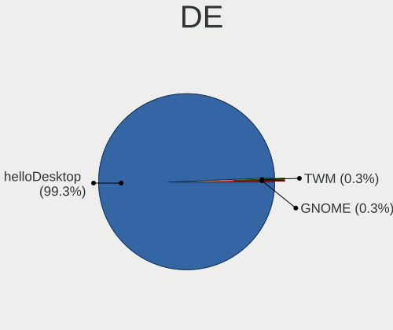

| Name         | Desktops | Percent |
|--------------|----------|---------|
| helloDesktop | 298      | 99.33%  |
| TWM          | 1        | 0.33%   |
| GNOME        | 1        | 0.33%   |

Display Server
--------------

X11 or Wayland

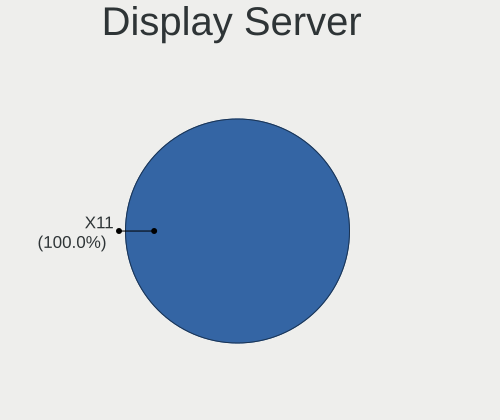

| Name | Desktops | Percent |
|------|----------|---------|
| X11  | 300      | 100%    |

Display Manager
---------------

SDDM, LightDM, etc.

| Name | Desktops | Percent |
|------|----------|---------|
| SLiM | 300      | 100%    |

OS Lang
-------

Language

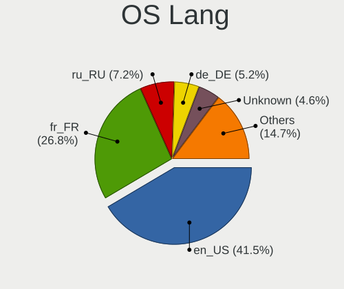

| Lang    | Desktops | Percent |
|---------|----------|---------|
| en_US   | 127      | 41.5%   |
| fr_FR   | 82       | 26.8%   |
| ru_RU   | 22       | 7.19%   |
| de_DE   | 16       | 5.23%   |
| Unknown | 14       | 4.58%   |
| es_ES   | 13       | 4.25%   |
| pt_BR   | 8        | 2.61%   |
| it_IT   | 8        | 2.61%   |
| zh_CN   | 5        | 1.63%   |
| pl_PL   | 2        | 0.65%   |
| jp_JP   | 2        | 0.65%   |
| fi_FI   | 2        | 0.65%   |
| tr_TR   | 1        | 0.33%   |
| pt_PT   | 1        | 0.33%   |
| fr      | 1        | 0.33%   |
| es      | 1        | 0.33%   |
| en_GB   | 1        | 0.33%   |

Boot Mode
---------

EFI or BIOS

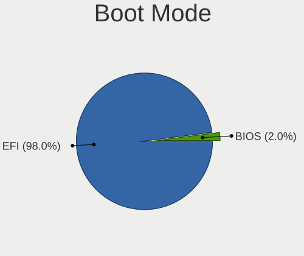

| Mode | Desktops | Percent |
|------|----------|---------|
| EFI  | 294      | 98%     |
| BIOS | 6        | 2%      |

Filesystem
----------

Type of filesystem

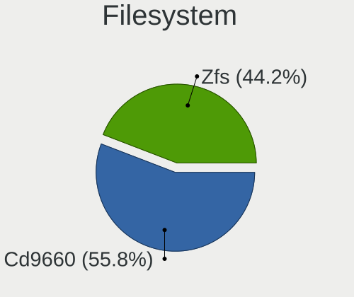

| Type   | Desktops | Percent |
|--------|----------|---------|
| Cd9660 | 172      | 55.84%  |
| Zfs    | 136      | 44.16%  |

Part. scheme
------------

Scheme of partitioning

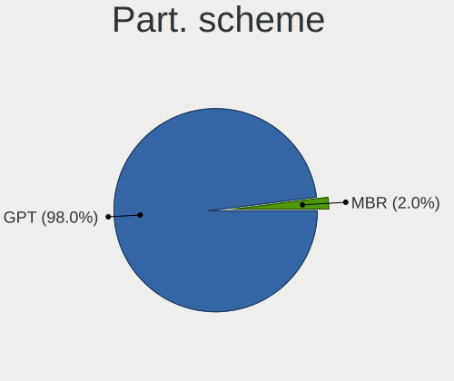

| Type | Desktops | Percent |
|------|----------|---------|
| GPT  | 294      | 98%     |
| MBR  | 6        | 2%      |

Board
-----

Vendor
------

Motherboard manufacturer

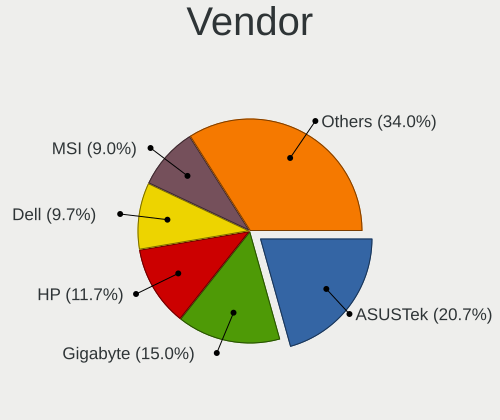

| Name                | Desktops | Percent |
|---------------------|----------|---------|
| ASUSTek Computer    | 62       | 20.67%  |
| Gigabyte Technology | 45       | 15%     |
| Hewlett-Packard     | 35       | 11.67%  |
| Dell                | 29       | 9.67%   |
| MSI                 | 27       | 9%      |
| Lenovo              | 20       | 6.67%   |
| ASRock              | 18       | 6%      |
| Intel               | 11       | 3.67%   |
| Unknown             | 9        | 3%      |
| Fujitsu             | 6        | 2%      |
| Acer                | 6        | 2%      |
| Biostar             | 3        | 1%      |
| T-bao               | 2        | 0.67%   |
| Pegatron            | 2        | 0.67%   |
| Fujitsu Siemens     | 2        | 0.67%   |
| Foxconn             | 2        | 0.67%   |
| ECS                 | 2        | 0.67%   |
| AZW                 | 2        | 0.67%   |
| Apple               | 2        | 0.67%   |
| ZOTAC               | 1        | 0.33%   |
| Wincor Nixdorf      | 1        | 0.33%   |
| Supermicro          | 1        | 0.33%   |
| Shuttle             | 1        | 0.33%   |
| RDW                 | 1        | 0.33%   |
| OEM                 | 1        | 0.33%   |
| LG Electronics      | 1        | 0.33%   |
| Inventec            | 1        | 0.33%   |
| Inspur              | 1        | 0.33%   |
| Huanan              | 1        | 0.33%   |
| HC Technology.      | 1        | 0.33%   |
| Google              | 1        | 0.33%   |
| Daten Tecnologia    | 1        | 0.33%   |
| BESSTAR Tech        | 1        | 0.33%   |
| Axiomtek            | 1        | 0.33%   |

Model
-----

Motherboard model

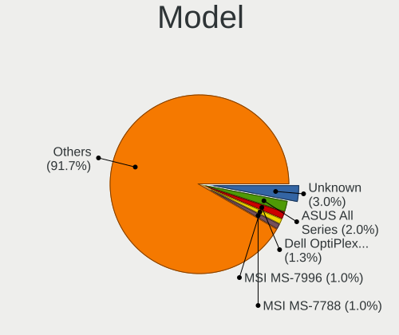

| Name                              | Desktops | Percent |
|-----------------------------------|----------|---------|
| Unknown                           | 9        | 3%      |
| ASUS All Series                   | 6        | 2%      |
| Dell OptiPlex 780                 | 4        | 1.33%   |
| MSI MS-7996                       | 3        | 1%      |
| MSI MS-7788                       | 3        | 1%      |
| HP ProDesk 600 G1 DM              | 3        | 1%      |
| Dell OptiPlex 755                 | 3        | 1%      |
| Dell OptiPlex 3020                | 3        | 1%      |
| ASUS PRIME B250M-A                | 3        | 1%      |
| T-bao MINI PC                     | 2        | 0.67%   |
| MSI MS-7817                       | 2        | 0.67%   |
| Intel X99                         | 2        | 0.67%   |
| Intel H81                         | 2        | 0.67%   |
| HP EliteDesk 800 G2 SFF           | 2        | 0.67%   |
| HP EliteDesk 800 G2 DM 35W        | 2        | 0.67%   |
| HP Compaq Elite 8300 USDT         | 2        | 0.67%   |
| HP Compaq 6000 Pro SFF PC         | 2        | 0.67%   |
| Gigabyte GA-78LMT-USB3 6.0        | 2        | 0.67%   |
| Gigabyte B550 GAMING X V2         | 2        | 0.67%   |
| Dell OptiPlex 9020                | 2        | 0.67%   |
| Dell OptiPlex 7010                | 2        | 0.67%   |
| ASUS ROG STRIX B550-F GAMING      | 2        | 0.67%   |
| ASUS M5A78L-M/USB3                | 2        | 0.67%   |
| Apple MacPro5,1                   | 2        | 0.67%   |
| ZOTAC H67ITX-C-E                  | 1        | 0.33%   |
| Wincor Nixdorf BEETLE /MIII       | 1        | 0.33%   |
| Supermicro X10DAi                 | 1        | 0.33%   |
| Shuttle NC10U                     | 1        | 0.33%   |
| RDW RDW-MB-B450M V.1              | 1        | 0.33%   |
| Pegatron s5713w                   | 1        | 0.33%   |
| Pegatron Compaq dx2450 Microtower | 1        | 0.33%   |
| OEM A55                           | 1        | 0.33%   |
| MSI MS-7D46                       | 1        | 0.33%   |
| MSI MS-7D31                       | 1        | 0.33%   |
| MSI MS-7D30                       | 1        | 0.33%   |
| MSI MS-7C95                       | 1        | 0.33%   |
| MSI MS-7C91                       | 1        | 0.33%   |
| MSI MS-7C83                       | 1        | 0.33%   |
| MSI MS-7C51                       | 1        | 0.33%   |
| MSI MS-7C37                       | 1        | 0.33%   |

Model Family
------------

Motherboard model prefix

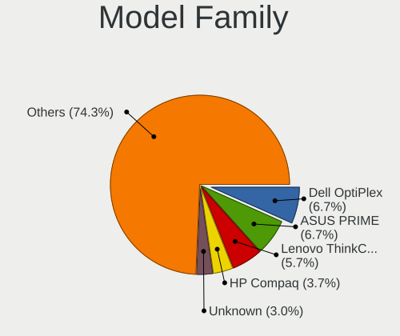

| Name                    | Desktops | Percent |
|-------------------------|----------|---------|
| Dell OptiPlex           | 20       | 6.67%   |
| ASUS PRIME              | 20       | 6.67%   |
| Lenovo ThinkCentre      | 17       | 5.67%   |
| HP Compaq               | 11       | 3.67%   |
| Unknown                 | 9        | 3%      |
| ASUS ROG                | 8        | 2.67%   |
| HP ProDesk              | 7        | 2.33%   |
| HP EliteDesk            | 7        | 2.33%   |
| ASUS All                | 6        | 2%      |
| Gigabyte B450M          | 4        | 1.33%   |
| Fujitsu ESPRIMO         | 4        | 1.33%   |
| Dell Inspiron           | 4        | 1.33%   |
| ASUS TUF                | 4        | 1.33%   |
| MSI MS-7996             | 3        | 1%      |
| MSI MS-7788             | 3        | 1%      |
| Gigabyte B550           | 3        | 1%      |
| Dell Precision          | 3        | 1%      |
| Acer Veriton            | 3        | 1%      |
| T-bao MINI              | 2        | 0.67%   |
| MSI MS-7817             | 2        | 0.67%   |
| Intel X99               | 2        | 0.67%   |
| Intel H81               | 2        | 0.67%   |
| Gigabyte GA-78LMT-USB3  | 2        | 0.67%   |
| Fujitsu Siemens ESPRIMO | 2        | 0.67%   |
| Dell Vostro             | 2        | 0.67%   |
| ASUS M5A78L-M           | 2        | 0.67%   |
| Apple MacPro5           | 2        | 0.67%   |
| Acer Aspire             | 2        | 0.67%   |
| ZOTAC H67ITX-C-E        | 1        | 0.33%   |
| Wincor Nixdorf BEETLE   | 1        | 0.33%   |
| Supermicro X10DAi       | 1        | 0.33%   |
| Shuttle NC10U           | 1        | 0.33%   |
| RDW RDW-MB-B450M        | 1        | 0.33%   |
| Pegatron s5713w         | 1        | 0.33%   |
| Pegatron Compaq         | 1        | 0.33%   |
| OEM A55                 | 1        | 0.33%   |
| MSI MS-7D46             | 1        | 0.33%   |
| MSI MS-7D31             | 1        | 0.33%   |
| MSI MS-7D30             | 1        | 0.33%   |
| MSI MS-7C95             | 1        | 0.33%   |

MFG Year
--------

Motherboard manufacture year

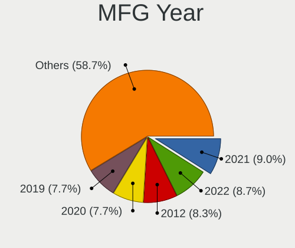

| Year    | Desktops | Percent |
|---------|----------|---------|
| 2021    | 27       | 9%      |
| 2022    | 26       | 8.67%   |
| 2012    | 25       | 8.33%   |
| 2020    | 23       | 7.67%   |
| 2019    | 23       | 7.67%   |
| 2014    | 22       | 7.33%   |
| 2010    | 19       | 6.33%   |
| 2013    | 18       | 6%      |
| 2015    | 17       | 5.67%   |
| 2017    | 16       | 5.33%   |
| 2011    | 16       | 5.33%   |
| 2018    | 14       | 4.67%   |
| 2016    | 13       | 4.33%   |
| 2008    | 12       | 4%      |
| 2009    | 11       | 3.67%   |
| 2023    | 9        | 3%      |
| 2024    | 3        | 1%      |
| 2007    | 3        | 1%      |
| 2006    | 2        | 0.67%   |
| Unknown | 1        | 0.33%   |

Form Factor
-----------

Physical design of the computer

| Name    | Desktops | Percent |
|---------|----------|---------|
| Desktop | 300      | 100%    |

Coreboot
--------

Have coreboot on board

| Used | Desktops | Percent |
|------|----------|---------|
| No   | 299      | 99.67%  |
| Yes  | 1        | 0.33%   |

RAM Size
--------

Total RAM memory

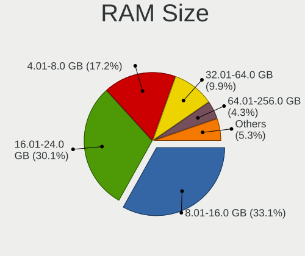

| Size in GB  | Desktops | Percent |
|-------------|----------|---------|
| 8.01-16.0   | 100      | 33.11%  |
| 16.01-24.0  | 91       | 30.13%  |
| 4.01-8.0    | 52       | 17.22%  |
| 32.01-64.0  | 30       | 9.93%   |
| 64.01-256.0 | 13       | 4.3%    |
| 2.01-3.0    | 7        | 2.32%   |
| 24.01-32.0  | 6        | 1.99%   |
| 3.01-4.0    | 2        | 0.66%   |
| 0.51-1.0    | 1        | 0.33%   |

RAM Used
--------

Used RAM memory

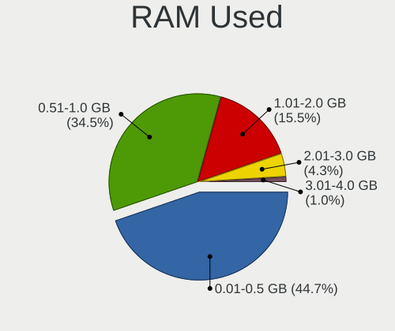

| Used GB  | Desktops | Percent |
|----------|----------|---------|
| 0.01-0.5 | 136      | 44.74%  |
| 0.51-1.0 | 105      | 34.54%  |
| 1.01-2.0 | 47       | 15.46%  |
| 2.01-3.0 | 13       | 4.28%   |
| 3.01-4.0 | 3        | 0.99%   |

Total Drives
------------

Number of drives on board

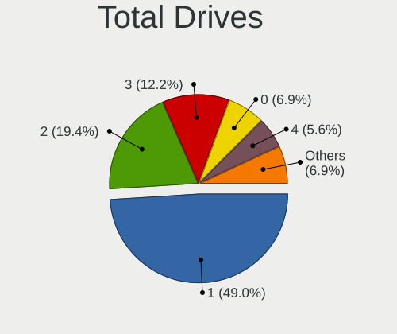

| Drives | Desktops | Percent |
|--------|----------|---------|
| 1      | 149      | 49.01%  |
| 2      | 59       | 19.41%  |
| 3      | 37       | 12.17%  |
| 0      | 21       | 6.91%   |
| 4      | 17       | 5.59%   |
| 5      | 13       | 4.28%   |
| 9      | 2        | 0.66%   |
| 6      | 2        | 0.66%   |
| 13     | 1        | 0.33%   |
| 10     | 1        | 0.33%   |
| 8      | 1        | 0.33%   |
| 7      | 1        | 0.33%   |

Has CD-ROM
----------

Has CD-ROM on board

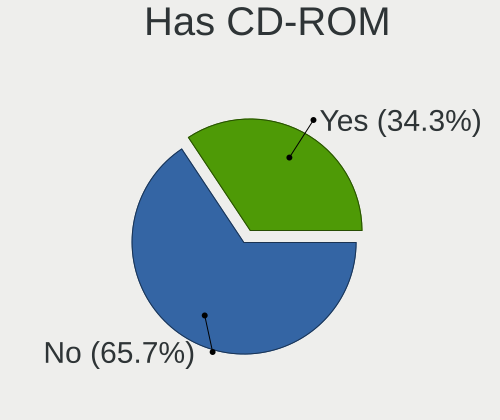

| Presented | Desktops | Percent |
|-----------|----------|---------|
| No        | 197      | 65.67%  |
| Yes       | 103      | 34.33%  |

Has Ethernet
------------

Has Ethernet on board

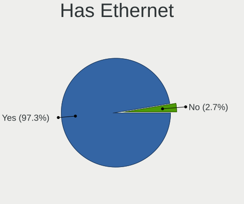

| Presented | Desktops | Percent |
|-----------|----------|---------|
| Yes       | 292      | 97.33%  |
| No        | 8        | 2.67%   |

Has WiFi
--------

Has WiFi module

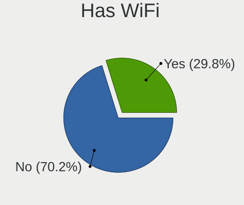

| Presented | Desktops | Percent |
|-----------|----------|---------|
| No        | 212      | 70.2%   |
| Yes       | 90       | 29.8%   |

Has Bluetooth
-------------

Has Bluetooth module

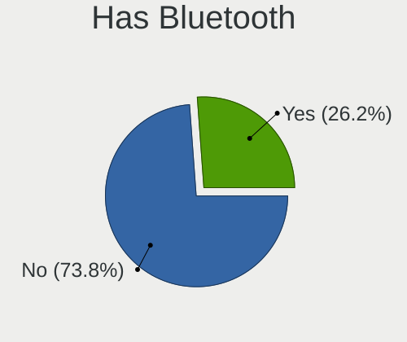

| Presented | Desktops | Percent |
|-----------|----------|---------|
| No        | 223      | 73.84%  |
| Yes       | 79       | 26.16%  |

Location
--------

Country
-------

Geographic location (country)

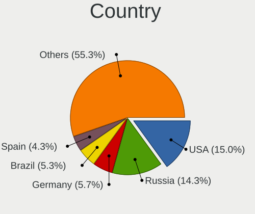

| Country             | Desktops | Percent |
|---------------------|----------|---------|
| USA                 | 45       | 15%     |
| Russia              | 43       | 14.33%  |
| Germany             | 17       | 5.67%   |
| Brazil              | 16       | 5.33%   |
| Spain               | 13       | 4.33%   |
| Italy               | 12       | 4%      |
| Poland              | 10       | 3.33%   |
| France              | 9        | 3%      |
| Canada              | 9        | 3%      |
| UK                  | 8        | 2.67%   |
| China               | 8        | 2.67%   |
| Australia           | 8        | 2.67%   |
| India               | 7        | 2.33%   |
| Hungary             | 7        | 2.33%   |
| Serbia              | 6        | 2%      |
| Belgium             | 6        | 2%      |
| Romania             | 5        | 1.67%   |
| Ukraine             | 4        | 1.33%   |
| Turkey              | 4        | 1.33%   |
| Peru                | 4        | 1.33%   |
| Netherlands         | 4        | 1.33%   |
| Mexico              | 4        | 1.33%   |
| Japan               | 4        | 1.33%   |
| Indonesia           | 4        | 1.33%   |
| Venezuela           | 3        | 1%      |
| Bulgaria            | 3        | 1%      |
| Argentina           | 3        | 1%      |
| Sweden              | 2        | 0.67%   |
| South Korea         | 2        | 0.67%   |
| Kyrgyzstan          | 2        | 0.67%   |
| Finland             | 2        | 0.67%   |
| Estonia             | 2        | 0.67%   |
| Dominican Republic  | 2        | 0.67%   |
| Austria             | 2        | 0.67%   |
| Uzbekistan          | 1        | 0.33%   |
| Trinidad and Tobago | 1        | 0.33%   |
| Thailand            | 1        | 0.33%   |
| Switzerland         | 1        | 0.33%   |
| Slovenia            | 1        | 0.33%   |
| San Marino          | 1        | 0.33%   |

City
----

Geographic location (city)

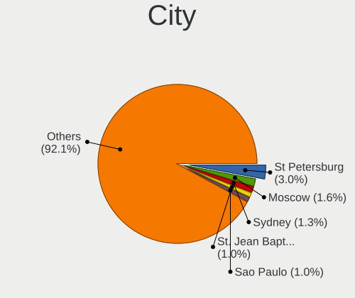

| City              | Desktops | Percent |
|-------------------|----------|---------|
| St Petersburg     | 9        | 2.96%   |
| Moscow            | 5        | 1.64%   |
| Sydney            | 4        | 1.32%   |
| St. Jean Baptiste | 3        | 0.99%   |
| Sao Paulo         | 3        | 0.99%   |
| Newburgh          | 3        | 0.99%   |
| Melbourne         | 3        | 0.99%   |
| Madrid            | 3        | 0.99%   |
| Belgrade          | 3        | 0.99%   |
| Vienna            | 2        | 0.66%   |
| Vantaa            | 2        | 0.66%   |
| Sofia             | 2        | 0.66%   |
| Sanford           | 2        | 0.66%   |
| Penza             | 2        | 0.66%   |
| Paris             | 2        | 0.66%   |
| Novosibirsk       | 2        | 0.66%   |
| New York          | 2        | 0.66%   |
| Lima              | 2        | 0.66%   |
| Krasnoyarsk       | 2        | 0.66%   |
| Krakow            | 2        | 0.66%   |
| Kochi             | 2        | 0.66%   |
| Kirov             | 2        | 0.66%   |
| Istanbul          | 2        | 0.66%   |
| Curitiba          | 2        | 0.66%   |
| Caracas           | 2        | 0.66%   |
| Brooklyn          | 2        | 0.66%   |
| Brisbane          | 2        | 0.66%   |
| Berlin            | 2        | 0.66%   |
| Bandung           | 2        | 0.66%   |
| Zurich            | 1        | 0.33%   |
| Zhengzhou         | 1        | 0.33%   |
| Zelienople        | 1        | 0.33%   |
| Yuseong-gu        | 1        | 0.33%   |
| Yokohama          | 1        | 0.33%   |
| Xiamen            | 1        | 0.33%   |
| Woodbridge        | 1        | 0.33%   |
| Winnipeg          | 1        | 0.33%   |
| Warsaw            | 1        | 0.33%   |
| Wandsworth        | 1        | 0.33%   |
| Waco              | 1        | 0.33%   |

Drives
------

Drive Vendor
------------

Hard drive vendors

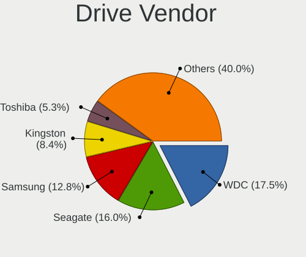

| Vendor              | Desktops | Drives | Percent |
|---------------------|----------|--------|---------|
| WDC                 | 83       | 128    | 17.47%  |
| Seagate             | 76       | 114    | 16%     |
| Samsung Electronics | 61       | 88     | 12.84%  |
| Kingston            | 40       | 41     | 8.42%   |
| Toshiba             | 25       | 32     | 5.26%   |
| Crucial             | 19       | 24     | 4%      |
| Hitachi             | 15       | 18     | 3.16%   |
| SanDisk             | 14       | 14     | 2.95%   |
| A-DATA Technology   | 14       | 15     | 2.95%   |
| Transcend           | 8        | 8      | 1.68%   |
| SPCC                | 7        | 9      | 1.47%   |
| China               | 7        | 8      | 1.47%   |
| PNY                 | 6        | 8      | 1.26%   |
| Patriot             | 6        | 6      | 1.26%   |
| Micron Technology   | 6        | 7      | 1.26%   |
| Maxtor              | 6        | 7      | 1.26%   |
| Intel               | 6        | 6      | 1.26%   |
| HGST                | 6        | 6      | 1.26%   |
| KingSpec            | 4        | 4      | 0.84%   |
| Lexar               | 3        | 3      | 0.63%   |
| Gigabyte Technology | 3        | 4      | 0.63%   |
| AMD                 | 3        | 3      | 0.63%   |
| XPG                 | 2        | 3      | 0.42%   |
| Team                | 2        | 2      | 0.42%   |
| SK hynix            | 2        | 2      | 0.42%   |
| Netac               | 2        | 2      | 0.42%   |
| KIOXIA-EXCERIA      | 2        | 2      | 0.42%   |
| KIOXIA              | 2        | 2      | 0.42%   |
| Intenso             | 2        | 2      | 0.42%   |
| Corsair             | 2        | 2      | 0.42%   |
| Apacer              | 2        | 2      | 0.42%   |
| XUM                 | 1        | 1      | 0.21%   |
| XrayDisk            | 1        | 1      | 0.21%   |
| WALRAM              | 1        | 1      | 0.21%   |
| Verbatim            | 1        | 1      | 0.21%   |
| Vaseky              | 1        | 1      | 0.21%   |
| TwinMOS             | 1        | 1      | 0.21%   |
| TAMMUZ              | 1        | 1      | 0.21%   |
| T-FORCE             | 1        | 1      | 0.21%   |
| SUNEAST             | 1        | 1      | 0.21%   |

Drive Model
-----------

Hard drive models

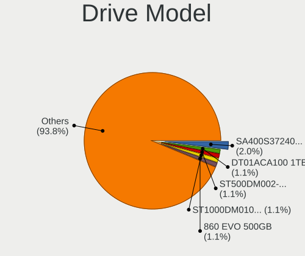

| Model                              | Desktops | Percent |
|------------------------------------|----------|---------|
| Kingston SA400S37240G 240GB        | 11       | 1.96%   |
| Toshiba DT01ACA100 1TB             | 6        | 1.07%   |
| Seagate ST500DM002-1BD142 500GB    | 6        | 1.07%   |
| Seagate ST1000DM010-2EP102 1TB     | 6        | 1.07%   |
| Samsung SSD 860 EVO 500GB          | 6        | 1.07%   |
| Seagate ST3500418AS 500GB          | 5        | 0.89%   |
| Crucial CT500MX500SSD1 500GB       | 5        | 0.89%   |
| Crucial CT240BX500SSD1 240GB       | 5        | 0.89%   |
| Toshiba HDWD110 1TB                | 4        | 0.71%   |
| Seagate ST380815AS 80GB            | 4        | 0.71%   |
| Samsung SSD 870 EVO 500GB          | 4        | 0.71%   |
| Samsung SSD 850 EVO 250GB          | 4        | 0.71%   |
| Kingston SA400S37120G 120GB        | 4        | 0.71%   |
| WDC WDS500G2B0A-00SM50 500GB       | 3        | 0.54%   |
| WDC WDS240G2G0A-00JH30 240GB       | 3        | 0.54%   |
| WDC WD5000AAKX-08U6AA0 500GB       | 3        | 0.54%   |
| WDC WD20EFRX-68EUZN0 1TB           | 3        | 0.54%   |
| WDC WD10EZEX-60WN4A0 1TB           | 3        | 0.54%   |
| WDC WD10EZEX-08WN4A0 1TB           | 3        | 0.54%   |
| SPCC Solid State Disk 512GB        | 3        | 0.54%   |
| SPCC Solid State Disk 128GB        | 3        | 0.54%   |
| Seagate ST3250310AS 250GB          | 3        | 0.54%   |
| Seagate ST2000DM008-2FR102 2TB     | 3        | 0.54%   |
| Seagate ST2000DM006-2DM164 2TB     | 3        | 0.54%   |
| Seagate ST1000LM024 HN-M101MBB 1TB | 3        | 0.54%   |
| Samsung SSD 980 1TB                | 3        | 0.54%   |
| Samsung SSD 970 EVO Plus 500GB     | 3        | 0.54%   |
| Kingston SNV2S1000G 1TB            | 3        | 0.54%   |
| Crucial CT1000P3SSD8 1TB           | 3        | 0.54%   |
| A-DATA SU650 120GB                 | 3        | 0.54%   |
| WDC WDS120G2G0A-00JH30 120GB       | 2        | 0.36%   |
| WDC WDS100T2B0C-00PXH0 1TB         | 2        | 0.36%   |
| WDC WD5000AAKX-001CA0 500GB        | 2        | 0.36%   |
| WDC WD20EZRX-00D8PB0 2TB           | 2        | 0.36%   |
| WDC WD20EARS-00MVWB0 2TB           | 2        | 0.36%   |
| WDC WD10EZRX-00A8LB0 1TB           | 2        | 0.36%   |
| WDC WD10EZEX-60WN4A1 1TB           | 2        | 0.36%   |
| WDC WD10EZEX-00BBHA0 1TB           | 2        | 0.36%   |
| Transcend TS120GSSD220S 120GB      | 2        | 0.36%   |
| Toshiba MK3259GSXP 320GB           | 2        | 0.36%   |

HDD Vendor
----------

Hard disk drive vendors

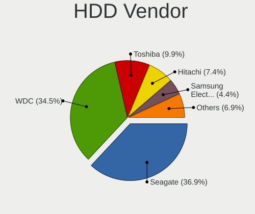

| Vendor              | Desktops | Drives | Percent |
|---------------------|----------|--------|---------|
| Seagate             | 75       | 113    | 36.95%  |
| WDC                 | 70       | 104    | 34.48%  |
| Toshiba             | 20       | 25     | 9.85%   |
| Hitachi             | 15       | 18     | 7.39%   |
| Samsung Electronics | 9        | 13     | 4.43%   |
| Maxtor              | 6        | 7      | 2.96%   |
| HGST                | 6        | 6      | 2.96%   |
| QUANTUM             | 1        | 1      | 0.49%   |
| Apple               | 1        | 1      | 0.49%   |

SSD Vendor
----------

Solid state drive vendors

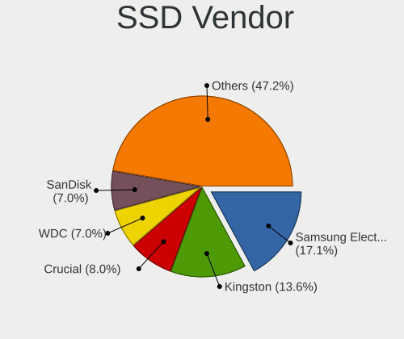

| Vendor              | Desktops | Drives | Percent |
|---------------------|----------|--------|---------|
| Samsung Electronics | 34       | 44     | 17.09%  |
| Kingston            | 27       | 28     | 13.57%  |
| Crucial             | 16       | 18     | 8.04%   |
| WDC                 | 14       | 14     | 7.04%   |
| SanDisk             | 14       | 14     | 7.04%   |
| A-DATA Technology   | 8        | 8      | 4.02%   |
| Transcend           | 7        | 7      | 3.52%   |
| China               | 7        | 8      | 3.52%   |
| SPCC                | 6        | 8      | 3.02%   |
| PNY                 | 5        | 6      | 2.51%   |
| Toshiba             | 4        | 6      | 2.01%   |
| Patriot             | 4        | 4      | 2.01%   |
| KingSpec            | 4        | 4      | 2.01%   |
| Intel               | 4        | 4      | 2.01%   |
| Micron Technology   | 3        | 3      | 1.51%   |
| KIOXIA-EXCERIA      | 2        | 2      | 1.01%   |
| Intenso             | 2        | 2      | 1.01%   |
| Apacer              | 2        | 2      | 1.01%   |
| AMD                 | 2        | 2      | 1.01%   |
| XUM                 | 1        | 1      | 0.5%    |
| XrayDisk            | 1        | 1      | 0.5%    |
| WALRAM              | 1        | 1      | 0.5%    |
| Verbatim            | 1        | 1      | 0.5%    |
| Vaseky              | 1        | 1      | 0.5%    |
| TwinMOS             | 1        | 1      | 0.5%    |
| Team                | 1        | 1      | 0.5%    |
| TAMMUZ              | 1        | 1      | 0.5%    |
| T-FORCE             | 1        | 1      | 0.5%    |
| SUNEAST             | 1        | 1      | 0.5%    |
| ShineDisk           | 1        | 1      | 0.5%    |
| SETHRISE            | 1        | 1      | 0.5%    |
| RX7                 | 1        | 1      | 0.5%    |
| Pioneer             | 1        | 1      | 0.5%    |
| Philips             | 1        | 1      | 0.5%    |
| Palit               | 1        | 1      | 0.5%    |
| OCZ                 | 1        | 1      | 0.5%    |
| MidasForce          | 1        | 1      | 0.5%    |
| LITEONIT            | 1        | 1      | 0.5%    |
| Lexar               | 1        | 1      | 0.5%    |
| Kston               | 1        | 1      | 0.5%    |

Drive Kind
----------

HDD or SSD

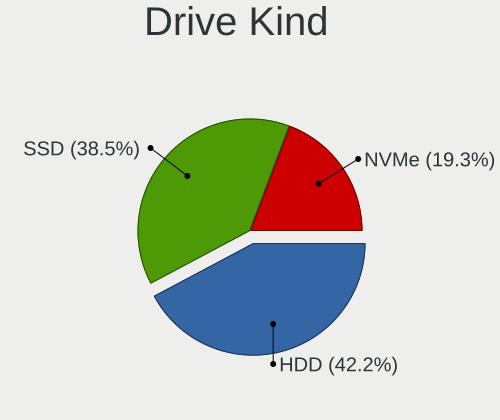

| Kind | Desktops | Drives | Percent |
|------|----------|--------|---------|
| HDD  | 171      | 288    | 42.22%  |
| SSD  | 156      | 220    | 38.52%  |
| NVMe | 78       | 105    | 19.26%  |

Drive Connector
---------------

SATA, SAS, NVMe, etc.

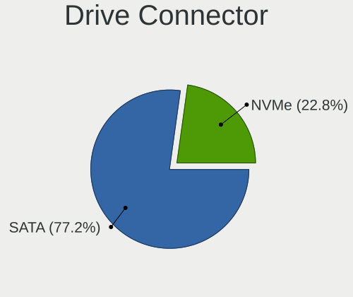

| Type | Desktops | Drives | Percent |
|------|----------|--------|---------|
| SATA | 264      | 508    | 77.19%  |
| NVMe | 78       | 105    | 22.81%  |

Drive Size
----------

Size of hard drive

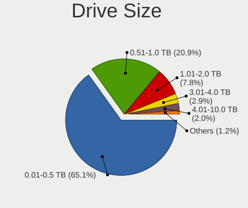

| Size in TB | Desktops | Drives | Percent |
|------------|----------|--------|---------|
| 0.01-0.5   | 224      | 320    | 65.12%  |
| 0.51-1.0   | 72       | 96     | 20.93%  |
| 1.01-2.0   | 27       | 49     | 7.85%   |
| 3.01-4.0   | 10       | 18     | 2.91%   |
| 4.01-10.0  | 7        | 18     | 2.03%   |
| 2.01-3.0   | 3        | 6      | 0.87%   |
| 10.01-20.0 | 1        | 1      | 0.29%   |

Space Total
-----------

Amount of disk space available on the file system

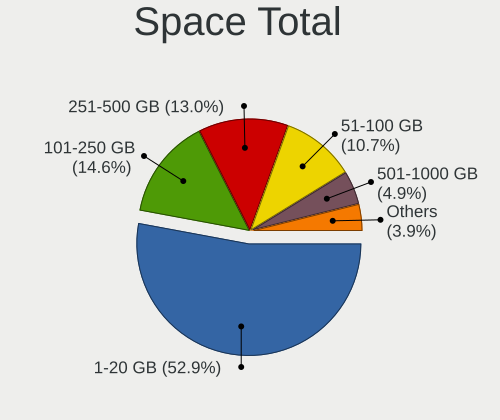

| Size in GB | Desktops | Percent |
|------------|----------|---------|
| 1-20       | 163      | 52.92%  |
| 101-250    | 45       | 14.61%  |
| 251-500    | 40       | 12.99%  |
| 51-100     | 33       | 10.71%  |
| 501-1000   | 15       | 4.87%   |
| 21-50      | 6        | 1.95%   |
| 1001-2000  | 4        | 1.3%    |
| Unknown    | 2        | 0.65%   |

Space Used
----------

Amount of used disk space

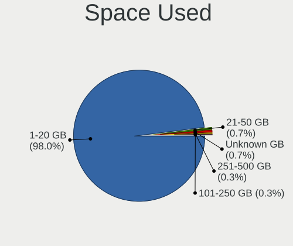

| Used GB | Desktops | Percent |
|---------|----------|---------|
| 1-20    | 294      | 98%     |
| 21-50   | 2        | 0.67%   |
| Unknown | 2        | 0.67%   |
| 251-500 | 1        | 0.33%   |
| 101-250 | 1        | 0.33%   |

Malfunc. Drives
---------------

Drive models with a malfunction

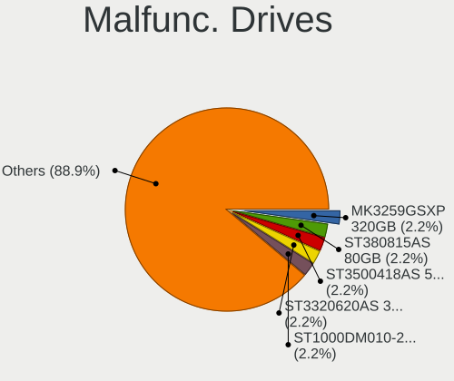

| Model                                     | Desktops | Drives | Percent |
|-------------------------------------------|----------|--------|---------|
| Toshiba MK3259GSXP 320GB                  | 2        | 2      | 2.22%   |
| Seagate ST380815AS 80GB                   | 2        | 2      | 2.22%   |
| Seagate ST3500418AS 500GB                 | 2        | 2      | 2.22%   |
| Seagate ST3320620AS 320GB                 | 2        | 2      | 2.22%   |
| Seagate ST1000DM010-2EP102 1TB            | 2        | 2      | 2.22%   |
| WDC WDS480G2G0A-00JH30 480GB              | 1        | 1      | 1.11%   |
| WDC WD800JD-75MSA3 80GB                   | 1        | 1      | 1.11%   |
| WDC WD6400BPVT-22HXZT3 640GB              | 1        | 1      | 1.11%   |
| WDC WD6400AAKS-65A7B0 640GB               | 1        | 1      | 1.11%   |
| WDC WD5000BPVT-00HXZT1 500GB              | 1        | 1      | 1.11%   |
| WDC WD5000AAKX-22ERMA0 500GB              | 1        | 1      | 1.11%   |
| WDC WD5000AAKX-08U6AA0 500GB              | 1        | 1      | 1.11%   |
| WDC WD5000AAKX-083CA1 500GB               | 1        | 1      | 1.11%   |
| WDC WD5000AAKX-00ERMA0 500GB              | 1        | 1      | 1.11%   |
| WDC WD5000AAKX-001CA0 500GB               | 1        | 1      | 1.11%   |
| WDC WD5000AAKS-08V0A0 500GB               | 1        | 1      | 1.11%   |
| WDC WD30EFRX-68EUZN0 3TB                  | 1        | 1      | 1.11%   |
| WDC WD2500AAJS-00YZCA0 250GB              | 1        | 1      | 1.11%   |
| WDC WD20EZRX-00D8PB0 2TB                  | 1        | 1      | 1.11%   |
| WDC WD20EARS-00MVWB0 2TB                  | 1        | 1      | 1.11%   |
| WDC WD20EADS-00W4B0 2TB                   | 1        | 1      | 1.11%   |
| WDC WD1600YS-01SHB1 164GB                 | 1        | 1      | 1.11%   |
| WDC WD1600AAJS-60Z0A0 160GB               | 1        | 1      | 1.11%   |
| WDC WD15EARS-00Z5B1 1.5TB                 | 1        | 1      | 1.11%   |
| WDC WD10JPVX-22JC3T0 1TB                  | 1        | 1      | 1.11%   |
| WDC WD10EZRX-00A8LB0 1TB                  | 1        | 1      | 1.11%   |
| WDC WD10EZEX-60WN4A0 1TB                  | 1        | 1      | 1.11%   |
| WDC WD10EZEX-60M2NA0 1TB                  | 1        | 1      | 1.11%   |
| WDC WD10EARS-00MVWB0 1TB                  | 1        | 1      | 1.11%   |
| WDC WD10EARS-003BB1 1TB                   | 1        | 1      | 1.11%   |
| WDC WD10EADS-11M2B2 1TB                   | 1        | 1      | 1.11%   |
| WDC WD Green 2.5 480GB                    | 1        | 1      | 1.11%   |
| Transcend TS120GSSD220S 120GB             | 1        | 1      | 1.11%   |
| Toshiba MK8052GSX 80GB                    | 1        | 1      | 1.11%   |
| Toshiba HDWD110 1TB                       | 1        | 1      | 1.11%   |
| Toshiba DT01ACA100 1TB                    | 1        | 1      | 1.11%   |
| Toshiba DT01ABA200 2TB                    | 1        | 1      | 1.11%   |
| Silicon Motion Asgard AN1TNVMe-M.2-80 1TB | 1        | 1      | 1.11%   |
| ShineDisk M667 120G                       | 1        | 1      | 1.11%   |
| Seagate ST9320325AS 320GB                 | 1        | 1      | 1.11%   |

Malfunc. Drive Vendor
---------------------

Vendors of faulty drives

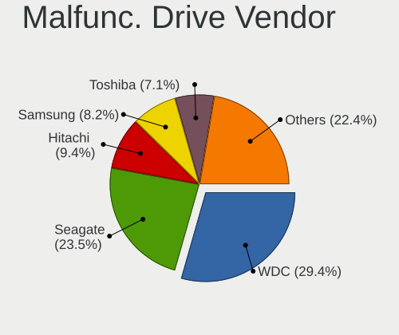

| Vendor              | Desktops | Drives | Percent |
|---------------------|----------|--------|---------|
| WDC                 | 25       | 27     | 29.41%  |
| Seagate             | 20       | 23     | 23.53%  |
| Hitachi             | 8        | 8      | 9.41%   |
| Samsung Electronics | 7        | 10     | 8.24%   |
| Toshiba             | 6        | 6      | 7.06%   |
| Maxtor              | 5        | 6      | 5.88%   |
| HGST                | 3        | 3      | 3.53%   |
| Crucial             | 2        | 2      | 2.35%   |
| Transcend           | 1        | 1      | 1.18%   |
| Silicon Motion      | 1        | 1      | 1.18%   |
| ShineDisk           | 1        | 1      | 1.18%   |
| Micron Technology   | 1        | 1      | 1.18%   |
| Kingston            | 1        | 1      | 1.18%   |
| Intel               | 1        | 1      | 1.18%   |
| faspeed             | 1        | 2      | 1.18%   |
| China               | 1        | 1      | 1.18%   |
| A-DATA Technology   | 1        | 1      | 1.18%   |

Malfunc. HDD Vendor
-------------------

Vendors of faulty HDD drives

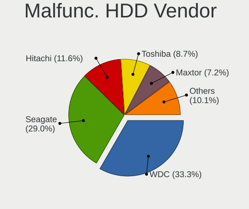

| Vendor              | Desktops | Drives | Percent |
|---------------------|----------|--------|---------|
| WDC                 | 23       | 25     | 33.33%  |
| Seagate             | 20       | 23     | 28.99%  |
| Hitachi             | 8        | 8      | 11.59%  |
| Toshiba             | 6        | 6      | 8.7%    |
| Maxtor              | 5        | 6      | 7.25%   |
| Samsung Electronics | 4        | 7      | 5.8%    |
| HGST                | 3        | 3      | 4.35%   |

Malfunc. Drive Kind
-------------------

Kinds of faulty drives

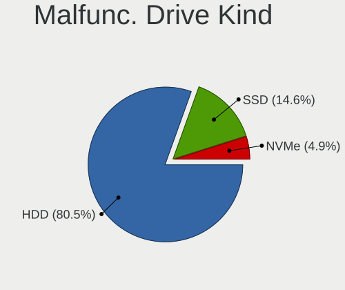

| Kind | Desktops | Drives | Percent |
|------|----------|--------|---------|
| HDD  | 66       | 78     | 80.49%  |
| SSD  | 12       | 13     | 14.63%  |
| NVMe | 4        | 4      | 4.88%   |

Failed Drives
-------------

Failed drive models

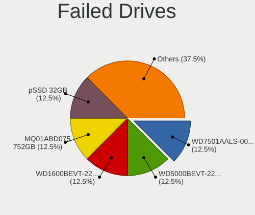

| Model                             | Desktops | Drives | Percent |
|-----------------------------------|----------|--------|---------|
| WDC WD7501AALS-00J7B0 752GB       | 1        | 1      | 12.5%   |
| WDC WD5000BEVT-22A0RT0 500GB      | 1        | 1      | 12.5%   |
| WDC WD1600BEVT-22ZCT0 160GB       | 1        | 1      | 12.5%   |
| Toshiba MQ01ABD075 752GB          | 1        | 1      | 12.5%   |
| SanDisk pSSD 32GB                 | 1        | 1      | 12.5%   |
| Samsung Electronics HM250JI 250GB | 1        | 1      | 12.5%   |
| Samsung Electronics HD103SJ 1TB   | 1        | 1      | 12.5%   |
| Hitachi HDS721032CLA362 320GB     | 1        | 1      | 12.5%   |

Failed Drive Vendor
-------------------

Failed drive vendors

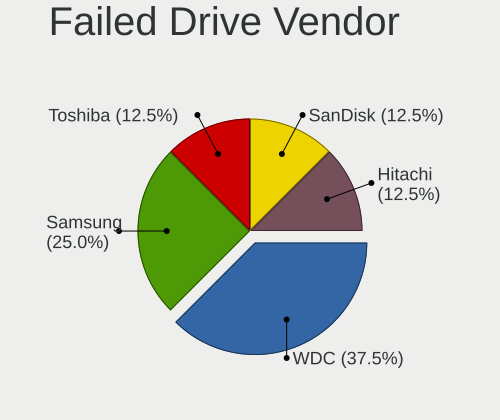

| Vendor              | Desktops | Drives | Percent |
|---------------------|----------|--------|---------|
| WDC                 | 3        | 3      | 37.5%   |
| Samsung Electronics | 2        | 2      | 25%     |
| Toshiba             | 1        | 1      | 12.5%   |
| SanDisk             | 1        | 1      | 12.5%   |
| Hitachi             | 1        | 1      | 12.5%   |

Drive Status
------------

Number of failed and malfunc. drives

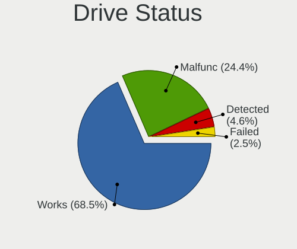

| Status   | Desktops | Drives | Percent |
|----------|----------|--------|---------|
| Works    | 222      | 489    | 68.52%  |
| Malfunc  | 79       | 95     | 24.38%  |
| Detected | 15       | 21     | 4.63%   |
| Failed   | 8        | 8      | 2.47%   |

Storage controller
------------------

Storage Vendor
--------------

Storage controller vendors

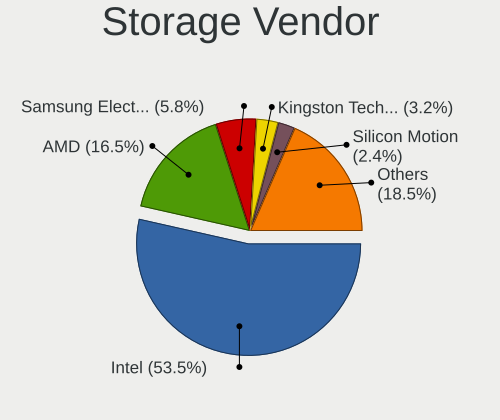

| Vendor                       | Desktops | Percent |
|------------------------------|----------|---------|
| Intel                        | 220      | 53.53%  |
| AMD                          | 68       | 16.55%  |
| Samsung Electronics          | 24       | 5.84%   |
| Kingston Technology Company  | 13       | 3.16%   |
| Silicon Motion               | 10       | 2.43%   |
| SanDisk                      | 10       | 2.43%   |
| ASMedia Technology           | 10       | 2.43%   |
| Nvidia                       | 7        | 1.7%    |
| Marvell Technology Group     | 7        | 1.7%    |
| Phison Electronics           | 6        | 1.46%   |
| JMicron Technology           | 6        | 1.46%   |
| Micron/Crucial Technology    | 4        | 0.97%   |
| MAXIO Technology (Hangzhou)  | 4        | 0.97%   |
| ADATA Technology             | 4        | 0.97%   |
| Realtek Semiconductor        | 3        | 0.73%   |
| Micron Technology            | 3        | 0.73%   |
| VIA Technologies             | 2        | 0.49%   |
| Toshiba                      | 2        | 0.49%   |
| SK hynix                     | 2        | 0.49%   |
| Shenzhen Longsys Electronics | 1        | 0.24%   |
| Seagate Technology           | 1        | 0.24%   |
| OCZ Technology Group         | 1        | 0.24%   |
| KIOXIA                       | 1        | 0.24%   |
| Broadcom / LSI               | 1        | 0.24%   |
| Areca Technology             | 1        | 0.24%   |

Storage Model
-------------

Storage controller models

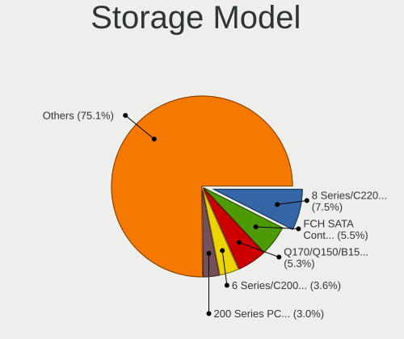

| Model                                                                                   | Desktops | Percent |
|-----------------------------------------------------------------------------------------|----------|---------|
| Intel 8 Series/C220 Series Chipset Family 6-port SATA Controller 1 [AHCI mode]          | 38       | 7.5%    |
| AMD FCH SATA Controller [AHCI mode]                                                     | 28       | 5.52%   |
| Intel Q170/Q150/B150/H170/H110/Z170/CM236 Chipset SATA Controller [AHCI Mode]           | 27       | 5.33%   |
| Intel 6 Series/C200 Series Chipset Family 6 port Desktop SATA AHCI Controller           | 18       | 3.55%   |
| Intel 200 Series PCH SATA controller [AHCI mode]                                        | 15       | 2.96%   |
| AMD 400 Series Chipset SATA Controller                                                  | 15       | 2.96%   |
| AMD 500 Series Chipset SATA Controller                                                  | 14       | 2.76%   |
| Samsung NVMe SSD Controller SM981/PM981/PM983                                           | 13       | 2.56%   |
| Intel Cannon Lake PCH SATA AHCI Controller                                              | 12       | 2.37%   |
| Intel 7 Series/C210 Series Chipset Family 6-port SATA Controller [AHCI mode]            | 11       | 2.17%   |
| AMD SB7x0/SB8x0/SB9x0 IDE Controller                                                    | 11       | 2.17%   |
| Intel 4 Series Chipset PT IDER Controller                                               | 10       | 1.97%   |
| Intel NM10/ICH7 Family SATA Controller [IDE mode]                                       | 9        | 1.78%   |
| Intel 6 Series/C200 Series Chipset Family Desktop SATA Controller (IDE mode, ports 4-5) | 9        | 1.78%   |
| Intel 6 Series/C200 Series Chipset Family Desktop SATA Controller (IDE mode, ports 0-3) | 9        | 1.78%   |
| Intel 500 Series Chipset Family SATA AHCI Controller                                    | 9        | 1.78%   |
| AMD SB7x0/SB8x0/SB9x0 SATA Controller [IDE mode]                                        | 9        | 1.78%   |
| Intel 82801G (ICH7 Family) IDE Controller                                               | 8        | 1.58%   |
| ASMedia ASM1061/ASM1062 Serial ATA Controller                                           | 8        | 1.58%   |
| Silicon Motion SM2263EN/SM2263XT (DRAM-less) NVMe SSD Controllers                       | 7        | 1.38%   |
| Intel SATA Controller [RAID mode]                                                       | 7        | 1.38%   |
| Samsung NVMe SSD Controller 980 (DRAM-less)                                             | 6        | 1.18%   |
| Samsung NVMe SSD Controller PM9A1/PM9A3/980PRO                                          | 5        | 0.99%   |
| Nvidia MCP61 SATA Controller                                                            | 5        | 0.99%   |
| Intel C610/X99 series chipset 6-Port SATA Controller [AHCI mode]                        | 5        | 0.99%   |
| Intel Alder Lake-S PCH SATA Controller [AHCI Mode]                                      | 5        | 0.99%   |
| Intel 82801JD/DO (ICH10 Family) SATA AHCI Controller                                    | 5        | 0.99%   |
| Intel 82801JD/DO (ICH10 Family) 4-port SATA IDE Controller                              | 5        | 0.99%   |
| Intel 82801JD/DO (ICH10 Family) 2-port SATA IDE Controller                              | 5        | 0.99%   |
| AMD SB7x0/SB8x0/SB9x0 SATA Controller [AHCI mode]                                       | 5        | 0.99%   |
| MAXIO (Hangzhou) NVMe SSD Controller MAP1202 (DRAM-less)                                | 4        | 0.79%   |
| Kingston Company NV2 NVMe SSD [SM2267XT] (DRAM-less)                                    | 4        | 0.79%   |
| JMicron JMB363 SATA/IDE Controller                                                      | 4        | 0.79%   |
| Intel Volume Management Device NVMe RAID Controller                                     | 4        | 0.79%   |
| Intel 82Q35 Express PT IDER Controller                                                  | 4        | 0.79%   |
| Intel 82801IR/IO/IH (ICH9R/DO/DH) 6 port SATA Controller [AHCI mode]                    | 4        | 0.79%   |
| Intel 82801I (ICH9 Family) 2 port SATA Controller [IDE mode]                            | 4        | 0.79%   |
| Intel 5 Series/3400 Series Chipset 6 port SATA AHCI Controller                          | 4        | 0.79%   |
| SanDisk Ultra 3D / WD PC SN530, IX SN530, Blue SN550 NVMe SSD (DRAM-less)               | 3        | 0.59%   |
| SanDisk Ultra 3D / WD Blue SN570 NVMe SSD (DRAM-less)                                   | 3        | 0.59%   |

Storage Kind
------------

Kind of storage controller (IDE, SATA, NVMe, SAS, ...)

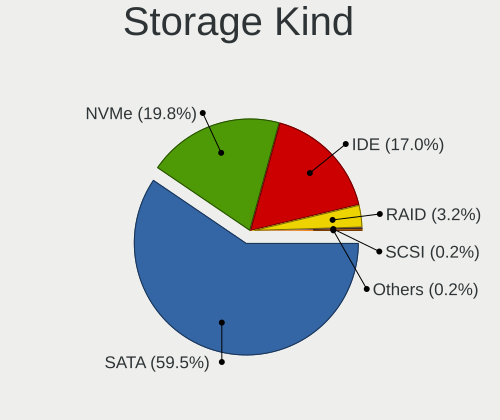

| Kind | Desktops | Percent |
|------|----------|---------|
| SATA | 238      | 59.5%   |
| NVMe | 79       | 19.75%  |
| IDE  | 68       | 17%     |
| RAID | 13       | 3.25%   |
| SAS  | 1        | 0.25%   |
| SCSI | 1        | 0.25%   |

Processor
---------

CPU Vendor
----------

Processor vendors

| Vendor | Desktops | Percent |
|--------|----------|---------|
| Intel  | 226      | 75.33%  |
| AMD    | 74       | 24.67%  |

CPU Model
---------

Processor models

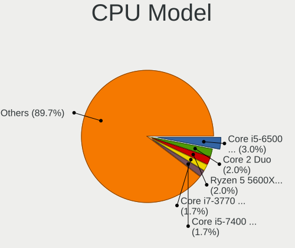

| Model                                       | Desktops | Percent |
|---------------------------------------------|----------|---------|
| Intel Core i5-6500 CPU @ 3.20GHz            | 9        | 3%      |
| Intel Core 2 Duo                            | 6        | 2%      |
| AMD Ryzen 5 5600X 6-Core Processor          | 6        | 2%      |
| Intel Core i7-3770 CPU @ 3.40GHz            | 5        | 1.67%   |
| Intel Core i5-7400 CPU @ 3.00GHz            | 5        | 1.67%   |
| Intel Core i3-7100 CPU @ 3.90GHz            | 5        | 1.67%   |
| Intel Core i5-6500T CPU @ 2.50GHz           | 4        | 1.33%   |
| Intel Core i5-4570 CPU @ 3.20GHz            | 4        | 1.33%   |
| Intel Core i3-2100 CPU @ 3.10GHz            | 4        | 1.33%   |
| AMD Ryzen 5 5600 6-Core Processor           | 4        | 1.33%   |
| AMD Ryzen 5 3400G with Radeon Vega Graphics | 4        | 1.33%   |
| Intel Core i7-8700 CPU @ 3.20GHz            | 3        | 1%      |
| Intel Core i5-4590T CPU @ 2.00GHz           | 3        | 1%      |
| Intel Core i5-4460 CPU @ 3.20GHz            | 3        | 1%      |
| Intel Core i5-2400 CPU @ 3.10GHz            | 3        | 1%      |
| Intel Core i3-9100 CPU @ 3.60GHz            | 3        | 1%      |
| Intel Core i3-6100 CPU @ 3.70GHz            | 3        | 1%      |
| Intel Core i3-4160 CPU @ 3.60GHz            | 3        | 1%      |
| Intel Core i3-4130 CPU @ 3.40GHz            | 3        | 1%      |
| Intel Core i3-3220 CPU @ 3.30GHz            | 3        | 1%      |
| Intel Core 2 Duo CPU E8400 @ 3.00GHz        | 3        | 1%      |
| Intel Celeron CPU J1900 @ 1.99GHz           | 3        | 1%      |
| AMD Ryzen 5 2600 Six-Core Processor         | 3        | 1%      |
| AMD FX-6300 Six-Core Processor              | 3        | 1%      |
| Intel Xeon CPU E5-2620 v3 @ 2.40GHz         | 2        | 0.67%   |
| Intel Pentium Dual-Core CPU E5300 @ 2.60GHz | 2        | 0.67%   |
| Intel Core i7-8700K CPU @ 3.70GHz           | 2        | 0.67%   |
| Intel Core i7-7700 CPU @ 3.60GHz            | 2        | 0.67%   |
| Intel Core i7-6700 CPU @ 3.40GHz            | 2        | 0.67%   |
| Intel Core i7-4790 CPU @ 3.60GHz            | 2        | 0.67%   |
| Intel Core i7-4770 CPU @ 3.40GHz            | 2        | 0.67%   |
| Intel Core i7-2600 CPU @ 3.40GHz            | 2        | 0.67%   |
| Intel Core i5-9400F CPU @ 2.90GHz           | 2        | 0.67%   |
| Intel Core i5-4590 CPU @ 3.30GHz            | 2        | 0.67%   |
| Intel Core i5-4440 CPU @ 3.10GHz            | 2        | 0.67%   |
| Intel Core i5-3470 CPU @ 3.20GHz            | 2        | 0.67%   |
| Intel Core i5-10400F CPU @ 2.90GHz          | 2        | 0.67%   |
| Intel Core i5 CPU 750 @ 2.67GHz             | 2        | 0.67%   |
| Intel Core i3-4330 CPU @ 3.50GHz            | 2        | 0.67%   |
| Intel Core i3-3240 CPU @ 3.40GHz            | 2        | 0.67%   |

CPU Model Family
----------------

Processor model prefix

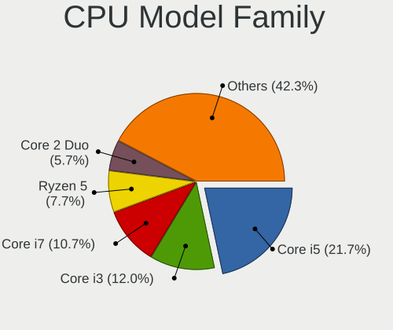

| Model                   | Desktops | Percent |
|-------------------------|----------|---------|
| Intel Core i5           | 65       | 21.67%  |
| Intel Core i3           | 36       | 12%     |
| Intel Core i7           | 32       | 10.67%  |
| AMD Ryzen 5             | 23       | 7.67%   |
| Intel Core 2 Duo        | 17       | 5.67%   |
| Intel Celeron           | 17       | 5.67%   |
| Other                   | 15       | 5%      |
| Intel Xeon              | 15       | 5%      |
| Intel Pentium           | 12       | 4%      |
| AMD Ryzen 7             | 11       | 3.67%   |
| AMD Ryzen 3             | 6        | 2%      |
| Intel Pentium Dual-Core | 5        | 1.67%   |
| AMD Athlon II X2        | 5        | 1.67%   |
| AMD FX                  | 4        | 1.33%   |
| Intel Core 2 Quad       | 3        | 1%      |
| AMD Phenom II X4        | 3        | 1%      |
| Intel Pentium Gold      | 2        | 0.67%   |
| Intel Core i9           | 2        | 0.67%   |
| Intel Atom              | 2        | 0.67%   |
| AMD Ryzen 9             | 2        | 0.67%   |
| AMD Phenom II X6        | 2        | 0.67%   |
| AMD Athlon II X4        | 2        | 0.67%   |
| AMD A6                  | 2        | 0.67%   |
| AMD A4                  | 2        | 0.67%   |
| AMD A10                 | 2        | 0.67%   |
| Intel Pentium Dual      | 1        | 0.33%   |
| Intel Pentium 4         | 1        | 0.33%   |
| Intel Core 2            | 1        | 0.33%   |
| AMD Ryzen 5 PRO         | 1        | 0.33%   |
| AMD Ryzen 3 PRO         | 1        | 0.33%   |
| AMD PRO A10             | 1        | 0.33%   |
| AMD Phenom II X2        | 1        | 0.33%   |
| AMD GX                  | 1        | 0.33%   |
| AMD G                   | 1        | 0.33%   |
| AMD E                   | 1        | 0.33%   |
| AMD Athlon X2           | 1        | 0.33%   |
| AMD Athlon 64 X2        | 1        | 0.33%   |
| AMD Athlon 64           | 1        | 0.33%   |

CPU Cores
---------

Number of processor cores

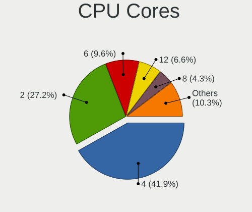

| Number  | Desktops | Percent |
|---------|----------|---------|
| 4       | 126      | 41.86%  |
| 2       | 82       | 27.24%  |
| 6       | 29       | 9.63%   |
| 12      | 20       | 6.64%   |
| 8       | 13       | 4.32%   |
| 16      | 10       | 3.32%   |
| Unknown | 10       | 3.32%   |
| 10      | 4        | 1.33%   |
| 24      | 3        | 1%      |
| 1       | 2        | 0.66%   |
| 20      | 1        | 0.33%   |
| 14      | 1        | 0.33%   |

CPU Sockets
-----------

Number of sockets

| Number | Desktops | Percent |
|--------|----------|---------|
| 1      | 297      | 99%     |
| 2      | 3        | 1%      |

CPU Threads
-----------

Threads per core (Hyper-Threading)

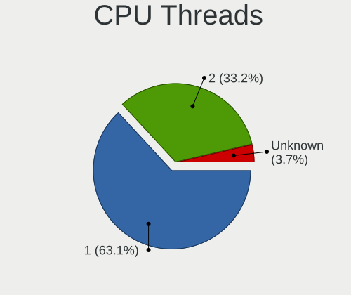

| Number  | Desktops | Percent |
|---------|----------|---------|
| 1       | 190      | 63.12%  |
| 2       | 100      | 33.22%  |
| Unknown | 11       | 3.65%   |

CPU Microarch
-------------

Microarchitecture

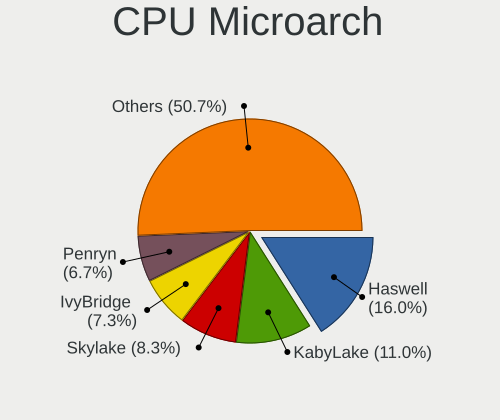

| Name          | Desktops | Percent |
|---------------|----------|---------|
| Haswell       | 48       | 16%     |
| KabyLake      | 33       | 11%     |
| Skylake       | 25       | 8.33%   |
| IvyBridge     | 22       | 7.33%   |
| Penryn        | 20       | 6.67%   |
| SandyBridge   | 19       | 6.33%   |
| Zen 3         | 18       | 6%      |
| Unknown       | 17       | 5.67%   |
| K10           | 13       | 4.33%   |
| Zen+          | 12       | 4%      |
| Core          | 10       | 3.33%   |
| CometLake     | 9        | 3%      |
| Zen           | 7        | 2.33%   |
| Silvermont    | 7        | 2.33%   |
| Piledriver    | 7        | 2.33%   |
| Zen 2         | 6        | 2%      |
| Nehalem       | 6        | 2%      |
| Westmere      | 3        | 1%      |
| K8 Hammer     | 2        | 0.67%   |
| Jaguar        | 2        | 0.67%   |
| Goldmont plus | 2        | 0.67%   |
| Goldmont      | 2        | 0.67%   |
| Broadwell     | 2        | 0.67%   |
| Bobcat        | 2        | 0.67%   |
| Steamroller   | 1        | 0.33%   |
| NetBurst      | 1        | 0.33%   |
| K10 Llano     | 1        | 0.33%   |
| Excavator     | 1        | 0.33%   |
| Bulldozer     | 1        | 0.33%   |
| Bonnell       | 1        | 0.33%   |

Graphics
--------

GPU Vendor
----------

Vendors of graphics cards

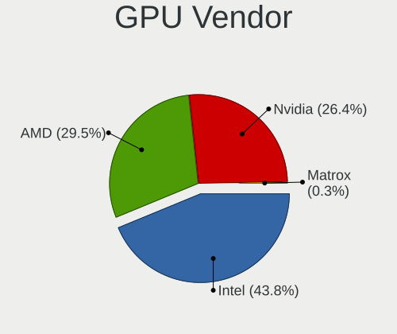

| Vendor                     | Desktops | Percent |
|----------------------------|----------|---------|
| Intel                      | 141      | 43.79%  |
| AMD                        | 95       | 29.5%   |
| Nvidia                     | 85       | 26.4%   |
| Matrox Electronics Systems | 1        | 0.31%   |

GPU Model
---------

Graphics card models

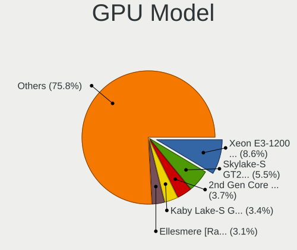

| Model                                                                                    | Desktops | Percent |
|------------------------------------------------------------------------------------------|----------|---------|
| Intel Xeon E3-1200 v3/4th Gen Core Processor Integrated Graphics Controller              | 28       | 8.56%   |
| Intel Skylake-S GT2 [HD Graphics 530]                                                    | 18       | 5.5%    |
| Intel 2nd Generation Core Processor Family Integrated Graphics Controller                | 12       | 3.67%   |
| Intel Kaby Lake-S GT2 [HD Graphics 630]                                                  | 11       | 3.36%   |
| AMD Ellesmere [Radeon RX 470/480/570/570X/580/580X/590]                                  | 10       | 3.06%   |
| Intel 4 Series Chipset Integrated Graphics Controller                                    | 9        | 2.75%   |
| Intel Xeon E3-1200 v2/3rd Gen Core processor Graphics Controller                         | 8        | 2.45%   |
| Intel CoffeeLake-S GT2 [UHD Graphics 630]                                                | 8        | 2.45%   |
| AMD Lexa PRO [Radeon 540/540X/550/550X / RX 540X/550/550X]                               | 8        | 2.45%   |
| Nvidia GP107 [GeForce GTX 1050 Ti]                                                       | 7        | 2.14%   |
| Intel 4th Generation Core Processor Family Integrated Graphics Controller                | 7        | 2.14%   |
| AMD Picasso/Raven 2 [Radeon Vega Series / Radeon Vega Mobile Series]                     | 7        | 2.14%   |
| Nvidia GK208B [GeForce GT 710]                                                           | 5        | 1.53%   |
| Nvidia GK208B [GeForce GT 730]                                                           | 4        | 1.22%   |
| Intel IvyBridge GT2 [HD Graphics 4000]                                                   | 4        | 1.22%   |
| Intel Atom/Celeron/Pentium Processor x5-E8000/J3xxx/N3xxx Integrated Graphics Controller | 4        | 1.22%   |
| AMD Raven Ridge [Radeon Vega Series / Radeon Vega Mobile Series]                         | 4        | 1.22%   |
| AMD Navi 23 [Radeon RX 6600/6600 XT/6600M]                                               | 4        | 1.22%   |
| Nvidia TU116 [GeForce GTX 1660 SUPER]                                                    | 3        | 0.92%   |
| Nvidia GT218 [GeForce 210]                                                               | 3        | 0.92%   |
| Nvidia GP108 [GeForce GT 1030]                                                           | 3        | 0.92%   |
| Nvidia GP106 [GeForce GTX 1060 6GB]                                                      | 3        | 0.92%   |
| Nvidia GP106 [GeForce GTX 1060 3GB]                                                      | 3        | 0.92%   |
| Nvidia GM107 [GeForce GTX 750 Ti]                                                        | 3        | 0.92%   |
| Nvidia GF119 [GeForce GT 610]                                                            | 3        | 0.92%   |
| AMD Vega 10 XL/XT [Radeon RX Vega 56/64]                                                 | 3        | 0.92%   |
| AMD RS880 [Radeon HD 4250]                                                               | 3        | 0.92%   |
| AMD Renoir [Radeon Vega Series / Radeon Vega Mobile Series]                              | 3        | 0.92%   |
| AMD Oland [Radeon HD 8570 / R5 430 OEM / R7 240/340 / Radeon 520 OEM]                    | 3        | 0.92%   |
| AMD Cedar [Radeon HD 5000/6000/7350/8350 Series]                                         | 3        | 0.92%   |
| Nvidia TU116 [GeForce GTX 1660]                                                          | 2        | 0.61%   |
| Nvidia GP106 [P106-100]                                                                  | 2        | 0.61%   |
| Nvidia GK107 [GeForce GTX 650]                                                           | 2        | 0.61%   |
| Nvidia GK107 [GeForce GT 740]                                                            | 2        | 0.61%   |
| Nvidia GK104 [GeForce GTX 680]                                                           | 2        | 0.61%   |
| Nvidia GA106 [GeForce RTX 3060 Lite Hash Rate]                                           | 2        | 0.61%   |
| Nvidia GA104 [GeForce RTX 3060 Ti Lite Hash Rate]                                        | 2        | 0.61%   |
| Nvidia GA102 [GeForce RTX 3080 Lite Hash Rate]                                           | 2        | 0.61%   |
| Intel Kaby Lake-S GT1 [HD Graphics 610]                                                  | 2        | 0.61%   |
| Intel JasperLake [UHD Graphics]                                                          | 2        | 0.61%   |

GPU Combo
---------

Combinations of graphics cards

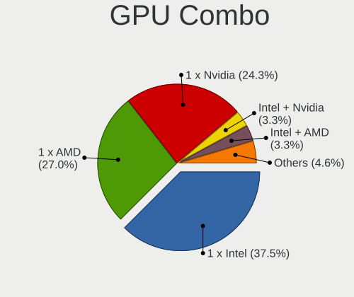

| Name                     | Desktops | Percent |
|--------------------------|----------|---------|
| 1 x Intel                | 114      | 37.5%   |
| 1 x AMD                  | 82       | 26.97%  |
| 1 x Nvidia               | 74       | 24.34%  |
| Intel + Nvidia           | 10       | 3.29%   |
| Intel + AMD              | 10       | 3.29%   |
| 2 x Intel                | 8        | 2.63%   |
| 2 x AMD                  | 2        | 0.66%   |
| Other                    | 1        | 0.33%   |
| 1 x Matrox               | 1        | 0.33%   |
| Intel + AMD + 1 x Nvidia | 1        | 0.33%   |
| AMD + Nvidia             | 1        | 0.33%   |

GPU Driver
----------

Free vs proprietary

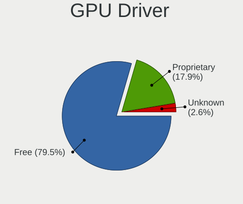

| Driver      | Desktops | Percent |
|-------------|----------|---------|
| Free        | 240      | 79.47%  |
| Proprietary | 54       | 17.88%  |
| Unknown     | 8        | 2.65%   |

GPU Memory
----------

Total video memory

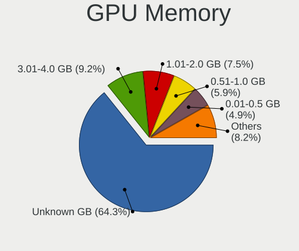

| Size in GB | Desktops | Percent |
|------------|----------|---------|
| Unknown    | 196      | 64.26%  |
| 3.01-4.0   | 28       | 9.18%   |
| 1.01-2.0   | 23       | 7.54%   |
| 0.51-1.0   | 18       | 5.9%    |
| 0.01-0.5   | 15       | 4.92%   |
| 7.01-8.0   | 9        | 2.95%   |
| 5.01-6.0   | 9        | 2.95%   |
| 8.01-16.0  | 4        | 1.31%   |
| 2.01-3.0   | 3        | 0.98%   |

Monitor
-------

Monitor Vendor
--------------

Monitor vendors

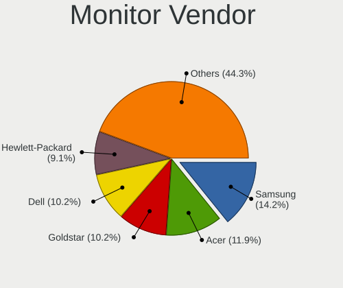

| Vendor               | Desktops | Percent |
|----------------------|----------|---------|
| Samsung Electronics  | 25       | 14.2%   |
| Acer                 | 21       | 11.93%  |
| Goldstar             | 18       | 10.23%  |
| Dell                 | 18       | 10.23%  |
| Hewlett-Packard      | 16       | 9.09%   |
| BenQ                 | 10       | 5.68%   |
| Philips              | 8        | 4.55%   |
| Ancor Communications | 7        | 3.98%   |
| ViewSonic            | 5        | 2.84%   |
| ASUSTek Computer     | 5        | 2.84%   |
| AOC                  | 5        | 2.84%   |
| Mi                   | 3        | 1.7%    |
| Lenovo               | 3        | 1.7%    |
| ONN                  | 2        | 1.14%   |
| LG Electronics       | 2        | 1.14%   |
| Fujitsu Siemens      | 2        | 1.14%   |
| Unknown              | 2        | 1.14%   |
| Vizio                | 1        | 0.57%   |
| VIE                  | 1        | 0.57%   |
| UGD                  | 1        | 0.57%   |
| Sony                 | 1        | 0.57%   |
| SKG                  | 1        | 0.57%   |
| Semp Toshiba         | 1        | 0.57%   |
| SAC                  | 1        | 0.57%   |
| PKB                  | 1        | 0.57%   |
| NEC Computers        | 1        | 0.57%   |
| MStar                | 1        | 0.57%   |
| MSI                  | 1        | 0.57%   |
| Microstep            | 1        | 0.57%   |
| Medion               | 1        | 0.57%   |
| ITE                  | 1        | 0.57%   |
| IOD                  | 1        | 0.57%   |
| Iiyama               | 1        | 0.57%   |
| Idek Iiyama          | 1        | 0.57%   |
| Gigabyte Technology  | 1        | 0.57%   |
| Eizo                 | 1        | 0.57%   |
| DEX                  | 1        | 0.57%   |
| DENON                | 1        | 0.57%   |
| CVT                  | 1        | 0.57%   |
| AUS                  | 1        | 0.57%   |

Monitor Model
-------------

Monitor models

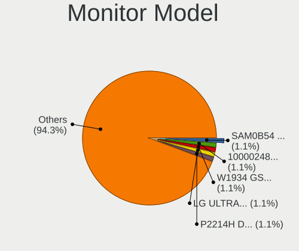

| Model                                                                  | Desktops | Percent |
|------------------------------------------------------------------------|----------|---------|
| Samsung Electronics LCD Monitor SAM0B54 1366x768 520x290mm 23.4-inch   | 2        | 1.14%   |
| ONN 100002487 ONN0101 1920x1080 520x320mm 24.0-inch                    | 2        | 1.14%   |
| Goldstar W1934 GSM4B7A 1440x900 410x260mm 19.1-inch                    | 2        | 1.14%   |
| Goldstar LG ULTRAWIDE GSM59F1 2560x1080 670x280mm 28.6-inch            | 2        | 1.14%   |
| Dell P2214H DELA098 1920x1080 480x270mm 21.7-inch                      | 2        | 1.14%   |
| Acer G276HL ACR0300 1920x1080 600x340mm 27.2-inch                      | 2        | 1.14%   |
| Unknown                                                                | 2        | 1.14%   |
| Vizio E321VL VIZ0083 1366x768 700x400mm 31.7-inch                      | 1        | 0.57%   |
| ViewSonic VP2756-4K VSCE73B 3840x2160 600x340mm 27.2-inch              | 1        | 0.57%   |
| ViewSonic VG910s VSCDA18 1280x1024 380x300mm 19.1-inch                 | 1        | 0.57%   |
| ViewSonic VA926 Series VSC7D20 1280x1024 380x300mm 19.1-inch           | 1        | 0.57%   |
| ViewSonic VA2719-2K VSC6B34 2560x1440 600x340mm 27.2-inch              | 1        | 0.57%   |
| ViewSonic TD2220 VSC052C 1920x1080 480x270mm 21.7-inch                 | 1        | 0.57%   |
| VIE IM238VL1 VIE2380 1920x1080 530x290mm 23.8-inch                     | 1        | 0.57%   |
| UGD Artist13.3pro UGD1302 1920x1080 290x160mm 13.0-inch                | 1        | 0.57%   |
| Sony TV SNY5803 1360x768                                               | 1        | 0.57%   |
| SKG Q2709SU SKG2709 2560x1440 600x330mm 27.0-inch                      | 1        | 0.57%   |
| Semp Toshiba MLE1951 STI1951 1366x768 410x230mm 18.5-inch              | 1        | 0.57%   |
| Samsung Electronics T27D390 SAM0B70 1920x1080 600x340mm 27.2-inch      | 1        | 0.57%   |
| Samsung Electronics SyncMaster SAM05FB 1920x1080 510x290mm 23.1-inch   | 1        | 0.57%   |
| Samsung Electronics SyncMaster SAM058F 1920x1080 480x270mm 21.7-inch   | 1        | 0.57%   |
| Samsung Electronics SyncMaster SAM0523 1920x1080 480x270mm 21.7-inch   | 1        | 0.57%   |
| Samsung Electronics SyncMaster SAM050B 1920x1080 480x270mm 21.7-inch   | 1        | 0.57%   |
| Samsung Electronics SyncMaster SAM030D 1680x1050 470x300mm 22.0-inch   | 1        | 0.57%   |
| Samsung Electronics SyncMaster SAM027E 1680x1050 470x300mm 22.0-inch   | 1        | 0.57%   |
| Samsung Electronics SyncMaster SAM01B7 1280x1024 340x270mm 17.1-inch   | 1        | 0.57%   |
| Samsung Electronics SMS27A850 SAM083D 2560x1440 520x320mm 24.0-inch    | 1        | 0.57%   |
| Samsung Electronics S27R35x SAM1053 1920x1080 600x340mm 27.2-inch      | 1        | 0.57%   |
| Samsung Electronics S27F350 SAM0D22 1920x1080 600x340mm 27.2-inch      | 1        | 0.57%   |
| Samsung Electronics S24E450 SAM0C80 1920x1080 520x290mm 23.4-inch      | 1        | 0.57%   |
| Samsung Electronics S24E391 SAM0C12 1920x1080 520x290mm 23.4-inch      | 1        | 0.57%   |
| Samsung Electronics S24C350 SAM0A3A 1920x1080 530x300mm 24.0-inch      | 1        | 0.57%   |
| Samsung Electronics S22F350 SAM0D1A 1920x1080 480x270mm 21.7-inch      | 1        | 0.57%   |
| Samsung Electronics S22B150 SAM08A3 1920x1080 480x270mm 21.7-inch      | 1        | 0.57%   |
| Samsung Electronics S20B300 SAM08A7 1600x900 440x250mm 19.9-inch       | 1        | 0.57%   |
| Samsung Electronics S19B150 SAM08A2 1366x768 410x230mm 18.5-inch       | 1        | 0.57%   |
| Samsung Electronics Odyssey G50A SAM7181 2560x1440 600x340mm 27.2-inch | 1        | 0.57%   |
| Samsung Electronics NC221 SAM0A91 1920x1080 480x270mm 21.7-inch        | 1        | 0.57%   |
| Samsung Electronics LCD Monitor SAM0C3C 1366x768 610x350mm 27.7-inch   | 1        | 0.57%   |
| Samsung Electronics LCD Monitor SAM0509 1920x1080                      | 1        | 0.57%   |

Monitor Resolution
------------------

Monitor screen resolution

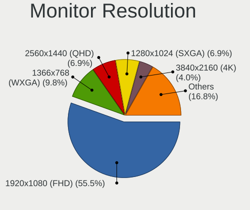

| Resolution         | Desktops | Percent |
|--------------------|----------|---------|
| 1920x1080 (FHD)    | 96       | 55.49%  |
| 1366x768 (WXGA)    | 17       | 9.83%   |
| 2560x1440 (QHD)    | 12       | 6.94%   |
| 1280x1024 (SXGA)   | 12       | 6.94%   |
| 3840x2160 (4K)     | 7        | 4.05%   |
| 1440x900 (WXGA+)   | 6        | 3.47%   |
| 1680x1050 (WSXGA+) | 5        | 2.89%   |
| 2560x1080          | 4        | 2.31%   |
| 1920x1200 (WUXGA)  | 3        | 1.73%   |
| 1600x900 (HD+)     | 3        | 1.73%   |
| 1360x768           | 2        | 1.16%   |
| 1024x768 (XGA)     | 2        | 1.16%   |
| Unknown            | 2        | 1.16%   |
| 5760x2160          | 1        | 0.58%   |
| 3840x1080          | 1        | 0.58%   |

Monitor Diagonal
----------------

Diagonal size in inches

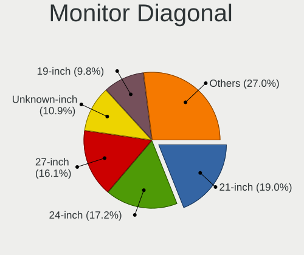

| Inches  | Desktops | Percent |
|---------|----------|---------|
| 21      | 33       | 18.97%  |
| 24      | 30       | 17.24%  |
| 27      | 28       | 16.09%  |
| Unknown | 19       | 10.92%  |
| 19      | 17       | 9.77%   |
| 23      | 15       | 8.62%   |
| 18      | 12       | 6.9%    |
| 31      | 4        | 2.3%    |
| 22      | 3        | 1.72%   |
| 20      | 3        | 1.72%   |
| 34      | 2        | 1.15%   |
| 28      | 2        | 1.15%   |
| 14      | 2        | 1.15%   |
| 65      | 1        | 0.57%   |
| 52      | 1        | 0.57%   |
| 17      | 1        | 0.57%   |
| 13      | 1        | 0.57%   |

Monitor Width
-------------

Physical width

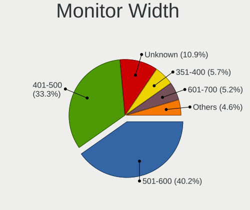

| Width in mm | Desktops | Percent |
|-------------|----------|---------|
| 501-600     | 70       | 40.23%  |
| 401-500     | 58       | 33.33%  |
| Unknown     | 19       | 10.92%  |
| 351-400     | 10       | 5.75%   |
| 601-700     | 9        | 5.17%   |
| 201-300     | 3        | 1.72%   |
| 701-800     | 2        | 1.15%   |
| 1001-1500   | 2        | 1.15%   |
| 301-350     | 1        | 0.57%   |

Aspect Ratio
------------

Proportional relationship between the width and the height

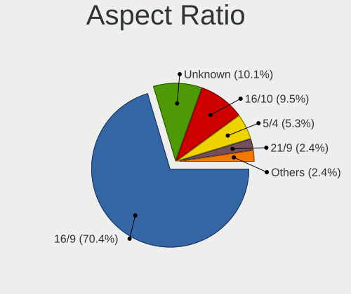

| Ratio   | Desktops | Percent |
|---------|----------|---------|
| 16/9    | 119      | 70.41%  |
| Unknown | 17       | 10.06%  |
| 16/10   | 16       | 9.47%   |
| 5/4     | 9        | 5.33%   |
| 21/9    | 4        | 2.37%   |
| 6/5     | 2        | 1.18%   |
| 4/3     | 2        | 1.18%   |

Monitor Area
------------

Area in inch²

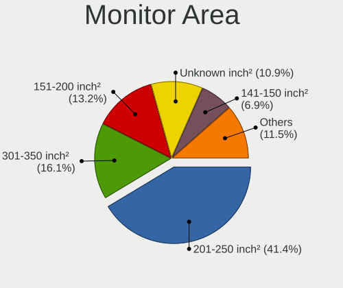

| Area in inch² | Desktops | Percent |
|----------------|----------|---------|
| 201-250        | 72       | 41.38%  |
| 301-350        | 28       | 16.09%  |
| 151-200        | 23       | 13.22%  |
| Unknown        | 19       | 10.92%  |
| 141-150        | 12       | 6.9%    |
| 251-300        | 9        | 5.17%   |
| 351-500        | 6        | 3.45%   |
| More than 1000 | 2        | 1.15%   |
| 101-110        | 2        | 1.15%   |
| 71-80          | 1        | 0.57%   |

Pixel Density
-------------

Pixels per inch

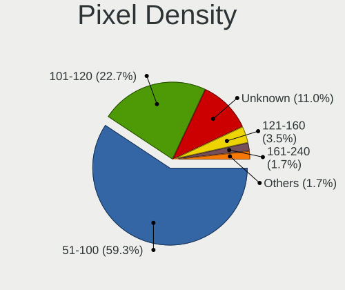

| Density | Desktops | Percent |
|---------|----------|---------|
| 51-100  | 102      | 59.3%   |
| 101-120 | 39       | 22.67%  |
| Unknown | 19       | 11.05%  |
| 121-160 | 6        | 3.49%   |
| 1-50    | 3        | 1.74%   |
| 161-240 | 3        | 1.74%   |

Multiple Monitors
-----------------

Total monitors connected

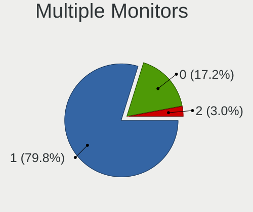

| Total | Desktops | Percent |
|-------|----------|---------|
| 1     | 241      | 79.8%   |
| 0     | 52       | 17.22%  |
| 2     | 9        | 2.98%   |

Network
-------

Net Controller Vendor
---------------------

Controller vendors

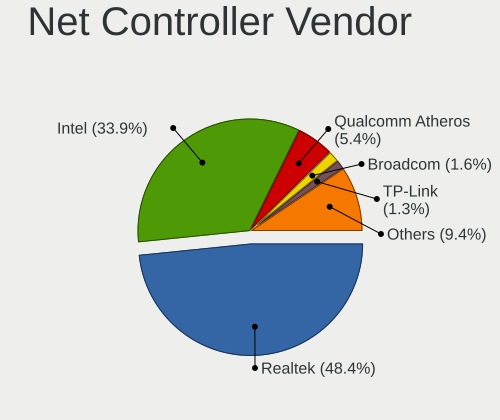

| Vendor                                 | Desktops | Percent |
|----------------------------------------|----------|---------|
| Realtek Semiconductor                  | 180      | 48.39%  |
| Intel                                  | 126      | 33.87%  |
| Qualcomm Atheros                       | 20       | 5.38%   |
| Broadcom                               | 6        | 1.61%   |
| TP-Link                                | 5        | 1.34%   |
| Samsung Electronics                    | 5        | 1.34%   |
| Ralink Technology                      | 5        | 1.34%   |
| Marvell Technology Group               | 5        | 1.34%   |
| Ralink                                 | 4        | 1.08%   |
| Edimax Technology                      | 3        | 0.81%   |
| Huawei Technologies                    | 2        | 0.54%   |
| D-Link                                 | 2        | 0.54%   |
| Qualcomm                               | 1        | 0.27%   |
| OPPO Electronics                       | 1        | 0.27%   |
| National Semiconductor                 | 1        | 0.27%   |
| MediaTek                               | 1        | 0.27%   |
| Fujitsu Connected Technologies Limited | 1        | 0.27%   |
| D-Link System                          | 1        | 0.27%   |
| Atheros                                | 1        | 0.27%   |
| Arduino SA                             | 1        | 0.27%   |
| Accton Technology                      | 1        | 0.27%   |

Net Controller Model
--------------------

Controller models

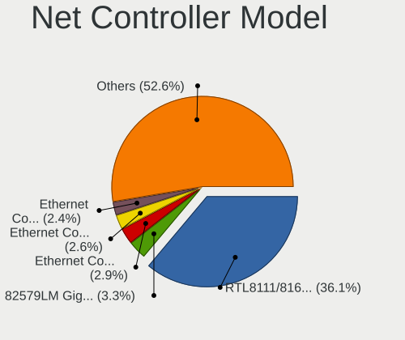

| Model                                                                  | Desktops | Percent |
|------------------------------------------------------------------------|----------|---------|
| Realtek RTL8111/8168/8211/8411 PCI Express Gigabit Ethernet Controller | 151      | 36.12%  |
| Intel 82579LM Gigabit Network Connection (Lewisville)                  | 14       | 3.35%   |
| Intel Ethernet Connection I217-LM                                      | 12       | 2.87%   |
| Intel Ethernet Controller I225-V                                       | 11       | 2.63%   |
| Intel Ethernet Connection (2) I219-LM                                  | 10       | 2.39%   |
| Realtek RTL810xE PCI Express Fast Ethernet controller                  | 9        | 2.15%   |
| Intel 82567LM-3 Gigabit Network Connection                             | 8        | 1.91%   |
| Realtek RTL8821CE 802.11ac PCIe Wireless Network Adapter               | 7        | 1.67%   |
| Realtek RTL8188EUS 802.11n Wireless Network Adapter                    | 7        | 1.67%   |
| Intel I211 Gigabit Network Connection                                  | 7        | 1.67%   |
| Intel Ethernet Connection (2) I219-V                                   | 7        | 1.67%   |
| Realtek RTL8125 2.5GbE Controller                                      | 6        | 1.44%   |
| Intel 82579V Gigabit Network Connection                                | 6        | 1.44%   |
| Intel Ethernet Connection I217-V                                       | 5        | 1.2%    |
| Intel Ethernet Connection (7) I219-V                                   | 5        | 1.2%    |
| Intel 82574L Gigabit Network Connection                                | 5        | 1.2%    |
| Samsung Galaxy series, misc. (tethering mode)                          | 4        | 0.96%   |
| Realtek RTL-8100/8101L/8139 PCI Fast Ethernet Adapter                  | 4        | 0.96%   |
| Intel I210 Gigabit Network Connection                                  | 4        | 0.96%   |
| Intel Alder Lake-S PCH CNVi WiFi                                       | 4        | 0.96%   |
| Intel 82566DM-2 Gigabit Network Connection                             | 4        | 0.96%   |
| Realtek RTL8723BE PCIe Wireless Network Adapter                        | 3        | 0.72%   |
| Qualcomm Atheros QCA9565 / AR9565 Wireless Network Adapter             | 3        | 0.72%   |
| Qualcomm Atheros AR9462 Wireless Network Adapter                       | 3        | 0.72%   |
| Intel Wireless 7260                                                    | 3        | 0.72%   |
| Intel Wireless 3165                                                    | 3        | 0.72%   |
| Intel Ethernet Connection (17) I219-V                                  | 3        | 0.72%   |
| Intel Ethernet Connection (14) I219-V                                  | 3        | 0.72%   |
| Intel Dual Band Wireless-AC 3165 Plus Bluetooth                        | 3        | 0.72%   |
| TP-Link TL-WN722N v2/v3 [Realtek RTL8188EUS]                           | 2        | 0.48%   |
| Realtek RTL8192EE PCIe Wireless Network Adapter                        | 2        | 0.48%   |
| Realtek RTL8188EE Wireless Network Adapter                             | 2        | 0.48%   |
| Realtek RTL8111/8168/8411 PCI Express Gigabit Ethernet Controller      | 2        | 0.48%   |
| Realtek 8811CU Wireless LAN 802.11ac USB NIC                           | 2        | 0.48%   |
| Ralink RT2870/RT3070 Wireless Adapter                                  | 2        | 0.48%   |
| Ralink MT7601U Wireless Adapter                                        | 2        | 0.48%   |
| Ralink RT2500 Wireless 802.11bg                                        | 2        | 0.48%   |
| Qualcomm Atheros Killer E220x Gigabit Ethernet Controller              | 2        | 0.48%   |
| Qualcomm Atheros AR93xx Wireless Network Adapter                       | 2        | 0.48%   |
| Qualcomm Atheros AR9287 Wireless Network Adapter (PCI-Express)         | 2        | 0.48%   |

Wireless Vendor
---------------

Wireless vendors

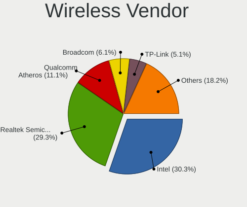

| Vendor                | Desktops | Percent |
|-----------------------|----------|---------|
| Intel                 | 30       | 30.3%   |
| Realtek Semiconductor | 29       | 29.29%  |
| Qualcomm Atheros      | 11       | 11.11%  |
| Broadcom              | 6        | 6.06%   |
| TP-Link               | 5        | 5.05%   |
| Ralink Technology     | 5        | 5.05%   |
| Ralink                | 4        | 4.04%   |
| Edimax Technology     | 3        | 3.03%   |
| D-Link                | 2        | 2.02%   |
| MediaTek              | 1        | 1.01%   |
| D-Link System         | 1        | 1.01%   |
| Atheros               | 1        | 1.01%   |
| Accton Technology     | 1        | 1.01%   |

Wireless Model
--------------

Wireless models

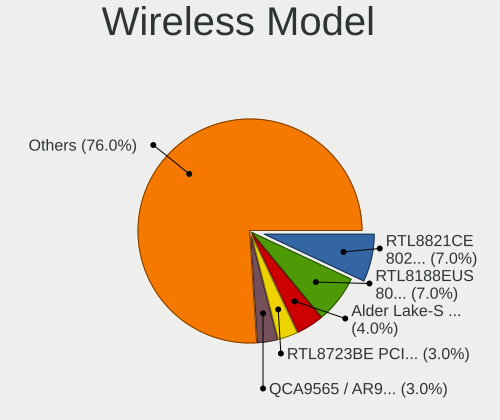

| Model                                                          | Desktops | Percent |
|----------------------------------------------------------------|----------|---------|
| Realtek RTL8821CE 802.11ac PCIe Wireless Network Adapter       | 7        | 7%      |
| Realtek RTL8188EUS 802.11n Wireless Network Adapter            | 7        | 7%      |
| Intel Alder Lake-S PCH CNVi WiFi                               | 4        | 4%      |
| Realtek RTL8723BE PCIe Wireless Network Adapter                | 3        | 3%      |
| Qualcomm Atheros QCA9565 / AR9565 Wireless Network Adapter     | 3        | 3%      |
| Qualcomm Atheros AR9462 Wireless Network Adapter               | 3        | 3%      |
| Intel Wireless 7260                                            | 3        | 3%      |
| Intel Wireless 3165                                            | 3        | 3%      |
| Intel Dual Band Wireless-AC 3165 Plus Bluetooth                | 3        | 3%      |
| TP-Link TL-WN722N v2/v3 [Realtek RTL8188EUS]                   | 2        | 2%      |
| Realtek RTL8192EE PCIe Wireless Network Adapter                | 2        | 2%      |
| Realtek RTL8188EE Wireless Network Adapter                     | 2        | 2%      |
| Realtek 8811CU Wireless LAN 802.11ac USB NIC                   | 2        | 2%      |
| Ralink RT2870/RT3070 Wireless Adapter                          | 2        | 2%      |
| Ralink MT7601U Wireless Adapter                                | 2        | 2%      |
| Ralink RT2500 Wireless 802.11bg                                | 2        | 2%      |
| Qualcomm Atheros AR93xx Wireless Network Adapter               | 2        | 2%      |
| Qualcomm Atheros AR9287 Wireless Network Adapter (PCI-Express) | 2        | 2%      |
| Intel Wireless 8265 / 8275                                     | 2        | 2%      |
| Intel Wireless 8260                                            | 2        | 2%      |
| Intel Wireless 7265                                            | 2        | 2%      |
| Intel Wi-Fi 6E(802.11ax) AX210/AX1675* 2x2 [Typhoon Peak]      | 2        | 2%      |
| Intel Wi-Fi 6 AX200                                            | 2        | 2%      |
| Intel Tiger Lake PCH CNVi WiFi                                 | 2        | 2%      |
| Intel Dual Band Wireless-AC 3168NGW [Stone Peak]               | 2        | 2%      |
| Intel Cannon Lake PCH CNVi WiFi                                | 2        | 2%      |
| Edimax EW-7811Un 802.11n Wireless Adapter [Realtek RTL8188CUS] | 2        | 2%      |
| Broadcom BCM4360 802.11ac Dual Band Wireless Network Adapter   | 2        | 2%      |
| Broadcom BCM4322 802.11a/b/g/n Wireless LAN Controller         | 2        | 2%      |
| TP-Link Archer T4U ver.3                                       | 1        | 1%      |
| TP-Link Archer T2U PLUS [RTL8821AU]                            | 1        | 1%      |
| TP-Link AC600 wireless Realtek RTL8811AU [Archer T2U Nano]     | 1        | 1%      |
| Realtek RTL8852BE PCIe 802.11ax Wireless Network Controller    | 1        | 1%      |
| Realtek RTL8822CE 802.11ac PCIe Wireless Network Adapter       | 1        | 1%      |
| Realtek RTL8822BE 802.11a/b/g/n/ac WiFi adapter                | 1        | 1%      |
| Realtek RTL8812AE 802.11ac PCIe Wireless Network Adapter       | 1        | 1%      |
| Realtek RTL8723BU 802.11b/g/n WLAN Adapter                     | 1        | 1%      |
| Realtek RTL8191SEvB Wireless LAN Controller                    | 1        | 1%      |
| Realtek RTL8188CUS 802.11n WLAN Adapter                        | 1        | 1%      |
| Ralink RT3072 Wireless Adapter                                 | 1        | 1%      |

Ethernet Vendor
---------------

Ethernet vendors

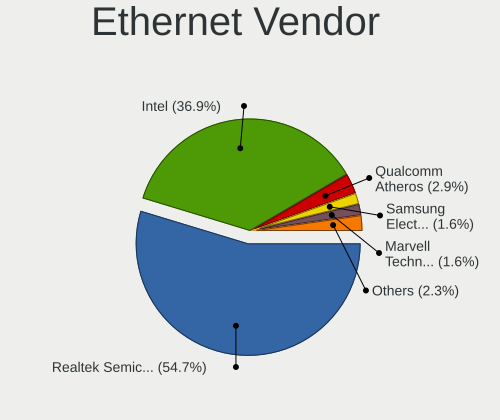

| Vendor                                 | Desktops | Percent |
|----------------------------------------|----------|---------|
| Realtek Semiconductor                  | 169      | 54.69%  |
| Intel                                  | 114      | 36.89%  |
| Qualcomm Atheros                       | 9        | 2.91%   |
| Samsung Electronics                    | 5        | 1.62%   |
| Marvell Technology Group               | 5        | 1.62%   |
| Huawei Technologies                    | 2        | 0.65%   |
| Qualcomm                               | 1        | 0.32%   |
| OPPO Electronics                       | 1        | 0.32%   |
| National Semiconductor                 | 1        | 0.32%   |
| Fujitsu Connected Technologies Limited | 1        | 0.32%   |
| Broadcom                               | 1        | 0.32%   |

Ethernet Model
--------------

Ethernet models

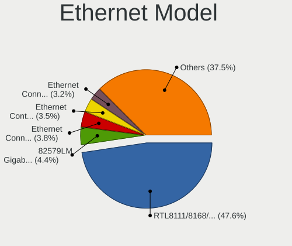

| Model                                                                  | Desktops | Percent |
|------------------------------------------------------------------------|----------|---------|
| Realtek RTL8111/8168/8211/8411 PCI Express Gigabit Ethernet Controller | 151      | 47.63%  |
| Intel 82579LM Gigabit Network Connection (Lewisville)                  | 14       | 4.42%   |
| Intel Ethernet Connection I217-LM                                      | 12       | 3.79%   |
| Intel Ethernet Controller I225-V                                       | 11       | 3.47%   |
| Intel Ethernet Connection (2) I219-LM                                  | 10       | 3.15%   |
| Realtek RTL810xE PCI Express Fast Ethernet controller                  | 9        | 2.84%   |
| Intel 82567LM-3 Gigabit Network Connection                             | 8        | 2.52%   |
| Intel I211 Gigabit Network Connection                                  | 7        | 2.21%   |
| Intel Ethernet Connection (2) I219-V                                   | 7        | 2.21%   |
| Realtek RTL8125 2.5GbE Controller                                      | 6        | 1.89%   |
| Intel 82579V Gigabit Network Connection                                | 6        | 1.89%   |
| Intel Ethernet Connection I217-V                                       | 5        | 1.58%   |
| Intel Ethernet Connection (7) I219-V                                   | 5        | 1.58%   |
| Intel 82574L Gigabit Network Connection                                | 5        | 1.58%   |
| Samsung Galaxy series, misc. (tethering mode)                          | 4        | 1.26%   |
| Realtek RTL-8100/8101L/8139 PCI Fast Ethernet Adapter                  | 4        | 1.26%   |
| Intel I210 Gigabit Network Connection                                  | 4        | 1.26%   |
| Intel 82566DM-2 Gigabit Network Connection                             | 4        | 1.26%   |
| Intel Ethernet Connection (17) I219-V                                  | 3        | 0.95%   |
| Intel Ethernet Connection (14) I219-V                                  | 3        | 0.95%   |
| Realtek RTL8111/8168/8411 PCI Express Gigabit Ethernet Controller      | 2        | 0.63%   |
| Qualcomm Atheros Killer E220x Gigabit Ethernet Controller              | 2        | 0.63%   |
| Qualcomm Atheros AR8151 v2.0 Gigabit Ethernet                          | 2        | 0.63%   |
| Qualcomm Atheros AR8131 Gigabit Ethernet                               | 2        | 0.63%   |
| Marvell Group 88E8057 PCI-E Gigabit Ethernet Controller                | 2        | 0.63%   |
| Marvell Group 88E8056 PCI-E Gigabit Ethernet Controller                | 2        | 0.63%   |
| Intel Ethernet Connection (7) I219-LM                                  | 2        | 0.63%   |
| Intel Ethernet Connection (5) I219-LM                                  | 2        | 0.63%   |
| Intel Ethernet Connection (2) I218-V                                   | 2        | 0.63%   |
| Intel 82567LF-3 Gigabit Network Connection                             | 2        | 0.63%   |
| Samsung GT-I9070 (network tethering, USB debugging enabled)            | 1        | 0.32%   |
| Qualcomm FP3                                                           | 1        | 0.32%   |
| Qualcomm Atheros Attansic L1 Gigabit Ethernet                          | 1        | 0.32%   |
| Qualcomm Atheros AR8152 v2.0 Fast Ethernet                             | 1        | 0.32%   |
| Qualcomm Atheros AR8121/AR8113/AR8114 Gigabit or Fast Ethernet         | 1        | 0.32%   |
| OPPO OPPO Find X3 Neo 5G RNDIS Control RNDIS Ethernet Data             | 1        | 0.32%   |
| National DP83815 (MacPhyter) Ethernet Controller                       | 1        | 0.32%   |
| Marvell Group 88E8070 based Ethernet Controller                        | 1        | 0.32%   |
| Intel Ethernet Controller I226-V                                       | 1        | 0.32%   |
| Intel Ethernet Controller I225-LM                                      | 1        | 0.32%   |

Net Controller Kind
-------------------

Ethernet, WiFi or modem

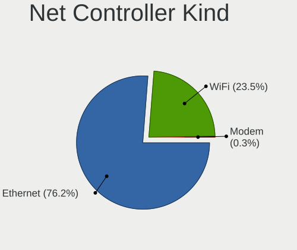

| Kind     | Desktops | Percent |
|----------|----------|---------|
| Ethernet | 292      | 76.24%  |
| WiFi     | 90       | 23.5%   |
| Modem    | 1        | 0.26%   |

Used Controller
---------------

Currently used network controller

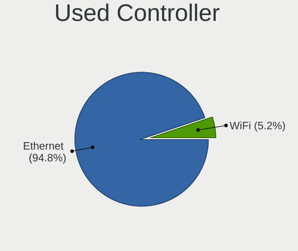

| Kind     | Desktops | Percent |
|----------|----------|---------|
| Ethernet | 257      | 94.83%  |
| WiFi     | 14       | 5.17%   |

NICs
----

Total network controllers on board

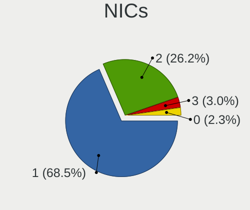

| Total | Desktops | Percent |
|-------|----------|---------|
| 1     | 207      | 68.54%  |
| 2     | 79       | 26.16%  |
| 3     | 9        | 2.98%   |
| 0     | 7        | 2.32%   |

IPv6
----

IPv6 vs IPv4

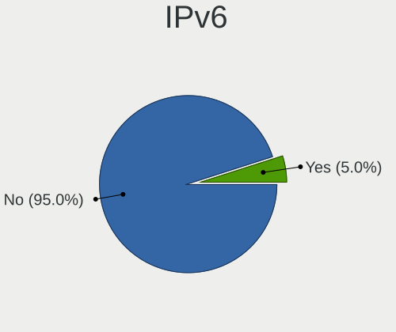

| Used | Desktops | Percent |
|------|----------|---------|
| No   | 288      | 95.05%  |
| Yes  | 15       | 4.95%   |

Bluetooth
---------

Bluetooth Vendor
----------------

Controller vendors

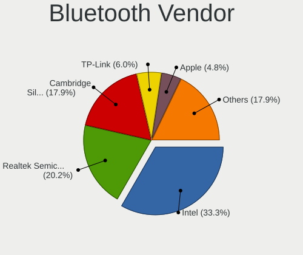

| Vendor                          | Desktops | Percent |
|---------------------------------|----------|---------|
| Intel                           | 28       | 33.33%  |
| Realtek Semiconductor           | 17       | 20.24%  |
| Cambridge Silicon Radio         | 15       | 17.86%  |
| TP-Link                         | 5        | 5.95%   |
| Apple                           | 4        | 4.76%   |
| Qualcomm Atheros Communications | 3        | 3.57%   |
| ASUSTek Computer                | 3        | 3.57%   |
| Lite-On Technology              | 2        | 2.38%   |
| IMC Networks                    | 2        | 2.38%   |
| Broadcom                        | 2        | 2.38%   |
| Primax Electronics              | 1        | 1.19%   |
| Fujitsu                         | 1        | 1.19%   |
| Belkin Components               | 1        | 1.19%   |

Bluetooth Model
---------------

Controller models

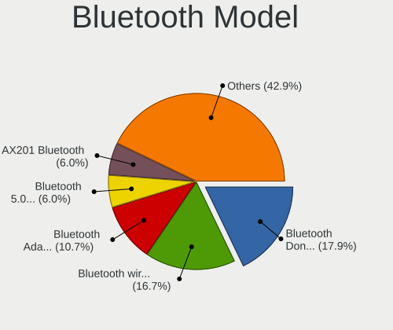

| Model                                                       | Desktops | Percent |
|-------------------------------------------------------------|----------|---------|
| Cambridge Silicon Radio Bluetooth Dongle (HCI mode)         | 15       | 17.86%  |
| Intel Bluetooth wireless interface                          | 14       | 16.67%  |
| Realtek Bluetooth Adapter                                   | 9        | 10.71%  |
| TP-Link Bluetooth 5.0 USB Adapter                           | 5        | 5.95%   |
| Intel AX201 Bluetooth                                       | 5        | 5.95%   |
| Intel Bluetooth 9460/9560 Jefferson Peak (JfP)              | 3        | 3.57%   |
| Realtek  Bluetooth 4.2 Adapter                              | 2        | 2.38%   |
| Realtek Bluetooth 5.1 Adapter                               | 2        | 2.38%   |
| Realtek Bluetooth 4.0 Adapter                               | 2        | 2.38%   |
| Qualcomm Atheros Dell Wireless 1707 Bluetooth 4.0 LE Device | 2        | 2.38%   |
| Intel Wireless-AC 3168 Bluetooth                            | 2        | 2.38%   |
| Intel AX210 Bluetooth                                       | 2        | 2.38%   |
| Broadcom BCM20702A0 Bluetooth 4.0                           | 2        | 2.38%   |
| Apple Built-in Bluetooth 2.0+EDR HCI                        | 2        | 2.38%   |
| Apple Bluetooth Host Controller                             | 2        | 2.38%   |
| Realtek Dell Wireless 1801 Bluetooth 4.0 LE                 | 1        | 1.19%   |
| Realtek Bluetooth 4.2 Adapter                               | 1        | 1.19%   |
| Qualcomm Atheros AR3011 Bluetooth (no firmware)             | 1        | 1.19%   |
| Primax Rocketfish RF-FLBTAD Bluetooth Adapter               | 1        | 1.19%   |
| Lite-On Bluetooth USB Module                                | 1        | 1.19%   |
| Lite-On Atheros AR3012 Bluetooth                            | 1        | 1.19%   |
| Intel Wireless-AC 9260 Bluetooth Adapter                    | 1        | 1.19%   |
| Intel AX200 Bluetooth                                       | 1        | 1.19%   |
| IMC Networks Qualcomm Atheros AR9462 Bluetooth 4.0 + HS     | 1        | 1.19%   |
| IMC Networks MediaTek Bluetooth Adapter                     | 1        | 1.19%   |
| Fujitsu Qualcomm Atheros AR9462 Bluetooth 4.0 + HS Adapter  | 1        | 1.19%   |
| Belkin Components F8T001v2 Bluetooth                        | 1        | 1.19%   |
| ASUS USB-BT500                                              | 1        | 1.19%   |
| ASUS Broadcom BCM20702A0 Bluetooth                          | 1        | 1.19%   |
| ASUS Bluetooth Controller                                   | 1        | 1.19%   |

Sound
-----

Sound Vendor
------------

Sound card vendors

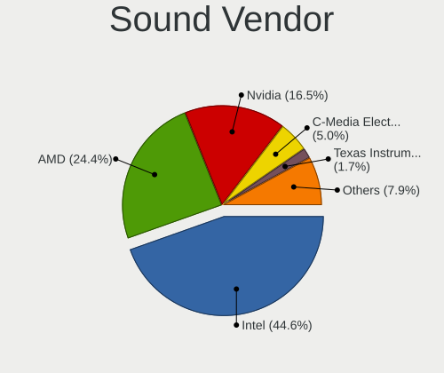

| Vendor                                       | Desktops | Percent |
|----------------------------------------------|----------|---------|
| Intel                                        | 214      | 44.58%  |
| AMD                                          | 117      | 24.38%  |
| Nvidia                                       | 79       | 16.46%  |
| C-Media Electronics                          | 24       | 5%      |
| Texas Instruments                            | 8        | 1.67%   |
| JMTek                                        | 4        | 0.83%   |
| Creative Labs                                | 4        | 0.83%   |
| Realtek Semiconductor                        | 3        | 0.63%   |
| SteelSeries ApS                              | 2        | 0.42%   |
| Micro Star International                     | 2        | 0.42%   |
| Unknown                                      | 2        | 0.42%   |
| Zoran Co. Personal Media Division (Nogatech) | 1        | 0.21%   |
| Yamaha                                       | 1        | 0.21%   |
| Superlux digit                               | 1        | 0.21%   |
| Sony                                         | 1        | 0.21%   |
| RODE Microphones                             | 1        | 0.21%   |
| Razer USA                                    | 1        | 0.21%   |
| OPPO Electronics                             | 1        | 0.21%   |
| Nektar                                       | 1        | 0.21%   |
| Microsoft                                    | 1        | 0.21%   |
| M-Audio                                      | 1        | 0.21%   |
| KTMicro                                      | 1        | 0.21%   |
| Hewlett-Packard                              | 1        | 0.21%   |
| HECATE G2 GAMING HEADSET                     | 1        | 0.21%   |
| Harman                                       | 1        | 0.21%   |
| Generalplus Technology                       | 1        | 0.21%   |
| GEMBIRD                                      | 1        | 0.21%   |
| Edifier Technology                           | 1        | 0.21%   |
| Creative Technology                          | 1        | 0.21%   |
| Cambridge Silicon Radio                      | 1        | 0.21%   |
| Cambridge Audio                              | 1        | 0.21%   |
| Arturia                                      | 1        | 0.21%   |

Sound Model
-----------

Sound card models

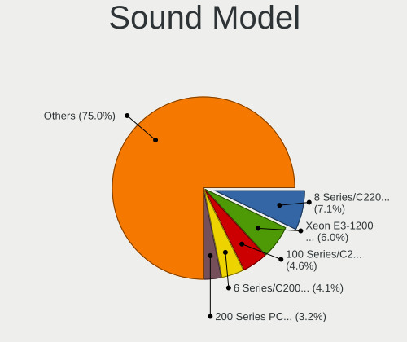

| Model                                                                      | Desktops | Percent |
|----------------------------------------------------------------------------|----------|---------|
| Intel 8 Series/C220 Series Chipset High Definition Audio Controller        | 40       | 7.09%   |
| Intel Xeon E3-1200 v3/4th Gen Core Processor HD Audio Controller           | 34       | 6.03%   |
| Intel 100 Series/C230 Series Chipset Family HD Audio Controller            | 26       | 4.61%   |
| Intel 6 Series/C200 Series Chipset Family High Definition Audio Controller | 23       | 4.08%   |
| Intel 200 Series PCH HD Audio                                              | 18       | 3.19%   |
| AMD Starship/Matisse HD Audio Controller                                   | 18       | 3.19%   |
| AMD Ryzen HD Audio Controller                                              | 18       | 3.19%   |
| AMD SBx00 Azalia (Intel HDA)                                               | 14       | 2.48%   |
| Intel 7 Series/C216 Chipset Family High Definition Audio Controller        | 13       | 2.3%    |
| AMD Oland/Hainan/Cape Verde/Pitcairn HDMI Audio [Radeon HD 7000 Series]    | 13       | 2.3%    |
| AMD Baffin HDMI/DP Audio [Radeon RX 550 640SP / RX 560/560X]               | 12       | 2.13%   |
| Intel Cannon Lake PCH cAVS                                                 | 11       | 1.95%   |
| AMD Raven/Raven2/Fenghuang HDMI/DP Audio Controller                        | 11       | 1.95%   |
| AMD Ellesmere HDMI Audio [Radeon RX 470/480 / 570/580/590]                 | 11       | 1.95%   |
| Intel NM10/ICH7 Family High Definition Audio Controller                    | 10       | 1.77%   |
| Nvidia GK208 HDMI/DP Audio Controller                                      | 9        | 1.6%    |
| Intel 82801JD/DO (ICH10 Family) HD Audio Controller                        | 9        | 1.6%    |
| C-Media Electronics Audio Adapter (Unitek Y-247A)                          | 9        | 1.6%    |
| Nvidia GP107GL High Definition Audio Controller                            | 8        | 1.42%   |
| Intel 82801I (ICH9 Family) HD Audio Controller                             | 8        | 1.42%   |
| AMD Navi 21/23 HDMI/DP Audio Controller                                    | 8        | 1.42%   |
| AMD FCH Azalia Controller                                                  | 8        | 1.42%   |
| Intel Alder Lake-S HD Audio Controller                                     | 7        | 1.24%   |
| AMD Family 17h (Models 00h-0fh) HD Audio Controller                        | 7        | 1.24%   |
| Nvidia GP106 High Definition Audio Controller                              | 6        | 1.06%   |
| AMD Renoir/Cezanne HDMI/DP Audio Controller                                | 6        | 1.06%   |
| Nvidia TU116 High Definition Audio Controller                              | 5        | 0.89%   |
| Nvidia MCP61 High Definition Audio                                         | 5        | 0.89%   |
| Nvidia High Definition Audio Controller                                    | 5        | 0.89%   |
| Nvidia GK107 HDMI Audio Controller                                         | 5        | 0.89%   |
| Intel Smart Sound Technology (SST) Audio Controller                        | 5        | 0.89%   |
| Intel C610/X99 series chipset HD Audio Controller                          | 5        | 0.89%   |
| Intel 82801JI (ICH10 Family) HD Audio Controller                           | 5        | 0.89%   |
| Intel 5 Series/3400 Series Chipset High Definition Audio                   | 5        | 0.89%   |
| Texas Instruments PCM2902 Audio Codec                                      | 4        | 0.71%   |
| Nvidia GM107 High Definition Audio Controller [GeForce 940MX]              | 4        | 0.71%   |
| Intel Tiger Lake-H HD Audio Controller                                     | 4        | 0.71%   |
| AMD Cedar HDMI Audio [Radeon HD 5400/6300/7300 Series]                     | 4        | 0.71%   |
| Nvidia GP108 High Definition Audio Controller                              | 3        | 0.53%   |
| Nvidia GK104 HDMI Audio Controller                                         | 3        | 0.53%   |

Memory
------

Memory Vendor
-------------

Memory module vendors

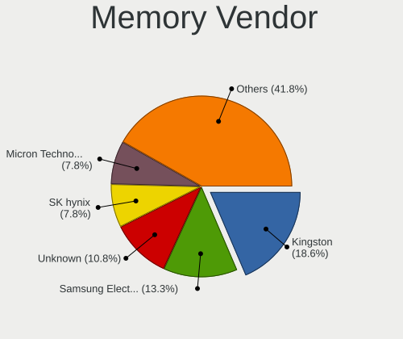

| Vendor                       | Desktops | Percent |
|------------------------------|----------|---------|
| Kingston                     | 67       | 18.56%  |
| Samsung Electronics          | 48       | 13.3%   |
| Unknown                      | 39       | 10.8%   |
| SK hynix                     | 28       | 7.76%   |
| Micron Technology            | 28       | 7.76%   |
| Crucial                      | 27       | 7.48%   |
| Corsair                      | 25       | 6.93%   |
| G.Skill                      | 16       | 4.43%   |
| Unknown                      | 13       | 3.6%    |
| Nanya Technology             | 8        | 2.22%   |
| A-DATA Technology            | 8        | 2.22%   |
| Patriot                      | 7        | 1.94%   |
| Ramaxel Technology           | 5        | 1.39%   |
| GOODRAM                      | 4        | 1.11%   |
| Transcend                    | 3        | 0.83%   |
| Apacer                       | 3        | 0.83%   |
| Unknown (ABCD)               | 2        | 0.55%   |
| Team                         | 2        | 0.55%   |
| Smart                        | 2        | 0.55%   |
| Patriot Memory (PDP Systems) | 2        | 0.55%   |
| Lexar                        | 2        | 0.55%   |
| Kingmax                      | 2        | 0.55%   |
| GeIL                         | 2        | 0.55%   |
| Atermiter                    | 2        | 0.55%   |
| AMD                          | 2        | 0.55%   |
| Walton Chaintech             | 1        | 0.28%   |
| Unknown (8A02)               | 1        | 0.28%   |
| Unknown (0x7FFF)             | 1        | 0.28%   |
| Teikon                       | 1        | 0.28%   |
| Silicon Power                | 1        | 0.28%   |
| Qumo                         | 1        | 0.28%   |
| Netac                        | 1        | 0.28%   |
| MemoWise                     | 1        | 0.28%   |
| Lexar Co Limited             | 1        | 0.28%   |
| Juhor                        | 1        | 0.28%   |
| Golden Empire                | 1        | 0.28%   |
| Foxline                      | 1        | 0.28%   |
| Elpida                       | 1        | 0.28%   |
| Avant                        | 1        | 0.28%   |

Memory Model
------------

Memory module models

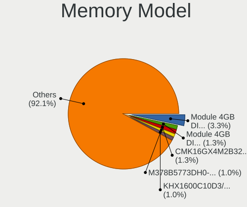

| Model                                                        | Desktops | Percent |
|--------------------------------------------------------------|----------|---------|
| Unknown                                                      | 13       | 3.33%   |
| Unknown RAM Module 4GB DIMM 1333MT/s                         | 5        | 1.28%   |
| Corsair RAM CMK16GX4M2B3200C16 8GB DIMM DDR4 3200MT/s        | 5        | 1.28%   |
| Samsung RAM M378B5773DH0-CH9 2GB DIMM DDR3 1333MT/s          | 4        | 1.03%   |
| Kingston RAM KHX1600C10D3/8G 8GB DIMM DDR3 1600MT/s          | 4        | 1.03%   |
| A-DATA RAM DDR4 3200 16GB DIMM DDR4 3200MT/s                 | 4        | 1.03%   |
| Unknown RAM Module 2GB DIMM DDR2 800MT/s                     | 3        | 0.77%   |
| Unknown RAM Module 2GB DIMM 800MT/s                          | 3        | 0.77%   |
| Unknown RAM Module 2GB DIMM 1333MT/s                         | 3        | 0.77%   |
| Samsung RAM M393A1G40DB0-CPB 8GB DIMM DDR4 2133MT/s          | 3        | 0.77%   |
| Patriot RAM 2666 C16 Series 8GB DIMM DDR4 3000MT/s           | 3        | 0.77%   |
| Micron RAM 8JTF51264AZ-1G6E1 4GB DIMM DDR3 1600MT/s          | 3        | 0.77%   |
| Kingston RAM KF3200C16D4/8GX 8GB DIMM DDR4 3200MT/s          | 3        | 0.77%   |
| Unknown RAM Module 8GB DIMM DDR4 2667MT/s                    | 2        | 0.51%   |
| Unknown RAM Module 8GB DIMM 1333MT/s                         | 2        | 0.51%   |
| Unknown RAM Module 4GB DIMM DDR3 1333MT/s                    | 2        | 0.51%   |
| Unknown RAM Module 4GB DIMM 1600MT/s                         | 2        | 0.51%   |
| Unknown RAM Module 2GB DIMM DDR3 1600MT/s                    | 2        | 0.51%   |
| Unknown RAM Module 2GB DIMM DDR2 667MT/s                     | 2        | 0.51%   |
| Unknown RAM Module 1GB DIMM DDR2 667MT/s                     | 2        | 0.51%   |
| Unknown (ABCD) RAM 123456789012345678 8GB DIMM DDR4 2400MT/s | 2        | 0.51%   |
| SK hynix RAM HMT451S6BFR8A-PB 4GB SODIMM DDR3 1600MT/s       | 2        | 0.51%   |
| SK hynix RAM HMT351U6CFR8C-H9 4GB DIMM DDR3 1333MT/s         | 2        | 0.51%   |
| SK hynix RAM HMA81GU6CJR8N-VK 8GB DIMM DDR4 2667MT/s         | 2        | 0.51%   |
| Samsung RAM Module 8GB SODIMM DDR4 2133MT/s                  | 2        | 0.51%   |
| Samsung RAM Module 8GB DIMM DDR4 2133MT/s                    | 2        | 0.51%   |
| Samsung RAM M471B5173QH0-YK0 4GB SODIMM DDR3 1600MT/s        | 2        | 0.51%   |
| Samsung RAM M471A1K43CB1-CRC 8GB SODIMM DDR4 2667MT/s        | 2        | 0.51%   |
| Samsung RAM M378B5773CH0-CH9 2GB DIMM DDR3 1333MT/s          | 2        | 0.51%   |
| Samsung RAM M378B5173QH0-YK0 4GB DIMM DDR3 1600MT/s          | 2        | 0.51%   |
| Samsung RAM M3 78T2863DZS-CE6 1GB DIMM DDR2 667MT/s          | 2        | 0.51%   |
| Nanya RAM NT2GC64B88B0NF-CG 2GB DIMM DDR3 1333MT/s           | 2        | 0.51%   |
| Micron RAM 8HTF12864AY-800J1 1GB DIMM DDR2 800MT/s           | 2        | 0.51%   |
| Micron RAM 8ATF1G64AZ-2G3H1 8GB DIMM DDR4 2400MT/s           | 2        | 0.51%   |
| Kingston RAM KHX2400C15/8G 8GB DIMM DDR4 2400MT/s            | 2        | 0.51%   |
| Kingston RAM KHX1600C9D3/8GX 8GB DIMM DDR3 1600MT/s          | 2        | 0.51%   |
| Kingston RAM KHX1600C9D3/4GX 4GB DIMM DDR3 1600MT/s          | 2        | 0.51%   |
| Kingston RAM KF3200C16D4/32GX 32GB DIMM DDR4 3200MT/s        | 2        | 0.51%   |
| Kingston RAM KF3200C16D4/16GX 16GB DIMM DDR4 3200MT/s        | 2        | 0.51%   |
| Kingston RAM K531R8-HYA 4GB DIMM DDR3 1600MT/s               | 2        | 0.51%   |

Memory Kind
-----------

Memory module kinds

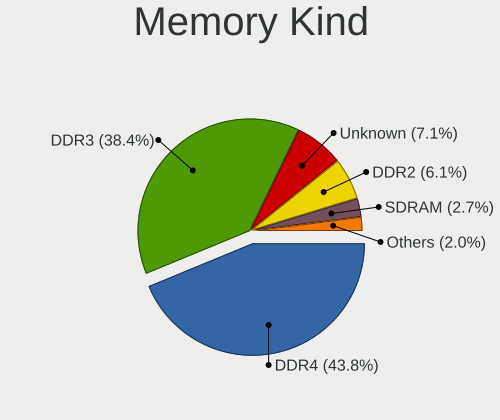

| Kind    | Desktops | Percent |
|---------|----------|---------|
| DDR4    | 130      | 43.77%  |
| DDR3    | 114      | 38.38%  |
| Unknown | 21       | 7.07%   |
| DDR2    | 18       | 6.06%   |
| SDRAM   | 8        | 2.69%   |
| LPDDR4  | 2        | 0.67%   |
| DDR5    | 2        | 0.67%   |
| DDR     | 2        | 0.67%   |

Memory Form Factor
------------------

Physical design of the memory module

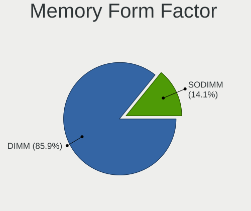

| Name   | Desktops | Percent |
|--------|----------|---------|
| DIMM   | 255      | 85.86%  |
| SODIMM | 42       | 14.14%  |

Memory Size
-----------

Memory module size

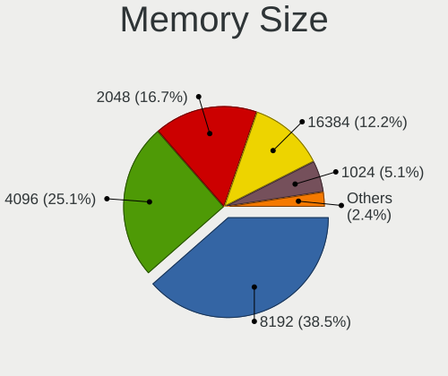

| Size  | Desktops | Percent |
|-------|----------|---------|
| 8192  | 129      | 38.51%  |
| 4096  | 84       | 25.07%  |
| 2048  | 56       | 16.72%  |
| 16384 | 41       | 12.24%  |
| 1024  | 17       | 5.07%   |
| 32768 | 8        | 2.39%   |

Memory Speed
------------

Memory module speed

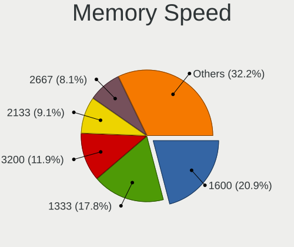

| Speed   | Desktops | Percent |
|---------|----------|---------|
| 1600    | 67       | 20.94%  |
| 1333    | 57       | 17.81%  |
| 3200    | 38       | 11.88%  |
| 2133    | 29       | 9.06%   |
| 2667    | 26       | 8.13%   |
| 2400    | 24       | 7.5%    |
| 800     | 15       | 4.69%   |
| 667     | 11       | 3.44%   |
| 1066    | 7        | 2.19%   |
| 3600    | 6        | 1.88%   |
| Unknown | 6        | 1.88%   |
| 1067    | 5        | 1.56%   |
| 3000    | 4        | 1.25%   |
| 2666    | 4        | 1.25%   |
| 1867    | 4        | 1.25%   |
| 3733    | 3        | 0.94%   |
| 1866    | 2        | 0.63%   |
| 400     | 2        | 0.63%   |
| 6400    | 1        | 0.31%   |
| 4800    | 1        | 0.31%   |
| 4400    | 1        | 0.31%   |
| 4000    | 1        | 0.31%   |
| 3333    | 1        | 0.31%   |
| 3066    | 1        | 0.31%   |
| 2933    | 1        | 0.31%   |
| 1639    | 1        | 0.31%   |
| 1200    | 1        | 0.31%   |
| 533     | 1        | 0.31%   |

Printers & scanners
-------------------

Printer Vendor
--------------

Printer device vendors

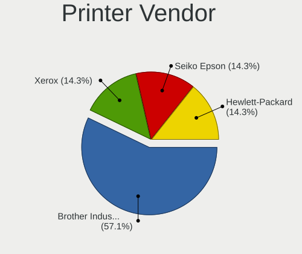

| Vendor             | Desktops | Percent |
|--------------------|----------|---------|
| Brother Industries | 4        | 57.14%  |
| Xerox              | 1        | 14.29%  |
| Seiko Epson        | 1        | 14.29%  |
| Hewlett-Packard    | 1        | 14.29%  |

Printer Model
-------------

Printer device models

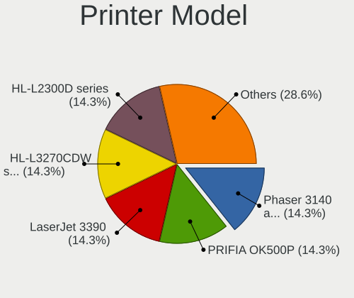

| Model                      | Desktops | Percent |
|----------------------------|----------|---------|
| Xerox Phaser 3140 and 3155 | 1        | 14.29%  |
| Seiko Epson PRIFIA OK500P  | 1        | 14.29%  |
| HP LaserJet 3390           | 1        | 14.29%  |
| Brother HL-L3270CDW series | 1        | 14.29%  |
| Brother HL-L2300D series   | 1        | 14.29%  |
| Brother DCP-J152W          | 1        | 14.29%  |
| Brother DCP-9015CDW        | 1        | 14.29%  |

Scanner Vendor
--------------

Scanner device vendors

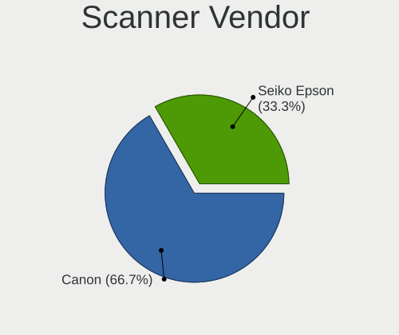

| Vendor      | Desktops | Percent |
|-------------|----------|---------|
| Canon       | 2        | 66.67%  |
| Seiko Epson | 1        | 33.33%  |

Scanner Model
-------------

Scanner device models

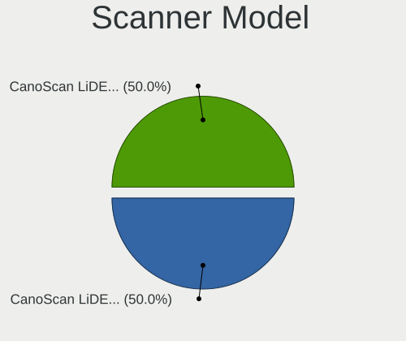

| Model                              | Desktops | Percent |
|------------------------------------|----------|---------|
| Seiko Epson PX-501A [Stylus NX400] | 1        | 33.33%  |
| Canon CanoScan LiDE 700F           | 1        | 33.33%  |
| Canon CanoScan LiDE 120            | 1        | 33.33%  |

Camera
------

Camera Vendor
-------------

Camera device vendors

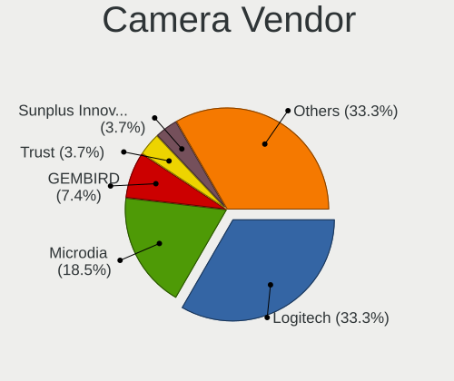

| Vendor                        | Desktops | Percent |
|-------------------------------|----------|---------|
| Logitech                      | 9        | 33.33%  |
| Microdia                      | 5        | 18.52%  |
| GEMBIRD                       | 2        | 7.41%   |
| Trust                         | 1        | 3.7%    |
| Sunplus Innovation Technology | 1        | 3.7%    |
| SHENZHEN AONI ELECTRONIC      | 1        | 3.7%    |
| Lenovo                        | 1        | 3.7%    |
| Importek                      | 1        | 3.7%    |
| IMC Networks                  | 1        | 3.7%    |
| Genesys Logic                 | 1        | 3.7%    |
| Chicony Electronics           | 1        | 3.7%    |
| BSD                           | 1        | 3.7%    |
| Asuscom Network               | 1        | 3.7%    |
| Alcorlink                     | 1        | 3.7%    |

Camera Model
------------

Camera device models

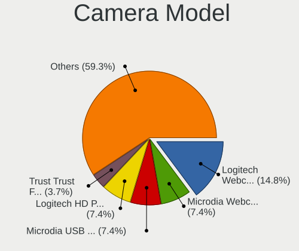

| Model                                             | Desktops | Percent |
|---------------------------------------------------|----------|---------|
| Logitech Webcam C270                              | 4        | 14.81%  |
| Microdia Webcam Vitade AF                         | 2        | 7.41%   |
| Microdia USB  Live camera                         | 2        | 7.41%   |
| Logitech HD Pro Webcam C920                       | 2        | 7.41%   |
| Trust Trust Full HD Webcam                        | 1        | 3.7%    |
| Sunplus Integrated_Webcam_HD                      | 1        | 3.7%    |
| SHENZHEN AONI ELECTRONIC NexiGo N990 4K Camera    | 1        | 3.7%    |
| Microdia USB Camera                               | 1        | 3.7%    |
| Logitech Webcam C170                              | 1        | 3.7%    |
| Logitech HD Webcam C615                           | 1        | 3.7%    |
| Logitech BRIO Ultra HD Webcam                     | 1        | 3.7%    |
| Lenovo Integrated Camera                          | 1        | 3.7%    |
| Importek FJ Camera                                | 1        | 3.7%    |
| IMC Networks XHC Camera                           | 1        | 3.7%    |
| Genesys Logic Digital Microscope                  | 1        | 3.7%    |
| GEMBIRD USB2.0 PC CAMERA                          | 1        | 3.7%    |
| GEMBIRD Generic UVC 1.00 camera [AppoTech AX2311] | 1        | 3.7%    |
| Chicony HP 2.0MP High Definition Webcam           | 1        | 3.7%    |
| BSD EEM Gadget                                    | 1        | 3.7%    |
| Asuscom Network Depstech webcam                   | 1        | 3.7%    |
| Alcorlink USB 2.0 Camera                          | 1        | 3.7%    |

Security
--------

Fingerprint Vendor
------------------

Fingerprint sensor vendors

Zero info for selected period =(

Fingerprint Model
-----------------

Fingerprint sensor models

Zero info for selected period =(

Chipcard Vendor
---------------

Chipcard module vendors

Zero info for selected period =(

Chipcard Model
--------------

Chipcard module models

Zero info for selected period =(

Unsupported
-----------

Unsupported Devices
-------------------

Total unsupported devices on board

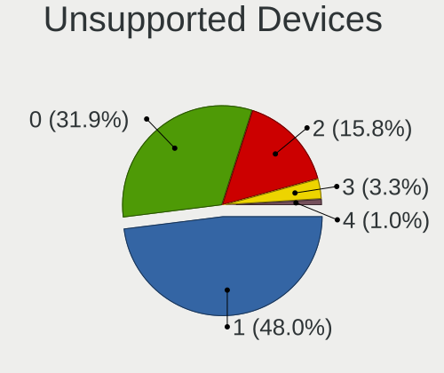

| Total | Desktops | Percent |
|-------|----------|---------|
| 1     | 146      | 48.03%  |
| 0     | 97       | 31.91%  |
| 2     | 48       | 15.79%  |
| 3     | 10       | 3.29%   |
| 4     | 3        | 0.99%   |

Unsupported Device Types
------------------------

Types of unsupported devices

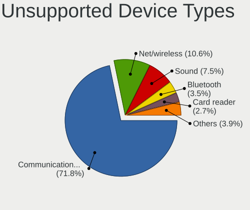

| Type                     | Desktops | Percent |
|--------------------------|----------|---------|
| Communication controller | 183      | 71.76%  |
| Net/wireless             | 27       | 10.59%  |
| Sound                    | 19       | 7.45%   |
| Bluetooth                | 9        | 3.53%   |
| Card reader              | 7        | 2.75%   |
| Net/ethernet             | 6        | 2.35%   |
| Network                  | 2        | 0.78%   |
| Storage/raid             | 1        | 0.39%   |
| Dvb card                 | 1        | 0.39%   |

