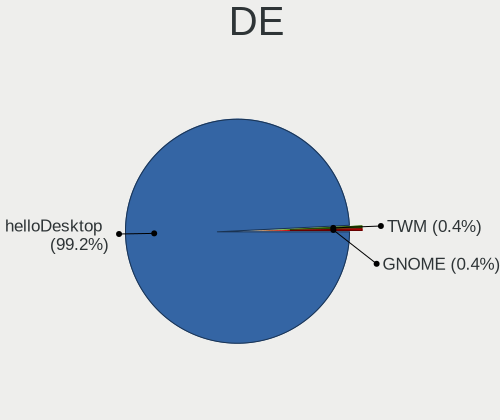
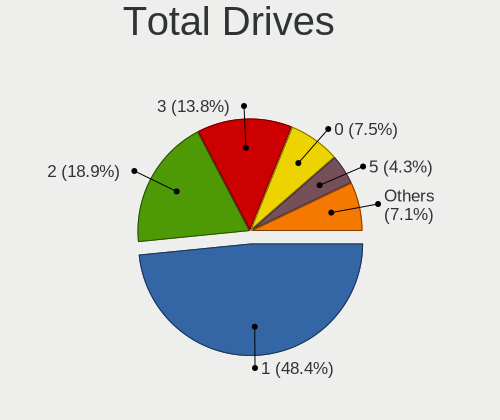
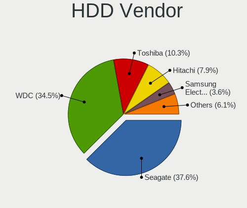
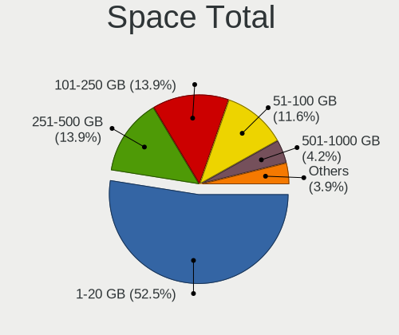
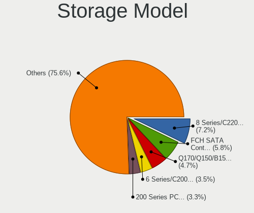
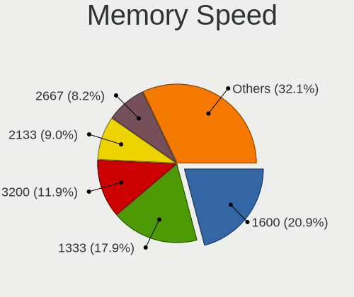

helloSystem 0.8.1 - Tested Hardware & Statistics (Desktops)
-----------------------------------------------------------

A project to collect tested hardware configurations for helloSystem 0.8.1.

Anyone can contribute to this report by the [hw-probe](https://github.com/linuxhw/hw-probe/blob/master/INSTALL.BSD.md) tool:

    hw-probe -all -upload

Please contribute! Especially if your hardware is rare.

Contents
--------

* [ Test Cases ](#test-cases)

* [ System ](#system)
  - [ Arch                     ](#arch)
  - [ DE                       ](#de)
  - [ Display Server           ](#display-server)
  - [ Display Manager          ](#display-manager)
  - [ OS Lang                  ](#os-lang)
  - [ Boot Mode                ](#boot-mode)
  - [ Filesystem               ](#filesystem)
  - [ Part. scheme             ](#part-scheme)

* [ Board ](#board)
  - [ Vendor                   ](#vendor)
  - [ Model                    ](#model)
  - [ Model Family             ](#model-family)
  - [ MFG Year                 ](#mfg-year)
  - [ Form Factor              ](#form-factor)
  - [ Coreboot                 ](#coreboot)
  - [ RAM Size                 ](#ram-size)
  - [ RAM Used                 ](#ram-used)
  - [ Total Drives             ](#total-drives)
  - [ Has CD-ROM               ](#has-cd-rom)
  - [ Has Ethernet             ](#has-ethernet)
  - [ Has WiFi                 ](#has-wifi)
  - [ Has Bluetooth            ](#has-bluetooth)

* [ Location ](#location)
  - [ Country                  ](#country)
  - [ City                     ](#city)

* [ Drives ](#drives)
  - [ Drive Vendor             ](#drive-vendor)
  - [ Drive Model              ](#drive-model)
  - [ HDD Vendor               ](#hdd-vendor)
  - [ SSD Vendor               ](#ssd-vendor)
  - [ Drive Kind               ](#drive-kind)
  - [ Drive Connector          ](#drive-connector)
  - [ Drive Size               ](#drive-size)
  - [ Space Total              ](#space-total)
  - [ Space Used               ](#space-used)
  - [ Malfunc. Drives          ](#malfunc-drives)
  - [ Malfunc. Drive Vendor    ](#malfunc-drive-vendor)
  - [ Malfunc. HDD Vendor      ](#malfunc-hdd-vendor)
  - [ Malfunc. Drive Kind      ](#malfunc-drive-kind)
  - [ Failed Drives            ](#failed-drives)
  - [ Failed Drive Vendor      ](#failed-drive-vendor)
  - [ Drive Status             ](#drive-status)

* [ Storage controller ](#storage-controller)
  - [ Storage Vendor           ](#storage-vendor)
  - [ Storage Model            ](#storage-model)
  - [ Storage Kind             ](#storage-kind)

* [ Processor ](#processor)
  - [ CPU Vendor               ](#cpu-vendor)
  - [ CPU Model                ](#cpu-model)
  - [ CPU Model Family         ](#cpu-model-family)
  - [ CPU Cores                ](#cpu-cores)
  - [ CPU Sockets              ](#cpu-sockets)
  - [ CPU Threads              ](#cpu-threads)
  - [ CPU Microarch            ](#cpu-microarch)

* [ Graphics ](#graphics)
  - [ GPU Vendor               ](#gpu-vendor)
  - [ GPU Model                ](#gpu-model)
  - [ GPU Combo                ](#gpu-combo)
  - [ GPU Driver               ](#gpu-driver)
  - [ GPU Memory               ](#gpu-memory)

* [ Monitor ](#monitor)
  - [ Monitor Vendor           ](#monitor-vendor)
  - [ Monitor Model            ](#monitor-model)
  - [ Monitor Resolution       ](#monitor-resolution)
  - [ Monitor Diagonal         ](#monitor-diagonal)
  - [ Monitor Width            ](#monitor-width)
  - [ Aspect Ratio             ](#aspect-ratio)
  - [ Monitor Area             ](#monitor-area)
  - [ Pixel Density            ](#pixel-density)
  - [ Multiple Monitors        ](#multiple-monitors)

* [ Network ](#network)
  - [ Net Controller Vendor    ](#net-controller-vendor)
  - [ Net Controller Model     ](#net-controller-model)
  - [ Wireless Vendor          ](#wireless-vendor)
  - [ Wireless Model           ](#wireless-model)
  - [ Ethernet Vendor          ](#ethernet-vendor)
  - [ Ethernet Model           ](#ethernet-model)
  - [ Net Controller Kind      ](#net-controller-kind)
  - [ Used Controller          ](#used-controller)
  - [ NICs                     ](#nics)
  - [ IPv6                     ](#ipv6)

* [ Bluetooth ](#bluetooth)
  - [ Bluetooth Vendor         ](#bluetooth-vendor)
  - [ Bluetooth Model          ](#bluetooth-model)

* [ Sound ](#sound)
  - [ Sound Vendor             ](#sound-vendor)
  - [ Sound Model              ](#sound-model)

* [ Memory ](#memory)
  - [ Memory Vendor            ](#memory-vendor)
  - [ Memory Model             ](#memory-model)
  - [ Memory Kind              ](#memory-kind)
  - [ Memory Form Factor       ](#memory-form-factor)
  - [ Memory Size              ](#memory-size)
  - [ Memory Speed             ](#memory-speed)

* [ Printers & scanners ](#printers--scanners)
  - [ Printer Vendor           ](#printer-vendor)
  - [ Printer Model            ](#printer-model)
  - [ Scanner Vendor           ](#scanner-vendor)
  - [ Scanner Model            ](#scanner-model)

* [ Camera ](#camera)
  - [ Camera Vendor            ](#camera-vendor)
  - [ Camera Model             ](#camera-model)

* [ Security ](#security)
  - [ Fingerprint Vendor       ](#fingerprint-vendor)
  - [ Fingerprint Model        ](#fingerprint-model)
  - [ Chipcard Vendor          ](#chipcard-vendor)
  - [ Chipcard Model           ](#chipcard-model)

* [ Unsupported ](#unsupported)
  - [ Unsupported Devices      ](#unsupported-devices)
  - [ Unsupported Device Types ](#unsupported-device-types)

Test Cases
----------

Total: 153

| Vendor        | Model                       | Probe                                                     | Date         |
|---------------|-----------------------------|-----------------------------------------------------------|--------------|
| Dell          | 0X9X1W A00                  | [64825f4f71](https://bsd-hardware.info/?probe=64825f4f71) | Jun 08, 2023 |
| Dell          | 0X9X1W A00                  | [c9d8d9a491](https://bsd-hardware.info/?probe=c9d8d9a491) | Jun 08, 2023 |
| Dell          | 0WR7PY A03                  | [c8496622be](https://bsd-hardware.info/?probe=c8496622be) | Jun 03, 2023 |
| Dell          | 0WR7PY A03                  | [b9f7e3e209](https://bsd-hardware.info/?probe=b9f7e3e209) | Jun 03, 2023 |
| Intel         | H81                         | [e0e15704fc](https://bsd-hardware.info/?probe=e0e15704fc) | May 29, 2023 |
| HP            | 21D0                        | [4a10865d28](https://bsd-hardware.info/?probe=4a10865d28) | May 28, 2023 |
| HP            | 21D0                        | [e3d20826b3](https://bsd-hardware.info/?probe=e3d20826b3) | May 28, 2023 |
| Gigabyte      | X58A-UD3R                   | [1d43f61471](https://bsd-hardware.info/?probe=1d43f61471) | May 27, 2023 |
| Unknown       | 1.0                         | [12d6c7934e](https://bsd-hardware.info/?probe=12d6c7934e) | May 27, 2023 |
| ASUSTek       | PRIME H510M-K               | [53a2d5356d](https://bsd-hardware.info/?probe=53a2d5356d) | May 26, 2023 |
| ASUSTek       | ROG STRIX B550-F GAMING     | [a0bff43f5c](https://bsd-hardware.info/?probe=a0bff43f5c) | May 23, 2023 |
| AZW           | GK55                        | [ef90c15915](https://bsd-hardware.info/?probe=ef90c15915) | May 23, 2023 |
| ASRock        | Z68 Pro3 Gen3               | [0a03cd86a0](https://bsd-hardware.info/?probe=0a03cd86a0) | May 21, 2023 |
| ASUSTek       | Z87M-PLUS                   | [58da7daed7](https://bsd-hardware.info/?probe=58da7daed7) | May 20, 2023 |
| ASUSTek       | PRIME A320M-K               | [8f3c5de741](https://bsd-hardware.info/?probe=8f3c5de741) | May 19, 2023 |
| Gigabyte      | Z490 VISION G               | [976e31bfbc](https://bsd-hardware.info/?probe=976e31bfbc) | May 16, 2023 |
| Gigabyte      | Z490 VISION G               | [8eeec83a4e](https://bsd-hardware.info/?probe=8eeec83a4e) | May 16, 2023 |
| ASUSTek       | PRIME A520M-K               | [bda308bc8c](https://bsd-hardware.info/?probe=bda308bc8c) | May 14, 2023 |
| Dell          | 0WN7Y6 A01                  | [a232411c74](https://bsd-hardware.info/?probe=a232411c74) | May 12, 2023 |
| ASUSTek       | PRIME B450M-K II            | [fe053db6c7](https://bsd-hardware.info/?probe=fe053db6c7) | May 10, 2023 |
| ASUSTek       | PRIME B450M-K II            | [16ca4a2aa0](https://bsd-hardware.info/?probe=16ca4a2aa0) | May 10, 2023 |
| ASRock        | Q1900M                      | [c779034e79](https://bsd-hardware.info/?probe=c779034e79) | May 09, 2023 |
| Dell          | 07F37C A00                  | [a23a95f97a](https://bsd-hardware.info/?probe=a23a95f97a) | May 07, 2023 |
| ASRock        | J4125-ITX                   | [6e34c8b22a](https://bsd-hardware.info/?probe=6e34c8b22a) | May 05, 2023 |
| Intel         | DH87RL AAG74240-400         | [7833b60865](https://bsd-hardware.info/?probe=7833b60865) | May 05, 2023 |
| Dell          | 0252PH A04                  | [0cc9ef6521](https://bsd-hardware.info/?probe=0cc9ef6521) | May 03, 2023 |
| Dell          | 0252PH A04                  | [acaf59c3d5](https://bsd-hardware.info/?probe=acaf59c3d5) | May 03, 2023 |
| HP            | 82B4                        | [244817e203](https://bsd-hardware.info/?probe=244817e203) | May 02, 2023 |
| ASUSTek       | PRIME B250M-A               | [270284972d](https://bsd-hardware.info/?probe=270284972d) | Apr 29, 2023 |
| Dell          | 0252PH A04                  | [f497e66dec](https://bsd-hardware.info/?probe=f497e66dec) | Apr 27, 2023 |
| HP            | 8056                        | [44fb168511](https://bsd-hardware.info/?probe=44fb168511) | Apr 26, 2023 |
| Dell          | 0VTC0D A02                  | [a807892254](https://bsd-hardware.info/?probe=a807892254) | Apr 19, 2023 |
| Acer          | Acadia V1.44                | [97bda17afa](https://bsd-hardware.info/?probe=97bda17afa) | Apr 19, 2023 |
| Gigabyte      | H61M-S2PH                   | [024173445b](https://bsd-hardware.info/?probe=024173445b) | Apr 18, 2023 |
| Gigabyte      | A520M DS3H AC               | [16021ac5b5](https://bsd-hardware.info/?probe=16021ac5b5) | Apr 17, 2023 |
| Pegatron      | 2A72h                       | [142340aed4](https://bsd-hardware.info/?probe=142340aed4) | Apr 15, 2023 |
| ASUSTek       | PRIME B550M-A WIFI II       | [8e77aee0e0](https://bsd-hardware.info/?probe=8e77aee0e0) | Apr 14, 2023 |
| HP            | 3397                        | [cf2d152bee](https://bsd-hardware.info/?probe=cf2d152bee) | Apr 13, 2023 |
| ASUSTek       | PRIME B550M-A WIFI II       | [e6c9c37b02](https://bsd-hardware.info/?probe=e6c9c37b02) | Apr 13, 2023 |
| Gigabyte      | H81M-S2PH                   | [b7ec959c9f](https://bsd-hardware.info/?probe=b7ec959c9f) | Apr 13, 2023 |
| ASUSTek       | PRIME B250M-A               | [0747d0a699](https://bsd-hardware.info/?probe=0747d0a699) | Apr 11, 2023 |
| Gigabyte      | M52L-S3P                    | [3a6baf7f2d](https://bsd-hardware.info/?probe=3a6baf7f2d) | Apr 09, 2023 |
| Gigabyte      | B250M-Gaming 3-CF           | [592e08cdd2](https://bsd-hardware.info/?probe=592e08cdd2) | Apr 09, 2023 |
| Acer          | Veriton M6620G              | [13f7e5c23b](https://bsd-hardware.info/?probe=13f7e5c23b) | Apr 07, 2023 |
| Lenovo        | Tilapia CRB                 | [977f089665](https://bsd-hardware.info/?probe=977f089665) | Apr 05, 2023 |
| Gigabyte      | B360M D2V                   | [6429eebbaa](https://bsd-hardware.info/?probe=6429eebbaa) | Apr 05, 2023 |
| ASUSTek       | ROG STRIX Z590-F GAMING ... | [92d0571176](https://bsd-hardware.info/?probe=92d0571176) | Apr 03, 2023 |
| Gigabyte      | B450M DS3H V2               | [096620cfac](https://bsd-hardware.info/?probe=096620cfac) | Apr 03, 2023 |
| ASUSTek       | ROG STRIX Z590-F GAMING ... | [760a744b91](https://bsd-hardware.info/?probe=760a744b91) | Apr 02, 2023 |
| ASUSTek       | ROG STRIX B450-F GAMING     | [bcaaed4d6d](https://bsd-hardware.info/?probe=bcaaed4d6d) | Mar 31, 2023 |
| Gigabyte      | GA-880GM-USB3               | [a9bc1579c1](https://bsd-hardware.info/?probe=a9bc1579c1) | Mar 31, 2023 |
| Lenovo        | 30D0 SDK0J40697 WIN 3305... | [bde9fd671b](https://bsd-hardware.info/?probe=bde9fd671b) | Mar 30, 2023 |
| Fujitsu       | D3061-A1 S26361-D3061-A1    | [ca6badc637](https://bsd-hardware.info/?probe=ca6badc637) | Mar 30, 2023 |
| Gigabyte      | H81M-DS2V                   | [a69c208286](https://bsd-hardware.info/?probe=a69c208286) | Mar 30, 2023 |
| Dell          | 0T1D10 A01                  | [2f5592023f](https://bsd-hardware.info/?probe=2f5592023f) | Mar 29, 2023 |
| Dell          | 0T1D10 A01                  | [6316b108be](https://bsd-hardware.info/?probe=6316b108be) | Mar 29, 2023 |
| BESSTAR Te... | UM700                       | [78ee14c1a5](https://bsd-hardware.info/?probe=78ee14c1a5) | Mar 28, 2023 |
| ASRock        | H61M-HVS                    | [98777ba333](https://bsd-hardware.info/?probe=98777ba333) | Mar 27, 2023 |
| MSI           | 870-G45                     | [19cbb6e0f3](https://bsd-hardware.info/?probe=19cbb6e0f3) | Mar 26, 2023 |
| Gigabyte      | F2A85X-UP4                  | [97d37b6e2f](https://bsd-hardware.info/?probe=97d37b6e2f) | Mar 25, 2023 |
| MSI           | 870-G45                     | [14e990c885](https://bsd-hardware.info/?probe=14e990c885) | Mar 25, 2023 |
| Gigabyte      | F2A85X-UP4                  | [c0b8eb494e](https://bsd-hardware.info/?probe=c0b8eb494e) | Mar 25, 2023 |
| ASUSTek       | P5K SE                      | [646eff3292](https://bsd-hardware.info/?probe=646eff3292) | Mar 25, 2023 |
| HP            | 8055                        | [03930fa6c3](https://bsd-hardware.info/?probe=03930fa6c3) | Mar 24, 2023 |
| HP            | 8350                        | [46dedb22a0](https://bsd-hardware.info/?probe=46dedb22a0) | Mar 24, 2023 |
| Unknown       | Unknown                     | [a66dffcb5c](https://bsd-hardware.info/?probe=a66dffcb5c) | Mar 23, 2023 |
| Intel         | DB85FL AAG89861-203         | [ff97717798](https://bsd-hardware.info/?probe=ff97717798) | Mar 23, 2023 |
| Gigabyte      | H81M-H                      | [e7cadcdae1](https://bsd-hardware.info/?probe=e7cadcdae1) | Mar 23, 2023 |
| Acer          | Revo 70                     | [50d93bea69](https://bsd-hardware.info/?probe=50d93bea69) | Mar 23, 2023 |
| Unknown       | T360D11                     | [d4d69405c5](https://bsd-hardware.info/?probe=d4d69405c5) | Mar 23, 2023 |
| T-bao         | MINI PC V1.0                | [eb2bc1cd51](https://bsd-hardware.info/?probe=eb2bc1cd51) | Mar 23, 2023 |
| Dell          | 0WWJRX A00                  | [b016b1fb3c](https://bsd-hardware.info/?probe=b016b1fb3c) | Mar 22, 2023 |
| Gigabyte      | F2A55-DS3                   | [ce8775fbe5](https://bsd-hardware.info/?probe=ce8775fbe5) | Mar 22, 2023 |
| Biostar       | H61MGC                      | [94e565457c](https://bsd-hardware.info/?probe=94e565457c) | Mar 22, 2023 |
| ASUSTek       | M4A88TD-V EVO/USB3          | [c486bbb209](https://bsd-hardware.info/?probe=c486bbb209) | Mar 22, 2023 |
| ASUSTek       | M5A97 R2.0                  | [840a902d2b](https://bsd-hardware.info/?probe=840a902d2b) | Mar 22, 2023 |
| Foxconn       | M61PMV FAB                  | [197d75cbaa](https://bsd-hardware.info/?probe=197d75cbaa) | Mar 21, 2023 |
| Fujitsu Si... | D2824-A1 S26361-D2824-A1    | [bcada44b09](https://bsd-hardware.info/?probe=bcada44b09) | Mar 21, 2023 |
| Intel         | X99                         | [a74c2b96ff](https://bsd-hardware.info/?probe=a74c2b96ff) | Mar 21, 2023 |
| Dell          | 0GM819                      | [9d5996dd7a](https://bsd-hardware.info/?probe=9d5996dd7a) | Mar 21, 2023 |
| HP            | 8054                        | [6e5a18f346](https://bsd-hardware.info/?probe=6e5a18f346) | Mar 20, 2023 |
| Lenovo        | 30BC SDK0J40705 WIN 3425... | [33b600b436](https://bsd-hardware.info/?probe=33b600b436) | Mar 20, 2023 |
| ASUSTek       | PRIME B350-PLUS             | [8d0e6be5da](https://bsd-hardware.info/?probe=8d0e6be5da) | Mar 20, 2023 |
| Dell          | 0GM819                      | [da7c02c542](https://bsd-hardware.info/?probe=da7c02c542) | Mar 20, 2023 |
| ASUSTek       | TUF Gaming B550M-PLUS       | [c07b0a75e5](https://bsd-hardware.info/?probe=c07b0a75e5) | Mar 20, 2023 |
| ASUSTek       | TUF Gaming B550M-PLUS       | [71d2b7317c](https://bsd-hardware.info/?probe=71d2b7317c) | Mar 19, 2023 |
| ASRock        | H61M-DGS                    | [36348fa16f](https://bsd-hardware.info/?probe=36348fa16f) | Mar 19, 2023 |
| ASUSTek       | PRIME B350-PLUS             | [acc1970543](https://bsd-hardware.info/?probe=acc1970543) | Mar 18, 2023 |
| ASUSTek       | P6X58D-E                    | [ec05209185](https://bsd-hardware.info/?probe=ec05209185) | Mar 18, 2023 |
| Gigabyte      | H110M-H-CF                  | [29b3a70374](https://bsd-hardware.info/?probe=29b3a70374) | Mar 18, 2023 |
| Unknown       | Unknown                     | [dd8a64237a](https://bsd-hardware.info/?probe=dd8a64237a) | Mar 18, 2023 |
| ASUSTek       | TUF Gaming X570-PLUS        | [2ceda5b586](https://bsd-hardware.info/?probe=2ceda5b586) | Mar 17, 2023 |
| ASUSTek       | ROG STRIX B450-F GAMING ... | [74cf75116d](https://bsd-hardware.info/?probe=74cf75116d) | Mar 17, 2023 |
| ASUSTek       | TUF B360M-PLUS GAMING       | [ebbd75883c](https://bsd-hardware.info/?probe=ebbd75883c) | Mar 17, 2023 |
| Unknown       | SKYBAY                      | [7399558d80](https://bsd-hardware.info/?probe=7399558d80) | Mar 17, 2023 |
| Unknown       | SKYBAY                      | [3fb2d0d992](https://bsd-hardware.info/?probe=3fb2d0d992) | Mar 17, 2023 |
| HP            | 1632                        | [8f3bb99bb4](https://bsd-hardware.info/?probe=8f3bb99bb4) | Mar 17, 2023 |
| Gigabyte      | F2A68HM-HD2                 | [da2b96de55](https://bsd-hardware.info/?probe=da2b96de55) | Mar 16, 2023 |
| Gigabyte      | Z87X-UD4H-CF                | [0bae1528b9](https://bsd-hardware.info/?probe=0bae1528b9) | Mar 16, 2023 |
| ASUSTek       | PRIME B660M-A D4            | [eb6b70b310](https://bsd-hardware.info/?probe=eb6b70b310) | Mar 16, 2023 |
| Lenovo        | SHARKBAY NOK                | [f14a448799](https://bsd-hardware.info/?probe=f14a448799) | Mar 16, 2023 |
| ASUSTek       | PRIME B660M-A WIFI D4       | [44c7f21a07](https://bsd-hardware.info/?probe=44c7f21a07) | Mar 16, 2023 |
| Gigabyte      | B450M S2H                   | [dfa4f43317](https://bsd-hardware.info/?probe=dfa4f43317) | Mar 15, 2023 |
| Gigabyte      | H61M-S2P-B3                 | [864a4017cb](https://bsd-hardware.info/?probe=864a4017cb) | Mar 15, 2023 |
| HP            | 3398                        | [b14de43688](https://bsd-hardware.info/?probe=b14de43688) | Mar 15, 2023 |
| ASUSTek       | ROG STRIX B560-F GAMING ... | [c4798050c6](https://bsd-hardware.info/?probe=c4798050c6) | Mar 15, 2023 |
| ASUSTek       | Pro B550M-C                 | [a0e38ad11b](https://bsd-hardware.info/?probe=a0e38ad11b) | Mar 14, 2023 |
| Dell          | 00V62H A00                  | [ecb9b5d004](https://bsd-hardware.info/?probe=ecb9b5d004) | Mar 14, 2023 |
| Foxconn       | H61M/H61M-S                 | [865fbff42a](https://bsd-hardware.info/?probe=865fbff42a) | Mar 14, 2023 |
| Fujitsu Si... | D2804-A1 S26361-D2804-A1    | [34c4bab715](https://bsd-hardware.info/?probe=34c4bab715) | Mar 14, 2023 |
| MSI           | 0A48                        | [815f019a8c](https://bsd-hardware.info/?probe=815f019a8c) | Mar 14, 2023 |
| Lenovo        | NO DPK                      | [8a38ed8d33](https://bsd-hardware.info/?probe=8a38ed8d33) | Mar 14, 2023 |
| ASUSTek       | B85M-G                      | [6401dd52d2](https://bsd-hardware.info/?probe=6401dd52d2) | Mar 14, 2023 |
| AZW           | U59                         | [5a6ef3fb8d](https://bsd-hardware.info/?probe=5a6ef3fb8d) | Mar 14, 2023 |
| Lenovo        | ThinkCentre M58p 6138DK1    | [293de8b0fd](https://bsd-hardware.info/?probe=293de8b0fd) | Mar 14, 2023 |
| Google        | Panther                     | [3577da7e53](https://bsd-hardware.info/?probe=3577da7e53) | Mar 13, 2023 |
| Dell          | 01TN68 A02                  | [cb6c76df00](https://bsd-hardware.info/?probe=cb6c76df00) | Mar 13, 2023 |
| Lenovo        | 3102 SDK0J40697 WIN 3305... | [b337baf50e](https://bsd-hardware.info/?probe=b337baf50e) | Mar 13, 2023 |
| Gigabyte      | B365M H                     | [7acb7cb65f](https://bsd-hardware.info/?probe=7acb7cb65f) | Mar 13, 2023 |
| ASUSTek       | PRIME H310M-A R2.0          | [e96ecce822](https://bsd-hardware.info/?probe=e96ecce822) | Mar 13, 2023 |
| HP            | 8056                        | [164b3e5c3f](https://bsd-hardware.info/?probe=164b3e5c3f) | Mar 13, 2023 |
| T-bao         | MINI PC                     | [d4440566b0](https://bsd-hardware.info/?probe=d4440566b0) | Mar 13, 2023 |
| Gigabyte      | G31M-S2L                    | [d210b12607](https://bsd-hardware.info/?probe=d210b12607) | Mar 13, 2023 |
| Gigabyte      | H110M-S2-CF                 | [6afb777789](https://bsd-hardware.info/?probe=6afb777789) | Mar 13, 2023 |
| Dell          | 0W0CHX A00                  | [85a9fddd44](https://bsd-hardware.info/?probe=85a9fddd44) | Mar 12, 2023 |
| MSI           | H310M PRO-VDH PLUS          | [0eeb0661dd](https://bsd-hardware.info/?probe=0eeb0661dd) | Mar 12, 2023 |
| Dell          | 0WMJ54 A01                  | [7949f20162](https://bsd-hardware.info/?probe=7949f20162) | Mar 12, 2023 |
| MSI           | B450-A PRO                  | [b2d29a5bbc](https://bsd-hardware.info/?probe=b2d29a5bbc) | Mar 12, 2023 |
| Gigabyte      | H61M-DS2 x.x                | [a39b128f44](https://bsd-hardware.info/?probe=a39b128f44) | Mar 12, 2023 |
| Gigabyte      | B250M-DS3H-CF               | [34afe9e044](https://bsd-hardware.info/?probe=34afe9e044) | Mar 12, 2023 |
| Axiomtek      | IMB211                      | [aebf680e82](https://bsd-hardware.info/?probe=aebf680e82) | Mar 12, 2023 |
| Axiomtek      | IMB211                      | [6c50fda85b](https://bsd-hardware.info/?probe=6c50fda85b) | Mar 12, 2023 |
| ASUSTek       | A8N-E                       | [5fc3d86bac](https://bsd-hardware.info/?probe=5fc3d86bac) | Mar 12, 2023 |
| MSI           | H61M-E22                    | [227c78f3c1](https://bsd-hardware.info/?probe=227c78f3c1) | Mar 12, 2023 |
| ASRock        | Q1900M                      | [5d0f6c2276](https://bsd-hardware.info/?probe=5d0f6c2276) | Mar 12, 2023 |
| HP            | 8768 A                      | [5ab1dadbab](https://bsd-hardware.info/?probe=5ab1dadbab) | Mar 12, 2023 |
| Lenovo        | SHARKBAY NOK                | [ad604088a2](https://bsd-hardware.info/?probe=ad604088a2) | Mar 12, 2023 |
| Acer          | Veriton N2620G              | [fa57448331](https://bsd-hardware.info/?probe=fa57448331) | Mar 12, 2023 |
| MSI           | A320M-A PRO                 | [593f6ff02d](https://bsd-hardware.info/?probe=593f6ff02d) | Mar 12, 2023 |
| MSI           | B550M PRO-VDH WIFI          | [ededc04017](https://bsd-hardware.info/?probe=ededc04017) | Mar 12, 2023 |
| ASUSTek       | ROG STRIX B550-F GAMING     | [37ee7b4f47](https://bsd-hardware.info/?probe=37ee7b4f47) | Mar 12, 2023 |
| Fujitsu       | JIM86YD                     | [7a69b91093](https://bsd-hardware.info/?probe=7a69b91093) | Mar 12, 2023 |
| MSI           | H61M-P31/W8                 | [5ae8ebe3cd](https://bsd-hardware.info/?probe=5ae8ebe3cd) | Mar 11, 2023 |
| HP            | 843B                        | [c1886bcd29](https://bsd-hardware.info/?probe=c1886bcd29) | Mar 11, 2023 |
| HP            | 3398                        | [20bcb682d8](https://bsd-hardware.info/?probe=20bcb682d8) | Mar 11, 2023 |
| ASUSTek       | P8Z68-V                     | [3d8ef63e18](https://bsd-hardware.info/?probe=3d8ef63e18) | Mar 11, 2023 |
| Dell          | 0C27VV A02                  | [5899533edd](https://bsd-hardware.info/?probe=5899533edd) | Feb 23, 2023 |
| Intel         | DG41TY AAE47335-300         | [7c1727d55a](https://bsd-hardware.info/?probe=7c1727d55a) | Feb 22, 2023 |
| Dell          | 0C27VV A02                  | [a10df954b7](https://bsd-hardware.info/?probe=a10df954b7) | Feb 22, 2023 |
| Huanan        | X99-TF GAMING V3.0          | [59db63fd9d](https://bsd-hardware.info/?probe=59db63fd9d) | Feb 22, 2023 |
| Huanan        | X99-TF GAMING V3.0          | [50dce9bf96](https://bsd-hardware.info/?probe=50dce9bf96) | Feb 19, 2023 |
| Gigabyte      | H81M-H                      | [8820014583](https://bsd-hardware.info/?probe=8820014583) | Feb 15, 2023 |
| Gigabyte      | H81M-H                      | [592ca6bab5](https://bsd-hardware.info/?probe=592ca6bab5) | Feb 15, 2023 |

System
------

Arch
----

OS architecture (x86_64, i586, etc.)

| Name  | Desktops | Percent |
|-------|----------|---------|
| amd64 | 128      | 100%    |

DE
--

Desktop Environment

| Name         | Desktops | Percent |
|--------------|----------|---------|
| helloDesktop | 127      | 99.22%  |
| GNOME        | 1        | 0.78%   |

Display Server
--------------

X11 or Wayland

| Name | Desktops | Percent |
|------|----------|---------|
| X11  | 128      | 100%    |

Display Manager
---------------

SDDM, LightDM, etc.

| Name | Desktops | Percent |
|------|----------|---------|
| SLiM | 128      | 100%    |

OS Lang
-------

Language

| Lang    | Desktops | Percent |
|---------|----------|---------|
| en_US   | 49       | 37.98%  |
| fr_FR   | 42       | 32.56%  |
| es_ES   | 9        | 6.98%   |
| de_DE   | 8        | 6.2%    |
| ru_RU   | 6        | 4.65%   |
| it_IT   | 4        | 3.1%    |
| Unknown | 3        | 2.33%   |
| pt_BR   | 2        | 1.55%   |
| pl_PL   | 2        | 1.55%   |
| jp_JP   | 2        | 1.55%   |
| fr      | 1        | 0.78%   |
| es      | 1        | 0.78%   |

Boot Mode
---------

EFI or BIOS

| Mode | Desktops | Percent |
|------|----------|---------|
| EFI  | 125      | 97.66%  |
| BIOS | 3        | 2.34%   |

Filesystem
----------

Type of filesystem

| Type   | Desktops | Percent |
|--------|----------|---------|
| Cd9660 | 76       | 58.02%  |
| Zfs    | 55       | 41.98%  |

Part. scheme
------------

Scheme of partitioning

| Type | Desktops | Percent |
|------|----------|---------|
| GPT  | 125      | 97.66%  |
| MBR  | 3        | 2.34%   |

Board
-----

Vendor
------

Motherboard manufacturer

| Name                | Desktops | Percent |
|---------------------|----------|---------|
| ASUSTek Computer    | 29       | 22.66%  |
| Gigabyte Technology | 22       | 17.19%  |
| Dell                | 14       | 10.94%  |
| Hewlett-Packard     | 12       | 9.38%   |
| MSI                 | 8        | 6.25%   |
| Lenovo              | 8        | 6.25%   |
| Intel               | 5        | 3.91%   |
| ASRock              | 5        | 3.91%   |
| Unknown             | 5        | 3.91%   |
| Acer                | 4        | 3.13%   |
| T-bao               | 2        | 1.56%   |
| Fujitsu Siemens     | 2        | 1.56%   |
| Fujitsu             | 2        | 1.56%   |
| Foxconn             | 2        | 1.56%   |
| AZW                 | 2        | 1.56%   |
| Pegatron            | 1        | 0.78%   |
| Huanan              | 1        | 0.78%   |
| Google              | 1        | 0.78%   |
| Biostar             | 1        | 0.78%   |
| BESSTAR Tech        | 1        | 0.78%   |
| Axiomtek            | 1        | 0.78%   |

Model
-----

Motherboard model

| Name                                | Desktops | Percent |
|-------------------------------------|----------|---------|
| Unknown                             | 5        | 3.91%   |
| T-bao MINI PC                       | 2        | 1.56%   |
| MSI MS-7788                         | 2        | 1.56%   |
| HP Compaq Elite 8300 USDT           | 2        | 1.56%   |
| ASUS ROG STRIX B550-F GAMING        | 2        | 1.56%   |
| ASUS PRIME B250M-A                  | 2        | 1.56%   |
| ASUS All Series                     | 2        | 1.56%   |
| Pegatron Compaq dx2450 Microtower   | 1        | 0.78%   |
| MSI MS-7C95                         | 1        | 0.78%   |
| MSI MS-7C51                         | 1        | 0.78%   |
| MSI MS-7C09                         | 1        | 0.78%   |
| MSI MS-7B86                         | 1        | 0.78%   |
| MSI MS-7599                         | 1        | 0.78%   |
| MSI Compaq dx2200 MT                | 1        | 0.78%   |
| Lenovo ThinkCentre M900 10FLS15P00  | 1        | 0.78%   |
| Lenovo ThinkCentre M900 10FGS05C08  | 1        | 0.78%   |
| Lenovo ThinkCentre M75e 5065A11     | 1        | 0.78%   |
| Lenovo ThinkCentre M73 10AYA06EIA   | 1        | 0.78%   |
| Lenovo ThinkCentre M73 10AXS34800   | 1        | 0.78%   |
| Lenovo ThinkCentre M710s 10M8S0FW00 | 1        | 0.78%   |
| Lenovo ThinkCentre M58p 6138DK1     | 1        | 0.78%   |
| Lenovo ThinkCentre Edge72 34971B1   | 1        | 0.78%   |
| Intel X99                           | 1        | 0.78%   |
| Intel H81                           | 1        | 0.78%   |
| Intel DH87RL AAG74240-400           | 1        | 0.78%   |
| Intel DG41TY AAE47335-300           | 1        | 0.78%   |
| Intel DB85FL AAG89861-203           | 1        | 0.78%   |
| Huanan X99-TF GAMING V3.0           | 1        | 0.78%   |
| HP Slim Desktop S01-pF1xxx          | 1        | 0.78%   |
| HP rp5800                           | 1        | 0.78%   |
| HP ProDesk 600 G3 SFF               | 1        | 0.78%   |
| HP ProDesk 600 G1 DM                | 1        | 0.78%   |
| HP Pavilion Desktop 590-p0xxx       | 1        | 0.78%   |
| HP EliteDesk 800 G2 SFF             | 1        | 0.78%   |
| HP EliteDesk 800 G2 DM 65W          | 1        | 0.78%   |
| HP EliteDesk 800 G2 DM 35W          | 1        | 0.78%   |
| HP Compaq Elite 8300 SFF            | 1        | 0.78%   |
| HP 290 G1 MT                        | 1        | 0.78%   |
| Google Panther                      | 1        | 0.78%   |
| Gigabyte Z87X-UD4H                  | 1        | 0.78%   |

Model Family
------------

Motherboard model prefix

| Name                    | Desktops | Percent |
|-------------------------|----------|---------|
| ASUS PRIME              | 10       | 7.81%   |
| Lenovo ThinkCentre      | 8        | 6.25%   |
| Dell OptiPlex           | 7        | 5.47%   |
| ASUS ROG                | 6        | 4.69%   |
| Unknown                 | 5        | 3.91%   |
| HP EliteDesk            | 3        | 2.34%   |
| HP Compaq               | 3        | 2.34%   |
| Dell Precision          | 3        | 2.34%   |
| T-bao MINI              | 2        | 1.56%   |
| MSI MS-7788             | 2        | 1.56%   |
| HP ProDesk              | 2        | 1.56%   |
| Gigabyte B450M          | 2        | 1.56%   |
| Fujitsu Siemens ESPRIMO | 2        | 1.56%   |
| Dell Vostro             | 2        | 1.56%   |
| Dell Inspiron           | 2        | 1.56%   |
| ASUS TUF                | 2        | 1.56%   |
| ASUS All                | 2        | 1.56%   |
| Acer Veriton            | 2        | 1.56%   |
| Pegatron Compaq         | 1        | 0.78%   |
| MSI MS-7C95             | 1        | 0.78%   |
| MSI MS-7C51             | 1        | 0.78%   |
| MSI MS-7C09             | 1        | 0.78%   |
| MSI MS-7B86             | 1        | 0.78%   |
| MSI MS-7599             | 1        | 0.78%   |
| MSI Compaq              | 1        | 0.78%   |
| Intel X99               | 1        | 0.78%   |
| Intel H81               | 1        | 0.78%   |
| Intel DH87RL            | 1        | 0.78%   |
| Intel DG41TY            | 1        | 0.78%   |
| Intel DB85FL            | 1        | 0.78%   |
| Huanan X99-TF           | 1        | 0.78%   |
| HP Slim                 | 1        | 0.78%   |
| HP rp5800               | 1        | 0.78%   |
| HP Pavilion             | 1        | 0.78%   |
| HP 290                  | 1        | 0.78%   |
| Google Panther          | 1        | 0.78%   |
| Gigabyte Z87X-UD4H      | 1        | 0.78%   |
| Gigabyte Z490           | 1        | 0.78%   |
| Gigabyte X58A-UD3R      | 1        | 0.78%   |
| Gigabyte M52L-S3P       | 1        | 0.78%   |

MFG Year
--------

Motherboard manufacture year

| Year    | Desktops | Percent |
|---------|----------|---------|
| 2021    | 15       | 11.72%  |
| 2013    | 14       | 10.94%  |
| 2022    | 13       | 10.16%  |
| 2020    | 13       | 10.16%  |
| 2012    | 10       | 7.81%   |
| 2019    | 8        | 6.25%   |
| 2018    | 8        | 6.25%   |
| 2014    | 8        | 6.25%   |
| 2010    | 7        | 5.47%   |
| 2017    | 6        | 4.69%   |
| 2016    | 4        | 3.13%   |
| 2015    | 4        | 3.13%   |
| 2011    | 4        | 3.13%   |
| 2009    | 4        | 3.13%   |
| 2023    | 3        | 2.34%   |
| 2008    | 3        | 2.34%   |
| 2006    | 2        | 1.56%   |
| 2007    | 1        | 0.78%   |
| Unknown | 1        | 0.78%   |

Form Factor
-----------

Physical design of the computer

| Name    | Desktops | Percent |
|---------|----------|---------|
| Desktop | 128      | 100%    |

Coreboot
--------

Have coreboot on board

| Used | Desktops | Percent |
|------|----------|---------|
| No   | 127      | 99.22%  |
| Yes  | 1        | 0.78%   |

RAM Size
--------

Total RAM memory

| Size in GB  | Desktops | Percent |
|-------------|----------|---------|
| 8.01-16.0   | 47       | 36.72%  |
| 16.01-24.0  | 35       | 27.34%  |
| 4.01-8.0    | 22       | 17.19%  |
| 32.01-64.0  | 13       | 10.16%  |
| 2.01-3.0    | 4        | 3.13%   |
| 64.01-256.0 | 3        | 2.34%   |
| 24.01-32.0  | 2        | 1.56%   |
| 3.01-4.0    | 1        | 0.78%   |
| 0.51-1.0    | 1        | 0.78%   |

RAM Used
--------

Used RAM memory

| Used GB  | Desktops | Percent |
|----------|----------|---------|
| 0.01-0.5 | 58       | 44.62%  |
| 0.51-1.0 | 46       | 35.38%  |
| 1.01-2.0 | 18       | 13.85%  |
| 2.01-3.0 | 7        | 5.38%   |
| 3.01-4.0 | 1        | 0.77%   |

Total Drives
------------

Number of drives on board

| Drives | Desktops | Percent |
|--------|----------|---------|
| 1      | 61       | 47.66%  |
| 2      | 31       | 24.22%  |
| 3      | 18       | 14.06%  |
| 0      | 7        | 5.47%   |
| 5      | 5        | 3.91%   |
| 9      | 2        | 1.56%   |
| 4      | 2        | 1.56%   |
| 7      | 1        | 0.78%   |
| 6      | 1        | 0.78%   |

Has CD-ROM
----------

Has CD-ROM on board

| Presented | Desktops | Percent |
|-----------|----------|---------|
| No        | 78       | 60.94%  |
| Yes       | 50       | 39.06%  |

Has Ethernet
------------

Has Ethernet on board

| Presented | Desktops | Percent |
|-----------|----------|---------|
| Yes       | 124      | 96.88%  |
| No        | 4        | 3.13%   |

Has WiFi
--------

Has WiFi module

| Presented | Desktops | Percent |
|-----------|----------|---------|
| No        | 86       | 66.67%  |
| Yes       | 43       | 33.33%  |

Has Bluetooth
-------------

Has Bluetooth module

| Presented | Desktops | Percent |
|-----------|----------|---------|
| No        | 95       | 74.22%  |
| Yes       | 33       | 25.78%  |

Location
--------

Country
-------

Geographic location (country)

| Country            | Desktops | Percent |
|--------------------|----------|---------|
| Russia             | 15       | 11.72%  |
| USA                | 13       | 10.16%  |
| Spain              | 10       | 7.81%   |
| Germany            | 9        | 7.03%   |
| Italy              | 6        | 4.69%   |
| Romania            | 5        | 3.91%   |
| Poland             | 5        | 3.91%   |
| Hungary            | 5        | 3.91%   |
| Canada             | 5        | 3.91%   |
| Brazil             | 5        | 3.91%   |
| Serbia             | 4        | 3.13%   |
| France             | 4        | 3.13%   |
| UK                 | 3        | 2.34%   |
| Peru               | 3        | 2.34%   |
| Belgium            | 3        | 2.34%   |
| Australia          | 3        | 2.34%   |
| Turkey             | 2        | 1.56%   |
| Sweden             | 2        | 1.56%   |
| Mexico             | 2        | 1.56%   |
| Japan              | 2        | 1.56%   |
| India              | 2        | 1.56%   |
| China              | 2        | 1.56%   |
| Bulgaria           | 2        | 1.56%   |
| Argentina          | 2        | 1.56%   |
| Ukraine            | 1        | 0.78%   |
| Switzerland        | 1        | 0.78%   |
| South Korea        | 1        | 0.78%   |
| Slovenia           | 1        | 0.78%   |
| San Marino         | 1        | 0.78%   |
| Netherlands        | 1        | 0.78%   |
| Kazakhstan         | 1        | 0.78%   |
| Indonesia          | 1        | 0.78%   |
| Dominican Republic | 1        | 0.78%   |
| Croatia            | 1        | 0.78%   |
| Chile              | 1        | 0.78%   |
| Belarus            | 1        | 0.78%   |
| Austria            | 1        | 0.78%   |
| Algeria            | 1        | 0.78%   |

City
----

Geographic location (city)

| City                     | Desktops | Percent |
|--------------------------|----------|---------|
| St. Jean Baptiste        | 3        | 2.33%   |
| Moscow                   | 3        | 2.33%   |
| Sydney                   | 2        | 1.55%   |
| Madrid                   | 2        | 1.55%   |
| Kirov                    | 2        | 1.55%   |
| Brooklyn                 | 2        | 1.55%   |
| Berlin                   | 2        | 1.55%   |
| Belgrade                 | 2        | 1.55%   |
| Zurich                   | 1        | 0.78%   |
| Zhengzhou                | 1        | 0.78%   |
| Yokohama                 | 1        | 0.78%   |
| Warsaw                   | 1        | 0.78%   |
| Volgodonsk               | 1        | 0.78%   |
| Vogogna                  | 1        | 0.78%   |
| Virovitica               | 1        | 0.78%   |
| Villena                  | 1        | 0.78%   |
| Vienna                   | 1        | 0.78%   |
| Venice                   | 1        | 0.78%   |
| Vecses                   | 1        | 0.78%   |
| Valderrobres             | 1        | 0.78%   |
| Ubstadt-Weiher           | 1        | 0.78%   |
| Tucson                   | 1        | 0.78%   |
| Trumbull                 | 1        | 0.78%   |
| Topolovgrad              | 1        | 0.78%   |
| Tolmin                   | 1        | 0.78%   |
| Timișoara               | 1        | 0.78%   |
| Stevenage                | 1        | 0.78%   |
| St Petersburg            | 1        | 0.78%   |
| Sopron                   | 1        | 0.78%   |
| Sofia                    | 1        | 0.78%   |
| Siheung-si               | 1        | 0.78%   |
| Semlin                   | 1        | 0.78%   |
| Schweinfurt              | 1        | 0.78%   |
| Saskatoon                | 1        | 0.78%   |
| Saransk                  | 1        | 0.78%   |
| Sao Paulo                | 1        | 0.78%   |
| Sao Jose do Rio Preto    | 1        | 0.78%   |
| Santo Domingo Este       | 1        | 0.78%   |
| Santiago                 | 1        | 0.78%   |
| San Jose de la Rinconada | 1        | 0.78%   |

Drives
------

Drive Vendor
------------

Hard drive vendors

| Vendor              | Desktops | Drives | Percent |
|---------------------|----------|--------|---------|
| WDC                 | 40       | 60     | 19.9%   |
| Seagate             | 27       | 32     | 13.43%  |
| Samsung Electronics | 27       | 43     | 13.43%  |
| Kingston            | 23       | 23     | 11.44%  |
| Toshiba             | 11       | 13     | 5.47%   |
| SanDisk             | 8        | 8      | 3.98%   |
| Crucial             | 6        | 7      | 2.99%   |
| A-DATA Technology   | 6        | 7      | 2.99%   |
| China               | 5        | 6      | 2.49%   |
| Micron Technology   | 4        | 5      | 1.99%   |
| Maxtor              | 4        | 4      | 1.99%   |
| Hitachi             | 4        | 4      | 1.99%   |
| Transcend           | 3        | 3      | 1.49%   |
| Patriot             | 3        | 3      | 1.49%   |
| KingSpec            | 3        | 3      | 1.49%   |
| PNY                 | 2        | 2      | 1%      |
| Vaseky              | 1        | 1      | 0.5%    |
| SPCC                | 1        | 1      | 0.5%    |
| Silicon Motion      | 1        | 1      | 0.5%    |
| QUANTUM             | 1        | 1      | 0.5%    |
| Pioneer             | 1        | 1      | 0.5%    |
| Philips             | 1        | 1      | 0.5%    |
| Palit               | 1        | 1      | 0.5%    |
| OCZ                 | 1        | 1      | 0.5%    |
| Netac               | 1        | 1      | 0.5%    |
| LITEONIT            | 1        | 1      | 0.5%    |
| Kston               | 1        | 1      | 0.5%    |
| KIOXIA-EXCERIA      | 1        | 1      | 0.5%    |
| KIOXIA              | 1        | 1      | 0.5%    |
| Intenso             | 1        | 1      | 0.5%    |
| Intel               | 1        | 1      | 0.5%    |
| HGST                | 1        | 1      | 0.5%    |
| GOODRAM             | 1        | 1      | 0.5%    |
| Gigabyte Technology | 1        | 2      | 0.5%    |
| EDGE                | 1        | 1      | 0.5%    |
| Corsair             | 1        | 1      | 0.5%    |
| Colorful            | 1        | 1      | 0.5%    |
| ASint Technology    | 1        | 1      | 0.5%    |
| Apple               | 1        | 1      | 0.5%    |
| Apacer              | 1        | 1      | 0.5%    |

Drive Model
-----------

Hard drive models

| Model                           | Desktops | Percent |
|---------------------------------|----------|---------|
| Kingston SA400S37240G 240GB     | 6        | 2.52%   |
| Seagate ST500DM002-1BD142 500GB | 5        | 2.1%    |
| Seagate ST3500418AS 500GB       | 4        | 1.68%   |
| Samsung SSD 850 EVO 250GB       | 4        | 1.68%   |
| WDC WD10EZEX-08WN4A0 1TB        | 3        | 1.26%   |
| Seagate ST2000DM008-2FR102 2TB  | 3        | 1.26%   |
| Seagate ST1000DM010-2EP102 1TB  | 3        | 1.26%   |
| Samsung SSD 980 1TB             | 3        | 1.26%   |
| Samsung SSD 860 EVO 500GB       | 3        | 1.26%   |
| WDC WDS240G2G0A-00JH30 240GB    | 2        | 0.84%   |
| WDC WDS120G2G0A-00JH30 120GB    | 2        | 0.84%   |
| WDC WD5000AAKX-08U6AA0 500GB    | 2        | 0.84%   |
| WDC WD10EZEX-60WN4A0 1TB        | 2        | 0.84%   |
| Toshiba DT01ACA100 1TB          | 2        | 0.84%   |
| Toshiba DT01ACA050 500GB        | 2        | 0.84%   |
| Samsung SSD 980 PRO 500GB       | 2        | 0.84%   |
| Samsung SSD 970 PRO 512GB       | 2        | 0.84%   |
| Samsung SSD 970 EVO Plus 1TB    | 2        | 0.84%   |
| Samsung SSD 870 EVO 500GB       | 2        | 0.84%   |
| Kingston SHFS37A240G 240GB      | 2        | 0.84%   |
| Kingston SA400S37480G 480GB     | 2        | 0.84%   |
| Kingston SA400S37120G 120GB     | 2        | 0.84%   |
| Crucial CT240BX500SSD1 240GB    | 2        | 0.84%   |
| WDC WDS500G1B0A-00H9H0 500GB    | 1        | 0.42%   |
| WDC WDS250G1B0A-00H9H0 250GB    | 1        | 0.42%   |
| WDC WD800JD-75MSA3 80GB         | 1        | 0.42%   |
| WDC WD7501AALS-00J7B0 752GB     | 1        | 0.42%   |
| WDC WD6400BPVT-22HXZT3 640GB    | 1        | 0.42%   |
| WDC WD60EZRX-00MVLB1 6TB        | 1        | 0.42%   |
| WDC WD50NDZW-11A8JS1 5TB        | 1        | 0.42%   |
| WDC WD5003AZEX-00K1GA0 500GB    | 1        | 0.42%   |
| WDC WD5000LPCX-21VHAT0 500GB    | 1        | 0.42%   |
| WDC WD5000AZRX-00A8LB0 500GB    | 1        | 0.42%   |
| WDC WD5000AVVS-00ZWB0 500GB     | 1        | 0.42%   |
| WDC WD5000AAKX-00ERMA0 500GB    | 1        | 0.42%   |
| WDC WD5000AAKX-001CA0 500GB     | 1        | 0.42%   |
| WDC WD42PURZ-85B4YY0 4TB        | 1        | 0.42%   |
| WDC WD40EZAZ-00ZGHB0 4TB        | 1        | 0.42%   |
| WDC WD40EZAZ-00SF3B0 4TB        | 1        | 0.42%   |
| WDC WD40EFRX-68WT0N0 4TB        | 1        | 0.42%   |

HDD Vendor
----------

Hard disk drive vendors

| Vendor              | Desktops | Drives | Percent |
|---------------------|----------|--------|---------|
| WDC                 | 35       | 54     | 42.17%  |
| Seagate             | 27       | 32     | 32.53%  |
| Toshiba             | 8        | 10     | 9.64%   |
| Maxtor              | 4        | 4      | 4.82%   |
| Hitachi             | 4        | 4      | 4.82%   |
| Samsung Electronics | 2        | 3      | 2.41%   |
| QUANTUM             | 1        | 1      | 1.2%    |
| HGST                | 1        | 1      | 1.2%    |
| Apple               | 1        | 1      | 1.2%    |

SSD Vendor
----------

Solid state drive vendors

| Vendor              | Desktops | Drives | Percent |
|---------------------|----------|--------|---------|
| Samsung Electronics | 16       | 23     | 17.78%  |
| Kingston            | 16       | 16     | 17.78%  |
| SanDisk             | 8        | 8      | 8.89%   |
| WDC                 | 6        | 6      | 6.67%   |
| Crucial             | 5        | 6      | 5.56%   |
| China               | 5        | 6      | 5.56%   |
| Transcend           | 3        | 3      | 3.33%   |
| Toshiba             | 3        | 3      | 3.33%   |
| Patriot             | 3        | 3      | 3.33%   |
| KingSpec            | 3        | 3      | 3.33%   |
| A-DATA Technology   | 3        | 3      | 3.33%   |
| PNY                 | 2        | 2      | 2.22%   |
| Vaseky              | 1        | 1      | 1.11%   |
| SPCC                | 1        | 1      | 1.11%   |
| Pioneer             | 1        | 1      | 1.11%   |
| Philips             | 1        | 1      | 1.11%   |
| Palit               | 1        | 1      | 1.11%   |
| OCZ                 | 1        | 1      | 1.11%   |
| Micron Technology   | 1        | 1      | 1.11%   |
| LITEONIT            | 1        | 1      | 1.11%   |
| Kston               | 1        | 1      | 1.11%   |
| KIOXIA-EXCERIA      | 1        | 1      | 1.11%   |
| Intenso             | 1        | 1      | 1.11%   |
| Intel               | 1        | 1      | 1.11%   |
| GOODRAM             | 1        | 1      | 1.11%   |
| Gigabyte Technology | 1        | 2      | 1.11%   |
| EDGE                | 1        | 1      | 1.11%   |
| Apacer              | 1        | 1      | 1.11%   |
| AMD                 | 1        | 1      | 1.11%   |

Drive Kind
----------

HDD or SSD

| Kind | Desktops | Drives | Percent |
|------|----------|--------|---------|
| SSD  | 70       | 100    | 40.7%   |
| HDD  | 70       | 110    | 40.7%   |
| NVMe | 32       | 39     | 18.6%   |

Drive Connector
---------------

SATA, SAS, NVMe, etc.

| Type | Desktops | Drives | Percent |
|------|----------|--------|---------|
| SATA | 115      | 210    | 78.23%  |
| NVMe | 32       | 39     | 21.77%  |

Drive Size
----------

Size of hard drive

| Size in TB | Desktops | Drives | Percent |
|------------|----------|--------|---------|
| 0.01-0.5   | 96       | 143    | 65.31%  |
| 0.51-1.0   | 28       | 32     | 19.05%  |
| 1.01-2.0   | 11       | 19     | 7.48%   |
| 3.01-4.0   | 7        | 8      | 4.76%   |
| 2.01-3.0   | 2        | 5      | 1.36%   |
| 4.01-10.0  | 2        | 2      | 1.36%   |
| 10.01-20.0 | 1        | 1      | 0.68%   |

Space Total
-----------

Amount of disk space available on the file system

| Size in GB | Desktops | Percent |
|------------|----------|---------|
| 1-20       | 73       | 56.15%  |
| 101-250    | 18       | 13.85%  |
| 51-100     | 16       | 12.31%  |
| 251-500    | 14       | 10.77%  |
| 501-1000   | 7        | 5.38%   |
| 21-50      | 1        | 0.77%   |
| Unknown    | 1        | 0.77%   |

Space Used
----------

Amount of used disk space

| Used GB | Desktops | Percent |
|---------|----------|---------|
| 1-20    | 126      | 98.44%  |
| 21-50   | 1        | 0.78%   |
| Unknown | 1        | 0.78%   |

Malfunc. Drives
---------------

Drive models with a malfunction

| Model                                      | Desktops | Drives | Percent |
|--------------------------------------------|----------|--------|---------|
| WDC WD800JD-75MSA3 80GB                    | 1        | 1      | 3.13%   |
| WDC WD6400BPVT-22HXZT3 640GB               | 1        | 1      | 3.13%   |
| WDC WD5000AAKX-08U6AA0 500GB               | 1        | 1      | 3.13%   |
| WDC WD5000AAKX-00ERMA0 500GB               | 1        | 1      | 3.13%   |
| WDC WD30EFRX-68EUZN0 3TB                   | 1        | 1      | 3.13%   |
| WDC WD20EZRX-00D8PB0 2TB                   | 1        | 1      | 3.13%   |
| WDC WD1600YS-01SHB1 164GB                  | 1        | 1      | 3.13%   |
| WDC WD1600AAJS-60Z0A0 160GB                | 1        | 1      | 3.13%   |
| WDC WD10EZEX-60WN4A0 1TB                   | 1        | 1      | 3.13%   |
| WDC WD10EARS-003BB1 1TB                    | 1        | 1      | 3.13%   |
| Toshiba MK3259GSXP 320GB                   | 1        | 1      | 3.13%   |
| Toshiba DT01ACA100 1TB                     | 1        | 1      | 3.13%   |
| Silicon Motion Asgard AN1TNVMe-M.2-80 1TB  | 1        | 1      | 3.13%   |
| Seagate ST500LM000-1EJ162 500GB            | 1        | 1      | 3.13%   |
| Seagate ST500DM002-1BD142 500GB            | 1        | 1      | 3.13%   |
| Seagate ST380215AS 80GB                    | 1        | 1      | 3.13%   |
| Seagate ST3500418AS 500GB                  | 1        | 1      | 3.13%   |
| Seagate ST3500320AS 500GB                  | 1        | 1      | 3.13%   |
| Seagate ST3320620AS 320GB                  | 1        | 1      | 3.13%   |
| Seagate ST2000DM008-2FR102 2TB             | 1        | 1      | 3.13%   |
| Seagate ST1000DM010-2EP102 1TB             | 1        | 1      | 3.13%   |
| Samsung Electronics MZVL22T0HBLB-00B00 2TB | 1        | 1      | 3.13%   |
| Samsung Electronics HD103SJ 1TB            | 1        | 1      | 3.13%   |
| Maxtor 6Y080M0 82GB                        | 1        | 1      | 3.13%   |
| Maxtor 6V080E0 80GB                        | 1        | 1      | 3.13%   |
| Maxtor 6L080P0 82GB                        | 1        | 1      | 3.13%   |
| Kingston SA400S37240G 240GB                | 1        | 1      | 3.13%   |
| Hitachi HTS725050A7E630 500GB              | 1        | 1      | 3.13%   |
| Hitachi HTS541680J9SA00 80GB               | 1        | 1      | 3.13%   |
| HGST HTS545050A7E680 500GB                 | 1        | 1      | 3.13%   |
| Crucial CT1050MX300SSD1 1TB                | 1        | 1      | 3.13%   |
| China SH00R120GB                           | 1        | 1      | 3.13%   |

Malfunc. Drive Vendor
---------------------

Vendors of faulty drives

| Vendor              | Desktops | Drives | Percent |
|---------------------|----------|--------|---------|
| WDC                 | 10       | 10     | 33.33%  |
| Seagate             | 6        | 8      | 20%     |
| Maxtor              | 3        | 3      | 10%     |
| Toshiba             | 2        | 2      | 6.67%   |
| Samsung Electronics | 2        | 2      | 6.67%   |
| Hitachi             | 2        | 2      | 6.67%   |
| Silicon Motion      | 1        | 1      | 3.33%   |
| Kingston            | 1        | 1      | 3.33%   |
| HGST                | 1        | 1      | 3.33%   |
| Crucial             | 1        | 1      | 3.33%   |
| China               | 1        | 1      | 3.33%   |

Malfunc. HDD Vendor
-------------------

Vendors of faulty HDD drives

| Vendor              | Desktops | Drives | Percent |
|---------------------|----------|--------|---------|
| WDC                 | 10       | 10     | 40%     |
| Seagate             | 6        | 8      | 24%     |
| Maxtor              | 3        | 3      | 12%     |
| Toshiba             | 2        | 2      | 8%      |
| Hitachi             | 2        | 2      | 8%      |
| Samsung Electronics | 1        | 1      | 4%      |
| HGST                | 1        | 1      | 4%      |

Malfunc. Drive Kind
-------------------

Kinds of faulty drives

| Kind | Desktops | Drives | Percent |
|------|----------|--------|---------|
| HDD  | 25       | 27     | 83.33%  |
| SSD  | 3        | 3      | 10%     |
| NVMe | 2        | 2      | 6.67%   |

Failed Drives
-------------

Failed drive models

| Model                       | Desktops | Drives | Percent |
|-----------------------------|----------|--------|---------|
| WDC WD7501AALS-00J7B0 752GB | 1        | 1      | 33.33%  |
| WDC WD1600BEVT-22ZCT0 160GB | 1        | 1      | 33.33%  |
| SanDisk pSSD 128GB          | 1        | 1      | 33.33%  |

Failed Drive Vendor
-------------------

Failed drive vendors

| Vendor  | Desktops | Drives | Percent |
|---------|----------|--------|---------|
| WDC     | 2        | 2      | 66.67%  |
| SanDisk | 1        | 1      | 33.33%  |

Drive Status
------------

Number of failed and malfunc. drives

| Status   | Desktops | Drives | Percent |
|----------|----------|--------|---------|
| Works    | 102      | 203    | 72.86%  |
| Malfunc  | 30       | 32     | 21.43%  |
| Detected | 5        | 11     | 3.57%   |
| Failed   | 3        | 3      | 2.14%   |

Storage controller
------------------

Storage Vendor
--------------

Storage controller vendors

| Vendor                      | Desktops | Percent |
|-----------------------------|----------|---------|
| Intel                       | 92       | 53.18%  |
| AMD                         | 31       | 17.92%  |
| Samsung Electronics         | 13       | 7.51%   |
| Kingston Technology Company | 7        | 4.05%   |
| Nvidia                      | 4        | 2.31%   |
| Marvell Technology Group    | 4        | 2.31%   |
| ASMedia Technology          | 4        | 2.31%   |
| Silicon Motion              | 3        | 1.73%   |
| Micron Technology           | 3        | 1.73%   |
| Realtek Semiconductor       | 2        | 1.16%   |
| ADATA Technology            | 2        | 1.16%   |
| VIA Technologies            | 1        | 0.58%   |
| Sandisk                     | 1        | 0.58%   |
| Phison Electronics          | 1        | 0.58%   |
| OCZ Technology Group        | 1        | 0.58%   |
| Micron/Crucial Technology   | 1        | 0.58%   |
| KIOXIA                      | 1        | 0.58%   |
| JMicron Technology          | 1        | 0.58%   |
| Broadcom / LSI              | 1        | 0.58%   |

Storage Model
-------------

Storage controller models

| Model                                                                                   | Desktops | Percent |
|-----------------------------------------------------------------------------------------|----------|---------|
| Intel 8 Series/C220 Series Chipset Family 6-port SATA Controller 1 [AHCI mode]          | 15       | 7.04%   |
| AMD FCH SATA Controller [AHCI mode]                                                     | 12       | 5.63%   |
| Intel Q170/Q150/B150/H170/H110/Z170/CM236 Chipset SATA Controller [AHCI Mode]           | 10       | 4.69%   |
| Intel 200 Series PCH SATA controller [AHCI mode]                                        | 10       | 4.69%   |
| Intel 6 Series/C200 Series Chipset Family 6 port Desktop SATA AHCI Controller           | 8        | 3.76%   |
| AMD 500 Series Chipset SATA Controller                                                  | 8        | 3.76%   |
| Samsung NVMe SSD Controller SM981/PM981/PM983                                           | 7        | 3.29%   |
| Intel 6 Series/C200 Series Chipset Family Desktop SATA Controller (IDE mode, ports 4-5) | 7        | 3.29%   |
| Intel 6 Series/C200 Series Chipset Family Desktop SATA Controller (IDE mode, ports 0-3) | 7        | 3.29%   |
| AMD 400 Series Chipset SATA Controller                                                  | 6        | 2.82%   |
| Samsung NVMe SSD Controller 980                                                         | 5        | 2.35%   |
| Samsung NVMe SSD Controller PM9A1/PM9A3/980PRO                                          | 4        | 1.88%   |
| Intel SATA Controller [RAID mode]                                                       | 4        | 1.88%   |
| Intel Cannon Lake PCH SATA AHCI Controller                                              | 4        | 1.88%   |
| Intel 7 Series/C210 Series Chipset Family 6-port SATA Controller [AHCI mode]            | 4        | 1.88%   |
| Intel 4 Series Chipset PT IDER Controller                                               | 4        | 1.88%   |
| AMD SB7x0/SB8x0/SB9x0 IDE Controller                                                    | 4        | 1.88%   |
| Silicon Motion SM2263EN/SM2263XT SSD Controller                                         | 3        | 1.41%   |
| Nvidia MCP61 SATA Controller                                                            | 3        | 1.41%   |
| Micron NVMe Storage Controller                                                          | 3        | 1.41%   |
| Intel Volume Management Device NVMe RAID Controller                                     | 3        | 1.41%   |
| Intel Alder Lake-S PCH SATA Controller [AHCI Mode]                                      | 3        | 1.41%   |
| Intel 82801JD/DO (ICH10 Family) 4-port SATA IDE Controller                              | 3        | 1.41%   |
| Intel 82801JD/DO (ICH10 Family) 2-port SATA IDE Controller                              | 3        | 1.41%   |
| Intel 500 Series Chipset Family SATA AHCI Controller                                    | 3        | 1.41%   |
| AMD SB7x0/SB8x0/SB9x0 SATA Controller [IDE mode]                                        | 3        | 1.41%   |
| AMD SB7x0/SB8x0/SB9x0 SATA Controller [AHCI mode]                                       | 3        | 1.41%   |
| Unknown                                                                                 | 3        | 1.41%   |
| Realtek NVMe Controller                                                                 | 2        | 0.94%   |
| Nvidia MCP61 IDE                                                                        | 2        | 0.94%   |
| Kingston Company OM3PDP3 NVMe SSD                                                       | 2        | 0.94%   |
| Intel NM10/ICH7 Family SATA Controller [IDE mode]                                       | 2        | 0.94%   |
| Intel Celeron/Pentium Silver Processor SATA Controller                                  | 2        | 0.94%   |
| Intel C610/X99 series chipset 6-Port SATA Controller [AHCI mode]                        | 2        | 0.94%   |
| Intel Atom Processor E3800 Series SATA AHCI Controller                                  | 2        | 0.94%   |
| ASMedia ASM1062 Serial ATA Controller                                                   | 2        | 0.94%   |
| AMD FCH SATA Controller D                                                               | 2        | 0.94%   |
| VIA VT6415 PATA IDE Host Controller                                                     | 1        | 0.47%   |
| Sandisk WD Black SN770 NVMe SSD                                                         | 1        | 0.47%   |
| Phison E16 PCIe4 NVMe Controller                                                        | 1        | 0.47%   |

Storage Kind
------------

Kind of storage controller (IDE, SATA, NVMe, SAS, ...)

| Kind | Desktops | Percent |
|------|----------|---------|
| SATA | 100      | 59.52%  |
| NVMe | 32       | 19.05%  |
| IDE  | 27       | 16.07%  |
| RAID | 7        | 4.17%   |
| SAS  | 1        | 0.6%    |
| SCSI | 1        | 0.6%    |

Processor
---------

CPU Vendor
----------

Processor vendors

| Vendor | Desktops | Percent |
|--------|----------|---------|
| Intel  | 94       | 73.44%  |
| AMD    | 34       | 26.56%  |

CPU Model
---------

Processor models

| Model                                         | Desktops | Percent |
|-----------------------------------------------|----------|---------|
| Intel Core i5-6500 CPU @ 3.20GHz              | 4        | 3.13%   |
| Intel Core i5-7400 CPU @ 3.00GHz              | 3        | 2.34%   |
| Intel Core i5-2400 CPU @ 3.10GHz              | 3        | 2.34%   |
| Intel Core i3-7100 CPU @ 3.90GHz              | 3        | 2.34%   |
| Intel Core i3-3220 CPU @ 3.30GHz              | 3        | 2.34%   |
| AMD Ryzen 5 5600X 6-Core Processor            | 3        | 2.34%   |
| AMD Ryzen 5 3400G with Radeon Vega Graphics   | 3        | 2.34%   |
| Intel Core i7-6700 CPU @ 3.40GHz              | 2        | 1.56%   |
| Intel Core i5-6500T CPU @ 2.50GHz             | 2        | 1.56%   |
| Intel Core i3-9100 CPU @ 3.60GHz              | 2        | 1.56%   |
| Intel Core i3-4160 CPU @ 3.60GHz              | 2        | 1.56%   |
| Intel Core i3-4130 CPU @ 3.40GHz              | 2        | 1.56%   |
| Intel Core i3-3240 CPU @ 3.40GHz              | 2        | 1.56%   |
| Intel Core i3-10100 CPU @ 3.60GHz             | 2        | 1.56%   |
| Intel Celeron J4125 CPU @ 2.00GHz             | 2        | 1.56%   |
| Intel Celeron CPU J1900 @ 1.99GHz             | 2        | 1.56%   |
| Intel 12th Gen Core i5-12400                  | 2        | 1.56%   |
| AMD Ryzen 7 3750H with Radeon Vega Mobile Gfx | 2        | 1.56%   |
| AMD Ryzen 5 2600 Six-Core Processor           | 2        | 1.56%   |
| Intel Xeon CPU E5-2678 v3 @ 2.50GHz           | 1        | 0.78%   |
| Intel Xeon CPU E5-2650 v2 @ 2.60GHz           | 1        | 0.78%   |
| Intel Xeon CPU E5-2620 v3 @ 2.40GHz           | 1        | 0.78%   |
| Intel Xeon CPU E3-1270 v5 @ 3.60GHz           | 1        | 0.78%   |
| Intel Xeon CPU E3-1241 v3 @ 3.50GHz           | 1        | 0.78%   |
| Intel Xeon CPU E3-1220 V2 @ 3.10GHz           | 1        | 0.78%   |
| Intel Xeon                                    | 1        | 0.78%   |
| Intel Pentium Gold G5400 CPU @ 3.70GHz        | 1        | 0.78%   |
| Intel Pentium Dual-Core CPU E5300             | 1        | 0.78%   |
| Intel Pentium CPU G620 @ 2.60GHz              | 1        | 0.78%   |
| Intel Pentium CPU G3240T @ 2.70GHz            | 1        | 0.78%   |
| Intel Pentium CPU G2020 @ 2.90GHz             | 1        | 0.78%   |
| Intel Pentium 4 CPU                           | 1        | 0.78%   |
| Intel Core i9-10900 CPU @ 2.80GHz             | 1        | 0.78%   |
| Intel Core i7-8700 CPU @ 3.20GHz              | 1        | 0.78%   |
| Intel Core i7-7700 CPU @ 3.60GHz              | 1        | 0.78%   |
| Intel Core i7-4771 CPU @ 3.50GHz              | 1        | 0.78%   |
| Intel Core i7-4770S CPU @ 3.10GHz             | 1        | 0.78%   |
| Intel Core i7-4770 CPU @ 3.40GHz              | 1        | 0.78%   |
| Intel Core i7-4702MQ CPU @ 2.20GHz            | 1        | 0.78%   |
| Intel Core i7-3770 CPU @ 3.40GHz              | 1        | 0.78%   |

CPU Model Family
----------------

Processor model prefix

| Model                   | Desktops | Percent |
|-------------------------|----------|---------|
| Intel Core i5           | 27       | 21.09%  |
| Intel Core i3           | 21       | 16.41%  |
| Intel Core i7           | 12       | 9.38%   |
| Intel Celeron           | 10       | 7.81%   |
| AMD Ryzen 5             | 10       | 7.81%   |
| Intel Xeon              | 7        | 5.47%   |
| AMD Ryzen 7             | 5        | 3.91%   |
| AMD Ryzen 3             | 5        | 3.91%   |
| Other                   | 4        | 3.13%   |
| Intel Core 2 Duo        | 4        | 3.13%   |
| Intel Pentium           | 3        | 2.34%   |
| Intel Core 2 Quad       | 2        | 1.56%   |
| AMD Phenom II X4        | 2        | 1.56%   |
| AMD Athlon II X2        | 2        | 1.56%   |
| AMD A4                  | 2        | 1.56%   |
| Intel Pentium Gold      | 1        | 0.78%   |
| Intel Pentium Dual-Core | 1        | 0.78%   |
| Intel Pentium 4         | 1        | 0.78%   |
| Intel Core i9           | 1        | 0.78%   |
| AMD Ryzen 9             | 1        | 0.78%   |
| AMD Phenom II X2        | 1        | 0.78%   |
| AMD FX                  | 1        | 0.78%   |
| AMD E                   | 1        | 0.78%   |
| AMD Athlon X2           | 1        | 0.78%   |
| AMD Athlon II X4        | 1        | 0.78%   |
| AMD Athlon 64           | 1        | 0.78%   |
| AMD A10                 | 1        | 0.78%   |

CPU Cores
---------

Number of processor cores

| Number  | Desktops | Percent |
|---------|----------|---------|
| 4       | 56       | 43.75%  |
| 2       | 35       | 27.34%  |
| 6       | 11       | 8.59%   |
| 12      | 8        | 6.25%   |
| 8       | 6        | 4.69%   |
| 16      | 4        | 3.13%   |
| Unknown | 4        | 3.13%   |
| 1       | 2        | 1.56%   |
| 24      | 1        | 0.78%   |
| 10      | 1        | 0.78%   |

CPU Sockets
-----------

Number of sockets

| Number | Desktops | Percent |
|--------|----------|---------|
| 1      | 126      | 98.44%  |
| 2      | 2        | 1.56%   |

CPU Threads
-----------

Threads per core (Hyper-Threading)

| Number  | Desktops | Percent |
|---------|----------|---------|
| 1       | 79       | 61.72%  |
| 2       | 44       | 34.38%  |
| Unknown | 5        | 3.91%   |

CPU Microarch
-------------

Microarchitecture

| Name          | Desktops | Percent |
|---------------|----------|---------|
| Haswell       | 20       | 15.63%  |
| KabyLake      | 15       | 11.72%  |
| IvyBridge     | 14       | 10.94%  |
| Skylake       | 10       | 7.81%   |
| Zen+          | 9        | 7.03%   |
| Zen 3         | 8        | 6.25%   |
| SandyBridge   | 8        | 6.25%   |
| K10           | 7        | 5.47%   |
| Penryn        | 6        | 4.69%   |
| CometLake     | 5        | 3.91%   |
| Unknown       | 5        | 3.91%   |
| Zen           | 3        | 2.34%   |
| Piledriver    | 3        | 2.34%   |
| Core          | 3        | 2.34%   |
| Silvermont    | 2        | 1.56%   |
| Nehalem       | 2        | 1.56%   |
| Goldmont plus | 2        | 1.56%   |
| Zen 2         | 1        | 0.78%   |
| NetBurst      | 1        | 0.78%   |
| K8 Hammer     | 1        | 0.78%   |
| Goldmont      | 1        | 0.78%   |
| Bulldozer     | 1        | 0.78%   |
| Bobcat        | 1        | 0.78%   |

Graphics
--------

GPU Vendor
----------

Vendors of graphics cards

| Vendor                     | Desktops | Percent |
|----------------------------|----------|---------|
| Intel                      | 64       | 46.04%  |
| Nvidia                     | 39       | 28.06%  |
| AMD                        | 35       | 25.18%  |
| Matrox Electronics Systems | 1        | 0.72%   |

GPU Model
---------

Graphics card models

| Model                                                                       | Desktops | Percent |
|-----------------------------------------------------------------------------|----------|---------|
| Intel HD Graphics 530                                                       | 8        | 5.67%   |
| Intel Xeon E3-1200 v3/4th Gen Core Processor Integrated Graphics Controller | 7        | 4.96%   |
| Intel HD Graphics 630                                                       | 7        | 4.96%   |
| Intel 2nd Generation Core Processor Family Integrated Graphics Controller   | 7        | 4.96%   |
| Intel Xeon E3-1200 v2/3rd Gen Core processor Graphics Controller            | 6        | 4.26%   |
| AMD Lexa PRO [Radeon 540/540X/550/550X / RX 540X/550/550X]                  | 6        | 4.26%   |
| Intel 4th Generation Core Processor Family Integrated Graphics Controller   | 5        | 3.55%   |
| AMD Picasso/Raven 2 [Radeon Vega Series / Radeon Vega Mobile Series]        | 5        | 3.55%   |
| Intel 4 Series Chipset Integrated Graphics Controller                       | 4        | 2.84%   |
| Nvidia TU116 [GeForce GTX 1660 SUPER]                                       | 3        | 2.13%   |
| Nvidia GT218 [GeForce 210]                                                  | 3        | 2.13%   |
| Nvidia GP107 [GeForce GTX 1050 Ti]                                          | 3        | 2.13%   |
| Intel CoffeeLake-S GT2 [UHD Graphics 630]                                   | 3        | 2.13%   |
| AMD Ellesmere [Radeon RX 470/480/570/570X/580/580X/590]                     | 3        | 2.13%   |
| Nvidia TU116 [GeForce GTX 1660]                                             | 2        | 1.42%   |
| Nvidia GM107 [GeForce GTX 750 Ti]                                           | 2        | 1.42%   |
| Nvidia GK208B [GeForce GT 710]                                              | 2        | 1.42%   |
| Nvidia GK107 [GeForce GTX 650]                                              | 2        | 1.42%   |
| Intel IvyBridge GT2 [HD Graphics 4000]                                      | 2        | 1.42%   |
| Intel GeminiLake [UHD Graphics 600]                                         | 2        | 1.42%   |
| Intel CometLake-S GT2 [UHD Graphics 630]                                    | 2        | 1.42%   |
| Intel Alder Lake-S GT1 [UHD Graphics 730]                                   | 2        | 1.42%   |
| AMD RS880 [Radeon HD 4250]                                                  | 2        | 1.42%   |
| AMD Raven Ridge [Radeon Vega Series / Radeon Vega Mobile Series]            | 2        | 1.42%   |
| AMD Oland PRO [Radeon R7 240/340 / Radeon 520]                              | 2        | 1.42%   |
| AMD Cedar [Radeon HD 5000/6000/7350/8350 Series]                            | 2        | 1.42%   |
| Nvidia TU117 [GeForce GTX 1650]                                             | 1        | 0.71%   |
| Nvidia GT216 [GeForce GT 220]                                               | 1        | 0.71%   |
| Nvidia GP108 [GeForce GT 1030]                                              | 1        | 0.71%   |
| Nvidia GP106 [GeForce GTX 1060 6GB]                                         | 1        | 0.71%   |
| Nvidia GP106 [GeForce GTX 1060 3GB]                                         | 1        | 0.71%   |
| Nvidia GM204 [GeForce GTX 970]                                              | 1        | 0.71%   |
| Nvidia GM107 [GeForce GTX 750]                                              | 1        | 0.71%   |
| Nvidia GK208B [GeForce GT 730]                                              | 1        | 0.71%   |
| Nvidia GK107 [GeForce GT 740]                                               | 1        | 0.71%   |
| Nvidia GK107 [GeForce GT 640]                                               | 1        | 0.71%   |
| Nvidia GK104 [GeForce GTX 680]                                              | 1        | 0.71%   |
| Nvidia GK104 [GeForce GTX 670]                                              | 1        | 0.71%   |
| Nvidia GF119 [GeForce GT 610]                                               | 1        | 0.71%   |
| Nvidia GF119 [GeForce GT 520]                                               | 1        | 0.71%   |

GPU Combo
---------

Combinations of graphics cards

| Name           | Desktops | Percent |
|----------------|----------|---------|
| 1 x Intel      | 49       | 37.69%  |
| 1 x Nvidia     | 35       | 26.92%  |
| 1 x AMD        | 28       | 21.54%  |
| Intel + AMD    | 7        | 5.38%   |
| 2 x Intel      | 5        | 3.85%   |
| Intel + Nvidia | 4        | 3.08%   |
| 2 x AMD        | 1        | 0.77%   |
| 1 x Matrox     | 1        | 0.77%   |

GPU Driver
----------

Free vs proprietary

| Driver      | Desktops | Percent |
|-------------|----------|---------|
| Free        | 98       | 75.97%  |
| Proprietary | 29       | 22.48%  |
| Unknown     | 2        | 1.55%   |

GPU Memory
----------

Total video memory

| Size in GB | Desktops | Percent |
|------------|----------|---------|
| Unknown    | 79       | 61.24%  |
| 3.01-4.0   | 14       | 10.85%  |
| 1.01-2.0   | 13       | 10.08%  |
| 0.51-1.0   | 7        | 5.43%   |
| 5.01-6.0   | 6        | 4.65%   |
| 0.01-0.5   | 6        | 4.65%   |
| 7.01-8.0   | 2        | 1.55%   |
| 2.01-3.0   | 1        | 0.78%   |
| 8.01-16.0  | 1        | 0.78%   |

Monitor
-------

Monitor Vendor
--------------

Monitor vendors

| Vendor               | Desktops | Percent |
|----------------------|----------|---------|
| Acer                 | 5        | 12.82%  |
| Samsung Electronics  | 4        | 10.26%  |
| Hewlett-Packard      | 4        | 10.26%  |
| BenQ                 | 4        | 10.26%  |
| Philips              | 3        | 7.69%   |
| Dell                 | 3        | 7.69%   |
| Ancor Communications | 3        | 7.69%   |
| LG Electronics       | 2        | 5.13%   |
| Unknown              | 2        | 5.13%   |
| Semp Toshiba         | 1        | 2.56%   |
| PKB                  | 1        | 2.56%   |
| NEC Computers        | 1        | 2.56%   |
| Microstep            | 1        | 2.56%   |
| Lenovo               | 1        | 2.56%   |
| Idek Iiyama          | 1        | 2.56%   |
| AUS                  | 1        | 2.56%   |
| ASUSTek Computer     | 1        | 2.56%   |
| AOC                  | 1        | 2.56%   |

Monitor Model
-------------

Monitor models

| Model                                                                 | Desktops | Percent |
|-----------------------------------------------------------------------|----------|---------|
| Unknown                                                               | 2        | 5.13%   |
| Semp Toshiba MLE1951 STI1951 1366x768 410x230mm 18.5-inch             | 1        | 2.56%   |
| Samsung Electronics SyncMaster SAM050B 1920x1080 480x270mm 21.7-inch  | 1        | 2.56%   |
| Samsung Electronics S27F350 SAM0D22 1920x1080 600x340mm 27.2-inch     | 1        | 2.56%   |
| Samsung Electronics S24C350 SAM0A3A 1920x1080 530x300mm 24.0-inch     | 1        | 2.56%   |
| Samsung Electronics S20B300 SAM08A7 1600x900 440x250mm 19.9-inch      | 1        | 2.56%   |
| PKB LCD Monitor MAE200W 1680x1050                                     | 1        | 2.56%   |
| Philips PHL 223V7 PHLC154 1920x1080 480x270mm 21.7-inch               | 1        | 2.56%   |
| Philips PHL 221S8L PHL091C 1920x1080 480x270mm 21.7-inch              | 1        | 2.56%   |
| Philips 150S PHL0820 1024x768 300x230mm 14.9-inch                     | 1        | 2.56%   |
| NEC Computers LCD Monitor 70GX2 1280x1024                             | 1        | 2.56%   |
| Microstep LCD Monitor MSI MAG241C 1920x1080                           | 1        | 2.56%   |
| LG Electronics LCD Monitor LG FULL HD 1920x1080                       | 1        | 2.56%   |
| LG Electronics LCD Monitor L1918S 1280x1024                           | 1        | 2.56%   |
| Lenovo L24e-30 LEN66BC 1920x1080 530x300mm 24.0-inch                  | 1        | 2.56%   |
| Idek Iiyama LCD Monitor PL2209HD 5760x2160                            | 1        | 2.56%   |
| Hewlett-Packard ZR2740w HWP2957 2560x1440 600x340mm 27.2-inch         | 1        | 2.56%   |
| Hewlett-Packard Z24nq HWP3239 2560x1440 530x300mm 24.0-inch           | 1        | 2.56%   |
| Hewlett-Packard L1955 HWP262C 1280x1024 380x300mm 19.1-inch           | 1        | 2.56%   |
| Hewlett-Packard 27o HPN342C 1920x1080 600x340mm 27.2-inch             | 1        | 2.56%   |
| Dell LCD Monitor U2419HC 1920x1080                                    | 1        | 2.56%   |
| Dell LCD Monitor S2721D 2560x1440                                     | 1        | 2.56%   |
| Dell E2220H DELF119 1920x1080 480x270mm 21.7-inch                     | 1        | 2.56%   |
| BenQ LCD Monitor GW2780 1920x1080                                     | 1        | 2.56%   |
| BenQ LCD Monitor GW2260 1920x1080                                     | 1        | 2.56%   |
| BenQ GW2250H BNQ78BD 1920x1080 480x270mm 21.7-inch                    | 1        | 2.56%   |
| BenQ G900W BNQ7805 1440x900 410x260mm 19.1-inch                       | 1        | 2.56%   |
| AUS LCD Monitor ASUS VG247Q1A 1920x1080                               | 1        | 2.56%   |
| ASUSTek Computer VP247 AUS24DA 1920x1080 520x290mm 23.4-inch          | 1        | 2.56%   |
| AOC LCD Monitor 27B2 1920x1080                                        | 1        | 2.56%   |
| Ancor Communications LCD Monitor VX238                                | 1        | 2.56%   |
| Ancor Communications ASUS VS197 ACI19F2 1366x768 410x230mm 18.5-inch  | 1        | 2.56%   |
| Ancor Communications ASUS VC239 ACI23C4 1920x1080 510x290mm 23.1-inch | 1        | 2.56%   |
| Acer LCD Monitor XV280K 3840x2160                                     | 1        | 2.56%   |
| Acer LCD Monitor XB273K GP 3840x2160                                  | 1        | 2.56%   |
| Acer LCD Monitor VG270U 2560x1440                                     | 1        | 2.56%   |
| Acer LCD Monitor KG251Q 3840x1080                                     | 1        | 2.56%   |
| Acer G276HL ACR0300 1920x1080 600x340mm 27.2-inch                     | 1        | 2.56%   |

Monitor Resolution
------------------

Monitor screen resolution

| Resolution         | Desktops | Percent |
|--------------------|----------|---------|
| 1920x1080 (FHD)    | 19       | 48.72%  |
| 2560x1440 (QHD)    | 4        | 10.26%  |
| 1366x768 (WXGA)    | 3        | 7.69%   |
| 1280x1024 (SXGA)   | 3        | 7.69%   |
| 3840x2160 (4K)     | 2        | 5.13%   |
| Unknown            | 2        | 5.13%   |
| 5760x2160          | 1        | 2.56%   |
| 3840x1080          | 1        | 2.56%   |
| 1680x1050 (WSXGA+) | 1        | 2.56%   |
| 1600x900 (HD+)     | 1        | 2.56%   |
| 1440x900 (WXGA+)   | 1        | 2.56%   |
| 1024x768 (XGA)     | 1        | 2.56%   |

Monitor Diagonal
----------------

Diagonal size in inches

| Inches  | Desktops | Percent |
|---------|----------|---------|
| Unknown | 17       | 45.95%  |
| 21      | 5        | 13.51%  |
| 27      | 4        | 10.81%  |
| 24      | 3        | 8.11%   |
| 19      | 3        | 8.11%   |
| 23      | 2        | 5.41%   |
| 18      | 2        | 5.41%   |
| 14      | 1        | 2.7%    |

Monitor Width
-------------

Physical width

| Width in mm | Desktops | Percent |
|-------------|----------|---------|
| Unknown     | 17       | 45.95%  |
| 501-600     | 9        | 24.32%  |
| 401-500     | 9        | 24.32%  |
| 351-400     | 1        | 2.7%    |
| 201-300     | 1        | 2.7%    |

Aspect Ratio
------------

Proportional relationship between the width and the height

| Ratio   | Desktops | Percent |
|---------|----------|---------|
| 16/9    | 17       | 45.95%  |
| Unknown | 17       | 45.95%  |
| 5/4     | 1        | 2.7%    |
| 4/3     | 1        | 2.7%    |
| 16/10   | 1        | 2.7%    |

Monitor Area
------------

Area in inch²

| Area in inch² | Desktops | Percent |
|----------------|----------|---------|
| Unknown        | 17       | 45.95%  |
| 201-250        | 10       | 27.03%  |
| 301-350        | 4        | 10.81%  |
| 151-200        | 3        | 8.11%   |
| 141-150        | 2        | 5.41%   |
| 101-110        | 1        | 2.7%    |

Pixel Density
-------------

Pixels per inch

| Density | Desktops | Percent |
|---------|----------|---------|
| Unknown | 17       | 45.95%  |
| 51-100  | 13       | 35.14%  |
| 101-120 | 6        | 16.22%  |
| 121-160 | 1        | 2.7%    |

Multiple Monitors
-----------------

Total monitors connected

| Total | Desktops | Percent |
|-------|----------|---------|
| 1     | 106      | 82.81%  |
| 0     | 19       | 14.84%  |
| 2     | 3        | 2.34%   |

Network
-------

Net Controller Vendor
---------------------

Controller vendors

| Vendor                   | Desktops | Percent |
|--------------------------|----------|---------|
| Realtek Semiconductor    | 78       | 47.85%  |
| Intel                    | 55       | 33.74%  |
| Qualcomm Atheros         | 9        | 5.52%   |
| TP-Link                  | 3        | 1.84%   |
| Ralink Technology        | 3        | 1.84%   |
| Ralink                   | 3        | 1.84%   |
| Marvell Technology Group | 2        | 1.23%   |
| Huawei Technologies      | 2        | 1.23%   |
| Broadcom                 | 2        | 1.23%   |
| Samsung Electronics      | 1        | 0.61%   |
| MediaTek                 | 1        | 0.61%   |
| Edimax Technology        | 1        | 0.61%   |
| D-Link                   | 1        | 0.61%   |
| Atheros                  | 1        | 0.61%   |
| Accton Technology        | 1        | 0.61%   |

Net Controller Model
--------------------

Controller models

| Model                                                             | Desktops | Percent |
|-------------------------------------------------------------------|----------|---------|
| Realtek RTL8111/8168/8411 PCI Express Gigabit Ethernet Controller | 67       | 37.43%  |
| Intel 82579LM Gigabit Network Connection (Lewisville)             | 8        | 4.47%   |
| Intel Ethernet Controller I225-V                                  | 7        | 3.91%   |
| Intel Ethernet Connection (2) I219-LM                             | 6        | 3.35%   |
| Realtek RTL8821CE 802.11ac PCIe Wireless Network Adapter          | 5        | 2.79%   |
| Intel Ethernet Connection I217-V                                  | 5        | 2.79%   |
| Realtek RTL8188EUS 802.11n Wireless Network Adapter               | 3        | 1.68%   |
| Realtek RTL-8100/8101L/8139 PCI Fast Ethernet Adapter             | 3        | 1.68%   |
| Intel Wireless 3165                                               | 3        | 1.68%   |
| Intel Ethernet Connection I217-LM                                 | 3        | 1.68%   |
| Intel 82579V Gigabit Network Connection                           | 3        | 1.68%   |
| TP-Link TL-WN722N v2/v3 [Realtek RTL8188EUS]                      | 2        | 1.12%   |
| Realtek RTL8192EE PCIe Wireless Network Adapter                   | 2        | 1.12%   |
| Realtek RTL810xE PCI Express Fast Ethernet controller             | 2        | 1.12%   |
| Ralink RT2870/RT3070 Wireless Adapter                             | 2        | 1.12%   |
| Qualcomm Atheros AR9462 Wireless Network Adapter                  | 2        | 1.12%   |
| Qualcomm Atheros AR9287 Wireless Network Adapter (PCI-Express)    | 2        | 1.12%   |
| Intel Wi-Fi 6 AX200                                               | 2        | 1.12%   |
| Intel I211 Gigabit Network Connection                             | 2        | 1.12%   |
| Intel Ethernet Connection (17) I219-V                             | 2        | 1.12%   |
| Intel Dual Band Wireless-AC 3168NGW [Stone Peak]                  | 2        | 1.12%   |
| Intel Alder Lake-S PCH CNVi WiFi                                  | 2        | 1.12%   |
| Intel 82574L Gigabit Network Connection                           | 2        | 1.12%   |
| Intel 82567LM-3 Gigabit Network Connection                        | 2        | 1.12%   |
| Intel 82567LF-3 Gigabit Network Connection                        | 2        | 1.12%   |
| TP-Link Archer T2U PLUS [RTL8821AU]                               | 1        | 0.56%   |
| Samsung Galaxy series, misc. (tethering mode)                     | 1        | 0.56%   |
| Realtek RTL8812AE 802.11ac PCIe Wireless Network Adapter          | 1        | 0.56%   |
| Realtek RTL8188CUS 802.11n WLAN Adapter                           | 1        | 0.56%   |
| Realtek RTL8125 2.5GbE Controller                                 | 1        | 0.56%   |
| Realtek 8811CU Wireless LAN 802.11ac USB NIC                      | 1        | 0.56%   |
| Ralink RT3072 Wireless Adapter                                    | 1        | 0.56%   |
| Ralink RT5390 Wireless 802.11n 1T/1R PCIe                         | 1        | 0.56%   |
| Ralink RT3090 Wireless 802.11n 1T/1R PCIe                         | 1        | 0.56%   |
| Ralink RT2500 Wireless 802.11bg                                   | 1        | 0.56%   |
| Qualcomm Atheros QCA9565 / AR9565 Wireless Network Adapter        | 1        | 0.56%   |
| Qualcomm Atheros Attansic L1 Gigabit Ethernet                     | 1        | 0.56%   |
| Qualcomm Atheros AR93xx Wireless Network Adapter                  | 1        | 0.56%   |
| Qualcomm Atheros AR8151 v2.0 Gigabit Ethernet                     | 1        | 0.56%   |
| Qualcomm Atheros AR8131 Gigabit Ethernet                          | 1        | 0.56%   |

Wireless Vendor
---------------

Wireless vendors

| Vendor                | Desktops | Percent |
|-----------------------|----------|---------|
| Intel                 | 13       | 27.66%  |
| Realtek Semiconductor | 12       | 25.53%  |
| Qualcomm Atheros      | 6        | 12.77%  |
| TP-Link               | 3        | 6.38%   |
| Ralink Technology     | 3        | 6.38%   |
| Ralink                | 3        | 6.38%   |
| Broadcom              | 2        | 4.26%   |
| MediaTek              | 1        | 2.13%   |
| Edimax Technology     | 1        | 2.13%   |
| D-Link                | 1        | 2.13%   |
| Atheros               | 1        | 2.13%   |
| Accton Technology     | 1        | 2.13%   |

Wireless Model
--------------

Wireless models

| Model                                                                | Desktops | Percent |
|----------------------------------------------------------------------|----------|---------|
| Realtek RTL8821CE 802.11ac PCIe Wireless Network Adapter             | 5        | 10.42%  |
| Realtek RTL8188EUS 802.11n Wireless Network Adapter                  | 3        | 6.25%   |
| Intel Wireless 3165                                                  | 3        | 6.25%   |
| TP-Link TL-WN722N v2/v3 [Realtek RTL8188EUS]                         | 2        | 4.17%   |
| Realtek RTL8192EE PCIe Wireless Network Adapter                      | 2        | 4.17%   |
| Ralink RT2870/RT3070 Wireless Adapter                                | 2        | 4.17%   |
| Qualcomm Atheros AR9462 Wireless Network Adapter                     | 2        | 4.17%   |
| Qualcomm Atheros AR9287 Wireless Network Adapter (PCI-Express)       | 2        | 4.17%   |
| Intel Wi-Fi 6 AX200                                                  | 2        | 4.17%   |
| Intel Dual Band Wireless-AC 3168NGW [Stone Peak]                     | 2        | 4.17%   |
| Intel Alder Lake-S PCH CNVi WiFi                                     | 2        | 4.17%   |
| TP-Link Archer T2U PLUS [RTL8821AU]                                  | 1        | 2.08%   |
| Realtek RTL8812AE 802.11ac PCIe Wireless Network Adapter             | 1        | 2.08%   |
| Realtek RTL8188CUS 802.11n WLAN Adapter                              | 1        | 2.08%   |
| Realtek 8811CU Wireless LAN 802.11ac USB NIC                         | 1        | 2.08%   |
| Ralink RT3072 Wireless Adapter                                       | 1        | 2.08%   |
| Ralink RT5390 Wireless 802.11n 1T/1R PCIe                            | 1        | 2.08%   |
| Ralink RT3090 Wireless 802.11n 1T/1R PCIe                            | 1        | 2.08%   |
| Ralink RT2500 Wireless 802.11bg                                      | 1        | 2.08%   |
| Qualcomm Atheros QCA9565 / AR9565 Wireless Network Adapter           | 1        | 2.08%   |
| Qualcomm Atheros AR93xx Wireless Network Adapter                     | 1        | 2.08%   |
| MediaTek MT7921 802.11ax PCI Express Wireless Network Adapter        | 1        | 2.08%   |
| Intel Wireless 8265 / 8275                                           | 1        | 2.08%   |
| Intel Wireless 7265                                                  | 1        | 2.08%   |
| Intel Wireless 7260                                                  | 1        | 2.08%   |
| Intel Wi-Fi 6 AX210/AX211/AX411 160MHz                               | 1        | 2.08%   |
| Edimax EW-7711UTn nLite Wireless Adapter [Ralink RT3070]             | 1        | 2.08%   |
| D-Link DWA-125 Wireless N 150 Adapter(rev.D1) [Realtek RTL8188ETV]   | 1        | 2.08%   |
| Broadcom BCM43224 802.11a/b/g/n                                      | 1        | 2.08%   |
| Broadcom BCM4312 802.11b/g LP-PHY                                    | 1        | 2.08%   |
| Atheros AR2413/AR2414 Wireless Network Adapter [AR5005G(S) 802.11bg] | 1        | 2.08%   |
| Accton Arcadyan 802.11N Wireless Adapter                             | 1        | 2.08%   |

Ethernet Vendor
---------------

Ethernet vendors

| Vendor                   | Desktops | Percent |
|--------------------------|----------|---------|
| Realtek Semiconductor    | 73       | 56.59%  |
| Intel                    | 47       | 36.43%  |
| Qualcomm Atheros         | 3        | 2.33%   |
| Marvell Technology Group | 2        | 1.55%   |
| Huawei Technologies      | 2        | 1.55%   |
| Samsung Electronics      | 1        | 0.78%   |
| Broadcom                 | 1        | 0.78%   |

Ethernet Model
--------------

Ethernet models

| Model                                                             | Desktops | Percent |
|-------------------------------------------------------------------|----------|---------|
| Realtek RTL8111/8168/8411 PCI Express Gigabit Ethernet Controller | 67       | 51.15%  |
| Intel 82579LM Gigabit Network Connection (Lewisville)             | 8        | 6.11%   |
| Intel Ethernet Controller I225-V                                  | 7        | 5.34%   |
| Intel Ethernet Connection (2) I219-LM                             | 6        | 4.58%   |
| Intel Ethernet Connection I217-V                                  | 5        | 3.82%   |
| Realtek RTL-8100/8101L/8139 PCI Fast Ethernet Adapter             | 3        | 2.29%   |
| Intel Ethernet Connection I217-LM                                 | 3        | 2.29%   |
| Intel 82579V Gigabit Network Connection                           | 3        | 2.29%   |
| Realtek RTL810xE PCI Express Fast Ethernet controller             | 2        | 1.53%   |
| Intel I211 Gigabit Network Connection                             | 2        | 1.53%   |
| Intel Ethernet Connection (17) I219-V                             | 2        | 1.53%   |
| Intel 82574L Gigabit Network Connection                           | 2        | 1.53%   |
| Intel 82567LM-3 Gigabit Network Connection                        | 2        | 1.53%   |
| Intel 82567LF-3 Gigabit Network Connection                        | 2        | 1.53%   |
| Samsung Galaxy series, misc. (tethering mode)                     | 1        | 0.76%   |
| Realtek RTL8125 2.5GbE Controller                                 | 1        | 0.76%   |
| Qualcomm Atheros Attansic L1 Gigabit Ethernet                     | 1        | 0.76%   |
| Qualcomm Atheros AR8151 v2.0 Gigabit Ethernet                     | 1        | 0.76%   |
| Qualcomm Atheros AR8131 Gigabit Ethernet                          | 1        | 0.76%   |
| Marvell Group 88E8057 PCI-E Gigabit Ethernet Controller           | 1        | 0.76%   |
| Marvell Group 88E8056 PCI-E Gigabit Ethernet Controller           | 1        | 0.76%   |
| Intel I210 Gigabit Network Connection                             | 1        | 0.76%   |
| Intel Ethernet Connection (7) I219-V                              | 1        | 0.76%   |
| Intel Ethernet Connection (7) I219-LM                             | 1        | 0.76%   |
| Intel Ethernet Connection (5) I219-V                              | 1        | 0.76%   |
| Intel Ethernet Connection (5) I219-LM                             | 1        | 0.76%   |
| Intel Ethernet Connection (14) I219-V                             | 1        | 0.76%   |
| Intel 82566DM-2 Gigabit Network Connection                        | 1        | 0.76%   |
| Huawei USB Device                                                 | 1        | 0.76%   |
| Huawei Android ADB Interface                                      | 1        | 0.76%   |
| Broadcom NetLink BCM5906M Fast Ethernet PCI Express               | 1        | 0.76%   |

Net Controller Kind
-------------------

Ethernet, WiFi or modem

| Kind     | Desktops | Percent |
|----------|----------|---------|
| Ethernet | 124      | 74.25%  |
| WiFi     | 43       | 25.75%  |

Used Controller
---------------

Currently used network controller

| Kind     | Desktops | Percent |
|----------|----------|---------|
| Ethernet | 110      | 94.83%  |
| WiFi     | 6        | 5.17%   |

NICs
----

Total network controllers on board

| Total | Desktops | Percent |
|-------|----------|---------|
| 1     | 89       | 68.99%  |
| 2     | 35       | 27.13%  |
| 0     | 3        | 2.33%   |
| 3     | 2        | 1.55%   |

IPv6
----

IPv6 vs IPv4

| Used | Desktops | Percent |
|------|----------|---------|
| No   | 121      | 92.37%  |
| Yes  | 10       | 7.63%   |

Bluetooth
---------

Bluetooth Vendor
----------------

Controller vendors

| Vendor                          | Desktops | Percent |
|---------------------------------|----------|---------|
| Intel                           | 12       | 34.29%  |
| Realtek Semiconductor           | 7        | 20%     |
| Cambridge Silicon Radio         | 7        | 20%     |
| TP-Link                         | 2        | 5.71%   |
| IMC Networks                    | 2        | 5.71%   |
| Qualcomm Atheros Communications | 1        | 2.86%   |
| Primax Electronics              | 1        | 2.86%   |
| Fujitsu                         | 1        | 2.86%   |
| Broadcom                        | 1        | 2.86%   |
| ASUSTek Computer                | 1        | 2.86%   |

Bluetooth Model
---------------

Controller models

| Model                                                       | Desktops | Percent |
|-------------------------------------------------------------|----------|---------|
| Cambridge Silicon Radio Bluetooth Dongle (HCI mode)         | 7        | 20%     |
| Intel Bluetooth wireless interface                          | 6        | 17.14%  |
| Realtek Bluetooth Adapter                                   | 5        | 14.29%  |
| TP-Link Bluetooth 5.0 USB Adapter                           | 2        | 5.71%   |
| Realtek  Bluetooth 4.2 Adapter                              | 2        | 5.71%   |
| Intel Wireless-AC 3168 Bluetooth                            | 2        | 5.71%   |
| Intel AX201 Bluetooth                                       | 2        | 5.71%   |
| Qualcomm Atheros Dell Wireless 1707 Bluetooth 4.0 LE Device | 1        | 2.86%   |
| Primax Rocketfish RF-FLBTAD Bluetooth Adapter               | 1        | 2.86%   |
| Intel AX210 Bluetooth                                       | 1        | 2.86%   |
| Intel AX200 Bluetooth                                       | 1        | 2.86%   |
| IMC Networks Qualcomm Atheros AR9462 Bluetooth 4.0 + HS     | 1        | 2.86%   |
| IMC Networks MediaTek Bluetooth Adapter                     | 1        | 2.86%   |
| Fujitsu Qualcomm Atheros AR9462 Bluetooth 4.0 + HS Adapter  | 1        | 2.86%   |
| Broadcom BCM20702A0 Bluetooth 4.0                           | 1        | 2.86%   |
| ASUS USB-BT500                                              | 1        | 2.86%   |

Sound
-----

Sound Vendor
------------

Sound card vendors

| Vendor                 | Desktops | Percent |
|------------------------|----------|---------|
| Intel                  | 88       | 44%     |
| AMD                    | 46       | 23%     |
| Nvidia                 | 37       | 18.5%   |
| C-Media Electronics    | 12       | 6%      |
| Texas Instruments      | 4        | 2%      |
| Realtek Semiconductor  | 2        | 1%      |
| Creative Labs          | 2        | 1%      |
| Yamaha                 | 1        | 0.5%    |
| Razer USA              | 1        | 0.5%    |
| OPPO Electronics       | 1        | 0.5%    |
| KTMicro                | 1        | 0.5%    |
| Hewlett-Packard        | 1        | 0.5%    |
| Generalplus Technology | 1        | 0.5%    |
| GEMBIRD                | 1        | 0.5%    |
| Edifier Technology     | 1        | 0.5%    |
| Unknown                | 1        | 0.5%    |

Sound Model
-----------

Sound card models

| Model                                                                      | Desktops | Percent |
|----------------------------------------------------------------------------|----------|---------|
| Intel 8 Series/C220 Series Chipset High Definition Audio Controller        | 17       | 7.23%   |
| Intel Xeon E3-1200 v3/4th Gen Core Processor HD Audio Controller           | 12       | 5.11%   |
| Intel 6 Series/C200 Series Chipset Family High Definition Audio Controller | 12       | 5.11%   |
| Intel 200 Series PCH HD Audio                                              | 11       | 4.68%   |
| Intel 100 Series/C230 Series Chipset Family HD Audio Controller            | 10       | 4.26%   |
| AMD Family 17h/19h HD Audio Controller                                     | 10       | 4.26%   |
| AMD Baffin HDMI/DP Audio [Radeon RX 550 640SP / RX 560/560X]               | 8        | 3.4%    |
| AMD Raven/Raven2/Fenghuang HDMI/DP Audio Controller                        | 7        | 2.98%   |
| Intel 7 Series/C216 Chipset Family High Definition Audio Controller        | 6        | 2.55%   |
| AMD Starship/Matisse HD Audio Controller                                   | 6        | 2.55%   |
| AMD SBx00 Azalia (Intel HDA)                                               | 6        | 2.55%   |
| AMD Oland/Hainan/Cape Verde/Pitcairn HDMI Audio [Radeon HD 7000 Series]    | 6        | 2.55%   |
| Nvidia TU116 High Definition Audio Controller                              | 5        | 2.13%   |
| C-Media Electronics Audio Adapter (Unitek Y-247A)                          | 5        | 2.13%   |
| Nvidia GK107 HDMI Audio Controller                                         | 4        | 1.7%    |
| Intel Cannon Lake PCH cAVS                                                 | 4        | 1.7%    |
| AMD Family 17h (Models 00h-0fh) HD Audio Controller                        | 4        | 1.7%    |
| AMD Ellesmere HDMI Audio [Radeon RX 470/480 / 570/580/590]                 | 4        | 1.7%    |
| Nvidia MCP61 High Definition Audio                                         | 3        | 1.28%   |
| Nvidia High Definition Audio Controller                                    | 3        | 1.28%   |
| Nvidia GP107GL High Definition Audio Controller                            | 3        | 1.28%   |
| Nvidia GM107 High Definition Audio Controller [GeForce 940MX]              | 3        | 1.28%   |
| Nvidia GK208 HDMI/DP Audio Controller                                      | 3        | 1.28%   |
| Intel Alder Lake-S HD Audio Controller                                     | 3        | 1.28%   |
| Intel 82801JD/DO (ICH10 Family) HD Audio Controller                        | 3        | 1.28%   |
| C-Media Electronics CMI8788 [Oxygen HD Audio]                              | 3        | 1.28%   |
| AMD FCH Azalia Controller                                                  | 3        | 1.28%   |
| Nvidia GP106 High Definition Audio Controller                              | 2        | 0.85%   |
| Nvidia GK104 HDMI Audio Controller                                         | 2        | 0.85%   |
| Intel Smart Sound Technology (SST) Audio Controller                        | 2        | 0.85%   |
| Intel NM10/ICH7 Family High Definition Audio Controller                    | 2        | 0.85%   |
| Intel Comet Lake PCH-V cAVS                                                | 2        | 0.85%   |
| Intel Celeron/Pentium Silver Processor High Definition Audio               | 2        | 0.85%   |
| Intel C610/X99 series chipset HD Audio Controller                          | 2        | 0.85%   |
| Intel Atom Processor Z36xxx/Z37xxx Series High Definition Audio Controller | 2        | 0.85%   |
| Intel 82801JI (ICH10 Family) HD Audio Controller                           | 2        | 0.85%   |
| Intel 82801I (ICH9 Family) HD Audio Controller                             | 2        | 0.85%   |
| AMD Trinity HDMI Audio Controller                                          | 2        | 0.85%   |
| AMD RS880 HDMI Audio [Radeon HD 4200 Series]                               | 2        | 0.85%   |
| AMD Renoir Radeon High Definition Audio Controller                         | 2        | 0.85%   |

Memory
------

Memory Vendor
-------------

Memory module vendors

| Vendor              | Desktops | Percent |
|---------------------|----------|---------|
| Kingston            | 32       | 20.92%  |
| Samsung Electronics | 19       | 12.42%  |
| Unknown             | 16       | 10.46%  |
| Corsair             | 14       | 9.15%   |
| Crucial             | 12       | 7.84%   |
| SK hynix            | 10       | 6.54%   |
| Micron Technology   | 8        | 5.23%   |
| G.Skill             | 8        | 5.23%   |
| Unknown             | 5        | 3.27%   |
| Ramaxel Technology  | 3        | 1.96%   |
| Patriot             | 3        | 1.96%   |
| Nanya Technology    | 3        | 1.96%   |
| Unknown (ABCD)      | 2        | 1.31%   |
| Apacer              | 2        | 1.31%   |
| A-DATA Technology   | 2        | 1.31%   |
| Transcend           | 1        | 0.65%   |
| Team                | 1        | 0.65%   |
| Smart               | 1        | 0.65%   |
| Qumo                | 1        | 0.65%   |
| MemoWise            | 1        | 0.65%   |
| Lexar               | 1        | 0.65%   |
| Kingmax             | 1        | 0.65%   |
| Juhor               | 1        | 0.65%   |
| GOODRAM             | 1        | 0.65%   |
| Golden Empire       | 1        | 0.65%   |
| Elpida              | 1        | 0.65%   |
| Avant               | 1        | 0.65%   |
| Atermiter           | 1        | 0.65%   |
| AMD                 | 1        | 0.65%   |

Memory Model
------------

Memory module models

| Model                                                                   | Desktops | Percent |
|-------------------------------------------------------------------------|----------|---------|
| Unknown                                                                 | 5        | 3.05%   |
| Unknown RAM Module 4GB DIMM 1333MT/s                                    | 2        | 1.22%   |
| Unknown RAM Module 2GB DIMM 800MT/s                                     | 2        | 1.22%   |
| Unknown RAM Module 2GB DIMM 1333MT/s                                    | 2        | 1.22%   |
| Unknown (ABCD) RAM 123456789012345678 2GB DIMM LPDDR4 2400MT/s          | 2        | 1.22%   |
| Kingston RAM KHX2400C15/8G 8GB DIMM DDR4 2400MT/s                       | 2        | 1.22%   |
| Kingston RAM KHX1600C10D3/8G 8GB DIMM DDR3 1600MT/s                     | 2        | 1.22%   |
| Kingston RAM 202020202020202020202020202020202020 2GB DIMM DDR2 800MT/s | 2        | 1.22%   |
| Corsair RAM CMK16GX4M2B3200C16 8GB DIMM DDR4 3200MT/s                   | 2        | 1.22%   |
| Unknown RAM Module 8GB DIMM DDR4 2667MT/s                               | 1        | 0.61%   |
| Unknown RAM Module 8GB DIMM 1333MT/s                                    | 1        | 0.61%   |
| Unknown RAM Module 4GB SODIMM DDR3 1600MT/s                             | 1        | 0.61%   |
| Unknown RAM Module 4GB DIMM DDR3 1333MT/s                               | 1        | 0.61%   |
| Unknown RAM Module 2GB DIMM DDR3 1600MT/s                               | 1        | 0.61%   |
| Unknown RAM Module 2GB DIMM DDR3 1333MT/s                               | 1        | 0.61%   |
| Unknown RAM Module 2GB DIMM DDR2 800MT/s                                | 1        | 0.61%   |
| Unknown RAM Module 2GB DIMM 400MT/s                                     | 1        | 0.61%   |
| Unknown RAM Module 1GB DIMM DDR2 800MT/s                                | 1        | 0.61%   |
| Unknown RAM Module 1GB DIMM DDR2 667MT/s                                | 1        | 0.61%   |
| Unknown RAM Module 1GB DIMM DDR2                                        | 1        | 0.61%   |
| Unknown RAM Module 1GB DIMM 400MT/s                                     | 1        | 0.61%   |
| Transcend RAM JM1333KLN-2G 2GB DIMM DDR3 1333MT/s                       | 1        | 0.61%   |
| Team RAM Elite-1600 8GB DIMM DDR3 1600MT/s                              | 1        | 0.61%   |
| Smart RAM SH564128FH8N0QNSCG 4GB DIMM DDR3 1600MT/s                     | 1        | 0.61%   |
| SK hynix RAM Module 2GB DIMM DDR2 1639MT/s                              | 1        | 0.61%   |
| SK hynix RAM Module 16GB SODIMM DDR4 2133MT/s                           | 1        | 0.61%   |
| SK hynix RAM HMT451U6BFR8A-PB 4GB DIMM DDR3 1333MT/s                    | 1        | 0.61%   |
| SK hynix RAM HMT41GS6MFR8C-PB 8GB DIMM DDR3 1600MT/s                    | 1        | 0.61%   |
| SK hynix RAM HMT351S6CFR8C-H9 4GB SODIMM DDR3 1333MT/s                  | 1        | 0.61%   |
| SK hynix RAM HMT125U6AFP8C-G7 2GB DIMM DDR3 1066MT/s                    | 1        | 0.61%   |
| SK hynix RAM HMAA2GU6CJR8N-XN 16GB DIMM DDR4 2400MT/s                   | 1        | 0.61%   |
| SK hynix RAM HMAA1GU6CJR6N-XN 8GB DIMM DDR4 3200MT/s                    | 1        | 0.61%   |
| SK hynix RAM HMA81GU6MFR8N-UH 8GB DIMM DDR4 2400MT/s                    | 1        | 0.61%   |
| SK hynix RAM HMA451U6AFR8N-TF 4GB DIMM DDR4 2133MT/s                    | 1        | 0.61%   |
| Samsung RAM Module 8GB SODIMM DDR4 2133MT/s                             | 1        | 0.61%   |
| Samsung RAM Module 8GB DIMM DDR4 2667MT/s                               | 1        | 0.61%   |
| Samsung RAM Module 8GB DIMM DDR4 2666MT/s                               | 1        | 0.61%   |
| Samsung RAM Module 8GB DIMM DDR4 2133MT/s                               | 1        | 0.61%   |
| Samsung RAM Module 4GB DIMM DDR4 2400MT/s                               | 1        | 0.61%   |
| Samsung RAM Module 2GB SODIMM DDR3 1333MT/s                             | 1        | 0.61%   |

Memory Kind
-----------

Memory module kinds

| Kind    | Desktops | Percent |
|---------|----------|---------|
| DDR4    | 60       | 47.24%  |
| DDR3    | 45       | 35.43%  |
| DDR2    | 10       | 7.87%   |
| Unknown | 9        | 7.09%   |
| LPDDR4  | 2        | 1.57%   |
| SDRAM   | 1        | 0.79%   |

Memory Form Factor
------------------

Physical design of the memory module

| Name   | Desktops | Percent |
|--------|----------|---------|
| DIMM   | 109      | 85.83%  |
| SODIMM | 18       | 14.17%  |

Memory Size
-----------

Memory module size

| Size  | Desktops | Percent |
|-------|----------|---------|
| 8192  | 57       | 39.58%  |
| 4096  | 38       | 26.39%  |
| 2048  | 25       | 17.36%  |
| 16384 | 16       | 11.11%  |
| 1024  | 8        | 5.56%   |

Memory Speed
------------

Memory module speed

| Speed   | Desktops | Percent |
|---------|----------|---------|
| 1600    | 26       | 19.12%  |
| 1333    | 24       | 17.65%  |
| 2400    | 18       | 13.24%  |
| 2133    | 14       | 10.29%  |
| 3200    | 13       | 9.56%   |
| 2667    | 11       | 8.09%   |
| 800     | 7        | 5.15%   |
| 3600    | 3        | 2.21%   |
| 667     | 3        | 2.21%   |
| 3000    | 2        | 1.47%   |
| 2666    | 2        | 1.47%   |
| 1067    | 2        | 1.47%   |
| 1066    | 2        | 1.47%   |
| 400     | 2        | 1.47%   |
| 4400    | 1        | 0.74%   |
| 3333    | 1        | 0.74%   |
| 1867    | 1        | 0.74%   |
| 1639    | 1        | 0.74%   |
| 1200    | 1        | 0.74%   |
| 533     | 1        | 0.74%   |
| Unknown | 1        | 0.74%   |

Printers & scanners
-------------------

Printer Vendor
--------------

Printer device vendors

| Vendor             | Desktops | Percent |
|--------------------|----------|---------|
| Brother Industries | 2        | 66.67%  |
| Hewlett-Packard    | 1        | 33.33%  |

Printer Model
-------------

Printer device models

| Model                    | Desktops | Percent |
|--------------------------|----------|---------|
| HP LaserJet 3390         | 1        | 33.33%  |
| Brother HL-L2300D series | 1        | 33.33%  |
| Brother DCP-J152W        | 1        | 33.33%  |

Scanner Vendor
--------------

Scanner device vendors

| Vendor | Desktops | Percent |
|--------|----------|---------|
| Canon  | 2        | 100%    |

Scanner Model
-------------

Scanner device models

| Model                    | Desktops | Percent |
|--------------------------|----------|---------|
| Canon CanoScan LiDE 700F | 1        | 50%     |
| Canon CanoScan LiDE 120  | 1        | 50%     |

Camera
------

Camera Vendor
-------------

Camera device vendors

| Vendor                        | Desktops | Percent |
|-------------------------------|----------|---------|
| Microdia                      | 2        | 18.18%  |
| Logitech                      | 2        | 18.18%  |
| Trust                         | 1        | 9.09%   |
| Sunplus Innovation Technology | 1        | 9.09%   |
| SHENZHEN AONI ELECTRONIC      | 1        | 9.09%   |
| Importek                      | 1        | 9.09%   |
| IMC Networks                  | 1        | 9.09%   |
| Genesys Logic                 | 1        | 9.09%   |
| GEMBIRD                       | 1        | 9.09%   |

Camera Model
------------

Camera device models

| Model                                             | Desktops | Percent |
|---------------------------------------------------|----------|---------|
| Microdia REDRAGON Live Camera Audio               | 2        | 18.18%  |
| Trust Trust Full HD Webcam                        | 1        | 9.09%   |
| Sunplus SPCA2650 AV Camera                        | 1        | 9.09%   |
| SHENZHEN AONI ELECTRONIC NexiGo N990 4K Camera    | 1        | 9.09%   |
| Logitech Webcam C270                              | 1        | 9.09%   |
| Logitech HD Pro Webcam C920                       | 1        | 9.09%   |
| Importek FJ Camera                                | 1        | 9.09%   |
| IMC Networks XHC Camera                           | 1        | 9.09%   |
| Genesys Logic Digital Microscope                  | 1        | 9.09%   |
| GEMBIRD Generic UVC 1.00 camera [AppoTech AX2311] | 1        | 9.09%   |

Security
--------

Fingerprint Vendor
------------------

Fingerprint sensor vendors

Zero info for selected period =(

Fingerprint Model
-----------------

Fingerprint sensor models

Zero info for selected period =(

Chipcard Vendor
---------------

Chipcard module vendors

Zero info for selected period =(

Chipcard Model
--------------

Chipcard module models

Zero info for selected period =(

Unsupported
-----------

Unsupported Devices
-------------------

Total unsupported devices on board

| Total | Desktops | Percent |
|-------|----------|---------|
| 1     | 61       | 47.29%  |
| 0     | 41       | 31.78%  |
| 2     | 25       | 19.38%  |
| 4     | 1        | 0.78%   |
| 3     | 1        | 0.78%   |

Unsupported Device Types
------------------------

Types of unsupported devices

| Type                     | Desktops | Percent |
|--------------------------|----------|---------|
| Communication controller | 79       | 71.82%  |
| Net/wireless             | 13       | 11.82%  |
| Sound                    | 11       | 10%     |
| Bluetooth                | 4        | 3.64%   |
| Card reader              | 2        | 1.82%   |
| Dvb card                 | 1        | 0.91%   |

