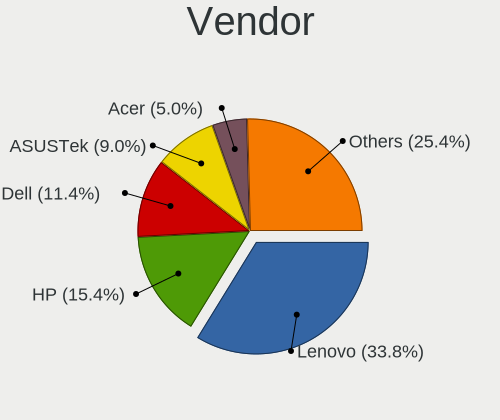
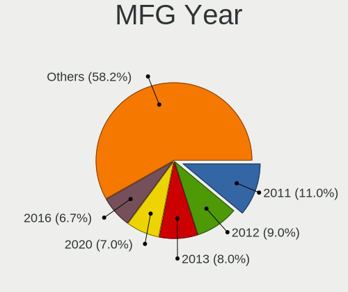
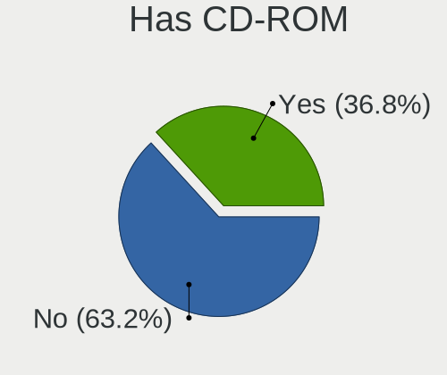
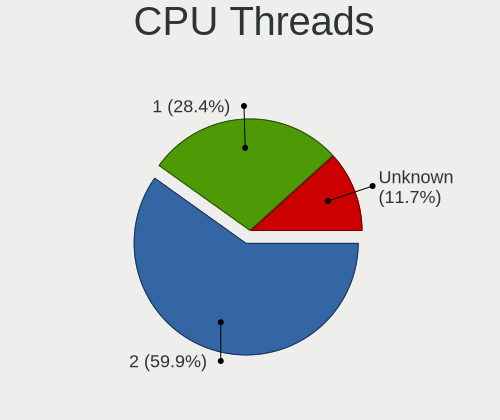
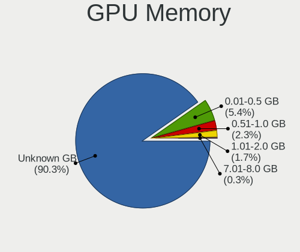

helloSystem 0.8.1 - Tested Hardware & Statistics (Notebooks)
------------------------------------------------------------

A project to collect tested hardware configurations for helloSystem 0.8.1.

Anyone can contribute to this report by the [hw-probe](https://github.com/linuxhw/hw-probe/blob/master/INSTALL.BSD.md) tool:

    hw-probe -all -upload

Please contribute! Especially if your hardware is rare.

Contents
--------

* [ Test Cases ](#test-cases)

* [ System ](#system)
  - [ Arch                     ](#arch)
  - [ DE                       ](#de)
  - [ Display Server           ](#display-server)
  - [ Display Manager          ](#display-manager)
  - [ OS Lang                  ](#os-lang)
  - [ Boot Mode                ](#boot-mode)
  - [ Filesystem               ](#filesystem)
  - [ Part. scheme             ](#part-scheme)

* [ Board ](#board)
  - [ Vendor                   ](#vendor)
  - [ Model                    ](#model)
  - [ Model Family             ](#model-family)
  - [ MFG Year                 ](#mfg-year)
  - [ Form Factor              ](#form-factor)
  - [ Coreboot                 ](#coreboot)
  - [ RAM Size                 ](#ram-size)
  - [ RAM Used                 ](#ram-used)
  - [ Total Drives             ](#total-drives)
  - [ Has CD-ROM               ](#has-cd-rom)
  - [ Has Ethernet             ](#has-ethernet)
  - [ Has WiFi                 ](#has-wifi)
  - [ Has Bluetooth            ](#has-bluetooth)

* [ Location ](#location)
  - [ Country                  ](#country)
  - [ City                     ](#city)

* [ Drives ](#drives)
  - [ Drive Vendor             ](#drive-vendor)
  - [ Drive Model              ](#drive-model)
  - [ HDD Vendor               ](#hdd-vendor)
  - [ SSD Vendor               ](#ssd-vendor)
  - [ Drive Kind               ](#drive-kind)
  - [ Drive Connector          ](#drive-connector)
  - [ Drive Size               ](#drive-size)
  - [ Space Total              ](#space-total)
  - [ Space Used               ](#space-used)
  - [ Malfunc. Drives          ](#malfunc-drives)
  - [ Malfunc. Drive Vendor    ](#malfunc-drive-vendor)
  - [ Malfunc. HDD Vendor      ](#malfunc-hdd-vendor)
  - [ Malfunc. Drive Kind      ](#malfunc-drive-kind)
  - [ Failed Drives            ](#failed-drives)
  - [ Failed Drive Vendor      ](#failed-drive-vendor)
  - [ Drive Status             ](#drive-status)

* [ Storage controller ](#storage-controller)
  - [ Storage Vendor           ](#storage-vendor)
  - [ Storage Model            ](#storage-model)
  - [ Storage Kind             ](#storage-kind)

* [ Processor ](#processor)
  - [ CPU Vendor               ](#cpu-vendor)
  - [ CPU Model                ](#cpu-model)
  - [ CPU Model Family         ](#cpu-model-family)
  - [ CPU Cores                ](#cpu-cores)
  - [ CPU Sockets              ](#cpu-sockets)
  - [ CPU Threads              ](#cpu-threads)
  - [ CPU Microarch            ](#cpu-microarch)

* [ Graphics ](#graphics)
  - [ GPU Vendor               ](#gpu-vendor)
  - [ GPU Model                ](#gpu-model)
  - [ GPU Combo                ](#gpu-combo)
  - [ GPU Driver               ](#gpu-driver)
  - [ GPU Memory               ](#gpu-memory)

* [ Monitor ](#monitor)
  - [ Monitor Vendor           ](#monitor-vendor)
  - [ Monitor Model            ](#monitor-model)
  - [ Monitor Resolution       ](#monitor-resolution)
  - [ Monitor Diagonal         ](#monitor-diagonal)
  - [ Monitor Width            ](#monitor-width)
  - [ Aspect Ratio             ](#aspect-ratio)
  - [ Monitor Area             ](#monitor-area)
  - [ Pixel Density            ](#pixel-density)
  - [ Multiple Monitors        ](#multiple-monitors)

* [ Network ](#network)
  - [ Net Controller Vendor    ](#net-controller-vendor)
  - [ Net Controller Model     ](#net-controller-model)
  - [ Wireless Vendor          ](#wireless-vendor)
  - [ Wireless Model           ](#wireless-model)
  - [ Ethernet Vendor          ](#ethernet-vendor)
  - [ Ethernet Model           ](#ethernet-model)
  - [ Net Controller Kind      ](#net-controller-kind)
  - [ Used Controller          ](#used-controller)
  - [ NICs                     ](#nics)
  - [ IPv6                     ](#ipv6)

* [ Bluetooth ](#bluetooth)
  - [ Bluetooth Vendor         ](#bluetooth-vendor)
  - [ Bluetooth Model          ](#bluetooth-model)

* [ Sound ](#sound)
  - [ Sound Vendor             ](#sound-vendor)
  - [ Sound Model              ](#sound-model)

* [ Memory ](#memory)
  - [ Memory Vendor            ](#memory-vendor)
  - [ Memory Model             ](#memory-model)
  - [ Memory Kind              ](#memory-kind)
  - [ Memory Form Factor       ](#memory-form-factor)
  - [ Memory Size              ](#memory-size)
  - [ Memory Speed             ](#memory-speed)

* [ Printers & scanners ](#printers--scanners)
  - [ Printer Vendor           ](#printer-vendor)
  - [ Printer Model            ](#printer-model)
  - [ Scanner Vendor           ](#scanner-vendor)
  - [ Scanner Model            ](#scanner-model)

* [ Camera ](#camera)
  - [ Camera Vendor            ](#camera-vendor)
  - [ Camera Model             ](#camera-model)

* [ Security ](#security)
  - [ Fingerprint Vendor       ](#fingerprint-vendor)
  - [ Fingerprint Model        ](#fingerprint-model)
  - [ Chipcard Vendor          ](#chipcard-vendor)
  - [ Chipcard Model           ](#chipcard-model)

* [ Unsupported ](#unsupported)
  - [ Unsupported Devices      ](#unsupported-devices)
  - [ Unsupported Device Types ](#unsupported-device-types)

Test Cases
----------

Total: 355

| Vendor        | Model                       | Probe                                                     | Date         |
|---------------|-----------------------------|-----------------------------------------------------------|--------------|
| Lenovo        | IdeaPad S145-15API 81V7     | [4bd0423b13](https://bsd-hardware.info/?probe=4bd0423b13) | Jan 05, 2025 |
| HP            | EliteBook 840 G3            | [5e09879203](https://bsd-hardware.info/?probe=5e09879203) | Jan 03, 2025 |
| Dell          | Latitude E7250              | [dbff7c2ebb](https://bsd-hardware.info/?probe=dbff7c2ebb) | Jan 02, 2025 |
| Lenovo        | V15-ADA 82C7                | [62c66a5499](https://bsd-hardware.info/?probe=62c66a5499) | Dec 29, 2024 |
| Lenovo        | V15-ADA 82C7                | [67ea149c61](https://bsd-hardware.info/?probe=67ea149c61) | Dec 29, 2024 |
| Dell          | Inspiron 3458               | [c90d1d5857](https://bsd-hardware.info/?probe=c90d1d5857) | Dec 24, 2024 |
| HP            | 2000                        | [0705a401f8](https://bsd-hardware.info/?probe=0705a401f8) | Dec 16, 2024 |
| HP            | ProBook 4430s               | [45102636ac](https://bsd-hardware.info/?probe=45102636ac) | Dec 16, 2024 |
| HP            | Victus by Laptop 16-d0xx... | [196fb6634a](https://bsd-hardware.info/?probe=196fb6634a) | Dec 03, 2024 |
| Fujitsu       | LIFEBOOK T730               | [577dc596e5](https://bsd-hardware.info/?probe=577dc596e5) | Nov 23, 2024 |
| Fujitsu       | LIFEBOOK T730               | [b5cfe0c0b2](https://bsd-hardware.info/?probe=b5cfe0c0b2) | Nov 23, 2024 |
| Dell          | Vostro 3400                 | [65071f6e52](https://bsd-hardware.info/?probe=65071f6e52) | Nov 18, 2024 |
| ASUSTek       | K54C                        | [4f0c073344](https://bsd-hardware.info/?probe=4f0c073344) | Nov 12, 2024 |
| ASUSTek       | VivoBook S13 X330FA_S330... | [4bcf1051ee](https://bsd-hardware.info/?probe=4bcf1051ee) | Nov 09, 2024 |
| ASUSTek       | GL752VW                     | [efc1d86951](https://bsd-hardware.info/?probe=efc1d86951) | Nov 02, 2024 |
| Lenovo        | ThinkPad X280 20KES2VQ00    | [d864971168](https://bsd-hardware.info/?probe=d864971168) | Oct 30, 2024 |
| HP            | Pavilion Notebook           | [4609004e3e](https://bsd-hardware.info/?probe=4609004e3e) | Oct 30, 2024 |
| ASUSTek       | X453SA                      | [51933883d6](https://bsd-hardware.info/?probe=51933883d6) | Oct 29, 2024 |
| Lenovo        | ThinkPad E470 20H1002FLM    | [d11900e726](https://bsd-hardware.info/?probe=d11900e726) | Oct 25, 2024 |
| Lenovo        | ThinkPad X201T 3093A79      | [9f1d2db1a6](https://bsd-hardware.info/?probe=9f1d2db1a6) | Oct 25, 2024 |
| Lenovo        | ThinkPad Edge E545 20B20... | [934ff561a5](https://bsd-hardware.info/?probe=934ff561a5) | Oct 20, 2024 |
| Lenovo        | ThinkPad W530 24491A0       | [6c6e16db1a](https://bsd-hardware.info/?probe=6c6e16db1a) | Oct 19, 2024 |
| Lenovo        | ThinkPad W530 24491A0       | [37cb237ce2](https://bsd-hardware.info/?probe=37cb237ce2) | Oct 07, 2024 |
| HP            | 255 15.6 inch G9 Noteboo... | [370c96e120](https://bsd-hardware.info/?probe=370c96e120) | Oct 02, 2024 |
| HP            | 255 15.6 inch G9 Noteboo... | [71dbda24c3](https://bsd-hardware.info/?probe=71dbda24c3) | Oct 02, 2024 |
| HP            | 255 15.6 inch G9 Noteboo... | [4713dcbd2c](https://bsd-hardware.info/?probe=4713dcbd2c) | Oct 02, 2024 |
| Sony          | VGN-FZ19VN                  | [a5e398c41f](https://bsd-hardware.info/?probe=a5e398c41f) | Sep 28, 2024 |
| Acer          | Aspire 4820                 | [2ba56db0c4](https://bsd-hardware.info/?probe=2ba56db0c4) | Sep 26, 2024 |
| Apple         | MacBook6,1                  | [6b5e02a63b](https://bsd-hardware.info/?probe=6b5e02a63b) | Sep 22, 2024 |
| Dell          | Latitude E6440              | [cfabb27e7a](https://bsd-hardware.info/?probe=cfabb27e7a) | Sep 21, 2024 |
| Dell          | Latitude E6540              | [e8bdb7007b](https://bsd-hardware.info/?probe=e8bdb7007b) | Sep 19, 2024 |
| Dell          | Latitude E7440              | [0e95a909ad](https://bsd-hardware.info/?probe=0e95a909ad) | Sep 11, 2024 |
| HP            | Mini 210-1000               | [5271409065](https://bsd-hardware.info/?probe=5271409065) | Sep 11, 2024 |
| Lenovo        | IdeaPad 100S-14IBR 80R9     | [2fd4b148bb](https://bsd-hardware.info/?probe=2fd4b148bb) | Sep 06, 2024 |
| HP            | Stream Notebook             | [7d427180ae](https://bsd-hardware.info/?probe=7d427180ae) | Aug 30, 2024 |
| Samsung       | 530U3C/530U4C/532U3C        | [d5e4a58748](https://bsd-hardware.info/?probe=d5e4a58748) | Aug 27, 2024 |
| Lenovo        | Yoga 300-11IBR 80M1         | [d74ebfd0d0](https://bsd-hardware.info/?probe=d74ebfd0d0) | Aug 19, 2024 |
| Intelbras     | S41ILx                      | [85e9cf50b4](https://bsd-hardware.info/?probe=85e9cf50b4) | Aug 16, 2024 |
| ASUSTek       | 1215N                       | [0970f34b42](https://bsd-hardware.info/?probe=0970f34b42) | Aug 15, 2024 |
| HP            | ProBook 640 G2              | [fa5e1f0cae](https://bsd-hardware.info/?probe=fa5e1f0cae) | Aug 11, 2024 |
| Lenovo        | ThinkPad X270 20HMA04EJP    | [d515224367](https://bsd-hardware.info/?probe=d515224367) | Aug 09, 2024 |
| Lenovo        | ThinkPad T520 4243FS9       | [664d48690e](https://bsd-hardware.info/?probe=664d48690e) | Aug 08, 2024 |
| Fujitsu       | CELSIUS H710                | [dc35b855e5](https://bsd-hardware.info/?probe=dc35b855e5) | Jul 31, 2024 |
| Dell          | Latitude 3410               | [c5b69d8cf7](https://bsd-hardware.info/?probe=c5b69d8cf7) | Jul 23, 2024 |
| HP            | Pavilion g6                 | [19ddfa696d](https://bsd-hardware.info/?probe=19ddfa696d) | Jul 20, 2024 |
| HP            | Pavilion Gaming Laptop 1... | [b66947b74a](https://bsd-hardware.info/?probe=b66947b74a) | Jul 16, 2024 |
| Lenovo        | ThinkPad X200 7459WT6       | [fa49267388](https://bsd-hardware.info/?probe=fa49267388) | Jul 13, 2024 |
| HP            | EliteBook 820 G1            | [0de2223643](https://bsd-hardware.info/?probe=0de2223643) | Jul 11, 2024 |
| Lenovo        | IdeaPad 3 15ALC6 82KU       | [0529ba7873](https://bsd-hardware.info/?probe=0529ba7873) | Jul 09, 2024 |
| Lenovo        | ThinkPad X230 2325SCM       | [8406cad5be](https://bsd-hardware.info/?probe=8406cad5be) | Jul 06, 2024 |
| Lenovo        | M30-70 20446                | [fd24cae390](https://bsd-hardware.info/?probe=fd24cae390) | Jun 26, 2024 |
| Lenovo        | M30-70 20446                | [e9a1a61239](https://bsd-hardware.info/?probe=e9a1a61239) | Jun 26, 2024 |
| Lenovo        | M30-70 20446                | [babc2efc9e](https://bsd-hardware.info/?probe=babc2efc9e) | Jun 26, 2024 |
| Lenovo        | M30-70 20446                | [0251872176](https://bsd-hardware.info/?probe=0251872176) | Jun 26, 2024 |
| HP            | Pavilion dv6500             | [49f31626da](https://bsd-hardware.info/?probe=49f31626da) | Jun 16, 2024 |
| Dell          | Latitude E6410              | [30f7b05dcf](https://bsd-hardware.info/?probe=30f7b05dcf) | Jun 15, 2024 |
| Framework     | Laptop                      | [f43baabeee](https://bsd-hardware.info/?probe=f43baabeee) | Jun 12, 2024 |
| Fujitsu       | CELSIUS H710                | [93308d8e8e](https://bsd-hardware.info/?probe=93308d8e8e) | Jun 11, 2024 |
| Notebook      | W740SU                      | [31be7db967](https://bsd-hardware.info/?probe=31be7db967) | Jun 09, 2024 |
| Fujitsu       | LIFEBOOK E751               | [c4e275f1a2](https://bsd-hardware.info/?probe=c4e275f1a2) | Jun 08, 2024 |
| ASUSTek       | X555LAB                     | [20959ef447](https://bsd-hardware.info/?probe=20959ef447) | Jun 05, 2024 |
| ASUSTek       | X555UJ                      | [df9f681ce9](https://bsd-hardware.info/?probe=df9f681ce9) | Jun 05, 2024 |
| Toshiba       | Satellite C800D             | [3b26adb52f](https://bsd-hardware.info/?probe=3b26adb52f) | Jun 05, 2024 |
| Sony          | SVF1521G6EW                 | [b977d6f1e0](https://bsd-hardware.info/?probe=b977d6f1e0) | Jun 02, 2024 |
| HP            | Laptop 14s-dy5xxx           | [76d2f8d955](https://bsd-hardware.info/?probe=76d2f8d955) | May 28, 2024 |
| ASUSTek       | N50Vc                       | [69d37366c1](https://bsd-hardware.info/?probe=69d37366c1) | May 27, 2024 |
| HP            | Compaq Presario CQ71        | [ddf13477d5](https://bsd-hardware.info/?probe=ddf13477d5) | May 24, 2024 |
| Thomson       | N15C                        | [45c095d0c8](https://bsd-hardware.info/?probe=45c095d0c8) | May 23, 2024 |
| HP            | OMEN by Laptop              | [7148244e3e](https://bsd-hardware.info/?probe=7148244e3e) | May 21, 2024 |
| HP            | Compaq Presario CQ71        | [7646daa3c0](https://bsd-hardware.info/?probe=7646daa3c0) | May 19, 2024 |
| Lenovo        | ThinkPad T530 2394EE9       | [9bc81955aa](https://bsd-hardware.info/?probe=9bc81955aa) | May 08, 2024 |
| Lenovo        | ThinkPad T530 2394EE9       | [651bd2de24](https://bsd-hardware.info/?probe=651bd2de24) | May 08, 2024 |
| Acer          | Aspire R3-131T              | [dec4102ec0](https://bsd-hardware.info/?probe=dec4102ec0) | May 07, 2024 |
| Lenovo        | ThinkPad L420 7827W27       | [5231c79a27](https://bsd-hardware.info/?probe=5231c79a27) | May 05, 2024 |
| Apple         | MacBook4,1                  | [5916d9274d](https://bsd-hardware.info/?probe=5916d9274d) | May 05, 2024 |
| Lenovo        | B51-30 80LK                 | [c1435ee19d](https://bsd-hardware.info/?probe=c1435ee19d) | Apr 21, 2024 |
| HP            | OMEN by Laptop              | [e2bce481c8](https://bsd-hardware.info/?probe=e2bce481c8) | Apr 21, 2024 |
| Samsung       | 340XAA/350XAA/550XAA        | [0de254980a](https://bsd-hardware.info/?probe=0de254980a) | Apr 16, 2024 |
| ASUSTek       | VivoBook S14 X430UA         | [12764b3dba](https://bsd-hardware.info/?probe=12764b3dba) | Apr 14, 2024 |
| ASUSTek       | N76VZ                       | [c1af06bf99](https://bsd-hardware.info/?probe=c1af06bf99) | Apr 12, 2024 |
| Dell          | Latitude E5530 non-vPro     | [227f0ffb18](https://bsd-hardware.info/?probe=227f0ffb18) | Apr 09, 2024 |
| F-Plus Mob... | FLAPTOP r                   | [21768f1b7a](https://bsd-hardware.info/?probe=21768f1b7a) | Apr 04, 2024 |
| Lenovo        | ThinkPad W530 2447GH2       | [0cb3f41765](https://bsd-hardware.info/?probe=0cb3f41765) | Apr 01, 2024 |
| Lenovo        | G510 20238                  | [faf771068a](https://bsd-hardware.info/?probe=faf771068a) | Mar 25, 2024 |
| ASUSTek       | ASUS TUF Gaming F15 FX50... | [25a92fc367](https://bsd-hardware.info/?probe=25a92fc367) | Mar 22, 2024 |
| ASUSTek       | X550CA                      | [ff92192d22](https://bsd-hardware.info/?probe=ff92192d22) | Mar 19, 2024 |
| Lenovo        | G580 20150                  | [1a072e681a](https://bsd-hardware.info/?probe=1a072e681a) | Mar 15, 2024 |
| Dell          | Latitude E6220              | [5a42aa442f](https://bsd-hardware.info/?probe=5a42aa442f) | Mar 09, 2024 |
| Maibenben     | MaiBook X series            | [2a58491971](https://bsd-hardware.info/?probe=2a58491971) | Mar 03, 2024 |
| Lenovo        | IdeaPad Y700-17ISK 80Q0     | [3653895b8e](https://bsd-hardware.info/?probe=3653895b8e) | Mar 03, 2024 |
| Acer          | Aspire A715-75G             | [415aa43c5c](https://bsd-hardware.info/?probe=415aa43c5c) | Mar 02, 2024 |
| Itautec       | Infoway                     | [35399f6e75](https://bsd-hardware.info/?probe=35399f6e75) | Feb 28, 2024 |
| Lenovo        | ThinkPad X220 4290KV8       | [9bc55d7f8a](https://bsd-hardware.info/?probe=9bc55d7f8a) | Feb 23, 2024 |
| Lenovo        | XiaoXinAir 14+ ACN 2021 ... | [5702ec8e8e](https://bsd-hardware.info/?probe=5702ec8e8e) | Feb 22, 2024 |
| Lenovo        | ThinkPad T480 20L6SDA400    | [4934e88205](https://bsd-hardware.info/?probe=4934e88205) | Feb 07, 2024 |
| ASUSTek       | K52F                        | [bc31c4707c](https://bsd-hardware.info/?probe=bc31c4707c) | Feb 04, 2024 |
| Panasonic     | CF-52PGNBX2M                | [401aeae642](https://bsd-hardware.info/?probe=401aeae642) | Feb 03, 2024 |
| ASUSTek       | K52F                        | [9022031518](https://bsd-hardware.info/?probe=9022031518) | Feb 03, 2024 |
| Lenovo        | ThinkPad T460 20FMS1VA1D    | [03d11c45e9](https://bsd-hardware.info/?probe=03d11c45e9) | Jan 28, 2024 |
| Dell          | Precision M4700             | [05a9a26c16](https://bsd-hardware.info/?probe=05a9a26c16) | Jan 24, 2024 |
| Acer          | Nitro AN515-54              | [28539d7eb4](https://bsd-hardware.info/?probe=28539d7eb4) | Jan 24, 2024 |
| Acer          | TravelMate B115-M           | [d7a78aa2cf](https://bsd-hardware.info/?probe=d7a78aa2cf) | Jan 22, 2024 |
| Apple         | MacBookAir4,1               | [f51a396e5e](https://bsd-hardware.info/?probe=f51a396e5e) | Jan 21, 2024 |
| Dell          | Latitude 7480               | [d9b4d836e7](https://bsd-hardware.info/?probe=d9b4d836e7) | Jan 17, 2024 |
| HP            | Mini 210-1000               | [f25c646418](https://bsd-hardware.info/?probe=f25c646418) | Jan 16, 2024 |
| HP            | Mini 210-1000               | [fb086c3baa](https://bsd-hardware.info/?probe=fb086c3baa) | Jan 15, 2024 |
| Apple         | MacBookAir4,1               | [b9653bc7d3](https://bsd-hardware.info/?probe=b9653bc7d3) | Jan 14, 2024 |
| Dell          | Inspiron 14-3452            | [47ac3f7eaa](https://bsd-hardware.info/?probe=47ac3f7eaa) | Jan 09, 2024 |
| HP            | Compaq 6510b (GM108UC#AB... | [7ed7da2383](https://bsd-hardware.info/?probe=7ed7da2383) | Jan 08, 2024 |
| ASUSTek       | X551MA                      | [91eda59c82](https://bsd-hardware.info/?probe=91eda59c82) | Jan 06, 2024 |
| Lenovo        | ThinkPad X250 20CMS01M00    | [1f52525bb9](https://bsd-hardware.info/?probe=1f52525bb9) | Jan 04, 2024 |
| Samsung       | R510/P510                   | [920e7e2d14](https://bsd-hardware.info/?probe=920e7e2d14) | Dec 31, 2023 |
| Dell          | Vostro V130                 | [44e78243c2](https://bsd-hardware.info/?probe=44e78243c2) | Dec 30, 2023 |
| Lenovo        | ThinkPad X131e 33672T9      | [93f964da45](https://bsd-hardware.info/?probe=93f964da45) | Dec 25, 2023 |
| eMachines     | eM350                       | [00d1d0c359](https://bsd-hardware.info/?probe=00d1d0c359) | Dec 23, 2023 |
| Lenovo        | ThinkPad X220 4291H77       | [2fe3ff7e06](https://bsd-hardware.info/?probe=2fe3ff7e06) | Dec 18, 2023 |
| Acer          | V5-131                      | [76e88ee5df](https://bsd-hardware.info/?probe=76e88ee5df) | Dec 14, 2023 |
| ASUSTek       | VivoBook_ASUSLaptop M650... | [7a1ab6fd47](https://bsd-hardware.info/?probe=7a1ab6fd47) | Dec 06, 2023 |
| Intel         | H81U                        | [b74cca91df](https://bsd-hardware.info/?probe=b74cca91df) | Dec 01, 2023 |
| Samsung       | N150P/N210P/N220P           | [b394563830](https://bsd-hardware.info/?probe=b394563830) | Nov 30, 2023 |
| Lenovo        | Yoga 2 Pro 20266            | [1096dc8160](https://bsd-hardware.info/?probe=1096dc8160) | Nov 27, 2023 |
| Lenovo        | Yoga 2 Pro 20266            | [1bfc57a019](https://bsd-hardware.info/?probe=1bfc57a019) | Nov 27, 2023 |
| Lenovo        | IdeaPad S145-14AST 81ST     | [a44d6afa76](https://bsd-hardware.info/?probe=a44d6afa76) | Nov 24, 2023 |
| Lenovo        | IdeaPad S145-14AST 81ST     | [b67644f2b3](https://bsd-hardware.info/?probe=b67644f2b3) | Nov 24, 2023 |
| Acer          | Aspire E5-574               | [a4eded7a52](https://bsd-hardware.info/?probe=a4eded7a52) | Nov 22, 2023 |
| HP            | Laptop 14-fq0xxx            | [4c5aa5c3ea](https://bsd-hardware.info/?probe=4c5aa5c3ea) | Nov 22, 2023 |
| Lenovo        | ThinkPad X230 2320A5U       | [48f8b6a93a](https://bsd-hardware.info/?probe=48f8b6a93a) | Nov 16, 2023 |
| Dell          | Inspiron 15 7000 Gaming     | [b85df96058](https://bsd-hardware.info/?probe=b85df96058) | Nov 11, 2023 |
| Lenovo        | ThinkPad E14 20RA0016RT     | [83b87dac52](https://bsd-hardware.info/?probe=83b87dac52) | Nov 10, 2023 |
| Gateway       | NV79                        | [2a7dd49956](https://bsd-hardware.info/?probe=2a7dd49956) | Nov 09, 2023 |
| Lenovo        | Z50-70 20354                | [641e875b3b](https://bsd-hardware.info/?probe=641e875b3b) | Nov 04, 2023 |
| TUXEDO        | Aura 15 Gen1                | [7a6b4537f3](https://bsd-hardware.info/?probe=7a6b4537f3) | Oct 29, 2023 |
| Lenovo        | Z50-70 20354                | [f3d9534b2d](https://bsd-hardware.info/?probe=f3d9534b2d) | Oct 28, 2023 |
| Lenovo        | ThinkPad T520 42405FG       | [e6aca7e0c8](https://bsd-hardware.info/?probe=e6aca7e0c8) | Oct 28, 2023 |
| Toshiba       | Unknown                     | [de44a16738](https://bsd-hardware.info/?probe=de44a16738) | Oct 24, 2023 |
| Acer          | Aspire 5336                 | [ebfed0efbc](https://bsd-hardware.info/?probe=ebfed0efbc) | Oct 18, 2023 |
| Apple         | MacBook5,2                  | [5f364ec930](https://bsd-hardware.info/?probe=5f364ec930) | Oct 17, 2023 |
| Dell          | Latitude 3440               | [3e6826570c](https://bsd-hardware.info/?probe=3e6826570c) | Oct 16, 2023 |
| Lenovo        | ThinkPad T480 20L5000UUS    | [20fe904881](https://bsd-hardware.info/?probe=20fe904881) | Oct 15, 2023 |
| Acer          | Aspire ES1-571              | [f3036a27e5](https://bsd-hardware.info/?probe=f3036a27e5) | Oct 13, 2023 |
| Apple         | MacBook5,1                  | [518658e176](https://bsd-hardware.info/?probe=518658e176) | Oct 11, 2023 |
| Apple         | MacBookPro9,2               | [c88d8880ea](https://bsd-hardware.info/?probe=c88d8880ea) | Oct 11, 2023 |
| Lenovo        | IdeaPad 3 17ITL6 82H9       | [5be3eb1296](https://bsd-hardware.info/?probe=5be3eb1296) | Oct 08, 2023 |
| Lenovo        | ThinkPad E14 Gen 2 20TA0... | [c646a3b663](https://bsd-hardware.info/?probe=c646a3b663) | Oct 07, 2023 |
| ASUSTek       | K73E                        | [ce5fcbdc3e](https://bsd-hardware.info/?probe=ce5fcbdc3e) | Oct 04, 2023 |
| Lenovo        | ThinkPad E14 Gen 2 20T60... | [5cd50ed5b5](https://bsd-hardware.info/?probe=5cd50ed5b5) | Sep 24, 2023 |
| Lenovo        | IdeaPad 1 14IGL7 82V6       | [8a3d3b3d0d](https://bsd-hardware.info/?probe=8a3d3b3d0d) | Sep 21, 2023 |
| Lenovo        | ThinkPad Edge E531 68852... | [cc3bef6a45](https://bsd-hardware.info/?probe=cc3bef6a45) | Sep 15, 2023 |
| OEGStone      | doceo 510                   | [9f3b47e30f](https://bsd-hardware.info/?probe=9f3b47e30f) | Sep 13, 2023 |
| HP            | OMEN by Laptop              | [f0fc4f47b8](https://bsd-hardware.info/?probe=f0fc4f47b8) | Sep 10, 2023 |
| Lenovo        | ThinkPad SL 2746N8G         | [07eda65608](https://bsd-hardware.info/?probe=07eda65608) | Sep 09, 2023 |
| Lenovo        | IdeaPad 100-14IBY 80MH      | [1d5aff2e2a](https://bsd-hardware.info/?probe=1d5aff2e2a) | Sep 08, 2023 |
| HP            | Pavilion g7                 | [4870da3b0e](https://bsd-hardware.info/?probe=4870da3b0e) | Sep 07, 2023 |
| Lenovo        | ThinkPad X240 20AMA1Y3UK    | [8277297743](https://bsd-hardware.info/?probe=8277297743) | Sep 05, 2023 |
| HP            | G62                         | [b4777b6ba5](https://bsd-hardware.info/?probe=b4777b6ba5) | Sep 04, 2023 |
| Toshiba       | QOSMIO X775                 | [d92a05ab1d](https://bsd-hardware.info/?probe=d92a05ab1d) | Sep 04, 2023 |
| Samsung       | 270E5J/2570EJ               | [3feb685296](https://bsd-hardware.info/?probe=3feb685296) | Sep 03, 2023 |
| Fujitsu       | LIFEBOOK S935               | [a6cfe011fe](https://bsd-hardware.info/?probe=a6cfe011fe) | Sep 02, 2023 |
| HP            | 2000                        | [6d9c442ae6](https://bsd-hardware.info/?probe=6d9c442ae6) | Aug 31, 2023 |
| Lenovo        | IdeaPad Gaming 3 15IHU6 ... | [a308c3a87b](https://bsd-hardware.info/?probe=a308c3a87b) | Aug 31, 2023 |
| HP            | Pavilion dv3500             | [0c3f84b285](https://bsd-hardware.info/?probe=0c3f84b285) | Aug 29, 2023 |
| Lenovo        | IdeaPad 110S-11IBR 80WG     | [e74ef1d37c](https://bsd-hardware.info/?probe=e74ef1d37c) | Aug 29, 2023 |
| NVN-ED01      | Unknown                     | [dba43e889a](https://bsd-hardware.info/?probe=dba43e889a) | Aug 25, 2023 |
| Lenovo        | ThinkPad P50 20EN0009MS     | [4b3fcfa17e](https://bsd-hardware.info/?probe=4b3fcfa17e) | Aug 25, 2023 |
| ASUSTek       | S500CA                      | [019366a664](https://bsd-hardware.info/?probe=019366a664) | Aug 25, 2023 |
| Lenovo        | ThinkPad T450 20BUS0370P    | [5fefc051e1](https://bsd-hardware.info/?probe=5fefc051e1) | Aug 20, 2023 |
| ASUSTek       | X553MA                      | [7334765d8a](https://bsd-hardware.info/?probe=7334765d8a) | Aug 16, 2023 |
| ASUSTek       | GL753VD                     | [8ccbffdd73](https://bsd-hardware.info/?probe=8ccbffdd73) | Aug 15, 2023 |
| Lenovo        | ThinkPad X200 7458WNZ       | [3ac1d60240](https://bsd-hardware.info/?probe=3ac1d60240) | Aug 12, 2023 |
| Lenovo        | ThinkPad T60 1951CZ1        | [46766bc381](https://bsd-hardware.info/?probe=46766bc381) | Aug 11, 2023 |
| Acer          | Aspire V3-371               | [21c262aadb](https://bsd-hardware.info/?probe=21c262aadb) | Aug 09, 2023 |
| Acer          | Aspire V3-371               | [68bceee682](https://bsd-hardware.info/?probe=68bceee682) | Aug 09, 2023 |
| Lenovo        | ThinkPad X1 Carbon 2nd 2... | [9c01814bdc](https://bsd-hardware.info/?probe=9c01814bdc) | Aug 07, 2023 |
| Compaq        | Presario CQ-17              | [f97feb2db0](https://bsd-hardware.info/?probe=f97feb2db0) | Aug 04, 2023 |
| HP            | EliteBook 840 G5            | [6496fe0cfe](https://bsd-hardware.info/?probe=6496fe0cfe) | Aug 03, 2023 |
| Lenovo        | IdeaPad S210 Touch 20257    | [1e372622c1](https://bsd-hardware.info/?probe=1e372622c1) | Jul 31, 2023 |
| Lenovo        | ThinkPad X270 20HNA04GCD    | [6547f4a73b](https://bsd-hardware.info/?probe=6547f4a73b) | Jul 31, 2023 |
| Lenovo        | ThinkPad X230 23202DG       | [f8ade878ce](https://bsd-hardware.info/?probe=f8ade878ce) | Jul 30, 2023 |
| HP            | Notebook                    | [360790274a](https://bsd-hardware.info/?probe=360790274a) | Jul 29, 2023 |
| Apple         | MacBookPro9,2               | [53e133857b](https://bsd-hardware.info/?probe=53e133857b) | Jul 29, 2023 |
| HP            | Pavilion g6                 | [bdd2349f1c](https://bsd-hardware.info/?probe=bdd2349f1c) | Jul 28, 2023 |
| Dell          | Latitude 5480               | [e1521ed9d2](https://bsd-hardware.info/?probe=e1521ed9d2) | Jul 26, 2023 |
| Lenovo        | IdeaPad 5 15ALC05 82LN      | [60dac781b2](https://bsd-hardware.info/?probe=60dac781b2) | Jul 24, 2023 |
| Acer          | Aspire 4736Z                | [bccf97f694](https://bsd-hardware.info/?probe=bccf97f694) | Jul 20, 2023 |
| ASUSTek       | 1015PX                      | [dc06c76cf9](https://bsd-hardware.info/?probe=dc06c76cf9) | Jul 19, 2023 |
| Lenovo        | Legion 5 15IMH05 82AU       | [5fcffa5bd6](https://bsd-hardware.info/?probe=5fcffa5bd6) | Jul 19, 2023 |
| ASUSTek       | K42Jr                       | [256168572a](https://bsd-hardware.info/?probe=256168572a) | Jul 18, 2023 |
| Samsung       | RC530/RC730                 | [b76e5e8a87](https://bsd-hardware.info/?probe=b76e5e8a87) | Jul 17, 2023 |
| Lenovo        | ThinkPad R14 Gen 4 21E5A... | [e0fc7135e5](https://bsd-hardware.info/?probe=e0fc7135e5) | Jul 15, 2023 |
| ASUSTek       | X541UVK                     | [17f58b70e4](https://bsd-hardware.info/?probe=17f58b70e4) | Jul 10, 2023 |
| HP            | Compaq Presario CQ61        | [d070292855](https://bsd-hardware.info/?probe=d070292855) | Jul 03, 2023 |
| Lenovo        | ThinkPad T60 20076PU        | [cb47bfef12](https://bsd-hardware.info/?probe=cb47bfef12) | Jun 30, 2023 |
| HP            | EliteBook 840 G3            | [17834256ca](https://bsd-hardware.info/?probe=17834256ca) | Jun 28, 2023 |
| Dell          | Latitude E4310              | [9cdd4909fe](https://bsd-hardware.info/?probe=9cdd4909fe) | Jun 24, 2023 |
| HP            | Laptop 15-ra0xx             | [8c31502b68](https://bsd-hardware.info/?probe=8c31502b68) | Jun 24, 2023 |
| HP            | EliteBook 750 G1            | [aba91c70d1](https://bsd-hardware.info/?probe=aba91c70d1) | Jun 24, 2023 |
| Dell          | Latitude 5490               | [b638c1b2b1](https://bsd-hardware.info/?probe=b638c1b2b1) | Jun 23, 2023 |
| Acer          | Aspire 5749                 | [75ad2ddb6f](https://bsd-hardware.info/?probe=75ad2ddb6f) | Jun 22, 2023 |
| Acer          | Aspire 5749                 | [1e91633580](https://bsd-hardware.info/?probe=1e91633580) | Jun 20, 2023 |
| HP            | Pavilion 15                 | [9ba6acdb4b](https://bsd-hardware.info/?probe=9ba6acdb4b) | Jun 18, 2023 |
| HP            | Stream Laptop 14-ds0xxx     | [81bbc73e72](https://bsd-hardware.info/?probe=81bbc73e72) | Jun 18, 2023 |
| HUAWEI        | BOHB-WAX9                   | [d8079e6155](https://bsd-hardware.info/?probe=d8079e6155) | Jun 16, 2023 |
| MSI           | GE63 Raider RGB 8RE         | [ecdb80adc0](https://bsd-hardware.info/?probe=ecdb80adc0) | Jun 14, 2023 |
| HP            | Compaq 6830s                | [1a06917a0f](https://bsd-hardware.info/?probe=1a06917a0f) | Jun 14, 2023 |
| Lenovo        | IdeaPad 310-15IKB 80TV      | [76809610f9](https://bsd-hardware.info/?probe=76809610f9) | Jun 13, 2023 |
| Lenovo        | ThinkPad T440p 20AWS1CH0... | [b532f1ce9c](https://bsd-hardware.info/?probe=b532f1ce9c) | Jun 13, 2023 |
| Samsung       | R530/R730/R540              | [b007264caa](https://bsd-hardware.info/?probe=b007264caa) | Jun 11, 2023 |
| Lenovo        | S10-3                       | [f874a66e78](https://bsd-hardware.info/?probe=f874a66e78) | Jun 05, 2023 |
| Lenovo        | S10-3                       | [b76483ab8b](https://bsd-hardware.info/?probe=b76483ab8b) | Jun 05, 2023 |
| HP            | Pavilion Laptop 15-eh1xx... | [e1a7d29d74](https://bsd-hardware.info/?probe=e1a7d29d74) | Jun 04, 2023 |
| HP            | Pavilion Laptop 15-eh1xx... | [d0d9de7cf3](https://bsd-hardware.info/?probe=d0d9de7cf3) | Jun 04, 2023 |
| Panasonic     | CF-NX1GDHYS                 | [fb1f293997](https://bsd-hardware.info/?probe=fb1f293997) | Jun 02, 2023 |
| HP            | Pavilion Notebook           | [1bb0436fe5](https://bsd-hardware.info/?probe=1bb0436fe5) | May 30, 2023 |
| Apple         | MacBookPro10,2              | [c274e2c9db](https://bsd-hardware.info/?probe=c274e2c9db) | May 29, 2023 |
| Fujitsu       | Unknown                     | [3b5c9ab914](https://bsd-hardware.info/?probe=3b5c9ab914) | May 27, 2023 |
| Timi          | TM1701                      | [1dd768a721](https://bsd-hardware.info/?probe=1dd768a721) | May 25, 2023 |
| ASUSTek       | K42Jc                       | [3da2928a08](https://bsd-hardware.info/?probe=3da2928a08) | May 23, 2023 |
| Google        | Sentry                      | [107124dd66](https://bsd-hardware.info/?probe=107124dd66) | May 22, 2023 |
| Sony          | VPCEG15FB                   | [8777493861](https://bsd-hardware.info/?probe=8777493861) | May 21, 2023 |
| HP            | Pavilion Notebook           | [41ce3c5d11](https://bsd-hardware.info/?probe=41ce3c5d11) | May 21, 2023 |
| Packard Be... | EasyNote LJ65               | [36d3e7aaf7](https://bsd-hardware.info/?probe=36d3e7aaf7) | May 19, 2023 |
| Sony          | SVF14A15CBB                 | [4ada2dca25](https://bsd-hardware.info/?probe=4ada2dca25) | May 14, 2023 |
| Lenovo        | B570e HuronRiver Platfor... | [256915976d](https://bsd-hardware.info/?probe=256915976d) | May 12, 2023 |
| TUXEDO        | Aura 15 Gen1                | [3d889e8b9b](https://bsd-hardware.info/?probe=3d889e8b9b) | May 11, 2023 |
| Apple         | MacBook5,1                  | [da07885adb](https://bsd-hardware.info/?probe=da07885adb) | May 09, 2023 |
| HP            | Laptop 14-bs0xx             | [98ea66d6e8](https://bsd-hardware.info/?probe=98ea66d6e8) | May 07, 2023 |
| Lenovo        | Flex 2-15 20405             | [3773da7851](https://bsd-hardware.info/?probe=3773da7851) | May 03, 2023 |
| HP            | Compaq Presario CQ50        | [f296048a29](https://bsd-hardware.info/?probe=f296048a29) | May 03, 2023 |
| Apple         | MacBook5,1                  | [a5a1ca2ee6](https://bsd-hardware.info/?probe=a5a1ca2ee6) | May 02, 2023 |
| Apple         | MacBook5,1                  | [52174cc0ba](https://bsd-hardware.info/?probe=52174cc0ba) | Apr 27, 2023 |
| Apple         | MacBook5,1                  | [4c7f33d6a9](https://bsd-hardware.info/?probe=4c7f33d6a9) | Apr 25, 2023 |
| Lenovo        | ThinkPad X270 20HMS06Q1D    | [2df7c991f0](https://bsd-hardware.info/?probe=2df7c991f0) | Apr 23, 2023 |
| Lenovo        | G500 20236                  | [e7387bfd6e](https://bsd-hardware.info/?probe=e7387bfd6e) | Apr 23, 2023 |
| Dell          | Inspiron 3421               | [ef4870410f](https://bsd-hardware.info/?probe=ef4870410f) | Apr 23, 2023 |
| Lenovo        | Yoga Slim 7 14ITL05 82A3    | [93b498fb0c](https://bsd-hardware.info/?probe=93b498fb0c) | Apr 21, 2023 |
| Packard Be... | DOT SE                      | [f456e964db](https://bsd-hardware.info/?probe=f456e964db) | Apr 19, 2023 |
| Dell          | Latitude 7410               | [d5c047907d](https://bsd-hardware.info/?probe=d5c047907d) | Apr 19, 2023 |
| Acer          | V5-131                      | [4c2332c3b8](https://bsd-hardware.info/?probe=4c2332c3b8) | Apr 19, 2023 |
| Medion        | E15302                      | [f47f32e1cc](https://bsd-hardware.info/?probe=f47f32e1cc) | Apr 17, 2023 |
| Toshiba       | PORTEGE R700                | [8b196955ac](https://bsd-hardware.info/?probe=8b196955ac) | Apr 15, 2023 |
| Apple         | MacBook3,1                  | [74986a169a](https://bsd-hardware.info/?probe=74986a169a) | Apr 15, 2023 |
| Google        | Terra                       | [ef1619f65f](https://bsd-hardware.info/?probe=ef1619f65f) | Apr 13, 2023 |
| Google        | Terra                       | [bf598bc5bf](https://bsd-hardware.info/?probe=bf598bc5bf) | Apr 13, 2023 |
| Samsung       | 370E4K                      | [c363d008bf](https://bsd-hardware.info/?probe=c363d008bf) | Apr 13, 2023 |
| Lenovo        | ThinkPad L540 20AUA34DJP    | [c7e40ee8ea](https://bsd-hardware.info/?probe=c7e40ee8ea) | Apr 12, 2023 |
| Lenovo        | ThinkPad L15 Gen 2 20X3C... | [0249b4e73f](https://bsd-hardware.info/?probe=0249b4e73f) | Apr 11, 2023 |
| Lenovo        | ThinkPad L540 20AUA34DJP    | [52aac5fc6f](https://bsd-hardware.info/?probe=52aac5fc6f) | Apr 11, 2023 |
| Lenovo        | ThinkPad X1 Carbon 34487... | [cec90ddd1b](https://bsd-hardware.info/?probe=cec90ddd1b) | Apr 08, 2023 |
| Lenovo        | Legion 5 Pro 16ACH6H 82J... | [f3ac765863](https://bsd-hardware.info/?probe=f3ac765863) | Apr 08, 2023 |
| Dell          | XPS 13 9343                 | [8354aed46e](https://bsd-hardware.info/?probe=8354aed46e) | Apr 07, 2023 |
| Fujitsu       | CELSIUS H920                | [0551eecbcc](https://bsd-hardware.info/?probe=0551eecbcc) | Apr 06, 2023 |
| Acer          | Aspire 5250                 | [385751dbc3](https://bsd-hardware.info/?probe=385751dbc3) | Apr 06, 2023 |
| Google        | Wolf                        | [2546416afd](https://bsd-hardware.info/?probe=2546416afd) | Apr 05, 2023 |
| HP            | Laptop 15-bw0xx             | [93ea83eef5](https://bsd-hardware.info/?probe=93ea83eef5) | Apr 03, 2023 |
| Lenovo        | G570 20079                  | [76cc1653c3](https://bsd-hardware.info/?probe=76cc1653c3) | Apr 03, 2023 |
| Lenovo        | ThinkBook 14-IML 20RV       | [48b0a1024e](https://bsd-hardware.info/?probe=48b0a1024e) | Apr 02, 2023 |
| ASUSTek       | X58C                        | [dad28a9d36](https://bsd-hardware.info/?probe=dad28a9d36) | Apr 01, 2023 |
| Fujitsu       | CELSIUS H920                | [e6300dc691](https://bsd-hardware.info/?probe=e6300dc691) | Mar 31, 2023 |
| DNS           | W9x0LU                      | [6539659387](https://bsd-hardware.info/?probe=6539659387) | Mar 31, 2023 |
| Lenovo        | ThinkPad X220 4290DK6       | [96c83a2846](https://bsd-hardware.info/?probe=96c83a2846) | Mar 31, 2023 |
| Intel         | Intel                       | [75e9733afd](https://bsd-hardware.info/?probe=75e9733afd) | Mar 30, 2023 |
| Toshiba       | Satellite L675D             | [0bf578daec](https://bsd-hardware.info/?probe=0bf578daec) | Mar 30, 2023 |
| ASUSTek       | VivoBook_ASUS Laptop X50... | [ff14982ad9](https://bsd-hardware.info/?probe=ff14982ad9) | Mar 29, 2023 |
| Dell          | Latitude 5590               | [7e87d436df](https://bsd-hardware.info/?probe=7e87d436df) | Mar 29, 2023 |
| Lenovo        | ThinkPad T540p 20BFS10W0... | [30c5fc2625](https://bsd-hardware.info/?probe=30c5fc2625) | Mar 29, 2023 |
| Irbis         | NB78                        | [471efbc788](https://bsd-hardware.info/?probe=471efbc788) | Mar 29, 2023 |
| Lenovo        | Yoga Slim 7 Pro 14ACH5 8... | [f4e450fed1](https://bsd-hardware.info/?probe=f4e450fed1) | Mar 29, 2023 |
| Lenovo        | IdeaPad 320-15ISK 80XH      | [dddf27cde4](https://bsd-hardware.info/?probe=dddf27cde4) | Mar 28, 2023 |
| Lenovo        | IdeaPad 320-15ISK 80XH      | [c2ba6aca7d](https://bsd-hardware.info/?probe=c2ba6aca7d) | Mar 28, 2023 |
| Lenovo        | IdeaPad Gaming 3 15ACH6 ... | [fb4eec9c34](https://bsd-hardware.info/?probe=fb4eec9c34) | Mar 27, 2023 |
| HP            | Pavilion dv6                | [ce2cc6852d](https://bsd-hardware.info/?probe=ce2cc6852d) | Mar 27, 2023 |
| Dell          | Inspiron 7437               | [2c4de59558](https://bsd-hardware.info/?probe=2c4de59558) | Mar 27, 2023 |
| Lenovo        | IdeaPad S210 20256          | [2e22ee87c3](https://bsd-hardware.info/?probe=2e22ee87c3) | Mar 27, 2023 |
| Lenovo        | ThinkPad T430 2349G5P       | [9ea67d3893](https://bsd-hardware.info/?probe=9ea67d3893) | Mar 27, 2023 |
| Dell          | Latitude 5420               | [4e22bbc131](https://bsd-hardware.info/?probe=4e22bbc131) | Mar 26, 2023 |
| LG Electro... | E500-L.A2M4A2               | [8dab794233](https://bsd-hardware.info/?probe=8dab794233) | Mar 26, 2023 |
| Samsung       | R468/R418                   | [f620a5c6ec](https://bsd-hardware.info/?probe=f620a5c6ec) | Mar 25, 2023 |
| Lenovo        | ThinkPad X220 4291AN9       | [1646bb53ab](https://bsd-hardware.info/?probe=1646bb53ab) | Mar 25, 2023 |
| Lenovo        | ThinkPad T470 W10DG 20JN... | [7df625b1df](https://bsd-hardware.info/?probe=7df625b1df) | Mar 25, 2023 |
| Lenovo        | ThinkPad X230 Tablet 343... | [8e798ca6ef](https://bsd-hardware.info/?probe=8e798ca6ef) | Mar 25, 2023 |
| Lenovo        | ThinkPad W541 20EF000NUS    | [34b156c20c](https://bsd-hardware.info/?probe=34b156c20c) | Mar 24, 2023 |
| Dell          | Latitude 5500               | [8db518ef3d](https://bsd-hardware.info/?probe=8db518ef3d) | Mar 24, 2023 |
| Lenovo        | ThinkPad T61 7658CTO        | [f00e571f76](https://bsd-hardware.info/?probe=f00e571f76) | Mar 23, 2023 |
| Lenovo        | ThinkPad T430s 2356CV6      | [d9efc1e30b](https://bsd-hardware.info/?probe=d9efc1e30b) | Mar 22, 2023 |
| ASUSTek       | X71Vn                       | [6e96ea55ee](https://bsd-hardware.info/?probe=6e96ea55ee) | Mar 22, 2023 |
| Lenovo        | Yoga Slim 7 Pro 14ACH5 8... | [136a6641be](https://bsd-hardware.info/?probe=136a6641be) | Mar 21, 2023 |
| Lenovo        | ThinkPad X230 232578G       | [edf47cb2d4](https://bsd-hardware.info/?probe=edf47cb2d4) | Mar 21, 2023 |
| Lenovo        | ThinkPad T61 7659CA1        | [bba228ddc9](https://bsd-hardware.info/?probe=bba228ddc9) | Mar 20, 2023 |
| Lenovo        | G500 20236                  | [55dc82af1c](https://bsd-hardware.info/?probe=55dc82af1c) | Mar 20, 2023 |
| ASUSTek       | 1015PX                      | [d6c1199165](https://bsd-hardware.info/?probe=d6c1199165) | Mar 20, 2023 |
| Apple         | MacBookPro5,1               | [9e300b5797](https://bsd-hardware.info/?probe=9e300b5797) | Mar 19, 2023 |
| Toshiba       | Satellite P300              | [81b7ca608e](https://bsd-hardware.info/?probe=81b7ca608e) | Mar 19, 2023 |
| Lenovo        | ThinkPad T520 4242PN3       | [3ea33f0cad](https://bsd-hardware.info/?probe=3ea33f0cad) | Mar 19, 2023 |
| Lenovo        | ThinkPad T470 W10DG 20JN... | [e35600705f](https://bsd-hardware.info/?probe=e35600705f) | Mar 19, 2023 |
| Samsung       | R520/R522/R620              | [096d52b83d](https://bsd-hardware.info/?probe=096d52b83d) | Mar 18, 2023 |
| Lenovo        | IdeaPad 330-15IKB 81DE      | [be9a45f529](https://bsd-hardware.info/?probe=be9a45f529) | Mar 18, 2023 |
| Lenovo        | IdeaPad 330-15IKB 81DE      | [a365a5b411](https://bsd-hardware.info/?probe=a365a5b411) | Mar 18, 2023 |
| Apple         | MacBook4,1                  | [6f2790802d](https://bsd-hardware.info/?probe=6f2790802d) | Mar 18, 2023 |
| Fujitsu       | LIFEBOOK AH530              | [50a5ed6b41](https://bsd-hardware.info/?probe=50a5ed6b41) | Mar 18, 2023 |
| IGEL Techn... | M350C                       | [a04efafd2e](https://bsd-hardware.info/?probe=a04efafd2e) | Mar 18, 2023 |
| HP            | Pavilion dv5                | [113fe74799](https://bsd-hardware.info/?probe=113fe74799) | Mar 18, 2023 |
| HP            | EliteBook 850 G2            | [653dbe54a4](https://bsd-hardware.info/?probe=653dbe54a4) | Mar 18, 2023 |
| Lenovo        | ThinkPad T440p              | [575123c3ac](https://bsd-hardware.info/?probe=575123c3ac) | Mar 17, 2023 |
| Dell          | Inspiron 3442               | [cbb9f6bfbb](https://bsd-hardware.info/?probe=cbb9f6bfbb) | Mar 17, 2023 |
| Dell          | Latitude E5570              | [8b9aa95420](https://bsd-hardware.info/?probe=8b9aa95420) | Mar 17, 2023 |
| Toshiba       | Satellite L40               | [2297dcb7e7](https://bsd-hardware.info/?probe=2297dcb7e7) | Mar 17, 2023 |
| Dell          | Latitude E5570              | [937a7c9385](https://bsd-hardware.info/?probe=937a7c9385) | Mar 17, 2023 |
| Lenovo        | ThinkPad X201 36801T6       | [decaf0c347](https://bsd-hardware.info/?probe=decaf0c347) | Mar 17, 2023 |
| Lenovo        | ThinkPad X61s 7667WQS       | [f1351003d1](https://bsd-hardware.info/?probe=f1351003d1) | Mar 17, 2023 |
| Dell          | Inspiron 5557               | [ff199c6d21](https://bsd-hardware.info/?probe=ff199c6d21) | Mar 16, 2023 |
| HP            | Unknown                     | [0b79535c7f](https://bsd-hardware.info/?probe=0b79535c7f) | Mar 16, 2023 |
| Samsung       | 305E4A/305E5A/305E7A        | [564b1ccce1](https://bsd-hardware.info/?probe=564b1ccce1) | Mar 15, 2023 |
| Acer          | Aspire E5-571G              | [ca34dac813](https://bsd-hardware.info/?probe=ca34dac813) | Mar 15, 2023 |
| Samsung       | 275E4E/275E5E               | [dd4f7ef594](https://bsd-hardware.info/?probe=dd4f7ef594) | Mar 15, 2023 |
| HP            | Pavilion TS Sleekbook 14    | [d57e5b1b88](https://bsd-hardware.info/?probe=d57e5b1b88) | Mar 15, 2023 |
| Lenovo        | ThinkPad X270 W10DG 20K5... | [89a5ee25f9](https://bsd-hardware.info/?probe=89a5ee25f9) | Mar 14, 2023 |
| Acer          | TravelMate P249-G2-M        | [090f37a821](https://bsd-hardware.info/?probe=090f37a821) | Mar 14, 2023 |
| Dell          | Latitude D630               | [da1fa73418](https://bsd-hardware.info/?probe=da1fa73418) | Mar 14, 2023 |
| HP            | Laptop 14-bs0xx             | [cd76713b75](https://bsd-hardware.info/?probe=cd76713b75) | Mar 14, 2023 |
| Dynabook E... | Satellite Pro E10-G-101     | [c58a37ef03](https://bsd-hardware.info/?probe=c58a37ef03) | Mar 14, 2023 |
| Lenovo        | ThinkPad X1 Carbon 3448A... | [eaaf0fc8c7](https://bsd-hardware.info/?probe=eaaf0fc8c7) | Mar 14, 2023 |
| Toshiba       | Satellite L50-B             | [7052b38ba8](https://bsd-hardware.info/?probe=7052b38ba8) | Mar 14, 2023 |
| Lenovo        | ThinkPad L450 20DSS1S402    | [b4893ae18f](https://bsd-hardware.info/?probe=b4893ae18f) | Mar 14, 2023 |
| Toshiba       | Satellite A200              | [c49985d00b](https://bsd-hardware.info/?probe=c49985d00b) | Mar 13, 2023 |
| Lenovo        | ThinkPad P51 20HH001RMX     | [d9d7368322](https://bsd-hardware.info/?probe=d9d7368322) | Mar 13, 2023 |
| Samsung       | R468/R418                   | [af44a29d38](https://bsd-hardware.info/?probe=af44a29d38) | Mar 13, 2023 |
| Dell          | Inspiron 7520               | [8b259d99ec](https://bsd-hardware.info/?probe=8b259d99ec) | Mar 13, 2023 |
| Lenovo        | ThinkPad X220 4286CTO       | [5ce3dfe4a2](https://bsd-hardware.info/?probe=5ce3dfe4a2) | Mar 13, 2023 |
| Lenovo        | ThinkPad X200 74591P0       | [882cc7fc62](https://bsd-hardware.info/?probe=882cc7fc62) | Mar 13, 2023 |
| ASUSTek       | G74Sx                       | [6b7cf8fcac](https://bsd-hardware.info/?probe=6b7cf8fcac) | Mar 13, 2023 |
| Toshiba       | Satellite C845              | [0b680543b7](https://bsd-hardware.info/?probe=0b680543b7) | Mar 13, 2023 |
| Sony          | VGN-FZ19VN                  | [73809d943a](https://bsd-hardware.info/?probe=73809d943a) | Mar 13, 2023 |
| Fujitsu       | LIFEBOOK E736               | [1040a34321](https://bsd-hardware.info/?probe=1040a34321) | Mar 12, 2023 |
| HP            | Laptop 14-bs1xx             | [99446c8dd0](https://bsd-hardware.info/?probe=99446c8dd0) | Mar 12, 2023 |
| Lenovo        | ThinkPad X200 2024AY7       | [bb432faf36](https://bsd-hardware.info/?probe=bb432faf36) | Mar 12, 2023 |
| Lenovo        | ZIUS6                       | [d387825f01](https://bsd-hardware.info/?probe=d387825f01) | Mar 12, 2023 |
| Dell          | Latitude E6330              | [5c60cd3d04](https://bsd-hardware.info/?probe=5c60cd3d04) | Mar 12, 2023 |
| Lenovo        | ThinkPad T440p              | [6d372db804](https://bsd-hardware.info/?probe=6d372db804) | Mar 12, 2023 |
| Samsung       | 305E4A/305E5A/305E7A        | [5bcd236c4a](https://bsd-hardware.info/?probe=5bcd236c4a) | Mar 12, 2023 |
| Acer          | Nitro AN515-54              | [6e97a003ec](https://bsd-hardware.info/?probe=6e97a003ec) | Mar 12, 2023 |
| Acer          | Swift SF314-42              | [aa89c48cb7](https://bsd-hardware.info/?probe=aa89c48cb7) | Mar 12, 2023 |
| HP            | Laptop 15-bs1xx             | [1df045ffd0](https://bsd-hardware.info/?probe=1df045ffd0) | Mar 11, 2023 |
| Lenovo        | ThinkPad T460s 20FAS2BR0... | [56fa0d4656](https://bsd-hardware.info/?probe=56fa0d4656) | Mar 11, 2023 |
| Dell          | Latitude E5450              | [4bb2040221](https://bsd-hardware.info/?probe=4bb2040221) | Mar 11, 2023 |
| Lenovo        | ThinkPad L590 20Q7U04602    | [64a11e18da](https://bsd-hardware.info/?probe=64a11e18da) | Mar 11, 2023 |
| ASUSTek       | 1201N                       | [5dc595eb79](https://bsd-hardware.info/?probe=5dc595eb79) | Mar 05, 2023 |
| ASUSTek       | 1201N                       | [daa787f637](https://bsd-hardware.info/?probe=daa787f637) | Mar 05, 2023 |
| HP            | EliteBook 2730p             | [3c404c9d20](https://bsd-hardware.info/?probe=3c404c9d20) | Mar 05, 2023 |
| Dell          | Inspiron 15 3515            | [b480a98b22](https://bsd-hardware.info/?probe=b480a98b22) | Feb 26, 2023 |
| ASUSTek       | VivoBook_ASUSLaptop E410... | [95c66df5a4](https://bsd-hardware.info/?probe=95c66df5a4) | Feb 24, 2023 |
| Plaisio       | Turbo X                     | [e0a8a02bb9](https://bsd-hardware.info/?probe=e0a8a02bb9) | Feb 23, 2023 |
| Lenovo        | ThinkPad T520 4243F39       | [d8ba5b3157](https://bsd-hardware.info/?probe=d8ba5b3157) | Feb 19, 2023 |
| Lenovo        | ThinkPad T520 4243F39       | [820596f359](https://bsd-hardware.info/?probe=820596f359) | Feb 18, 2023 |
| Lenovo        | ThinkPad T430u 33522D5      | [d5bbbb8cbe](https://bsd-hardware.info/?probe=d5bbbb8cbe) | Feb 17, 2023 |
| Lenovo        | ThinkPad T520 4243F39       | [9137c7933c](https://bsd-hardware.info/?probe=9137c7933c) | Feb 13, 2023 |

System
------

Arch
----

OS architecture (x86_64, i586, etc.)

| Name  | Notebooks | Percent |
|-------|-----------|---------|
| amd64 | 299       | 100%    |

DE
--

Desktop Environment

| Name         | Notebooks | Percent |
|--------------|-----------|---------|
| helloDesktop | 297       | 99.33%  |
| JWM          | 1         | 0.33%   |
| GNOME        | 1         | 0.33%   |

Display Server
--------------

X11 or Wayland

| Name | Notebooks | Percent |
|------|-----------|---------|
| X11  | 299       | 100%    |

Display Manager
---------------

SDDM, LightDM, etc.

| Name | Notebooks | Percent |
|------|-----------|---------|
| SLiM | 299       | 99.67%  |
| SDDM | 1         | 0.33%   |

OS Lang
-------

Language

| Lang    | Notebooks | Percent |
|---------|-----------|---------|
| en_US   | 144       | 47.68%  |
| fr_FR   | 37        | 12.25%  |
| ru_RU   | 22        | 7.28%   |
| de_DE   | 20        | 6.62%   |
| es_ES   | 15        | 4.97%   |
| Unknown | 15        | 4.97%   |
| pl_PL   | 11        | 3.64%   |
| it_IT   | 10        | 3.31%   |
| pt_BR   | 8         | 2.65%   |
| nl_NL   | 5         | 1.66%   |
| zh_CN   | 4         | 1.32%   |
| fi_FI   | 2         | 0.66%   |
| tr_TR   | 1         | 0.33%   |
| pt_PT   | 1         | 0.33%   |
| pt      | 1         | 0.33%   |
| ko_KR   | 1         | 0.33%   |
| jp_JP   | 1         | 0.33%   |
| fi_DK   | 1         | 0.33%   |
| en_GB   | 1         | 0.33%   |
| en      | 1         | 0.33%   |
| C       | 1         | 0.33%   |

Boot Mode
---------

EFI or BIOS

| Mode | Notebooks | Percent |
|------|-----------|---------|
| EFI  | 297       | 99.33%  |
| BIOS | 2         | 0.67%   |

Filesystem
----------

Type of filesystem

| Type   | Notebooks | Percent |
|--------|-----------|---------|
| Cd9660 | 153       | 51.17%  |
| Zfs    | 146       | 48.83%  |

Part. scheme
------------

Scheme of partitioning

| Type | Notebooks | Percent |
|------|-----------|---------|
| GPT  | 297       | 99.33%  |
| MBR  | 2         | 0.67%   |

Board
-----

Vendor
------

Motherboard manufacturer

| Name                | Notebooks | Percent |
|---------------------|-----------|---------|
| Lenovo              | 101       | 33.78%  |
| Hewlett-Packard     | 46        | 15.38%  |
| Dell                | 34        | 11.37%  |
| ASUSTek Computer    | 27        | 9.03%   |
| Acer                | 15        | 5.02%   |
| Apple               | 12        | 4.01%   |
| Samsung Electronics | 11        | 3.68%   |
| Toshiba             | 10        | 3.34%   |
| Fujitsu             | 8         | 2.68%   |
| Sony                | 4         | 1.34%   |
| Google              | 3         | 1%      |
| Panasonic           | 2         | 0.67%   |
| Packard Bell        | 2         | 0.67%   |
| Intel               | 2         | 0.67%   |
| TUXEDO              | 1         | 0.33%   |
| Timi                | 1         | 0.33%   |
| Thomson             | 1         | 0.33%   |
| Plaisio             | 1         | 0.33%   |
| OEGStone            | 1         | 0.33%   |
| NVN-ED01            | 1         | 0.33%   |
| Notebook            | 1         | 0.33%   |
| MSI                 | 1         | 0.33%   |
| Medion              | 1         | 0.33%   |
| Maibenben           | 1         | 0.33%   |
| LG Electronics      | 1         | 0.33%   |
| Itautec             | 1         | 0.33%   |
| Irbis               | 1         | 0.33%   |
| Intelbras           | 1         | 0.33%   |
| IGEL Technology     | 1         | 0.33%   |
| HUAWEI              | 1         | 0.33%   |
| Gateway             | 1         | 0.33%   |
| Framework           | 1         | 0.33%   |
| eMachines           | 1         | 0.33%   |
| Dynabook Europe     | 1         | 0.33%   |
| DNS                 | 1         | 0.33%   |
| Compaq              | 1         | 0.33%   |

Model
-----

Motherboard model

| Name                            | Notebooks | Percent |
|---------------------------------|-----------|---------|
| Unknown                         | 4         | 1.34%   |
| HP Pavilion Notebook            | 2         | 0.67%   |
| HP Pavilion g6                  | 2         | 0.67%   |
| HP Laptop 14-bs0xx              | 2         | 0.67%   |
| HP EliteBook 840 G3             | 2         | 0.67%   |
| HP 255 15.6 inch G9 Notebook PC | 2         | 0.67%   |
| HP 2000                         | 2         | 0.67%   |
| Apple MacBookPro9,2             | 2         | 0.67%   |
| Apple MacBook5,1                | 2         | 0.67%   |
| Apple MacBook4,1                | 2         | 0.67%   |
| TUXEDO Aura 15 Gen1             | 1         | 0.33%   |
| Toshiba Satellite P300          | 1         | 0.33%   |
| Toshiba Satellite L675D         | 1         | 0.33%   |
| Toshiba Satellite L50-B         | 1         | 0.33%   |
| Toshiba Satellite L40           | 1         | 0.33%   |
| Toshiba Satellite C845          | 1         | 0.33%   |
| Toshiba Satellite C800D         | 1         | 0.33%   |
| Toshiba Satellite A200          | 1         | 0.33%   |
| Toshiba QOSMIO X775             | 1         | 0.33%   |
| Toshiba PORTEGE R700            | 1         | 0.33%   |
| Timi TM1701                     | 1         | 0.33%   |
| Thomson N15C                    | 1         | 0.33%   |
| Sony VPCEG15FB                  | 1         | 0.33%   |
| Sony VGN-FZ19VN                 | 1         | 0.33%   |
| Sony SVF1521G6EW                | 1         | 0.33%   |
| Sony SVF14A15CBB                | 1         | 0.33%   |
| Samsung RC530/RC730             | 1         | 0.33%   |
| Samsung R530/R730/R540          | 1         | 0.33%   |
| Samsung R520/R522/R620          | 1         | 0.33%   |
| Samsung R510/P510               | 1         | 0.33%   |
| Samsung R468/R418               | 1         | 0.33%   |
| Samsung N150P/N210P/N220P       | 1         | 0.33%   |
| Samsung 370E4K                  | 1         | 0.33%   |
| Samsung 340XAA/350XAA/550XAA    | 1         | 0.33%   |
| Samsung 305E4A/305E5A/305E7A    | 1         | 0.33%   |
| Samsung 275E4E/275E5E           | 1         | 0.33%   |
| Samsung 270E5J/2570EJ           | 1         | 0.33%   |
| Plaisio Turbo X                 | 1         | 0.33%   |
| Panasonic CF-NX1GDHYS           | 1         | 0.33%   |
| Panasonic CF-52PGNBX2M          | 1         | 0.33%   |

Model Family
------------

Motherboard model prefix

| Name              | Notebooks | Percent |
|-------------------|-----------|---------|
| Lenovo ThinkPad   | 65        | 21.74%  |
| Dell Latitude     | 21        | 7.02%   |
| Lenovo IdeaPad    | 17        | 5.69%   |
| HP Pavilion       | 13        | 4.35%   |
| Acer Aspire       | 10        | 3.34%   |
| Dell Inspiron     | 9         | 3.01%   |
| HP Laptop         | 8         | 2.68%   |
| Toshiba Satellite | 7         | 2.34%   |
| HP EliteBook      | 6         | 2.01%   |
| HP Compaq         | 5         | 1.67%   |
| Fujitsu LIFEBOOK  | 5         | 1.67%   |
| ASUS VivoBook     | 5         | 1.67%   |
| Unknown           | 4         | 1.34%   |
| Lenovo Yoga       | 3         | 1%      |
| Apple MacBook5    | 3         | 1%      |
| Lenovo Legion     | 2         | 0.67%   |
| HP Stream         | 2         | 0.67%   |
| HP ProBook        | 2         | 0.67%   |
| HP 255            | 2         | 0.67%   |
| HP 2000           | 2         | 0.67%   |
| Fujitsu CELSIUS   | 2         | 0.67%   |
| Dell Vostro       | 2         | 0.67%   |
| Apple MacBookPro9 | 2         | 0.67%   |
| Apple MacBook4    | 2         | 0.67%   |
| Acer TravelMate   | 2         | 0.67%   |
| TUXEDO Aura       | 1         | 0.33%   |
| Toshiba QOSMIO    | 1         | 0.33%   |
| Toshiba PORTEGE   | 1         | 0.33%   |
| Timi TM1701       | 1         | 0.33%   |
| Thomson N15C      | 1         | 0.33%   |
| Sony VPCEG15FB    | 1         | 0.33%   |
| Sony VGN-FZ19VN   | 1         | 0.33%   |
| Sony SVF1521G6EW  | 1         | 0.33%   |
| Sony SVF14A15CBB  | 1         | 0.33%   |
| Samsung RC530     | 1         | 0.33%   |
| Samsung R530      | 1         | 0.33%   |
| Samsung R520      | 1         | 0.33%   |
| Samsung R510      | 1         | 0.33%   |
| Samsung R468      | 1         | 0.33%   |
| Samsung N150P     | 1         | 0.33%   |

MFG Year
--------

Motherboard manufacture year

| Year | Notebooks | Percent |
|------|-----------|---------|
| 2011 | 33        | 11.04%  |
| 2012 | 27        | 9.03%   |
| 2013 | 24        | 8.03%   |
| 2020 | 21        | 7.02%   |
| 2016 | 20        | 6.69%   |
| 2010 | 19        | 6.35%   |
| 2022 | 17        | 5.69%   |
| 2019 | 17        | 5.69%   |
| 2017 | 17        | 5.69%   |
| 2009 | 17        | 5.69%   |
| 2021 | 14        | 4.68%   |
| 2018 | 14        | 4.68%   |
| 2014 | 14        | 4.68%   |
| 2015 | 13        | 4.35%   |
| 2008 | 12        | 4.01%   |
| 2023 | 10        | 3.34%   |
| 2007 | 6         | 2.01%   |
| 2024 | 2         | 0.67%   |
| 2006 | 2         | 0.67%   |

Form Factor
-----------

Physical design of the computer

| Name     | Notebooks | Percent |
|----------|-----------|---------|
| Notebook | 299       | 100%    |

Coreboot
--------

Have coreboot on board

| Used | Notebooks | Percent |
|------|-----------|---------|
| No   | 294       | 98.33%  |
| Yes  | 5         | 1.67%   |

RAM Size
--------

Total RAM memory

| Size in GB  | Notebooks | Percent |
|-------------|-----------|---------|
| 8.01-16.0   | 109       | 36.33%  |
| 4.01-8.0    | 91        | 30.33%  |
| 16.01-24.0  | 57        | 19%     |
| 2.01-3.0    | 23        | 7.67%   |
| 32.01-64.0  | 9         | 3%      |
| 3.01-4.0    | 9         | 3%      |
| 64.01-256.0 | 2         | 0.67%   |

RAM Used
--------

Used RAM memory

| Used GB  | Notebooks | Percent |
|----------|-----------|---------|
| 0.01-0.5 | 189       | 63.21%  |
| 0.51-1.0 | 80        | 26.76%  |
| 1.01-2.0 | 21        | 7.02%   |
| 2.01-3.0 | 7         | 2.34%   |
| 4.01-8.0 | 1         | 0.33%   |
| 3.01-4.0 | 1         | 0.33%   |

Total Drives
------------

Number of drives on board

| Drives | Notebooks | Percent |
|--------|-----------|---------|
| 1      | 224       | 74.42%  |
| 2      | 46        | 15.28%  |
| 0      | 25        | 8.31%   |
| 3      | 6         | 1.99%   |

Has CD-ROM
----------

Has CD-ROM on board

| Presented | Notebooks | Percent |
|-----------|-----------|---------|
| No        | 189       | 63.21%  |
| Yes       | 110       | 36.79%  |

Has Ethernet
------------

Has Ethernet on board

| Presented | Notebooks | Percent |
|-----------|-----------|---------|
| Yes       | 262       | 87.63%  |
| No        | 37        | 12.37%  |

Has WiFi
--------

Has WiFi module

| Presented | Notebooks | Percent |
|-----------|-----------|---------|
| Yes       | 289       | 96.66%  |
| No        | 10        | 3.34%   |

Has Bluetooth
-------------

Has Bluetooth module

| Presented | Notebooks | Percent |
|-----------|-----------|---------|
| Yes       | 219       | 73.24%  |
| No        | 80        | 26.76%  |

Location
--------

Country
-------

Geographic location (country)

| Country             | Notebooks | Percent |
|---------------------|-----------|---------|
| USA                 | 50        | 16.72%  |
| Germany             | 24        | 8.03%   |
| Russia              | 23        | 7.69%   |
| Poland              | 20        | 6.69%   |
| Brazil              | 18        | 6.02%   |
| Italy               | 14        | 4.68%   |
| Indonesia           | 12        | 4.01%   |
| UK                  | 11        | 3.68%   |
| Spain               | 11        | 3.68%   |
| India               | 9         | 3.01%   |
| France              | 8         | 2.68%   |
| China               | 7         | 2.34%   |
| Turkey              | 6         | 2.01%   |
| Netherlands         | 6         | 2.01%   |
| Hungary             | 6         | 2.01%   |
| Canada              | 6         | 2.01%   |
| Mexico              | 5         | 1.67%   |
| Romania             | 4         | 1.34%   |
| Portugal            | 4         | 1.34%   |
| Finland             | 4         | 1.34%   |
| Australia           | 4         | 1.34%   |
| Czechia             | 3         | 1%      |
| Bulgaria            | 3         | 1%      |
| Ukraine             | 2         | 0.67%   |
| Switzerland         | 2         | 0.67%   |
| South Korea         | 2         | 0.67%   |
| Lithuania           | 2         | 0.67%   |
| Israel              | 2         | 0.67%   |
| Greece              | 2         | 0.67%   |
| Cyprus              | 2         | 0.67%   |
| Colombia            | 2         | 0.67%   |
| Chile               | 2         | 0.67%   |
| Trinidad and Tobago | 1         | 0.33%   |
| Syria               | 1         | 0.33%   |
| Sweden              | 1         | 0.33%   |
| Slovenia            | 1         | 0.33%   |
| Slovakia            | 1         | 0.33%   |
| Serbia              | 1         | 0.33%   |
| Philippines         | 1         | 0.33%   |
| New Zealand         | 1         | 0.33%   |

City
----

Geographic location (city)

| City          | Notebooks | Percent |
|---------------|-----------|---------|
| St Petersburg | 6         | 1.97%   |
| Sao Paulo     | 5         | 1.64%   |
| Berlin        | 5         | 1.64%   |
| Wroclaw       | 4         | 1.31%   |
| Moscow        | 3         | 0.98%   |
| Kochi         | 3         | 0.98%   |
| Budapest      | 3         | 0.98%   |
| Yogyakarta    | 2         | 0.66%   |
| Warsaw        | 2         | 0.66%   |
| Vilnius       | 2         | 0.66%   |
| Valencia      | 2         | 0.66%   |
| Sydney        | 2         | 0.66%   |
| Shenzhen      | 2         | 0.66%   |
| Santiago      | 2         | 0.66%   |
| Sanford       | 2         | 0.66%   |
| Peterborough  | 2         | 0.66%   |
| Montreal      | 2         | 0.66%   |
| Milan         | 2         | 0.66%   |
| Lisbon        | 2         | 0.66%   |
| Leipzig       | 2         | 0.66%   |
| Jakarta       | 2         | 0.66%   |
| Jaipur        | 2         | 0.66%   |
| Istanbul      | 2         | 0.66%   |
| Irkutsk       | 2         | 0.66%   |
| Hamburg       | 2         | 0.66%   |
| Depok         | 2         | 0.66%   |
| Chicago       | 2         | 0.66%   |
| Ankara        | 2         | 0.66%   |
| Zurich        | 1         | 0.33%   |
| Zele          | 1         | 0.33%   |
| Zarautz       | 1         | 0.33%   |
| Yuseong-gu    | 1         | 0.33%   |
| Yeosu         | 1         | 0.33%   |
| Yekaterinburg | 1         | 0.33%   |
| Woodbridge    | 1         | 0.33%   |
| Wloszakowice  | 1         | 0.33%   |
| Whittier      | 1         | 0.33%   |
| Whitby        | 1         | 0.33%   |
| West Plains   | 1         | 0.33%   |
| Wausau        | 1         | 0.33%   |

Drives
------

Drive Vendor
------------

Hard drive vendors

| Vendor              | Notebooks | Drives | Percent |
|---------------------|-----------|--------|---------|
| Samsung Electronics | 52        | 60     | 15.95%  |
| WDC                 | 31        | 32     | 9.51%   |
| Seagate             | 31        | 34     | 9.51%   |
| Toshiba             | 28        | 30     | 8.59%   |
| Kingston            | 23        | 23     | 7.06%   |
| SanDisk             | 19        | 19     | 5.83%   |
| Hitachi             | 17        | 17     | 5.21%   |
| Crucial             | 16        | 19     | 4.91%   |
| Intel               | 9         | 10     | 2.76%   |
| A-DATA Technology   | 9         | 9      | 2.76%   |
| HGST                | 8         | 11     | 2.45%   |
| SK hynix            | 7         | 7      | 2.15%   |
| Micron Technology   | 7         | 7      | 2.15%   |
| Transcend           | 4         | 4      | 1.23%   |
| GOODRAM             | 4         | 4      | 1.23%   |
| Dogfish             | 4         | 4      | 1.23%   |
| SPCC                | 3         | 3      | 0.92%   |
| Patriot             | 3         | 3      | 0.92%   |
| Intenso             | 3         | 3      | 0.92%   |
| Gigabyte Technology | 3         | 3      | 0.92%   |
| Fujitsu             | 3         | 4      | 0.92%   |
| China               | 3         | 3      | 0.92%   |
| Apple               | 3         | 3      | 0.92%   |
| Team                | 2         | 2      | 0.61%   |
| PNY                 | 2         | 2      | 0.61%   |
| Phison              | 2         | 2      | 0.61%   |
| OCZ                 | 2         | 2      | 0.61%   |
| BHT                 | 2         | 2      | 0.61%   |
| Verbatim            | 1         | 1      | 0.31%   |
| Vaseky              | 1         | 1      | 0.31%   |
| V-GeN               | 1         | 1      | 0.31%   |
| UMIS                | 1         | 1      | 0.31%   |
| SSSTC               | 1         | 1      | 0.31%   |
| Silicon Motion      | 1         | 1      | 0.31%   |
| Silicon             | 1         | 1      | 0.31%   |
| SemsoTai            | 1         | 1      | 0.31%   |
| Plextor             | 1         | 1      | 0.31%   |
| Netac               | 1         | 1      | 0.31%   |
| MidasForce          | 1         | 1      | 0.31%   |
| Maxtor              | 1         | 1      | 0.31%   |

Drive Model
-----------

Hard drive models

| Model                              | Notebooks | Percent |
|------------------------------------|-----------|---------|
| Seagate ST1000LM024 HN-M101MBB 1TB | 5         | 1.51%   |
| Toshiba MQ01ABF050 500GB           | 4         | 1.2%    |
| Samsung SSD 860 EVO 500GB          | 4         | 1.2%    |
| Kingston SA400S37240G 240GB        | 4         | 1.2%    |
| Crucial CT480BX500SSD1 480GB       | 4         | 1.2%    |
| WDC WDS240G2G0A-00JH30 240GB       | 3         | 0.9%    |
| Seagate ST9500325AS 500GB          | 3         | 0.9%    |
| Crucial CT500MX500SSD1 500GB       | 3         | 0.9%    |
| WDC WD2500BEVT-22ZCT0 250GB        | 2         | 0.6%    |
| Toshiba MQ01ABD100 1TB             | 2         | 0.6%    |
| Toshiba MK3261GSY 320GB            | 2         | 0.6%    |
| Seagate ST9250410AS 250GB          | 2         | 0.6%    |
| Seagate ST9160827AS 160GB          | 2         | 0.6%    |
| Seagate ST500LT012-1DG142 500GB    | 2         | 0.6%    |
| Seagate ST1000LM035-1RK172 1TB     | 2         | 0.6%    |
| SanDisk SSD PLUS 120GB             | 2         | 0.6%    |
| Samsung SSD 980 500GB              | 2         | 0.6%    |
| Samsung SSD 850 EVO 250GB          | 2         | 0.6%    |
| Samsung MZVLB256HAHQ-000H1 256GB   | 2         | 0.6%    |
| Samsung MZALQ512HBLU-00BL2 512GB   | 2         | 0.6%    |
| Samsung HM321HI 320GB              | 2         | 0.6%    |
| Samsung HM160HI 160GB              | 2         | 0.6%    |
| Micron 1100 SATA 256GB             | 2         | 0.6%    |
| Kingston SV300S37A60G 64GB         | 2         | 0.6%    |
| Kingston SV300S37A240G 240GB       | 2         | 0.6%    |
| Kingston SV300S37A120G 120GB       | 2         | 0.6%    |
| Kingston SA400S37960G 960GB        | 2         | 0.6%    |
| Hitachi HTS545050B9A300 500GB      | 2         | 0.6%    |
| Hitachi HTS545032B9A300 320GB      | 2         | 0.6%    |
| Hitachi HTS542525K9A300 250GB      | 2         | 0.6%    |
| HGST HTS725050A7E630 500GB         | 2         | 0.6%    |
| HGST HTS721010A9E630 1TB           | 2         | 0.6%    |
| HGST HTS545050A7E380 500GB         | 2         | 0.6%    |
| Gigabyte GP-GSTFS31120GNTD 120GB   | 2         | 0.6%    |
| Dogfish SSD 256GB                  | 2         | 0.6%    |
| Crucial CT120BX500SSD1 120GB       | 2         | 0.6%    |
| WDC WDS500G3X0C-00SJG0 500GB       | 1         | 0.3%    |
| WDC WDS500G2B0B-00YS70 500GB       | 1         | 0.3%    |
| WDC WDS240G2G0C-00AJM0 240GB       | 1         | 0.3%    |
| WDC WDS120G2G0A-00JH30 120GB       | 1         | 0.3%    |

HDD Vendor
----------

Hard disk drive vendors

| Vendor              | Notebooks | Drives | Percent |
|---------------------|-----------|--------|---------|
| Seagate             | 31        | 34     | 27.43%  |
| Toshiba             | 26        | 28     | 23.01%  |
| WDC                 | 19        | 19     | 16.81%  |
| Hitachi             | 17        | 17     | 15.04%  |
| HGST                | 8         | 11     | 7.08%   |
| Samsung Electronics | 7         | 8      | 6.19%   |
| Fujitsu             | 3         | 4      | 2.65%   |
| Maxtor              | 1         | 1      | 0.88%   |
| Apple               | 1         | 1      | 0.88%   |

SSD Vendor
----------

Solid state drive vendors

| Vendor              | Notebooks | Drives | Percent |
|---------------------|-----------|--------|---------|
| Samsung Electronics | 24        | 26     | 14.81%  |
| Kingston            | 22        | 22     | 13.58%  |
| SanDisk             | 19        | 19     | 11.73%  |
| Crucial             | 15        | 18     | 9.26%   |
| A-DATA Technology   | 7         | 7      | 4.32%   |
| WDC                 | 6         | 7      | 3.7%    |
| Intel               | 6         | 6      | 3.7%    |
| Micron Technology   | 5         | 5      | 3.09%   |
| GOODRAM             | 4         | 4      | 2.47%   |
| Dogfish             | 4         | 4      | 2.47%   |
| Transcend           | 3         | 3      | 1.85%   |
| SPCC                | 3         | 3      | 1.85%   |
| Patriot             | 3         | 3      | 1.85%   |
| Intenso             | 3         | 3      | 1.85%   |
| Gigabyte Technology | 3         | 3      | 1.85%   |
| China               | 3         | 3      | 1.85%   |
| Team                | 2         | 2      | 1.23%   |
| PNY                 | 2         | 2      | 1.23%   |
| OCZ                 | 2         | 2      | 1.23%   |
| BHT                 | 2         | 2      | 1.23%   |
| Apple               | 2         | 2      | 1.23%   |
| Verbatim            | 1         | 1      | 0.62%   |
| Vaseky              | 1         | 1      | 0.62%   |
| V-GeN               | 1         | 1      | 0.62%   |
| Toshiba             | 1         | 1      | 0.62%   |
| SSSTC               | 1         | 1      | 0.62%   |
| SK hynix            | 1         | 1      | 0.62%   |
| Silicon             | 1         | 1      | 0.62%   |
| SemsoTai            | 1         | 1      | 0.62%   |
| Plextor             | 1         | 1      | 0.62%   |
| Netac               | 1         | 1      | 0.62%   |
| MidasForce          | 1         | 1      | 0.62%   |
| LITEONIT            | 1         | 1      | 0.62%   |
| LITEON              | 1         | 1      | 0.62%   |
| Lexar               | 1         | 1      | 0.62%   |
| KingSpec            | 1         | 1      | 0.62%   |
| Kingmax             | 1         | 1      | 0.62%   |
| Hewlett-Packard     | 1         | 1      | 0.62%   |
| Goldenfir           | 1         | 1      | 0.62%   |
| faspeed             | 1         | 1      | 0.62%   |

Drive Kind
----------

HDD or SSD

| Kind | Notebooks | Drives | Percent |
|------|-----------|--------|---------|
| SSD  | 149       | 168    | 48.53%  |
| HDD  | 109       | 123    | 35.5%   |
| NVMe | 49        | 57     | 15.96%  |

Drive Connector
---------------

SATA, SAS, NVMe, etc.

| Type | Notebooks | Drives | Percent |
|------|-----------|--------|---------|
| SATA | 237       | 291    | 82.87%  |
| NVMe | 49        | 57     | 17.13%  |

Drive Size
----------

Size of hard drive

| Size in TB | Notebooks | Drives | Percent |
|------------|-----------|--------|---------|
| 0.01-0.5   | 210       | 242    | 83.67%  |
| 0.51-1.0   | 38        | 46     | 15.14%  |
| 1.01-2.0   | 2         | 2      | 0.8%    |
| 2.01-3.0   | 1         | 1      | 0.4%    |

Space Total
-----------

Amount of disk space available on the file system

| Size in GB | Notebooks | Percent |
|------------|-----------|---------|
| 1-20       | 143       | 47.51%  |
| 101-250    | 53        | 17.61%  |
| 51-100     | 41        | 13.62%  |
| 251-500    | 40        | 13.29%  |
| 501-1000   | 12        | 3.99%   |
| 21-50      | 11        | 3.65%   |
| Unknown    | 1         | 0.33%   |

Space Used
----------

Amount of used disk space

| Used GB | Notebooks | Percent |
|---------|-----------|---------|
| 1-20    | 295       | 98.66%  |
| 101-250 | 2         | 0.67%   |
| 21-50   | 1         | 0.33%   |
| Unknown | 1         | 0.33%   |

Malfunc. Drives
---------------

Drive models with a malfunction

| Model                                             | Notebooks | Drives | Percent |
|---------------------------------------------------|-----------|--------|---------|
| Seagate ST9500325AS 500GB                         | 3         | 3      | 4.55%   |
| Toshiba MQ01ABF050 500GB                          | 2         | 2      | 3.03%   |
| Toshiba MK3261GSY 320GB                           | 2         | 2      | 3.03%   |
| Seagate ST9160827AS 160GB                         | 2         | 2      | 3.03%   |
| Seagate ST1000LM024 HN-M101MBB 1TB                | 2         | 2      | 3.03%   |
| Hitachi HTS542525K9A300 250GB                     | 2         | 2      | 3.03%   |
| WDC WDS240G2G0A-00JH30 240GB                      | 1         | 1      | 1.52%   |
| WDC WD5000LPVX-22V0TT0 500GB                      | 1         | 1      | 1.52%   |
| WDC WD3200BPVT-80ZEST0 320GB                      | 1         | 1      | 1.52%   |
| WDC WD30PURZ-85AKKY0 3TB                          | 1         | 1      | 1.52%   |
| WDC WD2500BEVT-22ZCT0 250GB                       | 1         | 1      | 1.52%   |
| WDC WD10JPVX-60JC3T1 1TB                          | 1         | 1      | 1.52%   |
| WDC WD10JPVX-60JC3T0 1TB                          | 1         | 1      | 1.52%   |
| Toshiba MQ01ABD100 1TB                            | 1         | 1      | 1.52%   |
| Toshiba MQ01ABD050 500GB                          | 1         | 1      | 1.52%   |
| Toshiba MQ01ABD032 320GB                          | 1         | 1      | 1.52%   |
| Toshiba MK5065GSX 500GB                           | 1         | 1      | 1.52%   |
| Toshiba MK5059GSXP 500GB                          | 1         | 1      | 1.52%   |
| Toshiba MK1655GSX 160GB                           | 1         | 1      | 1.52%   |
| Toshiba MK1646GSX 160GB                           | 1         | 1      | 1.52%   |
| Toshiba MK1229GSG 120GB                           | 1         | 1      | 1.52%   |
| SSSTC CVB-8D128-HP 128GB                          | 1         | 1      | 1.52%   |
| SK hynix SC210 mSATA 256GB                        | 1         | 1      | 1.52%   |
| SK hynix BC711 HFM512GD3JX013N 512GB              | 1         | 1      | 1.52%   |
| Seagate ST9320325AS 320GB                         | 1         | 1      | 1.52%   |
| Seagate ST9250410AS 250GB                         | 1         | 1      | 1.52%   |
| Seagate ST9160314AS 160GB                         | 1         | 1      | 1.52%   |
| Seagate ST750LM022 HN-M750MBB 752GB               | 1         | 1      | 1.52%   |
| Seagate ST500LM000-SSHD-8GB                       | 1         | 1      | 1.52%   |
| Seagate ST500LM000-1EJ162-SSHD-8GB                | 1         | 1      | 1.52%   |
| Seagate ST500LM000-1EJ162 500GB                   | 1         | 1      | 1.52%   |
| Seagate ST320LT020-9YG142 320GB                   | 1         | 1      | 1.52%   |
| Seagate ST320LT012-9WS14C 320GB                   | 1         | 2      | 1.52%   |
| Seagate ST320LM001 HN-M320MBB 320GB               | 1         | 1      | 1.52%   |
| Samsung Electronics HM321HI 320GB                 | 1         | 1      | 1.52%   |
| Samsung Electronics HM160HI 160GB                 | 1         | 1      | 1.52%   |
| OCZ AGILITY3 120GB                                | 1         | 1      | 1.52%   |
| Micron Technology MTFDDAV256TBN-1AR1ZABHA 256GB   | 1         | 1      | 1.52%   |
| Micron Technology C400 RealSSD 2.5-inch 7mm 256GB | 1         | 1      | 1.52%   |
| Kingston SV300S37A60G 64GB                        | 1         | 1      | 1.52%   |

Malfunc. Drive Vendor
---------------------

Vendors of faulty drives

| Vendor              | Notebooks | Drives | Percent |
|---------------------|-----------|--------|---------|
| Seagate             | 17        | 18     | 25.76%  |
| Toshiba             | 12        | 12     | 18.18%  |
| Hitachi             | 11        | 11     | 16.67%  |
| WDC                 | 7         | 7      | 10.61%  |
| HGST                | 4         | 5      | 6.06%   |
| Crucial             | 3         | 4      | 4.55%   |
| SK hynix            | 2         | 2      | 3.03%   |
| Samsung Electronics | 2         | 2      | 3.03%   |
| Micron Technology   | 2         | 2      | 3.03%   |
| Kingston            | 2         | 2      | 3.03%   |
| SSSTC               | 1         | 1      | 1.52%   |
| OCZ                 | 1         | 1      | 1.52%   |
| Intel               | 1         | 1      | 1.52%   |
| Apple               | 1         | 1      | 1.52%   |

Malfunc. HDD Vendor
-------------------

Vendors of faulty HDD drives

| Vendor              | Notebooks | Drives | Percent |
|---------------------|-----------|--------|---------|
| Seagate             | 17        | 18     | 32.69%  |
| Toshiba             | 12        | 12     | 23.08%  |
| Hitachi             | 11        | 11     | 21.15%  |
| WDC                 | 6         | 6      | 11.54%  |
| HGST                | 4         | 5      | 7.69%   |
| Samsung Electronics | 2         | 2      | 3.85%   |

Malfunc. Drive Kind
-------------------

Kinds of faulty drives

| Kind | Notebooks | Drives | Percent |
|------|-----------|--------|---------|
| HDD  | 50        | 54     | 78.13%  |
| SSD  | 13        | 14     | 20.31%  |
| NVMe | 1         | 1      | 1.56%   |

Failed Drives
-------------

Failed drive models

| Model                             | Notebooks | Drives | Percent |
|-----------------------------------|-----------|--------|---------|
| Samsung Electronics HM500JJ 500GB | 1         | 1      | 100%    |

Failed Drive Vendor
-------------------

Failed drive vendors

| Vendor              | Notebooks | Drives | Percent |
|---------------------|-----------|--------|---------|
| Samsung Electronics | 1         | 1      | 100%    |

Drive Status
------------

Number of failed and malfunc. drives

| Status  | Notebooks | Drives | Percent |
|---------|-----------|--------|---------|
| Works   | 226       | 278    | 77.66%  |
| Malfunc | 64        | 69     | 21.99%  |
| Failed  | 1         | 1      | 0.34%   |

Storage controller
------------------

Storage Vendor
--------------

Storage controller vendors

| Vendor                                  | Notebooks | Percent |
|-----------------------------------------|-----------|---------|
| Intel                                   | 238       | 74.38%  |
| AMD                                     | 23        | 7.19%   |
| Samsung Electronics                     | 21        | 6.56%   |
| SanDisk                                 | 9         | 2.81%   |
| Nvidia                                  | 7         | 2.19%   |
| SK hynix                                | 6         | 1.88%   |
| Silicon Motion                          | 3         | 0.94%   |
| Phison Electronics                      | 2         | 0.63%   |
| Micron Technology                       | 2         | 0.63%   |
| Toshiba                                 | 1         | 0.31%   |
| Silicon Integrated Systems [SiS]        | 1         | 0.31%   |
| Shenzhen Unionmemory Information System | 1         | 0.31%   |
| Realtek Semiconductor                   | 1         | 0.31%   |
| Micron/Crucial Technology               | 1         | 0.31%   |
| MAXIO Technology (Hangzhou)             | 1         | 0.31%   |
| KIOXIA                                  | 1         | 0.31%   |
| Kingston Technology Company             | 1         | 0.31%   |
| ADATA Technology                        | 1         | 0.31%   |

Storage Model
-------------

Storage controller models

| Model                                                                                  | Notebooks | Percent |
|----------------------------------------------------------------------------------------|-----------|---------|
| Intel 7 Series Chipset Family 6-port SATA Controller [AHCI mode]                       | 36        | 10.4%   |
| Intel Sunrise Point-LP SATA Controller [AHCI mode]                                     | 27        | 7.8%    |
| Intel 6 Series/C200 Series Chipset Family 6 port Mobile SATA AHCI Controller           | 24        | 6.94%   |
| Intel 82801IBM/IEM (ICH9M/ICH9M-E) 4 port SATA Controller [AHCI mode]                  | 20        | 5.78%   |
| AMD FCH SATA Controller [AHCI mode]                                                    | 20        | 5.78%   |
| Intel 8 Series SATA Controller 1 [AHCI mode]                                           | 15        | 4.34%   |
| Intel 82801 Mobile SATA Controller [RAID mode]                                         | 13        | 3.76%   |
| Intel 5 Series/3400 Series Chipset 4 port SATA AHCI Controller                         | 13        | 3.76%   |
| Intel 82801HM/HEM (ICH8M/ICH8M-E) IDE Controller                                       | 10        | 2.89%   |
| Samsung NVMe SSD Controller SM981/PM981/PM983                                          | 9         | 2.6%    |
| Intel Wildcat Point-LP SATA Controller [AHCI Mode]                                     | 9         | 2.6%    |
| Intel Atom/Celeron/Pentium Processor x5-E8000/J3xxx/N3xxx Series SATA Controller       | 9         | 2.6%    |
| Intel 82801HM/HEM (ICH8M/ICH8M-E) SATA Controller [AHCI mode]                          | 9         | 2.6%    |
| Intel NM10/ICH7 Family SATA Controller [AHCI mode]                                     | 8         | 2.31%   |
| Intel 8 Series/C220 Series Chipset Family 6-port SATA Controller 1 [AHCI mode]         | 8         | 2.31%   |
| Samsung NVMe SSD Controller 980 (DRAM-less)                                            | 7         | 2.02%   |
| Nvidia MCP79 AHCI Controller                                                           | 6         | 1.73%   |
| Intel 5 Series/3400 Series Chipset 6 port SATA AHCI Controller                         | 6         | 1.73%   |
| Intel Celeron/Pentium Silver Processor SATA Controller                                 | 5         | 1.45%   |
| SK hynix Gold P31/BC711/PC711 NVMe Solid State Drive                                   | 4         | 1.16%   |
| Intel Volume Management Device NVMe RAID Controller                                    | 4         | 1.16%   |
| Intel Comet Lake SATA AHCI Controller                                                  | 4         | 1.16%   |
| Intel Atom Processor E3800 Series SATA AHCI Controller                                 | 4         | 1.16%   |
| Intel 82801HM/HEM (ICH8M/ICH8M-E) SATA Controller [IDE mode]                           | 4         | 1.16%   |
| Silicon Motion SM2263EN/SM2263XT (DRAM-less) NVMe SSD Controllers                      | 3         | 0.87%   |
| Samsung NVMe SSD Controller PM9B1 (DRAM-less)                                          | 3         | 0.87%   |
| Intel Tiger Lake-LP SATA Controller                                                    | 3         | 0.87%   |
| Intel Mobile 4 Series Chipset PT IDER Controller                                       | 3         | 0.87%   |
| Intel HM170/QM170 Chipset SATA Controller [AHCI Mode]                                  | 3         | 0.87%   |
| Intel 6 Series/C200 Series Chipset Family Mobile SATA Controller (IDE mode, ports 4-5) | 3         | 0.87%   |
| Intel 6 Series/C200 Series Chipset Family Mobile SATA Controller (IDE mode, ports 0-3) | 3         | 0.87%   |
| SanDisk Ultra 3D / WD Blue SN570 NVMe SSD (DRAM-less)                                  | 2         | 0.58%   |
| SanDisk PC SN530 NVMe SSD (DRAM-less)                                                  | 2         | 0.58%   |
| SanDisk Extreme Pro / WD Black SN750 / PC SN730 / Red SN700 NVMe SSD                   | 2         | 0.58%   |
| Samsung NVMe SSD Controller SM961/PM961/SM963                                          | 2         | 0.58%   |
| Intel Q170/Q150/B150/H170/H110/Z170/CM236 Chipset SATA Controller [AHCI Mode]          | 2         | 0.58%   |
| Intel Celeron N3350/Pentium N4200/Atom E3900 Series SATA AHCI Controller               | 2         | 0.58%   |
| Intel Cannon Lake Mobile PCH SATA AHCI Controller                                      | 2         | 0.58%   |
| Intel 82801GBM/GHM (ICH7-M Family) SATA Controller [AHCI mode]                         | 2         | 0.58%   |
| Intel 82801G (ICH7 Family) IDE Controller                                              | 2         | 0.58%   |

Storage Kind
------------

Kind of storage controller (IDE, SATA, NVMe, SAS, ...)

| Kind | Notebooks | Percent |
|------|-----------|---------|
| SATA | 241       | 72.59%  |
| NVMe | 48        | 14.46%  |
| IDE  | 26        | 7.83%   |
| RAID | 17        | 5.12%   |

Processor
---------

CPU Vendor
----------

Processor vendors

| Vendor | Notebooks | Percent |
|--------|-----------|---------|
| Intel  | 266       | 88.96%  |
| AMD    | 33        | 11.04%  |

CPU Model
---------

Processor models

| Model                                       | Notebooks | Percent |
|---------------------------------------------|-----------|---------|
| Intel Core i5-6300U CPU @ 2.40GHz           | 8         | 2.68%   |
| Intel CPU Version                           | 7         | 2.34%   |
| Intel Core i5-2520M CPU @ 2.50GHz           | 6         | 2.01%   |
| Intel Celeron CPU N3060 @ 1.60GHz           | 6         | 2.01%   |
| Intel Core i7-8550U CPU @ 1.80GHz           | 5         | 1.67%   |
| Intel Core i7-3520M CPU @ 2.90GHz           | 4         | 1.34%   |
| Intel Core i5-7300U CPU @ 2.60GHz           | 4         | 1.34%   |
| Intel Core i5-7200U CPU @ 2.50GHz           | 4         | 1.34%   |
| Intel Core i5-5200U CPU @ 2.20GHz           | 4         | 1.34%   |
| Intel Core i5-3320M CPU @ 2.60GHz           | 4         | 1.34%   |
| Intel Core 2 Duo CPU P7350 @ 2.00GHz        | 4         | 1.34%   |
| Intel Celeron CPU N3050 @ 1.60GHz           | 4         | 1.34%   |
| Intel Core i7-5500U CPU @ 2.40GHz           | 3         | 1%      |
| Intel Core i7-3720QM CPU @ 2.60GHz          | 3         | 1%      |
| Intel Core i7-2670QM CPU @ 2.20GHz          | 3         | 1%      |
| Intel Core i5-4210U CPU @ 1.70GHz           | 3         | 1%      |
| Intel Core i5-3337U CPU @ 1.80GHz           | 3         | 1%      |
| Intel Core i5-3210M CPU @ 2.50GHz           | 3         | 1%      |
| Intel Core i5-2540M CPU @ 2.60GHz           | 3         | 1%      |
| Intel Core i5-2410M CPU @ 2.30GHz           | 3         | 1%      |
| Intel Core i5-10210U CPU @ 1.60GHz          | 3         | 1%      |
| Intel Core i3 CPU M 380 @ 2.53GHz           | 3         | 1%      |
| Intel Core 2 Duo CPU P8600 @ 2.40GHz        | 3         | 1%      |
| Intel Celeron CPU N2840 @ 2.16GHz           | 3         | 1%      |
| Intel Atom CPU N450 @ 1.66GHz               | 3         | 1%      |
| Intel 11th Gen Core i5-1135G7 @ 2.40GHz     | 3         | 1%      |
| AMD Ryzen 5 5600H with Radeon Graphics      | 3         | 1%      |
| Intel Pentium Dual-Core CPU T4300 @ 2.10GHz | 2         | 0.67%   |
| Intel Pentium CPU P6200 @ 2.13GHz           | 2         | 0.67%   |
| Intel Pentium CPU N3700 @ 1.60GHz           | 2         | 0.67%   |
| Intel Pentium CPU 2117U @ 1.80GHz           | 2         | 0.67%   |
| Intel Genuine CPU                           | 2         | 0.67%   |
| Intel Core i7-8750H CPU @ 2.20GHz           | 2         | 0.67%   |
| Intel Core i7-8650U CPU @ 1.90GHz           | 2         | 0.67%   |
| Intel Core i7-7700HQ CPU @ 2.80GHz          | 2         | 0.67%   |
| Intel Core i7-6700HQ CPU @ 2.60GHz          | 2         | 0.67%   |
| Intel Core i7-6500U CPU @ 2.50GHz           | 2         | 0.67%   |
| Intel Core i7-5600U CPU @ 2.60GHz           | 2         | 0.67%   |
| Intel Core i7-4700MQ CPU @ 2.40GHz          | 2         | 0.67%   |
| Intel Core i7-4500U CPU @ 1.80GHz           | 2         | 0.67%   |

CPU Model Family
----------------

Processor model prefix

| Model                   | Notebooks | Percent |
|-------------------------|-----------|---------|
| Intel Core i5           | 80        | 26.76%  |
| Intel Core i7           | 53        | 17.73%  |
| Intel Celeron           | 30        | 10.03%  |
| Intel Core i3           | 25        | 8.36%   |
| Intel Core 2 Duo        | 25        | 8.36%   |
| Other                   | 20        | 6.69%   |
| Intel Pentium           | 11        | 3.68%   |
| Intel Atom              | 8         | 2.68%   |
| AMD Ryzen 5             | 8         | 2.68%   |
| AMD Ryzen 7             | 6         | 2.01%   |
| Intel Pentium Dual-Core | 4         | 1.34%   |
| Intel Genuine           | 3         | 1%      |
| AMD Athlon              | 3         | 1%      |
| Intel Pentium Dual      | 2         | 0.67%   |
| Intel Core 2            | 2         | 0.67%   |
| AMD Ryzen 3             | 2         | 0.67%   |
| AMD E1                  | 2         | 0.67%   |
| AMD E                   | 2         | 0.67%   |
| AMD A6                  | 2         | 0.67%   |
| Intel Xeon              | 1         | 0.33%   |
| Intel Pentium Silver    | 1         | 0.33%   |
| Intel Pentium Gold      | 1         | 0.33%   |
| Intel Celeron Dual-Core | 1         | 0.33%   |
| Intel Celeron D         | 1         | 0.33%   |
| AMD Ryzen Embedded      | 1         | 0.33%   |
| AMD Phenom II           | 1         | 0.33%   |
| AMD E2                  | 1         | 0.33%   |
| AMD A8                  | 1         | 0.33%   |
| AMD A4                  | 1         | 0.33%   |
| AMD A10                 | 1         | 0.33%   |

CPU Cores
---------

Number of processor cores

| Number  | Notebooks | Percent |
|---------|-----------|---------|
| 2       | 178       | 59.53%  |
| 4       | 63        | 21.07%  |
| Unknown | 32        | 10.7%   |
| 12      | 7         | 2.34%   |
| 1       | 6         | 2.01%   |
| 8       | 5         | 1.67%   |
| 16      | 4         | 1.34%   |
| 6       | 4         | 1.34%   |

CPU Sockets
-----------

Number of sockets

| Number  | Notebooks | Percent |
|---------|-----------|---------|
| 1       | 290       | 96.99%  |
| 2       | 8         | 2.68%   |
| Unknown | 1         | 0.33%   |

CPU Threads
-----------

Threads per core (Hyper-Threading)

| Number  | Notebooks | Percent |
|---------|-----------|---------|
| 2       | 179       | 59.87%  |
| 1       | 85        | 28.43%  |
| Unknown | 35        | 11.71%  |

CPU Microarch
-------------

Microarchitecture

| Name          | Notebooks | Percent |
|---------------|-----------|---------|
| KabyLake      | 38        | 12.71%  |
| SandyBridge   | 32        | 10.7%   |
| IvyBridge     | 32        | 10.7%   |
| Penryn        | 26        | 8.7%    |
| Haswell       | 25        | 8.36%   |
| Westmere      | 20        | 6.69%   |
| Skylake       | 17        | 5.69%   |
| Silvermont    | 17        | 5.69%   |
| Core          | 17        | 5.69%   |
| Broadwell     | 12        | 4.01%   |
| Bonnell       | 9         | 3.01%   |
| TigerLake     | 8         | 2.68%   |
| Zen 3         | 7         | 2.34%   |
| Unknown       | 7         | 2.34%   |
| Zen+          | 6         | 2.01%   |
| Goldmont plus | 5         | 1.67%   |
| Bobcat        | 5         | 1.67%   |
| Zen 2         | 3         | 1%      |
| Excavator     | 3         | 1%      |
| Zen           | 2         | 0.67%   |
| Piledriver    | 2         | 0.67%   |
| Goldmont      | 2         | 0.67%   |
| Nehalem       | 1         | 0.33%   |
| K10 Llano     | 1         | 0.33%   |
| K10           | 1         | 0.33%   |
| CometLake     | 1         | 0.33%   |

Graphics
--------

GPU Vendor
----------

Vendors of graphics cards

| Vendor                           | Notebooks | Percent |
|----------------------------------|-----------|---------|
| Intel                            | 243       | 68.64%  |
| Nvidia                           | 62        | 17.51%  |
| AMD                              | 48        | 13.56%  |
| Silicon Integrated Systems [SiS] | 1         | 0.28%   |

GPU Model
---------

Graphics card models

| Model                                                                                    | Notebooks | Percent |
|------------------------------------------------------------------------------------------|-----------|---------|
| Intel 3rd Gen Core processor Graphics Controller                                         | 32        | 8.7%    |
| Intel 2nd Generation Core Processor Family Integrated Graphics Controller                | 30        | 8.15%   |
| Intel Core Processor Integrated Graphics Controller                                      | 18        | 4.89%   |
| Intel Haswell-ULT Integrated Graphics Controller                                         | 16        | 4.35%   |
| Intel Mobile 4 Series Chipset Integrated Graphics Controller                             | 14        | 3.8%    |
| Intel Atom/Celeron/Pentium Processor x5-E8000/J3xxx/N3xxx Integrated Graphics Controller | 13        | 3.53%   |
| Intel UHD Graphics 620                                                                   | 12        | 3.26%   |
| Intel Skylake GT2 [HD Graphics 520]                                                      | 12        | 3.26%   |
| Intel HD Graphics 5500                                                                   | 12        | 3.26%   |
| Intel Mobile GM965/GL960 Integrated Graphics Controller (secondary)                      | 11        | 2.99%   |
| Intel Mobile GM965/GL960 Integrated Graphics Controller (primary)                        | 11        | 2.99%   |
| Intel HD Graphics 620                                                                    | 10        | 2.72%   |
| Intel Atom Processor D4xx/D5xx/N4xx/N5xx Integrated Graphics Controller                  | 8         | 2.17%   |
| Intel 4th Gen Core Processor Integrated Graphics Controller                              | 8         | 2.17%   |
| AMD Picasso/Raven 2 [Radeon Vega Series / Radeon Vega Mobile Series]                     | 7         | 1.9%    |
| Intel TigerLake-LP GT2 [Iris Xe Graphics]                                                | 6         | 1.63%   |
| Intel CometLake-U GT2 [UHD Graphics]                                                     | 5         | 1.36%   |
| Intel CoffeeLake-H GT2 [UHD Graphics 630]                                                | 5         | 1.36%   |
| AMD Cezanne [Radeon Vega Series / Radeon Vega Mobile Series]                             | 5         | 1.36%   |
| Nvidia TU117M [GeForce GTX 1650 Mobile / Max-Q]                                          | 4         | 1.09%   |
| Nvidia C79 [GeForce 9400M]                                                               | 4         | 1.09%   |
| Intel GeminiLake [UHD Graphics 600]                                                      | 4         | 1.09%   |
| Intel Atom Processor Z36xxx/Z37xxx Series Graphics & Display                             | 4         | 1.09%   |
| Nvidia GP107M [GeForce GTX 1050 Mobile]                                                  | 3         | 0.82%   |
| Intel WhiskeyLake-U GT2 [UHD Graphics 620]                                               | 3         | 0.82%   |
| Intel HD Graphics 630                                                                    | 3         | 0.82%   |
| AMD Stoney [Radeon R2/R3/R4/R5 Graphics]                                                 | 3         | 0.82%   |
| AMD Seymour [Radeon HD 6400M/7400M Series]                                               | 3         | 0.82%   |
| AMD Renoir [Radeon Vega Series / Radeon Vega Mobile Series]                              | 3         | 0.82%   |
| AMD Lucienne                                                                             | 3         | 0.82%   |
| Nvidia GM108M [GeForce 840M]                                                             | 2         | 0.54%   |
| Nvidia GM107M [GeForce GTX 960M]                                                         | 2         | 0.54%   |
| Nvidia GK208BM [GeForce 920M]                                                            | 2         | 0.54%   |
| Nvidia GK107GLM [Quadro K1000M]                                                          | 2         | 0.54%   |
| Nvidia GF117M [GeForce 610M/710M/810M/820M / GT 620M/625M/630M/720M]                     | 2         | 0.54%   |
| Nvidia GF116M [GeForce GT 560M]                                                          | 2         | 0.54%   |
| Nvidia GA107M [GeForce RTX 3050 Mobile]                                                  | 2         | 0.54%   |
| Nvidia GA106M [GeForce RTX 3060 Mobile / Max-Q]                                          | 2         | 0.54%   |
| Nvidia G98M [GeForce 9300M GS]                                                           | 2         | 0.54%   |
| Intel TigerLake-H GT1 [UHD Graphics]                                                     | 2         | 0.54%   |

GPU Combo
---------

Combinations of graphics cards

| Name                   | Notebooks | Percent |
|------------------------|-----------|---------|
| 1 x Intel              | 159       | 53.18%  |
| Intel + Nvidia         | 39        | 13.04%  |
| 2 x Intel              | 33        | 11.04%  |
| 1 x AMD                | 33        | 11.04%  |
| 1 x Nvidia             | 17        | 5.69%   |
| Intel + AMD            | 10        | 3.34%   |
| AMD + Nvidia           | 4         | 1.34%   |
| 2 x Nvidia             | 1         | 0.33%   |
| 2 x Intel + 1 x Nvidia | 1         | 0.33%   |
| 2 x AMD                | 1         | 0.33%   |
| 1 x SiS                | 1         | 0.33%   |

GPU Driver
----------

Free vs proprietary

| Driver      | Notebooks | Percent |
|-------------|-----------|---------|
| Free        | 271       | 90.64%  |
| Proprietary | 16        | 5.35%   |
| Unknown     | 12        | 4.01%   |

GPU Memory
----------

Total video memory

| Size in GB | Notebooks | Percent |
|------------|-----------|---------|
| Unknown    | 270       | 90.3%   |
| 0.01-0.5   | 16        | 5.35%   |
| 0.51-1.0   | 7         | 2.34%   |
| 1.01-2.0   | 5         | 1.67%   |
| 7.01-8.0   | 1         | 0.33%   |

Monitor
-------

Monitor Vendor
--------------

Monitor vendors

| Vendor                  | Notebooks | Percent |
|-------------------------|-----------|---------|
| AU Optronics            | 45        | 25.28%  |
| LG Display              | 28        | 15.73%  |
| Chimei Innolux          | 24        | 13.48%  |
| BOE                     | 20        | 11.24%  |
| Samsung Electronics     | 18        | 10.11%  |
| Lenovo                  | 8         | 4.49%   |
| Chi Mei Optoelectronics | 6         | 3.37%   |
| InfoVision              | 5         | 2.81%   |
| Apple                   | 5         | 2.81%   |
| Sharp                   | 2         | 1.12%   |
| Goldstar                | 2         | 1.12%   |
| Acer                    | 2         | 1.12%   |
| Quanta Display          | 1         | 0.56%   |
| PANDA                   | 1         | 0.56%   |
| Nvidia                  | 1         | 0.56%   |
| MTD                     | 1         | 0.56%   |
| LG Philips              | 1         | 0.56%   |
| IBM                     | 1         | 0.56%   |
| HKC                     | 1         | 0.56%   |
| Hewlett-Packard         | 1         | 0.56%   |
| HannStar                | 1         | 0.56%   |
| Daewoo                  | 1         | 0.56%   |
| CPT                     | 1         | 0.56%   |
| AOC                     | 1         | 0.56%   |
| Unknown                 | 1         | 0.56%   |

Monitor Model
-------------

Monitor models

| Model                                                                    | Notebooks | Percent |
|--------------------------------------------------------------------------|-----------|---------|
| AU Optronics LCD Monitor AUO106C 1366x768 280x160mm 12.7-inch            | 6         | 3.37%   |
| Samsung Electronics LCD Monitor SEC3245 1366x768 340x190mm 15.3-inch     | 3         | 1.69%   |
| LG Display LCD Monitor LGD033A 1366x768 340x190mm 15.3-inch              | 3         | 1.69%   |
| Samsung Electronics LCD Monitor SEC3047 1366x768 280x160mm 12.7-inch     | 2         | 1.12%   |
| LG Display LCD Monitor LGD032C 1920x1080 340x190mm 15.3-inch             | 2         | 1.12%   |
| LG Display LCD Monitor LGD02DC 1366x768 340x190mm 15.3-inch              | 2         | 1.12%   |
| Lenovo LCD Monitor LEN4022 1400x1050 290x210mm 14.1-inch                 | 2         | 1.12%   |
| Lenovo LCD Monitor LEN4010 1280x800 260x160mm 12.0-inch                  | 2         | 1.12%   |
| Chi Mei Optoelectronics LCD Monitor CMO15A2 1366x768 340x190mm 15.3-inch | 2         | 1.12%   |
| AU Optronics LCD Monitor AUO81EC 1366x768 340x190mm 15.3-inch            | 2         | 1.12%   |
| AU Optronics LCD Monitor AUO723C 1366x768 310x170mm 13.9-inch            | 2         | 1.12%   |
| AU Optronics LCD Monitor AUO403D 1920x1080 310x170mm 13.9-inch           | 2         | 1.12%   |
| AU Optronics LCD Monitor AUO2D3C 1366x768 310x170mm 13.9-inch            | 2         | 1.12%   |
| AU Optronics LCD Monitor AUO22EC 1366x768 340x190mm 15.3-inch            | 2         | 1.12%   |
| Sharp LQ133M1JW01 SHP141B 1920x1080 290x170mm 13.2-inch                  | 1         | 0.56%   |
| Sharp LCD Monitor SHP143B 3840x2160 350x190mm 15.7-inch                  | 1         | 0.56%   |
| Samsung Electronics SyncMaster SAM058D 1600x900 440x250mm 19.9-inch      | 1         | 0.56%   |
| Samsung Electronics LF27T370F SAM711E 1920x1080 600x340mm 27.2-inch      | 1         | 0.56%   |
| Samsung Electronics LCD Monitor SEC5541 1366x768 340x190mm 15.3-inch     | 1         | 0.56%   |
| Samsung Electronics LCD Monitor SEC4145 1366x768 310x170mm 13.9-inch     | 1         | 0.56%   |
| Samsung Electronics LCD Monitor SEC384A 1366x768 340x190mm 15.3-inch     | 1         | 0.56%   |
| Samsung Electronics LCD Monitor SEC3541 1366x768 300x170mm 13.6-inch     | 1         | 0.56%   |
| Samsung Electronics LCD Monitor SEC3052 1024x600 220x130mm 10.1-inch     | 1         | 0.56%   |
| Samsung Electronics LCD Monitor SEC3051 1600x900 390x230mm 17.8-inch     | 1         | 0.56%   |
| Samsung Electronics LCD Monitor SEC3050 1366x768 320x190mm 14.7-inch     | 1         | 0.56%   |
| Samsung Electronics LCD Monitor SDC424A 3200x1800 290x170mm 13.2-inch    | 1         | 0.56%   |
| Samsung Electronics LCD Monitor SDC3452 1366x768 340x190mm 15.3-inch     | 1         | 0.56%   |
| Samsung Electronics LCD Monitor SDC324A 1366x768 290x170mm 13.2-inch     | 1         | 0.56%   |
| Samsung Electronics C32HG7x SAM0E13 2560x1440 700x390mm 31.5-inch        | 1         | 0.56%   |
| Quanta Display LCD Monitor QDS0053 1280x800 300x190mm 14.0-inch          | 1         | 0.56%   |
| PANDA LCD Monitor NCP004D 1920x1080 340x190mm 15.3-inch                  | 1         | 0.56%   |
| Nvidia Defaul NVD0500 1920x1080 320x180mm 14.5-inch                      | 1         | 0.56%   |
| MTD LCD Monitor MTD0001 1280x800 300x190mm 14.0-inch                     | 1         | 0.56%   |
| LG Philips LP154WX4-TLCB LPL3101 1280x800 330x210mm 15.4-inch            | 1         | 0.56%   |
| LG Display LCD Monitor LGD6616 1366x768 280x160mm 12.7-inch              | 1         | 0.56%   |
| LG Display LCD Monitor LGD065A 1920x1080 340x190mm 15.3-inch             | 1         | 0.56%   |
| LG Display LCD Monitor LGD04E8 1920x1080 380x210mm 17.1-inch             | 1         | 0.56%   |
| LG Display LCD Monitor LGD0469 1920x1080 380x210mm 17.1-inch             | 1         | 0.56%   |
| LG Display LCD Monitor LGD044B 1366x768 340x190mm 15.3-inch              | 1         | 0.56%   |
| LG Display LCD Monitor LGD0404 1366x768 280x160mm 12.7-inch              | 1         | 0.56%   |

Monitor Resolution
------------------

Monitor screen resolution

| Resolution       | Notebooks | Percent |
|------------------|-----------|---------|
| 1366x768 (WXGA)  | 83        | 47.16%  |
| 1920x1080 (FHD)  | 57        | 32.39%  |
| 1280x800 (WXGA)  | 11        | 6.25%   |
| 1600x900 (HD+)   | 10        | 5.68%   |
| 1024x600         | 4         | 2.27%   |
| 2560x1600        | 2         | 1.14%   |
| 1400x1050        | 2         | 1.14%   |
| 3840x2160 (4K)   | 1         | 0.57%   |
| 3200x1800 (QHD+) | 1         | 0.57%   |
| 2560x1440 (QHD)  | 1         | 0.57%   |
| 2256x1504        | 1         | 0.57%   |
| 2240x1400        | 1         | 0.57%   |
| 1600x1200        | 1         | 0.57%   |
| 1280x1024 (SXGA) | 1         | 0.57%   |

Monitor Diagonal
----------------

Diagonal size in inches

| Inches  | Notebooks | Percent |
|---------|-----------|---------|
| 15      | 62        | 34.83%  |
| 13      | 52        | 29.21%  |
| 12      | 18        | 10.11%  |
| 17      | 14        | 7.87%   |
| 14      | 8         | 4.49%   |
| 11      | 8         | 4.49%   |
| 21      | 5         | 2.81%   |
| 27      | 3         | 1.69%   |
| 10      | 3         | 1.69%   |
| 31      | 1         | 0.56%   |
| 19      | 1         | 0.56%   |
| 16      | 1         | 0.56%   |
| 9       | 1         | 0.56%   |
| Unknown | 1         | 0.56%   |

Monitor Width
-------------

Physical width

| Width in mm | Notebooks | Percent |
|-------------|-----------|---------|
| 301-350     | 103       | 57.87%  |
| 201-300     | 49        | 27.53%  |
| 351-400     | 15        | 8.43%   |
| 401-500     | 6         | 3.37%   |
| 501-600     | 3         | 1.69%   |
| 601-700     | 1         | 0.56%   |
| Unknown     | 1         | 0.56%   |

Aspect Ratio
------------

Proportional relationship between the width and the height

| Ratio   | Notebooks | Percent |
|---------|-----------|---------|
| 16/9    | 152       | 87.86%  |
| 16/10   | 15        | 8.67%   |
| 4/3     | 3         | 1.73%   |
| 3/2     | 2         | 1.16%   |
| Unknown | 1         | 0.58%   |

Monitor Area
------------

Area in inch

| Area in inch | Notebooks | Percent |
|----------------|-----------|---------|
| 91-100         | 50        | 28.09%  |
| 81-90          | 48        | 26.97%  |
| 61-70          | 18        | 10.11%  |
| 101-110        | 14        | 7.87%   |
| 121-130        | 13        | 7.3%    |
| 71-80          | 9         | 5.06%   |
| 51-60          | 8         | 4.49%   |
| 41-50          | 4         | 2.25%   |
| 201-250        | 4         | 2.25%   |
| 301-350        | 3         | 1.69%   |
| 151-200        | 2         | 1.12%   |
| 111-120        | 2         | 1.12%   |
| 351-500        | 1         | 0.56%   |
| 131-140        | 1         | 0.56%   |
| Unknown        | 1         | 0.56%   |

Pixel Density
-------------

Pixels per inch

| Density       | Notebooks | Percent |
|---------------|-----------|---------|
| 121-160       | 81        | 45.51%  |
| 101-120       | 71        | 39.89%  |
| 51-100        | 17        | 9.55%   |
| 161-240       | 6         | 3.37%   |
| More than 240 | 2         | 1.12%   |
| Unknown       | 1         | 0.56%   |

Multiple Monitors
-----------------

Total monitors connected

| Total | Notebooks | Percent |
|-------|-----------|---------|
| 1     | 266       | 88.96%  |
| 0     | 22        | 7.36%   |
| 2     | 11        | 3.68%   |

Network
-------

Net Controller Vendor
---------------------

Controller vendors

| Vendor                            | Notebooks | Percent |
|-----------------------------------|-----------|---------|
| Intel                             | 159       | 32.99%  |
| Realtek Semiconductor             | 134       | 27.8%   |
| Qualcomm Atheros                  | 82        | 17.01%  |
| Broadcom                          | 35        | 7.26%   |
| Marvell Technology Group          | 10        | 2.07%   |
| Samsung Electronics               | 7         | 1.45%   |
| Nvidia                            | 6         | 1.24%   |
| MediaTek                          | 6         | 1.24%   |
| Xiaomi                            | 5         | 1.04%   |
| Sierra Wireless                   | 5         | 1.04%   |
| JMicron Technology                | 4         | 0.83%   |
| Ericsson Business Mobile Networks | 4         | 0.83%   |
| TP-Link                           | 3         | 0.62%   |
| Ralink Technology                 | 3         | 0.62%   |
| Ralink                            | 3         | 0.62%   |
| Qualcomm                          | 2         | 0.41%   |
| OPPO Electronics                  | 2         | 0.41%   |
| Dell                              | 2         | 0.41%   |
| ASUSTek Computer                  | 2         | 0.41%   |
| T & A Mobile Phones               | 1         | 0.21%   |
| Silicon Integrated Systems [SiS]  | 1         | 0.21%   |
| Motorola PCS                      | 1         | 0.21%   |
| Hewlett-Packard                   | 1         | 0.21%   |
| Google                            | 1         | 0.21%   |
| Edimax Technology                 | 1         | 0.21%   |
| D-Link                            | 1         | 0.21%   |
| BUFFALO                           | 1         | 0.21%   |

Net Controller Model
--------------------

Controller models

| Model                                                                   | Notebooks | Percent |
|-------------------------------------------------------------------------|-----------|---------|
| Realtek RTL8111/8168/8211/8411 PCI Express Gigabit Ethernet Controller  | 75        | 12.52%  |
| Realtek RTL810xE PCI Express Fast Ethernet controller                   | 36        | 6.01%   |
| Intel 82579LM Gigabit Network Connection (Lewisville)                   | 26        | 4.34%   |
| Qualcomm Atheros AR9285 Wireless Network Adapter (PCI-Express)          | 22        | 3.67%   |
| Intel Centrino Advanced-N 6205 [Taylor Peak]                            | 19        | 3.17%   |
| Qualcomm Atheros AR9485 Wireless Network Adapter                        | 15        | 2.5%    |
| Intel Wireless 8265 / 8275                                              | 14        | 2.34%   |
| Qualcomm Atheros QCA9565 / AR9565 Wireless Network Adapter              | 12        | 2%      |
| Intel Wireless 8260                                                     | 11        | 1.84%   |
| Intel Wireless 7265                                                     | 11        | 1.84%   |
| Broadcom BCM4313 802.11bgn Wireless Network Adapter                     | 11        | 1.84%   |
| Intel Wireless 7260                                                     | 10        | 1.67%   |
| Intel Ethernet Connection I219-LM                                       | 9         | 1.5%    |
| Qualcomm Atheros AR8152 v2.0 Fast Ethernet                              | 7         | 1.17%   |
| Intel Wireless 3165                                                     | 7         | 1.17%   |
| Intel Ethernet Connection (4) I219-LM                                   | 7         | 1.17%   |
| Intel 82577LM Gigabit Network Connection                                | 7         | 1.17%   |
| Realtek RTL8188EUS 802.11n Wireless Network Adapter                     | 6         | 1%      |
| Qualcomm Atheros AR242x / AR542x Wireless Network Adapter (PCI-Express) | 6         | 1%      |
| Nvidia MCP79 Ethernet                                                   | 6         | 1%      |
| Intel Wi-Fi 6 AX201                                                     | 6         | 1%      |
| Intel Ethernet Connection I217-LM                                       | 6         | 1%      |
| Samsung Galaxy series, misc. (tethering mode)                           | 5         | 0.83%   |
| Realtek RTL8822CE 802.11ac PCIe Wireless Network Adapter                | 5         | 0.83%   |
| Realtek RTL8723BE PCIe Wireless Network Adapter                         | 5         | 0.83%   |
| Intel Wi-Fi 6 AX200                                                     | 5         | 0.83%   |
| Intel PRO/Wireless 5100 AGN [Shiloh] Network Connection                 | 5         | 0.83%   |
| Intel Ethernet Connection (3) I218-LM                                   | 5         | 0.83%   |
| Intel Comet Lake PCH-LP CNVi WiFi                                       | 5         | 0.83%   |
| Intel 82567LM Gigabit Network Connection                                | 5         | 0.83%   |
| Broadcom BCM4322 802.11a/b/g/n Wireless LAN Controller                  | 5         | 0.83%   |
| Xiaomi Mi/Redmi series (RNDIS)                                          | 4         | 0.67%   |
| Realtek RTL8188CE 802.11b/g/n WiFi Adapter                              | 4         | 0.67%   |
| Qualcomm Atheros QCA9377 802.11ac Wireless Network Adapter              | 4         | 0.67%   |
| Qualcomm Atheros AR9462 Wireless Network Adapter                        | 4         | 0.67%   |
| JMicron JMC250 PCI Express Gigabit Ethernet Controller                  | 4         | 0.67%   |
| Intel Wireless 3160                                                     | 4         | 0.67%   |
| Intel PRO/Wireless 4965 AG or AGN [Kedron] Network Connection           | 4         | 0.67%   |
| Intel PRO/Wireless 3945ABG [Golan] Network Connection                   | 4         | 0.67%   |
| Intel Ethernet Connection (4) I219-V                                    | 4         | 0.67%   |

Wireless Vendor
---------------

Wireless vendors

| Vendor                | Notebooks | Percent |
|-----------------------|-----------|---------|
| Intel                 | 147       | 47.12%  |
| Qualcomm Atheros      | 71        | 22.76%  |
| Realtek Semiconductor | 41        | 13.14%  |
| Broadcom              | 30        | 9.62%   |
| MediaTek              | 4         | 1.28%   |
| TP-Link               | 3         | 0.96%   |
| Sierra Wireless       | 3         | 0.96%   |
| Ralink Technology     | 3         | 0.96%   |
| Ralink                | 3         | 0.96%   |
| Dell                  | 2         | 0.64%   |
| ASUSTek Computer      | 2         | 0.64%   |
| Edimax Technology     | 1         | 0.32%   |
| D-Link                | 1         | 0.32%   |
| BUFFALO               | 1         | 0.32%   |

Wireless Model
--------------

Wireless models

| Model                                                                   | Notebooks | Percent |
|-------------------------------------------------------------------------|-----------|---------|
| Qualcomm Atheros AR9285 Wireless Network Adapter (PCI-Express)          | 22        | 6.98%   |
| Intel Centrino Advanced-N 6205 [Taylor Peak]                            | 19        | 6.03%   |
| Qualcomm Atheros AR9485 Wireless Network Adapter                        | 15        | 4.76%   |
| Intel Wireless 8265 / 8275                                              | 14        | 4.44%   |
| Qualcomm Atheros QCA9565 / AR9565 Wireless Network Adapter              | 12        | 3.81%   |
| Intel Wireless 8260                                                     | 11        | 3.49%   |
| Intel Wireless 7265                                                     | 11        | 3.49%   |
| Broadcom BCM4313 802.11bgn Wireless Network Adapter                     | 11        | 3.49%   |
| Intel Wireless 7260                                                     | 10        | 3.17%   |
| Intel Wireless 3165                                                     | 7         | 2.22%   |
| Realtek RTL8188EUS 802.11n Wireless Network Adapter                     | 6         | 1.9%    |
| Qualcomm Atheros AR242x / AR542x Wireless Network Adapter (PCI-Express) | 6         | 1.9%    |
| Intel Wi-Fi 6 AX201                                                     | 6         | 1.9%    |
| Realtek RTL8822CE 802.11ac PCIe Wireless Network Adapter                | 5         | 1.59%   |
| Realtek RTL8723BE PCIe Wireless Network Adapter                         | 5         | 1.59%   |
| Intel Wi-Fi 6 AX200                                                     | 5         | 1.59%   |
| Intel PRO/Wireless 5100 AGN [Shiloh] Network Connection                 | 5         | 1.59%   |
| Intel Comet Lake PCH-LP CNVi WiFi                                       | 5         | 1.59%   |
| Broadcom BCM4322 802.11a/b/g/n Wireless LAN Controller                  | 5         | 1.59%   |
| Realtek RTL8188CE 802.11b/g/n WiFi Adapter                              | 4         | 1.27%   |
| Qualcomm Atheros QCA9377 802.11ac Wireless Network Adapter              | 4         | 1.27%   |
| Qualcomm Atheros AR9462 Wireless Network Adapter                        | 4         | 1.27%   |
| Intel Wireless 3160                                                     | 4         | 1.27%   |
| Intel PRO/Wireless 4965 AG or AGN [Kedron] Network Connection           | 4         | 1.27%   |
| Intel PRO/Wireless 3945ABG [Golan] Network Connection                   | 4         | 1.27%   |
| Intel Dual Band Wireless-AC 3168NGW [Stone Peak]                        | 4         | 1.27%   |
| Intel Centrino Wireless-N 2230                                          | 4         | 1.27%   |
| Intel Centrino Wireless-N 1000 [Condor Peak]                            | 4         | 1.27%   |
| Intel Centrino Advanced-N 6235                                          | 4         | 1.27%   |
| Intel Centrino Advanced-N 6200                                          | 4         | 1.27%   |
| Realtek RTL8852AE 802.11ax PCIe Wireless Network Adapter                | 3         | 0.95%   |
| Realtek RTL8821CE 802.11ac PCIe Wireless Network Adapter                | 3         | 0.95%   |
| Realtek RTL8723DE Wireless Network Adapter                              | 3         | 0.95%   |
| Qualcomm Atheros AR928X Wireless Network Adapter (PCI-Express)          | 3         | 0.95%   |
| MediaTek MT7921 802.11ax PCI Express Wireless Network Adapter           | 3         | 0.95%   |
| Intel Centrino Ultimate-N 6300                                          | 3         | 0.95%   |
| Intel Cannon Lake PCH CNVi WiFi                                         | 3         | 0.95%   |
| Broadcom BCM4331 802.11a/b/g/n                                          | 3         | 0.95%   |
| Broadcom BCM4321 802.11a/b/g/n                                          | 3         | 0.95%   |
| TP-Link AC600 wireless Realtek RTL8811AU [Archer T2U Nano]              | 2         | 0.63%   |

Ethernet Vendor
---------------

Ethernet vendors

| Vendor                           | Notebooks | Percent |
|----------------------------------|-----------|---------|
| Realtek Semiconductor            | 112       | 41.03%  |
| Intel                            | 89        | 32.6%   |
| Qualcomm Atheros                 | 22        | 8.06%   |
| Marvell Technology Group         | 10        | 3.66%   |
| Broadcom                         | 9         | 3.3%    |
| Samsung Electronics              | 7         | 2.56%   |
| Nvidia                           | 6         | 2.2%    |
| Xiaomi                           | 5         | 1.83%   |
| JMicron Technology               | 4         | 1.47%   |
| Qualcomm                         | 2         | 0.73%   |
| OPPO Electronics                 | 2         | 0.73%   |
| MediaTek                         | 2         | 0.73%   |
| T & A Mobile Phones              | 1         | 0.37%   |
| Silicon Integrated Systems [SiS] | 1         | 0.37%   |
| Motorola PCS                     | 1         | 0.37%   |

Ethernet Model
--------------

Ethernet models

| Model                                                                  | Notebooks | Percent |
|------------------------------------------------------------------------|-----------|---------|
| Realtek RTL8111/8168/8211/8411 PCI Express Gigabit Ethernet Controller | 75        | 27.47%  |
| Realtek RTL810xE PCI Express Fast Ethernet controller                  | 36        | 13.19%  |
| Intel 82579LM Gigabit Network Connection (Lewisville)                  | 26        | 9.52%   |
| Intel Ethernet Connection I219-LM                                      | 9         | 3.3%    |
| Qualcomm Atheros AR8152 v2.0 Fast Ethernet                             | 7         | 2.56%   |
| Intel Ethernet Connection (4) I219-LM                                  | 7         | 2.56%   |
| Intel 82577LM Gigabit Network Connection                               | 7         | 2.56%   |
| Nvidia MCP79 Ethernet                                                  | 6         | 2.2%    |
| Intel Ethernet Connection I217-LM                                      | 6         | 2.2%    |
| Samsung Galaxy series, misc. (tethering mode)                          | 5         | 1.83%   |
| Intel Ethernet Connection (3) I218-LM                                  | 5         | 1.83%   |
| Intel 82567LM Gigabit Network Connection                               | 5         | 1.83%   |
| Xiaomi Mi/Redmi series (RNDIS)                                         | 4         | 1.47%   |
| JMicron JMC250 PCI Express Gigabit Ethernet Controller                 | 4         | 1.47%   |
| Intel Ethernet Connection (4) I219-V                                   | 4         | 1.47%   |
| Qualcomm Atheros AR8151 v2.0 Gigabit Ethernet                          | 3         | 1.1%    |
| Marvell Group 88E8058 PCI-E Gigabit Ethernet Controller                | 3         | 1.1%    |
| Intel Ethernet Connection I218-LM                                      | 3         | 1.1%    |
| Intel 82566MM Gigabit Network Connection                               | 3         | 1.1%    |
| Samsung GT-I9070 (network tethering, USB debugging enabled)            | 2         | 0.73%   |
| Qualcomm Atheros QCA8172 Fast Ethernet                                 | 2         | 0.73%   |
| Qualcomm Atheros Killer E2500 Gigabit Ethernet Controller              | 2         | 0.73%   |
| Qualcomm Atheros AR8161 Gigabit Ethernet                               | 2         | 0.73%   |
| Qualcomm Atheros AR8132 Fast Ethernet                                  | 2         | 0.73%   |
| OPPO KALAMA-MTP_CID:0437_SN:B2767D06 RNDIS Control RNDIS Ethernet Data | 2         | 0.73%   |
| MediaTek USB Ethernet-RNDIS                                            | 2         | 0.73%   |
| Marvell Group 88E8040 PCI-E Fast Ethernet Controller                   | 2         | 0.73%   |
| Intel Ethernet Connection I217-V                                       | 2         | 0.73%   |
| Intel 82579V Gigabit Network Connection                                | 2         | 0.73%   |
| Intel 82573L Gigabit Ethernet Controller                               | 2         | 0.73%   |
| Broadcom NetXtreme BCM57765 Gigabit Ethernet PCIe                      | 2         | 0.73%   |
| Broadcom NetLink BCM57780 Gigabit Ethernet PCIe                        | 2         | 0.73%   |
| Xiaomi Mi/Redmi series (RNDIS + ADB)                                   | 1         | 0.37%   |
| T & A Mobile Phones ALCATEL RNDIS Interface                            | 1         | 0.37%   |
| Silicon Integrated Systems [SiS] 191 Gigabit Ethernet Adapter          | 1         | 0.37%   |
| Realtek RTL-8100/8101L/8139 PCI Fast Ethernet Adapter                  | 1         | 0.37%   |
| Qualcomm FP3                                                           | 1         | 0.37%   |
| Qualcomm Atheros AR8162 Fast Ethernet                                  | 1         | 0.37%   |
| Qualcomm Atheros AR8152 v1.1 Fast Ethernet                             | 1         | 0.37%   |
| Qualcomm Atheros AR8151 v1.0 Gigabit Ethernet                          | 1         | 0.37%   |

Net Controller Kind
-------------------

Ethernet, WiFi or modem

| Kind     | Notebooks | Percent |
|----------|-----------|---------|
| WiFi     | 290       | 51.42%  |
| Ethernet | 263       | 46.63%  |
| Unknown  | 9         | 1.6%    |
| Modem    | 2         | 0.35%   |

Used Controller
---------------

Currently used network controller

| Kind     | Notebooks | Percent |
|----------|-----------|---------|
| WiFi     | 149       | 56.65%  |
| Ethernet | 114       | 43.35%  |

NICs
----

Total network controllers on board

| Total | Notebooks | Percent |
|-------|-----------|---------|
| 2     | 243       | 81.27%  |
| 1     | 51        | 17.06%  |
| 0     | 4         | 1.34%   |
| 3     | 1         | 0.33%   |

IPv6
----

IPv6 vs IPv4

| Used | Notebooks | Percent |
|------|-----------|---------|
| No   | 280       | 93.33%  |
| Yes  | 20        | 6.67%   |

Bluetooth
---------

Bluetooth Vendor
----------------

Controller vendors

| Vendor                          | Notebooks | Percent |
|---------------------------------|-----------|---------|
| Intel                           | 95        | 43.18%  |
| Broadcom                        | 27        | 12.27%  |
| Qualcomm Atheros Communications | 23        | 10.45%  |
| Realtek Semiconductor           | 18        | 8.18%   |
| Apple                           | 12        | 5.45%   |
| Foxconn / Hon Hai               | 11        | 5%      |
| IMC Networks                    | 9         | 4.09%   |
| Hewlett-Packard                 | 5         | 2.27%   |
| Dell                            | 4         | 1.82%   |
| ASUSTek Computer                | 4         | 1.82%   |
| Lite-On Technology              | 3         | 1.36%   |
| Cambridge Silicon Radio         | 3         | 1.36%   |
| Askey Computer                  | 2         | 0.91%   |
| TP-Link                         | 1         | 0.45%   |
| Toshiba                         | 1         | 0.45%   |
| MediaTek                        | 1         | 0.45%   |
| Alps Electric                   | 1         | 0.45%   |

Bluetooth Model
---------------

Controller models

| Model                                                    | Notebooks | Percent |
|----------------------------------------------------------|-----------|---------|
| Intel Bluetooth wireless interface                       | 59        | 26.7%   |
| Qualcomm Atheros AR3012 Bluetooth 4.0                    | 10        | 4.52%   |
| Intel AX201 Bluetooth                                    | 10        | 4.52%   |
| Intel Bluetooth 9460/9560 Jefferson Peak (JfP)           | 8         | 3.62%   |
| Broadcom BCM20702 Bluetooth 4.0 [ThinkPad]               | 8         | 3.62%   |
| Intel Centrino Bluetooth Wireless Transceiver            | 7         | 3.17%   |
| Realtek Bluetooth 4.2 Adapter                            | 5         | 2.26%   |
| Intel AX200 Bluetooth                                    | 5         | 2.26%   |
| Broadcom BCM2045B (BDC-2.1)                              | 5         | 2.26%   |
| Apple Bluetooth Host Controller                          | 5         | 2.26%   |
| Realtek Bluetooth Adapter                                | 4         | 1.81%   |
| Qualcomm Atheros QCA9377 Bluetooth 4.1                   | 4         | 1.81%   |
| Intel Wireless-AC 3168 Bluetooth                         | 4         | 1.81%   |
| HP Bluetooth 2.0 Interface [Broadcom BCM2045]            | 4         | 1.81%   |
| Broadcom BCM2045B (BDC-2.1) [Bluetooth Controller]       | 4         | 1.81%   |
| Apple Built-in iSight (no firmware loaded)               | 4         | 1.81%   |
| Foxconn / Hon Hai Broadcom BCM20702 Bluetooth USB Device | 3         | 1.36%   |
| Cambridge Silicon Radio Bluetooth Dongle (HCI mode)      | 3         | 1.36%   |
| Broadcom BCM2045B (BDC-2) [Bluetooth Controller]         | 3         | 1.36%   |
| ASUS BT-270 Bluetooth Adapter                            | 3         | 1.36%   |
| Realtek Wireless Bluetooth Adapter                       | 2         | 0.9%    |
| Realtek RTL8821A Bluetooth                               | 2         | 0.9%    |
| Qualcomm Atheros AR9462 Bluetooth                        | 2         | 0.9%    |
| Qualcomm Atheros AR3011 Bluetooth                        | 2         | 0.9%    |
| IMC Networks Bluetooth module                            | 2         | 0.9%    |
| Foxconn / Hon Hai MediaTek Bluetooth Adapter             | 2         | 0.9%    |
| Foxconn / Hon Hai Broadcom Bluetooth 2.1 Device          | 2         | 0.9%    |
| Dell DW375 Bluetooth Module                              | 2         | 0.9%    |
| Dell Dell Wireless 380 Bluetooth 4.0 Module              | 2         | 0.9%    |
| Askey BlueSoleil Generic Bluetooth Device                | 2         | 0.9%    |
| Apple Built-in Bluetooth 2.0+EDR HCI                     | 2         | 0.9%    |
| Apple Broadcom Built-in Bluetooth                        | 2         | 0.9%    |
| TP-Link Bluetooth 5.0 USB Adapter                        | 1         | 0.45%   |
| Toshiba Realtek Bluetooth 4.0 + High Speed Chip          | 1         | 0.45%   |
| Realtek RTL8723B Bluetooth                               | 1         | 0.45%   |
| Realtek  Bluetooth 4.2 Adapter                           | 1         | 0.45%   |
| Realtek Dell Wireless 1801 Bluetooth 4.0 LE              | 1         | 0.45%   |
| Realtek Bluetooth 4.0 Adapter                            | 1         | 0.45%   |
| Realtek Bluetooth 4.0 + High Speed Chip                  | 1         | 0.45%   |
| Qualcomm Atheros QCA61x4 Bluetooth 4.0                   | 1         | 0.45%   |

Sound
-----

Sound Vendor
------------

Sound card vendors

| Vendor                            | Notebooks | Percent |
|-----------------------------------|-----------|---------|
| Intel                             | 259       | 79.45%  |
| AMD                               | 38        | 11.66%  |
| Nvidia                            | 21        | 6.44%   |
| Texas Instruments                 | 1         | 0.31%   |
| Silicon Integrated Systems [SiS]  | 1         | 0.31%   |
| Realtek Semiconductor             | 1         | 0.31%   |
| Phison Electronics                | 1         | 0.31%   |
| Generalplus Technology            | 1         | 0.31%   |
| Elitegroup Computer Systems (ECS) | 1         | 0.31%   |
| Conexant Systems                  | 1         | 0.31%   |
| Apogee Electronics                | 1         | 0.31%   |

Sound Model
-----------

Sound card models

| Model                                                                                             | Notebooks | Percent |
|---------------------------------------------------------------------------------------------------|-----------|---------|
| Intel 7 Series/C216 Chipset Family High Definition Audio Controller                               | 37        | 9.49%   |
| Intel Sunrise Point-LP HD Audio                                                                   | 36        | 9.23%   |
| Intel 6 Series/C200 Series Chipset Family High Definition Audio Controller                        | 28        | 7.18%   |
| Intel 82801I (ICH9 Family) HD Audio Controller                                                    | 21        | 5.38%   |
| Intel 5 Series/3400 Series Chipset High Definition Audio                                          | 21        | 5.38%   |
| AMD Family 17h/19h/1ah HD Audio Controller                                                        | 21        | 5.38%   |
| Intel 8 Series HD Audio Controller                                                                | 16        | 4.1%    |
| Intel Haswell-ULT HD Audio Controller                                                             | 15        | 3.85%   |
| Intel Atom/Celeron/Pentium Processor x5-E8000/J3xxx/N3xxx Series High Definition Audio Controller | 13        | 3.33%   |
| Intel 82801H (ICH8 Family) HD Audio Controller                                                    | 13        | 3.33%   |
| Intel Broadwell-U Audio Controller                                                                | 12        | 3.08%   |
| Intel Wildcat Point-LP High Definition Audio Controller                                           | 11        | 2.82%   |
| AMD Renoir Radeon High Definition Audio Controller                                                | 11        | 2.82%   |
| Intel NM10/ICH7 Family High Definition Audio Controller                                           | 10        | 2.56%   |
| Intel 8 Series/C220 Series Chipset High Definition Audio Controller                               | 9         | 2.31%   |
| Intel Xeon E3-1200 v3/4th Gen Core Processor HD Audio Controller                                  | 8         | 2.05%   |
| Intel Tiger Lake-LP Smart Sound Technology Audio Controller                                       | 8         | 2.05%   |
| AMD Raven/Raven2/Fenghuang HDMI/DP Audio Controller                                               | 8         | 2.05%   |
| Nvidia MCP79 High Definition Audio                                                                | 7         | 1.79%   |
| AMD FCH Azalia Controller                                                                         | 7         | 1.79%   |
| Intel Comet Lake PCH-LP cAVS                                                                      | 5         | 1.28%   |
| Intel Celeron/Pentium Silver Processor High Definition Audio                                      | 5         | 1.28%   |
| Intel Cannon Lake PCH cAVS                                                                        | 5         | 1.28%   |
| Intel Atom Processor Z36xxx/Z37xxx Series High Definition Audio Controller                        | 4         | 1.03%   |
| Nvidia TU107 GeForce GTX 1650 High Definition Audio Controller                                    | 3         | 0.77%   |
| Intel CM238 HD Audio Controller                                                                   | 3         | 0.77%   |
| Intel Cannon Point-LP High Definition Audio Controller                                            | 3         | 0.77%   |
| Intel 100 Series/C230 Series Chipset Family HD Audio Controller                                   | 3         | 0.77%   |
| AMD Wrestler HDMI Audio                                                                           | 3         | 0.77%   |
| AMD High Definition Audio Controller                                                              | 3         | 0.77%   |
| AMD Family 15h (Models 60h-6fh) Audio Controller                                                  | 3         | 0.77%   |
| Nvidia GT216 HDMI Audio Controller                                                                | 2         | 0.51%   |
| Nvidia GF108 High Definition Audio Controller                                                     | 2         | 0.51%   |
| Nvidia GA106 High Definition Audio Controller                                                     | 2         | 0.51%   |
| Intel Tiger Lake-H HD Audio Controller                                                            | 2         | 0.51%   |
| Intel Celeron N3350/Pentium N4200/Atom E3900 Series Audio Cluster                                 | 2         | 0.51%   |
| Intel Alder Lake PCH-P High Definition Audio Controller                                           | 2         | 0.51%   |
| AMD Trinity HDMI Audio Controller                                                                 | 2         | 0.51%   |
| AMD SBx00 Azalia (Intel HDA)                                                                      | 2         | 0.51%   |
| AMD Cedar HDMI Audio [Radeon HD 5400/6300/7300 Series]                                            | 2         | 0.51%   |

Memory
------

Memory Vendor
-------------

Memory module vendors

| Vendor              | Notebooks | Percent |
|---------------------|-----------|---------|
| Samsung Electronics | 98        | 28.32%  |
| SK hynix            | 62        | 17.92%  |
| Micron Technology   | 34        | 9.83%   |
| Unknown             | 31        | 8.96%   |
| Kingston            | 20        | 5.78%   |
| Crucial             | 14        | 4.05%   |
| Unknown             | 13        | 3.76%   |
| Elpida              | 11        | 3.18%   |
| Ramaxel Technology  | 8         | 2.31%   |
| A-DATA Technology   | 7         | 2.02%   |
| Nanya Technology    | 6         | 1.73%   |
| Corsair             | 6         | 1.73%   |
| Unknown (ABCD)      | 4         | 1.16%   |
| Transcend           | 4         | 1.16%   |
| Smart               | 4         | 1.16%   |
| SHARETRONIC         | 3         | 0.87%   |
| ASint Technology    | 3         | 0.87%   |
| Team                | 2         | 0.58%   |
| Multilaser          | 2         | 0.58%   |
| Swissbit            | 1         | 0.29%   |
| Smart Brazil        | 1         | 0.29%   |
| Silicon Power       | 1         | 0.29%   |
| SemsoTai            | 1         | 0.29%   |
| Qimonda             | 1         | 0.29%   |
| PUSKILL             | 1         | 0.29%   |
| Patriot             | 1         | 0.29%   |
| Lenovo              | 1         | 0.29%   |
| Kllisre             | 1         | 0.29%   |
| High Bridge         | 1         | 0.29%   |
| GOODRAM             | 1         | 0.29%   |
| G.Skill             | 1         | 0.29%   |
| Apacer              | 1         | 0.29%   |
| 48spaces            | 1         | 0.29%   |

Memory Model
------------

Memory module models

| Model                                                            | Notebooks | Percent |
|------------------------------------------------------------------|-----------|---------|
| Unknown                                                          | 13        | 3.56%   |
| Unknown RAM Module 2GB SODIMM DDR2 667MT/s                       | 8         | 2.19%   |
| Samsung RAM M471B5173QH0-YK0 4GB SODIMM DDR3 1600MT/s            | 7         | 1.92%   |
| SK hynix RAM HMT451S6BFR8A-PB 4GB SODIMM DDR3 1600MT/s           | 5         | 1.37%   |
| SK hynix RAM HMA81GS6AFR8N-UH 8GB SODIMM DDR4 2400MT/s           | 5         | 1.37%   |
| Samsung RAM M471B5173EB0-YK0 4GB SODIMM DDR3 1600MT/s            | 5         | 1.37%   |
| Samsung RAM M471B5173DB0-YK0 4GB SODIMM DDR3 1600MT/s            | 5         | 1.37%   |
| Samsung RAM M471A1K43CB1-CRC 8GB SODIMM DDR4 2667MT/s            | 5         | 1.37%   |
| Unknown RAM Module 2GB SODIMM DDR2                               | 4         | 1.1%    |
| Unknown RAM Module 1GB SODIMM DDR2                               | 4         | 1.1%    |
| Unknown (ABCD) RAM 123456789012345678 4GB SODIMM LPDDR4 2400MT/s | 4         | 1.1%    |
| SK hynix RAM HMT41GS6BFR8A-PB 8GB SODIMM DDR3 1600MT/s           | 4         | 1.1%    |
| Samsung RAM M471B5273CH0-CH9 4GB SODIMM DDR3 1334MT/s            | 4         | 1.1%    |
| Samsung RAM M471A5244CB0-CRC 4GB SODIMM DDR4 2400MT/s            | 4         | 1.1%    |
| Samsung RAM M471A1K43BB1-CRC 8GB SODIMM DDR4 2400MT/s            | 4         | 1.1%    |
| Micron RAM 8KTF51264HZ-1G6E1 4GB SODIMM DDR3 1600MT/s            | 4         | 1.1%    |
| Unknown RAM Module 8GB SODIMM DDR3 1600MT/s                      | 3         | 0.82%   |
| Unknown RAM Module 1GB SODIMM DDR2 667MT/s                       | 3         | 0.82%   |
| SK hynix RAM HMT41GS6AFR8A-PB 8GB SODIMM DDR3 1600MT/s           | 3         | 0.82%   |
| SK hynix RAM HMT351S6CFR8C-PB 4GB SODIMM DDR3 1600MT/s           | 3         | 0.82%   |
| SK hynix RAM HMT351S6CFR8C-H9 4GB SODIMM DDR3 1334MT/s           | 3         | 0.82%   |
| Samsung RAM M471B5673FH0-CF8 2GB SODIMM DDR3 1067MT/s            | 3         | 0.82%   |
| Samsung RAM M471B5273DH0-CH9 4GB SODIMM DDR3 1334MT/s            | 3         | 0.82%   |
| Samsung RAM M471B1G73DB0-YK0 8GB SODIMM DDR3 1600MT/s            | 3         | 0.82%   |
| Crucial RAM CT102464BF160B.M16 8GB SODIMM DDR3 1600MT/s          | 3         | 0.82%   |
| Crucial RAM CT102464BF160B.C16 8GB SODIMM DDR3 1600MT/s          | 3         | 0.82%   |
| Unknown RAM Module 4GB SODIMM DDR3 1067MT/s                      | 2         | 0.55%   |
| Unknown RAM Module 4GB SODIMM DDR3                               | 2         | 0.55%   |
| Unknown RAM Module 2GB SODIMM DDR2 800MT/s                       | 2         | 0.55%   |
| Team RAM TEAMGROUP-SD3-1600 8GB SODIMM DDR3 1600MT/s             | 2         | 0.55%   |
| SK hynix RAM HMT351S6EFR8C-PB 4GB SODIMM DDR3 1600MT/s           | 2         | 0.55%   |
| SK hynix RAM HMT351S6EFR8A-PB 4GB SODIMM DDR3 1600MT/s           | 2         | 0.55%   |
| SK hynix RAM HMT325S6BFR8C-H9 2GB SODIMM DDR3 1333MT/s           | 2         | 0.55%   |
| SK hynix RAM HMA851S6AFR6N-UH 4GB SODIMM DDR4 2400MT/s           | 2         | 0.55%   |
| SK hynix RAM HMA81GS6JJR8N-VK 8GB SODIMM DDR4 2667MT/s           | 2         | 0.55%   |
| SK hynix RAM HMA81GS6DJR8N-XN 8GB SODIMM DDR4 3200MT/s           | 2         | 0.55%   |
| SHARETRONIC RAM Module 4GB SODIMM DDR3 1600MT/s                  | 2         | 0.55%   |
| Samsung RAM Module 8GB SODIMM DDR4 2133MT/s                      | 2         | 0.55%   |
| Samsung RAM Module 2GB SODIMM DDR3 1600MT/s                      | 2         | 0.55%   |
| Samsung RAM M471B5773CHS-CH9 2GB SODIMM DDR3 1333MT/s            | 2         | 0.55%   |

Memory Kind
-----------

Memory module kinds

| Kind    | Notebooks | Percent |
|---------|-----------|---------|
| DDR3    | 156       | 53.24%  |
| DDR4    | 86        | 29.35%  |
| DDR2    | 32        | 10.92%  |
| Unknown | 8         | 2.73%   |
| LPDDR4  | 5         | 1.71%   |
| SDRAM   | 3         | 1.02%   |
| LPDDR3  | 3         | 1.02%   |

Memory Form Factor
------------------

Physical design of the memory module

| Name         | Notebooks | Percent |
|--------------|-----------|---------|
| SODIMM       | 276       | 93.56%  |
| Row Of Chips | 9         | 3.05%   |
| Chip         | 4         | 1.36%   |
| Unknown      | 4         | 1.36%   |
| DIMM         | 2         | 0.68%   |

Memory Size
-----------

Memory module size

| Size  | Notebooks | Percent |
|-------|-----------|---------|
| 4096  | 115       | 35.06%  |
| 8192  | 97        | 29.57%  |
| 2048  | 77        | 23.48%  |
| 16384 | 18        | 5.49%   |
| 1024  | 17        | 5.18%   |
| 32768 | 4         | 1.22%   |

Memory Speed
------------

Memory module speed

| Speed   | Notebooks | Percent |
|---------|-----------|---------|
| 1600    | 97        | 30.99%  |
| 2400    | 36        | 11.5%   |
| 3200    | 31        | 9.9%    |
| 667     | 25        | 7.99%   |
| 1333    | 24        | 7.67%   |
| 2667    | 20        | 6.39%   |
| 1334    | 18        | 5.75%   |
| 1067    | 17        | 5.43%   |
| 2133    | 12        | 3.83%   |
| 800     | 11        | 3.51%   |
| Unknown | 10        | 3.19%   |
| 1867    | 4         | 1.28%   |
| 1066    | 3         | 0.96%   |
| 2048    | 2         | 0.64%   |
| 3733    | 1         | 0.32%   |
| 975     | 1         | 0.32%   |
| 533     | 1         | 0.32%   |

Printers & scanners
-------------------

Printer Vendor
--------------

Printer device vendors

| Vendor          | Notebooks | Percent |
|-----------------|-----------|---------|
| Hewlett-Packard | 1         | 100%    |

Printer Model
-------------

Printer device models

| Model            | Notebooks | Percent |
|------------------|-----------|---------|
| HP LaserJet 1020 | 1         | 100%    |

Scanner Vendor
--------------

Scanner device vendors

Zero info for selected period =(

Scanner Model
-------------

Scanner device models

Zero info for selected period =(

Camera
------

Camera Vendor
-------------

Camera device vendors

| Vendor                                 | Notebooks | Percent |
|----------------------------------------|-----------|---------|
| Chicony Electronics                    | 58        | 26.36%  |
| Bison Electronics                      | 30        | 13.64%  |
| Microdia                               | 17        | 7.73%   |
| IMC Networks                           | 14        | 6.36%   |
| Sunplus Innovation Technology          | 13        | 5.91%   |
| Realtek Semiconductor                  | 13        | 5.91%   |
| Syntek                                 | 10        | 4.55%   |
| Suyin                                  | 8         | 3.64%   |
| Cheng Uei Precision Industry (Foxlink) | 8         | 3.64%   |
| Quanta                                 | 7         | 3.18%   |
| Lite-On Technology                     | 7         | 3.18%   |
| Silicon Motion                         | 6         | 2.73%   |
| Alcor Micro                            | 5         | 2.27%   |
| Lenovo                                 | 4         | 1.82%   |
| Apple                                  | 4         | 1.82%   |
| Z-Star Microelectronics                | 3         | 1.36%   |
| ALi                                    | 3         | 1.36%   |
| Supreme Electronics                    | 2         | 0.91%   |
| Luxvisions Innotech Limited            | 2         | 0.91%   |
| Y Media                                | 1         | 0.45%   |
| Jiangxi Shinetech Optical              | 1         | 0.45%   |
| Importek                               | 1         | 0.45%   |
| DigiTech                               | 1         | 0.45%   |
| Cubeternet                             | 1         | 0.45%   |
| Unknown                                | 1         | 0.45%   |

Camera Model
------------

Camera device models

| Model                                                       | Notebooks | Percent |
|-------------------------------------------------------------|-----------|---------|
| Chicony Integrated Camera                                   | 18        | 8.14%   |
| Microdia Integrated_Webcam_HD                               | 10        | 4.52%   |
| Bison Integrated Camera                                     | 9         | 4.07%   |
| Chicony Lenovo Integrated Camera (0.3MP)                    | 7         | 3.17%   |
| Bison ThinkPad Integrated Camera                            | 5         | 2.26%   |
| Bison Lenovo EasyCamera                                     | 5         | 2.26%   |
| Syntek Lenovo EasyCamera                                    | 4         | 1.81%   |
| Realtek Integrated_Webcam_HD                                | 4         | 1.81%   |
| Lite-On Integrated Camera                                   | 4         | 1.81%   |
| Chicony FJ Camera                                           | 4         | 1.81%   |
| Syntek Integrated Camera                                    | 3         | 1.36%   |
| Suyin Acer/HP Integrated Webcam [CN0314]                    | 3         | 1.36%   |
| Sunplus Integrated_Webcam_HD                                | 3         | 1.36%   |
| Lenovo Integrated Webcam                                    | 3         | 1.36%   |
| IMC Networks UVC VGA Webcam                                 | 3         | 1.36%   |
| IMC Networks Integrated Webcam                              | 3         | 1.36%   |
| Chicony USB2.0 HD UVC WebCam                                | 3         | 1.36%   |
| Chicony Lenovo EasyCamera                                   | 3         | 1.36%   |
| Cheng Uei Precision Industry (Foxlink) Realtek DMFT RGB     | 3         | 1.36%   |
| Syntek EasyCamera                                           | 2         | 0.9%    |
| Suyin 1.3M WebCam (notebook emachines E730, Acer sub-brand) | 2         | 0.9%    |
| Sunplus HP TrueVision HD Camera                             | 2         | 0.9%    |
| Sunplus HP HD Webcam [Fixed]                                | 2         | 0.9%    |
| Realtek USB2.0 VGA UVC WebCam                               | 2         | 0.9%    |
| Realtek USB Camera                                          | 2         | 0.9%    |
| Quanta HP TrueVision HD Camera                              | 2         | 0.9%    |
| Microdia Integrated Webcam                                  | 2         | 0.9%    |
| Lite-On HP Universal Camera                                 | 2         | 0.9%    |
| IMC Networks USB2.0 HD UVC WebCam                           | 2         | 0.9%    |
| IMC Networks Integrated Camera                              | 2         | 0.9%    |
| IMC Networks EasyCamera                                     | 2         | 0.9%    |
| Chicony USB 2.0 Camera                                      | 2         | 0.9%    |
| Chicony Integrated Camera [ThinkPad]                        | 2         | 0.9%    |
| Chicony HP Wide Vision HD Camera                            | 2         | 0.9%    |
| Cheng Uei Precision Industry (Foxlink) HP Webcam            | 2         | 0.9%    |
| Bison SunplusIT Integrated Camera                           | 2         | 0.9%    |
| Bison Lenovo Integrated Webcam                              | 2         | 0.9%    |
| Bison HP Webcam-101                                         | 2         | 0.9%    |
| Apple FaceTime HD Camera                                    | 2         | 0.9%    |
| ALi WebCam                                                  | 2         | 0.9%    |

Security
--------

Fingerprint Vendor
------------------

Fingerprint sensor vendors

| Vendor                     | Notebooks | Percent |
|----------------------------|-----------|---------|
| Validity Sensors           | 18        | 40%     |
| AuthenTec                  | 8         | 17.78%  |
| Upek                       | 6         | 13.33%  |
| Elan Microelectronics      | 5         | 11.11%  |
| Broadcom                   | 2         | 4.44%   |
| Synaptics                  | 1         | 2.22%   |
| STMicroelectronics         | 1         | 2.22%   |
| Shenzhen Goodix Technology | 1         | 2.22%   |
| LighTuning Technology      | 1         | 2.22%   |
| FocalTech Systems          | 1         | 2.22%   |
| Fingerprint Cards          | 1         | 2.22%   |

Fingerprint Model
-----------------

Fingerprint sensor models

| Model                                                                             | Notebooks | Percent |
|-----------------------------------------------------------------------------------|-----------|---------|
| Upek Biometric Touchchip/Touchstrip Fingerprint Sensor                            | 6         | 13.33%  |
| Validity Sensors VFS 5011 fingerprint sensor                                      | 5         | 11.11%  |
| Validity Sensors Synaptics WBDI                                                   | 4         | 8.89%   |
| Elan Fingerprint Sensor                                                           | 4         | 8.89%   |
| Validity Sensors VFS5011 Fingerprint Reader                                       | 3         | 6.67%   |
| Validity Sensors VFS495 Fingerprint Reader                                        | 2         | 4.44%   |
| Broadcom BCM5880 Secure Applications Processor with fingerprint swipe sensor      | 2         | 4.44%   |
| AuthenTec AES2810                                                                 | 2         | 4.44%   |
| AuthenTec AES2660                                                                 | 2         | 4.44%   |
| AuthenTec AES2501 Fingerprint Sensor                                              | 2         | 4.44%   |
| Validity Sensors VFS7500 Touch Fingerprint Sensor                                 | 1         | 2.22%   |
| Validity Sensors VFS101 Fingerprint Reader                                        | 1         | 2.22%   |
| Validity Sensors Swipe Fingerprint Sensor                                         | 1         | 2.22%   |
| Validity Sensors Fingerprint scanner                                              | 1         | 2.22%   |
| Synaptics Metallica MIS Touch Fingerprint Reader                                  | 1         | 2.22%   |
| STMicroelectronics Fingerprint Reader                                             | 1         | 2.22%   |
| Shenzhen Goodix Fingerprint Reader SGX                                            | 1         | 2.22%   |
| LighTuning EgisTec Touch Fingerprint Sensor                                       | 1         | 2.22%   |
| FocalTech Systems FocalTech Fingerprint Device Realtek USB2.0 Finger Print Bridge | 1         | 2.22%   |
| Fingerprint Cards FPC Fingerprint Reader                                          | 1         | 2.22%   |
| Elan WBF Fingerprint Sensor                                                       | 1         | 2.22%   |
| AuthenTec AES2550 Fingerprint Sensor                                              | 1         | 2.22%   |
| AuthenTec AES1660                                                                 | 1         | 2.22%   |

Chipcard Vendor
---------------

Chipcard module vendors

Zero info for selected period =(

Chipcard Model
--------------

Chipcard module models

Zero info for selected period =(

Unsupported
-----------

Unsupported Devices
-------------------

Total unsupported devices on board

| Total | Notebooks | Percent |
|-------|-----------|---------|
| 1     | 133       | 44.33%  |
| 2     | 84        | 28%     |
| 0     | 48        | 16%     |
| 3     | 32        | 10.67%  |
| 4     | 3         | 1%      |

Unsupported Device Types
------------------------

Types of unsupported devices

| Type                     | Notebooks | Percent |
|--------------------------|-----------|---------|
| Communication controller | 200       | 52.49%  |
| Net/wireless             | 59        | 15.49%  |
| Fingerprint reader       | 45        | 11.81%  |
| Card reader              | 36        | 9.45%   |
| Bluetooth                | 25        | 6.56%   |
| Storage                  | 7         | 1.84%   |
| Sound                    | 5         | 1.31%   |
| Network                  | 3         | 0.79%   |
| Net/ethernet             | 1         | 0.26%   |

