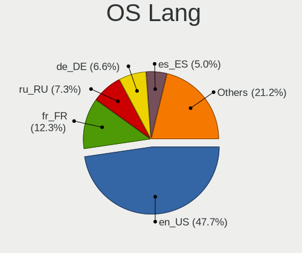
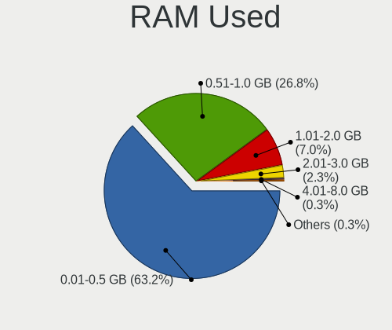
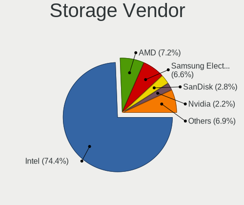
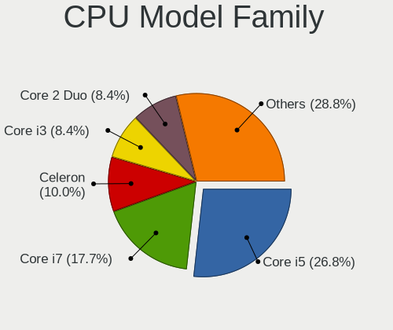
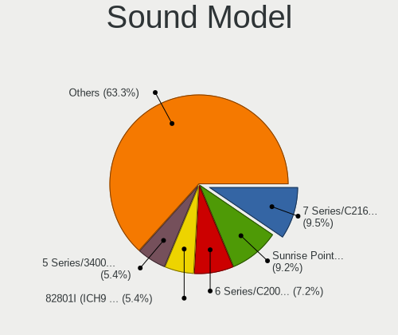
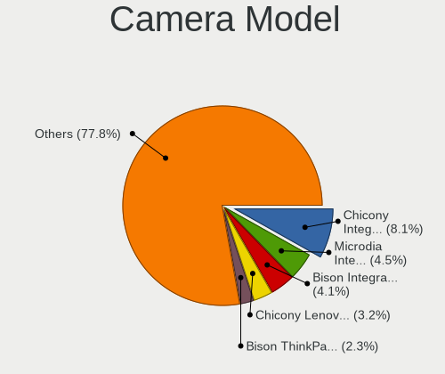

helloSystem 0.8.1 - Tested Hardware & Statistics (Notebooks)
------------------------------------------------------------

A project to collect tested hardware configurations for helloSystem 0.8.1.

Anyone can contribute to this report by the [hw-probe](https://github.com/linuxhw/hw-probe/blob/master/INSTALL.BSD.md) tool:

    hw-probe -all -upload

Please contribute! Especially if your hardware is rare.

Contents
--------

* [ Test Cases ](#test-cases)

* [ System ](#system)
  - [ Arch                     ](#arch)
  - [ DE                       ](#de)
  - [ Display Server           ](#display-server)
  - [ Display Manager          ](#display-manager)
  - [ OS Lang                  ](#os-lang)
  - [ Boot Mode                ](#boot-mode)
  - [ Filesystem               ](#filesystem)
  - [ Part. scheme             ](#part-scheme)

* [ Board ](#board)
  - [ Vendor                   ](#vendor)
  - [ Model                    ](#model)
  - [ Model Family             ](#model-family)
  - [ MFG Year                 ](#mfg-year)
  - [ Form Factor              ](#form-factor)
  - [ Coreboot                 ](#coreboot)
  - [ RAM Size                 ](#ram-size)
  - [ RAM Used                 ](#ram-used)
  - [ Total Drives             ](#total-drives)
  - [ Has CD-ROM               ](#has-cd-rom)
  - [ Has Ethernet             ](#has-ethernet)
  - [ Has WiFi                 ](#has-wifi)
  - [ Has Bluetooth            ](#has-bluetooth)

* [ Location ](#location)
  - [ Country                  ](#country)
  - [ City                     ](#city)

* [ Drives ](#drives)
  - [ Drive Vendor             ](#drive-vendor)
  - [ Drive Model              ](#drive-model)
  - [ HDD Vendor               ](#hdd-vendor)
  - [ SSD Vendor               ](#ssd-vendor)
  - [ Drive Kind               ](#drive-kind)
  - [ Drive Connector          ](#drive-connector)
  - [ Drive Size               ](#drive-size)
  - [ Space Total              ](#space-total)
  - [ Space Used               ](#space-used)
  - [ Malfunc. Drives          ](#malfunc-drives)
  - [ Malfunc. Drive Vendor    ](#malfunc-drive-vendor)
  - [ Malfunc. HDD Vendor      ](#malfunc-hdd-vendor)
  - [ Malfunc. Drive Kind      ](#malfunc-drive-kind)
  - [ Failed Drives            ](#failed-drives)
  - [ Failed Drive Vendor      ](#failed-drive-vendor)
  - [ Drive Status             ](#drive-status)

* [ Storage controller ](#storage-controller)
  - [ Storage Vendor           ](#storage-vendor)
  - [ Storage Model            ](#storage-model)
  - [ Storage Kind             ](#storage-kind)

* [ Processor ](#processor)
  - [ CPU Vendor               ](#cpu-vendor)
  - [ CPU Model                ](#cpu-model)
  - [ CPU Model Family         ](#cpu-model-family)
  - [ CPU Cores                ](#cpu-cores)
  - [ CPU Sockets              ](#cpu-sockets)
  - [ CPU Threads              ](#cpu-threads)
  - [ CPU Microarch            ](#cpu-microarch)

* [ Graphics ](#graphics)
  - [ GPU Vendor               ](#gpu-vendor)
  - [ GPU Model                ](#gpu-model)
  - [ GPU Combo                ](#gpu-combo)
  - [ GPU Driver               ](#gpu-driver)
  - [ GPU Memory               ](#gpu-memory)

* [ Monitor ](#monitor)
  - [ Monitor Vendor           ](#monitor-vendor)
  - [ Monitor Model            ](#monitor-model)
  - [ Monitor Resolution       ](#monitor-resolution)
  - [ Monitor Diagonal         ](#monitor-diagonal)
  - [ Monitor Width            ](#monitor-width)
  - [ Aspect Ratio             ](#aspect-ratio)
  - [ Monitor Area             ](#monitor-area)
  - [ Pixel Density            ](#pixel-density)
  - [ Multiple Monitors        ](#multiple-monitors)

* [ Network ](#network)
  - [ Net Controller Vendor    ](#net-controller-vendor)
  - [ Net Controller Model     ](#net-controller-model)
  - [ Wireless Vendor          ](#wireless-vendor)
  - [ Wireless Model           ](#wireless-model)
  - [ Ethernet Vendor          ](#ethernet-vendor)
  - [ Ethernet Model           ](#ethernet-model)
  - [ Net Controller Kind      ](#net-controller-kind)
  - [ Used Controller          ](#used-controller)
  - [ NICs                     ](#nics)
  - [ IPv6                     ](#ipv6)

* [ Bluetooth ](#bluetooth)
  - [ Bluetooth Vendor         ](#bluetooth-vendor)
  - [ Bluetooth Model          ](#bluetooth-model)

* [ Sound ](#sound)
  - [ Sound Vendor             ](#sound-vendor)
  - [ Sound Model              ](#sound-model)

* [ Memory ](#memory)
  - [ Memory Vendor            ](#memory-vendor)
  - [ Memory Model             ](#memory-model)
  - [ Memory Kind              ](#memory-kind)
  - [ Memory Form Factor       ](#memory-form-factor)
  - [ Memory Size              ](#memory-size)
  - [ Memory Speed             ](#memory-speed)

* [ Printers & scanners ](#printers--scanners)
  - [ Printer Vendor           ](#printer-vendor)
  - [ Printer Model            ](#printer-model)
  - [ Scanner Vendor           ](#scanner-vendor)
  - [ Scanner Model            ](#scanner-model)

* [ Camera ](#camera)
  - [ Camera Vendor            ](#camera-vendor)
  - [ Camera Model             ](#camera-model)

* [ Security ](#security)
  - [ Fingerprint Vendor       ](#fingerprint-vendor)
  - [ Fingerprint Model        ](#fingerprint-model)
  - [ Chipcard Vendor          ](#chipcard-vendor)
  - [ Chipcard Model           ](#chipcard-model)

* [ Unsupported ](#unsupported)
  - [ Unsupported Devices      ](#unsupported-devices)
  - [ Unsupported Device Types ](#unsupported-device-types)

Test Cases
----------

Total: 210

| Vendor        | Model                       | Probe                                                     | Date         |
|---------------|-----------------------------|-----------------------------------------------------------|--------------|
| Lenovo        | ThinkPad E14 Gen 2 20T60... | [5cd50ed5b5](https://bsd-hardware.info/?probe=5cd50ed5b5) | Sep 24, 2023 |
| Lenovo        | IdeaPad 1 14IGL7 82V6       | [8a3d3b3d0d](https://bsd-hardware.info/?probe=8a3d3b3d0d) | Sep 21, 2023 |
| Lenovo        | ThinkPad Edge E531 68852... | [cc3bef6a45](https://bsd-hardware.info/?probe=cc3bef6a45) | Sep 15, 2023 |
| OEGStone      | doceo 510                   | [9f3b47e30f](https://bsd-hardware.info/?probe=9f3b47e30f) | Sep 13, 2023 |
| HP            | OMEN by Laptop              | [f0fc4f47b8](https://bsd-hardware.info/?probe=f0fc4f47b8) | Sep 10, 2023 |
| Lenovo        | ThinkPad SL 2746N8G         | [07eda65608](https://bsd-hardware.info/?probe=07eda65608) | Sep 09, 2023 |
| Lenovo        | IdeaPad 100-14IBY 80MH      | [1d5aff2e2a](https://bsd-hardware.info/?probe=1d5aff2e2a) | Sep 08, 2023 |
| HP            | Pavilion g7                 | [4870da3b0e](https://bsd-hardware.info/?probe=4870da3b0e) | Sep 07, 2023 |
| Lenovo        | ThinkPad X240 20AMA1Y3UK    | [8277297743](https://bsd-hardware.info/?probe=8277297743) | Sep 05, 2023 |
| HP            | G62                         | [b4777b6ba5](https://bsd-hardware.info/?probe=b4777b6ba5) | Sep 04, 2023 |
| Toshiba       | QOSMIO X775                 | [d92a05ab1d](https://bsd-hardware.info/?probe=d92a05ab1d) | Sep 04, 2023 |
| Samsung       | 270E5J/2570EJ               | [3feb685296](https://bsd-hardware.info/?probe=3feb685296) | Sep 03, 2023 |
| Fujitsu       | LIFEBOOK S935               | [a6cfe011fe](https://bsd-hardware.info/?probe=a6cfe011fe) | Sep 02, 2023 |
| HP            | 2000                        | [6d9c442ae6](https://bsd-hardware.info/?probe=6d9c442ae6) | Aug 31, 2023 |
| Lenovo        | IdeaPad Gaming 3 15IHU6 ... | [a308c3a87b](https://bsd-hardware.info/?probe=a308c3a87b) | Aug 31, 2023 |
| HP            | Pavilion dv3500             | [0c3f84b285](https://bsd-hardware.info/?probe=0c3f84b285) | Aug 29, 2023 |
| Lenovo        | IdeaPad 110S-11IBR 80WG     | [e74ef1d37c](https://bsd-hardware.info/?probe=e74ef1d37c) | Aug 29, 2023 |
| NVN-ED01      | Unknown                     | [dba43e889a](https://bsd-hardware.info/?probe=dba43e889a) | Aug 25, 2023 |
| Lenovo        | ThinkPad P50 20EN0009MS     | [4b3fcfa17e](https://bsd-hardware.info/?probe=4b3fcfa17e) | Aug 25, 2023 |
| ASUSTek       | S500CA                      | [019366a664](https://bsd-hardware.info/?probe=019366a664) | Aug 25, 2023 |
| Lenovo        | ThinkPad T450 20BUS0370P    | [5fefc051e1](https://bsd-hardware.info/?probe=5fefc051e1) | Aug 20, 2023 |
| ASUSTek       | X553MA                      | [7334765d8a](https://bsd-hardware.info/?probe=7334765d8a) | Aug 16, 2023 |
| ASUSTek       | GL753VD                     | [8ccbffdd73](https://bsd-hardware.info/?probe=8ccbffdd73) | Aug 15, 2023 |
| Lenovo        | ThinkPad X200 7458WNZ       | [3ac1d60240](https://bsd-hardware.info/?probe=3ac1d60240) | Aug 12, 2023 |
| Lenovo        | ThinkPad T60 1951CZ1        | [46766bc381](https://bsd-hardware.info/?probe=46766bc381) | Aug 11, 2023 |
| Acer          | Aspire V3-371               | [21c262aadb](https://bsd-hardware.info/?probe=21c262aadb) | Aug 09, 2023 |
| Acer          | Aspire V3-371               | [68bceee682](https://bsd-hardware.info/?probe=68bceee682) | Aug 09, 2023 |
| Lenovo        | ThinkPad X1 Carbon 2nd 2... | [9c01814bdc](https://bsd-hardware.info/?probe=9c01814bdc) | Aug 07, 2023 |
| Compaq        | Presario CQ-17              | [f97feb2db0](https://bsd-hardware.info/?probe=f97feb2db0) | Aug 04, 2023 |
| HP            | EliteBook 840 G5            | [6496fe0cfe](https://bsd-hardware.info/?probe=6496fe0cfe) | Aug 03, 2023 |
| Lenovo        | IdeaPad S210 Touch 20257    | [1e372622c1](https://bsd-hardware.info/?probe=1e372622c1) | Jul 31, 2023 |
| Lenovo        | ThinkPad X270 20HNA04GCD    | [6547f4a73b](https://bsd-hardware.info/?probe=6547f4a73b) | Jul 31, 2023 |
| Lenovo        | ThinkPad X230 23202DG       | [f8ade878ce](https://bsd-hardware.info/?probe=f8ade878ce) | Jul 30, 2023 |
| HP            | Notebook                    | [360790274a](https://bsd-hardware.info/?probe=360790274a) | Jul 29, 2023 |
| Apple         | MacBookPro9,2               | [53e133857b](https://bsd-hardware.info/?probe=53e133857b) | Jul 29, 2023 |
| HP            | Pavilion g6                 | [bdd2349f1c](https://bsd-hardware.info/?probe=bdd2349f1c) | Jul 28, 2023 |
| Dell          | Latitude 5480               | [e1521ed9d2](https://bsd-hardware.info/?probe=e1521ed9d2) | Jul 26, 2023 |
| Lenovo        | IdeaPad 5 15ALC05 82LN      | [60dac781b2](https://bsd-hardware.info/?probe=60dac781b2) | Jul 24, 2023 |
| Acer          | Aspire 4736Z                | [bccf97f694](https://bsd-hardware.info/?probe=bccf97f694) | Jul 20, 2023 |
| ASUSTek       | 1015PX                      | [dc06c76cf9](https://bsd-hardware.info/?probe=dc06c76cf9) | Jul 19, 2023 |
| Lenovo        | Legion 5 15IMH05 82AU       | [5fcffa5bd6](https://bsd-hardware.info/?probe=5fcffa5bd6) | Jul 19, 2023 |
| ASUSTek       | K42Jr                       | [256168572a](https://bsd-hardware.info/?probe=256168572a) | Jul 18, 2023 |
| Samsung       | RC530/RC730                 | [b76e5e8a87](https://bsd-hardware.info/?probe=b76e5e8a87) | Jul 17, 2023 |
| Lenovo        | ThinkPad R14 Gen 4 21E5A... | [e0fc7135e5](https://bsd-hardware.info/?probe=e0fc7135e5) | Jul 15, 2023 |
| ASUSTek       | X541UVK                     | [17f58b70e4](https://bsd-hardware.info/?probe=17f58b70e4) | Jul 10, 2023 |
| HP            | Compaq Presario CQ61        | [d070292855](https://bsd-hardware.info/?probe=d070292855) | Jul 03, 2023 |
| Lenovo        | ThinkPad T60 20076PU        | [cb47bfef12](https://bsd-hardware.info/?probe=cb47bfef12) | Jun 30, 2023 |
| HP            | EliteBook 840 G3            | [17834256ca](https://bsd-hardware.info/?probe=17834256ca) | Jun 28, 2023 |
| Dell          | Latitude E4310              | [9cdd4909fe](https://bsd-hardware.info/?probe=9cdd4909fe) | Jun 24, 2023 |
| HP            | Laptop 15-ra0xx             | [8c31502b68](https://bsd-hardware.info/?probe=8c31502b68) | Jun 24, 2023 |
| HP            | EliteBook 750 G1            | [aba91c70d1](https://bsd-hardware.info/?probe=aba91c70d1) | Jun 24, 2023 |
| Dell          | Latitude 5490               | [b638c1b2b1](https://bsd-hardware.info/?probe=b638c1b2b1) | Jun 23, 2023 |
| Acer          | Aspire 5749                 | [75ad2ddb6f](https://bsd-hardware.info/?probe=75ad2ddb6f) | Jun 22, 2023 |
| Acer          | Aspire 5749                 | [1e91633580](https://bsd-hardware.info/?probe=1e91633580) | Jun 20, 2023 |
| HP            | Pavilion 15                 | [9ba6acdb4b](https://bsd-hardware.info/?probe=9ba6acdb4b) | Jun 18, 2023 |
| HP            | Stream Laptop 14-ds0xxx     | [81bbc73e72](https://bsd-hardware.info/?probe=81bbc73e72) | Jun 18, 2023 |
| HUAWEI        | BOHB-WAX9                   | [d8079e6155](https://bsd-hardware.info/?probe=d8079e6155) | Jun 16, 2023 |
| MSI           | GE63 Raider RGB 8RE         | [ecdb80adc0](https://bsd-hardware.info/?probe=ecdb80adc0) | Jun 14, 2023 |
| HP            | Compaq 6830s                | [1a06917a0f](https://bsd-hardware.info/?probe=1a06917a0f) | Jun 14, 2023 |
| Lenovo        | IdeaPad 310-15IKB 80TV      | [76809610f9](https://bsd-hardware.info/?probe=76809610f9) | Jun 13, 2023 |
| Lenovo        | ThinkPad T440p 20AWS1CH0... | [b532f1ce9c](https://bsd-hardware.info/?probe=b532f1ce9c) | Jun 13, 2023 |
| Samsung       | R530/R730/R540              | [b007264caa](https://bsd-hardware.info/?probe=b007264caa) | Jun 11, 2023 |
| Lenovo        | S10-3                       | [f874a66e78](https://bsd-hardware.info/?probe=f874a66e78) | Jun 05, 2023 |
| Lenovo        | S10-3                       | [b76483ab8b](https://bsd-hardware.info/?probe=b76483ab8b) | Jun 05, 2023 |
| HP            | Pavilion Laptop 15-eh1xx... | [e1a7d29d74](https://bsd-hardware.info/?probe=e1a7d29d74) | Jun 04, 2023 |
| HP            | Pavilion Laptop 15-eh1xx... | [d0d9de7cf3](https://bsd-hardware.info/?probe=d0d9de7cf3) | Jun 04, 2023 |
| Panasonic     | CF-NX1GDHYS                 | [fb1f293997](https://bsd-hardware.info/?probe=fb1f293997) | Jun 02, 2023 |
| HP            | Pavilion Notebook           | [1bb0436fe5](https://bsd-hardware.info/?probe=1bb0436fe5) | May 30, 2023 |
| Apple         | MacBookPro10,2              | [c274e2c9db](https://bsd-hardware.info/?probe=c274e2c9db) | May 29, 2023 |
| Fujitsu       | Unknown                     | [3b5c9ab914](https://bsd-hardware.info/?probe=3b5c9ab914) | May 27, 2023 |
| Timi          | TM1701                      | [1dd768a721](https://bsd-hardware.info/?probe=1dd768a721) | May 25, 2023 |
| ASUSTek       | K42Jc                       | [3da2928a08](https://bsd-hardware.info/?probe=3da2928a08) | May 23, 2023 |
| Google        | Sentry                      | [107124dd66](https://bsd-hardware.info/?probe=107124dd66) | May 22, 2023 |
| Sony          | VPCEG15FB                   | [8777493861](https://bsd-hardware.info/?probe=8777493861) | May 21, 2023 |
| HP            | Pavilion Notebook           | [41ce3c5d11](https://bsd-hardware.info/?probe=41ce3c5d11) | May 21, 2023 |
| Packard Be... | EasyNote LJ65               | [36d3e7aaf7](https://bsd-hardware.info/?probe=36d3e7aaf7) | May 19, 2023 |
| Sony          | SVF14A15CBB                 | [4ada2dca25](https://bsd-hardware.info/?probe=4ada2dca25) | May 14, 2023 |
| Lenovo        | B570e HuronRiver Platfor... | [256915976d](https://bsd-hardware.info/?probe=256915976d) | May 12, 2023 |
| TUXEDO        | Aura 15 Gen1                | [3d889e8b9b](https://bsd-hardware.info/?probe=3d889e8b9b) | May 11, 2023 |
| Apple         | MacBook5,1                  | [da07885adb](https://bsd-hardware.info/?probe=da07885adb) | May 09, 2023 |
| HP            | Laptop 14-bs0xx             | [98ea66d6e8](https://bsd-hardware.info/?probe=98ea66d6e8) | May 07, 2023 |
| Lenovo        | Flex 2-15 20405             | [3773da7851](https://bsd-hardware.info/?probe=3773da7851) | May 03, 2023 |
| HP            | Compaq Presario CQ50        | [f296048a29](https://bsd-hardware.info/?probe=f296048a29) | May 03, 2023 |
| Apple         | MacBook5,1                  | [a5a1ca2ee6](https://bsd-hardware.info/?probe=a5a1ca2ee6) | May 02, 2023 |
| Apple         | MacBook5,1                  | [52174cc0ba](https://bsd-hardware.info/?probe=52174cc0ba) | Apr 27, 2023 |
| Apple         | MacBook5,1                  | [4c7f33d6a9](https://bsd-hardware.info/?probe=4c7f33d6a9) | Apr 25, 2023 |
| Lenovo        | ThinkPad X270 20HMS06Q1D    | [2df7c991f0](https://bsd-hardware.info/?probe=2df7c991f0) | Apr 23, 2023 |
| Lenovo        | G500 20236                  | [e7387bfd6e](https://bsd-hardware.info/?probe=e7387bfd6e) | Apr 23, 2023 |
| Dell          | Inspiron 3421               | [ef4870410f](https://bsd-hardware.info/?probe=ef4870410f) | Apr 23, 2023 |
| Lenovo        | Yoga Slim 7 14ITL05 82A3    | [93b498fb0c](https://bsd-hardware.info/?probe=93b498fb0c) | Apr 21, 2023 |
| Packard Be... | DOT SE                      | [f456e964db](https://bsd-hardware.info/?probe=f456e964db) | Apr 19, 2023 |
| Dell          | Latitude 7410               | [d5c047907d](https://bsd-hardware.info/?probe=d5c047907d) | Apr 19, 2023 |
| Acer          | V5-131                      | [4c2332c3b8](https://bsd-hardware.info/?probe=4c2332c3b8) | Apr 19, 2023 |
| Medion        | E15302                      | [f47f32e1cc](https://bsd-hardware.info/?probe=f47f32e1cc) | Apr 17, 2023 |
| Toshiba       | PORTEGE R700                | [8b196955ac](https://bsd-hardware.info/?probe=8b196955ac) | Apr 15, 2023 |
| Apple         | MacBook3,1                  | [74986a169a](https://bsd-hardware.info/?probe=74986a169a) | Apr 15, 2023 |
| Google        | Terra                       | [ef1619f65f](https://bsd-hardware.info/?probe=ef1619f65f) | Apr 13, 2023 |
| Google        | Terra                       | [bf598bc5bf](https://bsd-hardware.info/?probe=bf598bc5bf) | Apr 13, 2023 |
| Samsung       | 370E4K                      | [c363d008bf](https://bsd-hardware.info/?probe=c363d008bf) | Apr 13, 2023 |
| Lenovo        | ThinkPad L540 20AUA34DJP    | [c7e40ee8ea](https://bsd-hardware.info/?probe=c7e40ee8ea) | Apr 12, 2023 |
| Lenovo        | ThinkPad L15 Gen 2 20X3C... | [0249b4e73f](https://bsd-hardware.info/?probe=0249b4e73f) | Apr 11, 2023 |
| Lenovo        | ThinkPad L540 20AUA34DJP    | [52aac5fc6f](https://bsd-hardware.info/?probe=52aac5fc6f) | Apr 11, 2023 |
| Lenovo        | ThinkPad X1 Carbon 34487... | [cec90ddd1b](https://bsd-hardware.info/?probe=cec90ddd1b) | Apr 08, 2023 |
| Lenovo        | Legion 5 Pro 16ACH6H 82J... | [f3ac765863](https://bsd-hardware.info/?probe=f3ac765863) | Apr 08, 2023 |
| Dell          | XPS 13 9343                 | [8354aed46e](https://bsd-hardware.info/?probe=8354aed46e) | Apr 07, 2023 |
| Fujitsu       | CELSIUS H920                | [0551eecbcc](https://bsd-hardware.info/?probe=0551eecbcc) | Apr 06, 2023 |
| Acer          | Aspire 5250                 | [385751dbc3](https://bsd-hardware.info/?probe=385751dbc3) | Apr 06, 2023 |
| Google        | Wolf                        | [2546416afd](https://bsd-hardware.info/?probe=2546416afd) | Apr 05, 2023 |
| HP            | Laptop 15-bw0xx             | [93ea83eef5](https://bsd-hardware.info/?probe=93ea83eef5) | Apr 03, 2023 |
| Lenovo        | G570 20079                  | [76cc1653c3](https://bsd-hardware.info/?probe=76cc1653c3) | Apr 03, 2023 |
| Lenovo        | ThinkBook 14-IML 20RV       | [48b0a1024e](https://bsd-hardware.info/?probe=48b0a1024e) | Apr 02, 2023 |
| ASUSTek       | X58C                        | [dad28a9d36](https://bsd-hardware.info/?probe=dad28a9d36) | Apr 01, 2023 |
| Fujitsu       | CELSIUS H920                | [e6300dc691](https://bsd-hardware.info/?probe=e6300dc691) | Mar 31, 2023 |
| DNS           | W9x0LU                      | [6539659387](https://bsd-hardware.info/?probe=6539659387) | Mar 31, 2023 |
| Lenovo        | ThinkPad X220 4290DK6       | [96c83a2846](https://bsd-hardware.info/?probe=96c83a2846) | Mar 31, 2023 |
| Intel         | Intel                       | [75e9733afd](https://bsd-hardware.info/?probe=75e9733afd) | Mar 30, 2023 |
| Toshiba       | Satellite L675D             | [0bf578daec](https://bsd-hardware.info/?probe=0bf578daec) | Mar 30, 2023 |
| ASUSTek       | VivoBook_ASUS Laptop X50... | [ff14982ad9](https://bsd-hardware.info/?probe=ff14982ad9) | Mar 29, 2023 |
| Dell          | Latitude 5590               | [7e87d436df](https://bsd-hardware.info/?probe=7e87d436df) | Mar 29, 2023 |
| Lenovo        | ThinkPad T540p 20BFS10W0... | [30c5fc2625](https://bsd-hardware.info/?probe=30c5fc2625) | Mar 29, 2023 |
| Irbis         | NB78                        | [471efbc788](https://bsd-hardware.info/?probe=471efbc788) | Mar 29, 2023 |
| Lenovo        | Yoga Slim 7 Pro 14ACH5 8... | [f4e450fed1](https://bsd-hardware.info/?probe=f4e450fed1) | Mar 29, 2023 |
| Lenovo        | IdeaPad 320-15ISK 80XH      | [dddf27cde4](https://bsd-hardware.info/?probe=dddf27cde4) | Mar 28, 2023 |
| Lenovo        | IdeaPad 320-15ISK 80XH      | [c2ba6aca7d](https://bsd-hardware.info/?probe=c2ba6aca7d) | Mar 28, 2023 |
| Lenovo        | IdeaPad Gaming 3 15ACH6 ... | [fb4eec9c34](https://bsd-hardware.info/?probe=fb4eec9c34) | Mar 27, 2023 |
| HP            | Pavilion dv6                | [ce2cc6852d](https://bsd-hardware.info/?probe=ce2cc6852d) | Mar 27, 2023 |
| Dell          | Inspiron 7437               | [2c4de59558](https://bsd-hardware.info/?probe=2c4de59558) | Mar 27, 2023 |
| Lenovo        | IdeaPad S210 20256          | [2e22ee87c3](https://bsd-hardware.info/?probe=2e22ee87c3) | Mar 27, 2023 |
| Lenovo        | ThinkPad T430 2349G5P       | [9ea67d3893](https://bsd-hardware.info/?probe=9ea67d3893) | Mar 27, 2023 |
| Dell          | Latitude 5420               | [4e22bbc131](https://bsd-hardware.info/?probe=4e22bbc131) | Mar 26, 2023 |
| LG Electro... | E500-L.A2M4A2               | [8dab794233](https://bsd-hardware.info/?probe=8dab794233) | Mar 26, 2023 |
| Samsung       | R468/R418                   | [f620a5c6ec](https://bsd-hardware.info/?probe=f620a5c6ec) | Mar 25, 2023 |
| Lenovo        | ThinkPad X220 4291AN9       | [1646bb53ab](https://bsd-hardware.info/?probe=1646bb53ab) | Mar 25, 2023 |
| Lenovo        | ThinkPad T470 W10DG 20JN... | [7df625b1df](https://bsd-hardware.info/?probe=7df625b1df) | Mar 25, 2023 |
| Lenovo        | ThinkPad X230 Tablet 343... | [8e798ca6ef](https://bsd-hardware.info/?probe=8e798ca6ef) | Mar 25, 2023 |
| Lenovo        | ThinkPad W541 20EF000NUS    | [34b156c20c](https://bsd-hardware.info/?probe=34b156c20c) | Mar 24, 2023 |
| Dell          | Latitude 5500               | [8db518ef3d](https://bsd-hardware.info/?probe=8db518ef3d) | Mar 24, 2023 |
| Lenovo        | ThinkPad T61 7658CTO        | [f00e571f76](https://bsd-hardware.info/?probe=f00e571f76) | Mar 23, 2023 |
| Lenovo        | ThinkPad T430s 2356CV6      | [d9efc1e30b](https://bsd-hardware.info/?probe=d9efc1e30b) | Mar 22, 2023 |
| ASUSTek       | X71Vn                       | [6e96ea55ee](https://bsd-hardware.info/?probe=6e96ea55ee) | Mar 22, 2023 |
| Lenovo        | Yoga Slim 7 Pro 14ACH5 8... | [136a6641be](https://bsd-hardware.info/?probe=136a6641be) | Mar 21, 2023 |
| Lenovo        | ThinkPad X230 232578G       | [edf47cb2d4](https://bsd-hardware.info/?probe=edf47cb2d4) | Mar 21, 2023 |
| Lenovo        | ThinkPad T61 7659CA1        | [bba228ddc9](https://bsd-hardware.info/?probe=bba228ddc9) | Mar 20, 2023 |
| Lenovo        | G500 20236                  | [55dc82af1c](https://bsd-hardware.info/?probe=55dc82af1c) | Mar 20, 2023 |
| ASUSTek       | 1015PX                      | [d6c1199165](https://bsd-hardware.info/?probe=d6c1199165) | Mar 20, 2023 |
| Apple         | MacBookPro5,1               | [9e300b5797](https://bsd-hardware.info/?probe=9e300b5797) | Mar 19, 2023 |
| Toshiba       | Satellite P300              | [81b7ca608e](https://bsd-hardware.info/?probe=81b7ca608e) | Mar 19, 2023 |
| Lenovo        | ThinkPad T520 4242PN3       | [3ea33f0cad](https://bsd-hardware.info/?probe=3ea33f0cad) | Mar 19, 2023 |
| Lenovo        | ThinkPad T470 W10DG 20JN... | [e35600705f](https://bsd-hardware.info/?probe=e35600705f) | Mar 19, 2023 |
| Samsung       | R520/R522/R620              | [096d52b83d](https://bsd-hardware.info/?probe=096d52b83d) | Mar 18, 2023 |
| Lenovo        | IdeaPad 330-15IKB 81DE      | [be9a45f529](https://bsd-hardware.info/?probe=be9a45f529) | Mar 18, 2023 |
| Lenovo        | IdeaPad 330-15IKB 81DE      | [a365a5b411](https://bsd-hardware.info/?probe=a365a5b411) | Mar 18, 2023 |
| Apple         | MacBook4,1                  | [6f2790802d](https://bsd-hardware.info/?probe=6f2790802d) | Mar 18, 2023 |
| Fujitsu       | LIFEBOOK AH530              | [50a5ed6b41](https://bsd-hardware.info/?probe=50a5ed6b41) | Mar 18, 2023 |
| IGEL Techn... | M350C                       | [a04efafd2e](https://bsd-hardware.info/?probe=a04efafd2e) | Mar 18, 2023 |
| HP            | Pavilion dv5                | [113fe74799](https://bsd-hardware.info/?probe=113fe74799) | Mar 18, 2023 |
| HP            | EliteBook 850 G2            | [653dbe54a4](https://bsd-hardware.info/?probe=653dbe54a4) | Mar 18, 2023 |
| Lenovo        | ThinkPad T440p              | [575123c3ac](https://bsd-hardware.info/?probe=575123c3ac) | Mar 17, 2023 |
| Dell          | Inspiron 3442               | [cbb9f6bfbb](https://bsd-hardware.info/?probe=cbb9f6bfbb) | Mar 17, 2023 |
| Dell          | Latitude E5570              | [8b9aa95420](https://bsd-hardware.info/?probe=8b9aa95420) | Mar 17, 2023 |
| Toshiba       | Satellite L40               | [2297dcb7e7](https://bsd-hardware.info/?probe=2297dcb7e7) | Mar 17, 2023 |
| Dell          | Latitude E5570              | [937a7c9385](https://bsd-hardware.info/?probe=937a7c9385) | Mar 17, 2023 |
| Lenovo        | ThinkPad X201 36801T6       | [decaf0c347](https://bsd-hardware.info/?probe=decaf0c347) | Mar 17, 2023 |
| Lenovo        | ThinkPad X61s 7667WQS       | [f1351003d1](https://bsd-hardware.info/?probe=f1351003d1) | Mar 17, 2023 |
| Dell          | Inspiron 5557               | [ff199c6d21](https://bsd-hardware.info/?probe=ff199c6d21) | Mar 16, 2023 |
| HP            | Unknown                     | [0b79535c7f](https://bsd-hardware.info/?probe=0b79535c7f) | Mar 16, 2023 |
| Samsung       | 305E4A/305E5A/305E7A        | [564b1ccce1](https://bsd-hardware.info/?probe=564b1ccce1) | Mar 15, 2023 |
| Acer          | Aspire E5-571G              | [ca34dac813](https://bsd-hardware.info/?probe=ca34dac813) | Mar 15, 2023 |
| Samsung       | 275E4E/275E5E               | [dd4f7ef594](https://bsd-hardware.info/?probe=dd4f7ef594) | Mar 15, 2023 |
| HP            | Pavilion TS Sleekbook 14    | [d57e5b1b88](https://bsd-hardware.info/?probe=d57e5b1b88) | Mar 15, 2023 |
| Lenovo        | ThinkPad X270 W10DG 20K5... | [89a5ee25f9](https://bsd-hardware.info/?probe=89a5ee25f9) | Mar 14, 2023 |
| Acer          | TravelMate P249-G2-M        | [090f37a821](https://bsd-hardware.info/?probe=090f37a821) | Mar 14, 2023 |
| Dell          | Latitude D630               | [da1fa73418](https://bsd-hardware.info/?probe=da1fa73418) | Mar 14, 2023 |
| HP            | Laptop 14-bs0xx             | [cd76713b75](https://bsd-hardware.info/?probe=cd76713b75) | Mar 14, 2023 |
| Dynabook E... | Satellite Pro E10-G-101     | [c58a37ef03](https://bsd-hardware.info/?probe=c58a37ef03) | Mar 14, 2023 |
| Lenovo        | ThinkPad X1 Carbon 3448A... | [eaaf0fc8c7](https://bsd-hardware.info/?probe=eaaf0fc8c7) | Mar 14, 2023 |
| Toshiba       | Satellite L50-B             | [7052b38ba8](https://bsd-hardware.info/?probe=7052b38ba8) | Mar 14, 2023 |
| Lenovo        | ThinkPad L450 20DSS1S402    | [b4893ae18f](https://bsd-hardware.info/?probe=b4893ae18f) | Mar 14, 2023 |
| Toshiba       | Satellite A200              | [c49985d00b](https://bsd-hardware.info/?probe=c49985d00b) | Mar 13, 2023 |
| Lenovo        | ThinkPad P51 20HH001RMX     | [d9d7368322](https://bsd-hardware.info/?probe=d9d7368322) | Mar 13, 2023 |
| Samsung       | R468/R418                   | [af44a29d38](https://bsd-hardware.info/?probe=af44a29d38) | Mar 13, 2023 |
| Dell          | Inspiron 7520               | [8b259d99ec](https://bsd-hardware.info/?probe=8b259d99ec) | Mar 13, 2023 |
| Lenovo        | ThinkPad X220 4286CTO       | [5ce3dfe4a2](https://bsd-hardware.info/?probe=5ce3dfe4a2) | Mar 13, 2023 |
| Lenovo        | ThinkPad X200 74591P0       | [882cc7fc62](https://bsd-hardware.info/?probe=882cc7fc62) | Mar 13, 2023 |
| ASUSTek       | G74Sx                       | [6b7cf8fcac](https://bsd-hardware.info/?probe=6b7cf8fcac) | Mar 13, 2023 |
| Toshiba       | Satellite C845              | [0b680543b7](https://bsd-hardware.info/?probe=0b680543b7) | Mar 13, 2023 |
| Sony          | VGN-FZ19VN                  | [73809d943a](https://bsd-hardware.info/?probe=73809d943a) | Mar 13, 2023 |
| Fujitsu       | LIFEBOOK E736               | [1040a34321](https://bsd-hardware.info/?probe=1040a34321) | Mar 12, 2023 |
| HP            | Laptop 14-bs1xx             | [99446c8dd0](https://bsd-hardware.info/?probe=99446c8dd0) | Mar 12, 2023 |
| Lenovo        | ThinkPad X200 2024AY7       | [bb432faf36](https://bsd-hardware.info/?probe=bb432faf36) | Mar 12, 2023 |
| Lenovo        | ZIUS6                       | [d387825f01](https://bsd-hardware.info/?probe=d387825f01) | Mar 12, 2023 |
| Dell          | Latitude E6330              | [5c60cd3d04](https://bsd-hardware.info/?probe=5c60cd3d04) | Mar 12, 2023 |
| Lenovo        | ThinkPad T440p              | [6d372db804](https://bsd-hardware.info/?probe=6d372db804) | Mar 12, 2023 |
| Samsung       | 305E4A/305E5A/305E7A        | [5bcd236c4a](https://bsd-hardware.info/?probe=5bcd236c4a) | Mar 12, 2023 |
| Acer          | Nitro AN515-54              | [6e97a003ec](https://bsd-hardware.info/?probe=6e97a003ec) | Mar 12, 2023 |
| Acer          | Swift SF314-42              | [aa89c48cb7](https://bsd-hardware.info/?probe=aa89c48cb7) | Mar 12, 2023 |
| HP            | Laptop 15-bs1xx             | [1df045ffd0](https://bsd-hardware.info/?probe=1df045ffd0) | Mar 11, 2023 |
| Lenovo        | ThinkPad T460s 20FAS2BR0... | [56fa0d4656](https://bsd-hardware.info/?probe=56fa0d4656) | Mar 11, 2023 |
| Dell          | Latitude E5450              | [4bb2040221](https://bsd-hardware.info/?probe=4bb2040221) | Mar 11, 2023 |
| Lenovo        | ThinkPad L590 20Q7U04602    | [64a11e18da](https://bsd-hardware.info/?probe=64a11e18da) | Mar 11, 2023 |
| ASUSTek       | 1201N                       | [5dc595eb79](https://bsd-hardware.info/?probe=5dc595eb79) | Mar 05, 2023 |
| ASUSTek       | 1201N                       | [daa787f637](https://bsd-hardware.info/?probe=daa787f637) | Mar 05, 2023 |
| HP            | EliteBook 2730p             | [3c404c9d20](https://bsd-hardware.info/?probe=3c404c9d20) | Mar 05, 2023 |
| Dell          | Inspiron 15 3515            | [b480a98b22](https://bsd-hardware.info/?probe=b480a98b22) | Feb 26, 2023 |
| ASUSTek       | VivoBook_ASUSLaptop E410... | [95c66df5a4](https://bsd-hardware.info/?probe=95c66df5a4) | Feb 24, 2023 |
| Plaisio       | Turbo X                     | [e0a8a02bb9](https://bsd-hardware.info/?probe=e0a8a02bb9) | Feb 23, 2023 |
| Lenovo        | ThinkPad T520 4243F39       | [d8ba5b3157](https://bsd-hardware.info/?probe=d8ba5b3157) | Feb 19, 2023 |
| Lenovo        | ThinkPad T520 4243F39       | [820596f359](https://bsd-hardware.info/?probe=820596f359) | Feb 18, 2023 |
| Lenovo        | ThinkPad T430u 33522D5      | [d5bbbb8cbe](https://bsd-hardware.info/?probe=d5bbbb8cbe) | Feb 17, 2023 |
| Lenovo        | ThinkPad T520 4243F39       | [9137c7933c](https://bsd-hardware.info/?probe=9137c7933c) | Feb 13, 2023 |

System
------

Arch
----

OS architecture (x86_64, i586, etc.)

| Name  | Notebooks | Percent |
|-------|-----------|---------|
| amd64 | 182       | 100%    |

DE
--

Desktop Environment

| Name         | Notebooks | Percent |
|--------------|-----------|---------|
| helloDesktop | 180       | 98.9%   |
| JWM          | 1         | 0.55%   |
| GNOME        | 1         | 0.55%   |

Display Server
--------------

X11 or Wayland

| Name | Notebooks | Percent |
|------|-----------|---------|
| X11  | 182       | 100%    |

Display Manager
---------------

SDDM, LightDM, etc.

| Name | Notebooks | Percent |
|------|-----------|---------|
| SLiM | 182       | 99.45%  |
| SDDM | 1         | 0.55%   |

OS Lang
-------

Language

| Lang    | Notebooks | Percent |
|---------|-----------|---------|
| en_US   | 91        | 49.73%  |
| fr_FR   | 23        | 12.57%  |
| ru_RU   | 13        | 7.1%    |
| de_DE   | 13        | 7.1%    |
| es_ES   | 9         | 4.92%   |
| Unknown | 8         | 4.37%   |
| pl_PL   | 7         | 3.83%   |
| pt_BR   | 5         | 2.73%   |
| nl_NL   | 3         | 1.64%   |
| it_IT   | 3         | 1.64%   |
| zh_CN   | 2         | 1.09%   |
| pt_PT   | 1         | 0.55%   |
| pt      | 1         | 0.55%   |
| ko_KR   | 1         | 0.55%   |
| jp_JP   | 1         | 0.55%   |
| fi_FI   | 1         | 0.55%   |
| en      | 1         | 0.55%   |

Boot Mode
---------

EFI or BIOS

| Mode | Notebooks | Percent |
|------|-----------|---------|
| EFI  | 182       | 100%    |

Filesystem
----------

Type of filesystem

| Type   | Notebooks | Percent |
|--------|-----------|---------|
| Cd9660 | 92        | 50.55%  |
| Zfs    | 90        | 49.45%  |

Part. scheme
------------

Scheme of partitioning

| Type | Notebooks | Percent |
|------|-----------|---------|
| GPT  | 182       | 100%    |

Board
-----

Vendor
------

Motherboard manufacturer

| Name                | Notebooks | Percent |
|---------------------|-----------|---------|
| Lenovo              | 63        | 34.62%  |
| Hewlett-Packard     | 28        | 15.38%  |
| Dell                | 18        | 9.89%   |
| ASUSTek Computer    | 13        | 7.14%   |
| Acer                | 9         | 4.95%   |
| Toshiba             | 8         | 4.4%    |
| Samsung Electronics | 8         | 4.4%    |
| Apple               | 6         | 3.3%    |
| Fujitsu             | 5         | 2.75%   |
| Sony                | 3         | 1.65%   |
| Google              | 3         | 1.65%   |
| Packard Bell        | 2         | 1.1%    |
| TUXEDO              | 1         | 0.55%   |
| Timi                | 1         | 0.55%   |
| Plaisio             | 1         | 0.55%   |
| Panasonic           | 1         | 0.55%   |
| OEGStone            | 1         | 0.55%   |
| NVN-ED01            | 1         | 0.55%   |
| MSI                 | 1         | 0.55%   |
| Medion              | 1         | 0.55%   |
| LG Electronics      | 1         | 0.55%   |
| Irbis               | 1         | 0.55%   |
| Intel               | 1         | 0.55%   |
| IGEL Technology     | 1         | 0.55%   |
| HUAWEI              | 1         | 0.55%   |
| Dynabook Europe     | 1         | 0.55%   |
| DNS                 | 1         | 0.55%   |
| Compaq              | 1         | 0.55%   |

Model
-----

Motherboard model

| Name                                  | Notebooks | Percent |
|---------------------------------------|-----------|---------|
| Unknown                               | 3         | 1.65%   |
| HP Laptop 14-bs0xx                    | 2         | 1.1%    |
| TUXEDO Aura 15 Gen1                   | 1         | 0.55%   |
| Toshiba Satellite P300                | 1         | 0.55%   |
| Toshiba Satellite L675D               | 1         | 0.55%   |
| Toshiba Satellite L50-B               | 1         | 0.55%   |
| Toshiba Satellite L40                 | 1         | 0.55%   |
| Toshiba Satellite C845                | 1         | 0.55%   |
| Toshiba Satellite A200                | 1         | 0.55%   |
| Toshiba QOSMIO X775                   | 1         | 0.55%   |
| Toshiba PORTEGE R700                  | 1         | 0.55%   |
| Timi TM1701                           | 1         | 0.55%   |
| Sony VPCEG15FB                        | 1         | 0.55%   |
| Sony VGN-FZ19VN                       | 1         | 0.55%   |
| Sony SVF14A15CBB                      | 1         | 0.55%   |
| Samsung RC530/RC730                   | 1         | 0.55%   |
| Samsung R530/R730/R540                | 1         | 0.55%   |
| Samsung R520/R522/R620                | 1         | 0.55%   |
| Samsung R468/R418                     | 1         | 0.55%   |
| Samsung 370E4K                        | 1         | 0.55%   |
| Samsung 305E4A/305E5A/305E7A          | 1         | 0.55%   |
| Samsung 275E4E/275E5E                 | 1         | 0.55%   |
| Samsung 270E5J/2570EJ                 | 1         | 0.55%   |
| Plaisio Turbo X                       | 1         | 0.55%   |
| Panasonic CF-NX1GDHYS                 | 1         | 0.55%   |
| Packard Bell EasyNote LJ65            | 1         | 0.55%   |
| Packard Bell DOT SE                   | 1         | 0.55%   |
| OEGStone doceo 510                    | 1         | 0.55%   |
| MSI GE63 Raider RGB 8RE               | 1         | 0.55%   |
| Medion E15302                         | 1         | 0.55%   |
| LG E500-L.A2M4A2                      | 1         | 0.55%   |
| Lenovo ZIUS6                          | 1         | 0.55%   |
| Lenovo Yoga Slim 7 14ITL05 82A3       | 1         | 0.55%   |
| Lenovo ThinkPad X61s 7667WQS          | 1         | 0.55%   |
| Lenovo ThinkPad X270 W10DG 20K5S0DB05 | 1         | 0.55%   |
| Lenovo ThinkPad X270 20HNA04GCD       | 1         | 0.55%   |
| Lenovo ThinkPad X270 20HMS06Q1D       | 1         | 0.55%   |
| Lenovo ThinkPad X240 20AMA1Y3UK       | 1         | 0.55%   |
| Lenovo ThinkPad X230 Tablet 34352TU   | 1         | 0.55%   |
| Lenovo ThinkPad X230 232578G          | 1         | 0.55%   |

Model Family
------------

Motherboard model prefix

| Name                  | Notebooks | Percent |
|-----------------------|-----------|---------|
| Lenovo ThinkPad       | 42        | 23.08%  |
| Lenovo IdeaPad        | 11        | 6.04%   |
| Dell Latitude         | 11        | 6.04%   |
| HP Pavilion           | 9         | 4.95%   |
| Toshiba Satellite     | 6         | 3.3%    |
| HP Laptop             | 6         | 3.3%    |
| Dell Inspiron         | 6         | 3.3%    |
| Acer Aspire           | 5         | 2.75%   |
| HP EliteBook          | 4         | 2.2%    |
| HP Compaq             | 3         | 1.65%   |
| Fujitsu LIFEBOOK      | 3         | 1.65%   |
| Unknown               | 3         | 1.65%   |
| Lenovo Legion         | 2         | 1.1%    |
| ASUS VivoBook         | 2         | 1.1%    |
| TUXEDO Aura           | 1         | 0.55%   |
| Toshiba QOSMIO        | 1         | 0.55%   |
| Toshiba PORTEGE       | 1         | 0.55%   |
| Timi TM1701           | 1         | 0.55%   |
| Sony VPCEG15FB        | 1         | 0.55%   |
| Sony VGN-FZ19VN       | 1         | 0.55%   |
| Sony SVF14A15CBB      | 1         | 0.55%   |
| Samsung RC530         | 1         | 0.55%   |
| Samsung R530          | 1         | 0.55%   |
| Samsung R520          | 1         | 0.55%   |
| Samsung R468          | 1         | 0.55%   |
| Samsung 370E4K        | 1         | 0.55%   |
| Samsung 305E4A        | 1         | 0.55%   |
| Samsung 275E4E        | 1         | 0.55%   |
| Samsung 270E5J        | 1         | 0.55%   |
| Plaisio Turbo         | 1         | 0.55%   |
| Panasonic CF-NX1GDHYS | 1         | 0.55%   |
| Packard Bell EasyNote | 1         | 0.55%   |
| Packard Bell DOT      | 1         | 0.55%   |
| OEGStone doceo        | 1         | 0.55%   |
| MSI GE63              | 1         | 0.55%   |
| Medion E15302         | 1         | 0.55%   |
| LG E500-L.A2M4A2      | 1         | 0.55%   |
| Lenovo ZIUS6          | 1         | 0.55%   |
| Lenovo Yoga           | 1         | 0.55%   |
| Lenovo ThinkBook      | 1         | 0.55%   |

MFG Year
--------

Motherboard manufacture year

| Year | Notebooks | Percent |
|------|-----------|---------|
| 2011 | 17        | 9.34%   |
| 2013 | 16        | 8.79%   |
| 2012 | 16        | 8.79%   |
| 2022 | 15        | 8.24%   |
| 2020 | 12        | 6.59%   |
| 2017 | 12        | 6.59%   |
| 2009 | 12        | 6.59%   |
| 2019 | 11        | 6.04%   |
| 2016 | 11        | 6.04%   |
| 2010 | 11        | 6.04%   |
| 2008 | 9         | 4.95%   |
| 2021 | 8         | 4.4%    |
| 2015 | 8         | 4.4%    |
| 2014 | 8         | 4.4%    |
| 2018 | 6         | 3.3%    |
| 2007 | 5         | 2.75%   |
| 2023 | 3         | 1.65%   |
| 2006 | 2         | 1.1%    |

Form Factor
-----------

Physical design of the computer

| Name     | Notebooks | Percent |
|----------|-----------|---------|
| Notebook | 182       | 100%    |

Coreboot
--------

Have coreboot on board

| Used | Notebooks | Percent |
|------|-----------|---------|
| No   | 177       | 97.25%  |
| Yes  | 5         | 2.75%   |

RAM Size
--------

Total RAM memory

| Size in GB  | Notebooks | Percent |
|-------------|-----------|---------|
| 8.01-16.0   | 66        | 36.26%  |
| 4.01-8.0    | 58        | 31.87%  |
| 16.01-24.0  | 32        | 17.58%  |
| 2.01-3.0    | 14        | 7.69%   |
| 3.01-4.0    | 6         | 3.3%    |
| 32.01-64.0  | 5         | 2.75%   |
| 64.01-256.0 | 1         | 0.55%   |

RAM Used
--------

Used RAM memory

| Used GB  | Notebooks | Percent |
|----------|-----------|---------|
| 0.01-0.5 | 115       | 63.19%  |
| 0.51-1.0 | 52        | 28.57%  |
| 1.01-2.0 | 12        | 6.59%   |
| 2.01-3.0 | 3         | 1.65%   |

Total Drives
------------

Number of drives on board

| Drives | Notebooks | Percent |
|--------|-----------|---------|
| 1      | 135       | 73.77%  |
| 2      | 29        | 15.85%  |
| 0      | 14        | 7.65%   |
| 3      | 5         | 2.73%   |

Has CD-ROM
----------

Has CD-ROM on board

| Presented | Notebooks | Percent |
|-----------|-----------|---------|
| No        | 116       | 63.74%  |
| Yes       | 66        | 36.26%  |

Has Ethernet
------------

Has Ethernet on board

| Presented | Notebooks | Percent |
|-----------|-----------|---------|
| Yes       | 161       | 88.46%  |
| No        | 21        | 11.54%  |

Has WiFi
--------

Has WiFi module

| Presented | Notebooks | Percent |
|-----------|-----------|---------|
| Yes       | 176       | 96.7%   |
| No        | 6         | 3.3%    |

Has Bluetooth
-------------

Has Bluetooth module

| Presented | Notebooks | Percent |
|-----------|-----------|---------|
| Yes       | 128       | 70.33%  |
| No        | 54        | 29.67%  |

Location
--------

Country
-------

Geographic location (country)

| Country     | Notebooks | Percent |
|-------------|-----------|---------|
| USA         | 28        | 15.38%  |
| Germany     | 17        | 9.34%   |
| Russia      | 15        | 8.24%   |
| Poland      | 14        | 7.69%   |
| Brazil      | 14        | 7.69%   |
| UK          | 8         | 4.4%    |
| Indonesia   | 8         | 4.4%    |
| Spain       | 6         | 3.3%    |
| Italy       | 6         | 3.3%    |
| France      | 5         | 2.75%   |
| Canada      | 5         | 2.75%   |
| Romania     | 4         | 2.2%    |
| Netherlands | 4         | 2.2%    |
| China       | 4         | 2.2%    |
| Australia   | 4         | 2.2%    |
| Turkey      | 3         | 1.65%   |
| Mexico      | 3         | 1.65%   |
| India       | 3         | 1.65%   |
| Hungary     | 3         | 1.65%   |
| Ukraine     | 2         | 1.1%    |
| South Korea | 2         | 1.1%    |
| Portugal    | 2         | 1.1%    |
| Israel      | 2         | 1.1%    |
| Colombia    | 2         | 1.1%    |
| Bulgaria    | 2         | 1.1%    |
| Syria       | 1         | 0.55%   |
| Switzerland | 1         | 0.55%   |
| Slovenia    | 1         | 0.55%   |
| Slovakia    | 1         | 0.55%   |
| Philippines | 1         | 0.55%   |
| Lithuania   | 1         | 0.55%   |
| Jamaica     | 1         | 0.55%   |
| Ireland     | 1         | 0.55%   |
| Greece      | 1         | 0.55%   |
| Finland     | 1         | 0.55%   |
| Czechia     | 1         | 0.55%   |
| Cyprus      | 1         | 0.55%   |
| Chile       | 1         | 0.55%   |
| Bolivia     | 1         | 0.55%   |
| Belarus     | 1         | 0.55%   |

City
----

Geographic location (city)

| City          | Notebooks | Percent |
|---------------|-----------|---------|
| Sao Paulo     | 4         | 2.19%   |
| Wroclaw       | 3         | 1.64%   |
| Berlin        | 3         | 1.64%   |
| Warsaw        | 2         | 1.09%   |
| Valencia      | 2         | 1.09%   |
| Sydney        | 2         | 1.09%   |
| St Petersburg | 2         | 1.09%   |
| Shenzhen      | 2         | 1.09%   |
| Moscow        | 2         | 1.09%   |
| Montreal      | 2         | 1.09%   |
| Milan         | 2         | 1.09%   |
| Lisbon        | 2         | 1.09%   |
| Irkutsk       | 2         | 1.09%   |
| Budapest      | 2         | 1.09%   |
| Zarautz       | 1         | 0.55%   |
| Yuseong-gu    | 1         | 0.55%   |
| Yogyakarta    | 1         | 0.55%   |
| Yeosu         | 1         | 0.55%   |
| Yekaterinburg | 1         | 0.55%   |
| Woodbridge    | 1         | 0.55%   |
| Whitby        | 1         | 0.55%   |
| West Plains   | 1         | 0.55%   |
| Wausau        | 1         | 0.55%   |
| Vitória      | 1         | 0.55%   |
| Vitebsk       | 1         | 0.55%   |
| Vilnius       | 1         | 0.55%   |
| Villemomble   | 1         | 0.55%   |
| Villefontaine | 1         | 0.55%   |
| Victoria      | 1         | 0.55%   |
| Ulyanovsk     | 1         | 0.55%   |
| Twinsburg     | 1         | 0.55%   |
| Trindade      | 1         | 0.55%   |
| Tomasikovo    | 1         | 0.55%   |
| Tolyatti      | 1         | 0.55%   |
| Thessaloniki  | 1         | 0.55%   |
| Teaneck       | 1         | 0.55%   |
| Tata          | 1         | 0.55%   |
| Targoviste    | 1         | 0.55%   |
| Swindon       | 1         | 0.55%   |
| Surabaya      | 1         | 0.55%   |

Drives
------

Drive Vendor
------------

Hard drive vendors

| Vendor              | Notebooks | Drives | Percent |
|---------------------|-----------|--------|---------|
| Samsung Electronics | 33        | 34     | 16.42%  |
| Seagate             | 21        | 22     | 10.45%  |
| Toshiba             | 20        | 22     | 9.95%   |
| WDC                 | 17        | 18     | 8.46%   |
| SanDisk             | 15        | 15     | 7.46%   |
| Hitachi             | 15        | 15     | 7.46%   |
| Kingston            | 14        | 14     | 6.97%   |
| Crucial             | 10        | 12     | 4.98%   |
| HGST                | 6         | 9      | 2.99%   |
| Intel               | 5         | 5      | 2.49%   |
| Micron Technology   | 4         | 4      | 1.99%   |
| A-DATA Technology   | 4         | 4      | 1.99%   |
| SK hynix            | 3         | 3      | 1.49%   |
| China               | 3         | 3      | 1.49%   |
| Transcend           | 2         | 2      | 1%      |
| OCZ                 | 2         | 2      | 1%      |
| Intenso             | 2         | 2      | 1%      |
| GOODRAM             | 2         | 2      | 1%      |
| Gigabyte Technology | 2         | 2      | 1%      |
| Fujitsu             | 2         | 2      | 1%      |
| BHT                 | 2         | 2      | 1%      |
| Verbatim            | 1         | 1      | 0.5%    |
| V-GeN               | 1         | 1      | 0.5%    |
| UMIS                | 1         | 1      | 0.5%    |
| Team                | 1         | 1      | 0.5%    |
| SPCC                | 1         | 1      | 0.5%    |
| PNY                 | 1         | 1      | 0.5%    |
| Plextor             | 1         | 1      | 0.5%    |
| Phison              | 1         | 1      | 0.5%    |
| Patriot             | 1         | 1      | 0.5%    |
| Netac               | 1         | 1      | 0.5%    |
| MidasForce          | 1         | 1      | 0.5%    |
| KingSpec            | 1         | 1      | 0.5%    |
| Kingmax             | 1         | 1      | 0.5%    |
| Goldenfir           | 1         | 1      | 0.5%    |
| Dogfish             | 1         | 1      | 0.5%    |
| Biostar             | 1         | 1      | 0.5%    |
| Apple               | 1         | 1      | 0.5%    |

Drive Model
-----------

Hard drive models

| Model                                | Notebooks | Percent |
|--------------------------------------|-----------|---------|
| Samsung SSD 860 EVO 500GB            | 4         | 1.96%   |
| Crucial CT480BX500SSD1 480GB         | 4         | 1.96%   |
| Toshiba MQ01ABF050 500GB             | 3         | 1.47%   |
| Kingston SA400S37240G 240GB          | 3         | 1.47%   |
| Toshiba MQ01ABD100 1TB               | 2         | 0.98%   |
| Seagate ST9500325AS 500GB            | 2         | 0.98%   |
| Seagate ST9250410AS 250GB            | 2         | 0.98%   |
| Seagate ST1000LM024 HN-M101MBB 1TB   | 2         | 0.98%   |
| SanDisk SSD PLUS 120GB               | 2         | 0.98%   |
| Samsung MZVLB256HAHQ-000H1 256GB     | 2         | 0.98%   |
| Samsung HM321HI 320GB                | 2         | 0.98%   |
| Samsung HM160HI 160GB                | 2         | 0.98%   |
| Kingston SV300S37A60G 64GB           | 2         | 0.98%   |
| Kingston SV300S37A240G 240GB         | 2         | 0.98%   |
| Hitachi HTS545050B9A300 500GB        | 2         | 0.98%   |
| Hitachi HTS545032B9A300 320GB        | 2         | 0.98%   |
| Hitachi HTS542525K9A300 250GB        | 2         | 0.98%   |
| HGST HTS725050A7E630 500GB           | 2         | 0.98%   |
| Gigabyte GP-GSTFS31120GNTD 120GB     | 2         | 0.98%   |
| Crucial CT120BX500SSD1 120GB         | 2         | 0.98%   |
| WDC WDS500G2B0B-00YS70 500GB         | 1         | 0.49%   |
| WDC WDS120G1G0A-00SS50 120GB         | 1         | 0.49%   |
| WDC WDS100T2G0A-00JH30 1TB           | 1         | 0.49%   |
| WDC WD5000LPCX-60VHAT0 500GB         | 1         | 0.49%   |
| WDC WD5000LPCX-24VHAT0 500GB         | 1         | 0.49%   |
| WDC WD3200BPVT-22JJ5T0 320GB         | 1         | 0.49%   |
| WDC WD3200BEVT-60ZCT1 320GB          | 1         | 0.49%   |
| WDC WD30PURZ-85AKKY0 3TB             | 1         | 0.49%   |
| WDC WD2500BEVT-22ZCT0 250GB          | 1         | 0.49%   |
| WDC WD1600BEVT-60ZCT0 160GB          | 1         | 0.49%   |
| WDC WD1600BEVS-22VAT0 160GB          | 1         | 0.49%   |
| WDC WD10SPZX-00Z10T0 1TB             | 1         | 0.49%   |
| WDC WD10JPVX-80JC3T0 1TB             | 1         | 0.49%   |
| WDC WD10JPVX-60JC3T1 1TB             | 1         | 0.49%   |
| WDC PC SN730 SDBPNTY-512G-1101 512GB | 1         | 0.49%   |
| WDC PC SN530 SDBPMPZ-256G-1101 256GB | 1         | 0.49%   |
| WDC PC SN530 SDBPMPZ-256G-1001 256GB | 1         | 0.49%   |
| WDC PC SN530 NVMe 256GB              | 1         | 0.49%   |
| Verbatim Vi550 S3 SSD 256GB          | 1         | 0.49%   |
| V-GeN V-GEN08SM22AR256SDK 256GB      | 1         | 0.49%   |

HDD Vendor
----------

Hard disk drive vendors

| Vendor              | Notebooks | Drives | Percent |
|---------------------|-----------|--------|---------|
| Seagate             | 21        | 22     | 26.92%  |
| Toshiba             | 18        | 20     | 23.08%  |
| Hitachi             | 15        | 15     | 19.23%  |
| WDC                 | 11        | 11     | 14.1%   |
| HGST                | 6         | 9      | 7.69%   |
| Samsung Electronics | 5         | 6      | 6.41%   |
| Fujitsu             | 2         | 2      | 2.56%   |

SSD Vendor
----------

Solid state drive vendors

| Vendor              | Notebooks | Drives | Percent |
|---------------------|-----------|--------|---------|
| SanDisk             | 15        | 15     | 15.96%  |
| Samsung Electronics | 14        | 14     | 14.89%  |
| Kingston            | 13        | 13     | 13.83%  |
| Crucial             | 10        | 12     | 10.64%  |
| Intel               | 4         | 4      | 4.26%   |
| China               | 3         | 3      | 3.19%   |
| A-DATA Technology   | 3         | 3      | 3.19%   |
| WDC                 | 2         | 3      | 2.13%   |
| OCZ                 | 2         | 2      | 2.13%   |
| Micron Technology   | 2         | 2      | 2.13%   |
| Intenso             | 2         | 2      | 2.13%   |
| GOODRAM             | 2         | 2      | 2.13%   |
| Gigabyte Technology | 2         | 2      | 2.13%   |
| BHT                 | 2         | 2      | 2.13%   |
| Verbatim            | 1         | 1      | 1.06%   |
| V-GeN               | 1         | 1      | 1.06%   |
| Transcend           | 1         | 1      | 1.06%   |
| Toshiba             | 1         | 1      | 1.06%   |
| Team                | 1         | 1      | 1.06%   |
| SPCC                | 1         | 1      | 1.06%   |
| SK hynix            | 1         | 1      | 1.06%   |
| PNY                 | 1         | 1      | 1.06%   |
| Plextor             | 1         | 1      | 1.06%   |
| Patriot             | 1         | 1      | 1.06%   |
| Netac               | 1         | 1      | 1.06%   |
| MidasForce          | 1         | 1      | 1.06%   |
| KingSpec            | 1         | 1      | 1.06%   |
| Kingmax             | 1         | 1      | 1.06%   |
| Goldenfir           | 1         | 1      | 1.06%   |
| Dogfish             | 1         | 1      | 1.06%   |
| Biostar             | 1         | 1      | 1.06%   |
| Apple               | 1         | 1      | 1.06%   |

Drive Kind
----------

HDD or SSD

| Kind | Notebooks | Drives | Percent |
|------|-----------|--------|---------|
| SSD  | 86        | 97     | 45.99%  |
| HDD  | 74        | 85     | 39.57%  |
| NVMe | 27        | 29     | 14.44%  |

Drive Connector
---------------

SATA, SAS, NVMe, etc.

| Type | Notebooks | Drives | Percent |
|------|-----------|--------|---------|
| SATA | 146       | 182    | 84.39%  |
| NVMe | 27        | 29     | 15.61%  |

Drive Size
----------

Size of hard drive

| Size in TB | Notebooks | Drives | Percent |
|------------|-----------|--------|---------|
| 0.01-0.5   | 130       | 151    | 83.33%  |
| 0.51-1.0   | 24        | 29     | 15.38%  |
| 2.01-3.0   | 1         | 1      | 0.64%   |
| 1.01-2.0   | 1         | 1      | 0.64%   |

Space Total
-----------

Amount of disk space available on the file system

| Size in GB | Notebooks | Percent |
|------------|-----------|---------|
| 1-20       | 85        | 46.7%   |
| 101-250    | 33        | 18.13%  |
| 251-500    | 27        | 14.84%  |
| 51-100     | 22        | 12.09%  |
| 21-50      | 7         | 3.85%   |
| 501-1000   | 7         | 3.85%   |
| Unknown    | 1         | 0.55%   |

Space Used
----------

Amount of used disk space

| Used GB | Notebooks | Percent |
|---------|-----------|---------|
| 1-20    | 179       | 98.35%  |
| 21-50   | 1         | 0.55%   |
| 101-250 | 1         | 0.55%   |
| Unknown | 1         | 0.55%   |

Malfunc. Drives
---------------

Drive models with a malfunction

| Model                               | Notebooks | Drives | Percent |
|-------------------------------------|-----------|--------|---------|
| Seagate ST9500325AS 500GB           | 2         | 2      | 4.76%   |
| Hitachi HTS542525K9A300 250GB       | 2         | 2      | 4.76%   |
| WDC WD30PURZ-85AKKY0 3TB            | 1         | 1      | 2.38%   |
| WDC WD10JPVX-60JC3T1 1TB            | 1         | 1      | 2.38%   |
| Toshiba MQ01ABF050 500GB            | 1         | 1      | 2.38%   |
| Toshiba MQ01ABD100 1TB              | 1         | 1      | 2.38%   |
| Toshiba MQ01ABD032 320GB            | 1         | 1      | 2.38%   |
| Toshiba MK5059GSXP 500GB            | 1         | 1      | 2.38%   |
| Toshiba MK1646GSX 160GB             | 1         | 1      | 2.38%   |
| Toshiba MK1229GSG 120GB             | 1         | 1      | 2.38%   |
| SK hynix SC210 mSATA 256GB          | 1         | 1      | 2.38%   |
| Seagate ST9250410AS 250GB           | 1         | 1      | 2.38%   |
| Seagate ST9160827AS 160GB           | 1         | 1      | 2.38%   |
| Seagate ST9160314AS 160GB           | 1         | 1      | 2.38%   |
| Seagate ST750LM022 HN-M750MBB 752GB | 1         | 1      | 2.38%   |
| Seagate ST500LM000-SSHD-8GB         | 1         | 1      | 2.38%   |
| Seagate ST500LM000-1EJ162-SSHD-8GB  | 1         | 1      | 2.38%   |
| Seagate ST500LM000-1EJ162 500GB     | 1         | 1      | 2.38%   |
| Seagate ST320LT020-9YG142 320GB     | 1         | 1      | 2.38%   |
| Seagate ST320LT012-9WS14C 320GB     | 1         | 2      | 2.38%   |
| Seagate ST1000LM024 HN-M101MBB 1TB  | 1         | 1      | 2.38%   |
| Samsung Electronics HM321HI 320GB   | 1         | 1      | 2.38%   |
| Samsung Electronics HM160HI 160GB   | 1         | 1      | 2.38%   |
| OCZ AGILITY3 120GB                  | 1         | 1      | 2.38%   |
| Kingston SV300S37A60G 64GB          | 1         | 1      | 2.38%   |
| Intel SSDSC2BF180A4L 180GB          | 1         | 1      | 2.38%   |
| Hitachi HTS727550A9E364 500GB       | 1         | 1      | 2.38%   |
| Hitachi HTS721060G9SA00 64GB        | 1         | 1      | 2.38%   |
| Hitachi HTS547575A9E384 752GB       | 1         | 1      | 2.38%   |
| Hitachi HTS547550A9E384 500GB       | 1         | 1      | 2.38%   |
| Hitachi HTS545050B9A300 500GB       | 1         | 1      | 2.38%   |
| Hitachi HTS545050A7E380 500GB       | 1         | 1      | 2.38%   |
| Hitachi HTS542512K9SA00 120GB       | 1         | 1      | 2.38%   |
| Hitachi HTS541616J9SA00 160GB       | 1         | 1      | 2.38%   |
| HGST HTS725050A7E630 500GB          | 1         | 1      | 2.38%   |
| HGST HTS545050A7E380 500GB          | 1         | 1      | 2.38%   |
| HGST HTS541075A7E630 752GB          | 1         | 1      | 2.38%   |
| HGST HTS541010A9E680 1TB            | 1         | 2      | 2.38%   |
| Crucial M4-CT256M4SSD3 256GB        | 1         | 1      | 2.38%   |
| Crucial CT500MX500SSD1 500GB        | 1         | 2      | 2.38%   |

Malfunc. Drive Vendor
---------------------

Vendors of faulty drives

| Vendor              | Notebooks | Drives | Percent |
|---------------------|-----------|--------|---------|
| Seagate             | 12        | 13     | 28.57%  |
| Hitachi             | 10        | 10     | 23.81%  |
| Toshiba             | 6         | 6      | 14.29%  |
| HGST                | 4         | 5      | 9.52%   |
| WDC                 | 2         | 2      | 4.76%   |
| Samsung Electronics | 2         | 2      | 4.76%   |
| Crucial             | 2         | 3      | 4.76%   |
| SK hynix            | 1         | 1      | 2.38%   |
| OCZ                 | 1         | 1      | 2.38%   |
| Kingston            | 1         | 1      | 2.38%   |
| Intel               | 1         | 1      | 2.38%   |

Malfunc. HDD Vendor
-------------------

Vendors of faulty HDD drives

| Vendor              | Notebooks | Drives | Percent |
|---------------------|-----------|--------|---------|
| Seagate             | 12        | 13     | 33.33%  |
| Hitachi             | 10        | 10     | 27.78%  |
| Toshiba             | 6         | 6      | 16.67%  |
| HGST                | 4         | 5      | 11.11%  |
| WDC                 | 2         | 2      | 5.56%   |
| Samsung Electronics | 2         | 2      | 5.56%   |

Malfunc. Drive Kind
-------------------

Kinds of faulty drives

| Kind | Notebooks | Drives | Percent |
|------|-----------|--------|---------|
| HDD  | 34        | 38     | 85%     |
| SSD  | 6         | 7      | 15%     |

Failed Drives
-------------

Failed drive models

| Model                             | Notebooks | Drives | Percent |
|-----------------------------------|-----------|--------|---------|
| Samsung Electronics HM500JJ 500GB | 1         | 1      | 100%    |

Failed Drive Vendor
-------------------

Failed drive vendors

| Vendor              | Notebooks | Drives | Percent |
|---------------------|-----------|--------|---------|
| Samsung Electronics | 1         | 1      | 100%    |

Drive Status
------------

Number of failed and malfunc. drives

| Status  | Notebooks | Drives | Percent |
|---------|-----------|--------|---------|
| Works   | 136       | 165    | 76.84%  |
| Malfunc | 40        | 45     | 22.6%   |
| Failed  | 1         | 1      | 0.56%   |

Storage controller
------------------

Storage Vendor
--------------

Storage controller vendors

| Vendor                                  | Notebooks | Percent |
|-----------------------------------------|-----------|---------|
| Intel                                   | 146       | 74.87%  |
| AMD                                     | 14        | 7.18%   |
| Samsung Electronics                     | 13        | 6.67%   |
| SanDisk                                 | 7         | 3.59%   |
| Nvidia                                  | 4         | 2.05%   |
| SK hynix                                | 2         | 1.03%   |
| Micron Technology                       | 2         | 1.03%   |
| Toshiba                                 | 1         | 0.51%   |
| Silicon Motion                          | 1         | 0.51%   |
| Silicon Integrated Systems [SiS]        | 1         | 0.51%   |
| Shenzhen Unionmemory Information System | 1         | 0.51%   |
| Phison Electronics                      | 1         | 0.51%   |
| Kingston Technology Company             | 1         | 0.51%   |
| ADATA Technology                        | 1         | 0.51%   |

Storage Model
-------------

Storage controller models

| Model                                                                            | Notebooks | Percent |
|----------------------------------------------------------------------------------|-----------|---------|
| Intel 7 Series Chipset Family 6-port SATA Controller [AHCI mode]                 | 22        | 10.38%  |
| Intel Sunrise Point-LP SATA Controller [AHCI mode]                               | 17        | 8.02%   |
| Intel 82801IBM/IEM (ICH9M/ICH9M-E) 4 port SATA Controller [AHCI mode]            | 15        | 7.08%   |
| Intel 6 Series/C200 Series Chipset Family 6 port Mobile SATA AHCI Controller     | 15        | 7.08%   |
| AMD FCH SATA Controller [AHCI mode]                                              | 11        | 5.19%   |
| Intel 8 Series SATA Controller 1 [AHCI mode]                                     | 9         | 4.25%   |
| Intel 82801HM/HEM (ICH8M/ICH8M-E) SATA Controller [AHCI mode]                    | 7         | 3.3%    |
| Intel 82801HM/HEM (ICH8M/ICH8M-E) IDE Controller                                 | 7         | 3.3%    |
| Samsung NVMe SSD Controller SM981/PM981/PM983                                    | 6         | 2.83%   |
| Intel Wildcat Point-LP SATA Controller [AHCI Mode]                               | 6         | 2.83%   |
| Intel 82801 Mobile SATA Controller [RAID mode]                                   | 6         | 2.83%   |
| Intel 5 Series/3400 Series Chipset 4 port SATA AHCI Controller                   | 6         | 2.83%   |
| Intel Atom/Celeron/Pentium Processor x5-E8000/J3xxx/N3xxx Series SATA Controller | 5         | 2.36%   |
| Intel 8 Series/C220 Series Chipset Family 6-port SATA Controller 1 [AHCI mode]   | 5         | 2.36%   |
| Samsung NVMe SSD Controller 980                                                  | 4         | 1.89%   |
| Intel NM10/ICH7 Family SATA Controller [AHCI mode]                               | 4         | 1.89%   |
| Intel Celeron/Pentium Silver Processor SATA Controller                           | 4         | 1.89%   |
| Nvidia MCP79 AHCI Controller                                                     | 3         | 1.42%   |
| Intel Atom Processor E3800 Series SATA AHCI Controller                           | 3         | 1.42%   |
| Intel 82801HM/HEM (ICH8M/ICH8M-E) SATA Controller [IDE mode]                     | 3         | 1.42%   |
| Intel 5 Series/3400 Series Chipset 6 port SATA AHCI Controller                   | 3         | 1.42%   |
| SanDisk WD Blue SN570 NVMe SSD 1TB                                               | 2         | 0.94%   |
| SanDisk PC SN530 NVMe SSD (DRAM-less)                                            | 2         | 0.94%   |
| Samsung NVMe SSD Controller SM961/PM961/SM963                                    | 2         | 0.94%   |
| Intel Q170/Q150/B150/H170/H110/Z170/CM236 Chipset SATA Controller [AHCI Mode]    | 2         | 0.94%   |
| Intel Mobile 4 Series Chipset PT IDER Controller                                 | 2         | 0.94%   |
| Intel Comet Lake SATA AHCI Controller                                            | 2         | 0.94%   |
| Intel Celeron N3350/Pentium N4200/Atom E3900 Series SATA AHCI Controller         | 2         | 0.94%   |
| Intel Cannon Lake Mobile PCH SATA AHCI Controller                                | 2         | 0.94%   |
| Intel 82801GBM/GHM (ICH7-M Family) SATA Controller [AHCI mode]                   | 2         | 0.94%   |
| Intel 82801G (ICH7 Family) IDE Controller                                        | 2         | 0.94%   |
| AMD SB7x0/SB8x0/SB9x0 SATA Controller [AHCI mode]                                | 2         | 0.94%   |
| Unknown                                                                          | 2         | 0.94%   |
| Toshiba XG6 NVMe SSD Controller                                                  | 1         | 0.47%   |
| SK hynix PC601 NVMe Solid State Drive                                            | 1         | 0.47%   |
| SK hynix BC511 NVMe SSD                                                          | 1         | 0.47%   |
| Silicon Motion SM2263EN/SM2263XT (DRAM-less) NVMe SSD Controllers                | 1         | 0.47%   |
| Silicon Integrated Systems [SiS] SATA Controller / IDE mode                      | 1         | 0.47%   |
| SanDisk WD PC SN810 / Black SN850 NVMe SSD                                       | 1         | 0.47%   |
| Sandisk WD Black SN770 / PC SN740 256GB / PC SN560 (DRAM-less) NVMe SSD          | 1         | 0.47%   |

Storage Kind
------------

Kind of storage controller (IDE, SATA, NVMe, SAS, ...)

| Kind | Notebooks | Percent |
|------|-----------|---------|
| SATA | 150       | 73.89%  |
| NVMe | 26        | 12.81%  |
| IDE  | 20        | 9.85%   |
| RAID | 7         | 3.45%   |

Processor
---------

CPU Vendor
----------

Processor vendors

| Vendor | Notebooks | Percent |
|--------|-----------|---------|
| Intel  | 163       | 89.56%  |
| AMD    | 19        | 10.44%  |

CPU Model
---------

Processor models

| Model                                       | Notebooks | Percent |
|---------------------------------------------|-----------|---------|
| Intel Core i5-6300U CPU @ 2.40GHz           | 6         | 3.3%    |
| Intel CPU Version                           | 5         | 2.75%   |
| Intel Core i5-2520M CPU @ 2.50GHz           | 5         | 2.75%   |
| Intel Celeron CPU N3060 @ 1.60GHz           | 5         | 2.75%   |
| Intel Core i5-5200U CPU @ 2.20GHz           | 4         | 2.2%    |
| Intel Core i7-8550U CPU @ 1.80GHz           | 3         | 1.65%   |
| Intel Core i7-3520M CPU @ 2.90GHz           | 3         | 1.65%   |
| Intel Core i5-7200U CPU @ 2.50GHz           | 3         | 1.65%   |
| Intel Core i5-3337U CPU @ 1.80GHz           | 3         | 1.65%   |
| Intel Core 2 Duo CPU P8600 @ 2.40GHz        | 3         | 1.65%   |
| Intel Celeron CPU N2840 @ 2.16GHz           | 3         | 1.65%   |
| Intel Pentium CPU P6200 @ 2.13GHz           | 2         | 1.1%    |
| Intel Core i7-8750H CPU @ 2.20GHz           | 2         | 1.1%    |
| Intel Core i7-5500U CPU @ 2.40GHz           | 2         | 1.1%    |
| Intel Core i7-2670QM CPU @ 2.20GHz          | 2         | 1.1%    |
| Intel Core i5-7300U CPU @ 2.60GHz           | 2         | 1.1%    |
| Intel Core i5-4210U CPU @ 1.70GHz           | 2         | 1.1%    |
| Intel Core i5-3320M CPU @ 2.60GHz           | 2         | 1.1%    |
| Intel Core i5-3210M CPU @ 2.50GHz           | 2         | 1.1%    |
| Intel Core i5-2540M CPU @ 2.60GHz           | 2         | 1.1%    |
| Intel Core i5-2410M CPU @ 2.30GHz           | 2         | 1.1%    |
| Intel Core i5-10210U CPU @ 1.60GHz          | 2         | 1.1%    |
| Intel Core i5 CPU M 520 @ 2.40GHz           | 2         | 1.1%    |
| Intel Core 2 Duo CPU T8100 @ 2.10GHz        | 2         | 1.1%    |
| Intel Core 2 Duo CPU T7100 @ 1.80GHz        | 2         | 1.1%    |
| Intel Core 2 Duo CPU P7350 @ 2.00GHz        | 2         | 1.1%    |
| Intel Core 2 CPU                            | 2         | 1.1%    |
| Intel Celeron N4000 CPU @ 1.10GHz           | 2         | 1.1%    |
| Intel Celeron CPU N3350 @ 1.10GHz           | 2         | 1.1%    |
| Intel Atom CPU N570 @ 1.66GHz               | 2         | 1.1%    |
| AMD Ryzen 7 4700U with Radeon Graphics      | 2         | 1.1%    |
| Intel Xeon CPU E3-1535M v5 @ 2.90GHz        | 1         | 0.55%   |
| Intel Pentium Silver N5030 CPU @ 1.10GHz    | 1         | 0.55%   |
| Intel Pentium Dual-Core CPU T4500 @ 2.30GHz | 1         | 0.55%   |
| Intel Pentium Dual-Core CPU T4300 @ 2.10GHz | 1         | 0.55%   |
| Intel Pentium Dual-Core CPU T4200 @ 2.00GHz | 1         | 0.55%   |
| Intel Pentium Dual CPU T3200 @ 2.00GHz      | 1         | 0.55%   |
| Intel Pentium Dual CPU T2390 @ 1.86GHz      | 1         | 0.55%   |
| Intel Pentium CPU N3700 @ 1.60GHz           | 1         | 0.55%   |
| Intel Pentium CPU 2117U @ 1.80GHz           | 1         | 0.55%   |

CPU Model Family
----------------

Processor model prefix

| Model                   | Notebooks | Percent |
|-------------------------|-----------|---------|
| Intel Core i5           | 53        | 29.12%  |
| Intel Core i7           | 30        | 16.48%  |
| Intel Celeron           | 21        | 11.54%  |
| Intel Core 2 Duo        | 17        | 9.34%   |
| Other                   | 11        | 6.04%   |
| Intel Core i3           | 11        | 6.04%   |
| Intel Pentium           | 5         | 2.75%   |
| AMD Ryzen 7             | 5         | 2.75%   |
| Intel Atom              | 4         | 2.2%    |
| Intel Pentium Dual-Core | 3         | 1.65%   |
| AMD Ryzen 5             | 3         | 1.65%   |
| Intel Pentium Dual      | 2         | 1.1%    |
| Intel Genuine           | 2         | 1.1%    |
| Intel Core 2            | 2         | 1.1%    |
| Intel Xeon              | 1         | 0.55%   |
| Intel Pentium Silver    | 1         | 0.55%   |
| Intel Celeron D         | 1         | 0.55%   |
| AMD Ryzen Embedded      | 1         | 0.55%   |
| AMD Ryzen 3             | 1         | 0.55%   |
| AMD Phenom II           | 1         | 0.55%   |
| AMD E2                  | 1         | 0.55%   |
| AMD E1                  | 1         | 0.55%   |
| AMD E                   | 1         | 0.55%   |
| AMD Athlon              | 1         | 0.55%   |
| AMD A8                  | 1         | 0.55%   |
| AMD A4                  | 1         | 0.55%   |
| AMD A10                 | 1         | 0.55%   |

CPU Cores
---------

Number of processor cores

| Number  | Notebooks | Percent |
|---------|-----------|---------|
| 2       | 109       | 59.89%  |
| 4       | 36        | 19.78%  |
| Unknown | 22        | 12.09%  |
| 8       | 4         | 2.2%    |
| 1       | 4         | 2.2%    |
| 16      | 3         | 1.65%   |
| 12      | 2         | 1.1%    |
| 6       | 2         | 1.1%    |

CPU Sockets
-----------

Number of sockets

| Number | Notebooks | Percent |
|--------|-----------|---------|
| 1      | 178       | 97.8%   |
| 2      | 4         | 2.2%    |

CPU Threads
-----------

Threads per core (Hyper-Threading)

| Number  | Notebooks | Percent |
|---------|-----------|---------|
| 2       | 104       | 57.14%  |
| 1       | 53        | 29.12%  |
| Unknown | 25        | 13.74%  |

CPU Microarch
-------------

Microarchitecture

| Name          | Notebooks | Percent |
|---------------|-----------|---------|
| KabyLake      | 25        | 13.74%  |
| IvyBridge     | 20        | 10.99%  |
| SandyBridge   | 19        | 10.44%  |
| Core          | 16        | 8.79%   |
| Penryn        | 15        | 8.24%   |
| Haswell       | 14        | 7.69%   |
| Westmere      | 10        | 5.49%   |
| Skylake       | 10        | 5.49%   |
| Silvermont    | 9         | 4.95%   |
| Broadwell     | 8         | 4.4%    |
| Bonnell       | 5         | 2.75%   |
| TigerLake     | 4         | 2.2%    |
| Goldmont plus | 4         | 2.2%    |
| Zen+          | 3         | 1.65%   |
| Zen 2         | 3         | 1.65%   |
| Bobcat        | 3         | 1.65%   |
| Unknown       | 3         | 1.65%   |
| Zen 3         | 2         | 1.1%    |
| Goldmont      | 2         | 1.1%    |
| Excavator     | 2         | 1.1%    |
| Zen           | 1         | 0.55%   |
| Piledriver    | 1         | 0.55%   |
| K10 Llano     | 1         | 0.55%   |
| K10           | 1         | 0.55%   |
| CometLake     | 1         | 0.55%   |

Graphics
--------

GPU Vendor
----------

Vendors of graphics cards

| Vendor                           | Notebooks | Percent |
|----------------------------------|-----------|---------|
| Intel                            | 148       | 69.81%  |
| Nvidia                           | 32        | 15.09%  |
| AMD                              | 31        | 14.62%  |
| Silicon Integrated Systems [SiS] | 1         | 0.47%   |

GPU Model
---------

Graphics card models

| Model                                                                                    | Notebooks | Percent |
|------------------------------------------------------------------------------------------|-----------|---------|
| Intel 3rd Gen Core processor Graphics Controller                                         | 20        | 8.93%   |
| Intel 2nd Generation Core Processor Family Integrated Graphics Controller                | 18        | 8.04%   |
| Intel Mobile GM965/GL960 Integrated Graphics Controller (secondary)                      | 9         | 4.02%   |
| Intel Mobile GM965/GL960 Integrated Graphics Controller (primary)                        | 9         | 4.02%   |
| Intel Mobile 4 Series Chipset Integrated Graphics Controller                             | 9         | 4.02%   |
| Intel Haswell-ULT Integrated Graphics Controller                                         | 9         | 4.02%   |
| Intel Core Processor Integrated Graphics Controller                                      | 9         | 4.02%   |
| Intel HD Graphics 5500                                                                   | 8         | 3.57%   |
| Intel UHD Graphics 620                                                                   | 7         | 3.13%   |
| Intel Skylake GT2 [HD Graphics 520]                                                      | 7         | 3.13%   |
| Intel HD Graphics 620                                                                    | 7         | 3.13%   |
| Intel Atom/Celeron/Pentium Processor x5-E8000/J3xxx/N3xxx Integrated Graphics Controller | 6         | 2.68%   |
| Intel 4th Gen Core Processor Integrated Graphics Controller                              | 5         | 2.23%   |
| Intel CoffeeLake-H GT2 [UHD Graphics 630]                                                | 4         | 1.79%   |
| Intel Atom Processor D4xx/D5xx/N4xx/N5xx Integrated Graphics Controller                  | 4         | 1.79%   |
| Nvidia GP107M [GeForce GTX 1050 Mobile]                                                  | 3         | 1.34%   |
| Intel TigerLake-LP GT2 [Iris Xe Graphics]                                                | 3         | 1.34%   |
| Intel GeminiLake [UHD Graphics 600]                                                      | 3         | 1.34%   |
| Intel CometLake-U GT2 [UHD Graphics]                                                     | 3         | 1.34%   |
| Intel Atom Processor Z36xxx/Z37xxx Series Graphics & Display                             | 3         | 1.34%   |
| AMD Renoir                                                                               | 3         | 1.34%   |
| AMD Picasso/Raven 2 [Radeon Vega Series / Radeon Vega Mobile Series]                     | 3         | 1.34%   |
| Nvidia TU117M [GeForce GTX 1650 Mobile / Max-Q]                                          | 2         | 0.89%   |
| Nvidia GM108M [GeForce 840M]                                                             | 2         | 0.89%   |
| Nvidia GF116M [GeForce GT 560M]                                                          | 2         | 0.89%   |
| Nvidia C79 [GeForce 9400M]                                                               | 2         | 0.89%   |
| Intel WhiskeyLake-U GT2 [UHD Graphics 620]                                               | 2         | 0.89%   |
| Intel HD Graphics 630                                                                    | 2         | 0.89%   |
| Intel HD Graphics 500                                                                    | 2         | 0.89%   |
| AMD Stoney [Radeon R2/R3/R4/R5 Graphics]                                                 | 2         | 0.89%   |
| AMD Seymour [Radeon HD 6400M/7400M Series]                                               | 2         | 0.89%   |
| AMD Park [Mobility Radeon HD 5430/5450/5470]                                             | 2         | 0.89%   |
| AMD Lucienne                                                                             | 2         | 0.89%   |
| Silicon Integrated Systems [SiS] 771/671 PCIE VGA Display Adapter                        | 1         | 0.45%   |
| Nvidia TU117M [GeForce GTX 1650 Ti Mobile]                                               | 1         | 0.45%   |
| Nvidia TU106M [GeForce RTX 2060 Mobile]                                                  | 1         | 0.45%   |
| Nvidia MCP79 [GeForce 8200M G]                                                           | 1         | 0.45%   |
| Nvidia GT218M [GeForce 310M]                                                             | 1         | 0.45%   |
| Nvidia GT216M [GeForce GT 240M]                                                          | 1         | 0.45%   |
| Nvidia GP108M [GeForce MX150]                                                            | 1         | 0.45%   |

GPU Combo
---------

Combinations of graphics cards

| Name           | Notebooks | Percent |
|----------------|-----------|---------|
| 1 x Intel      | 96        | 52.75%  |
| 2 x Intel      | 23        | 12.64%  |
| Intel + Nvidia | 22        | 12.09%  |
| 1 x AMD        | 22        | 12.09%  |
| 1 x Nvidia     | 8         | 4.4%    |
| Intel + AMD    | 7         | 3.85%   |
| 2 x Nvidia     | 1         | 0.55%   |
| 2 x AMD        | 1         | 0.55%   |
| 1 x SiS        | 1         | 0.55%   |
| AMD + Nvidia   | 1         | 0.55%   |

GPU Driver
----------

Free vs proprietary

| Driver      | Notebooks | Percent |
|-------------|-----------|---------|
| Free        | 166       | 91.21%  |
| Proprietary | 9         | 4.95%   |
| Unknown     | 7         | 3.85%   |

GPU Memory
----------

Total video memory

| Size in GB | Notebooks | Percent |
|------------|-----------|---------|
| Unknown    | 164       | 90.11%  |
| 0.01-0.5   | 12        | 6.59%   |
| 0.51-1.0   | 4         | 2.2%    |
| 7.01-8.0   | 1         | 0.55%   |
| 1.01-2.0   | 1         | 0.55%   |

Monitor
-------

Monitor Vendor
--------------

Monitor vendors

| Vendor                  | Notebooks | Percent |
|-------------------------|-----------|---------|
| AU Optronics            | 20        | 28.99%  |
| Samsung Electronics     | 8         | 11.59%  |
| BOE                     | 8         | 11.59%  |
| LG Display              | 7         | 10.14%  |
| Chimei Innolux          | 7         | 10.14%  |
| Lenovo                  | 4         | 5.8%    |
| Chi Mei Optoelectronics | 3         | 4.35%   |
| Sharp                   | 2         | 2.9%    |
| InfoVision              | 2         | 2.9%    |
| Goldstar                | 2         | 2.9%    |
| Apple                   | 2         | 2.9%    |
| LG Philips              | 1         | 1.45%   |
| CPT                     | 1         | 1.45%   |
| AOC                     | 1         | 1.45%   |
| Unknown                 | 1         | 1.45%   |

Monitor Model
-------------

Monitor models

| Model                                                                    | Notebooks | Percent |
|--------------------------------------------------------------------------|-----------|---------|
| Samsung Electronics LCD Monitor SEC3245 1366x768 340x190mm 15.3-inch     | 2         | 2.9%    |
| Lenovo LCD Monitor LEN4022 1400x1050 290x210mm 14.1-inch                 | 2         | 2.9%    |
| AU Optronics LCD Monitor AUO106C 1366x768 280x160mm 12.7-inch            | 2         | 2.9%    |
| Sharp LQ133M1JW01 SHP141B 1920x1080 290x170mm 13.2-inch                  | 1         | 1.45%   |
| Sharp LCD Monitor SHP143B 3840x2160 350x190mm 15.7-inch                  | 1         | 1.45%   |
| Samsung Electronics SyncMaster SAM058D 1600x900 440x250mm 19.9-inch      | 1         | 1.45%   |
| Samsung Electronics LF27T370F SAM711E 1920x1080 600x340mm 27.2-inch      | 1         | 1.45%   |
| Samsung Electronics LCD Monitor SEC384A 1366x768 340x190mm 15.3-inch     | 1         | 1.45%   |
| Samsung Electronics LCD Monitor SEC3541 1366x768 300x170mm 13.6-inch     | 1         | 1.45%   |
| Samsung Electronics LCD Monitor SEC3050 1366x768 320x190mm 14.7-inch     | 1         | 1.45%   |
| Samsung Electronics C32HG7x SAM0E13 2560x1440 700x390mm 31.5-inch        | 1         | 1.45%   |
| LG Philips LP154WX4-TLCB LPL3101 1280x800 330x210mm 15.4-inch            | 1         | 1.45%   |
| LG Display LCD Monitor LGD04E8 1920x1080 380x210mm 17.1-inch             | 1         | 1.45%   |
| LG Display LCD Monitor LGD03DB 1366x768 350x190mm 15.7-inch              | 1         | 1.45%   |
| LG Display LCD Monitor LGD0384 1366x768 340x190mm 15.3-inch              | 1         | 1.45%   |
| LG Display LCD Monitor LGD033A 1366x768 340x190mm 15.3-inch              | 1         | 1.45%   |
| LG Display LCD Monitor LGD02DC 1366x768 340x190mm 15.3-inch              | 1         | 1.45%   |
| LG Display LCD Monitor LGD027A 1600x900 380x210mm 17.1-inch              | 1         | 1.45%   |
| LG Display LCD Monitor LGD024D 1366x768 290x170mm 13.2-inch              | 1         | 1.45%   |
| Lenovo LCD Monitor LEN4057 1280x800 330x210mm 15.4-inch                  | 1         | 1.45%   |
| Lenovo LCD Monitor LEN4010 1280x800 260x160mm 12.0-inch                  | 1         | 1.45%   |
| InfoVision LCD Monitor IVO0533 1366x768 290x170mm 13.2-inch              | 1         | 1.45%   |
| InfoVision LCD Monitor IVO048E 1366x768 260x140mm 11.6-inch              | 1         | 1.45%   |
| Goldstar LG IPS FULLHD GSM5AB8 1920x1080 480x270mm 21.7-inch             | 1         | 1.45%   |
| Goldstar LG FULL HD GSM5ABB 1920x1080 480x270mm 21.7-inch                | 1         | 1.45%   |
| CPT LCD Monitor CPT1BC0 1024x600 220x120mm 9.9-inch                      | 1         | 1.45%   |
| Chimei Innolux LCD Monitor CMN175A 1920x1080 380x210mm 17.1-inch         | 1         | 1.45%   |
| Chimei Innolux LCD Monitor CMN1738 1920x1080 380x210mm 17.1-inch         | 1         | 1.45%   |
| Chimei Innolux LCD Monitor CMN15F4 1920x1080 340x190mm 15.3-inch         | 1         | 1.45%   |
| Chimei Innolux LCD Monitor CMN15DC 1366x768 340x190mm 15.3-inch          | 1         | 1.45%   |
| Chimei Innolux LCD Monitor CMN15DB 1366x768 340x190mm 15.3-inch          | 1         | 1.45%   |
| Chimei Innolux LCD Monitor CMN15D7 1920x1080 340x190mm 15.3-inch         | 1         | 1.45%   |
| Chimei Innolux LCD Monitor CMN14D6 1366x768 310x170mm 13.9-inch          | 1         | 1.45%   |
| Chi Mei Optoelectronics LCD Monitor CMO15A2 1366x768 340x190mm 15.3-inch | 1         | 1.45%   |
| Chi Mei Optoelectronics LCD Monitor CMO1558 1366x768 350x190mm 15.7-inch | 1         | 1.45%   |
| Chi Mei Optoelectronics LCD Monitor CMO1465 1366x768 310x180mm 14.1-inch | 1         | 1.45%   |
| BOE LCD Monitor BOE0A81 1920x1080 340x190mm 15.3-inch                    | 1         | 1.45%   |
| BOE LCD Monitor BOE08E2 1920x1080 340x190mm 15.3-inch                    | 1         | 1.45%   |
| BOE LCD Monitor BOE0747 1920x1080 340x190mm 15.3-inch                    | 1         | 1.45%   |
| BOE LCD Monitor BOE072C 1920x1080 310x170mm 13.9-inch                    | 1         | 1.45%   |

Monitor Resolution
------------------

Monitor screen resolution

| Resolution      | Notebooks | Percent |
|-----------------|-----------|---------|
| 1366x768 (WXGA) | 30        | 44.78%  |
| 1920x1080 (FHD) | 22        | 32.84%  |
| 1600x900 (HD+)  | 4         | 5.97%   |
| 1280x800 (WXGA) | 4         | 5.97%   |
| 2560x1600       | 2         | 2.99%   |
| 1400x1050       | 2         | 2.99%   |
| 3840x2160 (4K)  | 1         | 1.49%   |
| 2560x1440 (QHD) | 1         | 1.49%   |
| 1024x600        | 1         | 1.49%   |

Monitor Diagonal
----------------

Diagonal size in inches

| Inches  | Notebooks | Percent |
|---------|-----------|---------|
| 15      | 26        | 37.68%  |
| 13      | 19        | 27.54%  |
| 17      | 6         | 8.7%    |
| 14      | 4         | 5.8%    |
| 12      | 4         | 5.8%    |
| 21      | 3         | 4.35%   |
| 11      | 2         | 2.9%    |
| 31      | 1         | 1.45%   |
| 27      | 1         | 1.45%   |
| 19      | 1         | 1.45%   |
| 9       | 1         | 1.45%   |
| Unknown | 1         | 1.45%   |

Monitor Width
-------------

Physical width

| Width in mm | Notebooks | Percent |
|-------------|-----------|---------|
| 301-350     | 40        | 57.97%  |
| 201-300     | 16        | 23.19%  |
| 351-400     | 6         | 8.7%    |
| 401-500     | 4         | 5.8%    |
| 601-700     | 1         | 1.45%   |
| 501-600     | 1         | 1.45%   |
| Unknown     | 1         | 1.45%   |

Aspect Ratio
------------

Proportional relationship between the width and the height

| Ratio   | Notebooks | Percent |
|---------|-----------|---------|
| 16/9    | 57        | 87.69%  |
| 16/10   | 5         | 7.69%   |
| 4/3     | 2         | 3.08%   |
| Unknown | 1         | 1.54%   |

Monitor Area
------------

Area in inch²

| Area in inch² | Notebooks | Percent |
|----------------|-----------|---------|
| 91-100         | 23        | 33.33%  |
| 81-90          | 15        | 21.74%  |
| 121-130        | 6         | 8.7%    |
| 101-110        | 6         | 8.7%    |
| 71-80          | 5         | 7.25%   |
| 61-70          | 4         | 5.8%    |
| 201-250        | 3         | 4.35%   |
| 51-60          | 2         | 2.9%    |
| 351-500        | 1         | 1.45%   |
| 41-50          | 1         | 1.45%   |
| 301-350        | 1         | 1.45%   |
| 151-200        | 1         | 1.45%   |
| Unknown        | 1         | 1.45%   |

Pixel Density
-------------

Pixels per inch

| Density       | Notebooks | Percent |
|---------------|-----------|---------|
| 121-160       | 30        | 43.48%  |
| 101-120       | 27        | 39.13%  |
| 51-100        | 8         | 11.59%  |
| 161-240       | 2         | 2.9%    |
| More than 240 | 1         | 1.45%   |
| Unknown       | 1         | 1.45%   |

Multiple Monitors
-----------------

Total monitors connected

| Total | Notebooks | Percent |
|-------|-----------|---------|
| 1     | 159       | 87.36%  |
| 0     | 13        | 7.14%   |
| 2     | 10        | 5.49%   |

Network
-------

Net Controller Vendor
---------------------

Controller vendors

| Vendor                            | Notebooks | Percent |
|-----------------------------------|-----------|---------|
| Intel                             | 100       | 35.59%  |
| Realtek Semiconductor             | 80        | 28.47%  |
| Qualcomm Atheros                  | 49        | 17.44%  |
| Broadcom                          | 15        | 5.34%   |
| Marvell Technology Group          | 7         | 2.49%   |
| Sierra Wireless                   | 5         | 1.78%   |
| Xiaomi                            | 4         | 1.42%   |
| Samsung Electronics               | 4         | 1.42%   |
| Nvidia                            | 3         | 1.07%   |
| MediaTek                          | 3         | 1.07%   |
| Ericsson Business Mobile Networks | 3         | 1.07%   |
| Ralink                            | 2         | 0.71%   |
| JMicron Technology                | 2         | 0.71%   |
| TP-Link                           | 1         | 0.36%   |
| Silicon Integrated Systems [SiS]  | 1         | 0.36%   |
| Qualcomm                          | 1         | 0.36%   |
| Edimax Technology                 | 1         | 0.36%   |

Net Controller Model
--------------------

Controller models

| Model                                                                   | Notebooks | Percent |
|-------------------------------------------------------------------------|-----------|---------|
| Realtek RTL8111/8168/8411 PCI Express Gigabit Ethernet Controller       | 43        | 12.01%  |
| Realtek RTL810xE PCI Express Fast Ethernet controller                   | 25        | 6.98%   |
| Intel 82579LM Gigabit Network Connection (Lewisville)                   | 14        | 3.91%   |
| Qualcomm Atheros AR9285 Wireless Network Adapter (PCI-Express)          | 13        | 3.63%   |
| Qualcomm Atheros AR9485 Wireless Network Adapter                        | 12        | 3.35%   |
| Intel Centrino Advanced-N 6205 [Taylor Peak]                            | 12        | 3.35%   |
| Intel Wireless 8265 / 8275                                              | 9         | 2.51%   |
| Intel Wireless 8260                                                     | 8         | 2.23%   |
| Qualcomm Atheros QCA9565 / AR9565 Wireless Network Adapter              | 7         | 1.96%   |
| Intel Wireless 7265                                                     | 7         | 1.96%   |
| Intel Ethernet Connection I219-LM                                       | 6         | 1.68%   |
| Qualcomm Atheros AR8152 v2.0 Fast Ethernet                              | 5         | 1.4%    |
| Qualcomm Atheros AR242x / AR542x Wireless Network Adapter (PCI-Express) | 5         | 1.4%    |
| Intel Wireless 7260                                                     | 5         | 1.4%    |
| Xiaomi Mi/Redmi series (RNDIS)                                          | 4         | 1.12%   |
| Realtek RTL8188EUS 802.11n Wireless Network Adapter                     | 4         | 1.12%   |
| Intel Wireless 3165                                                     | 4         | 1.12%   |
| Intel Wi-Fi 6 AX200                                                     | 4         | 1.12%   |
| Intel PRO/Wireless 5100 AGN [Shiloh] Network Connection                 | 4         | 1.12%   |
| Intel Ethernet Connection I217-LM                                       | 4         | 1.12%   |
| Intel Ethernet Connection (4) I219-LM                                   | 4         | 1.12%   |
| Intel 82567LM Gigabit Network Connection                                | 4         | 1.12%   |
| Broadcom BCM4313 802.11bgn Wireless Network Adapter                     | 4         | 1.12%   |
| Samsung Galaxy series, misc. (tethering mode)                           | 3         | 0.84%   |
| Realtek RTL8821CE 802.11ac PCIe Wireless Network Adapter                | 3         | 0.84%   |
| Realtek RTL8723DE Wireless Network Adapter                              | 3         | 0.84%   |
| Realtek RTL8723BE PCIe Wireless Network Adapter                         | 3         | 0.84%   |
| Nvidia MCP79 Ethernet                                                   | 3         | 0.84%   |
| Intel Wi-Fi 6 AX201                                                     | 3         | 0.84%   |
| Intel PRO/Wireless 4965 AG or AGN [Kedron] Network Connection           | 3         | 0.84%   |
| Intel PRO/Wireless 3945ABG [Golan] Network Connection                   | 3         | 0.84%   |
| Intel Ethernet Connection (3) I218-LM                                   | 3         | 0.84%   |
| Intel Dual Band Wireless-AC 3168NGW [Stone Peak]                        | 3         | 0.84%   |
| Intel Comet Lake PCH-LP CNVi WiFi                                       | 3         | 0.84%   |
| Intel Centrino Wireless-N 2230                                          | 3         | 0.84%   |
| Intel Centrino Wireless-N 1000 [Condor Peak]                            | 3         | 0.84%   |
| Intel Centrino Advanced-N 6200                                          | 3         | 0.84%   |
| Intel Cannon Lake PCH CNVi WiFi                                         | 3         | 0.84%   |
| Intel 82577LM Gigabit Network Connection                                | 3         | 0.84%   |
| Intel 82566MM Gigabit Network Connection                                | 3         | 0.84%   |

Wireless Vendor
---------------

Wireless vendors

| Vendor                | Notebooks | Percent |
|-----------------------|-----------|---------|
| Intel                 | 95        | 51.63%  |
| Qualcomm Atheros      | 43        | 23.37%  |
| Realtek Semiconductor | 24        | 13.04%  |
| Broadcom              | 13        | 7.07%   |
| Sierra Wireless       | 3         | 1.63%   |
| Ralink                | 2         | 1.09%   |
| MediaTek              | 2         | 1.09%   |
| TP-Link               | 1         | 0.54%   |
| Edimax Technology     | 1         | 0.54%   |

Wireless Model
--------------

Wireless models

| Model                                                                   | Notebooks | Percent |
|-------------------------------------------------------------------------|-----------|---------|
| Qualcomm Atheros AR9285 Wireless Network Adapter (PCI-Express)          | 13        | 6.95%   |
| Qualcomm Atheros AR9485 Wireless Network Adapter                        | 12        | 6.42%   |
| Intel Centrino Advanced-N 6205 [Taylor Peak]                            | 12        | 6.42%   |
| Intel Wireless 8265 / 8275                                              | 9         | 4.81%   |
| Intel Wireless 8260                                                     | 8         | 4.28%   |
| Qualcomm Atheros QCA9565 / AR9565 Wireless Network Adapter              | 7         | 3.74%   |
| Intel Wireless 7265                                                     | 7         | 3.74%   |
| Qualcomm Atheros AR242x / AR542x Wireless Network Adapter (PCI-Express) | 5         | 2.67%   |
| Intel Wireless 7260                                                     | 5         | 2.67%   |
| Realtek RTL8188EUS 802.11n Wireless Network Adapter                     | 4         | 2.14%   |
| Intel Wireless 3165                                                     | 4         | 2.14%   |
| Intel Wi-Fi 6 AX200                                                     | 4         | 2.14%   |
| Intel PRO/Wireless 5100 AGN [Shiloh] Network Connection                 | 4         | 2.14%   |
| Broadcom BCM4313 802.11bgn Wireless Network Adapter                     | 4         | 2.14%   |
| Realtek RTL8821CE 802.11ac PCIe Wireless Network Adapter                | 3         | 1.6%    |
| Realtek RTL8723DE Wireless Network Adapter                              | 3         | 1.6%    |
| Realtek RTL8723BE PCIe Wireless Network Adapter                         | 3         | 1.6%    |
| Intel Wi-Fi 6 AX201                                                     | 3         | 1.6%    |
| Intel PRO/Wireless 4965 AG or AGN [Kedron] Network Connection           | 3         | 1.6%    |
| Intel PRO/Wireless 3945ABG [Golan] Network Connection                   | 3         | 1.6%    |
| Intel Dual Band Wireless-AC 3168NGW [Stone Peak]                        | 3         | 1.6%    |
| Intel Comet Lake PCH-LP CNVi WiFi                                       | 3         | 1.6%    |
| Intel Centrino Wireless-N 2230                                          | 3         | 1.6%    |
| Intel Centrino Wireless-N 1000 [Condor Peak]                            | 3         | 1.6%    |
| Intel Centrino Advanced-N 6200                                          | 3         | 1.6%    |
| Intel Cannon Lake PCH CNVi WiFi                                         | 3         | 1.6%    |
| Broadcom BCM4322 802.11a/b/g/n Wireless LAN Controller                  | 3         | 1.6%    |
| Sierra Wireless EM7345 4G LTE                                           | 2         | 1.07%   |
| Realtek RTL8821AE 802.11ac PCIe Wireless Network Adapter                | 2         | 1.07%   |
| Realtek RTL8188CE 802.11b/g/n WiFi Adapter                              | 2         | 1.07%   |
| Realtek Realtek Bluetooth 4.2 Adapter                                   | 2         | 1.07%   |
| Ralink RT2790 Wireless 802.11n 1T/2R PCIe                               | 2         | 1.07%   |
| Qualcomm Atheros AR9462 Wireless Network Adapter                        | 2         | 1.07%   |
| MediaTek MT7921 802.11ax PCI Express Wireless Network Adapter           | 2         | 1.07%   |
| Intel WiFi Link 5100                                                    | 2         | 1.07%   |
| Intel Ultimate N WiFi Link 5300                                         | 2         | 1.07%   |
| Broadcom BCM4331 802.11a/b/g/n                                          | 2         | 1.07%   |
| Broadcom BCM4321 802.11a/b/g/n                                          | 2         | 1.07%   |
| TP-Link AC600 wireless Realtek RTL8811AU [Archer T2U Nano]              | 1         | 0.53%   |
| Sierra Wireless EM7455                                                  | 1         | 0.53%   |

Ethernet Vendor
---------------

Ethernet vendors

| Vendor                           | Notebooks | Percent |
|----------------------------------|-----------|---------|
| Realtek Semiconductor            | 69        | 41.82%  |
| Intel                            | 56        | 33.94%  |
| Qualcomm Atheros                 | 13        | 7.88%   |
| Marvell Technology Group         | 7         | 4.24%   |
| Xiaomi                           | 4         | 2.42%   |
| Samsung Electronics              | 4         | 2.42%   |
| Broadcom                         | 4         | 2.42%   |
| Nvidia                           | 3         | 1.82%   |
| JMicron Technology               | 2         | 1.21%   |
| Silicon Integrated Systems [SiS] | 1         | 0.61%   |
| Qualcomm                         | 1         | 0.61%   |
| MediaTek                         | 1         | 0.61%   |

Ethernet Model
--------------

Ethernet models

| Model                                                             | Notebooks | Percent |
|-------------------------------------------------------------------|-----------|---------|
| Realtek RTL8111/8168/8411 PCI Express Gigabit Ethernet Controller | 43        | 26.06%  |
| Realtek RTL810xE PCI Express Fast Ethernet controller             | 25        | 15.15%  |
| Intel 82579LM Gigabit Network Connection (Lewisville)             | 14        | 8.48%   |
| Intel Ethernet Connection I219-LM                                 | 6         | 3.64%   |
| Qualcomm Atheros AR8152 v2.0 Fast Ethernet                        | 5         | 3.03%   |
| Xiaomi Mi/Redmi series (RNDIS)                                    | 4         | 2.42%   |
| Intel Ethernet Connection I217-LM                                 | 4         | 2.42%   |
| Intel Ethernet Connection (4) I219-LM                             | 4         | 2.42%   |
| Intel 82567LM Gigabit Network Connection                          | 4         | 2.42%   |
| Samsung Galaxy series, misc. (tethering mode)                     | 3         | 1.82%   |
| Nvidia MCP79 Ethernet                                             | 3         | 1.82%   |
| Intel Ethernet Connection (3) I218-LM                             | 3         | 1.82%   |
| Intel 82577LM Gigabit Network Connection                          | 3         | 1.82%   |
| Intel 82566MM Gigabit Network Connection                          | 3         | 1.82%   |
| Qualcomm Atheros Killer E2500 Gigabit Ethernet Controller         | 2         | 1.21%   |
| Marvell Group 88E8058 PCI-E Gigabit Ethernet Controller           | 2         | 1.21%   |
| JMicron JMC250 PCI Express Gigabit Ethernet Controller            | 2         | 1.21%   |
| Intel Ethernet Connection (4) I219-V                              | 2         | 1.21%   |
| Intel 82573L Gigabit Ethernet Controller                          | 2         | 1.21%   |
| Silicon Integrated Systems [SiS] 191 Gigabit Ethernet Adapter     | 1         | 0.61%   |
| Samsung GT-I9070 (network tethering, USB debugging enabled)       | 1         | 0.61%   |
| Realtek RTL-8100/8101L/8139 PCI Fast Ethernet Adapter             | 1         | 0.61%   |
| Qualcomm Atheros QCA8172 Fast Ethernet                            | 1         | 0.61%   |
| Qualcomm Atheros AR8161 Gigabit Ethernet                          | 1         | 0.61%   |
| Qualcomm Atheros AR8152 v1.1 Fast Ethernet                        | 1         | 0.61%   |
| Qualcomm Atheros AR8151 v2.0 Gigabit Ethernet                     | 1         | 0.61%   |
| Qualcomm Atheros AR8132 Fast Ethernet                             | 1         | 0.61%   |
| Qualcomm Atheros AR8121/AR8113/AR8114 Gigabit or Fast Ethernet    | 1         | 0.61%   |
| Qualcomm ALCATEL RNDIS Interface                                  | 1         | 0.61%   |
| MediaTek USB Ethernet-RNDIS                                       | 1         | 0.61%   |
| Marvell Group 88E8072 PCI-E Gigabit Ethernet Controller           | 1         | 0.61%   |
| Marvell Group 88E8057 PCI-E Gigabit Ethernet Controller           | 1         | 0.61%   |
| Marvell Group 88E8040T PCI-E Fast Ethernet Controller             | 1         | 0.61%   |
| Marvell Group 88E8040 PCI-E Fast Ethernet Controller              | 1         | 0.61%   |
| Marvell Group 88E8036 PCI-E Fast Ethernet Controller              | 1         | 0.61%   |
| Intel Ethernet Connection I218-LM                                 | 1         | 0.61%   |
| Intel Ethernet Connection I217-V                                  | 1         | 0.61%   |
| Intel Ethernet Connection (6) I219-V                              | 1         | 0.61%   |
| Intel Ethernet Connection (6) I219-LM                             | 1         | 0.61%   |
| Intel Ethernet Connection (5) I219-LM                             | 1         | 0.61%   |

Net Controller Kind
-------------------

Ethernet, WiFi or modem

| Kind     | Notebooks | Percent |
|----------|-----------|---------|
| WiFi     | 176       | 51.31%  |
| Ethernet | 161       | 46.94%  |
| Unknown  | 5         | 1.46%   |
| Modem    | 1         | 0.29%   |

Used Controller
---------------

Currently used network controller

| Kind     | Notebooks | Percent |
|----------|-----------|---------|
| WiFi     | 94        | 56.97%  |
| Ethernet | 71        | 43.03%  |

NICs
----

Total network controllers on board

| Total | Notebooks | Percent |
|-------|-----------|---------|
| 2     | 149       | 81.87%  |
| 1     | 31        | 17.03%  |
| 0     | 2         | 1.1%    |

IPv6
----

IPv6 vs IPv4

| Used | Notebooks | Percent |
|------|-----------|---------|
| No   | 166       | 90.71%  |
| Yes  | 17        | 9.29%   |

Bluetooth
---------

Bluetooth Vendor
----------------

Controller vendors

| Vendor                          | Notebooks | Percent |
|---------------------------------|-----------|---------|
| Intel                           | 59        | 46.09%  |
| Qualcomm Atheros Communications | 14        | 10.94%  |
| Broadcom                        | 13        | 10.16%  |
| Realtek Semiconductor           | 9         | 7.03%   |
| Foxconn / Hon Hai               | 7         | 5.47%   |
| Apple                           | 6         | 4.69%   |
| IMC Networks                    | 4         | 3.13%   |
| ASUSTek Computer                | 4         | 3.13%   |
| Lite-On Technology              | 3         | 2.34%   |
| Hewlett-Packard                 | 3         | 2.34%   |
| Dell                            | 2         | 1.56%   |
| Cambridge Silicon Radio         | 2         | 1.56%   |
| Askey Computer                  | 1         | 0.78%   |
| Alps Electric                   | 1         | 0.78%   |

Bluetooth Model
---------------

Controller models

| Model                                                       | Notebooks | Percent |
|-------------------------------------------------------------|-----------|---------|
| Intel Bluetooth wireless interface                          | 35        | 27.34%  |
| Qualcomm Atheros AR3012 Bluetooth 4.0                       | 7         | 5.47%   |
| Intel Bluetooth 9460/9560 Jefferson Peak (JfP)              | 6         | 4.69%   |
| Intel AX201 Bluetooth                                       | 6         | 4.69%   |
| Intel Centrino Bluetooth Wireless Transceiver               | 4         | 3.13%   |
| Intel AX200 Bluetooth                                       | 4         | 3.13%   |
| Realtek Bluetooth Adapter                                   | 3         | 2.34%   |
| Intel Wireless-AC 3168 Bluetooth                            | 3         | 2.34%   |
| HP Bluetooth 2.0 Interface [Broadcom BCM2045]               | 3         | 2.34%   |
| Broadcom BCM20702 Bluetooth 4.0 [ThinkPad]                  | 3         | 2.34%   |
| Broadcom BCM2045B (BDC-2.1) [Bluetooth Controller]          | 3         | 2.34%   |
| Broadcom BCM2045B (BDC-2) [Bluetooth Controller]            | 3         | 2.34%   |
| ASUS BT-270 Bluetooth Adapter                               | 3         | 2.34%   |
| Apple Bluetooth Host Controller                             | 3         | 2.34%   |
| Realtek RTL8821A Bluetooth                                  | 2         | 1.56%   |
| Foxconn / Hon Hai MediaTek Bluetooth Adapter                | 2         | 1.56%   |
| Foxconn / Hon Hai Broadcom Bluetooth 2.1 Device             | 2         | 1.56%   |
| Foxconn / Hon Hai Broadcom BCM20702 Bluetooth USB Device    | 2         | 1.56%   |
| Cambridge Silicon Radio Bluetooth Dongle (HCI mode)         | 2         | 1.56%   |
| Apple Built-in iSight (no firmware loaded)                  | 2         | 1.56%   |
| Realtek  Bluetooth 4.2 Adapter                              | 1         | 0.78%   |
| Realtek Bluetooth 4.2 Adapter                               | 1         | 0.78%   |
| Realtek Bluetooth 4.0 Adapter                               | 1         | 0.78%   |
| Realtek Bluetooth 4.0 + High Speed Chip                     | 1         | 0.78%   |
| Qualcomm Atheros QCA9377 Bluetooth 4.1                      | 1         | 0.78%   |
| Qualcomm Atheros Dell Wireless 1901 Bluetooth               | 1         | 0.78%   |
| Qualcomm Atheros Dell Wireless 1820 Bluetooth 4.1LE         | 1         | 0.78%   |
| Qualcomm Atheros Dell Wireless 1703 Bluetooth               | 1         | 0.78%   |
| Qualcomm Atheros AR9462 Bluetooth                           | 1         | 0.78%   |
| Qualcomm Atheros AR3011 Bluetooth (no firmware)             | 1         | 0.78%   |
| Qualcomm Atheros AR3011 Bluetooth                           | 1         | 0.78%   |
| Lite-On Qualcomm Atheros Bluetooth 4.0 + HS                 | 1         | 0.78%   |
| Lite-On Qualcomm Atheros Bluetooth                          | 1         | 0.78%   |
| Lite-On Atheros AR3012 Bluetooth                            | 1         | 0.78%   |
| Intel Centrino Advanced-N 6230 Bluetooth adapter            | 1         | 0.78%   |
| IMC Networks Realtek Bluetooth Adapter                      | 1         | 0.78%   |
| IMC Networks Qualcomm Atheros AR3012 Bluetooth 4.0 + HS     | 1         | 0.78%   |
| IMC Networks Bluetooth module                               | 1         | 0.78%   |
| IMC Networks Asus Integrated Bluetooth module [AR3011]      | 1         | 0.78%   |
| Foxconn / Hon Hai Qualcomm Atheros AR3011 Bluetooth Adapter | 1         | 0.78%   |

Sound
-----

Sound Vendor
------------

Sound card vendors

| Vendor                            | Notebooks | Percent |
|-----------------------------------|-----------|---------|
| Intel                             | 158       | 80.2%   |
| AMD                               | 24        | 12.18%  |
| Nvidia                            | 9         | 4.57%   |
| Texas Instruments                 | 1         | 0.51%   |
| Silicon Integrated Systems [SiS]  | 1         | 0.51%   |
| Phison Electronics                | 1         | 0.51%   |
| Generalplus Technology            | 1         | 0.51%   |
| Elitegroup Computer Systems (ECS) | 1         | 0.51%   |
| Conexant Systems                  | 1         | 0.51%   |

Sound Model
-----------

Sound card models

| Model                                                                                             | Notebooks | Percent |
|---------------------------------------------------------------------------------------------------|-----------|---------|
| Intel Sunrise Point-LP HD Audio                                                                   | 23        | 9.79%   |
| Intel 7 Series/C216 Chipset Family High Definition Audio Controller                               | 23        | 9.79%   |
| Intel 6 Series/C200 Series Chipset Family High Definition Audio Controller                        | 16        | 6.81%   |
| Intel 82801I (ICH9 Family) HD Audio Controller                                                    | 15        | 6.38%   |
| AMD Family 17h/19h HD Audio Controller                                                            | 11        | 4.68%   |
| Intel 82801H (ICH8 Family) HD Audio Controller                                                    | 10        | 4.26%   |
| Intel 5 Series/3400 Series Chipset High Definition Audio                                          | 10        | 4.26%   |
| Intel Haswell-ULT HD Audio Controller                                                             | 9         | 3.83%   |
| Intel 8 Series HD Audio Controller                                                                | 9         | 3.83%   |
| Intel Broadwell-U Audio Controller                                                                | 8         | 3.4%    |
| Intel Wildcat Point-LP High Definition Audio Controller                                           | 7         | 2.98%   |
| Intel NM10/ICH7 Family High Definition Audio Controller                                           | 6         | 2.55%   |
| Intel Atom/Celeron/Pentium Processor x5-E8000/J3xxx/N3xxx Series High Definition Audio Controller | 6         | 2.55%   |
| AMD Renoir Radeon High Definition Audio Controller                                                | 6         | 2.55%   |
| Intel Xeon E3-1200 v3/4th Gen Core Processor HD Audio Controller                                  | 5         | 2.13%   |
| Intel 8 Series/C220 Series Chipset High Definition Audio Controller                               | 5         | 2.13%   |
| Nvidia MCP79 High Definition Audio                                                                | 4         | 1.7%    |
| Intel Tiger Lake-LP Smart Sound Technology Audio Controller                                       | 4         | 1.7%    |
| Intel Celeron/Pentium Silver Processor High Definition Audio                                      | 4         | 1.7%    |
| Intel Cannon Lake PCH cAVS                                                                        | 4         | 1.7%    |
| AMD Raven/Raven2/Fenghuang HDMI/DP Audio Controller                                               | 4         | 1.7%    |
| AMD FCH Azalia Controller                                                                         | 4         | 1.7%    |
| Intel Comet Lake PCH-LP cAVS                                                                      | 3         | 1.28%   |
| Intel Atom Processor Z36xxx/Z37xxx Series High Definition Audio Controller                        | 3         | 1.28%   |
| Intel CM238 HD Audio Controller                                                                   | 2         | 0.85%   |
| Intel Celeron N3350/Pentium N4200/Atom E3900 Series Audio Cluster                                 | 2         | 0.85%   |
| Intel Cannon Point-LP High Definition Audio Controller                                            | 2         | 0.85%   |
| AMD Wrestler HDMI Audio                                                                           | 2         | 0.85%   |
| AMD SBx00 Azalia (Intel HDA)                                                                      | 2         | 0.85%   |
| AMD High Definition Audio Controller                                                              | 2         | 0.85%   |
| AMD Family 15h (Models 60h-6fh) Audio Controller                                                  | 2         | 0.85%   |
| AMD Cedar HDMI Audio [Radeon HD 5400/6300/7300 Series]                                            | 2         | 0.85%   |
| Texas Instruments PCM2902 Audio Codec                                                             | 1         | 0.43%   |
| Silicon Integrated Systems [SiS] Azalia Audio Controller                                          | 1         | 0.43%   |
| Phison Electronics SoundYouSoundYouSoundYouSoundYouSoundYouSoundYouSoundYouSoun                   | 1         | 0.43%   |
| Nvidia TU107 GeForce GTX 1650 High Definition Audio Controller                                    | 1         | 0.43%   |
| Nvidia TU106 High Definition Audio Controller                                                     | 1         | 0.43%   |
| Nvidia GT216 HDMI Audio Controller                                                                | 1         | 0.43%   |
| Nvidia GF116 High Definition Audio Controller                                                     | 1         | 0.43%   |
| Nvidia GA104 High Definition Audio Controller                                                     | 1         | 0.43%   |

Memory
------

Memory Vendor
-------------

Memory module vendors

| Vendor              | Notebooks | Percent |
|---------------------|-----------|---------|
| Samsung Electronics | 60        | 29.13%  |
| SK hynix            | 41        | 19.9%   |
| Unknown             | 21        | 10.19%  |
| Micron Technology   | 19        | 9.22%   |
| Unknown             | 10        | 4.85%   |
| Kingston            | 9         | 4.37%   |
| Crucial             | 6         | 2.91%   |
| Nanya Technology    | 5         | 2.43%   |
| Elpida              | 5         | 2.43%   |
| A-DATA Technology   | 5         | 2.43%   |
| Unknown (ABCD)      | 3         | 1.46%   |
| Transcend           | 3         | 1.46%   |
| Smart               | 3         | 1.46%   |
| Ramaxel Technology  | 3         | 1.46%   |
| Corsair             | 3         | 1.46%   |
| SHARETRONIC         | 2         | 0.97%   |
| Multilaser          | 2         | 0.97%   |
| Team                | 1         | 0.49%   |
| Swissbit            | 1         | 0.49%   |
| Silicon Power       | 1         | 0.49%   |
| Lenovo              | 1         | 0.49%   |
| G.Skill             | 1         | 0.49%   |
| ASint Technology    | 1         | 0.49%   |

Memory Model
------------

Memory module models

| Model                                                            | Notebooks | Percent |
|------------------------------------------------------------------|-----------|---------|
| Unknown                                                          | 10        | 4.63%   |
| Unknown RAM Module 2GB SODIMM DDR2 667MT/s                       | 5         | 2.31%   |
| Samsung RAM M471A1K43CB1-CRC 8GB SODIMM DDR4 2667MT/s            | 5         | 2.31%   |
| Unknown RAM Module 1GB SODIMM DDR2                               | 4         | 1.85%   |
| SK hynix RAM HMA81GS6AFR8N-UH 8GB SODIMM DDR4 2400MT/s           | 4         | 1.85%   |
| Samsung RAM M471B5173QH0-YK0 4GB SODIMM DDR3 1600MT/s            | 4         | 1.85%   |
| Samsung RAM M471A1K43BB1-CRC 8GB SODIMM DDR4 2400MT/s            | 4         | 1.85%   |
| Unknown RAM Module 2GB SODIMM DDR2                               | 3         | 1.39%   |
| Unknown (ABCD) RAM 123456789012345678 2GB SODIMM LPDDR4 2400MT/s | 3         | 1.39%   |
| SK hynix RAM HMT41GS6AFR8A-PB 8GB SODIMM DDR3 1600MT/s           | 3         | 1.39%   |
| Samsung RAM M471A5244CB0-CRC 4GB SODIMM DDR4 2400MT/s            | 3         | 1.39%   |
| Crucial RAM CT102464BF160B.C16 8GB SODIMM DDR3 1600MT/s          | 3         | 1.39%   |
| Unknown RAM Module 1GB SODIMM DDR2 667MT/s                       | 2         | 0.93%   |
| SK hynix RAM HMT451S6BFR8A-PB 4GB SODIMM DDR3 1600MT/s           | 2         | 0.93%   |
| SK hynix RAM HMT41GS6BFR8A-PB 8GB SODIMM DDR3 1600MT/s           | 2         | 0.93%   |
| SK hynix RAM HMT351S6CFR8C-PB 4GB SODIMM DDR3 1600MT/s           | 2         | 0.93%   |
| SK hynix RAM HMT325S6BFR8C-H9 2GB SODIMM DDR3 1333MT/s           | 2         | 0.93%   |
| SK hynix RAM HMA851S6AFR6N-UH 4GB SODIMM DDR4 2400MT/s           | 2         | 0.93%   |
| Samsung RAM M471B5773CHS-CH9 2GB SODIMM DDR3 1333MT/s            | 2         | 0.93%   |
| Samsung RAM M471B5673FH0-CF8 2GB SODIMM 1067MT/s                 | 2         | 0.93%   |
| Samsung RAM M471B5273DH0-CH9 4GB SODIMM DDR3 1334MT/s            | 2         | 0.93%   |
| Samsung RAM M471B5273CH0-CH9 4GB SODIMM DDR3 1334MT/s            | 2         | 0.93%   |
| Samsung RAM M471B5173DB0-YK0 4GB SODIMM DDR3 1600MT/s            | 2         | 0.93%   |
| Samsung RAM M471B1G73QH0-YK0 8GB SODIMM DDR3 1867MT/s            | 2         | 0.93%   |
| Samsung RAM M471A5244CB0-CWE 4GB SODIMM DDR4 3200MT/s            | 2         | 0.93%   |
| Samsung RAM M471A5143EB0-CPB 4GB SODIMM DDR4 2133MT/s            | 2         | 0.93%   |
| Samsung RAM M471A1K43DB1-CTD 8GB SODIMM DDR4 2667MT/s            | 2         | 0.93%   |
| Samsung RAM M471A1G44AB0-CWE 8GB SODIMM DDR4 3200MT/s            | 2         | 0.93%   |
| Samsung RAM M4 70T5663QZ3-CF7 2GB SODIMM DDR2 2048MT/s           | 2         | 0.93%   |
| Multilaser RAM MS3512NSZ-CA3G1 4GB SODIMM DDR3 1600MT/s          | 2         | 0.93%   |
| Micron RAM Module 4GB SODIMM DDR3 1600MT/s                       | 2         | 0.93%   |
| Micron RAM 8KTF51264HZ-1G6E1 4GB SODIMM DDR3 1600MT/s            | 2         | 0.93%   |
| Crucial RAM CT102464BF160B.M16 8GB SODIMM DDR3 1600MT/s          | 2         | 0.93%   |
| Unknown RAM Module 8GB SODIMM DDR3 1600MT/s                      | 1         | 0.46%   |
| Unknown RAM Module 8GB SODIMM DDR3 1333MT/s                      | 1         | 0.46%   |
| Unknown RAM Module 4GB SODIMM DDR3 1067MT/s                      | 1         | 0.46%   |
| Unknown RAM Module 4GB SODIMM DDR3                               | 1         | 0.46%   |
| Unknown RAM Module 2GB SODIMM DDR3 667MT/s                       | 1         | 0.46%   |
| Unknown RAM Module 2GB SODIMM DDR3                               | 1         | 0.46%   |
| Unknown RAM Module 2GB SODIMM DDR2 800MT/s                       | 1         | 0.46%   |

Memory Kind
-----------

Memory module kinds

| Kind    | Notebooks | Percent |
|---------|-----------|---------|
| DDR3    | 91        | 51.12%  |
| DDR4    | 52        | 29.21%  |
| DDR2    | 21        | 11.8%   |
| Unknown | 5         | 2.81%   |
| LPDDR4  | 4         | 2.25%   |
| SDRAM   | 3         | 1.69%   |
| LPDDR3  | 2         | 1.12%   |

Memory Form Factor
------------------

Physical design of the memory module

| Name         | Notebooks | Percent |
|--------------|-----------|---------|
| SODIMM       | 164       | 92.13%  |
| Row Of Chips | 4         | 2.25%   |
| Chip         | 4         | 2.25%   |
| Unknown      | 4         | 2.25%   |
| DIMM         | 2         | 1.12%   |

Memory Size
-----------

Memory module size

| Size  | Notebooks | Percent |
|-------|-----------|---------|
| 4096  | 69        | 34.85%  |
| 8192  | 57        | 28.79%  |
| 2048  | 47        | 23.74%  |
| 1024  | 13        | 6.57%   |
| 16384 | 10        | 5.05%   |
| 32768 | 2         | 1.01%   |

Memory Speed
------------

Memory module speed

| Speed   | Notebooks | Percent |
|---------|-----------|---------|
| 1600    | 51        | 26.56%  |
| 2400    | 24        | 12.5%   |
| 667     | 17        | 8.85%   |
| 1333    | 16        | 8.33%   |
| 2667    | 15        | 7.81%   |
| 3200    | 14        | 7.29%   |
| 1067    | 12        | 6.25%   |
| 2133    | 9         | 4.69%   |
| 1334    | 9         | 4.69%   |
| Unknown | 8         | 4.17%   |
| 800     | 7         | 3.65%   |
| 1867    | 4         | 2.08%   |
| 2048    | 2         | 1.04%   |
| 1066    | 2         | 1.04%   |
| 3733    | 1         | 0.52%   |
| 533     | 1         | 0.52%   |

Printers & scanners
-------------------

Printer Vendor
--------------

Printer device vendors

| Vendor          | Notebooks | Percent |
|-----------------|-----------|---------|
| Hewlett-Packard | 1         | 100%    |

Printer Model
-------------

Printer device models

| Model            | Notebooks | Percent |
|------------------|-----------|---------|
| HP LaserJet 1020 | 1         | 100%    |

Scanner Vendor
--------------

Scanner device vendors

Zero info for selected period =(

Scanner Model
-------------

Scanner device models

Zero info for selected period =(

Camera
------

Camera Vendor
-------------

Camera device vendors

| Vendor                                 | Notebooks | Percent |
|----------------------------------------|-----------|---------|
| Chicony Electronics                    | 38        | 28.79%  |
| Bison Electronics                      | 19        | 14.39%  |
| Microdia                               | 10        | 7.58%   |
| Realtek Semiconductor                  | 9         | 6.82%   |
| IMC Networks                           | 8         | 6.06%   |
| Sunplus Innovation Technology          | 7         | 5.3%    |
| Cheng Uei Precision Industry (Foxlink) | 6         | 4.55%   |
| Syntek                                 | 4         | 3.03%   |
| Silicon Motion                         | 4         | 3.03%   |
| Quanta                                 | 4         | 3.03%   |
| Lite-On Technology                     | 4         | 3.03%   |
| Alcor Micro                            | 4         | 3.03%   |
| Suyin                                  | 3         | 2.27%   |
| Lenovo                                 | 3         | 2.27%   |
| Apple                                  | 2         | 1.52%   |
| Z-Star Microelectronics                | 1         | 0.76%   |
| Y Media                                | 1         | 0.76%   |
| Supreme Electronics                    | 1         | 0.76%   |
| Luxvisions Innotech Limited            | 1         | 0.76%   |
| Importek                               | 1         | 0.76%   |
| DigiTech                               | 1         | 0.76%   |
| ALi                                    | 1         | 0.76%   |

Camera Model
------------

Camera device models

| Model                                                       | Notebooks | Percent |
|-------------------------------------------------------------|-----------|---------|
| Chicony Integrated Camera                                   | 13        | 9.85%   |
| Bison Integrated Camera                                     | 9         | 6.82%   |
| Microdia Integrated_Webcam_HD                               | 5         | 3.79%   |
| Realtek Integrated_Webcam_HD                                | 4         | 3.03%   |
| Chicony Lenovo Integrated Camera (0.3MP)                    | 3         | 2.27%   |
| Chicony FJ Camera                                           | 3         | 2.27%   |
| Cheng Uei Precision Industry (Foxlink) Realtek DMFT RGB     | 3         | 2.27%   |
| Suyin Acer/HP Integrated Webcam [CN0314]                    | 2         | 1.52%   |
| Sunplus HP TrueVision HD Camera                             | 2         | 1.52%   |
| Realtek USB Camera                                          | 2         | 1.52%   |
| Lite-On Integrated Camera                                   | 2         | 1.52%   |
| Lenovo Integrated Webcam                                    | 2         | 1.52%   |
| IMC Networks Integrated Webcam                              | 2         | 1.52%   |
| IMC Networks Integrated Camera                              | 2         | 1.52%   |
| Chicony USB 2.0 Camera                                      | 2         | 1.52%   |
| Chicony Integrated Camera [ThinkPad]                        | 2         | 1.52%   |
| Chicony HP Wide Vision HD Camera                            | 2         | 1.52%   |
| Cheng Uei Precision Industry (Foxlink) HP Webcam            | 2         | 1.52%   |
| Bison Lenovo EasyCamera                                     | 2         | 1.52%   |
| Bison HP Webcam-101                                         | 2         | 1.52%   |
| Alcor Micro USB 2.0 Camera                                  | 2         | 1.52%   |
| Z-Star Namuga 1.3M Webcam                                   | 1         | 0.76%   |
| Y Media USB Camera                                          | 1         | 0.76%   |
| Syntek Lenovo EasyCamera                                    | 1         | 0.76%   |
| Syntek Integrated Camera                                    | 1         | 0.76%   |
| Syntek HP Webcam                                            | 1         | 0.76%   |
| Syntek EasyCamera                                           | 1         | 0.76%   |
| Suyin 1.3M WebCam (notebook emachines E730, Acer sub-brand) | 1         | 0.76%   |
| Supreme Integrated Camera                                   | 1         | 0.76%   |
| Sunplus Laptop Integrated WebCam HD                         | 1         | 0.76%   |
| Sunplus Integrated_Webcam_HD                                | 1         | 0.76%   |
| Sunplus Integrated Camera                                   | 1         | 0.76%   |
| Sunplus HP HD Webcam [Fixed]                                | 1         | 0.76%   |
| Sunplus 1.3M HD WebCam                                      | 1         | 0.76%   |
| Silicon Motion WebCam SCX Series                            | 1         | 0.76%   |
| Silicon Motion WebCam SCB-1100N                             | 1         | 0.76%   |
| Silicon Motion Realtek USB 2.0 PC Camera                    | 1         | 0.76%   |
| Silicon Motion ATIV VGA Camera                              | 1         | 0.76%   |
| Realtek USB 2.0 PC Camera                                   | 1         | 0.76%   |
| Realtek Integrated Webcam HD                                | 1         | 0.76%   |

Security
--------

Fingerprint Vendor
------------------

Fingerprint sensor vendors

| Vendor                     | Notebooks | Percent |
|----------------------------|-----------|---------|
| Validity Sensors           | 11        | 45.83%  |
| Upek                       | 3         | 12.5%   |
| Elan Microelectronics      | 3         | 12.5%   |
| AuthenTec                  | 3         | 12.5%   |
| STMicroelectronics         | 1         | 4.17%   |
| Shenzhen Goodix Technology | 1         | 4.17%   |
| LighTuning Technology      | 1         | 4.17%   |
| Fingerprint Cards          | 1         | 4.17%   |

Fingerprint Model
-----------------

Fingerprint sensor models

| Model                                                  | Notebooks | Percent |
|--------------------------------------------------------|-----------|---------|
| Validity Sensors VFS 5011 fingerprint sensor           | 3         | 12.5%   |
| Validity Sensors Synaptics WBDI                        | 3         | 12.5%   |
| Upek Biometric Touchchip/Touchstrip Fingerprint Sensor | 3         | 12.5%   |
| Elan Fingerprint Sensor                                | 3         | 12.5%   |
| Validity Sensors VFS7500 Touch Fingerprint Sensor      | 1         | 4.17%   |
| Validity Sensors VFS5011 Fingerprint Reader            | 1         | 4.17%   |
| Validity Sensors VFS101 Fingerprint Reader             | 1         | 4.17%   |
| Validity Sensors Swipe Fingerprint Sensor              | 1         | 4.17%   |
| Validity Sensors Fingerprint scanner                   | 1         | 4.17%   |
| STMicroelectronics Fingerprint Reader                  | 1         | 4.17%   |
| Shenzhen Goodix Fingerprint Reader SGX                 | 1         | 4.17%   |
| LighTuning EgisTec Touch Fingerprint Sensor            | 1         | 4.17%   |
| Fingerprint Cards FPC Fingerprint Reader               | 1         | 4.17%   |
| AuthenTec AES2810                                      | 1         | 4.17%   |
| AuthenTec AES2660                                      | 1         | 4.17%   |
| AuthenTec AES1660                                      | 1         | 4.17%   |

Chipcard Vendor
---------------

Chipcard module vendors

Zero info for selected period =(

Chipcard Model
--------------

Chipcard module models

Zero info for selected period =(

Unsupported
-----------

Unsupported Devices
-------------------

Total unsupported devices on board

| Total | Notebooks | Percent |
|-------|-----------|---------|
| 1     | 84        | 46.15%  |
| 2     | 46        | 25.27%  |
| 0     | 33        | 18.13%  |
| 3     | 17        | 9.34%   |
| 4     | 2         | 1.1%    |

Unsupported Device Types
------------------------

Types of unsupported devices

| Type                     | Notebooks | Percent |
|--------------------------|-----------|---------|
| Communication controller | 120       | 54.79%  |
| Net/wireless             | 28        | 12.79%  |
| Fingerprint reader       | 24        | 10.96%  |
| Card reader              | 24        | 10.96%  |
| Bluetooth                | 14        | 6.39%   |
| Storage                  | 5         | 2.28%   |
| Sound                    | 2         | 0.91%   |
| Network                  | 1         | 0.46%   |
| Net/ethernet             | 1         | 0.46%   |

