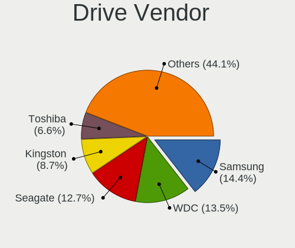
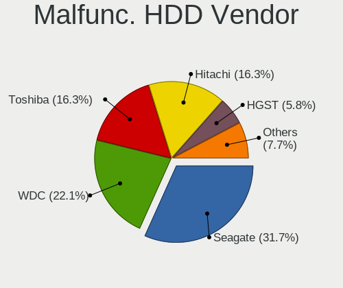
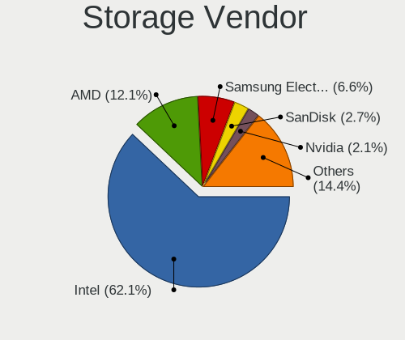
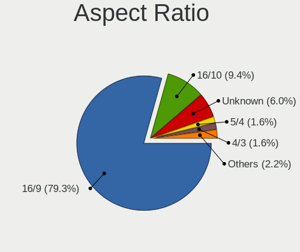
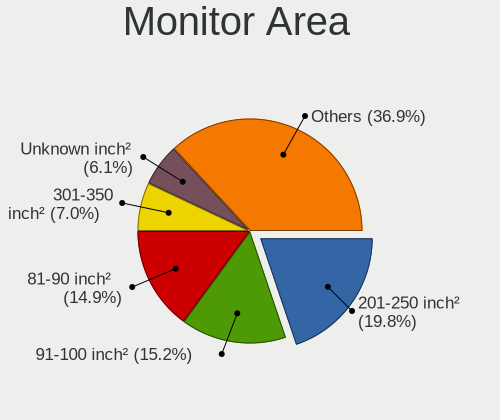
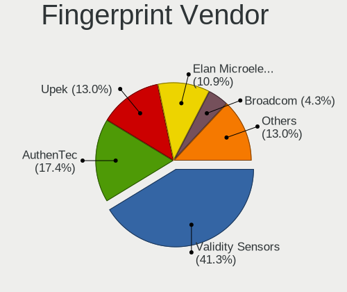

helloSystem 0.8.1 - Tested Hardware & Statistics
------------------------------------------------

A project to collect tested hardware configurations for helloSystem 0.8.1.

Anyone can contribute to this report by the [hw-probe](https://github.com/linuxhw/hw-probe/blob/master/INSTALL.BSD.md) tool:

    hw-probe -all -upload

Please contribute! Especially if your hardware is rare.

This is a report for all computer types. See also reports for [desktops](/Dist/helloSystem_0.8.1/Desktop/README.md) and [notebooks](/Dist/helloSystem_0.8.1/Notebook/README.md).

Contents
--------

* [ Test Cases ](#test-cases)

* [ System ](#system)
  - [ Arch                     ](#arch)
  - [ DE                       ](#de)
  - [ Display Server           ](#display-server)
  - [ Display Manager          ](#display-manager)
  - [ OS Lang                  ](#os-lang)
  - [ Boot Mode                ](#boot-mode)
  - [ Filesystem               ](#filesystem)
  - [ Part. scheme             ](#part-scheme)

* [ Board ](#board)
  - [ Vendor                   ](#vendor)
  - [ Model                    ](#model)
  - [ Model Family             ](#model-family)
  - [ MFG Year                 ](#mfg-year)
  - [ Form Factor              ](#form-factor)
  - [ Coreboot                 ](#coreboot)
  - [ RAM Size                 ](#ram-size)
  - [ RAM Used                 ](#ram-used)
  - [ Total Drives             ](#total-drives)
  - [ Has CD-ROM               ](#has-cd-rom)
  - [ Has Ethernet             ](#has-ethernet)
  - [ Has WiFi                 ](#has-wifi)
  - [ Has Bluetooth            ](#has-bluetooth)

* [ Location ](#location)
  - [ Country                  ](#country)
  - [ City                     ](#city)

* [ Drives ](#drives)
  - [ Drive Vendor             ](#drive-vendor)
  - [ Drive Model              ](#drive-model)
  - [ HDD Vendor               ](#hdd-vendor)
  - [ SSD Vendor               ](#ssd-vendor)
  - [ Drive Kind               ](#drive-kind)
  - [ Drive Connector          ](#drive-connector)
  - [ Drive Size               ](#drive-size)
  - [ Space Total              ](#space-total)
  - [ Space Used               ](#space-used)
  - [ Malfunc. Drives          ](#malfunc-drives)
  - [ Malfunc. Drive Vendor    ](#malfunc-drive-vendor)
  - [ Malfunc. HDD Vendor      ](#malfunc-hdd-vendor)
  - [ Malfunc. Drive Kind      ](#malfunc-drive-kind)
  - [ Failed Drives            ](#failed-drives)
  - [ Failed Drive Vendor      ](#failed-drive-vendor)
  - [ Drive Status             ](#drive-status)

* [ Storage controller ](#storage-controller)
  - [ Storage Vendor           ](#storage-vendor)
  - [ Storage Model            ](#storage-model)
  - [ Storage Kind             ](#storage-kind)

* [ Processor ](#processor)
  - [ CPU Vendor               ](#cpu-vendor)
  - [ CPU Model                ](#cpu-model)
  - [ CPU Model Family         ](#cpu-model-family)
  - [ CPU Cores                ](#cpu-cores)
  - [ CPU Sockets              ](#cpu-sockets)
  - [ CPU Threads              ](#cpu-threads)
  - [ CPU Microarch            ](#cpu-microarch)

* [ Graphics ](#graphics)
  - [ GPU Vendor               ](#gpu-vendor)
  - [ GPU Model                ](#gpu-model)
  - [ GPU Combo                ](#gpu-combo)
  - [ GPU Driver               ](#gpu-driver)
  - [ GPU Memory               ](#gpu-memory)

* [ Monitor ](#monitor)
  - [ Monitor Vendor           ](#monitor-vendor)
  - [ Monitor Model            ](#monitor-model)
  - [ Monitor Resolution       ](#monitor-resolution)
  - [ Monitor Diagonal         ](#monitor-diagonal)
  - [ Monitor Width            ](#monitor-width)
  - [ Aspect Ratio             ](#aspect-ratio)
  - [ Monitor Area             ](#monitor-area)
  - [ Pixel Density            ](#pixel-density)
  - [ Multiple Monitors        ](#multiple-monitors)

* [ Network ](#network)
  - [ Net Controller Vendor    ](#net-controller-vendor)
  - [ Net Controller Model     ](#net-controller-model)
  - [ Wireless Vendor          ](#wireless-vendor)
  - [ Wireless Model           ](#wireless-model)
  - [ Ethernet Vendor          ](#ethernet-vendor)
  - [ Ethernet Model           ](#ethernet-model)
  - [ Net Controller Kind      ](#net-controller-kind)
  - [ Used Controller          ](#used-controller)
  - [ NICs                     ](#nics)
  - [ IPv6                     ](#ipv6)

* [ Bluetooth ](#bluetooth)
  - [ Bluetooth Vendor         ](#bluetooth-vendor)
  - [ Bluetooth Model          ](#bluetooth-model)

* [ Sound ](#sound)
  - [ Sound Vendor             ](#sound-vendor)
  - [ Sound Model              ](#sound-model)

* [ Memory ](#memory)
  - [ Memory Vendor            ](#memory-vendor)
  - [ Memory Model             ](#memory-model)
  - [ Memory Kind              ](#memory-kind)
  - [ Memory Form Factor       ](#memory-form-factor)
  - [ Memory Size              ](#memory-size)
  - [ Memory Speed             ](#memory-speed)

* [ Printers & scanners ](#printers--scanners)
  - [ Printer Vendor           ](#printer-vendor)
  - [ Printer Model            ](#printer-model)
  - [ Scanner Vendor           ](#scanner-vendor)
  - [ Scanner Model            ](#scanner-model)

* [ Camera ](#camera)
  - [ Camera Vendor            ](#camera-vendor)
  - [ Camera Model             ](#camera-model)

* [ Security ](#security)
  - [ Fingerprint Vendor       ](#fingerprint-vendor)
  - [ Fingerprint Model        ](#fingerprint-model)
  - [ Chipcard Vendor          ](#chipcard-vendor)
  - [ Chipcard Model           ](#chipcard-model)

* [ Unsupported ](#unsupported)
  - [ Unsupported Devices      ](#unsupported-devices)
  - [ Unsupported Device Types ](#unsupported-device-types)

Test Cases
----------

Total: 341

| Vendor        | Model                       | Form-Factor | Probe                                                     | Date         |
|---------------|-----------------------------|-------------|-----------------------------------------------------------|--------------|
| Lenovo        | ThinkPad T60 20076PU        | Notebook    | [cb47bfef12](https://bsd-hardware.info/?probe=cb47bfef12) | Jun 30, 2023 |
| HP            | 8055                        | Desktop     | [94df572de4](https://bsd-hardware.info/?probe=94df572de4) | Jun 29, 2023 |
| ASUSTek       | M2A-VM                      | Desktop     | [2d5a9bba42](https://bsd-hardware.info/?probe=2d5a9bba42) | Jun 28, 2023 |
| HP            | EliteBook 840 G3            | Notebook    | [17834256ca](https://bsd-hardware.info/?probe=17834256ca) | Jun 28, 2023 |
| Dell          | Latitude E4310              | Notebook    | [9cdd4909fe](https://bsd-hardware.info/?probe=9cdd4909fe) | Jun 24, 2023 |
| HP            | Laptop 15-ra0xx             | Notebook    | [8c31502b68](https://bsd-hardware.info/?probe=8c31502b68) | Jun 24, 2023 |
| HP            | EliteBook 750 G1            | Notebook    | [aba91c70d1](https://bsd-hardware.info/?probe=aba91c70d1) | Jun 24, 2023 |
| Dell          | Latitude 5490               | Notebook    | [b638c1b2b1](https://bsd-hardware.info/?probe=b638c1b2b1) | Jun 23, 2023 |
| ASUSTek       | ROG Maximus X HERO          | Desktop     | [2dfabb3a28](https://bsd-hardware.info/?probe=2dfabb3a28) | Jun 23, 2023 |
| ASUSTek       | ROG Maximus X HERO          | Desktop     | [b63efe1bc2](https://bsd-hardware.info/?probe=b63efe1bc2) | Jun 23, 2023 |
| LG Electro... | R590-K.AAA9BT               | Desktop     | [5c3ab65e8e](https://bsd-hardware.info/?probe=5c3ab65e8e) | Jun 23, 2023 |
| Acer          | Aspire 5749                 | Notebook    | [75ad2ddb6f](https://bsd-hardware.info/?probe=75ad2ddb6f) | Jun 22, 2023 |
| ASUSTek       | PRIME B350M-A               | Desktop     | [29545a1054](https://bsd-hardware.info/?probe=29545a1054) | Jun 21, 2023 |
| Acer          | Aspire 5749                 | Notebook    | [1e91633580](https://bsd-hardware.info/?probe=1e91633580) | Jun 20, 2023 |
| HP            | Pavilion 15                 | Notebook    | [9ba6acdb4b](https://bsd-hardware.info/?probe=9ba6acdb4b) | Jun 18, 2023 |
| HP            | Stream Laptop 14-ds0xxx     | Notebook    | [81bbc73e72](https://bsd-hardware.info/?probe=81bbc73e72) | Jun 18, 2023 |
| ASUSTek       | P7P55D LE                   | Desktop     | [ea97ade85d](https://bsd-hardware.info/?probe=ea97ade85d) | Jun 17, 2023 |
| HUAWEI        | BOHB-WAX9                   | Notebook    | [d8079e6155](https://bsd-hardware.info/?probe=d8079e6155) | Jun 16, 2023 |
| MSI           | GE63 Raider RGB 8RE         | Notebook    | [ecdb80adc0](https://bsd-hardware.info/?probe=ecdb80adc0) | Jun 14, 2023 |
| HP            | Compaq 6830s                | Notebook    | [1a06917a0f](https://bsd-hardware.info/?probe=1a06917a0f) | Jun 14, 2023 |
| Lenovo        | IdeaPad 310-15IKB 80TV      | Notebook    | [76809610f9](https://bsd-hardware.info/?probe=76809610f9) | Jun 13, 2023 |
| Lenovo        | ThinkPad T440p 20AWS1CH0... | Notebook    | [b532f1ce9c](https://bsd-hardware.info/?probe=b532f1ce9c) | Jun 13, 2023 |
| Samsung       | R530/R730/R540              | Notebook    | [b007264caa](https://bsd-hardware.info/?probe=b007264caa) | Jun 11, 2023 |
| Dell          | 0X9X1W A00                  | Desktop     | [64825f4f71](https://bsd-hardware.info/?probe=64825f4f71) | Jun 08, 2023 |
| Dell          | 0X9X1W A00                  | Desktop     | [c9d8d9a491](https://bsd-hardware.info/?probe=c9d8d9a491) | Jun 08, 2023 |
| Lenovo        | S10-3                       | Notebook    | [f874a66e78](https://bsd-hardware.info/?probe=f874a66e78) | Jun 05, 2023 |
| Lenovo        | S10-3                       | Notebook    | [b76483ab8b](https://bsd-hardware.info/?probe=b76483ab8b) | Jun 05, 2023 |
| HP            | Pavilion Laptop 15-eh1xx... | Notebook    | [e1a7d29d74](https://bsd-hardware.info/?probe=e1a7d29d74) | Jun 04, 2023 |
| HP            | Pavilion Laptop 15-eh1xx... | Notebook    | [d0d9de7cf3](https://bsd-hardware.info/?probe=d0d9de7cf3) | Jun 04, 2023 |
| Dell          | 0TKM9Y A00                  | Mini pc     | [fdd78a8f45](https://bsd-hardware.info/?probe=fdd78a8f45) | Jun 03, 2023 |
| Dell          | 0WR7PY A03                  | Desktop     | [c8496622be](https://bsd-hardware.info/?probe=c8496622be) | Jun 03, 2023 |
| Dell          | 0WR7PY A03                  | Desktop     | [b9f7e3e209](https://bsd-hardware.info/?probe=b9f7e3e209) | Jun 03, 2023 |
| Panasonic     | CF-NX1GDHYS                 | Notebook    | [fb1f293997](https://bsd-hardware.info/?probe=fb1f293997) | Jun 02, 2023 |
| HP            | Pavilion Notebook           | Notebook    | [1bb0436fe5](https://bsd-hardware.info/?probe=1bb0436fe5) | May 30, 2023 |
| Intel         | H81                         | Desktop     | [e0e15704fc](https://bsd-hardware.info/?probe=e0e15704fc) | May 29, 2023 |
| Apple         | MacBookPro10,2              | Notebook    | [c274e2c9db](https://bsd-hardware.info/?probe=c274e2c9db) | May 29, 2023 |
| HP            | 21D0                        | Desktop     | [4a10865d28](https://bsd-hardware.info/?probe=4a10865d28) | May 28, 2023 |
| HP            | 21D0                        | Desktop     | [e3d20826b3](https://bsd-hardware.info/?probe=e3d20826b3) | May 28, 2023 |
| Fujitsu       | Unknown                     | Notebook    | [3b5c9ab914](https://bsd-hardware.info/?probe=3b5c9ab914) | May 27, 2023 |
| Gigabyte      | X58A-UD3R                   | Desktop     | [1d43f61471](https://bsd-hardware.info/?probe=1d43f61471) | May 27, 2023 |
| Unknown       | 1.0                         | Desktop     | [12d6c7934e](https://bsd-hardware.info/?probe=12d6c7934e) | May 27, 2023 |
| ASUSTek       | PRIME H510M-K               | Desktop     | [53a2d5356d](https://bsd-hardware.info/?probe=53a2d5356d) | May 26, 2023 |
| HP            | x360 310 G2 PC              | Convertible | [05bd720b57](https://bsd-hardware.info/?probe=05bd720b57) | May 26, 2023 |
| Timi          | TM1701                      | Notebook    | [1dd768a721](https://bsd-hardware.info/?probe=1dd768a721) | May 25, 2023 |
| ASUSTek       | ROG STRIX B550-F GAMING     | Desktop     | [a0bff43f5c](https://bsd-hardware.info/?probe=a0bff43f5c) | May 23, 2023 |
| AZW           | GK55                        | Desktop     | [ef90c15915](https://bsd-hardware.info/?probe=ef90c15915) | May 23, 2023 |
| ASUSTek       | K42Jc                       | Notebook    | [3da2928a08](https://bsd-hardware.info/?probe=3da2928a08) | May 23, 2023 |
| Google        | Sentry                      | Notebook    | [107124dd66](https://bsd-hardware.info/?probe=107124dd66) | May 22, 2023 |
| ASRock        | Z68 Pro3 Gen3               | Desktop     | [0a03cd86a0](https://bsd-hardware.info/?probe=0a03cd86a0) | May 21, 2023 |
| Sony          | VPCEG15FB                   | Notebook    | [8777493861](https://bsd-hardware.info/?probe=8777493861) | May 21, 2023 |
| HP            | Pavilion Notebook           | Notebook    | [41ce3c5d11](https://bsd-hardware.info/?probe=41ce3c5d11) | May 21, 2023 |
| ASUSTek       | Z87M-PLUS                   | Desktop     | [58da7daed7](https://bsd-hardware.info/?probe=58da7daed7) | May 20, 2023 |
| Packard Be... | EasyNote LJ65               | Notebook    | [36d3e7aaf7](https://bsd-hardware.info/?probe=36d3e7aaf7) | May 19, 2023 |
| ASUSTek       | PRIME A320M-K               | Desktop     | [8f3c5de741](https://bsd-hardware.info/?probe=8f3c5de741) | May 19, 2023 |
| Gigabyte      | Z490 VISION G               | Desktop     | [976e31bfbc](https://bsd-hardware.info/?probe=976e31bfbc) | May 16, 2023 |
| Gigabyte      | Z490 VISION G               | Desktop     | [8eeec83a4e](https://bsd-hardware.info/?probe=8eeec83a4e) | May 16, 2023 |
| ASUSTek       | PRIME A520M-K               | Desktop     | [bda308bc8c](https://bsd-hardware.info/?probe=bda308bc8c) | May 14, 2023 |
| Sony          | SVF14A15CBB                 | Notebook    | [4ada2dca25](https://bsd-hardware.info/?probe=4ada2dca25) | May 14, 2023 |
| Lenovo        | B570e HuronRiver Platfor... | Notebook    | [256915976d](https://bsd-hardware.info/?probe=256915976d) | May 12, 2023 |
| Dell          | 0WN7Y6 A01                  | Desktop     | [a232411c74](https://bsd-hardware.info/?probe=a232411c74) | May 12, 2023 |
| TUXEDO        | Aura 15 Gen1                | Notebook    | [3d889e8b9b](https://bsd-hardware.info/?probe=3d889e8b9b) | May 11, 2023 |
| Intel         | NUC6i5SYB H81131-503        | Mini pc     | [4eea72e4a6](https://bsd-hardware.info/?probe=4eea72e4a6) | May 11, 2023 |
| ASUSTek       | PRIME B450M-K II            | Desktop     | [fe053db6c7](https://bsd-hardware.info/?probe=fe053db6c7) | May 10, 2023 |
| ASUSTek       | PRIME B450M-K II            | Desktop     | [16ca4a2aa0](https://bsd-hardware.info/?probe=16ca4a2aa0) | May 10, 2023 |
| ASRock        | Q1900M                      | Desktop     | [c779034e79](https://bsd-hardware.info/?probe=c779034e79) | May 09, 2023 |
| Apple         | MacBook5,1                  | Notebook    | [da07885adb](https://bsd-hardware.info/?probe=da07885adb) | May 09, 2023 |
| HP            | Laptop 14-bs0xx             | Notebook    | [98ea66d6e8](https://bsd-hardware.info/?probe=98ea66d6e8) | May 07, 2023 |
| Dell          | 07F37C A00                  | Desktop     | [a23a95f97a](https://bsd-hardware.info/?probe=a23a95f97a) | May 07, 2023 |
| ASRock        | J4125-ITX                   | Desktop     | [6e34c8b22a](https://bsd-hardware.info/?probe=6e34c8b22a) | May 05, 2023 |
| Intel         | DH87RL AAG74240-400         | Desktop     | [7833b60865](https://bsd-hardware.info/?probe=7833b60865) | May 05, 2023 |
| Dell          | 0252PH A04                  | Desktop     | [0cc9ef6521](https://bsd-hardware.info/?probe=0cc9ef6521) | May 03, 2023 |
| Dell          | 0252PH A04                  | Desktop     | [acaf59c3d5](https://bsd-hardware.info/?probe=acaf59c3d5) | May 03, 2023 |
| Lenovo        | Flex 2-15 20405             | Notebook    | [3773da7851](https://bsd-hardware.info/?probe=3773da7851) | May 03, 2023 |
| HP            | Compaq Presario CQ50        | Notebook    | [f296048a29](https://bsd-hardware.info/?probe=f296048a29) | May 03, 2023 |
| HP            | 82B4                        | Desktop     | [244817e203](https://bsd-hardware.info/?probe=244817e203) | May 02, 2023 |
| Apple         | MacBook5,1                  | Notebook    | [a5a1ca2ee6](https://bsd-hardware.info/?probe=a5a1ca2ee6) | May 02, 2023 |
| Microsoft     | Surface Pro 7               | Tablet      | [e4e2bba5fb](https://bsd-hardware.info/?probe=e4e2bba5fb) | May 02, 2023 |
| ASUSTek       | PRIME B250M-A               | Desktop     | [270284972d](https://bsd-hardware.info/?probe=270284972d) | Apr 29, 2023 |
| Apple         | MacBook5,1                  | Notebook    | [52174cc0ba](https://bsd-hardware.info/?probe=52174cc0ba) | Apr 27, 2023 |
| Dell          | 0252PH A04                  | Desktop     | [f497e66dec](https://bsd-hardware.info/?probe=f497e66dec) | Apr 27, 2023 |
| Acer          | Spin SP314-21               | Convertible | [f5debc3ef8](https://bsd-hardware.info/?probe=f5debc3ef8) | Apr 27, 2023 |
| HP            | 8056                        | Desktop     | [44fb168511](https://bsd-hardware.info/?probe=44fb168511) | Apr 26, 2023 |
| Apple         | MacBook5,1                  | Notebook    | [4c7f33d6a9](https://bsd-hardware.info/?probe=4c7f33d6a9) | Apr 25, 2023 |
| Lenovo        | ThinkPad X270 20HMS06Q1D    | Notebook    | [2df7c991f0](https://bsd-hardware.info/?probe=2df7c991f0) | Apr 23, 2023 |
| Lenovo        | G500 20236                  | Notebook    | [e7387bfd6e](https://bsd-hardware.info/?probe=e7387bfd6e) | Apr 23, 2023 |
| Dell          | Inspiron 3421               | Notebook    | [ef4870410f](https://bsd-hardware.info/?probe=ef4870410f) | Apr 23, 2023 |
| Lenovo        | Yoga Slim 7 14ITL05 82A3    | Notebook    | [93b498fb0c](https://bsd-hardware.info/?probe=93b498fb0c) | Apr 21, 2023 |
| Packard Be... | DOT SE                      | Notebook    | [f456e964db](https://bsd-hardware.info/?probe=f456e964db) | Apr 19, 2023 |
| Dell          | Latitude 7410               | Notebook    | [d5c047907d](https://bsd-hardware.info/?probe=d5c047907d) | Apr 19, 2023 |
| Dell          | 0VTC0D A02                  | Desktop     | [a807892254](https://bsd-hardware.info/?probe=a807892254) | Apr 19, 2023 |
| Acer          | Acadia V1.44                | Desktop     | [97bda17afa](https://bsd-hardware.info/?probe=97bda17afa) | Apr 19, 2023 |
| Acer          | V5-131                      | Notebook    | [4c2332c3b8](https://bsd-hardware.info/?probe=4c2332c3b8) | Apr 19, 2023 |
| Gigabyte      | H61M-S2PH                   | Desktop     | [024173445b](https://bsd-hardware.info/?probe=024173445b) | Apr 18, 2023 |
| Acer          | Spin SP314-21               | Convertible | [820e7da3c8](https://bsd-hardware.info/?probe=820e7da3c8) | Apr 18, 2023 |
| Medion        | E15302                      | Notebook    | [f47f32e1cc](https://bsd-hardware.info/?probe=f47f32e1cc) | Apr 17, 2023 |
| Gigabyte      | A520M DS3H AC               | Desktop     | [16021ac5b5](https://bsd-hardware.info/?probe=16021ac5b5) | Apr 17, 2023 |
| Toshiba       | PORTEGE R700                | Notebook    | [8b196955ac](https://bsd-hardware.info/?probe=8b196955ac) | Apr 15, 2023 |
| Pegatron      | 2A72h                       | Desktop     | [142340aed4](https://bsd-hardware.info/?probe=142340aed4) | Apr 15, 2023 |
| Apple         | MacBook3,1                  | Notebook    | [74986a169a](https://bsd-hardware.info/?probe=74986a169a) | Apr 15, 2023 |
| ASUSTek       | PRIME B550M-A WIFI II       | Desktop     | [8e77aee0e0](https://bsd-hardware.info/?probe=8e77aee0e0) | Apr 14, 2023 |
| HP            | 3397                        | Desktop     | [cf2d152bee](https://bsd-hardware.info/?probe=cf2d152bee) | Apr 13, 2023 |
| Google        | Terra                       | Notebook    | [ef1619f65f](https://bsd-hardware.info/?probe=ef1619f65f) | Apr 13, 2023 |
| Google        | Terra                       | Notebook    | [bf598bc5bf](https://bsd-hardware.info/?probe=bf598bc5bf) | Apr 13, 2023 |
| ASUSTek       | PRIME B550M-A WIFI II       | Desktop     | [e6c9c37b02](https://bsd-hardware.info/?probe=e6c9c37b02) | Apr 13, 2023 |
| Gigabyte      | H81M-S2PH                   | Desktop     | [b7ec959c9f](https://bsd-hardware.info/?probe=b7ec959c9f) | Apr 13, 2023 |
| Samsung       | 370E4K                      | Notebook    | [c363d008bf](https://bsd-hardware.info/?probe=c363d008bf) | Apr 13, 2023 |
| Lenovo        | ThinkPad L540 20AUA34DJP    | Notebook    | [c7e40ee8ea](https://bsd-hardware.info/?probe=c7e40ee8ea) | Apr 12, 2023 |
| Acer          | Spin SP314-21               | Convertible | [a5ee042606](https://bsd-hardware.info/?probe=a5ee042606) | Apr 12, 2023 |
| ASUSTek       | PRIME B250M-A               | Desktop     | [0747d0a699](https://bsd-hardware.info/?probe=0747d0a699) | Apr 11, 2023 |
| Lenovo        | ThinkPad L15 Gen 2 20X3C... | Notebook    | [0249b4e73f](https://bsd-hardware.info/?probe=0249b4e73f) | Apr 11, 2023 |
| Lenovo        | ThinkPad L540 20AUA34DJP    | Notebook    | [52aac5fc6f](https://bsd-hardware.info/?probe=52aac5fc6f) | Apr 11, 2023 |
| Gigabyte      | M52L-S3P                    | Desktop     | [3a6baf7f2d](https://bsd-hardware.info/?probe=3a6baf7f2d) | Apr 09, 2023 |
| Gigabyte      | B250M-Gaming 3-CF           | Desktop     | [592e08cdd2](https://bsd-hardware.info/?probe=592e08cdd2) | Apr 09, 2023 |
| Lenovo        | ThinkPad X1 Carbon 34487... | Notebook    | [cec90ddd1b](https://bsd-hardware.info/?probe=cec90ddd1b) | Apr 08, 2023 |
| Lenovo        | Legion 5 Pro 16ACH6H 82J... | Notebook    | [f3ac765863](https://bsd-hardware.info/?probe=f3ac765863) | Apr 08, 2023 |
| Dell          | XPS 13 9343                 | Notebook    | [8354aed46e](https://bsd-hardware.info/?probe=8354aed46e) | Apr 07, 2023 |
| Acer          | Veriton M6620G              | Desktop     | [13f7e5c23b](https://bsd-hardware.info/?probe=13f7e5c23b) | Apr 07, 2023 |
| Fujitsu       | CELSIUS H920                | Notebook    | [0551eecbcc](https://bsd-hardware.info/?probe=0551eecbcc) | Apr 06, 2023 |
| Acer          | Aspire 5250                 | Notebook    | [385751dbc3](https://bsd-hardware.info/?probe=385751dbc3) | Apr 06, 2023 |
| Lenovo        | Tilapia CRB                 | Desktop     | [977f089665](https://bsd-hardware.info/?probe=977f089665) | Apr 05, 2023 |
| Gigabyte      | B360M D2V                   | Desktop     | [6429eebbaa](https://bsd-hardware.info/?probe=6429eebbaa) | Apr 05, 2023 |
| Google        | Wolf                        | Notebook    | [2546416afd](https://bsd-hardware.info/?probe=2546416afd) | Apr 05, 2023 |
| HP            | Laptop 15-bw0xx             | Notebook    | [93ea83eef5](https://bsd-hardware.info/?probe=93ea83eef5) | Apr 03, 2023 |
| Lenovo        | G570 20079                  | Notebook    | [76cc1653c3](https://bsd-hardware.info/?probe=76cc1653c3) | Apr 03, 2023 |
| ASUSTek       | ROG STRIX Z590-F GAMING ... | Desktop     | [92d0571176](https://bsd-hardware.info/?probe=92d0571176) | Apr 03, 2023 |
| Gigabyte      | B450M DS3H V2               | Desktop     | [096620cfac](https://bsd-hardware.info/?probe=096620cfac) | Apr 03, 2023 |
| Lenovo        | ThinkBook 14-IML 20RV       | Notebook    | [48b0a1024e](https://bsd-hardware.info/?probe=48b0a1024e) | Apr 02, 2023 |
| ASUSTek       | ROG STRIX Z590-F GAMING ... | Desktop     | [760a744b91](https://bsd-hardware.info/?probe=760a744b91) | Apr 02, 2023 |
| ASUSTek       | X58C                        | Notebook    | [dad28a9d36](https://bsd-hardware.info/?probe=dad28a9d36) | Apr 01, 2023 |
| Fujitsu       | CELSIUS H920                | Notebook    | [e6300dc691](https://bsd-hardware.info/?probe=e6300dc691) | Mar 31, 2023 |
| ASUSTek       | ROG STRIX B450-F GAMING     | Desktop     | [bcaaed4d6d](https://bsd-hardware.info/?probe=bcaaed4d6d) | Mar 31, 2023 |
| DNS           | W9x0LU                      | Notebook    | [6539659387](https://bsd-hardware.info/?probe=6539659387) | Mar 31, 2023 |
| Lenovo        | ThinkPad X220 4290DK6       | Notebook    | [96c83a2846](https://bsd-hardware.info/?probe=96c83a2846) | Mar 31, 2023 |
| Gigabyte      | GA-880GM-USB3               | Desktop     | [a9bc1579c1](https://bsd-hardware.info/?probe=a9bc1579c1) | Mar 31, 2023 |
| Lenovo        | 30D0 SDK0J40697 WIN 3305... | Desktop     | [bde9fd671b](https://bsd-hardware.info/?probe=bde9fd671b) | Mar 30, 2023 |
| Fujitsu       | D3061-A1 S26361-D3061-A1    | Desktop     | [ca6badc637](https://bsd-hardware.info/?probe=ca6badc637) | Mar 30, 2023 |
| Intel         | Intel                       | Notebook    | [75e9733afd](https://bsd-hardware.info/?probe=75e9733afd) | Mar 30, 2023 |
| Dell          | Inspiron 3195               | Convertible | [2afbb563b7](https://bsd-hardware.info/?probe=2afbb563b7) | Mar 30, 2023 |
| Gigabyte      | H81M-DS2V                   | Desktop     | [a69c208286](https://bsd-hardware.info/?probe=a69c208286) | Mar 30, 2023 |
| Toshiba       | Satellite L675D             | Notebook    | [0bf578daec](https://bsd-hardware.info/?probe=0bf578daec) | Mar 30, 2023 |
| ASUSTek       | VivoBook_ASUS Laptop X50... | Notebook    | [ff14982ad9](https://bsd-hardware.info/?probe=ff14982ad9) | Mar 29, 2023 |
| Dell          | Latitude 5590               | Notebook    | [7e87d436df](https://bsd-hardware.info/?probe=7e87d436df) | Mar 29, 2023 |
| Fujitsu       | D3049-A1 S26361-D3049-A1... | Server      | [0eb67759f0](https://bsd-hardware.info/?probe=0eb67759f0) | Mar 29, 2023 |
| Lenovo        | ThinkPad T540p 20BFS10W0... | Notebook    | [30c5fc2625](https://bsd-hardware.info/?probe=30c5fc2625) | Mar 29, 2023 |
| Dell          | 0T1D10 A01                  | Desktop     | [2f5592023f](https://bsd-hardware.info/?probe=2f5592023f) | Mar 29, 2023 |
| Dell          | 0T1D10 A01                  | Desktop     | [6316b108be](https://bsd-hardware.info/?probe=6316b108be) | Mar 29, 2023 |
| Irbis         | NB78                        | Notebook    | [471efbc788](https://bsd-hardware.info/?probe=471efbc788) | Mar 29, 2023 |
| Lenovo        | Yoga Slim 7 Pro 14ACH5 8... | Notebook    | [f4e450fed1](https://bsd-hardware.info/?probe=f4e450fed1) | Mar 29, 2023 |
| Lenovo        | IdeaPad 320-15ISK 80XH      | Notebook    | [dddf27cde4](https://bsd-hardware.info/?probe=dddf27cde4) | Mar 28, 2023 |
| Lenovo        | IdeaPad 320-15ISK 80XH      | Notebook    | [c2ba6aca7d](https://bsd-hardware.info/?probe=c2ba6aca7d) | Mar 28, 2023 |
| BESSTAR Te... | UM700                       | Desktop     | [78ee14c1a5](https://bsd-hardware.info/?probe=78ee14c1a5) | Mar 28, 2023 |
| Lenovo        | IdeaPad Gaming 3 15ACH6 ... | Notebook    | [fb4eec9c34](https://bsd-hardware.info/?probe=fb4eec9c34) | Mar 27, 2023 |
| ASRock        | H61M-HVS                    | Desktop     | [98777ba333](https://bsd-hardware.info/?probe=98777ba333) | Mar 27, 2023 |
| HP            | Pavilion dv6                | Notebook    | [ce2cc6852d](https://bsd-hardware.info/?probe=ce2cc6852d) | Mar 27, 2023 |
| Dell          | Inspiron 7437               | Notebook    | [2c4de59558](https://bsd-hardware.info/?probe=2c4de59558) | Mar 27, 2023 |
| Lenovo        | IdeaPad S210 20256          | Notebook    | [2e22ee87c3](https://bsd-hardware.info/?probe=2e22ee87c3) | Mar 27, 2023 |
| Lenovo        | ThinkPad T430 2349G5P       | Notebook    | [9ea67d3893](https://bsd-hardware.info/?probe=9ea67d3893) | Mar 27, 2023 |
| Dell          | Latitude 5420               | Notebook    | [4e22bbc131](https://bsd-hardware.info/?probe=4e22bbc131) | Mar 26, 2023 |
| MSI           | 870-G45                     | Desktop     | [19cbb6e0f3](https://bsd-hardware.info/?probe=19cbb6e0f3) | Mar 26, 2023 |
| LG Electro... | E500-L.A2M4A2               | Notebook    | [8dab794233](https://bsd-hardware.info/?probe=8dab794233) | Mar 26, 2023 |
| Gigabyte      | F2A85X-UP4                  | Desktop     | [97d37b6e2f](https://bsd-hardware.info/?probe=97d37b6e2f) | Mar 25, 2023 |
| Samsung       | R468/R418                   | Notebook    | [f620a5c6ec](https://bsd-hardware.info/?probe=f620a5c6ec) | Mar 25, 2023 |
| Lenovo        | ThinkPad X220 4291AN9       | Notebook    | [1646bb53ab](https://bsd-hardware.info/?probe=1646bb53ab) | Mar 25, 2023 |
| Apple         | Mac-F22C86C8                | Mini pc     | [7945f26073](https://bsd-hardware.info/?probe=7945f26073) | Mar 25, 2023 |
| Lenovo        | ThinkPad T470 W10DG 20JN... | Notebook    | [7df625b1df](https://bsd-hardware.info/?probe=7df625b1df) | Mar 25, 2023 |
| MSI           | 870-G45                     | Desktop     | [14e990c885](https://bsd-hardware.info/?probe=14e990c885) | Mar 25, 2023 |
| Gigabyte      | F2A85X-UP4                  | Desktop     | [c0b8eb494e](https://bsd-hardware.info/?probe=c0b8eb494e) | Mar 25, 2023 |
| ASUSTek       | P5K SE                      | Desktop     | [646eff3292](https://bsd-hardware.info/?probe=646eff3292) | Mar 25, 2023 |
| Lenovo        | ThinkPad X230 Tablet 343... | Notebook    | [8e798ca6ef](https://bsd-hardware.info/?probe=8e798ca6ef) | Mar 25, 2023 |
| Lenovo        | ThinkPad W541 20EF000NUS    | Notebook    | [34b156c20c](https://bsd-hardware.info/?probe=34b156c20c) | Mar 24, 2023 |
| HP            | 8055                        | Desktop     | [03930fa6c3](https://bsd-hardware.info/?probe=03930fa6c3) | Mar 24, 2023 |
| HP            | 8350                        | Desktop     | [46dedb22a0](https://bsd-hardware.info/?probe=46dedb22a0) | Mar 24, 2023 |
| Dell          | Latitude 5500               | Notebook    | [8db518ef3d](https://bsd-hardware.info/?probe=8db518ef3d) | Mar 24, 2023 |
| Unknown       | Unknown                     | Desktop     | [a66dffcb5c](https://bsd-hardware.info/?probe=a66dffcb5c) | Mar 23, 2023 |
| Intel         | DB85FL AAG89861-203         | Desktop     | [ff97717798](https://bsd-hardware.info/?probe=ff97717798) | Mar 23, 2023 |
| Gigabyte      | H81M-H                      | Desktop     | [e7cadcdae1](https://bsd-hardware.info/?probe=e7cadcdae1) | Mar 23, 2023 |
| Acer          | Revo 70                     | Desktop     | [50d93bea69](https://bsd-hardware.info/?probe=50d93bea69) | Mar 23, 2023 |
| Sony          | VAIO                        | All in one  | [ef7c622d8d](https://bsd-hardware.info/?probe=ef7c622d8d) | Mar 23, 2023 |
| Sony          | VAIO                        | All in one  | [ededfcfd39](https://bsd-hardware.info/?probe=ededfcfd39) | Mar 23, 2023 |
| Lenovo        | ThinkPad T61 7658CTO        | Notebook    | [f00e571f76](https://bsd-hardware.info/?probe=f00e571f76) | Mar 23, 2023 |
| Unknown       | T360D11                     | Desktop     | [d4d69405c5](https://bsd-hardware.info/?probe=d4d69405c5) | Mar 23, 2023 |
| T-bao         | MINI PC V1.0                | Desktop     | [eb2bc1cd51](https://bsd-hardware.info/?probe=eb2bc1cd51) | Mar 23, 2023 |
| Dell          | 0WWJRX A00                  | Desktop     | [b016b1fb3c](https://bsd-hardware.info/?probe=b016b1fb3c) | Mar 22, 2023 |
| Lenovo        | ThinkPad T430s 2356CV6      | Notebook    | [d9efc1e30b](https://bsd-hardware.info/?probe=d9efc1e30b) | Mar 22, 2023 |
| ASUSTek       | X71Vn                       | Notebook    | [6e96ea55ee](https://bsd-hardware.info/?probe=6e96ea55ee) | Mar 22, 2023 |
| Gigabyte      | F2A55-DS3                   | Desktop     | [ce8775fbe5](https://bsd-hardware.info/?probe=ce8775fbe5) | Mar 22, 2023 |
| Biostar       | H61MGC                      | Desktop     | [94e565457c](https://bsd-hardware.info/?probe=94e565457c) | Mar 22, 2023 |
| ASUSTek       | M4A88TD-V EVO/USB3          | Desktop     | [c486bbb209](https://bsd-hardware.info/?probe=c486bbb209) | Mar 22, 2023 |
| ASUSTek       | M5A97 R2.0                  | Desktop     | [840a902d2b](https://bsd-hardware.info/?probe=840a902d2b) | Mar 22, 2023 |
| Foxconn       | M61PMV FAB                  | Desktop     | [197d75cbaa](https://bsd-hardware.info/?probe=197d75cbaa) | Mar 21, 2023 |
| Lenovo        | Yoga Slim 7 Pro 14ACH5 8... | Notebook    | [136a6641be](https://bsd-hardware.info/?probe=136a6641be) | Mar 21, 2023 |
| Fujitsu Si... | D2824-A1 S26361-D2824-A1    | Desktop     | [bcada44b09](https://bsd-hardware.info/?probe=bcada44b09) | Mar 21, 2023 |
| Intel         | X99                         | Desktop     | [a74c2b96ff](https://bsd-hardware.info/?probe=a74c2b96ff) | Mar 21, 2023 |
| Dell          | 0GM819                      | Desktop     | [9d5996dd7a](https://bsd-hardware.info/?probe=9d5996dd7a) | Mar 21, 2023 |
| Lenovo        | ThinkPad X230 232578G       | Notebook    | [edf47cb2d4](https://bsd-hardware.info/?probe=edf47cb2d4) | Mar 21, 2023 |
| Lenovo        | ThinkPad T61 7659CA1        | Notebook    | [bba228ddc9](https://bsd-hardware.info/?probe=bba228ddc9) | Mar 20, 2023 |
| HP            | 8054                        | Desktop     | [6e5a18f346](https://bsd-hardware.info/?probe=6e5a18f346) | Mar 20, 2023 |
| Lenovo        | 30BC SDK0J40705 WIN 3425... | Desktop     | [33b600b436](https://bsd-hardware.info/?probe=33b600b436) | Mar 20, 2023 |
| Lenovo        | G500 20236                  | Notebook    | [55dc82af1c](https://bsd-hardware.info/?probe=55dc82af1c) | Mar 20, 2023 |
| ASUSTek       | PRIME B350-PLUS             | Desktop     | [8d0e6be5da](https://bsd-hardware.info/?probe=8d0e6be5da) | Mar 20, 2023 |
| ASUSTek       | 1015PX                      | Notebook    | [d6c1199165](https://bsd-hardware.info/?probe=d6c1199165) | Mar 20, 2023 |
| Dell          | 0GM819                      | Desktop     | [da7c02c542](https://bsd-hardware.info/?probe=da7c02c542) | Mar 20, 2023 |
| ASUSTek       | TUF Gaming B550M-PLUS       | Desktop     | [c07b0a75e5](https://bsd-hardware.info/?probe=c07b0a75e5) | Mar 20, 2023 |
| ASUSTek       | TUF Gaming B550M-PLUS       | Desktop     | [71d2b7317c](https://bsd-hardware.info/?probe=71d2b7317c) | Mar 19, 2023 |
| ASRock        | H61M-DGS                    | Desktop     | [36348fa16f](https://bsd-hardware.info/?probe=36348fa16f) | Mar 19, 2023 |
| Apple         | MacBookPro5,1               | Notebook    | [9e300b5797](https://bsd-hardware.info/?probe=9e300b5797) | Mar 19, 2023 |
| Toshiba       | Satellite P300              | Notebook    | [81b7ca608e](https://bsd-hardware.info/?probe=81b7ca608e) | Mar 19, 2023 |
| Lenovo        | ThinkPad T520 4242PN3       | Notebook    | [3ea33f0cad](https://bsd-hardware.info/?probe=3ea33f0cad) | Mar 19, 2023 |
| Lenovo        | ThinkPad T470 W10DG 20JN... | Notebook    | [e35600705f](https://bsd-hardware.info/?probe=e35600705f) | Mar 19, 2023 |
| Lenovo        | ThinkPad L380 Yoga 20M8S... | Convertible | [40a4d98b9c](https://bsd-hardware.info/?probe=40a4d98b9c) | Mar 19, 2023 |
| Samsung       | R520/R522/R620              | Notebook    | [096d52b83d](https://bsd-hardware.info/?probe=096d52b83d) | Mar 18, 2023 |
| Lenovo        | IdeaPad 330-15IKB 81DE      | Notebook    | [be9a45f529](https://bsd-hardware.info/?probe=be9a45f529) | Mar 18, 2023 |
| ASUSTek       | PRIME B350-PLUS             | Desktop     | [acc1970543](https://bsd-hardware.info/?probe=acc1970543) | Mar 18, 2023 |
| Lenovo        | IdeaPad 330-15IKB 81DE      | Notebook    | [a365a5b411](https://bsd-hardware.info/?probe=a365a5b411) | Mar 18, 2023 |
| Apple         | MacBook4,1                  | Notebook    | [6f2790802d](https://bsd-hardware.info/?probe=6f2790802d) | Mar 18, 2023 |
| ASUSTek       | P6X58D-E                    | Desktop     | [ec05209185](https://bsd-hardware.info/?probe=ec05209185) | Mar 18, 2023 |
| Fujitsu       | LIFEBOOK AH530              | Notebook    | [50a5ed6b41](https://bsd-hardware.info/?probe=50a5ed6b41) | Mar 18, 2023 |
| IGEL Techn... | M350C                       | Notebook    | [a04efafd2e](https://bsd-hardware.info/?probe=a04efafd2e) | Mar 18, 2023 |
| HP            | Pavilion dv5                | Notebook    | [113fe74799](https://bsd-hardware.info/?probe=113fe74799) | Mar 18, 2023 |
| Gigabyte      | H110M-H-CF                  | Desktop     | [29b3a70374](https://bsd-hardware.info/?probe=29b3a70374) | Mar 18, 2023 |
| Unknown       | Unknown                     | Desktop     | [dd8a64237a](https://bsd-hardware.info/?probe=dd8a64237a) | Mar 18, 2023 |
| HP            | EliteBook 850 G2            | Notebook    | [653dbe54a4](https://bsd-hardware.info/?probe=653dbe54a4) | Mar 18, 2023 |
| ASUSTek       | TUF Gaming X570-PLUS        | Desktop     | [2ceda5b586](https://bsd-hardware.info/?probe=2ceda5b586) | Mar 17, 2023 |
| Lenovo        | ThinkPad T440p              | Notebook    | [575123c3ac](https://bsd-hardware.info/?probe=575123c3ac) | Mar 17, 2023 |
| Dell          | Inspiron 3442               | Notebook    | [cbb9f6bfbb](https://bsd-hardware.info/?probe=cbb9f6bfbb) | Mar 17, 2023 |
| ASUSTek       | ROG STRIX B450-F GAMING ... | Desktop     | [74cf75116d](https://bsd-hardware.info/?probe=74cf75116d) | Mar 17, 2023 |
| ASUSTek       | TUF B360M-PLUS GAMING       | Desktop     | [ebbd75883c](https://bsd-hardware.info/?probe=ebbd75883c) | Mar 17, 2023 |
| Dell          | Latitude E5570              | Notebook    | [8b9aa95420](https://bsd-hardware.info/?probe=8b9aa95420) | Mar 17, 2023 |
| Toshiba       | Satellite L40               | Notebook    | [2297dcb7e7](https://bsd-hardware.info/?probe=2297dcb7e7) | Mar 17, 2023 |
| Dell          | Latitude E5570              | Notebook    | [937a7c9385](https://bsd-hardware.info/?probe=937a7c9385) | Mar 17, 2023 |
| Unknown       | SKYBAY                      | Desktop     | [7399558d80](https://bsd-hardware.info/?probe=7399558d80) | Mar 17, 2023 |
| Unknown       | SKYBAY                      | Desktop     | [3fb2d0d992](https://bsd-hardware.info/?probe=3fb2d0d992) | Mar 17, 2023 |
| Lenovo        | ThinkPad X201 36801T6       | Notebook    | [decaf0c347](https://bsd-hardware.info/?probe=decaf0c347) | Mar 17, 2023 |
| HP            | 1632                        | Desktop     | [8f3bb99bb4](https://bsd-hardware.info/?probe=8f3bb99bb4) | Mar 17, 2023 |
| Lenovo        | ThinkPad X61s 7667WQS       | Notebook    | [f1351003d1](https://bsd-hardware.info/?probe=f1351003d1) | Mar 17, 2023 |
| Dell          | Inspiron 5557               | Notebook    | [ff199c6d21](https://bsd-hardware.info/?probe=ff199c6d21) | Mar 16, 2023 |
| HP            | Unknown                     | Notebook    | [0b79535c7f](https://bsd-hardware.info/?probe=0b79535c7f) | Mar 16, 2023 |
| Gigabyte      | F2A68HM-HD2                 | Desktop     | [da2b96de55](https://bsd-hardware.info/?probe=da2b96de55) | Mar 16, 2023 |
| Gigabyte      | Z87X-UD4H-CF                | Desktop     | [0bae1528b9](https://bsd-hardware.info/?probe=0bae1528b9) | Mar 16, 2023 |
| ASUSTek       | PRIME B660M-A D4            | Desktop     | [eb6b70b310](https://bsd-hardware.info/?probe=eb6b70b310) | Mar 16, 2023 |
| Intel         | NUC7i5BNB J31144-310        | Mini pc     | [c1c53bb88b](https://bsd-hardware.info/?probe=c1c53bb88b) | Mar 16, 2023 |
| Lenovo        | SHARKBAY NOK                | Desktop     | [f14a448799](https://bsd-hardware.info/?probe=f14a448799) | Mar 16, 2023 |
| ASUSTek       | PRIME B660M-A WIFI D4       | Desktop     | [44c7f21a07](https://bsd-hardware.info/?probe=44c7f21a07) | Mar 16, 2023 |
| Gigabyte      | B450M S2H                   | Desktop     | [dfa4f43317](https://bsd-hardware.info/?probe=dfa4f43317) | Mar 15, 2023 |
| Samsung       | 305E4A/305E5A/305E7A        | Notebook    | [564b1ccce1](https://bsd-hardware.info/?probe=564b1ccce1) | Mar 15, 2023 |
| Gigabyte      | H61M-S2P-B3                 | Desktop     | [864a4017cb](https://bsd-hardware.info/?probe=864a4017cb) | Mar 15, 2023 |
| HP            | 3398                        | Desktop     | [b14de43688](https://bsd-hardware.info/?probe=b14de43688) | Mar 15, 2023 |
| Acer          | Aspire E5-571G              | Notebook    | [ca34dac813](https://bsd-hardware.info/?probe=ca34dac813) | Mar 15, 2023 |
| Samsung       | 275E4E/275E5E               | Notebook    | [dd4f7ef594](https://bsd-hardware.info/?probe=dd4f7ef594) | Mar 15, 2023 |
| HP            | 81B7                        | All in one  | [fa5eb6a694](https://bsd-hardware.info/?probe=fa5eb6a694) | Mar 15, 2023 |
| HP            | Pavilion TS Sleekbook 14    | Notebook    | [d57e5b1b88](https://bsd-hardware.info/?probe=d57e5b1b88) | Mar 15, 2023 |
| ASUSTek       | ROG STRIX B560-F GAMING ... | Desktop     | [c4798050c6](https://bsd-hardware.info/?probe=c4798050c6) | Mar 15, 2023 |
| ASUSTek       | Pro B550M-C                 | Desktop     | [a0e38ad11b](https://bsd-hardware.info/?probe=a0e38ad11b) | Mar 14, 2023 |
| Dell          | 00V62H A00                  | Desktop     | [ecb9b5d004](https://bsd-hardware.info/?probe=ecb9b5d004) | Mar 14, 2023 |
| Intel         | NUC8BEB J72692-308          | Mini pc     | [25256b1698](https://bsd-hardware.info/?probe=25256b1698) | Mar 14, 2023 |
| Lenovo        | ThinkPad X270 W10DG 20K5... | Notebook    | [89a5ee25f9](https://bsd-hardware.info/?probe=89a5ee25f9) | Mar 14, 2023 |
| Acer          | TravelMate P249-G2-M        | Notebook    | [090f37a821](https://bsd-hardware.info/?probe=090f37a821) | Mar 14, 2023 |
| Foxconn       | H61M/H61M-S                 | Desktop     | [865fbff42a](https://bsd-hardware.info/?probe=865fbff42a) | Mar 14, 2023 |
| Fujitsu Si... | D2804-A1 S26361-D2804-A1    | Desktop     | [34c4bab715](https://bsd-hardware.info/?probe=34c4bab715) | Mar 14, 2023 |
| MSI           | 0A48                        | Desktop     | [815f019a8c](https://bsd-hardware.info/?probe=815f019a8c) | Mar 14, 2023 |
| Dell          | Latitude D630               | Notebook    | [da1fa73418](https://bsd-hardware.info/?probe=da1fa73418) | Mar 14, 2023 |
| HP            | Laptop 14-bs0xx             | Notebook    | [cd76713b75](https://bsd-hardware.info/?probe=cd76713b75) | Mar 14, 2023 |
| Dynabook E... | Satellite Pro E10-G-101     | Notebook    | [c58a37ef03](https://bsd-hardware.info/?probe=c58a37ef03) | Mar 14, 2023 |
| Lenovo        | NO DPK                      | Desktop     | [8a38ed8d33](https://bsd-hardware.info/?probe=8a38ed8d33) | Mar 14, 2023 |
| ASUSTek       | B85M-G                      | Desktop     | [6401dd52d2](https://bsd-hardware.info/?probe=6401dd52d2) | Mar 14, 2023 |
| AZW           | U59                         | Desktop     | [5a6ef3fb8d](https://bsd-hardware.info/?probe=5a6ef3fb8d) | Mar 14, 2023 |
| Lenovo        | ThinkPad X1 Carbon 3448A... | Notebook    | [eaaf0fc8c7](https://bsd-hardware.info/?probe=eaaf0fc8c7) | Mar 14, 2023 |
| Toshiba       | Satellite L50-B             | Notebook    | [7052b38ba8](https://bsd-hardware.info/?probe=7052b38ba8) | Mar 14, 2023 |
| Lenovo        | ThinkCentre M58p 6138DK1    | Desktop     | [293de8b0fd](https://bsd-hardware.info/?probe=293de8b0fd) | Mar 14, 2023 |
| Lenovo        | ThinkPad L450 20DSS1S402    | Notebook    | [b4893ae18f](https://bsd-hardware.info/?probe=b4893ae18f) | Mar 14, 2023 |
| Toshiba       | Satellite A200              | Notebook    | [c49985d00b](https://bsd-hardware.info/?probe=c49985d00b) | Mar 13, 2023 |
| Lenovo        | ThinkPad P51 20HH001RMX     | Notebook    | [d9d7368322](https://bsd-hardware.info/?probe=d9d7368322) | Mar 13, 2023 |
| Google        | Panther                     | Desktop     | [3577da7e53](https://bsd-hardware.info/?probe=3577da7e53) | Mar 13, 2023 |
| Dell          | 01TN68 A02                  | Desktop     | [cb6c76df00](https://bsd-hardware.info/?probe=cb6c76df00) | Mar 13, 2023 |
| Lenovo        | 3102 SDK0J40697 WIN 3305... | Desktop     | [b337baf50e](https://bsd-hardware.info/?probe=b337baf50e) | Mar 13, 2023 |
| Samsung       | R468/R418                   | Notebook    | [af44a29d38](https://bsd-hardware.info/?probe=af44a29d38) | Mar 13, 2023 |
| Dell          | Inspiron 7520               | Notebook    | [8b259d99ec](https://bsd-hardware.info/?probe=8b259d99ec) | Mar 13, 2023 |
| Gigabyte      | B365M H                     | Desktop     | [7acb7cb65f](https://bsd-hardware.info/?probe=7acb7cb65f) | Mar 13, 2023 |
| ASUSTek       | PRIME H310M-A R2.0          | Desktop     | [e96ecce822](https://bsd-hardware.info/?probe=e96ecce822) | Mar 13, 2023 |
| HP            | 8056                        | Desktop     | [164b3e5c3f](https://bsd-hardware.info/?probe=164b3e5c3f) | Mar 13, 2023 |
| T-bao         | MINI PC                     | Desktop     | [d4440566b0](https://bsd-hardware.info/?probe=d4440566b0) | Mar 13, 2023 |
| Gigabyte      | G31M-S2L                    | Desktop     | [d210b12607](https://bsd-hardware.info/?probe=d210b12607) | Mar 13, 2023 |
| Lenovo        | ThinkPad X220 4286CTO       | Notebook    | [5ce3dfe4a2](https://bsd-hardware.info/?probe=5ce3dfe4a2) | Mar 13, 2023 |
| Gigabyte      | H110M-S2-CF                 | Desktop     | [6afb777789](https://bsd-hardware.info/?probe=6afb777789) | Mar 13, 2023 |
| Lenovo        | ThinkPad X200 74591P0       | Notebook    | [882cc7fc62](https://bsd-hardware.info/?probe=882cc7fc62) | Mar 13, 2023 |
| ASUSTek       | G74Sx                       | Notebook    | [6b7cf8fcac](https://bsd-hardware.info/?probe=6b7cf8fcac) | Mar 13, 2023 |
| Toshiba       | Satellite C845              | Notebook    | [0b680543b7](https://bsd-hardware.info/?probe=0b680543b7) | Mar 13, 2023 |
| Sony          | VGN-FZ19VN                  | Notebook    | [73809d943a](https://bsd-hardware.info/?probe=73809d943a) | Mar 13, 2023 |
| Dell          | 0W0CHX A00                  | Desktop     | [85a9fddd44](https://bsd-hardware.info/?probe=85a9fddd44) | Mar 12, 2023 |
| Intel         | NUC7i5BNB J31144-310        | Mini pc     | [de20e463ea](https://bsd-hardware.info/?probe=de20e463ea) | Mar 12, 2023 |
| MSI           | H310M PRO-VDH PLUS          | Desktop     | [0eeb0661dd](https://bsd-hardware.info/?probe=0eeb0661dd) | Mar 12, 2023 |
| Fujitsu       | LIFEBOOK E736               | Notebook    | [1040a34321](https://bsd-hardware.info/?probe=1040a34321) | Mar 12, 2023 |
| HP            | Laptop 14-bs1xx             | Notebook    | [99446c8dd0](https://bsd-hardware.info/?probe=99446c8dd0) | Mar 12, 2023 |
| Dell          | 0WMJ54 A01                  | Desktop     | [7949f20162](https://bsd-hardware.info/?probe=7949f20162) | Mar 12, 2023 |
| MSI           | B450-A PRO                  | Desktop     | [b2d29a5bbc](https://bsd-hardware.info/?probe=b2d29a5bbc) | Mar 12, 2023 |
| Gigabyte      | H61M-DS2 x.x                | Desktop     | [a39b128f44](https://bsd-hardware.info/?probe=a39b128f44) | Mar 12, 2023 |
| Lenovo        | ThinkPad X200 2024AY7       | Notebook    | [bb432faf36](https://bsd-hardware.info/?probe=bb432faf36) | Mar 12, 2023 |
| Lenovo        | ZIUS6                       | Notebook    | [d387825f01](https://bsd-hardware.info/?probe=d387825f01) | Mar 12, 2023 |
| Gigabyte      | B250M-DS3H-CF               | Desktop     | [34afe9e044](https://bsd-hardware.info/?probe=34afe9e044) | Mar 12, 2023 |
| Axiomtek      | IMB211                      | Desktop     | [aebf680e82](https://bsd-hardware.info/?probe=aebf680e82) | Mar 12, 2023 |
| Dell          | Latitude E6330              | Notebook    | [5c60cd3d04](https://bsd-hardware.info/?probe=5c60cd3d04) | Mar 12, 2023 |
| Axiomtek      | IMB211                      | Desktop     | [6c50fda85b](https://bsd-hardware.info/?probe=6c50fda85b) | Mar 12, 2023 |
| Lenovo        | ThinkPad T440p              | Notebook    | [6d372db804](https://bsd-hardware.info/?probe=6d372db804) | Mar 12, 2023 |
| Samsung       | 305E4A/305E5A/305E7A        | Notebook    | [5bcd236c4a](https://bsd-hardware.info/?probe=5bcd236c4a) | Mar 12, 2023 |
| ASUSTek       | A8N-E                       | Desktop     | [5fc3d86bac](https://bsd-hardware.info/?probe=5fc3d86bac) | Mar 12, 2023 |
| MSI           | H61M-E22                    | Desktop     | [227c78f3c1](https://bsd-hardware.info/?probe=227c78f3c1) | Mar 12, 2023 |
| ASRock        | Q1900M                      | Desktop     | [5d0f6c2276](https://bsd-hardware.info/?probe=5d0f6c2276) | Mar 12, 2023 |
| HP            | 8768 A                      | Desktop     | [5ab1dadbab](https://bsd-hardware.info/?probe=5ab1dadbab) | Mar 12, 2023 |
| Lenovo        | SHARKBAY NOK                | Desktop     | [ad604088a2](https://bsd-hardware.info/?probe=ad604088a2) | Mar 12, 2023 |
| Acer          | Nitro AN515-54              | Notebook    | [6e97a003ec](https://bsd-hardware.info/?probe=6e97a003ec) | Mar 12, 2023 |
| Acer          | Veriton N2620G              | Desktop     | [fa57448331](https://bsd-hardware.info/?probe=fa57448331) | Mar 12, 2023 |
| MSI           | A320M-A PRO                 | Desktop     | [593f6ff02d](https://bsd-hardware.info/?probe=593f6ff02d) | Mar 12, 2023 |
| Acer          | Swift SF314-42              | Notebook    | [aa89c48cb7](https://bsd-hardware.info/?probe=aa89c48cb7) | Mar 12, 2023 |
| MSI           | B550M PRO-VDH WIFI          | Desktop     | [ededc04017](https://bsd-hardware.info/?probe=ededc04017) | Mar 12, 2023 |
| ASUSTek       | ROG STRIX B550-F GAMING     | Desktop     | [37ee7b4f47](https://bsd-hardware.info/?probe=37ee7b4f47) | Mar 12, 2023 |
| Fujitsu       | JIM86YD                     | Desktop     | [7a69b91093](https://bsd-hardware.info/?probe=7a69b91093) | Mar 12, 2023 |
| MSI           | H61M-P31/W8                 | Desktop     | [5ae8ebe3cd](https://bsd-hardware.info/?probe=5ae8ebe3cd) | Mar 11, 2023 |
| HP            | 843B                        | Desktop     | [c1886bcd29](https://bsd-hardware.info/?probe=c1886bcd29) | Mar 11, 2023 |
| HP            | Laptop 15-bs1xx             | Notebook    | [1df045ffd0](https://bsd-hardware.info/?probe=1df045ffd0) | Mar 11, 2023 |
| Lenovo        | ThinkPad T460s 20FAS2BR0... | Notebook    | [56fa0d4656](https://bsd-hardware.info/?probe=56fa0d4656) | Mar 11, 2023 |
| Dell          | Latitude E5450              | Notebook    | [4bb2040221](https://bsd-hardware.info/?probe=4bb2040221) | Mar 11, 2023 |
| HP            | 3398                        | Desktop     | [20bcb682d8](https://bsd-hardware.info/?probe=20bcb682d8) | Mar 11, 2023 |
| ASUSTek       | P8Z68-V                     | Desktop     | [3d8ef63e18](https://bsd-hardware.info/?probe=3d8ef63e18) | Mar 11, 2023 |
| Lenovo        | ThinkPad L590 20Q7U04602    | Notebook    | [64a11e18da](https://bsd-hardware.info/?probe=64a11e18da) | Mar 11, 2023 |
| ASUSTek       | 1201N                       | Notebook    | [5dc595eb79](https://bsd-hardware.info/?probe=5dc595eb79) | Mar 05, 2023 |
| ASUSTek       | 1201N                       | Notebook    | [daa787f637](https://bsd-hardware.info/?probe=daa787f637) | Mar 05, 2023 |
| HP            | EliteBook 2730p             | Notebook    | [3c404c9d20](https://bsd-hardware.info/?probe=3c404c9d20) | Mar 05, 2023 |
| Dell          | Inspiron 15 3515            | Notebook    | [b480a98b22](https://bsd-hardware.info/?probe=b480a98b22) | Feb 26, 2023 |
| ASUSTek       | VivoBook_ASUSLaptop E410... | Notebook    | [95c66df5a4](https://bsd-hardware.info/?probe=95c66df5a4) | Feb 24, 2023 |
| Plaisio       | Turbo X                     | Notebook    | [e0a8a02bb9](https://bsd-hardware.info/?probe=e0a8a02bb9) | Feb 23, 2023 |
| Dell          | 0C27VV A02                  | Desktop     | [5899533edd](https://bsd-hardware.info/?probe=5899533edd) | Feb 23, 2023 |
| Intel         | DG41TY AAE47335-300         | Desktop     | [7c1727d55a](https://bsd-hardware.info/?probe=7c1727d55a) | Feb 22, 2023 |
| Dell          | 0C27VV A02                  | Desktop     | [a10df954b7](https://bsd-hardware.info/?probe=a10df954b7) | Feb 22, 2023 |
| Huanan        | X99-TF GAMING V3.0          | Desktop     | [59db63fd9d](https://bsd-hardware.info/?probe=59db63fd9d) | Feb 22, 2023 |
| Huanan        | X99-TF GAMING V3.0          | Desktop     | [50dce9bf96](https://bsd-hardware.info/?probe=50dce9bf96) | Feb 19, 2023 |
| Lenovo        | ThinkPad T520 4243F39       | Notebook    | [d8ba5b3157](https://bsd-hardware.info/?probe=d8ba5b3157) | Feb 19, 2023 |
| Lenovo        | ThinkPad T520 4243F39       | Notebook    | [820596f359](https://bsd-hardware.info/?probe=820596f359) | Feb 18, 2023 |
| Lenovo        | ThinkPad T430u 33522D5      | Notebook    | [d5bbbb8cbe](https://bsd-hardware.info/?probe=d5bbbb8cbe) | Feb 17, 2023 |
| Gigabyte      | H81M-H                      | Desktop     | [8820014583](https://bsd-hardware.info/?probe=8820014583) | Feb 15, 2023 |
| Gigabyte      | H81M-H                      | Desktop     | [592ca6bab5](https://bsd-hardware.info/?probe=592ca6bab5) | Feb 15, 2023 |
| Lenovo        | ThinkPad T520 4243F39       | Notebook    | [9137c7933c](https://bsd-hardware.info/?probe=9137c7933c) | Feb 13, 2023 |

System
------

Arch
----

OS architecture (x86_64, i586, etc.)

| Name  | Computers | Percent |
|-------|-----------|---------|
| amd64 | 288       | 100%    |

DE
--

Desktop Environment

| Name         | Computers | Percent |
|--------------|-----------|---------|
| helloDesktop | 285       | 98.96%  |
| GNOME        | 2         | 0.69%   |
| KDE5         | 1         | 0.35%   |

Display Server
--------------

X11 or Wayland

| Name | Computers | Percent |
|------|-----------|---------|
| X11  | 288       | 100%    |

Display Manager
---------------

SDDM, LightDM, etc.

| Name | Computers | Percent |
|------|-----------|---------|
| SLiM | 288       | 99.65%  |
| SDDM | 1         | 0.35%   |

OS Lang
-------

Language

| Lang    | Computers | Percent |
|---------|-----------|---------|
| en_US   | 132       | 45.52%  |
| fr_FR   | 66        | 22.76%  |
| ru_RU   | 19        | 6.55%   |
| de_DE   | 18        | 6.21%   |
| es_ES   | 15        | 5.17%   |
| pl_PL   | 8         | 2.76%   |
| Unknown | 8         | 2.76%   |
| pt_BR   | 6         | 2.07%   |
| it_IT   | 6         | 2.07%   |
| nl_NL   | 2         | 0.69%   |
| ko_KR   | 2         | 0.69%   |
| jp_JP   | 2         | 0.69%   |
| zh_CN   | 1         | 0.34%   |
| pt      | 1         | 0.34%   |
| fr      | 1         | 0.34%   |
| fi_FI   | 1         | 0.34%   |
| es      | 1         | 0.34%   |
| en      | 1         | 0.34%   |

Boot Mode
---------

EFI or BIOS

| Mode | Computers | Percent |
|------|-----------|---------|
| EFI  | 285       | 98.96%  |
| BIOS | 3         | 1.04%   |

Filesystem
----------

Type of filesystem

| Type   | Computers | Percent |
|--------|-----------|---------|
| Cd9660 | 152       | 52.23%  |
| Zfs    | 139       | 47.77%  |

Part. scheme
------------

Scheme of partitioning

| Type | Computers | Percent |
|------|-----------|---------|
| GPT  | 285       | 98.96%  |
| MBR  | 3         | 1.04%   |

Board
-----

Vendor
------

Motherboard manufacturer

| Name                | Computers | Percent |
|---------------------|-----------|---------|
| Lenovo              | 55        | 19.1%   |
| ASUSTek Computer    | 41        | 14.24%  |
| Hewlett-Packard     | 34        | 11.81%  |
| Dell                | 33        | 11.46%  |
| Gigabyte Technology | 22        | 7.64%   |
| Acer                | 13        | 4.51%   |
| MSI                 | 9         | 3.13%   |
| Intel               | 9         | 3.13%   |
| Toshiba             | 7         | 2.43%   |
| Fujitsu             | 7         | 2.43%   |
| Samsung Electronics | 6         | 2.08%   |
| Apple               | 6         | 2.08%   |
| ASRock              | 5         | 1.74%   |
| Unknown             | 5         | 1.74%   |
| Sony                | 4         | 1.39%   |
| Google              | 4         | 1.39%   |
| T-bao               | 2         | 0.69%   |
| Packard Bell        | 2         | 0.69%   |
| LG Electronics      | 2         | 0.69%   |
| Fujitsu Siemens     | 2         | 0.69%   |
| Foxconn             | 2         | 0.69%   |
| AZW                 | 2         | 0.69%   |
| TUXEDO              | 1         | 0.35%   |
| Timi                | 1         | 0.35%   |
| Plaisio             | 1         | 0.35%   |
| Pegatron            | 1         | 0.35%   |
| Panasonic           | 1         | 0.35%   |
| Microsoft           | 1         | 0.35%   |
| Medion              | 1         | 0.35%   |
| Irbis               | 1         | 0.35%   |
| IGEL Technology     | 1         | 0.35%   |
| HUAWEI              | 1         | 0.35%   |
| Huanan              | 1         | 0.35%   |
| Dynabook Europe     | 1         | 0.35%   |
| DNS                 | 1         | 0.35%   |
| Biostar             | 1         | 0.35%   |
| BESSTAR Tech        | 1         | 0.35%   |
| Axiomtek            | 1         | 0.35%   |

Model
-----

Motherboard model

| Name                              | Computers | Percent |
|-----------------------------------|-----------|---------|
| Unknown                           | 7         | 2.43%   |
| T-bao MINI PC                     | 2         | 0.69%   |
| MSI MS-7788                       | 2         | 0.69%   |
| HP Laptop 14-bs0xx                | 2         | 0.69%   |
| HP EliteDesk 800 G2 DM 35W        | 2         | 0.69%   |
| HP Compaq Elite 8300 USDT         | 2         | 0.69%   |
| ASUS ROG STRIX B550-F GAMING      | 2         | 0.69%   |
| ASUS PRIME B250M-A                | 2         | 0.69%   |
| ASUS All Series                   | 2         | 0.69%   |
| Acer Spin SP314-21                | 2         | 0.69%   |
| TUXEDO Aura 15 Gen1               | 1         | 0.35%   |
| Toshiba Satellite P300            | 1         | 0.35%   |
| Toshiba Satellite L675D           | 1         | 0.35%   |
| Toshiba Satellite L50-B           | 1         | 0.35%   |
| Toshiba Satellite L40             | 1         | 0.35%   |
| Toshiba Satellite C845            | 1         | 0.35%   |
| Toshiba Satellite A200            | 1         | 0.35%   |
| Toshiba PORTEGE R700              | 1         | 0.35%   |
| Timi TM1701                       | 1         | 0.35%   |
| Sony VPCEG15FB                    | 1         | 0.35%   |
| Sony VGN-FZ19VN                   | 1         | 0.35%   |
| Sony SVL2412Z1EB                  | 1         | 0.35%   |
| Sony SVF14A15CBB                  | 1         | 0.35%   |
| Samsung R530/R730/R540            | 1         | 0.35%   |
| Samsung R520/R522/R620            | 1         | 0.35%   |
| Samsung R468/R418                 | 1         | 0.35%   |
| Samsung 370E4K                    | 1         | 0.35%   |
| Samsung 305E4A/305E5A/305E7A      | 1         | 0.35%   |
| Samsung 275E4E/275E5E             | 1         | 0.35%   |
| Plaisio Turbo X                   | 1         | 0.35%   |
| Pegatron Compaq dx2450 Microtower | 1         | 0.35%   |
| Panasonic CF-NX1GDHYS             | 1         | 0.35%   |
| Packard Bell EasyNote LJ65        | 1         | 0.35%   |
| Packard Bell DOT SE               | 1         | 0.35%   |
| MSI MS-7C95                       | 1         | 0.35%   |
| MSI MS-7C51                       | 1         | 0.35%   |
| MSI MS-7C09                       | 1         | 0.35%   |
| MSI MS-7B86                       | 1         | 0.35%   |
| MSI MS-7599                       | 1         | 0.35%   |
| MSI GE63 Raider RGB 8RE           | 1         | 0.35%   |

Model Family
------------

Motherboard model prefix

| Name                    | Computers | Percent |
|-------------------------|-----------|---------|
| Lenovo ThinkPad         | 33        | 11.46%  |
| ASUS PRIME              | 11        | 3.82%   |
| Dell Latitude           | 10        | 3.47%   |
| Dell Inspiron           | 9         | 3.13%   |
| Lenovo ThinkCentre      | 8         | 2.78%   |
| HP Pavilion             | 7         | 2.43%   |
| Dell OptiPlex           | 7         | 2.43%   |
| ASUS ROG                | 7         | 2.43%   |
| Unknown                 | 7         | 2.43%   |
| Toshiba Satellite       | 6         | 2.08%   |
| HP Laptop               | 6         | 2.08%   |
| Lenovo IdeaPad          | 5         | 1.74%   |
| HP Compaq               | 5         | 1.74%   |
| HP EliteDesk            | 4         | 1.39%   |
| Acer Aspire             | 4         | 1.39%   |
| HP EliteBook            | 3         | 1.04%   |
| Dell Precision          | 3         | 1.04%   |
| T-bao MINI              | 2         | 0.69%   |
| MSI MS-7788             | 2         | 0.69%   |
| HP ProDesk              | 2         | 0.69%   |
| Gigabyte B450M          | 2         | 0.69%   |
| Fujitsu Siemens ESPRIMO | 2         | 0.69%   |
| Fujitsu LIFEBOOK        | 2         | 0.69%   |
| Dell Vostro             | 2         | 0.69%   |
| ASUS VivoBook           | 2         | 0.69%   |
| ASUS TUF                | 2         | 0.69%   |
| ASUS All                | 2         | 0.69%   |
| Acer Veriton            | 2         | 0.69%   |
| Acer Spin               | 2         | 0.69%   |
| TUXEDO Aura             | 1         | 0.35%   |
| Toshiba PORTEGE         | 1         | 0.35%   |
| Timi TM1701             | 1         | 0.35%   |
| Sony VPCEG15FB          | 1         | 0.35%   |
| Sony VGN-FZ19VN         | 1         | 0.35%   |
| Sony SVL2412Z1EB        | 1         | 0.35%   |
| Sony SVF14A15CBB        | 1         | 0.35%   |
| Samsung R530            | 1         | 0.35%   |
| Samsung R520            | 1         | 0.35%   |
| Samsung R468            | 1         | 0.35%   |
| Samsung 370E4K          | 1         | 0.35%   |

MFG Year
--------

Motherboard manufacture year

| Year    | Computers | Percent |
|---------|-----------|---------|
| 2022    | 29        | 10.07%  |
| 2013    | 26        | 9.03%   |
| 2021    | 25        | 8.68%   |
| 2020    | 25        | 8.68%   |
| 2012    | 25        | 8.68%   |
| 2011    | 21        | 7.29%   |
| 2019    | 17        | 5.9%    |
| 2017    | 16        | 5.56%   |
| 2010    | 15        | 5.21%   |
| 2018    | 14        | 4.86%   |
| 2014    | 14        | 4.86%   |
| 2016    | 12        | 4.17%   |
| 2009    | 12        | 4.17%   |
| 2008    | 12        | 4.17%   |
| 2015    | 9         | 3.13%   |
| 2023    | 6         | 2.08%   |
| 2007    | 6         | 2.08%   |
| 2006    | 3         | 1.04%   |
| Unknown | 1         | 0.35%   |

Form Factor
-----------

Physical design of the computer

| Name        | Computers | Percent |
|-------------|-----------|---------|
| Notebook    | 140       | 48.61%  |
| Desktop     | 134       | 46.53%  |
| Convertible | 5         | 1.74%   |
| Mini pc     | 5         | 1.74%   |
| All in one  | 2         | 0.69%   |
| Tablet      | 1         | 0.35%   |
| Server      | 1         | 0.35%   |

Coreboot
--------

Have coreboot on board

| Used | Computers | Percent |
|------|-----------|---------|
| No   | 282       | 97.92%  |
| Yes  | 6         | 2.08%   |

RAM Size
--------

Total RAM memory

| Size in GB  | Computers | Percent |
|-------------|-----------|---------|
| 8.01-16.0   | 102       | 35.42%  |
| 4.01-8.0    | 74        | 25.69%  |
| 16.01-24.0  | 67        | 23.26%  |
| 32.01-64.0  | 18        | 6.25%   |
| 2.01-3.0    | 17        | 5.9%    |
| 64.01-256.0 | 4         | 1.39%   |
| 3.01-4.0    | 3         | 1.04%   |
| 24.01-32.0  | 2         | 0.69%   |
| 0.51-1.0    | 1         | 0.35%   |

RAM Used
--------

Used RAM memory

| Used GB  | Computers | Percent |
|----------|-----------|---------|
| 0.01-0.5 | 155       | 53.45%  |
| 0.51-1.0 | 97        | 33.45%  |
| 1.01-2.0 | 27        | 9.31%   |
| 2.01-3.0 | 10        | 3.45%   |
| 3.01-4.0 | 1         | 0.34%   |

Total Drives
------------

Number of drives on board

| Drives | Computers | Percent |
|--------|-----------|---------|
| 1      | 180       | 62.28%  |
| 2      | 53        | 18.34%  |
| 3      | 23        | 7.96%   |
| 0      | 21        | 7.27%   |
| 5      | 6         | 2.08%   |
| 9      | 2         | 0.69%   |
| 4      | 2         | 0.69%   |
| 7      | 1         | 0.35%   |
| 6      | 1         | 0.35%   |

Has CD-ROM
----------

Has CD-ROM on board

| Presented | Computers | Percent |
|-----------|-----------|---------|
| No        | 186       | 64.58%  |
| Yes       | 102       | 35.42%  |

Has Ethernet
------------

Has Ethernet on board

| Presented | Computers | Percent |
|-----------|-----------|---------|
| Yes       | 262       | 90.97%  |
| No        | 26        | 9.03%   |

Has WiFi
--------

Has WiFi module

| Presented | Computers | Percent |
|-----------|-----------|---------|
| Yes       | 192       | 66.44%  |
| No        | 97        | 33.56%  |

Has Bluetooth
-------------

Has Bluetooth module

| Presented | Computers | Percent |
|-----------|-----------|---------|
| No        | 147       | 51.04%  |
| Yes       | 141       | 48.96%  |

Location
--------

Country
-------

Geographic location (country)

| Country            | Computers | Percent |
|--------------------|-----------|---------|
| USA                | 40        | 13.89%  |
| Russia             | 30        | 10.42%  |
| Germany            | 23        | 7.99%   |
| Poland             | 18        | 6.25%   |
| Brazil             | 18        | 6.25%   |
| Spain              | 15        | 5.21%   |
| Italy              | 11        | 3.82%   |
| France             | 11        | 3.82%   |
| Romania            | 9         | 3.13%   |
| Canada             | 9         | 3.13%   |
| UK                 | 7         | 2.43%   |
| Indonesia          | 7         | 2.43%   |
| Hungary            | 7         | 2.43%   |
| Turkey             | 6         | 2.08%   |
| Australia          | 6         | 2.08%   |
| India              | 5         | 1.74%   |
| Serbia             | 4         | 1.39%   |
| Mexico             | 4         | 1.39%   |
| China              | 4         | 1.39%   |
| Bulgaria           | 4         | 1.39%   |
| South Korea        | 3         | 1.04%   |
| Peru               | 3         | 1.04%   |
| Netherlands        | 3         | 1.04%   |
| Belgium            | 3         | 1.04%   |
| Ukraine            | 2         | 0.69%   |
| Switzerland        | 2         | 0.69%   |
| Sweden             | 2         | 0.69%   |
| Slovenia           | 2         | 0.69%   |
| Lithuania          | 2         | 0.69%   |
| Japan              | 2         | 0.69%   |
| Israel             | 2         | 0.69%   |
| Dominican Republic | 2         | 0.69%   |
| Chile              | 2         | 0.69%   |
| Belarus            | 2         | 0.69%   |
| Argentina          | 2         | 0.69%   |
| Thailand           | 1         | 0.35%   |
| Syria              | 1         | 0.35%   |
| Slovakia           | 1         | 0.35%   |
| San Marino         | 1         | 0.35%   |
| Portugal           | 1         | 0.35%   |

City
----

Geographic location (city)

| City               | Computers | Percent |
|--------------------|-----------|---------|
| Sao Paulo          | 5         | 1.72%   |
| Berlin             | 5         | 1.72%   |
| Sydney             | 4         | 1.38%   |
| St. Jean Baptiste  | 4         | 1.38%   |
| Moscow             | 4         | 1.38%   |
| Warsaw             | 3         | 1.03%   |
| Milan              | 3         | 1.03%   |
| Brooklyn           | 3         | 1.03%   |
| Wroclaw            | 2         | 0.69%   |
| Valencia           | 2         | 0.69%   |
| St Petersburg      | 2         | 0.69%   |
| Sofia              | 2         | 0.69%   |
| Santo Domingo Este | 2         | 0.69%   |
| Santiago           | 2         | 0.69%   |
| Pensacola          | 2         | 0.69%   |
| Paris              | 2         | 0.69%   |
| Montreal           | 2         | 0.69%   |
| Madrid             | 2         | 0.69%   |
| Krasnodar          | 2         | 0.69%   |
| Krakow             | 2         | 0.69%   |
| Kirov              | 2         | 0.69%   |
| Istanbul           | 2         | 0.69%   |
| Irkutsk            | 2         | 0.69%   |
| Dresden            | 2         | 0.69%   |
| Budapest           | 2         | 0.69%   |
| Belgrade           | 2         | 0.69%   |
| Ankara             | 2         | 0.69%   |
| Zurich             | 1         | 0.34%   |
| Zhengzhou          | 1         | 0.34%   |
| Yokohama           | 1         | 0.34%   |
| Yeosu              | 1         | 0.34%   |
| Yekaterinburg      | 1         | 0.34%   |
| Woodbridge         | 1         | 0.34%   |
| Witkow             | 1         | 0.34%   |
| West Plains        | 1         | 0.34%   |
| Wausau             | 1         | 0.34%   |
| Volgodonsk         | 1         | 0.34%   |
| Vogogna            | 1         | 0.34%   |
| Vitria           | 1         | 0.34%   |
| Vitebsk            | 1         | 0.34%   |

Drives
------

Drive Vendor
------------

Hard drive vendors

| Vendor              | Computers | Drives | Percent |
|---------------------|-----------|--------|---------|
| Samsung Electronics | 59        | 76     | 15.65%  |
| WDC                 | 56        | 77     | 14.85%  |
| Seagate             | 46        | 53     | 12.2%   |
| Kingston            | 33        | 33     | 8.75%   |
| Toshiba             | 28        | 31     | 7.43%   |
| SanDisk             | 20        | 20     | 5.31%   |
| Hitachi             | 15        | 15     | 3.98%   |
| Crucial             | 13        | 16     | 3.45%   |
| A-DATA Technology   | 9         | 10     | 2.39%   |
| China               | 8         | 9      | 2.12%   |
| Micron Technology   | 7         | 8      | 1.86%   |
| HGST                | 7         | 10     | 1.86%   |
| Intel               | 6         | 6      | 1.59%   |
| Transcend           | 5         | 5      | 1.33%   |
| Patriot             | 5         | 5      | 1.33%   |
| SK hynix            | 4         | 4      | 1.06%   |
| Maxtor              | 4         | 4      | 1.06%   |
| KingSpec            | 4         | 4      | 1.06%   |
| PNY                 | 3         | 3      | 0.8%    |
| OCZ                 | 3         | 3      | 0.8%    |
| Gigabyte Technology | 3         | 4      | 0.8%    |
| Team                | 2         | 2      | 0.53%   |
| SPCC                | 2         | 2      | 0.53%   |
| Netac               | 2         | 2      | 0.53%   |
| Intenso             | 2         | 2      | 0.53%   |
| GOODRAM             | 2         | 2      | 0.53%   |
| Apple               | 2         | 2      | 0.53%   |
| Verbatim            | 1         | 1      | 0.27%   |
| Vaseky              | 1         | 1      | 0.27%   |
| V-GeN               | 1         | 1      | 0.27%   |
| Silicon Motion      | 1         | 1      | 0.27%   |
| SETHRISE            | 1         | 1      | 0.27%   |
| QUANTUM             | 1         | 1      | 0.27%   |
| Plextor             | 1         | 1      | 0.27%   |
| Pioneer             | 1         | 1      | 0.27%   |
| Phison              | 1         | 1      | 0.27%   |
| Philips             | 1         | 1      | 0.27%   |
| Palit               | 1         | 1      | 0.27%   |
| LITEONIT            | 1         | 1      | 0.27%   |
| Kston               | 1         | 1      | 0.27%   |

Drive Model
-----------

Hard drive models

| Model                                | Computers | Percent |
|--------------------------------------|-----------|---------|
| Kingston SA400S37240G 240GB          | 9         | 2.16%   |
| Seagate ST500DM002-1BD142 500GB      | 5         | 1.2%    |
| Samsung SSD 860 EVO 500GB            | 5         | 1.2%    |
| Samsung SSD 850 EVO 250GB            | 5         | 1.2%    |
| Seagate ST3500418AS 500GB            | 4         | 0.96%   |
| Samsung SSD 980 1TB                  | 4         | 0.96%   |
| WDC WD10EZEX-08WN4A0 1TB             | 3         | 0.72%   |
| Toshiba MQ01ABF050 500GB             | 3         | 0.72%   |
| Seagate ST2000DM008-2FR102 2TB       | 3         | 0.72%   |
| Seagate ST1000LM024 HN-M101MBB 1TB   | 3         | 0.72%   |
| Seagate ST1000DM010-2EP102 1TB       | 3         | 0.72%   |
| Samsung SSD 970 EVO Plus 1TB         | 3         | 0.72%   |
| Samsung SSD 870 EVO 500GB            | 3         | 0.72%   |
| Kingston SHFS37A240G 240GB           | 3         | 0.72%   |
| Crucial CT480BX500SSD1 480GB         | 3         | 0.72%   |
| WDC WDS240G2G0A-00JH30 240GB         | 2         | 0.48%   |
| WDC WDS120G2G0A-00JH30 120GB         | 2         | 0.48%   |
| WDC WD5000AAKX-08U6AA0 500GB         | 2         | 0.48%   |
| WDC WD10EZEX-60WN4A0 1TB             | 2         | 0.48%   |
| WDC PC SN520 SDAPNUW-128G-1014 128GB | 2         | 0.48%   |
| Toshiba DT01ACA100 1TB               | 2         | 0.48%   |
| Toshiba DT01ACA050 500GB             | 2         | 0.48%   |
| Seagate ST9500325AS 500GB            | 2         | 0.48%   |
| Seagate ST9250410AS 250GB            | 2         | 0.48%   |
| Seagate ST500LM000-1EJ162 500GB      | 2         | 0.48%   |
| SanDisk SSD PLUS 120GB               | 2         | 0.48%   |
| Samsung SSD 980 PRO 500GB            | 2         | 0.48%   |
| Samsung SSD 980 500GB                | 2         | 0.48%   |
| Samsung SSD 970 PRO 512GB            | 2         | 0.48%   |
| Samsung SSD 850 PRO 512GB            | 2         | 0.48%   |
| Samsung SSD 840 EVO 250GB            | 2         | 0.48%   |
| Samsung MZVLQ512HALU-00000 512GB     | 2         | 0.48%   |
| Samsung HM321HI 320GB                | 2         | 0.48%   |
| PNY CS900 240GB SSD                  | 2         | 0.48%   |
| Patriot Burst Elite 120GB            | 2         | 0.48%   |
| Patriot Burst 240GB                  | 2         | 0.48%   |
| Kingston SV300S37A60G 64GB           | 2         | 0.48%   |
| Kingston SA400S37480G 480GB          | 2         | 0.48%   |
| Kingston SA400S37120G 120GB          | 2         | 0.48%   |
| Intenso SSD 120GB                    | 2         | 0.48%   |

HDD Vendor
----------

Hard disk drive vendors

| Vendor              | Computers | Drives | Percent |
|---------------------|-----------|--------|---------|
| Seagate             | 46        | 53     | 30.87%  |
| WDC                 | 44        | 63     | 29.53%  |
| Toshiba             | 23        | 26     | 15.44%  |
| Hitachi             | 15        | 15     | 10.07%  |
| Samsung Electronics | 7         | 9      | 4.7%    |
| HGST                | 7         | 10     | 4.7%    |
| Maxtor              | 4         | 4      | 2.68%   |
| QUANTUM             | 1         | 1      | 0.67%   |
| Fujitsu             | 1         | 1      | 0.67%   |
| Apple               | 1         | 1      | 0.67%   |

SSD Vendor
----------

Solid state drive vendors

| Vendor              | Computers | Drives | Percent |
|---------------------|-----------|--------|---------|
| Samsung Electronics | 29        | 36     | 16.96%  |
| Kingston            | 25        | 25     | 14.62%  |
| SanDisk             | 20        | 20     | 11.7%   |
| Crucial             | 12        | 15     | 7.02%   |
| WDC                 | 9         | 10     | 5.26%   |
| China               | 8         | 9      | 4.68%   |
| Patriot             | 5         | 5      | 2.92%   |
| Intel               | 5         | 5      | 2.92%   |
| A-DATA Technology   | 5         | 5      | 2.92%   |
| Transcend           | 4         | 4      | 2.34%   |
| Toshiba             | 4         | 4      | 2.34%   |
| KingSpec            | 4         | 4      | 2.34%   |
| PNY                 | 3         | 3      | 1.75%   |
| OCZ                 | 3         | 3      | 1.75%   |
| Micron Technology   | 3         | 3      | 1.75%   |
| Gigabyte Technology | 3         | 4      | 1.75%   |
| SPCC                | 2         | 2      | 1.17%   |
| Intenso             | 2         | 2      | 1.17%   |
| GOODRAM             | 2         | 2      | 1.17%   |
| Verbatim            | 1         | 1      | 0.58%   |
| Vaseky              | 1         | 1      | 0.58%   |
| V-GeN               | 1         | 1      | 0.58%   |
| Team                | 1         | 1      | 0.58%   |
| SK hynix            | 1         | 1      | 0.58%   |
| SETHRISE            | 1         | 1      | 0.58%   |
| Plextor             | 1         | 1      | 0.58%   |
| Pioneer             | 1         | 1      | 0.58%   |
| Philips             | 1         | 1      | 0.58%   |
| Palit               | 1         | 1      | 0.58%   |
| Netac               | 1         | 1      | 0.58%   |
| LITEONIT            | 1         | 1      | 0.58%   |
| Kston               | 1         | 1      | 0.58%   |
| KIOXIA-EXCERIA      | 1         | 1      | 0.58%   |
| Kingmax             | 1         | 1      | 0.58%   |
| Goldenfir           | 1         | 1      | 0.58%   |
| EDGE                | 1         | 1      | 0.58%   |
| Dogfish             | 1         | 1      | 0.58%   |
| Biostar             | 1         | 1      | 0.58%   |
| BHT                 | 1         | 1      | 0.58%   |
| Apple               | 1         | 1      | 0.58%   |

Drive Kind
----------

HDD or SSD

| Kind | Computers | Drives | Percent |
|------|-----------|--------|---------|
| SSD  | 143       | 184    | 42.43%  |
| HDD  | 134       | 183    | 39.76%  |
| NVMe | 60        | 68     | 17.8%   |

Drive Connector
---------------

SATA, SAS, NVMe, etc.

| Type | Computers | Drives | Percent |
|------|-----------|--------|---------|
| SATA | 240       | 367    | 80%     |
| NVMe | 60        | 68     | 20%     |

Drive Size
----------

Size of hard drive

| Size in TB | Computers | Drives | Percent |
|------------|-----------|--------|---------|
| 0.01-0.5   | 205       | 270    | 73.21%  |
| 0.51-1.0   | 49        | 59     | 17.5%   |
| 1.01-2.0   | 13        | 21     | 4.64%   |
| 3.01-4.0   | 7         | 8      | 2.5%    |
| 2.01-3.0   | 3         | 6      | 1.07%   |
| 4.01-10.0  | 2         | 2      | 0.71%   |
| 10.01-20.0 | 1         | 1      | 0.36%   |

Space Total
-----------

Amount of disk space available on the file system

| Size in GB | Computers | Percent |
|------------|-----------|---------|
| 1-20       | 147       | 50.69%  |
| 101-250    | 48        | 16.55%  |
| 251-500    | 37        | 12.76%  |
| 51-100     | 37        | 12.76%  |
| 501-1000   | 15        | 5.17%   |
| 21-50      | 4         | 1.38%   |
| Unknown    | 2         | 0.69%   |

Space Used
----------

Amount of used disk space

| Used GB | Computers | Percent |
|---------|-----------|---------|
| 1-20    | 283       | 98.26%  |
| 21-50   | 2         | 0.69%   |
| Unknown | 2         | 0.69%   |
| 101-250 | 1         | 0.35%   |

Malfunc. Drives
---------------

Drive models with a malfunction

| Model                                     | Computers | Drives | Percent |
|-------------------------------------------|-----------|--------|---------|
| Seagate ST9500325AS 500GB                 | 2         | 2      | 2.9%    |
| Seagate ST500LM000-1EJ162 500GB           | 2         | 2      | 2.9%    |
| Hitachi HTS542525K9A300 250GB             | 2         | 2      | 2.9%    |
| WDC WD800JD-75MSA3 80GB                   | 1         | 1      | 1.45%   |
| WDC WD6400BPVT-22HXZT3 640GB              | 1         | 1      | 1.45%   |
| WDC WD5000AAKX-08U6AA0 500GB              | 1         | 1      | 1.45%   |
| WDC WD5000AAKX-00ERMA0 500GB              | 1         | 1      | 1.45%   |
| WDC WD30PURZ-85AKKY0 3TB                  | 1         | 1      | 1.45%   |
| WDC WD30EFRX-68EUZN0 3TB                  | 1         | 1      | 1.45%   |
| WDC WD20EZRX-00D8PB0 2TB                  | 1         | 1      | 1.45%   |
| WDC WD1600YS-01SHB1 164GB                 | 1         | 1      | 1.45%   |
| WDC WD1600AAJS-60Z0A0 160GB               | 1         | 1      | 1.45%   |
| WDC WD10JPVX-60JC3T1 1TB                  | 1         | 1      | 1.45%   |
| WDC WD10EZEX-60WN4A0 1TB                  | 1         | 1      | 1.45%   |
| WDC WD10EARS-003BB1 1TB                   | 1         | 1      | 1.45%   |
| Toshiba MQ01ABD100 1TB                    | 1         | 1      | 1.45%   |
| Toshiba MQ01ABD032 320GB                  | 1         | 1      | 1.45%   |
| Toshiba MK5059GSXP 500GB                  | 1         | 1      | 1.45%   |
| Toshiba MK3259GSXP 320GB                  | 1         | 1      | 1.45%   |
| Toshiba MK1646GSX 160GB                   | 1         | 1      | 1.45%   |
| Toshiba MK1229GSG 120GB                   | 1         | 1      | 1.45%   |
| Toshiba DT01ACA100 1TB                    | 1         | 1      | 1.45%   |
| SK hynix SC210 mSATA 256GB                | 1         | 1      | 1.45%   |
| Silicon Motion Asgard AN1TNVMe-M.2-80 1TB | 1         | 1      | 1.45%   |
| Seagate ST9250410AS 250GB                 | 1         | 1      | 1.45%   |
| Seagate ST9160827AS 160GB                 | 1         | 1      | 1.45%   |
| Seagate ST9160314AS 160GB                 | 1         | 1      | 1.45%   |
| Seagate ST750LM022 HN-M750MBB 752GB       | 1         | 1      | 1.45%   |
| Seagate ST500LM000-SSHD-8GB               | 1         | 1      | 1.45%   |
| Seagate ST500DM002-1BD142 500GB           | 1         | 1      | 1.45%   |
| Seagate ST380215AS 80GB                   | 1         | 1      | 1.45%   |
| Seagate ST3750528AS 752GB                 | 1         | 1      | 1.45%   |
| Seagate ST3500418AS 500GB                 | 1         | 1      | 1.45%   |
| Seagate ST3500320AS 500GB                 | 1         | 1      | 1.45%   |
| Seagate ST3320620AS 320GB                 | 1         | 1      | 1.45%   |
| Seagate ST320LT020-9YG142 320GB           | 1         | 1      | 1.45%   |
| Seagate ST320LT012-9WS14C 320GB           | 1         | 2      | 1.45%   |
| Seagate ST2000DM008-2FR102 2TB            | 1         | 1      | 1.45%   |
| Seagate ST1000LM024 HN-M101MBB 1TB        | 1         | 2      | 1.45%   |
| Seagate ST1000DM010-2EP102 1TB            | 1         | 1      | 1.45%   |

Malfunc. Drive Vendor
---------------------

Vendors of faulty drives

| Vendor              | Computers | Drives | Percent |
|---------------------|-----------|--------|---------|
| Seagate             | 18        | 22     | 26.87%  |
| WDC                 | 12        | 12     | 17.91%  |
| Hitachi             | 9         | 9      | 13.43%  |
| Toshiba             | 7         | 7      | 10.45%  |
| HGST                | 5         | 6      | 7.46%   |
| Samsung Electronics | 3         | 3      | 4.48%   |
| Maxtor              | 3         | 3      | 4.48%   |
| Crucial             | 3         | 4      | 4.48%   |
| Kingston            | 2         | 2      | 2.99%   |
| SK hynix            | 1         | 1      | 1.49%   |
| Silicon Motion      | 1         | 1      | 1.49%   |
| OCZ                 | 1         | 1      | 1.49%   |
| Intel               | 1         | 1      | 1.49%   |
| China               | 1         | 1      | 1.49%   |

Malfunc. HDD Vendor
-------------------

Vendors of faulty HDD drives

| Vendor              | Computers | Drives | Percent |
|---------------------|-----------|--------|---------|
| Seagate             | 18        | 22     | 32.14%  |
| WDC                 | 12        | 12     | 21.43%  |
| Hitachi             | 9         | 9      | 16.07%  |
| Toshiba             | 7         | 7      | 12.5%   |
| HGST                | 5         | 6      | 8.93%   |
| Maxtor              | 3         | 3      | 5.36%   |
| Samsung Electronics | 2         | 2      | 3.57%   |

Malfunc. Drive Kind
-------------------

Kinds of faulty drives

| Kind | Computers | Drives | Percent |
|------|-----------|--------|---------|
| HDD  | 55        | 61     | 83.33%  |
| SSD  | 9         | 10     | 13.64%  |
| NVMe | 2         | 2      | 3.03%   |

Failed Drives
-------------

Failed drive models

| Model                             | Computers | Drives | Percent |
|-----------------------------------|-----------|--------|---------|
| WDC WD7501AALS-00J7B0 752GB       | 1         | 1      | 25%     |
| WDC WD1600BEVT-22ZCT0 160GB       | 1         | 1      | 25%     |
| SanDisk pSSD 128GB                | 1         | 1      | 25%     |
| Samsung Electronics HM500JJ 500GB | 1         | 1      | 25%     |

Failed Drive Vendor
-------------------

Failed drive vendors

| Vendor              | Computers | Drives | Percent |
|---------------------|-----------|--------|---------|
| WDC                 | 2         | 2      | 50%     |
| SanDisk             | 1         | 1      | 25%     |
| Samsung Electronics | 1         | 1      | 25%     |

Drive Status
------------

Number of failed and malfunc. drives

| Status   | Computers | Drives | Percent |
|----------|-----------|--------|---------|
| Works    | 218       | 347    | 74.4%   |
| Malfunc  | 66        | 73     | 22.53%  |
| Detected | 5         | 11     | 1.71%   |
| Failed   | 4         | 4      | 1.37%   |

Storage controller
------------------

Storage Vendor
--------------

Storage controller vendors

| Vendor                           | Computers | Percent |
|----------------------------------|-----------|---------|
| Intel                            | 216       | 62.61%  |
| AMD                              | 44        | 12.75%  |
| Samsung Electronics              | 26        | 7.54%   |
| SanDisk                          | 8         | 2.32%   |
| Nvidia                           | 8         | 2.32%   |
| Kingston Technology Company      | 8         | 2.32%   |
| Silicon Motion                   | 4         | 1.16%   |
| Micron Technology                | 4         | 1.16%   |
| Marvell Technology Group         | 4         | 1.16%   |
| ASMedia Technology               | 4         | 1.16%   |
| SK hynix                         | 3         | 0.87%   |
| ADATA Technology                 | 3         | 0.87%   |
| Realtek Semiconductor            | 2         | 0.58%   |
| Phison Electronics               | 2         | 0.58%   |
| JMicron Technology               | 2         | 0.58%   |
| VIA Technologies                 | 1         | 0.29%   |
| Toshiba                          | 1         | 0.29%   |
| Silicon Integrated Systems [SiS] | 1         | 0.29%   |
| OCZ Technology Group             | 1         | 0.29%   |
| Micron/Crucial Technology        | 1         | 0.29%   |
| KIOXIA                           | 1         | 0.29%   |
| Broadcom / LSI                   | 1         | 0.29%   |

Storage Model
-------------

Storage controller models

| Model                                                                                   | Computers | Percent |
|-----------------------------------------------------------------------------------------|-----------|---------|
| AMD FCH SATA Controller [AHCI mode]                                                     | 22        | 5.5%    |
| Intel 8 Series/C220 Series Chipset Family 6-port SATA Controller 1 [AHCI mode]          | 20        | 5%      |
| Intel 7 Series Chipset Family 6-port SATA Controller [AHCI mode]                        | 19        | 4.75%   |
| Intel Sunrise Point-LP SATA Controller [AHCI mode]                                      | 17        | 4.25%   |
| Intel 6 Series/C200 Series Chipset Family 6 port Mobile SATA AHCI Controller            | 14        | 3.5%    |
| Samsung NVMe SSD Controller SM981/PM981/PM983                                           | 13        | 3.25%   |
| Intel Q170/Q150/B150/H170/H110/Z170/CM236 Chipset SATA Controller [AHCI Mode]           | 13        | 3.25%   |
| Intel 200 Series PCH SATA controller [AHCI mode]                                        | 11        | 2.75%   |
| Intel 82801IBM/IEM (ICH9M/ICH9M-E) 4 port SATA Controller [AHCI mode]                   | 10        | 2.5%    |
| Intel 6 Series/C200 Series Chipset Family 6 port Desktop SATA AHCI Controller           | 9         | 2.25%   |
| Samsung NVMe SSD Controller 980                                                         | 8         | 2%      |
| Intel 82801HM/HEM (ICH8M/ICH8M-E) SATA Controller [AHCI mode]                           | 8         | 2%      |
| Intel 82801HM/HEM (ICH8M/ICH8M-E) IDE Controller                                        | 8         | 2%      |
| AMD 500 Series Chipset SATA Controller                                                  | 8         | 2%      |
| Intel 8 Series SATA Controller 1 [AHCI mode]                                            | 7         | 1.75%   |
| Intel 6 Series/C200 Series Chipset Family Desktop SATA Controller (IDE mode, ports 4-5) | 7         | 1.75%   |
| Intel 6 Series/C200 Series Chipset Family Desktop SATA Controller (IDE mode, ports 0-3) | 7         | 1.75%   |
| AMD 400 Series Chipset SATA Controller                                                  | 6         | 1.5%    |
| Intel Wildcat Point-LP SATA Controller [AHCI Mode]                                      | 5         | 1.25%   |
| Intel Celeron/Pentium Silver Processor SATA Controller                                  | 5         | 1.25%   |
| Intel Atom/Celeron/Pentium Processor x5-E8000/J3xxx/N3xxx Series SATA Controller        | 5         | 1.25%   |
| AMD SB7x0/SB8x0/SB9x0 SATA Controller [AHCI mode]                                       | 5         | 1.25%   |
| Silicon Motion SM2263EN/SM2263XT SSD Controller                                         | 4         | 1%      |
| Samsung NVMe SSD Controller PM9A1/PM9A3/980PRO                                          | 4         | 1%      |
| Intel SATA Controller [RAID mode]                                                       | 4         | 1%      |
| Intel NM10/ICH7 Family SATA Controller [AHCI mode]                                      | 4         | 1%      |
| Intel Cannon Lake PCH SATA AHCI Controller                                              | 4         | 1%      |
| Intel 82801 Mobile SATA Controller [RAID mode]                                          | 4         | 1%      |
| Intel 7 Series/C210 Series Chipset Family 6-port SATA Controller [AHCI mode]            | 4         | 1%      |
| Intel 5 Series/3400 Series Chipset 6 port SATA AHCI Controller                          | 4         | 1%      |
| Intel 5 Series/3400 Series Chipset 4 port SATA AHCI Controller                          | 4         | 1%      |
| Intel 4 Series Chipset PT IDER Controller                                               | 4         | 1%      |
| AMD SB7x0/SB8x0/SB9x0 IDE Controller                                                    | 4         | 1%      |
| Samsung NVMe SSD Controller SM961/PM961/SM963                                           | 3         | 0.75%   |
| Nvidia MCP79 AHCI Controller                                                            | 3         | 0.75%   |
| Nvidia MCP61 SATA Controller                                                            | 3         | 0.75%   |
| Micron 2200S NVMe SSD                                                                   | 3         | 0.75%   |
| Intel Volume Management Device NVMe RAID Controller                                     | 3         | 0.75%   |
| Intel Comet Lake SATA AHCI Controller                                                   | 3         | 0.75%   |
| Intel Atom Processor E3800 Series SATA AHCI Controller                                  | 3         | 0.75%   |

Storage Kind
------------

Kind of storage controller (IDE, SATA, NVMe, SAS, ...)

| Kind | Computers | Percent |
|------|-----------|---------|
| SATA | 230       | 66.28%  |
| NVMe | 58        | 16.71%  |
| IDE  | 46        | 13.26%  |
| RAID | 11        | 3.17%   |
| SAS  | 1         | 0.29%   |
| SCSI | 1         | 0.29%   |

Processor
---------

CPU Vendor
----------

Processor vendors

| Vendor | Computers | Percent |
|--------|-----------|---------|
| Intel  | 234       | 81.25%  |
| AMD    | 54        | 18.75%  |

CPU Model
---------

Processor models

| Model                                       | Computers | Percent |
|---------------------------------------------|-----------|---------|
| Intel Core i5-6300U CPU @ 2.40GHz           | 6         | 2.08%   |
| Intel CPU Version                           | 5         | 1.74%   |
| Intel Core i5-2520M CPU @ 2.50GHz           | 5         | 1.74%   |
| Intel Core i5-6500 CPU @ 3.20GHz            | 4         | 1.39%   |
| Intel Celeron CPU N3060 @ 1.60GHz           | 4         | 1.39%   |
| Intel Core i7-3520M CPU @ 2.90GHz           | 3         | 1.04%   |
| Intel Core i5-7400 CPU @ 3.00GHz            | 3         | 1.04%   |
| Intel Core i5-5200U CPU @ 2.20GHz           | 3         | 1.04%   |
| Intel Core i5-3337U CPU @ 1.80GHz           | 3         | 1.04%   |
| Intel Core i5-2400 CPU @ 3.10GHz            | 3         | 1.04%   |
| Intel Core i3-7100 CPU @ 3.90GHz            | 3         | 1.04%   |
| Intel Core i3-3220 CPU @ 3.30GHz            | 3         | 1.04%   |
| AMD Ryzen 5 5600X 6-Core Processor          | 3         | 1.04%   |
| AMD Ryzen 5 3400G with Radeon Vega Graphics | 3         | 1.04%   |
| Intel Core i7-8550U CPU @ 1.80GHz           | 2         | 0.69%   |
| Intel Core i7-6700 CPU @ 3.40GHz            | 2         | 0.69%   |
| Intel Core i7-5500U CPU @ 2.40GHz           | 2         | 0.69%   |
| Intel Core i5-8250U CPU @ 1.60GHz           | 2         | 0.69%   |
| Intel Core i5-6500T CPU @ 2.50GHz           | 2         | 0.69%   |
| Intel Core i5-4210U CPU @ 1.70GHz           | 2         | 0.69%   |
| Intel Core i5-3320M CPU @ 2.60GHz           | 2         | 0.69%   |
| Intel Core i5-2540M CPU @ 2.60GHz           | 2         | 0.69%   |
| Intel Core i5-2410M CPU @ 2.30GHz           | 2         | 0.69%   |
| Intel Core i5-10210U CPU @ 1.60GHz          | 2         | 0.69%   |
| Intel Core i5 CPU M 520 @ 2.40GHz           | 2         | 0.69%   |
| Intel Core i3-9100 CPU @ 3.60GHz            | 2         | 0.69%   |
| Intel Core i3-4160 CPU @ 3.60GHz            | 2         | 0.69%   |
| Intel Core i3-4130 CPU @ 3.40GHz            | 2         | 0.69%   |
| Intel Core i3-3240 CPU @ 3.40GHz            | 2         | 0.69%   |
| Intel Core i3-10100 CPU @ 3.60GHz           | 2         | 0.69%   |
| Intel Core 2 Duo CPU T8100 @ 2.10GHz        | 2         | 0.69%   |
| Intel Core 2 Duo CPU T7100 @ 1.80GHz        | 2         | 0.69%   |
| Intel Core 2 Duo CPU P8600 @ 2.40GHz        | 2         | 0.69%   |
| Intel Core 2 Duo CPU P7350 @ 2.00GHz        | 2         | 0.69%   |
| Intel Core 2 Duo                            | 2         | 0.69%   |
| Intel Celeron J4125 CPU @ 2.00GHz           | 2         | 0.69%   |
| Intel Celeron CPU J1900 @ 1.99GHz           | 2         | 0.69%   |
| Intel Celeron 2955U @ 1.40GHz               | 2         | 0.69%   |
| Intel Atom CPU N570 @ 1.66GHz               | 2         | 0.69%   |
| Intel 12th Gen Core i5-12400                | 2         | 0.69%   |

CPU Model Family
----------------

Processor model prefix

| Model                   | Computers | Percent |
|-------------------------|-----------|---------|
| Intel Core i5           | 77        | 26.74%  |
| Intel Core i7           | 40        | 13.89%  |
| Intel Core i3           | 30        | 10.42%  |
| Intel Celeron           | 27        | 9.38%   |
| Intel Core 2 Duo        | 19        | 6.6%    |
| Other                   | 14        | 4.86%   |
| AMD Ryzen 5             | 13        | 4.51%   |
| AMD Ryzen 7             | 10        | 3.47%   |
| Intel Xeon              | 8         | 2.78%   |
| AMD Ryzen 3             | 7         | 2.43%   |
| Intel Pentium           | 4         | 1.39%   |
| Intel Atom              | 4         | 1.39%   |
| AMD Phenom II X4        | 3         | 1.04%   |
| AMD A4                  | 3         | 1.04%   |
| Intel Pentium Dual-Core | 2         | 0.69%   |
| Intel Genuine           | 2         | 0.69%   |
| Intel Core 2 Quad       | 2         | 0.69%   |
| AMD E                   | 2         | 0.69%   |
| AMD Athlon II X2        | 2         | 0.69%   |
| Intel Pentium Silver    | 1         | 0.35%   |
| Intel Pentium Gold      | 1         | 0.35%   |
| Intel Pentium Dual      | 1         | 0.35%   |
| Intel Pentium 4         | 1         | 0.35%   |
| Intel Core i9           | 1         | 0.35%   |
| Intel Core 2            | 1         | 0.35%   |
| Intel Celeron D         | 1         | 0.35%   |
| AMD Ryzen Embedded      | 1         | 0.35%   |
| AMD Ryzen 9             | 1         | 0.35%   |
| AMD Phenom II X2        | 1         | 0.35%   |
| AMD Phenom II           | 1         | 0.35%   |
| AMD FX                  | 1         | 0.35%   |
| AMD E1                  | 1         | 0.35%   |
| AMD Athlon X2           | 1         | 0.35%   |
| AMD Athlon II X4        | 1         | 0.35%   |
| AMD Athlon 64           | 1         | 0.35%   |
| AMD Athlon              | 1         | 0.35%   |
| AMD A8                  | 1         | 0.35%   |
| AMD A10                 | 1         | 0.35%   |

CPU Cores
---------

Number of processor cores

| Number  | Computers | Percent |
|---------|-----------|---------|
| 2       | 126       | 43.75%  |
| 4       | 94        | 32.64%  |
| Unknown | 21        | 7.29%   |
| 6       | 13        | 4.51%   |
| 12      | 10        | 3.47%   |
| 8       | 10        | 3.47%   |
| 16      | 6         | 2.08%   |
| 1       | 6         | 2.08%   |
| 24      | 1         | 0.35%   |
| 10      | 1         | 0.35%   |

CPU Sockets
-----------

Number of sockets

| Number | Computers | Percent |
|--------|-----------|---------|
| 1      | 281       | 97.57%  |
| 2      | 7         | 2.43%   |

CPU Threads
-----------

Threads per core (Hyper-Threading)

| Number  | Computers | Percent |
|---------|-----------|---------|
| 2       | 136       | 47.22%  |
| 1       | 127       | 44.1%   |
| Unknown | 25        | 8.68%   |

CPU Microarch
-------------

Microarchitecture

| Name          | Computers | Percent |
|---------------|-----------|---------|
| KabyLake      | 37        | 12.85%  |
| IvyBridge     | 31        | 10.76%  |
| Haswell       | 31        | 10.76%  |
| SandyBridge   | 25        | 8.68%   |
| Skylake       | 22        | 7.64%   |
| Penryn        | 17        | 5.9%    |
| Core          | 17        | 5.9%    |
| Zen+          | 14        | 4.86%   |
| Zen 3         | 10        | 3.47%   |
| Silvermont    | 9         | 3.13%   |
| K10           | 9         | 3.13%   |
| Westmere      | 8         | 2.78%   |
| Broadwell     | 7         | 2.43%   |
| Unknown       | 6         | 2.08%   |
| Zen           | 5         | 1.74%   |
| Goldmont plus | 5         | 1.74%   |
| CometLake     | 5         | 1.74%   |
| Bonnell       | 5         | 1.74%   |
| Zen 2         | 3         | 1.04%   |
| TigerLake     | 3         | 1.04%   |
| Piledriver    | 3         | 1.04%   |
| Nehalem       | 3         | 1.04%   |
| Excavator     | 3         | 1.04%   |
| Bobcat        | 3         | 1.04%   |
| Goldmont      | 2         | 0.69%   |
| NetBurst      | 1         | 0.35%   |
| K8 Hammer     | 1         | 0.35%   |
| K10 Llano     | 1         | 0.35%   |
| IceLake       | 1         | 0.35%   |
| Bulldozer     | 1         | 0.35%   |

Graphics
--------

GPU Vendor
----------

Vendors of graphics cards

| Vendor                           | Computers | Percent |
|----------------------------------|-----------|---------|
| Intel                            | 186       | 58.31%  |
| Nvidia                           | 67        | 21%     |
| AMD                              | 64        | 20.06%  |
| Silicon Integrated Systems [SiS] | 1         | 0.31%   |
| Matrox Electronics Systems       | 1         | 0.31%   |

GPU Model
---------

Graphics card models

| Model                                                                                    | Computers | Percent |
|------------------------------------------------------------------------------------------|-----------|---------|
| Intel 2nd Generation Core Processor Family Integrated Graphics Controller                | 22        | 6.63%   |
| Intel 3rd Gen Core processor Graphics Controller                                         | 16        | 4.82%   |
| Intel Mobile GM965/GL960 Integrated Graphics Controller (secondary)                      | 10        | 3.01%   |
| Intel Mobile GM965/GL960 Integrated Graphics Controller (primary)                        | 10        | 3.01%   |
| Intel HD Graphics 530                                                                    | 10        | 3.01%   |
| AMD Picasso/Raven 2 [Radeon Vega Series / Radeon Vega Mobile Series]                     | 10        | 3.01%   |
| Intel HD Graphics 630                                                                    | 8         | 2.41%   |
| Intel Xeon E3-1200 v3/4th Gen Core Processor Integrated Graphics Controller              | 7         | 2.11%   |
| Intel UHD Graphics 620                                                                   | 7         | 2.11%   |
| Intel Skylake GT2 [HD Graphics 520]                                                      | 7         | 2.11%   |
| Intel HD Graphics 5500                                                                   | 7         | 2.11%   |
| Intel Haswell-ULT Integrated Graphics Controller                                         | 7         | 2.11%   |
| Intel Core Processor Integrated Graphics Controller                                      | 7         | 2.11%   |
| Intel Xeon E3-1200 v2/3rd Gen Core processor Graphics Controller                         | 6         | 1.81%   |
| Intel Atom/Celeron/Pentium Processor x5-E8000/J3xxx/N3xxx Integrated Graphics Controller | 6         | 1.81%   |
| Intel 4th Gen Core Processor Integrated Graphics Controller                              | 6         | 1.81%   |
| AMD Lexa PRO [Radeon 540/540X/550/550X / RX 540X/550/550X]                               | 6         | 1.81%   |
| Intel Mobile 4 Series Chipset Integrated Graphics Controller                             | 5         | 1.51%   |
| Intel 4th Generation Core Processor Family Integrated Graphics Controller                | 5         | 1.51%   |
| AMD Ellesmere [Radeon RX 470/480/570/570X/580/580X/590]                                  | 5         | 1.51%   |
| Intel GeminiLake [UHD Graphics 600]                                                      | 4         | 1.2%    |
| Intel Atom Processor D4xx/D5xx/N4xx/N5xx Integrated Graphics Controller                  | 4         | 1.2%    |
| Intel 4 Series Chipset Integrated Graphics Controller                                    | 4         | 1.2%    |
| Nvidia TU116 [GeForce GTX 1660 SUPER]                                                    | 3         | 0.9%    |
| Nvidia GT218 [GeForce 210]                                                               | 3         | 0.9%    |
| Nvidia GP107 [GeForce GTX 1050 Ti]                                                       | 3         | 0.9%    |
| Intel HD Graphics 620                                                                    | 3         | 0.9%    |
| Intel CometLake-U GT2 [UHD Graphics]                                                     | 3         | 0.9%    |
| Intel CoffeeLake-S GT2 [UHD Graphics 630]                                                | 3         | 0.9%    |
| Intel CoffeeLake-H GT2 [UHD Graphics 630]                                                | 3         | 0.9%    |
| AMD Stoney [Radeon R2/R3/R4/R5 Graphics]                                                 | 3         | 0.9%    |
| AMD Renoir                                                                               | 3         | 0.9%    |
| AMD Raven Ridge [Radeon Vega Series / Radeon Vega Mobile Series]                         | 3         | 0.9%    |
| Nvidia TU116 [GeForce GTX 1660]                                                          | 2         | 0.6%    |
| Nvidia GT218M [GeForce 310M]                                                             | 2         | 0.6%    |
| Nvidia GM108M [GeForce 840M]                                                             | 2         | 0.6%    |
| Nvidia GM107 [GeForce GTX 750 Ti]                                                        | 2         | 0.6%    |
| Nvidia GK208B [GeForce GT 710]                                                           | 2         | 0.6%    |
| Nvidia GK107 [GeForce GTX 650]                                                           | 2         | 0.6%    |
| Nvidia GF119 [GeForce GT 610]                                                            | 2         | 0.6%    |

GPU Combo
---------

Combinations of graphics cards

| Name           | Computers | Percent |
|----------------|-----------|---------|
| 1 x Intel      | 133       | 45.86%  |
| 1 x AMD        | 50        | 17.24%  |
| 1 x Nvidia     | 46        | 15.86%  |
| 2 x Intel      | 23        | 7.93%   |
| Intel + Nvidia | 19        | 6.55%   |
| Intel + AMD    | 12        | 4.14%   |
| 2 x AMD        | 2         | 0.69%   |
| Other          | 1         | 0.34%   |
| 2 x Nvidia     | 1         | 0.34%   |
| 1 x SiS        | 1         | 0.34%   |
| 1 x Matrox     | 1         | 0.34%   |
| AMD + Nvidia   | 1         | 0.34%   |

GPU Driver
----------

Free vs proprietary

| Driver      | Computers | Percent |
|-------------|-----------|---------|
| Free        | 241       | 83.39%  |
| Proprietary | 38        | 13.15%  |
| Unknown     | 10        | 3.46%   |

GPU Memory
----------

Total video memory

| Size in GB | Computers | Percent |
|------------|-----------|---------|
| Unknown    | 222       | 76.82%  |
| 0.01-0.5   | 17        | 5.88%   |
| 3.01-4.0   | 15        | 5.19%   |
| 1.01-2.0   | 14        | 4.84%   |
| 0.51-1.0   | 10        | 3.46%   |
| 5.01-6.0   | 6         | 2.08%   |
| 7.01-8.0   | 3         | 1.04%   |
| 2.01-3.0   | 1         | 0.35%   |
| 8.01-16.0  | 1         | 0.35%   |

Monitor
-------

Monitor Vendor
--------------

Monitor vendors

| Vendor                  | Computers | Percent |
|-------------------------|-----------|---------|
| AU Optronics            | 11        | 13.92%  |
| Samsung Electronics     | 8         | 10.13%  |
| Dell                    | 7         | 8.86%   |
| Acer                    | 6         | 7.59%   |
| LG Display              | 4         | 5.06%   |
| Hewlett-Packard         | 4         | 5.06%   |
| Chimei Innolux          | 4         | 5.06%   |
| BenQ                    | 4         | 5.06%   |
| Philips                 | 3         | 3.8%    |
| Ancor Communications    | 3         | 3.8%    |
| Unknown                 | 3         | 3.8%    |
| LG Electronics          | 2         | 2.53%   |
| Lenovo                  | 2         | 2.53%   |
| Goldstar                | 2         | 2.53%   |
| BOE                     | 2         | 2.53%   |
| AOC                     | 2         | 2.53%   |
| Semp Toshiba            | 1         | 1.27%   |
| PKB                     | 1         | 1.27%   |
| NEC Computers           | 1         | 1.27%   |
| Microstep               | 1         | 1.27%   |
| LG Philips              | 1         | 1.27%   |
| InfoVision              | 1         | 1.27%   |
| Idek Iiyama             | 1         | 1.27%   |
| CPT                     | 1         | 1.27%   |
| Chi Mei Optoelectronics | 1         | 1.27%   |
| AUS                     | 1         | 1.27%   |
| ASUSTek Computer        | 1         | 1.27%   |
| Apple                   | 1         | 1.27%   |

Monitor Model
-------------

Monitor models

| Model                                                                | Computers | Percent |
|----------------------------------------------------------------------|-----------|---------|
| Unknown                                                              | 3         | 3.8%    |
| Acer G276HL ACR0300 1920x1080 600x340mm 27.2-inch                    | 2         | 2.53%   |
| Semp Toshiba MLE1951 STI1951 1366x768 410x230mm 18.5-inch            | 1         | 1.27%   |
| Samsung Electronics SyncMaster SAM058D 1600x900 440x250mm 19.9-inch  | 1         | 1.27%   |
| Samsung Electronics SyncMaster SAM050B 1920x1080 480x270mm 21.7-inch | 1         | 1.27%   |
| Samsung Electronics S27F350 SAM0D22 1920x1080 600x340mm 27.2-inch    | 1         | 1.27%   |
| Samsung Electronics S24C350 SAM0A3A 1920x1080 530x300mm 24.0-inch    | 1         | 1.27%   |
| Samsung Electronics S20B300 SAM08A7 1600x900 440x250mm 19.9-inch     | 1         | 1.27%   |
| Samsung Electronics LCD Monitor SEC3541 1366x768 300x170mm 13.6-inch | 1         | 1.27%   |
| Samsung Electronics LCD Monitor SEC3245 1366x768 340x190mm 15.3-inch | 1         | 1.27%   |
| Samsung Electronics C32HG7x SAM0E13 2560x1440 700x390mm 31.5-inch    | 1         | 1.27%   |
| PKB LCD Monitor MAE200W 1680x1050                                    | 1         | 1.27%   |
| Philips PHL 223V7 PHLC154 1920x1080 480x270mm 21.7-inch              | 1         | 1.27%   |
| Philips PHL 221S8L PHL091C 1920x1080 480x270mm 21.7-inch             | 1         | 1.27%   |
| Philips 150S PHL0820 1024x768 300x230mm 14.9-inch                    | 1         | 1.27%   |
| NEC Computers LCD Monitor 70GX2 1280x1024                            | 1         | 1.27%   |
| Microstep LCD Monitor MSI MAG241C 1920x1080                          | 1         | 1.27%   |
| LG Philips LP154WX4-TLCB LPL3101 1280x800 330x210mm 15.4-inch        | 1         | 1.27%   |
| LG Electronics LCD Monitor LG FULL HD 1920x1080                      | 1         | 1.27%   |
| LG Electronics LCD Monitor L1918S 1280x1024                          | 1         | 1.27%   |
| LG Display LCD Monitor LGD0555 2736x1824 260x170mm 12.2-inch         | 1         | 1.27%   |
| LG Display LCD Monitor LGD033A 1366x768 340x190mm 15.3-inch          | 1         | 1.27%   |
| LG Display LCD Monitor LGD02DC 1366x768 340x190mm 15.3-inch          | 1         | 1.27%   |
| LG Display LCD Monitor LGD024D 1366x768 290x170mm 13.2-inch          | 1         | 1.27%   |
| Lenovo LCD Monitor LEN4022 1400x1050 290x210mm 14.1-inch             | 1         | 1.27%   |
| Lenovo L24e-30 LEN66BC 1920x1080 530x300mm 24.0-inch                 | 1         | 1.27%   |
| InfoVision LCD Monitor IVO0533 1366x768 290x170mm 13.2-inch          | 1         | 1.27%   |
| Idek Iiyama LCD Monitor PL2209HD 5760x2160                           | 1         | 1.27%   |
| Hewlett-Packard ZR2740w HWP2957 2560x1440 600x340mm 27.2-inch        | 1         | 1.27%   |
| Hewlett-Packard Z24nq HWP3239 2560x1440 530x300mm 24.0-inch          | 1         | 1.27%   |
| Hewlett-Packard L1955 HWP262C 1280x1024 380x300mm 19.1-inch          | 1         | 1.27%   |
| Hewlett-Packard 27o HPN342C 1920x1080 600x340mm 27.2-inch            | 1         | 1.27%   |
| Goldstar LG IPS QHD GSM5BC4 2560x1440 530x300mm 24.0-inch            | 1         | 1.27%   |
| Goldstar LG FULL HD GSM5ABB 1920x1080 480x270mm 21.7-inch            | 1         | 1.27%   |
| Dell U3014 DEL4081 2560x1600 640x400mm 29.7-inch                     | 1         | 1.27%   |
| Dell P2417H DELA0DB 1920x1080 530x300mm 24.0-inch                    | 1         | 1.27%   |
| Dell P2312H DEL4077 1920x1080 510x290mm 23.1-inch                    | 1         | 1.27%   |
| Dell LCD Monitor U2419HC 1920x1080                                   | 1         | 1.27%   |
| Dell LCD Monitor S2721D 2560x1440                                    | 1         | 1.27%   |
| Dell LCD Monitor E2211H 1920x1080                                    | 1         | 1.27%   |

Monitor Resolution
------------------

Monitor screen resolution

| Resolution         | Computers | Percent |
|--------------------|-----------|---------|
| 1920x1080 (FHD)    | 33        | 42.31%  |
| 1366x768 (WXGA)    | 17        | 21.79%  |
| 2560x1440 (QHD)    | 6         | 7.69%   |
| 2560x1600          | 3         | 3.85%   |
| 1600x900 (HD+)     | 3         | 3.85%   |
| 1280x1024 (SXGA)   | 3         | 3.85%   |
| 3840x2160 (4K)     | 2         | 2.56%   |
| Unknown            | 2         | 2.56%   |
| 5760x2160          | 1         | 1.28%   |
| 3840x1080          | 1         | 1.28%   |
| 2736x1824          | 1         | 1.28%   |
| 1680x1050 (WSXGA+) | 1         | 1.28%   |
| 1440x900 (WXGA+)   | 1         | 1.28%   |
| 1400x1050          | 1         | 1.28%   |
| 1280x800 (WXGA)    | 1         | 1.28%   |
| 1024x768 (XGA)     | 1         | 1.28%   |
| 1024x600           | 1         | 1.28%   |

Monitor Diagonal
----------------

Diagonal size in inches

| Inches  | Computers | Percent |
|---------|-----------|---------|
| Unknown | 19        | 24.68%  |
| 15      | 12        | 15.58%  |
| 13      | 11        | 14.29%  |
| 21      | 7         | 9.09%   |
| 27      | 5         | 6.49%   |
| 24      | 5         | 6.49%   |
| 19      | 4         | 5.19%   |
| 23      | 3         | 3.9%    |
| 14      | 3         | 3.9%    |
| 18      | 2         | 2.6%    |
| 31      | 1         | 1.3%    |
| 29      | 1         | 1.3%    |
| 17      | 1         | 1.3%    |
| 12      | 1         | 1.3%    |
| 11      | 1         | 1.3%    |
| 9       | 1         | 1.3%    |

Monitor Width
-------------

Physical width

| Width in mm | Computers | Percent |
|-------------|-----------|---------|
| 301-350     | 20        | 25.97%  |
| Unknown     | 19        | 24.68%  |
| 501-600     | 13        | 16.88%  |
| 401-500     | 12        | 15.58%  |
| 201-300     | 9         | 11.69%  |
| 601-700     | 2         | 2.6%    |
| 351-400     | 2         | 2.6%    |

Aspect Ratio
------------

Proportional relationship between the width and the height

| Ratio   | Computers | Percent |
|---------|-----------|---------|
| 16/9    | 47        | 63.51%  |
| Unknown | 19        | 25.68%  |
| 16/10   | 4         | 5.41%   |
| 4/3     | 2         | 2.7%    |
| 5/4     | 1         | 1.35%   |
| 3/2     | 1         | 1.35%   |

Monitor Area
------------

Area in inch

| Area in inch | Computers | Percent |
|----------------|-----------|---------|
| Unknown        | 19        | 24.68%  |
| 201-250        | 15        | 19.48%  |
| 91-100         | 12        | 15.58%  |
| 81-90          | 9         | 11.69%  |
| 301-350        | 5         | 6.49%   |
| 151-200        | 4         | 5.19%   |
| 71-80          | 3         | 3.9%    |
| 351-500        | 2         | 2.6%    |
| 141-150        | 2         | 2.6%    |
| 101-110        | 2         | 2.6%    |
| 61-70          | 1         | 1.3%    |
| 51-60          | 1         | 1.3%    |
| 41-50          | 1         | 1.3%    |
| 121-130        | 1         | 1.3%    |

Pixel Density
-------------

Pixels per inch

| Density       | Computers | Percent |
|---------------|-----------|---------|
| 101-120       | 22        | 28.57%  |
| 51-100        | 19        | 24.68%  |
| Unknown       | 19        | 24.68%  |
| 121-160       | 15        | 19.48%  |
| More than 240 | 1         | 1.3%    |
| 161-240       | 1         | 1.3%    |

Multiple Monitors
-----------------

Total monitors connected

| Total | Computers | Percent |
|-------|-----------|---------|
| 1     | 246       | 85.42%  |
| 0     | 32        | 11.11%  |
| 2     | 10        | 3.47%   |

Network
-------

Net Controller Vendor
---------------------

Controller vendors

| Vendor                            | Computers | Percent |
|-----------------------------------|-----------|---------|
| Intel                             | 143       | 35.31%  |
| Realtek Semiconductor             | 142       | 35.06%  |
| Qualcomm Atheros                  | 50        | 12.35%  |
| Broadcom                          | 17        | 4.2%    |
| Marvell Technology Group          | 9         | 2.22%   |
| TP-Link                           | 5         | 1.23%   |
| Samsung Electronics               | 5         | 1.23%   |
| Sierra Wireless                   | 4         | 0.99%   |
| Ralink Technology                 | 4         | 0.99%   |
| Xiaomi                            | 3         | 0.74%   |
| Ralink                            | 3         | 0.74%   |
| Nvidia                            | 3         | 0.74%   |
| MediaTek                          | 3         | 0.74%   |
| Ericsson Business Mobile Networks | 3         | 0.74%   |
| Huawei Technologies               | 2         | 0.49%   |
| Edimax Technology                 | 2         | 0.49%   |
| Silicon Integrated Systems [SiS]  | 1         | 0.25%   |
| Qualcomm                          | 1         | 0.25%   |
| JMicron Technology                | 1         | 0.25%   |
| Google                            | 1         | 0.25%   |
| D-Link                            | 1         | 0.25%   |
| Atheros                           | 1         | 0.25%   |
| Accton Technology                 | 1         | 0.25%   |

Net Controller Model
--------------------

Controller models

| Model                                                                   | Computers | Percent |
|-------------------------------------------------------------------------|-----------|---------|
| Realtek RTL8111/8168/8411 PCI Express Gigabit Ethernet Controller       | 105       | 21.38%  |
| Intel 82579LM Gigabit Network Connection (Lewisville)                   | 22        | 4.48%   |
| Realtek RTL810xE PCI Express Fast Ethernet controller                   | 16        | 3.26%   |
| Intel Centrino Advanced-N 6205 [Taylor Peak]                            | 11        | 2.24%   |
| Qualcomm Atheros AR9485 Wireless Network Adapter                        | 9         | 1.83%   |
| Qualcomm Atheros AR9285 Wireless Network Adapter (PCI-Express)          | 9         | 1.83%   |
| Intel Wireless 8265 / 8275                                              | 9         | 1.83%   |
| Intel Wireless 8260                                                     | 9         | 1.83%   |
| Realtek RTL8821CE 802.11ac PCIe Wireless Network Adapter                | 8         | 1.63%   |
| Realtek RTL8188EUS 802.11n Wireless Network Adapter                     | 7         | 1.43%   |
| Qualcomm Atheros QCA9565 / AR9565 Wireless Network Adapter              | 7         | 1.43%   |
| Intel Ethernet Controller I225-V                                        | 7         | 1.43%   |
| Intel Ethernet Connection I217-LM                                       | 7         | 1.43%   |
| Intel Ethernet Connection (2) I219-LM                                   | 7         | 1.43%   |
| Intel Wireless 7265                                                     | 6         | 1.22%   |
| Intel Wireless 3165                                                     | 6         | 1.22%   |
| Intel Ethernet Connection I219-LM                                       | 6         | 1.22%   |
| Intel Ethernet Connection I217-V                                        | 6         | 1.22%   |
| Samsung Galaxy series, misc. (tethering mode)                           | 5         | 1.02%   |
| Qualcomm Atheros AR8152 v2.0 Fast Ethernet                              | 5         | 1.02%   |
| Qualcomm Atheros AR242x / AR542x Wireless Network Adapter (PCI-Express) | 5         | 1.02%   |
| Intel Wireless 7260                                                     | 5         | 1.02%   |
| Intel Wi-Fi 6 AX200                                                     | 5         | 1.02%   |
| Intel Dual Band Wireless-AC 3168NGW [Stone Peak]                        | 5         | 1.02%   |
| Realtek RTL-8100/8101L/8139 PCI Fast Ethernet Adapter                   | 4         | 0.81%   |
| Intel 82579V Gigabit Network Connection                                 | 4         | 0.81%   |
| Xiaomi Mi/Redmi series (RNDIS)                                          | 3         | 0.61%   |
| Realtek RTL8723DE Wireless Network Adapter                              | 3         | 0.61%   |
| Realtek RTL8723BE PCIe Wireless Network Adapter                         | 3         | 0.61%   |
| Qualcomm Atheros QCA6174 802.11ac Wireless Network Adapter              | 3         | 0.61%   |
| Qualcomm Atheros AR9462 Wireless Network Adapter                        | 3         | 0.61%   |
| Nvidia MCP79 Ethernet                                                   | 3         | 0.61%   |
| Intel PRO/Wireless 5100 AGN [Shiloh] Network Connection                 | 3         | 0.61%   |
| Intel PRO/Wireless 4965 AG or AGN [Kedron] Network Connection           | 3         | 0.61%   |
| Intel PRO/Wireless 3945ABG [Golan] Network Connection                   | 3         | 0.61%   |
| Intel Ethernet Connection (4) I219-LM                                   | 3         | 0.61%   |
| Intel Comet Lake PCH-LP CNVi WiFi                                       | 3         | 0.61%   |
| Intel Centrino Wireless-N 1000 [Condor Peak]                            | 3         | 0.61%   |
| Intel Centrino Advanced-N 6200                                          | 3         | 0.61%   |
| Intel 82577LM Gigabit Network Connection                                | 3         | 0.61%   |

Wireless Vendor
---------------

Wireless vendors

| Vendor                | Computers | Percent |
|-----------------------|-----------|---------|
| Intel                 | 94        | 45.63%  |
| Qualcomm Atheros      | 41        | 19.9%   |
| Realtek Semiconductor | 35        | 16.99%  |
| Broadcom              | 14        | 6.8%    |
| TP-Link               | 5         | 2.43%   |
| Ralink Technology     | 4         | 1.94%   |
| Sierra Wireless       | 3         | 1.46%   |
| Ralink                | 3         | 1.46%   |
| MediaTek              | 2         | 0.97%   |
| Edimax Technology     | 2         | 0.97%   |
| D-Link                | 1         | 0.49%   |
| Atheros               | 1         | 0.49%   |
| Accton Technology     | 1         | 0.49%   |

Wireless Model
--------------

Wireless models

| Model                                                                   | Computers | Percent |
|-------------------------------------------------------------------------|-----------|---------|
| Intel Centrino Advanced-N 6205 [Taylor Peak]                            | 11        | 5.21%   |
| Qualcomm Atheros AR9485 Wireless Network Adapter                        | 9         | 4.27%   |
| Qualcomm Atheros AR9285 Wireless Network Adapter (PCI-Express)          | 9         | 4.27%   |
| Intel Wireless 8265 / 8275                                              | 9         | 4.27%   |
| Intel Wireless 8260                                                     | 9         | 4.27%   |
| Realtek RTL8821CE 802.11ac PCIe Wireless Network Adapter                | 8         | 3.79%   |
| Realtek RTL8188EUS 802.11n Wireless Network Adapter                     | 7         | 3.32%   |
| Qualcomm Atheros QCA9565 / AR9565 Wireless Network Adapter              | 7         | 3.32%   |
| Intel Wireless 7265                                                     | 6         | 2.84%   |
| Intel Wireless 3165                                                     | 6         | 2.84%   |
| Qualcomm Atheros AR242x / AR542x Wireless Network Adapter (PCI-Express) | 5         | 2.37%   |
| Intel Wireless 7260                                                     | 5         | 2.37%   |
| Intel Wi-Fi 6 AX200                                                     | 5         | 2.37%   |
| Intel Dual Band Wireless-AC 3168NGW [Stone Peak]                        | 5         | 2.37%   |
| Realtek RTL8723DE Wireless Network Adapter                              | 3         | 1.42%   |
| Realtek RTL8723BE PCIe Wireless Network Adapter                         | 3         | 1.42%   |
| Qualcomm Atheros QCA6174 802.11ac Wireless Network Adapter              | 3         | 1.42%   |
| Qualcomm Atheros AR9462 Wireless Network Adapter                        | 3         | 1.42%   |
| Intel PRO/Wireless 5100 AGN [Shiloh] Network Connection                 | 3         | 1.42%   |
| Intel PRO/Wireless 4965 AG or AGN [Kedron] Network Connection           | 3         | 1.42%   |
| Intel PRO/Wireless 3945ABG [Golan] Network Connection                   | 3         | 1.42%   |
| Intel Comet Lake PCH-LP CNVi WiFi                                       | 3         | 1.42%   |
| Intel Centrino Wireless-N 1000 [Condor Peak]                            | 3         | 1.42%   |
| Intel Centrino Advanced-N 6200                                          | 3         | 1.42%   |
| Broadcom BCM4322 802.11a/b/g/n Wireless LAN Controller                  | 3         | 1.42%   |
| Broadcom BCM4321 802.11a/b/g/n                                          | 3         | 1.42%   |
| TP-Link TL-WN722N v2/v3 [Realtek RTL8188EUS]                            | 2         | 0.95%   |
| TP-Link AC600 wireless Realtek RTL8811AU [Archer T2U Nano]              | 2         | 0.95%   |
| Sierra Wireless EM7345 4G LTE                                           | 2         | 0.95%   |
| Realtek RTL8821AE 802.11ac PCIe Wireless Network Adapter                | 2         | 0.95%   |
| Realtek RTL8192EE PCIe Wireless Network Adapter                         | 2         | 0.95%   |
| Realtek RTL8191SEvB Wireless LAN Controller                             | 2         | 0.95%   |
| Realtek RTL8188CE 802.11b/g/n WiFi Adapter                              | 2         | 0.95%   |
| Realtek Realtek Bluetooth 4.2 Adapter                                   | 2         | 0.95%   |
| Realtek 8811CU Wireless LAN 802.11ac USB NIC                            | 2         | 0.95%   |
| Ralink RT2870/RT3070 Wireless Adapter                                   | 2         | 0.95%   |
| Qualcomm Atheros AR9287 Wireless Network Adapter (PCI-Express)          | 2         | 0.95%   |
| MediaTek MT7921 802.11ax PCI Express Wireless Network Adapter           | 2         | 0.95%   |
| Intel WiFi Link 5100                                                    | 2         | 0.95%   |
| Intel Wi-Fi 6 AX201                                                     | 2         | 0.95%   |

Ethernet Vendor
---------------

Ethernet vendors

| Vendor                           | Computers | Percent |
|----------------------------------|-----------|---------|
| Realtek Semiconductor            | 126       | 46.49%  |
| Intel                            | 99        | 36.53%  |
| Qualcomm Atheros                 | 15        | 5.54%   |
| Marvell Technology Group         | 9         | 3.32%   |
| Samsung Electronics              | 5         | 1.85%   |
| Broadcom                         | 5         | 1.85%   |
| Xiaomi                           | 3         | 1.11%   |
| Nvidia                           | 3         | 1.11%   |
| Huawei Technologies              | 2         | 0.74%   |
| Silicon Integrated Systems [SiS] | 1         | 0.37%   |
| Qualcomm                         | 1         | 0.37%   |
| MediaTek                         | 1         | 0.37%   |
| JMicron Technology               | 1         | 0.37%   |

Ethernet Model
--------------

Ethernet models

| Model                                                             | Computers | Percent |
|-------------------------------------------------------------------|-----------|---------|
| Realtek RTL8111/8168/8411 PCI Express Gigabit Ethernet Controller | 105       | 38.32%  |
| Intel 82579LM Gigabit Network Connection (Lewisville)             | 22        | 8.03%   |
| Realtek RTL810xE PCI Express Fast Ethernet controller             | 16        | 5.84%   |
| Intel Ethernet Controller I225-V                                  | 7         | 2.55%   |
| Intel Ethernet Connection I217-LM                                 | 7         | 2.55%   |
| Intel Ethernet Connection (2) I219-LM                             | 7         | 2.55%   |
| Intel Ethernet Connection I219-LM                                 | 6         | 2.19%   |
| Intel Ethernet Connection I217-V                                  | 6         | 2.19%   |
| Samsung Galaxy series, misc. (tethering mode)                     | 5         | 1.82%   |
| Qualcomm Atheros AR8152 v2.0 Fast Ethernet                        | 5         | 1.82%   |
| Realtek RTL-8100/8101L/8139 PCI Fast Ethernet Adapter             | 4         | 1.46%   |
| Intel 82579V Gigabit Network Connection                           | 4         | 1.46%   |
| Xiaomi Mi/Redmi series (RNDIS)                                    | 3         | 1.09%   |
| Nvidia MCP79 Ethernet                                             | 3         | 1.09%   |
| Intel Ethernet Connection (4) I219-LM                             | 3         | 1.09%   |
| Intel 82577LM Gigabit Network Connection                          | 3         | 1.09%   |
| Intel 82574L Gigabit Network Connection                           | 3         | 1.09%   |
| Intel 82567LM Gigabit Network Connection                          | 3         | 1.09%   |
| Intel 82566MM Gigabit Network Connection                          | 3         | 1.09%   |
| Qualcomm Atheros Killer E2500 Gigabit Ethernet Controller         | 2         | 0.73%   |
| Qualcomm Atheros AR8151 v2.0 Gigabit Ethernet                     | 2         | 0.73%   |
| Qualcomm Atheros AR8131 Gigabit Ethernet                          | 2         | 0.73%   |
| Marvell Group 88E8058 PCI-E Gigabit Ethernet Controller           | 2         | 0.73%   |
| Marvell Group 88E8057 PCI-E Gigabit Ethernet Controller           | 2         | 0.73%   |
| Intel I211 Gigabit Network Connection                             | 2         | 0.73%   |
| Intel Ethernet Connection (6) I219-V                              | 2         | 0.73%   |
| Intel Ethernet Connection (5) I219-LM                             | 2         | 0.73%   |
| Intel Ethernet Connection (3) I218-LM                             | 2         | 0.73%   |
| Intel Ethernet Connection (17) I219-V                             | 2         | 0.73%   |
| Intel 82567LM-3 Gigabit Network Connection                        | 2         | 0.73%   |
| Intel 82567LF-3 Gigabit Network Connection                        | 2         | 0.73%   |
| Silicon Integrated Systems [SiS] 191 Gigabit Ethernet Adapter     | 1         | 0.36%   |
| Realtek RTL8125 2.5GbE Controller                                 | 1         | 0.36%   |
| Qualcomm Atheros QCA8172 Fast Ethernet                            | 1         | 0.36%   |
| Qualcomm Atheros Attansic L1 Gigabit Ethernet                     | 1         | 0.36%   |
| Qualcomm Atheros AR8152 v1.1 Fast Ethernet                        | 1         | 0.36%   |
| Qualcomm Atheros AR8132 Fast Ethernet                             | 1         | 0.36%   |
| Qualcomm ALCATEL RNDIS Interface                                  | 1         | 0.36%   |
| MediaTek USB Ethernet-RNDIS                                       | 1         | 0.36%   |
| Marvell Group 88E8072 PCI-E Gigabit Ethernet Controller           | 1         | 0.36%   |

Net Controller Kind
-------------------

Ethernet, WiFi or modem

| Kind     | Computers | Percent |
|----------|-----------|---------|
| Ethernet | 262       | 56.96%  |
| WiFi     | 192       | 41.74%  |
| Unknown  | 5         | 1.09%   |
| Modem    | 1         | 0.22%   |

Used Controller
---------------

Currently used network controller

| Kind     | Computers | Percent |
|----------|-----------|---------|
| Ethernet | 173       | 67.05%  |
| WiFi     | 85        | 32.95%  |

NICs
----

Total network controllers on board

| Total | Computers | Percent |
|-------|-----------|---------|
| 2     | 157       | 54.33%  |
| 1     | 123       | 42.56%  |
| 0     | 6         | 2.08%   |
| 3     | 3         | 1.04%   |

IPv6
----

IPv6 vs IPv4

| Used | Computers | Percent |
|------|-----------|---------|
| No   | 269       | 92.12%  |
| Yes  | 23        | 7.88%   |

Bluetooth
---------

Bluetooth Vendor
----------------

Controller vendors

| Vendor                          | Computers | Percent |
|---------------------------------|-----------|---------|
| Intel                           | 60        | 41.38%  |
| Realtek Semiconductor           | 16        | 11.03%  |
| Qualcomm Atheros Communications | 13        | 8.97%   |
| Broadcom                        | 10        | 6.9%    |
| Cambridge Silicon Radio         | 9         | 6.21%   |
| Foxconn / Hon Hai               | 7         | 4.83%   |
| Apple                           | 7         | 4.83%   |
| IMC Networks                    | 5         | 3.45%   |
| ASUSTek Computer                | 5         | 3.45%   |
| Lite-On Technology              | 3         | 2.07%   |
| TP-Link                         | 2         | 1.38%   |
| Hewlett-Packard                 | 2         | 1.38%   |
| Dell                            | 2         | 1.38%   |
| Primax Electronics              | 1         | 0.69%   |
| Fujitsu                         | 1         | 0.69%   |
| Askey Computer                  | 1         | 0.69%   |
| Alps Electric                   | 1         | 0.69%   |

Bluetooth Model
---------------

Controller models

| Model                                                       | Computers | Percent |
|-------------------------------------------------------------|-----------|---------|
| Intel Bluetooth wireless interface                          | 34        | 23.45%  |
| Cambridge Silicon Radio Bluetooth Dongle (HCI mode)         | 9         | 6.21%   |
| Realtek Bluetooth Adapter                                   | 8         | 5.52%   |
| Intel Bluetooth 9460/9560 Jefferson Peak (JfP)              | 6         | 4.14%   |
| Intel AX201 Bluetooth                                       | 6         | 4.14%   |
| Qualcomm Atheros AR3012 Bluetooth 4.0                       | 5         | 3.45%   |
| Intel Wireless-AC 3168 Bluetooth                            | 5         | 3.45%   |
| Intel AX200 Bluetooth                                       | 4         | 2.76%   |
| Apple Bluetooth Host Controller                             | 4         | 2.76%   |
| Realtek  Bluetooth 4.2 Adapter                              | 3         | 2.07%   |
| Intel Centrino Bluetooth Wireless Transceiver               | 3         | 2.07%   |
| Broadcom BCM20702 Bluetooth 4.0 [ThinkPad]                  | 3         | 2.07%   |
| TP-Link Bluetooth 5.0 USB Adapter                           | 2         | 1.38%   |
| Realtek RTL8821A Bluetooth                                  | 2         | 1.38%   |
| Qualcomm Atheros Dell Wireless 1707 Bluetooth 4.0 LE Device | 2         | 1.38%   |
| Lite-On Bluetooth USB Module                                | 2         | 1.38%   |
| HP Bluetooth 2.0 Interface [Broadcom BCM2045]               | 2         | 1.38%   |
| Foxconn / Hon Hai Broadcom Bluetooth 2.1 Device             | 2         | 1.38%   |
| Foxconn / Hon Hai Broadcom BCM20702 Bluetooth USB Device    | 2         | 1.38%   |
| Broadcom BCM2045B (BDC-2) [Bluetooth Controller]            | 2         | 1.38%   |
| ASUS BT-270 Bluetooth Adapter                               | 2         | 1.38%   |
| Apple Built-in iSight (no firmware loaded)                  | 2         | 1.38%   |
| Realtek Bluetooth 4.2 Adapter                               | 1         | 0.69%   |
| Realtek Bluetooth 4.0 Adapter                               | 1         | 0.69%   |
| Realtek Bluetooth 4.0 + High Speed Chip                     | 1         | 0.69%   |
| Qualcomm Atheros QCA9377 Bluetooth 4.1                      | 1         | 0.69%   |
| Qualcomm Atheros Dell Wireless 1901 Bluetooth               | 1         | 0.69%   |
| Qualcomm Atheros Dell Wireless 1820 Bluetooth 4.1LE         | 1         | 0.69%   |
| Qualcomm Atheros Dell Wireless 1703 Bluetooth               | 1         | 0.69%   |
| Qualcomm Atheros AR9462 Bluetooth                           | 1         | 0.69%   |
| Qualcomm Atheros AR3011 Bluetooth (no firmware)             | 1         | 0.69%   |
| Primax Rocketfish RF-FLBTAD Bluetooth Adapter               | 1         | 0.69%   |
| Lite-On Qualcomm Atheros Bluetooth                          | 1         | 0.69%   |
| Intel Centrino Advanced-N 6230 Bluetooth adapter            | 1         | 0.69%   |
| Intel AX210 Bluetooth                                       | 1         | 0.69%   |
| IMC Networks Realtek Bluetooth Adapter                      | 1         | 0.69%   |
| IMC Networks Qualcomm Atheros AR9462 Bluetooth 4.0 + HS     | 1         | 0.69%   |
| IMC Networks MediaTek Bluetooth Adapter                     | 1         | 0.69%   |
| IMC Networks Bluetooth module                               | 1         | 0.69%   |
| IMC Networks Asus Integrated Bluetooth module [AR3011]      | 1         | 0.69%   |

Sound
-----

Sound Vendor
------------

Sound card vendors

| Vendor                            | Computers | Percent |
|-----------------------------------|-----------|---------|
| Intel                             | 222       | 58.89%  |
| AMD                               | 69        | 18.3%   |
| Nvidia                            | 49        | 13%     |
| C-Media Electronics               | 12        | 3.18%   |
| Texas Instruments                 | 5         | 1.33%   |
| Creative Labs                     | 3         | 0.8%    |
| Realtek Semiconductor             | 2         | 0.53%   |
| Generalplus Technology            | 2         | 0.53%   |
| Yamaha                            | 1         | 0.27%   |
| Silicon Integrated Systems [SiS]  | 1         | 0.27%   |
| Razer USA                         | 1         | 0.27%   |
| Phison Electronics                | 1         | 0.27%   |
| OPPO Electronics                  | 1         | 0.27%   |
| KTMicro                           | 1         | 0.27%   |
| Hewlett-Packard                   | 1         | 0.27%   |
| GN Netcom                         | 1         | 0.27%   |
| GEMBIRD                           | 1         | 0.27%   |
| Elitegroup Computer Systems (ECS) | 1         | 0.27%   |
| Edifier Technology                | 1         | 0.27%   |
| Conexant Systems                  | 1         | 0.27%   |
| Unknown                           | 1         | 0.27%   |

Sound Model
-----------

Sound card models

| Model                                                                                             | Computers | Percent |
|---------------------------------------------------------------------------------------------------|-----------|---------|
| Intel 6 Series/C200 Series Chipset Family High Definition Audio Controller                        | 26        | 5.83%   |
| Intel 7 Series/C216 Chipset Family High Definition Audio Controller                               | 25        | 5.61%   |
| Intel 8 Series/C220 Series Chipset High Definition Audio Controller                               | 22        | 4.93%   |
| Intel Sunrise Point-LP HD Audio                                                                   | 21        | 4.71%   |
| AMD Family 17h/19h HD Audio Controller                                                            | 21        | 4.71%   |
| Intel Xeon E3-1200 v3/4th Gen Core Processor HD Audio Controller                                  | 17        | 3.81%   |
| AMD Raven/Raven2/Fenghuang HDMI/DP Audio Controller                                               | 13        | 2.91%   |
| Intel 82801I (ICH9 Family) HD Audio Controller                                                    | 12        | 2.69%   |
| Intel 200 Series PCH HD Audio                                                                     | 12        | 2.69%   |
| Intel 100 Series/C230 Series Chipset Family HD Audio Controller                                   | 12        | 2.69%   |
| Intel 82801H (ICH8 Family) HD Audio Controller                                                    | 11        | 2.47%   |
| Intel 5 Series/3400 Series Chipset High Definition Audio                                          | 9         | 2.02%   |
| AMD SBx00 Azalia (Intel HDA)                                                                      | 8         | 1.79%   |
| AMD Baffin HDMI/DP Audio [Radeon RX 550 640SP / RX 560/560X]                                      | 8         | 1.79%   |
| Intel NM10/ICH7 Family High Definition Audio Controller                                           | 7         | 1.57%   |
| Intel Haswell-ULT HD Audio Controller                                                             | 7         | 1.57%   |
| Intel Cannon Lake PCH cAVS                                                                        | 7         | 1.57%   |
| Intel Broadwell-U Audio Controller                                                                | 7         | 1.57%   |
| Intel 8 Series HD Audio Controller                                                                | 7         | 1.57%   |
| Intel Wildcat Point-LP High Definition Audio Controller                                           | 6         | 1.35%   |
| Intel Atom/Celeron/Pentium Processor x5-E8000/J3xxx/N3xxx Series High Definition Audio Controller | 6         | 1.35%   |
| AMD Starship/Matisse HD Audio Controller                                                          | 6         | 1.35%   |
| AMD Renoir Radeon High Definition Audio Controller                                                | 6         | 1.35%   |
| AMD Oland/Hainan/Cape Verde/Pitcairn HDMI Audio [Radeon HD 7000 Series]                           | 6         | 1.35%   |
| AMD Ellesmere HDMI Audio [Radeon RX 470/480 / 570/580/590]                                        | 6         | 1.35%   |
| Nvidia TU116 High Definition Audio Controller                                                     | 5         | 1.12%   |
| Nvidia GK107 HDMI Audio Controller                                                                | 5         | 1.12%   |
| Intel Celeron/Pentium Silver Processor High Definition Audio                                      | 5         | 1.12%   |
| C-Media Electronics Audio Adapter (Unitek Y-247A)                                                 | 5         | 1.12%   |
| AMD FCH Azalia Controller                                                                         | 5         | 1.12%   |
| AMD Family 17h (Models 00h-0fh) HD Audio Controller                                               | 5         | 1.12%   |
| Nvidia MCP79 High Definition Audio                                                                | 4         | 0.9%    |
| Nvidia High Definition Audio Controller                                                           | 4         | 0.9%    |
| Nvidia MCP61 High Definition Audio                                                                | 3         | 0.67%   |
| Nvidia GP107GL High Definition Audio Controller                                                   | 3         | 0.67%   |
| Nvidia GM107 High Definition Audio Controller [GeForce 940MX]                                     | 3         | 0.67%   |
| Nvidia GK208 HDMI/DP Audio Controller                                                             | 3         | 0.67%   |
| Intel Tiger Lake-LP Smart Sound Technology Audio Controller                                       | 3         | 0.67%   |
| Intel Comet Lake PCH-LP cAVS                                                                      | 3         | 0.67%   |
| Intel Cannon Point-LP High Definition Audio Controller                                            | 3         | 0.67%   |

Memory
------

Memory Vendor
-------------

Memory module vendors

| Vendor              | Computers | Percent |
|---------------------|-----------|---------|
| Samsung Electronics | 68        | 20.42%  |
| SK hynix            | 47        | 14.11%  |
| Kingston            | 40        | 12.01%  |
| Unknown             | 34        | 10.21%  |
| Micron Technology   | 22        | 6.61%   |
| Crucial             | 21        | 6.31%   |
| Corsair             | 18        | 5.41%   |
| Unknown             | 17        | 5.11%   |
| G.Skill             | 9         | 2.7%    |
| Nanya Technology    | 8         | 2.4%    |
| Ramaxel Technology  | 6         | 1.8%    |
| A-DATA Technology   | 6         | 1.8%    |
| Unknown (ABCD)      | 4         | 1.2%    |
| Smart               | 4         | 1.2%    |
| Elpida              | 4         | 1.2%    |
| Transcend           | 3         | 0.9%    |
| Patriot             | 3         | 0.9%    |
| Apacer              | 2         | 0.6%    |
| Toshiba             | 1         | 0.3%    |
| Team                | 1         | 0.3%    |
| Swissbit            | 1         | 0.3%    |
| Silicon Power       | 1         | 0.3%    |
| SHARETRONIC         | 1         | 0.3%    |
| Qumo                | 1         | 0.3%    |
| Multilaser          | 1         | 0.3%    |
| MemoWise            | 1         | 0.3%    |
| Lexar               | 1         | 0.3%    |
| Kingmax             | 1         | 0.3%    |
| Juhor               | 1         | 0.3%    |
| GOODRAM             | 1         | 0.3%    |
| Golden Empire       | 1         | 0.3%    |
| Avant               | 1         | 0.3%    |
| Atermiter           | 1         | 0.3%    |
| ASint Technology    | 1         | 0.3%    |
| AMD                 | 1         | 0.3%    |

Memory Model
------------

Memory module models

| Model                                                                   | Computers | Percent |
|-------------------------------------------------------------------------|-----------|---------|
| Unknown                                                                 | 17        | 4.83%   |
| Unknown RAM Module 2GB SODIMM DDR2 667MT/s                              | 5         | 1.42%   |
| SK hynix RAM HMA81GS6AFR8N-UH 8GB SODIMM DDR4 2400MT/s                  | 4         | 1.14%   |
| Samsung RAM M471A1K43BB1-CRC 8GB SODIMM DDR4 2400MT/s                   | 4         | 1.14%   |
| Unknown RAM Module 1GB SODIMM DDR2                                      | 3         | 0.85%   |
| Samsung RAM M471B5673FH0-CF8 2GB SODIMM DDR3 1067MT/s                   | 3         | 0.85%   |
| Samsung RAM M471B5173QH0-YK0 4GB SODIMM DDR3 1600MT/s                   | 3         | 0.85%   |
| Samsung RAM M471A5244CB0-CRC 4GB SODIMM DDR4 2400MT/s                   | 3         | 0.85%   |
| Samsung RAM M471A1K43CB1-CRC 8GB SODIMM DDR4 2667MT/s                   | 3         | 0.85%   |
| Crucial RAM CT102464BF160B.C16 8GB SODIMM DDR3 1600MT/s                 | 3         | 0.85%   |
| Unknown RAM Module 4GB DIMM 1333MT/s                                    | 2         | 0.57%   |
| Unknown RAM Module 2GB DIMM DDR2 800MT/s                                | 2         | 0.57%   |
| Unknown RAM Module 2GB DIMM 800MT/s                                     | 2         | 0.57%   |
| Unknown RAM Module 2GB DIMM 1333MT/s                                    | 2         | 0.57%   |
| Unknown RAM Module 1GB SODIMM DDR2 667MT/s                              | 2         | 0.57%   |
| Unknown (ABCD) RAM 123456789012345678 4GB SODIMM LPDDR4 2133MT/s        | 2         | 0.57%   |
| Unknown (ABCD) RAM 123456789012345678 4GB DIMM DDR4 2400MT/s            | 2         | 0.57%   |
| SK hynix RAM HMT41GS6BFR8A-PB 8GB SODIMM DDR3 1600MT/s                  | 2         | 0.57%   |
| SK hynix RAM HMT41GS6AFR8A-PB 8GB SODIMM DDR3 1600MT/s                  | 2         | 0.57%   |
| SK hynix RAM HMT325S6BFR8C-H9 2GB SODIMM DDR3 1333MT/s                  | 2         | 0.57%   |
| SK hynix RAM HMA851S6DJR6N-XN 4GB Row Of Chips DDR4 3200MT/s            | 2         | 0.57%   |
| SK hynix RAM HMA41GS6AFR8N-TF 8GB SODIMM DDR4 2133MT/s                  | 2         | 0.57%   |
| Samsung RAM Module 8GB SODIMM DDR4 2133MT/s                             | 2         | 0.57%   |
| Samsung RAM M471B5273CH0-CH9 4GB SODIMM DDR3 1334MT/s                   | 2         | 0.57%   |
| Samsung RAM M471B5173EB0-YK0 4GB SODIMM DDR3 1600MT/s                   | 2         | 0.57%   |
| Samsung RAM M471B1G73QH0-YK0 8GB SODIMM DDR3 1867MT/s                   | 2         | 0.57%   |
| Samsung RAM M4 70T5663QZ3-CF7 2GB SODIMM DDR 2048MT/s                   | 2         | 0.57%   |
| Micron RAM 8KTF51264HZ-1G6E1 4GB SODIMM DDR3 1600MT/s                   | 2         | 0.57%   |
| Kingston RAM KHX2400C15/8G 8GB DIMM DDR4 2400MT/s                       | 2         | 0.57%   |
| Kingston RAM KHX1600C10D3/8G 8GB DIMM DDR3 1600MT/s                     | 2         | 0.57%   |
| Kingston RAM 99U5428-040.A01LF 4GB SODIMM 1333MT/s                      | 2         | 0.57%   |
| Kingston RAM 202020202020202020202020202020202020 2GB DIMM DDR2 800MT/s | 2         | 0.57%   |
| Crucial RAM CT102464BF160B.M16 8GB SODIMM DDR3 1600MT/s                 | 2         | 0.57%   |
| Corsair RAM CMK16GX4M2B3200C16 8GB DIMM DDR4 3200MT/s                   | 2         | 0.57%   |
| Unknown RAM Module 8GB DIMM DDR4 2667MT/s                               | 1         | 0.28%   |
| Unknown RAM Module 8GB DIMM 1333MT/s                                    | 1         | 0.28%   |
| Unknown RAM Module 4GB SODIMM DDR3 1600MT/s                             | 1         | 0.28%   |
| Unknown RAM Module 4GB SODIMM DDR3 1067MT/s                             | 1         | 0.28%   |
| Unknown RAM Module 4GB SODIMM DDR3                                      | 1         | 0.28%   |
| Unknown RAM Module 4GB DIMM DDR3 1333MT/s                               | 1         | 0.28%   |

Memory Kind
-----------

Memory module kinds

| Kind    | Computers | Percent |
|---------|-----------|---------|
| DDR3    | 120       | 42.25%  |
| DDR4    | 110       | 38.73%  |
| DDR2    | 28        | 9.86%   |
| Unknown | 13        | 4.58%   |
| LPDDR4  | 6         | 2.11%   |
| SDRAM   | 4         | 1.41%   |
| LPDDR3  | 2         | 0.7%    |
| DDR     | 1         | 0.35%   |

Memory Form Factor
------------------

Physical design of the memory module

| Name         | Computers | Percent |
|--------------|-----------|---------|
| SODIMM       | 157       | 55.09%  |
| DIMM         | 115       | 40.35%  |
| Row Of Chips | 5         | 1.75%   |
| Chip         | 4         | 1.4%    |
| Unknown      | 4         | 1.4%    |

Memory Size
-----------

Memory module size

| Size  | Computers | Percent |
|-------|-----------|---------|
| 8192  | 109       | 34.6%   |
| 4096  | 96        | 30.48%  |
| 2048  | 65        | 20.63%  |
| 16384 | 27        | 8.57%   |
| 1024  | 17        | 5.4%    |
| 32768 | 1         | 0.32%   |

Memory Speed
------------

Memory module speed

| Speed   | Computers | Percent |
|---------|-----------|---------|
| 1600    | 64        | 21.12%  |
| 1333    | 39        | 12.87%  |
| 2400    | 35        | 11.55%  |
| 2133    | 26        | 8.58%   |
| 3200    | 24        | 7.92%   |
| 2667    | 24        | 7.92%   |
| 667     | 18        | 5.94%   |
| 800     | 14        | 4.62%   |
| 1067    | 12        | 3.96%   |
| 1334    | 8         | 2.64%   |
| Unknown | 8         | 2.64%   |
| 1867    | 5         | 1.65%   |
| 3600    | 4         | 1.32%   |
| 2666    | 4         | 1.32%   |
| 1066    | 3         | 0.99%   |
| 3733    | 2         | 0.66%   |
| 3000    | 2         | 0.66%   |
| 2048    | 2         | 0.66%   |
| 533     | 2         | 0.66%   |
| 400     | 2         | 0.66%   |
| 4400    | 1         | 0.33%   |
| 3333    | 1         | 0.33%   |
| 1866    | 1         | 0.33%   |
| 1639    | 1         | 0.33%   |
| 1200    | 1         | 0.33%   |

Printers & scanners
-------------------

Printer Vendor
--------------

Printer device vendors

| Vendor             | Computers | Percent |
|--------------------|-----------|---------|
| Hewlett-Packard    | 2         | 50%     |
| Brother Industries | 2         | 50%     |

Printer Model
-------------

Printer device models

| Model                    | Computers | Percent |
|--------------------------|-----------|---------|
| HP LaserJet 3390         | 1         | 25%     |
| HP LaserJet 1020         | 1         | 25%     |
| Brother HL-L2300D series | 1         | 25%     |
| Brother DCP-J152W        | 1         | 25%     |

Scanner Vendor
--------------

Scanner device vendors

| Vendor | Computers | Percent |
|--------|-----------|---------|
| Canon  | 2         | 100%    |

Scanner Model
-------------

Scanner device models

| Model                    | Computers | Percent |
|--------------------------|-----------|---------|
| Canon CanoScan LiDE 700F | 1         | 50%     |
| Canon CanoScan LiDE 120  | 1         | 50%     |

Camera
------

Camera Vendor
-------------

Camera device vendors

| Vendor                                 | Computers | Percent |
|----------------------------------------|-----------|---------|
| Chicony Electronics                    | 26        | 22.81%  |
| Bison Electronics                      | 16        | 14.04%  |
| Microdia                               | 11        | 9.65%   |
| Sunplus Innovation Technology          | 8         | 7.02%   |
| Realtek Semiconductor                  | 7         | 6.14%   |
| IMC Networks                           | 6         | 5.26%   |
| Cheng Uei Precision Industry (Foxlink) | 5         | 4.39%   |
| Quanta                                 | 4         | 3.51%   |
| Logitech                               | 4         | 3.51%   |
| Lite-On Technology                     | 4         | 3.51%   |
| Silicon Motion                         | 3         | 2.63%   |
| Syntek                                 | 2         | 1.75%   |
| Suyin                                  | 2         | 1.75%   |
| Lenovo                                 | 2         | 1.75%   |
| Z-Star Microelectronics                | 1         | 0.88%   |
| Y Media                                | 1         | 0.88%   |
| Trust                                  | 1         | 0.88%   |
| Supreme Electronics                    | 1         | 0.88%   |
| SHENZHEN AONI ELECTRONIC               | 1         | 0.88%   |
| Luxvisions Innotech Limited            | 1         | 0.88%   |
| Intel                                  | 1         | 0.88%   |
| Importek                               | 1         | 0.88%   |
| Genesys Logic                          | 1         | 0.88%   |
| GEMBIRD                                | 1         | 0.88%   |
| DigiTech                               | 1         | 0.88%   |
| Apple                                  | 1         | 0.88%   |
| ALi                                    | 1         | 0.88%   |
| Alcor Micro                            | 1         | 0.88%   |

Camera Model
------------

Camera device models

| Model                                                       | Computers | Percent |
|-------------------------------------------------------------|-----------|---------|
| Bison Integrated Camera                                     | 8         | 7.02%   |
| Chicony Integrated Camera                                   | 6         | 5.26%   |
| Microdia Integrated_Webcam_HD                               | 5         | 4.39%   |
| Realtek Integrated_Webcam_HD                                | 4         | 3.51%   |
| Chicony Lenovo Integrated Camera (0.3MP)                    | 3         | 2.63%   |
| Sunplus Integrated_Webcam_HD                                | 2         | 1.75%   |
| Sunplus HP TrueVision HD Camera                             | 2         | 1.75%   |
| Microdia REDRAGON Live Camera Audio                         | 2         | 1.75%   |
| Logitech Webcam C270                                        | 2         | 1.75%   |
| Lite-On Integrated Camera                                   | 2         | 1.75%   |
| Lenovo Integrated Webcam                                    | 2         | 1.75%   |
| IMC Networks Integrated Webcam                              | 2         | 1.75%   |
| Chicony USB 2.0 Camera                                      | 2         | 1.75%   |
| Chicony FJ Camera                                           | 2         | 1.75%   |
| Cheng Uei Precision Industry (Foxlink) Realtek DMFT RGB     | 2         | 1.75%   |
| Cheng Uei Precision Industry (Foxlink) HP Webcam            | 2         | 1.75%   |
| Bison Lenovo EasyCamera                                     | 2         | 1.75%   |
| Z-Star Namuga 1.3M Webcam                                   | 1         | 0.88%   |
| Y Media USB Camera                                          | 1         | 0.88%   |
| Trust Trust Full HD Webcam                                  | 1         | 0.88%   |
| Syntek HP Webcam                                            | 1         | 0.88%   |
| Syntek EasyCamera                                           | 1         | 0.88%   |
| Suyin Acer/HP Integrated Webcam [CN0314]                    | 1         | 0.88%   |
| Suyin 1.3M WebCam (notebook emachines E730, Acer sub-brand) | 1         | 0.88%   |
| Supreme Integrated Camera                                   | 1         | 0.88%   |
| Sunplus SPCA2650 AV Camera                                  | 1         | 0.88%   |
| Sunplus Integrated Camera                                   | 1         | 0.88%   |
| Sunplus HP HD Webcam [Fixed]                                | 1         | 0.88%   |
| Sunplus 1.3M HD WebCam                                      | 1         | 0.88%   |
| Silicon Motion WebCam SCX Series                            | 1         | 0.88%   |
| Silicon Motion Realtek USB 2.0 PC Camera                    | 1         | 0.88%   |
| Silicon Motion ATIV VGA Camera                              | 1         | 0.88%   |
| SHENZHEN AONI ELECTRONIC NexiGo N990 4K Camera              | 1         | 0.88%   |
| Realtek USB 2.0 PC Camera                                   | 1         | 0.88%   |
| Realtek Integrated Webcam HD                                | 1         | 0.88%   |
| Realtek Dell EasyCamera                                     | 1         | 0.88%   |
| Quanta Realtek PC Camera                                    | 1         | 0.88%   |
| Quanta Realtek DMFT RGB                                     | 1         | 0.88%   |
| Quanta HD WebCam                                            | 1         | 0.88%   |
| Quanta HD Camera                                            | 1         | 0.88%   |

Security
--------

Fingerprint Vendor
------------------

Fingerprint sensor vendors

| Vendor                     | Computers | Percent |
|----------------------------|-----------|---------|
| Validity Sensors           | 6         | 35.29%  |
| Elan Microelectronics      | 3         | 17.65%  |
| AuthenTec                  | 3         | 17.65%  |
| Upek                       | 2         | 11.76%  |
| STMicroelectronics         | 1         | 5.88%   |
| Shenzhen Goodix Technology | 1         | 5.88%   |
| LighTuning Technology      | 1         | 5.88%   |

Fingerprint Model
-----------------

Fingerprint sensor models

| Model                                                  | Computers | Percent |
|--------------------------------------------------------|-----------|---------|
| Elan Fingerprint Sensor                                | 3         | 17.65%  |
| Validity Sensors VFS 5011 fingerprint sensor           | 2         | 11.76%  |
| Validity Sensors Synaptics WBDI                        | 2         | 11.76%  |
| Upek Biometric Touchchip/Touchstrip Fingerprint Sensor | 2         | 11.76%  |
| Validity Sensors Swipe Fingerprint Sensor              | 1         | 5.88%   |
| Validity Sensors Fingerprint scanner                   | 1         | 5.88%   |
| STMicroelectronics Fingerprint Reader                  | 1         | 5.88%   |
| Shenzhen Goodix Fingerprint Reader SGX                 | 1         | 5.88%   |
| LighTuning EgisTec Touch Fingerprint Sensor            | 1         | 5.88%   |
| AuthenTec AES2810                                      | 1         | 5.88%   |
| AuthenTec AES2660                                      | 1         | 5.88%   |
| AuthenTec AES1660                                      | 1         | 5.88%   |

Chipcard Vendor
---------------

Chipcard module vendors

Zero info for selected period =(

Chipcard Model
--------------

Chipcard module models

Zero info for selected period =(

Unsupported
-----------

Unsupported Devices
-------------------

Total unsupported devices on board

| Total | Computers | Percent |
|-------|-----------|---------|
| 1     | 137       | 47.4%   |
| 0     | 71        | 24.57%  |
| 2     | 62        | 21.45%  |
| 3     | 16        | 5.54%   |
| 4     | 3         | 1.04%   |

Unsupported Device Types
------------------------

Types of unsupported devices

| Type                     | Computers | Percent |
|--------------------------|-----------|---------|
| Communication controller | 181       | 61.77%  |
| Net/wireless             | 41        | 13.99%  |
| Card reader              | 19        | 6.48%   |
| Fingerprint reader       | 17        | 5.8%    |
| Bluetooth                | 16        | 5.46%   |
| Sound                    | 12        | 4.1%    |
| Storage                  | 4         | 1.37%   |
| Network                  | 1         | 0.34%   |
| Net/ethernet             | 1         | 0.34%   |
| Dvb card                 | 1         | 0.34%   |

