pfSense - Tested Hardware & Statistics
--------------------------------------

A project to collect tested hardware configurations for pfSense.

Anyone can contribute to this report by the [hw-probe](https://github.com/linuxhw/hw-probe/blob/master/INSTALL.BSD.md) tool:

    hw-probe -all -upload

Please contribute! Especially if your hardware is rare.

This is a report for all computer types. See also reports for [desktops](/Dist/pfSense/Desktop/README.md) and [notebooks](/Dist/pfSense/Notebook/README.md).

Contents
--------

* [ Test Cases ](#test-cases)

* [ System ](#system)
  - [ OS                       ](#os)
  - [ OS Family                ](#os-family)
  - [ Arch                     ](#arch)
  - [ DE                       ](#de)
  - [ Display Server           ](#display-server)
  - [ Display Manager          ](#display-manager)
  - [ OS Lang                  ](#os-lang)
  - [ Boot Mode                ](#boot-mode)
  - [ Filesystem               ](#filesystem)
  - [ Part. scheme             ](#part-scheme)

* [ Board ](#board)
  - [ Vendor                   ](#vendor)
  - [ Model                    ](#model)
  - [ Model Family             ](#model-family)
  - [ MFG Year                 ](#mfg-year)
  - [ Form Factor              ](#form-factor)
  - [ Coreboot                 ](#coreboot)
  - [ RAM Size                 ](#ram-size)
  - [ RAM Used                 ](#ram-used)
  - [ Total Drives             ](#total-drives)
  - [ Has CD-ROM               ](#has-cd-rom)
  - [ Has Ethernet             ](#has-ethernet)
  - [ Has WiFi                 ](#has-wifi)
  - [ Has Bluetooth            ](#has-bluetooth)

* [ Location ](#location)
  - [ Country                  ](#country)
  - [ City                     ](#city)

* [ Drives ](#drives)
  - [ Drive Vendor             ](#drive-vendor)
  - [ Drive Model              ](#drive-model)
  - [ HDD Vendor               ](#hdd-vendor)
  - [ SSD Vendor               ](#ssd-vendor)
  - [ Drive Kind               ](#drive-kind)
  - [ Drive Connector          ](#drive-connector)
  - [ Drive Size               ](#drive-size)
  - [ Space Total              ](#space-total)
  - [ Space Used               ](#space-used)
  - [ Malfunc. Drives          ](#malfunc-drives)
  - [ Malfunc. Drive Vendor    ](#malfunc-drive-vendor)
  - [ Malfunc. HDD Vendor      ](#malfunc-hdd-vendor)
  - [ Malfunc. Drive Kind      ](#malfunc-drive-kind)
  - [ Failed Drives            ](#failed-drives)
  - [ Failed Drive Vendor      ](#failed-drive-vendor)
  - [ Drive Status             ](#drive-status)

* [ Storage controller ](#storage-controller)
  - [ Storage Vendor           ](#storage-vendor)
  - [ Storage Model            ](#storage-model)
  - [ Storage Kind             ](#storage-kind)

* [ Processor ](#processor)
  - [ CPU Vendor               ](#cpu-vendor)
  - [ CPU Model                ](#cpu-model)
  - [ CPU Model Family         ](#cpu-model-family)
  - [ CPU Cores                ](#cpu-cores)
  - [ CPU Sockets              ](#cpu-sockets)
  - [ CPU Threads              ](#cpu-threads)
  - [ CPU Microarch            ](#cpu-microarch)

* [ Graphics ](#graphics)
  - [ GPU Vendor               ](#gpu-vendor)
  - [ GPU Model                ](#gpu-model)
  - [ GPU Combo                ](#gpu-combo)
  - [ GPU Driver               ](#gpu-driver)
  - [ GPU Memory               ](#gpu-memory)

* [ Monitor ](#monitor)
  - [ Monitor Vendor           ](#monitor-vendor)
  - [ Monitor Model            ](#monitor-model)
  - [ Monitor Resolution       ](#monitor-resolution)
  - [ Monitor Diagonal         ](#monitor-diagonal)
  - [ Monitor Width            ](#monitor-width)
  - [ Aspect Ratio             ](#aspect-ratio)
  - [ Monitor Area             ](#monitor-area)
  - [ Pixel Density            ](#pixel-density)
  - [ Multiple Monitors        ](#multiple-monitors)

* [ Network ](#network)
  - [ Net Controller Vendor    ](#net-controller-vendor)
  - [ Net Controller Model     ](#net-controller-model)
  - [ Wireless Vendor          ](#wireless-vendor)
  - [ Wireless Model           ](#wireless-model)
  - [ Ethernet Vendor          ](#ethernet-vendor)
  - [ Ethernet Model           ](#ethernet-model)
  - [ Net Controller Kind      ](#net-controller-kind)
  - [ Used Controller          ](#used-controller)
  - [ NICs                     ](#nics)
  - [ IPv6                     ](#ipv6)

* [ Bluetooth ](#bluetooth)
  - [ Bluetooth Vendor         ](#bluetooth-vendor)
  - [ Bluetooth Model          ](#bluetooth-model)

* [ Sound ](#sound)
  - [ Sound Vendor             ](#sound-vendor)
  - [ Sound Model              ](#sound-model)

* [ Memory ](#memory)
  - [ Memory Vendor            ](#memory-vendor)
  - [ Memory Model             ](#memory-model)
  - [ Memory Kind              ](#memory-kind)
  - [ Memory Form Factor       ](#memory-form-factor)
  - [ Memory Size              ](#memory-size)
  - [ Memory Speed             ](#memory-speed)

* [ Printers & scanners ](#printers--scanners)
  - [ Printer Vendor           ](#printer-vendor)
  - [ Printer Model            ](#printer-model)
  - [ Scanner Vendor           ](#scanner-vendor)
  - [ Scanner Model            ](#scanner-model)

* [ Camera ](#camera)
  - [ Camera Vendor            ](#camera-vendor)
  - [ Camera Model             ](#camera-model)

* [ Security ](#security)
  - [ Fingerprint Vendor       ](#fingerprint-vendor)
  - [ Fingerprint Model        ](#fingerprint-model)
  - [ Chipcard Vendor          ](#chipcard-vendor)
  - [ Chipcard Model           ](#chipcard-model)

* [ Unsupported ](#unsupported)
  - [ Unsupported Devices      ](#unsupported-devices)
  - [ Unsupported Device Types ](#unsupported-device-types)

Test Cases
----------

Total: 30

| Vendor        | Model                       | Form-Factor | Probe                                                     | Date         |
|---------------|-----------------------------|-------------|-----------------------------------------------------------|--------------|
| Intel         | Q3XXG4-P V1.0               | Desktop     | [5b73e61a78](https://bsd-hardware.info/?probe=5b73e61a78) | Jul 31, 2022 |
| Intel         | Q3XXG4-P V1.0               | Desktop     | [699fea1ac9](https://bsd-hardware.info/?probe=699fea1ac9) | Jul 02, 2022 |
| Gigabyte      | B85M-D3H                    | Desktop     | [92f62da399](https://bsd-hardware.info/?probe=92f62da399) | Jun 22, 2022 |
| PC Engines    | APU2                        | Desktop     | [e56b256787](https://bsd-hardware.info/?probe=e56b256787) | Mar 15, 2022 |
| Intel         | Q3XXG4-P V1.0               | Desktop     | [8bbeb73a52](https://bsd-hardware.info/?probe=8bbeb73a52) | Jan 31, 2022 |
| Intel         | Q3XXG4-P V1.0               | Desktop     | [98ed242ae0](https://bsd-hardware.info/?probe=98ed242ae0) | Jan 01, 2022 |
| Dell          | 06D7TR A02                  | Desktop     | [201ba6cbba](https://bsd-hardware.info/?probe=201ba6cbba) | Nov 04, 2021 |
| Lenovo        | Win8 Pro DPK TPG            | Desktop     | [f57ea5540f](https://bsd-hardware.info/?probe=f57ea5540f) | Oct 13, 2021 |
| ASUSTek       | N3150M-E                    | Desktop     | [289423796b](https://bsd-hardware.info/?probe=289423796b) | Jul 17, 2021 |
| ASUSTek       | N3150M-E                    | Desktop     | [64d08bd493](https://bsd-hardware.info/?probe=64d08bd493) | Jul 17, 2021 |
| PC Engines    | APU                         | Desktop     | [60d7917c9d](https://bsd-hardware.info/?probe=60d7917c9d) | Mar 28, 2021 |
| Dell          | 02YYK5 A00                  | Desktop     | [d4708d5f62](https://bsd-hardware.info/?probe=d4708d5f62) | Mar 07, 2021 |
| Unknown       | YL-J3160L4                  | Desktop     | [47c08e3817](https://bsd-hardware.info/?probe=47c08e3817) | Feb 27, 2021 |
| Protectli     | FW4B Ver                    | Desktop     | [dadf566436](https://bsd-hardware.info/?probe=dadf566436) | Jan 06, 2021 |
| HP            | 18E7                        | Desktop     | [8c4d8cbfc9](https://bsd-hardware.info/?probe=8c4d8cbfc9) | Dec 22, 2020 |
| HP            | 213D A01                    | Desktop     | [623a12f06b](https://bsd-hardware.info/?probe=623a12f06b) | Dec 20, 2020 |
| AWOW          | PC BOX                      | Mini pc     | [c966a1e1f6](https://bsd-hardware.info/?probe=c966a1e1f6) | Dec 17, 2020 |
| Supermicro    | X7SPA-HF                    | Desktop     | [84225d9f44](https://bsd-hardware.info/?probe=84225d9f44) | Dec 16, 2020 |
| Netgate       | SG-5100 1                   | Desktop     | [8336fb3a61](https://bsd-hardware.info/?probe=8336fb3a61) | Dec 16, 2020 |
| Unknown       | Unknown                     | Desktop     | [237f10ea9c](https://bsd-hardware.info/?probe=237f10ea9c) | Dec 16, 2020 |
| AWOW          | PC BOX                      | Mini pc     | [e975767e84](https://bsd-hardware.info/?probe=e975767e84) | Dec 16, 2020 |
| Dell          | 02YYK5 A00                  | Desktop     | [3fc7c8bb8d](https://bsd-hardware.info/?probe=3fc7c8bb8d) | Nov 01, 2020 |
| TYAN Compu... | Unknown                     | Desktop     | [5ba6da7c5f](https://bsd-hardware.info/?probe=5ba6da7c5f) | Oct 29, 2020 |
| Protectli     | FW2B Ver                    | Desktop     | [4fcfd19048](https://bsd-hardware.info/?probe=4fcfd19048) | Sep 21, 2020 |
| Itautec       | ST 4253 ST-4253 Padrao 0... | Desktop     | [7e845aab76](https://bsd-hardware.info/?probe=7e845aab76) | Jul 26, 2020 |
| Itautec       | ST 4253 ST-4253 Padrao 0... | Desktop     | [7febd3108d](https://bsd-hardware.info/?probe=7febd3108d) | Jul 26, 2020 |
| ADI Engine... | RCC-VE                      | Desktop     | [91f0c6425b](https://bsd-hardware.info/?probe=91f0c6425b) | Jun 03, 2020 |
| ZOTAC         | ZBOX-CI323NANO              | Mini pc     | [215cea62e1](https://bsd-hardware.info/?probe=215cea62e1) | Jun 02, 2020 |
| ASUSTek       | P5Q SE PLUS                 | Desktop     | [84e9e67aa2](https://bsd-hardware.info/?probe=84e9e67aa2) | May 25, 2020 |
| ASUSTek       | X71SL                       | Notebook    | [b8e364a2c0](https://bsd-hardware.info/?probe=b8e364a2c0) | May 07, 2020 |

System
------

OS
--

Installed operating systems

| Name                | Computers | Percent |
|---------------------|-----------|---------|
| pfSense 2.4.5       | 13        | 52%     |
| pfSense 2.5.0       | 4         | 16%     |
| pfSense 2.6.0       | 2         | 8%      |
| pfSense 2.4.4       | 2         | 8%      |
| pfSense 12.3-STABLE | 2         | 8%      |
| pfSense 12.2-STABLE | 2         | 8%      |

OS Family
---------

OS without a version

| Name    | Computers | Percent |
|---------|-----------|---------|
| pfSense | 24        | 100%    |

Arch
----

OS architecture (x86_64, i586, etc.)

| Name  | Computers | Percent |
|-------|-----------|---------|
| amd64 | 23        | 95.83%  |
| arm   | 1         | 4.17%   |

DE
--

Desktop Environment

| Name    | Computers | Percent |
|---------|-----------|---------|
| Console | 24        | 100%    |

Display Server
--------------

X11 or Wayland

| Name    | Computers | Percent |
|---------|-----------|---------|
| Console | 24        | 100%    |

Display Manager
---------------

SDDM, LightDM, etc.

| Name    | Computers | Percent |
|---------|-----------|---------|
| Console | 24        | 100%    |

OS Lang
-------

Language

| Lang    | Computers | Percent |
|---------|-----------|---------|
| Unknown | 21        | 87.5%   |
| en_US   | 2         | 8.33%   |
| pt_BR   | 1         | 4.17%   |

Boot Mode
---------

EFI or BIOS

| Mode | Computers | Percent |
|------|-----------|---------|
| BIOS | 15        | 62.5%   |
| EFI  | 9         | 37.5%   |

Filesystem
----------

Type of filesystem

| Type | Computers | Percent |
|------|-----------|---------|
| Ufs  | 14        | 58.33%  |
| Zfs  | 10        | 41.67%  |

Part. scheme
------------

Scheme of partitioning

| Type | Computers | Percent |
|------|-----------|---------|
| GPT  | 16        | 66.67%  |
| MBR  | 8         | 33.33%  |

Board
-----

Vendor
------

Motherboard manufacturer

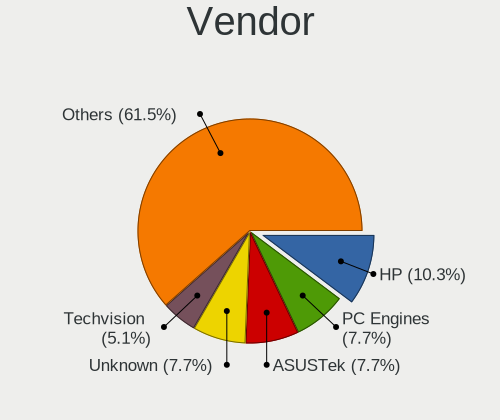

| Name                | Computers | Percent |
|---------------------|-----------|---------|
| Protectli           | 2         | 8.33%   |
| PC Engines          | 2         | 8.33%   |
| Intel               | 2         | 8.33%   |
| Hewlett-Packard     | 2         | 8.33%   |
| Dell                | 2         | 8.33%   |
| AWOW                | 2         | 8.33%   |
| ASUSTek Computer    | 2         | 8.33%   |
| Unknown             | 2         | 8.33%   |
| ZOTAC               | 1         | 4.17%   |
| TYAN Computer       | 1         | 4.17%   |
| Supermicro          | 1         | 4.17%   |
| Netgate             | 1         | 4.17%   |
| Lenovo              | 1         | 4.17%   |
| Itautec             | 1         | 4.17%   |
| Gigabyte Technology | 1         | 4.17%   |
| ADI Engineering     | 1         | 4.17%   |

Model
-----

Motherboard model

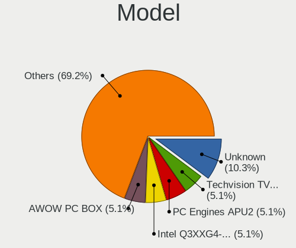

| Name                              | Computers | Percent |
|-----------------------------------|-----------|---------|
| Unknown                           | 3         | 12.5%   |
| Intel Q3XXG4-P V1.0               | 2         | 8.33%   |
| AWOW PC BOX                       | 2         | 8.33%   |
| ZOTAC ZBOX-CI323NANO              | 1         | 4.17%   |
| Supermicro X7SPA-HF               | 1         | 4.17%   |
| Protectli FW4B                    | 1         | 4.17%   |
| Protectli FW2B                    | 1         | 4.17%   |
| PC Engines APU2                   | 1         | 4.17%   |
| PC Engines APU                    | 1         | 4.17%   |
| Netgate SG-5100                   | 1         | 4.17%   |
| Lenovo ThinkCentre Edge72 3493AZG | 1         | 4.17%   |
| Itautec Infoway                   | 1         | 4.17%   |
| HP t620 PLUS Quad Core TC         | 1         | 4.17%   |
| HP ProDesk 600 G1 SFF             | 1         | 4.17%   |
| Gigabyte B85M-D3H                 | 1         | 4.17%   |
| Dell OptiPlex 990                 | 1         | 4.17%   |
| Dell OptiPlex 7020                | 1         | 4.17%   |
| ASUS P5Q SE PLUS                  | 1         | 4.17%   |
| ASUS All Series                   | 1         | 4.17%   |
| ADI Engineering RCC-VE            | 1         | 4.17%   |

Model Family
------------

Motherboard model prefix

| Name                   | Computers | Percent |
|------------------------|-----------|---------|
| Unknown                | 3         | 12.5%   |
| Intel Q3XXG4-P         | 2         | 8.33%   |
| Dell OptiPlex          | 2         | 8.33%   |
| AWOW PC                | 2         | 8.33%   |
| ZOTAC ZBOX-CI323NANO   | 1         | 4.17%   |
| Supermicro X7SPA-HF    | 1         | 4.17%   |
| Protectli FW4B         | 1         | 4.17%   |
| Protectli FW2B         | 1         | 4.17%   |
| PC Engines APU2        | 1         | 4.17%   |
| PC Engines APU         | 1         | 4.17%   |
| Netgate SG-5100        | 1         | 4.17%   |
| Lenovo ThinkCentre     | 1         | 4.17%   |
| Itautec Infoway        | 1         | 4.17%   |
| HP t620                | 1         | 4.17%   |
| HP ProDesk             | 1         | 4.17%   |
| Gigabyte B85M-D3H      | 1         | 4.17%   |
| ASUS P5Q               | 1         | 4.17%   |
| ASUS All               | 1         | 4.17%   |
| ADI Engineering RCC-VE | 1         | 4.17%   |

MFG Year
--------

Motherboard manufacture year

| Year    | Computers | Percent |
|---------|-----------|---------|
| 2018    | 4         | 16.67%  |
| 2016    | 4         | 16.67%  |
| 2014    | 3         | 12.5%   |
| 2020    | 2         | 8.33%   |
| 2017    | 2         | 8.33%   |
| 2015    | 2         | 8.33%   |
| 2009    | 2         | 8.33%   |
| 2019    | 1         | 4.17%   |
| 2012    | 1         | 4.17%   |
| 2010    | 1         | 4.17%   |
| 2006    | 1         | 4.17%   |
| Unknown | 1         | 4.17%   |

Form Factor
-----------

Physical design of the computer

| Name    | Computers | Percent |
|---------|-----------|---------|
| Desktop | 21        | 87.5%   |
| Mini pc | 3         | 12.5%   |

Coreboot
--------

Have coreboot on board

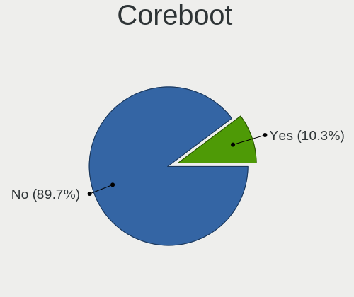

| Used | Computers | Percent |
|------|-----------|---------|
| No   | 21        | 87.5%   |
| Yes  | 3         | 12.5%   |

RAM Size
--------

Total RAM memory

| Size in GB | Computers | Percent |
|------------|-----------|---------|
| 4.01-8.0   | 10        | 41.67%  |
| 8.01-16.0  | 9         | 37.5%   |
| 2.01-3.0   | 2         | 8.33%   |
| 16.01-24.0 | 2         | 8.33%   |
| 32.01-64.0 | 1         | 4.17%   |

RAM Used
--------

Used RAM memory

| Used GB  | Computers | Percent |
|----------|-----------|---------|
| 0.01-0.5 | 17        | 70.83%  |
| 0.51-1.0 | 4         | 16.67%  |
| 4.01-8.0 | 1         | 4.17%   |
| 2.01-3.0 | 1         | 4.17%   |
| 1.01-2.0 | 1         | 4.17%   |

Total Drives
------------

Number of drives on board

| Drives | Computers | Percent |
|--------|-----------|---------|
| 1      | 20        | 80%     |
| 2      | 3         | 12%     |
| 0      | 2         | 8%      |

Has CD-ROM
----------

Has CD-ROM on board

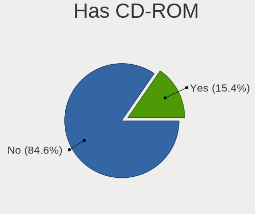

| Presented | Computers | Percent |
|-----------|-----------|---------|
| No        | 22        | 91.67%  |
| Yes       | 2         | 8.33%   |

Has Ethernet
------------

Has Ethernet on board

| Presented | Computers | Percent |
|-----------|-----------|---------|
| Yes       | 23        | 95.83%  |
| No        | 1         | 4.17%   |

Has WiFi
--------

Has WiFi module

| Presented | Computers | Percent |
|-----------|-----------|---------|
| No        | 18        | 75%     |
| Yes       | 6         | 25%     |

Has Bluetooth
-------------

Has Bluetooth module

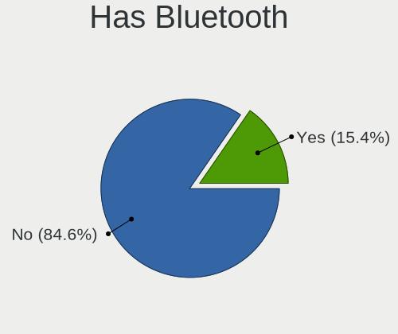

| Presented | Computers | Percent |
|-----------|-----------|---------|
| No        | 21        | 87.5%   |
| Yes       | 3         | 12.5%   |

Location
--------

Country
-------

Geographic location (country)

| Country     | Computers | Percent |
|-------------|-----------|---------|
| USA         | 15        | 62.5%   |
| UK          | 1         | 4.17%   |
| Taiwan      | 1         | 4.17%   |
| Sweden      | 1         | 4.17%   |
| Russia      | 1         | 4.17%   |
| New Zealand | 1         | 4.17%   |
| Netherlands | 1         | 4.17%   |
| India       | 1         | 4.17%   |
| Greece      | 1         | 4.17%   |
| Brazil      | 1         | 4.17%   |

City
----

Geographic location (city)

| City              | Computers | Percent |
|-------------------|-----------|---------|
| Salem             | 2         | 8.33%   |
| Yegor'yevsk       | 1         | 4.17%   |
| Wellington        | 1         | 4.17%   |
| Silver Spring     | 1         | 4.17%   |
| Phoenix           | 1         | 4.17%   |
| Philadelphia      | 1         | 4.17%   |
| Pasadena          | 1         | 4.17%   |
| Malmo             | 1         | 4.17%   |
| Longmont          | 1         | 4.17%   |
| Long Beach        | 1         | 4.17%   |
| London            | 1         | 4.17%   |
| Lawrenceville     | 1         | 4.17%   |
| JaraguГЎ do Sul | 1         | 4.17%   |
| Hoboken           | 1         | 4.17%   |
| Fletcher          | 1         | 4.17%   |
| Fair Oaks         | 1         | 4.17%   |
| Douliu            | 1         | 4.17%   |
| Centreville       | 1         | 4.17%   |
| Bengaluru         | 1         | 4.17%   |
| Atlanta           | 1         | 4.17%   |
| Athens            | 1         | 4.17%   |
| Ashburn           | 1         | 4.17%   |
| Amsterdam         | 1         | 4.17%   |

Drives
------

Drive Vendor
------------

Hard drive vendors

| Vendor              | Computers | Drives | Percent |
|---------------------|-----------|--------|---------|
| Kingston            | 6         | 6      | 24%     |
| Samsung Electronics | 4         | 4      | 16%     |
| Seagate             | 2         | 2      | 8%      |
| Phison              | 2         | 2      | 8%      |
| Intel               | 2         | 2      | 8%      |
| FORESEE             | 2         | 2      | 8%      |
| Apacer              | 2         | 2      | 8%      |
| WDC                 | 1         | 2      | 4%      |
| SPCC                | 1         | 1      | 4%      |
| SanDisk             | 1         | 1      | 4%      |
| Hoodisk             | 1         | 1      | 4%      |
| China               | 1         | 2      | 4%      |

Drive Model
-----------

Hard drive models

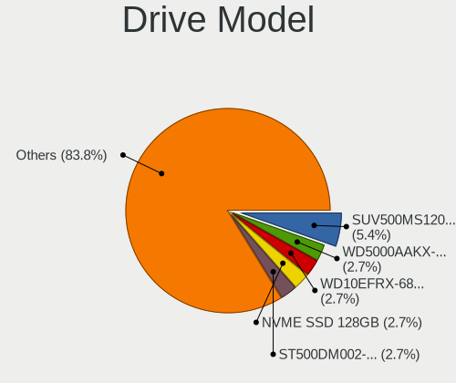

| Model                             | Computers | Percent |
|-----------------------------------|-----------|---------|
| Kingston SUV500MS120G 120GB       | 2         | 8%      |
| WDC WD10EFRX-68FYTN0 1TB          | 1         | 4%      |
| SPCC Solid State Disk 120GB       | 1         | 4%      |
| Seagate ST500DM002-1BD142 500GB   | 1         | 4%      |
| Seagate ST3160023A 160GB          | 1         | 4%      |
| SanDisk SDSSDA120G 120GB          | 1         | 4%      |
| Samsung SSD RBX Series 64GB M     | 1         | 4%      |
| Samsung SSD 860 EVO 250GB         | 1         | 4%      |
| Samsung SSD 850 EVO mSATA 250GB   | 1         | 4%      |
| Samsung SSD 850 EVO 120GB         | 1         | 4%      |
| Phison SATA SSD 32GB              | 1         | 4%      |
| Phison SATA SSD 240GB             | 1         | 4%      |
| Kingston SUV500MS240G 240GB       | 1         | 4%      |
| Kingston SUV500M8120G 120GB       | 1         | 4%      |
| Kingston SNS4151S316G 16GB        | 1         | 4%      |
| Kingston RBUSNS8180DS3128GH 128GB | 1         | 4%      |
| Intel SSDSA2CW080G3 80GB          | 1         | 4%      |
| Intel SSDMCEAC030B3 32GB          | 1         | 4%      |
| Hoodisk SSD 32GB                  | 1         | 4%      |
| FORESEE 64GB SSD                  | 1         | 4%      |
| FORESEE 128GB SSD                 | 1         | 4%      |
| China SATA SSD 256GB              | 1         | 4%      |
| Apacer 64GB SATA Flash Drive      | 1         | 4%      |
| Apacer 32GB SATA Flash Drive      | 1         | 4%      |

HDD Vendor
----------

Hard disk drive vendors

| Vendor  | Computers | Drives | Percent |
|---------|-----------|--------|---------|
| Seagate | 2         | 2      | 66.67%  |
| WDC     | 1         | 2      | 33.33%  |

SSD Vendor
----------

Solid state drive vendors

| Vendor              | Computers | Drives | Percent |
|---------------------|-----------|--------|---------|
| Kingston            | 6         | 6      | 27.27%  |
| Samsung Electronics | 4         | 4      | 18.18%  |
| Phison              | 2         | 2      | 9.09%   |
| Intel               | 2         | 2      | 9.09%   |
| FORESEE             | 2         | 2      | 9.09%   |
| Apacer              | 2         | 2      | 9.09%   |
| SPCC                | 1         | 1      | 4.55%   |
| SanDisk             | 1         | 1      | 4.55%   |
| Hoodisk             | 1         | 1      | 4.55%   |
| China               | 1         | 2      | 4.55%   |

Drive Kind
----------

HDD or SSD

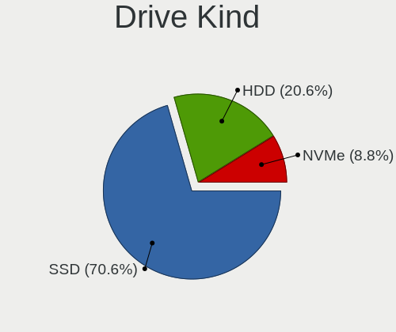

| Kind | Computers | Drives | Percent |
|------|-----------|--------|---------|
| SSD  | 19        | 23     | 86.36%  |
| HDD  | 3         | 4      | 13.64%  |

Drive Connector
---------------

SATA, SAS, NVMe, etc.

| Type | Computers | Drives | Percent |
|------|-----------|--------|---------|
| SATA | 22        | 27     | 100%    |

Drive Size
----------

Size of hard drive

| Size in TB | Computers | Drives | Percent |
|------------|-----------|--------|---------|
| 0.01-0.5   | 21        | 25     | 95.45%  |
| 0.51-1.0   | 1         | 2      | 4.55%   |

Space Total
-----------

Amount of disk space available on the file system

| Size in GB | Computers | Percent |
|------------|-----------|---------|
| 101-250    | 8         | 33.33%  |
| 51-100     | 6         | 25%     |
| 21-50      | 5         | 20.83%  |
| 1-20       | 3         | 12.5%   |
| 251-500    | 1         | 4.17%   |
| 501-1000   | 1         | 4.17%   |

Space Used
----------

Amount of used disk space

| Used GB | Computers | Percent |
|---------|-----------|---------|
| 1-20    | 23        | 95.83%  |
| 21-50   | 1         | 4.17%   |

Malfunc. Drives
---------------

Drive models with a malfunction

| Model                        | Computers | Drives | Percent |
|------------------------------|-----------|--------|---------|
| Kingston SNS4151S316G 16GB   | 1         | 1      | 50%     |
| Apacer 32GB SATA Flash Drive | 1         | 1      | 50%     |

Malfunc. Drive Vendor
---------------------

Vendors of faulty drives

| Vendor   | Computers | Drives | Percent |
|----------|-----------|--------|---------|
| Kingston | 1         | 1      | 50%     |
| Apacer   | 1         | 1      | 50%     |

Malfunc. HDD Vendor
-------------------

Vendors of faulty HDD drives

Zero info for selected period =(

Malfunc. Drive Kind
-------------------

Kinds of faulty drives

| Kind | Computers | Drives | Percent |
|------|-----------|--------|---------|
| SSD  | 2         | 2      | 100%    |

Failed Drives
-------------

Failed drive models

Zero info for selected period =(

Failed Drive Vendor
-------------------

Failed drive vendors

Zero info for selected period =(

Drive Status
------------

Number of failed and malfunc. drives

| Status  | Computers | Drives | Percent |
|---------|-----------|--------|---------|
| Works   | 20        | 25     | 90.91%  |
| Malfunc | 2         | 2      | 9.09%   |

Storage controller
------------------

Storage Vendor
--------------

Storage controller vendors

| Vendor             | Computers | Percent |
|--------------------|-----------|---------|
| Intel              | 19        | 76%     |
| AMD                | 4         | 16%     |
| Silicon Image      | 1         | 4%      |
| JMicron Technology | 1         | 4%      |

Storage Model
-------------

Storage controller models

| Model                                                                            | Computers | Percent |
|----------------------------------------------------------------------------------|-----------|---------|
| Intel Atom/Celeron/Pentium Processor x5-E8000/J3xxx/N3xxx Series SATA Controller | 5         | 17.24%  |
| Intel 8 Series/C220 Series Chipset Family 6-port SATA Controller 1 [AHCI mode]   | 3         | 10.34%  |
| Intel Wildcat Point-LP SATA Controller [AHCI Mode]                               | 2         | 6.9%    |
| Intel Celeron N3350/Pentium N4200/Atom E3900 Series SATA AHCI Controller         | 2         | 6.9%    |
| AMD FCH SATA Controller [AHCI mode]                                              | 2         | 6.9%    |
| Silicon Image SiI 3114 [SATALink/SATARaid] Serial ATA Controller                 | 1         | 3.45%   |
| JMicron JMB368 IDE controller                                                    | 1         | 3.45%   |
| Intel SATA Controller [RAID mode]                                                | 1         | 3.45%   |
| Intel NM10/ICH7 Family SATA Controller [IDE mode]                                | 1         | 3.45%   |
| Intel Atom Processor C3000 Series SATA Controller 1                              | 1         | 3.45%   |
| Intel Atom Processor C3000 Series SATA Controller 0                              | 1         | 3.45%   |
| Intel Atom processor C2000 AHCI SATA3 Controller                                 | 1         | 3.45%   |
| Intel Atom processor C2000 AHCI SATA2 Controller                                 | 1         | 3.45%   |
| Intel 82801JI (ICH10 Family) 4 port SATA IDE Controller #1                       | 1         | 3.45%   |
| Intel 82801JI (ICH10 Family) 2 port SATA IDE Controller #2                       | 1         | 3.45%   |
| Intel 82801IR/IO/IH (ICH9R/DO/DH) 6 port SATA Controller [AHCI mode]             | 1         | 3.45%   |
| Intel 82801G (ICH7 Family) IDE Controller                                        | 1         | 3.45%   |
| Intel 6 Series/C200 Series Chipset Family 6 port Desktop SATA AHCI Controller    | 1         | 3.45%   |
| AMD SB7x0/SB8x0/SB9x0 SATA Controller [AHCI mode]                                | 1         | 3.45%   |
| AMD AMD-8111 IDE                                                                 | 1         | 3.45%   |

Storage Kind
------------

Kind of storage controller (IDE, SATA, NVMe, SAS, ...)

| Kind | Computers | Percent |
|------|-----------|---------|
| SATA | 19        | 79.17%  |
| IDE  | 3         | 12.5%   |
| RAID | 2         | 8.33%   |

Processor
---------

CPU Vendor
----------

Processor vendors

| Vendor | Computers | Percent |
|--------|-----------|---------|
| Intel  | 19        | 79.17%  |
| AMD    | 4         | 16.67%  |
| ARM    | 1         | 4.17%   |

CPU Model
---------

Processor models

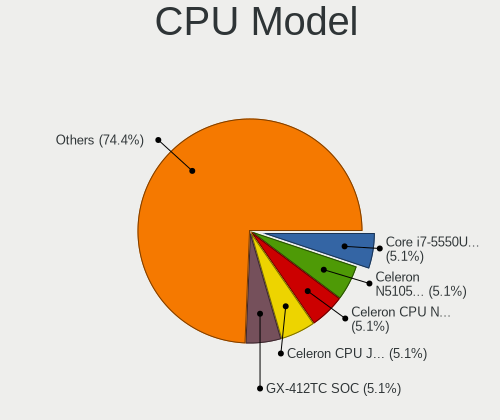

| Model                                    | Computers | Percent |
|------------------------------------------|-----------|---------|
| Intel Core i7-5550U CPU @ 2.00GHz        | 2         | 8.33%   |
| Intel Celeron CPU N3150 @ 1.60GHz        | 2         | 8.33%   |
| Intel Celeron CPU J3160 @ 1.60GHz        | 2         | 8.33%   |
| Intel Core i5-4590S CPU @ 3.00GHz        | 1         | 4.17%   |
| Intel Core i5-4590 CPU @ 3.30GHz         | 1         | 4.17%   |
| Intel Core i5-4460 CPU @ 3.20GHz         | 1         | 4.17%   |
| Intel Core i5-3470S CPU @ 2.90GHz        | 1         | 4.17%   |
| Intel Core i5-2400 CPU @ 3.10GH          | 1         | 4.17%   |
| Intel Core 2 Duo CPU E8500 @ 3.16GHz     | 1         | 4.17%   |
| Intel Celeron CPU N3450 @ 1.10GHz        | 1         | 4.17%   |
| Intel Celeron CPU J3455 @ 1.50GHz        | 1         | 4.17%   |
| Intel Celeron CPU J3060 @ 1.60GHz        | 1         | 4.17%   |
| Intel Celeron CPU 450 @ 2.20GHz          | 1         | 4.17%   |
| Intel Atom CPU D525 @ 1.80GHz            | 1         | 4.17%   |
| Intel Atom CPU C3558 @ 2.20GHz           | 1         | 4.17%   |
| Intel Atom CPU C2758 @ 2.40GHz           | 1         | 4.17%   |
| ARM Cortex-A9 r4p1 (ECO: 0x00000000)     | 1         | 4.17%   |
| AMD Opteron Processor 252                | 1         | 4.17%   |
| AMD GX-420CA SOC with Radeon HD Graphics | 1         | 4.17%   |
| AMD GX-412TC SOC                         | 1         | 4.17%   |
| AMD G-T40E Processor                     | 1         | 4.17%   |

CPU Model Family
----------------

Processor model prefix

| Model            | Computers | Percent |
|------------------|-----------|---------|
| Intel Celeron    | 8         | 33.33%  |
| Intel Core i5    | 5         | 20.83%  |
| Intel Atom       | 3         | 12.5%   |
| Intel Core i7    | 2         | 8.33%   |
| AMD GX           | 2         | 8.33%   |
| Intel Core 2 Duo | 1         | 4.17%   |
| ARM Cortex       | 1         | 4.17%   |
| AMD Opteron      | 1         | 4.17%   |
| AMD G            | 1         | 4.17%   |

CPU Cores
---------

Number of processor cores

| Number  | Computers | Percent |
|---------|-----------|---------|
| 4       | 14        | 58.33%  |
| 2       | 6         | 25%     |
| Unknown | 3         | 12.5%   |
| 1       | 1         | 4.17%   |

CPU Sockets
-----------

Number of sockets

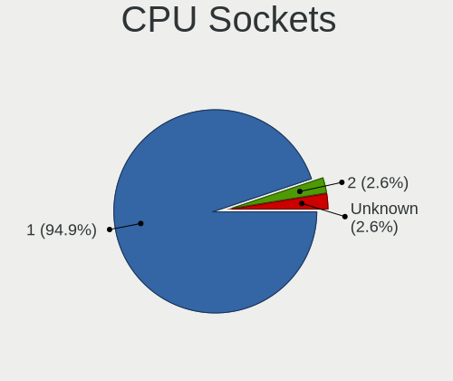

| Number  | Computers | Percent |
|---------|-----------|---------|
| 1       | 22        | 91.67%  |
| 2       | 1         | 4.17%   |
| Unknown | 1         | 4.17%   |

CPU Threads
-----------

Threads per core (Hyper-Threading)

| Number  | Computers | Percent |
|---------|-----------|---------|
| 1       | 18        | 75%     |
| 2       | 3         | 12.5%   |
| Unknown | 3         | 12.5%   |

CPU Microarch
-------------

Microarchitecture

| Name        | Computers | Percent |
|-------------|-----------|---------|
| Silvermont  | 6         | 25%     |
| Haswell     | 3         | 12.5%   |
| Goldmont    | 3         | 12.5%   |
| Unknown     | 3         | 12.5%   |
| Broadwell   | 2         | 8.33%   |
| SandyBridge | 1         | 4.17%   |
| Puma        | 1         | 4.17%   |
| Penryn      | 1         | 4.17%   |
| K8 Hammer   | 1         | 4.17%   |
| IvyBridge   | 1         | 4.17%   |
| Bonnell     | 1         | 4.17%   |
| Bobcat      | 1         | 4.17%   |

Graphics
--------

GPU Vendor
----------

Vendors of graphics cards

| Vendor                     | Computers | Percent |
|----------------------------|-----------|---------|
| Intel                      | 15        | 78.95%  |
| AMD                        | 3         | 15.79%  |
| Matrox Electronics Systems | 1         | 5.26%   |

GPU Model
---------

Graphics card models

| Model                                                                                    | Computers | Percent |
|------------------------------------------------------------------------------------------|-----------|---------|
| Intel Atom/Celeron/Pentium Processor x5-E8000/J3xxx/N3xxx Integrated Graphics Controller | 5         | 26.32%  |
| Intel Xeon E3-1200 v3/4th Gen Core Processor Integrated Graphics Controller              | 3         | 15.79%  |
| Intel HD Graphics 6000                                                                   | 2         | 10.53%  |
| Intel HD Graphics 500                                                                    | 2         | 10.53%  |
| Matrox Electronics Systems MGA G200eW WPCM450                                            | 1         | 5.26%   |
| Intel Xeon E3-1200 v2/3rd Gen Core processor Graphics Controller                         | 1         | 5.26%   |
| Intel 82G33/G31 Express Integrated Graphics Controller                                   | 1         | 5.26%   |
| Intel 2nd Generation Core Processor Family Integrated Graphics Controller                | 1         | 5.26%   |
| AMD Rage 3 [Rage XL PCI]                                                                 | 1         | 5.26%   |
| AMD Kabini [Radeon HD 8400E]                                                             | 1         | 5.26%   |
| AMD Cedar [Radeon HD 5000/6000/7350/8350 Series]                                         | 1         | 5.26%   |

GPU Combo
---------

Combinations of graphics cards

| Name       | Computers | Percent |
|------------|-----------|---------|
| 1 x Intel  | 15        | 62.5%   |
| Other      | 5         | 20.83%  |
| 1 x AMD    | 3         | 12.5%   |
| 1 x Matrox | 1         | 4.17%   |

GPU Driver
----------

Free vs proprietary

| Driver  | Computers | Percent |
|---------|-----------|---------|
| Free    | 19        | 79.17%  |
| Unknown | 5         | 20.83%  |

GPU Memory
----------

Total video memory

| Size in GB | Computers | Percent |
|------------|-----------|---------|
| Unknown    | 24        | 100%    |

Monitor
-------

Monitor Vendor
--------------

Monitor vendors

Zero info for selected period =(

Monitor Model
-------------

Monitor models

Zero info for selected period =(

Monitor Resolution
------------------

Monitor screen resolution

Zero info for selected period =(

Monitor Diagonal
----------------

Diagonal size in inches

Zero info for selected period =(

Monitor Width
-------------

Physical width

Zero info for selected period =(

Aspect Ratio
------------

Proportional relationship between the width and the height

Zero info for selected period =(

Monitor Area
------------

Area in inch²

Zero info for selected period =(

Pixel Density
-------------

Pixels per inch

Zero info for selected period =(

Multiple Monitors
-----------------

Total monitors connected

| Total | Computers | Percent |
|-------|-----------|---------|
| 0     | 24        | 100%    |

Network
-------

Net Controller Vendor
---------------------

Controller vendors

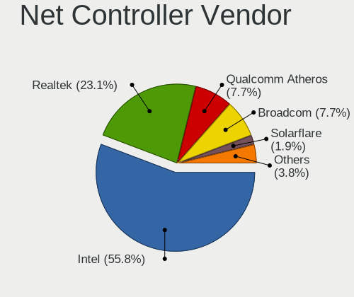

| Vendor                | Computers | Percent |
|-----------------------|-----------|---------|
| Intel                 | 18        | 52.94%  |
| Realtek Semiconductor | 9         | 26.47%  |
| Qualcomm Atheros      | 3         | 8.82%   |
| Broadcom              | 2         | 5.88%   |
| NetXen Incorporated   | 1         | 2.94%   |
| MediaTek              | 1         | 2.94%   |

Net Controller Model
--------------------

Controller models

| Model                                                                         | Computers | Percent |
|-------------------------------------------------------------------------------|-----------|---------|
| Realtek RTL8111/8168/8411 PCI Express Gigabit Ethernet Controller             | 9         | 21.95%  |
| Intel I211 Gigabit Network Connection                                         | 4         | 9.76%   |
| Intel I210 Gigabit Network Connection                                         | 4         | 9.76%   |
| Intel Wireless 3165                                                           | 3         | 7.32%   |
| Qualcomm Atheros AR928X Wireless Network Adapter (PCI-Express)                | 2         | 4.88%   |
| Intel Ethernet Connection I217-LM                                             | 2         | 4.88%   |
| Intel 82580 Gigabit Network Connection                                        | 2         | 4.88%   |
| Intel 82574L Gigabit Network Connection                                       | 2         | 4.88%   |
| Realtek RTL-8100/8101L/8139 PCI Fast Ethernet Adapter                         | 1         | 2.44%   |
| Qualcomm Atheros AR242x / AR542x Wireless Network Adapter (PCI-Express)       | 1         | 2.44%   |
| NetXen Incorporated NX3031 Multifunction 1/10-Gigabit Server Adapter          | 1         | 2.44%   |
| MediaTek USB Ethernet-RNDIS                                                   | 1         | 2.44%   |
| Intel Ethernet Connection X553 1GbE                                           | 1         | 2.44%   |
| Intel Ethernet Connection I354                                                | 1         | 2.44%   |
| Intel 82599ES 10-Gigabit SFI/SFP+ Network Connection                          | 1         | 2.44%   |
| Intel 82579LM Gigabit Network Connection (Lewisville)                         | 1         | 2.44%   |
| Intel 82576 Gigabit Network Connection                                        | 1         | 2.44%   |
| Intel 82571EB/82571GB Gigabit Ethernet Controller D0/D1 (copper applications) | 1         | 2.44%   |
| Intel 82571EB/82571GB Gigabit Ethernet Controller (Copper)                    | 1         | 2.44%   |
| Broadcom NetXtreme II BCM5709 Gigabit Ethernet                                | 1         | 2.44%   |
| Broadcom NetXtreme BCM5704 Gigabit Ethernet                                   | 1         | 2.44%   |

Wireless Vendor
---------------

Wireless vendors

| Vendor           | Computers | Percent |
|------------------|-----------|---------|
| Qualcomm Atheros | 3         | 50%     |
| Intel            | 3         | 50%     |

Wireless Model
--------------

Wireless models

| Model                                                                   | Computers | Percent |
|-------------------------------------------------------------------------|-----------|---------|
| Intel Wireless 3165                                                     | 3         | 50%     |
| Qualcomm Atheros AR928X Wireless Network Adapter (PCI-Express)          | 2         | 33.33%  |
| Qualcomm Atheros AR242x / AR542x Wireless Network Adapter (PCI-Express) | 1         | 16.67%  |

Ethernet Vendor
---------------

Ethernet vendors

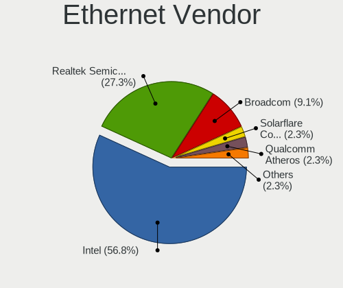

| Vendor                | Computers | Percent |
|-----------------------|-----------|---------|
| Intel                 | 15        | 57.69%  |
| Realtek Semiconductor | 9         | 34.62%  |
| Broadcom              | 2         | 7.69%   |

Ethernet Model
--------------

Ethernet models

| Model                                                                         | Computers | Percent |
|-------------------------------------------------------------------------------|-----------|---------|
| Realtek RTL8111/8168/8411 PCI Express Gigabit Ethernet Controller             | 9         | 27.27%  |
| Intel I211 Gigabit Network Connection                                         | 4         | 12.12%  |
| Intel I210 Gigabit Network Connection                                         | 4         | 12.12%  |
| Intel Ethernet Connection I217-LM                                             | 2         | 6.06%   |
| Intel 82580 Gigabit Network Connection                                        | 2         | 6.06%   |
| Intel 82574L Gigabit Network Connection                                       | 2         | 6.06%   |
| Realtek RTL-8100/8101L/8139 PCI Fast Ethernet Adapter                         | 1         | 3.03%   |
| Intel Ethernet Connection X553 1GbE                                           | 1         | 3.03%   |
| Intel Ethernet Connection I354                                                | 1         | 3.03%   |
| Intel 82599ES 10-Gigabit SFI/SFP+ Network Connection                          | 1         | 3.03%   |
| Intel 82579LM Gigabit Network Connection (Lewisville)                         | 1         | 3.03%   |
| Intel 82576 Gigabit Network Connection                                        | 1         | 3.03%   |
| Intel 82571EB/82571GB Gigabit Ethernet Controller D0/D1 (copper applications) | 1         | 3.03%   |
| Intel 82571EB/82571GB Gigabit Ethernet Controller (Copper)                    | 1         | 3.03%   |
| Broadcom NetXtreme II BCM5709 Gigabit Ethernet                                | 1         | 3.03%   |
| Broadcom NetXtreme BCM5704 Gigabit Ethernet                                   | 1         | 3.03%   |

Net Controller Kind
-------------------

Ethernet, WiFi or modem

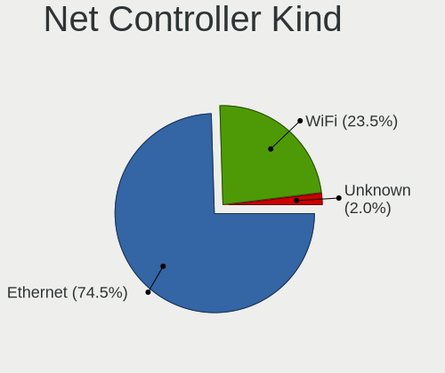

| Kind     | Computers | Percent |
|----------|-----------|---------|
| Ethernet | 23        | 74.19%  |
| WiFi     | 6         | 19.35%  |
| Modem    | 1         | 3.23%   |
| Unknown  | 1         | 3.23%   |

Used Controller
---------------

Currently used network controller

| Kind     | Computers | Percent |
|----------|-----------|---------|
| Ethernet | 23        | 100%    |

NICs
----

Total network controllers on board

| Total | Computers | Percent |
|-------|-----------|---------|
| 3     | 7         | 29.17%  |
| 5     | 6         | 25%     |
| 2     | 4         | 16.67%  |
| 6     | 3         | 12.5%   |
| 4     | 2         | 8.33%   |
| 8     | 1         | 4.17%   |
| 0     | 1         | 4.17%   |

IPv6
----

IPv6 vs IPv4

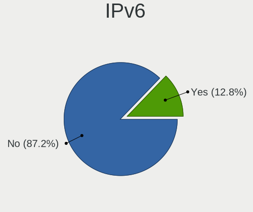

| Used | Computers | Percent |
|------|-----------|---------|
| No   | 21        | 87.5%   |
| Yes  | 3         | 12.5%   |

Bluetooth
---------

Bluetooth Vendor
----------------

Controller vendors

| Vendor | Computers | Percent |
|--------|-----------|---------|
| Intel  | 3         | 100%    |

Bluetooth Model
---------------

Controller models

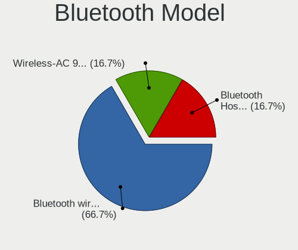

| Model                              | Computers | Percent |
|------------------------------------|-----------|---------|
| Intel Bluetooth wireless interface | 3         | 100%    |

Sound
-----

Sound Vendor
------------

Sound card vendors

| Vendor | Computers | Percent |
|--------|-----------|---------|
| Intel  | 13        | 86.67%  |
| AMD    | 2         | 13.33%  |

Sound Model
-----------

Sound card models

| Model                                                                                             | Computers | Percent |
|---------------------------------------------------------------------------------------------------|-----------|---------|
| Intel Atom/Celeron/Pentium Processor x5-E8000/J3xxx/N3xxx Series High Definition Audio Controller | 4         | 20%     |
| Intel Xeon E3-1200 v3/4th Gen Core Processor HD Audio Controller                                  | 3         | 15%     |
| Intel Wildcat Point-LP High Definition Audio Controller                                           | 2         | 10%     |
| Intel Celeron N3350/Pentium N4200/Atom E3900 Series Audio Cluster                                 | 2         | 10%     |
| Intel Broadwell-U Audio Controller                                                                | 2         | 10%     |
| Intel 8 Series/C220 Series Chipset High Definition Audio Controller                               | 2         | 10%     |
| Intel 82801JI (ICH10 Family) HD Audio Controller                                                  | 1         | 5%      |
| Intel 6 Series/C200 Series Chipset Family High Definition Audio Controller                        | 1         | 5%      |
| AMD Kabini HDMI/DP Audio                                                                          | 1         | 5%      |
| AMD FCH Azalia Controller                                                                         | 1         | 5%      |
| AMD Cedar HDMI Audio [Radeon HD 5400/6300/7300 Series]                                            | 1         | 5%      |

Memory
------

Memory Vendor
-------------

Memory module vendors

| Vendor              | Computers | Percent |
|---------------------|-----------|---------|
| Unknown             | 6         | 27.27%  |
| Crucial             | 5         | 22.73%  |
| Samsung Electronics | 4         | 18.18%  |
| Unknown (ABCD)      | 2         | 9.09%   |
| Transcend           | 2         | 9.09%   |
| SK hynix            | 1         | 4.55%   |
| Micron Technology   | 1         | 4.55%   |
| Kingston            | 1         | 4.55%   |

Memory Model
------------

Memory module models

| Model                                                             | Computers | Percent |
|-------------------------------------------------------------------|-----------|---------|
| Unknown RAM Module 2048MB DIMM SDRAM                              | 2         | 9.09%   |
| Unknown (ABCD) RAM 123456789012345678 1536MB DIMM LPDDR4 2400MT/s | 2         | 9.09%   |
| Crucial RAM CT204864BF160B.M16 16GB SODIMM DDR3 1600MT/s          | 2         | 9.09%   |
| Unknown RAM WPBS16D308SWD-4G 4GB DIMM DDR3 1600MT/s               | 1         | 4.55%   |
| Unknown RAM Module 4GB SODIMM DDR3 1333MT/s                       | 1         | 4.55%   |
| Unknown RAM Module 4096MB SODIMM DDR3 800MT/s                     | 1         | 4.55%   |
| Unknown RAM Module 2048MB DIMM DDR2 800MT/s                       | 1         | 4.55%   |
| Transcend RAM TS512MSH64V4H 4096MB DIMM DDR4 2400MT/s             | 1         | 4.55%   |
| Transcend RAM JM1333KLN-4G 4GB DIMM DDR3 1333MT/s                 | 1         | 4.55%   |
| SK hynix RAM HMT451U6AFR8C-PB 4GB DIMM DDR3 1600MT/s              | 1         | 4.55%   |
| Samsung RAM M471B5173QH0-YK0 4GB SODIMM DDR3 1600MT/s             | 1         | 4.55%   |
| Samsung RAM M471B5173QH0-YK0 4GB DIMM DDR3 1600MT/s               | 1         | 4.55%   |
| Samsung RAM M378B5773DH0-CH9 2GB DIMM DDR3 1333MT/s               | 1         | 4.55%   |
| Samsung RAM M378B5173DB0-CK0 4GB DIMM DDR3 1600MT/s               | 1         | 4.55%   |
| Micron RAM 8JTF51264AZ-1G6E1 4GB DIMM DDR3 1600MT/s               | 1         | 4.55%   |
| Kingston RAM 9905471-028.A00LF 4GB DIMM DDR3 1333MT/s             | 1         | 4.55%   |
| Crucial RAM CT51264BF160BJ.M8F 4GB DIMM DDR3 1600MT/s             | 1         | 4.55%   |
| Crucial RAM CT25664BD160B.C8FP 2GB DIMM DDR3 1333MT/s             | 1         | 4.55%   |
| Crucial RAM CT102464BF160B.M16 8GB DIMM DDR3 1600MT/s             | 1         | 4.55%   |

Memory Kind
-----------

Memory module kinds

| Kind   | Computers | Percent |
|--------|-----------|---------|
| DDR3   | 14        | 70%     |
| SDRAM  | 2         | 10%     |
| LPDDR4 | 2         | 10%     |
| DDR4   | 1         | 5%      |
| DDR2   | 1         | 5%      |

Memory Form Factor
------------------

Physical design of the memory module

| Name   | Computers | Percent |
|--------|-----------|---------|
| DIMM   | 15        | 75%     |
| SODIMM | 5         | 25%     |

Memory Size
-----------

Memory module size

| Size  | Computers | Percent |
|-------|-----------|---------|
| 4096  | 11        | 55%     |
| 16384 | 4         | 20%     |
| 2048  | 4         | 20%     |
| 8192  | 1         | 5%      |

Memory Speed
------------

Memory module speed

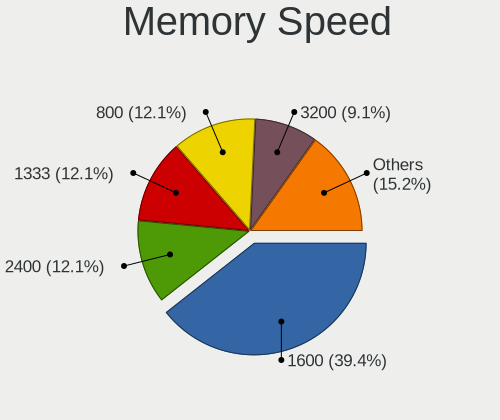

| Speed   | Computers | Percent |
|---------|-----------|---------|
| 1600    | 9         | 45%     |
| 1333    | 4         | 20%     |
| 2400    | 3         | 15%     |
| 800     | 2         | 10%     |
| Unknown | 2         | 10%     |

Printers & scanners
-------------------

Printer Vendor
--------------

Printer device vendors

Zero info for selected period =(

Printer Model
-------------

Printer device models

Zero info for selected period =(

Scanner Vendor
--------------

Scanner device vendors

Zero info for selected period =(

Scanner Model
-------------

Scanner device models

Zero info for selected period =(

Camera
------

Camera Vendor
-------------

Camera device vendors

Zero info for selected period =(

Camera Model
------------

Camera device models

Zero info for selected period =(

Security
--------

Fingerprint Vendor
------------------

Fingerprint sensor vendors

Zero info for selected period =(

Fingerprint Model
-----------------

Fingerprint sensor models

Zero info for selected period =(

Chipcard Vendor
---------------

Chipcard module vendors

Zero info for selected period =(

Chipcard Model
--------------

Chipcard module models

Zero info for selected period =(

Unsupported
-----------

Unsupported Devices
-------------------

Total unsupported devices on board

| Total | Computers | Percent |
|-------|-----------|---------|
| 0     | 12        | 50%     |
| 1     | 8         | 33.33%  |
| 2     | 2         | 8.33%   |
| 5     | 1         | 4.17%   |
| 3     | 1         | 4.17%   |

Unsupported Device Types
------------------------

Types of unsupported devices

| Type                     | Computers | Percent |
|--------------------------|-----------|---------|
| Communication controller | 10        | 55.56%  |
| Bluetooth                | 4         | 22.22%  |
| Card reader              | 2         | 11.11%  |
| Network                  | 1         | 5.56%   |
| Net/wireless             | 1         | 5.56%   |

