BSD in Australia - Tested Hardware & Statistics (Desktops)
----------------------------------------------------------

A project to collect tested hardware configurations for BSD in Australia.

Anyone can contribute to this report by the [hw-probe](https://github.com/linuxhw/hw-probe/blob/master/INSTALL.BSD.md) tool:

    hw-probe -all -upload

Please contribute! Especially if your hardware is rare.

Contents
--------

* [ Test Cases ](#test-cases)

* [ System ](#system)
  - [ OS                       ](#os)
  - [ OS Family                ](#os-family)
  - [ Arch                     ](#arch)
  - [ DE                       ](#de)
  - [ Display Server           ](#display-server)
  - [ Display Manager          ](#display-manager)
  - [ OS Lang                  ](#os-lang)
  - [ Boot Mode                ](#boot-mode)
  - [ Filesystem               ](#filesystem)
  - [ Part. scheme             ](#part-scheme)

* [ Board ](#board)
  - [ Vendor                   ](#vendor)
  - [ Model                    ](#model)
  - [ Model Family             ](#model-family)
  - [ MFG Year                 ](#mfg-year)
  - [ Form Factor              ](#form-factor)
  - [ Coreboot                 ](#coreboot)
  - [ RAM Size                 ](#ram-size)
  - [ RAM Used                 ](#ram-used)
  - [ Total Drives             ](#total-drives)
  - [ Has CD-ROM               ](#has-cd-rom)
  - [ Has Ethernet             ](#has-ethernet)
  - [ Has WiFi                 ](#has-wifi)
  - [ Has Bluetooth            ](#has-bluetooth)

* [ Location ](#location)
  - [ Country                  ](#country)
  - [ City                     ](#city)

* [ Drives ](#drives)
  - [ Drive Vendor             ](#drive-vendor)
  - [ Drive Model              ](#drive-model)
  - [ HDD Vendor               ](#hdd-vendor)
  - [ SSD Vendor               ](#ssd-vendor)
  - [ Drive Kind               ](#drive-kind)
  - [ Drive Connector          ](#drive-connector)
  - [ Drive Size               ](#drive-size)
  - [ Space Total              ](#space-total)
  - [ Space Used               ](#space-used)
  - [ Malfunc. Drives          ](#malfunc-drives)
  - [ Malfunc. Drive Vendor    ](#malfunc-drive-vendor)
  - [ Malfunc. HDD Vendor      ](#malfunc-hdd-vendor)
  - [ Malfunc. Drive Kind      ](#malfunc-drive-kind)
  - [ Failed Drives            ](#failed-drives)
  - [ Failed Drive Vendor      ](#failed-drive-vendor)
  - [ Drive Status             ](#drive-status)

* [ Storage controller ](#storage-controller)
  - [ Storage Vendor           ](#storage-vendor)
  - [ Storage Model            ](#storage-model)
  - [ Storage Kind             ](#storage-kind)

* [ Processor ](#processor)
  - [ CPU Vendor               ](#cpu-vendor)
  - [ CPU Model                ](#cpu-model)
  - [ CPU Model Family         ](#cpu-model-family)
  - [ CPU Cores                ](#cpu-cores)
  - [ CPU Sockets              ](#cpu-sockets)
  - [ CPU Threads              ](#cpu-threads)
  - [ CPU Microarch            ](#cpu-microarch)

* [ Graphics ](#graphics)
  - [ GPU Vendor               ](#gpu-vendor)
  - [ GPU Model                ](#gpu-model)
  - [ GPU Combo                ](#gpu-combo)
  - [ GPU Driver               ](#gpu-driver)
  - [ GPU Memory               ](#gpu-memory)

* [ Monitor ](#monitor)
  - [ Monitor Vendor           ](#monitor-vendor)
  - [ Monitor Model            ](#monitor-model)
  - [ Monitor Resolution       ](#monitor-resolution)
  - [ Monitor Diagonal         ](#monitor-diagonal)
  - [ Monitor Width            ](#monitor-width)
  - [ Aspect Ratio             ](#aspect-ratio)
  - [ Monitor Area             ](#monitor-area)
  - [ Pixel Density            ](#pixel-density)
  - [ Multiple Monitors        ](#multiple-monitors)

* [ Network ](#network)
  - [ Net Controller Vendor    ](#net-controller-vendor)
  - [ Net Controller Model     ](#net-controller-model)
  - [ Wireless Vendor          ](#wireless-vendor)
  - [ Wireless Model           ](#wireless-model)
  - [ Ethernet Vendor          ](#ethernet-vendor)
  - [ Ethernet Model           ](#ethernet-model)
  - [ Net Controller Kind      ](#net-controller-kind)
  - [ Used Controller          ](#used-controller)
  - [ NICs                     ](#nics)
  - [ IPv6                     ](#ipv6)

* [ Bluetooth ](#bluetooth)
  - [ Bluetooth Vendor         ](#bluetooth-vendor)
  - [ Bluetooth Model          ](#bluetooth-model)

* [ Sound ](#sound)
  - [ Sound Vendor             ](#sound-vendor)
  - [ Sound Model              ](#sound-model)

* [ Memory ](#memory)
  - [ Memory Vendor            ](#memory-vendor)
  - [ Memory Model             ](#memory-model)
  - [ Memory Kind              ](#memory-kind)
  - [ Memory Form Factor       ](#memory-form-factor)
  - [ Memory Size              ](#memory-size)
  - [ Memory Speed             ](#memory-speed)

* [ Printers & scanners ](#printers--scanners)
  - [ Printer Vendor           ](#printer-vendor)
  - [ Printer Model            ](#printer-model)
  - [ Scanner Vendor           ](#scanner-vendor)
  - [ Scanner Model            ](#scanner-model)

* [ Camera ](#camera)
  - [ Camera Vendor            ](#camera-vendor)
  - [ Camera Model             ](#camera-model)

* [ Security ](#security)
  - [ Fingerprint Vendor       ](#fingerprint-vendor)
  - [ Fingerprint Model        ](#fingerprint-model)
  - [ Chipcard Vendor          ](#chipcard-vendor)
  - [ Chipcard Model           ](#chipcard-model)

* [ Unsupported ](#unsupported)
  - [ Unsupported Devices      ](#unsupported-devices)
  - [ Unsupported Device Types ](#unsupported-device-types)

Test Cases
----------

Total: 152

| Vendor        | Model                       | Probe                                                     | Date         |
|---------------|-----------------------------|-----------------------------------------------------------|--------------|
| Dell          | 00V62H A00                  | [a3aff65df2](https://bsd-hardware.info/?probe=a3aff65df2) | Jun 27, 2022 |
| ASUSTek       | ROG STRIX Z390-F GAMING     | [4d4993a732](https://bsd-hardware.info/?probe=4d4993a732) | Jun 24, 2022 |
| ASUSTek       | ROG STRIX X570-F GAMING     | [7d054ce34f](https://bsd-hardware.info/?probe=7d054ce34f) | Jun 23, 2022 |
| HP            | ProLiant ML10 v2            | [72254b033d](https://bsd-hardware.info/?probe=72254b033d) | Jun 06, 2022 |
| Dell          | 0MGK50 A02                  | [1de9982d19](https://bsd-hardware.info/?probe=1de9982d19) | Jun 05, 2022 |
| AOpen         | iBTMx-DS R1.03 55DED10A0... | [94bdba6302](https://bsd-hardware.info/?probe=94bdba6302) | Jun 04, 2022 |
| Protectli     | FW4B Ver                    | [f1838b29ff](https://bsd-hardware.info/?probe=f1838b29ff) | Jun 01, 2022 |
| MW            | GMLK-2_5G4L                 | [fdab123532](https://bsd-hardware.info/?probe=fdab123532) | May 07, 2022 |
| MW            | GMLK-2_5G4L                 | [59083ac5ac](https://bsd-hardware.info/?probe=59083ac5ac) | May 06, 2022 |
| MSI           | 2A9C                        | [506b970279](https://bsd-hardware.info/?probe=506b970279) | May 03, 2022 |
| HP            | 0B4Ch D                     | [3f170bdee6](https://bsd-hardware.info/?probe=3f170bdee6) | May 01, 2022 |
| ASUSTek       | AM1M-A                      | [76a2d4f148](https://bsd-hardware.info/?probe=76a2d4f148) | Apr 22, 2022 |
| MSI           | 2A9C                        | [9417bdd744](https://bsd-hardware.info/?probe=9417bdd744) | Apr 18, 2022 |
| MSI           | 2A9C                        | [595c9a1da2](https://bsd-hardware.info/?probe=595c9a1da2) | Apr 18, 2022 |
| MSI           | 2A9C                        | [7f44d30f83](https://bsd-hardware.info/?probe=7f44d30f83) | Apr 15, 2022 |
| Lenovo        | SHARKBAY NOK                | [e32f0f2130](https://bsd-hardware.info/?probe=e32f0f2130) | Apr 08, 2022 |
| ASRock        | 970 Pro3 R2.0               | [c807e1d8eb](https://bsd-hardware.info/?probe=c807e1d8eb) | Apr 07, 2022 |
| Protectli     | FW4B                        | [a2f902524b](https://bsd-hardware.info/?probe=a2f902524b) | Apr 06, 2022 |
| Protectli     | FW4B                        | [af9f2d81b5](https://bsd-hardware.info/?probe=af9f2d81b5) | Apr 06, 2022 |
| Gigabyte      | Z87N-WIFI                   | [1800a41f61](https://bsd-hardware.info/?probe=1800a41f61) | Mar 28, 2022 |
| Inventec      | D CLASS A02                 | [2ea328c95d](https://bsd-hardware.info/?probe=2ea328c95d) | Mar 28, 2022 |
| Gigabyte      | Z87N-WIFI                   | [8f20a3214b](https://bsd-hardware.info/?probe=8f20a3214b) | Mar 25, 2022 |
| Intel         | Q3XXG4-P V1.0               | [1e9ea7cdbc](https://bsd-hardware.info/?probe=1e9ea7cdbc) | Mar 19, 2022 |
| Dell          | 00V62H A00                  | [8da46f8dd0](https://bsd-hardware.info/?probe=8da46f8dd0) | Mar 18, 2022 |
| Gigabyte      | 970A-D3P                    | [fa03bdabb6](https://bsd-hardware.info/?probe=fa03bdabb6) | Mar 15, 2022 |
| MSI           | MS-B1831                    | [346c445c21](https://bsd-hardware.info/?probe=346c445c21) | Mar 12, 2022 |
| MSI           | MS-B1831                    | [572bb2c98c](https://bsd-hardware.info/?probe=572bb2c98c) | Mar 02, 2022 |
| Protectli     | VP2410 10                   | [8d5986c1f4](https://bsd-hardware.info/?probe=8d5986c1f4) | Feb 26, 2022 |
| MSI           | MAG B550M BAZOOKA           | [68f6eb4328](https://bsd-hardware.info/?probe=68f6eb4328) | Feb 23, 2022 |
| MSI           | MAG B550M BAZOOKA           | [c1397b851e](https://bsd-hardware.info/?probe=c1397b851e) | Feb 22, 2022 |
| Protectli     | VP2410 10                   | [1d9eaaaf62](https://bsd-hardware.info/?probe=1d9eaaaf62) | Feb 18, 2022 |
| HARDKERNEL    | ODROID-H2                   | [adcfe67709](https://bsd-hardware.info/?probe=adcfe67709) | Feb 16, 2022 |
| MSI           | MS-B1831                    | [5bdc589f33](https://bsd-hardware.info/?probe=5bdc589f33) | Feb 10, 2022 |
| HP            | ProLiant MicroServer Gen... | [0cc80ca4ec](https://bsd-hardware.info/?probe=0cc80ca4ec) | Feb 07, 2022 |
| MSI           | MS-B1831                    | [c8072d090e](https://bsd-hardware.info/?probe=c8072d090e) | Feb 06, 2022 |
| Protectli     | FW4B Ver                    | [6eecbfde04](https://bsd-hardware.info/?probe=6eecbfde04) | Feb 05, 2022 |
| Lenovo        | ThinkCentre M58 7360BB6     | [8751a2776e](https://bsd-hardware.info/?probe=8751a2776e) | Jan 31, 2022 |
| Dell          | 0NC2VH A01                  | [21e1806645](https://bsd-hardware.info/?probe=21e1806645) | Jan 29, 2022 |
| Yanling       | YL-KBR6L Ver:1.00           | [50b7edb511](https://bsd-hardware.info/?probe=50b7edb511) | Jan 29, 2022 |
| Dell          | 0NC2VH A01                  | [8587a16b51](https://bsd-hardware.info/?probe=8587a16b51) | Jan 29, 2022 |
| Lenovo        | SHARKBAY NOK                | [6ea3284f28](https://bsd-hardware.info/?probe=6ea3284f28) | Jan 29, 2022 |
| Lenovo        | ThinkCentre M58 7360BB6     | [f53622f02b](https://bsd-hardware.info/?probe=f53622f02b) | Jan 27, 2022 |
| HP            | ProLiant MicroServer        | [b62251041b](https://bsd-hardware.info/?probe=b62251041b) | Jan 26, 2022 |
| Cisco         | ASA5512 A0                  | [99d276f574](https://bsd-hardware.info/?probe=99d276f574) | Jan 18, 2022 |
| Dell          | 0XCR8D A03                  | [48e9447b37](https://bsd-hardware.info/?probe=48e9447b37) | Jan 15, 2022 |
| Gigabyte      | Z77N-WIFI                   | [459bb6486d](https://bsd-hardware.info/?probe=459bb6486d) | Jan 13, 2022 |
| Protectli     | FW4B Ver                    | [e0eb7a3239](https://bsd-hardware.info/?probe=e0eb7a3239) | Jan 13, 2022 |
| HP            | 1998                        | [1d46974005](https://bsd-hardware.info/?probe=1d46974005) | Jan 03, 2022 |
| HP            | ProLiant MicroServer        | [d641a4bea9](https://bsd-hardware.info/?probe=d641a4bea9) | Dec 30, 2021 |
| ASUSTek       | X99-E-10G WS                | [dacf7f604c](https://bsd-hardware.info/?probe=dacf7f604c) | Dec 20, 2021 |
| Intel         | SKYBAY                      | [40d8768e52](https://bsd-hardware.info/?probe=40d8768e52) | Dec 20, 2021 |
| Protectli     | FW6 Ver                     | [52ba0807f9](https://bsd-hardware.info/?probe=52ba0807f9) | Dec 17, 2021 |
| Intel         | Q3XXG4-P V1.0               | [bc910b229a](https://bsd-hardware.info/?probe=bc910b229a) | Dec 12, 2021 |
| Intel         | Q3XXG4-P V1.0               | [ab56e6eca2](https://bsd-hardware.info/?probe=ab56e6eca2) | Nov 23, 2021 |
| SeeedStudi... | ODYSSEY-X86J41X5 SD-BS-C... | [645f845f43](https://bsd-hardware.info/?probe=645f845f43) | Nov 21, 2021 |
| SeeedStudi... | ODYSSEY-X86J41X5 SD-BS-C... | [8a8efba0b3](https://bsd-hardware.info/?probe=8a8efba0b3) | Nov 19, 2021 |
| Dell          | 0T10XW A01                  | [ae2203b146](https://bsd-hardware.info/?probe=ae2203b146) | Nov 12, 2021 |
| AAEON         | EMB-H61A V1.0               | [f13f63617f](https://bsd-hardware.info/?probe=f13f63617f) | Nov 11, 2021 |
| Protectli     | FW4B Ver                    | [fc32ac51e4](https://bsd-hardware.info/?probe=fc32ac51e4) | Nov 10, 2021 |
| ShenZhen M... | MW-NANO-APL-4L              | [4d9532acfa](https://bsd-hardware.info/?probe=4d9532acfa) | Nov 07, 2021 |
| ASRock        | X370 Gaming X               | [2a874a33dd](https://bsd-hardware.info/?probe=2a874a33dd) | Nov 05, 2021 |
| Gateway       | DX4840                      | [1d2e9e175c](https://bsd-hardware.info/?probe=1d2e9e175c) | Nov 01, 2021 |
| Dell          | 0NC2VH A01                  | [1f3657128e](https://bsd-hardware.info/?probe=1f3657128e) | Oct 30, 2021 |
| ADI Engine... | RCC-VE                      | [9744b5eca0](https://bsd-hardware.info/?probe=9744b5eca0) | Oct 29, 2021 |
| HP            | 18E9                        | [9c9a3a0297](https://bsd-hardware.info/?probe=9c9a3a0297) | Oct 27, 2021 |
| ASUSTek       | P10S WS                     | [e2d86f8c45](https://bsd-hardware.info/?probe=e2d86f8c45) | Oct 23, 2021 |
| HP            | ProLiant ML150 G6           | [06b8fc5c06](https://bsd-hardware.info/?probe=06b8fc5c06) | Oct 18, 2021 |
| HARDKERNEL    | ODROID-H2                   | [63850e668d](https://bsd-hardware.info/?probe=63850e668d) | Oct 16, 2021 |
| Protectli     | FW4B                        | [e20e889703](https://bsd-hardware.info/?probe=e20e889703) | Oct 16, 2021 |
| Acer          | Veriton X4610G              | [2ca4d093d3](https://bsd-hardware.info/?probe=2ca4d093d3) | Oct 01, 2021 |
| ASRock        | B560M Pro4/ac               | [1b057f3b7d](https://bsd-hardware.info/?probe=1b057f3b7d) | Sep 23, 2021 |
| ASRock        | B560M Pro4/ac               | [fcf75fc410](https://bsd-hardware.info/?probe=fcf75fc410) | Sep 23, 2021 |
| Yanling       | YL-KBR6L Ver:1.00           | [be32d2981b](https://bsd-hardware.info/?probe=be32d2981b) | Sep 19, 2021 |
| Gigabyte      | EP45-UD3R                   | [21e4a40d62](https://bsd-hardware.info/?probe=21e4a40d62) | Sep 18, 2021 |
| SeeedStudi... | ODYSSEY-X86J41X5 SD-BS-C... | [49f080ea2e](https://bsd-hardware.info/?probe=49f080ea2e) | Sep 12, 2021 |
| Dell          | 0NC2VH A01                  | [8125c50b2a](https://bsd-hardware.info/?probe=8125c50b2a) | Sep 11, 2021 |
| Protectli     | FW4B                        | [941392a0bb](https://bsd-hardware.info/?probe=941392a0bb) | Sep 11, 2021 |
| ASUSTek       | P8H61-M LE/USB3             | [fa4da2509b](https://bsd-hardware.info/?probe=fa4da2509b) | Sep 03, 2021 |
| ASUSTek       | P8H61-M LE/USB3             | [97035edd33](https://bsd-hardware.info/?probe=97035edd33) | Sep 03, 2021 |
| ASRock        | Z390 Pro4                   | [ecbf097bc5](https://bsd-hardware.info/?probe=ecbf097bc5) | Sep 02, 2021 |
| HP            | ProLiant MicroServer        | [114ef9a519](https://bsd-hardware.info/?probe=114ef9a519) | Aug 30, 2021 |
| ASRock        | 990FX Killer                | [9f6f8fe218](https://bsd-hardware.info/?probe=9f6f8fe218) | Aug 22, 2021 |
| ASRock        | Z390 Pro4                   | [aca402061b](https://bsd-hardware.info/?probe=aca402061b) | Aug 18, 2021 |
| Foxconn       | 2ADA                        | [e96976b2cc](https://bsd-hardware.info/?probe=e96976b2cc) | Aug 18, 2021 |
| HP            | 1825                        | [970bb6f787](https://bsd-hardware.info/?probe=970bb6f787) | Aug 17, 2021 |
| Acer          | Veriton X4610G              | [619dedc13e](https://bsd-hardware.info/?probe=619dedc13e) | Aug 11, 2021 |
| Dell          | 0XPDFK A01                  | [97781253f2](https://bsd-hardware.info/?probe=97781253f2) | Aug 03, 2021 |
| SeeedStudi... | ODYSSEY-X86J41X5 SD-BS-C... | [8e67b63c6a](https://bsd-hardware.info/?probe=8e67b63c6a) | Jul 19, 2021 |
| SeeedStudi... | ODYSSEY-X86J41X5 SD-BS-C... | [cfb68fd411](https://bsd-hardware.info/?probe=cfb68fd411) | Jul 14, 2021 |
| HP            | ProLiant MicroServer Gen... | [519168441f](https://bsd-hardware.info/?probe=519168441f) | Jul 10, 2021 |
| Dell          | 0NC2VH A01                  | [d713cecb20](https://bsd-hardware.info/?probe=d713cecb20) | Jul 10, 2021 |
| ASRock        | Z390 Pro4                   | [dc4eb674ea](https://bsd-hardware.info/?probe=dc4eb674ea) | Jul 03, 2021 |
| Protectli     | FW2B Ver                    | [7b6f704247](https://bsd-hardware.info/?probe=7b6f704247) | Jun 30, 2021 |
| Dell          | 0GTK4K A02                  | [53f4f785ba](https://bsd-hardware.info/?probe=53f4f785ba) | Jun 22, 2021 |
| Dell          | 0GTK4K A02                  | [bb610333d0](https://bsd-hardware.info/?probe=bb610333d0) | Jun 22, 2021 |
| SeeedStudi... | ODYSSEY-X86J41X5 SD-BS-C... | [2a6f8cdb64](https://bsd-hardware.info/?probe=2a6f8cdb64) | Jun 20, 2021 |
| Gigabyte      | J1900N-D3V                  | [c2cdbdb012](https://bsd-hardware.info/?probe=c2cdbdb012) | Jun 15, 2021 |
| Protectli     | VP2410 10                   | [27a4d07d70](https://bsd-hardware.info/?probe=27a4d07d70) | Jun 12, 2021 |
| Protectli     | VP2410 10                   | [5dd0792386](https://bsd-hardware.info/?probe=5dd0792386) | Jun 12, 2021 |
| Unknown       | J3160-4L                    | [3e773132b3](https://bsd-hardware.info/?probe=3e773132b3) | Jun 06, 2021 |
| Protectli     | FW4B Ver                    | [700ba3f063](https://bsd-hardware.info/?probe=700ba3f063) | May 31, 2021 |
| ASUSTek       | PRIME A320M-A               | [10d9e99990](https://bsd-hardware.info/?probe=10d9e99990) | May 31, 2021 |
| SeeedStudi... | ODYSSEY-X86J41X5 SD-BS-C... | [33b86a7df2](https://bsd-hardware.info/?probe=33b86a7df2) | May 22, 2021 |
| Unknown       | Unknown                     | [7ea373882a](https://bsd-hardware.info/?probe=7ea373882a) | May 19, 2021 |
| Unknown       | Unknown                     | [72eb276213](https://bsd-hardware.info/?probe=72eb276213) | May 05, 2021 |
| Shuttle       | DH370                       | [ad380cb985](https://bsd-hardware.info/?probe=ad380cb985) | May 04, 2021 |
| Lenovo        | SHARKBAY SDK0J40705 WIN     | [6a62687665](https://bsd-hardware.info/?probe=6a62687665) | May 03, 2021 |
| Gigabyte      | J1900N-D3V                  | [3e211c52ea](https://bsd-hardware.info/?probe=3e211c52ea) | Apr 21, 2021 |
| ASUSTek       | PRIME H310M-K               | [cb97f230b8](https://bsd-hardware.info/?probe=cb97f230b8) | Apr 09, 2021 |
| Dell          | 0WMJ54 A01                  | [bc3913fead](https://bsd-hardware.info/?probe=bc3913fead) | Apr 06, 2021 |
| HARDKERNEL    | ODROID-H2                   | [bcaa207f9b](https://bsd-hardware.info/?probe=bcaa207f9b) | Apr 05, 2021 |
| Unknown       | Unknown                     | [e66fe7a153](https://bsd-hardware.info/?probe=e66fe7a153) | Mar 21, 2021 |
| Gigabyte      | H270N-WIFI-CF               | [bf9f69e68b](https://bsd-hardware.info/?probe=bf9f69e68b) | Mar 11, 2021 |
| Dell          | 0NC2VH A01                  | [bb7f6e1db9](https://bsd-hardware.info/?probe=bb7f6e1db9) | Mar 10, 2021 |
| Gigabyte      | H270N-WIFI-CF               | [c88b021c05](https://bsd-hardware.info/?probe=c88b021c05) | Mar 09, 2021 |
| Gigabyte      | H270N-WIFI-CF               | [7201058b50](https://bsd-hardware.info/?probe=7201058b50) | Mar 08, 2021 |
| Unknown       | Unknown                     | [635419dc18](https://bsd-hardware.info/?probe=635419dc18) | Mar 07, 2021 |
| ASUSTek       | X99-E-10G WS                | [4e73497945](https://bsd-hardware.info/?probe=4e73497945) | Mar 06, 2021 |
| PC Engines    | apu4                        | [2a3c8a81d5](https://bsd-hardware.info/?probe=2a3c8a81d5) | Mar 02, 2021 |
| Dell          | 0NC2VH A01                  | [ec20bc7cea](https://bsd-hardware.info/?probe=ec20bc7cea) | Feb 28, 2021 |
| Lenovo        | MAHOBAY NOK                 | [8fda503f16](https://bsd-hardware.info/?probe=8fda503f16) | Feb 27, 2021 |
| ASUSTek       | B75M-PLUS                   | [8379cc790c](https://bsd-hardware.info/?probe=8379cc790c) | Feb 25, 2021 |
| Dell          | 0XCR8D A03                  | [8aa33e35ad](https://bsd-hardware.info/?probe=8aa33e35ad) | Feb 21, 2021 |
| HARDKERNEL    | ODROID-H2                   | [1f25ddeb54](https://bsd-hardware.info/?probe=1f25ddeb54) | Feb 20, 2021 |
| Unknown       | Unknown                     | [6b724a36cd](https://bsd-hardware.info/?probe=6b724a36cd) | Feb 19, 2021 |
| Unknown       | Unknown                     | [760e148164](https://bsd-hardware.info/?probe=760e148164) | Feb 19, 2021 |
| Unknown       | Unknown                     | [baf854930a](https://bsd-hardware.info/?probe=baf854930a) | Feb 19, 2021 |
| ASRock        | B365M Pro4                  | [1c438d977e](https://bsd-hardware.info/?probe=1c438d977e) | Feb 18, 2021 |
| Intel         | DN2820FYK H24582-201        | [be56203e79](https://bsd-hardware.info/?probe=be56203e79) | Feb 15, 2021 |
| ASUSTek       | P5E3                        | [1d1edd3551](https://bsd-hardware.info/?probe=1d1edd3551) | Feb 08, 2021 |
| Yanling       | YL-KBR6L Ver:1.00           | [98e358b324](https://bsd-hardware.info/?probe=98e358b324) | Feb 05, 2021 |
| Radxa         | ROCK Pi X v1.4              | [688c95bda6](https://bsd-hardware.info/?probe=688c95bda6) | Feb 05, 2021 |
| HP            | 802E                        | [a7b2c5457c](https://bsd-hardware.info/?probe=a7b2c5457c) | Jan 29, 2021 |
| Gigabyte      | Z68MA-D2H-B3                | [40793aaedb](https://bsd-hardware.info/?probe=40793aaedb) | Jan 26, 2021 |
| Gigabyte      | Z68MA-D2H-B3                | [a2c7bfe3a1](https://bsd-hardware.info/?probe=a2c7bfe3a1) | Jan 26, 2021 |
| Yanling       | YL-KBR6L Ver:1.00           | [a344f83f2e](https://bsd-hardware.info/?probe=a344f83f2e) | Jan 25, 2021 |
| Acer          | Veriton S6610G              | [64587ce287](https://bsd-hardware.info/?probe=64587ce287) | Jan 23, 2021 |
| HP            | ProLiant MicroServer        | [a78907417f](https://bsd-hardware.info/?probe=a78907417f) | Jan 22, 2021 |
| Dell          | 0NC2VH A01                  | [4afdd92b10](https://bsd-hardware.info/?probe=4afdd92b10) | Jan 20, 2021 |
| HP            | ProLiant MicroServer        | [f51f3873ce](https://bsd-hardware.info/?probe=f51f3873ce) | Dec 25, 2020 |
| ASRock        | A320M-HDV R4.0              | [5e8506d20e](https://bsd-hardware.info/?probe=5e8506d20e) | Dec 24, 2020 |
| HP            | 0B4Ch D                     | [bf0d7fe4f1](https://bsd-hardware.info/?probe=bf0d7fe4f1) | Dec 22, 2020 |
| ASRock        | X370 Gaming-ITX/ac          | [33724c243d](https://bsd-hardware.info/?probe=33724c243d) | Dec 06, 2020 |
| Dell          | 0M5DCD A00                  | [ec13cfdd0d](https://bsd-hardware.info/?probe=ec13cfdd0d) | Oct 29, 2020 |
| Dell          | 042P49 A02                  | [c34a9c7091](https://bsd-hardware.info/?probe=c34a9c7091) | Oct 29, 2020 |
| HP            | ProLiant MicroServer        | [c1c3ffb720](https://bsd-hardware.info/?probe=c1c3ffb720) | Oct 29, 2020 |
| Unknown       | Unknown                     | [a28ef1d2b8](https://bsd-hardware.info/?probe=a28ef1d2b8) | Oct 20, 2020 |
| Lenovo        | SKYBAY SDK0J40705 WIN 34... | [af179a268f](https://bsd-hardware.info/?probe=af179a268f) | Oct 19, 2020 |
| Unknown       | Unknown                     | [864589fce0](https://bsd-hardware.info/?probe=864589fce0) | Oct 02, 2020 |
| Dell          | 0D6H9T A00                  | [764aaaa200](https://bsd-hardware.info/?probe=764aaaa200) | Jun 04, 2020 |
| Dell          | 0D6H9T A00                  | [158ff0f1b6](https://bsd-hardware.info/?probe=158ff0f1b6) | Jun 04, 2020 |
| HP            | ProLiant ML10 v2            | [aea3696f41](https://bsd-hardware.info/?probe=aea3696f41) | May 24, 2020 |

System
------

OS
--

Installed operating systems

| Name                | Desktops | Percent |
|---------------------|----------|---------|
| OPNsense 22.1       | 8        | 6.45%   |
| OPNsense 21.7.7     | 5        | 4.03%   |
| OPNsense 21.7.2     | 5        | 4.03%   |
| OPNsense 21.1.4     | 5        | 4.03%   |
| OPNsense 20.7.8     | 5        | 4.03%   |
| OPNsense 22.1.6     | 4        | 3.23%   |
| OPNsense 22.1.4     | 4        | 3.23%   |
| OPNsense 21.7.3     | 4        | 3.23%   |
| OPNsense 21.1.5     | 4        | 3.23%   |
| OPNsense 21.1.2     | 4        | 3.23%   |
| OPNsense 21.1       | 4        | 3.23%   |
| helloSystem 0.5.0   | 4        | 3.23%   |
| OPNsense 21.7.4     | 3        | 2.42%   |
| OPNsense 21.7.1     | 3        | 2.42%   |
| OPNsense 21.1.8     | 3        | 2.42%   |
| OPNsense 21.1.6     | 3        | 2.42%   |
| OPNsense 21.1.3     | 3        | 2.42%   |
| OPNsense 21.1.1     | 3        | 2.42%   |
| helloSystem 0.7.0   | 3        | 2.42%   |
| helloSystem 0.6.0   | 3        | 2.42%   |
| FreeBSD 12.1-p10    | 3        | 2.42%   |
| OPNsense 22.1.8     | 2        | 1.61%   |
| OPNsense 21.7.5     | 2        | 1.61%   |
| GhostBSD 20.04.02   | 2        | 1.61%   |
| FreeBSD 13.0-STABLE | 2        | 1.61%   |
| FreeBSD 13.0-p4     | 2        | 1.61%   |
| FreeBSD 12.2        | 2        | 1.61%   |
| TrueNAS 12.2-p9     | 1        | 0.81%   |
| TrueNAS 12.2-p3     | 1        | 0.81%   |
| TrueNAS 12.2-p14    | 1        | 0.81%   |
| TrueNAS 12.2-p10    | 1        | 0.81%   |
| OPNsense 22.1.7     | 1        | 0.81%   |
| OPNsense 22.1.5     | 1        | 0.81%   |
| OPNsense 22.1.3     | 1        | 0.81%   |
| OPNsense 22.1.2     | 1        | 0.81%   |
| OPNsense 22.1.1     | 1        | 0.81%   |
| OPNsense 21.7.8     | 1        | 0.81%   |
| OPNsense 21.7.6     | 1        | 0.81%   |
| OPNsense 21.7       | 1        | 0.81%   |
| OPNsense 20.7       | 1        | 0.81%   |
| OPNsense 20.1.7     | 1        | 0.81%   |
| OpenBSD 6.8         | 1        | 0.81%   |
| NomadBSD 5806f915   | 1        | 0.81%   |
| NetBSD 9.99.94      | 1        | 0.81%   |
| helloSystem 0.4.0   | 1        | 0.81%   |
| GhostBSD 22.04.22   | 1        | 0.81%   |
| FreeNAS 11.4-p4     | 1        | 0.81%   |
| FreeNAS 11.3-p9     | 1        | 0.81%   |
| FreeBSD 13.1        | 1        | 0.81%   |
| FreeBSD 13.0-RC1    | 1        | 0.81%   |
| FreeBSD 13.0-p5     | 1        | 0.81%   |
| FreeBSD 13.0-p3     | 1        | 0.81%   |
| FreeBSD 12.2-p11    | 1        | 0.81%   |
| FreeBSD 12.2-p10    | 1        | 0.81%   |
| FreeBSD 12.1-p12    | 1        | 0.81%   |
| FreeBSD 11.4        | 1        | 0.81%   |

OS Family
---------

OS without a version

| Name        | Desktops | Percent |
|-------------|----------|---------|
| OPNsense    | 59       | 62.11%  |
| FreeBSD     | 15       | 15.79%  |
| helloSystem | 10       | 10.53%  |
| TrueNAS     | 4        | 4.21%   |
| GhostBSD    | 2        | 2.11%   |
| FreeNAS     | 2        | 2.11%   |
| OpenBSD     | 1        | 1.05%   |
| NomadBSD    | 1        | 1.05%   |
| NetBSD      | 1        | 1.05%   |

Arch
----

OS architecture (x86_64, i586, etc.)

| Name  | Desktops | Percent |
|-------|----------|---------|
| amd64 | 94       | 100%    |

DE
--

Desktop Environment

| Name         | Desktops | Percent |
|--------------|----------|---------|
| Console      | 70       | 72.92%  |
| helloDesktop | 11       | 11.46%  |
| KDE5         | 4        | 4.17%   |
| XFCE         | 3        | 3.13%   |
| TWM          | 2        | 2.08%   |
| GNOME        | 2        | 2.08%   |
| Openbox      | 1        | 1.04%   |
| MATE         | 1        | 1.04%   |
| Lumina       | 1        | 1.04%   |
| i3           | 1        | 1.04%   |

Display Server
--------------

X11 or Wayland

| Name    | Desktops | Percent |
|---------|----------|---------|
| Console | 74       | 78.72%  |
| X11     | 19       | 20.21%  |
| Wayland | 1        | 1.06%   |

Display Manager
---------------

SDDM, LightDM, etc.

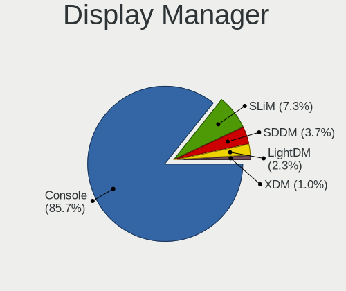

| Name    | Desktops | Percent |
|---------|----------|---------|
| Console | 74       | 78.72%  |
| SLiM    | 12       | 12.77%  |
| XDM     | 3        | 3.19%   |
| LightDM | 3        | 3.19%   |
| SDDM    | 2        | 2.13%   |

OS Lang
-------

Language

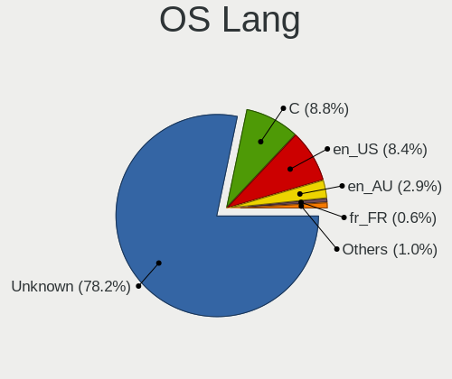

| Lang    | Desktops | Percent |
|---------|----------|---------|
| Unknown | 66       | 69.47%  |
| en_US   | 16       | 16.84%  |
| en_AU   | 7        | 7.37%   |
| C       | 6        | 6.32%   |

Boot Mode
---------

EFI or BIOS

| Mode | Desktops | Percent |
|------|----------|---------|
| EFI  | 70       | 74.47%  |
| BIOS | 24       | 25.53%  |

Filesystem
----------

Type of filesystem

| Type   | Desktops | Percent |
|--------|----------|---------|
| Ufs    | 54       | 56.84%  |
| Zfs    | 38       | 40%     |
| Cd9660 | 2        | 2.11%   |
| Ffs    | 1        | 1.05%   |

Part. scheme
------------

Scheme of partitioning

| Type    | Desktops | Percent |
|---------|----------|---------|
| GPT     | 84       | 89.36%  |
| MBR     | 9        | 9.57%   |
| Unknown | 1        | 1.06%   |

Board
-----

Vendor
------

Motherboard manufacturer

| Name                       | Desktops | Percent |
|----------------------------|----------|---------|
| Hewlett-Packard            | 12       | 12.77%  |
| Dell                       | 12       | 12.77%  |
| Protectli                  | 10       | 10.64%  |
| ASUSTek Computer           | 10       | 10.64%  |
| ASRock                     | 8        | 8.51%   |
| Gigabyte Technology        | 7        | 7.45%   |
| Unknown                    | 6        | 6.38%   |
| Lenovo                     | 5        | 5.32%   |
| MSI                        | 3        | 3.19%   |
| Intel                      | 3        | 3.19%   |
| MW                         | 2        | 2.13%   |
| Acer                       | 2        | 2.13%   |
| Yanling                    | 1        | 1.06%   |
| Shuttle                    | 1        | 1.06%   |
| ShenZhen MinWin Technology | 1        | 1.06%   |
| SeeedStudio                | 1        | 1.06%   |
| Radxa                      | 1        | 1.06%   |
| PC Engines                 | 1        | 1.06%   |
| Inventec                   | 1        | 1.06%   |
| HARDKERNEL                 | 1        | 1.06%   |
| Gateway                    | 1        | 1.06%   |
| Foxconn                    | 1        | 1.06%   |
| Cisco                      | 1        | 1.06%   |
| AOpen                      | 1        | 1.06%   |
| ADI Engineering            | 1        | 1.06%   |
| AAEON                      | 1        | 1.06%   |

Model
-----

Motherboard model

| Name                               | Desktops | Percent |
|------------------------------------|----------|---------|
| Protectli FW4B                     | 7        | 7.45%   |
| Unknown                            | 6        | 6.38%   |
| HP ProLiant MicroServer            | 3        | 3.19%   |
| Dell OptiPlex 9020                 | 3        | 3.19%   |
| MW GMLK-2_5G4L                     | 2        | 2.13%   |
| HP ProLiant MicroServer Gen8       | 2        | 2.13%   |
| Dell OptiPlex 3010                 | 2        | 2.13%   |
| ASUS All Series                    | 2        | 2.13%   |
| Yanling YL-KBR6L                   | 1        | 1.06%   |
| Shuttle DH370                      | 1        | 1.06%   |
| ShenZhen MinWin MW-NANO-APL-4L     | 1        | 1.06%   |
| SeeedStudio ODYSSEY-X86J4125       | 1        | 1.06%   |
| Radxa ROCK Pi X                    | 1        | 1.06%   |
| Protectli VP2410                   | 1        | 1.06%   |
| Protectli FW6                      | 1        | 1.06%   |
| Protectli FW2B                     | 1        | 1.06%   |
| PC Engines apu4                    | 1        | 1.06%   |
| MSI Pro 3130 Small Form Factor PC  | 1        | 1.06%   |
| MSI MS-7C95                        | 1        | 1.06%   |
| MSI CML-U PRO Cubi 5 (MS-B183)     | 1        | 1.06%   |
| Lenovo ThinkCentre M93p 10AAS3UM00 | 1        | 1.06%   |
| Lenovo ThinkCentre M92p 3238CE1    | 1        | 1.06%   |
| Lenovo ThinkCentre M73 10AY009MAU  | 1        | 1.06%   |
| Lenovo ThinkCentre M700 10HY002XAU | 1        | 1.06%   |
| Lenovo ThinkCentre M58 7360BB6     | 1        | 1.06%   |
| Inventec D CLASS                   | 1        | 1.06%   |
| Intel Q3XXG4-P V1.0                | 1        | 1.06%   |
| Intel NCB-4210WG                   | 1        | 1.06%   |
| Intel DN2820FYK H24582-201         | 1        | 1.06%   |
| HP Z400 Workstation                | 1        | 1.06%   |
| HP Z240 SFF Workstation            | 1        | 1.06%   |
| HP ProLiant ML150 G6               | 1        | 1.06%   |
| HP ProLiant ML10 v2                | 1        | 1.06%   |
| HP prodesk 400 g2 sff business pc  | 1        | 1.06%   |
| HP EliteDesk 800 G1 SFF            | 1        | 1.06%   |
| HP EliteDesk 800 G1 DM             | 1        | 1.06%   |
| HARDKERNEL ODROID-H2               | 1        | 1.06%   |
| Gigabyte Z87N-WIFI                 | 1        | 1.06%   |
| Gigabyte Z77N-WIFI                 | 1        | 1.06%   |
| Gigabyte Z68MA-D2H-B3              | 1        | 1.06%   |
| Gigabyte J1900N-D3V                | 1        | 1.06%   |
| Gigabyte H270N-WIFI                | 1        | 1.06%   |
| Gigabyte EP45-UD3R                 | 1        | 1.06%   |
| Gigabyte 970A-D3P                  | 1        | 1.06%   |
| Gateway DX4840                     | 1        | 1.06%   |
| Foxconn p6-2171a                   | 1        | 1.06%   |
| Dell Precision WorkStation T3500   | 1        | 1.06%   |
| Dell PowerEdge T40                 | 1        | 1.06%   |
| Dell OptiPlex 990                  | 1        | 1.06%   |
| Dell OptiPlex 7060                 | 1        | 1.06%   |
| Dell OptiPlex 390                  | 1        | 1.06%   |
| Dell OptiPlex 3040                 | 1        | 1.06%   |
| Dell OptiPlex 3020                 | 1        | 1.06%   |
| Cisco SALEEN                       | 1        | 1.06%   |
| ASUS ROG STRIX Z390-F GAMING       | 1        | 1.06%   |
| ASUS ROG STRIX X570-F GAMING       | 1        | 1.06%   |
| ASUS PRIME H310M-K                 | 1        | 1.06%   |
| ASUS PRIME A320M-A                 | 1        | 1.06%   |
| ASUS P8H61-M LE/USB3               | 1        | 1.06%   |
| ASUS P5E3                          | 1        | 1.06%   |

Model Family
------------

Motherboard model prefix

| Name                           | Desktops | Percent |
|--------------------------------|----------|---------|
| Dell OptiPlex                  | 10       | 10.64%  |
| Protectli FW4B                 | 7        | 7.45%   |
| HP ProLiant                    | 7        | 7.45%   |
| Unknown                        | 6        | 6.38%   |
| Lenovo ThinkCentre             | 5        | 5.32%   |
| MW GMLK-2                      | 2        | 2.13%   |
| HP EliteDesk                   | 2        | 2.13%   |
| ASUS ROG                       | 2        | 2.13%   |
| ASUS PRIME                     | 2        | 2.13%   |
| ASUS All                       | 2        | 2.13%   |
| ASRock X370                    | 2        | 2.13%   |
| Acer Veriton                   | 2        | 2.13%   |
| Yanling YL-KBR6L               | 1        | 1.06%   |
| Shuttle DH370                  | 1        | 1.06%   |
| ShenZhen MinWin MW-NANO-APL-4L | 1        | 1.06%   |
| SeeedStudio ODYSSEY-X86J4125   | 1        | 1.06%   |
| Radxa ROCK                     | 1        | 1.06%   |
| Protectli VP2410               | 1        | 1.06%   |
| Protectli FW6                  | 1        | 1.06%   |
| Protectli FW2B                 | 1        | 1.06%   |
| PC Engines apu4                | 1        | 1.06%   |
| MSI Pro                        | 1        | 1.06%   |
| MSI MS-7C95                    | 1        | 1.06%   |
| MSI CML-U                      | 1        | 1.06%   |
| Inventec D                     | 1        | 1.06%   |
| Intel Q3XXG4-P                 | 1        | 1.06%   |
| Intel NCB-4210WG               | 1        | 1.06%   |
| Intel DN2820FYK                | 1        | 1.06%   |
| HP Z400                        | 1        | 1.06%   |
| HP Z240                        | 1        | 1.06%   |
| HP prodesk                     | 1        | 1.06%   |
| HARDKERNEL ODROID-H2           | 1        | 1.06%   |
| Gigabyte Z87N-WIFI             | 1        | 1.06%   |
| Gigabyte Z77N-WIFI             | 1        | 1.06%   |
| Gigabyte Z68MA-D2H-B3          | 1        | 1.06%   |
| Gigabyte J1900N-D3V            | 1        | 1.06%   |
| Gigabyte H270N-WIFI            | 1        | 1.06%   |
| Gigabyte EP45-UD3R             | 1        | 1.06%   |
| Gigabyte 970A-D3P              | 1        | 1.06%   |
| Gateway DX4840                 | 1        | 1.06%   |
| Foxconn p6-2171a               | 1        | 1.06%   |
| Dell Precision                 | 1        | 1.06%   |
| Dell PowerEdge                 | 1        | 1.06%   |
| Cisco SALEEN                   | 1        | 1.06%   |
| ASUS P8H61-M                   | 1        | 1.06%   |
| ASUS P5E3                      | 1        | 1.06%   |
| ASUS P10S                      | 1        | 1.06%   |
| ASUS B75M-PLUS                 | 1        | 1.06%   |
| ASRock Z390                    | 1        | 1.06%   |
| ASRock B560M                   | 1        | 1.06%   |
| ASRock B365M                   | 1        | 1.06%   |
| ASRock A320M-HDV               | 1        | 1.06%   |
| ASRock 990FX                   | 1        | 1.06%   |
| ASRock 970                     | 1        | 1.06%   |
| AOpen DE3250                   | 1        | 1.06%   |
| ADI Engineering RCC-VE         | 1        | 1.06%   |
| AAEON AEC-6646                 | 1        | 1.06%   |

MFG Year
--------

Motherboard manufacture year

| Year    | Desktops | Percent |
|---------|----------|---------|
| 2019    | 14       | 14.89%  |
| 2013    | 12       | 12.77%  |
| 2020    | 9        | 9.57%   |
| 2018    | 9        | 9.57%   |
| 2021    | 8        | 8.51%   |
| 2016    | 7        | 7.45%   |
| 2011    | 7        | 7.45%   |
| 2012    | 6        | 6.38%   |
| 2017    | 5        | 5.32%   |
| 2014    | 5        | 5.32%   |
| 2015    | 4        | 4.26%   |
| 2009    | 4        | 4.26%   |
| 2010    | 2        | 2.13%   |
| Unknown | 2        | 2.13%   |

Form Factor
-----------

Physical design of the computer

| Name    | Desktops | Percent |
|---------|----------|---------|
| Desktop | 94       | 100%    |

Coreboot
--------

Have coreboot on board

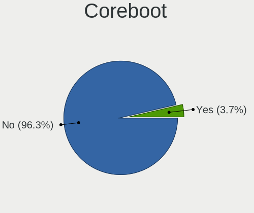

| Used | Desktops | Percent |
|------|----------|---------|
| No   | 89       | 94.68%  |
| Yes  | 5        | 5.32%   |

RAM Size
--------

Total RAM memory

| Size in GB  | Desktops | Percent |
|-------------|----------|---------|
| 8.01-16.0   | 47       | 48.45%  |
| 16.01-24.0  | 20       | 20.62%  |
| 4.01-8.0    | 16       | 16.49%  |
| 32.01-64.0  | 7        | 7.22%   |
| 24.01-32.0  | 3        | 3.09%   |
| 2.01-3.0    | 2        | 2.06%   |
| 64.01-256.0 | 2        | 2.06%   |

RAM Used
--------

Used RAM memory

| Used GB    | Desktops | Percent |
|------------|----------|---------|
| 0.01-0.5   | 52       | 52.53%  |
| 0.51-1.0   | 27       | 27.27%  |
| 1.01-2.0   | 7        | 7.07%   |
| 4.01-8.0   | 5        | 5.05%   |
| 16.01-24.0 | 2        | 2.02%   |
| 8.01-16.0  | 2        | 2.02%   |
| 32.01-64.0 | 1        | 1.01%   |
| 3.01-4.0   | 1        | 1.01%   |
| 2.01-3.0   | 1        | 1.01%   |
| Unknown    | 1        | 1.01%   |

Total Drives
------------

Number of drives on board

| Drives | Desktops | Percent |
|--------|----------|---------|
| 1      | 60       | 62.5%   |
| 2      | 13       | 13.54%  |
| 3      | 8        | 8.33%   |
| 0      | 6        | 6.25%   |
| 4      | 4        | 4.17%   |
| 5      | 2        | 2.08%   |
| 10     | 1        | 1.04%   |
| 7      | 1        | 1.04%   |
| 6      | 1        | 1.04%   |

Has CD-ROM
----------

Has CD-ROM on board

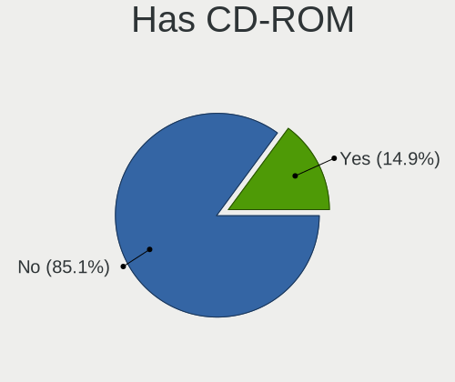

| Presented | Desktops | Percent |
|-----------|----------|---------|
| No        | 72       | 76.6%   |
| Yes       | 22       | 23.4%   |

Has Ethernet
------------

Has Ethernet on board

| Presented | Desktops | Percent |
|-----------|----------|---------|
| Yes       | 93       | 98.94%  |
| No        | 1        | 1.06%   |

Has WiFi
--------

Has WiFi module

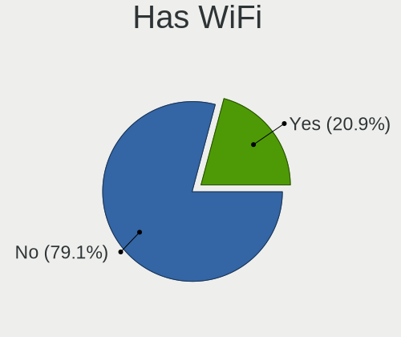

| Presented | Desktops | Percent |
|-----------|----------|---------|
| No        | 76       | 80%     |
| Yes       | 19       | 20%     |

Has Bluetooth
-------------

Has Bluetooth module

| Presented | Desktops | Percent |
|-----------|----------|---------|
| No        | 84       | 88.42%  |
| Yes       | 11       | 11.58%  |

Location
--------

Country
-------

Geographic location (country)

| Country   | Desktops | Percent |
|-----------|----------|---------|
| Australia | 94       | 100%    |

City
----

Geographic location (city)

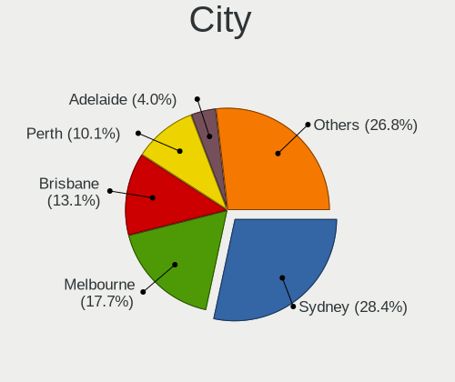

| City           | Desktops | Percent |
|----------------|----------|---------|
| Sydney         | 26       | 25.49%  |
| Melbourne      | 14       | 13.73%  |
| Brisbane       | 12       | 11.76%  |
| Perth          | 11       | 10.78%  |
| Adelaide       | 3        | 2.94%   |
| Marrickville   | 2        | 1.96%   |
| Hobart         | 2        | 1.96%   |
| Canberra       | 2        | 1.96%   |
| Wollongong     | 1        | 0.98%   |
| Wheelers Hill  | 1        | 0.98%   |
| Wallan         | 1        | 0.98%   |
| Townsville     | 1        | 0.98%   |
| Southport      | 1        | 0.98%   |
| Shell Cove     | 1        | 0.98%   |
| Ryde           | 1        | 0.98%   |
| Rosanna        | 1        | 0.98%   |
| Ringwood       | 1        | 0.98%   |
| North Shore    | 1        | 0.98%   |
| Noble Park     | 1        | 0.98%   |
| Mount Waverley | 1        | 0.98%   |
| Mooroolbark    | 1        | 0.98%   |
| Malvern        | 1        | 0.98%   |
| Kurunjang      | 1        | 0.98%   |
| Kellyville     | 1        | 0.98%   |
| Ipswich        | 1        | 0.98%   |
| Gold Coast     | 1        | 0.98%   |
| Geelong        | 1        | 0.98%   |
| Engadine       | 1        | 0.98%   |
| East Malvern   | 1        | 0.98%   |
| Dowerin        | 1        | 0.98%   |
| Dandenong      | 1        | 0.98%   |
| Corio          | 1        | 0.98%   |
| Brunswick      | 1        | 0.98%   |
| Blackburn      | 1        | 0.98%   |
| Bayswater      | 1        | 0.98%   |
| Balwyn North   | 1        | 0.98%   |
| Ashfield       | 1        | 0.98%   |
| Ascot Vale     | 1        | 0.98%   |

Drives
------

Drive Vendor
------------

Hard drive vendors

| Vendor              | Desktops | Drives | Percent |
|---------------------|----------|--------|---------|
| Seagate             | 22       | 28     | 18.33%  |
| Samsung Electronics | 19       | 29     | 15.83%  |
| WDC                 | 18       | 53     | 15%     |
| Kingston            | 9        | 16     | 7.5%    |
| Intel               | 7        | 12     | 5.83%   |
| Toshiba             | 5        | 9      | 4.17%   |
| Hoodisk             | 5        | 9      | 4.17%   |
| Crucial             | 5        | 5      | 4.17%   |
| SanDisk             | 4        | 6      | 3.33%   |
| Protectli           | 3        | 3      | 2.5%    |
| Hewlett-Packard     | 3        | 6      | 2.5%    |
| Phison              | 2        | 2      | 1.67%   |
| Gigabyte Technology | 2        | 2      | 1.67%   |
| A-DATA Technology   | 2        | 7      | 1.67%   |
| XUNZHE              | 1        | 1      | 0.83%   |
| Vaseky              | 1        | 1      | 0.83%   |
| Transcend           | 1        | 1      | 0.83%   |
| SPCC                | 1        | 5      | 0.83%   |
| Plextor             | 1        | 1      | 0.83%   |
| Micron Technology   | 1        | 2      | 0.83%   |
| Maxtor              | 1        | 1      | 0.83%   |
| KingSpec            | 1        | 1      | 0.83%   |
| KingDian            | 1        | 1      | 0.83%   |
| Hitachi             | 1        | 1      | 0.83%   |
| HGST                | 1        | 1      | 0.83%   |
| Fordisk             | 1        | 1      | 0.83%   |
| China               | 1        | 1      | 0.83%   |
| BIWIN               | 1        | 1      | 0.83%   |

Drive Model
-----------

Hard drive models

| Model                                | Desktops | Percent |
|--------------------------------------|----------|---------|
| Hoodisk SSD 128GB                    | 5        | 3.68%   |
| Kingston SA400S37120G 120GB          | 3        | 2.21%   |
| WDC WD40EFRX-68N32N0 4TB             | 2        | 1.47%   |
| WDC WD30EFRX-68EUZN0 3TB             | 2        | 1.47%   |
| WDC WD20EZRX-00D8PB0 2TB             | 2        | 1.47%   |
| WDC WD20EZAZ-00GGJB0 2TB             | 2        | 1.47%   |
| Seagate ST500LM021-1KJ152 500GB      | 2        | 1.47%   |
| Samsung SSD 850 EVO 500GB            | 2        | 1.47%   |
| Samsung SSD 840 EVO 120GB            | 2        | 1.47%   |
| Samsung MZ7LN128HCHP-000H1 128GB     | 2        | 1.47%   |
| Protectli 120GB mSATA                | 2        | 1.47%   |
| Kingston SA400S37480G 480GB          | 2        | 1.47%   |
| Crucial CT250MX500SSD1 250GB         | 2        | 1.47%   |
| XUNZHE MSATA 128GB                   | 1        | 0.74%   |
| WDC WDS500G1R0B-68A4Z0 500GB         | 1        | 0.74%   |
| WDC WDS250G2B0C-00PXH0 250GB         | 1        | 0.74%   |
| WDC WDS250G2B0A-00SM50 250GB         | 1        | 0.74%   |
| WDC WDS240G2G0B-00EPW0 240GB         | 1        | 0.74%   |
| WDC WDS240G2G0A-00JH30 240GB         | 1        | 0.74%   |
| WDC WD80EFAX-68KNBN0 8TB             | 1        | 0.74%   |
| WDC WD7500BPKX-00HPJT0 752GB         | 1        | 0.74%   |
| WDC WD5000BPKT-00PK4T0 500GB         | 1        | 0.74%   |
| WDC WD5000AAKX-60U6AA0 500GB         | 1        | 0.74%   |
| WDC WD40EFRX-68WT0N0 4TB             | 1        | 0.74%   |
| WDC WD4000AAKS-00TMA0 400GB          | 1        | 0.74%   |
| WDC WD30EFRX-68AX9N0 3TB             | 1        | 0.74%   |
| WDC WD20EARX-00PASB0 2TB             | 1        | 0.74%   |
| WDC WD20EARX-008FB0 2TB              | 1        | 0.74%   |
| WDC WD20EARS-00MVWB0 2TB             | 1        | 0.74%   |
| WDC WD10EZEX-08WN4A0 1TB             | 1        | 0.74%   |
| WDC WD10EZEX-00BN5A0 1TB             | 1        | 0.74%   |
| WDC WD10EARX-00N0YB0 1TB             | 1        | 0.74%   |
| WDC WD10EADS-00P8B0 1TB              | 1        | 0.74%   |
| Vaseky V850-64G                      | 1        | 0.74%   |
| Transcend TS16EPTMM1600L 16GB        | 1        | 0.74%   |
| Toshiba THNSNJ128GMCU 128GB          | 1        | 0.74%   |
| Toshiba MQ04UBF100 1TB               | 1        | 0.74%   |
| Toshiba MQ04UBD200 2TB               | 1        | 0.74%   |
| Toshiba MQ03UBB200 2TB               | 1        | 0.74%   |
| Toshiba MQ01UBB200 2TB               | 1        | 0.74%   |
| Toshiba MQ01ABD100 1TB               | 1        | 0.74%   |
| Toshiba DT01ACA200 2TB               | 1        | 0.74%   |
| SPCC M.2 PCIe SSD 256GB              | 1        | 0.74%   |
| Seagate ST9500325AS 500GB            | 1        | 0.74%   |
| Seagate ST9250410ASG 250GB           | 1        | 0.74%   |
| Seagate ST9250410AS 250GB            | 1        | 0.74%   |
| Seagate ST8000DM004-2CX188 8TB       | 1        | 0.74%   |
| Seagate ST500LT012-1DG142 500GB      | 1        | 0.74%   |
| Seagate ST500LM000-1EJ162-SSHD 500GB | 1        | 0.74%   |
| Seagate ST500DM002-1BD142 500GB      | 1        | 0.74%   |
| Seagate ST4000NM0035-1V4107 4TB      | 1        | 0.74%   |
| Seagate ST4000NM0035 4TB             | 1        | 0.74%   |
| Seagate ST4000LM024-2AN17V 4TB       | 1        | 0.74%   |
| Seagate ST3320620AS 320GB            | 1        | 0.74%   |
| Seagate ST3250310AS 250GB            | 1        | 0.74%   |
| Seagate ST31000528AS 1TB             | 1        | 0.74%   |
| Seagate ST31000524AS 1TB             | 1        | 0.74%   |
| Seagate ST3000NM0005-1V410N 3TB      | 1        | 0.74%   |
| Seagate ST2000VN000-1HJ164 2TB       | 1        | 0.74%   |
| Seagate ST2000DM008-2FR102 2TB       | 1        | 0.74%   |

HDD Vendor
----------

Hard disk drive vendors

| Vendor              | Desktops | Drives | Percent |
|---------------------|----------|--------|---------|
| Seagate             | 22       | 28     | 44%     |
| WDC                 | 15       | 47     | 30%     |
| Toshiba             | 4        | 6      | 8%      |
| Samsung Electronics | 3        | 5      | 6%      |
| Hewlett-Packard     | 3        | 6      | 6%      |
| Maxtor              | 1        | 1      | 2%      |
| Hitachi             | 1        | 1      | 2%      |
| HGST                | 1        | 1      | 2%      |

SSD Vendor
----------

Solid state drive vendors

| Vendor              | Desktops | Drives | Percent |
|---------------------|----------|--------|---------|
| Samsung Electronics | 14       | 22     | 24.14%  |
| Kingston            | 9        | 16     | 15.52%  |
| Intel               | 6        | 11     | 10.34%  |
| Hoodisk             | 5        | 9      | 8.62%   |
| SanDisk             | 4        | 6      | 6.9%    |
| WDC                 | 3        | 5      | 5.17%   |
| Protectli           | 3        | 3      | 5.17%   |
| Crucial             | 3        | 3      | 5.17%   |
| XUNZHE              | 1        | 1      | 1.72%   |
| Vaseky              | 1        | 1      | 1.72%   |
| Transcend           | 1        | 1      | 1.72%   |
| Toshiba             | 1        | 3      | 1.72%   |
| Plextor             | 1        | 1      | 1.72%   |
| Phison              | 1        | 1      | 1.72%   |
| Micron Technology   | 1        | 2      | 1.72%   |
| KingSpec            | 1        | 1      | 1.72%   |
| KingDian            | 1        | 1      | 1.72%   |
| Fordisk             | 1        | 1      | 1.72%   |
| China               | 1        | 1      | 1.72%   |

Drive Kind
----------

HDD or SSD

| Kind | Desktops | Drives | Percent |
|------|----------|--------|---------|
| SSD  | 54       | 89     | 51.43%  |
| HDD  | 39       | 95     | 37.14%  |
| NVMe | 12       | 22     | 11.43%  |

Drive Connector
---------------

SATA, SAS, NVMe, etc.

| Type | Desktops | Drives | Percent |
|------|----------|--------|---------|
| SATA | 83       | 184    | 87.37%  |
| NVMe | 12       | 22     | 12.63%  |

Drive Size
----------

Size of hard drive

| Size in TB | Desktops | Drives | Percent |
|------------|----------|--------|---------|
| 0.01-0.5   | 68       | 116    | 68.69%  |
| 0.51-1.0   | 12       | 19     | 12.12%  |
| 1.01-2.0   | 10       | 25     | 10.1%   |
| 3.01-4.0   | 4        | 9      | 4.04%   |
| 2.01-3.0   | 2        | 8      | 2.02%   |
| 4.01-10.0  | 2        | 5      | 2.02%   |
| 10.01-20.0 | 1        | 2      | 1.01%   |

Space Total
-----------

Amount of disk space available on the file system

| Size in GB | Desktops | Percent |
|------------|----------|---------|
| 101-250    | 43       | 45.74%  |
| 251-500    | 14       | 14.89%  |
| 1-20       | 12       | 12.77%  |
| 501-1000   | 9        | 9.57%   |
| 51-100     | 8        | 8.51%   |
| 21-50      | 4        | 4.26%   |
| 2001-3000  | 2        | 2.13%   |
| 1001-2000  | 2        | 2.13%   |

Space Used
----------

Amount of used disk space

| Used GB   | Desktops | Percent |
|-----------|----------|---------|
| 1-20      | 88       | 90.72%  |
| 21-50     | 6        | 6.19%   |
| 101-250   | 1        | 1.03%   |
| 1001-2000 | 1        | 1.03%   |
| 51-100    | 1        | 1.03%   |

Malfunc. Drives
---------------

Drive models with a malfunction

| Model                             | Desktops | Drives | Percent |
|-----------------------------------|----------|--------|---------|
| WDC WDS240G2G0A-00JH30 240GB      | 1        | 1      | 8.33%   |
| WDC WD20EZRX-00D8PB0 2TB          | 1        | 2      | 8.33%   |
| WDC WD20EARX-008FB0 2TB           | 1        | 3      | 8.33%   |
| WDC WD20EARS-00MVWB0 2TB          | 1        | 1      | 8.33%   |
| Seagate ST500LT012-1DG142 500GB   | 1        | 1      | 8.33%   |
| Seagate ST500LM021-1KJ152 500GB   | 1        | 1      | 8.33%   |
| Seagate ST3250310AS 250GB         | 1        | 1      | 8.33%   |
| Seagate ST2000DL003-9VT166 2TB    | 1        | 1      | 8.33%   |
| SanDisk SDSSDA240G 240GB          | 1        | 1      | 8.33%   |
| Samsung Electronics HM500LI 500GB | 1        | 2      | 8.33%   |
| Hitachi HDS721010KLA330 1TB       | 1        | 1      | 8.33%   |
| Hewlett-Packard VB0250EAVER 250GB | 1        | 1      | 8.33%   |

Malfunc. Drive Vendor
---------------------

Vendors of faulty drives

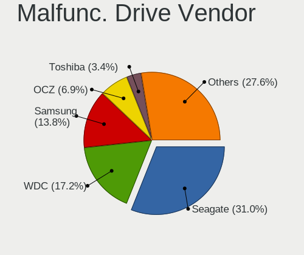

| Vendor              | Desktops | Drives | Percent |
|---------------------|----------|--------|---------|
| Seagate             | 4        | 4      | 36.36%  |
| WDC                 | 3        | 7      | 27.27%  |
| SanDisk             | 1        | 1      | 9.09%   |
| Samsung Electronics | 1        | 2      | 9.09%   |
| Hitachi             | 1        | 1      | 9.09%   |
| Hewlett-Packard     | 1        | 1      | 9.09%   |

Malfunc. HDD Vendor
-------------------

Vendors of faulty HDD drives

| Vendor              | Desktops | Drives | Percent |
|---------------------|----------|--------|---------|
| Seagate             | 4        | 4      | 44.44%  |
| WDC                 | 2        | 6      | 22.22%  |
| Samsung Electronics | 1        | 2      | 11.11%  |
| Hitachi             | 1        | 1      | 11.11%  |
| Hewlett-Packard     | 1        | 1      | 11.11%  |

Malfunc. Drive Kind
-------------------

Kinds of faulty drives

| Kind | Desktops | Drives | Percent |
|------|----------|--------|---------|
| HDD  | 9        | 14     | 81.82%  |
| SSD  | 2        | 2      | 18.18%  |

Failed Drives
-------------

Failed drive models

Zero info for selected period =(

Failed Drive Vendor
-------------------

Failed drive vendors

Zero info for selected period =(

Drive Status
------------

Number of failed and malfunc. drives

| Status  | Desktops | Drives | Percent |
|---------|----------|--------|---------|
| Works   | 82       | 190    | 88.17%  |
| Malfunc | 11       | 16     | 11.83%  |

Storage controller
------------------

Storage Vendor
--------------

Storage controller vendors

| Vendor                    | Desktops | Percent |
|---------------------------|----------|---------|
| Intel                     | 78       | 69.03%  |
| AMD                       | 16       | 14.16%  |
| Phison Electronics        | 4        | 3.54%   |
| Samsung Electronics       | 2        | 1.77%   |
| Micron/Crucial Technology | 2        | 1.77%   |
| Broadcom / LSI            | 2        | 1.77%   |
| Silicon Motion            | 1        | 0.88%   |
| Silicon Image             | 1        | 0.88%   |
| SanDisk                   | 1        | 0.88%   |
| Realtek Semiconductor     | 1        | 0.88%   |
| QLogic                    | 1        | 0.88%   |
| JMicron Technology        | 1        | 0.88%   |
| Hewlett-Packard           | 1        | 0.88%   |
| ADATA Technology          | 1        | 0.88%   |
| Adaptec                   | 1        | 0.88%   |

Storage Model
-------------

Storage controller models

| Model                                                                                   | Desktops | Percent |
|-----------------------------------------------------------------------------------------|----------|---------|
| Intel 6 Series/C200 Series Chipset Family 6 port Desktop SATA AHCI Controller           | 11       | 8.4%    |
| Intel 8 Series/C220 Series Chipset Family 6-port SATA Controller 1 [AHCI mode]          | 10       | 7.63%   |
| Intel Atom/Celeron/Pentium Processor x5-E8000/J3xxx/N3xxx Series SATA Controller        | 9        | 6.87%   |
| AMD SB7x0/SB8x0/SB9x0 SATA Controller [AHCI mode]                                       | 7        | 5.34%   |
| AMD FCH SATA Controller [AHCI mode]                                                     | 7        | 5.34%   |
| Intel Cannon Lake PCH SATA AHCI Controller                                              | 6        | 4.58%   |
| Intel Q170/Q150/B150/H170/H110/Z170/CM236 Chipset SATA Controller [AHCI Mode]           | 5        | 3.82%   |
| Intel Celeron/Pentium Silver Processor SATA Controller                                  | 5        | 3.82%   |
| Intel Sunrise Point-LP SATA Controller [AHCI mode]                                      | 4        | 3.05%   |
| Intel 7 Series/C210 Series Chipset Family 6-port SATA Controller [AHCI mode]            | 4        | 3.05%   |
| AMD SB7x0/SB8x0/SB9x0 IDE Controller                                                    | 4        | 3.05%   |
| Intel SATA Controller [RAID mode]                                                       | 3        | 2.29%   |
| Intel Atom Processor E3800 Series SATA AHCI Controller                                  | 3        | 2.29%   |
| Intel 82801JI (ICH10 Family) SATA AHCI Controller                                       | 3        | 2.29%   |
| Intel 5 Series/3400 Series Chipset 6 port SATA AHCI Controller                          | 3        | 2.29%   |
| Phison PS5013 E13 NVMe Controller                                                       | 2        | 1.53%   |
| Intel 6 Series/C200 Series Chipset Family IDE-r Controller                              | 2        | 1.53%   |
| Intel 6 Series/C200 Series Chipset Family Desktop SATA Controller (IDE mode, ports 4-5) | 2        | 1.53%   |
| Intel 6 Series/C200 Series Chipset Family Desktop SATA Controller (IDE mode, ports 0-3) | 2        | 1.53%   |
| Intel 200 Series PCH SATA controller [AHCI mode]                                        | 2        | 1.53%   |
| Broadcom / LSI SAS2008 PCI-Express Fusion-MPT SAS-2 [Falcon]                            | 2        | 1.53%   |
| AMD X370 Series Chipset SATA Controller                                                 | 2        | 1.53%   |
| AMD FCH SATA Controller D                                                               | 2        | 1.53%   |
| Silicon Motion SM2263EN/SM2263XT SSD Controller                                         | 1        | 0.76%   |
| Silicon Image AAR-1220SA Serial ATA HostRAID Controller                                 | 1        | 0.76%   |
| SanDisk unknown                                                                         | 1        | 0.76%   |
| Samsung NVMe SSD Controller SM981/PM981/PM983                                           | 1        | 0.76%   |
| Samsung NVMe SSD Controller SM961/PM961/SM963                                           | 1        | 0.76%   |
| QLogic QLA2100 64-bit Fibre Channel Adapter                                             | 1        | 0.76%   |
| Phison NVMe Storage Controller                                                          | 1        | 0.76%   |
| Phison E16 PCIe4 NVMe Controller                                                        | 1        | 0.76%   |
| Micron/Crucial P2 NVMe PCIe SSD                                                         | 1        | 0.76%   |
| Micron/Crucial P1 NVMe PCIe SSD                                                         | 1        | 0.76%   |
| JMicron JMB363 SATA/IDE Controller                                                      | 1        | 0.76%   |
| Intel Wildcat Point-LP SATA Controller [AHCI Mode]                                      | 1        | 0.76%   |
| Intel SSD Pro 7600p/760p/E 6100p Series                                                 | 1        | 0.76%   |
| Intel Comet Lake SATA AHCI Controller                                                   | 1        | 0.76%   |
| Intel Celeron N3350/Pentium N4200/Atom E3900 Series SATA AHCI Controller                | 1        | 0.76%   |
| Intel C610/X99 series chipset 6-Port SATA Controller [AHCI mode]                        | 1        | 0.76%   |
| Intel Atom processor C2000 AHCI SATA3 Controller                                        | 1        | 0.76%   |
| Intel Atom processor C2000 AHCI SATA2 Controller                                        | 1        | 0.76%   |
| Intel 82801JI (ICH10 Family) 2 port SATA IDE Controller #2                              | 1        | 0.76%   |
| Intel 82801JD/DO (ICH10 Family) SATA AHCI Controller                                    | 1        | 0.76%   |
| Intel 82801IR/IO/IH (ICH9R/DO/DH) 4 port SATA Controller [IDE mode]                     | 1        | 0.76%   |
| Intel 82801I (ICH9 Family) 2 port SATA Controller [IDE mode]                            | 1        | 0.76%   |
| Intel 500 Series Chipset Family SATA AHCI Controller                                    | 1        | 0.76%   |
| Intel 4 Series Chipset PT IDER Controller                                               | 1        | 0.76%   |
| HP Smart Array G6 controllers                                                           | 1        | 0.76%   |
| AMD FCH SATA Controller [IDE mode]                                                      | 1        | 0.76%   |
| AMD FCH IDE Controller                                                                  | 1        | 0.76%   |
| AMD 500 Series Chipset SATA Controller                                                  | 1        | 0.76%   |
| ADATA XPG SX8200 Pro PCIe Gen3x4 M.2 2280 Solid State Drive                             | 1        | 0.76%   |
| Adaptec AIC-7870P/7881U [AHA-2940U/UW/D/S76]                                            | 1        | 0.76%   |
| Unknown                                                                                 | 1        | 0.76%   |

Storage Kind
------------

Kind of storage controller (IDE, SATA, NVMe, SAS, ...)

| Kind | Desktops | Percent |
|------|----------|---------|
| SATA | 87       | 71.9%   |
| IDE  | 13       | 10.74%  |
| NVMe | 12       | 9.92%   |
| RAID | 5        | 4.13%   |
| SAS  | 2        | 1.65%   |
| SCSI | 2        | 1.65%   |

Processor
---------

CPU Vendor
----------

Processor vendors

| Vendor | Desktops | Percent |
|--------|----------|---------|
| Intel  | 78       | 82.98%  |
| AMD    | 16       | 17.02%  |

CPU Model
---------

Processor models

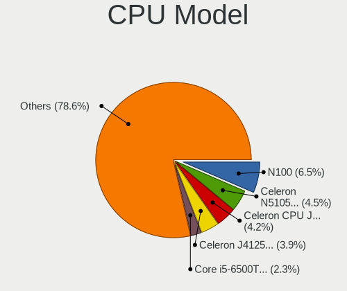

| Model                                       | Desktops | Percent |
|---------------------------------------------|----------|---------|
| Intel Celeron CPU J3160 @ 1.60GHz           | 8        | 8.42%   |
| Intel Celeron J4125 CPU @ 2.00GHz           | 4        | 4.21%   |
| Intel Core i5-3470 CPU @ 3.20GHz            | 3        | 3.16%   |
| Intel Xeon CPU E5504 @ 2.00GHz              | 2        | 2.11%   |
| Intel Core i7-4790 CPU @ 3.60GHz            | 2        | 2.11%   |
| Intel Core i5-4590T CPU @ 2.00GHz           | 2        | 2.11%   |
| Intel Core i5-4570 CPU @ 3.20GHz            | 2        | 2.11%   |
| Intel Core i5-2400 CPU @ 3.10GHz            | 2        | 2.11%   |
| AMD Turion II Neo N54L Dual-Core Processor  | 2        | 2.11%   |
| AMD FX-8350 Eight-Core Processor            | 2        | 2.11%   |
| Intel Xeon E-2224G CPU @ 3.50GHz            | 1        | 1.05%   |
| Intel Xeon CPU W3680 @ 3.33GHz              | 1        | 1.05%   |
| Intel Xeon CPU E5-1650 v4 @ 3.60GHz         | 1        | 1.05%   |
| Intel Xeon CPU E31230 @ 3.20GHz             | 1        | 1.05%   |
| Intel Xeon CPU E3-1265L V2 @ 2.50GHz        | 1        | 1.05%   |
| Intel Xeon CPU E3-1241 v3 @ 3.50GHz         | 1        | 1.05%   |
| Intel Xeon CPU E3-1230 v5 @ 3.40GHz         | 1        | 1.05%   |
| Intel Xeon CPU E3-1225 v5 @ 3.30GHz         | 1        | 1.05%   |
| Intel Xeon                                  | 1        | 1.05%   |
| Intel Pentium Dual-Core CPU E5300 @ 2.60GHz | 1        | 1.05%   |
| Intel Pentium CPU G6950 @ 2.80GHz           | 1        | 1.05%   |
| Intel Pentium CPU G4560 @ 3.50GHz           | 1        | 1.05%   |
| Intel Pentium CPU G4400T @ 2.90GHz          | 1        | 1.05%   |
| Intel Pentium CPU G3240 @ 3.10GHz           | 1        | 1.05%   |
| Intel Core i7-9700K CPU @ 3.60GHz           | 1        | 1.05%   |
| Intel Core i7-9700 CPU @ 3.00GHz            | 1        | 1.05%   |
| Intel Core i7-8700K CPU @ 3.70GHz           | 1        | 1.05%   |
| Intel Core i7-8550U CPU @ 1.80GHz           | 1        | 1.05%   |
| Intel Core i5-9400 CPU @ 2.90GHz            | 1        | 1.05%   |
| Intel Core i5-8250U CPU @ 1.60GHz           | 1        | 1.05%   |
| Intel Core i5-6500T CPU @ 2.50GHz           | 1        | 1.05%   |
| Intel Core i5-4590 CPU @ 3.30GHz            | 1        | 1.05%   |
| Intel Core i5-4570T CPU @ 2.90GHz           | 1        | 1.05%   |
| Intel Core i5-4430 CPU @ 3.00GHz            | 1        | 1.05%   |
| Intel Core i5-3570 CPU @ 3.40GHz            | 1        | 1.05%   |
| Intel Core i5-3450 CPU @ 3.10GHz            | 1        | 1.05%   |
| Intel Core i5-2500 CPU @ 3.30GHz            | 1        | 1.05%   |
| Intel Core i5-2500 CPU @ 3.30GH             | 1        | 1.05%   |
| Intel Core i5-2500 CPU                      | 1        | 1.05%   |
| Intel Core i5 CPU 750 @ 2.67GHz             | 1        | 1.05%   |
| Intel Core i3-8100 CPU @ 3.60GHz            | 1        | 1.05%   |
| Intel Core i3-7167U CPU @ 2.80GHz           | 1        | 1.05%   |
| Intel Core i3-6100U CPU @ 2.30GHz           | 1        | 1.05%   |
| Intel Core i3-4150 CPU @ 3.50GHz            | 1        | 1.05%   |
| Intel Core i3-3225 CPU @ 3.30GHz            | 1        | 1.05%   |
| Intel Core i3-3220 CPU @ 3.30GHz            | 1        | 1.05%   |
| Intel Core i3-2120 CPU @ 3.30GHz            | 1        | 1.05%   |
| Intel Core i3-2120 CPU @ 3.30GH             | 1        | 1.05%   |
| Intel Core i3-10110U CPU @ 2.10GHz          | 1        | 1.05%   |
| Intel Core i3-10100 CPU @ 3.60GHz           | 1        | 1.05%   |
| Intel Core i3 CPU 540 @ 3.07GHz             | 1        | 1.05%   |
| Intel Core 2 Quad CPU Q9300 @ 2.50GHz       | 1        | 1.05%   |
| Intel Core 2 Quad CPU Q6600 @               | 1        | 1.05%   |
| Intel Celeron J4115 CPU @ 1.80GHz           | 1        | 1.05%   |
| Intel Celeron CPU N2930 @ 1.83GHz           | 1        | 1.05%   |
| Intel Celeron CPU N2820 @ 2.13GHz           | 1        | 1.05%   |
| Intel Celeron CPU J3455 @ 1.50GHz           | 1        | 1.05%   |
| Intel Celeron CPU J3060 @ 1.60GHz           | 1        | 1.05%   |
| Intel Celeron CPU J1900 @ 1.99GHz           | 1        | 1.05%   |
| Intel Celeron CPU G3900 @ 2.80GHz           | 1        | 1.05%   |

CPU Model Family
----------------

Processor model prefix

| Model                   | Desktops | Percent |
|-------------------------|----------|---------|
| Intel Core i5           | 21       | 22.11%  |
| Intel Celeron           | 21       | 22.11%  |
| Intel Xeon              | 11       | 11.58%  |
| Intel Core i3           | 11       | 11.58%  |
| Intel Core i7           | 6        | 6.32%   |
| Intel Pentium           | 4        | 4.21%   |
| AMD Turion II Neo       | 3        | 3.16%   |
| AMD Ryzen 5             | 3        | 3.16%   |
| AMD Ryzen 3             | 3        | 3.16%   |
| AMD FX                  | 3        | 3.16%   |
| Intel Core 2 Quad       | 2        | 2.11%   |
| Intel Atom              | 2        | 2.11%   |
| Intel Pentium Dual-Core | 1        | 1.05%   |
| AMD GX                  | 1        | 1.05%   |
| AMD G                   | 1        | 1.05%   |
| AMD E2                  | 1        | 1.05%   |
| AMD Athlon              | 1        | 1.05%   |

CPU Cores
---------

Number of processor cores

| Number  | Desktops | Percent |
|---------|----------|---------|
| 4       | 51       | 53.68%  |
| 2       | 26       | 27.37%  |
| 8       | 9        | 9.47%   |
| 6       | 5        | 5.26%   |
| 12      | 2        | 2.11%   |
| Unknown | 2        | 2.11%   |

CPU Sockets
-----------

Number of sockets

| Number | Desktops | Percent |
|--------|----------|---------|
| 1      | 92       | 97.87%  |
| 2      | 2        | 2.13%   |

CPU Threads
-----------

Threads per core (Hyper-Threading)

| Number  | Desktops | Percent |
|---------|----------|---------|
| 1       | 69       | 72.63%  |
| 2       | 24       | 25.26%  |
| Unknown | 2        | 2.11%   |

CPU Microarch
-------------

Microarchitecture

| Name          | Desktops | Percent |
|---------------|----------|---------|
| Silvermont    | 14       | 14.89%  |
| KabyLake      | 11       | 11.7%   |
| Haswell       | 11       | 11.7%   |
| IvyBridge     | 9        | 9.57%   |
| SandyBridge   | 8        | 8.51%   |
| Skylake       | 6        | 6.38%   |
| Goldmont plus | 5        | 5.32%   |
| Nehalem       | 4        | 4.26%   |
| Westmere      | 3        | 3.19%   |
| Piledriver    | 3        | 3.19%   |
| K10           | 3        | 3.19%   |
| Zen 2         | 2        | 2.13%   |
| Zen           | 2        | 2.13%   |
| Penryn        | 2        | 2.13%   |
| Broadwell     | 2        | 2.13%   |
| Bobcat        | 2        | 2.13%   |
| Zen+          | 1        | 1.06%   |
| Zen 3         | 1        | 1.06%   |
| Puma          | 1        | 1.06%   |
| Jaguar        | 1        | 1.06%   |
| Goldmont      | 1        | 1.06%   |
| Core          | 1        | 1.06%   |
| CometLake     | 1        | 1.06%   |

Graphics
--------

GPU Vendor
----------

Vendors of graphics cards

| Vendor                     | Desktops | Percent |
|----------------------------|----------|---------|
| Intel                      | 58       | 61.05%  |
| AMD                        | 16       | 16.84%  |
| Nvidia                     | 14       | 14.74%  |
| Matrox Electronics Systems | 5        | 5.26%   |
| Tseng Labs                 | 1        | 1.05%   |
| ASPEED Technology          | 1        | 1.05%   |

GPU Model
---------

Graphics card models

| Model                                                                                    | Desktops | Percent |
|------------------------------------------------------------------------------------------|----------|---------|
| Intel Atom/Celeron/Pentium Processor x5-E8000/J3xxx/N3xxx Integrated Graphics Controller | 10       | 10.31%  |
| Intel Xeon E3-1200 v3/4th Gen Core Processor Integrated Graphics Controller              | 8        | 8.25%   |
| Intel CoffeeLake-S GT2 [UHD Graphics 630]                                                | 6        | 6.19%   |
| Intel 2nd Generation Core Processor Family Integrated Graphics Controller                | 6        | 6.19%   |
| Intel Xeon E3-1200 v2/3rd Gen Core processor Graphics Controller                         | 5        | 5.15%   |
| Intel GeminiLake [UHD Graphics 600]                                                      | 5        | 5.15%   |
| Intel Atom Processor Z36xxx/Z37xxx Series Graphics & Display                             | 3        | 3.09%   |
| AMD RS880M [Mobility Radeon HD 4225/4250]                                                | 3        | 3.09%   |
| Nvidia GP108 [GeForce GT 1030]                                                           | 2        | 2.06%   |
| Nvidia GK208B [GeForce GT 730]                                                           | 2        | 2.06%   |
| Nvidia GK208B [GeForce GT 710]                                                           | 2        | 2.06%   |
| Matrox Electronics Systems MGA G200EH                                                    | 2        | 2.06%   |
| Matrox Electronics Systems MGA G200e [Pilot] ServerEngines (SEP1)                        | 2        | 2.06%   |
| Intel UHD Graphics 620                                                                   | 2        | 2.06%   |
| AMD Caicos [Radeon HD 6450/7450/8450 / R5 230 OEM]                                       | 2        | 2.06%   |
| Tseng Labs ET4000/W32p rev C                                                             | 1        | 1.03%   |
| Nvidia TU102 [GeForce RTX 2080 Ti Rev. A]                                                | 1        | 1.03%   |
| Nvidia GT218 [GeForce 210]                                                               | 1        | 1.03%   |
| Nvidia GT216 [GeForce GT 220]                                                            | 1        | 1.03%   |
| Nvidia GP104 [GeForce GTX 1080]                                                          | 1        | 1.03%   |
| Nvidia GM206 [GeForce GTX 960]                                                           | 1        | 1.03%   |
| Nvidia GF100GL [Quadro 4000]                                                             | 1        | 1.03%   |
| Nvidia G92 [GeForce GT 330]                                                              | 1        | 1.03%   |
| Nvidia G73 [GeForce 7600 GS]                                                             | 1        | 1.03%   |
| Matrox Electronics Systems MGA G200eW WPCM450                                            | 1        | 1.03%   |
| Intel Skylake GT2 [HD Graphics 520]                                                      | 1        | 1.03%   |
| Intel IvyBridge GT2 [HD Graphics 4000]                                                   | 1        | 1.03%   |
| Intel Iris Plus Graphics 650                                                             | 1        | 1.03%   |
| Intel HD Graphics P530                                                                   | 1        | 1.03%   |
| Intel HD Graphics 610                                                                    | 1        | 1.03%   |
| Intel HD Graphics 530                                                                    | 1        | 1.03%   |
| Intel HD Graphics 510                                                                    | 1        | 1.03%   |
| Intel HD Graphics 500                                                                    | 1        | 1.03%   |
| Intel HD Graphics                                                                        | 1        | 1.03%   |
| Intel Core Processor Integrated Graphics Controller                                      | 1        | 1.03%   |
| Intel CometLake-U GT2 [UHD Graphics]                                                     | 1        | 1.03%   |
| Intel CoffeeLake-S GT2 [UHD Graphics P630]                                               | 1        | 1.03%   |
| Intel 4th Generation Core Processor Family Integrated Graphics Controller                | 1        | 1.03%   |
| Intel 4 Series Chipset Integrated Graphics Controller                                    | 1        | 1.03%   |
| ASPEED Technology ASPEED Graphics Family                                                 | 1        | 1.03%   |
| AMD Wrestler [Radeon HD 7340]                                                            | 1        | 1.03%   |
| AMD Wrestler [Radeon HD 6250]                                                            | 1        | 1.03%   |
| AMD Raven Ridge [Radeon Vega Series / Radeon Vega Mobile Series]                         | 1        | 1.03%   |
| AMD Picasso/Raven 2 [Radeon Vega Series / Radeon Vega Mobile Series]                     | 1        | 1.03%   |
| AMD Oland [Radeon HD 8570 / R5 430 OEM / R7 240/340 / Radeon 520 OEM]                    | 1        | 1.03%   |
| AMD Navi 23 [Radeon RX 6600/6600 XT/6600M]                                               | 1        | 1.03%   |
| AMD Kabini [Radeon HD 8400 / R3 Series]                                                  | 1        | 1.03%   |
| AMD Hawaii PRO [Radeon R9 290/390]                                                       | 1        | 1.03%   |
| AMD Ellesmere [Radeon RX 470/480/570/570X/580/580X/590]                                  | 1        | 1.03%   |
| AMD Cezanne                                                                              | 1        | 1.03%   |
| AMD Caicos XTX [Radeon HD 8490 / R5 235X OEM]                                            | 1        | 1.03%   |
| AMD Caicos PRO [Radeon HD 7450]                                                          | 1        | 1.03%   |

GPU Combo
---------

Combinations of graphics cards

| Name           | Desktops | Percent |
|----------------|----------|---------|
| 1 x Intel      | 54       | 56.25%  |
| 1 x AMD        | 15       | 15.63%  |
| 1 x Nvidia     | 12       | 12.5%   |
| 1 x Matrox     | 5        | 5.21%   |
| Other          | 3        | 3.13%   |
| Intel + Nvidia | 2        | 2.08%   |
| 2 x Intel      | 1        | 1.04%   |
| 2 x AMD        | 1        | 1.04%   |
| 1 x Tseng Labs | 1        | 1.04%   |
| Intel + AMD    | 1        | 1.04%   |
| 1 x ASPEED     | 1        | 1.04%   |

GPU Driver
----------

Free vs proprietary

| Driver      | Desktops | Percent |
|-------------|----------|---------|
| Free        | 85       | 90.43%  |
| Proprietary | 6        | 6.38%   |
| Unknown     | 3        | 3.19%   |

GPU Memory
----------

Total video memory

| Size in GB | Desktops | Percent |
|------------|----------|---------|
| Unknown    | 83       | 87.37%  |
| 1.01-2.0   | 6        | 6.32%   |
| 0.51-1.0   | 3        | 3.16%   |
| 7.01-8.0   | 2        | 2.11%   |
| 3.01-4.0   | 1        | 1.05%   |

Monitor
-------

Monitor Vendor
--------------

Monitor vendors

| Vendor              | Desktops | Percent |
|---------------------|----------|---------|
| Dell                | 3        | 15%     |
| Samsung Electronics | 2        | 10%     |
| Philips             | 2        | 10%     |
| Hewlett-Packard     | 2        | 10%     |
| AOC                 | 2        | 10%     |
| Acer                | 2        | 10%     |
| ___                 | 1        | 5%      |
| ViewSonic           | 1        | 5%      |
| Toshiba             | 1        | 5%      |
| Goldstar            | 1        | 5%      |
| Compal              | 1        | 5%      |
| BenQ                | 1        | 5%      |
| ASUSTek Computer    | 1        | 5%      |

Monitor Model
-------------

Monitor models

| Model                                                                | Desktops | Percent |
|----------------------------------------------------------------------|----------|---------|
| ___ MY TV LED TV ___0101 1920x1080                                   | 1        | 4.76%   |
| ViewSonic VX3209-2K VSC328E 2560x1440 700x390mm 31.5-inch            | 1        | 4.76%   |
| Toshiba TV TSB010E 1920x1080 1040x590mm 47.1-inch                    | 1        | 4.76%   |
| Samsung Electronics SMS27A350H SAM07CE 1920x1080 600x340mm 27.2-inch | 1        | 4.76%   |
| Samsung Electronics S24D300 SAM0B43 1920x1080 530x300mm 24.0-inch    | 1        | 4.76%   |
| Philips PHL 273V7 PHLC156 1920x1080 600x340mm 27.2-inch              | 1        | 4.76%   |
| Philips PHL 243V7 PHLC155 1920x1080 530x300mm 24.0-inch              | 1        | 4.76%   |
| Hewlett-Packard LCD Monitor HWP2915 1920x1080 510x290mm 23.1-inch    | 1        | 4.76%   |
| Hewlett-Packard LA2205 HWP2848 1680x1050 470x300mm 22.0-inch         | 1        | 4.76%   |
| Goldstar LG HDR WQHD GSM7716 3840x1600 880x370mm 37.6-inch           | 1        | 4.76%   |
| Dell SP2309W DELD01C 2048x1152 510x290mm 23.1-inch                   | 1        | 4.76%   |
| Dell P2414H DELA09B 1920x1080 530x300mm 24.0-inch                    | 1        | 4.76%   |
| Dell E248WFP DELA02D 1920x1200 520x320mm 24.0-inch                   | 1        | 4.76%   |
| Compal LCD Monitor WOR2760 2560x1440 600x340mm 27.2-inch             | 1        | 4.76%   |
| BenQ GW2255 BNQ78CD 1920x1080 480x270mm 21.7-inch                    | 1        | 4.76%   |
| ASUSTek Computer ROG XG279Q AUS278D 2560x1440 600x340mm 27.2-inch    | 1        | 4.76%   |
| AOC 2963 AOC2963 2560x1080 670x280mm 28.6-inch                       | 1        | 4.76%   |
| AOC 2236 AOC2236 1920x1080 480x270mm 21.7-inch                       | 1        | 4.76%   |
| Acer V233H ACR0090 1920x1080 510x290mm 23.1-inch                     | 1        | 4.76%   |
| Acer K272HL ACR0523 1920x1080 600x340mm 27.2-inch                    | 1        | 4.76%   |
| Acer B276HL ACR0332 1920x1080 600x340mm 27.2-inch                    | 1        | 4.76%   |

Monitor Resolution
------------------

Monitor screen resolution

| Resolution         | Desktops | Percent |
|--------------------|----------|---------|
| 1920x1080 (FHD)    | 12       | 60%     |
| 2560x1440 (QHD)    | 3        | 15%     |
| 3840x1600          | 1        | 5%      |
| 2560x1080          | 1        | 5%      |
| 2048x1152          | 1        | 5%      |
| 1920x1200 (WUXGA)  | 1        | 5%      |
| 1680x1050 (WSXGA+) | 1        | 5%      |

Monitor Diagonal
----------------

Diagonal size in inches

| Inches  | Desktops | Percent |
|---------|----------|---------|
| 27      | 5        | 25%     |
| 24      | 4        | 20%     |
| 23      | 3        | 15%     |
| 21      | 2        | 10%     |
| 47      | 1        | 5%      |
| 37      | 1        | 5%      |
| 31      | 1        | 5%      |
| 28      | 1        | 5%      |
| 22      | 1        | 5%      |
| Unknown | 1        | 5%      |

Monitor Width
-------------

Physical width

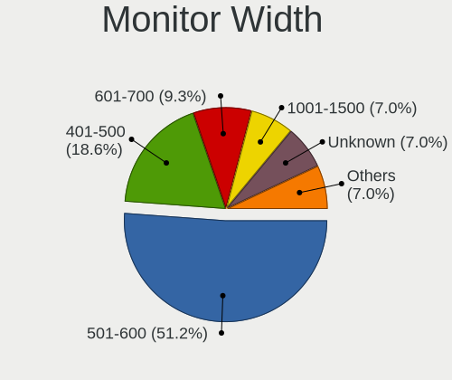

| Width in mm | Desktops | Percent |
|-------------|----------|---------|
| 501-600     | 12       | 60%     |
| 401-500     | 3        | 15%     |
| 601-700     | 2        | 10%     |
| 801-900     | 1        | 5%      |
| 1001-1500   | 1        | 5%      |
| Unknown     | 1        | 5%      |

Aspect Ratio
------------

Proportional relationship between the width and the height

| Ratio | Desktops | Percent |
|-------|----------|---------|
| 16/9  | 16       | 80%     |
| 21/9  | 2        | 10%     |
| 16/10 | 2        | 10%     |

Monitor Area
------------

Area in inch

| Area in inch | Desktops | Percent |
|----------------|----------|---------|
| 201-250        | 9        | 45%     |
| 301-350        | 5        | 25%     |
| 251-300        | 2        | 10%     |
| 501-1000       | 2        | 10%     |
| 351-500        | 1        | 5%      |
| Unknown        | 1        | 5%      |

Pixel Density
-------------

Pixels per inch

| Density | Desktops | Percent |
|---------|----------|---------|
| 51-100  | 12       | 60%     |
| 101-120 | 6        | 30%     |
| 1-50    | 1        | 5%      |
| Unknown | 1        | 5%      |

Multiple Monitors
-----------------

Total monitors connected

| Total | Desktops | Percent |
|-------|----------|---------|
| 0     | 74       | 78.72%  |
| 1     | 19       | 20.21%  |
| 2     | 1        | 1.06%   |

Network
-------

Net Controller Vendor
---------------------

Controller vendors

| Vendor                   | Desktops | Percent |
|--------------------------|----------|---------|
| Intel                    | 62       | 50.41%  |
| Realtek Semiconductor    | 36       | 29.27%  |
| Broadcom                 | 12       | 9.76%   |
| Qualcomm Atheros         | 4        | 3.25%   |
| U-Blox                   | 2        | 1.63%   |
| TP-Link                  | 1        | 0.81%   |
| Seeed Technology         | 1        | 0.81%   |
| Ralink                   | 1        | 0.81%   |
| Marvell Technology Group | 1        | 0.81%   |
| IMC Networks             | 1        | 0.81%   |
| D-Link System            | 1        | 0.81%   |
| Aquantia                 | 1        | 0.81%   |

Net Controller Model
--------------------

Controller models

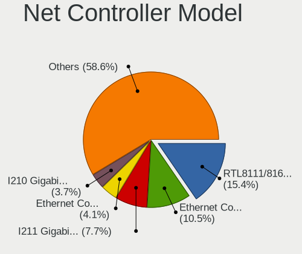

| Model                                                                         | Desktops | Percent |
|-------------------------------------------------------------------------------|----------|---------|
| Realtek RTL8111/8168/8411 PCI Express Gigabit Ethernet Controller             | 32       | 21.92%  |
| Intel I211 Gigabit Network Connection                                         | 17       | 11.64%  |
| Intel I210 Gigabit Network Connection                                         | 9        | 6.16%   |
| Intel Ethernet Connection I217-LM                                             | 6        | 4.11%   |
| Intel 82579LM Gigabit Network Connection (Lewisville)                         | 6        | 4.11%   |
| Intel 82574L Gigabit Network Connection                                       | 5        | 3.42%   |
| Broadcom NetXtreme BCM5723 Gigabit Ethernet PCIe                              | 5        | 3.42%   |
| Intel 82576 Gigabit Network Connection                                        | 4        | 2.74%   |
| Intel Wireless 7260                                                           | 3        | 2.05%   |
| Intel Ethernet Connection (2) I219-V                                          | 3        | 2.05%   |
| Intel 82571EB/82571GB Gigabit Ethernet Controller D0/D1 (copper applications) | 3        | 2.05%   |
| Broadcom NetXtreme BCM5720 Gigabit Ethernet PCIe                              | 3        | 2.05%   |
| U-Blox [u-blox 7]                                                             | 2        | 1.37%   |
| Intel Wireless 8265 / 8275                                                    | 2        | 1.37%   |
| Intel Ethernet Controller I225-V                                              | 2        | 1.37%   |
| Intel Ethernet Connection I217-V                                              | 2        | 1.37%   |
| Intel Ethernet Connection (7) I219-V                                          | 2        | 1.37%   |
| Intel Ethernet Connection (7) I219-LM                                         | 2        | 1.37%   |
| Intel Centrino Wireless-N 2230                                                | 2        | 1.37%   |
| Broadcom NetXtreme BCM5719 Gigabit Ethernet PCIe                              | 2        | 1.37%   |
| TP-Link TL-WN821N v5/v6 [RTL8192EU]                                           | 1        | 0.68%   |
| Seeed Seeeduino_Cortex_M0+                                                    | 1        | 0.68%   |
| Realtek RTL88x2bu [AC1200 Techkey]                                            | 1        | 0.68%   |
| Realtek RTL8812AE 802.11ac PCIe Wireless Network Adapter                      | 1        | 0.68%   |
| Realtek RTL8192CE PCIe Wireless Network Adapter                               | 1        | 0.68%   |
| Realtek RTL8188EUS 802.11n Wireless Network Adapter                           | 1        | 0.68%   |
| Realtek RTL8169 PCI Gigabit Ethernet Controller                               | 1        | 0.68%   |
| Realtek RTL8125 2.5GbE Controller                                             | 1        | 0.68%   |
| Ralink RT5392 PCIe Wireless Network Adapter                                   | 1        | 0.68%   |
| Qualcomm Atheros Killer E220x Gigabit Ethernet Controller                     | 1        | 0.68%   |
| Qualcomm Atheros AR93xx Wireless Network Adapter                              | 1        | 0.68%   |
| Qualcomm Atheros AR9287 Wireless Network Adapter (PCI-Express)                | 1        | 0.68%   |
| Qualcomm Atheros AR9285 Wireless Network Adapter (PCI-Express)                | 1        | 0.68%   |
| Qualcomm Atheros AR8161 Gigabit Ethernet                                      | 1        | 0.68%   |
| Marvell Group 88E8056 PCI-E Gigabit Ethernet Controller                       | 1        | 0.68%   |
| Intel Wireless 8260                                                           | 1        | 0.68%   |
| Intel Tiger Lake PCH CNVi WiFi                                                | 1        | 0.68%   |
| Intel Gemini Lake PCH CNVi WiFi                                               | 1        | 0.68%   |
| Intel Ethernet Controller X550                                                | 1        | 0.68%   |
| Intel Ethernet Connection I354                                                | 1        | 0.68%   |
| Intel Ethernet Connection (6) I219-V                                          | 1        | 0.68%   |
| Intel Ethernet Connection (2) I219-LM                                         | 1        | 0.68%   |
| Intel Ethernet Connection (11) I219-V                                         | 1        | 0.68%   |
| Intel DH8900CC Null Device                                                    | 1        | 0.68%   |
| Intel 82599ES 10-Gigabit SFI/SFP+ Network Connection                          | 1        | 0.68%   |
| Intel 82580 Gigabit Network Connection                                        | 1        | 0.68%   |
| Intel 82575GB Gigabit Network Connection                                      | 1        | 0.68%   |
| Intel 82567LM-3 Gigabit Network Connection                                    | 1        | 0.68%   |
| IMC Networks 802.11 n/g/b Wireless LAN USB Mini-Card                          | 1        | 0.68%   |
| D-Link System DGE-530T Gigabit Ethernet Adapter (rev 11)                      | 1        | 0.68%   |
| Broadcom NetXtreme BCM5764M Gigabit Ethernet PCIe                             | 1        | 0.68%   |
| Broadcom NetXtreme BCM5761 Gigabit Ethernet PCIe                              | 1        | 0.68%   |
| Broadcom NetXtreme BCM5722 Gigabit Ethernet PCI Express                       | 1        | 0.68%   |
| Aquantia AQC107 NBase-T/IEEE 802.3bz Ethernet Controller [AQtion]             | 1        | 0.68%   |

Wireless Vendor
---------------

Wireless vendors

| Vendor                | Desktops | Percent |
|-----------------------|----------|---------|
| Intel                 | 10       | 50%     |
| Realtek Semiconductor | 4        | 20%     |
| Qualcomm Atheros      | 3        | 15%     |
| TP-Link               | 1        | 5%      |
| Ralink                | 1        | 5%      |
| IMC Networks          | 1        | 5%      |

Wireless Model
--------------

Wireless models

| Model                                                          | Desktops | Percent |
|----------------------------------------------------------------|----------|---------|
| Intel Wireless 7260                                            | 3        | 15%     |
| Intel Wireless 8265 / 8275                                     | 2        | 10%     |
| Intel Centrino Wireless-N 2230                                 | 2        | 10%     |
| TP-Link TL-WN821N v5/v6 [RTL8192EU]                            | 1        | 5%      |
| Realtek RTL88x2bu [AC1200 Techkey]                             | 1        | 5%      |
| Realtek RTL8812AE 802.11ac PCIe Wireless Network Adapter       | 1        | 5%      |
| Realtek RTL8192CE PCIe Wireless Network Adapter                | 1        | 5%      |
| Realtek RTL8188EUS 802.11n Wireless Network Adapter            | 1        | 5%      |
| Ralink RT5392 PCIe Wireless Network Adapter                    | 1        | 5%      |
| Qualcomm Atheros AR93xx Wireless Network Adapter               | 1        | 5%      |
| Qualcomm Atheros AR9287 Wireless Network Adapter (PCI-Express) | 1        | 5%      |
| Qualcomm Atheros AR9285 Wireless Network Adapter (PCI-Express) | 1        | 5%      |
| Intel Wireless 8260                                            | 1        | 5%      |
| Intel Tiger Lake PCH CNVi WiFi                                 | 1        | 5%      |
| Intel Gemini Lake PCH CNVi WiFi                                | 1        | 5%      |
| IMC Networks 802.11 n/g/b Wireless LAN USB Mini-Card           | 1        | 5%      |

Ethernet Vendor
---------------

Ethernet vendors

| Vendor                   | Desktops | Percent |
|--------------------------|----------|---------|
| Intel                    | 59       | 53.64%  |
| Realtek Semiconductor    | 34       | 30.91%  |
| Broadcom                 | 12       | 10.91%  |
| Qualcomm Atheros         | 2        | 1.82%   |
| Marvell Technology Group | 1        | 0.91%   |
| D-Link System            | 1        | 0.91%   |
| Aquantia                 | 1        | 0.91%   |

Ethernet Model
--------------

Ethernet models

| Model                                                                         | Desktops | Percent |
|-------------------------------------------------------------------------------|----------|---------|
| Realtek RTL8111/8168/8411 PCI Express Gigabit Ethernet Controller             | 32       | 26.23%  |
| Intel I211 Gigabit Network Connection                                         | 17       | 13.93%  |
| Intel I210 Gigabit Network Connection                                         | 9        | 7.38%   |
| Intel Ethernet Connection I217-LM                                             | 6        | 4.92%   |
| Intel 82579LM Gigabit Network Connection (Lewisville)                         | 6        | 4.92%   |
| Intel 82574L Gigabit Network Connection                                       | 5        | 4.1%    |
| Broadcom NetXtreme BCM5723 Gigabit Ethernet PCIe                              | 5        | 4.1%    |
| Intel 82576 Gigabit Network Connection                                        | 4        | 3.28%   |
| Intel Ethernet Connection (2) I219-V                                          | 3        | 2.46%   |
| Intel 82571EB/82571GB Gigabit Ethernet Controller D0/D1 (copper applications) | 3        | 2.46%   |
| Broadcom NetXtreme BCM5720 Gigabit Ethernet PCIe                              | 3        | 2.46%   |
| Intel Ethernet Controller I225-V                                              | 2        | 1.64%   |
| Intel Ethernet Connection I217-V                                              | 2        | 1.64%   |
| Intel Ethernet Connection (7) I219-V                                          | 2        | 1.64%   |
| Intel Ethernet Connection (7) I219-LM                                         | 2        | 1.64%   |
| Broadcom NetXtreme BCM5719 Gigabit Ethernet PCIe                              | 2        | 1.64%   |
| Realtek RTL8169 PCI Gigabit Ethernet Controller                               | 1        | 0.82%   |
| Realtek RTL8125 2.5GbE Controller                                             | 1        | 0.82%   |
| Qualcomm Atheros Killer E220x Gigabit Ethernet Controller                     | 1        | 0.82%   |
| Qualcomm Atheros AR8161 Gigabit Ethernet                                      | 1        | 0.82%   |
| Marvell Group 88E8056 PCI-E Gigabit Ethernet Controller                       | 1        | 0.82%   |
| Intel Ethernet Controller X550                                                | 1        | 0.82%   |
| Intel Ethernet Connection I354                                                | 1        | 0.82%   |
| Intel Ethernet Connection (6) I219-V                                          | 1        | 0.82%   |
| Intel Ethernet Connection (2) I219-LM                                         | 1        | 0.82%   |
| Intel Ethernet Connection (11) I219-V                                         | 1        | 0.82%   |
| Intel 82599ES 10-Gigabit SFI/SFP+ Network Connection                          | 1        | 0.82%   |
| Intel 82580 Gigabit Network Connection                                        | 1        | 0.82%   |
| Intel 82575GB Gigabit Network Connection                                      | 1        | 0.82%   |
| Intel 82567LM-3 Gigabit Network Connection                                    | 1        | 0.82%   |
| D-Link System DGE-530T Gigabit Ethernet Adapter (rev 11)                      | 1        | 0.82%   |
| Broadcom NetXtreme BCM5764M Gigabit Ethernet PCIe                             | 1        | 0.82%   |
| Broadcom NetXtreme BCM5761 Gigabit Ethernet PCIe                              | 1        | 0.82%   |
| Broadcom NetXtreme BCM5722 Gigabit Ethernet PCI Express                       | 1        | 0.82%   |
| Aquantia AQC107 NBase-T/IEEE 802.3bz Ethernet Controller [AQtion]             | 1        | 0.82%   |

Net Controller Kind
-------------------

Ethernet, WiFi or modem

| Kind     | Desktops | Percent |
|----------|----------|---------|
| Ethernet | 93       | 80.17%  |
| WiFi     | 19       | 16.38%  |
| Modem    | 3        | 2.59%   |
| Unknown  | 1        | 0.86%   |

Used Controller
---------------

Currently used network controller

| Kind     | Desktops | Percent |
|----------|----------|---------|
| Ethernet | 92       | 91.09%  |
| WiFi     | 9        | 8.91%   |

NICs
----

Total network controllers on board

| Total | Desktops | Percent |
|-------|----------|---------|
| 2     | 32       | 33.33%  |
| 1     | 22       | 22.92%  |
| 4     | 16       | 16.67%  |
| 3     | 12       | 12.5%   |
| 6     | 7        | 7.29%   |
| 5     | 4        | 4.17%   |
| 7     | 2        | 2.08%   |
| 9     | 1        | 1.04%   |

IPv6
----

IPv6 vs IPv4

| Used | Desktops | Percent |
|------|----------|---------|
| No   | 85       | 86.73%  |
| Yes  | 13       | 13.27%  |

Bluetooth
---------

Bluetooth Vendor
----------------

Controller vendors

| Vendor                  | Desktops | Percent |
|-------------------------|----------|---------|
| Intel                   | 8        | 72.73%  |
| Cambridge Silicon Radio | 2        | 18.18%  |
| Broadcom                | 1        | 9.09%   |

Bluetooth Model
---------------

Controller models

| Model                                               | Desktops | Percent |
|-----------------------------------------------------|----------|---------|
| Intel Bluetooth wireless interface                  | 4        | 36.36%  |
| Intel Centrino Bluetooth Wireless Transceiver       | 2        | 18.18%  |
| Intel Bluetooth 9460/9560 Jefferson Peak (JfP)      | 2        | 18.18%  |
| Cambridge Silicon Radio Bluetooth Dongle (HCI mode) | 2        | 18.18%  |
| Broadcom BCM20702A0 Bluetooth 4.0                   | 1        | 9.09%   |

Sound
-----

Sound Vendor
------------

Sound card vendors

| Vendor             | Desktops | Percent |
|--------------------|----------|---------|
| Intel              | 62       | 67.39%  |
| AMD                | 15       | 16.3%   |
| Nvidia             | 12       | 13.04%  |
| Texas Instruments  | 1        | 1.09%   |
| Logitech           | 1        | 1.09%   |
| Focusrite-Novation | 1        | 1.09%   |

Sound Model
-----------

Sound card models

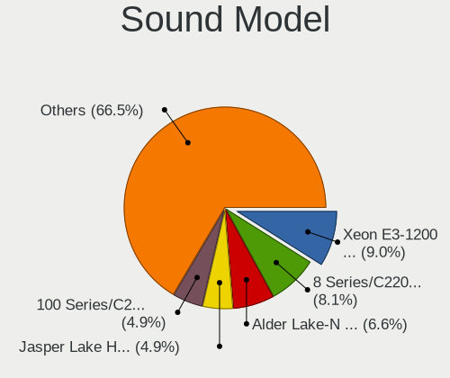

| Model                                                                                             | Desktops | Percent |
|---------------------------------------------------------------------------------------------------|----------|---------|
| Intel 8 Series/C220 Series Chipset High Definition Audio Controller                               | 10       | 8.93%   |
| Intel Xeon E3-1200 v3/4th Gen Core Processor HD Audio Controller                                  | 9        | 8.04%   |
| Intel 6 Series/C200 Series Chipset Family High Definition Audio Controller                        | 8        | 7.14%   |
| Intel Atom/Celeron/Pentium Processor x5-E8000/J3xxx/N3xxx Series High Definition Audio Controller | 7        | 6.25%   |
| Intel Celeron/Pentium Silver Processor High Definition Audio                                      | 5        | 4.46%   |
| Intel Cannon Lake PCH cAVS                                                                        | 5        | 4.46%   |
| Nvidia GK208 HDMI/DP Audio Controller                                                             | 4        | 3.57%   |
| Intel Sunrise Point-LP HD Audio                                                                   | 4        | 3.57%   |
| Intel 7 Series/C216 Chipset Family High Definition Audio Controller                               | 4        | 3.57%   |
| Intel 100 Series/C230 Series Chipset Family HD Audio Controller                                   | 4        | 3.57%   |
| AMD SBx00 Azalia (Intel HDA)                                                                      | 4        | 3.57%   |
| AMD Caicos HDMI Audio [Radeon HD 6450 / 7450/8450/8490 OEM / R5 230/235/235X OEM]                 | 4        | 3.57%   |
| Intel Atom Processor Z36xxx/Z37xxx Series High Definition Audio Controller                        | 3        | 2.68%   |
| Intel 82801JI (ICH10 Family) HD Audio Controller                                                  | 3        | 2.68%   |
| AMD Family 17h/19h HD Audio Controller                                                            | 3        | 2.68%   |
| Nvidia GP108 High Definition Audio Controller                                                     | 2        | 1.79%   |
| Intel 5 Series/3400 Series Chipset High Definition Audio                                          | 2        | 1.79%   |
| Intel 200 Series PCH HD Audio                                                                     | 2        | 1.79%   |
| AMD Wrestler HDMI Audio                                                                           | 2        | 1.79%   |
| AMD Starship/Matisse HD Audio Controller                                                          | 2        | 1.79%   |
| AMD Raven/Raven2/Fenghuang HDMI/DP Audio Controller                                               | 2        | 1.79%   |
| Texas Instruments SMSL Q5 AMP                                                                     | 1        | 0.89%   |
| Nvidia TU102 High Definition Audio Controller                                                     | 1        | 0.89%   |
| Nvidia High Definition Audio Controller                                                           | 1        | 0.89%   |
| Nvidia GT216 HDMI Audio Controller                                                                | 1        | 0.89%   |
| Nvidia GP104 High Definition Audio Controller                                                     | 1        | 0.89%   |
| Nvidia GM206 High Definition Audio Controller                                                     | 1        | 0.89%   |
| Nvidia GF100 High Definition Audio Controller                                                     | 1        | 0.89%   |
| Logitech Headset H390                                                                             | 1        | 0.89%   |
| Intel Wildcat Point-LP High Definition Audio Controller                                           | 1        | 0.89%   |
| Intel Comet Lake PCH-LP cAVS                                                                      | 1        | 0.89%   |
| Intel Celeron N3350/Pentium N4200/Atom E3900 Series Audio Cluster                                 | 1        | 0.89%   |
| Intel C610/X99 series chipset HD Audio Controller                                                 | 1        | 0.89%   |
| Intel 82801JD/DO (ICH10 Family) HD Audio Controller                                               | 1        | 0.89%   |
| Focusrite-Novation Scarlett Solo USB                                                              | 1        | 0.89%   |
| AMD Renoir Radeon High Definition Audio Controller                                                | 1        | 0.89%   |
| AMD Oland/Hainan/Cape Verde/Pitcairn HDMI Audio [Radeon HD 7000 Series]                           | 1        | 0.89%   |
| AMD Navi 21/23 HDMI/DP Audio Controller                                                           | 1        | 0.89%   |
| AMD Kabini HDMI/DP Audio                                                                          | 1        | 0.89%   |
| AMD Hawaii HDMI Audio [Radeon R9 290/290X / 390/390X]                                             | 1        | 0.89%   |
| AMD FCH Azalia Controller                                                                         | 1        | 0.89%   |
| AMD Family 17h (Models 00h-0fh) HD Audio Controller                                               | 1        | 0.89%   |
| AMD Ellesmere HDMI Audio [Radeon RX 470/480 / 570/580/590]                                        | 1        | 0.89%   |
| Unknown                                                                                           | 1        | 0.89%   |

Memory
------

Memory Vendor
-------------

Memory module vendors

| Vendor              | Desktops | Percent |
|---------------------|----------|---------|
| Samsung Electronics | 17       | 15.89%  |
| Kingston            | 17       | 15.89%  |
| Unknown             | 15       | 14.02%  |
| Micron Technology   | 12       | 11.21%  |
| SK hynix            | 10       | 9.35%   |
| Corsair             | 8        | 7.48%   |
| Crucial             | 6        | 5.61%   |
| G.Skill             | 5        | 4.67%   |
| Transcend           | 2        | 1.87%   |
| Team                | 2        | 1.87%   |
| Apacer              | 2        | 1.87%   |
| Unknown (ABCD)      | 1        | 0.93%   |
| Smart Modular       | 1        | 0.93%   |
| Ramaxel Technology  | 1        | 0.93%   |
| PNY                 | 1        | 0.93%   |
| Patriot             | 1        | 0.93%   |
| Nanya Technology    | 1        | 0.93%   |
| Kingmax             | 1        | 0.93%   |
| Innodisk            | 1        | 0.93%   |
| Hewlett-Packard     | 1        | 0.93%   |
| GeIL                | 1        | 0.93%   |
| Elpida              | 1        | 0.93%   |

Memory Model
------------

Memory module models

| Model                                                             | Desktops | Percent |
|-------------------------------------------------------------------|----------|---------|
| Unknown                                                           | 15       | 13.51%  |
| Samsung RAM M471B1G73DB0-YK0 8GB DIMM DDR3 1600MT/s               | 3        | 2.7%    |
| SK hynix RAM HMT451S6BFR8A-PB 4GB SODIMM DDR3 1600MT/s            | 2        | 1.8%    |
| SK hynix RAM HMT351U6CFR8C-PB 4GB DIMM DDR3 1600MT/s              | 2        | 1.8%    |
| Samsung RAM M471B5173QH0-YK0 4GB SODIMM DDR3 1600MT/s             | 2        | 1.8%    |
| Samsung RAM M378B5173DB0-CK0 4GB DIMM DDR3 1600MT/s               | 2        | 1.8%    |
| Micron RAM 8KTF51264HZ-1G6E1 4GB SODIMM DDR3 1600MT/s             | 2        | 1.8%    |
| Micron RAM 8JTF51264AZ-1G6E1 4GB DIMM DDR3 1600MT/s               | 2        | 1.8%    |
| Kingston RAM KHX2400C15/8G 8GB DIMM DDR4 2400MT/s                 | 2        | 1.8%    |
| Crucial RAM CT8G4DFS8266.M8FD 8GB DIMM DDR4 2667MT/s              | 2        | 1.8%    |
| Unknown (ABCD) RAM 123456789012345678 1536MB DIMM LPDDR3 2400MT/s | 1        | 0.9%    |
| Transcend RAM TS512MLH72V1H 4GB DIMM DDR4 2133MT/s                | 1        | 0.9%    |
| Transcend RAM Module 2GB DIMM DDR3 1333MT/s                       | 1        | 0.9%    |
| Team RAM Vulcan-1600 8GB DIMM DDR3 1600MT/s                       | 1        | 0.9%    |
| Team RAM TEAMGROUP-UD4-2666 16GB DIMM DDR4 2667MT/s               | 1        | 0.9%    |
| Smart Modular RAM Module 2GB DIMM DDR3 1066MT/s                   | 1        | 0.9%    |
| SK hynix RAM Module 2GB DIMM DDR3 1600MT/s                        | 1        | 0.9%    |
| SK hynix RAM HMT41GS6BFR8A-PB 8GB SODIMM DDR3 1600MT/s            | 1        | 0.9%    |
| SK hynix RAM HMT351U6CFR8C-H9 4GB DIMM DDR3 1333MT/s              | 1        | 0.9%    |
| SK hynix RAM HMT325U6CFR8C-H9 2GB DIMM DDR3 1333MT/s              | 1        | 0.9%    |
| SK hynix RAM HMA81GU7DJR8N-VK 8GB DIMM DDR4 2666MT/s              | 1        | 0.9%    |
| SK hynix RAM HMA81GS6AFR8N-UH 8GB SODIMM DDR4 2400MT/s            | 1        | 0.9%    |
| Samsung RAM M471B1G73DH0-YK0 8GB DIMM DDR3 1600MT/s               | 1        | 0.9%    |
| Samsung RAM M471A5143DB0-CPB 4GB SODIMM DDR4 2133MT/s             | 1        | 0.9%    |
| Samsung RAM M471A1K43CB1-CTD 8GB SODIMM DDR4 2667MT/s             | 1        | 0.9%    |
| Samsung RAM M471A1K43BB1-CRC 8GB SODIMM DDR4 2400MT/s             | 1        | 0.9%    |
| Samsung RAM M393B1K70DH0-CH9 8192MB DIMM DDR3 800MT/s             | 1        | 0.9%    |
| Samsung RAM M391B5673EH1-CF8 2GB DIMM DDR3 1066MT/s               | 1        | 0.9%    |
| Samsung RAM M391B5273DH0-CH9 4GB DIMM DDR3 1333MT/s               | 1        | 0.9%    |
| Samsung RAM M378B5773CH0-CK0 2GB DIMM DDR3 1333MT/s               | 1        | 0.9%    |
| Samsung RAM M378B5273DH0-CK0 4GB DIMM DDR3 1600MT/s               | 1        | 0.9%    |
| Samsung RAM M378B5173QH0-CK0 4GB DIMM DDR3 1600MT/s               | 1        | 0.9%    |
| Samsung RAM M378A1K43CB2-CTD 8GB DIMM DDR4 2666MT/s               | 1        | 0.9%    |
| Ramaxel RAM RMR5040ED58E9W1600 4GB DIMM DDR3 1600MT/s             | 1        | 0.9%    |
| PNY RAM 8GBF1X08QFHH38-135-K 8192MB DIMM DDR4 2133MT/s            | 1        | 0.9%    |
| Patriot RAM PSD38G16002 8GB DIMM DDR3 1600MT/s                    | 1        | 0.9%    |
| Nanya RAM NT4GC64B88B1NF-DI 4GB DIMM DDR3 1600MT/s                | 1        | 0.9%    |
| Micron RAM TEAMGROUP-UD4-2400 16GB DIMM DDR4 2400MT/s             | 1        | 0.9%    |
| Micron RAM M378B5273BH1-CK0 8GB SODIMM DDR3 1600MT/s              | 1        | 0.9%    |
| Micron RAM 8KTF51264HZ-1G6N1 4GB SODIMM DDR3 1600MT/s             | 1        | 0.9%    |
| Micron RAM 8JTF25664AZ-1G6M1 2GB DIMM DDR3 1600MT/s               | 1        | 0.9%    |
| Micron RAM 8JTF25664AZ-1G4D1 2GB DIMM DDR3 1333MT/s               | 1        | 0.9%    |
| Micron RAM 18JSF25672AZ-1G1F1 2GB DIMM DDR3 1066MT/s              | 1        | 0.9%    |
| Micron RAM 18JDF25672PZ-1G4F1 2048MB DIMM DDR3 800MT/s            | 1        | 0.9%    |
| Micron RAM 18ASF1G72AZ-2G1B1 8GB DIMM DDR4 2133MT/s               | 1        | 0.9%    |
| Micron RAM 16ATF4G64HZ-2G6E1 32GB SODIMM DDR4 2667MT/s            | 1        | 0.9%    |
| Kingston RAM KHX1866C10D3/8G 8GB DIMM DDR3 1867MT/s               | 1        | 0.9%    |
| Kingston RAM CBD26D4S9S1ME-8 8GB SODIMM DDR4 2667MT/s             | 1        | 0.9%    |
| Kingston RAM 99U5471-059.A00LF 8GB DIMM DDR3 1333MT/s             | 1        | 0.9%    |
| Kingston RAM 99U5471-002.A01LF 2GB DIMM DDR3 1333MT/s             | 1        | 0.9%    |
| Kingston RAM 99U5471-001.A00LF 2GB DIMM DDR3 1333MT/s             | 1        | 0.9%    |
| Kingston RAM 99U5469-070.A00LF 4GB DIMM DDR3 1600MT/s             | 1        | 0.9%    |
| Kingston RAM 99U5469-055.A00LF 4GB DDR3 1600MT/s                  | 1        | 0.9%    |
| Kingston RAM 99U5469-045.A00LF 4GB DIMM DDR3 1600MT/s             | 1        | 0.9%    |
| Kingston RAM 9965600-033.A00G 16GB RIMM DDR4 2133MT/s             | 1        | 0.9%    |
| Kingston RAM 9905712-016.A00G 16GB SODIMM DDR4 2400MT/s           | 1        | 0.9%    |
| Kingston RAM 9905711-032.A00G 8GB SODIMM DDR4 2400MT/s            | 1        | 0.9%    |
| Kingston RAM 9905702-017.A00G 8GB DIMM DDR4 2400MT/s              | 1        | 0.9%    |
| Kingston RAM 9905700-025.A00G 8GB SODIMM DDR4 2400MT/s            | 1        | 0.9%    |
| Kingston RAM 9905471-011.A00LF 4GB DIMM DDR3 1333MT/s             | 1        | 0.9%    |

Memory Kind
-----------

Memory module kinds

| Kind    | Desktops | Percent |
|---------|----------|---------|
| DDR3    | 52       | 57.78%  |
| DDR4    | 28       | 31.11%  |
| Unknown | 7        | 7.78%   |
| LPDDR4  | 1        | 1.11%   |
| DDR2    | 1        | 1.11%   |
| DDR     | 1        | 1.11%   |

Memory Form Factor
------------------

Physical design of the memory module

| Name    | Desktops | Percent |
|---------|----------|---------|
| DIMM    | 65       | 73.03%  |
| SODIMM  | 20       | 22.47%  |
| Unknown | 3        | 3.37%   |
| RIMM    | 1        | 1.12%   |

Memory Size
-----------

Memory module size

| Size  | Desktops | Percent |
|-------|----------|---------|
| 8192  | 39       | 40.63%  |
| 4096  | 31       | 32.29%  |
| 2048  | 14       | 14.58%  |
| 16384 | 9        | 9.38%   |
| 1024  | 2        | 2.08%   |
| 32768 | 1        | 1.04%   |

Memory Speed
------------

Memory module speed

| Speed | Desktops | Percent |
|-------|----------|---------|
| 1600  | 35       | 37.23%  |
| 1333  | 20       | 21.28%  |
| 2400  | 11       | 11.7%   |
| 2133  | 9        | 9.57%   |
| 2667  | 7        | 7.45%   |
| 800   | 4        | 4.26%   |
| 1066  | 3        | 3.19%   |
| 2666  | 2        | 2.13%   |
| 59392 | 1        | 1.06%   |
| 3600  | 1        | 1.06%   |
| 1867  | 1        | 1.06%   |

Printers & scanners
-------------------

Printer Vendor
--------------

Printer device vendors

Zero info for selected period =(

Printer Model
-------------

Printer device models

Zero info for selected period =(

Scanner Vendor
--------------

Scanner device vendors

Zero info for selected period =(

Scanner Model
-------------

Scanner device models

Zero info for selected period =(

Camera
------

Camera Vendor
-------------

Camera device vendors

Zero info for selected period =(

Camera Model
------------

Camera device models

Zero info for selected period =(

Security
--------

Fingerprint Vendor
------------------

Fingerprint sensor vendors

Zero info for selected period =(

Fingerprint Model
-----------------

Fingerprint sensor models

Zero info for selected period =(

Chipcard Vendor
---------------

Chipcard module vendors

Zero info for selected period =(

Chipcard Model
--------------

Chipcard module models

Zero info for selected period =(

Unsupported
-----------

Unsupported Devices
-------------------

Total unsupported devices on board

| Total | Desktops | Percent |
|-------|----------|---------|
| 1     | 49       | 51.58%  |
| 0     | 37       | 38.95%  |
| 2     | 7        | 7.37%   |
| 5     | 1        | 1.05%   |
| 4     | 1        | 1.05%   |

Unsupported Device Types
------------------------

Types of unsupported devices

| Type                     | Desktops | Percent |
|--------------------------|----------|---------|
| Communication controller | 51       | 76.12%  |
| Net/wireless             | 4        | 5.97%   |
| Bluetooth                | 4        | 5.97%   |
| Firewire controller      | 3        | 4.48%   |
| Sound                    | 2        | 2.99%   |
| Card reader              | 2        | 2.99%   |
| Network                  | 1        | 1.49%   |

