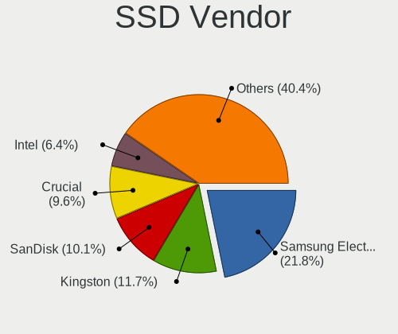
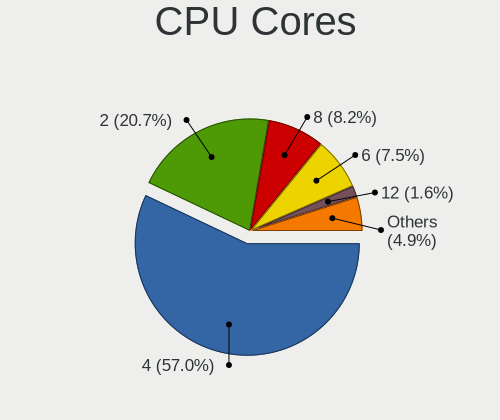
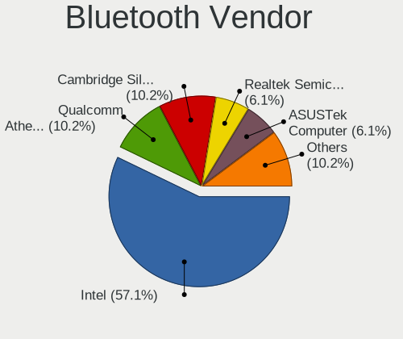
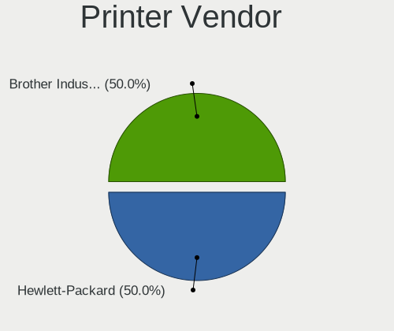
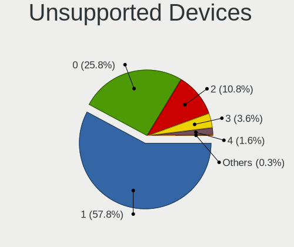

BSD in Australia - Tested Hardware & Statistics (Desktops)
----------------------------------------------------------

A project to collect tested hardware configurations for BSD in Australia.

Anyone can contribute to this report by the [hw-probe](https://github.com/linuxhw/hw-probe/blob/master/INSTALL.BSD.md) tool:

    hw-probe -all -upload

Please contribute! Especially if your hardware is rare.

Contents
--------

* [ Test Cases ](#test-cases)

* [ System ](#system)
  - [ OS                       ](#os)
  - [ OS Family                ](#os-family)
  - [ Arch                     ](#arch)
  - [ DE                       ](#de)
  - [ Display Server           ](#display-server)
  - [ Display Manager          ](#display-manager)
  - [ OS Lang                  ](#os-lang)
  - [ Boot Mode                ](#boot-mode)
  - [ Filesystem               ](#filesystem)
  - [ Part. scheme             ](#part-scheme)

* [ Board ](#board)
  - [ Vendor                   ](#vendor)
  - [ Model                    ](#model)
  - [ Model Family             ](#model-family)
  - [ MFG Year                 ](#mfg-year)
  - [ Form Factor              ](#form-factor)
  - [ Coreboot                 ](#coreboot)
  - [ RAM Size                 ](#ram-size)
  - [ RAM Used                 ](#ram-used)
  - [ Total Drives             ](#total-drives)
  - [ Has CD-ROM               ](#has-cd-rom)
  - [ Has Ethernet             ](#has-ethernet)
  - [ Has WiFi                 ](#has-wifi)
  - [ Has Bluetooth            ](#has-bluetooth)

* [ Location ](#location)
  - [ Country                  ](#country)
  - [ City                     ](#city)

* [ Drives ](#drives)
  - [ Drive Vendor             ](#drive-vendor)
  - [ Drive Model              ](#drive-model)
  - [ HDD Vendor               ](#hdd-vendor)
  - [ SSD Vendor               ](#ssd-vendor)
  - [ Drive Kind               ](#drive-kind)
  - [ Drive Connector          ](#drive-connector)
  - [ Drive Size               ](#drive-size)
  - [ Space Total              ](#space-total)
  - [ Space Used               ](#space-used)
  - [ Malfunc. Drives          ](#malfunc-drives)
  - [ Malfunc. Drive Vendor    ](#malfunc-drive-vendor)
  - [ Malfunc. HDD Vendor      ](#malfunc-hdd-vendor)
  - [ Malfunc. Drive Kind      ](#malfunc-drive-kind)
  - [ Failed Drives            ](#failed-drives)
  - [ Failed Drive Vendor      ](#failed-drive-vendor)
  - [ Drive Status             ](#drive-status)

* [ Storage controller ](#storage-controller)
  - [ Storage Vendor           ](#storage-vendor)
  - [ Storage Model            ](#storage-model)
  - [ Storage Kind             ](#storage-kind)

* [ Processor ](#processor)
  - [ CPU Vendor               ](#cpu-vendor)
  - [ CPU Model                ](#cpu-model)
  - [ CPU Model Family         ](#cpu-model-family)
  - [ CPU Cores                ](#cpu-cores)
  - [ CPU Sockets              ](#cpu-sockets)
  - [ CPU Threads              ](#cpu-threads)
  - [ CPU Microarch            ](#cpu-microarch)

* [ Graphics ](#graphics)
  - [ GPU Vendor               ](#gpu-vendor)
  - [ GPU Model                ](#gpu-model)
  - [ GPU Combo                ](#gpu-combo)
  - [ GPU Driver               ](#gpu-driver)
  - [ GPU Memory               ](#gpu-memory)

* [ Monitor ](#monitor)
  - [ Monitor Vendor           ](#monitor-vendor)
  - [ Monitor Model            ](#monitor-model)
  - [ Monitor Resolution       ](#monitor-resolution)
  - [ Monitor Diagonal         ](#monitor-diagonal)
  - [ Monitor Width            ](#monitor-width)
  - [ Aspect Ratio             ](#aspect-ratio)
  - [ Monitor Area             ](#monitor-area)
  - [ Pixel Density            ](#pixel-density)
  - [ Multiple Monitors        ](#multiple-monitors)

* [ Network ](#network)
  - [ Net Controller Vendor    ](#net-controller-vendor)
  - [ Net Controller Model     ](#net-controller-model)
  - [ Wireless Vendor          ](#wireless-vendor)
  - [ Wireless Model           ](#wireless-model)
  - [ Ethernet Vendor          ](#ethernet-vendor)
  - [ Ethernet Model           ](#ethernet-model)
  - [ Net Controller Kind      ](#net-controller-kind)
  - [ Used Controller          ](#used-controller)
  - [ NICs                     ](#nics)
  - [ IPv6                     ](#ipv6)

* [ Bluetooth ](#bluetooth)
  - [ Bluetooth Vendor         ](#bluetooth-vendor)
  - [ Bluetooth Model          ](#bluetooth-model)

* [ Sound ](#sound)
  - [ Sound Vendor             ](#sound-vendor)
  - [ Sound Model              ](#sound-model)

* [ Memory ](#memory)
  - [ Memory Vendor            ](#memory-vendor)
  - [ Memory Model             ](#memory-model)
  - [ Memory Kind              ](#memory-kind)
  - [ Memory Form Factor       ](#memory-form-factor)
  - [ Memory Size              ](#memory-size)
  - [ Memory Speed             ](#memory-speed)

* [ Printers & scanners ](#printers--scanners)
  - [ Printer Vendor           ](#printer-vendor)
  - [ Printer Model            ](#printer-model)
  - [ Scanner Vendor           ](#scanner-vendor)
  - [ Scanner Model            ](#scanner-model)

* [ Camera ](#camera)
  - [ Camera Vendor            ](#camera-vendor)
  - [ Camera Model             ](#camera-model)

* [ Security ](#security)
  - [ Fingerprint Vendor       ](#fingerprint-vendor)
  - [ Fingerprint Model        ](#fingerprint-model)
  - [ Chipcard Vendor          ](#chipcard-vendor)
  - [ Chipcard Model           ](#chipcard-model)

* [ Unsupported ](#unsupported)
  - [ Unsupported Devices      ](#unsupported-devices)
  - [ Unsupported Device Types ](#unsupported-device-types)

Test Cases
----------

Total: 529

| Vendor        | Model                       | Probe                                                     | Date         |
|---------------|-----------------------------|-----------------------------------------------------------|--------------|
| ASRock        | H570M-ITX/ac                | [5b40284fbe](https://bsd-hardware.info/?probe=5b40284fbe) | Jan 04, 2025 |
| Protectli     | VP4670                      | [1649d4be0f](https://bsd-hardware.info/?probe=1649d4be0f) | Dec 29, 2024 |
| Unknown       | Unknown                     | [a92bf0ef02](https://bsd-hardware.info/?probe=a92bf0ef02) | Dec 27, 2024 |
| ASRock        | H570M-ITX/ac                | [eb9e3863e0](https://bsd-hardware.info/?probe=eb9e3863e0) | Dec 22, 2024 |
| Unknown       | Unknown                     | [02119a1b45](https://bsd-hardware.info/?probe=02119a1b45) | Dec 22, 2024 |
| Protectli     | VP4670                      | [8d641a410f](https://bsd-hardware.info/?probe=8d641a410f) | Dec 16, 2024 |
| WeiBu         | ADL-N Prod                  | [de66071f16](https://bsd-hardware.info/?probe=de66071f16) | Dec 12, 2024 |
| Unknown       | Unknown                     | [fa422c4eec](https://bsd-hardware.info/?probe=fa422c4eec) | Dec 11, 2024 |
| Lenovo        | SHARKBAY SDK0E50510 PRO ... | [1b2c50f225](https://bsd-hardware.info/?probe=1b2c50f225) | Dec 08, 2024 |
| ASUSTek       | Q87I-PLUS                   | [9d857bfe96](https://bsd-hardware.info/?probe=9d857bfe96) | Dec 07, 2024 |
| Protectli     | V1410                       | [78a29a9a78](https://bsd-hardware.info/?probe=78a29a9a78) | Dec 07, 2024 |
| Lenovo        | 1052 NOK                    | [44cfb1316c](https://bsd-hardware.info/?probe=44cfb1316c) | Dec 06, 2024 |
| Protectli     | V1410                       | [de051ba319](https://bsd-hardware.info/?probe=de051ba319) | Dec 03, 2024 |
| Unknown       | Unknown                     | [6348954925](https://bsd-hardware.info/?probe=6348954925) | Dec 02, 2024 |
| Techvision    | TVI7309X B0                 | [648268f0e3](https://bsd-hardware.info/?probe=648268f0e3) | Dec 01, 2024 |
| Gigabyte      | Z490 AORUS MASTER           | [5a7a5ce019](https://bsd-hardware.info/?probe=5a7a5ce019) | Nov 30, 2024 |
| Dell          | 0NW6H5 A00                  | [a25be40b42](https://bsd-hardware.info/?probe=a25be40b42) | Nov 26, 2024 |
| Gigabyte      | Z490 AORUS MASTER           | [acfb1a77bf](https://bsd-hardware.info/?probe=acfb1a77bf) | Nov 24, 2024 |
| Dell          | 00V62H A01                  | [c4ffe49c04](https://bsd-hardware.info/?probe=c4ffe49c04) | Nov 23, 2024 |
| Dell          | 0H0P0M A00                  | [67846a1472](https://bsd-hardware.info/?probe=67846a1472) | Nov 23, 2024 |
| Dell          | 0H0P0M A00                  | [5e1cccc11c](https://bsd-hardware.info/?probe=5e1cccc11c) | Nov 17, 2024 |
| Unknown       | Unknown                     | [9411c1202b](https://bsd-hardware.info/?probe=9411c1202b) | Nov 16, 2024 |
| Dell          | 0XCR8D A01                  | [2ab0785e7a](https://bsd-hardware.info/?probe=2ab0785e7a) | Nov 14, 2024 |
| Shenzhen M... | AHWSA                       | [d296c3e157](https://bsd-hardware.info/?probe=d296c3e157) | Nov 13, 2024 |
| Unknown       | AD18                        | [c134167984](https://bsd-hardware.info/?probe=c134167984) | Nov 12, 2024 |
| HP            | 3048h                       | [9a81b371b5](https://bsd-hardware.info/?probe=9a81b371b5) | Nov 12, 2024 |
| HP            | 83E2                        | [e5c43ed134](https://bsd-hardware.info/?probe=e5c43ed134) | Nov 11, 2024 |
| HP            | 870C                        | [d18863b8e4](https://bsd-hardware.info/?probe=d18863b8e4) | Nov 10, 2024 |
| Dell          | 00V62H A01                  | [1841d9a2d3](https://bsd-hardware.info/?probe=1841d9a2d3) | Oct 29, 2024 |
| Dell          | 096JG8 A01                  | [aad472393b](https://bsd-hardware.info/?probe=aad472393b) | Oct 27, 2024 |
| Unknown       | Unknown                     | [1082ecf333](https://bsd-hardware.info/?probe=1082ecf333) | Oct 26, 2024 |
| Unknown       | Unknown                     | [57f630266f](https://bsd-hardware.info/?probe=57f630266f) | Oct 25, 2024 |
| OEM           | PB-1900-A                   | [fac430a8c9](https://bsd-hardware.info/?probe=fac430a8c9) | Oct 25, 2024 |
| CheckPoint    | T-120-00                    | [62b73d8e40](https://bsd-hardware.info/?probe=62b73d8e40) | Oct 21, 2024 |
| HPE           | ProLiant MicroServer Gen... | [223ca94998](https://bsd-hardware.info/?probe=223ca94998) | Oct 15, 2024 |
| Intel         | D34010WYK H14771-302        | [67245b0423](https://bsd-hardware.info/?probe=67245b0423) | Oct 15, 2024 |
| HP            | 3048h                       | [9a6218dc9f](https://bsd-hardware.info/?probe=9a6218dc9f) | Oct 13, 2024 |
| ASRock        | H570M-ITX/ac                | [4e0d157a76](https://bsd-hardware.info/?probe=4e0d157a76) | Oct 09, 2024 |
| ASRock        | H570M-ITX/ac                | [e54bd4924f](https://bsd-hardware.info/?probe=e54bd4924f) | Oct 09, 2024 |
| Dell          | 00V62H A00                  | [87e3fa093a](https://bsd-hardware.info/?probe=87e3fa093a) | Oct 09, 2024 |
| Techvision    | TVI7309X B0                 | [156ab405d2](https://bsd-hardware.info/?probe=156ab405d2) | Oct 09, 2024 |
| Gigabyte      | GA-78LMT-S2P                | [7b97e06782](https://bsd-hardware.info/?probe=7b97e06782) | Oct 04, 2024 |
| Intel         | DH67BL AAG10189-206         | [45d47552af](https://bsd-hardware.info/?probe=45d47552af) | Oct 02, 2024 |
| Techvision    | TVI7309X B0                 | [45a12f9a8b](https://bsd-hardware.info/?probe=45a12f9a8b) | Oct 01, 2024 |
| Lenovo        | 30D9 SDK0J40705 WIN 3425... | [b50eb75680](https://bsd-hardware.info/?probe=b50eb75680) | Sep 28, 2024 |
| HP            | 870C                        | [a0a04f0fa9](https://bsd-hardware.info/?probe=a0a04f0fa9) | Sep 27, 2024 |
| Unknown       | Unknown                     | [9be3134b8f](https://bsd-hardware.info/?probe=9be3134b8f) | Sep 26, 2024 |
| AZW           | EQ                          | [5cc403e6aa](https://bsd-hardware.info/?probe=5cc403e6aa) | Sep 24, 2024 |
| Unknown       | Unknown                     | [9fcfe381ae](https://bsd-hardware.info/?probe=9fcfe381ae) | Sep 24, 2024 |
| Intel         | PB-X6000                    | [b0a7e628cf](https://bsd-hardware.info/?probe=b0a7e628cf) | Sep 23, 2024 |
| Citrix        | CB-1100                     | [304a4f6d5f](https://bsd-hardware.info/?probe=304a4f6d5f) | Sep 23, 2024 |
| Protectli     | VP4630                      | [f599050faf](https://bsd-hardware.info/?probe=f599050faf) | Sep 18, 2024 |
| HP            | 870C                        | [6a8b48c698](https://bsd-hardware.info/?probe=6a8b48c698) | Sep 17, 2024 |
| Citrix        | CB-1100                     | [6e070920d0](https://bsd-hardware.info/?probe=6e070920d0) | Sep 15, 2024 |
| Unknown       | Unknown                     | [6575dfb8e4](https://bsd-hardware.info/?probe=6575dfb8e4) | Sep 15, 2024 |
| Gigabyte      | G41MT-ES2L                  | [8afe8ddad6](https://bsd-hardware.info/?probe=8afe8ddad6) | Sep 15, 2024 |
| MSI           | PRO Z690-A DDR4             | [0a5ecbce04](https://bsd-hardware.info/?probe=0a5ecbce04) | Sep 12, 2024 |
| Gigabyte      | G41MT-ES2L                  | [8016457889](https://bsd-hardware.info/?probe=8016457889) | Sep 10, 2024 |
| Unknown       | Unknown                     | [f19fafe503](https://bsd-hardware.info/?probe=f19fafe503) | Sep 07, 2024 |
| Unknown       | Unknown                     | [170e17cd46](https://bsd-hardware.info/?probe=170e17cd46) | Sep 07, 2024 |
| Gigabyte      | GA-78LMT-S2P                | [c1fb0928df](https://bsd-hardware.info/?probe=c1fb0928df) | Sep 06, 2024 |
| Unknown       | Unknown                     | [2399243ff8](https://bsd-hardware.info/?probe=2399243ff8) | Sep 06, 2024 |
| OEM           | PB-1900-A                   | [6334dac48a](https://bsd-hardware.info/?probe=6334dac48a) | Sep 06, 2024 |
| Trigkey       | Green G5                    | [fcaa5a268e](https://bsd-hardware.info/?probe=fcaa5a268e) | Sep 05, 2024 |
| Gigabyte      | B360M D3H-CF                | [b5d95279a6](https://bsd-hardware.info/?probe=b5d95279a6) | Sep 03, 2024 |
| Unknown       | Unknown                     | [13fa129348](https://bsd-hardware.info/?probe=13fa129348) | Aug 31, 2024 |
| Unknown       | Unknown                     | [e31fb6e0e8](https://bsd-hardware.info/?probe=e31fb6e0e8) | Aug 31, 2024 |
| Unknown       | Unknown                     | [a4cdaf25d6](https://bsd-hardware.info/?probe=a4cdaf25d6) | Aug 30, 2024 |
| Gigabyte      | B250M-D3H-CF                | [ce9b1b23e1](https://bsd-hardware.info/?probe=ce9b1b23e1) | Aug 29, 2024 |
| Trigkey       | Green G5                    | [13c389b9df](https://bsd-hardware.info/?probe=13c389b9df) | Aug 29, 2024 |
| Protectli     | FW4B                        | [92d79ae389](https://bsd-hardware.info/?probe=92d79ae389) | Aug 26, 2024 |
| Unknown       | Unknown                     | [104269f26b](https://bsd-hardware.info/?probe=104269f26b) | Aug 25, 2024 |
| Dell          | 0NC2VH A01                  | [cba2c1f636](https://bsd-hardware.info/?probe=cba2c1f636) | Aug 22, 2024 |
| CheckPoint    | T-120-00                    | [25c29c6dcc](https://bsd-hardware.info/?probe=25c29c6dcc) | Aug 21, 2024 |
| Unknown       | QDNV01                      | [2b68f6c1ec](https://bsd-hardware.info/?probe=2b68f6c1ec) | Aug 21, 2024 |
| HP            | 870C                        | [2a69ceab02](https://bsd-hardware.info/?probe=2a69ceab02) | Aug 19, 2024 |
| Unknown       | Unknown                     | [c1a44667bd](https://bsd-hardware.info/?probe=c1a44667bd) | Aug 14, 2024 |
| Unknown       | Unknown                     | [d69a19bb41](https://bsd-hardware.info/?probe=d69a19bb41) | Aug 12, 2024 |
| Unknown       | Unknown                     | [9a967b67dd](https://bsd-hardware.info/?probe=9a967b67dd) | Aug 08, 2024 |
| OEM           | PB-1900-A                   | [e45310d73f](https://bsd-hardware.info/?probe=e45310d73f) | Aug 04, 2024 |
| Gigabyte      | B250M-D3H-CF                | [43ccbf96cb](https://bsd-hardware.info/?probe=43ccbf96cb) | Aug 04, 2024 |
| Unknown       | Unknown                     | [edece0ced6](https://bsd-hardware.info/?probe=edece0ced6) | Aug 03, 2024 |
| HP            | 870C                        | [8f559ae44d](https://bsd-hardware.info/?probe=8f559ae44d) | Jul 31, 2024 |
| HP            | 870C                        | [00c53213af](https://bsd-hardware.info/?probe=00c53213af) | Jul 27, 2024 |
| Techvision    | TVI7309X B0                 | [1cc0e919ed](https://bsd-hardware.info/?probe=1cc0e919ed) | Jul 26, 2024 |
| Apple         | Mac-F221BEC8                | [dd834b1229](https://bsd-hardware.info/?probe=dd834b1229) | Jul 26, 2024 |
| Unknown       | Unknown                     | [7054a512d1](https://bsd-hardware.info/?probe=7054a512d1) | Jul 23, 2024 |
| Unknown       | Unknown                     | [90daceb808](https://bsd-hardware.info/?probe=90daceb808) | Jul 22, 2024 |
| Unknown       | Unknown                     | [ff3ada3808](https://bsd-hardware.info/?probe=ff3ada3808) | Jul 22, 2024 |
| Lenovo        | 30D9 SDK0J40705 WIN 3425... | [3ae423a460](https://bsd-hardware.info/?probe=3ae423a460) | Jul 14, 2024 |
| Unknown       | QGLK03                      | [2c06f0a474](https://bsd-hardware.info/?probe=2c06f0a474) | Jul 13, 2024 |
| Gigabyte      | B250M-D3H-CF                | [eb82e44d2d](https://bsd-hardware.info/?probe=eb82e44d2d) | Jul 10, 2024 |
| Unknown       | Unknown                     | [b9e0599645](https://bsd-hardware.info/?probe=b9e0599645) | Jul 10, 2024 |
| Techvision    | TVI7309X B0                 | [2676698df8](https://bsd-hardware.info/?probe=2676698df8) | Jul 03, 2024 |
| Protectli     | VP4650                      | [a9edd6c51a](https://bsd-hardware.info/?probe=a9edd6c51a) | Jul 03, 2024 |
| HP            | 870C                        | [655f793071](https://bsd-hardware.info/?probe=655f793071) | Jul 02, 2024 |
| HP            | 870C                        | [1cd554e5e9](https://bsd-hardware.info/?probe=1cd554e5e9) | Jul 01, 2024 |
| HP            | 870C                        | [2caaf86446](https://bsd-hardware.info/?probe=2caaf86446) | Jun 30, 2024 |
| Unknown       | Unknown                     | [d8e556e598](https://bsd-hardware.info/?probe=d8e556e598) | Jun 30, 2024 |
| Unknown       | Unknown                     | [82db566380](https://bsd-hardware.info/?probe=82db566380) | Jun 30, 2024 |
| Techvision    | TVI7309X B0                 | [0a8aa195eb](https://bsd-hardware.info/?probe=0a8aa195eb) | Jun 26, 2024 |
| HP            | 870C                        | [b844ce2068](https://bsd-hardware.info/?probe=b844ce2068) | Jun 26, 2024 |
| Dell          | 096JG8 A01                  | [6cba39a47b](https://bsd-hardware.info/?probe=6cba39a47b) | Jun 25, 2024 |
| Gigabyte      | B250M-D3H-CF                | [fb21431b06](https://bsd-hardware.info/?probe=fb21431b06) | Jun 24, 2024 |
| Dell          | 096JG8 A01                  | [24c2c59c3a](https://bsd-hardware.info/?probe=24c2c59c3a) | Jun 23, 2024 |
| Techvision    | TVI7309X B0                 | [9daa772291](https://bsd-hardware.info/?probe=9daa772291) | Jun 21, 2024 |
| Protectli     | VP2410 10                   | [3ffa3a7b97](https://bsd-hardware.info/?probe=3ffa3a7b97) | Jun 20, 2024 |
| Dell          | 0PC5F7 A00                  | [5c88193dc4](https://bsd-hardware.info/?probe=5c88193dc4) | Jun 16, 2024 |
| HP            | 83EE                        | [c5a71d4e06](https://bsd-hardware.info/?probe=c5a71d4e06) | Jun 15, 2024 |
| HP            | 82A2                        | [d4a521d5f7](https://bsd-hardware.info/?probe=d4a521d5f7) | Jun 13, 2024 |
| ASUSTek       | Z97-A                       | [f2787a24ba](https://bsd-hardware.info/?probe=f2787a24ba) | Jun 11, 2024 |
| OEM           | PB-1900-A                   | [af1a4c2802](https://bsd-hardware.info/?probe=af1a4c2802) | Jun 10, 2024 |
| Unknown       | Unknown                     | [0f3d5ece0c](https://bsd-hardware.info/?probe=0f3d5ece0c) | Jun 10, 2024 |
| ASUSTek       | CROSSHAIR VI HERO           | [51df4f57c5](https://bsd-hardware.info/?probe=51df4f57c5) | Jun 02, 2024 |
| Unknown       | Unknown                     | [94f269663c](https://bsd-hardware.info/?probe=94f269663c) | Jun 01, 2024 |
| Intel         | DENLOW_WS                   | [27f73c0ae9](https://bsd-hardware.info/?probe=27f73c0ae9) | May 31, 2024 |
| Unknown       | QDNV01                      | [5d8b4c676b](https://bsd-hardware.info/?probe=5d8b4c676b) | May 29, 2024 |
| Unknown       | Unknown                     | [c20215f991](https://bsd-hardware.info/?probe=c20215f991) | May 29, 2024 |
| Gigabyte      | Z790 EAGLE AX               | [65d52d2137](https://bsd-hardware.info/?probe=65d52d2137) | May 28, 2024 |
| Unknown       | Unknown                     | [d0919f78df](https://bsd-hardware.info/?probe=d0919f78df) | May 27, 2024 |
| Gigabyte      | Z790 EAGLE AX               | [354c2b5195](https://bsd-hardware.info/?probe=354c2b5195) | May 26, 2024 |
| Unknown       | Unknown                     | [c74d50d97d](https://bsd-hardware.info/?probe=c74d50d97d) | May 25, 2024 |
| IceWhale T... | ZimaBoard 432 ZMB           | [72d4c7046e](https://bsd-hardware.info/?probe=72d4c7046e) | May 23, 2024 |
| Gigabyte      | Z790 EAGLE AX               | [011ed158e0](https://bsd-hardware.info/?probe=011ed158e0) | May 18, 2024 |
| Gigabyte      | Z790 EAGLE AX               | [d96abdd063](https://bsd-hardware.info/?probe=d96abdd063) | May 17, 2024 |
| HP            | 83E1                        | [2227565c4c](https://bsd-hardware.info/?probe=2227565c4c) | May 15, 2024 |
| Intel         | QHSW02                      | [945cf47cc6](https://bsd-hardware.info/?probe=945cf47cc6) | May 14, 2024 |
| AMD           | Inagua CRB                  | [d5ba9b512c](https://bsd-hardware.info/?probe=d5ba9b512c) | May 13, 2024 |
| ASUSTek       | ROG STRIX X570-E GAMING ... | [e82997fc22](https://bsd-hardware.info/?probe=e82997fc22) | May 13, 2024 |
| HP            | 83EE                        | [cb1389a074](https://bsd-hardware.info/?probe=cb1389a074) | May 12, 2024 |
| Unknown       | QGLK03                      | [3a6ac054e6](https://bsd-hardware.info/?probe=3a6ac054e6) | May 09, 2024 |
| HP            | 83EE                        | [c2a0b11bfa](https://bsd-hardware.info/?probe=c2a0b11bfa) | May 08, 2024 |
| AZW           | EQ                          | [edb4b64548](https://bsd-hardware.info/?probe=edb4b64548) | May 06, 2024 |
| Intel         | MAHOBAY                     | [dfe3417cfb](https://bsd-hardware.info/?probe=dfe3417cfb) | May 05, 2024 |
| Unknown       | Unknown                     | [c77ff29728](https://bsd-hardware.info/?probe=c77ff29728) | May 04, 2024 |
| Intel         | PB-X6000                    | [23a7529eaa](https://bsd-hardware.info/?probe=23a7529eaa) | May 04, 2024 |
| Unknown       | Unknown                     | [da95fe1264](https://bsd-hardware.info/?probe=da95fe1264) | May 02, 2024 |
| Dell          | 0PC5F7 A00                  | [25be1b099a](https://bsd-hardware.info/?probe=25be1b099a) | May 02, 2024 |
| Dell          | 0PC5F7 A00                  | [217f8e63db](https://bsd-hardware.info/?probe=217f8e63db) | May 01, 2024 |
| Unknown       | Unknown                     | [1c2459184f](https://bsd-hardware.info/?probe=1c2459184f) | Apr 28, 2024 |
| Protectli     | VP4630                      | [a128743268](https://bsd-hardware.info/?probe=a128743268) | Apr 25, 2024 |
| Dell          | 0DNMV1 A01                  | [97161dac8a](https://bsd-hardware.info/?probe=97161dac8a) | Apr 24, 2024 |
| Gigabyte      | H110M-H-CF                  | [2000d6447a](https://bsd-hardware.info/?probe=2000d6447a) | Apr 23, 2024 |
| Gigabyte      | H110M-H-CF                  | [3e1def845f](https://bsd-hardware.info/?probe=3e1def845f) | Apr 23, 2024 |
| Gigabyte      | X570 AORUS MASTER           | [58a64ecc64](https://bsd-hardware.info/?probe=58a64ecc64) | Apr 23, 2024 |
| Lenovo        | SHARKBAY 0B98401 WIN        | [d9b4db06cf](https://bsd-hardware.info/?probe=d9b4db06cf) | Apr 21, 2024 |
| Dell          | 0XCR8D A01                  | [716181ac45](https://bsd-hardware.info/?probe=716181ac45) | Apr 21, 2024 |
| Gigabyte      | B460 AORUS PRO AC           | [fe0730cde5](https://bsd-hardware.info/?probe=fe0730cde5) | Apr 20, 2024 |
| ASUSTek       | TUF Gaming X570-PLUS        | [572876d341](https://bsd-hardware.info/?probe=572876d341) | Apr 20, 2024 |
| AZW           | EQ                          | [f822d4127d](https://bsd-hardware.info/?probe=f822d4127d) | Apr 20, 2024 |
| Intel         | Q3XXG4-P V1.0               | [dd5c8c3088](https://bsd-hardware.info/?probe=dd5c8c3088) | Apr 17, 2024 |
| Techvision    | TVI7309X B0                 | [7e1d43786b](https://bsd-hardware.info/?probe=7e1d43786b) | Apr 15, 2024 |
| Intel         | MAHOBAY                     | [9202be9d8d](https://bsd-hardware.info/?probe=9202be9d8d) | Apr 12, 2024 |
| Protectli     | VP4650                      | [95ce732272](https://bsd-hardware.info/?probe=95ce732272) | Apr 12, 2024 |
| Unknown       | Unknown                     | [bafb4c3fd6](https://bsd-hardware.info/?probe=bafb4c3fd6) | Apr 06, 2024 |
| Intel         | SKYBAY                      | [7d6e63d688](https://bsd-hardware.info/?probe=7d6e63d688) | Apr 02, 2024 |
| Lenovo        | SHARKBAY 0C48431 WIN        | [893075f24f](https://bsd-hardware.info/?probe=893075f24f) | Apr 02, 2024 |
| HP            | 83E2                        | [c1765c598f](https://bsd-hardware.info/?probe=c1765c598f) | Apr 02, 2024 |
| Dell          | 0XCR8D A01                  | [39679bc463](https://bsd-hardware.info/?probe=39679bc463) | Apr 01, 2024 |
| Gigabyte      | B360M D3H-CF                | [f89dd6d1c9](https://bsd-hardware.info/?probe=f89dd6d1c9) | Mar 31, 2024 |
| Gigabyte      | B360M D3H-CF                | [28f484158e](https://bsd-hardware.info/?probe=28f484158e) | Mar 31, 2024 |
| Unknown       | Unknown                     | [673473a1a0](https://bsd-hardware.info/?probe=673473a1a0) | Mar 27, 2024 |
| MSI           | MS-B0A81                    | [17e87ae023](https://bsd-hardware.info/?probe=17e87ae023) | Mar 26, 2024 |
| Intel         | SKYBAY                      | [8aaca978dc](https://bsd-hardware.info/?probe=8aaca978dc) | Mar 26, 2024 |
| HP            | 870C                        | [736b0fa24b](https://bsd-hardware.info/?probe=736b0fa24b) | Mar 26, 2024 |
| Unknown       | Unknown                     | [5b7761ce38](https://bsd-hardware.info/?probe=5b7761ce38) | Mar 23, 2024 |
| OEM           | PB-1900-A                   | [7172e173cb](https://bsd-hardware.info/?probe=7172e173cb) | Mar 19, 2024 |
| Unknown       | Unknown                     | [5e613125ca](https://bsd-hardware.info/?probe=5e613125ca) | Mar 10, 2024 |
| Unknown       | Unknown                     | [3dadeb1ccc](https://bsd-hardware.info/?probe=3dadeb1ccc) | Mar 08, 2024 |
| Intel         | QHSW02                      | [54d2883b0f](https://bsd-hardware.info/?probe=54d2883b0f) | Mar 08, 2024 |
| Unknown       | Unknown                     | [cf72715739](https://bsd-hardware.info/?probe=cf72715739) | Mar 07, 2024 |
| Techvision    | TVI7309X B0                 | [e8ed936537](https://bsd-hardware.info/?probe=e8ed936537) | Mar 06, 2024 |
| Unknown       | Unknown                     | [ed75f5f715](https://bsd-hardware.info/?probe=ed75f5f715) | Mar 05, 2024 |
| Dell          | 0XCR8D A02                  | [8919d9eb09](https://bsd-hardware.info/?probe=8919d9eb09) | Mar 05, 2024 |
| Dell          | 07F37C A00                  | [53928dbf53](https://bsd-hardware.info/?probe=53928dbf53) | Mar 03, 2024 |
| MSI           | MS-B0A81                    | [2f6a08c240](https://bsd-hardware.info/?probe=2f6a08c240) | Mar 03, 2024 |
| Unknown       | Unknown                     | [83a5d4bd8b](https://bsd-hardware.info/?probe=83a5d4bd8b) | Mar 01, 2024 |
| HP            | 83EE                        | [0c83be53f1](https://bsd-hardware.info/?probe=0c83be53f1) | Feb 27, 2024 |
| Unknown       | Unknown                     | [dc82774d4b](https://bsd-hardware.info/?probe=dc82774d4b) | Feb 21, 2024 |
| Unknown       | Unknown                     | [c64774303d](https://bsd-hardware.info/?probe=c64774303d) | Feb 20, 2024 |
| Unknown       | Unknown                     | [e5e747ec86](https://bsd-hardware.info/?probe=e5e747ec86) | Feb 16, 2024 |
| Unknown       | Unknown                     | [7dc7c39f38](https://bsd-hardware.info/?probe=7dc7c39f38) | Feb 15, 2024 |
| Unknown       | Unknown                     | [7b626b5a2c](https://bsd-hardware.info/?probe=7b626b5a2c) | Feb 07, 2024 |
| HP            | 83EE                        | [3fdb0e4625](https://bsd-hardware.info/?probe=3fdb0e4625) | Feb 05, 2024 |
| HP            | 83EE                        | [92258e181d](https://bsd-hardware.info/?probe=92258e181d) | Feb 05, 2024 |
| Unknown       | Unknown                     | [5eb0f3d517](https://bsd-hardware.info/?probe=5eb0f3d517) | Jan 20, 2024 |
| Gigabyte      | J1900N-D3V                  | [4d9e3faf1d](https://bsd-hardware.info/?probe=4d9e3faf1d) | Jan 06, 2024 |
| Unknown       | Unknown                     | [3ae4489483](https://bsd-hardware.info/?probe=3ae4489483) | Jan 05, 2024 |
| HP            | 83EE                        | [cbfaae0ca7](https://bsd-hardware.info/?probe=cbfaae0ca7) | Jan 05, 2024 |
| Unknown       | Unknown                     | [0d4b103495](https://bsd-hardware.info/?probe=0d4b103495) | Jan 04, 2024 |
| Intel         | Q3XXG4-P V1.0               | [52345f2706](https://bsd-hardware.info/?probe=52345f2706) | Jan 02, 2024 |
| Hardkernel    | ODROID-H2                   | [959e70a37e](https://bsd-hardware.info/?probe=959e70a37e) | Jan 02, 2024 |
| Unknown       | Unknown                     | [5354734c83](https://bsd-hardware.info/?probe=5354734c83) | Dec 29, 2023 |
| Intel         | Q3XXG4-P V1.0               | [bc5f165c4a](https://bsd-hardware.info/?probe=bc5f165c4a) | Dec 29, 2023 |
| Unknown       | Unknown                     | [03f7101d55](https://bsd-hardware.info/?probe=03f7101d55) | Dec 25, 2023 |
| Dell          | 00V62H A00                  | [b99ed60ab6](https://bsd-hardware.info/?probe=b99ed60ab6) | Dec 18, 2023 |
| Dell          | 00V62H A00                  | [8f6f4d38d3](https://bsd-hardware.info/?probe=8f6f4d38d3) | Dec 17, 2023 |
| Techvision    | TVI7309X B0                 | [878769cc62](https://bsd-hardware.info/?probe=878769cc62) | Dec 17, 2023 |
| Lenovo        | SDK0E50510 WIN              | [57a4adcc91](https://bsd-hardware.info/?probe=57a4adcc91) | Dec 17, 2023 |
| Unknown       | Unknown                     | [784c8ae515](https://bsd-hardware.info/?probe=784c8ae515) | Dec 16, 2023 |
| HP            | 82A2                        | [906fd206fe](https://bsd-hardware.info/?probe=906fd206fe) | Dec 15, 2023 |
| HP            | 82A2                        | [0a816d2760](https://bsd-hardware.info/?probe=0a816d2760) | Dec 15, 2023 |
| Dell          | 0PC5F7 A00                  | [e47e643ced](https://bsd-hardware.info/?probe=e47e643ced) | Dec 14, 2023 |
| Intel         | DENLOW_WS                   | [d8b2ccabda](https://bsd-hardware.info/?probe=d8b2ccabda) | Nov 30, 2023 |
| Unknown       | Unknown                     | [2a34bc9613](https://bsd-hardware.info/?probe=2a34bc9613) | Nov 28, 2023 |
| AZW           | SER                         | [48a259ae28](https://bsd-hardware.info/?probe=48a259ae28) | Nov 28, 2023 |
| Unknown       | Unknown                     | [c8960ff614](https://bsd-hardware.info/?probe=c8960ff614) | Nov 22, 2023 |
| Unknown       | Unknown                     | [066991fce5](https://bsd-hardware.info/?probe=066991fce5) | Nov 16, 2023 |
| HP            | 213D A01                    | [eff9e5704a](https://bsd-hardware.info/?probe=eff9e5704a) | Nov 16, 2023 |
| Unknown       | Unknown                     | [696dae397c](https://bsd-hardware.info/?probe=696dae397c) | Nov 12, 2023 |
| Shenzhen M... | RPBNB                       | [ab2de15a7a](https://bsd-hardware.info/?probe=ab2de15a7a) | Nov 11, 2023 |
| Shenzhen M... | RPBNB                       | [b04823f9e5](https://bsd-hardware.info/?probe=b04823f9e5) | Nov 07, 2023 |
| Dell          | 0D24M8 A01                  | [4c874fa8af](https://bsd-hardware.info/?probe=4c874fa8af) | Nov 06, 2023 |
| Dell          | 0D24M8 A01                  | [3ca7f9b6d1](https://bsd-hardware.info/?probe=3ca7f9b6d1) | Nov 06, 2023 |
| Shuttle       | FS61                        | [1ed38ceb8c](https://bsd-hardware.info/?probe=1ed38ceb8c) | Nov 05, 2023 |
| Unknown       | Unknown                     | [97f4527aab](https://bsd-hardware.info/?probe=97f4527aab) | Nov 05, 2023 |
| HP            | 83EE                        | [1ab86be61a](https://bsd-hardware.info/?probe=1ab86be61a) | Nov 05, 2023 |
| HP            | 213D A01                    | [da7d91889e](https://bsd-hardware.info/?probe=da7d91889e) | Nov 03, 2023 |
| Unknown       | Unknown                     | [743d5aec59](https://bsd-hardware.info/?probe=743d5aec59) | Nov 02, 2023 |
| Intel         | Q3XXG4-P V1.0               | [cac29f9a35](https://bsd-hardware.info/?probe=cac29f9a35) | Oct 30, 2023 |
| Unknown       | Unknown                     | [850878776a](https://bsd-hardware.info/?probe=850878776a) | Oct 27, 2023 |
| HP            | 3397                        | [3dad1378f7](https://bsd-hardware.info/?probe=3dad1378f7) | Oct 27, 2023 |
| Winston Ma... | PICO PC V1.2                | [244102bda8](https://bsd-hardware.info/?probe=244102bda8) | Oct 26, 2023 |
| Intel         | MAHOBAY                     | [9b797e809a](https://bsd-hardware.info/?probe=9b797e809a) | Oct 26, 2023 |
| Intel         | MAHOBAY                     | [4dd20af1a3](https://bsd-hardware.info/?probe=4dd20af1a3) | Oct 26, 2023 |
| Intel         | MAHOBAY                     | [c66be142de](https://bsd-hardware.info/?probe=c66be142de) | Oct 26, 2023 |
| Unknown       | Unknown                     | [530528316f](https://bsd-hardware.info/?probe=530528316f) | Oct 21, 2023 |
| CWWK          | MINIPC-G12                  | [c51a6f8459](https://bsd-hardware.info/?probe=c51a6f8459) | Oct 20, 2023 |
| Unknown       | Unknown                     | [af12786272](https://bsd-hardware.info/?probe=af12786272) | Oct 18, 2023 |
| Unknown       | J3160-4L                    | [95e017977c](https://bsd-hardware.info/?probe=95e017977c) | Oct 14, 2023 |
| HP            | 83EE                        | [88d80d215a](https://bsd-hardware.info/?probe=88d80d215a) | Sep 30, 2023 |
| HP            | 83EE                        | [d08ae678b5](https://bsd-hardware.info/?probe=d08ae678b5) | Sep 28, 2023 |
| Unknown       | Unknown                     | [a5643cabc4](https://bsd-hardware.info/?probe=a5643cabc4) | Sep 24, 2023 |
| GoWin Solu... | R86S                        | [0cfd79f7fe](https://bsd-hardware.info/?probe=0cfd79f7fe) | Sep 18, 2023 |
| HP            | 82A2                        | [4f125fbc75](https://bsd-hardware.info/?probe=4f125fbc75) | Sep 17, 2023 |
| Unknown       | Unknown                     | [21e851e9e9](https://bsd-hardware.info/?probe=21e851e9e9) | Sep 07, 2023 |
| TYAN Compu... | S5510HE                     | [99d23c35ca](https://bsd-hardware.info/?probe=99d23c35ca) | Sep 07, 2023 |
| ASUSTek       | ROG STRIX B450-I GAMING     | [3dab6f4044](https://bsd-hardware.info/?probe=3dab6f4044) | Aug 28, 2023 |
| Unknown       | Unknown                     | [b5a786e411](https://bsd-hardware.info/?probe=b5a786e411) | Aug 18, 2023 |
| ASUSTek       | PRIME B450M-K               | [74bfa3e0cd](https://bsd-hardware.info/?probe=74bfa3e0cd) | Aug 15, 2023 |
| Protectli     | FW4B Ver                    | [064ee65b5c](https://bsd-hardware.info/?probe=064ee65b5c) | Aug 10, 2023 |
| Techvision    | TVI7309X B0                 | [fd4046c4d9](https://bsd-hardware.info/?probe=fd4046c4d9) | Aug 07, 2023 |
| Lenovo        | 313C SDK0J40697 WIN 3305... | [f65647a6be](https://bsd-hardware.info/?probe=f65647a6be) | Aug 06, 2023 |
| Lenovo        | SDK0E50510 WIN              | [eee3c082b5](https://bsd-hardware.info/?probe=eee3c082b5) | Aug 05, 2023 |
| Unknown       | Unknown                     | [e9977bfffe](https://bsd-hardware.info/?probe=e9977bfffe) | Aug 02, 2023 |
| HP            | 18E9                        | [04c971a0de](https://bsd-hardware.info/?probe=04c971a0de) | Jul 31, 2023 |
| HP            | 83E1                        | [b211795736](https://bsd-hardware.info/?probe=b211795736) | Jul 27, 2023 |
| Unknown       | Unknown                     | [64c9b0f743](https://bsd-hardware.info/?probe=64c9b0f743) | Jul 25, 2023 |
| ASRock        | H570M-ITX/ac                | [8ac2939575](https://bsd-hardware.info/?probe=8ac2939575) | Jul 23, 2023 |
| Lenovo        | SDK0E50510 WIN              | [63ab45fcb1](https://bsd-hardware.info/?probe=63ab45fcb1) | Jul 21, 2023 |
| Unknown       | Unknown                     | [5bea9c433e](https://bsd-hardware.info/?probe=5bea9c433e) | Jul 17, 2023 |
| YANYU         | H67SL                       | [699da6c722](https://bsd-hardware.info/?probe=699da6c722) | Jul 13, 2023 |
| Gigabyte      | M85M-US2H                   | [e0a38ef6ad](https://bsd-hardware.info/?probe=e0a38ef6ad) | Jul 03, 2023 |
| PC Engines    | APU2                        | [c1272678e6](https://bsd-hardware.info/?probe=c1272678e6) | Jul 02, 2023 |
| Gigabyte      | H77M-D3H                    | [9f6d45e43e](https://bsd-hardware.info/?probe=9f6d45e43e) | Jul 02, 2023 |
| Gigabyte      | H77M-D3H                    | [3eb03fa8a7](https://bsd-hardware.info/?probe=3eb03fa8a7) | Jul 02, 2023 |
| HP            | 82A2                        | [4b8d139419](https://bsd-hardware.info/?probe=4b8d139419) | Jun 29, 2023 |
| Unknown       | Unknown                     | [23cdf1d4af](https://bsd-hardware.info/?probe=23cdf1d4af) | Jun 27, 2023 |
| Unknown       | Unknown                     | [a548b021da](https://bsd-hardware.info/?probe=a548b021da) | Jun 27, 2023 |
| YANYU         | H67SL                       | [5d5fd8a8cd](https://bsd-hardware.info/?probe=5d5fd8a8cd) | Jun 27, 2023 |
| HP            | 18E9                        | [aba608120b](https://bsd-hardware.info/?probe=aba608120b) | Jun 26, 2023 |
| Shuttle       | DH370                       | [95eb3bd4a8](https://bsd-hardware.info/?probe=95eb3bd4a8) | Jun 24, 2023 |
| Protectli     | FW4B                        | [6c993e8f34](https://bsd-hardware.info/?probe=6c993e8f34) | Jun 23, 2023 |
| Intel         | SKYBAY                      | [940adce39f](https://bsd-hardware.info/?probe=940adce39f) | Jun 23, 2023 |
| ASRock        | 4X4-4000 Series             | [c9420276e7](https://bsd-hardware.info/?probe=c9420276e7) | Jun 23, 2023 |
| Intel         | J1900                       | [4a3a52030b](https://bsd-hardware.info/?probe=4a3a52030b) | Jun 15, 2023 |
| Acer          | Aspire TC-230               | [d7eacfafe1](https://bsd-hardware.info/?probe=d7eacfafe1) | Jun 04, 2023 |
| Lenovo        | 30D2 SDK0J40697 WIN 3305... | [d4247f35c8](https://bsd-hardware.info/?probe=d4247f35c8) | Jun 02, 2023 |
| Dell          | 00V62H A01                  | [a87429607b](https://bsd-hardware.info/?probe=a87429607b) | Jun 01, 2023 |
| Intel         | QHSW02                      | [ed6d01bc2b](https://bsd-hardware.info/?probe=ed6d01bc2b) | May 31, 2023 |
| Intel         | QHSW02                      | [9f3d95a494](https://bsd-hardware.info/?probe=9f3d95a494) | May 31, 2023 |
| Protectli     | FW4B Ver                    | [1587da94da](https://bsd-hardware.info/?probe=1587da94da) | May 30, 2023 |
| Dell          | 0HD5W2 A00                  | [bd3ea7e1d6](https://bsd-hardware.info/?probe=bd3ea7e1d6) | May 28, 2023 |
| Intel         | J1900                       | [4d849f4f34](https://bsd-hardware.info/?probe=4d849f4f34) | May 27, 2023 |
| CWWK          | CW-AD4L-N V1                | [310da4e6e5](https://bsd-hardware.info/?probe=310da4e6e5) | May 26, 2023 |
| Dell          | 096JG8 A01                  | [f350405f61](https://bsd-hardware.info/?probe=f350405f61) | May 26, 2023 |
| Inventec      | R CLASS A02                 | [85f3673aa8](https://bsd-hardware.info/?probe=85f3673aa8) | May 24, 2023 |
| Intel         | J1900                       | [52081bc55b](https://bsd-hardware.info/?probe=52081bc55b) | May 24, 2023 |
| Dell          | 0M9KCM A02                  | [932e96060f](https://bsd-hardware.info/?probe=932e96060f) | May 21, 2023 |
| Dell          | 096JG8 A01                  | [3abf2c7ee2](https://bsd-hardware.info/?probe=3abf2c7ee2) | May 19, 2023 |
| Dell          | 096JG8 A01                  | [6f7bcae20b](https://bsd-hardware.info/?probe=6f7bcae20b) | May 19, 2023 |
| Protectli     | FW2B                        | [aa52b30ddf](https://bsd-hardware.info/?probe=aa52b30ddf) | May 14, 2023 |
| Dell          | 07F37C A00                  | [a23a95f97a](https://bsd-hardware.info/?probe=a23a95f97a) | May 07, 2023 |
| Dell          | 096JG8 A01                  | [633fa55df0](https://bsd-hardware.info/?probe=633fa55df0) | May 07, 2023 |
| Dell          | 0YC03K A04                  | [979aea14cc](https://bsd-hardware.info/?probe=979aea14cc) | May 06, 2023 |
| Unknown       | Unknown                     | [28253dd080](https://bsd-hardware.info/?probe=28253dd080) | Apr 28, 2023 |
| HP            | 82B4                        | [b75bb5fe83](https://bsd-hardware.info/?probe=b75bb5fe83) | Apr 20, 2023 |
| Techvision    | TVI7309X B0                 | [28c2a703c7](https://bsd-hardware.info/?probe=28c2a703c7) | Apr 18, 2023 |
| Gigabyte      | B560M DS3H V2               | [737250a1c8](https://bsd-hardware.info/?probe=737250a1c8) | Apr 15, 2023 |
| Dell          | 0HD5W2 A00                  | [1835073ded](https://bsd-hardware.info/?probe=1835073ded) | Apr 14, 2023 |
| MW            | GMLK-2_5G4L                 | [41bf2600a5](https://bsd-hardware.info/?probe=41bf2600a5) | Apr 13, 2023 |
| ASUSTek       | STRIX Z270I GAMING          | [036b48e4c3](https://bsd-hardware.info/?probe=036b48e4c3) | Apr 13, 2023 |
| Acer          | Veriton X4630G              | [93987b345d](https://bsd-hardware.info/?probe=93987b345d) | Apr 12, 2023 |
| Acer          | Veriton M6620G              | [13f7e5c23b](https://bsd-hardware.info/?probe=13f7e5c23b) | Apr 07, 2023 |
| MW            | GMLK-2_5G4L                 | [459fdd8cdd](https://bsd-hardware.info/?probe=459fdd8cdd) | Mar 28, 2023 |
| HP            | 82B4                        | [6edc033f79](https://bsd-hardware.info/?probe=6edc033f79) | Mar 25, 2023 |
| Unknown       | Unknown                     | [a66dffcb5c](https://bsd-hardware.info/?probe=a66dffcb5c) | Mar 23, 2023 |
| Techvision    | TVI7309X B0                 | [7db8753b08](https://bsd-hardware.info/?probe=7db8753b08) | Mar 17, 2023 |
| Intel         | MAHOBAY                     | [b2176fafcf](https://bsd-hardware.info/?probe=b2176fafcf) | Mar 07, 2023 |
| ASUSTek       | PRIME A320M-E               | [ca70bceb83](https://bsd-hardware.info/?probe=ca70bceb83) | Mar 05, 2023 |
| AMD           | Kabini CRB                  | [c9e69ff953](https://bsd-hardware.info/?probe=c9e69ff953) | Mar 03, 2023 |
| Protectli     | VP2410 10                   | [74eedb42ea](https://bsd-hardware.info/?probe=74eedb42ea) | Mar 03, 2023 |
| Gigabyte      | Z87X-OC-CF                  | [dca82c50d0](https://bsd-hardware.info/?probe=dca82c50d0) | Feb 23, 2023 |
| Acer          | Aspire TC-230               | [f3f963fb6a](https://bsd-hardware.info/?probe=f3f963fb6a) | Feb 22, 2023 |
| Gigabyte      | A320M-H-CF                  | [02970305db](https://bsd-hardware.info/?probe=02970305db) | Feb 21, 2023 |
| ASUSTek       | H110I-PLUS D3               | [1f347f15e2](https://bsd-hardware.info/?probe=1f347f15e2) | Feb 19, 2023 |
| Protectli     | FW4B Ver                    | [81911bb61f](https://bsd-hardware.info/?probe=81911bb61f) | Feb 17, 2023 |
| ASUSTek       | H110I-PLUS D3               | [4d3dee18a0](https://bsd-hardware.info/?probe=4d3dee18a0) | Feb 16, 2023 |
| ASRock        | Z97 Killer                  | [67d58b9cde](https://bsd-hardware.info/?probe=67d58b9cde) | Feb 14, 2023 |
| Acer          | Aspire TC-230               | [a8ce4299ae](https://bsd-hardware.info/?probe=a8ce4299ae) | Feb 13, 2023 |
| PC Engines    | APU2                        | [3bc47445d4](https://bsd-hardware.info/?probe=3bc47445d4) | Jan 26, 2023 |
| IBM           | 9210MML                     | [8b7e2413ee](https://bsd-hardware.info/?probe=8b7e2413ee) | Jan 25, 2023 |
| ADI Engine... | RCC-VE                      | [e2941c00fc](https://bsd-hardware.info/?probe=e2941c00fc) | Jan 25, 2023 |
| Dell          | OptiPlex 3040               | [9c925f4e7f](https://bsd-hardware.info/?probe=9c925f4e7f) | Jan 23, 2023 |
| Lenovo        | SHARKBAY SDK0E50510 PRO ... | [0d3e0df928](https://bsd-hardware.info/?probe=0d3e0df928) | Jan 20, 2023 |
| Gigabyte      | H110-D3A-CF                 | [6bb5667269](https://bsd-hardware.info/?probe=6bb5667269) | Jan 17, 2023 |
| HP            | 870C                        | [d7afab37f3](https://bsd-hardware.info/?probe=d7afab37f3) | Jan 15, 2023 |
| HP            | 870C                        | [7a5bbc7546](https://bsd-hardware.info/?probe=7a5bbc7546) | Jan 15, 2023 |
| Dell          | OptiPlex 3040               | [07abf8e8b2](https://bsd-hardware.info/?probe=07abf8e8b2) | Jan 14, 2023 |
| Gigabyte      | H110-D3A-CF                 | [9c1f7ead89](https://bsd-hardware.info/?probe=9c1f7ead89) | Jan 06, 2023 |
| Techvision    | TVI7309X B0                 | [b1ee757669](https://bsd-hardware.info/?probe=b1ee757669) | Jan 03, 2023 |
| Techvision    | TVI7309X B0                 | [5d360961d4](https://bsd-hardware.info/?probe=5d360961d4) | Jan 02, 2023 |
| Intel         | CRESCENTBAY                 | [d5f8e71171](https://bsd-hardware.info/?probe=d5f8e71171) | Jan 02, 2023 |
| HP            | ProLiant MicroServer        | [50c8cb79f7](https://bsd-hardware.info/?probe=50c8cb79f7) | Dec 26, 2022 |
| HP            | 870C                        | [6715ee2886](https://bsd-hardware.info/?probe=6715ee2886) | Dec 24, 2022 |
| Dell          | 0NW6H5 A00                  | [b19a4d1696](https://bsd-hardware.info/?probe=b19a4d1696) | Dec 23, 2022 |
| HP            | 870C                        | [d9eec3c9f5](https://bsd-hardware.info/?probe=d9eec3c9f5) | Dec 23, 2022 |
| Unknown       | Unknown                     | [0f03a7f2ce](https://bsd-hardware.info/?probe=0f03a7f2ce) | Dec 22, 2022 |
| Acer          | Veriton X2640G V:1.0        | [f241237f76](https://bsd-hardware.info/?probe=f241237f76) | Dec 22, 2022 |
| Lenovo        | SHARKBAY 31900058 STD       | [a8ec4c3ae4](https://bsd-hardware.info/?probe=a8ec4c3ae4) | Dec 20, 2022 |
| Lenovo        | SHARKBAY 31900058 STD       | [4667028e67](https://bsd-hardware.info/?probe=4667028e67) | Dec 20, 2022 |
| HP            | ProLiant MicroServer        | [b730e64d4a](https://bsd-hardware.info/?probe=b730e64d4a) | Dec 19, 2022 |
| Lenovo        | SHARKBAY 31900058 STD       | [92593f4e79](https://bsd-hardware.info/?probe=92593f4e79) | Dec 17, 2022 |
| ASUSTek       | STRIX Z270I GAMING          | [d44c580408](https://bsd-hardware.info/?probe=d44c580408) | Dec 16, 2022 |
| Dell          | 08NPPY A00                  | [e199c0ec3d](https://bsd-hardware.info/?probe=e199c0ec3d) | Dec 15, 2022 |
| Lenovo        | SHARKBAY 31900058 STD       | [d7d0ebf605](https://bsd-hardware.info/?probe=d7d0ebf605) | Dec 15, 2022 |
| HP            | ProLiant MicroServer        | [617f431099](https://bsd-hardware.info/?probe=617f431099) | Dec 14, 2022 |
| Unknown       | Unknown                     | [85520bf6bf](https://bsd-hardware.info/?probe=85520bf6bf) | Dec 14, 2022 |
| HP            | 82A2                        | [c612b7e283](https://bsd-hardware.info/?probe=c612b7e283) | Dec 06, 2022 |
| Protectli     | FW4B Ver                    | [4bf1aae972](https://bsd-hardware.info/?probe=4bf1aae972) | Dec 02, 2022 |
| Shuttle       | FS81                        | [f714ba647f](https://bsd-hardware.info/?probe=f714ba647f) | Nov 28, 2022 |
| Protectli     | FW2B                        | [d15326180f](https://bsd-hardware.info/?probe=d15326180f) | Nov 10, 2022 |
| Lenovo        | SHARKBAY 0B98401 WIN        | [9945b6b3e7](https://bsd-hardware.info/?probe=9945b6b3e7) | Nov 09, 2022 |
| HP            | ProLiant MicroServer        | [798219138a](https://bsd-hardware.info/?probe=798219138a) | Nov 07, 2022 |
| HP            | ProLiant MicroServer        | [394e873da0](https://bsd-hardware.info/?probe=394e873da0) | Nov 07, 2022 |
| ASRock        | H570M-ITX/ac                | [06a8abdbf4](https://bsd-hardware.info/?probe=06a8abdbf4) | Oct 29, 2022 |
| Dell          | 0HD5W2 A00                  | [7b330abf44](https://bsd-hardware.info/?probe=7b330abf44) | Oct 26, 2022 |
| Unknown       | Unknown                     | [1f2cd1f9ea](https://bsd-hardware.info/?probe=1f2cd1f9ea) | Oct 24, 2022 |
| MSI           | MAG B550M MORTAR            | [607fcd2571](https://bsd-hardware.info/?probe=607fcd2571) | Oct 24, 2022 |
| Dell          | 0200DY A02                  | [d32449b8c4](https://bsd-hardware.info/?probe=d32449b8c4) | Oct 16, 2022 |
| Dell          | 0HD5W2 A00                  | [f80953ee2f](https://bsd-hardware.info/?probe=f80953ee2f) | Oct 16, 2022 |
| Dell          | 0HD5W2 A00                  | [f27ffa7217](https://bsd-hardware.info/?probe=f27ffa7217) | Oct 16, 2022 |
| MW            | GMLK-2_5G4L                 | [ae4868c65b](https://bsd-hardware.info/?probe=ae4868c65b) | Oct 15, 2022 |
| PC Engines    | apu1                        | [06debf0076](https://bsd-hardware.info/?probe=06debf0076) | Oct 14, 2022 |
| Unknown       | Unknown                     | [6c330d9bab](https://bsd-hardware.info/?probe=6c330d9bab) | Oct 14, 2022 |
| Unknown       | YL-1900L4-V2                | [1f55db62cc](https://bsd-hardware.info/?probe=1f55db62cc) | Oct 12, 2022 |
| ASRock        | H570M-ITX/ac                | [ea8b1fd760](https://bsd-hardware.info/?probe=ea8b1fd760) | Oct 12, 2022 |
| ASUSTek       | ROG STRIX X570-I GAMING     | [9d3b9cb318](https://bsd-hardware.info/?probe=9d3b9cb318) | Oct 11, 2022 |
| Unknown       | Unknown                     | [7718c8e9ca](https://bsd-hardware.info/?probe=7718c8e9ca) | Oct 05, 2022 |
| Protectli     | FW4B Ver                    | [63b36c077a](https://bsd-hardware.info/?probe=63b36c077a) | Oct 05, 2022 |
| Lenovo        | IdeaPad 5 15ITL05 82FG      | [e001150f93](https://bsd-hardware.info/?probe=e001150f93) | Oct 03, 2022 |
| IBM           | 9210MML                     | [a6e7d7483f](https://bsd-hardware.info/?probe=a6e7d7483f) | Oct 03, 2022 |
| Unknown       | Unknown                     | [9f998deaa4](https://bsd-hardware.info/?probe=9f998deaa4) | Sep 25, 2022 |
| Unknown       | Unknown                     | [ffa40a08e8](https://bsd-hardware.info/?probe=ffa40a08e8) | Sep 23, 2022 |
| Protectli     | FW4B Ver                    | [58caab8946](https://bsd-hardware.info/?probe=58caab8946) | Sep 14, 2022 |
| Yanling       | YL-KBR6L Ver:1.00           | [05b5d1e01a](https://bsd-hardware.info/?probe=05b5d1e01a) | Sep 12, 2022 |
| AOpen         | iBTMx-DS R1.03 55DED10A0... | [50ac5c0aaf](https://bsd-hardware.info/?probe=50ac5c0aaf) | Sep 10, 2022 |
| Dell          | 0200DY A02                  | [cd90f548c8](https://bsd-hardware.info/?probe=cd90f548c8) | Sep 06, 2022 |
| Protectli     | FW4B Ver                    | [91664c3bc1](https://bsd-hardware.info/?probe=91664c3bc1) | Sep 05, 2022 |
| MW            | GMLK-2_5G4L                 | [bb379f7083](https://bsd-hardware.info/?probe=bb379f7083) | Sep 03, 2022 |
| Gigabyte      | H81M-DS2                    | [75ec0260f9](https://bsd-hardware.info/?probe=75ec0260f9) | Aug 28, 2022 |
| Unknown       | YL-J3160L4                  | [aad241ba36](https://bsd-hardware.info/?probe=aad241ba36) | Aug 08, 2022 |
| Gigabyte      | H81M-DS2                    | [5b88dea745](https://bsd-hardware.info/?probe=5b88dea745) | Aug 06, 2022 |
| Protectli     | VP2410                      | [f9b42e4a75](https://bsd-hardware.info/?probe=f9b42e4a75) | Jul 27, 2022 |
| Protectli     | VP2410                      | [db66cc446e](https://bsd-hardware.info/?probe=db66cc446e) | Jul 27, 2022 |
| HP            | 8055                        | [269b4f3210](https://bsd-hardware.info/?probe=269b4f3210) | Jul 17, 2022 |
| Intel         | Q3XXG4-P V1.0               | [607a66e533](https://bsd-hardware.info/?probe=607a66e533) | Jul 14, 2022 |
| AZW           | GK55                        | [40d9df6faa](https://bsd-hardware.info/?probe=40d9df6faa) | Jul 12, 2022 |
| Lenovo        | SHARKBAY NOK                | [f68c3695ea](https://bsd-hardware.info/?probe=f68c3695ea) | Jul 08, 2022 |
| Dell          | 00V62H A00                  | [a3aff65df2](https://bsd-hardware.info/?probe=a3aff65df2) | Jun 27, 2022 |
| ASUSTek       | ROG STRIX Z390-F GAMING     | [4d4993a732](https://bsd-hardware.info/?probe=4d4993a732) | Jun 24, 2022 |
| ASUSTek       | ROG STRIX X570-F GAMING     | [7d054ce34f](https://bsd-hardware.info/?probe=7d054ce34f) | Jun 23, 2022 |
| HP            | ProLiant ML10 v2            | [72254b033d](https://bsd-hardware.info/?probe=72254b033d) | Jun 06, 2022 |
| Dell          | 0MGK50 A02                  | [1de9982d19](https://bsd-hardware.info/?probe=1de9982d19) | Jun 05, 2022 |
| AOpen         | iBTMx-DS R1.03 55DED10A0... | [94bdba6302](https://bsd-hardware.info/?probe=94bdba6302) | Jun 04, 2022 |
| Protectli     | FW4B Ver                    | [f1838b29ff](https://bsd-hardware.info/?probe=f1838b29ff) | Jun 01, 2022 |
| MW            | GMLK-2_5G4L                 | [fdab123532](https://bsd-hardware.info/?probe=fdab123532) | May 07, 2022 |
| MW            | GMLK-2_5G4L                 | [59083ac5ac](https://bsd-hardware.info/?probe=59083ac5ac) | May 06, 2022 |
| MSI           | 2A9C                        | [506b970279](https://bsd-hardware.info/?probe=506b970279) | May 03, 2022 |
| HP            | 0B4Ch D                     | [3f170bdee6](https://bsd-hardware.info/?probe=3f170bdee6) | May 01, 2022 |
| ASUSTek       | AM1M-A                      | [76a2d4f148](https://bsd-hardware.info/?probe=76a2d4f148) | Apr 22, 2022 |
| MSI           | 2A9C                        | [595c9a1da2](https://bsd-hardware.info/?probe=595c9a1da2) | Apr 18, 2022 |
| MSI           | 2A9C                        | [7f44d30f83](https://bsd-hardware.info/?probe=7f44d30f83) | Apr 15, 2022 |
| Lenovo        | SHARKBAY NOK                | [e32f0f2130](https://bsd-hardware.info/?probe=e32f0f2130) | Apr 08, 2022 |
| ASRock        | 970 Pro3 R2.0               | [c807e1d8eb](https://bsd-hardware.info/?probe=c807e1d8eb) | Apr 07, 2022 |
| Protectli     | FW4B                        | [a2f902524b](https://bsd-hardware.info/?probe=a2f902524b) | Apr 06, 2022 |
| Protectli     | FW4B                        | [af9f2d81b5](https://bsd-hardware.info/?probe=af9f2d81b5) | Apr 06, 2022 |
| Gigabyte      | Z87N-WIFI                   | [1800a41f61](https://bsd-hardware.info/?probe=1800a41f61) | Mar 28, 2022 |
| Inventec      | D CLASS A02                 | [2ea328c95d](https://bsd-hardware.info/?probe=2ea328c95d) | Mar 28, 2022 |
| Gigabyte      | Z87N-WIFI                   | [8f20a3214b](https://bsd-hardware.info/?probe=8f20a3214b) | Mar 25, 2022 |
| Intel         | Q3XXG4-P V1.0               | [1e9ea7cdbc](https://bsd-hardware.info/?probe=1e9ea7cdbc) | Mar 19, 2022 |
| Dell          | 00V62H A00                  | [8da46f8dd0](https://bsd-hardware.info/?probe=8da46f8dd0) | Mar 18, 2022 |
| Gigabyte      | 970A-D3P                    | [fa03bdabb6](https://bsd-hardware.info/?probe=fa03bdabb6) | Mar 15, 2022 |
| MSI           | MS-B1831                    | [346c445c21](https://bsd-hardware.info/?probe=346c445c21) | Mar 12, 2022 |
| MSI           | MS-B1831                    | [572bb2c98c](https://bsd-hardware.info/?probe=572bb2c98c) | Mar 02, 2022 |
| Protectli     | VP2410 10                   | [8d5986c1f4](https://bsd-hardware.info/?probe=8d5986c1f4) | Feb 26, 2022 |
| MSI           | MAG B550M BAZOOKA           | [68f6eb4328](https://bsd-hardware.info/?probe=68f6eb4328) | Feb 23, 2022 |
| MSI           | MAG B550M BAZOOKA           | [c1397b851e](https://bsd-hardware.info/?probe=c1397b851e) | Feb 22, 2022 |
| Protectli     | VP2410 10                   | [1d9eaaaf62](https://bsd-hardware.info/?probe=1d9eaaaf62) | Feb 18, 2022 |
| Hardkernel    | ODROID-H2                   | [adcfe67709](https://bsd-hardware.info/?probe=adcfe67709) | Feb 16, 2022 |
| MSI           | MS-B1831                    | [5bdc589f33](https://bsd-hardware.info/?probe=5bdc589f33) | Feb 10, 2022 |
| HP            | ProLiant MicroServer Gen... | [0cc80ca4ec](https://bsd-hardware.info/?probe=0cc80ca4ec) | Feb 07, 2022 |
| MSI           | MS-B1831                    | [c8072d090e](https://bsd-hardware.info/?probe=c8072d090e) | Feb 06, 2022 |
| Protectli     | FW4B Ver                    | [6eecbfde04](https://bsd-hardware.info/?probe=6eecbfde04) | Feb 05, 2022 |
| Lenovo        | ThinkCentre M58 7360BB6     | [8751a2776e](https://bsd-hardware.info/?probe=8751a2776e) | Jan 31, 2022 |
| Dell          | 0NW6H5 A00                  | [21e1806645](https://bsd-hardware.info/?probe=21e1806645) | Jan 29, 2022 |
| Yanling       | YL-KBR6L Ver:1.00           | [50b7edb511](https://bsd-hardware.info/?probe=50b7edb511) | Jan 29, 2022 |
| Dell          | 0NW6H5 A00                  | [8587a16b51](https://bsd-hardware.info/?probe=8587a16b51) | Jan 29, 2022 |
| Lenovo        | SHARKBAY NOK                | [6ea3284f28](https://bsd-hardware.info/?probe=6ea3284f28) | Jan 29, 2022 |
| Lenovo        | ThinkCentre M58 7360BB6     | [f53622f02b](https://bsd-hardware.info/?probe=f53622f02b) | Jan 27, 2022 |
| HP            | ProLiant MicroServer        | [b62251041b](https://bsd-hardware.info/?probe=b62251041b) | Jan 26, 2022 |
| Cisco         | ASA5512 A0                  | [99d276f574](https://bsd-hardware.info/?probe=99d276f574) | Jan 18, 2022 |
| Dell          | 0XCR8D A03                  | [48e9447b37](https://bsd-hardware.info/?probe=48e9447b37) | Jan 15, 2022 |
| Gigabyte      | Z77N-WIFI                   | [459bb6486d](https://bsd-hardware.info/?probe=459bb6486d) | Jan 13, 2022 |
| Protectli     | FW4B Ver                    | [e0eb7a3239](https://bsd-hardware.info/?probe=e0eb7a3239) | Jan 13, 2022 |
| HP            | 1998                        | [1d46974005](https://bsd-hardware.info/?probe=1d46974005) | Jan 03, 2022 |
| HP            | ProLiant MicroServer        | [d641a4bea9](https://bsd-hardware.info/?probe=d641a4bea9) | Dec 30, 2021 |
| ASUSTek       | X99-E-10G WS                | [dacf7f604c](https://bsd-hardware.info/?probe=dacf7f604c) | Dec 20, 2021 |
| Intel         | SKYBAY                      | [40d8768e52](https://bsd-hardware.info/?probe=40d8768e52) | Dec 20, 2021 |
| Protectli     | FW6 Ver                     | [52ba0807f9](https://bsd-hardware.info/?probe=52ba0807f9) | Dec 17, 2021 |
| Intel         | Q3XXG4-P V1.0               | [bc910b229a](https://bsd-hardware.info/?probe=bc910b229a) | Dec 12, 2021 |
| Intel         | Q3XXG4-P V1.0               | [ab56e6eca2](https://bsd-hardware.info/?probe=ab56e6eca2) | Nov 23, 2021 |
| SeeedStudi... | ODYSSEY-X86J41X5 SD-BS-C... | [645f845f43](https://bsd-hardware.info/?probe=645f845f43) | Nov 21, 2021 |
| SeeedStudi... | ODYSSEY-X86J41X5 SD-BS-C... | [8a8efba0b3](https://bsd-hardware.info/?probe=8a8efba0b3) | Nov 19, 2021 |
| Dell          | 0T10XW A01                  | [ae2203b146](https://bsd-hardware.info/?probe=ae2203b146) | Nov 12, 2021 |
| AAEON         | EMB-H61A V1.0               | [f13f63617f](https://bsd-hardware.info/?probe=f13f63617f) | Nov 11, 2021 |
| Protectli     | FW4B Ver                    | [fc32ac51e4](https://bsd-hardware.info/?probe=fc32ac51e4) | Nov 10, 2021 |
| ShenZhen M... | MW-NANO-APL-4L              | [4d9532acfa](https://bsd-hardware.info/?probe=4d9532acfa) | Nov 07, 2021 |
| ASRock        | X370 Gaming X               | [2a874a33dd](https://bsd-hardware.info/?probe=2a874a33dd) | Nov 05, 2021 |
| Gateway       | DX4840                      | [1d2e9e175c](https://bsd-hardware.info/?probe=1d2e9e175c) | Nov 01, 2021 |
| Dell          | 0NW6H5 A00                  | [1f3657128e](https://bsd-hardware.info/?probe=1f3657128e) | Oct 30, 2021 |
| ADI Engine... | RCC-VE                      | [9744b5eca0](https://bsd-hardware.info/?probe=9744b5eca0) | Oct 29, 2021 |
| HP            | 18E9                        | [9c9a3a0297](https://bsd-hardware.info/?probe=9c9a3a0297) | Oct 27, 2021 |
| ASUSTek       | P10S WS                     | [e2d86f8c45](https://bsd-hardware.info/?probe=e2d86f8c45) | Oct 23, 2021 |
| HP            | ProLiant ML150 G6           | [06b8fc5c06](https://bsd-hardware.info/?probe=06b8fc5c06) | Oct 18, 2021 |
| Hardkernel    | ODROID-H2                   | [63850e668d](https://bsd-hardware.info/?probe=63850e668d) | Oct 16, 2021 |
| Protectli     | FW4B                        | [e20e889703](https://bsd-hardware.info/?probe=e20e889703) | Oct 16, 2021 |
| Acer          | Veriton X4610G              | [2ca4d093d3](https://bsd-hardware.info/?probe=2ca4d093d3) | Oct 01, 2021 |
| ASRock        | B560M Pro4/ac               | [1b057f3b7d](https://bsd-hardware.info/?probe=1b057f3b7d) | Sep 23, 2021 |
| ASRock        | B560M Pro4/ac               | [fcf75fc410](https://bsd-hardware.info/?probe=fcf75fc410) | Sep 23, 2021 |
| Yanling       | YL-KBR6L Ver:1.00           | [be32d2981b](https://bsd-hardware.info/?probe=be32d2981b) | Sep 19, 2021 |
| Gigabyte      | EP45-UD3R                   | [21e4a40d62](https://bsd-hardware.info/?probe=21e4a40d62) | Sep 18, 2021 |
| SeeedStudi... | ODYSSEY-X86J41X5 SD-BS-C... | [49f080ea2e](https://bsd-hardware.info/?probe=49f080ea2e) | Sep 12, 2021 |
| Dell          | 0NW6H5 A00                  | [8125c50b2a](https://bsd-hardware.info/?probe=8125c50b2a) | Sep 11, 2021 |
| Protectli     | FW4B                        | [941392a0bb](https://bsd-hardware.info/?probe=941392a0bb) | Sep 11, 2021 |
| ASUSTek       | P8H61-M LE/USB3             | [fa4da2509b](https://bsd-hardware.info/?probe=fa4da2509b) | Sep 03, 2021 |
| ASUSTek       | P8H61-M LE/USB3             | [97035edd33](https://bsd-hardware.info/?probe=97035edd33) | Sep 03, 2021 |
| ASRock        | Z390 Pro4                   | [ecbf097bc5](https://bsd-hardware.info/?probe=ecbf097bc5) | Sep 02, 2021 |
| HP            | ProLiant MicroServer        | [114ef9a519](https://bsd-hardware.info/?probe=114ef9a519) | Aug 30, 2021 |
| ASRock        | 990FX Killer                | [9f6f8fe218](https://bsd-hardware.info/?probe=9f6f8fe218) | Aug 22, 2021 |
| ASRock        | Z390 Pro4                   | [aca402061b](https://bsd-hardware.info/?probe=aca402061b) | Aug 18, 2021 |
| Foxconn       | 2ADA                        | [e96976b2cc](https://bsd-hardware.info/?probe=e96976b2cc) | Aug 18, 2021 |
| HP            | 1825                        | [970bb6f787](https://bsd-hardware.info/?probe=970bb6f787) | Aug 17, 2021 |
| Acer          | Veriton X4610G              | [619dedc13e](https://bsd-hardware.info/?probe=619dedc13e) | Aug 11, 2021 |
| Dell          | 0XPDFK A01                  | [97781253f2](https://bsd-hardware.info/?probe=97781253f2) | Aug 03, 2021 |
| SeeedStudi... | ODYSSEY-X86J41X5 SD-BS-C... | [8e67b63c6a](https://bsd-hardware.info/?probe=8e67b63c6a) | Jul 19, 2021 |
| SeeedStudi... | ODYSSEY-X86J41X5 SD-BS-C... | [cfb68fd411](https://bsd-hardware.info/?probe=cfb68fd411) | Jul 14, 2021 |
| HP            | ProLiant MicroServer Gen... | [519168441f](https://bsd-hardware.info/?probe=519168441f) | Jul 10, 2021 |
| Dell          | 0NW6H5 A00                  | [d713cecb20](https://bsd-hardware.info/?probe=d713cecb20) | Jul 10, 2021 |
| ASRock        | Z390 Pro4                   | [dc4eb674ea](https://bsd-hardware.info/?probe=dc4eb674ea) | Jul 03, 2021 |
| Protectli     | FW2B Ver                    | [7b6f704247](https://bsd-hardware.info/?probe=7b6f704247) | Jun 30, 2021 |
| Dell          | 0GTK4K A02                  | [53f4f785ba](https://bsd-hardware.info/?probe=53f4f785ba) | Jun 22, 2021 |
| Dell          | 0GTK4K A02                  | [bb610333d0](https://bsd-hardware.info/?probe=bb610333d0) | Jun 22, 2021 |
| SeeedStudi... | ODYSSEY-X86J41X5 SD-BS-C... | [2a6f8cdb64](https://bsd-hardware.info/?probe=2a6f8cdb64) | Jun 20, 2021 |
| Gigabyte      | J1900N-D3V                  | [c2cdbdb012](https://bsd-hardware.info/?probe=c2cdbdb012) | Jun 15, 2021 |
| Protectli     | VP2410 10                   | [27a4d07d70](https://bsd-hardware.info/?probe=27a4d07d70) | Jun 12, 2021 |
| Protectli     | VP2410 10                   | [5dd0792386](https://bsd-hardware.info/?probe=5dd0792386) | Jun 12, 2021 |
| Unknown       | J3160-4L                    | [3e773132b3](https://bsd-hardware.info/?probe=3e773132b3) | Jun 06, 2021 |
| Protectli     | FW4B Ver                    | [700ba3f063](https://bsd-hardware.info/?probe=700ba3f063) | May 31, 2021 |
| ASUSTek       | PRIME A320M-A               | [10d9e99990](https://bsd-hardware.info/?probe=10d9e99990) | May 31, 2021 |
| SeeedStudi... | ODYSSEY-X86J41X5 SD-BS-C... | [33b86a7df2](https://bsd-hardware.info/?probe=33b86a7df2) | May 22, 2021 |
| Unknown       | Unknown                     | [7ea373882a](https://bsd-hardware.info/?probe=7ea373882a) | May 19, 2021 |
| Unknown       | Unknown                     | [72eb276213](https://bsd-hardware.info/?probe=72eb276213) | May 05, 2021 |
| Shuttle       | DH370                       | [ad380cb985](https://bsd-hardware.info/?probe=ad380cb985) | May 04, 2021 |
| Lenovo        | SHARKBAY SDK0J40705 WIN     | [6a62687665](https://bsd-hardware.info/?probe=6a62687665) | May 03, 2021 |
| Gigabyte      | J1900N-D3V                  | [3e211c52ea](https://bsd-hardware.info/?probe=3e211c52ea) | Apr 21, 2021 |
| ASUSTek       | PRIME H310M-K               | [cb97f230b8](https://bsd-hardware.info/?probe=cb97f230b8) | Apr 09, 2021 |
| Dell          | 0WMJ54 A01                  | [bc3913fead](https://bsd-hardware.info/?probe=bc3913fead) | Apr 06, 2021 |
| Hardkernel    | ODROID-H2                   | [bcaa207f9b](https://bsd-hardware.info/?probe=bcaa207f9b) | Apr 05, 2021 |
| Unknown       | Unknown                     | [e66fe7a153](https://bsd-hardware.info/?probe=e66fe7a153) | Mar 21, 2021 |
| Gigabyte      | H270N-WIFI-CF               | [bf9f69e68b](https://bsd-hardware.info/?probe=bf9f69e68b) | Mar 11, 2021 |
| Dell          | 0NW6H5 A00                  | [bb7f6e1db9](https://bsd-hardware.info/?probe=bb7f6e1db9) | Mar 10, 2021 |
| Gigabyte      | H270N-WIFI-CF               | [c88b021c05](https://bsd-hardware.info/?probe=c88b021c05) | Mar 09, 2021 |
| Gigabyte      | H270N-WIFI-CF               | [7201058b50](https://bsd-hardware.info/?probe=7201058b50) | Mar 08, 2021 |
| Unknown       | Unknown                     | [635419dc18](https://bsd-hardware.info/?probe=635419dc18) | Mar 07, 2021 |
| ASUSTek       | X99-E-10G WS                | [4e73497945](https://bsd-hardware.info/?probe=4e73497945) | Mar 06, 2021 |
| PC Engines    | apu4                        | [2a3c8a81d5](https://bsd-hardware.info/?probe=2a3c8a81d5) | Mar 02, 2021 |
| Dell          | 0NW6H5 A00                  | [ec20bc7cea](https://bsd-hardware.info/?probe=ec20bc7cea) | Feb 28, 2021 |
| Lenovo        | MAHOBAY NOK                 | [8fda503f16](https://bsd-hardware.info/?probe=8fda503f16) | Feb 27, 2021 |
| ASUSTek       | B75M-PLUS                   | [8379cc790c](https://bsd-hardware.info/?probe=8379cc790c) | Feb 25, 2021 |
| Dell          | 0XCR8D A03                  | [8aa33e35ad](https://bsd-hardware.info/?probe=8aa33e35ad) | Feb 21, 2021 |
| Hardkernel    | ODROID-H2                   | [1f25ddeb54](https://bsd-hardware.info/?probe=1f25ddeb54) | Feb 20, 2021 |
| Unknown       | Unknown                     | [6b724a36cd](https://bsd-hardware.info/?probe=6b724a36cd) | Feb 19, 2021 |
| Unknown       | Unknown                     | [baf854930a](https://bsd-hardware.info/?probe=baf854930a) | Feb 19, 2021 |
| ASRock        | B365M Pro4                  | [1c438d977e](https://bsd-hardware.info/?probe=1c438d977e) | Feb 18, 2021 |
| Intel         | DN2820FYK H24582-201        | [be56203e79](https://bsd-hardware.info/?probe=be56203e79) | Feb 15, 2021 |
| ASUSTek       | P5E3                        | [1d1edd3551](https://bsd-hardware.info/?probe=1d1edd3551) | Feb 08, 2021 |
| Yanling       | YL-KBR6L Ver:1.00           | [98e358b324](https://bsd-hardware.info/?probe=98e358b324) | Feb 05, 2021 |
| Radxa         | ROCK Pi X v1.4              | [688c95bda6](https://bsd-hardware.info/?probe=688c95bda6) | Feb 05, 2021 |
| Lenovo        | SDK0E50510 WIN              | [a7b2c5457c](https://bsd-hardware.info/?probe=a7b2c5457c) | Jan 29, 2021 |
| Gigabyte      | Z68MA-D2H-B3                | [40793aaedb](https://bsd-hardware.info/?probe=40793aaedb) | Jan 26, 2021 |
| Gigabyte      | Z68MA-D2H-B3                | [a2c7bfe3a1](https://bsd-hardware.info/?probe=a2c7bfe3a1) | Jan 26, 2021 |
| Yanling       | YL-KBR6L Ver:1.00           | [a344f83f2e](https://bsd-hardware.info/?probe=a344f83f2e) | Jan 25, 2021 |
| Acer          | Veriton S6610G              | [64587ce287](https://bsd-hardware.info/?probe=64587ce287) | Jan 23, 2021 |
| HP            | ProLiant MicroServer        | [a78907417f](https://bsd-hardware.info/?probe=a78907417f) | Jan 22, 2021 |
| Dell          | 0NW6H5 A00                  | [4afdd92b10](https://bsd-hardware.info/?probe=4afdd92b10) | Jan 20, 2021 |
| HP            | ProLiant MicroServer        | [f51f3873ce](https://bsd-hardware.info/?probe=f51f3873ce) | Dec 25, 2020 |
| ASRock        | A320M-HDV R4.0              | [5e8506d20e](https://bsd-hardware.info/?probe=5e8506d20e) | Dec 24, 2020 |
| HP            | 0B4Ch D                     | [bf0d7fe4f1](https://bsd-hardware.info/?probe=bf0d7fe4f1) | Dec 22, 2020 |
| ASRock        | X370 Gaming-ITX/ac          | [33724c243d](https://bsd-hardware.info/?probe=33724c243d) | Dec 06, 2020 |
| Dell          | 0M5DCD A00                  | [ec13cfdd0d](https://bsd-hardware.info/?probe=ec13cfdd0d) | Oct 29, 2020 |
| Dell          | 042P49 A02                  | [c34a9c7091](https://bsd-hardware.info/?probe=c34a9c7091) | Oct 29, 2020 |
| HP            | ProLiant MicroServer        | [c1c3ffb720](https://bsd-hardware.info/?probe=c1c3ffb720) | Oct 29, 2020 |
| Unknown       | Unknown                     | [a28ef1d2b8](https://bsd-hardware.info/?probe=a28ef1d2b8) | Oct 20, 2020 |
| Lenovo        | SKYBAY SDK0J40705 WIN 34... | [af179a268f](https://bsd-hardware.info/?probe=af179a268f) | Oct 19, 2020 |
| Unknown       | Unknown                     | [864589fce0](https://bsd-hardware.info/?probe=864589fce0) | Oct 02, 2020 |
| Dell          | 0D6H9T A00                  | [764aaaa200](https://bsd-hardware.info/?probe=764aaaa200) | Jun 04, 2020 |
| Dell          | 0D6H9T A00                  | [158ff0f1b6](https://bsd-hardware.info/?probe=158ff0f1b6) | Jun 04, 2020 |
| HP            | ProLiant ML10 v2            | [aea3696f41](https://bsd-hardware.info/?probe=aea3696f41) | May 24, 2020 |

...

See full list of test cases in the file [Test_Cases.md](</Location/Australia/Desktop/Test_Cases.md>).

System
------

OS
--

Installed operating systems

| Name              | Desktops | Percent |
|-------------------|----------|---------|
| OPNsense 24.1.6   | 16       | 3.81%   |
| OPNsense 24.1.9   | 11       | 2.62%   |
| OPNsense 23.7.10  | 11       | 2.62%   |
| OPNsense 23.1.11  | 11       | 2.62%   |
| OPNsense 24.7.3   | 9        | 2.14%   |
| OPNsense 24.1.10  | 9        | 2.14%   |
| OPNsense 24.1.8   | 8        | 1.9%    |
| OPNsense 24.1.4   | 8        | 1.9%    |
| OPNsense 23.7.7   | 8        | 1.9%    |
| OPNsense 22.7.10  | 8        | 1.9%    |
| OPNsense 22.1     | 8        | 1.9%    |
| OPNsense 22.7.6   | 7        | 1.67%   |
| helloSystem 0.8.1 | 7        | 1.67%   |
| OPNsense 24.7.8   | 6        | 1.43%   |
| OPNsense 24.7.10  | 6        | 1.43%   |
| OPNsense 24.1.2   | 6        | 1.43%   |
| OPNsense 23.1.8   | 6        | 1.43%   |
| OPNsense 23.1.5   | 6        | 1.43%   |
| OPNsense 23.1.10  | 6        | 1.43%   |
| OPNsense 24.7.6   | 5        | 1.19%   |
| OPNsense 24.7.5   | 5        | 1.19%   |
| OPNsense 24.7.1   | 5        | 1.19%   |
| OPNsense 24.1.5   | 5        | 1.19%   |
| OPNsense 22.7.9   | 5        | 1.19%   |
| OPNsense 22.7.4   | 5        | 1.19%   |
| OPNsense 21.7.7   | 5        | 1.19%   |
| OPNsense 21.7.2   | 5        | 1.19%   |
| OPNsense 21.1.4   | 5        | 1.19%   |
| OPNsense 20.7.8   | 5        | 1.19%   |
| OPNsense 24.7.9   | 4        | 0.95%   |
| OPNsense 24.7.4   | 4        | 0.95%   |
| OPNsense 24.7.2   | 4        | 0.95%   |
| OPNsense 24.7     | 4        | 0.95%   |
| OPNsense 24.1.7   | 4        | 0.95%   |
| OPNsense 23.7     | 4        | 0.95%   |
| OPNsense 23.1.7   | 4        | 0.95%   |
| OPNsense 23.1.1   | 4        | 0.95%   |
| OPNsense 22.1.6   | 4        | 0.95%   |
| OPNsense 22.1.4   | 4        | 0.95%   |
| OPNsense 22.1.10  | 4        | 0.95%   |

OS Family
---------

OS without a version

| Name        | Desktops | Percent |
|-------------|----------|---------|
| OPNsense    | 231      | 76.49%  |
| FreeBSD     | 31       | 10.26%  |
| helloSystem | 20       | 6.62%   |
| OpenBSD     | 6        | 1.99%   |
| TrueNAS     | 5        | 1.66%   |
| GhostBSD    | 3        | 0.99%   |
| XigmaNAS    | 2        | 0.66%   |
| FreeNAS     | 2        | 0.66%   |
| NomadBSD    | 1        | 0.33%   |
| NetBSD      | 1        | 0.33%   |

Arch
----

OS architecture (x86_64, i586, etc.)

| Name  | Desktops | Percent |
|-------|----------|---------|
| amd64 | 299      | 99.34%  |
| i386  | 1        | 0.33%   |
| arm64 | 1        | 0.33%   |

DE
--

Desktop Environment

| Name         | Desktops | Percent |
|--------------|----------|---------|
| Console      | 248      | 81.85%  |
| helloDesktop | 25       | 8.25%   |
| KDE5         | 12       | 3.96%   |
| XFCE         | 8        | 2.64%   |
| TWM          | 3        | 0.99%   |
| GNOME        | 2        | 0.66%   |
| xinitrc      | 1        | 0.33%   |
| Openbox      | 1        | 0.33%   |
| MATE         | 1        | 0.33%   |
| Lumina       | 1        | 0.33%   |
| i3           | 1        | 0.33%   |

Display Server
--------------

X11 or Wayland

| Name    | Desktops | Percent |
|---------|----------|---------|
| Console | 256      | 84.77%  |
| X11     | 45       | 14.9%   |
| Wayland | 1        | 0.33%   |

Display Manager
---------------

SDDM, LightDM, etc.

| Name    | Desktops | Percent |
|---------|----------|---------|
| Console | 258      | 85.71%  |
| SLiM    | 22       | 7.31%   |
| SDDM    | 11       | 3.65%   |
| LightDM | 7        | 2.33%   |
| XDM     | 3        | 1%      |

OS Lang
-------

Language

| Lang    | Desktops | Percent |
|---------|----------|---------|
| Unknown | 241      | 78.25%  |
| C       | 27       | 8.77%   |
| en_US   | 26       | 8.44%   |
| en_AU   | 9        | 2.92%   |
| fr_FR   | 2        | 0.65%   |
| ru_RU   | 1        | 0.32%   |
| fr      | 1        | 0.32%   |
| en      | 1        | 0.32%   |

Boot Mode
---------

EFI or BIOS

| Mode | Desktops | Percent |
|------|----------|---------|
| EFI  | 262      | 87.04%  |
| BIOS | 39       | 12.96%  |

Filesystem
----------

Type of filesystem

| Type   | Desktops | Percent |
|--------|----------|---------|
| Ufs    | 162      | 52.26%  |
| Zfs    | 133      | 42.9%   |
| Cd9660 | 9        | 2.9%    |
| Ffs    | 6        | 1.94%   |

Part. scheme
------------

Scheme of partitioning

| Type    | Desktops | Percent |
|---------|----------|---------|
| GPT     | 287      | 95.35%  |
| MBR     | 12       | 3.99%   |
| BSD     | 1        | 0.33%   |
| Unknown | 1        | 0.33%   |

Board
-----

Vendor
------

Motherboard manufacturer

| Name                                 | Desktops | Percent |
|--------------------------------------|----------|---------|
| Unknown                              | 58       | 19.27%  |
| Dell                                 | 35       | 11.63%  |
| Hewlett-Packard                      | 26       | 8.64%   |
| Gigabyte Technology                  | 25       | 8.31%   |
| Protectli                            | 22       | 7.31%   |
| ASUSTek Computer                     | 22       | 7.31%   |
| Lenovo                               | 18       | 5.98%   |
| Intel                                | 16       | 5.32%   |
| ASRock                               | 11       | 3.65%   |
| Techvision                           | 10       | 3.32%   |
| MSI                                  | 6        | 1.99%   |
| Acer                                 | 6        | 1.99%   |
| PC Engines                           | 4        | 1.33%   |
| Shuttle                              | 3        | 1%      |
| AZW                                  | 3        | 1%      |
| Shenzhen Meigao Electronic Equipment | 2        | 0.66%   |
| MW                                   | 2        | 0.66%   |
| Inventec                             | 2        | 0.66%   |
| CWWK                                 | 2        | 0.66%   |
| CheckPoint                           | 2        | 0.66%   |
| AMD                                  | 2        | 0.66%   |
| YANYU                                | 1        | 0.33%   |
| Yanling                              | 1        | 0.33%   |
| Winston Marriot                      | 1        | 0.33%   |
| WeiBu                                | 1        | 0.33%   |
| Unknown                              | 1        | 0.33%   |
| TYAN Computer                        | 1        | 0.33%   |
| Trigkey                              | 1        | 0.33%   |
| ShenZhen MinWin Technology           | 1        | 0.33%   |
| SeeedStudio                          | 1        | 0.33%   |
| Radxa                                | 1        | 0.33%   |
| OEM                                  | 1        | 0.33%   |
| IceWhale Technology                  | 1        | 0.33%   |
| IBM                                  | 1        | 0.33%   |
| HPE                                  | 1        | 0.33%   |
| Hardkernel                           | 1        | 0.33%   |
| GoWin Solution                       | 1        | 0.33%   |
| Gateway                              | 1        | 0.33%   |
| Foxconn                              | 1        | 0.33%   |
| Citrix                               | 1        | 0.33%   |

Model
-----

Motherboard model

| Name                                              | Desktops | Percent |
|---------------------------------------------------|----------|---------|
| Unknown                                           | 59       | 19.6%   |
| Protectli FW4B                                    | 11       | 3.65%   |
| Dell OptiPlex 9020                                | 11       | 3.65%   |
| Techvision TVI7309X                               | 10       | 3.32%   |
| Protectli VP2410                                  | 4        | 1.33%   |
| Intel MAHOBAY                                     | 4        | 1.33%   |
| HP ProLiant MicroServer                           | 4        | 1.33%   |
| Dell OptiPlex 7040                                | 4        | 1.33%   |
| HP ProDesk 400 G4 SFF                             | 3        | 1%      |
| Dell OptiPlex 7050                                | 3        | 1%      |
| ASUS All Series                                   | 3        | 1%      |
| Shenzhen Meigao Electronic Equipment Venus Series | 2        | 0.66%   |
| Protectli FW2B                                    | 2        | 0.66%   |
| PC Engines APU2                                   | 2        | 0.66%   |
| MW GMLK-2_5G4L                                    | 2        | 0.66%   |
| Lenovo ThinkCentre M93p 10AAS2A100                | 2        | 0.66%   |
| Intel QHSW02                                      | 2        | 0.66%   |
| Intel Q3XXG4-P V1.0                               | 2        | 0.66%   |
| HP ProLiant MicroServer Gen8                      | 2        | 0.66%   |
| HP EliteDesk 800 G6 Small Form Factor PC          | 2        | 0.66%   |
| Gigabyte Z790 EAGLE AX                            | 2        | 0.66%   |
| Gigabyte J1900N-D3V                               | 2        | 0.66%   |
| Dell OptiPlex 3040                                | 2        | 0.66%   |
| Dell OptiPlex 3010                                | 2        | 0.66%   |
| CheckPoint T-120-00                               | 2        | 0.66%   |
| ASUS STRIX Z270I GAMING                           | 2        | 0.66%   |
| YANYU H67SL                                       | 1        | 0.33%   |
| Yanling YL-KBR6L                                  | 1        | 0.33%   |
| Winston Marriot PICO PC V1.2                      | 1        | 0.33%   |
| WeiBu ADL-N                                       | 1        | 0.33%   |
| TYAN S5510HE                                      | 1        | 0.33%   |
| Trigkey Green G5                                  | 1        | 0.33%   |
| Shuttle DS81D                                     | 1        | 0.33%   |
| Shuttle DS61                                      | 1        | 0.33%   |
| Shuttle DH370                                     | 1        | 0.33%   |
| ShenZhen MinWin MW-NANO-APL-4L                    | 1        | 0.33%   |
| SeeedStudio ODYSSEY-X86J4125                      | 1        | 0.33%   |
| Radxa ROCK Pi X                                   | 1        | 0.33%   |
| Protectli VP4670                                  | 1        | 0.33%   |
| Protectli VP4650                                  | 1        | 0.33%   |

Model Family
------------

Motherboard model prefix

| Name                                       | Desktops | Percent |
|--------------------------------------------|----------|---------|
| Unknown                                    | 59       | 19.6%   |
| Dell OptiPlex                              | 30       | 9.97%   |
| Lenovo ThinkCentre                         | 14       | 4.65%   |
| Protectli FW4B                             | 11       | 3.65%   |
| Techvision TVI7309X                        | 10       | 3.32%   |
| HP ProLiant                                | 8        | 2.66%   |
| HP prodesk                                 | 7        | 2.33%   |
| HP EliteDesk                               | 7        | 2.33%   |
| ASUS ROG                                   | 5        | 1.66%   |
| Acer Veriton                               | 5        | 1.66%   |
| Protectli VP2410                           | 4        | 1.33%   |
| Intel MAHOBAY                              | 4        | 1.33%   |
| ASUS PRIME                                 | 4        | 1.33%   |
| ASUS All                                   | 3        | 1%      |
| Shenzhen Meigao Electronic Equipment Venus | 2        | 0.66%   |
| Protectli FW2B                             | 2        | 0.66%   |
| PC Engines APU2                            | 2        | 0.66%   |
| MW GMLK-2                                  | 2        | 0.66%   |
| MSI Pro                                    | 2        | 0.66%   |
| Intel QHSW02                               | 2        | 0.66%   |
| Intel Q3XXG4-P                             | 2        | 0.66%   |
| HP Compaq                                  | 2        | 0.66%   |
| Gigabyte Z790                              | 2        | 0.66%   |
| Gigabyte J1900N-D3V                        | 2        | 0.66%   |
| Dell Inspiron                              | 2        | 0.66%   |
| CheckPoint T-120-00                        | 2        | 0.66%   |
| ASUS STRIX                                 | 2        | 0.66%   |
| ASRock X370                                | 2        | 0.66%   |
| YANYU H67SL                                | 1        | 0.33%   |
| Yanling YL-KBR6L                           | 1        | 0.33%   |
| Winston Marriot PICO                       | 1        | 0.33%   |
| WeiBu ADL-N                                | 1        | 0.33%   |
| TYAN S5510HE                               | 1        | 0.33%   |
| Trigkey Green                              | 1        | 0.33%   |
| Shuttle DS81D                              | 1        | 0.33%   |
| Shuttle DS61                               | 1        | 0.33%   |
| Shuttle DH370                              | 1        | 0.33%   |
| ShenZhen MinWin MW-NANO-APL-4L             | 1        | 0.33%   |
| SeeedStudio ODYSSEY-X86J4125               | 1        | 0.33%   |
| Radxa ROCK                                 | 1        | 0.33%   |

MFG Year
--------

Motherboard manufacture year

| Year    | Desktops | Percent |
|---------|----------|---------|
| 2023    | 44       | 14.62%  |
| 2022    | 34       | 11.3%   |
| 2018    | 28       | 9.3%    |
| 2016    | 23       | 7.64%   |
| 2014    | 23       | 7.64%   |
| 2021    | 21       | 6.98%   |
| 2019    | 19       | 6.31%   |
| 2013    | 19       | 6.31%   |
| 2020    | 16       | 5.32%   |
| 2017    | 13       | 4.32%   |
| 2012    | 13       | 4.32%   |
| 2011    | 12       | 3.99%   |
| 2015    | 11       | 3.65%   |
| 2009    | 6        | 1.99%   |
| 2024    | 5        | 1.66%   |
| 2010    | 5        | 1.66%   |
| 2008    | 4        | 1.33%   |
| Unknown | 4        | 1.33%   |
| 2006    | 1        | 0.33%   |

Form Factor
-----------

Physical design of the computer

| Name    | Desktops | Percent |
|---------|----------|---------|
| Desktop | 301      | 100%    |

Coreboot
--------

Have coreboot on board

| Used | Desktops | Percent |
|------|----------|---------|
| No   | 290      | 96.35%  |
| Yes  | 11       | 3.65%   |

RAM Size
--------

Total RAM memory

| Size in GB  | Desktops | Percent |
|-------------|----------|---------|
| 8.01-16.0   | 114      | 36.77%  |
| 16.01-24.0  | 105      | 33.87%  |
| 4.01-8.0    | 37       | 11.94%  |
| 32.01-64.0  | 32       | 10.32%  |
| 64.01-256.0 | 11       | 3.55%   |
| 2.01-3.0    | 5        | 1.61%   |
| 24.01-32.0  | 4        | 1.29%   |
| 0.51-1.0    | 2        | 0.65%   |

RAM Used
--------

Used RAM memory

| Used GB    | Desktops | Percent |
|------------|----------|---------|
| 0.01-0.5   | 130      | 41.53%  |
| 0.51-1.0   | 120      | 38.34%  |
| 1.01-2.0   | 40       | 12.78%  |
| 2.01-3.0   | 9        | 2.88%   |
| 4.01-8.0   | 6        | 1.92%   |
| 3.01-4.0   | 2        | 0.64%   |
| 16.01-24.0 | 2        | 0.64%   |
| 8.01-16.0  | 2        | 0.64%   |
| 32.01-64.0 | 1        | 0.32%   |
| Unknown    | 1        | 0.32%   |

Total Drives
------------

Number of drives on board

| Drives | Desktops | Percent |
|--------|----------|---------|
| 1      | 205      | 64.47%  |
| 0      | 52       | 16.35%  |
| 2      | 26       | 8.18%   |
| 3      | 19       | 5.97%   |
| 4      | 7        | 2.2%    |
| 5      | 4        | 1.26%   |
| 7      | 2        | 0.63%   |
| 10     | 1        | 0.31%   |
| 8      | 1        | 0.31%   |
| 6      | 1        | 0.31%   |

Has CD-ROM
----------

Has CD-ROM on board

| Presented | Desktops | Percent |
|-----------|----------|---------|
| No        | 257      | 85.1%   |
| Yes       | 45       | 14.9%   |

Has Ethernet
------------

Has Ethernet on board

| Presented | Desktops | Percent |
|-----------|----------|---------|
| Yes       | 298      | 99%     |
| No        | 3        | 1%      |

Has WiFi
--------

Has WiFi module

| Presented | Desktops | Percent |
|-----------|----------|---------|
| No        | 239      | 79.14%  |
| Yes       | 63       | 20.86%  |

Has Bluetooth
-------------

Has Bluetooth module

| Presented | Desktops | Percent |
|-----------|----------|---------|
| No        | 256      | 84.49%  |
| Yes       | 47       | 15.51%  |

Location
--------

Country
-------

Geographic location (country)

| Country   | Desktops | Percent |
|-----------|----------|---------|
| Australia | 301      | 100%    |

City
----

Geographic location (city)

| City           | Desktops | Percent |
|----------------|----------|---------|
| Sydney         | 93       | 28.35%  |
| Melbourne      | 58       | 17.68%  |
| Brisbane       | 43       | 13.11%  |
| Perth          | 33       | 10.06%  |
| Adelaide       | 13       | 3.96%   |
| Nyngan         | 12       | 3.66%   |
| Canberra       | 9        | 2.74%   |
| Kooyong        | 4        | 1.22%   |
| Geelong        | 4        | 1.22%   |
| Morwell        | 3        | 0.91%   |
| Hobart         | 3        | 0.91%   |
| Marrickville   | 2        | 0.61%   |
| Macquarie Park | 2        | 0.61%   |
| Longreach      | 2        | 0.61%   |
| Ipswich        | 2        | 0.61%   |
| Bundaberg      | 2        | 0.61%   |
| Unknown        | 2        | 0.61%   |
| Wollongong     | 1        | 0.3%    |
| Wheelers Hill  | 1        | 0.3%    |
| Warrnambool    | 1        | 0.3%    |
| Warragul       | 1        | 0.3%    |
| Wallan         | 1        | 0.3%    |
| Townsville     | 1        | 0.3%    |
| Southport      | 1        | 0.3%    |
| Shell Cove     | 1        | 0.3%    |
| Ryde           | 1        | 0.3%    |
| Roxby Downs    | 1        | 0.3%    |
| Rosanna        | 1        | 0.3%    |
| Ringwood       | 1        | 0.3%    |
| Port Fairy     | 1        | 0.3%    |
| North Shore    | 1        | 0.3%    |
| Noble Park     | 1        | 0.3%    |
| Nickol         | 1        | 0.3%    |
| Newport        | 1        | 0.3%    |
| Mount Waverley | 1        | 0.3%    |
| Mooroolbark    | 1        | 0.3%    |
| Malvern        | 1        | 0.3%    |
| Kurunjang      | 1        | 0.3%    |
| Kellyville     | 1        | 0.3%    |
| Hall           | 1        | 0.3%    |

Drives
------

Drive Vendor
------------

Hard drive vendors

| Vendor              | Desktops | Drives | Percent |
|---------------------|----------|--------|---------|
| Samsung Electronics | 62       | 115    | 18.18%  |
| Seagate             | 35       | 47     | 10.26%  |
| WDC                 | 34       | 80     | 9.97%   |
| Crucial             | 30       | 39     | 8.8%    |
| Kingston            | 25       | 34     | 7.33%   |
| SanDisk             | 19       | 24     | 5.57%   |
| Toshiba             | 14       | 21     | 4.11%   |
| Intel               | 14       | 22     | 4.11%   |
| Hoodisk             | 10       | 20     | 2.93%   |
| Micron Technology   | 8        | 9      | 2.35%   |
| China               | 8        | 9      | 2.35%   |
| SPCC                | 6        | 11     | 1.76%   |
| OCZ                 | 6        | 7      | 1.76%   |
| Transcend           | 4        | 7      | 1.17%   |
| SK hynix            | 4        | 8      | 1.17%   |
| Silicon Motion      | 4        | 5      | 1.17%   |
| ShiJi               | 4        | 5      | 1.17%   |
| Protectli           | 4        | 4      | 1.17%   |
| Patriot             | 4        | 6      | 1.17%   |
| Gigabyte Technology | 4        | 5      | 1.17%   |
| Phison              | 3        | 4      | 0.88%   |
| Hewlett-Packard     | 3        | 6      | 0.88%   |
| FORESEE             | 3        | 5      | 0.88%   |
| A-DATA Technology   | 3        | 8      | 0.88%   |
| NVMe                | 2        | 2      | 0.59%   |
| KIOXIA              | 2        | 2      | 0.59%   |
| KingDian            | 2        | 2      | 0.59%   |
| HGST                | 2        | 2      | 0.59%   |
| Fanxiang            | 2        | 2      | 0.59%   |
| Dogfish             | 2        | 3      | 0.59%   |
| Corsair             | 2        | 3      | 0.59%   |
| BIWIN               | 2        | 2      | 0.59%   |
| YMTC                | 1        | 2      | 0.29%   |
| XUNZHE              | 1        | 2      | 0.29%   |
| Vaseky              | 1        | 4      | 0.29%   |
| SATADOM             | 1        | 1      | 0.29%   |
| Qunion              | 1        | 4      | 0.29%   |
| PNY                 | 1        | 1      | 0.29%   |
| Plextor             | 1        | 2      | 0.29%   |
| Netac               | 1        | 1      | 0.29%   |

Drive Model
-----------

Hard drive models

| Model                                 | Desktops | Percent |
|---------------------------------------|----------|---------|
| Hoodisk SSD 128GB                     | 7        | 1.86%   |
| Samsung SSD 850 EVO 500GB             | 6        | 1.6%    |
| Kingston SA400S37240G 240GB           | 5        | 1.33%   |
| Crucial CT250P2SSD8 250GB             | 5        | 1.33%   |
| Crucial CT250MX500SSD1 250GB          | 5        | 1.33%   |
| Samsung SSD 970 EVO Plus 500GB        | 4        | 1.06%   |
| Samsung SSD 840 EVO 120GB             | 4        | 1.06%   |
| Kingston SA400S37120G 120GB           | 4        | 1.06%   |
| WDC WD30EFRX-68EUZN0 3TB              | 3        | 0.8%    |
| Seagate ST500LM021-1KJ152 500GB       | 3        | 0.8%    |
| Samsung SSD 980 500GB                 | 3        | 0.8%    |
| Samsung SSD 970 EVO Plus 250GB        | 3        | 0.8%    |
| Samsung SSD 870 EVO 500GB             | 3        | 0.8%    |
| Samsung SSD 870 EVO 250GB             | 3        | 0.8%    |
| Samsung MZ7PD256HCGM-000H7 256GB      | 3        | 0.8%    |
| Kingston SA400S37480G 480GB           | 3        | 0.8%    |
| Crucial CT500P3SSD8 500GB             | 3        | 0.8%    |
| Crucial CT500MX500SSD1 500GB          | 3        | 0.8%    |
| Crucial CT480BX500SSD1 480GB          | 3        | 0.8%    |
| China SATA SSD 16GB                   | 3        | 0.8%    |
| WDC WDS250G2B0A-00SM50 250GB          | 2        | 0.53%   |
| WDC WD40EFRX-68WT0N0 4TB              | 2        | 0.53%   |
| WDC WD40EFRX-68N32N0 4TB              | 2        | 0.53%   |
| WDC WD2503ABYX-01WERA1 256GB          | 2        | 0.53%   |
| WDC WD20EZRX-00D8PB0 2TB              | 2        | 0.53%   |
| WDC WD20EZAZ-00GGJB0 2TB              | 2        | 0.53%   |
| Toshiba MK6475GSX 640GB               | 2        | 0.53%   |
| Toshiba KXG50ZNV256G 256GB            | 2        | 0.53%   |
| SPCC M.2 PCIe SSD 256GB               | 2        | 0.53%   |
| SK hynix SC311 SATA 256GB             | 2        | 0.53%   |
| SK hynix PC601 HFS001TD9TNG-L2A0A 1TB | 2        | 0.53%   |
| Silicon Motion NVME SSD 128GB         | 2        | 0.53%   |
| ShiJi 128GB M.2-NVMe                  | 2        | 0.53%   |
| Seagate ST4000DM004-2CV104 4TB        | 2        | 0.53%   |
| Seagate ST31000524AS 1TB              | 2        | 0.53%   |
| Seagate ST2000DM006-2DM164 2TB        | 2        | 0.53%   |
| Seagate ST1000DM010-2EP102 1TB        | 2        | 0.53%   |
| SanDisk SSD PLUS 120 GB               | 2        | 0.53%   |
| SanDisk SD9SB8W-256G-1006 256GB       | 2        | 0.53%   |
| SanDisk SD8SN8U-256G-1006 256GB       | 2        | 0.53%   |

HDD Vendor
----------

Hard disk drive vendors

| Vendor              | Desktops | Drives | Percent |
|---------------------|----------|--------|---------|
| Seagate             | 33       | 44     | 39.76%  |
| WDC                 | 28       | 70     | 33.73%  |
| Toshiba             | 9        | 14     | 10.84%  |
| Samsung Electronics | 4        | 6      | 4.82%   |
| Hewlett-Packard     | 3        | 6      | 3.61%   |
| HGST                | 2        | 2      | 2.41%   |
| NVMe                | 1        | 1      | 1.2%    |
| Maxtor              | 1        | 1      | 1.2%    |
| Hitachi             | 1        | 1      | 1.2%    |
| China               | 1        | 1      | 1.2%    |

SSD Vendor
----------

Solid state drive vendors

| Vendor              | Desktops | Drives | Percent |
|---------------------|----------|--------|---------|
| Samsung Electronics | 41       | 75     | 21.81%  |
| Kingston            | 22       | 30     | 11.7%   |
| SanDisk             | 19       | 24     | 10.11%  |
| Crucial             | 18       | 24     | 9.57%   |
| Intel               | 12       | 20     | 6.38%   |
| Hoodisk             | 10       | 20     | 5.32%   |
| China               | 7        | 8      | 3.72%   |
| OCZ                 | 6        | 7      | 3.19%   |
| Micron Technology   | 6        | 7      | 3.19%   |
| WDC                 | 4        | 6      | 2.13%   |
| Transcend           | 4        | 7      | 2.13%   |
| Protectli           | 4        | 4      | 2.13%   |
| SPCC                | 3        | 4      | 1.6%    |
| Toshiba             | 2        | 4      | 1.06%   |
| SK hynix            | 2        | 4      | 1.06%   |
| ShiJi               | 2        | 2      | 1.06%   |
| Seagate             | 2        | 2      | 1.06%   |
| Patriot             | 2        | 3      | 1.06%   |
| KingDian            | 2        | 2      | 1.06%   |
| FORESEE             | 2        | 4      | 1.06%   |
| Dogfish             | 2        | 3      | 1.06%   |
| Corsair             | 2        | 3      | 1.06%   |
| XUNZHE              | 1        | 2      | 0.53%   |
| Vaseky              | 1        | 4      | 0.53%   |
| SATADOM             | 1        | 1      | 0.53%   |
| Qunion              | 1        | 4      | 0.53%   |
| Plextor             | 1        | 2      | 0.53%   |
| Phison              | 1        | 1      | 0.53%   |
| NVMe                | 1        | 1      | 0.53%   |
| Netac               | 1        | 1      | 0.53%   |
| LITEONIT            | 1        | 1      | 0.53%   |
| KingSpec            | 1        | 1      | 0.53%   |
| Gigabyte Technology | 1        | 1      | 0.53%   |
| Fordisk             | 1        | 1      | 0.53%   |
| BIWIN               | 1        | 1      | 0.53%   |
| A-DATA Technology   | 1        | 1      | 0.53%   |

Drive Kind
----------

HDD or SSD

| Kind | Desktops | Drives | Percent |
|------|----------|--------|---------|
| SSD  | 163      | 285    | 54.88%  |
| NVMe | 71       | 111    | 23.91%  |
| HDD  | 63       | 146    | 21.21%  |

Drive Connector
---------------

SATA, SAS, NVMe, etc.

| Type | Desktops | Drives | Percent |
|------|----------|--------|---------|
| SATA | 208      | 431    | 74.55%  |
| NVMe | 71       | 111    | 25.45%  |

Drive Size
----------

Size of hard drive

| Size in TB | Desktops | Drives | Percent |
|------------|----------|--------|---------|
| 0.01-0.5   | 179      | 313    | 74.27%  |
| 0.51-1.0   | 28       | 42     | 11.62%  |
| 1.01-2.0   | 15       | 36     | 6.22%   |
| 3.01-4.0   | 9        | 16     | 3.73%   |
| 2.01-3.0   | 5        | 15     | 2.07%   |
| 4.01-10.0  | 3        | 6      | 1.24%   |
| 10.01-20.0 | 2        | 3      | 0.83%   |

Space Total
-----------

Amount of disk space available on the file system

| Size in GB     | Desktops | Percent |
|----------------|----------|---------|
| 101-250        | 141      | 44.9%   |
| 251-500        | 67       | 21.34%  |
| 1-20           | 28       | 8.92%   |
| 51-100         | 26       | 8.28%   |
| 501-1000       | 25       | 7.96%   |
| 21-50          | 16       | 5.1%    |
| 1001-2000      | 7        | 2.23%   |
| More than 3000 | 2        | 0.64%   |
| 2001-3000      | 2        | 0.64%   |

Space Used
----------

Amount of used disk space

| Used GB        | Desktops | Percent |
|----------------|----------|---------|
| 1-20           | 279      | 89.14%  |
| 21-50          | 23       | 7.35%   |
| 101-250        | 4        | 1.28%   |
| 51-100         | 4        | 1.28%   |
| 1001-2000      | 2        | 0.64%   |
| More than 3000 | 1        | 0.32%   |

Malfunc. Drives
---------------

Drive models with a malfunction

| Model                                     | Desktops | Drives | Percent |
|-------------------------------------------|----------|--------|---------|
| Seagate ST500LM021-1KJ152 500GB           | 2        | 2      | 6.67%   |
| WDC WDS240G2G0A-00JH30 240GB              | 1        | 1      | 3.33%   |
| WDC WD40EZRZ-00WN9B0 4TB                  | 1        | 1      | 3.33%   |
| WDC WD30EFRX-68EUZN0 3TB                  | 1        | 1      | 3.33%   |
| WDC WD20EZRX-00D8PB0 2TB                  | 1        | 2      | 3.33%   |
| WDC WD20EARX-008FB0 2TB                   | 1        | 4      | 3.33%   |
| WDC WD20EARS-00MVWB0 2TB                  | 1        | 1      | 3.33%   |
| Toshiba KSG60ZSE256G SATA 256GB           | 1        | 1      | 3.33%   |
| Seagate ST9160314AS 160GB                 | 1        | 1      | 3.33%   |
| Seagate ST500LT012-1DG142 500GB           | 1        | 1      | 3.33%   |
| Seagate ST3250310AS 250GB                 | 1        | 1      | 3.33%   |
| Seagate ST240FN0021 240GB                 | 1        | 1      | 3.33%   |
| Seagate ST2000LM015-2E8174 2TB            | 1        | 1      | 3.33%   |
| Seagate ST2000DL003-9VT166 2TB            | 1        | 1      | 3.33%   |
| Seagate ST1000DM003-1CH162 1TB            | 1        | 1      | 3.33%   |
| SanDisk SDSSDA240G 240GB                  | 1        | 1      | 3.33%   |
| Samsung Electronics SSD 870 EVO 500GB     | 1        | 1      | 3.33%   |
| Samsung Electronics SSD 870 EVO 1TB       | 1        | 1      | 3.33%   |
| Samsung Electronics SP0812C 80GB          | 1        | 1      | 3.33%   |
| Samsung Electronics HM500LI 500GB         | 1        | 2      | 3.33%   |
| OCZ VERTEX3 120GB                         | 1        | 1      | 3.33%   |
| OCZ OCTANE 128GB                          | 1        | 1      | 3.33%   |
| Micron Technology C400-MTFDDAT064MAM 64GB | 1        | 1      | 3.33%   |
| Intel SSDSA2BW120G3H 120GB                | 1        | 1      | 3.33%   |
| Hitachi HDS721010KLA330 1TB               | 1        | 1      | 3.33%   |
| HGST HTS721010A9E630 1TB                  | 1        | 1      | 3.33%   |
| Hewlett-Packard VB0250EAVER 250GB         | 1        | 1      | 3.33%   |
| Crucial CT500MX500SSD1 500GB              | 1        | 1      | 3.33%   |
| BIWIN SSD 8GB                             | 1        | 1      | 3.33%   |

Malfunc. Drive Vendor
---------------------

Vendors of faulty drives

| Vendor              | Desktops | Drives | Percent |
|---------------------|----------|--------|---------|
| Seagate             | 9        | 9      | 31.03%  |
| WDC                 | 5        | 10     | 17.24%  |
| Samsung Electronics | 4        | 5      | 13.79%  |
| OCZ                 | 2        | 2      | 6.9%    |
| Toshiba             | 1        | 1      | 3.45%   |
| SanDisk             | 1        | 1      | 3.45%   |
| Micron Technology   | 1        | 1      | 3.45%   |
| Intel               | 1        | 1      | 3.45%   |
| Hitachi             | 1        | 1      | 3.45%   |
| HGST                | 1        | 1      | 3.45%   |
| Hewlett-Packard     | 1        | 1      | 3.45%   |
| Crucial             | 1        | 1      | 3.45%   |
| BIWIN               | 1        | 1      | 3.45%   |

Malfunc. HDD Vendor
-------------------

Vendors of faulty HDD drives

| Vendor              | Desktops | Drives | Percent |
|---------------------|----------|--------|---------|
| Seagate             | 8        | 8      | 47.06%  |
| WDC                 | 4        | 9      | 23.53%  |
| Samsung Electronics | 2        | 3      | 11.76%  |
| Hitachi             | 1        | 1      | 5.88%   |
| HGST                | 1        | 1      | 5.88%   |
| Hewlett-Packard     | 1        | 1      | 5.88%   |

Malfunc. Drive Kind
-------------------

Kinds of faulty drives

| Kind | Desktops | Drives | Percent |
|------|----------|--------|---------|
| HDD  | 17       | 23     | 58.62%  |
| SSD  | 12       | 12     | 41.38%  |

Failed Drives
-------------

Failed drive models

| Model                  | Desktops | Drives | Percent |
|------------------------|----------|--------|---------|
| Patriot M.2 P310 240GB | 1        | 1      | 100%    |

Failed Drive Vendor
-------------------

Failed drive vendors

| Vendor  | Desktops | Drives | Percent |
|---------|----------|--------|---------|
| Patriot | 1        | 1      | 100%    |

Drive Status
------------

Number of failed and malfunc. drives

| Status   | Desktops | Drives | Percent |
|----------|----------|--------|---------|
| Works    | 239      | 501    | 87.55%  |
| Malfunc  | 29       | 35     | 10.62%  |
| Detected | 4        | 5      | 1.47%   |
| Failed   | 1        | 1      | 0.37%   |

Storage controller
------------------

Storage Vendor
--------------

Storage controller vendors

| Vendor                                  | Desktops | Percent |
|-----------------------------------------|----------|---------|
| Intel                                   | 251      | 61.37%  |
| AMD                                     | 36       | 8.8%    |
| Samsung Electronics                     | 29       | 7.09%   |
| Phison Electronics                      | 14       | 3.42%   |
| Micron/Crucial Technology               | 14       | 3.42%   |
| Silicon Motion                          | 12       | 2.93%   |
| Kingston Technology Company             | 7        | 1.71%   |
| Toshiba                                 | 5        | 1.22%   |
| SanDisk                                 | 5        | 1.22%   |
| Micron Technology                       | 4        | 0.98%   |
| Hosin Global Electronics                | 4        | 0.98%   |
| SK hynix                                | 3        | 0.73%   |
| Broadcom / LSI                          | 3        | 0.73%   |
| ASMedia Technology                      | 3        | 0.73%   |
| Shenzhen Longsys Electronics            | 2        | 0.49%   |
| MAXIO Technology (Hangzhou)             | 2        | 0.49%   |
| Hewlett-Packard                         | 2        | 0.49%   |
| Yangtze Memory Technologies             | 1        | 0.24%   |
| Silicon Image                           | 1        | 0.24%   |
| Shenzhen Unionmemory Information System | 1        | 0.24%   |
| Seagate Technology                      | 1        | 0.24%   |
| Realtek Semiconductor                   | 1        | 0.24%   |
| QLogic                                  | 1        | 0.24%   |
| Nvidia                                  | 1        | 0.24%   |
| Netac Technology                        | 1        | 0.24%   |
| Marvell Technology Group                | 1        | 0.24%   |
| JMicron Technology                      | 1        | 0.24%   |
| Chelsio Communications                  | 1        | 0.24%   |
| ADATA Technology                        | 1        | 0.24%   |
| Adaptec                                 | 1        | 0.24%   |

Storage Model
-------------

Storage controller models

| Model                                                                                   | Desktops | Percent |
|-----------------------------------------------------------------------------------------|----------|---------|
| Intel 8 Series/C220 Series Chipset Family 6-port SATA Controller 1 [AHCI mode]          | 30       | 6.58%   |
| Intel Q170/Q150/B150/H170/H110/Z170/CM236 Chipset SATA Controller [AHCI Mode]           | 19       | 4.17%   |
| Intel Alder Lake-N SATA AHCI Controller                                                 | 19       | 4.17%   |
| AMD FCH SATA Controller [AHCI mode]                                                     | 19       | 4.17%   |
| Intel Jasper Lake SATA AHCI Controller                                                  | 16       | 3.51%   |
| Intel Celeron/Pentium Silver Processor SATA Controller                                  | 16       | 3.51%   |
| Intel 200 Series PCH SATA controller [AHCI mode]                                        | 16       | 3.51%   |
| Intel Atom/Celeron/Pentium Processor x5-E8000/J3xxx/N3xxx Series SATA Controller        | 15       | 3.29%   |
| Micron/Crucial P2 [Nick P2] / P3 / P3 Plus NVMe PCIe SSD (DRAM-less)                    | 13       | 2.85%   |
| Intel 6 Series/C200 Series Chipset Family 6 port Desktop SATA AHCI Controller           | 13       | 2.85%   |
| Silicon Motion SM2263EN/SM2263XT (DRAM-less) NVMe SSD Controllers                       | 12       | 2.63%   |
| Samsung NVMe SSD Controller SM981/PM981/PM983                                           | 11       | 2.41%   |
| Intel Cannon Lake PCH SATA AHCI Controller                                              | 11       | 2.41%   |
| Intel SATA Controller [RAID mode]                                                       | 10       | 2.19%   |
| Intel Alder Lake-P SATA AHCI Controller                                                 | 9        | 1.97%   |
| AMD SB7x0/SB8x0/SB9x0 SATA Controller [AHCI mode]                                       | 9        | 1.97%   |
| Intel Atom Processor E3800 Series SATA AHCI Controller                                  | 8        | 1.75%   |
| Intel 7 Series/C210 Series Chipset Family 6-port SATA Controller [AHCI mode]            | 8        | 1.75%   |
| Samsung NVMe SSD Controller SM961/PM961/SM963                                           | 7        | 1.54%   |
| Phison PS5013-E13 PCIe3 NVMe Controller (DRAM-less)                                     | 7        | 1.54%   |
| Intel Comet Lake SATA AHCI Controller                                                   | 7        | 1.54%   |
| AMD SB7x0/SB8x0/SB9x0 IDE Controller                                                    | 7        | 1.54%   |
| Intel Sunrise Point-LP SATA Controller [AHCI mode]                                      | 6        | 1.32%   |
| Intel 6 Series/C200 Series Chipset Family Desktop SATA Controller (IDE mode, ports 4-5) | 6        | 1.32%   |
| Intel 6 Series/C200 Series Chipset Family Desktop SATA Controller (IDE mode, ports 0-3) | 6        | 1.32%   |
| Samsung NVMe SSD Controller 980 (DRAM-less)                                             | 5        | 1.1%    |
| Intel Wildcat Point-LP SATA Controller [AHCI Mode]                                      | 5        | 1.1%    |
| Samsung NVMe SSD Controller PM9A1/PM9A3/980PRO                                          | 4        | 0.88%   |
| Intel 82801JI (ICH10 Family) SATA AHCI Controller                                       | 4        | 0.88%   |
| Hosin Global Patriot P300 NVMe SSD (DRAM-less)                                          | 4        | 0.88%   |
| AMD A320 Chipset SATA Controller [AHCI mode]                                            | 4        | 0.88%   |
| Phison E16 PCIe4 NVMe Controller                                                        | 3        | 0.66%   |
| Intel Alder Lake-S PCH SATA Controller [AHCI Mode]                                      | 3        | 0.66%   |
| Intel 5 Series/3400 Series Chipset 6 port SATA AHCI Controller                          | 3        | 0.66%   |
| Intel 4 Series Chipset PT IDER Controller                                               | 3        | 0.66%   |
| ASMedia ASM1061/ASM1062 Serial ATA Controller                                           | 3        | 0.66%   |
| AMD X370 Series Chipset SATA Controller                                                 | 3        | 0.66%   |
| Toshiba XG6 NVMe SSD Controller                                                         | 2        | 0.44%   |
| Toshiba XG5 NVMe SSD Controller                                                         | 2        | 0.44%   |
| SK hynix PC601 NVMe Solid State Drive                                                   | 2        | 0.44%   |

Storage Kind
------------

Kind of storage controller (IDE, SATA, NVMe, SAS, ...)

| Kind | Desktops | Percent |
|------|----------|---------|
| SATA | 259      | 63.48%  |
| NVMe | 97       | 23.77%  |
| IDE  | 30       | 7.35%   |
| RAID | 16       | 3.92%   |
| SAS  | 3        | 0.74%   |
| SCSI | 3        | 0.74%   |

Processor
---------

CPU Vendor
----------

Processor vendors

| Vendor | Desktops | Percent |
|--------|----------|---------|
| Intel  | 261      | 86.71%  |
| AMD    | 39       | 12.96%  |
| ARM    | 1        | 0.33%   |

CPU Model
---------

Processor models

| Model                                | Desktops | Percent |
|--------------------------------------|----------|---------|
| Intel N100                           | 20       | 6.49%   |
| Intel Celeron N5105 @ 2.00GHz        | 14       | 4.55%   |
| Intel Celeron CPU J3160 @ 1.60GHz    | 13       | 4.22%   |
| Intel Celeron J4125 CPU @ 2.00GHz    | 12       | 3.9%    |
| Intel Core i5-6500T CPU @ 2.50GHz    | 7        | 2.27%   |
| Intel Core i5-4570T CPU @ 2.90GHz    | 5        | 1.62%   |
| Intel Core i5-4570 CPU @ 3.20GHz     | 5        | 1.62%   |
| Intel Core i5-3470 CPU @ 3.20GHz     | 5        | 1.62%   |
| Intel Celeron CPU J1900 @ 1.99GHz    | 5        | 1.62%   |
| Intel Core i5-4590 CPU @ 3.30GHz     | 4        | 1.3%    |
| Intel 12th Gen Core i5-12400         | 4        | 1.3%    |
| Intel Pentium Silver N6005 @ 2.00GHz | 3        | 0.97%   |
| Intel Pentium CPU G4560 @ 3.50GHz    | 3        | 0.97%   |
| Intel Core i7-4790 CPU @ 3.60GHz     | 3        | 0.97%   |
| Intel Core i7-4770 CPU @ 3.40GHz     | 3        | 0.97%   |
| Intel Core i7-3770 CPU @ 3.40GHz     | 3        | 0.97%   |
| Intel Core i5-7500 CPU @ 3.40GHz     | 3        | 0.97%   |
| Intel Core i5-6400 CPU @ 2.70GHz     | 3        | 0.97%   |
| Intel Core i5-2400 CPU @ 3.10GHz     | 3        | 0.97%   |
| Intel Core i3-6100 CPU @ 3.70GHz     | 3        | 0.97%   |
| Intel Core i3-3220 CPU @ 3.30GHz     | 3        | 0.97%   |
| AMD GX-412TC SOC                     | 3        | 0.97%   |
| Intel Xeon CPU E5504 @ 2.00GHz       | 2        | 0.65%   |
| Intel Pentium Gold 8505              | 2        | 0.65%   |
| Intel Core i7-9700K CPU @ 3.60GHz    | 2        | 0.65%   |
| Intel Core i7-8700 CPU @ 3.20GHz     | 2        | 0.65%   |
| Intel Core i7-7700 CPU @ 3.60GHz     | 2        | 0.65%   |
| Intel Core i7-10700 CPU @ 2.90GHz    | 2        | 0.65%   |
| Intel Core i5-7400 CPU @ 3.00GHz     | 2        | 0.65%   |
| Intel Core i5-6500 CPU @ 3.20GHz     | 2        | 0.65%   |
| Intel Core i5-5300U CPU @ 2.30GHz    | 2        | 0.65%   |
| Intel Core i5-4670 CPU @ 3.40GHz     | 2        | 0.65%   |
| Intel Core i5-4590T CPU @ 2.00GHz    | 2        | 0.65%   |
| Intel Core i5-4460 CPU @ 3.20GHz     | 2        | 0.65%   |
| Intel Core i3-N305                   | 2        | 0.65%   |
| Intel Core i3-4150 CPU @ 3.50GHz     | 2        | 0.65%   |
| Intel Core i3-10110U CPU @ 2.10GHz   | 2        | 0.65%   |
| Intel Celeron J4105 CPU @ 1.50GHz    | 2        | 0.65%   |
| Intel Celeron CPU J3060 @ 1.60GHz    | 2        | 0.65%   |
| Intel Celeron CPU G3900 @ 2.80GHz    | 2        | 0.65%   |

CPU Model Family
----------------

Processor model prefix

| Model                   | Desktops | Percent |
|-------------------------|----------|---------|
| Intel Core i5           | 69       | 22.48%  |
| Intel Celeron           | 65       | 21.17%  |
| Other                   | 40       | 13.03%  |
| Intel Core i7           | 28       | 9.12%   |
| Intel Core i3           | 23       | 7.49%   |
| Intel Xeon              | 16       | 5.21%   |
| Intel Pentium           | 7        | 2.28%   |
| Intel Atom              | 7        | 2.28%   |
| AMD Ryzen 5             | 7        | 2.28%   |
| AMD Ryzen 3             | 5        | 1.63%   |
| AMD GX                  | 5        | 1.63%   |
| Intel Core 2 Quad       | 4        | 1.3%    |
| AMD Turion II Neo       | 4        | 1.3%    |
| AMD FX                  | 4        | 1.3%    |
| Intel Pentium Silver    | 3        | 0.98%   |
| AMD Ryzen 7             | 3        | 0.98%   |
| AMD G                   | 3        | 0.98%   |
| Intel Pentium Gold      | 2        | 0.65%   |
| AMD Ryzen 9             | 2        | 0.65%   |
| AMD Athlon              | 2        | 0.65%   |
| Intel Pentium Dual-Core | 1        | 0.33%   |
| Intel Pentium 4         | 1        | 0.33%   |
| Intel Core i9           | 1        | 0.33%   |
| Intel Core 2 Duo        | 1        | 0.33%   |
| ARM Cortex              | 1        | 0.33%   |
| AMD E2                  | 1        | 0.33%   |
| AMD Athlon X2           | 1        | 0.33%   |
| AMD A4                  | 1        | 0.33%   |

CPU Cores
---------

Number of processor cores

| Number  | Desktops | Percent |
|---------|----------|---------|
| 4       | 174      | 57.05%  |
| 2       | 63       | 20.66%  |
| 8       | 25       | 8.2%    |
| 6       | 23       | 7.54%   |
| 12      | 5        | 1.64%   |
| Unknown | 5        | 1.64%   |
| 16      | 4        | 1.31%   |
| 10      | 3        | 0.98%   |
| 32      | 1        | 0.33%   |
| 24      | 1        | 0.33%   |
| 1       | 1        | 0.33%   |

CPU Sockets
-----------

Number of sockets

| Number  | Desktops | Percent |
|---------|----------|---------|
| 1       | 298      | 99%     |
| 2       | 2        | 0.66%   |
| Unknown | 1        | 0.33%   |

CPU Threads
-----------

Threads per core (Hyper-Threading)

| Number  | Desktops | Percent |
|---------|----------|---------|
| 1       | 213      | 69.61%  |
| 2       | 88       | 28.76%  |
| Unknown | 5        | 1.63%   |

CPU Microarch
-------------

Microarchitecture

| Name          | Desktops | Percent |
|---------------|----------|---------|
| Unknown       | 61       | 20%     |
| Haswell       | 37       | 12.13%  |
| KabyLake      | 32       | 10.49%  |
| Skylake       | 25       | 8.2%    |
| Silvermont    | 25       | 8.2%    |
| IvyBridge     | 21       | 6.89%   |
| Goldmont plus | 16       | 5.25%   |
| SandyBridge   | 10       | 3.28%   |
| CometLake     | 9        | 2.95%   |
| Zen 3         | 6        | 1.97%   |
| Broadwell     | 6        | 1.97%   |
| Zen 2         | 5        | 1.64%   |
| K10           | 5        | 1.64%   |
| Goldmont      | 5        | 1.64%   |
| Zen+          | 4        | 1.31%   |
| Westmere      | 4        | 1.31%   |
| Puma          | 4        | 1.31%   |
| Piledriver    | 4        | 1.31%   |
| Penryn        | 4        | 1.31%   |
| Nehalem       | 4        | 1.31%   |
| Bobcat        | 4        | 1.31%   |
| Zen           | 3        | 0.98%   |
| Jaguar        | 3        | 0.98%   |
| TigerLake     | 2        | 0.66%   |
| Core          | 2        | 0.66%   |
| Bonnell       | 2        | 0.66%   |
| NetBurst      | 1        | 0.33%   |
| K8 Hammer     | 1        | 0.33%   |

Graphics
--------

GPU Vendor
----------

Vendors of graphics cards

| Vendor                     | Desktops | Percent |
|----------------------------|----------|---------|
| Intel                      | 227      | 75.67%  |
| AMD                        | 38       | 12.67%  |
| Nvidia                     | 23       | 7.67%   |
| Matrox Electronics Systems | 7        | 2.33%   |
| ASPEED Technology          | 4        | 1.33%   |
| Tseng Labs                 | 1        | 0.33%   |

GPU Model
---------

Graphics card models

| Model                                                                                    | Desktops | Percent |
|------------------------------------------------------------------------------------------|----------|---------|
| Intel Xeon E3-1200 v3/4th Gen Core Processor Integrated Graphics Controller              | 33       | 10.71%  |
| Intel Alder Lake-N [UHD Graphics]                                                        | 24       | 7.79%   |
| Intel JasperLake [UHD Graphics]                                                          | 17       | 5.52%   |
| Intel HD Graphics 530                                                                    | 17       | 5.52%   |
| Intel GeminiLake [UHD Graphics 600]                                                      | 16       | 5.19%   |
| Intel Atom/Celeron/Pentium Processor x5-E8000/J3xxx/N3xxx Integrated Graphics Controller | 16       | 5.19%   |
| Intel CoffeeLake-S GT2 [UHD Graphics 630]                                                | 12       | 3.9%    |
| Intel Xeon E3-1200 v2/3rd Gen Core processor Graphics Controller                         | 9        | 2.92%   |
| Intel HD Graphics 630                                                                    | 9        | 2.92%   |
| Intel Atom Processor Z36xxx/Z37xxx Series Graphics & Display                             | 8        | 2.6%    |
| Intel 2nd Generation Core Processor Family Integrated Graphics Controller                | 8        | 2.6%    |
| Intel IvyBridge GT2 [HD Graphics 4000]                                                   | 4        | 1.3%    |
| Intel Alder Lake-UP3 GT1 [UHD Graphics]                                                  | 4        | 1.3%    |
| Intel Alder Lake-S GT1 [UHD Graphics 730]                                                | 4        | 1.3%    |
| Intel 4 Series Chipset Integrated Graphics Controller                                    | 4        | 1.3%    |
| ASPEED Technology ASPEED Graphics Family                                                 | 4        | 1.3%    |
| AMD RS880M [Mobility Radeon HD 4225/4250]                                                | 4        | 1.3%    |
| AMD Ellesmere [Radeon RX 470/480/570/570X/580/580X/590]                                  | 4        | 1.3%    |
| AMD Cezanne [Radeon Vega Series / Radeon Vega Mobile Series]                             | 4        | 1.3%    |
| Nvidia GK208B [GeForce GT 730]                                                           | 3        | 0.97%   |
| Nvidia GK208B [GeForce GT 710]                                                           | 3        | 0.97%   |
| Matrox Electronics Systems MGA G200e [Pilot] ServerEngines (SEP1)                        | 3        | 0.97%   |
| Intel HD Graphics 610                                                                    | 3        | 0.97%   |
| Intel HD Graphics 5500                                                                   | 3        | 0.97%   |
| Intel Comet Lake UHD Graphics                                                            | 3        | 0.97%   |
| Intel Alder Lake-P GT2 [Iris Xe Graphics]                                                | 3        | 0.97%   |
| Intel 4th Generation Core Processor Family Integrated Graphics Controller                | 3        | 0.97%   |
| AMD Picasso/Raven 2 [Radeon Vega Series / Radeon Vega Mobile Series]                     | 3        | 0.97%   |
| AMD Navi 23 [Radeon RX 6600/6600 XT/6600M]                                               | 3        | 0.97%   |
| Nvidia TU102 [GeForce RTX 2080 Ti Rev. A]                                                | 2        | 0.65%   |
| Nvidia GT218 [GeForce 210]                                                               | 2        | 0.65%   |
| Nvidia GP108 [GeForce GT 1030]                                                           | 2        | 0.65%   |
| Matrox Electronics Systems MGA G200EH                                                    | 2        | 0.65%   |
| Intel UHD Graphics 620                                                                   | 2        | 0.65%   |
| Intel TigerLake-LP GT2 [Iris Xe Graphics]                                                | 2        | 0.65%   |
| Intel Skylake GT2 [HD Graphics 520]                                                      | 2        | 0.65%   |
| Intel RocketLake-S GT1 [UHD Graphics 750]                                                | 2        | 0.65%   |
| Intel Raptor Lake-P [Iris Xe Graphics]                                                   | 2        | 0.65%   |
| Intel HD Graphics 510                                                                    | 2        | 0.65%   |
| Intel HD Graphics 500                                                                    | 2        | 0.65%   |

GPU Combo
---------

Combinations of graphics cards

| Name           | Desktops | Percent |
|----------------|----------|---------|
| 1 x Intel      | 212      | 69.74%  |
| 1 x AMD        | 32       | 10.53%  |
| 1 x Nvidia     | 19       | 6.25%   |
| Other          | 12       | 3.95%   |
| 1 x Matrox     | 7        | 2.3%    |
| 2 x Intel      | 6        | 1.97%   |
| Intel + AMD    | 6        | 1.97%   |
| Intel + Nvidia | 4        | 1.32%   |
| 1 x ASPEED     | 4        | 1.32%   |
| 2 x AMD        | 1        | 0.33%   |
| 1 x Tseng Labs | 1        | 0.33%   |

GPU Driver
----------

Free vs proprietary

| Driver      | Desktops | Percent |
|-------------|----------|---------|
| Free        | 277      | 91.72%  |
| Proprietary | 13       | 4.3%    |
| Unknown     | 12       | 3.97%   |

GPU Memory
----------

Total video memory

| Size in GB | Desktops | Percent |
|------------|----------|---------|
| Unknown    | 276      | 90.79%  |
| 1.01-2.0   | 9        | 2.96%   |
| 7.01-8.0   | 6        | 1.97%   |
| 0.51-1.0   | 5        | 1.64%   |
| 3.01-4.0   | 4        | 1.32%   |
| 8.01-16.0  | 2        | 0.66%   |
| 0.01-0.5   | 2        | 0.66%   |

Monitor
-------

Monitor Vendor
--------------

Monitor vendors

| Vendor              | Desktops | Percent |
|---------------------|----------|---------|
| ViewSonic           | 5        | 11.36%  |
| Acer                | 5        | 11.36%  |
| Samsung Electronics | 4        | 9.09%   |
| Philips             | 4        | 9.09%   |
| Dell                | 4        | 9.09%   |
| ASUSTek Computer    | 4        | 9.09%   |
| Hewlett-Packard     | 3        | 6.82%   |
| Goldstar            | 3        | 6.82%   |
| AOC                 | 3        | 6.82%   |
| BenQ                | 2        | 4.55%   |
| ___                 | 1        | 2.27%   |
| Toshiba             | 1        | 2.27%   |
| Sony                | 1        | 2.27%   |
| Lenovo              | 1        | 2.27%   |
| Konka               | 1        | 2.27%   |
| Compal              | 1        | 2.27%   |
| AU Optronics        | 1        | 2.27%   |

Monitor Model
-------------

Monitor models

| Model                                                                | Desktops | Percent |
|----------------------------------------------------------------------|----------|---------|
| ViewSonic VA2026w VSC5020 1680x1050 430x270mm 20.0-inch              | 2        | 4.35%   |
| ASUSTek Computer ROG XG279Q AUS278D 2560x1440 600x340mm 27.2-inch    | 2        | 4.35%   |
| ___ MY TV LED TV ___0101 1920x1080                                   | 1        | 2.17%   |
| ViewSonic VX3209-2K VSC328E 2560x1440 700x390mm 31.5-inch            | 1        | 2.17%   |
| ViewSonic VA2719-2K VSC6B34 2560x1440 600x340mm 27.2-inch            | 1        | 2.17%   |
| ViewSonic VA1912w-3 VSC711C 1440x900 410x260mm 19.1-inch             | 1        | 2.17%   |
| Toshiba TV TSB010E 1920x1080 1040x590mm 47.1-inch                    | 1        | 2.17%   |
| Sony AVAMP SNY1F02 1280x720 800x450mm 36.1-inch                      | 1        | 2.17%   |
| Samsung Electronics U28E590 SAM0C4D 3840x2160 610x350mm 27.7-inch    | 1        | 2.17%   |
| Samsung Electronics SyncMaster SAM056A 1680x1050 470x300mm 22.0-inch | 1        | 2.17%   |
| Samsung Electronics SMS27A350H SAM07CE 1920x1080 600x340mm 27.2-inch | 1        | 2.17%   |
| Samsung Electronics S24D300 SAM0B43 1920x1080 530x300mm 24.0-inch    | 1        | 2.17%   |
| Philips PHL 273V7 PHLC156 1920x1080 600x340mm 27.2-inch              | 1        | 2.17%   |
| Philips PHL 271S9 PHL0987 1920x1080 600x340mm 27.2-inch              | 1        | 2.17%   |
| Philips PHL 243V7 PHLC155 1920x1080 530x300mm 24.0-inch              | 1        | 2.17%   |
| Philips PHL 221V8 PHLC211 1920x1080 480x270mm 21.7-inch              | 1        | 2.17%   |
| Lenovo D27-30 LEN66B8 1920x1080 600x340mm 27.2-inch                  | 1        | 2.17%   |
| Konka TV_MONITOR KOA0030 2288x1430 1150x650mm 52.0-inch              | 1        | 2.17%   |
| Hewlett-Packard LCD Monitor HWP2915 1920x1080 510x290mm 23.1-inch    | 1        | 2.17%   |
| Hewlett-Packard LA2205 HWP2848 1680x1050 470x300mm 22.0-inch         | 1        | 2.17%   |
| Hewlett-Packard 24fw HPN3545 1920x1080 530x300mm 24.0-inch           | 1        | 2.17%   |
| Goldstar LG HDR WQHD GSM7716 3840x1600 880x370mm 37.6-inch           | 1        | 2.17%   |
| Goldstar LG FULL HD GSM5ABA 1920x1080 480x270mm 21.7-inch            | 1        | 2.17%   |
| Goldstar E2340 GSM57C7 1920x1080 510x290mm 23.1-inch                 | 1        | 2.17%   |
| Dell U2711 DELA057 2560x1440 600x340mm 27.2-inch                     | 1        | 2.17%   |
| Dell SP2309W DELD01C 2048x1152 510x290mm 23.1-inch                   | 1        | 2.17%   |
| Dell P2414H DELA09B 1920x1080 530x300mm 24.0-inch                    | 1        | 2.17%   |
| Dell E248WFP DELA02D 1920x1200 520x320mm 24.0-inch                   | 1        | 2.17%   |
| Compal LCD Monitor WOR2760 2560x1440 600x340mm 27.2-inch             | 1        | 2.17%   |
| BenQ XL2430T BNQ7F3F 1920x1080 530x300mm 24.0-inch                   | 1        | 2.17%   |
| BenQ GW2255 BNQ78CD 1920x1080 480x270mm 21.7-inch                    | 1        | 2.17%   |
| BenQ EX2710Q BNQ7F87 2560x1440 600x340mm 27.2-inch                   | 1        | 2.17%   |
| AU Optronics LCD Monitor AUOE48D 1920x1080 340x190mm 15.3-inch       | 1        | 2.17%   |
| ASUSTek Computer XG49V AUS49A1 3840x1080 1200x340mm 49.1-inch        | 1        | 2.17%   |
| ASUSTek Computer VA32U AUS32A4 3840x2160 700x390mm 31.5-inch         | 1        | 2.17%   |
| AOC Q27P1B AOC2701 2560x1440 600x340mm 27.2-inch                     | 1        | 2.17%   |
| AOC 2963 AOC2963 2560x1080 670x280mm 28.6-inch                       | 1        | 2.17%   |
| AOC 2236 AOC2236 1920x1080 480x270mm 21.7-inch                       | 1        | 2.17%   |
| Acer V233H ACR0090 1920x1080 510x290mm 23.1-inch                     | 1        | 2.17%   |
| Acer LCD Monitor X34 P 3440x1440                                     | 1        | 2.17%   |

Monitor Resolution
------------------

Monitor screen resolution

| Resolution         | Desktops | Percent |
|--------------------|----------|---------|
| 1920x1080 (FHD)    | 21       | 47.73%  |
| 2560x1440 (QHD)    | 8        | 18.18%  |
| 1680x1050 (WSXGA+) | 4        | 9.09%   |
| 3840x2160 (4K)     | 2        | 4.55%   |
| 3840x1600          | 1        | 2.27%   |
| 3840x1080          | 1        | 2.27%   |
| 3440x1440          | 1        | 2.27%   |
| 2560x1080          | 1        | 2.27%   |
| 2288x1430          | 1        | 2.27%   |
| 2048x1152          | 1        | 2.27%   |
| 1920x1200 (WUXGA)  | 1        | 2.27%   |
| 1440x900 (WXGA+)   | 1        | 2.27%   |
| 1280x720 (HD)      | 1        | 2.27%   |

Monitor Diagonal
----------------

Diagonal size in inches

| Inches  | Desktops | Percent |
|---------|----------|---------|
| 27      | 14       | 31.11%  |
| 24      | 6        | 13.33%  |
| 23      | 4        | 8.89%   |
| 21      | 4        | 8.89%   |
| Unknown | 3        | 6.67%   |
| 31      | 2        | 4.44%   |
| 22      | 2        | 4.44%   |
| 20      | 2        | 4.44%   |
| 52      | 1        | 2.22%   |
| 49      | 1        | 2.22%   |
| 47      | 1        | 2.22%   |
| 37      | 1        | 2.22%   |
| 36      | 1        | 2.22%   |
| 28      | 1        | 2.22%   |
| 19      | 1        | 2.22%   |
| 15      | 1        | 2.22%   |

Monitor Width
-------------

Physical width

| Width in mm | Desktops | Percent |
|-------------|----------|---------|
| 501-600     | 22       | 51.16%  |
| 401-500     | 8        | 18.6%   |
| 601-700     | 4        | 9.3%    |
| 1001-1500   | 3        | 6.98%   |
| Unknown     | 3        | 6.98%   |
| 801-900     | 1        | 2.33%   |
| 701-800     | 1        | 2.33%   |
| 301-350     | 1        | 2.33%   |

Aspect Ratio
------------

Proportional relationship between the width and the height

| Ratio   | Desktops | Percent |
|---------|----------|---------|
| 16/9    | 30       | 75%     |
| 16/10   | 5        | 12.5%   |
| 21/9    | 2        | 5%      |
| Unknown | 2        | 5%      |
| 32/9    | 1        | 2.5%    |

Monitor Area
------------

Area in inch

| Area in inch | Desktops | Percent |
|----------------|----------|---------|
| 301-350        | 14       | 31.82%  |
| 201-250        | 14       | 31.82%  |
| 501-1000       | 4        | 9.09%   |
| 151-200        | 3        | 6.82%   |
| Unknown        | 3        | 6.82%   |
| 351-500        | 2        | 4.55%   |
| 251-300        | 2        | 4.55%   |
| More than 1000 | 1        | 2.27%   |
| 91-100         | 1        | 2.27%   |

Pixel Density
-------------

Pixels per inch

| Density | Desktops | Percent |
|---------|----------|---------|
| 51-100  | 24       | 54.55%  |
| 101-120 | 12       | 27.27%  |
| 121-160 | 3        | 6.82%   |
| Unknown | 3        | 6.82%   |
| 1-50    | 2        | 4.55%   |

Multiple Monitors
-----------------

Total monitors connected

| Total | Desktops | Percent |
|-------|----------|---------|
| 0     | 257      | 85.38%  |
| 1     | 40       | 13.29%  |
| 2     | 3        | 1%      |
| 3     | 1        | 0.33%   |

Network
-------

Net Controller Vendor
---------------------

Controller vendors

| Vendor                   | Desktops | Percent |
|--------------------------|----------|---------|
| Intel                    | 241      | 60.86%  |
| Realtek Semiconductor    | 94       | 23.74%  |
| Qualcomm Atheros         | 18       | 4.55%   |
| Broadcom                 | 15       | 3.79%   |
| U-Blox                   | 4        | 1.01%   |
| TP-Link                  | 3        | 0.76%   |
| Mellanox Technologies    | 3        | 0.76%   |
| MediaTek                 | 2        | 0.51%   |
| IMC Networks             | 2        | 0.51%   |
| D-Link System            | 2        | 0.51%   |
| VIA Technologies         | 1        | 0.25%   |
| TRENDnet                 | 1        | 0.25%   |
| Texas Instruments        | 1        | 0.25%   |
| Seeed Technology         | 1        | 0.25%   |
| Ralink Technology        | 1        | 0.25%   |
| Ralink                   | 1        | 0.25%   |
| Nvidia                   | 1        | 0.25%   |
| Motorola PCS             | 1        | 0.25%   |
| Marvell Technology Group | 1        | 0.25%   |
| D-Link                   | 1        | 0.25%   |
| Chelsio Communications   | 1        | 0.25%   |
| Aquantia                 | 1        | 0.25%   |

Net Controller Model
--------------------

Controller models

| Model                                                                         | Desktops | Percent |
|-------------------------------------------------------------------------------|----------|---------|
| Realtek RTL8111/8168/8211/8411 PCI Express Gigabit Ethernet Controller        | 76       | 15.42%  |
| Intel Ethernet Controller I226-V                                              | 52       | 10.55%  |
| Intel I211 Gigabit Network Connection                                         | 38       | 7.71%   |
| Intel Ethernet Connection I217-LM                                             | 20       | 4.06%   |
| Intel I210 Gigabit Network Connection                                         | 18       | 3.65%   |
| Intel Ethernet Controller I225-V                                              | 18       | 3.65%   |
| Intel 82599ES 10-Gigabit SFI/SFP+ Network Connection                          | 14       | 2.84%   |
| Intel 82574L Gigabit Network Connection                                       | 11       | 2.23%   |
| Intel 82579LM Gigabit Network Connection (Lewisville)                         | 10       | 2.03%   |
| Intel 82576 Gigabit Network Connection                                        | 10       | 2.03%   |
| Realtek RTL8125 2.5GbE Controller                                             | 9        | 1.83%   |
| Realtek RTL8111/8168/8411 PCI Express Gigabit Ethernet Controller             | 8        | 1.62%   |
| Intel 82571EB/82571GB Gigabit Ethernet Controller D0/D1 (copper applications) | 8        | 1.62%   |
| Intel Wireless 7260                                                           | 7        | 1.42%   |
| Intel I350 Gigabit Network Connection                                         | 7        | 1.42%   |
| Intel Ethernet Connection (2) I219-V                                          | 7        | 1.42%   |
| Intel 82583V Gigabit Network Connection                                       | 7        | 1.42%   |
| Intel Ethernet Connection (7) I219-LM                                         | 6        | 1.22%   |
| Intel Ethernet Connection (2) I219-LM                                         | 6        | 1.22%   |
| Intel 82580 Gigabit Network Connection                                        | 6        | 1.22%   |
| Broadcom NetXtreme BCM5723 Gigabit Ethernet PCIe                              | 6        | 1.22%   |
| Intel Ethernet Connection (5) I219-LM                                         | 5        | 1.01%   |
| U-Blox [u-blox 7]                                                             | 4        | 0.81%   |
| Qualcomm Atheros QCA6174 802.11ac Wireless Network Adapter                    | 4        | 0.81%   |
| Intel Wi-Fi 6 AX200                                                           | 4        | 0.81%   |
| Intel Ethernet Controller X710 for 10GbE SFP+                                 | 4        | 0.81%   |
| Intel Ethernet Connection I217-V                                              | 4        | 0.81%   |
| Realtek RTL8169 PCI Gigabit Ethernet Controller                               | 3        | 0.61%   |
| Qualcomm Atheros AR93xx Wireless Network Adapter                              | 3        | 0.61%   |
| Intel Ethernet Controller 10-Gigabit X540-AT2                                 | 3        | 0.61%   |
| Intel Ethernet Connection (7) I219-V                                          | 3        | 0.61%   |
| Intel 82571EB/82571GB Gigabit Ethernet Controller (Copper)                    | 3        | 0.61%   |
| Intel 82567LM-3 Gigabit Network Connection                                    | 3        | 0.61%   |
| Broadcom NetXtreme BCM5720 Gigabit Ethernet PCIe                              | 3        | 0.61%   |
| Realtek USB 2.5GbE Controller                                                 | 2        | 0.41%   |
| Realtek RTL8821CE 802.11ac PCIe Wireless Network Adapter                      | 2        | 0.41%   |
| Qualcomm Atheros QCA9565 / AR9565 Wireless Network Adapter                    | 2        | 0.41%   |
| Qualcomm Atheros Killer E220x Gigabit Ethernet Controller                     | 2        | 0.41%   |
| Qualcomm Atheros AR8151 v2.0 Gigabit Ethernet                                 | 2        | 0.41%   |
| Mellanox MT27710 Family [ConnectX-4 Lx]                                       | 2        | 0.41%   |

Wireless Vendor
---------------

Wireless vendors

| Vendor                | Desktops | Percent |
|-----------------------|----------|---------|
| Intel                 | 33       | 50.77%  |
| Qualcomm Atheros      | 14       | 21.54%  |
| Realtek Semiconductor | 8        | 12.31%  |
| TP-Link               | 2        | 3.08%   |
| MediaTek              | 2        | 3.08%   |
| IMC Networks          | 2        | 3.08%   |
| Ralink Technology     | 1        | 1.54%   |
| Ralink                | 1        | 1.54%   |
| D-Link                | 1        | 1.54%   |
| Broadcom              | 1        | 1.54%   |

Wireless Model
--------------

Wireless models

| Model                                                                | Desktops | Percent |
|----------------------------------------------------------------------|----------|---------|
| Intel Wireless 7260                                                  | 7        | 10.61%  |
| Qualcomm Atheros QCA6174 802.11ac Wireless Network Adapter           | 4        | 6.06%   |
| Intel Wi-Fi 6 AX200                                                  | 4        | 6.06%   |
| Qualcomm Atheros AR93xx Wireless Network Adapter                     | 3        | 4.55%   |
| Realtek RTL8821CE 802.11ac PCIe Wireless Network Adapter             | 2        | 3.03%   |
| Qualcomm Atheros QCA9565 / AR9565 Wireless Network Adapter           | 2        | 3.03%   |
| Intel Wireless 8265 / 8275                                           | 2        | 3.03%   |
| Intel Wireless 8260                                                  | 2        | 3.03%   |
| Intel Wireless 3165                                                  | 2        | 3.03%   |
| Intel Tiger Lake PCH CNVi WiFi                                       | 2        | 3.03%   |
| Intel Raptor Lake-S PCH CNVi WiFi                                    | 2        | 3.03%   |
| Intel CNVi: Wi-Fi                                                    | 2        | 3.03%   |
| Intel Centrino Wireless-N 2230                                       | 2        | 3.03%   |
| Intel Centrino Advanced-N 6205 [Taylor Peak]                         | 2        | 3.03%   |
| IMC Networks 802.11 n/g/b Wireless LAN USB Mini-Card                 | 2        | 3.03%   |
| TP-Link TL-WN821N v5/v6 [RTL8192EU]                                  | 1        | 1.52%   |
| TP-Link Archer T2U PLUS [RTL8821AU]                                  | 1        | 1.52%   |
| TP-Link AC600 wireless Realtek RTL8811AU [Archer T2U Nano]           | 1        | 1.52%   |
| Realtek RTL88x2bu [AC1200 Techkey]                                   | 1        | 1.52%   |
| Realtek RTL8822BE 802.11a/b/g/n/ac WiFi adapter                      | 1        | 1.52%   |
| Realtek RTL8812AE 802.11ac PCIe Wireless Network Adapter             | 1        | 1.52%   |
| Realtek RTL8192CE PCIe Wireless Network Adapter                      | 1        | 1.52%   |
| Realtek RTL8191SU 802.11n WLAN Adapter                               | 1        | 1.52%   |
| Realtek RTL8188EUS 802.11n Wireless Network Adapter                  | 1        | 1.52%   |
| Ralink RT5572 Wireless Adapter                                       | 1        | 1.52%   |
| Ralink RT5392 PCIe Wireless Network Adapter                          | 1        | 1.52%   |
| Qualcomm Atheros QCA986x/988x 802.11ac Wireless Network Adapter      | 1        | 1.52%   |
| Qualcomm Atheros AR9485 Wireless Network Adapter                     | 1        | 1.52%   |
| Qualcomm Atheros AR9462 Wireless Network Adapter                     | 1        | 1.52%   |
| Qualcomm Atheros AR9287 Wireless Network Adapter (PCI-Express)       | 1        | 1.52%   |
| Qualcomm Atheros AR9285 Wireless Network Adapter (PCI-Express)       | 1        | 1.52%   |
| MediaTek MT7922 802.11ax PCI Express Wireless Network Adapter        | 1        | 1.52%   |
| MediaTek MT7921K (RZ608) Wi-Fi 6E 80MHz                              | 1        | 1.52%   |
| Intel Wi-Fi 6 AX201                                                  | 1        | 1.52%   |
| Intel Wi-Fi 5(802.11ac) Wireless-AC 9x6x [Thunder Peak]              | 1        | 1.52%   |
| Intel Gemini Lake PCH CNVi WiFi                                      | 1        | 1.52%   |
| Intel Dual Band Wireless-AC 3168NGW [Stone Peak]                     | 1        | 1.52%   |
| Intel Comet Lake PCH CNVi WiFi                                       | 1        | 1.52%   |
| Intel Alder Lake-P PCH CNVi WiFi                                     | 1        | 1.52%   |
| D-Link DWA-131 Wireless N Nano Adapter (Rev. E1) [Realtek RTL8192EU] | 1        | 1.52%   |

Ethernet Vendor
---------------

Ethernet vendors

| Vendor                   | Desktops | Percent |
|--------------------------|----------|---------|
| Intel                    | 227      | 65.42%  |
| Realtek Semiconductor    | 90       | 25.94%  |
| Broadcom                 | 14       | 4.03%   |
| Qualcomm Atheros         | 6        | 1.73%   |
| D-Link System            | 2        | 0.58%   |
| VIA Technologies         | 1        | 0.29%   |
| TRENDnet                 | 1        | 0.29%   |
| TP-Link                  | 1        | 0.29%   |
| Nvidia                   | 1        | 0.29%   |
| Motorola PCS             | 1        | 0.29%   |
| Marvell Technology Group | 1        | 0.29%   |
| Chelsio Communications   | 1        | 0.29%   |
| Aquantia                 | 1        | 0.29%   |

Ethernet Model
--------------

Ethernet models

| Model                                                                         | Desktops | Percent |
|-------------------------------------------------------------------------------|----------|---------|
| Realtek RTL8111/8168/8211/8411 PCI Express Gigabit Ethernet Controller        | 76       | 18.27%  |
| Intel Ethernet Controller I226-V                                              | 52       | 12.5%   |
| Intel I211 Gigabit Network Connection                                         | 38       | 9.13%   |
| Intel Ethernet Connection I217-LM                                             | 20       | 4.81%   |
| Intel I210 Gigabit Network Connection                                         | 18       | 4.33%   |
| Intel Ethernet Controller I225-V                                              | 18       | 4.33%   |
| Intel 82599ES 10-Gigabit SFI/SFP+ Network Connection                          | 14       | 3.37%   |
| Intel 82574L Gigabit Network Connection                                       | 11       | 2.64%   |
| Intel 82579LM Gigabit Network Connection (Lewisville)                         | 10       | 2.4%    |
| Intel 82576 Gigabit Network Connection                                        | 10       | 2.4%    |
| Realtek RTL8125 2.5GbE Controller                                             | 9        | 2.16%   |
| Realtek RTL8111/8168/8411 PCI Express Gigabit Ethernet Controller             | 8        | 1.92%   |
| Intel 82571EB/82571GB Gigabit Ethernet Controller D0/D1 (copper applications) | 8        | 1.92%   |
| Intel I350 Gigabit Network Connection                                         | 7        | 1.68%   |
| Intel Ethernet Connection (2) I219-V                                          | 7        | 1.68%   |
| Intel 82583V Gigabit Network Connection                                       | 7        | 1.68%   |
| Intel Ethernet Connection (7) I219-LM                                         | 6        | 1.44%   |
| Intel Ethernet Connection (2) I219-LM                                         | 6        | 1.44%   |
| Intel 82580 Gigabit Network Connection                                        | 6        | 1.44%   |
| Broadcom NetXtreme BCM5723 Gigabit Ethernet PCIe                              | 6        | 1.44%   |
| Intel Ethernet Connection (5) I219-LM                                         | 5        | 1.2%    |
| Intel Ethernet Controller X710 for 10GbE SFP+                                 | 4        | 0.96%   |
| Intel Ethernet Connection I217-V                                              | 4        | 0.96%   |
| Realtek RTL8169 PCI Gigabit Ethernet Controller                               | 3        | 0.72%   |
| Intel Ethernet Controller 10-Gigabit X540-AT2                                 | 3        | 0.72%   |
| Intel Ethernet Connection (7) I219-V                                          | 3        | 0.72%   |
| Intel 82571EB/82571GB Gigabit Ethernet Controller (Copper)                    | 3        | 0.72%   |
| Intel 82567LM-3 Gigabit Network Connection                                    | 3        | 0.72%   |
| Broadcom NetXtreme BCM5720 Gigabit Ethernet PCIe                              | 3        | 0.72%   |
| Realtek USB 2.5GbE Controller                                                 | 2        | 0.48%   |
| Qualcomm Atheros Killer E220x Gigabit Ethernet Controller                     | 2        | 0.48%   |
| Qualcomm Atheros AR8151 v2.0 Gigabit Ethernet                                 | 2        | 0.48%   |
| Intel Ethernet Connection X553 10 GbE SFP+                                    | 2        | 0.48%   |
| Intel Ethernet Connection (11) I219-LM                                        | 2        | 0.48%   |
| Intel 82546EB Gigabit Ethernet Controller (Copper)                            | 2        | 0.48%   |
| Broadcom NetXtreme BCM5722 Gigabit Ethernet PCI Express                       | 2        | 0.48%   |
| Broadcom NetXtreme BCM5719 Gigabit Ethernet PCIe                              | 2        | 0.48%   |
| VIA VT6105/VT6106S [Rhine-III]                                                | 1        | 0.24%   |
| TRENDnet TRENDnet USB 5G Adapter ethernet                                     | 1        | 0.24%   |
| TP-Link M7350 4G Mi-Fi Router                                                 | 1        | 0.24%   |

Net Controller Kind
-------------------

Ethernet, WiFi or modem

| Kind     | Desktops | Percent |
|----------|----------|---------|
| Ethernet | 298      | 80.11%  |
| WiFi     | 63       | 16.94%  |
| Modem    | 6        | 1.61%   |
| Unknown  | 5        | 1.34%   |

Used Controller
---------------

Currently used network controller

| Kind     | Desktops | Percent |
|----------|----------|---------|
| Ethernet | 293      | 96.7%   |
| WiFi     | 10       | 3.3%    |

NICs
----

Total network controllers on board

| Total | Desktops | Percent |
|-------|----------|---------|
| 4     | 77       | 25.25%  |
| 2     | 72       | 23.61%  |
| 1     | 47       | 15.41%  |
| 3     | 40       | 13.11%  |
| 6     | 28       | 9.18%   |
| 5     | 23       | 7.54%   |
| 7     | 6        | 1.97%   |
| 9     | 5        | 1.64%   |
| 8     | 4        | 1.31%   |
| 12    | 1        | 0.33%   |
| 10    | 1        | 0.33%   |
| 0     | 1        | 0.33%   |

IPv6
----

IPv6 vs IPv4

| Used | Desktops | Percent |
|------|----------|---------|
| No   | 237      | 75.24%  |
| Yes  | 78       | 24.76%  |

Bluetooth
---------

Bluetooth Vendor
----------------

Controller vendors

| Vendor                          | Desktops | Percent |
|---------------------------------|----------|---------|
| Intel                           | 28       | 57.14%  |
| Qualcomm Atheros Communications | 5        | 10.2%   |
| Cambridge Silicon Radio         | 5        | 10.2%   |
| Realtek Semiconductor           | 3        | 6.12%   |
| ASUSTek Computer                | 3        | 6.12%   |
| MediaTek                        | 2        | 4.08%   |
| Broadcom                        | 2        | 4.08%   |
| Apple                           | 1        | 2.04%   |

Bluetooth Model
---------------

Controller models

| Model                                                       | Desktops | Percent |
|-------------------------------------------------------------|----------|---------|
| Intel Bluetooth wireless interface                          | 11       | 22.45%  |
| Intel AX201 Bluetooth                                       | 5        | 10.2%   |
| Cambridge Silicon Radio Bluetooth Dongle (HCI mode)         | 5        | 10.2%   |
| Intel AX200 Bluetooth                                       | 4        | 8.16%   |
| Realtek Bluetooth Adapter                                   | 3        | 6.12%   |
| Qualcomm Atheros Dell Wireless 1707 Bluetooth 4.0 LE Device | 2        | 4.08%   |
| Intel Centrino Bluetooth Wireless Transceiver               | 2        | 4.08%   |
| Intel Bluetooth 9460/9560 Jefferson Peak (JfP)              | 2        | 4.08%   |
| Intel AX211 Bluetooth                                       | 2        | 4.08%   |
| Broadcom BCM20702A0 Bluetooth 4.0                           | 2        | 4.08%   |
| ASUS Qualcomm Bluetooth 4.1                                 | 2        | 4.08%   |
| Qualcomm Atheros QCA61x4 Bluetooth 4.0                      | 1        | 2.04%   |
| Qualcomm Atheros Dell Wireless 1802 Bluetooth 4.0 LE        | 1        | 2.04%   |
| Qualcomm Atheros AR3012 Bluetooth 4.0                       | 1        | 2.04%   |
| MediaTek Wireless_Device                                    | 1        | 2.04%   |
| MediaTek RZ608 Bluetooth Adapter                            | 1        | 2.04%   |
| Intel Wireless-AC 9260 Bluetooth Adapter                    | 1        | 2.04%   |
| Intel Wireless-AC 3168 Bluetooth                            | 1        | 2.04%   |
| ASUS Bluetooth Controller                                   | 1        | 2.04%   |
| Apple Built-in Bluetooth 2.0+EDR HCI                        | 1        | 2.04%   |

Sound
-----

Sound Vendor
------------

Sound card vendors

| Vendor                                       | Desktops | Percent |
|----------------------------------------------|----------|---------|
| Intel                                        | 221      | 76.21%  |
| AMD                                          | 36       | 12.41%  |
| Nvidia                                       | 20       | 6.9%    |
| Thesycon Systemsoftware & Consulting         | 2        | 0.69%   |
| Texas Instruments                            | 2        | 0.69%   |
| Focusrite-Novation                           | 2        | 0.69%   |
| C-Media Electronics                          | 2        | 0.69%   |
| Zoran Co. Personal Media Division (Nogatech) | 1        | 0.34%   |
| Sony                                         | 1        | 0.34%   |
| Logitech                                     | 1        | 0.34%   |
| Creative Labs                                | 1        | 0.34%   |
| Blue Microphones                             | 1        | 0.34%   |

Sound Model
-----------

Sound card models

| Model                                                                                             | Desktops | Percent |
|---------------------------------------------------------------------------------------------------|----------|---------|
| Intel Xeon E3-1200 v3/4th Gen Core Processor HD Audio Controller                                  | 31       | 8.96%   |
| Intel 8 Series/C220 Series Chipset High Definition Audio Controller                               | 28       | 8.09%   |
| Intel Alder Lake-N PCH High Definition Audio Controller                                           | 23       | 6.65%   |
| Intel Jasper Lake HD Audio                                                                        | 17       | 4.91%   |
| Intel 100 Series/C230 Series Chipset Family HD Audio Controller                                   | 17       | 4.91%   |
| Intel Celeron/Pentium Silver Processor High Definition Audio                                      | 15       | 4.34%   |
| Intel 200 Series PCH HD Audio                                                                     | 14       | 4.05%   |
| Intel Atom/Celeron/Pentium Processor x5-E8000/J3xxx/N3xxx Series High Definition Audio Controller | 12       | 3.47%   |
| Intel 6 Series/C200 Series Chipset Family High Definition Audio Controller                        | 10       | 2.89%   |
| Intel Cannon Lake PCH cAVS                                                                        | 9        | 2.6%    |
| Intel 7 Series/C216 Chipset Family High Definition Audio Controller                               | 9        | 2.6%    |
| AMD Family 17h/19h/1ah HD Audio Controller                                                        | 9        | 2.6%    |
| Intel Atom Processor Z36xxx/Z37xxx Series High Definition Audio Controller                        | 8        | 2.31%   |
| Intel Alder Lake PCH-P High Definition Audio Controller                                           | 8        | 2.31%   |
| Nvidia GK208 HDMI/DP Audio Controller                                                             | 6        | 1.73%   |
| Intel Sunrise Point-LP HD Audio                                                                   | 6        | 1.73%   |
| AMD SBx00 Azalia (Intel HDA)                                                                      | 6        | 1.73%   |
| Intel Wildcat Point-LP High Definition Audio Controller                                           | 5        | 1.45%   |
| Intel Comet Lake PCH-LP cAVS                                                                      | 5        | 1.45%   |
| Intel Broadwell-U Audio Controller                                                                | 5        | 1.45%   |
| AMD Starship/Matisse HD Audio Controller                                                          | 5        | 1.45%   |
| AMD Raven/Raven2/Fenghuang HDMI/DP Audio Controller                                               | 5        | 1.45%   |
| Intel 82801JI (ICH10 Family) HD Audio Controller                                                  | 4        | 1.16%   |
| AMD Renoir Radeon High Definition Audio Controller                                                | 4        | 1.16%   |
| AMD Ellesmere HDMI Audio [Radeon RX 470/480 / 570/580/590]                                        | 4        | 1.16%   |
| AMD Caicos HDMI Audio [Radeon HD 6450 / 7450/8450/8490 OEM / R5 230/235/235X OEM]                 | 4        | 1.16%   |
| Nvidia High Definition Audio Controller                                                           | 3        | 0.87%   |
| Intel Alder Lake-S HD Audio Controller                                                            | 3        | 0.87%   |
| Intel 82801JD/DO (ICH10 Family) HD Audio Controller                                               | 3        | 0.87%   |
| AMD Oland/Hainan/Cape Verde/Pitcairn HDMI Audio [Radeon HD 7000 Series]                           | 3        | 0.87%   |
| AMD Navi 21/23 HDMI/DP Audio Controller                                                           | 3        | 0.87%   |
| AMD Kabini HDMI/DP Audio                                                                          | 3        | 0.87%   |
| Nvidia TU102 High Definition Audio Controller                                                     | 2        | 0.58%   |
| Nvidia GP108 High Definition Audio Controller                                                     | 2        | 0.58%   |
| Intel Tiger Lake-LP Smart Sound Technology Audio Controller                                       | 2        | 0.58%   |
| Intel Tiger Lake-H HD Audio Controller                                                            | 2        | 0.58%   |
| Intel Raptor Lake-P/U/H cAVS                                                                      | 2        | 0.58%   |
| Intel Raptor Lake High Definition Audio Controller                                                | 2        | 0.58%   |
| Intel NM10/ICH7 Family High Definition Audio Controller                                           | 2        | 0.58%   |
| Intel Elkhart Lake High Density Audio bus interface                                               | 2        | 0.58%   |

Memory
------

Memory Vendor
-------------

Memory module vendors

| Vendor                                  | Desktops | Percent |
|-----------------------------------------|----------|---------|
| Samsung Electronics                     | 48       | 14.86%  |
| Crucial                                 | 45       | 13.93%  |
| Kingston                                | 41       | 12.69%  |
| SK hynix                                | 33       | 10.22%  |
| Unknown                                 | 28       | 8.67%   |
| Micron Technology                       | 28       | 8.67%   |
| Corsair                                 | 28       | 8.67%   |
| G.Skill                                 | 13       | 4.02%   |
| Unknown                                 | 7        | 2.17%   |
| Team                                    | 6        | 1.86%   |
| Ramaxel Technology                      | 6        | 1.86%   |
| Unknown (ABCD)                          | 3        | 0.93%   |
| Transcend                               | 3        | 0.93%   |
| Patriot                                 | 3        | 0.93%   |
| Kimtigo                                 | 3        | 0.93%   |
| GeIL                                    | 3        | 0.93%   |
| Apacer                                  | 3        | 0.93%   |
| Silicon Power                           | 2        | 0.62%   |
| Patriot Memory (PDP Systems)            | 2        | 0.62%   |
| Innodisk                                | 2        | 0.62%   |
| Golden Empire                           | 2        | 0.62%   |
| Elpida                                  | 2        | 0.62%   |
| Vasekey                                 | 1        | 0.31%   |
| Uroad                                   | 1        | 0.31%   |
| Unknown (AB)                            | 1        | 0.31%   |
| Timetec                                 | 1        | 0.31%   |
| Smart Modular                           | 1        | 0.31%   |
| Silicon Power Computer & Communications | 1        | 0.31%   |
| PNY                                     | 1        | 0.31%   |
| Nanya Technology                        | 1        | 0.31%   |
| Kingmax                                 | 1        | 0.31%   |
| HPE                                     | 1        | 0.31%   |
| Hewlett-Packard                         | 1        | 0.31%   |
| Heoriady                                | 1        | 0.31%   |

Memory Model
------------

Memory module models

| Model                                                          | Desktops | Percent |
|----------------------------------------------------------------|----------|---------|
| Samsung RAM M378B5173DB0-CK0 4GB DIMM DDR3 1600MT/s            | 8        | 2.35%   |
| Crucial RAM CT16G48C40S5.M8A1 16GB SODIMM DDR5 4800MT/s        | 8        | 2.35%   |
| Unknown                                                        | 7        | 2.06%   |
| Corsair RAM Module 8GB DIMM DDR4 2133MT/s                      | 5        | 1.47%   |
| SK hynix RAM HMT351U6CFR8C-PB 4GB DIMM DDR3 1600MT/s           | 4        | 1.18%   |
| Samsung RAM M471B1G73DB0-YK0 8GB DIMM DDR3 1600MT/s            | 4        | 1.18%   |
| Crucial RAM CT8G48C40S5.M4A1 8GB SODIMM DDR5 4800MT/s          | 4        | 1.18%   |
| Unknown RAM Module 8GB DIMM DDR3 1600MT/s                      | 3        | 0.88%   |
| Unknown RAM Module 4GB DIMM 1333MT/s                           | 3        | 0.88%   |
| Unknown (ABCD) RAM 123456789012345678 2GB DIMM LPDDR4 2133MT/s | 3        | 0.88%   |
| SK hynix RAM HMT451S6BFR8A-PB 4GB SODIMM DDR3 1600MT/s         | 3        | 0.88%   |
| SK hynix RAM HMCG78AEBSA092N 16GB SODIMM DDR5 4800MT/s         | 3        | 0.88%   |
| SK hynix RAM HMA81GS6AFR8N-UH 8GB SODIMM DDR4 2400MT/s         | 3        | 0.88%   |
| Samsung RAM M471B5173QH0-YK0 4GB SODIMM DDR3 1600MT/s          | 3        | 0.88%   |
| Samsung RAM M471B5173DB0-YK0 4GB SODIMM DDR3 1600MT/s          | 3        | 0.88%   |
| Kimtigo RAM KT8GS3EDF 8GB SODIMM DDR3 1600MT/s                 | 3        | 0.88%   |
| Crucial RAM CT51264BD160B.C16F 4GB DIMM DDR3 1600MT/s          | 3        | 0.88%   |
| Crucial RAM CT16G4SFRA32A.M16FR 16GB SODIMM DDR4 3200MT/s      | 3        | 0.88%   |
| Corsair RAM CMZ16GX3M2A1600C9 8GB DIMM DDR3 1600MT/s           | 3        | 0.88%   |
| Unknown RAM Module 8GB DIMM 1333MT/s                           | 2        | 0.59%   |
| Unknown RAM Module 8GB 1600MT/s                                | 2        | 0.59%   |
| Unknown RAM Module 4GB SODIMM DDR3 1333MT/s                    | 2        | 0.59%   |
| Unknown RAM Module 2GB SODIMM DDR2 800MT/s                     | 2        | 0.59%   |
| Unknown RAM Module 2GB DIMM 800MT/s                            | 2        | 0.59%   |
| Team RAM TEAMGROUP-UD4-2666 16GB DIMM DDR4 2667MT/s            | 2        | 0.59%   |
| SK hynix RAM HMT451U6BFR8C-PB 4GB DIMM DDR3 1600MT/s           | 2        | 0.59%   |
| SK hynix RAM HMT41GS6BFR8A-PB 8GB SODIMM DDR3 1600MT/s         | 2        | 0.59%   |
| SK hynix RAM HMA451S6AFR8N-TF 4GB SODIMM DDR4 2133MT/s         | 2        | 0.59%   |
| Samsung RAM M471B1G73QH0-YK0 8GB DIMM DDR3 1600MT/s            | 2        | 0.59%   |
| Samsung RAM M471A1K43DB1-CTD 8GB SODIMM DDR4 2667MT/s          | 2        | 0.59%   |
| Samsung RAM M378B5173QH0-CK0 4GB DIMM DDR3 1600MT/s            | 2        | 0.59%   |
| Samsung RAM M378B5173EB0-CK0 4GB DIMM DDR3 1600MT/s            | 2        | 0.59%   |
| Samsung RAM M378A1K43CB2-CTD 8GB DIMM DDR4 2667MT/s            | 2        | 0.59%   |
| Ramaxel RAM RMR5040ED58E9W1600 4GB DIMM DDR3 1600MT/s          | 2        | 0.59%   |
| Ramaxel RAM RMR5030EF68F9W1600 4GB DIMM DDR3 1600MT/s          | 2        | 0.59%   |
| Patriot RAM PSD38G16002 8GB DIMM DDR3 1600MT/s                 | 2        | 0.59%   |
| Micron RAM 8KTF51264HZ-1G6E1 4GB SODIMM DDR3 1600MT/s          | 2        | 0.59%   |
| Micron RAM 8JTF51264AZ-1G6E1 4GB DIMM DDR3 1600MT/s            | 2        | 0.59%   |
| Micron RAM 8ATF1G64AZ-2G3H1 8GB DIMM DDR4 2400MT/s             | 2        | 0.59%   |
| Micron RAM 16ATF1G64HZ-2G1B1 8GB SODIMM DDR4 2133MT/s          | 2        | 0.59%   |

Memory Kind
-----------

Memory module kinds

| Kind    | Desktops | Percent |
|---------|----------|---------|
| DDR4    | 121      | 42.31%  |
| DDR3    | 114      | 39.86%  |
| DDR5    | 27       | 9.44%   |
| Unknown | 13       | 4.55%   |
| LPDDR4  | 4        | 1.4%    |
| DDR2    | 4        | 1.4%    |
| DDR     | 2        | 0.7%    |
| LPDDR5  | 1        | 0.35%   |

Memory Form Factor
------------------

Physical design of the memory module

| Name         | Desktops | Percent |
|--------------|----------|---------|
| DIMM         | 162      | 57.04%  |
| SODIMM       | 113      | 39.79%  |
| Unknown      | 6        | 2.11%   |
| Row Of Chips | 2        | 0.7%    |
| RIMM         | 1        | 0.35%   |

Memory Size
-----------

Memory module size

| Size  | Desktops | Percent |
|-------|----------|---------|
| 8192  | 126      | 42.14%  |
| 4096  | 72       | 24.08%  |
| 16384 | 63       | 21.07%  |
| 2048  | 23       | 7.69%   |
| 32768 | 11       | 3.68%   |
| 1024  | 4        | 1.34%   |

Memory Speed
------------

Memory module speed

| Speed   | Desktops | Percent |
|---------|----------|---------|
| 1600    | 94       | 31.33%  |
| 2400    | 33       | 11%     |
| 2133    | 31       | 10.33%  |
| 2667    | 29       | 9.67%   |
| 1333    | 28       | 9.33%   |
| 3200    | 26       | 8.67%   |
| 4800    | 24       | 8%      |
| 800     | 8        | 2.67%   |
| 3600    | 7        | 2.33%   |
| 5600    | 4        | 1.33%   |
| 2666    | 3        | 1%      |
| 1066    | 3        | 1%      |
| 3000    | 2        | 0.67%   |
| 400     | 2        | 0.67%   |
| Unknown | 2        | 0.67%   |
| 59392   | 1        | 0.33%   |
| 6400    | 1        | 0.33%   |
| 3733    | 1        | 0.33%   |
| 1867    | 1        | 0.33%   |

Printers & scanners
-------------------

Printer Vendor
--------------

Printer device vendors

| Vendor             | Desktops | Percent |
|--------------------|----------|---------|
| Hewlett-Packard    | 1        | 50%     |
| Brother Industries | 1        | 50%     |

Printer Model
-------------

Printer device models

| Model               | Desktops | Percent |
|---------------------|----------|---------|
| HP LaserJet 3390    | 1        | 50%     |
| Brother DCP-9015CDW | 1        | 50%     |

Scanner Vendor
--------------

Scanner device vendors

Zero info for selected period =(

Scanner Model
-------------

Scanner device models

Zero info for selected period =(

Camera
------

Camera Vendor
-------------

Camera device vendors

| Vendor   | Desktops | Percent |
|----------|----------|---------|
| Microdia | 1        | 50%     |
| Logitech | 1        | 50%     |

Camera Model
------------

Camera device models

| Model                           | Desktops | Percent |
|---------------------------------|----------|---------|
| Microdia USB  Live camera       | 1        | 50%     |
| Logitech C922 Pro Stream Webcam | 1        | 50%     |

Security
--------

Fingerprint Vendor
------------------

Fingerprint sensor vendors

| Vendor                     | Desktops | Percent |
|----------------------------|----------|---------|
| Shenzhen Goodix Technology | 1        | 100%    |

Fingerprint Model
-----------------

Fingerprint sensor models

| Model                              | Desktops | Percent |
|------------------------------------|----------|---------|
| Shenzhen Goodix Fingerprint Reader | 1        | 100%    |

Chipcard Vendor
---------------

Chipcard module vendors

Zero info for selected period =(

Chipcard Model
--------------

Chipcard module models

Zero info for selected period =(

Unsupported
-----------

Unsupported Devices
-------------------

Total unsupported devices on board

| Total | Desktops | Percent |
|-------|----------|---------|
| 1     | 177      | 57.84%  |
| 0     | 79       | 25.82%  |
| 2     | 33       | 10.78%  |
| 3     | 11       | 3.59%   |
| 4     | 5        | 1.63%   |
| 5     | 1        | 0.33%   |

Unsupported Device Types
------------------------

Types of unsupported devices

| Type                     | Desktops | Percent |
|--------------------------|----------|---------|
| Communication controller | 211      | 78.15%  |
| Bluetooth                | 18       | 6.67%   |
| Net/wireless             | 15       | 5.56%   |
| Network                  | 6        | 2.22%   |
| Card reader              | 6        | 2.22%   |
| Sound                    | 5        | 1.85%   |
| Firewire controller      | 4        | 1.48%   |
| Storage/raid             | 2        | 0.74%   |
| Net/ethernet             | 2        | 0.74%   |
| Dvb card                 | 1        | 0.37%   |

