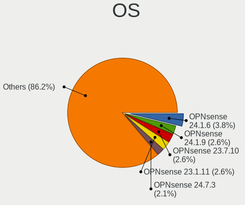
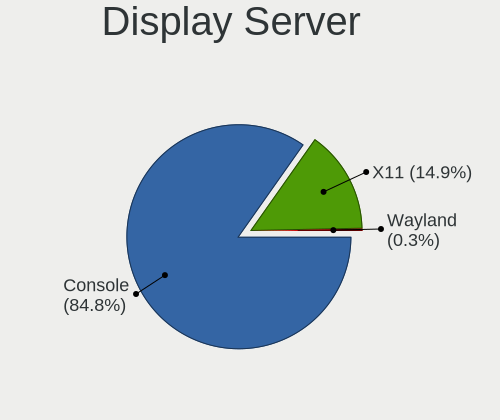
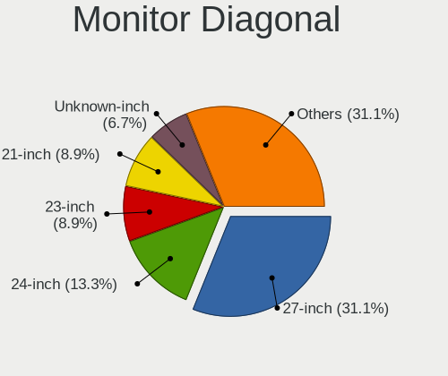
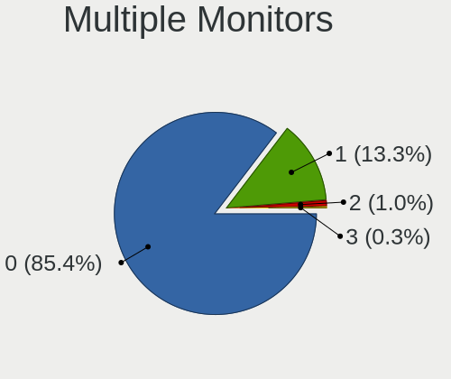
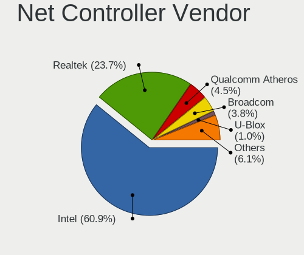
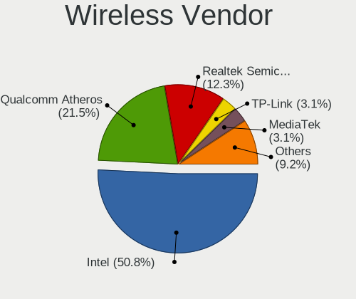
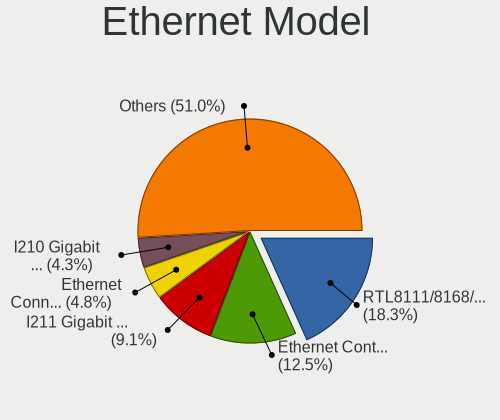
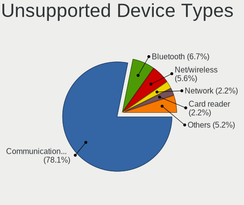

BSD in Australia - Tested Hardware & Statistics (Desktops)
----------------------------------------------------------

A project to collect tested hardware configurations for BSD in Australia.

Anyone can contribute to this report by the [hw-probe](https://github.com/linuxhw/hw-probe/blob/master/INSTALL.BSD.md) tool:

    hw-probe -all -upload

Please contribute! Especially if your hardware is rare.

Contents
--------

* [ Test Cases ](#test-cases)

* [ System ](#system)
  - [ OS                       ](#os)
  - [ OS Family                ](#os-family)
  - [ Arch                     ](#arch)
  - [ DE                       ](#de)
  - [ Display Server           ](#display-server)
  - [ Display Manager          ](#display-manager)
  - [ OS Lang                  ](#os-lang)
  - [ Boot Mode                ](#boot-mode)
  - [ Filesystem               ](#filesystem)
  - [ Part. scheme             ](#part-scheme)

* [ Board ](#board)
  - [ Vendor                   ](#vendor)
  - [ Model                    ](#model)
  - [ Model Family             ](#model-family)
  - [ MFG Year                 ](#mfg-year)
  - [ Form Factor              ](#form-factor)
  - [ Coreboot                 ](#coreboot)
  - [ RAM Size                 ](#ram-size)
  - [ RAM Used                 ](#ram-used)
  - [ Total Drives             ](#total-drives)
  - [ Has CD-ROM               ](#has-cd-rom)
  - [ Has Ethernet             ](#has-ethernet)
  - [ Has WiFi                 ](#has-wifi)
  - [ Has Bluetooth            ](#has-bluetooth)

* [ Location ](#location)
  - [ Country                  ](#country)
  - [ City                     ](#city)

* [ Drives ](#drives)
  - [ Drive Vendor             ](#drive-vendor)
  - [ Drive Model              ](#drive-model)
  - [ HDD Vendor               ](#hdd-vendor)
  - [ SSD Vendor               ](#ssd-vendor)
  - [ Drive Kind               ](#drive-kind)
  - [ Drive Connector          ](#drive-connector)
  - [ Drive Size               ](#drive-size)
  - [ Space Total              ](#space-total)
  - [ Space Used               ](#space-used)
  - [ Malfunc. Drives          ](#malfunc-drives)
  - [ Malfunc. Drive Vendor    ](#malfunc-drive-vendor)
  - [ Malfunc. HDD Vendor      ](#malfunc-hdd-vendor)
  - [ Malfunc. Drive Kind      ](#malfunc-drive-kind)
  - [ Failed Drives            ](#failed-drives)
  - [ Failed Drive Vendor      ](#failed-drive-vendor)
  - [ Drive Status             ](#drive-status)

* [ Storage controller ](#storage-controller)
  - [ Storage Vendor           ](#storage-vendor)
  - [ Storage Model            ](#storage-model)
  - [ Storage Kind             ](#storage-kind)

* [ Processor ](#processor)
  - [ CPU Vendor               ](#cpu-vendor)
  - [ CPU Model                ](#cpu-model)
  - [ CPU Model Family         ](#cpu-model-family)
  - [ CPU Cores                ](#cpu-cores)
  - [ CPU Sockets              ](#cpu-sockets)
  - [ CPU Threads              ](#cpu-threads)
  - [ CPU Microarch            ](#cpu-microarch)

* [ Graphics ](#graphics)
  - [ GPU Vendor               ](#gpu-vendor)
  - [ GPU Model                ](#gpu-model)
  - [ GPU Combo                ](#gpu-combo)
  - [ GPU Driver               ](#gpu-driver)
  - [ GPU Memory               ](#gpu-memory)

* [ Monitor ](#monitor)
  - [ Monitor Vendor           ](#monitor-vendor)
  - [ Monitor Model            ](#monitor-model)
  - [ Monitor Resolution       ](#monitor-resolution)
  - [ Monitor Diagonal         ](#monitor-diagonal)
  - [ Monitor Width            ](#monitor-width)
  - [ Aspect Ratio             ](#aspect-ratio)
  - [ Monitor Area             ](#monitor-area)
  - [ Pixel Density            ](#pixel-density)
  - [ Multiple Monitors        ](#multiple-monitors)

* [ Network ](#network)
  - [ Net Controller Vendor    ](#net-controller-vendor)
  - [ Net Controller Model     ](#net-controller-model)
  - [ Wireless Vendor          ](#wireless-vendor)
  - [ Wireless Model           ](#wireless-model)
  - [ Ethernet Vendor          ](#ethernet-vendor)
  - [ Ethernet Model           ](#ethernet-model)
  - [ Net Controller Kind      ](#net-controller-kind)
  - [ Used Controller          ](#used-controller)
  - [ NICs                     ](#nics)
  - [ IPv6                     ](#ipv6)

* [ Bluetooth ](#bluetooth)
  - [ Bluetooth Vendor         ](#bluetooth-vendor)
  - [ Bluetooth Model          ](#bluetooth-model)

* [ Sound ](#sound)
  - [ Sound Vendor             ](#sound-vendor)
  - [ Sound Model              ](#sound-model)

* [ Memory ](#memory)
  - [ Memory Vendor            ](#memory-vendor)
  - [ Memory Model             ](#memory-model)
  - [ Memory Kind              ](#memory-kind)
  - [ Memory Form Factor       ](#memory-form-factor)
  - [ Memory Size              ](#memory-size)
  - [ Memory Speed             ](#memory-speed)

* [ Printers & scanners ](#printers--scanners)
  - [ Printer Vendor           ](#printer-vendor)
  - [ Printer Model            ](#printer-model)
  - [ Scanner Vendor           ](#scanner-vendor)
  - [ Scanner Model            ](#scanner-model)

* [ Camera ](#camera)
  - [ Camera Vendor            ](#camera-vendor)
  - [ Camera Model             ](#camera-model)

* [ Security ](#security)
  - [ Fingerprint Vendor       ](#fingerprint-vendor)
  - [ Fingerprint Model        ](#fingerprint-model)
  - [ Chipcard Vendor          ](#chipcard-vendor)
  - [ Chipcard Model           ](#chipcard-model)

* [ Unsupported ](#unsupported)
  - [ Unsupported Devices      ](#unsupported-devices)
  - [ Unsupported Device Types ](#unsupported-device-types)

Test Cases
----------

Total: 317

| Vendor        | Model                       | Probe                                                     | Date         |
|---------------|-----------------------------|-----------------------------------------------------------|--------------|
| Dell          | 0D24M8 A01                  | [4c874fa8af](https://bsd-hardware.info/?probe=4c874fa8af) | Nov 06, 2023 |
| Dell          | 0D24M8 A01                  | [3ca7f9b6d1](https://bsd-hardware.info/?probe=3ca7f9b6d1) | Nov 06, 2023 |
| Shuttle       | FS61                        | [1ed38ceb8c](https://bsd-hardware.info/?probe=1ed38ceb8c) | Nov 05, 2023 |
| Unknown       | Unknown                     | [97f4527aab](https://bsd-hardware.info/?probe=97f4527aab) | Nov 05, 2023 |
| HP            | 83EE                        | [1ab86be61a](https://bsd-hardware.info/?probe=1ab86be61a) | Nov 05, 2023 |
| HP            | 213D A01                    | [da7d91889e](https://bsd-hardware.info/?probe=da7d91889e) | Nov 03, 2023 |
| Unknown       | Unknown                     | [743d5aec59](https://bsd-hardware.info/?probe=743d5aec59) | Nov 02, 2023 |
| Intel         | Q3XXG4-P V1.0               | [cac29f9a35](https://bsd-hardware.info/?probe=cac29f9a35) | Oct 30, 2023 |
| Unknown       | Unknown                     | [850878776a](https://bsd-hardware.info/?probe=850878776a) | Oct 27, 2023 |
| HP            | 3397                        | [3dad1378f7](https://bsd-hardware.info/?probe=3dad1378f7) | Oct 27, 2023 |
| Winston Ma... | PICO PC V1.2                | [244102bda8](https://bsd-hardware.info/?probe=244102bda8) | Oct 26, 2023 |
| Intel         | MAHOBAY                     | [9b797e809a](https://bsd-hardware.info/?probe=9b797e809a) | Oct 26, 2023 |
| Intel         | MAHOBAY                     | [4dd20af1a3](https://bsd-hardware.info/?probe=4dd20af1a3) | Oct 26, 2023 |
| Intel         | MAHOBAY                     | [c66be142de](https://bsd-hardware.info/?probe=c66be142de) | Oct 26, 2023 |
| Unknown       | Unknown                     | [530528316f](https://bsd-hardware.info/?probe=530528316f) | Oct 21, 2023 |
| CWWK          | MINIPC-G12                  | [c51a6f8459](https://bsd-hardware.info/?probe=c51a6f8459) | Oct 20, 2023 |
| Unknown       | Unknown                     | [af12786272](https://bsd-hardware.info/?probe=af12786272) | Oct 18, 2023 |
| Unknown       | J3160-4L                    | [95e017977c](https://bsd-hardware.info/?probe=95e017977c) | Oct 14, 2023 |
| HP            | 83EE                        | [88d80d215a](https://bsd-hardware.info/?probe=88d80d215a) | Sep 30, 2023 |
| HP            | 83EE                        | [d08ae678b5](https://bsd-hardware.info/?probe=d08ae678b5) | Sep 28, 2023 |
| Unknown       | Unknown                     | [a5643cabc4](https://bsd-hardware.info/?probe=a5643cabc4) | Sep 24, 2023 |
| GoWin Solu... | R86S                        | [0cfd79f7fe](https://bsd-hardware.info/?probe=0cfd79f7fe) | Sep 18, 2023 |
| HP            | 82A2                        | [4f125fbc75](https://bsd-hardware.info/?probe=4f125fbc75) | Sep 17, 2023 |
| Unknown       | Unknown                     | [21e851e9e9](https://bsd-hardware.info/?probe=21e851e9e9) | Sep 07, 2023 |
| TYAN Compu... | S5510HE                     | [99d23c35ca](https://bsd-hardware.info/?probe=99d23c35ca) | Sep 07, 2023 |
| ASUSTek       | ROG STRIX B450-I GAMING     | [3dab6f4044](https://bsd-hardware.info/?probe=3dab6f4044) | Aug 28, 2023 |
| Unknown       | Unknown                     | [b5a786e411](https://bsd-hardware.info/?probe=b5a786e411) | Aug 18, 2023 |
| ASUSTek       | PRIME B450M-K               | [74bfa3e0cd](https://bsd-hardware.info/?probe=74bfa3e0cd) | Aug 15, 2023 |
| Protectli     | FW4B Ver                    | [064ee65b5c](https://bsd-hardware.info/?probe=064ee65b5c) | Aug 10, 2023 |
| Techvision    | TVI7309X B0                 | [fd4046c4d9](https://bsd-hardware.info/?probe=fd4046c4d9) | Aug 07, 2023 |
| Lenovo        | 313C SDK0J40697 WIN 3305... | [f65647a6be](https://bsd-hardware.info/?probe=f65647a6be) | Aug 06, 2023 |
| Lenovo        | SDK0E50510 WIN              | [eee3c082b5](https://bsd-hardware.info/?probe=eee3c082b5) | Aug 05, 2023 |
| Unknown       | Unknown                     | [e9977bfffe](https://bsd-hardware.info/?probe=e9977bfffe) | Aug 02, 2023 |
| HP            | 18E9                        | [04c971a0de](https://bsd-hardware.info/?probe=04c971a0de) | Jul 31, 2023 |
| HP            | 83E1                        | [b211795736](https://bsd-hardware.info/?probe=b211795736) | Jul 27, 2023 |
| Unknown       | Unknown                     | [64c9b0f743](https://bsd-hardware.info/?probe=64c9b0f743) | Jul 25, 2023 |
| ASRock        | H570M-ITX/ac                | [8ac2939575](https://bsd-hardware.info/?probe=8ac2939575) | Jul 23, 2023 |
| Lenovo        | SDK0E50510 WIN              | [63ab45fcb1](https://bsd-hardware.info/?probe=63ab45fcb1) | Jul 21, 2023 |
| Unknown       | Unknown                     | [5bea9c433e](https://bsd-hardware.info/?probe=5bea9c433e) | Jul 17, 2023 |
| YANYU         | H67SL                       | [699da6c722](https://bsd-hardware.info/?probe=699da6c722) | Jul 13, 2023 |
| Gigabyte      | M85M-US2H                   | [e0a38ef6ad](https://bsd-hardware.info/?probe=e0a38ef6ad) | Jul 03, 2023 |
| PC Engines    | APU2                        | [c1272678e6](https://bsd-hardware.info/?probe=c1272678e6) | Jul 02, 2023 |
| Gigabyte      | H77M-D3H                    | [9f6d45e43e](https://bsd-hardware.info/?probe=9f6d45e43e) | Jul 02, 2023 |
| Gigabyte      | H77M-D3H                    | [3eb03fa8a7](https://bsd-hardware.info/?probe=3eb03fa8a7) | Jul 02, 2023 |
| HP            | 82A2                        | [4b8d139419](https://bsd-hardware.info/?probe=4b8d139419) | Jun 29, 2023 |
| Unknown       | Unknown                     | [23cdf1d4af](https://bsd-hardware.info/?probe=23cdf1d4af) | Jun 27, 2023 |
| Unknown       | Unknown                     | [a548b021da](https://bsd-hardware.info/?probe=a548b021da) | Jun 27, 2023 |
| YANYU         | H67SL                       | [5d5fd8a8cd](https://bsd-hardware.info/?probe=5d5fd8a8cd) | Jun 27, 2023 |
| HP            | 18E9                        | [aba608120b](https://bsd-hardware.info/?probe=aba608120b) | Jun 26, 2023 |
| Shuttle       | DH370                       | [95eb3bd4a8](https://bsd-hardware.info/?probe=95eb3bd4a8) | Jun 24, 2023 |
| Protectli     | FW4B                        | [6c993e8f34](https://bsd-hardware.info/?probe=6c993e8f34) | Jun 23, 2023 |
| Intel         | SKYBAY                      | [940adce39f](https://bsd-hardware.info/?probe=940adce39f) | Jun 23, 2023 |
| ASRock        | 4X4-4000 Series             | [c9420276e7](https://bsd-hardware.info/?probe=c9420276e7) | Jun 23, 2023 |
| Intel         | J1900                       | [4a3a52030b](https://bsd-hardware.info/?probe=4a3a52030b) | Jun 15, 2023 |
| Acer          | Aspire TC-230               | [d7eacfafe1](https://bsd-hardware.info/?probe=d7eacfafe1) | Jun 04, 2023 |
| Lenovo        | 30D2 SDK0J40697 WIN 3305... | [d4247f35c8](https://bsd-hardware.info/?probe=d4247f35c8) | Jun 02, 2023 |
| Dell          | 00V62H A01                  | [a87429607b](https://bsd-hardware.info/?probe=a87429607b) | Jun 01, 2023 |
| Intel         | QHSW02                      | [ed6d01bc2b](https://bsd-hardware.info/?probe=ed6d01bc2b) | May 31, 2023 |
| Intel         | QHSW02                      | [9f3d95a494](https://bsd-hardware.info/?probe=9f3d95a494) | May 31, 2023 |
| Protectli     | FW4B Ver                    | [1587da94da](https://bsd-hardware.info/?probe=1587da94da) | May 30, 2023 |
| Dell          | 0HD5W2 A00                  | [bd3ea7e1d6](https://bsd-hardware.info/?probe=bd3ea7e1d6) | May 28, 2023 |
| Intel         | J1900                       | [4d849f4f34](https://bsd-hardware.info/?probe=4d849f4f34) | May 27, 2023 |
| CWWK          | CW-AD4L-N V1                | [310da4e6e5](https://bsd-hardware.info/?probe=310da4e6e5) | May 26, 2023 |
| Dell          | 096JG8 A01                  | [f350405f61](https://bsd-hardware.info/?probe=f350405f61) | May 26, 2023 |
| Inventec      | R CLASS A02                 | [85f3673aa8](https://bsd-hardware.info/?probe=85f3673aa8) | May 24, 2023 |
| Intel         | J1900                       | [52081bc55b](https://bsd-hardware.info/?probe=52081bc55b) | May 24, 2023 |
| Dell          | 0M9KCM A02                  | [932e96060f](https://bsd-hardware.info/?probe=932e96060f) | May 21, 2023 |
| Dell          | 096JG8 A01                  | [3abf2c7ee2](https://bsd-hardware.info/?probe=3abf2c7ee2) | May 19, 2023 |
| Dell          | 096JG8 A01                  | [6f7bcae20b](https://bsd-hardware.info/?probe=6f7bcae20b) | May 19, 2023 |
| Protectli     | FW2B                        | [aa52b30ddf](https://bsd-hardware.info/?probe=aa52b30ddf) | May 14, 2023 |
| Dell          | 07F37C A00                  | [a23a95f97a](https://bsd-hardware.info/?probe=a23a95f97a) | May 07, 2023 |
| Dell          | 096JG8 A01                  | [633fa55df0](https://bsd-hardware.info/?probe=633fa55df0) | May 07, 2023 |
| Dell          | 0YC03K A04                  | [979aea14cc](https://bsd-hardware.info/?probe=979aea14cc) | May 06, 2023 |
| Unknown       | Unknown                     | [28253dd080](https://bsd-hardware.info/?probe=28253dd080) | Apr 28, 2023 |
| HP            | 82B4                        | [b75bb5fe83](https://bsd-hardware.info/?probe=b75bb5fe83) | Apr 20, 2023 |
| Techvision    | TVI7309X B0                 | [28c2a703c7](https://bsd-hardware.info/?probe=28c2a703c7) | Apr 18, 2023 |
| Gigabyte      | B560M DS3H V2               | [737250a1c8](https://bsd-hardware.info/?probe=737250a1c8) | Apr 15, 2023 |
| Dell          | 0HD5W2 A00                  | [1835073ded](https://bsd-hardware.info/?probe=1835073ded) | Apr 14, 2023 |
| MW            | GMLK-2_5G4L                 | [41bf2600a5](https://bsd-hardware.info/?probe=41bf2600a5) | Apr 13, 2023 |
| ASUSTek       | STRIX Z270I GAMING          | [036b48e4c3](https://bsd-hardware.info/?probe=036b48e4c3) | Apr 13, 2023 |
| Acer          | Veriton X4630G              | [93987b345d](https://bsd-hardware.info/?probe=93987b345d) | Apr 12, 2023 |
| Acer          | Veriton M6620G              | [13f7e5c23b](https://bsd-hardware.info/?probe=13f7e5c23b) | Apr 07, 2023 |
| MW            | GMLK-2_5G4L                 | [459fdd8cdd](https://bsd-hardware.info/?probe=459fdd8cdd) | Mar 28, 2023 |
| HP            | 82B4                        | [6edc033f79](https://bsd-hardware.info/?probe=6edc033f79) | Mar 25, 2023 |
| Unknown       | Unknown                     | [a66dffcb5c](https://bsd-hardware.info/?probe=a66dffcb5c) | Mar 23, 2023 |
| Techvision    | TVI7309X B0                 | [7db8753b08](https://bsd-hardware.info/?probe=7db8753b08) | Mar 17, 2023 |
| Intel         | MAHOBAY                     | [b2176fafcf](https://bsd-hardware.info/?probe=b2176fafcf) | Mar 07, 2023 |
| ASUSTek       | PRIME A320M-E               | [ca70bceb83](https://bsd-hardware.info/?probe=ca70bceb83) | Mar 05, 2023 |
| AMD           | Kabini CRB                  | [c9e69ff953](https://bsd-hardware.info/?probe=c9e69ff953) | Mar 03, 2023 |
| Protectli     | VP2410 10                   | [74eedb42ea](https://bsd-hardware.info/?probe=74eedb42ea) | Mar 03, 2023 |
| Gigabyte      | Z87X-OC-CF                  | [dca82c50d0](https://bsd-hardware.info/?probe=dca82c50d0) | Feb 23, 2023 |
| Acer          | Aspire TC-230               | [f3f963fb6a](https://bsd-hardware.info/?probe=f3f963fb6a) | Feb 22, 2023 |
| Gigabyte      | A320M-H-CF                  | [02970305db](https://bsd-hardware.info/?probe=02970305db) | Feb 21, 2023 |
| ASUSTek       | H110I-PLUS D3               | [1f347f15e2](https://bsd-hardware.info/?probe=1f347f15e2) | Feb 19, 2023 |
| Protectli     | FW4B Ver                    | [81911bb61f](https://bsd-hardware.info/?probe=81911bb61f) | Feb 17, 2023 |
| ASUSTek       | H110I-PLUS D3               | [4d3dee18a0](https://bsd-hardware.info/?probe=4d3dee18a0) | Feb 16, 2023 |
| ASRock        | Z97 Killer                  | [67d58b9cde](https://bsd-hardware.info/?probe=67d58b9cde) | Feb 14, 2023 |
| Acer          | Aspire TC-230               | [a8ce4299ae](https://bsd-hardware.info/?probe=a8ce4299ae) | Feb 13, 2023 |
| PC Engines    | APU2                        | [3bc47445d4](https://bsd-hardware.info/?probe=3bc47445d4) | Jan 26, 2023 |
| IBM           | 9210MML                     | [8b7e2413ee](https://bsd-hardware.info/?probe=8b7e2413ee) | Jan 25, 2023 |
| ADI Engine... | RCC-VE                      | [e2941c00fc](https://bsd-hardware.info/?probe=e2941c00fc) | Jan 25, 2023 |
| Dell          | OptiPlex 3040               | [9c925f4e7f](https://bsd-hardware.info/?probe=9c925f4e7f) | Jan 23, 2023 |
| Lenovo        | SHARKBAY SDK0E50510 PRO ... | [0d3e0df928](https://bsd-hardware.info/?probe=0d3e0df928) | Jan 20, 2023 |
| Gigabyte      | H110-D3A-CF                 | [6bb5667269](https://bsd-hardware.info/?probe=6bb5667269) | Jan 17, 2023 |
| HP            | 8299                        | [d7afab37f3](https://bsd-hardware.info/?probe=d7afab37f3) | Jan 15, 2023 |
| HP            | 8299                        | [7a5bbc7546](https://bsd-hardware.info/?probe=7a5bbc7546) | Jan 15, 2023 |
| Dell          | OptiPlex 3040               | [07abf8e8b2](https://bsd-hardware.info/?probe=07abf8e8b2) | Jan 14, 2023 |
| Gigabyte      | H110-D3A-CF                 | [9c1f7ead89](https://bsd-hardware.info/?probe=9c1f7ead89) | Jan 06, 2023 |
| Techvision    | TVI7309X B0                 | [b1ee757669](https://bsd-hardware.info/?probe=b1ee757669) | Jan 03, 2023 |
| Techvision    | TVI7309X B0                 | [5d360961d4](https://bsd-hardware.info/?probe=5d360961d4) | Jan 02, 2023 |
| Intel         | CRESCENTBAY                 | [d5f8e71171](https://bsd-hardware.info/?probe=d5f8e71171) | Jan 02, 2023 |
| HP            | ProLiant MicroServer        | [50c8cb79f7](https://bsd-hardware.info/?probe=50c8cb79f7) | Dec 26, 2022 |
| HP            | 8299                        | [6715ee2886](https://bsd-hardware.info/?probe=6715ee2886) | Dec 24, 2022 |
| Dell          | 0NW6H5 A00                  | [b19a4d1696](https://bsd-hardware.info/?probe=b19a4d1696) | Dec 23, 2022 |
| HP            | 8299                        | [d9eec3c9f5](https://bsd-hardware.info/?probe=d9eec3c9f5) | Dec 23, 2022 |
| Unknown       | Unknown                     | [0f03a7f2ce](https://bsd-hardware.info/?probe=0f03a7f2ce) | Dec 22, 2022 |
| Acer          | Veriton X2640G V:1.0        | [f241237f76](https://bsd-hardware.info/?probe=f241237f76) | Dec 22, 2022 |
| Lenovo        | SHARKBAY 31900058 STD       | [a8ec4c3ae4](https://bsd-hardware.info/?probe=a8ec4c3ae4) | Dec 20, 2022 |
| Lenovo        | SHARKBAY 31900058 STD       | [4667028e67](https://bsd-hardware.info/?probe=4667028e67) | Dec 20, 2022 |
| HP            | ProLiant MicroServer        | [b730e64d4a](https://bsd-hardware.info/?probe=b730e64d4a) | Dec 19, 2022 |
| Lenovo        | SHARKBAY 31900058 STD       | [92593f4e79](https://bsd-hardware.info/?probe=92593f4e79) | Dec 17, 2022 |
| ASUSTek       | STRIX Z270I GAMING          | [d44c580408](https://bsd-hardware.info/?probe=d44c580408) | Dec 16, 2022 |
| Dell          | 08NPPY A00                  | [e199c0ec3d](https://bsd-hardware.info/?probe=e199c0ec3d) | Dec 15, 2022 |
| Lenovo        | SHARKBAY 31900058 STD       | [d7d0ebf605](https://bsd-hardware.info/?probe=d7d0ebf605) | Dec 15, 2022 |
| HP            | ProLiant MicroServer        | [617f431099](https://bsd-hardware.info/?probe=617f431099) | Dec 14, 2022 |
| Unknown       | Unknown                     | [85520bf6bf](https://bsd-hardware.info/?probe=85520bf6bf) | Dec 14, 2022 |
| HP            | 82A2                        | [c612b7e283](https://bsd-hardware.info/?probe=c612b7e283) | Dec 06, 2022 |
| Protectli     | FW4B Ver                    | [4bf1aae972](https://bsd-hardware.info/?probe=4bf1aae972) | Dec 02, 2022 |
| Shuttle       | FS81                        | [f714ba647f](https://bsd-hardware.info/?probe=f714ba647f) | Nov 28, 2022 |
| Protectli     | FW2B                        | [d15326180f](https://bsd-hardware.info/?probe=d15326180f) | Nov 10, 2022 |
| Lenovo        | SHARKBAY 0B98401 WIN        | [9945b6b3e7](https://bsd-hardware.info/?probe=9945b6b3e7) | Nov 09, 2022 |
| HP            | ProLiant MicroServer        | [798219138a](https://bsd-hardware.info/?probe=798219138a) | Nov 07, 2022 |
| HP            | ProLiant MicroServer        | [394e873da0](https://bsd-hardware.info/?probe=394e873da0) | Nov 07, 2022 |
| ASRock        | H570M-ITX/ac                | [06a8abdbf4](https://bsd-hardware.info/?probe=06a8abdbf4) | Oct 29, 2022 |
| Dell          | 0HD5W2 A00                  | [7b330abf44](https://bsd-hardware.info/?probe=7b330abf44) | Oct 26, 2022 |
| Unknown       | Unknown                     | [1f2cd1f9ea](https://bsd-hardware.info/?probe=1f2cd1f9ea) | Oct 24, 2022 |
| MSI           | MAG B550M MORTAR            | [607fcd2571](https://bsd-hardware.info/?probe=607fcd2571) | Oct 24, 2022 |
| Dell          | 0200DY A02                  | [d32449b8c4](https://bsd-hardware.info/?probe=d32449b8c4) | Oct 16, 2022 |
| Dell          | 0HD5W2 A00                  | [f80953ee2f](https://bsd-hardware.info/?probe=f80953ee2f) | Oct 16, 2022 |
| Dell          | 0HD5W2 A00                  | [f27ffa7217](https://bsd-hardware.info/?probe=f27ffa7217) | Oct 16, 2022 |
| MW            | GMLK-2_5G4L                 | [ae4868c65b](https://bsd-hardware.info/?probe=ae4868c65b) | Oct 15, 2022 |
| PC Engines    | apu1                        | [06debf0076](https://bsd-hardware.info/?probe=06debf0076) | Oct 14, 2022 |
| Unknown       | Unknown                     | [6c330d9bab](https://bsd-hardware.info/?probe=6c330d9bab) | Oct 14, 2022 |
| Unknown       | YL-1900L4-V2                | [1f55db62cc](https://bsd-hardware.info/?probe=1f55db62cc) | Oct 12, 2022 |
| ASRock        | H570M-ITX/ac                | [ea8b1fd760](https://bsd-hardware.info/?probe=ea8b1fd760) | Oct 12, 2022 |
| ASUSTek       | ROG STRIX X570-I GAMING     | [9d3b9cb318](https://bsd-hardware.info/?probe=9d3b9cb318) | Oct 11, 2022 |
| Unknown       | Unknown                     | [7718c8e9ca](https://bsd-hardware.info/?probe=7718c8e9ca) | Oct 05, 2022 |
| Protectli     | FW4B Ver                    | [63b36c077a](https://bsd-hardware.info/?probe=63b36c077a) | Oct 05, 2022 |
| Lenovo        | IdeaPad 5 15ITL05 82FG      | [e001150f93](https://bsd-hardware.info/?probe=e001150f93) | Oct 03, 2022 |
| IBM           | 9210MML                     | [a6e7d7483f](https://bsd-hardware.info/?probe=a6e7d7483f) | Oct 03, 2022 |
| Unknown       | Unknown                     | [9f998deaa4](https://bsd-hardware.info/?probe=9f998deaa4) | Sep 25, 2022 |
| Unknown       | Unknown                     | [ffa40a08e8](https://bsd-hardware.info/?probe=ffa40a08e8) | Sep 23, 2022 |
| Protectli     | FW4B Ver                    | [58caab8946](https://bsd-hardware.info/?probe=58caab8946) | Sep 14, 2022 |
| Yanling       | YL-KBR6L Ver:1.00           | [05b5d1e01a](https://bsd-hardware.info/?probe=05b5d1e01a) | Sep 12, 2022 |
| AOpen         | iBTMx-DS R1.03 55DED10A0... | [50ac5c0aaf](https://bsd-hardware.info/?probe=50ac5c0aaf) | Sep 10, 2022 |
| Dell          | 0200DY A02                  | [cd90f548c8](https://bsd-hardware.info/?probe=cd90f548c8) | Sep 06, 2022 |
| Protectli     | FW4B Ver                    | [91664c3bc1](https://bsd-hardware.info/?probe=91664c3bc1) | Sep 05, 2022 |
| MW            | GMLK-2_5G4L                 | [bb379f7083](https://bsd-hardware.info/?probe=bb379f7083) | Sep 03, 2022 |
| Gigabyte      | H81M-DS2                    | [75ec0260f9](https://bsd-hardware.info/?probe=75ec0260f9) | Aug 28, 2022 |
| Unknown       | YL-J3160L4                  | [aad241ba36](https://bsd-hardware.info/?probe=aad241ba36) | Aug 08, 2022 |
| Gigabyte      | H81M-DS2                    | [5b88dea745](https://bsd-hardware.info/?probe=5b88dea745) | Aug 06, 2022 |
| Protectli     | VP2410                      | [f9b42e4a75](https://bsd-hardware.info/?probe=f9b42e4a75) | Jul 27, 2022 |
| Protectli     | VP2410                      | [db66cc446e](https://bsd-hardware.info/?probe=db66cc446e) | Jul 27, 2022 |
| HP            | 8055                        | [269b4f3210](https://bsd-hardware.info/?probe=269b4f3210) | Jul 17, 2022 |
| Intel         | Q3XXG4-P V1.0               | [607a66e533](https://bsd-hardware.info/?probe=607a66e533) | Jul 14, 2022 |
| AZW           | GK55                        | [40d9df6faa](https://bsd-hardware.info/?probe=40d9df6faa) | Jul 12, 2022 |
| Lenovo        | SHARKBAY NOK                | [f68c3695ea](https://bsd-hardware.info/?probe=f68c3695ea) | Jul 08, 2022 |
| Dell          | 00V62H A00                  | [a3aff65df2](https://bsd-hardware.info/?probe=a3aff65df2) | Jun 27, 2022 |
| ASUSTek       | ROG STRIX Z390-F GAMING     | [4d4993a732](https://bsd-hardware.info/?probe=4d4993a732) | Jun 24, 2022 |
| ASUSTek       | ROG STRIX X570-F GAMING     | [7d054ce34f](https://bsd-hardware.info/?probe=7d054ce34f) | Jun 23, 2022 |
| HP            | ProLiant ML10 v2            | [72254b033d](https://bsd-hardware.info/?probe=72254b033d) | Jun 06, 2022 |
| Dell          | 0MGK50 A02                  | [1de9982d19](https://bsd-hardware.info/?probe=1de9982d19) | Jun 05, 2022 |
| AOpen         | iBTMx-DS R1.03 55DED10A0... | [94bdba6302](https://bsd-hardware.info/?probe=94bdba6302) | Jun 04, 2022 |
| Protectli     | FW4B Ver                    | [f1838b29ff](https://bsd-hardware.info/?probe=f1838b29ff) | Jun 01, 2022 |
| MW            | GMLK-2_5G4L                 | [fdab123532](https://bsd-hardware.info/?probe=fdab123532) | May 07, 2022 |
| MW            | GMLK-2_5G4L                 | [59083ac5ac](https://bsd-hardware.info/?probe=59083ac5ac) | May 06, 2022 |
| MSI           | 2A9C                        | [506b970279](https://bsd-hardware.info/?probe=506b970279) | May 03, 2022 |
| HP            | 0B4Ch D                     | [3f170bdee6](https://bsd-hardware.info/?probe=3f170bdee6) | May 01, 2022 |
| ASUSTek       | AM1M-A                      | [76a2d4f148](https://bsd-hardware.info/?probe=76a2d4f148) | Apr 22, 2022 |
| MSI           | 2A9C                        | [595c9a1da2](https://bsd-hardware.info/?probe=595c9a1da2) | Apr 18, 2022 |
| MSI           | 2A9C                        | [7f44d30f83](https://bsd-hardware.info/?probe=7f44d30f83) | Apr 15, 2022 |
| Lenovo        | SHARKBAY NOK                | [e32f0f2130](https://bsd-hardware.info/?probe=e32f0f2130) | Apr 08, 2022 |
| ASRock        | 970 Pro3 R2.0               | [c807e1d8eb](https://bsd-hardware.info/?probe=c807e1d8eb) | Apr 07, 2022 |
| Protectli     | FW4B                        | [a2f902524b](https://bsd-hardware.info/?probe=a2f902524b) | Apr 06, 2022 |
| Protectli     | FW4B                        | [af9f2d81b5](https://bsd-hardware.info/?probe=af9f2d81b5) | Apr 06, 2022 |
| Gigabyte      | Z87N-WIFI                   | [1800a41f61](https://bsd-hardware.info/?probe=1800a41f61) | Mar 28, 2022 |
| Inventec      | D CLASS A02                 | [2ea328c95d](https://bsd-hardware.info/?probe=2ea328c95d) | Mar 28, 2022 |
| Gigabyte      | Z87N-WIFI                   | [8f20a3214b](https://bsd-hardware.info/?probe=8f20a3214b) | Mar 25, 2022 |
| Intel         | Q3XXG4-P V1.0               | [1e9ea7cdbc](https://bsd-hardware.info/?probe=1e9ea7cdbc) | Mar 19, 2022 |
| Dell          | 00V62H A00                  | [8da46f8dd0](https://bsd-hardware.info/?probe=8da46f8dd0) | Mar 18, 2022 |
| Gigabyte      | 970A-D3P                    | [fa03bdabb6](https://bsd-hardware.info/?probe=fa03bdabb6) | Mar 15, 2022 |
| MSI           | MS-B1831                    | [346c445c21](https://bsd-hardware.info/?probe=346c445c21) | Mar 12, 2022 |
| MSI           | MS-B1831                    | [572bb2c98c](https://bsd-hardware.info/?probe=572bb2c98c) | Mar 02, 2022 |
| Protectli     | VP2410 10                   | [8d5986c1f4](https://bsd-hardware.info/?probe=8d5986c1f4) | Feb 26, 2022 |
| MSI           | MAG B550M BAZOOKA           | [68f6eb4328](https://bsd-hardware.info/?probe=68f6eb4328) | Feb 23, 2022 |
| MSI           | MAG B550M BAZOOKA           | [c1397b851e](https://bsd-hardware.info/?probe=c1397b851e) | Feb 22, 2022 |
| Protectli     | VP2410 10                   | [1d9eaaaf62](https://bsd-hardware.info/?probe=1d9eaaaf62) | Feb 18, 2022 |
| HARDKERNEL    | ODROID-H2                   | [adcfe67709](https://bsd-hardware.info/?probe=adcfe67709) | Feb 16, 2022 |
| MSI           | MS-B1831                    | [5bdc589f33](https://bsd-hardware.info/?probe=5bdc589f33) | Feb 10, 2022 |
| HP            | ProLiant MicroServer Gen... | [0cc80ca4ec](https://bsd-hardware.info/?probe=0cc80ca4ec) | Feb 07, 2022 |
| MSI           | MS-B1831                    | [c8072d090e](https://bsd-hardware.info/?probe=c8072d090e) | Feb 06, 2022 |
| Protectli     | FW4B Ver                    | [6eecbfde04](https://bsd-hardware.info/?probe=6eecbfde04) | Feb 05, 2022 |
| Lenovo        | ThinkCentre M58 7360BB6     | [8751a2776e](https://bsd-hardware.info/?probe=8751a2776e) | Jan 31, 2022 |
| Dell          | 0NW6H5 A00                  | [21e1806645](https://bsd-hardware.info/?probe=21e1806645) | Jan 29, 2022 |
| Yanling       | YL-KBR6L Ver:1.00           | [50b7edb511](https://bsd-hardware.info/?probe=50b7edb511) | Jan 29, 2022 |
| Dell          | 0NW6H5 A00                  | [8587a16b51](https://bsd-hardware.info/?probe=8587a16b51) | Jan 29, 2022 |
| Lenovo        | SHARKBAY NOK                | [6ea3284f28](https://bsd-hardware.info/?probe=6ea3284f28) | Jan 29, 2022 |
| Lenovo        | ThinkCentre M58 7360BB6     | [f53622f02b](https://bsd-hardware.info/?probe=f53622f02b) | Jan 27, 2022 |
| HP            | ProLiant MicroServer        | [b62251041b](https://bsd-hardware.info/?probe=b62251041b) | Jan 26, 2022 |
| Cisco         | ASA5512 A0                  | [99d276f574](https://bsd-hardware.info/?probe=99d276f574) | Jan 18, 2022 |
| Dell          | 0XCR8D A03                  | [48e9447b37](https://bsd-hardware.info/?probe=48e9447b37) | Jan 15, 2022 |
| Gigabyte      | Z77N-WIFI                   | [459bb6486d](https://bsd-hardware.info/?probe=459bb6486d) | Jan 13, 2022 |
| Protectli     | FW4B Ver                    | [e0eb7a3239](https://bsd-hardware.info/?probe=e0eb7a3239) | Jan 13, 2022 |
| HP            | 1998                        | [1d46974005](https://bsd-hardware.info/?probe=1d46974005) | Jan 03, 2022 |
| HP            | ProLiant MicroServer        | [d641a4bea9](https://bsd-hardware.info/?probe=d641a4bea9) | Dec 30, 2021 |
| ASUSTek       | X99-E-10G WS                | [dacf7f604c](https://bsd-hardware.info/?probe=dacf7f604c) | Dec 20, 2021 |
| Intel         | SKYBAY                      | [40d8768e52](https://bsd-hardware.info/?probe=40d8768e52) | Dec 20, 2021 |
| Protectli     | FW6 Ver                     | [52ba0807f9](https://bsd-hardware.info/?probe=52ba0807f9) | Dec 17, 2021 |
| Intel         | Q3XXG4-P V1.0               | [bc910b229a](https://bsd-hardware.info/?probe=bc910b229a) | Dec 12, 2021 |
| Intel         | Q3XXG4-P V1.0               | [ab56e6eca2](https://bsd-hardware.info/?probe=ab56e6eca2) | Nov 23, 2021 |
| SeeedStudi... | ODYSSEY-X86J41X5 SD-BS-C... | [645f845f43](https://bsd-hardware.info/?probe=645f845f43) | Nov 21, 2021 |
| SeeedStudi... | ODYSSEY-X86J41X5 SD-BS-C... | [8a8efba0b3](https://bsd-hardware.info/?probe=8a8efba0b3) | Nov 19, 2021 |
| Dell          | 0T10XW A01                  | [ae2203b146](https://bsd-hardware.info/?probe=ae2203b146) | Nov 12, 2021 |
| AAEON         | EMB-H61A V1.0               | [f13f63617f](https://bsd-hardware.info/?probe=f13f63617f) | Nov 11, 2021 |
| Protectli     | FW4B Ver                    | [fc32ac51e4](https://bsd-hardware.info/?probe=fc32ac51e4) | Nov 10, 2021 |
| ShenZhen M... | MW-NANO-APL-4L              | [4d9532acfa](https://bsd-hardware.info/?probe=4d9532acfa) | Nov 07, 2021 |
| ASRock        | X370 Gaming X               | [2a874a33dd](https://bsd-hardware.info/?probe=2a874a33dd) | Nov 05, 2021 |
| Gateway       | DX4840                      | [1d2e9e175c](https://bsd-hardware.info/?probe=1d2e9e175c) | Nov 01, 2021 |
| Dell          | 0NW6H5 A00                  | [1f3657128e](https://bsd-hardware.info/?probe=1f3657128e) | Oct 30, 2021 |
| ADI Engine... | RCC-VE                      | [9744b5eca0](https://bsd-hardware.info/?probe=9744b5eca0) | Oct 29, 2021 |
| HP            | 18E9                        | [9c9a3a0297](https://bsd-hardware.info/?probe=9c9a3a0297) | Oct 27, 2021 |
| ASUSTek       | P10S WS                     | [e2d86f8c45](https://bsd-hardware.info/?probe=e2d86f8c45) | Oct 23, 2021 |
| HP            | ProLiant ML150 G6           | [06b8fc5c06](https://bsd-hardware.info/?probe=06b8fc5c06) | Oct 18, 2021 |
| HARDKERNEL    | ODROID-H2                   | [63850e668d](https://bsd-hardware.info/?probe=63850e668d) | Oct 16, 2021 |
| Protectli     | FW4B                        | [e20e889703](https://bsd-hardware.info/?probe=e20e889703) | Oct 16, 2021 |
| Acer          | Veriton X4610G              | [2ca4d093d3](https://bsd-hardware.info/?probe=2ca4d093d3) | Oct 01, 2021 |
| ASRock        | B560M Pro4/ac               | [1b057f3b7d](https://bsd-hardware.info/?probe=1b057f3b7d) | Sep 23, 2021 |
| ASRock        | B560M Pro4/ac               | [fcf75fc410](https://bsd-hardware.info/?probe=fcf75fc410) | Sep 23, 2021 |
| Yanling       | YL-KBR6L Ver:1.00           | [be32d2981b](https://bsd-hardware.info/?probe=be32d2981b) | Sep 19, 2021 |
| Gigabyte      | EP45-UD3R                   | [21e4a40d62](https://bsd-hardware.info/?probe=21e4a40d62) | Sep 18, 2021 |
| SeeedStudi... | ODYSSEY-X86J41X5 SD-BS-C... | [49f080ea2e](https://bsd-hardware.info/?probe=49f080ea2e) | Sep 12, 2021 |
| Dell          | 0NW6H5 A00                  | [8125c50b2a](https://bsd-hardware.info/?probe=8125c50b2a) | Sep 11, 2021 |
| Protectli     | FW4B                        | [941392a0bb](https://bsd-hardware.info/?probe=941392a0bb) | Sep 11, 2021 |
| ASUSTek       | P8H61-M LE/USB3             | [fa4da2509b](https://bsd-hardware.info/?probe=fa4da2509b) | Sep 03, 2021 |
| ASUSTek       | P8H61-M LE/USB3             | [97035edd33](https://bsd-hardware.info/?probe=97035edd33) | Sep 03, 2021 |
| ASRock        | Z390 Pro4                   | [ecbf097bc5](https://bsd-hardware.info/?probe=ecbf097bc5) | Sep 02, 2021 |
| HP            | ProLiant MicroServer        | [114ef9a519](https://bsd-hardware.info/?probe=114ef9a519) | Aug 30, 2021 |
| ASRock        | 990FX Killer                | [9f6f8fe218](https://bsd-hardware.info/?probe=9f6f8fe218) | Aug 22, 2021 |
| ASRock        | Z390 Pro4                   | [aca402061b](https://bsd-hardware.info/?probe=aca402061b) | Aug 18, 2021 |
| Foxconn       | 2ADA                        | [e96976b2cc](https://bsd-hardware.info/?probe=e96976b2cc) | Aug 18, 2021 |
| HP            | 1825                        | [970bb6f787](https://bsd-hardware.info/?probe=970bb6f787) | Aug 17, 2021 |
| Acer          | Veriton X4610G              | [619dedc13e](https://bsd-hardware.info/?probe=619dedc13e) | Aug 11, 2021 |
| Dell          | 0XPDFK A01                  | [97781253f2](https://bsd-hardware.info/?probe=97781253f2) | Aug 03, 2021 |
| SeeedStudi... | ODYSSEY-X86J41X5 SD-BS-C... | [8e67b63c6a](https://bsd-hardware.info/?probe=8e67b63c6a) | Jul 19, 2021 |
| SeeedStudi... | ODYSSEY-X86J41X5 SD-BS-C... | [cfb68fd411](https://bsd-hardware.info/?probe=cfb68fd411) | Jul 14, 2021 |
| HP            | ProLiant MicroServer Gen... | [519168441f](https://bsd-hardware.info/?probe=519168441f) | Jul 10, 2021 |
| Dell          | 0NW6H5 A00                  | [d713cecb20](https://bsd-hardware.info/?probe=d713cecb20) | Jul 10, 2021 |
| ASRock        | Z390 Pro4                   | [dc4eb674ea](https://bsd-hardware.info/?probe=dc4eb674ea) | Jul 03, 2021 |
| Protectli     | FW2B Ver                    | [7b6f704247](https://bsd-hardware.info/?probe=7b6f704247) | Jun 30, 2021 |
| Dell          | 0GTK4K A02                  | [53f4f785ba](https://bsd-hardware.info/?probe=53f4f785ba) | Jun 22, 2021 |
| Dell          | 0GTK4K A02                  | [bb610333d0](https://bsd-hardware.info/?probe=bb610333d0) | Jun 22, 2021 |
| SeeedStudi... | ODYSSEY-X86J41X5 SD-BS-C... | [2a6f8cdb64](https://bsd-hardware.info/?probe=2a6f8cdb64) | Jun 20, 2021 |
| Gigabyte      | J1900N-D3V                  | [c2cdbdb012](https://bsd-hardware.info/?probe=c2cdbdb012) | Jun 15, 2021 |
| Protectli     | VP2410 10                   | [27a4d07d70](https://bsd-hardware.info/?probe=27a4d07d70) | Jun 12, 2021 |
| Protectli     | VP2410 10                   | [5dd0792386](https://bsd-hardware.info/?probe=5dd0792386) | Jun 12, 2021 |
| Unknown       | J3160-4L                    | [3e773132b3](https://bsd-hardware.info/?probe=3e773132b3) | Jun 06, 2021 |
| Protectli     | FW4B Ver                    | [700ba3f063](https://bsd-hardware.info/?probe=700ba3f063) | May 31, 2021 |
| ASUSTek       | PRIME A320M-A               | [10d9e99990](https://bsd-hardware.info/?probe=10d9e99990) | May 31, 2021 |
| SeeedStudi... | ODYSSEY-X86J41X5 SD-BS-C... | [33b86a7df2](https://bsd-hardware.info/?probe=33b86a7df2) | May 22, 2021 |
| Unknown       | Unknown                     | [7ea373882a](https://bsd-hardware.info/?probe=7ea373882a) | May 19, 2021 |
| Unknown       | Unknown                     | [72eb276213](https://bsd-hardware.info/?probe=72eb276213) | May 05, 2021 |
| Shuttle       | DH370                       | [ad380cb985](https://bsd-hardware.info/?probe=ad380cb985) | May 04, 2021 |
| Lenovo        | SHARKBAY SDK0J40705 WIN     | [6a62687665](https://bsd-hardware.info/?probe=6a62687665) | May 03, 2021 |
| Gigabyte      | J1900N-D3V                  | [3e211c52ea](https://bsd-hardware.info/?probe=3e211c52ea) | Apr 21, 2021 |
| ASUSTek       | PRIME H310M-K               | [cb97f230b8](https://bsd-hardware.info/?probe=cb97f230b8) | Apr 09, 2021 |
| Dell          | 0WMJ54 A01                  | [bc3913fead](https://bsd-hardware.info/?probe=bc3913fead) | Apr 06, 2021 |
| HARDKERNEL    | ODROID-H2                   | [bcaa207f9b](https://bsd-hardware.info/?probe=bcaa207f9b) | Apr 05, 2021 |
| Unknown       | Unknown                     | [e66fe7a153](https://bsd-hardware.info/?probe=e66fe7a153) | Mar 21, 2021 |
| Gigabyte      | H270N-WIFI-CF               | [bf9f69e68b](https://bsd-hardware.info/?probe=bf9f69e68b) | Mar 11, 2021 |
| Dell          | 0NW6H5 A00                  | [bb7f6e1db9](https://bsd-hardware.info/?probe=bb7f6e1db9) | Mar 10, 2021 |
| Gigabyte      | H270N-WIFI-CF               | [c88b021c05](https://bsd-hardware.info/?probe=c88b021c05) | Mar 09, 2021 |
| Gigabyte      | H270N-WIFI-CF               | [7201058b50](https://bsd-hardware.info/?probe=7201058b50) | Mar 08, 2021 |
| Unknown       | Unknown                     | [635419dc18](https://bsd-hardware.info/?probe=635419dc18) | Mar 07, 2021 |
| ASUSTek       | X99-E-10G WS                | [4e73497945](https://bsd-hardware.info/?probe=4e73497945) | Mar 06, 2021 |
| PC Engines    | apu4                        | [2a3c8a81d5](https://bsd-hardware.info/?probe=2a3c8a81d5) | Mar 02, 2021 |
| Dell          | 0NW6H5 A00                  | [ec20bc7cea](https://bsd-hardware.info/?probe=ec20bc7cea) | Feb 28, 2021 |
| Lenovo        | MAHOBAY NOK                 | [8fda503f16](https://bsd-hardware.info/?probe=8fda503f16) | Feb 27, 2021 |
| ASUSTek       | B75M-PLUS                   | [8379cc790c](https://bsd-hardware.info/?probe=8379cc790c) | Feb 25, 2021 |
| Dell          | 0XCR8D A03                  | [8aa33e35ad](https://bsd-hardware.info/?probe=8aa33e35ad) | Feb 21, 2021 |
| HARDKERNEL    | ODROID-H2                   | [1f25ddeb54](https://bsd-hardware.info/?probe=1f25ddeb54) | Feb 20, 2021 |
| Unknown       | Unknown                     | [6b724a36cd](https://bsd-hardware.info/?probe=6b724a36cd) | Feb 19, 2021 |
| Unknown       | Unknown                     | [baf854930a](https://bsd-hardware.info/?probe=baf854930a) | Feb 19, 2021 |
| ASRock        | B365M Pro4                  | [1c438d977e](https://bsd-hardware.info/?probe=1c438d977e) | Feb 18, 2021 |
| Intel         | DN2820FYK H24582-201        | [be56203e79](https://bsd-hardware.info/?probe=be56203e79) | Feb 15, 2021 |
| ASUSTek       | P5E3                        | [1d1edd3551](https://bsd-hardware.info/?probe=1d1edd3551) | Feb 08, 2021 |
| Yanling       | YL-KBR6L Ver:1.00           | [98e358b324](https://bsd-hardware.info/?probe=98e358b324) | Feb 05, 2021 |
| Radxa         | ROCK Pi X v1.4              | [688c95bda6](https://bsd-hardware.info/?probe=688c95bda6) | Feb 05, 2021 |
| Lenovo        | SDK0E50510 WIN              | [a7b2c5457c](https://bsd-hardware.info/?probe=a7b2c5457c) | Jan 29, 2021 |
| Gigabyte      | Z68MA-D2H-B3                | [40793aaedb](https://bsd-hardware.info/?probe=40793aaedb) | Jan 26, 2021 |
| Gigabyte      | Z68MA-D2H-B3                | [a2c7bfe3a1](https://bsd-hardware.info/?probe=a2c7bfe3a1) | Jan 26, 2021 |
| Yanling       | YL-KBR6L Ver:1.00           | [a344f83f2e](https://bsd-hardware.info/?probe=a344f83f2e) | Jan 25, 2021 |
| Acer          | Veriton S6610G              | [64587ce287](https://bsd-hardware.info/?probe=64587ce287) | Jan 23, 2021 |
| HP            | ProLiant MicroServer        | [a78907417f](https://bsd-hardware.info/?probe=a78907417f) | Jan 22, 2021 |
| Dell          | 0NW6H5 A00                  | [4afdd92b10](https://bsd-hardware.info/?probe=4afdd92b10) | Jan 20, 2021 |
| HP            | ProLiant MicroServer        | [f51f3873ce](https://bsd-hardware.info/?probe=f51f3873ce) | Dec 25, 2020 |
| ASRock        | A320M-HDV R4.0              | [5e8506d20e](https://bsd-hardware.info/?probe=5e8506d20e) | Dec 24, 2020 |
| HP            | 0B4Ch D                     | [bf0d7fe4f1](https://bsd-hardware.info/?probe=bf0d7fe4f1) | Dec 22, 2020 |
| ASRock        | X370 Gaming-ITX/ac          | [33724c243d](https://bsd-hardware.info/?probe=33724c243d) | Dec 06, 2020 |
| Dell          | 0M5DCD A00                  | [ec13cfdd0d](https://bsd-hardware.info/?probe=ec13cfdd0d) | Oct 29, 2020 |
| Dell          | 042P49 A02                  | [c34a9c7091](https://bsd-hardware.info/?probe=c34a9c7091) | Oct 29, 2020 |
| HP            | ProLiant MicroServer        | [c1c3ffb720](https://bsd-hardware.info/?probe=c1c3ffb720) | Oct 29, 2020 |
| Unknown       | Unknown                     | [a28ef1d2b8](https://bsd-hardware.info/?probe=a28ef1d2b8) | Oct 20, 2020 |
| Lenovo        | SKYBAY SDK0J40705 WIN 34... | [af179a268f](https://bsd-hardware.info/?probe=af179a268f) | Oct 19, 2020 |
| Unknown       | Unknown                     | [864589fce0](https://bsd-hardware.info/?probe=864589fce0) | Oct 02, 2020 |
| Dell          | 0D6H9T A00                  | [764aaaa200](https://bsd-hardware.info/?probe=764aaaa200) | Jun 04, 2020 |
| Dell          | 0D6H9T A00                  | [158ff0f1b6](https://bsd-hardware.info/?probe=158ff0f1b6) | Jun 04, 2020 |
| HP            | ProLiant ML10 v2            | [aea3696f41](https://bsd-hardware.info/?probe=aea3696f41) | May 24, 2020 |

System
------

OS
--

Installed operating systems

| Name              | Desktops | Percent |
|-------------------|----------|---------|
| OPNsense 23.1.11  | 11       | 4.23%   |
| OPNsense 23.7.7   | 9        | 3.46%   |
| OPNsense 22.7.10  | 8        | 3.08%   |
| OPNsense 22.1     | 8        | 3.08%   |
| OPNsense 22.7.6   | 7        | 2.69%   |
| OPNsense 23.1.8   | 6        | 2.31%   |
| OPNsense 23.1.5   | 6        | 2.31%   |
| OPNsense 23.1.10  | 6        | 2.31%   |
| OPNsense 22.7.9   | 5        | 1.92%   |
| OPNsense 22.7.4   | 5        | 1.92%   |
| OPNsense 21.7.7   | 5        | 1.92%   |
| OPNsense 21.7.2   | 5        | 1.92%   |
| OPNsense 21.1.4   | 5        | 1.92%   |
| OPNsense 20.7.8   | 5        | 1.92%   |
| helloSystem 0.8.1 | 5        | 1.92%   |
| OPNsense 23.7     | 4        | 1.54%   |
| OPNsense 23.1.7   | 4        | 1.54%   |
| OPNsense 23.1.1   | 4        | 1.54%   |
| OPNsense 22.1.6   | 4        | 1.54%   |
| OPNsense 22.1.4   | 4        | 1.54%   |
| OPNsense 22.1.10  | 4        | 1.54%   |
| OPNsense 21.7.3   | 4        | 1.54%   |
| OPNsense 21.1.5   | 4        | 1.54%   |
| OPNsense 21.1.2   | 4        | 1.54%   |
| OPNsense 21.1     | 4        | 1.54%   |
| helloSystem 0.7.0 | 4        | 1.54%   |
| helloSystem 0.5.0 | 4        | 1.54%   |
| OPNsense 23.7.3   | 3        | 1.15%   |
| OPNsense 23.1.9   | 3        | 1.15%   |
| OPNsense 23.1.4   | 3        | 1.15%   |
| OPNsense 23.1     | 3        | 1.15%   |
| OPNsense 22.7.5   | 3        | 1.15%   |
| OPNsense 22.7.3   | 3        | 1.15%   |
| OPNsense 21.7.4   | 3        | 1.15%   |
| OPNsense 21.7.1   | 3        | 1.15%   |
| OPNsense 21.1.8   | 3        | 1.15%   |
| OPNsense 21.1.6   | 3        | 1.15%   |
| OPNsense 21.1.3   | 3        | 1.15%   |
| OPNsense 21.1.1   | 3        | 1.15%   |
| helloSystem 0.6.0 | 3        | 1.15%   |

OS Family
---------

OS without a version

| Name        | Desktops | Percent |
|-------------|----------|---------|
| OPNsense    | 137      | 70.62%  |
| FreeBSD     | 23       | 11.86%  |
| helloSystem | 18       | 9.28%   |
| TrueNAS     | 5        | 2.58%   |
| OpenBSD     | 3        | 1.55%   |
| GhostBSD    | 3        | 1.55%   |
| FreeNAS     | 2        | 1.03%   |
| XigmaNAS    | 1        | 0.52%   |
| NomadBSD    | 1        | 0.52%   |
| NetBSD      | 1        | 0.52%   |

Arch
----

OS architecture (x86_64, i586, etc.)

| Name  | Desktops | Percent |
|-------|----------|---------|
| amd64 | 191      | 98.96%  |
| i386  | 1        | 0.52%   |
| arm64 | 1        | 0.52%   |

DE
--

Desktop Environment

| Name         | Desktops | Percent |
|--------------|----------|---------|
| Console      | 153      | 78.46%  |
| helloDesktop | 21       | 10.77%  |
| KDE5         | 8        | 4.1%    |
| XFCE         | 5        | 2.56%   |
| TWM          | 2        | 1.03%   |
| GNOME        | 2        | 1.03%   |
| Openbox      | 1        | 0.51%   |
| MATE         | 1        | 0.51%   |
| Lumina       | 1        | 0.51%   |
| i3           | 1        | 0.51%   |

Display Server
--------------

X11 or Wayland

| Name    | Desktops | Percent |
|---------|----------|---------|
| Console | 159      | 81.96%  |
| X11     | 34       | 17.53%  |
| Wayland | 1        | 0.52%   |

Display Manager
---------------

SDDM, LightDM, etc.

| Name    | Desktops | Percent |
|---------|----------|---------|
| Console | 159      | 82.38%  |
| SLiM    | 20       | 10.36%  |
| LightDM | 6        | 3.11%   |
| SDDM    | 5        | 2.59%   |
| XDM     | 3        | 1.55%   |

OS Lang
-------

Language

| Lang    | Desktops | Percent |
|---------|----------|---------|
| Unknown | 145      | 74.36%  |
| en_US   | 23       | 11.79%  |
| C       | 16       | 8.21%   |
| en_AU   | 8        | 4.1%    |
| fr_FR   | 1        | 0.51%   |
| fr      | 1        | 0.51%   |
| en      | 1        | 0.51%   |

Boot Mode
---------

EFI or BIOS

| Mode | Desktops | Percent |
|------|----------|---------|
| EFI  | 158      | 81.87%  |
| BIOS | 35       | 18.13%  |

Filesystem
----------

Type of filesystem

| Type   | Desktops | Percent |
|--------|----------|---------|
| Ufs    | 113      | 57.36%  |
| Zfs    | 73       | 37.06%  |
| Cd9660 | 8        | 4.06%   |
| Ffs    | 3        | 1.52%   |

Part. scheme
------------

Scheme of partitioning

| Type    | Desktops | Percent |
|---------|----------|---------|
| GPT     | 179      | 92.75%  |
| MBR     | 12       | 6.22%   |
| BSD     | 1        | 0.52%   |
| Unknown | 1        | 0.52%   |

Board
-----

Vendor
------

Motherboard manufacturer

| Name                       | Desktops | Percent |
|----------------------------|----------|---------|
| Dell                       | 24       | 12.44%  |
| Hewlett-Packard            | 22       | 11.4%   |
| Unknown                    | 21       | 10.88%  |
| ASUSTek Computer           | 17       | 8.81%   |
| Protectli                  | 16       | 8.29%   |
| Gigabyte Technology        | 14       | 7.25%   |
| Lenovo                     | 12       | 6.22%   |
| ASRock                     | 11       | 5.7%    |
| Intel                      | 10       | 5.18%   |
| Acer                       | 6        | 3.11%   |
| Techvision                 | 4        | 2.07%   |
| PC Engines                 | 4        | 2.07%   |
| MSI                        | 4        | 2.07%   |
| Shuttle                    | 3        | 1.55%   |
| MW                         | 2        | 1.04%   |
| Inventec                   | 2        | 1.04%   |
| CWWK                       | 2        | 1.04%   |
| YANYU                      | 1        | 0.52%   |
| Yanling                    | 1        | 0.52%   |
| Winston Marriot            | 1        | 0.52%   |
| Unknown                    | 1        | 0.52%   |
| TYAN Computer              | 1        | 0.52%   |
| ShenZhen MinWin Technology | 1        | 0.52%   |
| SeeedStudio                | 1        | 0.52%   |
| Radxa                      | 1        | 0.52%   |
| IBM                        | 1        | 0.52%   |
| HARDKERNEL                 | 1        | 0.52%   |
| GoWin Solution             | 1        | 0.52%   |
| Gateway                    | 1        | 0.52%   |
| Foxconn                    | 1        | 0.52%   |
| Cisco                      | 1        | 0.52%   |
| AZW                        | 1        | 0.52%   |
| AOpen                      | 1        | 0.52%   |
| AMD                        | 1        | 0.52%   |
| ADI Engineering            | 1        | 0.52%   |
| AAEON                      | 1        | 0.52%   |

Model
-----

Motherboard model

| Name                               | Desktops | Percent |
|------------------------------------|----------|---------|
| Unknown                            | 22       | 11.4%   |
| Protectli FW4B                     | 10       | 5.18%   |
| Techvision TVI7309X                | 4        | 2.07%   |
| HP ProLiant MicroServer            | 4        | 2.07%   |
| Dell OptiPlex 9020                 | 4        | 2.07%   |
| Dell OptiPlex 7040                 | 4        | 2.07%   |
| Protectli VP2410                   | 3        | 1.55%   |
| Intel MAHOBAY                      | 3        | 1.55%   |
| Protectli FW2B                     | 2        | 1.04%   |
| PC Engines APU2                    | 2        | 1.04%   |
| MW GMLK-2_5G4L                     | 2        | 1.04%   |
| Intel Q3XXG4-P V1.0                | 2        | 1.04%   |
| HP ProLiant MicroServer Gen8       | 2        | 1.04%   |
| HP ProDesk 400 G4 SFF              | 2        | 1.04%   |
| Dell OptiPlex 7050                 | 2        | 1.04%   |
| Dell OptiPlex 3040                 | 2        | 1.04%   |
| Dell OptiPlex 3010                 | 2        | 1.04%   |
| ASUS STRIX Z270I GAMING            | 2        | 1.04%   |
| ASUS All Series                    | 2        | 1.04%   |
| YANYU H67SL                        | 1        | 0.52%   |
| Yanling YL-KBR6L                   | 1        | 0.52%   |
| Winston Marriot PICO PC V1.2       | 1        | 0.52%   |
| TYAN S5510HE                       | 1        | 0.52%   |
| Shuttle DS81D                      | 1        | 0.52%   |
| Shuttle DS61                       | 1        | 0.52%   |
| Shuttle DH370                      | 1        | 0.52%   |
| ShenZhen MinWin MW-NANO-APL-4L     | 1        | 0.52%   |
| SeeedStudio ODYSSEY-X86J4125       | 1        | 0.52%   |
| Radxa ROCK Pi X                    | 1        | 0.52%   |
| Protectli FW6                      | 1        | 0.52%   |
| PC Engines apu4                    | 1        | 0.52%   |
| PC Engines apu1                    | 1        | 0.52%   |
| MSI Pro 3130 Small Form Factor PC  | 1        | 0.52%   |
| MSI MS-7C95                        | 1        | 0.52%   |
| MSI MS-7C94                        | 1        | 0.52%   |
| MSI CML-U PRO Cubi 5 (MS-B183)     | 1        | 0.52%   |
| Lenovo ThinkCentre M93p 10AAS3UM00 | 1        | 0.52%   |
| Lenovo ThinkCentre M93p 10AAS2A100 | 1        | 0.52%   |
| Lenovo ThinkCentre M92p 3238CE1    | 1        | 0.52%   |
| Lenovo ThinkCentre M73 10B6A020AU  | 1        | 0.52%   |

Model Family
------------

Motherboard model prefix

| Name                           | Desktops | Percent |
|--------------------------------|----------|---------|
| Unknown                        | 22       | 11.4%   |
| Dell OptiPlex                  | 21       | 10.88%  |
| Protectli FW4B                 | 10       | 5.18%   |
| Lenovo ThinkCentre             | 10       | 5.18%   |
| HP ProLiant                    | 8        | 4.15%   |
| HP prodesk                     | 6        | 3.11%   |
| HP EliteDesk                   | 5        | 2.59%   |
| Acer Veriton                   | 5        | 2.59%   |
| Techvision TVI7309X            | 4        | 2.07%   |
| ASUS ROG                       | 4        | 2.07%   |
| ASUS PRIME                     | 4        | 2.07%   |
| Protectli VP2410               | 3        | 1.55%   |
| Intel MAHOBAY                  | 3        | 1.55%   |
| Protectli FW2B                 | 2        | 1.04%   |
| PC Engines APU2                | 2        | 1.04%   |
| MW GMLK-2                      | 2        | 1.04%   |
| Intel Q3XXG4-P                 | 2        | 1.04%   |
| ASUS STRIX                     | 2        | 1.04%   |
| ASUS All                       | 2        | 1.04%   |
| ASRock X370                    | 2        | 1.04%   |
| YANYU H67SL                    | 1        | 0.52%   |
| Yanling YL-KBR6L               | 1        | 0.52%   |
| Winston Marriot PICO           | 1        | 0.52%   |
| TYAN S5510HE                   | 1        | 0.52%   |
| Shuttle DS81D                  | 1        | 0.52%   |
| Shuttle DS61                   | 1        | 0.52%   |
| Shuttle DH370                  | 1        | 0.52%   |
| ShenZhen MinWin MW-NANO-APL-4L | 1        | 0.52%   |
| SeeedStudio ODYSSEY-X86J4125   | 1        | 0.52%   |
| Radxa ROCK                     | 1        | 0.52%   |
| Protectli FW6                  | 1        | 0.52%   |
| PC Engines apu4                | 1        | 0.52%   |
| PC Engines apu1                | 1        | 0.52%   |
| MSI Pro                        | 1        | 0.52%   |
| MSI MS-7C95                    | 1        | 0.52%   |
| MSI MS-7C94                    | 1        | 0.52%   |
| MSI CML-U                      | 1        | 0.52%   |
| Lenovo IdeaPad                 | 1        | 0.52%   |
| Lenovo H50-50                  | 1        | 0.52%   |
| Inventec R                     | 1        | 0.52%   |

MFG Year
--------

Motherboard manufacture year

| Year    | Desktops | Percent |
|---------|----------|---------|
| 2018    | 25       | 12.95%  |
| 2019    | 19       | 9.84%   |
| 2016    | 17       | 8.81%   |
| 2022    | 16       | 8.29%   |
| 2021    | 16       | 8.29%   |
| 2014    | 16       | 8.29%   |
| 2013    | 15       | 7.77%   |
| 2020    | 13       | 6.74%   |
| 2017    | 11       | 5.7%    |
| 2012    | 9        | 4.66%   |
| 2011    | 9        | 4.66%   |
| 2015    | 7        | 3.63%   |
| 2009    | 5        | 2.59%   |
| 2023    | 4        | 2.07%   |
| Unknown | 4        | 2.07%   |
| 2010    | 3        | 1.55%   |
| 2008    | 3        | 1.55%   |
| 2006    | 1        | 0.52%   |

Form Factor
-----------

Physical design of the computer

| Name    | Desktops | Percent |
|---------|----------|---------|
| Desktop | 193      | 100%    |

Coreboot
--------

Have coreboot on board

| Used | Desktops | Percent |
|------|----------|---------|
| No   | 183      | 94.82%  |
| Yes  | 10       | 5.18%   |

RAM Size
--------

Total RAM memory

| Size in GB  | Desktops | Percent |
|-------------|----------|---------|
| 8.01-16.0   | 81       | 41.12%  |
| 16.01-24.0  | 58       | 29.44%  |
| 4.01-8.0    | 31       | 15.74%  |
| 32.01-64.0  | 14       | 7.11%   |
| 2.01-3.0    | 4        | 2.03%   |
| 64.01-256.0 | 4        | 2.03%   |
| 24.01-32.0  | 3        | 1.52%   |
| 0.51-1.0    | 2        | 1.02%   |

RAM Used
--------

Used RAM memory

| Used GB    | Desktops | Percent |
|------------|----------|---------|
| 0.01-0.5   | 99       | 49.01%  |
| 0.51-1.0   | 65       | 32.18%  |
| 1.01-2.0   | 18       | 8.91%   |
| 2.01-3.0   | 7        | 3.47%   |
| 4.01-8.0   | 5        | 2.48%   |
| 3.01-4.0   | 2        | 0.99%   |
| 16.01-24.0 | 2        | 0.99%   |
| 8.01-16.0  | 2        | 0.99%   |
| 32.01-64.0 | 1        | 0.5%    |
| Unknown    | 1        | 0.5%    |

Total Drives
------------

Number of drives on board

| Drives | Desktops | Percent |
|--------|----------|---------|
| 1      | 142      | 72.08%  |
| 2      | 18       | 9.14%   |
| 0      | 15       | 7.61%   |
| 3      | 11       | 5.58%   |
| 4      | 4        | 2.03%   |
| 5      | 3        | 1.52%   |
| 7      | 2        | 1.02%   |
| 10     | 1        | 0.51%   |
| 6      | 1        | 0.51%   |

Has CD-ROM
----------

Has CD-ROM on board

| Presented | Desktops | Percent |
|-----------|----------|---------|
| No        | 159      | 82.38%  |
| Yes       | 34       | 17.62%  |

Has Ethernet
------------

Has Ethernet on board

| Presented | Desktops | Percent |
|-----------|----------|---------|
| Yes       | 190      | 98.45%  |
| No        | 3        | 1.55%   |

Has WiFi
--------

Has WiFi module

| Presented | Desktops | Percent |
|-----------|----------|---------|
| No        | 155      | 79.9%   |
| Yes       | 39       | 20.1%   |

Has Bluetooth
-------------

Has Bluetooth module

| Presented | Desktops | Percent |
|-----------|----------|---------|
| No        | 167      | 86.08%  |
| Yes       | 27       | 13.92%  |

Location
--------

Country
-------

Geographic location (country)

| Country   | Desktops | Percent |
|-----------|----------|---------|
| Australia | 193      | 100%    |

City
----

Geographic location (city)

| City           | Desktops | Percent |
|----------------|----------|---------|
| Sydney         | 63       | 29.72%  |
| Melbourne      | 37       | 17.45%  |
| Perth          | 24       | 11.32%  |
| Brisbane       | 23       | 10.85%  |
| Adelaide       | 10       | 4.72%   |
| Nyngan         | 4        | 1.89%   |
| Canberra       | 4        | 1.89%   |
| Hobart         | 3        | 1.42%   |
| Marrickville   | 2        | 0.94%   |
| Kooyong        | 2        | 0.94%   |
| Ipswich        | 2        | 0.94%   |
| Unknown        | 2        | 0.94%   |
| Wollongong     | 1        | 0.47%   |
| Wheelers Hill  | 1        | 0.47%   |
| Wallan         | 1        | 0.47%   |
| Townsville     | 1        | 0.47%   |
| Southport      | 1        | 0.47%   |
| Shell Cove     | 1        | 0.47%   |
| Ryde           | 1        | 0.47%   |
| Roxby Downs    | 1        | 0.47%   |
| Rosanna        | 1        | 0.47%   |
| Ringwood       | 1        | 0.47%   |
| Port Fairy     | 1        | 0.47%   |
| North Shore    | 1        | 0.47%   |
| Noble Park     | 1        | 0.47%   |
| Nickol         | 1        | 0.47%   |
| Mount Waverley | 1        | 0.47%   |
| Morwell        | 1        | 0.47%   |
| Mooroolbark    | 1        | 0.47%   |
| Malvern        | 1        | 0.47%   |
| Kurunjang      | 1        | 0.47%   |
| Kellyville     | 1        | 0.47%   |
| Gold Coast     | 1        | 0.47%   |
| Glen Iris      | 1        | 0.47%   |
| Geelong        | 1        | 0.47%   |
| Engadine       | 1        | 0.47%   |
| East Malvern   | 1        | 0.47%   |
| Dowerin        | 1        | 0.47%   |
| Dandenong      | 1        | 0.47%   |
| Corio          | 1        | 0.47%   |

Drives
------

Drive Vendor
------------

Hard drive vendors

| Vendor              | Desktops | Drives | Percent |
|---------------------|----------|--------|---------|
| Samsung Electronics | 39       | 63     | 17.11%  |
| Seagate             | 30       | 38     | 13.16%  |
| WDC                 | 26       | 71     | 11.4%   |
| Crucial             | 20       | 26     | 8.77%   |
| Kingston            | 14       | 22     | 6.14%   |
| Intel               | 11       | 18     | 4.82%   |
| Hoodisk             | 10       | 20     | 4.39%   |
| Toshiba             | 8        | 12     | 3.51%   |
| SanDisk             | 7        | 10     | 3.07%   |
| China               | 6        | 7      | 2.63%   |
| Micron Technology   | 5        | 6      | 2.19%   |
| Protectli           | 4        | 4      | 1.75%   |
| OCZ                 | 4        | 5      | 1.75%   |
| SPCC                | 3        | 7      | 1.32%   |
| Hewlett-Packard     | 3        | 6      | 1.32%   |
| A-DATA Technology   | 3        | 8      | 1.32%   |
| Transcend           | 2        | 3      | 0.88%   |
| Phison              | 2        | 2      | 0.88%   |
| Patriot             | 2        | 2      | 0.88%   |
| KIOXIA              | 2        | 2      | 0.88%   |
| KingDian            | 2        | 2      | 0.88%   |
| Gigabyte Technology | 2        | 3      | 0.88%   |
| Dogfish             | 2        | 3      | 0.88%   |
| BIWIN               | 2        | 2      | 0.88%   |
| XUNZHE              | 1        | 2      | 0.44%   |
| Vaseky              | 1        | 4      | 0.44%   |
| SK hynix            | 1        | 1      | 0.44%   |
| Silicon Motion      | 1        | 1      | 0.44%   |
| ShiJi               | 1        | 1      | 0.44%   |
| Qunion              | 1        | 2      | 0.44%   |
| PNY                 | 1        | 1      | 0.44%   |
| Plextor             | 1        | 2      | 0.44%   |
| NVMe                | 1        | 1      | 0.44%   |
| Maxtor              | 1        | 1      | 0.44%   |
| LITEONIT            | 1        | 1      | 0.44%   |
| KingSpec            | 1        | 1      | 0.44%   |
| KINGBANK            | 1        | 1      | 0.44%   |
| Hitachi             | 1        | 1      | 0.44%   |
| HGST                | 1        | 1      | 0.44%   |
| FORESEE             | 1        | 2      | 0.44%   |

Drive Model
-----------

Hard drive models

| Model                            | Desktops | Percent |
|----------------------------------|----------|---------|
| Hoodisk SSD 128GB                | 7        | 2.78%   |
| Crucial CT250MX500SSD1 250GB     | 5        | 1.98%   |
| Samsung SSD 850 EVO 500GB        | 4        | 1.59%   |
| Crucial CT250P2SSD8 250GB        | 4        | 1.59%   |
| WDC WD30EFRX-68EUZN0 3TB         | 3        | 1.19%   |
| Seagate ST500LM021-1KJ152 500GB  | 3        | 1.19%   |
| Samsung SSD 970 EVO Plus 250GB   | 3        | 1.19%   |
| Samsung SSD 840 EVO 120GB        | 3        | 1.19%   |
| Kingston SA400S37120G 120GB      | 3        | 1.19%   |
| China SATA SSD 16GB              | 3        | 1.19%   |
| WDC WDS250G2B0A-00SM50 250GB     | 2        | 0.79%   |
| WDC WD40EFRX-68WT0N0 4TB         | 2        | 0.79%   |
| WDC WD40EFRX-68N32N0 4TB         | 2        | 0.79%   |
| WDC WD20EZRX-00D8PB0 2TB         | 2        | 0.79%   |
| WDC WD20EZAZ-00GGJB0 2TB         | 2        | 0.79%   |
| Toshiba MK6475GSX 640GB          | 2        | 0.79%   |
| SPCC M.2 PCIe SSD 256GB          | 2        | 0.79%   |
| Seagate ST1000DM010-2EP102 1TB   | 2        | 0.79%   |
| Samsung SSD 980 500GB            | 2        | 0.79%   |
| Samsung SSD 860 EVO 500GB        | 2        | 0.79%   |
| Samsung MZ7LN128HCHP-000H1 128GB | 2        | 0.79%   |
| Protectli 120GB mSATA            | 2        | 0.79%   |
| KIOXIA KXG60ZNV256G 256GB        | 2        | 0.79%   |
| Kingston SA400S37480G 480GB      | 2        | 0.79%   |
| Kingston SA400S37240G 240GB      | 2        | 0.79%   |
| Crucial CT500P3SSD8 500GB        | 2        | 0.79%   |
| Crucial CT500MX500SSD1 500GB     | 2        | 0.79%   |
| Crucial CT480BX500SSD1 480GB     | 2        | 0.79%   |
| Crucial CT1000P3SSD8 1TB         | 2        | 0.79%   |
| XUNZHE MSATA 128GB               | 1        | 0.4%    |
| WDC WDS500G1R0B-68A4Z0 500GB     | 1        | 0.4%    |
| WDC WDS250G2B0C-00PXH0 250GB     | 1        | 0.4%    |
| WDC WDS240G2G0B-00EPW0 240GB     | 1        | 0.4%    |
| WDC WDS240G2G0A-00JH30 240GB     | 1        | 0.4%    |
| WDC WD80EFAX-68KNBN0 8TB         | 1        | 0.4%    |
| WDC WD7500BPKX-00HPJT0 752GB     | 1        | 0.4%    |
| WDC WD5003ABYX-01WERA1 500GB     | 1        | 0.4%    |
| WDC WD5000BPKT-00PK4T0 500GB     | 1        | 0.4%    |
| WDC WD5000AAKX-60U6AA0 500GB     | 1        | 0.4%    |
| WDC WD4000AAKS-00TMA0 400GB      | 1        | 0.4%    |

HDD Vendor
----------

Hard disk drive vendors

| Vendor              | Desktops | Drives | Percent |
|---------------------|----------|--------|---------|
| Seagate             | 29       | 37     | 43.28%  |
| WDC                 | 21       | 63     | 31.34%  |
| Toshiba             | 6        | 8      | 8.96%   |
| Samsung Electronics | 3        | 5      | 4.48%   |
| Hewlett-Packard     | 3        | 6      | 4.48%   |
| NVMe                | 1        | 1      | 1.49%   |
| Maxtor              | 1        | 1      | 1.49%   |
| Hitachi             | 1        | 1      | 1.49%   |
| HGST                | 1        | 1      | 1.49%   |
| China               | 1        | 1      | 1.49%   |

SSD Vendor
----------

Solid state drive vendors

| Vendor              | Desktops | Drives | Percent |
|---------------------|----------|--------|---------|
| Samsung Electronics | 24       | 41     | 20.17%  |
| Kingston            | 13       | 20     | 10.92%  |
| Crucial             | 12       | 16     | 10.08%  |
| Hoodisk             | 10       | 20     | 8.4%    |
| Intel               | 9        | 16     | 7.56%   |
| SanDisk             | 7        | 10     | 5.88%   |
| China               | 5        | 6      | 4.2%    |
| WDC                 | 4        | 6      | 3.36%   |
| Protectli           | 4        | 4      | 3.36%   |
| OCZ                 | 4        | 5      | 3.36%   |
| Micron Technology   | 4        | 5      | 3.36%   |
| Transcend           | 2        | 3      | 1.68%   |
| Toshiba             | 2        | 4      | 1.68%   |
| KingDian            | 2        | 2      | 1.68%   |
| Dogfish             | 2        | 3      | 1.68%   |
| XUNZHE              | 1        | 2      | 0.84%   |
| Vaseky              | 1        | 4      | 0.84%   |
| SK hynix            | 1        | 1      | 0.84%   |
| ShiJi               | 1        | 1      | 0.84%   |
| Qunion              | 1        | 2      | 0.84%   |
| Plextor             | 1        | 2      | 0.84%   |
| Phison              | 1        | 1      | 0.84%   |
| Patriot             | 1        | 1      | 0.84%   |
| LITEONIT            | 1        | 1      | 0.84%   |
| KingSpec            | 1        | 1      | 0.84%   |
| FORESEE             | 1        | 2      | 0.84%   |
| Fordisk             | 1        | 1      | 0.84%   |
| Corsair             | 1        | 1      | 0.84%   |
| BIWIN               | 1        | 1      | 0.84%   |
| A-DATA Technology   | 1        | 1      | 0.84%   |

Drive Kind
----------

HDD or SSD

| Kind | Desktops | Drives | Percent |
|------|----------|--------|---------|
| SSD  | 111      | 183    | 54.41%  |
| HDD  | 51       | 124    | 25%     |
| NVMe | 42       | 61     | 20.59%  |

Drive Connector
---------------

SATA, SAS, NVMe, etc.

| Type | Desktops | Drives | Percent |
|------|----------|--------|---------|
| SATA | 149      | 307    | 78.01%  |
| NVMe | 42       | 61     | 21.99%  |

Drive Size
----------

Size of hard drive

| Size in TB | Desktops | Drives | Percent |
|------------|----------|--------|---------|
| 0.01-0.5   | 128      | 216    | 74.85%  |
| 0.51-1.0   | 19       | 29     | 11.11%  |
| 1.01-2.0   | 11       | 30     | 6.43%   |
| 3.01-4.0   | 7        | 13     | 4.09%   |
| 2.01-3.0   | 3        | 12     | 1.75%   |
| 4.01-10.0  | 2        | 5      | 1.17%   |
| 10.01-20.0 | 1        | 2      | 0.58%   |

Space Total
-----------

Amount of disk space available on the file system

| Size in GB | Desktops | Percent |
|------------|----------|---------|
| 101-250    | 91       | 46.43%  |
| 251-500    | 32       | 16.33%  |
| 1-20       | 25       | 12.76%  |
| 51-100     | 17       | 8.67%   |
| 501-1000   | 14       | 7.14%   |
| 21-50      | 11       | 5.61%   |
| 1001-2000  | 4        | 2.04%   |
| 2001-3000  | 2        | 1.02%   |

Space Used
----------

Amount of used disk space

| Used GB   | Desktops | Percent |
|-----------|----------|---------|
| 1-20      | 181      | 90.95%  |
| 21-50     | 13       | 6.53%   |
| 101-250   | 2        | 1.01%   |
| 51-100    | 2        | 1.01%   |
| 1001-2000 | 1        | 0.5%    |

Malfunc. Drives
---------------

Drive models with a malfunction

| Model                                     | Desktops | Drives | Percent |
|-------------------------------------------|----------|--------|---------|
| Seagate ST500LM021-1KJ152 500GB           | 2        | 2      | 9.52%   |
| WDC WDS240G2G0A-00JH30 240GB              | 1        | 1      | 4.76%   |
| WDC WD30EFRX-68EUZN0 3TB                  | 1        | 1      | 4.76%   |
| WDC WD20EZRX-00D8PB0 2TB                  | 1        | 2      | 4.76%   |
| WDC WD20EARX-008FB0 2TB                   | 1        | 4      | 4.76%   |
| WDC WD20EARS-00MVWB0 2TB                  | 1        | 1      | 4.76%   |
| Toshiba KSG60ZSE256G SATA 256GB           | 1        | 1      | 4.76%   |
| Seagate ST9160314AS 160GB                 | 1        | 1      | 4.76%   |
| Seagate ST500LT012-1DG142 500GB           | 1        | 1      | 4.76%   |
| Seagate ST3250310AS 250GB                 | 1        | 1      | 4.76%   |
| Seagate ST2000LM015-2E8174 2TB            | 1        | 1      | 4.76%   |
| Seagate ST2000DL003-9VT166 2TB            | 1        | 1      | 4.76%   |
| Seagate ST1000DM003-1CH162 1TB            | 1        | 1      | 4.76%   |
| SanDisk SDSSDA240G 240GB                  | 1        | 1      | 4.76%   |
| Samsung Electronics HM500LI 500GB         | 1        | 2      | 4.76%   |
| Micron Technology C400-MTFDDAT064MAM 64GB | 1        | 1      | 4.76%   |
| Intel SSDSA2BW120G3H 120GB                | 1        | 1      | 4.76%   |
| Hitachi HDS721010KLA330 1TB               | 1        | 1      | 4.76%   |
| Hewlett-Packard VB0250EAVER 250GB         | 1        | 1      | 4.76%   |
| BIWIN SSD 8GB                             | 1        | 1      | 4.76%   |

Malfunc. Drive Vendor
---------------------

Vendors of faulty drives

| Vendor              | Desktops | Drives | Percent |
|---------------------|----------|--------|---------|
| Seagate             | 8        | 8      | 40%     |
| WDC                 | 4        | 9      | 20%     |
| Toshiba             | 1        | 1      | 5%      |
| SanDisk             | 1        | 1      | 5%      |
| Samsung Electronics | 1        | 2      | 5%      |
| Micron Technology   | 1        | 1      | 5%      |
| Intel               | 1        | 1      | 5%      |
| Hitachi             | 1        | 1      | 5%      |
| Hewlett-Packard     | 1        | 1      | 5%      |
| BIWIN               | 1        | 1      | 5%      |

Malfunc. HDD Vendor
-------------------

Vendors of faulty HDD drives

| Vendor              | Desktops | Drives | Percent |
|---------------------|----------|--------|---------|
| Seagate             | 8        | 8      | 57.14%  |
| WDC                 | 3        | 8      | 21.43%  |
| Samsung Electronics | 1        | 2      | 7.14%   |
| Hitachi             | 1        | 1      | 7.14%   |
| Hewlett-Packard     | 1        | 1      | 7.14%   |

Malfunc. Drive Kind
-------------------

Kinds of faulty drives

| Kind | Desktops | Drives | Percent |
|------|----------|--------|---------|
| HDD  | 14       | 20     | 70%     |
| SSD  | 6        | 6      | 30%     |

Failed Drives
-------------

Failed drive models

Zero info for selected period =(

Failed Drive Vendor
-------------------

Failed drive vendors

Zero info for selected period =(

Drive Status
------------

Number of failed and malfunc. drives

| Status   | Desktops | Drives | Percent |
|----------|----------|--------|---------|
| Works    | 165      | 341    | 88.71%  |
| Malfunc  | 20       | 26     | 10.75%  |
| Detected | 1        | 1      | 0.54%   |

Storage controller
------------------

Storage Vendor
--------------

Storage controller vendors

| Vendor                       | Desktops | Percent |
|------------------------------|----------|---------|
| Intel                        | 157      | 64.34%  |
| AMD                          | 30       | 12.3%   |
| Samsung Electronics          | 14       | 5.74%   |
| Micron/Crucial Technology    | 9        | 3.69%   |
| Phison Electronics           | 7        | 2.87%   |
| Silicon Motion               | 4        | 1.64%   |
| Broadcom / LSI               | 3        | 1.23%   |
| Toshiba                      | 2        | 0.82%   |
| SanDisk                      | 2        | 0.82%   |
| Kingston Technology Company  | 2        | 0.82%   |
| ASMedia Technology           | 2        | 0.82%   |
| Silicon Image                | 1        | 0.41%   |
| Shenzhen Longsys Electronics | 1        | 0.41%   |
| Seagate Technology           | 1        | 0.41%   |
| Realtek Semiconductor        | 1        | 0.41%   |
| QLogic                       | 1        | 0.41%   |
| Nvidia                       | 1        | 0.41%   |
| Micron Technology            | 1        | 0.41%   |
| Marvell Technology Group     | 1        | 0.41%   |
| JMicron Technology           | 1        | 0.41%   |
| Hewlett-Packard              | 1        | 0.41%   |
| ADATA Technology             | 1        | 0.41%   |
| Adaptec                      | 1        | 0.41%   |

Storage Model
-------------

Storage controller models

| Model                                                                                   | Desktops | Percent |
|-----------------------------------------------------------------------------------------|----------|---------|
| Intel 8 Series/C220 Series Chipset Family 6-port SATA Controller 1 [AHCI mode]          | 20       | 7.19%   |
| AMD FCH SATA Controller [AHCI mode]                                                     | 16       | 5.76%   |
| Intel Q170/Q150/B150/H170/H110/Z170/CM236 Chipset SATA Controller [AHCI Mode]           | 15       | 5.4%    |
| Intel Atom/Celeron/Pentium Processor x5-E8000/J3xxx/N3xxx Series SATA Controller        | 14       | 5.04%   |
| Intel 6 Series/C200 Series Chipset Family 6 port Desktop SATA AHCI Controller           | 12       | 4.32%   |
| Intel 200 Series PCH SATA controller [AHCI mode]                                        | 12       | 4.32%   |
| Intel Jasper Lake SATA AHCI Controller                                                  | 9        | 3.24%   |
| Intel Celeron/Pentium Silver Processor SATA Controller                                  | 9        | 3.24%   |
| AMD SB7x0/SB8x0/SB9x0 SATA Controller [AHCI mode]                                       | 9        | 3.24%   |
| Micron/Crucial P2 [Nick P2] / P3 / P3 Plus NVMe PCIe SSD (DRAM-less)                    | 8        | 2.88%   |
| Intel Cannon Lake PCH SATA AHCI Controller                                              | 8        | 2.88%   |
| Intel 7 Series/C210 Series Chipset Family 6-port SATA Controller [AHCI mode]            | 8        | 2.88%   |
| Samsung NVMe SSD Controller SM981/PM981/PM983                                           | 7        | 2.52%   |
| Intel SATA Controller [RAID mode]                                                       | 7        | 2.52%   |
| Intel Atom Processor E3800 Series SATA AHCI Controller                                  | 6        | 2.16%   |
| Phison PS5013-E13 PCIe3 NVMe Controller (DRAM-less)                                     | 5        | 1.8%    |
| Intel Sunrise Point-LP SATA Controller [AHCI mode]                                      | 5        | 1.8%    |
| Intel 6 Series/C200 Series Chipset Family Desktop SATA Controller (IDE mode, ports 4-5) | 5        | 1.8%    |
| Intel 6 Series/C200 Series Chipset Family Desktop SATA Controller (IDE mode, ports 0-3) | 5        | 1.8%    |
| AMD SB7x0/SB8x0/SB9x0 IDE Controller                                                    | 5        | 1.8%    |
| Silicon Motion SM2263EN/SM2263XT (DRAM-less) NVMe SSD Controllers                       | 4        | 1.44%   |
| Intel Wildcat Point-LP SATA Controller [AHCI Mode]                                      | 4        | 1.44%   |
| AMD FCH SATA Controller D                                                               | 4        | 1.44%   |
| Samsung NVMe SSD Controller 980 (DRAM-less)                                             | 3        | 1.08%   |
| Intel 82801JI (ICH10 Family) SATA AHCI Controller                                       | 3        | 1.08%   |
| Intel 5 Series/3400 Series Chipset 6 port SATA AHCI Controller                          | 3        | 1.08%   |
| Toshiba XG6 NVMe SSD Controller                                                         | 2        | 0.72%   |
| Samsung NVMe SSD Controller SM961/PM961/SM963                                           | 2        | 0.72%   |
| Intel Tiger Lake-LP SATA Controller                                                     | 2        | 0.72%   |
| Intel 82801JD/DO (ICH10 Family) SATA AHCI Controller                                    | 2        | 0.72%   |
| Intel 7 Series/C210 Series Chipset Family 4-port SATA Controller [IDE mode]             | 2        | 0.72%   |
| Intel 7 Series/C210 Series Chipset Family 2-port SATA Controller [IDE mode]             | 2        | 0.72%   |
| Intel 6 Series/C200 Series Chipset Family IDE-r Controller                              | 2        | 0.72%   |
| Intel 500 Series Chipset Family SATA AHCI Controller                                    | 2        | 0.72%   |
| Intel 4 Series Chipset PT IDER Controller                                               | 2        | 0.72%   |
| Broadcom / LSI SAS2008 PCI-Express Fusion-MPT SAS-2 [Falcon]                            | 2        | 0.72%   |
| ASMedia ASM1062 Serial ATA Controller                                                   | 2        | 0.72%   |
| AMD X370 Series Chipset SATA Controller                                                 | 2        | 0.72%   |
| AMD FCH SATA Controller [IDE mode]                                                      | 2        | 0.72%   |
| AMD 500 Series Chipset SATA Controller                                                  | 2        | 0.72%   |

Storage Kind
------------

Kind of storage controller (IDE, SATA, NVMe, SAS, ...)

| Kind | Desktops | Percent |
|------|----------|---------|
| SATA | 170      | 67.73%  |
| NVMe | 43       | 17.13%  |
| IDE  | 23       | 9.16%   |
| RAID | 10       | 3.98%   |
| SAS  | 3        | 1.2%    |
| SCSI | 2        | 0.8%    |

Processor
---------

CPU Vendor
----------

Processor vendors

| Vendor | Desktops | Percent |
|--------|----------|---------|
| Intel  | 160      | 82.9%   |
| AMD    | 32       | 16.58%  |
| ARM    | 1        | 0.52%   |

CPU Model
---------

Processor models

| Model                                      | Desktops | Percent |
|--------------------------------------------|----------|---------|
| Intel Celeron CPU J3160 @ 1.60GHz          | 12       | 6.12%   |
| Intel Celeron J4125 CPU @ 2.00GHz          | 7        | 3.57%   |
| Intel Celeron N5105 @ 2.00GHz              | 6        | 3.06%   |
| Intel Core i5-6500T CPU @ 2.50GHz          | 5        | 2.55%   |
| Intel Core i5-3470 CPU @ 3.20GHz           | 5        | 2.55%   |
| Intel Celeron CPU J1900 @ 1.99GHz          | 4        | 2.04%   |
| Intel Pentium Silver N6005 @ 2.00GHz       | 3        | 1.53%   |
| Intel Pentium CPU G4560 @ 3.50GHz          | 3        | 1.53%   |
| Intel Core i7-3770 CPU @ 3.40GHz           | 3        | 1.53%   |
| Intel Core i5-4570T CPU @ 2.90GHz          | 3        | 1.53%   |
| Intel Core i5-4570 CPU @ 3.20GHz           | 3        | 1.53%   |
| Intel Core i3-3220 CPU @ 3.30GHz           | 3        | 1.53%   |
| AMD GX-412TC SOC                           | 3        | 1.53%   |
| Intel Xeon CPU E5504 @ 2.00GHz             | 2        | 1.02%   |
| Intel Core i7-7700 CPU @ 3.60GHz           | 2        | 1.02%   |
| Intel Core i7-4790 CPU @ 3.60GHz           | 2        | 1.02%   |
| Intel Core i5-7500 CPU @ 3.40GHz           | 2        | 1.02%   |
| Intel Core i5-7400 CPU @ 3.00GHz           | 2        | 1.02%   |
| Intel Core i5-6500 CPU @ 3.20GHz           | 2        | 1.02%   |
| Intel Core i5-4590T CPU @ 2.00GHz          | 2        | 1.02%   |
| Intel Core i5-4590 CPU @ 3.30GHz           | 2        | 1.02%   |
| Intel Core i5-2400 CPU @ 3.10GHz           | 2        | 1.02%   |
| Intel Core i3-6100 CPU @ 3.70GHz           | 2        | 1.02%   |
| Intel Core i3-4150 CPU @ 3.50GHz           | 2        | 1.02%   |
| Intel Celeron CPU J3060 @ 1.60GHz          | 2        | 1.02%   |
| Intel Celeron CPU G3900 @ 2.80GHz          | 2        | 1.02%   |
| AMD Turion II Neo N54L Dual-Core Processor | 2        | 1.02%   |
| AMD Turion II Neo N40L Dual-Core Processor | 2        | 1.02%   |
| AMD Ryzen 5 5600G with Radeon Graphics     | 2        | 1.02%   |
| AMD FX-8350 Eight-Core Processor           | 2        | 1.02%   |
| Intel Xeon E-2224G CPU @ 3.50GHz           | 1        | 0.51%   |
| Intel Xeon CPU W3680 @ 3.33GHz             | 1        | 0.51%   |
| Intel Xeon CPU E5-1650 v4 @ 3.60GHz        | 1        | 0.51%   |
| Intel Xeon CPU E31230 @ 3.20GHz            | 1        | 0.51%   |
| Intel Xeon CPU E3-1275 V2 @ 3.50GHz        | 1        | 0.51%   |
| Intel Xeon CPU E3-1265L V2 @ 2.50GHz       | 1        | 0.51%   |
| Intel Xeon CPU E3-1241 v3 @ 3.50GHz        | 1        | 0.51%   |
| Intel Xeon CPU E3-1230 v5 @ 3.40GHz        | 1        | 0.51%   |
| Intel Xeon CPU E3-1225 v5 @ 3.30GHz        | 1        | 0.51%   |
| Intel Xeon CPU E3-1220 V2 @ 3.10GHz        | 1        | 0.51%   |

CPU Model Family
----------------

Processor model prefix

| Model                   | Desktops | Percent |
|-------------------------|----------|---------|
| Intel Core i5           | 48       | 24.62%  |
| Intel Celeron           | 44       | 22.56%  |
| Intel Core i3           | 18       | 9.23%   |
| Intel Core i7           | 17       | 8.72%   |
| Intel Xeon              | 13       | 6.67%   |
| Other                   | 7        | 3.59%   |
| Intel Pentium           | 6        | 3.08%   |
| AMD Ryzen 5             | 6        | 3.08%   |
| AMD Ryzen 3             | 5        | 2.56%   |
| AMD GX                  | 5        | 2.56%   |
| AMD Turion II Neo       | 4        | 2.05%   |
| Intel Pentium Silver    | 3        | 1.54%   |
| Intel Core 2 Quad       | 3        | 1.54%   |
| AMD FX                  | 3        | 1.54%   |
| Intel Atom              | 2        | 1.03%   |
| AMD G                   | 2        | 1.03%   |
| AMD Athlon              | 2        | 1.03%   |
| Intel Pentium Dual-Core | 1        | 0.51%   |
| Intel Pentium 4         | 1        | 0.51%   |
| ARM Cortex              | 1        | 0.51%   |
| AMD Ryzen 9             | 1        | 0.51%   |
| AMD E2                  | 1        | 0.51%   |
| AMD Athlon X2           | 1        | 0.51%   |
| AMD A4                  | 1        | 0.51%   |

CPU Cores
---------

Number of processor cores

| Number  | Desktops | Percent |
|---------|----------|---------|
| 4       | 115      | 58.97%  |
| 2       | 49       | 25.13%  |
| 8       | 13       | 6.67%   |
| 6       | 8        | 4.1%    |
| 12      | 4        | 2.05%   |
| Unknown | 4        | 2.05%   |
| 32      | 1        | 0.51%   |
| 1       | 1        | 0.51%   |

CPU Sockets
-----------

Number of sockets

| Number  | Desktops | Percent |
|---------|----------|---------|
| 1       | 190      | 98.45%  |
| 2       | 2        | 1.04%   |
| Unknown | 1        | 0.52%   |

CPU Threads
-----------

Threads per core (Hyper-Threading)

| Number  | Desktops | Percent |
|---------|----------|---------|
| 1       | 137      | 70.26%  |
| 2       | 54       | 27.69%  |
| Unknown | 4        | 2.05%   |

CPU Microarch
-------------

Microarchitecture

| Name          | Desktops | Percent |
|---------------|----------|---------|
| KabyLake      | 25       | 12.82%  |
| Haswell       | 23       | 11.79%  |
| Silvermont    | 22       | 11.28%  |
| IvyBridge     | 19       | 9.74%   |
| Skylake       | 18       | 9.23%   |
| Unknown       | 16       | 8.21%   |
| SandyBridge   | 9        | 4.62%   |
| Goldmont plus | 9        | 4.62%   |
| K10           | 5        | 2.56%   |
| Broadwell     | 5        | 2.56%   |
| Zen+          | 4        | 2.05%   |
| Puma          | 4        | 2.05%   |
| Nehalem       | 4        | 2.05%   |
| Zen 3         | 3        | 1.54%   |
| Zen 2         | 3        | 1.54%   |
| Zen           | 3        | 1.54%   |
| Westmere      | 3        | 1.54%   |
| Piledriver    | 3        | 1.54%   |
| Penryn        | 3        | 1.54%   |
| Jaguar        | 3        | 1.54%   |
| Bobcat        | 3        | 1.54%   |
| TigerLake     | 2        | 1.03%   |
| CometLake     | 2        | 1.03%   |
| NetBurst      | 1        | 0.51%   |
| K8 Hammer     | 1        | 0.51%   |
| Goldmont      | 1        | 0.51%   |
| Core          | 1        | 0.51%   |

Graphics
--------

GPU Vendor
----------

Vendors of graphics cards

| Vendor                     | Desktops | Percent |
|----------------------------|----------|---------|
| Intel                      | 134      | 70.16%  |
| AMD                        | 29       | 15.18%  |
| Nvidia                     | 19       | 9.95%   |
| Matrox Electronics Systems | 6        | 3.14%   |
| ASPEED Technology          | 2        | 1.05%   |
| Tseng Labs                 | 1        | 0.52%   |

GPU Model
---------

Graphics card models

| Model                                                                                    | Desktops | Percent |
|------------------------------------------------------------------------------------------|----------|---------|
| Intel Xeon E3-1200 v3/4th Gen Core Processor Integrated Graphics Controller              | 19       | 9.74%   |
| Intel Atom/Celeron/Pentium Processor x5-E8000/J3xxx/N3xxx Integrated Graphics Controller | 15       | 7.69%   |
| Intel HD Graphics 530                                                                    | 10       | 5.13%   |
| Intel JasperLake [UHD Graphics]                                                          | 9        | 4.62%   |
| Intel GeminiLake [UHD Graphics 600]                                                      | 9        | 4.62%   |
| Intel Xeon E3-1200 v2/3rd Gen Core processor Graphics Controller                         | 8        | 4.1%    |
| Intel HD Graphics 630                                                                    | 8        | 4.1%    |
| Intel CoffeeLake-S GT2 [UHD Graphics 630]                                                | 8        | 4.1%    |
| Intel 2nd Generation Core Processor Family Integrated Graphics Controller                | 7        | 3.59%   |
| Intel Atom Processor Z36xxx/Z37xxx Series Graphics & Display                             | 6        | 3.08%   |
| Intel IvyBridge GT2 [HD Graphics 4000]                                                   | 4        | 2.05%   |
| AMD RS880M [Mobility Radeon HD 4225/4250]                                                | 4        | 2.05%   |
| Nvidia GK208B [GeForce GT 730]                                                           | 3        | 1.54%   |
| Matrox Electronics Systems MGA G200e [Pilot] ServerEngines (SEP1)                        | 3        | 1.54%   |
| Intel HD Graphics 610                                                                    | 3        | 1.54%   |
| Intel Alder Lake-N [UHD Graphics]                                                        | 3        | 1.54%   |
| AMD Picasso/Raven 2 [Radeon Vega Series / Radeon Vega Mobile Series]                     | 3        | 1.54%   |
| Nvidia GT218 [GeForce 210]                                                               | 2        | 1.03%   |
| Nvidia GP108 [GeForce GT 1030]                                                           | 2        | 1.03%   |
| Nvidia GK208B [GeForce GT 710]                                                           | 2        | 1.03%   |
| Matrox Electronics Systems MGA G200EH                                                    | 2        | 1.03%   |
| Intel UHD Graphics 620                                                                   | 2        | 1.03%   |
| Intel TigerLake-LP GT2 [Iris Xe Graphics]                                                | 2        | 1.03%   |
| Intel Skylake GT2 [HD Graphics 520]                                                      | 2        | 1.03%   |
| Intel HD Graphics 5500                                                                   | 2        | 1.03%   |
| Intel HD Graphics 510                                                                    | 2        | 1.03%   |
| Intel CometLake-U GT2 [UHD Graphics]                                                     | 2        | 1.03%   |
| Intel 4th Generation Core Processor Family Integrated Graphics Controller                | 2        | 1.03%   |
| Intel 4 Series Chipset Integrated Graphics Controller                                    | 2        | 1.03%   |
| ASPEED Technology ASPEED Graphics Family                                                 | 2        | 1.03%   |
| AMD Raven Ridge [Radeon Vega Series / Radeon Vega Mobile Series]                         | 2        | 1.03%   |
| AMD Oland [Radeon HD 8570 / R5 430 OEM / R7 240/340 / Radeon 520 OEM]                    | 2        | 1.03%   |
| AMD Navi 23 [Radeon RX 6600/6600 XT/6600M]                                               | 2        | 1.03%   |
| AMD Cezanne [Radeon Vega Series / Radeon Vega Mobile Series]                             | 2        | 1.03%   |
| AMD Caicos [Radeon HD 6450/7450/8450 / R5 230 OEM]                                       | 2        | 1.03%   |
| Tseng Labs ET4000/W32p rev C                                                             | 1        | 0.51%   |
| Nvidia TU102 [GeForce RTX 2080 Ti Rev. A]                                                | 1        | 0.51%   |
| Nvidia GT218 [GeForce 405]                                                               | 1        | 0.51%   |
| Nvidia GT216 [GeForce GT 220]                                                            | 1        | 0.51%   |
| Nvidia GT215 [GeForce GT 240]                                                            | 1        | 0.51%   |

GPU Combo
---------

Combinations of graphics cards

| Name           | Desktops | Percent |
|----------------|----------|---------|
| 1 x Intel      | 125      | 64.1%   |
| 1 x AMD        | 25       | 12.82%  |
| 1 x Nvidia     | 17       | 8.72%   |
| Other          | 9        | 4.62%   |
| 1 x Matrox     | 6        | 3.08%   |
| Intel + AMD    | 4        | 2.05%   |
| 2 x Intel      | 3        | 1.54%   |
| Intel + Nvidia | 2        | 1.03%   |
| 1 x ASPEED     | 2        | 1.03%   |
| 2 x AMD        | 1        | 0.51%   |
| 1 x Tseng Labs | 1        | 0.51%   |

GPU Driver
----------

Free vs proprietary

| Driver      | Desktops | Percent |
|-------------|----------|---------|
| Free        | 175      | 90.67%  |
| Proprietary | 9        | 4.66%   |
| Unknown     | 9        | 4.66%   |

GPU Memory
----------

Total video memory

| Size in GB | Desktops | Percent |
|------------|----------|---------|
| Unknown    | 175      | 90.21%  |
| 1.01-2.0   | 8        | 4.12%   |
| 0.51-1.0   | 5        | 2.58%   |
| 7.01-8.0   | 2        | 1.03%   |
| 3.01-4.0   | 2        | 1.03%   |
| 0.01-0.5   | 2        | 1.03%   |

Monitor
-------

Monitor Vendor
--------------

Monitor vendors

| Vendor              | Desktops | Percent |
|---------------------|----------|---------|
| Acer                | 4        | 12.9%   |
| Samsung Electronics | 3        | 9.68%   |
| Philips             | 3        | 9.68%   |
| Hewlett-Packard     | 3        | 9.68%   |
| Dell                | 3        | 9.68%   |
| ASUSTek Computer    | 3        | 9.68%   |
| ViewSonic           | 2        | 6.45%   |
| AOC                 | 2        | 6.45%   |
| ___                 | 1        | 3.23%   |
| Toshiba             | 1        | 3.23%   |
| Lenovo              | 1        | 3.23%   |
| Konka               | 1        | 3.23%   |
| Goldstar            | 1        | 3.23%   |
| Compal              | 1        | 3.23%   |
| BenQ                | 1        | 3.23%   |
| AU Optronics        | 1        | 3.23%   |

Monitor Model
-------------

Monitor models

| Model                                                                | Desktops | Percent |
|----------------------------------------------------------------------|----------|---------|
| ASUSTek Computer ROG XG279Q AUS278D 2560x1440 600x340mm 27.2-inch    | 2        | 6.25%   |
| ___ MY TV LED TV ___0101 1920x1080                                   | 1        | 3.13%   |
| ViewSonic VX3209-2K VSC328E 2560x1440 700x390mm 31.5-inch            | 1        | 3.13%   |
| ViewSonic VA1912w-3 VSC711C 1440x900 410x260mm 19.1-inch             | 1        | 3.13%   |
| Toshiba TV TSB010E 1920x1080 1040x590mm 47.1-inch                    | 1        | 3.13%   |
| Samsung Electronics SyncMaster SAM056A 1680x1050 470x300mm 22.0-inch | 1        | 3.13%   |
| Samsung Electronics SMS27A350H SAM07CE 1920x1080 600x340mm 27.2-inch | 1        | 3.13%   |
| Samsung Electronics S24D300 SAM0B43 1920x1080 530x300mm 24.0-inch    | 1        | 3.13%   |
| Philips PHL 273V7 PHLC156 1920x1080 600x340mm 27.2-inch              | 1        | 3.13%   |
| Philips PHL 243V7 PHLC155 1920x1080 530x300mm 24.0-inch              | 1        | 3.13%   |
| Philips PHL 221V8 PHLC211 1920x1080 480x270mm 21.7-inch              | 1        | 3.13%   |
| Lenovo D27-30 LEN66B8 1920x1080 600x340mm 27.2-inch                  | 1        | 3.13%   |
| Konka TV_MONITOR KOA0030 2288x1430 1150x650mm 52.0-inch              | 1        | 3.13%   |
| Hewlett-Packard LCD Monitor HWP2915 1920x1080 510x290mm 23.1-inch    | 1        | 3.13%   |
| Hewlett-Packard LA2205 HWP2848 1680x1050 470x300mm 22.0-inch         | 1        | 3.13%   |
| Hewlett-Packard 24fw HPN3545 1920x1080 530x300mm 24.0-inch           | 1        | 3.13%   |
| Goldstar LG HDR WQHD GSM7716 3840x1600 880x370mm 37.6-inch           | 1        | 3.13%   |
| Dell SP2309W DELD01C 2048x1152 510x290mm 23.1-inch                   | 1        | 3.13%   |
| Dell P2414H DELA09B 1920x1080 530x300mm 24.0-inch                    | 1        | 3.13%   |
| Dell E248WFP DELA02D 1920x1200 520x320mm 24.0-inch                   | 1        | 3.13%   |
| Compal LCD Monitor WOR2760 2560x1440 600x340mm 27.2-inch             | 1        | 3.13%   |
| BenQ GW2255 BNQ78CD 1920x1080 480x270mm 21.7-inch                    | 1        | 3.13%   |
| AU Optronics LCD Monitor AUOE48D 1920x1080 340x190mm 15.3-inch       | 1        | 3.13%   |
| ASUSTek Computer VA32U AUS32A4 3840x2160 700x390mm 31.5-inch         | 1        | 3.13%   |
| AOC 2963 AOC2963 2560x1080 670x280mm 28.6-inch                       | 1        | 3.13%   |
| AOC 2236 AOC2236 1920x1080 480x270mm 21.7-inch                       | 1        | 3.13%   |
| Acer V233H ACR0090 1920x1080 510x290mm 23.1-inch                     | 1        | 3.13%   |
| Acer LCD Monitor V243HL 1920x1080                                    | 1        | 3.13%   |
| Acer K272HL ACR0523 1920x1080 600x340mm 27.2-inch                    | 1        | 3.13%   |
| Acer G276HL ACR0300 1920x1080 600x340mm 27.2-inch                    | 1        | 3.13%   |
| Acer B276HL ACR0332 1920x1080 600x340mm 27.2-inch                    | 1        | 3.13%   |

Monitor Resolution
------------------

Monitor screen resolution

| Resolution         | Desktops | Percent |
|--------------------|----------|---------|
| 1920x1080 (FHD)    | 17       | 56.67%  |
| 2560x1440 (QHD)    | 4        | 13.33%  |
| 1680x1050 (WSXGA+) | 2        | 6.67%   |
| 3840x2160 (4K)     | 1        | 3.33%   |
| 3840x1600          | 1        | 3.33%   |
| 2560x1080          | 1        | 3.33%   |
| 2288x1430          | 1        | 3.33%   |
| 2048x1152          | 1        | 3.33%   |
| 1920x1200 (WUXGA)  | 1        | 3.33%   |
| 1440x900 (WXGA+)   | 1        | 3.33%   |

Monitor Diagonal
----------------

Diagonal size in inches

| Inches  | Desktops | Percent |
|---------|----------|---------|
| 27      | 8        | 25.81%  |
| 24      | 5        | 16.13%  |
| 23      | 3        | 9.68%   |
| 21      | 3        | 9.68%   |
| 31      | 2        | 6.45%   |
| 22      | 2        | 6.45%   |
| Unknown | 2        | 6.45%   |
| 52      | 1        | 3.23%   |
| 47      | 1        | 3.23%   |
| 37      | 1        | 3.23%   |
| 28      | 1        | 3.23%   |
| 19      | 1        | 3.23%   |
| 15      | 1        | 3.23%   |

Monitor Width
-------------

Physical width

| Width in mm | Desktops | Percent |
|-------------|----------|---------|
| 501-600     | 16       | 53.33%  |
| 401-500     | 5        | 16.67%  |
| 601-700     | 3        | 10%     |
| 1001-1500   | 2        | 6.67%   |
| Unknown     | 2        | 6.67%   |
| 801-900     | 1        | 3.33%   |
| 301-350     | 1        | 3.33%   |

Aspect Ratio
------------

Proportional relationship between the width and the height

| Ratio   | Desktops | Percent |
|---------|----------|---------|
| 16/9    | 23       | 79.31%  |
| 16/10   | 3        | 10.34%  |
| 21/9    | 2        | 6.9%    |
| Unknown | 1        | 3.45%   |

Monitor Area
------------

Area in inch

| Area in inch | Desktops | Percent |
|----------------|----------|---------|
| 201-250        | 11       | 36.67%  |
| 301-350        | 8        | 26.67%  |
| 351-500        | 2        | 6.67%   |
| 251-300        | 2        | 6.67%   |
| 501-1000       | 2        | 6.67%   |
| Unknown        | 2        | 6.67%   |
| More than 1000 | 1        | 3.33%   |
| 151-200        | 1        | 3.33%   |
| 91-100         | 1        | 3.33%   |

Pixel Density
-------------

Pixels per inch

| Density | Desktops | Percent |
|---------|----------|---------|
| 51-100  | 17       | 56.67%  |
| 101-120 | 8        | 26.67%  |
| 121-160 | 2        | 6.67%   |
| Unknown | 2        | 6.67%   |
| 1-50    | 1        | 3.33%   |

Multiple Monitors
-----------------

Total monitors connected

| Total | Desktops | Percent |
|-------|----------|---------|
| 0     | 160      | 82.9%   |
| 1     | 31       | 16.06%  |
| 2     | 2        | 1.04%   |

Network
-------

Net Controller Vendor
---------------------

Controller vendors

| Vendor                   | Desktops | Percent |
|--------------------------|----------|---------|
| Intel                    | 141      | 55.73%  |
| Realtek Semiconductor    | 69       | 27.27%  |
| Broadcom                 | 14       | 5.53%   |
| Qualcomm Atheros         | 12       | 4.74%   |
| U-Blox                   | 3        | 1.19%   |
| TP-Link                  | 2        | 0.79%   |
| IMC Networks             | 2        | 0.79%   |
| D-Link System            | 2        | 0.79%   |
| TRENDnet                 | 1        | 0.4%    |
| Seeed Technology         | 1        | 0.4%    |
| Ralink Technology        | 1        | 0.4%    |
| Ralink                   | 1        | 0.4%    |
| Nvidia                   | 1        | 0.4%    |
| Mellanox Technologies    | 1        | 0.4%    |
| Marvell Technology Group | 1        | 0.4%    |
| Aquantia                 | 1        | 0.4%    |

Net Controller Model
--------------------

Controller models

| Model                                                                         | Desktops | Percent |
|-------------------------------------------------------------------------------|----------|---------|
| Realtek RTL8111/8168/8411 PCI Express Gigabit Ethernet Controller             | 61       | 20.33%  |
| Intel I211 Gigabit Network Connection                                         | 32       | 10.67%  |
| Intel I210 Gigabit Network Connection                                         | 14       | 4.67%   |
| Intel Ethernet Controller I226-V                                              | 12       | 4%      |
| Intel 82579LM Gigabit Network Connection (Lewisville)                         | 10       | 3.33%   |
| Intel Ethernet Connection I217-LM                                             | 9        | 3%      |
| Intel 82576 Gigabit Network Connection                                        | 8        | 2.67%   |
| Intel 82574L Gigabit Network Connection                                       | 8        | 2.67%   |
| Intel Ethernet Controller I225-V                                              | 6        | 2%      |
| Intel Ethernet Connection (2) I219-V                                          | 6        | 2%      |
| Intel Ethernet Connection (2) I219-LM                                         | 6        | 2%      |
| Intel 82599ES 10-Gigabit SFI/SFP+ Network Connection                          | 6        | 2%      |
| Intel 82571EB/82571GB Gigabit Ethernet Controller D0/D1 (copper applications) | 6        | 2%      |
| Broadcom NetXtreme BCM5723 Gigabit Ethernet PCIe                              | 6        | 2%      |
| Intel Wireless 7260                                                           | 5        | 1.67%   |
| Realtek RTL8125 2.5GbE Controller                                             | 4        | 1.33%   |
| Intel Ethernet Connection I217-V                                              | 4        | 1.33%   |
| Intel Ethernet Connection (7) I219-LM                                         | 4        | 1.33%   |
| Intel Ethernet Connection (5) I219-LM                                         | 4        | 1.33%   |
| Intel 82580 Gigabit Network Connection                                        | 4        | 1.33%   |
| U-Blox [u-blox 7]                                                             | 3        | 1%      |
| Qualcomm Atheros QCA6174 802.11ac Wireless Network Adapter                    | 3        | 1%      |
| Intel 82583V Gigabit Network Connection                                       | 3        | 1%      |
| Broadcom NetXtreme BCM5720 Gigabit Ethernet PCIe                              | 3        | 1%      |
| Qualcomm Atheros Killer E220x Gigabit Ethernet Controller                     | 2        | 0.67%   |
| Intel Wireless 8265 / 8275                                                    | 2        | 0.67%   |
| Intel Wireless 8260                                                           | 2        | 0.67%   |
| Intel Wireless 3165                                                           | 2        | 0.67%   |
| Intel Wi-Fi 6 AX200                                                           | 2        | 0.67%   |
| Intel I350 Gigabit Network Connection                                         | 2        | 0.67%   |
| Intel Ethernet Connection (7) I219-V                                          | 2        | 0.67%   |
| Intel Centrino Wireless-N 2230                                                | 2        | 0.67%   |
| Intel 82571EB/82571GB Gigabit Ethernet Controller (Copper)                    | 2        | 0.67%   |
| Intel 82567LM-3 Gigabit Network Connection                                    | 2        | 0.67%   |
| IMC Networks 802.11 n/g/b Wireless LAN USB Mini-Card                          | 2        | 0.67%   |
| Broadcom NetXtreme BCM5722 Gigabit Ethernet PCI Express                       | 2        | 0.67%   |
| Broadcom NetXtreme BCM5719 Gigabit Ethernet PCIe                              | 2        | 0.67%   |
| TRENDnet TRENDnet USB 5G Adapter ethernet                                     | 1        | 0.33%   |
| TP-Link TL-WN821N v5/v6 [RTL8192EU]                                           | 1        | 0.33%   |
| TP-Link Archer T2U PLUS [RTL8821AU]                                           | 1        | 0.33%   |

Wireless Vendor
---------------

Wireless vendors

| Vendor                | Desktops | Percent |
|-----------------------|----------|---------|
| Intel                 | 19       | 46.34%  |
| Qualcomm Atheros      | 9        | 21.95%  |
| Realtek Semiconductor | 7        | 17.07%  |
| TP-Link               | 2        | 4.88%   |
| IMC Networks          | 2        | 4.88%   |
| Ralink Technology     | 1        | 2.44%   |
| Ralink                | 1        | 2.44%   |

Wireless Model
--------------

Wireless models

| Model                                                           | Desktops | Percent |
|-----------------------------------------------------------------|----------|---------|
| Intel Wireless 7260                                             | 5        | 11.9%   |
| Qualcomm Atheros QCA6174 802.11ac Wireless Network Adapter      | 3        | 7.14%   |
| Intel Wireless 8265 / 8275                                      | 2        | 4.76%   |
| Intel Wireless 8260                                             | 2        | 4.76%   |
| Intel Wireless 3165                                             | 2        | 4.76%   |
| Intel Wi-Fi 6 AX200                                             | 2        | 4.76%   |
| Intel Centrino Wireless-N 2230                                  | 2        | 4.76%   |
| IMC Networks 802.11 n/g/b Wireless LAN USB Mini-Card            | 2        | 4.76%   |
| TP-Link TL-WN821N v5/v6 [RTL8192EU]                             | 1        | 2.38%   |
| TP-Link Archer T2U PLUS [RTL8821AU]                             | 1        | 2.38%   |
| TP-Link AC600 wireless Realtek RTL8811AU [Archer T2U Nano]      | 1        | 2.38%   |
| Realtek RTL88x2bu [AC1200 Techkey]                              | 1        | 2.38%   |
| Realtek RTL8822BE 802.11a/b/g/n/ac WiFi adapter                 | 1        | 2.38%   |
| Realtek RTL8821CE 802.11ac PCIe Wireless Network Adapter        | 1        | 2.38%   |
| Realtek RTL8812AE 802.11ac PCIe Wireless Network Adapter        | 1        | 2.38%   |
| Realtek RTL8192CE PCIe Wireless Network Adapter                 | 1        | 2.38%   |
| Realtek RTL8191SU 802.11n WLAN Adapter                          | 1        | 2.38%   |
| Realtek RTL8188EUS 802.11n Wireless Network Adapter             | 1        | 2.38%   |
| Ralink RT5572 Wireless Adapter                                  | 1        | 2.38%   |
| Ralink RT5392 PCIe Wireless Network Adapter                     | 1        | 2.38%   |
| Qualcomm Atheros QCA986x/988x 802.11ac Wireless Network Adapter | 1        | 2.38%   |
| Qualcomm Atheros QCA9565 / AR9565 Wireless Network Adapter      | 1        | 2.38%   |
| Qualcomm Atheros AR9485 Wireless Network Adapter                | 1        | 2.38%   |
| Qualcomm Atheros AR93xx Wireless Network Adapter                | 1        | 2.38%   |
| Qualcomm Atheros AR9287 Wireless Network Adapter (PCI-Express)  | 1        | 2.38%   |
| Qualcomm Atheros AR9285 Wireless Network Adapter (PCI-Express)  | 1        | 2.38%   |
| Intel Wi-Fi 6 AX201                                             | 1        | 2.38%   |
| Intel Tiger Lake PCH CNVi WiFi                                  | 1        | 2.38%   |
| Intel Gemini Lake PCH CNVi WiFi                                 | 1        | 2.38%   |
| Intel Dual Band Wireless-AC 3168NGW [Stone Peak]                | 1        | 2.38%   |

Ethernet Vendor
---------------

Ethernet vendors

| Vendor                   | Desktops | Percent |
|--------------------------|----------|---------|
| Intel                    | 134      | 60.09%  |
| Realtek Semiconductor    | 65       | 29.15%  |
| Broadcom                 | 14       | 6.28%   |
| Qualcomm Atheros         | 4        | 1.79%   |
| D-Link System            | 2        | 0.9%    |
| TRENDnet                 | 1        | 0.45%   |
| Nvidia                   | 1        | 0.45%   |
| Marvell Technology Group | 1        | 0.45%   |
| Aquantia                 | 1        | 0.45%   |

Ethernet Model
--------------

Ethernet models

| Model                                                                         | Desktops | Percent |
|-------------------------------------------------------------------------------|----------|---------|
| Realtek RTL8111/8168/8411 PCI Express Gigabit Ethernet Controller             | 61       | 24.21%  |
| Intel I211 Gigabit Network Connection                                         | 32       | 12.7%   |
| Intel I210 Gigabit Network Connection                                         | 14       | 5.56%   |
| Intel Ethernet Controller I226-V                                              | 12       | 4.76%   |
| Intel 82579LM Gigabit Network Connection (Lewisville)                         | 10       | 3.97%   |
| Intel Ethernet Connection I217-LM                                             | 9        | 3.57%   |
| Intel 82576 Gigabit Network Connection                                        | 8        | 3.17%   |
| Intel 82574L Gigabit Network Connection                                       | 8        | 3.17%   |
| Intel Ethernet Controller I225-V                                              | 6        | 2.38%   |
| Intel Ethernet Connection (2) I219-V                                          | 6        | 2.38%   |
| Intel Ethernet Connection (2) I219-LM                                         | 6        | 2.38%   |
| Intel 82599ES 10-Gigabit SFI/SFP+ Network Connection                          | 6        | 2.38%   |
| Intel 82571EB/82571GB Gigabit Ethernet Controller D0/D1 (copper applications) | 6        | 2.38%   |
| Broadcom NetXtreme BCM5723 Gigabit Ethernet PCIe                              | 6        | 2.38%   |
| Realtek RTL8125 2.5GbE Controller                                             | 4        | 1.59%   |
| Intel Ethernet Connection I217-V                                              | 4        | 1.59%   |
| Intel Ethernet Connection (7) I219-LM                                         | 4        | 1.59%   |
| Intel Ethernet Connection (5) I219-LM                                         | 4        | 1.59%   |
| Intel 82580 Gigabit Network Connection                                        | 4        | 1.59%   |
| Intel 82583V Gigabit Network Connection                                       | 3        | 1.19%   |
| Broadcom NetXtreme BCM5720 Gigabit Ethernet PCIe                              | 3        | 1.19%   |
| Qualcomm Atheros Killer E220x Gigabit Ethernet Controller                     | 2        | 0.79%   |
| Intel I350 Gigabit Network Connection                                         | 2        | 0.79%   |
| Intel Ethernet Connection (7) I219-V                                          | 2        | 0.79%   |
| Intel 82571EB/82571GB Gigabit Ethernet Controller (Copper)                    | 2        | 0.79%   |
| Intel 82567LM-3 Gigabit Network Connection                                    | 2        | 0.79%   |
| Broadcom NetXtreme BCM5722 Gigabit Ethernet PCI Express                       | 2        | 0.79%   |
| Broadcom NetXtreme BCM5719 Gigabit Ethernet PCIe                              | 2        | 0.79%   |
| TRENDnet TRENDnet USB 5G Adapter ethernet                                     | 1        | 0.4%    |
| Realtek RTL8169 PCI Gigabit Ethernet Controller                               | 1        | 0.4%    |
| Realtek RTL-8110SC/8169SC Gigabit Ethernet                                    | 1        | 0.4%    |
| Qualcomm Atheros AR8161 Gigabit Ethernet                                      | 1        | 0.4%    |
| Qualcomm Atheros AR8151 v2.0 Gigabit Ethernet                                 | 1        | 0.4%    |
| Nvidia MCP77 Ethernet                                                         | 1        | 0.4%    |
| Marvell Group 88E8056 PCI-E Gigabit Ethernet Controller                       | 1        | 0.4%    |
| Intel Ethernet Controller X710 for 10GbE SFP+                                 | 1        | 0.4%    |
| Intel Ethernet Controller X550                                                | 1        | 0.4%    |
| Intel Ethernet Controller 10-Gigabit X540-AT2                                 | 1        | 0.4%    |
| Intel Ethernet Connection I354                                                | 1        | 0.4%    |
| Intel Ethernet Connection (6) I219-V                                          | 1        | 0.4%    |

Net Controller Kind
-------------------

Ethernet, WiFi or modem

| Kind     | Desktops | Percent |
|----------|----------|---------|
| Ethernet | 190      | 80.85%  |
| WiFi     | 39       | 16.6%   |
| Modem    | 4        | 1.7%    |
| Unknown  | 2        | 0.85%   |

Used Controller
---------------

Currently used network controller

| Kind     | Desktops | Percent |
|----------|----------|---------|
| Ethernet | 187      | 94.92%  |
| WiFi     | 10       | 5.08%   |

NICs
----

Total network controllers on board

| Total | Desktops | Percent |
|-------|----------|---------|
| 2     | 54       | 27.55%  |
| 4     | 40       | 20.41%  |
| 1     | 39       | 19.9%   |
| 3     | 25       | 12.76%  |
| 5     | 16       | 8.16%   |
| 6     | 14       | 7.14%   |
| 7     | 3        | 1.53%   |
| 8     | 2        | 1.02%   |
| 10    | 1        | 0.51%   |
| 9     | 1        | 0.51%   |
| 0     | 1        | 0.51%   |

IPv6
----

IPv6 vs IPv4

| Used | Desktops | Percent |
|------|----------|---------|
| No   | 161      | 80.1%   |
| Yes  | 40       | 19.9%   |

Bluetooth
---------

Bluetooth Vendor
----------------

Controller vendors

| Vendor                          | Desktops | Percent |
|---------------------------------|----------|---------|
| Intel                           | 17       | 58.62%  |
| Cambridge Silicon Radio         | 3        | 10.34%  |
| ASUSTek Computer                | 3        | 10.34%  |
| Realtek Semiconductor           | 2        | 6.9%    |
| Qualcomm Atheros Communications | 2        | 6.9%    |
| Broadcom                        | 2        | 6.9%    |

Bluetooth Model
---------------

Controller models

| Model                                                       | Desktops | Percent |
|-------------------------------------------------------------|----------|---------|
| Intel Bluetooth wireless interface                          | 9        | 31.03%  |
| Cambridge Silicon Radio Bluetooth Dongle (HCI mode)         | 3        | 10.34%  |
| Realtek Bluetooth Adapter                                   | 2        | 6.9%    |
| Intel Centrino Bluetooth Wireless Transceiver               | 2        | 6.9%    |
| Intel Bluetooth 9460/9560 Jefferson Peak (JfP)              | 2        | 6.9%    |
| Intel AX200 Bluetooth                                       | 2        | 6.9%    |
| Broadcom BCM20702A0 Bluetooth 4.0                           | 2        | 6.9%    |
| ASUS Qualcomm Bluetooth 4.1                                 | 2        | 6.9%    |
| Qualcomm Atheros Dell Wireless 1707 Bluetooth 4.0 LE Device | 1        | 3.45%   |
| Qualcomm Atheros AR3012 Bluetooth 4.0                       | 1        | 3.45%   |
| Intel Wireless-AC 3168 Bluetooth                            | 1        | 3.45%   |
| Intel AX201 Bluetooth                                       | 1        | 3.45%   |
| ASUS Bluetooth Controller                                   | 1        | 3.45%   |

Sound
-----

Sound Vendor
------------

Sound card vendors

| Vendor              | Desktops | Percent |
|---------------------|----------|---------|
| Intel               | 130      | 72.63%  |
| AMD                 | 27       | 15.08%  |
| Nvidia              | 16       | 8.94%   |
| Texas Instruments   | 2        | 1.12%   |
| Focusrite-Novation  | 2        | 1.12%   |
| Logitech            | 1        | 0.56%   |
| C-Media Electronics | 1        | 0.56%   |

Sound Model
-----------

Sound card models

| Model                                                                                             | Desktops | Percent |
|---------------------------------------------------------------------------------------------------|----------|---------|
| Intel 8 Series/C220 Series Chipset High Definition Audio Controller                               | 20       | 9.13%   |
| Intel Xeon E3-1200 v3/4th Gen Core Processor HD Audio Controller                                  | 19       | 8.68%   |
| Intel 100 Series/C230 Series Chipset Family HD Audio Controller                                   | 13       | 5.94%   |
| Intel Atom/Celeron/Pentium Processor x5-E8000/J3xxx/N3xxx Series High Definition Audio Controller | 11       | 5.02%   |
| Intel 200 Series PCH HD Audio                                                                     | 10       | 4.57%   |
| Intel Jasper Lake HD Audio                                                                        | 9        | 4.11%   |
| Intel Celeron/Pentium Silver Processor High Definition Audio                                      | 9        | 4.11%   |
| Intel 7 Series/C216 Chipset Family High Definition Audio Controller                               | 9        | 4.11%   |
| Intel 6 Series/C200 Series Chipset Family High Definition Audio Controller                        | 9        | 4.11%   |
| AMD Family 17h/19h HD Audio Controller                                                            | 7        | 3.2%    |
| Intel Cannon Lake PCH cAVS                                                                        | 6        | 2.74%   |
| Intel Atom Processor Z36xxx/Z37xxx Series High Definition Audio Controller                        | 6        | 2.74%   |
| Nvidia GK208 HDMI/DP Audio Controller                                                             | 5        | 2.28%   |
| Intel Sunrise Point-LP HD Audio                                                                   | 5        | 2.28%   |
| AMD SBx00 Azalia (Intel HDA)                                                                      | 5        | 2.28%   |
| AMD Raven/Raven2/Fenghuang HDMI/DP Audio Controller                                               | 5        | 2.28%   |
| Intel Wildcat Point-LP High Definition Audio Controller                                           | 4        | 1.83%   |
| Intel Broadwell-U Audio Controller                                                                | 4        | 1.83%   |
| AMD Caicos HDMI Audio [Radeon HD 6450 / 7450/8450/8490 OEM / R5 230/235/235X OEM]                 | 4        | 1.83%   |
| Nvidia High Definition Audio Controller                                                           | 3        | 1.37%   |
| Intel 82801JI (ICH10 Family) HD Audio Controller                                                  | 3        | 1.37%   |
| AMD Oland/Hainan/Cape Verde/Pitcairn HDMI Audio [Radeon HD 7000 Series]                           | 3        | 1.37%   |
| AMD Kabini HDMI/DP Audio                                                                          | 3        | 1.37%   |
| Nvidia GP108 High Definition Audio Controller                                                     | 2        | 0.91%   |
| Intel Tiger Lake-LP Smart Sound Technology Audio Controller                                       | 2        | 0.91%   |
| Intel Comet Lake PCH-LP cAVS                                                                      | 2        | 0.91%   |
| Intel Alder Lake-N HD Graphics SGPC                                                               | 2        | 0.91%   |
| Intel 82801JD/DO (ICH10 Family) HD Audio Controller                                               | 2        | 0.91%   |
| Intel 5 Series/3400 Series Chipset High Definition Audio                                          | 2        | 0.91%   |
| AMD Wrestler HDMI Audio                                                                           | 2        | 0.91%   |
| AMD Starship/Matisse HD Audio Controller                                                          | 2        | 0.91%   |
| AMD Renoir Radeon High Definition Audio Controller                                                | 2        | 0.91%   |
| AMD Navi 21/23 HDMI/DP Audio Controller                                                           | 2        | 0.91%   |
| AMD FCH Azalia Controller                                                                         | 2        | 0.91%   |
| AMD Family 17h (Models 00h-0fh) HD Audio Controller                                               | 2        | 0.91%   |
| Texas Instruments SMSL Q5 AMP                                                                     | 1        | 0.46%   |
| Texas Instruments PCM2704 16-bit stereo audio DAC                                                 | 1        | 0.46%   |
| Nvidia TU102 High Definition Audio Controller                                                     | 1        | 0.46%   |
| Nvidia MCP72XE/MCP72P/MCP78U/MCP78S High Definition Audio                                         | 1        | 0.46%   |
| Nvidia GT216 HDMI Audio Controller                                                                | 1        | 0.46%   |

Memory
------

Memory Vendor
-------------

Memory module vendors

| Vendor                       | Desktops | Percent |
|------------------------------|----------|---------|
| Samsung Electronics          | 31       | 14.98%  |
| Kingston                     | 29       | 14.01%  |
| SK hynix                     | 20       | 9.66%   |
| Micron Technology            | 20       | 9.66%   |
| Crucial                      | 20       | 9.66%   |
| Corsair                      | 20       | 9.66%   |
| Unknown                      | 19       | 9.18%   |
| G.Skill                      | 10       | 4.83%   |
| Team                         | 4        | 1.93%   |
| Ramaxel Technology           | 4        | 1.93%   |
| GeIL                         | 3        | 1.45%   |
| Apacer                       | 3        | 1.45%   |
| Unknown                      | 3        | 1.45%   |
| Unknown (ABCD)               | 2        | 0.97%   |
| Transcend                    | 2        | 0.97%   |
| Patriot                      | 2        | 0.97%   |
| Kimtigo                      | 2        | 0.97%   |
| Vasekey                      | 1        | 0.48%   |
| Uroad                        | 1        | 0.48%   |
| Timetec                      | 1        | 0.48%   |
| Smart Modular                | 1        | 0.48%   |
| Silicon Power                | 1        | 0.48%   |
| PNY                          | 1        | 0.48%   |
| Patriot Memory (PDP Systems) | 1        | 0.48%   |
| Nanya Technology             | 1        | 0.48%   |
| Kingmax                      | 1        | 0.48%   |
| Innodisk                     | 1        | 0.48%   |
| Hewlett-Packard              | 1        | 0.48%   |
| Heoriady                     | 1        | 0.48%   |
| Elpida                       | 1        | 0.48%   |

Memory Model
------------

Memory module models

| Model                                                          | Desktops | Percent |
|----------------------------------------------------------------|----------|---------|
| SK hynix RAM HMT351U6CFR8C-PB 4GB DIMM DDR3 1600MT/s           | 4        | 1.86%   |
| Samsung RAM M471B1G73DB0-YK0 8GB DIMM DDR3 1600MT/s            | 4        | 1.86%   |
| Unknown RAM Module 4GB DIMM 1333MT/s                           | 3        | 1.4%    |
| SK hynix RAM HMT451S6BFR8A-PB 4GB SODIMM DDR3 1600MT/s         | 3        | 1.4%    |
| Samsung RAM M471B5173QH0-YK0 4GB SODIMM DDR3 1600MT/s          | 3        | 1.4%    |
| Samsung RAM M378B5173DB0-CK0 4GB DIMM DDR3 1600MT/s            | 3        | 1.4%    |
| Crucial RAM CT16G4SFRA32A.M16FR 16GB SODIMM DDR4 3200MT/s      | 3        | 1.4%    |
| Corsair RAM Module 8GB DIMM DDR4 2133MT/s                      | 3        | 1.4%    |
| Unknown                                                        | 3        | 1.4%    |
| Unknown RAM Module 8GB DIMM 1333MT/s                           | 2        | 0.93%   |
| Unknown RAM Module 8GB 1600MT/s                                | 2        | 0.93%   |
| Unknown RAM Module 4GB SODIMM DDR3 1333MT/s                    | 2        | 0.93%   |
| Unknown RAM Module 2GB DIMM 800MT/s                            | 2        | 0.93%   |
| Unknown (ABCD) RAM 123456789012345678 2GB DIMM LPDDR4 2400MT/s | 2        | 0.93%   |
| SK hynix RAM HMT41GS6BFR8A-PB 8GB SODIMM DDR3 1600MT/s         | 2        | 0.93%   |
| SK hynix RAM HMA81GS6AFR8N-UH 8GB SODIMM DDR4 2400MT/s         | 2        | 0.93%   |
| SK hynix RAM HMA451S6AFR8N-TF 4GB SODIMM DDR4 2133MT/s         | 2        | 0.93%   |
| Samsung RAM M471B5173DB0-YK0 4GB SODIMM DDR3 1600MT/s          | 2        | 0.93%   |
| Ramaxel RAM RMR5040ED58E9W1600 4GB DIMM DDR3 1600MT/s          | 2        | 0.93%   |
| Micron RAM 8KTF51264HZ-1G6E1 4GB SODIMM DDR3 1600MT/s          | 2        | 0.93%   |
| Micron RAM 8JTF51264AZ-1G6E1 4GB DIMM DDR3 1600MT/s            | 2        | 0.93%   |
| Micron RAM 8ATF1G64AZ-2G3H1 8GB DIMM DDR4 2400MT/s             | 2        | 0.93%   |
| Micron RAM 16ATF1G64HZ-2G1B1 8GB SODIMM DDR4 2133MT/s          | 2        | 0.93%   |
| Kingston RAM KHX2400C15/8G 8GB DIMM DDR4 2400MT/s              | 2        | 0.93%   |
| Kimtigo RAM KT8GS3EDF 8GB SODIMM DDR3 1600MT/s                 | 2        | 0.93%   |
| GeIL RAM CL19-19-19 D4-2666 8GB DIMM DDR4 2667MT/s             | 2        | 0.93%   |
| G.Skill RAM F3-12800CL9-4GBXL 4GB DIMM DDR3 1600MT/s           | 2        | 0.93%   |
| Crucial RAM CT8G4DFS8266.M8FD 8GB DIMM DDR4 2667MT/s           | 2        | 0.93%   |
| Crucial RAM CT51264BD160B.C16F 4GB DIMM DDR3 1600MT/s          | 2        | 0.93%   |
| Crucial RAM CT16G56C46S5.M8G1 16GB SODIMM DDR5 5600MT/s        | 2        | 0.93%   |
| Corsair RAM CMZ16GX3M2A1600C9 8GB DIMM DDR3 1600MT/s           | 2        | 0.93%   |
| Vasekey RAM M471A5244CB0-CTD 4GB SODIMM DDR4 2667MT/s          | 1        | 0.47%   |
| Uroad RAM WJD4G8M16N12800 4GB DIMM DDR3 1600MT/s               | 1        | 0.47%   |
| Unknown RAM Module 8GB DIMM DDR3 1600MT/s                      | 1        | 0.47%   |
| Unknown RAM Module 8GB DIMM DDR3 1333MT/s                      | 1        | 0.47%   |
| Unknown RAM Module 8192MB DIMM DDR3 1600MT/s                   | 1        | 0.47%   |
| Unknown RAM Module 4GB DIMM DDR3 1333MT/s                      | 1        | 0.47%   |
| Unknown RAM Module 4096MB DIMM 1333MT/s                        | 1        | 0.47%   |
| Unknown RAM Module 2GB DIMM DDR2 800MT/s                       | 1        | 0.47%   |
| Unknown RAM Module 2GB DIMM DDR2                               | 1        | 0.47%   |

Memory Kind
-----------

Memory module kinds

| Kind    | Desktops | Percent |
|---------|----------|---------|
| DDR3    | 91       | 50%     |
| DDR4    | 72       | 39.56%  |
| Unknown | 10       | 5.49%   |
| LPDDR4  | 2        | 1.1%    |
| DDR5    | 2        | 1.1%    |
| DDR2    | 2        | 1.1%    |
| DDR     | 2        | 1.1%    |
| LPDDR5  | 1        | 0.55%   |

Memory Form Factor
------------------

Physical design of the memory module

| Name         | Desktops | Percent |
|--------------|----------|---------|
| DIMM         | 116      | 64.44%  |
| SODIMM       | 57       | 31.67%  |
| Unknown      | 5        | 2.78%   |
| Row Of Chips | 1        | 0.56%   |
| RIMM         | 1        | 0.56%   |

Memory Size
-----------

Memory module size

| Size  | Desktops | Percent |
|-------|----------|---------|
| 8192  | 81       | 42.63%  |
| 4096  | 60       | 31.58%  |
| 16384 | 22       | 11.58%  |
| 2048  | 19       | 10%     |
| 32768 | 5        | 2.63%   |
| 1024  | 3        | 1.58%   |

Memory Speed
------------

Memory module speed

| Speed   | Desktops | Percent |
|---------|----------|---------|
| 1600    | 70       | 36.84%  |
| 1333    | 27       | 14.21%  |
| 2133    | 24       | 12.63%  |
| 2400    | 20       | 10.53%  |
| 2667    | 17       | 8.95%   |
| 3200    | 12       | 6.32%   |
| 800     | 6        | 3.16%   |
| 1066    | 3        | 1.58%   |
| 5600    | 2        | 1.05%   |
| 3600    | 2        | 1.05%   |
| 59392   | 1        | 0.53%   |
| 6400    | 1        | 0.53%   |
| 3000    | 1        | 0.53%   |
| 2666    | 1        | 0.53%   |
| 1867    | 1        | 0.53%   |
| 400     | 1        | 0.53%   |
| Unknown | 1        | 0.53%   |

Printers & scanners
-------------------

Printer Vendor
--------------

Printer device vendors

| Vendor          | Desktops | Percent |
|-----------------|----------|---------|
| Hewlett-Packard | 1        | 100%    |

Printer Model
-------------

Printer device models

| Model            | Desktops | Percent |
|------------------|----------|---------|
| HP LaserJet 3390 | 1        | 100%    |

Scanner Vendor
--------------

Scanner device vendors

Zero info for selected period =(

Scanner Model
-------------

Scanner device models

Zero info for selected period =(

Camera
------

Camera Vendor
-------------

Camera device vendors

| Vendor   | Desktops | Percent |
|----------|----------|---------|
| Microdia | 1        | 50%     |
| Logitech | 1        | 50%     |

Camera Model
------------

Camera device models

| Model                           | Desktops | Percent |
|---------------------------------|----------|---------|
| Microdia USB 2.0 Camera         | 1        | 50%     |
| Logitech C922 Pro Stream Webcam | 1        | 50%     |

Security
--------

Fingerprint Vendor
------------------

Fingerprint sensor vendors

| Vendor                     | Desktops | Percent |
|----------------------------|----------|---------|
| Shenzhen Goodix Technology | 1        | 100%    |

Fingerprint Model
-----------------

Fingerprint sensor models

| Model                              | Desktops | Percent |
|------------------------------------|----------|---------|
| Shenzhen Goodix Fingerprint Reader | 1        | 100%    |

Chipcard Vendor
---------------

Chipcard module vendors

Zero info for selected period =(

Chipcard Model
--------------

Chipcard module models

Zero info for selected period =(

Unsupported
-----------

Unsupported Devices
-------------------

Total unsupported devices on board

| Total | Desktops | Percent |
|-------|----------|---------|
| 1     | 101      | 51.79%  |
| 0     | 64       | 32.82%  |
| 2     | 21       | 10.77%  |
| 3     | 5        | 2.56%   |
| 4     | 3        | 1.54%   |
| 5     | 1        | 0.51%   |

Unsupported Device Types
------------------------

Types of unsupported devices

| Type                     | Desktops | Percent |
|--------------------------|----------|---------|
| Communication controller | 119      | 74.84%  |
| Bluetooth                | 12       | 7.55%   |
| Net/wireless             | 10       | 6.29%   |
| Sound                    | 5        | 3.14%   |
| Card reader              | 4        | 2.52%   |
| Network                  | 3        | 1.89%   |
| Firewire controller      | 3        | 1.89%   |
| Storage/raid             | 1        | 0.63%   |
| Net/ethernet             | 1        | 0.63%   |
| Dvb card                 | 1        | 0.63%   |

